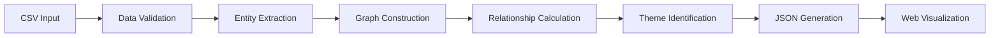
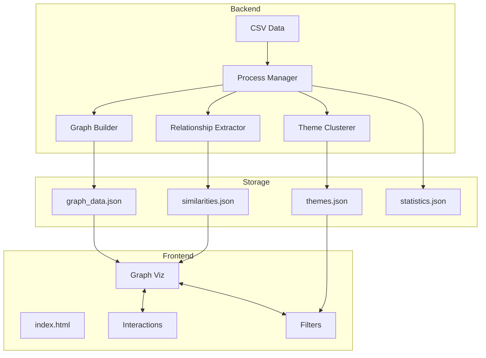
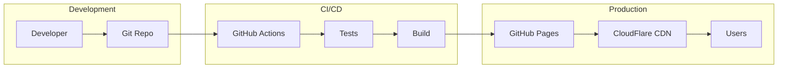
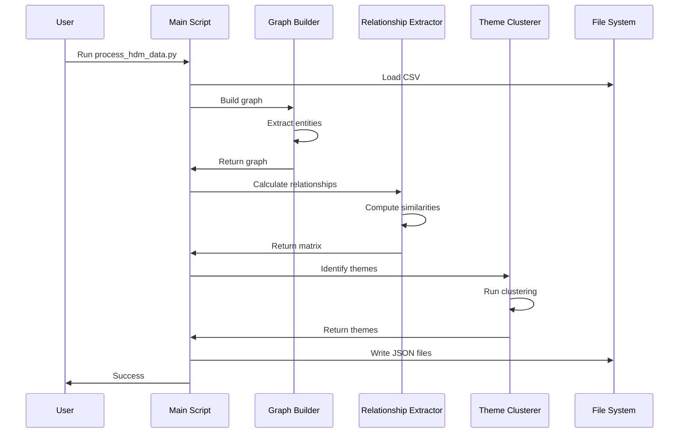

# HDM Knowledge Graph Architecture

**Version**: 1.0.0  
**Last Updated**: January 2025  
**Status**: Implemented

## Table of Contents

1. [System Architecture Overview](#system-architecture-overview)
2. [Component Architecture](#component-architecture)
3. [Data Flow Architecture](#data-flow-architecture)
4. [Technology Stack Details](#technology-stack-details)
5. [Design Patterns Used](#design-patterns-used)
6. [Security Considerations](#security-considerations)
7. [Scalability Approach](#scalability-approach)
8. [Architecture Diagrams](#architecture-diagrams)

---

## System Architecture Overview

The HDM Knowledge Graph Visualization system follows a **three-tier architecture** pattern with clear separation of concerns:

1. **Data Processing Layer** (Python)
2. **Data Storage Layer** (JSON files)
3. **Presentation Layer** (Web-based visualization)

### High-Level Architecture

```
┌─────────────────────────────────────────────────────────────┐
│                     Input Layer                              │
│                (research_papers_complete.csv)                │
└─────────────────────────┬───────────────────────────────────┘
                          │
┌─────────────────────────▼───────────────────────────────────┐
│                 Data Processing Layer                        │
│  ┌─────────────┐  ┌─────────────────┐  ┌──────────────┐   │
│  │   Graph     │  │  Relationship   │  │    Theme     │   │
│  │  Builder    │  │   Extractor     │  │  Clusterer   │   │
│  └─────────────┘  └─────────────────┘  └──────────────┘   │
└─────────────────────────┬───────────────────────────────────┘
                          │
┌─────────────────────────▼───────────────────────────────────┐
│                   Data Storage Layer                         │
│     (JSON: graph_data, themes, similarities, stats)         │
└─────────────────────────┬───────────────────────────────────┘
                          │
┌─────────────────────────▼───────────────────────────────────┐
│                  Presentation Layer                          │
│  ┌─────────────┐  ┌─────────────────┐  ┌──────────────┐   │
│  │    D3.js    │  │  Interactions   │  │   Filters    │   │
│  │   Graph     │  │    Handler      │  │   System     │   │
│  └─────────────┘  └─────────────────┘  └──────────────┘   │
└─────────────────────────────────────────────────────────────┘
```

### Key Architectural Principles

1. **Separation of Concerns**: Each component has a single, well-defined responsibility
2. **Loose Coupling**: Components communicate through well-defined interfaces
3. **High Cohesion**: Related functionality is grouped together
4. **Scalability**: Architecture supports growth in data volume and features
5. **Maintainability**: Clear structure enables easy updates and debugging

## Component Architecture

### Backend Components (Python)

#### 1. Graph Builder (`graph_builder.py`)

**Purpose**: Constructs the knowledge graph from CSV data

**Key Classes**:
- `HDMKnowledgeGraphBuilder`: Main graph construction class

**Responsibilities**:
- Parse CSV data with pandas
- Extract entities (papers, authors, tags, years)
- Create graph structure using NetworkX
- Calculate node importance metrics
- Export to multiple formats (JSON, GEXF)

**Design Decisions**:
- Uses NetworkX for graph representation (mature, well-documented)
- Implements builder pattern for flexible construction
- Separates data cleaning from graph building

#### 2. Relationship Extractor (`relationship_extractor.py`)

**Purpose**: Identifies and scores relationships between papers

**Key Classes**:
- `RelationshipExtractor`: Calculates various similarity metrics

**Responsibilities**:
- Calculate tag-based similarity (Jaccard)
- Compute content similarity (TF-IDF + cosine)
- Identify temporal proximity
- Detect author collaborations
- Generate weighted similarity matrix

**Design Decisions**:
- Modular similarity calculations for flexibility
- Configurable weights for different similarity types
- Cached TF-IDF matrix for performance

#### 3. Theme Clusterer (`theme_clusterer.py`)

**Purpose**: Discovers research themes and communities

**Key Classes**:
- `ThemeClusterer`: Implements theme identification algorithms

**Responsibilities**:
- Community detection using Louvain algorithm
- Topic modeling with LDA
- Temporal trend analysis
- Theme characterization and naming

**Design Decisions**:
- Combines multiple clustering approaches
- Generates human-readable theme names
- Tracks theme evolution over time

#### 4. Process Orchestrator (`process_hdm_data.py`)

**Purpose**: Coordinates the entire data processing pipeline

**Responsibilities**:
- Load and validate input data
- Orchestrate component execution
- Handle errors gracefully
- Generate all output files
- Create summary statistics

**Design Decisions**:
- Single entry point for processing
- Comprehensive error handling
- Progress reporting

### Frontend Components (JavaScript)

#### 1. Graph Visualization (`graph.js`)

**Purpose**: Renders interactive force-directed graph

**Key Classes**:
- `HDMGraph`: Main visualization class

**Responsibilities**:
- Initialize D3.js force simulation
- Render nodes and edges
- Handle zoom/pan
- Manage visual states
- Export functionality

**Design Decisions**:
- ES6 class structure for organization
- Configurable force parameters
- Separate rendering from data

#### 2. Interaction Handler (`interactions.js`)

**Purpose**: Manages user interactions with the graph

**Key Classes**:
- `GraphInteractions`: Event handling and UI updates

**Responsibilities**:
- Handle node clicks and hovers
- Update details panel
- Manage highlighting
- Coordinate with other components

**Design Decisions**:
- Event-driven architecture
- Separation of UI updates from graph logic
- Throttled event handlers for performance

#### 3. Filter System (`filters.js`)

**Purpose**: Implements search and filtering functionality

**Key Classes**:
- `GraphFilters`: Filter logic and state management

**Responsibilities**:
- Text search across multiple fields
- Multi-criteria filtering
- Update graph visibility
- Maintain filter state

**Design Decisions**:
- Declarative filter definitions
- Efficient batch updates
- Progressive filtering

#### 4. Application Controller (`main.js`)

**Purpose**: Application initialization and coordination

**Responsibilities**:
- Load data files
- Initialize components
- Set up global event handlers
- Manage application state

**Design Decisions**:
- Async data loading
- Graceful error handling
- Performance monitoring

## Data Flow Architecture

### Processing Pipeline



### Data Transformation Stages

1. **Raw Data → Structured Data**
   - CSV parsing with pandas
   - Data cleaning and normalization
   - Missing value handling

2. **Structured Data → Graph Model**
   - Entity extraction
   - Relationship creation
   - Attribute assignment

3. **Graph Model → Enhanced Graph**
   - Similarity calculation
   - Community detection
   - Metric computation

4. **Enhanced Graph → Visualization Data**
   - D3.js compatible format
   - Index generation
   - Statistics compilation

### State Management

**Backend State**:
- Stateless processing pipeline
- All state in data structures
- No persistent state between runs

**Frontend State**:
- Graph state in D3.js simulation
- Filter state in filter component
- UI state in respective handlers
- No global state store (simplicity)

## Technology Stack Details

### Backend Stack

| Technology | Version | Purpose | Justification |
|------------|---------|---------|---------------|
| Python | 3.8+ | Core language | Rich data science ecosystem |
| pandas | 2.0+ | Data manipulation | Industry standard for CSV |
| NetworkX | 3.0+ | Graph algorithms | Comprehensive graph library |
| scikit-learn | 1.0+ | ML algorithms | TF-IDF, LDA implementation |
| python-louvain | 0.16 | Community detection | Best-in-class algorithm |
| NumPy | 1.24+ | Numerical computation | Fast array operations |

### Frontend Stack

| Technology | Version | Purpose | Justification |
|------------|---------|---------|---------------|
| D3.js | v7 | Graph visualization | Most powerful viz library |
| HTML5 | - | Structure | Web standard |
| CSS3 | - | Styling | Modern styling features |
| JavaScript | ES6+ | Interactivity | No framework needed |

### Data Formats

| Format | Usage | Justification |
|--------|-------|---------------|
| CSV | Input data | Universal, human-readable |
| JSON | Data exchange | Web-native, flexible |
| GEXF | Graph export | Gephi compatibility |
| SVG | Visual export | Vector format |

## Design Patterns Used

### Backend Patterns

1. **Builder Pattern**
   - Used in: `HDMKnowledgeGraphBuilder`
   - Benefits: Flexible graph construction

2. **Strategy Pattern**
   - Used in: Similarity calculations
   - Benefits: Pluggable algorithms

3. **Template Method**
   - Used in: Processing pipeline
   - Benefits: Consistent processing

4. **Facade Pattern**
   - Used in: Main processing script
   - Benefits: Simple interface

### Frontend Patterns

1. **Module Pattern**
   - Used in: All JS components
   - Benefits: Encapsulation

2. **Observer Pattern**
   - Used in: Event handling
   - Benefits: Loose coupling

3. **Revealing Module**
   - Used in: Public API exposure
   - Benefits: Clear interfaces

4. **Singleton Pattern**
   - Used in: Graph instance
   - Benefits: Single source of truth

### Data Patterns

1. **Data Transfer Object (DTO)**
   - JSON structures for data exchange
   - Clear contracts between layers

2. **Repository Pattern**
   - Data access abstracted
   - Easy to change storage

## Security Considerations

### Input Validation

- **CSV Sanitization**: Escape special characters
- **Size Limits**: Prevent DoS via large files
- **Type Checking**: Validate data types
- **Encoding**: UTF-8 enforcement

### Frontend Security

- **XSS Prevention**: Content sanitization
- **CSP Headers**: When deployed
- **Input Validation**: Client-side checks
- **No Sensitive Data**: Public data only

### Deployment Security

- **HTTPS**: Required for production
- **CORS**: Configured appropriately
- **Authentication**: If needed for private deployment
- **Rate Limiting**: For public APIs

## Scalability Approach

### Data Scalability

**Current Limits**:
- 1,000 nodes render smoothly
- 5,000 edges supported
- 100MB CSV files

**Scaling Strategies**:
1. **Progressive Loading**: Load visible nodes first
2. **Node Clustering**: Group dense regions
3. **Level of Detail**: Show less detail when zoomed out
4. **WebGL Renderer**: For 10,000+ nodes

### Performance Optimization

1. **Backend**:
   - Parallel processing for independent tasks
   - Caching of expensive calculations
   - Incremental updates support

2. **Frontend**:
   - Virtual DOM concepts
   - Throttled updates
   - Web Workers for heavy computation
   - RequestAnimationFrame for smooth animation

### Horizontal Scaling

**For Large Deployments**:
1. **CDN**: Static asset delivery
2. **Multiple Instances**: Load balanced servers
3. **Caching Layer**: Redis for processed data
4. **Queue System**: For async processing

## Architecture Diagrams

### Component Interaction Diagram



### Deployment Architecture



### Data Processing Sequence



---

**Document Control**  
- **Author**: HDM Development Team  
- **Review Cycle**: Quarterly  
- **Next Review**: April 2025  
- **Distribution**: Public