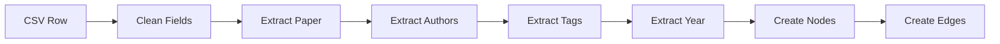

# HDM Knowledge Graph Data Schema Reference

**Version**: 1.0.0  
**Last Updated**: January 2025  
**Status**: Implemented

## Table of Contents

1. [Input Data Schema](#input-data-schema)
2. [Graph Data Model](#graph-data-model)
3. [Output JSON Schemas](#output-json-schemas)
4. [Data Validation Rules](#data-validation-rules)
5. [Transformation Logic](#transformation-logic)
6. [Example Data Samples](#example-data-samples)
7. [Schema Evolution Strategy](#schema-evolution-strategy)

---

## Input Data Schema

### CSV Format: research_papers_complete.csv

The input CSV file contains 21 columns with research paper metadata:

| Column # | Column Name | Type | Required | Description | Example |
|----------|-------------|------|----------|-------------|---------|
| 1 | cite_key | string | Yes | Unique identifier | "abdallah_2021" |
| 2 | title | string | Yes | Paper title | "Towards a GML-Enabled Knowledge Graph Platform" |
| 3 | authors | string | Yes | Comma-separated author names | "Hussein Abdallah, Essam Mansour" |
| 4 | year | integer | Yes | Publication year | 2021 |
| 5 | Downloaded | string | No | Download status | "Yes" |
| 6 | Relevancy | string | Yes | Relevancy level | "High", "Medium", "Low" |
| 7 | Relevancy Justification | string | Yes | Explanation of relevancy | "This paper is highly relevant..." |
| 8 | Insights | string | Yes | Key insights for HDM | "The paper introduces KGNet..." |
| 9 | TL;DR | string | Yes | One-sentence summary | "This vision paper proposes..." |
| 10 | Summary | string | Yes | Comprehensive abstract | "This paper presents..." |
| 11 | Research Question | string | Yes | Primary research question | "How can we seamlessly..." |
| 12 | Methodology | string | Yes | Research methods | "The authors developed..." |
| 13 | Key Findings | string | Yes | Main discoveries | "The experimental evaluation..." |
| 14 | Primary Outcomes | string | Yes | Concrete deliverables | "The primary outcome is..." |
| 15 | Limitations | string | Yes | Acknowledged constraints | "The paper is a vision..." |
| 16 | Conclusion | string | Yes | Final assessment | "The integration of GML..." |
| 17 | Research Gaps | string | Yes | Identified gaps | "The paper identifies..." |
| 18 | Future Work | string | Yes | Suggested next steps | "Future work includes..." |
| 19 | Implementation Insights | string | Yes | Practical takeaways | "The paper provides..." |
| 20 | url | string | No | Paper URL | "https://doi.org/10.1145/3447772" |
| 21 | DOI | string | No | Digital Object Identifier | "10.1145/3447772" |
| 22 | Tags | string | Yes | Comma-separated keywords | "Knowledge Graph, GML, SPARQL" |

### CSV Parsing Rules

```python
# Parsing configuration
CSV_CONFIG = {
    'encoding': 'utf-8',
    'delimiter': ',',
    'quoting': csv.QUOTE_MINIMAL,
    'escapechar': '\\',
    'on_bad_lines': 'skip',
    'dtype': {
        'year': 'Int64',  # Nullable integer
        'cite_key': 'string',
        'title': 'string',
        # ... other columns as string
    }
}
```

## Graph Data Model

### Node Types

#### 1. Paper Node
```json
{
    "id": "abdallah_2021",
    "node_type": "paper",
    "title": "Towards a GML-Enabled Knowledge Graph Platform",
    "year": 2021,
    "relevancy": "High",
    "tldr": "This vision paper proposes...",
    "summary": "This paper presents...",
    "insights": "The paper introduces...",
    "url": "https://doi.org/10.1145/3447772",
    "doi": "10.1145/3447772",
    "importance": 0.85,
    "degree_centrality": 0.023,
    "themes": [0, 3]
}
```

#### 2. Author Node
```json
{
    "id": "Hussein Abdallah",
    "node_type": "author",
    "papers": ["abdallah_2021", "other_paper_2022"],
    "paper_count": 2
}
```

#### 3. Tag Node
```json
{
    "id": "tag_Knowledge Graph",
    "node_type": "tag",
    "name": "Knowledge Graph",
    "papers": ["abdallah_2021", "aburasheed_2023b"],
    "frequency": 45
}
```

#### 4. Year Node
```json
{
    "id": "year_2021",
    "node_type": "year",
    "value": 2021
}
```

### Edge Types

#### 1. Authorship Edge
```json
{
    "source": "abdallah_2021",
    "target": "Hussein Abdallah",
    "edge_type": "authored_by",
    "weight": 1.0
}
```

#### 2. Tagging Edge
```json
{
    "source": "abdallah_2021",
    "target": "tag_Knowledge Graph",
    "edge_type": "tagged_with",
    "weight": 1.0
}
```

#### 3. Temporal Edge
```json
{
    "source": "abdallah_2021",
    "target": "year_2021",
    "edge_type": "published_in",
    "weight": 1.0
}
```

#### 4. Similarity Edge
```json
{
    "source": "abdallah_2021",
    "target": "aburasheed_2023b",
    "edge_type": "similar_to",
    "weight": 0.73,
    "similarity_type": "combined"
}
```

## Output JSON Schemas

### 1. graph_data.json

Main graph structure for D3.js visualization:

```json
{
    "nodes": [
        {
            "id": "string",
            "index": "number",
            "node_type": "string",
            "size": "number",
            // ... node-specific attributes
        }
    ],
    "links": [
        {
            "source": "number",  // node index
            "target": "number",  // node index
            "source_id": "string",
            "target_id": "string",
            "edge_type": "string",
            "weight": "number"
        }
    ],
    "stats": {
        "total_nodes": "number",
        "total_edges": "number",
        "papers": "number",
        "authors": "number",
        "tags": "number",
        "years": "number",
        "avg_degree": "number",
        "density": "number"
    },
    "metadata": {
        "total_papers": "number",
        "date_created": "ISO 8601 datetime",
        "version": "string"
    }
}
```

### 2. themes.json

Research themes and communities:

```json
{
    "themes": [
        {
            "id": "number",
            "name": "string",
            "keywords": ["string"],
            "paper_count": "number",
            "years_active": ["number"],
            "peak_year": "number",
            "communities": {
                "community_id": "paper_count"
            },
            "example_papers": ["string"]
        }
    ],
    "temporal_trends": {
        "theme_id": {
            "year": "paper_count"
        }
    },
    "communities": {
        "paper_id": "community_id"
    },
    "statistics": {
        "total_themes": "number",
        "total_communities": "number",
        "papers_with_themes": "number"
    }
}
```

### 3. similarities.json

Paper-to-paper similarity relationships:

```json
[
    {
        "source": "string",
        "target": "string",
        "similarity": "number"
    }
]
```

### 4. statistics.json

Overall graph statistics:

```json
{
    "overview": {
        "total_papers": "number",
        "total_nodes": "number",
        "total_edges": "number",
        "node_types": {
            "paper": "number",
            "author": "number",
            "tag": "number",
            "year": "number"
        }
    },
    "temporal": {
        "year_distribution": {
            "year": "count"
        },
        "year_range": ["min_year", "max_year"]
    },
    "content": {
        "relevancy_distribution": {
            "High": "number",
            "Medium": "number",
            "Low": "number"
        },
        "top_tags": {
            "tag_name": "frequency"
        },
        "total_unique_tags": "number"
    },
    "authors": {
        "total_unique_authors": "number",
        "top_authors": {
            "author_name": "paper_count"
        },
        "avg_authors_per_paper": "number"
    },
    "network_metrics": {
        "avg_degree": "number",
        "density": "number",
        "communities": "number",
        "themes": "number"
    }
}
```

### 5. index.json

Quick lookup index for efficient searching:

```json
{
    "papers": {
        "paper_id": {
            "title": "string",
            "year": "number",
            "relevancy": "string",
            "node_index": "number"
        }
    },
    "authors": {
        "author_name": {
            "papers": ["paper_ids"],
            "node_index": "number"
        }
    },
    "themes": {
        "theme_id": {
            "name": "string",
            "keywords": ["string"],
            "paper_count": "number"
        }
    },
    "metadata": {
        "total_papers": "number",
        "total_authors": "number",
        "total_themes": "number"
    }
}
```

## Data Validation Rules

### Input Validation

```python
# Validation rules
VALIDATION_RULES = {
    'cite_key': {
        'required': True,
        'unique': True,
        'pattern': r'^[a-z]+_\d{4}[a-z]?$'
    },
    'year': {
        'required': True,
        'type': int,
        'min': 1900,
        'max': 2030
    },
    'relevancy': {
        'required': True,
        'values': ['High', 'Medium', 'Low']
    },
    'authors': {
        'required': True,
        'min_length': 3,
        'exclude': ['unavailable', 'unknown', 'et al.']
    },
    'tags': {
        'required': True,
        'min_count': 1,
        'max_count': 20
    }
}
```

### Data Cleaning Rules

1. **Author Names**:
   - Remove quotes and extra spaces
   - Split by comma
   - Filter out invalid entries
   - Normalize capitalization

2. **Tags**:
   - Remove quotes
   - Split by comma
   - Trim whitespace
   - Remove duplicates
   - Convert to lowercase for matching

3. **Text Fields**:
   - Remove special characters for processing
   - Preserve original for display
   - Handle encoding issues

## Transformation Logic

### Entity Extraction Pipeline



### Similarity Calculation

```python
# Combined similarity formula
def calculate_combined_similarity(paper1, paper2):
    weights = {
        'tags': 0.3,
        'content': 0.3,
        'temporal': 0.2,
        'authors': 0.2
    }
    
    similarity = 0
    if has_tag_overlap(paper1, paper2):
        similarity += weights['tags'] * jaccard_similarity(paper1.tags, paper2.tags)
    
    if has_content(paper1, paper2):
        similarity += weights['content'] * cosine_similarity(paper1.tfidf, paper2.tfidf)
    
    if within_time_window(paper1, paper2):
        similarity += weights['temporal'] * temporal_proximity(paper1.year, paper2.year)
    
    if has_author_overlap(paper1, paper2):
        similarity += weights['authors'] * author_similarity(paper1.authors, paper2.authors)
    
    return similarity
```

### Theme Identification

```python
# LDA topic modeling parameters
LDA_CONFIG = {
    'n_components': 8,  # Number of themes
    'max_features': 500,  # Vocabulary size
    'ngram_range': (1, 2),  # Unigrams and bigrams
    'min_df': 2,  # Minimum document frequency
    'max_df': 0.8,  # Maximum document frequency
    'random_state': 42
}
```

## Example Data Samples

### Sample CSV Row

```csv
"abdallah_2021","Towards a GML-Enabled Knowledge Graph Platform","Hussein Abdallah, Essam Mansour",2021,"Yes","High","This paper is highly relevant...","The paper introduces KGNet...","This vision paper proposes...","This paper presents...","How can we seamlessly...","The authors developed...","The experimental evaluation...","The primary outcome...","The paper is a vision...","The integration of GML...","The paper identifies...","Future work includes...","The paper provides...","https://doi.org/10.1145/3447772","10.1145/3447772","Knowledge Graph, GML, SPARQL"
```

### Sample Transformed Node

```json
{
    "id": "abdallah_2021",
    "index": 0,
    "node_type": "paper",
    "title": "Towards a GML-Enabled Knowledge Graph Platform",
    "year": 2021,
    "relevancy": "High",
    "tldr": "This vision paper proposes KGNet, a platform that provides on-demand graph machine learning as a service on top of RDF engines.",
    "summary": "This paper presents the ALIGNED suite of ontologies...",
    "size": 15.2,
    "importance": 0.85,
    "degree_centrality": 0.023,
    "x": 234.5,
    "y": 178.3
}
```

### Sample Similarity Calculation

```json
{
    "paper1": "abdallah_2021",
    "paper2": "aburasheed_2023b",
    "similarities": {
        "tag_similarity": 0.45,
        "content_similarity": 0.68,
        "temporal_similarity": 0.50,
        "author_similarity": 0.00,
        "combined": 0.43
    }
}
```

## Schema Evolution Strategy

### Version Management

```json
{
    "schema_version": "1.0.0",
    "compatible_versions": ["1.0.x"],
    "migration_required": false
}
```

### Migration Path

1. **Backward Compatibility**:
   - New fields are optional
   - Old fields deprecated but maintained
   - Version detection in data files

2. **Schema Updates**:
   ```python
   SCHEMA_MIGRATIONS = {
       "1.0.0": baseline_schema,
       "1.1.0": add_citation_field,
       "1.2.0": add_venue_information,
       "2.0.0": restructure_author_format
   }
   ```

3. **Migration Process**:
   - Detect current version
   - Apply migrations sequentially
   - Validate after each migration
   - Update version marker

### Future Extensions

**Planned Schema Additions**:

1. **Citation Network** (v1.1.0):
   ```json
   {
       "citations": ["cited_paper_ids"],
       "cited_by": ["citing_paper_ids"],
       "citation_count": "number"
   }
   ```

2. **Venue Information** (v1.2.0):
   ```json
   {
       "venue": "string",
       "venue_type": "conference|journal|arxiv",
       "impact_factor": "number"
   }
   ```

3. **Full Text Integration** (v2.0.0):
   ```json
   {
       "full_text_path": "string",
       "sections": {
           "abstract": "text",
           "introduction": "text",
           "methodology": "text"
       }
   }
   ```

### Validation Framework

```python
class SchemaValidator:
    def validate_input(self, df):
        """Validate input CSV against schema"""
        errors = []
        
        # Check required columns
        missing = set(REQUIRED_COLUMNS) - set(df.columns)
        if missing:
            errors.append(f"Missing columns: {missing}")
        
        # Validate data types
        for col, dtype in COLUMN_TYPES.items():
            if col in df and not df[col].dtype == dtype:
                errors.append(f"Invalid type for {col}")
        
        # Validate value constraints
        if 'year' in df:
            invalid_years = df[df['year'] < 1900 | df['year'] > 2030]
            if not invalid_years.empty:
                errors.append(f"Invalid years: {invalid_years['cite_key'].tolist()}")
        
        return errors
```

---

**Document Control**  
- **Author**: HDM Development Team  
- **Review Cycle**: Quarterly  
- **Next Review**: April 2025  
- **Distribution**: Public