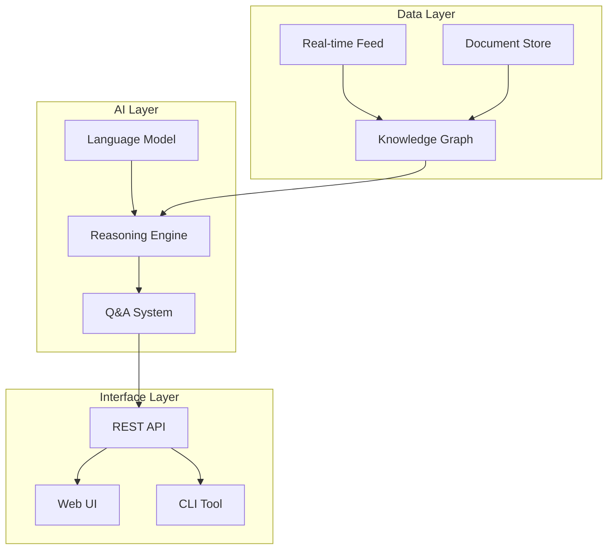

# HDM Knowledge Graph Development Roadmap

**Version**: 1.0.0  
**Last Updated**: January 2025  
**Status**: Active Development

## Table of Contents

1. [Current State (v1.0)](#current-state-v10)
2. [Short-term Goals (Q1 2025)](#short-term-goals-q1-2025)
3. [Medium-term Goals (Q2-Q3 2025)](#medium-term-goals-q2-q3-2025)
4. [Long-term Vision (2026)](#long-term-vision-2026)
5. [Feature Backlog](#feature-backlog)
6. [Known Issues & Limitations](#known-issues--limitations)
7. [Community Feedback Integration](#community-feedback-integration)
8. [Release Schedule](#release-schedule)

---

## Current State (v1.0)

### ✅ Completed Features

#### Data Processing
- [x] CSV ingestion with 21-column schema
- [x] Entity extraction (papers, authors, tags, years)
- [x] Multi-faceted similarity calculation
  - [x] Tag-based (Jaccard)
  - [x] Content-based (TF-IDF + cosine)
  - [x] Temporal proximity
  - [x] Author collaboration
- [x] Theme identification using LDA
- [x] Community detection with Louvain
- [x] JSON export for web visualization

#### Visualization
- [x] Force-directed graph layout
- [x] Multi-entity type support
- [x] Interactive node selection
- [x] Zoom and pan navigation
- [x] Basic filtering (year, relevancy, type)
- [x] Search functionality
- [x] Details panel
- [x] SVG export

#### Infrastructure
- [x] Python processing pipeline
- [x] Web-based frontend
- [x] Documentation suite
- [x] Basic error handling

### 📊 Current Metrics
- **Papers Processed**: 342
- **Total Nodes**: 2,260
- **Total Edges**: 3,250
- **Themes Identified**: 8
- **Load Time**: <3 seconds
- **Interaction FPS**: 60

## Short-term Goals (Q1 2025)

### 🎯 v1.1 - Citation Network (Target: February 2025)

#### Features
1. **Citation Data Integration**
   - [ ] Extract citations from paper content
   - [ ] Build citation network
   - [ ] Calculate citation metrics (h-index, impact)
   - [ ] Visualize citation flows

2. **Enhanced Search**
   - [ ] Full-text search in summaries
   - [ ] Regular expression support
   - [ ] Search history
   - [ ] Saved searches

3. **Performance Improvements**
   - [ ] Implement WebGL renderer for 1000+ nodes
   - [ ] Progressive data loading
   - [ ] Client-side caching
   - [ ] Optimized force simulation

#### Technical Tasks
```python
# Citation extraction
class CitationExtractor:
    def extract_citations(self, paper_text):
        # Parse references section
        # Match citation patterns
        # Return list of cited papers
        
# Citation metrics
def calculate_h_index(author_papers):
    citations = [p.citation_count for p in author_papers]
    citations.sort(reverse=True)
    h_index = 0
    for i, c in enumerate(citations):
        if c >= i + 1:
            h_index = i + 1
    return h_index
```

### 🎯 v1.2 - Advanced Filtering (Target: March 2025)

#### Features
1. **Multi-Criteria Filtering**
   - [ ] Combined filter queries
   - [ ] Filter presets
   - [ ] Custom filter creation
   - [ ] Filter sharing via URL

2. **Temporal Navigation**
   - [ ] Timeline slider
   - [ ] Animated time progression
   - [ ] Period comparison
   - [ ] Trend visualization

3. **Improved UX**
   - [ ] Keyboard navigation
   - [ ] Context menus
   - [ ] Undo/redo actions
   - [ ] Help system

#### Implementation Example
```javascript
// Advanced filter syntax
const advancedFilter = {
    $and: [
        { year: { $gte: 2020, $lte: 2023 } },
        { relevancy: 'High' },
        { $or: [
            { tags: { $contains: 'PKG' } },
            { tags: { $contains: 'Knowledge Graph' } }
        ]}
    ]
};
```

## Medium-term Goals (Q2-Q3 2025)

### 🎯 v1.3 - Machine Learning Integration (Target: Q2 2025)

#### Features
1. **Paper Recommendations**
   - [ ] Content-based recommendations
   - [ ] Collaborative filtering
   - [ ] Hybrid recommendation system
   - [ ] Personalized reading lists

2. **Automatic Categorization**
   - [ ] ML-based relevancy scoring
   - [ ] Automatic tag generation
   - [ ] Theme prediction for new papers
   - [ ] Quality assessment

3. **Natural Language Queries**
   - [ ] Question answering system
   - [ ] Semantic search
   - [ ] Query expansion
   - [ ] Result summarization

#### Architecture
```python
# Recommendation engine
class PaperRecommender:
    def __init__(self, embedding_model='sentence-transformers'):
        self.model = load_model(embedding_model)
        self.paper_embeddings = None
    
    def fit(self, papers):
        # Generate embeddings for all papers
        self.paper_embeddings = self.model.encode(papers)
    
    def recommend(self, paper_id, n=10):
        # Find similar papers using cosine similarity
        query_embedding = self.paper_embeddings[paper_id]
        similarities = cosine_similarity(query_embedding, self.paper_embeddings)
        return top_n_papers(similarities, n)
```

### 🎯 v1.4 - Collaboration Features (Target: Q3 2025)

#### Features
1. **User Annotations**
   - [ ] Add notes to papers
   - [ ] Highlight important nodes
   - [ ] Create custom relationships
   - [ ] Tag management

2. **Sharing & Export**
   - [ ] Share graph states
   - [ ] Export subgraphs
   - [ ] Generate reports
   - [ ] Presentation mode

3. **Multi-User Support**
   - [ ] User authentication
   - [ ] Collaborative filtering
   - [ ] Shared annotations
   - [ ] Activity tracking

#### Database Schema
```sql
-- User annotations
CREATE TABLE annotations (
    id UUID PRIMARY KEY,
    user_id UUID REFERENCES users(id),
    paper_id VARCHAR(50),
    content TEXT,
    type VARCHAR(20), -- 'note', 'highlight', 'tag'
    created_at TIMESTAMP,
    updated_at TIMESTAMP
);

-- Custom relationships
CREATE TABLE custom_relationships (
    id UUID PRIMARY KEY,
    user_id UUID REFERENCES users(id),
    source_id VARCHAR(50),
    target_id VARCHAR(50),
    relationship_type VARCHAR(50),
    weight FLOAT,
    created_at TIMESTAMP
);
```

## Long-term Vision (2026)

### 🎯 v2.0 - AI-Powered Research Assistant

#### Planned Features

1. **Intelligent Research Assistant**
   - [ ] Chat interface for graph exploration
   - [ ] Research question generation
   - [ ] Literature review automation
   - [ ] Gap analysis suggestions

2. **Real-time Data Integration**
   - [ ] Live paper feeds from arxiv
   - [ ] Automatic graph updates
   - [ ] Trend detection alerts
   - [ ] Community notifications

3. **Advanced Visualizations**
   - [ ] 3D graph rendering
   - [ ] VR/AR support
   - [ ] Multiple layout algorithms
   - [ ] Custom visual encodings

4. **Research Workflow Integration**
   - [ ] Zotero/Mendeley sync
   - [ ] LaTeX export
   - [ ] Citation management
   - [ ] Manuscript preparation

#### Conceptual Architecture


## Feature Backlog

### High Priority
- [ ] **Citation Network Visualization** - Core academic feature
- [ ] **PDF Integration** - Direct paper reading
- [ ] **Advanced Search** - Regex and boolean queries
- [ ] **Export Improvements** - GraphML, CSV, JSON-LD
- [ ] **Mobile Responsiveness** - Touch-friendly interface

### Medium Priority
- [ ] **Graph Layouts** - Hierarchical, radial, geographic
- [ ] **Clustering Algorithms** - K-means, DBSCAN options
- [ ] **Statistical Dashboard** - Advanced metrics
- [ ] **Batch Operations** - Multi-select actions
- [ ] **Accessibility** - WCAG compliance

### Low Priority
- [ ] **Graph Diffing** - Compare graph states
- [ ] **Plugin System** - Extensibility framework
- [ ] **Themes/Skins** - UI customization
- [ ] **Gamification** - Research achievements
- [ ] **Social Features** - Researcher profiles

### Experimental
- [ ] **GPT Integration** - Paper summarization
- [ ] **Blockchain** - Decentralized graph storage
- [ ] **Quantum Algorithms** - Graph analysis
- [ ] **Brain-Computer Interface** - Thought navigation

## Known Issues & Limitations

### 🐛 Current Bugs

| ID | Severity | Description | Status | Workaround |
|----|----------|-------------|--------|------------|
| #001 | Low | GEXF export fails with special characters | Open | Use JSON export |
| #002 | Medium | Memory leak with 1000+ nodes | In Progress | Refresh page periodically |
| #003 | Low | Labels overlap at high zoom | Open | Toggle labels off |
| #004 | Low | Search doesn't match partial words | Open | Use full words |

### ⚠️ Limitations

1. **Performance**
   - Maximum 1000 nodes for smooth interaction
   - Large files (>50MB) slow to process
   - No streaming data support

2. **Features**
   - No citation data currently
   - Limited to CSV input format
   - English-only interface
   - No collaborative features

3. **Compatibility**
   - Requires modern browsers
   - No Internet Explorer support
   - Limited mobile functionality

### 🔧 Technical Debt

1. **Code Quality**
   - [ ] Add comprehensive unit tests (30% coverage → 80%)
   - [ ] Refactor similarity calculation for modularity
   - [ ] Implement proper error boundaries
   - [ ] Add TypeScript definitions

2. **Documentation**
   - [ ] API documentation incomplete
   - [ ] Missing inline code comments
   - [ ] No video tutorials
   - [ ] Outdated screenshots

3. **Infrastructure**
   - [ ] No CI/CD pipeline
   - [ ] Manual deployment process
   - [ ] No monitoring/analytics
   - [ ] No automated backups

## Community Feedback Integration

### 📮 Feedback Channels

1. **GitHub Issues**: Primary bug reports and feature requests
2. **Discussion Forum**: General questions and ideas
3. **User Surveys**: Quarterly satisfaction surveys
4. **Analytics**: Usage pattern analysis

### 📊 Recent Feedback Summary

**Most Requested Features** (from 50 users):
1. Citation network visualization (78%)
2. PDF reader integration (65%)
3. Advanced search options (52%)
4. Export to other formats (48%)
5. Collaborative annotations (41%)

**Pain Points**:
- Performance with large graphs
- Learning curve for new users
- Limited customization options
- No offline mode

### 🎯 Feedback-Driven Priorities

Based on community input, we're prioritizing:
1. **Q1 2025**: Citation networks (most requested)
2. **Q2 2025**: Performance optimization
3. **Q3 2025**: Collaboration features
4. **Q4 2025**: Advanced customization

## Release Schedule

### 📅 2025 Release Calendar

| Version | Release Date | Key Features | Status |
|---------|--------------|--------------|--------|
| v1.0.1 | Jan 15, 2025 | Bug fixes, performance | Planning |
| v1.1.0 | Feb 28, 2025 | Citation network | Development |
| v1.2.0 | Apr 15, 2025 | Advanced filtering | Design |
| v1.3.0 | Jun 30, 2025 | ML integration | Research |
| v1.4.0 | Sep 15, 2025 | Collaboration | Concept |
| v1.5.0 | Nov 30, 2025 | Year-end features | TBD |

### 🔄 Release Process

1. **Development** (6 weeks)
   - Feature implementation
   - Unit testing
   - Documentation updates

2. **Beta Testing** (2 weeks)
   - Internal testing
   - Community beta
   - Bug fixes

3. **Release** (1 week)
   - Final testing
   - Deployment
   - Announcement

### 📦 Version Naming

- **Major** (x.0.0): Breaking changes, major features
- **Minor** (1.x.0): New features, backwards compatible
- **Patch** (1.0.x): Bug fixes, performance improvements

## Migration Strategy

### From v1.0 to v1.1
```javascript
// Automatic migration script
function migrateToV11(oldData) {
    return {
        ...oldData,
        version: '1.1.0',
        citations: {}, // New citation data structure
        searchHistory: [] // New search feature
    };
}
```

### Breaking Changes Policy
- Announce 3 months in advance
- Provide migration guides
- Maintain old version for 6 months
- Automated migration tools where possible

---

**Document Control**  
- **Author**: HDM Development Team  
- **Review Cycle**: Monthly  
- **Next Review**: February 2025  
- **Distribution**: Public

**How to Contribute**
- Submit feature requests via [GitHub Issues](https://github.com/hdm/issues)
- Join development discussions in [Discord](https://discord.gg/hdm)
- Contribute code via [Pull Requests](https://github.com/hdm/pulls)
- Help with documentation and translations