Review

Contents lists available at [ScienceDirect](www.sciencedirect.com/science/journal/02786125)

# Journal of Manufacturing Systems

<!-- Image Description: That's not a figure from within a paper; it's the cover of the *Journal of Manufacturing Systems*. The image is a stylized letter "M" formed from photographs of industrial machinery. It serves as a visual representation of the journal's focus on manufacturing processes and systems. There are no charts, graphs, equations, or diagrams; the cover uses a photographic collage for visual impact. -->

journal homepage: [www.elsevier.com/locate/jmansys](https://www.elsevier.com/locate/jmansys)

# Making knowledge graphs work for smart manufacturing: Research topics, applications and prospects

Yuwei Wan a , Ying Liu a,\*, Zheyuan Chen b,c , Chong Chen d, Xinyu Li e , Fu Hu a , Michael Packianather a

a*Department of Mechanical Engineering, School of Engineering, Cardiff University, Cardiff CF24 3AA, UK*b*Guangzhou Institute of Industrial Intelligence, Guangzhou 511458, China*c*Shenyang Institute of Automation, Chinese Academy of Sciences, Shenyang 110016, China*d*Guangdong Provincial Key Laboratory of Cyber-Physical System, Guangdong University of Technology, Guangzhou 510006, China*e*College of Mechanical Engineering, Donghua University, Shanghai 201620, China*## ARTICLE INFO
*Keywords:* Smart manufacturing Industry 4.0 Knowledge graph Semantic modelling under industry 4.0 Knowledge reasoning

### ABSTRACT

Smart manufacturing (SM) confronts several challenges inherently suited to knowledge graphs (KGs) capabilities. The first key challenge lies in the synthesis of complex and varied data surrounding the manufacturing context, which demands advanced semantic analysis and inference capabilities. The second main limitation is the contextualization of manufacturing systems and the exploitation of manufacturing domain knowledge, which requires a dynamic and holistic representation of knowledge. The last major obstacle arises from the facilitation of intricate decision-making processes towards correlated manufacturing ecosystems, which benefit from interconnected data structures that KGs excel at organizing. However, the existing survey studies concentrated on distinct facets of SM and offered isolated insights into KG applications while overlooking the interconnections between various KG technologies and their application across multiple domains. What specific role KGs should play in SM towards the aforementioned challenges, how to effectively harness KGs for these challenges, and the essential topics and methodologies required to make KGs functional remain underexplored. To explore the potential of KGs in SM, this study adopts a systematic approach to investigate, evaluate, and analyse current research on KGs, identifying core advancements and their implications for future manufacturing practices. Firstly, cutting-edge developments in the challenge-driven roles of KGs and KG techniques are identified, from knowledge extraction and mining to techniques for KG construction and updates, further extending to KG embedding, fusion, and reasoning—central to driving SM ecosystems. Specifically, the KG technologies for SM are depicted holistically, emphasizing the interplay of diverse KG techniques with a comprehensive framework. Subsequently, this foundation outlines and discusses key application scenarios of KGs from engineering design to predictive maintenance, covering the main representative stages of the manufacturing life cycle. Lastly, this study explores the intricate interplay of the practical challenges and advantages of KGs in manufacturing systems, pointing to emerging research avenues.

\*Corresponding author.
*E-mail address:*[LiuY81@Cardiff.ac.uk](mailto:LiuY81@Cardiff.ac.uk) (Y. Liu).

#### <https://doi.org/10.1016/j.jmsy.2024.07.009>

Received 22 December 2023; Received in revised form 16 March 2024; Accepted 18 July 2024 Available online 29 July 2024

0278-6125/© 2024 The Author(s). Published by Elsevier Ltd on behalf of The Society of Manufacturing Engineers. This is an open access article under the CC BY license (<http://creativecommons.org/licenses/by/4.0/>).
*Abbreviations:*SM, Smart manufacturing; IoT, Internet of things; AI, Artificial intelligence; KG, Knowledge graph; QCM, Quality control management; SCM, Supply chain management; PdM, Predictive maintenance; KGE, Knowledge graph embedding; KGR, Knowledge graph reasoning; LLM, Large language model; RQ, Research questions; DT, Digital twin; GCN, Graph convolutional network; IIoT, Industrial Internet of things; GNN, Graph neural network; NLP, Natural language processing; ML, Machine learning; RDF, Resource description framework; PCA, Principal component analysis; RML, RDF mapping language; HMM, Hidden Markov model; CRF, Conditional random field; LSTM, Long short-term memory; CNN, Convolution neural network; RNN, Recurrent neural network; BERT, Bidirectional encoder representations from transformers; LDA, Latent Dirichlet allocation; BiLSTM, Bi-directional long short-term memory; OWL, Ontology web language; MES, Manufacturing execution systems; ERP, Enterprise resource planning; IKG, Industrial knowledge graph; UI, User interface; UX, User experience; ID, Identity documents; JPS, J-Park simulator; URIs, Uniform resource identifies; Q&M, Operations and maintenance; HRC, Human-robot collaboration; MARL, Multi-agent reinforcement learning; RL, Reinforcement learning; GAN, Generative adversarial network; PL, Production logistics; DSTKG, Dynamic spatial-temporal KG; MMKG, Multi-modal KG; XAI, Explainable AI; APE, Automated prompt engineering.

#### 1. Introduction

Smart manufacturing (SM) signifies a major shift in the evolution of manufacturing systems. SM optimises, digitises and automates manufacturing systems with greater productivity, efficiency, flexibility, and autonomy by leveraging advanced technologies such as the Internet of things (IoT), advanced data analytics, and artificial intelligence (AI) [\[1\].](#page-25-0) However, its capabilities remain untouched unless the challenges it poses are addressed. Challenges include but are not limited to, data explosion, the rising demand for mass personalization, the necessity for stronger collaborative interactions between humans and machines, the incorporation of cognitive intelligence, and the need for comprehensive semantic networks and efficient data integration. Knowledge graph (KG) has been identified as a useful tool to deal with these challenges, which can be opportunities for advancement of SM.

Specifically, the data explosion in SM refers to the vast amounts of data generated from various sources. When properly used, this data can provide invaluable insights regarding manufacturing systems. KG offers a way to manage and interpret this data, ensuring that the potential insights are not lost [\[2,3\]](#page-25-0). SM faces another challenge called mass personalization, where manufacturing systems must be modified to meet individual customer preferences. This high level of customization can be achieved with KG by integrating and synthesising diverse data sources [\[4\].](#page-25-0) Enhancing collaborative interactions between humans and machines is crucial for the success of SM. KG provides a platform where machines can understand and respond to human behaviours and instructions more effectively [\[5\]](#page-25-0). The demand for cognitive intelligence in SM is increasing, involving self-learning and self-adapting systems. KG, which provides a structured and holistic knowledge representation, is suitable for the cognitive aspect of manufacturing [\[6\]](#page-25-0). Furthermore, constructing comprehensive semantic networks ensures that all parts of the manufacturing systems are interconnected and communicating effectively. KG assists in building these networks, ensuring a cohesive view of the manufacturing systems [\[7,8\]](#page-25-0). Briefly, SM presents numerous problems that can be addressed by adopting KG approaches. To understand the potential of KG in mitigating the aforementioned challenges presented by SM, it is essential to understand the core principles of KG and its capabilities.

Given the ability to represent, integrate, and reason across varied knowledge domains, KGs offer promising solutions to the complicated challenges posed by SM. Rather than merely organizing vast and heterogeneous concepts, KGs weave these concepts into a cohesive fabric for interlinking nodes and defining intricate relations through an ontology-based schema [\[9\].](#page-25-0) This interconnected representation of complex data streamlines data structures and deepens understanding, organization, and knowledge retrieval [\[10\]](#page-25-0). The current rise of KGs can be attributed to their capabilities in organizing, integrating, and extracting meaningful insights from intricate data sets, thereby addressing challenges in data management, semantic comprehension, and advanced analytics across diverse domains [\[8,11\].](#page-25-0)

A KG transcends a mere graphical data structure, embedding information in a specialized ontology with high semantic expressiveness suitable for complex scenarios [\[12\]](#page-25-0). It captures the essence of entities, interrelations and properties binding them. Rooted in knowledge engineering, data management, and AI, the evolution of KG merges historical milestones and cutting-edge developments in Fig. 1. Beginning with basic semantic networks in the 1960s [\[13\],](#page-25-0) knowledge representation progressed to the semantic Web and ontologies in the early 2000s [\[14\]](#page-25-0). The advent of the Google KG was introduced as a watershed moment in 2012 [\[12\]](#page-25-0), showcasing the potential of KGs in structuring and linking huge data repositories and spurring further advancements in the field. Presently, KGs have gained attraction beyond academia, with

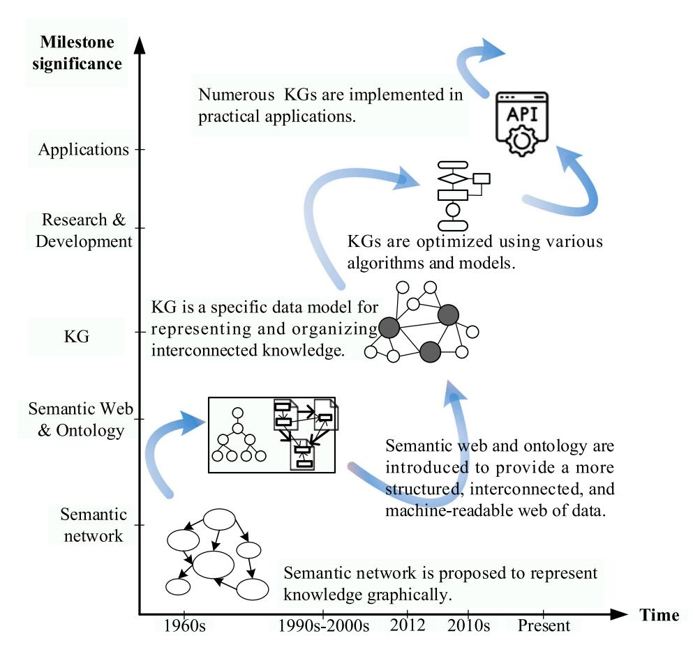
<!-- Image Description: This figure illustrates the evolution of Knowledge Graphs (KGs). It's a timeline showing how semantic networks (1960s) evolved into KGs (1990s-2000s), incorporating semantic web and ontologies (2012) to facilitate interconnected data. The diagram shows the progression, highlighting the optimization of KGs using various algorithms and models, ultimately leading to their widespread use in applications (present). Different KG representations and their relation to APIs are visually depicted. -->
**Fig. 1.**The brief overview of key milestones and recent development of KG.

organizations adopting them for their proven real-world applicability and performance enhancement. The increasing influence and applications of KGs have been observed in SM. KGs are important tools for handling vast interlinked data supporting data-intensive manufacturing systems. Researchers and organizations deploy KGs to address issues on various SM facets for highlighting the role of KGs in enhancing industrial practices, such as design [\[15\]](#page-25-0), scheduling, quality control and management (QCM) [\[16\],](#page-25-0) supply chain management (SCM) [\[17\],](#page-25-0) and predictive maintenance (PdM) [\[18\].](#page-25-0)

Table 1 lists a range of review papers that explore different KG techniques in various aspects of SM, such as KG embedding (KGE), KG reasoning (KGR), SCM, and PdM. However, these publications focused on specific segments of SM, providing a piece-by-piece view of KG applications and ignoring the relationships among different KG technologies and diverse domains. In this study, a methodical review of KGs is conducted in the context of SM. This study covers several key aspects of KGs in SM for a comprehensive perspective, including current research, practical applications, and future directions. It focuses on how different KG techniques interrelate and contribute collectively to the advancement of SM, offering a detailed and broad understanding of the field.

The main contributions of this study are summarized. (i) A systematic approach is utilized to investigate the current studies on KGs in SM, with keyword co-occurrence and cluster analysis being applied for clarity. (ii) The core KG techniques are analysed and summarised based on the selected publications from KG creation to KG applications. From this foundation, the KG technologies for SM are depicted holistically with a comprehensive framework, emphasizing the interplay of diverse KG techniques and the multidisciplinary collaboration in addressing SM challenges by KGs. (iii) Grounded on the technological overview, application scenarios of KGs are categorised and discussed by addressing practical problems in SM, including the main representative aspects of SM from engineering design to PdM. (iv) Moving beyond the analysis of publications, the prospects of KGs in SM operations, processes, and systems are highlighted through the complicated interplay between the practical challenges and advantages, such as prompt engineering and large language models (LLMs).

Section 2 describes a methodical approach to examine publications through the keyword co-occurrence and clustering. Diverse technique topics of KGs in SM are investigated, reviewed and summarised cohesively based on the selected articles in [Section](#page-6-0) 3. In [Section](#page-12-0) 4, the main application scenarios for KGs in SM are clustered, classified, and elaborated, demonstrating the potential of KGs to improve performances and address real-world challenges in SM. Following this, the potential challenges, emerging trends, and future opportunities are identified and analysed in [Section](#page-21-0) 5. [Section](#page-24-0) 6 offers a conclusion.

#### 2. Methodology

####*2.1. Search strategy*To fill the investigative gap of KG for SM, a literature survey and extensive text mining are conducted to search, evaluate, compare and summarise the publications between 2000 and 2024 (up to 29/02/ 2024). This review traces back to 2000, preceding the formal advent of KG in 2012, to highlight the significant correlation between the semantic Web and KG, despite their distinct characteristics. Based on the research challenges and motivations mentioned earlier, research questions (RQs) are proposed to guide this review in [Table](#page-3-0) 2.

Given the exploring directions in RQs, the selected keywords and terms are identified and displaced by the synonyms. A comprehensive search string is combined using the Boolean operators in [Fig.](#page-3-0) 2. The term "sustainable manufacturing" is included alongside "smart manufacturing" and related concepts in the search string, which is based on the evolving relationship between sustainability goals and the advancements in manufacturing technologies. Sustainable manufacturing focuses on minimizing environmental impacts and promoting efficient resource use [\[37\]](#page-25-0), which is increasingly seen as compatible with the objectives of SM [\[38,39\]](#page-25-0). Characterized by the integration of digital technologies, SM offers the tools and capabilities to achieve sustainability goals through optimized processes, energy efficiency, and waste reduction [\[40\].](#page-25-0) Meanwhile, "digital twin" (DT) and "Industry 4.0" emphasize the technological advancements driving SM forward. By

| Table 1 |  |  |
|---------|--|--|
|         |  |  |

The KG techniques and application scenarios of the existing review articles.

| References               | KG techniques                      |                                |              |     | Application scenarios |     |                       |                     |                     |     |
|--------------------------|------------------------------------|--------------------------------|--------------|-----|-----------------------|-----|-----------------------|---------------------|---------------------|-----|
|                          | Knowledge extraction and mining | KG construction and storage | KG update | KGE | KG fusion          | KGR | Engineering design | Production & QCM | Scheduling & SCM | PdM |
| Mao et al. [19]          | √                                  |                                |              | √   |                       | √   |                       |                     |                     |     |
| Abu-Salih [20]           | √                                  | √                              |              | √   |                       |     |                       |                     |                     |     |
| Buchgeher et al. [21] |                                    | √                              |              |     |                       |     |                       | √                   |                     |     |
| Han et al. [22]          | √                                  | √                              |              |     |                       |     | √                     |                     |                     |     |
| Kamm et al. [23]      |                                    |                                |              | √   |                       |     |                       |                     |                     |     |
| Li et al. [24]           | √                                  | √                              |              |     |                       | √   | √                     | √                   | √                   | √   |
| Siqueira et al.          |                                    |                                |              |     |                       |     |                       | √                   |                     | √   |
| [25]                     |                                    |                                |              |     |                       |     |                       |                     |                     |     |
| Wang et al. [26]         | √                                  | √                              |              |     |                       | √   |                       |                     | √                   | √   |
| Yahya et al.             |                                    |                                |              |     |                       |     |                       | √                   | √                   | √   |
| [27]                     |                                    |                                |              |     |                       |     |                       |                     |                     |     |
| Chen et al. [28]         | √                                  |                                |              | √   |                       | √   |                       |                     | √                   |     |
| Min et al. [29]          | √                                  | √                              |              |     |                       | √   |                       | √                   |                     |     |
| Song et al. [30]         |                                    |                                |              | √   |                       | √   | √                     | √                   | √                   | √   |
| Thelen et al.            |                                    |                                |              |     |                       | √   |                       |                     |                     | √   |
| [31]                     |                                    |                                |              |     |                       |     |                       |                     |                     |     |
| Wu et al.[32]            | √                                  |                                |              | √   | √                     | √   |                       |                     |                     | √   |
| Xia et al. [18]          |                                    |                                |              | √   |                       | √   |                       |                     |                     | √   |
| Chen et al. [33]         |                                    |                                |              |     |                       |     |                       |                     |                     | √   |
| Peng et al. [34]         |                                    |                                |              |     |                       |     |                       |                     |                     | √   |
| Xiao et al. [15]         | √                                  | √                              |              | √   |                       | √   | √                     |                     | √                   | √   |
| Zhang et al.             |                                    |                                |              |     |                       | √   | √                     |                     |                     |     |
| [35]                     |                                    |                                |              |     |                       |     |                       |                     |                     |     |
| Wang et al. [36]         |                                    |                                |              |     |                       |     | √                     |                     |                     |     |
| This study               | √                                  | √                              | √            | √   | √                     | √   | √                     | √                   | √                   | √   |

#### Table 2

Research questions and motivations for conducting the systematic literature review.

| ID  | Research questions                                                                               | Motivations                                                                                                                                                         |
|-----|--------------------------------------------------------------------------------------------------|---------------------------------------------------------------------------------------------------------------------------------------------------------------------|
| RQ1 | What are the key research topics and advancements in KGs applied to SM?                    | To identify current key research areas and advancements in KGs within SM, establishing a foundation for the following research.                            |
| RQ2 | How are KGs applied in different SM scenarios?                                                | To analyse the implementation and impact of KGs in SM, emphasizing their role in enhancing manufacturing processes and systems.                         |
| RQ3 | What challenges arise with KG implementation in SM, and what solutions have been proposed? | To identify the primary obstacles encountered in deploying KGs in SM and examine existing strategies for overcoming these challenges.                      |
| RQ4 | What innovative methods and algorithms have been developed to enhance KGs in SM?           | To explore cutting-edge techniques to improve the performance, scalability, and robustness of KGs in SM, contributing to the advancement in this field. |
| RQ5 | What are the emerging trends for KGs in SM?                                                   | To explore the emerging trends in KGs within SM.                                                                                                                 |

examining the intersection of these fields, this study aims to provide a holistic understanding of SM as a multifaceted concept, which surpasses a technological adoption alone and covers a broader aspirations of modern manufacturing paradigms.

Because of the search term limitations, some databases modify the search terms by reducing synonyms. The process of identifying relevant publications was carried out by utilizing search terms in five databases, namely the IEEE Xplore Digital Library [\(https://ieeexplore.ieee.org](https://ieeexplore.ieee.org)), ACM Digital Library (<https://dl.acm.org>), Scopus [\(https://www.scopus.](https://www.scopus.com) [com](https://www.scopus.com)), Elsevier ScienceDirect ([http://www.sciencedirect.com\)](http://www.sciencedirect.com), and SpringerLink (<https://link.springer.com>). These databases have been selected for the extensive coverage of scientific research closely related to this review, such as journal articles, conference proceedings, and books. Moreover, the exclusion, inclusion, and retention criteria are outlined in the selection process of publications in Table 3. Specifically, exclusion criteria are applied to the title, abstract, and keyword list of publications, whereas inclusion and retention criteria are applied to the full text of publications.

#*2.2. Article selection process*The framework of the selection process for academic articles is presented in [Fig.](#page-4-0) 3. The selection process of relevant literature commences with identifying publications from predefined databases, utilizing a predetermined search string forged from a set of established keywords amalgamated via Boolean operators. This search yielded an initial pool of 10800 publications up to the date of 29th February 2024. Subsequently, these publications underwent an initial filtration process based on predetermined exclusion and inclusion criteria, resulting in 267 remaining articles. Next, a snowball and manual search strategy was employed to unearth additional resources pertinent to the review topic, whereby the exclusion and inclusion parameters were reapplied. This manual exploration culminated in the selection of 59 distinct publications. Ultimately, the following specific retention criteria were employed for this narrowed-down set by evaluating the quality of the selected literature, resulting in the final selection of 210 publications.

[Fig.](#page-5-0) 4 presents publication trends related to KGs in SM over the last five years, which are sourced from major digital databases including IEEE Xplore Digital Library, ACM Digital Library, Scopus, Elsevier ScienceDirect, and SpringerLink. Overall, the number of articles has consistently risen across these platforms each year, highlighting an increasing interest and expanding research activity in the intersection of KGs and SM. Each database has contributed to this increase, especially in Elsevier ScienceDirect and SpringerLink, indicating a broadening recognition of the importance and applicability of KGs within SM.

#*2.3. Overview of the selected articles*In this section, a dual-pronged analysis involving keyword cooccurrence and clustering is undertaken on the final selection of 210 publications. The keyword co-occurrence analysis examines keyword distribution to illuminate prevalent research topics, application scenarios, and trends from the selected publications [\[41\].](#page-25-0) Specifically, keywords cover individual words or phrases extracted from a publication's title, abstract, or keyword list, representing a study's core content. A co-occurrence is registered when two such keywords simultaneously appear within the same publication [\[42\].](#page-26-0) Subsequently, these co-occurrence instances are computed to generate a co-occurrence matrix [\[42,43\].](#page-26-0) The clustering procedure operates on this matrix to systematically group keywords [\[44\]](#page-26-0). Given a bibliometric network comprising*n*nodes, this clustering method's underlying principle involves allocating keywords to*n*nodes and assorting these*n*nodes into*k*## Table 3

Exclusion, inclusion, and retention criteria for selecting publications.

| Category  | Purpose                                                                                  | Criteria                                                                                                                                                                                                                                                                                                                                               |
|-----------|------------------------------------------------------------------------------------------|--------------------------------------------------------------------------------------------------------------------------------------------------------------------------------------------------------------------------------------------------------------------------------------------------------------------------------------------------------|
| Exclusion | Sources that met the exclusion constraints were excluded from this study.          | a) Articles that focused on other technologies rather than KGs for addressing issues in SM. b) Articles that focused on other scenarios rather than SM by using KG technologies. c) Articles that are published in some formats, including books, technical reports, dissertations, and thesis. d) Non-English articles. |
| Inclusion | Sources that met the inclusion constraints were included in the initial selection. | a) All articles, written in English, report KG technologies for tackling SM issues. b) Articles that introduce new techniques to improve the performance of existing KG technologies used for SM. c) Articles that are published for a specific period from 2000 to 2024 (up to 29/02/2024).                                |
| Retention | Sources that met the retention constraints were included in the final selection.   | a) It must be unequivocal in its focus on specific issues pertaining to SM. b) The rationale behind employing KG technologies as a solution to these issues must be explicated. c) The proposed methodology must be accompanied by a clear demonstration of its evaluation or validation.                                      |

### Fig. 2. The search query for searching publications.

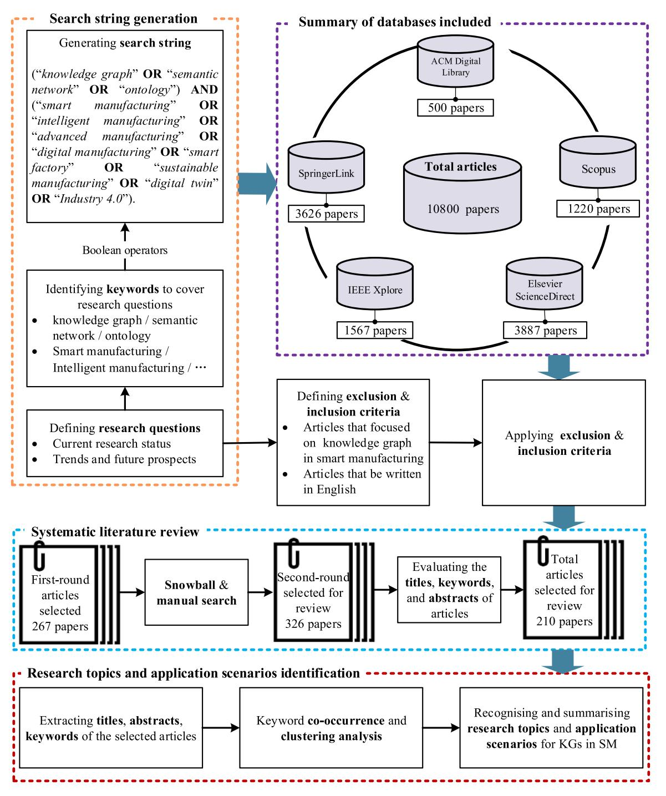
<!-- Image Description: This flowchart depicts a systematic literature review methodology. It shows the search string generation using Boolean operators across five databases (ACM Digital Library, SpringerLink, IEEE Xplore, Scopus, Elsevier ScienceDirect), yielding 10800 initial papers. Exclusion criteria (English language, focus on knowledge graphs in smart manufacturing) reduced this to 210 papers. Further analysis involved keyword extraction and co-occurrence clustering to identify research topics and application scenarios. The diagram visually represents the stages of the literature review process from initial search to final data analysis. -->
**Fig. 3.**The framework of the selection process for academic publications.

distinct clusters. Specifically, upon establishing the co-occurrence matrix, the association strength between keywords*i*and*j*(is represented by the similarity*mij*) is calculated as Eq. (1).

$$
m_{ij} = \frac{n_{ij}}{k_i k_j} \tag{1}
$$

where *nij*represents the number of co-occurrences between keywords*i*and*j*, *ki*as well as*kj*denotes the total number of occurrences of keywords*i*and*j,*respectively.

The goal of the clustering algorithm is to minimize the value in Eq. (2).

$$
M(w_a, ..., w_n) = \sum_{i < j} m_{ij} w_{ij}^2 - \sum_{i < j} w_{ij} \tag{2}
$$

where*wi*denotes a positive integer that indicates a cluster to which nodes*i*belongs, and*dij*denotes the distance between node*i*and*j*, which can be calculated by Eq. (3). The minimization of the value in Eq. (2) dictates that higher association strength values between two nodes signify a stronger interrelationship.

$$
w_{ij} = ||d_i - d_j|| = \sqrt{(d_i - d_j)^2}
$$
 (3)

Utilizing a specialized tool for bibliometric analysis, namely VOSviewer [\[42\]](#page-26-0), the clustering results are attained and visualised based on

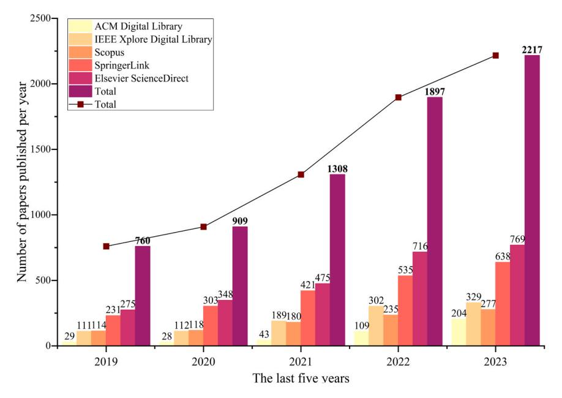
<!-- Image Description: The image is a bar graph showing the number of papers published per year from 2019 to 2023 across five different digital libraries (ACM, IEEE Xplore, Scopus, SpringerLink, Elsevier ScienceDirect), along with the total for each year. A line graph overlays the total number of publications per year, illustrating a clear upward trend. Each bar is segmented to represent the contribution of each database, while the numerical values above each bar segment indicate the number of publications. The purpose is to demonstrate the growth in publications over time and the relative contribution of each database. -->

**Fig. 4.**The number of papers published per year in the last five years.

the keyword co-occurrence in the selected publications. Fig. 5 depicts six research clusters, each distinguished by a distinct colour (i.e., red, green, purple, etc.). The proximity of keywords means a strong correlation between them. A link between two keywords signifies their concurrent appearance in publications. The dimensionality of nodes indicates the cumulative linkage strength of respective keywords. To correlate the clustered keywords more accurately with their associated research domains, manually selecting the keywords in each cluster is undertaken based on a solid understanding of the domains. Specifically, the general terminologies, which commonly appear across all clusters, such as 'knowledge graph', 'data analysis', and 'intelligent manufacturing system', have been removed from each cluster, as displayed in [Table](#page-6-0) 4. This exclusion allows for a more focused representation of the unique thematic elements within each research domain. Moreover, the number of papers that are contained in each cluster is demonstrated in [Table](#page-6-0) 4.

The purple cluster contains keywords such as 'product lifecycle management', 'maintenance', and 'DT', indicating an association with PdM. The occurrence of terms such as 'graph convolutional network (GCN)' and 'knowledge fusion' indicates a research trend in PdM using KG. KG is important in PdM for its ability to interlink diverse data sources, enhance communication and synergy across models, and improve the fidelity of DTs in maintenance scenarios. Furthermore, KG enhances the interpretability of the underlying mechanisms to relieve the challenge of 'black boxes' accompanied by deep learning, contributing to more transparent and understandable PdM strategies. The keywords clustered in red, comprising of 'conceptual design' and 'interoperability', demonstrate a correlation with engineering design. The concurrent emergence of 'semantic data processing' illustrates the

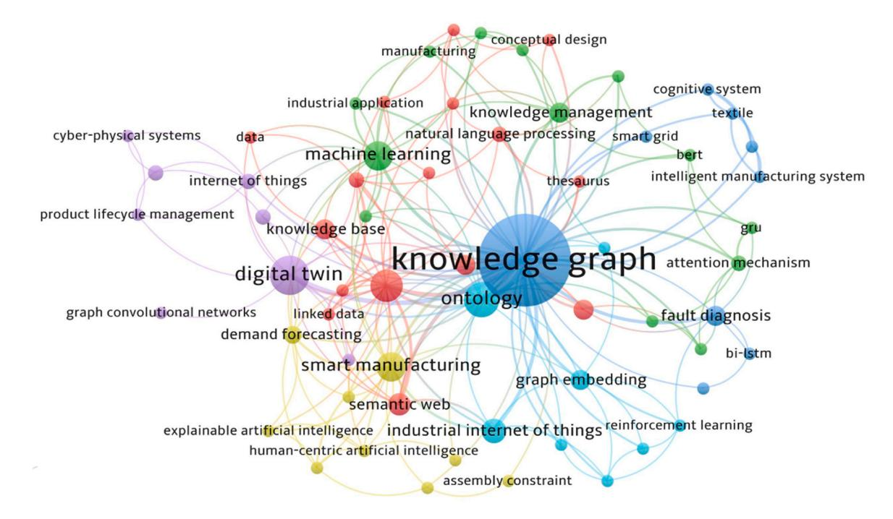
<!-- Image Description: The image displays a knowledge graph visualizing the relationships between various concepts in smart manufacturing. Nodes represent concepts (e.g., "machine learning," "digital twin," "knowledge graph") and edges indicate connections between them. Node size reflects importance, with "knowledge graph" being central. The graph illustrates the interconnectedness of technologies and research areas within the field. -->
**Fig. 5.**The clustering results are based on the keyword co-occurrence for the selected publications.

#### Table 4

Clustering results for selected publications.

| ID | Clusters             | Clustered keywords                                                                            | Research domains   | Number of paper |
|----|----------------------|-----------------------------------------------------------------------------------------------|-----------------------|--------------------|
| C1 | Red cluster       | Conceptual design, digital manufacturing, interoperability, semantic data processing | Engineering design | 49                 |
| C2 | Green cluster     | Root cause analysis, production, injection moulding, manufacturing cost estimation      | QCM                   | 28                 |
| C3 | Blue cluster      | Cognitive system, perception system, smart grid, textile, fault diagnosis               | Production failure | 34                 |
| C4 | Yellow cluster    | cognitive digital twin, demand forecasting, supply chain management                     | SCM, Scheduling    | 47                 |
| C5 | Purple cluster    | Maintenance, product lifecycle management, digital twin, cyber-physical system, IoT     | PdM                   | 57                 |
| C6 | Lake-blue cluster | Context awareness, data fusion, IIoT, cognitive manufacturing                              | IIoT                  | 143                |

utility of KGs in engineering design. Design professionals frequently exploit relevant information from vast unstructured texts for decisionmaking, facing challenges in extracting embedded, semantically implicit knowledge. KG naturally has a graph-based structure suitable for mapping complex relationships. It streamlines information access, clarifies connections among diverse data, and supports decision-making. In the green cluster, a series of keywords, 'root cause analysis', 'injection moulding', and 'production', are associated with QCM. Emerging terms, 'relation extraction' and 'attention mechanism', reflect research progress in semantically unifying diverse datasets by KGs and enhancing graph learning. KG can predict potential deficiencies and enhance product quality by modelling intricate interconnections between components or procedures. The blue cluster includes keywords related to the production failure, such as 'fault diagnosis'. Terms such as 'KG', 'knowledge extraction', and ' cognitive system ' show a trend towards using KGs in this field. KG organizes diverse, complex knowledge in production failures, such as failure types, process parameters, and equipment names, revealing interconnections and tackling data heterogeneity and fragmentation. The reasoning and updating learning of KGs can unearth hidden insights from the existing knowledge. For the yellow cluster, the relevant keywords, such as 'demand forecasting', and 'SCM', relate to SCM and scheduling. Keywords 'cognitive DT' and 'explainable AI' show the intersection with KGs. KG improves SCM by providing a unified view of data from various sources, such as supplier, inventory, and shipment data. In scheduling, KG structures complex relationships between tasks, resources, and time to facilitate optimal scheduling. Its dynamic nature allows adaptation to real-time changes, improving scheduling efficiency. In the lake-blue cluster, keywords such as 'context awareness', 'Industrial IoT (IIoT)', and 'cognitive manufacturing', belong to the manufacturing field. The remaining keywords, 'ontology', 'graph embedding', and 'graph neural network (GNN)', indicate KG-based methods and applications. KG can handle large, diverse, and heterogeneous data, offering semantic data interpretation to enhance interoperability. It optimises manufacturing systems by providing semantic context for complex analysis and predictive model development. The graph-based structure naturally facilitates data exchange and uncovers latent insights.

Table 5 presents the occurrences and total link strength information associated with the top ten recurring keywords, following the exclusion of general terminologies. Occurrences denote the number of keywords appearing in the selected publications. For a given keyword, the total link strength is the cumulative sum of its association strengths, which measure its relatedness to other keywords. Thus, a higher total link strength suggests a greater degree of relatedness. In Table 5, the primary attention of most researchers is the construction issues (keywords:**Table 5**| The occurrences and total link strength of the top 10 occurrence keywords. |  |  |
|----------------------------------------------------------------------------|--|--|
|                                                                            |  |  |

| Keywords             | Cluster number | Occurrences | Total link strength |
|----------------------|----------------|-------------|---------------------|
| Ontology             | C2             | 14          | 33                  |
| Machine learning     | C2             | 10          | 22                  |
| Knowledge management | C2             | 5           | 14                  |
| Graph embedding      | C6             | 5           | 11                  |
| Knowledge base       | C1             | 5           | 10                  |
| Attention mechanism  | C2             | 3           | 9                   |
| NLP                  | C1             | 3           | 9                   |
| Entity recognition   | C1             | 5           | 8                   |
| standards            | C1             | 2           | 8                   |
| BERT                 | C2             | 2           | 6                   |

ontology) of KGs. Further analysis reveals that the most extensively studied research topic is entity recognition in constructing KGs. Moreover, many studies are concentrated on process modelling employing graph embedding technologies (keywords: ML, graph embedding, attention mechanism, etc.).

Inspired by a foundational overview of SM processes and systems in [\[45\]](#page-26-0), diverse SM scenarios are classified and discussed, such as product quality and scheduling. Following a keyword co-occurrence and clustering analysis, the selected publications are refined and manually re-categorized to ensure a more coherent grouping that aligns with key research topics and application scenarios in SM. By delving into the specifics of engineering design, scheduling, QCM, SCM, and PdM, a comprehensive view of how KGs enhance various stages of the manufacturing lifecycle is presented. The refined categorization forms the basis for review and discussion in the following sections, which highlight the broad field of KG applications and provide a synthesized overview of KG utility across diverse SM scenarios.

#### 3. KG and KG techniques tackling SM challenges

This section explores the interplay between KG techniques and focuses on how KGs address specific challenges in SM. In [Fig.](#page-7-0) 6, the KG technologies for SM are depicted from the holistic perspective, where specific professionals who play roles are observed in each phase. It starts with the "Data sources and knowledge repositories for KG" section, where data (ranging from structured to unstructured) and knowledge organization systems (KOS) are first transformed, which prepares the data for subsequent KG integration and processing. Data engineers and domain experts are essential in the initial phase for ensuring the structured transformation of diverse data types. The next section "KG development and maintenance" is a core phase, which contains various aspects, including KG construction, update, fusion, and storage. Knowledge, natural language processing (NLP), and LLM experts ensure the consistent evolution and maintenance of KGs with specific contexts in SM for their reliability and effectiveness. The final section "Applications in SM" shows practical applications and advancements of KGs in SM, involving KGE, mapping to feature space, and further divisions into graph representation learning and KGR. These elements correlate with different applications in SM for enhancing various aspects, including decision-making, defect detection, supply chain demand forecasting, etc. Application developers and machine learning (ML) engineers ensure the integrations and applications of KGs in diverse SM scenarios.

The publications of KG in representative domains of SM are reviewed, identifying the challenges addressed in these articles, along with the proposed KG-based solutions and the KG capabilities involved in these solutions [\[17,](#page-25-0) 46–72]. [Fig.](#page-7-0) 7 visually maps SM challenges to KG-based research topics and further KG capabilities, which provides a foundation for thoroughly examining how KG techniques contribute to and enhance SM. The discussion structure is methodically organized: it begins by identifying distinct challenges within SM and then examines the relevant KG techniques that provide solutions. The leftmost items of the diagram represent the SM challenges, which then fan out into

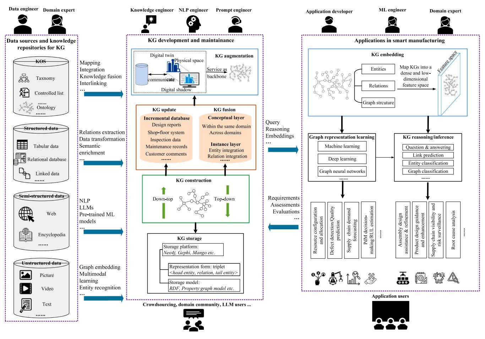
<!-- Image Description: This image presents a framework for Knowledge Graph (KG) development and application in smart manufacturing. It depicts the KG lifecycle, from data sourcing (structured, semi-structured, unstructured) and KG construction (top-down and bottom-up) through KG augmentation, embedding, and reasoning/inference for various applications (resource configuration, defect prediction, etc.). The diagram highlights the roles of different engineers and the use of various techniques like graph embedding and deep learning. The purpose is to illustrate the entire process and its components within a smart manufacturing context. -->
**Fig. 6.**The KG technologies from data acquisition to decision-making in SM.

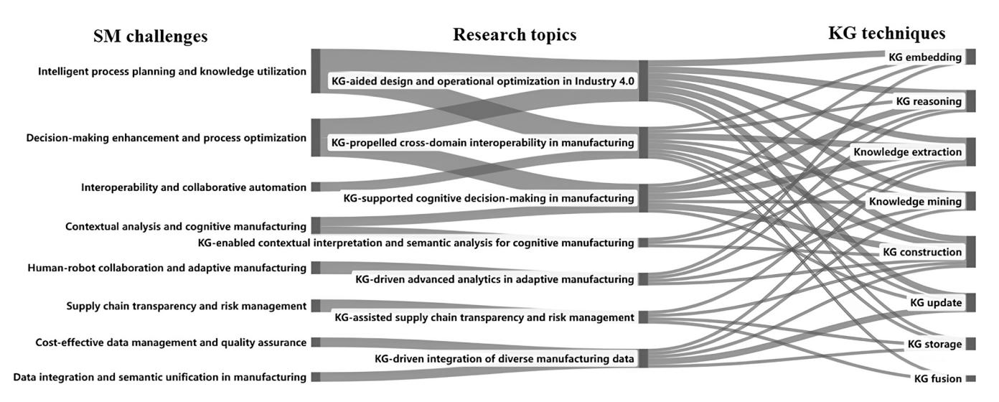
<!-- Image Description: This image is a connectionist map illustrating the relationship between smart manufacturing (SM) challenges, research topics addressing those challenges, and knowledge graph (KG) techniques used to solve them. Eight SM challenges are connected via grey lines to seven research topics, which are in turn linked to eight KG techniques. The thickness of the lines likely represents the strength of the relationship. The figure visually maps the application of KG techniques to specific research areas for overcoming SM challenges. -->
**Fig. 7.**Mapping SM challenges to KG-based solutions with relevant research topics.

intermediating research topics, each broadening or narrowing in correspondence to the scope and impact on subsequent KG capabilities. The final set of items captures the diversity of KG capabilities, illustrated by the inflow from various research branches. The one-to-many and many-to-one relationships are illustrated by the divergence and convergence of flows, wherein a single SM challenge may relate to multiple research topics, with each topic, in turn, utilising multiple KG capabilities. Each instance employing a KG technique to address a specific SM challenge represents a research activity, which reveals the multifaceted and collaborative nature of addressing SM challenges using KG approaches.

As outlined in Fig. 6 and Fig. 7, KGs have shown significant potential in SM due to their well-organized and semantic data integration and contextualization capabilities in knowledge flow and global management of manufacturing knowledge. KGs provide a holistic, enriched, and actionable view of manufacturing data, aiding in efficient decisionmaking and process optimization. Firstly, KGs facilitate the integration of data and knowledge across multiple organizational, functional, and temporal levels of granularity. Secondly, KGs transform raw sensor data into high-level insights. Raw sensor data may initially seem unintelligible but can be transformed into actionable and interpretable insights for enhancing manufacturing productions, processes, and systems. Thirdly, KGs can link and align decisions and goals on the production and operational levels with higher-level organisation goals, fostering coherence and synergy in achieving all different objectives. Moreover, KGs combined with DT provide richer, real-time data for better decisionmaking in SM. Lastly, merging LLMs and KGs enhances the reasoning capabilities of LLMs with actual knowledge of KGs, which paves the way for automated decision-making in SM. From this foundation, KG and KG techniques tackling SM challenges are discussed below.

####*3.1. Knowledge extraction and mining*####*3.1.1. Knowledge extraction*Knowledge extraction turns raw data into structured information crucial for KGs, with its precision affecting KG quality. Commonly, manufacturing knowledge comes from sensors and expert experiences stored in physical records, electronic databases, or expert memories. This knowledge is typically classified into structured (e.g., databases), semi-structured (e.g., encyclopedia), and unstructured (e.g., texts and videos) data. Among these, structured and unstructured data are the primary sources influencing SM systems [\[47\]](#page-26-0).

Knowledge extraction follows established standards and uses mature tools. Structured data is unified using a common schema, often directly mapping relational databases into resource description framework (RDF) data—a quintessential format for KG [\[48\].](#page-26-0) Moreover, the transformation of structured data into RDF format is achieved by various technologies, such as D2R [\[49\]](#page-26-0), principal component analysis (PCA) [\[73\]](#page-26-0), RDF mapping language (RML) and R2RML [\[74\].](#page-26-0) Unstructured data generated throughout SM, from design to service, needs quantification for KG integration. Extracting knowledge from such data often involves NLP and text mining [\[24\]](#page-25-0), enhancing understanding of the manufacturing systems and boosting performance such as production efficiency and product quality.

####*3.1.2. Entity recognition*Entity recognition identifies and classifies entities in unstructured data, such as device names. Initial methods relied on rule and dictionary-based techniques, which are interpretable and accurate by utilizing crafted rules and dictionaries [\[50,75\].](#page-26-0) However, as data scales, these methods face challenges, requiring significant manual effort to create patterns and lexicons and sometimes encountering inconsistencies from conflicting rules established by different experts. Statistical learning methods, using models such as the Hidden Markov model (HMM) [\[75\]](#page-26-0), conditional random field (CRF) [\[76\],](#page-26-0) long short-term memory (LSTM) [\[77\]](#page-26-0), convolution neural network (CNN) [\[52\]](#page-26-0), classification and regression tree [\[53\]](#page-26-0), emerged to process large datasets, understand the context and avoid manual rule creation, but they require vast labelled data and can lack transparency. Inspired by these advantages and limitations, hybrid approaches merge both methods, balancing interpretability with adaptability [\[78,79\]](#page-26-0). The hybrid approach combines statistical and rule-based methods, offering enhanced versatility and adaptability across various data and scenarios in SM while maintaining a degree of interpretability. However, this approach can be complex and resource-heavy due to the need for labelled training data, potential conflicts between methodological components, and increased computational demands from statistical and rule-based elements.

####*3.1.3. Relation extraction*Relation extraction discerns semantic connections between entities from unstructured data collected in SM, such as "part-of". Various supervised and unsupervised learning models are employed to extract these relations. Supervised learning models, such as CNN [\[54\]](#page-26-0), LSTM [\[80\]](#page-26-0), recurrent neural network (RNN) [\[81\],](#page-26-0) GCN [\[82\],](#page-26-0) Markov logic network [\[83\],](#page-26-0) use labelled data to identify these relationships, offering accuracy but requiring extensive annotated data and incurring time and cost. Meanwhile, the generalizability is limited in handling unexpected relation types or text variations. Combining pre-trained models, such as bidirectional encoder representations from transformers (BERT) [\[47\]](#page-26-0), mitigates limitations by leveraging pre-trained data and enhances the ability to identify complex relation patterns in dynamic SM scenarios, but the complexity and computational demand pose additional challenges. In contrast, unsupervised models, such as TF-IDF scores [\[84\]](#page-26-0), latent Dirichlet allocation (LDA)[\[85\]](#page-26-0), conditional probability[\[86\],](#page-26-0) and association rules [\[87\]](#page-26-0) infer relationships from the intrinsic structure of the data or some form of prior knowledge. While not reliant on labelled data, unsupervised models often yield lower precision and recall than supervised models and can be impacted by the quality of input data. Moreover, noisy or irrelevant features pose challenges to extracting meaningful relationships in complex manufacturing fields. Conventional methods separate entity recognition and relation extraction, but joint extraction models handle both tasks simultaneously, recognizing their interplay [\[88](#page-26-0)–90].

Moreover, less common in manufacturing scenarios seeks to identify predefined event types, usually concentrating on failure or fault events. For instance, a fault event ontology was developed by extracting control rod drive mechanism fault events and labelling entities and relationships [\[50\]](#page-26-0). A hybrid model based on LSTM and CRF extracted machining quality causality events from textual documents [\[89\].](#page-26-0) Diamantini et al. [\[91\]](#page-26-0) focused on "start" and "complete" life-cycle transitions for activities in event logs, linking observations to executed events via timestamp comparisons. Moreover, event extraction, aligned from manufacturing data like sequential event logs, was performed in Ref. [\[92\].](#page-26-0)

####*3.1.4. Knowledge mining*

*3.1.4.1. Knowledge content mining.*Knowledge content mining aims to match entities with relevant manufacturing knowledge base entries, requiring syntax normalization and data alignment. It entails entity disambiguation (selecting the right entity from similar choices) and entity linking (connecting the chosen entity to a knowledge base). A common method is using cosine similarity of entity embeddings in injection modelling [\[51\],](#page-26-0) aerospace enterprise [\[48\],](#page-26-0) and Industry 4.0 standards [\[93\].](#page-26-0) Besides direct similarity, diverse embedding technologies have been discussed and employed to derive similarities of entities, such as word2vec [\[55\]](#page-26-0). Zhou et al. [\[89\]](#page-26-0) enhanced the GCN model to align entities across text-based and tabular KGs by optimizing node embeddings, ensuring precise alignment, minimising computational load, and mitigating noise. Zhang et al. [\[94\]](#page-26-0) addressed concept drift or changes in statistical properties over time. Coreference resolution is used to unify entities or attributes with identical meanings, demonstrated in applications to conceptual design [\[56\]](#page-26-0) and power grids [\[95\]](#page-26-0).
*3.1.4.2. Knowledge structure mining.*Knowledge structure mining, or link prediction, enhances the accuracy and completeness of KGs by predicting missing or upcoming graph associations. Initially, experts manually identified missing relations, as seen in applications like the floatation process [\[57\]](#page-26-0) and the delayed coking process [\[77\].](#page-26-0) Many technologies have been developed to uncover hidden relationships within KGs. Ringsquandl et al. [\[96\]](#page-26-0) utilized event logs to forecast missing links in evolving factories. Another study [\[92\]](#page-26-0) identified likely relations introduced from changes in physical environments and unaligned event semantics. Riva et al. [\[93\]](#page-26-0) depicted the homophily prediction principle applied over each of the communities to discover unknown relations. Grangel-Gonz´ alez et al. [\[97\]](#page-26-0) proposed a translation-based approach, emphasizing the proximity between embeddings of head and tail entities to predict potential relations. Zheng et al. [\[98\]](#page-26-0) applied KGR to enable querying and predicting missing links to generate mutual cognitive support, which helps dynamically update the KG for online task planning.

Several studies have innovated in embedding techniques. Zhou et al. [\[4\]](#page-25-0) and Xia et al. [\[99,100\]](#page-27-0) enhanced KG embedding techniques to reveal hidden relationships and predict unseen connections, utilizing semantic weight vectors and the attention-based compressed relational GCN model, respectively. Similarly, another attention-centric model [\[47\]](#page-26-0) utilized an attention mechanism and biased random walk to capture intricate embeddings, enabling the discovery and supplementation of implicit KG relationships. Moreover, subgraph reasoning was applied to predict missing KG edges [\[52\]](#page-26-0). Moreover, in the quest for optimizing relation-discover, Wang et al. [\[101\]](#page-27-0) utilized GNN to infer ambiguous links under fault-tolerant conditions in power grid topology. Deng et al. [\[90\]](#page-26-0) devised a model using stacked bi-directional long short-term memory (BiLSTM) and self-attention, enhancing relation prediction by merging entity label embeddings and context features. Liu et al. [\[102\]](#page-27-0) improved link prediction by employing "unif-bern" negative sampling in the UBTransH model, enhancing the learning of relation characteristics.

####*3.2. Construction, storage, and update of KG*####*3.2.1. Top-down and bottom-up construction approaches*Constructing a KG for SM involves forming a network of entities and relationships enriched with semantic context using primary top-down and bottom-up approaches. The top-down approach to KG construction establishes a conceptual schema, then populates the KG with entities following predefined patterns and relationships using virtual mapping processes. Various studies [50, 58, [103\]](#page-26-0) demonstrate this method ensures consistency and interoperability by adhering to a predefined structure. Conversely, the bottom-up KG construction approach begins by extracting entities from open link data and then integrates only high-confidence entities into the knowledge base. Entities with similar attributes are abstracted into concepts and hierarchically aggregated to build the final KG. This method is advantageous for its adaptability to diverse and evolving data sets [\[78\]](#page-26-0). While the top-down methodology may exhibit inflexibility with unanticipated data [\[104\]](#page-27-0), the bottom-up approach can encounter inconsistency and redundancy due to its lack of a rigid schema. Hybrid methodologies, aiming to balance structure and flexibility, begin with a basic schema (top-down) and refine it by incorporating data (bottom-up) in diverse studies [\[48,](#page-26-0) 77, [88\].](#page-26-0) Additionally, it is noted that the synergy between DT and KG construction is increasingly recognized for its capability to represent complex manufacturing activities [\[46,](#page-26-0) 59, 60]. The combination of DT and KG construction provides numerous well-documented advantages, such as facilitating the integration of multidimensional information elements [\[31\]](#page-25-0) and enabling interaction and integration between the physical and virtual worlds [\[105\].](#page-27-0)

####*3.2.2. Knowledge graph storage*KG, utilizing a graph-based structure, stores manufacturing domain knowledge, including product design, resource allocation, and operational environments. The selection of an appropriate database for KG storage, considering application context and data scale, is crucial for efficient data management and computation. Commonly, the triples in KG are expressed in the form of*<*head entity, relation, tail entity*>*, such as*<*Subject, Predicate, Object*>*[\[47\]](#page-26-0) and*<*Subject, Verb, Object*>*[\[106\].](#page-27-0) Moreover, multi-nary relations between more than two entities were represented as hyperedges [\[107\]](#page-27-0). For the predefined model, the ontologies are usually represented by the Ontology Web Language (OWL) [\[108,109\]](#page-27-0), and the KG is widely represented by RDF [\[110,111\]](#page-27-0). Moreover, to fit the construction requirements in a given domain, the property graph model is deployed to represent the KGs [\[112\].](#page-27-0) Unlike the RDF model, the property graph model consists of four key structures: nodes, relationships, properties, and labels, forming the basis for various graph algorithms. Capitalizing on the inherent graph-like nature of the data, the property graph model enables efficient knowledge reasoning and intricate deep traversal [\[113\].](#page-27-0)

Within the scope of the research reviewed, Prot´eg´e emerged as a particularly favoured open-source tool for ontology storage, as evidenced by multiple studies [\[46\].](#page-26-0) Moreover, alternatives are employed in certain instances, such as OntoGraf [\[114\].](#page-27-0) Regarding the storage of KGs, Neo4j is prominently featured across a majority of the surveyed studies [\[58,](#page-26-0) 60, 61], yet other open-source tools are adopted in some research, such as Gephi [\[84\]](#page-26-0), OrientDB [\[62\],](#page-26-0) MongoDB [\[63\],](#page-26-0) TigerGraph [\[115\]](#page-27-0), GraphQL [\[116\]](#page-27-0), GraphDB [\[117\]](#page-27-0), Graphviz [\[118\].](#page-27-0)

####*3.2.3. The incremental update of KG*Most KG studies for SM deploy existing knowledge, often neglecting the ever-evolving SM knowledge base. Incremental update methods for KG have been introduced, collecting data from various SM sources, such as workers and production lines. Before adding to the KG, the reliability of the incremental data is checked, ensuring up-to-date insights and ongoing manufacturing system enhancements. While KG is often manually adjusted [\[119\],](#page-27-0) modern strategies include using GNNs to predict missing links [\[17,101\],](#page-25-0) Bayesian methods for adaptive concept drift [\[94\]](#page-26-0), and extracting new triplets from customer reviews [\[120\].](#page-27-0)

The advent of advanced technologies, such as DTs and more effective NLP algorithms, enables real-time updates of KGs in SM, ensuring they accurately mirror immediate changes in corresponding systems. For example, DTs dynamically capture and convey changes in real-world systems to their respective KGs for a timely reflection of system alterations. Consequently, recent research has turned towards exploring intricate methodologies for real-time KG updates influenced by DT technology integration. Liu et al. [\[114\]](#page-27-0) developed a DT framework that generates and updates a fault KG for CNC machine tool fault diagnosis and rescheduling. A feedback loop updated the KG with data from manufacturing execution systems (MES) and enterprise resource planning (ERP) systems for improving planning outcomes [\[73\]](#page-26-0). Another approach utilized an industrial KG (IKG) enhancement system through crowdsourced user query analysis and verification of knowledge labelled 'To-be confirmed' [\[64\].](#page-26-0) Teen et al. [\[116\]](#page-27-0) introduced a five-stage model for continuous KG construction, ensuring consistent reflection of industrial changes by integrating new data and refining updates through user interactions. Liu et al. [\[65\]](#page-26-0) dynamically updated the IKG with IIoT data using shallow and deep cognition agents. Dong et al. [\[121\]](#page-27-0) used a smart PSS configuration with three KGs, using sentiment analysis of user reviews to trigger KG updates. Li et al. [\[52\]](#page-26-0) applied KGR to exploit subgraph topology and temporal dynamics for KG updates. Real-time updates of KGs can enhance applications in SM by reflecting current states and optimizing operations. Despite challenges such as ensuring update quality and managing computational demands and data volumes, the real-time KG update technology is an advantageous and increasing research topic.

The user interface (UI) plays an interesting role in enabling practitioners to interact with KG-based systems to facilitate the timely and accurate incorporation of updates. Considering the significance of UI and user experience (UX) in the implementation and application of KG updates in SM, a user-friendly interface can enhance the quality of KG updates by simplifying the process of integrating new data, thereby ensuring that KGs remain reflective of the current operational reality. Moreover, a positive UX, from both data scientists and domain experts, is important to the practical application of KGs in SM.

####*3.3. Knowledge graph embedding*###*3.3.1. Fact-based approach*Fact-based KGE methodologies use the intrinsic entities and relationships of KGs, mapping the intrinsic structure into a vector space to simplify complex relationships. Recent research has explored various techniques for fact-based KGEs in SM. Translational distance models, like TransE, TransD, and TransH, interpret relations as translations in a shared vector space for entities and relations in enhancing KGE [\[93\]](#page-26-0). Other studies have enhanced and adapted translational models, such as Zhang et al. [\[87\]](#page-26-0), which used TransH and TransR for diverse entity connections, and Liu et al. [\[102\]](#page-27-0) enhanced TransH with the "unif-bern" negative sampling technique to optimize negative sample generation. Using a margin-based ranking loss, Ringsquandl et al. [\[92\]](#page-26-0) trained vectors to minimize and maximize the distance for correct and incorrect entity triples. Translational distance models provide a geometric interpretation by representing relationships as translations in the embedding space, facilitating understanding of entity associations. However, they struggle to represent complex, especially non-translational, relationships and manage diverse one-to-many and many-to-many relations.

Semantic matching models evaluate fact plausibility by comparing the similarity between the embeddings of entities and relations, thereby measuring the compatibility of entity-relation pairs. As one of the most representative semantic models, GNNs were developed to extract KGs' embedding [\[17,83\].](#page-25-0) Entities start initialized and get enriched by absorbing features from neighbouring nodes using the GNN, and transformation matrices mapped relationships into the same vector space as entities similarly. On the one hand, GCNs and their variants have emerged as a prevalent model among GNNs for graph structure operation [6, 49, [122\].](#page-25-0) GCNs aggregate node features across layers, capturing local and global graph information, making them tasks like node classification [\[66\]](#page-26-0), link prediction [\[67\]](#page-26-0), and graph classification [\[68\]](#page-26-0). Moreover, Park et al. [\[69\]](#page-26-0) developed a hybrid GNN with the RL model to obtain KGEs for learning scheduled job shop problems. Li et al. [\[123\]](#page-27-0) developed the Bagging-graph attention network (Bagging-GAT) to estimate machining surface roughness, enhancing learning with a KG, particularly in data-scarce situations. On the other hand, DeepWalk-based KGE models, a variant of GNNs, leverage random walks and the SkipGram model to generate node embeddings, reflecting semantic similarities in a reduced-dimensional space. Widely used for link prediction [\[124\]](#page-27-0) and node classification [\[64\],](#page-26-0) these models and their enhancements, such as Node2Vec [\[125\],](#page-27-0) have undergone substantial research and development. Additionally, diverse semantic matching approaches are utilized for KGEs. Zhou et al. [\[4\]](#page-25-0) innovated a refined distributed representation learning algorithm to assign distinct semantic weight vectors to entities for enhancing semantic precision in KGEs. Another study [\[126\]](#page-27-0) employed the ComplEx method to embed a context-rich KG created from time-series sensor data, and these embeddings were clustered using k-means to classify environmental conditions. Semantic matching models capture semantic similarity between entities and relations, making them more valuable in tasks like link prediction than translational models. However, mapping entities and relationships into the same vector space might reduce embedding interpretability.

Various KGE models introduce alternative or hybrid entity and relation representation methods. For instance, Ren et al. [\[47\]](#page-26-0) introduced an attention-based graph embedding model to capture global and local KG features in the application scenario from the aerospace enterprise production process. While hybrid models blend translational and semantic matching benefits for improved representations, they increase complexity, implementation difficulty, and computational resource needs.

####*3.3.2. Incorporating additional information-based approach*Additional information augments fact-based methods by integrating extra data into the learning process, such as textual descriptions, entity classifications, and other external sources. Researchers have explored additional information-enhanced KGE approaches across diverse studies. Ringsquandl et al. [\[127\]](#page-27-0) refined multi-label graph classification by incorporating domain constraints, such as Must-Link and Cannot-Link constraints, focusing on consistent subgraphs aligned with manufacturing knowledge and pruning inconsistent patterns. They further incorporated event log data into KGEs generated for jointly learning embeddings with two objectives: KGE loss and event sequence embedding loss [\[96\]](#page-26-0). Liang et al. [\[128\]](#page-27-0) employed additional related data to quantify relations and perform clustering for KGEs in power fault analysis, including embedding entity attributes, user details (e.g., identity documents (ID)), and search history. Deng et al. [\[90\]](#page-26-0) merged context features with entity label embeddings to enhance KG representations using a BiGCN layer for integrated entity recognition and relation extraction. Zhang et al. [\[87\]](#page-26-0) mapped entities and relationships into compact vectors to capture dense inter-entity connections (e.g., one-to-many and many-to-many), enriching embeddings with additional information such as names and functions to identify key graph nodes and generate detailed lists of failure modes. Li et al. [\[52\]](#page-26-0) deployed temporal reasoning to integrate historical execution records for capturing temporal dynamics and enriching the embeddings with temporal nuances. Preserving the complex and logical relations of KGs is important in KGE processes. However, challenges arise in maintaining global and local structures of graphs, especially considering the sparsity of manufacturing KGs and limited observable connections [\[47\],](#page-26-0) such as extracting the sufficient structural features from sparse data sources.

####*3.4. Knowledge graph fusion*###*3.4.1. KG fusion for conceptual layer*The KG fusion at the conceptual layer involves merging disparate ontologies and schemas from different KGs. Scholars have investigated ontology integration within the same domain in SM. For instance, Kwon et al. [\[108\]](#page-27-0) enhanced semantic querying by integrating KGs from product model data and quality information, using manual mapping and SWRL rules with additional rules to eliminate structural differences and ensure consistency and decision-making in the unified knowledge base. Shen et al. [\[59\]](#page-26-0) employed a facet model to divide each custom order into subgraphs and further fused multi-dimensional KGs across ontologies, encompassing process, resource, and product-feature ontologies for custom apparel production. In Ref. [\[129\],](#page-27-0) a unified ontology was created to detail failure modes and causes by combining the failure mode and effect analysis ontology with process adjustment protocols ontology, linking failure modes to potential causes and adjustment actions. Diamantini et al. [\[91\]](#page-26-0) developed a comprehensive ontology combining multiple pre-existing ones (e.g., SSN, SOSA, and DogOnt), using a bridged ontology encompassing key classes, such as IoTResource and Task, to link the process viewpoint with sensor perspective.

Moreover, diverse studies explore cross-domain ontology fusion. For example, Yang et al. [\[130\]](#page-27-0) integrated ontology models across fields to formulate a multi-cloud KG for power equipment defects, addressing multi-source heterogeneous problems and ensuring integrated defect management. This cohesive KG incorporates specifications and concepts of standards across multiple clouds. Devanand et al. [\[70\]](#page-26-0) developed the OntoTwin ontology for the J-Park Simulator, facilitating interoperability between chemical and electrical systems by bridging respective domain concepts, such as linking an electrical motor to a chemical pump. Ansari et al. [\[73\]](#page-26-0) merged generic and domain-specific ontologies into a single KG through common concepts, aiding competence-based maintenance planning, which enabled comprehensive reasoning for planning and task allocation. In summary, ontology fusion, both intraand inter-domain, amplifies knowledge representation and management in SM. Intra-domain fusion enhances semantic querying and reasoning within specific SM areas, while cross-domain fusion enables interoperability and the generation of unified KG.

####*3.4.2. KG fusion for instance layer*KG fusion at the instance layer signifies incorporating distinctive entities and relationships derived from multiple KGs within SM. Starting with Yang et al. [\[130\]](#page-27-0) employed technologies, such as D2R conversion and graph mapping, to fuse instances from varied ontology sources into unified models. Ref. [\[131\]](#page-27-0) created mappings between data sources and domain ontologies, linking them to a KG for mitigating semantic conflicts. Shen et al. [\[59\]](#page-26-0) segmented the KG into subgraphs, capturing dynamic data per custom order and facilitating instance-layer KG fusion through graph embedding and entity alignment for node relevance and similarity calculations.

Transitioning to Eibeck et al. [\[71\]](#page-26-0) introduced an ontology-based platform, the J-Park simulator (JPS), which integrates real-time data, knowledge, models, and tools from the process industry by assembling reusable vocabularies from modular domain ontologies into a comprehensive KG. Modular ontologies are incorporated into JPS, instantiated with domain instances for cross-domain scenarios, and unified using uniform resource identifiers (URIs) to ensure global uniqueness and facilitate distributed storage and linkage across web nodes. The conversion of relational data to the RDF model and resolution of overlapping entities from various sources are managed using cross-linking ontologies [\[132\],](#page-27-0) such as the inverse object property in networking ontology, which restricts inbound relationships and utilizes owl:sameAs for additional links, emphasizing the criticality of URIs. In summary, integrating diverse ontological sources through entity merging or mapping creation yields a unified KG that augments semantic querying, reasoning, and data management across single and multi-domain SM scenarios. This fusion mitigates data heterogeneity and fosters interoperability and holistic knowledge representation by connecting various ontologies and data sources.

####*3.5. Knowledge graph reasoning*####*3.5.1. Logic-based reasoning*Logic-based reasoning, grounded in formal logic and semantic web methods, embodies graph structural elements in a logical framework and uses axioms to infer new facts. In the digital filed, KGs have emerged as crucial tools for data structuring and reasoning, providing a more accurate method for formatting contextual data than traditional documents in manufacturing. Utilizing semantic query techniques, such as SPARQL queries [\[71,72\],](#page-26-0) KGQL [\[133\]](#page-27-0), GraphQL queries [\[134\],](#page-27-0) MongoDB queries [\[63,135\]](#page-26-0), and Cypher [\[63\],](#page-26-0) and SQWRL[\[53\],](#page-26-0) KGs enable retrieval and reasoning of data by traversing semantic relationships [\[56,](#page-26-0) [136\]](#page-26-0). For example, KGR bolsters situational awareness by semantically modelling sensor data to aid decision-making in autonomous vehicles [\[137\].](#page-27-0) Huet et al. [\[61\]](#page-26-0) arranged design rules into four interconnected sub-contexts, such as semantic and engineering, using KGs for design rule recommendations by traversing relations based on user profiles and CAD models. Ref. [\[138\]](#page-27-0) identified and retrieved relevant subgraphs using graph algorithms, such as the shortest path, to recommend pertinent information. He et al. [\[139\]](#page-27-0) expanded a manufacturing KG from engineering case documents, using logical rules within manufacturing subgraphs to facilitate reasoning connections. Yang et al. [\[130\]](#page-27-0) achieved KG inference in a multi-cloud architecture to optimise rule quality and reasoning accuracy, albeit necessitating more data and optimization research. Based on that, it is noted that integrating structured ontologies with KGs enhances deductive reasoning, making implicit connections explicit and generating new insights to augment the existing knowledge base in SM, such as a unified semantic representation for the CAM model [\[140\],](#page-27-0) fault diagnosis [\[141,142\]](#page-27-0), root cause analysis [\[143,144\],](#page-27-0) production line inference [\[58\]](#page-26-0), HRC in disassembly [\[145\]](#page-27-0), and suggestion recommendation for design and manufacturing [\[129\].](#page-27-0)

This capability is extended to semantic parsing, enabling KGs to transform natural language queries into graphical representations for enriching the semantic depth of responses [\[81\]](#page-26-0). Tang et al. [\[115\]](#page-27-0) demonstrated a graph database in power equipment management through optimal query performance. Yang et al. [\[146\]](#page-27-0) developed a QA system with multi-modal KG for industrial equipment operation and maintenance, achieving over 90 % accuracy in aligning user queries with graph content via a bespoke semantic matching technology. Dai et al. [\[147\]](#page-27-0), Shi et al. [\[148\]](#page-27-0), and Wang et al. [\[149\]](#page-27-0) improved QA systems to identify relevant knowledge in manufacturing scenarios, such as cupping equipment concepts and relations. Another system [\[150\]](#page-27-0) automates similar design queries, utilizing a manufacturing cost estimation KG to predict new design costs and cycle times. Xia et al. [\[100\]](#page-27-0) implemented a QA system identifying maintenance causes and solutions through predicting relationships. While logic-based reasoning provides a framework for data structuring and semantic analysis, the success of KGs extends beyond technical capabilities to how they can be interacted with by users. Effective UIs and positive UX s are essential for simplifying complex KG operations, such as query formulation using SPARQL or GraphQL, and making the KG accessible to non-expert users. For instance, intuitive UI can transform the way users navigate KGs for fault diagnosis, design rule recommendations, and dynamic route planning, ensuring that the insights gained are accurate and actionable. By focusing on user-centric design principles, KG technologies can be made more adaptable to diverse manufacturing scenarios, thereby enhancing their applications and maximizing their impact on operational efficiency and decision-making processes.

In more SM applications, the real-time data integration capabilities of KGs combined with domain-specific ontologies highlight their utility for inferring machine states and potential anomalies. Li et al. [\[151\]](#page-27-0) employed ontology reasoning in the constructed KG to build the necessary state machine for dynamic route planning of automated guided vehicles, translating user specifications into system parameters and executable code modules. Meckler et al. [\[152\]](#page-28-0) utilised Notation3 rules to infer new knowledge of machine states and detect issues. Banerjee et al. [\[153\]](#page-28-0) built a DT and KG hybrid model to fuse datasets and implemented a graph-based query language system enriched with inference rules to deduce manufacturing performance in the production line.

####*3.5.2. Embedding-based reasoning*Embedding-based reasoning employs ML algorithms to map entities and relationships into a low-dimensional vector space, learning the embeddings from inherent graph structures to infer previously unknown facts. In various studies, embedding-based KGR techniques employ neural networks for reasoning in manufacturing contexts, such as correcting uncertain links and inferring new knowledge. For example, Zhang et al. [\[62\]](#page-26-0) merged KG and deep learning to enable context-aware reasoning in generating macro-process planning and ensuring optimal schemes. Kosasih et al. [\[17\]](#page-25-0) used GNNs to learn entity representations to enhance risk queries. Zhou et al. [\[4\]](#page-25-0) utilised distributed representation learning to identify implicit device relationships in machining workshops, as demonstrated in similar studies [68, 101, [154\]](#page-26-0). A neuro-fuzzy system was developed to infer fault conditions using expert-defined rules [\[152\],](#page-28-0) translating raw data into diagnostic insights for operators and facilitating tailored notifications and recommendations. Diverse models, such as LSTM units and parallel processing via GPUs and Spark, were enhanced to facilitate efficient reasoning and inference in manufacturing applications from automotive [\[146\]](#page-27-0) to semiconductor manufacturing [\[155\].](#page-28-0)

Embedding-based reasoning is widely used for enhancing querying and providing recommendations in SM. Zhou et al. [\[49\]](#page-26-0) designed a GCN-based graph embedding model to enable querying and generate mutual cognitive support by capturing the dynamic manufacturing tasks and human-robot interactions. Another study [\[64\]](#page-26-0) applied multi-hop reasoning over industrial KG to provide context-aware knowledge recommendations by encoding topological information via graph embedding techniques. Zhao et al. [\[59\]](#page-26-0) employed the Dijkstra algorithm for optimal resource allocation in production logistics, using spatial KGs and backpropagation and considering cost relationships influenced by distance and time. Ref. [\[67\]](#page-26-0) designed a GCN-based model to enrich an initial graph by identifying analogous subgraphs in assembly processes, subsequently formulating and evaluating multiple process plans based on interference analysis and quality metrics. Embedding-based KGR further embraces a temporal aspect in its application. Liu et al. [\[65\]](#page-26-0) devised a KG-based dual system for cognitive manufacturing in the IIoT, segregating dynamic device data analysis and profound decision-making reasoning and utilizing GNNs for in-depth reasoning in resource allocation and PdM. Anotherstudy [\[52\]](#page-26-0) employed subgraph reasoning and a temporal subgraph attention layer to refine node embeddings in the KG, retaining high-scoring edges after pruning to optimize embeddings in reasoning. Additionally, a KG-based fault diagnosis system for nuclear reactor control rod mechanisms was developed [\[50\]](#page-26-0), integrating equipment and fault data and diagnosing real-time faults through natural language queries and KG-based reasoning.

Utilizing nodes and relationships in KG of SM, logic-based reasoning provides semantically relevant responses to queries by exploiting the graph contexts, such as providing recommendations through related entity traversal. Although it offers interpretability and precision, it struggles with noisy and incomplete real-world data. Conversely, embedding-based reasoning enhances scalability and robustness in SM applications by allowing vectorized similarity computations to identify related knowledge, albeit with potential interpretability challenges. The choice between these methods relies on task specifics, the nature of the graph, and resource availability, with hybrid methods potentially offering an applicable solution.

#### 4. Applications of KG in SM

This section analyses the integration of KG technologies with SM to highlight the practical applications across specific scenarios. Inspired by Ref. [\[45\],](#page-26-0) a foundational overview of SM process and system automation is provided, which systematically categorizes and discusses various ways in SM process automation, SM system automation, and SM automation scenarios, such as product quality and scheduling. Moreover, derived from the qualitative analysis in [Section](#page-2-0) 2, an extensive literature review was conducted to summarize and identify five representative SM scenarios: engineering design, scheduling, QCM, SCM, and PdM. These scenarios demonstrate the broad applicability of KGs in SM and the synthetic role of KGs in advancing SM. In the following subsections, five practical scenarios are analysed and summarized to reveal how KG technologies address specific challenges in SM, such as enhancing HRC interactions, improving QCM, and supporting intricate decision-making.

####*4.1. KG for engineering design*In engineering design, decision-making usually relies on experience. While valuable, this approach is limited in addressing the manufacturing complexities and rapidly evolving design. Experience-based knowledge is hard to transfer and scale, potentially creating knowledge gaps. As product lifecycles quicken and design iterations increase, reliance on experiential knowledge struggles to meet the complexities of modern design processes. Thus, there is a growing need for a more systematic and analytical approach to engineering design decisions. KGs have emerged as a powerful tool for enhancing decision-making in the design field, structuring domain-specific knowledge into networks for design search, reuse, and advisory processes. This structured approach enables the explicit mappings of relationships, allowing engineers to predict the broader impacts of design decisions and promoting informed decisionmaking. Moreover, KGs facilitate effective knowledge transfer through graphical representations, supporting knowledge sharing in the evolving manufacturing landscape.

####*4.1.1. Product design support and optimization*At the design phase, KG aids in extracting and utilizing technical data to manage formulas and standards, elicit requirements, enhance the design process's efficiency, and ensure adherence to design rules and standards. Huet et al. [\[61\]](#page-26-0) and Illescas et al. [\[156\]](#page-28-0) developed graph-based design assistants to structure design rules, components, and requirements within KGs, supporting design rule recommendations. Luttmer et al. [\[157\]](#page-28-0) extracted and graphed mathematical formulas and their metadata from the standards, making the standard's content machine-actionable. Each formula was converted into a graph, centring on its mathematical expression with added nodes for metadata.

Combining ML with KG, especially neural networks, is prevalently used for creating embeddings, classifying shapes, and predicting functional couplings in product design. Bharadwaj et al. [\[158\]](#page-28-0) created KGs for product designs using CAD data and developed a neural network to convert CAD file information into embeddings. They used hierarchical relationships from CAD files to build a hierarchy subgraph. This was paired with multi-view CNNs to convert models into vector embeddings that reveal shape similarities. A part similarity subgraph was formed, connecting similar parts and refined using weight thresholds. Community detection in this subgraph identified clusters of similar parts, making searches more accurate and faster, such as component retrieval, part recommendations, and consistency assessment. As shown in [Fig.](#page-13-0) 8, the proposed framework comprises three main modules: (1) node and relation type classification, (2) 3D shape classification and feature extraction, and (3) KG construction in Neo4j, enabling a versatile schema for CAD parts. This study combines KG and 3D geometrical representation with hierarchical, similarity, and ancillary data for CAD model design, enhancing intelligent design reuse search and recommendations. Similarly, several studies have contributed to advancing product design in manufacturing with the use of KGs and ML, such as smart home product design [\[154\],](#page-28-0) design parameter optimization and materials selection for injection moulding [\[51\],](#page-26-0) and design search and reasoning for manufacturing system [\[68,138\].](#page-26-0)

Closing the gap between design and operations/maintenance (O&M) allows for the sharing and optimization of knowledge based on real operational data. This process not only guides O&M services but also enhances design through feedback loops. KG plays a crucial role in facilitating knowledge reuse, especially in failure analysis and maintenance. They link design models with failure modes, effects, and maintenance recommendations, enabling automated utilization of new designs and operational optimizations. Integrating KG throughout the product lifecycle, from design to operation and maintenance, ensures data consistency and reusability, offering insights into failure modes and aiding in design improvements [\[108\]](#page-27-0). Lim et al. [\[46\]](#page-26-0) illustrated how KGs dynamically interact with real-time data to optimize operational decisions, merging static design knowledge with dynamic operational data for adaptable and resilient design frameworks. Zhang et al. [\[87\]](#page-26-0) reused failure knowledge and identified design-operation mismatches in electromechanical-actuator systems of aircraft.

Furthermore, KGs extend their utility beyond aiding design engineers and actively engage users, operators, and various stakeholders within the manufacturing ecosystem through interactive platforms. The interactive platforms facilitate dialogue, gather feedback, and support collaborative decision-making processes, where engineering solutions are grounded in user-centric perspectives and align with practical operational requirements. The user-centric approach democratizes the design process and makes it more accessible and relevant to all participants involved in the product lifecycle. For instance, Wang et al. demonstrated how the integration of customer feedback into KGs reveals hidden user needs. For instance, Wang et al. [\[124\]](#page-27-0) demonstrated how integrating customer feedback directly into KGs can reveal previously unnoticed user needs and preferences. The proposed model created a dynamic feedback loop in bridging the gap between design, production, and market expectations. By continuously updating the KG with new insights from user interactions, manufacturers could adapt more quickly to changing customer demands and emerging market trends for enhancing the alignment of products and user requirements and promoting a more agile and responsive manufacturing operation. Meanwhile, the UI and UX in the application of KGs are gaining more attention, which highlights the importance of intuitive and user-friendly systems that simplify complex data exploration and analysis for diverse user groups. By prioritizing UI/UX in the development and deployment of KG technologies, the efficiency of knowledge utilization is improved in the manufacturing systems, such as fostering more meaningful user engagement and deriving innovation in product development and

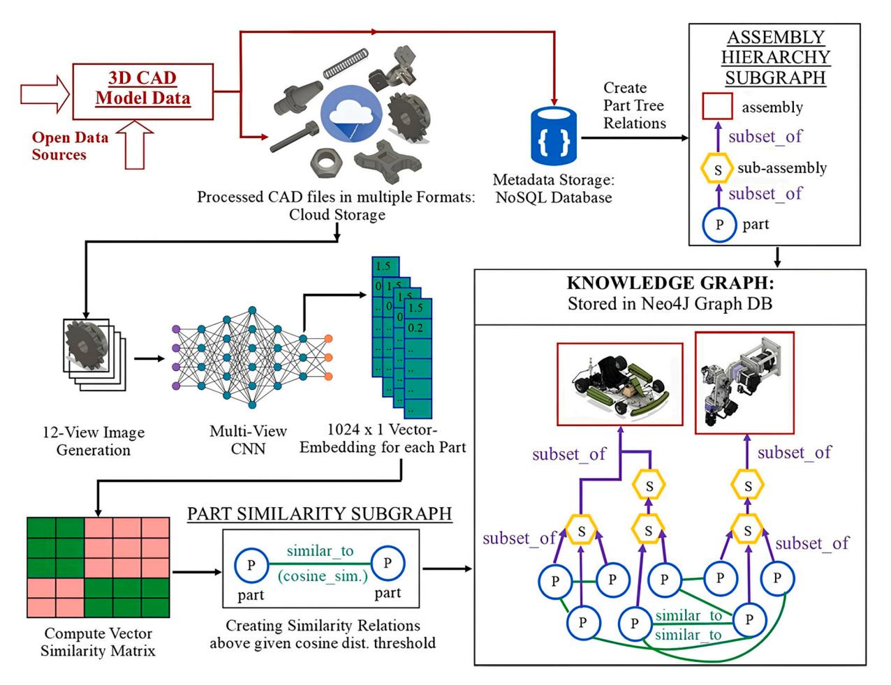
<!-- Image Description: This flowchart depicts a system for creating a knowledge graph of 3D CAD models. 3D CAD data is processed, and 12-view images are generated. A multi-view CNN creates 1024x1 vector embeddings for each part. A similarity matrix is computed, and a part similarity subgraph is created based on cosine similarity. An assembly hierarchy subgraph is built, resulting in a knowledge graph stored in a Neo4j graph database representing part relationships and similarities within assemblies. The system utilizes a NoSQL database for metadata storage. -->
**Fig. 8.**The proposed schema of product-design KG. This framework consists of three main modules, including classifying node types and defining relation types, achieving 3D shape classification and global feature extraction, and storing product-design KG [\[158\].](#page-28-0)

operational processes. The integration of user feedback mechanisms within KGs provides a proactive approach to capture and address the evolving needs of users, further highlighting the important role of UI/UX in maximizing the effectiveness of KGs in SM.

####*4.1.2. Assembly design assistance and refinement*Assembly design involves processes and resources to merge components into final products, which usually relies on engineer expertise. Moreover, professionals often face challenges in accessing and reusing dispersed knowledge from various systems and past projects. This fragmentation can lead to inefficient design processes (e.g., repetitive searches) and suboptimal decisions. KG emerges as a solution to this problem by unifying explicit knowledge from manuals and implicit insights from historical data and expert experiences into a comprehensive knowledge base [\[88\].](#page-26-0) By encapsulating product structures, functionalities, and assembly processes in KGs, professionals can efficiently retrieve and apply this knowledge in practical assembly scenarios, streamlining the design process and enhancing decision-making [\[118\]](#page-27-0). Shi et al. [\[159\]](#page-28-0) linked functional subdivisions to structural components in assembling an aircraft fuel tank sealing for selecting resources based on specific criteria. Liu et al. [\[160\]](#page-28-0) proposed a KG-based approach to optimize wind turbine assembly sequences using multimodal data and multi-objective reasoning.

In assembly planning, KG contributes significantly to the automation and optimization of assembly sequences [\[104\]](#page-27-0). Combining KGs with DTs forms the foundation of knowledge-driven automation in assembly design and execution. These systems dynamically merge real-time data with historical information and expert knowledge, enabling assembly processes to adapt to changes, optimize workflows, and address real-time challenges [\[161\].](#page-28-0) This synergy ensures robust and adaptive assembly in various scenarios. Additionally, graph embedding techniques are employed to parameterize assembly constraints [\[67\]](#page-26-0), bolstering predictive analytics and enhancing efficiency and accuracy in assembly planning and execution. Customized manufacturing demands enhanced assembly optimization and refined semantic modelling of assembly processes. Key challenges in this domain include inconsistent modeling of assembly constraints, particularly when handling both geometric and non-geometric data, the underutilization of historical data, variability in processes across different products, and the absence of a unified framework to integrate geometric constraints and elements. To meet the requirements of customized manufacturing environments, Bao et al. [\[125\]](#page-27-0) addressed the challenges of inconsistent assembly constraint modelling and underused historical data. They introduced a node2vec graph embedding method to standardize vector representations of assembly constraints in an assembly topology network. This approach enabled better prediction of assembly work step durations, integrating these predictions into a unified framework that effectively combines geometric and non-geometric data, as shown in [Fig.](#page-14-0) 9.

There is a growing trend in utilizing KGs to optimize workflows and enhance human-robot collaboration (HRC) in assembly design and execution. KG is being increasingly integrated into HRC environments to create more dynamic, safe, and efficient collaborative systems. These systems consider various human factors such as ergonomics, expertise, and physiological state. Research studies demonstrated the application of KGs in improving human-machine interactions, enhancing assembly quality, and reducing defects in large-scale projects [\[162,163\]](#page-28-0). Various

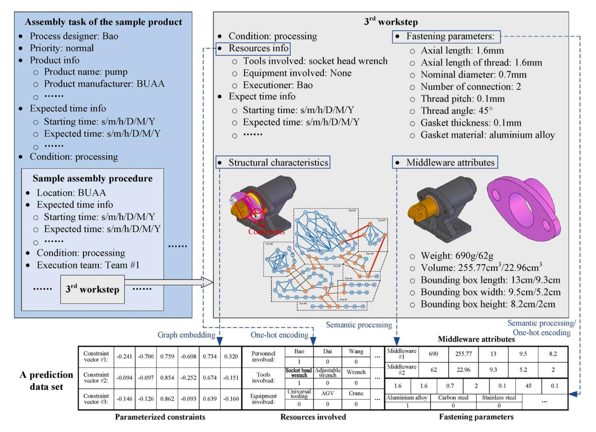
<!-- Image Description: The image presents a structured overview of a sample product assembly process. It uses diagrams showing 3D models of components and a graph representing constraints. Tables detail the process parameters (time, location, personnel), resource usage (tools, equipment), and middleware attributes (weight, volume, bounding box dimensions). A matrix displays a prediction data set using graph embedding and one-hot encoding techniques for constraint vectors. The image aims to illustrate data representation for assembly process prediction. -->
**Fig. 9.**The structure and result of the third work step in hierarchical assembly process modelling. It accentuates the merging of parameterized constraints, derived via node2vec, with the essential work steps details like resources and fastening elements [\[125\]](#page-27-0).

studies underscored the shift towards a more human-centric approach in collaborative robotics within assembly design and execution, such as mutual cognitive HRC [\[98\]](#page-26-0), proactive HRC [\[164\],](#page-28-0) and self-organizing multi-agent HRC [\[52\]](#page-26-0). Similarly, product disassembly, an essential aspect of maintenance and recycling, benefits from the integration of human skills and robotic automation. KGs provide a structured approach to managing knowledge and relationships, enhancing HRC in disassembly processes. The applications of KGs in collaborative disassembly illustrated improvements in efficiency by providing knowledge-based recommendations for HRC disassembly tasks [\[145\]](#page-27-0), suggesting a shift towards more adaptive, dynamic, and human-centred disassembly processes [\[165\]](#page-28-0).

####*4.1.3. Other design guidance and enhancement*KG is employed in manufacturing to structure and extract knowledge from academic resources, enabling computational solutions for domainspecific problems. It converts mathematical expressions into solvable equations, enhancing problem-solving in manufacturing, such as computing solutions for material removal rate and surface roughness [\[166\].](#page-28-0) In design information retrieval, KG offers systematic and comprehensive search methods, reducing the likelihood of missing critical information and cutting down the time spent on manual searches. It provides potential solutions and alternatives, such as automated patent searches [\[56,167\]](#page-26-0), facilitating efficient and informed decision-making in manufacturing design processes.

Merging ML models with KG significantly improves decision-making in manufacturing processes by integrating historical data for a richer knowledge base. This combination allows for predicting machining rules [\[53\]](#page-26-0), forecasting assembly work step durations [\[48\],](#page-26-0) and automating the generation of process plans [\[62\],](#page-26-0) enhancing the predictive accuracy of ML models and leading to more precise and informed decisions [\[62\]](#page-26-0). Moreover, incorporating KG into manufacturing analysis [\[168\]](#page-28-0) and cost estimation [\[150\]](#page-27-0) leads to the automatic and semantic alignment of product features with line capabilities, providing a framework for early-stage manufacturability assessments and cost estimations. The KG-enabled automation, in areas such as cycle time calculations [\[168\]](#page-28-0), reduces the need for manual intervention, thereby streamlining the estimation process and improving the accuracy and traceability of data.

KGs stand at the forefront of revolutionizing engineering design within SM, addressing a arrange of applications from product conceptualization to assembly optimization. KGs enhance engineering design in SM by structuring domain-specific knowledge, thereby enhancing decision-making and optimizing manufacturing operations. Concisely, KGs integrate scattered knowledge sources with real-time data in fostering an adaptive, efficient, and innovative design landscape, enabling manufacturers to navigate the complexities of modern production with greater precision and foresight. Aided by ML and DTs, KGs merge historical insights, current data, and expert understanding to form a cohesive knowledge base for predictive analytics. Moreover, by empowering advanced analytics, KGs equip manufacturers to predict potential inefficiencies, optimize resource utilization, and ensure manufacturing processes are both efficient and adaptable to changing demands. For example, KGs are instrumental in bridging the gap between human expertise and robotic precision and ensuring dynamic collaborations that enhance operational flexibility. Through the synergistic interaction of KGs with advanced analytics, the precision and foresight in engineering design processes mark an advanced step towards a more integrated, intelligent, and responsive manufacturing ecosystem.

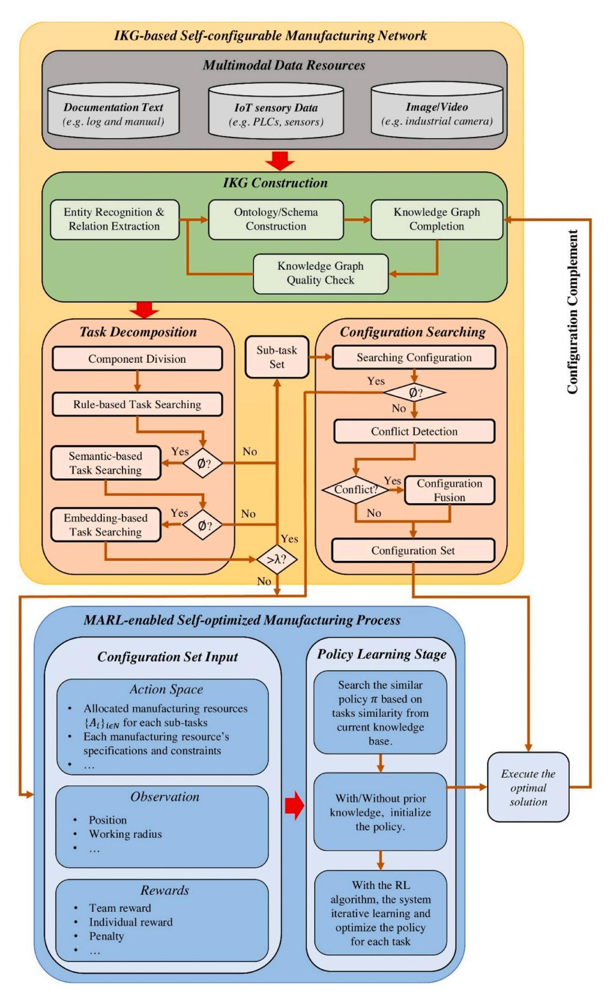
<!-- Image Description: This flowchart details a self-configurable manufacturing network. It depicts an IKG (Interpretable Knowledge Graph)-based system processing multimodal data to construct a configuration. A task decomposition stage precedes a configuration search involving conflict detection and fusion. Finally, a MARL (Multi-Agent Reinforcement Learning)-enabled self-optimized manufacturing process utilizes the configuration set input through action space, observation, and rewards to learn and execute an optimal solution via policy learning. Decision diamonds show conditional flows based on conflict detection and task searching outcomes. -->
**Fig. 10.**The flowchart of the proposed IKG-based MARL approach. This framework consists of two main modules, including constructing an IKG-based self-configurable manufacturing network and a MARL-enabled self-optimized manufacturing process [\[6\]](#page-25-0).

####*4.2. Scheduling in manufacturing using KG*KG improves manufacturing scheduling by mapping intricate connections between machines, tasks, and materials. This helps manage dependencies and optimizes resource use. Setting up a KG for scheduling involves identifying important elements and their interrelations, gathering necessary data, designing an appropriate framework for scheduling, enhancing resource use, adjusting schedules as needed, and maintaining track of processes in manufacturing.

###*4.2.1. Resource configuration and allocation*In manufacturing, effectively setting up and assigning resources, such as machines, robots, and materials, is crucial for production goals. Resource configuration involves choosing the right components and defining their abilities, while allocation optimizes these resources for tasks. Conventional methods, relying on mathematical models and heuristics, overlook the complex interplay between resources. KG offers solutions to structure detailed data and reveal hidden connections for resource configuration and allocation, as exemplified in aerospace machining workshops [\[4\]](#page-25-0) and crane configurations [\[46\]](#page-26-0). Moreover, KG facilitates optimal allocation and utilization of resources, ensuring components are used to their fullest potential, enhancing operational cost-effectiveness, and ensuring balanced operational loads [\[65\].](#page-26-0)

KGs enhance manufacturing systems to autonomously optimize and adapt by offering resilience and flexibility in the face of unpredictable challenges. The capabilities are important in environments where operational conditions can undesirably change, necessitating timely and informed responses. For instance, studies have demonstrated the application of KGs in scenarios ranging from navigating sudden demand fluctuations [\[111\]](#page-27-0), to addressing unforeseen equipment failures [\[169\]](#page-28-0) and mitigating supply chain disruptions [\[170\]](#page-28-0). In autonomous operations, KGs facilitate advanced interactions between humans and machines [\[171\],](#page-28-0) as well as among robots themselves [\[136\],](#page-27-0) ensuring efficient collaboration and process optimization even under uncertain conditions [\[126\].](#page-27-0) Zheng et al. [\[6\]](#page-25-0) advanced towards a self-configurable and self-optimized manufacturing system by integrating IKG and multi-agent reinforcement learning (MARL). The proposed framework was conducted with four UR5 robots in a compact workspace using the PyBullet simulator. The system comprises an IKG-based network for semantic exploration of manufacturing knowledge and a MARL component for refining agent trajectories and policy sharing in [Fig.](#page-15-0) 10. Three key parts were involved in Fig. 11: constructing and querying the IKG, optimizing trajectories with IKG-driven MARL, and updating the IKG with learned solutions. In the experimental studies, the robots navigated and coordinated tasks while avoiding collisions, demonstrating the potential of KGs in enhancing autonomous manufacturing operations.

Integrating KG with DT provides real-time reflections from physical operations for a comprehensive view of manufacturing systems, enhancing autonomous decision-making and strategic human interaction [\[170\]](#page-28-0). Mo et al. [\[60\]](#page-26-0) developed a reconfiguration framework that synergizes DTs, KGs, and modular AI to enhance manufacturing systems. Applied to a cell with multiple robots, this framework involves three stages: capability matching, layout optimization, and configuration updates. This method achieved a 10 % reduction in process time and allowed for the updating of robot programming to the newly optimized configuration, demonstrating the effectiveness of KGs in streamlining manufacturing operations.

###*4.2.2. Job scheduling*Job shop scheduling, a complex task of allocating diverse jobs across machines while adhering to operation sequences and machine capacities, faces challenges in finding optimal schedules due to the exponential growth of solution domains with added jobs and machines. However, traditional heuristic methods often fall short in precision. KG is effective in capturing the intricacies of scheduling entities and their interrelationships, laying the groundwork for learning models to uncover optimization paths, as demonstrated by scheduling accuracy and efficiency in Bosh manufacturing data [\[153\].](#page-28-0) In KG with ML for job shop scheduling, efforts have focused on supervised learning and reinforcement learning (RL) for policy development. However, generalizing these approaches to unfamiliar scenarios remains challenging, often requiring retraining for new problem sets. Park et al. [\[69\]](#page-26-0) developed a framework combining GNNs and RL, treating scheduling problems as sequential decision-making tasks. Their model minimized unfinished jobs and makespan and showed superior performance compared to traditional

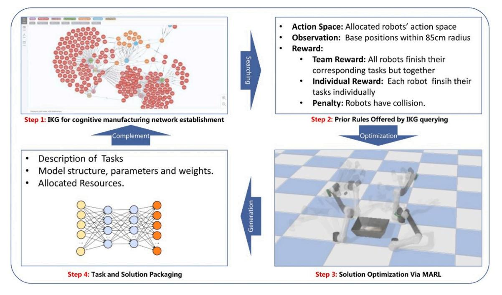
<!-- Image Description: This image depicts a four-step process for cognitive manufacturing network optimization using multi-agent reinforcement learning (MARL). Step 1 shows a graph representing the network; Step 2 lists reward/penalty criteria for robot actions; Step 3 displays a 3D simulation of robots optimizing task completion; and Step 4 illustrates task and solution packaging. A neural network diagram represents task modeling. The figure visually outlines the workflow and key components of the proposed system. -->
**Fig. 11.**The core procedure of an illustrative example. The core procedure consists of four main steps, including IKG foundation, IKG query, MARL optimization, and IKG refinement [\[6\].](#page-25-0)

and previous RL methods. Seito et al. [\[172\]](#page-28-0) combined deep RL with GCNs to optimize scheduling involving 50 jobs and 10 machines. The model found optimal solutions by training iteratively on 128 problems, highlighting the integration of KGs and ML in structured problem optimization.

Adaptability and resilience in manufacturing scheduling are essential, especially when dealing with unforeseen events such as machine faults, to minimize disruptions and maintain an optimal production flow. Liu et al. [\[114\]](#page-27-0) developed a fault KG combined with a Monte Carlo search to create resilient production schedules incorporating machine fault and maintenance information from DTs, improving real-time adaptability and reducing downtime. Roˇzaneca et al. [\[58\]](#page-26-0) employed KGs in cognitive twins to augment DTs in automotive plants, enabling them to forecast production, provide decision alternatives, and continually refine recommendations based on user feedback, facilitating a closed-loop learning process.

###*4.2.3. Other tasks in scheduling*Intralogistics systems, which manage complex internal material flows in manufacturing, require feasibility feedback to avoid costly design changes. This feedback depends on aligning product needs with logistics resources and connectivity. KG is key in evaluating manufacturing systems feasibility and offering recommendations considering cost, quality, and resource availability. Ocker et al. [\[173\]](#page-28-0) demonstrated the KG in automatedly assessing feasibility for manufacturing. They employed geometric reasoning, mapping resources, conveyors, and zones to evaluate production feasibility against mass and resource availability constraints. Zhao et al. [\[174\]](#page-28-0) implemented a KG platform to combine different ontologies for a machining request. This approach enabled them to match features, verify feasibility, and match functions through task decomposition, leading to equipment recommendations based on cost and quality of service. Moreover, combining KG and DT enhances data interoperability and operational optimization by real-time monitoring and predictive modelling [\[140\]](#page-27-0). Jia et al. [\[105\]](#page-27-0) developed a KG-based DT model for real-time monitoring and production optimization, linking machining indicators to tool wear. Moreover, KG manages responses to events in power dispatching, maintaining logical flow and offering solutions by integrating multi-source data and protocols [\[175\].](#page-28-0)

KGs enhance manufacturing scheduling by mapping the complicated webs of relationships among key entities, such as machines, tasks, and materials. The structured representation of KGs adeptly manages interdependencies and optimizes the allocation of resources for simplifying the entire scheduling process. By integrating with ML algorithms, KGs have shown remarkable effectiveness in not just simplifying job scheduling amidst growing task complexities but also extending beyond traditional scheduling to intralogistics and power dispatching. The adaptability of KGs to diverse manufacturing scenarios fosters intelligent, data-driven decision-making across the manufacturing spectrum. Furthermore, KGs combined with DTs are instrumental in predictive scheduling to forecast and adapt to changes for minimizing downtime and enhancing operational flexibility. The multifaceted capabilities of KGs ensure that manufacturing scheduling is not only more efficient and informed but also adaptable, which makes a cornerstone for achieving agility and efficiency in the scheduling environments of SM.

####*4.3. KG on quality control and management*In Industry 4.0, a surge in machine data has emerged by manufacturing digitization, often stored in isolated, heterogeneous silos, making integration a major challenge. For example, Bosch plants report that 70–80 % of effort is spent on data integration, overshadowing the 20–30 % for analysis, primarily due to manual and non-standardized methods [\[176\].](#page-28-0) This fragmented data landscape hinders a unified view of manufacturing systems, affecting product analysis. KG offers a solution by enabling semantic integration for quality characterization, demonstrated in diverse manufacturing contexts, such as surface mounting [\[176\]](#page-28-0), aerospace [\[47,89\],](#page-26-0) welding quality [\[129,177\]](#page-27-0), plastic injection moulding [178–[182\],](#page-28-0) and custom apparel production [\[111\]](#page-27-0). Moreover, KG improves QCM by consolidating data, identifying patterns, aiding decision-making, predicting quality issues, facilitating root cause analysis, and ensuring traceability, thanks to its ability to represent complex connections across various environments.

####*4.3.1. Defect detection and quality prediction*KG, in conjunction with ML models, enhances manufacturing by modelling the complex links between product features, process settings, and defects. This integration aids in the early detection of potential problems, allowing for accurate defect classification [\[183\]](#page-28-0) and real-time predictions [\[105\],](#page-27-0) enabling proactive QCM measures and enhancing product quality and resource efficiency [\[134,178\]](#page-27-0). ML techniques combined with KG also provide sophisticated parameter adjustment in manufacturing [\[123\].](#page-27-0) This collaboration ensures continuous process optimization and prompts the correction of any deviations from the desired quality standards [\[184\].](#page-28-0) Liu et al. [\[185\]](#page-28-0) utilized DT and KG for real-time QCM during aerospace component machining, monitoring quality across diverse scales (such as macro, meso, and micro scales in [Fig.](#page-18-0) 12) to ensure that quality is maintained at every manufacturing level. Xia et al. [\[155\]](#page-28-0) developed a hyper GNN that uses GCNs and RNNs to predict material removal rates in semiconductor manufacturing, specifically in the chemical mechanical planarization process, by analysing temporal dynamics and component relationships with a 14-feature dataset. KG establishes a solid basis for models that conduct complex reasoning, improving defect detection and prevention strategies. For example, KGs can use historical data (e.g., process data and inspection data) and unstructured text linked to defects to infer potential quality issues under similar conditions [\[49\].](#page-26-0)

KGR, empowered by providing traceability, and knowledge reuse through accumulated experiences, has the ability to recognise the defects and predict product qualities [\[186\]](#page-28-0). In manufacturing, where new defect types continuously emerge, zero-shot surface defect recognition is increasingly important. KG, when applied to zero-shot learning, significantly improves the ability to recognize and respond to previously unseen defects. Li et al. [\[122\]](#page-27-0) developed a KG to detect unseen defects for zero-shot surface defect recognition. Their method demonstrated on a real-world printed circuit board defect dataset, incorporates an image encoder, a class encoder, and a classifier in [Fig.](#page-18-0) 13. The class encoder effectively bridges the gap between known and new defect classes using the KG, ensuring classification of new defects during training and testing. This approach, validated through experiments with different training and testing sets, showed accuracy improvements. The key advantage of this method is its scalability and adaptability to new defects in manufacturing systems, reducing the need for continuous re-training of the models.

####*4.3.2. Root cause analysis*KG is increasingly utilized in root cause analysis for QCM within manufacturing. It integrates various data types by identifying connections between products, quality issues, and potential causes throughout the production line, such as experience knowledge and real-time machine data [\[120\]](#page-27-0). This integration enhances query efficiency across multiple domains [\[177\]](#page-28-0), optimizing processes and improving quality management [\[129\]](#page-27-0). Zhou et al. [\[135\]](#page-27-0) illustrated using KGs for complex queries in quality management, such as defect rate assessments and providing insights into defects, their causes, and solutions. Another application, demonstrated by Meyers et al. [\[187\]](#page-28-0) in CNC machining, explored an adaptive strategy that reduces measurement expenses by correlating temperature (among other process parameters) with resultant quality. This strategy underscores the value of understanding latent correlations in predicting quality issues and refining manufacturing systems.

Incorporating UX and ensuring ongoing system refinement are

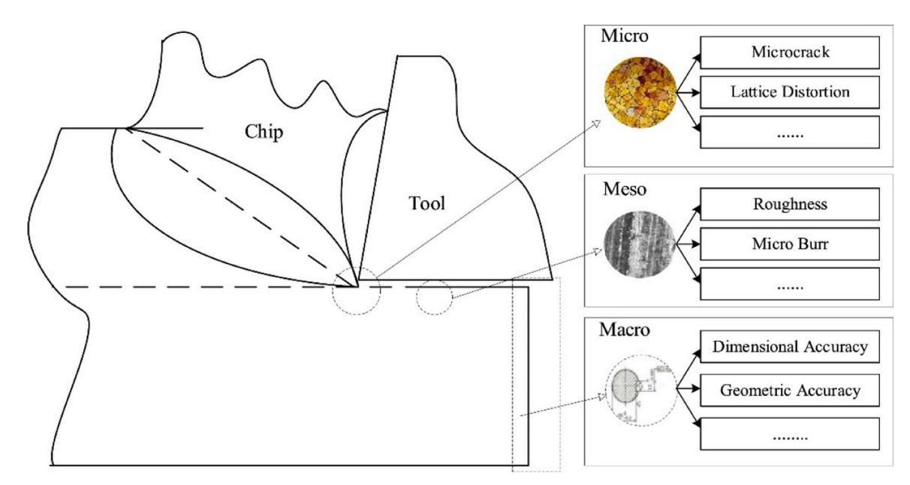
<!-- Image Description: This image from an academic paper illustrates a machining process. A line drawing depicts tool-workpiece interaction, showing chip formation. Three accompanying diagrams categorize surface characteristics at micro, meso, and macro scales. Micro-scale shows microcracks and lattice distortion; meso-scale shows roughness and micro-burrs; macro-scale shows dimensional and geometric accuracy. The image likely explains the multi-scale nature of surface finish in machining. -->
**Fig. 12.**Three scales in assessing product quality, including (1) macro scale (size error*>*1 mm), (2) meso scale (0.01 ≤ size error ≤1 mm) and (3) micro-scale (size error *<*0.01 mm) [\[185\].](#page-28-0)

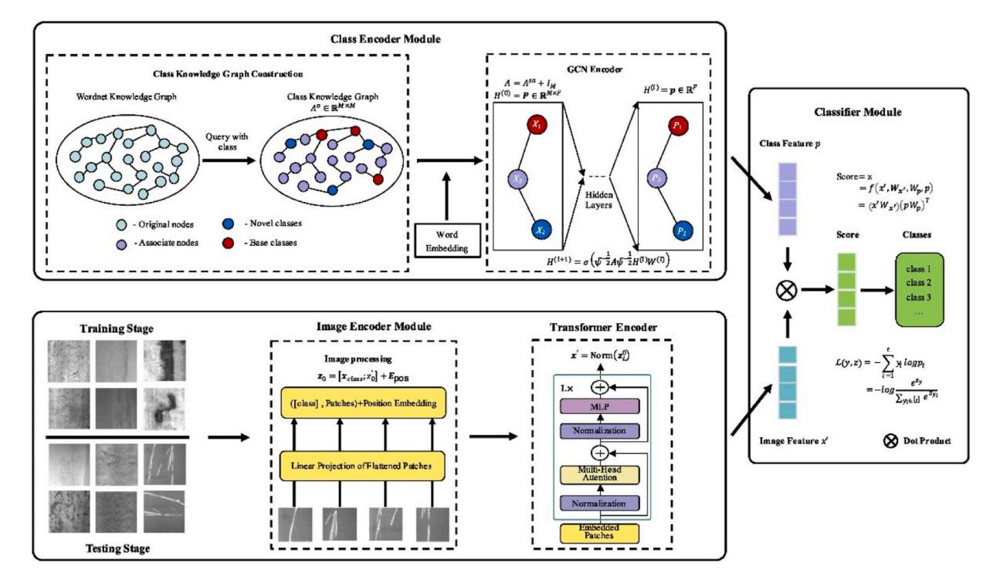
<!-- Image Description: This diagram illustrates a zero-shot learning framework. The top shows a class encoder module using a graph convolutional network (GCN) on a class knowledge graph to generate class features. The bottom depicts an image encoder module employing a transformer network on image patches. Both modules' outputs are combined using a dot product in a classifier module to predict class scores, with equations provided for the GCN, transformer, and classification processes. The figure visually details the data flow and processing steps within the proposed model architecture. -->

**Fig. 13.**The framework of the proposed model contains three modules: (1) an image encoder, (2) a class encoder, and (3) a classifier to forecast the defect label [\[122\].](#page-27-0)

important for maintaining the accuracy and efficacy of quality management systems within SM. By prioritizing user-centric design principles, the QCM systems become not only more accessible but also more effective at knowledge extraction and application, which meets the requirements of both technical and non-technical users. Zhai et al. [\[144\]](#page-27-0) improved quality management in auto parts manufacturing by developing a four-layer KG, and used the existing MES data to cut investigation time by 30 % in two months. Continuous system refinement, driven by UX, emphasizes the importance of iterative development and user engagement in successful quality management. Qiu et al. [\[133\]](#page-27-0) enhanced the KG utility by incorporating NLP, using BERT to extract entities and relationships from queries. The proposed approach simplified the information retrieval in KGs and demonstrated NLP in improving user interaction with complex systems for refining quality optimization processes. The user-supported KGs not only improve the UX but also contribute to the overall operational processes, where quality management evolves with technological advancements and user needs.

KGs play an important role in QCM by systematizing fragmented data to depict intricate relationships between product features, manufacturing processes, and potential defects. Unifying and structuring the fragmented data provides a holistic view of quality management processes for comprehensive monitoring and analysis. Through the incorporation of ML techniques, KG-based models are employed in the early detection of defects, which facilitates thorough root cause analysis and the formulation of precise corrective measures. Moreover, the synergy of KGs with advanced technologies such as NLP and DTs significantly improves the accessibility and applicability of KGs in cutting-edge quality management systems, which transforms QCM from a traditionally reactive to a proactive one.

####*4.4. KG for supply chain management*KG boosts SCM by mapping intricate entity links, offering comprehensive increased visibility, and spotlighting supply chain vulnerabilities. They aid inventory optimization and demand forecasting with multi-source data for ML, centralize key supplier and customer data, and enhance collaboration through shared understanding.

###*4.4.1. Supply chain visibility and risk surveillance*Supply chain visibility is essential for informed decision-making and proactive operations management by integrating data across the supply chain for clearer insights. It helps identify potential bottlenecks, monitor material flow, and understand disruptions, improving efficiency and risk management. Deng et al. [\[188\]](#page-28-0) created a diverse SCM corpus for an event logic KG. The generative adversarial network (GAN) model with active learning boosted entity recognition in SCM, achieved high accuracy even with limited labelled data, and aided decisions through KG visualizations.

Risk management in supply chains is important for minimizing disruptions and costs. It involves proactively identifying and managing risks like supplier reliability and material shortages. However, traditional risk management often overlooks the complex interdependencies in supply chains. For example, existing techniques for supply chains focus only on predicting supplier-buyer links, ignoring multiple risk factors beyond this single relationship. Using KG to represent supply chain data allows for complex, multi-dimensional queries beyond basic supplier-buyer relationships. Moreover, existing supply chain data often relies on voluntary supplier sharing, which can be inaccurate or incomplete. Research focuses on automated statistical methods to deduce hidden supply chain knowledge without depending on data sharing. Elson et al. [\[17\]](#page-25-0) addressed this by using GNN models in KGR to reveal hidden supply chain risks and predict obscured links. Their approach, tested in automotive and energy sectors, improved supply chain insights and worked effectively even with imbalanced links.

#*4.4.2. Demand forecasting and other applications*Demand forecasting in SCM predicts future demands by analysing data from sales, market trends, etc., to inform inventory and production planning, optimizing resource use, cost-efficiency, and customer satisfaction. Integrating KG with AI models like neural networks and active learning enhances decision-making and forecasting accuracy by ensuring depth and transparency in explanation [\[189](#page-28-0)–191]. Some approaches also incorporate user-interactive systems and feedback loops to continually refine KGs and adapt decision strategies based on user input [\[58,192\].](#page-26-0) Through the integration of KGs, decision-making in SCM is not isolated but rather holistic [\[193,194\]](#page-28-0), considering various influential factors, external data, and real-world scenarios, which is vital for maintaining an agile and resilient supply chain. Liu et al. [\[195\]](#page-28-0) and Rolf et al. [\[196\]](#page-28-0) demonstrated how integrating data from diverse domains via KGs can optimize production aspects and enhance collaborative decision-making in SCM. They emphasized the importance of graph-based AI for dynamic adaptation and advocated for incorporating external data sources to broaden the decision-making perspective.

In manufacturing, production logistics (PL), which accounts for most production time, faces issues like spatial disorganization and timing mismatches among resources like staff and vehicles, leading to delays and inefficiencies, especially in large industrial settings. Using KG and DTs in PL allows for flexible adaptation and reconfiguration of supply chains, offering a detailed perspective for making decisions in evolving situations. Zhao et al. [\[59\]](#page-26-0) introduced a dynamic spatial-temporal KG (DSTKG), which leverages data from IoT sensors and deep neural networks to enhance resource allocation in manufacturing logistics. The DSTKG-based framework comprised IoT data generation, processing for DT mapping, KG construction, and optimization in [Fig.](#page-20-0) 14(a), which frames resource allocation as a graph algorithm challenge to identify the most efficient strategies within given constraints. They tested this approach in a large industrial park covering various manufacturing plants in [Fig.](#page-20-0) 14(b). The DSTKG led to significant improvements, including quicker data collection, higher vehicle utilization (87 %), and reduced waiting times and travel distances by 25 % and 20 %, respectively.

KGs describe the intricacies of supply chains to bolster the resilience and operational efficacy within the SCM of SM. KGs markedly enhance the transparency of SCM, facilitate more informed decision-making, and improve risk management strategies. Combining KGs with ML technologies improves the accuracy and efficiency of demand forecasting in SCM. The synergy of KGs and ML optimizes resource allocation and utilization in SCM processes to better meet market demands and minimize wastage. Additionally, by harmonizing diverse data sources, KGs reveal potential bottlenecks and provide predictive insights into likely supply chain disruptions in fostering a proactive rather than reactive management approach. Informed by IoT data, the application of KGs introduces a dynamic nature to resource allocation for enhancing logistical operations and overall production efficiencies. Incorporating DTs and IIoT with KGs and ML deepens the level of integration and interconnectivity within SCM systems, which becomes more agile and robust, and capable of predicting and mitigating potential disruptions before they impact the manufacturing workflow. The versatility of the multifaceted and integrated systems facilitates a seamless, real-time flow of information and decisions across the supply chain network and enables manufacturers to adapt quickly to changing market conditions and operational challenges.

##*4.5. Applications of KG for PdM*Manufacturing companies use advanced maintenance systems to reduce downtime and improve asset availability. However, managing large volumes of structured and unstructured reports poses challenges. While NLP and ML can extract textual patterns, human expert validation limits full automation. KG advances PdM by mapping system parts and faults, integrating various data types, enabling diagnostic logic, automating fault detection, and ensuring traceability. This process involves identifying crucial elements, gathering data, creating schemas, and developing algorithms for effective PdM.

###*4.5.1. KG in diagnosis*KGs are constructed in PdM to integrate data across domains, providing a comprehensive view of PdM in various settings. Examples include thesaurus-guided maintenance in SM [\[197\]](#page-28-0), power equipment [\[75,141\]](#page-26-0) and intelligent power-plant management [86, 142, [198\],](#page-26-0) wind turbine management [\[199\],](#page-28-0) process safety in the chemical industry [\[77\]](#page-26-0), flotation processes [\[57\]](#page-26-0), robot transmission system fault diagnosis [\[90\]](#page-26-0), and semiconductor manufacturing maintenance [\[73\]](#page-26-0). KG in PdM maps complex system relationships and states to enhance diagnostics by incorporating real-time and historical data. For example, rule-based reasoning is used to quickly pinpoint probable causes of anomalies [\[130\],](#page-27-0) improving fault diagnosis speed and accuracy. Recent advancements have optimized KG construction for maintenance, adding semantic queries to refine the diagnostic process [\[54\].](#page-26-0) Martinez-Gil et al. [\[143\]](#page-27-0) and Cui [\[200\]](#page-28-0) demonstrated, KGs have transitioned from information repositories to tools capable of dynamic linking and complex

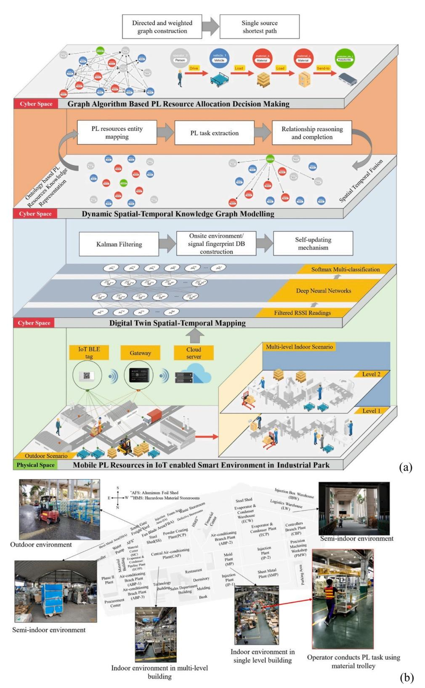
<!-- Image Description: This image from an academic paper presents a multi-layered architecture for resource allocation in an industrial park. The top layer shows graph algorithms for decision-making, using shortest path calculations. Below, dynamic spatial-temporal knowledge graph modeling integrates Kalman filtering and deep neural networks for location tracking and classification using RSSI readings. The bottom layer depicts the physical space with IoT devices, a gateway, and cloud server, showing the deployment in various indoor and outdoor environments within a multi-level building. The diagrams illustrate the system's data flow and integration across physical and cyber spaces. -->
**Fig. 14.**(a) The four-layer architecture of the proposed DSTKG-based approach. These layers involve PL resources in an IoT-enabled environment, DT spatialtemporal mapping, DSTKG modelling, and graph algorithm-based allocation; (b) The on-site scenario used for the case study. The park, a large-scale manufacturing environment with complex indoor-outdoor spaces, has multiple plants for components, outdoor areas, and indoor production facilities [\[59\]](#page-26-0).

reasoning for providing in-depth insights.

Recent studies have integrated ML with KG to improve diagnostic accuracy in PdM, particularly in detecting faults in direct-drive permanent magnet synchronous motors [\[201\]](#page-28-0) and rolling bearings [\[202\].](#page-28-0) ML algorithms effectively process large data sets, yielding insights that enhance traditional diagnostic methods, significantly boosting fault detection and diagnosis accuracy [\[203\]](#page-28-0). Lv et al. [\[201\]](#page-28-0) and Emmanouilidis et al. [\[204\]](#page-28-0) emphasize the need for customized fault diagnosis solutions tailored to specific equipment types and failure modes. This approach ensures more targeted management of faults. Emmanouilidis et al. [\[204\]](#page-28-0) also underline the growing trend of collaborative human-machine diagnostic systems, where the continuous enrichment of KGs with ML insights and human expertise improves the accuracy and reliability of fault identification and resolution.

Moreover, an increasing number of studies, including those by Martinez-Gil et al. [\[143\]](#page-27-0) and Liu et al. [\[202\]](#page-28-0), emphasize enhancing the explainability and transparency of diagnostic systems. They utilize SPARQL queries and detailed visualizations to provide clear diagnostic insights, moving away from the opaque nature of traditional ML models. A holistic approach to fault management, integrating data acquisition, analysis, visualization, and alerting into a cohesive system, is also evident in the works of Jilg et al. [\[205\]](#page-29-0), Liang et al. [\[128\]](#page-27-0) and Martinez-Gil et al. [\[143\]](#page-27-0), ensuring efficient and seamless fault detection, diagnosis, and resolution.

####*4.5.2. KG in prognosis*Combined with time-series sensor data and ML algorithms, KG enables predictive analysis to forecast future failures in manufacturing. This approach uses structured knowledge from KGs to predict component time-to-failure and understand potential failure consequences, aiding proactive maintenance planning. The emphasis on real-time and adaptive monitoring is highlighted in the works of Cui [\[200\]](#page-28-0), Siaterlis et al. [\[206\],](#page-29-0) and Weckx et al. [\[184\].](#page-28-0) Integrating KG, DT, and advanced ML marks a significant advancement in PdM and real-time monitoring. This blend creates an interconnected ecosystem for accurate fault diagnosis and operational efficiency. Jia et al. [\[105\]](#page-27-0) used KG in DT modelling for shop floor operations, focusing on machine tool temperature and wear predictions. The system combined simulation and data-driven methods for real-time temperature monitoring and prediction. Another system comprising data acquisition, processing, and output components was developed, employing sensor signals and a ResNet-based algorithm for tool wear prediction.

Integrating KG with complex neural networks achieves unprecedented fault prediction and diagnosis efficiency [\[80\],](#page-26-0) real-time immediate response to emerging issues [\[128\]](#page-27-0), and transitions from reactive to proactive fault management [\[206\].](#page-29-0) The proactive maintenance approach highlighted in these studies represents a shift in maintenance operations, evolving from traditional time-based to intelligent, condition-based maintenance. This shift, aimed at minimizing unexpected failures and maximizing operational efficiency, is exemplified by Weckx et al. [\[184\]](#page-28-0) through continuous monitoring and proactive fault management in drilling processes. The adaptability and versatility of KG-based models demonstrated in these studies are crucial in diverse manufacturing contexts. Wan et al. [\[207\]](#page-29-0) employed KGs to predict strip breakage in an imbalance dataset.

####*4.5.3. PdM decision-making*Maintenance planning is common in PdM and benefits from KG organizing relevant data. KG aids decision-making in PdM by structuring system data for machine interpretation, allowing assessment of various maintenance actions based on current and forecasted component states. However, KG usually has missing links. Xia et al. [\[100\]](#page-27-0) addressed this with their ACRGCN model, predicting these missing links and enhancing maintenance recommendations. This model, integrated with a question-answering system, efficiently handles queries and provides practical recommendations. Advanced algorithms like GNNs combined with KGs boost PdM, especially in complex maintenance scenarios [\[99\]](#page-27-0). KG also updates in real-time with new data and maintenance updates within DT, offering dynamic support for PdM [\[114\]](#page-27-0). KG also integrate business rules, constraints, and objectives, facilitating automated or semi-automated PdM decisions. Jiang et al. [\[50\]](#page-26-0) implemented advanced text processing and Bayesian reasoning for rapid, accurate fault diagnosis in sensitive environments like nuclear power plants. The strategic combination of various technologies creates a harmonious and interconnected operational ecosystem, such as Bayesian reasoning networks [\[87\]](#page-26-0), Monte Carlo tree search algorithm [\[114\]](#page-27-0) and CNN [\[114\],](#page-27-0) significantly boosting operational efficiency in industrial settings. Additionally, a shift to competency-based maintenance planning highlights the importance of strategic human resource allocation in boosting maintenance efficiency [\[73\]](#page-26-0), underscoring the need for focused and tailored human resource management in industrial maintenance. Wang et al. [\[208\]](#page-29-0) proposed a KG-driven PdM framework for industrial robots for production stability in intelligent manufacturing. In [Fig.](#page-22-0) 15, the proposed approach focused on extracting PdM-relevant knowledge to construct KGs from historical industrial robot operation, fault, maintenance and bill of material data, and employ KG-driven PdM scheme to support PdM planning and decision-making. In the constructed KG, multimodal industrial robot data and domain knowledge are encoded to enable data driven PdM.

PdM in SM has been significantly affected by KGs: improving diagnosis, prognosis, and strategic decision-making processes. KGs facilitate automated fault diagnosis and foster predictive analytics by revealing complex relationships among system components, operational states, and potential failure modes. The capabilities of KGs are particularly important in modern manufacturing, where the minimization of downtime and prevention of unplanned outages directly correlate with productivity and profitability. Integrating KGs with ML and time-series data analysis, predictive models forecast potential equipment failures with remarkable accuracy. This integration not only predicts the wear and tear of machinery but also prescribes proactive maintenance schedules for effectively minimizing the risk of unexpected breakdowns. Moreover, the symbiosis of KGs with DTs enhances the dynamism and responsiveness of maintenance strategies. By reflecting on real-time changes and simulating various operational scenarios, DTs informed by KGs enable the execution of optimal maintenance decisions aligned with current conditions, constraints, and future projections. The strategic use of KGs in PdM offers an opportunity to transform traditional reactive maintenance practices into a proactive, intelligence-driven approach. KG-supported PdM maximizes operational efficiency, extends equipment lifespan, and sustains manufacturing throughput, marking a significant leap forward to a more adaptive, resilient, and efficient manufacturing landscape.

#### 5. Prospects: challenges and opportunities

Incorporating insights from [Section](#page-12-0) 4, KGs play an important role in enhancing various aspects of SM. By offering structured and interconnected data representation, KGs significantly improve decisionmaking, resilience, and innovative approaches in engineering design, scheduling, QCM, and SCM, extending into PdM. However, the technological evolution within SM introduces ongoing challenges and new opportunities for the application of KGs.

[Fig.](#page-23-0) 16 shows a strategic vision for advancing SM through the convergence of KGs with cutting-edge methodologies. It builds on the fundamental phases outlined in [Fig.](#page-7-0) 6, highlighting a symbiotic progression from knowledge extraction and KG construction to dynamic applications within intelligent manufacturing ecosystems. Specifically, it depicts seven key prospects for KG-aided systems in SM, each linked to its underlying motivation, cohesively presenting the rationale for explorations. In the current landscape of SM, technology advancements such as LLMs, multi-modal KG (MMKG) and explainable AI (XAI) are gaining attention. Especially the LLMs, underpinned by deep learning

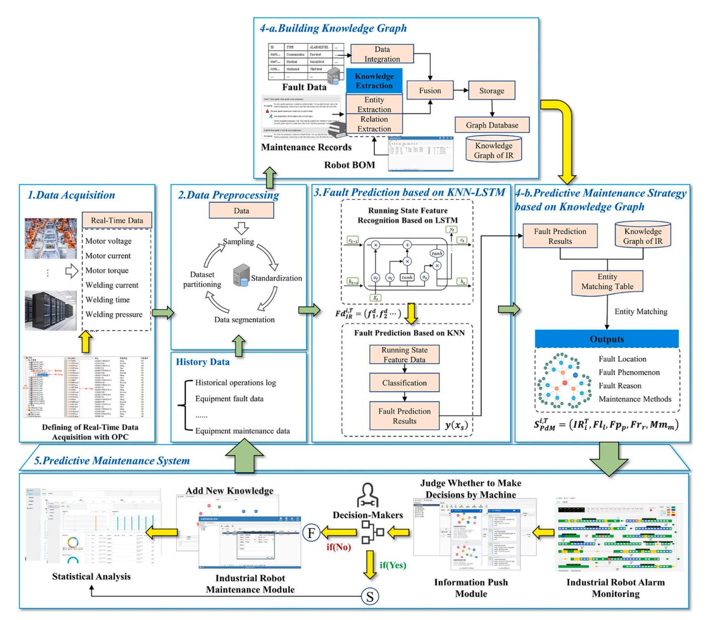
<!-- Image Description: This flowchart depicts a predictive maintenance system for industrial robots. It details five stages: data acquisition (real-time and historical data); data preprocessing (sampling, standardization, segmentation); fault prediction using KNN-LSTM (a hybrid model combining K-Nearest Neighbors and Long Short-Term Memory networks); knowledge graph construction for improved prediction; and a final predictive maintenance system integrating decision-making and alarm monitoring. The system utilizes a knowledge graph to represent robot faults, enabling more accurate prediction and improved maintenance strategies. -->
**Fig. 15.**A knowledge-based PdM framework: 1) data acquisition: real-time data acquisition, 2) data preprocessing to address the problem of missing values, abnormal values, and data inconsistency, 3) fault prediction based on KNN-LSTM, 4a) KG construction and KG-based strategy for reasoning failure cause and maintenance decision, 5) PdM system [\[208\]](#page-29-0).

architectures, have demonstrated their capabilities in NLP, knowledge extraction, and decision support. Despite the broad applicability of LLMs, incorporating LLMs into manufacturing presents unique challenges due to the complex data and the need for prompt decision-making in SM. However, the synergy between LLMs and KGs presents a promising way to significantly boost the accuracy, efficiency, and adaptability of manufacturing systems by combining the extensive data processing abilities of LLMs with the structured knowledge representation of KGs. The potential of KGs is magnified when synergized with other innovative technologies in SM, especially LLMs. The expected integration aims to address the practical challenges of applying KGs in SM, such as scalability issues, integration with existing infrastructures, and the need for user-centric interfaces and experiences. Strategies for overcoming these challenges include adopting distributed graph databases for scalability, employing middleware for integration with legacy systems, and enhancing user interfaces for greater accessibility and utility in SM applications. The advancements of KGs combined with other technologies pave the way for a more intelligent, efficient, and adaptable manufacturing future, which emphasizes the necessity for continuous exploration and adaptation to the evolving industrial landscape.

#*5.1. KG-Enhanced LLM: Elevating prompt engineering as knowledge engineering in SM*In SM, the collaboration between KGs and LLMs revolutionises efficiency and innovation. Specifically, this synergy significantly impacts the automated prompt engineering (APE) field [\[209\]](#page-29-0). Integrating LLMs with the structured knowledge from KGs brings a transformative change. This combination enhances the accuracy and reliability of LLM-generated content, serving as a vital check and balance and improving interpretability and functionality [\[210\].](#page-29-0) LLMs in conjunction with KGs for intelligent manufacturing match traditional knowledge expressions, where KG acts as a structured representation without LLMs. This collaboration predominantly enhances the training data, addressing the black-box nature of LLMs, which often lack in capturing factual

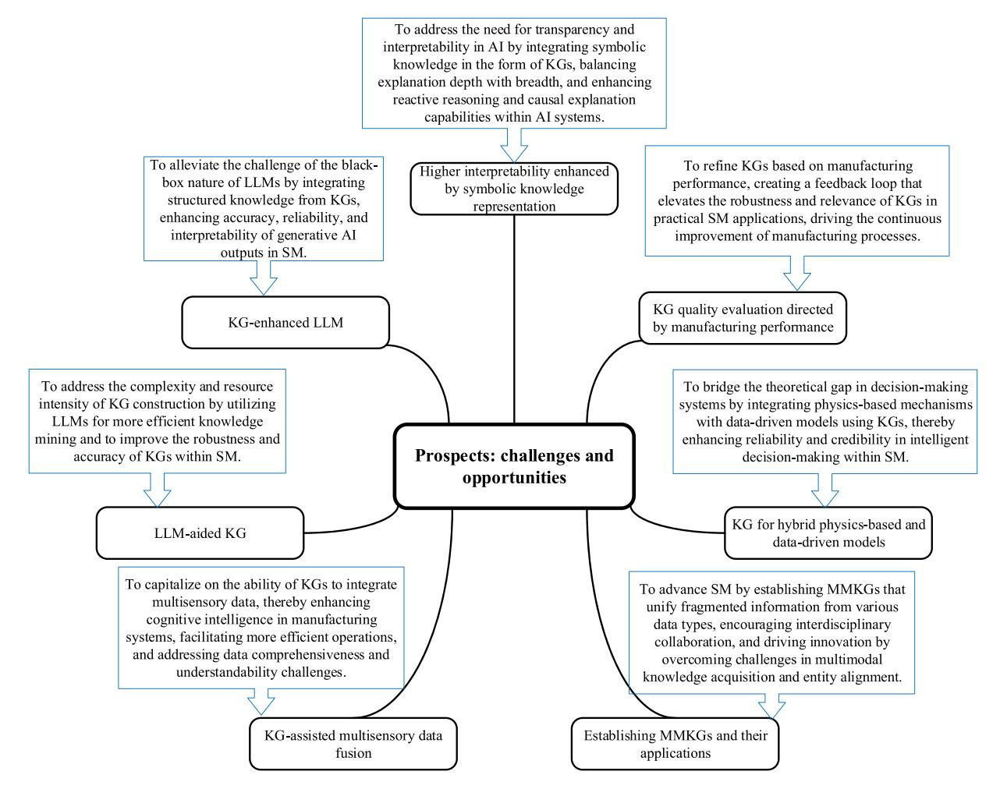
<!-- Image Description: The image presents a flowchart outlining prospects, challenges, and opportunities in integrating knowledge graphs (KGs) and large language models (LLMs) for smart manufacturing (SM). It shows how KGs can enhance LLMs' interpretability and accuracy, improve KG construction efficiency via LLMs, and facilitate multisensory data fusion. Furthermore, it illustrates using KGs for refining manufacturing processes, creating hybrid physics-based and data-driven models, and establishing multi-modal knowledge graphs (MMKGs). The flowchart visually organizes these research directions. -->
**Fig. 16.**A roadmap of prospects for enhancing SM by KGs with emerging technologies.

knowledge. The KG serves as a "knowledge base in the loop," significantly contributing to APE, or prompt engineering as knowledge engineering [\[211\]](#page-29-0). This includes designing algorithms and architectures and providing process blueprints and guidance for knowledge engineers to use generative AI tools productively. The integration holds substantial promise as the main approaches still require human intervention for writing prompts. KG maintains its importance in auto prompt technologies by continually refining knowledge for LLM integration. This synergy between KG and LLMs fosters efficient, reliable and human-centric SM solutions, enabling nuanced knowledge engineering and aiding the effective use of generative AI in manufacturing.

This synergy of KGs and LLMs not only mitigates the challenges associated with the inherent hallucination of LLMs but also paves the way for more intuitive, user-friendly interfaces that can interpret and respond to natural language queries with precision by leveraging the structured, rich knowledge embedded within KGs, such as transforming texts into Cypher query language. Moreover, the continuous refinement of KGs plays an important role in sustaining the integration efficacy of KGs and LLMs, ensuring that LLMs remain aligned with the evolving knowledge of SM. The continuous enhancement of LLMs highlights their critical role in supporting and advancing the capabilities of KGs within SM. The result is a robust, adaptable framework that supports efficient decision-making, innovative problem-solving, and simplified operations, all while remaining grounded in a user-centric approach that emphasizes accessibility and practical utility.

#*5.2. LLM-Aided KG: Automating and fortifying KG construction, development, and maintenance*LLMs and KG interplay is vital in automating and reinforcing KG construction, development, and maintenance. LLMs address the complexity of KG construction by effortlessly extracting and matching entities from multiple sources, including structured, semi-structured, and unstructured data [\[210\]](#page-29-0). Using LLMs facilitates efficient knowledge mining, such as entity resolution and linking prediction, eliminating the need for various task-specific modules and mitigating the challenges of traditional methods [\[211\]](#page-29-0).

LLM-aided KG technology liesin its ability to extract knowledge from tables and texts, streamlining the processes of named entity recognition, relation extraction, event extraction, and semantic role labelling [\[210\]](#page-29-0). Despite challenges such as effective information extraction from lengthy texts and ensuring high coverage, the power of LLMs ensures commendable performance even with small samples. Moreover, LLMs bolster the ontology alignment and refinement process. LLMs assist in extracting contextual information from input texts, inductive reasoning for generating new rules, and understanding lexical information to coordinate synonyms and polysemy [\[210\]](#page-29-0). This synergy between LLMs and KG offers a more automated, accurate, and comprehensive approach to overcome the limitations of traditional KG construction [\[209\]](#page-29-0). The assistance also enhances the quality of KGs, making them more robust and reliable for various applications in SM [\[209\]](#page-29-0). Briefly, this cooperation not only automates the traditionally labour-intensive tasks but also infuses a higher degree of accuracy and reliability in KGs, ensuring enhanced functionality in the dynamic field of smart manufacturing.

Despite the existing challenges in utilizing LLMs for KG enhancement, the collaboration between these two technologies is revolutionizing the landscape.

#*5.3. KG-assisted multisensory data fusion for complex manufacturing systems*In complex manufacturing, KG effectively integrates multisensory data, surpassing methods like ontologies in computational efficiency and accessibility for non-experts [\[212\].](#page-29-0) This underscores the ability of KG to tackle the challenges of data comprehensiveness and understandability in the manufacturing sector. KG plays a crucial role in manufacturing by organizing resources and improving interactions between humans and machines, as well as between machines themselves. This approach boosts cognitive intelligence in manufacturing systems, leading to more efficient and synergistic operations. The effectiveness of KG in integrating multisensory data is confirmed by industry feedback, demonstrating their practicality and relevance in blending advanced technology with real-world applications.

While KG in multisensory data fusion has shown significant promise, challenges such as the subjective nature of knowledge-based components and the complexity of experimentation are present. However, the ongoing efforts to develop innovative, accurate methodologies are making headway in addressing real-world manufacturing problems. This progress, despite its challenges, lays a solid foundation for future advancements in SM.

#*5.4. Establishing multimodal KGs and MMKG applications under manufacturing context*Compared to KG-assisted multisensory data fusion which primarily integrates various sensor data, MMKGs further focus on a wider array of data types, such as text, images, and sensor data. Establishing MMKGs signifies a significant advancement in enhancing manufacturing by combining various data types, such as text, images, and sensor data [\[213\].](#page-29-0) This approach unifies fragmented information, offers a more comprehensive and coherent knowledge representation, promotes interdisciplinary work, and drives innovation in manufacturing [\[213,](#page-29-0) [214\]](#page-29-0).

Despite their potential, the deployment of MMKGs faces challenges in acquiring high-quality multimodal data and extracting contextual and implicit knowledge. Moreover, fusing diverse knowledge into a unified graph and integrating it with existing manufacturing systems remains complex, such as multi-modality entity alignment. The evolution of MMKGs in manufacturing will largely depend on enhancing automated construction and bolstering human-machine collaboration. Using LLMs for automated MMKG construction is a promising way [\[211\]](#page-29-0). This strategy is poised to simplify the integration process, address prevailing challenges, and propel the manufacturing sector towards heightened innovation and integration.

##*5.5. KG for hybrid physics-based and data-driven models in SM*In SM, blending physics-based mechanisms with data-driven models is a transformative approach to enhance the credibility and interpretability of intelligent decision-making systems. Traditional intelligent decision-making systems often neglect the practical physics mechanisms [\[215\],](#page-29-0) resulting in a comprehensive understanding and application gap in SM scenarios.

Utilizing KG in this landscape can be a promising approach in this context. KG offers a structured framework to analyse production data from physical workshops and simulation data from digital workshops [\[216\].](#page-29-0) By incorporating KG, the interplay between real-time information from physical workshops and simulation models of DTs becomes seamless. It facilitates the mapping and interlinking of various data points, providing a holistic view crucial for making informed real-time decisions. Moreover, KG streamlines the integration of physics-based and data-driven models in SM [\[216\]](#page-29-0). It expedites the construction of surrogate models for high-fidelity simulations, enhancing system speed and reducing computation time. This integration fosters a more interconnected and efficient SM ecosystem, supporting improved response rates and real-time decision-making.

##*5.6. KG quality evaluation directed by manufacturing performance*Refining the quality of KG, guided by manufacturing performance in SM, marks an expedition of challenges and opportunities. The evaluation of KG quality, influenced by manufacturing performance metrics, is not just an academic endeavour but a practical stride toward bolstering the robustness and reliability of KGs in real-world manufacturing environments. Improving the structure and relevance of KG in manufacturing is crucial for their effectiveness in supporting key tasks [\[217\].](#page-29-0) There is a dynamic interplay where KG quality is identified and refined by manufacturing performance metrics; refined KG then augments the accuracy and efficiency of manufacturing tasks. A feedback loop of continual enhancement is created [\[65\].](#page-26-0) Creating a tailored evaluation framework for KG in manufacturing is challenging but crucial. This process, though demanding, aims to evolve KGs into more effective tools, enhancing manufacturing performance and fostering smarter, more efficient processes.

#*5.7. Higher interpretability enhanced by symbolic knowledge representation*Enhancing AI systems with symbolic knowledge representation in the form of KGs is a leap towards a more transparent and understandable AI landscape. This infusion aligns AI systems more closely with human conceptualization, making their operations and decisions more transparent and accountable [\[218\].](#page-29-0) Embracing KG for structured and symbolic representation of knowledge comes with its challenges in keeping the right balance between the depth and breadth of explanations. While ABox facts from KG offer extensive and detailed explanations, they might overwhelm information. Conversely, TBox facts ensure clarity and conciseness but may lack in providing a comprehensive view. Moreover, merging symbolic knowledge into AI systems enhances their reactive reasoning and causal explanation capabilities, fostering more context-aware insights [\[218\].](#page-29-0) Despite challenges with scalability and manual knowledge extraction, the trend towards automation in this area is clear. Unifying symbolic knowledge with AI systems promises to enhance their transparency, understandability, and accountability, leading to more ethical and effective AI applications that are human-centric and inclusive.

## 6. Conclusions

This review systematically explored the potential of KGs in SM to offer a comprehensive analysis from theoretical foundations to practical applications and future prospects. Initially, the critical role of KGs in addressing the multifaceted challenges of SM was highlighted by illustrating the intricate connections between certain challenges in SM and the capabilities of KGs through a Sankey analysis. Given a survey of diverse KG technologies from KG construction, updates, and embedding to fusion and reasoning, the capabilities of KGs were analysed and summarized to reveal how KGs can be effectively harnessed to address certain SM challenges, emphasizing the essential research topics and methodologies needed to make KGs functional in SM. Subsequently, in examining practical applications, it was discovered that KGs are important in enhancing the resilience, efficiency, and intelligence of manufacturing systems in diverse SM scenarios, including engineering design, scheduling, QCM, SCM, and PdM. However, challenges such as the integration of multi-modal data sources, incorporating KGs into existing manufacturing information systems, and developing suitable graph-based methodologies still limit the implementation of KGs effectively in SM. Lastly, the key challenges and future directions were discussed to fully explore the potential of KGs in addressing the manufacturing-specific issues in SM. The synergy opportunities between KG technologies and the current advanced technologies were exploited and discussed to provide potential prospects, including KGenhanced LLM, LLM-aided KG, KG-assisted multisensory data fusion, MMKG, KG for hybrid physics-based and data-driven models, KG quality evaluation, and KG-based interpretability.

Notably, the advent of LLMs introduces novel potential for KGs by offering opportunities to enhance the interpretability and efficiency of APE and paves the way for more nuanced knowledge engineering. However, the black-box nature of LLMs, combined with the complexities of KG construction, necessitates advanced methods for the reliability and accuracy of generated content. The role of KGs in continually refining the knowledge input to LLMs is crucial, especially as autoprompt technologies evolve. It is imperative for future research to focus on creating tailored KG-supported solutions that address these challenges, promoting the development of smarter, more adaptable, and intelligent manufacturing systems. In conclusion, this study demonstrates the significant promise of KGs in advancing SM. By delving into the capabilities, practical applications, and emerging challenges of KGs, this paper paves the way for future investigations to harness the vast potential of KGs in advancing next-generation SM. The insights achieved in this study highlight the necessity for continued exploration and the critical role of KGs in the evolution of SM systems.

### CRediT authorship contribution statement
**Xinyu Li:**Conceptualization, Methodology, Writing – review & editing.**Fu Hu:**Investigation, Methodology, Writing – review & editing, Formal analysis.**Michael Packianather:**Supervision, Writing – review & editing.**Chong Chen:**Formal analysis, Funding acquisition, Investigation, Methodology, Writing – review & editing.**Yuwei Wan:**Conceptualization, Data curation, Formal analysis, Investigation, Methodology, Writing – original draft.**YING LIU:**Conceptualization, Funding acquisition, Investigation, Methodology, Project administration, Supervision, Writing – review & editing.**Zheyuan Chen:**Conceptualization, Formal analysis, Investigation, Methodology, Writing – original draft.

#### Declaration of Competing Interest

The authors declare that they have no known competing financial interests or personal relationships that could have appeared to influence the work reported in this paper.

#### Acknowledgements

None.

#### References

- [1] Zhong RY, Xu X, Klotz E, Newman ST. Intelligent [manufacturing](http://refhub.elsevier.com/S0278-6125(24)00157-2/sbref1) in the context of industry 4.0: a review. [Engineering](http://refhub.elsevier.com/S0278-6125(24)00157-2/sbref1) 2017;vol. 3(5):616–30.
- [2] Pan JZ, Vetere G, [Gomez-Perez](http://refhub.elsevier.com/S0278-6125(24)00157-2/sbref2) JM, Wu H. Exploiting Linked Data and Knowledge Graphs in Large [Organisations.](http://refhub.elsevier.com/S0278-6125(24)00157-2/sbref2) Springer; 2017.
- [3] Guo Y, Wang L, Zhang Z, Cao J, Xia X, Liu Y. [Integrated](http://refhub.elsevier.com/S0278-6125(24)00157-2/sbref3) modeling for retired mechanical product genes in [remanufacturing:](http://refhub.elsevier.com/S0278-6125(24)00157-2/sbref3) a knowledge graph-based approach. Adv Eng Inform 2024;vol. [59:102254](http://refhub.elsevier.com/S0278-6125(24)00157-2/sbref3).
- [4] Zhou B, Bao J, Li J, Lu Y, Liu T, Zhang Q. A novel knowledge [graph-based](http://refhub.elsevier.com/S0278-6125(24)00157-2/sbref4) optimization approach for resource allocation in discrete [manufacturing](http://refhub.elsevier.com/S0278-6125(24)00157-2/sbref4) workshops. Robot [Comput-Integr](http://refhub.elsevier.com/S0278-6125(24)00157-2/sbref4) Manuf 2021;vol. 71:102160.
- [5] Li X, Zheng P, Bao J, Gao L, Xu X. Achieving cognitive mass [personalization](http://refhub.elsevier.com/S0278-6125(24)00157-2/sbref5) via the self-X cognitive [manufacturing](http://refhub.elsevier.com/S0278-6125(24)00157-2/sbref5) network: an industrial knowledge graph-and graph [embedding-enabled](http://refhub.elsevier.com/S0278-6125(24)00157-2/sbref5) pathway. Engineering 2023;22:14–9.
- [6] Zheng P, Xia L, Li C, Li X, Liu B. Towards Self-X cognitive [manufacturing](http://refhub.elsevier.com/S0278-6125(24)00157-2/sbref6) network: an industrial knowledge graph-based multi-agent [reinforcement](http://refhub.elsevier.com/S0278-6125(24)00157-2/sbref6) learning [approach.](http://refhub.elsevier.com/S0278-6125(24)00157-2/sbref6) J Manuf Syst 2021;vol. 61:16–26.

- [7] Cocchi M. [Introduction:](http://refhub.elsevier.com/S0278-6125(24)00157-2/sbref7) ways and means to deal with data from multiple sources. Data Handling in Science and [Technology,](http://refhub.elsevier.com/S0278-6125(24)00157-2/sbref7) vol. 31. Elsevier; 2019. p. 1–26.
- [8] Shi H-B, et al. An [information](http://refhub.elsevier.com/S0278-6125(24)00157-2/sbref8) integration approach to spacecraft fault diagnosis. Enterp [information](http://refhub.elsevier.com/S0278-6125(24)00157-2/sbref8) Syst 2021;vol. 15(8):1128–61.
- [9] Obraczka D, Saeedi A, Christen V, Rahm E. Big data [integration](http://refhub.elsevier.com/S0278-6125(24)00157-2/sbref9) for industry 4.0. in Digital [Transformation:](http://refhub.elsevier.com/S0278-6125(24)00157-2/sbref9) Core Technologies and Emerging Topics from a Computer Science [Perspective.](http://refhub.elsevier.com/S0278-6125(24)00157-2/sbref9) Springer; 2023. p. 247–68.
- [10] Tao F, Cheng J, Qi Q, Zhang M, Zhang H, Sui F. Digital [twin-driven](http://refhub.elsevier.com/S0278-6125(24)00157-2/sbref10) product design, [manufacturing](http://refhub.elsevier.com/S0278-6125(24)00157-2/sbref10) and service with big data. Int J Adv Manuf Technol 2018; vol. [94:3563](http://refhub.elsevier.com/S0278-6125(24)00157-2/sbref10)–76.
- [11] Lu Y, Morris KC, Frechette S. Current standards [landscape](http://refhub.elsevier.com/S0278-6125(24)00157-2/sbref11) for smart
- [manufacturing](http://refhub.elsevier.com/S0278-6125(24)00157-2/sbref11) systems. Natl Inst Stand Technol, NISTIR 2016;vol. 8107(3). [12] Ehrlinger L, Wo¨ß W. Towards a definition of [knowledge](http://refhub.elsevier.com/S0278-6125(24)00157-2/sbref12) graphs. Semant (Posters,
- Demos, [SuCCESS\)](http://refhub.elsevier.com/S0278-6125(24)00157-2/sbref12) 2016;vol. 48(1-4):2. [13] Fensel D, et al. [Introduction:](http://refhub.elsevier.com/S0278-6125(24)00157-2/sbref13) what is a knowledge graph? Knowl Graph: [Methodol,](http://refhub.elsevier.com/S0278-6125(24)00157-2/sbref13) tools Sel Use cases 2020:1–10.
- [14] Paulheim H. Knowledge graph [refinement:](http://refhub.elsevier.com/S0278-6125(24)00157-2/sbref14) A survey of approaches and evaluation methods. Semantic web [2017;8\(3\):489](http://refhub.elsevier.com/S0278-6125(24)00157-2/sbref14)–508.
- [15] Xiao Y, Zheng S, Shi J, Du X, Hong J. Knowledge graph-based [manufacturing](http://refhub.elsevier.com/S0278-6125(24)00157-2/sbref15) process planning: a [state-of-the-art](http://refhub.elsevier.com/S0278-6125(24)00157-2/sbref15) review. J Manuf Syst 2023;vol. 70:417–35.
- [16] Xu Z, Dang Y. Data-driven causal knowledge graph [construction](http://refhub.elsevier.com/S0278-6125(24)00157-2/sbref16) for root cause analysis in quality problem solving. Int J Prod Res 2023;vol. [61\(10\):3227](http://refhub.elsevier.com/S0278-6125(24)00157-2/sbref16)–45.
- [17] Kosasih EE, Margaroli F, Gelli S, Aziz A, [Wildgoose](http://refhub.elsevier.com/S0278-6125(24)00157-2/sbref17) N, Brintrup A. Towards knowledge graph reasoning for supply chain risk [management](http://refhub.elsevier.com/S0278-6125(24)00157-2/sbref17) using graph neural [networks.](http://refhub.elsevier.com/S0278-6125(24)00157-2/sbref17) Int J Prod Res 2022:1–17.
- [18] Xia L, Zheng P, Li X, Gao RX, Wang L. Toward cognitive predictive [maintenance:](http://refhub.elsevier.com/S0278-6125(24)00157-2/sbref18) a survey of [graph-based](http://refhub.elsevier.com/S0278-6125(24)00157-2/sbref18) approaches. J Manuf Syst 2022;vol. 64:107–20.
- [19] Mao S, Wang B, Tang Y, Qian F. [Opportunities](http://refhub.elsevier.com/S0278-6125(24)00157-2/sbref19) and challenges of artificial intelligence for green [manufacturing](http://refhub.elsevier.com/S0278-6125(24)00157-2/sbref19) in the process industry. Engineering 2019; vol. [5\(6\):995](http://refhub.elsevier.com/S0278-6125(24)00157-2/sbref19)–1002.
- [20] Abu-Salih B. [Domain-specific](http://refhub.elsevier.com/S0278-6125(24)00157-2/sbref20) knowledge graphs: a survey. J Netw Comput Appl 2021;vol. [185:103076](http://refhub.elsevier.com/S0278-6125(24)00157-2/sbref20).
- [21] Buchgeher G, Gabauer D, [Martinez-Gil](http://refhub.elsevier.com/S0278-6125(24)00157-2/sbref21) J, Ehrlinger L. Knowledge graphs in [manufacturing](http://refhub.elsevier.com/S0278-6125(24)00157-2/sbref21) and production: a systematic literature review. IEEE Access 2021; vol. [9:55537](http://refhub.elsevier.com/S0278-6125(24)00157-2/sbref21)–54.
- [22] Han J, Sarica S, Shi F, Luo J. Semantic networks for [engineering](http://refhub.elsevier.com/S0278-6125(24)00157-2/sbref22) design: a survey. Proc Des Soc [2021;vol.](http://refhub.elsevier.com/S0278-6125(24)00157-2/sbref22) 1:2621–30.
- [23] Kamm S, Jazdi N, Weyrich M. Knowledge discovery in [heterogeneous](http://refhub.elsevier.com/S0278-6125(24)00157-2/sbref23) and [unstructured](http://refhub.elsevier.com/S0278-6125(24)00157-2/sbref23) data of industry 4.0 systems: challenges and approaches. Procedia CIRP [2021;vol.](http://refhub.elsevier.com/S0278-6125(24)00157-2/sbref23) 104:975–80.
- [24] Li X, Lyu M, Wang Z, Chen C-H, Zheng P. Exploiting [knowledge](http://refhub.elsevier.com/S0278-6125(24)00157-2/sbref24) graphs in industrial products and services: a survey of key aspects, [challenges,](http://refhub.elsevier.com/S0278-6125(24)00157-2/sbref24) and future [perspectives.](http://refhub.elsevier.com/S0278-6125(24)00157-2/sbref24) Comput Ind 2021;vol. 129:103449.
- [25] Siqueira F, Davis JG. Service [computing](http://refhub.elsevier.com/S0278-6125(24)00157-2/sbref25) for industry 4.0: state of the art, challenges, and research [opportunities.](http://refhub.elsevier.com/S0278-6125(24)00157-2/sbref25) ACM Comput Surv (CSUR) 2021;vol. 54 [\(9\):1](http://refhub.elsevier.com/S0278-6125(24)00157-2/sbref25)–38.
- [26] Wang J, Wang X, Ma C, Kou L. A survey on the [development](http://refhub.elsevier.com/S0278-6125(24)00157-2/sbref26) status and [application](http://refhub.elsevier.com/S0278-6125(24)00157-2/sbref26) prospects of knowledge graph in smart grids. IET Gener, Transm Distrib 2021;vol. [15\(3\):383](http://refhub.elsevier.com/S0278-6125(24)00157-2/sbref26)–407.
- [27] Yahya M, Breslin JG, Ali MI. Semantic web and [knowledge](http://refhub.elsevier.com/S0278-6125(24)00157-2/sbref27) graphs for industry 4.0. Appl Sci 2021;vol. [11\(11\):5110.](http://refhub.elsevier.com/S0278-6125(24)00157-2/sbref27)
- [28] Chen J, Lu G, Pan Z, Yu T, Ding M, Yang H. Research review of the [knowledge](http://refhub.elsevier.com/S0278-6125(24)00157-2/sbref28) graph and its application in power system [dispatching](http://refhub.elsevier.com/S0278-6125(24)00157-2/sbref28) and operation. Front Energy Res [2022;vol.](http://refhub.elsevier.com/S0278-6125(24)00157-2/sbref28) 10:667.
- [29] Min W, Liu C, Xu L, Jiang S. [Applications](http://refhub.elsevier.com/S0278-6125(24)00157-2/sbref29) of knowledge graphs for food science and industry. Patterns 2022;vol. [3\(5\):100484](http://refhub.elsevier.com/S0278-6125(24)00157-2/sbref29).
- [30] Song G, Fu D, Zhang D. From knowledge graph [development](http://refhub.elsevier.com/S0278-6125(24)00157-2/sbref30) to serving industrial knowledge [automation:](http://refhub.elsevier.com/S0278-6125(24)00157-2/sbref30) a review. 2022 41st Chinese Control Conference (CCC). IEEE; [2022.](http://refhub.elsevier.com/S0278-6125(24)00157-2/sbref30) p. 4219–26.
- [31] Thelen A, et al. A [comprehensive](http://refhub.elsevier.com/S0278-6125(24)00157-2/sbref31) review of digital twin—part 1: modeling and twinning enabling [technologies.](http://refhub.elsevier.com/S0278-6125(24)00157-2/sbref31) Struct Multidiscip Optim 2022;vol. 65(12):354.
- [32] Wu J, et al. Evaluation, analysis and diagnosis for HVDC [transmission](http://refhub.elsevier.com/S0278-6125(24)00157-2/sbref32) system faults via knowledge graph under new energy systems [construction:](http://refhub.elsevier.com/S0278-6125(24)00157-2/sbref32) a critical review. Energies 2022;vol. [15\(21\):8031](http://refhub.elsevier.com/S0278-6125(24)00157-2/sbref32).
- [33] Chen C, Fu H, Zheng Y, Tao F, Liu Y. The advance of digital twin for [predictive](http://refhub.elsevier.com/S0278-6125(24)00157-2/sbref33) [maintenance:](http://refhub.elsevier.com/S0278-6125(24)00157-2/sbref33) the role and function of machine learning. J Manuf Syst 2023;vol. [71:581](http://refhub.elsevier.com/S0278-6125(24)00157-2/sbref33)–94.
- [34] Jieyang P, et al. A systematic review of [data-driven](http://refhub.elsevier.com/S0278-6125(24)00157-2/sbref34) approaches to fault diagnosis and early warning. J Intell Manuf 2023;vol. [34\(8\):3277](http://refhub.elsevier.com/S0278-6125(24)00157-2/sbref34)–304.
- [35] Zhang C, et al. Towards [new-generation](http://refhub.elsevier.com/S0278-6125(24)00157-2/sbref35) human-centric smart manufacturing in Industry 5.0: a systematic review. Adv Eng Inform 2023;vol. [57:102121](http://refhub.elsevier.com/S0278-6125(24)00157-2/sbref35).
- [36] Wang B, et al. Human digital twin in the context of industry 5.0. Robot [Comput-](http://refhub.elsevier.com/S0278-6125(24)00157-2/sbref36)Integr Manuf 2024;vol. [85:102626.](http://refhub.elsevier.com/S0278-6125(24)00157-2/sbref36)
- [37] Li C, Zhao X, Cao H, Li L, Chen X. A data and [knowledge-driven](http://refhub.elsevier.com/S0278-6125(24)00157-2/sbref37) cutting parameter adaptive [optimization](http://refhub.elsevier.com/S0278-6125(24)00157-2/sbref37) method considering dynamic tool wear. Robot Comput-Integr Manuf 2023;vol. [81:102491.](http://refhub.elsevier.com/S0278-6125(24)00157-2/sbref37)
- [38] Li X, et al. Smart reconfigurable [manufacturing:](http://refhub.elsevier.com/S0278-6125(24)00157-2/sbref38) literature analysis. Procedia CIRP [2024;vol.](http://refhub.elsevier.com/S0278-6125(24)00157-2/sbref38) 121:43–8.
- [39] Chinnathai MK, Alkan B. A digital life-cycle [management](http://refhub.elsevier.com/S0278-6125(24)00157-2/sbref39) framework for sustainable smart [manufacturing](http://refhub.elsevier.com/S0278-6125(24)00157-2/sbref39) in energy intensive industries. J Clean Prod 2023;vol. [419:138259](http://refhub.elsevier.com/S0278-6125(24)00157-2/sbref39).
- [40] Kumar R, Prasad A, Kumar A. Sustainable Smart [Manufacturing](http://refhub.elsevier.com/S0278-6125(24)00157-2/sbref40) Processes in [Industry](http://refhub.elsevier.com/S0278-6125(24)00157-2/sbref40) 4.0.. CRC Press; 2023.
- [41] Su H-N, Lee P-C. Mapping knowledge structure by keyword [co-occurrence:](http://refhub.elsevier.com/S0278-6125(24)00157-2/sbref41) a first look at journal papers in Technology Foresight. [scientometrics](http://refhub.elsevier.com/S0278-6125(24)00157-2/sbref41) 2010;vol. 85(1): 65–[79.](http://refhub.elsevier.com/S0278-6125(24)00157-2/sbref41)

- [42] Van Eck N, Waltman L. Software survey: [VOSviewer,](http://refhub.elsevier.com/S0278-6125(24)00157-2/sbref42) a computer program for bibliometric mapping. [scientometrics](http://refhub.elsevier.com/S0278-6125(24)00157-2/sbref42) 2010;vol. 84(2):523–38.
- [43] Cobo MJ, Lopez-Herrera ´ AG, [Herrera-Viedma](http://refhub.elsevier.com/S0278-6125(24)00157-2/sbref43) E, Herrera F. An approach for detecting, [quantifying,](http://refhub.elsevier.com/S0278-6125(24)00157-2/sbref43) and visualizing the evolution of a research field: a practical [application](http://refhub.elsevier.com/S0278-6125(24)00157-2/sbref43) to the Fuzzy Sets Theory field. J Informetr 2011;vol. 5(1): [146](http://refhub.elsevier.com/S0278-6125(24)00157-2/sbref43)–66.
- [44] Waltman L, Van Eck NJ, Noyons EC. A unified [approach](http://refhub.elsevier.com/S0278-6125(24)00157-2/sbref44) to mapping and clustering of [bibliometric](http://refhub.elsevier.com/S0278-6125(24)00157-2/sbref44) networks. J Informetr 2010;vol. 4(4):629–35.
- [45] Lu Y, Xu X, Wang L. Smart [manufacturing](http://refhub.elsevier.com/S0278-6125(24)00157-2/sbref45) process and system automation–a critical review of the standards and [envisioned](http://refhub.elsevier.com/S0278-6125(24)00157-2/sbref45) scenarios. J Manuf Syst 2020;vol. [56:312](http://refhub.elsevier.com/S0278-6125(24)00157-2/sbref45)–25.
- [46] Lim KYH, Zheng P, Chen C-H, Huang L. A digital [twin-enhanced](http://refhub.elsevier.com/S0278-6125(24)00157-2/sbref46) system for engineering product family design and [optimization.](http://refhub.elsevier.com/S0278-6125(24)00157-2/sbref46) J Manuf Syst 2020;vol. 57: 82–[93.](http://refhub.elsevier.com/S0278-6125(24)00157-2/sbref46)
- [47] Ren L, Li Y, Wang X, Cui J, Zhang L. An ABGE-aided [manufacturing](http://refhub.elsevier.com/S0278-6125(24)00157-2/sbref47) knowledge graph construction approach for [heterogeneous](http://refhub.elsevier.com/S0278-6125(24)00157-2/sbref47) IIoT data integration. Int J Prod Res [2022:1](http://refhub.elsevier.com/S0278-6125(24)00157-2/sbref47)–15.
- [48] Guo L, Yan F, Lu Y, Zhou M, Yang T. An automatic machining process decisionmaking system based on knowledge graph. Int J Comput Integr Manuf 2021;vol. 34(12):1348–69. [https://doi.org/10.1080/0951192x.2021.1972461.](https://doi.org/10.1080/0951192x.2021.1972461)
- [49] Zhou B, et al. [Semantic-aware](http://refhub.elsevier.com/S0278-6125(24)00157-2/sbref49) event link reasoning over industrial knowledge graph [embedding](http://refhub.elsevier.com/S0278-6125(24)00157-2/sbref49) time series data. Int J Prod Res 2022:1–18.
- [50] Jiang X-J, Zhou W, Hou J. [Construction](http://refhub.elsevier.com/S0278-6125(24)00157-2/sbref50) of fault diagnosis system for control rod drive [mechanism](http://refhub.elsevier.com/S0278-6125(24)00157-2/sbref50) based on knowledge graph and Bayesian inference. Nucl Sci Tech [2023;vol.](http://refhub.elsevier.com/S0278-6125(24)00157-2/sbref50) 34(2):21.
- [51] Zhou Z-W, Ting Y-H, Jong W-R, Chen S-C, Chiu M-C. [Development](http://refhub.elsevier.com/S0278-6125(24)00157-2/sbref51) and [application](http://refhub.elsevier.com/S0278-6125(24)00157-2/sbref51) of knowledge graphs for the injection molding process. Machines 2023;vol. [11\(2\):271](http://refhub.elsevier.com/S0278-6125(24)00157-2/sbref51).
- [52] Li S, Zheng P, Pang S, Wang XV, Wang L. [Self-organising](http://refhub.elsevier.com/S0278-6125(24)00157-2/sbref52) multiple human–robot collaboration: a temporal subgraph [reasoning-based](http://refhub.elsevier.com/S0278-6125(24)00157-2/sbref52) method. J Manuf Syst 2023; vol. [68:304](http://refhub.elsevier.com/S0278-6125(24)00157-2/sbref52)–12.
- [53] Ko H, Witherell P, Lu Y, Kim S, Rosen DW. Machine learning and [knowledge](http://refhub.elsevier.com/S0278-6125(24)00157-2/sbref53) graph based design rule construction for additive [manufacturing.](http://refhub.elsevier.com/S0278-6125(24)00157-2/sbref53) Addit Manuf 2021;vol. [37:101620](http://refhub.elsevier.com/S0278-6125(24)00157-2/sbref53).
- [54] Chen C, et al. Reinforcement [learning-based](http://refhub.elsevier.com/S0278-6125(24)00157-2/sbref54) distant supervision relation extraction for fault diagnosis knowledge graph [construction](http://refhub.elsevier.com/S0278-6125(24)00157-2/sbref54) under industry 4.0. Adv Eng Inform 2023;vol. [55:101900.](http://refhub.elsevier.com/S0278-6125(24)00157-2/sbref54)
- [55] Melluso N, [Grangel-Gonz](http://refhub.elsevier.com/S0278-6125(24)00157-2/sbref55)´ alez I, Fantoni G. Enhancing Industry 4.0 standards [interoperability](http://refhub.elsevier.com/S0278-6125(24)00157-2/sbref55) via knowledge graphs with natural language processing. Comput Ind 2022;vol. [140:103676](http://refhub.elsevier.com/S0278-6125(24)00157-2/sbref55).
- [56] Huang Z, Guo X, Liu Y, Zhao W, Zhang K. A smart conflict [resolution](http://refhub.elsevier.com/S0278-6125(24)00157-2/sbref56) model using [multi-layer](http://refhub.elsevier.com/S0278-6125(24)00157-2/sbref56) knowledge graph for conceptual design. Adv Eng Inform 2023;vol. 55: [101887.](http://refhub.elsevier.com/S0278-6125(24)00157-2/sbref56)
- [57] Hu C, Xie S, Xie Y, Chen X. [Development](http://refhub.elsevier.com/S0278-6125(24)00157-2/sbref57) of domain knowledge graph: a case study on flotation process. 2021 6th [International](http://refhub.elsevier.com/S0278-6125(24)00157-2/sbref57) Conference on Robotics and Automation [Engineering](http://refhub.elsevier.com/S0278-6125(24)00157-2/sbref57) (ICRAE). IEEE; 2021. p. 370–5.
- [58] Roˇzanec JM, et al. [Actionable](http://refhub.elsevier.com/S0278-6125(24)00157-2/sbref58) cognitive twins for decision making in [manufacturing.](http://refhub.elsevier.com/S0278-6125(24)00157-2/sbref58) Int J Prod Res 2022;vol. 60(2):452–78.
- [59] Zhao Z, Zhang M, Chen J, Qu T, Huang GQ. Digital [twin-enabled](http://refhub.elsevier.com/S0278-6125(24)00157-2/sbref59) dynamic spatialtemporal knowledge graph for [production](http://refhub.elsevier.com/S0278-6125(24)00157-2/sbref59) logistics resource allocation. Comput Ind Eng 2022;vol. [171:108454](http://refhub.elsevier.com/S0278-6125(24)00157-2/sbref59).
- [60] Mo F, et al. A framework for manufacturing system [reconfiguration](http://refhub.elsevier.com/S0278-6125(24)00157-2/sbref60) and [optimisation](http://refhub.elsevier.com/S0278-6125(24)00157-2/sbref60) utilising digital twins and modular artificial intelligence. Robot [Comput-Integr](http://refhub.elsevier.com/S0278-6125(24)00157-2/sbref60) Manuf 2023;vol. 82:102524.
- [61] Huet A, Pinqui´e R, V´eron P, Mallet A, Segonds F. CACDA: a [knowledge](http://refhub.elsevier.com/S0278-6125(24)00157-2/sbref61) graph for a [context-aware](http://refhub.elsevier.com/S0278-6125(24)00157-2/sbref61) cognitive design assistant. Comput Ind 2021;vol. 125:103377.
- [62] Zhang Y, et al. [Combining](http://refhub.elsevier.com/S0278-6125(24)00157-2/sbref62) deep learning with knowledge graph for macro process planning. Comput Ind 2022;vol. [140:103668.](http://refhub.elsevier.com/S0278-6125(24)00157-2/sbref62)
- [63] Villalobos K, [Ramírez-Dur](http://refhub.elsevier.com/S0278-6125(24)00157-2/sbref63)´ an VJ, Diez B, Blanco JM, Goni ˜ A, Illarramendi A. A three level hierarchical [architecture](http://refhub.elsevier.com/S0278-6125(24)00157-2/sbref63) for an efficient storage of industry 4.0 data. Comput Ind 2020;vol. [121:103257.](http://refhub.elsevier.com/S0278-6125(24)00157-2/sbref63)
- [64] Lyu M, Li X, Chen C-H. Achieving [knowledge-as-a-service](http://refhub.elsevier.com/S0278-6125(24)00157-2/sbref64) in IIoT-driven smart manufacturing: a [crowdsourcing-based](http://refhub.elsevier.com/S0278-6125(24)00157-2/sbref64) continuous enrichment method for Industrial [Knowledge](http://refhub.elsevier.com/S0278-6125(24)00157-2/sbref64) Graph. Adv Eng Inform 2022;vol. 51:101494.
- [65] Liu M, Li X, Li J, Liu Y, Zhou B, Bao J. A knowledge [graph-based](http://refhub.elsevier.com/S0278-6125(24)00157-2/sbref65) data representation approach for IIoT-enabled cognitive [manufacturing.](http://refhub.elsevier.com/S0278-6125(24)00157-2/sbref65) Adv Eng Inform 2022;vol. [51:101515.](http://refhub.elsevier.com/S0278-6125(24)00157-2/sbref65)
- [66] Jian C, Sheng Z, Lu Y, Lin M, Zhang M, Hou X. QSCC: a [quaternion](http://refhub.elsevier.com/S0278-6125(24)00157-2/sbref66) semantic cell convolution graph neural network for MBD product model [classification.](http://refhub.elsevier.com/S0278-6125(24)00157-2/sbref66) IEEE Trans Ind [Inform](http://refhub.elsevier.com/S0278-6125(24)00157-2/sbref66) 2023.
- [67] Zhou B, Bao J, Chen Z, Liu Y. [KGAssembly:](http://refhub.elsevier.com/S0278-6125(24)00157-2/sbref67) knowledge graph-driven assembly process generation and evaluation for complex [components.](http://refhub.elsevier.com/S0278-6125(24)00157-2/sbref67) Int J Comput Integr Manuf 2022;vol. [35\(10-11\):1151](http://refhub.elsevier.com/S0278-6125(24)00157-2/sbref67)–71.
- [68] Mortlock T, Muthirayan D, Yu S-Y, [Khargonekar](http://refhub.elsevier.com/S0278-6125(24)00157-2/sbref68) PP, Al Faruque MA. Graph learning for cognitive digital twins in [manufacturing](http://refhub.elsevier.com/S0278-6125(24)00157-2/sbref68) systems. IEEE Trans Emerg Top Comput [2021;vol.](http://refhub.elsevier.com/S0278-6125(24)00157-2/sbref68) 10(1):34–45.
- [69] Park J, Chun J, Kim SH, Kim Y, Park J. Learning to schedule job-shop [problems:](http://refhub.elsevier.com/S0278-6125(24)00157-2/sbref69) [representation](http://refhub.elsevier.com/S0278-6125(24)00157-2/sbref69) and policy learning using graph neural network and reinforcement learning. Int J Prod Res 2021;vol. [59\(11\):3360](http://refhub.elsevier.com/S0278-6125(24)00157-2/sbref69)–77.
- [70] Devanand A, et al. ElChemo: a cross-domain [interoperability](http://refhub.elsevier.com/S0278-6125(24)00157-2/sbref70) between chemical and electrical systems in a plant. Comput Chem Eng 2022;vol. [156:107556](http://refhub.elsevier.com/S0278-6125(24)00157-2/sbref70).
- [71] Eibeck A, Lim MQ, Kraft M. J-Park Simulator: an [ontology-based](http://refhub.elsevier.com/S0278-6125(24)00157-2/sbref71) platform for [cross-domain](http://refhub.elsevier.com/S0278-6125(24)00157-2/sbref71) scenarios in process industry. Comput Chem Eng 2019;vol. 131: [106586.](http://refhub.elsevier.com/S0278-6125(24)00157-2/sbref71)

- [72] Lu Y, Asghar MR. Semantic [communications](http://refhub.elsevier.com/S0278-6125(24)00157-2/sbref72) between distributed cyber-physical systems towards collaborative automation for smart [manufacturing.](http://refhub.elsevier.com/S0278-6125(24)00157-2/sbref72) J Manuf Syst [2020;vol.](http://refhub.elsevier.com/S0278-6125(24)00157-2/sbref72) 55:348–59.
- [73] Ansari F, Kohl L, Sihn W. A [competence-based](http://refhub.elsevier.com/S0278-6125(24)00157-2/sbref73) planning methodology for
- optimizing human resource allocation in industrial [maintenance.](http://refhub.elsevier.com/S0278-6125(24)00157-2/sbref73) CIRP Ann 2023. [74] Liebig T, [Maisenbacher](http://refhub.elsevier.com/S0278-6125(24)00157-2/sbref74) A, Opitz M, Seyler JR, Sudra G, Wissmann J. Building a knowledge graph for products and solutions in the [automation](http://refhub.elsevier.com/S0278-6125(24)00157-2/sbref74) industry. KGB@ ESWC [2019:13](http://refhub.elsevier.com/S0278-6125(24)00157-2/sbref74)–23.
- [75] Tang Y, Liu T, Liu G, Li J, Dai R, Yuan C. [Enhancement](http://refhub.elsevier.com/S0278-6125(24)00157-2/sbref75) of power equipment [management](http://refhub.elsevier.com/S0278-6125(24)00157-2/sbref75) using knowledge graph. 2019 IEEE Innovative Smart Grid [Technologies-Asia](http://refhub.elsevier.com/S0278-6125(24)00157-2/sbref75) (ISGT Asia). IEEE; 2019. p. 905–10.
- [76] Zheng X, Wang B, Zhao Y, Mao S, Tang Y. A [knowledge](http://refhub.elsevier.com/S0278-6125(24)00157-2/sbref76) graph method for hazardous chemical management: ontology design and entity [identification.](http://refhub.elsevier.com/S0278-6125(24)00157-2/sbref76) [Neurocomputing](http://refhub.elsevier.com/S0278-6125(24)00157-2/sbref76) 2021;vol. 430:104–11.
- [77] Mao S, Zhao Y, Chen J, Wang B, Tang Y. ["Development](http://refhub.elsevier.com/S0278-6125(24)00157-2/sbref77) of process safety [knowledge](http://refhub.elsevier.com/S0278-6125(24)00157-2/sbref77) graph: a case study on delayed coking process. Comput Chem Eng 2020;vol. [143:107094](http://refhub.elsevier.com/S0278-6125(24)00157-2/sbref77).
- [78] Meng F, Yang S, Wang J, Xia L, Liu H. Creating [knowledge](http://refhub.elsevier.com/S0278-6125(24)00157-2/sbref78) graph of electric power [equipment](http://refhub.elsevier.com/S0278-6125(24)00157-2/sbref78) faults based on BERT–BiLSTM–CRF model. J Electr Eng Technol 2022; vol. [17\(4\):2507](http://refhub.elsevier.com/S0278-6125(24)00157-2/sbref78)–16.
- [79] Ma Z, Ma L, Fu D, Song G, Zhang D. A named entity [extraction](http://refhub.elsevier.com/S0278-6125(24)00157-2/sbref79) method for commonly used steel knowledge graph. [Proceedings](http://refhub.elsevier.com/S0278-6125(24)00157-2/sbref79) of 2021 Chinese Intelligent Systems [Conference:](http://refhub.elsevier.com/S0278-6125(24)00157-2/sbref79) Volume III. Springer; 2022. p. 724–32.
- [80] Zhang Z, et al. Enabling online search and fault [inference](http://refhub.elsevier.com/S0278-6125(24)00157-2/sbref80) for batteries based on [knowledge](http://refhub.elsevier.com/S0278-6125(24)00157-2/sbref80) graph. Batteries 2023;vol. 9(2):124.
- [81] Xu Z. Research on enterprise [knowledge](http://refhub.elsevier.com/S0278-6125(24)00157-2/sbref81) unified retrieval based on industrial big data. 2018 Sixth [International](http://refhub.elsevier.com/S0278-6125(24)00157-2/sbref81) Conference on Advanced Cloud and Big Data [\(CBD\).](http://refhub.elsevier.com/S0278-6125(24)00157-2/sbref81) IEEE; 2018. p. 130–4.
- [82] Du K, Yang B, Wang S, Chang Y, Li S, Yi G. Relation extraction for [manufacturing](http://refhub.elsevier.com/S0278-6125(24)00157-2/sbref82) knowledge graphs based on feature fusion of attention [mechanism](http://refhub.elsevier.com/S0278-6125(24)00157-2/sbref82) and graph convolution network. [Knowl-Based](http://refhub.elsevier.com/S0278-6125(24)00157-2/sbref82) Syst 2022;vol. 255:109703.
- [83] Zhong S. Research on a new [generation](http://refhub.elsevier.com/S0278-6125(24)00157-2/sbref83) of textile intelligent system based on [perception-cognition.](http://refhub.elsevier.com/S0278-6125(24)00157-2/sbref83) Proc 2021 5th Int Conf Electron Inf Technol Comput Eng [2021:740](http://refhub.elsevier.com/S0278-6125(24)00157-2/sbref83)–4.
- [84] Weber C, [Abu-Rasheed](http://refhub.elsevier.com/S0278-6125(24)00157-2/sbref84) H, Fathi M. Adding context to industry 4.0 analytics: a new document driven knowledge graph construction and [contextualization](http://refhub.elsevier.com/S0278-6125(24)00157-2/sbref84) approach. 2022 IEEE [International](http://refhub.elsevier.com/S0278-6125(24)00157-2/sbref84) Conference on Electro Information [Technology](http://refhub.elsevier.com/S0278-6125(24)00157-2/sbref84) (eIT). IEEE; 2022. p. 550–5.
- [85] Wang G, Liu G. [Construction](http://refhub.elsevier.com/S0278-6125(24)00157-2/sbref85) method of knowledge graph in textile field facing industrial internet. 2021 [International](http://refhub.elsevier.com/S0278-6125(24)00157-2/sbref85) Conference on Digital Society and [Intelligent](http://refhub.elsevier.com/S0278-6125(24)00157-2/sbref85) Systems (DSInS). IEEE; 2021. p. 25–9.
- [86] Liu Y, et al. A [construction](http://refhub.elsevier.com/S0278-6125(24)00157-2/sbref86) method of power grid monitoring knowledge graph. in*Journal of Physics: Conference Series*, vol. 2166. IOP [Publishing;](http://refhub.elsevier.com/S0278-6125(24)00157-2/sbref86) 2022, 012010.
- [87] Zhang D, Zhang Y, Zhang G, Qian C. An exploratory [architecture](http://refhub.elsevier.com/S0278-6125(24)00157-2/sbref87) using data and knowledge to close the loop between design and [Maintenance](http://refhub.elsevier.com/S0278-6125(24)00157-2/sbref87) from a product quality [perspective.](http://refhub.elsevier.com/S0278-6125(24)00157-2/sbref87) Adv Eng Inform 2023;vol. 56:101920.
- [88] Liu P, Qian L, Zhao X, Tao B. The [construction](http://refhub.elsevier.com/S0278-6125(24)00157-2/sbref88) of knowledge graphs in the aviation assembly domain based on a joint [knowledge](http://refhub.elsevier.com/S0278-6125(24)00157-2/sbref88) extraction model. IEEE Access 2023;vol. [11:26483](http://refhub.elsevier.com/S0278-6125(24)00157-2/sbref88)–95.
- [89] Zhou B, et al. An end-to-end tabular [information-oriented](http://refhub.elsevier.com/S0278-6125(24)00157-2/sbref89) causality event evolutionary knowledge graph for [manufacturing](http://refhub.elsevier.com/S0278-6125(24)00157-2/sbref89) documents. Adv Eng Inform 2021;vol. [50:101441](http://refhub.elsevier.com/S0278-6125(24)00157-2/sbref89).
- [90] Deng J, Wang T, Wang Z, Zhou J, Cheng L. Research on event logic [knowledge](http://refhub.elsevier.com/S0278-6125(24)00157-2/sbref90) graph construction method of robot [transmission](http://refhub.elsevier.com/S0278-6125(24)00157-2/sbref90) system fault diagnosis. IEEE Access 2022;vol. [10:17656](http://refhub.elsevier.com/S0278-6125(24)00157-2/sbref90)–73.
- [91] Diamantini C, Mircoli A, Potena D, Storti E. [Process-aware](http://refhub.elsevier.com/S0278-6125(24)00157-2/sbref91) IIoT Knowledge Graph: A semantic model for Industrial IoT [integration](http://refhub.elsevier.com/S0278-6125(24)00157-2/sbref91) and analytics. Future Gener Comput Syst [2023;vol.](http://refhub.elsevier.com/S0278-6125(24)00157-2/sbref91) 139:224–38.
- [92] [Ringsquandl](http://refhub.elsevier.com/S0278-6125(24)00157-2/sbref92) M, Lamparter S, Lepratti R, Kroger ¨ P. Knowledge fusion of [manufacturing](http://refhub.elsevier.com/S0278-6125(24)00157-2/sbref92) operations data using representation learning. Advances in Production Management Systems. The Path to Intelligent, [Collaborative](http://refhub.elsevier.com/S0278-6125(24)00157-2/sbref92) and Sustainable [Manufacturing:](http://refhub.elsevier.com/S0278-6125(24)00157-2/sbref92) IFIP WG 5.7 International Conference, APMS 2017, Hamburg, Germany, September 3-7, 2017, [Proceedings,](http://refhub.elsevier.com/S0278-6125(24)00157-2/sbref92) Part II. Springer; 2017. p. [302](http://refhub.elsevier.com/S0278-6125(24)00157-2/sbref92)–10.
- [93] Rivas A, [Grangel-Gonz](http://refhub.elsevier.com/S0278-6125(24)00157-2/sbref93)´ alez I, Collarana D, Lehmann J, Vidal M-E. Unveiling relations in the industry 4.0 standards landscape based on [knowledge](http://refhub.elsevier.com/S0278-6125(24)00157-2/sbref93) graph embeddings. Database and Expert Systems [Applications:](http://refhub.elsevier.com/S0278-6125(24)00157-2/sbref93) 31st International [Conference,](http://refhub.elsevier.com/S0278-6125(24)00157-2/sbref93) DEXA 2020, Bratislava, Slovakia, September 14–17, 2020, [Proceedings,](http://refhub.elsevier.com/S0278-6125(24)00157-2/sbref93) Part II 31. Springer; 2020. p. 179–94.
- [94] Zhang S, Zheng G, Liu L, Li L, Li J, Wang X. A machine learning based [knowledge](http://refhub.elsevier.com/S0278-6125(24)00157-2/sbref94) graph framework for [heterogeneous](http://refhub.elsevier.com/S0278-6125(24)00157-2/sbref94) power grid systems. 2021 IEEE International Conference on Consumer Electronics and Computer [Engineering](http://refhub.elsevier.com/S0278-6125(24)00157-2/sbref94) (ICCECE). IEEE; [2021.](http://refhub.elsevier.com/S0278-6125(24)00157-2/sbref94) p. 119–23.
- [95] Chen Y, Liao Z, Chen B, Shi H, Chen H. [Construction](http://refhub.elsevier.com/S0278-6125(24)00157-2/sbref95) method of knowledge base for power grid-aided decision based on knowledge graph. Recent [Developments](http://refhub.elsevier.com/S0278-6125(24)00157-2/sbref95) in Intelligent Computing, [Communication](http://refhub.elsevier.com/S0278-6125(24)00157-2/sbref95) and Devices: Proceedings of ICCD 2019 5. [Springer;](http://refhub.elsevier.com/S0278-6125(24)00157-2/sbref95) 2021. p. 356–61.
- [96] Ringsquandl M, et al. On [event-driven](http://refhub.elsevier.com/S0278-6125(24)00157-2/sbref96) knowledge graph completion in digital factories. 2017 IEEE [International](http://refhub.elsevier.com/S0278-6125(24)00157-2/sbref96) Conference on Big Data (Big Data). IEEE; 2017. p. [1676](http://refhub.elsevier.com/S0278-6125(24)00157-2/sbref96)–81.
- [97] [Grangel-Gonz](http://refhub.elsevier.com/S0278-6125(24)00157-2/sbref97)´ alez I, Shah F. Link Prediction with Supervised Learning on an Industry 4.0 related Knowledge Graph. 2021 26th IEEE [International](http://refhub.elsevier.com/S0278-6125(24)00157-2/sbref97) Conference on Emerging [Technologies](http://refhub.elsevier.com/S0278-6125(24)00157-2/sbref97) and Factory Automation (ETFA). IEEE; 2021. p. 1–8.
- [98] Zheng P, Li S, Xia L, Wang L, Nassehi A. A visual [reasoning-based](http://refhub.elsevier.com/S0278-6125(24)00157-2/sbref98) approach for [mutual-cognitive](http://refhub.elsevier.com/S0278-6125(24)00157-2/sbref98) human-robot collaboration. CIRP Ann 2022;vol. 71(1):377–80.

- [100] Xia L, Liang Y, Leng J, Zheng P. Maintenance planning [recommendation](http://refhub.elsevier.com/S0278-6125(24)00157-2/sbref100) of complex industrial equipment based on [knowledge](http://refhub.elsevier.com/S0278-6125(24)00157-2/sbref100) graph and graph neural network. Reliab Eng Syst Saf 2023;vol. [232:109068.](http://refhub.elsevier.com/S0278-6125(24)00157-2/sbref100)
- [101] Wang C, An J, Mu G. Power system network topology [identification](http://refhub.elsevier.com/S0278-6125(24)00157-2/sbref101) based on [knowledge](http://refhub.elsevier.com/S0278-6125(24)00157-2/sbref101) graph and graph neural network. Front Energy Res 2021;vol. 8: [613331](http://refhub.elsevier.com/S0278-6125(24)00157-2/sbref101).
- [102] Liu J, Lin L, Lv Y, Guo H, Tong C, Cui Z. A relation [prediction](http://refhub.elsevier.com/S0278-6125(24)00157-2/sbref102) method for industrial knowledge graph with complex relations. 2022 [Prognostics](http://refhub.elsevier.com/S0278-6125(24)00157-2/sbref102) and Health [Management](http://refhub.elsevier.com/S0278-6125(24)00157-2/sbref102) Conference (PHM-2022 London). IEEE; 2022. p. 33–8.
- [103] Zhao Y, Zhang B, Gao D. Construction of [petrochemical](http://refhub.elsevier.com/S0278-6125(24)00157-2/sbref103) knowledge graph based on deep learning. J Loss Prev Process Ind 2022;vol. [76:104736](http://refhub.elsevier.com/S0278-6125(24)00157-2/sbref103).
- [104] Jiang Y, Chen C, Liu X. Assembly process [knowledge](http://refhub.elsevier.com/S0278-6125(24)00157-2/sbref104) graph for digital twin. 2021 IEEE 17th [International](http://refhub.elsevier.com/S0278-6125(24)00157-2/sbref104) Conference on Automation Science and Engineering [\(CASE\).](http://refhub.elsevier.com/S0278-6125(24)00157-2/sbref104) IEEE; 2021. p. 758–63.
- [105] Jia W, Wang W, Zhang Z. From simple digital twin to [complex](http://refhub.elsevier.com/S0278-6125(24)00157-2/sbref105) digital twin part II: [multi-scenario](http://refhub.elsevier.com/S0278-6125(24)00157-2/sbref105) applications of digital twin shop floor. Adv Eng Inform 2023;vol. [56:101915](http://refhub.elsevier.com/S0278-6125(24)00157-2/sbref105).
- [106] Yin C, Li B, Chen JX. Construction method of knowledge graph of [manufacturing](http://refhub.elsevier.com/S0278-6125(24)00157-2/sbref106) resources in cloud [manufacturing](http://refhub.elsevier.com/S0278-6125(24)00157-2/sbref106) environment. 2021 IEEE 4th International Conference on [Nanoscience](http://refhub.elsevier.com/S0278-6125(24)00157-2/sbref106) and Technology (ICNST). IEEE; 2021. p. 28–35.
- [107] Li X, Zhang F, Li Q, Zhou B, Bao J. Exploiting a knowledge [hypergraph](http://refhub.elsevier.com/S0278-6125(24)00157-2/sbref107) for modeling [multi-nary](http://refhub.elsevier.com/S0278-6125(24)00157-2/sbref107) relations in fault diagnosis reports. Adv Eng Inform 2023; vol. [57:102084.](http://refhub.elsevier.com/S0278-6125(24)00157-2/sbref107)
- [108] Kwon S, Monnier LV, Barbau R, Bernstein WZ. Enriching [standards-based](http://refhub.elsevier.com/S0278-6125(24)00157-2/sbref108) digital thread by fusing as-designed and [as-inspected](http://refhub.elsevier.com/S0278-6125(24)00157-2/sbref108) data using knowledge graphs. Adv Eng Inform 2020;vol. [46:101102](http://refhub.elsevier.com/S0278-6125(24)00157-2/sbref108).
- [109] Jinzhi L, Zhaorui Y, Xiaochen Z, Jian W, Dimitris K. [Exploring](http://refhub.elsevier.com/S0278-6125(24)00157-2/sbref109) the concept of Cognitive Digital Twin from [model-based](http://refhub.elsevier.com/S0278-6125(24)00157-2/sbref109) systems engineering perspective *The*. Int J Adv Manuf Technol 2022;vol. [121\(9-10\):5835](http://refhub.elsevier.com/S0278-6125(24)00157-2/sbref109)–54.
- [110] Zhou X, Eibeck A, Lim MQ, Krdzavac NB, Kraft M. An agent [composition](http://refhub.elsevier.com/S0278-6125(24)00157-2/sbref110) framework for the J-Park [Simulator-A](http://refhub.elsevier.com/S0278-6125(24)00157-2/sbref110) knowledge graph for the process industry. Comput Chem Eng 2019;vol. [130:106577](http://refhub.elsevier.com/S0278-6125(24)00157-2/sbref110).
- [111] Shen X, Li X, Zhou B, Jiang Y, Bao J. Dynamic [knowledge](http://refhub.elsevier.com/S0278-6125(24)00157-2/sbref111) modeling and fusion method for custom apparel [production](http://refhub.elsevier.com/S0278-6125(24)00157-2/sbref111) process based on knowledge graph. Adv Eng Inform 2023;vol. [55:101880](http://refhub.elsevier.com/S0278-6125(24)00157-2/sbref111).
- [112] Xiaoping G, Mengyu R, Hong Z, Ping W, Ruijun R, Feng G. [Construction](http://refhub.elsevier.com/S0278-6125(24)00157-2/sbref112) technology of knowledge graph and its [application](http://refhub.elsevier.com/S0278-6125(24)00157-2/sbref112) in power grid. in *E3S Web of [Conferences](http://refhub.elsevier.com/S0278-6125(24)00157-2/sbref112)*, vol. 256. EDP Sciences; 2021. p. 01039.
- [113] Braun D, Müller T, Sahlab N, Jazdi N, Schloegl W, Weyrich M. A [graph-based](http://refhub.elsevier.com/S0278-6125(24)00157-2/sbref113) knowledge [representation](http://refhub.elsevier.com/S0278-6125(24)00157-2/sbref113) and pattern mining supporting the Digital Twin creation of existing [manufacturing](http://refhub.elsevier.com/S0278-6125(24)00157-2/sbref113) systems. 2022 IEEE 27th International Conference on Emerging [Technologies](http://refhub.elsevier.com/S0278-6125(24)00157-2/sbref113) and Factory Automation (ETFA). IEEE; [2022.](http://refhub.elsevier.com/S0278-6125(24)00157-2/sbref113) p. 1–4.
- [114] Liu J, Yu D, Hu Y, Yu H, He W, Zhang L. Cnc machine tool fault [diagnosis](http://refhub.elsevier.com/S0278-6125(24)00157-2/sbref114) integrated [rescheduling](http://refhub.elsevier.com/S0278-6125(24)00157-2/sbref114) approach supported by digital twin-driven interaction and [cooperation](http://refhub.elsevier.com/S0278-6125(24)00157-2/sbref114) framework. IEEE Access 2021;vol. 9:118801–14.
- [115] Tang Y, et al. Graph database based [knowledge](http://refhub.elsevier.com/S0278-6125(24)00157-2/sbref115) graph storage and query for power equipment [management.](http://refhub.elsevier.com/S0278-6125(24)00157-2/sbref115) 2020 12th IEEE PES Asia-Pacific Power and Energy [Engineering](http://refhub.elsevier.com/S0278-6125(24)00157-2/sbref115) Conference (APPEEC). IEEE; 2020. p. 1–5.
- [116] Teern A, Kelanti M, Paiv ¨ ¨ arinta T, Karaila M. Knowledge graph [construction](http://refhub.elsevier.com/S0278-6125(24)00157-2/sbref116) and maintenance process: Design challenges for industrial [maintenance](http://refhub.elsevier.com/S0278-6125(24)00157-2/sbref116) support. 21st [International](http://refhub.elsevier.com/S0278-6125(24)00157-2/sbref116) Conference on Perspectives in Business Informatics Research (BIR 2022), Rostock, Germany, [September](http://refhub.elsevier.com/S0278-6125(24)00157-2/sbref116) 20-23, 2022. CEUR-WS; 2022. p. 1–13.
- [117] Hossayni H, Khan I, Aazam M, [Taleghani-Isfahani](http://refhub.elsevier.com/S0278-6125(24)00157-2/sbref117) A, Crespi N. SemKoRe: improving machine [maintenance](http://refhub.elsevier.com/S0278-6125(24)00157-2/sbref117) in industrial iot with semantic knowledge graphs. Appl Sci 2020;vol. [10\(18\):6325](http://refhub.elsevier.com/S0278-6125(24)00157-2/sbref117).
- [118] He L, Jiang P. [Manufacturing](http://refhub.elsevier.com/S0278-6125(24)00157-2/sbref118) knowledge graph: a connectivism to answer [production](http://refhub.elsevier.com/S0278-6125(24)00157-2/sbref118) problems query with knowledge reuse. IEEE Access 2019;vol. 7: [101231](http://refhub.elsevier.com/S0278-6125(24)00157-2/sbref118)–44.
- [119] Wang H-f, Liu Z-q. An error [recognition](http://refhub.elsevier.com/S0278-6125(24)00157-2/sbref119) method for power equipment defect records based on knowledge graph [technology.](http://refhub.elsevier.com/S0278-6125(24)00157-2/sbref119) Front Inf Technol Electron Eng [2019;vol.](http://refhub.elsevier.com/S0278-6125(24)00157-2/sbref119) 20:1564–77.
- [120] Alexopoulos K, Tsoukaladelis T, [Dimitrakopoulou](http://refhub.elsevier.com/S0278-6125(24)00157-2/sbref120) C, Nikolakis N, Eytan A. An approach towards Zero Defect [Manufacturing](http://refhub.elsevier.com/S0278-6125(24)00157-2/sbref120) by combining IIoT data with Industrial Social [Networking.](http://refhub.elsevier.com/S0278-6125(24)00157-2/sbref120) Procedia Comput Sci 2023;vol. 217:403–12.
- [121] Dong L, Ren M, Xiang Z, Zheng P, Cong J, Chen C-H. A novel smart [product](http://refhub.elsevier.com/S0278-6125(24)00157-2/sbref121)service system configuration method for mass [personalization](http://refhub.elsevier.com/S0278-6125(24)00157-2/sbref121) based on knowledge graph. J Clean Prod 2023;vol. [382:135270](http://refhub.elsevier.com/S0278-6125(24)00157-2/sbref121).
- [122] Li Z, Gao L, Gao Y, Li X, Li H. Zero-shot surface defect [recognition](http://refhub.elsevier.com/S0278-6125(24)00157-2/sbref122) with class [knowledge](http://refhub.elsevier.com/S0278-6125(24)00157-2/sbref122) graph. Adv Eng Inform 2022;vol. 54:101813.
- [123] Li W, et al. Multi-agent evolution [reinforcement](http://refhub.elsevier.com/S0278-6125(24)00157-2/sbref123) learning method for machining parameters [optimization](http://refhub.elsevier.com/S0278-6125(24)00157-2/sbref123) based on bootstrap aggregating graph attention network simulated [environment.](http://refhub.elsevier.com/S0278-6125(24)00157-2/sbref123) J Manuf Syst 2023;vol. 67:424–38.
- [124] Wang Z, Chen C-H, Zheng P, Li X, Khoo LP. A graph-based [context-aware](http://refhub.elsevier.com/S0278-6125(24)00157-2/sbref124) requirement elicitation approach in smart [product-service](http://refhub.elsevier.com/S0278-6125(24)00157-2/sbref124) systems. Int J Prod Res 2021;vol. [59\(2\):635](http://refhub.elsevier.com/S0278-6125(24)00157-2/sbref124)–51.
- [125] Bao Q, Zhao G, Yu Y, Zheng P. "A [node2vec-based](http://refhub.elsevier.com/S0278-6125(24)00157-2/sbref125) graph embedding approach for unified assembly process [information](http://refhub.elsevier.com/S0278-6125(24)00157-2/sbref125) modeling and workstep execution time [prediction,".](http://refhub.elsevier.com/S0278-6125(24)00157-2/sbref125) Comput Ind Eng 2022;vol. 163:107864.
- [126] Müller T, et al. [Context-enriched](http://refhub.elsevier.com/S0278-6125(24)00157-2/sbref126) modeling using Knowledge Graphs for intelligent Digital Twins of Production Systems. 2022 IEEE 27th [International](http://refhub.elsevier.com/S0278-6125(24)00157-2/sbref126)

Conference on Emerging [Technologies](http://refhub.elsevier.com/S0278-6125(24)00157-2/sbref126) and Factory Automation (ETFA). IEEE; [2022.](http://refhub.elsevier.com/S0278-6125(24)00157-2/sbref126) p. 1–8.

- [127] [Ringsquandl](http://refhub.elsevier.com/S0278-6125(24)00157-2/sbref127) M, Lamparter S, Thon I, Lepratti R, Kroger ¨ P. Knowledge graph constraints for multi-label graph [classification.](http://refhub.elsevier.com/S0278-6125(24)00157-2/sbref127) 2016 IEEE 16th International [Conference](http://refhub.elsevier.com/S0278-6125(24)00157-2/sbref127) on Data Mining Workshops (ICDMW). IEEE; 2016. p. 121–7.
- [128] Liang K, Zhou B, Zhang Y, Li Y, Zhang B, Zhang X. PF2RM: a power fault [retrieval](http://refhub.elsevier.com/S0278-6125(24)00157-2/sbref128) and [recommendation](http://refhub.elsevier.com/S0278-6125(24)00157-2/sbref128) model based on knowledge graph. Energies 2022;vol. 15(5): [1810](http://refhub.elsevier.com/S0278-6125(24)00157-2/sbref128).
- [129] [Bachhofner](http://refhub.elsevier.com/S0278-6125(24)00157-2/sbref129) S, Kurniawan K, Kiesling E, Revoredo K, Bayomie D. Knowledge graph supported machine [parameterization](http://refhub.elsevier.com/S0278-6125(24)00157-2/sbref129) for the injection moulding industry. Knowledge Graphs and Semantic Web: 4th [Iberoamerican](http://refhub.elsevier.com/S0278-6125(24)00157-2/sbref129) Conference and third [Indo-American](http://refhub.elsevier.com/S0278-6125(24)00157-2/sbref129) Conference, KGSWC 2022, Madrid, Spain, November 21–23, 2022, [Proceedings.](http://refhub.elsevier.com/S0278-6125(24)00157-2/sbref129) Springer; 2022. p. 106–20.
- [130] Yang W, Li X, Wang P, Hou J, Li Q, Zhang N. Defect [knowledge](http://refhub.elsevier.com/S0278-6125(24)00157-2/sbref130) graph [construction](http://refhub.elsevier.com/S0278-6125(24)00157-2/sbref130) and application in multi-cloud IoT. J Cloud Comput 2022;vol. 11(1): 1–[12.](http://refhub.elsevier.com/S0278-6125(24)00157-2/sbref130)
- [131] [Grangel-Gonzalez](http://refhub.elsevier.com/S0278-6125(24)00157-2/sbref131) ´ I, Losch ¨ F, ul Mehdi A. Knowledge graphs for efficient integration and access of [manufacturing](http://refhub.elsevier.com/S0278-6125(24)00157-2/sbref131) data. in 2020 25th IEEE International Conference on Emerging [Technologies](http://refhub.elsevier.com/S0278-6125(24)00157-2/sbref131) and Factory Automation (ETFA), vol. 1. IEEE; [2020.](http://refhub.elsevier.com/S0278-6125(24)00157-2/sbref131) p. 93–100.
- [132] [Dombrowski](http://refhub.elsevier.com/S0278-6125(24)00157-2/sbref132) U, Reiswich A, Imdahl C. Knowledge graphs for an automated information provision in the factory planning. 2019 IEEE [International](http://refhub.elsevier.com/S0278-6125(24)00157-2/sbref132) Conference on Industrial Engineering and Engineering [Management](http://refhub.elsevier.com/S0278-6125(24)00157-2/sbref132) (IEEM). IEEE; [2019.](http://refhub.elsevier.com/S0278-6125(24)00157-2/sbref132) p. 1074–8.
- [133] Qiu Q, Li R, Chen B, Hu N. Research on the [construction](http://refhub.elsevier.com/S0278-6125(24)00157-2/sbref133) and application of knowledge graph for process quality [optimization.](http://refhub.elsevier.com/S0278-6125(24)00157-2/sbref133) 2022 5th International Conference on Data Science and [Information](http://refhub.elsevier.com/S0278-6125(24)00157-2/sbref133) Technology (DSIT). IEEE; 2022. [p.](http://refhub.elsevier.com/S0278-6125(24)00157-2/sbref133) 1–6.
- [134] Lietaert P, Meyers B, Van Noten J, Sips J, Gadeyne K. [Knowledge](http://refhub.elsevier.com/S0278-6125(24)00157-2/sbref134) graphs in digital twins for AI in production. Advances in Production [Management](http://refhub.elsevier.com/S0278-6125(24)00157-2/sbref134) Systems. Artificial [Intelligence](http://refhub.elsevier.com/S0278-6125(24)00157-2/sbref134) for Sustainable and Resilient Production Systems: IFIP WG 5.7 [International](http://refhub.elsevier.com/S0278-6125(24)00157-2/sbref134) Conference, APMS 2021, Nantes, France, September 5–9, 2021, [Proceedings,](http://refhub.elsevier.com/S0278-6125(24)00157-2/sbref134) Part I. Springer; 2021. p. 249–57.
- [135] Zhou Z-W, Ting Y-H, Jong W-R, Chiu M-C. Knowledge [management](http://refhub.elsevier.com/S0278-6125(24)00157-2/sbref135) for injection molding defects by a knowledge graph. Appl Sci 2022;vol. [12\(23\):11888.](http://refhub.elsevier.com/S0278-6125(24)00157-2/sbref135)
- [136] Kattepur A. [RoboPlanner:](http://refhub.elsevier.com/S0278-6125(24)00157-2/sbref136) autonomous robotic action planning via knowledge graph queries. Proc 34th [ACM/SIGAPP](http://refhub.elsevier.com/S0278-6125(24)00157-2/sbref136) Symp Appl Comput 2019:953–6.
- [137] El Asmar B, Chelly S, Azzi N, Nassif L, Asmar JE, Farber ¨ M. Aware: a [situational](http://refhub.elsevier.com/S0278-6125(24)00157-2/sbref137) awareness framework for facilitating adaptive behavior of [autonomous](http://refhub.elsevier.com/S0278-6125(24)00157-2/sbref137) vehicles in [manufacturing.](http://refhub.elsevier.com/S0278-6125(24)00157-2/sbref137) in The Semantic Web–ISWC 2020: 19th International Semantic Web Conference, Athens, Greece, November 2–6, 2020, [Proceedings,](http://refhub.elsevier.com/S0278-6125(24)00157-2/sbref137) Part II 19. [Springer;](http://refhub.elsevier.com/S0278-6125(24)00157-2/sbref137) 2020. p. 651–66.
- [138] Yan H, Yang J, Wan J. KnowIME: a system to construct a [knowledge](http://refhub.elsevier.com/S0278-6125(24)00157-2/sbref138) graph for intelligent [manufacturing](http://refhub.elsevier.com/S0278-6125(24)00157-2/sbref138) equipment. IEEE Access 2020;vol. 8:41805–13.
- [139] He L, Dong B, Jiang P. A heuristic grafting strategy for [manufacturing](http://refhub.elsevier.com/S0278-6125(24)00157-2/sbref139) knowledge graph extending and [completion](http://refhub.elsevier.com/S0278-6125(24)00157-2/sbref139) based on nature language processing: KnowTree. IEEE Access [2021;vol.](http://refhub.elsevier.com/S0278-6125(24)00157-2/sbref139) 9:90847–62.
- [140] Li X, Zhang S, Huang R, Huang B, Xu C, Kuang B. [Structured](http://refhub.elsevier.com/S0278-6125(24)00157-2/sbref140) modeling of [heterogeneous](http://refhub.elsevier.com/S0278-6125(24)00157-2/sbref140) CAM model based on process knowledge graph. Int J Adv Manuf Technol [2018;vol.](http://refhub.elsevier.com/S0278-6125(24)00157-2/sbref140) 96:4173–93.
- [141] Xiao N, Peng B, Li X, Wu J, Lou J, Si Y. Research on the [construction](http://refhub.elsevier.com/S0278-6125(24)00157-2/sbref141) and [implementation](http://refhub.elsevier.com/S0278-6125(24)00157-2/sbref141) of power grid fault handling knowledge graphs. Energy Rep [2023;vol.](http://refhub.elsevier.com/S0278-6125(24)00157-2/sbref141) 9:182–9.
- [142] Du Y, Huang J, Tao S, Wang H. Knowledge graph [construction](http://refhub.elsevier.com/S0278-6125(24)00157-2/sbref142) for intelligent [maintenance](http://refhub.elsevier.com/S0278-6125(24)00157-2/sbref142) of power plants. Advances in E-Business Engineering for Ubiquitous Computing: Proceedings of the 16th [International](http://refhub.elsevier.com/S0278-6125(24)00157-2/sbref142) Conference on e-Business [Engineering](http://refhub.elsevier.com/S0278-6125(24)00157-2/sbref142) (ICEBE 2019). Springer; 2020. p. 515–26.
- [143] Martinez-Gil J, Buchgeher G, Gabauer D, [Freudenthaler](http://refhub.elsevier.com/S0278-6125(24)00157-2/sbref143) B, Filipiak D, Fensel A. Root cause analysis in the industrial domain using [knowledge](http://refhub.elsevier.com/S0278-6125(24)00157-2/sbref143) graphs: a case study on power [transformers.](http://refhub.elsevier.com/S0278-6125(24)00157-2/sbref143) Procedia Comput Sci 2022;vol. 200:944–53.
- [144] Zhai W, Wu M, Feng J, Lee P. Analysis of [industrial](http://refhub.elsevier.com/S0278-6125(24)00157-2/sbref144) product quality problems based on knowledge graph reasoning. Third [International](http://refhub.elsevier.com/S0278-6125(24)00157-2/sbref144) Conference on Computer Science and [Communication](http://refhub.elsevier.com/S0278-6125(24)00157-2/sbref144) Technology (ICCSCT 2022), vol. 12506. SPIE; [2022.](http://refhub.elsevier.com/S0278-6125(24)00157-2/sbref144) p. 1560–5.
- [145] Ding Y, Xu W, Liu Z, Zhou Z, Pham DT. Robotic task oriented [knowledge](http://refhub.elsevier.com/S0278-6125(24)00157-2/sbref145) graph for human-robot [collaboration](http://refhub.elsevier.com/S0278-6125(24)00157-2/sbref145) in disassembly. Procedia CIRP 2019;vol. 83:105–10.
- [146] Rui Y, Zhijie X, Tianjie X, Yu Z. ["Multi-modal](http://refhub.elsevier.com/S0278-6125(24)00157-2/sbref146) big data knowledge aggregation for advanced automobile intelligent [manufacturing](http://refhub.elsevier.com/S0278-6125(24)00157-2/sbref146) operation and maintenance. in
- *Journal of Physics: Conference Series*, vol. 1653. IOP [Publishing;](http://refhub.elsevier.com/S0278-6125(24)00157-2/sbref146) 2020, 012026. [147] Dai J, Ma L, Fu D, Zhang D. [Construction](http://refhub.elsevier.com/S0278-6125(24)00157-2/sbref147) of visual question and answering system based on knowledge graph for specific objects. [Proceedings](http://refhub.elsevier.com/S0278-6125(24)00157-2/sbref147) of 2021 Chinese Intelligent Systems [Conference:](http://refhub.elsevier.com/S0278-6125(24)00157-2/sbref147) Volume III. Springer; 2022. p. 751–9.
- [148] Shi M. Knowledge graph question and answer system for [mechanical](http://refhub.elsevier.com/S0278-6125(24)00157-2/sbref148) intelligent [manufacturing](http://refhub.elsevier.com/S0278-6125(24)00157-2/sbref148) based on deep learning. Math Probl Eng 2021;vol. 2021:1–8.
- [149] Wang Z, Zhang B, Gao D. A novel knowledge graph [development](http://refhub.elsevier.com/S0278-6125(24)00157-2/sbref149) for industry design: A case study on indirect coal [liquefaction](http://refhub.elsevier.com/S0278-6125(24)00157-2/sbref149) process,". Comput Ind 2022;vol. [139:103647.](http://refhub.elsevier.com/S0278-6125(24)00157-2/sbref149)
- [150] Hellweg F, [Brückmann](http://refhub.elsevier.com/S0278-6125(24)00157-2/sbref150) H, Beul T, Mandel C, Albers A. Knowledge graph for [manufacturing](http://refhub.elsevier.com/S0278-6125(24)00157-2/sbref150) cost estimation of gear shafts-a case study on the availability of product and [manufacturing](http://refhub.elsevier.com/S0278-6125(24)00157-2/sbref150) information in practice. Procedia CIRP 2022;vol. 109: [245](http://refhub.elsevier.com/S0278-6125(24)00157-2/sbref150)–50.
- [151] Li R, Dai W, He S, Chen X, Yang G. A knowledge graph [framework](http://refhub.elsevier.com/S0278-6125(24)00157-2/sbref151) for softwaredefined industrial [cyber-physical](http://refhub.elsevier.com/S0278-6125(24)00157-2/sbref151) systems. in IECON 2019-45th Annual [Conference](http://refhub.elsevier.com/S0278-6125(24)00157-2/sbref151) of the IEEE Industrial Electronics Society, vol. 1. IEEE; 2019. p. [2877](http://refhub.elsevier.com/S0278-6125(24)00157-2/sbref151)–82.

- [152] Meckler S, [Steinmüller](http://refhub.elsevier.com/S0278-6125(24)00157-2/sbref152) H, Harth A. Building a knowledge graph with inference for a [production](http://refhub.elsevier.com/S0278-6125(24)00157-2/sbref152) machine using the web of things standard. Advances and Trends in Artificial Intelligence. From Theory to Practice: 34th [International](http://refhub.elsevier.com/S0278-6125(24)00157-2/sbref152) Conference on Industrial, Engineering and Other [Applications](http://refhub.elsevier.com/S0278-6125(24)00157-2/sbref152) of Applied Intelligent Systems, IEA/AIE 2021, Kuala Lumpur, Malaysia, July 26–29, 2021, [Proceedings,](http://refhub.elsevier.com/S0278-6125(24)00157-2/sbref152) Part II 34. [Springer;](http://refhub.elsevier.com/S0278-6125(24)00157-2/sbref152) 2021. p. 240–51.
- [153] Banerjee A, Dalal R, Mittal S, Joshi KP. [Generating](http://refhub.elsevier.com/S0278-6125(24)00157-2/sbref153) digital twin models using knowledge graphs for industrial [production](http://refhub.elsevier.com/S0278-6125(24)00157-2/sbref153) lines. " *UMBC Inf Syst Dep*2017.
- [154] Liu A, Zhang D, Wang Y, Xu X. [Knowledge](http://refhub.elsevier.com/S0278-6125(24)00157-2/sbref154) graph with machine learning for product design. CIRP Ann 2022;vol. [71\(1\):117](http://refhub.elsevier.com/S0278-6125(24)00157-2/sbref154)–20.
- [155] Xia L, Zheng P, Liu C. ["Predicting](http://refhub.elsevier.com/S0278-6125(24)00157-2/sbref155) the material removal rate in chemical mechanical planarization process: a hypergraph neural [network-based](http://refhub.elsevier.com/S0278-6125(24)00157-2/sbref155) approach,". [International](http://refhub.elsevier.com/S0278-6125(24)00157-2/sbref155) Design Engineering Technical Conferences and Computers and Information in [Engineering](http://refhub.elsevier.com/S0278-6125(24)00157-2/sbref155) Conference, vol. 85376. American Society of Mechanical Engineers; 2021. [V002T02A057](http://refhub.elsevier.com/S0278-6125(24)00157-2/sbref155).
- [156] Illescas J, Buchgeher G, Ehrlinger L, Gabauer D, Martinez-Gil J. [Representing](http://refhub.elsevier.com/S0278-6125(24)00157-2/sbref156) technical standards as [knowledge](http://refhub.elsevier.com/S0278-6125(24)00157-2/sbref156) graph to guide the design of industrial systems. in Computer Aided Systems Theory–EUROCAST 2022: 18th [International](http://refhub.elsevier.com/S0278-6125(24)00157-2/sbref156) [Conference,](http://refhub.elsevier.com/S0278-6125(24)00157-2/sbref156) Las Palmas de Gran Canaria, Spain, February 20–25, 2022, Revised Selected Papers. [Springer,;](http://refhub.elsevier.com/S0278-6125(24)00157-2/sbref156) 2023. p. 603–10.
- [157] Luttmer J, Ehring D, Pluhnau R, Nagarajah A. [Representation](http://refhub.elsevier.com/S0278-6125(24)00157-2/sbref157) and application of digital standards using [knowledge](http://refhub.elsevier.com/S0278-6125(24)00157-2/sbref157) graphs. Proc Des Soc 2021;vol. 1:2551–60.
- [158] Bharadwaj AG, Starly B. Knowledge graph [construction](http://refhub.elsevier.com/S0278-6125(24)00157-2/sbref158) for product designs from large CAD model [repositories.](http://refhub.elsevier.com/S0278-6125(24)00157-2/sbref158) Adv Eng Inform 2022;vol. 53:101680.
- [159] Shi X, et al. Knowledge [graph-based](http://refhub.elsevier.com/S0278-6125(24)00157-2/sbref159) assembly resource knowledge reuse towards complex product assembly process. Sustainability 2022;vol. [14\(23\):15541](http://refhub.elsevier.com/S0278-6125(24)00157-2/sbref159).
- [160] Wang J, Shi T, Liu M, Jiang K. Knowledge graph based [augmented](http://refhub.elsevier.com/S0278-6125(24)00157-2/sbref160) reality work instruction for wire harness final assembly on [formboard.](http://refhub.elsevier.com/S0278-6125(24)00157-2/sbref160) 2023 IEEE 19th [International](http://refhub.elsevier.com/S0278-6125(24)00157-2/sbref160) Conference on Automation Science and Engineering (CASE). IEEE; [2023.](http://refhub.elsevier.com/S0278-6125(24)00157-2/sbref160) p. 1–6.
- [161] Ma Y, et al. "Knowledge Graph-Based [Manufacturing](http://refhub.elsevier.com/S0278-6125(24)00157-2/sbref161) Capability Service Optimal Selection for Industrial Cloud Robotics,". International [Manufacturing](http://refhub.elsevier.com/S0278-6125(24)00157-2/sbref161) Science and [Engineering](http://refhub.elsevier.com/S0278-6125(24)00157-2/sbref161) Conference, vol. 84263. American Society of Mechanical Engineers; 2020. [V002T07A022.](http://refhub.elsevier.com/S0278-6125(24)00157-2/sbref161)
- [162] Nagy L, Ruppert T, Abonyi J. [Human-centered](http://refhub.elsevier.com/S0278-6125(24)00157-2/sbref162) knowledge graph-based design concept for collaborative [manufacturing.](http://refhub.elsevier.com/S0278-6125(24)00157-2/sbref162) 2022 IEEE 27th International Conference on Emerging [Technologies](http://refhub.elsevier.com/S0278-6125(24)00157-2/sbref162) and Factory Automation (ETFA). IEEE; [2022.](http://refhub.elsevier.com/S0278-6125(24)00157-2/sbref162) p. 1–8.
- [163] Liu X, et al. [Human-centric](http://refhub.elsevier.com/S0278-6125(24)00157-2/sbref163) collaborative assembly system for large-scale space deployable [mechanism](http://refhub.elsevier.com/S0278-6125(24)00157-2/sbref163) driven by Digital Twins and wearable AR devices. J Manuf Syst [2022;vol.](http://refhub.elsevier.com/S0278-6125(24)00157-2/sbref163) 65:720–42.
- [164] Li S, et al. Proactive human–robot collaboration: [Mutual-cognitive,](http://refhub.elsevier.com/S0278-6125(24)00157-2/sbref164) predictable, and [self-organising](http://refhub.elsevier.com/S0278-6125(24)00157-2/sbref164) perspectives. Robot Comput-Integr Manuf 2023;vol. 81: [102510](http://refhub.elsevier.com/S0278-6125(24)00157-2/sbref164).
- [165] Hu Y, Ding Y, Xu F, Liu J, Xu W, Feng H. Knowledge [recommendation](http://refhub.elsevier.com/S0278-6125(24)00157-2/sbref165) system for human-robot [collaborative](http://refhub.elsevier.com/S0278-6125(24)00157-2/sbref165) disassembly using knowledge graph. International [Manufacturing](http://refhub.elsevier.com/S0278-6125(24)00157-2/sbref165) Science and Engineering Conference, vol. 85079. American Society of Mechanical Engineers; 2021. [V002T07A022](http://refhub.elsevier.com/S0278-6125(24)00157-2/sbref165).
- [166] A. Kumar, A.G. Bharadwaj, B. Starly, and C. Lynch, "FabKG: A Knowledge graph of Manufacturing Science domain utilizing structured and unconventional unstructured knowledge source,"*arXiv preprint arXiv:2206.10318,*2022.
- [167] Sarica S, Song B, Low E, Luo J. [Engineering](http://refhub.elsevier.com/S0278-6125(24)00157-2/sbref166) knowledge graph for keyword discovery in patent search. in*Proceedings of the design society: [international](http://refhub.elsevier.com/S0278-6125(24)00157-2/sbref166) conference on engineering design*, vol. 1. [Cambridge](http://refhub.elsevier.com/S0278-6125(24)00157-2/sbref166) University Press; 2019. p. [2249](http://refhub.elsevier.com/S0278-6125(24)00157-2/sbref166)–58.
- [168] [Grangel-Gonzalez](http://refhub.elsevier.com/S0278-6125(24)00157-2/sbref167) ´ I, Losch ¨ F, ul Mehdi A. Knowledge graph-based support for automated [manufacturability](http://refhub.elsevier.com/S0278-6125(24)00157-2/sbref167) analysis. 2022 IEEE 27th International Conference on Emerging [Technologies](http://refhub.elsevier.com/S0278-6125(24)00157-2/sbref167) and Factory Automation (ETFA). IEEE; 2022. p. 1–8.
- [169] Luo C, Gong W, Lu C. ["Knowledge-driven](http://refhub.elsevier.com/S0278-6125(24)00157-2/sbref168) two-stage memetic algorithm for [energy-efficient](http://refhub.elsevier.com/S0278-6125(24)00157-2/sbref168) flexible job shop scheduling with machine breakdowns,". Expert Syst Appl 2024;vol. [235:121149.](http://refhub.elsevier.com/S0278-6125(24)00157-2/sbref168)
- [170] Mo F, Chaplin JC, Sanderson D, [Martínez-Arellano](http://refhub.elsevier.com/S0278-6125(24)00157-2/sbref169) G, Ratchev S. Semantic models and knowledge graphs as manufacturing system [reconfiguration](http://refhub.elsevier.com/S0278-6125(24)00157-2/sbref169) enablers. Robot [Comput-Integr](http://refhub.elsevier.com/S0278-6125(24)00157-2/sbref169) Manuf 2024;vol. 86:102625.
- [171] Shi H, Yang M, Jiang P. Social [production](http://refhub.elsevier.com/S0278-6125(24)00157-2/sbref170) system: A three-layer smart framework for implementing autonomous [human-machine](http://refhub.elsevier.com/S0278-6125(24)00157-2/sbref170) collaborations in a shop floor. IEEE Access [2021;vol.](http://refhub.elsevier.com/S0278-6125(24)00157-2/sbref170) 9:26696–711.
- [172] Seito T, Munakata S. Production scheduling based on deep [reinforcement](http://refhub.elsevier.com/S0278-6125(24)00157-2/sbref171) learning using graph [convolutional](http://refhub.elsevier.com/S0278-6125(24)00157-2/sbref171) neural network. *ICAART (2)*2020:766–72.
- [173] Ocker F, [Vogel-Heuser](http://refhub.elsevier.com/S0278-6125(24)00157-2/sbref172) B, Fischer J. "Towards providing feasibility feedback in intralogistics using a knowledge graph," in. 2020 IEEE 18th [International](http://refhub.elsevier.com/S0278-6125(24)00157-2/sbref172) Conference on Industrial [Informatics](http://refhub.elsevier.com/S0278-6125(24)00157-2/sbref172) (INDIN), vol. 1. IEEE; 2020. p. 380–7.
- [174] Zhao Y, Liu Q, Xu W. Open industrial knowledge graph [development](http://refhub.elsevier.com/S0278-6125(24)00157-2/sbref173) for intelligent [manufacturing](http://refhub.elsevier.com/S0278-6125(24)00157-2/sbref173) service matchmaking. 2017 International Conference on Industrial [Informatics-Computing](http://refhub.elsevier.com/S0278-6125(24)00157-2/sbref173) Technology, Intelligent Technology, Industrial [Information](http://refhub.elsevier.com/S0278-6125(24)00157-2/sbref173) Integration (ICIICII). IEEE; 2017. p. 194–8.
- [175] Gao H, Miao L, Liu J, Dong K, Lin X. [Construction](http://refhub.elsevier.com/S0278-6125(24)00157-2/sbref174) and application of knowledge graph for power system dispatching. 2020 7th [International](http://refhub.elsevier.com/S0278-6125(24)00157-2/sbref174) Forum on Electrical [Engineering](http://refhub.elsevier.com/S0278-6125(24)00157-2/sbref174) and Automation (IFEEA). IEEE; 2020. p. 690–5.
- [176] Kalaycı EG, et al. Semantic integration of Bosch [manufacturing](http://refhub.elsevier.com/S0278-6125(24)00157-2/sbref175) data using virtual knowledge graphs. in*The Semantic Web*–*ISWC 2020: 19th [International](http://refhub.elsevier.com/S0278-6125(24)00157-2/sbref175) Semantic Web Conference, Athens, Greece, November 2*–*6, 2020, [Proceedings,](http://refhub.elsevier.com/S0278-6125(24)00157-2/sbref175) Part II 19*. [Springer;](http://refhub.elsevier.com/S0278-6125(24)00157-2/sbref175) 2020. p. 464–81.
- [177] [Bachhofner](http://refhub.elsevier.com/S0278-6125(24)00157-2/sbref176) S, Kiesling E, Revoredo K, Waibel P, Polleres A. Automated process knowledge graph [construction](http://refhub.elsevier.com/S0278-6125(24)00157-2/sbref176) from BPMN models. Database and Expert Systems

*Y. Wan et al. Journal of Manufacturing Systems 76 (2024) 103–132*[Applications:](http://refhub.elsevier.com/S0278-6125(24)00157-2/sbref176) 33rd International Conference, DEXA 2022, Vienna, Austria, August 22–24, 2022, [Proceedings,](http://refhub.elsevier.com/S0278-6125(24)00157-2/sbref176) Part I. Springer; 2022. p. 32–47.

- [178] Zhou B, Zhou D, Chen J, [Svetashova](http://refhub.elsevier.com/S0278-6125(24)00157-2/sbref177) Y, Cheng G, Kharlamov E. Scaling usability of ML analytics with knowledge graphs: [exemplified](http://refhub.elsevier.com/S0278-6125(24)00157-2/sbref177) with a Bosch welding case.*10th Int Jt Conf Knowl Graphs*[2021:54](http://refhub.elsevier.com/S0278-6125(24)00157-2/sbref177)–63.
- [179] Guan K, Du L, Yang X. [Relationship](http://refhub.elsevier.com/S0278-6125(24)00157-2/sbref178) extraction and processing for knowledge graph of welding [manufacturing.](http://refhub.elsevier.com/S0278-6125(24)00157-2/sbref178) IEEE Access 2022;vol. 10:103089–98.
- [180] Zheng Z, et al. [Executable](http://refhub.elsevier.com/S0278-6125(24)00157-2/sbref179) knowledge graphs for machine learning: a Bosch case of welding monitoring. in*The Semantic Web*–*ISWC 2022: 21st [International](http://refhub.elsevier.com/S0278-6125(24)00157-2/sbref179) Semantic Web [Conference,](http://refhub.elsevier.com/S0278-6125(24)00157-2/sbref179) Virtual Event, October 23*–*27, 2022, Proceedings*. Springer; 2022. p. 791–[809.](http://refhub.elsevier.com/S0278-6125(24)00157-2/sbref179)
- [181] Zhou D, et al. Ontology reshaping for knowledge graph [construction:](http://refhub.elsevier.com/S0278-6125(24)00157-2/sbref180) Applied on bosch welding case. in *The Semantic Web*–*ISWC 2022: 21st [International](http://refhub.elsevier.com/S0278-6125(24)00157-2/sbref180) Semantic Web [Conference,](http://refhub.elsevier.com/S0278-6125(24)00157-2/sbref180) Virtual Event, October 23*–*27, 2022, Proceedings*. Springer; 2022. p. [770](http://refhub.elsevier.com/S0278-6125(24)00157-2/sbref180)–90.
- [182] Zhou D, et al. Schere: Schema reshaping for enhancing [knowledge](http://refhub.elsevier.com/S0278-6125(24)00157-2/sbref181) graph [construction.](http://refhub.elsevier.com/S0278-6125(24)00157-2/sbref181) Proc 31st ACM Int Conf Inf Knowl Manag 2022:5074–8.
- [183] Wang Y, Gao L, Gao Y, Li X, Gao L. Knowledge graph-guided [convolutional](http://refhub.elsevier.com/S0278-6125(24)00157-2/sbref182) neural network for surface defect recognition. 2020 IEEE 16th [International](http://refhub.elsevier.com/S0278-6125(24)00157-2/sbref182) Conference on Automation Science and [Engineering](http://refhub.elsevier.com/S0278-6125(24)00157-2/sbref182) (CASE). IEEE; 2020. p. 594–9.
- [184] Weckx S, et al. [Development](http://refhub.elsevier.com/S0278-6125(24)00157-2/sbref183) and deployment of a digital twin for monitoring of an adaptive clamping mechanism, used for high [performance](http://refhub.elsevier.com/S0278-6125(24)00157-2/sbref183) composite [machining.](http://refhub.elsevier.com/S0278-6125(24)00157-2/sbref183) IET Collab Intell Manuf 2022;vol. 4(2):112–22.
- [185] Liu S, Lu Y, Li J, Song D, Sun X, Bao J. Multi-scale evolution [mechanism](http://refhub.elsevier.com/S0278-6125(24)00157-2/sbref184) and knowledge construction of a digital twin mimic model. Robot [Comput-Integr](http://refhub.elsevier.com/S0278-6125(24)00157-2/sbref184) Manuf 2021;vol. [71:102123](http://refhub.elsevier.com/S0278-6125(24)00157-2/sbref184).
- [186] Zhang Y, Wang H, Shen W, Peng G. DuAK: reinforcement [learning-based](http://refhub.elsevier.com/S0278-6125(24)00157-2/sbref185) [knowledge](http://refhub.elsevier.com/S0278-6125(24)00157-2/sbref185) graph reasoning for steel surface defect detection. IEEE Trans Autom Sci Eng [2023](http://refhub.elsevier.com/S0278-6125(24)00157-2/sbref185).
- [187] Meyers B, et al. Knowledge graphs in digital twins for [manufacturing-lessons](http://refhub.elsevier.com/S0278-6125(24)00157-2/sbref186) learned from an industrial case at atlas copco [airpower.](http://refhub.elsevier.com/S0278-6125(24)00157-2/sbref186) IFAC-Pap 2022;vol. 55 [\(10\):13](http://refhub.elsevier.com/S0278-6125(24)00157-2/sbref186)–8.
- [188] Deng J, Chen C, Huang X, Chen W, Cheng L. Research on the [construction](http://refhub.elsevier.com/S0278-6125(24)00157-2/sbref187) of event logic knowledge graph of supply chain [management.](http://refhub.elsevier.com/S0278-6125(24)00157-2/sbref187) Adv Eng Inform 2023;vol. [56:101921](http://refhub.elsevier.com/S0278-6125(24)00157-2/sbref187).
- [189] Roˇzanec JM, Zajec P, Kenda K, [Novalija](http://refhub.elsevier.com/S0278-6125(24)00157-2/sbref188) I, Fortuna B, Mladeni´c D. XAI-KG: knowledge graph to support XAI and [decision-making](http://refhub.elsevier.com/S0278-6125(24)00157-2/sbref188) in manufacturing. Advanced Information Systems [Engineering](http://refhub.elsevier.com/S0278-6125(24)00157-2/sbref188) Workshops: CAiSE 2021 [International](http://refhub.elsevier.com/S0278-6125(24)00157-2/sbref188) Workshops, Melbourne, VIC, Australia, June 28–July 2, 2021, [Proceedings.](http://refhub.elsevier.com/S0278-6125(24)00157-2/sbref188) Springer; 2021. p. 167–72.
- [190] Roˇzanec J, et al. Enriching artificial intelligence [explanations](http://refhub.elsevier.com/S0278-6125(24)00157-2/sbref189) with knowledge [fragments.](http://refhub.elsevier.com/S0278-6125(24)00157-2/sbref189) Future Internet 2022;vol. 14(5):134.
- [191] Roˇzanec JM, Fortuna B, Mladeni´c D. Knowledge [graph-based](http://refhub.elsevier.com/S0278-6125(24)00157-2/sbref190) rich and [confidentiality](http://refhub.elsevier.com/S0278-6125(24)00157-2/sbref190) preserving Explainable Artificial Intelligence (XAI). Inf Fusion [2022;vol.](http://refhub.elsevier.com/S0278-6125(24)00157-2/sbref190) 81:91–102.
- [192] Zajec P, Roˇzanec JM, Novalija I, Fortuna B, Mladeni´c D, Kenda K. [Towards](http://refhub.elsevier.com/S0278-6125(24)00157-2/sbref191) active learning based smart assistant for [manufacturing.](http://refhub.elsevier.com/S0278-6125(24)00157-2/sbref191) Advances in Production [Management](http://refhub.elsevier.com/S0278-6125(24)00157-2/sbref191) Systems. Artificial Intelligence for Sustainable and Resilient Production Systems: IFIP WG 5.7 [International](http://refhub.elsevier.com/S0278-6125(24)00157-2/sbref191) Conference, APMS 2021, Nantes, France, September 5–9, 2021, [Proceedings,](http://refhub.elsevier.com/S0278-6125(24)00157-2/sbref191) Part IV. Springer,; 2021. p. 295–302.
- [193] Wang Y, Tao J, Liu W, Peng T, Tang R, Wu Q. A [knowledge-enriched](http://refhub.elsevier.com/S0278-6125(24)00157-2/sbref192) framework for life cycle assessment in [manufacturing.](http://refhub.elsevier.com/S0278-6125(24)00157-2/sbref192) Procedia CIRP 2022;vol. 105:55–60.
- [194] Lv C, Lu Y, Yan X, Lu W, Tan H. Supplier [recommendation](http://refhub.elsevier.com/S0278-6125(24)00157-2/sbref193) based on knowledge graph embedding. 2020 Management Science [Informatization](http://refhub.elsevier.com/S0278-6125(24)00157-2/sbref193) and Economic Innovation [Development](http://refhub.elsevier.com/S0278-6125(24)00157-2/sbref193) Conference (MSIEID). IEEE; 2020. p. 514–8.
- [195] Liu Q, Liu M, Zhou H, Yan F, Ma Y, Shen W. Intelligent [manufacturing](http://refhub.elsevier.com/S0278-6125(24)00157-2/sbref194) system with [human-cyber-physical](http://refhub.elsevier.com/S0278-6125(24)00157-2/sbref194) fusion and collaboration for process fine control. J Manuf Syst [2022;vol.](http://refhub.elsevier.com/S0278-6125(24)00157-2/sbref194) 64:149–69.
- [196] Rolf B, et al. Using knowledge graphs and [human-centric](http://refhub.elsevier.com/S0278-6125(24)00157-2/sbref195) artificial intelligence for [reconfigurable](http://refhub.elsevier.com/S0278-6125(24)00157-2/sbref195) supply chains: a research framework. IFAC-Pap 2022;vol. 55(10): [1693](http://refhub.elsevier.com/S0278-6125(24)00157-2/sbref195)–8.
- [197] Ameri F, Yoder R. A [thesaurus-guided](http://refhub.elsevier.com/S0278-6125(24)00157-2/sbref196) method for smart manufacturing diagnostics. Advances in Production [Management](http://refhub.elsevier.com/S0278-6125(24)00157-2/sbref196) Systems. Production Management for the Factory of the Future: IFIP WG 5.7 [International](http://refhub.elsevier.com/S0278-6125(24)00157-2/sbref196) Conference, APMS 2019, Austin, TX, USA, September 1–5, 2019, [Proceedings,](http://refhub.elsevier.com/S0278-6125(24)00157-2/sbref196) Part I. Springer; [2019.](http://refhub.elsevier.com/S0278-6125(24)00157-2/sbref196) p. 722–9.
- [198] Liu P, et al. [Construction](http://refhub.elsevier.com/S0278-6125(24)00157-2/sbref197) of power fault knowledge graph based on deep learning. Appl Sci 2022;vol. [12\(14\):6993.](http://refhub.elsevier.com/S0278-6125(24)00157-2/sbref197)
- [199] Lv M, Duan B, Jiang H, Dong D. [Application](http://refhub.elsevier.com/S0278-6125(24)00157-2/sbref198) of knowledge graph technology in unified [management](http://refhub.elsevier.com/S0278-6125(24)00157-2/sbref198) platform for wind power data. in *IECON 2020 The 46th Annual [Conference](http://refhub.elsevier.com/S0278-6125(24)00157-2/sbref198) of the IEEE Industrial Electronics Society*. IEEE; 2020. p. 1762–6.
- [200] Cui B. Electric device abnormal detection based on IoT and [knowledge](http://refhub.elsevier.com/S0278-6125(24)00157-2/sbref199) graph. 2019 IEEE [international](http://refhub.elsevier.com/S0278-6125(24)00157-2/sbref199) conference on energy internet (ICEI). IEEE; 2019. p. [217](http://refhub.elsevier.com/S0278-6125(24)00157-2/sbref199)–20.
- [201] Lv K, Gao C, Si J, Feng H, Cao W. Fault coil location of inter-turn [short-circuit](http://refhub.elsevier.com/S0278-6125(24)00157-2/sbref200) for direct-drive permanent magnet [synchronous](http://refhub.elsevier.com/S0278-6125(24)00157-2/sbref200) motor using knowledge graph. IET Electr Power Appl 2020;vol. [14\(9\):1712](http://refhub.elsevier.com/S0278-6125(24)00157-2/sbref200)–21.
- [202] Liu H, Ma R, Li D, Yan L, Ma Z. [Machinery](http://refhub.elsevier.com/S0278-6125(24)00157-2/sbref201) fault diagnosis based on deep learning for time series analysis and [knowledge](http://refhub.elsevier.com/S0278-6125(24)00157-2/sbref201) graphs. J Signal Process Syst 2021;vol. 93: [1433](http://refhub.elsevier.com/S0278-6125(24)00157-2/sbref201)–55.
- [203] Guo L, Shi H, Tan S, Song B, Tao Y. Sensor fault detection and [diagnosis](http://refhub.elsevier.com/S0278-6125(24)00157-2/sbref202) using graph [convolutional](http://refhub.elsevier.com/S0278-6125(24)00157-2/sbref202) network combining process knowledge and process data. IEEE Trans [Instrum](http://refhub.elsevier.com/S0278-6125(24)00157-2/sbref202) Meas 2023.
- [204] [Emmanouilidis](http://refhub.elsevier.com/S0278-6125(24)00157-2/sbref203) C, et al. Enabling the human in the loop: linked data and knowledge in industrial [cyber-physical](http://refhub.elsevier.com/S0278-6125(24)00157-2/sbref203) systems. Annu Rev Control 2019;vol. 47: [249](http://refhub.elsevier.com/S0278-6125(24)00157-2/sbref203)–65.

- [205] Jilg D., Stuckart N. Conception and implementation of a digital twin using an enterprise knowledge graph platform. 2021.
- [206] Siaterlis G, et al. An IIoT approach for edge [intelligence](http://refhub.elsevier.com/S0278-6125(24)00157-2/sbref204) in production [environments](http://refhub.elsevier.com/S0278-6125(24)00157-2/sbref204) using machine learning and knowledge graphs. Procedia CIRP [2022;vol.](http://refhub.elsevier.com/S0278-6125(24)00157-2/sbref204) 106:282–7.
- [207] Wan Y, Chen Z, Hu F, Liu Y, [Packianather](http://refhub.elsevier.com/S0278-6125(24)00157-2/sbref205) M, Wang R. Exploiting knowledge graph for [multi-faceted](http://refhub.elsevier.com/S0278-6125(24)00157-2/sbref205) conceptual modelling using GCN. Procedia Comput Sci 2022;vol. [200:1174](http://refhub.elsevier.com/S0278-6125(24)00157-2/sbref205)–83.
- [208] Wang X, Liu M, Liu C, Ling L, Zhang X. Data-driven and [Knowledge-based](http://refhub.elsevier.com/S0278-6125(24)00157-2/sbref206) predictive [maintenance](http://refhub.elsevier.com/S0278-6125(24)00157-2/sbref206) method for industrial robots for the production stability of intelligent [manufacturing.](http://refhub.elsevier.com/S0278-6125(24)00157-2/sbref206) Expert Syst Appl 2023;vol. 234:121136.
- [209] Z. Wang *et al.*, "Interactive natural language processing," *arXiv preprint arXiv: 2305.13246,*2023.
- [210] J.Z. Pan*et al.*, "Large Language Models and Knowledge Graphs: Opportunities and Challenges," *arXiv preprint arXiv:2308.06374,*2023.
- [211] S. Pan, L. Luo, Y. Wang, C. Chen, J. Wang, and X. Wu, "Unifying Large Language Models and Knowledge Graphs: A Roadmap,"*arXiv preprint arXiv:2306.08302,* 2023.
- [212] Chen Z, Wan Y, Liu Y, Valera-Medina A. A knowledge [graph-supported](http://refhub.elsevier.com/S0278-6125(24)00157-2/sbref207) information fusion approach for [multi-faceted](http://refhub.elsevier.com/S0278-6125(24)00157-2/sbref207) conceptual modelling. Inf Fusion 2024;vol. [101:101985.](http://refhub.elsevier.com/S0278-6125(24)00157-2/sbref207)

- [213] Hu Z, Li X, Pan X, Wen S, Bao J. A question [answering](http://refhub.elsevier.com/S0278-6125(24)00157-2/sbref208) system for assembly process of wind turbines based on [multi-modal](http://refhub.elsevier.com/S0278-6125(24)00157-2/sbref208) knowledge graph and large [language](http://refhub.elsevier.com/S0278-6125(24)00157-2/sbref208) model. J Eng Des 2023:1–25.
- [214] H. Mousselly-Sergieh, T. Botschen, I. Gurevych, and S. Roth, "A multimodal translation-based approach for knowledge graph representation learning," in Proceedings of the Seventh Joint Conference on Lexical and Computational Semantics, 2018, pp. 225–234.
- [215] Wang J, Li Y, Gao RX, Zhang F. Hybrid [physics-based](http://refhub.elsevier.com/S0278-6125(24)00157-2/sbref209) and data-driven models for smart [manufacturing:](http://refhub.elsevier.com/S0278-6125(24)00157-2/sbref209) Modelling, simulation, and explainability. J Manuf Syst [2022;vol.](http://refhub.elsevier.com/S0278-6125(24)00157-2/sbref209) 63:381–91.
- [216] Farbiz F, Habibullah MS, [Hamadicharef](http://refhub.elsevier.com/S0278-6125(24)00157-2/sbref210) B, Maszczyk T, Aggarwal S. Knowledgeembedded machine learning and its applications in smart [manufacturing.](http://refhub.elsevier.com/S0278-6125(24)00157-2/sbref210) J Intell Manuf 2023;vol. [34\(7\):2889](http://refhub.elsevier.com/S0278-6125(24)00157-2/sbref210)–906.
- [217] Jawad M, Dhawale C, Ramli AAB, Mahdin H. Adoption of [knowledge-graph](http://refhub.elsevier.com/S0278-6125(24)00157-2/sbref211) best development practices for scalable and optimized [manufacturing](http://refhub.elsevier.com/S0278-6125(24)00157-2/sbref211) processes. MethodsX [2023:102124.](http://refhub.elsevier.com/S0278-6125(24)00157-2/sbref211)
- [218] Tiddi I, Schlobach S. Knowledge graphs as tools for [explainable](http://refhub.elsevier.com/S0278-6125(24)00157-2/sbref212) machine learning: a survey. Artif Intell 2022;vol. [302:103627](http://refhub.elsevier.com/S0278-6125(24)00157-2/sbref212).
