Version of Record:<https://www.sciencedirect.com/science/article/pii/S0378778821011129> Manuscript\_91f43f6e823857c0092081344a70c586

# Multimodal Sensor Fusion Framework for Residential Building Occupancy Detection

Sin Yong Tan*a*,∗ , Margarite Jacoby*b* , Homagni Saha*a* , Anthony Florita*c* , Gregor Henze*b,c,d* and Soumik Sarkar*a*

*a Iowa State University, Ames 50011, IA, USA*

*bUniversity of Colorado Boulder, Boulder 80309, CO, USA*

*cNational Renewable Energy Laboratory, 15013 Denver W Pkwy, Golden 80401, CO, USA*

*dRenewable and Sustainable Energy Institute, 4001 Discovery Dr n321, Boulder 80303, CO, USA*## A R T I C L E I N F O

### ABSTRACT
*Keywords*: Multimodal sensor fusion Occupancy detection Machine learning Ensemble Neural network Deep learning Few-shot learning Time series forecasting Feature selection Feature extraction

For several years now, smart building energy systems have been a research area of intensive activity. In light of the increasing need for sustainable buildings and energy systems, this trend motivates an increasing need for a solution to reduce carbon dioxide emissions and improve energy efficiency. This paper proposes a high-performing and transferable occupancy detection framework that combines sensor data from different data modalities, including time series environmental data (temperature, humidity, and illuminance), image data, and acoustic energy data using ensemble method. To draw out the best prediction performance in each modality, the proposed framework was developed, including various models that were designed to learn the occupancy patterns reflected in the physical data streams. To tackle the time series environmental data, we designed two variants of an occupancy detection spatiotemporal pattern network (Occ-STPN) that performs both feature-level and decisionlevel fusion, respectively. We also propose a new metric; the fading memory mean square error (FMMSE), that provides a fair evaluation and penalization of delayed occupancy predictions. Multiple open-sourced datasets, including the Electricity Consumption and Occupancy and the University of California, Irvine's (UCI) building occupancy detection dataset, along with our own real data collected from six different houses, were used to validate the algorithms' performance. The experimental results presented herein break down the performance for each sensing modality, and a detailed analysis of the performance is also discussed.

### 1. Introduction

Residential and commercial buildings together contributed roughly 40% to United States' primary energy consumption in 2020 [1]. If we narrow the scope to residential buildings, about 50% of the energy consumed in residential buildings is attributed to HVAC systems, and another 10% is attributed to lighting systems [2]. Together, HVAC and lighting systems made up more than half of the total energy consumed in residential buildings, and this tremendous amount of energy consumption is why over the years, numerous efforts have been made to develop smart buildings [3] and efficient building energy systems.

There are many publications available where researchers are tackling the improvement of building energy efficiency and are proposing various methods to address this on different scales. These methods can generally be categorized along with three scales: (1) grid-level [4, 5], where the model optimizes energy consumption on a larger scale, spanning across multiple buildings, (2) house-level [6, 7, 8], where various sensors and smart meters are installed to monitor and control a house's energy system and detect occupants presence, and (3) device-level [9, 10], which utilizes Internet of Things (IoT) technologies, geofencing, and tracking applications on mobile phones to track human presence in buildings.

Each scale offers its own set of unique advantages. For example, *grid-level*methods allow energy saving on a greater scale and are suitable for monitoring and optimizing electricity consumption from power plants to residential and commercial buildings.*Device-level*, on the other hand, offers a finer granularity of control over energy consumption but is relatively more intrusive as it tracks the occupants, leading to privacy concerns. Thus, this paper focuses on the middle ground of *house-level*category building energy efficiency improvement methods, specifically by implementing an occupancy-driven energy system. The core idea behind occupancy-driven energy systems is to condition the space only during the confirmed presence of occupants in the house in order to maintain a comfortable indoor environment while reducing energy consumption. To develop such a system, an accurate occupancy detection framework is necessary to provide reliable predictions of human presence in the house.

In the existing literature, researchers have explored building occupancy detection from different perspectives, including using various data sources, input features, and algorithms. In [11], the authors used cameras to track and count the number of people entering and exiting the offices, and a series of image processing techniques were applied to the collected images before training an unsupervised learning model. In [12], the authors used low-resolution

Tan, S.Y. et al:*Preprint submitted to Energy and Buildings*Page 1 of 19

tsyong98@istate.edu (S.Y. Tan)

ORCID(s): 0000-0002-4318-7026 (S.Y. Tan); 0000-0001-9394-5393 (M. Jacoby); 0000-0002-9688-2268 (H. Saha); 0000-0002-8998-6106 (A. Florita); 0000-0002-4084-9709 (G. Henze); 0000-0002-2613-5291 (S. Sarkar)

cameras to capture images and perform person detection using deep learning models, along with demonstrating detection robustness under various scenarios.

In addition to camera technologies, researchers are leaning towards the use of non-intrusive sensors, such as indoor environmental sensors and smart meters, as indicators of building occupancy. In [13], the authors propose a system that couples a partial differential equation with an ordinary differential equation (PDE-ODE) to detect the occupancy of a conference room by measuring only the carbon dioxide (2 ) content of the room. In [14], the researchers used several environmental sensors that measure the indoor 2 , volatile organic compounds (VOC), air temperature, and air relative humidity (RH). Using these measurements, the authors trained multiple classifiers to predict the occupancy in apartments. Similarly, the authors in [15] used similar environmental sensors to collect indoor environment data and predict the occupancy in dorms by training probabilistic models that take in the trajectory of the sensor data. By measuring the power consumption in common household items, the researchers in [7] and [8] trained and compared the occupancy prediction capabilities of multiple machine learning models. In addition to power consumption and indoor environmental sensors, the authors in [16] also used passive infrared (PIR) sensors and microphones data to train a shallow decision tree to obtain an interpretable prediction model with the flexibility and benefit of tuning it for different room environments.

Each data modality has its advantages and limitations, for example, camera images can provide a clear visual indication of human presence, and when coupled with recent breakthroughs in object detection and classification techniques, researchers can achieve high prediction accuracy [11]. However, the limitations of the camera field of view (FOV) introduce potential blind spots that the camera cannot cover. Furthermore, privacy issues abound when considering the installation of cameras in indoor environments. On the other hand, environmental sensors such as 2 concentration are non-intrusive, but the measurements are less reliable, as they are easily affected by other factors, like an open window in the room.

Individually, different sensors might show unremarkable detection capabilities, but by combining multiple different sensing modalities together, much stronger detection results can be seen.

In this paper, we propose a multimodal fusion framework that can unify the above-mentioned sensor data, including cameras, microphones, and environmental sensors, and use them as predictors for accurate indoor occupancy detection.

As opposed to training a single large model that can take in all the aforementioned modalities simultaneously, we adopt a more modular approach, where we trained appropriate models for different data modalities, and then used an ensemble approach for the final information fusion. Several considerations informed the modular approach that we chose. The primary consideration is the ease of future implementation and deployment of the framework. A modular approach is more flexible and scalable, as more sensors can be added as needed for the space. Depending on the floor area of a building, the required number of sensors could vary greatly, which in turn changes the number of inputs to the framework. With this potentially varying input dimension, having a single rigid deep learning model would only harm the implementability of the framework. Another reason for the modular approach is that the framework needs to be robust to the non-existence of data modalities from dropped sensor readings or from the complete removal of certain sensors from the framework (either by accident or if cameras or microphones are removed completely from the framework due to users' preference.)

Using a modular approach, each data stream from the sensors is inferred independently, and the framework's functionality will not be affected by lost streams. In comparison, a single large model that takes in multiple modalities simultaneously (i.e., has a fixed input dimension) will face challenges if one or more of the modalities are missing. On top of that, in terms of model training, it is much more challenging to obtain a large amount of time-synchronized multimodal data to train a large deep neural network model. However, in the modular approach, we can train a model for each modality separately, without the concern for data synchronization. Last but not least, to deploy a trained framework in a commercial product, the model size is an important factor, especially when we intend to deploy it on an embedded system with limited computation resources. A multimodal deep neural network that can handle the multiple inputs would likely have a larger model size, with an increased number of parameters, in order to learn the features from all data modalities. The trade-off associated with learning multiple data features is heavy inferencing computation load, which can lead to difficulties when deploying models on an embedded system. Hence, due to the above reasons, we deemed that the modular approach would be a more fitting choice for our proposed framework.

For each data modality, we investigated and adopted the optimal machine learning model to achieve the best prediction performance, implementing feature extraction procedures that not only extract the important features but also preserve the privacy of the data. We selected three different sensors for the environmental sensor data, including temperature, illuminance, and relative humidity. For these data steams, we implemented spatiotemporal pattern networks (STPN) that are based on the concept of symbolic dynamic filtering (SDF) [17] and D-Markov machines to capture both the spatial and temporal relationships between these time series sensor data features and the occupancy status.

There are other models that could handle time series data, including deep learning models such as long shortterm memory (LSTM) networks [18] and recurrent neural networks (RNN) [19], and some common algorithms before the deep learning era such as k-nearest neighbors and logistic regression, but there are some shortcomings associated with each method.

First of all, similar to most deep learning models, the LSTM network is time and memory-consuming during the training process. One of the reasons is that, in the recurrent layers, the model takes in inputs sequentially from consecutive timesteps in order to compute the layer weights, and the computation time increases with the number of input timesteps. Besides that, the model is also prone to overfitting and vanishing gradient issues, which causes the model to be difficult to train and configure. Besides that, other algorithms such as k-nearest neighbors and logistic regression do not capture the temporal relationships in the input data. Given two variables and three timesteps as input, the input data to these algorithm is typically formatted as a single vector of {1*,*2*,* 1−1*,* 2−1*,* 1−2*,*2−2} where each of the data at different timesteps is treated as a single feature, and thus does not actually capture any temporal relation between variable 1 (1) at timepoint and variable 1 at timepoint − 1. On the other hand, STPN is capable of encoding the historic data into a*state*thru time embedding and thus capable of learning the temporal relationships in the data. On top of that, the training process for STPN is efficient, and the resulting trained model is lightweight, easily deployable, and runnable on an embedded system with limited computation resources. A detailed description of the training process will be discussed in the following sections.

Next, for camera images, we first processed the data to remove any personally identifiable information (PII) by degrading the images using a max-pooling operation with a filter size of (3×3), and the use of this operation and filter size will be justified further in Section 4.3.2. The resulting images were degraded such that the occupants are unrecognizable but still preserve the blurred human figure in the image. Using these images, we trained a siamese network to classify the images into binary classes of occupied and vacant.

Lastly, a series of pre-processing steps, including bandpass filtering, rectification, and downsampling, was also performed on the collected audio data to extract the data features, preserve the data privacy, and reduce the input data dimension. The details of the pre-processing operations are discussed in Section 4.3.3. After the pre-processing operations, we trained a random forest to classify the occupancy status based on extracted features from the audio data.

Finally, to fuse the outputs from each prediction model in this modularized approach, we used a logic OR-gate that takes in each models' output and produces a final prediction from the overall framework. The intuition guiding the use of an OR-gate is that there are potential scenarios where only some of the sensors are picking up signatures of occupants in the building, for example, when an occupant is standing quietly in the room where only camera images detected the occupancy, or when a person is speaking or singing in a room, but are located in the camera's blind spot. The use of an OR-gate in these scenarios ensures that these occupancy events are not missed. The detailed explanation and fusion results are also presented in Section 3.4 and Section 5.2.3.
**CONTRIBUTION:**The contributions of this manuscript are outlined below:

- 1. We propose a multimodal occupancy detection framework for residential buildings.
- 2. We propose two variants of occupancy detection spatiotemporal pattern network (Occ-STPN) models with feature level fusion and decision level fusion that offer great prediction accuracy, scalability, and transferability.
- 3. We present different feature extraction techniques and occupancy detection models for various data modalities.
- 4. We propose a new causal metric evaluating the prediction error relative to the time delay between ground truth and prediction.
- 5. We discuss the transferability of a trained occupancy detection model from one building to another.
**OUTLINE**: The remaining sections of the paper are structured as follows: Section 2 provides descriptions on symbolic dynamic filtering and markov machines that the Occ-STPN model is built-on. Section 3 provides the definition of the Occ-STPN model and training pipeline of various occupancy detection models for different data modalities. Section 4 describes both the open-source datasets used for performance evaluation and the dataset collected by the authors in this paper. Section 5 presents the framework's detection performance and provides a detailed discussion on each modality, and finally, Section 7 provides the overall takeaways and conclusions from this research.

# 2. Backgrounds

## 2.1. Symbolic Dynamic Filtering

In order to employ the proposed occupancy detection spatiotemporal pattern network (Occ-STPN) [20] model, the time series sensor data needs to be discretized into different symbols, where each symbol represents a range of values of the data. Many discretization techniques have been proposed in the past, including maximally bijective discretization (MBD) [21], statistically similar discretization (SSD) [22], uniform partitioning (UP), maximum entropy partitioning (MEP). The discretization process not only filters the noise from the time series data but also acts as a data compression mechanism at the same time.

These various discretization techniques constitute the concept known as symbolic dynamic filtering (SDF) [17] that is based on the -Markov machine [23]. In this work, we utilize two different discretization techniques (1) uniform partitioning (UP) and (2) maximum entropy partitioning (MEP). An illustration of each discretization technique is portrayed in Figure 1.

On the top left of the figure, the plot shows the discretization process using the UP technique, where the red lines represent the boundary of each bin. In UP, each bin represents an **equal**range of the temperature, and each data point in the bin is represented with a symbol (categorical

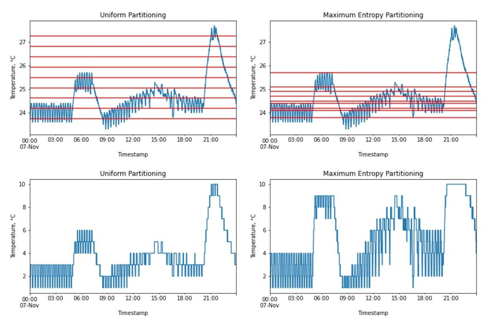
<!-- Image Description: This image presents four time-series plots comparing "Uniform Partitioning" and "Maximum Entropy Partitioning" methods for temperature data. Two plots show temperature fluctuations throughout a day (07-Nov) with horizontal lines indicating temperature thresholds. The other two plots depict the partitioned temperature data resulting from the two methods, illustrating the differences in how each method segments the temperature readings into discrete levels. The purpose is to visually compare the effectiveness of the two partitioning approaches. -->

Figure 1: This figure illustrates the process of discretizing the temperature data into 10 bins using uniform partitioning and maximum entropy partitioning.

value). With a sufficient number of bins, the trend of the time series data can be effectively captured, as shown in the bottom left plot.

In contrast to UP, MEP behaves differently, where each bin does**not**necessarily represent an equal range of data. Instead, each of the bins under MEP contains equal**number**of datapoints. This property of MEP produces fine-grained partitioning for data ranges with a denser amount of datapoints, thus allowing us to have a closer look at this densely populated data. A good example of this partitioning scheme is shown in the bottom right of Figure 1 from 09:00 to 12:00, where the datapoints in this time period are spread across seven bins when using MEP as opposed to only four bins when using UP.

### 2.2. Markov Machines

After applying symbolic dynamic filtering (SDF) to the time series data, we are able to map the time series data from the continuous domain to the symbolic domain. From [23, 24], it is assumed that the symbol sequences generated using SDF can be estimated as a -Markov machine. A -Markov machine captures and models the probabilistic transition of a*state*to a*symbol*in a symbol sequence, and we formally define -Markov machines as follows:
**Definition 1.** *[23] (D-Markov) D-Markov machine builds on the concept of a probabilistic finite state automaton* *(PFSA), where a state is composed of finite historic symbols of a symbol sequence:*- 1.*is a positive integer that represents the depth of the Markov machine;*- 2.*is a non-empty finite set of symbols with cardinality*||*<* ∞*, and*∗*is the collection of all finitelength string with symbols from including the (zerolength) empty string.*- 3.*is a set of finite size for states with*|| ≤ ||*, where each state in a Markov machine is composed by a combination of symbols in ;*- 4. ∶ × →*signifies the state transition function such that if*|| = ||*, then there exist any two symbols ,*∈*and*∈*⋆ such that* (*,*) =*and ,*∈*.*With historic symbols, the markov machine could capture not only the spatial relation, but also the temporal relation in the symbol sequences.

Following the definition of**state**in Def 1, we now introduce the concept of**joint state**to aggregate the state sequences. Given three*state*sequences = {1*,*2*,*…*,*}, = {1*,*2*,*…*,*} and = {1*,*2*,* …*,*}, a joint state sequence is defined as below:
**Definition 2.** *(Joint state sequence) A joint state sequence , is comprised of states from*≥ 2*state sequences, and* *is constructed as*= {1 1 1*,*2 2 2*,*…*,*}*that combines the states of the state sequences , , and at each timestep.*### 3. Methodology and Framework

### 3.1. Time Series Occupancy Detection Models

With Definition 1 and 2 in place, we now formally define our proposed occupancy detection framework for time series data, namely the Occ-STPN framework. Our framework extends the concept of a spatiotemporal pattern network (STPN) [23], and in this paper, we propose two variants of the framework: Multivariate and Univariate Occ-STPN, each with different learning, inferencing, and information fusing mechanisms.

####*3.1.1. Multivariate Occupancy Detection Spatiotemporal Pattern Network (Multivariate Occ-STPN)*Let = {1*,*2*,*…*,*} and = {1*,*2*,*…*,*} denotes two*state*(Def. 1) sequences of predictors used to predict the occupancy status = {1*,*2*,*…*,*} in a room, then the*joint state sequence*(Def. 2) is defined as = {1 1*,*2 2*,*…*,*}, combining the states of the predictors and at each timestep. This variant of the framework provides a*feature-level*information fusion, and the framework is formally defined as below:
**Definition 3.** *(Multivariate Occ-STPN) A probabilistic finite state automaton (PFSA) based multivariate occupancy detection spatiotemporal pattern network is a 3-tuple, denoted as* ≡ (Γ*,*Σ*,* Π)*.*- 1. Γ = {1*,*2*,*…*,*|Γ| }*is the set of joint state corresponding to the joint state sequence ;*- 2. Σ = {*,*}*is the set of binary symbol corresponding to symbol sequences ;*- 3. Π*is the state transition matrix of size*|Γ | × |Σ |*where the ℎ element of*Π*denotes the probability of finding symbol in the symbol sequence at time*+ 1*while making a transition from joint state in the joint state sequence at time . Note that the state transition matrix is time independent since we take the expectation over all time points for all unique transitions.*###*3.1.2. Univariate Occupancy Detection Spatiotemporal Pattern Network (Univariate Occ-STPN)*The second framework variant we propose is the Univariate Occ-STPN, where, unlike the Multivariate Occ-STPN, this variant of the framework performs a*decision level*information fusion, and the input considers a*state*sequence instead of a*joint state*sequence. Multivariate Occ-STPN contains a single transition matrix, Π, that considers the joint relationship between information sources and the room occupancy status, while on the other hand, univariate Occ-STPN uses transition matrices, with each transition matrix considering a pairwise relationship from one variable of interest to the true occupancy. The framework definition for a**single**predictor is defined below:
**Definition 4.** *(Univariate Occ-STPN) A probabilistic finite state automaton (PFSA) based univariate occupancy detection spatiotemporal pattern network is a 4-tuple, denoted as* ≡ (*,*Σ*,* Π*,* )*.*- 1. = {1*,*2*,*…*,*|| }*is the set of states corresponding to the state sequence ;*- 2. Σ*is the same as defined in Definition 3;*- 3. Π*is the state transition matrix of size*|| × |Σ |*where the ℎ element of*Π*denotes the probability of finding symbol in the symbol sequence at time*+ 1*while making a transition from state in the state sequence at time . Note that the state transition matrix is time independent since we take the expectation over all time points for all unique transitions.*- 4.*denotes a metric that can represent the importance of the feature in predicting room occupancy. Here it signifies the mutual information [25].*####*3.1.3. Feature level fusion and decision level fusion*One main difference between feature level fusion and decision level fusion is the phase where the fusion takes place. For*feature level*fusion, the fusion (usually by the mean of concatenation) is performed before or during the model training phase, and the fusion material is usually the raw input data or extracted features of the input data. In our case, the multivariate Occ-STPN performs a feature level fusion by learning a state transition matrix Π using the*joint states*and produces a single prediction in the end.

On the other hand, the fusion operation usually occurs at the end for*decision level*fusion, where the predictions from two or more models or classifiers are aggregated to obtain the final prediction. Given information sources, univariate Occ-STPN constructs number of state transition matrices { 1*,*2*, ...*}, and produces predictions. These predictions are then aggregated together to form a final occupancy prediction. The detailed description of multivariate and univariate Occ-STPN training and prediction are presented in the following section.

####*3.1.4. End-to-end Occ-STPN model training and prediction*Figure 2 provides a clear end-to-end process of the proposed Occ-STPN framework, where the framework can handle single or multiple time-series data and output the corresponding predicted occupancy at each timepoint. The detailed operation within the framework can be broken down into several phases as follows:

#### Symbolization phase

Each of the predictor time series' is discretized and symbolized by performing symbolic dynamic filtering (SDF). Occupancy status of the house is denoted with

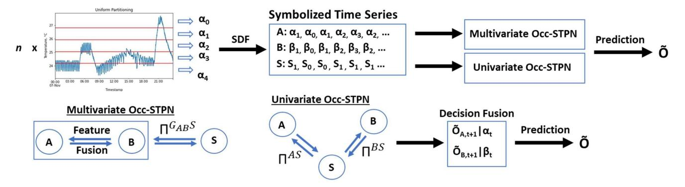
<!-- Image Description: The image details a time series prediction method. A time series graph (top left) undergoes symbolic discretization (SDF), transforming it into symbolized sequences (A, B, S). These sequences are fed into both multivariate and univariate Occ-STPN models, which generate individual predictions. A decision fusion step combines these predictions (ÕA, ÕB) into a final prediction (Õ). The lower diagrams illustrate the feature fusion within the Occ-STPN models. -->

Figure 2: Feature fusion and decision fusion for multivariate and univariate Occ-STPN framework for occupancy detection.

0 as vacant and 1 as occupied. Since the occupancy status is already in binary values, SDF on the occupancy is unnecessary. State sequences are generated for each symbol sequence by encoding historic symbols into a single state. For multivariate Occ-STPN, a*joint state*sequence is formed by encoding the states at each timepoint.

#### Learning phase

The state transition matrix Π between the predictors and occupancy status is learned. For multivariate Occ-STPN, a single state transition matrix is learned since the state sequences are fused into a joint state sequence. On the other hand, univariate Occ-STPN will have ∗ Π transition matrices, each for one predictor state sequence. Mutual information between each predictor-occupancy pair is also computed as the importance metric in Definition 4.

#### Prediction phase

With the learned transition matrix Π, the prediction for each variant of the framework can be performed as below:

#### Multivariate Occ-STPN

From Definition 3, the probability of the room being occupied given the current joint state is extracted from the Π matrix, and the expected occupancy is obtained as shown,

$$
E[Occ_{t+1}] = [Pr(Occ = 1 | \gamma_t)] \tag{1}
$$

where ⌊⌉ represents a rounding operation that rounds off the enclosed value to the nearest integer. This is equivalent to applying a 0.5 threshold, wherein in our case, a value greater or equal to than 0.5 produces an integer 1, indicating an occupied status, and a value smaller than 0.5 produces an integer 0, indicating an unoccupied status.

#### Univariate Occ-STPN

Let Θ = {1*,*2*,*…*,*} be a collection of predictors, where each is a*state*sequence and the room occupancy status sequence = {1*,*2*,*…*,*}. From Definition 4, we obtain the probability of room occupancy given a state for each predictor, using the learned Π matrix. Next, we update the probabilites into mutual information-weighted probabilities using the computed importance metrics . The mutual information-weights are derived and computed as shown in Equation 2.

$$
w_i = \frac{M^{\theta_i S}}{\sum_{i=1}^n M^{\theta_i S}}
$$
 (2)

Using these computed weights, the expected occupancy is then computed as shown in Equation 3.

$$
E[Occ_{t+1}] = \left\lfloor \sum_{i}^{n} w_{i} Pr_{i}(Occ = 1 | \theta_{i,t}) \right\rceil \tag{3}
$$
**Remark 1.**When there is only**1 predictor**or input to the framework, the**joint state**sequence in multivariate Occ-STPN is equivalent to the**state**sequence of the predictor, and the mutual information weight 1 in Equation 2 will always equal to 1 for univariate Occ-STPN. Thus, the multivariate and univariate Occ-STPN are equivalent to each other.

#### 3.2. Image classification: Few-shot learning*3.2.1. Siamese Network*Numerous deep learning models have been explored in the field of image classification. For our purposes, we decided to perform image classification using the few-shot learning method with siamese network architecture. Fewshot learning falls under the umbrella of deep learning, but it is set apart from other deep learning methods by the fact that few-shot learning is a specialized method that is designed to learn a model with a limited amount of data. When compared to other common object detection and classification model that uses VGG [26] and ResNet [27] model architectures, these models require a massive amount of training data in order to learn the features from input images and outputs the bounding boxes and object labels.

In our application, since we are only interested in classifying the presence of "person" (occupied or unoccupied status), a simpler model architecture is sufficient, and the

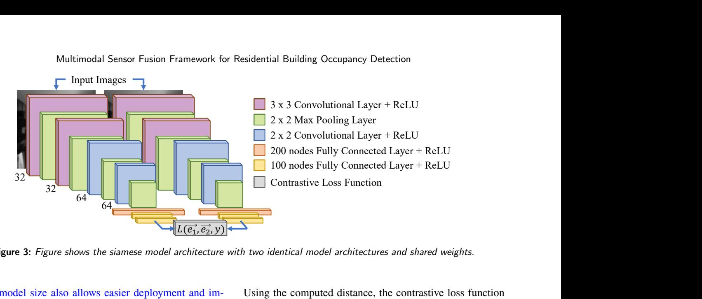
<!-- Image Description: The image displays a Siamese neural network architecture for residential building occupancy detection. It's a diagram showing two identical sub-networks processing input images, culminating in a contrastive loss function. Each sub-network consists of convolutional layers (3x3), max pooling layers (2x2), and fully connected layers (200 and 100 nodes), all using ReLU activation. The diagram illustrates the layers' dimensions and their sequential arrangement. -->

Figure 3: Figure shows the siamese model architecture with two identical model architectures and shared weights.

smaller model size also allows easier deployment and implementation on embedded systems that have limited computation resources. On top of that, since only a smaller training dataset is required to train few-shot learning models, the data labeling and preparation process is a lot simpler. This learning method is usually coupled with the use of a siamese network that has two models with identical model architectures and shared model weights. The goal of the learning process was to generate encodings that produce a small distance metric when a pair of images are of the same class and a large distance metric when the images are of different classes.

The siamese network model architecture used in this paper is illustrated in Figure 3. During the model training phase, images are fed in pairs as inputs to the model, and multiple convolutional layers are used in the early layers of the model to extract features from the input images. Towards the last three layers of the model, fully connected (dense) layers are used to generate the encoding for each image, and the model training loss is computed using a contrastive loss function. Finally, the gradient of the loss is then backpropagated to update the model weights.

Although two models are used to demonstrate the training process, in theory, a slight modification was made to simplify the implementation in practice: Since both models are similar in terms of architecture and weight, instead of building two models, we built only one model, and two images were fed consecutively to the model. This essentially allowed us to train the model with smaller memory consumption and improved computational efficiency.

####*3.2.2. Contrastive Loss*The contrastive loss was first introduced in [28] and it is a common loss function used in siamese networks [29, 30, 31]. Let*⃗*1 and *⃗*2 be the embedding output for images *⃗*1 and*⃗*2 respectively after the final fully connected layer in the model. The euclidean distance between the*⃗*1 and *⃗*2 is computed as:

$$
D(\vec{e_1}, \vec{e_2}) = ||\vec{e_1} - \vec{e_2}||_2
$$
 (4)

Using the computed distance, the contrastive loss function is given by:

$$
L(\vec{e_1}, \vec{e_2}, y) = (1 - y) \left(\frac{1}{2}\right)(D)^2 + (y) \left(\frac{1}{2}\right) \{ max(0, m - D) \}^2,
$$
\n(5)

where

$$
y = \begin{cases} 0 & \vec{X}_1 \text{ and } \vec{X}_2 \text{ are similar} \\ 1 & \vec{X}_1 \text{ and } \vec{X}_2 \text{ are dissimilar} \end{cases}
$$

Essentially, the loss function contains two parts, with the first term describing the loss for similar pairs of images, and the second term, the loss for dissimilar pairs of images. In the second term, is a margin that constrains the distance between embedding of dissimilar images, where a smaller value of signifies tighter constraints on the distances. If the euclidean distance, , for dissimilar images is smaller than the margin, , a loss will be incurred.

#### 3.3. Audio classification: Random Forest

The audio data classification implementation consisted of two main procedures: (1) feature extraction from the audio data and (2) audio classification using these extracted features. The series of processing and feature extraction steps (band-pass filtering, rectification, etc.) that were performed is described in detail in Section 4.3.3. Utilizing the extracted features, we trained a random forest (RF) model to classify the occupancy status of the house. The RF model is trained with parameters of 100 trees, a max depth of 10, and uses entropy as the splitting criterion. There are other algorithms that could perform similar classification tasks, such as neural networks (NN), decision trees (DT), and support vector machine (SVM), but we selected RF for the following reasons. First of all, one of the considerations when designing the framework is the computation load for future deployment. NN is generally large in model size and consumes greater computation resources. To include another NN in the framework alongside the siamese network defined in Section 3.2.1, it becomes a huge burden to the computation device in

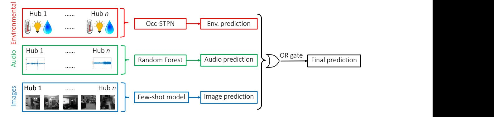
<!-- Image Description: This flowchart illustrates a multi-modal prediction system. Three input modalities (environmental data, audio, and images) from multiple hubs are processed independently. Environmental data uses Occ-STPN, audio uses a Random Forest, and images use a few-shot model for prediction. Individual predictions are then combined using an OR gate to produce a final prediction. The diagram details the data flow and models used in the system. -->

Figure 4: This figure illustrates the overall flow of the proposed multimodal sensor fusion framework for occupancy detection.

deployment. On top of that, the feature extraction capability by NN is one of the advantages offered by NN, but since a series of pre-processing and feature extraction processes had already been done on the collected audio data, the additional feature extraction capability by NN would seem a little excessive. Next, when comparing RF to a method such as DT, DT usually has a relatively higher variance. RF is an extension bagged version of DT, but unlike the DT that uses all the features when building the tree, RF randomly samples subsets of features to build multiple DT and averages them to generate the final prediction. By averaging the output from the multiple DT in RF, it effectively lowers the variances. Lastly, RF also possesses a much faster training speed and lesser parameters tuning when compared to SVM. When constructing the trees in RF, this training process is fully parallelizable, which greatly reduces the training time. SVM, on the other hand, is a sequential or serial algorithm, which iteratively optimizes the model weights, so comparatively, it requires a longer training time to reach convergence, especially when the number of training samples is huge. Furthermore, there are more tunable parameters in SVM, including the regularization parameter, type of kernels, and kernel parameters depending on the type of kernel used. Typically a thorough parameters grid search is required in order to find the best parameters combination that provides the best results, and this process is extremely time-consuming.

#### 3.4. Decision Fusion

In the final stage of this multimodal sensor fusion framework, we ensemble the decision from each modality and perform a combination of weighted probability and knowledgebased (rule-based) decision fusion.

For the data types covered in this paper, we can categorize them into two smaller groups. In the first group, we have time series data with slower rates of change in readings, consisting of environmental sensor data (temperature, relative humidity, and 2 ), and in the second group are the event-based and instant-response sensors such as cameras and microphones. For the first group, as described in Definition 4, each Π matrix learned from each time series data input is accompanied by a feature importance metric, . Using these learned Π matrices and , we can perform a weighted probability decision fusion on the time series data as described in 3.1.4.

In the second group, we have the instant-response or event-based sensors such as cameras and microphones. For this group of data, we utilized a knowledge-based method in the decision fusion stage instead. We show in Section 5.2 that both the image few-shot learning model and the audio random forest model perform very well individually.

However, external factors, such as low illuminance levels or noisy environments, degrade the image and audio data, leading to insufficient information for occupancy detection.

To account for these situations, a number of measures were implemented. Images were captured in grayscale, with pixel values ranging from 0 to 255. If the average pixel intensity was found to drop below 10 (too dark), we shifted the decision weight to other data modalities. To ensure adequate audio data, the microphones were not placed near air vents, furnaces, or other loud machines, to prevent collecting data with a low signal-to-noise ratio.

At the end of the process, the predictions from different modalities are pooled together using a logic OR gate. The intuition is that, at any point in time, if any of the sensors trigger an occupied status, the house occupancy status will be predicted as occupied. Finally, sliding time persistency windows are applied to the combined predictions in the end to determine the best window size and to obtain the best prediction performance.

### 3.5. Performance Evaluation

#### *3.5.1. Accuracy*With the target (occupancy status) denoted as a binary categorical variable, an obvious choice of the performance metric is accuracy, as defined in Eq. 6. Accuracy has been used as a performance metric in other occupancy detection literature[32, 33], and is computed as the ratio of the sum of true positive and true negative predictions to the total number of predictions. In our case, we categorized an occupied status as a positive event and an unoccupied status as a negative event. Taking an event-based sensor such as the camera as an example, if the model predicts a camera image as occupied, and the ground truth is occupied, this prediction will be categorized as true positive (TP). On the other hand, if the model predicts a camera image as unoccupied, and the ground truth is also unoccupied, this prediction will be categorized as true negative (TN). If there are mispredictions, for example, when the model predicts a camera image as occupied while the room is vacant, this prediction will be categorized as false positive (FP). Lastly, when the model predicts an unoccupied status when there is an occupant in the field of view of the camera, this prediction will be a false negative prediction (FN). In our performance evaluation, accuracy was used as the main performance metric for eventbased sensors such as the camera and microphone.

$$
Accuracy = \frac{TP + TN}{TP + TN + FP + FN}
$$
 (6)

###*3.5.2. Fading Memory Mean Squared Error (FMMSE)*Although accuracy is a common evaluation metric, there is a minor problem with accuracy in terms of time series predictions, as the correctness of the prediction is only evaluated w.r.t a single timepoint, i.e., the prediction at time is only evaluated against ground truth at time . This leads to a loss of the temporal aspect in the evaluation, which might be unfair for any time-delays in prediction. For example, when an event occurs at time , the algorithm predicts the event to be occurring at time + instead, where is the delay of the prediction. Under this scenario, the accuracy metric will penalize the prediction at both times and + . Hence in this paper, we proposed a new metric, namely the Fading Memory Mean Squared Error (FMMSE) metric, to give a fair evaluation to a delayed prediction in time series prediction.

Let = {1*,*2*, ...*} and = {1*,*2*, ...* } denote the true occupancy and occupancy prediction probabilities respectively for timepoints[1*,*]. We let denote the parameter that controls the penalty value due to the time delay used to evaluate the algorithm's effectiveness. With these variables, FMMSE is derived and computed as below:

$$
FMMSE = \sum_{i=1}^{t} (g_i - p_i)^2 \times (1 - \alpha^c), \text{ where } c = i - x \text{ (7)}
$$

$$
x = \{\text{argmin}(i - x) | \text{abs}(G(x) - G(x + 1)) \ge 1\}
$$
 (8)

Ideally, a better algorithm would produce a lower FMMSE value.

# 4. Experiments

## 4.1. Open-source Datasets

Before applying the proposed Occ-STPN framework to the real-world data that we collected, we first demonstrate the framework's performance on two open-sourced building occupancy datasets. The first dataset is the Electricity Consumption and Occupancy(ECO) dataset [6, 34, 35]. The ECO dataset contains electrical consumption and occupancy data from five different households in Switzerland. Most of the type of households are houses (except household 2 is a flat) and only have one entrance to the premises to allow easier occupancy ground truth collection. Each household consist of two to four occupants, where all households have two adults, and household 1 and 4 also have two children. The data collection period spans summer and winter, allowing experiments and algorithm testing across different seasons.

The electrical consumption data is composed of current, power, and voltage from all three phases, as measured for different appliances in each household. For our purposes, we focused on the appliances' total power consumption and downsampled the data from one measurement per second to one measurement per minute.

In addition to the ECO dataset, we utilized another set of open-sourced non-intrusive sensor data for occupancy detection: the University of California, Irvine's building occupancy detection dataset [36] (UCI). The UCI dataset is collected in an office room of dimension (19' 2.31" x 11' 5.79" x 11' 6.98") (Width × Depth × Height) located in Belgium, with up to 2 occupants during the data collection process. This dataset contains room occupancy data and time series data collected using various indoor environmental sensors such as relative humidity (%), temperature (°C), humidity ratio (kg-water-vapor/kg-air), CO2 (ppm) and illuminance level (lux) , and they are recorded with a sampling frequency of one measurement per minute. The detailed description of sensors used for data collection and sensor sensitivities are tabulated in [36]. Unlike the ECO dataset, these environmental sensor measurements usually have a slower response to the presence of an occupant in the room, which provides a different and distinct data dynamic between the sensors and the room occupancy. These two datasets allow us to evaluate the performance of the Occ-STPN framework on datasets from two completely different domains: electrical and environmental.

### 4.2. Real Datasets

In addition to the two datasets described, the algorithms were applied to a third dataset, the mobile human presence detection (HPDmobile) dataset [37], which was collected by the researchers on a related project. The HPDmobile dataset [38] is a residential building occupancy detection dataset that was collected using custom-built sensor hubs and collection software. The HPDmobile dataset comprises five environmental modalities (temperature, relative humidity, ambient light levels, CO2 , and TVOC), along with privacy preserved images, audio, and the ground truth (binary) occupancy state of the home. Data was collected over a period of nine months by the researchers and included both winter and summer seasons. The dataset was released in October of 2021 as an open-source, privacy-preserved dataset for the building-occupancy research community to use. A summary of the modalities collected, along with sampling frequency and precision of the sensors, are presented in Table 1.

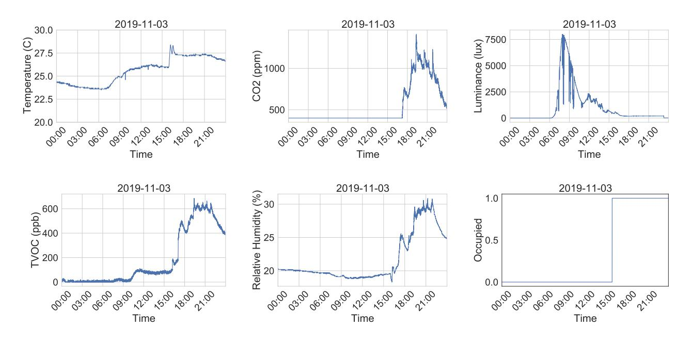
<!-- Image Description: The image displays six time series plots showing environmental data (temperature, CO2, luminance, TVOC, relative humidity) and occupancy status from 00:00 to 21:00 on 2019-11-03. Each plot shows the fluctuation of a specific variable throughout the day. The purpose is likely to illustrate the dynamics of indoor environmental parameters and their correlation with occupancy. The final graph is a step function indicating occupancy (0 or 1). -->

Figure 5: Raw HPD data collected in a small apartment.

Table 1 Specification of the sensors chosen for the HPD data acquisition system.

| Measurement (units)                                                                                      | Sampling Freq.                                          | Precision                                                                  |
|----------------------------------------------------------------------------------------------------------|---------------------------------------------------------|----------------------------------------------------------------------------|
| Temperature (◦C) Humidity (%RH) eCO2 (ppm) TVOC (ppb) Ambient light levels (lux) Audio | 0.1 Hz 0.1 Hz 0.1 Hz 0.1 Hz 0.1 Hz 8 kHz | ± 0.1 ◦C ± 0.1 %RH ± 1-31 ppm ± 1-32 ppb Unspecified 18 bit |
| Images                                                                                                   | 1 Hz                                                    | 36 dB SNR                                                                  |

As part of the HPDmobile data acquisition process, data were collected from six different homes in Boulder, Colorado, for a period of four to eight weeks each, during which time the occupants' arrival and departure times were recorded each day, along with the modalities outlined in Table 1. The types of property include studio apartments, one-bedroom, two bedrooms, three-bedroom apartments, and single-family houses. Four to six sensor hubs were used in each location, depending on the size of the home. Due to privacy concerns, sensor hubs were placed only in common areas, such as the kitchen, dining room, and living room, and no hubs were placed in or near bedrooms or bathrooms. For additional details on the data acquisition system, along with the privacy preservation techniques that were applied, please refer to [38].

### 4.3. Data Pre-processing and Feature Extraction

This section explains the pre-processing steps performed on the collected HPDmobile data before feeding them into the detection algorithm. These steps were meant to achieve

### Table 2

This table presents the ranking of each environmental sensor using mutual information metric and random forest feature importance with descending rank down the table.

| Rank | Mutual Information | RF Feature Importance |  |  |  |  |
|------|-----------------------|--------------------------|--|--|--|--|
| 1    | Temp.                 | Temp.                    |  |  |  |  |
| 2    | Rh.                   | Rh.                      |  |  |  |  |
| 3    | Illu.                 | Illu.                    |  |  |  |  |
| 4    | TVOC                  | TVOC.                    |  |  |  |  |
| 5    | CO2                   | CO2                      |  |  |  |  |

several objectives: The first objective is to extract meaningful features important for occupancy detection, while the second objective is to conceal any personally identifiable information (PII) from the collected data. In addition to being a necessary condition for releasing the data publicly, the second objective also serves as an essential step to developing a commercially available system that includes the developed framework to protect against the release of sensitive data in the event of the camera or microphone being hacked.

###*4.3.1. Environmental sensor data down-selection*Before proceeding to the next step, we evaluated the collected environmental sensor data in order to down-select the most informative sensors. Unlike the event-based and instant-response sensors, such as camera images and audio, environmental sensors do not reflect instantaneous occupancy. Instead, the environmental sensors capture changes in environmental factors caused by human presence or activity, which then indicates the occupancy status of the house.

In order to rank and select the most informational sensors, we used a mutual information (MI) ranking method, which has proven to be an effective technique in ranking time-series data [39]. By computing the pairwise mutual information between each environmental sensor data and ground truth occupancy, we arrived at the ranking as shown in Table 2. The table shows the environmental sensors, ranked from greatest to lowest MI, with rank 1 being the most informational sensor (highest magnitude of MI).

Besides using the mutual information metric, we also used a random forest (RF) classifier as a classification baseline and for sensor ranking verification. Random forests are a simple machine learning classification algorithm that combines the concept of ensemble learning and decision trees by performing decision fusion on the results from multiple decision trees into one overall decision. Two criterions are typically used in RF to determine a split in decision trees are the Gini index and entropy, which is what we selected.

Environmental data from all houses were pooled and used to train a random forest classifier, from which feature importance was extracted, resulting in the rankings shown in Table 2. From the table, we see that the rankings of the environmental sensors are similar for both MI metric and RF feature importance, with temperature, relative humidity, and illuminance level taking the top three spots in both cases.

This ranking is consistent with domain knowledge, where temperature sensors reflect occupant preferences via HVAC system set-points and scheduling and will generally track occupant presence. As for the illuminance sensor in an indoor setting, a**slow**change in illuminance can be simply due to diurnal changes, but a**drastic**change in illuminance usually occurs when an occupant turns on or off a light, indicating human presence.

Although CO2 had been used to predict**office**building occupancy in other studies[40], CO2 is not a good estimator in**residential**buildings, which usually have relatively low occupancy density and high infiltration of outside air. For a small home, the presence of an occupant might be captured by changes in CO2 levels, as shown in Figure 5. However, considering a larger house, and with the sensors installed in the common areas such as living room and kitchen in the residential units, the change in CO2 level is minimal and relatively hard to be captured as compared to in an enclosed room. This led to CO2 being ranked last when data from all homes were considered.

Similar conclusions about the performance of these types of sensors have been shown in other literature, such as [41], where the author obtains excellent occupancy prediction results with temperature and illuminance sensors using several machine learning algorithms, but the prediction is underperformed with CO2 sensors. This result is consistent with the ranking presented in Table 2. Therefore, we narrowed the scope of environmental sensors considered to only temperature, illuminance, and relative humidity for further analysis.

###*4.3.2. Image data pre-processing*Since our overall goal was to perform occupancy detection and not occupant recognition, we were not concerned with the need to recognize facial features or vocal signatures of the occupants. Therefore, to obscure the identity of the occupants, the collected images were degraded by performing max-pooling operations. Too much degradation, however, leads to decreased detection performance since clearer and sharper input images are usually required for the best performance. The blurriness of the images resulting from max-pooling is highly dependent on the filter size used, where a larger filter size results in a blurrier image. Therefore, to address these contradicting goals of having clear images for detection and blurred images for privacy preservation, we performed experiments to determine the optimal filter size.

Max pooling of different filter sizes ranging from (1x1) to (20x20) was applied to the same (labeled) dataset, and each set of processed data was used to train and test the performance of the occupancy detection model. The prediction accuracy for each dataset is plotted as shown in 6. From Figure 6, we can see that the prediction accuracy crumbles as it goes beyond the filter size of (10x10), and accuracy dropped below 60% for the filter size of (20x20). This is due to the relatively small size of the human figure in the images: as the blurring intensifies with the increased filter size, any small human figures in the image begin to disappear after the max-pooling operation. Based on the results and the mentioned reason, a filter size of (3x3) was chosen as the optimal filter size as the images are degraded to the extent where the occupants' identities are unrecognizable, but at the same time, it is still clear enough for the detection model to detect human presences.

###*4.3.3. Audio data pre-processing*

In service towards our objective of extracting meaningful features and preserving occupant privacy, our collected audio data goes through a series of pre-processing steps before it is used for human presence detection. The steps followed for audio pre-processing are illustrated in Figure 7, and the corresponding details of each processing step are described below:

#### Band-pass Filtering

Upon receiving the raw audio data, the first step of the processing is to perform band-pass filtering using filters of various frequency ranges defined in the filter bank. There are a total of 17 filters, and the frequency ranges that were enclosed by each filter are tabulated in Table 3. The frequency of adult males typically falls between 85 to 180 Hz, and adult females adults from 165 to 255 Hz[42], leading to human voice being captured by the first three filters in the filter bank. Additional filters are designed to capture other noises indicative of the human presence, such as a baby's crying, a hairdryer, or even the sound of tableware collision during meals.

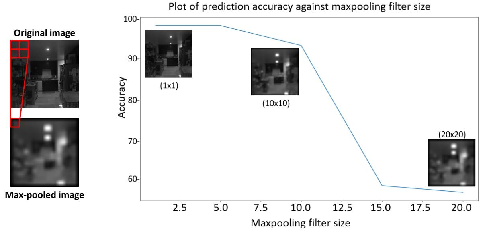
<!-- Image Description: The image displays the effect of maxpooling filter size on prediction accuracy. A line graph shows accuracy decreasing sharply as filter size increases from 1x1 to 20x20. Inset images illustrate the max-pooled output for filter sizes 1x1, 10x10, and 20x20, demonstrating increasing image blurring with larger filter sizes. A red box highlights the maxpooling operation on a section of the original image. The figure demonstrates the trade-off between image detail and prediction accuracy in a convolutional neural network. -->

Figure 6: (a) On the left, figure shows a max-pooling operation with a (2x2) filter. (b) On the right, plot showing tradeoff between various max-pooling filter sizes and test occupancy prediction accuracy. Increasing filter size leads to more privacy, but destroys the prediction capability beyond the size of (15x15).

| Table 3                                                                                                     |  |  |  |  |  |  |  |
|-------------------------------------------------------------------------------------------------------------|--|--|--|--|--|--|--|
| This table lists the frequency ranges enclosed by each filter in the filter bank used for audio processing. |  |  |  |  |  |  |  |

| Band-pass filters | Frequencies (Hz) | Band-pass filters | Frequencies (Hz) | Band-pass filters | Frequencies (Hz) |
|-------------------|------------------|-------------------|------------------|-------------------|------------------|
| 1                 | 0 ∼ 100          | 7                 | 630 ∼ 770        | 13                | 1710 ∼ 1990      |
| 2                 | 100 ∼ 200        | 8                 | 765 ∼ 915        | 14                | 1990 ∼ 2310      |
| 3                 | 200 ∼ 300        | 9                 | 920 ∼ 1080       | 15                | 2310 ∼ 2690      |
| 4                 | 300 ∼ 400        | 10                | 1075 ∼ 1265      | 16                | 2675 ∼ 3125      |
| 5                 | 395 ∼ 505        | 11                | 1265 ∼ 1475      | 17                | 3125 ∼ 3675      |
| 6                 | 510 ∼ 630        | 12                | 1480 ∼ 1720      |                   |                  |

#### Full Wave Rectification and Downsampling

After the filtering operation, the output from each filter goes through a full-wave rectification and downsampling operation. The full-wave rectification process is executed by combining a mean shift and taking the absolute value on the filter output. After some parameter testing on the downsampling operation, we found that even a small sampling rate of 100 samples per second was sufficient to capture the trends of the signal, and original sounds were unreconstructable. These combined operations lead to several advantages: First, these processes are irreversible, which aligns with our goal of privacy preservation, and secondly, the data size is significantly reduced, allowing for more efficient and faster inferencing.

#### Filter-wise Linear Scaling

Finally, before feeding the rectified and downsampled filter output to a model for training, a filter-wise linear scaling is performed to bring the data to a [0*,*1] range. This scaling ensures that each feature (output

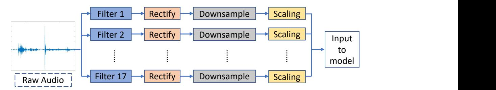
<!-- Image Description: The image displays a flowchart illustrating a data preprocessing pipeline for audio data. Raw audio (shown as a waveform) is input, then processed through 17 parallel branches. Each branch consists of filtering, rectification, downsampling, and scaling operations before converging into a single input vector for a machine learning model. The diagram details the steps involved in preparing the audio for model training. -->

Figure 7: This flowchart illustrates the series of pre-processing operations performed on the raw audio data collected before using them for model training and testing.

#### Table 4

This table provides the performance baseline comparison between multivariate Occ-STPN, univariate Occ-STPN, and LDA method using ECO household 2 dataset and various number of predictors, evaluated using accuracy and FMMSE values.

| Number of  | Appliances power data           | Multivariate         | Univariate           | LDA                 |  |
|------------|---------------------------------|----------------------|----------------------|---------------------|--|
| predictors |                                 | Accuracy FMMSE    | Accuracy FMMSE    | Accuracy FMMSE   |  |
| 1          | Stereo                          | 91.46 % 0.0139594 | 91.46 % 0.0139594 | 91.11 % 0.013981 |  |
| 3          | Stereo, Entertainment,          | 92.67 %              | 92.01 %              | 91.77 %             |  |
|            | Dishwasher                      | 0.003156             | 0.0139577            | 0.01396             |  |
| 6          | Dishwasher, Entertainment,      | 93.09 %              | 91.42 %              | 92.25 %             |  |
|            | Fridge, Freezer, Kettle, Stereo | 0.003375             | 0.0139624            | 0.013983            |  |
| 6          | Entertainment, Freezer, Fridge, | 91.28 %              | 91.04 %              | 91.07 %             |  |
|            | Kettle, Stereo, Random Noise    | 0.00397              | 0.0139624            | 0.013983            |  |

of the filter data) contributes equally to the model learning process and essentially improves the model performance.

### 5. Results and Discussion

In this section, we will now present occupancy detection results using both the open-source datasets (ECO & UCI) and the real world dataset that we collected using the HPDmobile system.

Prediction accuracy is only one factor that machine learning models should be evaluated on. Other important considerations are the scalability and transferability of a model. Therefore, in the following subsections, we will discuss the ability of our model to scale to larger datasets and demonstrate its prediction accuracy on unseen data.

### 5.1. Results on Open-Sourced Data*5.1.1. Experimental Results Using Multivariate*#*Occ-STPN*The first results that we present are those of the proposed multivariate OCC-STPN algorithm, as trained and tested on the ECO dataset. Table 4 tabulates a number of experiments that were performed on the ECO household 2 data, where performance was evaluated using accuracy, and fading memory mean square error(FMMSE). Household 2 in the ECO dataset possesses the most complete record of data, and thus it was selected as the main training and testing data for the ECO dataset. The first row of the table gave the results when multivariate Occ-STPN was trained using only one predictor (single input). Consumption of each device was considered, and the best performance using a single input was found with the stereo power consumption data.

To better illustrate the results, the occupancy detection for this run of the experiment was plotted, as shown in Figure 8. From the figure, we see that the model is able to predict almost all the occupied states correctly, and though having some time lag, it was also able to predict the unoccupied status around the 2000 minute mark. However, there is room for improvement around the short unoccupied period at the 550-minute mark. This brings us to the next part of the experiment, where the consumption data from several

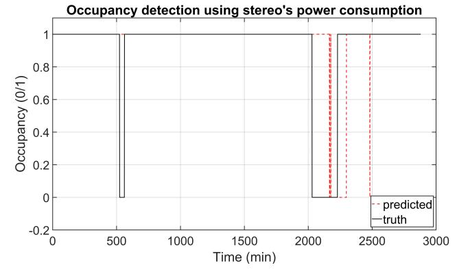
<!-- Image Description: The figure displays a comparison of predicted versus actual occupancy over time, inferred from a stereo system's power consumption. A step graph plots occupancy (0/1) against time (minutes). The solid black line represents the ground truth occupancy, while the dashed red line shows the occupancy predicted by the model. Discrepancies are visible, particularly concerning the timing and sharpness of transitions. The graph aims to evaluate the accuracy of the occupancy detection method. -->

Figure 8: The plot shows the occupancy detection results using ECO household 2 stereo's power consumption data on multivariate Occ-STPN.

appliances are combined (multiple input) in the multivariate Occ-STPN model. The aim of having multiple inputs is not only to achieve enhanced performance it also to demonstrate the scalability of the model.

Moving down the rows in Table 4, the experiment is scaled by increasing the number of predictors used in the model from one up to six, and we can see the proposed multivariate Occ-STPN easily handles a varying number of inputs. For each of these cases, different combinations of the appliance power consumption data are used to train the multivariate Occ-STPN model to obtain the best achievable results. By having more predictors in the model input, it enriches the information in the learned state transition matrix Π and further improves the prediction performances. This is demonstrated by the increasing trend of the multivariate Occ-STPN model's accuracy as we increase the number of predictors.

Besides increasing the number of predictors, in order to test the robustness and reliability of the model, we replaced one of the inputs with random white noise to disrupt the model training. The result for this experiment is shown in the last row of Table 4. Though the disturbance in training decreases the prediction accuracy slightly, it is still above 90%, and the FMMSE value is still as low as 0.00397.

On the second dataset, the UCI dataset, we used all five of the environmental sensor data modalities: temperature (°C), relative humidity (%), illuminance level (lux), 2 (ppm), and humidity ratio (kg-water-vapor/kg-air) to train our multivariate Occ-STPN model. The model was able to achieve a prediction accuracy of 94%, and ground truth occupancy is shown alongside predicted occupancy in Figure 9. The ground truth exhibited a fairly balanced distribution of occupied and vacant status, denoted with 1 and 0, respectively. In the first half of the plot, the room is consistently vacant, which our model is able to predict flawlessly. As time progress, an occupant enters the room, and the occupancy status transition is reflected around the 900 minute mark, where the ground truth room occupancy status changes from 0 to 1. Though exhibiting a slight delay,

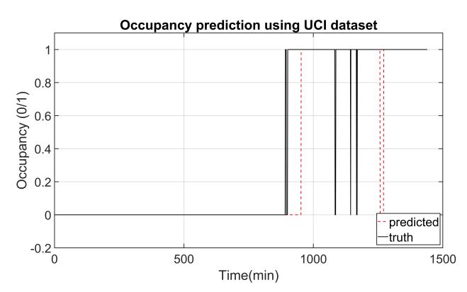
<!-- Image Description: The figure shows a line graph comparing predicted versus actual occupancy (0/1) over time (minutes) using the UCI dataset. A solid black line represents the true occupancy, while a dashed red line depicts the predicted occupancy. The graph demonstrates the model's ability to predict occupancy changes, revealing some discrepancies between prediction and ground truth, particularly in the timing of transitions. The x-axis represents time in minutes, and the y-axis represents occupancy, ranging from 0 to 1. -->

Figure 9: Figure shows the occupancy prediction using UCI dataset on multivariate Occ-STPN

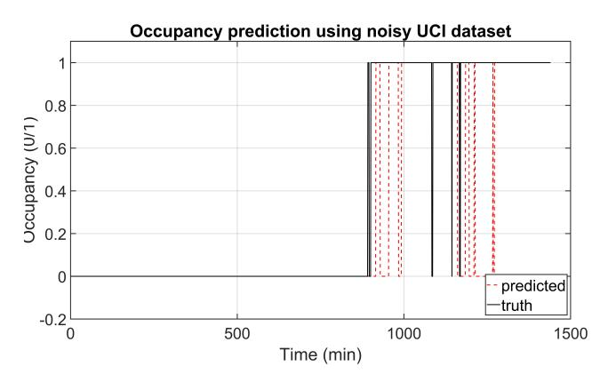
<!-- Image Description: The image displays a line graph comparing predicted versus true occupancy over time (in minutes) using a noisy UCI dataset. The x-axis represents time, and the y-axis represents occupancy (0 to 1). A solid black line shows the true occupancy, while a dashed red line represents the predicted occupancy. The graph illustrates the accuracy of the occupancy prediction model, showcasing discrepancies between prediction and ground truth, particularly during periods of occupancy change. -->

Figure 10: Figure shows the occupancy prediction using UCI dataset with 10% white gaussian noise on multivariate Occ-STPN

the model captures this transition, as the prediction switches to occupied for most of the second half of the plot. In terms of the model robustness, we demonstrated this by injecting a 10% white Gaussian noise to each of the environmental sensor data inputs, then performing occupancy prediction using the tainted (noisy) data. The results of this experiment are plotted in Figure 10 for easier comparison with the model performance on untainted data shown in Figure 9. From Figure 10, we observe that the model's prediction is mostly unaffected by the noisy data and is almost identical to the prediction in Figure 9. Despite the fluctuating predictions around the 900 minute and 1200 minute mark, the model is able to achieve an accuracy of 89.44%.

##*5.1.2. Experimental Results Using Univariate Occ-STPN*In this subsection, we present the occupancy prediction results using the second variant of the model, the univariate Occ-STPN model. Similar to the previous results, we first trained and tested the model using the ECO household two datasets with a various number of predictors. The complete results of the experiments are tabulated in Table 4, which provide an overall comparison between the multivariate and univariate Occ-STPN models. In addition, we also used the method of linear discriminant analysis (LDA) to serve as a comparison baseline with the proposed model.

In Table 4, we see that the univariate Occ-STPN has a slightly lower accuracy as compared to the multivariate Occ-STPN and is similar to the baseline LDA method. Prediction accuracy-wise, multivariate Occ-STPN clearly shows improvement over the other two methods. However, the aim of univariate Occ-STPN is to provide a capability lacking in the other models: the flexibility and transferability of a learned state transition matrix. In Section 3.1.2 we noted that, unlike the multivariate Occ-STPN, univariate Occ-STPN learns number of state transition matrices, Π, in which each transition matrix captures the pairwise relationship between each appliances' power consumption and that of the room occupancy. In addition, each of the transition matrices also couples with computed mutual information as the importance metric, , to be used in the prediction and decision fusion steps.

Using the state transition matrices learned from the ECO household 2 data, we transfer and predict the occupancy patterns of other households in the ECO dataset without the need for additional post-processing steps. We find all appliances that are common between ECO household 2 and other houses, and the transition matrices learned for similar appliances are used to perform occupancy detection in each additional house. Since some appliances are not available in all households, the number of predictors varies from house to house.

Figure 11 provides an illustration of the transferred model occupancy predictions results, where we plotted the ground truth and the respective occupancy prediction for households 1, 3, 4, and 5. With the exception of household 4, we see from the plots that the transferred model is able to capture the exact number of unoccupied events in each household. Furthermore, although the duration of the unoccupied prediction is short, the model is able to predict the exact time of the first occupied-to-unoccupied state transition in household 3. While on the other hand, household 5 predicts a sensible duration of unoccupied status but suffers from some time lag in the predictions.

Table 5 tabulates both the accuracy and the FMMSE value for the occupancy predictions in each household. From

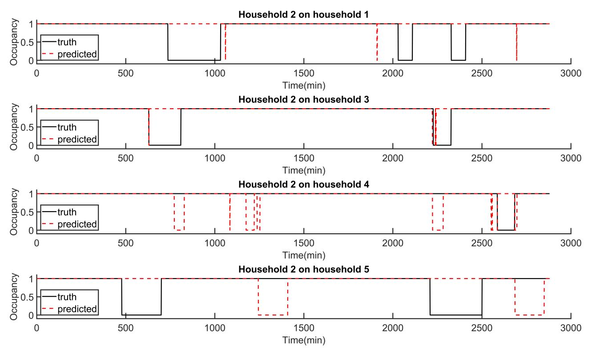
<!-- Image Description: The image presents four time series plots comparing "truth" (black solid line) and "predicted" (red dashed line) household occupancy. Each plot shows the occupancy of a different household (1, 3, 4, and 5) as observed by household 2 over time (in minutes). The plots illustrate the accuracy of a predictive model for household occupancy by comparing the model's predictions to actual occupancy data. The y-axis represents occupancy (0 to 1), and the x-axis represents time. -->

Figure 11: Figure shows the occupancy prediction of ECO dataset household 1,3,4 and 5 using framework trained on household 2 on univariate Occ-STPN.

the accuracy values, we see that household 3 leads in performance, as it has an accuracy value above 90%, and is closely followed by household 4 with an accuracy of 88.92%. By evaluating only the accuracy metric, we notice that the mispredictions in household 4 are not reflected clearly. On top of that, the transferable potential of the trained model to household 5 is also not evaluated properly, as we can observe from Figure 11, with proper time lag adjustment, we can enhance the performance in household 5 tremendously. Thus, we now turn to the proposed fading memory meansquare error(FMMSE) values to evaluate the transferability prediction performances.

As opposed to the accuracy metric, household 5 shows the most promising FMMSE value and is closely followed by household 3. This metric successfully captures the potential of having good prediction performance with model transfer on these two houses. On the other hand, the noisy mispredictions in household 4 are penalized (as shown by the high FMMSE value) despite having a high prediction accuracy. From Figure 11, we can see that although the prediction in household 1 picks up the correct number of unoccupied events (three), the timing and duration of the unoccupied events are not perfect. This imperfection in prediction is also penalized in the FMMSE value.

### 5.2. Results on Real Data

After evaluating the occupancy prediction performance on the available open-source datasets, in this section, we will proceed by presenting the prediction results on real data (environmental, images, and audio) that we collected as described in Section 4.2. Each of these different data modalities is processed and trained using their respective designed methods and models, as described in Section 4.3 and Section 3. Extensive discussion is presented for each modality in order to evaluate the performance of the detection algorithm under different scenarios in a residential unit. Finally, the fused decision (prediction) of the environmental data, images, and audio are plotted against occupancy ground truth for evaluation.

####*5.2.1. Camera Images*To classify camera images, we used a few-shot learning model to perform frame-wise occupancy classification, as discussed in Section 3.2. In Figure 12, we show some example camera images that demonstrate the occupancy prediction performance of the trained few-shot model under different scenarios, including the presence of pets, the room's lighting condition, and the occupant's distance to the camera. These are some common scenarios that a camera would encounter in a common residential setting, and each of these scenarios constitutes important factors that were explored in order to prove the robustness of the model, which we will now discuss in detail.

First of all, in order to demonstrate the robustness of the model to the presence of pets, we will compare the occupancy probability predicted by the few-shot learning model in Figure 12(a) and 12(b). From Figure 12(a), we can see there is an occupant standing in a well-lit kitchen, and

#### Table 5

This table tabulates the performance of occupancy prediction transferability on ECO household 1,3,4 and 5 dataset using univariate Occ-STPN trained on household 2 data.

| Household | Appliances power data                  | Accuracy(%) | FMMSE  |
|-----------|----------------------------------------|-------------|--------|
| 1         | Fridge, Kettle, Freezer                | 83.99       | 0.0246 |
| 3         | Tablet, Freezer                        | 90.66       | 0.0195 |
| 4         | Entertainment, Fridge, Freezer, Tablet | 88.92       | 0.1417 |
| 5         | Entertainment, Fridge, Tablet          | 70.73       | 0.0141 |

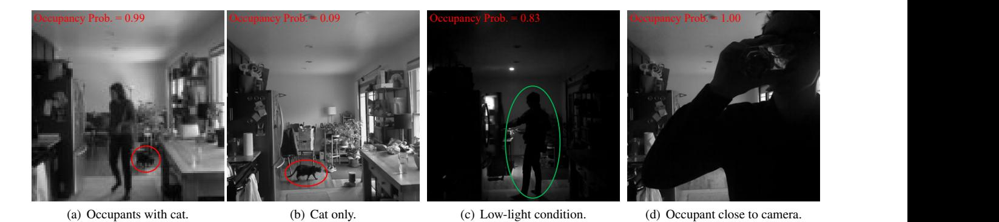
<!-- Image Description: The image displays four grayscale snapshots from a video, each showing a room under different conditions, with an "Occupancy Prob." value (0.99, 0.09, 0.83, 1.00) overlaid. (a) shows people and a cat, (b) shows just a cat, (c) shows a person in low light with a green ellipse highlighting the figure, and (d) shows a person close to the camera. The images illustrate the robustness and limitations of an occupancy detection system under various conditions. -->

Figure 12: These figures show the performance and robustness of the trained few-shot learning model under different settings. The input images to the few-shot learning model are all max-pooled and downsized before detection, but the original images are shown here for better illustration purposes.

there is a cat behind the occupant (circled in red). Under this scenario, the model is able to predict an "occupied" status with 0.99 probability, as shown on the top-left corner of the image. One might argue that the prediction is simply due to the motion from the occupant or pet or to a change in background. However, Figure 12(b) dispenses with this argument, as we can see that the cat is still visible, but the occupant is no longer present in the image frame. Despite the presence of the cat, the occupancy probability in this frame is merely 0.09, which shows that the occupancy probability is due to the person and is not affected by the motion or presence of pets in the image.

Aside from the presence of pets, another factor that may affect prediction accuracy is the lighting condition of the room. It is a given that a room's lighting condition is likely to change over time, either naturally due to diurnal patterns or as a result of human activity, such as turning on the lights in the room at night. With the changes in lighting conditions, the overall pixel intensity of an image also changes accordingly. As we discussed previously, the model shows excellent performance on images that are captured in a well-lit room, as shown in Figures 12(a) and 12(b). This begs the question of how the model performs on images that are captured in low-light conditions. Figure 12(c) shows an example that demonstrates the model's prediction performance on one of these low-light scenarios. The figure shows an image captured at night, where the room is visibly darker, and the difference in light and pixel intensity is apparent compared to the other images. However, with the light from an opened refrigerator, the human figure is still visible in the image (circled in green). Our model is able to detect the person and outputs an occupancy probability of 0.83, despite the low-light condition.

Lastly, we looked into scenarios where an occupant is standing extremely close to the camera node. Depending on the location and facing the direction of the installed camera, we might encounter camera images as shown in Figure 12(d), where the occupant is standing very close to the camera, and the human figure is occupying a major portion of the image. For a grayscale image, the plain black human figure could resemble a low-light condition in a room and potentially confuse the model's prediction. However, given that the background or room is well-lit, the model is still able to predict the occupancy status with a high probability, even when the occupant's figure covers the majority portion of the image.

####*5.2.2. Audio Data*In order to train the RF model, the collected audio was labeled as binary*unoccupied*(zeros) and *occupied*(ones) based on the content of the audio. The unoccupied audio mainly consists of ambient background noises such as from heating, ventilation, and air conditioning (HVAC) systems or rain which signifies some common noises that might occur in a house when the occupant is absent. The occupied audio includes these sounds, as well as noises that are caused by human presence in the house, such as walking, speaking, and cooking.

Table 6 presents the classification accuracy for audio data collected in each house. As shown in the table, the

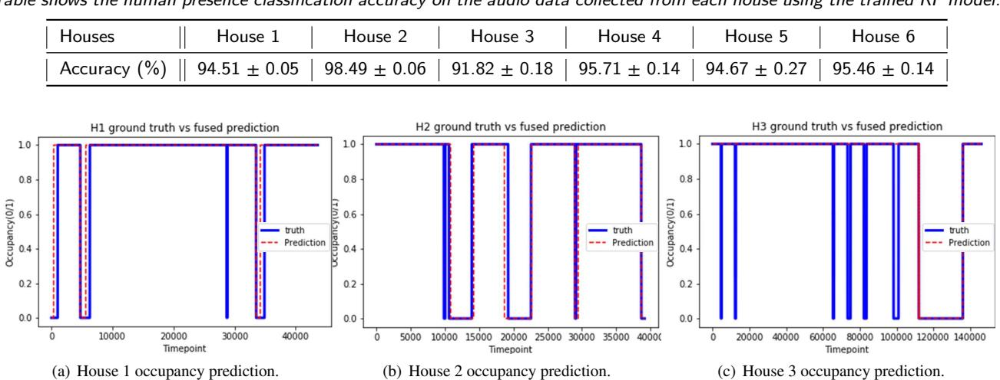
<!-- Image Description: The image presents a table showing human presence classification accuracy (91.82-98.49%) for six houses using a trained model. Below, three graphs compare ground truth and predicted occupancy over time for houses 1-3. Each graph plots occupancy (0/1) against time, showing a step-function-like pattern for both ground truth (blue) and prediction (red dashed). The graphs visually demonstrate the model's performance in predicting occupancy for each house. -->

Table shows the human presence classification accuracy on the audio data collected from each house using the trained RF model.

Figure 13: Plots of ground truth occupancy against predicted house occupancy.

trained RF model is able to achieve >90% classification accuracy on the labeled audio data from all the houses. This shows that the trained model is not only accurate in classification but also generalizes well to different residential units with different ambient noise levels.

### *5.2.3. Decision fusion*Table 6

In the final step of the framework, the occupancy decisions from the different modalities are aggregated together to produce a final occupancy prediction. In our paper, a simple OR-gate was used as the aggregation mechanism to combine the predictions from different modalities. As presented in the previous sections, each modality is able to achieve high prediction accuracy through sophisticated model training, and thus in the final step, a simple OR-gate is sufficient to generate the final prediction. Regarding the event-based modalities (images and audio), if, at any point of the time, any of the cameras or microphones capture a human figure or noise from human activity, it immediately indicates that the house is occupied. On the other hand, the symbolized states of the environmental data encode the information from previous timesteps. By utilizing the weighted mutual information metric, the model can reliably predict occupancy from these indirect sources. By combining the predictions and using a sliding persistency time window of one minute, three minutes, and fourteen minutes, accuracies of 95.06%, 95.73%, and 95.02% are achieved for House 1, 2, and 3, respectively. For illustration purposes, the plot of occupancy ground truth and occupancy predictions are plotted in Figure 13. From the figure, we can see that the houses are occupied most of the time, and unlike a commercial building that has fixed (or mostly fixed) daily office hours, the occupancy profile does not show a consistent daily occupancy profile. This scenario undoubtedly increases the difficulty of the prediction. Despite that, the predictions in houses 1 and 2 show that the proposed framework is able to accurately predict the occupancy status of the house. In fact, the model successfully pinpoints the transition of the occupancy status (from occupied to vacant and vice versa) and captures the duration of the occupancy status. On the other hand, although the model misses the short periods of vacancy in house 3, it still shows promising results, as it is able to capture the extended period of unoccupied time in the house.

# 6. Future work

As discussed in Section 1 and 3.2.1, implementation and deployment is one of the primary consideration. With this framework in place, the next step of our research is to implement and develop an occupancy detection system that could improve building energy-saving and efficiency. There are two components required to realize such a system; sensors that collect data and computation device that takes in the collected data and outputs prediction results. To reduce the cost and energy consumption of the system, low-powered sensors can be adopted to the system and be powered with small solar photovoltaic (PV) cells. Combined with the use of backscattering communication technology, the sensors can be both low-powered and wireless. For computation devices, embedded systems such as Raspberry Pi would be ideal for building a prototype that is low cost and low power consumption. By coupling this occupancy detection system with the existing heating, ventilation, and air conditioning (HVAC) control system and lighting control system, we can potentially obtain a smart occupancy-informed HVAC and lighting system.

# 7. Conclusions

In this paper, we proposed a multimodal sensor fusion framework that unifies different data modalities, including camera images, acoustic data, and indoor environmental data for occupancy detection in residential buildings. We introduced and formally defined two variants of the occupancy detection spatiotemporal pattern network (Occ-STPN) models, which learn the joint and pairwise relationships between the information sources and the house's occupancy status. Detailed analysis and ranking of the indoor environmental data using mutual information were also presented. In order to preserve privacy and extract useful features from the images and acoustic data, we performed a series of preprocessing steps, including max-pooling, bandpass filtering, rectification, and downsampling, in order to anonymize Personal Identifiable Information (PII) while retaining salient features for model training. Furthermore, we also implemented a few-shot learning method with siamese network architecture and a random forest model to classify camera images and acoustic data, respectively, into occupied and unoccupied states. Next, we proposed a new evaluation metric, Fading Memory Mean Squared Error (FMMSE), that provides a fair evaluation for delayed time series predictions. In terms of numerical results, we demonstrated the framework's performance on three open-source datasets: the Electricity Consumption and Occupancy (ECO) dataset; the University of California, Irvine's (UCI) building occupancy detection dataset; and the HPDmobile dataset, which we collected and made public. A detailed performance analysis of each data modality is also presented to provide deeper insights into the results. Finally, we demonstrated that we are able to achieve >90% prediction accuracy on the aforementioned open-source datasets and >95% prediction accuracy in our own collected dataset as well.

## Declaration of Competing Interest

The authors declare that they have no known competing financial interests or personal relationships that could have appeared to influence the work reported in this paper.

### Acknowledgment

This work was authored in part by the National Renewable Energy Laboratory, operated by Alliance for Sustainable Energy, LLC, for the U.S. Department of Energy (DOE) under Contract No. DE-AR0000938. Funding provided by U.S. Department of Energy, Advanced Research Projects Agency-Energy (ARPA-E). The views expressed in the article do not necessarily represent the views of the DOE or the U.S. Government. The U.S. Government retains and the publisher, by accepting the article for publication, acknowledges that the U.S. Government retains a nonexclusive, paidup, irrevocable, worldwide license to publish or reproduce the published form of this work, or allow others to do so, for U.S. Government purposes.

### CRediT authorship contribution statement
**Sin Yong Tan:**Software, Validation, Formal analysis, Data curation, Writing - original draft preparation, Visualization, Investigation.**Margarite Jacoby:**Software, Validation, Formal analysis, Data curation, Writing - original draft preparation, Visualization, Investigation.**Homagni Saha:**Investigation, Writing - review and editing.**Anthony Florita:**Conceptualization, Methodology, Resources, Supervision, Writing - review and editing, Project administration, Funding acquisition.**Gregor Henze:**Conceptualization, Methodology, Resources, Writing - review and editing, Supervision, Project administration, Funding acquisition.**Soumik Sarkar:** Conceptualization, Methodology, Resources, Writing - review and editing, Supervision, Project administration, Funding acquisition.

### References

- [1] US Energy Information Association, Independent Statistics and Analysis: Frequently Asked Questions, https://www.eia.gov/tools/faqs/ faq.php?id=86&t=1, 2021. Accessed: 2021-06-22.
- [2] M. Woodward, C. Berry, Residential energy consumption survey (recs) 2015, https://www.eia.gov/todayinenergy/detail.php?id= 36412&src=%E2%80%B9%20Consumption%20%20%20%20%20%20Residential% 20Energy%20Consumption%20Survey%20(RECS)-b3, 2015. Accessed: 2021-06-22.
- [3] C. Yang, Smart building energy systems, Handbook of Energy Systems in Green Buildings (2018) 1485–1512.
- [4] K. Park, Y. Kim, S. Kim, K. Kim, W. Lee, H. Park, Building energy management system based on smart grid, in: 2011 IEEE 33rd international telecommunications energy conference (INTELEC), Ieee, 2011, pp. 1–4.
- [5] G. Dileep, A survey on smart grid technologies and applications, Renewable Energy 146 (2020) 2589–2625.
- [6] W. Kleiminger, C. Beckel, S. Santini, Household occupancy monitoring using electricity meters, in: Proceedings of the 2015 ACM international joint conference on pervasive and ubiquitous computing, 2015, pp. 975–986.
- [7] R. Razavi, A. Gharipour, M. Fleury, I. J. Akpan, Occupancy detection of residential buildings using smart meter data: A large-scale study, Energy and Buildings 183 (2019) 195–208.
- [8] T. Vafeiadis, S. Zikos, G. Stavropoulos, D. Ioannidis, S. Krinidis, D. Tzovaras, K. Moustakas, Machine learning based occupancy detection via the use of smart meters, in: 2017 International Symposium on Computer Science and Intelligent Controls (ISCSIC), 2017, pp. 6– 12. doi:10.1109/ISCSIC.2017.15.
- [9] Y. Jeon, C. Cho, J. Seo, K. Kwon, H. Park, S. Oh, I.-J. Chung, Iotbased occupancy detection system in indoor residential environments, Building and Environment 132 (2018) 181–204.
- [10] D. Minoli, K. Sohraby, B. Occhiogrosso, Iot considerations, requirements, and architectures for smart buildings—energy optimization and next-generation building management systems, IEEE Internet of Things Journal 4 (2017) 269–283.
- [11] S. Petersen, T. H. Pedersen, K. U. Nielsen, M. D. Knudsen, Establishing an image-based ground truth for validation of sensor data-based room occupancy detection, Energy and Buildings 130 (2016) 787– 793.
- [12] A. Saffari, S. Y. Tan, M. Katanbaf, H. Saha, J. R. Smith, S. Sarkar, Battery-free camera occupancy detection system, in: Proceedings of the 5th International Workshop on Embedded and Mobile Deep Learning, EMDL'21, Association for Computing Machinery, New York, NY, USA, 2021, p. 13–18. URL: https://doi.org/10.1145/ 3469116.3470013. doi:10.1145/3469116.3470013.
- [13] M. Jin, N. Bekiaris-Liberis, K. Weekly, C. J. Spanos, A. M. Bayen, Occupancy detection via environmental sensing, IEEE Transactions

on Automation Science and Engineering 15 (2018) 443–455.

- [14] L. Zimmermann, R. Weigel, G. Fischer, Fusion of nonintrusive environmental sensors for occupancy detection in smart homes, IEEE Internet of Things Journal 5 (2018) 2343–2352.
- [15] T. H. Pedersen, K. U. Nielsen, S. Petersen, Method for room occupancy detection based on trajectory of indoor climate sensor data, Building and Environment 115 (2017) 147–156.
- [16] M. Amayri, A. Arora, S. Ploix, S. Bandhyopadyay, Q.-D. Ngo, V. R. Badarla, Estimating occupancy in heterogeneous sensor environment, Energy and Buildings 129 (2016) 46–58.
- [17] C. Rao, A. Ray, S. Sarkar, M. Yasar, Review and comparative evaluation of symbolic dynamic filtering for detection of anomaly patterns, Signal, Image and Video Processing 3 (2009) 101–114.
- [18] S. Hochreiter, J. Schmidhuber, Long short-term memory, Neural computation 9 (1997) 1735–1780.
- [19] R. Pascanu, T. Mikolov, Y. Bengio, On the difficulty of training recurrent neural networks, in: International conference on machine learning, PMLR, 2013, pp. 1310–1318.
- [20] S. Y. Tan, H. Saha, A. R. Florita, G. P. Henze, S. Sarkar, A flexible framework for building occupancy detection using spatiotemporal pattern networks, in: 2019 American Control Conference (ACC), 2019, pp. 5884–5889. doi:10.23919/ACC.2019.8815089.
- [21] S. Sarkar, A. Srivastav, M. Shashanka, Maximally bijective discretization for data-driven modeling of complex systems, in: American Control Conference (ACC), 2013, IEEE, 2013, pp. 2674–2679.
- [22] S. Sarkar, A. Srivastav, A composite discretization scheme for symbolic identification of complex systems, Signal Processing 125 (2016) 156–170.
- [23] S. Sarkar, S. Sarkar, N. Virani, A. Ray, M. Yasar, Sensor fusion for fault detection and classification in distributed physical processes, Frontiers in Robotics and AI 1 (2014) 16.
- [24] S. Y. Tan, H. Saha, M. Jacoby, G. Henze, S. Sarkar, Granger causality based hierarchical time series clustering for state estimation, IFAC-PapersOnLine 53 (2020) 524–529. 21th IFAC World Congress.
- [25] Z. Jiang, S. Sarkar, Understanding wind turbine interactions using spatiotemporal pattern network, in: Dynamic Systems and Control Conference, volume 57243, American Society of Mechanical Engineers, 2015, p. V001T05A001.
- [26] K. Simonyan, A. Zisserman, Very deep convolutional networks for large-scale image recognition, arXiv preprint arXiv:1409.1556 (2014).
- [27] K. He, X. Zhang, S. Ren, J. Sun, Deep residual learning for image recognition, in: Proceedings of the IEEE conference on computer vision and pattern recognition, 2016, pp. 770–778.
- [28] R. Hadsell, S. Chopra, Y. LeCun, Dimensionality reduction by learning an invariant mapping, in: 2006 IEEE Computer Society Conference on Computer Vision and Pattern Recognition (CVPR'06), volume 2, IEEE, 2006, pp. 1735–1742.
- [29] G. Dai, J. Xie, Y. Fang, Siamese cnn-bilstm architecture for 3d shape representation learning., in: IJCAI, 2018, pp. 670–676.
- [30] Z. Lian, Y. Li, J. Tao, J. Huang, Speech emotion recognition via contrastive loss under siamese networks, in: Proceedings of the Joint Workshop of the 4th Workshop on Affective Social Multimedia Computing and First Multi-Modal Affective Computing of Large-Scale Multimedia Data, 2018, pp. 21–26.
- [31] M. Shorfuzzaman, M. S. Hossain, Metacovid: A siamese neural network framework with contrastive loss for n-shot diagnosis of covid-19 patients, Pattern Recognition 113 (2021) 107700.
- [32] L. M. Candanedo, V. Feldheim, D. Deramaix, A methodology based on hidden markov models for occupancy detection and a case study in a low energy residential building, Energy and Buildings 148 (1 August 2017) 327–341.
- [33] A. Bing, F. Zhaoyan, R. X. Gao, Occupancy estimation for smart buildings by an auto-regressive hidden markov model, Proceedings of American Control Conference (21 July 2014) 2234–2239.
- [34] C. Beckel, W. Kleiminger, R. Cicchetti, T. Staake, S. Santini, The eco data set and the performance of non-intrusive load monitoring algorithms, in: Proceedings of the 1st ACM conference on embedded

systems for energy-efficient buildings, 2014, pp. 80–89.

- [35] W. Kleiminger, C. Beckel, T. Staake, S. Santini, Occupancy detection from electricity consumption data, in: Proceedings of the 5th ACM Workshop on Embedded Systems For Energy-Efficient Buildings, 2013, pp. 1–8.
- [36] L. M. Candanedo, V. Feldheim, Accurate occupancy detection of an office room from light, temperature, humidity and co2 measurements using statistical learning models, Energy and Buildings 112 (15 January 2016) 28–39.
- [37] S. Sarkar, M. Jacoby, G. Henze, S. Y. Tan, A high-fidelity residential building occupancy detection dataset, 2021. URL: https://springernature.figshare.com/collections/A\_High-Fidelity\_ Residential\_Building\_Occupancy\_Detection\_Dataset/5364449/1. doi:10.6084/m9.figshare.c.5364449.v1.
- [38] M. Jacoby, S. Y. Tan, G. Henze, S. Sarkar, A high-fidelity residential building occupancy detection dataset, Scientific Data 8 (2021) 280.
- [39] P. A. Estévez, M. Tesmer, C. A. Perez, J. M. Zurada, Normalized mutual information feature selection, IEEE Transactions on Neural Networks 20 (2009) 189–201.
- [40] G. Ansanay-Alex, Estimating occupancy using indoor carbon dioxide concentrations only in an office building: a method and qualitative assessment, 11th REHVA World Congr. Energy Eff., Smart Healthy Build (2013).
- [41] B. Abade, D. Perez Abreu, M. Curado, A non-intrusive approach for indoor occupancy detection in smart environments, Sensors 18 (2018) 3953.
- [42] I. Titze, D. Martin, Principles of voice production prentice hall, NJ.[Google Scholar] (1994).

# Graphical Abstract

# Multimodal Sensor Fusion Framework for Residential Building Occupancy Detection

Sin Yong Tan,Margarite Jacoby,Homagni Saha,Anthony Florita,Gregor Henze,Soumik Sarkar

# Multimodal Sensor Fusion Framework for Residential Building Occupancy Detection

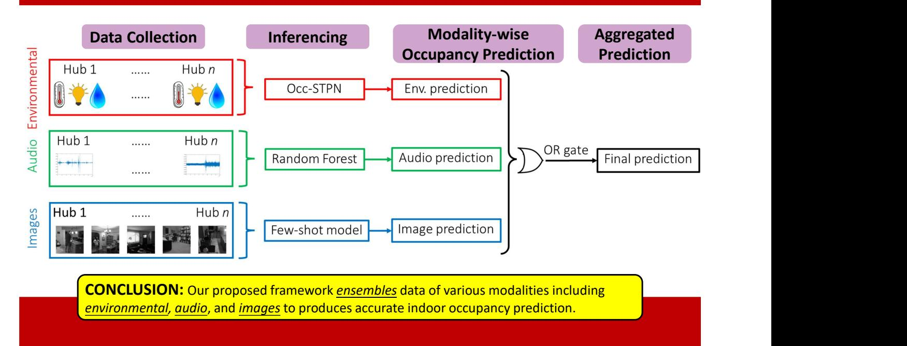
<!-- Image Description: This flowchart illustrates an indoor occupancy prediction framework. It shows data collection from environmental sensors, audio recordings, and images across multiple hubs. These data are then processed using Occ-STPN, Random Forest, and a few-shot model, respectively, generating modality-specific predictions. Finally, an OR gate aggregates these predictions into a final occupancy prediction. The diagram details the data flow and model choices for this multi-modal prediction system. -->

# Highlights

# Multimodal Sensor Fusion Framework for Residential Building Occupancy Detection

Sin Yong Tan,Margarite Jacoby,Homagni Saha,Anthony Florita,Gregor Henze,Soumik Sarkar

- We propose a multimodal occupancy detection framework for residential buildings.
- We propose two variants of occupancy detection spatiotemporal pattern network (Occ-STPN) models with feature level fusion and decision level fusion that offer great prediction accuracy, scalability, and transferability.
- We present different feature extraction techniques and occupancy detection models for various data modalities.
- We propose a new causal metric evaluating the prediction error relative to the time delay between ground truth and prediction.
- We discuss the transferability of a trained occupancy detection model from one building to another building.
- We evaluated the occupancy prediction performance of our framework on three open-sourced datasets.
