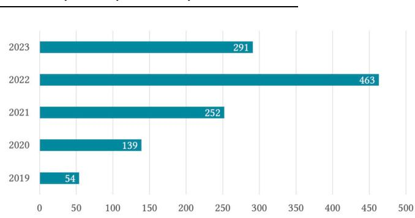
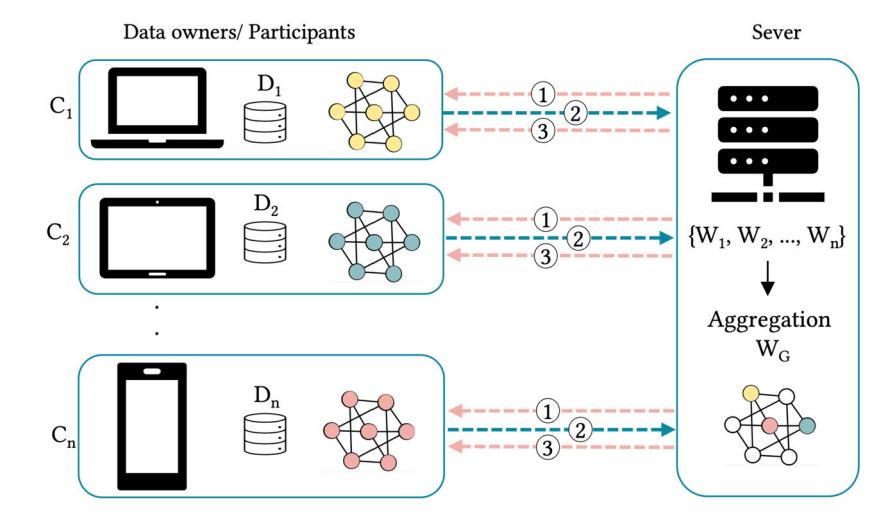
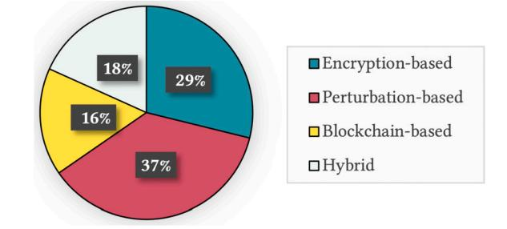
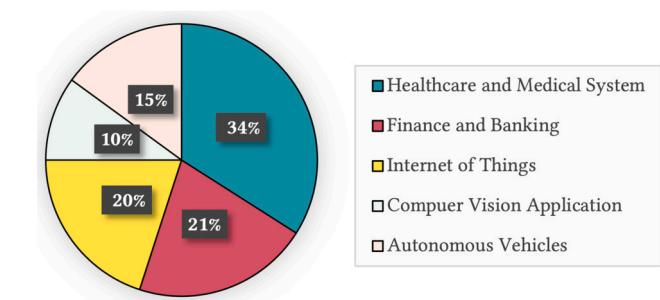
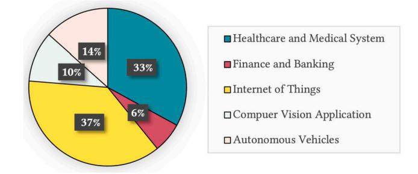
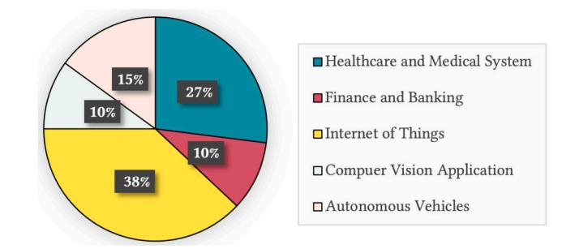
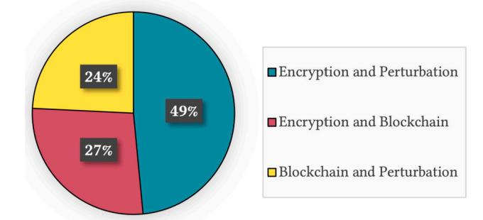
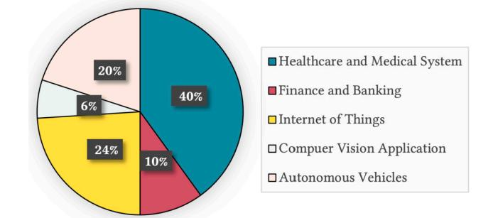
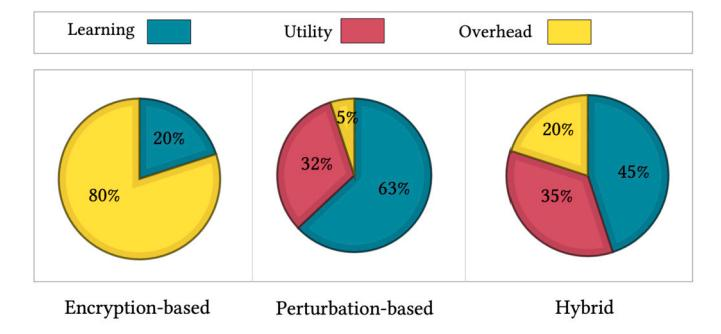

Contents lists available at [ScienceDirect](http://www.ScienceDirect.com/)

# Journal of Parallel and Distributed Computing

journal homepage: [www.elsevier.com/locate/jpdc](http://www.elsevier.com/locate/jpdc)

<!-- Image Description: That's the cover of the *Journal of Parallel and Distributed Computing*. The image is primarily a design element, not a technical illustration. It features a stylized globe with interconnected nodes, visually representing the journal's focus on parallel and distributed computing systems. The globe's design uses concentric circles and dots to reinforce the networking theme. The image serves as an aesthetic representation of the journal's subject matter, not as a data visualization or technical diagram. -->

# Balancing privacy and performance in federated learning: A systematic literature review on methods and metrics

Samaneh Mohammadi a*,*b*,*∗, Ali Balador b, Sima Sinaei a, Francesco Flammini b

a *RISE Research Institutes of Sweden, Stora Gatan 36, Västerås, 722 12, Sweden*b*Mälardalen University, Universitetsplan 1, Västerås, 722 20, Sweden*# A R T I C L E I N F O A B S T R A C T
*Keywords:* Distributed artificial intelligence Federated learning Cybersecurity Trustworthiness Performance evaluation

Federated learning (FL) as a novel paradigm in Artificial Intelligence (AI), ensures enhanced privacy by eliminating data centralization and brings learning directly to the edge of the user's device. Nevertheless, new privacy issues have been raised particularly during training and the exchange of parameters between servers and clients. While several privacy-preserving FL solutions have been developed to mitigate potential breaches in FL architectures, their integration poses its own set of challenges. Incorporating these privacypreserving mechanisms into FL at the edge computing level can increase both communication and computational overheads, which may, in turn, compromise data utility and learning performance metrics. This paper provides a systematic literature review on essential methods and metrics to support the most appropriate trade-offs between FL privacy and other performance-related application requirements such as accuracy, loss, convergence time, utility, communication, and computation overhead. We aim to provide an extensive overview of recent privacy-preserving mechanisms in FL used across various applications, placing a particular focus on quantitative privacy assessment approaches in FL and the necessity of achieving a balance between privacy and the other requirements of real-world FL applications. This review collects, classifies, and discusses relevant papers in a structured manner, emphasizing challenges, open issues, and promising research directions.

## 1. Introduction

Centralized Machine Learning (ML) algorithms have transformed data management and analysis practices in diverse industries. These algorithms streamline operations, automate tasks, and generate deeper insights that improve decision-making efficiency [[46\]](#page-20-0). Due to the extensive use of personal data by centralized ML [[120](#page-21-0)], privacy concerns have arisen, primarily since the General Data Protection Regulation (GDPR) was implemented [\[142\]](#page-22-0). By enforcing strict regulations on collecting, storing, and processing personal data, GDPR aims to protect individuals' privacy rights and give them greater control over their information.

Federated Learning (FL) offers a promising solution to meet GDPR regulations and address privacy concerns [[85,](#page-21-0)[139\]](#page-22-0). FL eliminates the need for data centralization by training ML models directly on user devices or edge servers. As a result of this decentralized approach, sensitive data remains on the local device, ensuring privacy and security. Instead of transmitting raw data to a central server, FL sends local model updates, thereby safeguarding the confidentiality of individual data points. By keeping data local, FL empowers users to retain control over their personal information and allows them to choose whether to contribute to model training.

The privacy-preserving assurances of FL have garnered significant attention across diverse industries, including healthcare, finance, and Internet of Things (IoT) applications [[62\]](#page-20-0). In the healthcare sector, FL empowers medical institutions to train models using patient data while safeguarding sensitive information. This facilitates advancements in medical research, personalized medicine, and disease prediction, all while upholding patient privacy [[165](#page-22-0)[,18](#page-19-0)[,41\]](#page-20-0). Similarly, banks and financial institutions can leverage FL to develop predictive models while ensuring the protection of customer financial data. By keeping sensitive financial information, such as transaction details and account balances, on users' devices, FL mitigates the risks associated with data breaches [\[82\]](#page-21-0). Furthermore, FL finds widespread application in the realm of IoT applications. It enables collaborative learning on distributed IoT devices, guaranteeing privacy in domains such as smart homes, autonomous vehicles, and industrial sensors [\[79,108,117](#page-21-0)]. By utilizing

<https://doi.org/10.1016/j.jpdc.2024.104918>

Received 6 October 2023; Received in revised form 21 February 2024; Accepted 11 May 2024

Available online 17 May 2024

0743-7315/© 2024 The Author(s). Published by Elsevier Inc. This is an open access article under the CC BY licen[se \(http://creativecommons.org/licenses/by/4.](http://creativecommons.org/licenses/by/4.0/)0/).

\* Corresponding author at: RISE Research Institutes of Sweden, Stora Gatan 36, Västerås, 722 12, Sweden. *E-mail address:*[samaneh.mohammadi@ri.se](mailto:samaneh.mohammadi@ri.se) (S. Mohammadi).

A brief summary of related surveys on privacy-preserving federated learning.

| Reference                      |            | Privacy-preserving categories | Privacy    | Balancing |            |                     |  |
|--------------------------------|------------|-------------------------------|------------|-----------|------------|---------------------|--|
|                                | Encryption | Perturbation                  | Blockchain | Hybrid    | assessment | privacy-performance |  |
| X. Yin et al. [175]            | ✓          | ✓                             |            | ✓         |            |                     |  |
| V. Mothukuri et al. [96]       | ✓          | ✓                             | ✓          |           |            |                     |  |
| A. Blanco-Justicia et al. [14] | ✓          | ✓                             | ✓          |           |            |                     |  |
| Our Work                       | ✓          | ✓                             | ✓          | ✓         | ✓          | ✓                   |  |

data from these devices, models can be enhanced without compromising the privacy of individuals or organizations.

While FL does provide notable benefits for data privacy, as previously mentioned, there are specific challenges tied to the exchange of model update parameters between the server and clients in FL [[100](#page-21-0)]. This communication process presents an opportunity for adversaries to potentially access and analyze the model parameters, including its neural network structure outputs, and even reconstruct the raw data through various attack methods. As a result, this poses a significant privacy risk that must be addressed. Additionally, as more users are involved in a collaborative model and the number of training iterations increases, the FL setup becomes more susceptible to a new array of privacy attacks.

###*1.1. Motivation*To the best of our knowledge, no survey currently exists with a focus on methods and metrics for balancing FL privacy and performance. Surveys exist addressing privacy-preserving techniques in FL: We present a condensed overview of those surveys in Table 1. They analyze recent advancements in privacy-preserving mechanisms within FL and provide insights into the associated privacy risks; however, they do not consider the impact of each privacy-preserving mechanism on performance-related application requirements. In fact, FL involves training local models on edge or end devices, which often have limited resources. Applying privacy-preserving mechanisms to these resources can potentially increase the cost and overhead (e.g. communication and computation), posing a risk of degrading system performance from various perspectives. The primary motivation of this paper is to review recent privacy-preserving mechanisms and analyze their effects on performance-related application requirements. Furthermore, this paper endeavors to compile contemporary methods that propose strategies for balancing privacy and performance. This balance is a paramount concern in the FL setups, as underscored in the study [[143](#page-22-0)]. This work also serves as a guide for researchers in selecting appropriate privacypreserving mechanisms tailored to specific FL application domains.

The existing surveys in the field offer limited insights into privacy assessment metrics and methods, leaving a significant gap in the current literature. In this paper, we strive to bridge this gap by comprehensively reviewing and synthesizing the varied approaches and metrics employed for assessing privacy in FL. Additionally, this paper presents a comprehensive categorization of recent privacy-preserving mechanisms in FL and serves as an up-to-date resource incorporating the latest and most relevant research. Since the research area has expanded rapidly in the past few years, our review diligently includes the most recent papers to ensure that we remain current. This is illustrated in Fig. 1, which showcases publication trends data. A significant surge is evident, with over 1006 updated publications emerging in 2021, 2022, and 2023, marking an astounding growth of more than 500% compared to the existing surveys published in 2019 and 2020. It is crucial to mention that the 2023 data is still preliminary at the time of this write-up.

####*1.2. Main contributions*This paper provides a review of privacy-preserving mechanisms in FL with a focus on significant methods and metrics for effectively

<!-- Image Description: The image displays a horizontal bar chart showing the number of publications per year from 2019 to 2023. The chart visually represents a publication trend, indicating a substantial increase in publications from 54 in 2019 to 463 in 2022, followed by a slight decrease to 291 in 2023. The x-axis represents the number of publications, and the y-axis represents the year. The chart's purpose is to illustrate the growth and recent fluctuation in the number of publications over time. -->
**Fig. 1.**The number of publications for privacy-preserving mechanisms in FL over time. Note that data was collected on 12 July 2023, so data from 2023 is incomplete.

balancing privacy with other performance-related application requirements. We employ a comprehensive classification of recent publications, incorporating existing categories from the literature while also introducing new categories that have been previously overlooked or undervalued. In this way, we can cover a considerable number of new publications in the field. As outlined in Table 1, earlier surveys by [\[96](#page-21-0)] and [\[14](#page-19-0)] primarily categorize FL privacy-preserving mechanisms into three distinct groups: encryption, perturbation, and blockchain. In contrast, [[175](#page-22-0)] provides a broader overview of hybrid mechanisms but does not include blockchain in their categorization. This paper advances the categorization by presenting a structured analysis of privacy-preserving mechanisms within FL across four main categories: encryption, perturbation, blockchain, and hybrid. Furthermore, it breaks down these main categories into subcategories, offering a detailed exploration of the field that captures a wide array of recent scholarly contributions.

A thorough examination of the existing literature reveals the absence of a universally accepted metric or method to evaluate privacy in FL. Nonetheless, we have pinpointed several metrics and assessed the effectiveness of privacy-preserving mechanisms against potential threats. These metrics can act as benchmarks to measure a system's robustness against adversarial endeavors and provide a systematic method for evaluating prior work in this area. In the following sections, we provide an in-depth analysis of these metrics and methods. To the best of our knowledge, this paper is the first comprehensive analysis of privacy-preserving mechanisms in FL systems and their trade-offs with performance-related application requirements. We aim to shed light on how privacy considerations affect FL systems and their performance by addressing key research topics.

In summary, the main contributions of this Systematic Literature Review (SLR) are as follows:

- To determine the impact of privacy-preserving mechanisms in FL systems and their trade-offs with other performance-related application requirements based on a comprehensive review of existing literature.
- To investigate and evaluate existing methods and metrics for assessing the effectiveness of privacy-preserving mechanisms in FL, with a specific emphasis on quantitative assessment approaches.

<!-- Image Description: The diagram illustrates a federated learning system. Multiple clients (laptop, tablet, phone) with local datasets (represented as nodes and edges) send their data (W₁, W₂, ..., Wₙ) to a central server. Data transmission is shown with three numbered lines indicating different communication rounds. The server aggregates the data (WG), combining information from various clients without direct data sharing, protecting individual privacy. The resulting aggregated model is not explicitly shown. -->
**Fig. 2.**A schematic diagram of federated learning.

• To categorize the latest research in FL privacy-preserving mechanisms, drawing from relevant scientific publications, and detail the various applications in which each mechanism has been applied.

####*1.3. Paper organization*

The rest of this paper is organized as follows. Section 2 provides an introduction to FL, focusing on reference design, models, applications, and challenges. Section [3](#page-5-0) describes the SLR methodology, including research questions, search strategy and process, quality assessment, and data extraction method. Research results and analysis based on each research question are presented in Section [4](#page-7-0). Section [5](#page-18-0) presents the discussion of this study and its future direction. A description of the potential validity threats of this study and mitigation strategies is provided in Section [6](#page-18-0). Finally, Section [7](#page-19-0) provides conclusions of this study.

#### 2. Basic concepts of federated learning

Federated learning (FL), also known as collaborative learning, is a ML technique that trains an algorithm through multiple independent sessions, each utilizing its own dataset. FL allows multiple participants, referred to as clients, to collectively develop a shared ML model without the need to share their data. This approach addresses critical concerns such as data privacy, data security, data access rights, and the utilization of heterogeneous data sources. FL was initially introduced by Google as a distributed training model executed on mobile devices, where local model updates are exchanged with a central server [\[85](#page-21-0)]. The server's main role is to aggregate these local model updates and construct a global ML model. As illustrated in Fig. 2, the FL scenario assumes the presence of clients, denoted as 1*,* 2*,*…*,* , each having access to their respective databases 1*,* 2*,*…*,*.

As shown in Fig. 2, three steps are generally involved in FL training.

-**Step 1:**Server broadcasts the initialized global model () and assigns it to selected participants by specifying the hyperparameters of the global model and the training process, such as the learning rate, batch size, and local epoch.
-**Step 2:**Participants use local data and initialize global parameters to update their local parameters. Updated local model parameters () are sent to the server after minimizing each participant's loss function.
-**Step 3:**Server aggregates the local model parameters from each participant () and sends the updated global model () to the participants.

Steps 2-3 are repeated until the global loss function converges or a desirable training accuracy is reached.

####*2.1. Federated learning system model and design*The purpose of this section is to provide an overview of the FL core system model and design.

#*2.1.1. Data partitioning*FL can indeed be classified into three categories based on data distribution: horizontal FL, vertical FL, and transfer FL [\[171\]](#page-22-0). The choice of data partitioning depends on the specific use case, privacy requirements, and the nature of the dataset. The following categories are discussed in more detail:
*Horizontal federated learning*Horizontal FL refers to a specific FL setting where participants possess different data samples while operating within the same feature space [\[179\]](#page-22-0). For instance, in a FL scenario with smartphones, each device would have different data samples (e.g., data from different users), but all devices would share common features (e.g., user behavior, app usage). Google introduced a horizontal FL model for Android phones [\[86](#page-21-0)]. In this system, a single user updates the model parameters locally on the phone and uploads them to the Android cloud. This allows all data owners to create a federated model based on similar feature dimensions.
*Vertical federated learning*Vertical FL refers to the setting in which datasets contain the same samples or users but have different features [\[179](#page-22-0)]. Entity alignment in Vertical FL is crucial for connecting these vertically partitioned datasets, enabling collaborative learning while preserving data privacy and security. For example, in healthcare data, one device may have patient demographics while another has a medical history. By combining the models trained on each device, a global model can be constructed without exposing raw data. Vertical FL is also applied in financing cases, such as collaborations between Webank and invoice agencies, for developing financial risk models with overlapping users but distinct features [[20\]](#page-19-0).
*Federated transfer learning*In scenarios with limited overlap between users and features in two datasets, federated transfer learning is employed to bridge the data gap instead of dividing the data. This approach transfers knowledge from a party with rich feature space to another party lacking sufficient features or labels to train a highperforming model [\[78](#page-21-0)]. For instance, radiology departments face challenges in gathering enough scans to develop an accurate diagnosis sys-

| Aggregation approaches followed in state of the art of FL aggregation algorithms. |  |  |  |  |  |  |  |
|-----------------------------------------------------------------------------------|--|--|--|--|--|--|--|
|                                                                                   |  |  |  |  |  |  |  |

| Approach                 | Contributions                                                                             | Main Concept                                                                        | Advantages                                                        | Disadvantages                                                                  |
|--------------------------|-------------------------------------------------------------------------------------------|-------------------------------------------------------------------------------------|-------------------------------------------------------------------|--------------------------------------------------------------------------------|
| Average Aggregation      | FedAvg [85], RFA [107], FedPAQ [112], HierFAVG [71]                                    | Average the client's updates.                                                       | Simple to implement; can enhance accuracy.                     | Vulnerable to outliers/malicious clients, struggles with non-IID data.   |
| Secure Aggregation       | SCAFFOLD [54], SAFA [160], Turbo-Aggregate [126], HeteroSAg [32], LightSecAgg [127] | Employs homomorphic encryption or secure multi-party computation for privacy. | Ensures strong privacy with maintained model accuracy.         | Computationally costly and slower; needs meticulous security management. |
| Weighted Aggregation     | FedOPT [111], FedProx [63]                                                                | Adjust client contributions based on performance or relevant factors.            | Boost model accuracy by prioritizing more reliable clients. | Needs precise weight calibration, sensitive to bias or noise.               |
| Personalized Aggregation | FedMA [150], Turbo-Aggregate [126], FAIR [25]                                          | Takes clients' unique characteristics into account.                              | Enhances model by adapting to client data.                     | Burden extra communication and computational costs.                         |

tem. By utilizing transfer learning, radiologists can enhance diagnosis by leveraging insights from related tasks like image recognition [\[179](#page-22-0)].

##*2.1.2. Client selection*The selection of clients in a FL is based on various factors such as charging status and network connectivity. To initiate communication and register participation, a random number is often used to select among these devices. However, this approach has certain drawbacks, particularly when dealing with a diverse range of clients, resulting in longer training times. Various research efforts have proposed solutions to address these challenges [[3](#page-19-0)].

One such solution is the introduction of a novel FL protocol called FedCS, which aims to enable the active management of resources for heterogeneous clients within mobile edge computing frameworks [\[104](#page-21-0)]. FedCS introduces specific deadlines for clients to download, update, and upload ML models. By aggregating updates from as many clients as possible within a limited time frame, the ML training process becomes more efficient. This approach significantly reduces training time and improves the overall efficiency of the FL process. Additionally, FedCS considers factors like limited computing resources on client devices, ensuring that the training process adapts to the capabilities of individual clients.

###*2.1.3. Aggregation algorithms*Aggregation algorithms in FL are important because of their role in updating global models. There are many aggregation approaches that can be followed in building the aggregation algorithm in a FL environment. In FL, a variety of aggregation algorithms are used depending on the goals to be achieved, such as protecting user privacy, increasing the convergence rate, and mitigating risks posed by anomalous updates. Each of these approaches has its advantages and disadvantages, and some are better suited to certain contexts of FL than others [\[95](#page-21-0)]. Table 2 provides a comprehensive overview of current FL aggregation algorithm implementations, detailing the main concept of approaches, with their advantages and disadvantages.

####*2.2. Application areas*FL approaches have become popular for developing collaborative models which are compliant with legal requirements regarding user privacy. Early researchers and innovators have already implemented FL in real-life applications and experiments. Several applications are discussed in the following of this section [\[62](#page-20-0)].

###*2.2.1. Healthcare and medical system*The advancement of AI has brought about a transformative impact on medical systems and the diagnosis of diseases. However, the protection of patient privacy poses challenges in collecting medical data from various hospitals. To address this issue, the development of FL has emerged as a promising solution, enabling multiple hospitals and organizations to train models collaboratively without sharing sensitive patient information.

A notable federated transfer learning framework called FedHealth was introduced by the authors of [[18\]](#page-19-0). This framework facilitates the construction of robust AI models for medical problems by leveraging data from separate hospital organizations and multiple wearable IoT devices. Consequently, it offers accurate and personalized healthcare solutions without compromising privacy or security. Furthermore, FL has recently been explored as a potential tool in combating infectious diseases such as COVID-19, as described in [\[101\]](#page-21-0) and [[59\]](#page-20-0). The FL blockchain system enables healthcare facilities to identify CT scans of COVID-19 patients by facilitating communication and collaboration.

FL also holds promise in managing Electronic Health Records (EHRs) within the healthcare system. In the reference [\[41](#page-20-0)], a collaborative learning protocol based on FL is presented for an EHR system that involves multiple hospital institutions connected to a central server. Each hospital conducts deep learning using its own EHRs, supported by a global model hosted on the cloud. Additionally, FL can be utilized to develop a cross-silo federated drug discovery learning framework, addressing the challenges associated with limited and biased data in drug discovery [[162](#page-22-0)].

####*2.2.2. Finance and banking*In finance and banking, FL is gaining popularity for collaborative model training. Participants can maintain control over their local data and ensure confidentiality by distributing the training process across multiple devices or institutions [[65\]](#page-20-0). FL is useful for fraud detection in finance, leveraging transactional data to detect fraudulent activities [\[50\]](#page-20-0). This makes it ideal for applications that require sensitive customer information. By using FL, institutions can train fraud detection models collaboratively while protecting customer data. FL's decentralized nature enables local training on individual datasets, addressing privacy concerns effectively. Moreover, fraud detection in the FL framework demonstrates an increase in performance of approximately 10% when implementing FL versus conventional ML approaches [\[172](#page-22-0)].

####*2.2.3. Internet of things (IoT)*In traditional IoT systems, AI functions are typically hosted on data centers or cloud servers, which is not scalable for the growing number of IoT devices and the distribution of data in large-scale IoT networks. Additionally, transmitting massive amounts of data to the data center for AI training is infeasible in big data. FL addresses these challenges by utilizing the computational capabilities of multiple IoT devices for distributed data training. This approach offers attractive features such as low communication latency, privacy protection, channel bandwidth savings, and efficient computing resources for AI implementation [[102](#page-21-0)].

FL has the potential to transform IoT systems and enable various services and applications. For example, FL opens up opportunities for smart IoT applications in transportation and smart city domains. In smart transportation, FL enabled collaboration between multiple participants, including vehicles, in collaboratively training shared AI models without compromising user privacy [\[102\]](#page-21-0). This approach can be applied to various tasks like traffic prediction, where FL empowers edge devices such as vehicles to run distributed models using diverse data sources like road geometry and traffic flow [\[79](#page-21-0)]. Combining FL with blockchain technology enhances privacy in vehicular systems, enabling the development of decentralized traffic planning solutions [[108](#page-21-0)].

Furthermore, FL has been utilized to enable distributed AI capabilities for decentralized smart city applications, particularly in the realm of intelligent smart city data management [\[4\]](#page-19-0). In this context, FL proves valuable in organizing data streams from ubiquitous IoT devices, which function as FL clients, allowing for local learning without the need to share data with external third parties. This approach has the potential to reshape the existing landscape of smart cities, introducing exciting new services such as smart urban communication, sharing of social economy resources, monitoring social activities, and fostering global citizen interconnections [[102](#page-21-0)].

####*2.2.4. Computer vision application*In the realm of computer vision, FL offers a decentralized approach to training models across diverse devices or servers, capitalizing on their ability to process and make decisions based on visual data without centralizing the data itself. This decentralized structure ensures that sensitive visual data, be it from facial recognition or object detection processes, stays confined to the user's device, directly addressing the privacy challenges often associated with traditional centralized ML systems. One significant stride in this direction is the FedVision platform, a collaborative development between WeBank and Extreme Vision, tailored specifically to accelerate the inception of FL-empowered computer vision applications [\[77](#page-20-0)]. Beyond safety monitoring, the pioneering work behind FedVision has also inspired other innovative FL use-cases, including applications that specialize in recognizing human behaviors [\[129](#page-21-0)].

###*2.2.5. Autonomous vehicles*Within the scope of autonomous vehicles and smart transportation, FL plays a pivotal role in fostering collaboration among various stakeholders, including the vehicles themselves. This collaboration allows for the collective training of shared AI models without compromising user privacy [\[102\]](#page-21-0). FL's adaptability ensures its relevance across an array of intelligent transportation scenarios. As an example, in the context of traffic prediction, FL stands out as a preferable alternative to the traditional centralized ML. Here, distributed models function on edge devices, such as the vehicles. These models leverage diverse datasets, encompassing aspects from road configurations to traffic dynamics, to refine their precision [\[79](#page-21-0)].

To further reinforce privacy in vehicular systems, integrating FL with blockchain technologies can lead to decentralized traffic planning solutions [\[108\]](#page-21-0). In this framework, vehicles operate as FL clients, executing ML models and disseminating computed updates through a blockchain ledger, ensuring reward authentication. Furthermore, FL proves instrumental in crafting efficient resource distribution strategies within vehicle-to-vehicle networks [\[116\]](#page-21-0).

####*2.3. Challenges*Although FL offers a promising solution to privacy protection, implementing it in real-world scenarios can pose many challenges. These challenges primarily encompass data heterogeneity, communication costs, data integrity and availability issues, and privacy concerns. Given the focus of our paper, we will delve into the intricacies of the privacy issue, providing a comprehensive explanation.

###*2.3.1. Data heterogeneity*In centralized machine learning, the central servers divide the training dataset into subsets based on similar distributions. However, in FL, this approach is not feasible because the raw data is only accessible to the data owner. In FL, local datasets can exhibit different distributions, making the client datasets non-Independent and non-Identically Distributed (non-IID) [\[69\]](#page-20-0). Several studies have shown that FL accuracy decreases when dealing with non-IID or heterogeneous data [\[191\]](#page-23-0).

The heterogeneity in local data distributions leads to divergent models with the same initial parameters, resulting in non-IID weight divergence. This discrepancy between the uploaded local models and the ideal model derived from IID data causes FL to converge more slowly and exhibit lower learning performance [\[197\]](#page-23-0). However, in some cases, FedAvg has shown the ability to handle non-IID or heterogeneous data, as mentioned in the reference [\[85](#page-21-0)].

###*2.3.2. Communication cost*A federated network typically comprises a large number of edge devices, including millions of distributed mobile devices worldwide. To achieve a reasonable level of accuracy in updating a training model, multiple rounds of communication between the edge devices and the server are often required. However, it is important to note that when model updates involve a substantial number of parameters, such as convolutional neural networks with millions of parameters per update [\[42](#page-20-0)], significant communication costs can arise, leading to a training bottleneck [[69\]](#page-20-0).

Addressing this challenge requires the development of communication-efficient methods that ensure models better fit the data generated by devices in a federated network by sending smaller messages or performing iterative updates. To minimize communication in such a setting, two factors should be considered: 1) reducing the number of communication rounds and 2) decreasing the size of messages transmitted during each round [[63\]](#page-20-0).

####*2.3.3. Security considerations for data integrity and availability*FL, with its decentralized nature and involving numerous clients for collaborative training and exposure to model parameters, face potential security threats that can compromise data availability, integrity, and confidentiality.1

Maintaining data integrity is crucial in FL to ensure the accuracy and consistency of training data used for model updates. FL, however, faces data integrity challenges, including data poisoning attacks and Byzantine attacks. Malicious clients can exploit FL by injecting poisoned updates into the learner, aiming to reduce the accuracy of the global model or implant backdoors for future exploitation [\[12](#page-19-0),[10\]](#page-19-0). These attacks compromise the integrity of the training process. To address data integrity challenges in FL, robust defenses such as anomaly detection and outlier rejection mechanisms are necessary to mitigate the impact of poisoning attacks [\[136](#page-22-0)[,103\]](#page-21-0). Furthermore, secure communication protocols, including encryption and digital signatures, are essential for maintaining data integrity during transmission between clients and the central server [[114](#page-21-0)]. These measures safeguard against unauthorized modifications or tampering, contributing to the overall integrity of the FL process and protecting against potential threats.

Data availability is another security consideration in FL as it directly impacts the training and updating of models. FL faces challenges in data availability due to client participation, network limitations, and data synchronization [\[197\]](#page-23-0). Client availability issues, such as clients going offline or experiencing connectivity problems, can lead to incomplete or delayed data updates. Mitigating measures like client selection, incentivization, and fault-tolerant protocols are necessary [\[13](#page-19-0)]. Limited network bandwidth and high latency can hinder data transmission, requiring compression techniques and prioritization mechanisms. Additionally, ensuring synchronized updates and handling data staleness is essential for maintaining data availability [\[125\]](#page-21-0). Addressing these chal-

1 Please note that within computer security, data confidentiality is primarily addressed in this paper as a separate concern under the term "privacy".

lenges through coordination mechanisms and synchronization protocols enhances the accuracy, security, and performance of the FL system.

#*2.3.4. Privacy issues*Privacy is a critical challenge in FL and falls under the realm of data confidentiality in computer security. By interfacing user data into a collaborative model, increasing the number of training iterations, and exchanging model updates, FL is susceptible to various privacy attacks [\[100](#page-21-0)]. The FL protocol involves the exchange of local model parameters, enabling adversaries to learn sensitive information about neural network models, including parameter sets, structure, and outputs. In the following section, we will explore different threat models, attacks, and privacy-preserving mechanisms to address these privacy concerns.
*Threat models*Threat models in FL encompass different types of potential adversaries and their capabilities. These models help identify and address privacy, integrity as well as availability risks within the FL setup. Here are some commonly considered threat models in FL [[72\]](#page-20-0):

-*Malicious Client:*A malicious client intentionally provides incorrect or manipulated data during the training process. This can include data poisoning attacks, where the client injects misleading or corrupted data to influence the model's behavior or performance.
-*Eavesdropper:*An eavesdropper refers to an attacker who intercepts the communication between clients and the central server. Their goal is to gain unauthorized access to sensitive information, such as model parameters, gradients, or training data, compromising the privacy and security of FL.
-*Honest-but-Curious Server:*While the server in FL is expected to follow the protocol faithfully, an honest-but-curious server may attempt to gather sensitive information from the exchanged data without actively modifying it. The server may analyze the received updates to gain insights into the local clients' data or models.
-*Insider Threat:*This threat arises when an entity with privileged access to the FL system, such as a server administrator or data curator, misuses its position to compromise the security and privacy of FL. They may intentionally leak confidential information or tamper with the FL process.
*Privacy-related attacks in federated learning*There are three types of privacy attacks in FL: 1) data reconstruction attack, 2) property inference attack, and 3) membership inference attack; these attacks attempt to infer sensitive information on the users through model updates exchanged during the training process. Clients, servers, or eavesdroppers can conduct these attacks.

-*Model Inversion Attacks:*Model inversion attacks aim to infer the original input data by analyzing the outputs or gradients of a model [[198](#page-23-0)]. Essentially, attackers study the model's responses to estimate possible input data that could have led to such outputs. While the recovered data might not be an exact match to the original, it is often closely representative. In traditional ML settings, attackers often capitalize on their knowledge of the model's architecture while remaining uninformed about its precise parameters. However, in FL, clients have access to the global model, which provides adversaries an avenue to execute these inversion attacks [\[1](#page-19-0)].
-*Property Inference Attacks:*These attacks discern private properties in input data through model snapshot updates [\[87](#page-21-0)]. Essentially, adversaries aim to disclose properties hidden by the model owner. Property information, denoting input data features, can be relayed through aggregation [\[90\]](#page-21-0). In FL, clients viewing multiple global model snapshots can identify preserved property information, posing a threat [\[91](#page-21-0)]. If a data piece has property ∶ () in dataset , where is the number of clients, attackers determine if () ∈ .

•*Membership Inference Attacks:* These attacks identify if specific data instances were part of the training dataset. In FL, an adversary's challenge is to determine data point participation [\[100\]](#page-21-0). Using a similar mechanism as property inference attacks, the attacker constructs a classifier to ascertain if a data piece (*,*) belongs to a local dataset [\[91](#page-21-0)]. Gradients of the loss function reveal predictable data point effects. The adversary can exploit the SGD algorithm to glean information, observing gradient reactions to deduce membership.

A robust privacy-preserving mechanism must be implemented in FL to guard against these kinds of privacy-related attacks. In Section [4.1](#page-7-0), we will provide a more detailed description of the recent privacypreserving method used in FL.

## 3. Research methodology

This paper employs an SLR as the chosen research methodology. The objective of this study is to examine essential methods and metrics that contribute to achieving an optimal balance between FL privacy and other performance-related requirements of applications. Due to competing demands of FL applications in real-world settings, it becomes necessary to conduct a qualitative privacy evaluation. This evaluation aims to identify challenges, unresolved issues, and potential opportunities pertaining to privacy-preserving FL research. In order to ensure a systematic and reproducible approach for the selection and analysis of information sources, we adhered to the guidelines outlined in references [\[55](#page-20-0)] and [[81\]](#page-21-0).

###*3.1. Research questions*As the first step in SLR, Research Questions (RQs) are defined to provide support for the analysis of relevant state-of-the-art. This SLR addresses three main RQs, with their corresponding rationale specified in Table [3](#page-6-0).

####*3.2. Search strategy and process*During the second phase of the SLR, a systematic approach is employed to identify relevant studies on the topic. This section provides details on the databases and time frames utilized for the search, the search strings employed to gather pertinent results, and the screening phases employed to select suitable papers.

####*3.2.1. Databases and time range*In this study, we conducted searches across multiple search engines and databases, namely: [\(1\)](#page-14-0) ACM Digital Library, [\(2\)](#page-14-0) IEEE Xplorer, [\(3\)](#page-15-0) Scopus, and [\(4](#page-15-0)) ScienceDirect. As FL is a relatively recent development, the volume of publications on the subject has experienced substantial growth in recent years. To prevent duplication of efforts with previous surveys, we established a search period spanning from 2019 to 2023. This timeframe allows us to concentrate on the latest advancements in FL research.

####*3.2.2. Search string*We formulated specific search criteria for each primary source to encompass the title, abstract, and keywords of relevant papers. Once the initial draft of the search strings was completed, we compared their effectiveness by evaluating the results obtained from each database. Subsequently, we selected two search strings, denoted as and , which aligned with the scope of the RQs. The table presented below, Table [4,](#page-6-0) illustrates the final results in terms of the number of papers retrieved per source for each search string.

The search string was used to gather results for the first RQ, and in order to gather results for the second and third RQs, the search string was used. Each search question is listed below:

| ID  | Research question                                                                                                             | Rationale                                                                                                                                   |
|-----|-------------------------------------------------------------------------------------------------------------------------------|---------------------------------------------------------------------------------------------------------------------------------------------|
| RQ1 | Which are the main categories of mechanisms for preserving privacy in federated learning?                               | The first research question aims to provide a comprehensive overview of current categories of privacy-preserving mechanisms in FL. |
| RQ2 | Which are the main methods and metrics to assess privacy in federated learning, and how are they used?                  | The second research question aims to collect and analyze the different privacy assessment approaches in FL.                           |
| RQ3 | How privacy requirements can be balanced with other performance-related application requirements in federated learning? | The third research question focuses on the trade-off between privacy and other interdependent performance requirements in FL.      |
|     |                                                                                                                               |                                                                                                                                             |
|     |                                                                                                                               |                                                                                                                                             |
|     |                                                                                                                               |                                                                                                                                             |
**Fig. 3.**Paper search and selection process map.
**Table 4**Search results.

| Database                   | ACM | IEEE | Scopus | Science Direct |
|----------------------------|-----|------|--------|----------------|
| Results of search string A | 370 | 459  | 836    | 52             |
| Results of search string B | 13  | 13   | 25     | 21             |

-*Search String A: Federated Learning AND (Privacy OR Security OR Confidentiality)*-*Search String B: Federated Learning AND (Privacy OR Security OR Confidentiality) AND (Evaluation OR Analysis OR Assessment OR Measurement OR Metric) AND (Performance OR Utility OR Overhead) AND (Trade-off OR Balance)*The search results for search string yielded a total of 1717 papers, with 370 papers from ACM Digital Library, 459 from IEEE Xplorer, 836 from Scopus, and 52 from ScienceDirect. For search string , a total of 72 papers were found, including 13 papers from ACM Digital Library, 13 from IEEE Xplorer, 25 from Scopus, and 21 from ScienceDirect. Table 4 presents the distribution of papers per source for each search string.

###*3.2.3. Screening phase*To screen papers based on their relevance to the RQs, we followed the search process outlined in reference [[30\]](#page-20-0). The screening process consisted of multiple phases. In the initial phase, we removed duplicate papers and selected papers based on their titles, excluding those that were deemed irrelevant. In the subsequent phase, we reviewed the abstracts of the papers chosen in the first phase. We applied a set of inclusion and exclusion criteria, which are described in detail in Section 3.3. The final screening phase involved reading the full texts of the remaining papers to filter out those that did not address any of the RQs.

After completing the screening process, we utilized quality assessment schemes, as explained in Section 3.4, to evaluate the selected papers. Following these procedures, we identified 260 papers that met the criteria for analysis and reporting. Fig. 3 provides a visual representation of the step-by-step execution of these processes, illustrating the number of papers selected at each stage.

####*3.3. Inclusion and exclusion criteria*The following inclusion and exclusion criteria have been formulated to ensure a suitable selection of relevant papers:

#### • Inclusion criteria:

-**–**Peer-reviewed research manuscripts published in reputable international conference proceedings, journals, and books in which title, abstract, and keywords addressed defined RQs for this SLR
-**–**Survey, review, and SLR papers, which helped to identify the baseline open problems and research trends
-**–**ArXiv2 preprints cited by the peer-reviewed papers published in the primary sources
-**Exclusion criteria:**-**–**Papers that do not address privacy mechanisms in the context of FL
  -**–**Papers not written in English
  -**–**Papers whose full text was not available
-**–**PhD dissertations, tutorials, editorials, and other non peerreviewed magazine articles

####*3.4. Quality assessment*Quality assessment schemes were used to evaluate the papers. We scored the papers based on the three Quality Criteria (QCs) defined below, referring to [\[81](#page-21-0)]. The impact of QC1, QC2, and QC3 is taken into account to calculate the final score, which ranges from 1.00 (lowest) to 5.00 (highest). Each criterion is given equal weight, and the overall quality score is the average of the three individual scores. Due to our search strategy, we included papers with a QC score higher than 1.00 to ensure quality while not excluding insightful studies. The defined QCs are as follows:

- QC1: Citation rate. By checking the number of citations each paper received on Google Scholar, we determined this.
- QC2: Methodology contribution. Identifying a methodology contribution to the research can be done by asking two questions: [\(1\)](#page-14-0)

2 <https://arxiv.org/>.

Does this paper has high relevance to the research? [\(2](#page-14-0)) Does the methodology clearly define the RQs and objectives?

• QC3: Provide logical and understandable explanations of your findings. Does the study provide any solid findings and clear-cut conclusions? We evaluate each paper on the basis of the availability of quantitative evaluation of results in formal hypotheses.

###*3.5. Data extraction method*Data extraction sheets were created for all selected papers, containing information such as title, source, year, venue, authors, number of citations, and analysis of papers that answered the research questions. To prevent bias in data extraction, the following steps were taken:

- In order to reach a relevant and unbiased result, all authors discussed the search string together
- In the case of any unresolved disputes over the extracted data, all authors tried to reach an agreement
- An excel sheet3 was used for recording all the data for analysis and synthesis

#### 4. Research results

This section presents and discusses the SLR results based on the above RQs and criteria. The results are categorized and analyzed in the same order of the RQs.

#*4.1. Which are the main categories of mechanisms for preserving privacy in federated learning? (RQ1)*The primary objective of FL is to protect users' confidentiality by retaining their personal data on their devices. Nevertheless, as detailed in Section [2.3.4](#page-5-0), potential privacy breaches within this system underscore the need to address these challenges in FL. This section offers an updated taxonomy of contemporary privacy-preserving methods for FL, subdivided into four main categories: ([1](#page-14-0)) Encryption-based privacypreserving methods, [\(2\)](#page-14-0) Perturbation-based privacy-preserving methods, [\(3](#page-15-0)) Blockchain-based privacy-preserving methods, and ([4](#page-15-0)) Hybrid Privacy-preserving Federated Learning.

The analysis of selected papers (as illustrated in Fig. [3](#page-6-0), which includes approximately 260 papers), reveals the distribution shown in Fig. 4: encryption-based strategies cover 29% of the literature, perturbation-based methods span 37%, blockchain-based solutions account for 16%, and the combined trusted and hybrid privacy-preserving approaches stand at 18%. This categorization provides a panoramic view of the multifaceted strategies employed in addressing FL's privacy hurdles.

Aside from that, this paper also emphasizes FL performance considerations. While performance is a more generic term that encompasses a greater range of metrics, to make the paper more focused, we have categorized performance requirements into three distinct areas based on a review of selected papers. This categorization aims to clarify their definitions and implications, thereby facilitating a comprehensive understanding of how they influence the design and evaluation of FL systems. The definitions and considerations are as follows4:

•**Learning:**In FL, learning performance-related requirements set criteria for effective decentralized learning. They encompass accuracy, loss function, and convergence. Accuracy gauges the global

<!-- Image Description: This pie chart displays the distribution of privacy-preserving data publishing techniques. 37% utilize perturbation-based methods, 29% are encryption-based, 16% leverage blockchain, and 18% employ hybrid approaches. The chart's purpose is to visually represent the prevalence of different techniques within the studied literature, likely informing the paper's discussion of current trends in the field. -->
**Fig. 4.**Distribution of privacy-preserving methods in FL as identified in selected studies.

model's alignment with accurate labels across diverse client data. Loss functions pinpoint the variance between model predictions and actual, influencing model updates. Convergence ensures the global model stabilizes through iterations, signifying integrated learning from all decentralized sources.

-**Utility:**In FL, utility refers to the effectiveness or performance of a model trained across decentralized devices or nodes without centralizing the data, emphasizing the model's value and relevance in achieving desired outcomes while considering distributed environments and privacy constraints.
-**Overhead:**In FL, overhead pertains to the ancillary computational and communication burdens incurred during the learning process. Communication overhead measures the amount of data (in bits) sent by each client throughout the training, whereas computation overhead highlights the duration each client allocates to each training cycle.

Subsequent sections will thoroughly examine each privacy-preserving technique, assessing their impact on performance-related application requirements and discussing their advantages, challenges, and widespread application uses.

##*4.1.1. Encryption-based privacy-preserving methods*The primary concern regarding privacy in FL stems from the potential vulnerability of sensitive data during model updates or aggregation. Such risks emerge when the central server or other participants access model parameters shared during the learning or aggregation stages [\[174](#page-22-0)]. To mitigate these threats, encryption technologies such as Secure Multi-Party Computation (SMPC) and Homomorphic Encryption (HE), play a crucial role in safeguarding data privacy [\[51](#page-20-0)]. These methods ensure that data stays encrypted throughout its transmission, updating, and aggregation processes. By allowing computations on encrypted data without needing decryption, they effectively thwart data exposure, upholding the confidentiality of sensitive information.

Furthermore, an analysis of selected studies in this field reveals a trend towards the deployment of encryption-based privacy-preserving methods in various applications. Fig. [5](#page-8-0) showcases the prevalence of encryption techniques by application area, quantified and visualized as percentages within the selected studies. This assessment highlights the substantial deployment of encryption techniques, particularly in cases and applications requiring advanced security measures, such as healthcare and finance. These sectors leverage encryption to safeguard sensitive user data during transmission and throughout the model updating process, thereby preventing unauthorized access. In the subsequent section, we provide an in-depth exploration of two key encryption techniques: SMPC and HE. Additionally, Table [5](#page-8-0) offers a thorough overview of the findings, underscoring the pivotal role encryption-based privacy methods play in the FL landscape.
*Secure multiparty computation*SMPC is a cryptographic technique that enables multiple parties to collaboratively compute a function without disclosing their individual data, serving a pivotal role in FL for enhanc-

3 Data extraction sheet. [https://github.com/SamaneMohammadi/Final](https://github.com/SamaneMohammadi/Final-result-of-Systematic-Literature-Review)[result-of-Systematic-Literature-Review](https://github.com/SamaneMohammadi/Final-result-of-Systematic-Literature-Review).

4 Utility and learning performance metrics, although closely related, differ in that learning performance metrics quantitatively evaluate models, while utility metrics address broader implications and real-world applicability.

Encryption-based privacy-preserving methods.

| Ref.  | Year | Mechanism | Main contribution                                                                                                                                                                                                                                                                                                                                              |  |
|-------|------|-----------|----------------------------------------------------------------------------------------------------------------------------------------------------------------------------------------------------------------------------------------------------------------------------------------------------------------------------------------------------------------|--|
| [36]  | 2020 | HE        | Lagrange interpolation was used to verify the correctness of the aggregated results and encryption operations were used to encrypt the local gradient of the participant.                                                                                                                                                                                   |  |
| [53]  | 2020 | SMPC      | Achieved privacy-preserving model aggregation for FL by adopting multiparty computation.                                                                                                                                                                                                                                                                       |  |
| [184] | 2020 | HE        | The Chinese Remainder Theorem and the Paillier HE were combined to propose a scheme for processing shared gradients that not only preserves privacy but is also computationally and communication-efficient.                                                                                                                                                |  |
| [11]  | 2020 | HE        | A HE method was proposed for addressing data privacy and security concerns in Industry 4.0 environments.                                                                                                                                                                                                                                                       |  |
| [66]  | 2020 | SMPC      | A chained secure multiparty computing model was proposed, which facilitates the exchange of masked information through serial chain frames, and provides protection of information exchanged among participants.                                                                                                                                            |  |
| [164] | 2020 | HE        | Integrating additive homomorphic technology into federated training to create an efficient and privacy-preserving framework for data aggregation.                                                                                                                                                                                                           |  |
| [57]  | 2021 | HE        | A scheme for aggregating FL navigation models in a vehicular fog that combines computational complexity with privacy protection was developed.                                                                                                                                                                                                              |  |
| [196] | 2021 | HE        | An encrypted-based protocol for federated deep learning was proposed, which avoids encrypting and decrypting the entire model by quantifying client parameters and generates key pairs collaboratively without a third party.                                                                                                                               |  |
| [76]  | 2021 | HE        | A framework was presented that leverages the HE technology to enhance privacy-enhanced FL and provides the server with the capability of detecting poisoning behaviors through effective gradient data extraction.                                                                                                                                          |  |
| [67]  | 2021 | HE        | A HE-based traceable identity scheme has been developed for the protection of message information in autonomous vehicles. A scheme based on anonymous identity was also proposed in order to enhance the privacy of individual identities.                                                                                                                  |  |
| [29]  | 2021 | HE        | Implementing a privacy-preserving federated matrix factorization framework for the recommender system, which was based on randomized responses, with HE encrypting data sent to the server to enable the server to aggregate it.                                                                                                                            |  |
| [8]   | 2021 | HE        | A novel filtering mechanism was used in the proposed approach to reduce communication costs by uploading only important gradients while protecting privacy by using a non-interactive zero-knowledge proof-based homomorphic cryptosystem (NIZKP-HC) to maintain robustness while protecting local gradient updates.                                     |  |
| [26]  | 2021 | HE        | A FL framework was developed which provides both privacy via unlinkable anonymity, as well as protection against Byzantine attacks and poisoning attacks.                                                                                                                                                                                                   |  |
| [47]  | 2021 | HE        | A verifiable privacy-preserving scheme was proposed based on vertical federated random forests in which users were dynamically changed. In addition, homomorphic comparison algorithms based on multi-key HE were applied to maintain privacy.                                                                                                              |  |
| [188] | 2022 | HE        | A detection method was developed in order to mitigate the adverse effects of unreliable industrial agents while preventing the server from achieving the parameters of the agents' model as well as protecting their private information.                                                                                                                   |  |
| [106] | 2022 | HE        | A privacy-preserving FL algorithm has been developed, which aggregates encrypted local model parameters without decrypting them, allowing each node to use its own HE private key.                                                                                                                                                                          |  |
| [173] | 2023 | HE        | BatchAgg was introduced as an aggregation protocol for FL that leverages the ciphertext packing technique from approximate homomorphic encryption. Rather than encrypting gradients individually, BatchAgg encrypts gradient vectors as a single ciphertext and computes batch operations homomorphically, building on the federated averaging protocol. |  |
| [45]  | 2023 | HE        | A secure FL method for IoT-enabled smart cities, which combines Fully HE and FL to provide enhanced data security. The authors provide four FL-based Fully HE methods for transmitting encrypted data over secure channels.                                                                                                                                 |  |
| [119] | 2023 | HE        | By integrating the homomorphism of secret sharing and encryption, a FL scheme was presented that ensured local parameter confidentiality while tolerating collusion threats, client dropouts, and aggregated data without key sharing.                                                                                                                      |  |
| [147] | 2023 | HE        | A FL scheme employing homomorphic encryption was introduced. On the client side, the encryption safeguards training models, and access control verifies user trust. The server-side acknowledgment reduces delays by managing inactive users and training dropouts.                                                                                         |  |
| [93]  | 2023 | HE        | SEFL was introduced that combines Paillier HE with innovative gradient pruning to enhance privacy and confidentiality within FL setups for speech emotion recognition applications. It minimizes communication and computation overhead while maintaining satisfactory model accuracy.                                                                   |  |

<!-- Image Description: The image is a pie chart depicting the percentage distribution of AI applications across various sectors. Healthcare and Medical Systems account for 34%, followed by Finance and Banking (21%), Internet of Things (20%), Computer Vision Applications (15%), and Autonomous Vehicles (10%). The chart likely illustrates the prevalence of AI in different industries within the context of the paper. -->
**Fig. 5.**Percentage of deployment of encryption-based methods across different sectors and applications: An analysis of selected studies within this domain.

ing privacy. SMPC allows for the aggregation of statistics, such as model updates from various clients, without exposing any participant's specific contributions, thereby preserving the privacy of individual data inputs in FL contexts [\[76](#page-20-0),[149,158,](#page-22-0)[66,53](#page-20-0)].

A significant application of SMPC in FL is demonstrated through a non-interactive, privacy-preserving regression training mechanism. This approach enables data owners to jointly train a global model with the help of a cloud service provider while ensuring the security of their local data, all without requiring direct interaction between the data owners and the cloud [\[149\]](#page-22-0). Despite its security benefits, SMPC is challenged by issues of scalability and computational intensity.

Addressing these limitations, the chain-PPFL framework emerges as an innovative solution, incorporating a sequential SMPC methodology and a novel masking strategy for secure data exchange among participants. This framework enhances communication efficiency and has shown to improve privacy, accuracy, and convergence rates in FL applications, despite the computational hurdles associated with SMPC [\[66](#page-20-0)[,113\]](#page-21-0).
*Homomorphic encryption*HE offers strong privacy guarantees with efficient cryptographic operations and simpler communication protocols (that is, a single round trip per federated round) [\[196\]](#page-23-0). HE ensures that data is encrypted before being transmitted to the central server for model training, thus preserving data privacy throughout the training process, as only the data owner possesses the decryption key. Given these attributes, HE has emerged as a notably secure and favored method within the realm of FL [\[36](#page-20-0),[51,57,](#page-20-0)[11](#page-19-0)[,196,](#page-23-0)[76,](#page-20-0)[164](#page-22-0),[67,](#page-20-0)[8](#page-19-0)].

Remarkably, the central server can execute computations on the encrypted data utilizing homomorphic operations like addition and multiplication, all without the need for decryption. Specifically, an additively homomorphic scheme allows some operation to be performed directly on the ciphertexts (1) and (2), so that the result of the operation is a new ciphertext whose decryption yields the sum of the plaintexts 1 and 2. The most prevalent among the HE variants are Paillier [[105](#page-21-0)], FV [[33\]](#page-20-0), and CKKS [\[21](#page-19-0)]. Paillier allows for additions to encrypted data, whereas FV and CKKS allow for additions and multiplications to encrypted data. It is possible to encrypt integers using the Paillier and FV schemes, but only approximate results can be obtained with the CKKS scheme.

However, most HE variants add additional computational and communication overhead in FL scenarios, which consist of limited edge device resources, making it more challenging to scale FL to a large number of devices. For example, the Communication-Efficient and Enhanced Privacy (CEEP-FL) strategy utilizes filters to discern critical gradient updates, optimizing communication demands. These pivotal gradients undergo encryption for privacy preservation. CEEP-FL's efficiency is measured against its privacy aspects, considering factors such as convergence metrics, communication efficiency, and computational loads [[8](#page-19-0)]. An alternative optimization technique integrates distributed key generation and additive ElGamal encryption within FL, supplemented with ternary quantization of local models and approximation in global model aggregation. This method targets reduced computational and communicative expenses, with assessments focusing on cumulative costs, time metrics, and model efficacy [\[196\]](#page-23-0).

#*4.1.2. Perturbation-based privacy-preserving methods:*Perturbation-based methods, such as Differential Privacy (DP), introduce controlled noise or randomization to model updates before their aggregation. This prevents the exact contributions of any single participant from being disclosed, ensuring that individual data privacy is preserved even during the learning process [\[174\]](#page-22-0). These methods are broadly classified into two categories: Local Differential Privacy (LDP) implemented at the client side and Global Differential Privacy (GDP) orchestrated at the server side [\[163\]](#page-22-0). Additionally, an analysis of selected studies in this field reveals a trend towards the deployment of perturbation-based privacy-preserving methods in various applications. Fig. 6 showcases the prevalence of perturbation based on application area, quantified and visualized as percentages within the selected studies. This analysis underscores the substantial adoption of perturbationbased privacy-preserving methods within the FL framework, particularly in IoT applications and healthcare infrastructures.

In the domain of IoT, devices often have limited computational capabilities. Perturbation-based methods offer an effective strategy to maintain privacy without overburdening these resource-constrained devices. In the healthcare sector, the inherent sensitivity of data, which includes patient records and medical histories, necessitates stringent privacy measures. By implementing perturbation-based FL methods, healthcare organizations are able to collaboratively develop models using decentralized patient data while ensuring the confidentiality of individual records. The subsequent section provides an in-depth examination of each application area. Additionally, Table [6](#page-10-0) succinctly captures our analytical insights, underscoring key takeaways from the surveyed literature.
*Local differential privacy*LDP is a perturbation-based privacy-preserving method used in FL to protect the privacy of individual data at the local device or client level. LDP ensures that the data contributed by each client remains private and does not reveal sensitive information while still allowing collaborative model training [[175](#page-22-0)], [[24\]](#page-20-0). It is widely used in FL systems, [\[163\]](#page-22-0), [[154](#page-22-0)], [\[133](#page-22-0)], [\[182\]](#page-22-0).

<!-- Image Description: The image displays a pie chart showing the percentage distribution of AI applications across various sectors. The largest portion (37%) is allocated to the Internet of Things, followed by Healthcare and Medical Systems (33%). Smaller segments represent Finance and Banking (6%), Computer Vision Applications (10%), and Autonomous Vehicles (14%). The chart visually represents the relative prevalence of AI adoption in different fields within the context of the paper. -->
**Fig. 6.**Percentage of deployment of perturbation-based methods across different sectors and applications: An analysis of selected studies within this domain.

A novel GAN-driven deferentially private algorithm was developed to protect the local model parameters [[24](#page-20-0)]. With controllable noise injected into local model parameters, this algorithm satisfies LDP requirements while improving fault diagnostic model utility in smart grids. Another example of controlling variation of the artificial noise processes was proposed by the authors of reference [[154](#page-22-0)] by adding artificial noise to the shared models before uploading them. As a result of their analysis, the variances of the artificial noise processes can be varied to achieve LDP with adjustable privacy protection levels.

Furthermore, clients with high privacy preferences would desire a greater level of cost compensation even when their privacy is protected with a similar level of privacy preservation. Researchers have used different approaches to solve the mentioned problem. For example, the authors of reference [[133](#page-22-0)] developed the Pain-FL framework, a personalized privacy-preserving incentive for federated learning. Pain-FL could provide personalized payments for clients with different privacy preferences as compensation for privacy costs while achieving desired convergence performance of model learning. As another example, the PAG-FL framework was developed, consisting of an adaptive Rényi DPbased privacy budget allocation protocol and an asynchronous weightbased grouped update algorithm [\[182\]](#page-22-0). In particular, the privacy budget allocation protocol applies Rényi DP and adaptively adjusts the privacy budget to obtain an efficient local model.

However, the LDP method decreases accuracy as the privacy protection level increases. In order to overcome this problem, researchers either try to find a trade-off between accuracy and privacy or combine DP with another technique to strengthen privacy protection [\[31](#page-20-0)]. For example, a Gaussian LDP method was developed to preserve user data privacy in the FL model using Stochastic Gradient Descent (SGD) [\[56](#page-20-0)]. The trade-offs between user privacy, utility, and transmission rate are proved by defining appropriate metrics for FL with LDP.
*Global differential privacy*GDP scheme has been used in the server-side of FL methods [[175](#page-22-0)], [\[163\]](#page-22-0), [\[153\]](#page-22-0). Specifically, during each training round, the server selects a random number of participants to train the global model, and the participants update their local models and send weights back to the server. The server then aggregates the global model by adding random noise. In this way, malicious participants cannot infer the information of other participants from the shared global model.

GDP is generally combined with LDP in FL studies. As an illustration, a dual privacy-preserving mechanism was developed, which achieves LDP by adding noise during local training models and GDP by adding noise to the global model when distributing it to clients [[163](#page-22-0)]. An intensive real-data experiment was conducted in the evaluation section to validate the analysis of FL leakage and its mechanism. Also, the authors of [\[153\]](#page-22-0) proposed a novel framework based on DP that effectively prevents information leakage by adding artificial noise to clients' and server sides. According to their framework, convergence performance and privacy protection levels are traded off, and the number of participants and aggregation times have an effect on convergence performance. They also developed a theoretical convergence bound on the loss function of the trained FL model.

|  | Perturbation-based privacy-preserving methods results. |  |
|--|--------------------------------------------------------|--|
|--|--------------------------------------------------------|--|

| Ref.  | Year | Mechanism   | Main contribution                                                                                                                                                                                                                                                                                                                                                                                                                                   |  |
|-------|------|-------------|-----------------------------------------------------------------------------------------------------------------------------------------------------------------------------------------------------------------------------------------------------------------------------------------------------------------------------------------------------------------------------------------------------------------------------------------------------|--|
| [115] | 2021 | LDP         | An assessment of DP approaches based on Gaussian and Laplacian distributions was conducted, taking into account non-IID distributions in FL-enabled for Industrial IoT.                                                                                                                                                                                                                                                                          |  |
| [189] | 2021 | LDP         | To ensure strict privacy preservation, Gaussian mechanism DP was used on shared parameters. In addition to reducing privacy leakage, fewer parameters were shared between the server and participants.                                                                                                                                                                                                                                           |  |
| [163] | 2021 | LDP and GDP | By adding noise on the client side during local model training and on the server side during global model distribution, a novel algorithm, dual differential privacy in FL, was designed to achieve differential privacy.                                                                                                                                                                                                                        |  |
| [154] | 2021 | LDP         | A novel user-level DP algorithm was proposed with adjustable privacy protection levels that were achieved by varying artificial noise variances and also determined the optimal number of communications rounds for a given privacy level.                                                                                                                                                                                                       |  |
| [76]  | 2021 | LDP         | An incentive mechanism was proposed to motivate edge devices with privacy concerns to actively participate in the computing task, achieving a trade-off between privacy leakage and model accuracy.                                                                                                                                                                                                                                              |  |
| [153] | 2020 | LDP and GDP | For both uplink (client-side) and downlink (server-side) channels, DP requirements are developed, and variances of artificial noise terms are calculated. Additionally, a theoretical convergence bound for the FL model's loss function is developed.                                                                                                                                                                                           |  |
| [148] | 2021 | LDP         | To ensure that user data cannot be directly accessed or inferred by malicious attackers, it developed a data reconstruction algorithm on the edge plane and an LDP perturbation algorithm on the user plane.                                                                                                                                                                                                                                     |  |
| [177] | 2021 | LDP         | A novel privacy-preserving edge-cloud and FL-based framework was developed for detecting and warning intelligent road damage. A novel DP approach with pixelization was proposed to protect the privacy of users before sharing data.                                                                                                                                                                                                            |  |
| [155] | 2021 | LDP         | A FL solution was developed over a wireless network with imbalanced resources and DP requirements. As a framework for minimizing the delay, they formulate a joint client selection and channel assignment problem.                                                                                                                                                                                                                              |  |
| [56]  | 2021 | LDP         | LDP of user data was preserved in FL models by using Gaussian mechanisms. By defining appropriate metrics for FL with LDP, the trade-offs between user privacy, global utility, and transmission rate were demonstrated.                                                                                                                                                                                                                         |  |
| [68]  | 2021 | LDP         | The COFEL system was developed to facilitate communication with LDP. An algorithm for global aggregation and a layer-based parameter selection method has been presented to optimize communication and training.                                                                                                                                                                                                                                 |  |
| [9]   | 2021 | LDP         | An unexpected dropout of users was introduced in FL as a new privacy risk. Created a DP mechanism resilient to dropouts by calibrating noise dynamically based on the dropout rate.                                                                                                                                                                                                                                                              |  |
| [24]  | 2021 | LDP         | A novel GAN-driven DP algorithm was proposed to preserve local model parameters in FL. A controllable noise was injected into local model parameters, which complies with DP requirements while improving fault diagnostic utility in smart grids.                                                                                                                                                                                               |  |
| [133] | 2021 | LDP         | A framework called Pain-FL was introduced that would provide clients with varying privacy preferences with a contract-based personalized incentive to compensate them for privacy leakage fees and assure satisfactory convergence results.                                                                                                                                                                                                      |  |
| [182] | 2021 | LDP         | Asynchronous grouped FL framework, PAG-FL, was developed, which allows multiple IoT devices and servers to train models cooperatively and efficiently without revealing personal data. PAG-FL used an asynchronous weight-based grouped update algorithm and an adaptive Rényi DP-based allocation protocol for privacy budgets.                                                                                                              |  |
| [193] | 2021 | LDP         | LDP federated stochastic gradient algorithm was developed that enables the vehicular crowd-sourcing applications to train a ML model to predict the traffic status while avoiding the privacy threat and reducing the communication cost.                                                                                                                                                                                                        |  |
| [23]  | 2020 | GDP         | A FL algorithm based on Gaussian DP named Noisy-FL was proposed to accurately track privacy loss during model training. In comparison to the previous algorithm, Noisy-FL achieved user-level privacy protection while increasing the number of communication rounds.                                                                                                                                                                            |  |
| [170] | 2021 | LDP         | The PLU algorithm, a personalized LDP client update, was used to provide personalized privacy preservation, and federated optimized aggregation (FedOA) was used to optimize the aggregation of gradients.                                                                                                                                                                                                                                       |  |
| [64]  | 2021 | LDP         | An efficient federated recommendation system was developed which balances data privacy protection with centralized training performance using LDP and security aggregation.                                                                                                                                                                                                                                                                      |  |
| [89]  | 2022 | LDP         | A scheme was proposed that incorporated compressive sensing (CS) and adaptive weight perturbation (LDP) for DNN architectures. It compresses local models and makes global model reconstruction precise.                                                                                                                                                                                                                                         |  |
| [187] | 2022 | LDP         | A novel FL algorithm named DP-FedADMM was proposed to solve the problem of slower convergence of FL with DP and how to handle noisy gradient in this process.                                                                                                                                                                                                                                                                                    |  |
| [38]  | 2023 | LDP         | A method DDPFL was introduced that adds noise for differential privacy in federated learning, preserving model usability. It calculates importance coefficients for model parameters based on gradient update size, weight parameter value, and gradient trend. Noise is then added accordingly, perturbing the local model.                                                                                                                  |  |
| [146] | 2023 | LDP         | A novel privacy-preserving edge FL framework, PPeFL, was introduced. Three LDP mechanisms are presented to address privacy concerns in FL. The FS-EM mechanism filters and screens parameters for global aggregation, reducing privacy budget growth and communication costs. The DPM-SP mechanism adds strong security through data scrambling, and the DPM-EU mechanism reduces perturbation-induced variance.                              |  |
| [118] | 2022 | LDP         | A novel PEDPFL algorithm was developed, incorporating a classifier-perturbation regularization method to boost model robustness against DP-induced noise. The theoretical privacy and convergence analysis of the algorithm were presented, along with a demonstration of hyperparameter influence on convergence performance.                                                                                                                |  |
| [52]  | 2023 | LDP         | A blockchain-based FL model with personalized DP was proposed. Users had the flexibility to adjust noise levels added to their local models based on their privacy preferences.                                                                                                                                                                                                                                                                  |  |
| [43]  | 2023 | LDP         | A local differentially private scheme, ACS-FL, was proposed to train FL models on heterogeneous IoT data. It addressed the curse of dimensionality, reduced LDP noise, and minimized communication overhead.                                                                                                                                                                                                                                     |  |
| [44]  | 2023 | LDP         | A novel differential privacy approach was introduced for FL using adaptive Gaussian clipping. The method tightened the privacy budget, introduced dynamic sampling probability, adaptive clipping based on hyperparameters, and a new privacy loss calculation.                                                                                                                                                                                  |  |
| [92]  | 2023 | LDP         | An approach was proposed called LDP-FL with CSS, which combines LDP with a novel client selection strategy (CSS). By leveraging CSS, it improved the representatives of updates and mitigating the adverse effects of noise on speech emotion recognition classification accuracy while ensuring client privacy through LDP. Furthermore, it conducted model inversion attacks to evaluate the robustness of LDP-FL in preserving privacy. |  |

Blockchain-based privacy-preserving methods.

| Ref.  | Year | Mechanism  | Main contribution                                                                                                                                                                                                                                                                                                                                                                 |
|-------|------|------------|-----------------------------------------------------------------------------------------------------------------------------------------------------------------------------------------------------------------------------------------------------------------------------------------------------------------------------------------------------------------------------------|
| [110] | 2020 | Blockchain | Integrating FL and blockchain networks (FL-Block) allows for decentralized privacy protection and prevents single points of failure in fog computing.                                                                                                                                                                                                                          |
| [122] | 2020 | Blockchain | A blockchain-based technology was used to address the model poisoning attack in FL systems and address a variety of security concerns.                                                                                                                                                                                                                                            |
| [166] | 2021 | Blockchain | Utilized FL neural collaboration in IoT to create a privacy-preserving personal blockchain reliability prediction model, which provides personalized predictions for users without revealing their personal information to third parties.                                                                                                                                      |
| [48]  | 2021 | Blockchain | An innovative mobile crowd-sensing learning framework based on blockchain and edge intelligence was developed, involving four core components: requester, blockchain servers, edge devices, and mobile devices.                                                                                                                                                                |
| [19]  | 2021 | Blockchain | By utilizing HE technology, a parameter deduction attack was prevented against partial parameters of participants, as well as the blockchain and FL mechanisms can protect a variety of data types and formats.                                                                                                                                                                |
| [124] | 2022 | Blockchain | An architecture for privacy preservation in smart healthcare was proposed using blockchain-based IoT cloud platforms in order to improve security, privacy, and system scalability.                                                                                                                                                                                            |
| [5]   | 2023 | Blockchain | The system utilized blockchain for exchanging training data instead of sending it directly to the aggregator. Layer 2 blockchain was also implemented to reduce the time needed for training information exchange between clients and the aggregator.                                                                                                                          |
| [60]  | 2022 | Blockchain | FL-BETS, a blockchain-based task scheduler for healthcare, considered hard and soft constraints (e.g., deadlines, energy use). It prioritized data privacy, fraud prevention, and efficiency across fog and cloud nodes, offering a mathematical model.                                                                                                                        |
| [168] | 2021 | Blockchain | A blockchain-empowered secure and incentive FL (BESIFL) paradigm was introduced. BESIFL utilized blockchain for a fully decentralized FL system, integrating mechanisms for malicious node detection and incentive management within a unified framework.                                                                                                                      |
| [152] | 2023 | Blockchain | A blockchain-empowered federated learning framework was developed, considering model and data heterogeneity. It included a heterogeneous calibration process called FL-MFC for collaboration among diverse models.                                                                                                                                                             |
| [176] | 2023 | Blockchain | A decentralized FL framework, GCFL, was introduced using a DAG blockchain with a coordinator mechanism to address scalability and decentralization issues. Additionally, a two-phase tips selection consensus algorithm was proposed to reduce resource consumption and resist malicious model updates.                                                                     |
| [80]  | 2023 | Blockchain | A privacy-preserving data-sharing system using FL and blockchain was introduced which addresses privacy and scalability issues. It introduced a cross-layer architecture, differential data sharing, and a targeted incentive mechanism in a two-stage Stackelberg game with an optimized solution using a gradient-based algorithm.                                        |
| [49]  | 2023 | Blockchain | An algorithm, AFLChain, was introduced in this paper, leveraging a consortium blockchain within a distributed Edge computing network. Learning tasks were dynamically allocated to edge nodes based on their computing capabilities, ensuring reliability. Furthermore, an entropy weight-based reputation mechanism was introduced to enhance the performance of AFLChain. |
| [97]  | 2023 | Blockchain | A FL framework was developed for transparent and secure model learning in the Metaverse using blockchain technology. The blockchain ledger stored and verified model updates, ensuring tamper-proof transparency. Additionally, a bandwidth distribution scheduling approach was proposed to minimize communication and prioritize reliable devices.                        |
| [16]  | 2023 | Blockchain | The impact of blockchain and FL on financial services was outlined in the paper, with a focus on enhancing privacy, security, and trust in cyber-physical systems. Financial service applications, the integration of FL with blockchain, and the role of the metaverse and digital twin in improving the financial services ecosystem were discussed.                      |

##*4.1.3. Blockchain-based privacy-preserving methods*Blockchain-based privacy-preserving methods utilize a series of time-stamped, immutable data blocks managed by a distributed network of computers, eliminating the reliance on a single controlling entity [\[28](#page-20-0)]. These methods address privacy threats in FL by providing decentralized control and transparency. Transactions and model updates are recorded in an immutable ledger, making it challenging for any single entity, including the central server, to manipulate data or model updates [\[140\]](#page-22-0). The decentralized nature of blockchain ensures data integrity, fairness, and protection against unauthorized modifications, thereby safeguarding the privacy and security of FL participants [\[28\]](#page-20-0).

Furthermore, an analysis of selected studies in this field reveals a trend towards the deployment of blockchain-based privacy-preserving methods in various applications. Fig. 7 showcases the prevalence of blockchain-based on the application area, quantified and visualized as percentages within the selected studies. Our findings indicate that blockchain technology is extensively applied in IoT and healthcare within the FL context, attributed to its distinct characteristics that effectively tackle challenges in these areas. In IoT, blockchain ensures data integrity and immutability, enabling secure and transparent collaboration among diverse devices while enhancing privacy and security for sensitive IoT data. Similarly, in healthcare, blockchain provides immutable data records, audibility, and privacy preservation, ensuring the trustworthiness and confidentiality of patient data. The decentralized nature of blockchain fosters trust and collaboration among multiple participants, facilitating secure and accountable federated learning processes [\[143\]](#page-22-0). This section delves into the integration of blockchain methods in FL, presenting a thorough review of proposed methodolo-

<!-- Image Description: This pie chart displays the distribution of applications for a specific technology (likely AI or machine learning, based on the categories). The largest segment (38%) is for the Internet of Things, followed by Healthcare and Medical Systems (27%). Finance and Banking, Computer Vision Applications, and Autonomous Vehicles each represent smaller percentages. The chart's purpose is to illustrate the prevalence of the technology across various sectors. -->
**Fig. 7.**Percentage of deployment of blockchain methods across different sectors and applications: An analysis of selected studies within this domain.

gies. Table 7 efficiently summarizes our findings, highlighting crucial insights from the literature reviewed.

The integration of blockchain technology with FL has emerged as a pivotal advancement for enhancing privacy and security within distributed systems. As evidenced by a range of studies, blockchainpowered FL models have been developed to address a variety of challenges across different sectors [\[151](#page-22-0)[,6,16\]](#page-19-0). These models have introduced decentralized mechanisms that not only enhance privacy protection but also prevent single points of failure, thereby bolstering the resilience of fog computing environments [\[110\]](#page-21-0). Furthermore, innovations such as the FL-Block framework and blockchain-empowered task schedulers for healthcare demonstrate the technology's capability to prioritize data privacy, fraud prevention, and operational efficiency [\[60\]](#page-20-0).

<!-- Image Description: The image is a pie chart showing the percentage distribution of three data privacy techniques: encryption and perturbation (49%), encryption and blockchain (27%), and blockchain and perturbation (24%). The chart visually represents the relative prevalence of these combined methods in the context of the paper, likely analyzing their usage or effectiveness in a specific application. -->
**Fig. 8.**Distribution of each subcategory of hybrid privacy-preserving mechanisms in FL as identified in selected studies.

Notably, blockchain has facilitated the creation of privacy-preserving personal blockchain reliability prediction models in IoT, offering personalized predictions without exposing user data to third parties [\[166](#page-22-0)]. The integration of blockchain within FL frameworks also supports the management of incentives and detection of malicious nodes, ensuring a fully decentralized and secure ecosystem [[168](#page-22-0)]. These advancements underscore blockchain's role in enabling secure, transparent, and efficient collaborative learning environments.

Despite its significant benefits, the integration of blockchain with FL faces several challenges. Scalability issues arise as the blockchain network expands, potentially leading to increased transaction times and resource consumption [[176](#page-22-0)]. To address these challenges, recent studies have proposed solutions like Layer 2 blockchains for efficient training information exchange and decentralized frameworks using directed DAG blockchains with coordinator mechanisms to enhance scalability and reduce resource usage [[5](#page-19-0)[,176\]](#page-22-0).

Moreover, the complexity of ensuring privacy while maintaining system performance and reliability presents an ongoing research focus. For instance, the AFLChain algorithm leverages consortium blockchain within distributed edge computing networks to dynamically allocate learning tasks based on computing capabilities, introducing an entropy weight-based reputation mechanism for performance enhancement [\[49](#page-20-0)]. As blockchain technology continues to evolve, future research will need to address these scalability and complexity challenges while exploring innovative approaches to optimize the synergy between blockchain and federated learning for various applications.

#*4.1.4. Hybrid privacy-preserving mechanisms*Hybrid privacy-preserving mechanisms in FL combine multiple privacy-preserving techniques to provide robust privacy protection from various angles [[51\]](#page-20-0), [[123](#page-21-0)]. By harnessing the strengths of different methods, these hybrid approaches effectively address multiple threats simultaneously [[83\]](#page-21-0), [\[40\]](#page-20-0). The integration of encryption, perturbation, and blockchain technology results in a comprehensive privacy protection framework [[174](#page-22-0)], [[192](#page-23-0)], [\[138](#page-22-0)]. For example, in order to prevent privacy leakage through the communication channel and ensure that contributions of individual participants remain undisclosed, the authors of [[40\]](#page-20-0) combined HE with DP to leverage the advantages of both protection mechanisms.

The hybrid privacy-preserving mechanisms can be categorized into three main groups within selected studies, as depicted in Fig. 8. The first category, comprising encryption and perturbation techniques, accounts for 49% of all hybrid mechanisms. The second category, which combines encryption and blockchain mechanisms, represents 27% of the hybrid approaches. Lastly, the combination of perturbation and blockchain techniques constitutes 24% of the hybrid mechanisms. Table [8](#page-13-0) provides a summary of the results, highlighting the primary contributions of each category.

Furthermore, an analysis of selected studies in this field reveals a trend towards the deployment of hybrid privacy-preserving methods in various applications. Fig. 9 showcases the prevalence of hybrid on the

<!-- Image Description: This pie chart displays the distribution of artificial intelligence applications across various sectors. Healthcare and medical systems constitute 40%, followed by the Internet of Things (24%), autonomous vehicles (20%), finance and banking (10%), and computer vision applications (6%). The chart visually represents the relative prevalence of AI in these sectors within the context of the paper's analysis. -->
**Fig. 9.**Percentage of deployment of hybrid methods across different sectors and applications: An analysis of selected studies within this domain.

application area, quantified and visualized as percentages within the selected studies. These hybrid approaches, integrating multiple privacypreserving techniques, offer robust solutions against privacy breaches across a broad spectrum of applications. Through analysis and findings, it is evident that these methods are particularly well-suited for applications in healthcare, where the handling of sensitive medical data poses unique challenges. Healthcare data typically contain highly personal and confidential information about individuals, making stringent privacy protection essential to comply with regulations and uphold the trust of patients and healthcare providers.
*Encryption and perturbation*Recently, hybrid privacy-preserving mechanisms have emerged as effective solutions to safeguard privacy in FL systems by combining encryption and perturbation techniques. One notable approach, as presented in [\[40](#page-20-0)], involves applying DP at the participant's end. Each participant perturbs the local gradient vector using distributed Gaussian mechanisms to achieve DP. The perturbed gradient vector is then encrypted using the Brakerski-Gentry-Vaikuntanathan (BGV) scheme, called internal ciphertext. Subsequently, the encrypted information of BGV encryption is embedded into Augmented Learning With Error (A-LWE), termed external ciphertext, to facilitate a secure aggregation protocol. Another example from [\[51\]](#page-20-0) discusses an aggregation scheme for data protection in Industrial IoT devices using both DP and HE, allowing for secure data and model sharing. This hybrid mechanism incorporates an incentive system to counter gradient inversion attacks and protect users' privacy attributes [[134](#page-22-0)], ultimately leading to enhanced gradient privacy and global model accuracy. Furthermore, the independent management of each user's secret key ensures no collusion between a trusted third party and the server, balancing privacy protection and model accuracy.

Another variant of the hybrid mechanism combines SMPC with DP to address inference attacks and enhance model accuracy in FL systems. Integrating SMPC and DP, as introduced in [\[138\]](#page-22-0), achieves privacy preservation without compromising accuracy, thereby reducing the noise injection. Moreover, SMPC guarantees privacy even when messages are exchanged without DP protection. These hybrid privacypreserving mechanisms find extensive use in industrial applications. For instance, in smart grid applications, the FedDetect framework [[159](#page-22-0)] combines LDP with HE to detect energy theft while protecting consumers' privacy. Similarly, in IoT applications [[194](#page-23-0)], a mechanism combining DP and Paillier HE safeguards against data, model, and collusion attacks, protecting privacy-revealing fog nodes and malicious parameter servers.

However, it is essential to acknowledge that the combination of encryption and perturbation comes with communication and computation resource overheads, and improper DP settings can lead to privacy leaks or performance degradation. Researchers have made notable strides in addressing these challenges, such as the work described in [\[174](#page-22-0)], where advanced function encryption algorithms are employed to protect data characteristics and participant weights in the weighted summation procedure. Additionally, improvements in the DP noise mechanism and

Hybrid privacy-preserving mechanisms.

| Ref.  | Year | Mechanism                 | Main contribution                                                                                                                                                                                                                                                                                                                                                                                         |
|-------|------|---------------------------|-----------------------------------------------------------------------------------------------------------------------------------------------------------------------------------------------------------------------------------------------------------------------------------------------------------------------------------------------------------------------------------------------------------|
| [40]  | 2019 | HE and DP                 | As a privacy-enhancing federated learning method, the framework PEFL is designed to prevent privacy leakage by perturbing the local gradient vector using distributed DP Gaussian mechanisms and encrypting the perturbed gradient vector during sharing, even in the presence of multiple adversaries collaborating.                                                                               |
| [134] | 2022 | HE and DP                 | A hybrid mechanism, Fed-DFE, prevents gradient leakage and inference attacks by combining function encryption and DP. Through interactions with the server, users generated keys, eliminating reliance on third parties. Fed-DFE incentives prevented low accuracy caused by excessive noise addition.                                                                                              |
| [174] | 2021 | HE and DP                 | The Bayesian DP was introduced to provide a more balanced privacy-preserving mechanism by correcting the noise intensity according to the distribution of the data. By adding a sparse difference matrix to the function encryption, the encryption was improved.                                                                                                                                      |
| [194] | 2020 | HE and DP                 | A data protection scheme was developed that utilizes DP to protect the data of IoT devices, and a method of aggregating model parameters that uses blinding and Paillier HE to secure the data. Using this scheme, IoT devices could be protected from collusion attacks, as well as their data being compromised.                                                                                  |
| [159] | 2021 | HE and DP                 | Developed a secure FL system for energy theft detection in smart grids, which combines LDP and HE schemes for a secure protocol that preserves privacy during the training process.                                                                                                                                                                                                                    |
| [83]  | 2019 | DP and Blockchain      | Implemented a blockchain-based collaborative framework to share data across multiple parties to reduce the risk of data leakage while integrating the DP function into FL to protect the privacy of users further.                                                                                                                                                                                     |
| [109] | 2021 | DP and Blockchain      | An urban traffic flow management framework based on blockchain technology has been developed. In order to protect the sharing of vehicle location information, LDP technology was utilized. Blockchain FL frameworks are used to protect against poisoning attacks.                                                                                                                                    |
| [192] | 2020 | DP and Blockchain      | A blockchain-based crowdsourcing FL system has been developed for manufacturers of IoT devices. A new normalization technique for DP protection has been proposed that improves the accuracy of FL models in comparison to batch normalization, and as a result, DP is enforced to protect customers' data.                                                                                         |
| [138] | 2019 | SMPC and DP            | A proposed protocol combines SMPC with DP in order to ensure privacy without compromising accuracy. By combining these two mechanisms, this framework was able to reduce the growth of noise injection and achieve a balance between accuracy and privacy.                                                                                                                                             |
| [52]  | 2023 | DP and Blockchain      | A blockchain-based federated learning model with personalized differential privacy was proposed in this study. Users had the flexibility to adjust noise levels added to their local models based on their privacy preferences. Blockchain integration was implemented to mitigate the single-point-of-failure issue associated with the central server, thereby enhancing overall system security. |
| [51]  | 2022 | HE, DP, and Blockchain | A blockchain-enabled FL model was introduced for IIoT. It included a data protection aggregation scheme and privacy-preserving techniques like distributed K-means clustering with DP and HE, random forest, and AdaBoost integrated with blockchain for enhanced security.                                                                                                                            |
| [98]  | 2023 | HE and Blockchain      | This paper offered resource management in IoMT through an edge-empowered blockchain FL system. It introduced an enhanced global learning model and encrypted gradient parameters using Paillier encryption on the federated server side. Blockchain was employed to enhance security in IoMT and edge computing.                                                                                    |

sparse differential gradients have been adopted to enhance communication overhead and storage efficiency.
*Encryption and blockchain*Alternative hybrid privacy-preserving mechanisms encompass a combination of Encryption and Blockchain. In the domain of blockchain-based privacy-preserving FL, one approach introduced a model for the Internet of Vehicles (IoV) to address privacy risks like poisoning attacks and data theft [\[151\]](#page-22-0). Employing homomorphic encryption and Multi-Krum, the system verified and filtered local model changes, reducing runtime overhead. Another study presented a blockchain-based privacy-preserving model for Byzantine-robust FL, ensuring privacy with CKKS fully HE [\[88](#page-21-0)]. Additionally, a novel technique combining deep learning and blockchain was proposed for preserving electronic health record privacy [[6](#page-19-0)]. Lastly, an efficient and secure blockchain-based FL system paradigm (ESB-FL) was developed, utilizing lightweight cryptography to ensure participant privacy and global model accuracy with minimal communication costs [[17\]](#page-19-0).
*Blockchain and perturbation*A hybrid privacy-preserving mechanism combines blockchain technology and a perturbation-based method to create a secure and private approach for sharing data within the FL system. For instance, in industrial IoT applications, a privacy-preserving data sharing mechanism was utilized to distribute data among multiple parties using FL in permissioned blockchains [\[83](#page-21-0)]. This integration of DP within FL ensures data privacy during decentralized multi-party learning. The numerical results demonstrate that the blockchain-based data sharing scheme enhances security without relying on centralized trust.

In transportation systems, this hybrid mechanism is also deployed effectively. As exemplified in [\[109\]](#page-21-0), the authors devised a blockchainbased framework to protect vehicle data privacy in urban traffic flow management. To counter malicious attacks on the urban traffic flow management system, a decentralized FL framework was implemented, leveraging the security of the blockchain to defend against poisoning attacks. Additionally, the application of DP in the blockchain-based FL framework safeguards the privacy of in-vehicle location sharing.

In the context of integrating blockchain into FL, it is crucial to consider the complexity of the process and the impact of DP on the hybrid mechanism's accuracy. For instance, a blockchain-based crowdsourcing FL system tailored for IoT device manufacturers was designed to improve the accuracy of the FL model [\[192\]](#page-23-0). A new normalization technique was proposed to protect privacy using DP, which demonstrated improved FL model accuracy compared to batch normalization.

#*4.2. Which are the main methods and metrics to assess privacy in federated learning, and how are they used? (RQ2)*The assessment of privacy in FL is of paramount importance due to its inherent complexities and the array of privacy concerns it entails. The decentralized nature of FL, which relies on distributed datasets for training models, introduces significant privacy risks. To effectively address these challenges, it is imperative to adopt a comprehensive evaluation framework that goes beyond traditional technical metrics, incorporating practical and relevant assessment methods tailored to the diverse scenarios in FL.

An extensive review of the existing literature reveals a noticeable absence of a universally accepted metric or methodology for evaluating privacy within the FL framework. Nevertheless, we have identified a variety of methods and corresponding metrics that can serve as benchmarks for assessing a system's resilience to potential threats. These benchmarks provide a systematic framework for analyzing current research in this field. The ensuing sections will explore the analysis of methods and metrics for privacy assessment in FL, including the application of these assessments across both contemporary and existing privacy-preserving mechanisms. A synthesis of our findings is presented in Table [9](#page-14-0), offering a consolidated overview of our research outcomes.

Privacy assessment metrics, highlighting threat models and privacy-preserving mechanisms.

| Ref.         | Threat Models                  | Privacy-preserving Mechanism        | Privacy Assessment Method             | Privacy Assessment Metric                                                            |
|--------------|--------------------------------|----------------------------------------|------------------------------------------|--------------------------------------------------------------------------------------|
| [163]        | Client                         | Perturbation-based                     | Empirical method                         | Model inversion attack: SSIM metric                                                  |
| [135]        | Client and server              | None                                   | Empirical method                         | Membership inference attack: F1-score metric                                         |
| [198]        | Client                         | Perturbation-based                     | Empirical method                         | Model inversion attack: MSE                                                          |
| [22,153,193] | Server and client              | Perturbation-based                     | Mathematical assessment                  | (𝜖, 𝛿) − 𝐷𝑃 : privacy Budget 𝜖                                                       |
| [128]        | Server                         | Perturbation-based                     | Empirical method                         | Model inversion attack: confusion matrix                                             |
| [157]        | Server                         | Perturbation-based                     | Empirical and mathematical assessment | Gradient leakage metrics: L2 Norm of gradients and (𝜖, 𝛿) − 𝐷𝑃 : Privacy budget 𝜖 |
| [109]        | Server                         | Hybrid: perturbation and blockchain | Empirical method                         | Membership inference attack: ASR metric                                              |
| [180]        | Client                         | None                                   | Empirical method                         | Membership inference attack: confusion matrix, F1-Score, accuracy, recall ratio   |
| [156]        | Server                         | Perturbation-based                     | Empirical method                         | Model inversion attack: ASR, MSE, SSIM metrics                                       |
| [134]        | Server and eavesdropper        | Hybrid: encryption and perturbation | Mathematical assessment                  | (𝜖, 𝛿) − 𝐷𝑃 : Privacy Budget 𝜖                                                       |
| [144]        | Insider threat or eavesdropper | None                                   | Empirical method                         | Gradient leakage: user-level label extraction success rate                           |
| [130,131]    | Server                         | Perturbation-based                     | Empirical method                         | Model inversion attack: confusion matrix, accuracy and MSE                           |
| [183,61]     | Server and client              | Perturbation-based                     | Empirical method                         | Model inversion attack: confusion matrix and accuracy                                |
| [92]         | Server                         | Perturbation-based                     | Empirical and mathematical assessment | Model inversion attack: MSE and (𝜖, 𝛿) − 𝐷𝑃 : Privacy Budget 𝜖                       |
| [167]        | Client and server              | Hybrid: encryption and perturbation | Empirical and mathematical assessment | Property inference attacks and (𝜖, 𝛿) − 𝐷𝑃 : Privacy Budget 𝜖                        |

#*4.2.1. Privacy assessment methods and metrics in federated learning: an analysis of its application across selected studies*Privacy assessment in FL utilizes a range of approaches, including mathematical methods that evaluate privacy guarantees and empirical strategies for simulating adversarial attacks. Such methods are essential for mitigating various privacy threats in FL, underscoring the need for an encompassing privacy protection strategy. This section explores the spectrum of privacy assessment techniques in FL, emphasizing the metrics for gauging the effectiveness of each method. It also examines the application and utility of these methods across state-of-the-art frameworks and existing privacy-preserving methodologies in FL.

##*Mathematical privacy assessment*Mathematical privacy assessment in FL involves the use of formal mathematical frameworks and metrics to evaluate and ensure the privacy of data during the learning process. This assessment typically focuses on quantifying how much information about individual data points can be inferred from the shared model updates or the final model itself. One main approaches are commonly used in this context:
*Differential privacy* Differential privacy offers mathematical assurances that safeguard individual data points during model training and update aggregation processes. According to this reference [[2](#page-19-0)], epsilon () acts as a parameter that measures the level of privacy guarantee provided by the (*,*) − mechanism. It reflects the degree of privacy protection, with smaller epsilon values indicating stronger privacy guarantees. This protection is quantified using two parameters:

•**Epsilon ()**: This parameter controls the amount of noise added to guarantee privacy. A smaller signifies more privacy but also more noise, making the result potentially less useful. The formal definition is: for all datasets 1 and 2 differing on one element, and for all possible outputs of a function :

$$
P(f(D1) \in S) \le e^{\epsilon} \times P(f(D2) \in S)
$$
\n(1)

The intuition is that the probability of obtaining any given output should not change significantly, whether or not one individual's data is included.

• **Delta ()**: This parameter is used in conjunction with to achieve (*,*)-differential privacy, a relaxation of pure -differential privacy. The term accounts for the slight possibility (with probability ) that the privacy guarantee could be violated by more than . In mathematical terms:

$$
P(f(D1) \in S) \le e^{\epsilon} \times P(f(D2) \in S) + \delta
$$
\n(2)

Here, the probability of an extreme privacy breach (i.e., one that violates the guarantee by a large margin) is capped by .

Several studies have utilized DP through perturbation or hybrid methods to set defined mathematical limits on privacy budgets and data loss risks. By carefully adjusting the and parameters, these methods achieve a balance between privacy protection and data utility, offering a systematic framework for privacy risk management. The effectiveness of this strategy in ensuring privacy while maintaining data utility is detailed in significant studies [\[22](#page-20-0)[,153](#page-22-0)[,193,](#page-23-0)[92,](#page-21-0)[134\]](#page-22-0), highlighting its critical role in privacy preservation methodologies.

#*Empirical method: simulating adversarial actions*To evaluate FL privacy, simulating adversarial actions tests the effectiveness of privacy-preserving mechanisms by creating realistic attack scenarios. This method assesses how well these mechanisms protect user data, guiding the improvement of privacy measures. Upcoming sections will outline specific attack types and evaluation metrics.
*Membership inference attacks metrics:*Membership inference attacks in the context of FL aim to deduce if a specific data instance was part of a model's training dataset [[91,99](#page-21-0)]. Key metrics elucidating the efficiency and implications of these attacks are:

## • Performance Metrics:
**– True Positive Rate (TPR) and False Positive Rate (FPR)**: TPR quantifies the proportion of data points rightly identified by the attacker as training set members, whereas FPR measures incorrect identifications [\[121,128](#page-21-0)].

- **– Accuracy and F1 Score**: While accuracy reflects the overall correctness of the attacker's inferences, the F1 score provides a balance between precision and recall [[180](#page-22-0)].
- **Attack Efficacy**: Represents the **Attack Success Rate (ASR)**, indicating the rate of successful membership inferences [[135](#page-22-0)]:

$$
ASR = \frac{Number of Successful Attacks}{Total Attacks Attempted}
$$
 (3)

• **Confusion Matrix**: This tool compares the true data membership against attacker inferences, capturing: True Positives (TP), False Positives (FP), True Negatives (TN), and False Negatives (FN) [[135](#page-22-0)].

Several studies have assessed the effectiveness of perturbation or hybrid methods in mitigating membership inference attacks, which seek to identify individual data points within a training set. The performance of these techniques is measured using metrics such as F1-Score, Accuracy, Recall Ratio, ASR and Confusion Matrix, essential for determining their ability to prevent unauthorized information disclosure. Key findings on the robustness of these methods are documented in [\[180,](#page-22-0)[128,109\]](#page-21-0), illustrating their significant contribution to data privacy enhancement against such attacks.

*Model inversion attack metrics:*Model inversion attacks target machine learning models with the aim of reconstructing the original input data from a model's outputs. To quantify the impact and success of such attacks, various metrics can be used:

•**Inversion Success Rate (ISR)**: Represents how successfully an adversary can recreate the original input data using the model's outputs [[109](#page-21-0)[,161\]](#page-22-0). Higher values indicate more successful inversions. Given by:

$$
ISR = \frac{\text{Number of Successfully Inverted Samples}}{\text{Total Samples Attempted}}
$$
 (4)

• **Mean Squared Error (MSE)**: Measures the average squared difference between the original data and the data reconstructed from the attack. Lower values indicate better inversion accuracy [\[163,](#page-22-0)[198](#page-23-0)]. Defined as:

$$
MSE = \frac{1}{n} \sum_{i=1}^{n} (Original_i - Reconstructed_i)^2
$$
 (5)

• **Structure Similarity Index Metric (SSIM)**: Used primarily for images, SSIM gauges the similarity between two images (original and reconstructed) [[163](#page-22-0)]. A value of 1 indicates identical images. Given by:

$$
SSIM(x, y) = \frac{(2\mu_x \mu_y + c_1)(2\sigma_{xy} + c_2)}{(\mu_x^2 + \mu_y^2 + c_1)(\sigma_x^2 + \sigma_y^2 + c_2)}
$$
(6)

where represents the average, is the variance, is the covariance of and , and 1*,*2 are constants to avoid division by zero.

Recent research has employed model inversion attack simulations to assess the effectiveness of perturbation strategies in mitigating privacy risks. This evaluation leverages metrics including SSIM, MSE, and ASR, as documented in [[163](#page-22-0)], [[198](#page-23-0)], [\[92\]](#page-21-0), and [[156](#page-22-0)]. These measures are instrumental in assessing the likelihood of adversaries successfully reconstructing original data from perturbed model outputs, thereby determining the efficacy of perturbation techniques in preventing accurate data reconstruction.
*Property inference attacks metrics:*Property inference attacks target the global model in the FL setup, leveraging model snapshot updates to discern overarching patterns or properties in the aggregated data [\[87](#page-21-0)]. Instead of aiming to identify individual data points, the attack focuses on recognizing attributes that may reflect sensitive demographic or behavioral trends across the aggregated data. The main concern is not the individual user data, but the overarching properties of the comprehensive dataset. Such inferences can unintentionally reveal sensitive patterns the model owner might wish to keep undisclosed.

Metrics for assessing the success and impact of property inference attacks include:

•**Attack Success Rate (ASR)**: Represents the fraction of successful property inferences made by the attacker [[161](#page-22-0)]. A higher ASR indicates a more effective property inference attack. Mathematically,

$$
ASR = \frac{\text{Number of Successful Inferences}}{\text{Total Inferences Attempted}} \tag{7}
$$

- **Confusion Matrix**: To assess the performance of a property inference attack, comparing the inferred properties against the true properties can be valuable [\[15\]](#page-19-0). This matrix comprises True Positives (TP), False Positives (FP), True Negatives (TN), and False Negatives (FN). From it, metrics like precision, recall, and F1-score can be derived.
- **Area Under the Curve (AUC)**: Especially when the binary classifier outputs a score (like a probability) rather than a hard classification, the ROC-AUC (Receiver Operating Characteristic - Area Under Curve) provides a measure of the classifier's discriminative ability. An AUC of 0.5 suggests random classification, while an AUC of 1.0 suggests perfect discrimination.

*Gradient leakage metrics:*Gradient leakage pertains to the inadvertent release of sensitive information through the gradients during model training in FL setups [\[157,](#page-22-0)[198](#page-23-0)]. Accurate metrics are essential for evaluating the extent of such leakages:

•**L2 Norm of Gradients**(||∇||2): Captures the magnitude of the gradient vector. A higher magnitude might suggest that specific training data has a dominant influence, leading to potential information leakage [\[157](#page-22-0)]. It is calculated as:

$$
||\nabla||_2 = \sqrt{\sum_{i=1}^n \nabla_i^2}
$$
\n(8)

where ∇ is the gradient value for the*ℎ*component.

•**User-Level Label Extraction Success Rate (ULLESR)**: Measures the efficiency with which an adversary can extract user-specific labels from the leaked gradients. A higher rate suggests that the leaked gradients contain more user-specific information [[144](#page-22-0)]. It is expressed as:

$$
ULLES R = \frac{\text{Number of Correctly Extracted Labels}}{\text{Total Labels Attempted}}
$$
(9)

Several studies have evaluated the effectiveness of perturbation-based methods, with their efficacy measured by the L2 Norm of Gradients, as highlighted in [[157](#page-22-0)]. This evaluation focuses on the risk of sensitive information leakage through the sharing of perturbed gradients. The L2 Norm metric plays a crucial role in quantifying this risk and informing strategies to mitigate privacy violations during the training phase.

# *4.3. How privacy requirements can be balanced with other performance-related application requirements in federated learning? (RQ3)*FL requires integrating additional privacy-preserving techniques in order to have a secure and private setup. Typically, FL involves training local models on edge or end devices with limited resources. Incorporating privacy-preserving mechanisms into these resources can potentially increase the cost and overhead (e.g. communication and computation), posing a risk of degrading system performance from various perspectives [\[145\]](#page-22-0). Thus, it is crucial to strike an optimal balance; otherwise,

<!-- Image Description: The image presents three pie charts comparing the proportions of "learning," "utility," and "overhead" across three privacy-preserving machine learning methods: encryption-based, perturbation-based, and hybrid. Each chart displays the percentage breakdown of these three factors for its respective method. The figure likely illustrates the trade-offs between these aspects in the context of model performance and privacy protection. -->
**Fig. 10.**Proportion of each privacy-preserving category that address the balance between privacy and other performance requirements (learning, utility, and overhead) within selected studies. It is important to note that within selected studies on blockchain-based approaches has focused 100% on balancing privacy and overhead.

FL might either diminish its privacy levels or reduce learning performance, intensifying overhead challenges. After adopting these techniques, achieving a balance that upholds privacy without sacrificing performance becomes imperative [\[143](#page-22-0)].

From our analysis of the chosen studies, we deduce that each privacy-preserving category can have various impacts on performancerelated applications. Specifically, perturbation-based privacy mechanisms by injecting noise on the data or model parameters appear to reduce the utility and learning performance of the FL system [[157](#page-22-0)]. While encryption and blockchain-based privacy-preserving techniques mainly raise the communication and computation overheads [[145](#page-22-0)]. Hence, determining the optimal balance between privacy and performance requirements (defined in [4.1](#page-7-0)) depends on the type of privacypreserving mechanisms employed and FL configurations.

In the following sections, we will examine existing approaches for privacy-learning trade-offs, privacy-utility trade-offs, and privacyoverhead trade-offs by highlighting some relevant research papers. A summary of our findings can be found in Table [10,](#page-17-0) where we investigate how each privacy-preserving mechanism affects other performancerelated application requirements that achieve a trade-off with privacy. We further examined and depicted our results in Fig. 10. This representation emphasizes the proportion of each privacy-preserving category that focuses on the balance between privacy and other performance requirements (learning, utility, and overhead).

##*4.3.1. Privacy-learning trade-off*

Building upon the insights from the previous section, various privacy-preserving mechanisms in FL, especially those using perturbation-based techniques, are likely to have a detrimental impact on system learning performance [\[145](#page-22-0)[,189\]](#page-23-0). Therefore, FL must craft strategies that balance privacy concerns with learning performance metrics. An in-depth analysis, complemented by visual aids such Fig. 10, and Table [10,](#page-17-0) reveals a concerted effort within the research community to address this challenge. This effort is characterized by the development of methodologies that strive for an equilibrium between privacy imperatives and FL's learning performance metrics across various contexts and applications.

One notable method involves hybrid privacy-preserving techniques in IoT environments, combining LDP with SMPC to efficiently manage noise increment alongside participant growth [[138](#page-22-0)]. This approach, which operates without a predetermined level of trust, has demonstrated a remarkable ability to maintain model accuracy while ensuring robust privacy. With privacy budget parameters set at (*,* ) = (2*,* 10−5), the hybrid method has achieved an F1-score of 0.957, significantly outperforming the LDP's score of 0.864 under identical conditions. This underscores the hybrid approach's enhanced capability in harmonizing privacy with learning performance.

Further, the integration of LDP with a strategic Client Selection Strategy (CSS) showcases another innovative technique aimed at optimizing update quality [[92\]](#page-21-0). Targeted at applications like speech emotion recognition, this method seeks to improve accuracy while enforcing strict privacy controls through LDP. Achieving a privacy level of (*,* ) = (3*.*51*,*10−5)-LDP and enhancing accuracy from 60% to approximately 69% with the use of CSS, this strategy also exhibits strengthened defense against model inversion attacks compared to traditional FL methods, demonstrating the efficacy of combining LDP with client selection to simultaneously advance privacy and accuracy in FL.

Moreover, the development of eFL-Boost for Gradient Boosting Decision Trees (GBDT) in FL represents a significant leap forward, optimizing GBDT to reduce communication costs, mitigate accuracy loss, and enhance privacy [[195](#page-23-0)]. By segmenting decision tree development into local and global stages and incorporating minimum data thresholds for privacy, eFL-Boost achieves commendable accuracy with limited data exposure. Comparative analyses affirm eFL-Boost's efficiency, computational feasibility, and exceptional balance between privacy and predictive performance, marking a critical progression in GBDT applications within FL.

###*4.3.2. Privacy-utility trade-off*In FL, privacy-preserving techniques are designed to protect data across decentralized clients. However, they can inadvertently distort the integrity of aggregated model updates, leading to potential compromises in utility [\[186,145,](#page-22-0)[189](#page-23-0)]. Finding the right balance between privacy and utility becomes pivotal to ensuring that models trained over diverse clients are effective, preserving user trust and ensuring data confidentiality [[56\]](#page-20-0). A thorough examination of recent research, as depicted in Fig. 10 and Table [10](#page-17-0), reveals that numerous studies, particularly those employing perturbation-based or hybrid methods, have made significant strides toward finding an equilibrium between privacy preservation and utility across various contexts. The essence of these studies is captured in the ensuing narrative, highlighting their contributions to advancing the privacy-utility balance in FL.

A notable advancement is observed in the development of a model that refines the DP algorithm to synchronize noise addition with data distribution [\[132\]](#page-22-0). This is achieved through clustering techniques aimed at approximating data distributions, thereby minimizing the DP algorithm's adverse impact on accuracy. This strategic enhancement not only reduces the negative effects on model accuracy but also promotes a more favorable balance between privacy protection and utility. Further innovation is demonstrated through the A-DPFL framework, which proposes the dynamic allocation of multilevel, multiparticipant privacy budgets [\[190](#page-23-0)]. Predicated on an analysis of data heterogeneity, this framework introduces an adaptive DP mechanism that improves global model accuracy, convergence, and the privacy-utility balance. Rigorous experimentation has shown this approach to be effective in maintaining utility while ensuring privacy.

Addressing the privacy-utility trade-off as an optimization challenge, another study tailors the distribution of model information to minimize utility loss while safeguarding privacy [\[185\]](#page-22-0). By employing Bayesian privacy leakage as a measure, this research quantifies the potential for data inference by adversaries, acknowledging the intrinsic tension between privacy and utility as posited by the No Free Lunch (NFL) theorem in FL. Moreover, the DP-WGAN hybrid model represents a groundbreaking approach that amalgamates DP, blockchain technology, and Wasserstein Generative Adversarial Networks (WGANs) [[145](#page-22-0)]. This model produces DP-compliant noise, delicately balancing robust privacy protection with the high utility of model parameters. Leveraging a mathematical privacy framework along with utility evaluation metrics such as RMSE and Pearson correlation, the DP-WGAN model exemplifies effective management of the privacy-utility trade-off. Unlike traditional DP methods, which often compromise utility, this model maintains privacy with minimal impact on utility, showcasing its efficacy in FL scenarios.

Selected publications addressing FL privacy-performance trade-offs.

| Ref.  | Category           | Learning |      |             | Utility | Overhead      |             |
|-------|--------------------|----------|------|-------------|---------|---------------|-------------|
|       |                    | Accuracy | Loss | Convergence |         | Communication | Computation |
| [74]  | Perturbation-based |          | ✓    |             |         |               |             |
| [157] | Perturbation-based |          |      |             | ✓       |               |             |
| [195] | Perturbation-based |          |      | ✓           |         | ✓             |             |
| [141] | Hybrid Method      | ✓        |      |             |         |               |             |
| [94]  | Encryption-based   |          |      |             |         | ✓             | ✓           |
| [63]  | Perturbation-based | ✓        |      |             |         |               |             |
| [34]  | Encryption-based   |          |      | ✓           |         | ✓             | ✓           |
| [58]  | Perturbation-based | ✓        |      |             |         |               |             |
| [199] | Blockchain-based   |          |      |             |         | ✓             | ✓           |
| [37]  | Perturbation-based | ✓        |      | ✓           |         |               |             |
| [181] | Perturbation-based |          | ✓    | ✓           |         |               |             |
| [185] | Hybrid Mechanism   |          |      |             | ✓       |               |             |
| [169] | Perturbation-based | ✓        |      | ✓           |         |               |             |
| [91]  | Hybrid Method      |          |      |             | ✓       |               | ✓           |
| [84]  | Perturbation-based | ✓        |      |             |         |               |             |
| [39]  | Perturbation-based | ✓        |      |             |         |               |             |
| [75]  | Perturbation-based | ✓        |      |             |         |               |             |
| [137] | Encryption-based   | ✓        |      |             |         |               |             |
| [35]  | Blockchain-based   |          |      |             |         | ✓             |             |
| [27]  | Encryption-based   |          |      |             |         | ✓             | ✓           |
| [29]  | Encryption-based   |          |      |             |         |               | ✓           |
| [22]  | Perturbation-based | ✓        |      |             |         |               |             |
| [145] | Hybrid Method      | ✓        |      | ✓           | ✓       |               |             |
| [132] | Perturbation-based |          |      |             | ✓       |               |             |
| [153] | Perturbation-based |          |      | ✓           |         |               |             |
| [73]  | Perturbation-based |          | ✓    |             |         |               |             |
| [134] | Encryption-based   | ✓        |      |             |         |               |             |
| [189] | Perturbation-based | ✓        |      |             |         |               |             |
| [138] | Hybrid Method      | ✓        |      |             |         |               |             |
| [43]  | Perturbation-based |          |      |             | ✓       | ✓             |             |
| [44]  | Perturbation-based | ✓        |      |             |         |               |             |
| [70]  | Perturbation-based | ✓        |      |             | ✓       |               |             |
| [118] | Perturbation-based | ✓        |      | ✓           |         |               |             |
| [93]  | Encryption-based   | ✓        |      |             |         | ✓             | ✓           |
| [92]  | Perturbation-based | ✓        |      |             |         |               |             |

#*4.3.3. Privacy-overhead trade-off*Compared to centralized ML, FL optimizes network traffic by transmitting local update parameters between edge devices and a central server. However, the integration of privacy-preserving techniques, such as encryption, incurs additional communication and computational demands. These challenges are particularly pronounced in edge devices constrained by limited resources. Thus, maintaining an equilibrium that preserves privacy without compromising system efficiency, resource utilization on edge devices, network efficiency, and user experience becomes crucial.

A detailed examination of recent studies, supported by data from Fig. [10,](#page-16-0) and Table 10, reveals a concerted effort within the academic community to address these dual challenges. Researchers have explored encryption-based, blockchain-based, and hybrid methods, proposing innovative solutions tailored to diverse contexts and applications that seek to reconcile privacy concerns with overhead constraints. For instance, PCFL emerges as a pioneering strategy tailored for IoT environments, utilizing lightweight HE in conjunction with secret sharing. This method not only ensures data privacy but also alleviates communication overhead through the application of a sparse bidirectional compression algorithm to gradients, enhancing training efficiency by 2.43 times compared to conventional approaches [[34\]](#page-20-0).

Similarly, SEFL represents another significant advancement, merging Paillier homomorphic encryption with gradient pruning to selectively reduce the volume of encrypted parameters transmitted, consequently slashing communication traffic by up to 70%. This approach further streamlines the encryption and decryption process, shortening the required time by 25% with minimal impact on model accuracy [\[93](#page-21-0)]. Meanwhile, BatchCrypt stands out for its novel approach in cross-silo FL, significantly mitigating encryption and communication overhead associated with HE by encoding batches of quantized gradients into a single long integer prior to encryption. This method not only expedites training convergence by up to 81 times but also dramatically reduces traffic by 101 times, facilitating substantial savings in cloud deployments while incurring an accuracy loss of less than 1% due to quantization [\[178](#page-22-0)].

Furthermore, the exploration of Ternary Gradient Protocols introduces a method that marries ternary gradients with secret sharing and HE, efficiently managing both computational and communication overheads while providing robust privacy protection against semi-honest adversaries [\[27](#page-20-0)]. Collectively, these studies illuminate the ongoing endeavors to refine FL methodologies, emphasizing the critical task of seamlessly integrating privacy protection with operational efficiency.

## 5. Discussion and future directions

Addressing the three research questions we set for this study has yielded in-depth insights into the subject matter. In this section, we further discuss these findings to identify the main challenges and propose directions for future research.

Encryption techniques in FL, such as HE and SMPC, they emphasize data confidentiality, allowing only authorized users to access original data. These methods protect sensitive information and aggregate model parameters without revealing individual inputs. Their widespread use is especially notable in critical sectors like healthcare and finance. However, these advantages come with challenges. They are computationally rigorous, extending training times. Encryption and decryption can introduce latency, and encrypted data is often larger than its plaintext form, increasing communication overheads. To address this, model compression can streamline communication and computation. Efficient encryption algorithms for edge devices and parallel processing speed up encryption activities. Designing hybrid methods, like combining encryption with DP, enhances privacy while managing computational load. Yet, finding the perfect balance between overheads and privacy continues to be a forefront challenge, calling for ongoing advancements.

Perturbation-based privacy-preserving methods in FL introduce noise to data or model parameters, offering a streamlined privacy enhancement without complex encryption. Such techniques enable faster computations and guard against model inversion attacks. These methods are notably applied in IoT and healthcare sectors within the FL realm. The primary challenge is noise calibration: excessive noise impairs model accuracy, while insufficient amounts risk privacy breaches. To maintain a balance between privacy, learning performance, and utility, adjusting noise according to data distribution and update sensitivity is essential. Several strategies, including GAN utilization for trade-offs, noise scale optimization via stochastic gradient descent for DP mechanisms, and creating noise patterns aligned with data distributions, are explored. However, given the diverse privacy preferences across FL system clients, creating a method that offers personalized privacy levels while controlling the noise scale for balanced privacy and utility outcomes is still a nascent field, marking a promising research avenue.

The decentralized and immutable nature of blockchain-based methods bolsters data transparency, traceability, and integrity in FL. Every transaction is indelibly logged, ensuring malicious activities are traceable. The blockchain-based privacy-preserving method has found wide application in IoT and healthcare for FL due to its unique features that address key challenges in these domains. However, integrating these mechanisms can pose significant overheads. Blockchain, especially in expansive networks and proof-of-work systems, introduces scalability issues and significant computational and communication overheads due to the perpetual synchronization of the ledger. To mitigate blockchain's overheads in FL, one can adopt lightweight consensus like Proof-of-Stake and utilize off-chain computations. Layer-2 solutions and sharding enhance transaction efficiency, and adaptive encryption balances privacy and overhead. Future work should prioritize interoperable blockchain designs for FL, dynamic privacy adjustments, and personalized privacy settings, harmonizing efficiency with privacy needs.

Hybrid privacy-preserving solutions are gaining prominence as they adeptly reconcile privacy with application performance needs. For instance, the amalgamation of DP and SMPC has been identified as an efficacious strategy in balancing privacy protection with model accuracy, adeptly modulating the noise scale [[138\]](#page-22-0). Similarly, integrating blockchain with DP offers a nuanced balance between ensuring user privacy and optimizing data utility [\[145\]](#page-22-0). Yet, even with these advancements, crafting hybrid solutions that effectively offset privacy against overhead remains intricate. Such hybrids have the potential to bolster FL efficacy while preserving data confidentiality. Looking ahead, a promising research trajectory might involve devising sophisticated hybrid privacy solutions. These would intertwine various encryptionbased, perturbation-based and blockchain-based categories, all while balancing performance imperatives against privacy prerequisites.

The analysis of the primary methods and metrics used to assess privacy in FL highlights the intricate balance between data confidentiality, utility, and system efficiency. Techniques such as differential privacy and metrics designed to measure the efficacy of membership inference attacks, model inversion attacks, property inference attacks, and gradient leakage predominantly focus on quantifying data leakage, and resistance to these attacks. However, as FL system becomes more diverse, there is an urgent need for comprehensive, context-sensitive metrics tailored for a range of application scenarios and diverse data sources. Future research should emphasize the development of adaptive and combined metrics, delve into hybrid privacy-preservation methods, and establish benchmarks that reflect the delicate balances between privacy, utility, and overhead in real-world FL implementations.

### 6. Threats to validity

To conduct this study, we followed well-established guidelines for SLR studies, which include defining a detailed research protocol [\[55](#page-20-0)] and [[81\]](#page-21-0). Nevertheless, validity assessment is critical to any empirical study, including SLRs. There are several types of validity, including external validity, internal validity, construct validity and conclusion validity. Here, we will discuss potential threats to validity and mitigation strategies that can be employed.

####*6.1. External validity*External validity threats refer to generalizing causal findings to desired populations and settings [\[7\]](#page-19-0). Among the major threats to external validity affecting this SLR is that the selected papers may not actually represent the state-of-the-art of privacy-preserving mechanisms in FL. Among the largest and most comprehensive databases, we targeted four reputable digital libraries and scientific paper repositories in order to mitigate such a potential threat. Another threat to external validity could be the existence of other terms used in place of the ones we used as keywords, e.g., "privacy" and "balance", which might have limited or biased the results. In order to address these issues, we added synonyms or alternative keywords such as "confidentiality" and "security" in addition to "privacy", as well as "trade-off" in addition to "balance", in all search strings.

####*6.2. Internal validity*Threats to internal validity are associated with poor study settings [\[7](#page-19-0)]. In designing and conducting this study, we followed two wellestablished guidelines for SLR studies. As a result, we were able to minimize potential threats to internal validity. Bias in study selection may lead to inaccurate data and incorrect categorization of publications, which might compromise the study's internal validity. In order to mitigate this threat, all co-authors of this paper discussed the search string and selection process. Another internal threat is that selected papers may not have the qualifications or capability to meet our RQs. As a first step towards resolving these issues, we set inclusion and exclusion criteria for the paper screening process. As a second step, we established various quality assessments in order to ensure that high-quality papers are selected for analysis and reporting.

#*6.3. Construct validity*Threats to construct validity affect the ability to derive a correct conclusion from treatment outcome relationships [7]. As stated above, we conducted the initial automated search by utilizing four different comprehensive digital data sources, complementing different screening phases with inclusion and exclusion criteria. Construct validity may be compromised by poorly designed search strings. We created two search strings to address this issue. One is more general and answers mainly the first RQ, while the other is more focused and mainly addresses the second and third RQs.

#*6.4. Conclusion validity*Conclusion validity threats may affect the relationship between the extracted data and the conclusions drawn from the analysis [7]. To mitigate this threat, well-defined processes were applied and documented for systematic studies. To mitigate this threat over the extracted data, it was decided that all authors needed to reach an agreement. In addition, we provided the link to the publicly accessible Excel spreadsheet where we recorded all the data used for the analysis and synthesis performed in this study.

## 7. Conclusion

Decentralized ML, also known as FL and edge intelligence, allows to keep most confidential information within end devices and can therefore minimize the privacy-related risks due to possible vulnerabilities associated with data communication, sharing, and storage on central servers located in the cloud. While privacy concerns still exist in this framework, especially during model training and parameter exchanges between servers and clients, numerous solutions exist to improve FL privacy. However, incorporation of these mechanisms in FL can increase communication and computation demands, which may subsequently affect data utility and learning outcomes.

In this paper, we explored and comprehensively categorised the recent approaches for privacy-preserving FL with a focus on a balance between data confidentiality and performance-related application metrics, such as accuracy, loss, convergence time, utility, communication, and computation overhead. According to our analysis, different privacypreserving techniques can influence performance metrics in diverse ways, thus highlighting the importance of achieving the right balance between privacy and performance. In our review, we pinpointed multiple metrics for quantifying data leakage and assessing the resilience of the FL system against potential attacks. These can serve as benchmarks to gauge a system's resilience against adversarial attempts, and they offer a structured approach to comparing existing work in this field.

We believe this study can serve as a useful reference for the research and industrial communities willing to address FL and focus on the implementation of privacy-preserving mechanisms that have a measurable and controllable impact on essential system performance parameters.

### CRediT authorship contribution statement
**Samaneh Mohammadi:**Investigation, Methodology, Resources, Software, Visualization, Writing – original draft, Writing – review & editing, Formal analysis, Validation.**Ali Balador:**Supervision.**Sima Sinaei:**Supervision.**Francesco Flammini:**Supervision.

#### Declaration of competing interest

The authors declare the following financial interests/personal relationships which may be considered as potential competing interests: Samaneh Mohammadi reports financial support was provided by RISE Research Institutes of Sweden AB.

# Acknowledgments and Disclaimer

This research work has been partially supported by the EU ECSEL project DAIS, which received funding from the ECSEL Joint Undertaking (JU) under grant agreement No. 101007273. Also, this research work has been funded by the Knowledge Foundation within the framework of the INDTECH (Grant Number 20200132) and INDTECH + Research School project (Grant Number 20220132), participating companies and Mälardalen University. The work reflects only the authors' views; the funding agencies are not responsible for any use that may be made of the information it contains.

## References

- [1] G. Abad, S. Picek, A. Urbieta, Sok: on the security &privacy in [federated](http://refhub.elsevier.com/S0743-7315(24)00082-0/bib89AFAFF8E96E76DABB78D32D00C175D7s1) learning, arXiv preprint, [arXiv:2112.05423,](http://refhub.elsevier.com/S0743-7315(24)00082-0/bib89AFAFF8E96E76DABB78D32D00C175D7s1) 2021.
- [2] M. Abadi, A. Chu, I. [Goodfellow,](http://refhub.elsevier.com/S0743-7315(24)00082-0/bibDBDDB6702BD86B4B4FD9D2A5E0D27D5Cs1) H.B. McMahan, I. Mironov, K. Talwar, L. Zhang, Deep learning with differential privacy, in: [Proceedings](http://refhub.elsevier.com/S0743-7315(24)00082-0/bibDBDDB6702BD86B4B4FD9D2A5E0D27D5Cs1) of the 2016 ACM SIGSAC Conference on Computer and [Communications](http://refhub.elsevier.com/S0743-7315(24)00082-0/bibDBDDB6702BD86B4B4FD9D2A5E0D27D5Cs1) Security, 2016, pp. 308–318.
- [3] S. [AbdulRahman,](http://refhub.elsevier.com/S0743-7315(24)00082-0/bibE933D1B84CC64245F7A0E1FF39407D4Bs1) H. Tout, H. Ould-Slimane, A. Mourad, C. Talhi, M. Guizani, A survey on federated learning: the journey from [centralized](http://refhub.elsevier.com/S0743-7315(24)00082-0/bibE933D1B84CC64245F7A0E1FF39407D4Bs1) to distributed on-site learning and beyond, IEEE Int. Things J. 8 (7) (2020) [5476–5497.](http://refhub.elsevier.com/S0743-7315(24)00082-0/bibE933D1B84CC64245F7A0E1FF39407D4Bs1)
- [4] A. Albaseer, B.S. Ciftler, M. Abdallah, A. [Al-Fuqaha,](http://refhub.elsevier.com/S0743-7315(24)00082-0/bib51692EB83CB8A1797F71A8143942C4DCs1) Exploiting unlabeled data in smart cities using federated edge learning, in: 2020 [International](http://refhub.elsevier.com/S0743-7315(24)00082-0/bib51692EB83CB8A1797F71A8143942C4DCs1) Wireless Communications and Mobile Computing (IWCMC), IEEE, 2020, [pp. 1666–1671.](http://refhub.elsevier.com/S0743-7315(24)00082-0/bib51692EB83CB8A1797F71A8143942C4DCs1)
- [5] R.N. Alief, M.A.P. Putra, A. Gohil, J.-M. Lee, D.-S. Kim, Flb2: layer 2 [blockchain](http://refhub.elsevier.com/S0743-7315(24)00082-0/bibAD284FED8ACD0A0BE11BB8B70791A5ABs1) [implementation](http://refhub.elsevier.com/S0743-7315(24)00082-0/bibAD284FED8ACD0A0BE11BB8B70791A5ABs1) scheme on federated learning technique, in: 2023 International Conference on Artificial Intelligence in Information and [Communication](http://refhub.elsevier.com/S0743-7315(24)00082-0/bibAD284FED8ACD0A0BE11BB8B70791A5ABs1) (ICAIIC), IEEE, 2023, [pp. 846–850.](http://refhub.elsevier.com/S0743-7315(24)00082-0/bibAD284FED8ACD0A0BE11BB8B70791A5ABs1)
- [6] J.A. Alzubi, O.A. Alzubi, A. Singh, M. Ramachandran, [Cloud-iiot-based](http://refhub.elsevier.com/S0743-7315(24)00082-0/bibAFCA119359DB75F1CBA0B922A47BA555s1) electronic health record privacy-preserving by cnn and [blockchain-enabled](http://refhub.elsevier.com/S0743-7315(24)00082-0/bibAFCA119359DB75F1CBA0B922A47BA555s1) federated learning, IEEE Trans. Ind. Inform. 19 (1) (2022) [1080–1087.](http://refhub.elsevier.com/S0743-7315(24)00082-0/bibAFCA119359DB75F1CBA0B922A47BA555s1)
- [7] A. Ampatzoglou, S. Bibi, P. Avgeriou, A. [Chatzigeorgiou,](http://refhub.elsevier.com/S0743-7315(24)00082-0/bib11E8655655C96EE1B4A0547E1D09A759s1) Guidelines for managing threats to validity of secondary studies in software engineering, in: [Contemporary](http://refhub.elsevier.com/S0743-7315(24)00082-0/bib11E8655655C96EE1B4A0547E1D09A759s1) Empirical Methods in Software Engineering, Springer, 2020, [pp. 415–441.](http://refhub.elsevier.com/S0743-7315(24)00082-0/bib11E8655655C96EE1B4A0547E1D09A759s1)
- [8] M. Asad, A. Moustafa, M. Aslam, Ceep-fl: a [comprehensive](http://refhub.elsevier.com/S0743-7315(24)00082-0/bibCAD76E2CC6375B352C4EEB0F4D6EA972s1) approach for communication [efficiency](http://refhub.elsevier.com/S0743-7315(24)00082-0/bibCAD76E2CC6375B352C4EEB0F4D6EA972s1) and enhanced privacy in federated learning, Appl. Soft Comput. 104 (2021) [107235.](http://refhub.elsevier.com/S0743-7315(24)00082-0/bibCAD76E2CC6375B352C4EEB0F4D6EA972s1)
- [9] C. Baek, S. Kim, D. Nam, J. Park, Enhancing [differential](http://refhub.elsevier.com/S0743-7315(24)00082-0/bibA53FDF1AA6BD9697EF13374E0413C489s1) privacy for federated learning at scale, IEEE Access 9 (2021) [148090–148103.](http://refhub.elsevier.com/S0743-7315(24)00082-0/bibA53FDF1AA6BD9697EF13374E0413C489s1)
- [10] E. [Bagdasaryan,](http://refhub.elsevier.com/S0743-7315(24)00082-0/bib0572CB3241D5F409BD525DF589C71A3Ds1) A. Veit, Y. Hua, D. Estrin, V. Shmatikov, How to backdoor federated learning, in: [International](http://refhub.elsevier.com/S0743-7315(24)00082-0/bib0572CB3241D5F409BD525DF589C71A3Ds1) Conference on Artificial Intelligence and Statistics, PMLR, 2020, [pp. 2938–2948.](http://refhub.elsevier.com/S0743-7315(24)00082-0/bib0572CB3241D5F409BD525DF589C71A3Ds1)
- [11] B. Bagheri, M. Rezapoor, J. Lee, A unified data security [framework](http://refhub.elsevier.com/S0743-7315(24)00082-0/bib8304E614F7FBFBC2337EED1EDBA90D82s1) for federated prognostics and health management in smart [manufacturing,](http://refhub.elsevier.com/S0743-7315(24)00082-0/bib8304E614F7FBFBC2337EED1EDBA90D82s1) Manuf. Lett. 24 (2020) [136–139.](http://refhub.elsevier.com/S0743-7315(24)00082-0/bib8304E614F7FBFBC2337EED1EDBA90D82s1)
- [12] A.N. Bhagoji, S. [Chakraborty,](http://refhub.elsevier.com/S0743-7315(24)00082-0/bib5C491278AB6C14B3AA46F45CD4F912F8s1) P. Mittal, S. Calo, Analyzing federated learning through an adversarial lens, in: [International](http://refhub.elsevier.com/S0743-7315(24)00082-0/bib5C491278AB6C14B3AA46F45CD4F912F8s1) Conference on Machine Learning, PMLR, 2019, [pp. 634–643.](http://refhub.elsevier.com/S0743-7315(24)00082-0/bib5C491278AB6C14B3AA46F45CD4F912F8s1)
- [13] S. Bharati, M. Mondal, P. Podder, V. Prasath, Federated learning: [applications,](http://refhub.elsevier.com/S0743-7315(24)00082-0/bibB44744891647EAD523DDE36ED24D17C8s1) [challenges](http://refhub.elsevier.com/S0743-7315(24)00082-0/bibB44744891647EAD523DDE36ED24D17C8s1) and future scopes, Int. J. Hybrid Intell. Syst. (2022) 1–17, (Preprint).
- [14] A. Blanco-Justicia, J. [Domingo-Ferrer,](http://refhub.elsevier.com/S0743-7315(24)00082-0/bib69E59C488662D9674C914B7BF1033C10s1) S. Martínez, D. Sánchez, A. Flanagan, K.E. Tan, [Achieving](http://refhub.elsevier.com/S0743-7315(24)00082-0/bib69E59C488662D9674C914B7BF1033C10s1) security and privacy in federated learning systems: survey, research challenges and future [directions,](http://refhub.elsevier.com/S0743-7315(24)00082-0/bib69E59C488662D9674C914B7BF1033C10s1) Eng. Appl. Artif. Intell. 106 (2021) 104468.
- [15] A. Boutet, T. Lebrun, J. Aalmoes, A. Baud, Mixnn: [protection](http://refhub.elsevier.com/S0743-7315(24)00082-0/bib6283EFA122F44FB792664AD04164FA31s1) of federated learning against [inference](http://refhub.elsevier.com/S0743-7315(24)00082-0/bib6283EFA122F44FB792664AD04164FA31s1) attacks by mixing neural network layers, arXiv preprint, arXiv: [2109.12550,](http://refhub.elsevier.com/S0743-7315(24)00082-0/bib6283EFA122F44FB792664AD04164FA31s1) 2021.
- [16] P. [Chatterjee,](http://refhub.elsevier.com/S0743-7315(24)00082-0/bibBB7860185F679151709E9D4406EBA816s1) D. Das, D.B. Rawat, Next generation financial services: role of [blockchain](http://refhub.elsevier.com/S0743-7315(24)00082-0/bibBB7860185F679151709E9D4406EBA816s1) enabled federated learning and metaverse, in: 2023 IEEE/ACM 23rd [International](http://refhub.elsevier.com/S0743-7315(24)00082-0/bibBB7860185F679151709E9D4406EBA816s1) Symposium on Cluster, Cloud and Internet Computing Workshops [\(CCGridW\),](http://refhub.elsevier.com/S0743-7315(24)00082-0/bibBB7860185F679151709E9D4406EBA816s1) IEEE, 2023, pp. 69–74.
- [17] B. Chen, H. Zeng, T. Xiang, S. Guo, T. Zhang, Y. Liu, Esb-fl: [efficient](http://refhub.elsevier.com/S0743-7315(24)00082-0/bib81F244C35F3D2DA6EA4163C0B7A678C0s1) and secure [blockchain-based](http://refhub.elsevier.com/S0743-7315(24)00082-0/bib81F244C35F3D2DA6EA4163C0B7A678C0s1) federated learning with fair payment, IEEE Trans. Big Data [\(2022\).](http://refhub.elsevier.com/S0743-7315(24)00082-0/bib81F244C35F3D2DA6EA4163C0B7A678C0s1)
- [18] Y. Chen, X. Qin, J. Wang, C. Yu, W. Gao, [Fedhealth:](http://refhub.elsevier.com/S0743-7315(24)00082-0/bibA56B9E806BDD5593B0108C8B64C205D5s1) a federated transfer learning framework for wearable [healthcare,](http://refhub.elsevier.com/S0743-7315(24)00082-0/bibA56B9E806BDD5593B0108C8B64C205D5s1) IEEE Intell. Syst. 35 (4) (2020) 83–93.
- [19] Y. Chen, J. Li, F. Wang, K. Yue, Y. Li, B. Xing, L. Zhang, L. Chen, [Ds2pm:](http://refhub.elsevier.com/S0743-7315(24)00082-0/bibAA87E59D1F26379B8C33D2BB660646FEs1) a data sharing privacy protection model based on [blockchain](http://refhub.elsevier.com/S0743-7315(24)00082-0/bibAA87E59D1F26379B8C33D2BB660646FEs1) and federated learning, IEEE Int. Things J. [\(2021\).](http://refhub.elsevier.com/S0743-7315(24)00082-0/bibAA87E59D1F26379B8C33D2BB660646FEs1)
- [20] Y. Cheng, Y. Liu, T. Chen, Q. Yang, Federated learning for [privacy-preserving](http://refhub.elsevier.com/S0743-7315(24)00082-0/bibCBA0B8457AA5328BF5DBE8B01677BC38s1) ai, [Commun.](http://refhub.elsevier.com/S0743-7315(24)00082-0/bibCBA0B8457AA5328BF5DBE8B01677BC38s1) ACM 63 (12) (2020) 33–36.
- [21] J.H. Cheon, A. Kim, M. Kim, Y. Song, [Homomorphic](http://refhub.elsevier.com/S0743-7315(24)00082-0/bibB63AD7CF909B5E106AD9D98A3711D1DAs1) encryption for arithmetic of approximate numbers, in: [International](http://refhub.elsevier.com/S0743-7315(24)00082-0/bibB63AD7CF909B5E106AD9D98A3711D1DAs1) Conference on the Theory and Application of Cryptology and Information Security, Springer, 2017, [pp. 409–437.](http://refhub.elsevier.com/S0743-7315(24)00082-0/bibB63AD7CF909B5E106AD9D98A3711D1DAs1)

- [22] O. Choudhury, A. [Gkoulalas-Divanis,](http://refhub.elsevier.com/S0743-7315(24)00082-0/bib1EFC18D6449E4357F7A6323AEAF09BAFs1) T. Salonidis, I. Sylla, Y. Park, G. Hsu, A. Das, Differential [privacy-enabled](http://refhub.elsevier.com/S0743-7315(24)00082-0/bib1EFC18D6449E4357F7A6323AEAF09BAFs1) federated learning for sensitive health data, arXiv preprint, [arXiv:1910.02578,](http://refhub.elsevier.com/S0743-7315(24)00082-0/bib1EFC18D6449E4357F7A6323AEAF09BAFs1) 2019.
- [23] Z. Chuanxin, S. Yi, W. Degang, Federated learning with Gaussian [differential](http://refhub.elsevier.com/S0743-7315(24)00082-0/bib52FDBB3469A348380A75858FA57A3B49s1) privacy, in: Proceedings of the 2020 2nd [International](http://refhub.elsevier.com/S0743-7315(24)00082-0/bib52FDBB3469A348380A75858FA57A3B49s1) Conference on Robotics, Intelligent Control and Artificial Intelligence, 2020, [pp. 296–301.](http://refhub.elsevier.com/S0743-7315(24)00082-0/bib52FDBB3469A348380A75858FA57A3B49s1)
- [24] L. Cui, Y. Qu, G. Xie, D. Zeng, R. Li, S. Shen, S. Yu, Security and [privacy-enhanced](http://refhub.elsevier.com/S0743-7315(24)00082-0/bib8E163D7043D0E560C113BD5BCE19A608s1) federated learning for anomaly detection in iot [infrastructures,](http://refhub.elsevier.com/S0743-7315(24)00082-0/bib8E163D7043D0E560C113BD5BCE19A608s1) IEEE Trans. Ind. [Inform.](http://refhub.elsevier.com/S0743-7315(24)00082-0/bib8E163D7043D0E560C113BD5BCE19A608s1) (2021).
- [25] Y. Deng, F. Lyu, J. Ren, Y.-C. Chen, P. Yang, Y. Zhou, Y. Zhang, Fair: [quality](http://refhub.elsevier.com/S0743-7315(24)00082-0/bib7D4B17CDC6DCAADCD628717F5532BB3Cs1)aware federated learning with precise user incentive and model [aggregation,](http://refhub.elsevier.com/S0743-7315(24)00082-0/bib7D4B17CDC6DCAADCD628717F5532BB3Cs1) in: IEEE INFOCOM 2021-IEEE Conference on Computer [Communications,](http://refhub.elsevier.com/S0743-7315(24)00082-0/bib7D4B17CDC6DCAADCD628717F5532BB3Cs1) IEEE, 2021, [pp. 1–10.](http://refhub.elsevier.com/S0743-7315(24)00082-0/bib7D4B17CDC6DCAADCD628717F5532BB3Cs1)
- [26] J. [Domingo-Ferrer,](http://refhub.elsevier.com/S0743-7315(24)00082-0/bib17D4622475843D4DCE8782A8AFB1B007s1) A. Blanco-Justicia, J. Manjón, D. Sánchez, Secure and privacy[preserving](http://refhub.elsevier.com/S0743-7315(24)00082-0/bib17D4622475843D4DCE8782A8AFB1B007s1) federated learning via co-utility, IEEE Int. Things J. (2021).
- [27] Y. Dong, X. Chen, L. Shen, D. Wang, Eastfly: efficient and secure ternary [federated](http://refhub.elsevier.com/S0743-7315(24)00082-0/bibFC102D2A4BB7CAC718B799A7F173C994s1) [learning,](http://refhub.elsevier.com/S0743-7315(24)00082-0/bibFC102D2A4BB7CAC718B799A7F173C994s1) Comput. Secur. 94 (2020) 101824.
- [28] A. Dorri, M. Steger, S.S. Kanhere, R. Jurdak, [Blockchain:](http://refhub.elsevier.com/S0743-7315(24)00082-0/bib81E66AAD361C5C5B560979C3FEFFDA95s1) a distributed solution to [automotive](http://refhub.elsevier.com/S0743-7315(24)00082-0/bib81E66AAD361C5C5B560979C3FEFFDA95s1) security and privacy, IEEE Commun. Mag. 55 (12) (2017) 119–125.
- [29] Y. Du, D. Zhou, Y. Xie, J. Shi, M. Gong, Federated matrix [factorization](http://refhub.elsevier.com/S0743-7315(24)00082-0/bib8D2B3C88CEAE6EA33EA6466191FF4EEAs1) for privacypreserving [recommender](http://refhub.elsevier.com/S0743-7315(24)00082-0/bib8D2B3C88CEAE6EA33EA6466191FF4EEAs1) systems, Appl. Soft Comput. 111 (2021) 107700.
- [30] T. Dybå, T. Dingsøyr, Empirical studies of agile software [development:](http://refhub.elsevier.com/S0743-7315(24)00082-0/bibEDA85E4F5622FA5AC6BFF4616CA01A9Fs1) a systematic review, Inf. Softw. Technol. [50 \(9–10\)](http://refhub.elsevier.com/S0743-7315(24)00082-0/bibEDA85E4F5622FA5AC6BFF4616CA01A9Fs1) (2008) 833–859.
- [31] A. El Ouadrhiri, A. Abdelhadi, [Differential](http://refhub.elsevier.com/S0743-7315(24)00082-0/bib834DD55C99054260821EFDD1DE58A681s1) privacy for deep and federated learning: a survey, IEEE Access 10 (2022) [22359–22380.](http://refhub.elsevier.com/S0743-7315(24)00082-0/bib834DD55C99054260821EFDD1DE58A681s1)
- [32] A.R. Elkordy, A.S. [Avestimehr,](http://refhub.elsevier.com/S0743-7315(24)00082-0/bib81117AA2FE2D5E4A8429307EE7BF735Bs1) Heterosag: secure aggregation with heterogeneous [quantization](http://refhub.elsevier.com/S0743-7315(24)00082-0/bib81117AA2FE2D5E4A8429307EE7BF735Bs1) in federated learning, IEEE Trans. Commun. 70 (4) (2022) [2372–2386.](http://refhub.elsevier.com/S0743-7315(24)00082-0/bib81117AA2FE2D5E4A8429307EE7BF735Bs1)
- [33] J. Fan, F. Vercauteren, Somewhat practical fully [homomorphic](http://refhub.elsevier.com/S0743-7315(24)00082-0/bib80B29B13719462EA41BCDD2F9514235Bs1) encryption, Cryptology ePrint [Archive](http://refhub.elsevier.com/S0743-7315(24)00082-0/bib80B29B13719462EA41BCDD2F9514235Bs1) (2012).
- [34] C. Fang, Y. Guo, Y. Hu, B. Ma, L. Feng, A. Yin, [Privacy-preserving](http://refhub.elsevier.com/S0743-7315(24)00082-0/bib81E3A82B2276C11C9D05DE4A86C9442Fs1) and [communication-efficient](http://refhub.elsevier.com/S0743-7315(24)00082-0/bib81E3A82B2276C11C9D05DE4A86C9442Fs1) federated learning in Internet of things, Comput. Secur. 103 (2021) [102199.](http://refhub.elsevier.com/S0743-7315(24)00082-0/bib81E3A82B2276C11C9D05DE4A86C9442Fs1)
- [35] C. Fang, Y. Guo, J. Ma, H. Xie, Y. Wang, A [privacy-preserving](http://refhub.elsevier.com/S0743-7315(24)00082-0/bibEF744070AF9B5E1776442C787AB99CE7s1) and verifiable federated learning method based on [blockchain,](http://refhub.elsevier.com/S0743-7315(24)00082-0/bibEF744070AF9B5E1776442C787AB99CE7s1) Comput. Commun. 186 (2022) 1–11.
- [36] A. Fu, X. Zhang, N. Xiong, Y. Gao, H. Wang, J. Zhang, Vfl: a [verifiable](http://refhub.elsevier.com/S0743-7315(24)00082-0/bib8C84048E771F3D892DD09BDA03E58641s1) federated learning with [privacy-preserving](http://refhub.elsevier.com/S0743-7315(24)00082-0/bib8C84048E771F3D892DD09BDA03E58641s1) for big data in industrial iot, IEEE Trans. Ind. [Inform.](http://refhub.elsevier.com/S0743-7315(24)00082-0/bib8C84048E771F3D892DD09BDA03E58641s1) (2020).
- [37] Y. Gao, L. Wang, L. Zhang, [Privacy-preserving](http://refhub.elsevier.com/S0743-7315(24)00082-0/bib6A97DEFE962B8F709780738CF9AA4664s1) verifiable asynchronous federated learning, in: 2021 3rd [International](http://refhub.elsevier.com/S0743-7315(24)00082-0/bib6A97DEFE962B8F709780738CF9AA4664s1) Conference on Software Engineering and Development (ICSED), 2021, [pp. 29–35.](http://refhub.elsevier.com/S0743-7315(24)00082-0/bib6A97DEFE962B8F709780738CF9AA4664s1)
- [38] L. Han, D. Fan, J. Liu, W. Du, Federated learning [differential](http://refhub.elsevier.com/S0743-7315(24)00082-0/bib1C1D029247FDFD155C784885ECFCCECBs1) privacy preservation method based on [differentiated](http://refhub.elsevier.com/S0743-7315(24)00082-0/bib1C1D029247FDFD155C784885ECFCCECBs1) noise addition, in: 2023 8th International Conference on Cloud Computing and Big Data Analytics [\(ICCCBDA\),](http://refhub.elsevier.com/S0743-7315(24)00082-0/bib1C1D029247FDFD155C784885ECFCCECBs1) IEEE, 2023, [pp. 285–289.](http://refhub.elsevier.com/S0743-7315(24)00082-0/bib1C1D029247FDFD155C784885ECFCCECBs1)
- [39] R. Han, D. Li, J. Ouyang, C.H. Liu, G. Wang, D. Wu, L.Y. Chen, [Accurate](http://refhub.elsevier.com/S0743-7315(24)00082-0/bibCB7D46B341FE5A91259CAB6EF97B7FA8s1) differentially private deep [learning](http://refhub.elsevier.com/S0743-7315(24)00082-0/bibCB7D46B341FE5A91259CAB6EF97B7FA8s1) on the edge, IEEE Trans. Parallel Distrib. Syst. 32 (9) (2021) [2231–2247.](http://refhub.elsevier.com/S0743-7315(24)00082-0/bibCB7D46B341FE5A91259CAB6EF97B7FA8s1)
- [40] M. Hao, H. Li, X. Luo, G. Xu, H. Yang, S. Liu, Efficient and [privacy-enhanced](http://refhub.elsevier.com/S0743-7315(24)00082-0/bibAB85161BE501CC788EF227EB026F4799s1) federated learning for industrial artificial [intelligence,](http://refhub.elsevier.com/S0743-7315(24)00082-0/bibAB85161BE501CC788EF227EB026F4799s1) IEEE Trans. Ind. Inform. 16 (10) (2019) [6532–6542.](http://refhub.elsevier.com/S0743-7315(24)00082-0/bibAB85161BE501CC788EF227EB026F4799s1)
- [41] M. Hao, H. Li, G. Xu, Z. Liu, Z. Chen, Privacy-aware and [resource-saving](http://refhub.elsevier.com/S0743-7315(24)00082-0/bib537CEB8E7E224CA4B165A974B239131As1) collaborative learning for healthcare in cloud [computing,](http://refhub.elsevier.com/S0743-7315(24)00082-0/bib537CEB8E7E224CA4B165A974B239131As1) in: ICC 2020-2020 IEEE International Conference on [Communications](http://refhub.elsevier.com/S0743-7315(24)00082-0/bib537CEB8E7E224CA4B165A974B239131As1) (ICC), IEEE, 2020, pp. 1–6.
- [42] K. He, X. Zhang, S. Ren, J. Sun, Deep residual learning for image [recognition,](http://refhub.elsevier.com/S0743-7315(24)00082-0/bib1159C580214BA145EFEFCE903CCC1A58s1) in: Proceedings of the IEEE Conference on Computer Vision and Pattern [Recognition,](http://refhub.elsevier.com/S0743-7315(24)00082-0/bib1159C580214BA145EFEFCE903CCC1A58s1) 2016, [pp. 770–778.](http://refhub.elsevier.com/S0743-7315(24)00082-0/bib1159C580214BA145EFEFCE903CCC1A58s1)
- [43] Z. He, L. Wang, Z. Cai, Clustered federated learning with adaptive local [differential](http://refhub.elsevier.com/S0743-7315(24)00082-0/bib49644B7E217E1CA6BB6AF29709852740s1) privacy on [heterogeneous](http://refhub.elsevier.com/S0743-7315(24)00082-0/bib49644B7E217E1CA6BB6AF29709852740s1) iot data, IEEE Int. Things J. (2023).
- [44] M.A. Hidayat, Y. Nakamura, B. Dawton, Y. Arakawa, Agc-dp: [differential](http://refhub.elsevier.com/S0743-7315(24)00082-0/bibC4FA356C37D07577FD667F28400834DEs1) privacy with adaptive Gaussian clipping for [federated](http://refhub.elsevier.com/S0743-7315(24)00082-0/bibC4FA356C37D07577FD667F28400834DEs1) learning, in: 2023 24th IEEE International Conference on Mobile Data Management (MDM), IEEE, 2023, [pp. 199–208.](http://refhub.elsevier.com/S0743-7315(24)00082-0/bibC4FA356C37D07577FD667F28400834DEs1)
- [45] N.M. Hijazi, M. Aloqaily, M. Guizani, B. Ouni, F. Karray, Secure [federated](http://refhub.elsevier.com/S0743-7315(24)00082-0/bibF8479200828ACBA7DCD72CB918722CBAs1) learning with fully homomorphic encryption for iot [communications,](http://refhub.elsevier.com/S0743-7315(24)00082-0/bibF8479200828ACBA7DCD72CB918722CBAs1) IEEE Int. Things J. [\(2023\).](http://refhub.elsevier.com/S0743-7315(24)00082-0/bibF8479200828ACBA7DCD72CB918722CBAs1)
- [46] A. [Holzinger,](http://refhub.elsevier.com/S0743-7315(24)00082-0/bib0A7305B177E530236684D753A29BADF8s1) P. Kieseberg, E. Weippl, A.M. Tjoa, Current advances, trends and challenges of machine learning and [knowledge](http://refhub.elsevier.com/S0743-7315(24)00082-0/bib0A7305B177E530236684D753A29BADF8s1) extraction: from machine learning to [explainable](http://refhub.elsevier.com/S0743-7315(24)00082-0/bib0A7305B177E530236684D753A29BADF8s1) ai, in: Machine Learning and Knowledge Extraction: Second IFIP TC 5, TC 8/WG 8.4, 8.9, TC 12/WG 12.9 International [Cross-Domain](http://refhub.elsevier.com/S0743-7315(24)00082-0/bib0A7305B177E530236684D753A29BADF8s1) Conference, Proceedings 2, CD-MAKE 2018, [Hamburg,](http://refhub.elsevier.com/S0743-7315(24)00082-0/bib0A7305B177E530236684D753A29BADF8s1) Germany, August 27–30, 2018, Springer, 2018, [pp. 1–8.](http://refhub.elsevier.com/S0743-7315(24)00082-0/bib0A7305B177E530236684D753A29BADF8s1)
- [47] J. Hou, M. Su, A. Fu, Y. Yu, Verifiable [privacy-preserving](http://refhub.elsevier.com/S0743-7315(24)00082-0/bibF28937D2F6D4FA30F0C0E4691041D742s1) scheme based on vertical [federated](http://refhub.elsevier.com/S0743-7315(24)00082-0/bibF28937D2F6D4FA30F0C0E4691041D742s1) random forest, IEEE Int. Things J. (2021).
- [48] Q. Hu, Z. Wang, M. Xu, X. Cheng, [Blockchain](http://refhub.elsevier.com/S0743-7315(24)00082-0/bibD51CDCE9EF0F7658F2F947FDF34F49B6s1) and federated edge learning for [privacy-preserving](http://refhub.elsevier.com/S0743-7315(24)00082-0/bibD51CDCE9EF0F7658F2F947FDF34F49B6s1) mobile crowdsensing, IEEE Int. Things J. (2021).
- [49] X. Huang, X. Deng, Q. Chen, J. Zhang, Aflchain: [blockchain-enabled](http://refhub.elsevier.com/S0743-7315(24)00082-0/bib2749CC5A0A0D7FDAF49B739F4D85DDAEs1) asynchronous federated learning in edge [computing](http://refhub.elsevier.com/S0743-7315(24)00082-0/bib2749CC5A0A0D7FDAF49B739F4D85DDAEs1) network, in: 2023 IEEE 97th Vehicular Technology Conference [\(VTC2023-Spring\),](http://refhub.elsevier.com/S0743-7315(24)00082-0/bib2749CC5A0A0D7FDAF49B739F4D85DDAEs1) IEEE, 2023, pp. 1–5.
- [50] M. Jansson, M. Axelsson, [Federated](http://refhub.elsevier.com/S0743-7315(24)00082-0/bib8AB457824A4ECBC7F9FFBCBF481A0515s1) learning used to detect credit card fraud, LU-[CS-EX,](http://refhub.elsevier.com/S0743-7315(24)00082-0/bib8AB457824A4ECBC7F9FFBCBF481A0515s1) 2020.

- [51] B. Jia, X. Zhang, J. Liu, Y. Zhang, K. Huang, Y. Liang, [Blockchain-enabled](http://refhub.elsevier.com/S0743-7315(24)00082-0/bibA116B384D0BF111ED1D5D7ADF7F755A3s1) federated learning data protection [aggregation](http://refhub.elsevier.com/S0743-7315(24)00082-0/bibA116B384D0BF111ED1D5D7ADF7F755A3s1) scheme with differential privacy and homomorphic encryption in iiot, IEEE Trans. Ind. Inform. 18 (6) (2021) [4049–4058.](http://refhub.elsevier.com/S0743-7315(24)00082-0/bibA116B384D0BF111ED1D5D7ADF7F755A3s1)
- [52] W. Jiao, H. Zhao, P. Feng, Q. Chen, A [blockchain](http://refhub.elsevier.com/S0743-7315(24)00082-0/bib7DD6FA56D8A82E2F47377CAA652DA816s1) federated learning scheme based on personalized differential privacy and reputation [mechanisms,](http://refhub.elsevier.com/S0743-7315(24)00082-0/bib7DD6FA56D8A82E2F47377CAA652DA816s1) in: 2023 4th International Conference on [Information](http://refhub.elsevier.com/S0743-7315(24)00082-0/bib7DD6FA56D8A82E2F47377CAA652DA816s1) Science, Parallel and Distributed Systems (ISPDS), IEEE, 2023, [pp. 630–635.](http://refhub.elsevier.com/S0743-7315(24)00082-0/bib7DD6FA56D8A82E2F47377CAA652DA816s1)
- [53] R. [Kanagavelu,](http://refhub.elsevier.com/S0743-7315(24)00082-0/bibE983003C452F067BAD92AA286E9098C2s1) Z. Li, J. Samsudin, Y. Yang, F. Yang, R.S.M. Goh, M. Cheah, P. Wiwatphonthana, K. [Akkarajitsakul,](http://refhub.elsevier.com/S0743-7315(24)00082-0/bibE983003C452F067BAD92AA286E9098C2s1) S. Wang, Two-phase multi-party computation enabled [privacy-preserving](http://refhub.elsevier.com/S0743-7315(24)00082-0/bibE983003C452F067BAD92AA286E9098C2s1) federated learning, in: 2020 20th IEEE/ACM International [Symposium](http://refhub.elsevier.com/S0743-7315(24)00082-0/bibE983003C452F067BAD92AA286E9098C2s1) on Cluster, Cloud and Internet Computing (CCGRID), IEEE, 2020, [pp. 410–419.](http://refhub.elsevier.com/S0743-7315(24)00082-0/bibE983003C452F067BAD92AA286E9098C2s1)
- [54] S.P. [Karimireddy,](http://refhub.elsevier.com/S0743-7315(24)00082-0/bib9AD005D7FE45BD2A30AAA2AF174CC622s1) S. Kale, M. Mohri, S. Reddi, S. Stich, A.T. Suresh, Scaffold: stochastic controlled averaging for federated learning, in: [International](http://refhub.elsevier.com/S0743-7315(24)00082-0/bib9AD005D7FE45BD2A30AAA2AF174CC622s1) Conference on Machine Learning, PMLR, 2020, [pp. 5132–5143.](http://refhub.elsevier.com/S0743-7315(24)00082-0/bib9AD005D7FE45BD2A30AAA2AF174CC622s1)
- [55] S. Keele, et al., Guidelines for [performing](http://refhub.elsevier.com/S0743-7315(24)00082-0/bib28EB559C4CF7A57AD4B29B2613BC13DFs1) systematic literature reviews in software [engineering,](http://refhub.elsevier.com/S0743-7315(24)00082-0/bib28EB559C4CF7A57AD4B29B2613BC13DFs1) Tech. Rep., Technical report, Ver. 2.3 EBSE Technical Report, EBSE, [2007.](http://refhub.elsevier.com/S0743-7315(24)00082-0/bib28EB559C4CF7A57AD4B29B2613BC13DFs1)
- [56] M. Kim, O. Günlü, R.F. Schaefer, Federated learning with local [differential](http://refhub.elsevier.com/S0743-7315(24)00082-0/bib2C4CBA054B7CD21C12E91CAF91EBB142s1) privacy: trade-offs between privacy, utility, and [communication,](http://refhub.elsevier.com/S0743-7315(24)00082-0/bib2C4CBA054B7CD21C12E91CAF91EBB142s1) in: ICASSP 2021- 2021 IEEE [International](http://refhub.elsevier.com/S0743-7315(24)00082-0/bib2C4CBA054B7CD21C12E91CAF91EBB142s1) Conference on Acoustics, Speech and Signal Processing (ICASSP), IEEE, 2021, [pp. 2650–2654.](http://refhub.elsevier.com/S0743-7315(24)00082-0/bib2C4CBA054B7CD21C12E91CAF91EBB142s1)
- [57] Q. Kong, F. Yin, R. Lu, B. Li, X. Wang, S. Cui, P. Zhang, [Privacy-preserving](http://refhub.elsevier.com/S0743-7315(24)00082-0/bib31665C70F71F8CFEAD30C4708B79AB09s1) aggregation for federated [learning-based](http://refhub.elsevier.com/S0743-7315(24)00082-0/bib31665C70F71F8CFEAD30C4708B79AB09s1) navigation in vehicular fog, IEEE Trans. Ind. Inform. 17 (12) (2021) [8453–8463.](http://refhub.elsevier.com/S0743-7315(24)00082-0/bib31665C70F71F8CFEAD30C4708B79AB09s1)
- [58] S. Krishna, U.V. Murthy, [Evolutionary](http://refhub.elsevier.com/S0743-7315(24)00082-0/bib9E287FE1D9FC2F291589F16B166C28A0s1) tree-based quasi identifier and federated gradient privacy [preservations](http://refhub.elsevier.com/S0743-7315(24)00082-0/bib9E287FE1D9FC2F291589F16B166C28A0s1) over big healthcare data, Int. J. Comput. Electr. Eng. 12 (1) [\(2022\)](http://refhub.elsevier.com/S0743-7315(24)00082-0/bib9E287FE1D9FC2F291589F16B166C28A0s1) 903.
- [59] R. Kumar, A.A. Khan, J. Kumar, N.A. [Golilarz,](http://refhub.elsevier.com/S0743-7315(24)00082-0/bib085B7B12C3ED51C9F26CBE52881179F7s1) S. Zhang, Y. Ting, C. Zheng, W. Wang, et al., [Blockchain-federated-learning](http://refhub.elsevier.com/S0743-7315(24)00082-0/bib085B7B12C3ED51C9F26CBE52881179F7s1) and deep learning models for covid-19 detection using ct imaging, IEEE Sens. J. 21 (14) (2021) [16301–16314.](http://refhub.elsevier.com/S0743-7315(24)00082-0/bib085B7B12C3ED51C9F26CBE52881179F7s1)
- [60] A. Lakhan, M.A. [Mohammed,](http://refhub.elsevier.com/S0743-7315(24)00082-0/bibBA0BC376B35AAA12AD11B65F84826A72s1) J. Nedoma, R. Martinek, P. Tiwari, A. Vidyarthi, A. Alkhayyat, W. Wang, [Federated-learning](http://refhub.elsevier.com/S0743-7315(24)00082-0/bibBA0BC376B35AAA12AD11B65F84826A72s1) based privacy preservation and fraudenabled blockchain iomt system for [healthcare,](http://refhub.elsevier.com/S0743-7315(24)00082-0/bibBA0BC376B35AAA12AD11B65F84826A72s1) IEEE J. Biomed. Health Inform. 27 (2) (2022) [664–672.](http://refhub.elsevier.com/S0743-7315(24)00082-0/bibBA0BC376B35AAA12AD11B65F84826A72s1)
- [61] H. Lee, J. Kim, R. Hussain, S. Cho, J. Son, On [defensive](http://refhub.elsevier.com/S0743-7315(24)00082-0/bibB637272B1CEFD05E3D8A6AC09267AB25s1) neural networks against inference attack in federated learning, in: ICC 2021-IEEE [International](http://refhub.elsevier.com/S0743-7315(24)00082-0/bibB637272B1CEFD05E3D8A6AC09267AB25s1) Conference on [Communications,](http://refhub.elsevier.com/S0743-7315(24)00082-0/bibB637272B1CEFD05E3D8A6AC09267AB25s1) IEEE, 2021, pp. 1–6.
- [62] L. Li, Y. Fan, M. Tse, K.-Y. Lin, A review of [applications](http://refhub.elsevier.com/S0743-7315(24)00082-0/bibE088EFF76DFA67D0992453B812BEA46As1) in federated learning, [Comput.](http://refhub.elsevier.com/S0743-7315(24)00082-0/bibE088EFF76DFA67D0992453B812BEA46As1) Ind. Eng. 149 (2020) 106854.
- [63] T. Li, L. Song, C. Fragouli, Federated [recommendation](http://refhub.elsevier.com/S0743-7315(24)00082-0/bibA8388E8E970131FDC0C29434F54C5B1Fs1) system via differential privacy, in: 2020 IEEE [International](http://refhub.elsevier.com/S0743-7315(24)00082-0/bibA8388E8E970131FDC0C29434F54C5B1Fs1) Symposium on Information Theory (ISIT), vol. 2, IEEE, 2020, [pp. 2592–2597.](http://refhub.elsevier.com/S0743-7315(24)00082-0/bibA8388E8E970131FDC0C29434F54C5B1Fs1)
- [64] W. Li, H. Chen, R. Zhao, C. Hu, A federated [recommendation](http://refhub.elsevier.com/S0743-7315(24)00082-0/bib6A118F74FD5BD9ADC0F89B848181ADF7s1) system based on local differential privacy clustering, in: 2021 IEEE [SmartWorld,](http://refhub.elsevier.com/S0743-7315(24)00082-0/bib6A118F74FD5BD9ADC0F89B848181ADF7s1) Ubiquitous Intelligence & [Computing,](http://refhub.elsevier.com/S0743-7315(24)00082-0/bib6A118F74FD5BD9ADC0F89B848181ADF7s1) Advanced & Trusted Computing, Scalable Computing & Communications, Internet of People and Smart City Innovation [\(SmartWorld/SCAL-](http://refhub.elsevier.com/S0743-7315(24)00082-0/bib6A118F74FD5BD9ADC0F89B848181ADF7s1)[COM/UIC/ATC/IOP/SCI\),](http://refhub.elsevier.com/S0743-7315(24)00082-0/bib6A118F74FD5BD9ADC0F89B848181ADF7s1) IEEE, 2021, pp. 364–369.
- [65] Y. Li, G. Wen, Research and practice of financial credit risk [management](http://refhub.elsevier.com/S0743-7315(24)00082-0/bib61D27043F041B6E9DE772CF2A9A8481Cs1) based on [federated](http://refhub.elsevier.com/S0743-7315(24)00082-0/bib61D27043F041B6E9DE772CF2A9A8481Cs1) learning, Eng. Lett. 31 (1) (2023).
- [66] Y. Li, Y. Zhou, A. Jolfaei, D. Yu, G. Xu, X. Zheng, [Privacy-preserving](http://refhub.elsevier.com/S0743-7315(24)00082-0/bibAB92168EFEEF9B2B7A1045D036A9A122s1) federated learning framework based on chained secure multiparty [computing,](http://refhub.elsevier.com/S0743-7315(24)00082-0/bibAB92168EFEEF9B2B7A1045D036A9A122s1) IEEE Int. Things J. 8 (8) (2020) [6178–6186.](http://refhub.elsevier.com/S0743-7315(24)00082-0/bibAB92168EFEEF9B2B7A1045D036A9A122s1)
- [67] Y. Li, X. Tao, X. Zhang, J. Liu, J. Xu, [Privacy-preserved](http://refhub.elsevier.com/S0743-7315(24)00082-0/bibB7DAE430263847ECC182A77021A6433Ds1) federated learning for [autonomous](http://refhub.elsevier.com/S0743-7315(24)00082-0/bibB7DAE430263847ECC182A77021A6433Ds1) driving, IEEE Trans. Intell. Transp. Syst. (2021).
- [68] Z. Lian, W. Wang, C. Su, Cofel: [communication-efficient](http://refhub.elsevier.com/S0743-7315(24)00082-0/bib06F94DAFA1B9CFE15B6D7788F493F5ECs1) and optimized federated learning with local differential privacy, in: ICC 2021-IEEE [International](http://refhub.elsevier.com/S0743-7315(24)00082-0/bib06F94DAFA1B9CFE15B6D7788F493F5ECs1) Conference on [Communications,](http://refhub.elsevier.com/S0743-7315(24)00082-0/bib06F94DAFA1B9CFE15B6D7788F493F5ECs1) IEEE, 2021, pp. 1–6.
- [69] W.Y.B. Lim, N.C. Luong, D.T. Hoang, Y. Jiao, Y.-C. Liang, Q. Yang, D. [Niyato,](http://refhub.elsevier.com/S0743-7315(24)00082-0/bibC5A16AD760DB6AAA07E5ED07E5D715D2s1) C. Miao, Federated learning in mobile edge networks: a [comprehensive](http://refhub.elsevier.com/S0743-7315(24)00082-0/bibC5A16AD760DB6AAA07E5ED07E5D715D2s1) survey, IEEE Commun. Surv. Tutor. 22 (3) (2020) [2031–2063.](http://refhub.elsevier.com/S0743-7315(24)00082-0/bibC5A16AD760DB6AAA07E5ED07E5D715D2s1)
- [70] X. Lin, J. Wu, J. Li, C. Sang, S. Hu, M.J. Deen, Heterogeneous [differential-private](http://refhub.elsevier.com/S0743-7315(24)00082-0/bib76BF85719B6F392F690A0A9638529795s1) federated learning: trading privacy for utility truthfully, IEEE Trans. [Dependable](http://refhub.elsevier.com/S0743-7315(24)00082-0/bib76BF85719B6F392F690A0A9638529795s1) Secure [Comput.](http://refhub.elsevier.com/S0743-7315(24)00082-0/bib76BF85719B6F392F690A0A9638529795s1) (2023).
- [71] L. Liu, J. Zhang, S. Song, K.B. Letaief, [Client-edge-cloud](http://refhub.elsevier.com/S0743-7315(24)00082-0/bib87AB3D457F53E7782132DF548D1207C0s1) hierarchical federated learning, in: ICC 2020-2020 IEEE International Conference on [Communications](http://refhub.elsevier.com/S0743-7315(24)00082-0/bib87AB3D457F53E7782132DF548D1207C0s1) (ICC), IEEE, 2020, [pp. 1–6.](http://refhub.elsevier.com/S0743-7315(24)00082-0/bib87AB3D457F53E7782132DF548D1207C0s1)
- [72] P. Liu, X. Xu, W. Wang, Threats, attacks and defenses to [federated](http://refhub.elsevier.com/S0743-7315(24)00082-0/bibAC1BDB2EB0A261C11656AB74E5AFC04As1) learning: issues, taxonomy and perspectives, [Cybersecurity](http://refhub.elsevier.com/S0743-7315(24)00082-0/bibAC1BDB2EB0A261C11656AB74E5AFC04As1) 5 (1) (2022) 1–19.
- [73] T. Liu, B. Di, L. Song, [Privacy-preserving](http://refhub.elsevier.com/S0743-7315(24)00082-0/bibE5937D6EF89CE19D650FB9BA72D95C75s1) federated edge learning: modelling and [optimization,](http://refhub.elsevier.com/S0743-7315(24)00082-0/bibE5937D6EF89CE19D650FB9BA72D95C75s1) IEEE Commun. Lett. (2022).
- [74] T. Liu, B. Di, B. Wang, L. Song, [Loss-privacy](http://refhub.elsevier.com/S0743-7315(24)00082-0/bibDCEF7569B9C365518FAC81ADE69B695Bs1) tradeoff in federated edge learning, IEEE J. Sel. Top. Signal Process. 16 (3) (2022) [546–558.](http://refhub.elsevier.com/S0743-7315(24)00082-0/bibDCEF7569B9C365518FAC81ADE69B695Bs1)
- [75] X. Liu, H. Li, G. Xu, R. Lu, M. He, Adaptive [privacy-preserving](http://refhub.elsevier.com/S0743-7315(24)00082-0/bibC9E02397B290E2C0EC90AD7D0AC9B5CDs1) federated learning, [Peer-to-Peer](http://refhub.elsevier.com/S0743-7315(24)00082-0/bibC9E02397B290E2C0EC90AD7D0AC9B5CDs1) Netw. Appl. 13 (6) (2020) 2356–2366.
- [76] X. Liu, H. Li, G. Xu, Z. Chen, X. Huang, R. Lu, [Privacy-enhanced](http://refhub.elsevier.com/S0743-7315(24)00082-0/bib0C75C91A3A290482A00A150751AE95B3s1) federated learning against poisoning [adversaries,](http://refhub.elsevier.com/S0743-7315(24)00082-0/bib0C75C91A3A290482A00A150751AE95B3s1) IEEE Trans. Inf. Forensics Secur. 16 (2021) [4574–4588.](http://refhub.elsevier.com/S0743-7315(24)00082-0/bib0C75C91A3A290482A00A150751AE95B3s1)
- [77] Y. Liu, A. [Huang,](http://refhub.elsevier.com/S0743-7315(24)00082-0/bib92BDE74656BC1953508681E0E552DC41s1) Y. Luo, H. Huang, Y. Liu, Y. Chen, L. Feng, T. Chen, H. Yu, Q. Yang, [Fedvision:](http://refhub.elsevier.com/S0743-7315(24)00082-0/bib92BDE74656BC1953508681E0E552DC41s1) an online visual object detection platform powered by federated

learning, in: Proceedings of the AAAI Conference on Artificial [Intelligence,](http://refhub.elsevier.com/S0743-7315(24)00082-0/bib92BDE74656BC1953508681E0E552DC41s1) vol. 34, 2020, [pp. 13172–13179.](http://refhub.elsevier.com/S0743-7315(24)00082-0/bib92BDE74656BC1953508681E0E552DC41s1)

- [78] Y. Liu, Y. Kang, C. Xing, T. Chen, Q. Yang, A secure [federated](http://refhub.elsevier.com/S0743-7315(24)00082-0/bibDDB4524F3EEDA627FDA54DA249BA0ABFs1) transfer learning [framework,](http://refhub.elsevier.com/S0743-7315(24)00082-0/bibDDB4524F3EEDA627FDA54DA249BA0ABFs1) IEEE Intell. Syst. 35 (4) (2020) 70–82.
- [79] Y. Liu, Z. Ma, Z. Yan, Z. Wang, X. Liu, J. Ma, [Privacy-preserving](http://refhub.elsevier.com/S0743-7315(24)00082-0/bibA76F17963AFC6733056544CACEAF1D8Bs1) federated k-means for proactive caching in next [generation](http://refhub.elsevier.com/S0743-7315(24)00082-0/bibA76F17963AFC6733056544CACEAF1D8Bs1) cellular networks, Inf. Sci. 521 (8) (2020) [14–31.](http://refhub.elsevier.com/S0743-7315(24)00082-0/bibA76F17963AFC6733056544CACEAF1D8Bs1)
- [80] Y. Liu, P. Liu, W. Jing, H.H. Song, Pd2s: a [privacy-preserving](http://refhub.elsevier.com/S0743-7315(24)00082-0/bib341E61499F570713B31456CCF574C993s1) differentiated data sharing scheme based on [blockchain](http://refhub.elsevier.com/S0743-7315(24)00082-0/bib341E61499F570713B31456CCF574C993s1) and federated learning, IEEE Int. Things J. [\(2023\).](http://refhub.elsevier.com/S0743-7315(24)00082-0/bib341E61499F570713B31456CCF574C993s1)
- [81] S.K. Lo, Q. Lu, C. Wang, H.-Y. Paik, L. Zhu, A [systematic](http://refhub.elsevier.com/S0743-7315(24)00082-0/bib7B8B1EEBE01A79D922D4007205E9768Bs1) literature review on federated machine learning: from a software engineering [perspective,](http://refhub.elsevier.com/S0743-7315(24)00082-0/bib7B8B1EEBE01A79D922D4007205E9768Bs1) ACM Comput. Surv. 54 (5) [\(2021\)](http://refhub.elsevier.com/S0743-7315(24)00082-0/bib7B8B1EEBE01A79D922D4007205E9768Bs1) 1–39.
- [82] G. Long, Y. Tan, J. Jiang, C. Zhang, [Federated](http://refhub.elsevier.com/S0743-7315(24)00082-0/bib00692B90DCAFE3E621570F197130C736s1) learning for open banking, in: Federated Learning: Privacy and Incentive, Springer, 2020, [pp. 240–254.](http://refhub.elsevier.com/S0743-7315(24)00082-0/bib00692B90DCAFE3E621570F197130C736s1)
- [83] Y. Lu, X. Huang, Y. Dai, S. Maharjan, Y. Zhang, [Blockchain](http://refhub.elsevier.com/S0743-7315(24)00082-0/bibC0E228EA9EA1B307DE90ECC8546E42C5s1) and federated learning for [privacy-preserved](http://refhub.elsevier.com/S0743-7315(24)00082-0/bibC0E228EA9EA1B307DE90ECC8546E42C5s1) data sharing in industrial iot, IEEE Trans. Ind. Inform. 16 (6) (2019) [4177–4186.](http://refhub.elsevier.com/S0743-7315(24)00082-0/bibC0E228EA9EA1B307DE90ECC8546E42C5s1)
- [84] L. Lyu, J. Yu, K. [Nandakumar,](http://refhub.elsevier.com/S0743-7315(24)00082-0/bib44B5368CF0E89BD9456A2F0D2EB5EFF9s1) Y. Li, X. Ma, J. Jin, H. Yu, K.S. Ng, Towards fair and [privacy-preserving](http://refhub.elsevier.com/S0743-7315(24)00082-0/bib44B5368CF0E89BD9456A2F0D2EB5EFF9s1) federated deep models, IEEE Trans. Parallel Distrib. Syst. 31 (11) (2020) [2524–2541.](http://refhub.elsevier.com/S0743-7315(24)00082-0/bib44B5368CF0E89BD9456A2F0D2EB5EFF9s1)
- [85] B. McMahan, E. Moore, D. Ramage, S. Hampson, B.A. y Arcas, [Communication](http://refhub.elsevier.com/S0743-7315(24)00082-0/bibFDCD0F94C379CA43194A30B3211B48D3s1)efficient learning of deep networks from [decentralized](http://refhub.elsevier.com/S0743-7315(24)00082-0/bibFDCD0F94C379CA43194A30B3211B48D3s1) data, in: Artificial Intelligence and Statistics, PMLR, 2017, [pp. 1273–1282.](http://refhub.elsevier.com/S0743-7315(24)00082-0/bibFDCD0F94C379CA43194A30B3211B48D3s1)
- [86] H.B. [McMahan,](http://refhub.elsevier.com/S0743-7315(24)00082-0/bibB91903B5610BB17FF68649A21F4612A9s1) E. Moore, D. Ramage, B.A. y Arcas, Federated learning of deep networks using model averaging, arXiv preprint, [arXiv:1602.05629,](http://refhub.elsevier.com/S0743-7315(24)00082-0/bibB91903B5610BB17FF68649A21F4612A9s1) 2016, vol. 2.
- [87] L. Melis, C. Song, E. De Cristofaro, V. Shmatikov, Exploiting [unintended](http://refhub.elsevier.com/S0743-7315(24)00082-0/bibCDB746E1C81A56CF229A4224C8C74861s1) feature leakage in [collaborative](http://refhub.elsevier.com/S0743-7315(24)00082-0/bibCDB746E1C81A56CF229A4224C8C74861s1) learning, in: 2019 IEEE Symposium on Security and Privacy (SP), IEEE, 2019, [pp. 691–706.](http://refhub.elsevier.com/S0743-7315(24)00082-0/bibCDB746E1C81A56CF229A4224C8C74861s1)
- [88] Y. Miao, Z. Liu, H. Li, K.-K.R. Choo, R.H. Deng, [Privacy-preserving](http://refhub.elsevier.com/S0743-7315(24)00082-0/bibE05A19941705CB77227987260AF67FB2s1) byzantine-robust federated learning via [blockchain](http://refhub.elsevier.com/S0743-7315(24)00082-0/bibE05A19941705CB77227987260AF67FB2s1) systems, IEEE Trans. Inf. Forensics Secur. 17 (2022) [2848–2861.](http://refhub.elsevier.com/S0743-7315(24)00082-0/bibE05A19941705CB77227987260AF67FB2s1)
- [89] Y. Miao, R. Xie, X. Li, X. Liu, Z. Ma, R.H. Deng, [Compressed](http://refhub.elsevier.com/S0743-7315(24)00082-0/bibB4BC6D5D8EE80897E0890CE3469EE487s1) federated learning based on adaptive local differential privacy, in: [Proceedings](http://refhub.elsevier.com/S0743-7315(24)00082-0/bibB4BC6D5D8EE80897E0890CE3469EE487s1) of the 38th Annual Computer Security Applications Conference, 2022, [pp. 159–170.](http://refhub.elsevier.com/S0743-7315(24)00082-0/bibB4BC6D5D8EE80897E0890CE3469EE487s1)
- [90] F. Mo, A. Borovykh, M. [Malekzadeh,](http://refhub.elsevier.com/S0743-7315(24)00082-0/bibF583FF513426BA865655E0616A39FBE8s1) H. Haddadi, S. Demetriou, Layer-wise characterization of latent [information](http://refhub.elsevier.com/S0743-7315(24)00082-0/bibF583FF513426BA865655E0616A39FBE8s1) leakage in federated learning, arXiv preprint, [arXiv:2010.08762,](http://refhub.elsevier.com/S0743-7315(24)00082-0/bibF583FF513426BA865655E0616A39FBE8s1) 2020.
- [91] F. Mo, H. Haddadi, K. Katevas, E. Marin, D. Perino, N. [Kourtellis,](http://refhub.elsevier.com/S0743-7315(24)00082-0/bib48A03FA0B2620BC0F443916751C7C4D8s1) Ppfl: privacypreserving federated learning with trusted execution [environments,](http://refhub.elsevier.com/S0743-7315(24)00082-0/bib48A03FA0B2620BC0F443916751C7C4D8s1) in: Proceedings of the 19th Annual International Conference on Mobile Systems, [Applications,](http://refhub.elsevier.com/S0743-7315(24)00082-0/bib48A03FA0B2620BC0F443916751C7C4D8s1) and Services, 2021, [pp. 94–108.](http://refhub.elsevier.com/S0743-7315(24)00082-0/bib48A03FA0B2620BC0F443916751C7C4D8s1)
- [92] S. Mohammadi, M. [Mohammadi,](http://refhub.elsevier.com/S0743-7315(24)00082-0/bib11A271D301204734500F7849E85BC9F8s1) S. Sinaei, A. Balador, E. Nowroozi, F. Flammini, M. Conti, [Balancing](http://refhub.elsevier.com/S0743-7315(24)00082-0/bib11A271D301204734500F7849E85BC9F8s1) privacy and accuracy in federated learning for speech emotion [recognition,](http://refhub.elsevier.com/S0743-7315(24)00082-0/bib11A271D301204734500F7849E85BC9F8s1) in: 18th Conference on Computer Science and Intelligence Systems, September 17–20, 2023, Warsaw, Poland, 2023, [pp. 191–200.](http://refhub.elsevier.com/S0743-7315(24)00082-0/bib11A271D301204734500F7849E85BC9F8s1)
- [93] S. [Mohammadi,](http://refhub.elsevier.com/S0743-7315(24)00082-0/bib62D3AE1DA75DCCB6CA7B6D660F84E2CFs1) S. Sinaei, A. Balador, F. Flammini, Secure and efficient federated learning by combining [homomorphic](http://refhub.elsevier.com/S0743-7315(24)00082-0/bib62D3AE1DA75DCCB6CA7B6D660F84E2CFs1) encryption and gradient pruning in speech emotion recognition, in: 18th [International](http://refhub.elsevier.com/S0743-7315(24)00082-0/bib62D3AE1DA75DCCB6CA7B6D660F84E2CFs1) Conference on Information Security Practice and [Experience,](http://refhub.elsevier.com/S0743-7315(24)00082-0/bib62D3AE1DA75DCCB6CA7B6D660F84E2CFs1) 2023.
- [94] S. [Mohammadi,](http://refhub.elsevier.com/S0743-7315(24)00082-0/bib2B8B5B7A5A2C8E04B8A45C30A2664E54s1) S. Sinaei, A. Balador, F. Flammini, Optimized paillier homomorphic encryption in federated learning for speech emotion [recognition,](http://refhub.elsevier.com/S0743-7315(24)00082-0/bib2B8B5B7A5A2C8E04B8A45C30A2664E54s1) in: 2023 IEEE 47th Annual Computers, Software, and Applications Conference [\(COMPSAC\),](http://refhub.elsevier.com/S0743-7315(24)00082-0/bib2B8B5B7A5A2C8E04B8A45C30A2664E54s1) IEEE, 2023, [pp. 1021–1022.](http://refhub.elsevier.com/S0743-7315(24)00082-0/bib2B8B5B7A5A2C8E04B8A45C30A2664E54s1)
- [95] M. [Moshawrab,](http://refhub.elsevier.com/S0743-7315(24)00082-0/bib6ADCBDEB5C6E16DE78D7E214F131FE19s1) M. Adda, A. Bouzouane, H. Ibrahim, A. Raad, Reviewing federated learning aggregation algorithms; strategies, [contributions,](http://refhub.elsevier.com/S0743-7315(24)00082-0/bib6ADCBDEB5C6E16DE78D7E214F131FE19s1) limitations and future [perspectives,](http://refhub.elsevier.com/S0743-7315(24)00082-0/bib6ADCBDEB5C6E16DE78D7E214F131FE19s1) Electronics 12 (10) (2023) 2287.
- [96] V. Mothukuri, R.M. Parizi, S. Pouriyeh, Y. Huang, A. [Dehghantanha,](http://refhub.elsevier.com/S0743-7315(24)00082-0/bib50D830A2795CB9FA5C29ABD5EC2A9001s1) G. Srivastava, A survey on security and privacy of [federated](http://refhub.elsevier.com/S0743-7315(24)00082-0/bib50D830A2795CB9FA5C29ABD5EC2A9001s1) learning, Future Gener. Comput. Syst. 115 (2021) [619–640.](http://refhub.elsevier.com/S0743-7315(24)00082-0/bib50D830A2795CB9FA5C29ABD5EC2A9001s1)
- [97] H. Moudoud, S. [Cherkaoui,](http://refhub.elsevier.com/S0743-7315(24)00082-0/bibB438ECAC3E30248E09FB5F1AF6C4F923s1) Federated learning meets blockchain to secure the metaverse, in: 2023 International Wireless [Communications](http://refhub.elsevier.com/S0743-7315(24)00082-0/bibB438ECAC3E30248E09FB5F1AF6C4F923s1) and Mobile Computing (IWCMC), IEEE, 2023, [pp. 339–344.](http://refhub.elsevier.com/S0743-7315(24)00082-0/bibB438ECAC3E30248E09FB5F1AF6C4F923s1)
- [98] T. Muazu, M. Yingchi, A.U. [Muhammad,](http://refhub.elsevier.com/S0743-7315(24)00082-0/bibC3DAD350143B3BE4E2D2C9930775AD04s1) M. Ibrahim, O. Samuel, P. Tiwari, Iomt: a medical resource [management](http://refhub.elsevier.com/S0743-7315(24)00082-0/bibC3DAD350143B3BE4E2D2C9930775AD04s1) system using edge empowered blockchain federated [learning,](http://refhub.elsevier.com/S0743-7315(24)00082-0/bibC3DAD350143B3BE4E2D2C9930775AD04s1) IEEE Trans. Netw. Serv. Manag. (2023).
- [99] M. Nasr, R. Shokri, A. Houmansadr, [Comprehensive](http://refhub.elsevier.com/S0743-7315(24)00082-0/bibE1247226FB41C0E5D3F6BD58F6336DEAs1) privacy analysis of deep learning, in: [Proceedings](http://refhub.elsevier.com/S0743-7315(24)00082-0/bibE1247226FB41C0E5D3F6BD58F6336DEAs1) of the 2019 IEEE Symposium on Security and Privacy (SP), 2018, [pp. 1–15.](http://refhub.elsevier.com/S0743-7315(24)00082-0/bibE1247226FB41C0E5D3F6BD58F6336DEAs1)
- [100] M. Nasr, R. Shokri, A. Houmansadr, [Comprehensive](http://refhub.elsevier.com/S0743-7315(24)00082-0/bib138B4824689919B5F1F164C702DCFA7As1) privacy analysis of deep learning: passive and active white-box inference attacks against [centralized](http://refhub.elsevier.com/S0743-7315(24)00082-0/bib138B4824689919B5F1F164C702DCFA7As1) and federated learning, in: 2019 IEEE Symposium on Security and [Privacy\(SP\),](http://refhub.elsevier.com/S0743-7315(24)00082-0/bib138B4824689919B5F1F164C702DCFA7As1) IEEE, 2019, [pp. 739–753.](http://refhub.elsevier.com/S0743-7315(24)00082-0/bib138B4824689919B5F1F164C702DCFA7As1)
- [101] D.C. Nguyen, M. Ding, P.N. Pathirana, A. [Seneviratne,](http://refhub.elsevier.com/S0743-7315(24)00082-0/bibB33E00036B96407B7654D6970E82C265s1) Blockchain and ai-based solutions to combat coronavirus [\(covid-19\)-like](http://refhub.elsevier.com/S0743-7315(24)00082-0/bibB33E00036B96407B7654D6970E82C265s1) epidemics: a survey, IEEE Access 9 (2021) [95730–95753.](http://refhub.elsevier.com/S0743-7315(24)00082-0/bibB33E00036B96407B7654D6970E82C265s1)
- [102] D.C. Nguyen, M. Ding, P.N. Pathirana, A. [Seneviratne,](http://refhub.elsevier.com/S0743-7315(24)00082-0/bib66DC5C9527FAC9041CCE294CFD54A6E2s1) J. Li, H.V. Poor, Federated learning for Internet of things: a [comprehensive](http://refhub.elsevier.com/S0743-7315(24)00082-0/bib66DC5C9527FAC9041CCE294CFD54A6E2s1) survey, IEEE Commun. Surv. Tutor. 23 (3) (2021) [1622–1658.](http://refhub.elsevier.com/S0743-7315(24)00082-0/bib66DC5C9527FAC9041CCE294CFD54A6E2s1)

- [103] T.D. Nguyen, P. Rieger, M. [Miettinen,](http://refhub.elsevier.com/S0743-7315(24)00082-0/bib4E7526BF20BD3C5F459135E50AB4C8BBs1) A.-R. Sadeghi, Poisoning attacks on federated [learning-based](http://refhub.elsevier.com/S0743-7315(24)00082-0/bib4E7526BF20BD3C5F459135E50AB4C8BBs1) iot intrusion detection system, in: Proc. Workshop Decentralized IoT Syst. Secur. (DISS), 2020, [pp. 1–7.](http://refhub.elsevier.com/S0743-7315(24)00082-0/bib4E7526BF20BD3C5F459135E50AB4C8BBs1)
- [104] T. Nishio, R. Yonetani, Client selection for federated learning with [heterogeneous](http://refhub.elsevier.com/S0743-7315(24)00082-0/bib7C824DACA1900DC1D9E333307C59DCDBs1) resources in mobile edge, in: ICC 2019-2019 IEEE [International](http://refhub.elsevier.com/S0743-7315(24)00082-0/bib7C824DACA1900DC1D9E333307C59DCDBs1) Conference on [Communications](http://refhub.elsevier.com/S0743-7315(24)00082-0/bib7C824DACA1900DC1D9E333307C59DCDBs1) (ICC), IEEE, 2019, pp. 1–7.
- [105] P. Paillier, Public-key [cryptosystems](http://refhub.elsevier.com/S0743-7315(24)00082-0/bib8AEF6CB337FD65B37599DB15B70A6C62s1) based on composite degree residuosity classes, in: International Conference on the Theory and Applications of [Cryptographic](http://refhub.elsevier.com/S0743-7315(24)00082-0/bib8AEF6CB337FD65B37599DB15B70A6C62s1) Techniques, Springer, 1999, [pp. 223–238.](http://refhub.elsevier.com/S0743-7315(24)00082-0/bib8AEF6CB337FD65B37599DB15B70A6C62s1)
- [106] J. Park, H. Lim, [Privacy-preserving](http://refhub.elsevier.com/S0743-7315(24)00082-0/bibDB29F6349AEFE8EBB1B6135D6F6F6168s1) federated learning using homomorphic encryption, Appl. Sci. 12 (2) [\(2022\)](http://refhub.elsevier.com/S0743-7315(24)00082-0/bibDB29F6349AEFE8EBB1B6135D6F6F6168s1) 734.
- [107] K. Pillutla, S.M. Kakade, Z. Harchaoui, Robust [aggregation](http://refhub.elsevier.com/S0743-7315(24)00082-0/bib50805F86F6BCBFF8A8588FE54BD469B3s1) for federated learning, IEEE Trans. Signal Process. 70 (2022) [1142–1154.](http://refhub.elsevier.com/S0743-7315(24)00082-0/bib50805F86F6BCBFF8A8588FE54BD469B3s1)
- [108] S.R. Pokhrel, J. Choi, Federated learning with blockchain for [autonomous](http://refhub.elsevier.com/S0743-7315(24)00082-0/bib47F903AC8AB6B6DA146FDAE9289F2341s1) vehicles: analysis and design challenges, IEEE Trans. Commun. 68 (8) (2020) [4734–4746.](http://refhub.elsevier.com/S0743-7315(24)00082-0/bib47F903AC8AB6B6DA146FDAE9289F2341s1)
- [109] Y. Qi, M.S. Hossain, J. Nie, X. Li, [Privacy-preserving](http://refhub.elsevier.com/S0743-7315(24)00082-0/bibED08ADF71311FBF1A7C40B3640CD7689s1) blockchain-based federated learning for traffic flow [prediction,](http://refhub.elsevier.com/S0743-7315(24)00082-0/bibED08ADF71311FBF1A7C40B3640CD7689s1) Future Gener. Comput. Syst. 117 (2021) [328–337.](http://refhub.elsevier.com/S0743-7315(24)00082-0/bibED08ADF71311FBF1A7C40B3640CD7689s1)
- [110] Y. Qu, L. Gao, T.H. Luan, Y. Xiang, S. Yu, B. Li, G. Zheng, [Decentralized](http://refhub.elsevier.com/S0743-7315(24)00082-0/bib8F62D19CDB050C14FA76EBE78E7BB193s1) privacy using [blockchain-enabled](http://refhub.elsevier.com/S0743-7315(24)00082-0/bib8F62D19CDB050C14FA76EBE78E7BB193s1) federated learning in fog computing, IEEE Int. Things J. 7 (6) (2020) [5171–5183.](http://refhub.elsevier.com/S0743-7315(24)00082-0/bib8F62D19CDB050C14FA76EBE78E7BB193s1)
- [111] S. Reddi, Z. [Charles,](http://refhub.elsevier.com/S0743-7315(24)00082-0/bibAE0AD1AB5066E53EA6E479377BAF7184s1) M. Zaheer, Z. Garrett, K. Rush, J. Konecnˇ y,` S. Kumar, H.B. McMahan, Adaptive federated optimization, arXiv preprint, [arXiv:2003.00295,](http://refhub.elsevier.com/S0743-7315(24)00082-0/bibAE0AD1AB5066E53EA6E479377BAF7184s1) [2020.](http://refhub.elsevier.com/S0743-7315(24)00082-0/bibAE0AD1AB5066E53EA6E479377BAF7184s1)
- [112] A. [Reisizadeh,](http://refhub.elsevier.com/S0743-7315(24)00082-0/bib1CE4E18A5A056E3F9F015EE566DCB07Bs1) A. Mokhtari, H. Hassani, A. Jadbabaie, R. Pedarsani, Fedpaq: a [communication-efficient](http://refhub.elsevier.com/S0743-7315(24)00082-0/bib1CE4E18A5A056E3F9F015EE566DCB07Bs1) federated learning method with periodic averaging and [quantization,](http://refhub.elsevier.com/S0743-7315(24)00082-0/bib1CE4E18A5A056E3F9F015EE566DCB07Bs1) in: International Conference on Artificial Intelligence and Statistics, PMLR, 2020, [pp. 2021–2031.](http://refhub.elsevier.com/S0743-7315(24)00082-0/bib1CE4E18A5A056E3F9F015EE566DCB07Bs1)
- [113] M.S. Riazi, K. Laine, B. Pelton, W. Dai, Heax: an [architecture](http://refhub.elsevier.com/S0743-7315(24)00082-0/bibF92FDE5A0A2ACD0E59F533F0B68BC965s1) for computing on encrypted data, in: Proceedings of the Twenty-Fifth [International](http://refhub.elsevier.com/S0743-7315(24)00082-0/bibF92FDE5A0A2ACD0E59F533F0B68BC965s1) Conference on Architectural Support for [Programming](http://refhub.elsevier.com/S0743-7315(24)00082-0/bibF92FDE5A0A2ACD0E59F533F0B68BC965s1) Languages and Operating Systems, 2020, [pp. 1295–1309.](http://refhub.elsevier.com/S0743-7315(24)00082-0/bibF92FDE5A0A2ACD0E59F533F0B68BC965s1)
- [114] A. Roy [Chowdhury,](http://refhub.elsevier.com/S0743-7315(24)00082-0/bibE471049EC8F58968F84D32BACAD5FC76s1) C. Guo, S. Jha, L. van der Maaten, Eiffel: ensuring integrity for federated learning, in: [Proceedings](http://refhub.elsevier.com/S0743-7315(24)00082-0/bibE471049EC8F58968F84D32BACAD5FC76s1) of the 2022 ACM SIGSAC Conference on Computer and [Communications](http://refhub.elsevier.com/S0743-7315(24)00082-0/bibE471049EC8F58968F84D32BACAD5FC76s1) Security, 2022, pp. 2535–2549.
- [115] P. Ruzafa-Alcazar, P. [Fernandez-Saura,](http://refhub.elsevier.com/S0743-7315(24)00082-0/bib503F4776043323E116B9A16FD41B5AD3s1) E. Marmol-Campos, A. Gonzalez-Vidal, J.L.H. Ramos, J. Bernal, A.F. [Skarmeta,](http://refhub.elsevier.com/S0743-7315(24)00082-0/bib503F4776043323E116B9A16FD41B5AD3s1) Intrusion detection based on privacy[preserving](http://refhub.elsevier.com/S0743-7315(24)00082-0/bib503F4776043323E116B9A16FD41B5AD3s1) federated learning for the industrial iot, IEEE Trans. Ind. Inform. (2021).
- [116] S. [Samarakoon,](http://refhub.elsevier.com/S0743-7315(24)00082-0/bib8BC6F4C1966112AB44C48E2AC68813ADs1) M. Bennis, W. Saad, M. Debbah, Federated learning for ultrareliable low-latency v2v [communications,](http://refhub.elsevier.com/S0743-7315(24)00082-0/bib8BC6F4C1966112AB44C48E2AC68813ADs1) in: 2018 IEEE Global Communications Conference [\(GLOBECOM\),](http://refhub.elsevier.com/S0743-7315(24)00082-0/bib8BC6F4C1966112AB44C48E2AC68813ADs1) IEEE, 2018, pp. 1–7.
- [117] M. Shaheen, M.S. Farooq, T. Umer, B.-S. Kim, [Applications](http://refhub.elsevier.com/S0743-7315(24)00082-0/bibE5C0962CD4EE19767F6F9955BF293AA3s1) of federated learning; challenges taxonomy research trends, [Electronics](http://refhub.elsevier.com/S0743-7315(24)00082-0/bibE5C0962CD4EE19767F6F9955BF293AA3s1) 11 (4) (2022) 670.
- [118] X. Shen, Y. Liu, Z. Zhang, [Performance-enhanced](http://refhub.elsevier.com/S0743-7315(24)00082-0/bib2B5ACC87F89FF79FBF9D861D614C7A46s1) federated learning with differential privacy for Internet of things, IEEE Int. Things J. 9 (23) (2022) [24079–24094.](http://refhub.elsevier.com/S0743-7315(24)00082-0/bib2B5ACC87F89FF79FBF9D861D614C7A46s1)
- [119] Z. Shi, Z. Yang, A. Hassan, F. Li, X. Ding, A privacy [preserving](http://refhub.elsevier.com/S0743-7315(24)00082-0/bib8DA036B46BFF68367C463EEB47367C99s1) federated learning scheme using [homomorphic](http://refhub.elsevier.com/S0743-7315(24)00082-0/bib8DA036B46BFF68367C463EEB47367C99s1) encryption and secret sharing, Telecommun. Syst. 82 (3) (2023) [419–433.](http://refhub.elsevier.com/S0743-7315(24)00082-0/bib8DA036B46BFF68367C463EEB47367C99s1)
- [120] R. Shokri, V. Shmatikov, [Privacy-preserving](http://refhub.elsevier.com/S0743-7315(24)00082-0/bib11D56EE1C51F8B25E2D17B01E7000884s1) deep learning, in: Proceedings of the 22nd ACM SIGSAC Conference on Computer and [Communications](http://refhub.elsevier.com/S0743-7315(24)00082-0/bib11D56EE1C51F8B25E2D17B01E7000884s1) Security, 2015, [pp. 1310–1321.](http://refhub.elsevier.com/S0743-7315(24)00082-0/bib11D56EE1C51F8B25E2D17B01E7000884s1)
- [121] R. Shokri, M. Stronati, C. Song, V. Shmatikov, [Membership](http://refhub.elsevier.com/S0743-7315(24)00082-0/bibA0A9CDC875F13326C2FC4BC65A28EC9Bs1) inference attacks against machine learning models, in: 2017 IEEE [Symposium](http://refhub.elsevier.com/S0743-7315(24)00082-0/bibA0A9CDC875F13326C2FC4BC65A28EC9Bs1) on Security and Privacy (SP), IEEE, 2017, [pp. 3–18.](http://refhub.elsevier.com/S0743-7315(24)00082-0/bibA0A9CDC875F13326C2FC4BC65A28EC9Bs1)
- [122] A.R. Short, H.C. Leligou, M. [Papoutsidakis,](http://refhub.elsevier.com/S0743-7315(24)00082-0/bib0BE5EF7ACB301143B1247C97956D733Cs1) E. Theocharis, Using blockchain technologies to improve security in [federated](http://refhub.elsevier.com/S0743-7315(24)00082-0/bib0BE5EF7ACB301143B1247C97956D733Cs1) learning systems, in: 2020 IEEE 44th Annual Computers, Software, and Applications Conference [\(COMPSAC\),](http://refhub.elsevier.com/S0743-7315(24)00082-0/bib0BE5EF7ACB301143B1247C97956D733Cs1) IEEE, 2020, [pp. 1183–1188.](http://refhub.elsevier.com/S0743-7315(24)00082-0/bib0BE5EF7ACB301143B1247C97956D733Cs1)
- [123] P. Singh, M. Masud, M.S. Hossain, A. Kaur, G. [Muhammad,](http://refhub.elsevier.com/S0743-7315(24)00082-0/bibE9E4B91430E08DBB859FFB10F039B7CFs1) A. Ghoneim, Privacypreserving serverless [computing](http://refhub.elsevier.com/S0743-7315(24)00082-0/bibE9E4B91430E08DBB859FFB10F039B7CFs1) using federated learning for smart grids, IEEE Trans. Ind. [Inform.](http://refhub.elsevier.com/S0743-7315(24)00082-0/bibE9E4B91430E08DBB859FFB10F039B7CFs1) (2021).
- [124] S. Singh, S. Rathore, O. Alfarraj, A. Tolba, B. Yoon, A [framework](http://refhub.elsevier.com/S0743-7315(24)00082-0/bibBCD4ABE3B38D561CC0F1DFC941FB1C06s1) for privacy[preservation](http://refhub.elsevier.com/S0743-7315(24)00082-0/bibBCD4ABE3B38D561CC0F1DFC941FB1C06s1) of iot healthcare data using federated learning and blockchain technology, Future Gener. Comput. Syst. 129 (2022) [380–388.](http://refhub.elsevier.com/S0743-7315(24)00082-0/bibBCD4ABE3B38D561CC0F1DFC941FB1C06s1)
- [125] K. Singhal, H. [Sidahmed,](http://refhub.elsevier.com/S0743-7315(24)00082-0/bib7C2D5D9FADA9E869FBECB23B18E81B0Ds1) Z. Garrett, S. Wu, J. Rush, S. Prakash, Federated re[construction:](http://refhub.elsevier.com/S0743-7315(24)00082-0/bib7C2D5D9FADA9E869FBECB23B18E81B0Ds1) partially local federated learning, Adv. Neural Inf. Process. Syst. 34 (2021) [11220–11232.](http://refhub.elsevier.com/S0743-7315(24)00082-0/bib7C2D5D9FADA9E869FBECB23B18E81B0Ds1)
- [126] J. So, B. Güler, A.S. Avestimehr, [Turbo-aggregate:](http://refhub.elsevier.com/S0743-7315(24)00082-0/bibD247E770B8247489A8C8FA7CFD30FAD8s1) breaking the quadratic aggregation barrier in secure [federated](http://refhub.elsevier.com/S0743-7315(24)00082-0/bibD247E770B8247489A8C8FA7CFD30FAD8s1) learning, IEEE J. Sel. Areas Inf. Theory 2 (1) (2021) [479–489.](http://refhub.elsevier.com/S0743-7315(24)00082-0/bibD247E770B8247489A8C8FA7CFD30FAD8s1)
- [127] J. So, C. He, C.-S. Yang, S. Li, Q. Yu, R.E. Ali, B. Guler, S. Avestimehr, [Lightsecagg:](http://refhub.elsevier.com/S0743-7315(24)00082-0/bibC615E903800173A3736569D08FC030EAs1) a lightweight and versatile design for secure [aggregation](http://refhub.elsevier.com/S0743-7315(24)00082-0/bibC615E903800173A3736569D08FC030EAs1) in federated learning, Proc. Mach. Learn. Syst. 4 (2022) [694–720.](http://refhub.elsevier.com/S0743-7315(24)00082-0/bibC615E903800173A3736569D08FC030EAs1)
- [128] M. Song, Z. Wang, Z. Zhang, Y. Song, Q. Wang, J. Ren, H. Qi, [Analyzing](http://refhub.elsevier.com/S0743-7315(24)00082-0/bib6F59B50FEB0F5AF93C5E421A653203A6s1) user-level privacy attack against federated learning, IEEE J. Sel. Areas [Commun.](http://refhub.elsevier.com/S0743-7315(24)00082-0/bib6F59B50FEB0F5AF93C5E421A653203A6s1) 38 (10) (2020) [2430–2444.](http://refhub.elsevier.com/S0743-7315(24)00082-0/bib6F59B50FEB0F5AF93C5E421A653203A6s1)
- [129] K. Sozinov, V. Vlassov, S. [Girdzijauskas,](http://refhub.elsevier.com/S0743-7315(24)00082-0/bibB427331893AE267B27D8D8194F52BA97s1) Human activity recognition using federated learning, in: 2018 IEEE Intl Conf on Parallel & [Distributed](http://refhub.elsevier.com/S0743-7315(24)00082-0/bibB427331893AE267B27D8D8194F52BA97s1) Processing with Applications, Ubiquitous Computing & [Communications,](http://refhub.elsevier.com/S0743-7315(24)00082-0/bibB427331893AE267B27D8D8194F52BA97s1) Big Data & Cloud Computing, Social Computing & Networking Sustainable Computing & [Communications](http://refhub.elsevier.com/S0743-7315(24)00082-0/bibB427331893AE267B27D8D8194F52BA97s1) [\(ISPA/IUCC/BDCloud/SocialCom/SustainCom\),](http://refhub.elsevier.com/S0743-7315(24)00082-0/bibB427331893AE267B27D8D8194F52BA97s1) IEEE, 2018, pp. 1103–1111.

- [130] J. Sun, A. Li, B. Wang, H. Yang, H. Li, Y. Chen, [Provable](http://refhub.elsevier.com/S0743-7315(24)00082-0/bibC2F1414086892CBCB732DAC1678A44B7s1) defense against privacy leakage in federated learning from [representation](http://refhub.elsevier.com/S0743-7315(24)00082-0/bibC2F1414086892CBCB732DAC1678A44B7s1) perspective, arXiv preprint, [arXiv:2012.06043,](http://refhub.elsevier.com/S0743-7315(24)00082-0/bibC2F1414086892CBCB732DAC1678A44B7s1) 2020.
- [131] J. Sun, Y. Yao, W. Gao, J. Xie, C. Wang, Defending against [reconstruction](http://refhub.elsevier.com/S0743-7315(24)00082-0/bibC36FBBDAA54237378BF76F12C269D94As1) attack in vertical federated learning, arXiv preprint, [arXiv:2107.09898,](http://refhub.elsevier.com/S0743-7315(24)00082-0/bibC36FBBDAA54237378BF76F12C269D94As1) 2021.
- [132] M. Sun, J. Li, Y. Ren, S. Fang, J. Yan, Research on [federated](http://refhub.elsevier.com/S0743-7315(24)00082-0/bib5B9310FDD17E2AB19E5E7B5674DFF0D0s1) learning and its security issues for load forecasting, in: 2021 the 13th [International](http://refhub.elsevier.com/S0743-7315(24)00082-0/bib5B9310FDD17E2AB19E5E7B5674DFF0D0s1) Conference on Computer Modeling and Simulation, 2021, [pp. 237–243.](http://refhub.elsevier.com/S0743-7315(24)00082-0/bib5B9310FDD17E2AB19E5E7B5674DFF0D0s1)
- [133] P. Sun, H. Che, Z. Wang, Y. Wang, T. Wang, L. Wu, H. Shao, Pain-fl: [personalized](http://refhub.elsevier.com/S0743-7315(24)00082-0/bib10F785139AC7E4ADC4D972FF7C3CFAEEs1) [privacy-preserving](http://refhub.elsevier.com/S0743-7315(24)00082-0/bib10F785139AC7E4ADC4D972FF7C3CFAEEs1) incentive for federated learning, IEEE J. Sel. Areas Commun. 39 (12) (2021) [3805–3820.](http://refhub.elsevier.com/S0743-7315(24)00082-0/bib10F785139AC7E4ADC4D972FF7C3CFAEEs1)
- [134] Z. Sun, J. Feng, L. Yin, Z. Zhang, R. Li, Y. Hu, C. Na, Fed-dfe: a [decentralized](http://refhub.elsevier.com/S0743-7315(24)00082-0/bibEA3C929B41A207897B3BA85F0889E488s1) function encryption-based [privacy-preserving](http://refhub.elsevier.com/S0743-7315(24)00082-0/bibEA3C929B41A207897B3BA85F0889E488s1) scheme for federated learning, Comput. Mater. Continua 71 (1) (2022) [1867–1886.](http://refhub.elsevier.com/S0743-7315(24)00082-0/bibEA3C929B41A207897B3BA85F0889E488s1)
- [135] A. Suri, P. Kanani, V.J. Marathe, D.W. Peterson, Subject [membership](http://refhub.elsevier.com/S0743-7315(24)00082-0/bib9D428EB0463A77DB4AB82DEF0D5C1A9Bs1) inference attacks in federated learning, arXiv preprint, [arXiv:2206.03317,](http://refhub.elsevier.com/S0743-7315(24)00082-0/bib9D428EB0463A77DB4AB82DEF0D5C1A9Bs1) 2022.
- [136] V. Tolpegin, S. Truex, M.E. Gursoy, L. Liu, Data [poisoning](http://refhub.elsevier.com/S0743-7315(24)00082-0/bib08E30736978B37DDF330EEDDB4DFCDFAs1) attacks against federated learning systems, in: European [Symposium](http://refhub.elsevier.com/S0743-7315(24)00082-0/bib08E30736978B37DDF330EEDDB4DFCDFAs1) on Research in Computer Security, Springer, 2020, [pp. 480–501.](http://refhub.elsevier.com/S0743-7315(24)00082-0/bib08E30736978B37DDF330EEDDB4DFCDFAs1)
- [137] A.-T. Tran, T.-D. Luong, J. [Karnjana,](http://refhub.elsevier.com/S0743-7315(24)00082-0/bib146C1BA2B460C3166D25062A1B132538s1) V.-N. Huynh, An efficient approach for privacy preserving [decentralized](http://refhub.elsevier.com/S0743-7315(24)00082-0/bib146C1BA2B460C3166D25062A1B132538s1) deep learning models based on secure multi-party computation, [Neurocomputing](http://refhub.elsevier.com/S0743-7315(24)00082-0/bib146C1BA2B460C3166D25062A1B132538s1) 422 (2021) 245–262.
- [138] S. Truex, N. [Baracaldo,](http://refhub.elsevier.com/S0743-7315(24)00082-0/bib21649491644D5F7BB462B5FF5AFA5104s1) A. Anwar, T. Steinke, H. Ludwig, R. Zhang, Y. Zhou, A hybrid approach to [privacy-preserving](http://refhub.elsevier.com/S0743-7315(24)00082-0/bib21649491644D5F7BB462B5FF5AFA5104s1) federated learning, in: Proceedings of the 12th ACM Workshop on Artificial [Intelligence](http://refhub.elsevier.com/S0743-7315(24)00082-0/bib21649491644D5F7BB462B5FF5AFA5104s1) and Security, 2019, pp. 1–11.
- [139] N. Truong, K. Sun, S. Wang, F. Guitton, Y. Guo, Privacy [preservation](http://refhub.elsevier.com/S0743-7315(24)00082-0/bibB69527AFF793FA7FA3D672D41EC3F025s1) in federated learning: an insightful survey from the gdpr [perspective,](http://refhub.elsevier.com/S0743-7315(24)00082-0/bibB69527AFF793FA7FA3D672D41EC3F025s1) Comput. Secur. 110 (2021) [102402.](http://refhub.elsevier.com/S0743-7315(24)00082-0/bibB69527AFF793FA7FA3D672D41EC3F025s1)
- [140] F. Tschorsch, B. [Scheuermann,](http://refhub.elsevier.com/S0743-7315(24)00082-0/bib014B16FACAD0E758BD497E5186B8E184s1) Bitcoin and beyond: a technical survey on decentralized digital currencies, IEEE Commun. Surv. Tutor. 18 (3) (2016) [2084–2123.](http://refhub.elsevier.com/S0743-7315(24)00082-0/bib014B16FACAD0E758BD497E5186B8E184s1)
- [141] V. Turina, Z. Zhang, F. Esposito, I. Matta, Federated or split? A [performance](http://refhub.elsevier.com/S0743-7315(24)00082-0/bibD2C5B35D77E9DB618812C8837362F075s1) and privacy analysis of hybrid split and federated learning [architectures,](http://refhub.elsevier.com/S0743-7315(24)00082-0/bibD2C5B35D77E9DB618812C8837362F075s1) in: 2021 IEEE 14th [International](http://refhub.elsevier.com/S0743-7315(24)00082-0/bibD2C5B35D77E9DB618812C8837362F075s1) Conference on Cloud Computing (CLOUD), IEEE, 2021, [pp. 250–260.](http://refhub.elsevier.com/S0743-7315(24)00082-0/bibD2C5B35D77E9DB618812C8837362F075s1)
- [142] P. Voigt, A. Von dem Bussche, The Eu General Data Protection [Regulation](http://refhub.elsevier.com/S0743-7315(24)00082-0/bibF42D0C7BE6FFD4AC8E79352DE1042AF8s1) (Gdpr), a Practical Guide, 1st ed., Springer [International](http://refhub.elsevier.com/S0743-7315(24)00082-0/bibF42D0C7BE6FFD4AC8E79352DE1042AF8s1) Publishing, Cham, 2017, [10 \(3152676\),](http://refhub.elsevier.com/S0743-7315(24)00082-0/bibF42D0C7BE6FFD4AC8E79352DE1042AF8s1) 10–5555.
- [143] O.A. Wahab, A. Mourad, H. Otrok, T. Taleb, [Federated](http://refhub.elsevier.com/S0743-7315(24)00082-0/bib2E9398AF4A95B495F0660048D15D8824s1) machine learning: survey, multi-level classification, desirable criteria and future directions in [communication](http://refhub.elsevier.com/S0743-7315(24)00082-0/bib2E9398AF4A95B495F0660048D15D8824s1) and networking systems, IEEE Commun. Surv. Tutor. 23 (2) (2021) [1342–1397.](http://refhub.elsevier.com/S0743-7315(24)00082-0/bib2E9398AF4A95B495F0660048D15D8824s1)
- [144] A. [Wainakh,](http://refhub.elsevier.com/S0743-7315(24)00082-0/bibDCC64105FD168387FF3FBAA0E4A6A25Ds1) F. Ventola, T. Müßig, J. Keim, C.G. Cordero, E. Zimmer, T. Grube, K. Kersting, M. [Mühlhäuser,](http://refhub.elsevier.com/S0743-7315(24)00082-0/bibDCC64105FD168387FF3FBAA0E4A6A25Ds1) User-level label leakage from gradients in federated learning, arXiv preprint, [arXiv:2105.09369,](http://refhub.elsevier.com/S0743-7315(24)00082-0/bibDCC64105FD168387FF3FBAA0E4A6A25Ds1) 2021.
- [145] Y. Wan, Y. Qu, L. Gao, Y. Xiang, Privacy-preserving [blockchain-enabled](http://refhub.elsevier.com/S0743-7315(24)00082-0/bibE5DC5A32C63909F4DE98574F189E6189s1) federated learning for b5g-driven edge [computing,](http://refhub.elsevier.com/S0743-7315(24)00082-0/bibE5DC5A32C63909F4DE98574F189E6189s1) Comput. Netw. 204 (2022) 108671.
- [146] B. Wang, Y. Chen, H. Jiang, Z. Zhao, Ppefl: [privacy-preserving](http://refhub.elsevier.com/S0743-7315(24)00082-0/bibA7FF1E635F1E4F3E6705DD09A0122C9Bs1) edge federated learning with local [differential](http://refhub.elsevier.com/S0743-7315(24)00082-0/bibA7FF1E635F1E4F3E6705DD09A0122C9Bs1) privacy, IEEE Int. Things J. (2023).
- [147] B. Wang, H. Li, Y. Guo, J. Wang, Ppflhe: a [privacy-preserving](http://refhub.elsevier.com/S0743-7315(24)00082-0/bibD1619BD17CD8EF2BF6EBA78D42E62F24s1) federated learning scheme with [homomorphic](http://refhub.elsevier.com/S0743-7315(24)00082-0/bibD1619BD17CD8EF2BF6EBA78D42E62F24s1) encryption for healthcare data, Appl. Soft Comput. 146 (2023) [110677.](http://refhub.elsevier.com/S0743-7315(24)00082-0/bibD1619BD17CD8EF2BF6EBA78D42E62F24s1)
- [148] C. Wang, X. Wu, G. Liu, T. Deng, K. Peng, S. Wan, [Safeguarding](http://refhub.elsevier.com/S0743-7315(24)00082-0/bib89C83F3BB540C05773767910F442A4E0s1) cross-silo federated learning with local [differential](http://refhub.elsevier.com/S0743-7315(24)00082-0/bib89C83F3BB540C05773767910F442A4E0s1) privacy, Digit. Commun. Netw. (2021).
- [149] F. Wang, H. Zhu, R. Lu, Y. Zheng, H. Li, A [privacy-preserving](http://refhub.elsevier.com/S0743-7315(24)00082-0/bib8FFE8A9A59A490B41AAAEE3DADD3AE0Ds1) and non-interactive federated learning scheme for [regression](http://refhub.elsevier.com/S0743-7315(24)00082-0/bib8FFE8A9A59A490B41AAAEE3DADD3AE0Ds1) training with gradient descent, Inf. Sci. 552 (2021) [183–200.](http://refhub.elsevier.com/S0743-7315(24)00082-0/bib8FFE8A9A59A490B41AAAEE3DADD3AE0Ds1)
- [150] H. Wang, M. Yurochkin, Y. Sun, D. [Papailiopoulos,](http://refhub.elsevier.com/S0743-7315(24)00082-0/bib856FD1D72F6B3627B5DD5C42E8702E0Es1) Y. Khazaeni, Federated learning with matched averaging, arXiv preprint, [arXiv:2002.06440,](http://refhub.elsevier.com/S0743-7315(24)00082-0/bib856FD1D72F6B3627B5DD5C42E8702E0Es1) 2020.
- [151] N. Wang, W. Yang, X. Wang, L. Wu, Z. Guan, X. Du, M. Guizani, A [blockchain](http://refhub.elsevier.com/S0743-7315(24)00082-0/bib63B2A404581EB889840F1E45AE4FE7AEs1) based [privacy-preserving](http://refhub.elsevier.com/S0743-7315(24)00082-0/bib63B2A404581EB889840F1E45AE4FE7AEs1) federated learning scheme for Internet of vehicles, Digit. [Commun.](http://refhub.elsevier.com/S0743-7315(24)00082-0/bib63B2A404581EB889840F1E45AE4FE7AEs1) Netw. (2022).
- [152] Q. Wang, W. Liao, Y. Guo, M. McGuire, W. Yu, [Blockchain-empowered](http://refhub.elsevier.com/S0743-7315(24)00082-0/bib9EC8B6E0704560636BCD1B3DA6E56478s1) federated learning through model and feature [calibration,](http://refhub.elsevier.com/S0743-7315(24)00082-0/bib9EC8B6E0704560636BCD1B3DA6E56478s1) IEEE Int. Things J. (2023).
- [153] K. Wei, J. Li, M. Ding, C. Ma, H.H. Yang, F. [Farokhi,](http://refhub.elsevier.com/S0743-7315(24)00082-0/bib0DC6B53BB0FB76E52AE342068CF8C402s1) S. Jin, T.Q. Quek, H.V. Poor, Federated learning with differential privacy: algorithms and [performance](http://refhub.elsevier.com/S0743-7315(24)00082-0/bib0DC6B53BB0FB76E52AE342068CF8C402s1) analysis, IEEE Trans. Inf. Forensics Secur. 15 (2020) [3454–3469.](http://refhub.elsevier.com/S0743-7315(24)00082-0/bib0DC6B53BB0FB76E52AE342068CF8C402s1)
- [154] K. Wei, J. Li, M. Ding, C. Ma, H. Su, B. Zhang, H.V. Poor, [User-level](http://refhub.elsevier.com/S0743-7315(24)00082-0/bib78E1FDCAB2E7477AA6ED77CBF7168E1Bs1) privacypreserving federated learning: analysis and performance [optimization,](http://refhub.elsevier.com/S0743-7315(24)00082-0/bib78E1FDCAB2E7477AA6ED77CBF7168E1Bs1) IEEE Trans. Mob. [Comput.](http://refhub.elsevier.com/S0743-7315(24)00082-0/bib78E1FDCAB2E7477AA6ED77CBF7168E1Bs1) (2021).
- [155] K. Wei, J. Li, C. Ma, M. Ding, C. Chen, S. Jin, Z. Han, H.V. Poor, [Low-latency](http://refhub.elsevier.com/S0743-7315(24)00082-0/bibBFA7BA8EA6E3700287CB5FF5B228495Bs1) federated learning over wireless channels with [differential](http://refhub.elsevier.com/S0743-7315(24)00082-0/bibBFA7BA8EA6E3700287CB5FF5B228495Bs1) privacy, IEEE J. Sel. Areas [Commun.](http://refhub.elsevier.com/S0743-7315(24)00082-0/bibBFA7BA8EA6E3700287CB5FF5B228495Bs1) 40 (1) (2021) 290–307.
- [156] W. Wei, L. Liu, M. Loper, K.-H. Chow, M.E. Gursoy, S. Truex, Y. Wu, A [framework](http://refhub.elsevier.com/S0743-7315(24)00082-0/bibAFDA8E96C3CDE3105E60D29A672510C9s1) for [evaluating](http://refhub.elsevier.com/S0743-7315(24)00082-0/bibAFDA8E96C3CDE3105E60D29A672510C9s1) gradient leakage attacks in federated learning, arXiv preprint, arXiv: [2004.10397,](http://refhub.elsevier.com/S0743-7315(24)00082-0/bibAFDA8E96C3CDE3105E60D29A672510C9s1) 2020.
- [157] W. Wei, L. Liu, Y. Wut, G. Su, A. Iyengar, [Gradient-leakage](http://refhub.elsevier.com/S0743-7315(24)00082-0/bib6A96CC52515A509917FAC86F9D1E2E0As1) resilient federated learning, in: 2021 IEEE 41st [International](http://refhub.elsevier.com/S0743-7315(24)00082-0/bib6A96CC52515A509917FAC86F9D1E2E0As1) Conference on Distributed Computing Systems (ICDCS), in: IEEE, vol. 17, IEEE, 2021, [pp. 797–807.](http://refhub.elsevier.com/S0743-7315(24)00082-0/bib6A96CC52515A509917FAC86F9D1E2E0As1)
- [158] Z. Wei, Q. Pei, N. Zhang, X. Liu, C. Wu, A. Taherkordi, [Lightweight](http://refhub.elsevier.com/S0743-7315(24)00082-0/bib0C0C7DBD6AC5602C2C7046D8841CBFE5s1) federated learning for [large-scale](http://refhub.elsevier.com/S0743-7315(24)00082-0/bib0C0C7DBD6AC5602C2C7046D8841CBFE5s1) iot devices with privacy guarantee, IEEE Int. Things J. [\(2021\).](http://refhub.elsevier.com/S0743-7315(24)00082-0/bib0C0C7DBD6AC5602C2C7046D8841CBFE5s1)

- [159] M. Wen, R. Xie, K. Lu, L. Wang, K. Zhang, Feddetect: a novel [privacy-preserving](http://refhub.elsevier.com/S0743-7315(24)00082-0/bib0EBC0E8BFB1B63A908DB9CEF2312A1C8s1) federated learning [framework](http://refhub.elsevier.com/S0743-7315(24)00082-0/bib0EBC0E8BFB1B63A908DB9CEF2312A1C8s1) for energy theft detection in smart grid, IEEE Int. Things J. [\(2021\).](http://refhub.elsevier.com/S0743-7315(24)00082-0/bib0EBC0E8BFB1B63A908DB9CEF2312A1C8s1)
- [160] W. Wu, L. He, W. Lin, R. Mao, C. Maple, S. Jarvis, Safa: a [semi-asynchronous](http://refhub.elsevier.com/S0743-7315(24)00082-0/bibE352C7B47A6CDD4163502D1E1C9D49F7s1) protocol for fast federated learning with low [overhead,](http://refhub.elsevier.com/S0743-7315(24)00082-0/bibE352C7B47A6CDD4163502D1E1C9D49F7s1) IEEE Trans. Comput. 70 (5) (2020) [655–668.](http://refhub.elsevier.com/S0743-7315(24)00082-0/bibE352C7B47A6CDD4163502D1E1C9D49F7s1)
- [161] C. Xie, K. Huang, P.-Y. Chen, B. Li, Dba: [distributed](http://refhub.elsevier.com/S0743-7315(24)00082-0/bib304097D3EEB097ADEB78F59E30E405BEs1) backdoor attacks against federated learning, in: International Conference on Learning [Representations,](http://refhub.elsevier.com/S0743-7315(24)00082-0/bib304097D3EEB097ADEB78F59E30E405BEs1) 2019.
- [162] Z. Xiong, Z. [Cheng,](http://refhub.elsevier.com/S0743-7315(24)00082-0/bibACD3F6F092CEB5248B323F77B8B86D5Cs1) C. Xu, X. Lin, X. Liu, D. Wang, X. Luo, Y. Zhang, N. Qiao, M. Zheng, et al., Facing small and biased data dilemma in drug [discovery](http://refhub.elsevier.com/S0743-7315(24)00082-0/bibACD3F6F092CEB5248B323F77B8B86D5Cs1) with [federated](http://refhub.elsevier.com/S0743-7315(24)00082-0/bibACD3F6F092CEB5248B323F77B8B86D5Cs1) learning, BioRxiv, 2020.
- [163] Z. Xiong, Z. Cai, D. Takabi, W. Li, Privacy threat and defense for [federated](http://refhub.elsevier.com/S0743-7315(24)00082-0/bib5AE2E277ED57BCDCA7556709186D4C74s1) learning with non-iid data in aiot, IEEE Trans. Ind. Inform. 18 (2) (2021) [1310–1321.](http://refhub.elsevier.com/S0743-7315(24)00082-0/bib5AE2E277ED57BCDCA7556709186D4C74s1)
- [164] G. Xu, H. Li, Y. Zhang, S. Xu, J. Ning, R. Deng, [Privacy-preserving](http://refhub.elsevier.com/S0743-7315(24)00082-0/bib4C4CE76D34F738E0E80F599046D246CCs1) federated deep learning with irregular users, IEEE Trans. [Dependable](http://refhub.elsevier.com/S0743-7315(24)00082-0/bib4C4CE76D34F738E0E80F599046D246CCs1) Secure Comput. (2020).
- [165] J. Xu, B.S. [Glicksberg,](http://refhub.elsevier.com/S0743-7315(24)00082-0/bib3B84A87FDD5B9138161095BCA3A16F2As1) C. Su, P. Walker, J. Bian, F. Wang, Federated learning for healthcare [informatics,](http://refhub.elsevier.com/S0743-7315(24)00082-0/bib3B84A87FDD5B9138161095BCA3A16F2As1) J. Healthc. Informatics Res. 5 (2021) 1–19.
- [166] J. Xu, J. Lin, W. Liang, K.-C. Li, Privacy preserving [personalized](http://refhub.elsevier.com/S0743-7315(24)00082-0/bibDEFF213AD37D4AF5B4414ED49D793296s1) blockchain reliability prediction via federated learning in iot [environments,](http://refhub.elsevier.com/S0743-7315(24)00082-0/bibDEFF213AD37D4AF5B4414ED49D793296s1) Clust. Comput. (2021) [1–12.](http://refhub.elsevier.com/S0743-7315(24)00082-0/bibDEFF213AD37D4AF5B4414ED49D793296s1)
- [167] R. Xu, N. Baracaldo, Y. Zhou, A. Anwar, H. Ludwig, [Hybridalpha:](http://refhub.elsevier.com/S0743-7315(24)00082-0/bibA550767DDD537F7035FE9AADD42E99D2s1) an efficient approach for [privacy-preserving](http://refhub.elsevier.com/S0743-7315(24)00082-0/bibA550767DDD537F7035FE9AADD42E99D2s1) federated learning, in: Proceedings of the 12th ACM Workshop on Artificial [Intelligence](http://refhub.elsevier.com/S0743-7315(24)00082-0/bibA550767DDD537F7035FE9AADD42E99D2s1) and Security, 2019, pp. 13–23.
- [168] Y. Xu, Z. Lu, K. Gai, Q. Duan, J. Lin, J. Wu, K.-K.R. Choo, Besifl: [blockchain](http://refhub.elsevier.com/S0743-7315(24)00082-0/bib626ED47FD1391DF812AEC1FF136A72E3s1) empowered secure and incentive federated learning [paradigm](http://refhub.elsevier.com/S0743-7315(24)00082-0/bib626ED47FD1391DF812AEC1FF136A72E3s1) in iot, IEEE Int. Things J. [\(2021\).](http://refhub.elsevier.com/S0743-7315(24)00082-0/bib626ED47FD1391DF812AEC1FF136A72E3s1)
- [169] F. [Yamamoto,](http://refhub.elsevier.com/S0743-7315(24)00082-0/bib51B3934FD60448D38563FA9ECE2090FDs1) S. Ozawa, L. Wang, Efl-boost: efficient federated learning for gradient boosting decision trees, IEEE Access 10 (2022) [43954–43963.](http://refhub.elsevier.com/S0743-7315(24)00082-0/bib51B3934FD60448D38563FA9ECE2090FDs1)
- [170] G. Yang, S. Wang, H. Wang, Federated learning with [personalized](http://refhub.elsevier.com/S0743-7315(24)00082-0/bib3A8DCDE9E3548605A0B5C7E813F0D0E5s1) local differential privacy, in: 2021 IEEE 6th [International](http://refhub.elsevier.com/S0743-7315(24)00082-0/bib3A8DCDE9E3548605A0B5C7E813F0D0E5s1) Conference on Computer and Communication Systems (ICCCS), IEEE, 2021, [pp. 484–489.](http://refhub.elsevier.com/S0743-7315(24)00082-0/bib3A8DCDE9E3548605A0B5C7E813F0D0E5s1)
- [171] Q. Yang, Y. Liu, T. Chen, Y. Tong, [Federated](http://refhub.elsevier.com/S0743-7315(24)00082-0/bibC3F2613ADE4B5332F8CD9E733AF3A411s1) machine learning: concept and applications, ACM Trans. Intell. Syst. [Technol.](http://refhub.elsevier.com/S0743-7315(24)00082-0/bibC3F2613ADE4B5332F8CD9E733AF3A411s1) 10 (2) (2019) 1–19.
- [172] W. Yang, Y. Zhang, K. Ye, L. Li, C.-Z. Xu, Ffd: a [federated](http://refhub.elsevier.com/S0743-7315(24)00082-0/bib2E18B619EEAAF55CE371668B02172DF1s1) learning based method for credit card fraud detection, in: Big [Data–BigData](http://refhub.elsevier.com/S0743-7315(24)00082-0/bib2E18B619EEAAF55CE371668B02172DF1s1) 2019: 8th International Congress, Held as Part of the Services Conference [Federation,](http://refhub.elsevier.com/S0743-7315(24)00082-0/bib2E18B619EEAAF55CE371668B02172DF1s1) SCF 2019, San Diego, CA, USA, June 25–30, 2019, Springer, 2019, pp. 18–32, [Proceedings](http://refhub.elsevier.com/S0743-7315(24)00082-0/bib2E18B619EEAAF55CE371668B02172DF1s1) 8.
- [173] P. Yao, H. Wang, C. Zheng, J. Yang, L. Wang, Efficient [federated](http://refhub.elsevier.com/S0743-7315(24)00082-0/bibDFBEA8042E3137252EA256525805F741s1) learning aggregation protocol using approximate [homomorphic](http://refhub.elsevier.com/S0743-7315(24)00082-0/bibDFBEA8042E3137252EA256525805F741s1) encryption, in: 2023 26th International Conference on Computer Supported [Cooperative](http://refhub.elsevier.com/S0743-7315(24)00082-0/bibDFBEA8042E3137252EA256525805F741s1) Work in Design (CSCWD), IEEE, 2023, [pp. 1884–1889.](http://refhub.elsevier.com/S0743-7315(24)00082-0/bibDFBEA8042E3137252EA256525805F741s1)
- [174] L. Yin, J. Feng, H. Xun, Z. Sun, X. Cheng, A [privacy-preserving](http://refhub.elsevier.com/S0743-7315(24)00082-0/bib1357C60BDF72AF0A85243E28638F0DC0s1) federated learning for [multiparty](http://refhub.elsevier.com/S0743-7315(24)00082-0/bib1357C60BDF72AF0A85243E28638F0DC0s1) data sharing in social iots, IEEE Trans. Netw. Sci. Eng. 8 (3) (2021) [2706–2718.](http://refhub.elsevier.com/S0743-7315(24)00082-0/bib1357C60BDF72AF0A85243E28638F0DC0s1)
- [175] X. Yin, Y. Zhu, J. Hu, A comprehensive survey of [privacy-preserving](http://refhub.elsevier.com/S0743-7315(24)00082-0/bibF7D02DC3FB36FF13D841BC0FA04E9EA7s1) federated learning: a [taxonomy,](http://refhub.elsevier.com/S0743-7315(24)00082-0/bibF7D02DC3FB36FF13D841BC0FA04E9EA7s1) review, and future directions, ACM Comput. Surv. 54 (6) [\(2021\)](http://refhub.elsevier.com/S0743-7315(24)00082-0/bibF7D02DC3FB36FF13D841BC0FA04E9EA7s1) 1–36.
- [176] X. Ying, C. Liu, D. Hu, Gcfl: [blockchain-based](http://refhub.elsevier.com/S0743-7315(24)00082-0/bibC63BC3AE00E25F78FE9EF1319D73C6A3s1) efficient federated learning for heterogeneous devices, in: 2023 IEEE Symposium on Computers and [Communications](http://refhub.elsevier.com/S0743-7315(24)00082-0/bibC63BC3AE00E25F78FE9EF1319D73C6A3s1) (ISCC), IEEE, 2023, [pp. 1033–1038.](http://refhub.elsevier.com/S0743-7315(24)00082-0/bibC63BC3AE00E25F78FE9EF1319D73C6A3s1)
- [177] Y. Yuan, Y. Yuan, T. Baker, L.M. Kolbe, D. Hogrefe, Fedrd: [privacy-preserving](http://refhub.elsevier.com/S0743-7315(24)00082-0/bibB05D41B376E2F71ECFE1364AE585DA56s1) adaptive federated learning [framework](http://refhub.elsevier.com/S0743-7315(24)00082-0/bibB05D41B376E2F71ECFE1364AE585DA56s1) for intelligent hazardous road damage detection and warning, Future Gener. Comput. Syst. 125 (2021) [385–398.](http://refhub.elsevier.com/S0743-7315(24)00082-0/bibB05D41B376E2F71ECFE1364AE585DA56s1)
- [178] C. Zhang, S. Li, J. Xia, W. Wang, F. Yan, Y. Liu, {[BatchCrypt](http://refhub.elsevier.com/S0743-7315(24)00082-0/bib65060A5AABC427151D3B3942506FB31Cs1)}: efficient homomorphic [encryption](http://refhub.elsevier.com/S0743-7315(24)00082-0/bib65060A5AABC427151D3B3942506FB31Cs1) for {cross-silo} federated learning, in: 2020 USENIX Annual Technical Conference, in: USENIX ATC, vol. 20, 2020, [pp. 493–506.](http://refhub.elsevier.com/S0743-7315(24)00082-0/bib65060A5AABC427151D3B3942506FB31Cs1)
- [179] C. Zhang, Y. Xie, H. Bai, B. Yu, W. Li, Y. Gao, A survey on [federated](http://refhub.elsevier.com/S0743-7315(24)00082-0/bib1226B849A18B3FB2647615706AAD9A8Bs1) learning, [Knowl.-Based](http://refhub.elsevier.com/S0743-7315(24)00082-0/bib1226B849A18B3FB2647615706AAD9A8Bs1) Syst. 216 (2021) 106775.
- [180] J. Zhang, J. Zhang, J. Chen, S. Yu, Gan enhanced [membership](http://refhub.elsevier.com/S0743-7315(24)00082-0/bib7CCE616C82204D1F8A0A80FC4CD06A45s1) inference: a passive local attack in federated learning, in: ICC 2020-2020 IEEE [International](http://refhub.elsevier.com/S0743-7315(24)00082-0/bib7CCE616C82204D1F8A0A80FC4CD06A45s1) Conference on [Communications](http://refhub.elsevier.com/S0743-7315(24)00082-0/bib7CCE616C82204D1F8A0A80FC4CD06A45s1) (ICC), IEEE, 2020, pp. 1–6.
- [181] M. Zhang, E. Wei, R. Berry, Faithful edge federated learning: [scalability](http://refhub.elsevier.com/S0743-7315(24)00082-0/bib9B625573480E88A30897D4BC53380692s1) and privacy, IEEE J. Sel. Areas Commun. 39 (12) (2021) [3790–3804.](http://refhub.elsevier.com/S0743-7315(24)00082-0/bib9B625573480E88A30897D4BC53380692s1)
- [182] T. Zhang, A. Song, X. Dong, Y. Shen, J. Ma, [Privacy-preserving](http://refhub.elsevier.com/S0743-7315(24)00082-0/bibB80340AE01E889CA2A477008DA9892EEs1) asynchronous grouped federated learning for iot, IEEE Int. Things J. 9 (7) (2021) [5511–5523.](http://refhub.elsevier.com/S0743-7315(24)00082-0/bibB80340AE01E889CA2A477008DA9892EEs1)
- [183] X. Zhang, X. Luo, [Exploiting](http://refhub.elsevier.com/S0743-7315(24)00082-0/bibCA4729FC7CDDFD5F8317DFD75623DA0Fs1) defenses against gan-based feature inference attacks in federated learning, arXiv preprint, [arXiv:2004.12571,](http://refhub.elsevier.com/S0743-7315(24)00082-0/bibCA4729FC7CDDFD5F8317DFD75623DA0Fs1) 2020.
- [184] X. Zhang, A. Fu, H. Wang, C. Zhou, Z. Chen, A [privacy-preserving](http://refhub.elsevier.com/S0743-7315(24)00082-0/bibCB05E65A1F85EFA29D41740290EDC876s1) and verifiable federated learning scheme, in: ICC 2020-2020 IEEE [International](http://refhub.elsevier.com/S0743-7315(24)00082-0/bibCB05E65A1F85EFA29D41740290EDC876s1) Conference on [Communications](http://refhub.elsevier.com/S0743-7315(24)00082-0/bibCB05E65A1F85EFA29D41740290EDC876s1) (ICC), IEEE, 2020, pp. 1–6.
- [185] X. Zhang, H. Gu, L. Fan, K. Chen, Q. Yang, No free lunch [theorem](http://refhub.elsevier.com/S0743-7315(24)00082-0/bib30CA3EA6FE1E7387F5ABE281E97DAA54s1) for security and utility in [federated](http://refhub.elsevier.com/S0743-7315(24)00082-0/bib30CA3EA6FE1E7387F5ABE281E97DAA54s1) learning, ACM Trans. Intell. Syst. Technol. 14 (1) (2022) 1–35.
- [186] X. Zhang, Y. Kang, K. Chen, L. Fan, Q. Yang, Trading off [privacy,](http://refhub.elsevier.com/S0743-7315(24)00082-0/bib11B477EB8B26BEB6F57993CC60DA1A81s1) utility and efficiency in [federated](http://refhub.elsevier.com/S0743-7315(24)00082-0/bib11B477EB8B26BEB6F57993CC60DA1A81s1) learning, ACM Trans. Intell. Syst. Technol. (2022).
- [187] Y. Zhang, D. Tang, A [differential](http://refhub.elsevier.com/S0743-7315(24)00082-0/bibB29859CBA5E113E0A86D1E340B5BBEFCs1) privacy federated learning framework for accelerating convergence, in: 2022 18th International Conference on [Computational](http://refhub.elsevier.com/S0743-7315(24)00082-0/bibB29859CBA5E113E0A86D1E340B5BBEFCs1) Intelligence and Security (CIS), IEEE, 2022, [pp. 122–126.](http://refhub.elsevier.com/S0743-7315(24)00082-0/bibB29859CBA5E113E0A86D1E340B5BBEFCs1)
- [188] Z. Zhang, N. He, Q. Li, K. Wang, H. Gao, T. Gao, Detectpmfl: [privacy-preserving](http://refhub.elsevier.com/S0743-7315(24)00082-0/bib079B5499D6E549F01B4D1D2DE173CAB5s1) momentum federated learning [considering](http://refhub.elsevier.com/S0743-7315(24)00082-0/bib079B5499D6E549F01B4D1D2DE173CAB5s1) unreliable industrial agents, IEEE Trans. Ind. [Inform.](http://refhub.elsevier.com/S0743-7315(24)00082-0/bib079B5499D6E549F01B4D1D2DE173CAB5s1) (2022).

- [189] B. Zhao, K. Fan, K. Yang, Z. Wang, H. Li, Y. Yang, [Anonymous](http://refhub.elsevier.com/S0743-7315(24)00082-0/bib8CEF9FF5726E4E496607B23B3A45EAB1s1) and privacy[preserving](http://refhub.elsevier.com/S0743-7315(24)00082-0/bib8CEF9FF5726E4E496607B23B3A45EAB1s1) federated learning with industrial big data, IEEE Trans. Ind. Inform. 17 (9) (2021) [6314–6323.](http://refhub.elsevier.com/S0743-7315(24)00082-0/bib8CEF9FF5726E4E496607B23B3A45EAB1s1)
- [190] J. Zhao, K. Mao, C. Huang, Y. Zeng, Utility [optimization](http://refhub.elsevier.com/S0743-7315(24)00082-0/bibFA63F309959452DB89D2C8A468238BC3s1) of federated learning with [differential](http://refhub.elsevier.com/S0743-7315(24)00082-0/bibFA63F309959452DB89D2C8A468238BC3s1) privacy, Discrete Dyn. Nat. Soc. (2021) 2021.
- [191] Y. Zhao, M. Li, L. Lai, N. Suda, D. Civin, V. Chandra, [Federated](http://refhub.elsevier.com/S0743-7315(24)00082-0/bib17F437EDAB64327DFC865C4A55D1F320s1) learning with non-iid data, arXiv preprint, [arXiv:1806.00582,](http://refhub.elsevier.com/S0743-7315(24)00082-0/bib17F437EDAB64327DFC865C4A55D1F320s1) 2018.
- [192] Y. Zhao, J. Zhao, L. Jiang, R. Tan, D. Niyato, Z. Li, L. Lyu, Y. Liu, [Privacy-preserving](http://refhub.elsevier.com/S0743-7315(24)00082-0/bib7E046DB3300BAB032CB9489AA1B15202s1) [blockchain-based](http://refhub.elsevier.com/S0743-7315(24)00082-0/bib7E046DB3300BAB032CB9489AA1B15202s1) federated learning for iot devices, IEEE Int. Things J. 8 (3) (2020) [1817–1829.](http://refhub.elsevier.com/S0743-7315(24)00082-0/bib7E046DB3300BAB032CB9489AA1B15202s1)
- [193] Y. Zhao, J. Zhao, M. Yang, T. Wang, N. Wang, L. Lyu, D. [Niyato,](http://refhub.elsevier.com/S0743-7315(24)00082-0/bib369E04D5724CF179FEB8D0127DEDEF5Fs1) K.-Y. Lam, Local differential [privacy-based](http://refhub.elsevier.com/S0743-7315(24)00082-0/bib369E04D5724CF179FEB8D0127DEDEF5Fs1) federated learning for Internet of things, IEEE Int. Things J. 8 (11) (2020) [8836–8853.](http://refhub.elsevier.com/S0743-7315(24)00082-0/bib369E04D5724CF179FEB8D0127DEDEF5Fs1)
- [194] C. Zhou, A. Fu, S. Yu, W. Yang, H. Wang, Y. Zhang, [Privacy-preserving](http://refhub.elsevier.com/S0743-7315(24)00082-0/bib22ACA02FD774A8D3D27A7999C4A5FCD5s1) federated learning in fog computing, IEEE Int. Things J. 7 (11) (2020) [10782–10793.](http://refhub.elsevier.com/S0743-7315(24)00082-0/bib22ACA02FD774A8D3D27A7999C4A5FCD5s1)
- [195] H. Zhou, G. Yang, H. Dai, G.X. Liu, Pflf: [privacy-preserving](http://refhub.elsevier.com/S0743-7315(24)00082-0/bibA05376481A6196A4B45EC7AB82758EE7s1) federated learning framework for edge [computing,](http://refhub.elsevier.com/S0743-7315(24)00082-0/bibA05376481A6196A4B45EC7AB82758EE7s1) IEEE Trans. Inf. Forensics Secur. (2022).
- [196] H. Zhu, R. Wang, Y. Jin, K. Liang, J. Ning, [Distributed](http://refhub.elsevier.com/S0743-7315(24)00082-0/bibF8E08CC13BFDDDB626E8284951C184F9s1) additive encryption and quantization for privacy preserving federated deep learning, [Neurocomputing](http://refhub.elsevier.com/S0743-7315(24)00082-0/bibF8E08CC13BFDDDB626E8284951C184F9s1) 463 (2021) [309–327.](http://refhub.elsevier.com/S0743-7315(24)00082-0/bibF8E08CC13BFDDDB626E8284951C184F9s1)
- [197] H. Zhu, J. Xu, S. Liu, Y. Jin, [Federated](http://refhub.elsevier.com/S0743-7315(24)00082-0/bibDE960AF576A41EB9C1AEB1C0E8B37F0Es1) learning on non-iid data: a survey, Neuro[computing](http://refhub.elsevier.com/S0743-7315(24)00082-0/bibDE960AF576A41EB9C1AEB1C0E8B37F0Es1) 465 (2021) 371–390.
- [198] L. Zhu, Z. Liu, S. Han, Deep leakage from [gradients,](http://refhub.elsevier.com/S0743-7315(24)00082-0/bib1C578B2193BAC04292FFE33809C5A146s1) Adv. Neural Inf. Process. Syst. 32 [\(2019\).](http://refhub.elsevier.com/S0743-7315(24)00082-0/bib1C578B2193BAC04292FFE33809C5A146s1)
- [199] S. Zhu, R. Li, Z. Cai, D. Kim, D. Seo, W. Li, Secure verifiable [aggregation](http://refhub.elsevier.com/S0743-7315(24)00082-0/bib76AC2A8410ADE94638D2BD0AA11DE9C4s1) for [blockchain-based](http://refhub.elsevier.com/S0743-7315(24)00082-0/bib76AC2A8410ADE94638D2BD0AA11DE9C4s1) federated averaging, High-Confidence Comput. 2 (1) (2022) [100046.](http://refhub.elsevier.com/S0743-7315(24)00082-0/bib76AC2A8410ADE94638D2BD0AA11DE9C4s1)

<!-- Image Description: That's a photograph of a person, not a technical illustration or diagram. The image shows a young woman with dark hair and glasses, possibly a researcher or author of the academic paper. The background shows a partially visible poster, suggesting a research presentation, but the poster's details are insufficient for technical analysis. The image serves as an author portrait for the publication. -->
**Samaneh Mohammadi**embarked on her PhD in Computer Science in 2021 at the RISE Research Institute of Sweden and Mälardalen University, concentrating her research on preserving privacy and security in Federated Learning for industrial applications, as well as developing distributed machine learning and edge artificial intelligence. She has been a key participant in the pan-European DAIS project for the past 2.5 years. In 2023, she earned a Licentiate Degree from Mälardalen University, with her thesis titled "Balancing Privacy and Performance in Emerging Applications of Federated Learning." Prior to this, in 2020,

she completed her Master's degree in Information Technology Engineering at Tehran University in Iran, specializing in anomaly detection in dynamic information networks. Throughout her academic journey, Samaneh has made significant contributions to her field through numerous scholarly publications and presentations. Her notable works include advancements in secure and efficient Federated Learning and efforts to balance privacy and performance, particularly in emerging applications.

<!-- Image Description: That's not a technical image; it's a photograph of a person. It's likely an author portrait included in an academic paper to identify the contributor, not to display any technical data, diagrams, graphs, or equations. The image provides no technical content. -->
**Dr. Ali Balador**graduated in computer science at the Polytechnic University of Valencia, where he also achieved his PhD on the topic of wireless communication for vehicular environments in 2016. He held the role of Assistant Professor at Mälardalen University for 5 years. He was a visiting researcher at University of Bologna in Italy, Halmstad University in Sweden, and the National Institute of Informatics (NII) in Japan.

Ali has a background in a number of industries, such as automotive, railway, healthcare, and manufacturing but has spent most of his time focusing on the automotive sector, working in

research and development projects where he acted as main technical coordinator or WP leader. He spent 6 years at RISE Research Institute of Sweden where, he focused on topics such as edge and cloud computing and the combination with artificial intelligence. In April 2022, he joined Ericsson Research in Sweden in the role of senior researcher and project manager.

He has published over 70 publications in international peer-reviewed journals and conferences, such as Vehicular Communications, International Journal of Communication Systems, IEEE PIMRC, IEEE GLOBECOM, IEEE VTC, and IEEE CCNC (870 citations and H-index is 17, according to Google Scholar). His research interests include wireless networks, vehicular communication, distributed systems, edge and cloud computing, and security & privacy.

<!-- Image Description: That's not a technical image; it's a photograph of a person. There are no diagrams, charts, graphs, equations, or technical illustrations present. The image is likely an author portrait for the academic paper, providing a visual representation of the contributor. It doesn't convey any technical information. -->
**Sima Sinaei**currently works as a researcher at RISE Research Institutes of Sweden. Her research interests encompass Machine Learning, Deep Learning, Neural Network Architecture Optimization, Distributed AI Systems, and Federated Learning. Her primary focus is on EdgeAI, where she merges advancements in machine learning algorithms and systems with the development of optimized embedded computing platforms. This fusion aims to enable future AI applications at the edge, spanning across various industrial domains such as transportation, digital life, autonomous vehicles, and wearable healthcare applications.

<!-- Image Description: That's not a technical image; it's a photograph of a person. There are no diagrams, charts, graphs, equations, or technical illustrations. The image is likely an author photograph included for identification purposes within the academic paper. It does not contain any technical content. -->
**Francesco Flammini** graduated cum laude (M.D., 2003) and got a research doctorate (PhD, 2006), both in Computer Engineering, from the University of Naples Federico II, Italy. He has worked for 15 years in private and public companies, including Ansaldo STS (now Hitachi Rail) and IPZS (Italian State Mint and Polygraphic Institute), on large international projects addressing intelligent transportation, critical infrastructure protection and cybersecurity, as a technical leader and unit head. Since 2020, he has been a Full Professor of Computer Science with a focus on Cyber-Physical Systems at Mälardalen University (Sweden), and

the Technical Manager of the RAILS EU funded research project about Artificial Intelligence for smart-railways. He is also a Professor of Trustworthy Autonomous Systems at the University of Applied Sciences and Arts of Southern Switzerland, where he is affiliated with Dalle Molle Institute for Artificial Intelligence (IDSIA). Previously, he has been a Senior Lecturer and the chair of the Cyber-Physical Systems (CPS) environment at Linnaeus University (Sweden). He is a Senior Member of the IEEE and a Member-at-Large of the IEEE SMC Board of Governors. He has (co)authored 150+ technical publications, and he has served as a chair, invited speaker, steering/program committee member, and editor for several international conferences and journals.
