Contents lists available at [ScienceDirect](www.sciencedirect.com/science/journal/09265805)

Automation in Construction

journal homepage: [www.elsevier.com/locate/autcon](https://www.elsevier.com/locate/autcon)

# Knowledge graph-based data integration system for digital twins of built assets

## Carlos Ramonell \*, Rolando Chacon, ´ H´ector Posada
*Department of Civil and Environmental Engineering, Universitat Polit*`*ecnica de Catalunya, Spain*

| ARTICLE INFO                                                                                         | ABSTRACT                                                                                                                                                                                                                                                                                                                                                                                                                                                                                                                                                                                                                                                                                                                                                                                                                                                                                                                                                                                                                                               |  |  |
|------------------------------------------------------------------------------------------------------|--------------------------------------------------------------------------------------------------------------------------------------------------------------------------------------------------------------------------------------------------------------------------------------------------------------------------------------------------------------------------------------------------------------------------------------------------------------------------------------------------------------------------------------------------------------------------------------------------------------------------------------------------------------------------------------------------------------------------------------------------------------------------------------------------------------------------------------------------------------------------------------------------------------------------------------------------------------------------------------------------------------------------------------------------------|--|--|
| Keywords: Digital twin BIM Data integration Knowledge graph Microservice architecture | The emergence of digital twin technologies offers a promising avenue for improving decision-making through the integrated use of up-to-date physical or synthetically simulated data. Nevertheless, the practical implementation of digital twins in the built environment remains a significant challenge. This paper describes a system that seamlessly integrates data into digital twins of built assets. The system uses a knowledge graph to achieve data integration, which is designed to be modular, flexible, and interoperable. The graph includes BIM models, metadata from an external IoT platform, and process-related information. The system is microservice-based and revolves around a graph database housing the knowledge graph. It employs dynamic operations to update the knowledge graph and is tested using civil engineering infrastructure examples. Results from this work can be used to create pipelines that extract and operate with data connecting computational agents integrated into the |  |  |

system as microservices or connected through the system API.

# 1. Introduction

The built environment is a dynamic system of systems that interconnect economic infrastructure, social infrastructure, and the natural environment. The built environment serves as a vital network of services that knit the proper functioning of societies. It continuously evolves and as a result, the Architecture, Engineering, Construction, and Operation players navigate the intricate process of designing, constructing, operating, maintaining, and decommissioning the constituent assets which are unique, but whose digital forms tend to be different for all involved agents. Efficiency in pre-digital ecosystems was maximized with decentralized organizational and data structures. Efficiency on such ambitious information constructs such as digital twins can only be maximized with more adaptive data structures. The successful execution of projects throughout the lifespan of an asset relies on the collaboration of multidisciplinary stakeholders who simultaneously manage multiple projects across various locations, with independent collaborators, and with diverse contexts. In this sense, presently, AECO is a complex network that generates, consumes, and exchanges an extensive volume of data of diverse natures, in multiple formats, and through different communication channels.

The Internet of Things (IoT) is increasing data sharing among a wide range of physical and virtual devices, facilitating real-time information exchange. Cloud computing enables remote data and application storage, enhancing software management for various purposes. Advanced simulation (AS), Data Analytics (DA), and Artificial Intelligence (AI) unlock the value of data, transforming it into a crucial business asset. These advancements lead to intricate data structures, linking physical assets to their Digital Twins (DTs): virtual replicas integrating physical data, virtual models, simulations, AI, and other layers. These DTs become unexpected asset interfaces for end-users, potentially serving as comprehensive decision-making hubs. While Building Information Modelling (BIM) offers dependable virtual representations and digital collaboration in the built environment, there remains a gap in integrating DTs with BIM, IoT systems, cloud data, simulations, and AI into an adaptable solution capable of addressing stakeholder diversity and specific built asset requirements.

European efforts are directed towards bridging this gap. Exemplary Research and Innovation Actions (RIA) such as Ashvin [\[1\]](#page-19-0), BIMprove [[2](#page-19-0)], COGITO [[3](#page-19-0)], or BIM2TWIN [\[4\]](#page-19-0) altogether explore the development of digital twin solutions from a vast perspective. This particular research paper is framed within one of these projects, Ashvin, whose vision for demonstrating digital twin applications at design, construction, and operation was based on implementing a DT cloud platform and a series of cohesive tools on ten very varied demonstrators. Ranging from buildings to bridges, from industrial to residential buildings, or from

\*Corresponding author.*E-mail address:*[carlos.ramonell@upc.edu](mailto:carlos.ramonell@upc.edu) (C. Ramonell).

<https://doi.org/10.1016/j.autcon.2023.105109>

Available online 5 October 2023 Received 31 May 2023; Received in revised form 20 September 2023; Accepted 25 September 2023

0926-5805/© 2023 The Author(s). Published by Elsevier B.V. This is an open access article under the CC BY-NC license([http://creativecommons.org/licenses/by](http://creativecommons.org/licenses/by-nc/4.0/)[nc/4.0/](http://creativecommons.org/licenses/by-nc/4.0/)).

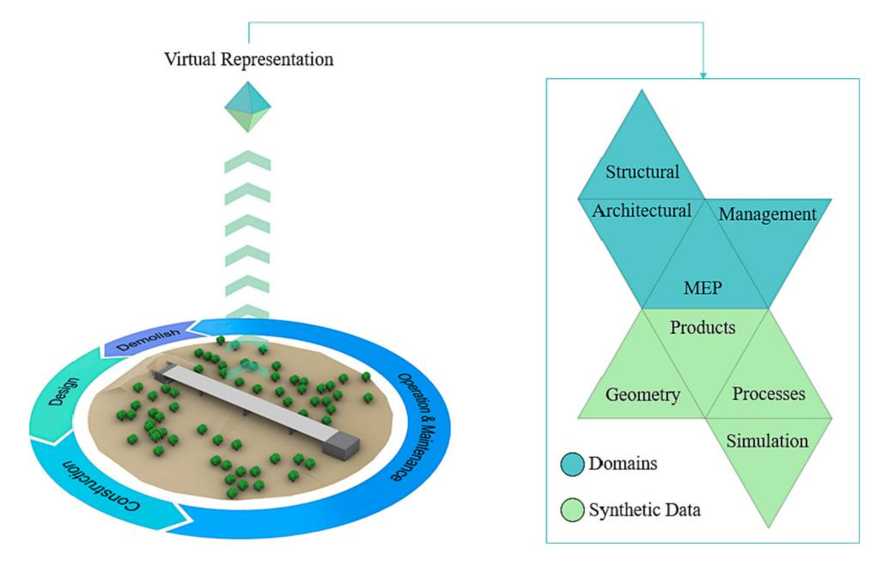
**Fig. 1.** Built environment across domains and life cycle stages.

airport runways to quay walls in ports, these demonstrators shaped the need for embedding such variety. Aggregated information from diverse assets reveals strengths, weaknesses, and system needs. Flexible architectures must accommodate varied tools, use cases, and data.

This paper outlines a system for integrating data from various sources to create comprehensive digital twins of built assets. The system utilizes a knowledge graph as the primary integration mechanism of varied pieces of information that comprise a digital twin. This proposal relies on the present nature of BIM and existing Standards. The knowledge graph allows for efficient querying and exploration of contextualized asset data. It also establishes a base for generating information pipelines that operate with data and that provide services. On a servicebased platform, end-users can retrieve information for timely assistance in decision-making processes. In the remainder of this paper, section 2 introduces the concept of vast-scoped digital twins and elaborates on all needs and challenges for implementation in the built environment. Section 3 elaborates on the objectives of the study and introduces the methodology, based on a set of civil engineering infrastructures in which the system is tested. Section 4 elaborates on the BIM-to-Twin transition (or evolution) whereas Section 5 describes more comprehensively, the use of Knowledge Graphs in Digital Twins (KGDT) and finally section 7 describes the knowledge graph-based proposed system.

# 2. Digital twins of built assets in the AEC industry: vision and challenges

The term "Digital Twin" still deserves lines of presentation. Consensus about a unique definition is far from reached. In an attempt to identify a general definition of the term, Vanderhorn and Mahadevan [[9](#page-19-0)] reviewed 65 different definitions published between 2010 and 2020 from which they abstracted the following:

A Digital Twin is "*a virtual representation of a physical system (and its associated environment and processes) that is updated through the exchange of information between the physical and the virtual systems"*[\[9\]](#page-19-0).

Noticeably, this definition is generic, and specific questions arise regarding many topics such as i) the nature of all virtual representations of physical systems, ii) the type of data that can be obtained from the physical system and how it is transported and integrated within the virtual system or, iii) the level of development of the Digital Twin. Understanding industry specifics, context, and use case needs shapes a digital twin's functionality and technology components.

The research focused on developing digital twin applications is relatively mature in other disciplines such as the aerospace industry [[5](#page-19-0)], healthcare [[6](#page-19-0)], and manufacturing [\[7\]](#page-19-0). More recently, the term shows a digitization path in the construction industry [\[8\]](#page-19-0) whose ultimate goal is efficiency maximization. The construction sector is very varied. Thus, the design and implementation of Digital Twins are not yet consensually defined within the sector. The level of development is still patchy ranging from models that cannot be updated easily with physical data to hyper-specific yet accurate single-function DTs that serve one particular solution. Those actions are presently driven by the industry needs and by use-case-specific outcomes.

In the realm of the built environment, the digital twin concept initially drew inspiration from the aerospace and manufacturing sectors [[10\]](#page-19-0). These industries utilize tailored, prolonged monitoring systems in controlled industrial settings, offering highly accurate predefined simulations for enhancing product productivity and life-cycle management. Nevertheless, the diverse and complex nature of the built environment introduces unique challenges, which hinder the direct application of strategies employed in other industries.

#*2.1. The virtual representation of built assets*To create a comprehensive virtual representation of a given asset of the built environment, multiple*knowledge domains*must be described and integrated within a Unified Virtual Model (UVM). For instance, a UVM of a building should encompass domains such as architecture, structural engineering, HVAC, MEP or building management. This UVM model constitutes the core of an ambitious, comprehensive digital twin: a single source of truth in which geometric representations, built product descriptions, process representations, multi-physics and managerial information are seamlessly intertwined.

The built environment also encompasses different asset scales. These scales span from individual elements within an asset to, for instance, a large network of assets in a city [\[11](#page-19-0)]. At the element level, virtual models must capture detailed physical properties and behaviour of individual asset components. At the asset level, the models must account for the components' spatial arrangement, interactions, and asset systems behaviour. The models must describe the broader context at the infrastructure and city levels, including the natural and urban environment, transportation systems, and utilities.

Moreover, built assets are unique. Built assets are bespoke, with

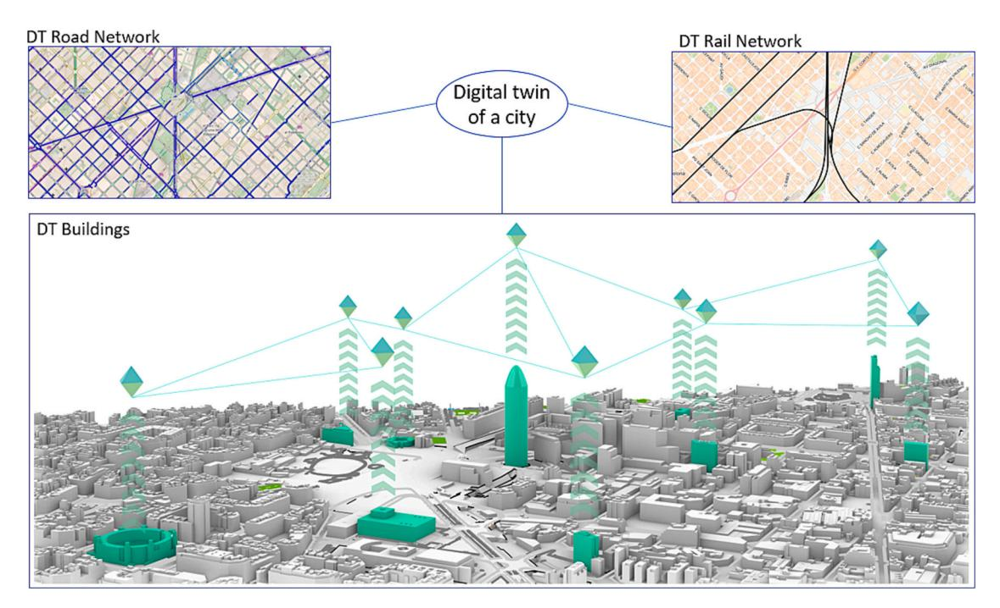
**Fig. 2.**Traversing the built environment scale through digital twin intercommunication.
**Table 1**Digital twin requirements for built assets.

| Digital twin requirements |                                                                                                                                  |  |  |
|---------------------------|----------------------------------------------------------------------------------------------------------------------------------|--|--|
| Virtual Model          | • Cross-domain and multi-scale conceptual description • Flexibility to be extended or modified. • Interoperable.           |  |  |
| Data                      | • Integration of different external data sources. • Support of different formats (time series, images, pointclouds, etc.). |  |  |
| System                    | • Cloud-based (ubiquitous connectivity). • Provision of APIs. • Modularity.                                                |  |  |

different information requirements along the design, construction, and operational stages. All these requirements are commonly dealt with by a variety of stakeholders. Consequently, this leads to fragmented asset information storage and a potential loss of data during the handover from one stage to another [\[12](#page-19-0)]. On the other hand, the lifespan of built assets often surpasses that of assets in other industries as well as surpasses human and business life expectancies. Thus, assets are placed within a constantly evolving social, economic, and technological landscape. Next-generation digital twins must flexibly maintain their core virtual model across life-cycle stages, adapting to evolving stakeholder needs. Information interoperability is crucial for achieving this goal. [Fig. 1](#page-1-0) illustrates these ideas. A physical asset has a virtual representation along its life cycle. This virtual representation is multi-faceted and includes several domains. Each domain contains different sources of synthetic data, processes and outcomes.

Standards for information modelling and sharing are essential to enable interoperability while cloud-based architecture solutions are needed for ubiquitous access to information. Interoperability also enables information sharing between digital twins. This fosters the creation of modular federated digital twin ecosystems [[13\]](#page-19-0) in which every twin has a purpose-driven and outcome-focused scope that can be fed by the insights of other digital twins at higher or lower levels, providing means to effectively manage the complexity and scale within the built environment (See Fig. 2).

Currently, Building Information Modelling (BIM) addresses the

virtualization of the built environment at varied levels (product and building) while models in the field of Geographic Information Systems (GIS) address the virtualization at geographically vaster levels. The challenge remains in how to adapt these modelling paradigms to the interoperable, cloud-based, modular and flexible virtual model vision of a Digital Twin to which external data sources can be coupled.

#*2.2. Data in the built environment*The built environment has seen an increase in the use of datacapturing technologies. Sensors, cameras, 3D scanners, radars and other remote sensing devices are increasingly present in the sector [\[14](#page-19-0)]. These technologies enable varied data collection and thus varied digitization of the physical environment of an asset, resulting in highly diverse data types and structures [\[15](#page-19-0)]. For instance, time series, images, PDFs, tabular forms or point clouds are collected presently collected in many built assets.

When it comes to transmission and storage, cloud-based services and IoT technologies enable new capabilities. Consequently, the amount of available data rises exponentially. Two sources of data are worth mentioning: On the one hand, data produced on-site by sensors and applications can be continuously streamed in "real-time" from the physical asset to its digital counterpart. This helps provide insight into the processes and the physical behaviour of the asset, although not all cases require such levels of real-time synchronicity (it is often more rational to expect right-time synchronicity). Data collection, transfer, and integration in the Digital Twin require the implementation of human-in-the-loop processes, which shift the approach of the physicalvirtual connection from "real-time connection" to "right-time connection". Thus, Digital twins must include not only machine-to-machine live data streaming enabled by IoT technologies but also well-designed user interfaces, accessible from multiple locations, for uploading and interacting with meaningful data [\[16](#page-19-0)]. On the other hand, public initiatives are feeding available data platforms that offer free access to historical and stream data through dedicated APIs in varied fields, including hazard-related, environmental, and social data [\[17](#page-19-0)]. Digital twins can also benefit from such data types if they are capable of integrating data in distributed storage systems over the internet, managed by different organizations.

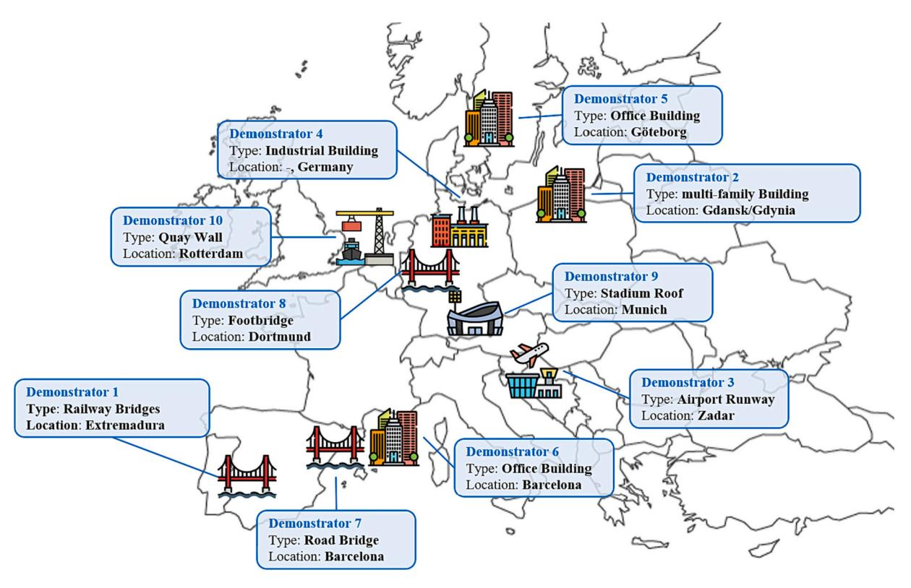
**Fig. 3.**Location of the demonstrators across Europe.

Digital twins are expected to contextualize this data within a single UVM to provide meaningful and useful access to such varied collected data. This contextualization of data enables different computational agents to establish pipelines that extract, analyse and transform this data. This is a more comprehensive way to provide insights for decisionmaking support services. Thus, to improve usefulness, maintainability and adaptability, digital twins must support technologies that allow adding agents modularly via Application Programming Interfaces (API).

#*2.3. Discussion*

[Table 1](#page-2-0) summarizes the identified requirements to develop and implement digital twins of built assets. Three perspectives are described: requirements of virtual models, the collected data and the software system.

## 3. Objectives and methodology

The primary objective of this study is to present a system that seamlessly combines virtual models of built assets with various data sources, adhering to the requirements outlined in section 2, and enabling their unified utilization. The proposed solution is composed of i) a central knowledge graph, ii) central mechanisms for semantic data integration and exploration, and iii) a microservice architecture, that assembles the system, conforming with current cloud-based practices.

As part of the methodology, the developments are imposed by the realistic needs of ten infrastructure assets or systems. These assets are testbed demonstrators within Ashvin, the research project [[1](#page-19-0),[18](#page-19-0)]. This set of assets provides a realistic landscape of varied typologies, stages (currently operated or under construction), stakeholders and premises. Fig. 3 shows information about all ten assets and their contribution to the project. The gathered data are listed in [Table 2.](#page-4-0)

Because the project employs a diverse range of demonstrators, the challenge lies in creating a universally applicable digital twin system, regardless of asset typology, stage, or use case. This study is aimed at showcasing how this system is structured and how it enables semantic integration and interaction with the information it contains, regardless of its nature.

BIM models represent the Standard virtual representation for all demonstrators. To build their digital twin system, creating a BIM model represents a necessary first step since it provides the semantic basis. This basis is thus extended for integrating the various types of data collected in each demonstrator.

### 4. The BIM to twin transition

The BIM Dictionary [[19\]](#page-19-0) defines BIM as "*a set of technologies, processes and policies enabling multiple stakeholders to collaboratively design, construct and operate a facility in virtual space*". The recently published standard ISO 19650 [[20\]](#page-19-0) defines BIM as "*the use of a digital representation of a built asset to facilitate design, construction and operation processes from a reliable basis for decisions*". These definitions of the BIM concept depict the current uses of BIM technology: on the one hand, it is used to enable collaboration among industry stakeholders, where interoperability of digital assets becomes a major requirement. On the other hand, it is used as the basis for application development that assists stakeholders in performing specific tasks during the whole project lifecycle.

Studies have demonstrated the utility of BIM models in supporting a wide range of engineering applications. By establishing data pipelines, these models can support code compliance checking [[21\]](#page-19-0), construction safety management [[22\]](#page-19-0), structural analysis [[23\]](#page-19-0), construction planning and progress monitoring [[24\]](#page-19-0), as well as the development of various operation and maintenance activities such as energy analysis [\[25](#page-19-0)], emergency management [\[26](#page-19-0)] or condition assessment [[27\]](#page-19-0). These pipelines are generated upon information extracted from BIM models and additional models or data resources, clearly showing the demand for approaches that combine multiple virtual representations with collected data. Solution approaches are based on the combination of disconnected software that is not replicable in other use cases.

These applications have benefited from the release of open BIM

#### Table 2

#### Description of the demonstrators.

| No. | Description                                                                                                   | Contribution                                                                                                                                                                                                               | Data                                                                       | Phase                                   |
|-----|---------------------------------------------------------------------------------------------------------------|----------------------------------------------------------------------------------------------------------------------------------------------------------------------------------------------------------------------------|----------------------------------------------------------------------------|-----------------------------------------|
| 1   | A series of high speed railway bridges in the Plasencia-Badajoz line in Extremadura, Spain. | Digitize the bridges and the load tests that were performed between April and July 2021 to verify the construction and start of the operation stage of the bridges as all of the network. | Time-Series from sensors. Imagery. Tabular forms                  | Operation and Maintenance            |
| 2   | Renovation of a multi-family house in the city of Gdynia, Poland.                                    | Digitize the building to provide insight into the energy performance of the building                                                                                                                        | Time-Series from sensors                                                | Design, Operation and Maintenance |
| 3   | Airport of the city of Zadar, Croatia.                                                                     | Condition monitoring of the existing runway to improve the overall maintenance works.                                                                                                                    | Imagery.                                                                   | Operation and Maintenance            |
| 4   | Industrial Building located in Germany.                                                                 | Support the planning and control of construction processes                                                                                                                                                     | Imagery                                                                    | Construction                            |
| 5   | 27-story office building located in Goteborg, ¨ Sweden.                                              | Support control of construction processes                                                                                                                                                                            | Time-Series from sensors, Pointclouds                                | Construction                            |
| 6   | Office Building located in Barcelona, Spain.                                                            | Support control of construction processes based on multiple data collection, including pointclouds, sensors and pictures                                                                           | Time-Series from sensors, Pointclouds, Imagery.                   | Construction                            |
| 7   | Composite steel concrete box girder curved bridge located in Barcelona, Spain                     | Seasonal study of its structural behaviour from 3D laser scans. Vibration-based patterns analysis. Understand steel concrete interaction. Visual Inspections                                    | Time-Series from sensors, Pointclouds, Imagery, Tabular forms. | Operation and Maintenance            |
| 8   | Footbridge in Dortmund, Germany                                                                         | Aid to the design process based on previous projects                                                                                                                                                                 | Historical design data                                                  | Design                                  |
| 9   | Sports stadium roof structure located in Munich, Germany                                             | Seasonal study of its structural behaviour from 3D laser scans.                                                                                                                                                   | Pointclouds                                                                | Operation and Maintenance            |
| 10  | Quay wall in the port of Rotterdam, Netherlands                                                         | Condition assessment based on historical data from sensor readings.                                                                                                                                            | Time-Series from sensors.                                               | Operation and Maintenance            |

standards such as Industry Foundation Classes (IFC), which offer a shared semantic specification across domains in the built environment, enabling interoperability and fostering the development of BIM-based applications. Originally managed and maintained in EXPRESS language, it established a system of information exchange based on file transactions. Nowadays, IFC is the most complete data schema that describes the built environment. Its scope is vast, covering the definition

of 3D geometry, infrastructure, construction processes and various taxonomies of products across industry domains [[28\]](#page-19-0).

Currently, the use of BIM is becoming a mandatory data exchange Standard in many countries. It ensures faster and more collaborative processes during design and construction projects. Despite the release of IFC, the highly demanding coordination and collaboration requirements during the design and construction stages, involving multiple actors and fragmented data models, produce a significant amount of disaggregated data, which much of it is lost, and only a small portion is transferred to the facility management stage [[12\]](#page-19-0). Recent advances in cloud and web technologies are called to improve collaboration, information sharing, and persistently centralised web data platforms, known as Common Data Environments (CDEs). The current form of BIM files can thus be substituted by databases. File-based information exchanges among applications can be transformed into data-based transactions made through web APIs, allowing stakeholders to access dynamically the right data in a more granular and flexible way [\[29](#page-19-0)]. This aligns with the vision of a digital twin that provides ubiquitous access to one asset's information.

Enabling efficient database interactions for accessing IFC information is challenging. There is a substantial number of entities that must be accommodated within relational databases. An entity can be an element, a surface or a relationship. For instance, in IFC2x3, there exist 653 entities and 327 types, while IFC4 comprises 766 entities and 391 types. Consequently, directly mapping these entities to a relational database represents an intricate task in a relational model. The complexity inherent in representing the IFC schema as a table-based model adversely affects performance, particularly when executing complex queries [\[30](#page-19-0)]. Additionally, the rigidity of the relational model and the need for a pre-defined data schema hinder the semantic enrichment of BIM models and the capability of integrating additional information dynamically, which is an essential need for digital twins.

In this study, the transition from BIM to DT keeps IFC as the basis. The study proposes a graph-based approach for modelling and managing BIM. Modern graph databases offer means to manage and transact with this BIM information efficiently. Section 5 dives further into this approach and proposes a knowledge graph as the technological solution for data management and integration challenges in digital twins.

#### 5. Knowledge graph-based digital twins

This section describes the proposed concept of Knowledge Graph-Based Digital Twin (KGDT). Firstly, graphs and knowledge graphs are described. Current models, standards and technological enablers for their proper development are presented. Then, emerging uses of knowledge graphs for digital twins in the AEC sector are described.

#### *5.1. The graphs*####*5.1.1. Graph models*A graph is a data model represented by a collection of nodes, or vertices, that are connected by relationships, or edges. Nodes may represent entities of a specific domain. Relationships define how these entities interrelate with one another. Graphs can be defined as directed or undirected. The former has a one-way relation between two nodes whereas the latter has a two-way relation. Graphs provide a simple yet powerful general-purpose data modelling tool to represent complex relations between entities and how they relate to the world.

Currently, two graph models dominate the scene: The Triple-based model and the Property graphs [\[31](#page-19-0)]. The triple-based model is a directed graph model where nodes are connected using three-part statements called triples. Each triple consists of a subject, predicate, and object. The predicate establishes a relation between the subject and the object. The triple-based graph is based on the Resource Description Framework (RDF) schema, the standard developed by the W3C standardization group for sharing data on the semantic web. RDF graphs are

#### Table 3

Description of micro-services forming the data integration system for digital twins.

| Service           | Description                                                                                                                                                                                                                                                                                   | Container source |
|-------------------|-----------------------------------------------------------------------------------------------------------------------------------------------------------------------------------------------------------------------------------------------------------------------------------------------|---------------------|
| GraphDB           | Stores the knowledge graph. Neo4j [66] graph database management system is selected.                                                                                                                                                                                                       | Docker Hub          |
| ProcessDB         | Stores the data of processes. The document oriented NoSQL database management system MongoDB [67] is selected.                                                                                                                                                                          | Docker Hub          |
| Ashvin-server     | It contains the API to interact with the whole system. It is the communication endpoint with the ASHVIN GUI. It contains the business logic that triggers the use of the rest of the microservices when they are required. It also stores backup IFC files and geometry files. | Authors             |
| Message Broker | Provides a messaging system for internal communication among services in the system thus enabling event-driven functionalities. The open-source message broker RabbitMQ [68] is selected.                                                                                         | Docker Hub          |
| IfcConvert        | Manages the conversion of geometrical information from IFC to well-known geometry file formats such as .obj or. glb among others. It is based on the IfcConvert application provided by IfcOpenshell [69]                                                                         | Authors             |
| Ifc2Graph         | Manages the conversion of semantic information from IFC to a graph format and stores it in the graph database.                                                                                                                                                                          | Authors             |
| Processes         | Manages the information related to maintenance processes via a REST API and updates the graph with an abstract of the contained information.                                                                                                                                            | Authors             |
| MainfluxSync      | It bypasses the interaction with an external IoT platform named Mainflux (described in section 6.4) and dynamically updates the information in the graph with the platform metadata.                                                                                                 | Authors             |

referenced over the web using a Unique Resource Identifier (URI), which allows linking data over the internet. The use of this standardized schema allows sharing and exchanging of data among systems and

applications, enabling graph data interoperability. RDF-based data can be serialized using multiple syntaxes such as RDF/XML, N-Triples, Turtle, or JSON-LD, and can be stored in specialized RDBMS-based systems called semantic stores. The information can be queried using SPARQL, a standardized query language.

On the other hand, the property graph model provides nodes and relationships with an internal structure. Nodes can have multiple labels. Labels declare the category as well as the node purpose within the graph. Relationships are assigned a type, which semantically defines how entities interrelate. Both nodes and relationships can contain properties, stored as key-value pairs. Property graphs are gaining popularity and are becoming the selected option used by widely established native graph databases such as Neo4j [[32\]](#page-19-0). The structure of property graphs allows for more natural and flexible data modelling, as they are not bonded to any standard, and their dedicated graph databases are better suited for systems where the driving force is to provide efficient transactions of information.

The use of mappings between RDF graphs and property graphs has become essential to combine operational efficiency and interoperability, allowing for the creation of hybrid models that leverage the strengths of both modelling approaches [\[33](#page-19-0),[34\]](#page-19-0).

#*5.1.2. Ontologies*According to Studer et al. [[35\]](#page-19-0) an ontology is a formal, machinereadable specification of a shared conceptualization. It describes the meaning of entities within a specific domain through relationships and rules. Taxonomies are a simplified version of ontologies, expressing only a hierarchical classification of entities in a domain. The Ontology Web Language [[36\]](#page-19-0) is the most used ontology language, recommended by W3C and based on the RDF schema, making it compatible with RDF graphs.

Ontologies are used to describe the information contained in a graph. By mapping the nodes and their relationships of a graph to entities and their relationships in ontologies, graphs can be shared and interpreted according to domain-specific knowledge. This is the key.

As a step forward, reasoning engines can also use ontologies to derive

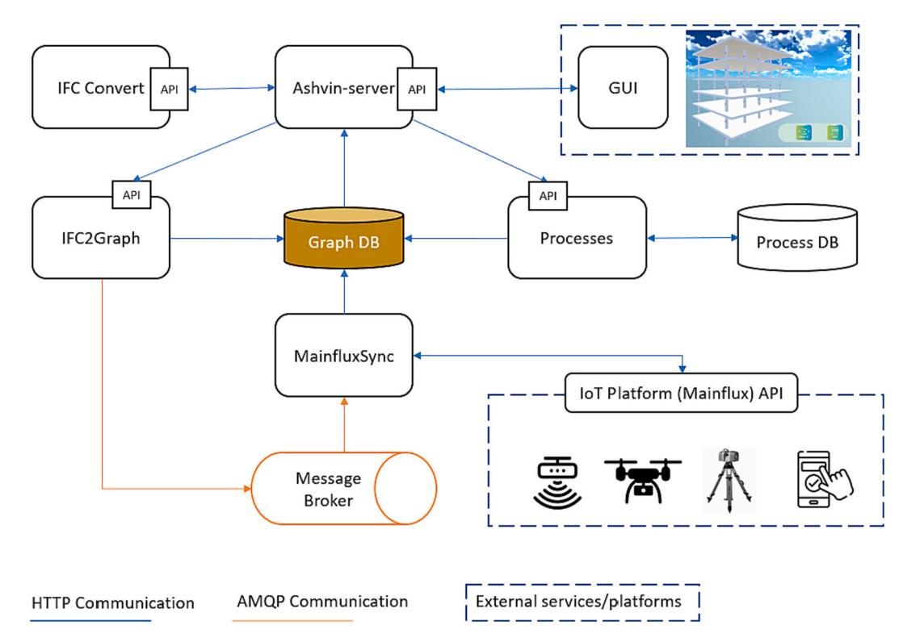
**Fig. 4.**Schema of the system architecture.

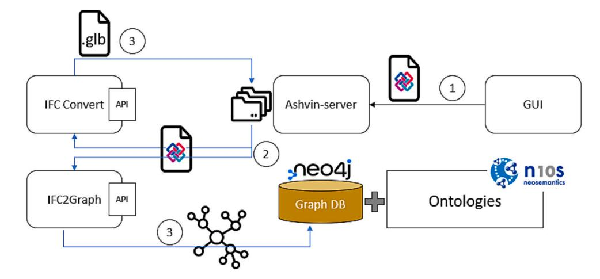
**Fig. 5.**Subsystem for importing IFC files.

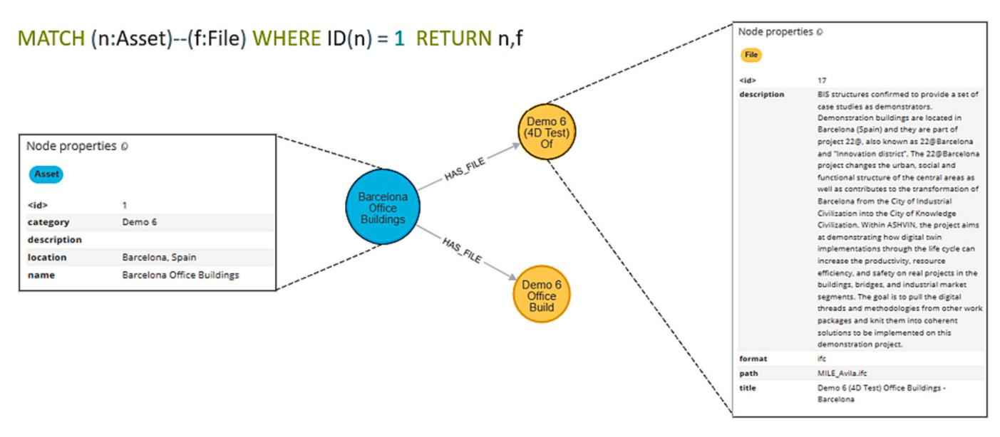
**Fig. 6.**Top-level graph structure formed by Assets and Files.

new knowledge from data through semantic axioms and inference rules. Ontologies can be published openly on the web to promote interoperability among graph-based applications or can be created as private information assets for cross-enterprise data management. As such, they have become essential data models that allow for the creation of knowledge graphs, interrelating concepts from different domains [\[37](#page-19-0)].

##*5.1.3. Knowledge graphs*A knowledge graph is a graph-based data structure that emphasizes contextual understanding of data by interlinking metadata. This is ideal for application in scenarios that require integrating, managing, and extracting value from diverse sources at a large scale [\[38](#page-19-0)]. Knowledge graphs provide several advantages over traditional data models for modelling, structuring, managing, and analyzing heterogeneous and complex data with dynamic relationships [\[37](#page-19-0)]. They allow representing complex abstractions of knowledge in specific domains or across domains. Unlike relational or NoSQL models, knowledge graphs allow data to evolve flexibly, as they do not require pre-defined schemas. Moreover, these constructs can be made interoperable by mapping their entities to existing ontologies, enabling transactions of data and its context between software applications. Modern graph analytics provide further insights from the domains described in the graphs. While knowledge graphs are often associated with RDF and the semantic web technology

stack, the concept is not limited to these technologies. Companies are increasingly using property graph models and graph databases to store and manage their knowledge graphs, where transactional efficiency and data privacy are critical concerns [\[38\]](#page-19-0). Examples of open-access knowledge graphs built on RDF-related formats include DBpedia [\[39](#page-19-0)], Wikidata [\[40](#page-19-0)], BabelNet [[41\]](#page-19-0), and YAGO [[42\]](#page-19-0).

###*5.2. Knowledge graphs as DT enablers for the built environment*Akroyd et al. [\[43,44](#page-19-0)] suggest that a dynamic general-purpose knowledge graph is ideally suited for digital twins. This knowledge graph should include a combination of ontologies and autonomous agents that continually operate on it. By using ontologies, knowledge graphs promote the established use of data, facilitating reuse and interoperability. Their multi-domain nature allows for the addition of new ontologies and the establishment of relationships between related terms to enhance interconnectivity. Additionally, their distributed nature permits hosting diverse data types in different locations while providing links to their original repositories. Thus, data owners retain control over hosting and access depending on data sensitivity. Furthermore, the hierarchical and extensible ontological structure allows representation at various scales (product, building, city, and national systems). The interconnectedness of concepts and instances in

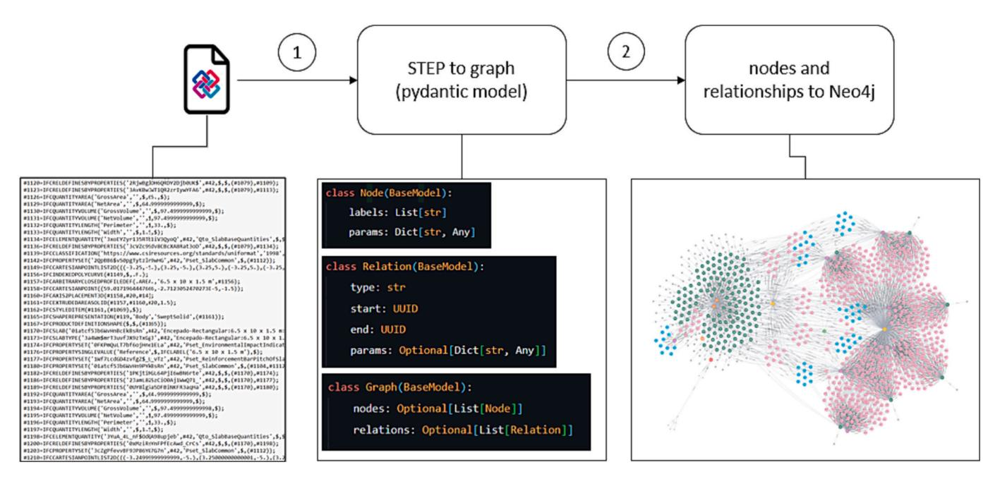
**Fig. 7.**Steps in the IFC to graph conversion process.

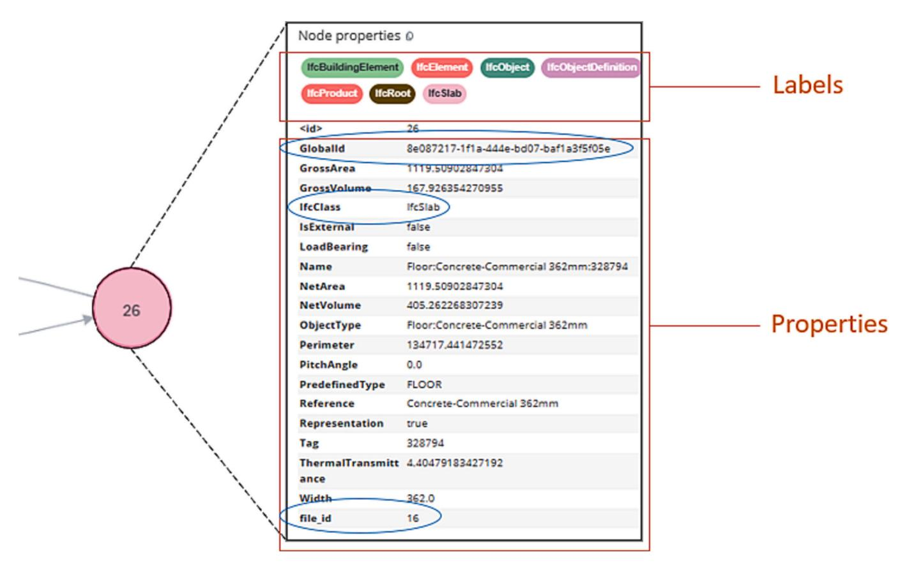
**Fig. 8.**Node labels and properties after conversion.

knowledge graphs, combined with dynamic updates from computational agents and live data feeds, enables multiple interactions between players within a given digital twin. These properties suggest high suitability for implementing larger-scale digital twins.

For instance, at a city scale, City Knowledge Graphs (CKG) [[45\]](#page-19-0) are being developed by the Cambridge Centre for Advanced Research and Education in Singapore (CARES) in collaboration with the SingaporeETH Centre (SEC) to improve city management and planning. Within this frame, Chadzynski et al. [[46\]](#page-19-0) integrated city information models in the knowledge graph based on OntoCityGML ontology [\[47](#page-20-0)], and subsequently implemented a set of intelligent software agents to perform specific data processing and analytical tasks based on interactions with such graph. A knowledge graph-based system was also used within the CReDo project (Climate Resilience Demonstrator) as part of the digital

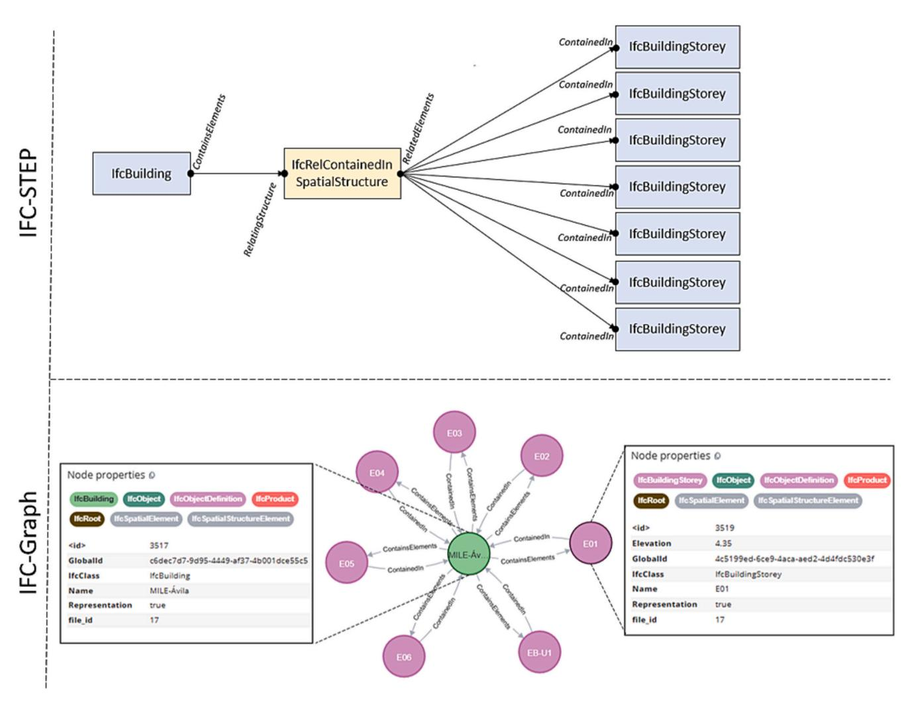
**Fig. 9.**Example of the effect of the conversion in the structure of IFC relations. Relation entities are bridged using the corresponding inverse attributes of the IFC entities.
**Table 4**| Import results for the IFC models of the ASHVIN demonstrators. |  |
|----------------------------------------------------------------|--|
|----------------------------------------------------------------|--|

| File                            | Demo | IFC Schema | Nodes  | Relations |
|---------------------------------|------|------------|--------|-----------|
| Demo9-MunichStadium.ifc         | 9    | IFC4       | 44     | 122       |
| Demo10-QuayWall.ifc             | 10   | IFC4       | 93     | 199       |
| Valdelinares_IFC4.ifc           | 1    | IFC4       | 157    | 517       |
| ViaductoLaPlata.ifc             | 1    | IFC4       | 205    | 979       |
| Demo4.ifc                       | 4    | IFC2X3     | 405    | 1320      |
| StegDortmund-R2021_Neu.ifc      | 8    | IFC2X3     | 688    | 2618      |
| Kineum_CM.ifc                   | 5    | IFC4       | 721    | 2249      |
| KineumSpacesRoombasedOld.ifc    | 5    | IFC4       | 820    | 3301      |
| KineumSpacesRoombased.ifc       | 5    | IFC4       | 846    | 3376      |
| MILE_Avila.ifc                  | 6    | IFC4       | 993    | 4897      |
| GDY_ZB_30_before_renovation.ifc | 2    | IFC2X3     | 1148   | 4984      |
| zadar_airport.ifc               | 3    | IFC4       | 1714   | 7244      |
| Llobregat_Viaduct.ifc           | 7    | IFC4       | 2083   | 8895      |
| MILE_PE_STR_U1.ifc              | 6    | IFC2X3     | 6373   | 42,104    |
| Kineum_plan16_NCC.ifc           | 5    | IFC2X3     | 12,599 | 74,595    |
| A-40-V-4_space.ifc              | 5    | IFC2X3     | 28,664 | 219,895   |

twin programme in the UK [\[48](#page-20-0)], where the knowledge graph combined the description of assets from energy, water and telecom networks with data from flood simulation and with models that describe the effect of the flood on the assets [[49,50\]](#page-20-0). Narrowing the scale to the building level, knowledge graph-based systems are not yet found in academic literature.

The potential lies in the IFC schema, which is an ontology [[51\]](#page-20-0) that can be utilized for constructing the knowledge graph. The translation of the IFC schema to a more common ontology language is proposed by Pauwels and Terkaj [\[52](#page-20-0)]. These authors generated an OWL version, named the ifcOWL ontology. Presently, ifcOWL graphs result in rather large models due to the built-in complexity of the IFC schema (mainly its geometrical definitions). Alternatively, the Linked Building Data (LBD) group has developed a set of more granular ontologies conceived to contribute modularly and thus, they can be extended with third-party contributions. These ontologies help generate a more flexible description of the built environment that adjusts to each use case's needs [\[53](#page-20-0)]. Some of these ontologies are listed below:

- Building Topology Ontology [\[54](#page-20-0)]
- Building Element Ontology [\[55](#page-20-0)]
- Ontology for distribution elements [[56](#page-20-0)]
- Damage monitoring Ontology [\[57](#page-20-0)]
- Bridge topology Ontology [\[58](#page-20-0)]
- Building Product Ontology [[59\]](#page-20-0)
- Ontology for Managing Properties [[60\]](#page-20-0)
- Ontology for Managing Geometry [\[61](#page-20-0)]
- File ontology for geometry formats [[62\]](#page-20-0)

Although those ontologies still do not cover the whole semantic richness of the IFC schema, they are paving the way to more efficient

#### Table 5 Conversion result of ViaductoLaPlata.ifc.

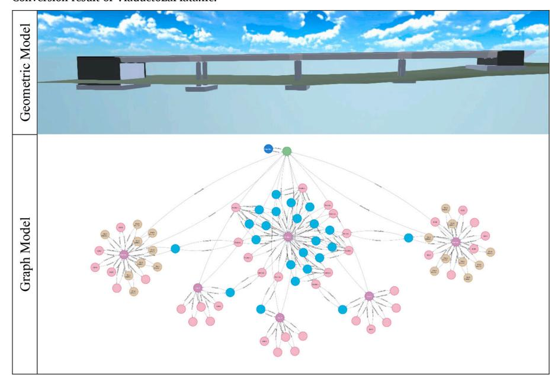

#### Table 6 Conversion result of Kineum\_CM.ifc.

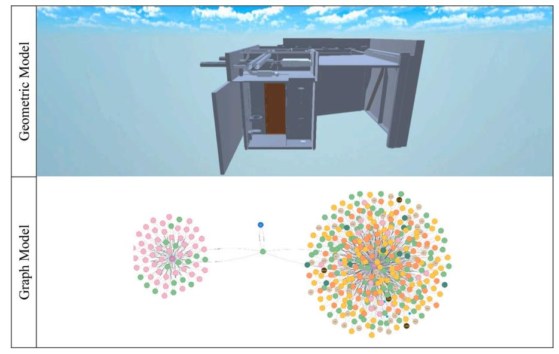

methods for modelling, sharing and operating with data in the built environment. The graph data structure enables the unified management of federated BIM models, and graph databases enable granular access and management of information through API queries [\[63\]](#page-20-0). IFC models can be expressed in graph format and can be mapped to ifcOWL or existing LBD ontologies and extended with on-demand knowledge and metadata from external data sources. Therefore, a system capable of dynamically maintaining a knowledge graph represents a promising candidate to enable multi-scale and cross-domain digital twins in the built environment.

# 6. A system for data integration in digital twins of built assets

In this section, a system that dynamically updates a knowledge graph is proposed. It represents a unified interface for multiple data sources that contribute to a digital twin of a built asset. The system is built based on the varied requirements and challenges posed by ten different variedin-nature demo sites described in Sections 2 and 3.

From the BIM perspective, each demonstrator is initially described with an IFC model. These models are processed to transform the information in its original STEP format into two separate parts that are interlinked: a geometry file and a property-graph-based semantic model. This graph-based semantic representation of the demonstrators can be

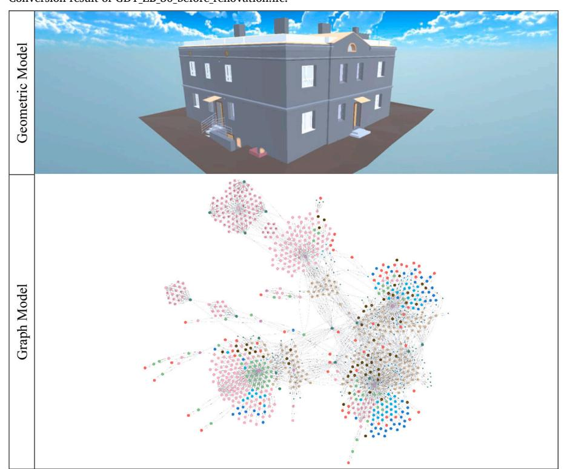

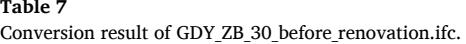

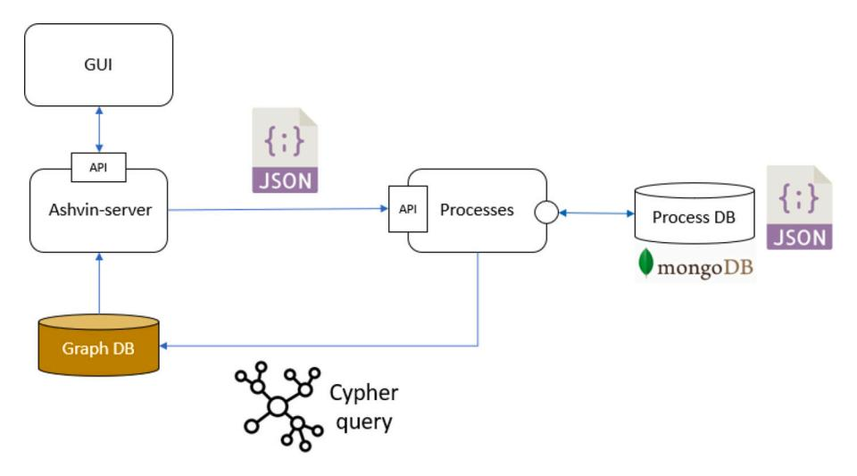
**Fig. 10.**Subsystem for integrating process data.

extended on demand and, if needed, mapped to existing ontologies to make the content interoperable. The property graph is the semantic backbone of the system. Section 6.1 describes the system architecture. The transformation from IFC files to a property graph is explained in Section 6.2.

Data integration is performed considering two scenarios described in Section 6.2 and Section 6.3. The former illustrates the integration of data from a local database. It contains digitized, machine-readable representations of asset-related processes. The latter shows the integration of sensor data from an external IoT platform. The integration of both data sources is driven by ontologies that are explicitly developed to extend the central knowledge graph and, thus, semantically link the data with the asset semantic description. The ontologies describe the organizing principles of such data sources and relate them with concepts described in the IFC schema.

##*6.1. System architecture*The system is developed based on a microservices architecture. This design approach breaks the system into small, independent services. Each micro-service represents a specific functionality within the system that can be developed, deployed and scaled independently. Through lightweight information exchanges, these micro-services collaborate to form a cohesive application. This architecture offers numerous

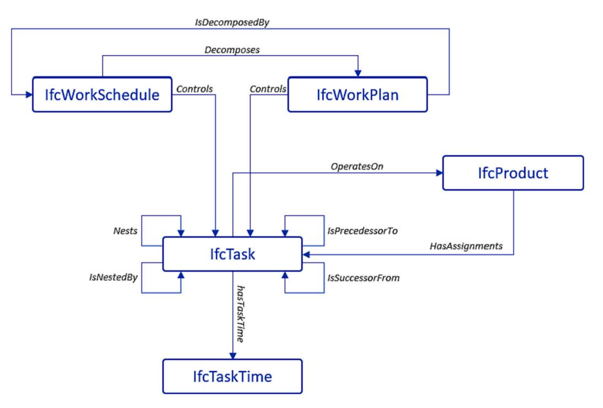
**Fig. 11.**IFC task simplified ontology. For more detailed information about their definition and properties, refer to [\[28](#page-19-0)].

advantages, including enhanced software resiliency, flexibility, and scalability [\[15](#page-19-0)]. Micro-services are increasingly prevalent in the development of cloud-based applications.

One of the key enablers of micro-services development is containerization. Containerization is a technology that enables developers to package applications and their dependencies into self-contained units called containers. Each container includes codes, runtime environments, libraries and configurations. It represents a lightweight and portable package. In this study, Docker [\[64](#page-20-0)] is selected as the containerization platform. It is a widely used platform and it also provides Docker Hub [[65\]](#page-20-0), a cloud-based repository that allows developers to publish, share and discover containers.

[Table 3](#page-5-0) provides a concise description of the functionality of the containers that are used to compose the proposed system. All containers, the ones developed by the authors and those used by third parties are available on Docker Hub.

The knowledge graph is persistently stored in the Neo4j graph database, adhering to the principles of the labelled property graph model. The graph provides a semantic index of the data available in the system, which is contextualized with the asset information model. The system also provides mechanisms to keep the graph dynamically updated as new information is added, as described in the following sections.

The developed micro-services communicate using HTTP (HyperText Transfer Protocol) requests via REST APIs. Additionally, AMQP (Advanced Messaging Queuing Protocol) communication is used to enable event-driven functionalities to keep the graph updated based on events that are triggered by specific system actions. [Fig. 4](#page-5-0) shows the overall system architecture schema.

It is worth emphasizing that the successful usefulness of the system relies upon designing adequate end-user tools with adapted graphical interfaces that enable interaction between users and data.

##*6.2. Built asset semantic model: IFC to property-graph*The generation of DT for the abovementioned demonstrators requires a sufficiently comprehensive IFC model that encompasses both geometric and semantic information. The process of transferring the data from the IFC file to the digital twin system is carried out through a

series of systematic steps.

As a first step, the end-user can employ a graphical user interface (GUI) to transmit the IFC file to the server, where it is securely stored. Subsequently, two services help:*IfcConvert*and*Ifc2Graph*are employed in parallel to handle the processing of geometry and semantics, respectively. This simultaneous processing ensures the conversion of both aspects of the IFC model.

Subsequently, geometrical data is stored in the server in GLB format. Likewise, semantic information is stored in the Neo4j database and structured as a property graph, following the IFC schema [\[28](#page-19-0)]. The IFC schema can be mapped to existing ontologies using an open-source plugin called Neosemantics [[70\]](#page-20-0), which extends the capabilities of Neo4j to handle RDF data. The process is visually depicted in [Fig. 5.](#page-6-0) This figure zooms within a specific sub-system representation of this part which belongs to the vaster system.

From [Fig. 5](#page-6-0), two comments are worth pointing out:

-*IfcConvert*is built upon an open-source command-line application provided by*IfcOpenshell*. This application facilitates the conversion of IFC files into geometry file formats that offer greater interoperability, such as OBJ, DAE, GLB, STP, IGS, XML or SVG. The binary GLB format is selected in this particular research since it enables more efficient storage and retrieval of geometric information.
- *IFC2Graph*has been developed with Python and*IfcOpenShell*Python library to parse IFC data and then communicate with Neo4j [[71](#page-20-0)].

[Fig. 6](#page-6-0) displays the fundamental structure within the graph database after importing IFC files. The database encompasses assets (represented by blue nodes). Each asset can be associated with multiple IFC files (yellow nodes). Encapsulated information within each file is linked to the corresponding file node and it is represented following the IFC-tograph conversion algorithm.

###*6.2.1. IFC to labelled property graph*

*IFC2Graph*is a developed algorithm for converting IFC files in STEP format to a central Neo4j database. It is specifically designed for importing the non-geometrical information of IFC models. Similar algorithms are found in [[72\]](#page-20-0), in which researchers develop ways for

| Node properties @     |                                                                      | Node properties @             |                                                                                     |  |  |  |
|-----------------------|----------------------------------------------------------------------|-------------------------------|-------------------------------------------------------------------------------------|--|--|--|
| <b>IfcControl</b>     | <b>HcObjectDefinition</b> <b>HcObject</b> <b>IfcRoot</b>       | <b>IfcObject</b>              | <b>IfcObjectDefinition</b> <b>IfcProcess</b> <b>IfcTask</b> <b>IfcRoot</b> |  |  |  |
| <b>IfcWorkControl</b> | <b>IfcWorkPlan</b>                                                   | <id></id>                     | 4439                                                                                |  |  |  |
|                       |                                                                      | <b>Description</b>            | <b>Column Vibration Monitoring</b>                                                  |  |  |  |
| <id></id>             | 4161                                                                 | <b>Globalld</b>               | cd32cb97-3b1a-46af-9e03-29954ec47e50                                                |  |  |  |
| <b>CreationDate</b>   | 2022-09-20T12:01:32                                                  | <b>IfcClass</b>               | <b>IfcTask</b>                                                                      |  |  |  |
| <b>Description</b>    | Work Plan for the construction process of the buildings structure | <b>IsMilestone</b>            | false                                                                               |  |  |  |
| <b>Duration</b>       | <b>PO6M</b>                                                          | <b>Name</b>                   | Column - E05 - C59                                                                  |  |  |  |
| <b>FinishTime</b>     | 2021-12-30T18:00:00                                                  | <b>Status</b>                 | <b>COMPLETED</b>                                                                    |  |  |  |
| <b>Globalld</b>       | 6105b268-7527-4bcb-9151-470ebfa65fa2                                 | file id                       | 17                                                                                  |  |  |  |
| <b>IfcClass</b>       | <b>IfcWorkPlan</b>                                                   |                               |                                                                                     |  |  |  |
| <b>Name</b>           | <b>Structure Construction</b>                                        |                               |                                                                                     |  |  |  |
| <b>Purpose</b>        | <b>CONSTRUCTION</b>                                                  |                               |                                                                                     |  |  |  |
| <b>StartTime</b>      | 2021-06-28T08:00:00                                                  |                               | Column                                                                              |  |  |  |
| file id               | 17                                                                   |                               |                                                                                     |  |  |  |
|                       |                                                                      |                               |                                                                                     |  |  |  |
|                       |                                                                      |                               |                                                                                     |  |  |  |
| Node properties @     |                                                                      | Node properties @             |                                                                                     |  |  |  |
| <b>IfcControl</b>     | <b>IfcObjectDefinition</b> <b>IfcObject</b> <b>IfcRoot</b>     | <b>Ifc Scheduling Time</b>    | <b>IfcTaskTime</b>                                                                  |  |  |  |
| <b>IfcWorkControl</b> | <b>HcWork Schedule</b>                                               | $<$ id>                       | 4301                                                                                |  |  |  |
| <id></id>             | 4162                                                                 | <b>ActualDuration</b>         | PODTOH5M59S                                                                         |  |  |  |
| <b>CreationDate</b>   | 2022-09-20T12:01:32                                                  | <b>ActualFinish</b>           | 2021-12-10T09:30:59                                                                 |  |  |  |
| <b>Description</b>    | Work Schedule for the construction process                           | <b>ActualStart</b>            | 2021-12-10T09:25:00                                                                 |  |  |  |
|                       | of the buildings structure                                           | <b>DataOrigin</b>             | <b>MEASURED</b>                                                                     |  |  |  |
| <b>Duration</b>       | <b>PO6M</b>                                                          | <b>Globalld</b>               | f18f0218-4356-5f89-b492-a0a8fb2f7d39                                                |  |  |  |
| <b>FinishTime</b>     | 2021-12-30T18:00:00                                                  | <b>IfcClass</b>               | lfcTaskTime                                                                         |  |  |  |
| <b>Globalld</b>       | 79893b59-7c53-420f-bad7-f51849a24a7b                                 | <b>ScheduleDuration PT14M</b> |                                                                                     |  |  |  |
| <b>Identification</b> | 2e269e12-5c7a-406f-86fc-82030dfc2811                                 | ScheduleFinish                | 2021-11-11T16:06:00                                                                 |  |  |  |
| <b>IfcClass</b>       | <b>IfcWorkSchedule</b>                                               | <b>ScheduleStart</b>          | 2021-11-11T15:52:00                                                                 |  |  |  |
| <b>Name</b>           | <b>Structure Construction</b>                                        | file id                       | 17                                                                                  |  |  |  |
| <b>Purpose</b>        | <b>CONSTRUCTION</b>                                                  |                               |                                                                                     |  |  |  |
| <b>StartTime</b>      | 2021-06-28T08:00:00                                                  |                               |                                                                                     |  |  |  |
|                       |                                                                      |                               |                                                                                     |  |  |  |
**Fig. 12.**Example of task structure in the knowledge graph for a construction process on Demo 6: Column concrete vibration monitoring. Labels and properties are set according to the IFC schema. [\[28\]](#page-19-0).

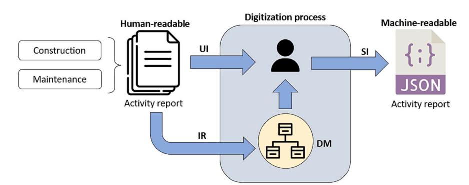
**Fig. 13.**Digitization process for activity reports.

| Table 8 |  |  |
|---------|--|--|
|         |  |  |

| Description of maintenance activities. |      |                                                                                                                                                                                                                                                                                    |  |  |
|----------------------------------------|------|------------------------------------------------------------------------------------------------------------------------------------------------------------------------------------------------------------------------------------------------------------------------------------|--|--|
| Activity Name                          | Demo | Description                                                                                                                                                                                                                                                                        |  |  |
| Bridge Load Test                    | 1    | Load tests on bridges are assessments to prove that the structural performance of the bridge after construction is as expected. For that purpose, structural simulations are compared with measurements collected using on-site sensors to validate the bridge design. |  |  |
| TLS3DScan                              | 7, 9 | This activity stands for a 3D scan using a terrestrial laser scanner (TLS), which delivers a point cloud. It has been performed in demos 7 and 9 as a geometric assessment of the structure with structural analysis uses.                                                |  |  |
| Drone Inspection                    | 3    | This activity is an automated visual inspection of an airport runway using images from high-resolution drone based cameras. Based on the inspection results the user can trigger minor repairs, major repairs or the replacement of parts of the runway.               |  |  |

converting IFC files to a labelled property graph. A comprehensive analysis of the conversion process is provided by those authors. In this paper, only a concise description of the algorithm is presented.
*IFC2Graph*is executed in two distinct steps [\(Fig. 7\)](#page-7-0). The initial step involves translating the entities and relationships of the IFC file into nodes and relations. For this purpose, a generic property-graph model is generated using a Python library that provides data validation and

parsing capabilities (Pydantic [\[73\]](#page-20-0)). The model includes three classes: class Node(), class Relation() and class Graph() (see [Fig. 7\)](#page-7-0). Subsequently, in the second step, the neo4j Python driver is utilized to import the nodes and relations into the database. Nodes and relations are imported to the database using*Cypher*[[74\]](#page-20-0), a graph query language developed by Neo4j. This two-step process enhances the adaptability properties of the conversion tool. Only the second step needs to be customized to import the IFC data into other available graph databases based on the property graph model.

The conversion process results in a property graph that follows the concepts and relations defined in the IFC schema. However, it does not maintain backward compatibility with the IFC format and solely focuses on semantic information. IFC definitions associated with the geometric description of assets are not accounted for. Instead, the presence of a geometric representation is indicated by a Boolean property called "presentation." If "presentation" is true, the geometry can be identified in the GLB file resulting from the*IfcConvert*process by the IFC*GlobalId*. Furthermore, each node is assigned labels containing pertinent details about the IFC and its parent classes in the IFC hierarchy. Properties of entities defined by the class *IfcPropertySetDefinition*in the IFC file are condensed as properties of the corresponding node, simplifying the overall structure of the graph ([Fig. 8\)](#page-7-0).

Additionally, relationships specified in the IFC file as entities through the class*IfcRelationship*are bridged to enable direct relations between entities in the graph [\(Fig. 9](#page-8-0)).

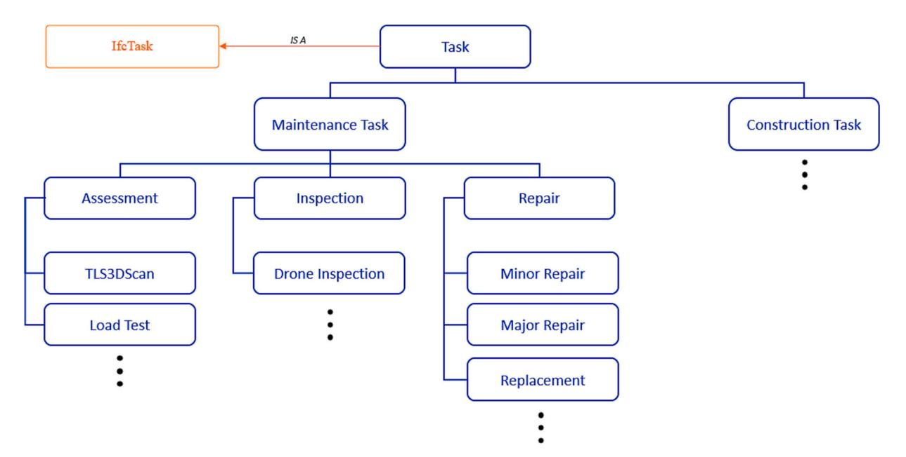
**Fig. 14.**Simplified taxonomy for maintenance tasks linked to IFC-based ontologies (processes).

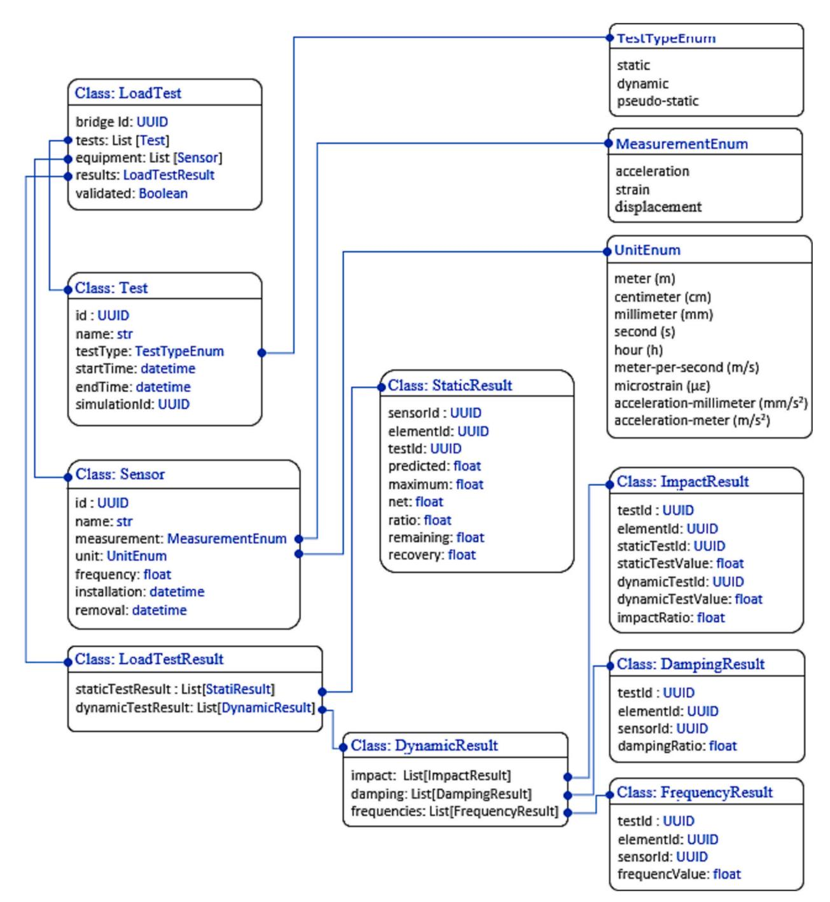
**Fig. 15.**Example of task data model for a load test according to [[75\]](#page-20-0).

####*6.2.2. Building information graph-models*A set of IFC files belonging to the set of demonstrators within the research project are converted. It is worth pointing out that those IFC files have been generated by different individuals/teams/stakeholders which helped test the generality of this conversion process. [Table 4](#page-8-0)  summarizes the conversion processes for the different IFC models for the Ashvin demonstrators.

[Tables 5, Table 6](#page-9-0) and [Table 7](#page-10-0) illustrate the results of the conversion displaying the geometric model on the End-user GUI developed in [[1](#page-19-0)] and the graph model in the Neo4j graph database for three selected cases of [Table 4](#page-8-0) (one bridge and two buildings).

####*6.3. Integration of process data*Subsequently, process data is stored in a local database and linked to the main knowledge graph. This is enabled by the subsystem depicted in [Fig. 10](#page-10-0):

First, asset-related activities (processes) need to be digitized. It is still not a common practice among industry stakeholders to have a digitized and machine-readable representation of their activities. However, this is a step that needs to be done. For the sake of including such information in a knowledge graph-based digital twin, tasks required a compatible data structure. In this case, digitized information is structured in JSON objects which are stored in MongoDB (a NoSQL database that natively supports storing data in JSON format).

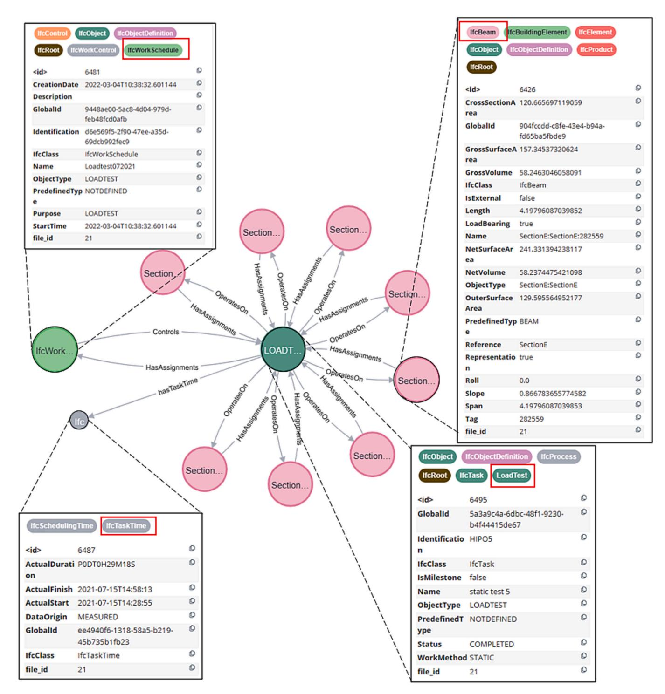
**Fig. 16.**Load test tasks in the knowledge graph. Classes for each node are highlighted and framed with a red rectangle. (For interpretation of the references to colour in this figure legend, the reader is referred to the web version of this article.)

Secondly, the abstract version of those activities needs to be transformed into a graph and thus, be linked to the central knowledge graph. This is the way to enable the semantic search of information along with the rest of the asset model. The amount of information retrieved in this activity summary is a decision that needs to be made by the designer depending on the application of the Digital Twin.

The IFC schema provides a generic data model for representing processes (tasks). The use of classes such as*IfcWorkPlan*, *IfcWork-Schedule, IfcTask,*and*IfcTaskTime*allow managing and grouping tasks to be performed in the asset. [Fig. 11](#page-11-0) depicts a simplified ontology defined

according to the IFC schema.

This ontology is used as a basis for transformation from JSON to its graph format. [Fig. 12](#page-12-0) exemplifies how tasks are represented in this way:

Although tasks described according to the IFC schema provide comprehensive temporal information, they lack a categorization that facilitates the differentiation between task types for construction and maintenance purposes. Hence, to enhance the information detail within the digital twin and enable the systematic storage of task information it is imperative to develop taxonomies that describe these task categories. This study is not focused on the development of comprehensive

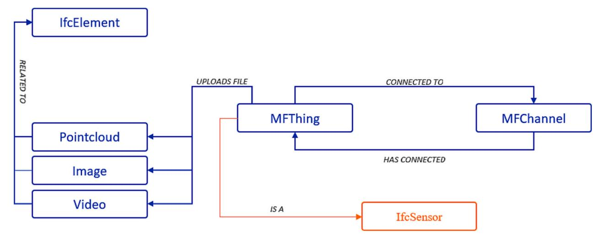
**Fig. 17.**Mainflux Ontology (blue). Map to IFC (orange). (For interpretation of the references to colour in this figure legend, the reader is referred to the web version of this article.)

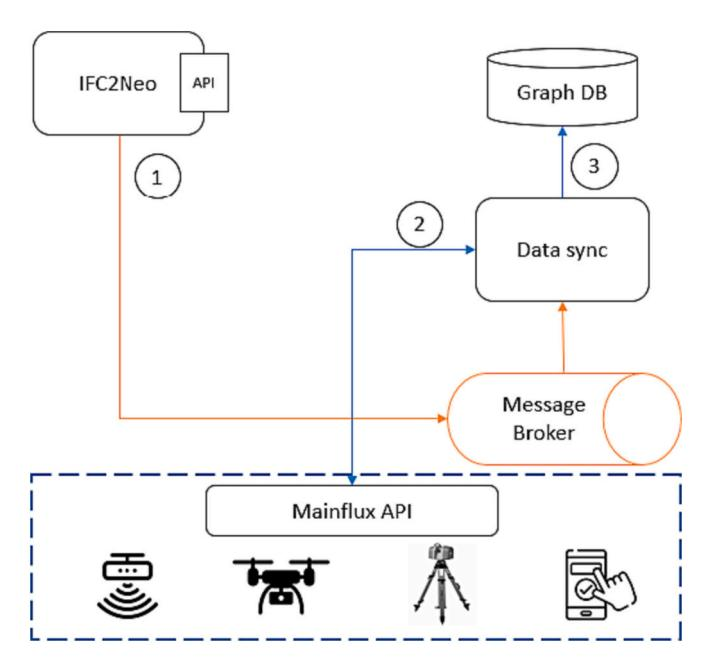
**Fig. 18.**Subsystem to couple the Mainflux IoT platform.

taxonomies and data models of construction and maintenance processes. The information requirements and definitions vary from organization to organization, and from country to country. Then, if it is desired to have an interoperable set of digitized activities, this is a task that should be realized in a collaborative effort between companies, academia and standardization bodies. One identified requirement is a common library of processes that can be shared among all parts and enables effective application development.

This study uses a case-based approach in which specific reports for maintenance activities performed in the demonstrators are digitized. Each report has specific information requirements, from which data models have been developed. These data models are then used to transfer the information in the report to a machine-readable format. [Fig. 13](#page-13-0) depicts this process.

Data models have been developed to cover the needs for the integration of maintenance tasks performed on demonstrators 1, 3, 7 and 9 of [Table 1](#page-2-0). [Table 8](#page-13-0) briefly describes these specific maintenance activities:

The simplified ontology depicted in [Fig. 11](#page-11-0) is extended with a taxonomy to categorize the maintenance activities described in [Table 8](#page-13-0). The taxonomy categorizes maintenance activities into three distinct groups: "Assessments," "Inspections," and "Repairs." (See [Fig. 14](#page-13-0)).

The process data stored in the processes database is polymorphic: Each of the activities described in [Table 8](#page-13-0) (and any other site in the project) shares the IFC common data structure, which is then extended to cover their additional information needs. [Fig. 15,](#page-14-0) for instance, describes the ifcTask data extension for a bridge load test. [Fig. 16](#page-15-0) describes an example of a load test according to the defined ontology and taxonomy. This is linked to the knowledge graph through the processes service.

####*6.4. Integration of external IoT platform*IoT enables the connectivity of things to the internet. It allows the collection and sharing of data from these devices. IoT platforms are key players that contain adequate frameworks to connect both physical and digital information. There are several IoT platforms available in the market, which operate with different organizing principles to interact with data and devices. It is required to understand these principles and explicitly define them in the form of an ontology. Thus, it enables integrating indirectly the capabilities of a given IoT platform within the Digital Twin Knowledge Graph. This idea of integration applies to any data platform that openly describes data access.

In this case, the IoT platform used in [\[1,18\]](#page-19-0) is Mainflux, an opensource IoT solution. The platform accepts connections over various protocols (HTTP, MQTT, WebSocket, CoAP and LoRaWan) enabling the two-way connection of all sorts of IoT devices deployed on-site. The platform features three basic entities to perform communication between information producers and consumers: things, channels, and users. A thing represents any data source or producer. Channels are communication pathways through which things send and receive messages. Messages can be addressed to specific topics, providing extra semantics to the communication process, and enhancing data querying and filtering. Channels facilitate all complexities of low-level communication protocols offering a unified and easy-to-use interface for messaging. Users represent physical persons and organizations which own channels and things. The platform provides an open API from which users can perform CRUD operations (Create, Read, Update, Delete) with things, channels and connections. Data sent over the platform can be consumed as a stream via MQTT and WebSocket or can be retrieved from a structured time-series database. Sensor messages are sent in SenML [[76\]](#page-20-0) format and also can be sent using a custom JSON structure.

|                                                            | 10 Channels                              |                       |               |    |                                      |                                      |             |
|------------------------------------------------------------|------------------------------------------|-----------------------|---------------|----|--------------------------------------|--------------------------------------|-------------|
|                                                            | Name                                     |                       | Type          | ID |                                      |                                      |             |
|                                                            |                                          | AirportRunway-Croatia | <b>Status</b> |    |                                      | f70b916f-4d71-4e7a-9556-3d6a982d7a58 |             |
|                                                            |                                          | AirportRunway-Croatia | RawData       |    |                                      | a05f9b49-ba4e-4365-b313-1c1221c545ba |             |
|                                                            |                                          | LlobregatViaduct      | <b>Status</b> |    |                                      | 6125b8ad-e135-43e2-824e-26d8eb2bf5ca |             |
|                                                            |                                          | LlobregatViaduct      | RawData       |    | 6d717b64-042b-4b04-8159-13bef242ffd2 |                                      |             |
|                                                            |                                          | RoofStructure-Munich  | RawData       |    | b308969f-7b72-458e-9744-6def4d34fdb4 |                                      |             |
|                                                            |                                          | RoofStructure-Munich  | <b>Status</b> |    | 91a052df-24d0-4b66-98fd-d83ee0402b3a |                                      |             |
|                                                            |                                          | ValdelinaresViaduct   | <b>Status</b> |    | a7316829-cab3-493c-8f6b-1956886366a3 |                                      |             |
|                                                            |                                          | ValdelinaresViaduct   | RawData       |    |                                      | 0c26c100-3323-4c88-0377-cb07b10c47ac |             |
|                                                            |                                          | ViaductoLaPlata       | RawData       |    |                                      | 9f7676b7-66d4-4652-9a94-2895f26ab367 |             |
|                                                            |                                          | ViaductoLaPlata       | <b>Status</b> |    | 1e392123-2ff6-4c7b-8384-cb5d086938aa |                                      |             |
|                                                            |                                          |                       |               |    |                                      |                                      |             |
|                                                            | 10 $\sim$ $\sim$                      |                       |               |    |                                      |                                      |             |
|                                                            |                                          |                       |               |    |                                      |                                      |             |
| <b>Channel Info</b>                                        |                                          |                       |               |    | Connections (23)                     |                                      |             |
| Name: ViaductoLaPlata                                      | ID: 9f7676b7-66d4-4652-9a94-2895f26ab367 |                       |               |    | Name                                 | Thing ID                             |             |
|                                                            |                                          |                       |               |    | <b>P42</b>                           | ef47ce69-4dda-4100-84ba-fa0152f006f0 |             |
|                                                            |                                          |                       |               |    | EP1                                  | cedd1aa6-8704-4d6e-94d6-d83e783833af |             |
|                                                            |                                          |                       |               |    | G11                                  | cc3c35b2-03fb-4a86-9043-e14ff8a51609 |             |
|                                                            |                                          |                       |               |    | P12                                  | c6b34a6b-0dd6-4af1-a433-14a03a09bc9f |             |
| Metadata                                                   |                                          |                       | Co Save       |    | G41                                  | c366de9f-fbed-466f-b161-c35c3019bc5d |             |
| $1 -$                                                      |                                          |                       |               |    | P32                                  | c15d607f-cd09-40ff-a49b-637e73266fa0 |             |
| "asset id": 2. $\overline{2}$ "type": "RawData" 3 |                                          |                       |               |    | P21                                  | bac721db-bdef-4789-b6ad-272b6557ccd9 |             |
| 4 1                                             |                                          |                       |               |    | P41                                  | ae3d1cbe-d126-4e17-ad83-d71162ddf4d2 |             |
|                                                            |                                          |                       |               |    | ACELV2                               | ab3961ad-7a67-49b0-b2af-5e813db31a61 |             |
|                                                            |                                          |                       |               |    | G12                                  | a9eb6f7e-a4d9-418f-94e4-6abdbd80347c |             |
|                                                            |                                          |                       |               |    |                                      |                                      |             |
|                                                            |                                          |                       |               |    |                                      |                                      |             |
|                                                            |                                          |                       |               |    | 10 $\vee$                         |                                      | 44 4 1 2 39 |
**Fig. 19.**Mainflux IoT platform setup generated after importing an IFC file.

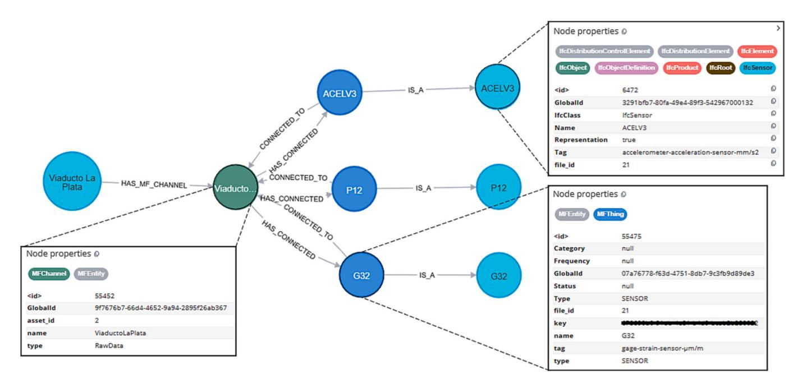
**Fig. 20.**Connectivity between IfcSensors and Mainflux things in the graph.

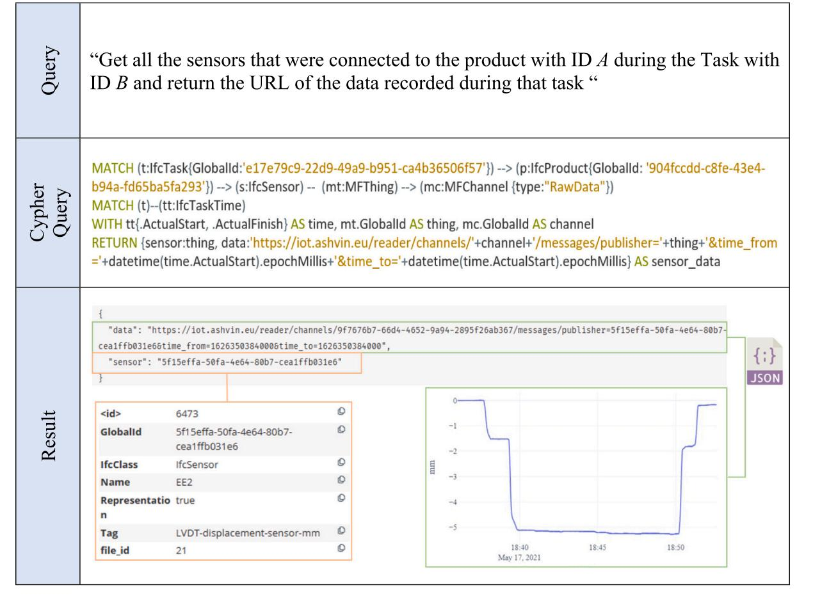
**Fig. 21.** Enabled retrieval of contextualized data using integrated IFC models, processes and IoT platform metadata.

The platform also accepts files related to point clouds, images or videos. [Fig. 17](#page-16-0) presents the ontology used to integrate the data available in Mainflux into the knowledge graph.

Mainflux is coupled with the digital twin system using a service (*Mainfluxsync*). When a new IFC model is imported, an event is triggered, and that service automatically sets up the Platform to accommodate data produced on-site (see [Fig. 18](#page-16-0)).

Two main channels are created: the "Status" and "RawData" channels. The former is dedicated to communicating and modifying the configuration of connected devices deployed on-site. The latter is dedicated to transmitting live measurements. *IfcSensors*imported into the system are mapped as things into the IoT platform and subsequently connected to both channels. Equivalent entities in the IoT platform and the BIM knowledge graph share Global Unique Identifiers (GUIDs), a key aspect for integration. Finally, IoT entities are imported into the graph according to the ontology. [Fig. 19](#page-17-0) displays the Mainflux IoT platform GUI with the initial setup.

Mainflux "Things" and*IfcSensors*sharing GUID are explicitly connected using an*IS\_A* relation within the graph, indicating the equivalency of both entities (see [Fig. 20\)](#page-17-0). This enables bridging the gap between BIM and IoT allowing contextualized interaction with IoT data through semantic queries. Fig. 21 shows an example of a humanreadable query subsequently written using Cypher. The result shows BIM-IoT-Process linked data.

# 7. Conclusions

Digital twins are being adopted across industries and are continuously evolving to adapt to industry needs. Wide-scoped and fragmented characteristics of the built environment impose specific requirements on digital twins. In this study, those requirements have been identified and dealt with throughout the development of a Knowledge Graph. Among those requirements, it is understood that digital twin data models need to be modular, extendable and interoperable. Multiple domains and different scales need to be encompassed. Likewise, different types of data formats with various storage locations need to be contextualized and integrated. It is concluded that a given digital twin base software system needs to be modular, cloud-based, and operable through APIs.

To develop a software system that can cope with such requirements, a knowledge graph-centred system is proposed. Knowledge graphs allow coupling the semantics of the IFC schema with other ontologies, enabling wider data contextualization. The inherent flexibility of the graph model allows dynamic model updates, and the use of modern graph databases provides granular and efficient data exploration and querying.

The system is developed using a micro-service architecture, which facilitates Cloud deployment and enables modularly defined functionalities. Those functionalities include (1) importing IFC models, which are transformed into a graph model, (2) linking process data stored in a local database and (3) linking sensor data stored in an external IoT platform. The knowledge graph acts as the contextual interface that provides a comprehensive view of all data and all models forming a Digital Twin. The knowledge graph allows us to perform complex queries across data. The system can be thus extended with additional ondemand data sources following the ontology-based integration presented throughout this paper.

The Knowledge Graph has been tested for practical implementation in a set of demonstrators. It is observed that this framework represents a versatile technological compound for the creation of digital twins for built assets. The framework bridges the gap of how DTs can integrate BIM with IoT systems and other data silos, regardless of the type of information therein contained.

The research group is presently developing Knowledge-Graph-based technologies for many demo cases depicted in this paper. This will result in a set of information pipelines that extract and operate with data connecting computational agents both internally (integrated into the system as microservices) and externally (connected through the system API). Authentication management, data security, and improvement of interaction workflows with the system are subsequent steps for development.

# Declaration of Competing Interest

The authors declare the following financial interests/personal relationships which may be considered as potential competing interests: Rolando Chacon reports financial support was provided by Horizon

Europe.

# Data availability

The data that has been used is confidential.

## Acknowledgements

This paper was prepared in the context of project ASHVIN. ASHVIN has received funding from the European Union's Horizon 2020 research and innovation programme under grant agreement No 958161. This publication reflects only author's view and that the European Commission is not responsible for any uses that may be made of the information it contains. The first author acknowledges the funding of the FI-2021 AGAUR PhD grant.

### References

- [1] ASHVIN Digitising and Transforming the European Construction Industry. [htt](https://www.ashvin.eu/) [ps://www.ashvin.eu/](https://www.ashvin.eu/) (accessed Jan. 17, 2023).
- [2] Home Cogito.<https://cogito-project.eu/> (accessed May 22, 2023). [3] BIMprove H2020 - Build Smarter, Cleaner, Cheaper. - Build Smarter, Cleaner, Cheaper. <https://www.bimprove-h2020.eu/>(accessed May 22, 2023).
- [4] HOME BIM2TWIN.<https://bim2twin.eu/> (accessed May 22, 2023).
- [5] L. Li, S. Aslam, A. Wileman, S. Perinpanayagam, Digital twin in aerospace industry: a gentle introduction, IEEE Access 10 (2021) 9543–9562, [https://doi.org/](https://doi.org/10.1109/ACCESS.2021.3136458) [10.1109/ACCESS.2021.3136458](https://doi.org/10.1109/ACCESS.2021.3136458).
- [6] M. Alazab, L.U. Khan, S. Koppu, S.P. Ramu, M. Iyapparaja, P. Boobalan, T. Baker, P. K.R. Maddikunta, T.R. Gadekallu, A. Aljuhani, Digital twins for healthcare 4.0 recent advances, architecture, and open challenges, in: IEEE Consumer Electronics Magazine, 2022, <https://doi.org/10.1109/MCE.2022.3208986>.
- [7] I. Onaji, D. Tiwari, P. Soulatiantork, B. Song, A. Tiwari, Digital twin in manufacturing: conceptual framework and case studies, Int. J. Comput. Integr. Manuf. 35 (8) (2022) 831–858, [https://doi.org/10.1080/](https://doi.org/10.1080/0951192X.2022.2027014)  [0951192X.2022.2027014](https://doi.org/10.1080/0951192X.2022.2027014).
- [8] M. Pregnolato, S. Gunner, E. Voyagaki, R. De Risi, N. Carhart, G. Gavriel, P. Tully, T. Tryfonas, J. Macdonald, C. Taylor, Towards civil engineering 4.0: concept, workflow and application of digital twins for existing infrastructure, Autom. Constr. 141 (2022) 104421, [https://doi.org/10.1016/j.autcon.2022.104421.](https://doi.org/10.1016/j.autcon.2022.104421)
- [9] E. VanDerHorn, S. Mahadevan, Digital twin: generalization, characterization and implementation, Decis. Support. Syst. 145 (2021) 113524, [https://doi.org/](https://doi.org/10.1016/j.dss.2021.113524)  [10.1016/j.dss.2021.113524](https://doi.org/10.1016/j.dss.2021.113524).
- [10] J.M.D. Delgado, L. Oyedele, Digital twins for the built environment: learning from conceptual and process models in manufacturing, Adv. Eng. Inform. 49 (2021) 101332, [https://doi.org/10.1016/j.aei.2021.101332.](https://doi.org/10.1016/j.aei.2021.101332)
- [11] Q. Lu, A.K. Parlikad, P. Woodall, G. Don Ranasinghe, X. Xie, Z. Liang, E. Konstantinou, J. Heaton, J. Schooling, Developing a digital twin at building and City levels: case study of West Cambridge campus, J. Manag. Eng. 36 (3) (2020), 05020004, <https://doi.org/10.1061/%28ASCE%29ME.1943-5479.0000763>.
- [12] C. Boje, A. Guerriero, S. Kubicki, Y. Rezgui, Towards a semantic construction digital twin: directions for future research, Autom. Constr. 114 (2020) 103179, <https://doi.org/10.1016/j.autcon.2020.103179>.
- [13] Council, G, K. Lamb, Gemini Papers: Summary, Apollo University of Cambridge Repository, 2022, [https://doi.org/10.17863/CAM.82192.](https://doi.org/10.17863/CAM.82192)
- [14] R. Chacon, ´ J.R. Casas, C. Ramonell, H. Posada, I. Stipanovic, S. Skaric, Requirements and challenges for infusion of SHM systems within digital twins platforms, Struct. Infrastruct. Eng. (2023), [https://doi.org/10.1080/](https://doi.org/10.1080/15732479.2023.2225486) [15732479.2023.2225486.](https://doi.org/10.1080/15732479.2023.2225486)
- [15] [M. Kosicki, M. Tsiliakos, K. ElAshry, M. Tsigkari, Big data and cloud computing for](http://refhub.elsevier.com/S0926-5805(23)00369-2/rf0075)  [the built environment, in: Industry 4.0 for the Built Environment: Methodologies,](http://refhub.elsevier.com/S0926-5805(23)00369-2/rf0075)

[Technologies and Skills, Springer international publishing, 2021, pp. 131](http://refhub.elsevier.com/S0926-5805(23)00369-2/rf0075)–155. [ISBN: 9783030824303.](http://refhub.elsevier.com/S0926-5805(23)00369-2/rf0075)

- [16] [E. Halmetoja, The role of digital twins and their application for the built](http://refhub.elsevier.com/S0926-5805(23)00369-2/rf0080) [environment, in: Industry 4.0 for the Built Environment: Methodologies,](http://refhub.elsevier.com/S0926-5805(23)00369-2/rf0080)  [Technologies and Skills, Springer International Publishing, 2022, pp. 415](http://refhub.elsevier.com/S0926-5805(23)00369-2/rf0080)–442. [ISBN: 9783030824303.](http://refhub.elsevier.com/S0926-5805(23)00369-2/rf0080)
- [17] The official Portal for European Data. [data.europa.eu.](http://data.europa.eu) <https://data.europa.eu/en> (accessed May 16, 2023).
- [18] [A. Lukaszewska, M. Gilun, F. Johansson, R. Jongeling, R. Tomar, C. Claeson-](http://refhub.elsevier.com/S0926-5805(23)00369-2/rf0090)[Jonsson, M. Jungmann, J. Campos, J. Gonçalves, V.K. Papanikolaou, R. Chacon,](http://refhub.elsevier.com/S0926-5805(23)00369-2/rf0090) ´ D. [G. Carrera, C. Ramonell, H. Posada, L. Ungureanu, S. Skaric, I. Stipanovi](http://refhub.elsevier.com/S0926-5805(23)00369-2/rf0090)ˇc, D7.1 [ASHVIN Technology Demonstration Plan, 2021.](http://refhub.elsevier.com/S0926-5805(23)00369-2/rf0090)
- [19] BIM Dictionary.<https://bimdictionary.com/>(accessed Feb. 10, 2023).
- [20] International Organization for Standardization, ISO 19650 BIM Building Information Modelling | BSI. <https://www.bsigroup.com/es-ES/iso-19650/> (accessed Feb. 16, 2023).
- [21] X.I.N.G. Xuejiao, Z. Botao, L. Hanbin, G.C. Hongliang, G. Chen, Automatic code compliance checking for design drawings of architecture major and its key technologies based on BIM, J. Civ. Eng. Manag. 36 (05) (2019) 129–136, [https://](https://doi.org/10.13579/j.cnki.2095-0985.2019.05.019)  [doi.org/10.13579/j.cnki.2095-0985.2019.05.019](https://doi.org/10.13579/j.cnki.2095-0985.2019.05.019).
- [22] [J. Teizer, J. Melzner, BIM for construction safety and health, in: Building](http://refhub.elsevier.com/S0926-5805(23)00369-2/rf0110) [Information Modeling: Technology Foundations and Industry Practice, 2018,](http://refhub.elsevier.com/S0926-5805(23)00369-2/rf0110)  pp. 349–[365. ISBN: 9783319928616](http://refhub.elsevier.com/S0926-5805(23)00369-2/rf0110).
- [23] [T. Fink, BIM for structural engineering, in: Building Information Modeling:](http://refhub.elsevier.com/S0926-5805(23)00369-2/rf0115) [Technology Foundations and Industry Practice, 2018, pp. 329](http://refhub.elsevier.com/S0926-5805(23)00369-2/rf0115)–336. ISBN: [9783319928616.](http://refhub.elsevier.com/S0926-5805(23)00369-2/rf0115)
- [24] [A. Braun, S. Tuttas, U. Stilla, A. Borrmann, Bim-based progress monitoring, in:](http://refhub.elsevier.com/S0926-5805(23)00369-2/rf0120)  [Building Information Modeling: Technology Foundations and Industry Practice,](http://refhub.elsevier.com/S0926-5805(23)00369-2/rf0120)  2018, pp. 463–[476. ISBN: 9783319928616.](http://refhub.elsevier.com/S0926-5805(23)00369-2/rf0120)
- [25] [C.V. Treeck, R. Wimmer, T. Maile, BIM for energy analysis, in: Building](http://refhub.elsevier.com/S0926-5805(23)00369-2/rf0125) [Information Modeling: Technology Foundations and Industry Practice, 2018,](http://refhub.elsevier.com/S0926-5805(23)00369-2/rf0125)  pp. 337–[347. ISBN: 9783319928616](http://refhub.elsevier.com/S0926-5805(23)00369-2/rf0125).
- [26] A. Seyrfar, I. Osman, H. Ataei, BIM and building emergency response management: review of applications, For. Eng. (2022) 613–619, [https://doi.org/10.1061/](https://doi.org/10.1061/9780784484548.063)  [9780784484548.063](https://doi.org/10.1061/9780784484548.063).
- [27] H. Alavi, R. Bortolini, N. Forcada, BIM-based decision support for building condition assessment, Autom. Constr. 135 (2022) 104117, [https://doi.org/](https://doi.org/10.1016/j.autcon.2021.104117)  [10.1016/j.autcon.2021.104117.](https://doi.org/10.1016/j.autcon.2021.104117)
- [28] IFC4.3.1.0 Documentation. <https://ifc43-docs.standards.buildingsmart.org/> (accessed May 16, 2023).
- [29] [P. Pauwels, D. Shelden, J. Brouwer, D. Sparks, S. Nirvik, T.P. McGinley, Open data](http://refhub.elsevier.com/S0926-5805(23)00369-2/rf0145)  [standards and BIM on the cloud, in: Buildings and Semantics, CRC press, 2022,](http://refhub.elsevier.com/S0926-5805(23)00369-2/rf0145)  pp. 101–[136. ISBN: 9781032023120](http://refhub.elsevier.com/S0926-5805(23)00369-2/rf0145).
- [30] W. Solihin, C. Eastman, Y.C. Lee, D.H. Yang, A simplified relational database Schema for transformation of BIM data into a query-efficient and spatially enabled database, Autom. Constr. 84 (2017) 367–383, [https://doi.org/10.1016/j.](https://doi.org/10.1016/j.autcon.2017.10.002) [autcon.2017.10.002.](https://doi.org/10.1016/j.autcon.2017.10.002)
- [31] S. Das, J. Srinivasan, M. Perry, E.I. Chong, J. Banerjee, A tale of two graphs: property graphs as RDF in Oracle, EDBT (2014, March) 762–773, [https://doi.org/](https://doi.org/10.5441/002/edbt.2014.82)  [10.5441/002/edbt.2014.82](https://doi.org/10.5441/002/edbt.2014.82).
- [32] Neo4j, Neo4j Graph Data Platform | Graph Database Management System. <https://neo4j.com/>(accessed Feb. 10, 2023).
- [33] R. Angles, H. Thakkar, D. Tomaszuk, Mapping RDF databases to property graph databases, IEEE Access 8 (2020) 86091–86110, [https://doi.org/10.1109/](https://doi.org/10.1109/ACCESS.2020.2993117) [ACCESS.2020.2993117.](https://doi.org/10.1109/ACCESS.2020.2993117)
- [34] J. Barrassa, A. Cowley, Neosemantics (n10s): Neo4j RDF & Semantics toolkit Neo4j Labs. <https://neo4j.com/labs/neosemantics/> accessed Feb. 10, 2023.
- [35] R. Stuger, V.R. Benjamins, D. Fensel, Knowledge engineering: principles and methods, Data Knowl. Eng. 25 (2) (1998) 161–197, [https://doi.org/10.1016/](https://doi.org/10.1016/S0169-023X(97)00056-6) [S0169-023X\(97\)00056-6](https://doi.org/10.1016/S0169-023X(97)00056-6).
- [36] OWL, OWL Semantic Web Standards. <https://www.w3.org/OWL/> (accessed Feb. 10, 2023).
- [37] A. Hogan, E. Blomqvist, M. Cochez, C. d'Amato, G.D. Melo, C. Gutierrez, J.E. Labra Gayo, S. Kirrane, S. Neumaier, A. Polleres, R. Navigli, A.N. Ngonga, S.M. Rashid, A. Rula, L. Schmelzeisen, J. Sequeda, S. Staab, A. Zimmermann, Knowledge graphs, ACM Comput Surveys (CSUR) 54 (4) (2021) 1–37, [https://doi.org/10.48550/](https://doi.org/10.48550/arXiv.2003.02320)  [arXiv.2003.02320](https://doi.org/10.48550/arXiv.2003.02320).
- [38] [J. Barrasa, A.E. Hodler, J. Webber, Knowledge Graphs. Data in Context for](http://refhub.elsevier.com/S0926-5805(23)00369-2/rf0190)  Responsive Businesses, O'[Reilly Media, Inc, 2021. ISBN: 9781098104856](http://refhub.elsevier.com/S0926-5805(23)00369-2/rf0190).
- [39] DBpedia Association. <https://www.dbpedia.org/>(accessed Feb. 10, 2023).
- [40] Wikidata. [https://www.wikidata.org/wiki/Wikidata:Main\\_Page](https://www.wikidata.org/wiki/Wikidata:Main_Page) (accessed Feb. 10, 2023).
- [41] BabelNet. <https://babelnet.org/> (accessed Feb. 10, 2023).
- [42] J. Hoffart, F.M. Suchanek, K. Berberich, G. Weikum, YAGO2: a spatially and temporally enhanced Knowledge Base from Wikipedia, Artif. Intell. 194 (2013) 28–61, <https://doi.org/10.1016/j.artint.2012.06.001>.
- [43] J. Akroyd, Z. Harper, D. Soutar, F. Farazi, A. Bhave, S. Mosbach, M. Kraft, Universal digital twin: land use, Data-Centric Eng 3 (2022), [https://doi.org/](https://doi.org/10.1017/dce.2021.21) [10.1017/dce.2021.21](https://doi.org/10.1017/dce.2021.21).
- [44] J. Akroyd, S. Mosbach, A. Bhave, M. Kraft, Universal digital twin-a dynamic knowledge graph, Data-Centric Eng 2 (2021), [https://doi.org/10.1017/](https://doi.org/10.1017/dce.2021.10)  [dce.2021.10.](https://doi.org/10.1017/dce.2021.10)
- [45] Cambridge CARES.<https://www.cares.cam.ac.uk/research/cities/>(accessed July 22, 2023).
- [46] A. Chadzynsky, S. Li, A. Grisiute, F. Farazi, C. Lindberg, S. Mosbach, P. Herthogs, M. Kraft, Semantic 3D city agents—an intelligent automation for dynamic

#### *C. Ramonell et al.*

geospatial knowledge graphs, Energy and AI 8 (2022) 100137, [https://doi.org/](https://doi.org/10.1016/j.egyai.2022.100137)  [10.1016/j.egyai.2022.100137.](https://doi.org/10.1016/j.egyai.2022.100137)

- [47] A. Chadzynski, N. Krdzavac, F. Farazi, M.Q. Lim, S. Li, A. Grisiute, P. Herthogs, A. von Richthofen, S. Cairns, M. Kraft, Semantic 3D city database — an enabler for a dynamic geospatial knowledge graph, Energy and AI 6 (2021) 100106, [https://](https://doi.org/10.1016/j.egyai.2021.100106)  [doi.org/10.1016/j.egyai.2021.100106.](https://doi.org/10.1016/j.egyai.2021.100106)
- [48] National Digital Twin Programme, Centre for Digital Built Britain completed its five-year mission and closed its doors at the end of September 2022. [https://www.](https://www.cdbb.cam.ac.uk/what-we-did/national-digital-twin-programme)  [cdbb.cam.ac.uk/what-we-did/national-digital-twin-programme](https://www.cdbb.cam.ac.uk/what-we-did/national-digital-twin-programme) (accessed May 16, 2023).
- [49] S. Hayes, C. Dent, B. Mawdsley, R. Judson, T. Collingwood, CReDo: overview report, Apollo - University of Cambridge Repository, 2022, [https://doi.org/](https://doi.org/10.17863/CAM.82908)  [10.17863/CAM.82908.](https://doi.org/10.17863/CAM.82908)
- [50] J. Akroyd, CReDo Methodology Papers: Implementation, Apollo University of Cambridge Repository, 2022,<https://doi.org/10.17863/CAM.81779>.
- [51] [P. Pauwels, A. Costin, M.H. Rasmussen, Knowledge graphs and linked data for the](http://refhub.elsevier.com/S0926-5805(23)00369-2/rf0255)  [built environment, in: Industry 4.0 for the Built Environment: Methodologies,](http://refhub.elsevier.com/S0926-5805(23)00369-2/rf0255)  [Technologies and Skills, Springer international publishing, 2021, pp. 157](http://refhub.elsevier.com/S0926-5805(23)00369-2/rf0255)–183. [ISBN: 9783030824303.](http://refhub.elsevier.com/S0926-5805(23)00369-2/rf0255)
- [52] P. Pauwels, W. Terkaj, EXPRESS to OWL for construction industry: towards a recommendable and usable IfcOWL ontology, Autom. Constr. 63 (2016) 100–133, <https://doi.org/10.1016/j.autcon.2015.12.003>.
- [53] [D. Mavrokapnidis, K. Katsigarakis, P. Pauwels, E. Petrova, I. Korolija, D. Rovas,](http://refhub.elsevier.com/S0926-5805(23)00369-2/rf0265) [A linked-data paradigm for the integration of static and dynamic building data in](http://refhub.elsevier.com/S0926-5805(23)00369-2/rf0265)  [digital twins, in: Proceedings of the 8th ACM International Conference on Systems](http://refhub.elsevier.com/S0926-5805(23)00369-2/rf0265)  [for Energy-Efficient Buildings, Cities, and Transportation, 2021, pp. 369](http://refhub.elsevier.com/S0926-5805(23)00369-2/rf0265)–372. [ISBN: 9781450391146.](http://refhub.elsevier.com/S0926-5805(23)00369-2/rf0265)
- [54] M.H. Rasmussen, M. Lefrançois, G.F. Schneider, P. Pauwels, BOT: the building topology ontology of the W3C linked building data group, Semantic Web 12 (1) (2021) 143–161, [https://doi.org/10.3233/SW-200385.](https://doi.org/10.3233/SW-200385)
- [55] P. Pauwels, Building Element Ontology. [https://pi.pauwel.be/voc/buildingeleme](https://pi.pauwel.be/voc/buildingelement/index-en.html) [nt/index-en.html](https://pi.pauwel.be/voc/buildingelement/index-en.html), 2020 accessed Feb. 12, 2023.
- [56] P. Pauwels, Distribution Element Ontology. [https://pi.pauwel.be/voc/distribut](https://pi.pauwel.be/voc/distributionelement/index-en.html) [ionelement/index-en.html,](https://pi.pauwel.be/voc/distributionelement/index-en.html) 2019 accessed Feb. 12, 2023.
- [57] A.-H. Hamdan, M. Bonduel, R.J. Scherer, An Ontological Model for the Representation of Damage to Constructions, Accessed: Feb. 12, 2023. Available: [htt](http://www.w3.org/1999/02/22-rdf-syntax-ns)  [p://www.w3.org/1999/02/22-rdf-syntax-ns.](http://www.w3.org/1999/02/22-rdf-syntax-ns)
- [58] A.-H. Hamdan, R.J. Scherer, Integration of BIM-related Bridge Information in an Ontological Knowledgebase, Accessed: Feb. 12, 2023. [Online]. Available: [htt](https://github.com/Alhakam/bridgeOntology)  [ps://github.com/Alhakam/bridgeOntology.](https://github.com/Alhakam/bridgeOntology)

- [59] A. Wagner, L.K. Moeller, C. Leifgen, C. Eller, Building Product Ontology. [https](https://www.projekt-scope.de/ontologies/bpo/) [://www.projekt-scope.de/ontologies/bpo/](https://www.projekt-scope.de/ontologies/bpo/), Nov. 04, 2019.
- [60] M.H. Ramussen, M. Lefrançois, M. Bonduel, Ontology for Property Management. <https://w3c-lbd-cg.github.io/opm/>, 2018, November 21.
- [61] A. Wagner, M. Bonduel, P. Pauwels, OMG: Ontology for Managing Geometry. [https](https://www.projekt-scope.de/ontologies/omg/)  [://www.projekt-scope.de/ontologies/omg/,](https://www.projekt-scope.de/ontologies/omg/) 2019, November 12.
- [62] A. Wagner, M. Bonduel, P. Pauwels, R. Uwe, Relating geometry descriptions to its derivatives on the web, in: 2019 European Conference on Computing in Construction, European Council on Computing in Construction (EC3), 2019, pp. 304–313, <https://doi.org/10.35490/EC3.2019.146>.
- [63] N. Sahlab, S. Kamm, T. Müller, N. Jazdi, M. Weyrich, Knowledge graphs as enhancers of intelligent digital twins, in: 2021 4th IEEE International Conference on Industrial Cyber-Physical Systems (ICPS), IEEE, 2021, May, pp. 19–24, [https://](https://doi.org/10.1109/ICPS49255.2021.9468219)  [doi.org/10.1109/ICPS49255.2021.9468219.](https://doi.org/10.1109/ICPS49255.2021.9468219)
- [64] Docker. <https://www.docker.com/>(accessed July 22, 2023).
- [65] Docker Hub. <https://hub.docker.com/>(accessed July 22, 2023).
- [66] Neo4j Graph Database & Analytics | Graph Database Management System. <https://neo4j.com/>(accessed July 22, 2023).
- [67] MongoDB. <https://www.mongodb.com/>(accessed July 22, 2023).
- [68] Messaging that Just Works RabbitMQ. <https://www.rabbitmq.com/> (accessed May 16, 2023).
- [69] IfcOpenShell The Open Source IFC Toolkit and Geometry Engine. [https:](https://ifcopenshell.org/)  [//ifcopenshell.org/](https://ifcopenshell.org/) (accessed Feb. 12, 2023).
- [70] neosemantics (n10s): Neo4j RDF & Semantics toolkit Neo4j Labs. [https://neo4j.](https://neo4j.com/labs/neosemantics/) [com/labs/neosemantics/](https://neo4j.com/labs/neosemantics/) (accessed July 22, 2023).
- [71] Neo4j Python Driver 5.8 Neo4j Python Driver 5.8. [https://neo4j.com/do](https://neo4j.com/docs/api/python-driver/current/)  [cs/api/python-driver/current/](https://neo4j.com/docs/api/python-driver/current/) (accessed May 15, 2023).
- [72] J. Zhu, P. Wu, X. Lei, IFC-graph for facilitating building information access and query, Autom. Constr. 148 (2023) 104778, [https://doi.org/10.1016/j.](https://doi.org/10.1016/j.autcon.2023.104778) [autcon.2023.104778.](https://doi.org/10.1016/j.autcon.2023.104778)
- [73] Pydantic. <https://pydantic.dev/> (accessed May 19, 2023).
- [74] Cypher.<https://neo4j.com/developer/cypher/> (accessed May 19, 2023).
- [75] NAP 2–4-2.0 PRUEBAS DE CARGA. [http://descargas.adif.es/ade/u18/GCN/Nor](http://descargas.adif.es/ade/u18/GCN/NormativaTecnica.nsf/v0/AB0851B0FE894FBAC1258668003D4617/$FILE/NAP%202-4-2.0_Pruebas%20de%20carga.pdf?OpenElement) [mativaTecnica.nsf/v0/AB0851B0FE894FBAC1258668003D4617/\\$FILE/NAP%](http://descargas.adif.es/ade/u18/GCN/NormativaTecnica.nsf/v0/AB0851B0FE894FBAC1258668003D4617/$FILE/NAP%202-4-2.0_Pruebas%20de%20carga.pdf?OpenElement) [202-4-2.0\\_Pruebas%20de%20carga.pdf?OpenElement](http://descargas.adif.es/ade/u18/GCN/NormativaTecnica.nsf/v0/AB0851B0FE894FBAC1258668003D4617/$FILE/NAP%202-4-2.0_Pruebas%20de%20carga.pdf?OpenElement) (accessed July 22, 2023).
- [76] A. Ker¨ [anen, C. Bormann. Sensor Measurement Lists \(SenML\) Fields for Indicating](http://refhub.elsevier.com/S0926-5805(23)00369-2/rf0380)  [Data Value Content-Format RFC 9193 2023, 2020 doi:10.17487/rfc9193.](http://refhub.elsevier.com/S0926-5805(23)00369-2/rf0380)
