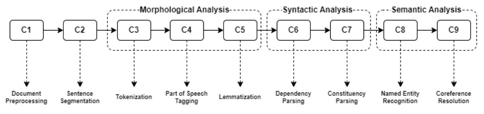
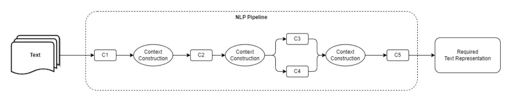
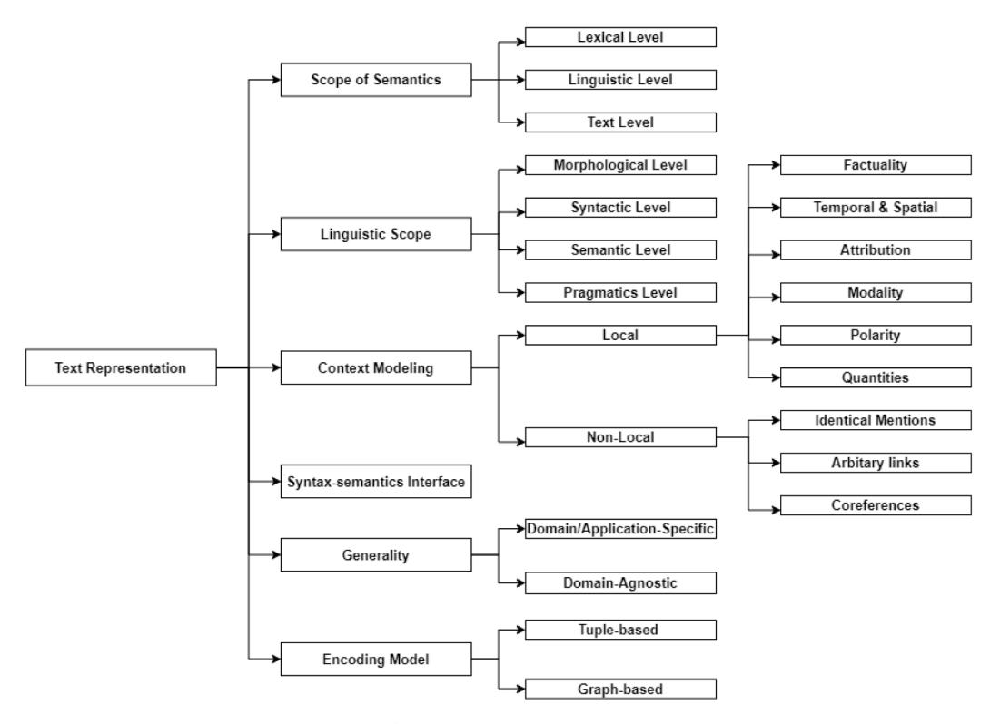
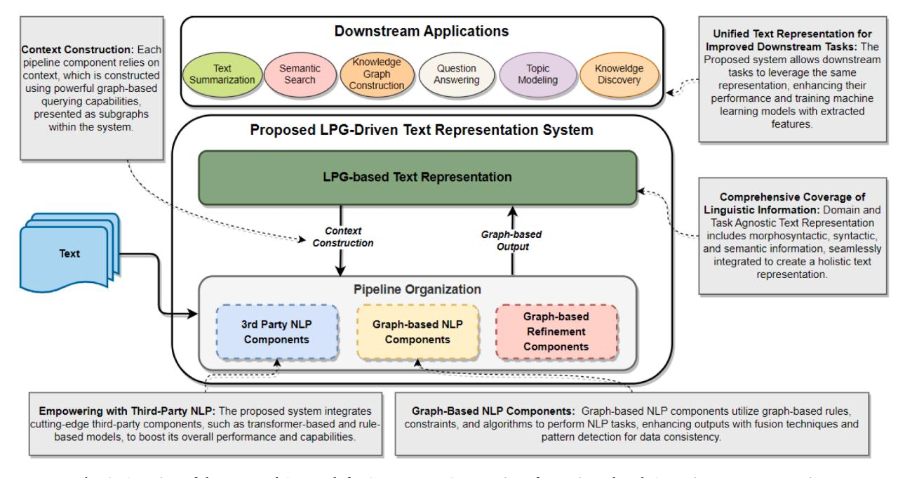
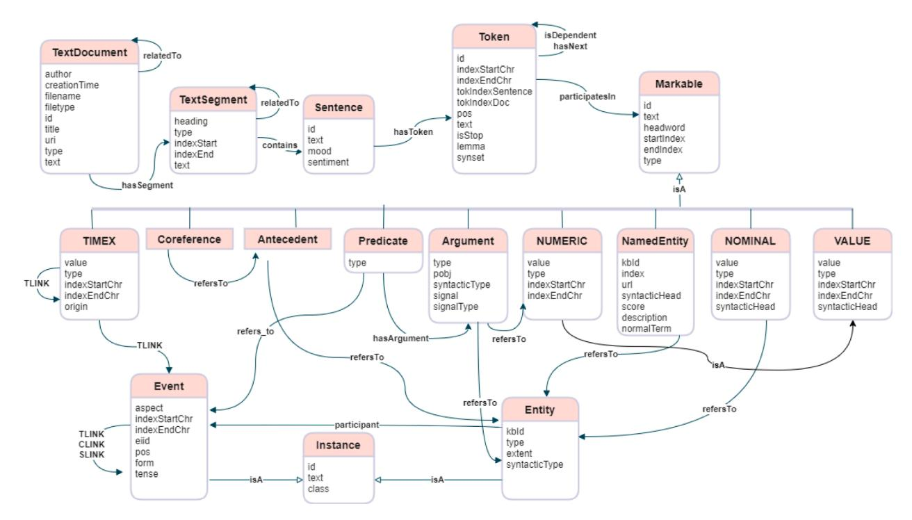
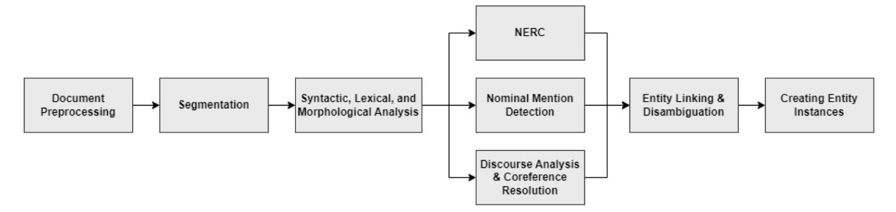
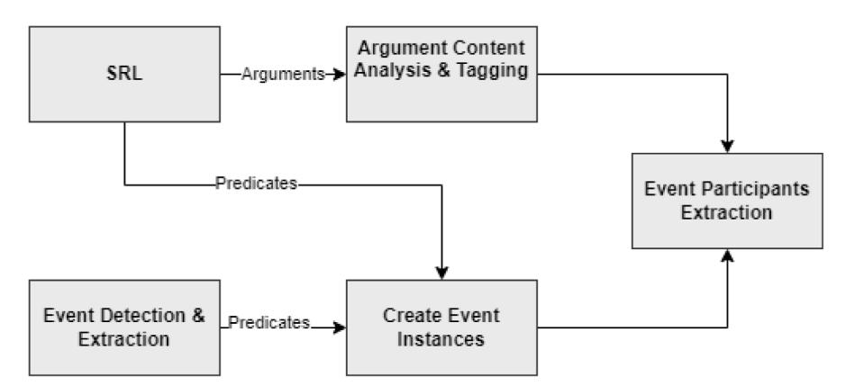
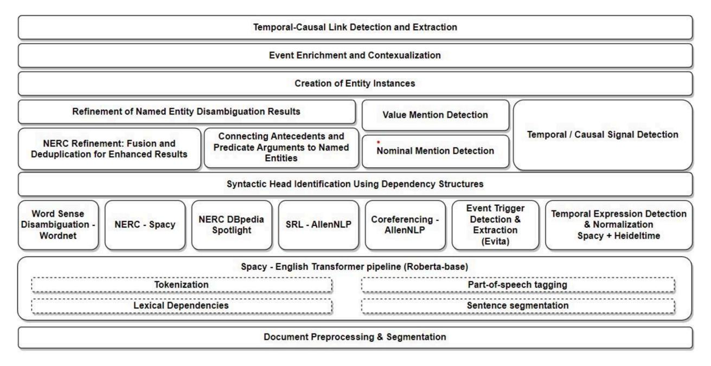

Contents lists available at [ScienceDirect](www.sciencedirect.com/science/journal/09574174)

Expert Systems With Applications

<!-- Image Description: That's not a technical image containing diagrams, charts, graphs, or equations. It's the cover of the journal *Expert Systems with Applications*. The cover features a series of small icons representing diverse application areas of expert systems, such as manufacturing, finance, law, science, and medicine, illustrating the journal's broad scope. The image's purpose is to visually represent the journal's interdisciplinary focus and subject matter. -->

journal homepage: [www.elsevier.com/locate/eswa](https://www.elsevier.com/locate/eswa)

# Unifying context with labeled property graph: A pipeline-based system for comprehensive text representation in NLP

<!-- Image Description: That's not a technical image from an academic paper; it's a graphical user interface (GUI) element. The image shows a button with a circular icon (containing a red bookmark within blue and yellow concentric circles) and the text "Check for updates". Its purpose within the paper would be to direct the reader to look for software updates or revised versions of the publication itself, if applicable. There are no charts, graphs, equations, or diagrams present. -->

Ali Hur a , Naeem Janjua b,\*, Mohiuddin Ahmed a

a*Edith Cowan University, Joondalup, WA, Australia*b*Flinders University - Adelaide, South Australia*ARTICLE INFO
*Keywords:*Natural language processing Graph based NLP Text representation

## ABSTRACT

Extracting valuable insights from vast amounts of unstructured digital text presents significant challenges across diverse domains. This research addresses this challenge by proposing a novel pipeline-based system that generates domain-agnostic and task-agnostic text representations. The proposed approach leverages labeled property graphs (LPG) to encode contextual information, facilitating the integration of diverse linguistic elements into a unified representation. The proposed system enables efficient graph-based querying and manipulation by addressing the crucial aspect of comprehensive context modeling and fine-grained semantics. The effectiveness of the proposed system is demonstrated through the implementation of NLP components that operate on LPG-based representations. Additionally, the proposed approach introduces specialized patterns and algorithms to enhance specific NLP tasks, including nominal mention detection, named entity disambiguation, event enrichments, event participant detection, and temporal link detection. The evaluation of the proposed approach, using the MEAN-TIME corpus comprising manually annotated documents, provides encouraging results and valuable insights into the system's strengths. The proposed pipeline-based framework serves as a solid foundation for future research, aiming to refine and optimize LPG-based graph structures to generate comprehensive and semantically rich text representations, addressing the challenges associated with efficient information extraction and analysis in NLP.

### 1. Introduction

Within organizations, a vast amount of unstructured digital text presents challenges in gaining insights. However, by leveraging natural language processing (NLP) techniques, knowledge can be extracted by transforming the text into structured representations, such as vectors, tensors, and text graphs (Jin & [Srihari, 2007; Osman](#page-14-0) & Barukub, 2020; [Pham et al., 2022\)](#page-14-0), or knowledge graphs (C. Liu & [Yang, 2022; Martinez-](#page-15-0)[Rodriguez et al., 2018; Vossen et al., 2016\)](#page-15-0). These representations include semantic elements such as entities, events, event roles, and interactions between these elements such as temporal, causal, identity, and type links (Abend & [Rappoport, 2017\)](#page-14-0). The goal of NLP techniques is to automate the generation of machine-comprehensible representations of text that empower a variety of post-processing tasks. The quality and effectiveness of the text representation directly impact the performance of downstream applications, such as document summarization, knowledge graph construction, translation, and semantic search. Additionally, these representations serve as vital features for training machine learning models (Bethard & [Martin, 2008; Cekinel](#page-14-0) & Karagoz,

#### [2022; Rink et al., 2010](#page-14-0)).

A proper context helps to determine the accurate meaning and interpretation of a given text. Therefore, a proper context is required to effectively perform NLP tasks. In a broader sense, any informational entity that is required by an NLP task to effectively perform its operations would be considered as context. It may include partially annotated text documents or the availability of any*meta*-data describing a particular text document, or the presence of any utterance can also serve as a useful context for subsequent NLP tasks (Cambria & [White, 2014](#page-14-0)). Moreover, the context can also be retrieved on demand from existing knowledge sources such as linguistics ([Kipper et al., 2008; Miller, 1995;](#page-14-0)  [Palmer et al., 2005\)](#page-14-0) or background knowledge [\(Fabian et al., 2007;](#page-14-0)  [Lehmann et al., 2015; Speer et al., 2017](#page-14-0)). However, existing approaches face challenges in effectively modeling and utilizing context, thereby limiting their ability to store, retrieve, and leverage contextual information. (Glauber & [Barreiro Claro, 2018\)](#page-14-0). They also face challenges in achieving the desired extent or coverage of context, including linguistic factors, temporal and spatial information, common-sense knowledge, task-specific knowledge, and pragmatic information ([Glauber](#page-14-0) &

\*Corresponding author.*E-mail addresses:*[n.janjua@ecu.edu.au,](mailto:n.janjua@ecu.edu.au) [naeem.janjua@flinders.edu.au](mailto:naeem.janjua@flinders.edu.au) (N. Janjua).

<https://doi.org/10.1016/j.eswa.2023.122269>

Available online 28 October 2023 Received 5 July 2023; Received in revised form 20 September 2023; Accepted 19 October 2023

0957-4174/© 2023 The Author(s). Published by Elsevier Ltd. This is an open access article under the CC BY license [\(http://creativecommons.org/licenses/by/4.0/\)](http://creativecommons.org/licenses/by/4.0/).

[Barreiro Claro, 2018\)](#page-14-0). For example, the decoupling of syntactic and semantic representations hamper the systems' ability to establish intricate relationships and dependencies between them ([Li et al., 2018; Tao](#page-15-0)  [et al., 2019; Tian et al., 2022\)](#page-15-0). Consequently, the system's reasoning and comprehension abilities suffer limiting its performance in tasks such as entity resolution, and semantic parsing [\(Li et al., 2018; Tian et al.,](#page-15-0)  [2022\)](#page-15-0).

Text representations can be tailored to be either domain or taskspecific, catering specifically to the contextual requirements of a particular task. On the other hand, they can also be created to work for any domain or task, making them adaptable for different post-processing jobs. Producing domain-agnostic and task-agnostic text representations is challenging and involves addressing various considerations. These include accommodating diverse requirements within a single representation, considering the depth and breadth of semantic elements, determining the appropriate data model and storage format, and managing the level of coupling between different components of the text representation. These factors collectively contribute to the complexity and difficulty in achieving effective domain-agnostic and task-agnostic text representations.

Systems, exemplified by [\(Martinez-Rodriguez et al., 2018; Vossen](#page-15-0)  [et al., 2016](#page-15-0)) have made attempts to generate domain-agnostic and taskagnostic text representations. These systems often rely on open information extraction techniques to construct text representations stored in RDF-based triple stores. However, they create text representation that is more focused on*data integration*than*linguistic analysis*. Moreover, the underlying RDF format exhibits significant limitations ([Purohit et al.,](#page-15-0)  [2021\)](#page-15-0), rendering these representations rigid, less flexible, and unsuitable for complex querying, traversal, and navigation.

In contrast to the existing methods mentioned above, the proposed approach introduces graph-based linguistic analysis, a facet absent in current systems. Utilizing labeled property graphs (LPG) rather than traditional RDF-based triple stores, this research seamlessly incorporates nuanced context and meaning. This choice yields a more efficient format, greater query flexibility, and enhanced compatibility with programming. LPG empowers us to model context extensively, enabling dynamic graph exploration for post-processing tasks. Moreover, the system's graph-oriented design supports rule-based refinements, identifying and resolving inconsistencies often overlooked by other approaches, setting this research apart. The key contributions of this research project are as follows:

- Designed and developed an NLP-based pipeline-based system for graph-based text representations to support advanced AI applications across various domains and tasks.
- Developed an LPG-based text representation scheme incorporating syntax, semantics, and contextual information.
- The proposed pipeline seamlessly integrates NLP components with LPG-based representations for linguistic analysis at each step of NLP processing.
- Developed specialized patterns and algorithms to tackle various challenges in NLP analysis on graph-based representations such as temporal link detection, entity resolution, and entity instance creation.

The paper is structured as follows: Section 2 provides background and discusses existing systems. [Section 3](#page-4-0) presents the proposed system's overview and methodology. [Section 4](#page-10-0) covers implementation details. In [Section 5](#page-12-0), we evaluate system performance and identify improvements. In conclusion, Section 6 summarizes the research findings and highlights directions for future work.

#### 2. Background and related work

This section offers an inclusive overview of text representation's core aspects and automated methods for text representation generation.

Firstly, the key features of text representation such as semantics, context, syntax-semantics integration, and NLP task applicability are discussed. Secondly, the autonomous extraction techniques and their advancements, considering the challenges and constraints associated with them are described. This section lays the theoretical groundwork for comprehending subsequent research issues identified in this research.

#### *2.1. Text representation schemes*Sophisticated AI applications and advanced NLP tasks demand comprehensive text representations with rich context, as seen in question-answering [\(Lu et al., 2019\)](#page-15-0), text summarization ([Alwan](#page-14-0) & [Onsi, 2016; Ribaldo et al., 2012](#page-14-0)), topic modeling ([Gomez-Suta](#page-14-0) ´ et al., [2023; Gou et al., 2023; Yu](#page-14-0) & Xiang, 2023), semantic search [\(Habernal](#page-14-0) & [Konopík, 2013; Lupiani-Ruiz et al., 2011; Sarica et al., 2020](#page-14-0)), and knowledge graph construction [\(Martinez-Rodriguez et al., 2018\)](#page-15-0).

To automate the creation of such representations, NLP techniques often employ a pipeline-based approach ([Corcoglioniti et al., 2016;](#page-14-0) Z. [Liu et al., 2023; Vossen et al., 2016](#page-15-0)) This approach involves distinct components operating at different linguistic levels (morphological, syntactic, and semantic analysis) to process raw text and generate desired outputs [\(Fig. 1](#page-2-0)). Components work sequentially, with each output serving as input for the next. Context is pivotal for constructing high-quality, semantic-rich text representations. Outputs from one pipeline component become the context for subsequent components, influencing downstream tasks. However, different components produce outputs in varied formats, yielding fragmented context representations ([Fig. 2\)](#page-2-0). Integrating such diverse contexts poses challenges.

In the upcoming subsections, we offer explanations for the fundamental components (as depicted in [Fig. 3\)](#page-2-0) crucial for delineating text representations within the realm of NLP. Considering the nature of the represented content, semantic intricacies, modeling of contextual information, the interplay between syntax and semantics, and their adaptability across various NLP tasks, this research identifies various properties of a text representation scheme depicted in [Fig. 3.](#page-2-0)

#*2.1.1. Scope of semantics*Text representation schemes can be categorized based on the scope of semantics they address (Abend & [Rappoport, 2017\)](#page-14-0).*Lexical-level*semantic representations offer precise interpretations of individual words, considering relationships like synonyms, antonyms, and hypernyms. Examples include WordNet ([Miller, 1995\)](#page-15-0), a lexical database, and models like word embeddings, GloVe, BERT, and ELMo. These models enhance lexical semantics by capturing word meanings and contextual information. Incorporating lexical-level semantics benefits postprocessing NLP tasks like Word Sense Disambiguation, Named Entity Recognition, and semantic search.
*Linguistic-level*semantic representations correspond to the meaning of a particular sentence (Abend & [Rappoport, 2013; Banarescu et al.,](#page-14-0)  [2013\)](#page-14-0). It requires sophisticated parsing algorithms that dissect sentences into constituent parts, enabling the assignment of meaningful categories to the entirety of the sentence. These tasks typically involve mapping sentence constituents (such as words, phrases, and clauses) to semantic expressions and combining them to form the semantic structure of the sentence [\(Allen et al., 2008\)](#page-14-0). This process helps in capturing the relationships and meaning of the words and constituents within the sentence.

Unlike linguistic-level semantics, which centers on individual sentences,*text-level*semantic representations capture the entire document's overarching meaning and context. Vital for sentiment analysis, document summarization, embeddings, and topic modeling, these representations provide comprehensive document comprehension and enable high-level analysis. They encode relationships across the document, revealing identical concepts, coreferences, and sentence connections. These representations might illustrate*event timelines*, *activity*
<!-- Image Description: The flowchart depicts a natural language processing (NLP) pipeline. Nine components (C1-C9) are sequentially arranged, grouped into morphological, syntactic, and semantic analysis stages. Each component represents an NLP task: document preprocessing, sentence segmentation, tokenization, part-of-speech tagging, lemmatization, dependency parsing, constituency parsing, named entity recognition, and coreference resolution. The arrows show the data flow between stages. -->
**Fig. 1.**NLP Pipeline Components and Operations for Text Processing and Information Extraction at Different Linguistic Levels.

<!-- Image Description: The image displays a flowchart illustrating an NLP pipeline. Input text undergoes sequential "context construction" stages (C1-C5), represented by rectangular and oval boxes. Stages C3 and C4 are iterative. The final stage (C5) produces the required text representation. The diagram visually depicts the processing steps within the pipeline. -->
**Fig. 2.**Illustration of an NLP Pipeline with Fragmented Context Representation. The figure demonstrates the sequential flow of components (C1, C2, C3, C4, C5) within the pipeline, where the output of each component serves as the contextual input for the subsequent component.

<!-- Image Description: The image is a flowchart illustrating a taxonomy of text representation methods. It branches from "Text Representation" into "Context Modeling," then further into categories such as "Scope of Semantics" (lexical, linguistic, text levels), "Linguistic Scope" (morphological, syntactic, semantic, pragmatic levels), "Syntax-semantics Interface," and "Encoding Model" (tuple-based, graph-based). A parallel branch from "Context Modeling" details aspects like factuality, temporality, attribution, modality, polarity, quantities, identical mentions, arbitrary links, and coreferences. The diagram organizes and categorizes different approaches to representing text meaning within a computational context. -->
**Fig. 3.**Characteristic of Text Representation.
*descriptions*, and *discourse relations*. Additionally, they can assign topics or domains to the text document, enhancing contextual information.

## *2.1.2. Linguistic scope*Text representation schemes vary based on their linguistic scope, encompassing morphology, syntax, semantics, and pragmatics [\(Abend](#page-14-0) & [Rappoport, 2017](#page-14-0)). Broader linguistic coverage enhances representation quality, improving comprehension, and contextual fulfillment, and supporting diverse NLP tasks [\(Table 1\)](#page-3-0).

The morphological structure involves morphemes—the smallest meaningful units—and linguistic features like inflectional forms, aiding tasks like part-of-speech tagging, lemmatization, and word segmentation.

Syntactic representations capture phrase and sentence structure, incorporating grammatical relationships. They are pivotal for semantic quality (del Corro & [Gemulla, 2013; Mutlu](#page-14-0) & Sezer, 2023; Wu & Weld, [2010a\)](#page-14-0). Syntactic analysis identifies dependencies, and augmenting tasks like semantic role labeling, relation extraction, summarization, and knowledge graph construction. Schemes like TEXTRUNNER ([Yates](#page-15-0)  [et al., 2007](#page-15-0)) and ReVerb [\(Fader et al., 2011](#page-14-0)) use part-of-speech and noun phrase features for extraction, while WOE (Wu & [Weld, 2010b](#page-15-0)) and OLLIE [\(Mausam et al., 2012\)](#page-15-0) integrate dependency parsing in their syntactic analysis. Dependency parsing and part-of-speech tagging synergy further enhance extraction results (Wu & [Weld, 2010a](#page-15-0)).

### Table 1

Mapping of NLP Tasks to Type of Linguistic Context and Elements. NOTE: The elements mentioned in each context level are not exhaustive and may vary based on the specific task and the approaches used for analysis.

| Type of Task                | Linguistic Scope    | Elements                          |
|-----------------------------|---------------------|-----------------------------------|
| Named Entity Recognition | Lexical             | Words, Terms, Named Entities      |
| Part-of-Speech Tagging   | Morphological       | Word Forms, POS Tags              |
| Dependency Parsing          | Syntactic           | Dependency Relations, Parse Trees |
| Semantic Role Labeling   | Syntactic           | Predicates, Arguments, Roles      |
| Coreference                 | Syntactic and       | Coreference Chains, Entity        |
| Resolution                  | Semantic            | Mentions, Referential Relations   |
| Sentiment Analysis          | Semantic            | Sentiment Polarity, Opinion Words |
| Named Entity                | Lexical and         | Named Entity Mentions, Entity     |
| Disambiguation              | Semantic            | Linking, Knowledge Bases          |
| Relation Extraction         | Syntactic and       | Entity Pairs, Relation Types,     |
|                             | Semantic            | Relation Certainty                |
| Topic Modeling              | Lexical and         | Keywords, Topic Assignments,      |
|                             | Semantic            | Topic Distributions               |
| Machine Translation         | Lexical and         | Source Language Words, Target     |
|                             | Syntactic           | Language Words, Phrase            |
|                             |                     | Alignments                        |
| Text Classification         | Semantic            | Class Labels, Document Features   |
| Question Answering          | Lexical, Syntactic, | Questions, Candidate Answers,     |
|                             | Semantic            | Answer Ranking                    |

Moreover, integrating syntax in text representation backs the syntaxsemantics interface and supports semantic tracking. For example, PredPatt ([Zhang et al., 2017\)](#page-15-0) constructs a directed graph that encodes predicate, argument, and syntactic relations while preserving the syntactical dependency relations within predicate and argument phrases. Lexical resources like PROPBANK, FRAMENET, and VERBNET also include syntactic structures. Semantic and syntactic correlations aid training, as seen in [\(Rink et al., 2010\)](#page-15-0) for causal relation detection.

Semantic-level representation emphasizes converting text to machine-understandable meaning [\(Koller et al., 2019\)](#page-14-0). Techniques like semantic role labeling, predicate-argument structures, and distributed models (Word2Vec, GloVe) extract semantic elements such as entities, events, and temporal links (Abend & [Rappoport, 2017\)](#page-14-0). However, semantic analysis only considers literal meaning, excluding contextual interpretation. Pragmatic analysis, considering contextual factors like speaker intention and implicature (Cambria & [White, 2014\)](#page-14-0), completes the understanding. Pragmatic structure affects literal meaning determined by morphology, syntax, and semantics, warranting explicit indication in text representation.

####*2.1.3. Context modeling*Contextual information plays a crucial role in text representation schemes, encompassing factors such as factuality, attribution, clausal modifiers, and non-local context. While basic approaches focus on extracting subject-predicate-object tuples without considering contextual information, advanced techniques aim to incorporate such information to enrich the representation.

For instance, REVERB and WOE ignore contextual details like modality, polarity, factuality, and attribution, focusing solely on extracting tuples based on subject, predicate, and object. In contrast, approaches like OLLIE employ context analysis to incorporate additional information by considering context signals in the sentence's dependency parse (DP) and expanding the output representation with clausal modifiers and attribution. OpenIE4 extends this idea by utilizing Semantic Role Labeling (SRL) to mark temporal and spatial arguments as separate fields within the tuple.

NestIE [\(Bhutani et al., 2016\)](#page-14-0) introduces nested triples, connecting propositions through identifiers to incorporate contextual information. MinIE [\(Gashteovski et al., 2017](#page-14-0)) takes a different approach by minimizing both relational and argument phrases while introducing

contextual details such as polarity, modality, attribution, and quantities. Each proposition in MinIE is tagged with contextual metadata specifying the relevant information. GRAPHENE ([Cetto et al., 2018](#page-14-0)) identifies the core proposition and adds contextual propositions linked through identifiers.

Furthermore, contextual information can extend beyond local dependencies and sequential order. Methods like ([Qian et al., 2018\)](#page-15-0) leverage*non-local*contextual information by capturing coreferences, and identical mentions, and considering text layout structures and arbitrary links, such as followed-by links in social media posts. Similarly, ([Luan et al., 2019\)](#page-15-0) model context using entity relations and coreference relations to enhance the representation.

####*2.1.4. Syntax-semantics interface*A fundamental consideration in text representation schemes is the establishment of a well-formed syntax-semantics interface, which is crucial for capturing the interactions between syntactic structure and its semantic counterpart. This interface involves parsing the syntactic constituents of a sentence, identifying the predicator and its argument spans, and assigning semantic expressions to each span. The process follows a bottom-up approach, guided by the principle of compositionality, where the compositions and their order are determined by the syntactic structure. However, compositional schemes encounter challenges when dealing with*idiomatic phrases*, *multi-word expressions*, and *polysemous words*. In these cases, the principles of *construction grammar*([Dunn, 2023; Jurafsky, 1990; Sanso,](#page-14-0) ` 2003) prove beneficial in complementing the principle of compositionality. Construction grammar recognizes that some linguistic expressions, such as idiomatic phrases, cannot be fully understood by analyzing their parts in isolation. Instead, they are treated as holistic units or constructions, which have specific meanings and properties. By incorporating the insights from construction grammar, text representation schemes can effectively capture the semantics of idiomatic phrases by considering them as lexically specific constructions.

The use of construction grammar allows for a more nuanced representation of idiomatic phrases and their compositional properties. Rather than expecting the composition of syntactic expressions to yield the true meaning, construction grammar highlights the importance of treating idiomatic phrases as constructions with their own distinct meanings.

####*2.1.5. Generality of text representation*The generality of a text representation refers to its ability to capture and represent a wide range of textual content, regardless of the specific domain or task ([Koller et al., 2019](#page-14-0)). A general text representation is designed to be versatile and adaptable, capable of accommodating diverse types of text and supporting various natural language processing (NLP) tasks. It aims to capture comprehensive and nuanced semantics, providing a foundation that can be applied to multiple domains and tasks without the need for extensive customization or reconfiguration. In contrast, a domain-specific text representation is tailored to a particular domain, focusing on capturing the specific characteristics and requirements of that domain. Domain-agnostic implies its applicability across various domains, such as cybersecurity and healthcare, as it encapsulates semantic elements at a generic level. Similarly, it is taskagnostic, accommodating not only specific tasks like text summarization or topic labeling but a wide range of tasks. Examples of task-specific techniques include ontology learning ([Ahmed et al., 2014; Ali et al.,](#page-14-0)  [2017; Navigli et al., 2011](#page-14-0)), sentiment analysis, and opinion mining ([Castillo et al., 2015; Takamura et al., 2007; Wang et al., 2011](#page-14-0)), as well as text summarization [\(Qian et al., 2018\)](#page-15-0) (Alwan & [Onsi, 2016; AlZahir](#page-14-0)  [et al., 2015; Balinsky et al., 2011; Erkan](#page-14-0) & Radev, 2004; Ribaldo et al., [2012\)](#page-14-0), are tailored to address particular tasks.

#*2.1.6. Encoding models: tuple-based and graph-based representation*Tuple-based representation of text semantics involves the encoding

of linguistic information using subject-predicate-object propositions (Fader et al., 2011; Wu & [Weld, 2010b; Yates et al., 2007\)](#page-14-0) often as flat tuples. While certain schemes attempt to incorporate inter-proposition links through nested structures or identifier assignments such as OLLIE, NESTIE, KRAKEN (Akbik & [Loser,](#page-14-0) ¨ 2012), EXEMPLAR ([Mesquita](#page-15-0)  [et al., 2013](#page-15-0)), CLAUSEIE (del Corro & [Gemulla, 2013\)](#page-14-0), they often lack the flexibility and free-form structure required to effectively capture links across diverse elements. Consequently, their ability to represent connections across various layers of linguistic abstraction is limited.

Links within text representation schemes serve various purposes, including facilitating the interface between syntax and semantics, as seen in PROPS ([Stanovsky et al., n.d.\)](#page-15-0) and PredPatt, and establishing connections with external lexical resources or ontologies, as demonstrated by [\(Kertkeidkachorn](#page-14-0) & Ichise, 2018). These links also enable comprehensive context modeling ([Luan et al., 2019\)](#page-15-0), even spanning across multiple documents ([Bronselaer](#page-14-0) & Pasi, 2013), and establishing associations between entities, as exemplified by [\(Corcoglioniti et al.,](#page-14-0)  [2016\)](#page-14-0), NEWSREADER [\(Vossen et al., 2016](#page-15-0)). Their inclusion plays a vital role in enhancing the overall quality of the representation by incorporating additional semantic information [\(Qian et al., 2018\)](#page-15-0) and enabling more robust analysis and inference ([El-Kassas et al., 2020\)](#page-14-0).

Graph-based representation has gained prominence as a superior alternative to other text representation schemes, enabling effective encoding of the text's meaning (Ali & [Melton, 2019; Nastase et al., 2015;](#page-14-0)  Osman & [Barukub, 2020\)](#page-14-0). It has emerged as a valuable intermediate representation in text analysis, allowing for subsequent post-processing operations. This representation excels in capturing the intricate linguistic aspects of the text and is widely regarded as the preferred approach for modeling the semantic content (Abend & [Rappoport,](#page-14-0)  [2017\)](#page-14-0). Notably, PROPS and PredPatt employ a directed graph-based representation using dependency parse information to represent sentences. In the study by ([Bronselaer](#page-14-0) & Pasi, 2013) a graph model considers the syntactic function of tokens, enabling multi-document summarization through operations such as graph union and vertex ranking. Likewise, ([El-Kassas et al., 2020](#page-14-0)) employ a graph-based intermediate representation to enhance document summarization.

##*2.2. Autonomous solutions for building text representation*The realm of text representation in Natural Language Processing (NLP) has undergone remarkable advancements driven by diverse methodologies. One notable avenue is the emergence of autonomous solutions designed to construct text representations in an automated manner ([Gashteovski et al., 2020; Martinez-Rodriguez et al., 2018;](#page-14-0)  [Nastase et al., 2015; Stewart](#page-14-0) & Liu, 2020). These approaches aim to generate machine-interpretable renditions of textual data, harnessing a range of techniques and algorithms to capture syntactic, semantic, and contextual nuances. This automation facilitates more accurate and meaningful analysis, contributing to the evolution of NLP.

These autonomous methods can exhibit domain-specific or domainagnostic attributes. Domain-specific techniques are tailored to particular subject areas, often generating propositions by fitting structured templates aligned with domain-specific ontologies. In contrast, domainagnostic techniques are versatile and unconstrained by domain boundaries. This research delves into domain-agnostic techniques, investigating their potential for comprehensive text representation.

Among these techniques, open information extraction (openIE) tools have been pivotal [\(Mausam et al., 2012; Niklaus et al., 2018](#page-15-0)). They operate by extracting patterns either manually crafted or learned from labeled data—to produce propositions in the form of tuples from sentences. These tuples focus on predicates, subject arguments, and object arguments. However, in their early iterations, these techniques were limited to basic tuple extraction, lacking the richness of contextual details such as modality, polarity, factuality, and attribution.

As openIE techniques evolved, they encompassed contextual analysis, producing tuples infused with contextual intricacies through

frameworks like OLLIE [\(Mausam et al., 2012\)](#page-15-0). Recent advancements, exemplified by OpenIE5, have expanded the capabilities further to generate n-ary relations within sentences. Additionally, techniques based on frame semantics assign roles to arguments, enhancing context through specific categorizations. These techniques, associated with semantic role labeling (SRL) (Shi & [Lin, 2019](#page-15-0)) based on schemes such as PropBank, FrameNet, or VerbNet, identify text spans in sentences and assign roles to them.

However, a common limitation across these methods is their focus on individual sentences, with semantic scope restricted to the sentence level. To model interconnected propositions and capture broader context, these outputs necessitate post-processing steps for activities like coreference resolution, identification of identical mentions, and entity recognition. Techniques like PIKES [\(Corcoglioniti et al., n.d.](#page-14-0)) and NEWSREADER [\(Vossen et al., 2016](#page-15-0)) strive to consolidate these outputs, channeling results into standardized annotation formats such as NAF ([Vossen et al., 2016\)](#page-15-0). While this harmonizes representation compatibility, it primarily caters to data integration and does not address the intricacies of graph-based linguistic analysis.

Existing graph-based linguistic analysis approaches have garnered significant interest for their focus on graph-based linguistic analysis and representation ([Nastase et al., 2015; Osman](#page-15-0) & Barukub, 2020). However, these approaches often lack comprehensive semantic content that considers the specific domain or task they were tailored for, as they primarily concentrate on modeling the required semantic or syntactic elements. Approaches like PROPS and PredPatt employ directed graphbased representations, leveraging dependency parse information for sentence portrayal. However, these methods are confined to sentencelevel extraction of predicate arguments. ([Rink et al., 2010\)](#page-15-0) provides a graph-based text representation that is constrained to sentence level and focuses on word senses and semantic frames, tailored towards detecting causal relations. However, it does not encompass a comprehensive range of other essential semantic elements, and it does not demonstrate linguistic analysis specific to its representation. Likewise, techniques such as those presented by ([Qian et al., 2018\)](#page-15-0), focus on capturing non-local and non-sequential dependencies, but their scope remains limited to exposing these dependencies. Furthermore, ([Luan et al., 2019\)](#page-15-0) showcase graph-based linguistic analysis tailored to specific tasks like entity recognition and relation extraction. However, their applicability is constrained by a lack of comprehensive context, rendering them unfit for domain-agnostic and task-agnostic utilization.

Additionally, it's important to note that most existing approaches ([Corcoglioniti et al., 2016; Martinez-Rodriguez et al., 2018; Mote](#page-14-0)[shakker Arani et al., 2021; Vossen et al., 2016\)](#page-14-0) rely on RDF for graph data representation. RDF, while widely used, presents several limitations ([Hofer et al., 2023; Purohit et al., 2021](#page-14-0)) in the context of complex textual data. It often results in sparse graphs with limited structural detail, particularly when handling intricate relationships within diverse real-world scenarios. This can lead to challenges in accurately representing and analyzing complex text-based knowledge. In contrast, the current literature didn't explore the labeled property graphs (LPG) for text representation, which offers superior flexibility and adaptability, mitigating these RDF limitations for advanced knowledge representation. Moreover, LPG excels in executing scalable graph analytical tasks such as sub-graph matching, network alignment, and real-time knowledge graph querying. It distinguishes itself with efficient storage, rapid traversal capabilities, and the versatility to model various real-world domains ([Purohit et al., 2021\)](#page-15-0).

### 3. Overview of the proposed approach

In this section, we will provide an overview of the proposed approach for generating domain and task-agnostic text representations, as illustrated in [Fig. 4](#page-5-0). This figure provides a visual representation of the key components and flow of the proposed graph-based approach. The proposed system constructs text representation that encompasses

<!-- Image Description: The image presents a flowchart illustrating a proposed LPG-driven text representation system. The system processes text input through third-party and graph-based NLP components, culminating in a comprehensive, domain-agnostic text representation. This representation is then used for downstream applications such as text summarization, question answering, and knowledge discovery. The diagram highlights the system's architecture, emphasizing the integration of third-party NLP tools and graph-based methods for improved performance and holistic text representation. -->
**Fig. 4.**Overview of the Proposed Approach for Autonomous Construction of Domain and Task-Agnostic Text Representation.

various characteristics necessary for downstream applications.

To ensure precise representation of the text, we utilize knowledge engineering techniques, leveraging semantic resources such as WordNet synsets or ConceptNet entries to assign nuanced meaning to each lexeme or token. We also employ predicate-argument structures to capture the meaning of sentence constituents and incorporate coreferences, identical mentions, and arbitrary links to enrich text-level semantics. Our linguistic scope covers morphological, syntactic, and semantic information, enabling holistic text analysis. By establishing connections between semantic elements and their syntactic counterparts, we achieve a uniform syntax-semantics interface through graph-based links and token-level anchoring, ensuring precise alignment between graph

elements and their corresponding tokens in the text.

We also prioritize context modeling as a prominent feature of our system, harnessing rich contextual information to refine downstream NLP tasks effectively. The unified text representation enables the convenient and efficient*fusion*of outputs from different NLP tasks, enhancing overall system performance.

Our system employs a powerful and flexible labeled property graph (LPG) format for graph representation, surpassing limitations commonly associated with RDF-based representations. The LPG format facilitates efficient querying, navigation, and traversal mechanisms, supporting subgraph querying and graph-based analytics. Its flexibility and extensibility make it an optimal choice for seamless integration with object-

<!-- Image Description: This image displays an Entity-Relationship Diagram (ERD) depicting a data model for text analysis. Rectangles represent entities (e.g., `TextDocument`, `Token`, `Event`), containing attributes (e.g., `text`, `indexStartChr`). Connecting lines show relationships between entities, labeled with verbs indicating the relationship type (e.g., `hasSegment`, `refersTo`). The diagram details the structure and relationships of various textual elements, including temporal expressions (TIMEX), coreferences, and named entities. Its purpose is to illustrate the database schema used to store and manage the processed textual data within the paper. -->
**Fig. 5.**Schematic Representation and Data Model for the Proposed Text Representation.

oriented programming paradigms.

In the following sections, we present our approach from two distinct perspectives: the schematic representation or data model, and the organization of pipeline components. We will elaborate on the concepts discussed above in these sections.

####*3.1. Schematic representation and data model for text representation*In this section, we elaborate on our data model comprising three layers: Text, Syntax, and Semantics. We demonstrate how this model successfully achieves the desired text representation characteristics outlined in our proposed approach. These layers are designed to capture and organize the relevant information from the text, aligning with the desired characteristics of text representation. [Fig. 5](#page-5-0) illustrates a highlevel conceptual data model that encompasses these layers.

#*3.1.1. The text layer*The basis of the first layer is the concept of a text document (TD) that consists of natural language text and its associated*meta*-data, including author, type, created date, and title. Additionally, the TD is structured and organized using text segments (TS), which are logical units of discourse such as sections or paragraphs. Each TS is categorized by a *type*attribute, indicating its function within the TD, such as introduction, elaboration, or conclusion. The TS node also includes a heading attribute and interacts with sentence nodes through a contains property. The*hasSegment*relationship connects TS with TD. A TS represents a cohesive group of sentences, with each segment containing one or more sentences. For example, in a news article, each paragraph corresponds to a separate TS node, while in an email conversation, the TD may consist of only one TS node.

A Sentence node represents a single sentence and is composed of a group of words, phrases, or clauses. It includes attributes such as*mood*(e.g., imperative, declarative, interrogative),*sentiment*(e.g., expressing emotions such as sadness or anxiety), and a*text*attribute that stores the raw text within the sentence's scope. Each sentence contains multiple tokens.

##*3.1.2. The syntax layer*In proposed data model, the Syntax Layer is responsible for analyzing the morphological and sentence-level information of a text. This layer follows a bottom-up approach based on the principle of compositionality, which is essential for understanding language. The sentence is broken down into discrete units called tokens at the token level. These tokens are then combined to form meaningful syntactic units such as phrases and clauses that relate to a specific sentence. Each token is assigned a part-of-speech (POS) tag to represent a grammatical category. Tokens are connected within a sentence through relationships such as*hasNext*, which indicates adjacency, and *isDependent*, representing a lexical dependency. The *isDependent*relationship links a dependent word to its governing headword, reflecting the modification of meaning. Tokens also contain attributes such as*index*, *sent\_index*, *next*, *previous*, *form*, *lemma*, and *synset*, the latter of which can link to sense-making lexical resources like WordNet. Phrases are constituents in the sentence that reveal the constituency structure of the text. They can consist of a single word or a group of words, and each phrase has a headword that determines its type, such as a noun phrase or verb phrase. Phrases have attributes that include *type*, *headword*, and *modifier*. Spans in our model represent a phrase or a clause within a sentence and can represent various types of mentions in the text, such as named entities, coreferences, events, or role arguments. The relationship between spans and phrases is captured through the *participatesIn*property, connecting them to the accompanying tokens. Overall, the Syntax Layer provides a detailed representation of the syntactic structure of the text, enabling deeper analysis and understanding of linguistic relationships.

#*3.1.3. The semantic layer*In graph representation, the semantic representation layer encodes the semantic content of the text. This content is produced after semantic analysis operations and includes semantic components like events, predicates, their arguments, coreferences, semantic roles, temporal and spatial information, discourse relations, word senses, entities, and their role types. We propose a schematic representation that differentiates between mentions and instances of entities, events, and time expressions. The semantic layer can be conceptually divided into the markables layer and the instance layer, where the markables refer to textual mentions or occurrences of an entity, event, or time expression, and the instance refers to the actual entity, event, or time expression. The proposed schema includes semantic components such as predicates and arguments, named entities, numeric and nominal entities, temporal expressions, and coreferences.

The predicate-argument relation is the most common way of expressing semantic content, and the predicate node is represented by a token that denotes the predicate term. The argument node contains the text span representing the participating argument and includes attributes such as the*role\_label*, which is the role type of the argument, and the *argument*property that links an argument with the predicate. An entity refers to a specific object, person, place, concept, or event that can be recognized and identified within a given context. The proposed data model supports the representation of various types of entities, including named entities (e.g., "John Smith," "New York City"), nominal entities represented by bare or quantified nouns (e.g., "car," "three apples"), and pronominal entities encompassing pronouns and wh-question words (e. g., "he," "what"). These entities are captured as nodes in the graph, providing comprehensive context and enabling advanced analysis of text data. Entity nodes can make relationships with other entity nodes and also with other event nodes. Temporal expressions denote the time expression and follow the conventions of TimeML ([Pustejovsky et al.,](#page-15-0)  [2003\)](#page-15-0) for expressing temporal expressions and their associations with events. Coreferences refer to text segments that refer to some other entity mentioned elsewhere in the text and describe the relationship between mentions in the text. Events represent text segments that denote occurrence in the real world, and event participants specify different entities participating in that event.

#*3.1.4. Proposed data model: fulfilling characteristics of text representation*The proposed data model effectively fulfills the desired characteristics of text representation as discussed in the proposed approach. Let's review how each characteristic is addressed:
*Structure and Organization:*The Text Layer of the proposed data model captures the hierarchical structure and organization of the text document. It partitions the document into logical segments (TS) such as sections or paragraphs, each with a functional category. This allows for a clear and structured representation of the text, enabling easy navigation and comprehension.
*Syntactic Information:*The Syntax Layer of the proposed data model captures the syntactic structure of the text at the lexical and sentence level. It represents tokens, phrases, and clauses, along with their relationships. By assigning part-of-speech (POS) information to tokens and capturing syntactic dependencies, the model captures the grammatical structure of the text. This enables the extraction of syntactic features and aids in understanding the relationships between words and phrases.
*Semantic Content:*The Semantic Layer of the proposed data model encodes the semantic content of the text in a graph representation. It captures various semantic components such as events, predicates, arguments, coreferences, temporal information, and named entities. The model represents events as nodes, allowing for rich event semantics and relationships with other events and entities. Additionally, the model includes coreference edges to establish connections between mentions of entities. This enables the extraction of meaningful semantic information, facilitating a deeper understanding and analysis of the text.
*Contextual Information:*The multi-layered structure of the proposed

data model captures contextual information at different levels. The Text Layer includes*meta*-data and headings, providing context about the text document. The Syntax Layer captures the syntactic relationships between words and phrases, contributing to the contextual understanding of the text. The Semantic Layer incorporates temporal expressions, discourse relations, and event-to-event relationships, enriching the contextual information available. This allows for a comprehensive representation that considers the context in which the text is presented.

*Flexibility and Extensibility:*The graph-based nature of the proposed data model, implemented using LPG, offers flexibility and extensibility. New entities, relationships, or attributes can be easily added to the model to accommodate domain-specific requirements or emerging standards. The model's adaptability allows for the integration of additional linguistic resources or external knowledge bases, enhancing the richness and coverage of the text representation.

##*3.2. Proposed method to generate a text graph*The proposed approach offers a pipeline-based system to autonomously generate a text graph. The pipeline consists of different stages, each stage corresponds to a particular set of NLP tasks. These NLP tasks can be performed using publicly available state-of-the-art tools and techniques. The output of each stage is then converted into a graph representation by the proposed schema. The conversion process is specific to the tool/technique and depends on the mappings between data items in the output of the NLP tool and the schema of the textual graph. The stages of the pipeline are described in detail below:

###*3.2.1. Document preprocessing*In the data preprocessing phase, the text data undergoes cleaning and normalization to remove irrelevant information and address potential errors or noise. This step involves tasks such as removing newlines and encoding reserved characters. Cleaning the text is crucial as it helps eliminate inconsistencies and prepare the data for further analysis. One important objective of this phase is to detect and correct errors, including spelling mistakes and grammatical errors. By applying appropriate techniques, the text is refined to enhance its accuracy and readability. Additionally, document-level*meta*-data is assigned and stored alongside the cleaned and normalized text data. Upon completion of this phase, a *TextDocument*node is created and stored in the graph. This node represents the processed and refined text, ready for subsequent analysis and extraction of meaningful insights.

####*3.2.2. Segmentation*During this phase, the system processes the stored text and performs segmentation, dividing it into its different constituents, such as paragraphs and other sections of the document. This segmentation step helps create a structured representation of the document's layout. The system models the layout representation by creating nodes for each constituent, such as for paragraphs or sections, and connects them with edges of different types to capture their relationships. This layout modeling enables a hierarchical organization of the text and facilitates easy navigation and comprehension. Furthermore, this phase involves storing metadata about each segment, providing additional information and context for the text document. The metadata may include details such as the segment type, position, length, or any other relevant information that enhances the understanding and analysis of the document structure. By performing document segmentation and layout modeling, the system establishes a structured text document representation, enabling effective organization, retrieval, and manipulation of the text content.

####*3.2.3. Syntactic, lexical, and morphological analysis*In this phase, morphological, lexical, and syntactic analysis techniques are employed to capture word-level information, determine lexical meanings, and establish grammatical relationships between words in order to construct comprehensive text representations. The morphological analysis assigns word information to populate nodes with attributes such as*POS*, *tense*, *verb\_form*, *mood*, *pronoun\_type*, and *case*. The lexical analysis populates nodes with attributes related to lexical meaning and parts of speech. Syntactic analysis techniques like dependency parsing or constituency parsing populate edges to capture grammatical relationships between words. These edges may include properties such as dependency type, directionality, and syntactic role. By populating nodes and edges with these important attributes and properties, the proposed approach provides a comprehensive context that enables a deeper understanding of the text structure and linguistic relationships.

#### *3.2.4. Entity mention detection and extraction*An entity is a linguistic unit that represents an object or set of objects in the real world. The entity detection phase mainly focuses on detecting three types of entities: named entities or entities identified by proper names, nominal entities (represented by a bare noun or quantified noun), and pronominal entities which include all pronouns including the wh-question words. To identify nominal entities, we consider all the nouns that are not of the type named entity, value or numeric, or TIMEX. The entity's whole extent would be stored including premodifiers and postmodifiers.

We detect and extract named entities by running Named Entity Recognition and Classification (NERC) tools, which are responsible for identifying, extracting, and classifying named entities. These techniques may utilize analysis from the initial phases like POS tagging and dependency parsing to identify entities from each sentence. This phase aims to detect and mark entities observed in the text with their syntactic type, headword, offsets, extent, and textual mentions. The outcome of this phase plays a crucial role in building the graph structure and improving its semantic representation.

####*3.2.5. Discourse analysis and coreference resolution*It includes the identification of all the expressions (words or phrases) in the text that refer to the same real-world entity. Here we are specifically focusing on nominal coreference. We assign an*Antecedent*label to the proper noun mention of the entity and assign a*Corefmention*label to all the other referents. If the entity is nominal, then the first occurrence will be referred to by an*Antecedent*node. All the coreference nodes (referring to the same antecedent node) will be connected to their antecedent node via directed edges of type*refersTo*.

In event coreferencing, we have verbal events and nominal events. In the case of nominal events, relations between coreference and antecedent are exploited to detect the same events and *refersTo*link is established between the predicate mention and the event instance. For verbal events, we run coreferencing for verbal events to find identical event mentions.

####*3.2.6. Resolving identical entity mentions and creating instances*

Once the comprehensive identification of various types of entity mentions is complete, we proceed to execute the entity linking and disambiguation (NED) phase. This phase's objective is to link and disambiguate entity mentions that refer to the same underlying entity instance, and subsequently assign them unique labels and identifiers. This endeavor culminates in the creation of entity instance nodes and the establishment of "*refersTo*" edges between entity mentions and their respective instances. These instances might hold identifiers denoted by Knowledge Base identifiers (KBIDs) that correspond to unique entities in external knowledge bases like DbPedia or Wikidata. Existing Entity Linking and disambiguation tools such as DBpedia-spotlight [\(Daiber](#page-14-0)  [et al., 2013\)](#page-14-0) or Entity-Fishing can be employed to assign KBIDs to entity mentions. The visual representation of this process is captured in [Fig. 6](#page-8-0), showcasing the integration of entity linking, disambiguation, and instance generation.

The research proposed methodology harmonizes the outcomes of nominal mention detection, Named Entity Recognition and

<!-- Image Description: The image displays a flowchart illustrating a natural language processing (NLP) pipeline for creating entity instances. The process begins with document preprocessing and segmentation, followed by syntactic, lexical, and morphological analysis. Named entity recognition (NERC), nominal mention detection, and discourse analysis/coreference resolution contribute to entity linking and disambiguation, ultimately leading to the creation of entity instances. The flowchart details the sequential steps involved in this NLP task. -->

**Fig. 6.**Entity Linking and Disambiguation: Resolving Entity References in Text.

Classification (NERC), entity linking, word sense disambiguation (WSD), and coreference analysis components. The overarching goal is to address any disparities in disambiguation and linking that may persist across entity mentions, thereby collating equivalent mentions into corresponding instances.

Entities with Knowledge Base Identifiers (KBIDs) can be readily grouped as identical mentions. For instance, consider the sentences: "The subprime mortgage crisis in the U.S." and "Global stock markets fell today, in a mass sell-off stemming from the subprime mortgage crisis in the United States." Here, both the entity mentions "the U.S." and "the United States" share the same KBID, facilitating a seamless grouping. However, for entities that elude recognition by entity linking and disambiguation systems, we employ a combination of textual content and the*synsetID*(a Wordnet resource identifier) linked to their headword, as assigned by the WSD component. This approach accommodates nominal entities sharing identical textual spans and headword*synsetIDs*, marking them as identical mentions referring to the same entity instance. For example, consider the sentences: "The enthusiastic chef prepared a feast." and "The enthusiastic chef showcased culinary skills." These sentences both feature the entity "enthusiastic chef" mentioned twice, with shared text spans and matching *synsetIDs*for the headword "chef." This shared criterion designates them as identical mentions. This process is summarized in Algorithm 1.

The procedure commences with the retrieval of entity mention nodes from the labeled property graph (G), generated from Nominal Mention Detection, NERC, and NEL modules. It encompasses both nominal and named entity mentions. The subsequent steps distinguish between entity mentions with and without KBIDs. For each cluster of identical entity mentions, instances are created within the graph.

Moreover, we augment NED results through coreference links. In some cases, NED may fail to disambiguate an entity mention, yet coreference analysis can still link these to already disambiguated entities through COREF links. These links enable connecting missing entity mentions to entity instances using REFER\_TO links. For example, consider the sentence "On Friday, the Fed entered into a \$38 billion repurchase agreement of mortgage-backed securities, easing stockholder worries." The named entity mention "The Fed" remained undischarged by NED, but coreference analysis identified it as referencing the entity mention "Federal Reserve" from a prior sentence, already disambiguated and KBID-assigned.

Furthermore, inconsistencies can arise when the NED module assigns inaccurate KBIDs, while coreference links to a different entity equipped with a distinct KBID. To address this, we prioritize the coreference outcome and update the KBID to correspond with the coreference entity. For instance, consider the sentence: "Jim Cramer, of CNBC's Mad Money, remarked that as many as seven million people will lose their homes from bad mortgages." Here, the entity mention "Jim Cramer" is assigned the KBID "Jim\_Cramer" with a confidence score of 0.70. In the subsequent sentence, "Last Friday, Cramer went on a tirade on CNBC's Street Signs, saying that the 'Fed was asleep' and called for them to lower rates immediately." The entity mention "Cramer" receives a different and incorrect KBID "John\_Cramer" with a confidence score of 0.51 but is linked to "Jim Cramer" through a COREF edge. In such cases, our approach grants precedence to the coreference module while considering the confidence score assigned by the entity linking and disambiguation module. To elaborate on this process, Algorithm 2 delineates the steps for rectifying discrepancies between coreference and antecedent links. This ensures a uniform assignment of KBIDs for interconnected entity mentions.
**Algorithm 1:**Handling Identical Entity Mentions and Instance Formation

-**Input**: Labeled property graph *G*(output from Nominal Mention Detection, WSD, NERC and NEL modules)
-**Output**: Updated graph *G* with identical entity mentions linked to the same instances 1.*EM* = {*e*|*e*∈*G*, *e.type* ='EntityMention'} /\* Retrieve entity mention nodes from graph G:\*/
- **2.For**each node*e*in*EM* **do**- 3.**If** *e.kbid*= NULL and*e.syntacticType*= 'NOMINAL'**then**- 4.*EM\_identical* = {*m*|*m*∈*EM*, *m.text*=*e.text*, *m.headword.synsetID*=*e.headword. synsetID*, *m.id*∕=*e.id, m.KBID*
- IS NULL} /\* Find EM\_identical without KBID \*/
- 5. **If** *EM\_identical*is not NULL**then**- 6.*I*=*CreateNode*(*type*= 'Instance',*text*=*e.text*, *id*=*GenerateNewID())* /\*Create instance node*I* \*/
- 7. *G*=*G*∪{(*m*, refersTo, *I*) for *m*∈*EM\_identical*} /\* Create refersTo edges \*/
- 8. **If** *e.kbid is not*NULL**then**- 9.*EM\_identical* = {*m*|*m*∈*EM*, *m.text*=*e.text*, *m.id*∕=*e.id, m.KBID*=*e.KBID*} /\* Find EM\_identical with same
- KBID \*/
- 10. **If** *EM\_identical*is not NULL**then**- 11.*I*=*CreateNode*(*type*= 'Instance',*text*=*e.text*, *id*=*GenerateNewID())* /\*Create instance node*I* \*/
- 12. *G*=*G* ∪ {(*m*, refersTo, *I*) for *m*∈*EM\_identical*} /\* Create refersTo edges \*/

13.**Return** *G* /\* return updated graph G with identical entity mentions linked to instances \*/

**Algorithm 2:**Resolving inconsistencies using Coreference and Antecedent Links**Input**: Labeled property graph *G*(output from Coreference resolution module)**Output**: Updated graph *G* with resolved inconsistencies in coreference and antecedent links

1:*CR* = {*n*|*n*∈*G*, *n.type*= 'Coreference'},*ANT* = {*n*|*n*∈*G*, *n.type* = 'Antecedent'} /\* Retrieve coreference and

antecedent nodes from graph G \*/

- **2:For**each*S* = {*x*|*x*is a coreference or antecedent node linked via coref edges}**do** /\*Retrieve connected subgraph*S*
- consisting of coreference and antecedent nodes linked via coref edges \*/
- 3: *EM\_linked* = {*n* | (*c*, refersTo, *n*) ∈ *G*, *c*∈*S*} /\* Find entity mention nodes linked via
- refersTo edges within the subgraph \*/
- 4: *inconsistent* = False /\* Initialize the inconsistency flag \*/
- 5: **for**each node*e1*in EM\_linked**do**6:**for**each node*e2*in EM\_linked**do**- 7:**if** KBID(*e1*)!= KBID(*e2*) **then /\*** Check for inconsistencies in KBID assignments among linked entity

mentions \*/

- 8: *inconsistent*= True
- 9: break
- 10.**If** *inconsistent* **then**
- 11. KBID\_*correct* = ResolveInconsistency(*EM\_linked*) /\* Determine the correct KBID based on context and

other information \*/

13. *G*=*G* ∪ {*n.KBID*=*KBID\_correct*for*n*∈*EM\_linked*} /\* Update KBIDs of entity mention nodes to resolve

the inconsistency: \*/

**14.Return** *G* /\* Return the updated graph \*/

# *3.2.7. Identification of headword*Identification of the headword is important for natural language processing tasks. The headword is the most important word in the text, whether it's a phrase or a clause. It provides the text span its semantic and syntactic meaning and hence determines the overall meaning of that text span. We assign a headword to each markable and store it as a node attribute. It helps us determine the phrase type or the most important word in the phrase or a clause. It is also useful in identifying text spans marked as different types. Based on the headword we compare two markables of different types referring to the same entity or event. For example, a predicate-argument having a text span of 'Jim Cramer, of CNBC's Mad Money' is referring to a person entity Jim Cramer. Therefore, we can link that predicate argument to the corresponding entity through the*refersTo*link because both have the same headword 'Cramer'. We used headwords to disambiguate between different entities that might share similar words or phrases. Moreover, it can be used to better understand the association of words. We identify the headword by analyzing the*isDependent*edges between the tokens corresponding to the text span. For example, step 1 of Algorithm 3 specifies the pattern that determines the head of a predicate argument. The patterns check for the existence of the Token node which is part of the predicate-argument text and acts as a headword because it is not dependent on any other token node within the span of the argument text.

##*3.2.8. Semantic role labeling*The semantic role labeling (SRL) technique identifies the mentions of a predicate or action triggers in the text and identifies the roles different entities play in the text such as subject, object, etc. Usually, SRL helps identify the thematic roles of the arguments for each predicate. These arguments are identified and categorized through which the role of each of the arguments is determined. We followed the Propbank scheme for marking the predicate and classification of its arguments. There are two types of arguments, core arguments, and modifiers. The core arguments are represented as numbered arguments such as*ARG0*, *ARG1*, and *ARG2*. The core arguments provide a fundamental understanding of the underlying meaning of the predicate. It includes argument types such as agent (performer or experiencer), patient (direct object), and indirect object. The modifiers provide contextual information such as time, location, and manner. The predicate and its arguments are represented as nodes in the graph where each predicate node relates to the argument node through the *participant*edge. Moreover, in the SRL phase, we link each predicate's arguments through*refersTo*edges with entity nodes i.e., entity instances, Timex nodes, and numeric values. We do this linking after analyzing the content of each argument node and deciding based on the syntactical structure of the content. The analysis and inspection of argument node content offer valuable context that benefits subsequent tasks such as event enrichment and Tlink identification. Our approach also enhances recall in temporal expression detection and enables the detection of causal links between events. Furthermore, it aids in identifying event-to-event links for various types, particularly when a predicate is found as the head of an argument.

#*3.2.9. Temporal expression recognition and normalization (TERN)*In this phase, temporal expressions such as dates, times, durations from the text are identified and extracted, and normalized. Each temporal expression is stored as a TIMEX node in the graph. The TIMEX node has three main properties, i.e.,*type* (*namely duration, time, date, and set*), *textual\_mention*, and *normalized\_value*as per the TimeML standard.

##*3.2.10. Event detection*This phase identifies and extracts events from the text. As discussed earlier, our approach to event detection and extraction has been mostly inspired by TimeML specifications. Any term for a situation that happens or occurs would be annotated as an event. We also include stative predicates that denote the states or circumstances of an entity. All verbs except auxiliary verbs and modals should be annotated as events. We also consider nominal events that are represented by nouns such as*deverbal*nouns, or nouns having an*eventive*property (e.g., accident, crash). Event attributes such as*polarity, tense, modality*, and *aspect*would also be extracted. The outcome of this phase will be an event node in the textual graph.

-**Algorithm 3:**Assign Headword To PredicateArguments
-**Input**: Graph *G*(labeled property graph)
-**Output**: Updated graph *G*with headword assignment for predicate arguments
-**1.***p* = (*a*: Token | *a.pos* ∈ ['IN'])-*>*(*f*: Argument) /\* CYPHER query pattern \*/
- **2.***q* = (*a*)–[: isDependent]-*>*()-*>*(*f*) /\* CYPHER query pattern \*/
- **3.***pattern*=*p*AND*q* WHERE ¬(∃((*a*) *<* -[:isDependent]- () –*>* (*f*))) /\* define a graphbased CYPHER query pattern \*/
- **4.***pattern\_pobj* = (*a*)–[x:isDependent]-*>* (*c*) WHERE *x.type* = 'pobj' /\* define a graphbased CYPHER query pattern to find pobj nodes linked with the headword\*/
- 5.*result* = execute(*pattern*, *G*)
- **6.for**each*p*in*result* **do**-**7.** *f.head*=*a.text*-**8.** *f.headTokenIndex*=*a.tok\_index\_doc*-**9.** *f.syntacticType*= 'IN'
-**10.for**each*pattern\_pobj*in*pattern* **do**-**11.** *f.pobj*=*c.text*-**12.** *f.pobjIndex*=*c.tok\_index\_doc*-**13.** *f.pobjFullText* = substring(*f.text*, size(*f.head*) + 1)
- **14.Return** *G* /\* Return the updated graph G \*/

### *3.2.11. Interpreting the content of predicate arguments*Interpreting the contents of predicate arguments for event and entity enrichment tasks is beneficial because it can provide valuable information about the entities and events mentioned in the text. The objective of this task is to gain a better understanding of the entity and events in the text and how they interact with each other. We can determine which arguments refer to entities and events and then use their content as a context to enrich entities and events such as their types, roles, and temporal and causal relationships. The arguments may contain a word or a phrase or a clause. It is important to mark any presence of semantic content and its category inside an argument. This content can take on various forms such as values, dates, times, durations, or mentions of entities and events. We need to examine the contents of the argument to identify valuable clues that aid in understanding the type of relationship an entity or event may have with the associated content, such as temporal or causal relations.

To interpret the content of predicate arguments, we inspect the syntactic structure as well as any semantic content linked with the argument to interpret its content. The headword, the complement of the headword, and the type of syntactic link between them are marked and stored as attributes in the argument object. The most simple and straightforward way is when the headword has already been marked as a mention of either a named entity, nominal entity, or event. In that case, we can directly link the argument with the corresponding entity or event instance through a*refersTo*edge. For the pronominal values, we use the coreference links to establish links with the right entity.

In cases where the headword is a preposition or subordinating conjunction, it is flagged as a signal in our data model. This indicates that its complement should be examined for potential references to entities or event instances. We have developed Algorithm 4 to facilitate this process, which outlines the steps involved in analyzing the complement and identifying relevant references. By utilizing this algorithm, we enhance our ability to capture important information related to entities and events in the text.

The type of argument also gives us clues about the type of content so we can apply only those patterns that are suitable for that type of argument. For instance, Algorithm 5 focuses on analyzing arguments labeled as 'ARGM-TMP' and specifically targets temporal information, such as signals related to time, date, or event duration. By applying a predefined pattern, the algorithm identifies temporal signals within the content and assigns the syntactic type of the frame as 'EVENTIVE.' This indicates that the temporal element being referenced is associated with an event. Similarly, 'ARGM-CAU' denotes a cause of the event mentioned in its argument predicate.
**Algorithm 4:**Argument Content Analysis and Tagging Algorithm

-**Input**: Subgraph *G*representing the argument content with predicate and argument nodes
-**Output**: Updated subgraph *G*with tagged entities, signals, temporal elements, and events
-**1.for**each argument node*a*in*G* **do**:
- **2.**Identify the headword*h*of*a*.
- **3.**Mark*h*as the head of*a*.
- **4.for**each argument node*a*in*G* **do**:
- **5. if** *h*is a preposition or a marker,**then**-**6.**Identify the pobj entity*p*corresponding to*h*-**7.**Create an edge*e*from*a*to*p*with the label "refersTo".
-**8.for**each argument node*a*in*G* **do**:
- **9.**Identify any temporal elements*t*within the argument content
-**10. if** *t*is found,**then**-**11.**Create an edge*e*from*a*to*t*with the label " refersTo "
-**12.for**each argument node*a*in*G* **do**-**13. if** *h*is a predicate or an event,**then**-**14.**Identify the event node*e*corresponding to*h*-**15.**Create an edge*e*from*a*to*e*with the label " refersTo "
-**16.Return** *G* /\* the updated subgraph G \*/

**Algorithm 5:**Assign Headword To PredicateArguments of type EVENTIVE**Input**: Labeled property graph *G*-**Output**: Updated graph *G* with head assignment for predicate arguments of type EVENTIVE
- 1:*p* = (*s*:Token where *s.pos*= 'IN')*<* -[:isDependent {type: 'mark'}]-(*a*:Token where *a. pos*in ['VBD'])-[:participatesIn]-
-*>*(*f*:FrameArgument where *f.type* = 'ARGM-TMP') /\* define a graph-based CYPHER query pattern \*/
- 2:*q* = (*a*)-[:isDependent]-*>*()–(*f*)
- 3:*pattern*=*p*AND*q* WHERE NOT EXISTS ((*a*) *<* -[:isDependent]-()–(*f*)) /\* define graph-based CYPHER query pattern \*/
- *result* = execute(*pattern*, *G*) /\*Execute the pattern-matching query p on graph*G* \*/ 4;**for**each*p*in*result* **do**- 5:*f.head*=*a.text*- 6:*f.headTokenIndex*=*a.tok\_index\_doc*- 7:*f.syntacticType*= 'EVENTIVE'
- 8:*f.signal*=*s.text*

**9:Return** *G* /\*return the updated graph*G* \*/

#### *3.2.12. Event participant extraction*In this phase, we aim to identify and classify the participants of the events such as agents, patients, beneficiaries, etc. As depicted in Fig. 7, we use the output of the semantic role labeling phase to identify and classify the event participants. In the context of event extraction and role identification, the predicate term usually refers to the event node and its corresponding arguments, which can be considered event participants. The core arguments (such as agent, patient, and instrument) provide the details of the event participants, and the modifiers are used to provide additional context such as temporal, causal, or spatial information about the event. This results in linking events with participants that could be entities, numerical values, or Timex nodes in the graph. those events that have no corresponding predicate entry for SRL, syntactic level information such as POS or typed dependencies could be exploited to extract the participants and additional context. For example, in a sentence*"Asian and European markets have become increasingly entangled in the subprime mortgage crisis in the U.S.".*The verbal SRL module was able to identify two predicates i.e., "become" and "entangled" and their corresponding arguments, but it was not able to identify the nominal predicate "crisis". The event detection module has recognized the word "crisis" as an event. This module is designed to detect nonverbal events that complement verbal SRL output, like the Propbank parser. We can use dependency parse information encoded in the text graph to figure out the association of this event with the dependent prepositional phrase i.e., "in the U.S.". The preposition "in" signals the presence of an argument of type location. We can further verify this by matching the entity type of*pobj*which must be referring to some location.

#*3.2.13. Temporal linking*In this phase, the identification of links between Timex nodes to specific event nodes or links between two event nodes or between two Timex nodes is determined. To achieve this, the temporal links are created between them, represented as*TLINK*edges in the textual graph. The*TLINK*establishes the temporal order between these elements by specifying the*relType*attribute of the*TLINK*edge. This phase includes subtasks such as:

- The identification of temporal links between events and*DCT*nodes. The*DCT*node is created while extracting the*meta*-data about the documents.
- Identification of temporal links between main events across sentences. It establishes a temporal ordering between the events identified by the root element of the sentence.
- Identification of temporal links between events within the same sentence. It includes specifying TLINKS between the main event and the subordinated event.
- Identification of temporal links between Timex nodes and event nodes.
- Identification of temporal links between two Timex nodes.

## 4. Implementation

The proposed LPG-based text representation system is developed following a pipeline-based approach, integrating various components and techniques to generate a comprehensive and semantically rich graph representation. The system was implemented in Python 3 and utilized the Neo4j graph database for efficient storage and querying of the LPG graph. [Fig. 8](#page-11-0) presents the layered architecture of the proposed

<!-- Image Description: The flowchart depicts an event extraction process. It begins with SRL (Semantic Role Labeling), feeding arguments to Argument Content Analysis & Tagging. Simultaneously, SRL provides predicates to Event Detection & Extraction, which in turn, along with predicates, creates Event Instances. Finally, Event Participants Extraction integrates information from the previous steps. The diagram illustrates the workflow and data flow of the proposed event extraction method. -->

**Fig. 7.**Event Participant Extraction: Semantic Analysis and Linking of Participants.

<!-- Image Description: The image is a flowchart depicting the architecture of a temporal-causal link detection and extraction system. It shows a layered approach, starting with document preprocessing and segmentation, progressing through named entity recognition (NERC), coreference resolution, and event trigger detection, culminating in temporal-causal link extraction. Specific tools and techniques used at each stage (e.g., Spacy, AllenNLP, WordNet) are listed, illustrating the system's modular design. The flowchart visually represents the processing pipeline's sequential steps. -->
**Fig. 8.**Graph-based NLP Framework for Syntactic and Semantic Graph Generation from Text.

framework implementation. The implementation of our proposed approach employs cutting-edge third-party NLP components for diverse tasks, as indicated in Fig. 8. Table 2 displays benchmarking results for these third-party NLP components, showcasing their performance in constructing the proof-of-concept implementation.

###*4.1. Document preprocessing and morphological/syntactic analysis*The input documents are preprocessed, including cleaning and segmentation into paragraphs using regex-based rules. After document preprocessing, morphological and syntactic analysis is performed using state-of-the-art NLP components. Token nodes are created for each word in the text, and morphological information such as part-of-speech tags and lemma are assigned as node properties. Additionally, a dependency parse-based graph representation is generated, capturing the syntactic relationships between the tokens. The resultant LPG graph includes

#### Table 2

Publicly available Benchmarking results of NLP modules.

| Module                         | Tool/Technique                 | Accuracy (F score) | Reference               |
|--------------------------------|--------------------------------|-----------------------|-------------------------|
| Tokenization                   | English transformer            | 1.0                   | (Honnibal               |
| Part-of-speech tagging      | pipeline (Roberta-base).       | 0.98                  | et al., 2023)           |
| Sentence segmentation       |                                | 0.90                  |                         |
| Labeled Dependencies        |                                | 0.94                  |                         |
| NERC                           |                                | 0.90                  |                         |
| SRL                            | PropBank SRL                   | 86.49                 | (Shi & Lin,             |
|                                |                                | (Ontonotes 5.0        | 2019)                   |
|                                |                                | dataset)              |                         |
| Nominal                        | Higher-order coref with        | 0.79                  | (Lee et al.,            |
| Coreference                    | coarse-to-fine inference       |                       | 2018)                   |
|                                | (with SpanBERT embeddings). |                       |                         |
| Time Expression                | Heideltime                     | 0.86                  | (Strotgen ¨ &           |
| Detection and Normalization |                                |                       | Gertz, 2010)            |
| NEL                            | DBPedia-spotlight              | 0.80                  | (Daiber                 |
|                                |                                |                       | et al., 2013)           |
| Event Detection                | Evita                          | 0.80                  | (Saurí et al., 2005) |

edges representing the dependency relations, allowing for a detailed syntactic analysis of the text. To enhance word sense disambiguation, WordNet synsets are assigned to the tokens for further analysis.

####*4.2. Named entity recognition (NER) and entity mention detection*To identify entity mentions within the text, a combination of techniques is used. The spaCy NER component is used to extract named entities and assign them specific labels such as*'CARDINAL', 'DATE', 'ORDINAL', 'MONEY', 'TIME', 'QUANTITY',*or*'PERCENT'.*These entities are considered value mentions and are marked accordingly. Furthermore, additional techniques such as pattern matching and rulebased methods are used to detect other types of entities, including named entities and nominal entities.

####*4.3. Event trigger detection and extraction*To identify event triggers within the text, a Docker service based on the EVITA component ([Saurí et al., 2005](#page-15-0)) is used. This service employs various NLP techniques and models to detect event triggers and link them with corresponding predicate nodes in the LPG graph. The integration of event triggers enriched the graph representation with eventrelated information, enabling more detailed semantic analysis.

####*4.4. Temporal expression detection and normalization*Temporal expressions play a crucial role in understanding the temporal relationships within the text. To detect and normalize temporal expressions, another Docker service based on Heideltime ([Strotgen](#page-15-0) ¨ & [Gertz, 2010\)](#page-15-0) is developed. This service leverages Heideltime's advanced techniques for temporal expression detection. In addition, the results from Heideltime with the Spacy NER output are combined to improve the recall and accuracy of temporal expression identification. The merging of these results enhances the temporal understanding of the text and enriches the LPG graph with temporal information.

####*4.5. Semantic role labeling (SRL) and nominal coreference*REST APIs are used to access the AllenNLP Semantic Role Labeling (Shi & [Lin, 2019\)](#page-15-0) and Nominal Coreference service (Lee et al., 2018). The Semantic Role Labeling service identifies the predicate-argument structure within sentences, linking predicates with their corresponding arguments. This step further enriches the LPG graph by establishing relationships between events, entities, and their associated roles. Nominal coreferences are identified and linked to their coreferential mentions, enabling the connection of mentions referring to the same entity.

#*4.6. Entity mention refinement and linking*

To refine the results of an entity mention detection and extraction, a NERC Refinement module is developed that performs fusion and deduplication. This module identifies duplicate named entity mentions by fusing the results from both the SpaCy NER and DBpedia-spotlight ([Daiber et al., 2013](#page-14-0)) NER. Inconsistencies and duplicate entries are addressed, resulting in enhanced results for entity mention detection and extraction. Unique instances are created for each entity and linked with their respective entity mentions using the "*refersTo*" relationship, ensuring a coherent and accurate representation of entities in the LPG graph.

# *4.7. Nominal mention detection*The nominal mention detection component inspects the noun phrases within predicate arguments to identify nominal mentions. These mentions are marked as nominal entity mentions, enriching the graph representation with additional semantic information.

#*4.8. TLINK generation*The temporal and causal link Detection and Extraction module is developed to generate TLINKs, which represent temporal relationships between events and temporal expressions. To achieve this, the temporal expressions and events are analyzed within the LPG graph, determining the temporal dynamics and enabling a deeper understanding of the temporal structure of the text. Throughout the implementation process, Docker services are used for hosting components such as EVITA for event trigger detection, Heideltime for temporal expression detection, and DBpedia Spotlight for entity linking. Additionally, custom modules and components are developed for headword marking, entity linking, and coreference resolution. These components played a vital role in refining and enhancing the results at various stages, ensuring a robust and accurate representation of the text in the LPG graph.

In summary, the integration of Neo4j as the LPG graph database, along with the utilization of state-of-the-art NLP modules and tools, facilitated the development of a powerful and scalable LPG-based text representation system. This system's comprehensive analysis capabilities enable a deeper semantic understanding of textual data, supporting various downstream applications and research tasks.

## 5. Evaluation

The evaluation of the proposed system focuses on measuring the system's performance and accuracy in labeling the text captured as an LPG graph structure. The objectives of the evaluation include:

-*Performance Evaluation:*To evaluate the overall performance of the proposed system in accurately identifying and labeling the different types of semantic elements. This includes assessing the precision, recall, and F1 score for each semantic constituent to gauge the system's effectiveness.
-*Comparison with Gold Standard:*By comparing the proposed system's output with the manually annotated gold standard dataset, to determine the level of agreement between the two. This allows us to assess the system's ability to generate text representations that align with the expected annotations.

•*Identification of Limitations:*To identify the limitations or challenges associated with the proposed research. This allows a better understanding of improvements or refinements required for future development efforts.

#*5.1. Dataset and evaluation metrics*The evaluation of the proposed system is performed using the MEANTIME corpus [\(Minard et al., 2016](#page-15-0)) as the gold standard dataset. This corpus is a widely used manually annotated collection of Wikinews articles, comprising 120 news articles written in English. It offers semantic annotations at various levels, including entity mentions, event mentions, time expressions, numerical expressions, coreference relations, participant relations, and temporal relations. The MEANTIME corpus provides annotations for a range of semantic constituents, enabling a comprehensive evaluation of our system's performance. These constituents include:

-*Entity Mentions*: Annotations of nominal, pronominal, and named entities mentioned in the corpus.
- *Event Mentions*: Annotations of events, representing occurrences or actions mentioned in the text.
- *Entity Instances*: Annotations representing instances of specific entities mentioned in the corpus.
- *Numeric Values*: Annotations of numerical expressions, capturing quantitative information in the text.
- *Temporal Expressions*: Annotations of time expressions, denoting specific dates, times, or temporal references.
- *Event Participants*: Annotations of participants involved in events, providing information about their roles or relationships.
- *Nominal Coreferences*: Annotations of coreferences between nominal entities, enabling the resolution of references to the same entity.
- *Temporal Links*: Annotations of temporal relations, indicating the temporal order or dependency between events or time expressions.

To evaluate the performance of the proposed system, standard evaluation metrics, including precision, recall, and F1 score are used. These metrics provide quantitative measures of the system's accuracy and effectiveness in labeling the semantic elements within the MEAN-TIME corpus.

## *5.2. Methodology*During the evaluation, the labels defined in the proposed data model are mapped to the corresponding MEANTIME tags to ensure consistency. The mappings of MEANTIME tags to related proposed data model labels are as follows:

-*Entity Mentions*: The entity mention tag of the MEANTIME corpus is mapped to all markables denoting nominal, pronominal, and named entities.
- *Event Mentions*: We consider event instances as event mentions, as the proposed system does not support recognizing events with multiple instances.
- *Entity Instances*: The Proposed system uses the "ENTITY" label to represent entity instances.
- *Numeric Values*: Numeric values are labeled as "VALUE" in both MEANTIME and in the proposed system.
- *Temporal Expressions*: Temporal expressions are labeled as "TIMEX" in both MEANTIME and in the proposed system.
- *Event Participants*: The proposed system establishes participant relations using a participant edge with a *type*property referring to the Propbank argument type.

-*Nominal Coreferences*: Coreference relations are represented by the "*refersTo*" label in MEANTIME, denoting a *refersTo*edge between an entity and any other markable.
-*Temporal Links*: Temporal relations are captured using the "*TLINK*" label for temporal links between events or temporal expressions.

### *5.3. Evaluation results*Table 3 displays the evaluation outcomes of the proposed system when compared to the MEANTIME dataset. Regarding entity mentions, the proposed system demonstrates a precision of 0.629, a recall of 0.773, and an F1 score of 0.694. These results indicate that the proposed system performs effectively in accurately identifying and extracting entity mentions from the text. In the case of event mentions, the proposed system achieves a higher precision of 0.783, indicating that it effectively identifies and extracts event mentions. However, the recall is slightly lower at 0.664, resulting in an F1 score of 0.719. This suggests that there is room for improvement in capturing all events mentioned in the text.

The evaluation of entity instances shows a precision of 0.434, a recall of 0.751, and an F1 score of 0.550. While the precision is relatively low, the recall indicates that the proposed system can capture a significant number of entity instances. Improving precision in this aspect would be a focus for future enhancements. Numeric values are accurately recognized by the proposed system, as indicated by a precision of 0.893 and recall of 0.993, resulting in an impressive F1 score of 0.940. This demonstrates the effectiveness of the proposed system in identifying and extracting numeric values from the text. The performance of the proposed system in temporal expression detection is commendable, with a precision of 0.966, a recall of 0.922, and an F1 score of 0.943. These results indicate that the proposed system is highly accurate in detecting temporal expressions in the text. In temporal expression normalization, the proposed system achieves a precision of 0.983, indicating accurate normalization of temporal expressions. However, the recall is lower at 0.737, resulting in an F1 score of 0.842. This suggests that there is scope for improvement in capturing a higher number of normalized temporal expressions.

For event participants, the proposed system achieves a precision of 0.620 and a recall of 0.649, resulting in an F1 score of 0.634. These results indicate moderate performance in extracting event participants. The evaluation of temporal links shows a precision of 0.495, a recall of 0.258, and an F1 score of 0.339. These results suggest that the proposed system's performance in capturing temporal links between events or temporal expressions can be further improved.

####*5.4. Discussion and analysis of results*#*5.4.1. In this section, the strengths and weaknesses of the proposed system are discussed. Comparison with MEANTIME corpus*One notable difference between the proposed system and the MEANTIME corpus is the treatment of nested entities. In the MEANTIME corpus, entities are annotated for both inner and outer spans, including nested entities (Agerri & [Rigau, 2016](#page-14-0)). However, the proposed system currently does not detect nested entities, leading to lower recall in both entity mention detection and entity instances. This limitation can be

## Table 3

Evaluation of the proposed system with MEANTIME corpus.

| Semantic Constituent              | Precision | Recall | F-1 Score |
|-----------------------------------|-----------|--------|-----------|
| Entity Mentions                   | 0.629     | 0.773  | 0.693     |
| Event Mentions                    | 0.782     | 0.663  | 0.718     |
| Entity Instances                  | 0.434     | 0.750  | 0.550     |
| Numeric Values                    | 0.893     | 0.993  | 0.940     |
| Temporal Expression Detection     | 0.965     | 0.921  | 0.943     |
| Temporal Expression Normalization | 0.982     | 0.737  | 0.842     |
| Event Participants                | 0.619     | 0.649  | 0.634     |
| Temporal Links                    | 0.494     | 0.257  | 0.338     |

addressed in future work to improve the proposed system's performance in capturing nested entities.

#*5.4.2. Entity linking and disambiguation*The proposed approach solely relies on DBpedia-spotlight for entity linking, however, these results can be improved by employing a number of other Named Entity Linking (NEL) tools. One such approach is outlined in [\(Martinez-Rodriguez et al., 2018](#page-15-0)).

##*5.4.3. Event participants detection*The proposed system currently relies on verb-based Semantic Role Labeling (SRL) for detecting event participants. However, incorporating nominal SRL can significantly enhance the results by identifying participants for nominal events that are currently being missed. This expansion in SRL coverage would contribute to a more comprehensive and accurate representation of event participants.

###*5.4.4. Temporal links coverage*In the proposed system evaluation, it is observed that the coverage of temporal links (tlinks) is limited. There are several cases that require further improvement. These include cases such as*MEASURE*relation type in*tlinks*, *simultaneous tlinks*, *IBEFORE*relationships,*tlinks*between main event mentions corresponding to the root element of parsed sentences,*tlinks*between main event mentions and subordinate event mentions, and*tlinks*between*timexes*. Enhancing the coverage of these cases will be a focus for future work to achieve a more robust and comprehensive representation of temporal relations.

The identification of strengths and weaknesses in the performance of the proposed system can offer valuable insights for its future development and refinement. Future work will focus on addressing these limitations and exploring techniques to improve entity mention detection, entity linking and disambiguation, event participants detection, and temporal links coverage.

#### 6. Conclusion & future work

This research addresses the challenges associated with text representation in natural language processing (NLP) tasks. A pipeline-based system is proposed that leverages LPG to unify context and enhance the quality of text representations. By incorporating lexical, syntactic, and semantic information into a comprehensive and expressive graph format, the proposed system improves the accuracy and comprehensiveness of text representations. The effectiveness of the proposed system is demonstrated through the implementation of NLP components that operate on LPG-based representations. This research highlights the importance of unifying context and leveraging graph-based algorithms and patterns in NLP. By modeling rich context and employing graphbased techniques, the proposed system enables advanced analysis, manipulation, and reasoning on textual data. The evaluation of the proposed system is done using benchmark datasets i.e., MEANTIME corpus, which provides encouraging results, demonstrating its strengths and potential in various NLP applications.

While the proposed system represents a significant advancement in text representation, there are several avenues for future research and improvement. Firstly, refinement of the LPG-based representation scheme by exploring techniques to capture even more nuanced semantic relationships and associations. This may involve investigating more sophisticated graph algorithms, pattern-matching methods, and inference techniques to extract valuable insights from textual data. Additionally, enhancement of the performance of the proposed system by conducting further experiments and evaluations on diverse datasets, comparing them with state-of-the-art approaches, and conducting user studies to assess their practical usefulness and effectiveness. This will help to identify areas for improvement and optimize the system for different NLP tasks and domains. Moreover, there is a potential to extend the proposed research to address specific challenges in NLP, such as

document summarization, knowledge graph construction, multi-lingual translation, and semantic search. By leveraging the power of graphbased analysis and representation techniques, AI applications can be advanced by the development of more efficient and effective NLP systems. In conclusion, the proposed research presents a promising approach to text representation in NLP through the utilization of LPGbased unified context modeling. With further research and development, it is anticipated that the proposed system to play a significant role in advancing various NLP applications and paving the way for more sophisticated and intelligent text analysis and understanding.

#### CRediT authorship contribution statement

**Ali Hur:**Conceptualization, Methodology, Investigation, Software, Validation, Writing – original draft.**Naeem Janjua:**Writing – review & editing, Methodology, Supervision.**Mohiuddin Ahmed:**Writing – review & editing, Supervision.

# Declaration of Competing Interest

The authors declare that they have no known competing financial interests or personal relationships that could have appeared to influence the work reported in this paper.

## Data availability

Data will be made available on request.

### References

- Abend, O., & Rappoport, A. (2013). Universal Conceptual Cognitive Annotation (UCCA).*Proceedings of the 51st Annual Meeting of the Association for Computational Linguistics (Volume 1: Long Papers)*, 228–238. https://aclanthology.org/P13-1023.
- Abend, O., & Rappoport, A. (2017). The state of the art in semantic representation. ACL 2017–55th Annual Meeting of the Association for Computational Linguistics. *Proceedings of the Conference (Long Papers), 1*, 77–89. [https://doi.org/10.18653/v1/](https://doi.org/10.18653/v1/P17-1008)  [P17-1008.](https://doi.org/10.18653/v1/P17-1008)
- Agerri, R., & Rigau, G. (2016). Robust multilingual Named Entity Recognition with shallow semi-supervised features. *Artificial Intelligence, 238*, 63–82. [https://doi.org/](https://doi.org/10.1016/j.artint.2016.05.003)  [10.1016/j.artint.2016.05.003](https://doi.org/10.1016/j.artint.2016.05.003)
- Ahmed, K. B., Toumouh, A., & Widdows, D. (2014). Lightweight domain ontology learning from texts: Graph theory-based approach using wikipedia. *International Journal of Metadata, Semantics and Ontologies, 9*(2), 83–90. [https://doi.org/10.1504/](https://doi.org/10.1504/IJMSO.2014.060323)  [IJMSO.2014.060323](https://doi.org/10.1504/IJMSO.2014.060323)
- Akbik, A., & Loser, ¨ A. (2012). KRAKEN: N-ary Facts in Open Information Extraction. *AKBC-WEKEX '12: Proceedings of the Joint Workshop on Automatic Knowledge Base Construction and Web-Scale Knowledge Extraction*, 52–56. https://doi.org/10.5555/ 2391200.
- Ali, I., Madi, N., & al, & Melton, A.. (2017). Using Text Comprehension Model for Learning Concepts, Context, and Topic of Web Content. In *Proceedings - IEEE 11th International Conference on Semantic Computing*. [https://doi.org/10.1109/](https://doi.org/10.1109/ICSC.2017.66)  [ICSC.2017.66](https://doi.org/10.1109/ICSC.2017.66)
- Ali, I., & Melton, A. (2019). Graph-Based Semantic Learning, Representation and Growth from Text: A Systematic Review. In *Proceedings - 13th IEEE International Conference on Semantic Computing*. <https://doi.org/10.1109/ICOSC.2019.8665592>
- Allen, J. F., Swift, M., & De Beaumont, W. (2008). Deep Semantic Analysis of Text. In *Proceedings of the 2008 Conference on Semantics in Text Processing*(pp. 343–354). <https://doi.org/10.5555/1626481>
- [Alwan, M. A., & Onsi, H. M. \(2016\). A proposed textual graph based model for arabic](http://refhub.elsevier.com/S0957-4174(23)02771-9/h0045) multi-document summarization.*[International Journal of Advanced Computer Science](http://refhub.elsevier.com/S0957-4174(23)02771-9/h0045)  and Applications, 7*(6), 435–[439. www.ijacsa.thesai.org.](http://refhub.elsevier.com/S0957-4174(23)02771-9/h0045)
- AlZahir, S., Fatima, Q., & Cenek, M. (2015). New graph-based text summarization method. *IEEE Pacific RIM Conference on Communications, Computers, and Signal Processing - Proceedings*, *2015-November*, 396–401. https://doi.org/10.1109/ PACRIM.2015.7334869.
- Balinsky, H., Balinsky, A., & Simske, S. J. (2011). Automatic Text Summarization and Small-World Networks. In *Proceedings of the 11th ACM Symposium on Document Engineering - DocEng '11*. <https://doi.org/10.1145/2034691>
- Banarescu, L., Bonial, C., Cai, S., Georgescu, M., Griffitt, K., Hermjakob, U., Knight, K., Koehn, P., Palmer, M., & Schneider, N. (2013). Abstract Meaning Representation for Sembanking. In S. Dipper, M. Liakata, & A. Pareja-Lora (Eds.), *Proceedings of the 7th Linguistic Annotation Workshop and Interoperability with Discourse, LAW-ID@ACL 2013, August 8-9, 2013, Sofia, Bulgaria*(pp. 178–186). The Association for Computer Linguistics. https://aclanthology.org/W13-2322/.
- Bethard, S., & Martin, J. H. (2008). Learning semantic links from a corpus of parallel temporal and causal relations. In*ACL-08: HLT - 46th Annual Meeting of the Association*

*for Computational Linguistics: Human Language Technologies, Proceedings of the Conference*. <https://doi.org/10.3115/1557690.1557740>

- [Bhutani, N., Jagadish, H. V., & Radev, D. \(2016\). Nested propositions in open](http://refhub.elsevier.com/S0957-4174(23)02771-9/h0070)  information extraction. *[EMNLP 2016 - Conference on Empirical Methods in Natural](http://refhub.elsevier.com/S0957-4174(23)02771-9/h0070)  [Language Processing, Proceedings](http://refhub.elsevier.com/S0957-4174(23)02771-9/h0070)*.
- Bronselaer, A., & Pasi, G. (2013). *An approach to graph-based analysis of textual documents*. Cambria, E., & White, B. (2014). Jumping NLP curves: A review of natural language processing research. *IEEE Computational Intelligence Magazine, 9*(2), 48–57. [https://](https://doi.org/10.1109/MCI.2014.2307227)  [doi.org/10.1109/MCI.2014.2307227](https://doi.org/10.1109/MCI.2014.2307227)
- Castillo, E., Cervantes, O., Vilarino, ˜ D., Vilarino, ˜ V., B´ aez, D., & Sanchez, ´ A. (2015). *UDLAP: Sentiment Analysis Using a Graph Based Representation*. 556–560. http://alt. qcri.org/semeval2015/.
- Cekinel, R. F., & Karagoz, P. (2022). Event prediction from news text using subgraph embedding and graph sequence mining. *World Wide Web*. [https://doi.org/10.1007/](https://doi.org/10.1007/s11280-021-01002-1)  [s11280-021-01002-1](https://doi.org/10.1007/s11280-021-01002-1)
- [Cetto, M., Niklaus, C., Freitas, A., & Handschuh, S. \(2018\). Graphene: A Context-](http://refhub.elsevier.com/S0957-4174(23)02771-9/h0095)[Preserving Open Information Extraction System.](http://refhub.elsevier.com/S0957-4174(23)02771-9/h0095) *COLING 2018*–*27th International [Conference on Computational Linguistics, Proceedings of System Demonstrations](http://refhub.elsevier.com/S0957-4174(23)02771-9/h0095)*.
- Corcoglioniti, F., Rospocher, M., & Aprosio, A. P. (n.d.). *Extracting Knowledge from Text with PIKES*. http://pikes.fbk.eu/.
- Corcoglioniti, F., Rospocher, M., & Aprosio, A. P. (2016). Frame-Based Ontology Population with PIKES. *IEEE Transactions on Knowledge and Data Engineering, 28*(12), 3261–3275.<https://doi.org/10.1109/TKDE.2016.2602206>
- Del Corro Luciano, Gemulla Rainer. 2013. *ClausIE: clause-based open information extraction*. In Proceedings of the 22nd international conference on World Wide Web (WWW '13). Association for Computing Machinery, New York, NY, USA, 355–366. <https://doi.org/10.1145/2488388.2488420>.
- Daiber, J., Jakob, M., Hokamp, C., & Mendes, P. N. (2013). Improving efficiency and accuracy in multilingual entity extraction. In *Proceedings of the 9th International Conference on Semantic Systems*(pp. 121–124). [https://doi.org/10.1145/](https://doi.org/10.1145/2506182.2506198) [2506182.2506198](https://doi.org/10.1145/2506182.2506198)
- Dunn, J. (2023).*Exploring the Constructicon: Linguistic Analysis of a Computational CxG*(pp. 1–11). https://doi.org/10.18710/CES0L8.
- El-Kassas, W. S., Salama, C. R., Rafea, A. A., & Mohamed, H. K. (2020). EdgeSumm: Graph-based framework for automatic text summarization.*Information Processing and Management, 57*(6). <https://doi.org/10.1016/j.ipm.2020.102264>
- Erkan, G., & Radev, D. R. (2004). LexRank: Graph-based Lexical Centrality as Salience in Text Summarization. *Journal of Artificial Intelligence Research, 22*, 457–479. [https://](https://doi.org/10.1613/JAIR.1523)  [doi.org/10.1613/JAIR.1523](https://doi.org/10.1613/JAIR.1523)
- Fabian, M., Gjergji, K., & Gerhard, W. (2007). YAGO: A core of semantic knowledge unifying wordnet and wikipedia. In *16th International World Wide Web Conference*(pp. 697–706). <https://doi.org/10.1145/1242572.1242667>
- [Fader, A., Soderland, S., & Etzioni, O. \(2011\). Identifying relations for Open Information](http://refhub.elsevier.com/S0957-4174(23)02771-9/h0140)  Extraction.*[EMNLP 2011 - Conference on Empirical Methods in Natural Language](http://refhub.elsevier.com/S0957-4174(23)02771-9/h0140)  [Processing, Proceedings of the Conference](http://refhub.elsevier.com/S0957-4174(23)02771-9/h0140)*.
- Gashteovski, K., Gemulla, R., & Del Corro, L. (2017). *MinIE: Minimizing Facts in Open Information Extraction*. 2620–2630.
- Gashteovski, K., Gemulla, R., Kotnis, B., Hertling, S., & Meilicke, C. (2020). *On Aligning OpenIE Extractions with Knowledge Bases: A Case Study*. 143–154. https://doi.org/ 10.18653/v1/2020.eval4nlp-1.14.
- Glauber, R., & Barreiro Claro, D. (2018). A systematic mapping study on open information extraction. *Expert Systems with Applications, 112*, 372–387. [https://doi.](https://doi.org/10.1016/J.ESWA.2018.06.046)  [org/10.1016/J.ESWA.2018.06.046](https://doi.org/10.1016/J.ESWA.2018.06.046)
- Gomez-Suta, ´ M., Echeverry-Correa, J., & Soto-Mejía, J. A. (2023). Stance detection in tweets: A topic modeling approach supporting explainability. *Expert Systems with Applications, 214*, Article 119046. <https://doi.org/10.1016/J.ESWA.2022.119046>
- Gou, Z., Li, Y., Liu, Y., & Gao, K. (2023). Topic model for personalized end-to-end taskoriented dialogue. *Expert Systems with Applications, 212*, Article 118805. [https://doi.](https://doi.org/10.1016/J.ESWA.2022.118805)  [org/10.1016/J.ESWA.2022.118805](https://doi.org/10.1016/J.ESWA.2022.118805)
- Habernal, I., & Konopík, M. (2013). SWSNL: Semantic Web Search Using Natural Language. *Expert Systems with Applications, 40*(9), 3649–3664. [https://doi.org/](https://doi.org/10.1016/J.ESWA.2012.12.070) [10.1016/J.ESWA.2012.12.070](https://doi.org/10.1016/J.ESWA.2012.12.070)
- [Hofer, M., Obraczka, D., Saeedi, A., Kopcke,](http://refhub.elsevier.com/S0957-4174(23)02771-9/h0175) ¨ H., & Rahm, E. (2023). Construction of [knowledge graphs: State and challenges.](http://refhub.elsevier.com/S0957-4174(23)02771-9/h0175) *ArXiv Preprint*. ArXiv:2302.11509.
- Honnibal, M., Montani, I., Landeghem, S. V., & Boyd, A. (2023). spaCy: Industrialstrength Natural Language Processing in Python. *Unknown Journal*. [https://doi.org/](https://doi.org/10.5281/zenodo.1212303)  [10.5281/zenodo.1212303](https://doi.org/10.5281/zenodo.1212303)
- Jin, W., & Srihari, R. K. (2007). *Graph-based Text Representation and Knowledge Discovery*. Jurafsky, D. (1990). *Representing and integrating linguistic knowledge*. 199–204. https:// doi.org/10.3115/997939.997974.
- Kertkeidkachorn, N., & Ichise, R. (2018). An automatic knowledge graph creation framework from natural language text. *IEICE Transactions on Information and Systems, E101D*(1), 90–98. <https://doi.org/10.1587/transinf.2017SWP0006>
- Kipper, K., Korhonen, A., Ryant, N., & Palmer, M. (2008). A large-scale classification of English verbs. *Language Resources and Evaluation, 42*(1), 21–40. [https://doi.org/](https://doi.org/10.1007/S10579-007-9048-2/TABLES/6) [10.1007/S10579-007-9048-2/TABLES/6](https://doi.org/10.1007/S10579-007-9048-2/TABLES/6)
- Koller, A., Oepen, S., & Sun, W. (2019). *Graph-Based Meaning Representations: Design and Processing*. https://github.com/cfmrp/tutorial.
- Lee Kenton, He Luheng, Zettlemoyer Luke. 2018. *Higher-Order Coreference Resolution with Coarse-to-Fine Inference*. In Proceedings of the 2018 Conference of the North American Chapter of the Association for Computational Linguistics: Human Language Technologies, Volume 2 (Short Papers), New Orleans, Louisiana. Association for Computational Linguistics, pages 687–692.
- Lehmann, J., Isele, R., Jakob, M., Jentzsch, A., Kontokostas, D., Mendes, P. N., Hellmann, S., Morsey, M., Van Kleef, P., Auer, S., & Bizer, C. (2015). DBpedia - A

#### *A. Hur et al.*large-scale, multilingual knowledge base extracted from Wikipedia.*Semantic Web, 6*(2), 167–195.<https://doi.org/10.3233/SW-140134>

- Li, Z., He, S., Cai, J., Zhang, Z., Zhao, H., Liu, G., Li, L., & Si, L. (2018). A Unified Syntaxaware Framework for Semantic Role Labeling.*Proceedings of the 2018 Conference on Empirical Methods in Natural Language Processing, EMNLP 2018*, 2401–2411. https:// doi.org/10.18653/V1/D18-1262.
- Liu, C., & Yang, S. (2022). Using text mining to establish knowledge graph from accident/incident reports in risk assessment. *Expert Systems with Applications, 207*, Article 117991. <https://doi.org/10.1016/J.ESWA.2022.117991>
- Liu, Z., Li, H., Wang, H., Liao, Y., Liu, X., & Wu, G. (2023). A novel pipelined end-to-end relation extraction framework with entity mentions and contextual semantic representation. *Expert Systems with Applications, 228*, Article 120435. [https://doi.](https://doi.org/10.1016/J.ESWA.2023.120435) [org/10.1016/J.ESWA.2023.120435](https://doi.org/10.1016/J.ESWA.2023.120435)
- Lu, X., Abujabal, A., Pramanik, S., Wang, Y., Roy, R. S., & Weikum, G. (2019). Answering complex questions by joining multi-document evidence with quasi knowledge graphs. *SIGIR 2019 - Proceedings of the 42nd International ACM SIGIR Conference on Research and Development in Information Retrieval*, *iv*, 105–114. https://doi.org/ 10.1145/3331184.3331252.
- Y. Luan D. Wadden L. He A. Shah M. Ostendorf H. Hajishirzi A General Framework for Information Extraction using Dynamic Span Graphs 2019 http://arxiv.org/abs/ 1904.03296.
- Lupiani-Ruiz, E., García-Manotas, I., Valencia-García, R., García-Sanchez, ´ F., Castellanos-Nieves, D., Fernandez-Breis, ´ J. T., & Camon-Herrero, ´ J. B. (2011). Financial news semantic search engine. *Expert Systems with Applications, 38*(12), 15565–15572. <https://doi.org/10.1016/J.ESWA.2011.06.003>
- Martinez-Rodriguez, J. L., Lopez-Arevalo, I., & Rios-Alvarado, A. B. (2018). OpenIEbased approach for Knowledge Graph construction from text. *Expert Systems with Applications, 113*, 339–355.<https://doi.org/10.1016/j.eswa.2018.07.017>
- Mausam, Schmitz, M., Bart, R., Soderland, S., & Etzioni, O. (2012). Open language learning for information extraction. *EMNLP-CoNLL 2012 - 2012 Joint Conference on Empirical Methods in Natural Language Processing and Computational Natural Language Learning, Proceedings of the Conference*.
- Mesquita, F., Schmidek, J., & Barbosa, D. (2013). Effectiveness and efficiency of open relation extraction. *EMNLP 2013 - 2013 Conference on Empirical Methods in Natural Language Processing, Proceedings of the Conference*.
- Miller, G. A. (1995). WordNet. *Communications of the ACM, 38*(11), 39–41. [https://doi.](https://doi.org/10.1145/219717.219748) [org/10.1145/219717.219748](https://doi.org/10.1145/219717.219748)
- Minard, A.-L., Speranza, M., Urizar, R., na Altuna, B., van Erp, M., Schoen, A., van Son, C., & Bruno Kessler, F. (2016). MEANTIME, the NewsReader Multilingual Event and Time Corpus. *Proceedings of the Tenth International Conference on Language Resources and Evaluation (LREC'16)*, 4417–4422. http://en.
- Moteshakker Arani, Z., Abdollahzadeh Barforoush, A., & Shirazi, H. (2021). Representing unstructured text semantics for reasoning purpose. *Journal of Intelligent Information Systems, 56*(2), 303–325.<https://doi.org/10.1007/s10844-020-00621-w>
- Mutlu, B., & Sezer, E. A. (2023). Enhanced sentence representation for extractive text summarization: Investigating the syntactic and semantic features and their contribution to sentence scoring. *Expert Systems with Applications, 227*. [https://doi.](https://doi.org/10.1016/j.eswa.2023.120302)  [org/10.1016/j.eswa.2023.120302](https://doi.org/10.1016/j.eswa.2023.120302)
- Nastase, V., Mihalcea, R., & Radev, D. R. (2015). A survey of graphs in natural language processing. *Natural Language Engineering, 21*(5), 665–698. [https://doi.org/10.1017/](https://doi.org/10.1017/S1351324915000340)  [S1351324915000340](https://doi.org/10.1017/S1351324915000340)
- Navigli, R., Velardi, P., & Faralli, S. (2011). A graph-based algorithm for inducing lexical taxonomies from scratch. *IJCAI International Joint Conference on Artificial Intelligence, 1872*–*1877*. <https://doi.org/10.5591/978-1-57735-516-8/IJCAI11-313>
- C. Niklaus M. Cetto A. Freitas S. Handschuh A Survey on Open Information Extraction 2018 http://arxiv.org/abs/1806.05599.
- Osman, A. H., & Barukub, O. M. (2020). Graph-Based Text Representation and Matching: A Review of the State of the Art and Future Challenges. *IEEE Access, 8*, 87562–87583. <https://doi.org/10.1109/ACCESS.2020.2993191>
- Palmer, M., Kingsbury, P., & Gildea, D. (2005). The Proposition Bank: An Annotated Corpus of Semantic Roles. *Computational Linguistics, 31*(1), 71–106. [https://doi.org/](https://doi.org/10.1162/0891201053630264)  [10.1162/0891201053630264](https://doi.org/10.1162/0891201053630264)
- Pham, P., Nguyen, L. T. T., Pedrycz, W., & Vo, B. (2022). Deep learning, graph-based text representation and classification: A survey, perspectives and challenges. *Artificial Intelligence Review, 56*(6), 4893–4927. [https://doi.org/10.1007/S10462-022-10265-](https://doi.org/10.1007/S10462-022-10265-7/FIGURES/10)  [7/FIGURES/10](https://doi.org/10.1007/S10462-022-10265-7/FIGURES/10)
- Purohit, S., Van, N., & Chin, G. (2021). Semantic Property Graph for Scalable Knowledge Graph Analytics. *Proceedings - 2021 IEEE International Conference on Big Data, Big Data 2021*, 2672–2677. https://doi.org/10.1109/BIGDATA52589.2021.9671547.
- Pustejovsky, J., Castano, J., Ingria, R., Sauri, R., Gaizauskas, R., Setzer, A., & Katz, G. (2003). Timeml: A specification language for temporal and event expressions.

*Proceedings of the International Workshop of Computational Semantics*, *January*, 1–16. http://catalog.ldc.upenn.edu/docs/LDC2006T08/timeml\_annguide\_1.2.1.pdf.

- Qian, Y., Santus, E., Jin, Z., Guo, J., & Barzilay, R. (2018). *GraphIE: A Graph-Based Framework for Information Extraction*. http://arxiv.org/abs/1810.13083.
- Ribaldo, R., Akabane, A. T., Rino, L. H. M., & Pardo, T. A. S. (2012). Graph-based methods for multi-document summarization: Exploring relationship maps, complex networks and discourse information. *Lecture Notes in Computer Science (Including Subseries Lecture Notes in Artificial Intelligence and Lecture Notes in Bioinformatics)*, *7243 LNAI*, 260–271. https://doi.org/10.1007/978-3-642-28885-2\_30/COVER.
- Rink, B., Bejan, C. A., & Harabagiu, S. (2010). Learning textual graph patterns to detect causal event relations. *Proceedings of the 23rd International Florida Artificial Intelligence Research Society Conference, FLAIRS-23*, *Flairs*, 265–270.
- Sanso, ` A. (2003). Review of Croft (2001): Radical Construction Grammar. Syntactic Theory in Typological Perspective. *Studies in Language, 27*(3), 671–682. [https://doi.](https://doi.org/10.1075/sl.27.3.10san)  [org/10.1075/sl.27.3.10san](https://doi.org/10.1075/sl.27.3.10san)
- Sarica, S., Luo, J., & Wood, K. L. (2020). TechNet: Technology semantic network based on patent data. *Expert Systems with Applications, 142*, Article 112995. [https://doi.](https://doi.org/10.1016/J.ESWA.2019.112995) [org/10.1016/J.ESWA.2019.112995](https://doi.org/10.1016/J.ESWA.2019.112995)
- Saurí, R., Knippen, R., Verhagen, M., & Pustejovsky, J. (2005). Evita: A Robust Event Recognizer For QA Systems. *Proceedings of Human Language Technology Conference and Conference on Empirical Methods in Natural Language, 700*–*707*. [https://doi.org/](https://doi.org/10.3115/1220575.1220663)  [10.3115/1220575.1220663](https://doi.org/10.3115/1220575.1220663)
- P. Shi J. Lin Simple BERT Models for Relation Extraction and Semantic Role Labeling 2019 http://arxiv.org/abs/1904.05255.
- Speer, R., Chin, J., & Havasi, C. (2017). ConceptNet 5.5: An Open Multilingual Graph of General Knowledge. *AAAI'17: Proceedings of the Thirty-First AAAI Conference on Artificial Intelligence*, *Singh 2002*, 4444–4451. http://arxiv.org/abs/1612.03975.
- Stanovsky, G., Ficler, J., Dagan, I., & Goldberg, Y. (n.d.). Getting more out of syntax with PROPS. *InProceedings of the 2016 Conference on Empirical Methods in NaturalLanguage Processing (EMNLP), Pages 892*–*898. Association for Computational Linguistics, November.*.
- M. Stewart W. Liu Seq2KG: An End-to-End Neural Model for Domain Agnostic Knowledge Graph (not Text Graph) Construction from Text 2020 https://spacy.io/.
- Strotgen, ¨ J., & Gertz, M. (2010). HeidelTime: High Quality Rule-Based Extraction and Normalization of Temporal Expressions. *Proceedings of the 5th International Workshop*-*on Semantic Evaluation*, 321–324. https://aclanthology.org/S10-1071. Takamura, H., Inui, T., & Okumura, M. (2007). *Extracting Semantic Orientations of Phrases from Dictionary*(pp. 292–299). https://aclanthology.org/N07-1037.
- Tao, Q., Luo, X., Wang, H., & Xu, R. (2019). Enhancing relation extraction using syntactic indicators and sentential contexts.*Proceedings - International Conference on Tools with Artificial Intelligence, ICTAI*, *2019-Novem*, 1574–1580. https://doi.org/10.1109/ ICTAI.2019.00227.
- Tian, Y., Qin, H., Xia, F., & Song, Y. (2022). Syntax-driven Approach for Semantic Role Labeling. *Proceedings of the Thirteenth Language Resources and Evaluation Conference.*, 7129–7139. https://aclanthology.org/2022.lrec-1.772.
- Vossen, P., Agerri, R., Aldabe, I., Cybulska, A., van Erp, M., Fokkens, A., Laparra, E., Minard, A. L., Palmero Aprosio, A., Rigau, G., Rospocher, M., & Segers, R. (2016). NewsReader: Using knowledge resources in a cross-lingual reading machine to generate more knowledge from massive streams of news. *Knowledge-Based Systems, 110*, 60–85. <https://doi.org/10.1016/j.knosys.2016.07.013>
- Wang, X., Wei, F., Liu, X., Zhou, M., & Zhang, M. (2011). Topic sentiment analysis in twitter: A graph-based hashtag sentiment classification approach. *International Conference on Information and Knowledge Management, Proceedings, 1031*–*1040*. <https://doi.org/10.1145/2063576.2063726>
- Wu, F., & Weld, D. S. (2010a). *[Open Information Extraction Using Wikipedia](http://refhub.elsevier.com/S0957-4174(23)02771-9/h0405)*(pp. 118–127). [Association for Computational Linguistics.](http://refhub.elsevier.com/S0957-4174(23)02771-9/h0405)
- Wu, F., & Weld, D. S. (2010b).*[Open Information Extraction using Wikipedia](http://refhub.elsevier.com/S0957-4174(23)02771-9/h0410)*. Association [for Computational Linguistics.](http://refhub.elsevier.com/S0957-4174(23)02771-9/h0410)
- Yates, A., Cafarella, M., Banko, M., Etzioni, O., Broadhead, M., & Soderland, S. (2007). TextRunner: Open Information Extraction on the Web. *NAACL-Demonstrations '07: Proceedings of Human Language Technologies: The Annual Conference of the North American Chapter of the Association for Computational Linguistics: Demonstrations*, 25–26. https://doi.org/10.5555/1614164.1614177.
- Yu, D., & Xiang, B. (2023). Discovering topics and trends in the field of Artificial Intelligence: Using LDA topic modeling. *Expert Systems with Applications, 225*, Article 120114. <https://doi.org/10.1016/J.ESWA.2023.120114>
- Zhang, S., Rudinger, R., & van Durme, B. (2017). An evaluation of PredPatt and open IE via stage 1 semantic role labeling. *12th International Conference on Computational Semantics, IWCS 2017 - Short Papers*.
