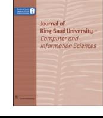
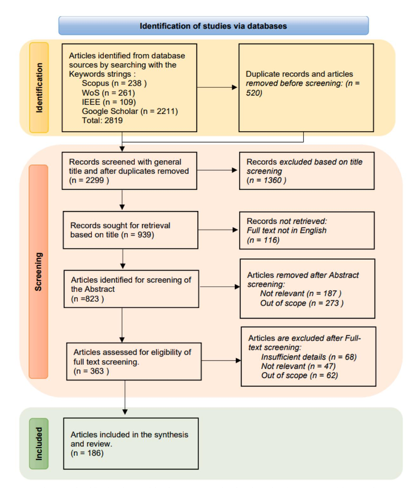
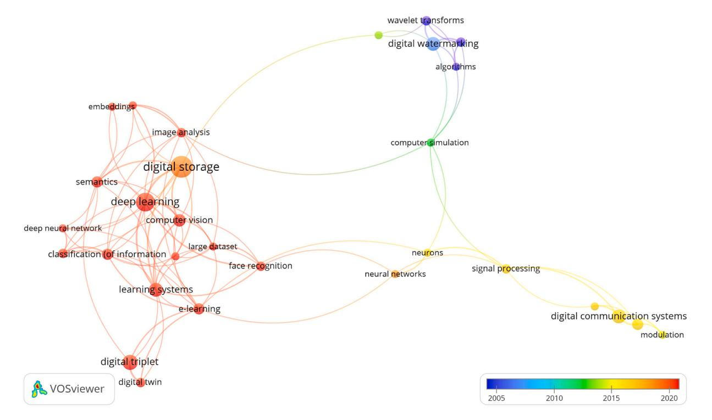
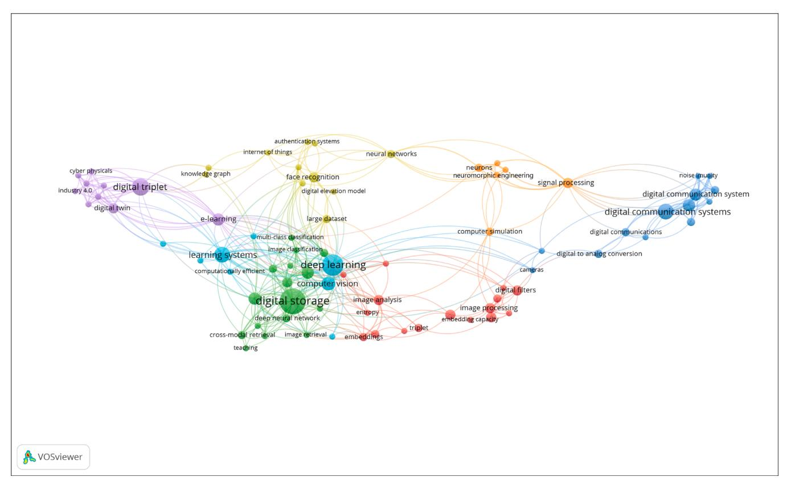

HOSTED BY Contents lists available at [ScienceDirect](www.sciencedirect.com/science/journal/13191578)

<!-- Image Description: The image is a text-based header stating "Journal of King Saud University - Computer and Information Sciences". It's not a diagram, chart, graph, or illustration; rather, it identifies the publication where the paper containing the image appears. The purpose is to provide proper attribution and context for the academic work. -->

journal homepage: [www.sciencedirect.com](https://www.sciencedirect.com)

Review Article

# The resurrection of digital triplet: A cognitive pillar of human-machine integration at the dawn of industry 5.0

Hassan Alimam \*, Giovanni Mazzuto, Nicola Tozzi, Filippo Emanuele Ciarapica, Maurizio Bevilacqua
*Department of Industrial Engineering and Mathematical Science DIISM, Universita*`*Politecnica delle Marche UNIVPM, 60131 Ancona, Italy*## ARTICLE INFO

# ABSTRACT
*Keywords:*Digital Triplet*D3*Cognitive Digital Twin*CDT/DT*Artificial Intelligence*AI*Human-Machine Integration Brain-Computer Interface*BCI*  Industry 5.0

The integration of AI technology with digital transformation has profoundly shaped the evolution towards digital triplet architecture, grounded in human-centric methodologies. By infusing human intellectual activities into both physical and cyberspace, innovative links between humans and machines are established. Despite limitations in transitioning from tangible human presence to the digital realm in cyberspace, extensive efforts are underway to harness emotional, visual, and oral responses, thereby enhancing the reasoning and predictive capabilities of digital twins. These advancements aim to elevate real-time human interactions with physical and virtual systems by integrating intelligent AI algorithms and cognitive computing systems into digital twins. This paper meticulously analyses recent trends in digital twins, tracing their evolution from traditional concepts and applications to a nuanced digital triplet hierarchy that incorporates human intuition, knowledge, and creativity within cyberspace. we delve into the hierarchical framework of the digital triplet, resonating with maturity, domination, and volition levels, enhances cognitive and perceptual capabilities in cyberspace. The study provides a systematic overview of the development of ultra-realistic digital models, incorporating real-time data-driven artefacts that integrate intelligent activities with multidomain, multiphysics, and multiscale simulations. The research scope is focused on augmenting the perceptive and heuristic capabilities of the digital triplet framework by utilizing AI in data analytics, retrieving heterogeneous data from virtual entities using semantic artificial intelligence technologies, and amalgamating AI and machine learning with human insight and perceptual knowledge. The proposed digital triplet hierarchy aims to enhance cyberspace's capacity for learning, cognitive skills, and knowledge transfer. It can be a guideline for the researcher to promote cognitive augmentation of the human brain through brain-machine/computer interface, virtual, augmented, and extended reality, fostering a symbiotic relationship between humans and machines in the industrial metaverse and industry 5.0. The paper discusses future directions for research and the challenges involved in developing intelligent digital twins towards the digital triplet paradigm, aiming to embody intelligent activities and cognitive capabilities within the framework of human–machine symbiosis.

# 1. Introduction

In recent decades, tremendous advancements have occurred across various technological domains, such as the Industrial Internet of Things (IoT), Cloud computing, sophisticated sensors and actuators, and Artificial Intelligence (AI) ([Errandonea et al., 2020; Munir et al., 2023](#page-25-0)). These innovations have fundamentally altered the digital evolution of a multitude of systems, assets, and processes in diverse industries

([Errandonea et al., 2020\)](#page-25-0). These progressions have transformed industrial operations, profoundly enhancing their efficiency, productivity, and overall performance.

Digital technologies, known as the key components of the fourth industrial revolution or I 4.0, enable the simple conjunction of concatenated smart technologies within the new generation of industrial systems [\(Da Xu et al., 2018; Liao et al., 2017; Melesse et al., 2021; Vial,](#page-24-0)  [2019; Tao et al., 2019](#page-24-0)). Smart technologies, such as the Internet of

\*Corresponding author.

<https://doi.org/10.1016/j.jksuci.2023.101846>

Received 7 July 2023; Received in revised form 19 October 2023; Accepted 14 November 2023

Available online 15 November 2023

<!-- Image Description: That's not a technical image; it's the cover of the *Journal of King Saud University - Computer and Information Sciences*. The image shows a journal cover with the journal's title and publisher logo. There are no diagrams, charts, graphs, equations, or technical illustrations. The image provides context by showing the publication venue of the referenced academic paper. -->

Peer review under responsibility of King Saud University. Production and hosting by Elsevier.
*E-mail addresses:*[h.alimam@pm.univpm.it](mailto:h.alimam@pm.univpm.it) (H. Alimam), [g.mazzuto@staff.univpm.it](mailto:g.mazzuto@staff.univpm.it) (G. Mazzuto), [nicolatozzi90@yahoo.it](mailto:nicolatozzi90@yahoo.it) (N. Tozzi), [f.e.ciarapica@staff.](mailto:f.e.ciarapica@staff.univpm.it)  [univpm.it](mailto:f.e.ciarapica@staff.univpm.it) (F. Emanuele Ciarapica), [m.bevilacqua@staff.univpm.it](mailto:m.bevilacqua@staff.univpm.it) (M. Bevilacqua).

1319-1578/© 2023 The Author(s). Published by Elsevier B.V. on behalf of King Saud University. This is an open access article under the CC BY-NC-ND license [\(http://creativecommons.org/licenses/by-nc-nd/4.0/\)](http://creativecommons.org/licenses/by-nc-nd/4.0/).

Things (IoT), digital twins (DTs), big data analytics (BDA), and cloud computing (CC), play a crucial role in flourishing the cyber-physical systems (CPS), which form the core and foundation of Industry 4.0 ([Sahoo and Lo, 2022; Borangiu et al., 2023; Tao et al., 2019; Wang et al.,](#page-27-0)  [2016\)](#page-27-0). CPS is a multidimensional and complex system that aggregates the physical world with 3C cyber components, which encompass control, computing, and communication. The second stage, after 2000, of manufacturing evolution, known as "smart manufacturing," was fulfilled by leveraging networking and enabled by improved digital models to adapt to dynamic environments [\(Tao et al., 2019; Liao et al., 2017;](#page-27-0)  [Zhou et al., 2018](#page-27-0)).

The next stage in smart manufacturing, known as Intelligent manufacturing, will emerge after 2020. This advanced manufacturing process will incorporate artificial intelligence, big data, and IIoT to amalgamate the knowledge and creativity of human factors with machine learning (ML) for better integrations of humans, physical world and cyberspace [\(Zhou et al., 2018; Zhou et al., 2019; Wang et al., 2021](#page-28-0)). This advanced manufacturing process is increasingly trending in the literature, referring to intelligent activities with human cyber-physical systems in the context of Industry 4.0 [\(Tao et al., 2019; Zhou et al.,](#page-27-0)  [2019; Wang, 2019\)](#page-27-0). Recently, research and industrial communities have been arousing more attention to smart networking and intelligent digitalization to upgrade society and industry with deep integration of cyber-physical systems, advanced cyber technologies, machine learning, and artificial intelligence [\(Zhou et al., 2019; Wang et al., 2021; Zhou](#page-29-0)  [et al., 2020\)](#page-29-0).

These technologies facilitate the smooth integration and coordination of physical, virtual, cyber, and network entities, leading to rapid advancements in modeling virtual replicas of the corresponding physical entities. In this context, intelligent monitoring of assets has played a crucial role in the evolution of the digital twin concept ([Onaji et al.,](#page-26-0)  [2022; Catarci et al., 2019](#page-26-0)). Digital twins, serving as enablers of Industry 4.0, contribute significantly to the ongoing advancement of smart systems in conjunction with other intelligent and smart technologies [\(Wang](#page-28-0)  [et al., 2021](#page-28-0)). The combination of digital twins with these advanced technologies enhances the capabilities of industrial systems, paving the way for improved efficiency, productivity, and innovation [\(Melesse](#page-26-0)  [et al., 2021; Tao et al., 2019; Tao et al., 2018; Uhlemann et al., 2017](#page-26-0)).

Digital twin inevitably embraces the generation of a digital imitating and mirroring of physical entities. It can adapt to conversions in the real environment or operations while affording the best possible outcome. It improves data flow and collaboration between the virtual counterpart and their physical twin by means of digital transmission protocols or the Internet of Things (IoT) [\(Enders, 2017](#page-25-0)). Despite the fact that research communities and industrial sectors have introduced several definitions to describe the concept of DT- incidentally, up to date, there is no clear vision of DT definition to be elucidated with the viable digital transformation and critical flourishing from the fourth industrial revolution I 4.0 towards the fifth industrial revolution I 5.0 ([Uhlemann et al., 2017;](#page-28-0)  [Trauer et al., 2020; Eramo et al., 2022; Mourtzis et al., 2022; Olaniba](#page-28-0)  [et al., 2023\)](#page-28-0).

The majority of Industry 4.0 research has focused on employing digital twins for smart automation and adaptable manufacturing, utilizing them as digital simulators to generate computable virtual abstractions of Cyber-Physical Systems (CPS). This approach emphasizes the simulation aspect, rather than viewing Digital Twins as multifaceted interfaces capable of providing realistic digital depiction of processes, systems, and even operators or assets with viable fidelity ([Aheleroff](#page-24-0)  [et al., 2021; Phuyal et al., 2020; Montini, 2022\)](#page-24-0). DT imparts real-time information to engineers and assists operators in helping them transfer their knowledge and creativity with digital transformation for critical transformation in the context of Industry 4.0 from traditional digital manufacturing to smart and intelligent manufacturing ([Tao et al., 2019;](#page-27-0)  [Alves et al., 2023; Ghosh et al., 2020\)](#page-27-0).

Consequently, in the context of Industry 5.0, Digital Twins (DT) play a pivotal role as prominent bi-directional dynamic mappings that transform physical systems and associated processes into virtual environments within the realm of h-CPI (human cyber-physical integration), which serves as the cornerstone of smart manufacturing. This contribution underscores the significance of artificial intelligence and machine learning, acting as crucial precursors and catalysts for intelligent manufacturing. This transformative process is poised to shatter barriers across all levels of the Product Life Cycle (PLC) [\(Friederich et al., 2022](#page-25-0)), enabling real-time monitoring, control, and management of physical entities. It empowers the generation of intelligent and autonomous decisions, positively influencing every aspect of the manufacturing process. Therefore, the evolution from the flourishing Industry 4.0 era towards Industry 5.0 necessitates a synergistic and dynamic integration of humans and machines, marked by complexity and agility, as highlighted in references ([Tao et al., 2019; Zhou et al., 2019; Aheleroff et al.,](#page-27-0)  [2021; Alves et al., 2023; Kaasinen et al., 2022; Xu et al., 2021; Rossi](#page-27-0)  [et al., 2024\)](#page-27-0).

Concretely, in the integration of industry 4.0 reference architecture with the S/I5RA framework of Industry 5.0 and Society 5.0, digital transformation (DX) with data-based technologies such as ML, 5G, and industrial Internet of things (IIoT) can be dedicated to improving the intelligent activity in the CPS and enhancing the collaboration of the CPS with humans and at all levels in which the industry 5.0 and the Operator 4.0 paradigms elucidate the human–machine symbiosis framework for pairing human and machines to optimize process efficiency ([Montini, 2022; Romero and Stahre, 2021](#page-26-0)), enhance the problem-solving literacy and intensively affording imperative support for all activities in the smart factory ([Umeda et al., 2022\)](#page-28-0), including planning, design, operation, maintenance, continuous improvement and management [\(Zhou et al., 2020; Xu et al., 2021; Fernandez](#page-29-0) ´ et al., 2019; [Sparrow et al., 2019; Gerber et al., 2020; Tran et al., 2022; Romero et al.,](#page-29-0)  [2017; Villalba-Diez and Ordieres-Mer](#page-29-0)´e, 2021; Yin et al., 2015). Therefore, to realize this integration, recognizing human consciousness as a valuable and insightful source of information, the digital twin paradigms integrating cognitive skills and intelligent activities were developed in several research in both academia and industry. In this context, two paradigms have surged in major countries and developed by academic and industry researchers towards describing the integration of human knowledge and creativity with intelligent digitalization: cognitive digital twin CDT and digital triplet D3 [\(Lutters and Damgrave, 2019; Lutters](#page-26-0)  [et al., 2019; Umeda et al., 2019; Umeda et al., 2020; Umeda et al., 2021;](#page-26-0)  [Gichane et al., 2020; Sjarov et al., 2020; Alimam et al., 2023; Jinzhi](#page-26-0)  [et al., 2022; Kharlamov et al., 2018; Zeb et al., 2022; Goto et al., 2021](#page-26-0)).

The Digital Triplet D3, an advanced iteration of digital twin technology, incorporates Artificial Intelligence (AI) and Machine Learning (ML) based on human knowledge and awareness. D3 introduces an additional intelligent activity layer that represents the analysis, decision-making, and enhanced execution carried out through human understanding of technological advancements. This paradigm allows digital twins to develop perceptual abilities, enabling them to anticipate the current and future states of their physical and digital counterparts.

Since 2018, the Digital Triplet architecture has been actively integrated into digital systems by various research centers, conference communities, and mechatronic training centers in countries such as Japan, Netherlands, South Africa, Germany, Kenya, and Italy. This implementation stems from a development cycle wherein deploying the Digital Triplet concept results in a sophisticated hierarchy of complex digital twins. This is achieved by integrating holistic knowledge interoperability into a virtual environment within the human cyber-physical system (h-CPI). This integration embraces the aggregation of machine learning with human insight and perceptual knowledge in the realm of intelligent activity within cyberspace [\(Lutters et al., 2019; Alimam et al.,](#page-26-0)  [2023; Goto et al., 2021; Subramanian et al., 2021\)](#page-26-0).

Whereas, the Cognitive Digital Twin (CDT) represents the perspicacious imitating and insightful evolution of digital twins, aligning with a sophisticated computable virtual abstraction of systems [\(Jinzhi et al.,](#page-25-0)  [2022; Kharlamov et al., 2018; Ullah, 2020; Sharif Ullah, 2019](#page-25-0)). It excels in integrating and retrieving diverse data from virtual entities using semantic artificial intelligence technologies such as*meta*-heuristic algorithms, knowledge graph, semantic web, ontology, reinforcement learning, knowledge discovery, and deep learning ([Ghosh et al., 2020;](#page-25-0)  Banerjee et al., 2017; B´[ecue et al., 2020; Ghosh et al., 2019; Ullah et al.,](#page-25-0)  [2013; Acosta et al., 2019; Lu et al., 2022; Ullah, 2019](#page-25-0)). These technologies empower the cognitive capabilities of interconnected digital models, transforming the cognitive entity into a dynamic phenomenon that encompasses stochastic dynamical virtual models, knowledge graph models, and historical data. This intricate approach enhances the system's management capability complexity, providing robust support for decision-making throughout the system's entire lifecycle (B´[ecue et al.,](#page-24-0)  2020; Zheng et al., 2021; D'[Amico et al., 2022; Du et al., 2020\)](#page-24-0).

Pursuant to the rationales and motivations outlined in the introduction, this paper anticipates to significantly influence the definition of digital twins within the paradigm of intelligent manufacturing systems. The evolution from digital twins to digital triplet architecture, rooted in human-centric approaches, signifies a transformative digital shift in both intelligent manufacturing and human cyber-physical systems. Derived from numerous examples of research initiatives and applications from various sectors and perspectives, this paper is contrived at deducing and clarifying significance of the digital triplet architecture in the emergence of Industry 5.0. It also explores the contribution of intelligent digital twin concepts to the digital triplet paradigm, symbolizing intelligent activities and cognitive capabilities within the framework of human–machine symbiosis. Considering these points, this article addresses the following research questions:

- 1. What are the definitions of Digital twins DT, Cognitive digital twins CDT, and Digital triplets D3 that have been published in the literature?
- 2. What cardinal respects should be resonated with cognitive/intelligent digital twin for the critical transition from traditional digital twin to digital triplet?
- 3. What are the application domains in which human–machine integration has been enhanced and developed by the digital twin?
- 4. What is the better concept for digital transformation in the context of Industry 5.0?

We define from the above the profound impact of integrating AI technology with digital transformation on defining digital twins within intelligent systems. This evolution towards digital triplet architecture, rooted in human-centric approaches, represents a transformative shift in both intelligent and human cyber-physical systems. By infusing human intellectual activities into physical and cyberspace, innovative connections between humans and machines are forged. However, the shift from tangible human presence to the digital realm in cyberspace has been limited thus far. Extensive efforts are being made to harness emotional, visual, and oral responses, enhancing the reasoning and predictive capabilities of digital twins. These advancements aim to enrich real-time human interactions with both physical and virtual systems by incorporating intelligent machine-learning algorithms and cognitive computing systems into digital twins. Drawing on diverse research initiatives and applications across various sectors, this paper elucidates the significance of the digital triplet architecture in the emergence of Industry 5.0. It examines the contribution of intelligent digital twin concepts to the digital triplet paradigm, embodying intelligent activities and cognitive capabilities within the framework of human–machine symbiosis. This endeavour strives to achieve a system inspired by brain intelligence within the digital triplet paradigm.

The main contributions of this paper can be summarized as follows:

• We deliberated the identification of key co-occurring keywords such as "Digital triplet" or "Intelligent digital twin," "Artificial intelligence and Digital twin," "Cognitive digital twin," and "Digital twin and human–machine symbiosis/integration," as well as "Digital twin and Industry 5.0," and definition of the most frequent research topics related to Industry 5.0 and digital twins.

- We delved into the distinctions between digital twins and simulations, exploring the historical background and evolution of the digital twin concept.
- We traced the transition from the traditional model of digital twin to the advanced stages of the cognitive digital twin.
- We discussed the integration of intelligent activities and cognitive capabilities with current and previous digital triplet paradigms.
- We clearly defined the concept of digital triplet.
- We elaborated on a framework with hierarchical levels ("Maturity, Domination, Volition") of the digital triplet, aiming for Industry 5.0.
- We determined the enabling technology of digital triplets within the framework of human–machine symbiosis and brain-like intelligenceinspired systems.
- We discussed limitations and current research gaps in developing digital twins toward the digital triplet paradigm.

The portions of this paper are elucidated as follows: a bibliometric analysis of the literature in Section II, an introduction to the digital twin concept and an exploration of distinctions between digital twins and simulations in Section III. Section IV delves into the migration to the advanced stages of the cognitive digital twin, while Section V defines the contribution of intelligent activities within the digital triplet and clarifies the hierarchical levels ("Maturity, Domination, Volition") of the digital triplet striving for Industry 5.0. Section VI classifies and analyses enabling technologies of Intelligent digital twins based on application domains from the literature. Section VII explores the quest for a digital triplet hierarchy based on application domains within human–machine integration and the context of Industry 5.0. Lastly, Section VIII addresses limitations and knowledge gaps in developing the digital triplet hierarchy, followed by the concluding remarks in Section IX.

# 2. Research strategies and methods

In order to compile this review, we conducted extensive searches using major scientific search engines, databases, and digital libraries, including Scopus, Web of Science, Google Scholar, and the IEEE Xplore databases. The purpose was to locate significant scientific research publications related to digital triplets and Industry 5.0 enabling technology based on digital twins. We adhered to the "PRISMA" (Preferred Reporting Items for Systematic Reviews and Meta-Analyses) principles for conducting this review, ensuring a rigorous and systematic approach to their review process. The search encompassed articles published between 2018 and July 2023, focusing on keywords and terms associated with digital triplet, the digital twin concept, and Industry 5.0. These keywords included, among others, phrases such as "Digital triplet" or "Intelligent digital twin," "Artificial intelligence and Digital twin," "Cognitive digital twin," and "Digital twin and human–machine symbiosis/integration," as well as "Digital twin and Industry 5.0." The search strategy was designed to include press releases and articles from scientific journals or conference proceedings, ensuring a comprehensive understanding of successful case studies the development of intelligent digital twin and digital triplet paradigm. Notably, report and conference abstracts were excluded from the search, emphasizing a focus on in-

## Table 1

Search terms and corresponding number of selected data.

| Keyword combinations:                                                                                                                                                | IEEE          | Web of Science | Google Scholar | Scopus          |
|----------------------------------------------------------------------------------------------------------------------------------------------------------------------|---------------|-------------------|-------------------|-----------------|
| Digital Twin and Digital Triplet Cognitive Digital Twin Digital Twin and Industry 5.0 including Digital twin and human–machine symbiosis/ integration | 4 75 30 | 9 191 61    | 98 283 1830 | 20 137 81 |

depth, peer-reviewed academic content. In [Table 1.](#page-2-0) We provided specific details regarding the search terms used and the corresponding number of search results, demonstrating transparency in their methodology. Additionally, the authors independently conducted the search, further enhancing the credibility of the review process.

The search process involved several steps, as outlined in Fig. 1. Initially, duplicates were removed using Mendeley reference management software, leaving a total of 2299 unique papers. Subsequently, each paper underwent two general screening steps: first with its title and then with its abstract, to determine the relevance of the research

outcomes. After these screening steps, 186 papers were identified as relevant. The authors independently classified these 186 papers based on their level of relevance. In cases where there was ambiguity regarding the classification of a specific paper, at least two authors engaged in discussions to resolve the ambiguity and assign an appropriate classification. This rigorous classification process ensured the accuracy and integrity of the selected papers for the review.

For retrieving peer-reviewed articles, bibliometric analysis was utilised with relevant input data obtained from the comprehensive databases Scopus and Web of Science. The literature search was conducted

<!-- Image Description: This flowchart details a systematic review's study selection process. Starting with 2819 articles identified across four databases, it illustrates the exclusion of articles at each stage: duplicate removal (520), title screening (1360), retrieval issues (116), abstract screening (460), and full-text screening (177). The final synthesis included 186 articles. The numbers at each stage represent the count of articles at that point in the process. -->

**Fig. 1.**The PRISMA-based flowchart diagram of the selection process for describing the conducted scoping review of the retrieved resources.

online in March 2023 using the following search query: "Digital & Twin & Industry 5.0″ from the Scopus database. The study's publication year range was limited to 2018–2023 to concentrate on outcomes related to Industry 5.0. This decision was based on the fact that the initial efforts to implement Industry 5.0 as an extension of Society 5.0 were initiated in 2015, primarily by the Japanese Government. Furthermore, the first online discussions and publications on Industry 5.0 were introduced in 2018 ([Fukuyama, 2018\)](#page-25-0). A preliminary inquiry conducted on Scopus pertaining to the themes of digital twins and Industry 5.0 compiled a cumulative count of 54 scholarly articles. The title-ABS-key is "Digital & Twin & Industry 5.0″ and the preponderance of the records pertains to the fields of computer science, engineering, mathematics, and manufacturing. The aforementioned publications consist of 25 articles published in academic journals, 3 papers that underwent a review process, 18 papers presented at academic conferences, and 8 reviews of conference proceedings. Subsequently, CSV files will be accomplished through the conversion of the database in order to facilitate the visualisation and analysis of bibliometric data using the VOS viewer software. Concretely, VOSviewer facilitates the extraction of keyword maps by utilising shared networks, thereby enabling the construction of maps with a vast number of keywords.

A co-occurrence map comprising 189 keywords was compiled by prioritising the top 109 most frequently used keywords with the greatest co-occurrence in the database pertaining to the concepts of "Industry 5.0," and "Digital Twin". Fig. 2 indicates the outcomes through the interpretation of the keyword cluster map. The top 109 items were categorised into nine clusters based on their frequency of occurrence in classified hot nodes. The red cluster encompasses a total of thirty-five distinct items, namely digital twin, society 5.0, human cyber physical system, blockchain technology, explainable artificial intelligence, virtual data set, extended reality, human cantered manufacturing, human

machine interaction, human robot interaction, metaverse, personalization industry 5.0, industrial internet of thing, semantic reasoning simulation, virtual commissioning, cobots, crane, dielectrics, virtual reality, digitization of the industries, deep learning, data models, computational modelling, deep learning, machine learning, smart manufacturing, manufacturing, management, optimisation, a system of things, simulation, IoT and architecture. The red cluster illustrates the digital twin concept as the highest frequency of occurrence with a large node. The assemblage of the keywords related to industry 5.0 denoted as the "yellow cluster" encompasses a total of twenty-two distinct concepts, namely Industry 5.0, industrial metaverse, human digital twin, human intelligence, consensus protocol, cyber physical system, industrial internet of things, machine learning, cognitive, smart manufacturing, operator 5.0, security, food security, smart contract, privacy, human cyber physical system, extended reality, human centric manufacturing, human in the loop, CPS, IIoT, and sustainability. The industry 5.0 concept is prominently represented by the yellow cluster, which is characterised by a large node and the highest frequency of occurrence. The green cluster encompasses distinct keywords indicates the related items to industry 4.0 context and the blue cluster replicates perpetual large size node related to digital twin, those clusters including as an illustration, among other keywords: industry 4.0, virtualization, industry 5.0, flexible assembly, 5 g, agent based simulation, confidential information, deterministic, digital human modelling, digital technology, digitization of the industries, discrete event simulation, disruptive technologies, ergonomics 5.0, explainable artificial intelligence, extended reality, human centric manufacturing, human in the loop, digital twin, big data analysis, building information model, cloud storage, control system, cyber physical system, edge cloud computing, human centred, knowledge graph, node-red, ontology, semantic, smart society, information, knowledge, and learning. In addition, the

<!-- Image Description: This VOSviewer network visualization depicts the relationships between keywords related to Industry 4.0 and Industry 5.0. Nodes represent keywords (e.g., "digital twin," "artificial intelligence," "Industry 4.0"), with node size indicating frequency. Edges connect related keywords, with edge thickness representing the strength of the relationship. The visualization highlights the central role of "digital twin" and its connections to various technologies and concepts across both industrial revolutions. It likely serves to illustrate the technological landscape and key themes within the paper. -->
**Fig. 2.**The co-occurring keywords of the cluster map in the field of digital twins and industry 5.0. Based on node size, the "Digital Twin," "Industry 5.0," and "Industry 4.0″ keywords are depicted as significant search terms. The curvatures that are associated with the nodes are obtained through co-occurrences within the same cluster, whereby the proportion of corresponding co-occurrences escalates as the distance between two nodes decreases. The vast bulge in node size, is the most listed frequency item.

moderate cooccurrence of the portion keywords is illustrated in the residual of five clusters "purple, orange, light blue, pink and brown clusters"- apropos of which, but not limited to, 6 g mobile communication, cyber physical human cantered system, edge computing, artificial intelligence, mist computing, human factors, knowledge and skills of the engineer, blockchains industries, augmented reality, robotics, deep reinforcement learning, human-robot interaction, MqTT, path planning, process control, cognitive systems, green manufacturing, supply chain, brownfield industry 4.0, operator 4.0, human digital twin, retrofitting, wearable devices, and intelligent space.

Moreover, to elucidate the essential components of coincident analysis pertaining to the overlay visualisation of the digital triplet concept. The VOS viewer software is used to generate a map based on the reviewed network data from the Scopus database, the title-ABS-key is "Digital & triplet". Any kind of network data can be used by this programme to generate maps, visualisations, and explorations. Moreover, the programme is employed to determine the interconnections of pivotal elements as proxies for the significance of systematic research. Overlay visualisation, as depicted in Fig. 3, was elected as a more effective method of investigating the relationships between the time scale elements and the selected vital items. In regard to the map, 34 key items encountered the threshold-apropos which, included digital triplet, deep learning, digital twin, artificial intelligence and learning systems, semantics, knowledge graph, neural networks, convolution neural network, e-learning, deep neural network, large dataset, classification, computer vision, image analysis, and embeddings, were classified as the vital key items with the highest incidence at average publications above the year 2020, indicating a new hotspot as digital triplet in the digital twin based artificial intelligence field. The distance between items indicates the strength of the relationship between them; the shorter the distance, the stronger the connection among them. A huge circle represents the item that appears in most publications on the map. Nevertheless, vital items were colour-coded based on the year of publication, with red circles indicating key items found in the most recent publications above the year 2020 and green circles with the items that appear in publications between the period of 2010–2015, indicating computer simulation as the most concepts refer to the digital twin.

In addition, to exemplify the wide range of research topics pertaining to the digital triplet paradigm. The breadth of the research topics pertaining to the digital triplet concept is depicted in [Fig. 4](#page-6-0) and derived from the CSV file generated by a total of 168 academic articles limited to the field of computer science and engineering indexed in the Scopus database pertaining to the themes of "digital triplet" since 2017 and up to March 2023. The recurrent pattern that is currently under investigation by scholars was unveiled through node size visualising. The authors' keywords served as a co-occurring cluster map. The recurrent pattern that is currently under investigation by scholars was unveiled through node size visualising. The vast bulge in node size observed in the co-occurrence analysis was primarily composed of frequently occurring keywords centred around terms related to digital storage, digital triplet, deep learning, learning systems, digital twin, and digital communication systems. Those nodes comprised 73 items that were categorised into 7 clusters. The most frequent co-occurrence keywords minted the following clusters: the green cluster with the hotspot of digital storage included: classification, codes cross-modal retrieval, deep neural network, deep neural networks, hash function, image classification, image retrieval, metric learning, multi-case classification, semantics, teaching, and triplet. The purple cluster of the digital triplet is the most frequent keyword that consists of the immediate items: cyberphysical system, cyber-physical, digital twin, e-learning, engineering process, industry 4, industry 5, artificial intelligence, neural network, intelligent activity, knowledge, kaizen, learning factory, and production system. And the light blue cluster includes deep learning, computationally efficient, computer vision, learning systems, object detection object recognition, speech recognition, and transfer learning. The residual clusters comprise concomitant keywords related to embedding capacity, entropy, feature extraction, brain-computer interface, wave late transforms, neuromorphic engineering, computer simulation, neurons, brain-machine interface, decision making, detection, discrimination, digital communication systems, digital elevation model, face

<!-- Image Description: This VOSviewer network visualization displays research topic relationships over time (2005-2020). Nodes represent research topics (e.g., "deep learning," "digital watermarking"), sized by frequency. Connecting lines indicate co-occurrence, with color representing the year of publication. The graph reveals clusters of related topics and their evolution over the period shown. It illustrates the interconnectedness of research areas within a specific field, potentially digital signal processing. -->
**Fig. 3.**Overlay visualisation as a coincident analysis of the pivotal items pertaining to the digital triplet concept. VOSViewer programme created the map from the Scopus database. The size of the circle was decided by the frequency of each vital item. According to the colour scale, the colours of the circles reflected the critical item's score since publication.

<!-- Image Description: This VOSviewer network visualization displays the relationships between keywords in a research field. Nodes represent keywords (e.g., "deep learning," "digital communication systems"), with node size indicating frequency. Connecting lines show co-occurrence of keywords, thicker lines indicating stronger relationships. The image's purpose is to illustrate the interconnectedness of concepts and research themes within the study's scope. Clusters of related keywords are visually apparent, highlighting major research areas. -->
**Fig. 4.**Co-occurrence cluster map, the co-occurring keywords related to "Digital triplet".

recognition, internet of things, knowledge graph, and large dataset.

# 3. The evolution of the digital twin definition

##*3.1. The digital twin concept*In responding to the initial query, we will delve into the distinctions between the digital twin and simulation. Additionally, we will explore the historical background and evolution of the digital twin concept, tracing its transformation from the traditional model to the advanced stages of the cognitive digital twin and digital triplet paradigms.

The notion of the digital twin was initially introduced within research communities in 2002, with a draft version of the technology roadmap proposed by NASA in 2010 ([Shafto et al.\)](#page-27-0); However, the research community has actively pursued the development of a virtual representation of physical assets for manufacturing activities throughout the entire product life cycle since as early as 1989. During this time, a research team at Osaka University made significant strides in this field by devising a proposal for virtual representations of physical assets. This proposal covered a wide range of aspects, including process modelling, time information modelling, responses to control commands, and the interconnection of physical systems. It entailed integrating product models and factory models within a real-time virtual manufacturing system, utilizing the Intelligent CAD framework and time information modelling, both implemented in both computer systems and the physical world ([Onosato and Iwata, 1993](#page-26-0)).

In a related development, the concept of Mirror Worlds preceded the digital twin idea in 1991. Introduced by David Gelernter, Mirror Worlds represented a replicated model of reality based on information transmitted from the actual world. It aimed to provide a lucid and humanistic understanding of software models interacting with reality [\(Gelernter,](#page-25-0)  [1992\)](#page-25-0).

Consecutively, a comparable concept, known as the "Mirrored

Spaces Model" (MSM), was introduced at the University of Michigan. Coined by Michael Grieves in 2002, this concept involved creating software models that imitate reality based on data input from the physical world. Grieves presented a model comprising three components: physical space, digital space, and a network and interaction mechanism for exchanging data and knowledge among physical assets and their digital counterparts. This framework was named the 'Mirrored Spaces Model'. It featured multiple virtual spaces corresponding to a single physical space, allowing for the exploration of various layout options ([Grieves, 2005\)](#page-25-0).

In 2003, Kary Framling ¨ and colleagues introduced an agent-based architecture to address the inadequacies in information transmission during the production process. This innovative architecture involved associating a virtual agent with each product item, thereby enhancing efficiency in "Product Lifecycle Management" (PLM) (Fr¨ [amling et al.,](#page-25-0)  [2003\)](#page-25-0). Eventually, in 2006, Grieves made modifications to the conceptual framework previously known as the "Mirrored Spaces Model", now termed the "Information Mirroring Model". This revised model placed significant emphasis on the bidirectional transmission mechanism. It not only enabled bidirectional communication but also facilitated the creation of multiple virtual spaces within a single physical space, thereby enhancing the system's capabilities ([Grieves, 2009\)](#page-25-0).

In the initial phases of the Digital Technology (DT) era, practical applications of digital twins were restricted due to technological limitations. These constraints encompassed factors such as limited or absent internet connectivity for devices, underdeveloped machine algorithms, insufficient data storage and management capacities, and low computing power. However, after 2010, NASA formulated a precise definition for the digital twin concept. They described it as a virtual copy or model of a physical entity, referred to as a physical twin, mimicking the state of its real counterpart through real-time data interaction ([Shafto et al.\)](#page-27-0). This marked a significant milestone in the evolution of digital twin technology.

This concept represents an evolution of its ancestral paradigm, which traces back to the Apollo program, where two identical space vehicles were constructed to mirror each other between space and Earth. This historical context laid the foundation for the digital twin concept. It was articulated as "an integrated multi-physics, multi-scale, probabilistic simulation of a vehicle or system that utilizes the best available physical models, sensor updates, fleet history, etc., to replicate the life of its flying twin." Following this conceptualization, the paradigm gained traction, especially in the realm of the US Air Force. They adopted Digital Twin technology for designing, maintaining, and predicting the performance of their aircraft. The proposed framework involved leveraging Digital Twin technology to recreate the physical and mechanical attributes of the aircraft, with the goal of predicting potential fatigue or structural issues. This proactive approach ultimately aimed to extend the aircraft's remaining useful life [\(Glaessgen and Stargel, 2012\)](#page-25-0).

Furthermore to ensure comprehensive control over aircraft throughout its entire operational life [\(Tuegel et al., 2011](#page-27-0)), a digital twin, described as an "ultra-high fidelity model of individual aircraft," was developed by E. Tuegel and colleagues. This digital twin model was not only instrumental for aircraft control but also held potential for future applications, including real-time monitoring of aeronautical vehicles and fostering sustainable space exploration initiatives.

Originally, the digital twin framework was proposed to anticipate the product life cycle, without necessarily encompassing the entire manufacturing process. However, based on literature findings, it is evident that before 2017, the digital twin concept primarily found application in product design. Since then, its scope has significantly expanded to cover the entire manufacturing life cycle. This expansion involves creating digital twins not only for products but also for manufacturing processes, system performance, and services ([Zhang and](#page-28-0)  [Zhu, 2019](#page-28-0)). Despite variations in definitions and descriptions, as highlighted in Table 2, the fundamental elements of the digital twin concept remain consistent across diverse industries and applications. While definitions may differ, the core concepts of digital twins are comparable, providing a foundational framework regardless of the specific industry or context.

In fact, since 2016, the concept of the digital twin has evolved into a strategy for establishing a collaborative, flexible, and integrated manufacturing environment. This achievement is made possible through a closed-loop, bidirectional communication platform that facilitates the simultaneous evolution of assets in three pivotal domains: within the physical realm, between the physical and virtual realms, and between historical and real-time data sources [\(Canedo, 2016; Gabor et al., 2016;](#page-24-0)  [Schroeder et al., 2016](#page-24-0)). All entities within the manufacturing system must be interconnected, monitored, and controlled utilizing state-of-theart automation technology, information technologies, network infrastructures, and software, collectively known as integrated physical assets. This interconnected framework forms the basis for the modern approach to manufacturing and underscores the importance of seamless integration across various technological domains.

A significant obstacle and challenge in achieving the objectives of smart manufacturing has been the seamless integration of the virtual realm with the actual operational space. The digital twin framework serves as a vital solution, providing the essential connectivity to effortlessly link data streams within a manufacturing chain. This bridging of the gap between the virtual space and the physical realm in real-time reshapes the dynamics of demand and supply, enabling the automation of tedious tasks related to information transfer within a system and governing how this information is perceived and transmitted. Assets in the digital twin framework include work-in-progress and active resources such as machinery, robots, workers, vehicles, intelligent devices, manufacturing equipment, sensors, and communication gateways. However, what sets digital twins apart during their development is their reliance on real-time data to accurately replicate system performance. This enables predictive, dominant, and intelligent activities. In contrast, computer models and simulations are primarily used to understand

### Table 2

|  |  |  | The digital twin concept across various industries and applications. |
|--|--|--|----------------------------------------------------------------------|
|  |  |  |                                                                      |

| No     | year         | reference                                              | definition                                                                                    |
|--------|--------------|--------------------------------------------------------|-----------------------------------------------------------------------------------------------|
|        |              |                                                        |                                                                                               |
| 1 2 | 2015 2015 | (Jos´e Ríos et al., 2015) (Bielefeldt et al., 2015) | "Digital counterpart of a physical product" "Multi-physical computational and ultra        |
|        |              |                                                        | realistic models associated with each                                                         |
|        |              |                                                        | unique aircraft and combined with known                                                       |
|        |              |                                                        | flight histories"                                                                             |
| 3      | 2016         | (Kraft, 2016)                                          | "An integrated multi-physics, multi-scale,                                                    |
|        |              |                                                        | probabilistic simulation of an as-built system, enabled by Digital Thread, that            |
|        |              |                                                        | uses the best available models, sensor                                                        |
|        |              |                                                        | information, and input data to mirror and                                                     |
|        |              |                                                        | predict activities/performance over the                                                       |
|        |              |                                                        | life of its corresponding physical twin"                                                      |
| 4 5 | 2016 2016 | (Canedo, 2016) (Gabor et al., 2016)                 | "Digital representation of a real object" "The simulation of the physical object to        |
|        |              |                                                        | predict its future behaviour"                                                                 |
| 6      | 2016         | (Schroeder et al.,                                     | "Virtual representation of a real product in                                                  |
|        |              | 2016)                                                  | the Cyber-Physical Systems context"                                                           |
| 7      | 2016         | (Boschert and Rosen,                                   | "A comprehensive physical and functional                                                      |
|        |              | 2016; Rosen, 2015)                                     | description of a component, product or                                                        |
|        |              |                                                        | system, which includes all information of the current and subsequent lifecycle             |
|        |              |                                                        | phases"                                                                                       |
| 8      | 2017         | (Grieves and Vickers,                                  | "A set of virtual information constructs                                                      |
|        |              | 2017)                                                  | that fully describes a potential or actual                                                    |
|        |              |                                                        | physical manufactured product from the                                                        |
|        |              |                                                        | micro atomic level to the macro geometrical level"                                         |
| 9      | 2017         | (Brenner and Hummel,                                   | "A digital copy of a real factory, machine                                                    |
|        |              | 2017)                                                  | and worker that is created and can be                                                         |
|        |              |                                                        | independently expanded automatically                                                          |
|        |              |                                                        | updated as well as being globally available                                                   |
|        |              |                                                        | in real-time"                                                                                 |
| 10     | 2017         | (Stark et al., 2017)                                   | "The digital representation of a unique asset (product, machine, service, product          |
|        |              |                                                        | service system or another intangible                                                          |
|        |              |                                                        | asset), that compromises its properties,                                                      |
|        |              |                                                        | condition and behaviour using models,                                                         |
|        |              |                                                        | information and data"                                                                         |
| 11     | 2018         | (Liu et al., 2018)                                     | "The digital twin is actually a living model                                                  |
|        |              |                                                        | of the physical asset or system, which continually adapts to operational changes           |
|        |              |                                                        | based on the collected online data and                                                        |
|        |              |                                                        | information, and can forecast the future of                                                   |
|        |              |                                                        | the corresponding physical counterpart".                                                      |
| 12     | 2018         | (Talkhestani et al.,                                   | "A Digital Twin is an always sync digital                                                     |
|        |              | 2018)                                                  | model of existing manufacturing cells that can be used to reduce time and risk of          |
|        |              |                                                        | reconfiguration by early detection of                                                         |
|        |              |                                                        | design or process sequence flaws of the                                                       |
|        |              |                                                        | system in virtual commissioning and                                                           |
|        |              |                                                        | simulation"                                                                                   |
| 13     | 2018         | (Tao, 2018)                                            | "A real mapping in the product life cycle of all constituents using physical data, virtual |
|        |              |                                                        | data and interaction data among them"                                                         |
| 14     | 2018         | (Eisentrager et al.,                                   | "digital model of a real object containing                                                    |
|        |              | 2018)                                                  | lifecycle that dynamically synchronized                                                       |
|        |              |                                                        | data in real-time, in order to gain                                                           |
|        |              |                                                        | knowledge that can be transferred to the real object"                                      |
| 15     | 2018         | (Zhuang et al., 2018)                                  | "Virtual model in the virtual world that                                                      |
|        |              |                                                        | can dynamically simulate its physical                                                         |
|        |              |                                                        | counterpart's characteristics, behaviour,                                                     |
|        |              |                                                        | life, and performance in a timely fashion"                                                    |
| 16     | 2018         | (Tharma et al., 2018)                                  | "A virtual reflection describes the exhaustive physical and functional                     |
|        |              |                                                        | properties of the product among the whole                                                     |
|        |              |                                                        | life cycle for data streaming of product                                                      |
|        |              |                                                        | information"                                                                                  |
| 17     | 2019         | (Biesinger et al., 2019)                               | "Digital twin is an automatic creation of a                                                   |
|        |              |                                                        | digital production system that should                                                         |
|        |              |                                                        | contain knowledge of the current cycle times of each station and production line           |
|        |              |                                                        | and integrate the data and information                                                        |
|        |              |                                                        | about each asset coming from the cyber-                                                       |
|        |              |                                                        | (continued on next page)                                                                      |
*H. Alimam et al.*

#### Table 2 (*continued*)

| No | year | reference               | definition                                                                                                  |
|----|------|-------------------------|-------------------------------------------------------------------------------------------------------------|
|    |      |                         | physical system on the shop floor for time reduction during the integration process of a new product" |
| 18 | 2019 | (Madni et al., 2019)    | "a virtual instance of a physical system                                                                    |
|    |      |                         | that is continually updated with the                                                                        |
|    |      |                         | latter's performance, maintenance, and                                                                      |
|    |      |                         | health status data throughout the physical system's life cycle"                                          |
| 19 | 2019 | (Kabaldin et al., 2019) | "A set of mathematical models together                                                                      |
|    |      |                         | with statistical methods and machine                                                                        |
|    |      |                         | learning characterizing in real-time the                                                                    |
|    |      |                         | different states of the equipment,                                                                          |
|    |      |                         | processes, and business framework in                                                                        |
|    |      |                         | production conditions"                                                                                      |
| 20 | 2019 | (Negri et al., 2019)    | "An integrated simulation of a complex                                                                      |
|    |      |                         | product/system through physical models                                                                      |
|    |      |                         | and sensor updates"                                                                                         |
| 21 | 2019 | (Liu et al., 2019)      | "a virtual object or a set of virtual things                                                                |
|    |      |                         | defined in the digital virtual space, which                                                                 |
|    |      |                         | has a relationship with real things in the physical space"                                               |
| 22 | 2019 | (Wang et al., 2019)     | "paradigm with online measurements that                                                                     |
|    |      |                         | are dynamically assimilated into the                                                                        |
|    |      |                         | simulation world for guiding the real                                                                       |
|    |      |                         | world adaptively in reverse"                                                                                |
|    |      |                         |                                                                                                             |

general trends and generate broad predictions. These models are rarely utilized to precisely represent the current state of a system in real time. The reason for this limitation lies in the absence of instant data, rendering these models or simulations inert. They cannot adapt or generate new predictions unless novel data is supplied to them.

Merely having real-time data is not sufficient for digital twins to function effectively. It is crucial that the data is automatically integrated into the digital twin, and the transition from physical to digital and vice versa is bidirectional. However, as highlighted in studies by Liu et al. and W. Kritzinger et al. [\(Liu et al., 2021; Kritzinger et al., 2018\)](#page-26-0), there are instances where academic papers refer to digital models or shadows as digital twins. These references often focus on the investigation and/or characterization of the 'Digital Model' or 'Digital Shadow', despite the authors' claims that these constructs were digital twin technologies. To address this issue, the key distinctions between digital twins and simulations are explained in the following section.

#*3.2. Digital twin and simulation*To gain a thorough understanding and comprehensive comprehension of the digital twin concept, it is imperative to clarify the relationship between digital twins and simulations within the broader context of digital transformation. Resolving the ongoing debates and establishing a clear understanding is essential. By defining and exploring the various viewpoints that exist, we can eliminate ambiguities in the debates and achieve a more comprehensive comprehension of the topic.

The profound transformation induced by digitalization in the industrial landscape is provoked by extensive data collection and analysis. This transformation operates within a paradigm that intricately intertwines and eminently integrates digital space, physical space, and cyberspace [\(Mourtzis et al., 2022; Aheleroff et al., 2021; Adel, 2022](#page-26-0)). At the heart of this transformation lies the digital twin, which essentially serves as a digital representation of real-time components, processes, systems, and even interconnected systems. It achieves this by harnessing and updating a continuous stream of real-time data acquired from Internet of Things (IoT) enabled devices in the physical space. This influx of data enables the digital twin to imitate and simulate the potential, current, and future interactions between the physical counterpart and its digital representation. This high-level information must be integrated with remarkable fidelity into digital replicas within virtual environments. The seamless synchronization of real-time data between

the digital space and physical realm should be achieved ([Aheleroff et al.,](#page-24-0)  [2021; Bohlin et al.; Boschert and Rosen, 2016; Hehenberger and Brad](#page-24-0)[ley, 2016](#page-24-0)). This synchronization forms the backbone of the digital twin, facilitating bidirectional and multiplexing data modulations between the tangible and its virtual counterpart. These interactions are vital, enhancing the simultaneous applicability of dynamic operations and ensuring sufficient synchronization of twins' interactions. This synchronization is contingent upon the aggregation of holistic real-time data through Cybertronics interfaces [\(Zheng et al., 2021; Fukuyama,](#page-28-0)  [2018; Shafto et al.; Boschert and Rosen, 2016\)](#page-28-0). In contrast, simulation serves as a static functionality and sedentary interface within a systemic approach, replicating potential real-world scenarios through "what-if scenarios" rather than replicating the current state and present circumstances (D'[Amico et al., 2022; Shafto et al.; Lu et al., 2020](#page-24-0)). The digital twin, on the contrary, demystifies not just what is happening, but also what might happen. It extends beyond design limits and boundary conditions, elaborating on the entire design and encompassing continuous macro activities and enhancing the simultaneous applicability of dynamical operations and sufficient synchronization of twins' interaction contingent upon adjacent aggregation of holistic real-time data. These activities include monitoring, execution, modification, adaptation, optimization, and domination the entire lifecycle of the system, process, and product in real-time. The digital twin, therefore, offers a comprehensive and dynamic understanding of the ongoing processes, providing insights that stretch beyond the scope of traditional simulation methodologies.

Prior to 2016, the research community regarded simulation as a fundamental enabling function of digital twins. This approach involved developing digital models that relied on mathematical equations and terminology to create reliable purely data-driven models. However, the essence of the digital twin lies in its virtual counterpart, which serves as the core. This virtual counterpart must encompass integrated Multiphysics, multidomain, multiscale simulations, creating an ultra-realistic digital model of the physical system and*meta*-model with high-accuracy data-driven elements rather than relying solely on physics-based models ([Schleich et al., 2017; Wright and Davidson, 2020; Nakagawa et al.,](#page-27-0)  [2021\)](#page-27-0). Expanding the interoperability of this virtual counterpart involves continuous efforts to minimize harm or deterioration. This includes generating, managing, and utilizing metadata, real-time data, and information obtained from reliable sources across the system's entire lifecycle. Through this approach, a digital surrogate model can be developed, which integrates seamlessly with the physical space, forming a comprehensive digital twin ([Wright and Davidson, 2020\)](#page-28-0). Even though the functionality and applicability of the digital twin are elaborately dedicated and derived from the previous clues, we can enumerate the wide margins that discriminate the digital twin against simulation:

- **Ultra-Realistic Digital Model:**Digital twins must encompass highly realistic digital models capable of imitating and emulating the physical world. These models should evolve with reliable fidelity, optimizing the interaction of data-driven digital artifacts by integrating multiphysics, multidomain, and multiscale simulations.
-**Dynamic Data Synchronization:**Synchronization between the digital twin and its physical counterpart, including components, subsystems, and systems of systems, will thrive with highly dynamic holistic data acquisition, optimisation, interpretation, preservation, and bi-directional data transmission. This encompasses real-time data, metadata, historical data, probabilistic data, and virtual sensor data. The digital twin should retain a high response rate and low latency of data transmission, integrating digital interfaces and data repositories in cyberspace. In this iterative retrieving of real time data, digital threads, acting as a shield for digital twin computation and network capability, must be streamlined to cope with AI and IoT in big data analytics and to enhance the maturity of digital twins.

-**Integration with Cyberspace:**With DT's unique framework and holistic functionality, it should not be limited to embedded software systems for simulation and monitoring. They should be seamlessly integrated with cyberspace, exceeding AI expectations. This integration contributes to the convergence of human insights and productivity within digital societies, fostering intelligent industry and smart cities in a metaverse environment ([Wang et al., 2022; Aloqaily](#page-28-0)  [et al., 2022](#page-28-0)). Incorporating artificial intelligence into data analytics, specifically digital threads, and leveraging advanced machine learning techniques and cognitive computing capabilities in the development of intelligent digital twins ([Saracco, Dec. 2019\)](#page-27-0)are especially pertinent to achieving cognitive abilities and a dominant framework [\(Bouachir et al., 2022; Zolotova](#page-24-0) ´ et al., 2020).
-**Leveraging Human Insights:**Digital twins should go beyond imitating their physical counterparts. They should leverage awareness and knowledge from humans for adaptation and influencing heuristics strengths, allowing them to transcend boundaries and sustain in different cyberspace domains [\(Wang et al., 2022; Saracco,](#page-28-0)  [2019](#page-28-0)).
-**Integration of Virtual and Augmented Reality:**Utilizing virtual reality and augmented reality technologies as a link between the physical, digital, and cyberspace realms, alongside AI, facilitates the convergence of human insights, knowledge, and productivity into the digital counterpart [\(Siemens, 2022\)](#page-27-0). This integration erases the distinction between the digital twin and its physical realm, leading to seamless integration [\(Saracco, 2019\)](#page-27-0). The symbiosis between digital twins, humans, and the intelligent activity world gives rise to a cyber-superorganism species referred to as a digital triplet [\(Aloqaily](#page-24-0)  [et al., 2022; Umeda, 2019; Wang et al., 2022; Saracco et al., 2019](#page-24-0)). This concept blurs the lines among physical, digital, and cyber worlds, forming a community of Cyberbiont through the industrial metaverse, specifically in Industry 5.0.

# 4. Cognitive digital twin

The Cognitive Digital Twin (CDT) epitomizes an amplified and elevated iteration of the Digital Twin (DT). With three essential constituents, the digital twin seamlessly reconciles the virtual and physical domains; the tangible world encompassing systems, subsystems, and components; the digital or virtual representation, also known as shadows; and the intricate interconnections that seamlessly bridge the virtual and physical domains.

Contrarily, CDT typically encompasses a multitude of DT models that encompass integrated semantics and topology definitions. In the realm of industrial systems, it is imperative for the CDT to incorporate digital representations of the diverse subsystems and components. It is noteworthy that each of these entities assumes a distinct status throughout the system's entire lifecycle. As evidenced in the literature, several researchers have investigated the viability of enhancing the cognitive abilities of digital twins using semantic technologies. In 2013, the Kitami Institute of Technology's research group [\(Ullah et al., 2013](#page-28-0)) pioneered the integration of human and machine cognition. Their approach aimed to enhance the heuristic capabilities of an internet-based semantic model of the manufacturing process for representing newly acquired knowledge. The model improved the machine's comprehensibility of the concept maps related to the system's knowledge [\(Ullah et al., 2013](#page-28-0)). Following that, Ahmed El Adl presented the inaugural notion of "Cognitive Digital Twins" during a prominent industry symposium in 2016 ([El Adl, 2016](#page-25-0)), In his discourse, he delved into the cognitive progression of Internet of Things (IoT) technologies and put forth the concept of Cognitive Digital Twins, elucidating their distinctive attributes and classifications [\(Jinzhi et al., 2022; Banerjee et al., 2017\)](#page-25-0). El Adl provided a precise definition of Cognitive Digital Twins as "a comprehensive digital counterpart, enhancement, and astute companion to its physical counterpart, encompassing all subsystems across its lifecycle and evolutionary stages." Subsequently, in 2017, during the

cognitive computing and artificial intelligence workshop held at IBM ([FarizSaracevic, 2017](#page-25-0)), a related term, denoted as CDT, emerged with distinct envisioned functionalities. These Cognitive Digital Twins leverage real-time data from Internet of Things (IoT) sensors and other pertinent sources to facilitate heuristic, logical analysis, automated adaptation, and reasoning thereby enhancing decision-making processes. Furthermore, Banerjee et al. conducted a thorough investigation into the capabilities of knowledge graph technology in supporting the flourishing of Digital Twins (DT) within the contrivance of intricate systems [\(Banerjee et al., 2017](#page-24-0)). Their study aimed to extract and infer knowledge from comprehensive data within production systems, demonstrating the potential of knowledge graphs as a valuable tool in this context. Moreover, during the year 2018, the amalgamation of knowledge graph and semantic modelling methodologies was employed to retrieve comprehensive data from intricate systems and augment the capabilities of digital twins to amalgamate exhaustive information ([Kharlamov et al., 2018](#page-26-0)), Kharlamov et al., the scholars behind this research, introduced a conceptual paradigm for an enriched digital twin that heavily relies on semantic modelling and ontologies. This framework facilitated the capture of the distinctive attributes and circumstances associated with a particular system, as well as its interconnectedness with other subsystems within a multifaceted domain. On the contrary, Boschert et al. embarked on a research endeavour that delved into a groundbreaking notion of digital twins attuned to capitalizing on knowledge graphs as a fundamental technology ([Rosen et al., 2018, 2019\)](#page-27-0). This innovative paradigm referred to as the next-generation digital twin (nextDT), posited that individual digital twin models in isolation lack the capacity to encompass all the requisite activities throughout the entirety of the lifecycle. During the early stages of a fleet's operations, this hybrid paradigm combines physics-based models with sensor data to optimize performance. As the fleet matures and gathers a substantial block of data, data-centric approaches become increasingly significant, and take on a heightened level of importance in enhancing decision-making and improving overall efficiency. Hence, the research strongly endorsed the integration of these models to efficiently tackle a diverse array of business goals, while harnessing the potential of knowledge graphs as a core technology to establish connections among simulated models and descriptive models by retrieving diverse data blocks. In the subsequent year, the authors [\(Rosen et al., 2019\)](#page-27-0) put forth a visionary perspective on the future of Digital Twin technology and delved into the economic aspects of the Digital Twin and explored whether it could evolve into a dynamic mechatronics ecosystem. The forthcoming iteration of the Digital Twin is envisioned to heavily rely on semantic technologies, such as ontologies, to establish seamless connectivity among diverse sources of information with flexible utilization of semantic technologies to empower a network of digital components by harmonious integration between the physical and virtual realms necessitated the effective synchronization of measured data, even when confronting with massive and intricate datasets, with their corresponding virtual representations.

Researchers embarked on an exploration of the notion of collaborative symbiosis between humans and machines, with a particular focus on a cognitive digital counterpart. In their study, fern´ andez et al (Fern´ [andez et al., 2019\)](#page-25-0). delved into the practical application of the cognitive digital twin as an Associative Cognitive Digital Twin (AC-DT). This framework sought to facilitate a seamless and harmonious convergence between the augmentation of human capabilities and the capabilities of machines, progressively enhancing intellectual capacity and awareness. The primary objective was to devise a cognitive architecture tailored to Symbiotic Autonomous Systems, leveraging a graph data model supporting artificial consciousness manifestation. This model played a pivotal role in developing a higher-level cognitive framework that catered specifically to critical safety systems, ensuring the precise execution of machine operations and process workflows. Additionally, there were dedicated investigations aimed at evaluating human safety aspects, with a particular emphasis on integrating human

cognition and behaviour into the environment of the Associative Cognitive Digital Twin. The cognitive digital twin (CDT) was characterized as a digital collaborative-based AI, possessing the heuristic capacity to acquire knowledge, dynamically adjust, and seamlessly assimilate diverse information sources to accomplish specific objectives (Fernandez ´ [et al., 2019\)](#page-25-0).

By 2020 [\(Lu et al., 2020](#page-26-0)), the capacity of digital twins to enhance decision-making in IoT system development was accomplished by Lu, Zheng et al. They availed the concept of Cognitive Twins, which referred to a Knowledge Graph (KG) oriented framework based on digital twins. This framework incorporated augmented ontology and semantic tendency to evaluate IoT systems and comprehend the evolution of virtual models, thereby enhancing the interconnectedness among these models. The Cognitive Twins (CT) approach was supported by Knowledge Graph frameworks, utilizing contemporary software and platforms to facilitate the integration of CT model components. The authors proposed CT as a solution to address the challenge faced by digital twins in identifying interrelationships across different domains. In the CT framework, each virtual model was assigned a timestamp at various stages of its lifecycle, distinguishing it from traditional digital twins.

To enhance the intelligent capabilities of a manufacturing system and enable autonomous decision-making, Ali et al. [\(Intizar Ali et al.,](#page-25-0)  [2021\)](#page-25-0), employed a framework comprising three tiers: access, analytic, and cognitive tier. The architecture aimed to transform conventional digital twins into intelligent agents capable of accessing, analysing, comprehending, and responding to their current state. The primary objective was empowering manufacturing resources to possess cognitive functions, such as critical thinking, knowledge acquisition, and understanding dynamic industrial environments. This was achieved through the integration of human cognition ([Intizar Ali et al., 2021\)](#page-25-0), AI technologies, and Semantic Web techniques. The cognitive tier, facilitated by domain expertise, edge computing and global knowledge bases ([Lu](#page-26-0)  [et al., 2020](#page-26-0)), played a pivotal role in enabling advanced cognitive functionalities. The cognitive digital twin (CDT) also established intricate communication networks to seamlessly integrate multiple digital twins, enabling autonomous decision-making processes.

Furthermore, Al Faruque et al. ([Al Faruque et al., 2021](#page-24-0)) inaugurates the concept of cognitive digital twins, which canvasses a significant advancement in the realm of digital twins. The authors propose Cognitive Digital Twins (CDTs) as an innovative approach for manufacturing systems, capitalizing on cutting-edge advancements in cognitive science, artificial intelligence, and machine learning [\(Lu et al., 2021](#page-26-0)). This paradigm avails digital twins to embody key aspects of human cognition, including attention, perception, and memory. By assimilating these cognitive capabilities, CDTs possess the ability to selectively concentrate on pertinent information, provoke meaningful depictions of data, fetch knowledge and encode data [\(Intizar Ali et al., 2021](#page-25-0)). This evolutionary stride in digital twin technology sets the stage for heightened abilities in decision-making and problem-solving within manufacturing systems, propelling us closer to the realization of Industry 4.0 goals. According to the literature, the Cognitive Digital Twin (CDT) is described as an enhanced digital replica that encompasses advanced cognitive capabilities. This evolution of the current Digital Twin (DT) concept aims to provide a more intelligent, comprehensive, and holistic representation of complex systems throughout their entire lifecycle. Semantic technologies, such as ontology and knowledge graphs, play a crucial role in empowering DTs with augmented cognitive abilities. These cognitive capabilities include perception, which involves continuously evolving representations of data related to the physical twin and its surrounding environment. Attention, another cognitive function, allows for selective focus on specific tasks, goals, or sensory information, either through intentional actions or in response to environmental cues and conditions. Memory is yet another cognitive function that encompasses the processes of encoding, storing, maintaining, and retrieving information. The reasoning is the cognitive process of deriving outcomes that align with a given starting point or set of conditions, while problem-solving involves identifying solutions for specific challenges or achieving desired objectives. Lastly, learning is the transformative process of converting the experiences of the physical twin into tacit knowledge, which can be applied to future encounters and situations.

# 5. Digital triplet

Digital twins embody a significant development in anticipating future system interactions and elucidating observed real-time performance of the operation. During the initial flourishing of the digital twin paradigm, the research community was delicate to duplicate a straightforward elucidation of the digital twin in contrast to the modelling and simulation. However, in the pursuit of a rejuvenated paradigm that encompasses heuristic abilities for advanced knowledge extraction and maturation, researchers and scientists have undertaken extraordinary endeavours to delineate novel concepts and paradigms of the digital twin. These endeavours aim to fulfil the demands for intelligent and cognitive capabilities, as well as the convergence of the intelligent world, digital world, and human interaction, forming what is referred to as the digital triplet.

Although the notion of the digital triplet remains nascent in the literature and lacks a lucid explication, the initial proposition of the 'digital triplet' paradigm emerged from a Japanese research team at the University of Tokyo, aiming to bolster intelligent activities with digital engineering operations. The pioneering work of Umeda et al. ([Umeda](#page-28-0)  [et al., 2022; Umeda et al., 2019; Umeda et al., 2020](#page-28-0)), introduced the term "digital triplet" or D3, referring to this concept. Recently, the digital triplet framework for integrating decision-making and incorporating the intelligent activity world of skilled engineers with the generalized production system consulting process model (GCPM) was proposed in the article ([Sato et al., 2023](#page-27-0)), in which the iterative framework facilitated a holistic comprehension of knowledge transfer and tools utilised in the entire process of energy-saving system improvements. For augmenting human's cognitive, perceptual capabilities during interactions between humans and robots, R. Niiyama and colleagues introduced the digital triplet framework. This framework facilitates the remote control of humanoid robots through Cybernetic avatars (CAs) ([Niiyama et al., 2023; Ishiguro, 2021\)](#page-26-0), encompassing both robotic and three-dimensional (3D) graphic avatars. These avatars, along with a suite of technologies, augment individuals' physical, cognitive, and perceptual capabilities. Notably, In the realm of digital twins, inflatable cybernetic avatar (CA) featuring a humanoid upper body and having the potential to serve as a bridge connecting the virtual cyber world with the tangible real world and function as the tangible representation of a virtual agent in the real world [\(Niiyama et al., 2023](#page-26-0)). Furthermore, to enhance the integration of individuals into cyberspace and effectively process, structure, and acquire human knowledge, a new generation of digital twins, evolving from the initial digital triplet concept, was introduced by N. Uchihira et al. ([Uchihira et al., 2023\)](#page-28-0) This innovative approach aims to enrich the behavioural and vital information related to human knowledge, with a specific emphasis on their interactions within physical environments. This goal is achieved by organizing "Gen-Ba knowledge", which encompasses not only explicit but tacit and latent knowledge [\(Nonaka and Takeuchi, 1995\)](#page-26-0), seamlessly blending the realm of human intellectual activities into both physical and cyberspace dimensions. The researchers employed an intelligent "voice messaging system (SVM)" to capture this "Gen ba knowledge" and digitally developed a human interface incorporating human data, including vital and behavioural aspects, within cyberspace [\(Uchihira et al., 2023;](#page-28-0)  [Uchihira and Yoshida, 2020\)](#page-28-0).

The digital triplet serves as a unifying framework that seamlessly integrates smart technologies with intelligent activities world within both the cyber and physical domains. It empowers engineers to streamline and enhance streamlined engineering procedures through digitization that encompasses both virtual and tangible realms. Furthermore, Dutch researchers at the University of Twente have put

forth a logical interpretation of the digital system reference in the context of production environments, conceptualizing it as a digital triplet ([Lutters and Damgrave, 2019; Lutters et al., 2019\)](#page-26-0). This paradigm elucidates the pivotal role and responsibility of the digital twin paradigm in facilitating predictive modelling, adaptive decision-making, and leveraging machine learning techniques to dedicate digital transformation. The intention behind these depictions is to demonstrate the significance of the digital twin paradigm's capacity to consolidate digital transformation. The three interconnected components correspond to the interactive paradigm that constitutes digital systems: the digital twin, encompassing an amalgamation of data, information, models, methods, tools, and techniques, serves as a faithful replication of the system. The digital prototype embodies the envisaged and desired state of the emulated system, while the digital master corresponds to the anticipated state of the system's validity, integrity and adaptation through the application of machine learning in imitating endeavours [\(Lutters and](#page-26-0)  [Damgrave, 2019; Lutters et al., 2019](#page-26-0)). This entails leveraging advanced algorithms and data-driven approaches to continually refine and optimize the system's performance, making informed decisions based on accumulated knowledge and feedback. Furthermore, the vital procedure of retrieving data from the offline testing environment to the online production facility involves redefining interfaces and standardizing the exchange of data, information, and knowledge between physical and digital systems. This ensures a smooth transition of knowledge acquired offline to real-world applications in a verifiable manner. To bridge the knowledge gap during digital system training and ensure the reliability of data transfer for real-time intelligent decision-making, E. Wescoat and colleagues ([Wescoat et al., 2023](#page-28-0)) introduced the Surrogate Digital Triplet framework. This framework incorporates a third system, known as the surrogate triplet, facilitating data transfer between the laboratory (offline) and production (online) environments. It refines the D3 paradigm proposed by Umeda et al., evolving into the Surrogate Digital Triplet with three distinct systems. The prementioned approach supports the training of digital and decision-making systems by assimilating additional data and knowledge from offline environments, similar to physical equipment. This augmentation enhances model confidence and accuracy by effectively addressing data and knowledge gaps. Moreover, the imperative need for automating and controlling embedded systems in real-time, without direct or indirect human intervene, is crucial, particularly in ensuring the safety of working environments, especially during the critical pandemic periods. This digitalised model is especially vital in tasks such as disinfecting laboratories and classrooms within university context. D. Niyonkuru and G. Wainer [\(Niyonkuru and Wainer,](#page-26-0)  [2021\)](#page-26-0)introduced a versatile platform that enables models to be utilized for simulation (in virtual time), visualization, or real-time execution, all rooted in the digital triplet concept, functioning as a discrete-event formal model tailored to the specific system. The digital triplet model draws upon information from digital twin models to evaluate students' comportment through releasing CO2 in classrooms. Additionally, it integrated digitalised automation studies of the entire system with a formal model for real-time embedded controllers ([Niyonkuru and](#page-26-0)  [Wainer, 2021\)](#page-26-0).

In addition, in the context of enhancing the cognitive capabilities of digital models and emulating human interactions with a product effectively and support human-centred product development. Digital triplet based cognitive modelling entails enabling mental planning of spatial transformative actions linked to object interactions. This new paradigm seeks to enhance spatial cognition by providing digital models with the ability to recognize objects in three-dimensional space and strategically plan interactions with these objects. In In this context, cognitive processes must incorporate perceptual dependencies to emulate human interactions with a product effectively and support human-centred product development ([Preuss, 2023; Preuss and Russwinkel, 2021](#page-27-0)). The authors of research paper [\(Preuss, 2023\)](#page-27-0) developed a comprehensive cognitive digital twin to integrate digital product systems and human digital twins. This cognitive digital twin comprises three key

components: a digital twin of the physical systems in real-time, a digital shadow for data retrieval, and a cognitive digital twin of human behaviour with reasoning and predictive capabilities for human interactions with both physical and virtual systems in real time.

The intelligent activities world and the master component of the digital system represent the elevated stages within the digital twin paradigm. These aspects signify the progression towards more sophisticated and intelligent capabilities. The digital triplet concept, originally conceived, is a manifestation of this evolutionary advancement, showcasing the implication of intelligence in the realm of digital systems. It emphasizes the integration of intelligent technologies and processes to enhance system performance and decision-making. Consequently, it promotes the convergence of the tangible, virtual, and cognitive realms, as well as human cognition, to propel visionary investigations into diverse research approaches for harnessing the intelligent and ingenious capabilities of this digital transformation. In our previous research conducted in 2023 ([Alimam et al., 2023\)](#page-24-0). We delineated the definition of the digital triplet concept as*an executable system encompassing a versatile and multifaceted digital interface, these interfaces undergo iterative revitalization to facilitate virtual deployment by ensuring the seamless real-time transmission of two-dimensional data, effectively integrating the realms of physical, digital, and cyberspace through appropriate digital twin to elevate the full potential of D3, and allowing for the anticipation of scalability, autonomy, innovation, optimization, and predictive analytics, to accomplishing the cognitive and perceptive potency with the comprehensive data aggregation by synergistically leveraging human cognitive capability, knowledge and creativity, artificial intelligence, and advanced machine-learning techniques*([Alimam et al., 2023\)](#page-24-0).

The authors expounded upon the prospective progression of digital systems in exerting heightened command over artificial intelligence (AI) and furnishing valuable semantic insights for discerning the Digital Triplet, D3. The proposed levels, as delineated by us ([Alimam et al.,](#page-24-0)  [2023\)](#page-24-0), can be succinctly encapsulated as follows:

- Volition: the perceptive level, this entails harnessing the human experience and ingenuity, coupled with the application of artificial intelligence and machine learning through the comprehensive aggregation of data to obviate the necessity for direct intervention in intricate decision-making and analytical tasks, synergistically harness the cognitive capability, and to attain complete autonomous validation and optimization of the process. It integrates human expertise and AI technologies to enhance its problem-solving and decision-making abilities. In which, the perceptive level learns from historical data, patterns, and experiences to improve its performance and provide valuable insights to establish a strong basis of cognitive capabilities and knowledge-based systems. The twin not only dominates its domain but also exhibits a sense of purpose and intentionality assigns initiative to drive progress and demonstrates selfawareness, autonomy, and the ability to align its actions towards achieving its objectives [\(Alimam et al., 2023\)](#page-24-0).
- Domination: This level signifies a seamless integration where the physical system is regulated and governed based on predictions derived from its virtual counterpart and real-time sensor inputs. This concatenated approach allows for fine-tuning and control of the physical system. It gains a deeper understanding of the system that imitates and becomes capable of autonomously controlling and optimizing various aspects ([Alimam et al., 2023\)](#page-24-0).
- Maturity: The iterative stage pertains to the real-time scrutiny and observation of the tangible actions demonstrated by the physical system, facilitated by the deployment of cutting-edge sensors. The data acquired from these sensors is subsequently utilized to emulate and imitate the system, ensuring a synchronized representation of its interaction in real-time. The interrelationship between domination and volition level lies in the progression from perception capabilities at the maturity level to cognitive abilities at the domination level and
*Journal of King Saud University - Computer and Information Sciences 35 (2023) 101846*finally to a higher level of autonomy and intentionality at the volition level.

• Sedentary: This duplicating level involves a meticulous replication process that encompasses the spark of consciousness of tasks in physical space. It entails visualizing and emulating their corresponding physical counterparts' virtual attributes and characteristics.

The term "perceptive" pertains to the digital twin's capacity to observe and comprehend the interactions within its surrounding environment. It encompasses the capability to anticipate future interactions by employing a broader range of cognitive abilities. This includes a heightened level of heuristics and reasoning, accompanied by an enhanced perception of maturity level. These abilities enable the digital twin to actively process information, draw conclusions, and make wellinformed decisions based on its cognitive capacities. In the context of achieving domination and volition levels, the term "perceptive" serves as an alternative concept to describe the digital twin's capabilities at this level. It encapsulates the discernment and interconnectedness among perception, cognition, and maturity, thereby encompassing the notions of domination and volition as a strict combination of intelligent activity ([Alimam et al., 2023\)](#page-24-0). The intelligent activity world encompasses the cognitive aptitude to seamlessly assimilate a diverse array of information and actively acquire knowledge to support the collaborative nature of digital-based artificial intelligence. This facilitates the functioning of the digital realm, where information is stored, processed, and communicated. The digital space primarily pertains to the revival and organization of data and information, encompassing digital files, databases, software systems, networks, and various other digital resources. The digital space is centred around the storage, transmission, and processing of digital data and content. Whereas a higher level of discernment and interconnectedness of intelligent activities world and digital realm serves as cyberspace to seamlessly augment the high level of intelligent communication, collaboration, and interaction among humans, digital space and physical space through an interconnected network of computer systems and the internet, facilitating digital communication and interaction. Cyberspace is a smart virtual environment that enables communication, collaboration, and interaction that encompasses the online world where human integrates into intelligent activities, and actively participate in smart virtual environments known as the metaverse.

# 6. Enabling technologies to enhance the intelligent activity and heuristic level of digital twin

In this section, we aim to address the second research question. In [Table 3](#page-13-0), we classified the enabling technologies of the highlighted digital twin according to the application domain and the definition proposed in 66 papers.

Based on the previous classification, advanced technologies such as artificial intelligence, cognitive computing, semantic technologies, augmented reality, brain-computer interface (BCI), and the Industrial Internet of Things (IIoT) play a crucial role in the development of intelligent industrial systems. These cutting-edge technologies are essential components for achieving intelligent industrial systems. In this regards, digital triplet is an extension of the DT, incorporating advanced levels of perceptive, volition and intelligence. Therefore, all the enabling technologies necessary for intelligent digital twins are equally vital for evolving the cognitive capabilities and perceptual abilities of the digital triplet. These technologies serve as the foundation upon which the digital triplet's advanced cognitive and perceptive functions are built, enabling a higher level of understanding and interaction within complex systems and environments in industrial metaverse.

#*6.1. The Industrial Internet of Things (IIoT)*

The Industrial Internet of Things (IIoT) encompasses the infrastructure that facilitates the gathering and transmission of data Through interconnected devices and sensors. This data is subsequently employed for monitoring and regulating industrial operations, with the aim of enhancing productivity, efficiency, and overall performance. In the integration of the digital space with the physical space into comprehensive IoT systems, establishing bi-directional communication with operational technology (OT) from the Industrial Internet of Things (IIoT) framework is crucial. This tailored approach ensures secure communication across the entire IIoT system (Edge-fog-Cloud) and fosters interoperability with other IP-based messaging methods like OPC-UA to MQTT ([Etz et al., 2020; Sierla et al., 2022; Dorofeev et al.,](#page-25-0)  [2020; Zeid et al., 2019](#page-25-0)). Achieving full integration of industrial IoT involves employing emerging technologies such as edge/fog computing, 5G, machine learning, and wireless sensor networks (WSN) [\(Ozdemir](#page-26-0) ¨ [and Hekim, 2018](#page-26-0)). This approach guarantees flexibility, scalability, and dependable computation, storage, and network capabilities, thereby enabling a wide array of intelligent activities. These activities culminate in the development of artificial intelligence of things (AIoT) applications ([Dai et al., 2022; Zhang, 2020](#page-24-0)), specifically enhancing the digital maturity of digital twins, which imitate the real physical assets in cyberspace [\(Aloqaily et al., 2022; Bouachir et al., 2022; Zhang and Tao,](#page-24-0)  [2021\)](#page-24-0).

The structure of IIoT enables interoperability for perceiving the physical world and transmitting the data of the digital twin in real-time, reliably, and efficiently through the wired or wireless network among the intelligent activity world, digital, and physical world. With tri tier structure of IIoT, the edge computing layer pertains to the computation of data at the periphery of a network, in proximity to the origin of the data in the physical world, in which the emulation of real-world behavior in real-time with minimal latency will be accomplished. Edge computing has the capability to perform real-time filtering, specification, and processing of data obtained from the physical world on edge devices. The immediacy of data processing enables retrieving the data to be utilized in real-time for prompting maturity in digital twins when the digital counterpart of the real system will leverage this data for training and testing cognitive capabilities. With this ability to transmit data with low latency, collaborative processing of data between cloud computing and edge computing layers will enhance data processing efficiency, minimizing cloud data load, and reducing data transmission delay. In which, retrieving data from the terminals of IIoT serves as input for the data at maturity levels of digital triplets.

Furthermore, the integration of diverse data sources and types, as well as the expanded storage needs of data generated from edge devices, necessitates efficient computing capacities within the realm of combined data IoT, cognitive computing, artificial intelligence, and machine learning [\(Singh et al., 2022\)](#page-27-0). To achieve this, a connection between physical systems and the social world must be established, leading to the development of an intelligent physical-cyber-social system ([Wu, 2014;](#page-28-0)  [Jalali et al., 2017; Bhat et al., 2023; Arunachalam et al., 2022](#page-28-0)). This requires a new paradigm within the cognitive internet of things, relying on edge intelligence and cognitive computing to create intelligent algorithms for sensing and analysing IoT big data in real time. This paradigm is essential to meet the 4C requirements: flexible communication to enhance interoperability among various networks and connected devices, scalable computing capable of handling diverse computation-intensive tasks to augment human communication with interconnected computational infrastructures, prompt decentralized control to support and enhance intelligent services and human–machine interaction, and a cognitive engine to achieve machine intelligence within the IoT connected world. In various research articles, the fusion of cognitive computing technology with data generated from Internet of Things (IoT) devices has led to the proposition of a cognitive internet of things (CIoT) framework. This framework emphasizes the vital role of

Twin (RT)"

## Table 3

Enabling technologies of digital twins highlighted in the literature based on the application domain and intended definition.

| No   | Definition                                                                                                                                                                                                                                                                                                                                                                               | Keywords                                                          | Reference                                                  | Application                                                                                                                                                      | Enabler                                                                                                |
|------|------------------------------------------------------------------------------------------------------------------------------------------------------------------------------------------------------------------------------------------------------------------------------------------------------------------------------------------------------------------------------------------|-------------------------------------------------------------------|------------------------------------------------------------|------------------------------------------------------------------------------------------------------------------------------------------------------------------|--------------------------------------------------------------------------------------------------------|
| 1    | "Approach for the management of the product models and data of all virtual and physical product instances along the entire product lifecycle, according                                                                                                                                                                                                                         | Virtual product twins                                          | (Abramovici et al., 2017)                               | Product lifecycle management (PLM)/ Cloud-based Smart Product reconfiguration                                                                              | Internet of everything IoX/ Cloud                                                                   |
| 2    | to the requirements of Smart Product reconfiguration processes" "3D acquisition with high performance processing tools that facilitate rapid generation of digital models for large production                                                                                                                                                                            | digital simulation                                                | (Arisoy et al., 2016)                                      | Simulation for production planning/ A data-driven approach for mimicking human interaction                                                                 | Machine learning, Multilayer Perceptron (MLP) / CAD                                              |
| 3    | plants and factories for optimizing and improving human operator effectiveness, safety and ergonomics" "a coupling of the production system with its digital equivalent as a base for an optimization with a minimized delay between the time of                                                                                                                       | Real-life model/digital twin                                   | (Uhlemann et al., 2017)                                    | Data acquisition with Multimodal / Cyber-Physical Production System (CPPS)/ System Optimizing CPS                                                          | Cloud-solution/IoT                                                                                     |
|      | data acquisition and the creation of the Digital Twin"                                                                                                                                                                                                                                                                                                                                |                                                                   |                                                            |                                                                                                                                                                  |                                                                                                        |
| 4    | "Emerging technology to achieve physical–virtual convergence"                                                                                                                                                                                                                                                                                                                         | Digital mirror model                                              | (Tao et al., 2018)                                         | Prognostics and health management (PHM)                                                                                                                       | Machine Learning/ Extreme Learning Machine (ELM)                                                    |
| 5    | "Evolved models with high fidelity, continuous interactions between physical and virtual spaces and fused data converging                                                                                                                                                                                                                                                       | Digital twin shop-floor (DTS)/ physical-virtual convergence | (Tao and Zhang, 2017)                                      | Smart Manufacturing                                                                                                                                              | Virtual Reality (VR)/Big Data Fusion/ Jupiter Tessellation/ Augmented Reality (AR)               |
| 6    | those two spaces" "Merging and effective method for real time interaction and further convergence between physical                                                                                                                                                                                                                                                           | Cyber and physical convergence                                 | (Tao et al., 2018)                                         | Product lifecycle management (PLM)                                                                                                                               | IoT/ Big Data Fusion                                                                                   |
| 7    | space and information space" "Ultra-high fidelity simulation characterised by their ability to accurately simulate events on different scales                                                                                                                                                                                                                                | Cognitive System/ digital twin model                           | (Gabor et al., 2016)                                       | Complex smart cyber-physical systems/Planning and prediction architectural framework                                                                    | Expert systems/Machine learning                                                                     |
| 8    | of space and time, based on not only expert knowledge, but also collecting data from all deployed systems of their type and thus aggregate the experience gained in the field" "Integrated multi-physics, multi-scale, probabilistic simulation of an as-built system, enabled by Digital Thread, that uses the best available models, sensor information, | Digital System Model/ Digital Thread                           | (Kraft, 2016)                                              | Analytical framework for aircraft's life cycle/Service life extraction/Real time modelling airframe of the multidomain system                           | Integrated Computational Structural Engineering (ICSE)/ Computational fluid dynamics (CFD) |
|      | and input data to mirror and predict activities/performance over the life of its corresponding physical twin"                                                                                                                                                                                                                                                                   |                                                                   |                                                            |                                                                                                                                                                  |                                                                                                        |
| 9,10 | "virtual substitutes of real world objects consisting of virtual representations and communication capabilities making up smart objects acting as intelligent nodes inside the internet of things and services"                                                                                                                                                        | Experimentable Digital Twin/Virtual Testbed                    | (Schluse and Rossmann, 2016; Grinshpun et al., 2016) | Soft Robotics/ holis tic development cycle for control engineering/safe working environment for man–machine interaction                              | Versatile Simulation Database (VSD)/The microkernel architecture                                 |
| 11   | –                                                                                                                                                                                                                                                                                                                                                                                        | Flexible digital twin                                             | (Guo et al., 2019)                                         | Smart Factory design including (Conceptual design, elaborate design and finalized design)/ Product Lifecycle Management(PLM)                            | IoT, Big data                                                                                          |
| 12   | –                                                                                                                                                                                                                                                                                                                                                                                        | Digital twin/ Information modeling                             | (Zhang et al., 2020)                                       | Intelligent manufacturing/ Hierarchical configuration of CPPS based on DT                                                                                  | Cloud Computing/ IIoT/AI/ Big Data                                                                  |
| 13   | "Embedded framework for cross system, discipline, and application development on a system level to gain insight into the complex system by having a bidirectional online data stream and interaction between human, digital counterpart, and Real                                                                                                                      | Digital Twin/ Virtual Testbed/ Interacting DT                  | (Cichon and Robmann, 2018)                              | human-robot cooperation/ intelligent fusion of human and machine capabilities / Human information processing HIP (perception, cognition, and action) | Machine learning/Virtual Reality (VR), Augmented Reality (AR), Mixed Reality (MR)             |

(*continued on next page*)

# Table 3 (*continued* )

(*continued on next page*)

| No       | Definition                                                                                                                                                                                                                                                          | Keywords                                                  | Reference                                                | Application                                                                                                           | Enabler                                                                                                                                       |
|----------|---------------------------------------------------------------------------------------------------------------------------------------------------------------------------------------------------------------------------------------------------------------------|-----------------------------------------------------------|----------------------------------------------------------|-----------------------------------------------------------------------------------------------------------------------|-----------------------------------------------------------------------------------------------------------------------------------------------|
| 14,15    | –                                                                                                                                                                                                                                                                   | Digital counterpart/ digital human modelling           | (Malik and Bilberg, 2017; Malik and Bilberg, 2018) | Lean automation/ human-robot hybrid assembly system / Human ergonomic analysis/ Virtual Commissioning        | AI/ human–machine interface (HMI)                                                                                                          |
| 16       | "One of the pillars of smart manufacturing where by the physical and virtual worlds can be synced and mimicked each others' behaviour"                                                                                                                     | Digital Twin/ Connected Digital Twin                   | (Huynh et al., 2019)                                     | Prognostics control/Real time monitoring in serial or parallel manipulator                                      | IoT/M2M communication/ Message Queuing Telemetry Transport MQTT/ Open Platform Communications (OPC)                               |
| 17       | –                                                                                                                                                                                                                                                                   | Digital twin/ digital human model                      | (Havard et al., 2019)                                    | Human-centred design of manufacturing process/ human and robotic arm collaboration/ Ergonomics Assessment    | Virtual Reality (VR), Augmented Reality (AR)/ M2M communication                                                                         |
| 18       | "Practically viable industrial solution, which can start driving control and management systems of enterprises in the nearest future"                                                                                                                   | Digital Twin/Digital twin controller/Digital clone  | (Kuts et al., 2019)                                      | Human-robot integration/ synchronised control between virtual and real space.                                   | Virtual Reality (VR), Augmented Reality (AR), Mixed Reality (MR)                                                                        |
| 19       | –                                                                                                                                                                                                                                                                   | Digital twin                                              | (Jin, 2020)                                              | Soft-robotic gripper system/ human–machine interfaces (HMIs)/ real-time object recognition and prediction    | Machine learning, Support vector machines (SVMs)/ patterned-electrode tactile sensor                                                 |
| 20       | –                                                                                                                                                                                                                                                                   | Digital Twin/Digital modelling                         | (Liang et al., 2020)                                     | Human-robot collaboration/Real-time synchronisation of virtual space and physical space                         | BIM Building information modelling/ IoT / Message Queuing Telemetry Transport                                                           |
| 21       | –                                                                                                                                                                                                                                                                   | Digital twin                                              | (Burghardt et al., 2020)                                 | Human-robot interaction/trajectory                                                                                    | MQTT IoT/Virtual reality/Human                                                                                                             |
| 22       | –                                                                                                                                                                                                                                                                   | Digital Twin/ Virtual Testbed                          | (P´erez et al., 2020)                                    | optimization lean automation/real-time monitoring/ Human-robot collaboration and interaction                 | computer interaction Point cloud/ BIM Building information modelling/ IoT/ Virtual reality/virtual commissioning                  |
| 23       | –                                                                                                                                                                                                                                                                   | Digital Twin/virtual system                            | (Coelho et al., 2020)                                    | in-house virtual logistics systems/ real-time information, automation, and collaborative environment         | IoT                                                                                                                                           |
| 24       | "A dynamic, virtual representation of a corresponding physical system, that can be used for testing and verifying the control system in a simulated virtual environment to achieve rapid set-up and optimization prior to physical commissioning" | Digital twin/ Emulator                                    | (Mykoniatis and Harris, 2021)                         | Mechatronics system configurations and validations                                                                 | Virtual Commissioning (VC)                                                                                                                    |
| 25       | –                                                                                                                                                                                                                                                                   | Digital twin/ DT smart models                          | (Kousi, 2021)                                            | Design and control of Human-Robot Collaborative (HRC) system/ Human robot interaction                           | IoT/AI                                                                                                                                        |
| 26       | –                                                                                                                                                                                                                                                                   | Digital twin/ knowledge-based DT                       | (Tuli et al., 2021)                                      | Ontological human intention prediction in Human-robot collaboration / human-robot interaction                | IoT/AI/ML-CNN/Virtual Reality/ Semantic information                                                                                        |
| 27       | –                                                                                                                                                                                                                                                                   | Digital twin/ Cyber Model/Cognition model              | (Grazioso et al., 2021)                                  | Soft Robotics/ GPS-denied environments/cyber physical measurement system                                        | IoT/ Embedded system                                                                                                                          |
| 28       | –                                                                                                                                                                                                                                                                   | Digital twin                                              | (Sun, 2021)                                              | (CPMS)/Remote monitoring Human-machine interactions/Soft robotics/ Online Virtual Shop Application           | Artificial intelligence of things (AIoT) technology/IoT/ Machine learning/flexible sensor/smart tactile sensor/ cloud big data/5G |
| 29       | "A virtual portrayal, is used to design, simulate, and optimize the complexity of the assembly system"                                                                                                                                                        | Intelligent Digital Twin                                  | (Ahmad, 2021)                                            | Lean manufacturing/smart assembly/ Human-robot collaboration/Human machine interaction                          | Deep learning/convolutional neural network (CNN)/ parallel processing                                                                   |
| 30       | "A virtual counterpart of a physical human-robot assembly system, is built as a 'front-runner' for validation and control throughout its design, build and operation"                                                                                   | Digital Twin                                              | (Malik and Brem, 2021)                                   | Human-robot collaboration (HRC) can/Flexible automation for complex assembly tasks/Human-machine interaction | IoT/CAD, For Future development AI/Smart glasses/VR/ Big Data analytics                                                                 |
| 31       | –                                                                                                                                                                                                                                                                   | Digital Twin                                              | (Udugama et al., 2021)                                   | Biomanufacturing industry/ Human Machine Interface (HMI)/ Human factors in optimization cycle                   | IoT/Machine learning/ Model predictive control (MPC)                                                                                       |
| 32       | –                                                                                                                                                                                                                                                                   | Digital twin                                              | (He et al., 2021)                                        | Intelligent detection robot/ Sustainable product design                                                            | Data Fusion/Machine learning                                                                                                                  |
| 33 34 | – –                                                                                                                                                                                                                                                              | Digital Twin Digital Twin model/ Digital Twin state | (Hagmann et al., 2021) (Weistroffer et al., 2022)  | Surgical robotics training Human-robot collaboration (HRC)/ Human-robot interaction                             | Haptic devices Virtual reality/Mixed Reality                                                                                               |

## *Journal of King Saud University - Computer and Information Sciences 35 (2023) 101846*

# Table 3 (*continued* )

horizontal and vertical interplay".

| No    | Definition                                                                                                                                                                                                                                                                                                                                                                                                                                                                              | Keywords                                                      | Reference                                    | Application                                                                                                                                  | Enabler                                                                                                                                                                                   |
|-------|-----------------------------------------------------------------------------------------------------------------------------------------------------------------------------------------------------------------------------------------------------------------------------------------------------------------------------------------------------------------------------------------------------------------------------------------------------------------------------------------|---------------------------------------------------------------|----------------------------------------------|----------------------------------------------------------------------------------------------------------------------------------------------|-------------------------------------------------------------------------------------------------------------------------------------------------------------------------------------------|
| 35,36 | "A digital replica of a living or non living entity, whose virtual representation reflects all the relevant dynamics, characteristics, critical components and important properties of the original entity throughout its life cycle"                                                                                                                                                                                                                                 | Human-Centric Industrial Digital Twins                     | (Han and Schotten, 2022; Uusitalo, 2021)  | HMI solutions for human-centric industry 5.0/ 6G-empowered Human machine integration                                                   | Bio Electromagnetic Compatibility/ Brain–Computer Interface/Virtual reality/ mixed reality/Smart tactile sensor                                                            |
| 37    | –                                                                                                                                                                                                                                                                                                                                                                                                                                                                                       | Digital twin                                                  | (Pabolu et al., 2022)                        | Human-in-the-loop decision-making system/ Human-Robot Collaboration (HRC)                                                              | IoT/Big data analytics/ML                                                                                                                                                                 |
| 38    | –                                                                                                                                                                                                                                                                                                                                                                                                                                                                                       | Human body Digital twin                                    | (Dai et al., 2022)                           | Metaverse extended reality/ Human–robot interaction (HRI).                                                                                | Artificial intelligence of things (AIoT) technology /Bio Electromagnetic Compatibility/ Brain–Computer Interface/Virtual reality/ mixed reality/Smart tactile sensor |
| 39    | –                                                                                                                                                                                                                                                                                                                                                                                                                                                                                       | Digital twin                                                  | (Choi et al., 2021)                          | Cyber-physical integration/Human Robot Collaboration (HRC)/Human robot interaction                                                     | Mixed Reality/Machine learning/IoT/ 3D point Cloud                                                                                                                                     |
| 40    | –                                                                                                                                                                                                                                                                                                                                                                                                                                                                                       | Robot digital twin/ human digital twin                     | (Lee et al., 2022)                           | Human Machine integration/Human robot interaction/ Real-time teleoperation controls                                                    | AI/Deep Learning/ imitation learning/ virtual reality modeling language/IoT                                                                                                         |
| 41    | –                                                                                                                                                                                                                                                                                                                                                                                                                                                                                       | Digital human                                                 | (Zhang, 2020)                                | Smart City / Smart class room/Real time activity monitoring/real time identity recognition.                                            | Artificial intelligence of things (AIoT) technology /Deep Learning/ Smart tactile sensor                                                                                            |
| 42    | –                                                                                                                                                                                                                                                                                                                                                                                                                                                                                       | Digital twin/Operator Digital Twin                         | (Ramasubramanian et al., 2022)            | Human–robot interaction/ human robot Collaboration                                                                                        | IoT/wearable device/Digital Threads (MQTT,OPC)                                                                                                                                         |
| 43    | –                                                                                                                                                                                                                                                                                                                                                                                                                                                                                       | Digital twin/Dynamic digital twin                          | (Zhou et al., 2022)                          | Mobile manipulator/ Human–robot interaction/                                                                                              | IoT/Machin learning                                                                                                                                                                       |
| 44    | "Realistic digital model for product designing, simulating, and troubleshooting, which should be obtained by accurately collect point could data in the complex environment affected by light, sound,                                                                                                                                                                                                                                                                    | Digital twin                                                  | (Zhang, 2022)                                | Intelligent manufacture, Intelligent medical care                                                                                         | Point cloud/smart tactile sensor                                                                                                                                                       |
| 45,46 | and electromagnetic fields" "A digital representation of a physical system that is augmented with certain cognitive capabilities and support to execute autonomous activities; comprises a set of semantically interlinked digital models related to different lifecycle phases of the physi cal system including its subsystems and components; and evolves continuously with the physical system                                                        | Cognitive Digital Twin (CDT)                               | (Jinzhi et al., 2022; Zheng et al., 2021) | Complexsystem development and management/Predictive analytics and decision making/ISO 42,010 standard to support CDT Development    | Machine learning/Big Data/ Ontology engineering/ Knowledge graph/Semantic modelling                                                                                              |
| 47    | across the entire lifecycle". "A digital expert or co-pilot, which can learn and evolve, and that integrates different sources of information for the considered                                                                                                                                                                                                                                                                                                            | Associative Cognitive Digital Twin                         | (Fernandez ´ et al., 2019)                   | Human machine integration/ Symbiotic Autonomous Systems (SAS) /Hybrid human–machine cognitive systems                               | Industrial Internet of Things IIoT/Machine learning                                                                                                                                    |
| 48    | purpose" "A visionary paradigm evolves with the real system along the whole life cycle and integrates the currently available and commonly required data and knowledge in which relevant digital artefacts including design and engineering data, operational data and behavioural descriptions will be semantically linked and synchronized by a set of well-aligned, descriptive and executable models of component, product, system or process". | Next Generation of Digital Twin                            | Rosen et al., 2018)                          | Planning, operation, monitoring and maintenance of mechatronic and cyber-physical systems long the whole life cycle                 | Semantic technologies/ Big Data/ Ontology engineering/ Knowledge graph                                                                                                              |
| 49    | "Advanced cognitive capabilities to the DT artefact that enable supporting decisions, with the end goal to enable DTs to react to inner or outer stimuli, that can be deployed at different hierarchical levels of the production process, i.e., at sensor-, machine-, process-, employee- or even factory level, aggregated to allow both                                                                                                                      | Enhanced Cognitive Twin (ECT)/ Cognitive (Digital) Twin | (Eirinakis and Lounis, 2020)              | Cognitive Factory/ Intelligent decision making/Detection, prediction and real-time monitoring in a fuzzy and complex environment | Knowledge Graphs (KGs)/ Machine learning/Big Data/ Semantic modelling/Cognitive computing                                                                                        |

| No    | Definition                                                                                                                                                                                                                                                                                                                                                                                                                                                                                                                                        | Keywords                                                                                  | Reference                                     | Application                                                                                                                                                                                                                                                | Enabler                                                                                    |
|-------|---------------------------------------------------------------------------------------------------------------------------------------------------------------------------------------------------------------------------------------------------------------------------------------------------------------------------------------------------------------------------------------------------------------------------------------------------------------------------------------------------------------------------------------------------|-------------------------------------------------------------------------------------------|-----------------------------------------------|------------------------------------------------------------------------------------------------------------------------------------------------------------------------------------------------------------------------------------------------------------|--------------------------------------------------------------------------------------------|
| 50    | "Digital Twins with augmented semantic capabilities for identifying the dynamics of virtual model evolution, promoting the understanding of interrelationships between virtual models and enhancing the decision-making based on DT"                                                                                                                                                                                                                                                                                         | Cognitive twins                                                                           | (Lu et al., 2021)                             | Decision-Making of Internet of Thing Systems/ Complexity management                                                                                                                                                                                     | Knowledge Graphs (KGs)/ Semantic modelling                                              |
| 51,52 | "An extension of Hybrid Twin HT incorporating cognitive features that enable sensing complex and unpredicted behaviour and reason about dynamic strategies for process optimization, leading to a system that continuously evolve its own digital structure as well as its behaviour"                                                                                                                                                                                                                                        | Cognitive Digital Twin/ Hybrid Twin                                                    | (Abburu et al., 2020; Abburu et al., 2020) | Intelligent factories/ Operational optimization, condition monitoring and real-time monitoring                                                                                                                                                       | Knowledge Graphs (KGs)/Big Data/ Semantic Modelling/ Machine learning                |
| 53    | "The digital twin which is endowed with the critical elements of cognition, e.g., attention (selective focusing), perception (forming useful representations of data), memory (encoding and retrieval of information and knowledge), etc; will allow enterprises to creatively, effectively, and efficiently exploit implicit knowledge drawn from the experience of existing manufacturing systems and enable the transfer of higher performance decisions and control and improve the performance across | Cognitive Digital Twin                                                                    | (Al Faruque et al., 2021)                  | Cyber Physical Manufacturing Systems                                                                                                                                                                                                                    | Cognitive science/Machine learning/Artificial intelligence                              |
| 54    | the enterprise (at scale)". "An extension of existing digital twins with additional capabilities of commu nication, analytics, and intelligence in three layers: i) access, ii) analytics and iii) cognition, which will convert traditional digital twins into smart and intelligent agents that can access, analyse, understand, and react to their                                                                                                                                                               | Cognitive Digital Twin                                                                    | (Intizar Ali et al., 2021)                    | Smart manufacturing                                                                                                                                                                                                                                        | Cloud-Big Data analytics/ Knowledge Graph/ AI/ Semantic Web technologies             |
| 55    | current status" "A digital replica of a person's cognitive process in relation to information processing, which includes a VR platform to collect information preference data during training, contains the modelling and optimization algorithm of digital modelling of human cognition and has an adaptive user interface design based on real-time cognitive load measures".                                                                                                                                  | Cognitive digital twin                                                                    | (Du et al., 2020)                             | Intelligent information systems of smart cities/Testing the human cantered cognitive activities pertaining to the complex tasks of industrial facility shutdown maintenance/ Mitigating the cognitive load of the complex tasks at work. | Cognitive load theory/ Neuroimaging/Virtual reality VR                               |
| 56    | –                                                                                                                                                                                                                                                                                                                                                                                                                                                                                                                                                 | Cognitive digital twin/ predictive operator's digital twin                          | (Ramos et al., 2021)                          | Drone control/Predictive decision making system/ Robot operating system                                                                                                                                                                              | Brain-Computer Interface (BCI)/Machine learning                                         |
| 57    | "A complex system that interacts not only with its real entities but also with its sur-roundings and other DTS"                                                                                                                                                                                                                                                                                                                                                                                                                          | Enhanced Digital twin/ cognitive DT                                                    | (Lv et al., 2022)                             | Smart Cities/Multisource heterogenous systems/Cognitive computing                                                                                                                                                                                    | Artificial intelligence, Brain–computer interface, Deep learning,                    |
| 58    | –                                                                                                                                                                                                                                                                                                                                                                                                                                                                                                                                                 | Cognitive digital twin                                                                    | (D'Amico et al., 2022)                        | Maintenance management /Prediction of remaining useful life (RUL) / Product Life cycle Management (PLM)                                                                                                                                              | Artificial intelligence (AI)/ Edge computing /cloud computing/ Semantic Modelling |
| 59    | –                                                                                                                                                                                                                                                                                                                                                                                                                                                                                                                                                 | Digital twin, cognitive twin                                                           | (D'Amico et al., 2022)                        | Modular production system optimisation/ Decision making/ failure detection                                                                                                                                                                           | knowledge graph (KG)/ Semantic technologies / Ontology engineering                   |
| 60    | "Holistic Digital Twin approach is comprehensive modelling and simulation capacity embracing the full manufacturing process including external network dependencies and integrating models of human behaviour and capacities for security                                                                                                                                                                                                                                                                                       | Holistic Digital Twin/ Cognative modelling/ Cyber-Range (CR)/ Human Digital Twin | (B´ecue et al., 2020)                         | Cyber Factory/ Aerospace Manufacturing/Process optimization/ Anomaly detection/ Security testing                                                                                                                                                     | AI Artificial intelligence/Big Data/Cyber security/IoT                                  |

(*continued on next page*)

testing in order to enable new services

## *Journal of King Saud University - Computer and Information Sciences 35 (2023) 101846*| No | Definition                                                                                                                                                                                                                                                                                                                                                                                                                                                                                                            | Keywords                                                     | Reference               | Application                                                                                                                                                                                                                      | Enabler                                                                                                                |
|----|-----------------------------------------------------------------------------------------------------------------------------------------------------------------------------------------------------------------------------------------------------------------------------------------------------------------------------------------------------------------------------------------------------------------------------------------------------------------------------------------------------------------------|--------------------------------------------------------------|-------------------------|----------------------------------------------------------------------------------------------------------------------------------------------------------------------------------------------------------------------------------|------------------------------------------------------------------------------------------------------------------------|
|    | for the optimization and resilience of the Factories of the Future"                                                                                                                                                                                                                                                                                                                                                                                                                                                |                                                              |                         |                                                                                                                                                                                                                                  |                                                                                                                        |
| 61 | –                                                                                                                                                                                                                                                                                                                                                                                                                                                                                                                     | Cognitive digital twins                                      | (Mortlock et al., 2022) | Cognitive Cyber Physical Manufacturing Systems 'Design/optimization/monitoring'                                                                                                                                            | Knowledge Graphs (KGs)/ Machine learning/ Graph Convolutional Neural Network (SGCNN)/ Big Data                |
| 62 | –                                                                                                                                                                                                                                                                                                                                                                                                                                                                                                                     | Graph digital twin                                           | (Sui et al., 2022)      | Stability prediction of complex industrial systems/Internet of energy/ Stable operation/                                                                                                                                   | Graph Convolutional Network (GCN)/K nowledge graph (KG)/ Semantic technologies / Ontology engineering      |
| 63 | –                                                                                                                                                                                                                                                                                                                                                                                                                                                                                                                     | Digital Twin                                                 | (Feng et al., 2021)     | Integration of physical space, cyberspace and human factors/ Product performance evaluation/ Noise and Vibration detection based on customer's cognition reflection/ detection Knowledge Based-Decision-making | Intelligent psycho physiological analysis/Fuzzy Comprehensive Evaluation/ Machine learning (SVM classifie) |
| 64 |                                                                                                                                                                                                                                                                                                                                                                                                                                                                                                                       | Digital twin                                                 | (Zhou et al., 2022)     | Real-Time monitoring/Control program simulation and testing/ Synchronous mapping simulation/ Remote control                                                                                                             | Multi-source heterogeneous virtual and real data fusion/ Data interaction based on OPC UA                     |
| 65 | "DT is not just a digital model or an offline simulation of a physical object. Nor does a DT correspond to a digital shadow, depicting a PT's real-time states and changes that can just be manually modified. The changes in a DT automatically mirror and affect the status of its PT: the data flows bi directionally and in real time between twins in digital and physical worlds, possibly without any human intervention through the DT-driven control of an actuated PT". | Digital Twin/ Phygital Twin/ physical-digital twinning | (Barresi et al., 2022)  | Human-system interactions/ Human robot interaction/Human-centered design                                                                                                                                                   | Holographic Interface/ Augmented reality/ IoT                                                                       |
| 66 | –                                                                                                                                                                                                                                                                                                                                                                                                                                                                                                                     | Visual digital twin/ Cognitive digital twin               | (Ramos et al., 2021)    | Decision-making system/Drone Control                                                                                                                                                                                          | Brain-computer interfaces/ Machine Learning                                                                         |

edge intelligence, focusing on two key infrastructures: collaborative sensing and cognitive services. These infrastructures are essential for enhancing the cognitive abilities of IoT. It becomes evident that the network paradigm plays a crucial role in advancing cognitive computing across diverse scenarios, including intelligent transportation, Intelligent industry, and environmentally conscious living. Consequently, the CIoT system must continually integrate new capabilities in areas like deep learning and cognitive sensing to enhance its human-like intelligence features [\(Wu, 2014; Jalali et al., 2017; Zhang et al., 2019\)](#page-28-0). This swift advancement of the Industrial Internet of Things (IIoT) and associated technologies such as cognitive computing, big data, cloud, and edge computing has served as a primary impetus for critical transformation from Industry 4.0 to Industry 5.0 and intelligent manufacturing, which in turn forms the basis of human/ Cyber-Physical Systems (H-CPS) and intelligent Digital Twins (DT) ([Mazzuto et al., 2022; Wang et al., 2022;](#page-26-0)  [Romero and Stahre, 2021; Umeda et al., 2020](#page-26-0)).

#*6.2. Cognitive computing*Cognitive computing focuses on refining processing techniques, challenging the notion that only vast datasets can be effectively processed. Similar to the human brain, limited memory doesn't impede image cognition. Cognitive computing develops algorithms rooted in cognitive science theories, allowing machines to possess brain-like cognitive intelligence [\(Chen et al., 2018](#page-24-0)). Brain-like computing seeks to enable computers to comprehend the world from a human perspective, a crucial aspect of understanding human needs. The integration of digital twins into cognitive computing enhances machine decisionmaking, particularly in handling intricate reasoning and emotion prediction ([Ramos et al., 2021\)](#page-27-0). Coupled with IoT, the cognitive digital twin analyzes data from connected sensors, assisting human decisions and

providing valuable insights. This amalgamate will lie in the realization of a human-centered cognitive cycle, encompassing human integration, machine, and cyberspace. This approach was introduced in article ([Chen](#page-24-0)  [et al., 2018](#page-24-0)) as a human-centric cognitive computing approach, integrating cloud computing for intelligent computing. The study delved deeply into cognitive computing, proposing a comprehensive architecture with remarkable accuracy for this field. This identified three pivotal technologies within cognitive computing systems: the Internet of Things for networking, reinforcement learning and deep learning for data analysis, and cloud computing for augmenting the human interaction with cyberspace data [\(Chen et al., 2018\)](#page-24-0). In this context, digital twin computing surpasses traditional communication technologies by utilizing precise digital data that mirrors real-world entities. It facilitates rapid and in-depth communication, enabling large-scale, high-precision predictions and simulations, hastening the advent of intelligent societies in cyberspace. The integration of cognitive computing amplifies the capabilities of digital twins, employing advanced methods like natural language processing and machine learning [\(Rousopoulou, 2022](#page-27-0)). Cognitive Digital Twins enable the design of future machines beyond human intuition, considering not only what is being created but also the intended recipients, marking a significant advancement in intelligent design and understanding of user needs [\(Lv and Qiao, 2020; Tagliabue](#page-26-0)  [et al., 2021\)](#page-26-0). Cognitive Digital Twin (DT) technology empowers us to design and enhance future machines in ways that surpass human intuition. It elevates traditional engineering skills by enhancing the cognitive capabilities of digital replicas through cognitive computing systems. In a significant advancement, The authors of the paper [\(Lv and Qiao,](#page-26-0)  [2020\)](#page-26-0) improved the accuracy and safety of collaborative robot control systems using cognitive computing technology ([Lv and Qiao, 2020](#page-26-0)). Their approach involved integrating a cognitive computing system model based on deep belief networks into the control system. The authors meticulously compared and analysed the system's performance using simulation tasks with a seven degree of freedom collaborative robot in MATLAB software. By conducting a meticulous analysis of variables like the repetition count in the training set, the quantity of hidden neurons, and the number of network layers, researchers evaluated how these factors influenced algorithm performance. The comparison encompassed the cognitive computing system model combining linear perceptron and deep belief network, (MLP) and the deep belief network [\(Lv and Qiao, 2020\)](#page-26-0). The analysis revealed that the DBNLP model outperformed both multilayer perceptron and DBN algorithms significantly. Its application to collaborative robots substantially enhanced their accuracy and safety. This breakthrough serves as an experimental foundation, laying the groundwork for improving the performance of future collaborative robots.

Cognitive computing will elevate the maturity of the digital triplet by harnessing the expansive processing capabilities of cognitive data, encompassing attention, memory, logic, reasoning, and processing. This integration impacts the heuristic functions of machine learning and neural networks, incorporating a comprehensive scale of data. The fusion of data from virtual networks into cyberspace enhances data analysis at a deep algorithmic level of machine intelligence, breaking the reliance on traditional data dependencies. This advancement facilitates a profound ability of human cognition, enabling the provision of exceptionally intelligent cognitive and reasoning capabilities analogous to those of the human brain ([Chen et al., 2018; Wang, 2020\)](#page-24-0).

##*6.3. Artificial intelligence*The process of enabling computers to perform tasks that typically require human intelligence, such as perceiving, reasoning, and decisionmaking, is known as "artificial intelligence" (AI). This involves the use of algorithms and other machine-learning techniques. AI, encompassing significant technologies like semantic technology, reasoning, machine learning, and knowledge representation according to ([Fernandez](#page-25-0) ´ et al., [2019; Huang, 2020; Huang et al., 2021\)](#page-25-0), acts as a catalyst for enhancing the cognitive and perceptive abilities of Digital Twins. These sources emphasize the vital role of AI in facilitating and advancing the digital transformation of engineering processes. By harnessing AI technologies, Digital Engineering can make strides in areas such as data analysis, pattern recognition, intelligent decision-making, and knowledge management [\(Groshev et al., 2021; Zhang et al., 2023](#page-25-0)). AI empowers engineers to handle vast datasets, automate tasks, gain insights, and enhance the overall efficiency and effectiveness of engineering practices within the realm of digital transformation. In this context, the flow of information, transfer of knowledge, and interaction between humans and various lifecycle stages of processes, systems, and machines are streamlined by AI-enabled tools capable of extracting information and developing ontologies ([Zhang et al., 2023; Furini, 2022; Maschler et al.,](#page-28-0)  [2021\)](#page-28-0). By utilizing AI-based machine learning, cognitive abilities are harnessed to generate nearly optimal plans. Insights are drawn from the Q-learning algorithm to understand the prerequisites and consequences of various services within a virtual dynamic setting. In a specific approach detailed in the paper ([Muller-Zhang et al., 2020\)](#page-26-0), which integrated Q-learning and digital twins, essential prerequisites for effective process planning were delineated. These prerequisites encompassed scalability, optimality, and the capability for parallel production. To enable the deployment of multiple digital twins within this dynamic environment, the authors utilized the specification of asset administration shells. In this virtual environment designed for reinforcement learning, intelligent digital twins were meticulously crafted, forming a virtual representation of a milling factory. These digital twins utilized*meta*-information and real-time data concerning the overall process, the product, the factory, and the available resources. Moreover, integrating digital twins with machine learning represents a pivotal technology, providing valuable insights into the integration of these devices and humans within metaverse environments. This interdisciplinary

approach, spanning from aerospace to smart healthcare, is garnering significant attention from researchers. Specifically, the recognition of human behavior and emotions using digital twins is a focal point in these studies [\(Vallejo and El Saddik, 2019; Shengli, 2021](#page-28-0)). The authors from ([Al-Zyoud et al., 2022\)](#page-24-0) endeavoured to compare diverse algorithms to create a comprehensive digital twin for human health and well-being in real-world and metaverse that incorporate Machine Learning (ML) algorithms and various psychological signals. D. Ramos et. [\(Ramos et al.,](#page-27-0)  [2021\)](#page-27-0) enhanced and examined human emotional responses concerning drone control. They introduced a cognitive digital twin using braincomputer interfaces, proficient in real-time classification-based ML of emotional states at both visual expression and cognitive levels. This system provides a dependable and secure approach for validating drone commands using the mind. The digital replica evaluates if the operator is in a suitable emotional state for drone control, ensuring safe and efficient operation.

Leveraging AI-based machine learning to analyze data from digital twins enables predictive maintenance, real-time monitoring, and performance optimization. Artificial intelligence enhances the precision and speed of services by augmenting the vast amount of data obtained from digital twins. Machine learning algorithms are employed to automatically choose the best algorithm for a given task. In this regard, to enhance the rapid prediction and decision-making abilities of digital twins, A research team introduced an innovative approach to augment the utilization of sequential experimental designs rooted in statistical models and efficient designs to bolster the learning capacities of the traditional simulation in digital twin system. This involves constructing a response surface and layers using machine learning models. Specifically, they develop a response surface through machine learning techniques. This novel method of constructing the digital triplet efficiently comprehends the digital twin's understanding of the physical system ([Zhang et al., 2023](#page-28-0)). The reliability of this approach was demonstrated through the application of an ML-based Gaussian process regression model, enabling swift predictions and decision-making. However, the integration of machine learning and artificial intelligence to enhance predictive abilities and achieve a deeper level of understanding of digital twins has been explored and implemented in various research studies ([Mazzuto et al., 2021; Alimam et al., 2023](#page-26-0)). The utilisation of artificial intelligence for algorithm selection results in enhanced accuracy in data analysis and fusion [\(Kharchenko et al., 2020](#page-25-0)). In general, the utilisation of artificial intelligence within the context of digital twin technology has the potential to mitigate certain obstacles encountered to develop the intelligent level of DT and achieve perceptive and reasoning ability of digital triplet paradigm [\(Siemens, 2022; Wei et al., 2020; Jazdi et al.,](#page-27-0)  [2020\)](#page-27-0), with the potential to enhance the efficiency and dependability of the system, while simultaneously mitigating expenses and augmenting safety measures within the industrial metaverse environment.

### *6.4. Semantic technologies*The interconnection between the cognitive abilities of the digital twin and semantic technology is rooted in their complementary roles, which contribute to enhancing data representation, understanding, and utilization. Semantic technology, encompassing ontology and knowledge graphs, offers a structured framework that organizes and presents data in a meaningful manner. It enables the digital twin to capture and model intricate relationships, contextual information, and semantic nuances associated with the physical system it represents [\(Sharif Ullah,](#page-27-0)  [2018\)](#page-27-0). By integrating semantic technology into intelligent digital twins, they gain the ability to access, analyze, and interpret data in an intelligent and contextually aware manner. In the realm of cognitive automation, integrating processes at a semantic level enhances signal analysis and feature extraction through machine learning. This integration fosters seamless interoperability among ML-driven cyber systems and human interaction. Controllers and other field terminals have the ability to interpret these signals, propelling cognitive automation

towards the realization of fully autonomous industrial systems [\(Perzylo](#page-27-0)  et al., 2019; D'[Amico et al., 2022; Xia et al., 2021; Naudet et al., 2023](#page-27-0)). The inclusion of semantic technology enriches the knowledge base of the digital twin by adding a semantic layer that imparts semantic meaning to the data, thereby facilitating more sophisticated analysis and reasoning ([Ullah, 2019\)](#page-28-0). This integration also enables effective data integration, interoperability, and knowledge sharing among different instances of digital twins and across heterogeneous systems. When considering data and information representation and processing, semantic technologies refer to the application of semantic web standards and technologies. Examples of these technologies include ontologies and knowledge graphs, which can be leveraged to endow digital twins with enhanced cognitive capabilities. To surmount the constraint of the potential efficacy of conventional digital twins that can augment their capabilities to engage in human communication through the utilization of a natural language, The authors of the paper ([Siyaev et al., 2023\)](#page-27-0) integrate artificial intelligence neural networks with symbolic reasoning to enhance the understanding of intricate digital replica structures and facilitate interactions with three-dimensional digital replicas using natural language. The authors implement the proposed mechanism to the aircraft maintenance paradigm of the digital twin of the Boeing 737, whereby a compilation of aircraft manuals, three-dimensional models, and user inquiries was subjected to training and testing as a practical neuro-symbolic dataset. The perceptible, tangible and comprehensible interaction capabilities of the proposed digital twin-based artificial intelligence neuro-symbolic system have been demonstrated to possess a heightened level of heuristic capabilities for comprehending novel user appeals and contexts, as well as executing tasks with a notable degree of accuracy and a minimal occurrence of maintenance procedure failures.

Ontology serves as a formal representation of information, defining concepts and their relationships, while knowledge graphs adopt a graphbased approach to represent knowledge through nodes and edges. Both ontologies and knowledge graphs serve as forms of knowledge representation. The combination of the digital twin and semantic technology enables more comprehensive and insightful analysis, prediction, and optimization of the physical system. It supports advanced functionalities such as context-aware decision-making, anomaly detection, and knowledge-driven automation. In summary, the interconnection between intelligent digital twins and semantic technology empowers digital twins with enhanced data representation, understanding, and decision-making capabilities, enabling them to fully unleash their potential in improving performance, efficiency, and decision-making across various domains.

####*6.5. Ontology engineering*Ontology, a branch of philosophy, explores the nature of existence and the relationships between entities (D'[Amico et al., 2022; Zhang,](#page-24-0)  [2022\)](#page-24-0). It facilitates the integration of diverse knowledge sources and data from various domains or systems. By capturing relevant domain knowledge and aligning it with the digital twin, ontology engineering enables a comprehensive understanding of the industrial system. It aids in consolidating and harmonizing information from different sources, resulting in a more holistic view of the system.

In the context of cognitive systems, the ontology of digitalized engineering processes entails the formalization of the inherent ontological aspects of physical entities in a manner that aligns with human intuitive understanding. This allows for automated reasoning and inference capabilities, enabling the digital twin to derive new knowledge and insights from existing information. By establishing logical rules and axioms, ontology engineering empowers the digital twin to perform intelligent reasoning and deduce new relationships or properties. This inference capability enhances the digital twin's maturity level by supporting advanced analytics, prediction, and decision-making. Essentially, ontology enables the digital twin to understand physical entities in a manner like human comprehension [\(Ghosh et al., 2019; Ullah, 2019;](#page-25-0)

# [Boy, 2023; Rico et al., 2023](#page-25-0)).

Integrating diverse knowledge poses a significant challenge when evolving CDT (Cognitive Digital Twin) models for intricate systems. Ontology promotes interoperability and integration among various components of the industrial system. By establishing shared understanding and standardizing terms, ontologies facilitate seamless communication and data exchange between subsystems and entities. This interoperability enhances the digital twin's maturity level by promoting the integration of data from diverse sources and facilitating a comprehensive system analysis ([Arista et al., 2023](#page-24-0)).

To mitigate integration difficulties, a hierarchical methodology can be employed to consolidate application ontologies into a shared toplevel ontology comprising a collection of comprehensive vocabularies. This approach ensures that different ontologies can work together, effectively share knowledge, and guarantee interoperability. It supports the development of perceptive and cognitive capabilities in the digital twin, empowering it to comprehend all aspects of real-world phenomena, such as the behaviour, performance, or characteristics of a physical system or process.

##*6.6. Knowledge graph*A knowledge graph functions as a structured representation of information, capturing details and the connections among entities in a specific domain. It adopts a graph-like data model, featuring nodes (representing entities) and edges (representing relationships) that link these nodes. This knowledge graph serves as the foundation for the cognitive and heuristic abilities of the digital twin, allowing it to understand, analyze, and make informed decisions. It includes explicit knowledge, clearly defined and represented, as well as implicit knowledge, deduced or inferred from the relationships and patterns within the graph ([Wang et al., 2023; Sahlab et al., 2021](#page-28-0)). Within a knowledge graph, each node typically corresponds to a distinct entity, concept, or object, while the edges denote the connections or associations between them. These connections encompass various types of relationships, such as hierarchical, semantic, causal, or other significant connections based on the domain of knowledge.

Designed to efficiently store and organize extensive and heterogeneous data blocks and knowledge, knowledge graphs streamline the process of querying and navigating through data. They allow the depiction of complex and interrelated information, enabling effective retrieval, analysis, and inference ([Privat, 2021](#page-27-0)). Leveraging the capabilities of knowledge graphs, the cognitive digital twin can tap into a wide array of information from various origins, including sensor data, historical archives, domain-specific databases, and external knowledge bases. This equips the digital twin with an improved understanding of the system, enabling it to make predictions, perform advanced analytics, and facilitate decision-making processes. To enhance the precision of decision-making in intricate manufacturing systems, it's imperative to amalgamate virtual and physical spaces, integrating simulated models from diverse domains. This integration allows for human-system interaction and enhances the interoperability of multi-domain models, overcoming obstacles through real-time dynamic data assimilation updates. In this context, Xia Wang and colleagues [\(Wang et al., 2023\)](#page-28-0) proposed a multi-domain model integration architecture based on Knowledge Graph (KG) for the digital twin of a welding workshop. This architecture includes elements like Semantic Integration, Models of Ontology, and Data connection and network. The fusion of this digital twin for welding system is facilitated through KG, comprising three principal human–computer interaction modules: knowledge management and transfer, integrating operator with machine for personalized services; inference retrieval, involving real-time data update and verification, input data and output data integration; and simulation optimization, incorporating algorithm development for process control and optimization.

Moreover, knowledge graphs can integrate information from various

sources, such as databases, documents, web pages, and external knowledge bases. This integration provides a comprehensive and interconnected perspective of the knowledge domain. In the realm of cognitive processes, AI-based knowledge graphs enhance perceptual dependencies to simulate human interactions within*meta*-class models and facilitate human interaction in home environments using digital twins. The authors of the paper [\(Fahim et al., 2023](#page-25-0)) utilized an AI-based knowledge graph to analyse the behaviour of elderly individuals. This analysis was conducted by simulating interactions within a home environment using digital twins and the knowledge graph. In which, embedding intelligence based deep learning was employed to process streaming sensory data, offering insights into human interactions within meta class model of the surrounding physical space. Furthermore, the drive to enhance patient safety and optimize value-based care has spurred the creation of a groundbreaking digital triplet framework ([Talukder et al., 2022; Talukder et al., 2021\)](#page-27-0). This innovative framework seamlessly blends clinical and biomedical expertise, essentially imitating the cognitive processes of physicians. It consists of nine intricately connected knowledge graphs, empowered by artificial intelligence and evidence-based data, covering the full spectrum of medical information, from symptoms to treatment options. The methodology involved the meticulous construction of a comprehensive knowledge graph, deployed within the Cloud AIoT AP. This achievement was made possible through the semantic integration of biomedical ontologies and the Neo4j property graph database [\(Talukder et al., 2022](#page-27-0)).

Additionally, it facilitates the integration of ontologies, enabling a unified representation of domain knowledge and fostering interoperability among different components and subsystems of the digital twin. The structured framework of the knowledge graph facilitates the organization and connection of relevant information, promoting a comprehensive and interconnected knowledge base for the cognitive digital twin to operate effectively. Consequently, it plays a crucial role in enhancing information retrieval, knowledge discovery, and the development of intelligent systems capable of comprehending and reasoning with intricate data and relationships.

# *6.7. Brain computer interface*BCI (Brain-Computer Interface) stands as a pivotal technology that merges computer science and neuroscience within the broader realms of psychology and biomedical engineering. It integrates human cognitive processes with machine intelligence. By seamlessly merging the human brain with machines, it transcends current modes of interaction between humans and machines, expanding the boundaries of human intelligence and interactions within physical spaces. This fusion liberates humans from the limitations posed by both physical entities and digital constraints. BCI technologies offer the potential for diverse and innovative applications within the Metaverse. These applications include monitoring human cognitive states, engaging interactions and controlling digital avatars in cyber space ([Zhu et al., 2023; Gated, 2023; Christina](#page-29-0)  [Yan Zhang, 2023](#page-29-0)).

Brain-Computer Interface (BCI) harnesses EEG signals generated by human perception and intention. Coping with extensive disordered data, especially in the context of irregular EEG recordings, introduces uncertainty into humans' understanding of objective realities. This uncertainty profoundly influences the concepts developed within the human brain and, consequently, affects cognitive abilities related to decision-making about external phenomena and cognitive workload for optimizing human performance [\(Gated, 2023; Du et al., 2020](#page-25-0)). In the realm of digital transformation, and to delve into the extensive dissemination of digital information. EEG analysis grounded in machine learning and its diverse applications. Within the psychological impact of digital transformation, cognitive abilities such as memory and planning undergo externalization, resulting in the transfer of human decisionmaking processes to digital functions. In which, integrating Brain-Computer Interface (BCI) technology into the human body, replicating

human EEG data becomes feasible, thereby guiding decision-making processes. Human digital twins, initially a concept rooted in engineering for digitally replicating machines, are now extended to individual human beings. This extension involves the creation of a digital simulation as a model of a person's functions. This digital twin allows for the monitoring of human's behaviour, facilitating corrections, improvements, or optimizations as necessary ([de Kerckhove, 2021; Guerra et al.,](#page-24-0)  [2020; Ramos et al., 2021](#page-24-0)).

Building upon this premise, researchers have developed the digital twin paradigm for cognitive computing-based BCI. This approach involves merging multimodal neural imaging data to simulate large-scale brain dynamics accurately ([Wang et al., 2021; Wang et al., 2021](#page-28-0)). It aims to unveil brain functional mechanisms, shedding light on how the brain operates and fostering brain-like intelligence. Utilizing EEG signal analysis within the digital twin cognitive computing framework facilitates integration between human brain-like intelligence, computational neuroscience technologies, and artificial intelligence algorithms. This integration allows for the precise and effective analysis of complex and uncertain EEG data. A recent exploration focuses on the potential of creating a potent computing platform capable of accurately emulating communication-intensive and memory-access-intensive systems akin to brain cognitive functions. Researchers at Fudan University in Shanghai ([Lu et al., 2023\)](#page-26-0), China, delved into the realm of the digital twin brain, an advanced computing platform adept at simulating human-brainscaled spiking neuronal networks with complex biological architectures and vast scale of heterogeneous variables. Unlike traditional simulations, this approach involves a statistical inference of large-scale neuronal networks using authentic brain data. This groundbreaking technology enables interactions with real-world environments, proving invaluable for cognitive and medical tasks, brain-machine interface experiments, and the study of human neurobehavioral mechanisms. Furthermore, the DTB facilitates digital twin experiments related to brain intelligence, pioneering a methodology for reverse engineering that enhances our understanding of systems analogous to brain-inspired intelligence. Notably, this innovative approach incorporates data assimilation, allowing for the investigation of brain cognitive functions through reverse engineering methods. The DTB efficiently integrates these complexities, highlighting its emphasis on communication and memory-intensive processes rather than computational intensity ([Lu](#page-26-0)  [et al., 2023](#page-26-0)). In this regard, the author of the paper ([Lv et al., 2022\)](#page-26-0) introduced an advanced digital twin (DT) cognitive computing platform tailored for optimizing EEG interface technology and signal classification. This innovative platform was specifically developed to improve the accuracy of the classification algorithm used for feature extraction, employing transfer learning based on tangent space selection (TL-TSS) ([Lv et al., 2022](#page-26-0)). However, the swift progress in brain-like intelligence and neuromorphic computing has encountered challenges due to our limited grasp of brain mechanisms and computational techniques. Current brain-like models often yield imprecise results. In response to these challenges, Y. Li et al. ([Li et al., 2023](#page-26-0)) proposed "DTBVis", a visual analytics system meticulously designed for DTB comparison tasks. "DTBVis" enables experts to delve into the DTB and the human brain at varying levels and granularities. This innovative system incorporates automatic similarity recommendations and high-dimensional exploration, assisting experts in comprehending the similarities and disparities between DTB and the human brain, and empowers experts to refine their models and enhance functionality effectively. To address this issue, Lu et al. ([Lu et al., 2022](#page-26-0)) introduced the digital twin brain (DTB), an artificial brain mirroring the scale and functionality of a human brain. This model simulates extensive neuronal networks and replicates various cognitive abilities akin to the human brain. Understanding the DTB's functionality necessitates comparing it to the human brain, a task of paramount importance. However, the visualization aspect of DTB remains inadequately explored. This intricacy, coupled with diverse types of comparison tasks, demands a specialized approach.

Through the strategic integration of cognitive computing with semi-

supervised learning, this approach notably enhanced the recognition and analysis of EEG data. The advancements in this area create exciting opportunities for a wide range of applications in predictive cognitive computing. By combining EEG signals with analysed data from various sources in both physical and digital human spaces, intelligent prediction-based digital twins enhance the translation of these signals into manageable external commands. This innovative approach overcomes the limitations of traditional communication technology, enabling effortless control over external physical entities and enriching cyberspace with a reflected reality of objects, people, and digital entities ([Balaji et al., 2023; Borkin et al., 2023; Di Flumeri, 2019\)](#page-24-0). This advancement signifies a pivotal shift in the digital twin framework within manufacturing and product design stages. It moves beyond the constraints of the traditional digital twin, which primarily centres on structural analysis derived from digital modelling. Instead, it strives towards a multisource digital twin paradigm that incorporates highlevel interactions among humans, machines, and the digital environment [\(Du et al., 2020\)](#page-25-0). Moreover, this innovative approach encompasses emotional responses and cognitive abilities, bridging the gap between data-driven analyses and human experiences. For instance, Feng et al. ([Feng et al., 2021\)](#page-25-0) introduced an intelligent psycho-physiological analysis method driven by digital twin technology to assess the performance and design of high-speed elevators. This approach systematically integrates human factors into the evaluation process, establishing links between EEG data and performance levels. The method combines various human factors, including electroencephalogram (EEG) data, physical data, and emotional feedback such as psychological requirements, as well as subjective and objective assessment indicators. This integration enables a novel machine learning-based EEG analysis. The study explores the feasibility and effectiveness of different implicit psychological states, incorporating EEG data into fuzzy comprehensive evaluation (FCE) and machine learning techniques for intelligent psycho-physiological analysis.

## 7. Digital triplet for enhancing human–machine integration

To respond to research questions three and four, we will discuss the application domain based on human–machine integration and Industry 5.0 context.

#*7.1. Digital twin in Industry 5.0*Industry 4.0 represents the era characterized by automation and digitalization, while Industry 5.0 focuses on the collaboration between human intelligence and cognitive computing, fostering a harmonious partnership between humans and machines. This new vision of Industry 5.0 emerges from the integration of digital and automation technologies with humans within the industrial landscape. As an era of augmentation, Industry 5.0 aims to support human tasks within intelligent manufacturing systems by harnessing intelligent activities that bolster the resilience of human knowledge and facilitate the integration of humans with machines in cyberspace ([Ma et al., 2023; Lakhan, 2023](#page-26-0)). The fusion of Industry 4.0 into Industry 5.0 paradigms has been strengthened through the amalgamation of augmented reality (AR), virtual reality (VR), and extended reality (XR) technologies with wearable sensors ([Wang et al., 2022; Du et al., 2020\)](#page-28-0). This integration, especially in incorporating operators into the human-metaverse interface, plays a crucial and central role in Industry 5.0 ([Jagatheesaperumal](#page-25-0)  [and Rahouti, 2022; Zhou et al., 2022](#page-25-0)). In this regards, intelligent digital twins within the context of the internet of digital twins (IoDT) and the intersection of Industry 4.0 and Industry 5.0 paradigms was developed to serves as a reference model for the training factory in Industry 4.0, the proposed model aligns with Industry 4.0 standards and integrates enriching elements from Industry 5.0 objectives. It demonstrates how IDTs can be realized, possessing the characteristics of multi-agent systems (MAS) [\(Lober et al., 2022; Jagatheesaperumal and Rahouti, 2022;](#page-26-0)  [Lehmann, 2023](#page-26-0)). The authors of the paper [\(Balla et al., 2023\)](#page-24-0) emphasized bidirectional communication between actual systems and their digital counterparts. This communication is intended for pilot courses and the creation of educational materials. They developed demonstration applications enabling the control of both real and virtual systems through seamless two-way communication within the realm of digital twins. These digital twins are designed for Industry 4.0 education and the development of educational resources. In one instance ([Halenar](#page-25-0)  [et al., 2019](#page-25-0)), the utilization of digital twin technology in manufacturing is explored. The paper discusses employing "AVEVA" software to construct a virtual representation of an actual system in production line. It underscores the critical nature of precise information about the controlled system. Furthermore, a methodology for creating costeffective augmented reality (AR) software is presented in the article ([Solmaz et al., 2021](#page-27-0)), this method involves data creation, integration, cross-platform development, and digital asset incorporation, and the Unity game engine is employed to integrate simulations into AR software, producing educational digital content ([Solmaz et al., 2021](#page-27-0)). Additionally, the integration of digital twin technology and virtual reality (VR) in Industry 4.0 settings proves effective in training operators, particularly elder workers who find it challenging to adapt to new industrial paradigms ([Fallaha et al., 2022](#page-25-0)).

Digital twins, powered by smart technology, capitalizing on the advancements in digitization and automation technology witnessed in the Industry 4.0 era. Leveraging the Industrial Internet of Things, humans now have a heightened perception of Cyber-Physical Production Systems (CPPS) through an array of sensing devices and technologies. The wealth of data generated by these devices enables the emulation of the system and amplifies the cognitive capabilities required to process, comprehend, and analyse the virtual representation of the system. Whereas to evoke the intelligent integration of humans with machines in cyberspace, The paradigm of the digital triplet emphasizes the harmonious integration and collaboration among humans, machines, and AI. Its primary objective is to establish seamless interaction and synergy between these entities, thereby enhancing productivity, decisionmaking, and problem-solving capabilities. However, achieving a superorganism space of this nature requires significant technological advancements and the development of sophisticated interfaces and communication channels. To drive the evolution of this space, substantial progress is needed in enhancing the cognitive abilities of both humans and machines. This entails advancing AI capabilities, including machine learning, semantic-based AI technologies, and advanced reasoning. Additionally, it involves augmenting human cognition through the utilization of brain-computer interfaces (BCIs) and cognitive enhancements. BCIs play a crucial role in establishing a direct communication link between the human brain and machines, enabling the transfer of commands, intentions, or thoughts without relying on traditional input or output interfaces. By focusing on refining BCI techniques and improving signal detection and classification algorithms, new avenues for seamless integration between humans and machines can be explored. This integration holds the potential to enhance the accuracy and reliability of brain-machine communication. When BCIs are integrated with digital twin technology, it further enhances the integration between humans and machines, enabling more natural, adaptive, and immersive interactions. This integration opens up possibilities for intuitive control, real-time feedback, and personalized experiences, ultimately leading to improved system performance, user satisfaction, and safety.

By incorporating BCIs into the Digital Triplet paradigm, numerous advantages can be attained:
**Enhanced Interaction:**BCIs offer a more intuitive and direct means of human–machine interaction, circumventing conventional input devices like keyboards or joysticks. This facilitates a seamless and natural control over the digital twin, allowing users to manipulate and influence the virtual representation through their thoughts or intentions.
**Real-time Feedback:**BCIs have the capability to provide users with real-time feedback by monitoring their brain activity and analyzing cognitive states, attention levels, or emotional responses. This feedback can be utilized to adapt and optimize the behavior of the digital twin, ensuring it aligns with the user's intentions and preferences.
**Adaptive Systems:**BCIs will enable Digital Triplet systems to dynamically adjust their behavior based on the user's cognitive states or physiological responses. For instance, if a user displays signs of fatigue or distraction, the related digital twin can autonomously modify its operations or provide additional support to maintain system performance and user safety.
**Training and Skill Development:**BCIs integrated with digital twins serve as powerful tools for training and skill enhancement. Users can engage in practice and improve their abilities using advanced immersive interfaces, such as augmented reality (AR) and virtual reality (VR), while receiving real-time feedback from the digital twin system. This is particularly valuable in complex and high-risk domains like surgery, aviation, or hazardous industrial operations.

Overall, the integration of BCIs into the Digital Twin framework unlocks significant potential for enriched interaction, real-time feedback, adaptability, and skill development, enhancing the overall performance and user experience. Promoting effective human–machine integration, engineers strive to create Knowledge-based systems that incorporate human expertise, domain knowledge, and artificial intelligence into the digital triplet. These systems facilitate the seamless transfer of knowledge and experience from human operators to machines. By capturing and formalizing human knowledge, they enable machines to emulate human-like cognitive abilities and augment their decision-making and problem-solving capabilities. The development of advanced immersive interfaces, such as augmented reality (AR) and virtual reality (VR), will plays a crucial role in enhancing human-–machine integration within the digital triplet. These interfaces offer intuitive visualizations, real-time overlay of information, and immersive experiences, thereby enabling humans to interact with digital twins and machines in a more effective and intuitive manner.

# 8. Discussion, limitation, and knowledge gap

In addressing the knowledge gap concerning human integration in the real world's cyberspace, the future digital twin paradigm needs to advance beyond indirect human intervention in the physical world. It should amplify human interaction through a cognitive digital twin. Currently, the transition from tangible human presence to the digital realm in cyberspace has been limited. However, efforts are underway to leverage emotional, visual, and oral responses to develop the reasoning and predictive capabilities of digital twins. These advancements should aim to enhance real-time human interactions with both physical and virtual systems by leveraging the power of embedding intelligencebased machine learning algorithms and cognitive computing systems at the perceptive level of digital triplet ([Niiyama et al., 2023; Uchihira](#page-26-0)  [et al., 2023; Preuss, 2023; Preuss and Russwinkel, 2021; Fahim et al.,](#page-26-0)  [2023\)](#page-26-0). Furthermore, the progression in the domination level of digital twin technology at a perceptive level must guarantee the shift from immediate unidirectional interaction, where humans act as mere monitors, towards a bidirectional integration in both digital and physical spaces. Researchers should focus on this transformation, not just by utilizing wearable and portable devices to enhance brain-based control in Cyber-Physical Systems (CPS), but also by developing cognitive-based machine learning algorithms for extensive knowledge systemizing, data assimilation, and classification in the maturity level of the digital triplet ([Jinzhi et al., 2022; Du et al., 2020; Ramos et al., 2021; Guerra et al.,](#page-25-0)  [2020; Balaji et al., 2023; Borkin et al., 2023; Dehais et al., 2022; Vild](#page-25-0)[jiounaite, 2023](#page-25-0)).

Integrating humans into intelligent applications presents both challenges and opportunities. The challenges arise from the necessity to redefine traditional roles in societies and industries, involving humans directly in the digital realm and encapsulating human information within cyberspace. Unlike merely replacing or enhancing iterative tasks, the integration of the space of human intellectual activities into physical and cyberspace creates innovative connections between humans and machines.

This integration must involve not only sensor data collected by IoT but also the data of human interaction with physical space, merging the physical and digital dimensions. Human knowledge, cognitive abilities, and emotional data must be seamlessly integrated within the digital maturity of the intelligent digital twin. This integration results in outputs of intelligent activities that amalgamate the digital triplet in cyberspace [\(Uchihira et al., 2023; Wu, 2014; Zhang et al., 2019](#page-28-0)). To optimize this interaction, accurately representing humans within the digital space necessitates in-depth research and profound experiments for merging AI-based cognitive computing with internal data, including knowledge, heuristics, and cognitive abilities to achieve a brain intelligence-inspired system within the volition level of the digital triplet. The subsequent vital step involves developing an interoperable digital twin for humans, machines, and surrounding spaces, enabling the complete realization of this potential ([Wang, 2020; Li et al., 2023;](#page-28-0)  [Rainey, 2022](#page-28-0)). The research challenges explore the possibility of creating a brain intelligence-inspired system at the profound level of intelligence in digital triplet. This system would provoke future research to allow humans to transfer their knowledge and creativity directly to machines through human–machine telepathy [\(Reilly, 2020; Sabunchi,](#page-27-0)  [2023; John et al., 2022](#page-27-0)), facilitated by a digital twin brain system ([Li,](#page-26-0)  [2023; Xiong et al., 2023\)](#page-26-0). Achieving this level of integration poses a significant challenge in practically integrating human minds and senses into the metaverse environment alongside other intelligent systems. Overcoming this challenge would bridge knowledge gaps, enabling seamless communication, understanding, and emulation of human intelligence in the cyberspace, utilizing both digital and physical spaces.

The limitation of utilising cognitive computing in the digital triplet is the current shortfall in achieving a human-like intelligence system, Current advancements face challenges such as

- 1.**Preliminary Nature of AI Systems:**Current industrial AI systems are in their early stages, representing preliminary applications. Integrating machine learning and artificial intelligence to enhance predictive abilities and deepen the understanding of digital twins is crucial. This involves transferring digital twins from traditional simulations to achieve a perceptive digital triplet level, integrating virtual and physical spaces, and enhancing multi-domain model interoperability ([Wang et al., 2023\)](#page-28-0). Overcoming challenges, especially related to continuous access to significant datasets, is essential for sustained discovery of explicit, tacit, and latent knowledge to improve machine intelligence ([Uchihira et al., 2023](#page-28-0)). Rising human expectations regarding machine capabilities pose a significant challenge in overcoming data limitations for future AI development.
- 2.**Limited Focus on Human-Centered Intrinsic Information:**Applications utilizing neural networks and deep learning in sectors like Smart City, Smart Healthcare, Smart Home, and Smart Transportation often lack a focus on human-centered intrinsic information, such as emotions and mentality. Researchers need to refine existing methods and develop a comprehensive digital twin incorporating AI-based Machine Learning algorithms. This includes integrating psychological and human interactions with physical space signals and sensor data collected by IoT ([Du et al., 2020](#page-25-0)). It is crucial to gain valuable insights into the integration of these devices and humans within metaverse environments, specifically focusing on recognizing human behavior and emotions.
- 3.**Dependency on Continuous Big Data Provisioning:**The challenge in advancing machine intelligence lies in the continuous access to

substantial datasets. As human expectations of machine capabilities increase, overcoming data limitations becomes crucial for future AI development. Constructing an intelligent sensing system for AIoT or advanced CIoT that mimics human cognitive mechanisms is essential [\(Sun, 2021; Wu, 2014; Zhang and Tao, 2021](#page-28-0)). This system would efficiently connect diverse data types across time and space by learning, predicting, memorizing and reasoning, addressing the need for sustainable knowledge discovery in enhancing machine intelligence.

- 4.**leverage the abilities of intelligent digital twins and achieve human-like intelligence system-based human**–**machine integration:**The challenges in achieving human-like intelligence in intelligent digital twins necessitate focused research and development. Efforts should concentrate on understanding human-centric intrinsic information, enhancing AI sophistication, and ensuring access to diverse datasets. Interdisciplinary collaboration involving experts in cognitive computing, artificial intelligence, data science, and industrial engineering is crucial. Integrating digital twins seamlessly with human capabilities and improving their cognitive abilities, especially spatial cognition, is vital. Future research should explore spatial computing and digital contact tracing technologies to refine the maturity level of digital triplets, addressing knowledge gaps in human–machine integration [\(Preuss and Russwinkel, 2021;](#page-27-0)  [Zhang et al., 2019; Pacaux-Lemoine et al., 2017; Nica et al., 2023](#page-27-0)).
- 5.**Enhancing the domination level of the digital triplet:**Researchers must focus on enhancing the digital triplet's capabilities. This involves utilizing wearable devices for brain-based control in Cyber-Physical Systems (CPS) and developing cognitive-based machine learning algorithms with extensive neural networks. The aim should attract attention to develop a powerful computing platform that accurately replicates communication-intensive and memoryaccess-intensive systems resembling brain cognitive functions. Additionally, attention should be directed towards developing digital twin-based model predictive control (MPC) to dominate entire systems, processes, and human interactions beyond the capabilities of conventional feedback controllers [\(Ramos et al., 2021; Borkin](#page-27-0)  [et al., 2023; Balaji et al., 2023](#page-27-0)).
- 6.**BCI-enabled volition level:**In the realm of BCI-enabled digital triplets, there is a need for extensive research to develop a platform with complex neural networks that mimic diverse cognitive abilities of the human brain. This digital platform should integrate data from machines and the human brain. To achieve effective communication in BCI-enabled human integration in the cyber world, researchers should delve into the semantic meaning of brain signals, especially focusing on the semantic reasoning of EEG signals ([Zhu et al., 2023;](#page-29-0)  [Kim et al., 2023; Wang et al., 2021](#page-29-0)). This understanding is crucial for designing efficient semantic communication frameworks, ensuring meaningful transmission of information between humans or communities within digital space and cyberspace of the industrial metaverse [\(Wang et al., 2022](#page-28-0)).
- 7.**BCI-enabled maturity level:**In the BCI-enabled maturity level of digital triplets, a key challenge is real-time synchronization and communication between humans and their digital counterparts, especially human avatars. This challenge comprises two primary communication perspectives:
- Additional focus on further research is needed to guarantee strong and dependable connections for users equipped with BCI and VR/AR wearable devices. Achieving this requires low latency and error-free transmission of brain signals over network systems ([Du et al., 2020](#page-25-0)).
- Communication between human avatars and other avatars or digital twins in cyberspace should focus on real-time interactions within the Metaverse environment. Digital avatars must offer valuable suggestions to humans based on analyzed brain signals, thereby enhancing the integration of human presence within physical and digital spaces [\(Ramos et al., 2021\)](#page-27-0).

## 9. Conclusion

This paper delved into an extensive and systematic analysis of the recent trends and flourishing of digital twins from traditional concept and application to a perceptive digital triplet that utilises the intelligent activities world to resonate the maturity, domination, and volition level of digital twins and augment cognitive and perceptive capabilities by leveraging human intuition, knowledge and ingenuity and immersing our brain in the cyberspace. From the findings, the digital twin is evolved over the last decade into ultra-realistic digital models with realtime data-driven digital artefacts that integrate the intelligent activities world with multiphysics, multidomain, and multiscale simulations. The intelligent activities world has flourished its perceptive and heuristics capabilities by utilising AI in data analytics for retrieving heterogeneous data from virtual entities with semantic artificial intelligence technologies:*meta*-heuristic algorithms, Ontology, semantic web, knowledge discovery, knowledge graph, and distilling knowledge and awareness by aggregating AI and machine learning with human's insight and perceptual knowledge. In which intelligent activities world will elevate cyberspace to have its capacities for learning, cognitive skills, and knowledge transfer, and will promote the cognitive augmentation of the human brain through the machine by leveraging the enabling technologies in brain-machine/computer interface, augmented and extended reality for a better symbiosis between a human and a machine towards the industrial metaverse, industry 5.0. Despite that, the digital triplet concept doesn't seduce researchers to be the substitutional paradigm of the digital twin that encompasses the capabilities of perceptive and cognitive skills and augmented human (human brain, computer, and cyberspace) functionality of human–machine integration. And derived from the following keynotes of this extensive review and the results published in the works of literature, the digital triplet paradigm can be elucidated and considered the inevitable implication of amalgamation of human knowledge into the intelligent activities world with the digital twin:

- Most researchers have assimilated cognitive capabilities into the perceptive level of the digital twin as a combination of human knowledge and intelligent activities world into cyberspace.
- It is really triplet in its organisational knowledge transfer, it promotes the synergistic intersection of collective intelligence framework of tri constituents among human and intelligent activities world as a space of expertise/awareness, knowledge/information/ data as a data-driven model, and the digital model composed of software and hardware.
- In the context of intelligent manufacturing in Industry 5.0, the contribution of the digital twin to the flourishing of the industry 4.0 era towards industry 5.0 will reflect the role of artificial intelligence and machine learning to amalgamate the knowledge and creativity of human factors for better integrations of humans, physical world and cyberspace towards Human, Cyber, and Physical system HCPs.
- Digital triplet with its framework encompasses the tri-layer of physical space, digital space, and cyberspace. In which the intelligent activity world in cyberspace will combine the interoperability among digital twins in digital space and physical assets in the physical space
- It is a triplet at its hierarchal level with maturity, domination, and volition levels.
- The digital triplet paradigm will entail the contribution of the three prominent enablers (Cognitive computing based semantic AI and machine learning, Brain-computer/machine interface, and Augmented/extended reality) of the intelligent activities world.

In the end, the contribution and framework of this review will evoke the researchers to have elevated implications of future research related to developing the digital triplet for sustaining the symbiosis between digital twins, humans, and the intelligent activity world and fading the separation among the physical, digital, and cyberspace as an assemblage of cyber-biont community through the industrial metaverse, industry 5.0.

### Declaration of competing interest

The authors declare that they have no known competing financial interests or personal relationships that could have appeared to influence the work reported in this paper.

# Acknowledgement

This paper is supported by European Union's Horizon Europe research and innovation programme under grant agreement No 101092043, project AGILEHAND (Smart Grading, Handling and Packaging Solutions for Soft and Deformable Products in Agile and Reconfigurable Lines).

## References

- [Abburu, S., Berre, A.J., Jacoby, M., Roman, D., 2020.](http://refhub.elsevier.com/S1319-1578(23)00400-7/h0005) "cognitive Digital Twins for the [Process Industry](http://refhub.elsevier.com/S1319-1578(23)00400-7/h0005)" no. c, 68–73.
- Abburu, S., Berre, A. J., Jacoby, M., Roman, D., Stojanovic, L., and Stojanovic, N. 2020. "COGNITWIN - Hybrid and Cognitive Digital Twins for the Process Industry," Proc. - 2020 IEEE Int. Conf. Eng. Technol. Innov. ICE/ITMC 2020, doi: 10.1109/ICE/ ITMC49519.2020.9198403.
- Abramovici, M., Gobel, ¨ J.C., Savarino, P., 2017. Reconfiguration of smart products during their use phase based on virtual product twins. CIRP Ann. 66 (1), 165–168. [https://doi.org/10.1016/j.cirp.2017.04.042.](https://doi.org/10.1016/j.cirp.2017.04.042)
- Acosta, M., Cudr´e-Mauroux, P., Maleshkova, M., Pellegrini, T., Sack, H. and Sure-Vetter, Y. (Eds.), Semantic Systems. The Power of AI and Knowledge Graphs, vol. 11702. in Lecture Notes in Computer Science, vol. 11702. Cham: Springer International Publishing, 2019. doi: 10.1007/978-3-030-33220-4.
- Adel, A., 2022. Future of industry 5.0 in society: human-centric solutions, challenges and prospective research areas. J. Cloud Comput. 11 (1), pp. [https://doi.org/10.1186/](https://doi.org/10.1186/s13677-022-00314-5)  [s13677-022-00314-5](https://doi.org/10.1186/s13677-022-00314-5).
- Aheleroff, S., Xu, X., Zhong, R.Y., Lu, Y., 2021. Digital Twin as a Service (DTaaS) in Industry 4.0: An Architecture Reference Model. Adv. Eng. Informatics 47, 101225. [https://doi.org/10.1016/j.aei.2020.101225.](https://doi.org/10.1016/j.aei.2020.101225)
- Ahmad, B., 2021. "Intelligent Digital Twin to make Robot Learn the Assembly process through Deep Learning", Lahore Garrison Univ. Res. J. Comput. Sci. Inf. Technol. 5 (3), 65–72. [https://doi.org/10.54692/lgurjcsit.2021.0503219.](https://doi.org/10.54692/lgurjcsit.2021.0503219)
- Al Faruque, M. A., Muthirayan, D., Yu, S.-Y. Y., and Khargonekar, P. P. 2021. "Cognitive Digital Twin for Manufacturing Systems," Proc. -Design, Autom. Test Eur. DATE, vol. 2021-Febru, pp. 440–445. doi: 10.23919/DATE51398.2021.9474166.
- Alimam, H., Mazzuto, G., Ortenzi, M., Ciarapica, F.E., Bevilacqua, M., Jan. 2023. Intelligent Retrofitting Paradigm for Conventional Machines towards the Digital Triplet Hierarchy. Sustainability 15 (2), 1441. [https://doi.org/10.3390/](https://doi.org/10.3390/su15021441)  [su15021441](https://doi.org/10.3390/su15021441).
- Aloqaily, M., Bouachir, O., Karray, F., Al Ridhawi, I., El Saddik, A., 2022. Integrating Digital Twin and Advanced Intelligent Technologies to Realize the Metaverse. IEEE Consum. Electron. Mag. no. June, 1–8. [https://doi.org/10.1109/](https://doi.org/10.1109/MCE.2022.3212570)  [MCE.2022.3212570.](https://doi.org/10.1109/MCE.2022.3212570)
- Alves, J., Lima, T.M., Gaspar, P.D., 2023. Is Industry 5.0 a Human-Centred Approach? A Systematic Review. Processes 11 (1), 193.<https://doi.org/10.3390/pr11010193>.
- Al-Zyoud, I., Laamarti, F., Ma, X., Tobon, ´ D., El Saddik, A., 2022. Towards a Machine Learning-Based Digital Twin for Non-Invasive Human Bio-Signal Fusion. Sensors 22 (24).<https://doi.org/10.3390/s22249747>.
- Arisoy, E.B., Ren, G., Ulu, E., Ulu, N.G., Musuvathy, S., Aug. 2016. "A Data-Driven Approach to Predict Hand Positions for Two-Hand Grasps of Industrial Objects", in Volume 1A: 36th Computers and Information in Engineering Conference. American Society of Mechanical Engineers. [https://doi.org/10.1115/DETC2016-60095.](https://doi.org/10.1115/DETC2016-60095)
- Arista, R., Zheng, X., Lu, J. and Mas, F. 2023. "An Ontology-based Engineering system to support aircraft manufacturing system design," J. Manuf. Syst., vol. 68, no. September 2022, pp. 270–288, doi: 10.1016/j.jmsy.2023.02.012.
- Arunachalam, K., Thangamuthu, S., Shanmugam, V., Raju, M., Premraj, K., 2022. "Deep learning and optimisation for quality of service modelling". J. King Saud Univ. - Comput. Inf. Sci. 34 (8), 5998–6007. [https://doi.org/10.1016/j.jksuci.2022.01.016.](https://doi.org/10.1016/j.jksuci.2022.01.016)
- Balaji, B., Shahab, M.A., Srinivasan, B., Srinivasan, R., 2023. ACT-R based human digital twin to enhance operators' performance in process industries. Front. Hum. Neurosci. 17 (February), 1–12. <https://doi.org/10.3389/fnhum.2023.1038060>.
- Balla, M., Haffner, O., Kuˇcera, E., Ciganek, ´ J., 2023. Educational Case Studies: Creating a Digital Twin of the Production Line in TIA Portal, Unity, and Game4Automation Framework. Sensors 23 (10). <https://doi.org/10.3390/s23104977>.
- Banerjee, A., Dalal, R., Mittal, S., and Joshi, K. P. 2017. "Generating Digital Twin Models using Knowledge Graphs for Industrial Production Lines". In: Proceedings of the 2017 ACM on Web Science Conference, New York, NY, USA: ACM, 2017, pp. 425–430. doi: 10.1145/3091478.3162383.
- Barresi, G., Pacchierotti, C., Laffranchi, M., De Michieli, L., 2022. Beyond Digital Twins: Phygital Twins for Neuroergonomics in Human-Robot Interaction. Front. Neurorobot. 16 (June), 1–6. [https://doi.org/10.3389/fnbot.2022.913605.](https://doi.org/10.3389/fnbot.2022.913605)

- B´ecue, A., Maia, E., Feeken, L., Borchers, P., Praça, I., Jun. 2020. A New Concept of Digital Twin Supporting Optimization and Resilience of Factories of the Future. Appl. Sci. 10 (13), 4482.<https://doi.org/10.3390/app10134482>.
- Bhat, J.R., AlQahtani, S.A., Nekovee, M., 2023. "FinTech enablers, use cases, and role of future internet of things", J. King Saud Univ. - Comput. Inf. Sci. 35 (1), 87–101. [https://doi.org/10.1016/j.jksuci.2022.08.033.](https://doi.org/10.1016/j.jksuci.2022.08.033)
- Bielefeldt, B., Hochhalter, J., Hartl, D., Sep. 2015. "Computationally Efficient Analysis of SMA Sensory Particles Embedded in Complex Aerostructures Using a Substructure Approach", in Volume 1: Development and Characterization of Multifunctional Materials; Mechanics and Behavior of Active Materials; Modeling, Simulation and Control of Adaptive Systems. American Society of Mechanical Engineers. [https://doi.](https://doi.org/10.1115/SMASIS2015-8975)  [org/10.1115/SMASIS2015-8975](https://doi.org/10.1115/SMASIS2015-8975).
- Biesinger, F., Meike, D., Kraß, B., Weyrich, M., 2019. A digital twin for production planning based on cyber-physical systems: A Case Study for a Cyber-Physical System-Based Creation of a Digital Twin. Procedia CIRP 79, 355–360. [https://doi.org/](https://doi.org/10.1016/j.procir.2019.02.087) [10.1016/j.procir.2019.02.087](https://doi.org/10.1016/j.procir.2019.02.087).
- Bohlin, R., Hagmar, J., Bengtsson, K., Lindkvist, L., Carlson, J.S., Soderberg, ¨ R., Nov. 2017. "Data Flow and Communication Framework Supporting Digital Twin for Geometry Assurance", in Volume 2: Advanced Manufacturing. American Society of Mechanical Engineers. [https://doi.org/10.1115/IMECE2017-71405.](https://doi.org/10.1115/IMECE2017-71405)
- Borangiu, T., Trentesaux, D. and Leitao, ˜ P. (Eds.), 2023. Service Oriented, Holonic and Multi-Agent Manufacturing Systems for Industry of the Future, vol. 1083. in Studies in Computational Intelligence, vol. 1083. Cham: Springer International Publishing, doi: 10.1007/978-3-031-24291-5.
- Borkin, D., Nemethova, A., Nemeth, M., Tanuska, P., 2023. Control of a Production Manipulator with the Use of BCI in Conjunction with an Industrial PLC. Sensors 23 (7), pp. [https://doi.org/10.3390/s23073546.](https://doi.org/10.3390/s23073546)
- Boschert, S., Rosen, R., 2016. Digital Twin—The Simulation Aspect. In: Mechatronic Futures. Springer International Publishing, Cham, pp. 59–74. [https://doi.org/](https://doi.org/10.1007/978-3-319-32156-1_5) [10.1007/978-3-319-32156-1\\_5.](https://doi.org/10.1007/978-3-319-32156-1_5)
- Bouachir, O., Aloqaily, M., Karray, F., Elsaddik, A., 2022. "AI-based Blockchain for the Metaverse: Approaches and Challenges", 2022 4th Int. Conf. Blockchain Comput. Appl. BCCA 2022, 231–236. [https://doi.org/10.1109/BCCA55292.2022.9922509.](https://doi.org/10.1109/BCCA55292.2022.9922509)
- Boy, G.A., 2023. An epistemological approach to human systems integration. Technol. Soc. 74 (June), 102298<https://doi.org/10.1016/j.techsoc.2023.102298>.
- Brenner, B., Hummel, V., 2017. Digital Twin as Enabler for an Innovative Digital Shopfloor Management System in the ESB Logistics Learning Factory at Reutlingen - University. Procedia Manuf. 9, 198–205. [https://doi.org/10.1016/j.](https://doi.org/10.1016/j.promfg.2017.04.039)  [promfg.2017.04.039.](https://doi.org/10.1016/j.promfg.2017.04.039)
- Burghardt, A., Szybicki, D., Gierlak, P., Kurc, K., Pietru´s, P., Cygan, R., 2020. Programming of industrial robots using virtual reality and digital twins. Appl. Sci. 10 (2), pp. [https://doi.org/10.3390/app10020486.](https://doi.org/10.3390/app10020486)
- Canedo, A. 2016. "Industrial IoT lifecycle via digital twins," in Proceedings of the Eleventh IEEE/ACM/IFIP International Conference on Hardware/Software Codesign and System Synthesis, New York, NY, USA: ACM, pp. 1–1. doi: 10.1145/ 2968456.2974007.
- Catarci, T., Firmani, D., Leotta, F., Mandreoli, F., Mecella, M., Sapio, F., 2019. A Conceptual Architecture and Model for Smart Manufacturing Relying on Service-Based Digital Twins. In: In 2019 IEEE International Conference on Web Services (ICWS). IEEE, pp. 229–236.<https://doi.org/10.1109/ICWS.2019.00047>.
- Chen, M., Herrera, F., Hwang, K., 2018. Cognitive Computing: Architecture, Technologies and Intelligent Applications. IEEE Access 6, 19774–19783. [https://doi.](https://doi.org/10.1109/ACCESS.2018.2791469)  [org/10.1109/ACCESS.2018.2791469](https://doi.org/10.1109/ACCESS.2018.2791469).
- Choi, S. H. et al., 2022. "An integrated mixed reality system for safety-aware humanrobot collaboration using deep learning and digital twin generation," Robot. Comput. Integr. Manuf., vol. 73, no. August 2021, p. 102258, doi: 10.1016/j. rcim.2021.102258.
- Christina Yan Zhang, "Brain Computer Interface for Digital Twins". In: Brain Computer Interface, a solution for Human to Survive the Singularity?, LinkedIn, 2023. [Online]. Available: [https://www.linkedin.com/pulse/brain-computer-interface](https://www.linkedin.com/pulse/brain-computer-interface-digital-twins-dr-christina-yan-zhang)[digital-twins-dr-christina-yan-zhang.](https://www.linkedin.com/pulse/brain-computer-interface-digital-twins-dr-christina-yan-zhang)
- Cichon, T. and Robmann, J. 2018. "Digital Twins: Assisting and Supporting Cooperation in Human-Robot Teams," 2018 15th Int. Conf. Control. Autom. Robot. Vision, ICARCV 2018, vol. 0, no. 2, pp. 486–491, 2018, doi: 10.1109/ ICARCV.2018.8580634.
- Coelho, F., Relvas, S., Barbosa-Povoa, ´ A.P., 2020. Simulation-based decision support tool for in-house logistics: the basis for a digital twin. Comput. Ind. Eng. 153 (March), 2021. [https://doi.org/10.1016/j.cie.2020.107094.](https://doi.org/10.1016/j.cie.2020.107094)
- D'Amico, R.D., Sarkar, A., Karray, H., Addepalli, S., Erkoyuncu, J.A., 2022. Detecting failure of a material handling system through a cognitive twin. IFAC-PapersOnLine 55 (10), 2725–2730. <https://doi.org/10.1016/j.ifacol.2022.10.128>.
- D'Amico, R.D., Erkoyuncu, J.A., Addepalli, S., Penver, S., 2022. Cognitive digital twin: An approach to improve the maintenance management. CIRP J. Manuf. Sci. Technol. 38, 613–630.<https://doi.org/10.1016/j.cirpj.2022.06.004>.
- Da Xu, L., Xu, E.L., Li, L., Apr. 2018. Industry 4.0: state of the art and future trends. Int. J. Prod. Res. 56 (8), 2941–2962. <https://doi.org/10.1080/00207543.2018.1444806>.
- Dai, Y., Wang, J., Gao, S., 2022. Advanced Electronics and Artificial Intelligence: Must-Have Technologies Toward Human Body Digital Twins. Adv. Intell. Syst. 4 (7), 2100263. [https://doi.org/10.1002/aisy.202100263.](https://doi.org/10.1002/aisy.202100263)
- de Kerckhove, D., 2021. The personal digital twin, ethical considerations. Philos. Trans. r. Soc. A Math. Phys. Eng. Sci. 379 (2207), 20200367. [https://doi.org/10.1098/](https://doi.org/10.1098/rsta.2020.0367)  [rsta.2020.0367](https://doi.org/10.1098/rsta.2020.0367).
- Dehais, F. et al., 2022. "Dual Passive Reactive Brain-Computer Interface: A Novel Approach to Human-Machine Symbiosis," Front. Neuroergonomics, vol. 3, no. April, doi: 10.3389/fnrgo.2022.824780.

# *H. Alimam et al.*##*Journal of King Saud University - Computer and Information Sciences 35 (2023) 101846*

- Di Flumeri, G., et al., Sep. 2019. Brain–Computer Interface-Based Adaptive Automation to Prevent Out-Of-The-Loop Phenomenon in Air Traffic Controllers Dealing With Highly Automated Systems. Front. Hum. Neurosci. 13 [https://doi.org/10.3389/](https://doi.org/10.3389/fnhum.2019.00296)  [fnhum.2019.00296.](https://doi.org/10.3389/fnhum.2019.00296)
- Dorofeev, K., Walzel, H., and Sofia, R. C. 2020. "Brownfield Devices in IIoT Automating the Integration via Semantic Technologies," no. December, 2020.
- Du, J., Zhu, Q., Shi, Y., Wang, Q., Lin, Y., Zhao, D., 2020. Cognition Digital Twins for Personalized Information Systems of Smart Cities: Proof of Concept. J. Manag. Eng. 36 (2), 1–17. [https://doi.org/10.1061/\(asce\)me.1943-5479.0000740](https://doi.org/10.1061/(asce)me.1943-5479.0000740).
- Eirinakis, P. and Lounis, S. 2020. "Enhancing Cognition for Digital Twins". Eisentrager, M., Adler, S., Kennel, M. and Moser, S. 2018. "Changeability in Engineering," in 2018 IEEE International Conference on Engineering, Technology
- and Innovation (ICE/ITMC), IEEE, pp. 1–8. doi: 10.1109/ICE.2018.8436295. El Adl, A. 2016. "The Cognitive Digital Twins: Vision, Architecture Framework and
- Categories.," vol. Technical, 2016, [Online]. Available: [https://www.slideshare.ne](https://www.slideshare.net/slideshow/embed_code/key/JB60Xqcn)  [t/slideshow/embed\\_code/key/JB60Xqcn](https://www.slideshare.net/slideshow/embed_code/key/JB60Xqcn).
- Enders, M. R. 2017. "Understanding and Applying Digital Biomarkers,".
- Eramo, R., Bordeleau, F., Combemale, B., van den Brand, M., Wimmer, M., Wortmann, A., 2022. Conceptualizing Digital Twins. IEEE Softw. 39 (2), 39–46. <https://doi.org/10.1109/MS.2021.3130755>.
- Errandonea, I., Beltr´ an, S., Arrizabalaga, S., 2020. Digital Twin for maintenance: A literature review. Comput. Ind. 123 [https://doi.org/10.1016/j.](https://doi.org/10.1016/j.compind.2020.103316)  [compind.2020.103316.](https://doi.org/10.1016/j.compind.2020.103316)
- Etz, D., Brantner, H., Kastner, W., 2020. Smart manufacturing retrofit for brownfield systems. Procedia Manuf. 42, 327–332. [https://doi.org/10.1016/j.](https://doi.org/10.1016/j.promfg.2020.02.085) [promfg.2020.02.085.](https://doi.org/10.1016/j.promfg.2020.02.085)
- Fahim, M., Sharma, V., Hunter, R. and Duong, T. Q. 2023. "Healthy Aging: A Deep Meta-Class Sequence Model to Integrate Intelligence in Digital Twin," IEEE J. Transl. Eng. Heal. Med., vol. 11, no. September 2022, pp. 330–340, doi: 10.1109/ JTEHM.2023.3274357.
- Fallaha, M., Korhan, O. and Zeeshan, Q. 2022. "Virtual Reality: A Possibility for Training Operator 4.0," pp. 335–347. doi: 10.1007/978-3-030-76724-2\_25.
- FarizSaracevic,I.B.M. 2017. Cognitive Digital Twin.Technical Report. [https://www.](https://www.slideshare.net/BosniaAgile/cognitive-)  [slideshare.net/BosniaAgile/cognitive-](https://www.slideshare.net/BosniaAgile/cognitive-) digital-twin.
- Feng, Y., Li, M., Lou, S., Zheng, H., Gao, Y., Tan, J., 2021. A digital twin-driven method for product performance evaluation based on intelligent psycho-physiological analysis. J. Comput. Inf. Sci. Eng. 21 (3), 1–11. [https://doi.org/10.1115/1.4049895.](https://doi.org/10.1115/1.4049895)
- Fernandez, ´ F., Sanchez, ´ A., ´ V´elez, J. F., and Moreno, A. B. 2019. "Symbiotic Autonomous Systems with Consciousness Using Digital Twins," pp. 23–32. doi: 10.1007/978-3- 030-19651-6\_3.
- M. Framling, ¨ K., Holmstrom, ¨ J., Ala-Risku, T., & Karkk ¨ ¨ ainen, 2003. "Product agents for handling information about physical objects," Tek. Korkeak., vol. 153, p. 20, doi: [http://www.cs.hut.fi/Publications/Reports/B153.pdf.](http://www.cs.hut.fi/Publications/Reports/B153.pdf)
- Friederich, J., Francis, D.P., Lazarova-Molnar, S., Mohamed, N., 2022. A framework for data-driven digital twins for smart manufacturing. Comput. Ind. 136, 103586 <https://doi.org/10.1016/j.compind.2021.103586>.
- Fukuyama, B. M. 2018. "Society 5 . 0: Aiming for a New Human-Centered Society," no. August, pp. 47–50.
- Furini, M., et al., 2022. Digital twins and artificial intelligence. Commun. ACM 65 (4), 98–104. [https://doi.org/10.1145/3478281.](https://doi.org/10.1145/3478281)
- Gabor, T., Belzner, L., Kiermeier, M., Beck, M. T. and Neitz, A. 2016. "A Simulation-Based Architecture for Smart Cyber-Physical Systems," In: 2016 IEEE International Conference on Autonomic Computing (ICAC), IEEE, pp. 374–379. doi: 10.1109/ ICAC.2016.29.
- Gated, E. B. 2023. "Cognitive Workload Classification in Industry 5 . 0 Applications:".
- Gelernter, D. 1992. "Mirror worlds, or, The day software puts the universe in a shoebox. . .: how it will happen and what it will mean," Choice Rev. Online, vol. 29, no. 09, pp. 29-5165-29–5165, doi: 10.5860/CHOICE.29-5165.
- Gerber, A., Derckx, P., Doppner, ¨ D.A., Schoder, D., 2020. Conceptualization of the human-machine symbiosis A literature review. Proc. Annu. Hawaii Int. Conf. Syst. Sci. vol. 2020-Janua, 289–298. [https://doi.org/10.24251/hicss.2020.036.](https://doi.org/10.24251/hicss.2020.036)
- Ghosh, A.K., Ullah, A.M.M.S., Kubo, A., 2019. Hidden Markov model-based digital twin construction for futuristic manufacturing systems. Artif. Intell. Eng. Des. Anal. Manuf. AIEDAM 33 (3), 317–331.<https://doi.org/10.1017/S089006041900012X>.
- Ghosh, A.K., Ullah, A.S., Kubo, A., Akamatsu, T., D'Addona, D.M., Feb. 2020. Machining Phenomenon Twin Construction for Industry 4.0: A Case of Surface Roughness. J. Manuf. Mater. Process. 4 (1), 11. <https://doi.org/10.3390/jmmp4010011>.
- Gichane, M.M., et al., 2020. Digital Triplet Approach for Real-Time Monitoring and Control of an Elevator Security System. Designs 4 (2), 9. [https://doi.org/10.3390/](https://doi.org/10.3390/designs4020009) [designs4020009](https://doi.org/10.3390/designs4020009).
- Glaessgen, E.H., Stargel, D.S., 2012. The digital twin paradigm for future NASA and U.S. Air force vehicles. Collect. Tech. Pap. - AIAA/ASME/ASCE/AHS/ASC Struct. Struct. Dyn. Mater. Conf. 1–14.<https://doi.org/10.2514/6.2012-1818>.
- Goto, J., et al., 2021. Development of a Learning Factory Based on 'Digital Triplet' Concept. Proc. Int. Conf. Lead. Edge Manuf. 21st Century LEM21 2021 (10), 183–189. [https://doi.org/10.1299/jsmelem.2021.10.189-183.](https://doi.org/10.1299/jsmelem.2021.10.189-183)
- Grazioso, S., Tedesco, A., Selvaggio, M., Debei, S., Chiodini, S., 2021. Towards the development of a cyber-physical measurement system (CPMS): Case study of a bioinspired soft growing robot for remote measurement and monitoring applications. Acta IMEKO 10 (2), 104–110. [https://doi.org/10.21014/acta\\_imeko.](https://doi.org/10.21014/acta_imeko.v10i2.1123) [v10i2.1123.](https://doi.org/10.21014/acta_imeko.v10i2.1123)
- Grieves, M.W., 2005. Product lifecycle management: the new paradigm for enterprises. Int. J. Prod. Dev. 2 (1/2), 71. [https://doi.org/10.1504/IJPD.2005.006669.](https://doi.org/10.1504/IJPD.2005.006669)
- Grieves, M., Vickers, J., 2017. "[Digital Twin: Mitigating Unpredictable, Undesirable](http://refhub.elsevier.com/S1319-1578(23)00400-7/h0370) [Emergent Behavior in Complex Systems](http://refhub.elsevier.com/S1319-1578(23)00400-7/h0370)", in Transdisciplinary Perspectives on [Complex Systems. Springer International Publishing, Cham, pp. 85](http://refhub.elsevier.com/S1319-1578(23)00400-7/h0370)–113.

- Grieves, M. 2009. "Back to the Future: Product Lifecycle Management and the Virtualization of Product Information," in Product Realization, Boston, MA: Springer US, pp. 1–13. doi: 10.1007/978-0-387-09482-3\_3.
- [Grinshpun, G., Cichon, T., Dipika, D., Rossmann, J., 2016.](http://refhub.elsevier.com/S1319-1578(23)00400-7/h0380) "From virtual testbeds to real [lightweight robots: Development and deployment of control algorithms for soft](http://refhub.elsevier.com/S1319-1578(23)00400-7/h0380)  [robots, with particular reference to industrial peg-in-hole insertion tasks](http://refhub.elsevier.com/S1319-1578(23)00400-7/h0380)". 47th Int [Symp. Robot. ISR 2016 2016, 208](http://refhub.elsevier.com/S1319-1578(23)00400-7/h0380)–214.
- Groshev, M., Guimaraes, C., Martin-Perez, J., De La Oliva, A., 2021. Toward Intelligent Cyber-Physical Systems: Digital Twin Meets Artificial Intelligence. IEEE Commun. Mag. 59 (8), 14–20. [https://doi.org/10.1109/MCOM.001.2001237.](https://doi.org/10.1109/MCOM.001.2001237)
- Guerra, A., Caceres, D., Merchan, F., Jo, K.H., 2020. Real Time Operator Focus Monitoring System Based on a Brain-Computer Interface. IEEE Int. Symp. Ind. Electron. 2020-June, 1415–1420. [https://doi.org/10.1109/](https://doi.org/10.1109/ISIE45063.2020.9152264) [ISIE45063.2020.9152264.](https://doi.org/10.1109/ISIE45063.2020.9152264)
- Guo, J., Zhao, N., Sun, L., Zhang, S., Mar. 2019. Modular based flexible digital twin for factory design. J. Ambient Intell. Humaniz. Comput. 10 (3), 1189–1200. [https://doi.](https://doi.org/10.1007/s12652-018-0953-6)  [org/10.1007/s12652-018-0953-6.](https://doi.org/10.1007/s12652-018-0953-6)
- Hagmann, K., Hellings-Kuß, A., Klodmann, J., Richter, R., Stulp, F., Leidner, D., 2021. A Digital Twin Approach for Contextual Assistance for Surgeons During Surgical Robotics Training. Front. Robot. AI 8 (September), 1–14. [https://doi.org/10.3389/](https://doi.org/10.3389/frobt.2021.735566) [frobt.2021.735566.](https://doi.org/10.3389/frobt.2021.735566)
- Halenar, I., Juhas, M., Juhasova, B. and Borkin, D. 2019. "Virtualization of Production Using Digital Twin Technology," in 2019 20th International Carpathian Control Conference (ICCC), IEEE, May 2019, pp. 1–5. doi: 10.1109/ CarpathianCC.2019.8765940.
- Han, B. and Schotten, H. D. 2022. "Multi-Sensory HMI for Human-Centric Industrial Digital Twins: A 6G Vision of Future Industry," Proc. - IEEE Symp. Comput. Commun., vol. 2022-June, doi: 10.1109/ISCC55528.2022.9912932.
- Havard, V., Jeanne, B., Lacomblez, M., Baudry, D., 2019. Digital twin and virtual reality: a co-simulation environment for design and assessment of industrial workstations. Prod. Manuf. Res. 7 (1), 472–489. [https://doi.org/10.1080/](https://doi.org/10.1080/21693277.2019.1660283)  [21693277.2019.1660283](https://doi.org/10.1080/21693277.2019.1660283).
- He, B., Cao, X., Hua, Y., 2021. Data fusion-based sustainable digital twin system of intelligent detection robotics. J. Clean. Prod. 280, 124181 [https://doi.org/10.1016/](https://doi.org/10.1016/j.jclepro.2020.124181)  [j.jclepro.2020.124181](https://doi.org/10.1016/j.jclepro.2020.124181).
- Hehenberger, P., Bradley, D., 2016. Mechatronic futures: Challenges and solutions for mechatronic systems and their designers. Mechatron. Futur. Challenges Solut. Mechatron. Syst. Their Des. 1–259. <https://doi.org/10.1007/978-3-319-32156-1>.
- Huang, J., et al., 2020. Towards digital engineering: The advent of digital systems engineering. Int. J. Syst. Syst. Eng. 10 (3), 234–261. [https://doi.org/10.1504/](https://doi.org/10.1504/ijsse.2020.109737)  [ijsse.2020.109737](https://doi.org/10.1504/ijsse.2020.109737).
- Huang, J., Beling, P., Freeman, L., Zeng, Y., 2021. Trustworthy AI for Digital Engineering Transformation. J. Integr. Des. Process Sci. 25 (1), 1–7. [https://doi.org/10.3233/](https://doi.org/10.3233/JID-210028)  [JID-210028.](https://doi.org/10.3233/JID-210028)
- Huynh, B. H., Akhtar, H. and Sett, M. K. 2019. "A universal methodology to create digital twins for serial and parallel manipulators," Conf. Proc. - IEEE Int. Conf. Syst. Man Cybern., vol. 2019-Octob, pp. 3104–3109, doi: 10.1109/SMC.2019.8914195.
- Intizar Ali, M., Patel, P., Breslin, J.G., Harik, R., Sheth, A., Mar. 2021. Cognitive Digital Twins for Smart Manufacturing. IEEE Intell. Syst. 36 (2), 96–100. [https://doi.org/](https://doi.org/10.1109/MIS.2021.3062437) [10.1109/MIS.2021.3062437](https://doi.org/10.1109/MIS.2021.3062437).
- Ishiguro, H. 2021. "The realisation of an avatar-symbiotic society where everyone can perform active roles without constraint," no. May, 2021, doi: 10.1080/ 01691864.2021.1928548.
- Jagatheesaperumal, S.K., Rahouti, M., 2022. Building Digital Twins of Cyber Physical Systems With Metaverse for Industry 5.0 and Beyond. IT Prof. 24 (6), 34–40. [https://](https://doi.org/10.1109/MITP.2022.3225064)  [doi.org/10.1109/MITP.2022.3225064.](https://doi.org/10.1109/MITP.2022.3225064)
- Jalali, F., Smith, O. J., Lynar, T. and Suits, F. 2017. "Cognitive IoT gateways: Automatic task sharing and switching between cloud and Edge/Fog computing," SIGCOMM Posters Demos 2017 - Proc. 2017 SIGCOMM Posters Demos, Part SIGCOMM 2017, no. November, pp. 121–123, doi: 10.1145/3123878.3132008.
- Jazdi, N., Ashtari Talkhestani, B., Maschler, B., Weyrich, M., 2020. Realization of AIenhanced industrial automation systems using intelligent Digital Twins. Procedia CIRP 97 (March), 396–400. <https://doi.org/10.1016/j.procir.2020.05.257>.
- Jin, T., et al., 2020. Triboelectric nanogenerator sensors for soft robotics aiming at digital twin applications. Nat. Commun. 11 (1), 1–12. [https://doi.org/10.1038/s41467-](https://doi.org/10.1038/s41467-020-19059-3)  [020-19059-3.](https://doi.org/10.1038/s41467-020-19059-3)
- Jinzhi, L., Zhaorui, Y., Xiaochen, Z., Jian, W., Dimitris, K., Aug. 2022. Exploring the concept of Cognitive Digital Twin from model-based systems engineering perspective. Int. J. Adv. Manuf. Technol. 121 (9–10), 5835–5854. [https://doi.org/](https://doi.org/10.1007/s00170-022-09610-5)  [10.1007/s00170-022-09610-5.](https://doi.org/10.1007/s00170-022-09610-5)
- John, E., Fisher, P., John, E. and Fisher, P. 2022. "Neurology Research & Surgery Direct Brain to Brain (B2B) Communication without Interface Applications- Fact or Fiction?," pp. 1–10.
- Jos´e Ríos, F. M., Juan Carlos Hern´ andez, Manuel Oliva, 2015. "Product Avatar as Digital Counterpart of a Physical Individual Product: Literature Review and Implications in an Aircraft," IOS Press, vol. Volume 2:, no. Advances in Transdisciplinary Engineering, pp. 657–666. doi: 10.3233/978-1-61499-544-9-657.
- Kaasinen, E., Anttila, A.H., Heikkila, ¨ P., Laarni, J., Koskinen, H., Va¨at ¨ ¨ anen, A., 2022. Smooth and Resilient Human-Machine Teamwork as an Industry 5.0 Design Challenge. Sustain. 14 (5), pp.<https://doi.org/10.3390/su14052773>.
- Kabaldin, Y. G., Shatagin, D. A., Anosov, M. S., Kolchin, P. V. and Kuz'mishina, A. M. 2019. "CNC Machine Tools and Digital Twins," Russ. Eng. Res., vol. 39, no. 8, pp. 637–644, doi: 10.3103/S1068798X19080070.
- Kharchenko, V., Illiashenko, O., Morozova, O. and Sokolov, S. 2020. "Combination of Digital Twin and Artificial Intelligence in Manufacturing Using Industrial IoT," Proc.

### *H. Alimam et al.*- 2020 IEEE 11th Int. Conf. Dependable Syst. Serv. Technol. DESSERT 2020, pp. 196–201, doi: 10.1109/DESSERT50317.2020.9125038.

- Kharlamov, E., Martin-Recuerda, F., Perry, B., Cameron, D., Fjellheim, R. and Waaler, A. 2018. "Towards Semantically Enhanced Digital Twins," In: 2018 IEEE International Conference on Big Data (Big Data), IEEE, pp. 4189–4193. doi: 10.1109/ BigData.2018.8622503.
- Kim, D. H., Shin, D. H. and Kam, T. E. 2023. "Bridging the BCI illiteracy gap: a subject-tosubject semantic style transfer for EEG-based motor imagery classification," Front. Hum. Neurosci., vol. 17, no. Mi, doi: 10.3389/fnhum.2023.1194751.
- Kousi, N., et al., 2021. Digital twin for designing and reconfiguring human–robot collaborative assembly lines. Appl. Sci. 11 (10), pp. [https://doi.org/10.3390/](https://doi.org/10.3390/app11104620)  [app11104620.](https://doi.org/10.3390/app11104620)
- Kraft, E.M., 2016. The Air Force Digital Thread/Digital Twin Life Cycle Integration and Use of Computational and Experimental Knowledge. In: In 54th AIAA Aerospace Sciences Meeting. American Institute of Aeronautics and Astronautics, Reston, Virginia. <https://doi.org/10.2514/6.2016-0897>.
- Kritzinger, W., Karner, M., Traar, G., Henjes, J., Sihn, W., 2018. Digital Twin in manufacturing: A categorical literature review and classification. IFAC-PapersOnLine 51 (11), 1016–1022. <https://doi.org/10.1016/j.ifacol.2018.08.474>.
- Kuts, V., Otto, T., Tahemaa, ¨ T., Bondarenko, Y., 2019. Digital twin based synchronised control and simulation of the industrial robotic cell using virtual reality. J. Mach. Eng. 19 (1), 128–144. [https://doi.org/10.5604/01.3001.0013.0464.](https://doi.org/10.5604/01.3001.0013.0464)
- Lakhan, A., et al., 2023. "Secure-fault-tolerant efficient industrial internet of healthcare things framework based on digital twin federated fog-cloud networks". J. King Saud Univ. – Comput. Inf. Sci. 35 (9), 101747 [https://doi.org/10.1016/j.](https://doi.org/10.1016/j.jksuci.2023.101747)  [jksuci.2023.101747](https://doi.org/10.1016/j.jksuci.2023.101747).
- Lee, H., Kim, S. D. and Al Amin, M. A. U. 2022. "Control framework for collaborative robot using imitation learning-based teleoperation from human digital twin to robot digital twin," Mechatronics, vol. 85, no. October 2021, p. 102833, 2022, doi: 10.1016/j.mechatronics.2022.102833.
- Lehmann, J., et al., Apr. 2023. The Anatomy of the Internet of Digital Twins: A Symbiosis of Agent and Digital Twin Paradigms Enhancing Resilience (Not Only) in Manufacturing Environments. Machines 11 (5), 504. [https://doi.org/10.3390/](https://doi.org/10.3390/machines11050504) [machines11050504.](https://doi.org/10.3390/machines11050504)
- Li, Y., et al., 2023. DTBVis: An interactive visual comparison system for digital twin brain and human brain. Vis. Informatics 7 (2), 41–53. [https://doi.org/10.1016/j.](https://doi.org/10.1016/j.visinf.2023.02.002) [visinf.2023.02.002.](https://doi.org/10.1016/j.visinf.2023.02.002)
- Liang, C. J., McGee, W., Menassa, C. C. and Kamat, V. R. 2020. "Bi-directional communication bridge for state synchronization between digital twin simulations and physical construction robots," Proc. 37th Int. Symp. Autom. Robot. Constr. ISARC 2020 From Demonstr. to Pract. Use - To New Stage Constr. Robot, no. Isarc, pp. 1480–1487, doi: 10.22260/isarc2020/0205.
- Liao, Y., Deschamps, F., Loures, E.de F.R., Ramos, L.F.P., 2017. Past, present and future of Industry 4.0 - a systematic literature review and research agenda proposal. Int. J. Prod. Res. 55 (12), 3609–3629. [https://doi.org/10.1080/00207543.2017.1308576.](https://doi.org/10.1080/00207543.2017.1308576)
- Liu, M., Fang, S., Dong, H., Xu, C., 2021. Review of digital twin about concepts, technologies, and industrial applications. J. Manuf. Syst. 58, 346–361. [https://doi.](https://doi.org/10.1016/j.jmsy.2020.06.017)  [org/10.1016/j.jmsy.2020.06.017.](https://doi.org/10.1016/j.jmsy.2020.06.017)
- Liu, Q., Liu, B., Wang, G., Zhang, C., 2019. A comparative study on digital twin models. In: AIP Conference Proceedings, p. 020091. <https://doi.org/10.1063/1.5090745>.
- Liu, Z., Meyendorf, N., Mrad, N., 2018. The role of data fusion in predictive maintenance using digital twin. AIP Conf. Proc. 1949 (April), 2018. [https://doi.org/10.1063/](https://doi.org/10.1063/1.5031520)  [1.5031520](https://doi.org/10.1063/1.5031520).
- Lober, A., Lehmann, J., Hausermann, T., Reichwald, J. and Baumgartel, H. 2022. "Improving the Engineering Process of Control Systems Based on Digital Twin Specifications," ELECOM 2022 - Proc. 2022 4th IEEE Int. Conf. Emerg. Trends Electr. Electron. Commun. Eng., doi: 10.1109/ELECOM54934.2022.9965259.
- Lu, Y., Liu, C., Wang, K. I. K., Huang, H. and Xu, X. 2020. "Digital Twin-driven smart manufacturing: Connotation, reference model, applications and research issues," Robot. Comput. Integr. Manuf., vol. 61, no. April 2019, p. 101837, 2020, doi: 10.1016/j.rcim.2019.101837.
- Lu, J., Zheng, X., Gharaei, A., Kalaboukas, K. and Kiritsis, D. 2020. "Cognitive Twins for Supporting Decision-Makings of Internet of Things Systems," pp. 105–115. doi: 10.1007/978-3-030-46212-3\_7.
- Lu, J., Zheng, X., Schweiger, L. and Kiritsis, D. 2021. "A Cognitive Approach to Manage the Complexity of Digital Twin Systems," pp. 105–115. doi: 10.1007/978-3-030- 72090-2\_10.
- Lu, W., Zheng, Q., Xu, N., Feng, J. and Consortium, D. 2022. "The human digital twin brain in the resting state and in action," 2022, [Online]. Available: [http://arxiv.](http://arxiv.org/abs/2211.15963)  [org/abs/2211.15963.](http://arxiv.org/abs/2211.15963)
- Lu, W. et al., 2023. "Digital Twin Brain: a simulation and assimilation platform for whole human brain," no. 2019, 2023, [Online]. Available: http://arxiv.org/abs/ 2308.01241.
- Lu, Y., Wang, L., Bao, J., Lastra, J.M., Ameri, F., Oct. 2022. Semantic artificial intelligence for smart manufacturing automation. Robot. Comput. Integr. Manuf. 77, 102333 [https://doi.org/10.1016/j.rcim.2022.102333.](https://doi.org/10.1016/j.rcim.2022.102333)
- Lutters, E., Damgrave, R., 2019. The development of Pilot Production Environments based on Digital Twins and Virtual Dashboards. Procedia CIRP 84, 94–99. [https://](https://doi.org/10.1016/j.procir.2019.04.228) [doi.org/10.1016/j.procir.2019.04.228](https://doi.org/10.1016/j.procir.2019.04.228).
- R. G. J. Lutters, E., de Lange, J., & Damgrave, "Virtual dashboards in pilot production environments.," Int. Conf. Compet. Manuf. (COMA 19) Proc., p. International Conference on Competitive Manufactur, 2019.
- Lv, Z., Qiao, L., 2020. Deep belief network and linear perceptron based cognitive computing for collaborative robots. Appl. Soft Comput. J. 92, 106300 [https://doi.](https://doi.org/10.1016/j.asoc.2020.106300)  [org/10.1016/j.asoc.2020.106300.](https://doi.org/10.1016/j.asoc.2020.106300)

#*Journal of King Saud University - Computer and Information Sciences 35 (2023) 101846*- Lv, Z., Qiao, L., Lv, H., 2022. Cognitive Computing for Brain-Computer Interface-Based Computational Social Digital Twins Systems. IEEE Trans. Comput. Soc. Syst. 9 (6), 1635–1643. [https://doi.org/10.1109/TCSS.2022.3202872.](https://doi.org/10.1109/TCSS.2022.3202872)
- Ma, S., Liu, H., Pan, N., Wang, S., 2023. "Study on an autonomous distribution system for smart parks based on parallel system theory against the background of Industry 5.0". J. King Saud Univ. - Comput. Inf. Sci. 35 (7), 101608 [https://doi.org/10.1016/j.](https://doi.org/10.1016/j.jksuci.2023.101608)  [jksuci.2023.101608](https://doi.org/10.1016/j.jksuci.2023.101608).
- Madni, A.M., Madni, C.C., Lucero, S.D., Jan. 2019. Leveraging Digital Twin Technology in Model-Based Systems Engineering. Systems 7 (1), 7. [https://doi.org/10.3390/](https://doi.org/10.3390/systems7010007)  [systems7010007](https://doi.org/10.3390/systems7010007).
- Malik, A. A. and Bilberg, A. 2017. "Framework to Implement Collaborative Robots In Manual Assembly: A Lean Automation Approach," pp. 1151–1160. doi: 10.2507/ 28th.daaam.proceedings.160.
- Malik, A. A. and Brem, A. 2021. "Digital twins for collaborative robots: A case study in human-robot interaction," Robot. Comput. Integr. Manuf., vol. 68, no. September 2019, p. 102092, doi: 10.1016/j.rcim.2020.102092.
- Malik, A.A., Bilberg, A., 2018. Digital twins of human robot collaboration in a production setting. Procedia Manuf. 17, 278–285. [https://doi.org/10.1016/j.](https://doi.org/10.1016/j.promfg.2018.10.047) [promfg.2018.10.047.](https://doi.org/10.1016/j.promfg.2018.10.047)
- Maschler, B., Braun, D., Jazdi, N., Weyrich, M., 2021. Transfer learning as an enabler of the intelligent digital twin. Procedia CIRP 100, 127–132. [https://doi.org/10.1016/j.](https://doi.org/10.1016/j.procir.2021.05.020)  [procir.2021.05.020](https://doi.org/10.1016/j.procir.2021.05.020).
- Mazzuto, G., Ciarapica, F.E., Ortenzi, M., Bevilacqua, M., 2021. The digital twin realization of an ejector for multiphase flows. Energies 14 (17), pp. [https://doi.org/](https://doi.org/10.3390/en14175533)  [10.3390/en14175533](https://doi.org/10.3390/en14175533).

Mazzuto, G., Antomarioni, S., Bevilacqua, M., Marcucci, G. and Ciarapica, F. E. "Learning-by-Doing Safety and Maintenance Practices: A Pilot Course," 2022.

- Melesse, T.Y., Di Pasquale, V., Riemma, S., 2021. Digital Twin models in industrial operations: State-of-the-art and future research directions. IET Collab. Intell. Manuf. 3 (1), 37–47. <https://doi.org/10.1049/cim2.12010>.
- Montini, E., et al., 2022. An IIoT Platform For Human-Aware Factory Digital Twins. Procedia CIRP 107, 661–667. [https://doi.org/10.1016/j.procir.2022.05.042.](https://doi.org/10.1016/j.procir.2022.05.042)
- Mortlock, T., Muthirayan, D., Yu, S.Y., Khargonekar, P.P., Abdullah Al Faruque, M., 2022. Graph Learning for Cognitive Digital Twins in Manufacturing Systems. IEEE Trans. Emerg. Top. Comput. 10 (1), 34–45. [https://doi.org/10.1109/](https://doi.org/10.1109/TETC.2021.3132251)  [TETC.2021.3132251.](https://doi.org/10.1109/TETC.2021.3132251)
- Mourtzis, D., Angelopoulos, J., Panopoulos, N., 2022. A Literature Review of the Challenges and Opportunities of the Transition from Industry 4.0 to Society 5.0. Energies 15 (17), pp. <https://doi.org/10.3390/en15176276>.
- Muller-Zhang, Z., Antonino, P.O., Kuhn, T., 2020. Dynamic Process Planning using Digital Twins and Reinforcement Learning. In: In 2020 25th IEEE International Conference on Emerging Technologies and Factory Automation (ETFA). IEEE, pp. 1757–1764.<https://doi.org/10.1109/ETFA46521.2020.9211946>.
- Munir, A. et al., 2023. "Cellular Metaverse: Enhancing Real-Time Communications in Virtual World," 2023 Int. Tech. Conf. Circuits/Systems, Comput. Commun. ITC-CSCC 2023, pp. 1–4. doi: 10.1109/ITC-CSCC58803.2023.10212885.
- Mykoniatis, K., Harris, G.A., 2021. A digital twin emulator of a modular production system using a data-driven hybrid modeling and simulation approach. J. Intell. Manuf. 32 (7), 1899–1911. [https://doi.org/10.1007/s10845-020-01724-5.](https://doi.org/10.1007/s10845-020-01724-5)
- Nakagawa, E.Y., Antonino, P.O., Schnicke, F., Kuhn, T., Liggesmeyer, P., 2021. Continuous Systems and Software Engineering for Industry 4.0: A disruptive view. Inf. Softw. Technol. 135 (February), 106562 [https://doi.org/10.1016/j.](https://doi.org/10.1016/j.infsof.2021.106562)  [infsof.2021.106562.](https://doi.org/10.1016/j.infsof.2021.106562)
- Naudet, Y. et al., 2023. "Towards cognitive interoperability in cyber-physical enterprises To cite this version: HAL Id: hal-04189335 Towards Cognitive Interoperability in Cyber-Physical Enterprises".
- Negri, E., Fumagalli, L., Cimino, C., Macchi, M., 2019. FMU-supported simulation for CPS Digital Twin. Procedia Manuf. 28, 201–206. [https://doi.org/10.1016/j.](https://doi.org/10.1016/j.promfg.2018.12.033)  [promfg.2018.12.033.](https://doi.org/10.1016/j.promfg.2018.12.033)
- Nica, E., Popescu, G. H., Poliak, M., Kliestik, T. and Sabie, O. M. 2023. "Digital Twin Simulation Tools, Spatial Cognition Algorithms, and Multi-Sensor Fusion Technology in Sustainable Urban Governance Networks," Mathematics, vol. 11, no. 9, doi: 10.3390/math11091981.
- Niiyama, R., Ikeda, M. and Seong, Y. A. 2023. "Inflatable Humanoid Cybernetic Avatar for Physical Human – Robot Interaction," pp. 277–283, doi: 10.20965/ijat.2023. p0277.
- Niyonkuru, D., Wainer, G., 2021. A DEVS-based engine for building digital quadruplets. Simulation 97 (7), 485–506. <https://doi.org/10.1177/00375497211003130>.
- [Nonaka, H., Takeuchi, I., 1995. The Knowledge-Creating Company](http://refhub.elsevier.com/S1319-1578(23)00400-7/h0740) "How Japanese [Companies Create the Dynamics of Innovation](http://refhub.elsevier.com/S1319-1578(23)00400-7/h0740)". Oxford Univesity Press.
- Olaniba, O. S., Mosher, G. A., Freeman, S. A. and Mickelson, S. K. 2023. "Characterization of an integrated Lean and Industry 4.0 curriculum framework,". Onaji, I., Tiwari, D., Soulatiantork, P., Song, B., Tiwari, A., 2022. Digital twin in
- manufacturing: conceptual framework and case studies. Int. J. Comput. Integr. Manuf. 35 (8), 831–858. [https://doi.org/10.1080/0951192X.2022.2027014.](https://doi.org/10.1080/0951192X.2022.2027014)
- Onosato, M., Iwata, K., 1993. Development of a Virtual Manufacturing System by Integrating Product Models and Factory Models. CIRP Ann. 42 (1), 475–478. [https://](https://doi.org/10.1016/S0007-8506(07)62489-5)  [doi.org/10.1016/S0007-8506\(07\)62489-5.](https://doi.org/10.1016/S0007-8506(07)62489-5)
- Ozdemir, ¨ V., Hekim, N., 2018. Birth of Industry 5.0: Making Sense of Big Data with Artificial Intelligence, 'the Internet of Things' and Next-Generation Technology Policy. Omi. A J. Integr. Biol. 22 (1), 65–76. [https://doi.org/10.1089/](https://doi.org/10.1089/omi.2017.0194)  [omi.2017.0194.](https://doi.org/10.1089/omi.2017.0194)
- Pabolu, V.K.R., Shrivastava, D., Kulkarni, M.S., 2022. A digital-twin based worker's work allocation framework for a collaborative assembly system. IFAC-PapersOnLine 55 (10), 1887–1892. [https://doi.org/10.1016/j.ifacol.2022.09.674.](https://doi.org/10.1016/j.ifacol.2022.09.674)
*Journal of King Saud University - Computer and Information Sciences 35 (2023) 101846*Pacaux-Lemoine, M.P., Trentesaux, D., Zambrano Rey, G., Millot, P., 2017. Designing intelligent manufacturing systems through Human-Machine Cooperation principles: A human-centered approach. Comput. Ind. Eng. 111, 581–595. [https://doi.org/](https://doi.org/10.1016/j.cie.2017.05.014)  [10.1016/j.cie.2017.05.014](https://doi.org/10.1016/j.cie.2017.05.014).

P´erez, L., Rodríguez-Jim´enez, S., Rodríguez, N., Usamentiaga, R., García, D.F., 2020. Digital twin and virtual reality based methodology for multi-robot manufacturing cell commissioning. Appl. Sci. 10 (10), pp.<https://doi.org/10.3390/app10103633>.

Perzylo, A., Profanter, S., Rickert, M., Knoll, A., 2019. OPC UA NodeSet Ontologies as a Pillar of Representing Semantic Digital Twins of Manufacturing Resources. IEEE Int. Conf. Emerg. Technol. Fact. Autom. ETFA vol. 2019-Septe, 1085–1092. [https://doi.](https://doi.org/10.1109/ETFA.2019.8868954)  [org/10.1109/ETFA.2019.8868954.](https://doi.org/10.1109/ETFA.2019.8868954)

Phuyal, S., Bista, D., Bista, R., 2020. Challenges, Opportunities and Future Directions of Smart Manufacturing: A State of Art Review. Sustain. Futur. 2, 100023 [https://doi.](https://doi.org/10.1016/j.sftr.2020.100023)  [org/10.1016/j.sftr.2020.100023.](https://doi.org/10.1016/j.sftr.2020.100023)

Preuss, K., et al., 2023. Towards A Human-Centered Digital Twin. Procedia CIRP 118, 324–329. <https://doi.org/10.1016/j.procir.2023.06.056>.

Preuss, K., Russwinkel, N., 2021. "[cognitive Modeling of a Mental Rotation Task Using a](http://refhub.elsevier.com/S1319-1578(23)00400-7/h0795)  [Generalized Spatial Framework](http://refhub.elsevier.com/S1319-1578(23)00400-7/h0795)" no. 1971.

Privat, G., 2021. "graph Models for Systems-of-Systems Digital Twins" no. June, 1–8. [https://doi.org/10.13140/RG.2.2.23047.93602.](https://doi.org/10.13140/RG.2.2.23047.93602)

Rainey, S., 2022. Datafied Brains and Digital Twins: Lessons From Industry, Caution For Psychiatry. Philos. Psychiatry Psychol. 29 (1), 29–42. [https://doi.org/10.1353/](https://doi.org/10.1353/ppp.2022.0005)  [ppp.2022.0005.](https://doi.org/10.1353/ppp.2022.0005)

Ramasubramanian, A.K., Mathew, R., Kelly, M., Hargaden, V., Papakostas, N., 2022. Digital Twin for Human-Robot Collaboration in Manufacturing: Review and Outlook. Appl. Sci. 12 (10) [https://doi.org/10.3390/app12104811.](https://doi.org/10.3390/app12104811)

Ramos, D., Goncalves, G., Faria, R., Sanches, M.P., 2021. "Building a Drone Operator Digital Twin using a Brain-Computer Interface for Emotion Recognition". 2021 20th Int. Conf. Adv. Robot. ICAR 2021, 824–829. [https://doi.org/10.1109/](https://doi.org/10.1109/ICAR53236.2021.9659360)  [ICAR53236.2021.9659360](https://doi.org/10.1109/ICAR53236.2021.9659360).

Ramos, D., Gonc, G., Faria, R., 2021. "[digital Twin for Drone Control through a Brain-](http://refhub.elsevier.com/S1319-1578(23)00400-7/h0820)[Machine Interface](http://refhub.elsevier.com/S1319-1578(23)00400-7/h0820)" no. c, 22–26.

Reilly, C.M., 2020. Brain–Machine Interfaces as Commodities: Exchanging Mind for Matter. Linacre q. 87 (4), 387–398. <https://doi.org/10.1177/0024363920930882>.

Rico, M., Taverna, M. L., Galli, M. R. and Caliusco, M. L. 2023. "Context-aware representation of digital twins' data: The ontology network role," Comput. Ind., vol.

146, no. November 2022, p. 103856, 2023, doi: 10.1016/j.compind.2023.103856. Romero, D.*et al.*, 2017. "Towards an operator 4.0 typology: A human-centric perspective on the fourth industrial revolution technologies," CIE 2016 46th Int. Conf. Comput. Ind. Eng., no. April 2017, pp. 0–11, 2016.

Romero, D., Stahre, J., 2021. Towards the Resilient Operator 5.0: The Future of Work in Smart Resilient Manufacturing Systems. Procedia CIRP 104 (September), 1089–1094.<https://doi.org/10.1016/j.procir.2021.11.183>.

[Rosen, R., et al., 2015. About the importance of autonomy and digital twins for the future](http://refhub.elsevier.com/S1319-1578(23)00400-7/optoPBiVuh17x)  [of manufacturing. IFAC- PapersOnLine.](http://refhub.elsevier.com/S1319-1578(23)00400-7/optoPBiVuh17x)

Rosen, R., Boschert, S., Sohr, A., 2018. Next Generation Digital Twin. Atp Mag. 60 (10), 86–96. [https://doi.org/10.17560/atp.v60i10.2371.](https://doi.org/10.17560/atp.v60i10.2371)

Rosen, R., Fischer, J., Boschert, S., 2019. Next Generation Digital Twin: an Ecosystem for Mechatronic Systems? IFAC-PapersOnLine 52 (15), 265–270. [https://doi.org/](https://doi.org/10.1016/j.ifacol.2019.11.685)  [10.1016/j.ifacol.2019.11.685.](https://doi.org/10.1016/j.ifacol.2019.11.685)

Rossi, A.H.G., da Silva, L.B.P., Marcondes, G.B., Leitao, P., Mosconi, E., Pontes, J., 2024. "Worker in the Context of Industry 5.0. Literature Review and Mains Research Drivers" 771–778. [https://doi.org/10.1007/978-3-031-38165-2\\_89](https://doi.org/10.1007/978-3-031-38165-2_89).

Rousopoulou, V., et al., 2022. Cognitive analytics platform with AI solutions for anomaly detection. Comput. Ind. 134, 103555 [https://doi.org/10.1016/j.](https://doi.org/10.1016/j.compind.2021.103555)  [compind.2021.103555.](https://doi.org/10.1016/j.compind.2021.103555)

[Sabunchi, Laith., 2023. Human-AI Symbiosis: Brain Computer Interface Technology and](http://refhub.elsevier.com/S1319-1578(23)00400-7/optdh8bNwUTJL)  [Cognitive Augmentation. Univers. Toronto](http://refhub.elsevier.com/S1319-1578(23)00400-7/optdh8bNwUTJL)'s J. Sci. Innov. 71–83.

Sahlab, N., Kamm, S., Muller, T., Jazdi, N. and Weyrich, M. 2021. "Knowledge graphs as enhancers of intelligent digital twins," Proc. - 2021 4th IEEE Int. Conf. Ind. Cyber-Physical Syst. ICPS 2021, pp. 19–24, 2021, doi: 10.1109/ICPS49255.2021.9468219.

Sahoo, S., Lo, C.-Y., 2022. Smart manufacturing powered by recent technological advancements: A review. J. Manuf. Syst. 64, 236–250. [https://doi.org/10.1016/j.](https://doi.org/10.1016/j.jmsy.2022.06.008) [jmsy.2022.06.008](https://doi.org/10.1016/j.jmsy.2022.06.008).

Saracco, R., Dec. 2019. Digital Twins Bridging Physical Space and Cyberspace. Comput. 52 (12), 58–64. [https://doi.org/10.1109/MC.2019.2942803., 52\(12\), pp. 58-64,](https://doi.org/10.1109/MC.2019.2942803., 52(12), pp. 58-64, Dec. 2019. doi: 10.1016/j.rcim.2022.1023337)  [Dec. 2019. doi: 10.1016/j.rcim.2022.1023337](https://doi.org/10.1109/MC.2019.2942803., 52(12), pp. 58-64, Dec. 2019. doi: 10.1016/j.rcim.2022.1023337).

Saracco, R., Digital, I. and Initiative, R. 2019. "Augmented Machines and Augmented Humans Converging on Transhumanism June 2019," no. June, pp. 1–19, 2019, [Online]. Available: [https://cmte.ieee.org/futuredirections/2019/04/23/augmente](https://cmte.ieee.org/futuredirections/2019/04/23/augmented-machines-and-augmented-humans-are-converging-x/) [d-machines-and-augmented-humans-are-converging-x/](https://cmte.ieee.org/futuredirections/2019/04/23/augmented-machines-and-augmented-humans-are-converging-x/).

Sato, T., Takeuchi, H., Kondoh, S., Umeda, Y., 2023. Analyzing Consultancy on Production Systems Based on the Digital Triplet Concept. Machines 11 (7). [https://](https://doi.org/10.3390/machines11070706)  [doi.org/10.3390/machines11070706](https://doi.org/10.3390/machines11070706).

Schleich, B., Anwer, N., Mathieu, L., Wartzack, S., 2017. Shaping the digital twin for design and production engineering. CIRP Ann. - Manuf. Technol. 66 (1), 141–144. [https://doi.org/10.1016/j.cirp.2017.04.040.](https://doi.org/10.1016/j.cirp.2017.04.040)

Schluse, M., Rossmann, J., Oct. 2016. From simulation to experimentable digital twins: Simulation-based development and operation of complex technical systems. In: In 2016 IEEE International Symposium on Systems Engineering (ISSE). IEEE, pp. 1–6. <https://doi.org/10.1109/SysEng.2016.7753162>.

Schroeder, G.N., Steinmetz, C., Pereira, C.E., Espindola, D.B., 2016. Digital Twin Data Modeling with AutomationML and a Communication Methodology for Data Exchange. IFAC-PapersOnLine 49 (30), 12–17. [https://doi.org/10.1016/j.](https://doi.org/10.1016/j.ifacol.2016.11.115) [ifacol.2016.11.115.](https://doi.org/10.1016/j.ifacol.2016.11.115)

L. Shafto, M., Conroy, M., Doyle, R., Glaessgen, E., Kemp, C., LeMoigne, J., Wang and Kemp, C. "Draft modeling, simulation, information technology & processing roadmap.," Simulation, no. July.

Sharif Ullah, A. M. M. 2019. "Modeling and simulation of complex manufacturing phenomena using sensor signals from the perspective of Industry 4.0," Adv. Eng. Informatics, vol. 39, no. July 2018, pp. 1–13, 2019, doi: 10.1016/j.aei.2018.11.003.

Shengli, W., 2021. Is Human Digital Twin possible? Comput. Methods Programs Biomed. Updat. 1 (May), 100014 <https://doi.org/10.1016/j.cmpbup.2021.100014>.

Siemens, G., et al., 2022. Human and artificial cognition. Comput. Educ. Artif. Intell. 3 (November), 100107 <https://doi.org/10.1016/j.caeai.2022.100107>.

Sierla, S. et al., "Roadmap to semi-automatic generation of digital twins for brownfield process plants". J. Ind. Inf. Integr., vol. 27, no. September 2021, p. 100282, doi: 10.1016/j.jii.2021.100282.

Singh, R., Gehlot, A., Vaseem Akram, S., Kumar Thakur, A., Buddhi, D., Kumar Das, P., 2022. "Forest 4.0: Digitalization of forest using the Internet of Things (IoT)". J. King Saud Univ. - Comput. Inf. Sci. 34 (8), 5587–5601. [https://doi.org/10.1016/j.](https://doi.org/10.1016/j.jksuci.2021.02.009)  [jksuci.2021.02.009.](https://doi.org/10.1016/j.jksuci.2021.02.009)

Siyaev, A., Valiev, D., Jo, G.S., 2023. Interaction with Industrial Digital Twin Using Neuro-Symbolic Reasoning. Sensors 23 (3), 1–19. [https://doi.org/10.3390/](https://doi.org/10.3390/s23031729) [s23031729.](https://doi.org/10.3390/s23031729)

Sjarov, M., et al., 2020. The Digital Twin Concept in Industry - A Review and Systematization. IEEE Int. Conf. Emerg. Technol. Fact. Autom. ETFA vol. 2020-Septe, 1789–1796.<https://doi.org/10.1109/ETFA46521.2020.9212089>.

Solmaz, S., Dominguez Alfaro, J. L., Santos, P., Van Puyvelde, P., and Van Gerven, T. 2021. "A practical development of engineering simulation-assisted educational AR environments". Educ. Chem. Eng., vol. 35, pp. 81–93, doi: 10.1016/j. ece.2021.01.007.

[Sparrow, D., Kruger, K., Basson, A., 2019. Human Digital Twin for integrating human](http://refhub.elsevier.com/S1319-1578(23)00400-7/h0950)  [workers in Industry 4. 0. Coma no. January, 1](http://refhub.elsevier.com/S1319-1578(23)00400-7/h0950)–6.

Stark, R., Kind, S., Neumeyer, S., 2017. Innovations in digital modelling for next generation manufacturing system design. CIRP Ann. 66 (1), 169–172. [https://doi.](https://doi.org/10.1016/j.cirp.2017.04.045) [org/10.1016/j.cirp.2017.04.045.](https://doi.org/10.1016/j.cirp.2017.04.045)

Subramanian, M., Punithan, S., Karthikeyan, R. and Sunil Kumar, P. 2021. "Digital Triplet of a Industrial Multistage Centrifugal Pump," Proc. 2021 4th Int. Conf. Comput. Commun. Technol. ICCCT 2021, pp. 438–443, doi: 10.1109/ ICCCT53315.2021.9711888.

Sui, L., Guan, X., Cui, C., Jiang, H., Pan, H., Ohtsuki, T., 2022. Graph Learning Empowered Situation Awareness in Internet of Energy with Graph Digital Twin. IEEE Trans. Ind. Informatics XX (Xx), 1–10. <https://doi.org/10.1109/TII.2022.3227641>.

Sun, Z., et al., Jul. 2021. Artificial Intelligence of Things (AIoT) Enabled Virtual Shop Applications Using Self-Powered Sensor Enhanced Soft Robotic Manipulator. Adv. Sci. 8 (14), 1–14. [https://doi.org/10.1002/advs.202100230.](https://doi.org/10.1002/advs.202100230)

Tagliabue, L.C., Cecconi, F.R., Maltese, S., Rinaldi, S., Ciribini, A.L.C., Flammini, A., 2021. Leveraging digital twin for sustainability assessment of an educational building. Sustain. 13 (2), 1–16. <https://doi.org/10.3390/su13020480>.

Talkhestani, B.A., Jazdi, N., Schlogl, ¨ W., Weyrich, M., 2018. A concept in synchronization of virtual production system with real factory based on anchor-point method. Procedia CIRP 67, 13–17. <https://doi.org/10.1016/j.procir.2017.12.168>.

Talukder, R., Haas, A.K. 2021. "Oncolomics: digital twins & digital triplets in cancer care.e," in In: 7th Computational Approaches for Cancer Workshop (CAFCW21) Supercomputing Conference (SC21), [Online]. Available: https://sc21. supercomputing.org/presentation/?id=ws\_cafcw103&sess=sess434 (2021) S.

Talukder, A. K., Selg, E. and Haas, R. E. 2022. "Physicians' Brain Digital Twin: Holistic Clinical & Biomedical Knowledge Graphs for Patient Safety and Value-Based Care to Prevent the Post-pandemic Healthcare Ecosystem Crisis," Commun. Comput. Inf. Sci., vol. 1686 CCIS, pp. 32–46, doi: 10.1007/978-3-031-21422-6\_3.

Tao, F., et al., Jun. 2019. Digital twin-driven product design framework. Int. J. Prod. Res. 57 (12), 3935–3953. <https://doi.org/10.1080/00207543.2018.1443229>.

Tao, F., Zhang, M., 2017. Digital Twin Shop-Floor: A New Shop-Floor Paradigm Towards Smart Manufacturing. IEEE Access 5, 20418–20427. [https://doi.org/10.1109/](https://doi.org/10.1109/ACCESS.2017.2756069)  [ACCESS.2017.2756069](https://doi.org/10.1109/ACCESS.2017.2756069).

Tao, F., Zhang, M., Liu, Y., Nee, A.Y.C., Jan. 2018. Digital twin driven prognostics and health management for complex equipment. CIRP Ann. 67 (1), 169–172. [https://doi.](https://doi.org/10.1016/j.cirp.2018.04.055)  [org/10.1016/j.cirp.2018.04.055.](https://doi.org/10.1016/j.cirp.2018.04.055)

Tao, F., Cheng, J., Qi, Q., Zhang, M., Zhang, H., Sui, F., 2018. Digital twin-driven product design, manufacturing and service with big data. Int. J. Adv. Manuf. Technol. 94 (9–12), 3563–3576. <https://doi.org/10.1007/s00170-017-0233-1>.

Tao, F., Qi, Q., Wang, L., Nee, A.Y.C., 2019. Digital Twins and Cyber-Physical Systems toward Smart Manufacturing and Industry 4.0: Correlation and Comparison. Engineering 5 (4), 653–661. <https://doi.org/10.1016/j.eng.2019.01.014>.

Tharma, R., Winter, R. and Eigner, M. 2018. "An approach for the implementation of the digital twin in the automotive wiring harness field," pp. 3023–3032. doi: 10.21278/ idc.2018.0188.

Tran, T.-A.-A., Ruppert, T., Eigner, G., Abonyi, J., 2022. Retrofitting-Based Development of Brownfield Industry 4.0 and Industry 5.0 Solutions. IEEE Access 10 (June), 64348–64374. <https://doi.org/10.1109/ACCESS.2022.3182491>.

Trauer, J., Schweigert-Recksiek, S., Engel, C., Spreitzer, K., Zimmermann, M., 2020. What is a digital twin? – Definitions and insights from an industrial case study in technical product development. Proc. Des. Soc. Des. Conf. 1 (June), 757–766. <https://doi.org/10.1017/dsd.2020.15>.

Tuegel, E.J., Ingraffea, A.R., Eason, T.G., Spottswood, S.M., 2011. Reengineering Aircraft Structural Life Prediction Using a Digital Twin. Int. J. Aerosp. Eng. 2011, 1–14. <https://doi.org/10.1155/2011/154798>.

Tuli, T.B., Kohl, L., Chala, S.A., Manns, M., Ansari, F., 2021. Knowledge-Based Digital Twin for Predicting Interactions in Human-Robot Collaboration. IEEE Int. Conf.

## *H. Alimam et al.*Emerg. Technol. Fact. Autom. ETFA 2021-Septe. [https://doi.org/10.1109/](https://doi.org/10.1109/ETFA45728.2021.9613342) [ETFA45728.2021.9613342.](https://doi.org/10.1109/ETFA45728.2021.9613342)

- Uchihira, N., Nishimura, T., Ijuin, K., 2023. "Human-Centric Digital Twin Focused on 'Gen-Ba' Knowledge: Conceptual Model and Examples by Smart Voice Messaging System". PICMET 2023 - Portl Int. Conf. Manag. Eng. Technol. Manag. Technol. Eng. Manuf. a Sustain. World, Proc. 1–7. [https://doi.org/10.23919/](https://doi.org/10.23919/PICMET59654.2023.10216875)  [PICMET59654.2023.10216875](https://doi.org/10.23919/PICMET59654.2023.10216875).
- [Uchihira, N., Yoshida, M., 2020. Agricultural knowledge management using smart voice](http://refhub.elsevier.com/S1319-1578(23)00400-7/h1050)  [messaging systems: Combination of physical and human sensors. Jt. Int. Conf. Serv.](http://refhub.elsevier.com/S1319-1578(23)00400-7/h1050)  [Sci. Innov. 148](http://refhub.elsevier.com/S1319-1578(23)00400-7/h1050)–151.
- Udugama, I.A., Lopez, P.C., Gargalo, C.L., Li, X., Bayer, C., Gernaey, K.V., 2021. Digital Twin in biomanufacturing: challenges and opportunities towards its implementation. Syst. Microbiol. Biomanufacturing 1 (3), 257–274. [https://doi.org/10.1007/s43393-](https://doi.org/10.1007/s43393-021-00024-0)  [021-00024-0.](https://doi.org/10.1007/s43393-021-00024-0)
- Uhlemann, T.-H.-J., Lehmann, C., Steinhilper, R., 2017. The Digital Twin: Realizing the Cyber-Physical Production System for Industry 4.0. Procedia CIRP 61, 335–340. [https://doi.org/10.1016/j.procir.2016.11.152.](https://doi.org/10.1016/j.procir.2016.11.152)
- Ullah, A.S., 2019. Fundamental Issues of Concept Mapping Relevant to Discipline-Based Education: A Perspective of Manufacturing Engineering. Educ. Sci. 9 (3), 228. <https://doi.org/10.3390/educsci9030228>.
- Ullah, A.M.M.S., Arai, N., Watanabe, M., 2013. Concept map and internet-aided manufacturing. Procedia CIRP 12, 378–383. [https://doi.org/10.1016/j.](https://doi.org/10.1016/j.procir.2013.09.065)  [procir.2013.09.065](https://doi.org/10.1016/j.procir.2013.09.065).
- Ullah, A. S. 2020. "What is knowledge in Industry 4.0?," Eng. Reports, vol. 2, no. 8, 2020, doi: 10.1002/eng2.12217.
- Umeda, Y., et al., 2019. Development of an education program for digital manufacturing system engineers based on 'Digital Triplet' concept. Procedia Manuf. 31, 363–369. <https://doi.org/10.1016/j.promfg.2019.03.057>.
- Umeda, Y., et al., 2020. Exercise of digital kaizen activities based on 'digital triplet' concept. Procedia Manuf. 45, 325–330. [https://doi.org/10.1016/j.](https://doi.org/10.1016/j.promfg.2020.04.025) [promfg.2020.04.025.](https://doi.org/10.1016/j.promfg.2020.04.025)
- Umeda, Y., et al., 2021. Developing a Digital Twin Learning Factory of Automated Assembly Based on 'digital Triplet' Concept. SSRN Electron. J. [https://doi.org/](https://doi.org/10.2139/ssrn.3859019) [10.2139/ssrn.3859019](https://doi.org/10.2139/ssrn.3859019).
- Umeda, Y., Hongo, Y., Goto, J., Kondoh, S., 2022. Digital Triplet and its Implementation on Learning Factory. IFAC-PapersOnLine 55 (2), 1–6. [https://doi.org/10.1016/j.](https://doi.org/10.1016/j.ifacol.2022.04.160) [ifacol.2022.04.160.](https://doi.org/10.1016/j.ifacol.2022.04.160)
- Uusitalo, M.A., et al., 2021. 6G Vision, Value, Use Cases and Technologies From European 6G Flagship Project Hexa-X. IEEE Access 9, 160004–160020. [https://doi.](https://doi.org/10.1109/ACCESS.2021.3130030)  [org/10.1109/ACCESS.2021.3130030](https://doi.org/10.1109/ACCESS.2021.3130030).
- Vallejo, D.P.T., El Saddik, A., 2019. Emotional states detection approaches based on physiological signals for healthcare applications: A review. Connect. Heal. Smart Cities 47–74. [https://doi.org/10.1007/978-3-030-27844-1\\_4](https://doi.org/10.1007/978-3-030-27844-1_4).
- Vial, G., 2019. Understanding digital transformation: A review and a research agenda. J. Strateg. Inf. Syst. 28 (2), 118–144. [https://doi.org/10.1016/j.jsis.2019.01.003.](https://doi.org/10.1016/j.jsis.2019.01.003)
- Vildjiounaite, E., et al., 2023. Challenges of learning human digital twin: case study of mental wellbeing: Using sensor data and machine learning to create HDT. ACM Int. Conf. Proceeding Ser. 574–583. <https://doi.org/10.1145/3594806.3596538>.
- Villalba-Diez, J., Ordieres-Mer´e, J., 2021. Human–machine integration in processes within industry 4.0 management. Sensors 21 (17). [https://doi.org/10.3390/](https://doi.org/10.3390/s21175928)  [s21175928.](https://doi.org/10.3390/s21175928)
- Wang, L., 2019. From Intelligence Science to Intelligent Manufacturing. Engineering 5 (4), 615–618. [https://doi.org/10.1016/j.eng.2019.04.011.](https://doi.org/10.1016/j.eng.2019.04.011)
- Wang, Y., et al., Jan. 2020. Brain-Inspired Systems: A Transdisciplinary Exploration on Cognitive Cybernetics, Humanity, and Systems Science Toward Autonomous Artificial Intelligence. IEEE Syst. Man, Cybern. Mag. 6 (1), 6–13. [https://doi.org/](https://doi.org/10.1109/msmc.2018.2889502)  [10.1109/msmc.2018.2889502](https://doi.org/10.1109/msmc.2018.2889502).
- Wang, L., Liu, H., Zhou, T., Liang, W., Shan, M., Feb. 2021. Multidimensional Emotion Recognition Based on Semantic Analysis of Biomedical EEG Signal for Knowledge Discovery in Psychological Healthcare. Appl. Sci. 11 (3), 1338. [https://doi.org/](https://doi.org/10.3390/app11031338)  [10.3390/app11031338](https://doi.org/10.3390/app11031338).
- Wang, L., Lu, J., Sun, Y., 2023. "Knowledge graph representation learning model based on meta-information and logical rule enhancements". J. King Saud Univ. - Comput. Inf. Sci. 35 (4), 112–125. <https://doi.org/10.1016/j.jksuci.2023.03.008>.
- Wang, B., Tao, F., Fang, X., Liu, C., Liu, Y., Freiheit, T., 2021. Smart Manufacturing and Intelligent Manufacturing: A Comparative Review. Engineering 7 (6), 738–757. [https://doi.org/10.1016/j.eng.2020.07.017.](https://doi.org/10.1016/j.eng.2020.07.017)
- Wang, S., Wan, J., Zhang, D., Li, D., Zhang, C., Jun. 2016. Towards smart factory for industry 4.0: a self-organized multi-agent system with big data based feedback and coordination. Comput. Networks 101, 158–168. [https://doi.org/10.1016/j.](https://doi.org/10.1016/j.comnet.2015.12.017) [comnet.2015.12.017.](https://doi.org/10.1016/j.comnet.2015.12.017)
- Wang, S., Song, Z., Li, H., Guo, G., Xi, X., Aug. 2021. Numerical simulation and analysis of effects of individual differences on the field distribution in the human brain with electromagnetic pulses. Sci. Rep. 11 (1), 16504. [https://doi.org/10.1038/s41598-](https://doi.org/10.1038/s41598-021-96059-3)  [021-96059-3.](https://doi.org/10.1038/s41598-021-96059-3)
- Wang, X., Wang, J., Wu, C., Xu, S., Ma, W., 2022. Engineering Brain: Metaverse for future engineering. AI Civ. Eng. 1 (1), 1–18. [https://doi.org/10.1007/s43503-022-00001-z.](https://doi.org/10.1007/s43503-022-00001-z)
- Wang, X., Hu, X., Ren, Z., Tian, T., Wan, J., 2023. Knowledge-graph-based multi-domain model integration method for digital-twin workshops. Int. J. Adv. Manuf. Technol. 1–28.<https://doi.org/10.1007/s00170-023-11874-4>.
- Wang, P., Yang, M., Peng, Y., Zhu, J., Ju, R., Yin, Q., 2019. Sensor Control in Anti-Submarine Warfare—A Digital Twin and Random Finite Sets Based Approach. Entropy 21 (8), 767.<https://doi.org/10.3390/e21080767>.
- Wang, Y., Zhao, X., Zhou, W., Chen, C., Chen, W., Aug. 2021. Dynamic weighted 'smallworld' graphical network establishment for fNIRS time-varying brain function

#*Journal of King Saud University - Computer and Information Sciences 35 (2023) 101846*

analysis. Biomed. Signal Process. Control 69, 102902. [https://doi.org/10.1016/j.](https://doi.org/10.1016/j.bspc.2021.102902)  [bspc.2021.102902.](https://doi.org/10.1016/j.bspc.2021.102902)

- Wang, B., Zheng, P., Yin, Y., Shih, A., Wang, L., 2022. Toward human-centric smart manufacturing: A human-cyber-physical systems (HCPS) perspective. J. Manuf. Syst. 63 (March), 471–490. <https://doi.org/10.1016/j.jmsy.2022.05.005>.
- Wang, B., Zhou, H., Yang, G., Li, X., Yang, H., 2022. Human Digital Twin (HDT) Driven Human-Cyber-Physical Systems: Key Technologies and Applications. Chinese J. Mech. Eng. (english Ed. 35 (1), pp. [https://doi.org/10.1186/s10033-022-00680-w.](https://doi.org/10.1186/s10033-022-00680-w)
- Wei, L., Pu, D., Huang, M., Miao, Q., 2020. Applications of Digital Twins to Offshore Oil/ Gas Exploitation: From Visualization to Evaluation. IFAC-PapersOnLine 53 (5), 738–743. [https://doi.org/10.1016/j.ifacol.2021.04.166.](https://doi.org/10.1016/j.ifacol.2021.04.166)
- Weistroffer, V., Keith, F., Bisiaux, A., Andriot, C., Lasnier, A., 2022. Using Physics-Based Digital Twins and Extended Reality for the Safety and Ergonomics Evaluation of Cobotic Workstations. Front. Virtual Real. 3 (February) [https://doi.org/10.3389/](https://doi.org/10.3389/frvir.2022.781830) [frvir.2022.781830](https://doi.org/10.3389/frvir.2022.781830).
- Wescoat, E., Krugh, M., Jansari, V., Mears, L., 2023. Redefining the digital triplet for surrogate system integration. Manuf. Lett. 36, 57–61. [https://doi.org/10.1016/j.](https://doi.org/10.1016/j.mfglet.2023.03.001) [mfglet.2023.03.001](https://doi.org/10.1016/j.mfglet.2023.03.001).
- Wright, L., Davidson, S., 2020. How to tell the difference between a model and a digital twin. Adv. Model. Simul. Eng. Sci. 7 (1), pp. [https://doi.org/10.1186/s40323-020-](https://doi.org/10.1186/s40323-020-00147-4)  [00147-4](https://doi.org/10.1186/s40323-020-00147-4).
- Wu, Q., et al., 2014. Cognitive internet of things: A new paradigm beyond connection. IEEE Internet Things J. 1 (2), 129–143. [https://doi.org/10.1109/](https://doi.org/10.1109/JIOT.2014.2311513)  [JIOT.2014.2311513](https://doi.org/10.1109/JIOT.2014.2311513).
- Xia, K., Saidy, C., Kirkpatrick, M., Anumbe, N., Sheth, A., Harik, R., 2021. Towards semantic integration of machine vision systems to aid manufacturing event understanding. Sensors 21 (13), 1–23. <https://doi.org/10.3390/s21134276>.
- [Xiong, Hui, Chu, Congying, Fan, Lingzhong, Song, Ming, Zhang, Jiaqi, Ma, Yawei,](http://refhub.elsevier.com/S1319-1578(23)00400-7/optHvbFhfXXiS) [Zheng, Ruonan, Zhang, Junyang, Yang, Zhengyi, Tianzi, Jiang, 2023. The Digital](http://refhub.elsevier.com/S1319-1578(23)00400-7/optHvbFhfXXiS)  [Twin Brain: A Bridge between Biological and Artificial Intelligence. Intell. Comp. 2,](http://refhub.elsevier.com/S1319-1578(23)00400-7/optHvbFhfXXiS)  [0055.](http://refhub.elsevier.com/S1319-1578(23)00400-7/optHvbFhfXXiS)
- Xu, X., Lu, Y., Vogel-Heuser, B., Wang, L., 2021. Industry 4.0 and Industry 5.0—Inception, conception and perception. J. Manuf. Syst. 61 (October), 530–535. [https://doi.org/10.1016/j.jmsy.2021.10.006.](https://doi.org/10.1016/j.jmsy.2021.10.006)
- Yin, Y.H., Nee, A.Y.C., Ong, S.K., Zhu, J.Y., Gu, P.H., Chen, L.J., 2015. Automating design with intelligent human-machine integration. CIRP Ann. - Manuf. Technol. 64 (2), 655–677. <https://doi.org/10.1016/j.cirp.2015.05.008>.
- Zeb, S., Mahmood, A., Hassan, S.A., Piran, M.J., Gidlund, M., Guizani, M., 2022. Industrial digital twins at the nexus of NextG wireless networks and computational intelligence: A survey. J. Netw. Comput. Appl. 200 (January), 103309 [https://doi.](https://doi.org/10.1016/j.jnca.2021.103309) [org/10.1016/j.jnca.2021.103309](https://doi.org/10.1016/j.jnca.2021.103309).
- Zeid, A., Sundaram, S., Moghaddam, M., Kamarthi, S., Marion, T., 2019. Interoperability in smart manufacturing: Research challenges. Machines 7 (2), 1–17. [https://doi.org/](https://doi.org/10.3390/machines7020021)  [10.3390/machines7020021.](https://doi.org/10.3390/machines7020021)
- Zhang, Z., et al., 2020. "Deep learning-enabled triboelectric smart socks for IoT-based gait analysis and VR applications". npj Flex Electron. 4 (1), 1–12. [https://doi.org/](https://doi.org/10.1038/s41528-020-00092-7) [10.1038/s41528-020-00092-7.](https://doi.org/10.1038/s41528-020-00092-7)
- Zhang, J., et al., 2022. Highly sensitive three-dimensional scanning triboelectric sensor for digital twin applications. Nano Energy 97 (February), 107198. [https://doi.org/](https://doi.org/10.1016/j.nanoen.2022.107198)  [10.1016/j.nanoen.2022.107198.](https://doi.org/10.1016/j.nanoen.2022.107198)
- Zhang, Y., et al., 2022. Combining deep learning with knowledge graph for macro process planning. Comput. Ind. 140, 103668 [https://doi.org/10.1016/j.](https://doi.org/10.1016/j.compind.2022.103668) [compind.2022.103668.](https://doi.org/10.1016/j.compind.2022.103668)
- Zhang, Q., Liu, Z., Duan, J. and Qin, J. 2023. "A Novel Method of Digital Twin-Based Manufacturing Process State Modeling and Incremental Anomaly Detection".
- Zhang, X., Lin, D.K.J., Wang, L., 2023. Digital Triplet: A Sequential Methodology for Digital Twin Learning. Mathematics 11 (12), 2661. [https://doi.org/10.3390/](https://doi.org/10.3390/math11122661) [math11122661.](https://doi.org/10.3390/math11122661)
- Zhang, Y., Ma, X., Zhang, J., Hossain, M.S., Muhammad, G., Amin, S.U., 2019. Edge Intelligence in the Cognitive Internet of Things: Improving Sensitivity and Interactivity. IEEE Netw. 33 (3), 58–64. [https://doi.org/10.1109/](https://doi.org/10.1109/MNET.2019.1800344) [MNET.2019.1800344](https://doi.org/10.1109/MNET.2019.1800344).
- Zhang, J., Tao, D., May 2021. Empowering Things With Intelligence: A Survey of the Progress, Challenges, and Opportunities in Artificial Intelligence of Things. IEEE Internet Things J. 8 (10), 7789–7817. [https://doi.org/10.1109/JIOT.2020.3039359.](https://doi.org/10.1109/JIOT.2020.3039359)
- Zhang, H., Yan, Q., Wen, Z., Mar. 2020. Information modeling for cyber-physical production system based on digital twin and AutomationML. Int. J. Adv. Manuf. Technol. 107 (3–4), 1927–1945. [https://doi.org/10.1007/s00170-020-05056-9.](https://doi.org/10.1007/s00170-020-05056-9)
- Zhang, X., Zhu, W., 2019. Application framework of digital twin-driven product smart manufacturing system: A case study of aeroengine blade manufacturing. Int. J. Adv. Robot. Syst. 16 (5), 1–16. <https://doi.org/10.1177/1729881419880663>.
- Zheng, X., Lu, J., Kiritsis, D., 2021. The emergence of cognitive digital twin: vision, challenges and opportunities. Int. J. Prod. Res. [https://doi.org/10.1080/](https://doi.org/10.1080/00207543.2021.2014591)  [00207543.2021.2014591](https://doi.org/10.1080/00207543.2021.2014591).
- Zhou, Z., Yang, X., Wang, H. and Zhang, X. 2022. "Digital Twin with Integrated Robot-Human / Environment Interaction Dynamics for an Industrial Mobile Manipulator," pp. 5041–5047, 2022.
- Zhou, Y., Fu, Z., Zhang, J., Li, W., Gao, C., 2022. A Digital Twin-Based Operation Status Monitoring System for Port Cranes. Sensors 22 (9), pp. [https://doi.org/10.3390/](https://doi.org/10.3390/s22093216) [s22093216.](https://doi.org/10.3390/s22093216)
- Zhou, J., Li, P., Zhou, Y., Wang, B., Zang, J., Meng, L., 2018. Toward New-Generation Intelligent Manufacturing. Engineering 4 (1), 11–20. [https://doi.org/10.1016/j.](https://doi.org/10.1016/j.eng.2018.01.002)  [eng.2018.01.002](https://doi.org/10.1016/j.eng.2018.01.002).
- Zhou, Y., Xiao, X., Chen, G., Zhao, X., Chen, J., 2022. Self-powered sensing technologies for human Metaverse interfacing. Joule 6 (7), 1381–1389. [https://doi.org/10.1016/](https://doi.org/10.1016/j.joule.2022.06.011)  [j.joule.2022.06.011.](https://doi.org/10.1016/j.joule.2022.06.011)

*H. Alimam et al.*

*Journal of King Saud University - Computer and Information Sciences 35 (2023) 101846*

- Zhou, G., Zhang, C., Li, Z., Ding, K., Wang, C., 2020. Knowledge-driven digital twin manufacturing cell towards intelligent manufacturing. Int. J. Prod. Res. 58 (4), 1034–1051. [https://doi.org/10.1080/00207543.2019.1607978.](https://doi.org/10.1080/00207543.2019.1607978)
- Zhou, J., Zhou, Y., Wang, B., Zang, J., 2019. Human–Cyber–Physical Systems (HCPSs) in the Context of New-Generation Intelligent Manufacturing. Engineering 5 (4), 624–636. <https://doi.org/10.1016/j.eng.2019.07.015>.
- Zhu, H.Y., Hieu, N.Q., Hoang, D.T., Nguyen, D.N., Lin, C.-T., 2023 [Online].Available: "A Human-Centric Metaverse Enabled by Brain-Computer Interface: A Survey" 00 (00), 1–24 <http://arxiv.org/abs/2309.01848>.
- Zhuang, C., Liu, J., Xiong, H., Apr. 2018. Digital twin-based smart production management and control framework for the complex product assembly shop-floor. Int. J. Adv. Manuf. Technol. 96 (1–4), 1149–1163. [https://doi.org/10.1007/s00170-](https://doi.org/10.1007/s00170-018-1617-6)  [018-1617-6](https://doi.org/10.1007/s00170-018-1617-6).
- Zolotova, ´ I., Papcun, P., Kajati, ´ E., Miˇskuf, M. and Mocnej, J. 2020. "Smart and cognitive solutions for Operator 4.0: Laboratory H-CPPS case studies," Comput. Ind. Eng., vol. 139, no. October 2018, p. 105471, 2020, doi: 10.1016/j.cie.2018.10.032.
