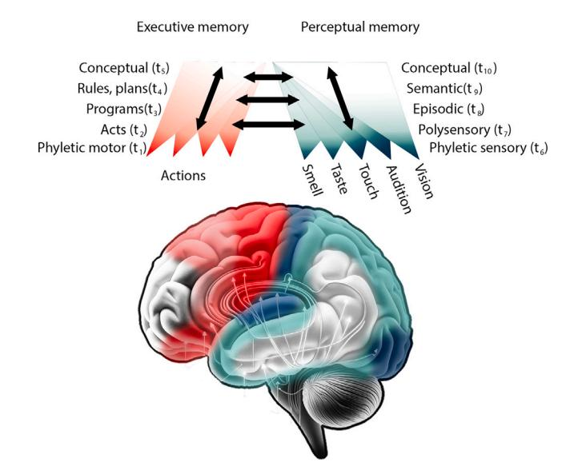
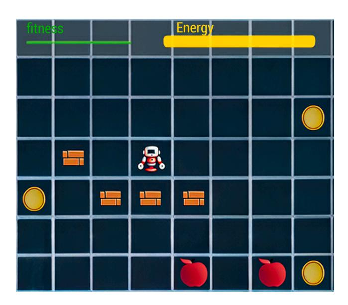
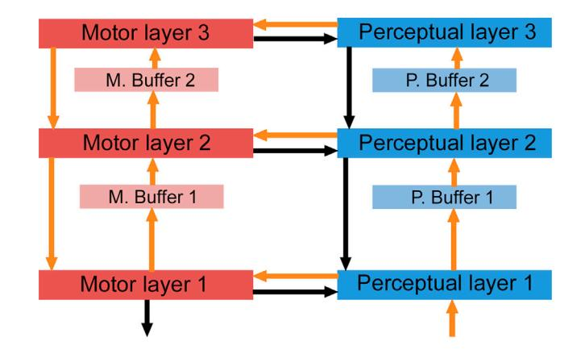
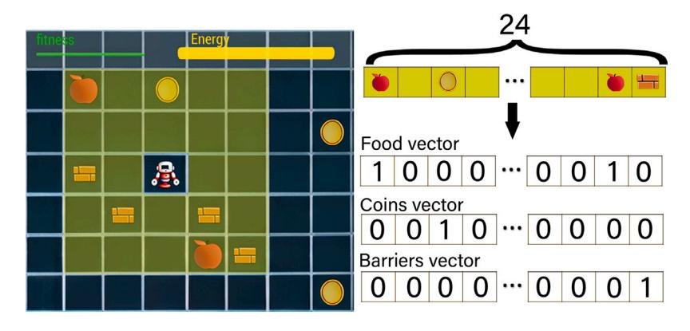
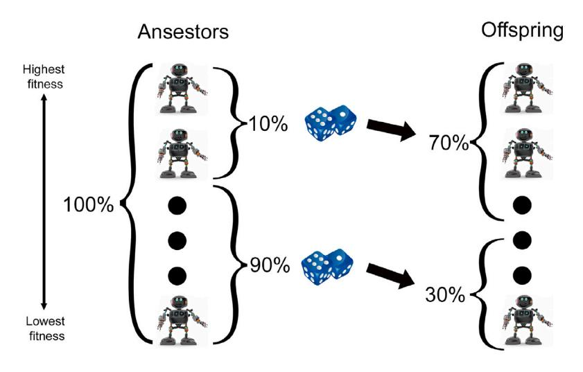
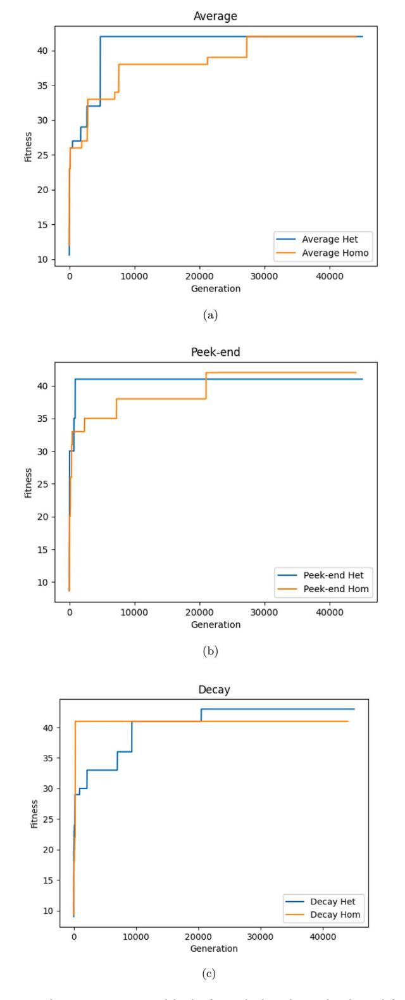
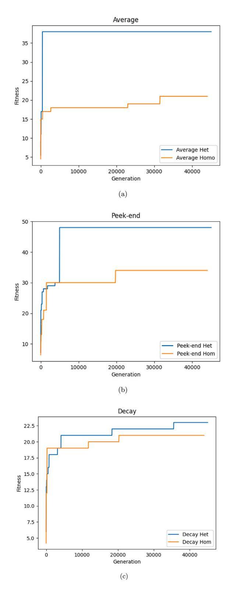
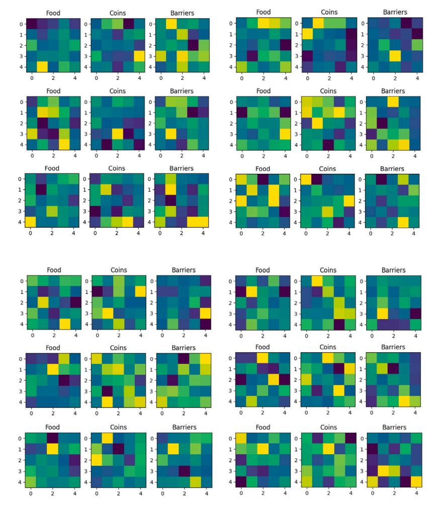

<!-- cite_key: 1_s20_s1389041724000597_main -->

Contents lists available at [ScienceDirect](https://www.elsevier.com/locate/cogsys)

# Cognitive Systems Research

journal homepage: [www.elsevier.com/locate/cogsys](https://www.elsevier.com/locate/cogsys)

# Temporal heterogeneity in cognitive architectures

Carlos Johnnatan Sandoval-Arrayga, Gustavo Palacios-Ramirez, Felix Francisco Ramos-Corchado [∗](#page-0-0)

*CINVESTAV, Zapopan JAL 45019, Mexico*[1](#page-0-1)

## A R T I C L E I N F O

Action editor: Tingting Liu
*Keywords:*Cognitive architectures Temporal Heterogeneity Reference frameworks

## A B S T R A C T

In 2020, Mc Fadden published an article in which he discusses how algorithms can be encoded in time and space. By analyzing the topology of the cytoarchitecture of the brain, cognitive architectures can understand the underlying mechanisms that have led to the development of human intelligence in space.

In this study, our focus lies in investigating temporal heterogeneity as a mechanism that the brain could have developed not solely as a biological constraint, but also as an evolutionary advantage. To accomplish this, we employed virtual agents within a virtual environment and constructed a prototype cognitive architecture. Subsequently, we compared the benefits and drawbacks of having this cognitive architecture operate under a model of temporal heterogeneity versus one characterized by temporal homogeneity.

At the conclusion of the article, we present the results obtained from two perspectives. From a quantitative standpoint, we contrast the agents' adaptation to the environment based on the cognitive architecture model employed by each agent. On this front, we found evidence that temporal heterogeneity might be useful in finding parameter optimizations faster, amongst other benefits. From a qualitative perspective, we examine the potential of this model to explore the cognitive processes of the virtual agents, concluding that a different representation of percepts is needed, which we further discuss.

### 1. Introduction

In 2020, McFadden published an article in which he mentioned that algorithms have more than one way of being encoded ([McFad](#page-9-0)[den,](#page-9-0) [2020\)](#page-9-0). In that work, McFadden discussed how algorithms can be encoded in space and time [\(McFadden,](#page-9-0) [2020\)](#page-9-0).

Cognitive architectures have as their main goal to propose how the human mind could be divided into modules (using evidence from cognitive sciences), and then to describe the topology that these modules should have to produce human-like behavior. That is to say, the first task of cognitive architectures is to discover the spatial (topological) encoding between a subset of modules that make up the human mind.

Nevertheless, in this work, we argue that the connection between different cortical areas in the human brain is not the sole mechanism employed by the brain to process human experiences. Furthermore, we hypothesize that the varying speeds at which different brain areas operate contribute to generating behavior that is more akin to human behavior.

Finding evidence supporting the contribution of time to producing human-like behavior would allow for improvements in various computational systems that aim to simulate the human brain, particularly those systems in which the function of different brain areas is clearly differentiated. For example, it might be possible to take advantage of the hierarchy proposed by Fuster [\(Fuster](#page-9-1), [2009\)](#page-9-1) to hypothesize the speeds at which these areas could be operating. Examples of cognitive architectures where this differentiation of brain areas occurs can be found in [Aceves, Ramos, Ramirez, and Sandoval](#page-9-2) ([2023\)](#page-9-2), [Hernández](#page-9-3) [et al.](#page-9-3) ([2022\)](#page-9-3), [Palacios, Sandoval, and Ramos](#page-9-4) ([2021\)](#page-9-4) and [Sandoval and](#page-9-5) [Ramos](#page-9-5) ([2021\)](#page-9-5), among others.

The central idea to achieve these improvements would be to ensure that cognitive functions are not executed as soon as possible, but instead, wait for varying amounts of time before being executed. The varying execution times aim to ensure that different computer functions are performed in accordance with the different cognitive functions in the human brain, following the premise that in the human brain, it is the brain areas close to the sensory or primary motor cortices that execute more times per second, while those associated with higher level processes (such as the prefrontal cortices) execute at a slower pace [\(Dehaene,](#page-9-6) [2021\)](#page-9-6).

∗ Corresponding author.

<https://doi.org/10.1016/j.cogsys.2024.101265>

Received 6 October 2023; Received in revised form 29 May 2024; Accepted 8 July 2024 Available online 10 July 2024

1389-0417/© 2024 The Author(s). Published by Elsevier B.V. This is an open access article under the CC BY license [\(http://creativecommons.org/licenses/by/4.0/\)](http://creativecommons.org/licenses/by/4.0/).
*E-mail addresses:*[carlos.sandoval@cinvestav.mx](mailto:carlos.sandoval@cinvestav.mx) (C.J. Sandoval-Arrayga), [gustavo.palacios@cinvestav.mx](mailto:gustavo.palacios@cinvestav.mx) (G. Palacios-Ramirez), [felix.ramos@cinvestav.mx](mailto:felix.ramos@cinvestav.mx) (F.F. Ramos-Corchado).

1 WWW home page: <https://www.niclab.mx>

We hypothesize that temporal heterogeneity can assist cognitive architectures in learning with fewer steps, consuming less energy, and generating behavior more akin to that of a human being.

To test this, we designed a case study where we would compare two versions of the same cognitive architecture: one with temporal heterogeneity and the other with temporal homogeneity. The parameters of this cognitive architecture would be optimized using an evolutionary algorithm. Subsequently, we would measure quantitatively the number of steps each algorithm took to adapt to its environment and analyze its energy consumption behavior. Finally, we would conduct a qualitative analysis of the knowledge that each of these cognitive architectures considered relevant for adapting to its environment, aiming to compare it with what a human would perceive as important.

Finally, we hope that this work serves as a reference to guide the design of cognitive architectures, allowing designers to choose between incorporating temporal heterogeneity or temporal homogeneity in their architecture, depending on their specific needs.

This work is divided as follows:

In Section [2](#page-1-0) (Related Work) a brief description is provided regarding other studies that have leveraged heterogeneity, either structural or temporal, to obtain certain benefits. This section primarily focuses on computational results.

In Section [3](#page-2-0) (Evidence from cognitive science) we discuss some properties that cognitive sciences have found in the human brain, which will guide us in determining how we could use temporal heterogeneity in cognitive architectures.

In Section [4](#page-2-1) (Bio-inspired cognitive model) we discuss how the evidence from cognitive sciences is used to construct a cognitive architecture that takes advantage of the temporal heterogeneity property expressed by the human brain.

In Section [5](#page-3-0) (Case study) an experiment is described in which the model from Section [4](#page-2-1) is employed to solve a task. The metrics used to evaluate the task and how the task was executed are described.

In Section [6](#page-5-0) (Results) the results of the case study are presented. In this section, we focus solely on expressing the numerical results without making any interpretation of the data.

In Section [7](#page-6-0) (Conclusions) we attempt to interpret the results presented in Section [6](#page-5-0), to see the implications they have for the theory of cognitive architectures.

In Section [8](#page-6-1) (Discussion) a summary of the findings of this work is provided, as well as the direction of future work being developed in the same vein.

Finally, in Section [9](#page-8-0) (Materials and Methods) we detail the inner workings and calculations of the implementation.

#### 2. Related work

In recent times, the study of the effects of both structural and temporal heterogeneity has gained relevance in computing areas, such as evolutionary algorithms, complexity science, or random Boolean networks, to name a few [\(Escobar, Kim, & Gershenson,](#page-9-7) [2019;](#page-9-7) [Gershen](#page-9-8)[son,](#page-9-8) [2012](#page-9-8); [López-Díaz, Sánchez-Puig, & Gershenson,](#page-9-9) [2023](#page-9-9); [Martinez,](#page-9-10) [Rodriguez, & Gershenson,](#page-9-10) [2022;](#page-9-10) [Mei, Muller, & Ramaswamy](#page-9-11), [2022](#page-9-11); [Sánchez-Puig, Zapata, Pineda, Iñiguez, & Gershenson,](#page-9-12) [2022\)](#page-9-12).

In this section, we present some of the results obtained by incorporating temporal heterogeneity properties into various computational systems. We do this intending to provide insight into the properties that we expect to obtain by incorporating temporal heterogeneity into cognitive architectures.

Finally, we will dedicate a small paragraph to describing the reasons why we believe that adding temporal heterogeneity could be beneficial for cognitive architectures.

The following are some of the properties that other systems have exhibited when they take into account temporal heterogeneity in their implementation versions of the same systems:

#### – Speed and Convergence.

In [Martinez et al.](#page-9-10) ([2022\)](#page-9-10), two versions of the same evolutionary algorithm were implemented, one with temporal homogeneity and the other with temporal heterogeneity. The results showed that the version with temporal heterogeneity converged with fewer executed instructions and in less time.

One of the main and little-discussed differences between AI systems and human intelligence is the amount of energy needed to carry out their functions [\(Dhar,](#page-9-13) [2020\)](#page-9-13). In [Sandberg](#page-9-14) ([2016\)](#page-9-14), it is mentioned that the estimated amount of energy required to keep the human brain functioning is only around 20 W (similar to the amount of energy needed for an LED lamp), while the power consumption of an RTX 3080 graphics card could reach up to 100 W. This fact provides clues that such a high amount of energy may not be necessary to perform the functions of the human brain. Although it is far from being the solution, a first step in this direction would be to execute a lower number of instructions to reach the same conclusions.

Another interesting idea from this result is the concept of ''slower is faster''. Parts of the system that operate at slower speeds end up acting as coordinators of the system, such that having slower parts allows the system to reach agreements more quickly. This represents another step towards saving time and energy.

–**Bottom-up conceptualization.** In [Escobar et al.](#page-9-7) ([2019\)](#page-9-7), experiments were conducted using random Boolean networks. In these experiments, networks existed at different temporal scales: micro-networks (faster) and macro-networks (slower). The results showed that the complexity of micro-networks was only affected by their structure, while the complexity of macro-networks was affected by the topology of micro-networks. However, although the complexity of micro-networks was not affected by macro-networks, the attractors in macro-networks affected how micro-networks behaved.

The above can be interpreted as follows: If cognitive functions associated with low-level tasks are faster than those associated with high-level tasks, then the concepts (attractors) that lowlevel areas could understand would only be determined by their own structure; the concept space (attractors) that a high-level module could have would be affected by the structure of the lowlevel modules; finally, although the conceptual space in low-level modules (the space of attractors) could not be modified by highlevel modules, what could be modified is the behavior of low-level modules (the type of dynamics that attractors follow).

#### – Autonomy.

In [Vernon, Lowe, Thill, and Ziemke](#page-9-15) [\(2015](#page-9-15)), it is proposed that for a system to be autonomous, it must make decisions influenced by the environment, but not determined by it. On the other hand, in [Fernández, Maldonado, and Gershenson](#page-9-16) ([2014](#page-9-16)), it is proposed that one way to determine the autonomy of a system from its environment is to measure the complexity that exists in the system and divide it by the complexity of the environment. If the quotient is greater than 1, it means that the system is more complex than the environment and therefore the environment does not determine its behavior. Additionally, in [López-Díaz et al.](#page-9-9) ([2023](#page-9-9)), criticality is defined as the region within the variables of the system where complexity is maximized (maximum autonomy from the environment is obtained).

Finally, in [López-Díaz et al.](#page-9-9) ([2023\)](#page-9-9), several experiments are performed using random Boolean networks to find the effect of temporal heterogeneity on the criticality of a system, finding that the criticality region is extended when models with temporal heterogeneity are used. If this were also true for cognitive architectures, it would imply that it would be easier to find parameters that allow virtual agents to be autonomous when architectures with temporal heterogeneity are used rather than architectures with temporal homogeneity.

From this section, it can be inferred that certain desirable properties (speed and convergence, bottom-up conceptualization, and autonomy) are correlated with temporal heterogeneity.

#### 3. Evidence from cognitive science

In the previous section, it was shown how other computational systems have benefited from temporal heterogeneity. In this chapter, evidence from cognitive sciences will be presented to support the idea that the human mind exhibits temporal heterogeneity. Finally, with the support of the presented evidence, we discuss how temporal heterogeneity could be incorporated into cognitive architectures.

One of the initial indications regarding the utilization of temporal heterogeneity in cognitive architectures comes from psychology. In [Kahneman](#page-9-17) ([2017](#page-9-17)) the existence of two systems is hypothesized: system 1 and system 2. System 1 is faster, instinctive, and emotional, while system 2 is slower and logical [\(Shleifer](#page-9-18), [2012;](#page-9-18) [Stanovich & West](#page-9-19), [1981\)](#page-9-19). Furthermore, the prefrontal cortices are responsible for orchestrating system 2 ([Kahneman](#page-9-17), [2017\)](#page-9-17). This property could be modeled by making the prefrontal cortices run at a slower speed than the rest of the architecture.

The next clue about how speeds operate in the brain is provided by neuroscience [\(Dehaene,](#page-9-6) [2021\)](#page-9-6). In this work, the authors mention that cortical speeds vary depending on their proximity to sensory cortices or the primary motor cortex where speeds are higher, while cortical areas responsible for more abstract tasks tend to be slower than those responsible for less abstract tasks.

The previous finding is supported by new neuroscientific experiments ([van Blooijs et al.](#page-9-20), [2023](#page-9-20)) analyzing the waveform amplitude of evoked potentials in the human brain at different ages. These experiments demonstrate that such a property holds true for adult human brains (30+ years old), although it is not entirely true for younger individuals. In the case of younger individuals, even though the brain's activation rates are not homogeneous, it is not accurate to say that the frontal cortices are slower. Thus, the only constant property over time is temporal heterogeneity, but not how this heterogeneity is expressed. This suggests that it is important to specify the type of human behavior we aim to generate when constructing a cognitive architecture: whether it simulates adult behavior or that of younger individuals.

Additional neuropsychological information regarding the different speeds at which cortical regions operate is provided by [Ormrod](#page-9-21) [\(1990](#page-9-21)), which mentions that speeds vary by age. During the first 30 years of life, the brain continues to develop, with the most primitive brain areas beginning to myelinate during infancy, and thus operating at faster speeds than before. During adolescence, the cortical regions responsible for more primitive tasks (such as emotions and sensations, for example) are fully myelinated, while the prefrontal cortices have just begun their myelination process and will not finish until around 30 years of age.

The reason this information is important for cognitive architectures is that if we want an instance of a cognitive architecture to model a human brain, one of the questions we must ask ourselves beforehand is: What will be the age of the brain we want to model? This is because depending on the age of the brain, the speeds at which its cortical regions operate are different, causing brains of different ages to use different cognitive functions to solve the same task, as has been described before in [Fraga, Ramirez, Arrayga, Tejeda, and Occello](#page-9-22) ([2023\)](#page-9-22).

From this section, we can conclude: that there is enough evidence showing that the speeds at which different cortical areas operate in the human brain are different:; the areas responsible for processing more abstract tasks operate at slower speeds than those responsible for less abstract tasks, and the speeds at which cortical areas operate change throughout life.

Even more, additional evidence could be taken into account in cognitive architectures by extending the Khaneman model ([Kahneman](#page-9-17), [2017\)](#page-9-17) to obtain a model for each of the cognitive functions in the cortical areas, each operating at different speeds. The higher speeds correspond to simple tasks while slower speeds must correspond to more abstract tasks.

**Fig. 1.**The Brain's Perception-Action Balancing Act. Adapted from [Fuster](#page-9-1) [\(2009\)](#page-9-1). In this figure we can appreciate the hierarchical organization of memories proposed by Fuster. On the left-hand side, we have the types of executive memory, and on the right-hand side, we have the types of perceptual memory. At the bottom of the figure, we have memories associated with the species (phyletic memory), and as we ascend, we find increasingly abstract memories until we reach conceptual memory.

#### 4. Bio-inspired model

From Section [2,](#page-1-0) we hypothesize that it heterogeneity could help save energy, reduce the number of learning steps to adapt to the environment, generate concepts more similar to those of humans, and facilitate the creation of autonomous agents.

In this section, some properties that could be susceptible to being modeled in cognitive architectures will be described. The focus of this section is the description of the steps to be followed to implement these properties.

First, a brain division proposed by Joaquin Fuster in [Fuster](#page-9-1) ([2009\)](#page-9-1) will be shown. Then, we will identify how this division can be combined with the information from the previous section to generate a model of a cognitive architecture with temporal heterogeneity.

In [Fuster](#page-9-1) ([2009\)](#page-9-1), Fuster proposes a hierarchical organization of memories in the human cortex. This classification divides the brain into perceptual memories and executive memories. In turn, each of these memories is divided into hierarchies, as shown in [Fig.](#page-2-2) [1.](#page-2-2)

Rather than strictly following Fuster's proposed model ([Fuster](#page-9-1), [2009\)](#page-9-1), we will use it to explain how we could create a model with temporal heterogeneity in a given cognitive architecture.

Assuming we have a cognitive architecture whose cognitive functions are divided as in Fuster's memory model, one way to represent temporal heterogeneity following the properties seen in Section [3](#page-2-0) would be to make each module execute every clock cycles, fulfilling the following inequalities:

$$
t_1 \le t_2 \le t_3 \le t_4 \le t_5 \tag{1}
$$

6 ≤ 7 ≤ 8 ≤ 9 ≤ 10 (2)

where each corresponds to the times marked in the modules of [Fig.](#page-2-2) [1](#page-2-2).

Since the implementation carried out for this work is closely related to the case study, the specific details of the implementation will be addressed in the following section (case study, Section [5](#page-3-0)) as it was deemed more appropriate to address them together.

#### 5. Case study

The present research is a mixed-method study. On the one hand, it aims to qualitatively compare the most abstract percepts that agents use to make decisions. On the other hand, it aims to quantitatively measure how effective certain percepts are in adapting to the environment.

To carry this out, a virtual world was created in which agents were placed, one at a time. The objective of the agents is to learn what is most important to consider in the environment and then decide on the best strategies to solve the problem. Following this, an evolutionary strategy was proposed to favor the offspring of agents with better performance. Finally, the qualitative and quantitative results obtained from the experiment are analyzed in Section [6.](#page-5-0)

For this experiment, we implemented a virtual agent with a naive cognitive architecture consisting of six layers (three motor and three perceptual) and four buffers between some of these layers, as shown in [Fig.](#page-4-0) [3.](#page-4-0)

However, it is important to note that the purpose of this article is not to validate this cognitive architecture. Instead, we specifically use this structure to explore the behavior of a virtual agent under two conditions: one with temporal homogeneity and the other with temporal heterogeneity, while maintaining a constant topology of the cognitive architecture.

It is crucial to recognize that the buffers, not the layers themselves, are responsible for generating this temporal homogeneity or heterogeneity. Therefore, the experiment focuses on testing different types of buffers. The rationale for using this basic cognitive architecture, rather than another, is to simplify experimentation with the buffers. However, the study of the behavior of the influence of temporal heterogeneity in different topologies of cognitive architectures is beyond the scope of this work.

On the other hand, due to the fact that the operational speeds of the brain change throughout its development during the first approximately 30 years (as mentioned in Section [3](#page-2-0)), it is important to mention that the design of the current model aims to mimic the behavior of a mature, healthy human brain without any disorders or addictions.

It is important to note that the biological reasons for brain myelination are beyond the scope of this research. Our focus is solely on investigating the behavioral consequences that may arise from myelination in an agent. We acknowledge that myelination occurs, but we do not delve into why it happens biologically.

In our model, the values used to simulate myelination ensure that brain regions closer to external stimuli operate faster than those responsible for more abstract cognition. However, determining the ideal values for this temporal heterogeneity is not the objective of our study. Instead, the purpose of our research is to explore whether modeling these temporal differences can assist in creating more human-like behavior. We aim to provide an initial insight into whether this approach could be beneficial.

The organization of this section is as follows: The subsection ''Virtual World'' details the characteristics of the world in which the agents develop, the elements it contains, its extent, and the rules of movement. The subsection ''Virtual Agents'' describes the structure of the agents' minds in depth, along with the cognitive science principles that inspire the proposed model. Lastly, the subsection ''Evolution'' describes the evolutionary policies of the process followed in this case study.

####*5.1. Virtual world*The virtual world is comprised of a 50 × 50 grid. The virtual agent moves between grid locations as follows: if the agent is at a certain grid location at time , then at time + 1 it can move to any of the adjacent grid locations (i.e. the agent moves in a discrete and orthogonal manner).

Additionally, within the grid locations, some of the following elements may be present: food, coins, barriers, or empty space. A grid**Table 1**

The table displays the percentage of cells occupied by: food, coins, barriers, and empty cells.

| Percentage occupied by food     |  | 23% |
|---------------------------------|--|-----|
| Percentage occupied by coins    |  | 25% |
| Percentage occupied by barriers |  | 26% |
| Percentage of empty cells       |  | 26% |
|                                 |  |     |

**Fig. 2.**In this figure, an example of a virtual agent situated on the grid with the previously described objects (coins, food, and barriers) can be observed. In the figure, food is represented by an apple, while barriers are depicted as small brick walls. The virtual agent is represented by a robot, and its energy level is indicated by the yellow bar, while its fitness is represented by the green bar.

location cannot contain more than one element. Food serves to increase the agent's energy level. Coins raise its level of physical fitness, while barriers prevent the agent from occupying that location (see [Fig.](#page-3-1) [2\)](#page-3-1).

The elements described in the previous paragraph are randomly distributed on a single grid, following these considerations: (see [Table](#page-3-2) [1](#page-3-2)).

####*5.2. Virtual agents*

In this section, we will describe the virtual agents. The description is divided into interoception, exteroception, phylogeny, and ontogeny.

The structure of this section is as follows: First, we will explain the reasons why we believe each of these characteristics is crucial for evolving the agent. Then we will provide technical and detailed descriptions of the elements that compose it.

#### Interoception

In 4E cognition [\(Lakoff & Núñez,](#page-9-23) [2000](#page-9-23); [Rohde,](#page-9-24) [2010](#page-9-24); [Vernon et al.](#page-9-15), [2015\)](#page-9-15), embodiment is often listed as one of the necessary characteristics to develop cognition similar to humans. However, we believe that this characteristic goes beyond having two legs and two arms. We propose that embodiment is more related to how the existence of the mind depends on the existence of the body, just as the existence of the body depends on the processes of the mind. Thus, the mind and body would form two systems that could be described as strongly coupled, as proposed in [Maturana and Varela](#page-9-25) ([1991\)](#page-9-25).

In this work, we focus on energy as a property of embodiment, as we consider it one of the most critical properties that link the existence of the mind to a body ([Chernavski,](#page-9-26) [2000](#page-9-26)). This is because mental processes require the energy produced in a body in order to exist, just as the body relies on the ingenuity of the mind in order to obtain energy more efficiently and to continue existing.

#### Table 2

The following table shows the maximum amount of energy that the agent can store, the energy consumed each time a neural network is activated, and the energy consumed by the agent when performing a movement. The weights were computed such that the maximum energy consumption achievable per step amounts to 1%—half of it originating from movement (0.5%), and the other half from the utilization of all perceptual and motor layers. As there are a total of six perceptual layers and motor layers (see [Fig.](#page-4-0) [3](#page-4-0)), the energy expended when each of these layers is executed equals 0.5%/6 = 0.833%. We term the process of executing each of these layers ''thinking.

| Total amount of energy             | 100%   |
|------------------------------------|--------|
| Energy consumption due to movement | .5%    |
| Energy consumption due to thinking | .0833% |

**Fig. 3.**The figure presents a diagram of the cognitive architecture used. Blue boxes represent perceptual areas, while red boxes represent motor areas. The direction of the arrows indicates the flow of information. Orange arrows indicate inputs that trigger the execution of neural networks, whereas the black arrows update the input information of the neural network but do not trigger activation. Within each layer, there is a twolayer neural network utilizing the Hebbian learning algorithm as proposed by [Sanger](#page-9-27) ([1989](#page-9-27)). The number of times the buffers need to be executed before summarizing the information and passing it on to the next layer varies:; it is 3 in the case of experiments with temporal heterogeneity and 1 in the case of temporal homogeneity.

For this study, we opted to create an energy level bar that depends on food to generate more energy. On the other hand, as the agent moves or thinks, it consumes energy. How energy is produced or consumed is described in [Table](#page-4-1) [2](#page-4-1).

#### Exteroception

Exteroception is the perception of stimuli external to the body. In the field of cognitive architectures, it is often the only type of perception taken into account ([Kotseruba & Tsotsos,](#page-9-28) [2020\)](#page-9-28), which is why we will not dwell on the philosophical consequences of exteroception and will limit ourselves to defining the agent's exteroception in this case study.

The agent's visual area in this case study consists of a 5x5 grid centered on the agent. In this region, the agent can sense the types of objects that exist (food, coins, and barriers).

#### Phylogeny

To construct the agent's mind, a multi-layer neural network architecture with some modifications, shown in [Fig.](#page-4-0) [3,](#page-4-0) was designed. The phylogeny consists of the initial weights of the neural networks, while the composition of the architecture is detailed below.

The architecture shown in [Fig.](#page-4-0) [3](#page-4-0) consists of*buffers*and*layers*, with the blue boxes corresponding to perceptual elements, while the red boxes correspond to motor elements. Each textitlayer is formed by a 2-layer neural network with Hebbian learning ([Sanger,](#page-9-27) [1989](#page-9-27)), while the *buffers*function as elements that allow the information coming from their input to be summarized.

In the layer boxes, inputs from the orange arrows cause the neural network hosted in that layer to perform its calculations and produce its

#### Table 3

In this table, the number of neurons used as input and output in all neural networks is shown. The number of input neurons in the neural networks is composed of the output from the lower layer (if present), the output from the lateral layer, and the output from the upper layer (if present).

| Input neurons | Output neurons |
|---------------|----------------|
|               | 39             |
| 56            | 19             |
| 28            | 9              |
| 47            | 4              |
| 32            | 8              |
| 17            | 9              |
|               | 97             |

outputs. Meanwhile, inputs from the black arrows only update the data in their input layer without triggering any execution.

Buffers, on the other hand, wait for a specified number of steps to summarize the information before performing a single execution. In this study, each buffer collects 3 pieces of information from its input, summarizes them, and then generates an output. This behavior of the buffers is responsible for generating temporal heterogeneity in the cognitive architecture. When the number of steps is reduced to 1 in all buffers, we achieve temporal homogeneity.

All the buffers used in an experiment summarize information in the same way. However, different forms of summarizing the information in the buffers were used in different experiments. The 3 forms used were those proposed in [Hernández et al.](#page-9-3) ([2022](#page-9-3)): average, peek-end rule, and decay.

Additionally, there are two types of buffers for each of the three ways of summarizing buffer information. One type of buffer summarizes the information each time the buffer is executed (no long-term memory), while another type of buffer summarizes the information considering all the information the agent has seen since its birth (long-term memory).

In the case of the layers, the number of input and output neurons are reported in [Table](#page-4-2) [3](#page-4-2).

With the exception of perceptual layer 1, the inputs of the other layers come entirely from the outputs of other buffers or layers, as shown in [Fig.](#page-4-0) [3](#page-4-0). Therefore, we will only describe how perceptual layer 1's input is formed.

First, the agent's visual area, which detects food, coins, and barriers (see exteroception, above) is vectorized and linearized, excluding the space representing the agent's current position. This results in a vector of size 5 × 5 − 1 = 24, called the*sensory vector*. Later, using this vector, three binary vectors are created. The first one has 1's in places where food can be found in the sensory vector and 0's elsewhere. The second binary vector has 1's in places where coins can be found in the sensory vector and 0's elsewhere. Finally, the last binary vector has 1's in places where barriers can be found in the sensory vector, and 0's elsewhere.

A visual representation of this process can be seen in [Fig.](#page-5-1) [4](#page-5-1).

Finally, one last vector is created, concatenating the three binary vectors and adding additional values representing the energy level, the fitness score, and the input vectors from Motor Layer 1 and Perceptual Layer 2. This results in a vector of length 24+24+24+1+1+4+19 = 97. This is reflected in [Tables](#page-4-2) [3](#page-4-2) and [4](#page-9-29).

#### Ontogeny

In the case of ontogeny, each of the neural networks is a Hebbian learning neural network that uses Sanger's rule ([Sanger,](#page-9-27) [1989\)](#page-9-27). The rationale behind this choice is that each layer learns to distinguish the primary values presented to it. Subsequently, the evolutionary algorithm will prioritize the descendants of those agents who are better adapted to the environment. Ultimately, the goal is to observe the values that each layer distinguishes as important in order to qualitatively analyze whether these distinctions correspond to similar distinctions that a human should make.

When it comes to buffers, their influence on ontogeny varies depending on the type of buffer memory. In the case of buffers with

**Fig. 4.**On the left, the figure displays the agent's field of view, which is highlighted in yellow. On the right-hand side, there is a representation of the linearization of the agent's visual field, depicted as a yellow vector. At the bottom of the figure, this yellow vector is binarized into three separate new vectors.

short-term memory, once they output information to the next layer, they forget everything they have learned, limiting their impact on the agent's ontogeny.

On the other hand, for buffers with long-term memory, after their execution, continue to take into account all previously encountered values. Consequently, their influence on the agent's ontogeny is more pronounced.

Lastly, we want to emphasize that the concept of ''buffers'' does not emerge from thin air. The biological inspiration leading us to consider the existence of certain mechanisms in the brain that could be simulated with buffers stems from evidence in neuroscience. In certain studies, it is suggested that specific neurotransmitters can function as markers, causing neurons to wait for a certain amount of time (while neurotransmitters, calcium ions, and potassium ions accumulate in synapses) before various ion channels open in a synchronized manner ([Hasselmo, Giocomo, Brandon, & Yoshida](#page-9-30), [2010](#page-9-30); [Hucho](#page-9-31), [1993](#page-9-31); [Walker, Brooks, & Holden-Dye,](#page-9-32) [1996](#page-9-32)).

####*5.3. Evolution*In this section, the process carried out to evolve the population of agents will be described. In this case, the weights of the neural networks of each agent were chosen as the species' phylogeny (genotype), where each agent represents its own species. At the beginning of the process, the weights of the neural networks were randomly initialized with values less than 1 × 10−4 .

The ontogeny of the species is conceived as the learning that the agent undergoes during its life. In addition, we propose that the ontogeny of a species is the phylogeny of its offspring.

In each phase, the scene is populated with 100 different agents, of which 70% are descendants of the top 10% agents with the best fitness, and the remaining 30% are descendants of the rest of the population. In each case, the agents are randomly selected. This is shown in [Fig.](#page-6-2) [5](#page-6-2).

Each of the agents is placed in its own world, meaning they do not compete with each other. The objective of the evolution is to retain the agents that collect the highest number of coins.

For this experiment, no recombination operator was considered. Ontogeny was used as the mutation operator, involving a slight variation to each of the genes in the order of 10−6 to 10−4 ([Johnston, Keats, &](#page-9-33) [Sherman,](#page-9-33) [2019\)](#page-9-33).

####*5.4. Execution*For the execution of the model, 45,000 runs of the evolutionary process were conducted for each of the 6 models (average no longterm memory, peek-end rule no long-term memory, decay no long-term memory, average long-term memory, peek-end rule long-term memory, decay long-term memory).

For each of the evolutionary processes, 100 agents were placed, and they were allowed to live as long as the amount of food they had remained positive.

Fitness was calculated as the number of coins each individual managed to acquire. The average of the top 10% of individuals with the best fitness is calculated and plotted in [Figs.](#page-7-0) [6](#page-7-0) and [7.](#page-7-1) However, the analysis of these graphs is carried out in Section [6](#page-5-0).

#### 6. Results

In this section, the description of the results will be presented in 2 subsections. The first subsection will present the quantitative results of the fitness obtained by the agents using different types of buffers, time models (heterogeneous and homogeneous), as well as the different types of memory in the buffers (long-term or short-term). In the second subsection, the qualitative results obtained from the experiment will be presented. In this case, some of the ''concepts'' that the cognitive architecture managed to learn in perceptual layer 1 will be qualitatively analyzed, with the aim of comparing them to what we would expect a human to learn to recognize.

####*6.1. Fitness*

In this subsection, we focus on comparing the effect of temporal heterogeneity and homogeneity on the speed at which agents evolve to collect more coins (fitness).

To achieve this, we plotted the average fitness of the top 10 agents obtained in each generation of the evolutionary process using a model with temporal heterogeneity (blue lines) and compared it with the average fitness of the top 10 agents obtained in each generation of the evolutionary process using a model with temporal homogeneity (orange lines).

The above process was repeated 6 times: the first 3 using models without long-term memory ([Fig.](#page-7-0) [6](#page-7-0)), and the last 3 using long-term memory (Figure ([Fig.](#page-7-1) [7\)](#page-7-1). In each case, the 3 models used to summarize buffer memory were the average, peek-end rule, and decay ([Hernández](#page-9-3) [et al.,](#page-9-3) [2022](#page-9-3)).

Starting with the analysis of the 3 models without long-term memory ([Fig.](#page-7-0) [6](#page-7-0)), we can observe that models using temporal heterogeneity appear to evolve faster towards populations of agents where the agents manage to collect more coins (with an exception in the model of [Fig.](#page-7-2) [6\(c\)\)](#page-7-2). Furthermore, we can observe that all models manage to obtain at least 40 coins by the end of the 30000 evolution steps.

On the other hand, analyzing the 3 models with long-term memory ([Fig.](#page-7-1) [7](#page-7-1)), we can notice that in this case, all models using temporal heterogeneity evolve faster towards populations where agents have higher fitness ([Fig.](#page-7-3) [7\(c\)](#page-7-3) is the case where this effect is less pronounced). It is worth mentioning that in this case, all models (except for the peekend rule model implemented with temporal heterogeneity) obtained

**Fig. 5.**Illustration showing how the agents are selected to progress from one stage to the next. In the image, the robots positioned lower represent those with lower fitness, while the robots positioned higher indicate those with higher fitness. Randomly, 10% of the robots with the highest fitness are selected to populate 70% of the next generation of robots. Meanwhile, 90% of the robots with lower fitness are used to populate the remaining 30% of the subsequent generation.

lower fitness compared to their counterpart without long-term memory. The peek-end rule model with temporal heterogeneity is the only model that benefited from having long-term memory, reaching a fitness level as high as 50.

####*6.2. Percepts*

For the qualitative aspect, we aimed to assess whether the ''percepts'' learned by the cognitive architecture bore any resemblance to the percepts we would expect a human to learn in a similar situation.

To achieve this, we filtered the weights affecting the first output neuron of each of the 12 different models executed in the experiment, retaining only the weights originating from neurons responsible for sensing food, coins, and barriers. Subsequently, we reconstructed these weights to their original grid layout, hoping to find something akin to the visual patches discovered by Sanger in [Sanger](#page-9-27) ([1989\)](#page-9-27).

However, unlike the quantitative part, luck was not on our side in this case. The results suggest that while modeling percepts using neural networks with Sanger's Hebbian learning can yield a functional agent, this modeling approach is not as helpful when the attempt is made to interpret these data as human percepts (see [Fig.](#page-8-1) [8](#page-8-1)).

#### 7. Conclusions

From the results, we can draw a couple of conclusions. On the one hand, the quantitative findings presented in Section [6](#page-5-0) seem to provide evidence that temporal heterogeneity could assist in finding parameter optimizations for a model more swiftly, as evident in the figures shown in Section [6](#page-5-0), except for [Fig.](#page-7-2) [6\(c\)](#page-7-2).

On the other hand, it appears that temporal heterogeneity by itself does not enhance the model's fitness, but it helps in reaching a high fitness level more rapidly.

Besides [Fig.](#page-7-1) [7,](#page-7-1) we can infer that temporal heterogeneity might help the models become more resilient to perturbations. Observing the fitness, the reason the temporally heterogeneous model outperformed the temporally homogeneous model is that the latter's fitness dropped in comparison to [Fig.](#page-7-0) [6](#page-7-0) (model with no long-term memory). We believe this decline in performance in temporally homogeneous systems is due to buffers recalling their entire history from birth, thereby injecting noise into future decisions. On the other hand, temporally heterogeneous models appear to display resilience to this noise and may even derive benefits from it.

Additionally, in [Fig.](#page-7-3) [7\(b\)](#page-7-3), we can observe that the peek-end rule model not only demonstrated resilience against noise caused by remembering the entire past but also capitalized on this noise to enhance performance when less information was available. This is quite intriguing considering that in [Hernández et al.](#page-9-3) ([2022\)](#page-9-3), results had suggested that the peek-end rule information summarization model exhibited low variance. Hence, we believe this experiment adds further evidence to the utility of using this information summarization approach as a heuristic to generate models with low variance and good performance.

Lastly, from qualitative Section [6.2](#page-6-3), we can conclude that this representation of percepts using a Hebbian neural network with Sanger learning might not be useful for modeling humans and subsequently reviewing what they learned through simple inspections;, to achieve this purpose, changes to the data structures used in the architecture's layers would likely be necessary.

#### 8. Discussion

In this study, evidence was presented regarding the potential advantages that cognitive architectures could gain from temporal heterogeneity. Additionally, the concept of buffers between brain areas was introduced, which is one of the central ideas of this study, as their purpose extends beyond summarizing received information. These buffers are direct contributors to the temporal heterogeneity within the system. While biological evidence can be found supporting the possibility of such mechanisms ([Hasselmo et al.](#page-9-30), [2010;](#page-9-30) [Hucho](#page-9-31), [1993](#page-9-31); [Walker et al.](#page-9-32), [1996](#page-9-32)), a robust demonstration of their existence in the human brain remains an open hypothesis.

Moreover, in conjunction with previous work ([Hernández et al.](#page-9-3), [2022\)](#page-9-3), this study provides another instance where the peek-end rule heuristic for information summarization contributes to generating a stable system. Additionally, this work provides an example of how this heuristic can even take advantage of long-term memory.

Another supporting argument for the need for a cognitive architecture with temporal heterogeneity is that humans possess not only short-term but also long-term memory. Consequently, cognitive architectures should be equipped to handle all their past information. This small-scale experiment allows us to envision that a system with temporal heterogeneity might aid us in achieving this objective.

One limitation of this study is that all buffers require the same number of inputs before generating an output. However, ongoing work is addressing the development of a system that uses biological inspiration to dynamically regulate this input quantity.

Another ongoing endeavor is to enhance the agent's interoception by creating a way to sense hunger that is more akin to how humans perceive it. We anticipate that this modification will provide the agent

**Fig. 6.** No long-term memory model. The figure displays the results obtained from evaluating the model without long-term memory. The orange line represents the models with temporal homogeneity, while the blue line represents the models with temporal heterogeneity. In both cases, only the average of the top 10 agents with the highest fitness during that run was plotted. On the -axis, the number of generations is plotted, while on the -axis, the average fitness of the top 10% of agents is graphed. In the experiment, temporal heterogeneity in the architecture's behavior was induced by setting to 3 the parameter for the number of activations each buffer required before producing an output. On the other hand, temporal homogeneity was induced by changing this parameter to 1.

**Fig. 7.** Long-term memory model. The figure displays the results obtained from evaluating the model using long-term memory. The orange line represents the models with temporal homogeneity, while the blue line represents the models with temporal heterogeneity. In both cases, only the average of the top 10 agents with the highest fitness during that run was plotted. On the -axis, the number of generations is plotted, while on the -axis, the average fitness of the top 10% of agents is graphed. In the experiment, temporal heterogeneity in the architecture's behavior was induced by setting to 3 the parameter for the number of activations each buffer required before producing an output. On the other hand, temporal homogeneity was induced by changing this parameter to 1.

**Fig. 8.**This figure displays the first percept from each of the 12 models used in the experiment. For each experiment, 3 percepts (food, coins, and barriers) were extracted. The first three rows correspond to the percepts of models using buffers without long-term memory. The last three rows represent the percepts of models with buffers incorporating long-term memory. The first column of three percepts corresponds to percepts originating from models with temporal heterogeneity, while the three percepts in the second column are from models with temporal homogeneity. Additionally, each row from top to bottom corresponds to percepts from the models: average, peek-end rule, decay, average, peek-end rule, and decay, respectively.

with a better understanding of the significance of food for survival and offer a platform for studying certain dietary issues.

Finally, it is important to emphasize that this experiment does not provide conclusive evidence for the significance of temporal heterogeneity in cognitive architectures or its existence in human brains. What it does offer is hope and evidence of the feasibility of such a mechanism and its potential importance in generating cognitive architectures. However, we believe that there is still much work to be done in this regard to comprehend the effect of temporal heterogeneity on cognitive architectures.

#### 9. Materials and methods

In this section, a detailed description of the calculations used in the previous sections is provided. To do so, we will divide this section into three parts: buffers, layer, and evolution.

####*9.1. Buffers*The most important variables of the buffer object are:

-**Vector**: stores a vector of information.
- **Type**: stores the buffer type (average, decay, peek-end rule).
- **Activations**: stores the number of times the buffer needs to be activated before producing an output.

- **Long-term memory**: a Boolean value that determines whether the buffer considers all values seen by the agent or only those since its last activation.
- **n**: the number of input information occurrences that have occurred since the last time the buffer generated an output.

Let be the input vector to a buffer, and let be the vector that a buffer has stored. Then, depending on the value of ''type'' in buffer , is calculated as follows.

$$
v = \begin{cases} \frac{(n-1)v + I}{n} & \text{if type = average} \\ \frac{v + I}{2} & \text{if type = decay} \\ v_i = \frac{v_i + max(v_i, I_i)}{2} & \text{if type = peek-end} \end{cases}
$$
(3)

Meanwhile, depending on whether B is of the long-term memory type or not, is calculated as follows:

$$
n = \begin{cases} 0 & \text{if } n = \text{activations, and long-term-memory} = \text{false} \\ n+1 & otherwise \end{cases}
$$
(4)

Additionally, each time n equals *activations*, the buffer yields v as the result.

#### *9.2. Layers*Unlike buffers, which have only a single input vector, layers have three input vectors: the bottom input vector B, the lateral input vector

#### Table 4

In the table, the quantity of input neurons for each layer is depicted, distributed across the number of neurons receiving information from the lower, lateral, and upper layers, respectively. Subsequently, the sum of these three inputs is computed, referred to as the ''total input.''. The term ''total output'' designates the quantity of output neurons in the network.

| Layer              | Bottom | Lateral | Top | Total Input | Output |
|--------------------|--------|---------|-----|-------------|--------|
| Perceptual layer 1 | 74     | 4       | 19  | 97          | 39     |
| Perceptual layer 2 | 39     | 8       | 9   | 56          | 19     |
| Perceptual layer 3 | 19     | 9       | 0   | 28          | 9      |
| Motor layer 1      | 0      | 39      | 8   | 47          | 4      |
| Motor layer 2      | 4      | 19      | 9   | 32          | 8      |
| Motor layer 3      | 8      | 9       | 0   | 17          | 9      |

L, and the top input vector T. The distribution of neurons is described in [Table](#page-9-29) [4.](#page-9-29)

In addition to the input vectors, each layer has the following variables:

- A neural network with Hebbian learning as proposed in [Sanger](#page-9-27) ([1989](#page-9-27)).
- A Boolean variable ''on'' that determines whether the neural network will or will not be executed at this moment.
- A vector resulting from concatenating the input vectors.
- An output vector .

The output vector is computed each time*on*is true. The variable*on*becomes false after is computed and turns true each time an input with an orange arrow is activated (see [Fig.](#page-4-0) [3\)](#page-4-0).

Lastly, the execution of the layers follows a round-robin protocol, starting with perceptual layer 1, followed by perceptual layer 2, perceptual layer 3, motor layer 3, motor layer 2, and finally, motor layer 1.

####*9.3. World*The world is composed of a grid of 50x50 cells. For each cell, an element was chosen to contain from the following list: food, coin, barrier, or empty cell. The selection of these elements was done using a uniform probability distribution.

#### CRediT authorship contribution statement
**Carlos Johnnatan Sandoval-Arrayga:**Writing – review & editing, Writing – original draft, Methodology, Investigation, Formal analysis, Data curation, Conceptualization.**Gustavo Palacios-Ramirez:**Writing – original draft, Software, Investigation.**Felix Francisco Ramos-Corchado:**Writing – Methodology, review & editing, Funding acquisition, General supervision.

#### Declaration of competing interest

The authors declare the following financial interests/personal relationships which may be considered as potential competing interests: Carlos Johnnatan Sandoval Arrayga reports financial support was provided by conahcyt. Gustavo Palacios Torres reports financial support was provided by conahcyt. Felix Francisco Ramos Corchado reports financial support was provided by CINVESTAV.

#### Data availability

Data will be available on request.

#### Acknowledgments

This work's research was possible thanks to the grants and support from Consejo Nacional de Ciencia y Tecnologia, Mexico to the authors and the Center for Research and Advanced Studies. (CINVESTAV).

#### References

- [Aceves, Carlos Alejandro Sánchez, Ramos, Félix, Ramirez, Gustavo Palacios, & San](http://refhub.elsevier.com/S1389-0417(24)00059-7/sb1)[doval, Carlos Johnnatan \(2023\). Computational model of the alerting function in](http://refhub.elsevier.com/S1389-0417(24)00059-7/sb1) attention.*[Cognitive Systems Research](http://refhub.elsevier.com/S1389-0417(24)00059-7/sb1)*, *77*, 226–237.
- [Chernavski, Dmitrii S. \(2000\). The origin of life and thinking from the viewpoint of](http://refhub.elsevier.com/S1389-0417(24)00059-7/sb2) [modern physics.](http://refhub.elsevier.com/S1389-0417(24)00059-7/sb2) *Physics-Uspekhi*, *43*(2), 151.
- Dehaene, Stanislas (2021). *[How we learn: Why brains learn better than any machine... for](http://refhub.elsevier.com/S1389-0417(24)00059-7/sb3) now*[. Penguin.](http://refhub.elsevier.com/S1389-0417(24)00059-7/sb3)
- [Dhar, Payal \(2020\). The carbon impact of artificial intelligence.](http://refhub.elsevier.com/S1389-0417(24)00059-7/sb4) *Nature Machine Intelligence*, *2*[\(8\), 423–425.](http://refhub.elsevier.com/S1389-0417(24)00059-7/sb4)
- [Escobar, Luis A., Kim, Hyobin, & Gershenson, Carlos \(2019\). Effects of antimodularity](http://refhub.elsevier.com/S1389-0417(24)00059-7/sb5) [and multiscale influence in random boolean networks.](http://refhub.elsevier.com/S1389-0417(24)00059-7/sb5) *Complexity*, *2019*.
- [Fernández, Nelson, Maldonado, Carlos, & Gershenson, Carlos \(2014\). Information](http://refhub.elsevier.com/S1389-0417(24)00059-7/sb6) [measures of complexity, emergence, self-organization, homeostasis, and autopoiesis.](http://refhub.elsevier.com/S1389-0417(24)00059-7/sb6) *[Guided Self-Organization: Inception](http://refhub.elsevier.com/S1389-0417(24)00059-7/sb6)*, 19–51.
- [Fraga, Alan Christian López, Ramirez, Gustavo Palacios, Arrayga, Carlos John](http://refhub.elsevier.com/S1389-0417(24)00059-7/sb7)[natan Sandoval, Tejeda, Mónica Fabiola Perales, & Occello, Michel \(2023\). A](http://refhub.elsevier.com/S1389-0417(24)00059-7/sb7) [complete cognitive architecture as a services composition system inside a pervasive](http://refhub.elsevier.com/S1389-0417(24)00059-7/sb7) environment. *[Cognitive Systems Research](http://refhub.elsevier.com/S1389-0417(24)00059-7/sb7)*, *77*, 115–124.
- [Fuster, Joaquín M. \(2009\). Cortex and memory: emergence of a new paradigm.](http://refhub.elsevier.com/S1389-0417(24)00059-7/sb8) *Journal [of Cognitive Neuroscience](http://refhub.elsevier.com/S1389-0417(24)00059-7/sb8)*, *21*(11), 2047–2072.
- [Gershenson, Carlos \(2012\). Guiding the self-organization of random boolean networks.](http://refhub.elsevier.com/S1389-0417(24)00059-7/sb9) *[Theory in Biosciences](http://refhub.elsevier.com/S1389-0417(24)00059-7/sb9)*, *131*, 181–191.
- [Hasselmo, Michael E., Giocomo, Lisa M., Brandon, Mark P., & Yoshida, Motoharu](http://refhub.elsevier.com/S1389-0417(24)00059-7/sb10) [\(2010\). Cellular dynamical mechanisms for encoding the time and place of events](http://refhub.elsevier.com/S1389-0417(24)00059-7/sb10) [along spatiotemporal trajectories in episodic memory.](http://refhub.elsevier.com/S1389-0417(24)00059-7/sb10) *Behavioural Brain Research*, *215*[\(2\), 261–274.](http://refhub.elsevier.com/S1389-0417(24)00059-7/sb10)
- [Hernández, Oscar, Sandoval, Carlos, Palacios, Gustavo, Vargas, Natividad, Robles, Fran](http://refhub.elsevier.com/S1389-0417(24)00059-7/sb11)[cisco, & Ramos, Félix \(2022\). Bio-inspired task-rule retrieval model with auditory](http://refhub.elsevier.com/S1389-0417(24)00059-7/sb11) sorting test. *[Cognitive Systems Research](http://refhub.elsevier.com/S1389-0417(24)00059-7/sb11)*, *72*, 1–13.
- [Hucho, Ferdinand \(1993\). Transmitter receptors–general principles and nomenclature.](http://refhub.elsevier.com/S1389-0417(24)00059-7/sb12) In *[New comprehensive biochemistry](http://refhub.elsevier.com/S1389-0417(24)00059-7/sb12)*: *vol. 24*, (pp. 3–14). Elsevier.
- [Johnston, H. Richard, Keats, Bronya J. B., & Sherman, Stephanie L. \(2019\). Population](http://refhub.elsevier.com/S1389-0417(24)00059-7/sb13) genetics. In *[Emery and Rimoin's principles and practice of medical genetics and genomics](http://refhub.elsevier.com/S1389-0417(24)00059-7/sb13)*[\(pp. 359–373\). Elsevier.](http://refhub.elsevier.com/S1389-0417(24)00059-7/sb13)
- [Kahneman, Daniel \(2017\).](http://refhub.elsevier.com/S1389-0417(24)00059-7/sb14)*Thinking, fast and slow*.
- [Kotseruba, Iuliia, & Tsotsos, John K. \(2020\). 40 Years of cognitive architectures: core](http://refhub.elsevier.com/S1389-0417(24)00059-7/sb15) [cognitive abilities and practical applications.](http://refhub.elsevier.com/S1389-0417(24)00059-7/sb15) *Artificial Intelligence Review*, *53*(1), [17–94.](http://refhub.elsevier.com/S1389-0417(24)00059-7/sb15)
- [Lakoff, George, & Núñez, Rafael \(2000\).](http://refhub.elsevier.com/S1389-0417(24)00059-7/sb16) *Where mathematics comes from*: *vol. 6*, New [York: Basic Books.](http://refhub.elsevier.com/S1389-0417(24)00059-7/sb16)
- [López-Díaz, Amahury Jafet, Sánchez-Puig, Fernanda, & Gershenson, Carlos \(2023\). Tem](http://refhub.elsevier.com/S1389-0417(24)00059-7/sb17)[poral, structural, and functional heterogeneities extend criticality and antifragility](http://refhub.elsevier.com/S1389-0417(24)00059-7/sb17) [in random boolean networks.](http://refhub.elsevier.com/S1389-0417(24)00059-7/sb17) *Entropy*, *25*(2), 254.
- Martinez, Yoshio, Rodriguez, Katya, & Gershenson, Carlos (2022). Temporal heterogeneity improves speed and convergence in genetic algorithms. arXiv preprint [arXiv:2203.13194.](http://arxiv.org/abs/2203.13194)
- [Maturana, Humberto R., & Varela, Francisco J. \(1991\).](http://refhub.elsevier.com/S1389-0417(24)00059-7/sb19) *Autopoiesis and cognition: The realization of the living*: *vol. 42*[, Springer Science & Business Media.](http://refhub.elsevier.com/S1389-0417(24)00059-7/sb19)
- [McFadden, Johnjoe \(2020\). Integrating information in the brain's EM field: the cemi](http://refhub.elsevier.com/S1389-0417(24)00059-7/sb20) [field theory of consciousness.](http://refhub.elsevier.com/S1389-0417(24)00059-7/sb20) *Neuroscience of Consciousness*, *2020*(1), niaa016.
- [Mei, Jie, Muller, Eilif, & Ramaswamy, Srikanth \(2022\). Informing deep neural networks](http://refhub.elsevier.com/S1389-0417(24)00059-7/sb21) [by multiscale principles of neuromodulatory systems.](http://refhub.elsevier.com/S1389-0417(24)00059-7/sb21) *Trends in Neurosciences*.
- Ormrod, Jeanne Ellis (1990). *[Human learning: Principles, theories, and educational](http://refhub.elsevier.com/S1389-0417(24)00059-7/sb22) applications*[. Merrill Publishing Co.](http://refhub.elsevier.com/S1389-0417(24)00059-7/sb22)
- [Palacios, Gustavo, Sandoval, Carlos, & Ramos, Félix \(2021\). A proposal for an auditory](http://refhub.elsevier.com/S1389-0417(24)00059-7/sb23) [sensation cognitive architecture and its integration with the motor-system cognitive](http://refhub.elsevier.com/S1389-0417(24)00059-7/sb23) function. *[Cognitive Systems Research](http://refhub.elsevier.com/S1389-0417(24)00059-7/sb23)*, *66*, 1–12.
- Rohde, Marieke (2010). *[Enaction, embodiment, evolutionary robotics: simulation models for](http://refhub.elsevier.com/S1389-0417(24)00059-7/sb24) a post-cognitivist science of mind*: *vol. 1*[, Springer Science & Business Media.](http://refhub.elsevier.com/S1389-0417(24)00059-7/sb24)
- Sánchez-Puig, Fernanda, Zapata, Octavio, Pineda, Omar K., Iñiguez, Gerardo, & Gershenson, Carlos (2022). Heterogeneity extends criticality. arXiv preprint [arXiv:](http://arxiv.org/abs/2208.06439) [2208.06439.](http://arxiv.org/abs/2208.06439)
- Sandberg, Anders (2016). Energetics of the brain and AI. arXiv preprint [arXiv:1602.](http://arxiv.org/abs/1602.04019) [04019.](http://arxiv.org/abs/1602.04019)
- [Sandoval, Carlos Johnnatan, & Ramos, Félix \(2021\). A proposal of bioinspired motor](http://refhub.elsevier.com/S1389-0417(24)00059-7/sb27)[system cognitive architecture focused on feed-forward-control movements.](http://refhub.elsevier.com/S1389-0417(24)00059-7/sb27) *Cognitive [Systems Research](http://refhub.elsevier.com/S1389-0417(24)00059-7/sb27)*, *67*, 50–59.
- [Sanger, Terence D. \(1989\). Optimal unsupervised learning in a single-layer linear](http://refhub.elsevier.com/S1389-0417(24)00059-7/sb28) [feedforward neural network.](http://refhub.elsevier.com/S1389-0417(24)00059-7/sb28) *Neural Networks*, *2*(6), 459–473.
- [Shleifer, Andrei \(2012\). Psychologists at the gate: a review of daniel kahneman's](http://refhub.elsevier.com/S1389-0417(24)00059-7/sb29) thinking, fast and slow. *[Journal of Economic Literature](http://refhub.elsevier.com/S1389-0417(24)00059-7/sb29)*, *50*(4), 1080–1091.
- [Stanovich, Keith E., & West, Richard F. \(1981\). The effect of sentence context on](http://refhub.elsevier.com/S1389-0417(24)00059-7/sb30) [ongoing word recognition: Tests of a two-process theory..](http://refhub.elsevier.com/S1389-0417(24)00059-7/sb30) *Journal of Experimental [Psychology: Human Perception and Performance](http://refhub.elsevier.com/S1389-0417(24)00059-7/sb30)*, *7*(3), 658.
- [van Blooijs, Dorien, van den Boom, Max A., van der Aar, Jaap F., Huiskamp, Geert](http://refhub.elsevier.com/S1389-0417(24)00059-7/sb31)[jan M., Castegnaro, Giulio, Demuru, Matteo, et al. \(2023\). Developmental trajectory](http://refhub.elsevier.com/S1389-0417(24)00059-7/sb31) [of transmission speed in the human brain.](http://refhub.elsevier.com/S1389-0417(24)00059-7/sb31) *Nature Neuroscience*, 1–5.
- [Vernon, David, Lowe, Robert, Thill, Serge, & Ziemke, Tom \(2015\). Embodied cognition](http://refhub.elsevier.com/S1389-0417(24)00059-7/sb32) [and circular causality: on the role of constitutive autonomy in the reciprocal](http://refhub.elsevier.com/S1389-0417(24)00059-7/sb32) [coupling of perception and action.](http://refhub.elsevier.com/S1389-0417(24)00059-7/sb32) *Frontiers in Psychology*, *6*, 1660.
- [Walker, R. J., Brooks, H. L., & Holden-Dye, L. \(1996\). Evolution and overview of](http://refhub.elsevier.com/S1389-0417(24)00059-7/sb33) [classical transmitter molecules and their receptors.](http://refhub.elsevier.com/S1389-0417(24)00059-7/sb33) *Parasitology*, *113*(S1), S3–S33.
