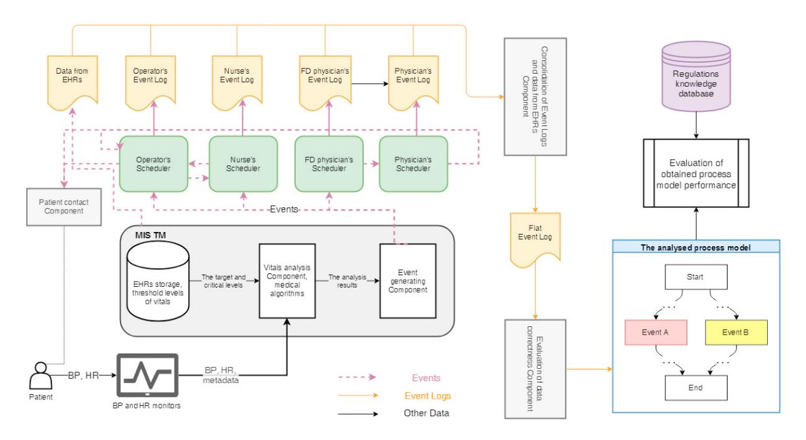
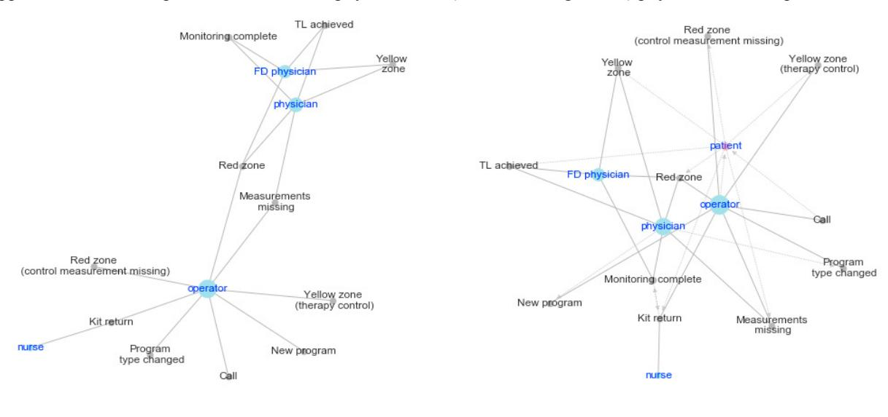
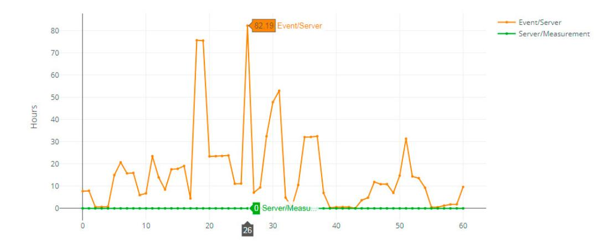
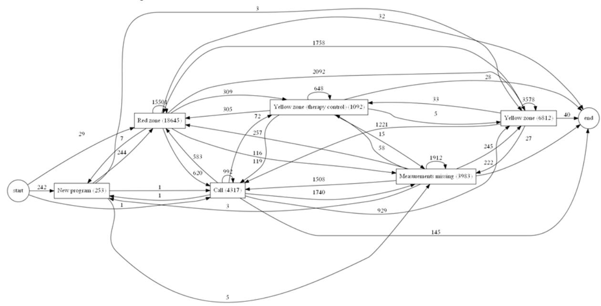

Available online at www.sciencedirect.com Procedia Computer Science 00 (2019) 000–000

<!-- Image Description: The image is the ScienceDirect logo. It's a simple textual logo, in bold, black sans-serif font on a white background. The logo serves as a publisher identifier, indicating that the paper was published or is available through ScienceDirect. There are no diagrams, charts, graphs, equations, or illustrations present; only the text of the logo itself. -->

Procedia Computer Science 156 (2019) 134–141

www.elsevier.com/locate/procedia www.elsevier.com/locate/procedia

# 8th International Young Scientist Conference on Computational Science 8th International Young Scientist Conference on Computational Science

# Intelligent Approach for Heterogeneous Data Integration: Information Processes Analysis Engine in Clinical Remote Monitoring Systems Intelligent Approach for Heterogeneous Data Integration: Information Processes Analysis Engine in Clinical Remote Monitoring Systems

Mikhail Khovricheva , Liubov Elkhovskayaa , Vladimir Foninb and Marina Balakhontcevaa, \* Mikhail Khovricheva , Liubov Elkhovskayaa , Vladimir Foninb and Marina Balakhontcevaa, \*>*b PMT Online, Moscow, Russia a ITMO University, Saint-Petersburg, Russia b PMT Online, Moscow, Russia*## Abstract

heterogeneous data and knowledge sources in personalized healthcare. The integration profile we propose is mainly focused on remote monitoring of patients with arterial hypertension and chronic heart failure. This clarifies main temporal data used by event detection systems and limits it to systolic/diastolic pressure and heart rate. Our aim is to design and propose software component for such a system which makes it possible to reconstruct the whole remote monitoring and treatment process by connecting event logs. The analysis of the reconstructed process done by comparing with an expert system which contains different rules for monitoring/treatment process optimization. The paper presents a research project which aimed to design and develop an intelligent approach for the integration of heterogeneous data and knowledge sources in personalized healthcare. The integration profile we propose is mainly focused on remote monitoring of patients with arterial hypertension and chronic heart failure. This clarifies main temporal data used by event detection systems and limits it to systolic/diastolic pressure and heart rate. Our aim is to design and propose software component for such a system which makes it possible to reconstruct the whole remote monitoring and treatment process by connecting event logs. The analysis of the reconstructed process done by comparing with an expert system which contains different rules for monitoring/treatment process optimization.

© 2019 The Authors. Published by Elsevier Ltd. © 2019 The Authors. Published by Elsevier Ltd. © 2019 The Authors. Published by Elsevier Ltd.

This is an open access article under the CC BY-NC-ND license (https://creativecommons.org/licenses/by-nc-nd/4.0/) This is an open access article under the CC BY-NC-ND license https://creativecommons.org/licenses/by-nc-nd/4.0/) Peer-review under responsibility of the scientific committee of the 8th International Young Scientist Conference on This is an open access article under the CC BY-NC-ND license https://creativecommons.org/licenses/by-nc-nd/4.0/)

Peer-review under responsibility of the scientific committee of the 8th International Young Scientist Conference on Computational Science. Computational Science Peer-review under responsibility of the scientific committee of the 8th International Young Scientist Conference on
*Keywords:*intelligent integration; remote monitoring; heterogeneous data; value-based healthcare*Keywords:* intelligent integration; remote monitoring; heterogeneous data; value-based healthcare

\*Corresponding author. Tel.: +7-911-102-0556.*E-mail address:* mbalakhontceva@itmo.ru \*Corresponding author. Tel.: +7-911-102-0556.

1877-0509 © 2019 The Authors. Published by Elsevier Ltd.

This is an open access article under the CC BY-NC-ND license (https://creativecommons.org/licenses/by-nc-nd/4.0/) Peer-review under responsibility of the scientific committee of the 8th International Young Scientist Conference on Computational Science. 10.1016/j.procs.2019.08.188

## 1. Introduction

The recent progress in medical information technologies is inspired by the P4-medicine approach [1] and Value-Based Health Care (VBHC) [2]. These basic principles affect medical care process and help with preclinical detection of diseases. Usage of a predictive, preventive, personalized and participatory aspects can reduce, for example, risk of complications for the patient and optimize healthcare information systems. The development of predictive models, methods and technological solutions for P4-medicine and VBHC involves the processing and analysis of large amounts of data and often this data is not structed and incomplete. This situation will worsen if effective methods and algorithms for processing such data are not developed. This is confirmed by many modern studies, for example, according to [3] a compound annual growth rate (CAGR) of medical data will be 36% by 2025.

Another critical feature of medicine as a subject area is a well-developed semantic network of terms and concepts. This feature can be used for creating modeling and developing intelligent systems, that process data with semantic-based algorithms. There are many researches linked with semantic data interoperability and integration. Authors [4] analyze existing solutions for standardization and integration of medical data considering existing standards in the context of their applicability to infectious diseases. The authors give an example of semantic integration of several nomenclatures and standards at once with a view to the aggregation of Electronical Health Records (EHR) and the results of laboratory tests. Another group of researchers [5] is developing a project in the field of standardization and compatibility of EHRs, as well as their usability. Examples of data integration in the context of the Internet of Things and mobile application development are also quite common [6].

In recent years great success has been achieved in development of technologies for remote monitoring and treatment [7]. The main pool of these technologies is formed by wearable devices, communication gateways, anomalous event detection software, fault tolerance providing software solutions, et cetera. Authors [8] presents M4CVD system based on a machine learning model for cardiac diseases monitoring. The system uses wearable sensors to collect data and determine patterns. In modern telemedicine systems, data is processed using three main levels, namely sensors, a gateway, and a medical centre server [9]. Researchers [10] presented a real-time monitoring system architecture for diagnosing major heart diseases, which helps prevent a number of heart diseases and monitor the rehabilitation of patients recovering from heart disease.

Unfortunately, data sources heterogeneity, diversity of data generated by these systems, models mismatch in different subsystems may lead to integration errors and failures. This is one of the risk factors during tracking vital parameters. To test the scalability of fault tolerance, temporal characteristics, etc. the simulation test may be conducted. This test forms a "virtual environment" which is functionally equivalent to the real medical information system (MIS) and allows setting of subject and system characteristics (time rates, number of users being simulated, etc.). These simulation models generate a large number of data, the heterogeneity of which makes it difficult to analyze the optimality of the medical care process. The integration profile we propose is mainly focused on remote monitoring of patients with arterial hypertension (AH) and chronic heart failure. This clarifies main temporal data used by event detection systems and limits it to systolic/diastolic pressure and heart rate. Our aim is to design and propose architecture of such a system which makes it possible to reconstruct the whole remote monitoring and treatment process by connecting event logs. The analysis of reconstructed process may be done by comparing with expert system which contains different rules for monitoring/treatment process optimization.

### 2. Proposed Approach

We present the intelligent approach for automated integration of heterogeneous data and knowledge sources into a single event log. This approach allows analyzing chronic diseases development processes for optimization and management of medical care. We applied a hybrid technology for data integration at two levels: logical and semantic. Integrated data is converted into events chains and analyzed within several critical issues for information processing: (1) the speed of data transfer between actors, (2) the load on each member of remote monitoring, (3) information process graphs' structure. These issues targeting to optimize processes and improve the quality of medical care. The proposed approach is also based on creating a personalized event logs: events from a specific patient/employee/time interval are retrieved from the general log by the user's request for further analysis. Based on the data from specific MIS [11] for remote monitoring AH patients a technological prototype of the approach was implemented.

####*2.1. Data sources description*Patient's vitals measurements are performed by a blood pressure wearable device with a feature to determine heart rate. Blood pressure (BP) and heart rate (HR) measurements are transmitted to a processing device that integrates several types of data (unit, value, timestamp), and creates metadata. Moreover, an unique id corresponds to each data block. The medical information system of telemonitoring (MIS TM) partially contains patients' EHRs information as well as measures' threshold levels. Full information from patients' EHRs is stored in a separate database which are not directly accessible while studying the remote monitoring processes, so its usage within the general process requires a hybrid ontological integration scheme. The scheme of intelligent ontology-based semantic integration of heterogeneous sources is implemented in the form of creating a model of hybrid ontological models at the request of the user (medical specialist, researcher, a decision maker).

MIS TM include several medical algorithms that perform the vitals analysis and events generating when target levels are exceeded. For each category of data from the MIS TM functional modules (the functional diagnostics unit, the call center unit, the medical and patient units), the corresponding events are extracted. Events fall into two types: medical and non-medical. Medical events are events with clinical significance for the physician, which are formed by the certain algorithms processing incoming data from a patient and subdivided according to the urgency of the response. Non-medical events are missing of measurements, a call to a patient under remote monitoring.

Scheduler is a user's personal account tool that allows to receive and process the events generated during the remote monitoring. Events, depending on their type and significance, are received by the schedulers of specialists who are directly involved in remote monitoring patients, namely:

- Operator;
- Physician;
- Functional diagnostics (FD) physician;
- Nurse.

Each participant who received an event by the scheduler processes it according to the specialist work regulation and then marks it as completed. In the course of processing the event, new related events can be generated, so it makes sense to consider the scheduler as a data source. Additionally, as mentioned earlier, patients' EHRs are not directly connected to the schedulers and have low access for analysis.

##*2.2. Data sources integration scheme*The data and knowledge exchanged between sources can be divided into three groups:

-*Component-analyzed data and knowledge*, for the processing of which involvement of participants of modeled process is not required.
- *Events-data*, which are necessary to be responded by the participants of the process when such events appear in the system.
- *Event logs*consisting of events processed. They are valuable in aggregate and intended for processing by the functional components as well as they do not require participants reaction.

The data received from the patient refers to the first group. All this data is automatically analyzed by the MIS TM algorithms when it has been delivered to a medical preventive institution. By default, it is assumed that the patients' EHRs and their vitals parameters are already present in the MIS, i.e. users are registered in the system. The results of the analysis are transmitted to the event generating component. The missing of measurements within regulated time period also generates a related event. Furthermore, the regulations provide which events can be added to the scheduler of a particular participant depending on his role in the process. In particular, almost all events appear in the operator's scheduler, and no events from the MIS TM itself are received by the physician's scheduler.

All events in the participant's scheduler must be processed. The events processing procedure is also regulated. For example, "Red zone" appears in the physician's scheduler only after it has been confirmed (processed) by the FD physician. In this case, the physician response according to the regulations is unplanned contact with patient. New events therefore are generated not only in the MIS, but also by the participants themselves during the events processing. Contact with a patient is a response to a number of critical medical events as well as to non-critical types of events such as "measurements missing", "kit return", etc. There is a special telecommunication component to contact with patients. The process participant generates a "Call" event while addressing this component.

Events accumulated in the participants' schedulers merged into a log. A log format is a serialized data. It is preferable to use simple and universal data models such as CSV, XLS (less universal) and like these when uploading logs from the schedulers. According to the regulations, all process participants' logs are uploaded simultaneously and then transmitted to the program component, which consolidates the obtained data at the logical level. An integral scheme of this component is designed in accordance with the task of a process model obtaining. Event logs are merged in a "flat" file format, i.e. tabular, with objects in rows and attributes in columns.

The resulting flat file format of event logs implies the ability of the information process model design directly. However, one can face some issues while consolidation, which lead to structural and semantic heterogeneity. For this reason, it is crucial to identify and eliminate such errors before model development. To do this, we suppose to implement a software component that stores a certain list of criteria the log must satisfy. The event log without errors is a serialized patient remote monitoring process, and this is the ultimate goal of the proposed architecture.

Next, an assessment of the compliance of the process with the regulations can be done. In this regard, expert knowledge and regulations are fed to the input of the system of knowledge mining and formalization. This system consists of four main components: data mining; knowledge mining via text mining, data mining and process mining techniques; knowledge formalization (models database, training set collection database, synonym dictionary for text vectors reduction, guidance, e.g. drugs and its interactions guide, reference range of patient personalized rates), patient classes obtained earlier within specific disease; general visual analysis is closely related to knowledge and data mining in which the patient treatment quality rate is produced and the results obtained are interpreted. Figure 1 presents the diagram of the proposed approach.

<!-- Image Description: The image is a flowchart depicting a process model for analyzing patient data. It shows data flowing from various event logs (operators, nurses, physicians) into a central MIS system. This system processes data, including vital signs, through analysis components, generating results. A separate component evaluates data correctness. The final model is shown as a simple flowchart with events A and B, illustrating the process's logical flow. The diagram showcases data integration and analysis steps within a healthcare context. -->

Fig. 1. Data sources integration scheme.

### 3. Case Study

####*3.1. Graphs of Information Processes for Load Evaluation*Scenario of this study is follow: the user creates a request for data analysis and evaluation of the completeness of the graph, reflecting the information process of remote monitoring for a certain time period (1 January 2018 – 31 December 2018). The results of the analysis of information processes in MIS TM are presented below.

During examination of available data for 2018, the following events were identified: Red zone, Red zone (control measurement missing), Yellow zone, Yellow zone (therapy control), TL (target levels) achieved, Measurements missing, Call, New program, Program type changed, Monitoring complete, Kit return. Also, the following roles appear in information processes realization: physician, FD (functional diagnostics) physician, nurse, operator.

<!-- Image Description: The image displays two network diagrams illustrating relationships between roles (physician, operator, nurse, patient) and events (e.g., "monitoring complete," "measurements missing") in a medical process. Nodes represent roles and events, and edges denote their interactions. The diagrams likely illustrate different scenarios or stages, possibly showing the impact of events on workflow or highlighting potential bottlenecks. The use of "red zone" and "yellow zone" suggests a risk-based categorization of events. -->

Figure 2. The relationships between: (a) roles and events based on the data; (b) roles, events and its causes (dotted) based on the processes regulations.

Relationships between roles and events directly established from the MIS TM log data can be schematically depicted in the form of a graph (Fig. 2, (a)), which shows what event can occur for a particular participant of the process of implementing remote monitoring the patients with arterial hypertension (AH). However, in practice, the realization of the system processes not always complies with its specified regulation. The complete logical connections of events and roles restored from the processes regulations of remote monitoring as well as from additional knowledge obtained from data are shown in Figure 2, (b). Here are several extra edges and nodes relative to the graph derived only from the data. For example, patient's blood pressure measurement (node "patient") can generate "Red zone", if it exceeds critical rates. In another example, according to the regulations of the carrying out monitoring, when the program is completed, a patient must return a rented kit within 3 days, but in reality (based on the data) the return of the device happens only before monitoring complete.

The graphs also can be interpreted in terms of specialists' workload. The size of role node is in direct relation to the number of event nodes it has connection with: the bigger node size, the more events in relation with. In the examples above, we can see that operator has the greatest number of events to process and it has the bigger node size, so we may assume that operator has the heavy workload. Vice versa for nurse role which has the smallest node size and number of events to manage.

####*3.2. Evaluation of Time Response*This subsection presents the results of the time response analysis. This case study is based on the following scenario of using intelligent integration approach: the system receives a request to create a set of time characteristics during remote monitoring for a certain time period. The purpose of this request is to evaluate the technical support of the process and to identify areas of potential delays in the transmission of data that can lead to negative consequences for the patient.

The differences of three time indicators, i.e. the time of blood pressure taken by patient, the time when record was received by server and the time when "Red zone" was generated after processing the data, were analyzed in order to evaluate the performance of processes realization in monitoring system. It should be noted that only "Red zone" case was considered, as it is the most significant event in terms of the processing speed by the system.

We do not know exactly what event triggered "Red zone" occurrence in the system, so first, we need to determine it as far as possible. A basic heuristic algorithm was as follows: when "Red Zone" has occurred, a search for the last measurement, which possibly caused an emergency response and the occurrence of this event, was made taking into account the difference in server and MIS TM time zones. This measurement was determined according to the regulations: extremely high blood pressure (BP) — a top number (systolic pressure) of 180 millimeters of mercury (mm Hg) or higher or a bottom number (diastolic pressure) of 120 mm Hg or higher or a heart rate of 120 beats per minute or higher, and extremely low BP is for 80, 50, 40 or lower, respectively. In this way, we were able to establish event, server and measurement times. It is worth noting that not every measurement time was possible to detect, so in this case event was not included into analysis. It could have happened due to the patient has personalized critical thresholds of BP defined by a physician or due to the technical server or system issues.

Figure 3 shows the graphs of differences between the server and measurement times (green) and the event and server times (orange) in case when "Red zone" has occurred only for "FD physician" role. As we can see, there are no delays in data delivery to the server, but there are varying times of data processing, which are crucial to the emergency response.

<!-- Image Description: The image displays a line graph comparing "Event/Server" and "Server/Measurement" over time (likely hours). The orange line (Event/Server) shows highly variable values, peaking at approximately 82 hours, while the green line (Server/Measurement) remains consistently near zero. The graph likely illustrates the disparity in resource utilization between two server processes within the system. -->

Figure 3. The graph of differences of times (in hours) for the specified patient, role and period. Points correspond to the measurement and related event instances.

####*3.3. Identification of Information Process Structure*The prototype architecture implemented on Python (Fig. 1) allowed to obtain a consolidated events log for remote monitoring of AH patients. In the data, observation programs were found to be of no value for this study (the logs are completely composed of the "No Measurement" events or are interrupted at the beginning of the observations), as well as the need to optimize the most critical processes, filtered by the following criteria: (1) the total duration of observations is at least 90 days, (2) the red zone event was formed in the first 24h of observations.

The final event log for this study has the following characteristics:

- the number of patients was 219 (73 males, 146 females);
- the number of events in the chain has interval [5, 1228];
- average time of observation is 35.2 weeks, median 41.4 weeks;
- 10 types of events (activities) and 4 roles (resource).

The resulting events log can be investigated as a process model and presented as a weighted oriented graph = (, ), where - a set of activities (states), - a set of transitions. The weights of the edges can be set differently: the total number of such transitions in the whole log or the number of patients who have this transition. To create a process model, Disco's process intelligence system was used [12]. Figure 4 shows the graph for the most frequent transitions and 0.5 most frequent events.

<!-- Image Description: This image displays a state transition diagram depicting program flow. Nodes represent program states (e.g., "Red zone," "Yellow zone," "Measurements missing"), with numbers indicating the frequency of transitions between states. The diagram visually illustrates the paths a program takes, and the relative probabilities of each transition, from "start" to "end," highlighting the different zones and potential issues like missing measurements. -->

Figure 4. The graph of remote monitoring process with 100% paths and 50% events.

Analysis of the graph allows to detect interpreted cycles. In case of frequent recurrence of some cycles it is possible to make an assumption about their conditionality to the process peculiarities. Such cycles are considered as meta-states. Adding such meta-states to the process analysis will allow us to go beyond the limits of remote monitoring (regulated sequences) and identify critical transitions. It is also possible to develop personalized predictive models and methods for increasing the process efficiency based on meta-states research.

## 4. Conclusion

We designed the intelligent approach for automated integration of heterogeneous data and knowledge sources into a single event log that allows analyzing chronic diseases development processes in case of optimization and management of medical care. Proposed in this paper approach allows to combine the medical and research systems, can solve the task of data preparation for further modeling processes, and, in the absence of limitations on protocols apply to many communication patterns of patients and healthcare organizations. Also, this approach is implemented into MIS TM as a software component for information processes analysis engine. Experimental studies of this software component in case of information processes analysis for remote monitoring and counseling of patients with AH for three scenarios were carried out

### Acknowledgements

This research is financially supported by The Russian Science Foundation, Agreement #17-71-10259.

#### References

- [1] L. Hood and M. Flores, "A personal view on systems medicine and the emergence of proactive P4 medicine: predictive, preventive, personalized and participatory,"*N. Biotechnol.*, vol. 29, no. 6, pp. 613–624, Sep. 2012.
- [2] M. E. Porter, "What Is Value in Health Care?," *N. Engl. J. Med.*, vol. 363, no. 26, pp. 2477–2481, Dec. 2010.
- [3] "Big Data to See Explosive Growth, Challenging Healthcare Organizations." [Online]. Available: https://healthitanalytics.com/news/big-data-to-see-explosive-growth-challenging-healthcare-organizations. [Accessed: 21-May-2019].
- [4] X. Gansel, M. Mary, and A. Van Belkum, "Semantic data interoperability, digital medicine, and e-health in infectious disease management: a review."
- [5] H. Veseli, G. Kopanitsa, and H. Demski, "Standardized EHR Interoperability-Preliminary Results of a German Pilot Project using the Archetype Methodology," 2012.
- [6] D. V. Dimitrov, "Medical Internet of Things and Big Data in Healthcare," *Healthc. Inform. Res.*, vol. 22, no. 3, p. 156, Jul. 2016.
- [7] N. Shanmathi and M. Jagannath, "Computerised Decision Support System for Remote Health Monitoring: A Systematic Review," *IRBM*, 2018.
- [8] O. Boursalie, R. Samavi, and T. E. Doyle, "M4CVD: Mobile machine learning model for monitoring cardiovascular disease," *Procedia Comput. Sci.*, vol. 63, pp. 384–391, 2015.
- [9] O. H. Salman *et al.*, "Data association in remote health monitoring systems," *J. Med. Syst.*, vol. 42, no. 6, p. 103, 2014.
- [10] P. Kakria, N. K. Tripathi, and P. Kitipawang, "A real-time health monitoring system for remote cardiac patients using smartphone and wearable sensors," *Int. J. Telemed. Appl.*, vol. 2015, p. 8, 2015.
- [11] "PMT ONLINE healthcare operator." [Online]. Available: http://pmtonline.ru/. [Accessed: 21-May-2019].

[12] "Process Mining and Automated Process Discovery Software for Professionals - Fluxicon Disco." [Online]. Available: https://fluxicon.com/disco/. [Accessed 21-May-2019].
