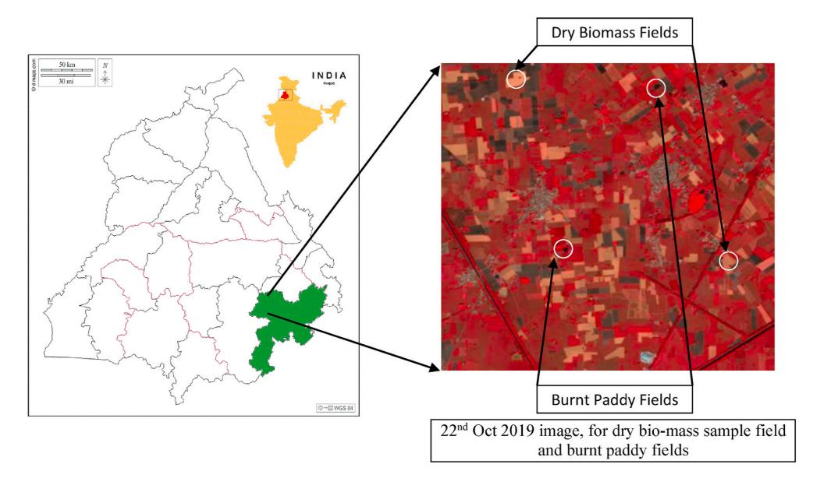
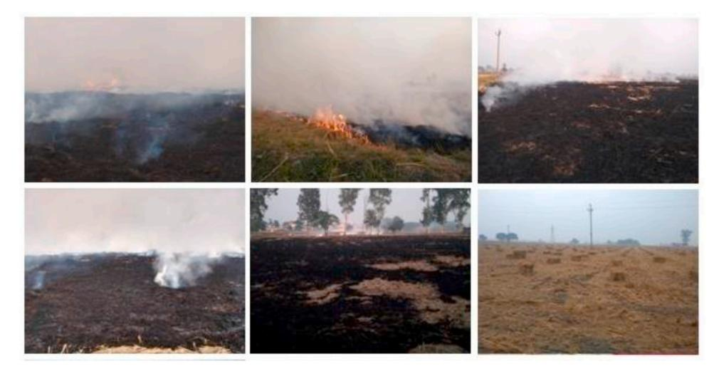
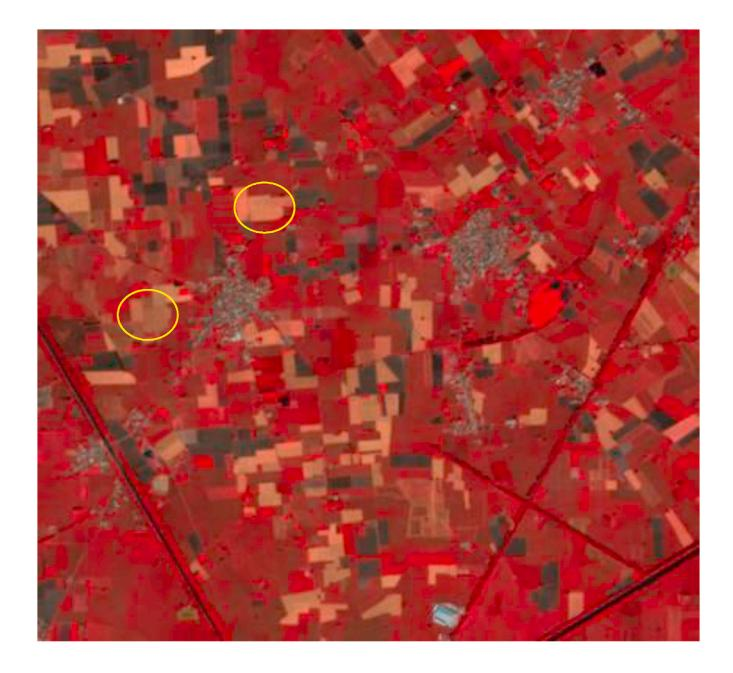
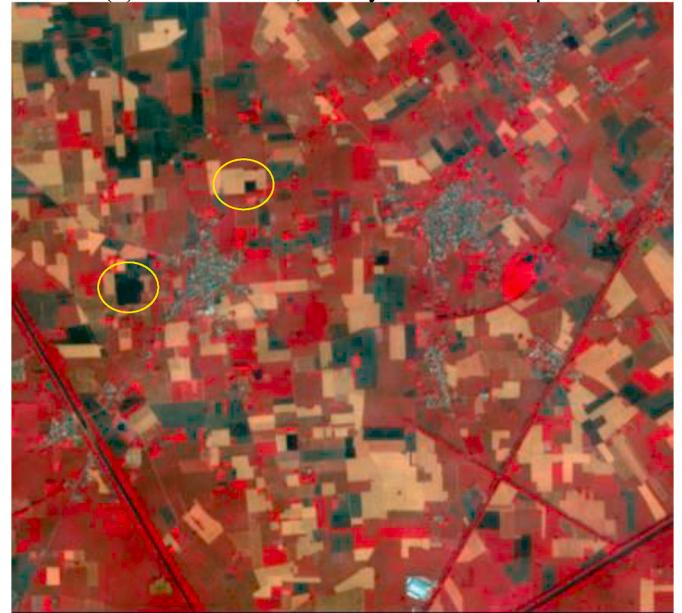
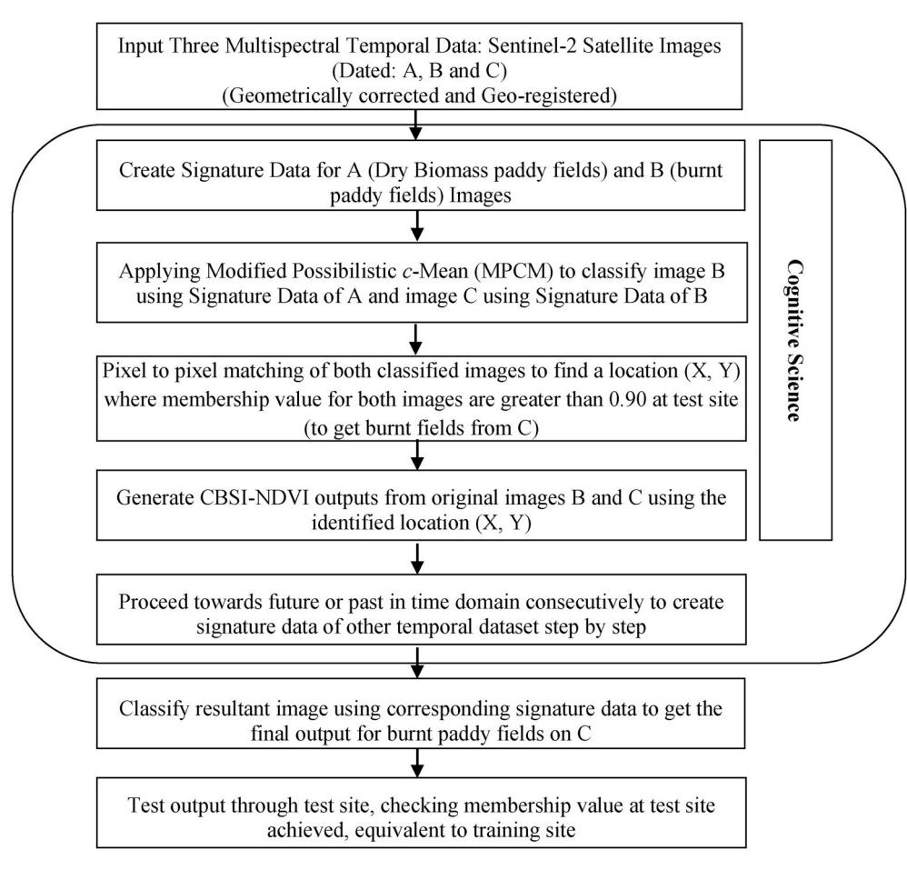
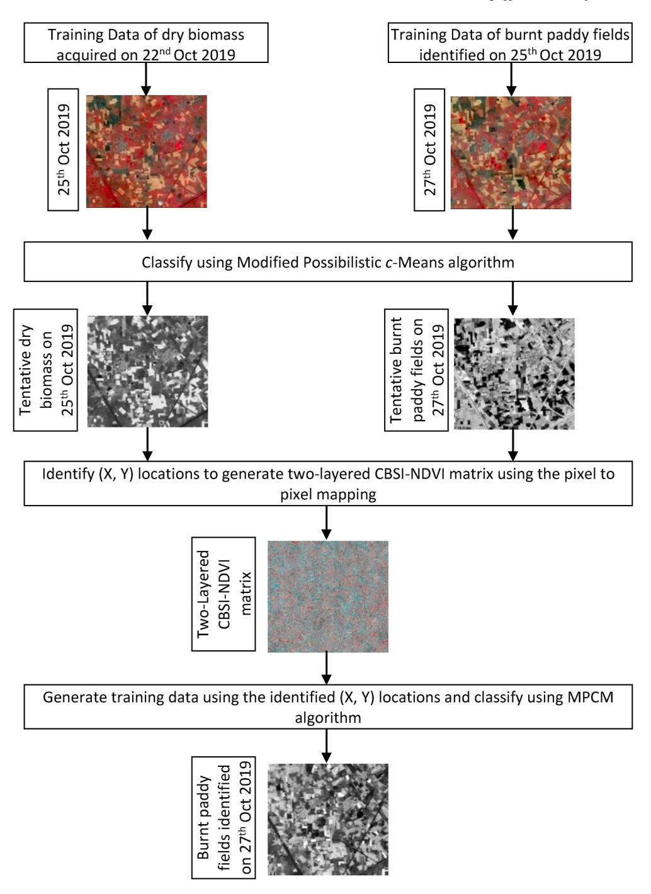
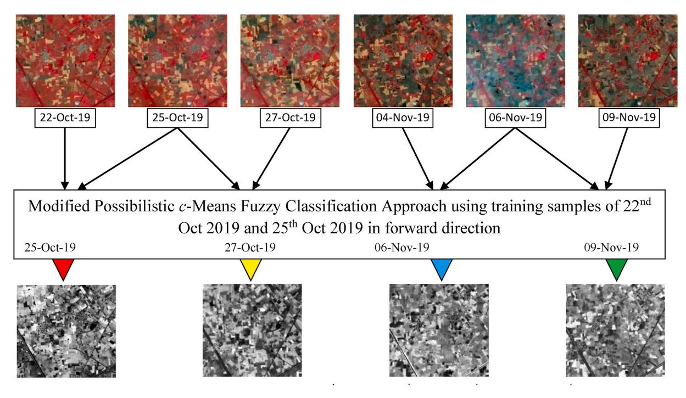
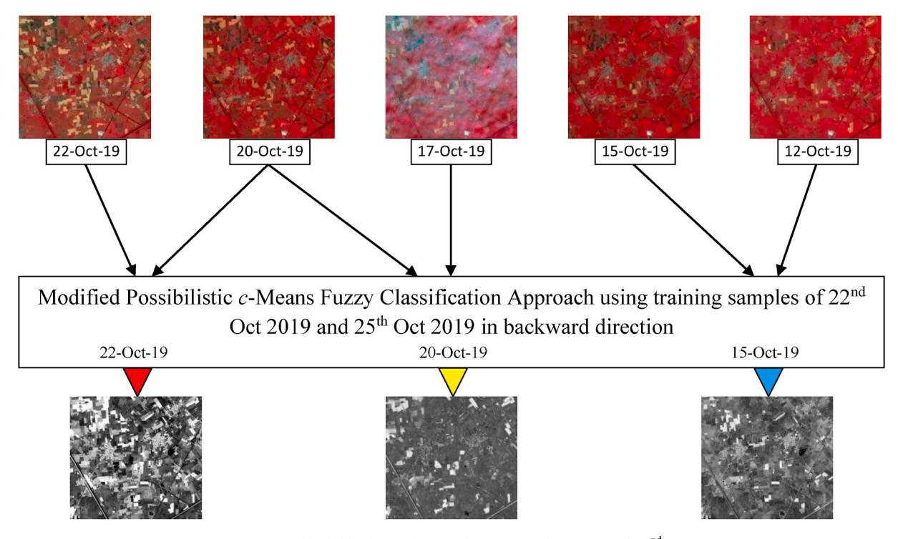
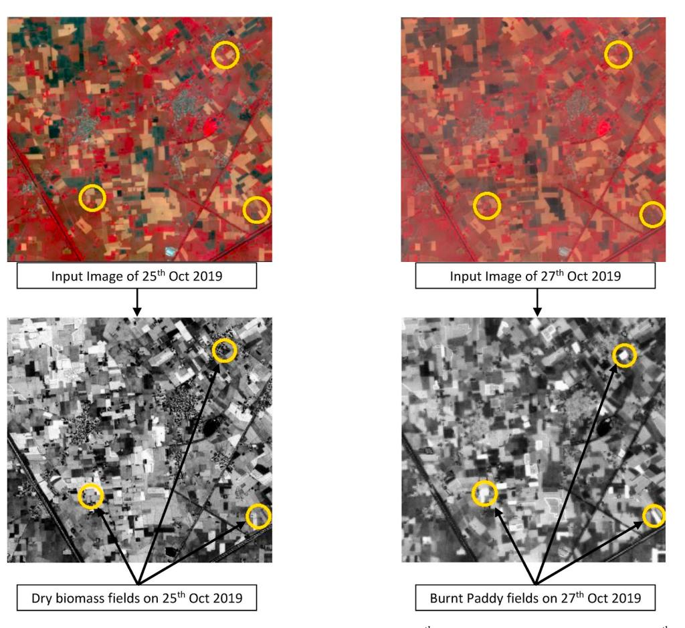

Contents lists available at [ScienceDirect](www.sciencedirect.com/science/journal/23529385)

Remote Sensing Applications: Society and Environment

journal homepage: [www.elsevier.com/locate/rsase](https://www.elsevier.com/locate/rsase)

# Procreation of training data using cognitive science in temporal data processing for burnt paddy fields mapping

burnt paddy fields.

Mragank Singhal a,\* , Ashish Payal a , Anil Kumar b

a *Guru Gobind Singh Indraprastha University, Delhi, India* 

b *Indian Institute of Remote Sensing, ISRO, Dehradun, India* 

| ARTICLE INFO                                                                            | ABSTRACT                                                                                                                                                                                                                                                                                                                                                                                                                                                                                                                                                                                                                                                                                                                                                                                                                                                                                                                                                                                                                                                                                                                                                                                                                                                                                                                                                                                                                                                                                                      |  |  |
|-----------------------------------------------------------------------------------------|---------------------------------------------------------------------------------------------------------------------------------------------------------------------------------------------------------------------------------------------------------------------------------------------------------------------------------------------------------------------------------------------------------------------------------------------------------------------------------------------------------------------------------------------------------------------------------------------------------------------------------------------------------------------------------------------------------------------------------------------------------------------------------------------------------------------------------------------------------------------------------------------------------------------------------------------------------------------------------------------------------------------------------------------------------------------------------------------------------------------------------------------------------------------------------------------------------------------------------------------------------------------------------------------------------------------------------------------------------------------------------------------------------------------------------------------------------------------------------------------------------------|--|--|
| Keywords: Cognitive science Soft classification Modified possibilistic c-means | While mapping specific classes such as burnt paddy fields at an interval require temporal remote sensing images that need ground truth data collection to be conducted during image acquisition. Frequent collection of such training data as per the frequency of acquisition of temporal data is time and cost dependent as well as cumbersome. The cognitive science concept has been applied to extend training data from seed training samples in the time domain to reduce ground visits for collecting training data. Since cognitive science is an interdis ciplinary study of the mind and its processes, this research has tried to generate training samples in the past and the future within the paddy stubble burning cycle from the seed training samples collected from the ground. In this research work, seed training data collected on 25th October 2019 extended for 27th October 2019, 4th November 2019, 6th November 2019, as well as 20th October 2019, 17th October 2019, 15th October 2019 and 12th October 2019, temporal images for burnt field's identification. Favorable results were achieved through cognitive science using augmented training data in burnt paddy field mapping. The Mean Membership Difference between the training and testing site shows up to 98% accuracy. The largest burnt area was found between 4th Nov 2019 to 6th Nov 2019.The F-Score, Kappa and overall accuracy were found to be 98% in identifying the |  |  |

# **1. Introduction**

Digital image classification is the main application domain to map and extort data about remote areas from satellite imagery. Higher accuracy can be achieved with the intervention of digital processing approaches to a digital image ([Richards and Jia, 2013](#page-9-0)). [Lillesand and](#page-9-0)  [Kiefer \(1979\)](#page-9-0) have mentioned digital image classification as a quantitative technique to classify image data into various categories. Supervised and unsupervised image classifications are two broad categories of classification procedures [\(Campbell, 1996\)](#page-9-0). The unsupervised classification outcomes are based on the software analysis of an image, using similar spectral characteristics, without providing training samples by the user. On the other hand, in supervised classification, the user has to provide some training samples. The classification of the image is based on the chosen samples.

Since supervised classification requires training samples for classification using any of the available algorithms, gathering suitable training samples is essential. The training samples are the key to the classification because they will determine which class each pixel inherits in the overall image. Supervised image classification requires collecting both training and validation data to produce thematic maps of features of interest (e.g., general land cover, crops, wetland classes, etc.) ([Foody,](#page-9-0)  [2004\)](#page-9-0). Supervised algorithms are adaptable to a broad range of problems but depend on the availability of training data, which, in remote sensing, are typically obtained through cost- and labour-intensive fieldwork or time-consuming visual image interpretation [\(Stumpf](#page-9-0)  [et al., 2014\)](#page-9-0).

The term classifier refers loosely to a computer program that implements a specific image classification procedure [\(Campbell 2002](#page-9-0)). A classification method is required, which suits the best to accomplish any specific task, which the analyst selects. However, it is not possible to state which classifier is the best for all tasks because the image characteristic and study's purpose vary greatly. At present, for different purposes, there are different image classification procedures used by the researchers. The Maximum-Likelihood Classifier (MLC) assigns pixels to classes using contours of probability around training areas. Mean vector and covariance metrics are the key component of MLC that can be retrieved from training data [\(Sisodia et al., 2014](#page-9-0)). [Bezdek et al. \(1984\)](#page-9-0),

\* Corresponding author. *E-mail addresses:* [mraganksinghal@gmail.com](mailto:mraganksinghal@gmail.com), [singhal@gmail.com](mailto:singhal@gmail.com) (M. Singhal), [ashish@ipu.ac.in](mailto:ashish@ipu.ac.in) (A. Payal), [anil@iirs.gov.in](mailto:anil@iirs.gov.in) (A. Kumar).

<https://doi.org/10.1016/j.rsase.2021.100516>

Available online 25 April 2021 2352-9385/© 2021 Elsevier B.V. All rights reserved. Received 20 November 2020; Received in revised form 12 March 2021; Accepted 8 April 2021 presented the Fuzzy *c*-Means (FCM) algorithm with a thought of fuzzy sets to solve mixed pixel problems, which uses the mean of all the points, weighted by their degree of belongingness to the cluster. Fuzzy based classifiers were observed to be generally effective in producing precise and reasonable outcomes in image classification [\(Chawla, 2010\)](#page-9-0). Later, to overcome the drawbacks of FCM, [Krishnapuram et al. \(1993\)](#page-9-0), proposed an algorithm that was based on possibilistic concept and improvement in objective function which was labelled as Possibilistic *c*-means (PCM)to reduce the effect of noise and outliers. The hybridisation of fuzzy algorithms while incorporating parameters like entropy-based, contextual based, and many more with these classifiers have experimented ([Kumar, A., et al., 2019\)](#page-9-0). In the last two decades association of fuzzy-based classifiers as machine learning algorithms have shown an increase in classification performance [\(Sujamol, S. et al.,](#page-9-0)  [2017\)](#page-9-0). The applicability of artificial intelligence in Synthetic Aperture Radar (SAR), image processing have been evaluated using automated SAR image processing (ASIP) system [\(Fisher et al., 1999](#page-9-0)).

Possibilistic *c*-Means (PCM) has been modified with KPCM by replacing the Euclidean norm with Gaussian kernel, resulting in an increase in robustness to noise [\(Kandpal, 2016\)](#page-9-0). Supervised noise clustering has opted as the base classifier, and adding nine different kernel functions as the distance functions with it leads to derive a kernel-based classifier, termed as, KNC ([Sengupta et al., 2019\)](#page-9-0). [Li et al. \(2003\)](#page-9-0), revised the objective function of PCM and presented an efficient clustering algorithm, named as Modified Possibilistic *c*-Means (MPCM). The MPCM algorithm saves running time by removing the measurement of membership parameters in each of the iterations. MPCM not only has PCM's properties i.e. resisting noisy solutions and avoiding trivial solutions but also has one of the fast clustering features. PCM, Noise Clustering (NC) and MPCM algorithms can map specific classes of interest from temporal datasets [\(Misra et al., 2012](#page-9-0); [Singh and Kumar,](#page-9-0)  [2019\)](#page-9-0).

One of the most challenging tasks in practical applications is a convenient and accurate classification in the processing of multitemporal remote sensing images. Furthermore, the image responses may change due to variability in time and space within the multitemporal images ([Richards, 1993](#page-9-0)). Therefore, the supervised classification of multi-temporal images faces the problem that the training data has to be repeatedly selected for each image within the multi-temporal remote sensing data [\(Schowengerdt, 1997](#page-9-0)). [Chen et al. \(2009\)](#page-9-0) proposed a fuzzy training method to avoid the repeated selection of training data in each temporal image. His proposed approach was to automatically generate the training data for the following period image with the classified first-period image. [Tuia et al. \(2009\)](#page-9-0) proposed an active learning framework for remote sensing classification that could reduce the required number of training samples up to 10%. Training data are typically generated by digitizing polygons on high spatial-resolution imagery, collecting in situ data, or using pre-existing datasets ([Elmes](#page-9-0)  [et al., 2020](#page-9-0)). The number of training samples required may depend upon the classification algorithm used ([Huang et al., 2002](#page-9-0)). [\(Lu and Weng](#page-9-0)  [2007; Li et al., 2014](#page-9-0)) concluded accurate and large training data sets are preferable, no matter what the algorithm used.

Mapping various stages of a specific class requires temporal data to incorporate changes happening within the class, for which training data is required at each stage. At different stages of a class, representing changes that occurred within the class, the training data collection has to be done several times at different time intervals. A large number of training datasets are required on image to image basis while processing temporal data. The collection of training data from the ground becomes difficult at different time intervals due to limited time, access, or interpretability constraints. Since this research gap has not been addressed previously, therefore, to avoid such problems, in this research work, one of the components of cognitive science has been experimented in which presently collected training samples as knowledge of experience was transferred on past as well as future temporal data sets to identify and map the same information in past or future data.

This paper's prime objective has been to study the effect of cognitive science as knowledge of experience to generate training data sets for future or past temporal data sets for MPCM classifiers. In this research, cognitive science has been implemented for training data collection of the next stage for the same class, frequently occurring at some interval using seed training data collected from the previous stage from the ground. Once seed training data from the ground is available, the main objective of this research work has been that from this seed training data, how to generate training data towards the past side or future side of occurrence of the same class in the time domain, using cognitive science and its effect tested for mapping paddy stubble burnt fields at frequent interval.

#### **2. Cognitive science**

Cognitive Science aims to understand how the brain processes information, i.e. "how it transforms, elaborates, stores, recovers, and uses the information provided by the five senses". ([Verwey, W.B., 2015\)](#page-9-0). Via previous experiences and understandings, cognition is the process of learning knowledge. From simple to very complicated problems, cognitive processing allows us to understand and communicate with the world around us.

Artificial Intelligence (AI) is not exactly a Thinking machine or a robot but it is much more than that. [Dean et al. \(1995\)](#page-9-0), define AI as "the design and study of computer programs that behave intelligently". Most authors view Artificial Intelligence as "a set of design problems that human designers are expected to solve" [\(Spector, L., 2006\)](#page-9-0). With the help of AI, machines can be designed to do any specific task, such as autonomous driving or voice recognition. These are also known as Weak Artificial Intelligence. Weak AI focuses on a narrow task and seem very intelligent at it. It attempts to model the human mind in a similar way to modelling weather conditions, climate change, or other natural phenomena ([Searle, 1980](#page-9-0) p. 37–38). The future objective is to build a powerful AI that learns like a person and can solve all human kind problems.

Cognitive science is one of the sub-disciplines of Artificial Intelligence. Cognitive computing combines human capabilities like emotion and imagination with machine capabilities such as pattern identification and handling massive amounts of data. Cognitive Science addresses the common aspects of questions about human memory, learning, perception, problem-solving, structure, and function of the brain, human intelligence, and knowledge [\(Abdi, A., 2016\)](#page-9-0).

Cognitive science works with the modern sciences of the mind to extend their scope to include human experience and the possibilities of human experience for transformation. Several recommendations on basic processes for conducting tasks such as perception, understanding, and memory and interpretation are also offered by cognitive science. For image processing applications, the domain of cognitive science is new. One of its essential tasks would undoubtedly be cognitive image processing. It must be noted in particular that this trend is a specific case of a much more general movement: the transition from a "computational data-processing paradigm" to a "cognitive information-processing paradigm" that affects many sciences, technology and engineering fields today [\(Diamant, 2014\)](#page-9-0).

A wise choice will be first to seek an expert's advice if someone needs to guess how an event will theoretically unfold. Based on their qualifications, understanding, and experience, the experts would present their opinions. These views are articulated in forward-looking sentences, containing valuable knowledge backed by long-standing experience and analysis ([Nakajima et al., 2019](#page-9-0)). The following paper presents the research confirming whether it is possible to apply cognitive science into image processing to generate training data to be used by machine learning algorithms to map specific classes from future or past acquired temporal data sets using present experience.

#### **3. Mathematical concepts of algorithm and indices**

To resolve the limitations of FCM and PCM, MPCM has been introduced. "MPCM has fast clustering ability, abilities to resist noise, and trivial solutions"([Li et al., 2003\)](#page-9-0). "Since PCM causes coincident clusters, MPCM was proposed to overcome this problem and fit the clusters which are close to one another". [Li et al. \(2003\),](#page-9-0) added that in this algorithm a large number of parameters needs to be determined because of which it take more time in implementation.

This section gives the mathematical concepts of the MPCM algorithm and its objective function formulation. [Li et al. \(2003\)](#page-9-0), revised PCM's objective function and introduced an effective algorithm for clustering and addressed how parameters should be selected.

To minimize the impact of noise and outliers parameter λi was introduced with respect to each training sample and the modification has been done in PCM's objective function. The objective function of MPCM is written in Eq. (3.1):

$$
J_m = \sum_{i=1}^N \sum_{j=1}^C (\mu_{ji})^m ||x_i - v_j||^2 + \sum_{i=1}^N \eta_i \sum_{j=1}^C (\mu_{ji} \log(\mu_{ji}) - \mu_{ji})^m
$$
(3.1)

where

$$
\mu_{ji} = \exp\bigg(-\frac{\left\|x_i - v_j\right\|^2}{\eta_i}\bigg), \forall i, j \tag{3.2}
$$

The objective function in Eq. (3.1) and the membership value in Eq. (3.2) satisfy the criterion below:

$$
\mu_{ji} \in [0, 1] \forall i, j \tag{3.3}
$$

$$
0 < \sum_{i=1}^{N} \mu_{ji} \le 1, \forall j \tag{3.4}
$$

max*j μji &gt;* ⋅0*,* ∀I (3.5)

In Eq. (3.1), *vj* represents the prototype (mean) associated with class c and *ηi* is the "bandwidth" or "resolution" or "scale" parameter which controls the shape and size of the class as mentioned in Eq. (3.6):

$$
\eta_{i} = \frac{\sum_{i=1}^{N} (\mu_{ji})^{m} ||x_{i} - v_{j}||^{2}}{\sum_{i=1}^{N} (\mu_{ji})^{m}}
$$
(3.6)

# *3.1. Pseudocode of MPCM algorithm*

To implement and understand the working of the MPCM classifier pseudo-code of MPCM algorithm has been given in the following bullets.

- 1. Assign the mean values of each class from training data.
- 2. Assign the value of the degree of fuzziness ∞ *>* m *>* 1.
- 3. Compute the regularization parameter '*ηi* '.
- 4. Computer the membership matrix, as given in Eq. (3.2).
- 5. Assign the final class to each pixel.

#### *3.2. Characteristics of MPCM*

The characteristics of MPCM in comparison to other fuzzy classifiers have been mentioned here. Due to the characteristics of MPCM, it handles coincidence clusters, noise, and works fast.

- a) Because PCM creates cluster problems that coincide, MPCM was implemented to match the clusters that are closer to each other.
- b) In contrast to PCM, MPCM is less noise-sensitive.
- c) One of the fast clustering algorithms compared to FCM, PCM, etc., is the MPCM algorithm.

# *3.3. Class-Based Sensor-Independent Indices (CBSI)*

"It is noticed that the classification techniques take only one dimension of data, but the temporal multispectral data have two dimensions: one is spectral and the other is temporal. While dealing with temporal multispectral imagery, with its spectral and temporal two dimensions can't be input to classification algorithms"[\(Aggarwal et al.,](#page-9-0)  [2014\)](#page-9-0).

In this research work NDVI vegetation indices proposed by [Kriegler](#page-9-0)  [et al. \(1969\)](#page-9-0) were used to reduce spectral dimensionality of the temporal dataset while maintaining temporal dimensionality. In the present scenario where bands in multispectral are large still users have to identify which bands are red and NIR bands. Therefore, in this research work, to decrease the dataset's spectral dimensionality, Class-Based Sensor--Independent Indices (CBSI) has been applied proposed by [\(Sengar et al.,](#page-9-0)  [2012\)](#page-9-0). The CBSI-NDVI formula has been written in Eq. (3.7):

$$
CBSI - NDVI = \frac{\rho_{\text{max}} - \rho_{\text{min}}}{\rho_{\text{max}} + \rho_{\text{min}}}
$$
\n(3.7)

where *ρ*max represents band of the maximum reflectance and *ρ*min represents the minimum reflectance ([Upadhyay et al., 2012\)](#page-9-0). The value of CBSI-NDVI ranges from 0 to 1.

# **4. Study area**

Surroundings of Patiala area, Punjab state, India has been selected as a study area for this research work to identify burnt paddy fields. "The stubble burning phenomenon in Punjab is linked to three unlikely factors: the (relatively) large size of landholdings of farmers in the state; the (consequent) high level of mechanization; and a water conservation law that shortens the harvest window" ([Haq 2018\)](#page-9-0). The District of Patiala lies in the southeast part of the state between 29◦ 49′ and 30◦ 47′ north latitude, 75◦ 58′ and 76◦ 54′ east longitude. It is surrounded by the districts of Rupnagar, Mohali, and Fatehgarh Sahib to the north, Fatehgarh Sahib and Sangrur to the west, Ambala, Panchkula, Haryana to the northeast, and the neighbouring districts of Kurukshetra to the east, and Haryana's Kaithal district to the southwest. The reasons for selecting this study area were:

- During October (2019) and November (2019), paddy stubble burning occurred.
- In Punjab, the harvesters shave off the paddy's grainy portion, leaving loose straw in their wake, as they believe it is cheaper to burn the residue.

The map of the location and field photographs taken during field visits conducted on 24th and 25th October 2019 are shown in [Fig. 1](#page-3-0). [Fig. 2](#page-4-0) represents the dry biomass field identified on 22th October 2019 and burnt paddy fields identified on 25th October 2019 of the same location. The yellow circle is used to highlight the area where the ground truth data was collected and investigated.

#### *4.1. Dataset used*

In this research work, the multispectral and temporal images from twin satellites Sentinel-2A and Sentinel-2Bhave been used to achieve the research objective and test performance of cognitive science-based training data generation using supervised MPCM based classification to identify burnt paddy fields. Sixteen temporal images were acquired from 5thOctober 2019 to 24th November 2019 of the same site. In this research work, the image of multi-spectral temporal images of Sentinel-2A and Sentinel-2B has been considered as input. The temporal, multispectral Sentinel 2A/2B dataset and its sensor specification have been shown in [Table 1](#page-4-0). Field visit to surroundings of Patiala was conducted from 24th – 25th October 2019, for collecting geo-tagged burnt field's

**Fig. 1.** Study Area and Burnt-Paddy field sites identified on 24th Oct 2019 and 25th Oct 2019 inthe surroundings of Patiala Area (Punjab, India).

information to be used as seed training sites as well as testing sites.

#### **5. Proposed methodology**

Experience as one of the parameters from the cognitive science domain for training data generation in the time domain has experimented through the proposed methodology mentioned in this section. The input data set, having two consecutive temporal date images as an input, with steps for generating training data for the next temporal data sets, has been explained in [Fig. 3](#page-5-0). From [Fig. 3,](#page-5-0) it can be seen initially that two temporal datasets were formed and from first temporal data, seed training samples were identified. The training data for the next consecutive temporal data set have been generated using seed training data collected on 22nd and 25th October 2019, during field visits conducted to collect geo-tagged burnt paddy fields. Once seed training data from the ground was available, a methodology developed to generate training data towards consecutive datasets of the past side or future side. Seed temporal training data from the 22nd and 25th October 2019 field has been used to apply cognitive science and its effectiveness tested through evaluating paddy burnt test fields mapped in outputs. Modified Possibilistic *c*-Means (MPCM) algorithm has been applied for burnt paddy field mapping. The detailed description of the methodology has been given in [Fig. 3.](#page-5-0)

Steps adopted in [Fig. 3](#page-5-0) were followed to apply the cognitive science concept to collect training data of temporal dataset of 25th Oct 2019–27thOct 2019, while collecting seed training samples from temporal dataset 22nd Oct 2019–25thOct 2019.A step-by-step explanation of adopted methodology has been given in points (1)–(8):

- 1) Six band images of 22nd Oct 2019 and 25thOct 2019 were used to create separate training data from both the images from a known sample field of burnt paddy. So from this step, training data of 22nd Oct 2019 (i.e. dry biomass paddy fields) and 25thOct 2019 (i.e. burnt paddy fields) were collected from an identified burnt field location from ground.
- 2) In the second step, the image acquired on 25thOct 2019 was classified using training data of 22ndOct 2019. Similarly, the image acquired on 27thOct 2019 was classified using training data collected from the 25thOct 2019 image. The classification outputs have been generated by applying the MPCM classification. From this process, the tentative outputs of fields with dry paddy stubble got from 25thOct 2019 image and tentative paddy stubble burnt fields from the 27thOct 2019 image.
- 3) Outputs from step (2) were used in the third step for finding out locations where membership value of dry stubble from 25thOct 2019 image and burnt field from 27thOct 2019, from both classified

**Fig. 2.** Dry biomass field and burnt paddy field identified at the same location with same FCC combination on 22nd Oct 2019 and 25th Oct 2019

outputs, is the maximum. For this purpose, a search operator was applied which can provide (X, Y) locations where the membership value of both output images was maximum, using pixel to pixel matching.

- 4) From step (3), the location (X, Y) identified has been used to generate CBSI-NDVI outputs from original images acquired on 25th Oct 2019 and 27th Oct 2019. In this test case, Band 5 contains the maximum value and was used as an IR Band. Similarly, Band 1 contains the minimum value and was used as Red Band from both the images.
- 5) The Red Band and IR Band values from the original images are read and a two-dimensional matrix was created using CBSI-NDVI formula as written in Eq. [\(3.7\)](#page-2-0), which holds temporal indices as twodimensional vectors.

#### **Table 1**

Sentinel 2A/2B dataset and sensor specification.

| Specifications      | Sentinel – 2A                                                   | Sentinel – 2B                                                |  |  |
|---------------------|-----------------------------------------------------------------|--------------------------------------------------------------|--|--|
| Spatial Resolution  | 10–60 m                                                         | 10–60 m                                                      |  |  |
| Spectral Resolution | 13 bands                                                        | 13 bands                                                     |  |  |
| Scene Size          | 290 km × 290 km                                                 | 290 km × 290 km                                              |  |  |
| Image Acquired on   | 5th Oct 19, 10th Oct 19, 12th Oct 19, 15th Oct 19, 17th Oct 19, |                                                              |  |  |
|                     |                                                                 | 20th Oct 19, 22nd Oct 19, 25th Oct 19, 27th Oct 19, 30th Oct |  |  |
|                     | 19, 1st Nov 19, 4th Nov 19, 6th Nov 19, 9th Nov 19, 19th Nov    |                                                              |  |  |
|                     | 19, 24th Nov 19                                                 |                                                              |  |  |
| Spectral Bands      | 10m (B2, B3, B4, B8)                                            |                                                              |  |  |
|                     | 20m (B11, B12)                                                  |                                                              |  |  |
|                     |                                                                 |                                                              |  |  |
|                     | B2 – Blue (490 nm) B3 – Green (580 nm)                       |                                                              |  |  |
|                     | B4 – Red (665 nm)                                               |                                                              |  |  |
|                     | B8 – NIR (842 nm)                                               |                                                              |  |  |
|                     | B11 – SWIR-1 (1610 nm)                                          |                                                              |  |  |
|                     | B12 – SWIR-2 (2190 nm)                                          |                                                              |  |  |

- 6) From step (5), two CBSI-NDVI values have been computed from each image and these values were used to create a two-layered resultant image in which the first matrix contains the CBSI-NDVI values from 25th Oct 2019 image and the second matrix contains the CBSI-NDVI values from 27th Oct 2019 image.
- 7) Now, training data was created from the resultant image using locations with the highest membership values in both layers, found through a search algorithm in step (3) at the test site. The same training data was then used to classify the resultant image to get the final output as burnt paddy fields.
- 8) The same steps have been applied to generate training data of other consecutive temporal datasets using seed temporal sample data as a cognitive science concept of past experience.

As mentioned in step (5), where a two-dimensional matrix was created using the CBSI-NDVI formula as written in Eq. [\(3.7\)](#page-2-0), the following table has been created to explain which bands have been used for computing CBSI-NDVI values using the above-stated approach. [Table 2](#page-5-0) shows the band combinations used at different dates to generate CBSI-NDVI values.

Once training data created for each temporal dataset through the cognitive science concept, burnt paddy fields were mapped from each temporal dataset. These outputs were evaluated while collecting testing samples as membership values and correlating with membership values from training sites.

# **6. Results and discussion**

To monitor the burnt paddy field activities in the Patiala area of Punjab state, 9-days temporal remote sensing data was used. The seed training samples were collected from temporal datasets of dates 22ndOct 2019 and 25thOct 2019 which were later applied on 27th Oct 2019, 30th Oct 2019, 4th Nov 2019 and 6thNov 2019 in the forward direction, and on 12th Oct 2019, 15th Oct 2019, 17th Oct 2019 and 20thOct 2019 in the backward direction.

The steps followed using the proposed methodology has been elaborated in [Fig. 4](#page-6-0) for identifying the burnt paddy fields on 27th Oct 2019. As shown in [Fig. 4,](#page-6-0) the training data of 22nd Oct 2019 (dry biomass fields) and 25th Oct 2019 (burnt paddy fields) have been applied on 25th Oct 2019 and 27th Oct 2019 images to get the tentative dry biomass and burnt paddy fields respectively. With the search operator, pixel to pixel mapping is done to identify the (X, Y) locations where membership values in both the images are greater than the given threshold value, which is 0.92 in identifying burnt fields on 27th Oct 2019, thereby, creating a two-layered CBSI-NDVI matrix. Training data is generated using the identified (X, Y) locations on the CBSI-NDVI matrix. With the help of the generated training data, the CBSI-NDVI matrix is classified to get the burnt patches on 27th Oct 2019.

**Fig. 3.** Proposed methodology.

**Table 3** 

| Table 2 |                                       |
|---------|---------------------------------------|
|         | Band Combinations used for CBSI-NDVI. |

| Datasets Used  |                | Band Combinations Date 1 |                 | Band Combinations Date 2 |                 |
|----------------|----------------|--------------------------|-----------------|--------------------------|-----------------|
| Date 1         | Date 2         | Band 1 (Min)          | Band 2 (Max) | Band 1 (Min)          | Band 2 (Max) |
| 22nd Oct 19 | 25th Oct 19 | NIR                      | Green           | SWIR-2                   | Green           |
| 25th Oct 19 | 27th Oct 19 | Blue                     | SWIR-1          | Blue                     | NIR             |
| 4th Nov 19  | 6th Nov 19  | Blue                     | SWIR-1          | NIR                      | Blue            |
| 6th Nov 19  | 9th Nov 19  | Blue                     | SWIR-1          | Blue                     | SWIR-1          |
| 22nd Oct 19 | 20th Oct 19 | Blue                     | NIR             | Blue                     | SWIR-1          |
| 20th Oct 19 | 17th Oct 19 | Blue                     | SWIR-1          | Blue                     | SWIR-1          |
| 15th Oct 19 | 12th Oct 19 | Blue                     | NIR             | Blue                     | SWIR-1          |

| Mean Membership Difference (Δ) (3001 × 3001 pixels). |                                                                                     |      |                                                                     |  |  |
|------------------------------------------------------|-------------------------------------------------------------------------------------|------|---------------------------------------------------------------------|--|--|
| Acquisition Date                                  | Membership Membership values at testing values at training site site |      | Mean Membership Difference (Δ testing value – training value) |  |  |
| 15th Oct 2019                                     | 0.97                                                                                | 0.95 | 0.02                                                                |  |  |
| 20th Oct 2019                                     | 0.83                                                                                | 0.84 | − 0.01                                                              |  |  |
| 22nd Oct 2019                                     | 0.98                                                                                | 0.94 | 0.04                                                                |  |  |
| 25th Oct 2019                                     | 0.97                                                                                | 0.99 | − 0.02                                                              |  |  |
| 27th Oct 2019                                     | 0.82                                                                                | 0.82 | 0.00                                                                |  |  |
| 6th Nov 2019                                         | 0.98                                                                                | 0.97 | 0.01                                                                |  |  |
| 9th Nov 2019                                         | 0.83                                                                                | 0.87 | − 0.04                                                              |  |  |

[Fig. 5](#page-7-0) shows the burnt patches of 27th Oct 2019, 4th Nov 2019 and 6th Nov 2019 for which the same seed training data was used which was collected from temporal datasets 22nd Oct 2019 and 25th Oct 2019. CBSI with MPCM technique has been applied for mapping of burnt paddy fields using temporal multispectral Sentinel 2A/2B image (3001 × 3001 pixels). The outputs shown in [Fig. 5](#page-7-0) have been extracted using the following datasets:

• 27th Oct 2019 burnt patches were extracted by applying the seed training data of 22nd Oct 2019 on the 25th Oct 2019 dataset and 25th Oct 2019 seed training data on 27th Oct 2019.

# **Table 4**

| Burnt area at test site (3001 × 3001 pixels). |  |  |  |  |  |
|-----------------------------------------------|--|--|--|--|--|
|-----------------------------------------------|--|--|--|--|--|

| Acquisition Date | No. of burnt pixels | Burnt Area in sq. km (approx) |
|------------------|---------------------|-------------------------------|
| 15th Oct 2019    | 168,591             | 16.86                         |
| 20th Oct 2019    | 235,485             | 23.55                         |
| 22nd Oct 2019    | 589,809             | 58.98                         |
| 25th Oct 2019    | 497,883             | 49.79                         |
| 27th Oct 2019    | 314,108             | 31.41                         |
| 6th Nov 2019     | 803,768             | 80.38                         |
| 9th Nov 2019     | 802,659             | 80.27                         |

**Fig. 4.** Methodology used to identify burnt paddy fields on 27th Oct 2019

- Thereafter, creating a layered stack of classified images of 25th Oct 2019 and 27th Oct 2019, and finally classifying it using the training data obtained by using the cognitive science approach.
- In a similar way, 4th Nov 2019 burnt patches were obtained using 30th Oct 2019 and 4th Nov 2019 datasets.

[Fig. 6](#page-7-0) shows the burnt patches identified on 12th Oct 2019, 15th Oct 2019, 17th Oct 2019, and 20th Oct 2019 using the same approach, as discussed for the forward direction. The outputs extracted in the backward direction shown in [Fig. 6](#page-7-0) have been extracted using the following datasets:

• 20th Oct 2019 burnt patches were extracted by applying the seed training data of 22nd Oct 2019 on the 20th Oct 2019 dataset and 25th

Oct 2019 seed training data on 22nd Oct 2019. Thereafter, creating a layered stack of classified images of 22nd Oct 2019 and 20th Oct 2019, and finally classifying it using the training data obtained by using the cognitive science approach.

- In a similar way, 17th Oct 2019 burnt patches were obtained using 20th Oct 2019 and 17th Oct 2019 datasets.
- 15th Oct 2019 burnt patches were obtained using 17th Oct 2019 and 15th Oct 2019 datasets.
- 12th Oct 2019 burnt patches were obtained using 15th Oct 2019 and 12th Oct 2019 datasets.

In this research work, seed ground truth samples as training data were collected for images dated 22nd Oct 2019 and 25th Oct 2019 and used this seed training data to train the classifier. Using the experience

*Remote Sensing Applications: Society and Environment 22 (2021) 100516*

**Fig. 5.** Burnt paddy fields identified on 25th Oct 19, 27th Oct 19, 6th Nov 19 and 9th Nov 19.

**Fig. 6.** Burnt paddy fields identified on 15th Oct 19, 20th Oct 19, and 22ndOct 19.

knowledge, the training data for the future as well as past have been generated and used to classify the temporal datasets in the future as well as in the past.

[Fig. 7](#page-8-0) represents the maximum membership values found at same latlong locations for dry biomass fields on 25th Oct 2019 and burnt paddy fields on 27th Oct 2019 which has been calculated using a search operator as discussed in step 3 of methodology. The original input images of 25th Oct 2019 and 27th Oct 2019 has also been shown and marked with the same sites, using the same False Color Composite.

To check for accuracy, membership values were compared both at testing sites and training sites. MMD is an independent approach for the stability of concerned class by calculating the mean difference of membership value of concerned class and other classes of pure pixel ([Singh, 2019](#page-9-0)). [Table 3](#page-5-0) shows the membership values at testing and training sites for the images at seven different dates. Here, delta (Δ) represents the mean membership difference between the membership values at the testing site and training site.

In order to compute the mean membership difference, as shown in

**Fig. 7.** Maximum membership value at same locations for dry biomass fields on 25th Oct 2019 and burnt paddy fields on 27th Oct 2019

[Table 3,](#page-5-0) a particular location (X, Y) has been identified where the membership value of dry stubble and burnt field is maximum, as discussed in step (3) in the proposed methodology section. Using the identified location (X, Y), membership values at testing sites as well as training sites have been calculated and used to find delta (Δ) as the mean membership difference.

The total number of pixels in the test site was 9006001 with an area of 900.6 sq. km (approx). [Table 4](#page-5-0) shows the total burnt area of different dates at the test site (3001 × 3001 pixels). The largest burnt area was found on 6th Nov 2019 which is approx 80.27 sq. km.

Table 5 shows the accuracy assessment through F-Score, Kappa and Overall Accuracy. Using the proposed approach the overall accuracy of burnt paddy fields were found to be 98% with an F-Score of 0.96.

# **7. Conclusion**

This study has tried to integrate the concept of cognitive science in temporal data classification using the supervised MPCM algorithm to extract the patches of burnt paddy fields. Identification of burnt paddy fields was carried out using temporal datasets obtained from Sentinel 2A/2B between the dates 12th Oct 2019 to 6thNov 2019. Since collecting ground truth data at different dates was time-consuming as well as costly, therefore, it has been proposed to apply the concept of cognitive science as prior experience to calculate training data for past as well as future temporal datasets using seed training samples from 22nd– 25thOctober temporal dates. After applying the steps mentioned about cognitive science to collect training data of other temporal datasets, it was possible to train the MPCM model using temporal data to identify burnt paddy fields as a class of interest. In this way, we have applied the experience knowledge gained at a particular stage to the next stage. The maximum burnt patches were found in between 4th Nov 2019 to 6thNov **Table 5** 

| Accuracy assessment through F-Score and overall accuracy. |  |  |  |
|-----------------------------------------------------------|--|--|--|
|                                                           |  |  |  |

| Class        | Precision | Recall | F-Score | Kappa | Overall Accuracy (%) |
|--------------|-----------|--------|---------|-------|----------------------|
| Dry Biomass  | 1.00      | 0.91   | 0.95    | 0.90  | 95.0                 |
| Burnt Fields | 0.92      | 1.00   | 0.96    | 0.88  | 98.0                 |

2019. From [Table 3,](#page-5-0) it can be concluded that training and testing gave membership values with very small differences.

#### **Authorship contributions**

Dr. Anil Kumar, Conception and design of study, Funding acquisition, Conceptualization: Acquisition of data, Formal analysis, Analysis and interpretation of data: Writing – original draft: Writing – review & editing critically for important intellectual content: Approval of the version of the manuscript to be published: Dr. Ashish Payal, Funding acquisition, Formal analysis: Writing – review & editing critically for important intellectual content: Approval of the version of the manuscript to be published: Mragank Singhal, Writing – original draft: Approval of the version of the manuscript to be published

### **Declaration of competing interest**

The authors declare that they have no known competing financial interests or personal relationships that could have appeared to influence the work reported in this paper.

#### *M. Singhal et al.*

#### **References**

- Abdi, Asad, 2016. Cognitive science. Why Cognitive Science? [https://doi.org/10.13140/](https://doi.org/10.13140/RG.2.2.34708.71042)  [RG.2.2.34708.71042](https://doi.org/10.13140/RG.2.2.34708.71042).
- Aggarwal, R., Kumar, A., Raju, P.L.N., Murthy, Y.V.N.K., 2014. Gaussian kernel based classification approach for wheat identification. International Archives of the Photogrammetry, Remote Sensing and Spatial Information Sciences—ISPRS Archives XL-8 (1), 671–676. <https://doi.org/10.5194/isprsarchives-XL-8-671-2014>.
- Bezdek, J.C., Ehrlich, R., Full, W., 1984. FCM: the fuzzy *c*-means clustering algorithm. Comput. Geosci. 10 (2), 191–203. [https://doi.org/10.1016/0098-3004\(84\)90020-7.](https://doi.org/10.1016/0098-3004(84)90020-7)
- [Campbell, J.B., 1996. Introduction to Remote Sensing. Guildford Press, pp. 337](http://refhub.elsevier.com/S2352-9385(21)00052-5/sref6)–349. Campbell, J.B., 2002. *Introduction To Remote Sensing*[, CORINE Land Cover Technical](http://refhub.elsevier.com/S2352-9385(21)00052-5/sref7) [Guide. European Commission, Luxemburg, pp. 21](http://refhub.elsevier.com/S2352-9385(21)00052-5/sref7)–53.
- [Chawla, S., 2010. Possibilistic C-Means-Spatial Contextual Information Based Sub-pixel](http://refhub.elsevier.com/S2352-9385(21)00052-5/sref8)  [Classification Approach for Multi-Spectral Data. University of Twente Faculty of](http://refhub.elsevier.com/S2352-9385(21)00052-5/sref8) [Geo-Information and Earth Observation \(ITC\), Enschede.](http://refhub.elsevier.com/S2352-9385(21)00052-5/sref8)
- [Chen, C.H., Hong, T.P., Tseng, V.S., et al., 2009. An improved approach to find](http://refhub.elsevier.com/S2352-9385(21)00052-5/optArMxmy2Wob)  [membership functions and multiple minimum supports in fuzzy data mining. Expert](http://refhub.elsevier.com/S2352-9385(21)00052-5/optArMxmy2Wob)  [Syst. Appl. 36, 10016](http://refhub.elsevier.com/S2352-9385(21)00052-5/optArMxmy2Wob)–10024.
- [Dean, J. Allen, Aloimonos, Y., 1995. Artificial Intelligence: Theory and Practice.](http://refhub.elsevier.com/S2352-9385(21)00052-5/sref9)  [Benjamin/Cummings, New York](http://refhub.elsevier.com/S2352-9385(21)00052-5/sref9).
- [Diamant, E., 2014. Cognitive Image Processing: the Time Is Right to Recognize that the](http://refhub.elsevier.com/S2352-9385(21)00052-5/sref11)  [World Does Not Rest More on Turtles and Elephants arXiv 1411.0054.](http://refhub.elsevier.com/S2352-9385(21)00052-5/sref11)
- Elmes, A., Alemohammad, H., Avery, R., Caylor, K., Eastman, J.R., Fishgold, L., Friedl, M.A., Jain, M., Kohli, D., Laso Bayas, J.C., Lunga, D., McCarty, J.L., Pontius, R.G., Reinmann, A.B., Rogan, J., Song, L., Stoynova, H., Ye, S., Yi, Z.-F., Estes, L., 2020. Accounting for training data error in machine learning applied to earth observations. Rem. Sens. 12 (6), 1034. <https://doi.org/10.3390/rs12061034>.
- Fisher, F., Chien, S., Edisanter, Lo, Greeley, R., 1999. SAR image processing using artificial intelligence planning. Solid State Sciences - SOLID STATE SCI. 3, 856–861. <https://doi.org/10.1109/ICIAP.1999.797702>.

[Foody, G., 2004. Thematic Map comparison: evaluating the statistical significance of](http://refhub.elsevier.com/S2352-9385(21)00052-5/sref14)  [differences in classification accuracy. Photogramm. Eng. Rem. Sens. 70, 627](http://refhub.elsevier.com/S2352-9385(21)00052-5/sref14)–633.

- [https://www.hindustantimes.com/india-news/why-stubble-burning-in-haryana-and](https://www.hindustantimes.com/india-news/why-stubble-burning-in-haryana-and-punjab-has-intensified-in-last-10-years/story-cZG40Ey3gHIZKbtS7LjpRN.html)[punjab-has-intensified-in-last-10-years/story-cZG40Ey3gHIZKbtS7LjpRN.html,](https://www.hindustantimes.com/india-news/why-stubble-burning-in-haryana-and-punjab-has-intensified-in-last-10-years/story-cZG40Ey3gHIZKbtS7LjpRN.html) 2018–. (Accessed 20 May 2020).
- Huang, C., Davis, L.S., Townshend, J.R.G., 2002. An assessment of support vector machines for land cover classification. Int. J. Rem. Sens. 23 (4), 725–749. [https://](https://doi.org/10.1080/01431160110040323) [doi.org/10.1080/01431160110040323](https://doi.org/10.1080/01431160110040323).
- [Kandpal, N., 2016. Non-linear Separation of Classes Using Kernel Based Possibilistic](http://refhub.elsevier.com/S2352-9385(21)00052-5/sref16)*c*-[Means. University of Twente Faculty of Geo-Information and Earth Observation](http://refhub.elsevier.com/S2352-9385(21)00052-5/sref16)  [\(ITC\), Enschede.](http://refhub.elsevier.com/S2352-9385(21)00052-5/sref16)
- [Kriegler, F.J., 1969. Preprocessing transformations and theireffects on multispectral](http://refhub.elsevier.com/S2352-9385(21)00052-5/sref17) [recognition. In: Proceedings of the Sixth International Symposium on Remote](http://refhub.elsevier.com/S2352-9385(21)00052-5/sref17)  [Sensing of the Environment. University of Michigan, Ann Arbor, Michigan,](http://refhub.elsevier.com/S2352-9385(21)00052-5/sref17) [pp. 97](http://refhub.elsevier.com/S2352-9385(21)00052-5/sref17)–131.
- Krishnapuram, R., Keller, J.M., 1993. A possibilistic approach toclustering. IEEE Trans. Fuzzy Syst. 1 (2), 98–110. [https://doi.org/10.1109/91.227387.](https://doi.org/10.1109/91.227387)
- [Kumar, A., Sai Prasad, P.S.V.S., 2019. Hybridization of fuzzy min-max neural networks](http://refhub.elsevier.com/S2352-9385(21)00052-5/sref19) [with kNN for enhanced pattern classification. In: Singh, M., Gupta, P., Tyagi, V.,](http://refhub.elsevier.com/S2352-9385(21)00052-5/sref19)  Flusser, J., Oren, ¨ [T., Kashyap, R. \(Eds.\), Advances in Computing and Data Sciences.](http://refhub.elsevier.com/S2352-9385(21)00052-5/sref19)  [ICACDS 2019.Communications in Computer and Information Science, vol. 1045.](http://refhub.elsevier.com/S2352-9385(21)00052-5/sref19) [Springer, Singapore.](http://refhub.elsevier.com/S2352-9385(21)00052-5/sref19)
- [Li, K.A.I., Huang, H., Li, K., 2003. A modified PCM clustering algorithm. In: 2nd](http://refhub.elsevier.com/S2352-9385(21)00052-5/sref20)  [International Conference on Machine Learning and Cybernetics.](http://refhub.elsevier.com/S2352-9385(21)00052-5/sref20)

- Li, C., Wang, J., Wang, L., Hu, L., Gong, P., 2014. Comparison of classification algorithms and training sample sizes in urban land classification with landsat thematic mapper imagery. Rem. Sens. 6 (2), 964–983. <https://doi.org/10.3390/rs6020964>.
- Lu, D., Weng, Q., 2007. A survey of image classification methods and techniques for improving classification performance. Int. J. Rem. Sens. 28 (5), 823–870. [https://](https://doi.org/10.1080/01431160600746456) [doi.org/10.1080/01431160600746456](https://doi.org/10.1080/01431160600746456).
- [Lillesand, T.M., Kiefer, R.W., 1979. Remote Sensing and Image Interpretation,](http://refhub.elsevier.com/S2352-9385(21)00052-5/sref23) [pp. 465](http://refhub.elsevier.com/S2352-9385(21)00052-5/sref23)–670.
- [Misra, G., Kumar, A., Patel, N.R., Zurita-Milla, R., Singh, A., 2012. Mapping specific crop-](http://refhub.elsevier.com/S2352-9385(21)00052-5/sref24)[A multi sensor temporal approach. In: Geoscience and Remote Sensing Symposium](http://refhub.elsevier.com/S2352-9385(21)00052-5/sref24) [\(IGARSS\), 2012 IEEE International, pp. 3034](http://refhub.elsevier.com/S2352-9385(21)00052-5/sref24)–3037.
- Nakajima, Yoko &Ptaszynski, Michal & Masui, Fumito&Honma, Hirotoshi, 2019. Future prediction with automatically extracted morphosemantic patterns. Cognit. Syst. Res. 59 <https://doi.org/10.1016/j.cogsys.2019.09.004>.
- Richards, J.A., 1993. Remote Sensing Digital Image Analysis: an Introduction. Springer-Verlag, Berlin, p. 340. <https://doi.org/10.1007/978-3-642-88087-2>.
- [Richards, J.A., Jia, X., 2013. Remote sensing digital image analysis. In: Journal of](http://refhub.elsevier.com/S2352-9385(21)00052-5/sref27) [Chemical Information and Modeling, , fourth ed.vol. 53. Springer-Verlag Berlin](http://refhub.elsevier.com/S2352-9385(21)00052-5/sref27)  [Heidelberg](http://refhub.elsevier.com/S2352-9385(21)00052-5/sref27).
- [Schowengerdt, R.A., 1997. Remote Sensing. Models and Methods for Image Processing,](http://refhub.elsevier.com/S2352-9385(21)00052-5/sref28)  [third ed. Academic Press, Chestnut Hill, MA, p. 521.](http://refhub.elsevier.com/S2352-9385(21)00052-5/sref28)

[Searle, J.R., 1980. Minds, brains and programs. Behav. Brain Sci. 3, 417](http://refhub.elsevier.com/S2352-9385(21)00052-5/sref29)–457.

- Sengar, S.S., Kumar, A., Ghosh, S.K., Wason, H.R., Roy, P.S., 2012. Liquefaction identification using class-based sensor independent approach based on single pixel classification after 2001 Bhuj, India earthquake. J. Appl. Remote Sens. 6 (1), 063531 [https://doi.org/10.1117/1.JRS.6.063531.](https://doi.org/10.1117/1.JRS.6.063531)
- Sengupta, I., Kumar, A., Dwivedi, R.K., 2019. Performance evaluation of kernel-based supervised noise clustering approach. Journal of the Indian Society of Remote Sensing 47. [https://doi.org/10.1007/s12524-019-00938-2.](https://doi.org/10.1007/s12524-019-00938-2)
- Singh, A., Kumar, A., 2019. Fuzzy based approach to incorporate spatial constraints in possibilistic c-means algorithm for remotely sensed imagery. In: International Conference on Sustainable Computing in Science. Technology & Management, Jaipur.<https://doi.org/10.2139/ssrn.3354465>. February 20, 2019) (p. 5.
- Sisodia, P.S., Tiwari, V., Kumar, A., 2014. Analysis of supervised maximum likelihood classification for remote sensing image. In: International Conference on Recent Advances and Innovations in Engineering. ICRAIE-2014), Jaipur, India, pp. 1–4. [https://doi.org/10.1109/ICRAIE.2014.6909319.](https://doi.org/10.1109/ICRAIE.2014.6909319)
- Spector, L., 2006. Evolution of Artificial Intelligence, vol. 170. Elsevier, pp. 1251–1253. <https://doi.org/10.1016/j.artint.2006.10.009>.
- [Stumpf, A., Lachiche, N., Malet, J.-P., Kerle, N., Puissant, A., 2014. Active learning in the](http://refhub.elsevier.com/S2352-9385(21)00052-5/sref35)  [spatial domain for remote sensing image classification. IEEE Trans. Knowl. Data Eng.](http://refhub.elsevier.com/S2352-9385(21)00052-5/sref35)  [52, 2492](http://refhub.elsevier.com/S2352-9385(21)00052-5/sref35)–2507.
- [Sujamol, S., Sreeja, A., 2017. Fuzzy Based Machine Learning: A Promising Approach. CSI](http://refhub.elsevier.com/S2352-9385(21)00052-5/sref36)  [Communications under the category Research Front, pp. 21](http://refhub.elsevier.com/S2352-9385(21)00052-5/sref36)–24. Published in.
- Tuia, D., Ratle, F., Pacifici, F., Kanevski, M., Emery, W., 2009. Active learning methods for remote sensing image classification. Geoscience and remote sensing. IEEE Transactions on 48, 2218–2232. [https://doi.org/10.1109/TGRS.2008.2010404.](https://doi.org/10.1109/TGRS.2008.2010404)
- Upadhyay, P., Kumar, A., Roy, P.S., Ghosh, S.K., Gilbert, I., 2012. Effect on specific crop mapping using WorldView-2 multispectral add-on bands: soft classification approach. J. Appl. Remote Sens. 6, 063524 [https://doi.org/10.1117/1.](https://doi.org/10.1117/1.JRS.6.063524) [JRS.6.063524.](https://doi.org/10.1117/1.JRS.6.063524)
- Verwey, W.B., Shea, C.H., Wright, D.L., 2015. A cognitive framework for explaining serial processing and sequence execution strategies. Psychon. Bull. Rev. 22, 54–77. [https://doi.org/10.3758/s13423-014-0773-4.](https://doi.org/10.3758/s13423-014-0773-4)