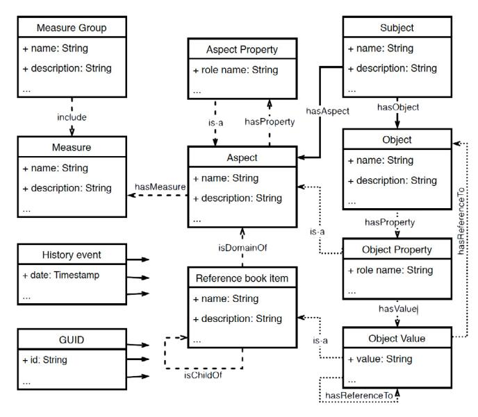

Available online at www.sciencedirect.com **9th IFAC Conference on Manufacturing Modelling, Management and 9th IFAC Conference on Manufacturing Modelling, Management and**

IFAC PapersOnLine 52-13 (2019) 1150–1155 **Knowledge Net: Model and System for Accumulation, Representation,**

#### **and Use of Knowledge Knowledge Net: Model and System for Accumulation, Representation, and Use of Knowledge and Use of Knowledge Olga Tushkanova\*, Vladimir Samoylov\*\* and Use of Knowledge Olga Tushkanova\*, Vladimir Samoylov\*\* Knowledge Net: Model and System for Accumulation, Representation, and Use of Knowledge Knowledge Net: Model and System for Accumulation, Representation, and Use of Knowledge**

**Olga Tushkanova\*, Vladimir Samoylov\*\* Olga Tushkanova\*, Vladimir Samoylov\*\* Olga Tushkanova\*, Vladimir Samoylov\*\***

*\*St. Petersburg Institute for Informatics and Automation of RAS, 199178, St. Petersburg, 14th Line V.O., 39, Russia (Tel: 7-812-328-33-11; e-mail: tushkanova.on@gmail.com) \* Peter the Great St. Petersburg Polytechnic University,195251, St. Petersburg, Politekhnicheskaya St., 29, Russia (Tel: 7-812-775-05-30, e-mail: tushkanova.on@gmail.com) \*\* Info Wings LLC, 197101, St. Petersburg, Leo Tolstoy St., 1-3, Russia (e-mail: vsamoilov@infowings.ru) \*St. Petersburg Institute for Informatics and Automation of RAS, 199178, St. Petersburg, 14th Line V.O., 39, Russia (Tel: 7-812-328-33-11; e-mail: tushkanova.on@gmail.com) \* Peter the Great St. Petersburg Polytechnic University,195251, St. Petersburg, Politekhnicheskaya St., 29, Russia (Tel: 7-812-775-05-30, e-mail: tushkanova.on@gmail.com) \*\* Info Wings LLC, 197101, St. Petersburg, Leo Tolstoy St., 1-3, \*St. Petersburg Institute for Informatics and Automation of RAS, 199178, St. Petersburg, 14th Line V.O., 39, Russia (Tel: 7-812-328-33-11; e-mail: tushkanova.on@gmail.com) \* Peter the Great St. Petersburg Polytechnic University,195251, St. Petersburg, Politekhnicheskaya St., 29, Russia (Tel: 7-812-775-05-30, e-mail: tushkanova.on@gmail.com) \*\* Info Wings LLC, 197101, St. Petersburg, Leo Tolstoy St., 1-3, Russia (e-mail: vsamoilov@infowings.ru) \*St. Petersburg Institute for Informatics and Automation of RAS, 199178, St. Petersburg, 14th Line V.O., 39, Russia (Tel: 7-812-328-33-11; e-mail: tushkanova.on@gmail.com) \* Peter the Great St. Petersburg Polytechnic University,195251, St. Petersburg, Politekhnicheskaya St., 29, Russia (Tel: 7-812-775-05-30, e-mail: tushkanova.on@gmail.com) \*\* Info Wings LLC, 197101, St. Petersburg, Leo Tolstoy St., 1-3, Russia (e-mail: vsamoilov@infowings.ru) \*St. Petersburg Institute for Informatics and Automation of RAS, 199178, St. Petersburg, 14th Line V.O., 39, Russia (Tel: 7-812-328-33-11; e-mail: tushkanova.on@gmail.com) \* Peter the Great St. Petersburg Polytechnic University,195251, St. Petersburg, Politekhnicheskaya St., 29, Russia (Tel: 7-812-775-05-30, e-mail: tushkanova.on@gmail.com) \*\* Info Wings LLC, 197101, St. Petersburg, Leo Tolstoy St., 1-3, Russia (e-mail: vsamoilov@infowings.ru)* **Olga Tushkanova\*, Vladimir Samoylov\*\*** *\*St. Petersburg Institute for Informatics and Automation of RAS, 199178, St. Petersburg, 14th Line V.O., 39, Russia (Tel: 7-812-328-33-11; e-mail: tushkanova.on@gmail.com) \* Peter the Great St. Petersburg Polytechnic University,195251, St. Petersburg, Politekhnicheskaya St., 29, Russia (Tel: 7-812-775-05-30, e-mail: tushkanova.on@gmail.com) \*\* Info Wings LLC, 197101, St. Petersburg, Leo Tolstoy St., 1-3,* 

Abstract: The paper describes data and knowledge accumulation model named Knowledge Net developed for the company Info Wings LLC. It proposed as a model for formalizing, presenting, and using of knowledge and data within single shared information space of an intelligent enterprise, for example, within the framework of Industry 4.0. The key features of Knowledge Net are the support of multi-aspect description of entities, the possibility of expanding the network of concepts and entities, and the dynamic evolution of the aspects structure. The Knowledge Net is based on a graph data model and it is the part of ongoing open source application development of a digital enterprise platform. The paper provides an example of using Knowledge Net software to describe objects of a manufacturing enterprise. Current state analysis has not revealed complete analogues of Knowledge Net model for accumulation, presentation, and use of data and knowledge or the corresponding software that justifies the novelty of the model described in the *Russia (e-mail: vsamoilov@infowings.ru)* Abstract: The paper describes data and knowledge accumulation model named Knowledge Net developed for the company Info Wings LLC. It proposed as a model for formalizing, presenting, and using of knowledge and data within single shared information space of an intelligent enterprise, for example, within the framework of Industry 4.0. The key features of Knowledge Net are the support of multi-aspect description of entities, the possibility of expanding the network of concepts and entities, and the dynamic evolution of the aspects structure. The Knowledge Net is based on a graph data model and it is the part of ongoing open source application development of a digital enterprise platform. The paper provides an example of using Knowledge Net software to describe objects of a manufacturing enterprise. Current state analysis has not revealed complete analogues of Knowledge Net model for accumulation, presentation, Abstract: The paper describes data and knowledge accumulation model named Knowledge Net developed for the company Info Wings LLC. It proposed as a model for formalizing, presenting, and using of knowledge and data within single shared information space of an intelligent enterprise, for example, within the framework of Industry 4.0. The key features of Knowledge Net are the support of multi-aspect description of entities, the possibility of expanding the network of concepts and entities, and the dynamic evolution of the aspects structure. The Knowledge Net is based on a graph data model and it is the part of ongoing open source application development of a digital enterprise platform. The paper provides an example of using Knowledge Net software to describe objects of a manufacturing enterprise. Current state analysis has not revealed complete analogues of Knowledge Net model for accumulation, presentation, and use of data and knowledge or the corresponding software that justifies the novelty of the model described in the paper. Copyright © 2019 IFAC Abstract: The paper describes data and knowledge accumulation model named Knowledge Net developed for the company Info Wings LLC. It proposed as a model for formalizing, presenting, and using of knowledge and data within single shared information space of an intelligent enterprise, for example, within the framework of Industry 4.0. The key features of Knowledge Net are the support of multi-aspect description of entities, the possibility of expanding the network of concepts and entities, and the dynamic evolution of the aspects structure. The Knowledge Net is based on a graph data model and it is the part of ongoing open source application development of a digital enterprise platform. The paper provides an example of using Knowledge Net software to describe objects of a manufacturing enterprise. Current state analysis has not revealed complete analogues of Knowledge Net model for accumulation, presentation, and use of data and knowledge or the corresponding software that justifies the novelty of the model described in the Abstract: The paper describes data and knowledge accumulation model named Knowledge Net developed for the company Info Wings LLC. It proposed as a model for formalizing, presenting, and using of knowledge and data within single shared information space of an intelligent enterprise, for example, within the framework of Industry 4.0. The key features of Knowledge Net are the support of multi-aspect description of entities, the possibility of expanding the network of concepts and entities, and the dynamic evolution of the aspects structure. The Knowledge Net is based on a graph data model and it is the part of ongoing open source application development of a digital enterprise platform. The paper provides an example of using Knowledge Net software to describe objects of a manufacturing enterprise. Current state analysis has not revealed complete analogues of Knowledge Net model for accumulation, presentation, and use of data and knowledge or the corresponding software that justifies the novelty of the model described in the *Russia (e-mail: vsamoilov@infowings.ru)* Abstract: The paper describes data and knowledge accumulation model named Knowledge Net developed for the company Info Wings LLC. It proposed as a model for formalizing, presenting, and using of knowledge and data within single shared information space of an intelligent enterprise, for example, within the framework of Industry 4.0. The key features of Knowledge Net are the support of multi-aspect description of entities, the possibility of expanding the network of concepts and entities, and the dynamic evolution of the aspects structure. The Knowledge Net is based on a graph data model and it is the part of ongoing open source application development of a digital enterprise platform. The paper provides an example of using Knowledge Net software to describe objects of a manufacturing enterprise. Current state analysis has not revealed complete analogues of Knowledge Net model for accumulation, presentation,

© 2019, IFAC (International Federation of Automatic Control) Hosting by Elsevier Ltd. All rights reserved. paper. Copyright © 2019 IFAC *Keywords:* single shared information space, knowledge model, knowledge representation, aspect, ontology, and use of data and knowledge or the corresponding software that justifies the novelty of the model described in the paper. Copyright © 2019 IFAC *Keywords:* single shared information space, knowledge model, knowledge representation, aspect, ontology, paper. Copyright © 2019 IFAC *Keywords:* single shared information space, knowledge model, knowledge representation, aspect, ontology, paper. Copyright © 2019 IFAC and use of data and knowledge or the corresponding software that justifies the novelty of the model described in the

knowledge graph, graph data model. *Keywords:* single shared information space, knowledge model, knowledge representation, aspect, ontology, knowledge graph, graph data model. knowledge graph, graph data model. knowledge graph, graph data model. *Keywords:* single shared information space, knowledge model, knowledge representation, aspect, ontology, knowledge graph, graph data model. paper. Copyright © 2019 IFAC *Keywords:* single shared information space, knowledge model, knowledge representation, aspect, ontology, knowledge graph, graph data model.

#### 1. INTRODUCTION 1. INTRODUCTION 1. INTRODUCTION 1. INTRODUCTION

One of the main features of Industry 4.0 is the merging of industrial production, information and communication technologies and artificial intelligence. This aspect of the development of modern production is currently one of the most pressing and frequently discussed topics among scientists and practitioners around the world. Governments in many countries, including Russian Federation, have declared the concept of Industry 4.0 as the key development strategy in the field of high technologies. 1. INTRODUCTION One of the main features of Industry 4.0 is the merging of industrial production, information and communication technologies and artificial intelligence. This aspect of the development of modern production is currently one of the most pressing and frequently discussed topics among scientists and practitioners around the world. Governments in many countries, including Russian Federation, have declared the concept of Industry 4.0 as the key development strategy in the field of high dustrial production, information and communication technologies and artificial intelligence. This aspect of the development of modern production is currently one of the most pressing and frequently discussed topics among scientists and practitioners around the world. Governments in many countries, including Russian Federation, have declared the concept of Industry 4.0 as the key development strategy in the field of high technologies. The main idea of Industry 4.0 is aimed at the development of One of the main features of Industry 4.0 is the merging of industrial production, information and communication technologies and artificial intelligence. This aspect of the development of modern production is currently one of the most pressing and frequently discussed topics among scientists and practitioners around the world. Governments in many countries, including Russian Federation, have declared the concept of Industry 4.0 as the key development strategy in the field of high technologies. One of the main features of Industry 4.0 is the merging of industrial production, information and communication technologies and artificial intelligence. This aspect of the development of modern production is currently one of the most pressing and frequently discussed topics among scientists and practitioners around the world. Governments in many countries, including Russian Federation, have declared the concept of Industry 4.0 as the key development strategy in the field of high technologies. 1. INTRODUCTION One of the main features of Industry 4.0 is the merging of industrial production, information and communication technologies and artificial intelligence. This aspect of the development of modern production is currently one of the most pressing and frequently discussed topics among scientists and practitioners around the world. Governments in many countries, including Russian Federation, have declared the concept of Industry 4.0 as the key development strategy in the field of high

The main idea of Industry 4.0 is aimed at the development of intelligent factories, which should operate based on fully automated production processes controlled by software. All information and software components at the enterprise level should be integrated into a single shared information space (hereinafter, 'shared information space' for brevity) and effectively interact and cooperate with each other and with a user and be able to make decentralized decisions. This is not easy, and for most existing branches of production is a serious problem, since information components and software systems were historically developed independently of each other. technologies. The main idea of Industry 4.0 is aimed at the development of intelligent factories, which should operate based on fully automated production processes controlled by software. All information and software components at the enterprise level should be integrated into a single shared information space (hereinafter, 'shared information space' for brevity) and effectively interact and cooperate with each other and with a user and be able to make decentralized decisions. This is not easy, and for most existing branches of production is a serious problem, since information components and software systems were hisintelligent factories, which should operate based on fully automated production processes controlled by software. All information and software components at the enterprise level should be integrated into a single shared information space (hereinafter, 'shared information space' for brevity) and effectively interact and cooperate with each other and with a user and be able to make decentralized decisions. This is not easy, and for most existing branches of production is a serious problem, since information components and software systems were historically developed independently of each other. The compulsory component of an Industry 4.0 intelligent en-The main idea of Industry 4.0 is aimed at the development of intelligent factories, which should operate based on fully automated production processes controlled by software. All information and software components at the enterprise level should be integrated into a single shared information space (hereinafter, 'shared information space' for brevity) and effectively interact and cooperate with each other and with a user and be able to make decentralized decisions. This is not easy, and for most existing branches of production is a serious problem, since information components and software systems were historically developed independently of each other. The main idea of Industry 4.0 is aimed at the development of intelligent factories, which should operate based on fully automated production processes controlled by software. All information and software components at the enterprise level should be integrated into a single shared information space (hereinafter, 'shared information space' for brevity) and effectively interact and cooperate with each other and with a user and be able to make decentralized decisions. This is not easy, and for most existing branches of production is a serious problem, since information components and software systems were historically developed independently of each other. technologies. The main idea of Industry 4.0 is aimed at the development of intelligent factories, which should operate based on fully automated production processes controlled by software. All information and software components at the enterprise level should be integrated into a single shared information space (hereinafter, 'shared information space' for brevity) and effectively interact and cooperate with each other and with a user and be able to make decentralized decisions. This is not easy, and for most existing branches of production is a serious problem, since information components and software systems were his-

The compulsory component of an Industry 4.0 intelligent enterprise is the system for accumulation, presentation, and use of data and knowledge. The system should form semantically unambiguous information space of data and knowledge shared by all its divisions, as well as physical and virtual objects of the production system (Adolphs et al 2015). Such space should aggregate information (data and knowledge) about all subjects and objects of the enterprise at all stages of their life cycles. torically developed independently of each other. The compulsory component of an Industry 4.0 intelligent enterprise is the system for accumulation, presentation, and use of data and knowledge. The system should form semantically unambiguous information space of data and knowledge shared by all its divisions, as well as physical and virtual objects of the production system (Adolphs et al 2015). Such space should aggregate information (data and knowledge) about all subjects and objects of the enterprise at all stages of their life cycles. terprise is the system for accumulation, presentation, and use of data and knowledge. The system should form semantically unambiguous information space of data and knowledge shared by all its divisions, as well as physical and virtual objects of the production system (Adolphs et al 2015). Such space should aggregate information (data and knowledge) about all subjects and objects of the enterprise at all stages of their life cycles. The compulsory component of an Industry 4.0 intelligent enterprise is the system for accumulation, presentation, and use of data and knowledge. The system should form semantically unambiguous information space of data and knowledge shared by all its divisions, as well as physical and virtual objects of the production system (Adolphs et al 2015). Such space should aggregate information (data and knowledge) about all subjects and objects of the enterprise at all stages of their life cycles. The compulsory component of an Industry 4.0 intelligent enterprise is the system for accumulation, presentation, and use of data and knowledge. The system should form semantically unambiguous information space of data and knowledge shared by all its divisions, as well as physical and virtual objects of the production system (Adolphs et al 2015). Such space should aggregate information (data and knowledge) about all subjects and objects of the enterprise at all stages of their life cycles. torically developed independently of each other. The compulsory component of an Industry 4.0 intelligent enterprise is the system for accumulation, presentation, and use of data and knowledge. The system should form semantically unambiguous information space of data and knowledge shared by all its divisions, as well as physical and virtual objects of the production system (Adolphs et al 2015). Such space should aggregate information (data and knowledge) about all subjects

**Copyright © 2019 IFAC 1167**

The specific feature of a shared information space is that the same object can be viewed from various points of view in different departments. For example, the logistics department may be interested in the mass-dimensional characteristics of a certain product, while the purchasing department in economically viable counterparts of assembly units that have similar functionality. This issue forms a specific requirement for the knowledge system of an intelligent enterprise to support the multidimensional structure of knowledge and data, i.e. to enable the description of various aspects of the same object within a structure for representing knowledge and data of a shared information space. Moreover, this structure cannot have a single categorization (taxonomy) of ontology concepts. However, this issue is currently not in the spotlight of the scientific community, despite the fact that it is extremely important for the practice. Another important specific feature of an intelligent enterprise is the need for continuous development and replenishment of data and knowledge within a shared information space. Indeed, together with enterprise development the semantic models of objects and subjects must also constantly evolve without loss of knowledge and data integrity. The dynamic support for knowledge and data bases requires the development of appropriate formal methods and software. The specific feature of a shared information space is that the same object can be viewed from various points of view in different departments. For example, the logistics department may be interested in the mass-dimensional characteristics of a certain product, while the purchasing department in economically viable counterparts of assembly units that have similar functionality. This issue forms a specific requirement for the knowledge system of an intelligent enterprise to support the multidimensional structure of knowledge and data, i.e. to enable the description of various aspects of the same object within a structure for representing knowledge and data of a shared information space. Moreover, this structure cannot have a single categorization (taxonomy) of ontology concepts. However, this issue is currently not in the spotlight of the scientific community, despite the fact that it is extremely important for the practice. Another important specific feature of an intelligent enterprise is the need for continuous development and replenishment of data and knowledge within a shared information space. Indeed, together with enterprise development the semantic models of objects and subjects must also constantly evolve without loss of knowledge and data integrity. The dynamic support for knowledge and data bases requires the de-The specific feature of a shared information space is that the same object can be viewed from various points of view in different departments. For example, the logistics department may be interested in the mass-dimensional characteristics of a certain product, while the purchasing department in economically viable counterparts of assembly units that have similar functionality. This issue forms a specific requirement for the knowledge system of an intelligent enterprise to support the multidimensional structure of knowledge and data, i.e. to enable the description of various aspects of the same object within a structure for representing knowledge and data of a shared information space. Moreover, this structure cannot have a single categorization (taxonomy) of ontology concepts. However, this issue is currently not in the spotlight of the scientific community, despite the fact that it is extremely important for the practice. Another important specific feature of an intelligent enterprise is the need for continuous development and replenishment of data and knowledge within a shared information space. Indeed, together with enterprise development the semantic models of objects and subjects must also constantly evolve without loss of knowledge and data integrity. The dynamic support for knowledge and data bases requires the development of appropriate formal methods and software. Today the task of development and dynamic support for a The specific feature of a shared information space is that the same object can be viewed from various points of view in different departments. For example, the logistics department may be interested in the mass-dimensional characteristics of a certain product, while the purchasing department in economically viable counterparts of assembly units that have similar functionality. This issue forms a specific requirement for the knowledge system of an intelligent enterprise to support the multidimensional structure of knowledge and data, i.e. to enable the description of various aspects of the same object within a structure for representing knowledge and data of a shared information space. Moreover, this structure cannot have a single categorization (taxonomy) of ontology concepts. However, this issue is currently not in the spotlight of the scientific community, despite the fact that it is extremely important for the practice. Another important specific feature of an intelligent enterprise is the need for continuous development and replenishment of data and knowledge within a shared information space. Indeed, together with enterprise development the semantic models of objects and subjects must also constantly evolve without loss of knowledge and data integrity. The dynamic support for knowledge and data bases requires the development of appropriate formal methods and software. The specific feature of a shared information space is that the same object can be viewed from various points of view in different departments. For example, the logistics department may be interested in the mass-dimensional characteristics of a certain product, while the purchasing department in economically viable counterparts of assembly units that have similar functionality. This issue forms a specific requirement for the knowledge system of an intelligent enterprise to support the multidimensional structure of knowledge and data, i.e. to enable the description of various aspects of the same object within a structure for representing knowledge and data of a shared information space. Moreover, this structure cannot have a single categorization (taxonomy) of ontology concepts. However, this issue is currently not in the spotlight of the scientific community, despite the fact that it is extremely important for the practice. Another important specific feature of an intelligent enterprise is the need for continuous development and replenishment of data and knowledge within a shared information space. Indeed, together with enterprise development the semantic models of objects and subjects must also constantly evolve without loss of knowledge and data integrity. The dynamic support for knowledge and data bases requires the development of appropriate formal methods and software. The specific feature of a shared information space is that the same object can be viewed from various points of view in different departments. For example, the logistics department may be interested in the mass-dimensional characteristics of a certain product, while the purchasing department in economically viable counterparts of assembly units that have similar functionality. This issue forms a specific requirement for the knowledge system of an intelligent enterprise to support the multidimensional structure of knowledge and data, i.e. to enable the description of various aspects of the same object within a structure for representing knowledge and data of a shared information space. Moreover, this structure cannot have a single categorization (taxonomy) of ontology concepts. However, this issue is currently not in the spotlight of the scientific community, despite the fact that it is extremely important for the practice. Another important specific feature of an intelligent enterprise is the need for continuous development and replenishment of data and knowledge within a shared information space. Indeed, together with enterprise development the semantic models of objects and subjects must also constantly evolve without loss of knowledge and data integrity. The dynamic support for knowledge and data bases requires the de-

Today the task of development and dynamic support for a shared information space for digital enterprise of Industry 4.0 is considered as the task assigned to the infrastructural component of the enterprise management system, which is commonly called as digital platform. The main objective of the platform is the integration of heterogeneous system components. Thus, creation and support of a shared information space should be a velopment of appropriate formal methods and software. Today the task of development and dynamic support for a shared information space for digital enterprise of Industry 4.0 is considered as the task assigned to the infrastructural component of the enterprise management system, which is commonly called as digital platform. The main objective of the platform is the integration of heterogeneous system components. Thus, creation and support of a shared information space should be a shared information space for digital enterprise of Industry 4.0 is considered as the task assigned to the infrastructural component of the enterprise management system, which is commonly called as digital platform. The main objective of the platform is the integration of heterogeneous system components. Thus, creation and support of a shared information space should be a Today the task of development and dynamic support for a shared information space for digital enterprise of Industry 4.0 is considered as the task assigned to the infrastructural component of the enterprise management system, which is commonly called as digital platform. The main objective of the platform is the integration of heterogeneous system components. Thus, creation and support of a shared information space should be a Today the task of development and dynamic support for a shared information space for digital enterprise of Industry 4.0 is considered as the task assigned to the infrastructural component of the enterprise management system, which is commonly called as digital platform. The main objective of the platform is the integration of heterogeneous system components. Thus, creation and support of a shared information space should be a velopment of appropriate formal methods and software. Today the task of development and dynamic support for a shared information space for digital enterprise of Industry 4.0 is considered as the task assigned to the infrastructural component of the enterprise management system, which is commonly called as digital platform. The main objective of the platform is the integration of heterogeneous system components. Thus, standard part of the functionality of an enterprise digital platform within the digital economics.

The paper objective is to discuss the proposed model for the accumulation, presentation, and use of knowledge and data represented in a single shared information space of a digital enterprise, while taking into account its multidimensionality, dynamics of information, and requirement to support for itsintegrity, and to describe the software prototype supporting the model. The model is the part of ongoing open source1 software project of Info Wings LLC intended for development of the technology for automated design of digital enterprises. The project, software prototype, and the model are called Knowledge Net.

# 2. KEY FEATURES OF KNOWLEDGE NET MODEL

The semantic model for the accumulation, presentation, and use of data and knowledge is the key component of the intelligent enterprise of a new generation, developed within Industry 4.0 (Adolphs et al 2015). The main task of this component is to provide a service for creating and maintaining a shared semantic information space of knowledge and data for intelligent enterprise and all its divisions. One can also talk about support for the entire life cycle of such a space. Key features of Knowledge Net model for a shared information space, distinguishing it from its counterparts on the market, are the following:

- *consideration of the dynamic nature of knowledge and data models*: the properties and structure of object models evolve together with the development of the objects and the enterprise as a whole;
- *support for the multi-aspect model* of object knowledge and data: an object can have many different descriptions and properties related to different contexts of its use or different "points of view" of users/tasks;
- *graph model of knowledge and data representation*: aspects and properties of an object form a single dynamically expanding graph for representing knowledge and data, in which the implementation of knowledge and data use cases is reduced to a search on this graph;
- *multiplicity of possible classifications* (taxonomies) of objects represented by the Knowledge Net model: formal sources and knowledge experts have possibility to form different descriptions of "similar" objects using many different types of knowledge;
- *variety of types and data structures* represented within Knowledge Net model: the properties of objects represented in the model can be described by attributes of any type, including weakly structured (xml, json, etc.) and unstructured data, e.g. CAD models, PDF files, text descriptions, images, links to other objects and their properties;
- *shared reference network*: the model makes it possible to identify analogues and cluster objects, subjects, and properties;

- *support for objects faceted search*: searching for analogues and for objects with specified properties and characteristics, etc.;
- *versioning of the knowledge and data model*: the ability to store the history of *all* changes of *all* entities within Knowledge Net model that occurred at all stages of the life cycles of these entities, as it is implemented in the framework of Data Vault (Linstedt 2014).

# 3. RELATED WORKS

The authors failed to find complete analogues of the model being developed and the corresponding software. However, some of the developments mentioned below describe approaches that partially implement the capabilities of Knowledge Net.

In (Grangel-González et al 2016), the Administrative Shell concept is proposed, which should support for a digital representation of all available information about production objects. The digital representation is implemented using RDF, RDF-Schema, and OWL. RDF has several important advantages such as built-in ability to use a global Unique Resource Identifier (URI), easy integration with already existing knowledge bases in RDF, or the ability to use SPARQL query language. However, the concept proposed in (Grangel-González et al 2016), has a number of significant drawbacks. The scheme of object description proposed is not universal and currently only supports some types of objects. The use of this approach requires the prior creation of a thesaurus and taxonomy of object classes. This is not suitable for a developing enterprise, since in this case the knowledge model must evolve along with the development of objects, technologies, and organizational structures of the enterprise as a whole. The paper also not mentioning whether the concept provides for tracking the history of changes in object descriptions or schemas. It should be noted that RDF, RDF-Schema, and OWL do not provide such an opportunity "out of the box".

The paper (Kharlamov et al 2016) describes the results of collaboration between Siemens and Oxford University in order to facilitate the development of ontologies and their use in company applications. This collaboration result in Web Protege add-on, a software prototype of the Siemens-Oxford Model Manager (SOMM). The tool is considered as an assistant to engineers with little experience in semantics. Ontologies created using SOMM should, according to the authors, become the core of a shared information space of Siemens. The authors of (Kharlamov et al 2016) note that the software prototype was positively evaluated by Siemens engineers. Unfortunately, the main disadvantage of such a standard ontological approach for creating a shared information space of an enterprise, which is also proposed in a number of other works too, for example, in (Haupert et al 2013 and Kharlamov et al 2015), is the complexity of the initial creation of a scheme for describing all objects of a real enterprise. In case of developing enterprise with constantly changing set of objects and components used, the development of a single immutable scheme is almost impossi-

 1 https://github.com/InfoWings/Knowledge-Net

ble or involves large labor costs. Moreover, even large enterprises are often not able to develop the ontologies detailed enough to use mechanisms of inference that implement knowledge dependent use cases.

The main principles of xIRBIS-ML digital platform semantic core are described in (Maksimov et al 2018). The authors position this development as an information and analytical system focused on knowledge. According to the authors, xIRBIS-ML document collection and processing subsystem allows extracting concepts from text documents and comparing them with existing enterprise ontologies. However, the paper does not describe how much expert intervention is required to successfully complete this operation. It is also not clear from the paper which technologies are used to create and process ontologies, whether the described system implements support of unique identifiers for all entities of the system or support for dynamic change of the previously created ontology scheme while enterprise evolving.

Some principles of the new technology of component design of intelligent systems are described in (*Golenkov et al 2014- 1, 2*), in particular, it is proposed to use the semantic model of knowledge bases and involve graph theory for constructing algorithms for their processing. However, it is not clear from the text of the paper whether the authors carried out any applied software development aimed at the implementation of the described approach and technology.

A large number of studies devoted to the development of methods and means of creating and maintaining a shared information space of an intelligent enterprise proves the high level of interest of the industry in such means. However, research analysis proves that these developments are still insufficient to effectively implement them in the industry. Perhaps this factor holds back the digital transformation of the industry.

#### 4. BACKGROUND

Before proceeding to a detailed description of Knowledge Net model, we will give the necessary explanations of some terms used below. Although the explanations of these terms do not pretend to severity, they do allow understanding main principles of the model.

The *subject* in the context of this paper is understood as a certain carrier, supplier, or user of knowledge, the active element of the external (relatively to the enterprise management system) world. The subject can be an organization or an individual possessing consciousness and will, which is capable of expedient activity directed at one or another object. Examples of subjects in the context of an organization's business processes are suppliers, manufacturers, product developers, the organization itself, a service or program that adds data or knowledge to a graph.

An *object* is a physical or virtual result of the purposeful activity of a subject, an object or phenomenon of the real or virtual world. Examples of objects are: a product produced by an enterprise, a part, a device, an assembly unit, a service. Objects can have different properties and can be described from different points of view. The point of view depends on which of the object properties are important for the subject or other objects in a particular context.

The key concept of the model being developed is an *aspect*. According to (English Oxford Living Dictinaries 2019), an aspect should be understood as "a particular way in which something may be considered". As an *aspect* of an object in the context of this paper, we will name one of the same-type demonstration of the properties of its model common to all its examples from a certain point of view or in a specific context. An aspect, in general, has a name, possibly a measurement unit, and can be characterized by data types describing properties related to the aspect and domains of their values. Reference books, the definition of which is presented later in this section, numerical intervals, or, for example, formulas that define some restrictions, can act as the domain of aspect values. Aspects may be global or exist only in a certain context, which is defined by a particular subject. Examples of aspects are *Weight* (type: real, the option for the measurement unit is kilogram, domain [0; + ∞)), *Volume* (type: real, the option for the measurement unit is liter, domain [0; + ∞)), *Number of phases of alternating current* (type: integer, measurement unit - pieces, domain: all non-negative integers), *Color* (type: string, no measurement unit, possible domain: a set of all possible colors). Within the framework of the model, aspects can be combined into hierarchies. In this case, the child aspects will be called *properties* with respect to the parent aspects. The *aspect property* is a instantiation of some child aspect in the context of the parent aspect - the property owner. For instance, *Weight* is an independent aspect, but it can also be a property of other aspects. Let's say an aspect *Weight and size indicators* can have properties *gross Weight* and *net Weight*, which refer to the *Weight* aspect, specifying it in the context of the *Weight and Size indicators*. The same aspect *Weight* may also be included in the *maximum carrying Weight* in the context of the parent aspect describing characteristics of the storage device (rack or shelf). In this case, the context of using the *Weight* aspect will be completely different.

An *object property* is the instantiation of an aspect in a particular context defined by a specific object. The object property, in general, has a reference to the aspect to which it belongs, the role name of the property (possibly empty), multiplicity, and possibly specific value. The multiplicity (cardinality) of a property means the permissible number of values of this property for an object.

The *reference book* in the context of the model is a domain of values of some aspect that has a string type. An example of a reference book is a list of possible colors for an aspect describing the color of an object. The hierarchy of object functional purpose classification according to the standard IEC 81346- 2:2009 can also be represented using a reference book, and then be used to indicate the functional purpose of the object.

#### 5. KNOWLEDGE NET MODEL AND ITS IMPLEMENTATION METHODS

The main distinctive features of Knowledge Net model are support for multidimensional descriptions of entities, the ability to expand the network of concepts and entities, and dynamically form the structure of aspects and their properties. This implies the absence of rigid typing of entities that will be described within the model, which leads to the difficulties with storing data and knowledge in a traditional relational or object structure. In this regard, Knowledge Net model is based on the graph data model. Recall that a graph data model is usually understood as a model in which the scheme and data instances are represented in a structured form as a directed labeled graph, and all data manipulations and data integrity constraints can be expressed through operations on this oriented graph (Renzo and Gutierrez 2008).

An open source version of OrientDB database was chosen as a graph database management system. It combines the capabilities of a document-oriented and graph database. In addition, OrientDB supports an object-oriented database interface that runs on top of a document-oriented layer. OrientDB is written in Java and distributed under the Apache license. Support for an object-oriented database interface means that the OrientDB allows you to define the classes of vertices and edges of the future graph, similar to the classes in the object-oriented model.

Despite the absence of rigid typing, at the logical level of the model, some basic entities of the data scheme should be extracted, namely, *Subject*, *Aspect*, *Object*, *Measure*. These entities in fact are the concepts of a meta-ontology or meta graph. The semantics of the entities is described in section 4. We also include into logical model such entities as *History Record*, *Reference Book*, *Reference Book Element,* and some others as auxiliary entities. The logical model of the data represented by the graph (Fig. 1) is the core of Knowledge Net model. The structure of Knowledge Net model allows organizations independently or with the assistance of experts create knowledge graphs that can be used as the basic specification structure of a shared information space of an intelligent enterprise. It is assumed that the replenishment of enterprise knowledge graph within Knowledge Net model can be performed both manually and automatically using machine learning methods for knowledge extraction.

The key nodes of Knowledge Net model are *Aspect* and *Aspect Property*, which are intended to describe the aspects and properties of these aspects respectively. The aspect properties are also aspects but with some additions, e.g. with specific role names. The pair aspect-property is most often used to group related aspects. For instance, the properties of the aspect *Object Geometry* can be aspects of *Length*, *Width*, *Height*. Vertices of the *Measure* and *Measure Group* types allow to describe measurement units that can be associated with aspects. Nodes of type *Reference Item* are used to represent reference books and their elements. The dashed line in Fig. 1 highlights basic relationships for describing aspects of the future knowledge graph of an enterprise. Vertices of the *Subject* type are intended to describe the basic properties of the subjects. Objects can exist only in the context of belonging to a certain subject, while aspects can also be global, that is, they do not belong to any subject. Nodes of type *Object*, *Object Property,* and *Object Property Value* allow to describe objects and their properties. Each node of type *Object Property* is always associated with an aspect that it implements.

The described scheme naturally supports object description multidimensionality, since adding new aspect to object description that characterizes this object from a different point of view is performed by simple adding new *Object Property* node and linking it with the object. The dotted line in Fig. 1 highlights the relationships that allow describing objects and their properties.

*Fig. 1.* The main entities and relationships of the knowledge graph logical model.

The systems that use common information core (or a part of it) developed with Knowledge Net model should be able to refer the graph entities internally and exchange these links among themselves without the need to directly access the knowledge graph. Such links should have a global context and provide, for any external system, the ability to obtain consistent information from the graph. As entities references for external and internal systems, a unique GUID (Global Unified Identifier) is used, represented as separate nodes of the graph associated with each entity. During the whole life cycle of an entity in the knowledge graph, its GUID remains unchanged. The GUID makes it possible to store the entire change history of all entities in the system throughout their life cycle. The storage is implemented using nodes of the type *History Event* and several auxiliary types of nodes that are not shown in Fig. 1.

#### 6. THE SOFTWARE SUPPORTING KNOWLEDGE NET MODEL

The development of Knowledge Net model is carried out as part of a research project and is supported by open source software development. In the first version, the software system supporting Knowledge Net model is developed as a web application with a simplified user interface, which allows users to input, search, and view entities of the developed organization knowledge graph. Now, the interface is the main means of user access to knowledge graph entities. However, with the growth of data in working systems, APIs for internal and external enterprise systems operating in the context of a single platform and using a graph, will become more important, as well as specialized user interfaces with advanced search, navigation, and display capabilities. After that, the existing user interface will become a service one that is used for administration and control of intelligent enterprise information space. Fig. 2 shows the subsystem for input and display the objects of the enterprise. At the top of the page there are buttons for switching to other sections of the interface that support all entities of the model. The main part of the subsystem page is the list of objects, each of which can be expanded to view its properties. Creating a new object is performed on a separate webpage. The Aspects section has a similar structure.

| Q Search Object $\div$ Subject $$$ Name                               |                                                                                                                  |  |
|-----------------------------------------------------------------------------|------------------------------------------------------------------------------------------------------------------|--|
|                                                                             |                                                                                                                  |  |
| Filter by subject                                                           | Exclude objects from filtering $\overline{\phantom{a}}$                                                       |  |
|                                                                             | <b>EDCDC Converter BSC624-12V</b> (Subject:Arrival) 12.01 at 10:32 $\bullet \text{ } \bullet \text{ } \bullet$ / |  |
|                                                                             | ■ ERC Series air compressors (Subject:Mattei Compressors, Inc.) 30.11 at 13:50 $\vee$ ■                          |  |
|                                                                             | Electronic Park Brake (EPB) Actuator (Subject:SKF) 19.10 at 15:59 0 v                                            |  |
| <b>El Tail lift RO 1008</b> (Subject:GSOM1) 03.12 at 16:26 $\vee$ <b>ii</b> |                                                                                                                  |  |
|                                                                             | ■ 24Vdc - 12Vdc Voltage Converter PV3s (Subject:GSOM1) 03.12 at 11:22 ● × ■                                      |  |

Fig. 2. The user interface of Knowledge Net prototype, object section.

The software prototype has the following main functions:

- support of the basic measurement units from the Russian classifier of measurement units (ARC 015-94 1994), as well as the fuzzy search mechanism for them;
- creation of a GUID for all entities of the knowledge graph within Knowledge Net model;
- subjects viewing and editing. In the first version of the system prototype, subjects can only have a name. The interface also supports viewing of all the entities that are associated with each subject;
- creating, editing, and viewing of aspects, including support for entering and editing names, units, type, and domain values. Aspects can have properties that form hierarchy trees: the child property is actually a new entity, which is a combination of a "role" name (empty by default), a link to another aspect that is included as a child, and cardinality of value;
- support of aspects of a *reference* type. The value for properties that implement such aspects may be a reference to other entities of the model;
- aspect filtering. In the knowledge graph used in an organization, the number of aspects will be quite large. So convenient and efficient input and editing of aspects is impossible without filtering a working subset of aspects;
- fuzzy search by aspects in the graph. The current version of the software uses Lucene free library integrated into OrientDB for implementation of fuzzy aspect search;
- objects viewing and editing, which allows one to describe objects of the organization and their properties using previously entered aspects;
- viewing of object references and searching for related entities. The developed interface allows to show the user entities associated with an object or subject.

Thus, despite the fact that the software is a prototype, it supports the main features of Knowledge Net model associated with accumulation and presentation of knowledge that allows user to input semantic descriptions of objects into the system and begin to use the resulting knowledge graph as the basis for enterprise shared information space. The functionality of using the knowledge accumulated within Knowledge Net model is partially implemented but this topic is not described in the paper, since it requires a separate review.

### 7. USE CASE

Knowledge Net software prototype was tested during creation of the knowledge graph fragment for electric vehicle manufacturer. In total, about 50 objects of various levels of complexity were processed, which were noted by the company as the highest priority. The main aspects (about 200) needed to describe these objects were identified and structured within another research partially described in (Kudryavtsev et al 2018). Such a number of objects and aspects describing them turned out to be enough to make the first conclusions about the viability of the model.

In order to demonstrate some features of the model and software prototype, the description of the *DCDC Converter BSC624-12V* made in the Knowledge Net system is given (Fig. 3). Within the description, aspects with properties are mainly used. For example, the *Geometry* aspect has the aspectproperties of *Height*, *Width*, *Length*, and all of them are used to describe the properties of the *DCDC Converter BSC624- 12V*. At the same time, the *Geometry* aspect itself in the context of an object has the role name of *outer* because it is used to describe the external geometry of the object.

| DCDC Converter BSC624-12V (Subject:Arrival) 20.01 at 19:47 $\bullet \times \bullet$                                 |
|---------------------------------------------------------------------------------------------------------------------|
| internal ID (Arrival) 724509                                                                                        |
| Douter Geometry (Arrival)                                                                                           |
| Height (Arrival) 7 cm                                                                                               |
| Width (Arrival) 15 cm                                                                                               |
| Length (Arrival) 34.82 cm $\mathbf{\hat{m}}$                                                                        |
| net Weight (Arrival) 4.8 kg                                                                                         |
| Colour (Arrival) Red                                                                                                |
| Colour (Arrival) Black                                                                                              |
| ■ Electric characteristic (Arrival) ■                                                                               |
| DC characteristic (Arrival)                                                                                         |
| ■ Low voltage (Arrival)                                                                                             |
| Nominal Voltage (Arrival) 14 V ■                                                                                    |
| Max Current (Arrival) 2.5E+2 A                                                                                      |
| Voltage (Arrival) [8:16] V                                                                                          |
| <b>■ High voltage (Arrival)</b>                                                                                     |
| IP-protection (Arrival) IP65                                                                                        |
| ■ Cooling system (Arrival) ■                                                                                        |
| Cooling system type (Arrival) Liquid cool                                                                           |
| Coolant Flow rate (Arrival) 4                                                                                       |
| Temperature (GSOM1) [-4E+1:65] C                                                                                    |
| <b>■ Operation External conditions chatacteristics (GSOM1)</b> ■                                                    |
| Function core type (IEC 81346) T transforming object → TA electric energy transforming object → TAB DC/DC converter |
| Max Power (Arrival) <b>O</b> 3.5 W <b>iii</b>                                                                       |
|                                                                                                                     |

Fig. 3. Description of the *DCDC Converter BSC624-12V* object in Knowledge Net.

Fig. 4 shows the complete hierarchy of the *Electric characteristic* aspect. For each aspect, the type and domain of values is indicated. For aspect-properties, the cardinality is also indicated in the square brackets. The cardinality of a *Group* means that a default aspect may not have a value and acts as a grouping characteristic for its child properties. Note that when one use some aspect with properties to describe an object, not all child properties of the aspect must be used. For example, the *AC characteristic* aspect and its properties are not used for the *DCDC Converter BSC624-12V object*.

In general, the developed software prototype received positive feedback from Info Wings LLC engineers and several experts in the field of knowledge formalization. However, it is obvious

## that the prototype needs to be improved, including its user experience and performance issues.

Fig. 4. Properties of the aspect *Electric characteristic.*

# 8. CONCLUSION

The paper presents the semantic specification model for accumulation, presentation, and use of knowledge and data named Knowledge Net, and open source software prototype that supports the model. The structure of Knowledge Net model described above will allow organizations to create knowledge graph independently or with the involvement of knowledge experts. The knowledge graphs then can be used as the basic formal model for specification of a single shared information space, which is a key component of an intelligent enterprise of a new generation developed within Industry 4.0. The main advantages of Knowledge Net model are the support for multidimensionality, the ability to expand the network of concepts and entities along with enterprise evolving, and the dynamic formation of the structure of aspects and their properties. The open source software of Knowledge Net model, in the current release, supports the key features of the model and allows user to input semantic descriptions of objects and use the resulting graph as the basis for enterprise shared information space.

In the next releases of software supporting Knowledge Net model, the following functionality is primarily intended to be implemented:

- support for input an extended description of subjects and their properties;
- automatic generation of templates-hints for the structure of object properties. As information about object is input, the system will automatically identify new aspects-properties most relevant to the object using the semantic similarity measure. In addition, the user will be able to use previously generated templates for the objects input. The templates will be dynamically offered on the basis of object characteristics and other objects already existed in the graph;
- fuzzy search for objects and its aspects-properties;
- faceted search for object properties and search for an object with specified characteristics;
- search for object analogues and ranking "close" objects using similarity measures;
- support for complex data types the ability to describe in the system, and save, complex or unstructured data, e.g. CAD-models of objects. In addition, specific methods and

forms of displaying will be provided for individual data types;

- support for complex options for describing domains of aspect values, for example, through constraint formulas;
- API for filling in and using knowledge graphs of the Knowledge Net system;
- API for loading existing knowledge bases in RDF format, etc.

# REFERENCES

Adolphs, P., Bedenbender H., Dirzus, D. et al. (2015). Reference architecture model Industrie 4.0 (rami4.0). ARC 015-94 (1994). Russian classification of units of

measurement. State Standard of Russia. Aspect. (n.d). In English Oxford Living Dictinaries (2019). Retrieved from https://en.oxforddictionaries.com/definition/aspect.

Linstedt, D. (2014). A short intro to #datavault 2.0. URL: https://danlinstedt.com/allposts/datavaultcat/a-short-intro-to-datavault-2-0.

Grangel-González, I., Halilaj, L., et.al. (2016). Towards a Semantic Administrative Shell for Industry 4.0 Components. Proc. of IEEE Tenth International Conference on Semantic Computing (ICSC), 230-237.

*Golenkov, V.V., Gulyakin, N.A.* (2014-1). The project of an open semantic technology component design of intelligent systems. Part 1: Creation principles [In Russian]. *Ontology of designing*, 1 (11), 42–64.

*Golenkov, V.V., Gulyakin, N.A.* (2014-2). The project of an open semantic technology component design of intelligent systems. Part 2: Unified design Models [In Russian]. *Ontology of designing*, 4 (14), 34–53.

Kharlamov, E., Cuenca Grau, B., et al. (2016). Capturing Industrial Information Models with Ontologies and Constraints. International Semantic Web Conference, 325- 343.

Haupert, J., Schneider, M. (2013). The object memory server for semantic product memories*. SemProM*, Springer, 175–189.

Kharlamov, E., Jiménez-Ruiz, E., et al*.* (2015). Optique: Ontology-Based Data Access Platform. Proc. of ISWC (P&D).

Maksimov, NV, Golitsina, OL, Ganchenkova, MG, Sanatov, DV, Razumov, AV. (2018). Semantic core of the digital platform [In Russian]. *Ontology of designing,* 3 (29), 412-426.

Renzo, A., Gutierrez, C. (2008). Survey of graph database models. *ACM Computing Surveys* , 40 (1), 1–39.

Kudryavtsev, D., Gavrilova T., Leshcheva, I., Begler, A., Kubelskiy, M., Tushkanova, O. (2018). Mind Mapping and Spreadsheets in Collaborative Design of Knowledge Graphs. Joint Proceedings of the BIR 2018 Forum, Workshops and Doctoral Consortium, Sweden. pp. 82-93.