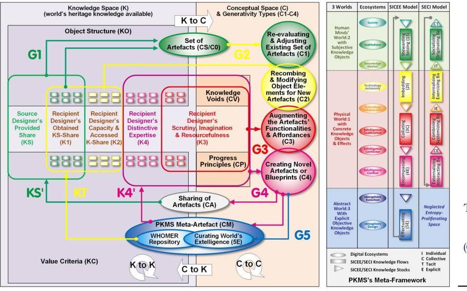
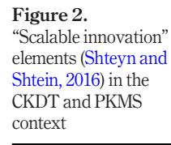
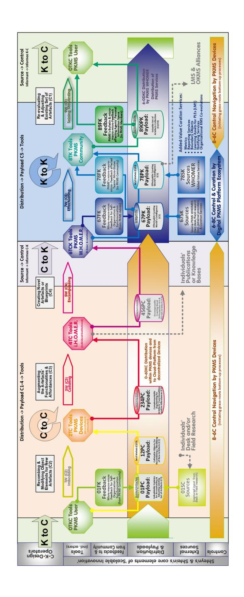
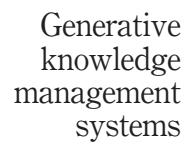
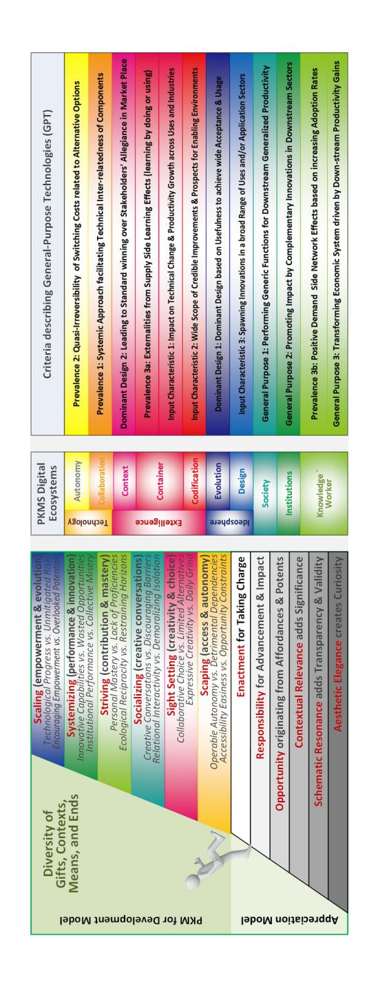
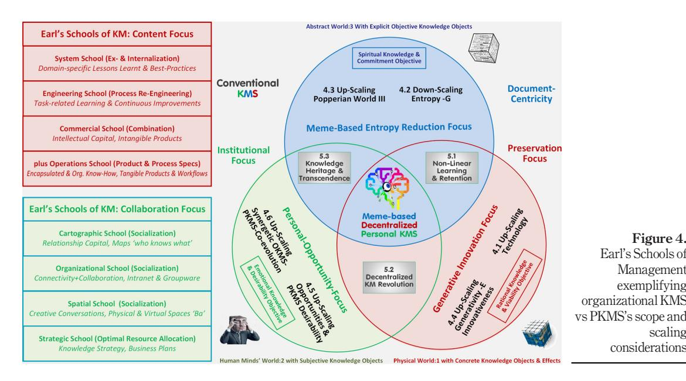

# Scalability of generative knowledge management systems: designing for individuals' and institutions' mutual benefit

Ulrich Schmitt

Business School, University of Stellenbosch, Bellville, Western Cape, South Africa

## Abstract

Purpose – In further conceptualizing a novel generative knowledge management system (KM/KMS), this paper aims to focus on identifying and mitigating the risks related to its envisaged scaling from a prototype to an application with a rapidly growing user base.

Design/methodology/approach – It follows up on prior publications using design science research (DSR) methodologies in compliance with theory effectiveness, a principle expecting system designs to be purposeful in terms of utility and communication. The KMS perspective taken prioritizes a decentralizing agenda benefiting knowledge workers while also aiming to foster a fruitful co-evolution with conventional organizational KM approaches.

Findings – The utilization and further extension of the CKDT and a "scalable innovation" heuristic are assisting the detecting of potential scaling risks related to the logics and logistics, generative interoperability, technological capacitating, knowledge dynamics and value chain which further validates the viability of the proposed KM concept and system.

Research limitations/implications – Although the prototype development is still in progress, the paper conforms to the DSR practice to report on early visions of technology impact on users, organizations and society but also reflects on expectations of viability, desirability and commitment, as well as the system's prospect as a general-purpose-technology or disruptive innovation.

Originality/value – In addition to the novel KM-related perspectives, the paper's practical emphasis on the scaling of more complex systems is rarely dealt with in the literature due to the respective projects' often large-scale collaborative nature, broad methodological scope and diverse stakeholders' interests. In this case, the task is eased as prior DSR outputs can be referred to.

Keywords Knowledge management, Knowledge creation, Generativity, System design, Design science research, Scalable innovation, Personal knowledge management, Knowledge worker, Generativity, Memes, C-K-Design Theory, Knowledge dynamics, Design science research

Paper type Research paper

© Ulrich Schmitt. Published by Emerald Publishing Limited. This article is published under the Creative Commons Attribution (CC BY 4.0) licence. Anyone may reproduce, distribute, translate and create derivative works of this article (for both commercial and non-commercial purposes), subject to full attribution to the original publication and authors. The full terms of this licence may be seen at http://creativecommons.org/licences/by/4.0/legalcode

This article originated from the author's presentation at the BS-Lab 2020 (Business Systems Laboratory 7th International Symposium "Socio-Economic Ecosystems", held in Alicante, January 22-24, 2020, http:// bslabsymposium.net/) and the subsequent invitation by Kybernetes for publication. The author would like to thank the BS-Lab panel's chair Prof. Constantin Bratianu, kybernetes' editor Prof. Gandolfo Dominici, and the unknown reviewers for their invaluable assistance.

Conflicts of interest: The author declares no conflict of interest other than to deliver a viable PKMS termed 'KnowcationsVR '.

Kybernetes Vol. 50 No. 10, 2021 pp. 2701-2725 Emerald Publishing Limited 0368-492X DOI [10.1108/K-05-2020-0324](http://dx.doi.org/10.1108/K-05-2020-0324)

Generative knowledge management systems

2701

Received 30 May 2020 Revised 26 July 2020 Accepted 31 August 2020

#### 1. Introducing a novel perspective in pursuit of generative knowledge management systems K 50,10

The predicted embracing of thriving knowledge societies is increasingly compromised by threatening perceptions of information overload and attention poverty, opportunity divides and job insecurity. By integrating system dynamics, discrete-event and agent-based modeling approaches, the roots of these symptoms have been traced back to causes of information entropy and structural holes, invisible private and undiscoverable public knowledge ([Schmitt, 2016a\)](#page-23-0). The models confirm recent research results which have used the, it seems, ineffectual sad state of our current knowledge management (KM) and knowledge creation practices as a point of departure by:

- using the strengths, vulnerability and intervention assessment related to digital threats (SVIDT) methodology [\(Schmitt, 2018a](#page-23-1));
- applying recent notions of generative fit and capacities in their technical, informational and social interpretations ([Schmitt, 2019a\)](#page-23-2); and
- focusing on entropy, syntropy and negentropy in recent knowledge creation and management contexts ([Schmitt, 2020a\)](#page-24-0).

These respective findings contribute to a stream of ongoing design science research (DSR) outputs accompanying a progressing novel KM prototype system development. It aims for a decentralized generative KM approach that prioritizes the capacity building of autonomous individual knowledge workers not at the expense of but as a viable means to foster a fruitful co-evolution with conventional organizational knowledge management systems (KMS/ OKMS). The supporting publications report on the DSR-typical "continually evolving artefacts and design theories" and on the projected "visions of technology impact [and] studies of [applied] technology impact on users, organizations and society" [\(Baskerville](#page-20-0) et al.[, 2018\)](#page-20-0). To strengthen theory effectiveness [\[1\]](#page-19-0), DSR principles also imply that relevant existing, as well as emerging, research findings, methodologies and practices need to be scrutinized to potentially integrate them for continuous design evaluation and knowledge dissemination. This article, accordingly, newly integrates the concept-knowledge-design theory (CKDT), a novel thermodynamic knowledge-related approach and a scalable innovation heuristic.

These methodologies are applied to avoid the inherent system development risk of underestimating "scaling up" difficulties from promising but narrow experiments to broader use. It has been said "that computer scientists have a tendency to count '1, 2, 3, one million, [...]', as if scale were insignificant once the first steps were taken" [\(Brown and Duguid, 2017](#page-21-0)). This article, hence, investigates how this risk may be identified and mitigated which leads to the following research question:

RQ. How can we structure the logic and logistics of a novel KMS development-inprogress to recognize and communicate potential scaling complexities to improve its viability and desirability?

As this scaling complexity is rarely addressed in academic papers, the aim is to inform designers and users alike, as well as to contribute to a research tradition of cumulative knowledge development which is vital for evolving scientific domains but seems to be equally challenging for DSR [\[2\]](#page-19-1) and KM [\[3\]](#page-19-2). Accordingly, Section 2 introduces the CKDT and the thermodynamic knowledge dynamics notion as this article's underlying perspectives and Section 3 applies them to the PKMS design and scaling context. Section 4

differentiates the dynamic interoperability of personal knowledge management system (PKMS) key features by reflecting on six critical upscaling and downscaling needs which are being systemically integrated and reviewed in Section 5 discussion and conclusions.

#### 2. Introducing the concept-knowledge-design theory and a thermodynamic knowledge dynamics approach

CKDT offers an appealing approach supporting continuous design improvements. It specifically focuses on the iterative nature of developmental processes and promotes the generative interaction between the two co-evolving spaces of knowledge (as logical propositions that can be assessed as true or false) and concepts (as attractive propositions that modifies an existing knowledge space) [\(Hatchuel](#page-21-1) et al., 2016) [\[4\]](#page-19-3). It has recently been applied in a knowledge-heritage-context (Section 2.1) which has been further extended (Section 2.2) to support – together with a thermodynamic KM notion (Section 2.3) – this article's scaling considerations.

# 2.1 Concept-knowledge-design theory and its application in a cuisine-related knowledge heritage conceptualization

Carvajal-Pérez et al. use CKDT for promoting their idea of "transferring resources for creativity" by applying known objects in the "elaboration of still unknown objects." Applying an extended CKDT framing, they exemplify its utility by offering a case study using "cuisine books, written by important chefs that were eager to share their knowledge heritage and generativity with their colleagues." Aiming for not only sharing knowledge resources but also the capacities to use them ("creative spirit"), they call for advancing their research to other formalized generative heritages in domains beyond cuisine, including KM [\(Carvajal-Pérez](#page-21-2) et al., [2018\)](#page-21-2). Their perspectives have been generalized and integrated into [Figure 1](#page-2-0) as follows.

Figure 1. The extended CKDT applied to the knowledge heritage [\(Carvajal-Pérez](#page-21-2) et al., [2018\)](#page-21-2) and PKMS models

systems

2703

Generative knowledge management K 50,10

2704

While the true or false propositions of a knowledge-related space (K) is partitioned in object structures (KO) and value criteria (KC [\[5](#page-19-4)] [[6\]](#page-19-5)), a corresponding conceptual space (C) represents interpretable propositions (based on K) sub-dividable in knowledge voids (CV) and progress principles (CP [\[7](#page-19-6)] [\[8](#page-19-7)]). Their sequencing results in generative workflows with the distinctive qualities G1-G4 (which also define the iterative cycles applied in [Figure 1](#page-2-0), left and right sections):

- G1 (selection/seizing, green arrows): Inspired by existing conceptualizations or artefacts (from CA to KS) and by their own value criteria (KC), source designers create compelling artefacts (from KS to CS) and, thus, afford accessibility to their expertise (KS: provided) to enable recipient designers to select, understand and reproduce them (K1:obtained affords C0).
- G2 (combining/imbedding, yellow arrows): Generative synergies materialize when the explicated source designer's expertise (KS: provided) resonate with the recipient designer's own capacity and accessed share (K2) to the world's available knowledge heritage (K). The authoritative shared artefacts (CS) may, thus, be re-evaluated and/ or adjusted (C1) and/or new artefacts may be created (C2) by recombining existing objects (K1 and K2).
- G3 (expanding/collating, red arrow): In contributing to novel knowledge, elements of the object structure (KO) and value criteria (KC) are extended or created. They may originate from identifying desirable knowledge voids (CV) missing from or progress principles (CP) not catered for by the existing object structure (KO). The knowledge heritage (KS and K) may assist in rectifying the shortcomings by augmenting the functionalities and affordances of the artefacts (C3).
- G4 (innovating/encompassing, purple arrow): At this stage, the recipient designer has accumulated the experience to generate innovative concepts (C4) and share them (CA) by adopting the role of a source designer him/herself and by, for example, publishing know-how-related books or hosting a respective web site.

# 2.2 PKMS-related expansion of the extended knowledge-or generative-heritage-related concept-knowledge-design theory

Knowledge or generative heritage may be defined as sets of knowledge and concepts (e.g. cookbook or PKMS repository) provided by a source designer (chef or PKMS community member), which may be assimilated by a recipient designer to enhance his/her generativity (apprentices or PKMS community members). It can be understood as the capacity to create novel artefacts meeting desired properties and affordances (e.g. creative cuisine or knowledge creation).

In the PKMS context, artefacts (CA) include the PKMS itself as a meta-artefact (CM) resulting from the DSR and system development processes, as well as their supporting publications. They also cover the envisaged explicated outputs of creativity, authorship, classification and/or processes resulting from using this meta-artefact (e.g. content and metrics captured in its repository). The commonalities between the cuisine-related and PKMS heritage approaches extend to four of the five SICEE model phases linking (as colorcoded in [Figure 1](#page-2-0)) the SICE flows (1S, 2E, 3 C, 4E) to the extended CKDT's generativity types (C1-C4):

 1C-Stewarding/Seizing: Knowledge workers capture individual (tacit or explicit) knowledge objects (to be referred to as memes) on their PKMS devices by integrating them with existing content [[9](#page-19-8)].

- 2I-Imbedding: More complex constructs (memeplexes) are created by adjusting and/ or recombining existing memes.
- 3C-Collating: Additional memes originate from individual creative authorship to express personal ideas, to fill identified gaps of the continuously scrutinized states of personal content, and to create knowledge assets [defined as "nonphysical claims to future value or benefits" ([Dalkir, 2011](#page-21-3))].
- 4E-Encompassing: The novel appealing content may be voluntarily shared with the PKMS user community or public.

At this stage, the PKMS approach is deviating by adding a generative level to the extended CKDT. While a recipient designer in the cuisine-model may take on the role of a source designer (KS via KS') and publish his/her own cuisine-heritage-book (new CA/CS), the PKMS system developers would allow access to the core system functionalities (for maintenance and further advancement) only to adequately trained associates (via K4'). In case of a PKMS community user the following applies:

 5E-Effectuating: A PKMS user simply uploads the content to be voluntarily shared (4E/C4) to the cloud-based repository (WHOMER for "World Heritage Of MEmes Repository") to be consolidated and curated together with other users' contributions (5E/C5) before being fed back to the PKMS community (K1 via K1'), to be further detailed in Section 4.2.

As the CKDT's knowledge (K1-K4), concept (C1-C4) and generativity (G1-G4) levels resonate well with the PKMS workflows (1S-4E), so are the progressive generative CKDT qualities of the knowledge and meta-knowledge created. However, while the three respective "cuisine book" levels (left three columns in [Table 1](#page-5-0)) needed a manual labor-intensive analysis by the researchers of how the renowned chefs have shared their heritage knowledge [\[10\]](#page-20-1), the comparable ones of the PKMS's digital content (right three columns in [Table 1\)](#page-5-0) emerge inevitably from the classifications applied [\(Table 2](#page-5-1)) during the authoring phases and/or from logical determinations by the system:

- The PKMS's base-level (row 1, [Table 1](#page-5-0)) covers the sequencing and relating of memes (e.g. headings, text, figures, footnotes, keywords, citations, authors) to assemble more complex constructs (memeplexes or knowledge assets) while, conceptually, further classifying, as well as additions of user-or-provider-defined categories (scripts and topics) may ensue [[11\]](#page-20-2).
- At the next level (row 2), any digital construct if the content is appropriate for the purpose – may be kept (yardstick category) in its original or decontextualized configuration for future re-purposing or guidance as, for example, template, sample, best-practice method, proven heuristic, regulation, tutorial, evaluation criteria or trial assessment. These generic aids may also be shared or provided via external services from the PKMS provider or partnering agents. Current inclusions cover, for example, cases and templates for personal chronological biographies, business plans, performance appraisals and self-assessment criteria and responses for MBA program accreditations. Conceptually, this level also covers the personal and confidential meta-activities concerned with self-development-and-assessment.
- The third level (row 3) covers meta-frameworks for guiding methodological education and applications as exemplified in the PKM4I/D/E/A/L contexts. Conceptually, the exchange of ideas, critiques, faults, requirements or plans related to the further development of the PKMS, its community, and its synergetic alliances with other platforms are also hosted in the memetic format [\(Schmitt, 2019a](#page-23-2)).

Generative knowledge management systems

| K 50,10                                                                                   | Level | Culinary knowledge spaces (K)                                                                                                                                                                                                      | Culinary concept spaces (C)                                                                                                     | Level SICEE | PKMS-related knowledge spaces (K)                                                                                                                                                                                      | PKMS-related Conceptual spaces (C)                                                                                                                                                                                                                  |
|----------------------------------------------------------------------------------------------|-------|---------------------------------------------------------------------------------------------------------------------------------------------------------------------------------------------------------------------------------------|------------------------------------------------------------------------------------------------------------------------------------|----------------|------------------------------------------------------------------------------------------------------------------------------------------------------------------------------------------------------------------------------|--------------------------------------------------------------------------------------------------------------------------------------------------------------------------------------------------------------------------------------------------------|
|                                                                                              |       | (Carvajal-Pérez et al., 2018; Hatchuel et al., 2019)                                                                                                                                                                               |                                                                                                                                    |                |                                                                                                                                                                                                                              |                                                                                                                                                                                                                                                        |
| 2706                                                                                         | K1 C1 | Recipe lists or lego-type recipes to be followed without deviation i.e. fixed set of fabrication/ assembly rules supported by categories and classifications (OS), tools, techniques, value criteria | CVs, e.g. nourishing principles CPs, e.g. well matched co processing times for menu or restaurant settings | 1S-4E G1-G4 | Atomic memes connectable to form memeplexes combinable to create more complex learning and knowledge assets, e. g. documents, reports, blogs                                                         | Topics and scripts to categorize, classify and cross-disciplinarily contextualize captured memes to ease retention and prospective cumulative synthesis (Usher, 1954)                                                             |
|                                                                                              | K2 C2 | Meta-knowledge focusing on KH1 as universal generativity conditions, e.g. generic adaptable funds/sauces                                                                                                                  | CVs, e.g. food technology affordances CPs, e.g. matching wine choices                                               | 3C-4E G3-G4 | Boundary objects as decontextualized generalized memetic constructs to amplify understanding, interpretive flexibility and shared transdisciplinary spaces, e.g. guides, heuristics, templates | Confidential self reflecting memes to monitor progress via longer-term plans/ objectives (forethoughts), shorter-term tasks/ diaries (intentions), and impacts or feedbacks (evaluations)                                |
| Table 1. Exemplified levels of a culinary and PKMS-related knowledge heritage | K3 C3 | Meta-frameworks in form of regulatory knowledge or design strategies, e.g. well composed menus or events                                                                                                               | CVs, e.g. food science implications CPs, e.g. special-theme menu creation                                           | 4E-5E G4-G5 | Supporting visualized frameworks, e.g.: For innovation For development For empowerment For action. (Schmitt, 2016b, 2018b, 2019c, 2019b)                                                          | Specifications of PKMS concepts, systems, affordances, methodologies, processes and impacts (meta-artefacts) incl. provisions for the PKMS educational e learning agenda in support of personal learning environments |

|                                                                                                                              | Hosts                                                                                                                                                                                                                                                                   | Sources (sub-sources)                                                                                                                                                                                                                                   | Uses (sub-uses)                                                                                                                                                                                                                 |
|------------------------------------------------------------------------------------------------------------------------------|-------------------------------------------------------------------------------------------------------------------------------------------------------------------------------------------------------------------------------------------------------------------------|---------------------------------------------------------------------------------------------------------------------------------------------------------------------------------------------------------------------------------------------------------|---------------------------------------------------------------------------------------------------------------------------------------------------------------------------------------------------------------------------------|
| Table 2. PKMS meta-meme framework [16] with categories, types and sub-types to structure PKMS repositories | Actors, agents, users Communities, networks Teams, groups Organizations, institutions Research areas (classifications) Industry sectors (classifications) Spaces (location classifications) Meta-topics (e.g. RFCD, TOA) Source: Schmitt, 2016c | Testimonials (Proof Evidence) Yardsticks (Rules Standards) Periodicals (Articles Papers) Events (Reports Papers) Books (Chapters Papers) Artefacts (Assets Components) Repositories (Sites Files Items) Shoe Boxes (Records Notes) | Memes (Information Units) Authorship (Drafts Notions) N ewM emes (Takes Ideas) Intentions (Tasks Diaries) Forethoughts (Plans) Evaluations (Reflections) Scripts (Themes Frames) Topics (Context Category) |

#### 2.3 The thermodynamic knowledge dynamics approach and its synergies with the concept-knowledge-design theory and PKMS concept

Bratianu's aim for emphasizing the thermodynamic nature of knowledge dynamics is to overcome the conventional mechanistic view (Newtonian paradigm) of KM models as implied by their used metaphors (e.g. knowledge as stocks-and-flows, resources, assets or capitals) with their inherent – but ill-fitting – features of tangibility, linearity and "accountingization". His complementing thermodynamic notion uses the metaphor of energy and its knowledge-as-a-field-analogy where types of knowledge (rational, emotional and spiritual) may transmute (in the PKMS case for sustaining viability, desirability and commitment) and where the notion of entropy applies [\(Bratianu and Bejinaru, 2019\)](#page-21-5). These entropic consideration and interdependent knowledge types also constitute vital elements in the PKMS rationale.

#### 3. Concept-knowledge-design theory and thermodynamic approaches in the PKMS's design and scaling context

3.1 Positioning of the newly adopted approaches within the PKMS meta-framework The "mechanistic" stewarding, imbedding, collating, encompassing, effectuating (SICEE) knowledge flows and stocks have recently been mapped against 12 other renowned dynamic knowledge creation models resulting in an integrative three-dimensional dynamic "public-transport-like" map as a visual guide to navigate the intangible KM territories. The result demonstrated the well-fitting structural embeddedness of the complementing PKMS concept within these conventional KM-related models [\(Schmitt, 2019c](#page-23-6)).

This SICEE model (right part of [Figure 1\)](#page-2-0) flows analog the CKDT's clockwise cycle (CO-C4), a direction, which has also been adopted in the foraging and sensemaking loops of a Notional Model for Intelligence Analysis [\(Pirolli and Card, 2005\)](#page-23-7). The common denominator of these three dynamic models is the focus on the individual (as designer, knowledge worker or analyst) who uses his/her tacit know-how and generativity for interpreting, creating and explicating some kind of artefact and may share it with the world. The PKMS, however, incorporates a further functional layer (C5, G5).

This layer also complements the conventional KM-models alluded to as exemplified by the depiction of Nonaka's theory of organizational dynamic knowledge creation [\(Nonaka and](#page-22-0) [Takeuchi, 1995\)](#page-22-0) in [Figure 1.](#page-2-0) While these models acknowledge the individual's role as internalizer (transforming explicit into tacit knowledge), the foremost focus on the ability of teams and institutions [defined as "snapshots of a subset of the ideational field that persevere while the network itself continues to fluctuate" [\(Kanengisser, 2014\)](#page-22-1)] to assimilate/share tacit (socialize) and explicate/repurpose (externalize and combine) knowledge within collaborative collectives for organizational benefit. Nonaka's SECI (socializing, externalizing, combining and internalizing) and Ba cycle (originating, interacting, systemizing and exercising ba/spaces) operates, hence, in the anti-clockwise fashion depicted [\(Figure 1](#page-2-0), right column) indicating the potential for a synergetic co-evolution between OKMSs and PKMSs.

To better focus on distinct threats and fixations of the current state of KM ([Scholz, 2017](#page-24-2); [Schmitt, 2018a\)](#page-23-1), as well as on user needs and system affordances [\(Schmitt, 2017a\)](#page-23-8), the SICEE/ SECI stocks (triangles) and flows (rectangles) have been aligned to Popper's Notion of the Three Worlds [\(Popper, 1978\)](#page-23-9) and 10 digital ecosystems (ellipses). The resulting PKMS metaframework pairs the corresponding elements via the applied color wheel [\(Figure 1](#page-2-0) right). It has also proven suitable to accommodate criteria used to define sustainable and disruptive innovations and to positively test the PKMS as a potential general-purpose technology [\(Schmitt, 2019b](#page-23-10)) and is to be further enhanced by the thermodynamic perspective.

It has been argued that the conventional "mechanistic" knowledge creation models – developed in the former era of information scarcity – are primarily focused on the world: 2's

Generative knowledge management systems

K 50,10

2708

tacit (human minds) and world: 1's explicit (physical objects and effects) knowledge ([Schmitt,](#page-23-2) [2019a](#page-23-2)). They neglect the blueish area ([Figure 1](#page-2-0) right) occupied by world: 3 which Popper introduced to support his philosophical argument that only formulated thoughts can be shared and criticized and that the respective content once explicated is standing objectively on its own (independent of its creators and able to be judged on its own merit) ([Popper, 1978\)](#page-23-9).

World: 3, so far, bridges the minds' world: 2 and the physical world: 1 only metaphorically as – to become accessible and elicit impact – it still needs to be resourcefully combined and encoded (records) or encapsulated (artefacts) in concrete physical objects. A prior paper [\(Schmitt, 2018a](#page-23-1)) adapted the metaphors of "big-T and small-T Theories" (O'[Raghallaigh](#page-22-2) et al., [2011\)](#page-22-2) to demonstrate that the underlying transformation processes generate redundancies, fragmentations, inconsistencies, replications, deletions, untraceabilities, corruptions and decay which – in today's state of accelerating never-before experienced attention-consuming information abundance – add to a no longer sustainable practice. Over fifty years ago, Simon already reasoned that progress in a knowledge-rich world depends on extracting the redundancy (entropy) and strengthening and exploiting the patterns (negentropy) of the world so that far less information needs to be read, written or stored [\(Simon, 1971](#page-24-3)).

The entropic perspective taken by the PKMS, however, extends to other related "unsustainable" developments as well where the "thermodynamic" perspective cuts across tacit and explicit knowledge to better address the rational (world: 1), emotional (world: 2) and spiritual (world: 3) concerns of sustainable viability, desirability and commitment.

#### 3.2 Knowledge management system development as a wicked problem space in search of a dominant design

Dominant designs achieve wide acceptance and usage due to their usefulness. Able to win over stakeholders' allegiance in the marketplace, they may challenge key aspects of a conventional world view by favoring paradigm shifts and lead to new standards. Due to this allegiance, they persist over time and may result in a quasi-irreversibility of switching costs related to alternative options and positive externalities from supply-side learning and/or demand-side network effects ([Cantner and Vannuccini, 2012\)](#page-21-6).

In reviewing the representative literature of KM evolution over time, Handzic suggests differentiating its historic stages as fragmentation, integration and fusion and predicts extension, specialization and reconceptualization (including decentralization) as potential KM futures ([Handzic, 2017](#page-21-7)). By adjusting this perspective, prior publications argued that current KMSs can be still considered as:

- divorcing the interests of organizations and knowledge workers (instead of fusing them);
- prioritizing preservation of intellectual capital over generative innovativeness (instead of integrating them); and
- growing the entropy of knowledge (instead of defragmenting it) [\(Schmitt, 2018a](#page-23-1), [2019a,](#page-23-2) [2020a](#page-24-0)).

With these increasing concerns not catered for one can conclude that a dominant design has not been able to emerge yet and that the current sorry KMS state does not present an effectual barrier for better solutions and superior collaborative services [\(Schmitt, 2019b\)](#page-23-10).

These unsustainable concerns contribute to a "wicked" KM problem space and manifest themselves across all three Popperian Worlds [\[12\]](#page-20-4). Isolated changes – as a KM framework cluster analysis ([Heisig, 2009](#page-21-8)) and the change-equilibrium model [\(Leavitt, 1962\)](#page-22-3) suggest – are likely to affect more than just one of four clusters (technologies: artefacts including storage devices; human factors: people, culture, leadership; organizational aspects: structures and processes; tasks and management: operations and controlling). Any effective change process, hence, needs to holistically consider the potential interdependencies. Section 4 presents how six scaling-related PKMS design interventions are structured to interoperate (summarized later in [Figure 4](#page-16-0)).

#### 4. Ensuring interoperability between six scaling-and-entropy-related PKMS design interventions

Interoperability is the "ability to join up data [information or knowledge] from different sources in a standardized and contextualized way." By making consistency and completeness key objectives of the PKMS concept, time, efforts, expenses, frustrations and risks are expected to diminish with the strengthening of accessibility, re-usability, decision-support, collaborativity and accountability [\(Steele and Orrell, 2017\)](#page-24-4). As entropy is – in terms of information theory – defined as the opposite of information, organization, order or improbability [\(de Rosnay, 1979\)](#page-21-9), PKMSs reduces entropy in favor of structure or neg(ative)entropy. However, as increasing entropy can also be interpreted as beneficial for organizational innovativeness ([Bratianu, 2019\)](#page-20-5), the following provisions have been applied in this article to avoid confusion:

- Entropy (negative generativity) applies to the negative effects of knowledge duplication and missing relationships (world: 3).
- Generativity (positive entropic effects) applies to the organizational enabling environment of people and systems (world: 1/2).
- Negentropy (negative entropy) applies in contexts of reducing entropy (world:3) and increasing generativity (world: 1/2).

#### 4.1 Upscaling technological viability and affordances (world: 1) to support decentralized infrastructures and accessibility

Technological efforts to reduce entropy are not new. When the increasing volume (amount), velocity (time-criticality), variety (multiplicity of sources), veracity (accuracy) and variability (change patterns) of data and information overwhelmed earlier flat file databases due to unmaintainable redundancy and compromised referential integrity, relational database management systems (RDBMS) replaced them by providing normalized table structures as proposed by Codd in 1970 [\(Date, 2006\)](#page-21-10). In our digital age, these RDBMSs – confronted with a further accelerating rise of the 5Vs – have become a bottleneck for many big data applications. The solution are cloud-based noSQL databases supported by rapid development platforms.

These recent technological advances allow for the setup and utilization of a single standardized memetic record structure, which can accommodate all the information and meta-data stored in the centralized WHOMER noSQL repository [\[13\]](#page-20-6). The links defined and captured during users' authorship activities represent the associatively indexing approach proposed for Bush's "Memex" ([Bush, 1945\)](#page-21-11) and are saved as self-referential fields complementing the memetic record. This meme-based or memetic approach allows substituting the traditional "book-age" document-centric storage paradigm. The latter still favors the "over-simplistic modeling of digital documents as monolithic blocks of linear content" which necessitates "replicating content via copy and paste operations, instead of digitally embedding and reusing parts of digital documents via structural references" [\(Signer, 2010](#page-24-5)).

Technological scaling, hence, must meet the transformational needs within the SICEE value chain without suffering from potentially emerging constraining bottlenecks. To assist

K 50,10

assessing this risk, Shteyn and Shtein have advanced a generic heuristic termed "scalable innovation" (interlinking core elements of sources, distribution, payload, control and tools) [\(Shteyn and Shtein, 2016\)](#page-24-6), which has been applied by further augmenting the extended CKDT. Using the CKDT for the PKMS concept confirms the necessity of four types of C-K operators ([Hatchuel](#page-21-12) et al., 2017) ([Figure 2](#page-9-0) top row):

- K-C: conceptualizing of new ideas based on context-relevant clusters scripted from a cumulatively synthesized prior knowledge base;
- C-C: progressive refinement and structuring of the ideation process and outcomes based on test-results, self-reflection and external feedback;
- C-K: diffusion via PKMS and other media of uniquely synthesized prior and new understandings (e.g. causes, needs, processes, resolutions, outcomes, impacts or failures) potentially supported by demonstrations and prototypes/artefacts;
- K-K: repurposing of meme-based publication content as learning assets or uptake of disseminated specifics by other agents via quotes and citations.

[Figure 2](#page-9-0) populates these categories (shown as lightly colored background areas) with the "scalable innovation" types which constitute the "five essential, functional elements of any system [where any element] can be a system in its own right and any system can become an element in another system." This system lens focuses on a better understanding of the system and interface functionalities "to predict and more effectively influence system development, avoiding costly mistakes, while accelerating the pace and the success rate of innovation." System interfaces, especially, are high-value innovation targets, as they may enable potentially interchangeable elements to interact with each other ([Shteyn and Shtein,](#page-24-6) [2016\)](#page-24-6). These types' descriptions have been modified to fit the KM context:

- Sources: Entities that provide the input (memes) for the system tools by either capturing external data, information and knowledge (via desk or field research) or by accessing the PKMS internal service repositories.
- Tools: Entities that produce the primary outputs and deliver the desired systemlevel outcomes.
- Distribution: Entities that deliver memes and relationships from sources to tools. Distribution parts, routes or channels connect single and multiple sources to single or multiple tools.
- Packaged payloads: Information structures flowing through the distribution channels from sources toward tools. The term 'packaged' emphasizes the need for specific formats and content to ensure the reliable delivery to the tool.
- Controls: Functional elements responsible for setting up and orchestrating interactions between various sources, tools, distributions and packaged payloads, as well as the user's experience of the entire system. Controls ensure that all elements coordinate their actions.

#### 4.2 Downscaling entropy (world: 3) by reducing redundancies via meme-based knowledge representation and centralized curation services

[Figure 2](#page-9-0) (row 2) shows the PKMS's SICEE cycle (stewarding, imbedding, collating, encompassing, effectuating) including their affiliation with the generativity types discussed earlier (C1-C5 in top row and [Figure 1\)](#page-2-0). The multi-colored octagons in between the individual workflows depict the most relevant "tool" entities and interim PKMS

system states. Row 3 adds a further element type "feedback" which may also be regarded as a reverse payload, while row 4 contains the packaged payloads (which also physically account for the generativity types C1-C5 in row 1 and [Figure 1\)](#page-2-0) visually wrapped within their corresponding distribution channels. Below the relevant sources and controls are presented.

The ten colors from the color wheel have been retained from [Figure 1](#page-2-0) and previously published visuals. The color-coding is further supported by labeling of the elements shown (numeric digits: areas 0–9; then: TDPSCF to indicate the "scalable innovation" element type; then: C for concept and K for knowledge-related). By further detailing Section 2.2, the following description traces the SICEE workflow from left to right as indicated by the arrows.

The payload [01PC] supplied by the PKMS user [OTKC] stems from memes selected from the PKMS repository [890PK] personally enriched by own ideas and/or extracted memes from external sources [01SC] to form payload [12PC] to be captured in the decentralized PKMS device [2TC] (Imbedding [C2]). Stored original or modified memes may be further classified, edited, combined or related to each other to form the memeplexes or knowledge assets (collating [C3]) that are deposited [234PC] in an individual or institutional database [4TC] for retention or further sensemaking and authoring. From there they can be externally shared or published [dotted arrow] or voluntarily shared via payload [456PC] with the centralized WHOMER repository [6TCK]. All these activities are based on the distribution streams [0-6DKC] which are controlled by the personal decentralized autonomous but networked PKMS device/application [8-6C].

PKMS's centralized WHOMER repository [6TCK] receives the numerous shared updates from their individual community members [456PC] to be encompassed (defined as to surround and have or hold within, include comprehensively, or cause something to take place) by executing WHOMER curation services. These processes integrate the aggregated individual members' updates, as well as updated and novel content from the PKMS provider (derived in the same way as described above) [67SK] with its already existing knowledge base for further curation [67PK].

These added-value curation services [78SK] vet the individual memes (including their relationships) to identify any duplicates. Identical memes shared by the diverse sources are merged while their bi-directional memetic links and usage histories are fused to preserve the full content provided. A reference record of every meme shared is kept, even if it might be blocked from dissemination due to, for example, legal, ethical or falsification reasons, so that any identical meme uploaded in the future is, hence, identifiable to trigger appropriate actions. Further services detailed in a previous article [e.g. reporting and notifications, learning assets and boundary objects or metrics ([Schmitt, 2020a](#page-24-0))] complete the effectuating workflow (defined as to put into force or operation [C5]) and their outputs are actualizing the payload [78PK] to be distributed to collaborating OKMSs or learning management systems (LMS) [dotted arrow] and to the PKMS community [8TK]. The latter includes commonly shared content and individualized subsets [890PK] accessible via the seizing/stewarding workflow [C1] by individual PKMS users [0TKS].

The workflows described (prior three paragraphs) form, thus, a closed iterative cycle, which continuously removes otherwise attention-consuming entropy from the content and aggregates traceabilities (associative integrity) available to PKMS users. The rounded feedback rectangles [01FK, 67FK, 78FK, 89FK] complement the payload streams by representing micro-macro-micro feedbacks and communications within and between PKMS administration and PKMS community. They are vital to produce self-organization and synchronization and have been addressed in more detail in earlier publications [\(Mella, 2017;](#page-22-4) [Schmitt, 2019a\)](#page-23-2). This centralized curating section is managed by the distribution [6-0DKC] and control [6-8C] elements.

K 50,10

# 4.3 Upscaling the Popperian third world from an abstract philosophical construct to a tangible instantiation

A key objective of the in Section 4.2 described curation services is to edify and entice a cooperative PKMS user community by providing recallable, actualized, non-entropic, tangible, accessible, interrogatable and editable content and related citation/reputation metrics to be seized and repurposed in continuous iterative cycles of cumulative synthesis.

The consolidation and curation of this interrelated, associatively indexed, multi-disciplinary content is envisaged to steadily mature – with a growing community and meme base – into a single unified digital knowledge repository representing the tangible interrogatable equivalent of the philosophical notion of Popper's abstract intangible inaccessible third world.

In this emerging process, the PKMS is, thus, able to better address the entropic unsustainability of current KM approaches as alluded to in prior publications ([Schmitt,](#page-23-2) [2019a,](#page-23-2) [2020a,](#page-24-0) [2020b](#page-24-7)) and summarized in [Table 3.](#page-12-0) Depending on the network effects of increasing adoption rates (Section 4.5), the PKMS knowledge base in its WHOMER repository is expected to scale by rapidly growing its novel, as well as its historic content.

#### 4.4 Upscaling innovativeness and generativity (world: 1) by enabling negentropic cumulative synthesis

On the one hand, the PKMS repository serves as a reference, resource, and output space. It affords transforming "existing knowledge by introducing new objects [curated explicated conceptualizations of PKMS community members] and maintaining the definition of older ones." As transforming "unknown objects into new known ones plays a major role in the formalization of the creative process," creative thinking is interpreted as a design process of new ideas and/or artefacts ([Hatchuel](#page-21-12) et al., 2017).

On the other hand, PKMS workflows follow the notion of "cumulative synthesis" [\(Usher](#page-24-1), [1954, 2013](#page-24-8)) to assure a wider transdisciplinary applicability of the content stored. Usher regards the emergence of novelty "as an accumulation of many individual items over a relatively long period of time [where] the magnitude of the individual item is small" or uncertain but may be-come suddenly relevant by perceiving a problem or opportunity as an incomplete or unsatisfactory pattern; which prompts the setting of an appropriate stage to assemble all the data deemed essential to a solution; to facilitate acts of insight and conceptualizations; followed by critical revisions and full mastery of the new pattern (including prototyping); as one of the pre-requisites for a successful innovation [\(Usher, 2013\)](#page-24-8). Being able to interlink with Lane's theory of "exaptive bootstrapping" [\(Lane, 2011\)](#page-22-5) as demonstrated previously [\(Schmitt, 2019a\)](#page-23-2), the unique memes and their associative relationships captured and classified (see [Table 2](#page-5-1) for an exemplification of the classification system) in a PKMS repository

| Public knowledge-related entropies                                                                                                        | Private knowledge-related entropies                                                                             |                                                                                                                  |
|-------------------------------------------------------------------------------------------------------------------------------------------|-----------------------------------------------------------------------------------------------------------------|------------------------------------------------------------------------------------------------------------------|
| Discoverable Information entropy knowledge Information overload ()                                                               |                                                                                                                 | Table 3.                                                                                                         |
| Structural Holes, Islands, Siloes Ineffective utilization Deficient awareness/education Innovation and opportunity divides () | Invisible work, scaffolding Non-linear relationships Unproductive rework () Holistic understanding (þ) | Causes of undesired entropy clusters and effects of PKMS interventions ( reducing, þ improving)   |
|                                                                                                                                           | Attention poverty, mobility () Source: Schmitt, 2020a                                                        | Online and publishing realities More rapid iterative Improvement (þ) Innovation and reputation systems (þ) |

are able to afford an aggregated heritage of intellectual, social, emotional and spiritual capital across domains. Although not every meme and functionality attribution captured or created may be of immediate utility, what might be considered to be irrelevant or misguided at a given time may turn out to be valuable later, and vice versa ([Garud](#page-21-13) et al., 2016). In a world of rapidly expanding complexity and exponentially increasing information K 50,10

abundance, knowledge curation and management tools will be vital to free the time and space for innovative generativity. Multiple frameworks have been put forward suggesting attributes describing what such tools ought to afford as summarized in [Table 4](#page-13-0). While their authors have exemplified tools able to only partially cover aspects of their frameworks, the PKMS key features and affordances have been assessed as aligned to all of these 26 generativity-related attributes ([Schmitt, 2019a](#page-23-2)).

#### 4.5 Upscaling desirability of PKMS usage (world: 2) by knowledge workers

Ultimately, succeeding digital innovations require that their suitability is recognized by a growing user community to ensure network effects, a characteristic of goods whose value increases at a geometric rate as more people possess and use them [\(Garon, 2011\)](#page-21-14) either asfirst time users or by switching from currently used technologies that do not meet their needs. These effects, hence, also feature in general-purpose-technology criteria [summarized in [Figure 3](#page-14-0) bottom left [\(Cantner and Vannuccini, 2012\)](#page-21-6)].

To create PKMS awareness and desire among potential users, a multi-stage appreciation model [\(Mostert, 2012](#page-22-6)) has been adapted ([Figure 3](#page-14-0) bottom-left, six grey-scaled levels): "a user just appreciates the idea of the PKMS (aesthetic elegance creates curiosity), followed by recognizing a close match with hihe/sher own views (schematic resonance adds validity), then with hihe/sher own experiences and needs (contextual relevance adds significance), the

|                                                                                                                                            | Systems and digital artefacts                                                                                                                                                                                                                                                                           | Process and resonance fitness, degrees of freedom                                                                                                                                                                                                |
|--------------------------------------------------------------------------------------------------------------------------------------------|---------------------------------------------------------------------------------------------------------------------------------------------------------------------------------------------------------------------------------------------------------------------------------------------------------|--------------------------------------------------------------------------------------------------------------------------------------------------------------------------------------------------------------------------------------------------|
|                                                                                                                                            | Generativity attributes (Systems): (Eck et al., 2015) based on Zittrain (2008): Leverage Adaptability Ease of mastery Accessibility Transferability                                                                                                                                   | Evolutionary characteristics of the fitness-utility-model (Gill and Hevner, 2013; Schmitt and Gill, 2019) Social generativity (process fitness attributes): Decomposability Malleability Openness Antifragility             |
|                                                                                                                                            |                                                                                                                                                                                                                                                                                                         | Informational generativity (resonance fitness attributes): Novelty Interestingness Elegance                                                                                                                                          |
| Table 4. Generativity attributes of systems, digital artefacts, fitness-utility-model and three degrees of freedom model | Immediate characteristics (I) and corollary attributes (C) (Eck et al., 2015) based on Kallinikos et al. (2013): Interactivity (I) Editability (I) Reprogrammability (I) Distributedness (I) Modularity (C) Granularity (C) Reflexive dynamics (C) Source: Schmitt, 2020a | Degrees of freedom (DOF) model (van Osch, 2012) Cognitive (C), Technological (T), Structural (S) DOFs: Reflection (C) Interaction (C) Representation (C) Tailorability (T) Openness (T) Transience (S) Laterality (S) |

2714

Figure 3. PKMS appreciation and PKM for development framework with ecosystems and general-purpose technology criteria

K 50,10

2716

added value toward his/her own circumstances is realized (opportunity based on utility), followed by making it a personal priority (responsibility for advancement) and with the final stage of successful implementation and utilization (enactment)" ([Schmitt, 2016b](#page-23-4)).

To stay an active user the added personal value generated by the PKMS need to significantly outstrip the perceived inconveniences due to time, effort and self-discipline invested. To tip the scale in the PKMS's favor, a motivational integrative 12-step-heuristic has been developed and named PKM for development (PKM4D) framework. [Figure 3](#page-14-0) (topleft, six colored levels). The visual depicts six PKMS intervention levels (scaping, sight setting, socializing, striving, systemizing and scaling) each aligned to one of the primary PKMS ecosystems and guided by two generic needs which closely correspond to Maslow's extended hierarchy of needs [\(Koltko-Rivera, 2006](#page-22-8)).

Each of the 12 sub-needs (first part of the descriptors) represents an increasingly desirable state (exciters and delighters) of personal development (corresponding to distinct affordances conferred by the PKMS to its proficient users). An absence of these affordances results in detrimental effects (second "vs" part of the descriptors) for any individual (inhibitors and demotivators). A detailed description defining every intervention and subneed is available in a prior publication [\(Schmitt, 2016b](#page-23-4)).

By introducing progressively higher development states to which individual knowledge workers should be able to aspire for increasing their potential professional satisfaction, the PKM4D framework resembles Erikson's psycho-social model's "generative" logic where becoming proficient with prior levels equips individuals with the essentials to master the steps ahead [\(Erikson, 1950](#page-21-17); [Schmitt, 2019a\)](#page-23-2). If such progress is denied (due to enduring barriers and fixations or lack of adequate support and tools), the negative consequences are likely to result in dissatisfaction and frustration. These effects aggregate across a society to contribute to the various opportunity divides currently discussed [e.g. access, digital, learning, skills or innovation divides ([Giebel, 2013](#page-21-18))].

The PKM4D framework, thus, facilitates self-reflection and assessment from setting personal targets to executing societal interventions in the individual, organizational and societal generative capacity development contexts of knowledge societies. Due to its functionalities and affordances (effecting all needs, intervention, and ecosystem levels), the PKMS offers a socially relevant tool to tackle opportunity divides independent of space (e.g. developed or developing countries), time (e.g. study or career phase), discipline (e.g. social science) or role (e.g. student, professional or leader). By joining a community of like-minded knowledge workers, individuals further acquire "a wholly personal benefit of association, self-identification and self-worth"[\(Garon, 2011](#page-21-14)).

#### 4.6 Upscaling organizational KMS acceptance and effectiveness (world: 2) by co-serving the self-interest and commitment of knowledge workers

PKMSs accommodate social actors with highly diverse skills (gifts) and ambitions (ends) to gainfully utilize its resources and generative potential (means) in dynamic personal and local settings (contexts). The associated effects and needs have been closer analyzed in a recent paper ([Schmitt and Gill, 2020\)](#page-24-12). Organizational KMSs, by comparison, serve rather homogeneous groups of clients with aligned strategic institutional intents, set monolithic costly document-centric technologies and steady operational plans and hierarchical structures. Fragmented due to need-to-contribute/process/know divisions, they overly engage in top-down centralized content acquisition and collection and top-down collaborative community-of-practice management. These content and collaboration functionalities are often not well integrated [\(Figure 4](#page-16-0) left exemplifies Earl's Schools of KM previously further analyzed in the PKMS context ([Earl, 2001;](#page-21-19) [Schmitt, 2016d,](#page-23-11) [2018c\)](#page-23-12).

An OKMS's objective, hence, focuses on improving "organizational capabilities through better use of the organization's individual and collective knowledge resources" [\(Probst,](#page-23-13) [1998\)](#page-23-13) and on maximizing "the enterprise's Intellectual-Capital-related effectiveness and returns in all its forms" ([Wiig, 2011\)](#page-24-13). However, as too many of these KM efforts were not able to deliver on their promises [\(Wilson, 2002;](#page-24-14) [Schütt, 2003;](#page-24-15) [Malhotra, 2004](#page-22-9); [Pollard, 2008](#page-23-14); [Frost,](#page-21-20) [2011\)](#page-21-20), a worldwide study among KM experts emphasized a future of interactive KM technologies able to combine human and technological factors, afford appropriate tools and systems, focus on practical relevance and systematic instruction and bridge generational divides ([Heisig, 2014](#page-21-21); [Sarka](#page-23-15) et al., 2014).

While PKMSs assist in developing individual's absorptive capacity (AC, defined as the ability to recognize, assimilate, and apply new valuable information), institutions aim to convert their potential ACs (as dispersed individually over their knowledge workers) into their organization's realized AC. One key PKMS-OKMS-synergy is, thus, to collaboratively interlink and collectively harvest prior accumulated knowledge subsets for mutual benefit; meaning,"not at the expense of disinterested employees but as a means to motivate them and serve their self-interests," bearing in mind that the lack of OKMS's acceptance is contributing to their failures [\(Schmitt, 2016d](#page-23-11)). To apply the SECI and Ba Model effectively, [Nonaka](#page-22-10) et al. [\(2000\)](#page-22-10) have advised organizational leadership respectively to not only support knowledge visions, assets and proficiencies but also personal commitment, trust and autonomy.

#### 5. Discussion and conclusions

This article has shown that the expansion of the extended CKDT (as initially exemplified for generative knowledge heritage transfer in the culinary field) to the KMS development domain provides a valuable tool to rationalize the importance of further essential affordances. By sharing the direction of the SICEE workflow cycle, the CKDT contributes to

Generative knowledge management systems

2717

Figure 4.

scaling

validating the PKMS concept but also indicates the PKMS's utility for supporting CKDT design processes.

With an emphasis on scaling, the article argued for the PKMS approach by touching on six critical areas (Section 4) aligned with Popper's notion of the three worlds. Summarized as overlapping circles ([Figure 4](#page-16-0)) placed in a currently OKMS-dominated space of documentcentricity with institutional and preservation foci. These critical areas do not exist in isolation but may benefit from a PKMS technology, which further strengthen their bonds and synergies by engaging in 'thermodynamic' knowledge dynamics.

#### 5.1 The rational constructivist perspective of meme-based authorship and knowledge retention for learning

To validate the envisaged PKMS functionalities and affordances, the prototype testing already includes the meme-based representation of the PKMS publications' content, enriched by captured links (to cited and citing memes, documents or agents), classifications (to keywords, meta-memes or projected topics), accesses (to usage histories), structural references (sequences of scrips-in-progress, drafts or final outputs) and by additional external and personal content. This negentropic richness is ready to be rationally repurposed to create e-learning assets/units in a LMS environment by leveraging further analogies, metaphors [[14\]](#page-20-7), visuals, maps, frameworks and concepts.

This PKMS spin-off project aims for a KM eLearning course as a proof-of-concept for also hosting content from other domains. It envisages to afford users superior supply-side learning, researching, and sharing experiences (as part of C5 in [Figure 1](#page-2-0)) to further support the network effects alluded to. By leveraging the meme-based cumulative synthesis approach, LMS-compatible learning assets are used to create a topographical educational landscape, which provides learners alternative non-linear pathways to initiate and commence their learning experience and assessments. After unit completions, the respective memes may also be supplied to the learners' PKMS devices for easing retention, referencing or repurposing. Due to the additional memetic PKMS relationships, these memes also facilitate advancing one's studies by using the complementing WHOMER traceabilities [\(Schmitt and Saadé, 2017\)](#page-24-16).

#### 5.2 The emotional motivational perspective of aligning knowledge with skill development to mitigate opportunity divides

Frustratingly, the lack of supporting tools has been a relentless source for causing PKM4D demotivators inhibiting the personal KM and research capacitating of knowledge workers [\(Bush, 1945](#page-21-11); [Kahle, 2008;](#page-22-11) [Levy, 2011;](#page-22-12) [Pollard, 2008](#page-23-14); [Wiig, 2011;](#page-24-13) [Nielsen, 2012\)](#page-22-13) [[15\]](#page-20-8). It also coincides with the endemic failures of engaging in research relevant to the needs of stakeholders, as well as of adequately translating any respective outcomes for the relevant audiences' fruitful consumption (O'[Raghallaigh](#page-22-2) et al., 2011). "Examples of truly relevant and highly impactful DSR" presented in top journals might help to remedy the situation, although the respective projects' often large-scale collaborative nature, broad methodological scope and diverse stakeholders' interests might pose obstacles inhibiting publication ([Herwix and Rosenkranz, 2019\)](#page-22-14).

The envisaged PKMS concept and tool aim to addresses these deficiencies. As a diversity of individuals face increasingly complex choices and challenging environments require new sustainable digital socio-economical ecosystem approaches, gaining and earning trust by committing to a "structural composition of intent – call it promise engineering" becomes critical ([Burgess, 2015](#page-21-22)).

K 50,10

By coupling the generative attributes via the ten digital ecosystems [\(Schmitt, 2019a\)](#page-23-2) with the 'exciters and delighters' levels, the PKM4D heuristic provides a credible opportunity to realize the 'promise' of a decentralized KM revolution. Similar to the personal computer revolution, Levy envisages such a KM scenario as giving "more power and autonomy to individuals and self-organized groups" and stresses the need for education "to encourage in students the sustainable growth of autonomous" PKM capacities and the "need for a personal discipline for collection, filtering and creative connection (among data, among people, and between people and data flows)" [\(Levy, 2011\)](#page-22-12). PKMS devices and the eLearning concepts suggested in the previous sub-section would, hence, be well capacitated to lift the spirit of those currently affected by the opportunity divides alluded to.

#### 5.3 The spiritual self-transcending perspective of sharing opportunities to build human heritage knowledge and individual commitment

The centralized WHOMER content aims to transcend Popper's Third World (abstract, intangible, inaccessible, non-interrogatable representation) to emerge as an expandable transdisciplinary unified knowledge base in a negentropic state of associative integrity which is tangible, accessible and interrogatable. It not only substitutes the entropic 'book-age' document-centric with a negentropic 'digital-age' meme-based storage paradigm but also strives to capture the 'creative spirit' as emphasized in the cuisine-related case study. In a parallel mission, the PKM4D progressive levels try to uplift knowledge workers' dual roles as contributors to and beneficiaries of personal, organizational and societal performances by affording "continuous life-cycle support from citizen, trainee, student, novice, or mentee to activist, professional, expert, mentor or leader"([Schmitt, 2019b\)](#page-23-10).

In motivating their SECI model, [Nonaka](#page-22-10) et al. (2000) define knowledge creation as a closely related "continuous, self-transcending process through which one transcends the boundary of the old self into a new self by acquiring a new context, a new view of the world and new knowledge." The highest PKM4D levels refer, fittingly, to an ability that seeks to further causes beyond self and "may involve service to others [to achieve self-actualization] or a devotion to an ideal (e.g. truth, art) or a cause (e.g. social justice, environmentalism, pursuit of science, religious faith)" ([Koltko-Rivera, 2006\)](#page-22-8). As "one of the ideals of social knowledge management is clearly its de-compartmentalization, exchangeability and commensurability" [\(Levy, 2011\)](#page-22-12), as well as the removing or barriers that prevent potential contributors from engaging in a wider sharing and faster diffusion for more rapid iterative improvement (of ideas, sources, data, work-in-progress, preprints and/or code) [\(Nielsen,](#page-22-13) [2012\)](#page-22-13), the notion of contributing to a human 'heritage' knowledge and of capturing designs' creative spirit clearly qualifies. Compared to the culinary case where the professional experience and 'creative spirit' of just one or a few chefs need to be captured and disseminated conventionally via books, the PKMS aims to facilitate creative conversations within a growing community of diverse social actors.

#### 5.4 The way ahead toward a meme-based decentralized personal knowledge management system future

Since rational, emotional, and spiritual gifts, means, ends and contexts synergetically interact, their manifestations as knowledge voids, progress principles, value criteria and object structures within a CKDT or PKMS workflow ([Figure 1\)](#page-2-0) need to be considered in a systemic and systematical manner. Any solution, thus, requires affording a versatility of resources and a generative potential to strengthen the community members' prospective capabilities. These requirements push a succeeding PKMS to become a general-purposetechnology (GPT) defined as a prevailing technology which, being accepted on a broad scale,

exists for a longer period of time to impact on an economy in a pervasive, improving and innovation generating way [\(Cantner and Vannuccini, 2012](#page-21-6)). A recent paper followed up on these aspiration and positively benchmarked the envisaged PKMS against twelve objective criteria [\(Figure 3](#page-14-0) left) defining disruptive innovations and general-purpose technologies [\(Schmitt, 2019b](#page-23-10)), including the aspects of scaling and network effects expanded upon in this article.

The ultimate proof of a concept is, inherently, its real-world acceptability, suitability and feasibility. To ease challenging tensions between radically new and potentially disruptive perspectives, the PKMS adopts an 'emergent innovation' approach [\(Peschl and Fundneider,](#page-22-15) [2014](#page-22-15)) to bridge the gap with traditional KM theories and practices and promote a OKMS-PKMS-co-evolution as evidenced in this and prior cited work.

Further publications are under review or planned include the decontextualization of the PKMS meta-framework to provide a boundary object for wider application, the outlining of a Desirable Sustainability Vision for the PKMS roll-out, research of how the memetic PKMS storage compares to traditional document-centric approaches (e.g. Google Scholar, ResearchGate) and how the PKMS compares to, can make use of and add to semantic web and artificial intelligence technologies.

#### Notes

- 1. Theory effectiveness represents a DSR paradigm which expects designs to be purposeful – both in terms of utility (a matter of content) and communication (a question of presentation) to an audience (O'[Raghallaigh](#page-22-2) et al., 2011).
- 2. A exploratory study into the cumulative development of a body of information science (IS) knowledge, in particular through design theories, is not only concerned about the lack of similar research but also alarmed about the paucity of follow-up research that test or extend the IS design theories investigated, considering that this important collective objective may be instrumental for the further evolution of the DSR field within and beyond the IS discipline [\(Schuster](#page-24-17) et al., 2018).
- 3. An assessment of the role of artifacts in the KM field (1997-2015) found that empirical works outnumbered conceptual contributions by two to one and lacked cumulativeness and consistency in current KM debates [\(Mariano and Awazu, 2016](#page-22-16)).
- 4. The psycho-social notion of Generativity has been originally introduced by [Erikson \(1950\)](#page-21-17) as the second-last stage of a eight-stage development model to establish and guide the next generation. It has recently stimulated discourses in technology, innovation and KM research embarking on individual and collective generative capacities (e.g. outside-the-box thinking), as well as generative fits (e.g. creating enabling technological ecosystems) which have prompted a broader systemic PKMS-related review in Kybernetes [\(Schmitt, 2019a](#page-23-2)).
- 5. Object structures (KO): Elements and their dispositions that a designer can utilize to design, for example, categories such as ingredients, products, techniques or elaborations.
- 6. Value criteria (KC): Designers and user's beliefs, expectations, needs of desired outcomes, for example, nutritional value, simplicity or novelty.
- 7. Knowledge voids (CV): Identified but missing object-structure-elements (known unknowns), for example, activities to simplify or shorten operations, novel principles imported from other domains.
- 8. Progress principles (CP): Design parameters not yet associated to object-structure-elements, for example, client satisfaction, client's thirst of novelty, science, themes, presentations or textures.
- 9. Memes were originally described by Dawkins as units of cultural transmission or imitation (e.g. ideas, tunes, catch-phrases, skills, technologies). They are (cognitive) information-structures that

K 50,10 evolve over time through a Darwinian process of variation, selection and transmission with their longevity being determined by their environment ([Dawkins, 1976\)](#page-21-23). PKMS authoring, thus, increases the potential of memes to mutate into new variants or form symbiotic relationships with other memes (memeplexes) to mutually support each other's fitness and to replicate together.

- 10. The "grande cuisine" - whose heritage knowledge has been shared by the renowned chefs in their books - has been described as "one of the most iconic crafts where creation and tradition co-evolve in a rich number of ways" [\(Carvajal-Pérez](#page-21-2) et al., 2018; [Hatchuel](#page-21-4) et al., 2019). Both, CKDT and PKMS, benefit, of course, from the notion of "standing on the shoulders of giants" where creative authorship adopts and adapts given wisdoms or frames original thoughts within existing structures of meaning to appropriately resonate with the intended referent groups [\(Kolb and Collins, 2011](#page-22-17)).
- 11. The repository of the current prototype has been populated and processed with a variety of data sets for classification, including, for example, personal contact bases and libraries; family trees; cocktail database; directories of journals, universities, cities, regions and countries; "Excellence in Research for Australia" database sets; industrial classification systems; standards and criteria for MBA program accreditation [\(Schmitt, 2016a](#page-23-0)).
- 12. A 'wicked' problem is defined as open-ended in the sense that it is "ill-defined and characterized by incomplete, contradictory and changing requirements and complex interdependencies and that the information needed to understand the problem depends upon one's idea for solving it"[\(Rylander, 2009\)](#page-23-16).
- 13. Although the resulting network resembles a complex entity-relationship-model [\(Schmitt, 2017b](#page-23-17)), due to standardized meme formats and self-referencing, all content can reside in a flat-file no SQL database making the PKMS suitable for scaling.
- 14. Over five hundred distinctive external references represent the respective knowledge heritages utilized (KSs-K1s/C1/1S). Disseminated via currently over 50 peer-reviewed publications, they have initially expanded the recipient author's conceptual space (K2/C2/2I) and generative potential (K3/C3/3C) before being assimilated in the rationales presented in the knowledge space (K) of multi-disciplinary conferences and journals (K4/C4) [while being continuously augmented by reviewers' and audiences' feedbacks and ensuing citations (external C4s)].
- 15. Instead of identifying the PKMS target group of knowledge workers as members of a "Creative Class" according to socioeconomic criteria and types of work [\(Florida, 2014\)](#page-21-24), the PKMS adopts a wider perspective centered on the virtue of responsibility: Knowledge workers are individuals who continually strive to understand the world around them, take responsibility for their work lives and modify their work practices and behaviors to better meet their personal and organizational objectives and drive improvement, including the self-development of themselves and others ([Gurteen, 2006\)](#page-21-25).
- 16. The meta-meme-framework ([Table 2](#page-5-1)) allows memetic entities to be categorized during users' capturing and authoring activities according to three main meme types (hosts, sources and uses), further differentiated in types and sub-types (classifications: left column, bottom four rows; topics and scripts: types, right column, bottom two rows). These types also define sets of permissible meta-relationships and connections and the scope of their data covering content (e.g. parts of this paragraph, citations or visuals), aboutness (e.g. article review, wordcount or author's profile), structural connections (e.g. links between authors, papers, publishers, references), intent (e.g. tasks to do) and monitoring (e.g. schedules, to-do-lists or progress made).

#### References

- Baskerville, R., Baiyere, A., Gregor, S., Hevner, A. and Rossi, M. (2018), "Design science research contributions: finding a balance between artifact and theory", Journal of the Association for Information Systems, Vol. 19 No. 5, pp. 358-376.
- Bratianu, C. (2019), "Exploring knowledge entropy in organizations", Management Dynamics in the Knowledge Economy, Vol. 7 No. 3, pp. 353-366.

Generative knowledge management systems

| K 50,10 | Bratianu, C. and Bejinaru, R. (2019), "Knowledge dynamics: a thermodynamics approach", Kybernetes, Vol. 49 No. 1, pp. 6-21, doi: 10.1108/K-02-2019-0122.                                                                                                                                                                                                        |
|------------|--------------------------------------------------------------------------------------------------------------------------------------------------------------------------------------------------------------------------------------------------------------------------------------------------------------------------------------------------------------------|
|            | Brown, J.S. and Duguid, P. (2017), The Social Life of Information: Updated, with a New Preface, Harvard Business Review Press.                                                                                                                                                                                                                                  |
|            | Burgess, M. (2015), In Search of Certainty: The Science of Our Information Infrastructure, O'Reilly Media, Inc.                                                                                                                                                                                                                                                    |
|            | Bush, V. (1945),"As we may think", The Atlantic Monthly, Vol. 176 No. 1, pp. 101-108.                                                                                                                                                                                                                                                                              |
| 2722       | Cantner, U. and Vannuccini, S. (2012), A New View of General Purpose Technologies, Jena Economic Research Papers.                                                                                                                                                                                                                                               |
|            | Carvajal-Pérez, D., Araud, A., Chaperon, V., Le Masson, P. and Weil, B. (2018), "Generative heritage: driving generativity through knowledge structures in creative industries. Lessons from cuisine", 15th International Design Conference.                                                                                                                 |
|            | Dalkir, K. (2011), Knowledge Management in Theory and Practice, MIT Press.                                                                                                                                                                                                                                                                                         |
|            | Date, C.J. (2006), An Introduction to Database Systems, Pearson Education India.                                                                                                                                                                                                                                                                                   |
|            | Dawkins, R. (1976), The Selfish Gene, Oxford University Press.                                                                                                                                                                                                                                                                                                     |
|            | de Rosnay, J. (1979), The Macroscope: A New World Scientific System, Harper and Row.                                                                                                                                                                                                                                                                               |
|            | Earl, M. (2001), "Knowledge management strategies: toward a taxonomy", Journal of Management Information Systems, Vol. 18 No. 1, pp. 215-233.                                                                                                                                                                                                                   |
|            | Eck, A., Uebernickel, F. and Brenner, W. (2015), The Generative Capacity of Digital Artifacts: A Mapping of the Field, Association for Information Systems.                                                                                                                                                                                                     |
|            | Erikson, E. (1950), Childhood and Society, Norton, New York, NY.                                                                                                                                                                                                                                                                                                   |
|            | FL, R. (2014), The Rise of the Creative Class – Revisited: Revised and Expanded, Hachette.                                                                                                                                                                                                                                                                         |
|            | Frost, A. (2011),"Two reasons why knowledge management fails", YouTube Video.                                                                                                                                                                                                                                                                                      |
|            | financing Garon, J.M. (2011), "Mortgaging the meme: and managing disruptive innovation", Northwestern Journal of Technology and Intellectual Property, Vol. 10, p. 3.                                                                                                                                                             |
|            | Garud, R., Gehman, J., Kumaraswamy, A. and Tuertscher, P. (2016), "From the process of innovation to innovation as process", The SAGE Handbook of Process Organization Studies, pp. 451-466.                                                                                                                                                                    |
|            | Giebel, M. (2013),"Digital divide, knowledge and innovations".                                                                                                                                                                                                                                                                                                     |
|            | Gill, T.G. and Hevner, A.R. (2013), "A fitness-utility model for design science research", ACM Transactions on Management Information Systems (TMIS), Vol. 4 No. 2, p. 5.                                                                                                                                                                                    |
|            | Gurteen, D. (2006),"The Gurteen perspective: taking responsibility", Inside Knowledge, Vol. 10 No. 1, pp. 1-2.                                                                                                                                                                                                                                                     |
|            | Handzic, M. (2017), "The KM times they are a-changin", Journal of Entrepreneurship, Management and Innovation, Vol. 13 No. 3, pp. 7-28.                                                                                                                                                                                                                         |
|            | Hatchuel, A., Le Masson, P. and Weil, B. (2017), "CK theory: modelling creative thinking and its impact on research", in Darbellay, F., Moody, Z. and Lubart, T. (Eds), Creativity, Design Thinking and Interdisciplinarity. Creativity in the Twenty First Century, Springer, doi: 10.1007/978-981-10-7524-7_11.                                            |
|            | Hatchuel, A., Le Masson, P., Weil, B. and Carvajal-Perez, D. (2019), "Innovative design within tradition – injecting topos structures in C-K theory to model culinary creation heritage", Proceedings of the Design Society: International Conference on Engineering Design, Vol. 1 No. 1, pp. 1543-1552.                                                 |
|            | Hatchuel, A., Le Masson, P., Weil, B., Agogué, M., Kazakçi, A. and Hooge, S. (2016), "Multiple forms of applications and impacts of a design theory: 10 years of industrial applications of C-K theory", in Chakrabarti, A. and Lindemann, U. (Eds), Impact of Design Research on Industrial Practice, Springer, Cham, doi: 10.1007/978-3-319-19449-3_12. |
|            | Heisig, P. (2009), "Harmonisation of knowledge management – comparing 160 KM frameworks around the globe", Journal of Knowledge Management, Vol. 13 No. 4, pp. 4-31.                                                                                                                                                                                            |
|            | Heisig, P. (2014), "Knowledge Management-Advancements and future research needs-results from the global knowledge research network study", Proceedings of the British Academy Management                                                                                                                                                                        |
|            |                                                                                                                                                                                                                                                                                                                                                                    |

2014 Conference, presented at the British Academy Management 2014 Conference, Belfast, Ireland, September 9–11, available at: [https://scholar.google.com/scholar?hl=en&as\\_sdt=1%](https://scholar.google.com/scholar?hl=en&as_sdt=1&hx0025;2C5&q=Heisig&hx0025;2C&hx002B;Peter.&hx002B;2014.&hx002B;&hx0025;E2&hx0025;80&hx0025;9CKnowledge&hx002B;Management-Advancements&hx002B;and&hx002B;Future&hx002B;Research&hx002B;Needs-Results&hx002B;from&hx002B;the&hx002B;Global&hx002B;Knowledge&hx002B;Research&hx002B;Network&hx002B;Study&btnG=) 2C5&q=Heisig%2CþPeter.þ2014.þ%E2%80%9CKnowledgeþ[Management-Advancements](https://scholar.google.com/scholar?hl=en&as_sdt=1&hx0025;2C5&q=Heisig&hx0025;2C&hx002B;Peter.&hx002B;2014.&hx002B;&hx0025;E2&hx0025;80&hx0025;9CKnowledge&hx002B;Management-Advancements&hx002B;and&hx002B;Future&hx002B;Research&hx002B;Needs-Results&hx002B;from&hx002B;the&hx002B;Global&hx002B;Knowledge&hx002B;Research&hx002B;Network&hx002B;Study&btnG=)þ andþFutureþResearchþ[Needs-Results](https://scholar.google.com/scholar?hl=en&as_sdt=1&hx0025;2C5&q=Heisig&hx0025;2C&hx002B;Peter.&hx002B;2014.&hx002B;&hx0025;E2&hx0025;80&hx0025;9CKnowledge&hx002B;Management-Advancements&hx002B;and&hx002B;Future&hx002B;Research&hx002B;Needs-Results&hx002B;from&hx002B;the&hx002B;Global&hx002B;Knowledge&hx002B;Research&hx002B;Network&hx002B;Study&btnG=)þfromþtheþGlobalþKnowledgeþResearchþNetworkþ [Study&btnG=](https://scholar.google.com/scholar?hl=en&as_sdt=1&hx0025;2C5&q=Heisig&hx0025;2C&hx002B;Peter.&hx002B;2014.&hx002B;&hx0025;E2&hx0025;80&hx0025;9CKnowledge&hx002B;Management-Advancements&hx002B;and&hx002B;Future&hx002B;Research&hx002B;Needs-Results&hx002B;from&hx002B;the&hx002B;Global&hx002B;Knowledge&hx002B;Research&hx002B;Network&hx002B;Study&btnG=) (accessed 25 October 2018).

- Herwix, A. and Rosenkranz, C. (2019), "A multi-perspective framework for the investigation of tool support fro design science research", Proceedings of the 27th European Conference on Information Systems (ECIS), Stockholm and Uppsala, June 8-14, available at: [https://aisel.aisnet.](https://aisel.aisnet.org/ecis2019_rp/164) [org/ecis2019\\_rp/164](https://aisel.aisnet.org/ecis2019_rp/164)
- Kahle, D. (2008), "Designing open educational technology", in Ilyoshi, T. and Vijay Kumar, M.S. (Eds), Opening up Education: The Collective Advancement of Education through Open Technology, Open Content, and Open Knowledge, MIT Press, pp. 27-45.
- Kallinikos, J., Aaltonen, A. and Marton, A. (2013), "The ambivalent ontology of digital artifacts", MIS Quarterly, Vol. 37 No. 2, pp. 357-370.
- Kanengisser, D. (2014), "How ideas change and how they change institutions: a memetic theoretical framework".
- Kolb, D.G. and Collins, P.D. (2011), "Managing personal connectivity: finding flow for regenerative knowledge creation", in Pauleen, D. and Gorman, G. (Eds), Personal Knowledge Management: Individual, Organizational and Social Perspectives, Gower, Farnham, pp. 129-142.
- Koltko-Rivera, M.E. (2006), "Rediscovering the later version of Maslow's hierarchy of needs: selftranscendence and opportunities for theory, research, and unification", Review of General Psychology, Vol. 10 No. 4, p. 302.
- Lane, D.A. (2011), "Complexity and innovation dynamics", Handbook on the Economic Complexity of Technological Change, Vol. 63.
- Leavitt, H.J. (1962), Applied Organizational Change in Industry: Structural, Technological and Humanistic Approaches, Carnegie Institute of Technology, Graduate School of Industrial Administration.
- Levy, P. (2011), The Semantic Sphere 1, Wiley, New York, NY.
- Malhotra, Y. (2004), "Why knowledge management systems fail: enablers and constraints of knowledge management in human enterprises", Handbook on Knowledge Management 1, Springer, pp. 577-599.
- Mariano, S. and Awazu, Y. (2016), "Artifacts in knowledge management research: a systematic literature review and future research directions", Journal of Knowledge Management, Vol. 20 No. 6, pp. 1333-1352.
- Mella, P. (2017), "The unexpected cybernetics life of collectivities: the combinatory systems approach", Kybernetes, Vol. 46 No. 7, pp. 1086-1111.
- Mostert, M. (2012), Systemic Leadership Learning: Learning to Lead in the Era of Complexity, Knowres Publishing.
- Nielsen, M. (2012), Reinventing Discovery: The New Era of Networked Science, Princeton University Press.
- Nonaka, I. and Takeuchi, H. (1995), The Knowledge-Creating Company: How Japanese Companies Create the Dynamics of Innovation, Oxford University Press.
- Nonaka, I., Toyama, R. and Konno, N. (2000), "SECI, Ba and leadership: a unified model of dynamic knowledge creation", Long Range Planning, Vol. 33 No. 1, pp. 5-34.
- O'Raghallaigh, P., Sammon, D. and Murphy, C. (2011), "The design of effective theory", Systems, Signs and Actions, Vol. 5 No. 1, pp. 117-132.
- Peschl, M.F. and Fundneider, T. (2014), "Theory U and emergent innovation: presencing as a method of bringing forth profoundly new knowledge and realities", Perspectives on Theory U: Insights from the Field, IGI Global, pp. 207-233.

| K 50,10 | Pirolli, P. and Card, S. (2005), "The sensemaking process and leverage points for analyst technology as identified through cognitive task analysis", Proceedings of International Conference on Intelligence Analysis, McLean, VA, Vol. 5, pp. 2-4.                                                                         |
|------------|--------------------------------------------------------------------------------------------------------------------------------------------------------------------------------------------------------------------------------------------------------------------------------------------------------------------------------------------------------------|
|            | Pollard, D. (2008), "PKM: a bottom-up approach to knowledge management", Knowledge Management in Practice: Connections and Context, pp. 95-109.                                                                                                                                                                                                           |
| 2724       | Popper, K. (1978), "Three worlds: the tanner lecture on human values: delivered at the university of Michigan", The Tanner Lectures, Humanities Center, University of Utah-Http://Tinyurl. Com/ Yjf7n3x.                                                                                                                                               |
|            | Probst, G.J. (1998), "Practical knowledge management: a model that works", PRISM-CAMBRIDGE MASSACHUSETTS, pp. 17-30.                                                                                                                                                                                                                                      |
|            | Rylander, A. (2009), "Design thinking as knowledge work: epistemological foundations and practical implications", Design Management Journal, Vol. 4 No. 1, pp. 7-19.                                                                                                                                                                                      |
|            | Sarka, P., Caldwell, N.H., Ipsen, C., Maier, A.M. and Heisig, P. (2014), "Future research in technological study", enablers for knowledge management: a worldwide expert British Academy of Management Conference Proceedings, pp. 9-11.                                                                                 |
|            | Schmitt, U. (2016a),"Design science research for personal knowledge management system development revisited", Informing Science: The International Journal of an Emerging Transdiscipline, Vol. 19 No. 1, pp. 345-379.                                                                                                                                 |
|            | Schmitt, U. (2016b), "Personal knowledge management for development (PKM4D) framework and its application for people empowerment", Procedia Computer Science, Vol. 99, pp. 64-78.                                                                                                                                                                         |
|            | Schmitt, U. (2016c), "The significance of memes for the successful formation of autonomous personal knowledge management systems", in Kunifuji, S., Papadopoulos, G.A., Skulimowski, A.M.J. and Kacprzyk, J. (Eds), Knowledge, Information and Creativity Support Systems, Vol. 416, Springer, pp. 409-419.                                      |
|            | Schmitt, U. (2016d), "Tools for exploration and exploitation capability: towards a co-evolution of organizational and personal knowledge management systems", The International Journal of Knowledge, Culture, and Change Management: Annual Review, Vol. 15 No. 1, pp. 23-47.                                                                         |
|            | Schmitt, U. (2017a), "Devising enabling spaces and affordances for personal knowledge management system design", Informing Science, Vol. 20, pp. 63-82.                                                                                                                                                                                                   |
|            | Schmitt, U. (2017b), "Shortcomings of the web of documents and data for managing personal knowledge and collaboration", Next Generation Computing Applications (NextComp), 2017 1st International Conference On, presented at the 1st International Conference Next Generation Computing (NextComp), IEEE Xplore, Mauritius, July 19-21, pp. 23-29. |
|            | Schmitt, U. (2018a), "Rationalizing a personalized conceptualization for the digital transition and sustainability of knowledge management using the SVIDT method", Sustainability, Vol. 10 No. 3, p. 839.                                                                                                                                             |
|            | Schmitt, U. (2018b), "From ignorance map to informing PKM4E framework: personal knowledge management for empowerment", Issues in Informing Science and Information Technology, Vol. 15, pp. 125-144.                                                                                                                                                   |
|            | Schmitt, U. (2018c), "Supporting the sustainable growth of SMEs with content-and collaboration-based personal knowledge management systems", Journal of Entrepreneurship and Innovation in Emerging Economies, Vol. 4 No. 1, pp. 1-21.                                                                                                                 |
|            | Schmitt, U. (2019a), "Designing decentralized knowledge management systems to effectuate individual and collective generative capacities", Kybernetes, Vol. 49 No. 1, pp. 22-46.                                                                                                                                                                          |
|            | Schmitt, U. (2019b), "Knowledge management decentralization as a disruptive innovation and general purpose-technology", Proceedings of the 20th European Conference on Knowledge Management, Presented at the ECKM, Lisbon, 5-6 September, Vol. 2, pp. 923-932.                                                                                        |
|            | Schmitt, U. (2019c), "Decentralizing knowledge management: affordances and impacts", The Electronic Journal of Knowledge Management (EJKM), Vol. 17 No. 2, pp. 114-130.                                                                                                                                                                                   |
|            |                                                                                                                                                                                                                                                                                                                                                              |

Schmitt, U. (2020a), "(Neg)Entropic Scenarios entropic scenarios affecting the wicked design spaces of knowledge management systems", Entropy, Vol. 22 No. 2, p. 169.

- Schmitt, U. (2020b), "Systems dynamics and activity-based modeling to blueprint generative knowledge management systems", International Journal of Modeling and Optimization (IJMO), Vol. 10 No. 6, pp. 170-177, doi: [10.7763/IJMO.2020.V10.766](http://dx.doi.org/10.7763/IJMO.2020.V10.766).
- Schmitt, U. and Gill, T.G. (2019), "Synthesizing design and informing science rationales for driving a decentralizing knowledge management agenda", Informing Science: The International Journal of an Emerging Transdiscipline, Vol. 22, pp. 1-18.
- Schmitt, U. and Gill, T.G. (2020), "Entropy, generativity, and rugged fitness landscapes as the means to rationalize a paradigm shift in knowledge management", InSITE 2020: Informing Science þ IT Education Conferences, Vol. InSITE 2020, presented at the InSITE 2020: Informing Science þ IT Education Conferences, Informing Science Institute, 6-11 July, pp. 61-78.
- Schmitt, U. and Saadé, R.G. (2017), "Taking on opportunity divides via smart educational and personal knowledge management technologies", Proceedings of the 12th International Conference on E-Learning (ICEL), presented at the 12th International Conference on e-Learning (ICEL), Academic Conferences and Publishing International, Orlando, June 1-2, 2017, pp. 188-196.
- Scholz, R.W. (2017), "Digital threat and vulnerability management: the SVIDT method", Sustainability, Vol. 9 No. 4, p. 554.
- Schuster, R., Wagner, G. and Schryen, G. (2018), "Information systems design science research and cumulative knowledge development: an exploratory study".
- Schütt, P. (2003), "The post-Nonaka knowledge management", Journal of Universal Computer Science, Vol. 9 No. 6, pp. 451-462.
- Shteyn, E. and Shtein, M. (2016), Scalable Innovation: A Guide for Inventors, Entrepreneurs, and IP Professionals, CRC Press.
- Signer, B. (2010), "What is wrong with digital documents? A conceptual model for structural crossmedia content composition and reuse", International Conference on Conceptual Modeling, Springer, pp. 391-404.
- Simon, H.A. (1971),"Designing organizations for an information-rich world".
- Steele, L. and Orrell, T. (2017), "The frontiers of data interoperability for sustainable development", available at: [www.google.com/search?client=](http://www.google.com/search?client=firefox-b-d&q=The&hx002B;Frontiers&hx002B;of&hx002B;Data&hx002B;Interoperability&hx002B;for&hx002B;Sustainable&hx002B;Development)firefox-b-d&q=TheþFrontiersþofþDataþ [Interoperability](http://www.google.com/search?client=firefox-b-d&q=The&hx002B;Frontiers&hx002B;of&hx002B;Data&hx002B;Interoperability&hx002B;for&hx002B;Sustainable&hx002B;Development)þforþSustainableþDevelopment (accessed 11 December 2019).
- Usher, A.P. (1954), A History of Mechanical Inventions, Courier Corporation.
- Usher, A.P. (2013), A History of Mechanical Inventions: Revised Edition, Courier Corporation.
- van Osch, W. (2012), Generative Collectives, Universiteit van Amsterdam [Host].
- Wiig, K.M. (2011), "The importance of personal knowledge management in the knowledge society", Personal Knowledge Management, pp. 229-262.
- Wilson, T.D. (2002), "The nonsense of knowledge management", Information Research, available at: [www.informationr.net/ir/8-1/paper144.html](http://www.informationr.net/ir/8-1/paper144.html)
- Zittrain, J. (2008), The Future of the Internet–and How to Stop It, Yale University Press.

#### Corresponding author

Ulrich Schmitt can be contacted at: [schmitt@knowcations.org](mailto:schmitt@knowcations.org)

For instructions on how to order reprints of this article, please visit our website: www.emeraldgrouppublishing.com/licensing/reprints.htm Or contact us for further details: permissions@emeraldinsight.com

Generative knowledge management systems