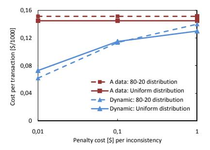

<!-- cite_key: kossmann2009 -->

# Consistency Rationing in the Cloud: Pay only when it matters

Tim Kraska Martin Hentschel Gustavo Alonso Donald Kossmann

Systems Group, Department of Computer Science, ETH Zurich {firstname.lastname}@inf.ethz.ch

## ABSTRACT

Cloud storage solutions promise high scalability and low cost. Existing solutions, however, differ in the degree of consistency they provide. Our experience using such systems indicates that there is a non-trivial trade-off between cost, consistency and availability. High consistency implies high cost per transaction and, in some situations, reduced availability. Low consistency is cheaper but it might result in higher operational cost because of, e.g., overselling of products in a Web shop.

In this paper, we present a new transaction paradigm, that not only allows designers to define the consistency guarantees on the data instead at the transaction level, but also allows to automatically switch consistency guarantees at runtime. We present a number of techniques that let the system dynamically adapt the consistency level by monitoring the data and/or gathering temporal statistics of the data. We demonstrate the feasibility and potential of the ideas through extensive experiments on a first prototype implemented on Amazon's S3 and running the TPC-W benchmark. Our experiments indicate that the adaptive strategies presented in the paper result in a significant reduction in response time and costs including the cost penalties of inconsistencies.

## INTRODUCTION

Cloud storage services are becoming increasingly popular as they promise high scalability and availability at low cost. These services use computer farms of commodity hardware to provide remote storage facilities. Existing commercial services restrict strong consistency guarantees to small datasets (e.g., Microsoft's SQL Data Services) or provide only eventual consistency (e.g., Amazon's S3). If an application requires additional transactional guarantees, then such guarantees must be implemented on top of the cloud storage solution [7].

In this paper, we are interested in implementing database-like facilities on top of cloud storage. In this context, strong levels of consistency are unavoidable. The key observation behind the work reported in this paper is that not all data needs to be treated at the same level of consistency. For instance, in a Web shop, credit card and account balance information naturally require higher consistency levels, whereas user preferences (e.g., "users who bought this item also bought. . . " data) can be handled at lower consistency levels. This distinction is important because, in cloud storage, consistency not only determines correctness but also the actual cost per transaction.

The price of a particular consistency level can be measured in terms of the number of service calls needed to enforce it. Since existing platforms provide only basic guarantees, additional levels of consistency (significantly) increase the cost per operation. Similarly, the price of inconsistency can be measured in terms of the percentage of incorrect operations that are caused by using lower levels of consistency. This percentage can often be mapped to an exact cost in monetary terms (e.g., the penalty costs of compensating a booking error or of losing a customer). These figures are typically well known to the companies offering such services.

To find the right balance between cost, consistency, and availability is not a trivial task. In large scale systems, high consistency implies high cost per transaction and reduced availability [7] but avoids penalty costs. Low consistency leads to lower costs per operation but might result in higher penalty costs (e.g., overselling of products in a Web shop). To make matters more complicated, this balance depends on several factors, including the application semantics. In this paper we propose to bypass this dilemma by using a dynamic consistency strategy: reduce the consistency requirements when possible (i.e., the penalty cost is low) and raise them when it matters (i.e., the penalty costs would be too high). The adaptation is driven by a cost model and different strategies that dictate how the system should behave. We call this approach *Consistency Rationing*in analogy to*Inventory Rationing*[27]. Inventory rationing is a strategy for inventory control where inventories are monitored with varying precision depending on the value of the items. Following this idea, we divide the data into three categories (A, B, and C), and treat each category differently depending on the consistency level provided.

The*A category*contains data for which a consistency violation would result in large penalty costs. The*C category*contains data for which (temporary) inconsistency is acceptable (i.e., no or low penalty cost exists; or no real inconsistencies occur). The*B category*comprises all the data where the consistency requirements vary over time depending on, for example, the actual availability of an item. This is typically data that is modified concurrently by many users and that often is a bottleneck in the system. In this paper we focus on the B category. It is in this category where we can make a significant trade-off between the cost per operation and the consistency level provided. We describe several use cases motivating such B category data. We then develop a cost model for the system and discuss different strategies for dynamically varying the consistency levels depending on the potential penalty costs. The

Permission to copy without fee all or part of this material is granted provided that the copies are not made or distributed for direct commercial advantage, the VLDB copyright notice and the title of the publication and its date appear, and notice is given that copying is by permission of the Very Large Data Base Endowment. To copy otherwise, or to republish, to post on servers or to redistribute to lists, requires a fee and/or special permission from the publisher, ACM.
*VLDB '09,*August 24-28, 2009, Lyon, France

Copyright 2009 VLDB Endowment, ACM 000-0-00000-000-0/00/00. Copyright 2009 VLDB Endowment, ACM 978-1-60558-948-0/09/08

goal of these strategies is to minimize the overall cost of operating over the cloud storage. Our experiments on a cloud database service implemented on top Amazon's S3 show that significant cost benefits can be obtained from the Dynamic policies we introduce in this paper. The paper makes the following contributions:

- We introduce the concept of*Consistency Rationing*, which allows applications to obtain the necessary levels of consistency at the lowest possible cost.
- We define and analyze a number of policies to switch consistency protocols at runtime. Our experiments show that dynamically adapting the consistency outperforms statically assigned consistency guarantees.
- We introduce the notion of probabilistic guarantees for consistency (i.e., a percentile) using temporal statistics for numerical and non-numerical values. Such statistical guarantees are very important in terms of service level agreements although, to our knowledge, this is the first time that probabilistic consistency guarantees are studied in detail.
- We present a complete implementation of Consistency Rationing on top of Amazon's S3. We report on the cost (\$) and performance of running the TPC-W benchmark [32] at several consistency categories, mixes of categories, and different policies of the B category. The results of the experiments provide important insights on the cost of running such systems, on the cost structure of each operation, and on how to optimize such costs using appropriate costs models.

The remainder of this paper is organized as follows: Section 2 describes several use cases for Consistency Rationing in the cloud. Section 3 discusses related work. Section 4 describes Consistency Rationing, the ABC analysis and how guarantees mix. Section 5 presents a set of alternative strategies to handle B data. Section 6 covers the implementation of Consistency Rationing in the cloud. Section 7 summarizes the results of our experiments using the TPC-W benchmark. Section 8 concludes this paper.

# USE CASES

The need for different consistency levels is easily identifiable in a variety of applications and was already studied in different contexts (e.g., in [11, 12]). In the following we present potential use cases in which Consistency Rationing could be applied.

*Web shop.*Assume a conventional Web shop built on top of a cloud storage service. A typical Web shop stores different kinds of data [33]. There is, for example, data of customer profiles and credit card information, data about the products sold, and records on user's preferences (e.g., "users who bought this item also bought . . . ") as well as logging information. These examples already indicate that there are different categories of data in terms of value and need for consistency. The customer's credit card information and the price of the items must be handled carefully. Buyer preferences and logging information could even be lost without any serious damage (e.g., if the system crashes and cached data was not made persistent).

The designer of such a Web shop application could use Consistency Rationing as follows: (1) account information is categorized as*A data*accessible under strong consistency guarantees (i.e., serializability). (2) Product inventory data is categorized as*B data*. As long as the available stock is high enough, the system tolerates some inconsistencies. As the available inventory drops below a certain threshold, access should be done only under strong consistency guarantees to avoid overselling. (3) Buying preferences and logging information is classified as *C data*. The system does not need to see the most up-to-date state at all times and does not need to take any actions to grant exclusive accesses in case of updates.

Since the cost of running such a Web shop in the cloud is determined by the cost per operation, applying Consistency Rationing will necessarily reduce the overall cost by using *cheaper*operations when possible while at the same time minimizing the cost caused by inconsistencies.

Ticket reservations for movie theaters or operas, as well as flight booking systems of an airline company follow the same operational model as the Web shop. The only difference is that the cost of inconsistencies (i.e., overbooking or losing tickets) can be significantly more expensive than in a Web shop. The advantage of Consistency Rationing is that it allows designers to adjust the cost function and adaptation strategies to optimize the total operational costs. In our approach transactions may span multiple categories and are not restricted to operate within a single category (Section 4.4). This allows to partition (ration) the data using any partitioning scheme to optimize the total costs.
*Auction system.*Typical for an online auction system is that an item to be auctioned starts to become very popular in the final stages of its auction. The last minutes of an auction are usually of the highest interest for a bidder. During this period of time, the item's current price should be always up-to-date and modified under strong consistency guarantees. When the end of an item's auction is several days ahead, bids can be updated using lower consistency levels without any effect on the system.

An auction system may utilize this information to implement different strategies for bringing an item up-to-date. If the end of the auction is in the near future (e.g., in one or two hours), the item is treated with strong consistency. Conversely, if the end of the auction lies further away, the item is treated with lower guarantees.

The difference between the auction system and the Web shop use case is that the selection of the consistency protocol is done on a time basis instead on a value basis. Here, the*time*is used as a threshold that determines which consistency guarantees to select. In contrast, the Web shop example used the*value*of a data item as the threshold.
*Collaborative Editing.*Collaborative Editing allows people to work simultaneous on the same document or source base (e.g., Google Docs, Version control, Wiki's). The main functionality of such a system is to detect conflicts during editing and to track the history of changes. Traditionally such systems work with strong consistency. If the system detects a conflict, the user is usually required to resolve the conflict. Only after resolving the conflict the user is able to submit the change as long as no other conflict was generated in the meantime. Although in real deployments there might be some parts of the document that are updated frequently by different parties (e.g., the citations of a paper), people tend to organize themselves upfront to avoid conflicts from the beginning. Hence, conflicts are unlikely for most parts of the document and no concurrency control is required. In contrast, those parts which are frequently updated by several parties, would be best handled by strong consistency guarantees to avoid conflicts all together.

Other than in the previous examples, the selection of the consistency protocol is based on the likelihood of conflicts and not on the value or time. Our*General policy*described in Section 5.1 addresses this use case by automatically adopting the strategy based on the update frequency.

## RELATED WORK

Many transaction and consistency models have been proposed in the distributed systems and database literature. Common references in the DB literature include [5], [34], and [24]. In distributed systems, [31] is the standard textbook that describes alternative consistency models as well as their trade-offs in terms of consistency and availability. Our work extends these established models by allowing levels of consistency to be defined on a per-data basis and adapting the consistency guarantees at runtime.

The closest approaches to what we propose in this paper are [21], [36] and [12]. [21] presents an Infrastructure for DEtection-based Adaptive consistency guarantees (IDEA). Upon the detection of inconsistencies, IDEA resolves them if the current consistency level does not satisfy certain requirements. In contrast, our approach tries to avoid inconsistencies from the beginning by using runtime information. [36] proposes a set of metrics to cover the consistency spectrum (e.g., numerical error, order error) and a variety of protocols to ensure those spectrums. Those protocols are similar to the Demarcation policy (Section 5.3.2). However, their work focuses on ensuring a maximum deviation of a value from the up-to-date view. Our focus is on ensuring a certain consistency constraint (e.g., a stock above 0). In [12] the authors divide data into categories, for which they provide different replication strategies. The proposed replication strategy for stock data is again similar to the Demarcation policy but more conservative as it will never oversell a product and, under certain circumstances, not sell an item even if it is still on stock.

B data resembles to certain extent IMS/FastPath and the Escrow transactional model [13, 23]. Escrow reduces the duration of locks and allows more transactions to run in parallel by issuing predicates to a central system at the beginning of the transaction. If the system accepts these predicates, the transaction is safe to assume that these predicates will always hold in the future without keeping locks. In comparison IMS/FastPath, does not guarantee that the predicates will hold for the whole transaction. Instead the predicates are reevaluated at commit time. Both approaches guarantee strong consistency. We extend the ideas of Escrow and Fast Path by means of probabilistic guarantees and adaptive behavior. Furthermore, IMS/FastPath and Escrow require global synchronization to bring all predicates in order, whereas our approach avoids synchronization as long as possible.

Along the same lines, a great deal of work has been done on distributed consistency constraints [10, 18] and limited divergence of replicas [22, 26]. Distributed consistency constraints either ensure strong consistency or weaken the consistency in small intervals, which in turn can lead to inconsistencies. The work on limited divergence relaxes the consistency criteria of replicas to increase performance, but at the same time, limits the divergence between the replicas (e.g, in value, or staleness). We extend these works by means of probabilistic consistency guarantees and optimization goals in both, performance*and*cost.

In [16, 19, 17], the authors propose a technique to implement consistency constraints for local cached copies in SQL processing. That is, user are reading from local outdated data snapshots if it is within the bounds of the consistency constraints. All writes are redirected to the backend, requiring traditional transaction models. Our work does not require a centralized backend and extends the ideas by the notion of probabilistic guarantees.

The Mariposa system is a distributed data management system that supports high data mobility [28]. In Mariposa, clients may hold cached copies of data items. All writes to a data item must be performed on the primary copy. A cost model in Mariposa determines where the primary copy is placed. This work is orthogonal to Mariposa as we do not address data locality and concentrate on switching consistency at runtime.

The authors of [30] propose adaptive concurrency control based

on a stochastic model. However, their model does not consider inconsistency. Instead the implementation switches between optimistic and pessimistic control for the same level of guarantee.

H-Store [29, 25] tries to completely avoid any kind of synchronization by analyzing transactions and partitioning the data. H-Store provides strong consistency guarantees but requires to know all the queries and transactions up front. We do not make such an assumption. Furthermore, it might be possible to combine the two approaches with the corresponding improvement in performance.

The work in this paper is mainly motivated by cloud database services with exact pricing figures (\$) on a per transaction basis. Amazon's Simple Storage Service [2] and Google's BigTable [9] provide*eventual consistency* guarantees. Recently, some research efforts have been focused on providing stronger guarantees: Yahoo's PNUTS [11] provides monotonicity guarantees and snapshot isolation on a per-record basis. The motivation for that work is similar to ours: higher consistency has higher cost and lowers performance. Google's MegaStore [8] and Microsoft's SQL Data Services [20] offer transactional guarantees, but with restrictions on the size of the data (e.g., transactional guarantees with Microsoft's services are only provided for up to 1GB of data per container). Even for providers offering higher consistency guarantees, the question of cost remains as higher consistency means higher cost per transaction.

## CONSISTENCY RATIONING

The use cases in Section 2 indicate that not all data needs the same consistency guarantees. This fact is well known in standard database applications and addressed by offering different consistency levels on a per transaction basis. Although it is possible to relax every ACID property, in this paper we focus on Isolation and Consistency, and assume that Atomicity and Durability are given.

There is a great deal of work on relaxing consistency guarantees, both in distributed systems (e.g., eventual consistency, read-write monotonicity, or session consistency [31]) and transactions (e.g., read committed, read uncommitted, serializability, or (generalized) snapshot isolation [4]). The main lesson learned from all this work is that the challenge in relaxed consistency models is to provide the best possible cost/benefit ratio while still providing understandable behavior to the developer. With this in mind, we consider only two levels of consistency (session consistency, and serializability) and divide the data into three categories.

## 1 Category C - Session Consistency

The C category encompasses data under*session consistency*. Session consistency has been identified as the minimum consistency level in a distributed setting that does not result in excessive complexity for the application developer [31]. Below session consistency, the application does not see its own updates and may get inconsistent data from consecutive accesses.

Clients connect to the system in the context of a session. As long as the session lasts, the system guarantees *read-your-own-writes monotonicity*. The monotonicity guarantees do not span sessions. If a session terminates, a new session may not immediately see the writes of a previous session. Sessions of different clients will not always see each other's updates. After some time (and without failures), the system converges and becomes consistent (a property called *eventual consistency*that is useful in distributed computing). For instance, Amazon's S3 service, intended for storing files, provides eventual consistency.

Conflict resolution in the C category for concurrent updates depends on the type of update. For non-commutative updates (e.g., overrides), the last update wins. For commutative updates (numerical operations, e.g., add), the conflict is resolved by applying the updates one after each other. Nevertheless, both approaches can lead to inconsistencies if, for example, the update is dropped or by violating an integrity constraint.

Session consistency is cheap with respect to both, transaction cost as well as response time, because fewer messages are required than for strong consistency guarantees such as serializability. It also permits extensive caching which even further lowers cost and increases performance. Cloud databases should always place data in the C category if inconsistencies cannot occur (e.g., data is never accessed by more than one transaction at a time) or there is neither monetary nor administrative cost when temporary inconsistencies arise.

## 2 Category A - Serializable

The A category provides*serializability*in the traditional transactional sense. Data in this category always stays consistent and all transactions that modify data in the A category are isolated. In cloud storage, enforcing serializability is expensive both in monetary costs as well as in terms of performance. These overheads in cost and performance exist because of the more complex protocols needed to ensure serializability in a highly distributed environment [7, 6]. These protocols require more interaction with additional services (e.g., lock services, queueing services) which results in higher cost and lower performance (response times) compared to ensuring session consistency.

Data should be put in the A category if consistency as well as an up-to-date view is a must. We provide serializability using a pessimistic concurrency protocol (two phase locking, 2PL). We chose serializability over, for example, snapshot isolation to ensure transactions always see the up-to-date state of the database.

# 3 Category B - Adaptive

Between the data with session consistency (C) and data with serializability (A), there exists a wide spectrum of data types and applications for which the required level of consistency depends on the concrete situation. Sometimes strong consistency is needed, sometimes it can be relaxed. Given the double impact of transactional consistency in cloud database settings (cost and performance), we introduce the B category to capture all the data with adaptive consistency requirements.

It is also the case that for many of the applications that would run in a cloud database setting, the price of inconsistencies can be quantified (see the use cases above). Examples include: refunds to customers for wrong delivered items, overheads for overbooking, costs of canceling orders, etc. Cost in this sense can refer to either cost in actual money, or e.g., reduced user experience or the administrative overhead to resolve a conflict. Because not all the updates to B data automatically result in a conflict (Section 2), a non-trivial trade-off exists between the penalty cost for inconsistencies and the advantages of using relaxed consistency.

In our implementation, data in the B category switches between session consistency and serializability at runtime. If it happens that one transaction operates at session consistency and another transaction operates under serializability for the same B data record, the overall result is session consistency.

In the remainder of this paper we analyze in detail different policies to switch between the two possible consistency guarantees. These policies are designed to make the switch automatic and dynamic, thereby reducing costs for the user of the cloud infrastructure both in terms of transaction costs as well as in terms of the costs of inconsistencies.

## 4 Category mixes

Our cloud database infrastructure provides consistency guarantees on the data rather than on transactions. The motivation is that data has different characteristics in terms of cost. For example, bank accounts and product stocks require isolation; logging data or customer profiles do not. Defining consistency on data, rather than on transactions, allows to handle the data according to its importance. A side effect of this approach, however, is that transactions may see different consistency levels as they access different data.

If a single transaction processes data from different categories, every record touched in a transaction is handled according to the category guarantees of the record. Therefore, operations on A data read from a consistent view and modifications will retain a consistent state. Reads from A data will always be up-to-date. Reads from C data might be out of date dependent on caching effects. As a logical consequence, the result of joins, unions, and any other operations between A and C data provide only C guarantees for that operation. In most situations, this does no harm and is the expected/desirable behavior. For example, a join between account balances (A data) and customer profiles (C data) will contain all up-to-date balance information but might contain old customer addresses.

If it is necessary from the application point of view, transactions are allowed to specify which guarantees they need. This allows a transaction to see the most up-to-date state of a record. However, it does not guarantee that the transaction has the exclusive right to update the record. If one transaction writes under session consistency and another under serializibility, inconsistency can still arise.

## 5 Development model

Consistency Rationing introduces additional complexity into the development process of applications running over cloud storage. First, the data must be rationed into consistency categories. This process is driven by the operational costs of transactions and of inconsistencies. Second, the required consistency must be specified at the collection (i.e., relation) level together with the policy and all integrity constraints. This can be done similarly to [35] by annotating the schema.

We envision that the development process of an application and Consistency Rationing can be split into different processes. During the development process, strong consistency guarantees are assumed. The programmer will follow the usual database programming model of explicitly stating transactions. Independent of the categorization, the programmer will always issue a*start transaction*command at the beginning of a transaction and a*commit transaction*command at the end of a transaction. When the application gets deployed, the data is rationed according to cost. The rationing may be done by a person not from the development department. Of course, the assumption is that this split of development and rationing does not effect the correctness of the system. Which properties an application has to fulfill in order to split the development process is out of the scope of the paper and part of future work.

# ADAPTIVE POLICIES

In this section, we present five different policies to adapt the consistency guarantees provided for individual data items in category B. The adaptation consists in all cases of switching between serializability (category A) and session consistency (category C). The policies differ on how they determine that a switch is necessary. Thus, the*General policy*looks into the probability of conflict on a given data item and switches to serializability if this probability is high enough. The*Time policy*switches between guarantee levels based on time, typically running at session consistency until a given point in time and then switching to serializability. These two first policies can be applied to any data item, regardless of its type. For the very common case of numeric values (e.g., prices, inventories, supply reserves), we consider three additional policies. The*Fixed threshold policy*switches guarantee levels depending the absolute value of the data item. Since this policy depends on a threshold that might be difficult to define, the remaining two policies use more flexible thresholds. The*Demarcation policy*considers relative values with respect to a global threshold while the*Dynamic policy*combines the idea of the*General policy*for numerical data by both analyzing the update frequency and the actual values of items.

## 1 General policy

The General policy works on the basis of a conflict probability. By observing the access frequency to data items, it is possible to calculate the probability that conflicting accesses will occur. Higher consistency levels need to be provided only when the probability of conflict is high enough.

###*5.1.1 Model*We assume a distributed setup with n servers (i.e., threads are considered to be separate servers) implementing the different levels of consistency described in Section 3. Servers cache data with a cache interval (i.e., time-to-live) CI. Within that interval, C data is read from the cache without synchronizing. Furthermore, two updates to the same data item are always considered as a conflict (we use no semantic information on the operations). If we further assume that all servers behave similarly (i.e., updates are equally distributed among the servers and independent from each other), the probability of a conflicting update on a record is given by:

$$
P_c(X) = \underbrace{P(X > 1)}_{(i)} - \underbrace{\sum_{k=2}^{\infty} \left( P(X = k) \left( \frac{1}{n} \right)^{k-1} \right)}_{(ii)} \quad (1)
$$

X is a stochastic variable corresponding to the number of updates to the same record within the cache interval CI. P(X > 1) is the probability of more than one update over the same record in one cache interval CI. However, a conflict can only arise if the updates are issued on different servers. Hence, the remaining part (ii) of the equation calculates the probability that the concurrent updates happen on the same server and subtracts this from the probability of more than one update. The equation does not consider the probability of conflicting on the same record twice. This is because we assume that conflicts can be detected and corrected (e.g., by simply dropping conflicting updates) and that the probability of two conflicts on the same record is negligible in the time it takes to detect a conflict (e.g., the cache-interval).

Similar to [30], we assume that the arrival of transactions is a Poisson process, which allows to rewrite equation (1) around a single variable with mean arrival rate λ. Since the probability density function (PDF) of a Poisson distribution is given by:

$$
P_{\lambda}\left(X=k\right) = \frac{\lambda^k}{k!}e^{-\lambda} \tag{2}
$$

Equation (1) can be rewritten as:

$$
P_c(X) = \underbrace{\left(1 - e^{-\lambda} \left(1 + \lambda\right)\right)}_{(iii)} - \underbrace{\sum_{k=2}^{\infty} \left(\frac{\lambda^k}{k!} e^{-\lambda} \left(\frac{1}{n}\right)^{k-1}\right)}_{(iv)} \tag{3}
$$

If n > 1 and if the probability of a conflict is supposed to be rather small (e.g., 1% or less), the second term (iv) can be disregarded (simulations show that the terms for k > 3 are negligible). Hence, the following expression can be considered an upper bound for the probability of conflict:

$$
P_C(X) = \left(1 - e^{-\lambda} \left(1 + \lambda\right)\right) \tag{4}
$$

If more precision is needed the first one or two summands of (iv) can also be taken into account.

####*5.1.2 Temporal statistics*To calculate the likelihood of a conflict at runtime without requiring a centralized service, every server gathers temporal statistics about the requests. We use a sliding window with size w and sliding factor δ. The window size defines how many intervals a window contains. The sliding factor specifies the granularity at which the window moves. For every time window, the number of updates to each B data is collected. All complete intervals of a window build a histogram of the updates. Hence, the window size acts as a smoothing factor. The larger the window size, the better are the statistics and the longer the time to adapt to changes in arrival rates. The sliding factor affects the granularity of the histogram. For simplicity, the sliding factor δ is assumed to be a multiple of the cache interval CI. To derive the arrival rate λ for the whole system from the local statistics, it is sufficient to calculate the arithmetic mean x¯ of the number of updates to a record and multiply it by the number of servers n (which is assumed to be globally known) divided by the sliding factor δ:

$$
\lambda = \frac{\bar{x}n}{\delta} \tag{5}
$$

As the statistics are gathered using a sliding window, the system is able to dynamically adapt to changes in the access patterns.

As the update rate of an item has to be small for handling it as a category C item, local statistics can easily mislead the statistics for small window sizes. To overcome the problem, the local statistics can be combined into a centralized view. The simplest way to achieve this would be to broadcast the statistics from time to time to all other servers. Furthermore, if the record itself carries its statistical information (see Section 6), even the broadcast is for free. Thus, by attaching the information to the record, the statistical information can be collected when a data item is cached.

####*5.1.3 Setting the adaptive threshold*When to switch between consistency levels is a critical aspect of the approach as it affects both costs and correctness.

Let Cx be the cost of an update to a record in category x. This cost reflects only the additional cost per record in a running transaction without the setup cost of a transaction. Let CO be the cost of consistency violations. A record should be handled with weak consistency only if the expected savings of using weak consistency is higher than the expected cost of inconsistency EO(X):

$$
C_A - C_C > E_O(X) \tag{6}
$$

If CA −CC > EO(X) then the record should be handled with session consistency (C data). If CA − CC < EO(X), the record should be handled with strong consistency (A data). Assuming EO(X) = PC (X) ∗ CO, a record should be handled with weak consistency if the probability of conflict is less then (CA − CC ) /CO:

$$
P_C(X) < \frac{C_A - C_C}{C_O} \tag{7}
$$

The same equation can be used for optimizing parameters other than cost. For example, if the throughput of a system is to be optimized and we assume that resolving conflicts reduces performance, the same formula can be used by substituting the costs for performance metrics.

A key aspect of the General policy is that a user can simply specify either a fixed probability of inconsistency or provide a cost function independently of what cost in the particular case means. The rest is handled automatically by the system. Consistency, in this sense, becomes a probabilistic guarantee. The probability of inconsistencies will be adjusted depending on how valuable consistency is for a user.

## 2 Time policies

The time policies are based on a time stamp that, when reached, indicates that the consistency guarantees must change. All such use cases tend to follow an auction-like pattern that raise consistency levels when a deadline approaches.

The simplest of all time policies is to set a predefined value (e.g., 5 minutes). Up to 5 minutes before the deadline, the data is handled with session consistency only. Afterwards, the consistency level switches to strong consistency. Hence, this policy is the same as the Fixed threshold policy below, except that the decision when to switch consistency guarantees is time-based instead of value-based.

As before, defining this threshold is critical. Similar to the General policy, we can define the likelihood of an conflict Pc(XT ). The difference is that the stochastic variable XT changes with respect to time t.

In this context, it is often not meaningful to gather statistics for a record. For example, in the case of an auction, a record sees the number of accesses increase as the deadline approaches and then drops to zero once the deadline is reached. Based on this, a simple method to set the threshold is to analyze a sample set of past auctions and derive the likelihood of a conflict in minute t before the time expires. More advanced methods can be adopted from inventory management or marketing, as similar methods are used to predict the life-cycle of products. However, such methods are beyond the scope of this paper.

## 3 Policies for numeric types

In many use cases, most of the conflicting updates cluster around numerical values. For example, the stock of items in a store, the available tickets in a reservation system, or the account balance in a banking system. These scenarios are often characterized by an integrity constraint defined as a limit (e.g., the stock has to be equal or above 0) and commutative updates to the data (e.g., add, subtract). These characteristics allow us to further optimize the General policy by considering the actual update values to decide on which consistency level to enforce. This can be done with one of the following three policies. The*Fixed threshold policy*looks at the actual value of an item and compares it to a threshold. The*Demarcation policy*applies the idea of the Demarcation protocol [3] and considers a wider range of values to make a decision. Finally, the*Dynamic policy*extends the conflict model of the general policy to numeric types.

###*5.3.1 Fixed threshold policy*The Fixed threshold policy defines that if the value of a record is below a certain threshold, the record is handled under strong consistency guarantees. Thus, a transaction that wants to subtract an amount ∆ from a record, applies strong consistency if the current value v minus ∆ is less than or equal to the threshold T:

$$
v - \Delta \le T \tag{8}
$$

In comparison to the general policy, the fix threshold policy does not assume that updates on different servers conflict. Updates are commutative and can, therefore, be correctly resolved. Nevertheless, inconsistency can occur if the sum of all updates on different servers lets the value under watch drop below the limit.

Similar to finding the optimal probability in the General policy, the threshold T can be optimized. A simple way to find the optimal threshold is to experimentally determine it over time. That is, by adjusting T until the balance between runtime cost and penalty cost is achieved. To find a good starting point for T, one can always consider the statistics from the sales department in the company. Normally, the sales department applies similar methods to determine prices or to control the inventory.

The biggest drawback of the Fixed threshold policy is the static threshold. If the demand for a product changes or if*hot spot*products are present, the Fixed threshold policy behaves sub-optimally (see Experiment 2 in Section 7).

####*5.3.2 Demarcation policy*The Demarcation protocol [3] was originally proposed for replicated systems. The idea of the protocol is to assign a certain amount of the value (e.g., the stock) to every server with the overall amount being distributed across the servers. Every server is allowed to change its local value as long as it does not exceed a local bound. The bound ensures global consistency without requiring the servers to communicate with each other. If the bound is to be violated, a server must request additional shares from other servers or synchronize with others to adjust the bound. This protocol ensures that the overall value never drops below a threshold and that coordination occurs only when needed.

We can adopt the basic idea behind the Demarcation protocol as follows. Every server gets a certain share of the value to use without locking. In the following we assume, without loss of generality, that the value of the limit for every record is zero. If n is the number of servers and v the value (e.g., the stock of a product), we define the share a server can use without strong consistency as ¨ v n ˝ . Hence, the threshold T is defined as:

$$
T = v - \left\lfloor \frac{v}{n} \right\rfloor \tag{9}
$$

All servers are forced to use strong consistency only if they want to use more than their assigned share. By applying strong consistency, a server sees the current up-to-date value and inconsistencies are avoided. As long as all servers behave similarly and decrease the value in a similar manner, this method will ensure that the threshold will not fall below zero. In our context of cloud services, the Demarcation policy might not always ensure proper consistency because it is assumed that servers cannot communicate between each other. Only after a certain time interval (i.e., the cache interval), a record is brought up-to-date. It can happen that a server exceeds the threshold and continues to, for example, sell items (now in locking mode) while another server sells items up to its threshold without locking. In such situations, the value can drop below the established bound. The idea behind the Demarcation protocol is nevertheless quite appealing and we can assume that such scenarios occur only rarely.

An additional drawback of the Demarcation policy is, that for a large number of servers n, the threshold tends towards v and the Demarcation policy will treat all B data as A data. Thus, almost all transactions will require locking. Skewed distribution of data accesses is also a problem: if an item is rarely or unevenly used, the threshold could be lowered without increasing the penalty cost.

####*5.3.3 Dynamic policy*The Dynamic policy implements probabilistic consistency guarantees by adjusting the threshold.
*Model.*As for the General policy we assume a cache interval CI and that updates are equally distributed among severs. Hence, the probability of the value of a record dropping below zero can be written as:

$$
P_C(Y) = P(T - Y < 0) \tag{10}
$$

Y is a stochastic variable corresponding to the sum of update values within the cache interval CI. That is, Y differs from X of equation 1 as it does not reflect the number of updates, but the sum of the values of all updates inside a cache interval. P(T − Y < 0) describes the probability that the consistency constraint is violated (e.g., by buying more items before the servers apply strong consistency).
*Temporal statistics.*To gather the statistics for Y we again use a window with size w and sliding factor δ. Unlike for the General policy, we assume that the sliding factor δ is a factor of the checkpoint interval CI rather than a multiple. This has two reasons: First, the Dynamic policy requires to determine the variance. The variance can be precisely derived with smaller sliding factors. Second, the policy concentrates on hot spots and not on rarely updated values. Events (i.e., updates) are not rare and hence, the required amount of data can be collected in less time.

For every sliding interval, the values with regard to all updates to B data in that interval are collected. In contrast to the General policy, this value contains the cumulated sum of all updates instead of the number of updates. All complete intervals of a window build a histogram of the updates. If a transaction wants to update a record, the histogram of the moving window is used to calculate an empirical probability density function (PDF) f using the standard formula. f is then convoluted CI/δ times to build the PDF for the whole checkpoint interval fCI :

$$
f_{CI} = \underbrace{f* f *\cdots* f}_{\text{CI/δ times}} \tag{11}
$$

Convolution is needed, as it is important to preserve the variance.

To reason about the updates in the whole system, the number of servers n has to be known. Convoluting fCI again n times will form the PDF of the updates in the whole system:

$$
f_{CI*n} = \underbrace{f_{CI} *f_{CI}* \cdots * f_{CI}}_{n \text{ times}}
$$
 (12)

Given fCI∗n, the cumulative distribution function (CDF) FCI∗n can be built, which finally can be used to determine the threshold for P(T − X < 0) by looking up the probability that:

$$
F_{CI*n}(T) > P_C(Y)
$$
\n(13)

To optimize PC (Y ) we can use the same method as before:

$$
F_{CI*n}(T) > \frac{C_A - C_C}{C_O} \tag{14}
$$

Note that the threshold T is defined in terms of when the probability is higher than PC (Y ), not smaller.

Although there exist efficient algorithms for convoluting functions, if n∗CI/δ is big enough and/or the item is often updated, the central limit theorem allows us to approximate the CDF with a normal distribution. This permits a faster calculation of the threshold to guarantee the percentile of consistency. The arithmetic mean x¯ and the sample standard deviation s can be calculated using statistics of the histogram of the sliding window. That is, one can approximate the CDF FCI∗n by using the normal distribution with mean:

$$
\mu = \bar{x} \cdot CI/\delta \cdot n
$$

and standard deviation:

$$
\sigma = \sqrt{s^2 \cdot CI/\delta \cdot n}
$$

Figure 1: Architecture

We use statistics gathered at runtime to set the threshold for each individual record depending on the update frequency of the item. As we show in Experiment 2 in Section 7, this Dynamic policy outperforms all other policies in terms of overall performance *and*cost. As the statistics are gathered at runtime, the system is also able to react to changes on the update rate of records.

## IMPLEMENTATION

This section describes the implementation of Consistency Rationing on top of Amazon's Simple Storage Service (S3). The implementation is based on the architecture and protocols presented in [7]. The system in [7] already offers different levels of consistency on top of Amazon's S3 and has been commercialized as Sausalito [1]. At the end of this section we also sketch out how to implement Consistency Rationing on other platforms, such as Yahoo PNUTs.

## 1 Architecture

Figure 1 shows the general architecture we have adapted from [7, 1]. Clients connect through the internet to one of the application servers. The application servers run inside the cloud on top of Amazon's Elastic Computing Cloud (EC2), a virtual machine service. The architecture further combines database and application server together into one system and uses Amazon's Simple Storage Service as a persistent store. Hence, data is stored in form of pages on S3 and directly retrieved from the application server similar to a shared-disk database. In order to coordinate writes to S3, every application server implements a set of protocols. The protocols presented in [7] follow a layered design in which every layer increases the level of consistency. A B-tree is used as an index structure, which in turn is also stored on S3.

We leveraged the protocols of [7] and have built on top protocols for session consistency and serializability. Furthermore, we improve the logging mechanism by means of logical logging. In order to implement adaptive consistency guarantees, we implemented the necessary meta data management, policies, and the statistical component to gather the required temporal statistics.

## 2 Protocol implementation

The basic idea to achieve higher consistency on top of S3 is to temporarily buffer updates to pages in queues, shown in step 1 of Figure 2. The queues used in the first step are referred to as pending update queues (PU queues). After a certain time interval, one server exclusively merges the updates buffered in a PU queue with the respective page on S3 by acquiring a lock for the queue beforehand. This is referred to as checkpointing (step 2 in Figure 2).

Figure 2: Basic Protocol

###*6.2.1 Session consistency*[7] already discusses a protocol for read-your-writes monotonicity. The idea is, to keep the highest commit timestamp for each page a server has cached in the past. If a server receives an old version of a page from S3 (older than a version the server has seen before), the server can detect this and re-reads the page from S3.

Redirecting all requests from the same client to the same server inside a session ensures session consistency. The routing in our implementation is done by using a session ID and forwarding the request accordingly.

Additional assigned vector clocks to messages before sending them to the queues and checking those together with integrity constraints during checkpointing allows to detect and, if needed, to resolve conflicts.

####*6.2.2 Serializbility*To provide the serializability needed by A data, we implemented a two-phase locking protocol (2PL). 2PL is especially robust against heavy conflict rates [14] and therefore well-suited if conflicts are expected. In order to achieve the exclusive access rights required by 2PL, we have implemented a locking service. To always see the most up-to-date view of a record, we had to implement an advanced queue service that provides higher guarantees than Amazon's Simple Queue Service. In particular, all messages are returned at all times and message identifiers (ID) are monotonically increasing.

Based on the increasing message identifiers in our advanced queue service, we were able to simplify the monotonicity protocol presented in [7]. Storing only the latest applied message ID in a page is sufficient to ensure monotonicity. If the system re-reads a page with an older message ID, we know that this page needs an update. To bring a page up-to-date, we rely on retrieving all messages from the queue and applying only messages with a higher ID than the page's ID.

Because we focus on switching consistency protocols at runtime, we will not elaborate on the implementations of 2PL, monotonicity, or the advanced services further. The interested reader will find more information in [6].

## 3 Logical Logging

In order to allow higher rates of concurrency without inconsistencies, we have implemented*logical logging*. A logical log message contains the ID of the modified record and the operation Op performed to this record. To retrieve a new state of a record (e.g., when checkpointing the record), the operation Op from the PU queue is applied to the item.

The protocols presented in [7] use physical logging. Logical updates are robust against concurrent updates as long as the operations are commutative. That is, an update is never lost because it is overwritten and, independent of the order, all updates will become visible. However, non-commutative operations may still lead to inconsistent results. To avoid problems with different classes of commutative operations (e.g., multiplication) we have restricted our implementation to *add*and*subtract*. Logical logging works only for numerical values. For non-numerical values (e.g., strings) logical logging behaves as physical logging (i.e., the last update to the string wins). Our Consistency Rationing approach supports both types of values (see Section 5).

## 4 Meta data

Every collection in our system contains meta data about its type. This information is stored on S3 along with the collection information. Given the collection a record belongs to, the system checks which consistency guarantees should be enforced. If a record is classified as A data, the system knows that it must apply strong guarantees for this item. On the other hand, if an item is classified as C data, the system operates at lower guarantees. For these two data categories (i.e., A and C data), the type-checking operation is enough to decide on the consistency protocol. For B data, the meta data contains further information: the name of the policy and additional parameters for it.

## 5 Statistical component and policies

The statistical component is responsible for gathering statistics at runtime. The statistics are collected locally. Based on these local information, the component reasons about the global state (Section 5). Using this reasoning, a single server is able to decide locally which protocol to use (i.e., Session consistency or 2PL). Only if all servers make the same decision to use A consistency, the stronger consistency level is ensured. Thus, no centralized server is required to make qualified decisions as long the window size is reasonable big and all requests are evenly distributed across the servers. However consolidating statistics and broadcasting certain decisions from time to time would make the system more robust. We consider consolidating statistics and broadcasting as part of our future work.

The probabilistic policies differ in the kind of statistics they require. The General policy handles records where parallel updates on different servers are unlikely with C guarantees. Therefore, the policy needs information on the update frequency and is particularly interested in rarely updated items. On the other hand, the Dynamic policy is especially interested in hot spot items. The policy allows a high rate of parallel updates with C guarantees until the likelihood of falling below a limit becomes too high.

For both policies, we store the statistical information directly with the record. For the General policy we reduce the required space for the statistics by using a simple approximation. If we aim for a conflict rate of less than 1%, simulations using Equation (3) of Section 5.1.1 shows, that the arrival rate has to be less than ≈ 0.22 independently of the number of servers. Having a sliding factor of δ, the average number of updates inside a cache interval to qualify for session consistency is less than 0.22∗δ. We use this property by bounding the value space per slide accordingly and by introducing a special value for update rates beyond the value space.

For example, if we assume a window size of 1 hour with a sliding factor of 5 minutes and a cache interval of 1 minute, 12 window slides need to be stored. The average update rate per slide has to be ≈ 1.1. By allowing some variance, we can use 4 bit per value, reserving one value, here number 16, to stand for updates above 15 and to be further treated as infinite. The window then requires 12 ∗ 4bits = 48bits per record, which is an acceptable size.

The operations to gather the statistics are rather simple: per incoming update a simple increment is needed to increase the number in the current slide. Slides are updated in a round robin fashion and an additional number indicates the freshness of the data. Special intention is given to new records: a special flag is set, to avoid misbehavior before sufficient statistics for a new record are gathered.

Collecting statistics for the Dynamic policy works in a similar way. The main difference is that the sum of update values is collected (instead of the number of updates). Therefore, the space to gather the statistics cannot be optimized as before. For efficiency reasons, we only gather the complete statistics for hot spot records. All other records are treated using a default threshold value. The statistics gathered are rather small and may be kept in main memory. For example, in a system with 10,000 hot spot records within the B category, a window size of 100 values and 32 bits to maintain the number of updates per entry and record, only 10, 000 ∗ 100 ∗ 32 ≈ 4 MB are needed.

The remaining calculations are described in Section 5. To reduce the estimation error, we convolute the distributions exactly if less than 30 updates were performed inside the window for a specific record. Otherwise, the normal distribution approximation is used to improve the calculation performance as described in Section 5. Another problem which occurs within the Dynamic policy is the start of the system, when no statistics are available. We solved the problem by using the Demarcation policy at the beginning and switching to the Dynamic policy after sufficient statistics have become available.

## 6 Implementation Alternatives

The architecture of [7, 1] assumes a storage service which provides eventual consistency guarantees. Higher levels of consistency are achieved by using additional services and by means of protocols. Lately, several systems have appeared that provide higher levels of consistency such as Yahoo PNUTS [11].

Yahoo PNUTS provides a more advanced API with operations such as: *Read-any*, *Read-latest*, *Test-and-set-write(required version)*etc. Using these primitives, it is possible to implement session consistency directly on top of the cloud service without requiring additional protocols and queues. Serializability cannot be implemented by the API, but PNUTS offers*Test-and-set-write (required version)*which does support implementing optimistic concurrency control for A data. The meta data, statistical component, and policies we described in the paper could be directly adapted. Unfortunately, Yahoo PNUTS is not a public system. Hence, we could not further investigate the implementation nor include it in our experiments. Nevertheless, the authors of PNUTS state that for example,*Read-any*is a cheaper operation than*Read-latest*. Hence, the same trade-offs between cost and consistency exist and Consistency Rationing could also be applied to PNUTS to optimize for cost and performance.

Another recent system is the Microsoft SQL Data Services [20]. This service uses MS SQL Server as an underlying system, and builds on top replication and load balancing schemes. By using MS SQL Server, the system is able to provide strong consistency. However, a strong assumption underlies the system: data is not allowed to span several servers and transactions cannot span over several machines. Hence, the scalability of the system is limited.

Consistency Rationing could be also implemented inside MS SQL Data Services. In particular, the A and C categories and the simple strategies such as the Demarcation policy can help to improve performance. However, as achieving strong consistency is much cheaper in this scenario because no messages between different servers are required, the savings are most likely not as big as in a real distributed setup where data can grow infinitely and gets distributed over several machines.

Finally, Consistency Rationing is also a good candidate for traditional distributed databases such as cluster solutions. If relaxed consistency is acceptable, Consistency Rationing can help to reduce the number of messages to guarantee strong consistency. Again, most of the components can be applied directly.

## EXPERIMENTS

This section describes the experiments we performed to study the characteristics and trade-offs of different consistency policies. Our experiments are based on the TPC-W benchmark [32]. The TPC-W benchmark models a Web shop and aims to provide a fair comparison in terms of system performance. In all our benchmarks we report on response time and on cost per transaction. These numbers stand exemplary for one scenario and show the potential of Consistency Rationing.

## 1 Experimental setup

*TPC-W benchmark.*The TPC-W benchmark models a Web shop, linking back to our first use case in Section 2. The TPC-W benchmark specifies that customers browse through the website of a Web shop and eventually buy products. In total, there exist 14 different actions (e.g., product search, register a customer, and purchase a product) and three different mixes of these 14 actions. The most write intensive mix is the Ordering Mix, in which 10% of the actions are product purchases. In all our experiments, we used the Ordering Mix to better reveal the characteristics and trade-offs of our Consistency Rationing approach.

The database defined by the TPC-W benchmark contains 8 different data types (e.g., item data, containing the product information including the product stock). Furthermore, the TPC-W benchmark states that all database transactions require strong consistency guarantees. In our experiments we relax this requirement. In order to study the characteristics of Consistency Rationing, we assign different consistency categories to the data types (see below).

Before each experiment, the stock of each product is set to a constant value. The TPC-W benchmark defines that the stock of a product should be refilled periodically. In this case, the benchmark can run forever without a product's stock dropping below a certain threshold. We are interested in inconsistent states of the database in which the stock of a product drops below zero, because of non-isolated, parallel transactions. To be able to measure these inconsistencies, we do not refill the product's stock but stop the experiment after a given time and count the oversells. All experiments were scheduled to run for 300 seconds and were repeated 10 times.

The Ordering Mix defines that 10% of all actions are purchase actions. One purchase action may request to buy several different products at once. The total number of products in one purchase is set to a random number between 1 and 6 (inclusively). That is, at most 6 products are bought at once. The number of how many individual items to buy of one product follows the 80-20 rule [15]. We implemented the 80-20 rule using Gray's self-similar distribution with the parameters h = 0.2 and N = 4 [15]. At most 4 items are bought of any single product.
*Data categorization.*In our experiments, we study the effects of different settings of categorizations. That is, we assign consistency categories to the data types of the TPC-W benchmark: (1) A data, (2) C data, and (3) mixed data.

(1) First, we categorize all data types as A data. That is, all database transactions are isolated and preserve consistency. Cate-

| Data      | Category                         |
|-----------|----------------------------------|
| XACTS     | A (very valuable)             |
| Item      | B (dependent on item's stock) |
| Customer  | C (few parallel updates)      |
| Address   | C (few parallel updates)      |
| Country   | C (few parallel updates)      |
| Author    | C (few parallel updates)      |
| Orders    | C (append-only, no updates)   |
| OrderLine | C (append-only, no updates)   |

Table 1: Data categorization

gorizing all data types as A data complies with the requirements of the TPC-W benchmark.

(2) Second, we categorize all data types as C data. Database transactions are are only session consistent. Data might be stale and consistency is not preserved. In particular, oversells of products might occur as product purchases are not exclusive.

(3) Last, we define a mix of data type categorizations. This mix contains A data, C data, and B data. Given the data types of the TPC-W benchmark, we categorized these data types as shown in Table 1. Credit card information (XACTS) is defined as A data. Items (i.e., products) are categorized as B data as they contain a numerical value that is used as threshold (i.e., the stock). The rest of the data is categorized as C data.
*Costs.*In all our experiments, the database is hosted in S3 and the clients connect to the database via application servers that run on EC2. The runtime cost is the cost (\$) of running the EC2 application servers, to host the data in S3, and to connect to our additional services (i.e., the advanced queue service and the locking service). The cost of running EC2 and using S3 is provided by Amazon. The cost of connecting to and using our additional services is defined by us and follows the pricing model of Amazon's SQS. In particular, the pricing of our advanced queue service is the same as Amazon's SQS WSDL 2008-01-01 pricing. We used these prices to avoid making a difference between Amazon's services and our additional services. The price to request and to return a lock equals the price to read a message from a queue in SQS. We measure the runtime cost in dollars per 1000 transactions. One transaction relates to exactly one action defined by the TPC-W benchmark.

The penalty cost of inconsistencies is the cost that a company incurs when a promised service can not be established. Here, it is the cost of oversold products, which can not be shipped and result in disappointed customers. In larger companies the penalty cost is usually well known. Because we extremely stress our system (see below), the penalty cost of one oversold product was set to \$0.01 per oversold product. The overall cost is the sum of the runtime cost and the penalty cost.
*Parameters.*In our experiments we used 10 application servers hosted on EC2. These application servers carried out transactions following the Ordering mix defined by the TPC-W benchmark. The number of products in the system was 1000. The stock of each product is set to a uniformly distributed value between 10 and 100. The checkpointing interval was set to 30 seconds. Thus, after at most 30 seconds, the up-to-date version of a page is written to S3. The time to life of a page was set to 5 seconds. The window size of the Dynamic policy was set to 80 seconds, the sliding factor to 5. That is, it normally takes 80 seconds to adapt to a distribution of updates in our database.

To clearly reveal the individual characteristics of the different consistency categories and strategies to switch consistency levels, we stress test our system. In the 300 seconds of benchmark time, up to 12,000 items are sold. That is more than a quarter of the overall

Figure 3: Cost per trx [\$/1000], Vary guarantees

Figure 4: Cost per trx [\$/1000], Vary penalty cost

available products. This stress of the system allowed us to produce stable and repeatable results. Of course, real world scenarios have much less load but also a higher penalty cost for oversells. Producing stable results for such workloads requires extremely long running times making an extensive performance study nearly impossible, which is why we report only on the numbers for our stressed system. However, by running some experiments in more realistic scenarios we observed comparable behavior.

## 2 Experiment 1: Cost per transaction

One of the main points of this paper is to optimize the overall cost of a transaction – measured in dollars. This cost includes the cost to run the transactions as well as the penalty cost that occurs when having oversold products. In our first experiment, shown in Figure 3, we compare the overall cost per transaction for different consistency guarantees. The cost of A data is about 0.15\$ per 1000 transactions. The cost of C data significantly varies with the distribution of updates. For the highly skewed 80-20 distribution, many oversells occur because of the high contention of writes to few data records. For the adaptive guarantee we have chosen the Dynamic policy as this policy suits best the shopping scenario. The cost is the least of all three policies. Thus, the Dynamic policy finds the right balance between weak consistency (to save runtime money) and strong consistency (to not oversell products).

The penalty cost has of course a big influence on the overall cost. Figure 4 shows this influence by varying the penalty costs. For A data the overall cost is constant because no inconsistencies occur and no penalty cost exists. With an increasing penalty cost, the overall cost for the Dynamic policy converges to the cost of A data. The Dynamic policy adapts itself to the penalty cost (see Section 5.3.3) and enforces more and more transactions at strong consistency with increasing penalty cost. The cost of C data becomes amazingly high. At a penalty cost of \$0.1 the C data's overall cost is \$0.74 (\$23) per 1000 transactions for the uniform distribution (80-20 distribution). Therefore, the overall cost of C data is not shown in Figure 4.

Extrapolating the savings of the Dynamic policy to real world

applications (such as Amazon or Ebay), the overall savings in IT costs can be rather significant.

## 3 Experiment 2: Response time

Having a closer look at the performance of our system, we measured the response times of single actions of the TPC-W benchmark. Figure 5 shows the main findings. The response time of A data is the slowest of all policies. Each transaction of A data has to get a lock before any reads or writes can be performed. In contrast, C data shows the fastest response times, as no locks need to be gathered. The Dynamic policy is 24% slower than C data because it sometimes requires locks in order to not oversell products. We conclude that the Dynamic policy is able to compete with state of the art policies in terms of performance and enables us to optimize for cost as well (see previous experiment).

## 4 Experiment 3: Policies

Experiment 3 studies the differences of several adaptive policies in detail. We focus on the numerical policies as those are the ones that apply for the book-shop scenario, and compare the Fixed threshold policy (with thresholds T = 40 and T = 12) with the Demarcation policy and the Dynamic policy. Nevertheless, as the Dynamic policy for numerical data is just an advanced form of the General policy, and the Time policy is just a special setting for the Fixed threshold policy, the results here also serve as examples for the Time and General policy.

Figure 6 shows the cost per 1000 transactions in dollars. The Fixed threshold of T = 12 has been optimized for the uniform distribution of updates to data records (see Experiment 4). The Fixed threshold policy with T = 12 proves to be the cheapest policy for uniformly distributed updates. The same threshold shows a very high cost for skewed updates. Setting the threshold to T = 40 lowers the cost for skewed updates but at the same time raises the cost for uniformly distributed updates. We conclude that the Fixed threshold policy is highly dependent on the threshold and is outperformed by more sophisticates policies. The Demarcation policy shows already a lower cost for both distributions of updates and the Dynamic policy is even able to outperform the Demarcation policy.

Figure 7 displays the response times of the different policies. As can be seen, the Dynamic policy has the fastest response times of all policies. If the stock of a product in the database falls below a the fixed threshold, the Fixed threshold policy will operate in strong consistency. The higher the threshold is set, the earlier this policy will start to require strong consistency. Therefore, the Fixed threshold policy shows a slower response time for the higher threshold. Even for T = 12, the Fixed threshold policy requires unnecessarily many locks compared to the Dynamic policy and the Demarcation policy.

Hence, the Dynamic policy outperforms all other policies that have been described in this paper in terms of cost*and* response time. This is possible by utilizing statistics gathered at runtime, a possibility ignored by the other, more static policies.

## 5 Experiment 4: Fixed threshold

Our last experiment goes into further detail of the Fixed threshold policy. The goal is to experimentally determine the optimal threshold for our benchmark setup. We expect to gain further insight into this value-based decision policy as well as the general Consistency Rationing approach. In this benchmark, the updates were uniformly distributed among all products in the database.

Figure 8 shows the runtime cost of the Fixed threshold policy, A data, and C data in dollars per 1000 transactions. We vary the threshold of the Fixed threshold policy. As A data and C data are not affected by this threshold, their costs remains constant. The runtime cost of the Fixed threshold policy increases as the threshold is increased. The higher the threshold is set, the earlier the policy will switch to strong consistency, which is more expensive (e.g., because of requiring locks and sending more messages).

Figure 9 shows the oversells per 1000 transactions. In our stressed benchmark situation, C data shows almost 7 oversells per 1000 transactions. A data, of course, has no oversells at all because the data is always updated with strong consistency guarantees. The higher the threshold is set for the Fixed threshold policy, the less oversells occur. That is, because the Fixed threshold policy will start to operate in strong consistency mode earlier. For a threshold of T = 14, no oversells occur.

Given these two figures, Figure 10 shows the overall cost per transaction for A data, C data, and the Fixed threshold policy. The overall cost is the sum of the runtime cost and the number of oversells times the penalty cost per oversell. The cost of the Fixed threshold policy has a minimum at T = 12. Both, A and C data, have a higher cost per transaction as the optimal setting of the Fixed threshold policy.

These figures demonstrate well how adaptation at runtime lets the consistency vary between the two extreme guarantees of session consistency and serializability.

## CONCLUSION

In cloud computing storage services, every service request has an associated cost. In particular, it is possible to assign a very precise monetary cost to consistency protocols (i.e., the number of service calls needed to ensure the consistency level times the cost per call). Therefore, in cloud storage services, consistency not only influences the performance and availability of the systems but also the overall operational cost. In this paper, we proposed a new concept called Consistency Rationing to optimize the runtime cost of a database system in the cloud when inconsistencies incur a penalty cost. The optimization is based on allowing the database to exhibit inconsistencies if it helps to reduce the cost of a transaction but does not cause higher penalty costs.

In our approach we divide (*ration*) the data into three consistency categories: A, B, and C. The A category ensures strong consistency guarantees and shows high cost per transaction. The C category ensures session consistency, shows low cost, but will result in inconsistencies. Data in the B category is handled with either strong or session consistency depending on the specified policy. In this paper we present and compare several of such policies to switch consistency guarantees including policies providing probabilistic guarantees. As shown in our experiments, Consistency Rationing significantly lowers the overall cost and improves the performance of a cloud-based database systems. Our experiments show further that adapting the consistency by means of temporal statistics has the best overall cost while maintaining acceptable performance.

In our opinion, the statistical policies introduced in this paper are just the first step towards probabilistic consistency guarantees. Future work will include exploring the many possible improvements: better and faster statistical methods, automatic optimizations with regards to other parameters (e.g., energy consumption), adding budget restrictions to the cost function, and relaxing other principles of the ACID paradigm (e.g., durability).

## REFERENCES

- [1] 28msec, Inc. Sausalito. http://sausalito.28msec.com, Feb. 2009.
- [2] Amazon. Simple Storage Service S3, Dec. 2008. http://aws.amazon.com/s3/.
- [3] D. Barbara and H. Garcia-Molina. The Demarcation Protocol: A ´ Technique for Maintaining Constraints in Distributed Database Systems. *VLDB J.*, 3(3):325–353, 1994.
- [4] H. Berenson et al. A critique of ANSI SQL isolation levels. In *Proc. of ACM SIGMOD*, pages 1–10, Jun 1995.
- [5] P. Bernstein, V. Hadzilacos, and N. Goodman. *Concurrency Control and Recovery in Database Systems*. Addison Wesley, 1987.
- [6] M. Brantner, D. Florescu, D. A. Graf, D. Kossmann, and T. Kraska. Building a Database in the Cloud. http://www.dbis.ethz.ch/research/publications. Technical Report, ETH Zurich, 2009.
- [7] M. Brantner, D. Florescu, D. A. Graf, D. Kossmann, and T. Kraska. Building a database on S3. In *Proc. of ACM SIGMOD*, pages 251–264, 2008.

- [8] M. Cafarella et al. Data management projects at google. *ACM SIGMOD Record*, 37(1):34–38, 2008.
- [9] F. Chang et al. Bigtable: A Distributed Storage System for Structured Data. In *Proc. of OSDI*, pages 205–218, 2006.
- [10] S. S. Chawathe, H. Garcia-Molina, and J. Widom. Flexible Constraint Management for Autonomous Distributed Databases. *IEEE Data Eng. Bull.*, 17(2):23–27, 1994.
- [11] B. F. Cooper et al. PNUTS: Yahoo!'s hosted data serving platform. In *Proc. of VLDB*, volume 1, pages 1277–1288, 2008.
- [12] L. Gao, M. Dahlin, A. Nayate, J. Zheng, and A. Iyengar. Application specific data replication for edge services. In *Proc. of WWW*, pages 449–460, 2003.
- [13] D. Gawlick and D. Kinkade. Varieties of Concurrency Control in IMS/VS Fast Path. *IEEE Database Eng. Bull.*, 8(2):3–10, 1985.
- [14] J. Gray and A. Reuter. *Transaction Processing: Concepts and Techniques*. Morgan Kaufmann, 1994.
- [15] J. Gray, P. Sundaresan, S. Englert, K. Baclawski, and P. J. Weinberger. Quickly generating billion-record synthetic databases. In *Proc. of ACM SIGMOD*, pages 243–252, 1994.
- [16] H. Guo, P.-A. Larson, and R. Ramakrishnan. Caching with 'good ˚ enough' currency, consistency, and completeness. In *VLDB*, pages 457–468, 2005.
- [17] H. Guo, P.-A. Larson, R. Ramakrishnan, and J. Goldstein. Relaxed ˚ Currency and Consistency: How to Say "Good Enough" in SQL. In *Proc. of ACM SIGMOD*, pages 815–826, 2004.
- [18] A. Gupta and S. Tiwari. Distributed constraint management for collaborative engineering databases. In *CIKM*, pages 655–664, 1993.
- [19] P.-A. Larson, J. Goldstein, and J. Zhou. MTCache: Transparent ˚ Mid-Tier Database Caching in SQL Server. In *Proc. of ICDE*, pages 177–189, 2004.
- [20] J. Lee. SQL Data Services Developer Focus (Whitepaper). http://www.microsoft.com/azure/data.mspx, 2008.
- [21] Y. Lu, Y. Lu, and H. Jiang. Adaptive Consistency Guarantees for Large-Scale Replicated Services. In *Proc. of NAS*, pages 89–96, Washington, DC, USA, 2008. IEEE Computer Society.
- [22] C. Olston, B. T. Loo, and J. Widom. Adaptive Precision Setting for Cached Approximate Values. In *SIGMOD Conference*, pages 355–366, 2001.
- [23] P. E. O'Neil. The Escrow Transactional Method. *TODS*, 11(4):405–430, 1986.
- [24] M. T. Ozsu and P. Valduriez. *Principles of Distributed Database Systems*. Prentice Hall, 1999.
- [25] R. Kallman et all. H-store: a high-performance, distributed main memory transaction processing system. In *Proc. of VLDB*, pages 1496–1499, 2008.
- [26] S. Shah, K. Ramamritham, and P. J. Shenoy. Resilient and Coherence Preserving Dissemination of Dynamic Data Using Cooperating Peers. *IEEE Trans. Knowl. Data Eng.*, 16(7):799–812, 2004.
- [27] E. A. Silver, D. F. Pyke, and R. Peterson. *Inventory Management and Production Planning and Scheduling*. Wiley, 3 edition, 1998.
- [28] M. Stonebraker et al. Mariposa: A Wide-Area Distributed Database System. *VLDB J.*, 5(1), 1996.
- [29] M. Stonebraker et al. The end of an architectural era (it's time for a complete rewrite). In *Proc. of VLDB*, pages 1150–1160, 2007.
- [30] A. T. Tai and J. F. Meyer. Performability Management in Distributed Database Systems: An Adaptive Concurrency Control Protocol. In *Proc. of MASCOTS*, page 212, 1996.
- [31] A. Tanenbaum and M. van Steen. *Distributed Systems: Principles and Paradigms*. Prentice Hall, 2002.
- [32] TPC. TPC-W Benchmark 1.8. TPC Council, 2002.
- [33] W. Vogels. Data access patterns in the Amazon.com technology platform. In *Proc. of VLDB*, page 1, Sep 2007.
- [34] G. Weikum and G. Vossen. *Transactional Information Systems*. Morgan Kaufmann, 2002.
- [35] A. Yalamanchi and D. Gawlick. Compensation-Aware Data types in RDBMS, 2009. To appear in Proc. of ACM SIGMOD.
- [36] H. Yu and A. Vahdat. Design and Evaluation of a Continuous Consistency Model for Replicated Services. In *OSDI*, pages 305–318, 2000.
