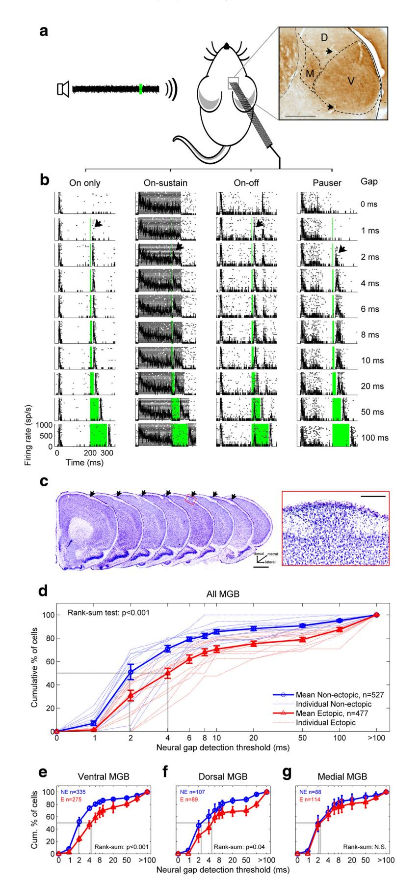
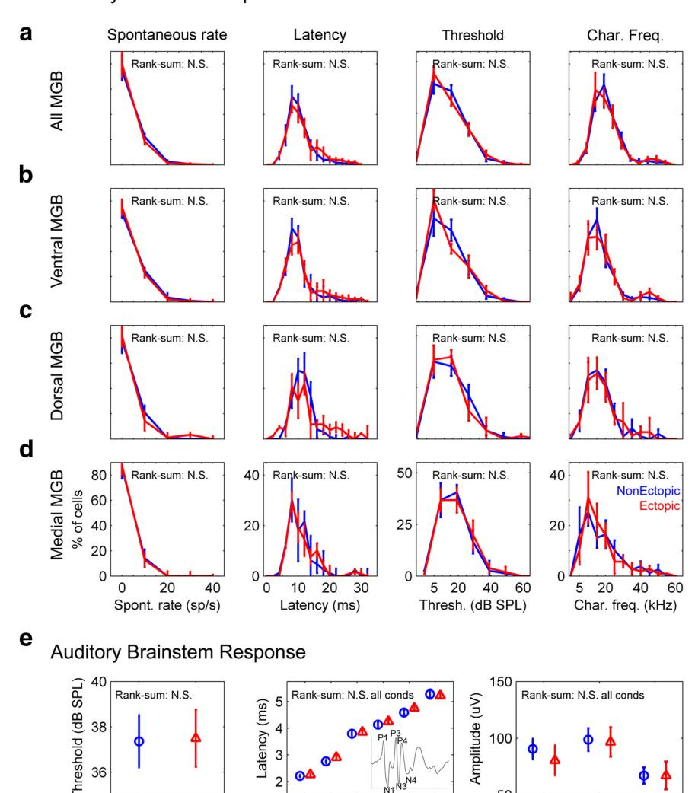
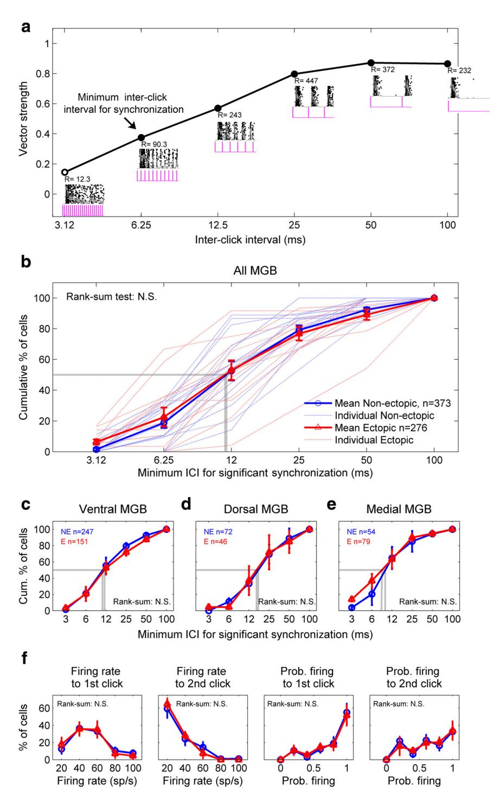
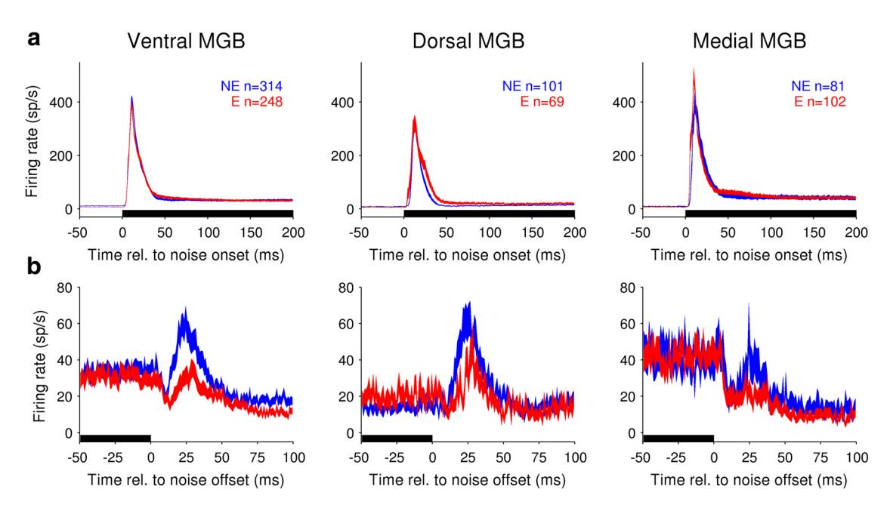
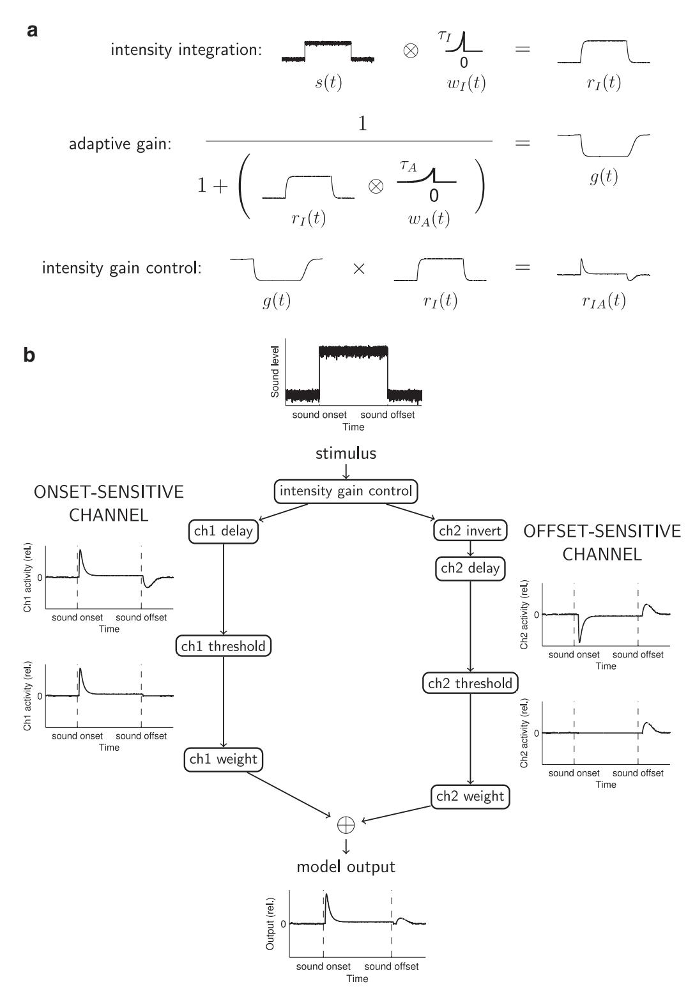
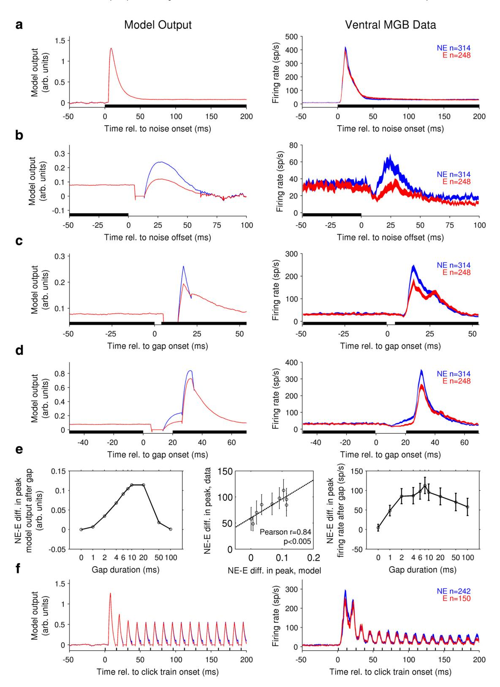
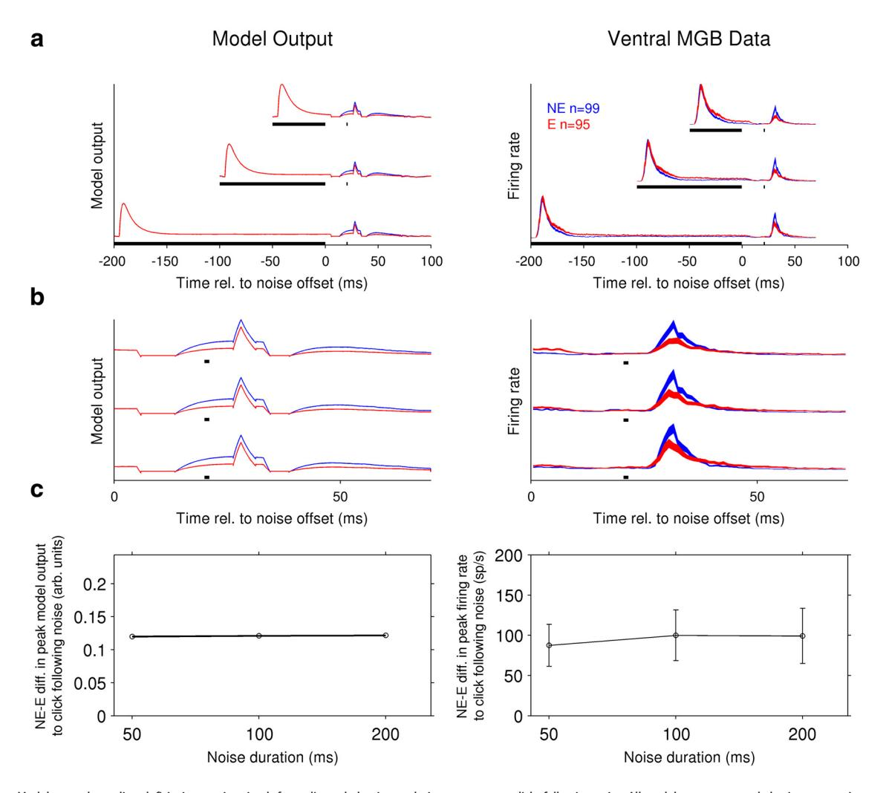
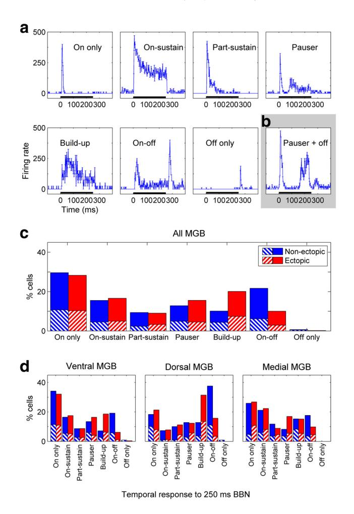
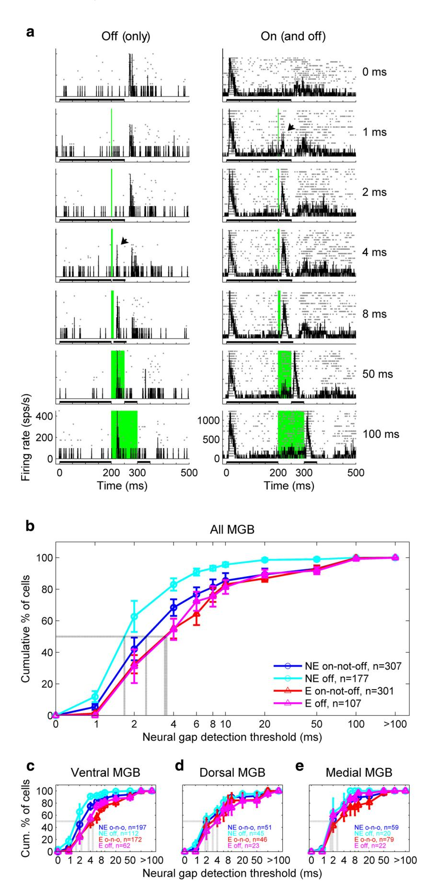
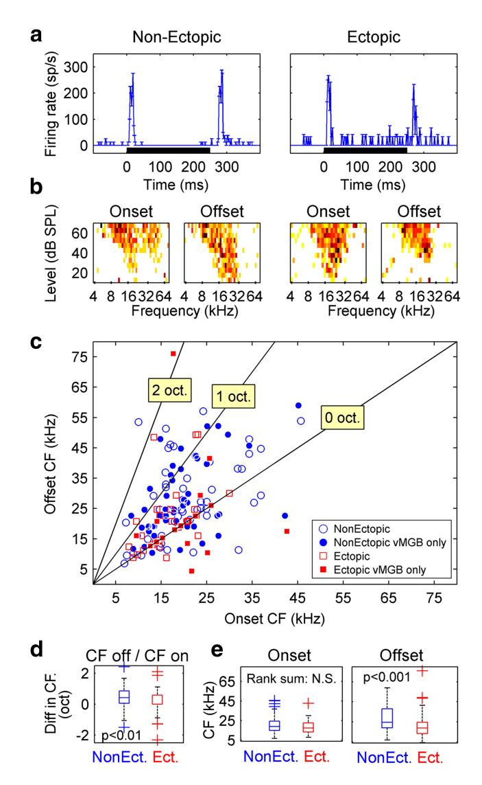

<!-- cite_key: option2015 -->

# Systems/Circuits

# Mind the Gap: Two Dissociable Mechanisms of Temporal Processing in the Auditory System

# Lucy A. Anderson1 and XJennifer F. Linden1,2

1 Ear Institute, University College London, London, WC1X 8EE, United Kingdom, and 2 Department of Neuroscience, Physiology and Pharmacology, University College London, London, WC1E 6BT, United Kingdom

**High temporal acuity of auditory processing underlies perception of speech and other rapidly varying sounds. A common measure of auditory temporal acuity in humans is the threshold for detection of brief gaps in noise. Gap-detection deficits, observed in developmental disorders, are considered evidence for "sluggish" auditory processing. Here we show, in a mouse model of gap-detection deficits, that auditory brain sensitivity to brief gaps in noise can be impaired even without a general loss of central auditory temporal acuity. Extracellular recordings in three different subdivisions of the auditory thalamus in anesthetized mice revealed a stimulus-specific, subdivision-specific deficit in thalamic sensitivity to brief gaps in noise in experimental animals relative to controls. Neural responses to brief gaps in noise were reduced, but responses to other rapidly changing stimuli unaffected, in lemniscal and nonlemniscal (but not polysensory) subdivisions of the medial geniculate body. Through experiments and modeling, we demonstrate that the observed deficits in thalamic sensitivity to brief gaps in noise arise from reduced neural population activity following noise offsets, but not onsets. These results reveal dissociable sound-onset-sensitive and sound-offset-sensitive channels underlying auditory temporal processing, and suggest that gap-detection deficits can arise from specific impairment of the sound-offset-sensitive channel.**

*Key words:* **auditory; gap detection; hearing; mouse; temporal processing; thalamus**## Significance Statement
**The experimental and modeling results reported here suggest a new hypothesis regardingthe mechanisms oftemporal processing in the auditory system. Using a mouse model of auditory temporal processing deficits, we demonstrate the existence of specific abnormalities in auditory thalamic activity following sound offsets, but not sound onsets. These results reveal dissociable soundonset-sensitive and sound-offset-sensitive mechanisms underlying auditory processing of temporally varying sounds. Furthermore, the findings suggest that auditory temporal processing deficits, such as impairments in gap-in-noise detection, could arise from reduced brain sensitivity to sound offsets alone.**

# Introduction

Many sounds encountered in daily life (whispered speech, rustling leaves) are defined primarily by rapid changes in intensity

Received April 29, 2015; revised Dec. 12, 2015; accepted Dec. 18, 2015.

DOI:10.1523/JNEUROSCI.1652-15.2016

Copyright © 2016 Anderson and Linden

This is an Open Access article distributed under the terms of the Creative Commons Attribution License [Creative CommonsAttribution 4.0 International,](https://creativecommons.org/licenses/by/4.0)whichpermitsunrestricteduse,distributionandreproductioninany medium providedthatthe original work is properly attributed.

over time. The ability to detect rapid changes in sound intensity is therefore critical to auditory scene analysis. Psychophysically, this ability is often quantified by measuring duration thresholds for detection of brief gaps in noise (gap-detection thresholds), which are commonly assumed to represent a general measure of auditory temporal acuity [\(Green, 1971\)](#page-17-0). Gap-detection thresholds are also used clinically as an index of the integrity of central auditory temporal processing mechanisms. Abnormally high gap-detection thresholds are considered a symptom of developmental auditory processing disorder [\(American Speech-](#page-17-1)[Language-Hearing Association, 2005\)](#page-17-1) and have also been reported in patients with autism spectrum disorders [\(Bhatara et al.,](#page-17-2) [2013\)](#page-17-2) and autoimmune disease [\(Benasich, 2002;](#page-17-3) [Bruner et al.,](#page-17-4) [2009\)](#page-17-4). Auditory gap-detection deficits are also commonly observed in elderly adults, even when there is no peripheral hearing loss [\(Gordon-Salant and Fitzgibbons, 1993;](#page-17-5) [Snell, 1997;](#page-18-0) [Strouse](#page-18-1) [et al., 1998;](#page-18-1) [Snell and Frisina, 2000\)](#page-18-2). These gap-detection deficits are usually interpreted as reflecting developmental abnormalities

Author contributions: L.A.A. and J.F.L. designed research; L.A.A. and J.F.L. performed research; L.A.A. and J.F.L. analyzed data; L.A.A. and J.F.L. wrote the paper.

This work was supported by Wellcome Trust 084364/Z/07/Z and Action on Hearing Loss 567:UEI:JL. We thank Jane Mattley for assistance with assessment of the ectopic status of experimental animals; and David McAlpine, Matteo Carandini, Lorna Halliday, Maneesh Sahani, Andrew Forge, Sally Dawson, Nicholas Lesica, Doris Bamiou, Robert Simpson, G. Bjo¨rn Christianson, and Jane Mattley for comments and suggestions on manuscript drafts.

The authors declare no competing financial interests.

This article is freely available online through the*J Neurosci* Author Open Choice option.

Correspondence should be addressed to Dr. Jennifer F. Linden, Ear Institute, University College London, 332 Gray's Inn Road, London, WC1X 8EE, UK. E-mail: j.linden@ucl.ac.uk.

in, or age-related decline of, mechanisms of auditory temporal processing.

BXSB/MpJ-*Yaa* mice are an interesting model system in which to study the neural mechanisms of auditory temporal processing and gap-detection deficits. All BXSB/MpJ-*Yaa* mice have autoimmune disease [\(Andrews et al., 1978\)](#page-17-6), which in humans has been linked with a high incidence of auditory temporal processing abnormalities and gap-detection deficits [\(Benasich, 2002;](#page-17-3) [Bruner et al., 2009\)](#page-17-4). Approximately 30%–50% of BXSB/MpJ-*Yaa* mice also have localized disruptions of neocortical lamination (ectopias) [\(Sherman et al., 1987,](#page-18-3) [1990\)](#page-18-4), which resemble those observed in humans with auditory processing and developmental language disorders [\(Galaburda et al., 1985;](#page-17-7) [Kaufmann and Gala](#page-17-8)[burda, 1989;](#page-17-8) [Ramus, 2004;](#page-18-5) [Boscariol et al., 2011\)](#page-17-9). Intriguingly, although the ectopias occur in frontal cortex and not in auditory cortex, ectopic BXSB/MpJ-*Yaa* mice have greater difficulty than their nonectopic littermates with behavioral tasks involving detection of brief gaps in noise [\(Clark et al., 2000b\)](#page-17-10). However, ectopic animals perform normally on tasks involving detection of longer gaps in noise, suggesting a problem with auditory temporal acuity rather than overall hearing sensitivity. Ectopic BXSB/ MpJ-*Yaa* mice are therefore an animal model of gap-detection deficits, and with their nonectopic BXSB/MpJ-*Yaa* littermates as genetically matched controls, can be used to investigate the neural mechanisms of auditory temporal processing abnormalities.

Here we investigated auditory temporal processing in three different subdivisions of the auditory thalamus in both ectopic and nonectopic BXSB/MpJ-*Yaa*mice. We focused on the auditory thalamus because previous studies have suggested that both ectopia-like cortical abnormalities in animal models [\(Herman et](#page-17-11) [al., 1997;](#page-17-11) [Peiffer et al., 2002\)](#page-18-6) and developmental disorders in humans [\(Galaburda et al., 1994;](#page-17-12) [Díaz et al., 2012\)](#page-17-13) cause abnormalities in the auditory thalamus. Furthermore, previous work had suggested that the abnormalities could be specific to particular central auditory pathways, and the three major ascending auditory pathways (lemniscal, nonlemniscal, and polysensory) are much more easily distinguished in the thalamus [\(Anderson](#page-17-14) [and Linden, 2011\)](#page-17-14) than in the cortex [\(Lee and Sherman, 2011\)](#page-17-15).

We report that, in ectopic mice, thalamic neurons in two of the three central auditory pathways exhibit reduced sensitivity to brief gaps in ongoing noise, but responses to other sounds, including other rapidly changing sounds, are unaffected. Furthermore, we find that neural responses to sound offsets, which likely originate in the central rather than perpiheral auditory system, occur less frequently in the auditory thalamus of ectopic mice, and this abnormality alone can account for both the stimulus specificity and subdivision specificity of the deficit in thalamic sensitivity to brief gaps in noise. We introduce a simple phenomenological model of central auditory intensity processing incorporating gain control and dissociable onset-sensitive and offset-sensitive channels, and we show that thalamic abnormalities in ectopic mice can be reproduced with a weakening of the contribution from the offset-sensitive channel. The results demonstrate the existence of two dissociable mechanisms of auditory temporal processing, one most sensitive to sound onsets and the other to sound offsets. Moreover, the findings indicate that apparent deficits in auditory temporal acuity could arise from specific abnormalities in central auditory processing of sound offsets.

# Materials and Methods
*Subjects.* All procedures were approved under the United Kingdom Animals (Scientific Procedures) Act of 1986. Experiments were conducted in 33 male mice of the inbred BXSB/MpJ strain (i.e., BXSB/MpJ-*Yaa* mice; 14 ectopic and 19 nonectopic, as identified in postmortem histological analysis). Of these 33 mice, 13 ectopic and 14 nonectopic mice were used for both thalamic recordings and auditory brainstem response (ABR) recordings, and an additional 1 ectopic and 5 nonectopic mice were used for ABR recordings only.

BXSB/MpJ-*Yaa* mice carry the Y-linked autoimmune acceleration locus (*Yaa*) on the Y chromosome, which is the result of a duplication of a 4 Mbp, 19 gene telomeric segment of the X chromosome onto the Y chromosome (for details and references, see http://jaxmice.jax.org/ strain/000740.html). All male mice of the BXSB/MpJ strain (i.e., both ectopic and nonectopic BXSB/MpJ-*Yaa*animals) have the mutant*Yaa*containing Y chromosome, which causes accelerated development of autoimmune disease [\(Andrews et al., 1978\)](#page-17-6) typically by 20 weeks of age. Animals were therefore used in experiments at ages of 8 –20 weeks. There were no significant differences in age at recording time between ectopic and nonectopic animals (mean - SD of ages of mice used for thalamic recordings: ectopic 127 - 12 d, nonectopic 126 - 17 d, Student's *t*test,*p*0.90; similar results obtained when including animals only used for ABR recording).
*Surgical procedures and acoustic calibration.*Surgical procedures were similar to those described previously [\(Anderson and Linden, 2011\)](#page-17-14), except for the use of urethane (1.9 g/kg in a 20% solution, Sigma) for anesthesia and buprenorphine (0.1 mg/kg) for analgesia. All auditory stimuli were presented free-field to the left ear (contralateral to the thalamic recording site), using a speaker (FF1, Tucker-Davis Technologies) positioned at 45° in azimuth relative to the animal and at the same elevation as the left auditory canal. A sound-attenuating ear plug was placed in the right ear. Before the start of each experiment, acoustic stimuli were calibrated near the opening of the animal's left auditory canal; after correction, the sound system frequency response was flat to within -2 dB from 2 to 90 kHz.
*Auditory thalamic recordings.*Extracellular single-unit and multiunit recordings were obtained from all major subdivisions of the right auditory thalamus. Multichannel electrode arrays were custom-made to enable simultaneous recording from multiple medial geniculate body (MGB) subdivisions. Linear arrays of eight parylene-coated tungsten microelectrodes (WPI, TM33A20) were mounted (by hand) onto a printed circuit board. The eight electrodes were spaced 75 m apart, ensuring that the electrode array would completely span the mediolateral dimension of the mouse MGB. Each individual electrode on the array typically had an impedance of 1–2 M at 1 kHz. Electrode arrays were positioned stereotaxically and advanced using a hydraulic probe drive (FHC 50-12-1C), which was controlled from outside the soundattenuated booth (FHC Neurocraft MCM/MCU). To ensure consistency in depth measurements across penetrations, the motor controller was zeroed as the tip of the microelectrode touched the cortical surface (as confirmed by visual inspection under a microscope and by an acoustic change in the electrode signal). In all penetrations, the electrode was moved down 2200 m below the cortical surface, then left to stabilize for 10 min. Neurons were located using 50 s clicks presented at variable intensities. Trigger levels were set manually so that action potentials had to exceed a threshold of at least 2 SD of the background noise. To prevent erroneous artifacts from being recorded as spikes, potential action potentials had to pass both the positive and negative threshold within 700 s of the first threshold crossing. Multiunit activity was recorded by the multichannel arrays, and single units were isolated by off-line spike sorting. We manually clustered spike waveforms in up to three dimensions (e.g., peak amplitude, trough amplitude, peak width) using spike-sorting software (Jan Schnupp's Brainware, Tucker-Davis Technologies). All results reported for analysis of pooled multiunit and single-unit data were also confirmed to be valid for single-unit data alone.

Once auditory responses were established, recordings were collected during 100 repetitions of a 50 s click presented with at least an 800 ms interstimulus interval. Further recordings were collected during presentations of click trains; tones varying in frequency and intensity; gap-in-noise stimuli; and noise maskers followed by click probes. Click trains were 200 ms in duration and composed of 60 dB SPL clicks with interclick intervals (ICIs) of 3.125, 6.25, 12.5, 25, 50, and 100 ms; responses to 20 repetitions of each train were recorded. To estimate each neuron's frequency-intensity response area, characteristic frequency, and threshold, 3 repetitions of tone pips at variable frequencies and intensities were presented in a sequential manner (2–75 kHz, 5– 80 dB SPL with tones presented at least every 1/5 octave in 5 dB steps; tones had a 5 ms rise/fall time, 100 ms duration and were presented with an interstimulus interval of 500 ms). Gap-in-noise stimuli (20 repetitions each) consisted of a 200 ms 60 dB SPL noise stimulus, followed by a 0, 1, 2, 4, 6, 8, 10, 20, 50, or 100 ms silent gap, followed by a second 60 dB SPL noise burst 50 ms in duration. The 0 ms gap condition was a no-gap control, corresponding to a continuous 250 ms noise. Noise masker/click probe stimuli (20 repetitions each) consisted of 60 dB SPL noise bursts 50, 100, or 200 ms in duration, followed 20 ms later by a 50 s probe click (and 300 –500 ms later by an additional 50 s reference click, not otherwise discussed). Noise stimuli were generated as dense combs of overlaid tones with random starting phase, spaced 1/24 octave apart and spanning 2–80 kHz in frequency. Noise rise/fall time was 5 ms for noise masker/click probe stimuli and 0 ms for gap-in-noise stimuli. We used a 0 ms rise/fall for the gap-in-noise stimuli to avoid interference with measurement of neural gapdetection thresholds, which were often only 1–2 ms; spectral splatter would not be detectable, given that the noise stimuluswas already sowideband as to cover virtually all of the hearing range of the mouse.
*ABR measurements.*Subdermal electrodes were placed at the vertex of the skull (), over the ipsilateral bulla (), and over the contralateral bulla (ground). Signals were amplified 20 with a Tucker-Davis Technologies low-impedance headstage (RA4LI), digitized with a 16-bit sigma-delta analog-to-digital converter (Tucker-Davis Technologies RA16SD, hardware bandpass filtering 2.2 Hz to 7.5 kHz), recorded at a 24.414 kHz sampling rate, and then bandpass filtered in software between 100 and 3000 Hz (fifth-order Butterworth filter). Click-evoked ABRs were recorded in response to 500 –1000 repetitions of a click stimulus, 50 s in duration, ranging in level from 5 to 80 dB SPL. ABR thresholds were defined as the lowest sound level at which at least two of the deflections in the ABR waveform exceeded 2 SE of the background signal.Wave amplitude and latency were measured from ABR waveforms in response to click stimuli presented at 80 dB SPL, and all results were confirmed at a level 20 dB above threshold.
*Data analysis.*All data analyses were conducted blind to the ectopic status of the animal. Results of statistical tests are described as "significant" if*p*0.01, and as "trends" where*p*0.01 but 0.05. All statistical tests were nonparametric and two-tailed unless otherwise specified.

Recordings of neuronal responses to 100 presentations of a single click were used to define spontaneous firing rates, first-spike latency, and peak latency. The spontaneous firing rate of each neuron was calculated from the first 4 ms of recording to the click stimulus (i.e., after presentation of the click and before a response was observed). A response to the click was considered significant if a poststimulus time histogram (PSTH) compiled from 100 click repetitions using 0.5 ms time bins showed a peak in firing that exceeded 2 SD of the neuron's spontaneous rate. The firstspike latency to the click was defined as the median of the times at which the first spikes were elicited in response to the click, across 100 click presentations. Peak latencies were calculated from the mode of the response following 100 click presentations. Latencies were calculated from the PSTH using 0.5 ms bins; similar results were obtained with 0.1 or 0.2 ms binwidths.

Trains of clicks with different ICIs were used to assess the neuron's ability to follow temporally varying stimuli. The minimum ICI for synchronization was determined to be the minimum ICI for which the vector strength of the entire click train response was significant as determined using the Rayleigh test of uniformity (Rayleigh values 13.8,*p*0.001). For the fastest ICIs (6.25 and 3.125 ms), the onset portion of the response was excluded from vector-strength calculations to ensure that the onset response was not artificially contributing to synchronization. The peak firing rate and probability of firing were measured in response to each individual click for all ICI conditions for which the neuron showed statistically significant synchronization.

Responses to gap-in-noise stimuli with variable gap durations were used to assess neuronal sensitivity to brief gaps in noise. The neural gap-detection threshold was defined as the smallest gap that preceded a statistically significant response to the second noise stimulus. Assessment of the neural gap-detection threshold was performed for each neuron using PSTHs with 0.5 ms binwidths compiled from 20 repetitions of each gap-in-noise stimulus; all results were confirmed to be similar with 0.1 ms or 0.2 ms binwidths. The response to the second noise stimulus was considered significant if any part of the response exceeded 2 the SD of the average background firing over the preceding 10 ms. Neural gapdetection thresholds estimated according to this rule were always confirmed (and corrected if necessary) by visual inspection of responses to gap-in-noise stimuli across the full range of gap durations. In particular, estimates of the neural gap-detection threshold for neurons responding to noise offsets were checked for any significant elevations in firing during the gap periods before the second noise onset. In practice, latencies of responses to noise offsets were usually much longer than neural gapdetection thresholds, and also much longer than latencies of responses to noise onsets. Therefore, in neurons with both offset and onset responses to noise, responses to the offset of the first noise burst in a gap-in-noise stimulus typically could not be distinguished from responses to the onset of the second noise burst for gap durations of 10 ms or less, and estimates of the neural gap-detection threshold based on activity during the second noise burst were almost always confirmed as correct after visual inspection of gap-in-noise responses and consideration of any offset responses. Moreover, and very importantly, estimation of the neural gap-detection threshold for each recorded neuron was performed blind to both the ectopic or nonectopic status of the animal and the localization of the recording site.

Responses to a 250 ms broadband noise (equivalent to the 0 ms gapin-noise condition) were used to categorize temporal PSTH shapes. These shapes were classified qualitatively as follows: (1) "On only" if the neuron had a transient response at the beginning of the 250 ms noise burst that returned to spontaneous rate within 30 ms after the initial response; (2) "On-sustain" if after the initial transient response, firing continued throughout the duration of the noise burst; (3) "Part-sustain" if firing continued 30 ms after the initial transient response, but not throughout the duration of the noise; (4) "Pauser" if following the transient onset response there was a clear period of inhibition (reduced firing) before firing recommenced, and the sustained firing varied in duration from a short burst (typically 30 –50 ms) to continuing throughout the duration of the stimulus; (5) "Build-up" if the neuron had no initial transient and the sustained firing increased over the duration of the noise stimulus; (6) "On-off" if the neuron produced transient responses at the beginning and the end of the noise burst; and (7) "Off only" if the neuron produced a transient response only at the end of the noise burst.

Automated identification of cells with transient offset (or onset) responses to broadband noise was performed on data recorded during presentations of a 250 ms noise (the 0 ms gap-in-noise stimulus). Neuronal spike times were binned into a PSTH with 1 ms resolution, and the mean and SD of the bin-by-bin firing rates were computed for the 50 1 ms bins preceding noise onset (the control interval). A neuron was judged to have a significant offset response if, within an interval 10 – 60 ms after noise offset, the mean firing rate in at least two successive 1 ms bins (1) was significantly higher than the bin-by-bin firing rate in the control interval (Wilcoxon rank-sum test,*p*0.01), and (2) rose between the two successive significant time bins. The same procedure, applied within an interval 0 –50 ms after noise onset, was used to identify neurons with a significant onset response. This automated procedure identified the vast majority of offset (and onset) responses that were apparent by eye, and successfully excluded other types of responses. In particular, the automated approach successfully distinguished transient noise-offset responses from other possible spiking patterns after noise offset, such as prolonged decay of high noise-induced firing rates, or return to a high spontaneous firing rates following noise-induced suppression.
*Histological identification of thalamic recording sites and ectopias.*As in [Anderson and Linden \(2011\)](#page-17-14), discrete electrolytic lesions (5-A for 5–7 s) were created to indicate the region of recording within the thalamus. Once physiological recording at each rostrocaudal position had ceased (and before moving to a new rostrocaudal position), electrolytic lesions were made in the most lateral and most medial electrode tracks that had yielded data. Lesions were created a fixed distance apart within each electrode track (as controlled by a hydraulic microdrive), allowing for estimation of tissue shrinkage and cutting angle. Histological reconstruction of all recording sites could then be accomplished using the recorded stereotaxic coordinates and estimated corrections for variations due to histological processing.

Procedures for histological processing were as described by [Anderson](#page-17-16) [et al. \(2007\)](#page-17-16). Briefly, following an overdose of sodium pentobarbital (Euthatal, i.p.), mice were transcardially perfused with 4% PFA (chilled). Brains were postfixed in 4% PFA for 12 h. Coronal sections from the olfactory bulbs to a position caudal to the auditory thalamus were cut using a vibratome. Sections were 50 m thick and mounted on glass slides in two series of alternating sections. To clearly visualize MGB subdivisions and electrolytic lesions, one series was stained for the metabolic marker cytochrome oxidase by incubating sections for 3–5 h at 37°C in a solution containing 20 mg of diaminobenzidine hydrochloride in 10 ml of distilled water and 30 mg of cytochrome*c* with 3 g of sucrose in 30 ml of 0.1 M phosphate buffer titrated to pH 7.4. The second series was stained for Nissl substance using cresyl violet to visualize the presence of cortical ectopia. Cortical ectopias were identified using a light microscope, by a characteristic mushroom-like extrusion of cells into the molecular layer (layer I). The number, location, and hemisphere of the ectopia were recorded. Consistent with previous reports [\(Sherman et al., 1987,](#page-18-3) [1990\)](#page-18-4), nearly half the BXSB/MpJ-*Yaa*animals had ectopias, usually only one, located in the frontal cortex.
*Model description.*The model we introduce here is not intended to be a physiologically realistic model of the auditory pathway, but rather an abstract description of essential stimulus transformations performed by the auditory pathway up to and including the thalamus. The basic computations performed by this simple model (integration, adaptation, delay, thresholding, and weighted summation) are not only biologically plausible but also fundamental; more elaborate models of central auditory processing would also involve some form of these computations. The model incorporates two key assumptions: (1) that auditory processing involves intensity gain control; and (2) that auditory thalamic population activity can be modeled as a weighted sum of outputs from two dissociable auditory channels, one most sensitive to sound onsets and another most sensitive to sound offsets.

The input to each channel is an integrated, adapted function of the time-varying sound level in dB SPL,*s*(*t*). This process implements intensity gain control. The "integration" component of the computation can be described in the following discretized formulation:

$$
r_{I}(t) = \sum_{i=t-N}^{t} w_{I}(t-i)s(i),
$$
 (1)

where *rI* (*t*) is the integrated sound input, *N*is the maximum duration of the integration window, and temporal weights*wI*are defined as follows:

$$
w_I(a) = \begin{cases} K_I \cdot e^{-a/\tau_I} & \text{if } 0 \le a \le N \\ 0 & \text{otherwise.} \end{cases}
$$
 (2)

Thus,*wI*defines an integration window that acts in Equation 1 to weight the stimulus by an exponentially decaying function of preceding time, with time constant*I*. (For simplicity, the arbitrary scale factor*KI*is chosen such that*a*0 *N wIa* 1, and themaximumwindow duration*N*is set to 5*I*to ensure 99% decay of the exponential at the earliest time points falling within the window.) This integration step is linear in the stimulus and amounts to convolution of the time-varying stimulus (offset by the response latency) with the causal integration window defined by*wI*.

Adaptation is then implemented using a simple version of the standard nonlinear normalization equation [\(Carandini and Heeger,](#page-17-17) [2012\)](#page-17-17) as follows:

$$
r_{IA}(t) = r_I(t) \cdot \frac{1}{1 + \sum_{j=t-M}^{t} w_A(t-j)r_I(j)}
$$
(3)

where*rIA*(*t*) is the integrated and adapted sound input within the channel, *M*is the maximum duration of the adaptation window for the channel, and temporal weights*wA*are defined in a similar manner as for*wI*as follows:

$$
w_A(b) = \begin{cases} K_A \cdot e^{-b/\tau_A} & \text{if } 0 \le b \le M \\ 0 & \text{otherwise.} \end{cases}
$$
 (4)

Thus,*wA*defines an adaptation window acting in Equation 3 to weight the integrated stimulus*rI* (*t*) by an exponentially decaying function of preceding time, with time constant *A*. (For simplicity, we again define the arbitrary scale factor *KA*to be such that*b*0 *M wAb*1, and the maximum window duration*M* to be 5*A*.) In other words, the integrated stimulus *rI* (*t*) is normalized by the function of its recent magnitude defined by the causal adaptation window *wA*, to obtain the integrated, adapted channel input *rIA*(*t*).

Substituting equation 1 for*rI* (*t*) in Equation 3, we obtain the following equation for *rIA*(*t*) in terms of only the time-varying stimulus level *s*(*t*), integration window weights *wI*, and adaptation window weights*wA*as follows:

$$
r_{IA}(t) = \sum_{i=t-N}^{t} w_I(t-i)
$$

$$
s(i) \cdot \frac{1}{1 + \sum_{j=t-M}^{t} w_A(t-j) \left(\sum_{k=j-N}^{j} w_I(j-k)s(k)\right)}
$$
(5)

Intuitively,*rIA*(*t*) is the sound intensity integrated over the integration window, and scaled by an adaptive gain *g*(*t*) that depends on both the integration and adaptation windows:

$$
g(t) = \frac{1}{1 + \sum_{j=t-M}^{t} W_A(t-j) \left( \sum_{k=j-N}^{j} w_I(j-k)s(k) \right)}
$$
(6)

When sound levels are very low (e.g., in "silence," modeled here as very low-level, 10 dB SPL noise), the denominator in this adaptive gain term will be closer to 1, and so the adaptive gain *g*(*t*) will approach 1; *rIA*(*t*) will therefore approach the integrated sound intensities falling within the integration window alone, *itN t wIt i si*. In contrast, when sound levels are continuously high (e.g., in continuous 60 dB SPL background noise), the denominator in the adaptive gain term will be large, and so the adaptive gain term*g*(*t*) will approach zero. Thus, the computations described above implement intensity gain control.

Model output is computed as theweighted sum of activity in two different channels receiving this integrated and adapted sound input. Thefirst (onsetsensitive) channel provides a thresholded version of the integrated, adapted sound level (with a brief delay modeling non-zero response latency). In contrast, the second (offset-sensitive) channel provides an inverted and additionally delayed, then thresholded, version of the integrated, adapted input. The inversion in the second channel ensures that this channel produces suprathreshold signals only following sound offsets; such an inversion could in principle be implemented biologically through intracellular mechanisms [\(Kopp-Scheinpflug et al., 2011\)](#page-17-18) or via disinhibition following transmission through inhibitory neurons. Longer delay for the offset-sensitive channel than for the onset-sensitive channel is consistent with our experimental observation that latencies of responses to noise offsets were longer than latencies of responses to noise onsets in both ectopic and nonectopic animals (see Results).

Importantly, the second (offset-sensitive) channel contributes to model output primarily following offsets of prolonged sounds (e.g., after a noise, or during gaps in noise), not following offsets of acoustic transients (clicks). The relative insensitivity of the second channel to click offsets arises because the output of this channel does not exceed the threshold baseline observed in "silence" (very low-level noise) unless two conditions are both met: there is a drop in sound level, and adaptive gain is lower than it would be during "silence." These conditions co-occur only following offsets of prolonged sounds, not following offsets of very transient sounds on a "silent" background.

*Model fitting and testing.* Model parameters were chosen to obtain a good qualitative match between "nonectopic" model output for simu-

**Figure 1.**Ectopic mice have a deficit in auditory thalamic sensitivity to brief gaps in noise.*a*, Extracellular *in vivo* recordings were obtained from neurons in the ventral (V), dorsal (D), and medial (M) subdivisions of the MGB of anesthetized mice during presentations of gap-in-noise stimuli with variable gap durations. Inset, Coronal section through MGB, stained for cytochome

lated noise onsets and offsets, and the temporal profiles of ventral MGB population responses to noise onsets and offsets in nonectopic mice. Six model parameters were chosen to optimize this fit: the integration time constant (*I* 6 ms) and adaptation time constant (*A*10 ms); the onset-sensitive channel delay (ch1 delay 5 ms) and weighting (ch1 weight 1.0); and the offset-sensitive channel delay (ch2 delay 13 ms) and weighting (ch2 weight 0.5). Only one parameter was changed from the "nonectopic" model to produce the "ectopic" model: the offset-sensitive channel weighting (ch2 weight reduced from 0.5 to 0.25).

We then tested these "nonectopic" and "ectopic" versions of the model using simulated versions of other stimuli: gap-in-noise stimuli, click trains, and clicks following noise. Simulated stimuli were generated as for acoustic stimuli, with "silence" simulated as low-level 10 dB SPL noise, and clicks simulated as 3 ms noise bursts to better approximate the speaker response to a 50 m voltage pulse and the neural population responses to isolated clicks. Our aim was to determine whether "nonectopic" and "ectopic" model outputs for gap-in-noise stimuli, click trains, and clicks following noise reproduced the observed similarities and differences between nonectopic and ectopic animals in ventral MGB population responses to these stimuli. This comparison is displayed in Results; similar results were obtained with small variations in the model parameters.

We also experimented with more complex models in which the integration and adaptation of the sound input involved different*I*and*A*parameters for the onset-sensitive and offsetsensitive channels, or the adaptative normalization was performed with nonunity scale factors, saturationfactors, and exponents [\(Carandini and](#page-17-17) [Heeger, 2012\)](#page-17-17). However, this added complexity appeared to be unnecessary, as qualitatively excellent fits to the data could be achieved with the simpler six-parameter model.

oxidase. Arrowheads indicate electrolytic lesions.*b*, Examples of four common types of auditory thalamic responses to gapin-noise stimuli, shown in rasters with superimposed PSTHs. Zero time corresponds to start of noise; firing rate is shown in spikes per second (sp/s). Green column represents silent gap. Black arrow indicates neural gap-detection threshold. *c*, Example neocortical ectopia inmotor cortex,shown insuccessive coronal sections (left, arrows; scale bar, 1 mm) and in a magnified view of layer I (right;scale bar, 200m). *d*, Neural gapdetection deficit in MGB of ectopic mice. Red represents ectopic mice. Blue represents nonectopic mice. Dotted lines indicate individual animals. Solid lines with error bars indicate mean - SE across animals. Dotted gray lines indicate median values. *n*, total number of neural recordings across animals. *e– g*, Same analysis for neurons recorded in ventral MGB (*e*), dorsal MGB (*f*), and medial MGB (*g*). Results ofWilcoxon ranksum tests for differences in medians are shown. N.S., Not significant. Kolmogorov–Smirnov tests for differences in distributions produced similar results (see Results).

# Results

To identify possible neural correlates of previously described behavioral gap-detection deficits in ectopic BXSB/MpJ-*Yaa* mice, we recorded sound-evoked responses of neurons in three different subdivisions of the auditory thalamus in both ectopic and nonectopic animals. Extracellular recordings were obtained from single neurons and small populations of neurons (multiunits) in each of the ventral (lemniscal), dorsal (nonlemniscal), and medial (polysensory) subdivisions of the MGB, the auditory aspect of the thalamus [\(Fig. 1](#page-4-0)*a*). Experiments were performed in terminally anesthetized animals (for controls related to the use of anesthesia, see Controls for effects of anesthesia).

All experiments and data analyses were conducted blind to the ectopic or nonectopic state of the animal, which could only be determined through postmortem histology, not genotyping. Ectopic and nonectopic BXSB/MpJ-*Yaa* mice are male littermates of an inbred mouse strain; the ectopias are thought to be a lowpenetrance consequence of genetic susceptibility to developmental disorders common to all inbred BXSB/MpJ-*Yaa* animals but expressed only stochastically or when triggered by environmental factors [\(Sherman et al., 1987,](#page-18-3) [1990\)](#page-18-4). Therefore, comparisons made in this study are not between mutant and wild-type mice, but between genetically similar same-sex littermates of the same inbred strain, with or without a low-penetrance phenotypic abnormality (a cortical ectopia).

Ectopic animals were identified by the presence of one or more ectopias in cortical layer I in brain sections stained for Nissl substance [\(Fig. 1](#page-4-0)*c*). Most ectopic animals had a single ectopia, located in the motor cortex of either hemisphere. The presence or absence of ectopias was confirmed in all cases by a second observer blind to the outcome of the first observer's assessment; the only disagreement between the two observers concerned the exact number of ectopias in one atypical animal with more than one ectopia.

## Thalamic-subdivision-specific deficit in neural sensitivity to brief gaps in noise

We analyzed thalamic responses to "gap-in-noise" stimuli similar to those used in previous behavioral studies [\(Clark et al., 2000b\)](#page-17-10), and observed a range of thalamic response profiles dominated by transient increases in neural firing rates at the onset of the first (200 ms) noise epoch, with further bursts of firing at the onset of the second (50 ms) noise epoch following sufficiently long gaps. We defined a "neural gap-detection threshold" for each neural recording by identifying the shortest gap followed by a statistically significant burst of firing [\(Fig. 1](#page-4-0)*b*, arrows; see Materials and Methods). Neural gap-detection thresholds were significantly longer in ectopic than nonectopic animals in the MGB overall [\(Fig. 1](#page-4-0)*d*; Wilcoxon rank-sum test for difference in medians, *p* 0.001), suggesting a possible neural substrate for behavioral deficits in gap detection previously reported in ectopic BXSB/MpJ-*Yaa* animals [\(Clark et al., 2000b\)](#page-17-10).

The abnormality in neural gap-detection thresholds in ectopic mice was statistically significant for neurons located in the ventral (lemniscal) MGB subdivision [\(Fig. 1](#page-4-0)*e*; Wilcoxon rank-sum test *p* 0.001), with a similar trend evident in the dorsal (nonlemniscal) MGB subdivision [\(Fig. 1](#page-4-0)*f*; *p* 0.04). However, there was no significant difference in neural gap-detection thresholds between ectopic and nonectopic mice for neurons in the medial (polysensory) MGB subdivision [\(Fig. 1](#page-4-0)*g*; *p*0.1). Similar results were obtained in all cases from Kolmogorov–Smirnov tests for differences in distributions (all MGB and ventral MGB,*p*1 10 13; dorsal MGB,*p*0.02; medial MGB,*p* 0.2). The deficit in thalamic sensitivity to brief gaps in noise observed in ectopic mice therefore appeared to be subdivision-specific, affecting the lemniscal and perhaps nonlemniscal central auditory pathways but not the polysensory pathway (for further details on these pathways, see [Anderson](#page-17-14) [and Linden, 2011\)](#page-17-14).

### Evidence suggests a central rather than peripheral auditory origin

The fact that the deficit in thalamic sensitivity to brief gaps in noise was evident in only two of three auditory thalamic subdivisions in ectopic animals constitutes strong circumstantial evidence that this deficit arises within particular central auditory pathways (i.e., within the auditory brain rather than within the ear). Additional evidence supporting this conclusion comes from the observation that there were no statistically significant differences between ectopic and nonectopic animals in basic auditory thalamic response properties, such as spontaneous neural firing rates, peak first-spike latencies for responses to clicks, intensity thresholds for responses to tones, or preferred frequency for tone responses at threshold [characteristic frequency (CF)], whether the data were pooled across MGB overall or analyzed separately for each subdivision [\(Fig. 2](#page-6-0)*a–d*; Wilcoxon rank-sum tests for differences in medians and Kolmogorov–Smirnov tests for differences in distributions, all *p* 0.3). Moreover, there were no statistically significant differences between ectopic and nonectopic animals in basic evoked-potential measures of auditory nerve and brainstem responses [\(Fig. 2](#page-6-0)*e*; Wilcoxon rank-sum tests for differences in medians: ABR thresholds, *p*0.97; ABR wave amplitudes, all*p*0.4; ABR wave latencies, all*p* 0.3). Collectively, these findings indicate that the deficit in thalamic sensitivity to brief gaps in noise observed in ventral and dorsal MGB of ectopic mice is likely of central auditory origin.

#### No general deficit in central auditory temporal acuity

Does the deficit in thalamic sensitivity to brief gaps in noise observed in ectopic mice reflect a general deficit in central auditory temporal acuity? To test for "sluggish" auditory thalamic processing in ectopic BXSB/MpJ-*Yaa* mice, we examined responses in the three MGB subdivisions using another rapidly varying stimulus: a 200 ms train of clicks with ICIs spanning the range of intervals over which neural gap-detection deficits were observed (3.125–100 ms). Thalamic neurons in both ectopic and nonectopic animals generally produced a burst of firing in response to individual clicks at longer ICIs; as the ICI was reduced, these bursts merged into a less periodic response [\(Fig. 3](#page-7-0)*a*). For each neuron or cluster of neurons, we defined the "minimum ICI for synchronization" to be the smallest ICI at which locking to the click repetition period was observed (i.e., smallest ICI for which the response showed statistically significant vector strength; see Materials and Methods).

In contrast to neural gap-detection thresholds, minimum ICIs for synchronized firing to rapid click trains were statistically indistinguishable in ectopic and nonectopic mice in MGB overall and in each of the ventral, dorsal, and medial MGB subdivisions separately [\(Fig. 3](#page-7-0)*b– e*; Wilcoxon rank-sum tests for differences in medians and Kolmogorov–Smirnov tests for differences in distributions, all *p* 0.1). Moreover, there were no significant differences between ectopic and nonectopic mice in thalamic responses to the individual clicks within the click trains, as illustrated in [Figure 3](#page-7-0)*f* for first and second clicks in 6.25 ms ICI trains; similar results were obtained for third, fourth, and fifth clicks,

**Figure 2.**No differences between ectopic and nonectopic mice in basic auditory thalamic response properties or in ABRs to clicks. All figure panels compare data from ectopic (red) and nonectopic (blue) animals and show results of Wilcoxon rank-sum tests for differences in medians; Kolmogorov–Smirnov tests for differences in distributions produced similar results. N.S., Notsignificant(seetext).*a*, Pooledthalamic response data from neurons in all MGBsubdivisions. Leftto right, Spontaneous firing rates; peak latencies for responses to isolated clicks (click presentations separated by at least 800 ms); tone response thresholds; characteristic frequencies. Line histograms with error bars indicate mean - SE across animals. *b– d*, Same as *a* but with neurons separated by MGB subdivision: ventral MGB (*b*), dorsal MGB (*c*), and medial MGB (*d*).*e*, Click ABR measures. Left to right, ABR thresholds; wave peak latencies for ABRs to 80 dB SPL clicks (inset, example ABR waveform with P1-N4 labeled); wave peak-to-trough amplitudes for ABRs to 80 dB SPL clicks. Symbols and error bars indicate mean -SE across animals.

different ICIs, and whether data were analyzed for MGB overall (as in [Fig. 3](#page-7-0)*f*) or for individual MGB subdivisions. Thus, there were no statistically significant differences between ectopic and nonectopic mice in thalamic sensitivity to rapid click trains, suggesting that the deficit in thalamic sensitivity to brief gaps in noise does not arise from a general deficit in central auditory temporal acuity.

#### No deficit in thalamic responses to noise onsets or sustained noise

Could abnormal auditory thalamic sensitivity to brief gaps in noise arise from abnormal responses to the noise preceding the gaps? There were no significant differences between ectopic and nonectopic animals in population responses to the 200 ms noise preceding the gap in either ventral or dorsal MGB [\(Fig. 4](#page-8-0)*a*, left and middle), suggesting that neural gap-detection deficits in these MGB subdivisions cannot be explained by differences in neural sensitivity to the noise stimulus. Measures of peak firing rate following noise onset, latency to peak firing, average firing rate 0 –50 ms after noise onset, and steady-state firing rate in the last 50 ms of the noise revealed no statistically significant differences between ectopic and nonectopic mice in either ventral MGB or dorsal MGB (Wilcoxon rank-sum tests, all *p*0.1, except dorsal MGB 0 –50 ms firing rate*p*0.03). Similar results were obtained in the medial MGB for the firing rate measures (Wilcoxon rank-sum tests, all*p*0.1); however, latencies to peak firing rate after noise onset were significantly shorter in ectopic than nonectopic animals (median [5%–95% CI]: ectopic mice, 10 [6 –17.4] ms; nonectopic mice, 12 [8 –25.9] ms; Wilcoxon rank-sum test,*p* 2 10 6 ). This unexpected finding confirms our previous conclusion that central auditory processing is not more sluggish in ectopic than nonectopic mice; indeed, medial MGB responses to noise appear to be less sluggish in ectopic animals.

#### A specific deficit in thalamic activity following noise

Thus, the deficit in thalamic sensitivity to brief gaps in noise observed in ventral and dorsal MGB of ectopic mice arises neither from a general deficit in central auditory temporal acuity nor from abnormal neural sensitivity to noise. Could the deficit instead reflect an abnormality in neural activity following noise? During long (100 ms) gaps in gap-in-noise stimuli, population PSTHs of ventral and dorsal (but not medial) MGB neurons revealed increased neural activity 10 –60 ms following the offset of the 200 ms noise stimulus [\(Fig.](#page-8-0) [4](#page-8-0)*b*). This neural population response to noise offsets was significantly weaker in ectopic than nonectopic mice in the ven-

tral MGB [\(Fig. 4](#page-8-0)*b*; Wilcoxon rank-sum test on peak firing rates and average firing rates, both *p*0.0005), with a similar trend evident in the dorsal MGB for both measures (peak firing rates,*p*0.05; average firing rates,*p* 0.03). In the medial MGB, where we observed neither deficits in neural gapdetection [\(Fig. 1](#page-4-0)*g*) nor deflections in the population PSTH following noise offsets [\(Fig. 4](#page-8-0)*b*, right), there were no differences between ectopic and nonectopic animals in peak or average firing rates 10 –60 ms following noise offset (Wilcoxon rank-sum test, both *p* 0.3). Therefore, both neural gapdetection deficits and offset response deficits in ectopic animals occur only in those MGB subdivisions which, in nonectopic animals, show increases in population activity following noise offsets.

### Intensity gain-control model with onset-sensitive and offset-sensitive channels replicates key features of thalamic population PSTHs

These results suggest that both the stimulus specificity and the subdivision specificity of thalamic deficits observed in ectopic mice could arise from abnormally weak central auditory activity following noise offsets. To demonstrate how abnormalities in thalamic population activity following noise offsets might arise, we developed a simple phenomenological model of central auditory processing of temporal variations in sound intensity [\(Fig. 5;](#page-9-0) for details, see Materials and Methods). This model transforms timevarying sound pressure level input into predicted auditory thalamic population output, using only biologically plausible computations, such as integration, adaptive normalization, thresholding, and weighted summation. The model incorporates two key assumptions: (1) that auditory processing involves intensity gain control; and (2) that auditory thalamic population activity can be modeled as a weighted sum of outputs from two dissociable auditory channels, one most sensitive to sound onsets and another most sensitive to sound offsets. The idea that onset-sensitive and offset-sensitive central auditory pathways are dissociable is consistent with results of previous physiological investigations [\(He, 2001;](#page-17-19) [Scholl et](#page-18-7) [al., 2010;](#page-18-7) [Kopp-Scheinpflug et al., 2011\)](#page-17-18) as well as with our findings in BXSB/MpJ-*Yaa* mice. Intensity gain control has also been reported in many previous studies of central auditory processing [\(Robinson](#page-18-8) [and McAlpine, 2009\)](#page-18-8) and is essential in the model to ensure that offset responses are evoked primarily following prolonged sounds, not following acoustic transients such as clicks (see Materials and Methods).

This model successfully replicated many features of auditory thalamic responses to temporally varying sounds in nonectopic mice and could also account for deficits observed in ectopic mice as arising from a reduction in the contribution of an offset-sensitive central auditory channel to thalamic population activity. Model outputs mimicked the time course of ventral MGB population responses to noise onsets and offsets, and "nonectopic" and "ectopic" models differing only in a single model parameter, the weighting of the offset-sensitive channel, captured both similarities and differences between nonectopic and ectopic population PSTHs [\(Fig. 6](#page-10-0)*a*,*b*). Outputs of the "nonectopic"

**Figure 3.**Ectopic mice have no deficit in auditory thalamic sensitivity to rapid click trains.*a*, Example responses to click trains from a neuron recorded in ventral MGB of an ectopic mouse. Insets, Superimposed rasters and PSTHs, with click stimuli (pink) indicated below. Synchronization of firing to each click train was quantified with the Rayleigh score (R) of vector strength. The minimum ICI forsynchronization (arrow) was defined as thesmallest ICI for which the vectorstrength wassignificant at the 0.001 level (R 13.8). Closed circles represent significant vector strength. Open circles represent not significant. *b*, No differences between ectopic and nonectopic mice in distributions of minimum ICI for synchronization to click trains, for all recorded MGB neurons. Conventions as in [Figure 1](#page-4-0)*d*.*c– e*, Same analysis and results for neurons recorded in ventral MGB (*c*), dorsal MGB (*d*), and medial MGB (*e*). *f*, No differences between ectopic and nonectopic mice in thalamic responses to 6.25 ms ICI (160 clicks/s) click trains, for all MGB recordings with statistically significant synchronized firing to those trains. Conventions as in [Figure 2.](#page-6-0) Left to right, Peak firingrate forresponseto first orsecond click inrapid clicktrains; probability of firingto first orsecond click. *b–f*, Results ofWilcoxon rank-sumtests for differences in medians are indicated; N.S., notsignificant(seetext). Kolmogorov–Smirnovtests for differences in distributions produced similar results.

**Figure 4.**Ectopic mice have a deficit in auditory thalamicsensitivity to noise offsets, but not noise onsets.*a*, Population responses to 200 ms noise atstart of gap-in-noisestimuli (pooled across stimuliwith different gap durations).Allfiguresshow population PSTHsfor ectopic(red) and nonectopic(blue)mice,from neuralrecordings in ventralMGB(left), dorsalMGB(middle), ormedialMGB (right). Filled lines indicate mean-SE across recordings. Black bars along*x*-axis represent noise presentation.*n*, total number of neural recordings across animals. For details ofstatistical analysis, see Results. *b*, Population responses to offset of 200 ms noise, for gap-in-noise stimuli with 100 ms gaps. Conventions as in *a*, but note differences in axis limits.

and "ectopic" models for simulated 4 and 20 ms gaps in noise showed a remarkable similarity to ventral MGB population PSTHs [\(Fig. 6](#page-10-0)*c*,*d*), replicating temporal features of the thalamic population responses as well as differences between nonectopic and ectopic animals. In particular, we found that the difference between nonectopic and ectopic animals in the peak ventral MGB population response after a brief gap in noise showed a nonmonotonic dependence on gap duration that peaked 10 ms [\(Fig. 6](#page-10-0)*e*, right). A similar nonmonotonic dependence on gap duration, also peaking 10 ms, was evident in the difference between peak "nonectopic" and "ectopic" model outputs for simulated gap-in-noise stimuli [\(Fig. 6](#page-10-0)*e*, left). Indeed, the differences in peak thalamic gap-in-noise responses between nonectopic and ectopic mice were significantly correlated with differences in peak "nonectopic" and "ectopic" model outputs for simulated gaps in noise of the same duration [\(Fig. 6](#page-10-0)*e*, middle; Pearson's*r*0.84,*p* 0.005). This finding demonstrates that the model provided not only a qualitatively correct but also a quantitatively accurate description of the deficit in thalamic population responses to brief gaps in noise in ectopic mice. Moreover, the model also successfully replicated the key observation that responses to rapid click trains were similar in ectopic and nonectopic mice [\(Fig. 6](#page-10-0)*f*), although some detailed features of ventral MGB responses to rapid click trains (e.g., exact pattern of reduction in response to successive clicks) differed from model outputs.

Most importantly, the model also predicted additional stimulus-specific deficits in ventral MGB of ectopic mice, and these predictions were validated in further experiments. Specifically, the model predicted that ventral MGB activity evoked by a click 20 ms following noise would be stronger in nonectopic than ectopic animals [\(Fig. 7](#page-11-0)*a*,*b*, left), even though there were no differences between nonectopic and ectopic mice in ventral MGB responses to isolated clicks or rapid click trains. (The explanation for this prediction is essentially that the response to the click following noise is boosted by the larger noise-offset response in nonectopic than ectopic mice.) Moreover, the model predicted that the difference between nonectopic and ectopic animals in the peak response to a click 20 ms following noise would be similar for noise durations of 200, 100, and 50 ms [\(Fig. 7](#page-11-0)*c*, left) because all three noise durations are long compared with the predicted time course of intensity gain control [\(Fig. 5\)](#page-9-0). We confirmed these predictions in experiments involving 4 of the ectopic and 3 of the nonectopic mice. As predicted by the model, ventral MGB population responses to clicks following noise were larger in nonectopic than ectopic animals, even for noise durations as short as 50 ms [\(Fig. 7](#page-11-0)*a*,*b*, right; one-tailed Wilcoxon rank-sum tests, *p*0.001 for all three noise durations). Moreover, peak firing rates to a click 20 ms following noise offset did not differ significantly between the 200, 100, and 50 ms noise-duration conditions, for either nonectopic or ectopic animals (Kruskal–Wallis test,*p* 0.1 for both). Thus, the model successfully predicted stimulus conditions under which even the otherwise robust click responses appeared abnormal in ectopic animals.

#### Fewer offset-responsive thalamic neurons in ectopic mice

The modeling results indicated that the observed auditory thalamic abnormalities in ectopic mice could arise from a specific reduction in the contribution of an offset-sensitive central auditory channel to thalamic population activity. To investigate this possibility further, we examined the diversity of temporal profiles in neuronal responses to broadband noise, and the incidence of neurons with responses to noise offsets.

First, we performed a manual categorization of temporal response shapes, assigning each neuron to "On only," "Onsustain," "Part-sustain," "Pauser," "Build-up," "On-off," or "Off only" categories [\(Fig. 8](#page-12-0)*a*) based on the most prominent temporal feature of the response to a 250 ms broadband noise. This analysis, conducted blind to the ectopic status of the mice, revealed clear differences between ectopic and nonectopic animals in the proportions of neurons with different noise-response profiles [Figure 8](#page-12-0)*c*,*d*). In particular, the proportion of MGB neurons with

**Figure 5.**Conceptual explanation of the model.*a*, Graphical description of integration and adaptation computations producing intensity gain control. Time-varyingsound level*s*(*t*) is convolved with the causal integration window *wI* (*t*) to obtain *rI* (*t*), the integrated stimulus input. Then, a time-varying gain function *g*(*t*) is computed using a simple version of the standard normalization equation [\(Carandini and Heeger, 2012\)](#page-17-17), with convolution of *rI* (*t*) and the causal adaptation window*wA*(*t*) in the denominator. This adaptive gain *g*(*t*) is multiplied time point by time point with the integratedstimulus input*rI* (*t*)to obtainthe integrated and adaptedfunction *rIA*(*t*), incorporating intensity gain control. *b*,Diagram ofthefulltwo-channelmodel. Thetime-varyingsound levelforms the input to an intensity gain control process as outlined in *a*. In the onset-sensitive channel (ch1), intensity gain control computations are followed by a delay, then thresholding, then weighting before summation with channel 2 output. In the offset-sensitive channel (ch2), intensity gain-control computations are followed by inversion and alonger delay than in ch1; the weighting of ch2 afterthresholding is also reduced relativetothat of ch1. Model output isthesum ofthe weighted activity inthetwo channels. Allplots of channel activity andmodel outputshow activityrelativetothat produced by extended "silence"(simulated as very low-level noise). Forsimulationsshown in [Figures 6](#page-10-0)an[d7,](#page-11-0) "nonectopic"model parameterswere asfollows: integration*I* 6ms, adaptation*A*10ms; onset-sensitivechanneldelay5ms,weight1.0;offset-sensitivechanneldelay13ms,weight0.5."Ectopic"modelparameterswereidentical,exceptthattheweightingoftheoffset-sensitivechannel wasreducedto 0.25.

**Figure 6.**A simple phenomenological model of central auditory processing can reproduce both similarities and differences between nonectopic and ectopic animals in the temporal features of auditory thalamic responses. Parameters for "nonectopic" (blue) and "ectopic" (red) models were identical, except that the weighting of the offset-sensitive channel was reduced in the "ectopic" model (for details,see[Fig. 5](#page-9-0)and Materials and Methods).*a– d*, Model outputs forsimulatedstimuli (left column) and ventral MGB population PSTHs to acoustic stimuli (right, conventions as in [Fig. 4\)](#page-8-0) areshown for the following: *a*, onset of a 200 ms noise; *b*, offset of a 200 ms noise;*c*, 4 ms gap in noise; and *d*, 20 ms gap in noise.*e*, Left, Difference between peak "nonectopic" and "ectopic" model output after a gap in noise, as a function of gap duration. Right, Mean - SE of difference between peak nonectopic and ectopic ventral MGB population firingrates after a gap in noise, as a function of gap duration. Middle, Direct comparison of ordinate values fromright and left plots.Each open circlerepresents a different non-zero gap duration. Dotted line indicates least-squares fit. Results of Pearson's correlation test are shown. *f*, Model output (left) and ventral MGB population PSTHs (right) for click train stimuli with 12.5 ms ICI. Conventions as in *a– d*. Model output is in arbitrary units and is baseline-subtracted to show differences from model output in "silence" (simulated as very low-level, 10 dB SPL noise).

**Figure 7.**Model correctly predicts deficits in ectopic animals for auditory thalamic population responses to clicks following noise. All model parameters and plotting conventions as in [Figure 6.](#page-10-0)*a*, Model predictions of responses to 50, 100, or 200 ms noise followed by click 20 ms after noise offset (left). Data testing these predictions (population PSTHs, right) were collected in experiments in 4 ectopic and 3 nonectopic animals. *b*, Zoomed-in view of population PSTHs during the 70 ms period following noise offset; click 20 ms after noise offset indicated by black dot below each trace. *c*, Left, Difference between peak "nonectopic" and "ectopic" model output for asimulated click 20 ms following noise, as a function of the duration of the noise. Right, Same analysis for ventral MGB data, showing mean -SE of difference between peak nonectopic and ectopic population firing rates for a click following noise.

an "On-off" response profile was significantly lower in ectopic than nonectopic mice (Fisher's exact test, *p* 5 10 7 ); and conversely, the proportion of neurons with a "Build-up" response profile was higher (*p* 1 10 5 ). Like the deficit in thalamic sensitivity to brief gaps in noise, the deficit in the proportion of neurons with an "On-off" response profile was significant in the ventral and dorsal MGB subdivisions individually (*p* 0.001 for both), but not in the medial MGB subdivision (*p* 0.1). We also noted that there were very few cells with a pure "Off only" response profile (i.e., transient response only to noise offset), in either ectopic or nonectopic animals. Thus, this categorization analysis demonstrated that thalamic neurons sensitive to noise offsets also tended to respond to noise onsets; and that, compared with nonectopic animals, ectopic mice had fewer ventral and dorsal MGB neurons with "On-off" response profiles (and more with "Build-up" response profiles).

One limitation of this categorization analysis was that prominent temporal features of the responses to noise onsets (e.g., "Pauser"-type responses) could override weak responses to noise offsets when cells were assigned to their most representative temporal profile category (e.g., [Fig. 8](#page-12-0)*b*). To determine whether offset responses were less common in ectopic than nonectopic animals across all temporal response profiles, we devised an automated method for detecting significant responses to noise offsets (see Materials and Methods). We also used a similar method to detect noise-onset responses, to compare the strength and incidence of onset and offset responses to noise, independent of other aspects of the temporal response profile.

This automated analysis confirmed that offset-responsive thalamic neurons were rarer in ectopic than nonectopic mice and that most offset-responsive cells were also onset-responsive. In the MGB overall, 26% of neurons recorded in ectopic mice were significantly offset-responsive, compared with 35% of neurons in nonectopic mice [\(Table 1\)](#page-12-1); the vast majority of these offsetresponsive cells were also onset-responsive (98% in ectopic mice, 97% in nonectopic mice; [Table 1\)](#page-12-1). The difference between ectopic and nonectopic animals in the percentage of offset-responsive cells was significant (Fisher's exact test, *p*0.005) and was not a consequence of reduced thalamic responsiveness overall because percentages of onset-responsive cells were comparable in ectopic and nonectopic animals (97% in both). Similar results were obtained in the ventral MGB subdivision alone (25% offsetresponsive cells in ectopic animals vs 36% in nonectopic animals,*p* 0.01). A consistent but not significant tendency toward re-

**Figure 8.**Differences between ectopic and nonectopic mice in distributions of temporal profiles for noise responses.*a*, Examples of different temporal profiles of responses to 250 ms broadband noise, all taken from ventral MGB recordings in one nonectopic animal. Plots represent mean - SE in firing rate across trials for successive 1 ms bins. Black bar along axis represents noisestimulus. *b*, Example of a responsethat did not fit neatly intothe commontemporal profile categories; this response was classified as "Pauser" type but clearly also had a weak responseto noise offset.*c*,*d*, Percentages of neuronswith different noiseresponse profiles in(*c*) MGB overall, or (*d*) ventral, dorsal, and medial MGB subdivisions individually. Relative proportions of neurons with the various noise-response profiles differedsignificantly between nonectopic and ectopic animals in MGB overall and in the ventral and dorsal MGB subdivisions individually, but not in the medial MGB subdivision ( 2 test, with rare "Off-only" responses mergedwith "On-off"responses asrequiredfor 2 analysis: allMGB and ventralMGB, both *p* 1 10 6 ; dorsal MGB,*p* 0.005; medial MGB,*p*0.3). The differences in the distributions arose primarily from a decrease in the proportion of "On-off" response types, and an increase in the proportion of "Build-up" response types, in ectopic compared with nonectopic animals (see Results). Red represents ectopic animals. Blue represents nonectopic animals. Striped boxes represent single-unit recordings. Solid boxes represent multiunit recordings.

duced numbers of offset-responsive cells was also evident in the dorsal MGB subdivision (33% offset-responsive cells in ectopic mice vs 45% in nonectopic mice,*p* 0.15), whereas in the medial MGB subdivision, there was little difference between ectopic and nonectopic animals [\(Table 1\)](#page-12-1).

Thus, compared with nonectopic mice, ectopic mice had fewer offset-responsive cells in the ventral MGB, with perhaps a weakly similar tendency in the dorsal MGB but no apparent abnormality in the medial MGB. Analyzing offset-responsive cells alone, we found no significant differences between ectopic and nonectopic mice in either the firing rate or the response probability of noise-offset responses, either in the MGB overall or in any individual subdivisions (Wilcoxon rank-sum tests for differ-

| responsive neurons in auditory thalamus of ectopic and nonectopic micea |                                             |                    |               |                        |  |  |
|-------------------------------------------------------------------------|---------------------------------------------|--------------------|---------------|------------------------|--|--|
|                                                                         | Offset-responsive/ onset-responsive      | Nonectopic mice | Ectopic mice  | Fisher's b testp |  |  |
| All MGB                                                                 | Offset-responsive                           | 183/522 (35%)      | 113/427 (26%) | 0.0048                 |  |  |
|                                                                         | Onset-responsive                            | 504/522 (97%)      | 414/427 (97%) | 0.85                   |  |  |
|                                                                         | Onset-responsive among offset-responsive | 178/183 (97%)      | 111/113 (98%) | 0.71                   |  |  |
| Ventral MGB                                                             | Offset-responsive                           | 112/314 (36%)      | 62/248 (25%)  | 0.0077                 |  |  |
|                                                                         | Onset-responsive                            | 304/314 (97%)      | 237/248 (96%) | 0.50                   |  |  |

**Table 1. Numbers and percentages of significantly offset-responsive or onset-**|             | onset-responsive        | mice          | Ectopic mice  | b testp |
|-------------|-------------------------|---------------|---------------|------------|
| All MGB     | Offset-responsive       | 183/522 (35%) | 113/427 (26%) | 0.0048     |
|             | Onset-responsive        | 504/522 (97%) | 414/427 (97%) | 0.85       |
|             | Onset-responsive        | 178/183 (97%) | 111/113 (98%) | 0.71       |
|             | among offset-responsive |               |               |            |
| Ventral MGB | Offset-responsive       | 112/314 (36%) | 62/248 (25%)  | 0.0077     |
|             | Onset-responsive        | 304/314 (97%) | 237/248 (96%) | 0.50       |
|             | Onset-responsive        | 107/112 (96%) | 61/62 (98%)   | 0.42       |
|             | among offset-responsive |               |               |            |
| Dorsal MGB  | Offset-responsive       | 45/101 (45%)  | 23/69 (33%)   | 0.15       |
|             | Onset-responsive        | 96/101 (95%)  | 68/69 (99%)   | 0.40       |
|             | Onset-responsive        | 45/45 (100%)  | 22/23 (96%)   | 0.34       |
|             | among offset-responsive |               |               |            |
| Medial MGB  | Offset-responsive       | 20/81 (25%)   | 22/101 (22%)  | 0.72       |
|             | Onset-responsive        | 79/81 (98%)   | 101/102 (99%) | 0.58       |
|             | Onset-responsive        | 20/20 (100%)  | 22/22 (100%)  | 1.00       |
|             | among offset-responsive |               |               |            |
*a*The vast majority of offset-responsive neurons were also onset-responsive (96%–100% in all the table groups).*b*Probability of the observed results under the null hypothesis that the proportion of responsive cells is no different in ectopic and nonectopic animals (Fisher's exact test).

ences in medians, all*p*0.1; Kolmogorov–Smirnov tests for differences in distributions, all*p* 0.1). Therefore, we conclude that noise-offset responses in the auditory thalamus of ectopic mice were not grossly abnormal, but there was a thalamicsubdivision-specific deficit in the proportion of cells with offset responses. Moreover, we note that the pattern of subdivision specificity for this offset-response deficit mirrored that of the neural gap-detection deficit, suggesting that reduced noise-offset sensitivity could account for abnormally high neural gapdetection thresholds in ectopic mice.

#### Offset-responsive cells are exceptionally sensitive to brief gaps in noise in nonectopic but not ectopic mice

The preceding experimental and modeling results all point to the same conclusion: abnormally weak thalamic sensitivity to brief gaps in noise in ectopic BXSB/MpJ-*Yaa* mice arises primarily from reduced central auditory activity following sound offsets.

To test this idea directly, we compared neural gap-detection thresholds between MGB neurons with significant offset (and usually also onset; see [Table 1\)](#page-12-1) responses to a 250 ms broadband noise, and MGB neurons with significant onset but not offset responses to that noise. Figure 9*a* illustrates the estimation of the neural gap-detection threshold for two offset-responsive cells, both of which would fall into the "off" category in Figure 9*b– e*. As demonstrated by these two examples and also by the on-off example neuron shown in [Figure 1](#page-4-0)*b*, responses to the offset of the first noise burst in a gap-in-noise stimulus typically could not be distinguished from responses to the onset of the second noise burst for gap durations of 10 ms. Indeed, peak latencies of noise-offset responses typically exceeded 20 ms in both ectopic and nonectopic mice, whereas peak latencies of noise-onset responses were closer to 10 ms (e.g., in ventral MGB: median [5%–95% CI] latency to peak noise-offset response in offsetresponsive cells, 26 [12–48.8] ms for ectopic and 25 [13–44] ms for nonectopic animals; latency to peak noise-onset response in onset-responsive cells, 11 [7–22.6] ms for ectopic and 11 [8 – 20.3] ms for nonectopic animals). Thus, our method for defining the neural gap-detection threshold, as the minimum gap duration followed by a significant change in firing rate, was appropriate for the majority of offset-responsive as well as onset-

responsive neurons. As explained in Materials and Methods, we also corrected neural gap-detection threshold estimates where necessary by visual inspection of responses across gap durations while blinded to the ectopic or nonectopic status of the animal.

This analysis of neural gap-detection thresholds revealed that, in nonectopic animals, offset-responsive cells displayed very high sensitivity to brief gaps in noise. Neural gap-detection thresholds in nonectopic mice were significantly shorter for offset-responsive cells than for cells that were onset-but-not-offset-responsive, both in the MGB overall (Fig. 9*b*; Wilcoxon ranksum test, cyan vs dark blue, *p* 0.005) and in the ventral MGB alone (Fig. 9*c– e*; ventral MGB, *p*0.005; dorsal MGB,*p*0.14; medial MGB,*p* 0.61). In contrast, in ectopic mice, there were no significant differences in neural gap-detection thresholds between offset-responsive and onset-but-notoffset-responsive cells, either in MGB overall (Fig. 9*b*, magenta vs dark red; *p* 0.87) or in any of the individual subdivisions (Fig. 9*c– e*; all *p*0.4). Similar results were obtained from Kolmogorov–Smirnov tests for differences in distributions in MGB overall (off vs on-not-off: nonectopic mice,*p*0.005; ectopic mice,*p*0.7; differences not significant in individual subdivisions).

These findings indicate that (1) in nonectopic mice, offset-responsive cells are significantly more sensitive to very brief gaps in noise than onset-but-notoffset-responsive cells; and (2) in ectopic mice, the high gap-in-noise sensitivity of the offset-responsive neural population is greatly diminished. The results therefore suggest that abnormalitiesin offset-responsive cells contribute disproportionately to the thalamic deficit in gap-in-noise sensitivity observed in ectopic mice. However, it should

**Figure 9.**Deficit in thalamic sensitivity to brief gaps in noise in ectopic mice reflects loss of exceptional gap-in-noise sensitivity of offset-responsive cells.*a*, Examples of neural gap-detection threshold determination for two "off" cells: a rare offset-responsive cell with no onset response (left) and the more common occurrence of an offset-responsive cell, which also had an onset response (right). Conventions as in [Figure 1](#page-4-0)*b*. *b*, Cumulative distributions of neural gap-detection thresholds for offset-responsivecells in nonectopic mice (cyan), onset-but-not-offset-responsive cells in nonectopic mice (dark blue), offset-responsive cells in ectopic mice (magenta), and onset-but-not-offset-responsive cells in ectopic mice (dark red). Solidlineswitherrorbarsindicatemean-SEacrossanimals.Dotted gray lines indicate median values.*n*, total number of neural recordings across animals. *c– e*, Same analysis for neurons recordedinventralMGB(*c*),dorsalMGB(*d*),andmedialMGB(*e*).For statisticalresults ofsubgroup comparisons,seetext.

also be noted the deficit was not exclusively restricted to offsetresponsive cells. In both the MGB overall and the ventral MGB subdivision individually, neural gap-detection thresholds were significantly longer in ectopic than nonectopic mice for both offset-responsive and onset-but-not-offset-responsive cells (Fig. 9*b– e*; Wilcoxon rank-sum tests, ectopic vs nonectopic mice: offset-responsive cells, all MGB *p*3 10 7 , ventral MGB*p*4 10 8 , dorsal MGB*p*0.08, medial MGB*p*0.55; onsetbut-not-offset-responsive cells, all MGB*p*3 10 5 , ventral MGB*p*3 10 6 , dorsal MGB*p*0.64, medial MGB*p*0.23; similar results obtained from Kolmogorov–Smirnov tests for differences in distributions). Interestingly, in cells with a "Build-up" response profile as determined by manual categorization of PSTH shapes (which typically corresponded to a subset of the "on-not-off" cells identified by automated detection of onset and offset responses), neural gap-detection thresholds were not significantly different between ectopic and nonectopic animals (Wilcoxon rank-sum tests, MGB overall*p*0.03, individual subdivisions all*p*0.09; Kolmogorov–Smirnov tests, MGB overall and individual subdivisions all*p*0.05). However, there was still a weak trend among "Build-up" cells toward longer neural gap-detection thresholds in ectopic than nonectopic mice, and our sample sizes for this response profile were too limited [\(Fig. 8\)](#page-12-0) to allow us to draw strong conclusions about the presence or absence of a neural gap-detection deficit in these cells.
**Abnormal tone-offset response characteristics in ectopic mice** The previous results show both that the proportion of offsetresponsive thalamic cells is abnormally low in ectopic relative to nonectopic mice and that the sensitivity of offset-responsive cells to brief gaps in noise is abnormally poor. We wondered whether responses of thalamic neurons to tone offsets were also abnormal in ectopic animals, and in particular, whether previously identified characteristics of tone-offset responses in the auditory forebrain differed between ectopic and nonectopic animals.

Previous studies in other rodent species have shown that toneoffset responses are often tuned to higher sound frequencies than tone-onset responses, in auditory thalamic and cortical neurons that exhibit both onset and offset responses to tones [\(He, 2001;](#page-17-19) [Scholl et al., 2010\)](#page-18-7). We estimated frequency tuning of tone-onset and tone-offset responses for the neurons in our dataset with clear onset and offset responses to tones, as determined by inspection of tone-evoked PSTHs and frequency-intensity response areas (examples, [Fig. 10](#page-14-0)*a*). A total of 99 MGB cells from nonectopic mice and 45 from ectopic mice demonstrated clearly tuned responses to both tone onsets and tone offsets; of these, 50 nonectopic and 17 ectopic recordings were from ventral MGB.

In nonectopic mice as in other rodent species, tone-offset responses of auditory thalamic neurons were tuned to significantly higher sound frequencies than tone-onset responses [\(Fig. 10](#page-14-0)*b*; one-tailed sign tests, *p*5 10 6 in both MGB overall and ventral MGB alone). However, in ectopic mice, tone-offset CFs were not consistently or significantly higher than tone-onset CFs; there was a trend evident in MGB overall (sign test,*p* 0.03) but no significant effect in the ventral MGB alone (*p* 0.5). Because the power of our statistical test to detect differences between tone-offset and tone-onset CFs was lower for ectopic than nonectopic animals (due to the smaller number of cells in ectopic mice with both offset and onset responses to tones), we investigated this apparent abnormality more closely through direct comparisons between ectopic and nonectopic animals. We quantified onset-offset tuning asymmetry for each cell as the octave differ-

**Figure 10.**Abnormal tone-offset response characteristics in ectopic mice.*a*, *b*, Example data from two ventral MGB neurons (left, nonectopic mouse; right, ectopic mouse): PSTHs in response to noise stimuli (*a*) and frequency-intensity response areas showing tuning for onset and offset portions of responses to tones (*b*). PSTH conventions as in [Figure 8.](#page-12-0) Color scale is the same for all frequency-intensity response areas. Darker colors represent higher firing rates. *c*, Scatterplot of tone-offset CF versus tone-onset CF, for all MGB neurons with clear transient responses both to tone onsets and to tone offsets. Filled symbols represent ventral MGB neurons. *d*, Boxplot showing octave difference between tone-offset and tone-onset CFs (i.e., *log*2 *CF*off*CF*on ) for nonectopic and ectopic animals.*p* value indicates probability that medians for nonectopic and ectopic distributions are thesame (Wilcoxon rank-sum test).*e*, Boxplots comparing absolute CFs of tone-onset (left) and tone-offset (right) responses between nonectopic and ectopic mice. Conventions as in *d*.

ence between tone-offset and tone-onset CFs (i.e., *log*2 *CF*off*CF* on) and found that tuning asymmetry was indeed significantly weaker in ectopic than nonectopic animals [\(Fig. 10](#page-14-0)*c*; Wilcoxon rank-sum tests, *p* 0.01 both in MGB overall and in ventral MGB alone). Therefore, a defining characteristic of tone-offset responses in the auditory thalamus, higher frequency tuning for tone-offset than tone-onset responses, was clearly apparent in nonectopic mice but abnormally weak in ectopic mice.

Moreover, the weak onset-offset tuning asymmetry in ectopic animals appeared to arise specifically from abnormalities in the frequency tuning of tone-offset responses. Although tone-onset response tuning was statistically indistinguishable in ectopic and nonectopic animals [\(Fig. 10](#page-14-0)*d*; Wilcoxon rank-sum tests on toneonset CFs, *p* 0.1 for both MGB overall and ventral MGB alone), tone-offset responses were tuned to significantly lower sound frequencies in ectopic than nonectopic animals [\(Fig. 10](#page-14-0)*e*; Wilcoxon rank-sum tests on tone-offset CFs, *p*0.0005 inMGB overall, trend at*p*0.014 in ventral MGB alone). Therefore, compared with nonectopic mice, ectopic mice have abnormalities not only in the proportion of offset-responsive thalamic cells [\(Table 1\)](#page-12-1) and the sensitivity of those cells to brief gaps in noise (Fig. 9), but also in the frequency tuning of offset responses [\(Fig. 10\)](#page-14-0).

#### Controls for effects of anesthesia

In principle, it is possible that the incidence of offset responses might have been reduced by our use of urethane anesthesia and that physiological differences we observed between ectopic and nonectopic mice might have arisen from differing sensitivity to anesthesia. In fact, however, the proportions of offset-responsive cells we observed in auditory thalamus of nonectopic animals were similar to or larger than those reported in most previous studies of offset-responsive cells in the auditory forebrain [\(Volkov and Galazjuk, 1991;](#page-18-9) [He, 2001\)](#page-17-19), including in awake guinea pig thalamus [\(Edeline et al., 1999\)](#page-17-20) and awake monkey auditory cortex [\(Recanzone, 2000\)](#page-18-10). Moreover, internal controls provided by the experimental results themselves argue against the possibility that differences in susceptibility to anesthesia could explain the differences in offset-response incidence between ectopic and nonectopic animals. The physiological deficits in ectopic mice were not only specific to particular auditory thalamic subdivisions (i.e., ventral and perhaps dorsal MGB but not medial MGB) but also specific to particular auditory stimuli (i.e., gap-in-noise stimuli, noise offsets, and clicks following noise). Also, we found no significant differences between ectopic and nonectopic mice in thalamic response properties that would be most expected to vary with depth of anesthesia, such as spontaneous firing rates, click response latencies, tone intensity thresholds, and responses to rapid click trains.

Furthermore, we found no significant differences between ectopic and nonectopic animals in various measures of susceptibility to anesthesia and analgesia. For example, there were no significant differences between ectopic and nonectopic mice in the amount of anesthesia or analgesia required to maintain stability during recording experiments (Wilcoxon rank-sum test on dosages administered blind to ectopic/nonectopic status,*p*0.7 for both urethane and buprenorphine). There were also no significant differences between ectopic and nonectopic mice in total survival time under anesthesia (Wilcoxon rank-sum test,*p*0.4). Finally, physiological response properties appeared to be similarly stable under anesthesia in both ectopic and nonectopic animals; for example, there were no significant differences in neural gap-detection thresholds measured at the first two and last two recording sites of each experiment in either ectopic or nonectopic mice (Wilcoxon rank-sum tests,*p* 0.3 for both ectopic and nonectopic mice). We conclude that the observed physiological differences between nonectopic and ectopic animals are unlikely to have arisen from differing sensitivity to anesthesia.

# Discussion

Here we have shown that ectopic BXSB/MpJ-*Yaa* mice have a stimulus-specific, pathway-specific deficit in auditory processing that affects auditory thalamic representations of brief gaps in noise. This deficit does not appear to arise from a peripheral auditory problem, from a general deficit in central auditory temporal acuity, or from abnormalities in central auditory responses to noise onsets or prolonged noise. Rather, the key abnormality is reduced central auditory activity following noise offsets. This abnormality alone can account for both the stimulus specificity and the subdivision specificity of the thalamic deficits observed in ectopic animals. Moreover, data from both ectopic and nonectopic mice can be replicated by a novel phenomenological model of central auditory processing of temporal variations in sound intensity incorporating dissociable sound-onset-sensitive and sound-offset-sensitive channels. Differences in thalamic population activity between ectopic and nonectopic animals are captured by only one parameter change in this model: a reduction in the weighting of the sound-offset-sensitive channel. The model therefore provides a proof of concept that a specific deficit in central auditory sensitivity to sound offsets could be the neural mechanism underlying the thalamic abnormalities observed in ectopic mice.

In ectopic mice, we find that reduced thalamic population activity following sound offsets arises from a reduction in the proportion of offset-responsive cells. Moreover, the response characteristics of the offset-responsive cells in ectopic animals are abnormal, with reduced sensitivity to very brief gaps in noise and abnormal frequency tuning of offset responses relative to onset responses. Intriguingly, in nonectopic (i.e., control) mice, offsetresponsive cells are more sensitive to very brief gaps in noise than onset-but-not-offset-responsive cells, but this exceptional temporal acuity of offset-responsive cells is lost in ectopic mice. All these abnormalities in ectopic mice are most pronounced in the lemniscal subdivision, ventral MGB, which also contains the largest proportion of offset-responsive neurons in nonectopic animals.

Previous studies have demonstrated that, in auditory cortex, changes in neural gap-detection thresholds of sound-onsetsensitive neurons parallel developmental or experience-related changes in behavioral gap-detection thresholds [\(Jiang et al., 2015;](#page-17-21) e.g., [Zhao et al., 2015\)](#page-18-11). Our results suggest that activity in offsetresponsive neurons may be even more critical to auditory temporal acuity, particularly in the lemniscal thalamus. Moreover, the results indicate that auditory thalamic subdivisions in the mouse differ not only in temporal response properties such as latency, response reliability, and adaptation as previously described [\(Anderson et al., 2009;](#page-17-22) [Anderson and Linden, 2011\)](#page-17-14), but also in the prevalence of sound-offset responses.

## A specific deficit in central auditory activity following sound offsets

In the visual system, an "on-off dichotomy" for visual processing has been recognized for decades; "on" and "off" processing channels emerge in the retina, are maintained into the visual thalamus, and are then integrated, interdigitated, and opposed in the visual cortex [\(Westheimer, 2007;](#page-18-12) [Jin et al., 2008\)](#page-17-23). In the auditory system, on the other hand, even the existence of an on-off dichotomy is a topic for debate. Most neurons in the central auditory system respond much more strongly to the onset of a sound than to its offset [\(Phillips et al., 2002\)](#page-18-13); and accordingly, the majority of research on central auditory processing has focused on onset responses. However, recent research suggests that a dedicated "off" channel for auditory processing may emerge at the level of the auditory brainstem; cells in the superior paraolivary nucleus (SPN) have specialized cellular mechanisms for generating sound-offset responses [\(Kopp-Scheinpflug et al., 2011\)](#page-17-18). Offsetresponsive neurons have also been observed in the cochlear nucleus [\(Suga, 1964;](#page-18-14) [Young and Brownell, 1976\)](#page-18-15) but are more commonly reported in the ascending auditory pathway beyond the SPN, including the inferior colliculus [\(Fuzessery and Hall,](#page-17-24) [1999;](#page-17-24) [Pe´rez-Gonza´lez et al., 2006;](#page-18-16) [Kasai et al., 2012\)](#page-17-25), the auditory thalamus [\(He, 2001,](#page-17-19) [2002,](#page-17-26) [2003\)](#page-17-27), and the auditory cortex [\(Recan](#page-18-10)[zone, 2000;](#page-18-10) [Qin et al., 2007;](#page-18-17) [Fishman and Steinschneider, 2009;](#page-17-28) [Scholl et al., 2010\)](#page-18-7). In the auditory thalamus, offset-responsive neurons have been reported to form segregated clusters [\(He,](#page-17-19) [2001\)](#page-17-19), and in auditory cortical neurons, sound-onset and soundoffset responses appear to be driven by nonoverlapping sets of synapses [\(Scholl et al., 2010\)](#page-18-7). Together, these findings support the existence of distinct onset-sensitive and offset-sensitive auditory processing channels (i.e., an on-off dichotomy in auditory processing).

The present work provides compelling new evidence for an on-off dichotomy in auditory processing, by demonstrating that abnormalities in auditory thalamic responses to sound onsets and offsets can be dissociated. The data also show that apparent deficits in central auditory temporal acuity, such as abnormally weak auditory thalamic responses to brief gaps in noise, can arise from deficits in auditory processing of sound offsets alone. More speculatively, because our results were obtained in a mouse model of neocortical ectopias that are also observed in humans with developmental disorders, the findings raise the possibility that specific deficits in brain sensitivity to sound offsets might underlie poorly understood auditory processing deficits in humans.

### Possible origins of the deficit and relation to ectopias

The origin of the offset-response deficit in auditory thalamus of ectopic mice is presently unclear. Because the deficit is specific to offset-responsive thalamic cells, it may reflect an abnormality in a brainstem structure specialized for sound-offset detection, such as the SPN. The SPN sends a strong inhibitory projection to the inferior colliculus in the auditory midbrain [\(Kulesza and Berrebi,](#page-17-29) [2000;](#page-17-29) [Saldan˜a et al., 2009\)](#page-18-18), which then projects on to the auditory thalamus. If the inhibitory SPN projection innervates inhibitory cells in the inferior colliculus [\(Mellott et al., 2014\)](#page-17-30), then SPN activity following sound offsets could disinhibit auditory thalamic neurons. Therefore, it is possible that the offset-response deficit observed in auditory thalamus of ectopic mice originates from an abnormality in the SPN or its projections to the inferior colliculus. However, the SPN also projects directly to the MGB, and particularly to the medial MGB [\(Schofield et al., 2014\)](#page-18-19), which did not respond abnormally to either sound offsets or brief gaps in noise in ectopic animals. Thus, if the thalamic offset-response deficit arises within the ascending auditory pathway, it seems more likely to reflect an abnormality in the midbrain or in the thalamus itself than in the SPN.

Alternatively (or additionally), the offset-response deficit in auditory thalamus of ectopic mice might arise through descending cortical feedback. Responses to sound offsets are prominent in the auditory cortex [\(Recanzone, 2000;](#page-18-10) [Qin et al., 2007;](#page-18-17) [Fish](#page-17-28)[man and Steinschneider, 2009;](#page-17-28) [Scholl et al., 2010\)](#page-18-7), and the cortex sends strong descending connections to the thalamus, including feedback from primary auditory cortex to the ventral MGB subdivision [\(Winer, 2006\)](#page-18-20). Moreover, previous studies indicate that behavioral ability to detect brief gaps in noise is impaired by cortical lesions [\(Ison et al., 1991\)](#page-17-31) and modulated by cortical activity [\(Weible et al., 2014\)](#page-18-21). Therefore, it is possible that offsetresponse deficits (and gap-in-noise response deficits) in auditory thalamus of ectopic mice might arise from abnormalities in auditory cortical activity, propagated to the thalamus via corticothalamic projections. Partial support for this hypothesis comes from reports that sound-offset responses in the auditory thalamus can be facilitated by local cortical activation, whereas soundonset responses are often suppressed [\(He, 2003\)](#page-17-27). However, as this previous work itself illustrates, it is unclear how intracortical changes could alter corticothalamic feedback to produce a specific deficit in thalamic responses to sound offsets without also affecting thalamic responses to sound onsets.

The relationship between cortical ectopias and offsetresponse deficits in BXSB/MpJ-*Yaa* mice is another open question. There are two obvious possibilities: either the ectopias in frontal cortex somehow cause the offset-response deficit in auditory thalamus or the two abnormalities are distinct consequences of a common underlying developmental cause. Ectopias (molecular layer heterotopias) are observed in many inbred mouse strains [\(Ramos et al., 2008\)](#page-18-22), but it is primarily in BXSB/MpJ-*Yaa* mice that these microabnormalities have been linked with auditory processing deficits [\(Clark et al., 2000b;](#page-17-10) [Frenkel et al., 2000;](#page-17-32) [Peiffer et al., 2002\)](#page-18-6). Our ectopic BXSB/MpJ-*Yaa* animals typically had a single ectopia, located in the motor cortex. Recent studies have documented a strong projection from the motor cortex to auditory cortex in mice [\(Nelson et al., 2013\)](#page-17-33), which suppresses auditory cortical activity during movement [\(Schneider et al.,](#page-18-23) [2014\)](#page-18-23). It is therefore possible that ectopia-induced abnormalities in motor cortex activity might directly affect the development of auditory cortical circuitry, and that subsequent alteration in patterns of corticothalamic activity could disrupt development of sound-offset responses in the auditory thalamus. Indeed, other previous studies have already demonstrated that neocortical malformations outside of the auditory cortex can affect auditory thalamocortical development and auditory processing behavior: induced developmental malformations in somatosensory cortex, generated by brief application of a freezing probe to the parietal skull in neonatal rats, produce abnormalities in auditory thalamic morphology, auditory cortical physiology, and auditory processing behavior in adult animals [\(Fitch et al., 1994;](#page-17-34) [Herman](#page-17-11) [et al., 1997;](#page-17-11) [Clark et al., 2000a;](#page-17-35) [Peiffer et al., 2004;](#page-18-24) [Escabí et al.,](#page-17-36) [2007;](#page-17-36) [Higgins et al., 2008\)](#page-17-37). In animals with spontaneously arising neocortical malformations, including BXSB/MpJ-*Yaa* mice, it is also possible that the neuronal migration abnormalities affecting cortical development may additionally and separately affect development and function of brainstem structures early in the auditory pathway [\(Truong et al., 2015\)](#page-18-25). Further experiments are clearly necessary to explore these possibilities.

#### Potential implications for humans

An estimated 2%–3% of children have listening difficulties with otherwise normal hearing [\(Chermak and Musiek, 1997\)](#page-17-38), but there is debate about whether this problem arises from specific developmental abnormalities in the central auditory pathway [\(Cacace and McFarland, 2005;](#page-17-39) [ASHA, 2005;](#page-17-1) [Dillon et al., 2012\)](#page-17-40), or from more general attentional, cognitive, or language difficulties common to many brain disorders [\(Dawes and Bishop, 2009;](#page-17-41) [Moore et al., 2013\)](#page-17-42). Our results in ectopic and nonectopic BXSB/ MpJ-*Yaa* mice provide neurophysiological support for the idea that developmental disruption can produce specific abnormalities in central auditory processing. The results also suggest that gap-detection deficits may reflect specific impairment of a sound-offset-sensitive auditory processing channel.

Both experimental data and mathematical modeling suggest that the auditory brain abnormality underlying gap-detection deficits in ectopic BXSB/MpJ-*Yaa* mice is best described as a weakening of a central auditory processing channel that is activated following sound offsets. In humans, such a subtle deficit would not be detected by standard clinical measures of hearing sensitivity that focus on measuring thresholds for detection of sound onsets. However, a deficit in sound-offset sensitivity could nevertheless impair listening ability under circumstances in which perceiving sound offsets may be as important as perceiving sound onsets (e.g., when listening to speech in noisy environments) [\(Hopkins and Moore, 2009\)](#page-17-43).

# References

- Anderson LA, Linden JF (2011) Physiological differences between histologically defined subdivisions in the mouse auditory thalamus. Hear Res 274:48 –60. [CrossRef](http://dx.doi.org/10.1016/j.heares.2010.12.016) [Medline](http://www.ncbi.nlm.nih.gov/pubmed/21185928)
- Anderson LA, Wallace MN, Palmer AR (2007) Identification of subdivisions in the medial geniculate body of the guinea pig. Hear Res 228: 156 –167. [CrossRef](http://dx.doi.org/10.1016/j.heares.2007.02.005) [Medline](http://www.ncbi.nlm.nih.gov/pubmed/17399924)
- Anderson LA, Christianson GB, Linden JF (2009) Stimulus-specific adaptation occurs in the auditory thalamus. J Neurosci 29:7359 –7363. [CrossRef](http://dx.doi.org/10.1523/JNEUROSCI.0793-09.2009) [Medline](http://www.ncbi.nlm.nih.gov/pubmed/19494157)
- Andrews BS, Eisenberg RA, Theofilopoulos AN, Izui S, Wilson CB, McConahey PJ, Murphy ED, Roths JB, Dixon FJ (1978) Spontaneous murine lupus-like syndromes: clinical and immunopathological manifestations in several strains. J Exp Med 148:1198 –1215. [CrossRef](http://dx.doi.org/10.1084/jem.148.5.1198) [Medline](http://www.ncbi.nlm.nih.gov/pubmed/309911)
- American Speech-Language-Hearing Association (2005) (Central) auditory processing disorders [Technical Report]. Available at www.asha.org/ policy/TR2005-00043.
- Benasich AA (2002) Impaired processing of brief, rapidly presented auditory cues in infants with a family history of autoimmune disorder. Dev Neuropsychol 22:351–372. [CrossRef](http://dx.doi.org/10.1207/S15326942dn2201_2) [Medline](http://www.ncbi.nlm.nih.gov/pubmed/12405509)
- Bhatara A, Babikian T, Laugeson E, Tachdjian R, Sininger YS (2013) Impaired timing and frequency discrimination in high-functioning autism spectrum disorders. J Autism Dev Disord 43:2312–2328. [CrossRef](http://dx.doi.org/10.1007/s10803-013-1778-y) [Medline](http://www.ncbi.nlm.nih.gov/pubmed/23386117)
- Boscariol M, Guimara˜es CA, Hage SR, Garcia VL, Schmutzler KM, Cendes F, Guerreiro MM (2011) Auditory processing disorder in patients with language-learning impairment and correlation with malformation of cortical development. Brain Dev 33:824 –831. [CrossRef](http://dx.doi.org/10.1016/j.braindev.2010.12.006) [Medline](http://www.ncbi.nlm.nih.gov/pubmed/21216548)
- Bruner AP, Sato EI, Pereira LD (2009) Central auditory processing in patients with systemic lupus erythematosus. Acta Reumatol Port 34: 600 –607. [Medline](http://www.ncbi.nlm.nih.gov/pubmed/20852573)
- Cacace AT, McFarland DJ (2005) The importance of modality specificity in diagnosing central auditory processing disorder. Am J Audiol 14: 112–123. [CrossRef](http://dx.doi.org/10.1044/1059-0889(2005/012)) [Medline](http://www.ncbi.nlm.nih.gov/pubmed/16489868)
- Carandini M, Heeger DJ (2012) Normalization as a canonical neural computation. Nat Rev Neurosci 13:51–62. [CrossRef](http://dx.doi.org/10.1038/nrc3398) [Medline](http://www.ncbi.nlm.nih.gov/pubmed/22108672)
- Chermak GD, Musiek FE (1997) Central auditory processing disorders: new perspectives. San Diego: Singular Publishing Group.
- Clark MG, Rosen GD, Tallal P, Fitch RH (2000a) Impaired two-tone processing at rapid rates in male rats with induced microgyria. Brain Res 871:94 –97. [CrossRef](http://dx.doi.org/10.1016/S0006-8993(00)02447-1) [Medline](http://www.ncbi.nlm.nih.gov/pubmed/10882787)
- Clark MG, Sherman GF, Bimonte HA, Fitch RH (2000b) Perceptual auditory gap detection deficits in male BXSB mice with cerebrocortical ectopias. Neuroreport 11:693–696. [CrossRef](http://dx.doi.org/10.1097/00001756-200003200-00008) [Medline](http://www.ncbi.nlm.nih.gov/pubmed/10757502)
- Dawes P, Bishop D (2009) Auditory processing disorder in relation to developmental disorders of language, communication and attention: a review and critique. Int J Lang Commun Disord 44:440 –465. [CrossRef](http://dx.doi.org/10.1080/13682820902929073) [Medline](http://www.ncbi.nlm.nih.gov/pubmed/19925352)
- Díaz B, Hintz F, Kiebel SJ, von Kriegstein K (2012) Dysfunction of the auditory thalamus in developmental dyslexia. Proc Natl Acad Sci U S A 109:13841–13846. [CrossRef](http://dx.doi.org/10.1073/pnas.1119828109) [Medline](http://www.ncbi.nlm.nih.gov/pubmed/22869724)
- Dillon H, Cameron S, Glyde H, Wilson W, Tomlin D (2012) An opinion on the assessment of people who may have an auditory processing disorder. J Am Acad Audiol 23:97–105. [CrossRef](http://dx.doi.org/10.3766/jaaa.23.2.4) [Medline](http://www.ncbi.nlm.nih.gov/pubmed/22353678)
- Edeline JM, Manunta Y, Nodal FR, Bajo VM (1999) Do auditory responses recorded from awake animals reflect the anatomical parcellation of the auditory thalamus? Hear Res 131:135–152. [CrossRef](http://dx.doi.org/10.1016/S0378-5955(99)00026-X) [Medline](http://www.ncbi.nlm.nih.gov/pubmed/10355611)
- Escabí MA, Higgins NC, Galaburda AM, Rosen GD, Read HL (2007) Early cortical damage in rat somatosensory cortex alters acoustic feature representation in primary auditory cortex. Neuroscience 150:970 –983. [CrossRef](http://dx.doi.org/10.1016/j.neuroscience.2007.07.054) [Medline](http://www.ncbi.nlm.nih.gov/pubmed/18022327)
- Fishman YI, Steinschneider M (2009) Temporally dynamic frequency tun-

ing of population responses in monkey primary auditory cortex. Hear Res 254:64 –76. [CrossRef](http://dx.doi.org/10.1016/j.heares.2009.04.010) [Medline](http://www.ncbi.nlm.nih.gov/pubmed/19389466)

- Fitch RH, Tallal P, Brown CP, Galaburda AM, Rosen GD (1994) Induced microgyria and auditory temporal processing in rats: a model for language impairment? Cereb Cortex 4:260 –270. [CrossRef](http://dx.doi.org/10.1093/cercor/4.3.260) [Medline](http://www.ncbi.nlm.nih.gov/pubmed/8075531)
- Frenkel M, Sherman GF, Bashan KA, Galaburda AM, LoTurco JJ (2000) Neocortical ectopias are associated with attenuated neurophysiological responses to rapidly changing auditory stimuli. Neuroreport 11:575–579. [CrossRef](http://dx.doi.org/10.1097/00001756-200002280-00029) [Medline](http://www.ncbi.nlm.nih.gov/pubmed/10718317)
- Fuzessery ZM, Hall JC (1999) Sound duration selectivity in the pallid bat inferior colliculus. Hear Res 137:137–154. [CrossRef](http://dx.doi.org/10.1016/S0378-5955(99)00133-1) [Medline](http://www.ncbi.nlm.nih.gov/pubmed/10545641)
- Galaburda AM, Sherman GF, Rosen GD, Aboitiz F, Geschwind N (1985) Developmental dyslexia: four consecutive patients with cortical anomalies. Ann Neurol 18:222–233. [CrossRef](http://dx.doi.org/10.1002/ana.410180210) [Medline](http://www.ncbi.nlm.nih.gov/pubmed/4037763)
- Galaburda AM, Menard MT, Rosen GD (1994) Evidence for aberrant auditory anatomy in developmental dyslexia. Proc Natl Acad Sci U S A 91: 8010 –8013. [CrossRef](http://dx.doi.org/10.1073/pnas.91.17.8010) [Medline](http://www.ncbi.nlm.nih.gov/pubmed/8058748)
- Gordon-Salant S, Fitzgibbons PJ (1993) Temporal factors and speech recognition performance in young and elderly listeners. J Speech Hear Res 36:1276 –1285. [CrossRef](http://dx.doi.org/10.1044/jshr.3606.1276) [Medline](http://www.ncbi.nlm.nih.gov/pubmed/8114494)
- Green DM (1971) Temporal auditory acuity. Psychol Rev 78:540 –551. [CrossRef](http://dx.doi.org/10.1037/h0031798) [Medline](http://www.ncbi.nlm.nih.gov/pubmed/5122074)
- He J (2001) On and off pathways segregated at the auditory thalamus of the guinea pig. J Neurosci 21:8672–8679. [Medline](http://www.ncbi.nlm.nih.gov/pubmed/11606655)
- He J (2002) OFF responses in the auditory thalamus of the guinea pig. J Neurophysiol 88:2377–2386. [CrossRef](http://dx.doi.org/10.1152/jn.00083.2002) [Medline](http://www.ncbi.nlm.nih.gov/pubmed/12424279)
- He J (2003) Corticofugal modulation on both ON and OFF responses in the nonlemniscal auditory thalamus of the guinea pig. J Neurophysiol 89: 367–381. [CrossRef](http://dx.doi.org/10.1152/jn.00593.2002) [Medline](http://www.ncbi.nlm.nih.gov/pubmed/12522186)
- Herman AE, Galaburda AM, Fitch RH, Carter AR, Rosen GD (1997) Cerebral microgyria, thalamic cell size and auditory temporal processing in male and female rats. Cereb Cortex 7:453–464. [CrossRef](http://dx.doi.org/10.1093/cercor/7.5.453) [Medline](http://www.ncbi.nlm.nih.gov/pubmed/9261574)
- Higgins NC, Escabí MA, Rosen GD, Galaburda AM, Read HL (2008) Spectral processing deficits in belt auditory cortex following early postnatal lesions of somatosensory cortex. Neuroscience 153:535–549. [CrossRef](http://dx.doi.org/10.1016/j.neuroscience.2008.01.073) [Medline](http://www.ncbi.nlm.nih.gov/pubmed/18384966)
- Hopkins K, Moore BC (2009) The contribution of temporal fine structure to the intelligibility of speech in steady and modulated noise. J Acoust Soc Am 125:442–446. [CrossRef](http://dx.doi.org/10.1121/1.3037233) [Medline](http://www.ncbi.nlm.nih.gov/pubmed/19173429)
- Ison JR, O'Connor K, Bowen GP, Bocirnea A (1991) Temporal resolution of gaps in noise by the rat is lost with functional decortication. Behav Neurosci 105:33–40. [CrossRef](http://dx.doi.org/10.1037/0735-7044.105.1.33) [Medline](http://www.ncbi.nlm.nih.gov/pubmed/2025392)
- Jiang C, Xu X, Yu L, Xu J, Zhang J (2015) Environmental enrichment rescues the degraded auditory temporal resolution of cortical neurons induced by early noise exposure. Eur J Neurosci 42:2144 –2154 [CrossRef](http://dx.doi.org/10.1111/ejn.12975) [Medline](http://www.ncbi.nlm.nih.gov/pubmed/26059984)
- Jin JZ, Weng C, Yeh CI, Gordon JA, Ruthazer ES, Stryker MP, Swadlow HA, Alonso JM (2008) On and off domains of geniculate afferents in cat primary visual cortex. Nat Neurosci 11:88 –94. [CrossRef](http://dx.doi.org/10.1038/nn2029) [Medline](http://www.ncbi.nlm.nih.gov/pubmed/18084287)
- Kasai M, Ono M, Ohmori H (2012) Distinct neural firing mechanisms to tonal stimuli offset in the inferior colliculus of mice in vivo. Neurosci Res 73:224 –237. [CrossRef](http://dx.doi.org/10.1016/j.neures.2012.04.009) [Medline](http://www.ncbi.nlm.nih.gov/pubmed/22579573)
- Kaufmann WE, Galaburda AM (1989) Cerebrocortical microdysgenesis in neurologically normal subjects: a histopathologic study. Neurology 39: 238 –244. [CrossRef](http://dx.doi.org/10.1212/WNL.39.2.238) [Medline](http://www.ncbi.nlm.nih.gov/pubmed/2915796)
- Kopp-Scheinpflug C, Tozer AJ, Robinson SW, Tempel BL, Hennig MH, Forsythe ID (2011) The sound of silence: ionic mechanisms encoding sound termination. Neuron 71:911–925. [CrossRef](http://dx.doi.org/10.1016/j.neuron.2011.06.028) [Medline](http://www.ncbi.nlm.nih.gov/pubmed/21903083)
- Kulesza JR Jr, Berrebi AS (2000) Superior paraolivary nucleus of the rat is a GABAergic nucleus. J Assoc Res Otolaryngol 1:255–269. [CrossRef](http://dx.doi.org/10.1007/s101620010054) [Medline](http://www.ncbi.nlm.nih.gov/pubmed/11547806)
- Lee CC, Sherman SM (2011) On the classification of pathways in the auditory midbrain, thalamus, and cortex. Hear Res 276:79 –87. [CrossRef](http://dx.doi.org/10.1016/j.heares.2010.12.012) [Medline](http://www.ncbi.nlm.nih.gov/pubmed/21184817)
- Mellott JG, Foster NL, Ohl AP, Schofield BR (2014) Excitatory and inhibitory projections in parallel pathways from the inferior colliculus to the auditory thalamus. Front Neuroanat 8:124. [CrossRef](http://dx.doi.org/10.3389/fnana.2014.00124) [Medline](http://www.ncbi.nlm.nih.gov/pubmed/25414646)
- Moore DR, Rosen S, Bamiou DE, Campbell NG, Sirimanna T (2013) Evolving concepts of developmental auditory processing disorder (APD): a British Society of Audiology APD special interest group 'white paper.' Int J Audiol 52:3–13. [CrossRef](http://dx.doi.org/10.3109/14992027.2012.723143) [Medline](http://www.ncbi.nlm.nih.gov/pubmed/23039930)

Nelson A, Schneider DM, Takatoh J, Sakurai K, Wang F, Mooney R (2013)

## Anderson and Linden • Two Mechanisms of Auditory Temporal Processing J. Neurosci., February 10, 2016 • 36(6):1977–1995 • 1995

A circuit for motor cortical modulation of auditory cortical activity. J Neurosci 33:14342–14353. [CrossRef](http://dx.doi.org/10.1523/JNEUROSCI.2275-13.2013) [Medline](http://www.ncbi.nlm.nih.gov/pubmed/24005287)

- Peiffer AM, Rosen GD, Fitch RH (2002) Sex differences in rapid auditory processing deficits in ectopic BXSB/MpJ mice. Neuroreport 13:2277– 2280. [CrossRef](http://dx.doi.org/10.1097/00001756-200212030-00021) [Medline](http://www.ncbi.nlm.nih.gov/pubmed/12488810)
- Peiffer AM, McClure MM, Threlkeld SW, Rosen GD, Fitch RH (2004) Severity of focal microgyria and associated rapid auditory processing deficits. Neuroreport 15:1923–1926. [CrossRef](http://dx.doi.org/10.1097/00001756-200408260-00018) [Medline](http://www.ncbi.nlm.nih.gov/pubmed/15305138)
- Pe´rez-Gonza´lez D, Malmierca MS, Moore JM, Herna´ndez O, Covey E (2006) Duration selective neurons in the inferior colliculus of the rat: topographic distribution and relation of duration sensitivity to other response properties. J Neurophysiol 95:823–836. [CrossRef](http://dx.doi.org/10.1152/jn.00741.2005) [Medline](http://www.ncbi.nlm.nih.gov/pubmed/16192332)
- Phillips DP, Hall SE, Boehnke SE (2002) Central auditory onset responses, and temporal asymmetries in auditory perception. Hear Res 167:192–205. [CrossRef](http://dx.doi.org/10.1016/S0378-5955(02)00393-3) [Medline](http://www.ncbi.nlm.nih.gov/pubmed/12117542)
- Qin L, Chimoto S, Sakai M, Wang J, Sato Y (2007) Comparison between offset and onset responses of primary auditory cortex on-off neurons in awake cats. J Neurophysiol 97:3421–3431. [CrossRef](http://dx.doi.org/10.1152/jn.00184.2007) [Medline](http://www.ncbi.nlm.nih.gov/pubmed/17360820)
- Ramos RL, Smith PT, DeCola C, Tam D, Corzo O, Brumberg JC (2008) Cytoarchitecture and transcriptional profiles of neocortical malformations in inbred mice. Cereb Cortex 18:2614 –2628. [CrossRef](http://dx.doi.org/10.1093/cercor/bhn019) [Medline](http://www.ncbi.nlm.nih.gov/pubmed/18308707)
- Ramus F (2004) Neurobiology of dyslexia: a reinterpretation of the data. Trends Neurosci 27:720 –726. [CrossRef](http://dx.doi.org/10.1016/j.tins.2004.10.004) [Medline](http://www.ncbi.nlm.nih.gov/pubmed/15541512)
- Recanzone GH (2000) Response profiles of auditory cortical neurons to tones and noise in behaving macaque monkeys. Hear Res 150:104 –118. [CrossRef](http://dx.doi.org/10.1016/S0378-5955(00)00194-5) [Medline](http://www.ncbi.nlm.nih.gov/pubmed/11077196)
- Robinson BL, McAlpine D (2009) Gain control mechanisms in the auditory pathway. Curr Opin Neurobiol 19:402–407. [CrossRef](http://dx.doi.org/10.1016/j.conb.2009.07.006) [Medline](http://www.ncbi.nlm.nih.gov/pubmed/19665367)
- Saldan˜a E, Aparicio MA, Fuentes-Santamaría V, Berrebi AS (2009) Connections of the superior paraolivary nucleus of the rat: projections to the inferior colliculus. Neuroscience 163:372–387. [CrossRef](http://dx.doi.org/10.1016/j.neuroscience.2009.06.030) [Medline](http://www.ncbi.nlm.nih.gov/pubmed/19539725)
- Schneider DM, Nelson A, Mooney R (2014) A synaptic and circuit basis for corollary discharge in the auditory cortex. Nature 513:189 –194. [CrossRef](http://dx.doi.org/10.1038/nature13724) [Medline](http://www.ncbi.nlm.nih.gov/pubmed/25162524)
- Schofield BR, Mellott JG, Motts SD (2014) Subcollicular projections to the auditory thalamus and collateral projections to the inferior colliculus. Front Neuroanat 8:70. [CrossRef](http://dx.doi.org/10.3389/fnana.2014.00070) [Medline](http://www.ncbi.nlm.nih.gov/pubmed/25100950)
- Scholl B, Gao X, Wehr M (2010) Nonoverlapping sets of synapses drive on

responses and off responses in auditory cortex. Neuron 65:412–421. [CrossRef](http://dx.doi.org/10.1016/j.neuron.2010.01.020) [Medline](http://www.ncbi.nlm.nih.gov/pubmed/20159453)

- Sherman GF, Galaburda AM, Behan PO, Rosen GD (1987) Neuroanatomical anomalies in autoimmune mice. Acta Neuropathol 74:239 –242. [CrossRef](http://dx.doi.org/10.1007/BF00688187) [Medline](http://www.ncbi.nlm.nih.gov/pubmed/3673516)
- Sherman GF, Morrison L, Rosen GD, Behan PO, Galaburda AM (1990) Brain abnormalities in immune defective mice. Brain Res 532:25–33. [CrossRef](http://dx.doi.org/10.1016/0006-8993(90)91737-2) [Medline](http://www.ncbi.nlm.nih.gov/pubmed/2282519)
- Snell KB (1997) Age-related changes in temporal gap detection. J Acoust Soc Am 101:2214 –2220. [CrossRef](http://dx.doi.org/10.1121/1.418205) [Medline](http://www.ncbi.nlm.nih.gov/pubmed/9104023)
- Snell KB, Frisina DR (2000) Relationships among age-related differences in gap detection and word recognition. J Acoust Soc Am 107:1615–1626. [CrossRef](http://dx.doi.org/10.1121/1.428446) [Medline](http://www.ncbi.nlm.nih.gov/pubmed/10738815)
- Strouse A, Ashmead DH, Ohde RN, Grantham DW (1998) Temporal processing in the aging auditory system. J Acoust Soc Am 104:2385–2399. [CrossRef](http://dx.doi.org/10.1121/1.423748) [Medline](http://www.ncbi.nlm.nih.gov/pubmed/10491702)
- Suga N (1964) Single unit activity in cochlear nucleus and inferior colliculus of echo-locating bats. J Physiol 172:449 –474. [CrossRef](http://dx.doi.org/10.1113/jphysiol.1964.sp007432) [Medline](http://www.ncbi.nlm.nih.gov/pubmed/14201578)
- Truong DT, Rendall AR, Rosen GD, Fitch RH (2015) Morphometric changes in subcortical structures of the central auditory pathway in mice with bilateral nodular heterotopia. Behav Brain Res 282:61–69. [CrossRef](http://dx.doi.org/10.1016/j.bbr.2014.12.046) [Medline](http://www.ncbi.nlm.nih.gov/pubmed/25549859)
- Volkov IO, Galazjuk AV (1991) Formation of spike response to sound tones in cat auditory cortex neurons: interaction of excitatory and inhibitory effects. Neuroscience 43:307–321. [CrossRef](http://dx.doi.org/10.1016/0306-4522(91)90295-Y) [Medline](http://www.ncbi.nlm.nih.gov/pubmed/1922775)
- Weible AP, Moore AK, Liu C, DeBlander L, Wu H, Kentros C, Wehr M (2014) Perceptual gap detection is mediated by gap termination responses in auditory cortex. Curr Biol 24:1447–1455. [CrossRef](http://dx.doi.org/10.1016/j.cub.2014.05.031) [Medline](http://www.ncbi.nlm.nih.gov/pubmed/24980499)
- Westheimer G (2007) The on-off dichotomy in visual processing: from receptors to perception. Prog Retin Eye Res 26:636 –648. [CrossRef](http://dx.doi.org/10.1016/j.preteyeres.2007.07.003) [Medline](http://www.ncbi.nlm.nih.gov/pubmed/17851105)
- Winer JA (2006) Decoding the auditory corticofugal systems. Hear Res 212: 1–8. [CrossRef](http://dx.doi.org/10.1016/j.heares.2005.06.014) [Medline](http://www.ncbi.nlm.nih.gov/pubmed/16555378)
- Young ED, Brownell WE (1976) Responses to tones and noise of single cells in dorsal cochlear nucleus of unanesthetized cats. J Neurophysiol 39: 282–300. [Medline](http://www.ncbi.nlm.nih.gov/pubmed/1255224)
- Zhao Y, Xu X, He J, Xu J, Zhang J (2015) Age-related changes in neural gap detection thresholds in the rat auditory cortex. Eur J Neurosci 41: 285–292. [CrossRef](http://dx.doi.org/10.1111/ejn.12791) [Medline](http://www.ncbi.nlm.nih.gov/pubmed/25388865)
