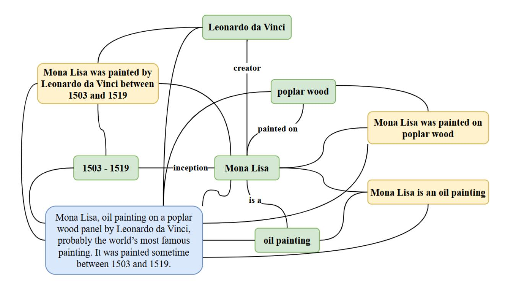
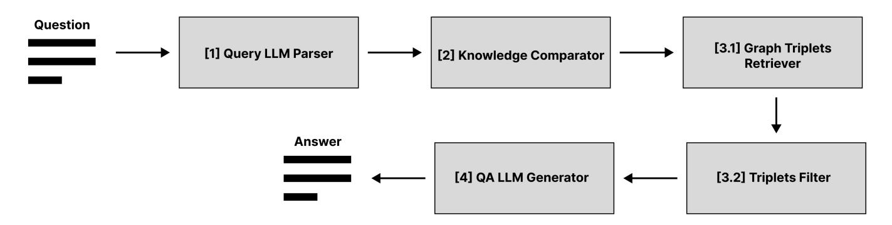

# PersonalAI: Towards digital twins in the graph form

## Mikhail Menschikov1 , Dmitry Evseev1 , Ruslan Kostoev2 , Ilya Perepechkin2 , Ilnaz Salimov2 , Victoria Dochkina2 , Petr Anokhin3 , Evgeny Burnaev1 , Nikita Semenov1

1Skoltech, Moscow, Russia 2Public joint stock company "Sberbank of Russia" , Moscow, Russia 3 AIRI, Moscow, Russia

### Abstract

The challenge of personalizing language models, specifically the ability to account for a user's history during interactions, is of significant interest. Despite recent advancements in large language models (LLMs) and Retrieval Augmented Generation that have enhanced the factual base of LLMs, the task of retaining extensive personal information and using it to generate personalized responses remains pertinent. To address this, we propose utilizing external memory in the form of knowledge graphs, which are constructed and updated by the LLM itself. We have expanded upon ideas of AriGraph architecture and for the first time introduced a combined graph featuring both standard edges and two types of hyperedges. Experiments conducted on the TriviaQA, HotpotQA and DiaASQ benchmarks indicates that this approach aids in making the process of graph construction and knowledge extraction unified and robust. Furthermore, we augmented the DiaASQ benchmark by incorporating parameters such as time into dialogues and introducing contradictory statements made by the same speaker at different times. Despite these modifications, the performance of the question-answering system remained robust, demonstrating the proposed architecture's ability to maintain and utilize temporal dependencies.

# 1 Introduction

The rapid advancements in large language models (LLMs) have catalyzed interest in personalizing these models to tailor responses based on a user's interaction history. This task of personalization hinges on the model's ability to retain extensive personal information and use it effectively for generating customized responses. A pivotal development in this realm has been the Retrieval-Augmented Generation (RAG) approach, which enhances the factual basis of LLMs by integrating an external memory layer. RAG utilizes vector retrieval from a database, supplementing the model's prompt with pertinent details based on the user's query. Despite its utility, RAG is often constrained by its unstructured nature, which hampers the efficient retrieval of related information dispersed across the agent's memory.

To address these limitations, our study explores the potential of knowledge graphs as a superior alternative to traditional RAG strategies. Knowledge graphs offer a structured representation of information that facilitates more effective and personalized use of LLMs. These graphs, constructed and updated automatically by the LLM, inherently support contextual data extraction algorithms, surpassing RAG in performance by retaining arbitrary textual information and enabling targeted extraction of relevant data. This atomic representation of knowledge allows for efficient filtering of irrelevant content and offers a universal format adaptable to various tasks. Moreover, the graph format enables rapid search, addition, and deletion of knowledge, thereby eliminating the need for extensive restructuring of accumulated data during updates.

Our proposed question answering system, built upon the innovative AriGraph (Anokhin et al. 2024) method, exemplifies the confluence of long-term planning and memory within LLM agents through knowledge graph construction. The AriGraph architecture was initially developed for textbased gaming environments, such as TextWorld, and involves a sequence of processes: formulating triplets from current observations, removing outdated semantic knowledge, adding new triplets alongside episodic nodes, and extracting relevant triplets and memories using graph connections and embedding proximity. We adapted the AriGraph methodology to our system, utilizing the DiaASQ (Li et al. 2023) dataset, wherein we constructed graphs with standard, hyper and episodic edges from dialogues to serve as a substantive base for answering questions.

In summary, our main contributions are threefold:

- 1. We propose an external memory architecture for a question answering system that fuses a knowledge graph with text fragments, alongside methods for relevant information extraction.
- 2. Our system demonstrates superior performance over existing GraphRAG methods on HotpotQA dataset.
- 3. We enhanced the DiaASQ benchmark by incorporating temporal parameters into dialogues and demonstrated our system's capability to manage and leverage temporal dependencies.

This work establishes a robust framework for personalized response generation in LLMs through sophisticated graph-based memory architectures.

# 2 Related Work

In recent years, there has been significant progress in the domain of open-domain question answering (QA) and personalization of language models. Methods like using Wikipedia as a comprehensive knowledge source (Chen et al. 2017) have integrated machine reading at scale to combine document retrieval with machine comprehension of text. Approaches such as using dense representations for passage retrieval (Karpukhin et al. 2020) have challenged traditional sparse methods like TF-IDF and BM25, proving effective when ample training data exists.

The evolution of dense retrievers has been noteworthy, with the deployment of contrastive learning in unsupervised settings showing promise across various scenarios, surpassing traditional methods such as BM25 (Robertson, Zaragoza et al. 2009) (Contriever (Izacard et al. 2021)). Meanwhile, pre-trained language models with non-parametric memory access have been suggested for knowledge-intensive tasks, exemplified by retrieval-augmented generation (RAG) models, which combine parametric and non-parametric memories for enhanced QA performance (Lewis et al. 2021).

Recent developments like ART have introduced unsupervised dense retrieval models, effectively eliminating the dependency on labeled training data while achieving state-ofthe-art results (Sachan et al. 2023). In the realm of knowledge graphs, frameworks like GraphReader (Li et al. 2024) utilize reasoning elements to construct and extract information, emphasizing long-context problem-solving capabilities.

For personalized models, AriGraph (Anokhin et al. 2024) has presented a solution incorporating episodic memories and long-term planning through knowledge graphs (AriGraph). Similarly, HippoRAG (Gutierrez et al. ´ 2024) leverages personalized algorithms to enhance QA tasks by constructing semantic graphs, offering significant improvements over traditional extraction techniques. MemWalker (Chen et al. 2023) and PEARL (Sarthi et al. 2024) have explored challenges related to context length, proposing models that effectively navigate and integrate information from extensive documents.

Additionally, ReadAgent (Lee et al. 2024) has addressed the constraint of handling long-text contexts by organizing content into memory episodes, while KGP (Wang et al. 2023) has introduced Knowledge Graph Prompting, optimizing multi-document QA by building knowledge graphs for improved context formulation.

These advancements underscore a consistent focus on enhancing the comprehension, retrieval, and personalization capabilities of language models, paving the way for more refined systems such as PersonalAI, which utilizes knowledge graphs to offer personalized and contextually rich interactions.

# 3 Methods

## Graph Construction

In this study, a graph-based knowledge base is used as external memory for a large language model (LLM) to answer questions. To memorize information from weakly structured sources (which refers to a set of texts on narutal language), a knowledge graph is constructed. This graph includes a comprehensive representation of the original text and consists of the following elements:

- 1. Nodes representing atomic entities extracted from the text (green entities in figure 1);
- 2. Simple connections between entities that reflect their interrelations (connections between green nodes in figure 1);
- 3. Propositions, which are complete atomic thoughts presented in the text, acting as hyperconnections between an arbitrary set of nodes in the graph (yellow entities and connections in figure 1);
- 4. Episodic memories, which are the original text remembered in the graph, acting as hyperconnections between an arbitrary set of nodes in the graph (blue entities and connections in figure 1).

In the terms defined above, the task of constructing a graph from weakly structured sources is reduced to the formulation of nodes, simple connections between them, and propositions using the LLM, parsing the model's response, and storing the resulting information in some structured form (e.g., in the form of triples "subject - relation - object").

The first stage of memorizing information involves extracting triplets from text using LLM and a specialized prompt: it can be observed in Appendix A. A triplet consists of a subject, a relation and an object. For example, from the text "Mona Lisa, oil painting on a poplar wood panel by Leonardo da Vinci, probably the world's most famous painting. It was painted sometime between 1503 and 1519." the triplets (Mona Lisa, is a, oil painting), (Mona Lisa, painted on, poplar wood), (Mona Lisa, creator, Leonardo da Vinci), (Mona Lisa, inception, 1503-1519) would be extracted. Then, the subjects and objects of the triplets become nodes in the knowledge graph, with the relations between them forming simple connections within it.

Next, thesis statements and their entities are extracted using a similar approach: corresponding LLM-prompt can be observed in Appendix A. A thesis statement, like a triplet, contains some atomic information from the text; however, unlike a triplet, it can combine an arbitrary number of entities and always contains a complete thought, independent of context. For example, from the text "Mona Lisa, oil painting on a poplar wood panel by Leonardo da Vinci, probably the world's most famous painting. It was painted sometime between 1503 and 1519." the thesis statements "Mona Lisa is an oil painting", "Mona Lisa was painted on poplar wood", and "Mona Lisa was painted by Leonardo da Vinci between 1503 and 1519" would be extracted, with lists of entities [Mona Lisa, oil painting], [Mona Lisa, poplar wood], [Mona Lisa, Leonardo da Vinci, 1503-1519] respectively. This kind of hyperconnection is also placed in the graph.

Finally, the entire source text is also incorporated into the graph as a hyperconnection between all the entities appearing in the extracted triplets and thesis statements. This hyperconnection is called "episodic", by analogy with cognitive sciences.

The search for outdated information in the graph is carried out as follows. First, the set of entities appearing in the newly extracted triplets and thesis statements is compared with existing nodes in the graph to identify matches. If matches are found, they become the initial set of nodes for

<!-- Image Description: This image is a knowledge graph representing facts about the Mona Lisa. Rectangles represent entities (e.g., "Leonardo da Vinci," "Mona Lisa," "poplar wood") and edges represent relationships (e.g., "creator," "painted on," "is a"). The graph visually organizes information about the painting's creator, creation date (1503-1519), materials (poplar wood, oil paint), and classification as an oil painting. It serves to illustrate the interconnected data points concerning the Mona Lisa. -->

Figure 1: Example of graph, built from text using our method, with simple (green), hyper (yellow) and episodic (blue) nodes

a breadth-first search, which retrieves all connections and hyperconnections starting or ending at these nodes. Then, using a specialized prompt, the LLM attempts to replace the found knowledge with the newly extracted data: corresponding LLM-prompts can be observed in Appendix B. If any triplets or thesis statements are successfully replaced, they are removed from the graph.

### Information Searching

Information search pipline on knowledge graph is shown in Figure 2.

From Figure 2 it can be seen that the pipeline is divided into four stages, with the third stage consisting of two stages. The pipeline receives a question in string format as input, which further is passed to the "Query LLM Parser"– module. This module extracts key entities from the question. At the second stage, the obtained information is passed to the "Knowledge Comparator"–module, where the entities from the question are matched with nodes from the knowledge graph. At the third stage, triplets from the knowledge graph are searched and filtered based on their semantic relevance to the question, within the first and second stages, respectively. At the first stage, one of the implemented graph traversal algorithms is launched within "Graph Triplets Retriever"– module: the starting vertices are those that were matched with the entities from the question on the second stage of the pipeline. As a result, a list of potentially relevant triplets will be extracted. At the second stage, using the "Triplets Filter"–module, triplets are ranked according to their semantic proximity to the question based on their vector representations (embeddings). As a result of the third stage, a list of N (hyperparameter) triplets closest (semantically) to the question will be obtained. At the final fourth stage, using the "QA LLM Generator"–module, an answer to the question is generated, which is conditioned on the extracted information. The resulting answer in string format is returned as the result of the pipeline.

This pipeline architecture is motivated by the following considerations: (1) To obtain a good initial approximation to the subgraph with the required information, it is necessary to match the key entities from the question with similar entities from the existing knowledge set. The information required to generate the correct answer is contained in the same subgraph as the key entities from the question. (2) The triplets extracted from the knowledge graph are weakly conditioned on the original question. (3) Also, LLMs have a limit on the maximum length of a text sequence that they can process in one inference-step.

#### Retrieve Algorithms

The principal function of the constructed knowledge graph within our proposed system is to facilitate the precise extraction of information necessary for addressing specific queries. This task involves a delicate balance between relevance and completeness. Relevance ensures that all retrieved information directly pertains to the query, while completeness guarantees the inclusion of all necessary data, potentially accompanied by some extraneous information. Thus, optimizing this balance is crucial for efficient knowledge extraction.

<!-- Image Description: The image is a flowchart illustrating a question-answering system. A question is input, parsed by a Query LLM Parser, compared to knowledge using a Knowledge Comparator, and fed to a Graph Triplets Retriever. Retrieved triplets are filtered, then used by a QA LLM Generator to produce an answer. The numbered boxes represent processing steps, while arrows indicate data flow. -->

Figure 2: searching pipeline for generating answers to the questions based on constructed knowledge graph

To achieve this, we have developed and implemented sophisticated retrieval algorithms capable of modulating the trade-off between completeness and relevance based on customizable parameter settings. These algorithms are an integral part of the question-answering pipeline, traversing the graph to collate information imperative for generating accurate responses.

A\*. One of the primary methods employed for graph traversal is the A\* algorithm, renowned for its capacity to determine shortest paths between entities within the graph. Within the question-answering pipeline, this algorithm identifies and preserves triples encountered along these shortest paths, removing any duplicates based on content. Our hypothesis posits that the requisite information for constructing correct answers resides within these triples. For the traversal, the graph is unweighted and undirected, employing a constant value as the distance metric between adjacent vertices. We explored three heuristics for the h-metric to enhance pathfinding efficiency:

- 1. Inner Product (ip): Utilizes the dot-product of embeddings between the current and goal vertices.
- 2. Weighted with Shortest Path: Multiplies the length of the shortest path, identified via Breadth First Search (BFS), by the inner product metric.
- 3. Averaged Weighted with Shortest Path: Computes an average of the inner product distances between adjacent vertices from the start to current vertex and the direct path from current to goal vertex, further multiplied by the BFS-shortest path length.

WaterCircles. Utilizing a breadth-first search algorithm forms another extraction methodology within this graphbased framework. Entities derived from queries are mapped to their corresponding graph nodes. Initially, the algorithm examines vertices adjoining these entity nodes, while subsequent iterations expand to vertices neighboring those identified previously. This iterative search crafts pathways radiating from entity vertices outward. When pathways from different entities intersect, the resulting triplets from these intersections aggregate into a primary list, with all traversed triplets collated into a secondary list. The algorithm finally returns N triplets from the primary list and K triplets from the secondary list, governed by configurable hyperparameters.

When the graph integrates not only triplets forming direct entity connections ("simple" connections) but also incorporates associations between entities and text fragments ("hyper" and "episodic" connections), a modified BFS approach is implemented:

- 1. The traversal initiates at the question entities, analogous to handling "simple" entity connections.
- 2. Within text fragments identified during the traversal, substrings are scrutinized for other question entities distinct from the entity instigating the graph path to the given text fragment. For each text fragment, Nintersections, reflecting the number of discerned entities, is computed.
- 3. The list of "hyper" and "episodic" triplets is sorted in descending order based on Nintersections.

This triplet extraction strategy aims to enhance relevance and accuracy in retrieving information from the graphstructured knowledge base, thereby bolstering the effectiveness of AI-driven question-answering systems.

BeamSearch. From a given node, N (hyperparameter) paths are constructed, that are semantically closest to the question. The algorithm is based on the idea of BeamSearch – a token generation strategy used that is used for inference of LLM models. As a result, containing triplets in costrcted paths are saved in a single list with the removal of duplicates (by their string content). Traversal procedure can be controlled by the following hyperparameters:

- 1. Max depth: Sets the maximum depth of constructed paths.
- 2. Max paths: Sets the maximum number of constructed paths.
- 3. Same Path Intersection by Node: If True, then the same path can intersect itself through an already passed node, otherwise False.
- 4. Diff Paths Intersection by Node: If True, then different paths can intersect through already passed nodes, otherwise False.
- 5. Diff Paths Intersection by Rel: If True, then different paths can intersect through already passed relations (links) of the graph, otherwise False.
- 6. Final sorting mode: Specifies the method for final filtering of the obtained set of paths. The search will result

in two sets of paths: (1) ended–paths that ended before reaching the specified depth limit and (2) continuous– paths that reached the specified depth limit. Each such path has an estimate of its overall relevance. If ended first–value is specified, then: ended–paths will be sorted in descending order by relevance and the first max paths–paths will be selected. If there are fewer ended–paths than max paths–value, then continuous– paths will be sorted by relevance and the first N missing paths will be selected from them. If continuous first– value is specified, then paths will be selected in the same way as ended first–value, only first sorting/selection by continuous–paths, and then by ended–paths. If mixed– value is specified, then ended– and continuous–paths will be combined into one list, sorted in descending order by relevance, and the first N max paths–paths will be selected from the resulting list.

Mixed algorithm. The mixed algorithm amalgamates the A\*, WaterCircles and BeamSearch strategies, facilitating improved extraction efficacy. This fusion ensures that triplets unextracted by WaterCircles (for example) may still be retrieved by BeamSearch, and vice versa. The ultimate list of triplets, which proceeds to the LLM for answer generation, represents a union of outputs from combinations of A\*–, WaterCircles– and BeamSearch—algorithms.

Through these diverse algorithms, this study underscores the advances in extracting relevant data from knowledge graphs, underpinning the robust architecture necessary for personalizing responses within language model frameworks.

# 4 Experiment Set-Up

## Datasets

Proposed retrieval algorithms are evaluated on dialog DiaASQ–dataset (Li et al. 2023). It consists of users dialogs from a Chinese forum about characteristics of various mobile devices. Also dataset provide structured statements that contain the key meaning of the existing dialogs. Based on these "true statements", a set of questions was procedurally generated, which are used as a sample to evaluate the quality of the proposed algorithms. According to their properties, the questions are divided into ten types:

- 1. Compare questions a questions about to compare two devices by a given characteristic. Example: "Which device is better in battery life: Apple or k30u?".
- 2. Device sentiment a questions about the user's opinion on a given device at a given point in time. Example: "Kayla has a positive, negative or neutral opinion about the video of 10PRO on 25.11.2020?".
- 3. Compare sentiment a questions about what opinion about a given device prevails among its users. Example: "The majority of speakers have positive, neutral or negative sentiment about the system of vivo?".
- 4. Same devices a questions about to find a common devices of two users. Example: "Do Brianna and Joseph have any common devices (which Brianna and Joseph

both use)? If so, list common devices. Otherwise, answer 'No'.".

- 5. Same manufacturers a questions about to find devices of the same manufacturer of two users. This question requires a depth search of 2 in the graph. Example: "Do Lily and Jenna prefer the same device manufacturer?".
- 6. Similar device opinions a questions about to determine which of the two user's opinions is more similar to the opinion of a given user about a given device. Example: "Whose opinions from Anthony and Grace about devices are most similar to Faith's?".
- 7. Similar manuf opinions a questions is similar to similar device opinions–type, but only on the topic of device manufacturers. Example: "Whose opinions from Evan and James about manufacturers are most similar to Abigail's?".
- 8. Which people about devices a questions about a user who has a given opinion about a device on a given date. Example: "Which people have negative opinion about video of 10PRO on 25.11.2020?".
- 9. Dominant opinion a questions about the user's prevailing opinion about part of the functionality of a given device. Example: "What Jessica's opinion (positive, negative or neutral) about signal of Apple was dominant during using Apple?".
- 10. Last opinion a questions about the user's last opinion about the functionality of a given device. Example: "What opinion (positive, negative or neutral) about scheduling of IQOO9 was last during Zachary's experience of IQOO9?".

In addition to the specialized DiaASQ dataset, HotpotQA and TriviaQA datasets were selected to evaluate the quality of the proposed QA pipeline. Based on them, functionality, implemented in PersonalAI library, is compared with existing RAG and GraphRAG solutions.

As a result of preprocessing initial datasets, their subsamples are used to construct knowledge graphs and evaluate proposed methods:

- DiaASQ: number of qa–pairs 4800; number of relevant contexts – 3483,
- HotpotQA: number of qa–pairs 2000; number of relevant contexts – 3933;
- TriviaQA: number of qa–pairs 500; number of relevant contexts – 4925.

More details about preprocessing methods and numerical characteristics of resulted datasets can be observed in Appendix E

### Models

For graph construction (Memorize–pipeline) and information search (QA–pipeline) a series of 7B/8B and largesize (≫ 14B) models is selected to compare its performance capabilities in solving such tasks: Qwen2.5 7B, DeepSeek R1 7B, Llama3.1 8B, GPT4o–min and DeepSeek V3. To produce vector representations (embeddings) of processing text–data (in natural language) multilingual E5large–model (Wang et al. 2024) from the Hugging Face repository 1 is used.

#### Retrieval Algorithms

As retrieval algorithms evaluation is conducted for A\*, WaterCIrcles (WC) and BeamSeach (BS) as well as their combinations: "WC + BS", "A\* + BS", "A\* + WC". The values of hyperparameters for base algorithms were fixed:

- A\*: h metric name ip; max depth 10; max passed nodes – 150.
- WaterCircles: strict filter True; hyper num 15; episodic num – 15; chain triplets num – 25; other triplets num – 6; do text pruning – False.
- BeamSearch: max depth 5; max paths 10; same path intersection by node – False; diff paths intersection by node – False; diff paths intersection by rel – False; mean alpha – 0.75; final sorting mode – mixed.

#### Graph search restrictions

In addition, the values of the hyperparameter, responsible for the type of restrictions imposed on the knowledge graph during its traversing with one of the available algorithms were iterated over. The restrictions are related to the types of nodes that are prohibited from visiting: "E" – it is prohibited to visit episodic nodes; "T" – it is prohibited to visit thesis nodes; "O" – it is prohibited to visit object nodes; "All" – no restrictions are imposed on the graph nodes.

#### Configurations summary

Each QA–configuration was evaluated on 100 question/answer pairs from the DiaASQ, HotpotQA, and TriviaQA datasets correspondingly. The LLM, specified within a specific QA–configuration, and LLM, used to construct corresponding knowledge graph for running QA–pipeline, are the same. Thus, in the case of a fixed dataset/model, 22 QA–configurations were obtained. In total, 308 QA– configurations were evaluated (the QA–pipeline was not run on TriviaQA/GPT4omini configurations due to limited time resources).

# 5 Evaluation

Traditional statistical evaluation metrics such as *BLEU*(Papineni et al. 2002),*ROUGE*(Lin 2004), and*Meteor Universal*(Denkowski and Lavie 2014) struggle to distinguish syntactically similar but semantically distinct texts. While semantic methods like*BERTScore*(Zhang et al. 2019) were introduced to address these limitations, our experiments reveal that BERTScore lacks sufficient differentiability, often failing to capture nuanced distinctions between correct and incorrect answers. Therefore, we adopt the*LLM as a judge*(Zheng et al. 2023) framework and choose Qwen2.5 7B. The judge evaluates QA pairs using a structured prompt containing the question, ground truth and model answer. It labels 1 for correct answers and 0 for incorrect ones, and we use accuracy as our main metric. Corresponding LLM-prompts and details are provided in Appendix D.

Also, for comparison of proposed QA–pipeline with existing RAG– and GrapRAG–methods the*ExactMatch* metric is calculated with ignore case and ignore punctuation hyperparameters set to True.

# 6 Experiments and Results

## Characteristics of constructed knowledge graphs

To run QA–pipeline within ablation experiments, 14 knowledge graphs were constructed on the given dataset and LLM. The characteristics of the constructed graphs are presented in Table 2.

It can be observed from Table 2 that during construction of some graphs there were parsing errors of LLM responses, due to which information for not all contexts was stored. When averaging the percentage of parsing errors over the used datasets, the following values are obtained: DiaASQ —- 7%; HotpotQA —- 6.3%; TriviaQA —- 7.3%. In case of DiaASQ dataset, the largest number of thesis and object memories (nodes), as well as hyper-relations, were added to the graph using DeepSeekR1 7B. The largest number of unique simple-relations was extracted and stored to the graph using GPT4o–mini. In case of HotpotQA and TriviaQA datasets, the largest number of thesis and object memories were added using Qwen2.5 7B. Moreover, the largest number of hyper-relations was added when using DeepSeekR1 7B.

Based on the obtained values, it is possible to model/estimate the characteristics of the knowledge graphs that will be constructed using the given models: see Figure 3.

From the Table 3 it can be seen that the lowest percentage of LLM response parsing errors is observed when using Qwen2.5 7B and Llama3.1 8B, and the highest percentage is observed with DeepSeek V3: DeepSeekR1 7B —- 0.29%; Qwen2.5 7B —- 0.02%; Llama3.1 8B —- 0.02%; GPT4o mini —- 9.87%; DeepSeekV3 —- 31.21%. At the same time, the highest number of thesis/object memories and corresponding hyper/simple relations extracted/stored in the graph with using of DeepSeekR1 7B and Qwen2.5 7B. In case of estimating the number of added thesis/object nodes while preserving one context (text–fragment of information) in the graph, the highest value is obtained when using Qwen2.5 7B: see Figure 1.

| LLM            |        | Node   | Relation |        |  |  |
|----------------|--------|--------|----------|--------|--|--|
|                | thesis | object | hyper    | simple |  |  |
| DeepSeek R1 7B | 9      | 15     | 36       | 10     |  |  |
| Qwen2.5 7B     | 10     | 16     | 33       | 11     |  |  |
| Llama3.1 8B    | 8      | 11     | 23       | 8      |  |  |
| GPT4o mini     | 8      | 10     | 26       | 11     |  |  |
| DeepSeek V3    | 9      | 14     | 30       | 15     |  |  |

Table 1: The number of unique nodes/relations that are added to the knowledge graph when processing (using a given LLM model) and storing one episodic memory (episodic node)

1 https://huggingface.co/intfloat/multilingual-e5-small

|                | Number of contexts | Nubmer of nodes |        |        |          | Number of relations |        | Average number of matching vertices (by type) |                     |                   |                   |
|----------------|--------------------|-----------------|--------|--------|----------|---------------------|--------|-----------------------------------------------|---------------------|-------------------|-------------------|
| LLM            | to store in graph  |                 |        |        |          |                     |        | object–neighbours                             | thesis–neighbours   | object–neighbours | object–neighbours |
|                |                    | episodic        | thesis | object | episodic | hyper               | simple | (to episodic–nodes)                           | (to episodic–nodes) | (to thesis–nodes) | (to object–nodes) |
|                | DiaASQ             |                 |        |        |          |                     |        |                                               |                     |                   |                   |
| DeepSeek R1 7B |                    | 3477            | 34039  | 30097  | 138584   | 133301              | 34049  | 30,06                                         | 10,01               | 3,91              | 1,99              |
| Qwen2.5 7B     |                    | 3482            | 32512  | 28420  | 129974   | 111618              | 31290  | 27,98                                         | 9,48                | 3,43              | 2,04              |
| Llama3,1 8B    | 3483               | 3482            | 29655  | 20014  | 100045   | 77467               | 28063  | 20,21                                         | 8,52                | 2,61              | 2,25              |
| GPT4o mini     |                    | 3482            | 31361  | 28172  | 125403   | 96667               | 39477  | 27,00                                         | 9,00                | 3,08              | 1,89              |
| DeepSeek V3    | 2270               |                 | 21482  | 18416  | 80118    | 64349               | 28877  | 25,83                                         | 9,46                | 2,99              | 2,11              |
|                | HotpotQA           |                 |        |        |          |                     |        |                                               |                     |                   |                   |
| DeepSeek R1 7B | 3933               | 3921            | 27137  | 55254  | 121359   | 111174              | 33714  | 24,00                                         | 7,34                | 4,09              | 1,55              |
| Qwen2.5 7B     |                    | 3933            | 31795  | 56078  | 119387   | 106037              | 38460  | 22,26                                         | 8,15                | 3,33              | 1,36              |
| Llama3.1 8B    |                    | 3933            | 26364  | 40601  | 89506    | 75332               | 29021  | 16,04                                         | 6,79                | 2,85              | 1,47              |
| GPT4o mini     |                    | 3933            | 30777  | 48771  | 105524   | 93791               | 42599  | 18,99                                         | 7,94                | 3,04              | 1,36              |
| DeepSeek V3    |                    | 2713            | 20164  | 35291  | 73242    | 63921               | 34621  | 19,55                                         | 7,53                | 3,17              | 1,41              |
|                |                    | TriviaQA        |        |        |          |                     |        |                                               |                     |                   |                   |
| DeepSeek R1 7B |                    | 4905            | 48855  | 96132  | 213481   | 201861              | 52019  | 33,50                                         | 10,56               | 4,13              | 1,53              |
| Qwen2.5 7B     | 4925               | 4923            | 52835  | 109900 | 220991   | 188780              | 62043  | 34,15                                         | 10,87               | 3,57              | 1,27              |
| Llama3.1 8B    |                    | 4922            | 45241  | 72285  | 158202   | 127389              | 46757  | 22,83                                         | 9,35                | 2,81              | 1,54              |
| DeepSeek V3    |                    | 3506            | 37496  | 68602  | 143933   | 122480              | 61821  | 30,32                                         | 10,75               | 3,26              | 1,42              |

Table 2: Characteristics of the constructed knowledge graphs within conducted experiments

| Number of contexts LLM to store in graph |      | Number of nodes |        | Number or relations |                   | Average number of adjacent vertices (by type) |                     |                     |                   |                   |                   |
|------------------------------------------------|------|-----------------|--------|---------------------|-------------------|-----------------------------------------------|---------------------|---------------------|-------------------|-------------------|-------------------|
|                                                |      | episodic        |        |                     | episodic hyper |                                               | simple              | object–neighbours   | thesis–neighbours | object–neighbours | object–neighbours |
|                                                |      |                 | thesis | object              |                   |                                               | (to episodic–nodes) | (to episodic–nodes) | (to thesis–nodes) | (to object–nodes) |                   |
| DeepSeek R1 7B                                 |      | 4101            | 36677  | 60494               | 157808            | 148778                                        | 39927               | 29,18               | 9,30              | 4,04              | 1,69              |
| Qwen2.5 7B                                     |      | 4112            | 39047  | 64799               | 156784            | 135478                                        | 43931               | 28,13               | 9,5               | 3,44              | 1,55              |
| Llama3.1 8B                                    | 4113 | 4112            | 33753  | 44300               | 115917            | 93396                                         | 34613               | 19,69               | 8,22              | 2,75              | 1,75              |
| GPT4o mini                                     |      | 3707            | 31069  | 38471               | 115463            | 95229                                         | 41038               | 22,99               | 8,47              | 3,06              | 1,625             |
| DeepSeek V3                                    |      | 2829            | 26380  | 40769               | 99097             | 83583                                         | 41773               | 25,23               | 9,24              | 3,14              | 1,64              |

Table 3: Average/expected characteristics of knowledge graphs in case of using given LLM models for their construction

### Comparison of QA–configurations

As a result of the experiments, a comparative table with the best QA configurations was prepared: see Table 4.

It can be seen from the Table 4 that in the case of choosing LLM among 7B–series, the configurations with Qwen2.5 (0,27) turned out to be better, and in the case of configurations with 8B–models, QA–configurations with GPT4o–mini turned out to be better (0,77). At the same time, in the case of the best configurations with 7B–models, BeamSearch–algorithm with restrictions on graph traversal (prohibition on traversal of episodic nodes) is present in the most cases. In the case of the best configurations with DeepSeek V3, a combination of BeamSearch– and WaterCircles–search algorithms is more presented. For the best configurations with 8B–models, BeamSearch is present as one of the search algorithms in the combination.

To assess the impact of the imposed restrictions on the quality of the QA–pipeline, two separate distributions of values were formed (for a specific model/dataset and search algorithm) and averaged (across datasets and models) for configurations with the lowest and highest JudgeScore–values: see Table 5.

From Table 5 it is evident that in case of 7B/8B–models

the majority (≈74%) of configurations with the lowest quality value have a restriction on traversing thesis–vertices. At the same time, a significant number of configurations with the highest quality value have a restriction on traversing episodic– and object–vertices (≈44% and ≈34% respectively). From this we can conclude that thesis memories contain important information for generating a relevant answer; at the same time, adding episodic and simple memories "noises" the context for the final LLM and reduces the quality. In turn, for largesize–models the majority (53%) of configurations with the lowest quality have a restriction on traversing object–vertices. At the same time, a significant number of configurations (73%) with the highest quality value have a restriction on traversing thesis nodes. From this we can conclude that large-size models cope with conditional generation based on long/noisy episodic memories, and thesis information is redundant.

Additionally, a comparative Table 6 was prepared to determine stable graph traversal algorithms.

From Table 6 it is evident that in case of configurations with 8B–models and combined search (with A\*– and WaterCircles–algorithms) turned out to be more stable: there is no significant degradation of performance (maximum by

| LLM / Dataset | Qwen2,5 7B      | DeepSeek R1 7B | Llama3.1 8B        | GPT4o–mini           | DeepSeek V3          |  |
|------------------|-----------------|----------------|--------------------|----------------------|----------------------|--|
| DiaASQ           | 0,22 / BS / all | 0,12 / AS / E  | 0,19 / BS / E      | 0.5 / BS + WC / E    | 0,47 / BS + WC / O   |  |
| HotpotQA         | 0,24 / BS / O   | 0,19 / BS / O  | 0,47 / BS / O      | 0,77 / BS + WC / all | 0,76 / BS + WC / T   |  |
| TriviaQA         | 0,34 / BS / E   | 0,27 / AS / E  | 0,66 / BS + AS / E | –                    | 0,87 / BS + WC / all |  |
| Mean:            | 0,27            | 0,19           | 0,44               | 0,77                 | 0,70                 |  |

Table 4: Best QA configurations by JudgeScore within conducted experiments

| Restrictions   | 7B            |              | 8B            |              | Largesize     |              |  |
|----------------|---------------|--------------|---------------|--------------|---------------|--------------|--|
| on nodes–types | worse–configs | best–configs | worse–configs | best–configs | worse–configs | best–configs |  |
| E              | 0,03          | 0,44         | 0,09          | 0,45         | 0,27          | 0,07         |  |
| T              | 0,84          | 0,12         | 0,64          | 0,31         | 0,20          | 0,73         |  |
| O              | 0,13          | 0,44         | 0,27          | 0,25         | 0,53          | 0,20         |  |

Table 5: Impact of various constraints imposed during knowledge graph traversal on the quality of QA pipeline: "worse–configs" —- distribution for low–quality configurations; "best–configs" —- distribution for high–quality configurations

| Retrieval algorithm |               | 7B           |               |               | 8B           |               | Largesize     |              |               |
|---------------------|---------------|--------------|---------------|---------------|--------------|---------------|---------------|--------------|---------------|
|                     | worse–configs | best–configs | other–configs | worse–configs | best–configs | other–configs | worse–configs | best–configs | other–configs |
|                     | (w restr)     | (w restr)    | (w/o restr)   | (w restr)     | (w restr)    | (w/o restr)   | (w restr)     | (w restr)    | (w/o restr)   |
| WC                  | –             | –            | 0,09          | –             | –            | 0,34          | –             | –            | 0,55          |
| AS                  | 0,1           | 0,175        | 0,14          | 0,29          | 0,36         | 0,41          | 0,23          | 0,36         | 0,33          |
| BS                  | 0,025         | 0,18         | 0,06          | 0,26          | 0,5          | 0,36          | 0,48          | 0,6          | 0,65          |
| WC+BS               | 0,033         | 0,095        | 0,02          | 0,30          | 0,39         | 0,32          | 0,62          | 0,7          | 0,68          |
| BS+AS               | 0,02          | 0,175        | 0,01          | 0,25          | 0,48         | 0,36          | 0,48          | 0,64         | 0,66          |
| AS+WC               | 0,055         | 0,115        | 0,07          | 0,33          | 0,37         | 0,42          | 0,57          | 0,6          | 0,6           |

Table 6: Stability of the implemented graph traversal algorithms when various restrictions are imposed: "worse–configs (w restr)" —- low–quality configurations and imposed restrictions; "best–configs (w restr)" —- high–quality configurations and imposed restrictions; "other–configs (w/o restr)" —- configurations without restrictions on graph traversal

4%) when changing the imposed constraints on traversal. In case of using BeamSeach–algorithm the imposed constraints on the graph are important, and when specifying incorrect values the degradation will be observed: the difference in JudgeScore–metric between the best and worst configurations is 24%. In turn, for largesize–models the combination of BeamSearch– and WaterCircles–algorithms turned out to be more stable.

One of the important components of the implemented QA–pipeline is the "NoAnswer" mechanism. By this mechanism a command is added in the LLM–prompt for the final model to generate a special symbol if the input context does not contain relevant information for generating an answer to the question. Table 7 presents the percentage of generations of such "NoAnswer" stubs depending on the model used, the search algorithm, and the restrictions imposed on the graph traversal.

From Table 7 it is evident that in case of configura-

tions with 7B–models the least "NoAnswer"–stubs are observed when using a combination of A\*– and WaterCircles– algorithms with a prohibition on traversing thesis nodes. For configurations with 8B–models the least "NoAnswer"–stubs are observed when using BeamSearch–algorithm with a prohibiyion on traversing episodic nodes. In turn, for largesize– models the least "NoAnswer"–stubs are observed when using a combination of BeamSeach– and WaterCircles– algorithms without imposing restrictions on traversing the graph. From this it can be concluded that these algorithms extract more useful information compared to other available ones.

Comparison of existing RAG– and GraphRAG–methods with our proposed method on TriviaQA and HotpotQA datasets correspondingly can be observed in Table 8.

| Retrieval Algorithm / |    | AS | BS | WC + | BS + | AS + | Restrictions    | all | E  | T  | O  |
|-----------------------|----|----|----|------|------|------|-----------------|-----|----|----|----|
| LLM-class             | WC |    |    | BS   | AS   | WC   | on graph search |     |    |    |    |
| 7B                    | 31 | 44 | 26 | 29   | 31   | 25   |                 | 33  | 27 | 26 | 36 |
| 8B                    | 51 | 49 | 43 | 51   | 73   | 49   |                 | 51  | 40 | 51 | 46 |
| Largesize             | 25 | 62 | 27 | 16   | 26   | 21   |                 | 26  | 32 | 27 | 35 |

Table 7: The influence of the selected graph traversal algorithm and the imposed search restrictions on the percentage of generated NoAnswer stubs

| Dataset  | RAG–method      |      |       |            |         |        |       |       |        |            |  |
|----------|-----------------|------|-------|------------|---------|--------|-------|-------|--------|------------|--|
|          | REALM           | DPR  | RAG   | ColBERT–QA | FiD     | EMDR2  | RETRO | Atlas | RePLUG | Our method |  |
| TriviaQA | 53,9            | 56,8 | 55,8  | 70,1       | 67,6    | 71,4   | 62,1  | 79,8  | 77,3   | 62,0       |  |
|          | GraphRAG–method |      |       |            |         |        |       |       |        |            |  |
|          | ToG             | RoG  | PMKGE | GRAG       | GNN–RAG | ToG2.0 | DoG   | GCR   | PDA    |            |  |
| HotpotQA | 41,0            | 43,0 | 42,6  | 36,1       | 43,0    | 40,9   | 45,3  | 45,9  | 36,5   | 60,0       |  |

Table 8: Comparison of existing RAG– and GraphRAG–methods with our proposed method on ExactMatch–metric

# 7 Conclusion

In conclusion, this study introduces a novel approach to personalizing language models by leveraging knowledge graphs as external memory, offering a structured alternative to traditional Retrieval-Augmented Generation techniques. Our experiments demonstrate that the AriGraphbased question answering system, tailored to construct and utilize knowledge graphs, significantly enhances the model's ability to generate personalized responses by efficiently managing and employing temporal dependencies. The model's robustness is particularly evident in handling complex dialogue scenarios, including contradictions and temporal variations, as reflected in the improved performance on the enhanced DiaASQ benchmark. Notably, the proposed architecture exhibits superior accuracy over comparable GraphRAG–methods on HotpotQA benchmark by effectively filtering irrelevant data and targeting relevant information within dialogues. Furthermore, our findings suggest that structured knowledge graphs facilitate rapid and precise retrieval of information, which is pivotal for the advancement of personalization in large language models. The adaptability and universality of the constructed graph underscore the potential for further optimization through refined triplet extraction techniques. Overall, this work paves the way for future developments in personalized artificial intelligence, providing a robust framework for integrating structured memory architectures into language modeling.

# 8 Limitations

The following points can be emphasized as a disadvantages of the proposed/implemented QA–pipeline: (1) The search for information in the knowledge graph is performed based on the initial user–question, which may contain noise, due to which the generated set of relevant information will be less concentrated. (2) At the second stage of the pipeline, a fixed number of nodes from the knowledge graph are matched with the extracted key entities from the user–question; the granularity of the entities is not taken into account. (3) Collection/formation of the relevant set of information for generating the final answer to the user–question is performed in one iteration of the QA–pipeline, which may be insufficient in the case of complex (composite) questions.

# 9 Future work

In future work, we aim to enhance the temporal dynamics of the knowledge graph by integrating a "memory time" parameter, allowing for more nuanced filtering of triplets based on temporal proximity and relationship types through advanced algorithms like BFS and A\*. This will enable the system to selectively emphasize certain relationship types or prioritize temporal closeness, thereby refining the precision of personalized responses. Additionally, exploring optimized triplet extraction techniques could further improve the efficiency and accuracy of information retrieval within the graph, extending the adaptability and universality of our approach. These enhancements promise to elevate the personalization capabilities of language models, fostering more sophisticated and contextually aware interactions.

# References

Anokhin, P.; Semenov, N.; Sorokin, A.; Evseev, D.; Burtsev, M.; and Burnaev, E. 2024. AriGraph: Learning Knowledge Graph World Models with Episodic Memory for LLM Agents. arXiv:2407.04363.

Chen, D.; Fisch, A.; Weston, J.; and Bordes, A. 2017. Reading Wikipedia to Answer Open-Domain Questions. In Barzilay, R.; and Kan, M.-Y., eds., *Proceedings of the 55th Annual Meeting of the Association for Computational Lin-* *guistics (Volume 1: Long Papers)*, 1870–1879. Vancouver, Canada: Association for Computational Linguistics.

Chen, H.; Pasunuru, R.; Weston, J.; and Celikyilmaz, A. 2023. Walking Down the Memory Maze: Beyond Context Limit through Interactive Reading. arXiv:2310.05029.

Denkowski, M.; and Lavie, A. 2014. Meteor universal: Language specific translation evaluation for any target language. In *Proceedings of the ninth workshop on statistical machine translation*, 376–380.

Gutierrez, B. J.; Shu, Y.; Gu, Y.; Yasunaga, M.; and Su, Y. ´ 2024. HippoRAG: Neurobiologically Inspired Long-Term Memory for Large Language Models. arXiv:2405.14831.

Izacard, G.; Caron, M.; Hosseini, L.; Riedel, S.; Bojanowski, P.; Joulin, A.; and Grave, E. 2021. Unsupervised Dense Information Retrieval with Contrastive Learning.

Karpukhin, V.; Oguz, B.; Min, S.; Lewis, P.; Wu, L.; Edunov, S.; Chen, D.; and Yih, W.-t. 2020. Dense Passage Retrieval for Open-Domain Question Answering. In Webber, B.; Cohn, T.; He, Y.; and Liu, Y., eds., *Proceedings of the 2020 Conference on Empirical Methods in Natural Language Processing (EMNLP)*, 6769–6781. Online: Association for Computational Linguistics.

Lee, K.-H.; Chen, X.; Furuta, H.; Canny, J.; and Fischer, I. 2024. A Human-Inspired Reading Agent with Gist Memory of Very Long Contexts. arXiv:2402.09727.

Lewis, P.; Perez, E.; Piktus, A.; Petroni, F.; Karpukhin, V.; Goyal, N.; Kuttler, H.; Lewis, M.; tau Yih, W.; ¨ Rocktaschel, T.; Riedel, S.; and Kiela, D. 2021. Retrieval- ¨ Augmented Generation for Knowledge-Intensive NLP Tasks. arXiv:2005.11401.

Li, B.; Fei, H.; Li, F.; Wu, Y.; Zhang, J.; Wu, S.; Li, J.; Liu, Y.; Liao, L.; Chua, T.-S.; and Ji, D. 2023. DiaASQ : A Benchmark of Conversational Aspect-based Sentiment Quadruple Analysis. arXiv:2211.05705.

Li, S.; He, Y.; Guo, H.; Bu, X.; Bai, G.; Liu, J.; Liu, J.; Qu, X.; Li, Y.; Ouyang, W.; Su, W.; and Zheng, B. 2024. GraphReader: Building Graph-based Agent to Enhance Long-Context Abilities of Large Language Models. arXiv:2406.14550.

Lin, C.-Y. 2004. Rouge: A package for automatic evaluation of summaries. In *Text summarization branches out*, 74–81.

Papineni, K.; Roukos, S.; Ward, T.; and Zhu, W.-J. 2002. Bleu: a method for automatic evaluation of machine translation. In *Proceedings of the 40th annual meeting of the Association for Computational Linguistics*, 311–318.

Robertson, S.; Zaragoza, H.; et al. 2009. The probabilistic relevance framework: BM25 and beyond. *Foundations and Trends® in Information Retrieval*, 3(4): 333–389.

Sachan, D. S.; Lewis, M.; Yogatama, D.; Zettlemoyer, L.; Pineau, J.; and Zaheer, M. 2023. Questions Are All You Need to Train a Dense Passage Retriever. *Transactions of the Association for Computational Linguistics*, 11: 600–616.

Sarthi, P.; Abdullah, S.; Tuli, A.; Khanna, S.; Goldie, A.; and Manning, C. D. 2024. RAPTOR: Recursive Abstractive Processing for Tree-Organized Retrieval. arXiv:2401.18059.

Wang, L.; Yang, N.; Huang, X.; Jiao, B.; Yang, L.; Jiang, D.; Majumder, R.; and Wei, F. 2024. Text Embeddings by Weakly-Supervised Contrastive Pre-training. arXiv:2212.03533.

Wang, Y.; Lipka, N.; Rossi, R. A.; Siu, A.; Zhang, R.; and Derr, T. 2023. Knowledge Graph Prompting for Multi-Document Question Answering. arXiv:2308.11730.

Zhang, T.; Kishore, V.; Wu, F.; Weinberger, K. Q.; and Artzi, Y. 2019. BERTScore: Evaluating Text Generation with BERT. *ArXiv*, abs/1904.09675.

Zheng, L.; Chiang, W.-L.; Sheng, Y.; Zhuang, S.; Wu, Z.; Zhuang, Y.; Lin, Z.; Li, Z.; Li, D.; Xing, E.; et al. 2023. Judging llm-as-a-judge with mt-bench and chatbot arena. *Advances in Neural Information Processing Systems*, 36: 46595–46623.

# A LLM–prompts used to build a knowledge graph within the Memorize–pipeline

Tables 9 and 10 present the LLM–prompts used within the Memorize–pipeline to extract thesis and simple memories, respectively, from unstructured natural language text for storing in a knowledge graph.

| Type      | LLM–prompt |
|-----------|------------|
|           |            |
| System    |            |
| User      |            |
| Assistant |            |

Table 9: LLM–prompts for extracting thesis memories (in the form of triplets) from natural language text

| Type      | LLM–prompt |
|-----------|------------|
| System    |            |
| User      |            |
| Assistant |            |

Table 10: LLM–prompts for extracting simple–memories (in the form of triplets) from natural language text

# B LLM–prompts used to find outdated information in the constructed knowledge graph

Tables 11 and 12 present the LLM–prompts used by Memorize–pipeline to identify stale thesis and simple memories, respectively, in the knowledge graph.

| Type      | LLM–prompt |
|-----------|------------|
|           |            |
|           |            |
|           |            |
| System    |            |
|           |            |
|           |            |
|           |            |
|           |            |
|           |            |
|           |            |
|           |            |
|           |            |
|           |            |
|           |            |
|           |            |
|           |            |
|           |            |
|           |            |
|           |            |
|           |            |
|           |            |
|           |            |
|           |            |
|           |            |
|           |            |
|           |            |
|           |            |
| User      |            |
|           |            |
|           |            |
|           |            |
|           |            |
|           |            |
|           |            |
|           |            |
|           |            |
|           |            |
|           |            |
|           |            |
|           |            |
|           |            |
|           |            |
|           |            |
|           |            |
|           |            |
|           |            |
|           |            |
| Assistant | -          |

| Type              | LLM–prompt |
|-------------------|------------|
| System            |            |
| User Assistant | -          |
|                   |            |

# C LLM–prompts used within proposed QA–pipeline

Table 13 presents LLM–prompts used in QA–pipeline at the second stage ("Query LLM Parser"–module) to extract key entities from the original user question. Table 14 presents the LLM–prompts used in QA–pipeline at the fourth stage ("QA LLM Generator"-module) to conditionally generate an answer to a user–question.

| Type      | LLM–prompt |
|-----------|------------|
| System    |            |
| User      |            |
| Assistant |            |

Table 13: LLM–prompts for extracting key entities from natural language text

| Type      | LLM–prompt |  |  |  |  |  |  |  |
|-----------|------------|--|--|--|--|--|--|--|
|           |            |  |  |  |  |  |  |  |
| System    |            |  |  |  |  |  |  |  |
| User      |            |  |  |  |  |  |  |  |
| Assistant |            |  |  |  |  |  |  |  |

# D LLM–as–a–Judge instructions

To achieve reproducibility of the obtained results, the LLM-inference was performed using a deterministic generation strategy. The following hyperparameter were used/set: num predict – 2048; seed – 42; temperature – 0,0; top k – 1. We prompt Qwen2.5 7B from Ollama–repository to judge whether the proposed QA–pipeline outputs are correctly answering given questions. Used LLM–prompts can be observed in Table 15.

| Type      | LLM–prompt |
|-----------|------------|
| System    |            |
| User      |            |
| Assistant |            |

Table 15: LLM–prompts used in LLM–as–a–Judge framework

# E Used preprocessing methods for evaluation–datasets

In the case of the original HotpotQA set, its distractor/validation–part was selected, which contains 7405 qa–pairs and 13781 unique contexts. Then, qa-pairs were discarded, the relevant contexts to which are outside the specified range in length (in symbols): the contexts in length must be at least 64 and not more than 1024 characters. As a result of this operation, 13291 contexts remained. Finally, the first 2000 qa–pairs and the relevant contexts, corresponding to them, were taken: 3933 unique contexts remained.

In the case of the original TriviaQA–set, its rc.wikipedia/validation–part was selected, which contains 7993 qa–pairs. Since the contexts in this dataset are quite long, they were split into smaller fragments (chunks) using "RecursiveCharacter– TextSplitter"–class from the LangChain–library with the following hyperparameter values: chunk size – 1024, separators – "\n\n", chunk overlap – 64, length function – len, is separator regex – False. As a result, 278384 unique text fragments were obtained. Next, qa-pairs were discarded, the relevant fragments to which were beyond the specified range in length (in characters): text fragments should be no less than 64 and no more than 1024 characters long. As a result of this operation, 13291 fragments remained. Additionally, since the original relevant contexts were split into parts and during splitting it was not tracked in any way: which of the text fragments contains the necessary and sufficient information to answer the corresponding question, then in the case of deleting at least one part (fragment) from a given context (as a result of the previous operation), all remaining/belonging parts (fragments) were also deleted. Thus, 9975 unique text fragments remained. In conclusion, the first 500 qa–pairs and the relevant fragments, corresponding to them, were taken: 4925 unique fragments remained.

Thus, evaluation sets for quality assessment of the proposed/implemented Memorize– and QA–pipelines were obtained. The characteristics of the obtained subsets of HotpotQA–, TriviaQA– and DiaASQ–datasets can be found in Table 16.

| Dataset  | QA–pairs |                  |        |       |                 |       | Relevant contexts |        |                 |        |        |
|----------|----------|------------------|--------|-------|-----------------|-------|-------------------|--------|-----------------|--------|--------|
|          | Amount   | Questions length |        |       | Answers length  |       |                   | Amount | Length          |        |        |
|          |          | (in characters)  |        |       | (in characters) |       |                   |        | (in characters) |        |        |
|          |          | median           | mean   | std   | median          | mean  | std               |        | median          | mean   | std    |
| DiaASQ   | 5698     | 114              | 109.44 | 18.66 | 8               | 7.57  | 2.30              | 3483   | 556             | 613.00 | 324.35 |
| HotpotQA | 2000     | 87               | 92.98  | 32.62 | 13              | 15.29 | 11.87             | 3933   | 384             | 413.72 | 201.05 |
| TriviaQA | 500      | 66               | 76.37  | 39.46 | 9               | 10.17 | 5.76              | 4925   | 807             | 765.11 | 196.32 |

Table 16: Characteristics of the datasets used to evaluate the quality of the proposed Memorize– and QA–pipelines
