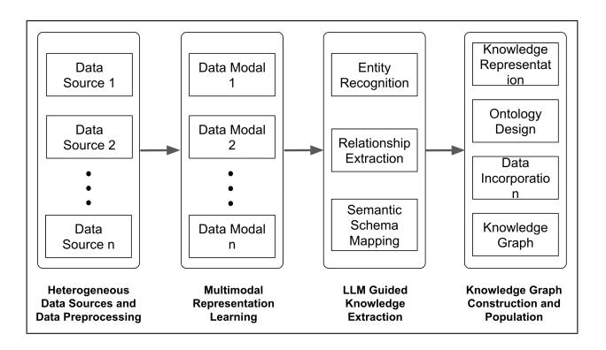
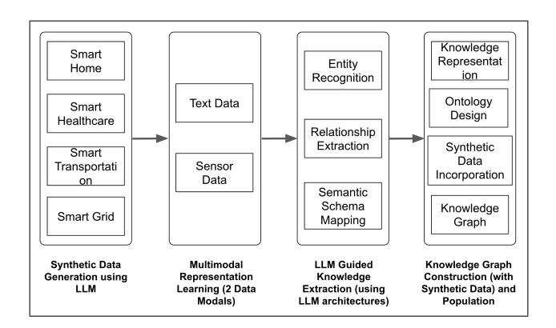
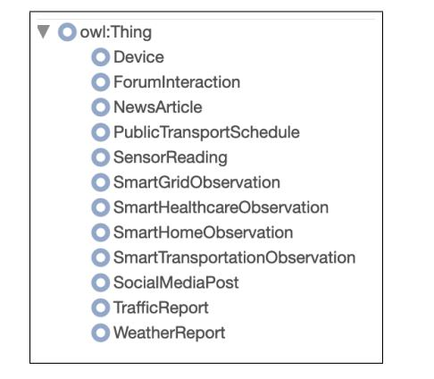
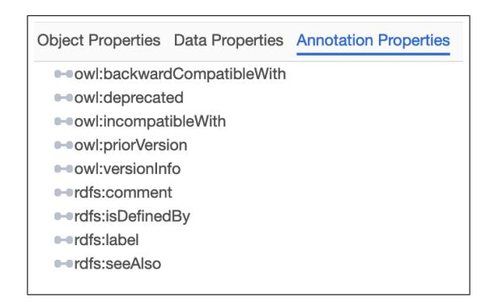
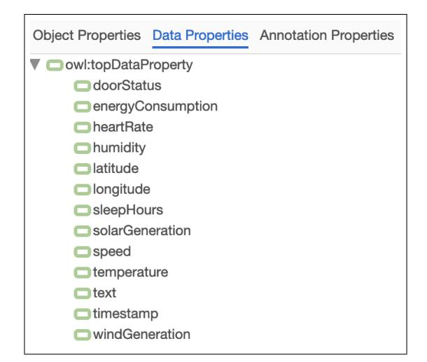
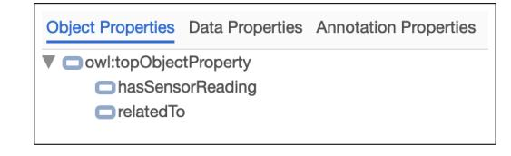
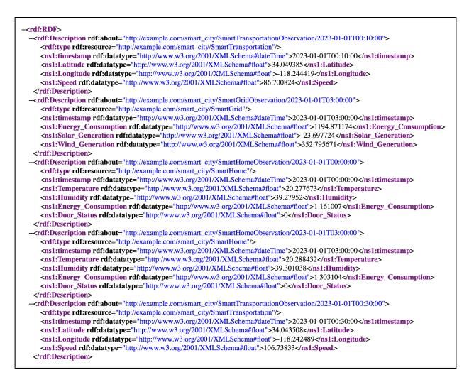
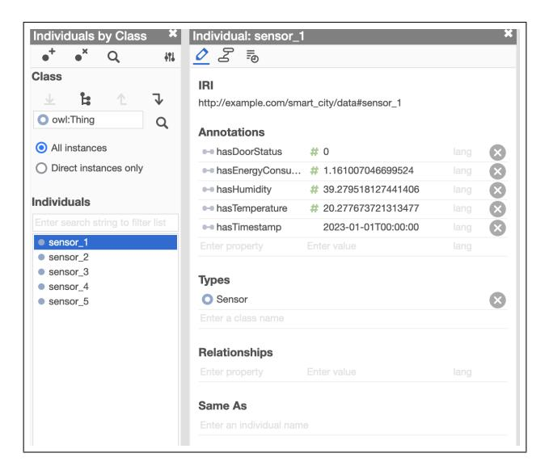
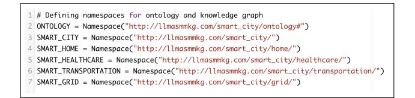

# LLMasMMKG: LLM Assisted Synthetic Multi-Modal Knowledge Graph Creation For Smart City Cognitive Digital Twins

Sukanya Mandal1 , Noel E. O'Connor2

1SFI Centre for Research Training in Machine Learning (ML-Labs) 2 Insight SFI Research Centre for Data Analytics School of Electronic Engineering Dublin City University Dublin, Ireland sukanya.mandal2@mail.dcu.ie

#### Abstract

The concept of a Smart City (SC) Cognitive Digital Twin (CDT) presents signifcant potential for optimizing urban environments through sophisticated simulations, predictions, and informed decision-making. Comprehensive Knowledge Representations (KRs) that effectively integrate the diverse data streams generated by a city are crucial to realizing this potential. This paper addresses this by introducing a novel approach that leverages Large Language Models (LLMs) to automate the construction of synthetic Multi-Modal (MM) Knowledge Graphs (KGs) specifcally designed for a SC CDT. Recognizing the challenges in fusing and aligning information from disparate sources, our method harnesses the power of LLMs for natural language understanding, entity recognition, and relationship extraction to seamlessly integrate data from sensor networks, social media feeds, offcial reports, and other relevant sources. Furthermore, we explore the use of LLMdriven synthetic data generation to address data sparsity issues, leading to more comprehensive and robust KGs. Initial outputs demonstrate the effectiveness of our approach in constructing semantically rich and interconnected synthetic KGs, highlighting the signifcant potential of LLMs for advancing SC CDT technology.

## 1 Introduction

The rapid pace of urbanization in the 21st century demands innovative approaches to manage the complexities of increasingly interconnected urban environments (Nijkamp and Kourtit 2013). Smart Cities (SCs) (Khalimon, Vikhodtseva, and Obradovic 2020), characterized by their integration of ad- ´ vanced technologies and data-driven insights, offer a compelling solution to these challenges. Central to this vision are Cognitive Digital Twins (CDTs) (Abburu et al. 2020) which are Artifcial Intelligence (AI) enabled virtual representations that model the dynamic interplay of physical and social systems within a city. These CDTs (Zheng, Lu, and Kiritsis 2022) provide a powerful platform for understanding urban complexities, enabling simulations, predictions, and informed decision-making for optimized city operations.

Constructing comprehensive Knowledge Representations (KRs) lies at the heart of effective CDT realizations for SCs. Multi-Modal Knowledge Graphs (MMKGs) have emerged

as a powerful tool for this purpose (Liang et al. 2024), capable of integrating heterogeneous data from diverse urban domains, ranging from sensor networks and traffc management systems to healthcare records and social media feeds. However, building such Knowledge Graphs (KGs) for SC CDT presents signifcant hurdles. The inherent diversity of data sources leads (Lehtola et al. 2022) to heterogeneity in formats, semantics, and levels of detail, necessitating sophisticated alignment techniques to establish semantic correspondences and resolve inconsistencies. Furthermore, extracting meaningful relationships and implicit knowledge from unstructured data, such as social media posts and news articles, requires advanced natural language understanding capabilities.

Large Language Models (LLMs), trained on massive text and code datasets, offer a transformative solution for overcoming these challenges. LLMs excel at natural language processing tasks (Huang 2024), including entity recognition, relationship extraction (Wang et al. 2023), and text summarization (Jin et al. 2024), demonstrating a remarkable ability to discern semantic nuances and contextual dependencies. These capabilities make them ideally suited for automating or semi-automating the complex process of MMKG construction for SC CDTs.

This paper introduces a novel approach that leverages LLMs to create synthetic MMKGs specifcally designed to enhance the representation and functionality of SC CDTs. Real-world urban data often suffers from limitations such as scarcity, privacy concerns due to sensitive information, and potential biases refecting inequalities in data collection. Synthetic MMKGs offer a powerful solution by enabling us to generate large volumes of representative data while addressing issues of data scarcity, mitigating privacy risks and promoting fairness (Qian, Cebere, and van der Schaar 2023). We investigate using LLMs for crucial tasks such as entity recognition across diverse data sources, relationship extraction from unstructured text, and the generation of synthetic data to address sparsity issues inherent in real-world datasets. The following sections delve into related work and motivation, detail our proposed methodology, implementation and present sample outputs based on our proposed methodology. We conclude the paper with directions for future research.

Copyright © 2024, Association for the Advancement of Artifcial Intelligence (www.aaai.org). All rights reserved.

## 2 Related Work

Constructing comprehensive KGs for complex environments such as SCs presents a signifcant challenge (Anthopoulos 2015). While previous research has explored various approaches, ranging from manual curation to automated extraction, limitations persist. Existing work often focuses on domain-specifc KGs for areas like transportation (Chen et al. 2022), (Zhang et al. 2023) or energy (Chun et al. 2020), (Chun et al. 2018), employing domain-specifc ontologies and rule-based methods for data integration. However, these methods lack the fexibility and scalability required to handle the diverse and voluminous multi-modal data found in a holistic SC CDT.

Addressing this multi-modal challenge is crucial. Traditional data fusion and alignment techniques, such as schema mapping (Dsouza, Tempelmeier, and Demidova 2021), (Oliveira, Sahay, and d'Aquin 2019) and ontology alignment (Xiang et al. 2021), (Silva, Faria, and Pesquita 2022), often rely on labor-intensive handcrafted rules or statistical measures that struggle with semantic heterogeneity and ambiguity across different data modalities. While machine learning approaches like embedding-based alignment (Guo et al. 2022), (Fanourakis et al. 2023) show promise, they often necessitate large amounts of labelled data and may not generalize well to unseen data distributions.

The emergence of Large Language Models (LLMs) offers a potential solution. Recent research has demonstrated the effectiveness of LLMs in tasks such as entity linking (Shu et al. 2024), relationship extraction (Tao, Wang, and Bai 2024), (Meyer et al. 2023), and knowledge base completion (Xu et al. 2024a), (Xu et al. 2024c), (Wei et al. 2024), particularly in capturing complex semantic relationships and reasoning over unstructured text (De Bellis 2023), (Mandvikar 2023). However, the application of LLMs to construct MMKG for SC CDT remains largely unexplored.

A notable exception is the work reported in (Tupayachi et al. 2024), which is very similar to our approach in using an LLM to automate the creation of scenario-based ontologies for urban decision support systems. Their methodology employs the ChatGPT API as a reasoning core, leveraging methontology-based prompt tuning and transformers to generate ontologies from existing research articles and technical manuals. However, our approach differs in its focus on constructing synthetic MMKGs specifcally designed for a SC CDT. We leverage LLMs not only for ontology generation but also for Multi-Modal (MM) data fusion, including the integration of sensor data and the generation of synthetic data to address sparsity issues, enabling a more comprehensive and data-driven representation of the SC.

Current LLM-based approaches predominantly focus on text-based Knowledge Extraction (KE), leaving a signifcant gap in effectively integrating and aligning information from diverse modalities like sensor data, images, and social media feeds – all of which are essential for comprehensive SC CDT. Moreover, addressing data sparsity, a common issue in real-world SC datasets, requires innovative solutions like synthetic data generation, an area not adequately addressed in the context of LLM-driven KG construction.

This research aims to bridge these gaps by introducing a

novel approach that leverages LLMs for constructing synthetic MMKG specifcally designed for SC CDT (Mandal 2024). This work explores the potential of LLMs in fusing information from heterogeneous sources, aligning entities across multiple modalities, and generating synthetic data to augment KG coverage. This approach ultimately aims to support the development of more robust and comprehensive Digital Twin (DT) applications. Furthermore, this work proposes a reusable and scalable pipeline adaptable for future enhancements, as detailed in fgure 1 and 2.

## 3 Motivation

The promise of SCs lies in their ability to leverage data for improved urban planning, resource management, and citizen services (Gharaibeh et al. 2017). Yet, this data-driven vision is hindered by the sheer complexity of the information generated. SCs are characterised by a constant stream of readings from traffc sensors, social media posts refecting citizen sentiment, and reports from various city departments, to name but a few sources, each offering a fragmented view of the urban landscape. This inherent heterogeneity and volume of data necessitate a KR framework that goes beyond the capabilities of traditional data management techniques, leading us to explore the potential of KGs for SC CDTs.

#### 3.1 Beyond Traditional Data - KGs for SCs

While traditional data formats like relational databases and spreadsheets are ideal for storing structured information, they struggle to adequately capture the complex relationships and interdependencies that defne SC ecosystems. Ontologies (Ontotext 2024) and KGs (Ehrlinger and Woß 2016), on the ¨ other hand, offer a powerful alternative by providing a rich semantic representation of data, facilitating seamless data integration, enabling contextual reasoning and inference, and promoting explainability and interpretability. To illustrate these advantages, let us consider how KGs could be used to represent and reason about data from traffc sensors.

Rich Semantic Representation (Ji et al. 2021): Consider a table storing traffc sensor data, including Sensor ID, Location, and Speed readings. Storing this in a relational database captures *what* is measured but not the relationships between things. While a relational database can effciently store these attributes, it falls short in representing the rich connections that provide context and meaning. KGs excel in this area by representing information as interconnected triples, such as (Sensor 123, locatedAt, Intersection A) and (Intersection A, connectsTo, Street X). This interconnectedness allows for more nuanced and complex queries, such as "Find all sensors within 2 miles of an accident reported on social media", a query that requires understanding of spatial relationships and linking of data types. Furthermore, the inherent structure of KGs facilitates pattern discovery, revealing indirect connections that might otherwise go unnoticed, like how traffc congestion in one area might correlate with increased hospital visits in another.

Interoperability and Data Integration (Grangel-Gonzalez 2019), (Melluso, Grangel-Gonz ´ alez, and Fantoni ´

2022): The SC landscape is characterized by data heterogeneity. Integrating information from traffc sensors, social media feeds, and weather reports into a unifed system presents signifcant challenges for traditional databases due to differences in schemas, units, and levels of detail. KGs address this challenge by using standardized data models like Resource Description Framework (RDF) (Pan 2009) and shared ontologies (vocabularies of a domain) (Ontoforce 2024). This creates a common language for representing data from diverse sources, e.g., allowing information from a traffc sensor and a weather report such as temperature to be expressed using the same ontology term. This enables direct comparison and analysis within a unifed framework, thus signifcantly easing the integration of new data sources, as they can be readily mapped to the existing KG ontology, avoiding the need for a complete database overhaul.

Contextual Reasoning and Inference (Liu et al. 2024): Traditional databases are primarily designed for data storage and retrieval. Deriving *new* knowledge from the data often requires complex queries and external logic. KGs, in contrast, leverage their structured representation and semantic richness to enable built-in reasoning capabilities. This can be achieved through rule-based inference, where predefned rules, such as If (Traffic Light, isBroken, True) → (Traffic Flow, isDisrupted, True), capture logical relationships between entities and their attributes, allowing the KG to infer new knowledge directly from the data. Additionally, KGs can leverage semantic similarity to infer that seemingly different phrases, like Road Closed and Street Inaccessible, likely refer to the same event, even if the wording varies across data sources.

Explainability and Interpretability (Schramm, Wehner, and Schmid 2023): Transparency and accountability are of paramount importance for SCs i.e. the ability to understand the reasoning behind decisions is crucial. Machine learning models, while powerful, often operate as "black boxes", making it diffcult to understand *why* a specifc prediction was made. KGs, with their transparent and human-readable structure, provide a clear and auditable path of *how* conclusions are reached. This inherent explainability fosters trust in the insights derived from the KG and facilitates informed decision-making by urban planners and policymakers.

### 3.2 Leveraging LLMs for Enhanced KG Construction in SC Applications

This research is motivated by the limitations of existing KG construction methods in effectively addressing the complexities of SC data representations. Current approaches struggle to capture the multifaceted nature of urban environments, hindering the development of truly comprehensive and insightful CDTs. Specifcally, we identify three key challenges that traditional methods struggle to overcome:

Multimodal Data Fusion (Liang et al. 2024): SCs are inherently multi-modal, with data originating from text-based sources like social media, time-series data from sensors, and even visual data from traffc cameras. Traditional KG construction methods often struggle to meaningfully combine

these different modalities. Our research leverages the power of LLMs, with their inherent ability to process and understand multi-modal data, to develop novel techniques for learning joint representations that capture the intricate relationships across these different data modalities.

Automated KE (Peng et al. 2023): The sheer volume and heterogeneity of SC data make manual KG construction an arduous and error-prone task. Our work explores the use of LLMs to automate this process. By leveraging LLMs' natural language understanding capabilities, we aim to extract entities and relationships from textual sources like news articles and social media posts. Furthermore, we investigate how LLMs can learn patterns from sensor data, enabling the automatic extraction of meaningful relationships from different kinds of data points.

Synthetic Data Generation (Xu et al. 2024b): Real-world data is often incomplete, with missing data points hindering the KG's ability to provide a complete and accurate representation of the city. To address these challenges, our research explores the use of LLMs for synthetic data generation. By learning the underlying structure and patterns within the existing KG, LLMs can generate synthetic yet plausible data points to fll in gaps and enhance the KG's predictive power. This allows us to create more robust and comprehensive KGs that can better support the complex simulations and predictions required for effective SC management.

Harnessing the power of LLMs to address these challenges, this work paves the way for more intelligent, effcient, and insightful urban management, ultimately contributing to the development of more sustainable and citizen-centric urban environments.

## 4 Proposed Methodology

This section details the methodology employed to investigate the potential of LLMs in constructing synthetic MMKGs for SC CDTs. Recognizing the interconnected nature of SC domains, this work aims to capture and represent their complex interplay, facilitating a holistic understanding of the urban environment.

## 4.1 System Architecture – Core Components

Our proposed system architecture comprises four key modules, as illustrated in Figure 1, forming a workfow pipeline for LLM-assisted automated MMKG construction. Starting from the left, the core components of this architecture (in modules) are as follows:

Module 1 - Heterogeneous Data Sources and Data Processing: This module is responsible for gathering data from diverse sources refecting various aspects of a SC, and applying pre-processing techniques to ensure data quality and consistency. Examples of these data sources includes (but not limited to):

• Smart Home Data: Sensor readings from smart homes, including temperature, energy consumption, appliance usage, and occupancy data.

Figure 1: System Architecture

- Smart Healthcare Data: Electronic health records (EHRs), anonymized patient data, hospital occupancy rates, and public health alerts.
- Smart Transportation Data: Real-time traffc data from sensors, GPS devices, and traffc cameras, as well as public transportation schedules and incident reports.
- Smart Grid Data: Energy consumption patterns, grid stability metrics, and renewable energy generation data.
- Social Media Feeds: Publicly available posts and comments from platforms like Twitter and Facebook, fltered for relevance to the target city.
- Offcial Reports and News Articles: Government reports, news articles, and online publications related to city events, infrastructure updates, and public announcements.

Standard data pre-processing techniques are applied to ensure data quality and consistency. Data cleaning handles missing values, removes duplicates, and corrects data errors. Data Normalization standardizes units of measurement, converts data types, and resolves naming convention inconsistencies. Textual Data Preprocessing includes tokenization, stop word removal, stemming, and lemmatization of textual data.

Module 2 - Multimodal Representation Learning (MMRL): MMRL involves creating representations that capture the relationships and interactions between different types of data (Zhang et al. 2019). This module transforms the preprocessed data into a unifed representation, capturing semantic relationships across different data modalities. This prepares the data for effective KE by the LLM. Specifc techniques are elaborated in the "Implementation and Output" section, tailored to the datasets and modalities used in this work.

Module 3 - LLM Guided KE: This module leverages LLMs for automated KE from the MM data representation. LLMs perform entity recognition (identifying relevant entities like people, locations, and events), relationship extraction (inferring relationships like locatedIn between a sensor and a building based on their co-occurrence in the data), and semantic schema mapping (determining semantic similarity between concepts across data sources, facilitating schema alignment). This ensures that data from different sources can be integrated into a unifed KG.

Module 4 - KG Construction and Population: This module structures the extracted knowledge into a formal KG in RDF format. It involves representing knowledge as RDF triples, designing a hierarchical domain-specifc ontology, incorporating original source data, and populating the KG with extracted entities, relationships, and attributes. This will further enable querying and reasoning over the integrated knowledge.The key steps involved in this module are:

- KR: RDF triples (subject, predicate, object) are used to express entities and relationships extracted by the LLM.
- Ontology Design: A hierarchical ontology is designed to defne classes and properties for each domain (e.g., smart homes, transportation), ensuring consistency and interoperability within the KG.
- Data Incorporation: Data from the original sources is integrated into the ontology to create a KG, enriching its content and providing context for the extracted knowledge.
- KG Population: Extracted entities, relationships, and attributes are populated into the KG, adhering to the defned ontology. This results in a structured and queryable knowledge base that can be used for various downstream tasks.

The output of each module feeds into the next, culminating in an RDF fle containing the ontology and the populated KG.

#### 4.2 Benefts of the Modular System Architecture

The modular design of the proposed system architecture offers several key advantages, making it particularly well-suited for the dynamic and evolving nature of SC data:

- Reusability: Individual modules can be readily reused and adapted for various SC scenarios and tasks, promoting effciency and consistency across applications.
- Robustness: Modularity enables easier debugging and error isolation. If one module encounters issues, it can be addressed independently without impacting the functionality of other modules, enhancing system stability.
- Scalability: Each module can be independently scaled to handle increasing data volume or complexity. This allows the system to adapt gracefully to the evolving needs of a growing SC.
- Composability: New modules can be easily integrated, or existing ones modifed, to incorporate new data sources (including the integration of real-world data along with synthetic data), preprocessing steps, or KE techniques. This fexibility ensures the system remains adaptable and can readily incorporate advancements in LLMs and data availability.
- Maintainability: The modular structure promotes cleaner code organization and simplifes updates or modifcations, making the system easier to maintain, update, and evolve over time.
- Microservice and Multi-Agent Compatibility: The modular design is well-suited for a microservice-based architecture, allowing distributed deployment, independent scaling and fault tolerance of each module. This modularity also supports the integration of intelligent multi-agents,

enabling more autonomous and adaptive system behavior. These further enhances the system's ability to handle increasing complexity and dynamism as the architecture evolves with additional use cases.

This modular approach collectively contributes to a more fexible, maintainable, and scalable system, capable of effectively handling the complexities of SC data management and KE.

## 5 Implementation and Output

This section describes a practical implementation of our proposed methodology. For the purpose of this implementation, we create and utilize synthetic data to construct a MMKG representing the interconnected domains of smart homes (Karimi et al. 2021), smart healthcare (Jokanovic 2020), smart trans- ´ portation (Gaur et al. 2015), and smart grids (Bonetto and Rossi 2017) within a SC context (Sanchez-Corcuera et al. ´ 2019). We describe the generation of synthetic data for both text and sensor modalities, followed by the pre-processing steps applied to prepare the data for KE. We then detail the specifc techniques used for MM representation learning, LLM-guided KE, and the fnal construction and population of the KG. The codebase is publicly available1 .

Figure 2: System Architecture adopted for this implementation

#### 5.1 Module 1 – Synthetic Data Generation

This step represents "Module 1: Heterogeneous Data Sources and Data Processing" of the system architecture as described in section 4.1 - see fgure 1. Recognizing the limitations of real-world data in terms of sparsity and coverage, we generate two modalities of synthetic data - text and sensors. This synthetic data is designed to be representative of the above mentioned target domains of a SC and augments real-world datasets to enhance the coverage and representativeness of the MMKG.

*Text Data Generation -* To create a rich and diverse corpus of synthetic text data for our KG, we leveraged the capabilities of the GPT-4 [Generative Pre-trained Transformer 4]

(Achiam et al. 2023) language model (specifcally, the gpt-4 turbo engine) via the OpenAI API. We focused on generating text that refects the language and information such as device descriptions, social media posts, forum interactions, patient descriptions, telehealth conversations, traffc reports, news articles, and weather reports, typically found in the above mentioned four key SC domains.

For each domain, we developed a set of python functions, each designed to generate a specifc type of text. These functions utilized carefully crafted prompts to guide GPT-4 in producing text that aligned with the characteristics of each domain. We also adjusted parameters like max tokens and temperature to fne-tune the generated text. The max tokens parameter in GPT-4 controls the maximum length of the generated text, measured in tokens (roughly corresponding to words or subwords). We tailored the max tokens value for each text generation function to ensure appropriate output lengths while maintaining coherence and relevance. The temperature parameter in GPT-4 controls the randomness of the generated text. A higher temperature (closer to 1) results in more creative and unpredictable output, while a lower temperature (closer to 0) produces more deterministic and focused text.

Smart Home: To generate realistic smart home data, we utilized GPT-4 with specifcally designed prompts and parameters. For example, the function generate device description(device type) creates a short description of a smart home device (e.g., "thermostat", "security camera") using the prompt: *"Describe a smart home* {*device type*} *with innovative features"*.

We also created functions to simulate social media interactions. The generate social media post(device type) function generates a social media post about a specifed device type (e.g., "smart lighting system"). It randomly selects a prompt from a predefned list, such as *"Just got a new smart* {*device type*} *and I'm loving it! #SmartHome"*, *"My smart* {*device type*} *is a game-changer! So convenient. #HomeAutomation"*, *"Having some trouble setting up my smart* {*device type*}*. Any tips? #TechHelp"*, ensuring diverse post content.

Finally, the generate forum interaction(device type) function simulates forum interactions by generating a question and answer related to a given device type (e.g., "refrigerator"). The question prompt is *"I'm having trouble connecting my smart* {*device type*} *to my Wi-Fi. Any advice?"*. GPT-4 then uses this question to generate a plausible answer.

These functions were applied to a predefned list of device types, such as "thermostat", "security camera", "smart lighting system", and "refrigerator" resulting in a diverse dataset of smart home-related text.

Smart Healthcare: For the smart healthcare domain, we created functions to generate various types of medical text. The generate patient description(symptoms, medical history) function generates a brief medical description of a patient based on provided symptoms (e.g., "fatigue", "shortness of breath") and medical history (e.g., "hypertension", "diabetes"). The prompt used for this task

1 See: https://github.com/sukanyamandal/LLMasMMKG Code

is *"Generate a brief medical description of a patient presenting with* {*symptoms*}*, including their medical history of* {*medical history*}*"*.

To simulate telehealth interactions, we developed the generate telehealth conversation(initial query) function. It uses a multi-turn conversation approach, where the initial query from the patient (e.g., "Hello, I'm experiencing chest pain.") is used to initiate the conversation. GPT-4 then generates responses based on the previous conversation turns and the patient's new queries as context, simulating a realistic chatbot interaction.

Similar to the smart home domain, we also created a generate health forum interaction(topic) function for the healthcare domain. This function simulates a health forum interaction by generating a question and answer based on a given health-related topic (e.g., "managing stress", "healthy diet"). GPT-4 frst generates a question related to the topic and then uses that question to generate a relevant answer.

Smart Transportation: In the smart transportation domain, we focused on generating text related to traffc conditions and commutes. The generate traffic report(highway, time) function creates a traffc report for a major highway (e.g., "Highway 101") at a specifc time of day (e.g., "rush hour"). The prompt we used for this task is *"Generate a traffc report for* {*highway*} *during* {*time*}*, including the cause of any congestion and expected delays"*.

To simulate social media discussions about commutes, we developed the generate commute post(mode, sentiment) function. This function generates a social media post about a commute experience, taking the mode of transportation (e.g., "driving", "public transit") and sentiment (e.g., "positive", "negative") as input. The prompt we used for this task is *"Create a social media post about a* {*sentiment*} *experience during a* {*mode*} *commute"*.

The generate public transport schedule(route, start, end, frequency) function generates a public transport schedule based on the provided route information, start and end locations, and desired frequency of departures. We used a structured prompt format to ensure that the generated schedule includes all the specifed information in a clear and organized manner.

Smart Grid: For the smart grid domain, we generated text related to energy infrastructure, news, and weather conditions. The generate grid description(city) function describes the composition of a city's power grid (e.g., "Los Angeles"), including traditional and renewable energy sources. The prompt used for this task is *"Describe the composition of* {*city*}*'s power grid, including traditional and renewable energy sources"*.

To simulate energy-related news articles, we created the generate energy news(event) function. This function takes an energy-related event or development (e.g., "government investment in grid upgrades", "new solar farm") as input and generates a news article about it using the prompt: *"Write a news article about* {*event*} *and its impact on the energy sector"*.

Finally, the generate weather report(location, parameters) function generates a weather report for a specifed location (e.g., "New York City") and includes desired weather parameters (e.g., "temperature", "wind speed", "solar radiation"). We used a structured prompt format to ensure the generated report includes the specifed parameters in a clear and concise manner.

*Sensor Data Generation -* To complement the textual data and provide a multi-modal representation of the SC, we generated synthetic sensor data for each domain. We used Python libraries like pandas, numpy, and random to simulate realistic sensor readings, employing techniques such as sine waves, random noise, and linear interpolation.

Smart Home: For the smart home domain, we simulated readings from temperature, humidity, energy consumption, and door/window status sensors. Temperature and humidity data were generated using sine waves to mimic seasonal variations, with added random noise for realism.

Energy consumption data followed a similar approach, with a sine wave simulating daily peaks and additional randomness to refect household variations. Door/window status data was generated by randomly assigning "closed" (False) or "open" (True) states, with a higher probability of "closed" to refect typical usage patterns.

Smart Healthcare: In the smart healthcare domain, we focused on heart rate and sleep hours data. Heart rate data was generated hourly, incorporating daily variations using a sine wave and adding random noise to simulate individual differences. Sleep hours data was generated daily, with random values around a typical sleep duration of 7-8 hours.

Smart Transportation: For smart transportation, we simulated GPS location (latitude and longitude) and speed data. GPS location data was generated using linear interpolation between two predefned locations (Los Angeles and San Francisco), with added random deviations to simulate realistic movement patterns. Speed data was generated randomly within a reasonable range (40-120 km/h).

Smart Grid: The smart grid domain included simulated data for energy consumption, solar generation, and wind generation. Energy consumption data was generated hourly, incorporating daily peaks and seasonal variations using sine waves and random noise. Solar generation data was generated only during daylight hours, taking into account seasonal variations in sunlight duration and intensity. Wind generation data was simulated to be more variable and less predictable, using random values and a sine wave to represent general patterns.

Data Volume and Time Range: We aimed to generate approximately 10,000 data points per domain, covering a time range of one year (365 days). The frequency of data points varies depending on the sensor type (hourly, daily, every 10 minutes).

Data Pre-processing: Before KE, all data generated undergoes data cleaning, data normalisation and textual data pre-processing as outlined previously.

#### 5.2 Module 2 – MMRL

This module transforms the preprocessed data from diverse sources and modalities into a unifed representation that captures semantic relationships across different data types, preparing it for effective KE by the LLM.

In this implementation, we employ sentence embedding models, specifcally Sentence-BERT (Reimers and Gurevych 2019) [all-mpnet-base-v2 model (Transformers 2024)], to generate dense vector representations for each text data point. These embeddings capture the semantic meaning of the text, allowing for comparisons and linking based on semantic similarity. Sensor data is integrated directly into the KG, with relationships to relevant text data points established through the semantic similarity scores between their corresponding text descriptions and the sentence embeddings of the text data. This approach enables the fusion of textual and sensor information within a unifed semantic space.

Figure 3: Classes and Subclasses of the Ontology

Figure 4: Annotation Properties of the Ontology

#### 5.3 Module 3 – LLM Guided KE

This module leverages the capabilities of LLMs to extract meaningful knowledge from the preprocessed synthetic data. In this context, "knowledge" refers to structured information about entities and their relationships within the SC domain. This knowledge is represented as facts, or triples, consisting of a subject (an entity), a predicate (the relationship), and

Figure 5: Data Properties of the Ontology

Figure 6: Object Properties of the Ontology

an object (another entity or a value). For example, the fact ("EcoTemp Thermostat", "controls", "Room Temperature") represents the knowledge that a specifc thermostat device controls the temperature of a room. The ability to extract and represent such knowledge in a structured format is crucial for building a comprehensive and queryable KG that can support reasoning and decision-making in a SC context.

Entity Recognition: This module employs a fne-tuned BERT model (Devlin et al. 2018) [dbmdz/bert-large-casedfnetuned-conll03-english (dbmdz 2024)] to identify relevant entities within the text data. For example, given the input "My EcoTemp thermostat keeps disconnecting from Wi-Fi" from a smart home scenario, this module would output "EcoTemp thermostat" and "Wi-Fi" as identifed entities.

Relationship Extraction: This module utilizes GPT-4 to infer relationships between entities identifed in the previous step. The model is prompted with the input text and the identifed entities, and is tasked with extracting relationships in the form of (subject, predicate, object), focusing on relationships relevant to SCs (e.g., "controls", "measures", "affects", "located at", "experiences"). For instance, given the input "John, a 65-year-old male, presented with complaints of fatigue and shortness of breath. He has a history of hypertension" from a smart healthcare scenario, this module would output relationships such as (John, experiences, fatigue), (John, experiences, shortness of breath), and (John, has history of, hypertension).

Semantic Schema Mapping: This task, as part of the LLMguided KE process, focuses on establishing links between text data points based on their semantic similarity. It leverages

Figure 7: A snapshot of the fnal RDF

Figure 8: A snapshot of the KG containing data

the sentence embeddings generated in section 5.2. For each pair of text data points, their corresponding sentence embeddings are compared using cosine similarity. If the similarity score exceeds a predefned threshold (0.6 in this implementation), a relatedTo relationship is established between them in the KG - while this value has not been rigorously optimized for our specifc dataset, it represents a balance between capturing meaningful semantic connections and avoiding an excessive number of spurious links, based on general practice in semantic similarity tasks. Future work will focus on empirically determining the optimal threshold through a systematic evaluation of precision and recall across different threshold values, tailored to the characteristics of our smart city data (Resnik 1999). This approach allows the system to identify connections between text data points based on the underlying concepts they express, even if they don't share explicit keywords or phrases. For example, given "Room Temperature" (from smart thermostat data) and "Ambient Temperature" (from energy consumption data) as input, the high similarity score between their sentence embeddings would lead to the establishment of a relatedTo relationship between these two concepts in the KG.

#### 5.4 Module 4 – KG Construction and Population

KR: The extracted knowledge is formally represented as a KG using the RDF. RDF triples (subject, predicate, object) are used to express entities and relationships within the graph. In the codebase we have defned custom namespaces (e.g., ONTOLOGY, SMART CITY, SMART HOME etc,; see fgure 9) to organize and distinguish concepts within the KG. A snapshot of the fnal RDF representation of the KG is shown in fgure 7.

Ontology Design: A hierarchical ontology is designed to structure the KG, defning classes and properties for each domain to ensure consistency and facilitate interoperability. The ontology is created programmatically using the rdflib library in Python. The code is responsible for defning classes for each data type (e.g., "SmartHomeObservation", "Device", "SensorReading") and properties to represent relationships and attributes (e.g., "relatedTo", "hasSensorReading"). Data properties for sensor readings are also added, specifying their data types (e.g., "temperature" as XSD.foat). The ontology is saved in a RDF/XML (smart city ontology.rdf) format. Figures 3, 4, 5, and 6 (as viewed on Webprotege (Tudorache, Vendetti, and Noy 2008)) illustrate the structure of the ontology.

Synthetic Data Incorporation: After pre-processing, multimodal representation learning (Section 5.2), and LLMguided KE (Section 5.3), the synthetic data generated using the techniques described in Section 5.1 is integrated into the KG to enhance its completeness and address potential data sparsity issues. The add sensor data to graph and add text data to graph functions in the code handles the integration of sensor and text data into the KG, aligning it with the defned ontology. This function iterates through the sensor data, creating observation URIs based on timestamps, and adds RDF triples to represent the observation type, timestamp, and sensor readings.

KG Population: The extracted entities, relationships, and attributes are populated into the KG. Each data point is represented as a node (entity) or edge (relationship) in the graph, adhering to the defned ontology. See fgure 8 (as viewed on Webprotege).

#### 5.5 Key Contribution in This Implementation

This implementation showcases a practical approach for leveraging LLMs to construct MMKGs for representing SCs. It directly addresses how LLMs can be utilized to build MMKGs that effectively capture the intricate interplay within a SC CDT framework. This work focuses specifcally on the creation of synthetic MMKGs focusing on the SC domains of smart homes, smart healthcare, smart transportation, and smart grids. The key contributions are aligned as follows:

Figure 9: Namespaces for Ontology and Knowledge Graph

Fusion of Heterogeneous Data Sources: The implementation successfully integrates data from diverse sources, including synthetically generated text, simulated sensor readings, and predefned ontologies (see Figure 9). This fusion of heterogeneous data into a unifed KG enables cross-modal analysis and reasoning, providing a more holistic view of the SC.

Automated KE from MM Data: The implementation demonstrates the use of LLMs for automatically extracting entities and relationships from both textual and sensor data. A fne-tuned BERT model is used for entity recognition, GPT-4 for relationship extraction, and Sentence-BERT for semantic linking based on similarity. This automated approach signifcantly reduces the manual effort required for KG construction.

Construction of MMKGs: The implementation demonstrates the successful construction of a KG that integrates both structured data (sensor readings) and unstructured data (text descriptions, social media posts) within a unifed graph representation using the workfow pipeline mentioned in fgure 2 showcasing its MM capabilities.

Workfow Example with Synthetic Data: This implementation provides a detailed workfow example using synthetically generated data to demonstrate the effectiveness of our LLM-driven MMKG construction approach. The process of generating synthetic text and sensor data, extracting knowledge using LLMs, and populating the KG is thoroughly documented, offering a practical illustration of how our methodology can be applied. This example serves as a valuable resource for researchers and practitioners seeking to implement similar approaches for building KGs for SC applications.

Reusable and Scalable Pipeline: The implementation introduces a scalable and reusable pipeline for LLM-assisted MMKG construction. This pipeline can be easily adapted for future enhancements, such as incorporating additional data modalities (e.g., images, videos) or integrating more advanced LLM architectures. The modular design of the pipeline allows for fexibility and extensibility, making it a valuable tool for ongoing research and development in the feld of SC CDTs.

Foundation for a CDT: The implementation methodology and further, the KG obtained from it, serves as a foundational input data element for SC CDT framework outlined in (Mandal 2024). The KG, by representing entities, relationships, and events within the SC, provides a structured and semantically rich knowledge base that can be used for simulating, predicting, and understanding complex interactions

within the urban environment. This directly contributes to the development of a CDT by providing a comprehensive and interconnected KR that captures the multifaceted nature of a SC.

## 6 Future Work

This research lays the groundwork for a future where LLMs power the creation of rich, interconnected MMKGs for SC CDT development. While our work demonstrates the feasibility of this vision, realizing its full potential requires further exploration of advanced techniques and addressing the practical challenges of real-world urban data. The following avenues for future work will build upon this foundation, exploring more advanced techniques and addressing the practical challenges of applying LLMs to large-scale, heterogeneous urban data.

#### 6.1 Enhancing LLM-Based KE

Entity Linking: Representing data points as nodes in the graph enables the future application of LLMs, which could be used to link entities across different data sources, identifying instances where the same entity is referred to using different names or descriptions. For instance, an LLM could be used to recognize that "John" in the smart home data refers to the same entity as "Patient X" in the healthcare data.

Semantic Similarity-Based Linking: While the implementation demonstrates a basic form of relationship extraction, it could be further extended to extract more specifc relationship types (e.g., "controls", "measures", "affects") by employing LLMs trained on domain-specifc datasets with annotated relationships.

Data Transformation and Integration: More advanced LLM applications could be used to translate between modalities, such as generating textual descriptions of sensor data patterns or creating synthetic sensor readings based on textual descriptions.

Schema Alignment and Mapping: In a more complex scenario, LLMs could assist in aligning different schemas by identifying semantically equivalent concepts across data sources. For example, an LLM could recognize that "Room Temperature" in the smart home data corresponds to "Ambient Temperature" in the healthcare data.

Comparative Analysis of LLMs: Future work will involve a comparative analysis of different LLM architectures, including GPT-4 and other advanced models, to assess their effectiveness in various KE tasks. This analysis will focus on evaluating the accuracy, effciency, and robustness of different LLMs in handling the specifc challenges of SC data.

Human-in-the-Loop Verifcation: To enhance the reliability and trustworthiness of the generated KG, we plan to incorporate a human-in-the-loop approach for verifying LLMextracted knowledge. This will involve developing interactive interfaces that allow domain experts to review, validate, and refne the extracted entities, relationships, and semantic links. Parameter Optimization and Sensitivity Analysis: Further research will focus on optimizing the parameters used in the LLM-based KE process, including the parameters for GPT-4 and the similarity threshold for sentence embeddings. A sensitivity analysis will be conducted to assess the impact of these parameters on the quality and completeness of the generated KG.

Robustness to Noisy Data: Investigate how to make the LLM-based KE process more robust to noise, inconsistencies, and errors often present in real-world SC data.

Scalability and Generalization to Diverse City Contexts: Future work will focus on scaling our approach to handle the data volume and complexity of diverse city contexts. This includes exploring distributed processing, data partitioning, and hierarchical KG structures to manage larger datasets. Additionally, we will investigate methods for adapting the KG construction process to different city-specifc ontologies, data schemas, and semantics, potentially leveraging domain adaptation techniques for LLMs.

Explainability and Trustworthiness: Investigate methods for making the LLM-based KE process more explainable and transparent, building trust in the generated KG and enabling human validation of the extracted knowledge.

Evaluating KG Quality: Future work will prioritize a comprehensive evaluation of the generated MMKG's quality. This will encompass quantitative assessments of its structural properties, semantic coherence, and utility for downstream tasks like question answering and inference, alongside qualitative assessments through expert evaluation and case studies. Additionally, we will benchmark our LLM-driven pipeline against existing KG construction methods to demonstrate its effectiveness and effciency.

#### 6.2 Expanding Data Modalities and Applications

Incorporating Additional Data Modalities: Expanding the KG to encompass a wider range of data sources beyond text is crucial for capturing a holistic view of the SC. This includes incorporating image data, video data, voice data, biometric data, facial and gesture data, geospatial data, realtime weather information, demographic data, and economic indicators.

Evaluating Performance in Diverse Applications: A crucial next step is to assess the impact of the constructed KG on a broader range of SC applications. This includes evaluating its utility in urban planning scenarios, resource optimization strategies, disaster response simulations, and other relevant use cases.

### 6.3 Reasoning and Inference

Enhancing Reasoning and Inference: Investigating the use of KG embedding techniques and reasoning mechanisms, such as graph neural networks (GNN) and rule-based inference engines, can unlock the full potential of the generated KG. This would enable more sophisticated querying, facilitate complex what-if analyses, and support advanced analytics and data-driven decision-making within the DT.

#### 6.4 Synthetic Data and Real World Data

Refning Synthetic Data Generation: While the current techniques generate synthetic data with plausible characteristics, further refnement is crucial. This involves developing more sophisticated generative models that capture the subtle nuances, correlations, and potential anomalies present in real-world sensor data and rigorously evaluating the synthetic data against corresponding real-world datasets to identify and rectify any discrepancies or biases.

Combining Real-World and Synthetic Datasets: Exploring optimal strategies for combining real-world and synthetic datasets during the KG construction process is essential. This involves developing techniques to effectively weight and integrate data from different sources while mitigating potential biases introduced by synthetic data.

## 7 Conclusion

This research introduces a novel approach to constructing comprehensive and interconnected MMKGs for SC CDTs development by harnessing the power of LLMs. Our methodology effectively addresses the challenges of multi-modal data fusion, automated KE, and data sparsity through synthetic data generation, paving the way for realizing the full potential of CDTs in optimizing urban environments. The use of LLMs enables the seamless integration of heterogeneous data sources, including text, sensor readings, and social media feeds, into a unifed and semantically rich KR. This enhances data privacy in production CDTs, by reducing reliance on sensitive real-world information during the CDT development phase.

While this work presents a signifcant step forward, it serves primarily as a proof-of-concept and a frst step towards a broader research scope. Future research will focus on rigorous quantitative evaluation of the MMKG's performance, developing compelling real-world case studies, and expanding the KG to incorporate a wider range of data modalities. Additionally, we will explore more advanced LLM architectures, fne-tuning strategies, and reasoning mechanisms while refning synthetic data generation techniques. Critically, we will address the challenges of scalability, generalizability, and the ethical implications of using LLMs and synthetic data, including potential biases and their impact on automated decision-making. Pursuing these directions, we aim to advance the state-of-the-art in SC CDTs, empowering datadriven decisions and contributing to the development of more sustainable, effcient, and citizen-centric urban environments.

## Acknowledgments

This publication has emanated from research conducted with the fnancial support of ML-Labs at Dublin City University under grant number 18/CRT/6183 and the Insight SFI Research Centre for Data Analytics under grant number SFI/12/RC/2289 P2.

## References

Abburu, S.; Berre, A. J.; Jacoby, M.; Roman, D.; Stojanovic, L.; and Stojanovic, N. 2020. Cognitwin–hybrid and cognitive digital twins for the process industry. In *2020 IEEE*

*International Conference on Engineering, Technology and Innovation (ICE/ITMC)*, 1–8. IEEE.

Achiam, J.; Adler, S.; Agarwal, S.; Ahmad, L.; Akkaya, I.; Aleman, F. L.; Almeida, D.; Altenschmidt, J.; Altman, S.; Anadkat, S.; et al. 2023. Gpt-4 technical report. *arXiv preprint arXiv:2303.08774*.

Anthopoulos, L. G. 2015. Understanding the smart city domain: A literature review. *Transforming city governments for successful smart cities*, 9–21.

Bonetto, R.; and Rossi, M. 2017. Smart grid for the smart city. *Designing, Developing, and Facilitating Smart Cities: Urban Design to IoT Solutions*, 241–263.

Chen, T.; Zhang, Y.; Qian, X.; and Li, J. 2022. A knowledge graph-based method for epidemic contact tracing in public transportation. *Transportation Research Part C: Emerging Technologies*, 137: 103587.

Chun, S.; Jin, X.; Seo, S.; Lee, K.-H.; Shin, Y.; and Lee, I. 2018. Knowledge graph modeling for semantic integration of energy services. In *2018 IEEE international conference on big data and smart computing (BigComp)*, 732–735. IEEE.

Chun, S.; Jung, J.; Jin, X.; Seo, S.; and Lee, K.-H. 2020. Designing an integrated knowledge graph for smart energy services. *The Journal of Supercomputing*, 76: 8058–8085.

dbmdz. 2024. BERT Large Cased Fine-tuned on CoNLL03 English. Accessed: 2024-07-27.

De Bellis, A. 2023. Structuring the unstructured: an LLMguided transition.

Devlin, J.; Chang, M.-W.; Lee, K.; and Toutanova, K. 2018. Bert: Pre-training of deep bidirectional transformers for language understanding. *arXiv preprint arXiv:1810.04805*.

Dsouza, A.; Tempelmeier, N.; and Demidova, E. 2021. Towards neural schema alignment for openstreetmap and knowledge graphs. In *International Semantic Web Conference*, 56–73. Springer.

Ehrlinger, L.; and Woß, W. 2016. Towards a Defnition of ¨ Knowledge Graphs.

Fanourakis, N.; Efthymiou, V.; Kotzinos, D.; and Christophides, V. 2023. Knowledge graph embedding methods for entity alignment: experimental review. *Data Mining and Knowledge Discovery*, 37(5): 2070–2137.

Gaur, A.; Scotney, B.; Parr, G.; and McClean, S. 2015. Smart city architecture and its applications based on IoT. *Procedia computer science*, 52: 1089–1094.

Gharaibeh, A.; Salahuddin, M. A.; Hussini, S. J.; Khreishah, A.; Khalil, I.; Guizani, M.; and Al-Fuqaha, A. 2017. Smart cities: A survey on data management, security, and enabling technologies. *IEEE Communications Surveys & Tutorials*, 19(4): 2456–2501.

Grangel-Gonzalez, I. 2019. ´ *A knowledge graph based integration approach for industry 4.0*. Ph.D. thesis, Universitats-und ¨ Landesbibliothek Bonn.

Guo, L.; Zhang, Q.; Sun, Z.; Chen, M.; Hu, W.; and Chen, H. 2022. Understanding and improving knowledge graph embedding for entity alignment. In *International Conference on Machine Learning*, 8145–8156. PMLR.

Huang, Y. 2024. Leveraging large language models for enhanced nlp task performance through knowledge distillation and optimized training strategies. *arXiv preprint arXiv:2402.09282*.

Ji, S.; Pan, S.; Cambria, E.; Marttinen, P.; and Philip, S. Y. 2021. A survey on knowledge graphs: Representation, acquisition, and applications. *IEEE transactions on neural networks and learning systems*, 33(2): 494–514.

Jin, H.; Zhang, Y.; Meng, D.; Wang, J.; and Tan, J. 2024. A comprehensive survey on process-oriented automatic text summarization with exploration of llm-based methods. *arXiv preprint arXiv:2403.02901*.

Jokanovic, V. 2020. Smart healthcare in smart cities. In ´ *Towards Smart World*, 45–72. Chapman and Hall/CRC.

Karimi, R.; Farahzadi, L.; Sepasgozar, S.; Sargolzaei, S.; Sepasgozar, S. M. E.; Zareian, M.; and Nasrolahi, A. 2021. Smart built environment including smart home, smart building and smart city: defnitions and applied technologies. *Advances and Technologies in Building Construction and Structural Analysis*, 179.

Khalimon, E. A.; Vikhodtseva, E. A.; and Obradovic, V. 2020. ´ Smart cities today and tomorrow–world experience. In *Institute of Scientifc Communications Conference*, 1340–1347. Springer.

Lehtola, V. V.; Koeva, M.; Elberink, S. O.; Raposo, P.; Virtanen, J.-P.; Vahdatikhaki, F.; and Borsci, S. 2022. Digital twin of a city: Review of technology serving city needs. *International Journal of Applied Earth Observation and Geoinformation*, 114: 102915.

Liang, W.; De Meo, P.; Tang, Y.; and Zhu, J. 2024. A Survey of Multi-modal Knowledge Graphs: Technologies and Trends. *ACM Computing Surveys*.

Liu, X.; Mao, T.; Shi, Y.; and Ren, Y. 2024. Overview of Knowledge Reasoning for Knowledge Graph. *Neurocomputing*, 127571.

Mandal, S. 2024. A Privacy Preserving Federated Learning (PPFL) Based Cognitive Digital Twin (CDT) Framework for Smart Cities. *Proceedings of the AAAI Conference on Artifcial Intelligence*, 38(21): 23399–23400.

Mandvikar, S. 2023. Augmenting intelligent document processing (IDP) workfows with contemporary large language models (LLMs). *International Journal of Computer Trends and Technology*, 71(10): 80–91.

Melluso, N.; Grangel-Gonzalez, I.; and Fantoni, G. 2022. ´ Enhancing industry 4.0 standards interoperability via knowledge graphs with natural language processing. *Computers in Industry*, 140: 103676.

Meyer, L.-P.; Stadler, C.; Frey, J.; Radtke, N.; Junghanns, K.; Meissner, R.; Dziwis, G.; Bulert, K.; and Martin, M. 2023. Llm-assisted knowledge graph engineering: Experiments with chatgpt. In *Working conference on Artifcial Intelligence Development for a Resilient and Sustainable Tomorrow*, 103–115. Springer Fachmedien Wiesbaden Wiesbaden.

Nijkamp, P.; and Kourtit, K. 2013. The "new urban Europe": Global challenges and local responses in the urban century. *European planning studies*, 21(3): 291–315.

Oliveira, D.; Sahay, R.; and d'Aquin, M. 2019. Leveraging ontologies for knowledge graph schemas.

Ontoforce. 2024. The Signifcance of Ontology in Knowledge Graphs. Accessed: 2024-07-30.

Ontotext. 2024. What are ontologies? https://www.ontotext. com/knowledgehub/fundamentals/what-are-ontologies/. Accessed: 2024-05-13.

Pan, J. Z. 2009. Resource description framework. In *Handbook on ontologies*, 71–90. Springer.

Peng, C.; Xia, F.; Naseriparsa, M.; and Osborne, F. 2023. Knowledge graphs: Opportunities and challenges. *Artifcial Intelligence Review*, 56(11): 13071–13102.

Qian, Z.; Cebere, B.-C.; and van der Schaar, M. 2023. Synthcity: facilitating innovative use cases of synthetic data in different data modalities. *arXiv preprint arXiv:2301.07573*.

Reimers, N.; and Gurevych, I. 2019. Sentence-bert: Sentence embeddings using siamese bert-networks. *arXiv preprint arXiv:1908.10084*.

Resnik, P. 1999. Semantic similarity in a taxonomy: An information-based measure and its application to problems of ambiguity in natural language. *Journal of artifcial intelligence research*, 11: 95–130.

Sanchez-Corcuera, R.; Nu ´ nez-Marcos, A.; Sesma-Solance, ˜ J.; Bilbao-Jayo, A.; Mulero, R.; Zulaika, U.; Azkune, G.; and Almeida, A. 2019. Smart cities survey: Technologies, application domains and challenges for the cities of the future. *International Journal of Distributed Sensor Networks*, 15(6): 1550147719853984.

Schramm, S.; Wehner, C.; and Schmid, U. 2023. Comprehensible artifcial intelligence on knowledge graphs: A survey. *Journal of Web Semantics*, 79: 100806.

Shu, D.; Chen, T.; Jin, M.; Zhang, Y.; Du, M.; and Zhang, Y. 2024. Knowledge Graph Large Language Model (KG-LLM) for Link Prediction. *arXiv preprint arXiv:2403.07311*.

Silva, M. C.; Faria, D.; and Pesquita, C. 2022. Matching multiple ontologies to build a knowledge graph for personalized medicine. In *European Semantic Web Conference*, 461–477. Springer.

Tao, Y.; Wang, Y.; and Bai, L. 2024. Graphical Reasoning: LLM-based Semi-Open Relation Extraction. *arXiv preprint arXiv:2405.00216*.

Transformers, S. 2024. Pretrained Models. Accessed: 2024- 07-20.

Tudorache, T.; Vendetti, J.; and Noy, N. F. 2008. Web-Protege: A Lightweight OWL Ontology Editor for the Web. In *OWLED*, volume 432, 2009.

Tupayachi, J.; Xu, H.; Omitaomu, O. A.; Camur, M. C.; Sharmin, A.; and Li, X. 2024. Towards Next-Generation Urban Decision Support Systems through AI-Powered Generation of Scientifc Ontology using Large Language Models–A Case in Optimizing Intermodal Freight Transportation. *arXiv preprint arXiv:2405.19255*.

Wang, S.; Sun, X.; Li, X.; Ouyang, R.; Wu, F.; Zhang, T.; Li, J.; and Wang, G. 2023. Gpt-ner: Named entity recognition via large language models. *arXiv preprint arXiv:2304.10428*. Wei, Y.; Huang, Q.; Kwok, J. T.; and Zhang, Y. 2024. KICGPT: Large Language Model with Knowledge in Context for Knowledge Graph Completion. *arXiv preprint arXiv:2402.02389*.

Xiang, Y.; Zhang, Z.; Chen, J.; Chen, X.; Lin, Z.; and Zheng, Y. 2021. OntoEA: Ontology-guided entity alignment via joint knowledge graph embedding. *arXiv preprint arXiv:2105.07688*.

Xu, D.; Zhang, Z.; Lin, Z.; Wu, X.; Zhu, Z.; Xu, T.; Zhao, X.; Zheng, Y.; and Chen, E. 2024a. Multi-perspective Improvement of Knowledge Graph Completion with Large Language Models. *arXiv preprint arXiv:2403.01972*.

Xu, H.; Omitaomu, F.; Sabri, S.; Li, X.; and Song, Y. 2024b. Leveraging Generative AI for Smart City Digital Twins: A Survey on the Autonomous Generation of Data, Scenarios, 3D City Models, and Urban Designs. *arXiv preprint arXiv:2405.19464*.

Xu, Y.; He, S.; Chen, J.; Wang, Z.; Song, Y.; Tong, H.; Liu, K.; and Zhao, J. 2024c. Generate-on-Graph: Treat LLM as both Agent and KG in Incomplete Knowledge Graph Question Answering. *arXiv preprint arXiv:2404.14741*.

Zhang, Q.; Ma, Z.; Zhang, P.; and Jenelius, E. 2023. Mobility knowledge graph: review and its application in public transport. *Transportation*, 1–27.

Zhang, S.-F.; Zhai, J.-H.; Xie, B.-J.; Zhan, Y.; and Wang, X. 2019. Multimodal representation learning: Advances, trends and challenges. In *2019 International Conference on Machine Learning and Cybernetics (ICMLC)*, 1–6. IEEE.

Zheng, X.; Lu, J.; and Kiritsis, D. 2022. The emergence of cognitive digital twin: vision, challenges and opportunities. *International Journal of Production Research*, 60(24): 7610– 7632.