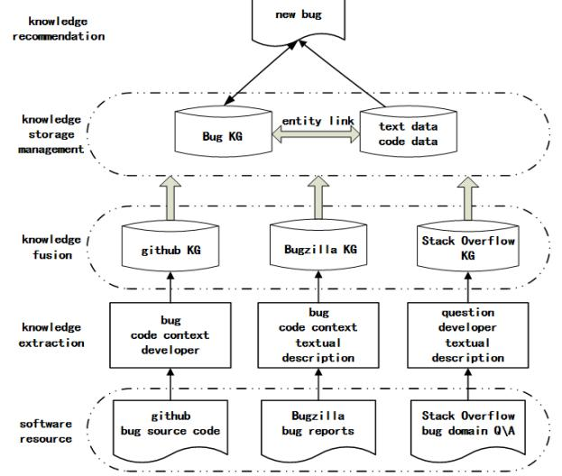
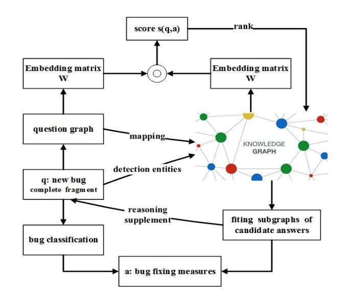

# Intelligent Bug Fixing with Software Bug Knowledge Graph

Cheng Zhou

School of Information Engineering, Yangzhou University Yang zhou, China canorcheng@foxmail.com

# ABSTRACT

Software bugs continuously emerge during the process of software evolution. With the increasing size and complexity of software, bug fixing becomes increasingly more difficult. Bug and commit data of open source projects, Q&A documents and other software resources contain a sea of bug knowledge which can be utilized to help developers understand and fix bugs. Existing work focuses on data mining from a certain software resource in isolation to assist in bug fixing, which may reduce the efficiency of bug fixing.

How to obtain, organize and understand bug knowledge from multi-source software data is an urgent problem to be solved. In order to solve this problem, we utilize knowledge graph (KG) technology to explore the deep semantic and structural relationships in the multi-source software data, propose effective search and recommendation techniques based on the knowledge graph, and design a bug-fix knowledge question & answering system to assist developers in intelligent software bug fixing. At present, we have designed a bug knowledge graph construction framework, proposed the identification principles and methods for bug knowledge entities and relationships, constructed a preliminary knowledge graph based on the bug repository. In the following work, we will further improve the knowledge graph, complete the knowledge graph fusion of multi-source database, comprehend bug knowledge through knowledge reasoning, utilize the collaborative search and recommendation technology for bug-fixing knowledge question and answering.

# CCS CONCEPTS

• Software and its engineering → Software organization and properties; Software defect analysis;

# KEYWORDS

Intelligent bug fixing, software bug knowledge graph, collaborative search and recommendation, bug-fixing knowledge question and answering

## ACM Reference Format:

Cheng Zhou. 2018. Intelligent Bug Fixing with Software Bug Knowledge Graph. In Proceedings of the 26th ACM Joint European Software Engineering Conference and Symposium on the Foundations of Software Engineering

ESEC/FSE '18, November 4–9, 2018, Lake Buena Vista, FL, USA

© 2018 Association for Computing Machinery.

ACM ISBN 978-1-4503-5573-5/18/11. . . \$15.00 <https://doi.org/10.1145/3236024.3275428>

(ESEC/FSE '18), November 4–9, 2018, Lake Buena Vista, FL, USA. ACM, New York, NY, USA, [4](#page-3-0) pages. <https://doi.org/10.1145/3236024.3275428>

# 1 INTRODUCTION

Due to deviations in understanding of requirements, irrational development processes, or lack of experience for developers, software bugs always occur and cause running errors under certain conditions, resulting in abnormal results or behaviors. In severe cases, it can even cause irreparable and huge losses. In order to facilitate management of these software bugs, many large software systems are equipped with special bug tracking systems such as Bugzilla[1](#page-0-0) to collect and track the bugs of software projects. In the bug tracking systems, which are also called bug repository, the whole life cycle of each bug is well tracked from being submitted or opened to being fixed or reviewed[\[19,](#page-3-1) [20\]](#page-3-2). At the same time, developers are keen to search, communicate and collaborate in the software engineering-specific Q&A communities such as Stack Overflow[2](#page-0-1) , sharing their knowledge and experience, and updating information quickly. Among the many questions posted in Stack Overflow, some provide the descriptions and solutions of different kinds of bugs[\[3\]](#page-3-3). These open source software communities (e.g.,source code[\[11,](#page-3-4) [18\]](#page-3-5), bug reports[\[5,](#page-3-6) [17,](#page-3-7) [23\]](#page-3-8), Q&A documents[\[2\]](#page-3-9)) contain large size, complex, and semantically related bug information and knowledge, which can help developers understand bugs and perform bug fixing[\[4,](#page-3-10) [9,](#page-3-11) [13\]](#page-3-12).

However, how to organize and use the knowledge for bug fixing is faced with many challenges:

- Various software bug related data resources are often heterogeneous, unbalanced, and contain noise. At the same time, due to the increasing size and complexity, bug data keeps expanding and updating faster. The problem of information overload is unavoidable. Existing search engines cannot help software developers to obtain necessary knowledge accurately, and the efficiency of information usage is also reduced.
- Bug knowledge is extracted from multi-source software data. Different data sources have different data formats and contents, and have their own characteristics. The current bug information retrieval works are mostly limited to mining data from a certain software platform, and does not perform association mining on multi-source data[\[25\]](#page-3-13)[\[1\]](#page-3-14).
- Bug knowledge is a multi-dimension knowledge collection, containing textual information describing bugs, the code environment in which bugs occurred, and other bug properties. In the work for a specific research purpose, some types of bug data are artificially missed when the data is acquired. In

Permission to make digital or hard copies of all or part of this work for personal or classroom use is granted without fee provided that copies are not made or distributed for profit or commercial advantage and that copies bear this notice and the full citation on the first page. Copyrights for components of this work owned by others than ACM must be honored. Abstracting with credit is permitted. To copy otherwise, or republish, to post on servers or to redistribute to lists, requires prior specific permission and/or a fee. Request permissions from permissions@acm.org.

1https://www.bugzilla.org/

2https://stackoverflow.com/

ESEC/FSE '18, November 4–9, 2018, Lake Buena Vista, FL, USA Cheng Zhou

the existing studies, the overall structural features and internal semantic connections between bug reports and source code are always ignored[\[8\]](#page-3-15).

Knowledge graph, used as a new way of knowledge representation and management, which is effective to provide more comprehensive information or knowledge for users[\[10,](#page-3-16) [14\]](#page-3-17)[\[22\]](#page-3-18). Software bug knowledge graph refers to a knowledge system that is composed of bug knowledge graphs from different software resources and is used to describe a certain bug with uniform representation of various types of bug-specific entities. The bug-specific entity refers to a unit cell that is distinguishable, identifiable, and has a certain semantic relationship in the bug data.

Intelligent bug fixing based on the knowledge graph is mainly accomplished through the following five steps: bug data acquisition, bug knowledge graph construction, bug classification, bug location and bug fix recommendation. At present, we have done the following work: (1) By analyzing a large number of bug data, we designed a bug knowledge graph construction framework. (2) We analyzed the bug knowledge features of software source code, bug reports, and Q&A documents, defined the bug related concept layer, extracted the corresponding bug-specific entities, relationships, and attributes respectively, built a preliminary knowledge graph based on Bugzilla.

To continue the work for intelligent bug fixing, we are planning to obtain the bug knowledge through knowledge reasoning, and provide precise classification of bugs. Then, we utilize the collaborative search and recommendation technology for bug-fixing knowledge question and answering[\[16\]](#page-3-19).

The remainder of this paper is structured as follows: Section 2 describes our existing works in software bug knowledge graph construction. In Section 3, we explain our ongoing works. Section 4 concludes this paper.

# 2 PUBLISHED WORK

# 1 Bug Knowledge Graph System

Figure 1 shows the framework for bug knowledge graph construction, which consists of four parts: bug knowledge extraction, bug knowledge fusion, bug knowledge graph storage and management, and bug knowledge recommendation.

Considering two characteristics of bug knowledge: multi-source (the data structure of different software data sources is different) and multi-dimension (every bug can be understood from multiple dimensions), we firstly define the conceptual layer and unified formal representation for knowledge entities[\[7\]](#page-3-20).

The bug tracking systems such as Bugzilla record and manage bugs in the form of bug reports. Each bug report with its bug description text and patch can be extracted as a knowledge entity. Entity properties are set as follows:

Bug = {Identifier, Product, Component, Priority, Status, Reported data, Reporter, Modified data, Assignee, Version, Target}

Textual Description = {Identifier, Title, Description, Comment, Commit message, Commenter, Updater, Comment data, Update data}

Code Context = {Identifier, Patch name, Patch content, Submitter, Create date, Code-line, Bug-location, Language, Repair structure}

Figure 1: The framework for constructing software bug knowledge graph

The Q&A communities such as Stack Overflow record and manage data in the form of Q&A documents. We only select Q&A data related to bugs. Each question with its Q&A description text and developer can be extracted as a knowledge entity. Entity properties are set as follows:

Question = {Question Identifier, Question Tag, Votes, Be adopt answer identifiers, Views, Questioners, Question date}

Textual Description = {Identifier, Question, Answer, Comment, Answer votes, Responder, Answer data, Commenter, Comment data}

Developer = { User ID, User Display Name, User Reputation, Votes, Criticism, Views, Created Date , Latest Visit Date}

Software project management platforms such as Github[3](#page-1-0) restore and manage software projects in the form of repository. We only select code data related to bugs to help construt the bug knowledge graph. Each bug, patch and developer can be extracted as a knowledge entity. Entity properties are set as follows:

Bug = {Identifier, Product, Status, Reported data, Reporter, Modified data, Assignee, Version }

Code Context = {Identifier, Patch name, Patch content, Submitter, Create date, Code-line, Bug-location, Language, Repair structure}

Developer = { User ID, User Display Name, User Reputation, Stars, Criticism, Views, Created Date , Latest Visit Date}

# 2 Recognizing Software Bug-specific Named Entity

Named entity recognition (NER) is a subtask of information extraction used to construct knowledge graph, that seeks to locate and classify named entities in the target text into pre-defined categories[\[12\]](#page-3-21). By investigating into a large number of bug reports in software bug repository, three characteristics of entities in description text of bug reports are summarized: parts of speech

3https://github.com/

(POS), description phrases, and solid distribution. Based on these characteristics, we develop a taxonomy for bug entity classification as shown in Table 1, and build a baseline bug data corpus on two open source projects, Mozilla and Eclipse.

## Table 1: Categories for bug-specific entities

| Entity Categories |                  | Anno.tag | Examples           |
|-------------------|------------------|----------|--------------------|
|                   | core             | core     | loop code          |
| component         |                  |          | variable type      |
|                   | GUI              | GUI      | bottom Junk        |
|                   |                  |          | characters         |
|                   | Network          | NW       | Modem Openflow     |
|                   | I/O              | IO       | Monitor LPT        |
|                   | Driver           | Dri      | FDC HDC HDD        |
|                   | File System      | FS       | exFAT              |
|                   |                  |          | copy-on-write      |
|                   | Hardware         | HD       | Base Memory ECP    |
| specific          | Language         | LA       | C C# Python        |
|                   | API              | API      | javax.swing.plaf   |
|                   | Standard         | SD       | TCP AJAX JSON      |
|                   | Platform         | PF       | AMD64 Android      |
|                   | Framework        | FW       | NumPY              |
|                   |                  |          | Microsoft WORD     |
| general           | defect test      | TEST     | Static testing SQA |
|                   | common adjective | CA       | wrong inconsistent |
|                   | common verb      | CV       | break miss reset   |
|                   | Mobile           | MOB      | Outgoing call      |
|                   |                  |          | Touch Panel        |

We propose a semi-supervised NER method based on the CRF model called BNER (Bug Named Entity Recognition) and define a set of features for model training based on the baseline corpus[\[24\]](#page-3-22). Moreover, we use the word embedding technique to extract features from the whole software bug repository. We conduct an empirical study on the two projects, Mozilla and Eclipse, and the results show that the designed baseline corpus is useful, and using unsupervised word embeddings as the bug-specific entity's feature has the greatest impact on BNER. In addition, our approach can be also effective for cross-projects NER.

# 3 ONGOING WORK

# 1 Automatic Classification of Bugs Based on Bug Knowledge Graph

Analysis of software bugs requires software bug classification[\[21\]](#page-3-23). Accurate and reasonable bug classification cannot only help developers to understand bug, but also provide insights on where problems exist and identify a patch resolution. When a new bug reported from users is assigned to developers, they first need to understand what the bug report expresses (what) and why this bug occurs (why) before they fix it. Through multiple rounds of modification, the final fix (how) is determined. In the actual fix process, identifying "why" is a necessary condition for determining "how". Simultaneously, developers always identify "why" by reviewing the "how" information of relevant historical bugs. Based on the powerful association and reasoning functionality of knowledge

graph, we can classify bugs from these three dimensions-what, why and how. In our work, classification of software bugs follows these three steps:

First, bug textual description entities are classified into "what" categories according to the information from bug reports, such as security bugs, performance bugs, and functional bugs.

Then, according to the nature of bug fixing, classification is made from the point of program construction[\[15\]](#page-3-24). Code context entities can be classified as three "how" categories: missing structures, wrong structures, redundant structures. They will be further categorized and refined to specific types. Each type is defined according to its language structure and program context. Further classification of bugs can be seen as a further extension of bugs. Fixes are often trivial, although further analysis of the program may increase implementation overhead, but more precise bug types provide more precise historical "how" information.

Finally, after constructing the bug knowledge graph, through the exploration of a large amount of data, the connections between the description text and the bug-fixing code mode are explored to identify the cause of the bug, and bug entities are classified from the perspective of "why".

In summary, the process of automatic classification is the comprehensive analysis and characterization of bugs, which can effectively guide the following intelligent bug fixing process.

# 2 Bug Fixing Search and Recommendation

The proposed framework of bug fixing search and recommendation is shown in Figure 2. Most of the information for new bugs reported by users is incomplete[\[6\]](#page-3-25). The system searches the knowledge graph for related historical bug information as a candidate set through formal search and sub-graph matching. Users can further verify the candidate set for accurate search results. Through the information of the candidate set, the new bugs are complemented and automatically classified. After a certain number of humancomputer interactions, the most appropriate bug fixing locations and patches are finally recommended.

# 3 QA System for Intelligent Bug Fixing

Question Answering System (QA) provides an effective means to help humans understand and resolve problems. In our work, we also aim to implement a QA to help developers implement intelligent bug fixing. Starting from a question q proposed by the user, we first recognize the entity d in the corresponding bug knowledge graph, and generate a template t based on the concept distribution of d. Finally, given the attribute p of the entity d and the template t, we get its answers by searching the knowledge graph. In addition, some bug fixing knowledge such as bug locations and fixing solutions can be also recommended by exploring the knowledge graph. In this way, a developer can more efficiently understand and fix the bug assigned to him/her.

# 4 CONCLUSION

Open source projects' source code, bug reports, Q&A documents and other software resources contain a sea of bug knowledge with complex structure and rich semantic associations, which can be ESEC/FSE '18, November 4–9, 2018, Lake Buena Vista, FL, USA Cheng Zhou

Figure 2: Framework of bug fixing search and recommendation

utilized to help developers understand and fix the bugs. Knowledge graph is suitable for storing and managing this large-scale, complex-structured, and semantically related bug knowledge. In our work, we aim to employ the knowledge graph (KG) technology for intelligent bug fixing, i.e., to study effective search and recommendation techniques based on the knowledge graph, and design a bug-fix knowledge QA system to assist developers for effective bug understanding, bug location, and bug resolution.

# ACKNOWLEDGMENTS

I express my gratitude to my supervisors Bin Li and Xiaobing Sun for their continuous support and patience. This work is supported partially by Natural Science Foundation of China under Grant No. 61472344, No. 61611540347, No. 61872312, and No. 61402396, the Jiangsu Qin Lan Project, and by the Natural Science Foundation of Yangzhou City under Grant No. YZ2017113.

# REFERENCES

- [1] Karan Aggarwal, Finbarr Timbers, Tanner Rutgers, Abram Hindle, Eleni Stroulia, and Russell Greiner. 2017. Detecting duplicate bug reports with software engineering domain knowledge. Journal of Software: Evolution and Process 29, 3 (2017).
- [2] Muhammad Ahasanuzzaman, Muhammad Asaduzzaman, Chanchal K. Roy, and Kevin A. Schneider. 2016. Mining duplicate questions in stack overflow. In Proceedings of the 13th International Conference on Mining Software Repositories, MSR 2016, Austin, TX, USA, May 14-22, 2016. 402–412.
- [3] Eduardo Cunha Campos, Martin Monperrus, and Marcelo de Almeida Maia. 2016. Searching stack overflow for API-usage-related bug fixes using snippet-based queries. In Proceedings of the 26th Annual International Conference on Computer Science and Software Engineering, CASCON 2016, Toronto, Ontario, Canada, October 31 - November 2, 2016. 232–242.
- [4] Oscar Chaparro. 2017. Improving bug reporting, duplicate detection, and localization. In Proceedings of the 39th International Conference on Software Engineering, ICSE 2017, Buenos Aires, Argentina, May 20-28, 2017 - Companion Volume. 421–424.
- [5] Oscar Chaparro, Jing Lu, Fiorella Zampetti, Laura Moreno, Massimiliano Di Penta, Andrian Marcus, Gabriele Bavota, and Vincent Ng. 2017. Detecting missing information in bug descriptions. In Proceedings of the 2017 11th Joint Meeting on Foundations of Software Engineering, ESEC/FSE 2017, Paderborn, Germany, September 4-8, 2017. 396–407.

- [6] Steven Davies and Marc Roper. 2014. What's in a bug report?. In 2014 ACM-IEEE International Symposium on Empirical Software Engineering and Measurement, ESEM '14, Torino, Italy, September 18-19, 2014. 26:1–26:10.
- [7] Xin Luna Dong, Evgeniy Gabrilovich, Kevin Murphy, Van Dang, Wilko Horn, Camillo Lugaresi, Shaohua Sun, and Wei Zhang. 2016. Knowledge-Based Trust: Estimating the Trustworthiness of Web Sources. IEEE Data Eng. Bull. 39, 2 (2016), 106–117.
- [8] Saket Khatiwada, Miroslav Tushev, and Anas Mahmoud. 2018. Just enough semantics: An information theoretic approach for IR-based software bug localization. Information & Software Technology 93 (2018), 45–57.
- [9] Juraj Kubelka, Romain Robbes, and Alexandre Bergel. 2018. The road to live programming: insights from the practice. In Proceedings of the 40th International Conference on Software Engineering, ICSE 2018, Gothenburg, Sweden, May 27 - June 03, 2018. 1090–1101.
- [10] Xiangyu Li, Shaowei Zhu, Marcelo d'Amorim, and Alessandro Orso. 2018. Enlightened debugging. In Proceedings of the 40th International Conference on Software Engineering, ICSE 2018, Gothenburg, Sweden, May 27 - June 03, 2018. 82–92.
- [11] Wanwangying Ma, Lin Chen, Xiangyu Zhang, Yuming Zhou, and Baowen Xu. 2017. How do developers fix cross-project correlated bugs? : a case study on the GitHub scientific python ecosystem. In Proceedings of the 39th International Conference on Software Engineering, ICSE 2017, Buenos Aires, Argentina, May 20-28, 2017. 381–392.
- [12] Andrew McCallum and Wei Li. 2003. Early results for Named Entity Recognition with Conditional Random Fields, Feature Induction and Web-Enhanced Lexicons. In Proceedings of the Seventh Conference on Natural Language Learning, CoNLL 2003, Held in cooperation with HLT-NAACL 2003, Edmonton, Canada, May 31 - June 1, 2003. 188–191.
- [13] Gail C. Murphy. 2018. The need for context in software engineering (IEEE CS Harlan Mills award keynote). In Proceedings of the 33rd ACM/IEEE International Conference on Automated Software Engineering, ASE 2018, Montpellier, France, September 3-7, 2018. 5.
- [14] Patrick Pantel and Ariel Fuxman. 2011. Jigs and Lures: Associating Web Queries with Structured Entities. In The 49th Annual Meeting of the Association for Computational Linguistics: Human Language Technologies, Proceedings of the Conference, 19-24 June, 2011, Portland, Oregon, USA. 83–92.
- [15] Peter C. Rigby and Martin P. Robillard. 2013. Discovering essential code elements in informal documentation. In 35th International Conference on Software Engineering, ICSE '13, San Francisco, CA, USA, May 18-26, 2013. 832–841.
- [16] Marta Sabou, Fajar J. Ekaputra, Tudor B. Ionescu, Juergen Musil, Daniel Schall, Kevin Haller, Armin Friedl, and Stefan Biffl. 2018. Exploring Enterprise Knowledge Graphs: A Use Case in Software Engineering. In The Semantic Web - 15th International Conference, ESWC 2018, Heraklion, Crete, Greece, June 3-7, 2018, Proceedings. 560–575.
- [17] Xiaobing Sun, Bixin Li, Hareton K. N. Leung, Bin Li, and Yun Li. 2015. MSR4SM: Using topic models to effectively mining software repositories for software maintenance tasks. Information & Software Technology 66 (2015), 1–12.
- [18] Xiaobing Sun, Wenyuan Xu, Xin Xia, Xiang Chen, and Bin Li. 2018. Personalized project recommendation on GitHub. SCIENCE CHINA Information Sciences 61, 5 (2018), 050106:1–050106:14.
- [19] Xiaobing Sun, Hui Yang, Hareton Leung, Bin Li, Hanchao Jerry Li, and Lingzhi Liao. 2018. Effectiveness of exploring historical commits for developer recommendation: an empirical study. Frontiers Comput. Sci. 12, 3 (2018), 528–544.
- [20] Xiaobing Sun, Tianchi Zhou, Gengjie Li, Jiajun Hu, Hui Yang, and Bin Li. 2017. An Empirical Study on Real Bugs for Machine Learning Programs. In 24th Asia-Pacific Software Engineering Conference, APSEC 2017, Nanjing, China, December 4-8, 2017. 348–357.
- [21] Stefan Wagner. 2008. Defect classification and defect types revisited. In Proceedings of the 2008 Workshop on Defects in Large Software Systems, held in conjunction with the ACM SIGSOFT International Symposium on Software Testing and Analysis (ISSTA 2008), DEFECTS 2008, Seattle, Washington, USA, July 20, 2008. 39–40.
- [22] Lu Wang, Xiaobing Sun, Jingwei Wang, Yucong Duan, and Bin Li. 2017. Construct bug knowledge graph for bug resolution: poster. In Proceedings of the 39th International Conference on Software Engineering, ICSE 2017, Buenos Aires, Argentina, May 20-28, 2017 - Companion Volume. 189–191.
- [23] Hui Yang, Xiaobing Sun, Bin Li, and Jiajun Hu. 2016. Recommending developers with supplementary information for issue request resolution. In Proceedings of the 38th International Conference on Software Engineering, ICSE 2016, Austin, TX, USA, May 14-22, 2016 - Companion Volume. 707–709.
- [24] Cheng Zhou, Bin Li, Xiaobing Sun, and Hongjing Guo. 2018. Recognizing software bug-specific named entity in software bug repository. In Proceedings of the 26th Conference on Program Comprehension, ICPC 2018, Gothenburg, Sweden, May 27-28, 2018. 108–119.
- [25] Guangyou Zhou, Tingting He, Jun Zhao, and Po Hu. 2015. Learning Continuous Word Embedding with Metadata for Question Retrieval in Community Question Answering. In Proceedings of the 53rd Annual Meeting of the Association for Computational Linguistics and the 7th International Joint Conference on Natural Language Processing of the Asian Federation of Natural Language Processing, ACL 2015, July 26-31, 2015, Beijing, China, Volume 1: Long Papers. 250–259.
