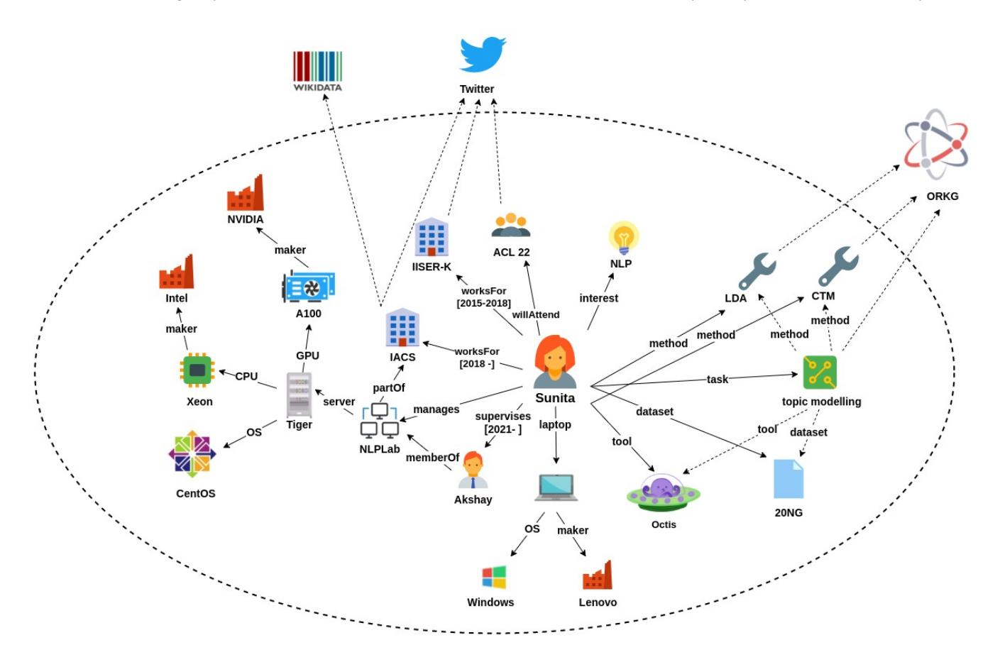
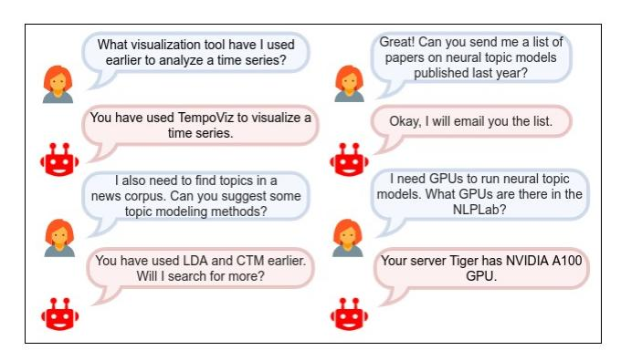
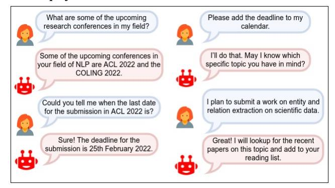

# Personal Research Knowledge Graphs

Prantika Chakraborty Indian Association for the Cultivation of Science Kolkata, India prantika.ch@gmail.com

Sudakshina Dutta Indian Institute of Technology Goa Ponda, India sudakshina@iitgoa.ac.in

Debarshi Kumar Sanyal Indian Association for the Cultivation of Science Kolkata, India debarshi.sanyal@iacs.res.in

# ABSTRACT

Maintaining research-related information in an organized manner can be challenging for a researcher. In this paper, we envision personal research knowledge graphs (PRKGs) as a means to represent structured information about the research activities of a researcher. PRKGs can be used to power intelligent personal assistants, and personalize various applications. We explore what entities and relations could be potentially included in a PRKG, how to extract them from various sources, and how to share a PRKG within a research group.

# CCS CONCEPTS

• Information systems → Entity relationship models; Data mining.

# KEYWORDS

Personal research knowledge graphs, personal knowledge graphs, scholarly data, entities and relations, knowledge representation

## ACM Reference Format:

Prantika Chakraborty, Sudakshina Dutta, and Debarshi Kumar Sanyal. 2022. Personal Research Knowledge Graphs. In Companion Proceedings of the Web Conference 2022 (WWW '22 Companion), April 25–29, 2022, Virtual Event, Lyon, France. ACM, New York, NY, USA, [6](#page-5-0) pages. [https://doi.org/10.1145/](https://doi.org/10.1145/3487553.3524654) [3487553.3524654](https://doi.org/10.1145/3487553.3524654)

# 1 INTRODUCTION

Research is a complex activity; it requires not only a thorough understanding of the problem under consideration, familiarity with the prior art, and innovation of new ideas to tackle the problem but often, also managing a research lab or collaboration. To help researchers in their daily chores and their long term quest, advanced tools like academic search engines and recommendation systems are available. These tools may be standalone applications or tied to scholarly digital libraries like ACM Digital Library[1](#page-0-0) or even online social networks like ResearchGate[2](#page-0-1) . Although many of these tools can provide personalized recommendations, their model of

WWW '22 Companion, April 25–29, 2022, Virtual Event, Lyon, France

© 2022 Association for Computing Machinery.

ACM ISBN 978-1-4503-9130-6/22/04. . . \$15.00

<https://doi.org/10.1145/3487553.3524654>

a specific researcher is heavily dependent on how the researcher interacts with the tool, and it is often not transparent to the end-user. It is natural to expect that the greater the access to the personal information of the researcher, the better the tools perform. For example, consider the following imagined scenario where Sunita, a computer scientist specialized in natural language processing (NLP), chats with her smart personal virtual assistant, SciJeeves. The researcher had used an uncommon visualization tool to analyze a temporal data series. Sometime later, she is again required to visualize a time series but she cannot recollect the name of the visualization tool. She asks SciJeeves: 'What visualization tool did I use earlier to analyze time series?' and it immediately responds with the correct name. The visualization tool, though uncommon or only privately available to the researcher, is frequently useful to her. Consider another query from the researcher: 'How many machines in my lab have NVIDIA RTX 2000 series GPU?' SciJeeves, being aware of the GPU configurations of the machines in the researcher's lab, is likely to offer a satisfactory response. Appendix [A.1](#page-4-0) shows more examples of conversations between Sunita and SciJeeves.

The above discussion motivates the need for a personal information system that captures the information that are relevant to the researcher rather than to the world at large. Knowledge graphs (KGs) [\[14\]](#page-4-1) are currently one of the most effective ways of organizing information and associated knowledge in the form of entities and their relations. Although there is a divergence of opinion regarding the definition of a KG [\[11,](#page-4-2) [16,](#page-4-3) [21\]](#page-4-4), we follow a fairly inclusive one from [\[11\]](#page-4-2): Suppose we denote the set of entities by E, and the set of relations by R. A fact is a triple (h,r,t) where h ∈ E, t ∈ E and r ∈ R. Let F denote the set of facts. Then, a knowledge graph is defined as G = {E, R, F }.

Existing KGs capture globally important objects like those found in Wikipedia[3](#page-0-2) or domain-specific resources like scholarly papers available on arXiv[4](#page-0-3) or freely available COVID-19 related papers [\[9\]](#page-4-5). But a scholarly knowledge graph built from a vast trove of research papers might not be sufficient to capture the information needs of a researcher. In the context of our examples above, a visualization tool that is privately available to the researcher and not mentioned in any paper is unlikely to be found in a public KG. Similarly, the configuration of the researcher's machine is not expected to be in a public KG. Even if the researcher uses a specific model like 'Dell OptiPlex 7780' which might occur in a public KG, it does not reveal that the researcher's lab uses it because that information is not important to the larger user base of the KG. If the researcher is a reputed scientist, even small details about her lab might interest the public; however, her privacy concerns might inhibit indexing them

1https://dl.acm.org/

2https://www.researchgate.net/

Permission to make digital or hard copies of all or part of this work for personal or classroom use is granted without fee provided that copies are not made or distributed for profit or commercial advantage and that copies bear this notice and the full citation on the first page. Copyrights for components of this work owned by others than ACM must be honored. Abstracting with credit is permitted. To copy otherwise, or republish, to post on servers or to redistribute to lists, requires prior specific permission and/or a fee. Request permissions from permissions@acm.org.

3[https://en.wikipedia.org/wiki/Main\\_Page](https://en.wikipedia.org/wiki/Main_Page)

4<https://arxiv.org/>

in a public KG. Nonetheless, if a KG contained these information, it would be useful to a smart virtual assistant that she uses.

To plug the gap between public KGs and a user-centric information system, Balog and Kenter [\[6\]](#page-4-6) advance the notion of a personal knowledge graph (PKG), defining it as 'a resource of structured information about entities personally related to its user, their attributes and the relations between them'. Every node of a PKG is connected directly or indirectly to a central node that represents the user, leading to a 'spider-web' structure of the graph. Balog and Kenter [\[6\]](#page-4-6) cite the example of a PKG that stores entities like 'acoustic-guitar' owned by the user and 'Mom's dentist' whom the user's mother consults. In contradistinction to a general-purpose KG, a PKG stores only those attributes of an entity (instead of all attributes) whose importance to the user is high. Further, entities as well as relations might be very short-lived.

In this vision paper, we define a PKG specifically for researchers. We call such a KG a personal research knowledge graph (PRKG). The information captured by a PRKG are constrained to relate to her research activities only, rather than to her larger personal sphere. Note that for a researcher, research is likely to be a professional activity; our use of the term personal research only intends to distinguish a given researcher's activities from those of others. By encoding personal information like her research interests, the computational tools used by her, and the specification of her lab equipment, a PRKG enables smart assistants to access a researcher's personal data to better respond to her research-related needs, and can even inspire new modes of researcher-machine interaction. PRKGs can be leveraged to personalize different scholarly applications like academic search engines (in customizing search results, query set expansion, etc.), recommendation systems (for papers, experts, and venues), and conversational chat-bots. When the user's personal data shared with these applications are sourced from a PRKG, the availability of the personal data is explainable to and controllable by the user. In this paper though we primarily consider PRKGs for computer scientists, researchers in other domains can also construct their own PRKGs.

In the rest of the article, we develop the novel idea of PRKGs in detail. In Section [2,](#page-1-0) we mention related works available in the literature. In Section [3,](#page-1-1) we identify potential content for a PRKG. In Section [4,](#page-3-0) we discuss methods to populate it, and in Section [5,](#page-3-1) we briefly discuss how to share PRKGs within a research group. Section [6](#page-3-2) concludes the paper.

# 2 RELATED WORK

Existing literature related to this paper cuts across knowledge graphs, personal knowledge graphs, and the extraction of entities and relations from scientific documents. Each of these areas is vast; so we will be brief and restrict the section to the research that is most closely connected with the present work.

Knowledge graphs. KGs are increasingly used to represent knowledge extracted from different sources; the representation takes the form of a graph – its nodes represent entities and each of its labeled directed edges identifies a relation between a pair of entities. A lucid tutorial on KGs appears in [\[16\]](#page-4-3) and a recent survey is presented in [\[21\]](#page-4-4). Open KGs such as DBpedia [\[3\]](#page-4-7), YAGO [\[30\]](#page-4-8), ORKG [\[20\]](#page-4-9) are publicly available and of utility to a broad user base, while enterprise

KGs like those of Google, LinkedIn and Bloomberg are visible only within a company and cater to the needs of the respective business. Many open KGs are published as Linked Open Data RDF graphs that can be accessed in a variety of ways including through SPARQL queries. Recently developed KGs that are focused specifically in the area of scientific research and aim to exploit the vast amount of data contained in research publications include AI-KG [\[8\]](#page-4-10) and AIDA [\[2\]](#page-4-11). Active research areas in KGs involve knowledge acquisition (i.e., entity and relation extraction from different sources for KG construction, and completing KGs to predict missing links), and building knowledge-aware applications like question-answering over KGs [\[21\]](#page-4-4).

Personal knowledge graphs. PKGs are proposed in [\[6\]](#page-4-6) as a structured model for organizing personal information of a user. The entities and relations in a PKG may not be of importance to other users. Open questions on PKGs include how to populate and maintain a PKG, how to evaluate it and how to utilize the knowledge captured in it. Follow-up work by other authors addressed some of these questions in specific settings. Since entities relevant to a PKG are often present in personal conversations, researchers have proposed methods to extract such entities from conversations [\[22,](#page-4-12) [31,](#page-4-13) [32\]](#page-4-14). Due to low availability of training data for the task, these works advocate machine learning models that can learn from frugal training sets. Vannur et al. [\[34\]](#page-4-15) discuss the difficulties of identifying fine-grained personal data entities (of types birth\_year, дender, etc.) and relations between persons in unstructured text corpora for PKG population, and demonstrate the use of rule-based annotators and a graph neural network for predicting missing links to populate a PKG from a given dataset. As regards the applications of PKGs, researchers have constructed PKGs to store health information of patients [\[1,](#page-4-16) [28\]](#page-4-17) and planned to employ PKGs for various conversational systems [\[4,](#page-4-18) [5\]](#page-4-19).

Extracting entities and relations from scientific documents. The PRKG we propose incorporates scientific entities and relations extracted from various sources. Entity and relation extraction from natural language text is an active area of research [\[24,](#page-4-20) [27\]](#page-4-21). Many recent works have focused on the scholarly domain. For example, given the abstract of an article, joint entity and relation extraction frameworks have successfully used LSTMs [\[25\]](#page-4-22), dynamic span graphs [\[26\]](#page-4-23), and pre-trained transformers [\[10,](#page-4-24) [29,](#page-4-25) [36\]](#page-4-26). Entity and relation extraction from full text of an article has also been considered [\[17–](#page-4-27)[19,](#page-4-28) [35\]](#page-4-29) where the focus has been to extract tasks, methods, metrics, and datasets, using deep neural networks. However, extraction of scholarly entities and relations from private sources like emails, conversations, or social media posts remains less explored.

# 3 WHAT'S IN A PRKG?

Broad types of entities. A PRKG belonging to a researcher contains information in the form of entities and their relationships that are of importance to the researcher. Entities in a PRKG may focus on the following aspects of the researcher: (1) Professional activities, (2) Personal as well as shared lab resources, (3) Fine-grained knowledge items related to her research. Entities that identify her professional activities are her own current and past affiliations; her research interests; her publications including papers, books and

<!-- Image Description: The image is a network diagram illustrating the research environment of a project. It depicts the relationships between Sunita (the researcher), hardware (CPU, GPU, laptop), software (OS, tools), datasets (20NG, Wikidata), methods (LDA, CTM), and institutions (IISER-K, ACL). Relationships like "worksFor," "manages," "memberOf," and "uses" are shown, connecting entities and illustrating the workflow and dependencies within the research process. The diagram’s purpose is to provide a visual overview of the research infrastructure and data flow. -->

Figure 1: PRKG for a computer scientist Sunita

patents she authored; the talks she has given; the projects in which she participated / participates as principal investigator / co-principal investigator or in any other capacity; the conferences she plans to attend; the books or journals she is reading; the openings in her lab; and the courses she is currently offering. A researcher is likely to manage various equipment in her lab, and along with her personal resources, they may be included in the PRKG. Most importantly, the knowledge graph contains fine-grained knowledge entities relevant to the researcher and relations between them. For example, for an NLP researcher, it may include (task,method,tool,dataset,metric) describing her current research task. Similarly, these related entities may be extracted from research papers authored or read by the researcher. Note that despite many recent initiatives like ORKG[5](#page-2-0) , OpenAlex[6](#page-2-1) and the now-retired Microsoft Academic Graph [\[12,](#page-4-30) [15\]](#page-4-31), we are not aware of any free open scholarly KG that contains finegrained knowledge entities and relations (not just metadata) from a sufficiently large scholarly corpus that is very likely to include every paper being read by any researcher. However, there are many tools to parse scholarly papers. So, we may use them to extract entities and relations from the papers relevant to the researcher and add them to her PRKG.

Most of the knowledge entities may be linked to external KGs like Wikidata[7](#page-2-2) or scholarly KGs like ORKG and AIKG[8](#page-2-3) , and to online social networks. We understand that some of these relations are time-dependent. For example, since the researcher has switched jobs, the relation 'worksFor' will have a start date and an end date. One way to capture the temporal information is to augment each relation with temporal information. Symbolically, if r ∈ R is a relation, it may be augmented to 'r : [t1,t2]' where t1 and t2 are start and end times (incorporated as attributes of the relation r), respectively, over which r is valid. The end time t2 is kept blank if the relation is still valid. Entities no longer relevant may even be removed. A simple way to implement a PRKG is to model it as a labeled property graph in Neo4j[9](#page-2-4) , and serialize it as an RDF graph for various downstream applications. Note that Neo4j is very flexible and allows one to create data (that is, nodes, relationships and properties) without defining a schema up front.

An example: Consider the PRKG shown in Fig. [1](#page-2-5) for a researcher Sunita. She is an Assistant Professor at IACS since 2018 and has worked for IISER Kolkata earlier. Note that 'worksFor' is a relation which is annotated with a duration. Sunita's research interests are in NLP. Her current work on topic modeling where she uses algorithms

5<https://www.orkg.org/orkg/>

6<https://openalex.org/>

7[https://www.wikidata.org/wiki/Wikidata:Main\\_Page](https://www.wikidata.org/wiki/Wikidata:Main_Page)

8<http://w3id.org/aikg>

9<https://neo4j.com/>

like latent Dirichlet allocation (LDA) and contextualized topic model (CTM) may be captured as the tuple (task,method,tool,dataset,metric), which easily translates to triples in the PRKG. In other words, the PRKG includes triples of the form ('Sunita', 'task', task), ('Sunita', 'method',method), ('Sunita', 'tool',tool), ('Sunita', 'dataset', dataset), and ('Sunita', 'metric', metric) where a relation (e.g., 'tool') may be understood to be prefixed with 'uses', which we omit for brevity. Since the method, tool, dataset and metric are related to the task in question, additional edges may be added to connect these entities to the task entity as shown by dotted lines in Figure [1.](#page-2-5) Entities in the PRKG may be linked to corresponding entities in public knowledge bases like Wikidata (e.g., IACS corresponds to [www.wikidata.org/wiki/Q3347871\)](www.wikidata.org/wiki/Q3347871), social networks like Twitter[10](#page-3-3) , and scholarly KGs like ORKG (e.g., LDA corresponds to [https://](https://www.orkg.org/orkg/resource/R111035) [www.orkg.org/orkg/resource/R111035\)](https://www.orkg.org/orkg/resource/R111035). External knowledge bases and reasoners can be used to connect more entities like 'pyLDAvis' (tool for topic visualization) to the task 'topic modeling'. However, unless Sunita has used them, they will not be connected to her in the PRKG. Appendix [A.2](#page-4-32) details the implementation of a PRKG.

# 4 POPULATING A PRKG

The entities and the relations in the PRKG may be either curated manually by the researcher or extracted automatically using NLP techniques from structured or unstructured sources through a software agent. While the former is less prone to errors, it requires more human intervention and is, therefore, less scalable than the latter. Information regarding her professional work including her affiliation, research interests, and publications may be primarily extracted from her curriculum vitae. Configuration of computers may be collected by installing an application in the respective devices. Extracting knowledge entities (like tasks and methods), and collecting the details of other equipment and ongoing professional activities (like planned talks) are trickier. We discuss below some mechanisms to extract these entities and relations.

Conversations between researcher and chat-bot. An AI chat-bot can mine personal information about a researcher by analyzing her conversions with it. For example, if the researcher utters informative statements like 'I work in topic modeling' or 'I used 20NG dataset for topic modeling' in a chat, the agent should be able to parse the assertions and extract entities from them. However, it relies heavily on the user making personal assertions during conversations with the agent. If such assertions are absent or infrequent, extraction will suffer from low recall. In such cases, the chat-bot may try to elicit personal information by proactively asking her probing questions like 'What problem are you working on currently?' or 'What software tools do you use in this task?'

Activity tracking. An interesting approach could be to track the activities of the researcher, such as the papers she downloads or the queries she enters in scholarly search engines, and extract entities from them. To reduce noise, the agent might ask the researcher for the validity of the triples about which its confidence is low, and curate the valid ones in the graph. This is similar to how applications like Google Scholar and ResearchGate suggest edits to a user's profile. Textual sources like emails between the researcher and her group can also be used as information sources. The AI agent may also be deployed in passive listening mode when the researcher and her team participate in technical meetings, and entities and relations may be extracted from the utterances. We have observed that research meetings sometimes happen in informal settings in a mix of English and vernacular languages. This implies that the AI agent should be able to parse multilingual conversations. However, before adopting any of the above mechanisms, the privacy concerns of the researcher should be thoroughly considered.

Extraction from papers. Recent papers authored by the researcher are authoritative sources of entities of her interest. But using only published works might delay the extraction of entities that relate to her ongoing research. To mitigate this problem, the chat-bot may be allowed to read the early drafts of her manuscripts. Unlike the first mechanism above, leveraging manuscripts as data source will allow the identification of more fine-grained entities like performance scores, keyphrases, keystone citations, and future work, without burdening the researcher with too many probing questions to be answered manually.

Finally, symbolic and neural algorithms may be used to generate more relations among the existing entities and derive new knowledge from a PRKG [\[7\]](#page-4-33).

# 5 SHARING A PRKG

In many cases, especially in experimental sciences, research is a group activity. So a natural question is, can a researcher share her PRKG with other members of her group, while preferring to keep some of the information in it hidden from them? One way is to incorporate role-based access control into the KG, where each group member will be assigned a role which determines how they can access (read/write/append/control[11](#page-3-4)) the graph and its individual components (relations, node types, nodes, properties, etc.). For example, a researcher may share most of her PRKG with a collaborator but may not want the latter to know the papers she is reviewing. Following role-based access control (RBAC) model [\[13\]](#page-4-34), a role 'collaborator' may be created and assigned 'read' access on the whole PRKG except the node denoting the paper to be reviewed. Support for fine-grained access control is limited in off-the-shelf graph databases; e.g., commercial versions of Neo4j support RBAC on the graph schema but not at the node instance level [\[33\]](#page-4-35).

# 6 CONCLUSION

We have presented personal research knowledge graphs as a structured organization of machine-actionable knowledge about a researcher. We have discussed the potential content of such a knowledge graph, how to populate it, and how to share it to a research group. We believe a PRKG will be extremely useful in designing personalized forms of knowledge-aware applications like scholarly search engines, conversational AI agents, and recommendation systems, that in turn can greatly assist a researcher in her everyday chores. However, accurate and timely collection of personally relevant entities and relations from diverse sources is a non-trivial challenge. Since a PRKG stores personal data, security and privacy must be given utmost priority when implementing, deploying, and

10<https://twitter.com>

11<https://www.w3.org/wiki/WebAccessControl>

sharing it. In the near future, we plan to design a framework with which researchers can create PRKGs easily. We also aim to implement an AI chat-bot powered by the knowledge in a PRKG. We hope this paper will spark further discussions on PRKGs and informed research on personalized virtual assistants for researchers.

# REFERENCES

- [1] Nariman Ammar, James E Bailey, Robert L Davis, and Arash Shaban-Nejad. 2021. Using a Personal Health Library–Enabled mHealth Recommender System for Self-Management of Diabetes Among Underserved Populations: Use Case for Knowledge Graphs and Linked Data. Journal of Medical Internet Research (JMIR) Formative Research 5, 3 (2021), e24738.
- [2] Simone Angioni, Angelo Salatino, Francesco Osborne, Diego Reforgiato Recupero, and Enrico Motta. 2021. AIDA: a Knowledge Graph about Research Dynamics in Academia and Industry. Quantitative Science Studies (11 2021), 1–43.
- [3] Sören Auer, Christian Bizer, Georgi Kobilarov, Jens Lehmann, Richard Cyganiak, and Zachary Ives. 2007. DBpedia: A nucleus for a web of open data. In The Semantic Web. Springer, 722–735.
- [4] Krisztian Balog. 2021. Conversational AI from an Information Retrieval Perspective: Remaining Challenges and a Case for User Simulation. In Proceedings of the Second International Conference on Design of Experimental Search & Information REtrieval Systems (CEUR Workshop Proceedings, Vol. 2950), Omar Alonso, Stefano Marchesin, Marc Najork, and Gianmaria Silvello (Eds.). 80–90.
- [5] Krisztian Balog, Lucie Flekova, Matthias Hagen, Rosie Jones, Martin Potthast, Filip Radlinski, Mark Sanderson, Svitlana Vakulenko, and Hamed Zamani. 2020. Common Conversational Community Prototype: Scholarly Conversational Assistant. arXiv preprint arXiv:2001.06910 (2020).
- [6] Krisztian Balog and Tom Kenter. 2019. Personal knowledge graphs: A research agenda. In Proceedings of the 2019 ACM SIGIR International Conference on Theory of Information Retrieval. 217–220.
- [7] Xiaojun Chen, Shengbin Jia, and Yang Xiang. 2020. A review: Knowledge reasoning over knowledge graph. Expert Systems with Applications 141 (2020), 112948.
- [8] Danilo Dessì, Francesco Osborne, Diego Reforgiato Recupero, Davide Buscaldi, Enrico Motta, and Harald Sack. 2020. AI-KG: An Automatically Generated Knowledge Graph of Artificial Intelligence. In The Semantic Web.
- [9] Daniel Domingo-Fernández, Shounak Baksi, Bruce Schultz, Yojana Gadiya, Reagon Karki, Tamara Raschka, Christian Ebeling, Martin Hofmann-Apitius, and Alpha Tom Kodamullil. 2021. COVID-19 Knowledge Graph: a computable, multi-modal, cause-and-effect knowledge model of COVID-19 pathophysiology. Bioinformatics 37, 9 (2021), 1332–1334.
- [10] Markus Eberts and Adrian Ulges. 2020. Span-based Joint Entity and Relation Extraction with Transformer Pre-training. Proceedings of the 24th European Conference on Artificial Intelligence.
- [11] Lisa Ehrlinger and Wolfram Wöß. 2016. Towards a Definition of Knowledge Graphs. SEMANTiCS (Posters and Demos) 48, 1-4 (2016), 2.
- [12] Michael Färber. 2019. The Microsoft academic knowledge graph: a linked data source with 8 billion triples of scholarly data. In ISWC. Springer, 113–129.
- [13] David Ferraiolo, D Richard Kuhn, and Ramaswamy Chandramouli. 2003. Rolebased access control. Artech house.
- [14] Claudio Gutiérrez and Juan F Sequeda. 2021. Knowledge graphs. Commun. ACM 64, 3 (2021), 96–104.
- [15] Drahomira Herrmannova and Petr Knoth. 2016. An analysis of the Microsoft academic graph. D-lib Magazine 22, 9/10 (2016), 37.
- [16] Aidan Hogan, Eva Blomqvist, Michael Cochez, Claudia d'Amato, Gerard de Melo, Claudio Gutierrez, Sabrina Kirrane, José Emilio Labra Gayo, Roberto Navigli, Sebastian Neumaier, et al. 2021. Knowledge graphs. Synthesis Lectures on Data, Semantics, and Knowledge 12, 2 (2021), 1–257.
- [17] Yufang Hou, Charles Jochim, Martin Gleize, Francesca Bonin, and Debasis Ganguly. 2021. TDMSci: A Specialized Corpus for Scientific Literature Entity Tagging of Tasks Datasets and Metrics. In Proceedings of the 16th Conference of the European Chapter of the Association for Computational Linguistics: Main Volume. ACL, Online, 707–714.
- [18] Kung-Hsiang Huang, Sam Tang, and Nanyun Peng. 2021. Document-level Entitybased Extraction as Template Generation. In Proceedings of the 2021 Conference on Empirical Methods in Natural Language Processing.
- [19] Sarthak Jain, Madeleine van Zuylen, Hannaneh Hajishirzi, and Iz Beltagy. 2020. SciREX: A Challenge Dataset for Document-Level Information Extraction. In Proceedings of the 58th Annual Meeting of the Association for Computational Linguistics. ACL, Online, 7506–7516.
- [20] Mohamad Yaser Jaradeh, Allard Oelen, Kheir Eddine Farfar, Manuel Prinz, Jennifer D'Souza, Gábor Kismihók, Markus Stocker, and Sören Auer. 2019. Open research knowledge graph: next generation infrastructure for semantic scholarly knowledge. In Proceedings of the 10th International Conference on Knowledge Capture. 243–246.

- [21] Shaoxiong Ji, Shirui Pan, Erik Cambria, Pekka Marttinen, and S Yu Philip. 2021. A survey on knowledge graphs: Representation, acquisition, and applications. IEEE Transactions on Neural Networks and Learning Systems (2021).
- [22] Hideaki Joko, Faegheh Hasibi, Krisztian Balog, and Arjen P. de Vries. 2021. Conversational Entity Linking: Problem Definition and Datasets. ACM, 2390–2397.
- [23] Young-Suk Lee, Wu Sok Yi, Stephanie Seneff, and Clifford J. Weinstein. 2001. Interlingua-Based Broad-Coverage Korean-to-English Translation in CCLINC. In Proceedings of the First International Conference on Human Language Technology Research.
- [24] Jing Li, Aixin Sun, Jianglei Han, and Chenliang Li. 2020. A survey on deep learning for named entity recognition. IEEE Transactions on Knowledge and Data Engineering (2020).
- [25] Yi Luan, Luheng He, Mari Ostendorf, and Hannaneh Hajishirzi. 2018. Multi-Task Identification of Entities, Relations, and Coreference for Scientific Knowledge Graph Construction. In Proceedings of the 2018 Conference on Empirical Methods in Natural Language Processing. 3219–3232.
- [26] Yi Luan, Dave Wadden, Luheng He, Amy Shah, Mari Ostendorf, and Hannaneh Hajishirzi. 2019. A general framework for information extraction using dynamic span graphs. In Proceedings of the 2019 Conference of the North American Chapter of the Association for Computational Linguistics: Human Language Technologies, Volume 1 (Long and Short Papers). 3036–3046.
- [27] Sachin Pawar, Girish K. Palshikar, and Pushpak Bhattacharyya. 2017. Relation Extraction : A Survey. CoRR abs/1712.05191 (2017). arXiv[:1712.05191](https://arxiv.org/abs/1712.05191)
- [28] Nidhi Rastogi and Mohammed J Zaki. 2020. Personal Health Knowledge Graphs for Patients. arXiv preprint arXiv:2004.00071 (2020).
- [29] TYSS Santosh, Prantika Chakraborty, Sudakshina Dutta, Debarshi Kumar Sanyal, and Partha Pratim Das. 2021. Joint Entity and Relation Extraction from Scientific Documents: Role of Linguistic Information and Entity Types. In Proceedings of the 2nd Workshop on Extraction and Evaluation of Knowledge Entities (EEKE), co-located with the 2021 ACM/IEEE Joint Conference on Digital Libraries (JCDL) (CEUR Workshop Proceedings, Vol. 3004). 15–19.
- [30] Fabian M Suchanek, Gjergji Kasneci, and Gerhard Weikum. 2007. YAGO: a core of semantic knowledge. In Proceedings of the 16th International Conference on World Wide Web. 697–706.
- [31] Anna Tigunova. 2020. Extracting personal information from conversations. In Companion Proceedings of the Web Conference 2020. 284–288.
- [32] Anna Tigunova, Paramita Mirza, Andrew Yates, and Gerhard Weikum. 2021. PRIDE: Predicting Relationships in Conversations. In Proceedings of the 2021 Conference on Empirical Methods in Natural Language Processing. 4636–4650.
- [33] Marco Valzelli, Andrea Maurino, and Matteo Palmonari. 2020. A Fine-grained Access Control Model for Knowledge Graphs. In Proceedings of the 17th International Conference on Security and Cryptography. 595–601.
- [34] Lingraj S. Vannur, Balaji Ganesan, Lokesh Nagalapatti, Hima Patel, and M. N. Tippeswamy. 2021. Data Augmentation for Fairness in Personal Knowledge Base Population. In Pacific-Asia Conference on Knowledge Discovery and Data Mining (PAKDD Workshops). 143–152.
- [35] Vijay Viswanathan, Graham Neubig, and Pengfei Liu. 2021. CitationIE: Leveraging the Citation Graph for Scientific Information Extraction. In Proceedings of the 59th Annual Meeting of the Association for Computational Linguistics and the 11th International Joint Conference on Natural Language Processing. 719–731.
- [36] David Wadden, Ulme Wennberg, Yi Luan, and Hannaneh Hajishirzi. 2019. Entity, Relation, and Event Extraction with Contextualized Span Representations. In Proceedings of the 2019 Conference on Empirical Methods in Natural Language Processing and the 9th International Joint Conference on Natural Language Processing. 5788–5793.

# A APPENDIX

# A.1 Conversations with AI Chat-bot

We present sample conversations between the computer scientist Sunita and her conversational AI assistant SciJeeves in Figures [2a](#page-5-1) and [2b.](#page-5-1) It shows how the knowledge in the PRKG maintained by Sunita is harnessed by SciJeeves to answer her queries and provide helpful suggestions. Note that these are imagined dialogues mentioned to illustrate how an agent can help a researcher.

# A.2 Implementation of a PRKG

We present the prototype of a PRKG in Fig. [3](#page-5-2) that we have implemented in the Enterprise edition of Neo4j Browser 4.4.0 included in Neo4j Desktop 1.4.10. The user of this PRKG is Sunita, a computer scientist working in NLP. In order to populate this PRKG, we

WWW '22 Companion, April 25–29, 2022, Virtual Event, Lyon, France Chakraborty, Dutta, Sanyal

<!-- Image Description: The image displays a conversation between a user and a chatbot. The dialogue uses speech bubbles to illustrate questions about data analysis techniques. The user inquires about visualization tools (TempoViz), topic modeling methods (LDA, CTM), and available GPUs (NVIDIA A100) for neural topic modeling. The chatbot responds, providing information relevant to the user's research needs. The image visually represents a research workflow and resource utilization. -->

(a) Conversation 1: Sunita had worked on topic modeling and timeseries analysis in a previous project. Now, she plans to work on a project on analysis of a news corpus. She chats with SciJeeves about the new project.

<!-- Image Description: This image depicts a sample dialogue between a user and a chatbot. The conversation is presented as a series of speech bubbles, illustrating a question-answer format. The user requests information on NLP conferences and deadlines, and the chatbot responds, demonstrating its ability to access and provide relevant information, even adding deadlines to a calendar. The image visually showcases the chatbot's functionality in a user-friendly interaction. -->

(b) Conversation 2: Sunita chats with SciJeeves about the upcoming conferences in her field and her new project.

Figure 2: Example conversations between Sunita , a computer scientist, and SciJeeves , a personalised virtual assistant for researchers.

have taken a subset of the PRKG as described in Sec. [3,](#page-1-1) which includes the facts ('Sunita', 'interest', 'NLP') and ('Sunita', 'manages', 'NLPLab'). We have employed SpERT [\[10\]](#page-4-24) for entity and relation extraction from scholarly papers. We trained SpERT on the SciERC [\[25\]](#page-4-22) dataset and used it on the papers read by Sunita. For example, we extracted the entities task and method from the statement "High quality translation via word sense disambiguation and accurate word order generation of the target language." that appears in the abstract of the paper [\[23\]](#page-4-36). These are included in the PRKG as facts ('CCLINC', 'task', 'translation') and ('translation', 'method', 'word sense disambiguation'), where CCLINC[\[23\]](#page-4-36) denotes the above paper. Fig. [3](#page-5-2) shows that Sunita is the writer of a paper labeled as 'SpERT.PL' as shown by the triple ('Sunita', 'writes', 'SpERT.PL'), and reviewer of a paper 'ScienceKG' as shown by ('Sunita', 'reviewerOf', 'ScienceKG'). She is also a member of a PhD selection committee as shown by ('Sunita', 'memberOf', 'PhDSel').

In order to make a provision for Sunita to share her PRKG with her collaborators and other research scholars in her group, we have used RBAC to restrict the collaborators' access to Sunita's

## Figure 3: PRKG for a computer scientist Sunita, as implemented in Neo4j.

confidential information. First, we have created a role 'collaborator' giving the collaborator all the access to the PRKG that an admin (here, Sunita) of the PRKG would have.

### CREATE ROLE collaborator AS COPY OF admin;

Here admin is an in-built role in Neo4j who is given complete access to the current graph database. But we have restricted the collaborator from viewing the nodes selComm representing the selection committees (like the PhD Selection Committee) that she is a part of, using the following command in Neo4j:

DENY MATCH {\*} ON GRAPH prkg NODE selComm TO collaborator;

We have denied viewership of the papers that are being reviewed by Sunita, to the collaborator, using the following command:

# DENY TRAVERSE ON GRAPH prkg RELATIONSHIP reviewerOf TO collaborator;

We have further made sure that the collaborator is unable to make any kind of modification, update or deletion to Sunita's PRKG:

## DENY WRITE {\*} ON GRAPH prkg TO collaborator

One restriction for the collaborator that we will like to bring into effect as part of the RBAC implemented here, is the prevention of 'read' access of the papers that are currently being written by Sunita but have not been accepted or published yet. This can be distinguished using the node level property status that each paper node will be assigned. This property can take the value of 'published', 'accepted', 'underReview' or 'inProgress'. Presently Neo4j does not allow the implementation of property level RBAC on nodes and relationships, and so we will be trying to implement it as a future work.

