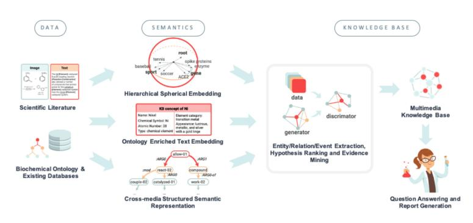

# Defining a Knowledge Graph Development Process Through a Systematic Review

[GYTE TAMAŠAUSKAIT](https://orcid.org/0000-0001-9033-4976) ˙ E˙ and [PAUL GROTH,](https://orcid.org/0000-0003-0183-6910) University of Amsterdam, Netherlands

Knowledge graphs are widely used in industry and studied within the academic community. However, the models applied in the development of knowledge graphs vary. Analysing and providing a synthesis of the commonly used approaches to knowledge graph development would provide researchers and practitioners a better understanding of the overall process and methods involved. Hence, this article aims at defining the overall process of knowledge graph development and its key constituent steps. For this purpose, a systematic review and a conceptual analysis of the literature was conducted. The resulting process was compared to case studies to evaluate its applicability. The proposed process suggests a unified approach and provides guidance for both researchers and practitioners when constructing and managing knowledge graphs.

CCS Concepts: • **Software and its engineering**→**Software development process management**; • **Computing methodologies**→*Ontology engineering*; *Semantic networks*; • **Information systems**→*Semantic web description languages*; *Information integration;*Additional Key Words and Phrases: Knowledge graphs, knowledge graph construction, development process semantic network, information integration

## ACM Reference format:

Gyte Tamašauskait ˙ e and Paul Groth. 2023. Defining a Knowledge Graph Development Process Through a ˙ Systematic Review.*ACM Trans. Softw. Eng. Methodol.*32, 1, Article 27 (February 2023), 40 pages. <https://doi.org/10.1145/3522586>

## 1 INTRODUCTION

Knowledge graphs—graph-structured knowledge bases [\[57\]](#page-37-0)—are widely employed to represent structured knowledge and perform a variety of AI driven tasks in the context of diverse, dynamic, and large-scale data [\[32,](#page-36-0) [87\]](#page-38-0). Given this increasing adoption, there is a need for guidance on knowledge graph development that would assist researchers, developers, and engineers in the process of creating and maintaining knowledge graphs [\[9\]](#page-35-0). While there are descriptions of methods for knowledge graph development [\[37,](#page-36-0) [80\]](#page-38-0), that outline the necessary steps to take in order to develop a knowledge graph, these methods vary per article and there is a lack of a*global view*of the development of these software artifacts.

While generally applicable development processes exist in such areas as software development [\[3\]](#page-34-0), ontology construction [\[26\]](#page-35-0), and knowledge engineering [\[64\]](#page-37-0); it is unclear to what extent these existing theories can be directly applied to knowledge graph development, due to the complex combination of data and software used for their construction. Indeed, from a software engineering

Authors' address: G. Tamašauskaite and P. Groth, University of Amsterdam, Faculty of Science, Postbus 94323 1090 GH, ˙ Amsterdam, Netherlands; emails: gyte.tama@gmail.com, p.t.groth@uva.nl.

[This work is licensed under a Creative Commons Attribution International 4.0 License.](https://creativecommons.org/licenses/by/4.0/)

© 2023 Copyright held by the owner/author(s). 1049-331X/2023/02-ART27 <https://doi.org/10.1145/3522586>

<!-- Image Description: This figure is a knowledge graph depicting Albert Einstein's life and career. Nodes represent entities (e.g., Einstein, Physics, University of Zurich), and edges represent relationships (e.g., SonOf, ProposedBy, WinnerOf). The graph visualizes biographical details, academic affiliations, and his contribution to physics, specifically his theory of relativity and Nobel Prize win. It illustrates the interconnectedness of these aspects within a structured knowledge representation. -->

Fig. 1. Entities and relations in a knowledge graph [\[37\]](#page-36-0).

perspective, knowledge graphs provide a fascinating area for study given their inherent combination of software, data, and often human components.

Thus, considering the growth of knowledge graphs and a lack of global process view of their development, this article focuses on formulating key process steps when managing the construction and maintenance of knowledge graphs. Specifically, this article contributes a:*A synthesis of common steps in knowledge graph development described in the academic literature.* The aim is to provide guidance for both academia and industry in planning and managing the process of knowledge graph development. Moreover, we hope this analysis can provide for a better understanding of how other development lifecycles can be applied to knowledge graphs.

This article is structured as follows: Section 2 covers related work in the area of knowledge graphs. Then, the methodology behind the systematic review is presented in Section [3.](#page-3-0) This is followed by the results of the review, in Section [4,](#page-6-0) which describe the proposed knowledge graph development process, its steps, and how they interrelate. The process is assessed by mapping the proposed steps to the case studies in Section [5.](#page-11-0) Finally, Section [6](#page-14-0) discusses the strengths and limitations of the research. Section [7](#page-16-0) outlines the main findings and future work.

## 2 RELATED WORK

This section presents knowledge graphs, trends in their development and development practices more broadly.

## 2.1 Knowledge Graphs

The term "knowledge graph" was first used in 1972; however, it became widely adopted after 2012, following the announcement of the Google Knowledge Graph [\[1,](#page-34-0) [29\]](#page-36-0). This event also led to the growth of the development and use of knowledge graphs in industry [\[27,](#page-36-0) [32,](#page-36-0) [58\]](#page-37-0).

The term "knowledge graph" can be defined as "a graph of data intended to accumulate and convey knowledge of the real world, whose nodes represent entities of interest and whose edges represent relations between these entities" [\[32\]](#page-36-0). Thus, knowledge graphs are structured to represent facts that cover entities, relations, and semantic descriptions [\[37\]](#page-36-0). Knowledge graphs can be formally defined as a directed graph (*G*), where*G* = (*V*, *E*) [\[2\]](#page-34-0). *V* refers to the vertices (*V*) or nodes that represent the real-world entities. *E* refers to the edges (*E*) or links between the nodes that represent the relations between the entities. Commonly, entities and their relations are presented as triples (subject, predicate, and object) [\[2\]](#page-34-0) and in graph form (see Figure 1).

Knowledge graphs are used for multiple tasks, including search and querying (e.g., Google, Bing), serving as a semantic database (e.g., Wikidata), and big data analytics (e.g., Walmart) [\[87\]](#page-38-0). In

practice, the literature distinguishes between two types of knowledge graphs—generic knowledge graphs and domain-specific knowledge graphs [\[2\]](#page-34-0). The first type provides access to multiple domains, commonly with encyclopedic content, e.g., Wikidata [\[71\]](#page-38-0), YAGO [\[68\]](#page-38-0), and DBpedia [\[7,](#page-34-0) [44\]](#page-36-0). The second type is focused on a more narrow domain, often for a specific problem or industry [\[2\]](#page-34-0). In this article, both types are included in the analysis to ensure a broad overview of the field.

## 2.2 Trends in Knowledge Graph Development

Knowledge graph development is commonly categorised into two types, either as top-down or bottom-up [\[2,](#page-34-0) [23,](#page-35-0) [45,](#page-36-0) [92\]](#page-39-0). The top-down approach refers to when the ontology (or data schema) is defined first and, based on the ontology, knowledge is extracted [\[45\]](#page-36-0). The bottom-up approach refers to when the knowledge is extracted from data and, based on the data, the ontology of the knowledge graph is defined [\[45\]](#page-36-0).

Current research presents multiple instances of how knowledge graphs can be developed [\[37,](#page-36-0) [80,](#page-38-0) [87,](#page-38-0) [88\]](#page-39-0). However, it commonly focuses on state-of-the-art techniques (e.g., machine-learning and other advanced algorithms) that can be used in the development of knowledge graphs rather than the *overall process of knowledge graph development*.

For example, the techniques discussed in one study [\[87\]](#page-38-0) include data extraction from various sources, harvesting relations between entities, building rules and inference, as well as storage and management of the knowledge graph. In another study [\[80\]](#page-38-0), the techniques are grouped differently—knowledge integration, entity discovery and typing, entity canonicalisation, construction of attributes and relationships, open schema construction, and knowledge base curation. Yet, another study [\[88\]](#page-39-0) focuses on the techniques of structured knowledge extraction, classification and non-classification relationship extraction, and graph optimisation. Thus, there are both different approaches to as well as different vocabularies used with respect to knowledge graph development.

Therefore, this article focuses on reviewing different knowledge graph development processes presented in the literature. It contributes to the field by providing a summary of how knowledge graphs are being constructed as well as providing a synthesized description of the process.

## 2.3 Applicability of Existing Development Processes

Similar processes of development are described in other areas of computer science, for example, in software engineering or ontology construction.

In software engineering, there are several development life cycles, e.g., waterfall, V-model, incremental, iterative, and spiral [\[3\]](#page-34-0). While, in general, these life cycles could be applied when developing the knowledge graph; it is not known to what extent it could cover the specific requirements of the knowledge graph development.

In ontology construction, there are also several approaches, such as the Cyc method, Uschold and King's method, the Grüninger and Fox's methodology, the KACTUS approach, METHONTO-LOGY, and others [\[26\]](#page-35-0). Ontologies and knowledge graphs have similarities, though, ontologies primarily focus on capturing the knowledge models (i.e., data models), while knowledge graphs primarily focus on capturing the large amounts of data itself [\[63\]](#page-37-0). Additionally, ontology construction is commonly seen as one of the steps in knowledge graph development [\[23,](#page-35-0) [92\]](#page-39-0). Thus, it is not apparent whether ontology construction methodologies are fully suitable for knowledge graph development.

While it is useful to understand these existing approaches; it is also beneficial to take into account the specificity of knowledge graph development. Understanding how knowledge graphs are developed allows for better insights into how these existing approaches can be applied.

<!-- Image Description: This flowchart details a systematic literature review process. It shows the selection of papers, starting from 683,953+2,598,289 records identified from various databases and other sources. The process includes screening, retrieval, eligibility assessment steps, with numbers of records/papers at each stage indicated (n=...). Ultimately, 57 papers were included in the review, with losses due to irrelevance and insufficient information clearly documented. -->

Fig. 2. The PRISMA workflow of selecting articles for the systematic review.

## 3 METHODOLOGY

To understand the overall process of knowledge graph development, we conducted a systematic review of the literature to understand the key process steps—identifying, describing, and integrating these concepts. To evaluate the applicability of the process, we compared it to real-world case studies. The methodology was designed based on the principles for systematic reviews in software engineering [\[43\]](#page-36-0) and the main phases of the conceptual framework analysis [\[35\]](#page-36-0).

The following sections present the details of how the data collection and data analysis were conducted as well as the evaluation approach.

## 3.1 Data Collection

As a basis for this article, relevant and recent research articles were collected and analysed. The overall flow of selecting articles for the systematic review is presented in Figure 2 as a PRISMA workflow [\[60\]](#page-37-0). The data collection and screening was performed by a single author with checks in terms of protocol conducted by the other author.

*Data sources.*Articles were collected from eight online well-established data sources for academic research (ACM Digital Library, IEEExplore, ScienceDirect, arXiv, SpringerLink, Zeta Alpha-AI Research Navigator, Semantic Scholar, and Google Scholar) within the period of March-April 2021. The majority of the sources are recommended in particular when performing software engineering reviews [\[43\]](#page-36-0).
*Inclusion and exclusion criteria.*For the search, two keywords were used:*knowledge graph development*and*knowledge graph construction*. Only articles from 2012 onward were considered as

| Year                   | Count of articles |  |  |  |
|------------------------|-------------------|--|--|--|
| 2016                   | 1                 |  |  |  |
| 2017                   | 5                 |  |  |  |
| 2018                   | 10                |  |  |  |
| 2019                   | 11                |  |  |  |
| 2020                   | 24                |  |  |  |
| 2021                   | 6                 |  |  |  |
| Type of article        |                   |  |  |  |
| Domain-specific        | 47                |  |  |  |
| Methodological         | 10                |  |  |  |
| Type of KG development |                   |  |  |  |
| Bottom-up              | 41                |  |  |  |
| Top-down               | 16                |  |  |  |

Table 1. Summary Details of the Selected Articles

the growth of the topic started in 2012 with the announcement of Google Knowledge Graph [\[32\]](#page-36-0). Only articles in English were reviewed. The first most relevant (as determined by the data source's ranking) 50 articles per source were screened, setting a threshold for prioritising the review of articles due to a large number of identified articles and decreasing relevancy of search results [\[59\]](#page-37-0).

First, the title and abstract were screened to determine whether the article covers the knowledge graph development. Then, the content of the article was skimmed to assess if it covers the explicit process steps. If the article met these criteria, it was added to the reference management system for further analysis.

Considering that the articles were chosen from credible sources and that the articles focused on knowledge graphs as a result, rather than reflecting on its development process, the evaluation of the experimental results of the articles was not performed.

*Search outcome.* Overall, 57 articles were selected for the analysis ranging from 2016 to 20211 (the full list is in Appendix [A\)](#page-17-0), that given focused time period ensures that the totality of relevant articles are covered. The distribution of the year of publication is presented in Table 1.

The majority of the articles were covering the development of domain-specific knowledge graphs (Table 1). These articles focus on presenting knowledge graphs built for a specific purpose and what techniques were used for their development. Another type of article was categorised as methodological, presenting a more theoretical overview of knowledge graphs and development methods.

Furthermore, the majority of articles covered bottom-up knowledge graph development approach (Table 1). Although the majority of articles do not indicate the type of the development approach used; the distinction was made by determining whether the ontology development was done or not as the first step of knowledge graph development.

After having selected the articles, the required data was extracted from the articles and analysed in multiple iterations. As a first iteration, the type of the article, the type of the knowledge graph development process, and the process itself were written down. Then, an extensive list of the process' steps was compiled.

1Note that during screening no relevant articles from 2012 to 2016 were identified and, thus, not included in this review. While there are a number of articles on knowledge graphs in 2012–2016, the main focus of these articles is on technological or theoretical analysis of knowledge instead of presenting the development process.

ACM Transactions on Software Engineering and Methodology, Vol. 32, No. 1, Article 27. Publication date: February 2023.

<!-- Image Description: The image is a hierarchical outline detailing the steps in knowledge graph construction. It outlines the process from data source to knowledge graph storage, breaking down "Knowledge Graph Building" into sub-tasks like reasoning and inference, relation extraction (with specific techniques listed), and entity extraction. Level indicators (I, II, III) denote hierarchy depth within the process. No diagrams or equations are present; it's purely textual. -->

Fig. 3. Example of recorded process steps from [\[87\]](#page-38-0).

<!-- Image Description: The flowchart details the methodology for creating a knowledge graph. It begins with 620 initially extracted steps and 47 process figures. After removing synonyms, 414 steps remain. The most frequent steps are then identified to create a draft knowledge graph (5 level I, 18 level II steps), refined further by describing steps per article, resulting in a final graph (6 level I, 11 level II steps). The numbers in parentheses represent the count of different process steps at each stage. -->

Fig. 4. Workflow of data analysis.

The processes were of different granularity, some including the algorithms and techniques used in the knowledge graph construction as steps, while others only indicated the main phases. The process steps were written out in three different levels, specifying the more generic steps and what they consist of (see Figure 3). Level I steps provide a more generic description of the step, Level II steps specify Level I tasks into smaller stages, while Level III steps are specific and focus on describing the algorithms and techniques used.

## 3.2 Data Analysis

The overall data analysis workflow is presented in Figure 4 that describes how steps of knowledge graph development were extracted and processed.

Initially, a total of 620 steps of all levels were indicated, of which 519 steps were unique. However, some steps were synonymous to each other; thus, the list was manually amended by changing similar tasks to the same expressions, e.g.,*relationship extraction*was changed to*relation extraction*; *data*, *data input*and similar were changed to*data source*. After adjusting the synonyms, there were 414 unique values in the final list, of which 182 were of level I, 196 of level II, and 60 of level III.

<!-- Image Description: This flowchart details a six-stage process for constructing and maintaining a knowledge graph (KG). It begins with data identification, followed by KG ontology construction (if necessary) and knowledge extraction. Subsequent stages involve knowledge processing, KG construction (storage and display), and finally, KG maintenance through evaluation and updates. Each stage is further broken down into sub-steps. The flowchart illustrates the workflow, highlighting the sequential and conditional dependencies between steps. -->

Fig. 5. The proposed knowledge graph development process.

The III level steps were specific, indicating the algorithms and techniques used, thus, were not considered in further analysis. The full list of process steps is available in a dataset repository.2

The frequency of each step was counted to determine the most common steps in the knowledge graph development. This was used as guidance in formulating the general process steps. Additionally, the process figures were extracted from each article, which allowed analysis of how the process is presented visually (Appendix [C](#page-20-0) and dataset repository).

Using information about frequent steps and the visually presented processes, the first process draft of the knowledge graph development was prepared. Then, having these steps, each article was reviewed again in order to record the relevant data per each indicated process step.

Finally, using the described steps of the knowledge graph development process and the visual representations of the processes, the final proposed process was developed and is described in more detail in the following section.

## 3.3 Evaluation through Case Studies

In order to evaluate the applicability and generalisability of the proposed knowledge graph development process, a comparison to case studies was carried out. The proposed process was compared and mapped to real-life knowledge graphs, and how they are constructed and maintained. The evaluation covers the comparison of two types of knowledge graphs—generic open knowledge graphs and domain-specific knowledge graphs. As a result, this evaluation provided insights on to what extent the proposed process is suitable and relevant to real life examples, as well as possible areas for future work with respect to development lifecycles.

## 4 RESULTS

The knowledge graph development process based on the review and analysis of the selected articles is presented in Figure 5. The process consists of six main steps: (i) Identify data, (ii) Construct the knowledge graph ontology, (iii) Extract knowledge, (iv) Process knowledge, (v) Construct the knowledge graph, and (vi) Maintain the knowledge graph. The process incorporates both top-down and bottom-up approaches. Each step and its sub-steps are described in the following sections.

## 4.1 Identify Data

The objective of this step is to identify a domain of interest, a data source, and a way of data acquisition. As mentioned before, knowledge graphs can either be generic or domain-specific [\[2,](#page-34-0) [32\]](#page-36-0). Usually, generic knowledge graphs cover multiple domains and are publicly available, while domainspecific knowledge graphs are for specific domain or problem and commonly used in organisations

[2https://zenodo.org/record/5608878.](https://zenodo.org/record/5608878)

ACM Transactions on Software Engineering and Methodology, Vol. 32, No. 1, Article 27. Publication date: February 2023.

for their operations. Defining the domain of the knowledge graph allows for better identification of data sources and determine how data can be extracted later [\[87\]](#page-38-0). The domain can be as broad or narrow as needed, e.g., education [\[4,](#page-34-0) [6,](#page-34-0) [13,](#page-35-0) [16,](#page-35-0) [18,](#page-35-0) [67,](#page-38-0) [69,](#page-38-0) [90\]](#page-39-0), healthcare [\[34,](#page-36-0) [47,](#page-37-0) [52,](#page-37-0) [78\]](#page-38-0), social media [\[48,](#page-37-0) [66\]](#page-38-0), and so on.

Having chosen the domain, it is important to identify the data sources as it influences the overall knowledge graph development process as well as the choice of knowledge extraction techniques. In general, data can be either structured, semi-structured, or unstructured and can be extracted from multiple sources. Structured data is a type of data that has explicit structure, e.g., data in tables or relational databases [\[82\]](#page-38-0). Semi-structured data has a certain structure, but it is not strict, e.g., XML data [\[82\]](#page-38-0). Unstructured data do not have a predefined structure, e.g., text [\[82\]](#page-38-0). For instance, data can be acquired from an online encyclopedia such as Wikipedia (e.g., [\[28,](#page-36-0) [83\]](#page-38-0)), a structured database (e.g., [\[16\]](#page-35-0)), semi-structured documents (e.g., [\[90\]](#page-39-0)), unstructured text (e.g., [\[21\]](#page-35-0)), or a mix of several data sources (e.g., [\[86\]](#page-38-0)).

Finally, the data acquisition methods are chosen based on the type of data and data source. Web resources can be acquired using web crawlers (e.g., [\[14\]](#page-35-0)), databases can be harvested using data mining techniques (e.g., [\[85\]](#page-38-0)), and files can be downloaded or accessed directly (e.g., [\[70\]](#page-38-0)). A suitable method should be chosen considering what data are needed for constructing a knowledge graph.

As the result of this step, the data required for knowledge graph development is acquired and prepared for the knowledge extraction.

## 4.2 Construct the Knowledge Graph Ontology

The objective of this step is to construct the knowledge graph ontology that provides a top-level structure for the knowledge graph. This step is needed when the top-down approach is used. The top-down approach is usually used either when (i) there is already a clear domain ontology (e.g., medical classification in a healthcare domain [\[52\]](#page-37-0)) that can be used as a basis for the knowledge graph ontology, or (ii) there is structured data that provides a framework for the ontology to be constructed (e.g., a course syllabus structure in an education domain [\[6\]](#page-34-0)). Constructing the knowledge graph ontology allows having predefined types of entities and relations between them. For the basis of ontology construction, common ontologies such as FOAF [\[11\]](#page-35-0), Geonames [\[81\]](#page-38-0) or others relevant for the domain, as well as common ontology languages such as RDF(S) [\[73\]](#page-38-0), OWL [\[72\]](#page-38-0), and XML [\[74\]](#page-38-0) can be reused.

Ontologies can be constructed manually or automatically. Domain experts can manually develop the ontology, but it is labour intensive. Additionally, it may be complicated to find relevant experts if the domain is narrow [\[45\]](#page-36-0). The automatic approach is driven by data and is described in Step 4.2 (see Section [4.4.2\)](#page-9-0).

## 4.3 Extract Knowledge

Having acquired the data, the next step is to extract knowledge from it. The objective of this step is to extract entities, relations between them and attributes. There are a number of methods to apply for knowledge extraction, and for different types of data, different techniques are needed. Knowledge extraction from semi-structured and unstructured data requires more effort and more complex techniques, while for structured data, entities and relationships are identified more easily.

*4.3.1 Extract Entities.*Entity extraction is aimed at discovering and detecting entities in a wide range of data. The objective of this step is both to discover multiple entities for a given type and to identify more informative types for a certain entity [\[80\]](#page-38-0). One of the most frequently applied methods is**named-entity recognition** (**NER**), which focuses on the discovery and classification of entities to the predefined categories or types [\[14,](#page-35-0) [34,](#page-36-0) [36,](#page-36-0) [38,](#page-36-0) [40,](#page-36-0) [47,](#page-37-0) [48,](#page-37-0) [51,](#page-37-0) [53,](#page-37-0) [69,](#page-38-0) [84,](#page-38-0) [86,](#page-38-0) [87,](#page-38-0) [92\]](#page-39-0). Other machine learning methods also include dictionary-based or pattern-based discovery, sequence labelling, word and entity embeddings, and so on [\[80\]](#page-38-0).

The quality of extracted entities highly affects the efficiency and quality of knowledge extraction tasks (relations, attributes). Thus, it is a crucial step in knowledge graph development [\[92\]](#page-39-0).

*4.3.2 Extract Relations.*After having extracted entities, they are isolated and not linked together; therefore, it is necessary to extract relations among the entities as well [\[38\]](#page-36-0). This step also depends on the type of data. For structured data, relations are explicit and easily identifiable. For semi-structured data, the pattern-based and rule-based approaches can be used as well as other machine learning techniques [\[80,](#page-38-0) [87\]](#page-38-0). In case of unstructured, textual data, relation extraction requires interpreting semantic information, where**natural language processing** (**NLP**) methods are commonly used [\[14,](#page-35-0) [38,](#page-36-0) [84\]](#page-38-0), such as semantic role labeling [\[21,](#page-35-0) [54,](#page-37-0) [66,](#page-38-0) [87\]](#page-38-0) or neural information extraction [\[80,](#page-38-0) [87\]](#page-38-0). Other examples of relation extraction methods include **Open Information Extraction** (**OIE**), bootstrapping and distant supervision for automatic labelling, methods based on frame semantics, such as FrameNet [\[32\]](#page-36-0), kernel methods, and word embeddings [\[87\]](#page-38-0). If an ontology is available (as defined in Step 2, Section [4.2\)](#page-7-0), then the relations between extracted entities can be assigned based on the ones defined in the ontology [\[78\]](#page-38-0).

As a result of this step, having extracted entities and relations allows constructing triples that are used in the knowledge graph.

*4.3.3 Extract Attributes.*Attribute extraction refers to acquiring and aggregating the information about a specific entity [\[48,](#page-37-0) [51\]](#page-37-0). In some cases, attribute extraction is seen as the discovery of special types of relations [\[48\]](#page-37-0) between entities. Nevertheless, the main objective of this step is to describe the entity more clearly [\[92\]](#page-39-0).

For attribute extraction, similar methods to ones used for relation extraction can be applied, e.g., semantic role labeling [\[54\]](#page-37-0), or machine learning techniques [\[80\]](#page-38-0). In some cases, the type of attribute can be predefined before extracting or gathering the data, e.g., attributes for road signs are colour, shape, and so on [\[42\]](#page-36-0).

## 4.4 Process Knowledge

The next step in the process is the processing of knowledge. The objective of this step is to ensure that the knowledge extracted is of high quality. The unprocessed extracted entities, relations and attributes may be ambiguous, redundant or incomplete. Furthermore, knowledge from different sources has to be aligned. Therefore, it is needed to integrate the knowledge, map it to an ontology and complete missing values before constructing the knowledge graph.
*4.4.1 Integrate Knowledge.*Knowledge integration, also known as knowledge fusion, refers to integrating knowledge from different sources and cleaning it to eliminate redundancy, contradiction, and ambiguity [\[45,](#page-36-0) [48,](#page-37-0) [62\]](#page-37-0).

First of all, all knowledge should be cleaned by removing unnecessary signs, stop words, and other noise, if there is any [\[19\]](#page-35-0). This improves the overall quality of knowledge and prepares the data for entity resolution.

In order to remove duplicates and eliminate ambiguity, it is necessary to perform entity resolution [\[40,](#page-36-0) [92\]](#page-39-0) that is also referred to as entity alignment [\[51,](#page-37-0) [84,](#page-38-0) [92\]](#page-39-0), entity canonicalisation [\[80\]](#page-38-0), and entity matching [\[38,](#page-36-0) [92\]](#page-39-0). The objective of this task is to evaluate if different entities refer to the same real-world objects, and, if so, link them in the knowledge graph. Furthermore, all entities should be linked to unique identifiers (such as URI or IRI) that allow the definition of custom namespaces [\[55\]](#page-37-0).

Entity resolution involves the tasks of blocking, that is used to cluster similar entities to the blocks, and similarity, that is used to evaluate are there are duplicates in the block [\[40\]](#page-36-0). There are a variety of methods to be applied per each task, including traditional blocking, sorted neighbourhoods, canopies for blocking, and machine learning methods for similarity, such as feature vector computation and others [\[40\]](#page-36-0).

Relations can also be semantically similar, but syntactically different; thus, it is also necessary to merge similar relations and only keep the main ones (e.g.,*exploit*, *use*, and *adopt*are similar [\[19\]](#page-35-0)).
*4.4.2 Construct Ontology or Map to it.*If the ontology was not constructed in Step 2 (Section [4.2\)](#page-7-0), then it is recommended to develop it after having integrated knowledge. The ontology in Step 2 defines the structure of the knowledge graph before extracting knowledge, whereas, in this step, the structure of the knowledge graph is defined based on the extracted knowledge.

The ontology of a knowledge graph allows creating a model of how the knowledge graph is represented in a structured way [\[23\]](#page-35-0) and describes relations between concepts within a domain [\[33\]](#page-36-0). It also helps to evaluate the quality of the extracted data and how completed the knowledge is. While constructing the ontology, it is possible to analyse the knowledge graph and identify if the use of domain knowledge is not redundant [\[70\]](#page-38-0) or predict incomplete ontological triples [\[36\]](#page-36-0). Moreover, the construction of the ontology should follow good practices of ontology development [\[10\]](#page-35-0).

If the ontology was developed in Step 2 and additional knowledge was extracted in Step 3 (Section [4.3\)](#page-7-0), then at this step mapping between the ontology and the extracted knowledge should be done. Thereby, the types of entities and relations should be aligned to the ones defined in the ontology [\[78\]](#page-38-0). Additionally, the previously developed ontology can be enriched based on the extracted knowledge [\[28\]](#page-36-0). Thus, the ontology of the knowledge graph should be continuously reviewed and updated.
*4.4.3 Complete Knowledge.*The objective of this step is to complete and enrich the knowledge in the knowledge graph as well as to improve its overall quality. This includes performing reasoning and inference, validating the triples, and optimising the knowledge graph.

Knowledge reasoning and inference refers to developing and enriching the knowledge graph by establishing new relations among entities based on existing relations and discovering new knowledge from existing knowledge [\[48,](#page-37-0) [77\]](#page-38-0). In general, this can be done by logical inference that is based on the existing rules between relations and through the use of machine-learning (e.g., statistical relational learning or building embedding-based link predictors and node classifiers) [\[61,](#page-37-0) [87\]](#page-38-0). The latter notion also comes under the heading of knowledge graph refinement [\[61\]](#page-37-0).

The validation of triples allows ensuring that only valid and relevant knowledge is included in the knowledge graph. This can be done by setting integrity and other constraints [\[23\]](#page-35-0) or setting necessary features for a triple to be considered valid [\[21\]](#page-35-0). In addition, a labelling process can be applied to tag triples as valid or not valid [\[19\]](#page-35-0).

Finally, knowledge graph optimisation can be performed by removing nodes that are not relevant to the domain [\[88\]](#page-39-0). This should be based on consistent and logical rules that allow identifying and eliminating conflicts and gaps in the knowledge graph [\[80\]](#page-38-0).

## 4.5 Construct the Knowledge Graph

The objective of this step is to ensure that the knowledge graph is accessible and available for use. This includes storing the knowledge graph in a suitable database, displaying and visualising it for exploration, as well as enabling its use.
*4.5.1 Store Knowledge Graph.*The knowledge graphs can be stored in various ways due to a wide variety of data models, graph algorithms, and applications [\[87\]](#page-38-0). This includes relational databases, key/value stores, triple stores, map/reduce storage [\[87\]](#page-38-0), and graph databases [\[32\]](#page-36-0).

Fig. 6. Examples of knowledge graph visualisations.

Relational databases can be used for storage, even though they may not be the most suitable for large graph management [\[87\]](#page-38-0). This type of database can be implemented on top of an existing relational database in the organisation's infrastructure [\[77,](#page-38-0) [87\]](#page-38-0).

Key/value stores are NoSQL database systems that allow improving scalability of knowledge graphs and more flexibility with regard to data types [\[87\]](#page-38-0).

Triple stores are databases that store knowledge as triples (subject - predicate - object). The majority of triple stores focus on storing knowledge graphs as RDF triples that provide a unified framework for representing information online [\[87\]](#page-38-0).

Map/reduce storage is used for processing large knowledge graphs, as it divides the number of nodes on different machines, then each machine requires a relatively small size of computation [\[87\]](#page-38-0).

Graph databases allow for the storage of nodes, edges, and properties of graphs. These databases provide a variety of functionalities for querying and graph mining; however, the update of knowledge can be slow [\[92\]](#page-39-0). As an example of a graph database, Neo4j is widely used in the knowledge graph development [\[14,](#page-35-0) [15,](#page-35-0) [22,](#page-35-0) [33,](#page-36-0) [38,](#page-36-0) [49,](#page-37-0) [51,](#page-37-0) [53,](#page-37-0) [56,](#page-37-0) [70,](#page-38-0) [86,](#page-38-0) [88,](#page-39-0) [90\]](#page-39-0). It has built-in functionality for, among other things, graph analysis, and querying [\[22,](#page-35-0) [53\]](#page-37-0).
*4.5.2 Display Knowledge Graph.* Knowledge graphs are useful because they can be not only analysed in the database but also inspected visually. For this, it is necessary to create a knowledge graph visualisation in order to enable analysis, navigation, and discovery of related knowledge [\[40,](#page-36-0) [69,](#page-38-0) [75,](#page-38-0) [78,](#page-38-0) [92\]](#page-39-0). An example of knowledge graph visualisation is presented in Figure 6(a).

Some knowledge graph databases have built-in tools for graph visualisation, for example, Neo4j [\[56\]](#page-37-0). Another option is to develop the visualisation using front-end tech stacks, for example, using suitable JavaScript libraries [\[33,](#page-36-0) [51,](#page-37-0) [54,](#page-37-0) [67,](#page-38-0) [69\]](#page-38-0). When developing knowledge graph visualisations, it is important to ensure interactivity and follow best practices of information visualisation.

Nevertheless, the display of the visualisation depends on the application of the knowledge graph. For example, Google presents the nodes of Google Knowledge Graph as infoboxes in the search results (Figure 6(b)). Thus, the knowledge graphs can be displayed in multiple ways, and the most suitable one should be chosen considering the intended use of the graph.

*4.5.3 Enable Use.*Knowledge graphs can have multiple applications, such as web search [\[87\]](#page-38-0), question answering [\[78\]](#page-38-0), recommendation generation [\[46\]](#page-36-0), chatbot functionalities [\[46\]](#page-36-0), decision support systems [\[47\]](#page-37-0), text understanding [\[80,](#page-38-0) [87\]](#page-38-0), and so on. The application depends on the purpose of the knowledge graph and the domain. Regardless of the chosen application, it is then necessary to implement tools that enable effective knowledge graph use. The implementation is highly dependent on the required functionality. Furthermore, it is important to consider the end users, what kind of skills they have, and how they are going to use the knowledge graph.

Querying is one of the key functions of knowledge graphs. It allows users to explore and discover knowledge. Query functions can be already built-in in the graph database [\[90\]](#page-39-0). For example, Neo4j supports the Cypher graph query language that allows data queries [\[70\]](#page-38-0). Other RDF triple stores support SPARQL, which is widely used as the standard query language of knowledge graphs [\[23,](#page-35-0) [92\]](#page-39-0). Querying functionality can also be developed based on specific needs, for example, using knowledge graph matching, distributional semantic matching, or other techniques [\[78\]](#page-38-0).

## 4.6 Maintain the Knowledge Graph

As knowledge is constantly changing and evolving, knowledge graphs are never complete. Thus, it is necessary to constantly monitor the knowledge graph, its usage and data sources relevant for the domain, and update the knowledge graphs as needed.
*4.6.1 Evaluate the Knowledge Graph.*Besides the evaluation of completeness and quality, which are addressed in Step 4 (Section [4.4\)](#page-8-0), knowledge graphs can be tested through their application by gathering user feedback [\[91\]](#page-39-0). By analysing feedback, it is possible to identify gaps in the knowledge graph and set the development directions. This feedback may help identify new data available or provide suggestions on how to improve the application of the knowledge graph, e.g., make it faster or add new functionalities. For this, Step 5 (Section [4.5\)](#page-9-0) has to be repeated by evaluating possible improvement in storage, display, and/or use of the knowledge graph.
*4.6.2 Update the Knowledge Graph.*In general, updating the knowledge graph may be needed when (i) there is new data in the data source already used, or (ii) there is a new data source relevant for the knowledge domain [\[23\]](#page-35-0).

To identify new data in the data source, version and update management is needed both in the data source and in the knowledge graph. Comparing the version and the latest date of update allows easy identification of newly available data. However, this is not always possible, as not all data have version management. In particular, it may be more difficult with unstructured, free text data. Thus, other update mechanisms should be introduced, such as periodical extraction of new knowledge and mapping with current entities and relations [\[82\]](#page-38-0). Once new data is identified, the process is repeated from Step 3 (Section [4.3\)](#page-7-0).

The discovery of new relevant data sources is a more complex task. It requires manual research to identify and access new data sources; it can also include legal agreements for data use [\[23\]](#page-35-0). Once the new data source is identified, the process is repeated from Step 1 (Section [4.1\)](#page-6-0).

## 5 CASE STUDIES

In order to evaluate the applicability of the proposed knowledge graph development process, the process is compared to the development of two knowledge graphs—DBpedia as a generic open knowledge graph and the User Experience Practices Knowledge Graph as a domain-specific knowledge graph.

## 5.1 Comparison to DBpedia

DBpedia is a crowd-sourced open knowledge graph project aimed at extracting structured content from the Wikimedia projects [\[44\]](#page-36-0). Data are accessible as Linked Data and through standard Web browsers or automated crawlers.

DBpedia's development process includes the following steps [\[20\]](#page-35-0):

- (1) Definition of mappings and ontology editing;
- (2) Execution of the knowledge extraction process over Wikipedia dumps;
- (3) Parsing and validation of the data against strict rules;
- (4) Release of (intermediate) data artifacts;
- (5) ID management and knowledge fusion from all language editions;
- (6) Deployment of the resulting knowledge graph.

The steps of the proposed knowledge graph development process can be mapped to the DBpedia process as follows:

- (1)*Identify data.*This step is omitted in DBpedia's development process as the data source is already identified and clearly defined. As mentioned, DBpedia uses data from various Wikimedia projects. This covers a wide variety of domains, thus, making DBpedia a generic knowledge graph.
- (2)*Construct knowledge graph ontology.*This step corresponds to the step "Definition of mappings and ontology editing". DBpedia's ontology was first developed based on infoboxes within Wikipedia and is continuously updated [\[44\]](#page-36-0). Currently, the ontology has over 700 classes and 3,000 properties [\[20\]](#page-35-0).
- (3)*Extract knowledge.*This step corresponds to the step "Execution of the knowledge extraction process over Wikipedia dumps". DBpedia extracts data from Wiki pages through the continuous knowledge extraction process (that is defined by**DBpedia Information Extraction Framework** (**DIEF**)) and live extraction, including entities, relations, and attributes extraction. The continuous extraction is performed every month. DBpedia extraction is available through mapping-based (rule-based), generic (automatic), text, and Wikidata extraction [\[20\]](#page-35-0).
  - (3.1) *Extract entities*. A key method of entity extraction in DBpedia is to extract unmapped information in Wikipedia infoboxes and create entities from the attribute values [\[20,](#page-35-0) [44\]](#page-36-0).
  - (3.2) *Extract relations*. Mappings-based extraction is one of the methods used to extract relations from Wikipedia infoboxes [\[20\]](#page-35-0).
  - (3.3) *Extract attributes*. Other attributes are extracted directly from the article text. Attributes then can be mapped to the existing properties [\[20\]](#page-35-0).
- (4) *Process knowledge.*This step corresponds to the steps "Parsing and validation of the data against strict rules" and "ID management and knowledge fusion from all language editions".
  - (4.1)*Integrate knowledge*. At first, the data itself are parsed and validated for early release. Then, it is processed globally, focusing on eliminating redundancy and instability of IRI identifiers. For this process, DBpedia is using FlexiFusion approach that provides flexibility in processing a large variety of data [\[20\]](#page-35-0).
  - (4.2) *Construct ontology or map to it*. The knowledge is mapped to DBpedia's ontology [\[20\]](#page-35-0). This also allows for the evaluation of the completeness of the extracted knowledge.
  - (4.3) *Complete knowledge*. Finally, there are multiple data validation and quality rules applied to ensure the completeness of the RDF triples, for example, reviewing conformance to the predefined schema and ontology restrictions as well as identifying missing artifacts [\[30\]](#page-36-0).

<!-- Image Description: This flowchart illustrates a data processing pipeline. Raw data is captured, transformed using ETL (Extract, Transform, Load) into RDF (Resource Description Framework) format via Tarql. An RDF inference engine generates a knowledge graph, visualized as a node-link diagram. This graph is then published using Jekyll and JSON-LD, creating web navigation and search indices. Finally, user input and analytics feedback allow for iterative improvements. The figure details the technical steps and tools used in the process. -->

Fig. 7. The workflow of the UX Methods Knowledge Graph [\[24\]](#page-35-0).

- (5) *Construct knowledge graph.*This step corresponds to the steps "Release of (intermediate) data artifacts" and "Deployment of the resulting knowledge graph". The extracted and processed knowledge is published in an accessible way enabling its use twice—firstly, as intermediate data after strict parsing and validation, and secondly, as a completed knowledge graph [\[20\]](#page-35-0).
  - (5.1)*Store the knowledge graph*. The data itself are stored in the DBpedia Databus platform.
  - (5.2) *Display the knowledge graph*. The Databus platform is accessible online as datasets, also, DBpedia Live can be accessed as an API. DBpedia also exposes human readable representations (i.e., HTML pages) of its knowledge in the form of Linked Data [\[44\]](#page-36-0)
  - (5.3) *Enable use*. Data search is enabled by the DBpedia SPARQL endpoint as well through Linked Data [\[44\]](#page-36-0). This allows to users access data and use it for their own needs.
- (6) *Maintain knowledge graph.*The entire process of DBpedia's development is iterative and constantly reviewed, which allows capturing the most recent and relevant data. This structured release cycle allows to ensure that the knowledge graph is kept up to date [\[30\]](#page-36-0).
  - (6.1)*Evaluate the knowledge graph*. Community reviews, contributions, and feedback are used to further develop DBpedia. The knowledge graph and its ontology is widely accessible for users to provide feedback and their suggestions on how the data should be updated [\[20,](#page-35-0) [44\]](#page-36-0).
  - (6.2) *Update the knowledge graph*. As the DBpedia is based on Wikpedia data that is constantly changing and updated, DBpedia is also always maintained and updated version is updated in accordance to the release cycle [\[30\]](#page-36-0).

Overall, DBpedia's process is similar to the proposed one. Nevertheless, DBpedia's process steps are specified to better correspond to the operations and procedures, as they are executed in DBpedia. In addition, DBpedia has two stages of processing and releasing data, which allows earlier access to data, even if it is not completed as a knowledge graph.

## 5.2 Comparison to User Experience Practices Knowledge Graph

UX Methods is a domain-specific boutique knowledge graph aimed at gathering and integrate knowledge related to the user experience design [\[25\]](#page-35-0).3 Its development workflow is presented in Figure 7 and consists of five main stages—(i) Capture, (ii) **Extract Transform Load** (**ETL**), (iii) Semantic Reasoning, (iv) Publication, and (v) Iteration.

The steps of the proposed knowledge graph development process can be mapped to the UX Methods process as follows:

[3https://github.com/andybywire/ux-methods.](https://github.com/andybywire/ux-methods)

- (1) *Identify data.*This step corresponds to the step "Capture". The data are submitted by users using Google Forms in a semi-structured way, providing such information as the method name, description, steps, outcomes, subsequent methods, and available web resources. [\[25\]](#page-35-0). Additionally, a headless content management system is used to capture information.
- (2)*Construct the knowledge graph ontology.*As the ontology of UX Methods is predefined, this step is omitted in the overall workflow. However, the UX Methods uses ontology to describe relationships between different disciplines and methods. It is constantly evolving as new knowledge is added [\[25\]](#page-35-0).
- (3)*Extract knowledge.*This step corresponds to the step " ETL". The manually captured data are extracted and transformed to RDF, including entities, relations, and attributes. For this purpose, different techniques are used, including auto-classification, semantic data integration, and NLP [\[24\]](#page-35-0).
  - (3.1)*Extract entities*. Entities are gathered through a headless content management system.
  - (3.2) *Extract relations*. The knowledge model provides a set of relation types that are then used to create relations between entities.
  - (3.3) *Extract attributes*. Attributes are also gathered through the headless content management system and mapped to the Knowledge Model.
- (4) *Process knowledge.*This step corresponds to the steps " ETL" and "Semantic Reasoning".
  - (4.1)*Integrate knowledge*. Newly extracted knowledge can be linked to the existing entities when the data are being updated; however, this is not explicitly explained as the data are manually gathered.
  - (4.2) *Construct ontology or map to it*. The extracted knowledge is mapped to the ontology.
  - (4.3) *Complete knowledge*. The data are processed by Protégé reasoner that allows for enabling the inference and identifying additional relations, and thus, complete the knowledge graph [\[24\]](#page-35-0).
- (5) *Construct knowledge graph.*This step corresponds to the step "Publication" [\[25\]](#page-35-0).
  - (5.1)*Store the knowledge graph*. The data are stored on Data.world platform [\[24\]](#page-35-0)
  - (5.2) *Display the knowledge graph*. The processed knowledge is published in RDF/XML format and is used to populate the website, allowing users to query and view it [\[25\]](#page-35-0).
  - (5.3) *Enable use*. Multiple front-end tools are used to provide access and enable use, including, Jekyll and Jekyll-RDF for querying, Lunr.js for implementing the search functionality, and GULP for automating the development workflow [\[25\]](#page-35-0).
- (6) *Maintain knowledge graph.*This step corresponds to the step "Iteration".
  - (6.1)*Evaluate the knowledge graph*. The evaluation, recapturing and reintegration of knowledge is performed based on user input, traffic analytics, and search analytics [\[25\]](#page-35-0).
  - (6.2) *Update the knowledge graph*. With each iteration data are re-integrated in to data models mappings and queries. The knowledge graph relies on the users' feedback both for the update of the knowledge and maintenance of the knowledge graph itself [\[25\]](#page-35-0).

Overall, the UX Methods process is similar to the proposed one, as it includes all the identified steps and employs different techniques and algorithms to develop a knowledge graph. However, UX Methods leverages the users' input, feedback, and interaction to further develop the knowledge graph, whereas this is not captured in the proposed process.

## 6 DISCUSSION

Based on the case studies, the proposed knowledge graph development process is applicable. The main steps cover the essential development steps and, thus, can be applied in practice. However, there are several considerations as to what extent the proposed process is suitable for use in all cases of knowledge graph development.

**Initial vs. continuous development of knowledge graphs.**Based on this systematic review, the research literature focuses on the initial development of knowledge graphs, while the case studies focused on presenting the continuous development of knowledge graphs. In the case studies, initial considerations (such as Step 1 "Identify data") are done once when establishing a need for a knowledge graph. In addition, in the case studies, the knowledge graph ontology is present, and it is not explained whether it was developed separately or based on the knowledge used in the graph. Therefore, if the proposed process for the existing knowledge graph is used, Step 2 "Construct ontology" is not needed. Whereas, Step 4.2 "Construct ontology or map to it" is performed, focusing on mapping the new data to existing ontology and, if needed, updating the ontology based on the extracted knowledge. While Steps 1 and 2 are essential for determining the scope and structure of the knowledge graph, they are not necessarily revised with each update of the knowledge graph.

The nature of scientific articles also affects the "pipeline-like" visualisation of the proposed process. Since articles focus on presenting how a knowledge graph was developed for a specific case, they commonly do not consider feedback loops and continuous iterations. Thus, more focus is on the initial one-time development, rather than on continuous updates.

Under these considerations, our proposed process appears to be more useful for initial knowledge graph development, where it is necessary to determine the data and the structure of the knowledge graph. We believe that in order to apply this process to existing knowledge graphs would require additional adaption since many of the main decision points have, typically, already been made and the main focus is on acquiring new data and processing it in order to update the graph.
**Level of abstraction.**The proposed process aims at providing overall guidance in knowledge graph development. However, the developers (a person or a team responsible for developing the knowledge graph) have to perform additional research and make decisions in order to construct the knowledge graph. Based on various factors, such as the type of data, the choice of algorithms, the type of graph storage, the application of knowledge, and others, the process can differ between knowledge graphs.

The process can be useful as a tool to check if all aspects and considerations are covered. Nevertheless, there is still a need for the developers to choose appropriate methods and algorithms for data acquisition, knowledge extraction and processing, as well as set appropriate measures for maintaining, updating, and managing the knowledge graph (e.g., setting the frequency and procedure for the knowledge graph update).
**User perspective.**The reviewed literature does not focus on discussing the role of knowledge graph users in the knowledge graph development process. This may be a result of the fact that research articles are focusing on presenting the most efficient algorithms and how they work rather than on how the knowledge graph will be used once developed.

In contrast, the case studies take into account the user feedback, and how the knowledge graph is used (e.g., traffic or search analytics) for the knowledge graph maintenance and further development. User feedback and analytics can indicate what data are needed to include, how the knowledge graph should be updated, and how the application itself could be improved. Therefore, while the user perspective was not considered in the literature we reviewed, it can be a valuable addition when maintaining a knowledge graph. Positively, we note that the success of Wikidata [\[71\]](#page-38-0) has led to greater interest in the user and knowledge graph development by the research community [\[5,](#page-34-0) [39\]](#page-36-0).
**Applying the proposed process.**The proposed process provides a starting point when developing a knowledge graph as well as main steps and areas to consider. It assists in deciding whether

a top-down or bottom-up approach should be used as well as planing the work that needs to be done. Nevertheless, the process is generic and requires additional research and decision-making from the individual or team applying this process on what tools and techniques to adopt. There are multiple tools and techniques that can be used in each step of the knowledge graph development process, and they depend on multiple development decisions that were described in the article (Section [4\)](#page-6-0). While some algorithms and methods are mentioned here, there are other resources that describe such methods in detail (e.g., [\[31,](#page-36-0) [80\]](#page-38-0)).

The main focus of the reviewed articles is generic or domain-specific knowledge graphs and building them from the beginning rather than on how to improve them. For this reason, the proposed process is better suited for initial knowledge graph development than applying it for an existent knowledge graph improvement. In addition, there are more types of knowledge graphs emerging that were not described in the reviewed articles, for example, personal knowledge graphs [\[8\]](#page-35-0). Such knowledge graphs are focused on the user or a person rather than a specific domain. Additionally, for simple knowledge graphs, the proposed process may be too complex and include unnecessary steps.

Lastly, the vast majority of reviewed articles did not base their approach to knowledge graph development on a solid framework but rather described the workflow of their project. The process described here is a syntheses based on the knowledge graph development approaches in the literature. Thus, the described process provides an evidenced-based framework for organising and managing knowledge graph development in a structured manner.
**Validity of the research.**While this article achieves its goal of providing a summary of knowledge graph development processes found in multiple articles, several considerations about its validity need to be taken into account. Internal validity is affected by the methodology and research design. The systematic review is highly dependent on the interpretation and biases of the author in the choice of articles, coding, and setting priorities. Moreover, while we believe that our method captured the research base as the most relevant articles in multiple major scientific sources where screened, we cannot guarantee that we retrieved all relevant articles as we applied a threshold and did not perform snowballing due to time constraints. To help ensure validity, the PRISMA guidelines were followed focusing on transparency of the review process. A check list can be found in Appendix [B.](#page-19-0)

In addition, external validity is affected in terms of to what extent results apply to a population. Only scientific articles were analysed, and the evaluation was based on two case studies. While the evaluated case studies show that the proposed process corresponds to actual industry cases, there is not an empirical bases to determine as to what extent the proposed process can be applied and generalised to the whole population. Additional evaluation methods could lead to a broader understanding of its general applicability (e.g., interviews with experts or organisations using the knowledge graphs in their operations). Furthermore, the practical implementation of a knowledge graph could be carried out following the proposed process to examine its efficacy as a guide to knowledge graph development.

## 7 CONCLUSION

This article aimed at understanding the main steps in the knowledge graph development process and how they are interrelated. This was done through a systematic review and conceptual analysis. The main steps of the development process include: (i) identify data, (ii) construct the knowledge graph ontology, (iii) extract knowledge, (iv) process knowledge, (v) construct the knowledge graph, and (vi) maintain the knowledge graph. The relations between steps are presented in Figure [5.](#page-6-0) This

process suggests a unified approach to knowledge graph development and provides guidance for both researchers and practitioners when constructing and managing knowledge graphs.

There are a number of avenues for future work, including:

-*Researching additional industry cases*. While this research focuses mostly on the development of the knowledge graphs as reported in the literature, a study on how organisations are performing this process would provide further richness to the process in practice.
- *Evaluating the proposed process with experts and organisations using knowledge graph in their activities*. This would allow for a more accurate assessment of the proposed process; its added value and how it can be used in practice.
- *Examining how existing software development, ontology development or other methodologies in the field of computer science can be applied for knowledge graph development*. This article focused on synthesising and analysing knowledge graph development processes. Examining the proposed process by comparing it to other existing methodologies would allow for this extensive literature to be incorporated and compared.
- *Developing a knowledge graph using the proposed process*. This would allow for the evaluation of the practicality and applicability of the proposed process.
- *Researching tools and techniques for each step of knowledge graph development*. While this article is focused on the organising and managing knowledge graph development process, additional research, and mapping of tools and techniques for each step could provide further assistance for researchers and developers.

Overall, we hope this research provides a foundation for further investigation into how software and data engineering methodologies can be used to assist developers and researchers in the construction and maintenance of knowledge graphs.

## APPENDICES

## A SUMMARY OF ARTICLES

| No. | Article                              | Year | Article type    | Process type | Process label |
|-----|--------------------------------------|------|-----------------|--------------|---------------|
| 1   | Sun K. et al. [69]                   | 2016 | Domain specific | Bottom-up    | Process       |
| 2   | Al-Zaidy R. A. et al. [4]            | 2017 | Domain specific | Bottom-up    | Pipeline      |
| 3   | Lian H. et al. [48]                  | 2017 | Domain specific | Bottom-up    | Process       |
| 4   | Qui L. et al. [62]                   | 2017 | Domain specific | Bottom-up    | Process       |
| 5   | Zhao Y. et al. [91]                  | 2017 | Domain specific | Top-down     | Aspects       |
| 6   | Lin Z. Q. et al. [49]                | 2017 | Domain specific | Bottom-up    | Overview      |
| 7   | Xin H. et al. [85]                   | 2018 | Domain specific | Top-down     | Workflow      |
| 8   | Yan J. et al. [87]                   | 2018 | Methodological  | Bottom-up    | Framework     |
| 9   | Chen P. et al. [13]                  | 2018 | Domain specific | Bottom-up    | Architecture  |
| 10  | Wang C. et al. [75]                  | 2018 | Domain specific | Top-down     | Workflow      |
| 11  | Martinez-Rodriguez J. L. et al. [54] | 2018 | Methodological  | Bottom-up    | Method        |
| 12  | Shekarpour S. et al. [66]            | 2018 | Domain specific | Top-down     | Pipeline      |
| 13  | Zhao Z. et al. [92]                  | 2018 | Methodological  | Bottom-up    | Architecture  |
| 14  | Yang C. et al. [16]                  | 2018 | Domain specific | top-down     | Procedure     |
| 15  | Chenglin Q. et al. [15]              | 2018 | Domain specific | Top-down     | Technologies  |
| 16  | Wu T. et al. [82]                    | 2018 | Methodological  | Bottom-up    | Framework     |
| 17  | Sharafeldeen D. et al. [65]          | 2019 | Domain specific | Bottom-up    | Workflow      |

Table A.1. Summary of Articles used During Systematic Review

(Continued)

|  |  | Table A.1. Continued |
|--|--|----------------------|
|--|--|----------------------|

| No. | Article                      | Year | Article type    | Process type | Process label |
|-----|------------------------------|------|-----------------|--------------|---------------|
| 18  | Mehta A. et al. [55]         | 2019 | Domain specific | Bottom-up    | Pipeline      |
| 19  | Huang L. et al. [34]         | 2019 | Domain specific | Top-down     | Process       |
| 20  | Zhou Y. et al. [94]          | 2019 | Domain specific | Top-down     | Framework     |
| 21  | Hu H. et al. [33]            | 2019 | Domain specific | Bottom-up    | Framework     |
| 22  | Wu T. et al. [83]            | 2019 | Methodological  | Bottom-up    | Framework     |
| 23  | Christophides V. et al. [17] | 2019 | Methodological  | Bottom-up    | Workflow      |
| 24  | Kejriwal M. [40]             | 2019 | Methodological  | Bottom-up    | -             |
| 25  | Chen H. et al. [12]          | 2019 | Domain specific | Top-down     | Framework     |
| 26  | Wang P. et al. [77]          | 2019 | Domain specific | Bottom-up    | Framework     |
| 27  | Chen Y. et al. [14]          | 2019 | Domain specific | Bottom-up    | Framework     |
| 28  | Yu H. et al. [88]            | 2020 | Domain specific | Bottom-up    | Framework     |
| 29  | Weikum G. et al. [80]        | 2020 | Methodological  | Bottom-up    | Roadmap       |
| 30  | Li F. et al. [46]            | 2020 | Domain specific | Top-down     | Process       |
| 31  | Su Y. et al. [67]            | 2020 | Domain specific | Bottom-up    | Method        |
| 32  | Hertling S. et al. [28]      | 2020 | Domain specific | Bottom-up    | Workflow      |
| 33  | Nitisha J. [36]              | 2020 | Domain specific | Top-down     | Approach      |
| 34  | Li L. et al. [47]            | 2020 | Domain specific | Bottom-up    | Procedure     |
| 35  | Mao S. et al. [53]           | 2020 | Domain specific | Bottom-up    | Process       |
| 36  | Kim J. E. et al. [42]        | 2020 | Domain specific | Top-down     | Approach      |
| 37  | Wang Q. et al. [78]          | 2020 | Domain specific | Top-down     | Framework     |
| 38  | Xiao D. et al. [84]          | 2020 | Domain specific | Bottom-up    | Method        |
| 39  | Yu S. et al. [89]            | 2020 | Domain specific | Not clear    | Framework     |
| 40  | Elhammadi S. et al. [21]     | 2020 | Domain specific | Bottom-up    | Pipeline      |
| 41  | Fang W. et al. [22]          | 2020 | Domain specific | Top-down     | Workflow      |
| 42  | Wang M. et al. [76]          | 2020 | Domain specific | Bottom-up    | Pipeline      |
| 43  | Malik K. M. et al. [52]      | 2020 | Domain specific | Bottom-up    | Architecture  |
| 44  | Muhammad I. et al. [56]      | 2020 | Domain specific | Bottom-up    | Approach      |
| 45  | Liu S. et al. [51]           | 2020 | Domain specific | Bottom-up    | Framework     |
| 46  | Jin Y. et al. [38]           | 2020 | Domain specific | Bottom-up    | Process       |
| 47  | Li F. et al. [45]            | 2020 | Methodological  | Bottom-up    | Flow chart    |
| 48  | Fensel D. et al. [23]        | 2020 | Methodological  | Bottom-up    | Process       |
| 49  | Dessì D. et al. [19]         | 2020 | Domain specific | Bottom-up    | Pipeline      |
| 50  | Aliyu I. et al. [6]          | 2020 | Domain specific | Top-down     | Architecture  |
| 51  | Yan H. et al. [86]           | 2020 | Domain specific | Bottom-up    | Process       |
| 52  | Kim H. [41]                  | 2021 | Domain specific | Bottom-up    | Process       |
| 53  | Yu X. et al. [90]            | 2021 | Domain specific | Bottom-up    | Process       |
| 54  | Liu J. et al. [50]           | 2021 | Domain specific | Bottom-up    | Workflow      |
| 55  | Zhou B. et al. [93]          | 2021 | Domain specific | Bottom-up    | Framework     |
| 56  | Dessì D. et al. [18]         | 2021 | Domain specific | Bottom-up    | Workflow      |
| 57  | Tan J. et al. [70]           | 2021 | Domain specific | Top-down     | Framework     |

## B PRISMA 2020 CHECKLIST

| <b>Section and Topic</b>         | <b>Ite</b> $m$ #     | <b>Checklist item</b>                                                                                                                                                                                                                                                                                   | Location where item is reported |
|----------------------------------|-------------------------|---------------------------------------------------------------------------------------------------------------------------------------------------------------------------------------------------------------------------------------------------------------------------------------------------------|---------------------------------------|
| <b>TITLE</b>                     |                         |                                                                                                                                                                                                                                                                                                         |                                       |
| Title                            | $\mathbf{1}$            | Identify the report as a systematic review.                                                                                                                                                                                                                                                             | 1 Introduction                        |
| <b>ABSTRACT</b>                  |                         |                                                                                                                                                                                                                                                                                                         |                                       |
| Abstract                         | $\overline{2}$          | See the PRISMA 2020 for Abstracts checklist.                                                                                                                                                                                                                                                            | N/a                                   |
| <b>INTRODUCTION</b>              |                         |                                                                                                                                                                                                                                                                                                         |                                       |
| Rationale                        | $\overline{\mathbf{3}}$ | Describe the rationale for the review in the context of existing knowledge.                                                                                                                                                                                                                             | 1 Introduction                        |
| <b>Objectives</b>                | 4                       | Provide an explicit statement of the objective(s) or question(s) the review addresses.                                                                                                                                                                                                                  | 1 Introduction                        |
| <b>METHODS</b>                   |                         |                                                                                                                                                                                                                                                                                                         |                                       |
| Eligibility criteria             | 5                       | Specify the inclusion and exclusion criteria for the review and how studies were grouped for the syntheses.                                                                                                                                                                                             | 3.1 Data Collection                |
| Information sources           | 6                       | Specify all databases, registers, websites, organisations, reference lists and other sources searched or consulted to identify studies. Specify the date when each source was last searched or consulted.                                                                                            | 3.1 Data Collection                |
| Search strategy                  | $\overline{7}$          | Present the full search strategies for all databases, registers and websites, including any filters and limits used.                                                                                                                                                                                    | 3.1 Data Collection                |
| Selection process                | R                       | Specify the methods used to decide whether a study met the inclusion criteria of the review, including how many reviewers screened each record and each report retrieved, whether they worked independently, and if applicable, details of automation tools used in the process.                     | 3.1 Data Collection                |
| Data collection process       | q.                      | Specify the methods used to collect data from reports, including how many reviewers collected data from each report, whether they worked independently. any processes for obtaining or confirming data from study investigators, and if applicable, details of automation tools used in the process. | 3.1 Data Collection                |
| Data items                       | 10a                     | List and define all outcomes for which data were sought. Specify whether all results that were compatible with each outcome domain in each study were sought (e.g. for all measures, time points, analyses), and if not, the methods used to decide which results to collect.                        | 3.2 Data Analysis                  |
|                                  | 10 b         | List and define all other variables for which data were sought (e.g. participant and intervention characteristics, funding sources). Describe any assumptions made about any missing or unclear information.                                                                                         | N/a                                   |
| Study risk of bias assessment | 11                      | Specify the methods used to assess risk of bias in the included studies, including details of the tool(s) used, how many reviewers assessed each study and whether they worked independently, and if applicable, details of automation tools used in the process.                                    | N/a                                   |
| <b>Effect measures</b>           | 12                      | Specify for each outcome the effect measure(s) (e.g. risk ratio, mean difference) used in the synthesis or presentation of results.                                                                                                                                                                     | N/a                                   |
| Synthesis methods                | 13a                     | Describe the processes used to decide which studies were eligible for each synthesis (e.g. tabulating the study intervention characteristics and comparing against the planned groups for each synthesis (item #5)).                                                                                 | 3.2 Data Analysis                  |
|                                  | 13 b         | Describe any methods required to prepare the data for presentation or synthesis, such as handling of missing summary statistics, or data conversions.                                                                                                                                                   | 3.2 Data Analysis                  |
|                                  | 13c                     | Describe any methods used to tabulate or visually display results of individual studies and syntheses.                                                                                                                                                                                                  | 3.2 Data Analysis                  |
|                                  | 13d                     | Describe any methods used to synthesize results and provide a rationale for the choice(s). If meta-analysis was performed, describe the model(s),                                                                                                                                                       | 3.2 Data                              |
|                                  |                         | method(s) to identify the presence and extent of statistical heterogeneity, and software package(s) used.                                                                                                                                                                                               | Analysis                              |
|                                  | 13e                     | Describe any methods used to explore possible causes of heterogeneity among study results (e.g. subgroup analysis, meta-regression).                                                                                                                                                                    | N/a                                   |
|                                  | 13f                     | Describe any sensitivity analyses conducted to assess robustness of the synthesized results.                                                                                                                                                                                                            | N/a                                   |
| Reporting bias assessment     | 14                      | Describe any methods used to assess risk of bias due to missing results in a synthesis (arising from reporting biases).                                                                                                                                                                                 | N/a                                   |

| Certainty assessment                 | 15              | Describe any methods used to assess certainty (or confidence) in the body of evidence for an outcome.                                                                                                                                                                                   | 3.3 Evaluation through Case Studies  |
|-----------------------------------------|-----------------|-----------------------------------------------------------------------------------------------------------------------------------------------------------------------------------------------------------------------------------------------------------------------------------------|--------------------------------------------|
|                                         |                 |                                                                                                                                                                                                                                                                                         | 5 Case Studies                             |
| <b>RESULTS</b>                          |                 |                                                                                                                                                                                                                                                                                         |                                            |
| Study selection                         | 16a             | Describe the results of the search and selection process, from the number of records identified in the search to the number of studies included in the review, ideally using a flow diagram.                                                                                         | 3.1 Data Collection                     |
|                                         | 16b             | Cite studies that might appear to meet the inclusion criteria, but which were excluded, and explain why they were excluded.                                                                                                                                                             | N/a                                        |
| Study characteristics                | 17              | Cite each included study and present its characteristics.                                                                                                                                                                                                                               | 3.1 Data Collection                     |
| Risk of bias in seibutz              | 18              | Present assessments of risk of bias for each included study.                                                                                                                                                                                                                            | N/a                                        |
| Results of individual studies        | 19              | For all outcomes, present, for each study: (a) summary statistics for each group (where appropriate) and (b) an effect estimate and its precision (e.g. confidence/credible interval), ideally using structured tables or plots.                                                     | N/a                                        |
| Results of                              | 20a             | For each synthesis, briefly summarise the characteristics and risk of bias among contributing studies.                                                                                                                                                                                  | 6 Discussion                               |
| syntheses                               | 20 b | Present results of all statistical syntheses conducted. If meta-analysis was done, present for each the summary estimate and its precision (e.g. confidence/credible interval) and measures of statistical heterogeneity. If comparing groups, describe the direction of the effect. | N/a                                        |
|                                         | 20c             | Present results of all investigations of possible causes of heterogeneity among study results.                                                                                                                                                                                          | N/a                                        |
|                                         | 20d             | Present results of all sensitivity analyses conducted to assess the robustness of the synthesized results.                                                                                                                                                                              | N/a                                        |
| <b>Reporting biases</b>                 | 21              | Present assessments of risk of bias due to missing results (arising from reporting biases) for each synthesis assessed.                                                                                                                                                                 | N/a                                        |
| Certainty of evidence                | 22              | Present assessments of certainty (or confidence) in the body of evidence for each outcome assessed.                                                                                                                                                                                     | N/a                                        |
| <b>DISCUSSION</b>                       |                 |                                                                                                                                                                                                                                                                                         |                                            |
| Discussion                              | 23a             | Provide a general interpretation of the results in the context of other evidence.                                                                                                                                                                                                       | 4 Results 6 Discussion                  |
|                                         | 23 b | Discuss any limitations of the evidence included in the review.                                                                                                                                                                                                                         | 6 Discussion                               |
|                                         | 23c             | Discuss any limitations of the review processes used.                                                                                                                                                                                                                                   | 6 Discussion                               |
|                                         | 23d             | Discuss implications of the results for practice, policy, and future research.                                                                                                                                                                                                          | 6 Discussion 7 Conclusion               |
| <b>OTHER INFORMATION</b>                |                 |                                                                                                                                                                                                                                                                                         |                                            |
| Registration and                        | 24a             | Provide registration information for the review, including register name and registration number, or state that the review was not registered.                                                                                                                                          | N/a                                        |
| protocol                                | 24 b | Indicate where the review protocol can be accessed, or state that a protocol was not prepared.                                                                                                                                                                                          | Figure 4 describes the protocol      |
|                                         | 24c             | Describe and explain any amendments to information provided at registration or in the protocol.                                                                                                                                                                                         | N/a                                        |
| Support                                 | 25              | Describe sources of financial or non-financial support for the review, and the role of the funders or sponsors in the review.                                                                                                                                                           | There we no sponsors                    |
| Competing <b>interests</b>           | 26              | Declare any competing interests of review authors.                                                                                                                                                                                                                                      | The paper has no competing interests |
| Availability of data. code and other | 27              | Report which of the following are publicly available and where they can be found: template data collection forms: data extracted from included studies: data used for all analyses: analytic code: any other materials used in the review.                                           | 3.2 Data Analysis                       |

|  | Fig. B.1. The PRISMA checklist for this review [60]. |  |  |  |
|--|------------------------------------------------------|--|--|--|
|--|------------------------------------------------------|--|--|--|

## C VISUALISATIONS OF THE KNOWLEDGE GRAPH DEVELOPMENT IN THE SELECTED ARTICLES

<!-- Image Description: This flowchart illustrates a subjective knowledge base (KB) enrichment process. It shows how data from existing KBs, Probase and DBpedia, are used to create a core subjective KB. This core KB, along with extracted properties, instances, and partial-order relationships, feeds into a subjective KB enrichment process, ultimately resulting in instance annotation. The diagram visually depicts the data flow and relationships between different components of the knowledge base creation and enrichment system. -->

Fig. C.1. Workflow of subjective KB construction [\[85\]](#page-38-0).

<!-- Image Description: This flowchart depicts a knowledge graph-based relationship extraction process. It shows how domain knowledge graphs (food, aviation, automotive) are processed using a vector variance algorithm, separating relationships into classification and non-classification types. These are further processed using co-word analysis and a Bi-GRU model, respectively. The process integrates structured Wikipedia knowledge and unstructured instance texts to extract relationships. -->

Fig. C.2. Framework of the construction method [\[88\]](#page-39-0).

| Knowledge graph application Q&A Understanding web tables Text understanding Web search                                                                                                                                                                                                                                                                                                                                                        |                                                                                                                                                       |  |  |  |  |
|-----------------------------------------------------------------------------------------------------------------------------------------------------------------------------------------------------------------------------------------------------------------------------------------------------------------------------------------------------------------------------------------------------------------------------------------------------------|-------------------------------------------------------------------------------------------------------------------------------------------------------|--|--|--|--|
| Knowledge graph building Reasoning and inference Logical inference Graph learning and inference <b>SRL</b> Relational extraction Pattern-based RE Open RE Relational classification Deep learning-based RE High-order relation formation Entity extraction <b>Entity linking</b> Template-based methods <b>NER</b> Data source Lexical Vertical Web Encyclopedia database websites text | distributed store Key/Value pairs Knowledge graph storage and management $\overline{a}$ Map/Reduce Relational database Triple store |  |  |  |  |

Fig. C.3. The framework of knowledge graph [\[87\]](#page-38-0).

<!-- Image Description: The image displays a flowchart illustrating the stages of knowledge graph creation. It details four phases: preprocessing (data cleaning and formatting), processing (knowledge graph construction using association rules), post-processing (linking to external databases and deployment), and enrichment (expert review using the GloBI platform). Each stage lists specific tasks, showing a linear workflow from raw data to a finished, enriched knowledge graph. -->

Fig. C.4. Data mining workflow for knowledge graph construction [\[65\]](#page-38-0).

<!-- Image Description: The flowchart depicts a knowledge graph construction pipeline. It shows the stages of processing structured, semi-structured, and unstructured data. These stages include extraction (crawling, parsing, fact extraction), integration (knowledge linking, fusion), quality improvement (completion, correction), and finally, the resulting knowledge graph and its update mechanisms (active and periodic). The diagram illustrates the workflow from raw data to a curated knowledge base. -->

Fig. C.5. The general framework of Chinese knowledge graph construction [\[82\]](#page-38-0).

<!-- Image Description: This flowchart details a method for constructing an Educational Knowledge Graph. It's composed of two main processes: Educational Relation Identification (gathering teaching/learning data, selecting relation types, identifying relations, and obtaining educational concepts) and Educational Concept Extraction (choosing a subject/course, collecting educational material data, preprocessing data, and extracting concepts). The final output feeds into the Educational Knowledge Graph. -->

Fig. C.6. System architecture of K12EduKG [\[13\]](#page-35-0).

<!-- Image Description: This flowchart illustrates a knowledge graph (KG) construction process. Syllabi and lesson plans/textbooks undergo "extraction" to yield "Knowledge Points" and a "KG Core," respectively. The KG Core is then expanded using the Baidu Encyclopedia, resulting in a larger "Subject KG." The diagrams represent the progression from isolated knowledge points to a more connected and comprehensive KG, showing the steps of data extraction and expansion. -->

Fig. C.7. The architecture of subject KG construction [\[67\]](#page-38-0).

<!-- Image Description: The image is a flowchart illustrating a knowledge graph construction process. It shows a document collection being parsed (PDF and lexical parsing), followed by entity-relation extraction (using Hearst patterns and syntactic/semantic methods). The extracted information is then fed into a taxonomy graph constructor (using modifier, simple, and vertical merge techniques) to build a hierarchical knowledge graph, depicted as a tree-like structure. The flowchart details the stages of processing from raw documents to a structured knowledge representation. -->

Fig. C.8. Knowledge base construction system [\[4\]](#page-34-0).

<!-- Image Description: This flowchart illustrates a data processing pipeline for creating an ICM (Integrated Chinese Medicine) knowledge graph. It begins with an Ancient TCM corpus and uses text segmentation, tagging tools, and ontology creation to build a classical formula ontology. Automatic extraction of attributes refines this ontology. Validation settings, characteristic rules, and key nodes are integrated to generate the final ICM knowledge graph, providing data operation results for the user. -->

Fig. C.9. The overall framework of TCM knowledge graph construction [\[94\]](#page-39-0).

<!-- Image Description: This flowchart depicts a data processing pipeline. CSV data is imported via JavaCSV into MySQL, then queried using SQL. This data is loaded into Neo4j via an automatically generated LOAD process, enabling graph, relational, and character queries. Simultaneously, data undergoes semantic mapping using Jena, resulting in an OWL file and a semantic representation. The diagram illustrates the system architecture for data integration and querying, highlighting the interplay between relational and graph databases. -->

Fig. C.10. Functional design framework [\[33\]](#page-36-0).

<!-- Image Description: The diagram illustrates a knowledge graph construction process. It depicts two main stages: knowledge extraction (from multiple sources OE1...OEn) using regular and live extraction methods, followed by knowledge linking. Extraction involves infobox, abstract, category extraction and type inference. Linking uses lightweight and semi-supervised entity matching to create a final knowledge graph database. The flowchart shows the data flow and processing steps involved. -->

Fig. C.11. Proposed framework (OE:Online encyclopedia) [\[83\]](#page-38-0).

<!-- Image Description: The image is a flowchart depicting an entity resolution process. It shows a sequence of stages: an entity collection feeds into blocking, followed by block processing, entity matching, and entity clustering, ultimately producing resolved entities. The process starts with a query/stream of entity descriptions. The flowchart illustrates the system's architecture and data flow for resolving entities. -->

Fig. C.12. The generic end-to-end workflow for Entity Resolution [\[17\]](#page-35-0).

<!-- Image Description: The flowchart depicts a knowledge graph construction pipeline. Data from Fandom is processed via a dump downloader and DBpedia extraction framework. Ontology mapping (type, SDType, Light, domain/range, subclass) and knowledge graph fusion steps are shown. Internal and interlinking instance and schema matchers integrate the data with DBpedia, resulting in a consolidated knowledge graph stored using Virtuoso SPARQL. The diagram illustrates the data flow and processing stages. -->

Fig. C.13. The overall workflow creating the DBkWik knowledge graph [\[28\]](#page-36-0).

<!-- Image Description: The flowchart depicts a Named Entity Recognition (NER) model training process. It begins with an art dataset, undergoes dictionary-based matching and boundary corrections, then uses Wikipedia sentences as a silver standard to create an annotated dataset for training the NER model. The process is shown as a series of boxes connected by arrows, illustrating the sequential steps. -->

Fig. C.14. First approach for NER for artwork titles [\[36\]](#page-36-0).

<!-- Image Description: This flowchart depicts a three-stage natural language processing (NLP) pipeline for geological text analysis. Stage 1 creates a geological corpus by matching a raw corpus (from CNKI) with a geology dictionary and TCCGMR, followed by manual labeling. Stage 2 uses a geological word segmentation model on the corpus to produce segmented words. Finally, stage 3 performs word frequency analysis, removes stop words, and generates a knowledge graph from the remaining content words. The flowchart illustrates the process of building a knowledge graph from geological text data. -->

Fig. C.15. Technique procedure in this study [\[75\]](#page-38-0).

<!-- Image Description: This flowchart details a process for converting web data into RDF triples. It begins with web data acquisition and preprocessing, followed by entity extraction (EEL), relation extraction (RE), and automatic semantic role labeling (SRL). The extracted entities and relations are then combined, ordered, and selected to create tuples, which are finally prepared and stored as RDF triples. The boxes represent processing steps, and arrows indicate data flow. -->

Fig. C.16. Overview of the proposed method [\[54\]](#page-37-0).

<!-- Image Description: This flowchart illustrates the creation of a medical knowledge graph (KG). Data from Electronic Medical Records (EMR), Hospital Information Systems (HIS), and Lab Information Systems (LIS) are processed through eight steps. These steps involve data preparation, entity recognition and normalization, relation extraction, property calculation, graph cleaning, related entity ranking, and finally, graph embedding to produce a KG with embeddings. The flowchart visually depicts the data flow and processing stages, showing how diverse medical data is integrated into a structured KG. -->

Fig. C.17. Proposed systematic procedure of medical KG construction [\[47\]](#page-37-0).

<!-- Image Description: The image displays a flowchart illustrating a knowledge model construction process. Eight tasks (T1-T8) are depicted, starting with data collection (T1). Two parallel paths process specification groups and items, analyzing formal concepts and building a reference vocabulary before converging to design (T7) and construct (T8) a knowledge graph. The flowchart visualizes the sequential steps involved in creating the knowledge model. -->

Fig. C.18. Overall process of analyzing formal concepts from collected specifications and transforming a product knowledge graph [\[41\]](#page-36-0).

<!-- Image Description: The flowchart illustrates a data processing pipeline for creating knowledge graphs. It begins with data sources, which feed into data acquisition and schema definition stages. Data is then imported and stored, ultimately leading to the generation of knowledge graphs. The diagram visually represents the sequential steps involved in transforming raw data into a structured knowledge representation. -->

Fig. C.19. Construction process of the knowledge graph [\[53\]](#page-37-0).

<!-- Image Description: This flowchart illustrates a multi-stage process for constructing an event knowledge graph from Twitter data. It begins with data collection from sources like BBC News and CNN, followed by data modeling using schema.org and DBpedia. Subsequent stages involve event and entity annotation (recognition, linking, labeling, disambiguation), culminating in event interlinking (evolutionary and across-media). The final output is a visual representation of the interconnected events, shown as a clustered node graph. -->

Fig. C.20. The pipeline of the required steps for developing a knowledge graph of interlined events [\[66\]](#page-38-0).

<!-- Image Description: The image is a flowchart depicting a data processing pipeline. It starts with "Course Attributes," branching into "Course Title/Category," "Main Skills," and "Prerequisite." These combine to form an "Entity Relationship," which is then stored in a "Graph Database Storage" before final "Graph Display." The flowchart illustrates the stages of transforming course attributes into a visual graph representation. -->

Fig. C.21. The process of creating this knowledge graph [\[90\]](#page-39-0).

<!-- Image Description: This flowchart illustrates a system for question answering and report generation from scientific literature. It shows data (images and text) processed through hierarchical spherical embedding and ontology-enriched text embedding to create a cross-media structured semantic representation. This representation then feeds into an entity/relation/event extraction and hypothesis ranking module, resulting in a multimedia knowledge base which ultimately enables question answering and report generation. Key components include visualizations of graph embeddings and a generative adversarial network (GAN). -->

Fig. C.22. COVID-KG overview: from data to semantics to knowledge [\[78\]](#page-38-0).

<!-- Image Description: This flowchart depicts a knowledge graph construction process. Three websites (Ctrip, Tuniu, Qunar) provide semi-structured and unstructured (travel notes) data. Data cleaning, annotation, and augmentation steps precede entity and relation extraction using Bert+BiLSTM-CRF and BiLSTM+CNN, respectively. Finally, a "fusion" step combines the extracted information into a knowledge graph, shown as node graphs before and after fusion. -->

Fig. C.23. The overview of our method [\[84\]](#page-38-0).

<!-- Image Description: The image displays a flowchart illustrating a natural language processing (NLP) pipeline for financial fact extraction. The process begins with text preprocessing and cleaning, followed by coreference resolution, named entity recognition, and semantic role labeling. Financial predicates are filtered using a dictionary. Argument minimization, temporal argument parsing, and argument validation steps refine the results before pattern extraction. The flowchart visually depicts the sequential steps in the proposed system. -->

Fig. C.24. The financial knowledge extraction pipeline [\[21\]](#page-35-0).

<!-- Image Description: The image is a flowchart depicting a knowledge graph construction process. It shows the integration of structured, semi-structured, and unstructured data through knowledge extraction (attribute, relation, and entity extraction). This feeds into entity alignment, ontology construction, and knowledge inference, culminating in a knowledge graph. A third-party knowledge base is integrated, and quality evaluation precedes knowledge retrieval and visual display. The flowchart illustrates the workflow from data input to a final knowledge graph. -->

Fig. C.25. The architecture of knowledge graph [\[92\]](#page-39-0).

<!-- Image Description: The image displays a three-step flowchart for hazard identification. Step 1 involves ontology modeling using knowledge bases, domain taxonomies, expert experience, and safety codes. Step 2 focuses on knowledge extraction through named entity recognition, attribute and relation extraction. Step 3 uses knowledge inference with graph data modeling (Neo4j), data storage, and hazard queries to achieve hazard identification. -->

Fig. C.26. The workflow of the proposed hybrid semantic computer vision approach [\[22\]](#page-35-0).

<!-- Image Description: The flowchart illustrates a knowledge graph construction process. Semi-structured data undergoes data extraction (entity and property extraction), followed by entity linking (disambiguation and alignment). This feeds into ontology learning, which, along with the knowledge graph, generates a data schema. The diagram details the stages of transforming semi-structured data into a structured knowledge graph with a defined schema. -->

Fig. C.27. Building a knowledge graph flowchart [\[16\]](#page-35-0).

<!-- Image Description: This flowchart illustrates a data visualization system. It depicts four stages: data acquisition from various sources (portals, blogs, journals), data processing (topic mining, entity extraction), visual layout design (topological, timeline, word cloud layouts), and interactive visual display. The final stage shows a sample interface combining various visualization methods. The flowchart details the process from raw data to interactive visualization. -->

Fig. C.28. Constructing process of the visual analysis platform [\[69\]](#page-38-0).

<!-- Image Description: This flowchart depicts a knowledge discovery framework. It details a three-layered process: a statistical knowledge layer generating features (occurrence, rupture, and risk ratios); a semantic knowledge layer performing text processing, concept extraction, and semantic enrichment using ontologies (UMLS, SNOMED, etc.); and a predictive knowledge layer generating association and production rules from a knowledge graph, employing techniques like Apriori and ensemble learning. The framework integrates various NLP techniques and knowledge representation methods to extract insights from structured and unstructured data. -->

Fig. C.29. Functional view of automated knowledge graph architecture [\[52\]](#page-37-0).

<!-- Image Description: This flowchart depicts a knowledge-based system architecture. It shows a data pipeline from acquisition (real-time and historical data in various formats) through fusion and processing stages (knowledge fusion, processing, and inference using distributed representation learning), knowledge storage (using Graph and Relational DBMS), and finally, application (device matching and knowledge retrieval). The "Knowledge Inference" section features diagrams illustrating the system's inferential process on molecular structures. The overall purpose is to illustrate the system's workflow. -->

Fig. C.30. The framework for construction for WRKG [\[93\]](#page-39-0).

<!-- Image Description: This flowchart depicts a system for constructing a scientific knowledge graph. It processes scientific texts through several stages: sentence splitting, entity recognition (using Stanford CoreNLP tools), relation extraction, and relation merging. The system incorporates CSO classification and uses a "best relation finder" and mapper to integrate extracted triples into a final scientific knowledge graph. The flowchart visually illustrates the data flow and component interactions within the knowledge graph construction pipeline. -->

Fig. C.31. Workflow of the approach for building a scientific knowledge graph from scientific textual resources [\[18\]](#page-35-0).

<!-- Image Description: The flowchart depicts a knowledge base construction process. It shows stages of knowledge representation (ontology construction), acquisition (from text, general knowledge graphs, and library databases), information extraction (entity, relation, and attribute extraction), knowledge fusion (entity alignment), and storage (in a graph database). The diagram illustrates the flow of data from unstructured text to a structured graph database. -->

Fig. C.32. The flowchart of knowledge graph in the domain of culture [\[79\]](#page-38-0).

<!-- Image Description: This flowchart details a three-section research methodology. Section 3.1 models an ontology from literature abstracts, classifying sentences into background, objective, solution, and finding categories. Section 3.2 builds a knowledge graph by extracting elements and creating networks for each sentence category. Finally, Section 3.3 uses reasoning (R1-R4) to relate the background, objective, solution, and findings components of the knowledge graph. The diagram visually represents the data flow and processing steps within the research. -->

Fig. C.33. The three-level framework of the ontology-based literatures' knowledge reasoning network modeling [\[12\]](#page-35-0).

<!-- Image Description: The image displays a flowchart illustrating a text mining methodology. It shows three main stages: Triple Extraction (extracting key phrases from a document), Concept Linking to UMLS (mapping phrases to the Unified Medical Language System), and Triple Filtering (frequency analysis to select the most relevant concepts). A knowledge graph depicts the merging of nodes and knowledge graph population. The flowchart visualizes the data processing steps to identify cardiovascular risk factors from a study document. -->

Fig. C.34. Stages involved in the construction of a literature knowledge graph using OIE4KGC [\[56\]](#page-37-0).

<!-- Image Description: The image is a flowchart depicting a knowledge graph construction process. It shows sequential steps: data acquisition (structured, semi-structured, unstructured), knowledge extraction (entity, relation, attribute), data integration with a third-party knowledge base, knowledge representation, entity alignment, attribute correction, ontology construction, quality evaluation, knowledge update, and finally, the resulting knowledge graph. The flowchart illustrates the system architecture for building a knowledge graph from diverse data sources. -->

Fig. C.35. Construction framework of Chinese ancient historical and cultural knowledge graph [\[51\]](#page-37-0).

<!-- Image Description: This flowchart illustrates a knowledge graph construction process for urban traffic. It begins with data extraction from raw traffic data, followed by ontology construction to define the data structure. This feeds into knowledge graph storage, where new knowledge is integrated and undergoes quality evaluation. Subsequently, knowledge reasoning generates traffic knowledge used in an application. The flow depicts the steps from raw data to usable traffic knowledge within a knowledge graph framework. -->

Fig. C.36. Research framework for the construction and complement of knowledge graphs in the field of urban traffic [\[70\]](#page-38-0).

<!-- Image Description: The image is a flowchart illustrating a knowledge graph construction process. It details the pipeline from structured and unstructured text inputs through person recognition and relation extraction to entity alignment and data fusion. The fused data populates an Entity table and a Relation table within a Neo4j Graph DB, finally visualized as a relation visualization. Manual proofreading is integrated into the workflow. -->

Fig. C.37. The united process to construct the graph personal relationships [\[38\]](#page-36-0).

<!-- Image Description: This flowchart depicts a knowledge graph construction pipeline. Data from Wikipedia, SogouBaike, and other web sources undergoes extraction (structured and free text), normalization, and merging. Inference and manual editing refine the data, stored in a KG storage with a query engine. The final KG supports question answering, recommendation applications, and access via SPARQL and RDF browsers. -->

Fig. C.38. Overview of Sogou knowledge graph construction framework [\[77\]](#page-38-0).

<!-- Image Description: The flowchart illustrates a knowledge graph construction process. It begins with structured and unstructured data inputs, which undergo knowledge fusion. Subsequent stages involve entity, relation, and attribute extraction; coreference resolution and entity disambiguation; and finally, ontology extraction and quality evaluation. The output is a knowledge graph, incorporating information from third-party knowledge bases. The flowchart details the steps of knowledge graph generation from various data sources. -->

Fig. C.39. The process of knowledge graph construction [\[48\]](#page-37-0).

<!-- Image Description: The image is a flowchart depicting a knowledge graph (KG) construction process. It shows a pipeline starting with unstructured, semi-structured, and structured data sources. Data undergoes several stages: attribute, relation, and entity extraction; coreference resolution and entity disambiguation; quality evaluation; ontology extraction; and finally knowledge representation and storage, resulting in the KG. The bottom shows alternative data processing steps. -->

Fig. C.40. Improved flow chart of knowledge graph construction [\[45\]](#page-36-0).

<!-- Image Description: The flowchart illustrates a Uyghur knowledge graph construction process. It depicts data integration from structured, semi-structured, and unstructured sources. Knowledge extraction involves entity, relation, and attribute extraction. Entity alignment and ontology construction feed into knowledge fusion and updates, ultimately creating the Uyghur knowledge graph, which is then used for Uyghur information processing and application software development. -->

Fig. C.41. The process of constructing Uyghur knowledge graph [\[62\]](#page-37-0).

<!-- Image Description: The image is a diagram depicting the construction of an "Industrial knowledge graph." Four rectangular boxes represent key processes: standard data model reuse (model merging and schema mapping), domain knowledge learning (knowledge discovery and machine learning), human expert verification (knowledge assessment and adjustment), and application feedback (knowledge evaluation and updating). These processes all feed into the central "Industrial knowledge graph," illustrating the iterative and multi-faceted nature of its creation. -->

Fig. C.42. Collaborative development of industrial knowledge graph [\[91\]](#page-39-0).

<!-- Image Description: This flowchart depicts a system for building an agricultural knowledge base. Data is crawled from Hudong Baike, Wikidata, and agricultural websites. A knowledge extractor performs entity recognition, relation extraction, and attribute finding. An NLP module preprocesses data, including word segmentation and embedding. The extracted knowledge populates a knowledge base, used for agricultural entity retrieval and question answering applications. -->

Fig. C.43. The framework of AgriKG [\[14\]](#page-35-0).

<!-- Image Description: This flowchart depicts a system for extracting knowledge triples from papers. Input papers are processed by three extractors (DyGIE++, StanfordCoreNLP, CSO), feeding into an Entities Handler and Relations Handler. These components output potential triples, which are filtered by a Triples Selector to yield valid triples. The diagram illustrates the data flow and processing stages in the knowledge extraction pipeline. -->

Fig. C.44. Schema of the pipeline to extract and handle entities and relations [\[19\]](#page-35-0).

<!-- Image Description: This flowchart illustrates a knowledge graph construction process. Structured data from a database undergoes entity extraction, followed by relation extraction and triple formation. A user interface and data schema provide input. The resulting knowledge graph, depicted as a network of nodes and edges, feeds into applications. The diagram details the data pipeline from structured data to a usable knowledge graph. -->

Fig. C.45. System architecture [\[6\]](#page-34-0).

<!-- Image Description: This diagram illustrates a software knowledge graph system architecture. Data from various sources (source code, blogs, PDFs, etc.) is parsed by a data parsing framework, feeding a software knowledge graph. A knowledge extraction framework with plugins enhances this graph. A knowledge access mechanism allows researchers to utilize semantic search to query the graph via an application layer. The diagram visually depicts the data flow and components of the proposed system. -->

Fig. C.46. Logical overview of the software knowledge graph construction platform [\[49\]](#page-37-0).

<!-- Image Description: This flowchart depicts a system for recognizing relationships between industrial manufacturing equipment (IME). It shows data processing stages: data fusion from various sources, CRF algorithm for IME entity extraction, and statistical modeling/natural language processing to identify significant IME relations. A knowledge graph is used, with a path parameter showing recommended nodes for information retrieval. The process starts with an engineer's query and ends with IME relation recognition. -->

Fig. C.47. The process of built knowledge graph [\[86\]](#page-38-0).

## REFERENCES

- [1] [2012. Introducing the Knowledge Graph: things, not strings. Retrieved 1 March 2021 from](https://blog.google/products/search/introducing-knowledge-graph-things-not/) https://blog.google/ products/search/introducing-knowledge-graph-things-not/.
- [2] Bilal Abu-Salih. 2021. Domain-specific knowledge graphs: A survey. *Journal of Network and Computer Applications*185 (7 2021), 103076. DOI:<https://doi.org/10.1016/j.jnca.2021.103076>
- [3] Tahir Ahmed, Julian Cox, Lynda Girvan, Alan Paul, Debra Paul, and Pete Thompson. 2014.*Developing Information Systems: Practical Guidance for IT Professionals*. BCS Learning & Development Ltd, Swindon, UK.
- [4] Rabah A. Al-Zaidy and C. L.C. Giles. 2017. Automatic knowledge base construction from scholarly documents. In *Proceedings of the 2017 ACM Symposium on Document Engineering*. Association for Computing Machinery, Inc, New York, NY, 149–152. DOI:<https://doi.org/10.1145/3103010.3121043>
- [5] Kholoud AlGhamdi, Miaojing Shi, and Elena Simperl. 2021. Learning to recommend items to wikidata editors. In *Proceedings of the International Semantic Web Conference*. Springer, 163–181.
- [6] Ismail Aliyu, Kana A. F. D., and Salisu Aliyu. 2020. Development of knowledge graph for university courses management. *[International Journal of Education and Management Engineering](https://doi.org/10.5815/ijeme.2020.02.01)*10, 2 (4 2020), 1–10. DOI:https://doi.org/10. 5815/ijeme.2020.02.01
- [7] Sören Auer, Christian Bizer, Georgi Kobilarov, Jens Lehmann, Richard Cyganiak, and Zachary Ives. 2007. DBpedia: A nucleus for a web of open data. In*Proceedings of the 6th International the Semantic Web and 2nd Asian Conference on Asian Semantic Web Conference*. Springer-Verlag, Berlin , 722–735.

## 27:36 G. Tamašauskaite and P. Groth ˙

- [8] Krisztian Balog and Tom Kenter. 2019. Personal knowledge graphs: A research agenda. In*Proceedings of the 2019 ACM SIGIR International Conference on Theory of Information Retrieval*. Association for Computing Machinery, New York, NY, 217–220. DOI:<https://doi.org/10.1145/3341981.3344241>
- [9] Piero Andrea Bonatti, Stefan Decker, Axel Polleres, and Valentina Presutti. 2019. Knowledge graphs: New directions for knowledge representation on the semantic web (Dagstuhl Seminar 18371).*Dagstuhl Reports*8, 9 (2019), 29–111. DOI:<https://doi.org/10.4230/DagRep.8.9.29>
- [10] Maricela Bravo, Luis Fernando Hoyos Reyes, and José A. Reyes Ortiz. 2019. Methodology for ontology design and construction.*Contaduria y Administracion*64, 4 (2019), 1–24. DOI:<https://doi.org/10.22201/FCA.24488410E.2020.2368>
- [11] Dan Brickley and Libby Miller. 2014.*FOAF Vocabulary Specification*. Technical Report. FOAF project. Retrieved form [http://xmlns.com/foaf/spec/.](http://xmlns.com/foaf/spec/)
- [12] Hainan Chen and Xiaowei Luo. 2019. An automatic literature knowledge graph and reasoning network modeling framework based on ontology and natural language processing. *Advanced Engineering Informatics*42 (10 2019), 100959. DOI:<https://doi.org/10.1016/j.aei.2019.100959>
- [13] Penghe Chen, Yu Lu, Vincent W. Zheng, Xiyang Chen, and Xiaoqing Li. 2018. An automatic knowledge graph construction system for K-12 education. In*Proceedings of the 5th Annual ACM Conference on Learning at Scale, L at S 2018*. Association for Computing Machinery, New York, NY, 1–4. DOI:<https://doi.org/10.1145/3231644.3231698>
- [14] Yuanzhe Chen, Jun Kuang, Dawei Cheng, Jianbin Zheng, Ming Gao, and Aoying Zhou. 2019. AgriKG: An agricultural knowledge graph and its applications. In *Proceedings of the Database Systems for Advanced Applications.*Springer International Publishing, Cham, 533–537. DOI:[https://doi.org/10.1007/978-3-030-18590-9\\_81](https://doi.org/10.1007/978-3-030-18590-9_81)
- [15] Qi Chenglin, Song Qing, Zhang Pengzhou, and Yuan Hui. 2018. Cn-MAKG: China meteorology and agriculture knowledge graph construction based on semi-structured data. In*Proceedings of the 17th IEEE/ACIS International Conference on Computer and Information Science*. Institute of Electrical and Electronics Engineers Inc., 692–696. DOI:<https://doi.org/10.1109/ICIS.2018.8466485>
- [16] Yang Chi, Yue Qin, Rui Song, and Hao Xu. 2018. Knowledge graph in smart education: A case study of entrepreneurship scientific publication management. *Sustainability*10, 4 (3 2018), 1–21. DOI:<https://doi.org/10.3390/su10040995>
- [17] Vassilis Christophides, Vasilis Efthymiou, Themis Palpanas, George Papadakis, and Kostas Stefanidis. 2021. An over[view of end-to-end entity resolution for big data.](https://doi.org/10.1145/3418896)*Computing Surveys*53, 6 (2 2021), 1–42. DOI:https://doi.org/10.1145/ 3418896
- [18] Danilo Dessì, Francesco Osborne, Diego Reforgiato Recupero, Davide Buscaldi, and Enrico Motta. 2021. Generating knowledge graphs by employing natural language processing and machine learning techniques within the scholarly domain.*Future Generation Computer Systems*116 (3 2021), 253–264. DOI:<https://doi.org/10.1016/j.future.2020.10.026>
- [19] Danilo Dessì, Francesco Osborne, Diego Reforgiato Recupero, Davide Buscaldi, Enrico Motta, and Harald Sack. 2020. AI-KG: An automatically generated knowledge graph of artificial intelligence. In*Proceedings of the Semantic Web – ISWC 2020*[, Vol. 12507 LNCS. Springer International Publishing, 127–143.](https://doi.org/10.1007/978-3-030-62466-8_9) DOI:https://doi.org/10.1007/978-3-030- 62466-8\_9
- [20] Milan Dojchinovski, Jan Forberg, Johannes Frey, Marvin Hofer, Denis Streitmatter, and Sebastian Hellmann. 2021. [DBpedia Tech Tutorial @ Knowledge Graph Conference 2021. Retrieved 2 May 2021 from](https://www.dbpedia.org/blog/dbpedia-tutorial-kgc-2021/) https://www.dbpedia.org/ blog/dbpedia-tutorial-kgc-2021/.
- [21] Sarah Elhammadi, Laks V. S. Lakshmanan, Raymond Ng, Michael Simpson, Baoxing Huai, Zhefeng Wang, and Lanjun Wang. 2020. A high precision pipeline for financial knowledge graph construction. In *Proceedings of the 28th International Conference on Computational Linguistics*. International Committee on Computational Linguistics, Stroudsburg, PA, 967–977. DOI:<https://doi.org/10.18653/v1/2020.coling-main.84>
- [22] Weili Fang, Ling Ma, Peter E. D. Love, Hanbin Luo, Lieyun Ding, and Ao Zhou. 2020. Knowledge graph for identifying hazards on construction sites: Integrating computer vision with ontology. *Automation in Construction*119 (11 2020), 103310. DOI:<https://doi.org/10.1016/j.autcon.2020.103310>
- [23] Dieter Fensel, Umutcan Şimşek, Kevin Angele, Elwin Huaman, Elias Kärle, Oleksandra Panasiuk, Ioan Toma, Jürgen Umbrich, Alexander Wahler, Dieter Fensel, Umutcan Şimşek, Kevin Angele, Elwin Huaman, Elias Kärle, Oleksandra Panasiuk, Ioan Toma, Jürgen Umbrich, and Alexander Wahler. 2020. How to build a knowledge graph. In*Proceedings of the Knowledge Graphs: Methodology, Tools and Selected Use Cases*. Springer International Publishing, 11–68. DOI: [https://doi.org/10.1007/978-3-030-37439-6\\_2](https://doi.org/10.1007/978-3-030-37439-6_2)
- [24] [Andy Fitzgerald. 2021. Case study: A boutique knowledge graph. Retrieved 2 May 2021 from](https://medium.com/@andybywire/uxmethods-org-a-boutique-knowledge-graph-case-study-e91af3d2a62) https://medium.com/ @andybywire/uxmethods-org-a-boutique-knowledge-graph-case-study-e91af3d2a62.
- [25] [Andy Fitzgerald. 2021. User Experience Practices Knowledge Graph. Retrieved 2 May 2021 from](https://www.uxmethods.org/) https://www. uxmethods.org/.
- [26] Asunción Gómez-Pérez, Mariano Fernández-López, and Oscar Corcho. 2006. *Ontological Engineering: With Examples [from the Areas of Knowledge Management, e-Commerce and the Semantic Web](https://doi.org/10.1007/1-85233-840-7_3)*. Springer, London. 195 pages. DOI:https:// doi.org/10.1007/1-85233-840-7\_3

- [27] Claudio Gutierrez and Juan F. Sequeda. 2021. Knowledge graphs. *Communications of the ACM*64, 3 (3 2021), 96–104. DOI:<https://doi.org/10.1145/3418294>
- [28] Sven Hertling and Heiko Paulheim. 2020. DBkWik: Extracting and integrating knowledge from thousands of Wikis.*Knowledge and Information Systems*62, 6 (2020). DOI:<https://doi.org/10.1007/s10115-019-01415-5>
- [29] [Pascal Hitzler. 2021. A review of the semantic web field.](https://doi.org/10.1145/3397512)*Communications of the ACM*64, 2 (1 2021), 76–83. DOI:https:// doi.org/10.1145/3397512
- [30] Marvin Hofer, Sebastian Hellmann, Milan Dojchinovski, and Johannes Frey. 2020. The new DBpedia release cycle: Increasing agility and efficiency in knowledge extraction workflows. In*Proceedings of the Semantic Systems. In the Era of Knowledge Graphs*, Eva Blomqvist, Paul Groth, Victor de Boer, Tassilo Pellegrini, Mehwish Alam, Tobias Käfer, Peter Kieseberg, Sabrina Kirrane, Albert Meroño-Peñuela, and Harshvardhan J. Pandit (Eds.), Springer International Publishing, Cham, 1–18. DOI:[https://doi.org/10.1007/978-3-030-59833-4\\_1](https://doi.org/10.1007/978-3-030-59833-4_1)
- [31] Aidan Hogan, Eva Blomqvist, Michael Cochez, Claudia d'Amato, Gerard de Melo, Claudio Gutierrez, Sabrina Kirrane, José Emilio Labra Gayo, Roberto Navigli, Sebastian Neumaier, Axel-Cyrille Ngonga Ngomo, Axel Polleres, Sabbir M. Rashid, Anisa Rula, Lukas Schmelzeisen, Juan Sequeda, Steffen Staab, and Antoine Zimmermann. 2021. Knowledge graphs. *[Synthesis Lectures on Data, Semantics, and Knowledge](https://doi.org/10.2200/S01125ED1V01Y202109DSK022)*22 (2021), 1–237, DOI:10.2200/ S01125ED1V01Y202109DSK022.
- [32] Aidan Hogan, Eva Blomqvist, Michael Cochez, Claudia D'amato, Gerard De Melo, Claudio Gutierrez, Sabrina Kirrane, José Emilio Labra Gayo, Roberto Navigli, Sebastian Neumaier, Axel-Cyrille Ngonga Ngomo, Axel Polleres, Sabbir M. Rashid, Anisa Rula, Lukas Schmelzeisen, Juan Sequeda, Steffen Staab, and Antoine Zimmermann. 2021. Knowledge graphs.*ACM Computing Surveys*54, 4, Article 71 (July 2021), 37 pages. DOI:<https://doi.org/10.1145/3447772>
- [33] Huan Hu, Hongyan Yun, Ying He, Xiuhua Zhang, and Yang Yun. 2019. Research and application of semi-automatic construction of structured knowledge graph. In*Proceedings of the 2nd International Conference on Big Data Technologies*. Association for Computing Machinery, 39–43. DOI:<https://doi.org/10.1145/3358528.3358587>
- [34] Lan Huang, Congcong Yu, Yang Chi, Xiaohui Qi, and Hao Xu. 2019. Towards smart healthcare management based on knowledge graph technology. In *Proceedings of the 2019 8th International Conference on Software and Computer Applications*. Association for Computing Machinery, 330–337. DOI:<https://doi.org/10.1145/3316615.3316678>
- [35] Yosef Jabareen. 2009. Building a conceptual framework: Philosophy, definitions, and procedure. *International Journal of Qualitative Methods*8, 4 (2009), 49–62. DOI:<https://doi.org/10.1177/160940690900800406>
- [36] Nitisha Jain. 2020. Domain-specific knowledge graph construction for semantic analysis. In*Proceedings of the European Semantic Web Conference*. 12124 (2020), 250–260. DOI:[https://doi.org/10.1007/978-3-030-62327-2\\_40](https://doi.org/10.1007/978-3-030-62327-2_40)
- [37] Shaoxiong Ji, Shirui Pan, Erik Cambria, Pekka Marttinen, and Philip S. Yu. 2021. A survey on knowledge graphs: Representation, acquisition, and applications. *IEEE Transactions on Neural Networks and Learning Systems*(2021), 1– 21. DOI:<https://doi.org/10.1109/TNNLS.2021.3070843>
- [38] Yong Jin, Qiao Jin, and Xusheng Yang. 2020. Knowledge graph construction of personal relationships. In*Proceedings of the Artificial Intelligence and Security.*Springer, Cham, 455–466. DOI:[https://doi.org/10.1007/978-3-030-57884-8{\\_}40](https://doi.org/10.1007/978-3-030-57884-8{_}40)
- [39] Lucie-Aimée Kaffee, Simon Razniewski, and Aidan Hogan (Eds.). 2021. In*Proceedings of the 2nd Wikidata Workshop (Wikidata 2021) co-located with the 20th International Semantic Web Conference, Virtual Conference, October 24, 2021*. CEUR Workshop Proceedings, Vol. 2982. CEUR-WS.org. Retrieved from [http://ceur-ws.org/Vol-2982.](http://ceur-ws.org/Vol-2982)
- [40] Mayank Kejriwal. 2019. *Domain-Specific Knowledge Graph Construction*. Springer International Publishing, Cham. DOI:<https://doi.org/10.1007/978-3-030-12375-8>
- [41] Haklae Kim. 2021. Developing a product knowledge graph of consumer electronics to manage sustainable product information. *Sustainability*13, 4 (2 2021), 1722. DOI:<https://doi.org/10.3390/su13041722>
- [42] Ji Eun Kim, Cory Henson, Kevin Huang, Tuan A. Tran, and Wan-Yi Lin. 2020. Accelerating Road Sign Ground Truth [Construction with Knowledge Graph and Machine Learning. arXiv:2012.02672. Retrieved from](https://arxiv.org/abs/2012.02672) https://arxiv.org/abs/ 2012.02672.
- [43] Barbara Kitchenham and Stuart Charters. 2007.*Guidelines for performing Systematic Literature Reviews in Software Engineering*. Technical Report. School of Computer Science and Mathematics, Keele University and Depart[ment of Computer Science, University of Durham. Retrieved from](https://www.elsevier.com/__data/promis_misc/525444systematicreviewsguide.pdf) https://www.elsevier.com/\_\_data/promis\_misc/ 525444systematicreviewsguide.pdf.
- [44] Jens Lehmann, Robert Isele, Max Jakob, Anja Jentzsch, Dimitris Kontokostas, Pablo N. Mendes, Sebastian Hellmann, Mohamed Morsey, Patrick van Kleef, Sören Auer, and Christian Bizer. 2015. Dbpedia–a large-scale, multilingual knowledge base extracted from wikipedia. *Semantic Web*6, 2 (2015), 167–195. DOI:<https://doi.org/10.3233/SW-140134>
- [45] Fengru Li, Wei Xie, Xiaowei Wang, and Zhe Fan. 2020. Research on optimization of knowledge graph construction flow chart. In*Proceedings of the IEEE 9th Joint International Information Technology and Artificial Intelligence Conference*. Institute of Electrical and Electronics Engineers Inc., 1386–1390. DOI:<https://doi.org/10.1109/ITAIC49862.2020.9338900>
- [46] Feng Lin Li, Hehong Chen, Guohai Xu, Tian Qiu, Feng Ji, Ji Zhang, and Haiqing Chen. 2020. AliMeKG: Domain knowledge graph construction and application in e-commerce. In *Proceedings of the International Conference on*

*[Information and Knowledge Management, Proceedings](https://doi.org/10.1145/3340531.3412685)*. Association for Computing Machinery, 2581–2588. DOI:https:// doi.org/10.1145/3340531.3412685

- [47] Linfeng Li, Peng Wang, Jun Yan, Yao Wang, Simin Li, Jinpeng Jiang, Zhe Sun, Buzhou Tang, Tsung Hui Chang, Shenghui Wang, and Yuting Liu. 2020. Real-world data medical knowledge graph: Construction and applications. *Artificial Intelligence in Medicine*103 (3 2020), 101817. DOI:<https://doi.org/10.1016/j.artmed.2020.101817>
- [48] Hao Lian, Zemin Qin, Tieke He, and Bin Luo. 2018. Knowledge graph construction based on judicial data with social media. In*Proceedings of the 2017 14th Web Information Systems and Applications Conference*. Institute of Electrical and Electronics Engineers Inc., 225–227. DOI:<https://doi.org/10.1109/WISA.2017.46>
- [49] Ze Qi Lin, Bing Xie, Yan Zhen Zou, Jun Feng Zhao, Xuan Dong Li, Jun Wei, Hai Long Sun, and Gang Yin. 2017. Intelligent development environment and software knowledge graph. *Journal of Computer Science and Technology*32, 2 (3 2017), 242–249. DOI:<https://doi.org/10.1007/s11390-017-1718-y>
- [50] Jintao Liu, Felix Schmid, Keping Li, and Wei Zheng. 2021. A knowledge graph-based approach for exploring railway operational accidents.*[Reliability Engineering and System Safety](https://doi.org/10.1016/j.ress.2020.107352)*207 (3 2021), 107352. DOI:https://doi.org/10.1016/j. ress.2020.107352
- [51] Shuang Liu, Hui Yang, Jiayi Li, and Simon Kolmanič. 2020. Preliminary study on the knowledge graph construction of chinese ancient history and culture.*Information*11, 4 (3 2020), 186. DOI:<https://doi.org/10.3390/info11040186>
- [52] Khalid Mahmood Malik, Madan Krishnamurthy, Mazen Alobaidi, Maqbool Hussain, Fakhare Alam, and Ghaus Malik. 2020. Automated domain-specific healthcare knowledge graph curation framework: Subarachnoid hemorrhage as phenotype.*Expert Systems with Applications*145 (5 2020), 113120. DOI:<https://doi.org/10.1016/j.eswa.2019.113120>
- [53] Shuai Mao, Yunmeng Zhao, Jinhe Chen, Bing Wang, and Yang Tang. 2020. Development of process safety knowledge graph: A Case study on delayed coking process.*Computers and Chemical Engineering*143 (12 2020), 107094. DOI: <https://doi.org/10.1016/j.compchemeng.2020.107094>
- [54] Jose L. Martinez-Rodriguez, Ivan Lopez-Arevalo, and Ana B. Rios-Alvarado. 2018. OpenIE-based approach for know[ledge graph construction from text.](https://doi.org/10.1016/j.eswa.2018.07.017)*Expert Systems With Applications*113 (2018), 339–355. DOI:https://doi.org/10.1016/ j.eswa.2018.07.017
- [55] Aman Mehta, Aashay Singhal, and Kamalakar Karlapalem. 2019. Scalable knowledge graph construction over text using deep learning based predicate mapping. In*Proceedings of the Web Conference 2019 - Companion of the World Wide Web Conference*. Association for Computing Machinery, 705–713. DOI:<https://doi.org/10.1145/3308560.3317708>
- [56] Iqra Muhammad, Anna Kearney, Carrol Gamble, Frans Coenen, and Paula Williamson. 2020. Open information extraction for knowledge graph construction. In *Proceedings of the Communications in Computer and Information Science*. [Springer Science and Business Media Deutschland GmbH, 103–113.](https://doi.org/10.1007/978-3-030-59028-4{_}10) DOI:https://doi.org/10.1007/978-3-030-59028- 4{\_}10
- [57] Maximilian Nickel, Kevin Murphy, Volker Tresp, and Evgeniy Gabrilovich. 2016. A review of relational machine learning for knowledge graphs. In *Proceedings of the IEEE*. Institute of Electrical and Electronics Engineers Inc., 11–33. DOI:<https://doi.org/10.1109/JPROC.2015.2483592>
- [58] Natasha Noy, Yuqing Gao, Anshu Jain, Anant Narayanan, Alan Patterson, and Jamie Taylor. 2019. Industry-scale [knowledge graphs: Lessons and challenges.](https://doi.org/10.1145/3331166) *Communications of the ACM*62, 8 (2019). DOI:https://doi.org/10.1145/ 3331166
- [59] Alison O'Mara-Eves, James Thomas, John McNaught, Makoto Miwa, and Sophia Ananiadou. 2015. Using text mining for study identification in systematic reviews: A systematic review of current approaches.*Systematic Reviews*4, 1 (12 2015), 5. DOI:<https://doi.org/10.1186/2046-4053-4-5>
- [60] Matthew J. Page, David Moher, Patrick M. Bossuyt, Isabelle Boutron, Tammy C. Hoffmann, Cynthia D. Mulrow, Larissa Shamseer, Jennifer M. Tetzlaff, Elie A. Akl, Sue E. Brennan, Roger Chou, Julie Glanville, Jeremy M. Grimshaw, Asbjørn Hróbjartsson, Manoj M. Lalu, Tianjing Li, Elizabeth W. Loder, Evan Mayo-Wilson, Steve Mcdonald, Luke A. Mcguinness, Lesley A. Stewart, James Thomas, Andrea C. Tricco, Vivian A. Welch, Penny Whiting, and Joanne E. Mckenzie. 2021. PRISMA 2020 explanation and elaboration: Updated guidance and exemplars for reporting systematic reviews.*BMJ*372 (2021), DOI:<https://doi.org/10.1136/bmj.n160>
- [61] Heiko Paulheim. 2017. Knowledge graph refinement: A survey of approaches and evaluation methods.*Semantic Web*8, 3 (2017), 489–508. DOI:<https://doi.org/10.3233/SW-160218>
- [62] Lirong Qiu and Huili Zhang. 2017. Review of development and construction of uyghur knowledge graph. In*Proceedings of the 2017 IEEE International Conference on Computational Science and Engineering and IEEE/IFIP International Conference on Embedded and Ubiquitous Computing*. Institute of Electrical and Electronics Engineers Inc., 894–897. DOI:<https://doi.org/10.1109/CSE-EUC.2017.181>
- [63] Bess Schrader. 2020. What's the Difference Between an Ontology and a Knowledge Graph? Enterprise Knowledge. [https://enterprise-knowledge.com/whats-the-difference-between-an-ontology-and-a-knowledge-graph/.](https://enterprise-knowledge.com/whats-the-difference-between-an-ontology-and-a-knowledge-graph/)
- [64] Guus Schreiber. 2000. *Knowledge Engineering and Management: The Common KADS Methodology*. MIT Press, Cambridge, Massachusetts. 455 pages.

- [65] Dina Sharafeldeen, Alsayed Algergawy, and Birgitta Konig-Ries. 2019. Towards knowledge graph construction using semantic data mining. In *Proceedings of the 21st International Conference on Information Integration and Web-Based Applications & Services*. Association for Computing Machinery, 323–329. DOI:<https://doi.org/10.1145/3366030.3366035>
- [66] Saeedeh Shekarpour, Ankita Saxena, Krishnaprasad Thirunarayan, Valerie L. Shalin, and Amit Sheth. 2018. Principles for Developing a Knowledge Graph of Interlinked Events from News Headlines on Twitter. arXiv[:18](http://arxiv.org/abs/1)08.02022. Retrieved from [https://arxiv.org/abs/1808.02022.](https://arxiv.org/abs/1808.02022)
- [67] Ying Su and Yong Zhang. 2020. Automatic construction of subject knowledge graph based on educational big data. In *Proceedings of the 2020 the 3rd International Conference on Big Data and Education*. Association for Computing Machinery, 30–36. DOI:<https://doi.org/10.1145/3396452.3396458>
- [68] Fabian M. Suchanek, Gjergji Kasneci, and Gerhard Weikum. 2007. Yago: A core of semantic knowledge. In *Proceedings of the 16th International Conference on World Wide Web*. Association for Computing Machinery, New York, NY, 697– 706. DOI:<https://doi.org/10.1145/1242572.1242667>
- [69] K. Sun, Yu-Hua Liu, Zongchao Guo, and C. Wang. 2016. Visualization for knowledge graph based on education data.*International Journal of Software and Informatics*10, 3 (2016), 1–13. DOI:<https://doi.org/10.21655/ijsi.1673-7288.00227>
- [70] Jiyuan Tan, Qianqian Qiu, Weiwei Guo, and Tingshuai Li. 2021. Research on the construction of a knowledge graph [and knowledge reasoning model in the field of urban traffic.](https://doi.org/10.3390/su13063191)*Sustainability*13, 6 (3 2021), 3191. DOI:https://doi.org/10. 3390/su13063191
- [71] Denny Vrandečić and Markus Krötzsch. 2014. Wikidata: A free collaborative knowledgebase.*Communications of the ACM*57, 10 (Sept. 2014), 78–85. DOI:<https://doi.org/10.1145/2629489>
- [72] World Wide Web Consortium (W3C). 2012. OWL 2 Web Ontology Language Primer (Second Edition). Retrieved 15 April 2021 from [https://www.w3.org/TR/owl2-primer/.](https://www.w3.org/TR/owl2-primer/)
- [73] World Wide Web Consortium (W3C). 2014. RDF Schema 1.1. Retrieved from [https://www.w3.org/TR/rdf-schema/.](https://www.w3.org/TR/rdf-schema/)
- [74] World Wide Web Consortium (W3C). 2014. XML Schema. Retrieved from [https://www.w3.org/2001/XMLSchema.](https://www.w3.org/2001/XMLSchema)
- [75] Chengbin Wang, Xiaogang Ma, Jianguo Chen, and Jingwen Chen. 2018. Information extraction and knowledge graph [construction from geoscience literature.](https://doi.org/10.1016/j.cageo.2017.12.007)*Computers and Geosciences*112 (3 2018), 112–120. DOI:https://doi.org/10.1016/ j.cageo.2017.12.007
- [76] Meng Wang, Haofen Wang, Guilin Qi, and Qiushuo Zheng. 2020. Richpedia: A large-scale, comprehensive multi-modal knowledge graph.*Big Data Research*22 (12 2020), 100159. DOI:<https://doi.org/10.1016/j.bdr.2020.100159>
- [77] Peilu Wang, Hao Jiang, Jingfang Xu, and Qi Zhang. 2019. Knowledge graph construction and applications for web search and beyond.*Data Intelligence*1, 4 (11 2019), 333–349. DOI:[https://doi.org/10.1162/dint{\\_}a{\\_}00019](https://doi.org/10.1162/dint{_}a{_}00019)
- [78] Qingyun Wang, Manling Li, Xuan Wang, Nikolaus Parulian, Guangxing Han, Jiawei Ma, Jingxuan Tu, Ying Lin, Haoran Zhang, Weili Liu, Aabhas Chauhan, Yingjun Guan, Bangzheng Li, Ruisong Li, Xiangchen Song, Heng Ji, Jiawei Han, Shih-Fu Chang, James Pustejovsky, Jasmine Rah, David Liem, Ahmed Elsayed, Martha Palmer, Clare Voss, Cynthia Schneider, and Boyan Onyshkevych. 2021. COVID-19 Literature Knowledge Graph Construction and Drug Repurposing Report Generation. arXiv[:20](http://arxiv.org/abs/2)07.00576. Retrieved from [https://arxiv.org/abs/2007.00576.](https://arxiv.org/abs/2007.00576)
- [79] Jingzhu Wei and Rui Liu. 2019. A versatile approach for constructing a domain knowledge graph for culture. In*Proceedings of the Association for Information Science and Technology*, Vol. 56. John Wiley and Sons Inc, 808–809. DOI:<https://doi.org/10.1002/pra2.186>
- [80] Gerhard Weikum, Luna Dong, Simon Razniewski, and Fabian Suchanek. 2020. Machine Knowledge: Creation and Curation of Comprehensive Knowledge Bases. arXiv:2009.11564. Retrieved from [https://arxiv.org/abs/2009.11564.](https://arxiv.org/abs/2009.11564)
- [81] [Marc Wick. 2015. Geonames Ontology. Retrieved 15 April 2021 form](https://www.geonames.org/ontology/documentation.html) https://www.geonames.org/ontology/ documentation.html.
- [82] Tianxing Wu, Guilin Qi, Cheng Li, and Meng Wang. 2018. A survey of techniques for constructing chinese knowledge graphs and their applications. *Sustainability*10, 9 (9 2018), 3245. DOI:<https://doi.org/10.3390/su10093245>
- [83] Tianxing Wu, Haofen Wang, Cheng Li, Guilin Qi, Xing Niu, Meng Wang, Lin Li, and Chaomin Shi. 2020. Knowledge graph construction from multiple online encyclopedias.*Artificial Intelligence in Medicine*103 (9 2020), 101817–101817. DOI:<https://doi.org/10.1016/j.artmed.2020.101817>
- [84] Dinghe Xiao, Nannan Wang, Jiangang Yu, Chunhong Zhang, and Jiaqi Wu. 2020. A practice of tourism knowledge graph construction based on heterogeneous information. In*Proceedings of the 19th Chinese National Conference on Computational Linguistics*. Springer, Cham, 159–173. DOI:[https://doi.org/10.1007/978-3-030-63031-7\\_12](https://doi.org/10.1007/978-3-030-63031-7_12)
- [85] Hao Xin, Rui Meng, and Lei Chen. 2018. Subjective knowledge base construction powered by crowdsourcing and knowledge base. In *Proceedings of the ACM SIGMOD International Conference on Management of Data*. Association for Computing Machinery, New York, NY, 1349–1361. DOI:<https://doi.org/10.1145/3183713.3183732>
- [86] Hehua Yan, Jun Yang, and Jiafu Wan. 2020. KnowIME: A system to construct a knowledge graph for intelligent manufacturing equipment. *IEEE Access*8 (2020), 41805–41813. DOI:<https://doi.org/10.1109/ACCESS.2020.2977136>
- [87] Jihong Yan, Chengyu Wang, Wenliang Cheng, Ming Gao, and Aoying Zhou. 2018. A retrospective of knowledge graphs.*Frontiers of Computer Science*12, 1 (2 2018), 55–74. DOI:<https://doi.org/10.1007/s11704-016-5228-9>

- [88] Haoze Yu, Haisheng Li, Dianhui Mao, and Qiang Cai. 2020. A domain knowledge graph construction method based on Wikipedia.*Journal of Information Science*47, 6 (2020), 1–11. DOI:<https://doi.org/10.1177/0165551520932510>
- [89] Seunghak Yu, Tianxing He, and James Glass. 2020. AutoKG: Constructing Virtual Knowledge Graphs from Unstructured Documents for Question Answering. arXiv[:20](http://arxiv.org/abs/2)08.08995. Retrieved from [https://arxiv.org/abs/2008.08995.](https://arxiv.org/abs/2008.08995)
- [90] Xiaobing Yu, Mike Stahr, Han Chen, and Runming Yan. 2021. Design and implementation of curriculum system based on knowledge graph. In*Proceedings of the 2021 IEEE International Conference on Consumer Electronics and Computer Engineering*. IEEE, Guangzhou, China, 767–770. DOI:<https://doi.org/10.1109/ICCECE51280.2021.9342370>
- [91] Yuanyuan Zhao, Quan Liu, and Wenjun Xu. 2018. Open industrial knowledge graph development for intelligent manufacturing service matchmaking. In *Proceedings of the 2017 International Conference on Industrial Informatics - Computing Technology, Intelligent Technology, Industrial Information Integration*. Institute of Electrical and Electronics Engineers Inc., 194–198. DOI:<https://doi.org/10.1109/ICIICII.2017.36>
- [92] Zhanfang Zhao, Sung-Kook Han, and In-Mi So. 2018. Architecture of knowledge graph construction techniques. *In[ternational Journal of Pure and Applied Mathematics](https://acadpubl.eu/jsi/2018-118-19/articles/19b/24.pdf)*118, 19 (2018), 1869–1883. Retrieved from https://acadpubl.eu/jsi/ 2018-118-19/articles/19b/24.pdf.
- [93] Bin Zhou, Jinsong Bao, Jie Li, Yuqian Lu, Tianyuan Liu, and Qiwan Zhang. 2021. A novel knowledge graph-based optimization approach for resource allocation in discrete manufacturing workshops.*Robotics and Computer-Integrated Manufacturing*71 (10 2021), 102160. DOI:<https://doi.org/10.1016/j.rcim.2021.102160>
- [94] Yang Zhou, Xingliang Qi, Yi Huang, and Fangning Ju. 2019. Research on construction and application of TCM knowledge graph based on ancient Chinese texts. In*Proceedings of the 2019 IEEE/WIC/ACM International Conference on Web Intelligence Workshops, WI 2019 Companion*. Association for Computing Machinery, Inc, 144–147. DOI:<https://doi.org/10.1145/3358695.3360938>

Received 3 August 2021; revised 4 February 2022; accepted 24 February 2022
