# Knowledge Graph Construction with a Façade: A Unified Method to Access Heterogeneous Data Sources on the Web

[LUIGI ASPRINO,](https://orcid.org/0000-0003-1907-0677) University of Bologna, Italy [ENRICO DAGA,](https://orcid.org/0000-0002-3184-5407) The Open University, UK [ALDO GANGEMI,](https://orcid.org/0000-0001-5568-2684) Consiglio Nazionale delle Ricerche (CNR) and University of Bologna, Italy [PAUL MULHOLLAND,](https://orcid.org/0000-0001-6598-0757) The Open University, UK

Data integration is the dominant use case for RDF Knowledge Graphs. However, Web resources come in formats with weak semantics (for example, CSV and JSON), or formats specific to a given application (for example, BibTex, HTML, and Markdown). To solve this problem, Knowledge Graph Construction (KGC) is gaining momentum due to its focus on supporting users in transforming data into RDF. However, using existing KGC frameworks result in complex data processing pipelines, which mix structural and semantic mappings, whose development and maintenance constitute a significant bottleneck for KG engineers. Such frameworks force users to rely on different tools, sometimes based on heterogeneous languages, for inspecting sources, designing mappings, and generating triples, thus making the process unnecessarily complicated. We argue that it is possible and desirable to equip KG engineers with the ability of interacting with Web data formats by relying on their expertise in RDF and the well-established SPARQL query language [\[2\]](#page-27-0).

In this article, we study a unified method for data access to heterogeneous data sources with Facade-X, a meta-model implemented in a new data integration system called SPARQL Anything. We demonstrate that our approach is theoretically sound, since it allows a single meta-model, based on RDF, to represent data from *(a)*any file format expressible in BNF syntax, as well as*(b)*any relational database. We compare our method to state-of-the-art approaches in terms of usability (cognitive complexity of the mappings) and general performance. Finally, we discuss the benefits and challenges of this novel approach by engaging with the reference user community.

## CCS Concepts: • Information systems → Resource Description Framework (RDF); Information integration;

Additional Key Words and Phrases: SPARQL, RDF, meta-model, re-engineering

Authors are alphabetically ordered. Authors' Contribution statement using [CRediT:](https://casrai.org/credit/)
**Luigi Asprino**: Conceptualisation; Data Curation; Formal Analysis; Investigation; Methodology; Software; Validation; Writing - Original Draft Preparation (equal). **Enrico Daga**: Conceptualisation (lead); Data Curation; Formal Analysis; Funding Acquisition; Investigation; Methodology; Software; Supervision; Validation; Writing - Original Draft Preparation (equal). **Aldo Gangemi**: Funding Acquisition; Supervision; Validation; Writing - Review and Editing. **Paul Mulholland**: Investigation; Validation; Writing - Original Draft Preparation.

The research has received funding from the European Union's Horizon 2020 research and innovation programme through the project SPICE - Social Cohesion, Participation, and Inclusion through Cultural Engagement (Grant Agreement N. 870811), [https://spice-h2020.eu,](https://spice-h2020.eu) and the project Polifonia: a digital harmoniser of musical cultural heritage (Grant Agreement N. 101004746), [https://polifonia-project.eu.](https://polifonia-project.eu)

Authors' addresses: L. Asprino, University of Bologna, Italy; email: luigi.asprino@unibo.it; E. Daga and P. Mulholland, The Open University, UK; emails: {enrico.daga, paul.mulholland}@open.ac.uk; A. Gangemi, Consiglio Nazionale delle Ricerche (CNR) and University of Bologna, Italy; email: aldo.gangemi@cnr.it.

Permission to make digital or hard copies of all or part of this work for personal or classroom use is granted without fee provided that copies are not made or distributed for profit or commercial advantage and that copies bear this notice and the full citation on the first page. Copyrights for components of this work owned by others than the author(s) must be honored. Abstracting with credit is permitted. To copy otherwise, or republish, to post on servers or to redistribute to lists, requires prior specific permission and/or a fee. Request permissions from [permissions@acm.org.](mailto:permissions@acm.org)

© 2023 Copyright held by the owner/author(s). Publication rights licensed to ACM.

1533-5399/2023/02-ART6 \$15.00 <https://doi.org/10.1145/3555312>

### <span id="page-1-0"></span>ACM Reference format:

Luigi Asprino, Enrico Daga, Aldo Gangemi, and Paul Mulholland. 2023. Knowledge Graph Construction with a *Façade*: A Unified Method to Access Heterogeneous Data Sources on the Web. *ACM Trans. Internet Technol.*23, 1, Article 6 (February 2023), 31 pages.

<https://doi.org/10.1145/3555312>

### 1 INTRODUCTION

Data integration is the dominant use case for RDF Knowledge Graphs, according to a recent report from the industry [\[5\]](#page-28-0). However, legacy systems cannot easily be changed to produce RDF. Instead other formats are already supported by such systems (e.g., CSV, JSON, and XML). Therefore, a plethora of Web resources come in formats with a weak semantics, such as CSV and JSON,1 or formats specific to a given application (for example, the BibTex2 for sharing bibliographic references, or Markdown3 for generating well-formatted software documentation). How to support developers in integrating non-RDF data into knowledge graphs?

To answer this question,**Knowledge Graph Construction (KGC)**is gaining momentum due to its ability of supporting data managers in the transformation task. Typically, this is achieved by applying tools that behave as*adaptors*between the data sources and the needed syntactic format and data model [\[35\]](#page-29-0). Alternatively, mappings between sources are designed into ad hoc software to transform the sources into a multiplicity of ontologies relevant to the domain [\[21\]](#page-28-0). In both cases, the result is a complex data processing pipeline, which combines structural and semantic mappings, whose development and maintenance constitute a significant bottleneck for data managers.

Building and maintaining such complex pipelines is a critical component of knowledge-aware infrastructures in most domains. For example, our work is placed in the context of two EU H2020 funded research projects that require the construction of large knowledge graphs as the*integration layer*of distributed cultural heritage archives for supporting applications in digital humanities and cultural tourism [\[10,](#page-28-0) [19,](#page-28-0) [26,](#page-29-0) [48\]](#page-30-0). However, this problem is widely known by data scientists, who, according to multiple surveys (e.g., as reported in a recent blog4), and despite the variety of percentages reported, spend a lot of time to collect, extract, understand, transform, and load multiple data sources. These tasks might be shortened if an easier, broad-coverage KGC**ETL (Extract-Transform-Load)**workflow was available.

In this article, we propose a novel approach for*indirect access*to heterogeneous data sources to streamline KGC. The approach is based on a unified meta-model as a content bearer of different representations. Such a meta-model behaves as a*façade*, a *design pattern*borrowed from object-oriented software engineering [\[28\]](#page-29-0). The façade is designed through a selection of*structural design patterns*[\[30\]](#page-29-0) that enable mapping onto a set of RDF components. The resulting RDF graph can then be transformed into other RDF structures, suitable to local requirements. This approach allows to decouple the development of the*structural mappings*of source formats, from the development of the*semantic mappings*to the domain ontology. In this way, transformations into RDF are streamlined by meta-model mappings -*re-engineering*, and domain ontologies are populated through SPARQL5 construct queries - *re-modelling*.

ACM Transactions on Internet Technology, Vol. 23, No. 1, Article 6. Publication date: February 2023.

[<sup>1</sup>As an exemplary case, see the recommended data formats from the UK data service:](https://ukdataservice.ac.uk/learning-hub/research-data-management/format-your-data/recommended-formats/) https://ukdataservice.ac.uk/learninghub/research-data-management/format-your-data/recommended-formats/.

[<sup>2</sup>http://www.bibtex.org/.](http://www.bibtex.org/)

[<sup>3</sup>https://commonmark.org/.](https://commonmark.org/)

[<sup>4</sup>https://tinyurl.com/rcnubw8t.](https://tinyurl.com/rcnubw8t)

[<sup>5</sup>https://www.w3.org/TR/sparql11-overview/.](https://www.w3.org/TR/sparql11-overview/)

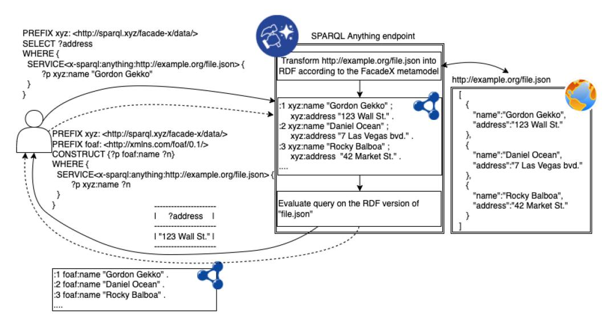
<!-- Image Description: This diagram illustrates a data integration process using SPARQL. A JSON file is transformed into RDF using a FacadeX metamodel. Two SPARQL queries are shown: a SELECT query retrieving an address and a CONSTRUCT query building a graph of names. The diagram visually depicts the data flow from the JSON source, through the RDF transformation, to the final query results, showcasing the interaction between JSON, RDF, and SPARQL. -->

Fig. 1. An example scenario showing how users interact with the SPARQL Anything endpoint to retrieve desired information (solid lines) or to construct an knowledge graph (dashed lines) from a JSON file.

The meta-model that drives our approach is called Facade-X, while the implementation of the approach, supporting files in a variety of formats, is a system named SPARQL Anything. Facade-X is inspired by one of the GoF patterns,6 and it is based on a set of basic data structures that are composed together: containment (inspired by the GoF pattern Composite), ordering (an unbound list), key-values (a map), and typing (the unary predicate of description logic). As such, it can be expressed by using a subset of the RDF specification [\[18\]](#page-28-0): resources, types, properties, and container membership properties. In this work, we consider such fundamental RDF shapes as *structural ontology design patterns*[\[30\]](#page-29-0).

Our approach is implemented in SPARQL (with no syntax extensions), by overriding the SERVICE operator with a*virtual endpoint*, which serves data extracted from legacy formats, but structured according to Facade-X. The example scenario depicted in Figure 1 shows how a user is supposed to interact with the SPARQL Anything endpoint to retrieve the desired information (e.g., Gordon Gekko's address) or to construct a KG from a JSON file available at the URL [http://example.org/file.json.](http://example.org/file.json) Intuitively, the SPARQL Anything endpoint retrieves the JSON file from the source, then transforms it into RDF according to Facade-X, and, finally, evaluates the query on the RDF translation of the file and returns the result of the query to the user. As for the SELECT queries, the result is a list of bindings of the variables of the query; while an RDF KG is returned in case of CONSTRUCT queries.

The approach of using a façade for integrating data into RDF pipelines has been originally proposed in Reference [\[20\]](#page-28-0). The contributions of this article differ in the following ways: *(i)*we provide a theoretical proof that the Facade-X meta-model is generic with respect to*(a)*serialised data formats and*(b)*relational data;*(ii)*we discuss the design principles of Facade-X in the light of structural design patterns and validate the approach with more data formats;*(iii)*we extend the comparative evaluation (cognitive complexity and performance) to the**ShEx mapping language (ShExML)**; *(iv)*we add experiments with a new execution strategy, called*triple-filtering*, which

<sup>6</sup>See [https://www.gofpatterns.com/design-patterns/module5/intro-structural-designPatterns.php.](https://www.gofpatterns.com/design-patterns/module5/intro-structural-designPatterns.php)

<span id="page-3-0"></span>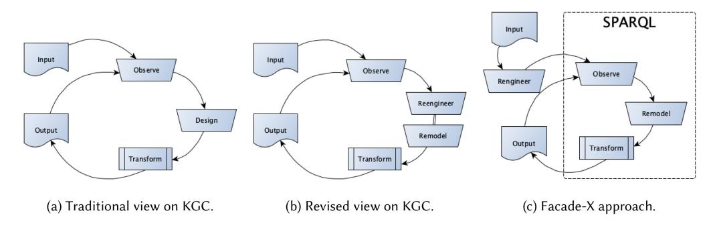
<!-- Image Description: The image presents three flow diagrams comparing knowledge graph completion (KGC) approaches. (a) shows a traditional KGC cycle with 'Input', 'Observe', 'Design', 'Transform', and 'Output' stages. (b) revises this by adding 'Reengineer' and 'Remodel' stages. (c) illustrates a 'Facade-X' approach using SPARQL, incorporating 'Input', 'Observe', 'Rengineer', 'Remodel', 'Transform', and 'Output'. The diagrams compare the evolution of KGC methodologies. -->

Fig. 2. Alternative Knowledge Graph Construction (KGC) processes.

shows improvements in performance; *(v)* we discuss challenges and opportunities of the approach by engaging with the reference user community.

The rest of the article is structured as follows: In the next section, we provide background information on KGC. In Section [3,](#page-4-0) we discuss the motivations behind our problem and we make methodological considerations. Section [4](#page-5-0) introduces the Facade-X meta-model and its mappings to RDF structures. We expand the formalisation introduced in Reference [\[20\]](#page-28-0), including operators that reflect possible design choices Section [5](#page-7-0) describes how the Facade-X meta-model can be implemented by selecting a few relevant components from RDF and RDFS specifications. In Section [6,](#page-10-0) we apply the methodology to a system for re-engineering non-RDF resources to make them available through a SPARQL processing engine. In Section [7,](#page-14-0) we focus on the evaluation of the approach. We demonstrate that our meta-model is generic enough to cover structured data expressible in formal grammars (Section [7.1.1\)](#page-15-0) and relational data (Section [7.1.2\)](#page-16-0). We also compare our approach to state-of-the-art tools for Knowledge Graph construction, in terms of*cognitive complexity*(Section [7.2\)](#page-18-0) and*performance*of a naive implementation (Section [7.3\)](#page-19-0). We describe experiments performed with a triple-filtering strategy, showing improvements in performance (Section [7.4\)](#page-20-0). We discuss the usability of the system by reporting results from a survey questionnaire with the reference community in Section [7.5.](#page-21-0) Section [8](#page-23-0) describes the state-of-the-art. Section [9](#page-26-0) concludes the article and discusses future research.

### 2 KNOWLEDGE GRAPH CONSTRUCTION

In this section, we provide background information on**Knowledge Graph Construction (KGC)**methods and discuss how KGC can benefit from a unified, general approach.

KGC is the process of building a**Knowledge Graph (KG)**out of a data source [\[4\]](#page-28-0). We can conceptualise this process as in Figure 2(a). The process typically involves only one actor, i.e., the KG engineer. A KGC process usually consists of three activities:*(i) Observe, (ii) Design, (iii) Transform*. First, the KG engineer inspects the data source to figure out the format and the content of the input data (*observe*). This task can be supported by tools and query languages designed for the input format (e.g., XPath if the input format is XML). Second, the KG engineer designs a set of mappings aimed at identifying the data that fulfil information needs from the source and devises their representation into RDF, often according to a pre-existing ontology (*design*). Finally, the mappings are fed into a processor that is responsible for generating the RDF triples according to the mappings (*transform*). This process proceeds by incremental iterations, where the KG engineer designs potential mappings, and evaluates them against the input source. During this activity, the KG engineer might identify nuances to take into account, troubleshoot possible issues, refine the mappings, or design new ones.

<span id="page-4-0"></span>Plenty of technologies have been developed for mapping heterogeneous files to RDF (RML [\[27\]](#page-29-0) and SPARQL Generate [\[42\]](#page-29-0), to name a few); ad hoc tools are also developed [\[35\]](#page-29-0). KGC frameworks are typically designed in two ways: (a) either connectors leverage configurations with an intermediate *mapping language*(e.g., RML [\[27\]](#page-29-0), ShExML [\[31\]](#page-29-0), SPARQL Generate [\[42\]](#page-29-0)) or (b) a*directmapping*strategy is hard-coded in the software (e.g., TARQL,7 CSV2RDF,<sup>8</sup> Any239). In the first case—a framework based on*mapping languages*—data engineers benefit from a declarative language that can express mappings towards different data sources, allowing better transparency and maintainability of the data transformation pipeline. However, they are required to inspect the data sources and express these mappings according to the specificity of each source format (e.g., relying on format-specific languages such as XPath or JsonPath). Crucially, these systems are limited to formats that come with their own declarative query language. This is true for some popular formats (JsonPath for JSON, XPath for XML, CSS selectors for HTML) but not for many other valuable data sources (e.g., YAML, Markdown, Bibtex, to mention just a few). In the second case—systems implementing *direct mappings*—data engineers benefit from direct access to the data without the need to inspect the source format and to configure the system. However, integrating data from different formats needs integration of different tools and engaging with different representations, according to format-specific ontologies. Crucially, they need to develop further transformations to obtain an homogeneous view on the data. As a result, KG engineers are usually forced to rely on different tools (sometimes based on heterogeneous languages) for inspecting sources, designing mappings, and generating triples, thus making the KGC process unnecessarily complicated. In what follows, we argue that it is possible and desirable to equip KG engineers with the ability of interacting with Web data formats by relying on their expertise in RDF and the SPARQL query language [\[2\]](#page-27-0).

### 3 METHODOLOGY

In this section, we argue how having a unified method jointly with its related tools can streamline KGC. We have observed that the intent of the mappings is usually twofold (see Figure [2\(](#page-3-0)b): they perform a *syntactic*transformation of the terms included in the data source (i.e.,*re-engineering*), and they *project*the transformed terms onto a conceptual model (i.e.,*re-modelling*). This revised view on KGC is depicted in Figure [2\(](#page-3-0)b). With respect to three activities of the KGC process, SPARQL [\[2\]](#page-27-0) can address them:

- *(i)*SPARQL SELECT queries may be used for*inspecting data sources*(observe);
-*(ii) mappings may be specified*as SPARQL CONSTRUCT queries (remodel);
-*(iii) transformation*would result from the execution of a SPARQL CONSTRUCT query (transform).

However, SPARQL can only be used if*re-engineering*into RDF has been previously performed. For this reason, our approach includes a mechanism for accessing heterogeneous data*as if*it was RDF, before committing the data to any ontology (cf. Figure [2\(](#page-3-0)c)). Contrary to the many methods for transforming heterogeneous data into RDF (cf. Section [8\)](#page-23-0), we propose an open-ended, unified model for accessing non-RDF data as if it was RDF. Since the lifting to RDF has to be made before committing to an ontology, no assumptions can be made either on the content of the input, nor on the ontology. As a result, a mapping at meta-model level (e.g., JSON to RDF) is the only viable strategy to accomplish the objective, as proposed in Reference [\[50\]](#page-30-0), even if there is no standardised mapping strategy.

[<sup>7</sup>http://tarql.github.io/.](http://tarql.github.io/)

[<sup>8</sup>https://github.com/AtomGraph/CSV2RDF.](https://github.com/AtomGraph/CSV2RDF)

[<sup>9</sup>https://any23.apache.org/.](https://any23.apache.org/)

<span id="page-5-0"></span>Our strategy builds on*basic data structures*<sup>6</sup> (i.e., containment, ordering, key-values, and typing) as recurrent architectural solutions for shaping data. First, a minimal subset of basic data structures has been pragmatically identified from well-known abstract data types (containers, sequences, associative arrays, and so on; cf. Reference [\[44\]](#page-29-0)). Then, each of these structures has been associated with an RDF construct for triplification (e.g., lists are expressed in terms of RDF container membership properties). As a result, RDF constructs act as uniform façades to heterogeneous data sources.

This vision implicitly involves a novel actor in the KGC process, i.e., the *façade engineer*. The façade engineer is in charge of designing the façade, mapping it onto the legacy formats (we also refer to this task by the name *meta-model interpretation*), and devising a triplification strategy. Ideally, the façade engineer acts once per façade, meaning that once a format is ported to RDF according to a façade, no more activities are required.

This strategy makes the KGC: • *easier*– the basic data structures emerge from the data; •*domainindependent*– no assumptions are made on the input schema; •*re-usable*– once a format is mapped to RDF, all the data sources of that format can be queried as RDF data; •*open-ended*– the mapping is the result of a collection of basic data structures, hence new structures can always be added. In addition:*(i)*The off-the-shelf transformation of legacy data into RDF enables the KG engineer to explore heterogeneous data using SPARQL (e.g., using a set of standardised queries for approaching new sources);*(ii)*Legacy formats are completely transparent to the KG engineer;*(iii)*A façade homogenises data, not only from a syntactical perspective (all the data is in RDF), but also from a structural standpoint (there is a unique strategy for triplifying knowledge representation primitives);*(iv)*Mapping and triplification can be completely implemented in SPARQL (no legacy languages, no mapping vocabularies, no triplification tools).

### 4 FACADE-X

The Facade-X meta-model has been built in a bottom-up way. First, we selected the most common (non-RDF) formats adopted for exchanging or expressing information on the Web. The selection (that is being extended) includes: CSV, JSON, YAML, XML, HTML, Text, Binary formats (e.g., JPG), Documents (DOCx or Markdown), Relational Databases, and Spreadsheets (e.g., XLS and XLSx). Then, for each format, we selected the minimal set of*basic data structures*needed for capturing the content specified through a format. Facade-X is the result of the*abstraction*out of all the basic data structures used for representing the source data formats. Such abstraction led to the selection of a set of*structural design patterns*, each pattern corresponding to an RDF component used in the triplification process.

**Observed Basic Data Structures.**We overview the main basic data structures needed for representing data extracted from the selected formats. For the sake of clarity, we resort to computer science terminology for*abstract data types*. We use *container*, *list*(considered as a specialisation of a container),*map*, and *instance-of*relation as abstract data types corresponding, respectively, to the basic data structures: containment, ordering, key-values, and typing.
*Formalisation of Basic Data Structures.*Containers, lists, maps, and instance-of are formalised as follows: Let*V*be the set of all possible primitive values,*I*the set of (the instances of) containers, lists, and maps, and*C*the set of classes. A list*l* ∈ (*V*∪*I*) <sup>∗</sup><sup>10</sup> is a finite sequence of elements from *<sup>V</sup>*or*<sup>I</sup>*. A map *<sup>m</sup>* is a set of pairs (*k*,*v*) such that *<sup>m</sup>* <sup>=</sup> {(*k*,*v*)|*<sup>k</sup>*<sup>∈</sup>*<sup>V</sup>*,*<sup>v</sup>* <sup>∈</sup> (*<sup>V</sup>*<sup>∪</sup>*<sup>I</sup>*)}. An *instance-of* relation is a set of pairs (*i*,*c*) such that *instance-of* <sup>=</sup> {(*i*,*c*)|*<sup>i</sup>*<sup>∈</sup>*<sup>I</sup>*,*<sup>c</sup>*<sup>∈</sup>*<sup>C</sup>*}.

<sup>10</sup>*Set*<sup>∗</sup> stands for*Set*×*Set*×···×*Set*.

ACM Transactions on Internet Technology, Vol. 23, No. 1, Article 6. Publication date: February 2023.

*Basic Data Structures for CSV.*A**comma-separated values (CSV)**file is a text file that uses a comma to separate an ordered sequence of values in a data record and a carriage return to separate the data records of a sequence. A CSV can be represented as a list of lists in which the outer list captures the sequence of data records (representable as containers), while the inner list captures the sequence of primitive values within a record.
*Basic Data Structures for Spreadsheet.*Spreadsheets are files that organise data as a collection of named tables. Similarly to CSV, each table of a spreadsheet can be seen as a container of data records. In addition, a map is needed for associating each table of the spreadsheet (a list of lists) with its name.
*Basic Data Structures for JSON.*JSON is a text format that is built on two structures: collections of key/value pairs (the key is a string and value is an element) and ordered lists of elements. Each element (representable as a container) can in turn be a collection of key/element pairs, a list of elements, or a primitive value. Therefore, capturing JSON files requires:*(i) maps*for expressing key/value pairs;*(ii)*and*lists*for specifying lists of elements.
*Basic Data Structures for YAML.*YAML is a lightweight, human-readable data-serialization language. YAML is a "superset" of JSON (any JSON file can be specified in YAML) and, similarly to JSON, data can be organised in lists or associative arrays. However, differently from JSON, comments and custom data types are allowed. Therefore, in addition to the basic data structures required for capturing JSON files,*instance-of*is needed for representing custom data types.
*Basic Data Structures for XML and HTML.*Although having crucial differences (e.g., casesensitivity, optional closing tags), XML and HTML can be classified as markup languages that organise data according to a hierarchical structure. XML and HTML documents must contain a root element. All the elements (representable as containers) can enclose sub elements, text (primitive value), and attributes (key-value pairs). XML and HTML can be represented by combining:*(i) maps*for associating attributes with the corresponding values;*(ii) lists*for specifying sequences of children of an element;*(iii) instance-of*for associating an element with the name of the tag.
*Basic Data Structures for BibTeX.*BibTeX is a text format used (typically together with LaTeX) to specify a list of references in a database file with the aim of separating bibliographic information from its presentation. A BibTeX database file is formed by a list of bibliographic entries where each entry consists of the type (e.g., article, in proceedings), a citation key, and key-value pairs for the other characteristics of an entry. Each BibTeX entry can be represented as a typed container that holds a set of key-value pairs.
*Basic Data Structures for Word Processing Documents and Markdown.*A word processing document is any text-based document compiled using word processor software. Markdown is a lightweight markup language for writing formatted documents inspired by web posting conventions. We can interpret a document (compiled with a Word processor or specified in Markdown syntax) as a sequence of blocks (e.g., paragraphs, lists, headings, code blocks). Some blocks (e.g., list items) contain other blocks, whereas others contain inline contents (e.g., links, images). A document can be represented as a list of typed containers. In fact,*blocks*can be specified as*typed containers*, where the type denotes the kind of block (e.g., heading, paragraph, emphasised text, link, image); *lists*are needed for specifying the sequence of the blocks. Additional attributes such as the depth of the header or the type of list (bullets, numbers, etc.) can be also supported, relying on the key-value structure.
*Basic Data Structures for Archives and File System Directories.*Archives and directories can be seen as files with the purpose of collecting other files. Therefore, if we abstract from the <span id="page-7-0"></span>file content (i.e., bytes composing the file), then archives and directories can be seen as lists of filenames.
*Basic Data Structures for Binary and Text.*From the structural standpoint, binary data and text are quite similar, since they can be both represented as either a container including a single value item (byte stream or text) or as an ordered sequence of primitive values (bytes or, in case of text files, characters, words, multiwords, sentences, paragraphs, depending on the granularity level to which the data structure is mapped).
*Basic Data Structures for Relational Databases.*A**Relational Database (RDB)**is a collection of named relational tables, where each table is a subset of the cartesian product of the domain of its attributes, namely, a set of tuples. From a structural perspective, a table is a typed container, where the type (denoted, e.g., by the name of the table) is the*intension*of the table, while each tuple is a collection of key-value pairs (all tuples being the*extension*of the table).
**Formalisation of Facade-X in predicate logic.** As mentioned above, the Facade-X meta-model is the result of the combination of four basic data structures (container, list, map, and instanceof). We abridge those structures to structural design patterns by first providing a predicate logic specification of Facade-X.

A list (*e*1,..., *<sup>e</sup><sup>n</sup>*) is specified as a container of pairs (position, element), e.g.,*pair*(*i*, *<sup>e</sup><sup>i</sup>*). In doing so, lists differentiate from maps exclusively in the kind of the first element of the pair (an integer for lists), but both are generalised as containers of pairs.

To represent containers in predicate logic, we introduce a set of predicates, axiomatized as in Table [1:](#page-8-0)

-*(i)*the unary predicate Container, which includes the reifications of containers;
-*(ii)*the unary predicate Slot includes the reifications of key/value pairs occurring at a certain position in a dataset;
-*(iii)*the unary predicate Key includes the slot identifiers, which can be (at least in the selected formats) either StringKey or NumberKey;
-*(iv)*the unary predicate Value includes the primitive values;
-*(v)*the unary predicate Class includes the classes;
-*(vi)*the binary predicate hasSlot, holding between containers and slots;
-*(vii)*the binary predicate hasContainer, inverse of hasSlot, holding between slots and containers. A slot can have either at most one container, or one value, but not both;
-*(viii)*the binary predicate hasType, holding between containers and classes;
-*(ix)*the binary predicate hasKey, holding between slots and keys. Slots from a same container are uniquely identified by their key;
-*(x)*the binary predicate hasValue, holding between slots and values.

We emphasise that the meta-model is domain-independent, therefore it provides a KG engineer with a uniform view over any data serialised according to any mapped format. Moreover, since the mapping is determined by the façade engineer, a KG engineer can design mappings based purely on Facade-X, ignoring the original data format.

### 5 RDF REPRESENTATION OF FACADE-X

In the previous section, we have introduced the Facade-X meta-model and shown how it can capture the essential elements (basic data structures) of popular file formats. In this section, we deal with encoding Facade-X in RDF. We first validate the basic data structures with respect to real samples of source data and align them to RDF or RDFS components. As a result, we obtain an RDF version of Facade-X.

ACM Transactions on Internet Technology, Vol. 23, No. 1, Article 6. Publication date: February 2023.

<span id="page-8-0"></span>

| ∀k.NumberKey(k) → Key(k)                                                                          |  |  |  |  |  |  |
|---------------------------------------------------------------------------------------------------|--|--|--|--|--|--|
| ∀(x,y).hasSlot(x,y) → Container(x) ∧ Slot(y)                                                      |  |  |  |  |  |  |
| ∀(x,y).hasKey(x,y) → Slot(x) ∧ Key(y)                                                             |  |  |  |  |  |  |
| ∀(x,y).hasValue(x,y) → Slot(x) ∧ Value(y)                                                         |  |  |  |  |  |  |
| ∀(x,y).hasSlot(x,y) ↔ hasContainer(y, x)                                                          |  |  |  |  |  |  |
| ¬∃(x,y, z).hasContainer(x,y) ∧ hasValue(x, z)<br>∀(x,y, z).hasValue(x,y) ∧ hasValue(x, z) → y = z |  |  |  |  |  |  |
| ∀(x,y, z).hasContainer(x,y) ∧ hasContainer(x, z) → y = z                                          |  |  |  |  |  |  |
| ∀(c,s1,s2,n).hasSlot(c,s1) ∧ hasSlot(c,s2) ∧ hasKey(s1,n) ∧ hasKey(s2,n) → s1 = s2                |  |  |  |  |  |  |
|                                                                                                   |  |  |  |  |  |  |

Formats such as CSV, JSON, or XML have different meta-models that can be mapped to RDF in different ways, despite the common patterns shared by them. Facade-X provides a common semantics to encode them all. Facade-X assumes the notion of a façade as "an object that serves as a front-facing interface masking more complex underlying or structural code."11 Applied to our problem of abstracting the reverse engineering of heterogeneous source data, Facade-X is a generic meta-model*(a)*to inform the development of transformers from an open-ended set of formats and*(b)*to generate RDF content in a consistent and predictable way. To support the reader, we introduce a guide scenario reusing the data of the Tate Gallery collection, published on GitHub.12 The repository contains CSV tables with metadata of artworks and artists and a set of JSON files with details about each catalogue record, e.g., details of the hierarchy of archive subjects. Both types of resources include references to Web URLs pointing to digital images of the artworks. The file artwork\_data.csv includes metadata of the artworks in the collection and references several external resources, such as a JSON file with the artwork subject headings and a link to a JPG thumbnail image. Similarly, the file artists\_data.csv includes the list of artists, linking to a collection of JSON documents for each artist.

In the following, we describe the design of Facade-X in RDF for re-engineering heterogeneous file formats. From the methodological standpoint, we refer to design science as a guiding principle [\[63\]](#page-30-0). Pragmatically, we place into the problem space a collection of formats and associated meta-models, and on the solution space the components of the RDF(S) specifications, as described in the W3C documents.<sup>13</sup> The design process is as follows:

-*(i)*Our problem space includes the following formats: CSV, JSON, XML, HTML, Plain text, and Binary files (e.g., JPG images).
-*(ii)*The solution space includes the components from the RDF and RDFS specifications (which we refer to as RDF in the rest of the article).
-*(iii)*Initially, our*façade*specification is empty.
-*(iv)*We select a format from the problem space, observe one or more prototypes, and abstract it into a meta-model.
-*(v)*The meta-model is partitioned*topologically*. Parts and relations are mapped to RDF components, first by selecting the ones already in the façade or, in case something is missing, picking new components from RDF.
- *(vi)*We move to the next format until the problem space is empty.
**CSV.**A CSV file is a resource, identifiable by a URI, which*contains*a dataset, composed of an ordered sequence of rows, which in turn*contains*an ordered sequence of data fields. Therefore, we

<sup>1</sup>[1https://en.wikipedia.org/wiki/Facade\\_pattern.](https://en.wikipedia.org/wiki/Facade_pattern)

<sup>1</sup>[2http://github.com/tategallery/collection.](http://github.com/tategallery/collection)

<sup>13</sup>RDF: <https://www.w3.org/TR/2014/NOTE-rdf11-primer-20140624/>

RDFS: [https://www.w3.org/TR/2014/REC-rdf-schema-20140225/.](https://www.w3.org/TR/2014/REC-rdf-schema-20140225/)

identify**containment**as a primary requirement of Facade-X. Now, we look at the solution space for a component of RDF to use. The simplest way to express containment in RDF is with an RDF property linking the container with the contained item. However, what type of property should link the container to the contained elements in the case of a CSV? Rows are ordered; therefore, this case of containment can be represented as an**ordered sequence** (our second component). Relying on a recent survey on sequential linked data [\[23\]](#page-28-0), we learn that there are several ways of representing sequences in RDF, and that some representations are more efficient to deal with in SPARQL than others. In the light of that analysis, we select container membership properties from the solution space (rdf:\_1, rdf:\_2, rdf:\_*n*) and discard rdf:List. In addition, we want to distinguish the main data source container from its parts. We can select the rdf:type component and declare one primitive entity type: root, for which we define a namespace and prefix: fx: [<http://sparql.xyz/facade-x/ns/>](http://sparql.xyz/facade-x/ns/).

What about data values? We observe how CSV data may have an optional "header," where the first line is the list of field names. When this happens, we can use the property component and generate an RDF property reusing the field name and minting an IRI with a conventional namespace. Otherwise, we can consider the values on each row as another sequence and fall back to the ordered sequence component. Our façade currently includes the following components: rdf:Property and rdf:ContainerMembershipProperty as two ways of representing containment, rdf:type to point to the fx:root element, and rdf:Literal to represent values. So far, we added the following namespaces to our toolkit:

```text
1 @prefix rdf: <http://www.w3.org/1999/02/22-rdf-syntax-ns#>.
```text

- 2 @prefix rdfs: <http://www.w3.org/2000/01/rdf-schema#>.
- 3 @prefix fx: <http://sparql.xyz/facade-x/ns/>. # for fx:root
- 4 @prefix xyz: <http://sparql.xyz/facade-x/data/>. # for the properties

This is an example from the Tate Gallery open data14:

| 1 | id,accession_number,title,     | 1 | [ a fx:root ; rdf:_1 [ xyz:id "1034"; xyz:     |
|---|--------------------------------|---|------------------------------------------------|
| 2 | 1035,A00001,"A Figure Bowing", |   | accession_number "A00002"; xyz:title "A Figure |
| 3 |                                |   | Bowing";  ],  ]                                |

**JSON**. The JavaScript Object Notation is specified by ECMA.<sup>15</sup> The syntax defines three types of elements: *objects*, a set of key-value pairs, where keys are supposed to be unique; *values*, which are either strings, numbers, Boolean, or the primitive "null," and *arrays*, which specify sequences (containing other arrays, objects, or values). We interpret objects and arrays as containers. We reuse rdf:Property to link objects to values. Arrays are represented by the ordered sequence component. Values are expressed as rdf:Literal, selecting relevant XSD datatypes from the RDFS specification: xsd:string, xsd:boolean, xsd:int, xsd:float. <sup>16</sup> The following example shows a JSON document with metadata of an artist in the Tate Gallery Collection. The JSON file will be represented as follows in RDF (in Turtle syntax):

```text
1 {
2 "fc": "Kazimir Malevich",
3 "gender": "Male",
4 "id": 1561,
5 "activePlaces": [ "Ukrayina", "Moskov" ]
6 }
                                                   1 [ a fx:root ;
                                                   2 xyz:fc "Kazimir Malevich",
                                                   3 xyz:gender "Male"
                                                   4 xyz:id 1561^^xsd:int,
                                                   5 xyz:activePlaces [
                                                   6 rdf:_1 "Ukrayina"; rdf:_2 "Moskov" ]]
```text

<sup>1</sup>[4https://github.com/tategallery/collection.](https://github.com/tategallery/collection)

<sup>1</sup>[5https://www.ecma-international.org/publications-and-standards/standards/ecma-404/.](https://www.ecma-international.org/publications-and-standards/standards/ecma-404/)

<sup>16</sup>Currently, we chose to ignore fields with the "null" value. However, we may decide to represent it as blank node or to create a primitive entity to express it, for example, similar to rdf:nil.

<span id="page-10-0"></span>So far, we were able to express CSV and JSON data by using a limited set of RDF components. The JSON format required us to add a number of datatype formats, while CSV values could only be represented with the default datatype (string).

**HTML**and**XML**. We will approach these two formats together, as their difference is on syntactic aspects, while their conceptual meta-model is the same. In fact, both formats can be captured by the **Document Object Model (DOM)**specification, which we will refer to in the following description. However, it needs to be clarified how our methodology focuses on the elements of the syntax and does not aim at reproducing the DOM API in RDF. HTML/XML elements (also known as tags) can be definitely considered containers, so we can reuse both the rdf:Property component for specifying tag attributes and container membership properties for specifying relations to child elements in the DOM tree. These may include text, which can be expressed as RDF literals of type xsd:string. What about element types (tag names)? Facade-X does already provide a solution of*unary*attributes: rdf:type. The range of the property will therefore be an rdf:Resource, whose URI can be minted by using the tag name as local name. However, XML and HTML already include the notion of namespace, therefore, we use namespaces declared within the original document to name properties and types, if any. Examples with HTML content will be presented later in Section [6.1.](#page-13-0)

So far, we collected the following components: rdf:Property, rdf:ContainerMembershipProperty, XSD datatypes, rdf:type, and declared one primitive: fx:root. We complete our analysis with two corner cases: plain text documents and binary data (e.g., JPEG or PNG images). Textual data is an interesting case where we can use containment to refer to different elements of the text. The whole content can be included in one single literal of type xsd:string. Alternatively, the text can be tokenized and the resulting sequence represented as RDF.17 For the sake of our analysis, text can be considered a single container including a sequence of (at least one) literal values. Binary content such as images can be also supported by embedding the content in a single literal of datatype xsd:binary64encoding. This solution does not require to add components to the façade but still allows to*bring in*the content as linked data. In both these cases, we can reuse the components already selected.

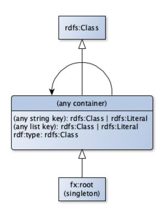
<!-- Image Description: This diagram shows a class inheritance hierarchy. `rdfs:Class` is a superclass of an unnamed "any container" class. This container class allows string and list keys, each holding either `rdfs:Class` or `rdfs:Literal` values, with `rdf:type` being a `rdfs:Class`. A `fx:root` (singleton) class inherits from the container. The diagram illustrates the relationships and data types within a specific ontology or data model. -->

Fig. 3. Facade-X/RDF entity-relation diagram.

At this stage, we have all we need to implement the basic data structures identified in the previous section into RDF. Figure 3 illustrates the resulting Facade-X/RDF as an entity-relation diagram.

We are able to support all the other formats mentioned (BibTex, Markdown, etc.), as they do not introduce new components.

### 6 SPARQL ANYTHING

In this section, we describe SPARQL Anything, a proof-of-concept of our approach.

Based on the output of our design activity, i.e., the RDF version of Facade-X, we design a method to inject façade-based data sources into SPARQL engines, with the objective of serving this content to the SPARQL practitioner for defining mappings to the target ontology (cf. the*re-modeling* activity mentioned in Section [1\)](#page-1-0). To this end, we overload the SPARQL SERVICE operator by defining a custom URI-schema. The implementation of Facade-X acts as a virtual endpoint that can be queried

<sup>17</sup>We could ask users to choose a separator, for example, the space, the new line, or even a regular expression.

exactly as a remote SPARQL endpoint. To instruct the query processor to delegate the execution to Facade-X, we introduce a specific convention for building an IRI to be used within SERVICE clauses: x-sparql-anything:. The related URI-schema supports an open-ended set of parameters specified by the façade implementations available. A minimal example only includes the resource locator and guesses the data source type from the file extension. Options are embedded as key-value pairs, separated by commas. These can incorporate a set of parameters to allow the user to configure the system (for example, to indicate that the system should consider the first line of a CSV as headers):

1 x-sparql-anything:media-type=text/csv,charset=UTF-8,csv.headers=**true**,location=...

Figure [4](#page-12-0) shows a UML sequence diagram describing the interaction between the user, the SPARQL Anything endpoint, and the file repository. Figure [5](#page-12-0) describes, in the form of a UML activity diagram, the workflow carried out by the SPARQL Anything endpoint once the SPARQL query is received from the the user. For each query submitted by the user the endpoint undertakes the following steps:

- *(i)*it analyses the query to extract the parameters;
-*(ii)*it uses the the parameters to read the source file(s) (note that queries may involve multiple files at the time);
-*(iii)*it transforms the source file(s) into RDF according to the Facade-X metamodel, the parameters provided in the query and, possibly, the query itself (cf. the triple filtering strategy— Section [7.4\)](#page-20-0);
-*(iv)*it evaluates the the query over the RDF version of the file(s);
-*(v)* it returns the query results to the user.

We now show how to use Facade-X. Following our example scenario, users can select metadata from the CSV file and embed the content of the remote JPG thumbnails in RDF. Additional SERVICE clauses may integrate data from other files, for example, the JSON file with details about artwork subjects. The following listing shows a complete example:

```text
1 PREFIX fx: <http://sparql.xyz/facade-x/ns/>
2 PREFIX xyz: <http://sparql.xyz/facade-x/data/>
3 PREFIX rdf: <http://www.w3.org/1999/02/22-rdf-syntax-ns#>
4 PREFIX tate: <http://sparql.xyz/example/tate/>
5 PREFIX tsub: <http://sparql.xyz/example/tate/subject/>
6 PREFIX schema: <http://schema.org/>
7 PREFIX dct: <http://purl.org/dc/terms/>
8 PREFIX rdfs: <http://www.w3.org/2000/01/rdf-schema#>

10 CONSTRUCT {
11 ?artwork a schema:CreativeWork ;
12 dct:subject ?subject ;
13 schema:thumbnailUrl ?thumbnail ;
14 dct:title ?title .
15 ?subject rdfs:label ?subjectName .
16 } WHERE {
17 # List of artworks
18 SERVICE <x-sparql-anything:csv.headers=true,location=./collection/artwork_data.csv> {
19 [] xyz:id ?id ; xyz:accession_number ?accId ;
20 xyz:title ?title; xyz:thumbnailUrl ?thumbnail .
21 }
22 BIND (IRI(CONCAT(STR(tate:), "artwork-", ?id )) AS ?artwork) .
23 BIND (IRI(CONCAT(STR(tate:), "artist-", ?artistId )) AS ?artist) .
24 BIND ( IF ( STRSTARTS( ?accId, "AR" ),
25 LCASE(CONCAT( "ar/", SUBSTR( ?accId ,3 ,3), "/", ?accId, "-", ?id , ".json" )),
26 LCASE(CONCAT( SUBSTR( ?accId ,1 , 1), "/", SUBSTR( ?accId ,2 , 3), "/" , ?accId, "-", ?id , ".json" ))
27 ) AS ?filepath ) .
28 # JSON file with subjects
29 BIND (IRI(CONCAT("x-sparql-anything:location=./collection/artworks/", ?filepath )) AS ?artworkMetadata ) .
30 SERVICE ?artworkMetadata {
```text

ACM Transactions on Internet Technology, Vol. 23, No. 1, Article 6. Publication date: February 2023.

<span id="page-12-0"></span>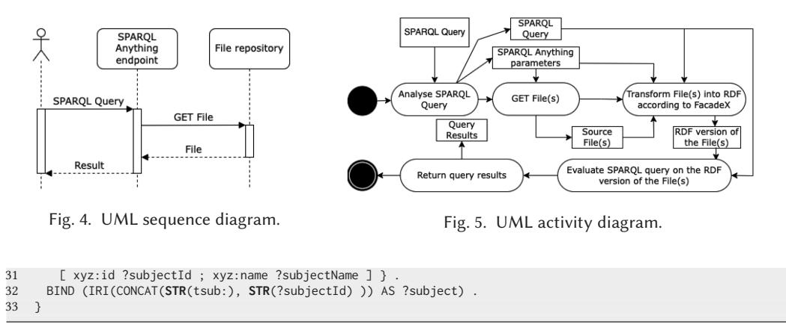
<!-- Image Description: The image contains two UML diagrams and a SPARQL query. Figure 4 is a sequence diagram illustrating a user querying a SPARQL endpoint, retrieving a file, and receiving results. Figure 5 is an activity diagram detailing the processing of a SPARQL query: parsing, file retrieval, RDF transformation using FacadeX, query evaluation, and result return. The SPARQL code snippet shows a query that constructs a URI. Together, these illustrate the system's architecture and query processing steps. -->

The query iterates over a CSV with artworks' metadata and, for each one, constructs the path to the local JSON file containing the artwork subjects. All the data is projected into a CONSTRUCT clause.<sup>18</sup>

SPARQL Anything relies on the ARQ query engine provided by the Apache Jena framework19 and it is composed of four components: (i) the FacadeIRIParser, which takes an IRI (complying to the Facade-X IRI schema) and extracts the (*option*,*value*) pairs contained in it; (ii) the Triplifier that, given a URL of a file to transform and a set of options, produces a set of named graphs; (iii) the TriplifierRegister that keeps track of the Triplifers available for the transformation of source data; and (iv) the FacadeOpExecutor, which extends the ARQ's operation executor for the SERVICE clause to implement the approach described in Section [6.](#page-10-0) SPARQL Anything allows the addition of an open-ended set of transformers as additional Java classes. At query execution, a query manager intercepts any usage of the SERVICE operator and, in case the endpoint URI has the x-sparql-anything: scheme, it parses the URI extracting the resource locator and the set of parameters. Default parameters are: mime-type, locator, namespace (to be used when defining RDF resources), root (to use as the IRI of the root RDF resource, instead of a blank node), and metadata. SPARQL Anything projects an RDF dataset during query execution, including the data content and optionally a graph named <facade-x:metadata> including file metadata extracted from image files (also in Facade-X). Specific formats may support specific parameters. For example, the CSV triplifier supports an optional parameter to specify whether to use the first row as column names (headers) or rely on column indexes.

We validated the generality of Facade-X as a meta-model with relation to the triplifiers currently implemented in SPARQL Anything. The current release (v0.5.1, December 2021) supports the following formats: JSON, HTML, XML, CSV, BIN, PNG, JPEG, JPG, BMP, TIFF, TIF, ICO TXT, ZIP, Tar, File System, spreadsheets: XLS/XLSx, documents: DOCx, EXIF Image Metadata, Bibtex, Markdown, and YAML. Currently, SPARQL Anything is the only system for KGC supporting such a variety of formats, and its design principles allow to easily add new types of source data. A collection of examples with the supported file formats is also available at the SPARQL Anything project page.<sup>20</sup>

[<sup>18</sup>This is reproducible, along with other example queries on the same data source, at](https://github.com/sparql-anything/showcase-tate) https://github.com/sparql-anything/ showcase-tate.

<sup>1</sup>[9https://jena.apache.org/index.html.](https://jena.apache.org/index.html)

<sup>20</sup>**SPARQL Anything**: [https://github.com/sparql-anything/sparql.anything.](https://github.com/sparql-anything/sparql.anything)

### <span id="page-13-0"></span>6.1 Worked Example: The IMMA Online Catalogue

The Horizon 2020 EU SPICE project<sup>21</sup> aims at developing a linked data infrastructure for integrating and leveraging museum collections using multiple ontologies covering sophisticated aspects of citizen engagement initiatives. Museum collections come in a variety of data objects, spanning from public websites to open datasets in CSV, XML, JSON, or a combination of these formats. In SPICE, five pilot case studies rely on a Linked Data Hub that aggregates resources from museums, social media, and businesses active in the cultural industry.<sup>22</sup> However, the majority of cultural heritage data is not published as Linked Data, and we cannot assume this is going to change anytime soon; e.g., all cultural heritage institutions involved in the SPICE project do not have an in-house linked data publishing infrastructure. Data are published on Web sites (HTML) or are released as a mix of CSV, XML, JSON files.

SPICE research activity also aims at the design of task-oriented ontologies. This implies that there will be multiple knowledge graphs (semantic *viewpoints*) built on top of the same resources. In the absence of a strategy to cope with this diversity of resources and ontologies, the RDF lifting would result in multiple, heterogeneous efforts, creating a serious bottleneck.

As an example, we describe how we have used SPARQL Anything to design a knowledge graph of artworks and artists from the collection website of the **Irish Museum of Modern Art (IMMA)**, one of the key partners in the SPICE project. The IMMA website includes web pages for each artist and artwork in the catalogue, including images of artworks and their metadata. For example, the web page of the artist Marina Abramovic includes her birth date and biography.23 The web page also includes a list of the artist's works from the IMMA catalogue. Each artwork web page includes museums' collection metadata, including a description, the type of medium used in the work, credit and copyright information, the catalogue item number, and the official caption of the image report of the work.<sup>24</sup>

Our job is to extract this information from the web content and express it as data shaped according to SPICE ontologies. In IMMA case, we explored the website and found a web page listing all the artists.25 We have then created a JSON-LD26 file for each artist or artwork included in the catalogue.<sup>27</sup> In what follows, "fx" refers to the following instruction28:

```text
1 java -jar sparql-anything-0.5.1.jar
```text

The first thing to do is to get the list of artists' web pages, which we will subsequently query with SPARQL Anything to extract the useful metadata. The following HTML content snippet gives us a clue:

| v <div class="letter-group" id="letter-group-A"><br/><math>&lt;</math>h4&gt;A<br/><math>\overline{\mathbf{v}}</math> <ul><br/>k<li class="artist" data-filter="collection " data-image="https://imma.ie/wp-content/uploads/2018/11/48-676x1024.jpg">…</li>&lt;<br/>&gt;<li class="artist" data-filter="collection usa " data-image="/wp-content/themes/imma/css/img/no-img-dark.png"></li><br/>v<li class="artist" data-filter="collection " data-image="https://imma.ie/wp-content/uploads/2018/11/845.jpg"></li></ul></div> | $\overline{\mathbf{v}}$ <div id="az-group"></div> |  |
|-------------------------------------------------------------------------------------------------------------------------------------------------------------------------------------------------------------------------------------------------------------------------------------------------------------------------------------------------------------------------------------------------------------------------------------------------------------------------------------------------------------------------------|---------------------------------------------------|--|
|                                                                                                                                                                                                                                                                                                                                                                                                                                                                                                                               |                                                   |  |
|                                                                                                                                                                                                                                                                                                                                                                                                                                                                                                                               |                                                   |  |
|                                                                                                                                                                                                                                                                                                                                                                                                                                                                                                                               |                                                   |  |
|                                                                                                                                                                                                                                                                                                                                                                                                                                                                                                                               |                                                   |  |
|                                                                                                                                                                                                                                                                                                                                                                                                                                                                                                                               |                                                   |  |
|                                                                                                                                                                                                                                                                                                                                                                                                                                                                                                                               |                                                   |  |
| $\mathbf{v}$ <a href="https://imma.ie/artists/marina-abramovic/"> == <math>\mathcal{S}\theta</math></a>                                                                                                                                                                                                                                                                                                                                                                                                                       |                                                   |  |
| "Abramović, Marina "                                                                                                                                                                                                                                                                                                                                                                                                                                                                                                          |                                                   |  |
| <span style=""> abramovic-marina</span>                                                                                                                                                                                                                                                                                                                                                                                                                                                                                       |                                                   |  |
| $\langle$ a>                                                                                                                                                                                                                                                                                                                                                                                                                                                                                                                  |                                                   |  |
| $\langle$ /li>                                                                                                                                                                                                                                                                                                                                                                                                                                                                                                                |                                                   |  |

<sup>2</sup>[1https://spice-h2020.eu.](https://spice-h2020.eu)

<sup>22</sup>The SPICE Linked Data Hub: [http://spice.kmi.open.ac.uk.](http://spice.kmi.open.ac.uk)

<sup>2</sup>[3https://imma.ie/artists/marina-abramovic/.](https://imma.ie/artists/marina-abramovic/)

<sup>24</sup>E.g., [https://imma.ie/collection/freeing-the-memory/.](https://imma.ie/collection/freeing-the-memory/)

<sup>2</sup>[5https://imma.ie/artists/.](https://imma.ie/artists/)

<sup>26</sup>JSON-LD is one of the serialisations for RDF knowledge graphs [https://json-ld.org/.](https://json-ld.org/)

[<sup>27</sup>The queries and instructions for reproducing the tutorial can be found at](http://github.com/sparql-anything/showcase-imma) http://github.com/sparql-anything/showcaseimma.

<sup>28</sup>The executable JAR can be obtained from [https://github.com/SPARQL-Anything/sparql.anything/releases.](https://github.com/SPARQL-Anything/sparql.anything/releases)

ACM Transactions on Internet Technology, Vol. 23, No. 1, Article 6. Publication date: February 2023.

<span id="page-14-0"></span>The data we need is included in a div with id az-group. Artists' web pages are included in an anchor tag (a) within a list item (li) with a data-image attribute. The anchor tag includes a span tag with an artist nickname, which we could use to mint artist's IRI. With this information, we can design another SPARQL query:

```text
1 prefix rdf: <http://www.w3.org/1999/02/22-rdf-syntax-ns#>
2 prefix xhtml: <http://www.w3.org/1999/xhtml#>
3 select distinct ?artistUrl ?artistNickname
4 WHERE {
5 SERVICE <x-sparql-anything:media-type=text/html,html.selector=#az-group,location=https://imma.ie/artists/>
          {
6 [] xhtml:data-image [] ;
7 rdf:_1 [ xhtml:href ?artistUrl ;
8 ?i [ a xhtml:span ; rdf:_1 ?artistNickname ]].} .
9 BIND ( IRI( CONCAT("https://w3id.org/spice/imma/agent/", ?artistNickname) ) as ?artistEntity ).}
```text

The query selects the list of artists from the Web page and generates a SPARQL Result Set with two variable bindings: ?artistNickname and ?artistUrl, which we can save to a result set file:

1 fx -q imma-artists.sparql -o imma-artists.xml -f xml

Next, we focus on the artist web page and design the query to extract artists' metadata. Again, we can explore the HTML to gather some insight on the structure we want to query, mainly the artist name, biography, and the list of artworks. We can query the artist page following the same approach used for obtaining the list of artists. However, this time, we want to generate a Linked Data object about the artist, defining mappings to one or more of the SPICE ontologies as a CONSTRUCT query. In addition, our query includes two parameters: the artist nickname and artist web page, since we want to run this against all the artists and generate one file for each one of them. With the following command, we extract data from the artists' Web page and build one JSON-LD file each, using the previously extracted list of artists as input:

1 fx -q imma-artist.sparql -i imma-artists.xml -p "artists/?artistNickname.jsonld" -f json

We now have a collection of JSON-LD files ready to be published into the SPICE Linked Data Hub. However, we want to follow a similar approach to produce a linked data version of the artworks in the IMMA catalogue. This time, we do not have a web page listing all the artworks. In this case, SPARQL Anything is used to load a collection of RDF files, and run a query against it. Exploiting this feature, we generate a SPARQL Result Set file listing artwork webpages and nicknames mentioned in the Artists' JSON-LD file generated before:

1 fx -q imma-artworks.sparql -l artists/ -o imma-artworks.xml -f xml

The -l option instructs the tool to load the files from the given folder in an in-memory RDF dataset. We can reuse the list of bindings in imma-artworks.xml to run another query, specifically designed to extract content from the artwork web page. The following command extracts data from the artworks' Web pages and creates one JSON-LD per file.

1 fx -q imma-artwork.sparql -i imma-artworks.xml -p "artworks/?artworkNickname.jsonld" -f json

With this command, our workflow is completed, so we have been able to create a metadata catalogue as Linked Data with the sole use of SPARQL Anything. The files are now ready to be loaded in the SPICE Linked Data Hub.

### 7 EVALUATION

This section reports on the multi-dimensional assessment of our approach. We demonstrate that a simplified version of the Facade-X meta-model is generic enough to represent data complying with any formal grammar (Section [7.1.1\)](#page-15-0) or data structured according to the relational model <span id="page-15-0"></span>(Section [7.1.2\)](#page-16-0). Section [7.1.3](#page-16-0) then shows how the Facade-X meta-model (presented in Section [4\)](#page-5-0) can be instantiated from its simplified version. Next, we present a comparative evaluation of our approach with respect to state-of-the-art methods, which consists of: (i) a quantitative analysis of the cognitive complexity of the frameworks (Section [7.2\)](#page-18-0); (ii) a performance analysis of the reference implementations with respect to our naive implementation of the approach (Section [7.3\)](#page-19-0). We also experiment with an alternative implementation of the approach, namely, the triple-filtering strategy, which shows improvements in performance (Section [7.4\)](#page-20-0). Finally, we discuss the usability of the system, reporting results from a survey questionnaire with the reference community in Section [7.5.](#page-21-0)

### 7.1 Theoretical Evaluation

Section [6](#page-10-0) intuitively showed how the Facade-X meta-model maps the selected data formats. This section lays the theoretical foundation for such an intuition. In the following sections, we adopt a simplified notion of container as an ordered set of values (cf. Definition 1.929) and we use such notion to demonstrate that a container is able to represent whatever is generated by a formal grammar (Section 7.1.1), as well as any tuple of the relational database (Section [7.1.2\)](#page-16-0). Finally, Section [7.1.3](#page-16-0) shows how the Facade-X meta-model in Section [4](#page-5-0) can be instantiated from a simplified container.

*7.1.1 Proving that Facade-X Subsumes Any File Format.*Let us start by considering the formal definition of Grammar (Definition 1.1), Derivation Relation (Definition 1.2), and Language (Definition 1.4). The grammar of a certain data format generates sentences (i.e., files) containing a sequence of primitive values and delimiters (e.g., comma and carriage return for CSV). The delimiters (Definition 1.5) are only meant to structure the content of the file. In the data engineering process, these symbols are usually discarded. In light of this consideration, we introduce in Definition 1.6 the notions of*plain sentence*, i.e., a sentence of G, stripped of delimiters, and *plain language*, i.e., the set of plain sentences that can be generated by a grammar G. It is worth noticing that the plain language *L* -(*G*) is a set of sequences of values, therefore, *L* -(*G*) ⊆ *V*<sup>∗</sup>. Listings 1 and 2 show a simple example of a plain sentence derived from a JSON object.

{"name":"Orlando", "family name": "Bloom"}

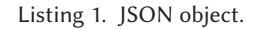
<!-- Image Description: The image is a simple text label, "Listing 1. JSON object," indicating that the following content presents an example of a JSON object within the academic paper. It serves as a caption or heading for a code snippet (not shown in the image) illustrating the structure of a JSON object relevant to the paper's topic. No diagrams, charts, graphs, or equations are present. -->

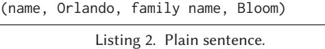
<!-- Image Description: The image displays a simple example of data representation. The top line shows the name "Orlando Bloom" presented as a list of name components. Below, the text "Listing 2. Plain sentence" labels this example, likely within a section of the paper comparing different data structures or formatting styles. The image illustrates a contrast between structured and unstructured data representations. -->

We define two common knowledge representation operators, i.e.,*Projection*(see Definition 1.7) and*Reification*(see Definition 1.8).

A plain sentence may be split into projections according to the logical structure of the format. These projections can be reified and substituted by the URIs associated with the projections. For example, the plain sentence of the Listing 2 may be split into two (Π<sup>2</sup> <sup>1</sup>(c) having URI*u*<sup>1</sup> and Π<sup>4</sup> <sup>3</sup>(c) having URI *<sup>u</sup>*2) projections, one for each key/value pair resulting in the sentence (u1, u2). To formalise these ideas, we introduce the notion of container (see Definition 1.9).

Finally, we introduce the function *Dereference* (see Definition 1.10), which substitutes a reference (a URI) within a container with the container the reference points to, and Dereference\*(see Definition 1.11), which recursively applies the dereference function.

For the sake of simplicity, we indicate with*D*<sup>∗</sup> (*C*) the set obtained by applying the function *D*<sup>∗</sup> on all the containers, (*D*<sup>∗</sup> (*C*) <sup>=</sup> {*<sup>v</sup>*<sup>∈</sup>*<sup>V</sup>* |∀*<sup>c</sup>*<sup>∈</sup>*<sup>C</sup>*.*<sup>v</sup>*<sup>=</sup>*<sup>D</sup>*<sup>∗</sup> (*c*)}). Now, we can show that any sequence of values generated by a grammar can be represented as a container.

<sup>29</sup>To improve the readability, some formal definitions are provided in the Appendix attached to this article.

ACM Transactions on Internet Technology, Vol. 23, No. 1, Article 6. Publication date: February 2023.

<span id="page-16-0"></span>Theorem 7.1. *Every sequence of values can be interpreted as a dereferenced container, i.e., V*<sup>∗</sup> ⊆*D*<sup>∗</sup> (*C*)*.*

Proof. Suppose that ∃*v*∈*V* <sup>∗</sup> such that*v*-*D*<sup>∗</sup> (*C*). Then, according to the definition of *D*∗, there exists at least one projection of*<sup>v</sup>* that does not belong to the domain of the function R (i.e., <sup>∃</sup>*i*, *<sup>j</sup>*.<sup>1</sup> <sup>≤</sup> *<sup>i</sup>*<sup>≤</sup>*<sup>j</sup>* ≤ |*v*|.Π*<sup>j</sup> <sup>i</sup>* (*v*) - D(*R*)).<sup>30</sup> Since D(*R*) = *V*<sup>∗</sup> by definition, such projection cannot exist. --

Since*V*<sup>∗</sup> subsumes*L* (*G*), we also have that any sentence of a plain language can be represented as a container (i.e., *L* (*G*) ⊆ *D*<sup>∗</sup> (*C*)). Interestingly, no assumptions were made on the structure of the production rules. Therefore, whatever the grammar generates and whatever meta-model interpretation the façade engineer devises, the content of a file can always be represented as a set of containers.

*7.1.2 Proving that Facade-X Subsumes Relational Model.*A**Relational Database (RDB)**is a collection of named relational tables where each table is a subset of the cartesian product of the domain of its attributes. Intuitively, an RDB can be expressed as a collection of containers, one for each tuple stored in the database, where each container is made up of*(i)*the name of the table storing the tuple;*(ii)*the names of the attributes of the tuple;*(iii)*the values of the tuple. For example, consider the Restaurant Database shown in Table [2](#page-17-0) constituted by two relational tables:*(i) Customer*that stores the name and tax ID of the customers of a restaurant; and*(ii) Order*that stores the orders of the customers of the restaurant. The set of containers expressing the database is shown in the Listings 3.

| (Customer, Customer ID, Tax ID, Name, 1, XXX1, Vincent Vega)          |
|-----------------------------------------------------------------------|
| (Customer, Customer ID, Tax ID, Name, 2, XXX2, Jules Winnfield)       |
| (Customer, Customer ID, Tax ID, Name, 3, XXX3, Mia Wallace)           |
| (Order, Order No, Customer ID, Product, 1, 1, Royale with Cheese)     |
| (Order, Order No, Customer ID, Product, 2, 2, Big Kahuna Burger)      |
| (Order, Order No, Customer ID, Product, 3, 3, Durward Kirby Burger)   |
| (Order, Order No, Customer ID, Product, 4, 3, Five Dollar Milk Shake) |

Listing 3. A set of containers expressing the restaurant database.

The rest of the section is dedicated to proving that any relational database can be expressed as a collection of containers. We start with some definitions and notations that are basic in database theory (cf. Definitions 1.12 and 1.13). Let U be a countably infinite set of*attributes*. Every attribute A has an associated set of values Δ(*A*), called A's domain. A relation scheme *R<sup>i</sup>*is a subset of U. Each relation scheme has a name, and we assume that the name is*R<sup>i</sup>*(in other words,*R<sup>i</sup>*is interpreted as a reification of the set of attributes that constitute the relation scheme).

Without loss of generality, we can express each tuple*<sup>t</sup>* <sup>=</sup> (*t*<sup>1</sup> : *<sup>A</sup>*1,...,*t<sup>n</sup>*:*<sup>A</sup><sup>n</sup>*) <sup>∈</sup>*<sup>r</sup>*, where *<sup>r</sup>*is a relation over the scheme*<sup>R</sup><sup>i</sup>* <sup>=</sup> {*A*1..*A<sup>n</sup>* }, as the tuple (*Ri*,*A*1,...,*An*,*t*1,...,*t<sup>n</sup>*). It follows that a database*d*can be expressed as a collection of tuples*R*×*U*<sup>∗</sup> × Δ∗. If we assume that the set*V*of values of the containers (cf. Definition 1.9) subsumes*R*, *U*, and Δ, then each database can be expressed as a collection of containers (since*R*×*U*<sup>∗</sup> × Δ<sup>∗</sup> ⊆*V*<sup>∗</sup>).
*7.1.3 Meta-model Interpretation.*As already discussed in Section [3,](#page-4-0) our framework introduces a novel actor in the KG construction, i.e., the*façade engineer*. The façade engineer is in charge of designing a façade, interpreting the legacy formats with respect to that façade, and then devising a strategy for triplifying the façade-framed data. This section focuses on the interpretation and triplification activities.

<sup>30</sup>D indicates the domain of a function.

<span id="page-17-0"></span>

| Customer ID | Tax ID | Name            | Order No | Customer ID | Product                |
|-------------|--------|-----------------|----------|-------------|------------------------|
|             |        |                 | 1        | 1           | Royale with Cheese     |
| 1           | XXX1   | Vincent Vega    | 2        | 2           | Big Kahuna Burger      |
| 2           | XXX2   | Jules Winnfield | 3        | 3           | Durward Kirby Burger   |
| 3           | XXX3   | Mia Wallace     | 4        | 3           | Five Dollar Milk Shake |
| Customer    |        |                 |          |             |                        |
|             |        |                 |          | Order       |                        |

Table 2. Restaurant Database

A meta-model interpretation is the act of mapping basic data structures from a format onto a façade meta-model. The interpretation consists of two activities: *containerification*and*façadification*.

*Containerification.*Containerification uses projection and reification operators to transform a sequence of values into a set of nested containers. In other words, to interpret a sequence of values (i.e., a plain sentence) as a set of nested containers, the façade engineer uses projection and reification to "group together" a sub-sequence of values, to create a container out of them, and to associate a URI with the container. By means of these two simple operators, the façade engineer can frame a plain sentence as a set of containers. It is worth noticing that the decision of what is a container and how containers are nested is up to the façade engineer, who has a large degree of flexibility for defining the mapping.

We give the intuition of how containerification is supposed to work. Ideally, we associate each projection with the non-terminal symbol from which it is derived. For example, consider the grammar for JSON available at files31 and in Section 2 of the Appendix. Intuitively, non-terminals can be associated with projections (e.g., Π<sup>2</sup> <sup>1</sup> and Π<sup>4</sup> <sup>3</sup> are derived from member). The façade engineer might decide which non-terminals (hence, which projections) to turn into containers.
*Facadification.*The facadification is the activity of transforming a set of containers into an instance of Facade-X meta-model, introduced in Section [4.](#page-5-0) In what follows, we refer to such as Facade-X model. Before giving a definition of facadification it is important to observe that Facade-X can be specified by using the reification and projection operators, for the following reasons:*(i)*a slot can be defined as the reification of a projection of length 1 of a container c;*(ii)*names and types are qualities that are attributed to containers via an interpretation of the sequence of values. We can now provide a definition of Facade-X models.
*Definition 7.2 (Facade-X models).*A Facade-X model*<sup>m</sup>* is defined as a tuple (*c*,*s*,*t*,*n*,*hs*,*ht*,*hn*) where *c*is a set of URIs identifying containers,*s*is a set of URIs identifying slots,*t*is a set of URIs identifying types,*n*is a set of names,*hs*is a subset of hasSlot,*ht*is a subset of hasType,*hn*is a subset of hasName. Therefore, the set*M*of all possible Facade-X models is32:

$$
M \subseteq 2^U \times 2^U \times 2^U \times 2^{Name} \times 2^{hasSlot} \times 2^{hasType} \times 2^{hasName}.
$$
*Facadify.*We introduce the function Facadify to transform a set of pairs (container, nonterminal symbol) into a Facade-X model.
*Definition 7.3 (Facadify).* We define Facadify as a function that takes as input a set of containers and returns a Facade-X model, that is:

$$
Facadify: 2^{C\times N} \to M.
$$

<sup>3</sup>[1https://www.json.org/json-en.html.](https://www.json.org/json-en.html)

<sup>322</sup>*<sup>A</sup>*denotes the powerset of a set*A*, i.e., the set of all possible subsets of *A*.

ACM Transactions on Internet Technology, Vol. 23, No. 1, Article 6. Publication date: February 2023.

<span id="page-18-0"></span>The intent of the Facadify function is to interpret the components of the input format as basic data structures and to instantiate the Facade-X model accordingly. For example, the containers derived from member can be interpreted as key/value pairs. An example of such transformation is provided in the Listings 4 and 5.

| c: ((u1, u2), JSON)<br>u1: ((name, Orlando), member)<br>u2: ((family name, Bloom), member) | hasSlot(c, u1)<br>hasValue(u1, Orlando)<br>hasSlot(c, u2)<br>hasValue(u2, Bloom)<br>hasKey(u1, name)<br>hasKey(u2, family name) |  |
|--------------------------------------------------------------------------------------------|---------------------------------------------------------------------------------------------------------------------------------|--|
| Listing 4. Container-non-terminal pairs.                                                   | Listing 5. Facade-X model.                                                                                                      |  |

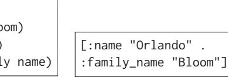
<!-- Image Description: The image shows a comparison of two data representations. On the left is a less structured representation of a person's name (Orlando Bloom), listing "name" and "family name" separately. The right side displays a more structured representation using a list-like notation, explicitly labeling the "name" and "family_name" fields with their respective string values. This illustrates a transition to a more formal and machine-readable data format, likely within the context of data modeling or database design. -->

Listing 6. Triplification of

the Facade-X model.

Finally, we introduce the function *Triplify*, which takes as input a Facade-X model and uses a set of RDF constructs: RDF properties, the predicate rdf:type, and container membership properties, to express sequences (instead of rdf:List, following the recommendation of Reference [\[22\]](#page-28-0)):

$$
Triplify: M \to 2^{U \times U \times U}.
$$

An example of triplification is shown in Listing 6.

In this section, we laid the theoretical foundation of the façade-based KGC. We demonstrate that the Facade-X meta-model is general and flexible enough to specify data with any format described by a grammar. We then specify KGC in terms of two activities, namely, *containerification*(i.e., the definition of rules for generating a set of containers from a sequence of values) and*facadification*(i.e., the instantiation of Facade-X from a set of containers). Note that, although containerification and facadification functions out of a grammar might be automated, we currently assume that those functions are designed by humans.

# 7.2 Cognitive Complexity

We present a quantitative analysis on the cognitive complexity of SPARQL Anything, SPARQL Generate, RML, and ShExML frameworks. One effective measure of complexity is the number of distinct items or variables that need to be combined within a query or expression [\[33\]](#page-29-0). Such a measure of complexity has previously been used to explain difficulties in the comprehensibility of Description Logic statements [\[62\]](#page-30-0). Specifically, we counted the number of tokens needed for expressing a set of competency questions. We selected four JSON files from the case studies of the SPICE project where each file contains the metadata of artworks of a collection. Each file is organised as a JSON array containing a list of JSON objects (one for each artwork). This simple data structure avoids favouring one approach over the others. Then, an analysis of the schema of the selected resources allowed us to define a set of 12**competency questions (CQs)**that were then specified as SPARQL queries or mapping rules according to the language of each framework, in particular:*(i)*8 CQs (named q1–q8), aimed at retrieving data from the sources, were specified as SELECT queries (according to SPARQL Anything and SPARQL Generate);*(ii)*4 CQs (named q9–q12), meant for transforming the source data to RDF, were expressed as CONSTRUCT queries (according to SPARQL Anything and SPARQL Generate) or as mapping rules complying with RML and ShExML. These queries/rules intend to generate a blank node for each artwork and to attach the artwork's metadata as data properties of the node. Competency questions, queries, experimental data, and code used for the experiment are available on the GitHub repository of the SPARQL

<span id="page-19-0"></span>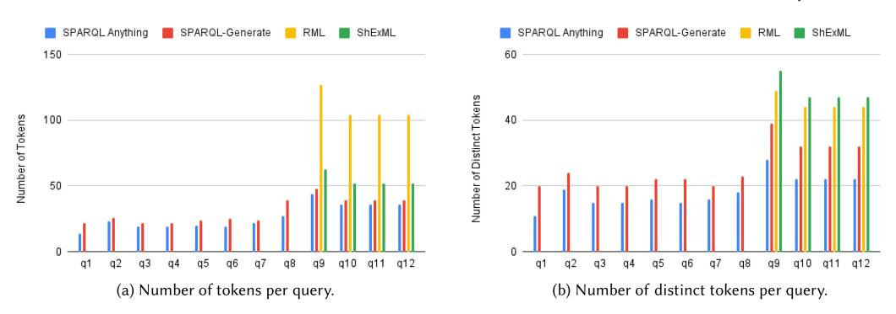
<!-- Image Description: The image presents two bar charts comparing the number of tokens and distinct tokens generated per query across four methods: SPARQL Anything, SPARQL-Generate, RML, and ShExML. Chart (a) shows the total number of tokens per query, while (b) illustrates the number of unique tokens. Both charts show a significant increase in tokens (both total and unique) for queries q9-q12, suggesting a potential relationship between query complexity and token generation. -->

Fig. 6. Analysis of the number of tokens needed for expressing each competency question.

Anything project.<sup>33</sup> Finally, we tokenized the queries (by using "(){},;\n\t\r as token delimiters) and we computed the total number of tokens and the number of distinct tokens needed for each query. By observing the average number of tokens (cf. Figure 6(a)) per query, we can conclude that RML is very verbose (109.75 tokens) with respect to SPARQL Anything (26.25 tokens) and SPARQL Generate (30.75 tokens) whose verbosity is similar (they differ of ∼6.5%), and ShExML, which required 54.75 tokens, on average. However, the average number of*distinct*tokens (cf. Figure 6(b)) per query shows that SPARQL Anything requires less cognitive load than other frameworks. In fact, while SPARQL Anything required 18.25 distinct tokens, SPARQL Generate needed 25.5 distinct tokens (∼39.72% more), RML 45.25 distinct tokens (∼150% more), and ShExML 49.25 (∼168% more).

## 7.3 Performance and Scalability

We conduct a comparative performance analysis of the reference implementations of SPARQL Anything, RML, SPARQL Generate, and ShExML. Specifically, we assess the performance of the four frameworks in generating RDF data. All of the tests described below were run three times, and the average time among the three executions is reported. For practical reasons, for each test, we set a 3-minute timeout. The tests were executed on a MacBook Pro 2020 (CPU: i7 2.3 GHz, RAM: 32 GB). Figure [7\(](#page-20-0)a) shows the time needed for evaluating the SELECT queries q1–q8 and for generating the RDF triples according to the CONSTRUCT queries/mapping rules q9–q12. SPARQL Anything, RML, and SPARQL Generate frameworks have comparable performance, while it is clear that the time needed for evaluating ShExML mappings was significantly higher (that is, it exceeded the timeout) than the other cases.

We also measured the performance in transforming input of increasing size. To do so, we repeatedly concatenated the data sources to obtain a JSON array containing 1M JSON objects and we cut this array at lengths 10, 100, 1K, 10K, and 100K. We ran the query/mapping q12 on these files and we measured the execution time shown in Figure [7\(](#page-20-0)b). For all input sizes, ShExML performance is significantly worse than others and for inputs greater than 1K the reference implementation needed more than 3 minutes. Moreover, we observe that for inputs with size smaller than 100K the other three frameworks have equivalent performance. With larger inputs, SPARQL Anything is slightly slower than SPARQL Generate and RML. The reason is that, in our naive implementation, the data source is completely transformed and loaded into an RDF dataset in-memory, before the query is evaluated. However, Section [7.4](#page-20-0) presents our experiments with different implementations showing improvements of performance.

<sup>3</sup>[3https://github.com/SPARQL-Anything/experiments.](https://github.com/SPARQL-Anything/experiments)

ACM Transactions on Internet Technology, Vol. 23, No. 1, Article 6. Publication date: February 2023.

<span id="page-20-0"></span>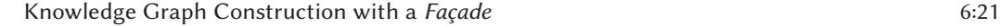
<!-- Image Description: The image is a section header titled "Knowledge Graph Construction with a Facade." It's likely a heading introducing a subsection of the paper detailing a specific method for building knowledge graphs using a facade pattern. No diagrams, charts, graphs, or equations are present; the image only provides textual information to organize the paper's content. -->

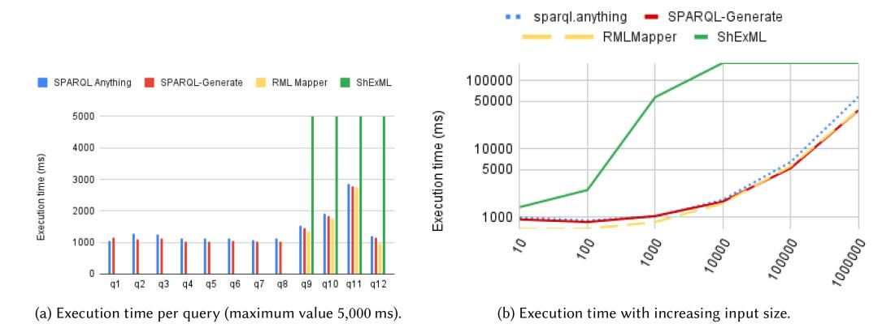
<!-- Image Description: The image presents two bar and line charts comparing the execution times of four RDF data mapping tools: SPARQL Anything, SPARQL-Generate, RML Mapper, and ShExML. (a) shows execution time per individual query (12 queries total), demonstrating varied performance across queries. (b) illustrates execution time scaling with increasing input data size, revealing how performance changes as input grows. Both charts use milliseconds (ms) for the execution time. The purpose is to compare the efficiency and scalability of the different tools. -->

Fig. 7. Analysis of the execution time.

# 7.4 Experiments with a Triple-filtering Approach

In this section, we experiment with an alternative strategy to the one of transforming the whole content before query execution, which we call*triple-filtering*. This approach inspects the SPARQL Anything query and only transforms the parts of the data matching any of the triple patterns included. We select two queries from the evaluation setting previously introduced. The first is focused on querying an open data file in SPARQL (Scenario 1); the second, on building a knowledge graph from legacy data (Scenario 2).

We perform experiments comparing two execution strategies: *naive*and*triple-filtering*. Experiments are performed on a MacBook Pro with Java 14 and the default settings (no changes to the default heap size). We run each experiment three times and report the average execution time and standard deviation. We discuss the scenarios and the results.

*Scenario 1. Querying an open data collection as single JSON file.*A JSON file with collection metadata is queried directly in SPARQL. We designed three SELECT queries. The first query selects all titles of artworks from author "GABINIO MARIO." The value is directly inserted into a triple pattern that is joined with another, used to select the title:

1 ?s xyz:Autore "GABINIO MARIO" ; xyz:Titolo ?titolo .

The second query selects all the techniques that are described as "STAMPA ALLA GELATINA BROMURO D'ARGENTO CAMOSCIO" and returns a distinct list of values:

1 ?s xyz:Tecnica ?t .**FILTER**(**REGEX**(?t,".\*STAMPA ALLA GELATINA BROMURO D'ARGENTO.\*","i"))

The third query selects the artworks having a date matching a given expression (for example, ".\*1925 ca..\*"):

1 ?s xyz:Datazione ?date ; xyz:Titolo ?titolo . **FILTER**(**REGEX**(?date,".\*30/09/1926.\*","i"))

We execute the three queries with JSON documents of increasing size, from 10 to 1,000,000 items. Results are reported in Figure [8\(](#page-21-0)a). Improvement in the performance occurred in all the three cases, saving up to −70% of the time (first query with 1M of collection items).

*Scenario 2. Building a knowledge graph of artworks from a open data repository.*In this scenario, we produce a KG from the Open Data of the Tate Callery collection.<sup>34</sup> The data include two CSV

<sup>3</sup>[4https://github.com/tategallery.](https://github.com/tategallery)

<span id="page-21-0"></span>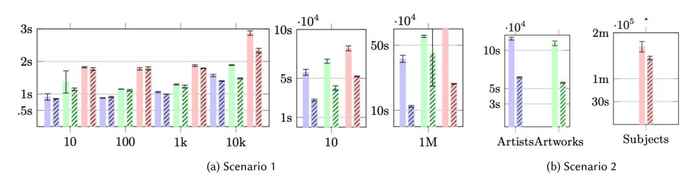
<!-- Image Description: The image presents two sets of bar charts (Scenarios 1 and 2) illustrating performance results. Scenario 1 shows query response times (y-axis, in seconds) across varying data scales (x-axis, from 10 to 10k and then 1M), comparing three different methods (represented by different colored bars). Scenario 2 shows response times for querying artists, artworks, and subjects, again comparing the same three methods. Error bars indicate variance. The charts demonstrate how response times scale with different data sizes and query types. -->

Fig. 8. The x axis reports the size of the collection, while the y axis the execution time in seconds. The first query is in blue bars, the second green, and the third red. The marked bars refer to the triple-filtering method.

files with artists' and artworks' metadata. The latter references a collection of 69,202 JSON files, containing additional metadata such as a hierarchy of subjects. Not all of the data are needed for the mappings. We report the execution of three CONSTRUCT queries.<sup>35</sup> Results are reported in Figure 8(b). The first (Artists) joins the two CSV and produces a KG of artists' metadata linked to their collection of artworks (our method saves 43% of the time). The second (Artworks) selects only the artworks and artists' names from the artworks CSV (our method saves 47% of the time). The third (Artworks-s) extracts basic metadata about artworks and, for each one of them, queries the JSON file for extracting the list of subjects (our method saves 14% of the time). This last query accesses the CSV file and all the referenced artworks' JSON files, meaning that most of the time is spent in I/O operations on the file system.

A triple-filtering approach may help in reducing the load on the system. However, this will depend on the type of query designed and on the selectivity of its triple patterns. Future optimisations may inspect other components of the query, such as FILTER statements. Crucially, we have shown how the performance of a system implementing our façade-based approach can be improved even with a simple optimisation strategy like the triple-filtering one, which we implemented in our proof-of-concept system SPARQL Anything.

## 7.5 Community Engagement

To add an empirical element to the multi-faceted evaluation of the approach, we developed an online survey. The role of the survey was:*(i)*to validate empirically the design requirements used for defining the approach and*(ii)*to gain feedback on the usability of the notation. The survey is available at.36 Target

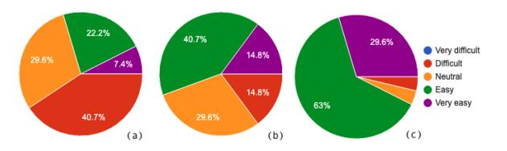
<!-- Image Description: The image displays three pie charts (a, b, c) showing the percentage distribution of responses to a perceived difficulty question. Each segment represents a difficulty level: very difficult, difficult, neutral, easy, and very easy. The charts likely compare responses across different groups or conditions, illustrating varying levels of perceived ease/difficulty in completing a task or process. The charts' purpose is to visually present quantitative survey data related to usability or task complexity within the paper. -->

Fig. 9. We asked users about the usability of three notations: (a) RML, (b) SPARQL Generate, and (c) SPARQL Anything.

survey participants were Semantic Web practitioners, SPARQL developers/users, and Master Students learning advanced Semantic Web technologies. The survey was open for 1 week, and 27 completed responses were received.

The first set of questions were concerned with the participants' expertise and experience. 37% needed to transform non-RDF resources into RDF either frequently or very frequently. 33.3% performed this task rarely or never. 37% rated their expertise in transforming data into RDF as

<sup>35</sup>The queries can be found in the additional material to this submission.

<sup>3</sup>[6https://forms.gle/nsdm8vsXz2o81CQ56.](https://forms.gle/nsdm8vsXz2o81CQ56)

ACM Transactions on Internet Technology, Vol. 23, No. 1, Article 6. Publication date: February 2023.

high or very high. 29% rated their expertise as low and 7.4% as none. 14.8% of participants had contributed to published and/or distributed tools for the transformation of non-RDF resources. Participants were asked which tools they used for data transformation. 62.9% at least occasionally used program specific code for transformations. 22.2% used RML at least occasionally. 22.2% used SPARQL Generate at least occasionally. 25.9% at least occasionally used other tools such as morph-RDB, Topbraid Composer, RDFlib, and ARC2. Participants were asked of their use of, and expertise in, SPARQL 1.1. 51.8% used SPARQL 1.1 frequently or very frequently. 33.3% rated their expertise in SPARQL 1.1 as high or very high. 37% rated their expertise as low. Overall, this is a sufficiently diverse range of user types, reflecting the target audience of our solution.

The second set of questions were concerned with the desirable usability characteristics of systems for transforming non-RDF resources into RDF. 51.8% considered it**very important or essential that the system should minimise the languages**or syntaxes needed. 66.6% considered it**very important or essential that the mappings should be easy**to read and interpret. 70.3% considered it**very important or essential that the system must be easy to learn**for a Semantic Web practitioner. Participants were asked how important is it that the system is able to**support new types of data sources without changes to the mapping language**. 7.4% considered this essential, 48.1% as very important, and 44.4% as moderately important. These results highlight the *value-to-users*of some founding assumptions of our system design. 25.9% considered it very important or essential to support complex manipulations within a single mapping file. 40.7% considered it very important or essential to support mappings to multiple data sources within the same mapping file. 40.7% considered it very important to enable data source exploration without committing to a mapping. This feedback can be interpreted by considering the iterative and incremental nature of the user activity, typically performed as*trial-and-error*.

The third set of questions asked participants about the size and nature of the data sources they worked with when transforming data. 18.5% worked with files of less than 10 MB. 48.1% worked with files between 10 MB and 100 MB. 14.8% worked with files between 100 MB and 1 GB. 18.5% worked with files of more than 1 GB. 33% transformed the data file into less than 1 million triples. 25.9% generated between 1 and 10 million triples. 18.5% generated between 100 and 10 million triples. 22.2% generated more than 100 million triples. This feedback stresses the importance of scalability, performance, and efficiency.

Participants were asked whether they transformed all or part of a resource. 11.1% always transformed part of the resource, 3.7% always transformed all of it. The remaining 85.1% transformed all or part of the resource, depending on context. Reasons for transforming part of a resource included the desire to ignore particular fields or to split and incrementally transform a larger resource. This confirms the importance of supporting composite pipelines, combining multiple queries, and to develop strategies that filter the data source to fit only the triples needed (as in our current implementation).

The final set of questions **compared the usability of three notations**for transforming non-RDF data: RML, SPARQL Generate, and SPARQL Anything. Participants were presented with a JSON file containing six metadata properties of two different artwork images. Participants were then presented with the RML, SPARQL Generate, and SPARQL Anything notations required to transform the file. For each notation, the participant rated its difficultly level and provided an explanation for their rating. 7.4% rated the RML code as very easy, 22.2% as easy, 29.6% as neutral, and 40.7% as difficult. In explanation, 18.5% found the RML syntax straightforward when used in combination with the JSON file structure. 37% commented that RML would become easier to use with greater familiarity. 22% stated that they found the syntax verbose. 14.8% rated the SPARQL Generate code as very easy, 40.7% as easy, 29.6% as neutral, and 14.8% as difficult. In explanation, <span id="page-23-0"></span>25.9% distinguished the GENERATE and ITERATOR sections of the code, with 14.8% explicitly stating that the GENERATE section was easier to understand. 33.3% commented that SPARQL Generate would become easier to understand with familiarity. 14.8% stated that SPARQL Generate was concise, 18.5% that it was intuitive.**29.6% rated the SPARQL Anything code as very easy, 63% as easy, 3.7% as neutral, and 3.7% as difficult**. In explanation, 29.6% commented on the simplicity of mapping JSON to RDF in the WHERE clause. 37% commented on how only standard SPARQL features were required. 11.1% described the notation as concise. This verdict is summarised in Figure [9.](#page-21-0)

# 8 RELATED WORK

We consider related work in end-user development, approaches to extend the SPARQL language, and methods for Semantic Lifting.

# 8.1 End-user Development

Motivation for our work resides in research on end-user development and human interaction with data. End-user development is defined by Reference [\[43\]](#page-29-0) as *"methods, techniques, and tools that allow users of software systems, who are acting as non-professional software developers, at some point to create, modify or extend a software artefact."*Many end-user development tasks are concerned with the use of software to manipulate data. End-user development initially focused on the use of spreadsheets and related tools but has more recently evolved to encompass sending, receiving, and manipulating data from web APIs, IoT devices, and robots [\[52\]](#page-30-0). Unlike professional software development, end-user development involves the construction of software for personal rather than public use [\[39\]](#page-29-0) to carry out professional activities. Many SPARQL users fall into the category of enduser developer. In a survey of SPARQL users, Reference [\[61\]](#page-30-0) found that although 58% came from the computer science and IT domain, other SPARQL users came from non-IT areas, including social sciences and the humanities, business and economics, and biomedical, engineering, or physical sciences. Findings in this area [\[51\]](#page-30-0) suggest that the data with which users work is more often primarily list-based and/or hierarchical rather than tabular. For example, Reference [\[14\]](#page-28-0) proposes an extension to spreadsheets to explicitly support hierarchical data, and Reference [\[34\]](#page-29-0) proposes an alternative formulation to spreadsheets in which data is represented as*list-of-lists*, rather than tables. Therefore, our proposal goes in this direction and accounts for recent findings in end-user development research.

# 8.2 Approaches to Extend SPARQL

We survey approaches to extend SPARQL. A standard method for extending SPARQL is by providing custom functions to be used in FILTER or BIND operators.<sup>37</sup> Query processing engines can extend SPARQL by using so-called magic properties. This approach defines custom predicates to be used for instructing specific behaviour at query execution.<sup>38</sup> SPARQL Generate [\[42\]](#page-29-0) introduces a novel approach for performing data transformation from heterogeneous sources into RDF by extending the SPARQL syntax with a new GENERATE operator [\[42\]](#page-29-0). The method introduces two more operators, SOURCE and ITERATOR. Custom functions perform ad hoc operations on the supported formats, for example, relying on XPath or JSONPath. However, there are also approaches to extend SPARQL without changes to the standard syntax. For example, BASIL [\[24\]](#page-28-0) allows to

<sup>37</sup>ARQ provides a library of custom functions for supporting aggregates such as computing a standard deviation of a collection of values. ARQ functions: [https://jena.apache.org/documentation/query/extension.html.](https://jena.apache.org/documentation/query/extension.html)

<sup>38</sup>For example, this allows the specification of complex fulltext searches over literal values. Query processors can delegate execution to a fulltext engine (e.g., Lucene) and return a collection of query solutions as triple patterns.

define parametric queries by enforcing a convention in SPARQL variable names. SPARQL Anything reuses BASIL variables to support parametric queries and file names. SPARQL Microservice [\[46\]](#page-29-0) provides a framework that, on the basis of API mapping specification, wraps web APIs in SPARQL endpoints, and uses JSON-LD profile to translate the JSON responses of the API into RDF. In this article, we follow a similar, minimalist approach and extend SPARQL by *overriding*the behaviour of the SERVICE operator.

# 8.3 Semantic Lifting

We now discuss approaches to Semantic Lifting from the user standpoint. In general, Semantic Lifting refers to the task of transforming non-RDF resources into RDF. We can classify approaches to Semantic lifting into format-based and ontology-based.
*8.3.1 Format-based Lifting.*In the format-based lifting the transformation depends solely on the input format.

In Reference [\[50\]](#page-30-0), the process focuses on re-engineering the meta-model, described as an ontology and a set of transformation rules, to obtain an RDF dataset that will be in turn be refactored to the end product, domain-oriented dataset. While the abstraction proposed is similar to what we do in Facade-X, it requires a different ontology for each source format. Facade-X provides an additional abstraction step with containerification and facadification, making the approach fully operational and query-driven.

Several tools are available for automatically transforming data sources of several formats into RDF (Any23,39 JSON2RDF,<sup>40</sup> CSV2RDF,<sup>41</sup> to name a few). While these tools have a similar goal (i.e., enabling the user to access the content of a data source as if it was in RDF), the (meta)model used for generating the RDF data highly depends on the input format, thus limiting the homogeneity of data generated from heterogeneous data formats. In addition, none of those approaches are based on a common abstraction from heterogeneous formats.
*8.3.2 Ontology-based Lifting.*Ontology-based lifting refers to the process of taking one or multiple existing resources and accessing them through the mediation of a conceptual view formalised by a domain ontology, i.e.,**Ontology-based Data Access (OBDA)**, or transforming them into a single Knowledge Graph that complies with a target ontology, i.e., **Ontology-based Knowledge Graph Construction (OBKGC)**. Although this distinction might seem rather strained (as tools often belong to both categories), identifying these two classes allows us to distinguish different lines of research studying strategies for accessing the ontology-based resource. While research in OBDA *typically*concerns the study of*virtualisation*approaches that rewrite queries over the ontology into queries over the sources, OBKGC concerns the study of strategies that*materialise*the knowledge graph before evaluating the query. Both perspectives are based on the assumptions that (1) there is a known target ontology to be used as a reference model for transforming both schema and data; (2) the source format has its own query language; (3) there exists a declarative mapping between the data sources and the target ontology. Crucially, these three conditions are not always satisfied in all the ontology-based lifting problem instances. If the target ontology is not available, then a Semantic Web practitioner has to invest considerable effort in developing a model for the target domain. If the source format does not have its own query language, the practitioner has to fall back to a format-based lifting strategy. If the mapping is not available, then a practitioner is expected to develop it by analysing the input data sources. To this end, mapping languages

<sup>3</sup>[9http://any23.apache.org/.](http://any23.apache.org/)

<sup>4</sup>[0https://github.com/AtomGraph/JSON2RDF.](https://github.com/AtomGraph/JSON2RDF)

<sup>4</sup>[1http://clarkparsia.github.io/csv2rdf/.](http://clarkparsia.github.io/csv2rdf/)

typically incorporate format-specific query languages (e.g., XPath) and require the practitioner to have deep knowledge of both the input data model and the standard methods used for its processing.

We now give an overview of the main languages for mapping data and prominent approaches to OBDA and OBKGC.
*Mapping languages for OBDA and OBKGC.*Mapping languages for transforming heterogeneous files into RDF are represented by RML [\[27\]](#page-29-0), also specialised to support data cleaning operations [\[60\]](#page-30-0), and specific forms of data: relational [\[57\]](#page-30-0), geospatial data [\[41\]](#page-29-0), and so on. RML has been adopted as reference mapping language in most of the OBDA and KGC systems. Authors of a recent alternative to RML, based on ShExML [\[31\]](#page-29-0), stress the importance of making mappings usable by end-users. Indeed, recent work acknowledges how these languages are built with machineprocessability in mind [\[36\]](#page-29-0) and how defining or even understanding the rules is not trivial to users.

SPARQL Anything goes beyond current approaches and aims at equipping SPARQL users with the simplest assumption on how to deal with heterogeneous resources. In addition, mapping tools such as the ones based on RML can only be used for formats that can be easily interpreted as collections of items (CSV), or that can have an accompanying query language to be injected in the declarative rules, acting as*selector*of items to transform (e.g., JSON, XML). In the remaining cases (e.g., YAML, Markdown, Bibtex), one needs to write ad hoc code, where the mappings are both represented and enforced at the same time.
*Ontology-based data access.* **Ontology-based Data Access (OBDA)**[\[53\]](#page-30-0) refers to the problem of accessing (i.e., querying) one or multiple existing data sources through the mediation of a conceptual view formalised by a target ontology. In the OBDA framework, data sources and target ontology are linked together by a declarative mapping (e.g., in RML), and queries to the data sources can be expressed in terms of the target ontologies.

Although the OBDA paradigm has been also applied over document-based databases [\[9,](#page-28-0) [45\]](#page-29-0) and CSV files [\[15\]](#page-28-0), most of the existing approaches focus on providing access to relational database and optimising algorithms for translating SPARQL queries into SQL queries (refer to Xiao et al. [\[64\]](#page-30-0) for a complete overview). The first algorithm was essentially based on backward chaining [\[12\]](#page-28-0), but the query produced was extremely large for execution by DBMSs. Optimisation to the algorithm was investigated by Mora and Corcho [\[47\]](#page-30-0). Alternative approaches require to rewrite the query by means of unfolding (i.e., substituting ontology terms of the query with with the terms of the source schema according to the mapping) [\[13,](#page-28-0) [32,](#page-29-0) [40,](#page-29-0) [58\]](#page-30-0).

Besides the query rewriting algorithm, research in OBDA has been dedicated to implementing the approach with the standard web technologies, e.g., SPARQL. SPARQL is the de facto standard query language of the OBDA paradigm. Xiao et al. [\[65\]](#page-30-0) proposed a method to translate a large part of SPARQL into SQL. A recent approach [\[8\]](#page-28-0) applies OBDA to run SPARQL on any type of Web resources, with a sophisticated set of mappings supporting an intermediate query service.

Currently, SPARQL Anything supports only static files and implements a materialisation strategy for evaluating queries. Future work includes supporting a connection to relational databases, for example, by relying on engines implementing the W3C Direct Mapping recommendation [\[55\]](#page-30-0) for relational databases. To do this, we aim at reusing recent research in OBDA (e.g., Reference [\[59\]](#page-30-0)) to develop optimised query-rewriting strategies from Facade-X to the underlying relational model, on demand, without asking users to engage with the mappings. We plan to implement different methods, including experimenting with alternative back-end engines.
*Ontology-based Knowledge Graph Construction.* **Ontology-based Knowledge Graph Construction (OBKGC)**is the task of extracting data from the sources and transforming it into a Knowledge Graph that complies with a target ontology. This problem is typically addressed by

ACM Transactions on Internet Technology, Vol. 23, No. 1, Article 6. Publication date: February 2023.

<span id="page-26-0"></span>designing ad hoc mappings (mainly in R2RML [\[1\]](#page-27-0) or RML [\[27\]](#page-29-0) languages) between sources and target ontology. Multiple interpreters of such mappings are available: Ontop [\[11\]](#page-28-0) and Morph-RDB [\[54\]](#page-30-0) (which provide both a virtualisation and materialisation mode), SDM-RDFizer [\[38\]](#page-29-0), to name a few. Although they allow better transparency maintainability of the data transformation pipelines, designing and maintaining such mappings constitute a significant bottleneck for data managers. In fact, data managers are required to inspect the data sources and express the mapping according to the specificity of each source format. Moreover, this approach is limited to formats for which a declarative query language is available. Instead, our approach aims at reducing the effort of Semantic Web practitioners in dealing with heterogeneous data sources by providing a generic, domain-independent meta-model to wrap the original resource and to make it query-able by KG engineers (even if a query language is not available for the source format).

## 9 DISCUSSION, LIMITATIONS, AND FUTURE WORK

In this section, we discuss challenges introduced by our approach and sketch directions for future work.

The method generates an RDF view of the source data by applying the minimal possible ontological commitment. We focused our evaluation on theoretical aspects of the approach, demonstrating that it can robustly represent data sources*at the meta-model level*(not considering the specificity of the domain model). It is worth noticing that the theoretical evaluation also proves that the façadebased conversion is accurate and lossless (i.e., all the data records specified in any source format are ported to RDF). Although this enables software engineers to seamlessly map data formats into RDF, one should note that applications based on knowledge graphs typically make use of highly expressive domain models. Nevertheless, our approach can open new opportunities for automatic generation of domain ontologies from structurally homogeneous RDF data.

Specifically, how could we provide better support for the generation of expressive OWL ontologies? Currently, the façade is designed through a selection of structural design patterns that enable mapping of an open-ended set of formats onto a set of RDF components. Although Facade-X already interprets some structural design patterns of certain formats (e.g., XML, Word Processing Documents, Markdown, Bibtex) as*semantic*classes, the mapping mainly involves*syntactic*features of the input formats. However, we claim that the mapping may make a stronger commitment on the semantic of the containers. To this end, we are considering to extend Facade-X with OWL's class expressions to enable a formal specification of the semantic of a container. For example, consider the container of the Listing [6.](#page-18-0) Even if we do not know the*explicit*name of the class the container belongs to, we can specify the conditions on the individuals' properties of the instances of this class, i.e., the class of individuals having a :name and a :family\_name. This class can be*anonymously*expressed in OWL2 by the following axiom (specified in Manchester syntax42) and be used to give a type to the container:

```text
(:name some rdfs:Literal) and (:family_name some rdfs:Literal).
```text

Such descriptions enrich the RDF transformation of the input sources and may assist Semantic Web practitioners in the tasks of KG exploration, KG understanding, and ontology alignment.

We presented our method as a suitable solution for an open-ended, unlimited set of formats. For example, the proposed method enables knowledge engineers to embed unstructured content (e.g., Text and Binary files) into multi-modal KGs. However, the method is not sufficient alone for solving complex**knowledge extraction (KE)**tasks from unstructured resources. Therefore, we plan to study how highly expressive KE methods could be combined with our approach. Possible

<sup>4</sup>[2https://www.w3.org/TR/owl2-manchester-syntax/.](https://www.w3.org/TR/owl2-manchester-syntax/)

<span id="page-27-0"></span>directions include the extension of the meta-model to cover novel structural design patterns that may emerge from task-specific format, such as:**Abstract Meaning Representation (AMR)**[\[7\]](#page-28-0) or Linguistic frames [\[6,](#page-28-0) [29,](#page-29-0) [49\]](#page-30-0) for natural language resources, annotation formats such as COCO [\[16\]](#page-28-0) and YOLO [\[56\]](#page-30-0) to support visually intelligent applications [\[17\]](#page-28-0), or JAMS [\[37\]](#page-29-0) to leverage**Music Information Retrieval (MIR)**systems for publishing musical content on the Web as linked data [\[25\]](#page-29-0).

We demonstrate comparable performance to state-of-the-art tools with a basic in-memory transformation approach. The implementation leans on mature software libraries that guarantee a reliable low-level access to the data sources. As a result, the transformation will fail only in case of malformed data sources. However, performance can become problematic on very large datasets, and either hit memory limits or take too much time to complete. Our survey has also highlighted the importance of being able to deal with very large data sources. Therefore, the current version of SPARQL Anything implements a strategy for reducing the amount of triples loaded in memory by filtering only triples matching at least one of the triple patterns in the query. Future work includes research on query-rewriting approaches to stream the data, similarly to the internal machinery of SPARQL Generate, to reduce the memory needs.

We have reported very positive feedback from potential adopters via a community engagement questionnaire. We plan to further verify those results in a thorough usability study, currently under development, also aiming at identifying cognitive difficulties and strategies in the design of the mappings with SPARQL Anything, compared to those needed with alternative solutions.

### 10 CONCLUSIONS

In this article, we have proposed a novel, unified method to access heterogeneous data sources on the Web to streamline**Knowledge Graph Construction (KGC)**. We base our method on an intermediate *façade*, called Facade-X, which allows indirect access to an open-ended set of formats (*reengineering* source data) and on the design of mappings between two RDF structures in plain SPARQL: a Facade-X view of the source data and the intended target ontology (*re-modelling source data*). We have presented an implementation of our approach in a system called SPARQL Anything [\[3\]](#page-28-0), available as an open-source project. To the best of our knowledge, there is no other system for KGC that supports a comparable range of file formats, including non-trivial ones such as Word processors and Markdown files. Next, we aim at implementing connectors to relational databases and no-SQL databases such as MongoDB. We have evaluated our implemented method from three perspectives. In a theoretical evaluation, we have demonstrated how our approach is powerful enough to support transformation of any serialised data model expressible in a BNF syntax. We have also demonstrated that the relational model can be subsumed by Facade-X. In an experimental evaluation, we show how our unified approach is practically valuable, sustainable, and with comparable performance to state-of-the-art tools. Finally, we have reported very positive feedback from potential adopters via a community engagement questionnaire. Our work sketches the basis for a broader research agenda on knowledge graph integration strategies based on RDF façades.

### ACKNOWLEDGMENTS

The authors thank Prof. Enrico Motta for his feedback on the submitted version of the manuscript.

### REFERENCES

- [1] Souripriya Das, Seema Sundara, and Richard Cyganiak. 2012. *R2RML: RDB to RDF Mapping Language*. W3C Recommendation. W3C. Retrieved from [https://www.w3.org/TR/r2rml/.](https://www.w3.org/TR/r2rml/)
- [2] The W3C SPARQL Working Group (Eds.). 2013. *SPARQL 1.1 Overview*. W3C Recommendation. W3C. Retrieved from [https://www.w3.org/TR/2013/REC-sparql11-overview-20130321/.](https://www.w3.org/TR/2013/REC-sparql11-overview-20130321/)

ACM Transactions on Internet Technology, Vol. 23, No. 1, Article 6. Publication date: February 2023.

- <span id="page-28-0"></span>[3] [Enrico Daga, Luigi Asprino, and Justin Dowdy. 2022. SPARQL-Anything/sparql.anything. GitHub?](https://doi.org/10.5281/zenodo.4724586) DOI:https://doi. org/10.5281/zenodo.4724586
- [4] Julián Arenas-Guerrero, Mario Scrocca, Ana Iglesias-Molina, Jhon Toledo, Luis Pozo-Gilo, Daniel Dona, Oscar Corcho, and David Chaves-Fraga. 2021. Knowledge graph construction: An ETL system-based overview. In *Proceedings of the Knowledge Graph Construction Workshop (ESWC'21)*.
- [5] [Michael Atkin, Thomas Deely, and François Scharffe. 2021. Knowledge Graph Benchmarking Report 2021.](https://doi.org/10.5281/zenodo.4950097) DOI:https:// doi.org/10.5281/zenodo.4950097
- [6] Collin F. Baker, Charles J. Fillmore, and John B. Lowe. 1998. The Berkeley FrameNet project. In *Proceedings of the International Conference on Computational Linguistics*. 86–90. DOI:<https://doi.org/10.3115/980845.980860>
- [7] Laura Banarescu, Claire Bonial, Shu Cai, Madalina Georgescu, Kira Griffitt, Ulf Hermjakob, Kevin Knight, Philipp Koehn, Martha Palmer, and Nathan Schneider. 2012. Semantic parsing on Freebase from question-answer pairs. In *Proceedings of the Conference on Empirical Methods in Natural Language Processing*. 1533–1544.
- [8] Konstantina Bereta, George Papadakis, and Manolis Koubarakis. 2020. OBDA for the web: Creating virtual RDF graphs on top of web data sources. *arXiv preprint arXiv:2005.11264*(2020).
- [9] Elena Botoeva, Diego Calvanese, Benjamin Cogrel, Julien Corman, and Guohui Xiao. 2019. Ontology-based data access—Beyond relational sources.*Intelligenza Artificiale*13, 1 (2019), 21–36. DOI:<https://doi.org/10.3233/IA-190023>
- [10] Luis Emilio Bruni, Enrico Daga, Rossana Damiano, Lily Diaz, Tsvi Kuflik, Antonio Lieto, Aldo Gangemi, Paul Mulholland, Silvio Peroni, Sofia Pescarin, and Alan Wecker. 2020. Towards advanced interfaces for citizen curation. (Sept. 2020). Retrieved from [http://oro.open.ac.uk/72524/.](http://oro.open.ac.uk/72524/)
- [11] Diego Calvanese, Benjamin Cogrel, Sarah Komla-Ebri, Roman Kontchakov, Davide Lanti, Martin Rezk, Mariano Rodriguez-Muro, and Guohui Xiao. 2017. Ontop: Answering SPARQL queries over relational databases.*Semant. Web*8, 3 (2017), 471–487. DOI:<https://doi.org/10.3233/SW-160217>
- [12] Diego Calvanese, Giuseppe De Giacomo, Domenico Lembo, Maurizio Lenzerini, and Riccardo Rosati. 2007. Tractable reasoning and efficient query answering in description logics: The*DL-Lite*family.*J. Autom. Reason.*39, 3 (2007), 385– 429. DOI:<https://doi.org/10.1007/s10817-007-9078-x>
- [13] Diego Calvanese, Giuseppe De Giacomo, Maurizio Lenzerini, and Moshe Y. Vardi. 2012. Query processing under [GLAV mappings for relational and graph databases.](https://doi.org/10.14778/2535568.2448940)*Proc. VLDB Endow.*6, 2 (2012), 61–72. DOI:https://doi.org/10. 14778/2535568.2448940
- [14] Kerry Shih-Ping Chang and Brad A. Myers. 2016. Using and exploring hierarchical data in spreadsheets. In*Proceedings of the CHI Conference on Human Factors in Computing Systems*. 2497–2507.
- [15] David Chaves-Fraga, Edna Ruckhaus, Freddy Priyatna, Maria-Esther Vidal, and Oscar Corcho. 2021. Enhancing virtual ontology based access over tabular data with Morph-CSV. *Semant. Web*12, 6 (2021), 869–902.
- [16] Xinlei Chen, Hao Fang, Tsung-Yi Lin, Ramakrishna Vedantam, Saurabh Gupta, Piotr Dollár, and C. Lawrence Zitnick. 2015. Microsoft COCO captions: Data collection and evaluation server.*arXiv preprint arXiv:1504.00325*(2015).
- [17] Agnese Chiatti, Enrico Motta, and Enrico Daga. 2020. Towards a framework for visual intelligence in service robotics: Epistemic requirements and gap analysis. In*Proceedings of the International Conference on Principles of Knowledge Representation and Reasoning*. Retrieved from [http://oro.open.ac.uk/72318/.](http://oro.open.ac.uk/72318/)
- [18] Richard Cyganiak, David Wood, and Markus Lanthaler. 2014. *RDF 1.1 Concepts and Abstract Syntax*. W3C Recommendation. W3C. Retrieved from [https://www.w3.org/TR/2014/REC-rdf11-concepts-20140225/.](https://www.w3.org/TR/2014/REC-rdf11-concepts-20140225/)
- [19] Enrico Daga, Luigi Asprino, Rossana Damiano, Marilena Daquino, Belen Diaz Agudo, Aldo Gangemi, Tsvi Kuflik, Antonio Lieto, Mark Maguire, Anna Maria Marras et al. 2022. Integrating citizen experiences in cultural heritage archives: Requirements, state-of-the-art, and challenges. *ACM J. Comput. Cult. Herit.*15, 1 (2022), 1–35.
- [20] Enrico Daga, Luigi Asprino, Paul Mulholland, and Aldo Gangemi. 2021. Facade-X: An opinionated approach to SPARQL anything. In*Further with Knowledge Graphs*[, Vol. 53. IOS Press, 58–73. Retrieved from](http://oro.open.ac.uk/78973/) http://oro.open.ac. uk/78973/.
- [21] Enrico Daga, Mathieu d'Aquin, Alessandro Adamou, and Stuart Brown. 2016. The open university linked data– data.open.ac.uk. *Semant. Web*7, 2 (2016), 183–191.
- [22] Enrico Daga, Albert Meroño-Peñuela, and Enrico Motta. 2019. Modelling and querying lists in RDF. A pragmatic study. In*Proceedings of the 3rd Workshop on Querying and Benchmarking the Web of Data co-located with 18th International Semantic Web Conference (ISWC'19)*. CEUR-WS.org.
- [23] Enrico Daga, Albert Meroño-Peñuela, and Enrico Motta. 2021. Sequential linked data: The state of affairs. *Semant. Web*(2021).
- [24] Enrico Daga, Luca Panziera, and Carlos Pedrinaci. 2015. A BASILar approach for building web APIs on top of SPARQL endpoints. In*Proceedings of the Workshop on Services and Applications over Linked APIs and Data co-located with the Extended Semantic Web Conference (SALAD@ESWC)*. 22–32.

- <span id="page-29-0"></span>[25] Marilena Daquino, Enrico Daga, Mathieu d'Aquin, Aldo Gangemi, Simon Holland, Robin Laney, Albert Merono Penuela, and Paul Mulholland. 2017. Characterizing the landscape of musical data on the web: State of the art and challenges. In *Proceedings of the Workshop on Humanities in the Semantic Web, co-located with the International Symposium on Wearable Computers (WHiSe@ISWC)*. Retrieved from [http://oro.open.ac.uk/51570/.](http://oro.open.ac.uk/51570/)
- [26] Marilena Daquino, Mari Wigham, Enrico Daga, Lucia Giagnolini, and Francesca Tomasi. 2022. CLEF. A linked open data native system for crowdsourcing. *arXiv preprint arXiv:2206.08259*(2022).
- [27] Anastasia Dimou, Miel Vander Sande, Pieter Colpaert, Ruben Verborgh, Erik Mannens, and Rik Van de Walle. 2014. RML: A generic language for integrated RDF mappings of heterogeneous data. In*Proceedings of the Workshop on Linked Data on the Web*.
- [28] Erich Gamma, Richard Helm, Ralph Johnson, and John Vlissides. 1993. Design patterns: Abstraction and reuse of object-oriented design. In *Proceedings of the European Conference on Object-Oriented Programming*. Springer, 406–431.
- [29] Aldo Gangemi, Mehwish Alam, Luigi Asprino, Valentina Presutti, and Diego Reforgiato Recupero. 2016. Framester: A wide coverage linguistic linked data hub. In *Proceedings of the International Conference on Knowledge Engineering and Knowledge Management (EKAW)*. 239–254. DOI:[https://doi.org/10.1007/978-3-319-49004-5\\_16](https://doi.org/10.1007/978-3-319-49004-5_16)
- [30] Aldo Gangemi and Valentina Presutti. 2009. Ontology design patterns. In *Handbook on Ontologies*. Springer, 221–243. DOI:[https://doi.org/10.1007/978-3-540-92673-3\\_10](https://doi.org/10.1007/978-3-540-92673-3_10)
- [31] Herminio García-González, Iovka Boneva, Sławek Staworko, José Emilio Labra-Gayo, and Juan Manuel Cueva Lovelle. 2020. ShExML: Improving the usability of heterogeneous data mapping languages for first-time users. *PeerJ Comput. Sci.*6 (2020), e318.
- [32] Giuseppe De Giacomo, Domenico Lembo, Maurizio Lenzerini, Antonella Poggi, and Riccardo Rosati. 2018. Using ontologies for semantic data integration. In*A Comprehensive Guide through the Italian Database Research over the Last 25 Years* (*Studies in Big Data*[, Vol. 31\). Springer International Publishing, 187–202.](https://doi.org/10.1007/978-3-319-61893-7_11) DOI:https://doi.org/10.1007/978-3- 319-61893-7\_11
- [33] Graeme S. Halford and Glenda Andrews. 2004. The development of deductive reasoning: How important is complexity? *Think. Reason.*10, 2 (2004), 123–145.
- [34] Alan Geoffrey Hall. 2019.*The Lish: A Data Model for Grid Free Spreadsheets*. Ph.D. Dissertation. The Open University.
- [35] Bernhard Haslhofer and Antoine Isaac. 2011. data.europeana.eu: The Europeana linked open data pilot. In *Proceedings of the Dublin Core Conference (DC)*. 94–104.
- [36] Pieter Heyvaert, Ben De Meester, Anastasia Dimou, and Ruben Verborgh. 2018. Declarative rules for linked data generation at your fingertips! In *Proceedings of the European Semantic Web Conference*. Springer, 213–217.
- [37] Eric J. Humphrey, Justin Salamon, Oriol Nieto, Jon Forsyth, Rachel M. Bittner, and Juan Pablo Bello. 2014. JAMS: A JSON annotated music specification for reproducible MIR research. In *Proceedings of the International Society for Music Information Retrieval Conference (ISMIR)*. 591–596.
- [38] Enrique Iglesias, Samaneh Jozashoori, David Chaves-Fraga, Diego Collarana, and Maria-Esther Vidal. 2020. SDM-RDFizer: An RML interpreter for the efficient creation of RDF knowledge graphs. In *Proceedings of the 29th ACM International Conference on Information & Knowledge Management*. 3039–3046.
- [39] Andrew J. Ko, Robin Abraham, Laura Beckwith, Alan Blackwell, Margaret Burnett, Martin Erwig, Chris Scaffidi, Joseph Lawrance, Henry Lieberman, Brad Myers et al. 2011. The state of the art in end-user software engineering. *ACM Comput. Surv.*43, 3 (2011), 1–44.
- [40] Roman Kontchakov, Martin Rezk, Mariano Rodriguez-Muro, Guohui Xiao, and Michael Zakharyaschev. 2014. Answering SPARQL queries over databases under OWL 2 QL entailment regime. In*Proceedings of the 13th International Semantic Web Conference (ISWC'14)*. Springer, 552–567. DOI:[https://doi.org/10.1007/978-3-319-11964-9\\_35](https://doi.org/10.1007/978-3-319-11964-9_35)
- [41] Kostis Kyzirakos, Ioannis Vlachopoulos, Dimitrianos Savva, Stefan Manegold, and Manolis Koubarakis. 2014. GeoTriples: A tool for publishing geospatial data as RDF graphs using R2RML mappings. In *Proceedings of the Terra Cognita - Semantic Sensor Networks, Joint Proceedings of the International Semantic Web Conference (TC/SSN@ ISWC)*. 33–44.
- [42] Maxime Lefrançois, Antoine Zimmermann, and Noorani Bakerally. 2017. A SPARQL extension for generating RDF from heterogeneous formats. In *Proceedings of the Extended Semantic Web Conference (ESWC)*. Springer, 35–50.
- [43] Henry Lieberman, Fabio Paternò, Markus Klann, and Volker Wulf. 2006. End-user Development: An emerging paradigm. In *End User Development*. Springer, 1–8.
- [44] Barbara Liskov and Stephen Zilles. 1974. Programming with abstract data types. *ACM SIGPLAN Not.*9, 4 (1974), 50–59.
- [45] Franck Michel, Loïc Djimenou, Catherine Faron-Zucker, and Johan Montagnat. 2015. Translation of relational and nonrelational databases into RDF with xR2RML. In*Proceedings of the 11th International Conference on Web Information Systems and Technologies*. SciTePress, 443–454. DOI:<https://doi.org/10.5220/0005448304430454>
- [46] Franck Michel, Catherine Faron-Zucker, Olivier Corby, and Fabien Gandon. 2019. Enabling automatic discovery and querying of web APIs at web scale using linked data standards. In *Proceedings of the International Conference on World Wide Web (WWW)*. 883–892.

ACM Transactions on Internet Technology, Vol. 23, No. 1, Article 6. Publication date: February 2023.

- <span id="page-30-0"></span>[47] Jose Mora and Óscar Corcho. 2013. Engineering optimisations in query rewriting for OBDA. In *Proceedings of the 9th International Conference on Semantic Systems (ISEM'13)*. ACM, 41–48. DOI:<https://doi.org/10.1145/2506182.2506188>
- [48] Paul Mulholland, Enrico Daga, Marilena Daquino, Lily Díaz-Kommonen, Aldo Gangemi, Tsvi Kulfik, Alan J. Wecker, Mark Maguire, Silvio Peroni, and Sofia Pescarin. 2020. Enabling multiple voices in the museum: Challenges and approaches. *Digit. Cult. Societ.*6, 2 (2020), 259–266.
- [49] Andrea Giovanni Nuzzolese, Aldo Gangemi, and Valentina Presutti. 2011. Gathering lexical linked data and knowledge patterns from FrameNet. In*Proceedings of the International Conference on Knowledge Capture (K-CAP)*. ACM, 41–48. DOI:<https://doi.org/10.1145/1999676.1999685>
- [50] Andrea Giovanni Nuzzolese, Aldo Gangemi, Valentina Presutti, and Paolo Ciancarini. 2010. Fine-tuning triplification with Semion. In *Proceedings of the Workshop on Knowledge Injection into and Extraction from Linked Data (KIELD)*. 2–14.
- [51] Raymond R. Panko and Salvatore Aurigemma. 2010. Revising the Panko–Halverson taxonomy of spreadsheet errors. *Decis. Supp. Syst.*49, 2 (2010), 235–244.
- [52] Fabio Paternò and Carmen Santoro. 2019. End-user development for personalizing applications, things, and robots.*Int. J. Hum.-comput. Stud.*131 (2019), 120–130.
- [53] Antonella Poggi, Domenico Lembo, Diego Calvanese, Giuseppe De Giacomo, Maurizio Lenzerini, and Riccardo Rosati. 2008. Linking data to ontologies.*J. Data Semant.*10 (2008), 133–173. DOI:[https://doi.org/10.1007/978-3-540-77688-8\\_5](https://doi.org/10.1007/978-3-540-77688-8_5)
- [54] Freddy Priyatna, Oscar Corcho, and Juan Sequeda. 2014. Formalisation and experiences of R2RML-based SPARQL to SQL query translation using morph. In*Proceedings of the 23rd International Conference on World Wide Web*. 479–490.
- [55] Eric Prud'hommeaux, Marcelo Arenas, Alexandre Bertails, and Juan Sequeda. 2012. *A Direct Mapping of Relational Data to RDF*. W3C Recommendation. W3C. Retrieved from [https://www.w3.org/TR/2012/REC-rdb-direct-mapping-](https://www.w3.org/TR/2012/REC-rdb-direct-mapping-20120927/)20120927/.
- [56] Joseph Redmon, Santosh Divvala, Ross Girshick, and Ali Farhadi. 2016. You only look once: Unified, real-time object detection. In *Proceedings of the IEEE Conference on Computer Vision and Pattern Recognition*. 779–788.
- [57] Mariano Rodriguez-Muro and Martin Rezk. 2015. Efficient SPARQL-to-SQL with R2RML mappings. *J. Web Semant.*33 (2015), 141–169.
- [58] Juan F. Sequeda, Marcelo Arenas, and Daniel P. Miranker. 2014. OBDA: Query rewriting or materialization? In practice, both! In*[Proceedings of the 13th International Semantic Web Conference \(ISWC'14\)](https://doi.org/10.1007/978-3-319-11964-9_34)*. Springer, 535–551. DOI:https://doi. org/10.1007/978-3-319-11964-9\_34
- [59] Juan F. Sequeda and Daniel P. Miranker. 2017. A pay-as-you-go methodology for ontology-based data access. *IEEE Int. Comput.*21, 2 (2017), 92–96.
- [60] Jason Slepicka, Chengye Yin, Pedro A. Szekely, and Craig A. Knoblock. 2015. KR2RML: An alternative interpretation of R2RML for heterogenous sources. In*Proceedings of the 6th International Workshop on Consuming Linked Data (COLD'15)*.
- [61] Paul Warren and Paul Mulholland. 2018. Using SPARQL-The practitioners' viewpoint. In *Proceedings of International Conference on Knowledge Engineering and Knowledge Management (EKAW)*. Springer, 485–500.
- [62] Paul Warren, Paul Mulholland, Trevor Collins, and Enrico Motta. 2015. Making sense of description logics. In *Proceedings of the 11th International Conference on Semantic Systems*. 49–56.
- [63] Roel Wieringa. 2010. Design science methodology: Principles and practice. In *Proceedings of the 32nd ACM/IEEE International Conference on Software Engineering*. 493–494.
- [64] Guohui Xiao, Diego Calvanese, Roman Kontchakov, Domenico Lembo, Antonella Poggi, Riccardo Rosati, and Michael Zakharyaschev. 2018. Ontology-based data access: A survey. In *Proceedings of the International Joint Conferences on Artificial Intelligence (IJCAI)*.
- [65] Guohui Xiao, Roman Kontchakov, Benjamin Cogrel, Diego Calvanese, and Elena Botoeva. 2018. Efficient handling of SPARQL OPTIONAL for OBDA. In *Proceedings of the International Joint Conferences on Artificial Intelligence (ISWC)*. Springer, 354–373. DOI:[https://doi.org/10.1007/978-3-030-00671-6\\_21](https://doi.org/10.1007/978-3-030-00671-6_21)

Received 17 January 2022; revised 24 June 2022; accepted 14 July 2022
