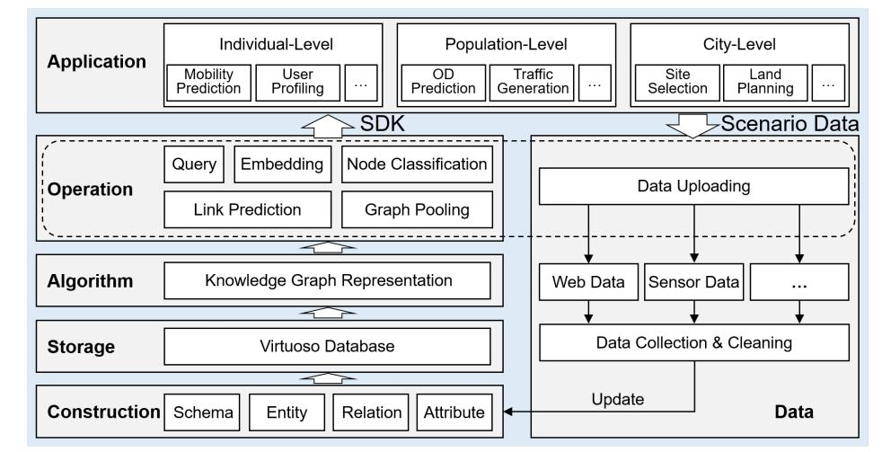
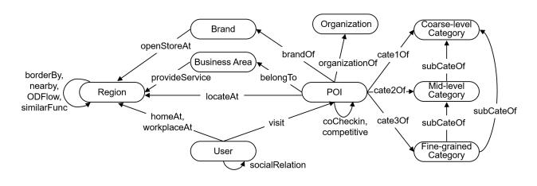
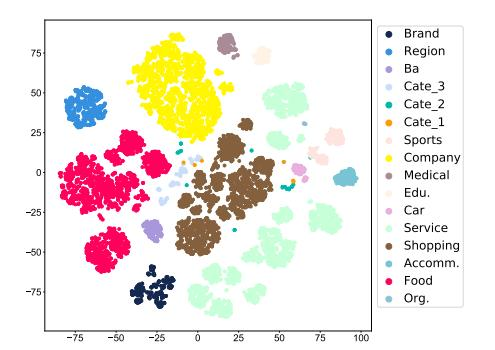

# Developing Knowledge Graph Based System for Urban Computing

Yu Liu liuyu2419@126.com BNRist, Department of Electronic Engineering, Tsinghua University Beijing, China

Jingtao Ding dingjt15@tsinghua.org.cn BNRist, Department of Electronic Engineering, Tsinghua University Beijing, China

Yong Li∗ liyong07@tsinghua.edu.cn BNRist, Department of Electronic Engineering, Tsinghua University Beijing, China

## ABSTRACT

Everyday our living city produces a tremendous amount of spatialtemporal data, involved with multiple sources from the individual scale to the city scale. Undoubtedly, such massive urban data can be explored for a better city and better life, as what the urban computing community has been dedicating in recent years. Nevertheless, existing studies are still facing the challenges of data fusion for the urban data as well as the knowledge distillation for specific applications. Moreover, there is a lack of full-featured and user-friendly platform for both researchers and developers in urban computing scenario. Therefore, in this paper, we present an urban knowledge graph (UrbanKG) system to incorporate knowledge graph with urban computing. Specifically, the system introduces a complete scheme to construct knowledge graph for urban data fusion from Data layer to Construction layer. The system further develops the multiple layers of Storage, Algorithm, Operation and Applications, which achieve the knowledge distillation and support various functions to the users. We perform three representative and practical use cases and demonstrate the system capability of boosting performance in various downstream applications, indicating a promising research direction of knowledge-driven urban computing.

### CCS CONCEPTS

• Information systems → Geographic information systems; • Computing methodologies → Knowledge representation

## and reasoning. KEYWORDS

Knowledge graph, spatial-temporal data, urban computing

### ACM Reference Format:

Yu Liu, Jingtao Ding, and Yong Li. 2022. Developing Knowledge Graph Based System for Urban Computing. In The 1st ACM SIGSPATIAL International Workshop on Geospatial Knowledge Graphs (GeoKG '22), November 1, 2022, Seattle, WA, USA. , [4](#page-3-0) pages.<https://doi.org/10.1145/3557990.3567586>

GeoKG '22, November 1, 2022, Seattle, WA, USA

© 2022 Association for Computing Machinery.

ACM ISBN 978-1-4503-9538-0/22/11. . . \$15.00

<https://doi.org/10.1145/3557990.3567586>

### 1 INTRODUCTION

In the past few years, advanced sensing technologies and ubiquitous data sensors have harvested massive multi-source spatial-temporal data from urban spaces[1](#page-0-0) , which greatly promote the urban computing research [\[8\]](#page-3-1). Nevertheless, such urban data also pose several challenges for further research, mainly from two perspectives:

- Data Fusion. Due to the diverse sources and tools of data collection, the collected urban data are in different structures like tables, sequences and graphs. How to fuse the urban data in different structures for complete information still remains under-explored.
- Knowledge Distillation. The massive and comprehensive knowledge about a city lies in the urban data, where both useful knowledge and useless noise exist. How to distil task-specific knowledge from the urban data becomes another critical challenge[2](#page-0-1) .

To solve above challenges, we find that a successful attempt for such dilemma is knowledge graph (KG). Specifically, the KG stores and represents real-world knowledge with triple facts in form of (ℎ , , ), where entities are objects, events, situations or abstract concepts and relations describe their connections. Moreover, to fully unleash the knowledge power of the urban data for urban computing, in this paper, we propose an urban knowledge graph (UrbanKG) system to fuse the urban data and distil the urban knowledge therein. The overall system first builds the data layer to collect and clean the urban data from multiple sources in urban space, and then builds several function layers to achieve data fusion and knowledge distillation. Especially, the function layers of construction, storage, algorithm, operation as well as application can be easily developed for various requirements in urban computing research. Representative evaluations and use cases are provided to validate the effectiveness of the proposed UrbanKG system. The main contributions of our work are as follows:

- We build an urban knowledge graph system, which constructs the UrbanKG by urban data fusion, further develops KG embedding algorithms and combines basic operations for applications with knowledge distillation achieved. To the best of our knowledge, UrbanKG is the first KG-based system for urban scenario which offers a novel insight on urban computing research.
- We present a systematic scheme for UrbanKG construction, which identifies key elements in urban environment as entities, and describes their semantic connections as relations. The proposed construction scheme provides a general framework to

∗Corresponding author

Permission to make digital or hard copies of all or part of this work for personal or classroom use is granted without fee provided that copies are not made or distributed for profit or commercial advantage and that copies bear this notice and the full citation on the first page. Copyrights for components of this work owned by others than ACM must be honored. Abstracting with credit is permitted. To copy otherwise, or republish, to post on servers or to redistribute to lists, requires prior specific permission and/or a fee. Request permissions from permissions@acm.org.

1 In following parts, we refer to the massive multi-source spatial-temporal data from urban space as the urban data for brevity.

2Here the knowledge distillation describes the process of extracting useful and concentrated information from full urban data for specific tasks.

fuse the urban data into the KG, and potentially benefits various downstream tasks in urban scenario.

• We abstract several basic operations from the UrbanKG system, which can be further combined for various practical applications. Moreover, representative use cases are investigated for effectiveness demonstration.

### 2 THE URBAN KNOWLEDGE GRAPH SYSTEM

Definition 2.1 (Knowledge Graph). A KG is defined as a multirelational graph structure G = {E, R, F }, where E, R and F are the set of entities, relations and facts, respectively. Especially, the fact set F = {(ℎ, , )|ℎ, ∈ E, ∈ R} stores the triples in KG, where a triple (ℎ, , ) ∈ F denotes a directional edge from entity ℎ to entity with relation type . Besides, we also include timestamp information for temporal knowledge like the visiting records.

### 1 System Architecture

The system architecture of the UrbanKG system is presented in Figure [1.](#page-2-0)

Data. This layer supports the data uploading from both internal developers and external users, where spatial data, user behavior data, attribute data and sensing data are collected and cleaned for data preparation. Especially, this layer periodically updates the data to above function layers such that the UrbanKG system can absorb more and fresher knowledge over time. The data layer provides available data for the UrbanKG system, while the remain layers are responsible for data fusion, knowledge distillation as well as providing services, which are described layer by layer as follows.

Construction. This layer provides the construction scheme for UrbanKG. It first defines the schema, i.e., the high-level structure of KG, including the types of entities and relations. Then various techniques are developed to extract entities as well as relations from the urban data with different structures considered. Furthermore, both entities and relations are enriched with additional attributes matched. In this way, the constructed UrbanKG successfully fuses the urban data together.

Storage. This layer provides the storage interface for UrbanKG. All triples in the constructed UrbanKG are transformed into the RDF data structure, which are then fed into the Virtuoso database for storage and later operations like query. Especially, based on the cluster configuration, the storage interface supports paralleled operation execution for efficiency.

Algorithm. This layer provides various KG embedding algorithms for UrbanKG representation. For easy use of UrbanKG in higher-layer applications, the KG embedding algorithm converts the discrete triples to continuous representations, i.e., embeddings, which designs a scoring function on embeddings of entities and relations to measure the plausibility of triple. The learnt embeddings provide knowledgeable representations for entities and relations, which successfully distil generalized knowledge in the urban data.

Operation. This layer provides several operations to access the UrbanKG or customize specific functions for the higher-layer applications. The basic operations include KG query via SPARQL, embedding access, as well as three ones corresponding to the common tasks of node classification, link prediction and graph pooling. Moreover, this operation layer and the data uploading function

in data layer are integrated together as the software development toolkit (SDK) for developers to build more customized applications with the UrbanKG system.

Application. This layer provides the interfaces for representative applications. Built upon the operation layer, this layer calls various operations or operation combinations to support specific applications, including the query-based application, node-based application, link-based application and graph-based application.

### 2 UrbanKG Construction

For better understanding, here, we provide the UrbanKG construction process of schema definition, entity identification, relation extraction and attribute enrichment. We also present basic statistics of constructed UrbanKGs for better comparison.

Schema Definition. The schema or ontology describes the highlevel structure of a KG, including the type of entities and relations therein [\[4\]](#page-3-2). Figure [2](#page-2-1) depicts the overall schema of UrbanKG, where the nodes represent types of entities and the edges describe their relationships in UrbanKG.

Entity Identification. Based on the observation from the urban data as well as the literature from urban computing [\[8\]](#page-3-1) and urban planning, the fundamental entities in the urban environment include following types:

- POIs. POIs represent the basic functional units and venues in the city such as schools, hospitals, markets, etc., which are key spatial points that human activities happen.
- Regions. Regions are spatial divisions of the city, which can represent basic functional areas in the city.
- Business Areas (Ba). Business areas are commercial and business centers of the city.
- Brands. Brands are service providers in business, marketing and advertising, and each brand usually owns several chain stores, e.g., KFC and Pizza Hut with stores around the city.
- Organizations. Organizations mainly refer to companies, institutions having a particular function or purpose, e.g., governmental agencies and public service organizations.
- Categories. Categories denote the property or the function of POIs. We adopt the three-level categories, i.e., the coarse-level category, the mid-level category and the fine-grained category, just like the food category, the Chinese food category and the Sichuan Cuisine category.
- Users. Users refer to human living in the urban environment, which dominate the activities happened in the environment.

Relation Extraction. Based on the identified entity types in the UrbanKG, we extract typical relations to describe semantic connections between entities, including spatial relations, affiliated relations, functional relations, personal relations and cross-modal relations, which are summarized in Table [1.](#page-2-2)

Attribute Enrichment. To fuse more urban data into the UrbanKG, the system further enriches the entities with attribute provided, which are described in Table [2.](#page-2-3)

Statistics. Following the creation process above, the UrbanKG system constructs two UrbanKGs in large cities of Beijing and Shanghai in China, whose basic statistics are shown in Table [3.](#page-3-3) It can be observed that, the UrbanKG system contains millions of

#### Developing Knowledge Graph Based System for Urban Computing GeoKG '22, November 1, 2022, Seattle, WA, USA

<!-- Image Description: The image is a layered architecture diagram showing a system for city-level modeling. The bottom layer details data construction (schema, entity, relation, attribute), progressing through storage (Virtuoso Database), algorithms (knowledge graph representation, operations like query and link prediction), and an SDK for individual, population, and city-level applications (mobility prediction, OD prediction, site selection, etc.). Scenario data is uploaded, cleaned, and used to update the system. -->

Figure 1: The high-level system architecture.

<!-- Image Description: This image is a schema diagram depicting relationships between entities in a point-of-interest (POI) dataset. Nodes represent entities like User, Region, POI, Brand, Organization, and categories (coarse, mid, fine-grained). Directed edges show relationships (e.g., a User visits a POI, a POI belongs to a Brand, categories are hierarchical). The diagram illustrates the data structure and relationships for the study's POI data model. -->

### Figure 2: The schema of UrbanKG. The gray nodes correspond to the cross-modal types of entities.

Table 1: The summary of relations and corresponding semantics captured in UrbanKG.

| Relation       | Head Entity |              | Semantics            |  |
|----------------|----------------|--------------|----------------------|--|
| borderBy       | Region         | Region       | Boundary Sharing     |  |
| nearBy         | Region         | Region       | Close Distance       |  |
| locateAt       | POI            | Region       | Spatial Coverage     |  |
| belongTo       | POI            | Ba           | Spatial Coverage     |  |
| brandOf        | POI            | Brand        | Affiliation          |  |
| organization   | POI            | Organization | Affiliation          |  |
| cate1Of        | POI            | Category     | Coarse-level         |  |
| cate2Of        | POI            | Category     | Mid-level            |  |
| cate3Of        | POI            | Category     | Fine-grained         |  |
| subCateOf      | Category       | Category     | Hierarchy            |  |
| ODFlow         | Region         | Region       | Flow Transition      |  |
| similarFunc    | Region         | Region       | POI Distribution     |  |
| coCheckin      | POI            | POI          | Check-in Concurrence |  |
| competitive    | POI            | POI          | Competitiveness      |  |
| provideService | Ba             | Region       | Service Support      |  |
| openStoreAt    | Brand          | Region       | Site Selection       |  |
| homeAt         | User           | Region       | Home                 |  |
| workplaceAt    | User           | Region       | Workplace            |  |
| visit          | User           | POI          | Visiting             |  |
| socialRelation | User           | User         | Social Relationship  |  |

entities and over ten millions of triples on urban knowledge, which is comparable to large-scale KGs like YAGO [\[2\]](#page-3-4).

| Entity      | Attribute                                     |
|-------------|-----------------------------------------------|
| POI         | name, location, address, category, activeness |
| Region      | boundary, area, demographic, land type        |
| Ba          | name, location, POI distribution              |
| Brand & Org | name, text description                        |
| Category    | name, POI number                              |
| User        | gender, age, education, income, occupation    |
|             |                                               |

### 3 EVALUATION

### 1 Embedding Analysis

To validate the effectiveness of the Construction layer and the Algorithm layer in the UrbanKG system, we adopt the TuckER model [\[1\]](#page-3-5) to learn entity embeddings on the UrbanKGs for Beijing.

<!-- Image Description: The image displays a 2D scatter plot visualizing the results of a dimensionality reduction technique, likely t-SNE or UMAP, applied to data categorized into various sectors (Brand, Region, Cate_1-3, Sports, Company, Medical, Edu., Car, Service, Shopping, Accomm., Food, Org.). Different colors represent different categories. The plot shows distinct clusters, suggesting that the technique effectively separated the data points based on their categorical labels. The purpose is to illustrate the inherent structure and relationships between different data categories. -->

Figure 3: Entity embedding visualization results for UrbanKG in Beijing, China (better viewed in color).

Specifically, in the experiment, we set the embedding dimensionality to 32, and utilize the early stopping strategy for training, i.e., the training stops when the training loss does not decrease for 10 iterations. In Figure [3,](#page-2-4) we visualize the learned entity embedding using t-SNE, and 10,000 POI entities are randomly selected for visualization. Note that entities in different types and POI entities in different categories are shown in different colors.

| UrbanKG  | Overall Statistics |           |           | Entity Types |         |     |              |           |       |
|----------|--------------------|-----------|-----------|--------------|---------|-----|--------------|-----------|-------|
|          | #Entity            | #Relation | #Triple   | #POI         | #Region | #Ba | #Brand & Org | #Category | #User |
| Beijing  | 1,493,914          | 20        | 7,455,708 | 1,481,100    | 1,900   | 333 | 1,545        | 14/56/367 | 8,599 |
| Shanghai | 1,969,788          | 20        | 9,868,686 | 1,957,674    | 2,597   | 280 | 954          | 14/56/480 | 7,733 |

Table 3: The basic information of the constructed UrbanKGs. The Ba and Org denote Business area, Organization, respectively. #Category denotes the number of coarse-level/mid-level/fine-grained categories.

According to the figure, we can observe that entities in different types or categories are clearly separated in space and clustering phenomenon can be easily found in different groups. The visualization results indicate that learned embeddings preserve the semantics of entities, i.e., distil the knowledge in the urban data in some way. Therefore, the Construction layer and Algorithm layer together provide effective representations for entities, which support the urban applications in the upper layer of the system.

### 2 Use Cases Analysis

In this part, we investigate representative applications in urban scenario, and demonstrate the effectiveness of the UrbanKG system from two aspects:

- The UrbanKG system achieves better performance than traditional solutions in applications.
- The UrbanKG system provides better representations to promote the performance of traditional solutions.

Also, the superiority of the UrbanKG system can be shown by providing more explainable results, reflecting the reasoning process, etc. Specifically, we present use cases across mobility prediction and site selection. Due to space limitation, for each use case we only provide the results of the best baseline for performance comparison.

Mobility Prediction. The mobility prediction use case [\[7\]](#page-3-6) formulates the traditional trajectory prediction problem into the link prediction problem on the UrbanKG.

Especially, the Application layer calls the link prediction operation to predict if there exist visiting links between user entities and POI entities with the time attribute considered. Table [4](#page-3-7) presents the result comparison with the state-of-the-art baseline ARNN [\[3\]](#page-3-8) in respective of accuracy and mean reciprocal rank (MRR). With the multi-source data fused, the UrbanKG system significantly outperforms the traditional baseline.

Table 4: The result comparison of mobility prediction task.

|         | Beijing |                                               |       | Shanghai |       |       |
|---------|---------|-----------------------------------------------|-------|----------|-------|-------|
|         |         | Acc@1 ↑ Acc@10 ↑ MRR ↑ Acc@1 ↑ Acc@10 ↑ MRR ↑ |       |          |       |       |
| ARNN    | 0.442   | 0.685                                         | 0.532 | 0.379    | 0.605 | 0.469 |
| UrbanKG | 0.531   | 0.800                                         | 0.637 | 0.429    | 0.696 | 0.528 |

Site Selection. The site selection use case [\[6\]](#page-3-9) focuses on the city-level problem, which determines candidate regions for various brands opening stores. Especially, such problem requires to provide explainable results with multiple site selection factors considered.

Firstly, by calling the link prediction operation, the UrbanKG system formulates the problem into a link prediction problem with relation openStoreAt between brand entities and region entities. Moreover, various site selection strategies can be modeled as relational paths, and task-specific KG embedding algorithm can be fed into the system via Algorithm layer. Table [5](#page-3-10) presents the result

comparison with the best traditional solution NeuMF-RS [\[5\]](#page-3-11) in respective of NDCG, hit ratio and precision. The results further demonstrate the effectiveness of the UrbanKG system, which can not only fuse the urban data from multiple sources, but also distil task-specific knowledge via algorithm implementation.

Table 5: The result comparison of site selection task.

|          | Beijing |                                           |       | Shanghai |       |       |  |
|----------|---------|-------------------------------------------|-------|----------|-------|-------|--|
|          |         | N@10 ↑ H@10 ↑ P@10 ↑ N@10 ↑ H@10 ↑ P@10 ↑ |       |          |       |       |  |
| NeuMF-RS | 0.178   | 0.653                                     | 0.155 | 0.168    | 0.615 | 0.148 |  |
| UrbanKG  | 0.219   | 0.713                                     | 0.186 | 0.205    | 0.671 | 0.177 |  |

To summarize, the UrbanKG system supports various applications in urban scenario across multiple using ways and scales. The use cases analysis above provides a strong validation of effectiveness and wide applicability in practical.

### 4 CONCLUSION

In this paper, we presented the UrbanKG system, a KG-based system for urban scenario. The system develops a systematic scheme to construct KG from the urban data in different structures with data fusion achieved. Moreover, the multiple layers of Date, Construction, Storage, Algorithm, Operation and Application are built to provide user-friendly services. Several representative use cases demonstrate the system capability of enhancing various urban applications, which has the potential to be applied in various urban computing research.

### ACKNOWLEDGMENTS

This work was supported in part by The National Key Research and Development Program of China under grant 2020AAA0106000, the National Natural Science Foundation of China under U1936217, 61971267, 61972223.

### REFERENCES

- [1] Ivana Balažević, Carl Allen, and Timothy M Hospedales. 2019. Tucker: Tensor Factorization for knowledge graph completion. In EMNLP.
- [2] M Fabian, Kasneci Gjergji, WEIKUM Gerhard, et al. 2007. Yago: A Core of Semantic Knowledge Unifying Wordnet and Wikipedia. In WWW.
- [3] Qing Guo, Zhu Sun, Jie Zhang, and Yin-Leng Theng. 2020. An Attentional Recurrent Neural Network for Personalized Next Location Recommendation. In AAAI.
- [4] Aidan Hogan, Eva Blomqvist, Michael Cochez, Claudia d'Amato, Gerard De Melo, Claudio Gutierrez, Sabrina Kirrane, José Emilio Labra Gayo, Roberto Navigli, Sebastian Neumaier, et al. 2021. Knowledge graphs. ACM CSUR 54, 4 (2021), 1–37.
- [5] Nuo Li, Bin Guo, Yan Liu, Yao Jing, Yi Ouyang, and Zhiwen Yu. 2018. Commercial Site Recommendation based on Neural Collaborative Filtering. In UbiComp.
- [6] Yu Liu, Jingtao Ding, and Yong Li. 2021. Knowledge-driven Site Selection via Urban Knowledge Graph. arXiv preprint arXiv:2111.00787 (2021).
- [7] Huandong Wang, Qiaohong Yu, Yu Liu, Depeng Jin, and Yong Li. 2021. Spatio-Temporal Urban Knowledge Graph Enabled Mobility Prediction. UbiComp (2021).
- [8] Yu Zheng, Licia Capra, Ouri Wolfson, and Hai Yang. 2014. Urban computing: Concepts, Methodologies, and Applications. ACM TIST 5, 3 (2014), 1–55.
