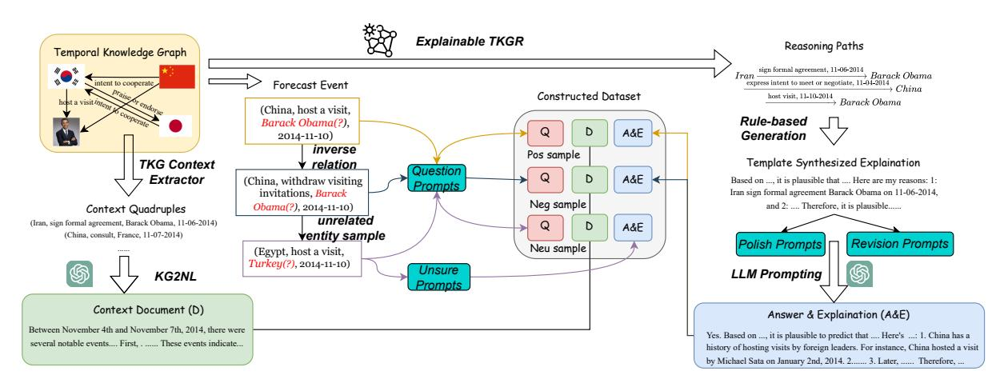
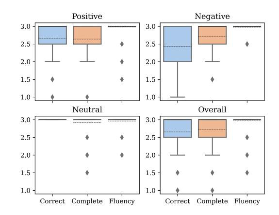
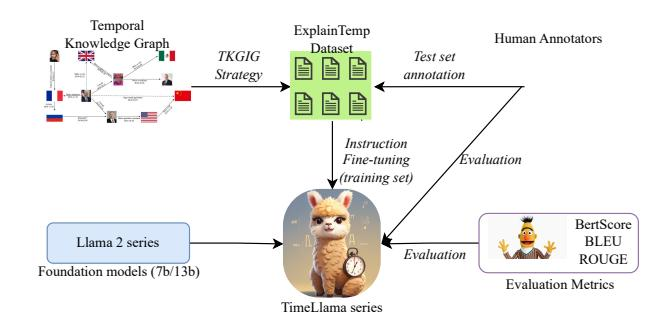
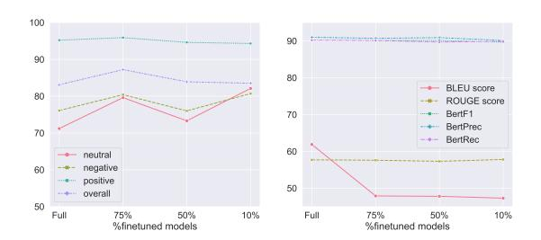
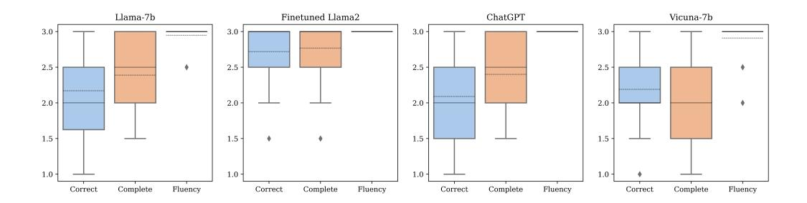

# Back to the Future: Towards Explainable Temporal Reasoning with Large Language Models

Chenhan Yuan The University of Manchester Manchester, UK chenhan.yuan@manchester.ac.uk

> Jimin Huang Wuhan University Wuhan, China jiminhuang08@gmail.com

## ABSTRACT

Temporal reasoning is a crucial natural language processing (NLP) task, providing a nuanced understanding of time-sensitive contexts within textual data. Although recent advancements in Large Language Models (LLMs) have demonstrated their potential in temporal reasoning, the predominant focus has been on tasks such as temporal expression detection, normalization, and temporal relation extraction. These tasks are primarily designed for the extraction of direct and past temporal cues from given contexts and to engage in simple reasoning processes. A significant gap remains when considering complex reasoning tasks such as event forecasting, which requires multi-step temporal reasoning on events and prediction on the future timestamp. Another notable limitation of existing methods is their incapability to illustrate their reasoning process for explaining their prediction, hindering explainability. In this paper, we introduce the first task of explainable temporal reasoning, to predict an event's occurrence at a future timestamp based on context which requires multiple reasoning over multiple events, and subsequently provide a clear explanation for their prediction. Our task offers a comprehensive evaluation of both the LLMs' complex temporal reasoning ability, the future event prediction ability, and explainability—a critical attribute for AI applications. To support this task, we present the first instruction-tuning dataset of explainable temporal reasoning (ExplainTemp) with 26k derived from the temporal knowledge graph datasets, using a novel knowledgegraph-instructed-generation strategy. Based on the dataset, we propose the first open-source[1](#page-0-0) LLM series TimeLlaMA based on the foundation LLM LlaMA2, with the ability of instruction following for explainable temporal reasoning. We compare the performance of our method and a variety of LLMs, where our method achieves

WWW '24, May 13–17, 2024, Singapore, Singapore

© 2024 Copyright held by the owner/author(s). Publication rights licensed to ACM. ACM ISBN 979-8-4007-0171-9/24/05. . . \$15.00 <https://doi.org/10.1145/3589334.3645376>

Qianqian Xie∗ The University of Manchester Manchester, UK xqq.sincere@gmail.com

Sophia Ananiadou The University of Manchester Manchester, UK sophia.ananiadou@manchester.ac.uk

the state-of-the-art performance of temporal prediction and explanation generation. We also explore the impact of instruction tuning and different training sizes of instruction-tuning data, highlighting LLM's capabilities and limitations in complex temporal prediction and explanation generation.

### CCS CONCEPTS

• Computing methodologies → Temporal reasoning.

### KEYWORDS

Temporal Reasoning, Large Language Models, Event Forecasting, Explainable AI

#### ACM Reference Format:

Chenhan Yuan, Qianqian Xie, Jimin Huang, and Sophia Ananiadou. 2024. Back to the Future: Towards Explainable Temporal Reasoning with Large Language Models. In Proceedings of the ACM Web Conference 2024 (WWW '24), May 13–17, 2024, Singapore, Singapore. ACM, New York, NY, USA, [12](#page-11-0) pages.<https://doi.org/10.1145/3589334.3645376>

#### 1 INTRODUCTION

Temporal reasoning is a crucial research area in natural language processing (NLP), referring to a model's capability of accurately understand, represent, and predict time-sensitive contexts [\[13,](#page-8-0) [31,](#page-8-1) [33,](#page-8-2) [54\]](#page-9-0). This ability is critical for many web-based applications today that rely on processing time-sensitive data, including news article aggregation [\[21\]](#page-8-3), E-commerce services [\[49\]](#page-9-1), and search engine recommendation [\[39\]](#page-8-4). Existing studies have focused on tasks of temporal relation extraction: predicting the temporal ordering of events [\[12,](#page-8-5) [38\]](#page-8-6), temporal knowledge graph (KG) reasoning: inferring missing facts at past and future timestamps [\[31,](#page-8-1) [33\]](#page-8-2), and temporal question answering (QA): answering questions requiring multiple steps of temporal relational reasoning [\[19,](#page-8-7) [20\]](#page-8-8). In recent years, the performance of these tasks has been greatly improved by advanced NLP and machine learning methods including graph neural networks (GNNs) [\[17,](#page-8-9) [24,](#page-8-10) [33,](#page-8-2) [46\]](#page-9-2) and pre-trained language models (PLMs) [\[34,](#page-8-11) [45,](#page-9-3) [57\]](#page-9-4). Latest, large language models (LLMs) have shown remarkable abilities to understand natural language and human-like text generation [\[2\]](#page-8-12). Compared with PLMs, LLMs have a significantly larger model size and pre-training data, and thus show the emergent ability of in-context learning, enabling them to perform unseen tasks without task-specific training data [\[59\]](#page-9-5).

∗Corresponding author

1<https://github.com/chenhan97/TimeLlama>

Permission to make digital or hard copies of all or part of this work for personal or classroom use is granted without fee provided that copies are not made or distributed for profit or commercial advantage and that copies bear this notice and the full citation on the first page. Copyrights for components of this work owned by others than the author(s) must be honored. Abstracting with credit is permitted. To copy otherwise, or republish, to post on servers or to redistribute to lists, requires prior specific permission and/or a fee. Request permissions from permissions@acm.org.

Inspired by the great promise of LLMs, recent studies have explored the temporal reasoning ability of LLMs [\[5,](#page-8-13) [30,](#page-8-14) [51,](#page-9-6) [62\]](#page-9-7).

Although these methods have explored the potential and limitations of LLMs, two significant challenges remain conspicuous as shown in Table. [1.](#page-2-0) Firstly, current methods [\[5,](#page-8-13) [30,](#page-8-14) [51,](#page-9-6) [62\]](#page-9-7) mainly focus on tasks such as temporal expression detection, normalization, and temporal relation extraction, which are primarily designed for the extraction of direct and historical temporal cues from given contexts and to engage in simple reasoning processes. Therefore, it is still unclear the potential of LLMs for more challenging tasks such as event forecasting [\[67\]](#page-9-8), which requires multi-step temporal reasoning and the prediction of future timestamps. Secondly, even as LLMs exhibit emergent abilities for in-context learning [\[59\]](#page-9-5), the area of explainable temporal reasoning – which involves predicting future events from context and explaining the associated reasoning – remains underexplored. It is crucial for models to not only make predictions but also to clearly justify their decisions, to improve transparency. In light of these gaps, we posit the following research questions (RQ) to guide our study: 1) RQ 1: Can LLMs be effective in predicting future events by considering the context's complex relations among events, and how do they compare with traditional methods? 2) RQ 2: What impact does instruction tuning have, particularly when using our new dataset derived from temporal knowledge graphs, on the temporal prediction capabilities of LLMs? 3) RQ 3: How effectively can LLMs clarify their prediction and reasoning process, thereby enhancing their transparency in temporal reasoning tasks?

To address these challenges, our study aims to explore LLMs' capabilities in complex temporal reasoning, future event prediction, and, importantly, explainability—an essential aspect of AI applications. We propose the pioneering task of explainable temporal reasoning, aiming to predict the occurrence of future events based on context, demanding reasoning across multiple events, and subsequently, providing a coherent explanation for the prediction. To support this task, we propose the first-of-its-kind multi-source instruction tuning dataset ExplainTemp, fostering improvement and assessment of LLMs. ExplainTemp comprises 26k entries, built from a variety of event forecasting datasets and their derived temporal reasoning paths.

Our methodology begins with aggregating data from various recognized datasets, encompassing diverse sources. For each data point, explanations are generated, drawing inspiration from the proven self-instruct approach [\[58\]](#page-9-9). However, we observed that merely prompting LLMs, such as ChatGPT [\[41\]](#page-9-10), yielded suboptimal results in terms of coherence and accuracy. Recognizing this limitation, we pivoted to a novel Temporal Knowledge Graph-Instructed Generation (TKGIG) approach. We extract explainable reasoning paths and context from the temporal knowledge graph for each dataset's future event prediction query. We then design prompts to guide LLMs to convert these paths and contexts into coherent explanations. This results in triples of <query, context, answer>, with each answer containing the original prediction and LLM-generated explanation. To ensure the reliability of the dataset, the human evaluation is performed on a subset of the collected data with a carefully designed annotation scheme, evaluating their correctness, completeness, and fluency. We then build a golden-standard testing dataset with human annotation.

Using ExplainTemp, we propose the TimeLlaMA series, an innovative open-source LLM ensemble based on the LlaMA2 [\[53\]](#page-9-11), using instruction finetuning. Specifically, we fine-tune four TimeLlaMA models: TimeLlaMA-7B, ChatTimeLlaMA-7B, TimeLlaMA-13B, and ChatTimeLlaMA-13B. Our empirical results compare the TemporaLLaMA with other LLMs, highlighting its superior performance in terms of temporal prediction and explanation generation. Our experiments demonstrate that with proper instruction tuning using even a small volume of high-quality data, the temporal reasoning capabilities of LLMs can be substantially improved. Model size does not necessarily correlate with performance gains in temporal reasoning when employing instruction tuning under 13 billion parameters.

To encapsulate, our contributions are manifold: 1) We pioneer the first task of explainable temporal reasoning, setting the stage for subsequent research, 2) We introduce ExplainTemp, the first instruction-tuning dataset to improve and evaluate LLMs' ability of explainable temporal reasoning, 3) We propose a novel knowledge graph-instructed generation (TKGIG) method, for generating explainable temporal reasoning data with LLMs from temporal knowledge graphs, 4) We propose TimeLlaMA, an open-source LLM series tailored for this specific task, achieves SOTA performance, 5) We conduct a holistic evaluation of our method and various LLMs in the realm of temporal reasoning, critically analyze the strengths and limitations of LLMs, providing directions for future research.

#### 2 RELATED WORK

#### 1 Temporal Reasoning in NLP

Based on the level of difficulty, temporal reasoning in NLP can be categorized into three tasks: temporal expression detection and normalization, temporal relation extraction, and event forecasting. The temporal expression detection task aims to detect the phrases in the text that describe the temporal information, such as "yesterday" and "last year" [\[28\]](#page-8-15). After the detection, the model is required to normalize the temporal expression into a TimeML standard format, such as "2013-01-06". The temporal expression detection and normalization task was first introduced in TempEval-2 [\[56\]](#page-9-12), where the most successful models are rule-based, such as SUTime and NavyTime [\[4,](#page-8-16) [6\]](#page-8-17). The normalization task was further improved by incorporating pre-trained embeddings later [\[25,](#page-8-18) [60\]](#page-9-13).

When time expressions can be detected, the next level of temporal reasoning is to determine the chronological order of events described in the text, namely temporal relation extraction. The temporal relation extraction task was first introduced in TempEval [\[55\]](#page-9-14). Initially, this task was tackled by leveraging the sequential neural networks, such as LSTM and RNN, to detect temporal order [\[12,](#page-8-5) [34,](#page-8-11) [40\]](#page-8-19). Later, GNN was introduced to better capture the dependency explicitly between the events and time expressions [\[3,](#page-8-20) [38,](#page-8-6) [63\]](#page-9-15). As LLMs become popular, some work also investigated the zero-shot ability of LLM in temporal relation extraction and reported that the zero-shot performance is worse than supervised models [\[5,](#page-8-13) [62\]](#page-9-7).

With the acquisition of a chronological order of events, the final level of temporal reasoning is event forecasting. The goal of this task is to determine if a specific event will happen in the future given the context events described in the text [\[21\]](#page-8-3). Some work

|                 | Explanation | Event Forecasting | Model         | Multi-hop Reasoning | Instruction Finetuning | Context Infer |
|-----------------|-------------|-------------------|---------------|---------------------|------------------------|---------------|
| TEMPLAMA [11]   | ✗           | ✗                 | T5            | ✗                   | ✗                      | ✗             |
| TEMPREASON [51] | ✗           | ✗                 | T5            | ✗                   | ✗                      | ✓             |
| AutoCast [67]   | ✗           | ✓                 | T5            | ✓                   | ✗                      | ✗             |
| ExplainTemp     | ✓           | ✓                 | Llama2-7b/13b | ✓                   | ✓                      | ✓             |

Table 1: The comparison between temporal reasoning datasets and corresponding finetuned models. "Context Infer" denotes if inference based on context is required and "multi-hop reasoning" means engaging in multi-step reasoning is required to arrive at the correct answer.

has designed a dataset to train the model [\[67\]](#page-9-8), in which the model can access the context information through links. However, the exploration of this task is still limited despite the importance of this task.

#### 2.2 Temporal Knowledge Graph Event Forecast

There are two settings in the temporal knowledge graph reasoning (TKGR) task: extrapolation and interpolation. Extrapolation focuses on predicting whether events will occur in future timestamps, while interpolation aims to complete the temporal knowledge graph within a given timespan [\[31,](#page-8-1) [33\]](#page-8-2). Some works also refer to the extrapolation setting as event forecasting in temporal knowledge graph [\[16,](#page-8-22) [37\]](#page-8-23). A key difference between event forecasting in NLP and TKG is the input format - NLP uses textual context, whereas TKG relies on graph structure. To enhance explainability, some methods for TKGR produce predictions along with validated reasons. The explainable methods can be roughly summarized into three categories: logic rule-based approach, reinforcement learningbased approach, and attention network-based approach. For example, TLogic mines logic rules from temporal knowledge graphs for forecasting [\[37\]](#page-8-23). Lin et al. proposed graph and logic encoders to incorporate graph information into rules [\[36\]](#page-8-24). In reinforcement learning-based (RL) approaches, Sun et al. used an RL agent to travel on the graph to predict events, explaining the prediction [\[50\]](#page-9-16). Similarly, Li et al. found event clusters and then searched them with an RL agent [\[32\]](#page-8-25). Some models expand an initial query graph via attention until the query entity is reached, using the subgraphs as explanations [\[16\]](#page-8-22). Jung et al. also used an attention GNN to iteratively propagate towards the target entity [\[23\]](#page-8-26). As explainable TGKR models provide structural reasoning steps on the graph, we leveraged the RL-based and logic-based models to instruct the LLM explanation generation to construct the ExplainTemp dataset.

#### 3 Temporal Reasoning in LLM

As growth took place in pre-trained LLMs, a natural question is if LLM is capable of serving as a temporal knowledge base [\[11,](#page-8-21) [65\]](#page-9-17). The pivotal concept of this task is to understand the context under temporal expression and perform temporal-sensitive reasoning to predict missing entities [\[7\]](#page-8-27). Temporal datasets have been developed to evaluate LLM on temporal understanding, like Custom-News which evaluates if LLMs can predict masked entities given timestamps [\[26\]](#page-8-28). Dhingra et al. then proposed TEMPLAMA which emphasizes temporal questions as (ℎ, , ?, 1) and (ℎ, , ?, 2) where the answers differ due to different timestamps [\[11\]](#page-8-21). TemporalWiki addresses temporal misalignment in LLMs similarly [\[18\]](#page-8-29). Tan et al. expanded TEMPLAMA's time range and added more time-unrelated questions [\[51\]](#page-9-6).

Some work also further investigated the capability of LLM in the event forecasting task, which is more challenging than temporalsensitive learning as it requires a full understanding of time and logic. Zhou et al. constructed an Autocast dataset that consists of question-and-answer pairs about future events [\[67\]](#page-9-8). Lee et al. tested the zero-shot event forecasting ability of LLM on a temporal knowledge graph and demonstrated that only through in-context learning, LLMs can achieve comparable performance w.r.t current supervised TKG methods [\[27\]](#page-8-30). Similarly, Xu et al. designed various prompts to query LLM for temporal knowledge graph completion task [\[61\]](#page-9-18). This ability was further improved by few-shot abductive reasoning over LLM and temporal knowledge graph [\[47\]](#page-9-19). However, these studies did not evaluate or improve the textual temporal reasoning skills of LLMs. Additionally, the lack of explainability in these LLMs is concerning given their importance in temporal reasoning tasks. To the best of our knowledge, our proposed ExplainTemp is the first dataset that evaluates and improves the explainability and textual temporal reasoning ability of LLMs.

#### 3 METHOD

The objective of this work is to assess and enhance the complex temporal reasoning capabilities of large language models (LLMs). To accomplish this goal, we propose the explainable event forecasting task for complex temporal reasoning and construct the first dataset of its kind: the Explainable Temporal Event Forecasting (ExplainTemp) dataset. We benchmark the performance of popular LLMs using this new dataset. We then propose the novel LLM series: TimeLlaMA, by instruction finetuning a series of Llama2 models, with the aim of improving the temporal reasoning abilities of LLMs.

#### 1 Task Definition

We define the explainable temporal reasoning task as follows: given an input document describing events E1∼2 = {1, 2, · · · , } occurring during time interval 1 ∼ 2, the task is to predict the probability = ( |E1∼2 ) that event will occur at future time 3, where 3 > 2 ≥ 1. Additionally, the LLM must also generate an explanation that demonstrates its reasoning for the prediction. Each training instance T for finetuning the language model consists of the input document , question , prediction answer , and explanation : T = { , , , }.

WWW '24, May 13–17, 2024, Singapore, Singapore Chenhan Yuan, Qianqian Xie, Jimin Huang, and Sophia Ananiadou

<!-- Image Description: This diagram illustrates an explainable Temporal Knowledge Graph Reasoning (TKGR) system. A temporal knowledge graph is processed to extract context quadruples, which are converted into a document. This document, along with a forecast event, generates question prompts (positive, negative, and unsure) for a large language model (LLM). The LLM generates explanations, refined through polish and revision prompts, producing a final answer and explanation. The system uses rule-based generation and a constructed dataset for training. -->

Figure 1: The pipeline of generating ExplainTemp dataset. The pos, neg, and neu denote the positive sample, negative sample, and neutral sample, respectively.

# 2 Graph-Instruct-Generation: Construct ExplainTemp Dataset

Recent work has explored using LLMs like ChatGPT to generate datasets by prompting the model to produce answers [\[48\]](#page-9-20). However, directly prompting LLMs to generate temporal reasoning data results in low-quality explanations, as we demonstrate in Section [4.2.2.](#page-7-0) To address this issue, we propose a novel framework called Temporal Knowledge Graph-instructed Generation (TKGIG) to produce more coherent and accurate reasoning explanations.

The key insight behind our approach is to leverage temporal knowledge graphs (TKGs), which have been effectively utilized for explainable event forecasting. As illustrated in Figure [1,](#page-3-0) we first apply explainable TKG reasoning models to generate reasoning paths for a given query about a future event. We then convert these paths into natural language explanations using a twolevel prompting technique we developed. Next, we identify relevant context quadruples from the TKG and reasoning paths to construct a context quadruple set, which is transformed into a coherent natural language document . Finally, we convert the original query into a question to produce a complete training instance T = { , , , }. In this way, our TKGIG framework overcomes the limitations of directly prompting LLMs by leveraging structured knowledge in TKGs to generate high-quality explanations. The technical details of each step are provided in the following sections.

Reasoning Paths Generation. As discussed in Section [2.2,](#page-2-1) temporal knowledge graph reasoning models can be categorized into three main types. In this work, we select two popular methods representing the most common approaches: TimeTraveler [\[50\]](#page-9-16), which uses a reinforcement learning-based approach, and TLogic [\[37\]](#page-8-23), which employs logic rules. We chose these models because they provide high quality and human-readable reasoning chains, as shown in the following equation:

$$
(E_1, R_c, E_{m+1}, T_{m+1}) \leftarrow \wedge_{i=1}^{m} (E_i, R_i, E_{i+1}, T_i)
$$
 (1)

where , , and are the i-th entity, timestamp, and relation, respectively. For example, Fig. [1](#page-3-0) shows that given the query quadruple, the explainable TKGR model generates the following reasoning path:

(, , , 11 − 13 − 2014) ← (, , , 11 − 06 − 2014)∧ ( , ,ℎ, 11 − 04 − 2014)∧ (ℎ, ℎ, , 11 − 10 − 2014) (2)

To leverage the reasoning chains from these models, we take the average confidence scores (or probability values) of the predictions from the two models and select the reasoning paths with the highest confidence.

Context Document Generation. Given a query quadruple = (1, , 2, ), we first extract relevant quadruples from the TKG to form the context quadruple set, and then transform them into natural language sentences. Specifically, to extract relevant information, we obtain quadruples that meet two criteria: 1) either entity 1 or 2 from the original query is present in , and 2) the occurrence time of falls within a defined time span from the query time to time , where is the beginning timestamp of the span. Formally, we extract quadruples where (1 ∈ ∨ 2 ∈ ) ∧ ( < < ). We also add the quadruples along the reasoning path to the context set.

Once we have the context quadruple set Q, the next step is to convert Q into natural language sentences. Prior work such as KELM [\[1\]](#page-8-31) and GAP [\[9\]](#page-8-32) have proposed rule-based or pipeline methods, but these cannot generate sufficiently diverse documents from knowledge graphs. Therefore, we designed a prompt to leverage the generative capabilities of ChatGPT to produce more diverse and coherent context documents from Q. The prompt is defined as follows: "Please generate a coherent paragraph to describe the following quadruples and the time should be precise to dates: [Q]" In this way, we use the response from ChatGPT as the input document for each training instance T .

Explanation Generation. Recall that for each query quadruple = (1, , 2, ), we have obtained the reasoning path . First,

we automatically generate a template-based explanation ′ for each query quadruple = (1, , 2, ) using the corresponding reasoning path obtained from the above steps. This explanation template aims to concisely describe the prediction and the reasoning steps in natural language: "Based on the information provided by the document, it is plausible that 1 will 2 in . Here are my reasons: 1, and 2,· · · , therefore, it is plausible that 1 will 2 in ." We refer to this as the template synthesized explanation ′ .

However, these template-generated explanations ′ may lack coherence or omit critical reasoning details. To improve the quality of explanations, we implement a two-step rewriting process prompting using LLMs like ChatGPT. First, we prompt ChatGPT to evaluate the correctness of the template explanation ′ and provide a brief justification, e.g.: "Given the text, ′ , please evaluate the correctness of the prediction..." We provide detailed prompt in Appendix [B.1](#page-10-0) for this and all subsequent prompts. If ChatGPT concludes that the explanation ′ is correct, we propose a "polish prompt" to ChatGPT: "Can you make the text more coherent and readable by expanding the explanation of each reasoning step?" However, if ChatGPT determines that the template explanation ′ contains flawed reasoning leading to an incorrect prediction, we provide a "revision prompt" asking ChatGPT to correct the flaws by considering additional context quadruple information from : "Please revise ... You can add information from the following quadruples... [Q]" In this way, the ChatGPT response represents the final, improved explanation for each training instance. This CoT prompting approach allows us to leverage the reasoning and language capabilities of LLMs to enhance the quality of automatically generated explanations.

Negative and Neutral Samples. Note that by following the previously introduced steps, we can easily acquire positive training instances, i.e., the prediction is that the event will happen. However, using only positive examples to fine-tune language models can lead to highly skewed and imbalanced training. Therefore, we also propose two methods to generate negative and neutral samples individually.

The negative samples represent counterfactual events that did not occur. For each positive training instance T = { , , }, we generate a negative example by replacing the relation in the query quadruple with an opposite relation ′ such that the meaning of ′ should be as opposite as possible to the original one. For example, we replaced (Africa, Host a visit, Rex Tillerson, 2018-03-10) with (Africa, withdraw visiting invitations, Rex Tillerson, 2018-03-10). The resulting negative example quadruple is ′ = (1, ′ , 2, ). In this way, as the original event did actually happen, the newly synthesized event should be highly unlikely to happen. We manually designed 546 opposite relations for all 265 relations in the temporal knowledge graph. Details are illustrated in Appendix [C.](#page-10-1)

Then, similar to the explanation generation, we first generate a simple template synthesized explanation and then query ChatGPT if the synthesized explanation is correct or not. The prompt is designed as follows: "Given the text, "Based on..., we predict that 1 ′ 2 will not happen in . We could find the following patterns from the text: 1, and 2,· · · , therefore, it is plausible that 1 will 2 in .", please evaluate the correctness..." Note that the reasoning path is still the same as the positive sample. Then we can obtain

<!-- Image Description: This image presents four box plots, each showing the distribution of "Correct," "Complete," and "Fluency" scores for different sentiment categories: Positive, Negative, Neutral, and Overall. The box plots illustrate the median, interquartile range, and outliers for each metric across the categories. The purpose is to visually compare the performance (accuracy and fluency) of a system under varying sentiment conditions. -->

Figure 2: The box plots of human annotation for each criterion under positive, negative, neutral, and overall dataset. The dashed line denotes the mean value and the bold line indicates the median value.

|          | Positive | Negative | Neutral | Overall |
|----------|----------|----------|---------|---------|
| Correct  | 0.73     | 0.64     | 0.81    | 0.74    |
| Complete | 0.65     | 0.59     | 0.70    | 0.66    |
| Fluency  | 0.98     | 0.97     | 0.98    | 0.98    |

Table 2: Cohen's Kappa score of human annotation for each criterion under three labels.

the explanation result based on the ChatGPT decision by following the exact same "Polish Prompt" or "Revision Prompt".

In neutral training samples, we expect the LLMs to predict "unsure" for the query quadruple because there is no context information in the given document related to the query. Additionally, for explanation, we also expect the LLMs to summarize the document and then demonstrate that there is no related context in the given document. To achieve this goal, we first replace the query quadruple = (1, , 2, ) with ′′ = ( ′ 1 , , ′ 2 , ) in the positive training instances, where ′ 1 and ′ 2 are entities that never appear in the context quadruple set Q. In other words, we ensure the entities in the neutral sample's query do not exist anywhere in the context set Q. Formally, we have ′ 1 ∉ Q ∧ ′ 2 ∉ Q. Then we designed the following prompt to query ChatGPT to generate an explanation: "Given the document "[]", how likely the event that [ ′ 1 ′ 2 ] in [] would happen? ... if the context is unrelated, summarize the context..."

## 3.3 Data Statistics and Annotation

We utilize ICEWS14 [\[15\]](#page-8-33), ICEWS18 [\[22\]](#page-8-34), and ICEWS0515[\[15\]](#page-8-33) datasets to generate the proposed dataset, as they are the most popular temporal knowledge graph reasoning datasets. From the three datasets, we extracted 12,229 reasoning paths and therefore generated 12,229 positive samples in the dataset. The detailed statistics of Explain-Temp are shown in Table. [3.](#page-5-0)

|       | Pos.  | Neg. | Neu. | ICEWS14 | ICEWS18 | 0515 |
|-------|-------|------|------|---------|---------|------|
| Train | 11703 | 8705 | 5360 | 10327   | 7651    | 7790 |
| Test  | 435   | 300  | 266  | 387     | 351     | 263  |

Table 3: The statistics of constructed dataset. Pos., Neg., Neu. denote the number of positive, negative, and neutral samples, respectively.

<!-- Image Description: This flowchart illustrates a temporal knowledge graph (TKG) based approach for fine-tuning large language models (LLMs). A TKG is used to create an ExplainTemp dataset, which is then used to fine-tune the Llama 2 series of foundation models, resulting in the TimeLlama series. Human annotators provide test set annotations, and model performance is evaluated using BertScore, BLEU, and ROUGE metrics. The diagram shows data flow and the process of model training and evaluation. -->

Figure 3: The pipeline of finetuning and evaluating TimeLlama series models. TKGIG Strategy denotes our proposed dataset construction approach.

To further evaluate the quality of our dataset and construct a standardized testing dataset, two experienced annotators independently evaluated a random sample of 1,200 explanations. The annotators rated each explanation on three criteria: 1) correctness, which assessed whether the prediction and explanation were accurate; 2) completeness, which evaluated if the explanation provided the necessary context to understand the prediction; and 3) fluency, which measured if the explanation was clear and understandable. The annotation guidelines and annotator qualifications are detailed in Appendix [A.](#page-9-21) Cohen's kappa coefficient was calculated to determine inter-rater agreement for each criterion. As shown in Table [2,](#page-4-0) a high level of agreement was achieved for all criteria. In particular, the annotators demonstrated strong agreement on fluency ratings and agreement was higher overall for samples receiving neutral labels. As illustrated in Fig. [2,](#page-4-1) most samples received high scores across all three criteria. The strong inter-rater agreement and generally high scores indicate the testing dataset represents a high-quality, standardized sample for evaluation. Low-scoring samples on any of the criteria were excluded.

### 4 TimeLlama

As illustrated in Fig. [3,](#page-5-1) we present the TimeLlama model series, representing the first LLMs fine-tuned specifically for complex temporal reasoning tasks, namely explainable event forecasting. By instruction tuning the models on datasets requiring the comprehension and synthesis of temporal information, TimeLlama gains an enhanced ability to make logical inferences about the timing, duration, and relations between events. This supports a more accurate prediction of what events may occur next given a historical context. We construct TimeLlama-7b and TimeLlama-13b by finetuning the base Llama-7b and Llama-13b models, respectively. The finetuning

#### WWW '24, May 13–17, 2024, Singapore, Singapore Chenhan Yuan, Qianqian Xie, Jimin Huang, and Sophia Ananiadou

<!-- Image Description: The image contains two line graphs showing the performance of different models based on the percentage of fine-tuned models used. The left graph displays sentiment analysis results (neutral, negative, positive, overall) across varying percentages of fine-tuned models. The right graph shows BLEU, ROUGE, BertF1, BertPrec, and BertRec scores under the same conditions. Both graphs illustrate the impact of fine-tuning percentage on model performance metrics. -->

Figure 4: The automatic evaluation scores of finetuned Llama2 with various percentages of dataset usage. From left to right: F1 scores of each category, BLEU and ROUGE scores, BERTScore.

process utilizes Flash Attention and DeepSpeed to accelerate training [\[10,](#page-8-35) [44\]](#page-9-22). Full hyperparameters can be found in Appendix [D.2.](#page-10-2) Additionally, by finetuning the Llama-7b/13b conversational models, we construct ChatTimeLlama-7b and ChatTimeLlama-13b, based on Llama-2-Chat-7b/13b optimized using reinforcement learning from human feedback (RLHF) [\[41\]](#page-9-10).

#### 4 EXPERIMENTS

#### 1 Experimental Settings

Baselines. We evaluate and compare the following LLMs as the baselines: Flan T5 [\[8\]](#page-8-36): An instruction-finetuned T5 model based on chain-of-thought data that increased the number of tasks. BART [\[29\]](#page-8-37): An encoder-decoder architecture model that is proficient in abstractive dialogue, question answering, and summarization tasks. MPT-7b [\[52\]](#page-9-23): A LLM that is optimized for extremely long inputs. The MPT model with 7b parameters fine-tuned for dialogue generation is used in our experiment. Falcon-7b [\[43\]](#page-9-24): A LLM that is optimized for faster inference with decoder-only architecture. The 7B dialogue-fine-tuned version is used. Vicuna-7b [\[66\]](#page-9-25): A chatbot trained by finetuning LLaMA on a dataset collected from ShareGPT. ChatGPT [\[14\]](#page-8-38): A chatbot based on GPT-3.5 LLM that is capable of having natural conversations. Llama2-7b/13b-chat [\[53\]](#page-9-11): Llama-2 is a collection of open-sourced LLMs that outperform other models in most tasks. The chat-fine-tuned Llama2-7b/13b is used.

Metrics. Our evaluation can be roughly divided into automatic and human evaluation. In automatic evaluation, we first report precision, recall, and F1 scores of event predictions. For explanation evaluation, we choose BLEU [\[42\]](#page-9-26) (unigram, bigram, 3-gram, 4 gram) and ROUGE [\[35\]](#page-8-39) (rouge1, rouge2, rougeL) to compare the explanation generated by the LLMs with the golden explanations in the testing set. Besides the metric-based methods, we also report the BertScore [\[64\]](#page-9-27) that computes the similarity based on PLMs. We use the same evaluation criteria introduced in Sec. [3.3](#page-4-2) for human evaluation, namely correctness, completeness, and fluency.

#### 2 Automatic Evaluation Results

4.2.1 Prediction Evaluation. In Table [4,](#page-6-0) we present compelling evidence of the substantial enhancements achieved through the finetuning of the ChatTimeLlama-7b model. Notably, our finetuned Llama2-7b model surpasses its baseline counterpart across multiple performance metrics. Specifically, we observe impressive F1 gains Back to the Future: Towards Explainable Temporal Reasoning with Large Language Models WWW '24, May 13–17, 2024, Singapore, Singapore

| Models            | Positive |      |      |      | Negative |      |      | Neutral |      |      | Overall |      |
|-------------------|----------|------|------|------|----------|------|------|---------|------|------|---------|------|
|                   | Prec     | Recl | F1   | Prec | Recl     | F1   | Prec | Recal   | F1   | Prec | Recal   | F1   |
| Flan T5           | 62.9     | 29.2 | 39.9 | 31.4 | 57.0     | 40.5 | 32.2 | 30.8    | 31.5 | 45.3 | 38.0    | 38.0 |
| BART              | 45.7     | 28.2 | 34.9 | 26.3 | 11.7     | 16.2 | 21.5 | 18.3    | 19.8 | 33.6 | 27.0    | 25.3 |
| MPT-7b            | 48.5     | 64.6 | 55.4 | 39.5 | 35.7     | 37.5 | 25.8 | 14.7    | 18.7 | 39.8 | 42.7    | 40.3 |
| Falcon-7b         | 47.7     | 56.6 | 51.7 | 37.9 | 22.0     | 27.8 | 19.9 | 23.3    | 21.5 | 37.4 | 37.4    | 36.5 |
| Vicuna-7b         | 48.4     | 80.5 | 60.4 | 41.3 | 21.3     | 28.1 | 35.8 | 16.5    | 22.6 | 42.7 | 45.6    | 40.4 |
| ChatGPT           | 90.9     | 39.1 | 54.7 | 29.5 | 31.7     | 30.5 | 30.7 | 56.8    | 39.8 | 56.5 | 41.6    | 43.5 |
| Llama2-7b-chat    | 50.1     | 83.9 | 62.7 | 41.9 | 13.0     | 19.8 | 27.4 | 18.4    | 22.0 | 41.6 | 45.3    | 39.1 |
| Llama2-13b-chat   | 51.3     | 53.8 | 52.5 | 40.0 | 26.0     | 31.5 | 28.0 | 36.8    | 31.8 | 41.7 | 41.0    | 40.7 |
| TimeLlama-7b      | 90.1     | 97.6 | 93.7 | 67.6 | 84.9     | 75.3 | 97.8 | 55.1    | 70.5 | 84.6 | 82.7    | 81.5 |
| ChatTimeLlama-7b  | 91.3     | 99.3 | 95.2 | 68.3 | 86.0     | 76.1 | 98.7 | 55.6    | 71.2 | 86.4 | 83.7    | 83.1 |
| TimeLlama-13b     | 94.6     | 100  | 97.2 | 73.9 | 91.3     | 81.7 | 99.4 | 63.5    | 77.5 | 89.6 | 87.7    | 87.3 |
| ChatTimeLlama-13b | 96.2     | 99.5 | 97.9 | 75.0 | 94.0     | 83.4 | 98.9 | 65.0    | 78.5 | 90.6 | 88.7    | 88.4 |

Table 4: The prediction performance of each model on gold temporal reasoning testing set. The overall denotes the weighted average precision, recall, and F1 score.

| Models            |         |        | BLEU |      | ROUGE |        |        |        |               | BertScore |       |      |
|-------------------|---------|--------|------|------|-------|--------|--------|--------|---------------|-----------|-------|------|
|                   | unigram | bigram | 3-gr | 4-gr | avg   | rouge1 | rouge2 | rougeL | rougesum Prec |           | Recal | F1   |
| Flan T5           | 48.9    | 16.9   | 9.7  | 6.6  | 15.2  | 28.9   | 7.5    | 26.1   | 26.0          | 77.6      | 78.1  | 76.9 |
| BART              | 24.5    | 11.5   | 7.1  | 4.3  | 8.9   | 23.1   | 6.3    | 19.8   | 19.7          | 75.3      | 76.7  | 74.9 |
| MPT-7b            | 28.7    | 11.9   | 7.4  | 5.2  | 10.7  | 31.8   | 13.4   | 26.9   | 27.2          | 81.4      | 80.5  | 80.1 |
| Falcon-7b         | 54.9    | 22.7   | 13.6 | 9.1  | 19.8  | 33.8   | 13.9   | 29.2   | 29.3          | 80.3      | 80.4  | 79.9 |
| Vicuna-7b         | 60.5    | 27.7   | 16.5 | 10.9 | 23.5  | 43.3   | 19.7   | 37.1   | 37.2          | 83.7      | 83.8  | 83.3 |
| ChatGPT           | 66.9    | 34.7   | 23.5 | 17.2 | 31.1  | 42.2   | 22.6   | 37.1   | 37.1          | 84.8      | 83.8  | 83.7 |
| Llama2-7b-chat    | 61.9    | 30.4   | 19.6 | 13.9 | 26.8  | 44.2   | 23.7   | 38.3   | 38.4          | 84.2      | 84.5  | 83.8 |
| Llama2-13b-chat   | 60.9    | 29.3   | 18.5 | 12.9 | 25.5  | 42.4   | 21.8   | 36.6   | 36.6          | 83.7      | 84.1  | 83.4 |
| TimeLlama-7b      | 77.5    | 50.5   | 38.8 | 30.7 | 59.9  | 46.3   | 29.6   | 56.6   | 56.5          | 91.0      | 90.2  | 90.2 |
| ChatTimeLlama-7b  | 78.3    | 52.4   | 40.2 | 32.6 | 61.9  | 48.2   | 31.1   | 57.6   | 57.7          | 89.2      | 88.3  | 88.8 |
| TimeLlama-13b     | 76.5    | 48.8   | 36.5 | 29.1 | 44.6  | 59.4   | 29.5   | 54.9   | 54.9          | 90.0      | 89.4  | 89.4 |
| ChatTimeLlama-13b | 77.4    | 50.5   | 38.2 | 30.7 | 46.3  | 60.7   | 30.2   | 56.2   | 56.3          | 90.5      | 89.7  | 89.7 |

Table 5: The explanation generation performance of each model on gold temporal reasoning testing set.

<!-- Image Description: The image displays four box plots, each comparing the performance of a different large language model (LLM): Llama-7b, Finetuned Llama2, ChatGPT, and Vicuna-7b. Each box plot shows the distribution of scores across three metrics: "Correct," "Complete," and "Fluency." The plots visually compare the LLMs' performance on these criteria, allowing for a quick assessment of their relative strengths and weaknesses. -->

#### Figure 5: The box plots of human evaluation for each LLM. The dashed line denotes the mean value and the bold line indicates the median value.

improvements of 44.0, 32.5, 56.3, and 49.2 across four categories: positive, negative, neutral, and overall. These figures underscore the efficacy of our finetuning approach, even in the presence of noise within the training dataset. Notably, this underscores the

capacity of LLMs to leverage high-quality generated datasets by instruction-tuning for substantial performance enhancements.

Bigger LLM is not always better. Interestingly, increasing the model scale does not necessarily improve performance. Doubling the parameters from Llama2-7b-chat to Llama2-13b-chat yielded only marginal gains, with Llama2-7b-chat actually outperforming Llama2-13b-chat on the positive class. For instance, Llama2-7b-chat has a 10.2 F1 gain compared with Llama2-13b-chat in the positive category. Another example is the comparison between MPT-B and Flan T5. For instance, when we examined the "unsure" category, we observed that Flan T5 demonstrated an impressive F1 score of 31.5. It outperforms both MPT-7b and Falcon-7b, which achieved F1 scores of 18.7 and 21.5, respectively.

ChatGPT performs mediocre in the zero-shot setting. Notably, even though our dataset is generated by prompting ChatGPT, it is evident that ChatGPT exhibits suboptimal performance when presented with direct prompts, in contrast to our dataset construction approach. To provide a comprehensive view of ChatGPT's performance, we compare it with Vicuna-7b, a model that was not involved in the dataset construction process. The results reveal that ChatGPT achieves an overall F1 score of 43.5, while Vicuna-7b demonstrates a comparable F1 score of 40.4. Furthermore, our finetuned model, Llama2-7b-chat, exhibits a substantial 39.6 F1 point improvement over ChatGPT's performance.

4.2.2 Explanation Evaluation. In Table [5,](#page-6-1) we present the automatic evaluation results for the explanation generation. Notably, our finetuned variant, ChatTimeLlama-7b, demonstrates remarkable improvements across all key evaluation metrics. For instance, when compared to the baseline Llama2-7b-chat, ChatTimeLlama-7b exhibits substantial enhancements in BLEU, ROUGE, and BertCore scores, with gains of 35.1, 19.3, and 6.4 points, respectively. These results underscore the significant potential for enhancing the explainable temporal reasoning capabilities of LLMs through instruction tuning based on high-quality datasets.

Parallel to our prediction evaluation, our examination of explanation quality yields insightful observations. First, our explanation evaluation results also demonstrate that ChatGPT with direct prompting exhibits limitations in generating coherent reasoning explanations. For example, the BLEU and ROUGE scores of ChatGPT are 31.1 and 37.1 while Llama2-7b-chat can also achieve comparable performance, i.e., 26.8 BLEU score and 38.4 ROUGE score. Second, the explanation quality of TimeLlama-13b is not better than that of TimeLlama-7b. For example, ChatTimeLlama-7b achieves a 61.9 BLEU score while ChatTimeLlama-13b has 46.3 BLEU. This may be due to overfitting, and lack of grounding where maximizing prediction harms explainability.

#### 3 Human Evaluation Results

To provide an objective assessment of the quality of the generated explanations, two experienced annotators evaluated explanations from four language models: Llama2-7b, TimeLlama2-7b, ChatGPT, and Vicuna-7b. The annotation guidelines and annotator qualifications are detailed in Appendix [A.](#page-9-21) 50 explanations from each model were randomly selected, paired with the corresponding question, and evaluated by the annotators. As shown in Figure [5,](#page-6-2) the results demonstrate that overall the TimeLlama2-7b model achieved the highest scores across the three assessment criteria. Specifically, all models generated fluent explanations, as indicated by the high fluency scores. Llama2-7b and ChatGPT performed similarly on correctness and completeness. Compared to the baseline Llama2- 7b, the TimeLlama2-7b showed significantly improved correctness

and completeness, suggesting that finetuning on the high-quality dataset enhanced its ability to provide coherent temporal reasoning explanations. Cohen's kappa coefficients in Appendix [A](#page-9-21) also show a high level of inter-annotator agreement for most model evaluations. In summary, the finetuned Llama2 model generated the highest quality explanations according to the human evaluation, demonstrating the efficacy of finetuning on a curated dataset to improve the explanatory capabilities of language models for temporal reasoning.

#### 4 Fractional Data Trains LLM Reasoning Skills

Previous experiments have demonstrated that finetuning LLMs on high-quality datasets can significantly improve their ability to provide explainable temporal reasoning. This leads to an investigation of the minimum amount of high-quality data required to improve the explainable temporal reasoning capabilities of LLMs. To test this, 10%, 50%, and 75% of the training samples were randomly selected from the dataset to fine-tune Llama2-7b using the same finetuning methodology. Interestingly, Llama2 fine-tuned on reduced amounts of data achieved comparable or better performance on automatic prediction and explanation evaluation metrics in some cases (Fig. [4\)](#page-5-2). For instance, Llama2 fine-tuned on 75% of the dataset attained a higher F1 score for prediction accuracy compared to the full dataset. Moreover, the Llama2 fine-tuned on just 10% of the data obtained similar performance on explanation metrics such as ROUGE score and BERT score versus Llama2 fine-tuned on 75% and the full dataset. These results demonstrate that with guidance from even a small volume of high-quality data, the temporal reasoning and explanation generation skills of LLMs can be substantially enhanced.

#### 5 CONCLUSION

In this work, we propose the first task of explainable temporal reasoning, to predict an event's occurrence at a future timestamp and generate the explanation for their prediction. To support this task, we introduce a novel dataset ExplainTemp, containing 26k examples derived from temporal knowledge graphs, developed by a novel knowledge-graph-instructed-generation strategy. Based on this dataset, we develop TimeLlama, an open-source LLM series tuned with instructions for temporal reasoning and explanation generation. Experiments demonstrate the SOTA performance of TimeLlama on future event prediction and explanation generation compared to other LLMs. We find the instruction-tuning using highquality data is critical for improving LLM's temporal reasoning and explainability. We discuss associated ethical considerations and limitations in Appendix [E.](#page-11-1) In the future, we plan to expand the breadth and diversity of our benchmark dataset by incorporating more temporal reasoning tasks.

#### ACKNOWLEDGMENTS

We thank reviewers and area chair for their valuable feedback. This work is supported by the project JPNP20006 from New Energy and Industrial Technology Development Organization (NEDO).

Back to the Future: Towards Explainable Temporal Reasoning with Large Language Models WWW '24, May 13–17, 2024, Singapore, Singapore

#### REFERENCES

- [1] Oshin Agarwal, Heming Ge, Siamak Shakeri, and Rami Al-Rfou. 2021. Knowledge Graph Based Synthetic Corpus Generation for Knowledge-Enhanced Language Model Pre-training. In Proceedings of the 2021 Conference of the North American Chapter of the Association for Computational Linguistics: Human Language Technologies. 3554–3565.
- [2] Sébastien Bubeck, Varun Chandrasekaran, Ronen Eldan, Johannes Gehrke, Eric Horvitz, Ece Kamar, Peter Lee, Yin Tat Lee, Yuanzhi Li, Scott Lundberg, et al. 2023. Sparks of artificial general intelligence: Early experiments with gpt-4. arXiv preprint arXiv:2303.12712 (2023).
- [3] Pengfei Cao, Xinyu Zuo, Yubo Chen, Kang Liu, Jun Zhao, and Wei Bi. 2021. Uncertainty-Aware Self-Training for Semi-Supervised Event Temporal Relation Extraction. In Proceedings of the 30th ACM International Conference on Information & Knowledge Management. 2900–2904.
- [4] Nathanael Chambers. 2013. Navytime: Event and time ordering from raw text. In Second Joint Conference on Lexical and Computational Semantics (\* SEM), Volume 2: Proceedings of the Seventh International Workshop on Semantic Evaluation (SemEval 2013). 73–77.
- [5] Chunkit Chan, Jiayang Cheng, Weiqi Wang, Yuxin Jiang, Tianqing Fang, Xin Liu, and Yangqiu Song. 2023. Chatgpt evaluation on sentence level relations: A focus on temporal, causal, and discourse relations. arXiv preprint arXiv:2304.14827 (2023).
- [6] Angel X Chang and Christopher D Manning. 2012. Sutime: A library for recognizing and normalizing time expressions.. In Lrec, Vol. 12. 3735–3740.
- [7] Wenhu Chen, Xinyi Wang, and William Yang Wang. 2021. A Dataset for Answering Time-Sensitive Questions. In Thirty-fifth Conference on Neural Information Processing Systems Datasets and Benchmarks Track (Round 2).
- [8] Hyung Won Chung, Le Hou, Shayne Longpre, Barret Zoph, Yi Tay, William Fedus, Eric Li, Xuezhi Wang, Mostafa Dehghani, Siddhartha Brahma, et al. 2022. Scaling instruction-finetuned language models. arXiv preprint arXiv:2210.11416 (2022).
- [9] Anthony Colas, Mehrdad Alvandipour, and Daisy Zhe Wang. 2022. GAP: A Graphaware Language Model Framework for Knowledge Graph-to-Text Generation. In Proceedings of the 29th International Conference on Computational Linguistics. 5755–5769.
- [10] Tri Dao, Dan Fu, Stefano Ermon, Atri Rudra, and Christopher Ré. 2022. Flashattention: Fast and memory-efficient exact attention with io-awareness. Advances in Neural Information Processing Systems 35 (2022), 16344–16359.
- [11] Bhuwan Dhingra, Jeremy R Cole, Julian Martin Eisenschlos, Daniel Gillick, Jacob Eisenstein, and William W Cohen. 2022. Time-aware language models as temporal knowledge bases. Transactions of the Association for Computational Linguistics 10 (2022), 257–273.
- [12] Dmitriy Dligach, Timothy Miller, Chen Lin, Steven Bethard, and Guergana Savova. 2017. Neural temporal relation extraction. In Proceedings of the 15th Conference of the European Chapter of the Association for Computational Linguistics: Volume 2, Short Papers. 746–751.
- [13] Michael David Fisher, Dov M Gabbay, and Lluis Vila. 2005. Handbook of temporal reasoning in artificial intelligence. Elsevier.
- [14] Leo Gao, John Schulman, and Jacob Hilton. 2023. Scaling laws for reward model overoptimization. In International Conference on Machine Learning. PMLR, 10835– 10866.
- [15] Alberto Garcia-Duran, Sebastijan Dumančić, and Mathias Niepert. 2018. Learning Sequence Encoders for Temporal Knowledge Graph Completion. In Proceedings of the 2018 Conference on Empirical Methods in Natural Language Processing. 4816–4821.
- [16] Zhen Han, Peng Chen, Yunpu Ma, and Volker Tresp. 2021. Explainable Subgraph Reasoning for Forecasting on Temporal Knowledge Graphs. In International Conference on Learning Representations. [https://openreview.net/forum?id=](https://openreview.net/forum?id=pGIHq1m7PU) [pGIHq1m7PU](https://openreview.net/forum?id=pGIHq1m7PU)
- [17] Zhen Han, Zifeng Ding, Yunpu Ma, Yujia Gu, and Volker Tresp. 2021. Learning neural ordinary equations for forecasting future links on temporal knowledge graphs. In Proceedings of the 2021 conference on empirical methods in natural language processing. 8352–8364.
- [18] Joel Jang, Seonghyeon Ye, Changho Lee, Sohee Yang, Joongbo Shin, Janghoon Han, Gyeonghun Kim, and Minjoon Seo. 2022. TemporalWiki: A Lifelong Benchmark for Training and Evaluating Ever-Evolving Language Models. In Proceedings of the 2022 Conference on Empirical Methods in Natural Language Processing. 6237–6250.
- [19] Zhen Jia, Abdalghani Abujabal, Rishiraj Saha Roy, Jannik Strötgen, and Gerhard Weikum. 2018. Tempquestions: A benchmark for temporal question answering. In Companion Proceedings of the The Web Conference 2018. 1057–1062.
- [20] Zhen Jia, Abdalghani Abujabal, Rishiraj Saha Roy, Jannik Strötgen, and Gerhard Weikum. 2018. Tequila: Temporal question answering over knowledge bases. In Proceedings of the 27th ACM international conference on information and knowledge management. 1807–1810.
- [21] Woojeong Jin, Rahul Khanna, Suji Kim, Dong-Ho Lee, Fred Morstatter, Aram Galstyan, and Xiang Ren. 2021. ForecastQA: A Question Answering Challenge for Event Forecasting with Temporal Text Data. In Proceedings of the 59th Annual Meeting of the Association for Computational Linguistics and the 11th International

Joint Conference on Natural Language Processing (Volume 1: Long Papers). 4636– 4650.

- [22] Woojeong Jin, Meng Qu, Xisen Jin, and Xiang Ren. 2020. Recurrent Event Network: Autoregressive Structure Inferenceover Temporal Knowledge Graphs. In Proceedings of the 2020 Conference on Empirical Methods in Natural Language Processing (EMNLP). 6669–6683.
- [23] Jaehun Jung, Jinhong Jung, and U Kang. 2021. Learning to walk across time for interpretable temporal knowledge graph completion. In Proceedings of the 27th ACM SIGKDD Conference on Knowledge Discovery & Data Mining. 786–795.
- [24] Thomas N Kipf and Max Welling. 2016. Semi-Supervised Classification with Graph Convolutional Networks. In International Conference on Learning Representations.
- [25] Egoitz Laparra, Dongfang Xu, and Steven Bethard. 2018. From characters to time intervals: New paradigms for evaluation and neural parsing of time normalizations. Transactions of the Association for Computational Linguistics 6 (2018), 343–356.
- [26] Angeliki Lazaridou, Adhi Kuncoro, Elena Gribovskaya, Devang Agrawal, Adam Liska, Tayfun Terzi, Mai Gimenez, Cyprien de Masson d'Autume, Tomas Kocisky, Sebastian Ruder, et al. 2021. Mind the gap: Assessing temporal generalization in neural language models. Advances in Neural Information Processing Systems 34 (2021), 29348–29363.
- [27] Dong-Ho Lee, Kian Ahrabian, Woojeong Jin, Fred Morstatter, and Jay Pujara. 2023. Temporal Knowledge Graph Forecasting Without Knowledge Using In-Context Learning. arXiv preprint arXiv:2305.10613 (2023).
- [28] Artuur Leeuwenberg and Marie-Francine Moens. 2019. A survey on temporal reasoning for temporal information extraction from text. Journal of Artificial Intelligence Research 66 (2019), 341–380.
- [29] Mike Lewis, Yinhan Liu, Naman Goyal, Marjan Ghazvininejad, Abdelrahman Mohamed, Omer Levy, Veselin Stoyanov, and Luke Zettlemoyer. 2020. BART: Denoising Sequence-to-Sequence Pre-training for Natural Language Generation, Translation, and Comprehension. In Proceedings of the 58th Annual Meeting of the Association for Computational Linguistics. 7871–7880.
- [30] Xingxuan Li, Liying Cheng, Qingyu Tan, Hwee Tou Ng, Shafiq Joty, and Lidong Bing. 2023. Unlocking Temporal Question Answering for Large Language Models Using Code Execution. arXiv preprint arXiv:2305.15014 (2023).
- [31] Zixuan Li, Saiping Guan, Xiaolong Jin, Weihua Peng, Yajuan Lyu, Yong Zhu, Long Bai, Wei Li, Jiafeng Guo, and Xueqi Cheng. 2022. Complex Evolutional Pattern Learning for Temporal Knowledge Graph Reasoning. In Proceedings of the 60th Annual Meeting of the Association for Computational Linguistics (Volume 2: Short Papers). 290–296.
- [32] Zixuan Li, Xiaolong Jin, Saiping Guan, Wei Li, Jiafeng Guo, Yuanzhuo Wang, and Xueqi Cheng. 2021. Search from History and Reason for Future: Two-stage Reasoning on Temporal Knowledge Graphs. In Proceedings of the 59th Annual Meeting of the Association for Computational Linguistics and the 11th International Joint Conference on Natural Language Processing (Volume 1: Long Papers). 4732– 4743.
- [33] Zixuan Li, Xiaolong Jin, Wei Li, Saiping Guan, Jiafeng Guo, Huawei Shen, Yuanzhuo Wang, and Xueqi Cheng. 2021. Temporal knowledge graph reasoning based on evolutional representation learning. In Proceedings of the 44th international ACM SIGIR conference on research and development in information retrieval. 408–417.
- [34] Chen Lin, Timothy Miller, Dmitriy Dligach, Steven Bethard, and Guergana Savova. 2019. A BERT-based universal model for both within-and cross-sentence clinical temporal relation extraction. In Proceedings of the 2nd Clinical Natural Language Processing Workshop. 65–71.
- [35] Chin-Yew Lin. 2004. Rouge: A package for automatic evaluation of summaries. In Text summarization branches out. 74–81.
- [36] Qika Lin, Jun Liu, Rui Mao, Fangzhi Xu, and Erik Cambria. 2023. TECHS: Temporal Logical Graph Networks for Explainable Extrapolation Reasoning. In Proceedings of the 61st Annual Meeting of the Association for Computational Linguistics (Volume 1: Long Papers). 1281–1293.
- [37] Yushan Liu, Yunpu Ma, Marcel Hildebrandt, Mitchell Joblin, and Volker Tresp. 2022. Tlogic: Temporal logical rules for explainable link forecasting on temporal knowledge graphs. In Proceedings of the AAAI conference on artificial intelligence, Vol. 36. 4120–4127.
- [38] Puneet Mathur, Rajiv Jain, Franck Dernoncourt, Vlad Morariu, Quan Hung Tran, and Dinesh Manocha. 2021. Timers: document-level temporal relation extraction. In Proceedings of the 59th Annual Meeting of the Association for Computational Linguistics and the 11th International Joint Conference on Natural Language Processing (Volume 2: Short Papers). 524–533.
- [39] Marcio Moreno, Rodrigo Santos, Wallas Santos, Sandro Fiorini, Reinaldo Silva, and Renato Cerqueira. 2019. Multimedia search and temporal reasoning. In 2019 IEEE/ACIS 18th International Conference on Computer and Information Science (ICIS). IEEE, 167–172.
- [40] Qiang Ning, Zhili Feng, and Dan Roth. 2017. A Structured Learning Approach to Temporal Relation Extraction. In Proceedings of the 2017 Conference on Empirical Methods in Natural Language Processing. 1027–1037.

- [41] Long Ouyang, Jeffrey Wu, Xu Jiang, Diogo Almeida, Carroll Wainwright, Pamela Mishkin, Chong Zhang, Sandhini Agarwal, Katarina Slama, Alex Ray, et al. 2022. Training language models to follow instructions with human feedback. Advances in Neural Information Processing Systems 35 (2022), 27730–27744.
- [42] Kishore Papineni, Salim Roukos, Todd Ward, and Wei-Jing Zhu. 2002. Bleu: a method for automatic evaluation of machine translation. In Proceedings of the 40th annual meeting of the Association for Computational Linguistics. 311–318.
- [43] Guilherme Penedo, Quentin Malartic, Daniel Hesslow, Ruxandra Cojocaru, Alessandro Cappelli, Hamza Alobeidli, Baptiste Pannier, Ebtesam Almazrouei, and Julien Launay. 2023. The RefinedWeb dataset for Falcon LLM: outperforming curated corpora with web data, and web data only. arXiv preprint arXiv:2306.01116 (2023). arXiv[:2306.01116 https://arxiv.org/abs/2306.01116](https://arxiv.org/abs/2306.01116)
- [44] Jeff Rasley, Samyam Rajbhandari, Olatunji Ruwase, and Yuxiong He. 2020. Deepspeed: System optimizations enable training deep learning models with over 100 billion parameters. In Proceedings of the 26th ACM SIGKDD International Conference on Knowledge Discovery & Data Mining. 3505–3506.
- [45] A Saxena, S Chakrabarti, and P Talukdar. 2021. Question answering over temporal knowledge graphs. In ACL-IJCNLP 2021-59th Annual Meeting of the Association for Computational Linguistics and the 11th International Joint Conference on Natural Language Processing, Proceedings of the Conference. Association for Computational Linguistics (ACL), 6663–6676.
- [46] Michael Schlichtkrull, Thomas N Kipf, Peter Bloem, Rianne Van Den Berg, Ivan Titov, and Max Welling. 2018. Modeling relational data with graph convolutional networks. In The Semantic Web: 15th International Conference, ESWC 2018, Heraklion, Crete, Greece, June 3–7, 2018, Proceedings 15. Springer, 593–607.
- [47] Xiaoming Shi, Siqiao Xue, Kangrui Wang, Fan Zhou, James Y Zhang, Jun Zhou, Chenhao Tan, and Hongyuan Mei. 2023. Language Models Can Improve Event Prediction by Few-Shot Abductive Reasoning. arXiv preprint arXiv:2305.16646 (2023).
- [48] Lei Shu, Liangchen Luo, Jayakumar Hoskere, Yun Zhu, Canoee Liu, Simon Tong, Jindong Chen, and Lei Meng. 2023. RewriteLM: An Instruction-Tuned Large Language Model for Text Rewriting. arXiv preprint arXiv:2305.15685 (2023).
- [49] Monika Solanki, Antonio Cau, and Hussein Zedan. 2006. Temporal reasoning of reactive web services. Semantic Web Services, Processes and Applications (2006), 107–136.
- [50] Haohai Sun, Jialun Zhong, Yunpu Ma, Zhen Han, and Kun He. 2021. TimeTraveler: Reinforcement Learning for Temporal Knowledge Graph Forecasting. In Proceedings of the 2021 Conference on Empirical Methods in Natural Language Processing. 8306–8319.
- [51] Qingyu Tan, Hwee Tou Ng, and Lidong Bing. 2023. Towards Benchmarking and Improving the Temporal Reasoning Capability of Large Language Models. In Proceedings of the 61st Annual Meeting of the Association for Computational Linguistics (Volume 1: Long Papers). Association for Computational Linguistics, Toronto, Canada, 14820–14835.<https://doi.org/10.18653/v1/2023.acl-long.828>
- [52] MosaicML NLP Team. 2023. Introducing MPT-7B: A New Standard for Open-Source, Commercially Usable LLMs.<www.mosaicml.com/blog/mpt-7b> Accessed: 2023-05-05.
- [53] Hugo Touvron, Louis Martin, Kevin Stone, Peter Albert, Amjad Almahairi, Yasmine Babaei, Nikolay Bashlykov, Soumya Batra, Prajjwal Bhargava, Shruti Bhosale, et al. 2023. Llama 2: Open foundation and fine-tuned chat models. arXiv preprint arXiv:2307.09288 (2023).
- [54] Rakshit Trivedi, Hanjun Dai, Yichen Wang, and Le Song. 2017. Know-evolve: Deep temporal reasoning for dynamic knowledge graphs. In international conference on machine learning. PMLR, 3462–3471.
- [55] Marc Verhagen, Robert Gaizauskas, Frank Schilder, Mark Hepple, Jessica Moszkowicz, and James Pustejovsky. 2009. The TempEval challenge: identifying temporal relations in text. Language Resources and Evaluation 43 (2009), 161–179.
- [56] Marc Verhagen, Roser Sauri, Tommaso Caselli, and James Pustejovsky. 2010. SemEval-2010 Task 13: TempEval-2. In Proceedings of the 5th international workshop on semantic evaluation. 57–62.
- [57] Haoyu Wang, Muhao Chen, Hongming Zhang, and Dan Roth. 2020. Joint Constrained Learning for Event-Event Relation Extraction. In Proceedings of the 2020 Conference on Empirical Methods in Natural Language Processing (EMNLP). 696–706.
- [58] Yizhong Wang, Yeganeh Kordi, Swaroop Mishra, Alisa Liu, Noah A Smith, Daniel Khashabi, and Hannaneh Hajishirzi. 2022. Self-instruct: Aligning language model with self generated instructions. arXiv preprint arXiv:2212.10560 (2022).
- [59] Jason Wei, Yi Tay, Rishi Bommasani, Colin Raffel, Barret Zoph, Sebastian Borgeaud, Dani Yogatama, Maarten Bosma, Denny Zhou, Donald Metzler, et al. 2022. Emergent abilities of large language models. arXiv preprint arXiv:2206.07682 (2022).
- [60] Dongfang Xu, Egoitz Laparra, and Steven Bethard. 2019. Pre-trained contextualized character embeddings lead to major improvements in time normalization: A detailed analysis. In Proceedings of the Eighth Joint Conference on Lexical and Computational Semantics (\* SEM 2019). 68–74.
- [61] Wenjie Xu, Ben Liu, Miao Peng, Xu Jia, and Min Peng. 2023. Pre-trained Language Model with Prompts for Temporal Knowledge Graph Completion.

In Findings of the Association for Computational Linguistics: ACL 2023. Association for Computational Linguistics, Toronto, Canada, 7790–7803. [https:](https://doi.org/10.18653/v1/2023.findings-acl.493) [//doi.org/10.18653/v1/2023.findings-acl.493](https://doi.org/10.18653/v1/2023.findings-acl.493)

- [62] Chenhan Yuan, Qianqian Xie, and Sophia Ananiadou. 2023. Zero-shot Temporal Relation Extraction with ChatGPT. In The 22nd Workshop on Biomedical Natural Language Processing and BioNLP Shared Tasks. Association for Computational Linguistics, Toronto, Canada, 92–102.
- [63] Chenhan Yuan, Qianqian Xie, and Sophia Ananiadou. 2024. Temporal relation extraction with contrastive prototypical sampling. Knowledge-Based Systems 286 (2024), 111410.<https://doi.org/10.1016/j.knosys.2024.111410>
- [64] Tianyi Zhang, Varsha Kishore, Felix Wu, Kilian Q Weinberger, and Yoav Artzi. 2019. BERTScore: Evaluating Text Generation with BERT. In International Conference on Learning Representations.
- [65] Ruilin Zhao, Feng Zhao, Guandong Xu, Sixiao Zhang, and Hai Jin. 2022. Can Language Models Serve as Temporal Knowledge Bases?. In Findings of the Association for Computational Linguistics: EMNLP 2022. 2024–2037.
- [66] Lianmin Zheng, Wei-Lin Chiang, Ying Sheng, Siyuan Zhuang, Zhanghao Wu, Yonghao Zhuang, Zi Lin, Zhuohan Li, Dacheng Li, Eric. P Xing, Hao Zhang, Joseph E. Gonzalez, and Ion Stoica. 2023. Judging LLM-as-a-judge with MT-Bench and Chatbot Arena. arXiv[:2306.05685](https://arxiv.org/abs/2306.05685) [cs.CL]
- [67] Andy Zou, Tristan Xiao, Ryan Jia, Joe Kwon, Mantas Mazeika, Richard Li, Dawn Song, Jacob Steinhardt, Owain Evans, and Dan Hendrycks. 2022. Forecasting future world events with neural networks. Advances in Neural Information Processing Systems 35 (2022), 27293–27305.

#### A HUMAN ANNOTATION AND EVALUATION

#### A.1 Settings

We recruited two Computer Science Ph.D. students with expertise in natural language processing (NLP) to manually annotate the test dataset and evaluate the performance of each model. The annotators were provided with the full sample set for each instance in the test data, consisting of the input document, the question about future events, and the ground truth answer with an explanation. To evaluate model performance, the annotators were also shown the model-generated explanation alongside the complete sample. By having domain experts manually annotate the testing data and compare model outputs, we aimed to robustly assess the ability of each model to provide accurate and logical explanations.

#### A.2 Annotation Guideline

Here we describe our human annotation guidelines for annotating and evaluating the prediction and explanation quality.

Overview: You will evaluate machine-generated predictions about future events along with explanatory reasoning. The predictions and explanations are based on a given context document. Please rate each answer on a scale of 1 to 3 using the criteria below: Prediction Accuracy (1-3):

- 1 The prediction on whether the event will occur is incorrect. For example, the prediction is that Event X will occur, but Event X does not happen
- 2 The prediction on whether the event will occur is correct but the reasoning is flawed
- 3 The prediction and reasoning are fully accurate and aligned

#### Explanation Completeness (1-3):

- 1 The explanation does not provide the necessary context/background to support the prediction. (e.g. "This will happen because of past events" with no further details)
- 2 The explanation provides some relevant context but lacks important details

Back to the Future: Towards Explainable Temporal Reasoning with Large Language Models WWW '24, May 13–17, 2024, Singapore, Singapore

|                  | Correctness | Completeness | Fluency |
|------------------|-------------|--------------|---------|
| Llama-7b         | 0.73        | 0.47         | 0.98    |
| Finetuned Llama2 | 0.82        | 0.54         | 0.99    |
| ChatGPT          | 0.77        | 0.41         | 0.98    |
| Vicuna           | 0.74        | 0.50         | 0.97    |

Table 6: Cohen's Kappa score of human evaluation for each criterion in each LLM.

• 3 - The explanation comprehensively provides the background needed to understand the prediction

Explanation Fluency (1-3):

- 1 The explanation is unclear or difficult to understand, such as wordy, confusing, or unclear connections between ideas, etc.
- 2 The explanation could be improved stylistically but is reasonably clear
- 3 The explanation is fluent, coherent, and easy to comprehend

#### A.3 Agreement Level

We present the human evaluation agreement level by using Cohen's Kappa score in this section. Note that the completeness interagreement level is relatively lower compared with the other two criteria. The main reason is that the completeness score heavily relies on the annotator's own logic and domain knowledge, which may introduce the annotator bias.

### B TKGIG STRATEGY EXAMPLES

#### B.1 Detailed Prompts

B.1.1 Template-generated explanation evaluation prompt. Given the text, ′ , please evaluate the correctness of the prediction based on the reasoning steps shown in the text. Answer correct or wrong then explain your decision concisely

B.1.2 revision prompt. Please revise the provided text to ensure the prediction aligns with the reasoning steps. Adjust the flaws accordingly to reflect a correct prediction. Emphasize the importance of a logical progression of reasoning. You can add information from the following quadruples only if it is necessary for making the correct prediction. Finally, make the whole revised text more readable and coherently by expanding the explanation of each reasoning step. [Q]

B.1.3 negative sample generation prompt. Given the text, "Based on the information provided by the document, we predict that 1 ′ 2 will not happen in . We could find the following patterns from the text: 1, and 2,· · · , therefore, it is plausible that 1 will 2 in .", please evaluate the correctness of the prediction based on the reasoning steps shown in the text. Answer correct or wrong then explain your decision concisely

B.1.4 neutral sample generation prompt. Given the document "[]", how likely the event that [ ′ 1 ′ 2 ] in [] would happen? Please note that the context shown in the given document may not be

directly related to the event, so your answer should be uncertain. And if the context is unrelated, summarize the context and tell me why you think the context is not related.

### C REVERSE RELATIONS

As described in the section on negative sample generation, we carefully manually designed inverse relations for all relations present in the original temporal knowledge graph. This ensures that if an event occurs, the inverse event is highly unlikely to occur. Table [7](#page-11-2) provides examples of the inverse relations we crafted.

### D EXPERIMENTS BACKGROUND

#### D.1 ICEWS dataset

The ICEWS datasets are built from the Integrated Crisis Early Warning System, which monitors and analyzes world events to identify potential crises. The most popular ICEWS datasets are ICEWS14, ICEWS18, and ICEWS0515. The number denotes the year of the events in each dataset. The statistics of each dataset are shown in Table. [8.](#page-11-3)

### D.2 Hyper-parameters

Training hyperparameter details are as follows. A per-device batch size of 2 was utilized with a gradient accumulation step of 16. Optimization was performed with the AdamW algorithm, employing a peak learning rate of 2e-5 and a warm-up ratio of 0.03. The maximum model input length was set to 2048 tokens. DeepSpeed ZeRO stage 3 was enabled for optimization. All models were trained using 4 Nvidia Tesla A100 GPUs, each with 80GB of memory.

Among the baseline methods, we fine-tuned Flan-T5 and BART on the ExplainTemp dataset while using a zero-shot setting for the other large language models (LLMs) including MPT-7B, Falcon-7B, Vicuna-7B, and ChatGPT. For the latter, we directly prompted the LLMs with the combined instruction and input text. For Flan-T5 and BART finetuning, the ExplainTemp dataset was pre-processed to follow a prefix prompting format as follows: "Input:" + document + "Question:" + question + "Answer and Explanation:". The hyperparameters for Flan T5 finetuning are shown below: The per device train batch size is set to 8 and learning rate is 5e-5. The AdamW optimizer is used for 5 epochs training with 200 warmup steps and 0.01 weight decay. The hyperparameters for BART finetuning is same as Flan T5 except the learning rate is set to 2e-5 and the number of warmup steps is 500.

# D.3 More Baselines Experiments

We also considered two traditional baselines' results: LSTM and BERT. The input of the models is the question and context document , and then the output is defined as a vector ∈ R1×3 , where each element represents the probability that if the event in the question "will happen", "will not happen", and "unsure", respectively.

Specifically, we use LSTM, and the last unit in the recurrent layer is fed into a fully connected dense layer to output the classification. In addition, we use BERT and incorporate an FFNN to classify the prediction.

| Relation in TKG                         | Reversed relation                                                                             |  |  |  |
|-----------------------------------------|-----------------------------------------------------------------------------------------------|--|--|--|
| Accede to demands for change in institu | "Reject request for change in institutions, regime","Reject request or demand for political   |  |  |  |
| tions, regime                           | reform","Reject request for policy change"                                                    |  |  |  |
| fight with artillery and tanks          | "Halt military confrontation","Deescalate armed aggression"                                   |  |  |  |
| Threaten with repression                | "Affirm no repression","Guarantee no repression"                                              |  |  |  |
| Accuse of war crimes                    | "Forgive","Apologize","Praise or endorse","Express accord"                                    |  |  |  |
| Appeal for change in leadership         | "Support the current leadership","Endorse the present administration","Back the existing lead |  |  |  |
|                                         | ers","Affirm confidence in leadership"                                                        |  |  |  |
| Conduct strike or boycott               | "Continue working cooperatively","Support ongoing business"                                   |  |  |  |
| Decline comment                         | "Provide an open statement","Give a candid response"                                          |  |  |  |
| Demand material aid                     | "Offer defense support", "Provide military assistance"                                        |  |  |  |
| Reduce or stop economic assistance      | "Expand or begin economic support","Boost financial aid"                                      |  |  |  |
| Make empathetic comment                 | "Make insensitive remark","Display no sympathy"                                               |  |  |  |
| Make a visit                            | "Skip a visit","does not visit"                                                               |  |  |  |
| Increase military alert status          | "Downgrade military alert level","Reduce military alertness"                                  |  |  |  |
| Impose embargo, boycott, or sanctions   | "Express intent to ease embargo, boycott, or sanctions","ease embargo, boycott, or sanctions" |  |  |  |
| Host a visit                            | "Cancel upcoming reception","Withdraw visiting invitations"                                   |  |  |  |
| Grant diplomatic recognition            | "Withdraw acknowledgment","Rescind formal relations"                                          |  |  |  |

Table 7: Examples of manually designed inverse relations for original temporal knowledge graph relations

| Datasets  | Num Entities | Num Relations | Num Events Train | Num Events Test | Num Events Val |
|-----------|--------------|---------------|------------------|-----------------|----------------|
| ICEWS14   | 6,869        | 230           | 74,845           | 8,514           | 7,371          |
| ICEWS18   | 23,033       | 256           | 373,018          | 45,995          | 49545          |
| ICEWS0515 | 10,094       | 251           | 368,868          | 46,302          | 46,159         |

Table 8: The statistics of three ICEWS datasets. Num Events Train/Test/Val denotes the number of facts in training, testing, and validation sets. Num entities/relations means the number of unique entities/relations in each dataset.

|      | Positive(prec/recall/F1) | Negative(prec/recall/F1) | Neutral(prec/recall/F1) | Overall        |
|------|--------------------------|--------------------------|-------------------------|----------------|
| LSTM | 13.1/10.3/11.5           | 14.9/8.5/10.8            | 9.3/11.8/10.4           | 11.9/9.7/10.7  |
| BERT | 19.7/21.6/20.6           | 12.3/15.3/13.6           | 22.4/24.7/23.5          | 20.5/22.4/21.4 |

Table 9: The prediction results of LSTM and BERT model on ExplainTemp Dataset.

# E ETHICAL CONSIDERATIONS AND LIMITATIONS

In developing this temporal reasoning dataset, care has been taken to ensure appropriate consideration of ethical issues and limitations commonly associated with large language models. The source data has been carefully curated to provide diversity and mitigate biases. Events representing a wide range of demographic groups are included to avoid propagating systemic stereotypes. We acknowledge

that, despite best efforts, the dataset may exhibit gaps or contain unintended biases. Finally, we recognize that large language models carry risks of generating harmful, biased, or logically incoherent content through hallucination. Our evaluation methodology takes this into account by prioritizing answer accuracy over fluency. With rigorous design and testing processes, we aim to uphold ethical AI principles while furthering research on temporal reasoning.
