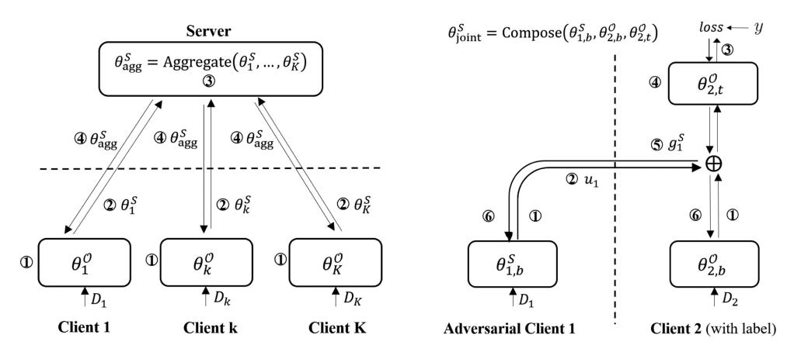
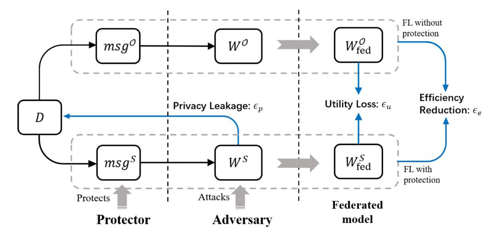
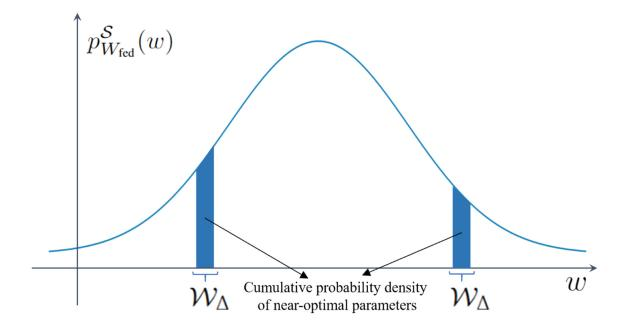
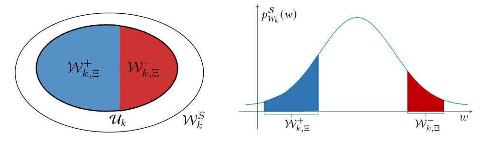
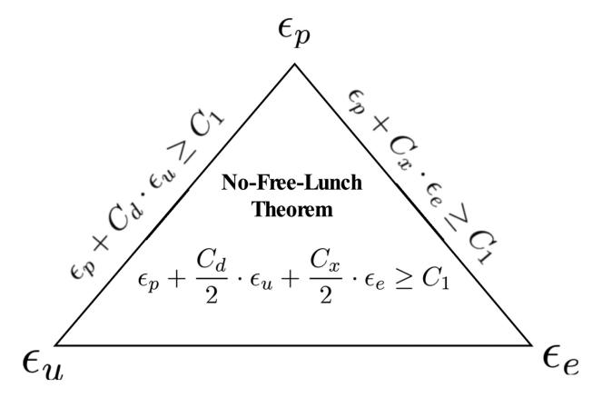
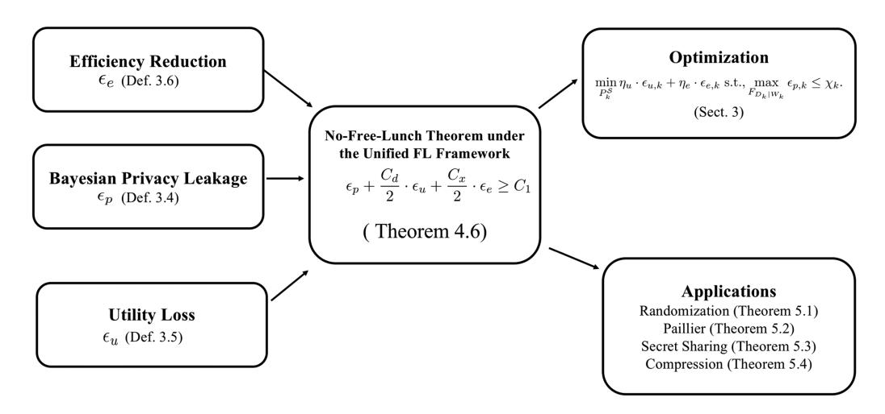

<!-- cite_key: pagepicturejpeg2016 -->

[XIAOJIN ZHANG,](https://orcid.org/0000-0001-9065-6852) Hong Kong University of Science and Technology, Hong Kong [YAN KANG,](https://orcid.org/0000-0002-2016-9503) WeBank, China [KAI CHEN,](https://orcid.org/0000-0003-2587-6028) Hong Kong University of Science and Technology, Hong Kong [LIXIN FAN,](https://orcid.org/0000-0002-8162-7096) WeBank, China [QIANG YANG,](https://orcid.org/0000-0001-5059-8360) WeBank and Hong Kong University of Science and Technology, Hong Kong

**Federated learning (FL)**enables participating parties to collaboratively build a global model with boosted utility without disclosing private data information. Appropriate protection mechanisms have to be adopted to fulfill the opposing requirements in preserving*privacy*and maintaining high model*utility*. In addition, it is a mandate for a federated learning system to achieve high *efficiency*in order to enable large-scale model training and deployment. We propose a unified federated learning framework that reconciles horizontal and vertical federated learning. Based on this framework, we formulate and quantify the trade-offs between privacy leakage, utility loss, and efficiency reduction, which leads us to the**No-Free-Lunch (NFL)**theorem for the federated learning system. NFL indicates that it is unrealistic to expect an FL algorithm to simultaneously provide excellent privacy, utility, and efficiency in certain scenarios. We then analyze the lower bounds for the privacy leakage, utility loss, and efficiency reduction for several widely-adopted protection mechanisms, including*Randomization*, *Homomorphic Encryption*, *Secret Sharing,*and*Compression*. Our analysis could serve as a guide for selecting protection parameters to meet particular requirements.

CCS Concepts: • **Security and privacy**; • **Computing methodologies**→**Artificial Intelligence**; • **Machine Learning**; • **Distributed methodologies**;

Additional Key Words and Phrases: Federated learning, privacy, utility, efficiency, trade-off, divergence, optimization

# ACM Reference format:

Xiaojin Zhang, Yan Kang, Kai Chen, Lixin Fan, and Qiang Yang. 2023. Trading Off Privacy, Utility, and Efficiency in Federated Learning. *ACM Trans. Intell. Syst. Technol.*14, 6, Article 98 (November 2023), 32 pages. <https://doi.org/10.1145/3595185>

© 2023 Copyright held by the owner/author(s). Publication rights licensed to ACM.

2157-6904/2023/11-ART98 \$15.00 <https://doi.org/10.1145/3595185>

This work was partially supported by the National Key Research and Development Program of China under Grant 2018AAA0101100 and Hong Kong RGC TRS T41-603/20-R.

Authors' addresses: X. Zhang and K. Chen, Hong Kong University of Science and Technology, Clear Water Bay, Hong Kong; e-mails: xiaojinzhang@ust.hk, kaichen@cse.ust.hk; Y. Kang and L. Fan, Webank, Shenzhen, China; e-mails: {yangkang, lixinfan}@webank.com; Q. Yang (Corresponding author), WeBank and Hong Kong University of Science and Technology, Hong Kong; e-mail: qyang@cse.ust.hk.

Permission to make digital or hard copies of all or part of this work for personal or classroom use is granted without fee provided that copies are not made or distributed for profit or commercial advantage and that copies bear this notice and the full citation on the first page. Copyrights for components of this work owned by others than the author(s) must be honored. Abstracting with credit is permitted. To copy otherwise, or republish, to post on servers or to redistribute to lists, requires prior specific permission and/or a fee. Request permissions from [permissions@acm.org.](mailto:permissions@acm.org)

# 1 INTRODUCTION

The rapid expansion of large-scale datasets has sparked a demand for distributed learning. With the enforcement of data privacy regulations such as the**General Data Protection Regulation (GDPR)**, the data owned by one company is not allowed to be disclosed to others. **Federated learning (FL)**[\[24,](#page-30-0) [25,](#page-30-0) [28,](#page-30-0) [31,](#page-30-0) [32\]](#page-31-0) meets this requirement by allowing multiple parties to train a machine learning model collaboratively without sharing private data. In recent years, FL has achieved significant progress in developing privacy-preserving machine learning systems. It has been extended from the conventional*horizontal federated learning* **(HFL)**to the*vertical federated learning* **(VFL)**scenarios [\[18,](#page-30-0) [22,](#page-30-0) [46\]](#page-31-0). HFL typically involves a large number of parties with different samples but which share the same feature space. While VFL typically involves a handful of parties that own distinct features of the same set of sample instances. HFL is popular in healthcare and mobile applications [\[2,](#page-29-0) [21,](#page-30-0) [27,](#page-30-0) [36\]](#page-31-0), while VFL is widely adopted in finance and advertisement [\[4,](#page-29-0) [23,](#page-30-0) [39\]](#page-31-0).

Preserving privacy is of immense practical importance when federating across different parties. Although the private data of each client is not shared with other collaborators, the private information might still be reconstructed by semi-honest parties upon observing the shared model information [\[14,](#page-30-0) [15,](#page-30-0) [26,](#page-30-0) [47,](#page-31-0) [51\]](#page-31-0). The fundamental requirement for maintaining privacy is to keep potential*privacy leakage*below an acceptable level. This is accomplished by reducing the dependence between shared model information and private data. To protect private data of the participants, many protection mechanisms have been proposed, such as*Randomization Mechanism*[\[1,](#page-29-0) [17,](#page-30-0) [41\]](#page-31-0),*Secret Sharing*[\[5,](#page-29-0) [6,](#page-29-0) [38\]](#page-31-0),*Homomorphic Encryption (HE)*[\[16,](#page-30-0) [48\]](#page-31-0), and*Compression Mechanism*[\[33\]](#page-31-0). However, the adoption of these protection mechanisms might result in a certain amount of*utility loss*and*efficiency reduction*, as compared with a federated model trained without any protection [\[11,](#page-29-0) [23\]](#page-30-0). As a result, theoretical analysis of the trade-off between privacy leakage, utility loss, and efficiency reduction is critical for guiding FL practitioners to choose better protection parameters or design smarter FL algorithms.

Motivated by this goal, the work [\[50\]](#page-31-0) proposed a statistical framework to analyze the privacyutility trade-off in FL on a rigorous theoretical foundation. However, its trade-off analysis did not involve efficiency, which is a crucial factor in designing FL algorithms. Besides, [\[50\]](#page-31-0) did not consider the VFL setting, which has a broad range of applications in finance and advertisement. These gaps inspire us to investigate the following crucial open problem: *is it possible to design a protection mechanism that simultaneously achieves infinitesimal privacy leakage, utility loss, and efficiency reduction?*Our main finding is crystallized in a**No-Free-Lunch (NFL)** Theorem (Theorem [4.6\)](#page-14-0) that provides a negative answer for this question in certain scenarios under a unified FL framework that reconciles both HFL and VFL settings. For the outline of our work, please refer to Figure [A.1.](#page-18-0)

Our contributions are as follows:

- We propose a unified FL framework (see Section [5\)](#page-15-0) for HFL and VFL. The unified FL framework provides a conceptual view of the relationship between privacy leakage, utility loss, and efficiency reduction through the lens of the protector and the adversary. Our No-Free-Lunch theorem is formulated based on this framework, and thus it applies to both HFL and VFL.
- We provide a No-Free-Lunch theorem (**Theorem [4.6](#page-14-0)**) for federated learning, which quantifies the trade-off between privacy leakage (Definition [3.3\)](#page-8-0), utility loss (Definition [3.4\)](#page-9-0), and efficiency reduction (Definition [3.5\)](#page-9-0). This quantification indicates that the weighted summation of the privacy leakage, utility loss, and efficiency reduction is greater than a problem-dependent non-zero constant. It characterizes the amount of utility and efficiency that is inevitable to lose in the case that the privacy leakage budget is unduly low.

• We apply the NFL theorem to analyze trade-offs between privacy leakage, utility loss, and efficiency reduction for widely-adopted protection mechanisms, including *Randomization*, *Homomorphic Encryption*, *Secret Sharing,*and*Compression*. The trade-off is characterized via the lower bounds derived for privacy leakage, utility loss, and efficiency reduction.

# 2 RELATED WORK

The related work for *attacking mechanisms and protection mechanisms in federated learning*and*privacy-utility-efficiency trade-off*are briefly reviewed in this section.

# 2.1 Attacking Mechanisms and Protection Mechanisms in Federated Learning

We focus on*semi-honest*adversaries who faithfully follow the federated learning protocol but may infer the private information of other participants based on the exposed model information.

In HFL, [\[15,](#page-30-0) [47,](#page-31-0) [51,](#page-31-0) [52\]](#page-31-0) demonstrate that adversaries could exploit gradient information to restore the private image data to pixel-level accuracy, with distinct settings of prior distributions and conditional distributions. A variety of protection mechanisms have been proposed in HFL to prevent private data from being deduced by adversarial participants. The most popular ones are*Homomorphic Encryption (HE)*[\[16,](#page-30-0) [48\]](#page-31-0),*Randomization Mechanism*[\[1,](#page-29-0) [17,](#page-30-0) [41\]](#page-31-0),*Secret Sharing*[\[5,](#page-29-0) [6,](#page-29-0) [38\]](#page-31-0), and*Compression Mechanism*[\[33\]](#page-31-0). Another school of FL [\[19,](#page-30-0) [20\]](#page-30-0) tries to protect privacy by splitting a neural network into private and public models and sharing only the public one [\[19,](#page-30-0) [23\]](#page-30-0).

VFL has two kinds of privacy leakage: feature leakage and label leakage. It is challenging for the adversary to infer the features of other parties because, in production VFL, participating parties typically have black-box knowledge about each other. The literature has proposed mainly two kinds of label inference attacks in VFL: the gradient-based [\[26\]](#page-30-0) and the model-based [\[14\]](#page-30-0) attacks. [\[26\]](#page-30-0) also demonstrated three noise-based protections that can prevent gradient-based attacks. [\[53\]](#page-31-0) proposed a data encoding protection mechanism called CoAE that can thwart model-based attacks effectively in some scenarios. Crypto-based protections are widely adopted in federated logistic regression and XGBoost. However, they are seldom applied to VNN that involves complex neural networks for their high communication and computational cost.

# 2.2 Privacy-Utility-Efficiency Trade-off

In the past decade, there has been wide interest in understanding the privacy-utility tradeoff [\[10,](#page-29-0) [30,](#page-30-0) [35,](#page-31-0) [37,](#page-31-0) [42,](#page-31-0) [44,](#page-31-0) [50\]](#page-31-0). [\[10,](#page-29-0) [30\]](#page-30-0) quantified the privacy-utility trade-off using the solution of the optimization problem. [\[37\]](#page-31-0) provided a privacy-utility trade-off region for the special case with i.i.d. data sources and known distribution. [\[35\]](#page-31-0) illustrated that the optimal privacy-utility trade-off could be solved using a standard linear program and provided a closed-form solution for the special case when the data to be released is a binary variable. [\[44\]](#page-31-0) measured distortion using the expected Hamming distance between the input and output databases and measured privacy leakage using identifiability, differential privacy, and mutual-information privacy separately. [\[42\]](#page-31-0) provided a trade-off when utility and privacy were evaluated using*χ*2-based information measures. [\[43\]](#page-31-0) analyzed the trade-off between the speed of error convergence and the wall-clock time for distributed SGD. [\[7\]](#page-29-0) analyzed the trade-off between communication, privacy, and accuracy for distributed statistical tasks. The accuracy is measured using statistical mean estimation, frequency estimation, and distribution estimation separately, and the privacy is measured using differential privacy. However, none of these works focus on federated learning and measure utility using model performance.

The work [\[50\]](#page-31-0) proposed a quantitative trade-off between utility and privacy in horizontal federated learning by exploiting some key properties of the privacy leakage and the triangle

| Notation    | Meaning                                                                                               |
|-------------|-------------------------------------------------------------------------------------------------------|
| ϵp          | Privacy leakage (Definition 3.3)                                                                      |
| ϵu          | Utility loss (Definition 3.4)                                                                         |
| ϵe          | Efficiency reduction (Definition 3.5)                                                                 |
| D           | Private information, including private data and statistical information                               |
| Wfed        | parameter for the federated model                                                                     |
| W O k | Unprotected model information of client k                                                             |
| W S k | Protected model information of client k                                                               |
| P O k | Distribution of unprotected model information of client k                                             |
| PS k     | Distribution of protected model information of client k                                               |
| WS k     | Support of PS k                                                                                    |
| WO k     | Support of P O k                                                                                |
| Wk          | Union of the supports of PS k and P O k                                                      |
| F B k | Adversary's prior belief distribution about the private information of client k                       |
| F A k | Adversary's belief distribution about client k after observing the protected private information   |
| F O k | Adversary's belief distribution about client k after observing the unprotected private information |
| JS(·  ·)    | Jensen-Shannon divergence between two distributions                                                   |
| TV(·  ·)    | Total variation distance between two distributions                                                    |

Table 1. Table of Notation

inequality of the divergence. [\[29\]](#page-30-0) evaluated the accuracy-privacy-cost trade-off for federated learning empirically. In this work, we offer a general theoretical analysis of the trade-off between privacy, utility, and efficiency that applies to both HFL and VFL.

## 3 A UNIFIED FEDERATED LEARNING FRAMEWORK

In this section, we first introduce general notations used throughout this work. Then, we propose a unified federated learning framework with a conceptual view of the relationship between privacy leakage, utility loss, and efficiency reduction. Next, we provide formal definitions for key components of this framework, including protection and attacking mechanisms, privacy leakage, utility loss, and efficiency reduction. We then formulate the goal of the protector as a constrained optimization problem and put forward a critical question with which we are concerned. Our No-Free-Lunch theorem provides an answer for this problem formulated based on this framework, and thus it applies to both HFL and VFL.

### 3.1 Notations

We adhere to the tradition of using uppercase letters to indicate the random variables, such as *D*, and lowercase letters to denote the specific values they take on. We represent [*K*] as {1, 2,...,*K*}. We use lowercase letters such as *f*and*p*to denote probability density functions and uppercase letters such as*F*and*P*to denote distributions.

The probability density function*f*at value*d*is represented by*f*Dk (*d*), and the subindex represents the random variable. The conditional density function is denoted by the notation *f*Dk |Wk (*d*|*w*). Let *p*and*q*represent the probability densities (or probability masses) of*P*and*Q*for distributions*P*and*Q* over Rn. The Jensen-Shannon divergence, which is a smoothed variation of the Kullback-Leibler divergence, is defined as JS(*P* ||*Q*) = 1 2 [KL(*P*, *M*) + KL(*Q*, *M*)] with *M* = (*P*+*Q*)/2. Let TV(*P* ||*Q*) denote the total variation distance between *P*and*Q*, which is defined as TV(*P* ||*Q*) = supA⊂Rn |*P* (*A*) − *Q*(*A*)|. The detailed description of notations is illustrated in Table 1.

Fig. 1. Illustration of the HFL procedure (left) and VFL procedure (right). For the HFL setting, we consider the server as the adversary who aims to infer individual clients' private data. For the VFL setting, we consider client 1 (has no labels) as the adversary who wants to recover the labels owned by client 2.

# 3.2 The Conceptual View of the Unified Federated Learning Framework

In this section, we propose a unified federated learning framework that unifies HFL and VFL through a conceptual view of the relationship between privacy leakage, utility loss, and efficiency reduction via the lens of the protector and the adversary. We first introduce HFL and VFL and unify their terminologies and notations. Then, we elaborate on this conceptual view.

HFL has two representative aggregation implementations: FedAvg and FedSGD, which are mathematically equivalent. Our framework applies to both aggregations. For illustrative purposes, we use FedAvg to explain the procedure of secure horizontal federated learning:

- 1 With the global model state from the server, each client *k*trains its local model using its private data set*D*k , and obtains the local model *θ*O k .
- 2 In order to prevent the semi-honest adversaries from inferring other clients' private information*D*k according to *θ*O k , each client*k*adopts a protection mechanism*M*to convert model*θ*O k to protected model*θ*S k , and sends*θ*S k to the server.
- 3 The server aggregates*θ*S k ,*k* = 1,...,*K*to generate a new global model*θ*S agg.
- 4 Each client*k*downloads the global model*θ*S agg and uses it to update its local model.

The processes 1 -4 iterate until the utility of the aggregated model*θ*S agg does not improve.

In VFL, without loss of generality, we consider a 2-client scenario where client 1 (has no labels) is the adversary who wants to recover the labels owned by client 2. The overall secure vertical federated learning procedure is illustrated on the right panel of Figure 1 and summarized as follows:

- 1 Client 1 and 2 compute their model outputs*u*1 and *u*2 based on their local bottom model information using their corresponding local data sets, respectively.
- 2 Client 1 sends *u*1 to client 2.
- 3 Client 2 aggregates *u*1 and *u*2 and then feeds the aggregated result to its top model *θ*O 2,t to generate the predicted labels, which further is used to compute loss against the ground truth label*y*.
- 4 Client 2 updates its top model *θ*O 2,t and continues to compute the derivatives*д*1 and *д*2 of the loss *L*w.r.t.*u*1 and *u*2, respectively.

|                     | Horizontal FL                               | Vertical FL                | Unified FL                         |  |
|---------------------|---------------------------------------------|----------------------------|------------------------------------|--|
| global model        | aggregated model                            | joint model                | federated model                    |  |
| privacy             | private data or                             |                            | private information                |  |
|                     | statistical information                     | private labels             |                                    |  |
| information exposed | θ S (attacker: server) k           | дS                         | W W S S or k fed |  |
| to the attacker     | θ S or agg (attacker: client)      | k                          |                                    |  |
| utility             | K k=1Uk (θ agg) 1 S  K | U (θ ) S joint | U (W ) S fed           |  |

Table 2. Unified Terminologies and Notations for HFL and VFL

 In order to prevent the adversarial client 1 from inferring labels of client 2 based on *д*1, client 2 adopts protection mechanism *M*to convert*д*1 to protected *д*S , and sends *д*S to client 1.

 Clients 1 and 2 update their local bottom model *θ*S ,b and*θ*O ,b based on*д*S and *д*2, respectively.

The processes 1 -6 iterate until the utility of the joint model *θ*S joint does not improve.

For the convenience of our analysis, we unify the terminologies and notations used for HFL and VFL (summarized in Table 2). The final trained model in HFL is typically called*aggregated model*, while the one in VFL is called *joint model*. We refer to them as *federated model*. The private information of HFL typically involves private features, labels, and statistical information; the one we study in this work for VFL is private labels. We refer to them all as *private information*. In HFL, the information exploited by the attacker to infer the private information of protector *k*is*θ*S k if the attacker is the server, and is*θ*S agg if the attacker is the client (see Figure [1](#page-4-0) left). In VFL, the exploited information is referred to as*д*S k (see Figure [1](#page-4-0) right). We unify them as *W*S k and*W* S fed. The utility of the federated model of HFL is usually defined as 1 K -K k=1*U*k (*θ* S agg), while the one of VFL is*U* (*θ*S joint). We unify them as*U* (*W* S fed).

Horizontal and vertical federated learning are the two primary forms of federated learning. While they have distinct training procedures, their privacy-preserving problem can be boiled down to the competition between the adversary and the protector. The former tries to learn as much private information on*D*as possible via privacy attacks. At the same time, the latter applies protection mechanisms to mitigate privacy leakage while maintaining utility loss and efficiency reduction below an acceptable level.

Figure [2](#page-6-0) gives our proposed unified federated learning framework that illustrates the relationship between the*privacy leakage ϵ*p , *utility loss ϵ*e , and *efficiency reduction ϵ*u through the lens of the adversary and the protector. Specifically, to protect the privacy of its local data *D*, the protector converts the plain-text message *msд*to protected one*msд*S exposed to the adversary aiming to mitigate the privacy leakage while maintaining the utility loss below an acceptable level. On the other hand, the adversary launches privacy attacks on protected model information*W*S aiming to infer as much information on*D*as possible. Since protection mechanisms may jeopardize model utility and reduce efficiency, the protector needs to control the strength of the applied protection mechanism to strike a balance between private leakage, utility loss, and efficiency reduction.

The unified FL framework provides a conceptual view of the relationship between*ϵ*p , *ϵ*u , and *ϵ*e through the lens of the protector and the adversary, regardless of the underlying FL architecture. Thus, it also reconciles other FL architectures, such as **peer-to-peer (P2P)**FL. In this work, we propose the No-Free-Lunch (NFL) theorem that quantifies the trade-off between*ϵ*p , *ϵ*u , and *ϵ*e from the perspective of the protector of our unified federated learning framework. Thus, the NFL theorem applies to HFL, VFL, and P2P FL (e.g., Swarm Learning [\[45\]](#page-31-0)).

Fig. 2. The unified federated learning framework (including HFL and VFL) illustrates the relationship between privacy leakage *ϵ*p , utility loss *ϵ*u , and efficiency reduction *ϵ*e . *D*denotes the private data, which can be either features or labels.*msд*denotes the message encoded with knowledge of*D*. It is sent from the data owner to the adversary. In HFL, *msд*can be model parameters, model gradients, and model outputs sent from individual clients to the server. In VFL,*msд*is typically the intermediate gradient (see Figure [1](#page-4-0) (right)) sent from the client with labels to adversarial clients.*W*denotes any model information derived from*msд*that the privacy attack can leverage to infer*D*. In HFL, *W* typically includes model parameters and model gradients. In VFL,*W* includes intermediate gradients, model parameters, and model gradients.*W*fed denotes the federated model. We use superscripts *S*and O to distinguish the protected information and the plain-text one, respectively.

## 3.3 Protection and Privacy Attacking Mechanisms
*3.3.1 Protection Mechanisms.*The data protector applies certain protection mechanisms to the exposed model information to mitigate privacy leakage. We formally define the protection mechanism as follows:
*Definition 3.1 (Protection Mechanism and Protected Distribution).*The**protection mechanism** *M*: Rm → Rm maps the original model information*W*O k , which follows a distribution*P*O k , to its protected (or distorted) counterpart*W*S k , which follows a distribution*P*S k . The objective of*M*is to protect private data so that the dependency between*W*S k and*D*k is reduced, compared to the dependency between the unprotected information *W*O k and*D*k . The distribution *P*S k is referred to as the**protected distribution**of client*k*.

*Example:*We take the randomization mechanism as an illustrative example and introduce the*protected distribution*. Assume that *W*O k ∼*P* O k = N (*μ*0, Σ0), and *ϵ*k ∼ N (0, Σϵ ), where Σ0 = diag(*σ*2 1 ,..., *σ*2 n ), Σϵ = diag(*σ*2 ϵ ,..., *σ*2 ϵ ). Then the protected parameter *W*S k =*W*O k +*ϵ*k ∼ N (*μ*0, Σ0 + Σϵ ). That is, the protected distribution *P* S k = N (*μ*0, Σ0 + Σϵ ). Please refer to Section [D](#page-23-0) for more details.

In this work, we consider widely-adopted protection mechanisms, including Randomization Mechanism, Homomorphic Encryption, Secret Sharing, and Compression Mechanism.

*3.3.2 Privacy Attacking Mechanisms.*The requirement of adopting specific protection mechanisms depends on the adversary's threat model. We consider the adversary to be*semi-honest*,

| Attack                | Work                        | I(w d)                                                         | H(d)     | Type       |
|-----------------------|-----------------------------|----------------------------------------------------------------|----------|------------|
| Gradient Inversion | DLG [52]                    | C 2σ 2 д − ∇wL(d,w)2 1 − 2                      | Constant | Horizontal |
|                       | Inverting Gradients [15]    | ∇w L(d,w), д ∇w L(d,w) ·д                                   | TV(d)    | Horizontal |
|                       | Improved DLG [51]           | C − д − ∇wL(d,w)2 2                                   | Label(d) | Horizontal |
|                       | GradInversion [47]          | C 2σ 2 д − ∇wL(d,w)2 1 − 2                      | Group(d) | Horizontal |
| Label Inference    | Norm-based Scoring [26]     | ψ N ( i=1 1{r(w) ∈ [li,ui]} · 1{d ∈ Ci})  | Constant | Vertical   |
|                       | Direct Label Inference [14] | ψ N ( i=1 1{w ∈ [li,ui]} · 1{d ∈ Ci})     | Constant | Vertical   |

Table 3. Privacy Attacking Mechanisms that Fit the Bayesian Inference Attack

For Gradient Inversion attacks, д denotes the observed gradient, and w corresponds to θ S k in the left panel of Figure [1.](#page-4-0) For Label Inference attacks, w corresponds to дS 1 in the right panel of Figure [1.](#page-4-0)

he/she faithfully adheres to the federated learning protocol, yet may execute privacy attacks on exposed data to deduce the private information of other participants.

Let *D*k denote private features or labels in horizontal federated learning and denote labels in vertical federated learning. Let*W*k represent the model information exposed by client *k*. Let *f*Dk |Wk represent the probability density function of the posterior distribution *F*Dk |Wk . Next, we introduce the Bayesian Inference Attack that estimates the private information by maximizing the posterior belief *f*Dk |Wk .

*Definition 3.2 (Bayesian Inference Attack).*Given the distorted model information*W*S k , the**Bayesian Inference Attack**finds data*d* that maximizes the posterior belief:

$$
\arg\max_{d} \text{IH}(d|w) = \arg\max_{d} \text{[I}(w|d) + \text{H}(d)],\tag{1}
$$

where IH(*d*|*w*) = log *f*Dk |W S k (*d*|*w*) corresponds to the logarithm of the posterior belief, I(*w*|*d*) = log *f* W S k |Dk (*w*|*d*) measures the logarithm of the likelihood based on the observed model information *w*, and H(*d*) = log *f*Dk (*d*) represents the logarithm of the prior belief *f*Dk (*d*). According to Bayes' theorem, maximizing the logarithm of posterior *f*Dk |W S k (*d*|*w*) on *D*k involves maximizing summation of log(*f* W S k |Dk (*w*|*d*)) and log(*f*Dk (*d*)).

Below, we introduce some representative privacy attacks (see Table 3) that fall under the family of the Bayesian Inference Attack.

*Privacy Attacks in HFL.*The following attacking mechanisms proposed for HFL fit into the Bayesian inference attack framework formulated in Equation (1). These attacks infer private data*d*through maximizing the similarity between the observed gradient*д* and the estimated gradient ∇wL(*d*,*w*) with different prior on *d* (*w*here corresponds to*θ*S k in the left panel of Figure [1\)](#page-4-0).

-**Deep Gradient Leakage (DLG)** [\[52\]](#page-31-0): H(*d*) is constant; I(*w*|*d*) is the negative -2 distance between the observed gradient *д* and the estimated gradient ∇wL(*d*,*w*).
- Inverting Gradients [\[15\]](#page-30-0): H(*d*) is the TV loss of estimated data, denoted as TV(*d*); I(*w*|*d*) corresponds to the cosine similarity between the observed gradient *д* and the estimated gradient ∇wL(*d*,*w*).
- Improved DLG [\[51\]](#page-31-0)): H(*d*) is the prior with the label information of *d*, denoted as Label(*d*); I(*w*|*d*) corresponds to the negative -2 distance between the observed gradient *д* and the estimated gradient ∇wL(*d*,*w*).
- GradInversion [\[47\]](#page-31-0): H(*d*) is the group consistency of estimated data, denoted as Group(*d*); I(*w*|*d*) corresponds to the negative -2 distance between the observed gradient *д* and the estimated gradient ∇wL(*d*,*w*).

*Privacy Attacks in VFL.*We focus on label inference attacks because labels may contain sensitive user information, and they are typically valuable assets in real-world VFL applications such as finance, healthcare, and advertisement. More specifically, we consider gradient scoring attack and direct label inference attack, which comply with the Bayesian inference attack framework. Both attacks are mounted by client 1, aiming to infer labels owned by client 2 based on back-propagated gradient*w* (*w*here corresponds to*д*S 1 in the right panel of Figure [1\)](#page-4-0).

- Gradient Scoring Attack. I(*w*|*d*) = *N* ( ψ i=1 1{*r*(*w*) ∈ [*l*i,*v*i]} · 1{*d*∈*C*i}), where *r*: Rm → [0, 1] denotes a scoring function;*d*represents one data point;*l*i and *v*i denotes the lower bound and upper bound, respectively;*ψ* represents the total number of classes;*C*i represents class*i*; *N* (·) computes the logarithm of the normalized input. H(*d*) = constant. The gradient scoring attack typically applies to the binary classification task. The attacker needs to design a scoring function satisfying that*r*(*w*) ∈ [*l*1,*v*1] if the corresponding data of*w*belongs to the negative class, and*r*(*w*) ∈ [*l*2,*v*2] if the corresponding data of*w*belongs to the positive class. A case in point is the**Norm-based Scoring Attack (NBS)**[\[26\]](#page-30-0), which observes that*w*2 of the positive instances are generally larger than that of the negative ones and formulates the attacking problem as the classification problem.
- **Direct Label Inference Attack (DLI)** [\[14\]](#page-30-0). DLI is tailored to the VFL scenario where the top model owned by client 2 is an activation function (e.g., softmax) [\[28\]](#page-30-0), the adversary has access to the gradients of the final activation function, and thus it can infer labels through the signs of back-propagated gradients. In DLI, I(*w*|*d*) = *N* ( ψ i=1 1{*w*i ∈ ([*l*i,*v*i]}·1{*d*∈*C*i}), where *l*i = −∞ and *v*i = 0 if *d*∈*C*i ; *l*i = 0 and *v*i = +∞ otherwise; H(*d*) = constant. Thus, if *w*i < 0 its corresponding data point *d*belongs to class*C*i and if *w*i>0 the data point *d*does not belong to class*C*i .

*Remark:*Attacking mechanisms, such as the model completion attack [\[14\]](#page-30-0), that use the cumulative information over rounds and is beyond the scope of our article.

### 3.4 Privacy Leakage, Utility Loss, and Efficiency Reduction

In this section, we formally define*privacy leakage*, *utility loss*, and *efficiency reduction*(depicted in Figure [2\)](#page-6-0).

The privacy leakage (Definition 3.3) measures the variation between the adversary's prior and posterior beliefs on private information. The adversary obtains the posterior belief by mounting a Bayesian inference attack (Definition [3.2\)](#page-7-0) on the protected model information. Thus, we formally call the privacy leakage the*Bayesian*privacy leakage. The protected model information may lead to the federated model with lower utility (Definition [3.4\)](#page-9-0) and the federated training with less efficiency (Definition [3.5\)](#page-9-0) in certain scenarios.

Let*F*A k ,*F*O k and*F*B k represent the attacker's belief distributions about*D*k upon observing the protected information, the original information and without observing any information, respectively, and the probability density functions of which are *f*A Dk ,*f*O Dk , and*f*B Dk . Specifically,*f* A Dk (*d*) = Wk *f*Dk |Wk (*d*|*w*)*dP* S k (*w*), *f* O Dk (*d*) = Wk *f*Dk |Wk (*d*|*w*)*dP* O k (*w*), and *f* B Dk (*d*) = *f*Dk (*d*).

We use JS divergence to measure the privacy leakage instead of KL divergence. The advantage of JS divergence over KL divergence is that it is symmetrical, and its square root satisfies the triangle inequality [\[12\]](#page-30-0). This property facilitates the quantification of the trade-offs.

*Definition 3.3 (Bayesian Privacy Leakage).*Let*ϵ*p,k represent the privacy leakage of client *k*, which is defined as:

$$
\epsilon_{p,k} = \sqrt{\text{JS}(F_k^{\mathcal{A}}||F_k^{\mathcal{B}})},\tag{2}
$$

98:10 X. Zhang et al.

.

where JS(*F* A k ||*F*B k ) = 1 2 Dk*f* A Dk (*d*) log f A Dk (d) f M Dk (d) **d***μ*(*d*) + 1 2 Dk *f* B Dk (*d*) log f B Dk (d) f M Dk (d) **d***μ*(*d*), *F*A k and*F*B k represent the attacker's belief distribution about*D*k upon observing the protected information and without observing any information, respectively, and *f* M Dk (*d*) = 1 2 (*f* A Dk (*d*) + *f* B Dk (*d*)).

Furthermore, the Bayesian privacy leakage in FL resulting from releasing the protected model information is defined as:

$$
\epsilon_p = \frac{1}{K} \sum_{k=1}^{K} \epsilon_{p,k}.
$$

*Remark:*(1) The local model information*W*k represents the *model parameters*, *model gradients,*and*model outputs*, all of which may optionally be exchanged or get exposed to semi-honest adversaries.

(2) If the private information *D*k is continuous, then

$$
\begin{split} \text{JS}\left(F_{k}^{\mathcal{A}}||F_{k}^{\mathcal{B}}\right) &= \frac{1}{2}\left[\text{KL}\left(F_{k}^{\mathcal{A}}, F_{k}^{\mathcal{M}}\right) + \text{KL}\left(F_{k}^{\mathcal{B}}, F_{k}^{\mathcal{M}}\right)\right] \\ &= \frac{1}{2}\int_{\mathcal{D}_{k}} f_{D_{k}}^{\mathcal{A}}(d) \log \frac{f_{D_{k}}^{\mathcal{A}}(d)}{f_{D_{k}}^{\mathcal{M}}(d)} \mathbf{d}\mu(d) + \frac{1}{2} \int_{\mathcal{D}_{k}} f_{D_{k}}^{\mathcal{B}}(d) \log \frac{f_{D_{k}}^{\mathcal{B}}(d)}{f_{D_{k}}^{\mathcal{M}}(d)} \mathbf{d}\mu(d). \end{split}
$$

If the private information *D*k is discrete, then

$$
\begin{split} \text{JS}\left(F_{k}^{\mathcal{A}}||F_{k}^{\mathcal{B}}\right) &= \frac{1}{2} \left[ \text{KL}\left(F_{k}^{\mathcal{A}}, F_{k}^{\mathcal{M}}\right) + \text{KL}\left(F_{k}^{\mathcal{B}}, F_{k}^{\mathcal{M}}\right) \right] \\ &= \frac{1}{2} \sum_{d \in \mathcal{D}_{k}} f_{D_{k}}^{\mathcal{A}}(d) \log \frac{f_{D_{k}}^{\mathcal{A}}(d)}{f_{D_{k}}^{\mathcal{M}}(d)} + \frac{1}{2} \sum_{d \in \mathcal{D}_{k}} f_{D_{k}}^{\mathcal{B}}(d) \log \frac{f_{D_{k}}^{\mathcal{B}}(d)}{f_{D_{k}}^{\mathcal{M}}(d)} \end{split}
$$

When evaluating the utility loss, we consider the scenario when each protector is assigned a private key (if one exists).

*Definition 3.4 (Utility Loss).*The utility loss of client*k*(denoted as*ϵ*u,k ) measures the variation in utility of client *k*with the federated model drawn from unprotected distribution*P*O fed and the utility of the federated model drawn from protected distribution*P*S fed:

$$
\epsilon_{u,k} = \mathbb{E}_{W^{\scriptscriptstyle O}_{\scriptscriptstyle\text{fed}} \sim P^{\scriptscriptstyle O}_{\scriptscriptstyle\text{fed}}}\big[U_k(W^{\scriptscriptstyle O}_{\scriptscriptstyle\text{fed}})\big] - \mathbb{E}_{W^{\scriptscriptstyle S}_{\scriptscriptstyle\text{fed}} \sim P^{\scriptscriptstyle S}_{\scriptscriptstyle\text{fed}}}\big[U_k(W^{\scriptscriptstyle S}_{\scriptscriptstyle\text{fed}})\big],
$$

where*U*k represents the utility function of client *k*. Furthermore, the utility loss in FL system is defined as:

*ϵ*u = EW O fed∼P O fed [*U* (*W* O fed)] − EW S fed∼PS fed [*U* (*W*S fed)],

where*U*represents the utility function of the FL system.

Efficiency reduction is another criterion we consider in this work, and is defined as follows.
*Definition 3.5 (Efficiency Reduction).*Let*ϵ*e,k represent the efficiency reduction of client *k*. The efficiency reduction of client *k*measures the variation in efficiency with the models drawn from the unprotected and protected distributions*P*O k and*P*S k , which is defined as:

$$
\epsilon_{e,k} = \mathbb{E}_{W_k^S \sim P_k^S}[C(W_k^S)] - \mathbb{E}_{W_k^O \sim P_k^O}[C(W_k^O)],
$$

where*C*denotes a mapping from the model information to the efficiency measured in terms of the communication cost (e.g., the transmitted bits) or the training cost. Furthermore, the efficiency reduction in FL system is defined as:

$$
\epsilon_e = \frac{1}{K} \sum_{k=1}^K \epsilon_{e,k}.
$$

# 3.5 The Competition Between The Protector and The Adversary
**The Goal of the Protector:**The goal of protector*k*is formulated as an optimization problem that aims at finding a protected distribution*P*S k achieving the minimum utility loss and efficiency reduction under the privacy constraint*χ*k , which is formally expressed as

$$
\min_{P_k^S} \eta_u \cdot \epsilon_{u,k} + \eta_e \cdot \epsilon_{e,k},\tag{3}
$$

subject to
$$
\epsilon_{p,k} \leq \chi_k
$$
. (4)

where *η*u represents the preference of the protector towards model utility, and *η*e represents the preference of the protector towards efficiency.

**The Goal of the Adversary:**Let*D*k be the client *k*'s private information. Let *W*S k represent the client*k*'s model information exposed to the adversary. The goal of the adversary is formally expressed as

$$
\max_{F_{D_k|W_k^S}} \epsilon_{p,k} := JS(F_k^{\mathcal{A}}||F_k^{\mathcal{B}}),\tag{5}
$$

where *F*Dk |W S k represents the adversary's posterior distribution of the private information *D*k upon observing the exposed model information *W*S k .
**Competition Between the Protector and the Adversary:**Given the goal of the protector and the adversary formally stated in Equations (3) and (5), the competition between the protector and the adversary is formally expressed as

$$
\min_{P_k^S} \quad \eta_u \cdot \epsilon_{u,k} + \eta_e \cdot \epsilon_{e,k},
$$
\n
$$
\text{subject to} \quad \max_{P_{D_k|W_k^S}} \epsilon_{p,k} \le \chi_k. \tag{6}
$$

where*χ*k is the privacy level required by client *k*.

*Remark:*This optimization problem can be extended to satisfy the personalized requirement of the federated learning system. For example, if the efficiency reduction of the federated learning system is required not to exceed*φ*k , then the optimization problem is expressed as

$$
\min_{P_k^S} \epsilon_{u,k},
$$
\n
$$
\text{subject to } \max_{P_{D_k|W_k^S}} \epsilon_{p,k} \le \chi_k, \epsilon_{e,k} \le \varphi_k. \tag{7}
$$

A natural question is: *is it possible to design a protection mechanism that simultaneously achieves infinitesimal privacy leakage, utility loss, and efficiency reduction?*In the following section, we provide a negative answer for this question in certain scenarios, which leads to our No-Free-Lunch Theorem (Theorem [4.6\)](#page-14-0).

## 4 NO FREE LUNCH THEOREM IN FEDERATED LEARNING

In this section, we propose the No-Free-Lunch (NFL) theorem (Theorem [4.6\)](#page-14-0), stating that it is unrealistic to expect a privacy-preserving FL algorithm to simultaneously achieve the infinitesimal privacy leakage, utility loss, and efficiency reduction in certain scenarios.

Fig. 3. Illustration of Assumption 4.1. The blue area represents the probability that the realization of the protected model information*W*S fed falls inside the*near-optimal parameters*WΔ. It is referred to as the cumulative probability density of the near-optimal parameters. Note that we use model parameters with one dimension in this figure for illustrative purposes.

Before elaborating on the NFL theorem, we introduce Assumptions 4.1 and [4.2,](#page-12-0) under which the federated learning scenarios we analyze guarantee the existence of trade-offs between privacy, utility, and efficiency.

Assumption 4.1 is proposed in [\[50\]](#page-31-0) and illustrated in Figure 3. We present it here for completeness. Intuitively, it states that the cumulative density of the near-optimal parameters is bounded, which rules out scenarios where the utility is constant and most parameters are near-optimal parameters.

Assumption 4.1.*let*WS*fed represent the support of the protected distribution P*S*fed of the federated model information. Let*W∗*fed represent the set of parameters achieving the maximum utility*

$$
\mathcal{W}_{fed}^* = \operatorname*{argmax}_{w \in \mathcal{W}_{fed}} U(w),
$$

*where U represents the utility of the federated learning system. Given a non-negative constant c, the near-optimal parameters are defined as*

$$
\mathcal{W}_c = \left\{ w \in \mathcal{W}_{\text{fed}}^{\mathcal{S}} : |U(w^*) - U(w)| \leq c, \forall w^* \in \mathcal{W}_{\text{fed}}^*\right\}.
$$
*Let c*= Δ*be the maximum constant that satisfies:*$$
\int_{\mathcal{W}_{fed}^{S}} \mathbb{1}\{w \in \mathcal{W}_{\Delta}\} p_{W_{fed}}^{S}(w) dw \le \frac{TV(P_{fed}^{O}||P_{fed}^{S})}{2},\tag{8}
$$
*where p*S W*fed represents the probability density function of the protected federated model information W*S*fed. We assume that*Δ*is positive, i.e.,* Δ &gt; 0*.*

*Remark:*The Equation (8) states that the cumulative density of the near-optimal distorted parameters is upper-bounded by TV(P O fed | |PS fed) 2 , which is at most 1 2 . Therefore, the utility is not constant, and most distorted parameters are sub-optimal.
*Remark:* If the distribution of the protected model information is continuous and TV(*P* O fed||*P*S fed) = 0, then there does not exist a positive constant Δ satisfying Equation (8), which implies that Assumption 4.1 does not hold. From Lemma C.3 of [\[50\]](#page-31-0), the utility equals 0.

Let*p*O Wk represent the probability density of unprotected model information of client*k*, and *p*S Wk represent the probability density of protected model information of client *k*. The following

Fig. 4. Illustration of Assumption 4.2. The left panel shows the relationship between the sets W+ k,Ξk , W− k,Ξk , Uk , andWS k . The right panel illustrates Equation (9). In the right panel, the blue area (term 1 in Equation (9)) and red area (term 2 in Equation (9)) represent the probability that the realization of the protected model information falls inside W+ k,Ξk and W− k,Ξk , respectively, and the blue area is larger than the red area. Note that we use model parameters with one dimension for illustrative purposes.

Assumption 4.2 states that the distorted parameters have higher communication cost than that of the original parameters with high probability. Therefore, the expected communication cost of the distorted parameter is higher than that of the original parameter. This assumption rules out scenarios where the communication cost is constant, and the communication cost of most distorted parameters is smaller than that of the original parameters. We provide an example for illustration in Figure 4.

Assumption 4.2. *Let w*O*max*= arg maxw ∈WO k*C*(*w*)*. Let*Ξk*denote the minimum non-negative constant satisfying that C*(*w*O*max*) − Ξk ≤ *C*(*w*)*,* ∀*w*∈ WS k*. Let*Uk*represent the set of distorted parameters with improved probability density. Specifically,* Uk = {*w*∈ WS k :*p*S Wk (*w*) ≥ *p* O Wk (*w*)}*. We denote*W+ k,Ξk *as the set of distorted parameters with high probability density, and the communication cost of which is larger than that of the original parameters with a gap of at least*2 · Ξk*. We denote*W+ k,Ξk*as:*$$
\mathcal{W}_{k,\Xi_k}^+ = \left\{ w \in \mathcal{U}_k : C(w_{max}^O) + 2 \cdot \Xi_k \le C(w) \quad \text{and} \quad p_{W_k}^S(w) \ge 2 \cdot p_{W_k}^O(w) \right\}.
$$
*We denote*W− k,Ξk = Uk \ W+ k,Ξk*. Let*Γk*denote the maximum constant satisfying that*$$
\underbrace{\int_{\mathcal{U}_k} \mathbb{1}\{w \in \mathcal{W}_{k,\Xi_k}^+\} p_{W_k}^S(w) dw}_{\text{term 1}} - \underbrace{\int_{\mathcal{U}_k} \mathbb{1}\{w \in \mathcal{W}_{k,\Xi_k}^-\} p_{W_k}^S(w) dw}_{\text{term 2}} \geq \Gamma_k \cdot TV(P_k^O || P_k^S),\tag{9}
$$
*wherep*S Wk *denotes the probability density function of the protected model information andp*O Wk*denotes the probability density function of the original model information. We assume that*Ξk*and*Γk*are positive, i.e.,* Ξk > 0, Γk > 0,∀*k* ∈ [*K*]*.*

*Remark:* The Equation (9) states that the difference between the distorted parameters' cumulative density in W+ k,Ξk and W− k,Ξk is lower-bounded by a non-negative value. Therefore, it conveys that the expected communication cost of the distorted parameter is higher than that of the original parameter. Since Ξk > 0, the communication cost is not constant.

In the next section, we introduce the quantitative trade-offs between privacy and efficiency and between privacy and utility, respectively. These two trade-offs lead to the main conclusion of our No-Free-Lunch theorem formulated in Theorem [4.6.](#page-14-0)

### 4.1 Trade-off between Privacy and Efficiency

The following Lemma 4.1 bounds efficiency reduction using the distortion measured by total variation distance TV(*P* O fed||*P*S fed). The intuition is that a larger distortion leads to a higher efficiency reduction. The analysis is deferred to Lemma [B.3.](#page-20-0)

Lemma 4.1.*Let Assumption [4.2](#page-12-0) hold, and ϵ*e *be defined in Definition [3.5.](#page-9-0) Let P*O*fed and P*S*fed represent the distribution of the aggregated parameter before and after being protected. Let*Ξ = mink ∈[K] Ξk*, and*Γ = mink ∈[K] Γk*. Then, we have:*$$
\epsilon_e \geq \Xi \cdot \Gamma \cdot \frac{1}{K} \sum_{k=1}^K \textit{TV}(P^O_k || P^S_k).
$$

The following Lemma 4.2 illustrates the quantitative relationship between*ϵ*p and total variation distance. Lemma 4.2 applies to both discrete (see proof in [\[50\]](#page-31-0)) and continuous private information (see Lemma [B.1\)](#page-18-0).

Lemma 4.2. *Let ϵ*p,k *be defined in Definition [3.3,](#page-8-0) P*O k*and P*S k*represent the distribution of the parameter of client k before and after being protected. Then, we have:*$$
\epsilon_p \ge C_1 - \frac{1}{K} \sum_{k=1}^K C_2 \cdot TV(P_k^O || P_k^S),\tag{10}
$$
*whereC*1 = 1 K -K k=1 *JS*(*F* O k ||*F* B k )*, andC*2 = 1 2 (*e*2ξ −1)*,ξ*k *=* maxw ∈Wk,d ∈Dk | log( fDk |Wk (d |w) fDk (d) )|*, and ξ =*maxk ∈[K]*ξ*k *represents the maximum privacy leakage over all possible information w released by the clients, and* [*K*] = {1, 2,...,*K*}*.*Intuitively, a larger distortion would increase communication costs while decreasing privacy leaks. The Lemma 4.3 demonstrates how the summation of privacy leakage and efficiency reduction is lower bounded by a constant that depends on the nature of the scenario.

Lemma 4.3 (No Free Lunch Theorem (NFL) for Privacy and Efficiency).*Let ϵ*p *be defined in Definition [3.3,](#page-8-0) and let ϵ*e *be defined in Definition [3.5,](#page-9-0) with Assumption [4.2](#page-12-0) we have:*$$
\epsilon_p + C_x \cdot \epsilon_e \ge C_1,
$$
*where C*1 = 1 K -K k=1 *JS*(*F* O k ||*F*B k )*and C*x = 1 2ΞΓ (*e*2ξ − 1)*.*# 4.2 Trade-off between Privacy and Utility

The Lemma 4.4 demonstrates how the total variation distance between the protected and unprotected distributions lower bounds utility loss.

Lemma 4.4.*Let Assumption [4.1](#page-11-0) hold, and ϵ*u *be defined in Definition [3.4.](#page-9-0) Let P*O*fed and P*S*fed represent the distribution of the federated model information before and after being protected. Then, we have:*$$
\epsilon_u \geq \frac{\Delta}{2} \cdot \mathit{TV}(P^O_{fed} || P^S_{fed}).
$$

With Lemma 4.2 and Lemma 4.4, it is now natural to provide a quantitative relationship between the utility loss and the privacy leakage.

Lemma 4.5 (No Free Lunch Theorem (NFL) for Privacy and Utility).*Let ϵ*p *be defined in Definition [3.3,](#page-8-0) and let ϵ*u *be defined in Definition [3.4](#page-9-0) at the convergence step, with Assumption [4.1](#page-11-0) we have:*$$
\epsilon_p + C_d \cdot \epsilon_u \ge C_1,\tag{11}
$$

Fig. 5. Privacy-utility-efficiency trade-offs.
*where ξ*k *=* maxw ∈Wk,d ∈Dk | log( fDk |Wk (d |w) fDk (d) )|*, and ξ =*maxk ∈[K]*ξ*k *represents the maximum privacy leakage over all possible information w released by client k, and* [*K*] = {1, 2,...,*K*}*, C*1 = 1 K -K k=1 *JS*(*F* O k ||*F* B k )*, C*d = γ 4Δ (*e*2ξ − 1)*, and γ*= 1 K -K k=1*TV*(P O k | |PS k ) *TV*(P O *fed*| |PS*fed*)*.*

*Remark:* If the distribution of the protected model information is continuous, and TV(*P* O fed||*P*S fed) = 0, then Assumption [4.1](#page-11-0) does not hold, and the utility loss is equal to 0 (from Lemma C.3 of [\[50\]](#page-31-0)).

## 4.3 Trade-off between Privacy, Utility, and Efficiency

The Theorem 4.6 illustrates the quantitative trade-off between privacy leakage, utility loss, and efficiency reduction, which shows that the weighted summation of these three metrics is larger than a problem-dependent constant (also exhibited in Figure 5). It implies that simultaneously achieving infinitesimal privacy leakage, utility loss, and efficiency reduction is unrealistic in certain scenarios. The complete analysis is deferred to Appendix [C.](#page-22-0)

Theorem 4.6 (No Free Lunch Theorem (NFL) for Privacy, Utility and Efficiency).*Let ϵ*e *be defined in Definition [3.5,](#page-9-0) ϵ*p *be defined in Definition [3.3,](#page-8-0) and let ϵ*u *be defined in Definition [3.4](#page-9-0) at the convergence step. Let Assumptions [4.1](#page-11-0) and [4.2](#page-12-0) hold, then we have that:*$$
\epsilon_p + \frac{C_d}{2} \cdot \epsilon_u + \frac{C_x}{2} \cdot \epsilon_e \ge C_1,\tag{12}
$$
*where ξ*k = maxw ∈Wk,d ∈Dk | log( fDk |Wk (d |w) fDk (d) )|*, ξ*= maxk ∈[K]*ξ*k *, C*1 = 1 K -K k=1 *JS*(*F* O k ||*F* B k )*, C*d = γ 4Δ (*e*2ξ − 1)*, C*x = 1 2ΞΓ (*e*2ξ − 1)*, γ*= -K k=1*TV*(P O k | |PS k ) *TV*(P O *fed*| |PS*fed*)*.*Note that*C*1 measures the discrepancy between the prior belief and the posterior belief of the attacker and is typically a positive constant in real-world applications. Theorem 4.6 states that the weighted summation of the privacy leakage, utility loss, and efficiency reduction is greater than or equal to *C*1 in certain scenarios, indicating that a protection mechanism cannot be expected to achieve exceptional privacy, utility, and efficiency simultaneously in scenarios where Assumptions [4.1](#page-11-0) and [4.2](#page-12-0) hold.

Table 4. Comparison of Homomorphic Encryption, Secret Sharing, Randomization, and Compression in Terms of Privacy-utility-efficiency Trade-off Characterized via Lower Bounds for *ϵ*p , *ϵ*u , and *ϵ*e

|            | Paillier HE                               | Secret Sharing                                                                  | Randomization                                                                                                | Compression                                 |
|------------|-------------------------------------------|---------------------------------------------------------------------------------|--------------------------------------------------------------------------------------------------------------|---------------------------------------------|
| ϵp (LB) |  m 1 −  2δ C1 − C2 · n2 | − C2 K 1 −  m 2δ C1   j=1 bj k +r j K k=1 k | · min ⎧⎪ ⎫⎪ 1 − 3C2  m 1, σ 2 1 ⎨ ⎬ ϵ i=1 2 σ 4 ⎪ ⎪ i ⎩ ⎭ | 1 −  m C1 − C2  i=1 ρi  · |
| ϵu (LB) | 0 (Assumption 4.1 does not hold)    | 0 (Assumption 4.1 does not hold)                                          | 100 · min ⎧⎪ ⎫⎪  Δ m 1, σ 2 1 ⎨ ⎬ ϵ i=1 σ 4 ⎪ ⎪ i ⎩ ⎭        | Δ 1 −  m  i=1 ρi  2 ·        |
| ϵe (LB) |  m 1 −  2δ Ξ · Γ · n2         | N/A (Assumption 4.2 does not hold)                                        | 100 min ⎧⎪ ⎫⎪  Ξ·Γ m 1, σ 2 1 ⎨ ⎬ ϵ i=1 σ 4 ⎪ ⎪ i ⎩ ⎭        | 1 −  m Ξ · Γ ·  i=1 ρi          |

LB denotes lower bound.

### 5 APPLICATIONS

In this section, we apply the No-Free-Lunch theorem to four well-adopted protection mechanisms for quantifying their trade-offs between privacy leakage, utility loss, and efficiency reduction.

We measure efficiency in terms of the communication cost and denote *δ*> 0 as a small constant.*C*1 = 1 K -K k=1 JS(*F* O k ||*F*B k ) and*C*2 = (*e*2ξ − 1)/2 are two constants independent of the protection mechanisms adopted, and *m*is the dimension of the parameter.

#### 5.1 Randomization Mechanism

Let*W*O k be the parameter sampled from distribution*P* O k = N (*μ*0, Σ0), where *μ*0 ∈ Rn, Σ0 = diag(*σ*2 1 ,..., *σ*2 m ) is a diagonal matrix. The distorted parameter *W*S k =*W*O k +*ϵ*k , where *ϵ*k ∼ N (0, Σϵ ) and Σϵ = diag(*σ*2 ϵ ,..., *σ*2 ϵ ). The bounds for privacy leakage, utility loss and efficiency reduction for randomization mechanism is illustrated in the following theorem. The full proof is deferred to Appendix [D.](#page-23-0)

Theorem 5.1. *For randomization mechanism, the privacy leakage is bounded by*$$
\epsilon_p \ge C_1 - \frac{C_2}{100} \cdot \min\left\{1, \sigma_\epsilon^2 \sqrt{\sum_{i=1}^m \frac{1}{\sigma_i^4}}\right\}.
$$
*The utility loss is bounded by*$$
\epsilon_u \ge \frac{\Delta}{200} \cdot \min\left\{1, \sigma_\epsilon^2 \sqrt{\sum_{i=1}^m \frac{1}{\sigma_i^4}}\right\}.
$$
*The efficiency reduction is bounded by*$$
\epsilon_e \ge \frac{\Xi\Gamma}{100} \min\left\{1, \sigma_e^2 \sqrt{\sum_{i=1}^m \frac{1}{\sigma_i^4}}\right\}.
$$

#### 5.2 Paillier Homomorphic Encryption

The**Paillier**encryption mechanism proposed by [\[34\]](#page-31-0) is an asymmetric additive homomorphic encryption mechanism, which was widely applied in FL [\[3,](#page-29-0) [8,](#page-29-0) [13,](#page-30-0) [40,](#page-31-0) [49\]](#page-31-0). Paillier encryption contains three parts: key generation, encryption, and decryption. Let*h*represent the plaintext, and*c* represent the ciphertext. Let (*n*,*д*) represent the public key, and (*λ*, *μ*) represent the private key. Note that the primes *p*and*q*are rather large.
*Encryption.*Randomly select*r*and encode*h*as:

$$
c = g^h \cdot r^n \bmod n^2,
$$

where*n*=*p*·*q*, *p*and*q*are two selected primes. Note that*д*is an integer selected randomly, and*д*∈ Z∗ n2 . Therefore,*n*can divide the order of*д*.

*Decryption.* Using the private key (*λ*, *μ*) to decrypt the ciphertext *c*as:
*h*=*L*(*c*λ mod *n*2) · *μ*mod*n*,

where *L*(*x*) = x−1 n , *μ* = (*L*(*д*λ mod *n*2))−1 mod *n*, *λ*=*lcm*(*p* − 1,*q*− 1), and*lcm* represents the least common multiple.

Let*W* O k = (*a*1 k ,..., *a*m k ) represent the plaintext parameter that follows a degenerate distribution. Let *W* S k represent the ciphertext parameter that follows a uniform distribution over [0,*n*2 − 1]m. To facilitate the calculation of the total variation distance between the unprotected distribution of *W*O k and the protected distribution of*W*S k , we relax the discrete unprotected distribution to a continuous distribution using a parameter*δ* > 0. Assuming that*W* O k follows a uniform distribution over [*a*1 k −*δ*, *a*1 k +*δ*] × [*a*2 k −*δ*, *a*2 k +*δ*] ×···× [*a*m k −*δ*, *a*m k +*δ*], we can calculate the total variation distance between the distribution of *W*O k and the distribution of*W*S k . The following Theorem 5.2 provides bounds for privacy leakage and efficiency reduction using the magnitude of the ciphertext*n*. The bound for privacy leakage decreases with *n*, which could guide the selection of *n*to adapt to privacy and efficiency requirements. The full proof is deferred to Appendix [E.](#page-24-0)

Theorem 5.2.*For Paillier algorithm, the utility loss is* 0*, the privacy leakage is bounded by:*$$
\epsilon_p \geq C_1 - C_2 \cdot \left[1 - \left(\frac{2\delta}{n^2}\right)^m\right].
$$
*The efficiency reduction is bounded by*

$$
\epsilon_e \geq \Xi \cdot \Gamma \cdot \left[1 - \left(\frac{2\delta}{n^2}\right)^m\right].
$$

#### 5.3 Secret Sharing Mechanism

Various privacy-preserving protocols based on MPC (especially secret sharing) have been proposed to build secure machine learning models, including linear regression, logistic regression, and recommendation systems. [\[5,](#page-29-0) [6,](#page-29-0) [38\]](#page-31-0) were proposed to distribute secrets between participants.

Note that TV(*P* O fed||*P* S fed) = 0 for secret sharing mechanism. From Lemma C.3 of [\[50\]](#page-31-0), the utility loss equals 0. The communication cost for the parameter of the secret sharing mechanism is not guaranteed to satisfy Assumption [4.2,](#page-12-0) and the analysis of the lower bound of the efficiency reduction is beyond the scope of our article.

Let*W* O k represent the original model information that follows a uniform distribution over [*a*1 k − *δ*, *a*1 k +*δ*]×[*a*2 k −*δ*, *a*2 k +*δ*]···×[*a*m k −*δ*, *a*m k +*δ*]. Let*W* S k represent the distorted model information that follows uniform distribution over [*a*1 k −*b*1 k , *a*1 k +*r* 1 k ]×[*a*2 k −*b*2 k , *a*2 k +*r* 2 k ]···×[*a*m k −*b*m k , *a*m k +*r*m k ]. The following Theorem [5.3](#page-17-0) measures utility loss and provides the lower bound for privacy leakage. The full proof is deferred to Appendix [F.](#page-26-0)

Theorem 5.3. *For secret sharing mechanism, the utility loss ϵ*u = 0*, the privacy leakage is bounded by*$$
\epsilon_p \geq C_1 - C_2 \cdot \frac{1}{K} \sum_{k=1}^K \left( 1 - \prod_{j=1}^m \frac{2\delta}{b_k^j + r_k^j} \right).
$$

#### 5.4 Compression Mechanism

For the compression mechanism, the client does not transfer all the parameters to the server. Let*W* O k (*i*) (*W* S k (*i*)) denote dimension *i* of*W* O k (*W*S k ). Let*b*i represent a random variable that follows the Bernoulli distribution. Specifically, *b*i takes the value 1 with probability *ρ*i , and 0 with probability 1 − *ρ*i . Each dimension *i*of the distorted parameter*W* S k (*i*) is defined as

$$
W_k^S(i) = \begin{cases} W_k^O(i) & \text{if } b_i = 1, \\ 0, & \text{if } b_i = 0. \end{cases}
$$

The following Theorem 5.4 provides bounds for privacy leakage, utility loss, and efficiency reduction using the compression probability. The full proof is deferred to Appendix [G.](#page-27-0)

Theorem 5.4. *For compression mechanism, the privacy leakage is lower bounded by*$$
\epsilon_p \geq C_1 - C_2 \cdot \left(1 - \prod_{i=1}^m \rho_i\right).
$$
*The utility loss is bounded by*$$
\epsilon_u \geq \frac{\Delta}{2} \cdot \left(1 - \prod_{i=1}^m \rho_i\right).
$$
*The efficiency reduction ϵ*e *is bounded by*$$
\epsilon_e \geq \Xi \cdot \Gamma \cdot \left(1 - \prod_{i=1}^m \rho_i\right).
$$

### 6 CONCLUSION AND FUTURE WORK

In this work, we propose a unified**federated learning (FL)**framework that reconciles both HFL and VFL. Under this unified FL framework, we provide the No-Free-Lunch (NFL) theorem that quantifies the trade-off between privacy leakage, utility loss, and efficiency reduction for welldefined scenarios. We then leverage our proposed NFL theorem to analyze the lower bounds of the widely-adopted protection mechanisms, including the randomization mechanism, Paillier mechanism, secret sharing mechanism, and compression mechanism.

Lots of problems are worth investigating. In this work, we use the**Jensen-Shannon (JS)**divergence instead of the commonly-used KL divergence to measure privacy leakage. The JS divergence is expressed as the summation of two KL divergences. Thus, it inherits the advantages of KL divergence. Besides, JS divergence satisfies the triangle inequality, which facilitates the theoretical analysis. One potential question is, if we use a generalized version of JS-divergence weighted using a hyperparameter*α*[\[9\]](#page-29-0), are we still able to bound the privacy leakage and quantify the trade-off analysis?

The optimal privacy-utility-efficiency trade-off is cast as a constrained optimization problem in which the*utility loss*and*efficiency reduction*are minimized subject to a predefined constraint for*privacy leakage*. The optimization problem and the derived lower bounds provide an avenue for proposing meta-algorithms that search the optimal hyperparameter characterizing the protection

mechanism. Designing a meta-algorithm that seeks to determine the ideal protection hyperparameter at each communication round is an intriguing problem. Whether it is possible to design an algorithm that can learn the hyperparameter adaptively is another promising research direction.

# APPENDICES

# A OUTLINE OF OUR WORK

Fig. A.1. Outline of our work.

# B LOWER BOUNDS FOR PRIVACY LEAKAGE, UTILITY LOSS, AND EFFICIENCY REDUCTION

When the private information *D*is discrete, the privacy leakage could be lower bounded by the total variation distance between*P*O k and*P*S k , as is shown in the following lemma.

Lemma B.1.*Let ϵ*p,k *be defined in Definition [3.3.](#page-8-0) Let P*O k*and P*S k*represent the distribution of the parameter of client k before and after being protected. Then for any client k, we have that*$$
\epsilon_{p,k} \ge \sqrt{\mathcal{J}S(F_k^O||F_k^B)} - \frac{1}{2}(e^{2\xi} - 1) \, TV(P_k^O||P_k^S). \tag{13}
$$
*Furthermore, we have that*$$
\epsilon_p \geq \frac{1}{K}\sum_{k=1}^K \sqrt{\mathcal{J} S(F_k^O||F_k^{\mathcal{B}})} - \frac{1}{K}\sum_{k=1}^K \frac{1}{2}(e^{2\xi}-1)\cdot \mathcal{I} V(P_k^O||P_k^{\mathcal{S}}).
$$

To provide a lower bound for privacy leakage when the private information*D*is discrete, we first show the following lemma.

Lemma B.2.*Let P*O k*and P*S k*represent the distribution of the parameter of client k before and after being protected. Let F*A k*and F*O k*represent the belief of client k about S after observing the protected and original parameter. Then we have*

$$
\mathcal{J}S(F_k^{\mathcal{A}}||F_k^{\mathcal{O}}) \le \frac{1}{4}(e^{2\xi} - 1)^2 TV(P_k^{\mathcal{O}}||P_k^{\mathcal{S}})^2.
$$

98:20 X. Zhang et al.

Proof. Recall that JS(*F* A k ||*F*B k ) = 1 2 Dk*f* A Dk (*d*) log f A Dk (d) f M Dk (d) **d***μ*(*d*)+1 2 Dk *f* B Dk (*d*) log f B Dk (d) f M Dk (d) **d***μ*(*d*) = 1 2 Dk WS k *f*Dk |Wk (*d*|*w*)*dP* S k (*w*) log WS k fDk |Wk (d |w)d PS k (w) f M Dk (d) **d***μ*(*d*)+ 1 2 Dk *f*Dk (*d*) log fDk (d) f M Dk (d) **d***μ*(*d*). Denote *F* M k = 1 2 (*F*A k +*F*O k ), we have

$$
JS(F_k^{\mathcal{A}}||F_k^O) = \frac{1}{2} \left[ KL\left(F_k^{\mathcal{A}}, F_k^M\right) + KL\left(F_k^O, F_k^M\right) \right]
$$

\n
$$
= \frac{1}{2} \left[ \sum_{d \in \mathcal{D}_k} f_{D_k}^{\mathcal{A}}(d) \log \frac{f_{D_k}^{\mathcal{A}}(d)}{f_{D_k}^M(d)} + \sum_{d \in \mathcal{D}_k} f_{D_k}^O(d) \log \frac{f_{D_k}^O(d)}{f_{D_k}^M(d)} \right]
$$

\n
$$
= \frac{1}{2} \left[ \sum_{d \in \mathcal{D}_k} f_{D_k}^{\mathcal{A}}(d) \log \frac{f_{D_k}^{\mathcal{A}}(d)}{f_{D_k}^M(d)} - \sum_{d \in \mathcal{D}_k} f_{D_k}^O(d) \log \frac{f_{D_k}^M(d)}{f_{D_k}^O(d)} \right]
$$

\n
$$
\leq \frac{1}{2} \sum_{d \in \mathcal{D}_k} \left| f_{D_k}^{\mathcal{A}}(d) - f_{D_k}^O(d) \right| \left| \log \frac{f_{D_k}^M(d)}{f_{D_k}^O(d)} \right|,
$$

where the inequality is due to f A Dk (d) f M Dk (d) ≤ f M Dk (d) f O Dk (d) .
**Bounding** |*f* A Dk (*d*) − *f* O Dk (*d*)|**.** Let Uk = {*w*∈ Wk :*dP* S k (*w*) − *dP* O k (*w*) ≥ 0}, and Vk = {*w*∈ Wk :*dP* S k (*w*) − *dP* O k (*w*) < 0}. Then we have

*f* A Dk (*d*) − *f* O Dk (*d*) = Wk *f*Dk |Wk (*d*|*w*)[*dP* S k (*w*) − *dP* O k (*w*)] = Uk *f*Dk |Wk (*d*|*w*)[*dP* S k (*w*) − *dP* O k (*w*)] + Vk *f*Dk |Wk (*d*|*w*)[*dP* S k (*w*) − *dP* O k (*w*)] ≤ sup w ∈Wk *f*Dk |Wk (*d*|*w*) − inf w ∈Wk *f*Dk |Wk (*d*|*w*) Uk [*dP* S k (*w*) − *dP* O k (*w*)]. (14)

Notice that

$$
\sup_{w \in W_k} f_{D_k|W_k}(d|w) - \inf_{w \in W_k} f_{D_k|W_k}(d|w) = \inf_{w \in W_k} f_{D_k|W_k}(d|w) \left| \frac{\sup_{w \in W_k} f_{D_k|W_k}(d|w)}{\inf_{w \in W_k} f_{D_k|W_k}(d|w)} - 1 \right|.
$$

From the definition of *ξ*, we know that for any *w*∈ Wk ,

$$
e^{-\xi} \leq \frac{f_{D_k|W_k}(d|w)}{f_{D_k}(d)} \leq e^{\xi},
$$

Therefore, for any pair of parameters*w*,*w* ∈ Wk , we have

$$
\frac{f_{D_k|W_k}(d|w)}{f_{D_k|W_k}(d|w')}=\frac{f_{D_k|W_k}(d|w)}{f_{D_k}(d)}\left|\frac{f_{D_k|W_k}(d|w')}{f_{D_k}(d)}\leq e^{2\xi}.\right.
$$

Therefore, the first term of Equation (14) is bounded by

$$
\sup_{w \in W_k} f_{D_k|W_k}(d|w) - \inf_{w \in W_k} f_{D_k|W_k}(d|w) \le \inf_{w \in W_k} f_{D_k|W_k}(d|w)(e^{2\xi} - 1).
$$
 (15)

From the definition of total variation distance, we have

 Uk [*dP* S k (*w*) − *dP* O k (*w*)] = TV(*P* O k ||*P*S k ). (16)

Combining Equations [\(15\)](#page-19-0) and [\(16\)](#page-19-0), we have

$$
|f_{D_k}^{\mathcal{A}}(d) - f_{D_k}^O(d)| = \left(\sup_{w \in W_k} f_{D_k|W_k}(d|w) - \inf_{w \in W_k} f_{D_k|W_k}(d|w)\right) \int_{\mathcal{U}_k} [dP_k^S(w) - dP_k^O(w)]
$$

$$
\leq \inf_{w \in W_k} f_{D_k|W_k}(d|w)(e^{2\xi} - 1) \text{TV}(P_k^O||P_k^S). \tag{17}
$$
**Bounding**| log( f M Dk (d) f O Dk (d) )|. Since | log( a b )| ≤ |a−b | min{a,b } for any two positive numbers*a*and*b*, we have that

$$
\left| \log \frac{f_{D_k}^M(d)}{f_{D_k}^O(d)} \right| \le \frac{|f_{D_k}^M(d) - f_{D_k}^O(d)|}{\min\{f_{D_k}^M(d), f_{D_k}^O(d)\}}
$$

\n
$$
= \frac{|f_{D_k}^M(d) - f_{D_k}^O(d)|}{2 \min\{f_{D_k}^M(d), f_{D_k}^O(d)\}}
$$

\n
$$
\le \frac{\inf_{w \in W_k} f_{D_k|W_k}(d|w)(e^{2\xi} - 1)\text{TV}(P_k^O||P_k^S)}{2 \min\{f_{D_k}^M(d), f_{D_k}^O(d)\}}
$$

\n
$$
\le \frac{1}{2}(e^{2\xi} - 1)\text{TV}(P_k^O||P_k^S), \tag{18}
$$

where the third inequality is due to min{*f* M Dk (*d*), *f* O Dk (*d*)} ≥ min{*f* A Dk (*d*), *f* O Dk (*d*)} ≥ infw ∈Wk *f*Dk |Wk (*d*|*w*). Combining Equations (17) and (18), we have

$$
JS(F_k^{\mathcal{A}}||F_k^O) \le \frac{1}{2} \left[ \sum_{d \in \mathcal{D}_k} \left| (f_{D_k}^{\mathcal{A}}(d) - f_{D_k}^O(d)) \right| \left| \log \frac{f_{D_k}^{\mathcal{M}}(d)}{f_{D_k}^O(d)} \right| \right]
$$

$$
\le \frac{1}{4} (e^{2\xi} - 1)^2 \text{TV} (P_k^O || P_k^S)^2 \sum_{d \in \mathcal{D}_k} \inf_{w \in \mathcal{W}_k^O} f_{D_k || W_k}(d | w)
$$

$$
\le \frac{1}{4} (e^{2\xi} - 1)^2 \text{TV} (P_k^O || P_k^S)^2.
$$

With the above lemma, now we are ready to show Lemma [B.1](#page-18-0) when the private information *D* is discrete, the analysis is similar to the continuous scenario.

Proof. The square root of JS divergence satisfies triangle inequality, which implies that

$$
\sqrt{JS(F_k^O||F_k^{\mathcal{B}})} - \sqrt{JS(F_k^{\mathcal{A}}||F_k^{\mathcal{B}})} \le \sqrt{JS(F_k^{\mathcal{A}}||F_k^O)},
$$

where JS(*F* O k ||*F* B k ) is a problem-dependent constant, JS(*F* A k ||*F* B k ) represents the privacy leakage, and JS(*F* A k ||*F* O k ) ≤ 1 2 (*e*2ξ − 1)TV(*P* O k ||*P* S k ) from Lemma [B.2.](#page-18-0) Therefore, ∀*k* ∈ [*K*], we have that

$$
\sqrt{\text{JS}(F_k^O||F_k^B)} \le \epsilon_{p,k} + \frac{1}{2}(e^{2\xi} - 1)\text{TV}(P_k^O||P_k^S).
$$

Lemma B.3. *Let Assumption [4.2](#page-12-0) hold, and ϵ*e *be defined in Definition [3.4.](#page-9-0) Let P*O k*and P*S k*represent the distribution of the federated model information before and after being protected. Let*98:22 X. Zhang et al.

,

Ξ = mink ∈[K] Ξk*, and*Γ = mink ∈[K] Γk*. Then we have,*

$$
\epsilon_e \geq \Xi \cdot \Gamma \cdot \frac{1}{K} \sum_{k=1}^{K} TV(P_k^O || P_k^S). \tag{19}
$$

Proof. Let Uk = {*w*∈ Wk :*dP* S k (*w*)−*dP* O k (*w*) ≥ 0}, and Vk = {*w*∈ Wk :*dP* S k (*w*)−*dP* O k (*w*) < 0}, where Wk represents the union of the supports of *P*S k and*P*O k .

For any*w*∈ Vk , the definition of Vk implies that*dP* O k (*w*) > *dP* S k (*w*) ≥ 0. Therefore, *w*belongs to the support of*P*O k , which is denoted as WO k . Therefore, we have that

$$
\mathcal{V}_k \subset \mathcal{W}_k^O. \tag{20}
$$

Similarly, we have that

$$
\mathcal{U}_k \subset \mathcal{W}_k^{\mathcal{S}}.\tag{21}
$$

Recall that*P*S k represents the distribution of the aggregated parameter after being protected, and*p*S Wk (*w*) represents the corresponding probability density function.

W+ k,Ξk is defined as:

$$
\mathcal{W}_{k,\Xi_k}^+ = \left\{ w \in \mathcal{U}_k : C(w_{\text{max}}^O) + 2 \cdot \Xi_k \le C(w) \quad \text{and} \quad p_{W_k}^S(w) \ge 2 \cdot p_{W_k}^O(w) \right\}
$$

where *w*O max = arg maxw ∈WO k*C*(*w*).

We denote W− k,Ξk = Uk \ W+ k,Ξk . From Assumption [4.2,](#page-12-0) Γk represents the maximum constant satisfying that

$$
\int_{\mathcal{U}_k} (\mathbb{1}\{w \in \mathcal{W}_{k,\Xi_k}^+\} - \mathbb{1}\{w \in \mathcal{W}_{k,\Xi_k}^-\}) p_{W_k}^{\mathcal{S}}(w) dw \ge \Gamma_k \cdot \text{TV}(P_k^{\mathcal{O}} || P_k^{\mathcal{S}}),\tag{22}
$$

where *p*S Wk denotes the probability density function of the protected model information and *p* O Wk denotes the probability density function of the original model information. Then we have

$$
\epsilon_{e,k} = \left[\mathbb{E}_{w \sim P_k^S} [C(w)] - \mathbb{E}_{w \sim P_k^O} [C(w)]\right] \n= \left[\int_{\mathcal{W}_k} C(w) dP_k^S(w) - \int_{\mathcal{W}_k} C(w) dP_k^O(w)\right] \n= \left[\int_{\mathcal{U}_k} C(w) [dP_k^S(w) - dP_k^O(w)] - \int_{\mathcal{V}_k} C(w) [dP_k^O(w) - dP_k^S(w)]\right] \n= \int_{\mathcal{U}_k} C(w) 1 \{w \in \mathcal{W}_{k, \Xi_k}^+ \} [dP_k^S(w) - dP_k^O(w)] + \int_{\mathcal{U}_k} C(w) 1 \{w \in \mathcal{W}_{k, \Xi_k}^- \} [dP_k^S(w) - dP_k^O(w)] \n- \int_{\mathcal{V}_k} C(w) 1 \{w \in \mathcal{W}_k^O \} [dP_k^O(w) - dP_k^S(w)] \n\geq 2\Xi_k \cdot \int_{\mathcal{U}_k} 1 \{w \in \mathcal{W}_{k, \Xi_k}^+ \} (\rho_{W_k}^S(w) - \rho_{W_k}^O(w)) dw - \Xi_k \cdot \int_{\mathcal{U}_k} 1 \{w \in \mathcal{W}_{k, \Xi_k}^- \} (\rho_{W_k}^S(w) - \rho_{W_k}^O(w)) dw \n\geq 2\Xi_k \cdot \int_{\mathcal{U}_k} 1 \{w \in \mathcal{W}_{k, \Xi_k}^+ \} \frac{\rho_{W_k}^S(w)}{2} dw - \Xi_k \cdot \int_{\mathcal{U}_k} 1 \{w \in \mathcal{W}_{k, \Xi_k}^- \} \rho_{W_k}^S(w) dw \n\geq \Xi_k \cdot \Gamma_k \cdot \text{TV}(\rho_{k}^O || P_k^S),
$$

where the first inequality is due to*C*(*w*O max)+2Ξk ≤*C*(*w*), ∀*w* ∈ W+ k,Ξk , and*C*(*w*O max)−Ξk ≤*C*(*w*), ∀*w*∈ Uk , the second inequality is due to the*p*S Wk (*w*) − *p* O Wk (*w*) ≥ pS Wk (w) 2 , ∀*w* ∈ W+ k,Ξk , and the

third inequality is due to Uk (1{*w* ∈ W+ k,Ξk } − 1{*w* ∈ W− k,Ξk })*p*S Wk (*w*)*dw* ≥ Γk · TV(*P* O k ||*P*S k ) from Assumption [4.2.](#page-12-0)

Therefore, we have that

$$
\epsilon_e = \frac{1}{K} \sum_{k=1}^K \epsilon_{e,k} \ge \frac{1}{K} \sum_{k=1}^K \Xi_k \cdot \Gamma_k \cdot \text{TV}(P_k^O || P_k^S)
$$
$$
\ge \Xi \cdot \Gamma \cdot \frac{1}{K} \sum_{k=1}^K \text{TV}(P_k^O || P_k^S).
$$

## C TRADE-OFF BETWEEN PRIVACY, UTILITY, AND EFFICIENCY

First, we quantify the trade-off between privacy and efficiency. The following lemma illustrates that the summation of the privacy leakage and the efficiency reduction is lower bounded by a problem-dependent constant.

Lemma C.1 (No Free Lunch Theorem (NFL) for Privacy and Efficiency).*Let ϵ*p *be defined in Definition [3.3,](#page-8-0) and let ϵ*e *be defined in Definition [3.5,](#page-9-0) with Assumption [4.2](#page-12-0) we have:*$$
\epsilon_p + C_x \cdot \epsilon_e \ge C_1,
$$

where
$$
C_1 = \frac{1}{K} \sum_{k=1}^{K} \sqrt{\mathcal{J}S(F_k^O||F_k^B)}
$$
 and  $C_x = \frac{1}{2\Xi\Gamma}(e^{2\xi} - 1)$ .

Proof. First, from Lemma [4.2](#page-13-0) we have that

$$
\epsilon_p \ge \frac{1}{K} \sum_{k=1}^K \sqrt{JS(F_k^O||F_k^B)} - \frac{1}{K} \sum_{k=1}^K \frac{1}{2} (e^{2\xi} - 1) \cdot TV(P_k^O||P_k^S),
$$

From Lemma [4.1,](#page-13-0) we have

$$
\epsilon_e \geq \Xi \cdot \Gamma \cdot \frac{1}{K} \sum_{k=1}^K \mathrm{TV}(P^O_k || P^S_k).
$$

Combining the above two equations, we have that

$$
\frac{1}{K}\sum_{k=1}^K \sqrt{\text{JS}(F_k^O||F_k^{\mathcal{B}})} \le \epsilon_p + \frac{1}{2\Xi\Gamma}(e^{2\xi} - 1)\epsilon_e,
$$

where*ϵ*p = 1 K -K k=1 *ϵ*p,k .

The above equation could be further simplified as

*C*1 ≤ *ϵ*p + *C*x *ϵ*e ,

where
$$
C_1 = \frac{1}{K} \sum_{k=1}^{K} \sqrt{S(F_k^O || F_k^B)}
$$
 and  $C_x = \frac{1}{2\Xi \Gamma} (e^{2\xi} - 1)$ .

The trade-off between privacy and utility was the main result shown in [\[50\]](#page-31-0), the analysis of which is applicable to a more general definition for utility loss (Definition [3.4\)](#page-9-0). The following lemma illustrates that utility loss is lower bounded by the total variation distance between the unprotected and protected distributions.

Lemma C.2 ([\[50\]](#page-31-0)). *Let Assumption [4.1](#page-11-0) hold, and ϵ*u *be defined in Definition [3.4.](#page-9-0) Let P*O*fed and P*S*fed represent the distribution of the aggregated parameter before and after being protected. Then we have,*$$
\epsilon_u \geq \frac{\Delta}{2} \cdot TV(P_{fed}^O||P_{fed}^S).
$$

With Lemmas [B.1](#page-18-0) and [C.2,](#page-22-0) it is now natural to provide a quantitative relationship between the utility loss and the privacy leakage (Theorem C.3).

Theorem C.3 ([\[50\]](#page-31-0) No Free Lunch Theorem (NFL) for Privacy and Utility).*Let ϵ*p *be defined in Definition [3.3,](#page-8-0) and let ϵ*u *be defined in Definition [3.4](#page-9-0) at the convergence step, with Assumption [4.1](#page-11-0) we have:*$$
\epsilon_p + C_d \cdot \epsilon_u \ge C_1,\tag{23}
$$
*where ξ*k *=* maxw ∈Wk,d ∈Dk | log( fDk |Wk (d |w) fDk (d) )|*, and ξ =*maxk ∈[K]*ξ*k *represents the maximum privacy leakage over all possible information w released by client k, and* [*K*] = {1, 2,...,*K*}*, C*1 = 1 K -K k=1 *JS*(*F* O k ||*F* B k )*, C*d = γ 4Δ (*e*2ξ − 1)*, and γ*= 1 K -K k=1*TV*(P O k | |PS k ) *TV*(P O *fed*| |PS*fed*)*.*With Theorems [C.1](#page-22-0) and C.3, our main result Theorem [4.6](#page-14-0) is proven.

### D ANALYSIS FOR RANDOMIZATION MECHANISM
*Randomization* mechanism adds random noise such as Gaussian noise to model gradients [\[1,](#page-29-0) [17,](#page-30-0) [41\]](#page-31-0).

- Let*W*O k be the model information sampled from distribution*P* O k = N (*μ*0, Σ0), where *μ*0 ∈ Rn, Σ0 = diag(*σ*2 1 ,..., *σ*2 m ) is a diagonal matrix.
- The protected model information *W*S k =*W*O k +*ϵ*k , where *ϵ*k ∼ N (0, Σϵ ) and Σϵ = diag(*σ*2 ϵ ,..., *σ*2 ϵ ). Therefore, *W*S k follows the distribution*P* S k = N (*μ*0, Σ0 + Σϵ ).
- The protected model information *W* S fed = 1 K -K k=1 (*W*O k +*ϵ*k ) follows distribution *P* S fed = N (*μ*0, Σ0/*K* + Σϵ /*K*).

The following lemmas establish bounds for the privacy leakage and utility loss, and efficiency reduction using the variance of the noise *σ*2 ϵ .

Lemma D.1. *For randomization mechanism, the privacy leakage is bounded by*$$
\epsilon_p \geq C_1 - \frac{3C_2}{2} \cdot \min \left\{ 1, \sigma_\epsilon^2 \sqrt{\sum_{i=1}^m \frac{1}{\sigma_i^4}} \right\},\,
$$
*and the efficiency reduction is*$$
\epsilon_e \ge \frac{\Xi\Gamma}{100} \min\left\{1, \sigma_e^2 \sqrt{\sum_{i=1}^m \frac{1}{\sigma_i^4}}\right\}.
$$

Proof. From Lemma [4.2](#page-13-0) we have that

$$
\epsilon_p \ge \frac{1}{K} \sum_{k=1}^K \sqrt{JS(F_k^O || F_k^{\mathcal{B}})} - \frac{1}{K} \sum_{k=1}^K \frac{1}{2} (e^{2\xi} - 1) \cdot TV(P_k^O || P_k^S).
$$

From Lemma C.2 of [\[50\]](#page-31-0), we have that

$$
\frac{1}{100} \min \left\{ 1, \sigma_{\epsilon}^{2} \sqrt{\sum_{i=1}^{m} \frac{1}{\sigma_{i}^{4}}} \right\} \leq \text{TV}(P_{k}^{O} || P_{k}^{S}) \leq \frac{3}{2} \min \left\{ 1, \sigma_{\epsilon}^{2} \sqrt{\sum_{i=1}^{m} \frac{1}{\sigma_{i}^{4}}} \right\}.
$$
 (24)

Then we have that

$$
\epsilon_p \ge C_1 - \frac{3C_2}{2} \cdot \min\left\{1, \sigma_{\epsilon}^2 \sqrt{\sum_{i=1}^m \frac{1}{\sigma_i^4}}\right\}.
$$

From Lemma [4.1](#page-13-0) and Equation [\(24\)](#page-23-0), we have that

$$
\epsilon_e \ge \frac{1}{K} \sum_{k=1}^K \Xi \cdot \Gamma \cdot \text{TV}(P_k^O || P_k^S)
$$

$$
\ge \frac{\Xi \Gamma}{100} \min \left\{ 1, \sigma_e^2 \sqrt{\sum_{i=1}^m \frac{1}{\sigma_i^4}} \right\}.
$$

Lemma D.2.*For randomization mechanism, the utility loss is bounded by*$$
\epsilon_u \ge \frac{\Delta}{200} \cdot \min \left\{ 1, \sigma_\epsilon^2 \sqrt{\sum_{i=1}^m \frac{1}{\sigma_i^4}} \right\}.
$$

Proof. From Lemma C.2 of [\[50\]](#page-31-0), we have that

$$
TV(P_{\text{fed}}^O || P_{\text{fed}}^S) \ge \frac{1}{100} \min \left\{ 1, \sigma_{\epsilon}^2 \sqrt{\sum_{i=1}^{m} \frac{1}{\sigma_i^4}} \right\}.
$$
 (25)

From Lemma [4.4,](#page-13-0) we have that

$$
\epsilon_u \ge \frac{\Delta}{2} \cdot \text{TV}(P_{\text{fed}}^{\mathcal{O}} || P_{\text{fed}}^{\mathcal{S}}). \tag{26}
$$

Combining the Equations (25) and (26), we have

$$
\epsilon_u \ge \frac{\Delta}{200} \cdot \min \left\{ 1, \sigma_\epsilon^2 \sqrt{\sum_{i=1}^m \frac{1}{\sigma_i^4}} \right\}.
$$

# E ANALYSIS FOR PAILLIER HOMOMORPHIC ENCRYPTION

The**Paillier**encryption mechanism proposed by [\[34\]](#page-31-0) is an asymmetric additive homomorphic encryption mechanism, which was widely applied in FL [\[3,](#page-29-0) [8,](#page-29-0) [40,](#page-31-0) [49\]](#page-31-0). We first introduce the basic definition of Paillier algorithm in federated learning [\[13\]](#page-30-0). Paillier encyption contains three parts including key generation, encryption, and decryption. Let*h*represent the plaintext, and*c*represent the ciphertext.
*Key Generation.* Let (*n*,*д*) represent the public key, and (*λ*, *μ*) represent the private key. Select two primes *p*and*q* that are rather large, satisfying that gcd(*pq*, (*p*−*q*)(*q*− 1)) = 1. Select*д*randomly satisfying that*д*∈ Z∗ n2 . Let*n*=*p*·*q*, *λ* = lcm(*p* − 1,*q*− 1), and*μ* = (*L*(*д*λ mod *n*2))−1 mod *n*.

*Encryption.*Randomly select*r*and encode*h*as:

$$
c = g^h \cdot r^n \bmod n^2,
$$

where*n*=*p*·*q*, *p*and*q*are two selected primes. Note that*д*is an integer selected randomly, and*д*∈ Z∗ n2 . Therefore,*n*can divide the order of*д*.

*Decryption.* Using the private key (*λ*, *μ*) to decrypt the ciphertext *c*as:

$$
h = L(c^{\lambda} \bmod n^2) \cdot \mu \bmod n,
$$

where*L*(*x*) = x−1 n , *μ* = (*L*(*д*λ mod *n*2))−1 mod *n*, and *λ* = lcm(*p* − 1,*q*− 1). Let*m*represent the number of dimension of the parameter.

98:26 X. Zhang et al.

- Let*W* O k represent the plaintext that follows a uniform distribution over [*a*1 k − *δ*, *a*1 k + *δ*] × [*a*2 k − *δ*, *a*2 k + *δ*] ×···× [*a*m k − *δ*, *a*m k + *δ*].
- Assume that the ciphertext *W* S k follows a uniform distribution over [0,*n*2 − 1]m.
- Let*W* O fed represent the federated plaintext that follows a uniform distribution over [*a*¯1−*δ*, *a*¯1+ *δ*] × [*a*¯2 − *δ*, *a*¯2 + *δ*]···× [*a*¯ m − *δ*, *a*¯ m + *δ*], where *a*¯i = -K k=1 *a*i k .
- The federated ciphertext *W* S fed follows a uniform distribution over [0,*n*2 − 1]m.

Intuitively, longer ciphertext should theoretically increase efficiency and decrease privacy leakage. The following lemma provides lower bounds for privacy leakage and efficiency reduction for Paillier mechanism.

Lemma E.1. *For Paillier mechanism, the privacy leakage is bounded by*$$
\epsilon_p \ge C_1 - C_2 \cdot \left[ 1 - \left( \frac{2\delta}{n^2} \right)^m \right],\tag{27}
$$
*and the efficiency reduction is bounded by*

$$
\epsilon_e \geq \Xi \cdot \Gamma \cdot \left[1 - \left(\frac{2\delta}{n^2}\right)^m\right].
$$

Proof. Let*W*O k represent the plaintext*m*, and*W* S k represent the ciphertext*c*. Recall for encryption, we have that

$$
c = g^m \cdot r^n \bmod n^2.
$$

The ciphertext*W* S k follows a uniform distribution over [0,*n*2−1]m, and the plaintext*W* O k follows a uniform distribution over [*a*1 k −*δ*, *a*1 k +*δ*]×[*a*2 k −*δ*, *a*2 k +*δ*]···×[*a*m k −*δ*, *a*m k +*δ*], and *a*i k ∈ [0,*n*2−1], ∀*i* = 1, 2,...,*m*. Then we have that

$$
\begin{split} \text{TV}(P_k^{\mathcal{O}}||P_k^{\mathcal{S}}) &= \int_{[a_k^1 - \delta, a_k^1 + \delta]} \int_{[a_k^2 - \delta, a_k^2 + \delta]} \cdots \int_{[a_k^m - \delta, a_k^m + \delta]} \left( \left( \frac{1}{2\delta} \right)^m - \left( \frac{1}{n^2} \right)^m \right) dw_1 dw_2 \cdots dw_m \\ &= \left[ \left( \frac{1}{2\delta} \right)^m - \left( \frac{1}{n^2} \right)^m \right] \cdot (2\delta)^m. \end{split}
$$

From Lemma [4.2](#page-13-0) we have that

$$
\epsilon_p \ge \frac{1}{K} \sum_{k=1}^K \sqrt{JS(F_k^O||F_k^{\mathcal{B}})} - \frac{1}{K} \sum_{k=1}^K \frac{1}{2} (e^{2\xi} - 1) \cdot TV(P_k^O||P_k^{\mathcal{S}}).
$$

Combining the above two equations, we have that

$$
\epsilon_{p} \geq \frac{1}{K} \sum_{k=1}^{K} \sqrt{JS(F_{k}^{O}||F_{k}^{B})} - \frac{1}{K} \sum_{k=1}^{K} \frac{1}{2} (e^{2\xi} - 1) \cdot TV(P_{k}^{O}||P_{k}^{S})
$$

\n
$$
= \sqrt{JS(F_{k}^{B}||F_{k}^{O})} - \frac{1}{K} \sum_{k=1}^{K} \frac{1}{2} (e^{2\xi} - 1) \cdot \left[ \left(\frac{1}{2\delta}\right)^{m} - \left(\frac{1}{n^{2}}\right)^{m} \right] \cdot (2\delta)^{m}
$$

\n
$$
= C_{1} - \frac{1}{K} \sum_{k=1}^{K} \frac{1}{2} (e^{2\xi} - 1) \cdot \left[ \left(\frac{1}{2\delta}\right)^{m} - \left(\frac{1}{n^{2}}\right)^{m} \right] \cdot (2\delta)^{m}
$$

\n
$$
= C_{1} - C_{2} \cdot \left[ 1 - \left(\frac{2\delta}{n^{2}}\right)^{m} \right].
$$

From Lemma [4.1,](#page-13-0) we have that

$$
\epsilon_e \ge \frac{1}{K} \sum_{k=1}^K \Xi \cdot \Gamma \cdot \text{TV}(P_k^O || P_k^S)
$$

$$
\ge \Xi \cdot \Gamma \cdot \left[1 - \left(\frac{2\delta}{n^2}\right)^m\right].
$$

For Paillier mechanism, the distorted parameter given secret key becomes the original parameter. The following lemma shows that the utility loss for Paillier mechanism is 0.

Lemma E.2. *For Paillier mechanism, the utility loss ϵ*u = 0*.*Proof. Let*P* S fed represent the distribution of the distorted parameter which is decrypted by the client. Note that TV(*P* O fed||*P*S fed) = 0. From Lemma C.3 of [\[50\]](#page-31-0), the utility loss is equal to 0. -

## F ANALYSIS FOR SECRET SHARING MECHANISM

Many MPC-based protocols (particularly secret sharing) are used to build secure machine learning models, such as linear regression, logistic regression, recommend systems, and so on. [\[5,](#page-29-0) [6,](#page-29-0) [38\]](#page-31-0) were developed to distribute a secret among a group of participants.

Let*m*represent the number of dimension of the model information.

- Let*W* O k represent the original model information that follows a uniform distribution over [*a*1 k − *δ*, *a*1 k + *δ*] × [*a*2 k − *δ*, *a*2 k + *δ*]···× [*a*m k − *δ*, *a*m k + *δ*].
- Let *W* S k represent the distorted model information that follows a uniform distribution over [*a*1 k − *b*1 k , *a*1 k + *r* 1 k ] × [*a*2 k − *b*2 k , *a*2 k + *r* 2 k ]···× [*a*m k − *b*m k , *a*m k + *r*m k ].

Lemma F.1. *For secret sharing mechanism, the lower bound for privacy leakage is*$$
\epsilon_p \geq C_1 - C_2 \cdot \frac{1}{K} \sum_{k=1}^K \left( 1 - \prod_{j=1}^m \frac{2\delta}{b_k^j + r_k^j} \right).
$$

Proof. Notice that*W* S k follows a uniform distribution over [*a*1 k − *b*1 k , *a*1 k + *r* 1 k ] × [*a*2 k − *b*2 k , *a*2 k + *r* 2 k ]···× [*a*m k − *b*m k , *a*m k + *r*m k ], and *W* O k follows a uniform distribution over [*a*1 k − *δ*, *a*1 k + *δ*] × [*a*2 k − *δ*, *a*2 k + *δ*]···× [*a*m k − *δ*, *a*m k + *δ*], and *δ*&lt;*b*m k ,*r*m k , ∀*i* = 1, 2,...,*m*. Then we have that

$$
\text{TV}(P^O_k || P^S_k)
$$

$$
= \int_{[a_k^1 - \delta, a_k^1 + \delta]} \int_{[a_k^2 - \delta, a_k^2 + \delta]} \cdots \int_{[a_k^m - \delta, a_k^m + \delta]} \left( \left( \frac{1}{2\delta} \right)^m - \prod_{j=1}^m \left( \frac{1}{b_k^j + r_k^j} \right) \right) dw_1 dw_2 \cdots dw_m
$$

=
$$
\left( \left( \frac{1}{2\delta} \right)^m - \prod_{j=1}^m \left( \frac{1}{b_k^j + r_k^j} \right) \right) \cdot (2\delta)^m.
$$

Therefore, we have that

$$
\epsilon_{p} \geq \frac{1}{K} \sum_{k=1}^{K} \sqrt{JS(F_{k}^{O}||F_{k}^{\mathcal{B}})} - \frac{1}{K} \sum_{k=1}^{K} \frac{1}{2} (e^{2\xi} - 1) \cdot TV(P_{k}^{O}||P_{k}^{S})
$$

=
$$
\frac{1}{K} \sum_{k=1}^{K} \sqrt{JS(F_{k}^{O}||F_{k}^{\mathcal{B}})} - \frac{1}{K} \sum_{k=1}^{K} \frac{1}{2} (e^{2\xi} - 1) \cdot \left( \left(\frac{1}{2\delta}\right)^{m} - \prod_{j=1}^{m} \left(\frac{1}{b_{k}^{j} + r_{k}^{j}}\right) \right) \cdot (2\delta)^{m}.
$$

where the first inequality is due to Equation [\(10\)](#page-13-0) in Lemma [4.2.](#page-13-0) Then we have that

*ϵ*p ≥ *C*1 − *C*2 · 1 *K* K k=1 1 − m j=1 2*δ b*j k + *r*j k . -

Lemma F.2.*For secret sharing mechanism, the utility loss ϵ*u = 0*.*Proof. For secret sharing mechanism, the federated model information does not change after being protected, which implies that*P*O fed =*P*S fed. Therefore, we have that

$$
\epsilon_{u} = \frac{1}{K} \sum_{k=1}^{K} \epsilon_{u,k}
$$
\n
$$
= \frac{1}{K} \sum_{k=1}^{K} [U_{k}(P_{\text{fed}}^{O}) - U_{k}(P_{\text{fed}}^{S})]
$$
\n
$$
= \frac{1}{K} \sum_{k=1}^{K} \left[ \mathbb{E}_{w \sim P_{\text{fed}}^{O}} [U_{k}(w)] - \mathbb{E}_{w \sim P_{\text{fed}}^{S}} [U_{k}(w)] \right]
$$
\n
$$
= 0.
$$

The communication cost for the model information of secret sharing mechanism is not guaranteed to satisfy Assumption [4.2,](#page-12-0) and the analysis of the lower bound of the efficiency reduction is beyond the scope of our article.

### G ANALYSIS FOR COMPRESSION MECHANISM

To facilitate the analysis, we simplify the compression mechanism as follows. Let*b*i be a random variable sampled from Bernoulli distribution. The probability that *b*i is equal to 1 is *ρ*i .

$$
W_k^S(i) = \begin{cases} W_k^O(i) & \text{if } b_i = 1, \\ 0, & \text{if } b_i = 0. \end{cases}
$$
 (28)

Let *m*represent the number of dimension of the model information.

- Let*W* O k represent the original model information that follows a uniform distribution over [*a*1 k − *δ*, *a*1 k + *δ*] × [*a*2 k − *δ*, *a*2 k + *δ*]···× [*a*m k − *δ*, *a*m k + *δ*].
- Each dimension *i*of the distorted model information*W* S k (*i*) takes the value identical with that of *W*O k with probability*ρ*i , and 0 with probability 1 − *ρ*i .
- Let*W* O fed represent the federated plaintext that follows a uniform distribution over [*a* 1−*δ*, *a*1+*δ*] × [*a*2 −*δ*, *a*2 +*δ*]···× [*a*m −*δ*, *a*m +*δ*], where *a*i = 1 K -K k=1*a*i k .
- Each dimension *i*of the distorted model information*W* S fed (*i*) takes the value identical with that of *W*O fed with probability*ρ*i , and 0 with probability 1 − *ρ*i .

Lemma G.1. *For compression mechanism, the privacy leakage is lower bounded by*$$
\epsilon_p \geq C_1 - C_2 \cdot \left(1 - \prod_{i=1}^m \rho_i\right).
$$
*The efficiency reduction is lower bounded by*$$
\epsilon_e \geq \Xi \cdot \Gamma \cdot \left(1 - \prod_{i=1}^m \rho_i\right).
$$

Proof. The original model information*W* O k follows a uniform distribution over [*a*1 k − *δ*, *a*1 k + *δ*] × [*a*2 k − *δ*, *a*2 k + *δ*]···× [*a*m k − *δ*, *a*m k + *δ*], where *m*represents the dimension of*W* O k . Besides,

$$
W_k^S(i) = \begin{cases} W_k^O(i) & \text{with probability } \rho_i, \\ 0, & \text{with probability } 1 - \rho_i. \end{cases} \tag{29}
$$

Then we have that

TV(*P* O k ||*P* S k ) = [a1 k−δ,a1 k+δ ] [a2 k−δ,a2 k+δ ] ··· [am k −δ,am k +δ ] 1 2*δ*m − m i=1*ρ*i 2*δ dw*1*dw*2 ··· *dw*m = 1 2*δ*m − m i=1*ρ*i 2*δ* · (2*δ*) m .

From Lemma [4.2](#page-13-0) we have that

$$
\epsilon_p \ge \frac{1}{K} \sum_{k=1}^K \sqrt{JS(F_k^O||F_k^B)} - \frac{1}{K} \sum_{k=1}^K \frac{1}{2} (e^{2\xi} - 1) \cdot TV(P_k^O||P_k^S).
$$

Combining the above two equations, we have that

$$
\epsilon_{p} \geq \frac{1}{K} \sum_{k=1}^{K} \sqrt{JS(F_{k}^{O}||F_{k}^{B})} - \frac{1}{K} \sum_{k=1}^{K} \frac{1}{2} (e^{2\xi} - 1) \cdot TV(P_{k}^{O}||P_{k}^{S})
$$

=  $\sqrt{JS(F_{k}^{B}||F_{k}^{O})} - \frac{1}{K} \sum_{k=1}^{K} \frac{1}{2} (e^{2\xi} - 1) \cdot \left( \left( \frac{1}{2\delta} \right)^{m} - \prod_{i=1}^{m} \left( \frac{\rho_{i}}{2\delta} \right) \right) \cdot (2\delta)^{m}$
=  $C_{1} - C_{2} \cdot \left( 1 - \prod_{i=1}^{m} \rho_{i} \right).$

From Lemma [4.1,](#page-13-0) we have that

$$
\epsilon_e \ge \frac{1}{K} \sum_{k=1}^K \Xi \cdot \Gamma \cdot \text{TV}(P_k^O || P_k^S)
$$

\n
$$
\ge \Xi \cdot \Gamma \cdot \left( \left( \frac{1}{2\delta} \right)^m - \prod_{i=1}^m \left( \frac{\rho_i}{2\delta} \right) \right) \cdot (2\delta)^m
$$

\n
$$
= \Xi \cdot \Gamma \cdot \left( 1 - \prod_{i=1}^m \rho_i \right).
$$

Lemma G.2.*For compression mechanism, the utility loss is bounded by*

$$
\epsilon_u \geq \frac{\Delta}{2} \cdot \left(1 - \prod_{i=1}^m \rho_i\right).
$$

Proof. Recall that*W* O fed follows a uniform distribution over [*a* 1 −*δ*, *a* 1 +*δ*]×[*a* 2 −*δ*, *a* 2 +*δ*]···× [*a*m −*δ*, *a*m +*δ*], where *a*i = 1 K -K k=1*a*i k . Besides,

$$
W_{\text{fed}}^{S}(i) = \begin{cases} W_{\text{fed}}^{O}(i) & \text{with probability } \rho_{i}, \\ 0, & \text{with probability } 1 - \rho_{i}. \end{cases} \tag{30}
$$

98:30 X. Zhang et al.

Then we have that

TV(*P* O fed||*P* S fed) = [a 1−δ,a 1+δ ] [a 2−δ,a 2+δ ] ··· [a m−δ,a m+δ ] 1 2*δ*m − m i=1*ρ*i 2*δ dw*1*dw*2 ··· *dw*m = 1 2*δ*m − m i=1*ρ*i 2*δ* · (2*δ*) m .

From Lemma [4.4,](#page-13-0) we have

$$
\epsilon_u \ge \frac{\Delta}{2} \cdot \text{TV}(P_{\text{fed}}^{\mathcal{O}} || P_{\text{fed}}^{\mathcal{S}}). \tag{31}
$$

Therefore,

$$
\epsilon_u \geq \frac{\Delta}{2} \cdot \left( \left( \frac{1}{2\delta} \right)^m - \prod_{i=1}^m \left( \frac{\rho_i}{2\delta} \right) \right) \cdot (2\delta)^m
$$
$$
= \frac{\Delta}{2} \cdot \left( 1 - \prod_{i=1}^m \rho_i \right).
$$

# ACKNOWLEDGMENTS

We would like to thank Di Chai, Xiaodian Cheng, Tao Fan, Shaofeng Jiang, Yilun Jin, Liu Yang, Ke Yi, Junxue Zhang for helpful discussions.

## REFERENCES

- [1] Martin Abadi, Andy Chu, Ian Goodfellow, H. Brendan McMahan, Ilya Mironov, Kunal Talwar, and Li Zhang. 2016. Deep learning with differential privacy. In*Proceedings of the 2016 ACM SIGSAC Conference on Computer and Communications Security*. ACM, New York, NY, USA, 308–318.
- [2] Rodolfo Stoffel Antunes, Cristiano André da Costa, Arne Küderle, Imrana Abdullahi Yari, and Björn Eskofier. 2022. Federated learning for healthcare: Systematic review and architecture proposal. *ACM Trans. Intell. Syst. Technol.*13, 4, Article 54 (May 2022), 23 pages. <https://doi.org/10.1145/3501813>
- [3] Yoshinori Aono, Takuya Hayashi, Lihua Wang, Shiho Moriai, et al. 2017. Privacy-preserving deep learning via additively homomorphic encryption.*IEEE Transactions on Information Forensics and Security*13, 5 (2017), 1333–1345.
- [4] Kyohei Atarashi and Masakazu Ishihata. 2021. Vertical federated learning for higher-order factorization machines. In*Advances in Knowledge Discovery and Data Mining*, Kamal Karlapalem, Hong Cheng, Naren Ramakrishnan, R. K. Agrawal, P. Krishna Reddy, Jaideep Srivastava, and Tanmoy Chakraborty (Eds.). Springer International Publishing, Cham, 346–357.
- [5] G. R. Blakley. 1979. Safeguarding cryptographic keys. In *Proceedings of the 1979 AFIPS National Computer Conference*. AFIPS Press, Monval, NJ, USA, 313–317.
- [6] Keith Bonawitz, Vladimir Ivanov, Ben Kreuter, Antonio Marcedone, H. Brendan McMahan, Sarvar Patel, Daniel Ramage, Aaron Segal, and Karn Seth. 2017. Practical secure aggregation for privacy-preserving machine learning. In *Proceedings of the 2017 ACM SIGSAC Conference on Computer and Communications Security (CCS'17)*. Association for Computing Machinery, New York, NY, USA, 1175–1191. <https://doi.org/10.1145/3133956.3133982>
- [7] Wei-Ning Chen, Peter Kairouz, and Ayfer Ozgur. 2020. Breaking the communication-privacy-accuracy trilemma. *Advances in Neural Information Processing Systems*33 (2020), 3312–3324.
- [8] Kewei Cheng, Tao Fan, Yilun Jin, Yang Liu, Tianjian Chen, Dimitrios Papadopoulos, and Qiang Yang. 2021. Secure-[Boost: A lossless federated learning framework.](https://doi.org/10.1109/MIS.2021.3082561)*IEEE Intelligent Systems*36, 6 (2021), 87–98. https://doi.org/10.1109/ MIS.2021.3082561
- [9] Jacob Deasy, Nikola Simidjievski, and Pietro Lió. 2020. Constraining variational inference with geometric Jensen-Shannon divergence. In*Advances in Neural Information Processing Systems*, H. Larochelle, M. Ranzato, R. Hadsell, M. F. Balcan, and H. Lin (Eds.), Vol. 33. Curran Associates, Inc., 10647–10658.
- [10] Flávio du Pin Calmon and Nadia Fawaz. 2012. Privacy against statistical inference. In *2012 50th Annual Allerton Conference on Communication, Control, and Computing (Allerton)*. IEEE, 1401–1408.
- [11] Cynthia Dwork, Aaron Roth, et al. 2014. The algorithmic foundations of differential privacy. *Foundations and Trends in Theoretical Computer Science*9, 3–4 (2014), 211–407.

- [12] Dominik Maria Endres and Johannes E. Schindelin. 2003. A new metric for probability distributions.*IEEE Transactions on Information Theory*49, 7 (2003), 1858–1860.
- [13] Haokun Fang and Quan Qian. 2021. Privacy preserving machine learning with homomorphic encryption and federated learning.*Future Internet*13, 4 (2021), 94.
- [14] Chong Fu, Xuhong Zhang, Shouling Ji, Jinyin Chen, Jingzheng Wu, Shanqing Guo, Jun Zhou, Alex X. Liu, and Ting Wang. 2022. Label inference attacks against vertical federated learning. In*31st USENIX Security Symposium (USENIX Security 22)*. USENIX Association, Boston, MA, 1397–1414. [https://www.usenix.org/conference/usenixsecurity22/](https://www.usenix.org/conference/usenixsecurity22/presentation/fu-chong) presentation/fu-chong.
- [15] Jonas Geiping, Hartmut Bauermeister, Hannah Dröge, and Michael Moeller. 2020. Inverting gradients How easy is it to break privacy in federated learning? *(NIPS'20)*. Curran Associates Inc., Red Hook, NY, USA, Article 1421, 11 pages.
- [16] Craig Gentry. 2009. *A Fully Homomorphic Encryption Scheme*. Stanford University.
- [17] Robin C. Geyer, Tassilo Klein, and Moin Nabi. 2017. Differentially private federated learning: A client level perspective. *arXiv preprint arXiv:1712.07557*(2017).
- [18] Bin Gu, Zhiyuan Dang, Xiang Li, and Heng Huang. 2020. Federated doubly stochastic kernel learning for vertically partitioned data*(KDD'20)*. Association for Computing Machinery, New York, NY, USA, 2483–2493.
- [19] Hanlin Gu, Lixin Fan, Bowen Li, Yan Kang, Yuan Yao, and Qiang Yang. 2021. Federated deep learning with Bayesian privacy. *arXiv preprint arXiv:2109.13012*(2021).
- [20] Otkrist Gupta and Ramesh Raskar. 2018. Distributed learning of deep neural network over multiple agents.*Journal of Network and Computer Applications*116 (2018), 1–8.
- [21] Andrew Hard, Chloé M. Kiddon, Daniel Ramage, Francoise Beaufays, Hubert Eichner, Kanishka Rao, Rajiv Mathews, [and Sean Augenstein. 2018. Federated Learning for Mobile Keyboard Prediction. \(2018\).](https://arxiv.org/abs/1811.03604) https://arxiv.org/abs/1811. 03604.
- [22] Peter Kairouz, H. Brendan McMahan, Brendan Avent, Aurélien Bellet, Mehdi Bennis, Arjun Nitin Bhagoji, Kallista A. Bonawitz, Zachary Charles, Graham Cormode, Rachel Cummings, Rafael G. L. D'Oliveira, Hubert Eichner, Salim El Rouayheb, David Evans, Josh Gardner, Zachary Garrett, Adrià Gascón, Badih Ghazi, Phillip B. Gibbons, Marco Gruteser, Zaïd Harchaoui, Chaoyang He, Lie He, Zhouyuan Huo, Ben Hutchinson, Justin Hsu, Martin Jaggi, Tara Javidi, Gauri Joshi, Mikhail Khodak, Jakub Konečný, Aleksandra Korolova, Farinaz Koushanfar, Sanmi Koyejo, Tancrède Lepoint, Yang Liu, Prateek Mittal, Mehryar Mohri, Richard Nock, Ayfer Özgür, Rasmus Pagh, Hang Qi, Daniel Ramage, Ramesh Raskar, Mariana Raykova, Dawn Song, Weikang Song, Sebastian U. Stich, Ziteng Sun, Ananda Theertha Suresh, Florian Tramèr, Praneeth Vepakomma, Jianyu Wang, Li Xiong, Zheng Xu, Qiang Yang, Felix X. Yu, Han Yu, and Sen Zhao. 2021. Advances and open problems in federated learning.*Found. Trends Mach. Learn.*14, 1–2 (2021), 1–210. <https://doi.org/10.1561/2200000083>
- [23] Yan Kang, Yuanqin He, Jiahuan Luo, Tao Fan, Yang Liu, and Qiang Yang. 2022. Privacy-preserving federated adversarial [domain adaptation over feature groups for interpretability.](https://doi.org/10.1109/TBDATA.2022.3188292)*IEEE Transactions on Big Data*(2022), 1–12. https://doi.org/ 10.1109/TBDATA.2022.3188292
- [24] Jakub Konečný, H. Brendan McMahan, Daniel Ramage, and Peter Richtárik. 2016. Federated optimization: Distributed machine learning for on-device intelligence.*CoRR*[abs/1610.02527 \(2016\). arXiv:1610.02527 http://arxiv.org/abs/1610.](http://arxiv.org/abs/1610.02527) 02527.
- [25] Jakub Konečny, H. Brendan McMahan, Felix X. Yu, Peter Richtárik, Ananda Theertha Suresh, and Dave Bacon. 2016. ` Federated learning: Strategies for improving communication efficiency.*arXiv preprint arXiv:1610.05492*(2016).
- [26] Oscar Li, Jiankai Sun, Xin Yang, Weihao Gao, Hongyi Zhang, Junyuan Xie, Virginia Smith, and Chong Wang. 2022. Label leakage and protection in two-party split learning. In*International Conference on Learning Representations*. [https://openreview.net/forum?id=cOtBRgsf2fO.](https://openreview.net/forum?id=cOtBRgsf2fO)
- [27] Wei Yang Bryan Lim, Nguyen Cong Luong, Dinh Thai Hoang, Yutao Jiao, Ying-Chang Liang, Qiang Yang, Dusit Niyato, and Chunyan Miao. 2020. Federated learning in mobile edge networks: A comprehensive survey. *IEEE Communications Surveys & Tutorials*22, 3 (2020), 2031–2063.
- [28] Yang Liu, Yan Kang, Tianyuan Zou, Yanhong Pu, Yuanqin He, Xiaozhou Ye, Ye Ouyang, Ya-Qin Zhang, and Qiang Yang. 2022. Vertical federated learning.*arXiv preprint arXiv:2211.12814*(2022).
- [29] Hanlin Lu, Changchang Liu, Ting He, Shiqiang Wang, and Kevin S. Chan. 2020. Sharing models or coresets: A study based on membership inference attack.*arXiv preprint arXiv:2007.02977*(2020).
- [30] Ali Makhdoumi and Nadia Fawaz. 2013. Privacy-utility tradeoff under statistical uncertainty. In*2013 51st Annual Allerton Conference on Communication, Control, and Computing (Allerton)*. IEEE, 1627–1634.
- [31] Brendan McMahan, Eider Moore, Daniel Ramage, Seth Hampson, and Blaise Aguera y Arcas. 2017. Communicationefficient learning of deep networks from decentralized data. In *Proceedings of the 20th International Conference on Artificial Intelligence and Statistics (Proceedings of Machine Learning Research)*, Aarti Singh and Jerry Zhu (Eds.), Vol. 54. PMLR, 1273–1282. [https://proceedings.mlr.press/v54/mcmahan17a.html.](https://proceedings.mlr.press/v54/mcmahan17a.html)

- [32] Brendan McMahan, Eider Moore, Daniel Ramage, Seth Hampson, and Blaise Aguera y Arcas. 2017. Communicationefficient learning of deep networks from decentralized data. In *Artificial Intelligence and Statistics*. PMLR, 1273–1282.
- [33] Milad Khademi Nori, Sangseok Yun, and Il-Min Kim. 2021. Fast federated learning by balancing communication tradeoffs. *IEEE Transactions on Communications*69, 8 (2021), 5168–5182.
- [34] Pascal Paillier. 1999. Public-key cryptosystems based on composite degree residuosity classes. In*International Conference on the Theory and Applications of Cryptographic Techniques*. Springer, 223–238.
- [35] Borzoo Rassouli and Deniz Gündüz. 2019. Optimal utility-privacy trade-off with total variation distance as a privacy measure. *IEEE Transactions on Information Forensics and Security*15 (2019), 594–603.
- [36] Nicola Rieke, Jonny Hancox, Wenqi Li, Fausto Milletari, Holger R. Roth, Shadi Albarqouni, Spyridon Bakas, Mathieu N. Galtier, Bennett A. Landman, Klaus Maier-Hein, et al. 2020. The future of digital health with federated learning.*NPJ Digital Medicine*3, 1 (2020), 1–7.
- [37] Lalitha Sankar, S. Raj Rajagopalan, and H. Vincent Poor. 2013. Utility-privacy tradeoffs in databases: An informationtheoretic approach.*IEEE Transactions on Information Forensics and Security*8, 6 (2013), 838–852.
- [38] [Adi Shamir. 1979. How to share a secret.](https://doi.org/10.1145/359168.359176)*Commun. ACM*22, 11 (Nov. 1979), 612–613. https://doi.org/10.1145/359168. 359176
- [39] Ben Tan, Bo Liu, Vincent Zheng, and Qiang Yang. 2020.*A Federated Recommender System for Online Services*. Association for Computing Machinery, New York, NY, USA, 579–581. <https://doi.org/10.1145/3383313.3411528>
- [40] Stacey Truex, Nathalie Baracaldo, Ali Anwar, Thomas Steinke, Heiko Ludwig, Rui Zhang, and Yi Zhou. 2019. A hybrid approach to privacy-preserving federated learning. In *Proceedings of the 12th ACM Workshop on Artificial Intelligence and Security*. 1–11.
- [41] Stacey Truex, Ling Liu, Ka-Ho Chow, Mehmet Emre Gursoy, and Wenqi Wei. 2020. LDP-Fed: Federated learning with local differential privacy. In *Proceedings of the Third ACM International Workshop on Edge Systems, Analytics and Networking*. 61–66.
- [42] Hao Wang and Flavio P. Calmon. 2017. An estimation-theoretic view of privacy. In *2017 55th Annual Allerton Conference on Communication, Control, and Computing (Allerton)*. IEEE, 886–893.
- [43] Jianyu Wang and Gauri Joshi. 2019. Adaptive communication strategies to achieve the best error-runtime trade-off in local-update SGD. *Proceedings of Machine Learning and Systems*1 (2019), 212–229.
- [44] Weina Wang, Lei Ying, and Junshan Zhang. 2016. On the relation between identifiability, differential privacy, and mutual-information privacy.*IEEE Transactions on Information Theory*62, 9 (2016), 5018–5029.
- [45] Stefanie Warnat-Herresthal, Hartmut Schultze, Krishnaprasad Lingadahalli Shastry, Sathyanarayanan Manamohan, Saikat Mukherjee, Vishesh Garg, Ravi Sarveswara, Kristian Händler, Peter Pickkers, N. Ahmad Aziz, et al. 2021. Swarm learning for decentralized and confidential clinical machine learning.*Nature*594, 7862 (2021), 265–270.
- [46] Qiang Yang, Yang Liu, Tianjian Chen, and Yongxin Tong. 2019. Federated machine learning: Concept and applications.*ACM Transactions on Intelligent Systems and Technology (TIST)*10, 2 (2019), 1–19.
- [47] Hongxu Yin, Arun Mallya, Arash Vahdat, Jose M. Alvarez, Jan Kautz, and Pavlo Molchanov. 2021. See through gradients: Image batch recovery via GradInversion. In*Proceedings of the IEEE/CVF Conference on Computer Vision and Pattern Recognition*. 16337–16346.
- [48] Chengliang Zhang, Suyi Li, Junzhe Xia, Wei Wang, Feng Yan, and Yang Liu. 2020. BatchCrypt: Efficient homomorphic encryption for cross-silo federated learning. In *2020 USENIX Annual Technical Conference (USENIX ATC 20)*. USENIX Association, 493–506. [https://www.usenix.org/conference/atc20/presentation/zhang-chengliang.](https://www.usenix.org/conference/atc20/presentation/zhang-chengliang)
- [49] Jiale Zhang, Bing Chen, Shui Yu, and Hai Deng. 2019. PEFL: A privacy-enhanced federated learning scheme for big data analytics. In *2019 IEEE Global Communications Conference (GLOBECOM)*. IEEE, 1–6.
- [50] Xiaojin Zhang, Hanlin Gu, Lixin Fan, Kai Chen, and Qiang Yang. 2022. No Free Lunch Theorem for security and utility in federated learning. *ACM Trans. Intell. Syst. Technol.*[14, 1, Article 1 \(Nov. 2022\), 35 pages.](https://doi.org/10.1145/3563219) https://doi.org/10.1145/ 3563219
- [51] Bo Zhao, Konda Reddy Mopuri, and Hakan Bilen. 2020. iDLG: Improved deep leakage from gradients.*arXiv preprint arXiv:2001.02610*(2020).
- [52] Ligeng Zhu, Zhijian Liu, and Song Han. 2019. Deep leakage from gradients. In*Advances in Neural Information Processing Systems*, H. Wallach, H. Larochelle, A. Beygelzimer, F. d'Alché-Buc, E. Fox, and R. Garnett (Eds.), Vol. 32. Curran Associates, Inc. [https://proceedings.neurips.cc/paper/2019/file/60a6c4002cc7b29142def8871531281a-Paper.pdf.](https://proceedings.neurips.cc/paper/2019/file/60a6c4002cc7b29142def8871531281a-Paper.pdf)
- [53] T. Zou, Y. Liu, Y. Kang, W. Liu, Y. He, Z. Yi, Q. Yang, and Y. Zhang. 2022. Defending batch-level label inference and [replacement attacks in vertical federated learning.](https://doi.org/10.1109/TBDATA.2022.3192121) *IEEE Transactions on Big Data* (Jul. 2022), 1–12. https://doi.org/10. 1109/TBDATA.2022.3192121

Received 30 August 2022; revised 16 February 2023; accepted 26 March 2023
