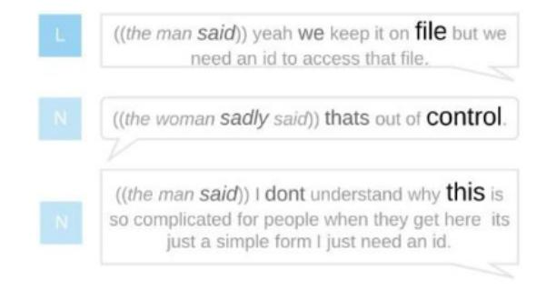
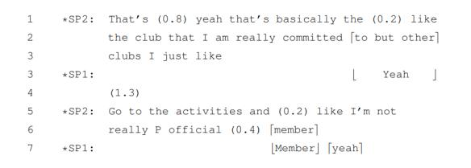
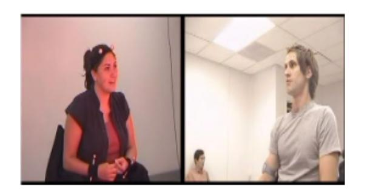
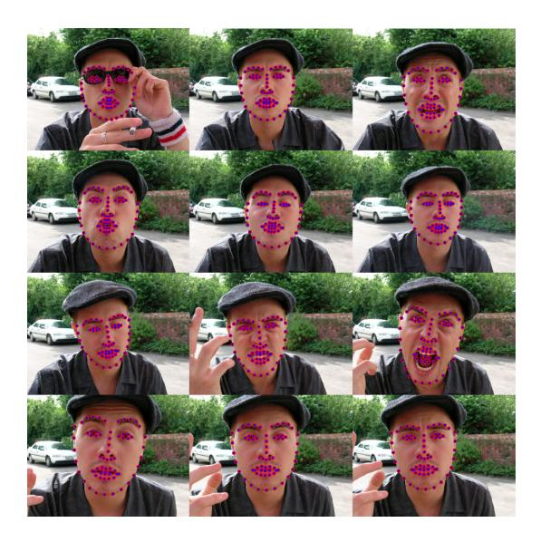

# Guidelines for designing an automated multimodal textual annotation system

Australia Australia

Joshua Y. Kim Kalina Yacef∗ University of Sydney University of Sydney

## ABSTRACT

Automatic multimodal textual annotation systems have the potential to advance research in conversational analysis and computational linguistics; however, there is little research in this area. In this short paper, we outline guidelines for designing an automated multimodal textual annotation system. We discussed the guidelines using four guiding questions. First, we share the four possible usecases for building an automated multimodal annotation system. Second, we share three guidelines for collecting multimodal data. Third, we share two guidelines on extracting multimodal features. Lastly, we share another four guidelines regarding what to present to the users.

### CCS CONCEPTS

• Human-centered computing → Collaborative and social computing systems and tools.

#### KEYWORDS

multimodal annotation, guidelines

#### ACM Reference Format:

Joshua Y. Kim and Kalina Yacef. 2023. Guidelines for designing an automated multimodal textual annotation system. In INTERNATIONAL CONFERENCE ON MULTIMODAL INTERACTION (ICMI '23 Companion), October 09–13, 2023, Paris, France. ACM, New York, NY, USA, [7](#page-6-0) pages. [https://doi.org/10.](https://doi.org/10.1145/3610661.3616182) [1145/3610661.3616182](https://doi.org/10.1145/3610661.3616182)

#### 1 INTRODUCTION

Multimodal textual annotations are a distinctive and innovative way to describe the nonverbal cues in a conversation in tandem with what is being said. In this paper, we use the term transcription to mean the conversion of what is being said from voice to text, and annotation to mean the creation of textual descriptions of multimodal information. These defnitions are crucial as they provide a clear understanding of the terms used in the context of multimodal annotation systems. Such annotations not only enhance the user's understanding of the conversation but also, in certain cases, make a conversation accessible to individuals with disabilities. This accessibility aspect is particularly crucial in the

ICMI '23 Companion, October 09–13, 2023, Paris, France

© 2023 Copyright held by the owner/author(s). Publication rights licensed to ACM. ACM ISBN 979-8-4007-0321-8/23/10. . . \$15.00 <https://doi.org/10.1145/3610661.3616182>

context of human-computer and human-robot interactions, where understanding and responding to the user's state is key to creating an adaptive and user-friendly system. To aid future researchers in designing an automated multimodal annotation system, we have compiled a list of guiding questions to ensure a comprehensive exploration of the design space.

Although automatic multimodal annotation systems ofer effciency and reduced bias, they've been overshadowed by manual methods in linguistic research [\[20,](#page-4-0) [50\]](#page-4-1). But with advances in Computer Vision and Speech Processing, automatic annotation is gaining traction [\[19,](#page-4-2) [32,](#page-4-3) [48\]](#page-4-4), revealing new design and build possibilities.

In this paper, we frame the guidelines into four sequential questions: (1) What is the purpose of designing and building the automated multimodal annotation system? (2) How to gather data? (3) How to extract multimodal features from the recordings? (4) What information to present, and what is the appropriate method of presentation? These questions aim to guide researchers in the development of automated multimodal annotation systems, considering various aspects from the purpose and data collection to feature extraction and presentation of information.

#### 2 RELATED WORKS

Several computer vision tools, including gestures [\[28,](#page-4-5) [34\]](#page-4-6), gaze [\[28,](#page-4-5) [34\]](#page-4-6), and laughter detection [\[33\]](#page-4-7), have been explored but not yet fully applied to multimodal annotation systems. In the face of this gap and inspired by the rapid development of these separate tools, researchers have begun attempting to integrate them into cohesive multimodal annotation systems. Screenshots of these systems are available in the appendix.

Moore [\[32\]](#page-4-3) is notable as an early pioneer in automated annotation (appendix [A.1\)](#page-5-0). A majorstride wasthe MONAH system [\[16,](#page-4-8) [19\]](#page-4-2), introducing non-technical phrases for talk turns (appendix [A.2\)](#page-5-1). An enhanced version visualizes machine attention to emphasize machine-identifed key words [\[18\]](#page-4-9). Yet, enlarging font based on this attention misled users into assuming it implied loudness [\[18\]](#page-4-9). Gailbot [\[48\]](#page-4-4) (appendix [A.3\)](#page-5-2), inspired by Gail Jeferson's foundational transcription glossary [\[13\]](#page-4-10), is prominent in linguistics for annotating conversational cues.

The key diferences between these three systems' outputs are summarized in Table [1.](#page-1-0) In terms of the scope of annotation, the MONAH system currently ofers the widest variety [\[19\]](#page-4-2). However, it falls short in areas such as within-talkturn silence annotations and parallel representation of overlapping talk. Despite these limitations, the MONAH system has achieved higher usability scores on the System Usability Scale [\[5\]](#page-4-11) compared to human-annotated Jeferson transcripts [\[18\]](#page-4-9). This transcription system is what Moore [\[32\]](#page-4-3) and Umair et al. [\[48\]](#page-4-4) automatically produce.

∗ Corresponding author: kalina.yacef@sydney.edu.au

Permission to make digital or hard copies of all or part of this work for personal or classroom use is granted without fee provided that copies are not made or distributed for proft or commercial advantage and that copies bear this notice and the full citation on the frst page. Copyrights for components of this work owned by others than the author(s) must be honored. Abstracting with credit is permitted. To copy otherwise, or republish, to post on servers or to redistribute to lists, requires prior specifc permission and/or a fee. Request permissions from [permissions@acm.org](mailto:permissions@acm.org).

| Aspect                                       | Moore [32] | Kim et al. [19] | Umair et al. [48] |
|----------------------------------------------|---------------|--------------------|----------------------|
| Speech-to-text conversion                 | Yes           | Yes                | Yes                  |
| Speaker identifcation                        | None          | Yes                | Yes                  |
| Presenting overlapping talk in parallel   | None          | None Yes        |                      |
| Phonetic representation (e.g., uhhhhh) | None          | None               | None                 |
| Prosody (Pitch + volume + tempo)          | None          | Tempo              | Tempo                |
| Silence (within + between talkturns)      | Both          | Between            | Both                 |
| Audible breath                               | None          | None               | None                 |
| Laughter                                     | None          | Yes                | Yes                  |
| Facial expression                            | None          | Yes                | None                 |
| Body forward leaning                         | None          | Yes                | None                 |
| Head nodding                                 | None          | Yes                | None                 |

Table 1: Comparison of outputs from the existing automated multimodal annotation systems.

## 3 WHAT IS THE PURPOSE OF DESIGNING AND BUILDING THE AUTOMATED MULTI-MODAL ANNOTATION SYSTEM?

The purpose of designing and building the automated multimodal annotation system lies in the intricate interpretation of various modalities, shaped by the needs and intentions of the annotation. The vocabulary and granularity of the multimodal description are guided by the specifc requirements of the target user and what insights they desire from a conversation. The aim of the system is to serve these individual needs, as highlighted by an exploration of four distinct use cases. Each case sheds light on a unique facet of the system's potential value and utility in identifying the intended user.

As we examine the reasons for creating this system, three challenges emerge that shape its design and efectiveness. First, there are ongoing debates regarding the relevant cues for each use case, necessitating careful consideration in the system's architecture. Second, the spectrum of outputs from existing automated multimodal annotations systems may fall short of encompassing all necessary cues, which emphasizes the need for customization and fne-tuning. Lastly, the nature of multimodal annotation involves a degree of uncertainty and inaccuracy, and designing the system to mitigate these factors is a vital part of its underlying purpose.

### Use Case 1: To revisit a conversation on paper.

In sectorslike healthcare, revisiting prior conversationsis crucial. For instance, psychologists might need to reference past sessions. In such a scenario, having the ability to print the previous conversations along with their multimodal annotations on paper can be invaluable. This allows the psychologist to quickly glance through the conversation without needing to access a computer, thereby maintaining a presence in the ongoing conversation. This extends

to legal scenarios, such as police interrogations [\[46\]](#page-4-12) and court proceedings [\[21\]](#page-4-13) (see appendix [A.4](#page-5-3) and [A.5\)](#page-5-4). For instance, pauses in interrogations can hint at hesitation or stress [\[12\]](#page-4-14), while speech patterns in psychological contexts correlate with depression levels [\[7\]](#page-4-15).

Use Case 2: To quickly sift through multiple conversations. In a customer service setting, team leaders are often responsible for overseeing multiple customer service agents and ensuring the quality of their conversations. In such a context, multimodal annotations can serve as a powerful tool to help the team lead sample audio recordings that suggest poor prosody or rapport. This allows team leads to identify and address problematic cases more efciently. For instance, the use of the word "well" following a long silence is a well-known indicator of a "dispreferred" talk-turn format [\[37\]](#page-4-16). By identifying such cues, the team leader can provide targeted feedback and training. This use case demonstrates the potential of multimodal annotations as a tool for quality control and performance improvement in customer service settings.

Use Case 3: To improve the conversation's accessibility. The Audio Description Service is an additional audio track broadcast that describes visual elements for those who are blind or visually impaired [\[30\]](#page-4-17). In a similar vein, multimodal annotations can provide textual descriptions of visual nonverbal cues in a conversation. For example, consider the sentence, "the boy smiled and said, 'I am Luke.'" If one is designing for this use case (visually impaired), one would need to convert the smiling event into another modality,such as a ding sound [\[45\]](#page-4-18), or haptic vibration [\[22\]](#page-4-19). Conversely, if the use case is to design for the hearing impaired, it would be reasonable to extend automated captioning to annotate cues such as out-breaths (sighs), elongation of syllables, and pitch to provide a richer understanding of the prosody context. This use case highlights the potential of multimodal annotations in enhancing the accessibility of conversations for individuals with sensory impairments.

Use Case 4: Two-pass approach to reduce individual biases. Manual annotation, being a subjective interpretive act, can often carry unconscious biases infuenced by the annotator's culture and personal background [\[2\]](#page-3-0). These biases can afect the accuracy and fairness of the annotations, particularly in high-stakessituations. To address this concern and reduce the potential impact of individual human bias, a two-pass approach can be employed.

First Pass (Automated): The initial annotation is done automatically [\[3\]](#page-4-20). This may introduce system biases but is devoid of individual cultural biases. Second Pass (Manual): The manual second pass allows a human annotator to review and correct the automated annotations. This helps to minimize both the system bias introduced in the frst pass and any potential individual confrmation bias that might arise if the annotation were solely manual. This approach is a variant of the human-in-the-loop approach [\[4\]](#page-4-21).

#### 4 HOW TO GATHER DATA?

The task of detecting and annotating multimodal features in human interactions is highly demanding in both time and labor. For each hour of recorded data, it typically requires four to fve hours of meticulous human efort to produce the multimodal annotations. This extensive process encompasses various aspects such as identifying speakers, handling overlapping talk, providing phonetic

representation, analyzing prosody, marking silences [\[40,](#page-4-22) [49\]](#page-4-23), gaze, and body posture. The quality standards for these annotations may vary, depending on the specifc objectives behind constructing the multimodal annotation system, a subject explored in the previous section.

Given thistask'sintricacy, the nextsection ofers clear guidelines for capturing and annotating multimodal data. These, derived from hands-on practice and literature, will ensure efcient data collection and precise annotation.

Guideline 1: Use one audio recording channel for each speaker. Although humans can easily separate voices for each speaker, ASR, and diarization systems at this point do not perform as well as humans [\[17,](#page-4-24) [39\]](#page-4-25). In our experience, there were two problems – overlapping speech is assigned as one person's speech, and transcription of the overlapped speech into words had poor accuracy. By using one channel for each speaker in recordings, overlapping speech is cleaner to be analyzed, and delays between talkturns and the construction of talkturns can be done more accurately [\[48\]](#page-4-4). Where separate recording is not possible, supplying a supplementary timestamped transcript like the DAIC-WOZ dataset [\[10\]](#page-4-26) could inform inter-talkturn delays, providing additional context for the conversation.

Guideline 2: Calibrate captures such as camera angles and microphone distances. Algorithms that extract multimodal signals often depend on a well-calibrated collection of videos, such as when the camera is positioned directly in front of the speaker's face. When captures are non-calibrated, they may lead to poor multimodal feature extraction. In simpler scenarios like one-to-one video conferences, controlling variables may be more manageable, but in complex environments with physical spaces and multiple speakers, creating a well-calibrated environment requires comprehensive attention. This might include strategically positioning cameras to capture all speakers without obstruction, adjusting angles, heights, and distances for unobstructed views, and implementing consistent lighting and acousticsto minimize shadows and echoes. Synchronizing various modalities like video and audio signals ensures cohesive data representation. Prior testing and validation of the setup confrm that it's well-calibrated for high-quality data capture.

In some cases, like with EQClinic [\[26\]](#page-4-27), MOSI [\[51\]](#page-4-28), and MOSEI [\[25\]](#page-4-29), the system developer may have no control over how the data is captured. Here, a pilot test to identify potential challenges in multimodal feature extraction would help avoid pitfalls.

Guideline 3: Consider the ethical implications, if collecting manual annotations When training the system to generate textual annotations, careful consideration must be given to the source of the training annotations and participants' consent. Annotators could come from crowd-sourcing platforms or hiring expert annotators, each with specifc considerations. Crowd-sourcing platforms may be suitable for general content but are often not appropriate for sensitive conversations such as police interrogations. In such cases, anonymization techniques must be implemented, and we recommend trained named entity recognition models like Peters et al. [\[36\]](#page-4-30) to identify and hash personal names at the word level, preserving pitch and volume annotations.

Hiring expert annotators is necessary when dealing with sensitive content where simple name anonymization is not sufcient. The expertise and knowledge required for these annotators should

be clearly defned. They should include familiarity with the annotation framework (e.g., Jeferson transcription) and the conversation context, as well as an understanding of ethical considerations surrounding confdentiality and privacy. Named annotators can be included in the ethics application upon screening, enhancing accountability and the correctness of interpretations. Additionally, explicit participant consent and permissions must be obtained and documented, especially when dealing with sensitive or identifable information.

Lastly, technical considerations like randomly altering the pitch, though it may afect accurate prosodic annotations, or roleplaying fctional characterslike SEMAINE [\[29\]](#page-4-31), can further enhance anonymity and avoid ethical implications.

## 5 PRACTICAL GUIDELINES FOR EFFICIENT AND RELIABLE MULTIMODAL FEATURE EXTRACTION

The extraction of multimodal features from recordings is a complex process that involves numerous potential challenges. These can range from technical issues such as the bit rate, dimensions, fle encoding, large fle storage requirements, and audio-visual synchronization, to environmental factors like physical lighting. Additionally, multimodal extraction algorithms are typically slow and computationally intensive. Given these difculties in extracting multimodal features, we discuss two guidelines in this section to aid in the process.

Guideline 4: Use multiple existing research datasets to minimize blind spots dealing with multimodal datasets Before embarking on the laborious task of collecting a dataset from scratch, it can be benefcial to gain experience by applying the extraction algorithms on existing datasets. This can help inform the potential pitfalls to avoid when assembling a new dataset. Poria et al. [\[38\]](#page-4-32) has put together a valuable collection of multimodal datasets that can be used for this purpose. For instance, when we used the IEMOCAP dataset [\[6\]](#page-4-33) to extract multimodal features, we realized that capturing the actors at a 45 degrees angle made it diffcult to discern between head nodding and shaking (appendix [A.6\)](#page-6-1). This was because the nose landmark exhibited both vertical and horizontal displacement in both cases. Applying the multimodal extraction algorithm on multiple datasets helps ensure the system is resilient as each dataset would contribute a wide diversity of variables (including bit rate, dimensions, fle encoding, and audio-visual synchronization).

Guideline 5: Resumable processes are important for slow multimodal extraction algorithms. Multimodal extraction algorithms are slow because they are disk-intensive. For example, to extract the timestamped facial landmarks coordinates from the video, the OpenFace [\[1\]](#page-3-1) algorithm extracts a still image fle for every frame, runs the landmark analysis, and collates the data over every still image extracted (see appendix [A.7\)](#page-6-2). Therefore, we recommend ensuring the process could be resumed upon failure without restarting the extraction process. Such resilient designs conserve time and computational resources, ensuring a more streamlined extraction process.

## 6 WHAT INFORMATION TO PRESENT AND WHAT IS THE APPROPRIATE METHOD OF PRESENTATION?

The information selection and presentation process impacts both the efectiveness and usability of these systems. Within linguistics, several variants of annotation systems [\[13,](#page-4-10) [31,](#page-4-34) [41,](#page-4-35) [47\]](#page-4-36) have been developed for Conversation Analysis, illustrating not just what is being said but also how it is being conveyed. For instance, Mondada [\[31\]](#page-4-34) represents temporal bodily actions by spatially aligning the annotations with the verbal transcript (Appendix [A.8\)](#page-6-3). In contrast, the feld of computer visualization, which focuses on graphical representation and interactive techniques, has not extensively explored textual multimodal transcription systems. This divergence between the linguistic and computer visualization communities reveals signifcant diferences in approaches and priorities, with implications for both system efectiveness and usability. Kim et al. [\[15\]](#page-4-37) evaluated sixteen systems visualizing dyadic conversations, fnding only one that combined multimodal context with textual representation. In recognizing this unbalanced state of research between the abundance of manual expert annotations in linguistics and the scarcity of computer-automated annotations in visualization, we outline four guidelines for determining what to present to users.

Guideline 6: Decide on the trade-of between technical and layman annotations. Multimodal systems in the linguistics community are often technical; the annotations are specifc, often using symbols to represent a particular event. For example, colons (:) represent a particular syllabus's elongation. Kim and Yacef [\[18\]](#page-4-9) reported that while users found the Jeferson annotations precise, both students with and without a linguistics background found that the Jeferson system was harder to use compared to the MONAH system that annotates using layman language. Knowing your audience and the purpose of the system will inform the trade-of between the precise annotations of a technical system (e.g., Jefferson) against layman annotations. This trade-of is crucial in ensuring that the system is user-friendly and accessible to a broad range of users, while still providing the necessary level of detail and precision in the annotations.

Guideline 7: Choose Rule-Based Generation over Deep Learning Generation if training data is missing or precise control is required. There are two considerations for deep endto-end learning natural language generation (NLG). Firstly, there is a lack of sufciently large datasets required for a model to take a video as input and output text, and the lack of the diferent variants of output texts if we seek precise control over the categories of actions to be annotated. There are datasets [\[8,](#page-4-38) [9,](#page-4-39) [43\]](#page-4-40) that could help tangentially. These datasets contain temporal action detection tasks [\[11\]](#page-4-41) (the action sequence is shorter than the video). Secondly, it is difcult to precisely control the output of a deep learning NLG model. The current degree of control [\[14,](#page-4-42) [27\]](#page-4-43) still does not have the fne-grained controls like having insertion rules over extracted multimodal features. This guideline emphasizes the importance of considering the available resources and the specifc requirements of the system when choosing between rule-based generation and deep learning generation. While deep learning generation can ofer powerful capabilities, it may not always be the most suitable option, particularly when training data is limited or when a high degree of control over the output is required.

Guideline 8: Test early and cheaply with supervised learning. Conducting human user experience research is both expensive and time-consuming [\[23,](#page-4-44) [42\]](#page-4-45). Consequently, implementing supervised learning as a preliminary testing method can ofer a practical alternative. This can be used to investigate whether newly added annotations contribute positively to a supervised learning task, such as automatic emotion recognition. By conducting ablation tests, researchers can ascertain that the added features are benefcial to algorithms before proceeding to test with human users. This preliminary stage not only serves as a validation step but also conserves valuable time and resources. In our experience, this approach allowed us to save months of efort by conducting supervised learning trials prior to human user tests. The advantage was especially pronounced in view of the extensive time needed for internal ethics approval and external coordination with university faculties.

Guideline 9: Support supervised learning augmentation with user study. After the contents of the multimodal transcriptions are prepared, researchers could potentially improve the support to the conversational analyst through supervised learning and augment the transcription with machine learning attention [\[44\]](#page-4-46), or Shapley value contribution [\[35\]](#page-4-47) from each word [\[24\]](#page-4-48), assuming that there is data regarding the target label. The method of presenting feature importance in a conversational analysis setting should be supported with a user study (appendix [A.2\)](#page-5-1). User studies provide valuable insights into how users interact with and perceive the system, which can inform further improvements and refnements to the system. For instance, in our study, we found that while our system, MONAH, signifcantly improved machine learning supervised learning [\[19\]](#page-4-2), when nonverbal annotations were presented to human users [\[18\]](#page-4-9), none of the nonverbal annotations (MONAH, Jeferson) improved guess-the-emotion signifcantly over the verbatim transcripts. This suggests that what is useful to supervised learning (guideline 8) might not carry over during user testing.

### 7 CONCLUSION

From the intersection of conversational analysis, advances in deep learning models, and system usability research, we proposed a set of guidelines to help researchers design and build an automated multimodal annotation system. The frst limitation is that we made these proposals from the experience in building multi-modal narrative systems. The second limitation is that we had limited knowledge of the process of how the other systems were built as such knowledge is not available in the literature. The third limitation is that the guidelines assume a certain level of technological capability, particularly in terms of computer vision and 3-D modelling tools. However, these technologies are still evolving, and they could impact the efectiveness of the proposed guidelines. We believe that these guidelines provide a valuable starting point that can help guide the design and development of efective and user-friendly automated multimodal annotation systems.

#### REFERENCES

- [1] Tadas Baltrusaitis, Amir Zadeh, Yao Chong Lim, and Louis-Philippe Morency. 2018. Openface 2.0: Facial behavior analysistoolkit. In 2018 13th IEEE international conference on automatic face & gesture recognition (FG 2018). IEEE, 59–66.
- [2] Michael Billig. 1999. Whose terms? Whose ordinariness? Rhetoric and ideology in conversation analysis. Discourse & Society 10, 4 (1999), 543–558.

Guidelines for designing an automated multimodal textual annotation system ICMI '23 Companion, October 09–13, 2023, Paris, France

- [3] Christian Bokhove and Christopher Downey. 2018. Automated generation of 'good enough'transcripts as a frst step to transcription of audio-recorded data. Methodological innovations 11, 2 (2018), 2059799118790743.
- [4] Steve Branson, Grant Van Horn, and Pietro Perona. 2017. Lean crowdsourcing: Combining humans and machines in an online system. In Proceedings of the IEEE Conference on Computer Vision and Pattern Recognition. 7474–7483.
- [5] John Brooke. 1996. Sus: a "quick and dirty'usability. Usability evaluation in industry 189, 3 (1996), 189–194.
- [6] Carlos Busso, Murtaza Bulut, Chi-Chun Lee, Abe Kazemzadeh, Emily Mower, Samuel Kim, Jeannette N Chang, Sungbok Lee, and Shrikanth S Narayanan. 2008. IEMOCAP: Interactive emotional dyadic motion capture database. Language resources and evaluation 42, 4 (2008), 335.
- [7] Michael Cannizzaro, Brian Harel, Nicole Reilly, Phillip Chappell, and Peter J Snyder. 2004. Voice acoustical measurement of the severity of major depression. Brain and cognition 56, 1 (2004), 30–35.
- [8] Jihoon Chung, Cheng-hsin Wuu, Hsuan-ru Yang, Yu-Wing Tai, and Chi-Keung Tang. 2021. HAA500: Human-centric atomic action dataset with curated videos. In Proceedings of the IEEE/CVF International Conference on Computer Vision. 13465– 13474.
- [9] Dima Damen, Hazel Doughty, Giovanni Maria Farinella, Antonino Furnari, Evangelos Kazakos, Jian Ma, Davide Moltisanti, Jonathan Munro, Toby Perrett, Will Price, et al. 2020. Rescaling egocentric vision. arXiv preprint arXiv:2006.13256 (2020).
- [10] Jonathan Gratch, Ron Artstein, Gale Lucas, Giota Stratou, Stefan Scherer, Angela Nazarian, Rachel Wood, Jill Boberg, David DeVault, Stacy Marsella, et al. 2014. The distress analysis interview corpus of human and computer interviews. Technical Report. University of Southern California Los Angeles.
- [11] Matthew S Hutchinson and Vijay N Gadepally. 2021. Video action understanding: A tutorial. IEEE Access (2021).
- [12] Fred E Inbau, John E Reid, Joseph P Buckley, Brian C Jayne, et al. 2013. Essentials of the Reid technique: Criminal interrogation and confessions. Jones & Bartlett Publishers.
- [13] Gail Jeferson. 2004. Glossary of transcript symbols. Conversation analysis: Studies from the frst generation (2004), 24–31.
- [14] Nitish Shirish Keskar, Bryan McCann, Lav R Varshney, Caiming Xiong, and Richard Socher. 2019. Ctrl: A conditional transformer language model for controllable generation. arXiv preprint arXiv:1909.05858 (2019).
- [15] Joshua Y Kim, Rafael A Calvo, NJ Enfeld, and Kalina Yacef. 2021. A Systematic Review on Dyadic Conversation Visualizations. In Companion Publication of the 2021 International Conference on Multimodal Interaction. 137–147.
- [16] Joshua Y Kim, Greyson Y Kim, and Kalina Yacef. 2019. Detecting depression in dyadic conversations with multimodal narratives and visualizations. In Australasian Joint Conference on Artifcial Intelligence. Springer, 303–314.
- [17] Joshua Y Kim, Chunfeng Liu, Rafael A Calvo, Kathryn McCabe, Silas CR Taylor, Björn W Schuller, and Kaihang Wu. 2019. A comparison of online automatic speech recognition systems. In 12th International Workshop on Spoken Dialog System Technology.
- [18] Joshua Y Kim and Kalina Yacef. 2023. An empirical user-study of text-based nonverbal annotation systems for human–human conversations. International Journal of Human-Computer Studies (2023), 103082.
- [19] Joshua Y Kim, Kalina Yacef, Greyson Kim, Chunfeng Liu, Rafael Calvo, and Silas Taylor. 2021. MONAH: Multi-Modal Narratives for Humans to analyze conversations. In Proceedings of the 16th Conference of the European Chapter of the Association for Computational Linguistics: Main Volume. 466–479.
- [20] Michael Kipp. 2012. Multimedia annotation, querying, and analysis in ANVIL. Multimedia Information Extraction: Advances in Video, Audio, and Imagery Analysis for Search, Data Mining, Surveillance, and Authoring (2012), 351–367.
- [21] Martha Komter. 2013. 30 Conversation Analysis in the Courtroom. The handbook of conversation analysis (2013), 612.
- [22] Sreekar Krishna, Vineeth Balasubramanian, and Sethuraman Panchanathan. 2010. Enriching social situational awareness in remote interactions: insights and inspirations from disability focused research. In Proceedings of the 18th ACM international conference on Multimedia. 1275–1284.
- [23] Efe Lai-Chong Law, Paul Van Schaik, and Virpi Roto. 2014. Attitudes towards user experience (UX) measurement. International Journal of Human-Computer Studies 72, 6 (2014), 526–541.
- [24] Meshesha Legesse, Gabriele Gianini, and Dereje Teferi. 2016. Selecting featurewords in tag sense disambiguation based on their shapley value. In 2016 12th International Conference on Signal-Image Technology & Internet-Based Systems (SITIS). IEEE, 236–240.
- [25] Paul Pu Liang, Ruslan Salakhutdinov, and Louis-Philippe Morency. 2018. Computational modeling of human multimodal language: The mosei dataset and interpretable dynamic fusion. In First Workshop and Grand Challenge on Computational Modeling of Human Multimodal Language.
- [26] Chunfeng Liu, Karen M Scott, Renee L Lim, Silas Taylor, and Rafael A Calvo. 2016. EQClinic: a platform for learning communication skills in clinical consultations. Medical education online 21, 1 (2016), 31801.

- [27] Pengfei Liu, Weizhe Yuan, Jinlan Fu, Zhengbao Jiang, Hiroaki Hayashi, and Graham Neubig. 2021. Pre-train, prompt, and predict: A systematic survey of prompting methods in natural language processing. arXiv preprint arXiv:2107.13586 (2021).
- [28] Alvaro Marcos-Ramiro, Daniel Pizarro-Perez, Marta Marron-Romera, Laurent Nguyen, and Daniel Gatica-Perez. 2013. Body communicative cue extraction for conversational analysis. In 2013 10th IEEE International Conference and Workshops on Automatic Face and Gesture Recognition (FG). IEEE, 1–8.
- [29] Gary McKeown, Michel F Valstar, Roderick Cowie, and Maja Pantic. 2010. The SEMAINE corpus of emotionally coloured character interactions. In 2010 IEEE International Conference on Multimedia and Expo. IEEE, 1079–1084.
- [30] Chris Mikul. 2010. Audio description background paper. Ultimo NSW: Media Access Australia (2010).
- [31] Lorenza Mondada. 2018. Multiple temporalities of language and body in interaction: Challenges for transcribing multimodality. Research on Language and Social Interaction 51, 1 (2018), 85–106.
- [32] Robert J Moore. 2015. Automated transcription and conversation analysis. Research on Language and Social Interaction 48, 3 (2015), 253–270.
- [33] Tilda Neuberger and András Beke. 2013. Automatic laughter detection in spontaneous speech using GMM–SVM method. In International Conference on Text, Speech and Dialogue. Springer, 113–120.
- [34] Farzan Majeed Noori, Benedikte Wallace, Md Uddin, Jim Torresen, et al. 2019. A robust human activity recognition approach using openpose, motion features, and deep recurrent neural network. In Scandinavian conference on image analysis. Springer, 299–310.
- [35] Andrzej S Nowak and Tadeusz Radzik. 1994. The Shapley value for n-person games in generalized characteristic function form. Games and Economic Behavior 6, 1 (1994), 150–161.
- [36] Matthew E Peters, Waleed Ammar, Chandra Bhagavatula, and Russell Power. 2017. Semi-supervised sequence tagging with bidirectional language models. arXiv preprint arXiv:1705.00108 (2017).
- [37] Anita Pomerantz. 1984. Agreeing and disagreeing with assessments: Some features of preferred/dispreferred turn shaped. (1984).
- [38] Soujanya Poria, Erik Cambria, Rajiv Bajpai, and Amir Hussain. 2017. A review of afective computing: From unimodal analysis to multimodal fusion. Information Fusion 37 (2017), 98–125.
- [39] Yevhenii Prokopalo, Meysam Shamsi, Loïc Barrault, Sylvain Meignier, and Anthony Larcher. 2022. Active Correction for Incremental Speaker Diarization of a Collection with Human in the Loop. Applied Sciences 12, 4 (2022), 1782.
- [40] Keith F Punch and Alis Oancea. 2014. Introduction to research methods in education. Sage.
- [41] Federico Rossano, Penelope Brown, and Stephen C Levinson. 2009. Gaze, questioning and culture. Conversation analysis: Comparative perspectives 27 (2009), 187–249.
- [42] Jef Sauro and James R Lewis. 2016. Quantifying the user experience: Practical statistics for user research. Morgan Kaufmann.
- [43] Dian Shao, Yue Zhao, Bo Dai, and Dahua Lin. 2020. Finegym: A hierarchical video dataset for fne-grained action understanding. In Proceedings of the IEEE/CVF conference on computer vision and pattern recognition. 2616–2625.
- [44] Sheng-syun Shen and Hung-Yi Lee. 2016. Neural Attention Models for Sequence Classifcation: Analysis and Application to Key Term Extraction and Dialogue Act Detection. Interspeech 2016 (2016), 2716–2720.
- [45] Lei Shi, Brianna Tomlinson, John Tang, Ed Cutrell, Daniel Mc-Duf, Gina Venolia, Paul Johns, and Kael Rowan. 2019. Accessible Video Calling: Enabling Nonvisual Perception of Visual Conversation Cues. In Computer-Supported Cooperative Work 2019. ACM, ACM. [https://www.microsoft.com/en-us/research/publication/accessible-video](https://www.microsoft.com/en-us/research/publication/accessible-video-calling-enabling-nonvisual-perception-of-visual-conversation-cues/)[calling-enabling-nonvisual-perception-of-visual-conversation-cues/](https://www.microsoft.com/en-us/research/publication/accessible-video-calling-enabling-nonvisual-perception-of-visual-conversation-cues/)
- [46] Elizabeth Stokoe. 2010. 'I'm not gonna hit a lady': Conversation analysis, membership categorization and men's denials of violence towards women. Discourse & Society 21, 1 (2010), 59–82.
- [47] Jürgen Streeck. 1993. Gesture as communication I: Its coordination with gaze and speech. Communications Monographs 60, 4 (1993), 275–299.
- [48] Muhammad Umair, Julia Beret Mertens, Saul Albert, and Jan P de Ruiter. 2022. GailBot: An automatic transcription system for Conversation Analysis. Dialogue & Discourse 13, 1 (2022), 63–95.
- [49] Geofrey Walford. 2001. Doing qualitative educational research. Bloomsbury Publishing.
- [50] Peter Wittenburg, Hennie Brugman, Albert Russel, Alex Klassmann, and Han Sloetjes. 2006. ELAN: A professional framework for multimodality research. In 5th international conference on language resources and evaluation (LREC 2006). 1556–1559.
- [51] Amir Zadeh, Rowan Zellers, Eli Pincus, and Louis-Philippe Morency. 2016. Mosi: multimodal corpus of sentiment intensity and subjectivity analysis in online opinion videos. arXiv preprint arXiv:1606.06259 (2016).

ICMI '23 Companion, October 09–13, 2023, Paris, France Kim et al.

## A APPENDICES

## A.1 Moore Example

Figure 1: Example output from Moore [\[32\]](#page-4-3). Errors in word recognition and silence length are in boldface.

## A.2 MONAH Example

<!-- Image Description: The image presents three speech bubbles, each labeled with "L" or "N," likely representing different speaker roles (e.g., "Librarian" and "Non-librarian"). The bubbles contain transcribed dialogue excerpts highlighting a user's frustration with a complex system ("out of control") for accessing a file. The highlighted words "file," "control," and "this" emphasize key aspects of the user experience and the system's perceived complexity. The image likely illustrates a qualitative data point within a larger study on user interaction with a specific system. -->

Figure 2: Kim and Yacef [\[18\]](#page-4-9) intended that the larger font size to indicate higher weight from the machine attention layer (i.e., the classifer made the decision due to these contributions). However, they found that the human users were confusing larger font size to indicate a louder volume.

## A.3 Gailbot Example

<!-- Image Description: The image displays a transcription of a dialogue between two speakers (SP1 and SP2). Numerical values in parentheses (e.g., (0.8), (0.2)) are likely quantitative data, possibly representing ratings or scores associated with the speakers' statements. Bracketed terms suggest additional contextual information or annotations. The excerpt's purpose is to illustrate qualitative data from an interview or conversation within the paper, possibly related to club membership and commitment levels. -->

Figure 3: Example output from Umair et al. [\[48\]](#page-4-4), demonstrating the system's ability to present overlapping speech in parallel lines.

# A.4 Courtroom Example

Figure 4: The following conversational analysis extract [\[21\]](#page-4-13), marked up with Jeferson annotations, detailed a snippet from a rape trial where the alleged victim (V) was asked a series of questions by the defense attorney (DA). The snippet annotated the 25.5 seconds pause after V confrmed the DA's suggestion that both her friend and she herself were "partying", allowing time for the jury to internalize what is being said.

## A.5 Police Interrogation Example

| 1  | P:               | What about Jane.=what about abuse towards Jane:            |
|----|------------------|------------------------------------------------------------|
| 2  |                  | (0.8)                                                      |
| 3  | S:               | (Well-) when she started abusing m:e I believe I           |
| 4  |                  | said some things ba:ck.=Yet when she says he's got         |
| 5  |                  | a right to go where he wants, he's with me: well,          |
| 6  |                  | (.) I believe I said some things back yeh.                 |
| 7  |                  | (0.2)                                                      |
| 8  | S:               | D'you know warramean.                                      |
| 9  |                  | (0.3)                                                      |
| 10 | P:               | You threaten 'er at all.                                   |
| 11 |                  | (0.4)                                                      |
| 12 | S:               | No I didn't threaten 'er.                                  |
| 13 |                  | (0.8)                                                      |
| 14 | 2:               | .hhhhh                                                     |
| 15 | $S: \rightarrow$ | I've got no reason to threaten 'ezr, I've never 'it a      |
| 16 |                  | woman in my life.=an' I never will 'it a woman in my life. |
| 17 |                  | (0.8)                                                      |
| 18 |                  | (a) heard the front door ((reading from statement))        |

Figure 5: The following conversational analysis extract [\[46\]](#page-4-12), marked up with Jeferson annotations, details a snippet from a police interrogation where the suspect (S) was asked a series of questions by the police ofcer (P).

## A.6 IEMOCAP Example

<!-- Image Description: The image displays two split screen video stills. The left shows a woman wearing a sensor array on her head, seated in a room with red lighting. The right shows a man in a plain room, also possibly wearing sensors, though less visible. The image likely illustrates the experimental setup for a study involving human subjects and sensor-based data acquisition, showing participants in distinct recording environments. The purpose is to visually represent the methodology of data collection in the paper. -->

Figure 6: Camera angle at a 45 degrees angle makes it difcult to discern between head nodding and shaking.

### A.7 OpenFace Example

<!-- Image Description: The image displays a 4x3 grid of twelve photographs. Each shows the same person's face, captured from slightly different angles and displaying various expressions. Key facial landmarks are marked with magenta dots. This illustrates a dataset of facial images with detected feature points, used likely to train or evaluate a facial landmark detection algorithm in the accompanying paper. -->

Figure 7: The OpenFace algorithm [\[1\]](#page-3-1) frst exports each frame into a folder of image fles, then run the landmark detection on the static image fle to identify the coordinates of each landmark at that specifc point in time.

#### A.8 Mondada Example

Figure 8: Example of a Mondada [\[31\]](#page-4-34) transcript, where temporal gestures and gaze are aligned with the verbal transcript.
