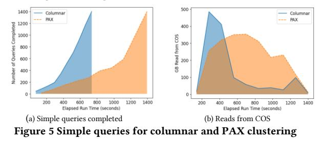

# Native Cloud Object Storage in Db2 Warehouse:

Implementing a Fast and Cost-Efficient Cloud Storage Architecture

David Kalmuk IBM Canada Markham, ON, Canada dckalmuk@ca.ibm.com

Kostas Rakopoulos IBM Canada Markham, ON, Canada kostasr@ca.ibm.com

Robert C. Hooper IBM Canada Markham, ON, Canada robert.christopher.hooper @ibm.com

Patrick Perez IBM Canada Markham, ON, Canada pperez@ca.ibm.com

Daniel C. Zilio IBM Canada Markham, ON, Canada zilio@ca.ibm.com

Christian Garcia-Arellano IBM Canada Markham, ON, Canada cmgarcia@ca.ibm.com

> Hamdi Roumani IBM Canada Markham, ON, Canada roumani@ca.ibm.com

Matthew Emmerton IBM Canada Markham, ON, Canada memmerto@ca.ibm.com

Aleksandrs Santars IBM Canada Markham, ON, Canada santars@ibm.com

Imran Sayyid IBM Canada Markham, ON, Canada isayyid@ca.ibm.com

Krishna K. Ramachandran IBM

Durham, NC, USA krishnakumar@ibm.com

Ronald Barber IBM Research San Jose, CA, USA rjbarber@us.ibm.com

William Minor IBM Canada Markham, ON, Canada bminor@ca.ibm.com

Zach Hoggard IBM Canada Markham, ON, Canada zacharyh@ca.ibm.com

Michael Chen IBM Canada Markham, ON, Canada michael.chen@ca.ibm.com

Humphrey Li IBM Canada Markham, ON, Canada xuhui.li@ibm.com

Yiren Shen IBM Canada Markham, ON, Canada yiren@ibm.com

Richard Sidle IBM Research Ottawa, ON, Canada ricsidle@ca.ibm.com

Alexander Cheung IBM Canada Markham, ON, Canada alex.cheung@ca.ibm.com

Scott Walkty IBM Canada Markham, ON, Canada swalktky@ca.ibm.com

Matthew Olan IBM Canada Markham, ON, Canada olan@ca.ibm.com

Ketan Rampurkar IBM Canada Markham, ON, Canada ketan.rampurkar@ibm.com

# ABSTRACT

Database systems built on traditional storage subsystems typically store their data in small blocks referred to as data pages (commonly sized in a multiple of 4KB for historical reasons). These traditional storage subsystems, for example network attached block storage, were designed for efficient random-access I/O patterns at the block level, and the block size is usually configurable by the application based on its needs. For large scale analytic databases in cloud environments, these traditional storage subsystems are not cost effective when compared to cloud object storage, and database systems that exploit them risk becoming uncompetitive. This paper describes the modernization of the storage architecture of Db2 Warehouse, a traditional full feature and high-performance database system with 3 decades of development, to exploit the new paradigm of cost-effective

<!-- Image Description: The image displays a Creative Commons (CC) license indicator. It's a graphic representation of the "Attribution-NonCommercial-NoDerivs" (BY-NC-ND) license. The symbols denote attribution required (BY), non-commercial use only (NC), and no derivative works allowed (ND). The image's purpose is to clearly communicate the copyright and usage terms for the content within the academic paper. -->

[This work is licensed under a Creative Commons](https://creativecommons.org/licenses/by-nc-nd/4.0/)  [Attribution-NoDerivs International 4.0 License.](https://creativecommons.org/licenses/by-nc-nd/4.0/)

*SIGMOD-Companion '24, June 9–15, 2024, Santiago, AA, Chile*© 2024 Copyright is held by the owner/author(s). ACM ISBN 979-8-4007-0422-2/24/06. https://doi.org/10.1145/3626246.3653393

storage for the cloud. We discuss a solution based on the integration of LSM trees as part of the storage subsystem, that enables Db2 Warehouse to efficiently store data pages within object storage, and through the application of special techniques to minimize read and write latencies as well as all of the amplification factors (write, read, and storage), achieve not only storage cost savings, but also higher performance. Further, by retaining the traditional data page format, we are able to avoid significantly re-architecting the database kernel and thereby retain the substantial capabilities and optimizations of the existing system.

# CCS CONCEPTS

• Information systems → Database management system engines.

# KEYWORDS

Cloud Data Warehouse, Data Lake, Cloud Object Storage, LSM tree, OLAP, Analytics, RocksDB

## ACM Reference format:

David Kalmuk, Christian Garcia-Arellano, Ronald Barber, Richard Sidle, Kostas Rakopoulos, Hamdi Roumani, William Minor, Alexander Cheung, Robert C. Hooper, Matthew Emmerton, Zach Hoggard, Scott Walkty, Patrick Perez, Aleksandrs Santars, Michael Chen, Matthew Olan, Daniel C. Zilio, Imran Sayyid, Humphrey Li, Ketan Rampurkar, Krishna K. Ramachandran, Yiren Shen. 2024. Native Cloud Object Storage in Db2 Warehouse: Implementing a Fast and Cost-Efficient Storage Architecture. In*Companion of the 2024 International Conference on Management of Data (SIGMOD-Companion '24), June 9--15, 2024, Santiago, AA, Chile, 12 pages.*https://doi.org/10.1145/3626246.3653393

# 1 INTRODUCTION

The advent of hyperscale cloud infrastructure from public cloud vendors such as AWS, Azure, and Google has fundamentally altered the economics of analytic data systems, with the most prominent impacts seen in the area of storage. In the domain of SQL Data Warehousing, the availability of low cost effectively unlimited capacity cloud object storage [1] [2] (COS) has given rise to modern cloud architectures that exploit this independently scalable storage in combination with compute servers with ephemeral local NVMe caches to deliver the high performance and advanced SQL capabilities of traditional data warehousing systems with the low storage cost and scalability more typically associated with data lakes. The price / performance advantages of these cloud architectures have made it difficult for more traditional data warehouse architectures built on higher performance, higher cost storage that is tightly coupled to the compute to compete in the public cloud sphere.

While this shift has seen the rise of new "born in the cloud" data warehousing systems (most notably Snowflake [3]), for vendors with established non-cloud data warehousing technologies, significant advantages can be achieved if they can capitalize on the depth of innovation in their existing systems by modernizing them to a cloud native storage architecture. The promise is the substantial savings in time and effort by avoiding reinventing sophisticated, high performance, battle tested capabilities. The challenge is how (and even if) such an uplift can be performed in a manner that is both cost effective and doesn't compromise the capabilities and performance of the original technology in the process.

In this paper we describe the effort we undertook to reinvent IBM's Db2 Warehouse [4] to adopt a modern storage architecture and achieve cost and performance competitiveness on the public cloud, while retaining all its substantial SQL and transactional capabilities.

# 1 Challenges of Cloud Object Storage

When moving a database system storage that was designed for a traditional storage subsystem, like network-attached block storage [5] [6], to COS, a key challenge is the differences in I/O characteristics. These differences are both in terms of throughput and latency: COS is seen as a storage solution that is throughput optimized whereas block storage is a storage solution that is balanced for both throughput and latency [7]. In the case of throughput, assuming adequate server side resources for the COS implementation, the throughput limit for COS is imposed by the network bandwidth available to the compute nodes performing the I/O and the parallelism utilized to maximize the use of that bandwidth, whereas for block storage this limit is imposed by the bandwidth each device attached to the compute nodes can accept, and throughput scalability is achieved by attaching more devices to each compute node or increasing this bandwidth (and also on the parallel access to each of those to maximize the throughput). In the case of latency, COS throughout the industry is known to offer a significantly higher fixed latency per request when compared to block storage (~100-300ms vs ~10-30ms, a 10X difference), resulting in the need to perform I/O operations in significantly larger block sizes (order of 10s of MBs for individual objects vs order of KBs for blocks in block storage access) to better amortize the higher latency cost per operation, as we will show in the Section 4 of this paper. Further complicating the picture is the fact that COS writes operate at the object granularity, meaning that modifying an existing object requires rewriting it in its entirety.

Due to these I/O and performance differences, a direct adaptation of the existing block storage optimized page storage to target COS would result in very poor performance due to the latency impact on small page I/O. A naive approach to improve over this would be to group adjacent data pages into larger blocks to accommodate the larger object sizes that are ideal for COS. In Db2 for example, data pages within a table space are organized into logical blocks of contiguous data pages called "extents", which could be configured as the object size to store in object store. This would also align with existing data organization optimizations such as Db2's BLU Acceleration (Db2's column store engine) where pages from individual column groups are grouped into extents to improve data locality and maximize read performance for analytic workloads [8]. With such an approach, each extent would be stored in COS as an independent object and would retain the existing data clustering characteristics. This approach, however, suffers from multiple issues. First, the larger object sizes required for COS I/O efficiency would require a significant increase in the size of these extents, making it difficult to maintain data locality and space efficiency across varied insertupdate-delete (IUD) patterns (in Db2, this would result in the need to enlarge extents from the current default size of 128KB to at least 32MB, that is, move from storing 4 32KB data pages per extent to storing 1024 32KB data pages per extent, potentially incurring substantial space wastage from partially filled column extents). The space wastage incurred would manifest not only in added write amplification, but also read amplification and a significant loss of read cache efficiency as a result. Furthermore, any random data page modification patterns would result in the need to synchronously rewrite the entire MB sized objects, resulting in high write amplification. For these reasons it was evident from the early stages that in order to retain the performance characteristics of Db2 Warehouse we would need a fundamentally different page storage model – one that could efficiently translate the pattern of small random page I/Os inherent in the existing Db2 page model into the larger sequential object writes required for efficient usage of COS storage.

# 2 LSM tree based page storage model

One of the main challenges for the development of a new storage layer for Db2 Warehouse was the need to preserve the existing MPP engine capabilities, optimizations, and behaviors, which were built for a traditional storage model in which data is stored in small fixed sized pages. The objective was to limit the impact to the architecture and the engineering effort by retaining the page-based model above the storage layer.

The problem, therefore, was how to best store the data pages within object storage while minimizing all the amplification factors (write, read and storage) that would result from applying the traditional storage patterns to a storage that requires using very large blocks in order to perform. In addition, it was also highly desirable to achieve at least equivalent performance both for queries and IUD operations when compared to the previous generation architecture built on traditional storage.

With those goals in mind, we explored the idea of replacing the storage layer with an LSM tree organization [9], which would be stored in COS as the permanent persistence layer for the data page storage. This new LSM-tree-based storage layer would replace the existing page-level write and read operations over traditional storage subsystems (for example, POSIX file system APIs) with write and read operations against the LSM tree using the data page identifier as the key and the data page contents as the value for the physical storage, logically preserving page level I/O semantics for the higher layers of the database engine. Physically, the selection of an LSM tree organization would enable us to buffer new random page writes into contiguous write buffers, which would be accumulated into largersorted blocks and written sequentially to object storage as a new file without any wastage. We'd then be able to leverage LSM compaction to incrementally merge the new "delta" file of changed pages into the existing set of files on object storage, retaining the desired page clustering while minimizing amplification effects. The rest of the paper describes an evolution from this basic idea in order to maximize performance and efficiency.

<!-- Image Description: The image is a system architecture diagram comparing a traditional database engine with a tiered LSM (Log-Structured Merge-tree) storage system. The traditional engine shows layers for SQL compilation, runtime, and buffer pool/tablespace, interacting with legacy storage (write-ahead log and table space containers). The tiered LSM storage, depicted alongside, illustrates a local caching tier, LSM write-ahead log, and permanent object storage. The diagram highlights the integration of LSM storage with a traditional database engine, showing data flow between components via "Page Read/Write" and "Object GET/PUT" operations. -->

## Figure 1 Architecture

Architecturally, within each of the Db2 engine nodes in an MPP cluster, the new Tiered LSM storage layer sits beside the Legacy Storage Layer, with the Db2 buffer pool remaining as the in-memory data page cache, and all layers above that, including the table space layer that maintains the page storage organization, the runtime and data layers, and the SQL compiler and optimizer layers, as shown in [Figure 1.](#page-2-0) This also allows us to preserve all transactional semantics and leave Db2's write ahead logging and locking layers untouched. We also show the new storage layer's interactions with the multiple tiers of storage used for logging (LSM Write Ahead Log in network-attached block storage), caching (Local Caching Tier in locally attached NVMe drives) and persistent storage in COS.

# 3 Outline

In the remainder of this paper we discuss the results of the effort to support the Cloud Object Storage for Native tables in Db2 Warehouse. In Section 2 we discuss our decision to integrate RocksDB [10], a mature open source LSM tree embeddable storage engine, to accelerate the time to market of the functionality, and to allow us to focus our efforts on higher value optimizations vs. inventing our own LSM tree. We discuss the challenges we overcame with the integration, and our decision to encapsulate this into KeyFile, a new inner-source project within IBM. As part of this, we discuss the storage integration of the multiple components of RocksDB, the implementation of a disk caching layer in local storage, our resource utilization management, and various optimizations.

In Section 3 we discuss data layer integration. We first present the use of various clustering keys for the data pages to allow the storage engine to achieve optimized data organization automatically using the natural compaction process of LSM trees, which would benefit query performance not only because of the clustering, but also allow us to make efficient use of a fast local cache. Next, we discuss a mechanism to track outstanding asynchronous writes within an LSM tree, allowing us to utilize Db2's existing asynchronous I/O processing in conjunction with the asynchronous I/O engine of the LSM tree, and with this address the performance requirements of small volume (a.k.a. trickle-feed) IUD workloads. We also discuss a technique that we exploit during large volume (a.k.a. bulk load) insert operations.

In Section 4 we present an extensive experimental evaluation, discussing the performance difference with traditional storage, the results that led to the choosing of the object storage block size, a comparison of columnar vs PAX for clustering data pages, and an evaluation of each of the optimizations that we discuss throughput the paper.

In the final sections we discuss related work, future work, and conclusions.

# 2 KEYFILE AND ROCKSDB

One of the implementation goals for the integration of an LSM tree storage layer was to maintain an independence from the specific LSM tree implementation. The initial prototype we implemented in order to validate the feasibility of the approach was based on RocksDB-Cloud [11], an open-source fork of RocksDB [10] that uses Object Storage as the storage target, but early on there were many aspects of this implementation that did not fit our requirements. For that reason, as we planned the productization of our solution, a decision was made to break the tie with the specific interfaces and implementation, and with this, allow the Db2 engine to integrate through a new abstraction layer that provided a better fit with our required usage patterns. This gave birth to KeyFile, a key-value abstraction that, like RocksDB, was designed to be an embeddable storage engine to facilitate integration within the Db2 Engine code base and process model, and which embeds RocksDB as the implementation of its LSM tree. KeyFile's end goal is to provide a tiered and embeddable keyvalue storage engine that manages storage in DRAM, locally attached solid-state drives (SSDs) and COS. Features such as compute node independence, transactional consistency, caching, prefetching, dynamic clustering, and automatic consolidation of large objects for efficient COS storage, were identified as essential features of the key-value storage layer and the abstraction was defined to allow us to enhance these incrementally. One of the key components of the architecture of KeyFile is its integration with a transactional Metastore, that allows it to run in cluster mode when using a shared Metastore component that, for example, could be implemented with FoundationDB [12]. In the initial implementation with Db2 Warehouse, this Metastore is local to each database partition, and implemented by a local transactional RocksDB database.

In KeyFile there are five elements in the main class hierarchy:

-*Cluster*: an instance of KeyFile; a KeyFile database. Multiple compute nodes may join into a single KeyFile cluster when using a shared Metastore.
- *Node*: identifies a compute process running on a system that is a part of a KeyFile Cluster. The Node allows transient ownership binding of data elements (Shards defined below).
- *Storage Set:*a storage definition for a group of storage paths and metadata that defines the attributes of the target storage medium in which data is persisted. These paths are configured for multiple tiers (defined below) to define a set of media to achieve a specific persistence goal. The storage set is not tied to a specific Node but defined globally for the KeyFile Cluster.
-*Shard*: a container for content that is managed by a single node but may be read-only accessed by other nodes. This container is constructed and bound to a Storage Set but may be accessed by any node within the KeyFile Cluster. A single compute node may be able to access one or more shards in read-only or read-write mode, and shard access may be transferred from one node to another node when nodes are using a shared transactional Metastore. In the current RocksDB based implementation, each Shard is associated with a single RocksDB database. Due to this, each Shard has an independent write-ahead-log and Manifest.
- *Domain*: a container for key/value pairs that provides a separate key-space within a shard; typically, each domain would correspond to a different LSM tree. In the current RocksDB based implementation, each Domain corresponds to a RocksDB Column Family, and with this, maintains an independent set of Write Buffers (in-memory buffers used for holding RocksDB memtables [13]).

# 1 Multi-Tier Storage

The RocksDB database we currently use underneath KeyFile to store data is highly configurable, enabling applications to leverage multiple storage tiers based on their performance and durability characteristics. When deciding where RocksDB data should reside, we consider three primary categories of database files:

• *Sorted String Table (SST)*: these files contain essentially all application data and constitute the bulk of the storage requirements used by the LSM tree implementation in RocksDB.

- *Metadata*: manifest and options files used by RocksDB containing the current state of the database.
- *WAL*: the files containing the RocksDB write-ahead-log.

In the KeyFile storage architecture, we distributed these files across three storage tiers:

- *Remote Storage Tier:*object storage provides the foundation to achieving one of the primary objectives of reducing the cost of storing large volumes of data, and for that reason, it is used as the persistent storage layer for SST files.
-*Local Persistent Storage Tier (Low Latency):*block storage is used for storing data that is very sensitive to latency, including the write-ahead-log and metadata files. This enables KeyFile to support low latency write patterns while benefiting from the durability provided by block storage infrastructure provided in the cloud.
-*Local Caching Tier (Ultra-Low Latency):*this tier is used to cache a subset of frequently accessed SST files, a functionality that was inherited from RocksDB-Cloud, but that was extended to satisfy KeyFile's requirements. This is stored in locally attached NVMe drives in order to mitigate the high latency involved with repeated object storage access. We combine the SST cache with database storage paths residing on physically attached instance storage. This tier is considered volatile storage and is used both for transient staging during IUD, and as a cache for reads.

# 2 Local Persistent Storage Tier

As described in the previous section, the WAL and Metadata for the RocksDB databases reside in high performance block storage in order to benefit from the lower latency of this storage tier. In the case of the WAL, we identified early on that leveraging the WAL as a persistence path would allow us to support durability for small writes with low latency characteristics that would not otherwise be achievable with object storage. In the case of the Metadata, we found Manifest updates are significantly latency sensitive with our usage. Manifests play the important role of defining a consistent state for the database. When SST files are added or removed via compaction or external ingest, manifest updates are used to commit the files to the database. Updates to the manifest are also important for tracking WAL files for consistency checks during recovery and for recording the creation and deletion of column families.

# 3 Cache Management

One area where we made significant enhancements was in the management of the local disk cache of SST files. We observed through our testing that the in-memory SST table cache in RocksDB could diverge from the SST file cache introduced by RocksDB-Cloud, hampering our ability to precisely manage local disk consumption (there was no guarantee that a file evicted from the file cache might not still be held open in the table cache and therefore retained on disk unbeknownst to the file cache). We addressed this shortcoming by more tightly integrating file cache eviction with table cache eviction. A second change we made was due to the observation that newly created SST files written to object storage were often quickly re-fetched for subsequent reads or compaction. Since the SST file cache did not support the concept of write-through we implemented an enhancement to allow newly written files to be optionally retained in the SST file cache for immediate reuse. A further change we made was to enhance the SST file cache tracking to incorporate space consumed by both write buffers and external ingest files in addition to cached SST files. Since both are staged through the local cache when being written to object storage, it was important that they were properly accounted for in overall disk cache consumption. This was achieved leveraging the RocksDB Write Buffer manager in combination with a new cache reservation mechanism for externally ingested files.

# 4 KeyFile Write Paths

KeyFile implements a single "KF Write Batch" write abstraction based on the RocksDB write batch abstraction, which follows the same semantics including the support of atomic writes across multiple LSM trees. Based on the storage organization we described, the KeyFile batch write API is implemented to support three main write paths:

- 1. Synchronous writes: these are the lowest latency writes that utilize the WAL as the primary persistence location, and with the writes to the remote storage tier completed asynchronously. This results in the data being written twice, once to the WAL and once to COS, but with the advantage of the WAL writes being sequential writes to a traditional storage subsystem, which will exploit the low latency advantages of this storage, and then eventually to cloud storage, which allows the optimization of the block size used to amortize the increased latency. One implication of choosing this write path is the subsequent write amplification because of the need to compact the SSTs that are ingested at the top of the LSM tree.
- 2. Asynchronous write-tracked writes: support the ability to execute write batch operations completely asynchronously and without paying the cost of the WAL write. Since these are fully asynchronous, we provide the application the ability to identify each key-value pair with a write tracking identifier and provide the means to query the minimum outstanding persistence write tracking identifier. The Db2 implementation utilizes this in conjunction with its own write-ahead-log to ensure persistence and recoverability. This is described further below.
- 3. Optimized writes: this leverages the direct SST ingestion path available in RocksDB which enables the direct ingestion of SST files to the remote storage tier at the bottom level of the LSM tree and avoids further compaction.

# 5 Asynchronous Write Tracked Batches

The KF Write batch allows callers to provide a monotonically increasing write tracking sequence number that can be used to identify the completion of the persistence for the asynchronous write operation. Callers can exploit this to identify the minimum write tracking sequence number that has not yet been persisted, like the Epoch Based Persistence (EBP) proposed in [14]. Internally, the keys stored in the LSM tree will include the write tracking sequence number as a suffix to the clustering key used to store the data pages. The writing of these data pages when using the synchronous write path through the WAL ensures immediate persistence in the WAL, and asynchronous persistence to COS through write buffers (WB) that are persisted as SST files in level 0 of the LSM tree. When using the asynchronous write tracked path, writes to the WAL are skipped and persistence to COS is done exclusively asynchronously through WB that, when written, produce SST files in level 0 of the LSM tree. The write tracking sequence number embedded in the keys is used to identify the minimum write tracking sequence number across all data pages included in a WB, which becomes the minimum write tracking sequence number for the WB. When the API to return the minimum write tracking sequence number that has not been persisted is invoked, the storage subsystem collects the minimum write tracking sequence number across all unwritten WB. Once a WB is persisted, the write tracking sequence number is dropped from the keys in the persistence layer, as it is not needed anymore. Note that even though the normal write path through the WAL is also asynchronous in nature, we have not implemented the ability for the caller to also define the write tracking sequence number for WAL persistence, but this would be a natural extension.

# 6 Write Optimized Batches

KF Write batches can optionally use a final write optimization that leverages the ability of RocksDB to ingest directly to the lower level of the LSM tree, which bypasses Level 0 and any resulting compaction operations. For this optimization to be implemented there are two requirements that must be met: first, keys must be inserted into the batch (KF Put) in a strictly increasing order, and second, in order to maintain the efficiency achieved with this optimization, it should attempt to minimize overlap between the key range within the batch and any existing SST files at any level in the tree, in particular, with any concurrent writes that utilize the normal ingest path through WBs, in order to avoid the flush of the WBs to maintain the consistency of the LSM tree. We discuss this write path further in 3.3, where we describe its integration into the Db2 code base.

# 7 Storage Snapshot Support

Another requirement for the integration with Db2 was the need to provide the means to perform a storage level snapshot to support split mirror and snapshot-based backup and restore. This requires the ability for all persistent storage mediums to provide the ability to capture a fast point-in-time snapshot of the storage, and the ability to perform a temporary and fast suspension of all writes in the database during that window. In the case of KeyFile, the abstraction implements this ability to suspend writes to all storage, both background and foreground. With this, we can leverage a commonly available object storage feature to create a point-in-time snapshot which is usually based on object versioning. This however was deemed too costly due to the resulting storage amplification for some workloads that are highly dependent on the LSM tree compaction. As an alternative, we looked at the use of on-demand incremental backups that are based on the copy of objects. The main issue with these is the time they take to run, which would result in an unfeasible writesuspend window. Instead, we decided to expose a new pair of APIs that would control the ability to perform deletes from object storage, and with this, allow us to only maintain the deletes suspended during the copy operations. With these additional APIs, Db2 Warehouse can implement a mixed snapshot backup solution, using the point-in-time snapshot file system backup of local storage and the copy-based object storage backup in the following manner:

- 1. Initiate the remote storage tier suspend deletes window.
- 2. Initiate the write suspend window.
- 3. Perform a storage level snapshot of local persistent storage tier.
- 4. Initiate the background object copy process within the remote storage tier. This operation continues in the background.
- 5. Terminate the write suspend window.
- 6. Wait until the remote storage tier object copy initiated in step 4 completes.
- 7. Terminate the remote storage tier suspend deletes window.
- 8. Initiate a catchup process to perform all outstanding deletes that were not done during the delete suspend window.

With this process, the write suspend window between steps 2 and 5 continues to be very short, maintaining the availability, and the additional storage amplification during the suspend deletes window is temporary and is eventually cleared in step 8.

# 3 DATA ACCESS LAYER INTEGRATION

Db2 is a multi-purpose relational DBMS that supports a variety of page organizations, including columnar, row, multi-dimensional clustering, large objects, and B+tree indexes. In the initial implementation of the Native Cloud Object Storage support we focused on column organized tables for fast analytics, and therefore needed to integrate three of these page organizations:

- Column organized data: this is the main type of data page for a column organized table.
- Large Object (LOB) data: this type of data page is used to store the data for LOB columns within all table organizations in Db2, including column-organized tables.
- B+tree pages: the column-organized tables in Db2 maintain a "Page Map Index" (PMI), which is an index of data pages for the corresponding tuple sequence number (TSN) in order to quickly find pages that contain a range of TSNs. Since this index, that is maintained as a B+tree, is relatively coarse grained and not a performance bottleneck, we decided to store the B+tree page contents within the LSM tree for simplicity.

All of these are stored within the same fixed-sized data pages that are stored in Db2 table spaces, and they (except for LOB pages) are cached in-memory in Db2 buffer pools, allowing them to co-exist and share resources. All these page organizations share the same infrastructure for data access, including a unique internal page identifier within the storage hierarchy, common I/O paths for direct I/O, asynchronous I/O through the Db2 page cleaners and flushing to disk. They also share the same transaction logging and recovery infrastructure. The introduction of the LSM tree storage layer underneath this data access layer is required it to provide equivalent functionality.

# 1 Data Clustering

Db2 page storage relies upon the ability to address pages through a relative page number that denotes the page location within its containing table space. Even though this identifier could be directly used for page identification within an LSM tree data structure, we would lose the opportunity to exploit the natural clustering abilities of the LSM tree. For this reason, we introduced an additional clustering key that is used within the LSM tree for the organization of the data pages that can be exploited differently depending on the access patterns of each page type in Db2. Since the existing Db2 table space relative page identifier was still needed, as the majority of the Db2 engine uses this identifier and needed to be preserved to minimize the amount of change, we introduced a mapping index that contains the mapping of the Db2 table space relative page identifier to the clustering key, and the storage of related attributes. This mapping index is an LSM tree persisted in a special KeyFile domain for each Db2 table space. The data pages themselves are stored separately in one or more KeyFile domains using the clustering keys. This clustering key is then exploited to optimize in different ways depending on the data page type.
*3.1.1 Column Organized Data*. Tables that are column organized in Db2 were introduced as part of the BLU acceleration project in version 10.5 to improve the performance and compression for analytics workloads [8]. The data pages have a two-level hierarchy: columns are grouped together in Column Groups with one or more columns each. Data pages are assigned to a column group and are identified by two attributes: the column group identifier (CGI) and a tuple sequence number (TSN) for a representative row within the data page. In the traditional storage architecture, data pages belonging to a column group are stored in contiguous chunks on disk named extents to enable vectorized column scans and data skipping. For our new cloud storage layer, we experimented with both a PAX like organization, that used [TSN, CGI] as the clustering key, and a column organization, using [CGI, TSN]. Our experiments showed bulk insert performance to be equivalent between the columnar and PAX organizations when inserting data. For queries, the columnar organization performed significantly better and showed better cache utilization. For these reasons we chose to support columnar organization for the initial release. The experimental results that lead us to this are discussed in detail in Section 4.1.

*3.1.2 Large Objects (LOB).*Large objects refer to data that spans more than one data page. In Db2 these objects are divided in data page size chunks, that allow the independent update and query of portions of the large object. Access to these LOB objects requires page size granularity, so for this reason we used the block identifier as the main component of the clustering key.

persistent storage, and a redundant write sync of the KF WAL to
*3.1.3 B+Tree.*B+trees are organized in nodes that contain data and references to other nodes of the tree. In Db2, these nodes are stored within a data page. In the initial support for column organized pages, only the internal Page-Map-Index is using the B+tree, and given its size is very small comparatively and usually fits within the cache and remains hot throughout, we did not use any specific clustering key beyond the Db2 page identifier, similarly to what was proposed by [15]. In the future, for general support of B+tree indexes, we are looking to integrate other clustering elements into the B+tree clustering key, like the tree node level, and the first key within the node.

# 2 Trickle-feed for Column-organized Tables

Trickle-feed inserts (i.e. inserts of a small number of rows over time) into a column-organized table have traditionally been much slower than inserts into comparable row-organized table. Typically, in a column-organized table, each external column belongs to its own Column Group (CG) and is thus its data is ultimately stored on a separate data page. Each page update requires a separate log record withing the Db2 transaction log. For a table with many columns this can result in significantly higher overhead per row. Second, in column-organized tables compression is applied immediately and individually, which makes the incremental page updates more costly. In order to accelerate trickle-feed insert performance, Db2 has made some changes that improve the efficiency through avoiding initially separating small inserts into different pages for each column until there is enough volume to justify this organization. For this, multiple CGs are combined in so-called*Insert (Column) Groups* for the initial insert processing at small volumes*,*which constitutes an alternate way of defining the relationship of CGs to data pages. With this, all CGs associated with an Insert Group are stored on the same data page. The system internally determines a mapping of CGs to Insert Groups that minimizes partial pages and the corresponding impact to insert performance. Subsequently, to optimize query performance, the data in Insert Group format is split and saved in separate CG pages, so that the majority of data is stored in columnar format. When a relatively small number of Insert Group pages have been filled, the insert statement that just filled the last Insert Group page performs an efficient splitting of all existing Insert Group data pages into the separate CG data, compresses the rows within the new pages independently based on the corresponding dictionaries, and stores the compressed data in the standard CG format on separate pages.
*3.2.1 Integrating trickle-feed inserts into the LSM Tree Storage Layer.*As described above, the optimizations developed for trickle-feed inserts into column organized tables reduce the number of page writes that need to be logged and asynchronously written. However, with the new LSM tree storage layer, the writes through the regular synchronous LSM tree ingest mechanism implemented by KF write batches incur an additional logging step for the page update into the KF WAL in order to guarantee persistence, and then a wait for the asynchronous I/O of the WB to COS before the disk space used by the KF WAL that contains the corresponding log entries can be freed. This resulted in double logging (Db2 write ahead log + KF WAL) to the same low latency ensure durability, which increases the cost of writes for tricklefeed inserts proportionally. This also required additional logging space for insert operations that in some cases can amount to a significant portion of customer data ingest processing. For this reason, we developed an additional optimization to avoid the double logging and sync through the exploitation of the (a) existing minBuffLSN tracking in Db2, that identifies the page LSN of the oldest page that has not been flushed to disk from the buffer pool and that requires Db2 to hold its corresponding transaction log records to ensure recoverability, in combination with (b) the KF asynchronous write tracked writes which support the ability to write batches asynchronously through the WBs (like the Epoch Based Persistence (EBP) proposed in [14]). In order to integrate with Db2's minBuffLSN, the pageLSN for each page written by trickle-feed is provided to the KF asynchronous write API as the write tracking sequence number. Note that in our case, unlike the approach proposed in [14], the page I/O is fully parallelized, and we cannot assume on the ordering of page LSNs written to KeyFile. When Db2 computes the minBuffLSN to make the decision to free up a portion of the log stream, it invokes a new KeyFile API that provides the minimum write tracking sequence number that has not been persisted yet through its asynchronous write, and Db2 uses this contribution together with its own internal minBuffLSN tracking pages still in the Bufferpool in order to compute the true minBuffLSN. With this, Db2's transaction log is preserved until the writes with Write Tracking are fully persisted to object storage. This also required a second integration point, as Db2 has a mechanism of proactive page cleaning to limit the number of non-persisted pages in the buffer pool. This mechanism is controlled by the user configured time for the oldest dirty page within the buffer pool (known as "Page Age Target") which in turn bounds the maximum recovery time. In the case of writes through the LSM tree storage layer, the persistence is expected to be slower, as writes are buffered for longer in the WBs to reduce the number of costly writes to object storage. This required us to adapt the proactive page cleaning algorithm to additionally account for pages in the WBs, in order to maintain the user configured Page Age Target.

# 3 Bulk writes for Column Organized Tables

Many optimizations have been developed since the introduction of column organized tables in Db2 BLU. In the case of large bulk insert transactions, common in Data Warehouses, the initial design accounted for high insert parallelism through the introduction of insert ranges into the tuple sequence number (TSN) address space, that allowed many parallel insert threads the ability to create pages at the end of its assigned range without contention and into contiguous extents with contiguous pages. This however still required all changes made by transactions to follow the traditional approach of writing them to a write-ahead log, which becomes a limiting factor for large insert transactions as not only their size is limited by the amount of available active log space, a finite resource, but also due to the significant cost of logging every change, which is mainly in the form of a large number of new pages. In order to overcome these limitations, Db2 introduced an alternative mode for transactions that have a large size (past a threshold), that reduces the log space demands by replacing the redo and undo page level log records for columnar data page writes for extent level log records that do not include the contents of the page changes. In the case of undo log records, fewer undo log records eventually lead to fewer potential compensation log records during recovery, fewer compensation log records lead to a lower amount of reserved log space, and a lower amount of reserved log space ultimately reduces the overall active log space demands of a transaction. In addition to that, the implemented design significantly accelerates rolling back large insert statements. In the case of redo log records, to accomplish durability without a WAL to replay, a different flushing strategy is applied. Specifically, all data pages modified by a given transaction utilizing reduced logging are flushed from the buffer pool to database storage no later than commit of that transaction (flush-at-commit). Although on-line backup (OLB) relies on redo log records being written to the WAL in order to restore to a transaction-consistent state, the approach taken supports on-line backup and restore to a transaction-consistent state at "end of backup" time through the introduction of a two-phase termination approach for OLB that minimizes the number of log records that are written and still maintains the ability to restore the database from the online backup with minimal replay.
*3.3.1 Integrating bulk writes into the LSM Tree Storage Layer.*  With the introduction of the LSM tree storage layer, the reduced logging transaction mode described above opened the opportunity for additional optimization of the KF ingest path. Knowing that we are in a bulk insert scenario appending new data to the end of a columnar table, we developed the additional ingest optimization in KF Write Batches introduced in Section 2.6. In order to satisfy the ordering requirements to apply the optimization we relied on the pre-existing append only I/O patterns for column organized pages when doing large insert operations: the large volume of page writes is parallelized across multiple asynchronous page cleaners, and each page cleaner is assigned contiguous insert ranges of page identifiers that can be batched together in a single KF Write Batch. [Figure 2](#page-7-0) illustrates the multiple page cleaners, each with its own dirty page lists and asynchronous I/O page lists, and each being able to perform the I/O for each insert range through a KF write batch that is specific to that insert range, ensuring a contiguous range of clustering page identifiers. With this, the generation of the SST files is done in parallel and asynchronously in a staging area in the local caching tier. Once ready, each SST file is uploaded to object storage. During the final flush-at-commit processing we trigger and wait for the page cleaners to upload any pending SST files that have not yet been finalized. Note that only the generation of the SST files is done in parallel, the actual addition to these to the KF Shard (i.e. a RocksDB database) through the update of the manifest is a serial operation.

Even with the optimization above, we discovered that there were still situations in which some page writes that occurred concurrently to the parallel operation fell within the same insert ranges, for example, when a data page that is part of a write batch using the optimization is re-written before this write batch is completed (e.g., a tail page). In that case, the new data page write would not satisfy the conditions for using the optimization (as it would be in a different KF batch) and would need to be written through the normal write path through the Write Buffers. There are two consequences of this:

- 1. To guarantee the correct write ordering and avoid unnecessary flush of Write Buffers, the new page write must only be initiated after the write batch containing the previous version of the page is finalized and part of the LSM tree, and
- 2. subsequent write batches that intend to use the same write batch optimization may not be able to because they will break one of the conditions, as the second write through the normal write path may result in a wide range of overlaps, that would preclude the effectiveness of the optimization until those writes had gone through a compaction process in the LSM tree.

<!-- Image Description: The image compares two data processing strategies using diagrams. Both show a sequence of data blocks (light gray) processed by a "Page Cleaner." The top diagram shows blocks grouped into "Staged SST files" (light blue) before direct ingestion (dark gray); the bottom shows similar grouping with "Staged SST files" (light green). The lowermost diagram displays a simpler, ungrouped data stream. The image likely illustrates different approaches to data compaction or write optimization within a database or storage system. -->

## Figure 2 Parallel Page Cleaning using Optimized KF Batches

To overcome this limitation, we introduced the concept of a monotonically increasing Logical Range ID as a prefix of the clustering key when forming the key to store bulk write data pages within the LSM tree. When we're doing a large volume bulk write that uses the KF write batch in optimized mode, we split the LSM tree key range into non-overlapping logical ranges of keys using this Logical Range ID, with a different range assigned for each write batch. All pages written by the write batch will assign page clustering keys within the assigned logical range id (that is, it will append new pages within that range).

Prior to this change, pages written through the non-optimized write path would overlap with these ranges. In [Figure 3](#page-7-1) we can see the logical ranges, data pages written into SST files in Level N (LN) with the write batch optimization and clustered using the column index as clustering key, and an overlapping SST File in L0 written through the normal write path.

<!-- Image Description: The diagram illustrates a data distribution scheme. A yellow rectangle labeled "SST LO" represents a logical data structure partitioned into blue and green segments. These segments are mapped to lower-level storage units ("SST LN") via a "Logical Range," shown as a horizontal line connecting the partitioned data to the storage nodes. The diagram depicts data distribution across multiple storage nodes for improved efficiency and fault tolerance. -->

Figure 3 Logical Ranges overlapping with SST File L0

With the change there is one key difference: after a write through the normal write path gets flushed into an SST File on Level 0, the logical range ID is incremented, in order to guarantee that subsequent data page writes into either write path will not overlap with the range of keys in any of the previously ingested SST files. This still preserves any clustering of keys within each of the logical range and would still maintain both the benefit of the write batch optimization, and any benefits of the clustering to reads and caching.

# 4 RESULTS

Our test environment consisted of two r5dn.24xlarge Amazon Elastic Compute Cloud (EC2) nodes running a Db2 Warehouse on Cloud instance with twelve database partitions per node. Unless otherwise stated for a specific test, each node consists of 96 vCPUs, 768 GiB memory, 12 Elastic Block Storage (EBS) io2 volumes (100 GB per volume at 5 IOPS/GB, EBS bandwidth of 19,000 Mbps), 4 locally attached NVMe drives (900 GB each) and a 100 Gbps network. For COS we use Amazon Simple Storage Service (S3) Standard class [2]. The S3 storage is in the same region as the EC2 nodes to minimize the latency.

For concurrent query experiments we ran our Big Data Insight (BDI) concurrent query workload on a 10 TB database with 16 clients. The BDI workload is an IBM-defined industrial-like workload that models a day in the life of a Business Intelligence application and that uses the schema of TPC-DS [16]. The concurrent query workload is based on a retail database with instore, on-line, and catalog sales of merchandise. Three types of users are represented in the workload, running three types of queries:

- Simple: Returns dashboard analysts generate queries that investigate the rates of return and impact on the business bottom line (70 queries).
- Intermediate: Sales report analysts generate sales reports to understand the profitability of the enterprise (25 queries).
- Complex: Deep-dive analysts (data scientists) run deep-dive analytics to answer questions identified by the returns dashboard and sales report analysts (5 queries).

For these tests we ran with 16 clients composed of: 10 Simple users who run each Simple query twice, 5 Intermediate users who run each Intermediate query twice and 1 Complex user who runs each Complex query once.

Performance is reported as queries per hour (QPH) either combined or broken down by query type. All concurrent query tests start with cold caches, for both the in-memory (buffer pool) and local disk (caching tier) caches.

In order to test serial execution of queries, we use a query workload based on the 99 queries of TPC-DS, using the same database created for the BDI workload.

For our bulk insert experiments, we use the STORE\_SALES table of the BDI workload at various scale factors where applicable. The bulk insert scenario consists of creating a duplicate STORE\_SALES table via insert from sub-select (specifically, "INSERT INTO STORE\_SALES\_DUPLICATE SELECT \* FROM STORE\_SALES"). The source table of the insert from sub-select is also a Db2 table stored in COS (Native COS table).

For our trickle-feed insert experiments, we use a table with the following columns: (INTEGER, INTEGER, BIGINT, DOUBLE). The experiment consists of creating ten such tables and then having one database application per table insert into the table, mimicking the behavior of a continuous streaming workload, like those used in IoT. The inserts are done in batches of 50,000 rows. After each batch of rows is inserted, the transaction is committed, and the application goes on to insert the next batch of rows.

# 1 Clustering

When considering options for page clustering, as discussed in Section 3.1, the two main choices were PAX (a row-major like page clustering) and columnar. To choose between these two options we decided to experiment with both a bulk insert scenario and a concurrent query workload. The bulk insert is an insert from sub-select from one table to another and we run with varying the size of the source table. For consistency and to isolate the impact of PAX vs. columnar page clustering on writes, we use a columnar page clustering for the source table in all cases.

<!-- Image Description: The image is a scatter plot comparing the elapsed time (in seconds) of two methods, "Columnar" and "PAX," against a "Scale Factor." Both methods show a roughly linear increase in elapsed time with increasing scale factor. Linear trend lines are overlaid for visual comparison, suggesting a similar scaling behavior despite differences in absolute execution time. The graph likely demonstrates the scalability performance of the two methods within the context of the academic paper. -->

Figure 4 Insert Time for Columnar vs. PAX by Scale Factor

For the bulk insert scenario, we see no difference in performance between columnar and PAX page clustering [\(Figure](#page-8-0)  [4](#page-8-0) and Table 1). Even as we increase the size of the data being written performance stays the sam[e](#page-8-1)1 . For both columnar and PAX page clustering we see a similar number (and size) of writes to COS which supports the observation that overall insert elapsed time is consistent for both choices of page clustering. The reader may observe that we are able to achieve about 8 GB/s during these insert scenarios, but this is a pre-compression size. We observe a 4x compression ratio in these tests and so our actual writes to the local cache and subsequently object storage, are at a rate of 2 GB/s.

| BDI             | Data             | Rows                   | Elapsed Time (seconds) |     |           |
|-----------------|------------------|------------------------|------------------------|-----|-----------|
| Scale Factor | Inserted (TB) | Inserted (Billions) | Columnar               | PAX | Ratio C/P |
| 1               | 0.45             | 2.88                   | 57                     | 55  | 1.04      |
| 5               | 2.25             | 14.40                  | 285                    | 275 | 1.03      |
| 10              | 4.51             | 28.80                  | 535                    | 545 | 0.98      |
|                 |                  |                        |                        |     |           |

Table 1: Insert elapsed time for columnar vs. PAX page clustering with varying insert data size

The benefit of the columnar clustering is realized when we look at query performance. Particularly when we are running in an environment where the working data set for the queries is not fully cached in the caching tier. The results in Table 2 were collected in an environment in which the caching tier size is sufficient to hold all the working data set. As such, we see a relatively small benefit from the columnar page clustering compared to when the cache size is limited. That said, the data still highlights the benefits of the columnar clustering. For one, we see caching tier usage is 42% lower with columnar. Secondly, while overall queries per hour (QPH) is only 16% higher, we see that for the Simple queries, QPH is a significant 85% higher. As for why this is the case, [Figure 5](#page-9-0) (a) shows Simple queries completed over

1 Within normal run to run variability which we have observed to be about 5%.

time and [Figure 5](#page-9-0) (b) shows reads (in GB) from object storage during this same period. We see that the slow Simple query QPH for the PAX clustering is a result of the extra time required to read data from object storage (and writing it into the caching tier). In other words, because of having to read 58% more data from object storage in the PAX clustering case, we see a longer cache warmup time, which hurts QPH. Reads from object storage and writes to the caching tier stop after the working data set is fully cached and it is during this time that we see most Intermediate and Complex queries completing, as a result the QPH difference between columnar and PAX clustering is not as pronounced. We examine working data sets that are not fully cacheable in the next section.

|                     | Columnar | PAX   | Col. Benefit vs. PAX (%) |
|---------------------|----------|-------|--------------------------|
| Overall QPH         | 1,578    | 1,363 | 15.8                     |
| Simple QPH          | 6,578    | 3,562 | 84.7                     |
| Intermediate QPH    | 238      | 206   | 15.8                     |
| Complex QPH         | 6.41     | 4.72  | 35.8                     |
| Reads from COS (GB) | 1,312    | 2,277 | 42.4                     |

Table 2: Queries per hour (QPH) and reads from COS for columnar vs. PAX page clustering

<!-- Image Description: Figure 5 presents two area charts comparing "Columnar" and "PAX" clustering performance. Chart (a) shows the cumulative number of simple queries completed over time, while chart (b) displays the cumulative gigabytes read from the Cloud Object Storage (COS) over time. Both charts illustrate the differing performance profiles of the two clustering methods regarding query completion speed and data access. -->

# 4.2 Cache efficiency

As indicated throughout this paper, the caching tier is critical to the performance of Db2's Native COS feature. This is arguably no more evident than when we look at query performance. Table 3 shows what happens to QPH as we decreased the size of the caching tier. In the first case, the caching tier size is 4232 GB across the cluster, which is sufficient to hold 100% of the data for both columnar and PAX page clustering (with a utilization of 2760 GB). For columnar, decreasing the cache size by 75% (to 690 GB) and 95% (to 138 GB) results in QPH decreasing by 48% and 84% respectively.

|                           | Columnar        |                        | PAX            |                        |
|---------------------------|-----------------|------------------------|----------------|------------------------|
| Caching Tier Used (GB) | Overal l QPH | Reads from COS (GB) | Overall QPH | Reads from COS (GB) |
| 2760                      | 1,578           | 1,312                  | 1,363          | 2,277                  |
| 690                       | 825             | 16,455                 | 114            | 172,829                |
| 138                       | 247             | 72,556                 | 47             | 438,565                |

Table 3: Queries per Hour (QPH) and reads from COS for columnar vs. PAX clustering with varying cache size

As expected, due to the cache size going down, we see an increase in the amount of data read from object storage. It is this additional network overhead that results in the QPH drops we observe. In the previous section we compared QPH for columnar and PAX clustering where the cache size was sufficient to hold 100% of the data for both and we saw columnar was only 16% faster than PAX. Notice that with a constrained cache, the difference in QPH between columnar and PAX is amplified because of the lower cache efficiency for PAX which is due to the reading of unneeded columns. For 690 GB and 138 GB caches, the columnar clustering QPH is respectively 7x and 5x higher than the PAX clustering.

# 3 Insert optimizations

Our experiments with the bulk insert optimization introduced in Section 3.3 are summarized in Table 4. We observed that bulk insert elapsed time improves by 90% because of this optimization. Key contributors to this speed up are the elimination of compaction (since all SST files are inserted directly into the lowest level of the LSM tree) as well as increased parallelism by utilizing page cleaners to perform SST file uploads asynchronously. Additionally, we are able to significantly reduce WAL activity. WAL syncs and the number of bytes written to the WAL are reduced by 98% and 93% respectively.

Our experiments with the trickle-feed optimization introduced in Section 3.2 are summarized in Table 5. As a result of this optimization, we observed a 50% increase in the number of rows we were able to insert per second. The speed up here is realized through not having to write to and sync the WAL as frequently. As Table 5 shows, through this optimization we are able to reduce WAL syncs and the number of bytes written to the WAL by 73% and 68% respectively. For recovery purposes the WAL must be on persistent block storage which has a relatively high write latency (compared to say, locally attached NVMe drives). By eliminating such a significant portion of WAL activity which occurs synchronously when writing a page, we are able to significantly reduce the latency of these trickle-feed inserts.

|                | Ins. Elapsed Time (secs) | WAL Syncs | WAL Writes (MB) |
|----------------|--------------------------|-----------|-----------------|
| Non-Optimized  | 2,642                    | 960,282   | 32,343          |
| Bulk Optimized | 277                      | 21,996    | 2,402           |
| Benefit (%)    | 90                       | 98        | 93              |

Table 4: Insert elapsed time for 14 billion rows and WAL activity for non-optimized vs. bulk optimized writes

|               | Rows Ins. p/Sec | WAL Syncs | WAL Writes (MB) |
|---------------|-----------------|-----------|-----------------|
| Non-Optimized | 1,794,836       | 4,122,813 | 108,821         |
| Trickle Feed  | 2,700,749       | 1,104,102 | 35,012          |
| Optimized     |                 |           |                 |
| Benefit (%)   | 50              | 73        | 68              |

Table 5: Rows inserted per second and WAL activity for nonoptimized vs. Trickle-feed optimized writes

# 4 Optimal write block size

To determine the optimal write block size for writes to COS, we needed to consider both the trickle-feed optimized and bulk optimized write cases. For both cases we experimented with a range of write block sizes from 8 MB to 512 MB. The experiment consisted of populating a single table from another table (via insert from sub-select). Overall insert elapsed time is measured as the time for the insert statements to complete and be committed to the database.

In the trickle feed optimized writes case, overall insert time is greatly impacted by the choice of write block size, based on the Write Buffer (WB) size. A smaller WB size means more compaction is required. In the presence of continuous incoming writes, compaction threads can fall behind and eventually these writes will be throttled. As we increase the WB size, less compaction is required and the amount of write throttling we see goes down resulting in improved overall insert performance. While we expect insert performance would continue to improve beyond 512 MB, such a large WB size would negatively impact the performance of other areas, particularly query performance. Reads from COS would also need to be done in WB size units which would increase query latency and, in some cases, reduce the efficiency of our local cache.

|                          | Insert Elapsed Time (seconds) |                          |                              |
|--------------------------|-------------------------------|--------------------------|------------------------------|
| Write Block Size (MB) | Trickle Feed Opt. Writes   | Bulk Optimized Writes | Ratio Trickle Feed / Bulk |
| 8                        | 4,564                         | 299                      | 15.3                         |
| 32                       | 2,320                         | 220                      | 10.5                         |
| 128                      | 1,569                         | 238                      | 6.6                          |
| 512                      | 546                           | 241                      | 2.3                          |
|                          |                               |                          |                              |

Table 6: Insert elapsed time for trickle feed and bulk optimized writes with varying write block size

In the bulk optimized write case, the write block size has much less of an impact on overall insert performance. As discussed in section 3.3, for optimized writes we build up the SST file outside of RocksDB and once it reaches the target write block size, we insert it into the lowest level of the LSM tree. As a result, no compaction is required. We found 32 MB to be the optimal write block size for bulk optimized writes.

We also experimented with write block size for concurrent queries in a cache constrained environment. In this case the cache was sized to only be able to accommodate about 50% of the working data set.

|                     | Write Block Size 32 MB | Write Block Size 64 MB | Percent Worse with 64 MB Write Block Size (%) |
|---------------------|---------------------------|---------------------------|-----------------------------------------------------|
| Overall QPH         | 825                       | 662                       | 19.8                                                |
| Simple QPH          | 6,042                     | 4,977                     | 17.6                                                |
| Intermediate QPH    | 125                       | 100                       | 19.8                                                |
| Complex QPH         | 7.51                      | 6.72                      | 10.5                                                |
| Reads from COS (GB) | 16,455                    | 25,711                    | 56.2                                                |

Table 7: Impact of higher write block size on concurrent query workload (BDI)

# 5 Comparison with cloud block storage

Prior to Native COS support for Db2 tables, Db2 databases on the cloud wanting to take advantage of persistent cloud storage were limited to using network-attached block storage such as Amazon's Elastic Block Storage [6] or IBM's Cloud Block Storage [5]. Cloud vendors will typically offer block storage at different performance tiers and, at some, different IOPS capacity. For the experiments in this section, we used 24 volumes at 6 IOPS/GB. We experimented with 100 and 200 GB volumes per database partition for a total of 14,400 and 28,800 IOPS respectively. We compared the performance of doing bulk inserts into tables using block storage to Native COS tables. The data source for the insert is a table of the same type and on the same storage as the target table. The source table is cached prior to the test (subject to the size of the in-memory buffer pool and caching tier)

As shown in [Figure 6,](#page-10-0) we found the performance of Native COS tables to be several factors higher than that of tables using the block storage we tested with. At the heart of the performance improvement realized with Native COS tables is our use of the local caching tier to stage writes before they are hardened to COS (i.e. we avoid crossing the network for each individual page write), as well as the higher bandwidth we achieve with COS compared to block storage. The latter is critical for the performance of bulk inserts from an existing table for Native COS tables. This is because we are able to prefetch and cache the source table data in our caching tier, which is significantly larger than the in-memory buffer pool that block storage tables are limited to. We also found the latency of the network-attached block storage started to degrade significantly as we approached the IOPS capacity of the volumes, as expected.

While we didn't experiment with tables on locally attached storage, we do expect that as the performance of the table storage approaches that of our local caching tier, the performance gains observed with COS will diminish. That said, when dealing with cloud storage one must consider operating costs. The cost savings of replacing block storage with COS can be significant [17] and we would also expect significant cost savings with COS if one were replacing a highly available storage solution using locally attached drives.

<!-- Image Description: The bar chart compares the performance slowdown factor of two block storage configurations (14,400 and 28,800 IOPS) relative to a native system ("Native COS"). The y-axis represents the slowdown factor, indicating how much slower the block storage is. The chart shows that the 14,400 IOPS configuration is significantly slower than the 28,800 IOPS configuration, suggesting performance improves with higher IOPS. The purpose is to demonstrate the impact of storage IOPS on system performance. -->

Figure 6 Bulk insert elapsed time for tables on block storage relative to Native COS tables

Lastly, while we only show the benefit of COS over block storage for the bulk insert case in [Figure 6,](#page-10-0) we can expect similar improvements [17] on the query side particularly for the common case where the in-memory cache is insufficient to hold all the working data set. In such cases, the larger capacity local caching tier used by Native COS tables will likely be able to cache that additional data. As a result, we would expect significantly faster query performance for Native COS tables.

# 6 Scalability

One of the main benefits of COS is the notion that the capacity is unlimited. As such, one would expect COS to be an attractive solution for very large (petabyte scale) data warehouses. Given this, we wanted to experiment with our various workloads at increasing scales of data. To that end we tested workload scalability at 1, 5 and 10 TB. Admittedly we would like to have tested at higher scales and this is certainly something we plan to do in the future. That said, for the amount of compute used in these tests, we feel 10 TB of active data for a performance optimized configuration is a reasonable data set size for experimentation purposes.

[Figure 7](#page-11-0) (a) summarizes our findings for running the 99 queries in TPC-DS (cold cache to start, each query serially executed once) and bulk insert as we scaled up the BDI database between 1, 5 and 10 TB. We found that for both the TPC-DS queries and bulk insert, the elapsed execution time scalability was near perfect. [Figure 7](#page-11-0) (b) summarizes our findings for the BDI concurrent workload broken down by the query type. For the complex queries, we were off from perfect scalability by about 1% at 10 TB. Most challenging from a scalability perspective seemed to be the intermediate queries which at 10 TB were off perfect scalability by about 38% due to them becoming more disk-bound at higher scales. In the case of the simple queries achieved better than perfect scalability in this concurrent setup, which we believe is a result of the intermediate queries being disk-bound, which at higher scales leave more CPU free for the simple queries to scale better.

<!-- Image Description: The image presents two line graphs assessing scalability. Graph (a) shows scalability factors for TPC-DS queries and bulk inserts, comparing them against a perfect scalability line. Graph (b) displays scalability factors for simple, intermediate, and complex queries within a BDI concurrent workload, also benchmarked against perfect scalability. Both graphs plot scalability factor achieved against the scale factor (in TB), illustrating performance under increasing data volume. -->

Figure 7 Scalability for various workloads using BDI data set

# 7 Competitive Comparisons

In addition to measuring internal optimizations, we also performed some competitive comparisons that demonstrate the superior performance of our Db2 Warehouse on Cloud Gen 3 service on AWS (using Native COS) against our Gen 2 service (using network-attached block storage) as well as two leading competitors in the Cloud data warehouse and Lakehouse spaces. The results i[n Figure 8](#page-11-1) are from running a 1TB TPC-DS[2](#page-11-2) workload using equivalent hardware, out-of-the-box configurations for all of them and ensuring up-to-date statistics for a fair comparison.

<!-- Image Description: The bar chart compares the elapsed time (in seconds) for a specific task across four different data processing platforms: Db2 WHOC Gen 2, Db2 WHOC Gen 3, a cloud warehouse competitor, and a lakehouse competitor. Db2 WHOC Gen 2 shows significantly faster processing than the other platforms, illustrating the performance gains achieved with the newer generation. The chart likely supports a performance analysis section of the paper. -->

Figure 8 Competitive Comparison (lower is better)

# 5 RELATED WORK

Many vendors in the Analytics and Data Warehousing space have adopted similar cloud storage models with persistence through low-cost object storage and fast local caches on compute for acceleration, but each have taken different architectural approaches. Snowflake [3] implemented a cloud native storage architecture from scratch where data is stored in proprietary columnar PAX format files on object storage and automatically compacted and re-clustered for efficiency. AWS Redshift [18] [19] started as a traditional data warehouse that was heavily modernized for the cloud. Their managed storage layer decouples and persists columnar data in S3 storage with caching on local compute nodes for performance. In the case of Lakehouse systems, they take a different approach and typically write data directly into object storage files in open formats such as Apache Parquet [20] (which is a PAX columnar format). Open table formats, such as Iceberg [21], add metadata files that provide transactional consistency at the table level or higher that allow consistent re-optimization of data. Individual Lakehouse engines implement their own caching on top of the open format data. In this space the management of data organization is less welldeveloped, often requiring the execution of a manual compaction processes if write operations create inefficient data file layouts, although vendors continue to innovate to improve this picture. Db2 Event Store [22], for example, implemented a continuous optimization pipeline for accumulating and writing data into size optimized parquet files. AWS Glue recently introduced automatic compaction of Iceberg data [23] and Delta Lake has introduced liquid clustering to further automate storage maintenance and compaction tasks [24]. Other systems implementing solutions that store data in cloud object storage include Rockset [25], Clickhouse [26], MySQL Heatwave [27] and SingleStore [28], with Rockset being the one system specifically implementing their storage on top of an LSM tree structure through RocksDB-Cloud. Other systems implementing storage on top of the RocksDB storage engine leveraging traditional storage include MySQL [29], MariaDB [30] and CockroachDB [31].

# 6 FUTURE WORK

The next challenge for the Native COS support is the generalization of the optimizations for other objects within the database, like general database indexes and row organized tables. Another area of future focus is on the scalability of the solution in order to continue to improve the efficient use of the resources within the tiered storage layer. Finally, we would like to also improve the clustering so that it can adapt over time to the access patterns for a range of data pages.

# 7 CONCLUSIONS

In this paper we detail the effort we undertook to reinvent IBM's Db2 Warehouse [4] to adopt a modern cloud storage architecture in order to exploit its scalability, availability and cost advantages. By leveraging an LSM tree based page storage organization we were able to preserve Db2's substantial SQL and transactional capabilities without requiring a significant re-architecture of the database kernel. By choosing a mature LSM tree implementation in RocksDB we were able to focus our efforts on enhancements that provided the most value, particularly in the area of performance. Ultimately, through careful integration with Db2's BLU column store, and tailored optimizations, we were able to not only reduce storage costs, but also improve query and insert performance. Our results demonstrate substantial improvement over our prior generation of Db2 Warehouse on Cloud, as well as compelling performance when compared to industry peers. Looking forward, we expect this architecture will form the basis for continued development and enhancement of our cloud warehouse offerings.

2 Based on current TPC-DS benchmark Power Test only without any query or data modifications.

# REFERENCES

- [1] IBM, "IBM Cloud Object Storage," [Online]. Available: https://www.ibm.com/products/cloud-object-storage. [Accessed 26 11 2023].
- [2] Amazon, "Amazon Simple Storage Service (S3)," [Online]. Available: https://aws.amazon.com/s3/. [Accessed 26 11 2023].
- [3] B. Dageville, T. Cruanes, M. Zukowski, V. Antonov, A. Avanes, J. Bock, J. Claybaugh, D. Engovatov, M. Hentschel, J. Huang, A. Lee, A. Motivala, A. Munir, S. Pelley, P. Povinec and Rah, "The Snowflake Elastic Data Warehouse," In Proceedings of the 2016 International Conference on Management of Data (SIGMOD '16). Association for Computing Machinery, p. 215–226, 2016.
- [4] IBM, "IBM Db2 Warehouse," [Online]. Available: https://www.ibm.com/products/db2/warehouse. [Accessed 26 11 2023].
- [5] IBM, "IBM Cloud Block Storage," [Online]. Available: https://www.ibm.com/products/block-storage. [Accessed 26 11 2023].
- [6] Amazon, "Amazon Elastic Block Storage," [Online]. Available: https://aws.amazon.com/ebs/. [Accessed 26 11 2023].
- [7] IBM, "IBM Cloud Block Storage capacity and performance," [Online]. Available: https://cloud.ibm.com/docs/vpc?topic=vpc-capacity-performance. [Accessed 26 11 2023].
- [8] V. Raman, G. Attaluri, R. Barber, N. Chainani, D. Kalmuk, V. KulandaiSamy, J. Leenstra, S. Lightstone, S. Liu, G. M. Lohman, T. Malkemus, R. Mueller, I. Pandis, B. Schiefer, D. Sharpe and S, "DB2 with BLU acceleration: so much more than just a column store," Proc. VLDB Endow., vol. 6, no. 11, p. 1080–1091, 2013.
- [9] P. O'Neil, E. Cheng, D. Gawlick and E. O'Neil, "The log-structured merge-tree (LSM-tree)," Acta Informatica, vol. 33, p. 351–385, 1996.
- [10] Facebook, "RocksDB: A persistent key-value store," [Online]. Available: https://github.com/facebook/rocksdb. [Accessed 26 11 2023].
- [11] Rockset, "RocksDB-Cloud: A Key-Value Store for Cloud Applications," [Online]. Available: https://github.com/rockset/rocksdb-cloud. [Accessed 26 11 2023].
- [12] Apple, "FoundationDB: the open source, distributed, transactional key-value store," [Online]. Available: https://github.com/apple/foundationdb. [Accessed 26 11 2023].
- [13] Facebook, "MemTables in RocksDB," [Online]. Available: https://github.com/facebook/rocksdb/wiki/MemTable. [Accessed 26 11 2023].
- [14] K. Huang, Z. Shen, Z. Jia, Z. Shao and F. Chen, "Removing Double-Logging with Passive Data Persistence in LSM-tree based Relational Databases," in 20th USENIX Conference on File and Storage Technologies (FAST), Santa Clara, CA, USA, 2022.
- [15] V. Jain , J. Lennon and H. Gupta, "LSM-Trees and B-Trees: The Best of Both Worlds.," in In Proceedings of the 2019 Internationa Conference on Management of Data (SIGMOD '19). Association for Computing Machinery., New York, NY, USA, 2019.
- [16] TPC, "TPC-DS: Decision Support Benchmark," [Online]. Available: https://www.tpc.org/tpcds/. [Accessed 26 11 2023].
- [17] D. Kalmuk and C. Garcia-Arellano, "Db2 Warehouse delivers 4x faster query performance than previously, while cutting storage costs by 34x," IBM, 11 07 2023. [Online]. Available: https://www.ibm.com/blog/db2-warehouse-delivers-4x-faster-query-performance-than-previously-while-cutting-storage-costs-by-34x. [Accessed 26 11 2023].
- [18] A. Gupta, D. Agarwal, D. Tan, J. Kulesza, R. Pathak, S. Stefani and V. Srinivasan, "Amazon Redshift and the Case for Simpler Data Warehouses," in Proceedings of the 2015 ACM SIGMOD International Conference on Management of Data, Melbourne, Victoria, Australia, 2015.

- [19] N. Armenatzoglou, S. Basu, N. Bhanoori, M. Cai, N. Chainani, K. Chinta, V. Govindaraju, T. J. Green, M. Gupta, S. Hillig, E. Hotinger, Y. Leshinksy, J. Liang, M. McCreedy and F. Nagel, "Amazon Redshift Re-Invented," in Proceedings of the 2022 International Conference on Management of Data, Philadelphia, PA, USA, 2022.
- [20] Apache Software Foundation, "Apache Parquet," [Online]. Available: https://github.com/apache/parquet-format. [Accessed 26 11 2023].
- [21] Apache Software Foundation, "Apache Iceberg," [Online]. Available: https://iceberg.apache.org/. [Accessed 26 11 2023].
- [22] C. Garcia-Arellano, H. Roumani, R. Sidle, J. Tiefenbach, K. Rakopoulos, I. Sayyid, A. Storm, R. Barber, F. Ozcan, D. Zilio, A. Cheung, G. Gershinsky, H. Pirahesh, D. Kalmuk and Y. Tian, "Db2 Event Store: A Purpose-Built IoT Database Engine," Proc. VLDB Endow., vol. 13, no. 12, p. 3299–3312, 2020.
- [23] Amazon, "AWS Glue Data Catalog now supports automatic compaction of Apache Iceberg tables," [Online]. Available: https://aws.amazon.com/blogs/aws/aws-glue-data-catalog-now-supportsautomatic-compaction-of-apache-iceberg-tables/. [Accessed 26 11 2023].
- [24] Databricks, "Use liquid clustering for Delta tables," [Online]. Available: https://docs.databricks.com/en/delta/clustering.html. [Accessed 26 11 2023].
- [25] S. Dhoot, "How We Use RocksDB at Rockset," 27 06 2019. [Online]. Available: https://rockset.com/blog/how-we-use-rocksdb-at-rockset. [Accessed 26 11 2023].
- [26] ClickHouse, "Embedded RocksDB Engine," [Online]. Available: https://clickhouse.com/docs/en/engines/table-engines/integrations/embeddedrocksdb. [Accessed 26 11 2023].
- [27] MySQL, "HeatWave," [Online]. Available: https://www.mysql.com/products/mysqlheatwave/fully-managed/. [Accessed 26 11 2023].
- [28] SingleStore, "SingleStore," [Online]. Available: https://www.singlestore.com/. [Accessed 26 11 2023].
- [29] S. Dong, M. Callaghan, L. Galanis, D. Borthakur, T. Savor and M. Strum, "Optimizing Space Amplification in RocksDB," in Conference on Innovative Data Systems Research, 2017.
- [30] S. Petrunia, "MyRocks In MariaDB," 11 2017. [Online]. Available: https://mariadb.org/wp-content/uploads/2017/11/shenzhen2017-myrocks-inmariadb.pdf. [Accessed 26 11 2023].
- [31] R. Taft, I. Sharif, A. Matei, N. VanBenschoten, J. Lewis, T. Grieger, K. Niemi, A. Woods, A. Birzin, R. Poss, P. Bardea, A. Ranade, B. Darnell and B. Gruneir, "CockroachDB: The Resilient Geo-Distributed SQL Database," in Proceedings of the 2020 ACM SIGMOD International Conference on Management of Data, Portland, OR, USA, 2020.
- [32] A. Ailamaki, D. J. DeWitt and M. D. Hill, "Data Page Layouts for Relational Databases on Deep Memory Hierarchies," The VLDB Journal, vol. 11, no. 3, p. 198–215, 2002.
- [33] M. Abebe, H. Lazu and K. Daudjee, "Proteus: Autonomous Adaptive Storage for Mixed Workloads," in SIGMOD '22: Proceedings of the 2022 International Conference on Management of Data (700–714), 2022.
- [34] Apache Software Foundation, "Apache Parquet," [Online]. Available: https://parquet.apache.org/. [Accessed 26 11 2023].
- [35] Snowflake, "Automatic Clustering," [Online]. Available: https://docs.snowflake.com/en/user-guide/tables-auto-reclustering. [Accessed 26 11 2023].
