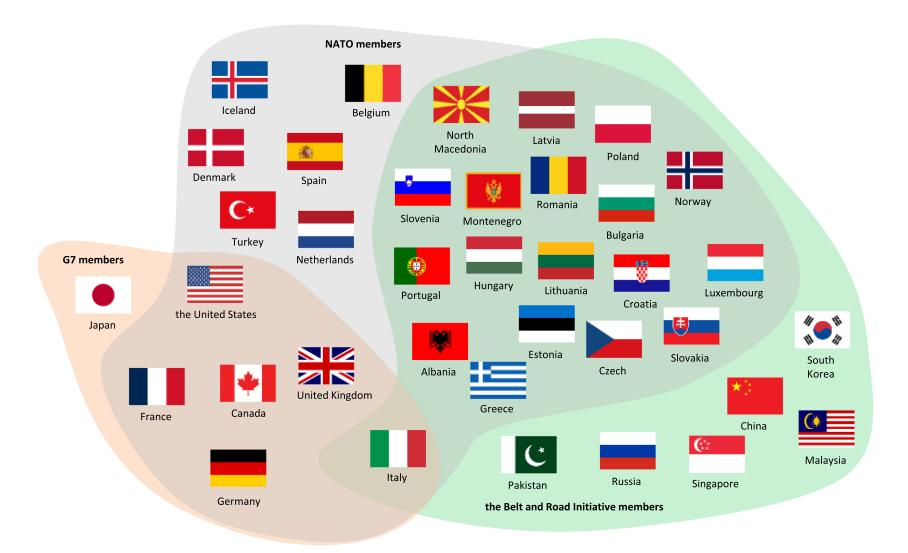
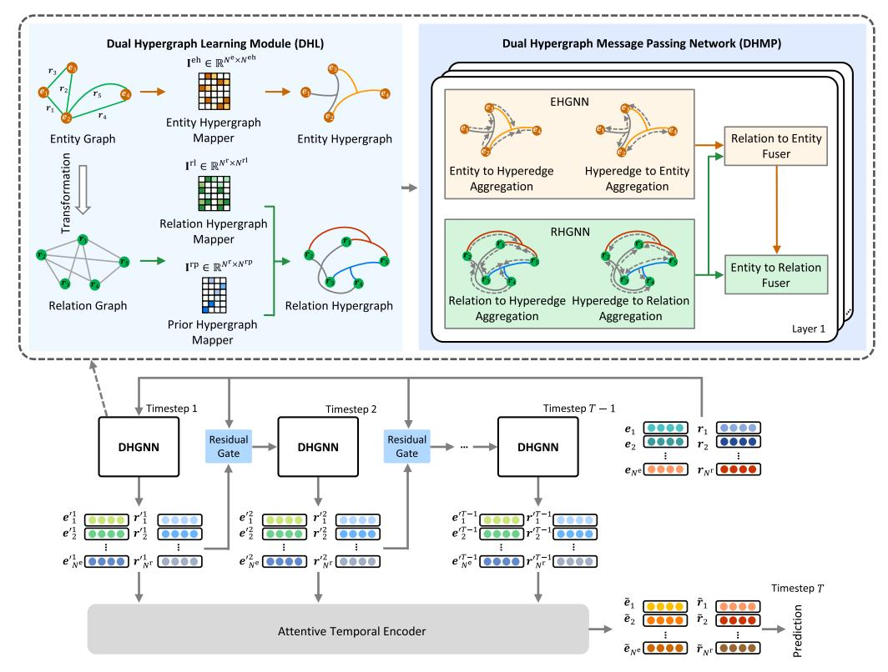
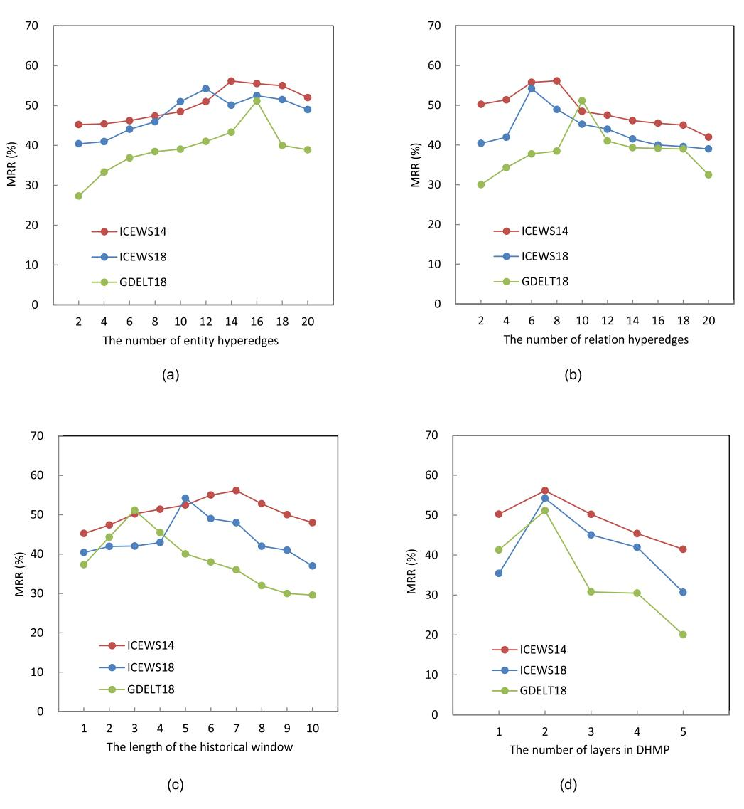
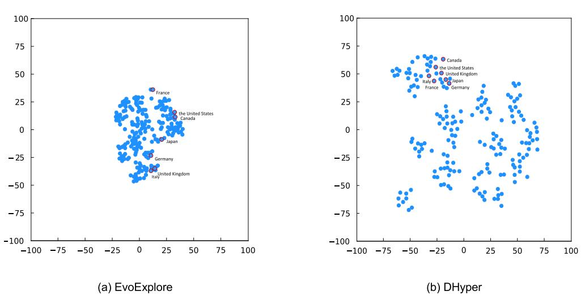
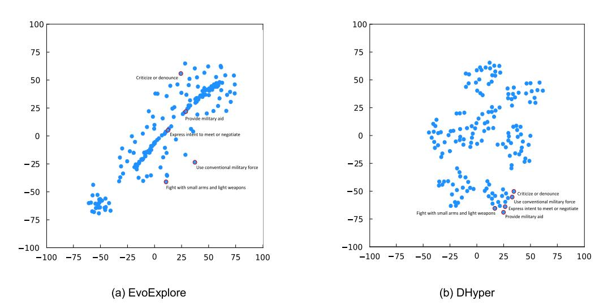
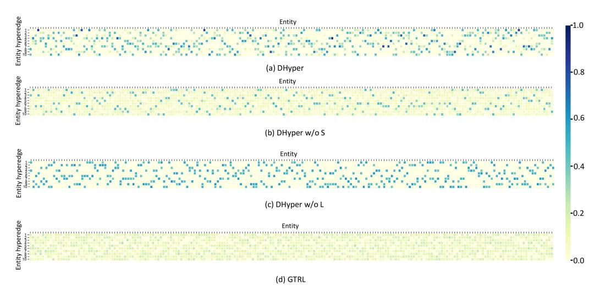
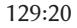
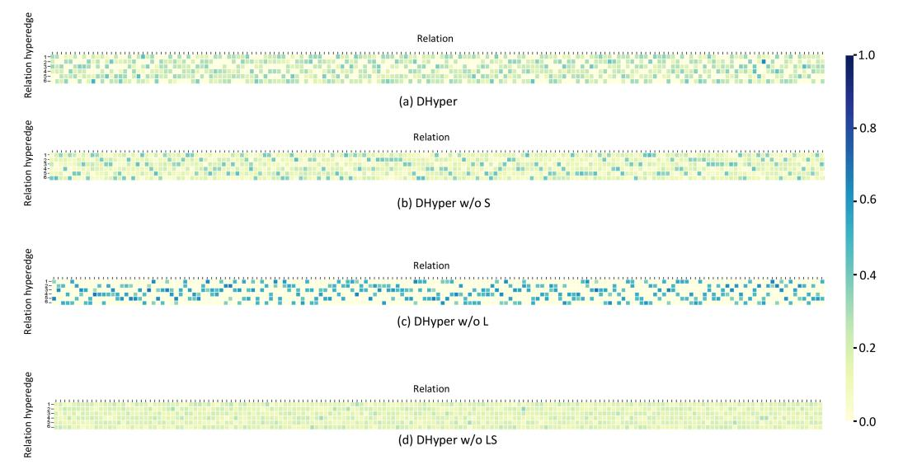

<!-- cite_key: tang2056 -->

# DHyper: A Recurrent Dual Hypergraph Neural Network for Event Prediction in Temporal Knowledge Graphs

XING [TANG,](https://orcid.org/0000-0003-0265-2056) College of Computer Science and Technology, Zhejiang University, Hangzhou, China LING [CHEN,](https://orcid.org/0000-0003-1934-5992) State Key Laboratory of Blockchain and Data Security, College of Computer Science and Technology, Zhejiang University, Hangzhou, China

[HONGYU](https://orcid.org/0000-0002-8625-7135) SHI, College of Computer Science and Technology, Zhejiang University, Hangzhou, China [DANDAN](https://orcid.org/0000-0001-9285-6970) LYU, College of Computer Science and Technology, Zhejiang University, Hangzhou, China

Event prediction is a vital and challenging task in temporal knowledge graphs (TKGs), which have played crucial roles in various applications. Recently, many graph neural networks based approaches are proposed to model the graph structure information in TKGs. However, these approaches only construct graphs based on quadruplets and model the pairwise correlation between entities, which fail to capture the high-order correlations among entities. To this end, we propose DHyper, a recurrent Dual Hypergraph neural network for event prediction in TKGs, which simultaneously models the influences of the high-order correlations among both entities and relations. Specifically, a dual hypergraph learning module is proposed to discover the high-order correlations among entities and among relations in a parameterized way. A dual hypergraph message passing network is introduced to perform the information aggregation and representation fusion on the entity hypergraph and the relation hypergraph. Extensive experiments on six real-world datasets demonstrate that DHyper achieves the state-of-the-art performances, outperforming the best baseline by an average of 13.09%, 4.26%, 17.60%, and 18.03% in MRR, Hits@1, Hits@3, and Hits@10, respectively.

CCS Concepts: • **Information systems**→**Data mining**;

Additional Key Words and Phrases: Event prediction, temporal knowledge graphs, hypergraph, graph neural networks

## ACM Reference Format:

Xing Tang, Ling Chen, Hongyu Shi, and Dandan Lyu. 2024. DHyper: A Recurrent Dual Hypergraph Neural Network for Event Prediction in Temporal Knowledge Graphs. *ACM Trans. Inf. Syst.*42, 5, Article 129 (April 2024), 23 pages. <https://doi.org/10.1145/3653015>

© 2024 Copyright held by the owner/author(s). Publication rights licensed to ACM.

<https://doi.org/10.1145/3653015>

This work was supported in part by the National Key Research and Development Program of China (Grant No. 2018YFB0505000) and in part by the project of the Donghai Laboratory (Grant No. DH-2022ZY0013).

Authors' addresses: X. Tang, H. Shi, and D. Lyu, College of Computer Science and Technology, Zhejiang University, 38 Zheda Rd, Hangzhou, 310027, China; e-mails: tangxing@cs.zju.edu.cn, shihongyu@cs.zju.edu.cn, revaludo@cs.zju.edu.cn; L. Chen (Corresponding author), State Key Laboratory of Blockchain and Data Security, College of Computer Science and Technology, Zhejiang University, 38 Zheda Rd, Hangzhou, 310027, China; e-mail: lingchen@cs.zju.edu.cn.

Permission to make digital or hard copies of all or part of this work for personal or classroom use is granted without fee provided that copies are not made or distributed for profit or commercial advantage and that copies bear this notice and the full citation on the first page. Copyrights for components of this work owned by others than the author(s) must be honored. Abstracting with credit is permitted. To copy otherwise, or republish, to post on servers or to redistribute to lists, requires prior specific permission and/or a fee. Request permissions from [permissions@acm.org.](mailto:permissions@acm.org)

ACM 1046-8188/2024/04-ART129

### 1 INTRODUCTION

A**temporal knowledge graph (TKG)** [\[22\]](#page-21-0) is a way of organizing the knowledge with temporal information, which represents the temporal knowledge as events in the form of quadruplet (*head entity, relation, tail entity, timestamp*). For example, for event (New Zealand, Express intent to cooperate, Greece, 2018/1/7), "New Zealand" and "Greece" refer to *head entity*and*tail entity*, respectively, "Express intent to cooperate" refers to *relation*, and "2018/1/7" refers to *timestamp*. TKGs have played crucial roles in various applications, e.g., recommendation [\[1,](#page-21-0) [2\]](#page-21-0), international relation prediction [\[33\]](#page-22-0), and social network analysis [\[48,](#page-22-0) [49\]](#page-22-0). With the rapid development of intelligent information technology, plenty of TKGs emerge, e.g., the **Global Database of Events, Language, and Tone (GDELT)**[\[13\]](#page-21-0) and the**Integrated Conflict Early Warning System (ICEWS)**[\[47\]](#page-22-0). Event prediction in TKGs is an important task that predicts future events according to historical events [\[16\]](#page-21-0). For example, based on the historical events between two countries, the event prediction task aims to predict the future relations between them. The task is challenging due to complex temporal characteristics and multiple relations.

Early approaches focus on modeling timestamps by shallow encoders, e.g., the hyperplane projection and the fixed format encoding [\[4,](#page-21-0) [12\]](#page-21-0). Recently, encouraged by the success of**deep neural networks (DNNs)**, researchers have proposed a large amount of DNN based approaches that integrate **graph neural networks (GNNs)**with**recurrent neural networks (RNNs)**and their variants to model the graph structure information and the temporal dependency in TKGs, which show the state-of-the-art (SOTA) performance for the event prediction task [\[6,](#page-21-0) [10,](#page-21-0) [14,](#page-21-0) [15,](#page-21-0) [26\]](#page-22-0). In these approaches, graphs are constructed based on quadruplets, and GNNs are employed to capture the pairwise correlation between entities. The latest approaches attempt to develop derived structures, e.g., paths [\[19\]](#page-21-0), entity groups [\[21\]](#page-21-0), and communities [\[34\]](#page-22-0), to capture the latent pairwise correlation between entities that are distant and even unreachable.

Despite the promising results of introducing derived structures, these approaches still lack the capability to capture the high-order correlation among entities, i.e., the simultaneous correlation among triadic, tetradic, or multiple entities [\[25\]](#page-22-0). As illustrated in Figure [1,](#page-2-0) Japan, the United States, France, Canada, United Kingdom, Germany, and Italy, co-participate in the G7 summit, indicating a strong connection among these seven countries, i.e., the high-order correlation. However, existing approaches only construct graphs based on quadruplets, and model the pairwise correlation between entities by GNNs [\[3,](#page-21-0) [6,](#page-21-0) [10,](#page-21-0) [14,](#page-21-0) [15,](#page-21-0) [26\]](#page-22-0), which fail to capture the high-order correlation among entities.

In addition, there are correlations among relations in TKGs, and the correlations are also high order. For example, when military conflicts erupt,some countries provide military assistance to one side while condemning and criticizing the other. Subsequently, countries strengthen cooperation and exchanges to avoid risks, e.g., energy crisis and economic crisis. Obviously, these relations, i.e.,"military conflicts erupt," "provide military assistance," "condemn," "criticize," and "strengthen cooperation and exchanges," are highly correlated. Capturing the high-order correlation among relations can contribute to more accurate event prediction.
**Hypergraph neural networks (HGNNs)**[\[8,](#page-21-0) [9\]](#page-21-0) are a kind of special GNNs, providing a powerful way to capture the high-order correlation among nodes by using a hyperedge to connect multiple nodes. HGNNs have achieved successful results in a wide range of areas, e.g., recommendation [\[5,](#page-21-0) [25,](#page-22-0) [27,](#page-22-0) [29,](#page-22-0) [35,](#page-22-0) [40,](#page-22-0) [42\]](#page-22-0), time series analysis [\[30,](#page-22-0) [31\]](#page-22-0), and social network analysis [\[17,](#page-21-0) [28\]](#page-22-0). However, it is not trivial to apply existing HGNNs to the event prediction task in TKGs, as they are usually based on pre-defined graph structures and only capture the high-order correlation among nodes, failing to capture the high-order correlation among relations.

To address the aforementioned deficiencies, we propose**DHyper**, a recurrent **Dual Hypergraph**neural network for event prediction in TKGs. To the best of our knowledge, DHyper is the

Fig. 1. The example of the high-order correlation among countries.

first work that incorporates the hypergraph modeling into TKGs, which simultaneously models the influences of both the high-order correlations among entities and among relations. The major contributions of our work are outlined as follows:

- —We propose a**dual hypergraph learning module (DHL)**, which discoversthe high-order correlations among entities and among relations in a parameterized way. In addition, the prior dependency between relations and four primary tendencies is infused to impose constraints on relation representations.
- —We introduce a **dual hypergraph message passing (DHMP)**network to perform the information aggregation and representation fusion on the entity hypergraph and the relation hypergraph, which can jointly model the influences of the high-order correlations among both entities and relations.
- —We evaluate the proposed method on six real-world datasets. Experimental results demonstrate that DHyper achieves the SOTA performance on the event prediction task, outperforming the best baseline by an average of 13.09%, 4.26%, 17.60%, and 18.03% in MRR, Hits@1, Hits@3, and Hits@10, respectively.

The remainder of this article is structured as follows: Section 2 provides a review of existing methods associated with this work. The definitions of the associated terms and the formulation of the task are given in Section [3.](#page-4-0) The specifics of the proposed model are presented in Section [4.](#page-4-0) The experimental results and analyses are given in Section [5.](#page-9-0) Finally, we conclude the article and present future work in Section [6.](#page-19-0)

# 2 RELATED WORKS

In thissection, we provide an overview of the related works, including event prediction approaches in TKG and HGNN related studies.

# 2.1 Event Prediction Approaches in TKGs

Inspired by the success of DNNs in various areas, e.g., natural language processing [\[7\]](#page-21-0) and computer vision [\[20\]](#page-21-0), researchers have proposed massive DNN based approaches. In these approaches, GNNs are integrated with RNNs and their variants, e.g.,**Long Short-Term Memory (LSTM)**and**Gated Recurrent Units (GRUs)**, to model the graph structure information and the temporal dependency in TKGs [\[3,](#page-21-0) [6,](#page-21-0) [10,](#page-21-0) [14,](#page-21-0) [15,](#page-21-0) [26\]](#page-22-0). RE-NET [\[10\]](#page-21-0) models graph structure information and the temporal dependency by GNNs and RNNs and employs an autoregressive way to get the joint probability distribution of all events. Glean [\[6\]](#page-21-0) models the influences of neighbor entities and relations by CompGCN [\[24\]](#page-21-0) and captures the temporal dependency among representations by GRUs. Both TeMP [\[26\]](#page-22-0) and RE-GCN [\[14\]](#page-21-0) aggregate the message from neighbor entities by R-GCN [\[18\]](#page-21-0) and model the temporal dependency by customized GRUs. DACHA [\[3\]](#page-21-0) introduces a self-attentive encoder to encode historical relations and exploits a dual graph convolution network to aggregate the message from neighbor entities and historical relations. TiRGN [\[15\]](#page-21-0) introduces a multi-relation based GCN to capture graph structure information and develops a double recurrent mechanism to model the temporal dependency. In these approaches, graphs are constructed based on quadruplets, and GNNs are employed to capture the pairwise correlation between entities.

More recently, several approaches seek to develop derived structures to model the influence of the latent pairwise correlation between entities that are far apart and even unreachable. TITer [\[19\]](#page-21-0) incorporatestemporal agent-based reinforcement learning [\[39\]](#page-22-0)to search paths between distant entities and obtains entity representations by the inductive mean. GTRL [\[21\]](#page-21-0)introduces entity groups to model the correlation between entities that are far apart and even unreachable. EvoExplore [\[34\]](#page-22-0) establishes dynamic communities to model the latent correlations between entities. In spite of the promising results of introducing derived structures, these approaches still lack the capability to capture the high-order correlation among entities. In addition, the high-order correlation among relations is ignored. Therefore, we propose DHyper that is the first work to incorporate the hypergraph modeling into TKGs, which can simultaneously model the high-order correlations among entities and among relations.

## 2.2 HGNN Related Studies

HGNNs are a kind of special GNNs, where each hyperedge can connect multiple nodes, providing a powerful way to capture the high-order correlation among nodes. HGNNs have achieved successful results in a wide range of areas, e.g., recommendation [\[5,](#page-21-0) [25,](#page-22-0) [27,](#page-22-0) [29,](#page-22-0) [35,](#page-22-0) [40,](#page-22-0) [42\]](#page-22-0), time series analysis [\[30,](#page-22-0) [31\]](#page-22-0), and social network analysis [\[17,](#page-21-0) [28\]](#page-22-0). MRH [\[5\]](#page-21-0) is the first model to introduce hypergraphs in music recommendation, which leverages hypergraphs to model the high-order relations among objects. HyperRec [\[25\]](#page-22-0) exploits hypergraphs to model the short-term item correlations for the next-item recommendation, which uses a hyperedge to connect multiple items. AADA [\[40\]](#page-22-0) exploits positive and negative hypergraphs to represent users' historical interactions for cold-start recommendation. HGC-RNN [\[30\]](#page-22-0) is a taxi demand prediction model, which employs hypergraphs to model the complicated structural correlations among sensors and uses RNNs to capture the temporal dependency among representations. LBSN2Vec++ [\[28\]](#page-22-0) is a heterogeneous hypergraph embedding model for location-based social networks, which constructs a hypergraph including both user-user edges (friendships) and user-time-POI-semantic hyperedges (check-ins), and learns user representations by a random-walk-with-stay sampling strategy. All the aforementioned methods are based on pre-defined hypergraph structures, which require plenty of manual design and domain knowledge.

To handle this issue, HERALD [\[35\]](#page-22-0) introduces a hypergraph Laplacian adaptor to automatically adapt the hypergraph structure based on node representations and the pre-defined hypergraph Laplacian. MBHT [\[29\]](#page-22-0) constructs the itemwise semantic dependency hypergraph based on a metric learning module to model the high-order dependencies among items. HCCF [\[27\]](#page-22-0) captures the complex high-order dependencies among users by a parameterized hypergraph learning module. These studies show that discovering the high-order correlation among nodes by a learning paradigm is effective. Inspired by this, we also propose to capture the high-order correlations among entities and among relations in a parameterized way.

# 3 PRELIMINARIES

In this section, we give the definitions of associated terms and formulate the problem.

*Definition 1 (TKG).* A TKG can be formalized as a set of events, denoted as G = {(*s*,*r*, *o*, *τ* )|*s*, *o* ∈ E,*r*∈ R,*τ*∈ T }, where*s*, *r*, *o*, and *τ* denote head entity, relation, tail entity, and timestamp, respectively. E, R, and T denote the sets of entities, relations, and timestamps, respectively. G*t*is the set of events for timestep*t*.

*Definition 2 (Entity Graph).*The entity graph is denoted as*G*e = (*V*e,*E*e), where *V*e denotes the node set representing entities.*E*e denotes the edge set representing the relations between entities.

*Definition 3 (Relation Graph).*The relation graph is denoted as*G*r = (*V*r ,*E*r ), where *V*r denotes the node set representing relations.*E*r denotes the edge set, which is defined based on whether a pair of relations in *G*e share an entity.

*Definition 4 (Entity Hypergraph).*The entity hypergraph is denoteas*G*eh = (*V*e,*E*eh, **I**eh), where*V*e denotes the node set, which is the same as that of*G*e. *E*eh denotes the hyperedge set. **I** eh ∈ R*N* e×*N*eh denotesthe incidence matrix representing the connection between nodes and hyperedges, where*N*e and *N*eh are the numbers of nodes and hyperedges of *G*eh, respectively.

*Definition 5 (Relation Hypergraph).*The relation hypergraph is denoted as*G*rh = (*V*r ,*E*rh, **I** rh), where*V* r denotes the node set, which is the same as that of*G*r . *E*rh denotes the hyperedge set. **I** rh ∈ R*N* r ×*N*rh denotesthe incidence matrix representing the connection between nodes and hyperedges, where*N*r and *N*rh are the numbers of nodes and hyperedges of *G*rh, respectively.

Problem 1 (Event Prediction Task). *Given head entity s and tail entity o, the event prediction task in TKGs aims to predict relations for timestep T , based on the set of historical events* G1:*T* −1*.*# 4 METHODOLOGY

As shown in Figure [2,](#page-5-0) DHyper is a recurrent dual hypergraph neural network. For a timestep, the residual gate combines the output of the previous timestep with the initial entity and relation representations to generate the input of the**dual hypergraph neural network (DHGNN)**. DHGNN includes DHL and DHMP. DHL discovers the high-order correlations among entities and among relations in a parameterized way to generate the entity hypergraph and the relation hypergraph, respectively. DHMP performs the information aggregation and representation fusion on dual hypergraphs to fully model the influences of both the high-order correlations among entities and among relations. The attentive temporal encoder captures the temporal dependency among the fused representations of all timesteps to output the integrated entity and relation representations, which are used for predicting events in the future.

# 4.1 DHGNN

DHGNN is the key module of the proposed method DHyper that performs the dual hypergraph modeling by DHL and DHMP. DHL builds the entity graph and the relation graph based on historical events for each timestep. The high-order correlations among entities and among relations are discovered in a parameterized way by the entity and relation hypergraph mappers. In addition, the prior hypergraph mapper infuses the prior dependency between relations and four primary tendencies to impose constraints on relation representations. Note that the entity, relation, and prior

Fig. 2. The framework of the proposed method DHyper.

hypergraph mappers are shared across all timesteps. DHMP performs the information aggregation and representation fusion on the entity hypergraph and the relation hypergraph. Specifically, the **entity hypergraph neural network (EHGNN)**and the**relation hypergraph neural network (RHGNN)**perform the information aggregation on the entity hypergraph and the relation hypergraph, respectively. The entity to relation fuser and the relation to entity fuser conduct the representation fusion on dual hyrgraphs.
*4.1.1 DHL.*To utilize the crucial information from historical eventsto depict entities, the entity graph*G*e = (*V*e,*E*e) is constructed based on historical events for each timestep in the historical window [1 : *T*− 1]. The edge construction rule of*G*e is formulated as

$$
l_{i,j}^e = \begin{cases} 1 & \text{there is an event between entities } e_i \text{ and } e_j \\ 0 & \text{otherwise} \end{cases}
$$
 (1)

In addition to the correlation between entities, capturing the correlation between relations is also ofsignificance for more accurate event prediction. Specifically, the relation graph*G*r = (*V*r ,*E*r ) is constructed by regarding the relations of*G*e as nodes. The edge on*G*r is defined based on whether a pair of relations share an entity, which is formulated as

$$
l_{i,j}^{\mathrm{r}} = \begin{cases} 1 & \text{relations } r_i \text{ and } r_j \text{ share an entity} \\ 0 & \text{otherwise} \end{cases}
$$
 (2)

At the beginning, each entity *ei*and relation*ri*are given with the random initial representations*ei*and*ri*, respectively.

The latest HGNN related studies show that discovering the high-order correlation among nodes by a learning paradigm is beneficial for downstream tasks [\[27,](#page-22-0) [29,](#page-22-0) [35\]](#page-22-0). Inspired by this, we also propose to capture the high-order correlations among entities and among relations in a parameterized way. The entity hypergraph mapper is designed to capture the learnable dependencies between entities and entity hyperedges, formulated as**I** eh ∈ R*N* e×*N*eh , where*N*e and *N*eh are the numbers of entities and entity hyperedges of *G*eh, respectively. The relation hypergraph mapper is designed to capture the learnable dependencies between relations and relation hyperedges, formulated as **I** rl ∈ R*N* r ×*N*rl , where*N*r and *N*rl are the numbers of relations and learnable hyperedges of *G*rh, respectively. Note that the entity and relation hypergraph mappers make each entity or relation belong to multiple hyperedges with different probabilities and the total probability equals to 1.

In realscenarios,relation semantics are generally organized underseveral primary tendenciesto support the correlation analysis. For example, in GDELT [\[13\]](#page-21-0) and ICEWS [\[47\]](#page-22-0), relation semantics are organized under four primary tendencies, i.e., verbal cooperation, material cooperation, verbal conflict, and material conflict. This prior dependency allows analyzing the correlation among relations at a higher level. The prior hypergraph mapper is designed to capture the prior dependency between relations and four primary tendencies, which makes the representations of relations belonging to the same tendency similar, formulated as **I** rp ∈ R*N* r ×*N*rp , where*N*r and *N*rp are the numbers of relations and prior hyperedges of *G*rh, respectively. Specifically, if relation *ri*is assigned with primary tendency*ϑj*,**I**rp*i* ,*j* = 1, and 0 otherwise (*i*= 1, 2, . . . ,*N*r and *j*= 1, 2, . . . ,*N*rp). Note that *N*rp = 4 for GDELT [\[13\]](#page-21-0) and ICEWS [\[47\]](#page-22-0). We further concatenate incidence matrices **I**rpand**I**rl to generate the final relation hypergraph incidence matrix**I** rh ∈ R*N* r ×*N*rh , where*N*r and *N*rh are the numbers of relations and hyperedges of *G*rh, and *N*rh = *N*rp + *N*rl.

Learning dense incidence matrices will enormously increase the model computation cost. To reduce the model parameters, we introduce a low-rank factorization strategy [\[29\]](#page-22-0) in learning dual hypergraph incidence matrices, formulated as

$$
\mathbf{I}^{\text{eh}} = \mathbf{E}^{\text{e}} \mathbf{W}^{\text{eh}},\tag{3}
$$

$$
\mathbf{I}^{\text{rh}} = \mathbf{E}^{\text{r}} \mathbf{W}^{\text{rh}},\tag{4}
$$

where **W**eh and **W**rh are learnable parameters. **E**e ∈ R*N* e×*d*and**E**r ∈ R*N* r ×*d*are entity and relation representation matrices, respectively.*d*is the dimension of representations.

To reduce the impact of noise and make the model robust, we introduce a sparse threshold strategy [\[36\]](#page-22-0) to make**I**eh and**I**rh sparse, which utilizes the sparsemax function [\[37\]](#page-22-0) to adaptively preserve the values above the threshold that is calculated based on**I**eh and**I**rh, and the other values are truncated to 0.
*4.1.2 DHMP.*To model the influences of the high-order correlations among entities and among relations, respectively, we customize EHGNN and RHGNN to obtain entity representations and relation representations through two phases, i.e., entity or relation to hyperedge aggregation and hyperedge to entity or relation aggregation.
**Entity or relation to hyperedge aggregation.**In this phase, entity or relation hyperedge representations are obtained by aggregating the representations of entities or relations that belong to the corresponding hyperedges, formulated as

$$
\Gamma_j^{\text{eh}} = \frac{1}{|V^{\text{e}}|} \sum_{e_i \in V^{\text{e}}} \Gamma_{i,j}^{\text{eh}} e_i,\tag{5}
$$

$$
\Gamma_j^{\text{rh}} = \frac{1}{|V^{\text{r}}|} \sum_{r_i \in V^{\text{r}}} \mathbf{I}_{i,j}^{\text{rh}} r_i \tag{6}
$$

where**I**eh*i*,*j*and**I**rh*i*,*j*are the probabilities of assigning entity*ei*to entity hyperedge Γeh*j*and assigning relation*ri*to relation hyperedge Γrh*j*, respectively.*V*e and*V*r are the sets of entities and relations.
**Hyperedge to entity or relation aggregation.**In this phase, the intermediate representations of entities or relations are obtained by aggregating all information from hyperedges that are associated with the corresponding entities or relations. To distinguish the influences of different hyperedges, we introduce the attentive aggregation operation, formulated as

$$
\hat{\boldsymbol{e}}_i = \Phi^{\text{e}} \left( \frac{1}{|E^{\text{eh}}|} \sum_{\Gamma_j^{\text{eh}} \in E^{\text{eh}}} \alpha_{i,j}^{\text{eh}} \Gamma_j^{\text{eh}} \right) \tag{7}
$$

$$
\hat{\boldsymbol{r}}_{i} = \Phi^{\mathrm{r}} \left( \frac{1}{|E^{\mathrm{rh}}|} \sum_{\Gamma_{j}^{\mathrm{rh}} \in E^{\mathrm{rh}}} \alpha_{i,j}^{\mathrm{rh}} \Gamma_{j}^{\mathrm{rh}} \right) \tag{8}
$$

where Φe and Φr are the aggregation functions, implemented by the**multi-layer perceptron (MLP)**. *E*eh and *E*rh are the hyperedge sets of*G*eh and*G*rh,respectively. *α*eh *i*,*j*and*α*rh *i*,*j*are the attention weights, formulated as

$$
\alpha_{i,j}^{\text{eh}} = \frac{\exp\left(q_{i,j}^{\text{eh}}\right)}{\sum_{j=1}^{N^{\text{eh}}} \exp\left(q_{i,j}^{\text{eh}}\right)}\tag{9}
$$

$$
q_{i,j}^{\text{eh}} = \varphi(\mathbf{W}_1 \Gamma_j^{\text{eh}} || \mathbf{W}_2 \boldsymbol{e}_i)
$$
\n(10)

$$
\alpha_{i,j}^{\text{rh}} = \frac{\exp\left(q_{i,j}^{\text{rh}}\right)}{\sum_{j=1}^{N^{\text{rh}}}\exp\left(q_{i,j}^{\text{rh}}\right)}\tag{11}
$$

$$
q_{i,j}^{\text{rh}} = \varphi(\mathbf{W}_3 \Gamma_j^{\text{rh}} || \mathbf{W}_4 \mathbf{r}_i), \tag{12}
$$

where**W**1, **W**2, **W**3, and **W**4 are learnable parameters. *φ*is the activation function, implemented by LeakyReLU. || is the concatenation operation.*N*eh and *N*rh are the numbers of entity hyperedges and relation hyperedges, respectively.

After obtaining the aggregated information, entity representations or relation representations are updated, formulated as

$$
\bar{\boldsymbol{e}}_j = \xi^{\rm e}(\hat{\boldsymbol{e}}_j||\boldsymbol{e}_i),\tag{13}
$$

$$
\bar{\boldsymbol{r}}_j = \xi^{\mathrm{r}}(\hat{\boldsymbol{r}}_j||\boldsymbol{r}_i),\tag{14}
$$

where *ξ*e and*ξ*r are the transformation functions, implemented by the MLP.

To jointly utilize the information of dual hypergraphs, the entity to relation fuser and the relation to entity fuser are designed to conduct the representation fusion guided by the entity-relation incidence matrix. Specifically, we first conduct the relation to entity fusion and then the entity to relation fusion, which can leverage relation and entity information to enhance each other while still maintaining their individual properties. The fused representations of entities or relations are formulated as

$$
\boldsymbol{e}'_i = \Psi^{\rm e}\left(\left(\sum_{j=1}^{N^{\rm r}} \mathbf{M}_{i,j} \bar{\boldsymbol{r}}_j\right) || \bar{\boldsymbol{e}}_i\right),\tag{15}
$$

$$
\boldsymbol{r}'_i = \Psi^{\mathrm{r}} \left( \left( \sum_{j=1}^{N^{\mathrm{e}}} \mathbf{M}_{i,j} \boldsymbol{e}'_i \right) || \bar{\boldsymbol{r}}_i \right), \tag{16}
$$

where Ψe and Ψr are the fusion functions, implemented by the MLP. **M**∈ R|E |× |R | is the entityrelation incidence matrix that encodesthe connections between entities and relations on the entity graph, defined as if entity*ei*connects with relation*ri*,**M***i*,*j*= 1, and 0 otherwise.**M***i*,*jr***¯***j*aggregates the updated representations of relations connected with the corresponding entity, and**M***i*,*je i*aggregates the fused representations of entities connected with the corresponding relation.

## 4.2 Residual Gate

Entities and relations evolve over time, while some inherent characteristics may remain constant. To transfer residual information from the past to the future, we utilize the residual gate to generate the input of DHGNN for a timestep, which combines the output of the previous timestep with the initial entity and relation representations. Note that for simplicity, the subscripts*i*and*j*of variables are omitted in the following sections without causing ambiguity. The input of DHGNN for timestep*t*is formulated as

$$
X_t = S_t \otimes X_{t-1} + (1 - S_t) \otimes X^{(0)},
$$
\n(17)

where ⊗ denotes the dot product operation.*Xt*−1 is the output of the previous timestep, i.e., the fused representations of entities or relations. *X*(0) is the initial representations of entities or relations. *St*is the residual gate, which determines the proportion of residual information to be preserved, formulated as

$$
S_t = \sigma \left( \mathbf{W}_5 \mathbf{X}_{t-1} + b \right),\tag{18}
$$

where*σ*is the sigmoid function and**W**5 and *b* are learnable parameters.

### 4.3 Attentive Temporal Encoder

Compared with RNN and LSTM, the position enhanced self-attention mechanism has shown superior performance in sequence modeling [\[43–45\]](#page-22-0). To encode the temporal information, we introduce the attentive temporal encoder to capture the temporal dependency among representations, which leverages timestamps by position embedding.

The sinusoidal functions are exploited to generate position representations based on timestamps, formulated as:

$$
\mu_t = \sqrt{\frac{1}{d}} \left[ \cos \left( \omega_1 \tau_t \right), \sin \left( \omega_1 \tau_t \right), \dots, \cos \left( \omega_d \tau_t \right), \sin \left( \omega_d \tau_t \right) \right],\tag{19}
$$

where {*ωi* }*i*=1,2,...,*d*are the learnable parameters.*τ*is the timestamp. We use*zt*=*μt* ||*Xt*to represent the position enhanced representations of entities or relations (denoted as*zm*,*n*in the following sections, where*m*,*n*are indices used for computing attention), where*Xt*is the fused representations of entities or relations calculated by Equation (17). Given representation sequence*z*1:*T* −1 = {*z*1, *z*2, . . . , *zt*, . . . , *zT*−1}, the position enhanced self-attention mechanism is exploited to capture the temporal dependency among the fused representations. Note that for simplicity, the subscript*t*of variables is omitted in the following sections. The integrated entity representation or relation representation is formulated as

$$
\tilde{\boldsymbol{h}}_{m} = \sum_{n=1}^{T-1} a_{m,n} z_{m,n},
$$
\n(20)

$$
a_{m,n} = \frac{\exp(e_{m,n})}{\sum_{j=1}^{T-1} \exp(e_{m,j})'},
$$
\n(21)

$$
e_{m,n} = \frac{(\mathbf{W}_{\mathcal{Q}} z_m)^{\mathrm{T}} (\mathbf{W}_{\mathcal{K}} z_n)}{\sqrt{d}},\tag{22}
$$

where**W**Q and **W**K are learnable parameters. *am*,*n*isthe attention weight. In this way, the attentive temporal encoder outputs the integrated representation of entities or relations**˜** *hm*(denoted as*e***˜**s, *e***˜**o, or *r***˜**in the following sections, where*e***˜**s is the integrated representation of head entities, *e***˜**o is the integrated representation of tail entities, and *r***˜**is the integrated representation of relations, which integrate the temporal information and graph structure information).

# 4.4 Event Prediction

Following [\[14\]](#page-21-0), we employ the Conv-TransE [\[41\]](#page-22-0)to predict the probability of each relation between an entity pair, which is calculated as
*P*(*y***ˆ**|*s*, *o*, G1:*T*−1 ) =*σ* (*L*rConvFC (*e***˜**s, *e***˜**o)), (23)

where *y***ˆ**∈ R|R| is the probability vector of relations, and |R| is the number of relations.*σ*is the sigmoid function.*e***˜**s and *e***˜**o are the integrated entity representations. *L*r is the integrated relation representation matrix, each row of which corresponds to an integrated relation representation *r***˜**. ConvFC(·) denotes the 1D convolution layer and the fully connected layer.

The training objective of DHyper is to minimize the cross-entropy loss, which is formulated as

$$
\mathcal{L} = -\frac{1}{F} \sum_{i=1}^{F} \sum_{j=1}^{N^{\text{r}}} \{y_{i,j} \log P_{i,j} + (1 - y_{i,j}) \log (1 - P_{i,j})\},\tag{24}
$$

where *F*and*N*r are the numbers of samples in the training set and relations, respectively. *yi*,*j*denotes the label of relation*j*for sample*i*, and *yi*,*j*∈ {0, 1}.*Pi*,*j*is the predicted probability of relation*j*for sample*i*, calculated by Equation (23).

## 4.5 Complexity Analysis

We analyze the computational complexity of DHyper. For DHL, owing to the designs of the lowrank factorization and sparse threshold strategies, the time complexity is*O*((N1 + N2)×D), where N1 and N2 are the numbers of hyperedges in *G*eh and *G*rh, respectively, and D is the dimension of representations. For DHMP, the time complexity is *O*( L × (*ζ*+*ϖ*) × (N1 + N2)×D), where L is the number of layers in DHMP, and *ζ*and*ϖ*are the numbers of entities and relations, respectively. The time complexity of the residual gate is*O*(MD), as we unroll M timesteps. For the attentive temporal encoder, the time complexity is *O*(T D), where T is the length of history. For the event prediction module, the time complexity is *O*(D).

# 5 EXPERIMENTS

In this section, we present extensive experiments to justify the superiority of DHyper. We first introduce the experimental datasets and settings, followed by the comparison with baselines and ablation study. Next, we provide the parameter sensitivity analysis. Finally, we present the case study to further validate the effectiveness of DHyper.

## 5.1 Datasets

To evaluate the performance of DHyper, we conduct experiments on six real-world datasets, i.e., ICEWS14, ICEWS18, GDELT18, ICEWS14C, ICEWS18C, and GDELT18C. The former three datasets are collected by Li et al. [\[14\]](#page-21-0), covering periods from 2014/1/1 to 2014/12/31, from 2018/1/1 to 2018/10/31, and from 2018/1/1 to 2018/1/31, respectively. We pre-process them to obtain the last three datasets by setting the type field of entities as countries to conduct filtering, which only contain the records of country-specific events and can contribute to more clear and insightful analyses of real-world relations between countries. Following [\[14\]](#page-21-0), all datasets are split into the training set,

| Dataset  | #Entity | #Relation | Training set | Validation set | Test set | #Timestep | Time granularity |
|----------|---------|-----------|--------------|----------------|----------|-----------|------------------|
| ICEWS14  | 7,128   | 230       | 74,845       | 8,514          | 7,371    | 365       | 24 hours         |
| ICEWS14C | 205     | 171       | 35,665       | 7,369          | 7,068    | 365       | 24 hours         |
| ICEWS18  | 23,033  | 256       | 373,018      | 45,995         | 49,545   | 304       | 24 hours         |
| ICEWS18C | 208     | 164       | 34,497       | 4,412          | 4,661    | 304       | 24 hours         |
| GDELT18  | 7,691   | 240       | 1,734,399    | 238,765        | 305,241  | 2,751     | 15 minutes       |
| GDELT18C | 219     | 211       | 158,901      | 21,351         | 27,407   | 2,751     | 15 minutes       |

Table 1. The Statistics of Datasets

Table 2. The Search Spaces and the Final Choices of NNI (ICEWS14, ICEWS18, GDELT18, ICEWS14C, ICEWS18C, and GDELT18C are Abbreviated as ICE14, ICE18, GDE18, ICE14C, ICE18C, and GDE18C, Respectively)

| Hyper-parameter                 | Search space                         | Final choices |        |       |        |       |        |  |
|---------------------------------|--------------------------------------|---------------|--------|-------|--------|-------|--------|--|
|                                 |                                      | ICE14         | ICE14C | ICE18 | ICE18C | GDE18 | GDE18C |  |
| Number of entity hyperedges     | {2, 4, 6, 8, 10, 12, 14, 16, 18, 20} | 14            | 10     | 12    | 10     | 16    | 8      |  |
| Number of relation hyperedges   | {2, 4, 6, 8, 10, 12, 14, 16, 18, 20} | 8             | 6      | 6     | 8      | 10    | 6      |  |
| Number of layers for DHMP       | {1, 2, 3, 4, 5}                      | 2             | 2      | 2     | 2      | 2     | 2      |  |
| Length of the historical window | {1, 2, 3, 4, 5, 6, 7, 8, 9, 10}      | 7             | 10     | 5     | 9      | 3     | 7      |  |

validation set, and test set in chronological order. The detailed statistics of datasets are presented in Table 1.

### 5.2 Experimental Settings

DHyper is implemented in Python with PyTorch and trained with one GPU (NVIDIA RTX3080), and the source code is released on GitHub.1 We evaluate DHyper on the event prediction task, which aims at predicting relations between entity pairsfortimestep*T* , based on the set of historical events G1:*T*−1. In addition, following [\[14\]](#page-21-0), we conduct the entity prediction task and present the experimental results.

We exploit the**neural network intelligence (NNI)**toolkit2 to automatically select the best hyper-parameters. The search spaces and the final choices of hyper-parameters are given in Table 2. For the configurations of NNI, the max trial number is set to 10, and the optimization algorithm is the Tree-structured Parzen Estimator [\[38\]](#page-22-0).

Following [\[6\]](#page-21-0), the batch size is set to 16, and the dimension of representations is set to 100. The hidden sizesforthe residual gate and attentive temporal encoder are set to 200. Adam [\[11\]](#page-21-0)is chosen as the optimizer with the learning rate set to 0.01. The average results across five independent runs are reported. Evaluation metrics are Hits@k and**MRR (Mean Reciprocal Rank)**. Hits@k refers to the percentage of correct relations ranked in the top *k* predictions and MRR refers to the average reciprocal rank of relations. Higher Hits@k and MRR demonstrate better performance. The Hits@k and MRR are formulated as

$$
Hits@k = \frac{1}{\sum_{j\in N} |\mathcal{L}_j|} \sum_{j\in N} \sum_{q\in\mathcal{L}_j} I\left(\text{rank}_q \le k\right),\tag{25}
$$

[1https://github.com/xt-23/DHyper](https://github.com/xt-23/DHyper)

[2https://github.com/microsoft/nni](https://github.com/microsoft/nni)

$$
MRR = \frac{1}{\sum_{j \in N} |\mathcal{L}_j|} \sum_{j \in N} \sum_{q \in \mathcal{L}_j} \frac{1}{\text{rank}_q},
$$
\n(26)

where L*j*represents the true label set for sample*j* and |L*j*| is the number of true labels.*I*(·) is the indicator function. rank*q*is the rank of*q* in the prediction.

### 5.3 Comparison with Baselines

To justify the superiority of DHyper, we compare it with the SOTA event prediction approaches in TKGs. The detailed descriptions of compared baselines are as follows.

#### Shallow encoders-based approaches:

- —**TTransE** [\[12\]](#page-21-0) extends TransE [\[46\]](#page-22-0) by modeling timestamps as corresponding representations.
- —**HyTE** [\[4\]](#page-21-0) models timestamps as corresponding hyperplanes.

# DNNs based approaches:

- —**TeMP** [\[26\]](#page-22-0) uses R-GCN [\[18\]](#page-21-0) to model the influence of neighbor entities and employs a frequency-based gating GRU to model the temporal dependency among inactive events.
- —**RE-NET** [\[10\]](#page-21-0) uses GCNs to model the influence of neighbor entities and employs RNNs to model the temporal dependency among events.
- —**Glean** [\[6\]](#page-21-0) uses CompGCN [\[24\]](#page-21-0) to model the influence of neighbor entities and employs GRUs to model the temporal dependency among representations.
- —**RE-GCN** [\[14\]](#page-21-0) uses R-GCN to model the influence of neighbor entities and employs an autoregressive GRU to model the temporal dependency among events.
- —**DACHA** [\[3\]](#page-21-0) introduces a dual graph convolution network to obtain entity representations and utilizes a self-attentive encoder to model the temporal dependency among relations.
- —**TiRGN** [\[15\]](#page-21-0) is the SOTA approach, which introduces a multi-relation-based GCN to capture graph structure information and develops a double recurrent mechanism to model the temporal dependency.

## Derived structures-based approaches:

- —**TITer** [\[19\]](#page-21-0) incorporates temporal agent-based reinforcement learning to search paths and obtains entity representations by the inductive mean.
- —**GTRL** [\[21\]](#page-21-0) is the SOTA approach, which introduces the entity group modeling to model the influence of distant and unreachable entities and exploits GRUs to model the temporal dependency among representations.
- —**EvoExplore** [\[34\]](#page-22-0) is the SOTA approach, which establishes dynamic communities to model the latent correlations between entities.

To ensure fairness, we compare all baselines based on the same experimental protocol with welltuned hyper-parameters. The experimental results for predicting events and entities are shown in Tables [3,](#page-12-0) [4,](#page-12-0) [5,](#page-13-0) and [6,](#page-13-0) from which we can observe the following phenomena:

(1) DHyper shows superior performance compared to all baselines on the event prediction and entity prediction task, especially in surpassing the best baseline by an average of 13.09%, 4.26%, 17.60%, and 18.03% in MRR, Hits@1, Hits@3, and Hits@10 for the event prediction task on six datasets, respectively. The results justify the advantage of introducing the hypergraph modeling to capture the high-order correlation among entities and among relations. Note that the results of DHyper on ICEWS14C, ICEWS18C, and GDELT18C

|                                                                                                                                       |        | ICEWS14 |        |         |                                                                                                                 | ICEWS14C |        |         |  |  |
|---------------------------------------------------------------------------------------------------------------------------------------|--------|---------|--------|---------|-----------------------------------------------------------------------------------------------------------------|----------|--------|---------|--|--|
| Approach                                                                                                                              | MRR    | Hits@1  | Hits@3 | Hits@10 | MRR                                                                                                             | Hits@1   | Hits@3 | Hits@10 |  |  |
| TTransE (WWW 2018) 23.79 ± 0.03* 14.24 ± 0.51* 29.17 ± 0.07* 34.56 ± 0.05* 11.79 ± 0.53* 13.24 ± 0.01* 19.97 ± 0.27* 24.88 ± 0.56*    |        |         |        |         |                                                                                                                 |          |        |         |  |  |
| HyTE (EMNLP 2018)                                                                                                                     |        |         |        |         | 25.12 ± 0.73* 18.15 ± 0.22* 30.15 ± 0.01* 45.37 ± 0.41* 22.17 ± 0.73* 18.15 ± 0.52* 27.28 ± 0.01* 35.37 ± 0.44* |          |        |         |  |  |
| RE-NET (EMNLP 2020) 45.77 ± 0.28* 37.98 ± 0.03* 49.07 ± 0.07* 58.87 ± 0.24* 43.27 ± 0.48* 36.97 ± 0.35* 47.08 ± 0.01* 55.19 ± 0.28*   |        |         |        |         |                                                                                                                 |          |        |         |  |  |
| Glean (KDD 2020)                                                                                                                      |        |         |        |         | 42.20 ± 0.71* 36.86 ± 0.59* 47.68 ± 0.43* 52.39 ± 0.06* 40.24 ± 0.01* 34.62 ± 0.39* 45.48 ± 0.53* 50.09 ± 0.08* |          |        |         |  |  |
| TeMP (EMNLP 2020)                                                                                                                     |        |         |        |         | 46.04 ± 0.24* 39.07 ± 0.01* 49.84 ± 0.01* 59.74 ± 0.01* 44.17 ± 0.11* 37.37 ± 0.18* 47.78 ± 0.06* 55.66 ± 0.08* |          |        |         |  |  |
| RE-GCN (SIGIR 2021)                                                                                                                   |        |         |        |         | 45.56 ± 0.01* 38.09 ± 0.61* 50.37 ± 0.11* 62.44 ± 0.63* 41.76 ± 0.61* 36.67 ± 0.06* 45.37 ± 0.01* 51.74 ± 0.11* |          |        |         |  |  |
| DACHA (TKDD 2022)                                                                                                                     |        |         |        |         | 45.44 ± 0.71* 37.88 ± 0.09* 49.47 ± 0.67* 58.69 ± 0.06* 44.26 ± 0.22* 37.59 ± 0.23* 44.18 ± 0.27* 53.19 ± 0.08* |          |        |         |  |  |
| TiRGN (IJCAI 2022)                                                                                                                    |        |         |        |         | 46.07 ± 0.21* 39.83 ± 0.26* 52.17 ± 0.48* 63.95 ± 0.61* 44.73 ± 0.11* 38.13 ± 0.11* 49.77 ± 0.27* 60.91 ± 0.31* |          |        |         |  |  |
| TITer (EMNLP 2021)                                                                                                                    |        |         |        |         | 46.12 ± 0.28* 39.08 ± 0.01* 50.76 ± 0.01* 60.39 ± 0.11* 44.86 ± 0.31* 39.37 ± 0.21* 48.84 ± 0.06* 55.79 ± 0.51* |          |        |         |  |  |
| EvoExplore (KBS 2022) 47.71 ± 0.13* 40.68 ± 0.22* 52.37 ± 0.17* 65.94 ± 0.32* 49.77 ± 0.03* 40.12 ± 0.26* 54.37 ± 0.57* 65.83 ± 0.29* |        |         |        |         |                                                                                                                 |          |        |         |  |  |
| GTRL (TKDE 2023)                                                                                                                      |        |         |        |         | 46.25 ± 0.33* 40.11 ± 0.53* 51.09 ± 0.44* 65.79 ± 0.27* 50.95 ± 0.21* 40.31 ± 0.33* 52.09 ± 0.11* 64.89 ± 0.32*|          |        |         |  |  |
| DHyper                                                                                                                                |        |         |        |         | 56.15 ± 0.28 43.76 ± 0.22 65.46 ± 0.16 85.89 ± 0.18 54.16 ± 0.06 41.45 ± 0.21 62.03 ± 0.11 75.35 ± 0.09         |          |        |         |  |  |
| Improvement                                                                                                                           | 17.69% | 7.57%   | 25.00% | 30.25%  | 6.30%                                                                                                           | 2.83%    | 14.09% | 14.46%  |  |  |

Table 3. The Performance (in Percentage) of DHyper and the Compared Approaches on ICEWS14 and ICEWS14c (Mean ± Std)

∗indicates that DHyper is statistically superior to the compared approaches according to pairwise*t*-test at a 95% significance level. The best results are in bold and the second-best results are underlined.

| Table 4. | The Performance (in Percentage) of DHyper and the Compared Approaches on ICEWS18 and |  |
|----------|--------------------------------------------------------------------------------------|--|
|          | ICEWS18C (Mean ± Std)                                                                |  |

|                                                                                                                                       | ICEWS18 |        |        |                                                                                                                 | ICEWS18C     |        |                                           |         |  |
|---------------------------------------------------------------------------------------------------------------------------------------|---------|--------|--------|-----------------------------------------------------------------------------------------------------------------|--------------|--------|-------------------------------------------|---------|--|
| Approach                                                                                                                              | MRR     | Hits@1 | Hits@3 | Hits@10                                                                                                         | MRR          | Hits@1 | Hits@3                                    | Hits@10 |  |
| TTransE (WWW 2018) 11.96 ± 0.24* 13.97 ± 0.11* 12.79 ± 0.01* 24.33 ± 0.14*                                                            |         |        |        |                                                                                                                 | 9.84 ± 0.22* |        | 10.29 ± 0.03* 11.04 ± 0.01* 18.89 ± 0.08* |         |  |
| HyTE (EMNLP 2018)                                                                                                                     |         |        |        | 21.85 ± 0.14* 16.86 ± 0.39* 25.64 ± 0.11* 41.86 ± 0.25* 22.23 ± 0.73* 16.27 ± 0.52* 25.68 ± 0.07* 33.39 ± 0.14* |              |        |                                           |         |  |
| RE-NET (EMNLP 2020) 42.25 ± 0.01* 33.81 ± 0.24* 44.98 ± 0.33* 52.72 ± 0.61* 41.05 ± 0.21* 32.87 ± 0.37* 42.78 ± 0.27* 50.43 ± 0.01*   |         |        |        |                                                                                                                 |              |        |                                           |         |  |
| Glean (KDD 2020)                                                                                                                      |         |        |        | 37.11 ± 0.22* 34.15 ± 0.04* 42.56 ± 0.61* 47.35 ± 0.61* 35.58 ± 0.01* 32.26 ± 0.58* 40.44 ± 0.22* 46.49 ± 0.04* |              |        |                                           |         |  |
| TeMP (EMNLP 2020)                                                                                                                     |         |        |        | 43.24 ± 0.24* 38.77 ± 0.01* 45.04 ± 0.01* 55.94 ± 0.01* 43.08 ± 0.23* 36.07 ± 0.22* 43.18 ± 0.01* 53.03 ± 0.58* |              |        |                                           |         |  |
| RE-GCN (SIGIR 2021)                                                                                                                   |         |        |        | 41.56 ± 0.01* 37.59 ± 0.61* 44.34 ± 0.11* 57.42 ± 0.63* 40.27 ± 0.48* 36.35 ± 0.01* 41.75 ± 0.48* 49.25 ± 0.11* |              |        |                                           |         |  |
| DACHA (TKDD 2022)                                                                                                                     |         |        |        | 43.87 ± 0.03* 37.11 ± 0.02* 47.47 ± 0.17* 57.69 ± 0.07* 40.11 ± 0.03* 36.11 ± 0.04* 46.17 ± 0.14* 52.37 ± 0.06* |              |        |                                           |         |  |
| TiRGN (IJCAI 2022)                                                                                                                    |         |        |        | 44.27 ± 0.18* 38.13 ± 0.09* 50.66 ± 0.31* 62.90 ± 0.44* 43.57 ± 0.18* 37.23 ± 0.08* 47.67 ± 0.35* 54.44 ± 0.17* |              |        |                                           |         |  |
| TITer (EMNLP 2021)                                                                                                                    |         |        |        | 45.44 ± 0.28* 39.78 ± 0.01* 48.77 ± 0.01* 58.73 ± 0.11* 44.07 ± 0.01* 38.85 ± 0.23* 46.44 ± 0.22* 49.79 ± 0.45* |              |        |                                           |         |  |
| EvoExplore (KBS 2022) 46.65 ± 0.17* 40.05 ± 0.43* 50.07 ± 0.26* 58.35 ± 0.18* 47.33 ± 0.27* 38.96 ± 0.03* 49.37 ± 0.16* 56.15 ± 0.13* |         |        |        |                                                                                                                 |              |        |                                           |         |  |
| GTRL (TKDE 2023)                                                                                                                      |         |        |        | 46.35 ± 0.11* 40.95 ± 0.03* 51.19 ± 0.21* 60.18 ± 0.26* 49.33 ± 0.21* 40.15 ± 0.31* 53.39 ± 0.01* 60.74 ± 0.01*|              |        |                                           |         |  |
| DHyper                                                                                                                                |         |        |        | 54.22 ± 0.05 42.16 ± 0.21 63.26 ± 0.21 75.38 ± 0.24 52.11 ± 0.06 41.04 ± 0.21 60.03 ± 0.11 73.22 ± 0.07         |              |        |                                           |         |  |
| Improvement                                                                                                                           | 16.23%  | 2.95%  | 23.58% | 19.84%                                                                                                          | 5.64%        | 2.22%  | 12.44%                                    | 20.55%  |  |

∗indicates that DHyper is statistically superior to the compared approaches according to pairwise*t*-test at a 95% significance level. The best results are in bold and the second-best results are underlined.

are inferior to those on ICEWS14, ICEWS18, and GDELT18, possibly due to their sparser nature, which limits the benefits of hypergraph modeling. In addition, a notable performance decline of RE-GCN and TiRGN is also observed on ICEWS18C, ICEWS14C, and GDELT18C. This is most likely because sparser datasets impose constraints on the capability of RE-GCN and TiRGN to effectively capture and generalize the underlying patterns in the data.

(2) In general, derived structures-based approaches, e.g., GTRL and EvoExplore, outperform other DNN based approaches, e.g., TeMP, RE-NET, Glean, RE-GCN, and DACHA, which

|                                                                                                                                       |        |                                                                                                                 | GDELT18 |         | GDELT18C     |        |                                           |         |  |
|---------------------------------------------------------------------------------------------------------------------------------------|--------|-----------------------------------------------------------------------------------------------------------------|---------|---------|--------------|--------|-------------------------------------------|---------|--|
| Approach                                                                                                                              | MRR    | Hits@1                                                                                                          | Hits@3  | Hits@10 | MRR          | Hits@1 | Hits@3                                    | Hits@10 |  |
| TTransE (WWW 2018) 11.04 ± 0.11* 11.83 ± 0.11* 19.25 ± 0.02* 29.56 ± 0.02*                                                            |        |                                                                                                                 |         |         | 9.14 ± 0.02* |        | 12.46 ± 0.01* 17.59 ± 0.54* 20.38 ± 0.01* |         |  |
| HyTE (EMNLP 2018)                                                                                                                     |        | 19.47 ± 0.01* 15.69 ± 0.11* 23.86 ± 0.01* 40.43 ± 0.11* 22.17 ± 0.73* 18.15 ± 0.52* 27.28 ± 0.01* 35.37 ± 0.44* |         |         |              |        |                                           |         |  |
| RE-NET (EMNLP 2020) 32.12 ± 0.11* 30.72 ± 0.11* 42.96 ± 0.11* 46.59 ± 0.01* 31.89 ± 0.01* 27.74 ± 0.36* 40.55 ± 0.21* 45.69 ± 0.01*   |        |                                                                                                                 |         |         |              |        |                                           |         |  |
| Glean (KDD 2020)                                                                                                                      |        | 35.14 ± 0.11* 26.29 ± 0.51* 40.28 ± 0.33* 45.37 ± 0.47* 33.11 ± 0.32* 25.29 ± 0.01* 39.26 ± 0.01* 41.35 ± 0.21* |         |         |              |        |                                           |         |  |
| TeMP (EMNLP 2020)                                                                                                                     |        | 39.23 ± 0.24* 33.37 ± 0.01* 42.45 ± 0.01* 51.49 ± 0.01* 39.63 ± 0.24* 30.97 ± 0.01* 41.05 ± 0.01* 49.89 ± 0.01* |         |         |              |        |                                           |         |  |
| RE-GCN (SIGIR 2021)                                                                                                                   |        | 38.01 ± 0.01* 29.53 ± 0.61* 37.54 ± 0.11* 48.44 ± 0.63* 37.56 ± 0.01* 25.09 ± 0.61* 37.34 ± 0.11* 42.44 ± 0.63* |         |         |              |        |                                           |         |  |
| DACHA (TKDD 2022)                                                                                                                     |        | 35.87 ± 0.03* 28.11 ± 0.02* 40.47 ± 0.17* 50.69 ± 0.07* 34.11 ± 0.03* 28.61 ± 0.04* 38.17 ± 0.14* 42.37 ± 0.06* |         |         |              |        |                                           |         |  |
| TiRGN (IJCAI 2022)                                                                                                                    |        | 35.97 ± 0.07* 23.63 ± 0.06* 39.27 ± 0.17* 49.60 ± 0.25* 32.27 ± 0.07* 27.63 ± 0.03* 30.22 ± 0.18* 45.26 ± 0.27* |         |         |              |        |                                           |         |  |
| TITer (EMNLP 2021)                                                                                                                    |        | 39.54 ± 0.28* 31.52 ± 0.01* 43.76 ± 0.01* 47.47 ± 0.11* 41.55 ± 0.28* 37.08 ± 0.01* 41.76 ± 0.01* 47.98 ± 0.11* |         |         |              |        |                                           |         |  |
| EvoExplore (KBS 2022) 33.62 ± 0.22* 27.94 ± 0.35* 41.37 ± 0.11* 51.47 ± 0.25* 47.62 ± 0.22* 37.94 ± 0.35* 46.33 ± 0.11* 57.17 ± 0.25* |        |                                                                                                                 |         |         |              |        |                                           |         |  |
| GTRL (TKDE 2023)                                                                                                                      |        | 40.13 ± 0.11* 37.45 ± 0.07* 47.39 ± 0.04* 58.74 ± 0.05* 47.28 ± 0.21* 38.45 ± 0.01* 50.39 ± 0.01* 56.74 ± 0.01*|         |         |              |        |                                           |         |  |
| DHyper                                                                                                                                |        | 51.15 ± 0.05 40.22 ± 0.25 57.29 ± 0.24 65.33 ± 0.22 50.11 ± 0.06 39.45 ± 0.21 55.23 ± 0.11 63.95 ± 0.06         |         |         |              |        |                                           |         |  |
| Improvement                                                                                                                           | 27.46% | 7.40%                                                                                                           | 20.89%  | 11.22%  | 5.23%        | 2.60%  | 9.61%                                     | 11.86%  |  |

Table 5. The Performance (in Percentage) of DHyper and the Compared Approaches on GDELT18 and GDELT18C (Mean ± Std)

∗indicates that DHyper is statistically superior to the compared approaches according to pairwise*t*-test at a 95% significance level. The best results are in bold and the second-best results are underlined.

| Approach   | MRR   | Hits@1 | Hits@3 | Hits@10 |
|------------|-------|--------|--------|---------|
| TTransE    | 10.04 | 6.31   | 19.23  | 28.08   |
| (WWW       | ±     | ±      | ±      | ±       |
| 2018)      | 0.11* | 0.11*  | 0.02*  | 0.05*   |
| HyTE       | ±     | ±      | ±      | ±       |
| (EMNLP     | 18.41 | 5.16   | 21.75  | 30.47   |
| 2018)      | 0.01* | 0.32*  | 0.01*  | 0.11*   |
| RE-NET     | 20.78 | 15.37  | 23.16  | 35.59   |
| (EMNLP     | ±     | ±      | ±      | ±       |
| 2020)      | 0.11* | 0.11*  | 0.11*  | 0.01*   |
| Glean      | ±     | ±      | ±      | ±       |
| (KDD       | 21.14 | 19.29  | 27.28  | 36.37   |
| 2020)      | 0.11* | 0.51*  | 0.33*  | 0.47*   |
| TeMP       | 36.23 | 31.37  | 39.47  | 48.45   |
| (EMNLP     | ±     | ±      | ±      | ±       |
| 2020)      | 0.24* | 0.03*  | 0.01*  | 0.01*   |
| RE-GCN     | ±     | ±      | ±      | ±       |
| (SIGIR     | 21.19 | 19.53  | 22.92  | 35.71   |
| 2021)      | 0.01* | 0.61*  | 0.11*  | 0.07*   |
| DACHA      | 31.05 | 28.11  | 40.12  | 48.12   |
| (TKDD      | ±     | ±      | ±      | ±       |
| 2022)      | 0.07* | 0.02*  | 0.16*  | 0.03*   |
| TiRGN      | ±     | ±      | ±      | ±       |
| (IJCAI     | 23.64 | 20.95  | 26.88  | 40.26   |
| 2022)      | 0.21* | 0.06*  | 0.11*  | 0.25*   |
| TITer      | 20.54 | 11.52  | 21.08  | 32.47   |
| (EMNLP     | ±     | ±      | ±      | ±       |
| 2021)      | 0.28* | 0.01*  | 0.01*  | 0.11*   |
| EvoExplore | ±     | ±      | ±      | ±       |
| (KBS       | 23.61 | 17.44  | 32.37  | 41.47   |
| 2022)      | 0.22* | 0.35*  | 0.11*  | 0.21*   |
| GTRL       | 39.23 | 33.37  | 42.45  | 51.49   |
| (TKDE      | ±     | ±      | ±      | ±       |
| 2023)      | 0.24* | 0.01*  | 0.01*  | 0.01*   |
| DHyper     | ±     | ±      | ±      | ±       |
|            | 41.87 | 35.17  | 45.45  | 54.09   |
|            | 0.07* | 0.02*  | 0.17*  | 0.03*|

∗indicates that DHyper is statistically superior to the compared approaches according to pairwise*t*-test at a 95% significance level. The best results are in bold and the second-best results are underlined.

demonstrates the benefit of introducing derived structures, e.g., entity groups and communities, to capture the latent pairwise correlation between entities. However, TITer performs worse than TiRGN, as it can only model rules with limited length, leading to lower performance when dealing with entities that are far apart or even unreachable.

(3) DNN based approaches outperform shallow encoder based approaches, which demonstrates the effectiveness of jointly modeling the graph structure information and the temporal dependency by integrating GNNs with RNNs and their variants.

### 5.4 Ablation Study

To explore the contributions of each component in DHyper, we conduct an ablation study on ICEWS14 and ICEWS14C.

DHyper: A Recurrent Dual Hypergraph Neural Network for Event Prediction 129:15

| Table 7. | The Comparison (in Percentage) of DHyper and its Variants with Different Ways to Generate |  |  |
|----------|-------------------------------------------------------------------------------------------|--|--|
|          | Hypergraphs (Mean ± Std)                                                                  |  |  |

|                                                                                                                               |     |        | ICEWS14                                                                                                         |         |     |        | ICEWS14C |         |
|-------------------------------------------------------------------------------------------------------------------------------|-----|--------|-----------------------------------------------------------------------------------------------------------------|---------|-----|--------|----------|---------|
| Method                                                                                                                        | MRR | Hits@1 | Hits@3                                                                                                          | Hits@10 | MRR | Hits@1 | Hits@3   | Hits@10 |
| DHyper w/o S                                                                                                                  |     |        | 55.15 ± 0.23* 42.48 ± 0.15* 63.79 ± 0.14* 82.79 ± 0.24* 52.49 ± 0.15* 41.21 ± 0.03* 61.08 ± 0.31* 73.19 ± 0.22* |         |     |        |          |         |
| DHyper w/o L                                                                                                                  |     |        | 55.06 ± 0.01* 42.79 ± 0.61* 62.37 ± 0.22* 81.44 ± 0.03* 51.96 ± 0.21* 41.33 ± 0.17 60.33 ± 0.07* 73.24 ± 0.19*  |         |     |        |          |         |
| DHyper w/o LS 54.35 ± 0.23* 42.31 ± 0.13* 61.86 ± 0.26* 79.91 ± 0.21* 51.55 ± 0.21* 41.01 ± 0.33* 60.09 ± 0.11* 72.78 ± 0.32* |     |        |                                                                                                                 |         |     |        |          |         |
| DHyper w/o RP 51.77 ± 0.22* 41.88 ± 0.33* 58.31 ± 0.29* 72.73 ± 0.31* 48.15 ± 0.27* 39.17 ± 0.33* 55.35 ± 0.27* 68.79 ± 0.21* |     |        |                                                                                                                 |         |     |        |          |         |
| DHyper w/o E                                                                                                                  |     |        | 50.56 ± 0.01* 41.09 ± 0.61* 60.37 ± 0.11* 72.44 ± 0.03* 47.76 ± 0.21* 39.07 ± 0.18* 55.37 ± 0.01* 69.74 ± 0.11* |         |     |        |          |         |
| DHyper w/o R                                                                                                                  |     |        | 52.44 ± 0.21* 42.28 ± 0.09* 60.47 ± 0.67* 75.69 ± 0.18* 51.26 ± 0.22* 40.59 ± 0.23* 59.18 ± 0.27* 71.19 ± 0.08* |         |     |        |          |         |
| DHyper w/o P                                                                                                                  |     |        | 53.25 ± 0.33* 42.11 ± 0.13* 61.09 ± 0.14* 79.71 ± 0.21* 51.35 ± 0.21* 40.91 ± 0.33* 59.79 ± 0.11* 72.39 ± 0.32* |         |     |        |          |         |
| DHyper-DP                                                                                                                     |     |        | 52.56 ± 0.01* 42.09 ± 0.61* 60.37 ± 0.11* 75.44 ± 0.03* 50.76 ± 0.21* 40.67 ± 0.18* 58.37 ± 0.01* 70.74 ± 0.11*|         |     |        |          |         |
| DHyper                                                                                                                        |     |        | 56.15 ± 0.28 43.76 ± 0.22 65.46 ± 0.16 85.89 ± 0.38 54.16 ± 0.06 41.45 ± 0.21 62.03 ± 0.11 75.35 ± 0.09         |         |     |        |          |         |

∗indicates that DHyper is statistically superior to its variants according to pairwise*t*-test at a 95% significance level. The best results are in bold.

*5.4.1 Impact of DHL.* To justify the advantage of introducing DHL to generate the entity hypergraph and the relation hypergraph, we compare DHyper with eight variants. The detailed descriptions of variants are as follows:

- —**DHyper w/o Sparse (DHyper w/o S)** removes the sparse threshold strategy and only exploits the low-rank factorization strategy in learning hypergraph incidence matrices.
- —**DHyper w/o Low-rank (DHyper w/o L)** removesthe low-rank factorization strategy and only exploits the sparse threshold strategy in learning hypergraph incidence matrices.
- —**DHyper w/o Low-rank and Sparse (DHyper w/o LS)** removes the low-rank factorization strategy and the sparse threshold strategy in learning hypergraph incidence matrices.
- —**DHyper w/o Relation and Prior (DHyper w/o RP)** removes the relation and prior hypergraph mappers.
- —**DHyper w/o Entity (DHyper w/o E)** removes the entity hypergraph mapper.
- —**DHyper w/o Relation (DHyper w/o R)** removes the relation hypergraph mapper.
- —**DHyper w/o Prior (DHyper w/o P)** removes the prior hypergraph mapper.
- —**DHyper-Differentiable Pooling (DHyper-DP)** generates dual hypergraphs by the differentiable pooling [\[32\]](#page-22-0), which utilizes the cluster representation and the cluster adjacency matrix as the input of the softmax function to obtain the incidence matrix.

The results are shown in Table 7, from which we can observe the following phenomena:

- (1) DHyper shows superior performance compared to DHyper w/o RP, DHyper w/o E, DHyper w/o R, and DHyper w/o P, which shows the benefits of introducing the entity, relation, and prior hypergraph mappers to generate the entity and relation hypergraphs.
- (2) DHyper outperforms DHyper-DP by a large margin, which indicates the effectiveness of constructing the entity and relation hypergraphs in a parameterized way.
- (3) DHyper outperforms DHyper w/o LS, DHyper w/o S, and DHyper w/o L, which justifies the advantage of combining the low-rank factorization and sparse threshold strategies in learning hypergraph incidence matrices. In DHyper, the low-rank factorization strategy reduces the computational complexity, while the sparse threshold strategy removes noise and irrelevant information. The incorporation of both strategies enables DHyper to explore more prominent and informative hypergraph incidence matrices, leading to superior performance.

Table 8. The Comparison (in Percentage) of DHyper and its Variants with Different Ways to Perform the Information Aggregation and Representation Fusion on Dual Hypergraphs (Mean ± Std)

|                                                                                                                               | ICEWS14 |                                                                                                                 |        |         | ICEWS14C |        |        |         |
|-------------------------------------------------------------------------------------------------------------------------------|---------|-----------------------------------------------------------------------------------------------------------------|--------|---------|----------|--------|--------|---------|
| Method                                                                                                                        | MRR     | Hits@1                                                                                                          | Hits@3 | Hits@10 | MRR      | Hits@1 | Hits@3 | Hits@10 |
| DHyper w/o RH 51.77 ± 0.22* 41.88 ± 0.33* 58.31 ± 0.29* 72.73 ± 0.31* 48.15 ± 0.27* 40.17 ± 0.33* 55.35 ± 0.27* 68.79 ± 0.21* |         |                                                                                                                 |        |         |          |        |        |         |
| DHyper w/o EH 50.56 ± 0.01* 41.09 ± 0.61* 60.37 ± 0.11* 72.44 ± 0.03* 47.76 ± 0.21* 40.67 ± 0.18* 55.37 ± 0.01* 69.74 ± 0.11* |         |                                                                                                                 |        |         |          |        |        |         |
| DHyper-E/R                                                                                                                    |         | 55.64 ± 0.24* 42.37 ± 0.01* 63.84 ± 0.01* 83.74 ± 0.01* 53.17 ± 0.11* 41.17 ± 0.18* 60.78 ± 0.06* 74.66 ± 0.08* |        |         |          |        |        |         |
| DHyper-E+R                                                                                                                    |         | 54.56 ± 0.01* 42.09 ± 0.61* 62.37 ± 0.11* 82.44 ± 0.63* 52.76 ± 0.61* 41.07 ± 0.19* 59.37 ± 0.01* 73.74 ± 0.11* |        |         |          |        |        |         |
| DHyper-U                                                                                                                      |         | 49.64 ± 0.71* 39.88 ± 0.09* 57.47 ± 0.55* 68.69 ± 0.57* 46.36 ± 0.21* 39.59 ± 0.21* 54.18 ± 0.47* 66.19 ± 0.33* |        |         |          |        |        |         |
| DHyper w/o F                                                                                                                  |         | 52.17 ± 0.33* 41.98 ± 0.13* 61.33 ± 0.14* 78.73 ± 0.21* 51.55 ± 0.32* 40.95 ± 0.23* 57.09 ± 0.21* 71.26 ± 0.32*|        |         |          |        |        |         |
| DHyper                                                                                                                        |         | 56.15 ± 0.28 43.76 ± 0.22 65.46 ± 0.16 85.89 ± 0.38 54.16 ± 0.06 41.45 ± 0.21 62.03 ± 0.11 75.35 ± 0.09         |        |         |          |        |        |         |

∗indicates that DHyper is statistically superior to its variants according to pairwise*t*-test at a 95% significance level. The best results are in bold.

*5.4.2 Impact of DHMP.* To justify the advantage of introducing DHMP to perform the information aggregation and representation fusion on the entity hypergraph and the relation hypergraph, we compare DHyper with six variants. The detailed descriptions of variants are as follows:

- —**DHyper w/o Relation Hypergraph (DHyper w/o RH)** removes RHGNN, only performing the message aggregation on the entity hypergraph.
- —**DHyper w/o Entity Hypergraph (DHyper w/o EH)** removes EHGNN, only performing the message aggregation on the relation hypergraph.
- —**DHyper-Unweighted Hyperedge Aggregation (DHyper-U)** replaces the attentive way in the hyperedge to entity or relation aggregation with an unweighted way by removing the attention weights in Equations [\(7\)](#page-7-0) and [\(8\)](#page-7-0).
- —**DHyper w/o Fuser (DHyper w/o F)** removes the entity to relation fuser and the relation to entity fuser, only performing the message aggregation on the entity hypergraph and the relation hypergraph, respectively.
- —**DHyper-Entity and Relation Fusion (DHyper-E/R)** simultaneously performs the entity to relation fusion and the relation to entity fusion.
- —**DHyper-Entity then Relation Fusion (DHyper-E**+**R)**first performs the entity to relation fusion and then performs the relation to entity fusion.

The results are shown in Table 8, from which we can observe the following phenomena:

- (1) DHyper achieves significantly better performance than DHyper-U, which indicates that introducing the attentive aggregation in the hyperedge to entity or relation aggregation can distinguish different impacts of hyperedges.
- (2) DHyper outperforms DHyper w/o RH and DHyper w/o EH, which demonstratesthe effectiveness of performing the message aggregation on both entity and relation hypergraphs.
- (3) DHyper shows superior performance over DHyper w/o F, which highlights the importance of introducing the entity to relation fuser and the relation to entity fuser.
- (4) DHyper consistently outperforms DHyper-E/R and DHyper-E+R, demonstrating that the fusion order has a significant impact on the final performance. In DHyper, the relation to entity fusion is conducted first, which may allow the model to identify the most relevant entities for a given relation and better capture the overall structure of TKGs. This can provide a strong foundation for the subsequent entity to relation fusion, resulting in better performance overall.

Fig. 3. The impact of hyper-parameters.

#### 5.5 Parameter Sensitivity Analysis

To investigate the impact of several important parameters, including the numbers of entity hyperedges and relation hyperedges, the length of the historical window, and the number of layers in DHMP, we conduct the parameter sensitivity analysis on ICEWS14, ICEWS18, and GDELT18.

We evaluate the impact of the numbers of entity hyperedges and relation hyperedges, varying them from 2 to 20 with the step of 2. The results are presented in Figure 3(a) and (b), from which we can observe that with the increase of the numbers of entity and relation hyperedges, the performance initially improves but then drops slightly. The best performances are achieved when there are 14, 12, and 16 entity hyperedges and 8, 6, and 10 relation hyperedges on ICEWS14, ICEWS18, and GDELT18, respectively. This is probably because the large hyperedge numbers may contain excessive noises that would reduce the capacity of representing entities and relations.

Fig. 4. The visualization of entity representations.

We evaluate the impact of the length of the historical window, varying it from 1 to 10 with the step of 1. The results are shown in Figure [3\(](#page-16-0)c), from which we can observe an initial improvement in performance with the increase of the length of the historical window, followed by a gradual decline. The best performances are achieved when the length of the historical window is 7, 5, and 3 on ICEWS14, ICEWS18, and GDELT18, respectively. This suggests that an excessively long historical window may lead to a large number of irrelevant or noisy information, adversely affecting model performance.

We evaluate the impact of the number of layersin the DHMP, varying it from 1 to 5 with the step of 1. The results are shown in Figure [3\(](#page-16-0)d), from which we can observe that with the increase of the number of layers, first the performance increases and then degrades rapidly. The best performance is achieved when the number of layers is 2 on all datasets. This is most likely because the model complexity grows with the number of layers in DHMP. When the number of layers is too large, the high model complexity will increase the risk of over-fitting.

# 5.6 Case Study

To intuitively reveal the superiority of DHyper, we perform several case studies.

In Figures 4 and [5,](#page-18-0) we use the t-SNE method [\[23\]](#page-21-0) to visualize entity representations and relation representations obtained by DHyper and the SOTA derived structures-based approach EvoExplore [\[34\]](#page-22-0) on ICEWS14C. It can be observed that the entity and relation representations obtained by Evo-Explore exhibit a more concentrated distribution than those obtained by DHyper, which exhibits a dispersed distribution. In addition, DHyper demonstrates the capability to distribute the representations of highly correlated entities and relations closer together. For example, the representations of countries attending the G7 summit, i.e., "Japan," "the United States," "France," "Canada," "United Kingdom," "Germany," and "Italy," are distributed close to each other. The representations of relations related to the military conflict, i.e., "Fight with small arms and light weapons," "Use conventional military force," "Provide military aid," "Criticize or denounce," and "Express intent to meet or negotiate," are compactly distributed. These results illustrate that by introducing the hypergraph modeling to capture the high-order correlations among entities and relations, DHyper can learn better representations.

Fig. 5. The visualization of relation representations.

Fig. 6. The visualization of the mapping matrix of GTRL and the entity incidence matrices of DHyper, DHyper w/o S, and DHyper w/o L. The darker colors represent the higher probabilities.

In Figure 6, we visualize the entity incidence matrices of the entity hypergraphs obtained by DHyper, DHyper w/o S, and DHyper w/o L, along with the mapping matrix of the entity group mapper obtained by the SOTA derived structures-based approach GTRL [\[21\]](#page-21-0) on ICEWS14C. We observe a more dispersed probability distribution in Figure 6(a), with most probabilities ranging between 0 and 0.8, indicating that DHyper more effectively discerns dependencies among diverse entities through a more pronounced differentiation in the incidence matrix. In contrast, Figure 6(b) shows a more uniform probability distribution with minimal variation, all below 0.4, likely due to the absence of the sparse threshold strategy in DHyper w/o S, which fails to filter out less significant connections, resulting in a more homogeneous probability distribution. The probability distribution in Figure 6(c) shows greater randomness, reflecting a reduced capability of DHyper w/o L to discern underlying dependencies following the removal of the low-rank strategy. In Figure 6(d),

Fig. 7. The visualization of the relation hypergraph incidence matrices of DHyper, DHyper w/o L, DHyper w/o S, and DHyper w/o LS. The darker colors represent the higher probabilities.

GTRL produces the most uniform probability distribution, all below 0.4, highlighting the importance of both low-rank factorization and sparse threshold strategies in learning hypergraph incidence matrices. Without these strategies, the incidence matrix produced by GTRL lacks distinctiveness and prominence in terms of probabilities. This observation is consistent with the comparison of the relation hypergraph incidence matrices generated by DHyper, DHyper w/o L, DHyper w/o S, and DHyper w/o LS. Forinstance, in Figure 7(a), the relation incidence matrix produced by DHyper exhibits a more clearly differentiated set of probabilities, with most ranging from 0 to 0.6. However, in Figure 7(d), there is minimal variation in probabilities, all below 0.4. These results provide strong evidence for the effectiveness of DHyper. By introducing the dual hypergraph modeling armed with the low-rank factorization and sparse threshold strategies in learning hypergraph incidence matrices, DHyper can better discriminate the dependencies between hyperedges and nodes.

In Table [9,](#page-20-0) we present the top ten predicted relations for three test samples in the test set of ICEWS14C, which are obtained by DHyper, the SOTA DNNs based approach TiRGN [\[15\]](#page-21-0), and the SOTA derived structures-based approach EvoExplore [\[34\]](#page-22-0). The test samples concern the conflict that arose between Russia and Ukraine in February 2014. Russia sent military forces to the Crimean region of Ukraine, leading to condemnations and sanctions by several countries, including the United States and European nations. The following three test samples, i.e., (Russia, ?, Ukraine, 2014/12/16), (the United States, ?, Russia, 2014/12/17), and (France, ?, Russia, 2014/12/17), are investigated. We can find that compared to TiRGN and EvoExplore, DHyper predicts more correct relations and achieves a higher ranking of correctly predicted relations. The results indicate that by introducing the hypergraph modeling to capture the high-order correlations among entities and among relations, DHyper is capable of achieving more accurate prediction results.

# 6 CONCLUSIONS AND FUTURE WORK

Accurate event predicting in TKGs requires the ability to capture correlations among entities and among relations. To this end, we propose DHyper, a recurrent DHGNN that leverages the hypergraph modeling to simultaneously capture high-order correlations among entities and among

|             |                                         | Top ten predicted relations             |                                         |
|-------------|-----------------------------------------|-----------------------------------------|-----------------------------------------|
| Test sample | TiRGN                                   | EvoExplore                              | DHyper                                  |
| (Russia, ?, | Engage in diplomatic cooperation        | Host a visit                            | Criticize or denounce                   |
| Ukraine,    | Make empathetic comment                 | Consult                                 | Sign formal agreement                   |
| 2014/12/16) | Apologize                               | Make statement                          | Reduce or break diplomatic relations    |
|             | Appeal for economic aid                 | Express intent to meet or negotiate     | Engage in negotiation                   |
|             | Host a visit                            | Engage in negotiation                   | Praise or endorse                       |
|             | Consult                                 | Criticize or denounce                   | Impose embargo, boycott, or sanctions   |
|             | Praise or endorse                       | Praise or endorse                       | Threaten to halt negotiations           |
|             | Make optimistic comment                 | Impose embargo, boycott, or sanctions   | Use conventional military force         |
|             | Criticize or denounce                   | Use conventional military force         | Accuse                                  |
|             | Appeal for diplomatic cooperation       | Appeal for economic aid                 | Apologize                               |
| (The United | Make statement                          | Host a visit                            | Impose embargo, boycott, or sanctions   |
| States, ?,  | Make a visit                            | Provide military aid                    | Sign formal agreement                   |
| Russia,     | Sign formal agreement                   | Impose embargo, boycott, or sanctions   | Accuse                                  |
| 2014/12/17) | Express intent to meet or negotiate     | Sign formal agreement                   | Engage in negotiation                   |
|             | Impose embargo, boycott, or sanctions   | Praise or endorse                       | Use conventional military force         |
|             | Consult                                 | Fight with small arms and light weapons | Disapprove                              |
|             | Praise or endorse                       | Disapprove                              | Demand                                  |
|             | Express intent to yield                 | Engage in negotiation                   | Engage in diplomatic cooperation        |
|             | Share intelligence or information       | Use unconventional violence             | Apologize                               |
|             | Appeal for diplomatic cooperation       | Express intent to yield                 | Express intent to yield                 |
| (France, ?, | Use unconventional violence             | Praise or endorse                       | Fight with small arms and light weapons |
| Russia,     | Praise or endorse                       | Provide military aid                    | Use unconventional violence             |
| 2014/12/17) | Engage in diplomatic cooperation        | Demand material cooperation             | Threaten non-force                      |
|             | Fight with small arms and light weapons | Rally opposition against                | Make an appeal or request               |
|             | Disapprove                              | Threaten                                | Engage in negotiation                   |
|             | Sign formal agreement                   | Consult                                 | Rally opposition against                |
|             | Provide military aid                    | Fight with small arms and light weapons | Disapprove                              |
|             | Consult                                 | Make a visit                            | Host a visit                            |
|             | Demand material cooperation             | Express intent to meet or negotiate     | Express intent to meet or negotiate     |
|             | Make an appeal or request               | Impose embargo, boycott, or sanctions   | Mediate                                 |

Table 9. Top Ten Relations Predicted by TiRGN and DHyper for Three Test Samples

Correct prediction results are underlined.

relations. Specifically, DHL is proposed to discover the high-order correlations among entities and among relations in a parameterized way. DHMP is introduced to simultaneously perform the information propagation on the EH. Comprehensive experiments are conducted on six real-world datasets, including the comparison with baselines, the ablation study, and the parameter sensitivity analysis, which demonstrate the superior performance of DHyper. Furthermore, the case study is conducted to further justify the effectiveness of DHyper.

In the future, we will extend this work in the following directions. Firstly, DHL captures only one type of high-order correlation among entities and among relations. To tackle complex scenarios with diverse entities and relations in TKGs, we will improve DHL by introducing different types of high-order correlations based on their semantics. Secondly, DHyper only considers two levels of hierarchy, i.e., entities and entity hyperedges orrelations and relation hyperedges. To explore more complex correlations with different granularities among entities and relations, we plan to improve DHyper by introducing multi-level hyperedges. Lastly, DHyper only conducts experiments on the event prediction task in TKGs. To explore the generalization ability of models, we would like to enhance DHyper by optimizing the recommendation task and event prediction task with a jointlearning framework.

# REFERENCES

- [1] Yuyue Zhao, Xiang Wang, Jiawei Chen, Yashen Wang, Wei Tang, Xiangnan He, and Haiyong Xie. 2022. Time-aware path reasoning on knowledge graph for recommendation.*ACM Transactions on Information Systems*41, 2 (2022), 1–26.
- [2] Yakun Li, Lei Hou, and Juanzi Li. 2023. Preference-aware graph attention networks for cross-domain recommendations with collaborative knowledge graph.*ACM Transactions on Information Systems*41, 3 (2023), 1–26.
- [3] Ling Chen, Xing Tang, Yuntao Qian, Yansheng Li, and Yongjun Zhang. 2022. DACHA: A dual graph convolution based temporal knowledge graph representation learning method using historical relation.*ACM Transactions on Knowledge Discovery from Data*16, 3 (2022), 1–18.
- [4] Shib Sankar Dasgupta, Swayambhu Nath Ray, and Partha Talukdar. 2018. HyTE: Hyperplane-based temporally aware knowledge graph embedding. In*EMNLP 2001–2011*.
- [5] Yashar Deldjoo, Markus Schedl, Paolo Cremonesi, and Gabriella Pasi. 2020. Recommender systems leveraging multimedia content. *ACM Computing Surveys*53, 5 (2020), 1–38.
- [6] Songgaojun Deng, Rangwala Huzefa, and Ning Yue. 2020. Dynamic knowledge graph based multi-event forecasting. In*KDD*. 1585–1595.
- [7] Jingzhi Fang, Yanyan Shen, Yue Wang, and Lei Chen. 2020. Optimizing DNN computation graph using graph substitutions. In *VLDB*, 13, 12 (2020), 2734–2746.
- [8] Yifan Feng, Haoxuan You, Zizhao Zhang, Rongrong Ji, and Yue Gao. 2019. Hypergraph neural networks. In *AAAI*, 3558–3565.
- [9] Yue Gao, Yifan Feng, Shuyi Ji, and Rongrong Ji. 2022. HGNN+: General hypergraph neural networks. *IEEE Transactions on Pattern Analysis and Machine Intelligence*45, 3 (2022), 3181–3199.
- [10] Woojeong Jin, Meng Qu, Xisen Jin, and Xiang Ren. 2020. Recurrent event network: Autoregressive structure inference over temporal knowledge graphs. In*EMNLP*. 6669–6683.
- [11] Diederik P. Kingma and Jimmy Ba. 2015. Adam: A method for stochastic optimization. In *ICLR*. 1–15.
- [12] Julien Leblay and Melisachew Wudage Chekol. 2018. Deriving validity time in knowledge graph. In *WWW*. 1771–1776.
- [13] Kalev Leetaru and Philip A. Schrodt. 2013. GDELT: Global data on events, location, and tone, 1979–2012. *ISA Annual Convention*2, 4 (2013), 1–49.
- [14] Zixuan Li, Xiaolong Jin, Wei Li, Saiping Guan, Jiafeng Guo, Huawei Shen, Yuanzhuo Wang, and Xueqi Cheng. 2021. Temporal knowledge graph reasoning based on evolutional representation learning. In*SIGIR*. 408–417.
- [15] Yujia Li, Shiliang Sun, and Jing Zhao. 2022. TiRGN: Time-guided recurrent graph network with local-global historical patterns for temporal knowledge graph reasoning. In *IJCAI*. 2152–2158.
- [16] Kangzheng Liu, Feng Zhao, Hongxu Chen, Yicong Li, Guandong Xu, and Hai Jin. 2022. DA-Net: Distributed attention network for temporal knowledge graph reasoning. In *CIKM*. 1289–1298.
- [17] Minh Tam Pham, Thanh Dat Hoang, Minh Hieu Nguyen, Viet Hung Vu, Thanh Trung Huynh, and Quyet Thang Huynh. 2022. Social multi-role discovering with hypergraph embedding for location-based social networks. In *ACIIDS*. 675–687.
- [18] Michael Schlichtkrull, Thomas N. Kipf, Peter Bloem, Rianne Van Den Berg, Ivan Titov, and Max Welling. 2018. Modeling relational data with graph convolutional networks. In *ESWC*. 593–607.
- [19] Haohai Sun, Jialun Zhong, Yunpu Ma, Zhen Han, and Kun He. 2021. TimeTraveler: Reinforcement learning for temporal knowledge graph forecasting. In *EMNLP*. 8306–8319.
- [20] Xing Tang, Ling Chen, Jun Cui, and Baogang Wei. 2019. Knowledge representation learning with entity descriptions, hierarchical types, and textual relations. *Information Processing and Management*56, 3 (2019), 809–822.
- [21] Xing Tang and Ling Chen. 2023. GTRL: An entity group-aware temporal knowledge graph representation learning method.*IEEE Transactions on Knowledge and Data Engineering*99 (2023), 1–16. DOI:[10.1109/TKDE.2023.3334165](https://doi.org/10.1109/TKDE.2023.3334165)
- [22] Rakshit Trivedi, Hanjun Dai, Yichen Wang, and Le Song. 2017. Know-Evolve: Deep temporal reasoning for dynamic knowledge graphs. In*ICML*. 3462–3471.
- [23] Laurens Van der Maaten and Geoffrey Hinton. 2008. Visualizing data using t-SNE. *Journal of Machine Learning Research*9, 11 (2008), 2579–2605.
- [24] Shikhar Vashishth, Soumya Sanyal, Vikram Nitin, and Partha Talukdar. 2020. Composition-based multi-relational graph convolutional networks. In*ICLR*, 1–16.

## DHyper: A Recurrent Dual Hypergraph Neural Network for Event Prediction 129:23

- [25] Jianling Wang, Kaize Ding, Liangjie Hong, Huan Liu, and James Caverlee. 2020. Next-item recommendation with sequential hypergraphs. In *SIGIR*. 1101–1110.
- [26] Jiapeng Wu, Meng Cao, Jackie Chi Kit Cheung, and William L. Hamilton. 2020. TeMP: Temporal message passing for temporal knowledge graph completion. In *EMNLP*. 5730–5746.
- [27] Lianghao Xia, Chao Huang, Yong Xu, Jiashu Zhao, Dawei Yin, and Jimmy Huang. 2022. Hypergraph contrastive collaborative filtering. In *SIGIR*. 70–79.
- [28] Dingqi Yang, Bingqing Qu, Jie Yang, and Philippe Cudré-Mauroux. 2020. LBSN2Vec++: Heterogeneous hypergraph embedding for location-based social networks. *IEEE Transactions on Knowledge and Data Engineering*34, 4 (2020), 1843–1855.
- [29] Yuhao Yang, Chao Huang, Lianghao Xia, Yuxuan Liang, Yanwei Yu, and Chenliang Li. 2022. Multi-behavior hypergraph-enhanced transformer for sequential recommendation. In*KDD*. 2263–2274.
- [30] Jaehyuk Yi and Jinkyoo Park. 2020. Hypergraph convolutional recurrent neural network. In *KDD*. 3366—3376.
- [31] Nan Yin, Fuli Feng, Zhigang Luo, Xiang Zhang, Wenjie Wang, Xiao Luo, Chong Chen, and Xian-Sheng Hua. 2022. Dynamic hypergraph convolutional network. In *ICDE*. 1621–1634.
- [32] Zhitao Ying, Jiaxuan You, Christopher Morris, Xiang Ren, Will Hamilton, and Jure Leskovec. 2018. Hierarchical graph representation learning with differentiable pooling. In *NIPS*. 4801–4811.
- [33] Denis Degterev, Kristina Badrutdinova, and Anna Stepanova. 2017. Interconnections among the United States, Russia and China: Does Kissinger's American leadership formula apply? *International Organizations Research Journal*12, 1 (2017), 81–109.
- [34] Jiasheng Zhang, Shuang Liang, Yongpan Sheng, and Jie Shao. 2022. Temporal knowledge graph representation learning with local and global evolutions.*Knowledge-Based Systems*251, 9 (2022), 1–13.
- [35] Jiying Zhang, Yuzhao Chen, Xi Xiao, Runiu Lu, and Shu-Tao Xia. 2022. Learnable hypergraph Laplacian for hypergraph learning. In*ICASSP*. 4503–4507.
- [36] Zhen Zhang, Jiajun Bu, Martin Ester, Jianfeng Zhang, Zhao Li, Chengwei Yao, Huifen Dai, Zhi Yu, and Can Wang. 2021. Hierarchical multi-view graph pooling with structure learning. *IEEE Transactions on Knowledge and Data Engineering*35, 1 (2021), 545–559.
- [37] Andre Martins and Ramon Astudillo. 2016. From softmax to sparsemax: A sparse model of attention and multi-label classification. In*ICML*. 1614–1623.
- [38] James Bergstra, Brent Komer, Chris Eliasmith, Dan Yamins, and David D. Cox. 2015. Hyperopt: A python library for model selection and hyperparameter optimization. *Computational Science and Discovery*8, 1 (2015), 1–25.
- [39] Ling Chen, Jun Cui, Xing Tang, Yuntao Qian, Yansheng Li, and Yongjun Zhang. 2022. RLPath: A knowledge graph link prediction method using reinforcement learning based attentive relation path searching and representation learning.*Applied Intelligence*52, 4 (2022), 4715–4726.
- [40] Hanrui Wu, Jinyi Long, Nuosi Li, Dahai Yu, and Michael K. Ng. 2022. Adversarial auto-encoder domain adaptation for cold-start recommendation with positive and negative hypergraphs.*ACM Transactions on Information Systems*41, 2 (2022), 1–25.
- [41] Chao Shang, Yun Tang, Jing Huang, Jinbo Bi, Xiaodong He, and Bowen Zhou. 2019. End-to-end structure-aware convolutional networks for knowledge base completion. In*AAAI*. 3060–3067.
- [42] Lei Guo, Hongzhi Yin, Tong Chen, Xiangliang Zhang, and Kai Zheng. 2021. Hierarchical hyperedge embeddingbased representation learning for group recommendation. *ACM Transactions on Information Systems*40, 1 (2021), 1–27.
- [43] Ashish Vaswani, Noam Shazeer, Niki Parmar, Jakob Uszkoreit, Llion Jones, Aidan N. Gomez, Łukasz Kaiser, and Illia Polosukhin. 2017. Attention is all you need. In*NIPS*. 5998–6008.
- [44] John Boaz Lee, Ryan A. Rossi, Sungchul Kim, Nesreen K. Ahmed, and Eunyee Koh. 2019. Attention models in graphs: A survey. *ACM Transactions on Knowledge Discovery from Data*13, 6 (2019), 1–25.
- [45] Yue Zhao, Gao Cong, Jiachen Shi, and Chunyan Miao. 2022. QueryFormer: A tree transformer model for query plan representation. In*VLDB*15, 8 (2022), 1658–1670.
- [46] Antoine Bordes, Nicolas Usunier, Alberto Garcia-Duran, Jason Weston, and Oksana Yakhnenko. 2013. Translating embeddings for modeling multi-relational data. In*NIPS*. 2787–2795.
- [47] Elizabeth Boschee, Jennifer Lautenschlager, Sean O'Brien, Steve Shellman, James Starz, and Michael Ward. 2015. ICEWS Coded Event Data. Harvard Dataverse. DOI:[10.7910/DVN/28075](https://doi.org/10.7910/DVN/28075)
- [48] Martin Atzmueller. 2019. Onto model-based anomalous link pattern mining on feature-rich social interaction networks. In *Companion Proceedings of the 27th World Wide Web Conference*. 1047–1050.
- [49] Daniel M. Dunlavy, Tamara G. Kolda, and Evrim Acar. 2011. Temporal link prediction using matrix and tensor factorizations. *ACM Transactions on Knowledge Discovery from Data* 5, 2 (2011), 1–27.

Received 27 April 2023; revised 2 February 2024; accepted 6 March 2024
