# En4S: Enabling SLOs in Serverless Storage Systems

[Minghao Xie](https://orcid.org/1234-5678-9012) UC Santa Cruz USA mhxie@ucsc.edu

[Chen Qian](https://orcid.org/1234-5678-9012) UC Santa Cruz USA cqian12@ucsc.edu

[Heiner Litz](https://orcid.org/1234-5678-9012) UC Santa Cruz USA hlitz@ucsc.edu

## ABSTRACT

Serverless computing promisesscalability and cost-efficiency by decomposing monolithic tasks into small, stateless, selfcontained functions. As functions only reserve hardware resources during their lifetime, and serverless providers such as Amazon Lambda define strict data size limits [\[50\]](#page-17-0), data required for the whole lifetime of a monolithic task needs to be kept in an external ephemeral data store. This approach increases costs and introduces performance variability, causing serverless applications to violate service level objectives (SLOs). Traditional cloud storage solutions, such as AWS S3 and Redis, fail to provide low-cost and the enforcement of SLOs, while prior works on disaggregated data stores do not scale sufficiently due to: (1) increased scheduling costs when supporting many SLOs; (2) performance degradation in the presence of burst allowances and worsened interference with lenient ones; and (3) failed service differentiation with increased number of SLO. These challenges make SLO enforcement in serverless environments difficult, leading to unpredictable performance and costs that undermine the benefits of serverless computing.

We introduce En4S, a high-performance, flash-based storage system designed for data-intensive serverless applications. En4S employs a profile-based scheduling framework with adaptive strategies to efficiently scale to many tenants with different SLOs. Key features include dynamic tenant handling, adaptive burst control, token reclaim control, and various optimizations to minimize scheduling costs while maintaining superior performance. By re-enabling SLO enforcement for disaggregated flash storage in cloud-native environments, En4S is crucial for modern serverless applications. Our implementation on Amazon EC2 and Lambda demonstrates substantial performance and cost improvements while reliably ensuring SLO compliance, enhancing the viability of serverless storage systems.

[This work is licensed under a Creative Commons Attribution International](https://creativecommons.org/licenses/by/4.0/)  4.0 License.

SoCC '24, November 20–22, 2024, Redmond, WA, USA © 2024 Copyright held by the owner/author(s).

ACM ISBN 979-8-4007-1286-9/24/11.

<https://doi.org/10.1145/3698038.3698529>

## CCS CONCEPTS

• Computer systems organization → Cloud computing;

• Information systems → Cloud based storage.

## KEYWORDS

Serverless Computing, Flash Disaggregation, QoS Scheduling

### ACM Reference Format:

Minghao Xie, Chen Qian, and Heiner Litz. 2024. En4S: Enabling SLOs in Serverless Storage Systems. In ACM Symposium on Cloud Computing (SoCC '24), November 20–22, 2024, Redmond, WA, USA. ACM, New York, NY, USA, [18](#page-17-1) pages. [https://doi.org/10.1145/3698038.](https://doi.org/10.1145/3698038.3698529) [3698529](https://doi.org/10.1145/3698038.3698529)

## 1 INTRODUCTION

The advent of cloud-native applications has brought serverless computing into the limelight for its scalability, finegrained billing, and ease of development [\[32\]](#page-16-0). As organizations increasingly adopt serverless architectures, the demand for efficient and reliable ephemeral storage systems has surged. Ephemeral storage plays a pivotal role in serverless environments, providing temporary data storage that persists across function invocations without the overhead of managing dedicated servers.

However, the fundamentally stateless nature of serverless architectures introduces challenges for conventional applications that rely on data available across function invocations. Traditional solutions such as AWS S3 [\[46\]](#page-17-2) and ElastiCache [\[45\]](#page-17-3) aim to strike a balance between performance and cost by offering high throughput and reduced latency; however, they do not meet the requirements of serverless applications [\[24,](#page-16-1) [25\]](#page-16-2), including high performance for various object sizes, elasticity to scale to the bursty demands, and costefficiency to maintain the serverless benefits.

Recent innovations in ephemeral storage such as Pocket [\[25\]](#page-16-2), Jiffy [\[21\]](#page-16-3), Locus [\[41\]](#page-16-4), SMASH [\[31\]](#page-16-5), and SONIC [\[35\]](#page-16-6) address challenges such as providing storage systems for serverless-level elasticity and performance demands with low cost [\[23\]](#page-16-7), but fail to provide performance predictability. Nevertheless, they often struggle with performance predictability—a critical factor for applications where latency and throughput consistency are paramount. Unpredictable

performance can lead to degraded user experiences and increased operational costs, as applications may over-provision resources to compensate for storage inefficiencies.

Enabling high, predictable performance for ephemeral storage systems is important, as studies [\[24,](#page-16-1) [29,](#page-16-8) [61\]](#page-17-4) indicate that storage accesses can take up to 70% of the overall time, most of which is on the application's critical path and cannot be hidden. This underscores the urgency of developing ephemeral storage systems that not only deliver high performance but also ensure predictability and scalability without incurring prohibitive costs.

The main issue of existing ephemeral storage solutions is that their scheduling mechanisms for storage instances are incapable of supporting high performance, high predictability, and high scalability at low cost. While a First-Come, First-Served (FCFS) strategy may maximize goodput, it lacks service differentiation. ReFlex [\[22\]](#page-16-9), on the other hand, enforces SLOs for a limited number of tenants but fails to scale to thousands of tenants as needed in serverless environments. These limitations result in high CPU contention when managing numerous tenants, inefficient handling of bursty traffic, and suboptimal resource utilization in mixed workload scenarios involving latency-critical (LC) and best-effort (BE) tenants.

To address these challenges, we propose En4S, a novel scheduling framework capable of scaling effectively. Our approach introduces a flexible tenant management framework that enables rapid request handling and minimizes scheduling delays. Through activation-based tenant traversal, En4S efficiently dequeues requests, and with adaptive burst scheduling, it dynamically adjusts request processing in response to workload fluctuations. By optimizing the entire end-to-end (E2E) stack—from serverless runtimes to ephemeral storage endpoints—En4S ensures that SLOs are seamlessly managed, maximizing storage node utilization without compromising performance guarantees.

We implement En4S on Amazon AWS and compare it against state-of-the-art serverless storage designs, including ReFlex and Jiffy. Our evaluation demonstrates that En4S outperforms these frameworks by a factor of 1.87x to 3x in goodput and by up to 2 orders of magnitude in tail latency for certain workloads. These advancements translate into substantial cost savings and enhanced efficiency for cloudnative and serverless applications.

In summary, En4S makes the following contributions:

- (1) We study and analyze the challenges in guaranteeing SLOs in ephemeral storage systems, especially with high tenant and SLO counts.
- (2) We design and implement a profile-based ephemeral storage system that serves as a research platform for

developing Quality of Service (QoS) schedulers tailored to serverless and cloud-native applications.

- (3) We design and deploy a novel scheduler addressing the issues we observed in enforcing SLOs at scale.
- (4) We conduct extensive evaluations showing that En4S outperforms existing frameworks, delivering over 3x the goodput and 2x the cost efficiency, while consistently enforcing SLOs under challenging workloads where other solutions fail.

The remainder of this paper is organized as follows: In Section 2, we provide background information and discuss related work in ephemeral storage for serverless computing. Section 3 presents a detailed analysis of the challenges faced by current systems. In Section 4, we describe the design of En4S, highlighting its key components and innovations. Section 5 details our implementation, and Section 6 evaluates the system's performance through rigorous experimentation. Finally, Section 7 offers concluding remarks and outlines directions for future research.

## 2 BACKGROUND

## 2.1 Serverless Storage Systems

Ephemeral storage has emerged as a vital service for enabling data-intensive analytics applications in serverless computing [\[24,](#page-16-1) [25\]](#page-16-2). Serverless applications like analytics [\[1,](#page-15-0) [2,](#page-15-1) [13,](#page-16-10) [64\]](#page-17-5) require efficient intermediate data exchange between serverless functions to enable independent and parallel cooperative processing of a task. Ephemeral storage provides a platform for these stateless runtimes to temporarily store short-lived data generated by serverless analytic applications [\[24,](#page-16-1) [25\]](#page-16-2). By facilitating rapid data sharing and state management, ephemeral storage systems are critical for maintaining the performance and scalability of serverless applications, which often involve a large number of small, stateless function invocations.

The state-of-the-art ephemeral storage system, Pocket [\[25\]](#page-16-2), facilitates data sharing with flexible storage capacity across multiple storage tiers such as DRAM, Flash, and disk to meet various performance and cost demands from a large spectrum of serverless applications. Jiffy [\[21\]](#page-16-3) enhances Pocket by addressing inefficient capacity utilization in DRAM servers through active management of object life cycles and reclaiming unused capacity allocation. These systems have significantly advanced the field by providing elasticity and costefficiency, allowing serverless applications to scale dynamically without excessive costs.

While these works reduce the cost of ephemeral storage systems, they provide only limited performance, scalability, and predictability. Pocket offers extensive storage choices for different types of applications but struggles to provide consistent performance predictability due to its focus on cost

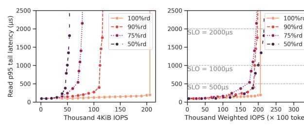

(a) SSD Performance Profile (b) Calibrated Cost Model Figure 1: EC2 Instance Storage (of i3.xlarge) Performance Analysis: (a) SSD tail latency across different IOPS and read/write ratios; (b) Request cost model for various read/write ratios.

optimization over performance guarantees. Its multi-tiered storage approach introduces additional latency and complexity when catering to applications with stringent performance requirements. Jiffy focuses on a single storage medium and effectively utilizes the limited DRAM capacity with its leasebased allocation. However, its reliance on DRAM makes it cost-prohibitive at scale and limits its ability to handle large volumes of data efficiently. Jiffy does not adequately address the need for performance predictability under high tenant concurrency and bursty workloads, which are common in serverless environments. However, it remains constrained by the high cost of DRAM and does not scale effectively, as demonstrated in our evaluation in Fig. [9.](#page-11-0) Moreover, neither Pocket nor Jiffy provides robust mechanisms for enforcing performance SLOs across a diverse set of tenants, leading to unpredictable performance and potential SLO violations.

To address these limitations, there is a need for ephemeral storage systems that offer elasticity, cost-efficiency, and predictable high performance and scalability. Such systems should handle the unique challenges of serverless environments, including high tenant concurrency, bursty workloads, and strict performance SLOs.

## 2.2 Predictable Performance Metrics

Predictable performance in both throughput and latency is crucial for most cloud applications [\[12,](#page-16-11) [18,](#page-16-12) [22,](#page-16-9) [66\]](#page-17-6) to achieve high capacity and enhance user experience. This is especially important for serverless computing and ephemeral storage, as serverless functions are often billed on fine time-scales, such as milliseconds. Users require predictable performance to efficiently to execute serverless functions efficiently with data and state dependencies. Failure to meet latency and throughput requirements in serverless computing can lead to function timeouts and increased financial costs. In addition, unpredictable performance can degrade application responsiveness and user satisfaction, especially for latencysensitive applications such as real-time data processing and interactive services.

Achieving predictable performance for ephemeral storage is particularly challenging in multi-tenant storage systems, where multiple applications share resources and compete for them under high load conditions. Resource contention among tenants can lead to performance variability, making it difficult to meet the SLOs of all tenants simultaneously. This is exacerbated in serverless environments, where the number of tenants can scale rapidly, and workloads can be highly dynamic and bursty.

Enforcing service-level objectives (SLOs) is a common approach to achieving predictable performance [\[12,](#page-16-11) [18,](#page-16-12) [22,](#page-16-9) [66\]](#page-17-6). This work studies the following SLO requirements for ephemeral storage:

Tail Latency SLO: The latency of a request to the storage is defined as the completion time from issuing a request to the target server fulfilling it. Tail latency is a statistical metric that reports the operation access time at high percentiles, such as the 95th percentile. A tail latency SLO is enforced if the given percentile (95th in this paper) of latency remains below a pre-specified value.

Optimizing tail latency is a common objective [\[8,](#page-15-2) [10,](#page-16-13) [27,](#page-16-14) [62\]](#page-17-7) in many cloud computing systems for interactive services, serverless compilers [\[13\]](#page-16-10), and micro-services [\[32\]](#page-16-0). Tail latency directly impacts user experience, as slow responses from a small fraction of requests can significantly degrade the perceived performance of an application. Therefore, ensuring that tail latency remains within acceptable bounds is critical for maintaining application responsiveness.

IOPS SLO: I/O operations per second (IOPS) is a metric reflecting the processing throughput of a storage stack, crucial for providing predictable task completion times and satisfying data-intensive applications such as image and video processing [\[1,](#page-15-0) [2\]](#page-15-1), high-performance computing [\[54\]](#page-17-8), and numerical analysis [\[51\]](#page-17-9). In our study, the IOPS SLO is a predefined value, enforced if the measured IOPS exceeds this threshold. Otherwise, the IOPS SLO is violated. By default, the sampling sensitivity is at the second level, and the enforcement is valid when 95% of sampled windows meet the threshold condition. Ensuring IOPS SLOs allows applications to process data at the required rates, preventing bottlenecks and delays in data pipelines.

Goodput: In our system, goodput refers to the number of requests completed within a specific given latency. It is a critical metric for evaluating the performance of storage operations under various workloads and SLO conditions. Unlike throughput, which measures the total number of operations regardless of their completion time, goodput focuses on the efficiency of meeting latency requirements. By optimizing for goodput, we ensure that the system not only meets the required SLOs but also maximizes the number of requests successfully completed within the specified latency, leading

to better overall performance and user satisfaction. Goodput is particularly important in multi-tenant environments, where the goal is to maximize the effective work done while adhering to each tenant's performance requirements.

These performance metrics serve as essential benchmarks for evaluating and designing ephemeral storage systems capable of delivering predictable performance.

## 2.3 Enforcing SLOs in Disaggregated Multi-tenant Flash Storage Systems

Enforcing E2E SLOs is essential for cloud services, and several studies address this challenge. Detail [\[62\]](#page-17-7) leverages crossstack optimization to reduce packet drops. Silo and SNC-Meister [\[18,](#page-16-12) [65\]](#page-17-10) apply network calculus to ensure bandwidth, packet delay, and burst allowance for shared servers, particularly for latency-sensitive tenants. WorkloadCompactor [\[66\]](#page-17-6) controls tenant rates and places resized jobs onto appropriate servers based on workload traces, while Breakwater [\[7\]](#page-15-3) manages load levels with admission control and active queue management for microsecond RPCs. However, enforcing SLOs in disaggregated storage systems presents additional challenges due to the extra storage layer involved and internal queuing mechanisms. The interaction between network and storage resources adds complexity to SLO enforcement, as bottlenecks can occur at multiple points in the system.

In disaggregated storage systems, high-performance NVMe SSDs are accessed over low-latency, high-throughput networks, making them ideal for latency-sensitive applications. ReFlex [\[22\]](#page-16-9) bridges this gap by using a dataplane kernel that tightly integrates networking and storage processing. ReFlex achieves up to 850K IOPS per core over TCP/IP with minimal latency overhead, only 21µs higher than direct local Flash access. It includes a QoS scheduler that enforces tail latency and throughput SLOs for thousands of remote clients, using offline-profiled SSD performance to guide scheduling for tenants with varying IOPS and latency SLOs.

In Fig. [1,](#page-2-0) we profiled the instance storage (composed of a 950GB NVMe SSD) performance with the IOPS versus tail latency curve on different read/write ratios. This profiling shows how SSD performance varies by read/write ratio, critical for enforcing tail latency SLOs. Figure [1a](#page-2-0) reveals that as IOPS rise, tail latency also increases, especially for workloads with higher write ratios due to write amplification and garbage collection. We calibrated the profiling data with the cost model described in Section [5.3,](#page-9-0) as shown in Fig. [1b.](#page-2-0) This calibrated cost model allows us to estimate the resource consumption of different IO operations accurately, providing the foundation for our scheduler to make informed decisions about request scheduling and rate limiting to enforce SLOs effectively.

Gimbal [\[38\]](#page-16-15) introduces a software storage switch that orchestrates IO traffic between Ethernet ports and NVMe drives for co-located tenants. It employs techniques such as delay-based SSD congestion control and dynamic estimation of SSD write costs, achieving better utilization and reduced tail latency compared to previous solutions. Gimbal demonstrates the effectiveness of combining network and storage scheduling to improve performance predictability in multi-tenant environments. Gupta et al. [\[14\]](#page-16-16) propose a comprehensive approach to E2E QoS for modern storage systems, introducing QoS-aware transport protocols that provide stable differentiation for both throughput-sensitive and latency-sensitive storage traffic.

Despite these advancements, current QoS scheduling algorithms for flash storage struggle to guarantee IOPS and tail latency SLOs at scale. As the number of tenants grows, resource management becomes more complex, increasing scheduling overhead and risking performance degradation. The cost of scheduling rises with the number of SLOs, and bursty or skewed loads make enforcement more difficult. Additionally, existing schedulers struggle with sudden workload changes, leading to latency spikes and SLO violations. These challenges make enforcing SLOs difficult in serverless environments, resulting in unpredictable performance and offsetting the benefits of serverless computing.

To tackle these issues, we need scalable scheduling frameworks that can efficiently enforce SLOs for many tenants. Our solution introduces such a framework using activation-based tenant traversal and adaptive burst scheduling to provide predictable performance at scale, fully realizing the benefits of serverless computing.

## 3 ANALYSIS

In this section, we analyze the state of the art disaggregated storage framework [\[22\]](#page-16-9), and show why existing techniques fail to guarantee SLOs in serverless environments. We run a modified version on i3.xlarge EC2 instance as the storage server and load-generating clients on AWS Lambda in the same virtual private network (VPC) [\[47\]](#page-17-11). Details about our setup can be found in Section [6.1.](#page-10-0)

## 3.1 Limited Scheduler Scalability

To optimize cost in ephemeral storage systems, storage servers need to support thousands of short-lived tenants concurrently, each one with potentially different performance requirements. To analyze whether the existing state-of-the-art implementation ReFlex can support this use-case efficiently, we investigate the E2E goodput performance as we increase the number of tenants, each with unique SLO requirements. We also evaluate a first-come-first-served (FCFS) mechanism

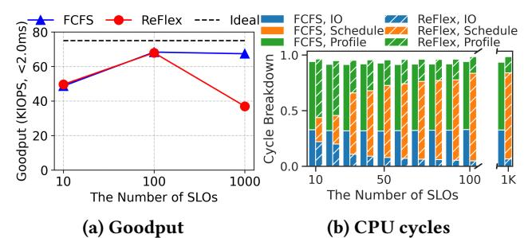

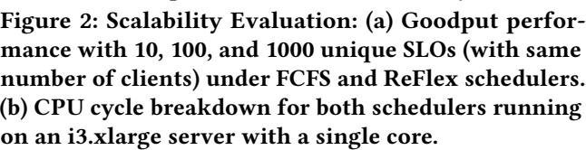

that minimizes scheduling overheads and, hence, should provide the highest performance; however, it cannot enforce SLOs. The results are depicted in Fig[.2a,](#page-4-0) showing that the ReFlex scheduler exhibits near-ideal performance when managing a small number of 10 SLOs. However, as the number of SLOs increases to 100 or 1,000, we observe a substantial decline in goodput. Conversely, the FCFS scheduler, despite utilizing an identical queuing system as ReFlex, demonstrates a negligible decrease in goodput. This comes at a cost, as the FCFS scheduler disregards SLO specifications entirely. Note that the gap seen with 10 SLOs/clients is due to the per-Lambda limits push SLO violations from the server to the clients. To overcome this, we increased the number of clients to 20 in Fig[.9.](#page-11-0)

Further analysis, as shown in Fig[.2b,](#page-4-0) reveals that the significant drop in performance is attributable to the increased scheduling overhead that accompanies a higher number of SLOs to be considered. Unlike the relatively stable IO computation percentage observed with FCFS schedulers, the increasing scheduling compute pressure becomes the predominant factor as the number of SLOs exceeds around 100. This factor drastically prevents IO operations from getting their minimum required cycles, particularly within IX's run-tocompletion model[\[4\]](#page-15-4), on which ReFlex is based.

This investigation underscores the critical need for a scalable QoS scheduling solution capable of efficiently managing an extensive array of SLO demands without compromising system performance. The limitations of current schedulers, as evidenced by our findings, necessitate the development of novel scheduling strategies to address such issues.

## 3.2 Challenges in Managing Bursty Tenants

Cloud applications often exhibit bursty demand patterns, and one of the primary motivations for using serverless computing is cost savings during periods of low utilization. This necessitates that ephemeral storage designed for serverless computing should be capable of handling bursts effectively.

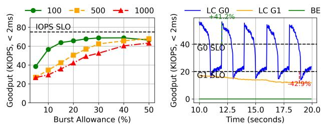

(a) Goodput Performance (b) Goodput Timeline

Figure 3: Burst Control Analysis: (a) The aggregated 4KiB goodput performance (75%rd) with increasing burst allowance ratio for LC tenants, running with 100, 500, and 1000 tenants. (b) Goodput performance with 25-ms windows over time, running with one malicious LC tenant LC G0 (50%rd), one benign LC tenant LC G1 (90%rd), and one BE tenant (100%rd).

Most QoS schedulers adopt work-conserving techniques to maintain high utilization levels. For example, ReFlex sets a fixed burst allowance limit for every tenant, which is defined as the number of tokens a tenant can temporarily exceed above its rate limit, in proportion to their IOPS requirements. For 100, 500, and 1000 unique SLOs, we vary the burst allowance settings from 5% to 50% in the improved version of ReFlex.

Fig. [3a](#page-4-1) shows that a higher burst allowance is key to maintaining goodput performance, especially with high concurrency and many SLOs. This is because a larger number of connections with fewer IOPS tends to act more bursty than a smaller number with larger IOPS.

However, a high burst allowance can cause interference, as greedy tenants may exceed their assigned SLOs. The high burst allowance enables them to avoid performance penalties, potentially degrading the performance of other tenants, as illustrated in Fig. [3b.](#page-4-1) In this experiment, there are two LC tenant groups, LC Group 0 (G0) and LC Group 1 (G1), registering SLOs of 40K and 20K IOPS, respectively. Furthermore, the BE group consists of 100 clients that send as much IOPS as possible. When the burst allowance ratio is set to 50%, the malicious LC G0 periodically demands more IOPS than it has registered, while LC G1 adheres to its requested demand. Due to the high burst allowance, LC G0 can exceed its requested SLO without suffering performance penalties, as the "allowance" enables it to periodically exceed its requested SLO.

However, this behavior reduces the performance of LC G1, which receives fewer IOPS than requested, violating its SLO. The throughput of the BE clients is also negatively affected.

To conclude, the existing burst allowance policy of ReFlex fails to enforce SLOs or is not work-conserving in the presence of bursty traffic. An improved mechanism is required to achieve such goals.

SoCC '24, November 20–22, 2024, Redmond, WA, USA Minghao Xie, Chen Qian, and Heiner Litz

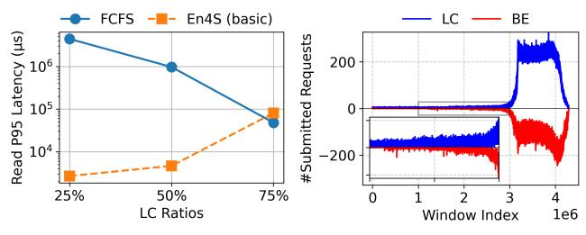

(a) Latency Performance (b) Submission Timeline

Figure 4: LC Ratio Impact: (a) GET tail latency (75%rd) performance under increasing the LC ratio among 400 tenants with the same load breakdown for LC tenants (50K) and BE tenants (150K). (b) The number of requests scheduled for LC or BE tenants (count for BE shown as negative value) in the sliding 512-schedule windows over time at 75% LC ratio.

## 3.3 Service Differentiation Failures at Scale

We now analyze whether ReFlex can enforce service differentiation at high tenant (and SLO) scalability.

In this experiment, we generate 50K LC traffic and 150K BE traffic using a 75% read/write ratio to pressure the server running both FCFS and an improved version of ReFlex (En4S Basic) without token reclaim. We distribute the LC traffic among many tenants, each with unique SLOs, to simulate high tenant scalability. We analyze different ratios of LC and BE tenants to verify if the service differentiation can stand with the same load distribution. The LC ratio is the percentage of LC tenants out of the total number of tenants in the system. For an LC ratio of 25%, we use 100 clients with unique IOPS SLOs, and the remaining 300 clients register as BE tenants, submitting 150K IOPS aggregated. We then convert additional BE tenants to LC tenants with every 25% increase in the LC ratio.

According to our previous SSD profiling, the server should be able to enforce a 2000 s tail latency SLO when we keep the 75% read IOPS below 72K and still have the opportunity to complete BE traffic. However, as shown in Fig. [4a,](#page-5-0) we find that although ReFlex performs well at lower LC ratios, its tail latency increases significantly at higher LC ratios of 50% and 75%, violating the SLO guarantee by two orders of magnitude. In contrast, FCFS shows a decrease in tail latency as the LC ratio increases, but this is misleading because FCFS does not enforce SLOs, and its goodput remains worse than ReFlex's.

This indicates that ReFlex's ability to enforce service differentiation diminishes at scale, highlighting the need for more scalable scheduling strategies.

## 4 DESIGN

In the previous section, we analyzed the state-of-the-art system ReFlex and showed the scalability, performance isolation

and enforcement issues. We now introduce En4S, a system that introduces novel QoS scheduling and burst control techniques to address such issues.

## 4.1 Overview

En4S introduces novel techniques to enable scalable, disaggregated, and cost-effective ephemeral storage systems with high, predictive performance. Our design addresses key challenges identified in the analysis section through three main components:

- (1) An improved QoS Scheduling Framework that effectively manages both LC and BE tenants.
- (2) A Dynamic Tenant Handling system that increases scalability and reduces CPU overhead.
- (3) An Adaptive Burst Control mechanism that balances isolation and performance across various scenarios.

These components, along with a token reclaim control mechanism, work in concert to create a storage system capable of handling numerous tenants with diverse performance requirements. The following subsections will detail each component and their contributions to the overall system design. Note En4S does not manage failures directly. Fault tolerance through coding or replication across nodes needs to be implemented in the layer above En4S.

## 4.2 QoS Scheduling Framework

To address the challenges identified in our analysis (see Section [3.1\)](#page-3-0), we introduce a novel token-based scheduling mechanism that advances the state-of-the-art in cloud storage QoS. Our approach draws inspiration from the Aliquem scheduling algorithm [\[26\]](#page-16-17), which demonstrated superior latency and fairness at O(1) complexity compared to traditional Deficit Round Robin (DRR) [\[52\]](#page-17-12) implementations. Building upon these insights, we have developed a sophisticated scheduling framework specifically tailored to meet the diverse and demanding requirements of modern cloud storage environments.

Figure [5](#page-6-0) presents the design of the En4S scheduler: In the dynamic tenant handling process, the scheduler efficiently manages both active and inactive tenants. New requests from tenants are either moved from the "inactive" state to "active" or handled within the "active" queue, ensuring that the requests are promptly added to the request pool. This pool organizes tenant requests, and the scheduler uses an efficient tenant traversal mechanism to dequeue and process them according to their priority/arrival order. To handle sudden bursts of requests, the adaptive burst control dynamically adjusts the number of requests sent to the SSD submission queue (SQ) during each scheduling round. This ensures smooth system performance, even under varying loads. On the other hand, token reclaim control manages

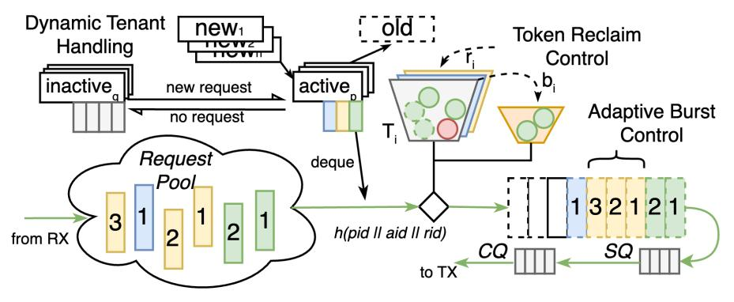

Figure 5: En4S Scheduler Design

resource allocation by reclaiming unused tokens at appropriate intervals. This process helps distinguish between LC and BE tenants, allowing LC tenants to receive prioritized access to the system resources while maintaining overall efficiency.

4.2.1 Storage Flow and Tenant Management. In the context of the En4S scheduler, a storage flow is defined as a connected I/O session with the same assigned storage nodes. Each storage flow can register an individual SLO, which consists of metrics such as IOPS, tail latency, and an optional maximum write ratio hint. The storage server monitors the registered SLO to ensure that the flow meets the job requirements. Flows that share the same IOPS and tail latency SLOs are grouped together and identified as the same tenants. The token increment for each time delta is derived from its registered rate, number of flows, and expected cost for each tenant. The rate of token accumulation, denoted as Weighted Tokens per Second ( ), is calculated using the following formula, ∗ is the cost function based on request types and the global read/write ratio , IOPS is the registered SLO.

$$
wTPS = IOPS \times (r \times C^*(RD, r) + (1 - r) \times C^*(WR, r))
$$

4.2.2 Scheduling Algorithm. The En4S scheduling algorithm is sketched in Algorithm [1.](#page-7-0) The scheduling routine is invoked for every IX [\[4\]](#page-15-4) poll, the system call polling loop for storage, networking, and scheduling events (e.g., TCP/IP poll routine, NVMe request submission/completion routine). The scheduling frequency is determined by the overall performance of each poll. We divide the schedule routine into two sub-routines for scheduling LC and BE tenants respectively, naturally creating a priority for LC requests over BE requests. Both subroutines utilize burst scheduling to submit as many requests as possible when processing a specific tenant, determined by the traversal order.

## 4.3 Dynamic Tenant Handling

4.3.1 Active Tenant Management. Unlike in ReFlex and other QoS schedulers [\[22\]](#page-16-9), En4S supports SLO registration for every storage flow, and all tenants' metadata are saved in a

shared memory pool similar to the request pool. We maintain a per-core tenant manager to manage active tenants assigned to that core. The tenant manager keeps track of active LC and BE tenants' pointers in two separate cyclic arrays. Initially, none of the tenants are activated; the tail pointer moves a slot forward when a new tenant is activated, and the head pointer moves when the first tenant is deactivated.

4.3.2 Tenant Traversal and Request Ordering. As analyzed in Section [3.1,](#page-3-0) inefficient traversal in ReFlex contributes to high CPU utilization and negatively impacts the necessary minimum required CPU cycles for IO operations. The overhead of comparing available tokens and request demand is significantly reduced with active tenants. Because the number of active tenants is much smaller than the total registered tenants, especially for tenants with short flows, we traverse the active tenant queue and apply exhaustive dequeuing for the visited tenant. If the tenant does not accumulate sufficient tokens nor have a deficit limit to admit the first request in its queue, we move these tenants to the end of the activated tenant queue for the next round. This way, requests are dequeued in activation order across tenants and FCFS within each tenant queue. The activation order is determined by the time when the first request in that tenant queue arrives or the time when it is blocked by insufficient tokens or a full SSD queue. We simulate how this ordering helps improve scheduling performance in Section [6.2.](#page-11-1)

4.3.3 Registration Burst Limit. Register and deregister system calls can be costly if there are hundreds or thousands of such requests arriving in a short period. In the poll loop, we batch these requests and allow tenants to join as BE tenants first (fast join or leave) before calculating the demanded IOPS SLO along with its latency and read/write ratio SLO to estimate how it would impact the performance of the whole partition. When the IO (storage or network) subroutines finish and we find the poll frequency back to the desired threshold (also can be profiled offline), we perform the slow join or leave procedure for those tenants if they are latency

## Algorithm 1 Scheduling Algorithm

| 1:  | function Schedule                                    |
|-----|------------------------------------------------------|
| 2:  | for 𝑡𝑒𝑛𝑎𝑛𝑡𝑖 in 𝑎𝑐𝑡𝑖𝑣𝑒_𝑙𝑐_𝑡𝑒𝑛𝑎𝑛𝑡𝑠 do         |
| 3:  | while 𝑡𝑒𝑛𝑎𝑛𝑡𝑖 .𝑛𝑜𝑡_𝑒𝑚𝑝𝑡𝑦() do                  |
| 4:  | if 𝑟𝑒𝑞𝑢𝑒𝑠𝑡𝑠𝑠𝑠𝑑 𝑙𝑐_𝑡ℎ𝑟𝑒𝑠ℎ𝑜𝑙𝑑_𝑚𝑎𝑥 ≥ then      |
| 5:  | return                                               |
| 6:  | 𝑡𝑒𝑛𝑎𝑛𝑡𝑖 .𝑐𝑟𝑒𝑑𝑖𝑡 +=                             |
| 7:  | 𝑔𝑒𝑡_𝑐𝑟𝑒𝑑𝑖𝑡(𝑡𝑒𝑛𝑎𝑛𝑡𝑖 .𝑆𝐿𝑂, 𝑡𝑖𝑚𝑒Δ)                   |
| 8:  | 𝑎𝑙𝑙𝑜𝑤𝑒𝑑_𝑏𝑢𝑟𝑠𝑡 = 𝑎𝑐𝑞𝑢𝑖𝑟𝑒_𝑏𝑢𝑟𝑠𝑡(𝑡𝑒𝑛𝑎𝑛𝑡𝑖)            |
| 9:  | −𝑎𝑙𝑙𝑜𝑤𝑒𝑑_𝑏𝑢𝑟𝑠𝑡 if 𝑡𝑒𝑛𝑎𝑛𝑡𝑖 .𝑐𝑟𝑒𝑑𝑖𝑡 < then |
| 10: | 𝑎𝑐𝑡𝑖𝑣𝑒_𝑙𝑐_𝑡𝑒𝑛𝑎𝑛𝑡𝑠.𝑟𝑒𝑞𝑢𝑒𝑢𝑒 (𝑡𝑒𝑛𝑎𝑛𝑡𝑖)               |
| 11: | break                                                |
| 12: | 𝑠𝑢𝑏𝑚𝑖𝑡(𝑟𝑒𝑞_𝑝𝑜𝑜𝑙.𝑝𝑜𝑝_𝑓 𝑟𝑜𝑛𝑡(𝑡𝑒𝑛𝑎𝑛𝑡𝑖))                 |
| 13: | 𝑡𝑒𝑛𝑎𝑛𝑡𝑖 .𝑐𝑟𝑒𝑑𝑖𝑡 𝑐𝑜𝑠𝑡(𝑛𝑒𝑥𝑡_𝑟𝑒𝑞𝑢𝑒𝑠𝑡) −=       |
| 14: | 𝑎𝑐𝑡𝑖𝑣𝑒_𝑙𝑐_𝑡𝑒𝑛𝑎𝑛𝑡𝑠.𝑑𝑒𝑞𝑢𝑒𝑢𝑒 (𝑡𝑒𝑛𝑎𝑛𝑡𝑖)               |
| 15: | if 𝑐𝑢𝑟𝑟_𝑡𝑖𝑚𝑒 > 𝑟𝑒𝑐𝑙𝑎𝑖𝑚_𝑡𝑖𝑚𝑒 then            |
| 16: | 𝑟𝑒𝑐𝑙𝑎𝑖𝑚_𝑡𝑜𝑘𝑒𝑛𝑠(𝑡𝑒𝑛𝑎𝑛𝑡𝑖 , 𝐿𝐶𝑑)                     |
| 17: | for 𝑡𝑒𝑛𝑎𝑛𝑡𝑗 in 𝑎𝑐𝑡𝑖𝑣𝑒_𝑏𝑒_𝑡𝑒𝑛𝑎𝑛𝑡𝑠 do         |
| 18: | 𝑡𝑒𝑛𝑎𝑛𝑡𝑗 .𝑐𝑟𝑒𝑑𝑖𝑡 +=                             |
| 19: | 𝑔𝑒𝑡_𝑐𝑟𝑒𝑑𝑖𝑡(𝑛𝑢𝑚_𝑏𝑒_𝑡𝑒𝑛𝑎𝑛𝑡𝑠, 𝑡𝑖𝑚𝑒Δ)                    |
| 20: | 𝑏𝑒_𝑡𝑜𝑘𝑒𝑛𝑠 = 𝑡𝑒𝑛𝑎𝑛𝑡𝑗 .𝑐𝑟𝑒𝑑𝑖𝑡                    |
| 21: | 𝑏𝑒_𝑡𝑜𝑘𝑒𝑛𝑠 𝑔𝑙𝑜𝑏𝑎𝑙_𝑡𝑜𝑘𝑒𝑛𝑠_𝑑𝑒𝑐(𝑑𝑒𝑚𝑎𝑛𝑑𝑗) +=        |
| 22: | .𝑛𝑜𝑡_𝑒𝑚𝑝𝑡𝑦() while 𝑡𝑒𝑛𝑎𝑛𝑡𝑗 do                  |
| 23: | if 𝑟𝑒𝑞𝑢𝑒𝑠𝑡𝑠𝑠𝑠𝑑 𝑏𝑒_𝑡ℎ𝑟𝑒𝑠ℎ𝑜𝑙𝑑_𝑚𝑎𝑥 ≥ then      |
| 24: | return                                               |
| 25: | if 𝑏𝑒_𝑡𝑜𝑘𝑒𝑛𝑠 > 𝑐𝑜𝑠𝑡(𝑛𝑒𝑥𝑡_𝑟𝑒𝑞𝑢𝑒𝑠𝑡) then      |
| 26: | 𝑠𝑢𝑏𝑚𝑖𝑡(𝑟𝑒𝑞_𝑝𝑜𝑜𝑙.𝑝𝑜𝑝_𝑓 𝑟𝑜𝑛𝑡(𝑡𝑒𝑛𝑎𝑛𝑡𝑗))                 |
| 27: | 𝑏𝑒_𝑡𝑜𝑘𝑒𝑛𝑠 𝑐𝑜𝑠𝑡(𝑛𝑒𝑥𝑡_𝑟𝑒𝑞𝑢𝑒𝑠𝑡) −=                |
| 28: | else                                                 |
| 29: | 𝑎𝑐𝑡𝑖𝑣𝑒_𝑏𝑒_𝑡𝑒𝑛𝑎𝑛𝑡𝑠.𝑟𝑒𝑞𝑢𝑒𝑢𝑒 (𝑡𝑒𝑛𝑎𝑛𝑡𝑗)               |
| 30: | break                                                |
| 31: | 𝑎𝑐𝑡𝑖𝑣𝑒_𝑏𝑒_𝑡𝑒𝑛𝑎𝑛𝑡𝑠.𝑑𝑒𝑞𝑢𝑒𝑢𝑒 (𝑡𝑒𝑛𝑎𝑛𝑡𝑗)               |
| 32: | 𝑡𝑒𝑛𝑎𝑛𝑡𝑗 .𝑐𝑟𝑒𝑑𝑖𝑡 =                              |
| 33: | 𝑠𝑎𝑣𝑒_𝑐𝑟𝑒𝑑𝑖𝑡(𝑑𝑒𝑚𝑎𝑛𝑑𝑗 , 𝑏𝑒_𝑡𝑜𝑘𝑒𝑛𝑠)                  |
| 34: | 𝑏𝑒_𝑡𝑜𝑘𝑒𝑛𝑠 𝑡𝑒𝑛𝑎𝑛𝑡𝑗 .𝑐𝑟𝑒𝑑𝑖𝑡 −=                |
| 35: | 𝑟𝑒𝑐𝑙𝑎𝑖𝑚_𝑡𝑜𝑘𝑒𝑛𝑠(𝑡𝑒𝑛𝑎𝑛𝑡𝑖 , 𝐵𝐸)                      |

critical. This helps release processing pressure when the CPU is busy while not blocking newly joined tenants for too long.

## 4.4 Adaptive Burst Control

While ReFlex introduced a fixed percentage burst budget over registered rates, our system enhances this concept with a more sophisticated adaptive burst control mechanism. This improvement is necessary to address the limitations of the original approach and to better meet the diverse demands of modern cloud environments.

ReFlex's fixed burst allowance presents a dilemma: a low burst allowance may fail to enforce SLOs effectively, while a high allowance can lead to performance isolation problems, as demonstrated in Section [3.2.](#page-4-2) Our adaptive burst control aims to strike a balance between SLO enforcement at scale and maintaining high isolation among tenants. To achieve this, we introduce three key innovations:

- (1) Dynamic smooth schedule: When scheduling frequency is low due to high processing time in storage and network parts, we process only a portion of each queue even if it may have sufficient tokens or deficit limit, but traverse tenants with multiple passes.
- (2) Individual burst schedule: Each tenant's burst schedule, the maximum number of requests to be dequeued if there are still available tokens, is determined by its registered IOPS SLO and the number of concurrent flows on that server.
- (3) Consecutive burst limit: we track the deficit tokens utilization for every tenant. When a tenant over-use its credit for more than a given percentage of past consecutive scheduling rounds, our control routine will multiplicative decrease (MD) its burst allowance until it returns the tokens and back to below the threshold. Then the control routine will additive increase (AI) the allowance up to the original percentage.

This three-way burst control helps the scheduler balance isolation and performance across different scenarios. With the first method, we ensure fair request ordering under load by preventing late-arriving requests from gaining advantages over earlier head-of-line (HoL) requests. In the second method, when the number of SLOs is relatively small and the IOPS for each storage flow is relatively high, we use a small burst allowance to correct tenant behavior. Lastly, in the third method, if the IOPS SLOs are relatively small (based on pre-profiled thresholds) and the number of connections is high, we limit the burst allowance among LC tenants. Malicious LC tenants will quickly lose their allowance and get blocked if they exceed their registered IOPS SLOs, as the AIMD mechanism takes effect.

## 4.5 Token Reclaim Control

In our analysis of SLO enforcement challenges (Section [3.3\)](#page-5-1), we identified a critical issue with the work-conserving mechanism across scheduling rounds. To address this problem, we need to reevaluate how unused tokens are managed and distributed. Initially, the system was designed to share unused portions of registered IOPS from LC tenants with BE tenants. While this approach aimed to tolerate bursty workloads, it inadvertently led to token leakage, causing performance issues for LC tenants upon their reactivation.

The original idea was to share unused portions of registered IOPS for LC tenants with BE tenants. This technique to tolerate bursty workloads inevitably leaks extra tokens to BE tenants when some LC tenants are not active. When they

| Client APIs                           | Descriptions                                                                                                                                                                       |  |  |  |
|---------------------------------------|------------------------------------------------------------------------------------------------------------------------------------------------------------------------------------|--|--|--|
| __init__(controller, context)         | Initiates or loads a context with EMD, returning a handler.                                                                                                                        |  |  |  |
| allocate / free(handler, job_ctx)     | Explicitly allocates or frees a job with capacity, with job-level SLO hints. allocates storage resources, must called for each new job.                                         |  |  |  |
| __enter__(handler, flow_hints)        | Handler optionally registers or updates a flow with latency/IOPS/(rw_ratio) SLO. The controller will verify job limits and then return the connection to storage nodes.         |  |  |  |
| __exit__(handler)                     | Handler closes connections to nodes and deregisters the flow for the connection in that job. Flushes all the EMD for all shared mutable objects to the store in the controller. |  |  |  |
| put / get / update(handler, id, data) | Puts, gets, or updates an object to assigned nodes, returning an object future.                                                                                                    |  |  |  |
| invoke(handler, func_to_contexts)     | Invokes stateful functions with encoded contexts and EMD in the payload.                                                                                                           |  |  |  |

### Table 1: Available APIs in En4S Client Library

become active again, the tokens have been consumed by BE tenants or cleared, causing requests to queue and wait for new tokens to accumulate, further stalling future requests. The key issue is that BE tenants "borrow" these unused LC tokens but never "return" them, unlike LC tenants "borrowing" their burst allowance. This creates a bigger problem when those tenants run out of their tokens and available burst allowance, the queue occupancy keeps growing if their demand rates do not decrease.

Therefore, we separate the work-conserving subroutine from the schedule routine and operate it at a different frequency than scheduling. Instead of immediately consuming or withdrawing LC unused tokens for every scheduling round (when the frequency is high), we keep those tokens for a longer time at a lower but fixed frequency. With lower frequency, short bursts for LC tenants can be handled and averaged. The reclaimed tokens, with the visibility of more rounds of request demands, will be safely consumed by BE tenants without interfering with LC tenants' performance.

## 5 IMPLEMENTATION

En4S, as an object-based ephemeral storage system designed for cloud applications, consists of a data plane, which includes a client-side driver and multi-tenant flash storage server software focused on delivering high and predictable performance, and a control plane that supports functionalities such as job management, scheduling, storage scaling, and metadata storage.

En4S consists of around 16K LoC (15K in C[1](#page-8-0) , 1K in Python) for the data plane, and 2K LoC for the control plane, including infrastructure codes written in HCL. The system is opensourced at Github [2](#page-8-1) .

## 5.1 Control Plane and Metadata Store

We implemented a centralized control plane capable of elastically scaling storage nodes based on the scheduling and

placement decisions for incoming jobs. To facilitate access by other serverless functions, we integrated a low-latency metadata store. We utilized Ray [\[39\]](#page-16-18) to distribute control plane components (see Fig. [6\)](#page-9-1), allowing flexible parallel execution across different cores in the same server or distributed among interconnected compute clusters. A job registry module manages job registrations and de-registrations, updating each job's recent I/O demands to the job scheduler and storage auto-scaler.

5.1.1 Major Workflow. Fig. [6,](#page-9-1) illustrates the overall system and the interactions between its components. All serverless functions have the En4S driver installed to register jobs with their respective SLOs. The controller allocates and manages storage resources to ensure that current jobs' SLOs are not violated. Once the requested storage space meets the SLO requirements, the job, which may consist of one or more clients (e.g., serverless functions), can begin accessing the assigned storage instances. When a function enters the context manager's region, the client driver automatically registers a flow with the server and can explicitly register task-level SLOs for different application stages. The handle will automatically deregister the flow when the code exits the context-managed region. All functions with the same job handle and corresponding authentication can directly initiate IO requests to the storage servers and save their metadata when off-path data accesses are initiated using our stateful invocation API, invoke\_stateful. With our storage system, a function can expect predictable tail latency performance for small objects and predictable throughput performance for large flows. The full client-side API reference is provided in Table [1.](#page-8-2)

5.1.2 Metadata Pool. To minimize memory fragmentation and reduce the number of data copies, request payloads are stored in an IX [\[4\]](#page-15-4) memory pool using contiguous allocated memory facilitated by Linux huge pages. The scheduler handles the queuing and manipulation of request metadata, including logical block addresses, physical buffer addresses, NVMe commands, and other critical fields for efficient data localization and operations. Initially, this metadata

1 12K LoC from ReFlex and IX, comments and blanks are excluded 2https://github.com/mhxie/En4S

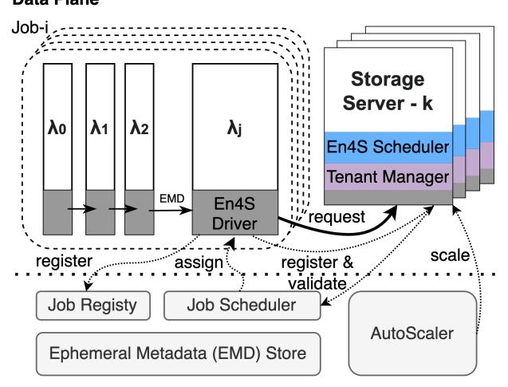

### Figure 6: En4S Architecture

was stored in linked lists on a per-tenant basis, which was convenient for FCFS operations within a group. However, this approach becomes inefficient when modifying or removing requests deeper in the queue due to corrupted or dropped requests. To address this, we propose building a hash table to store the metadata, using thread ID (pid), activation order (aid), and request order (rid) as composite keys. This structure allows for (1) complexity for lookup, insertion, and removal operations, provided there are no collisions, thereby enhanc ng performance across various scheduling strategies.

## 5.2 High-performance Data Plane

We developed a high-performance data plane based on Re-Flex4ARM [\[59\]](#page-17-13), an optimized version of ReFlex designed for ARM platforms such as the ARM-based AWS Graviton processor. Extensive modifications were made to enhance performance and portability.

Server System: Our disaggregated solution is built on the IX data plane [\[4\]](#page-15-4), leveraging its run-to-completion model, batched system calls, and kernel-bypassing network stack. We utilize the Data Plane Development Kit (DPDK) [\[40\]](#page-16-19) and the lightweight user-level TCP/IP stack lwIP [\[11\]](#page-16-20). We made extensive optimization over lwIP to make it fast and scalable. Similar to ReFlex [\[22\]](#page-16-9), we employ the Storage Performance Development Kit (SPDK) [\[16\]](#page-16-21) for accessing NVMe SSDs, minimizing costly data copies between network and storage layers. Additionally, we updated the lwIP subsystem to the latest version and replaced its inefficient move-to-front [\[11\]](#page-16-20) TCP demultiplexing algorithm with a hashing-based lookup, in order to match the performance with tens of thousand connections.

Client Library: For rapid prototyping of serverless applications, we use Python as the primary client interface for

communicating with En4S cluster. To enhance performance, the I/O critical path is implemented in Cython. We leverage coroutines and asynchronous APIs (including optional uvloop-based acceleration) for data plane IO tasks.

## 5.3 Scheduler Implementation

5.3.1 Scheduling Pipeline. Before the system enters the scheduling phase, all newly arrived requests are queued into a large single memory pool. During the scheduling phase, requests are dequeued based on two key factors: tenant order and token availability. If a request meets these criteria, a scheduling decision is made, and the metadata is dequeued and submitted to the NVMe submission queue. After the scheduling phase, the system continues batch processing other system calls until the next scheduling phase begins. The scheduling frequency is determined by system load and batch sizes, with a batch size of 64 to ensure the minimum scheduling frequency is not too low.

5.3.2 Request Lifecycle. For each remote I/O request (GET or SET), the lifecycle consists of the following steps:

- (1) The request is received in the NIC Receive (RX) ring.
- (2) The request waits to be polled by the TCP/IP stack.
- (3) Its header is passed to the application to be parsed for preparing the NVMe operation.
- (4) Before submission to the NVMe devices, the request is queued depending on different schedulers.
- (5) Once the scheduler decides to submit the request, it is sent to the SSD's hardware submission queue (SQ).
- (6) Upon completion, a signal is received in the SSD's completion queue (CQ).
- (7) The response is sent over the network.
- (8) Finally, the response exits the NIC Transmit (TX) ring.

All the above operations are fulfilled as asynchronous batched system calls managed by IX. En4S's key designs are implemented at steps (4) and (5).

5.3.3 Request Cost Modeling. Based on recent studies on flash storage performance [\[22,](#page-16-9) [38\]](#page-16-15) and our benchmarks on AWS i3-family instances (see Fig. [1\)](#page-2-0), we model the request cost using the following formula. The IO cost, which represents the number of token credits in our scheduling framework, scales linearly with the request size. The constant is specific to the flash SSD, derived from curve fitting, and varies with the I/O type (RD for GET, WR for SET) and the read ratio () at the device. We profile the cost fitting with network latency considered and use ∗ to represent it.

$$
IO Cost = \left\lceil \frac{IO Size}{4KiB} \right\rceil \times C^*(IO Type, r)
$$

As shown in Fig. [1,](#page-2-0) we calibrate the model for the NVMe SSD on AWS i3.xlarge storage nodes to calculate the token

| Server      | EC2      | Cap   | 4K Thpt | Cost (\$) / IO     |
|-------------|----------|-------|---------|--------------------|
| Function    | Instance | (TB)  | (KIOPS) | at Full speed      |
| En4S        | i3.l     | 0.475 | 100     | 10−10 4.33 × |
| Storage     | i3.x     | 0.95  | 200     | 10−10 4.33 × |
| Candidates  | i3.2xl   | 1.90  | 236     | 10−10 7.34 × |
| Controller3 | m5.2x    | 0     | 200*16  | 10−11 1.67 × |
| Jiffy       | m5.16xl  | .256  | 600     | 10−9 1.42 ×  |

Table 2: Different AWS EC2 instances used for Jiffy and En4S clusters in US-West region

weight for SET and GET operations. With lower than 90%, the value for is 7 tokens for the SSDs. This means each SET operation is approximately 7 times as expensive as a GET operation. With lower than 75%, the weight increases to 8 tokens, and it further increases to 10 tokens if is below 50%. The can be calculated with the tenant-provided ratio hint. We can also maintain a sliding window to use the past read ratio to approximately estimate the cost of the future requests.

## 5.4 Deployment and Scaling

Reproducible Infrastructure: We deployed a complete En4S cluster using EC2 instances on AWS, automating the process with Terraform [\[15\]](#page-16-22) for consistency across cloud settings. The initial setup provisions our control plane and a VPC for the data plane. The infrastructure code integrates an auto-scaler in the controller to dynamically manage storage instances. Users can deploy applications by specifying the VPC ID, and the setup can be adapted to other clouds by adjusting provider settings.

Auto-Scaler: To minimize startup delays caused by AWS VM initialization times [\[44\]](#page-16-23), our auto-scaler maintains at least one active storage node and reserves free nodes in advance. It scales up or down based on utilization thresholds and employs strategies to avoid unnecessary node allocation during temporary traffic changes [\[21,](#page-16-3) [25\]](#page-16-2), optimizing performance for latency-sensitive applications.

## 6 EVALUATION

## 6.1 Methodology

We selected AWS as our cloud provider due to its industryleading performance, as evidenced by recent studies [\[57\]](#page-17-14). We utilized AWS EC2 i3 instances for our scalable storage cluster and AWS Lambda with the latest Python 3.10 runtime for our serverless computing environment. The detailed selections are shown in Table [2.](#page-10-2)

Since the storage stack can achieve millions of IOPS with a single core [\[59\]](#page-17-13), we chose the i3.xlarge instance to avoid

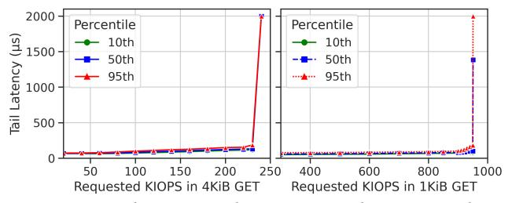

Figure 7: Single-Core Tail Latency Analysis on i3.xlarge with 100% GET : (a) 4KiB requests (left), (b) 1KiB requests (right).

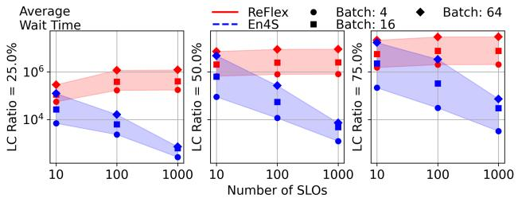

Figure 8: Scheduler Efficiency Analysis: total request wait time by increasing number of unique SLOs varying LC ratio at 25%, 50%, and 75% and varying batch size at 4, 16, and 64.

network bandwidth limitations present in larger nodes like the i3.2xlarge, while minimizing cost per IO at full speed (see Table [2\)](#page-10-2). This choice ensures flexibility in resource allocation with the lowest proportional cost. We provisioned a VPC in the same region to minimize network latency between servers and clients.

6.1.1 Baseline Selections. We selected two state-of-the-art ephemeral storage solutions as baselines: (1) ReFlex [\[22\]](#page-16-9), an NVMe-SSD-based ephemeral storage used in Pocket's storage tiers [\[25\]](#page-16-2); and (2) Jiffy [\[21\]](#page-16-3), a DRAM-based ephemeral storage service that surpasses Pocket's DRAM layer in performance. For a fair comparison in terms of compute and cost, we deployed Jiffy on r5.16xlarge EC2 instances (256 GiB memory) and used m5.xlarge instances to run controllers for Jiffy and En4S clusters. This setup enabled a comprehensive comparison of ephemeral storage technologies. We unified storage clients under a single interface and used various synthetic workloads for benchmarking. Additionally, we included S3 [\[46\]](#page-17-2), a widely adopted cloud object storage service, as a baseline in our application benchmarks (Sec. [6.4\)](#page-14-0). While S3's latency is higher than our target range and its IOPS per shard/prefix [\[49\]](#page-17-15) is limited to a few IOs per second per client under high concurrent access, it provides a useful reference for evaluating the performance differences across various ephemeral storage solutions.

6.1.2 Serverless Applications. We developed three popular data-intensive serverless applications for evaluation:

3Assuming each controller can manage 16 storage nodes, the cost is amortized for each node

SoCC '24, November 20–22, 2024, Redmond, WA, USA Minghao Xie, Chen Qian, and Heiner Litz

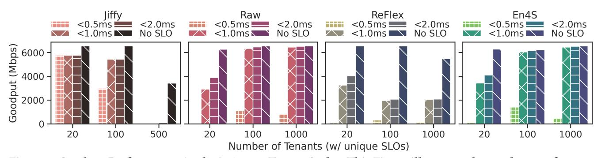

Figure 9: Goodput Performance Analysis Across Tenant Scales: This Figure illustrates the goodput performance for configurations of 20, 100, and 1000 tenants, focusing on the achievable goodput under latency thresholds of 0.5ms, 1ms, and 2ms, alongside scenarios without SLO requirements. Comparative performance evaluation of ReFlex and En4S schedulers on i3.xlarge instances and En4S is presented, with additional benchmark results for Jiffy, utilizing its native stack and APIs.

ETL Pipeline: This classic serverless application involves Extract, Transform, and Load (ETL) operations, where diverse computational tasks occur between IO accesses. To standardize our evaluation, we omit computation between IO operations due to the variability of such tasks (latencywise). In our experiments, each invocation is configured with 8 pipelines, each containing four stages, and we run 16 parallel invocations.

Serverless Sort[\[9\]](#page-15-5): Sorting large datasets (hundreds of gigabytes or more) remains challenging on a single node. The map-reduce paradigm is still one of the most effective solutions for distributed sorting. We implemented a variant of map-reduced sort in a serverless environment, enabling it to sort smaller but continuously incoming data batches (16 MB per batch) with a specified mapper-to-reducer configuration (16 mappers and 16 reducers in our evaluation).

ML Analytics: Machine Learning pipelines are typically run on GPUs for training and inference, but evaluating their performance in serverless settings can provide insights into data patterns and orchestration opportunities for future serverless GPU research. We chose the ROAD-Waymo Dataset, an open-source dataset published in 2023 [\[20\]](#page-16-24), which consists of 200 real-world 1080p video clips. We used OpenCV and YOLOv3 [\[43\]](#page-16-25) for object detection and the ImageIO/FFmpeg library for splitting, transcoding, and merging videos. The functions are designed with minimal dependencies to reduce lambda load times and stay within execution limits. To optimize performance, we separate cv library along with the lightweight YOLO model, and the transcoding libraries across different functions. While the analytics results are not fully optimized, they are still impressive and sufficient for our IO-oriented evaluation.

6.1.3 E2E Networking Performance. We began by disabling the storage back-end, including the QoS scheduler, to measure network-only tail latency performance by sweeping IOPS. The server supports up to 10Gbps maximum throughput, equivalent to 305K IOPS with a request size of 4KiB. However, as shown in Fig. [7,](#page-10-0) which plots tail latency (10th, 50th, and 95th percentiles) as a function of throughput (IOPS) for 1KB GET-only requests, the tail latency reaches a critical point at around 236K IOPS for 4KiB workloads. This occurs because the AWS Lambda instance disables jumbo frames, adding extra processing pressure on the server's networking stack due to segmentation, re-assembly, and data copies. When using 1KiB request sizes, our server can support around 960K IOPS, comparable to or even better than the performance of its predecessors [\[22,](#page-16-9) [59\]](#page-17-13). This also justifies our choice of the smaller i3.xlarge instance, whose storage performance for 4KiB GET tops at 205K IOPS, achieving the highest cost efficiency.

## 6.2 Scheduler Framework Benefits

6.2.1 Scheduler Efficiency. To evaluate our scheduler's performance compared to the ReFlex scheduler, we conducted a series of simulation tests with varying numbers of SLOs, LC ratios, and batch sizes. The experimental results, shown in Fig. [8,](#page-10-3) highlight the efficacy of our scheduling mechanism across multiple dimensions. The total wait time is averaged over tests involving 64 million requests, arriving at equal rates and uniform intervals.

We varied the request batch size (4, 16, and 64) to reflect the schedulers' visibility of request costs caused by different scheduling frequencies in realistic environments. Additionally, we varied the LC tenant ratio at 25%, 50%, and 75%. The request wait time is calculated based on the time difference between the LC tenant's ideal process time (based on FCFS)

En4S: Enabling SLOs in Serverless Storage Systems SoCC '24, November 20–22, 2024, Redmond, WA, USA

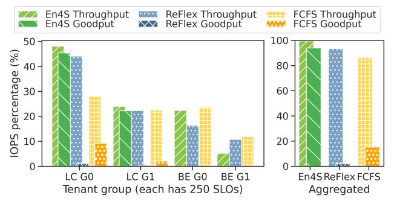

Figure 10: SLO Enforcement Benchmark for 1000 Tenants: categorized into four groups based on their SLO criticality and average read ratio, LC Tenant Group 1 (LC G0) at 100%, LC Tenant Group 1 (LC G1) at 80%, BE Tenant Group 0 (BE G0) at 95%, and BE Tenant (BE G1) at 25%. The analysis juxtaposes the performance of En4S, ReFlex, and FCFS schedulers in terms of achieved throughput and goodput as a percentage of maximum capacity. The left subplot illustrates individual scheduler performance, while the right subplot aggregates throughput and goodput metrics across all schedulers.

and the actual process time (based on the schedulers' decisions). This penalty, the extra queuing delay, represents the cost of enforcing per-tenant SLOs and differentiating service to tenants.

As shown in Fig. [8,](#page-10-3) our system consistently outperformed the ReFlex scheduler by up to 3.2 orders of magnitude (1638x) in terms of average wait time when scheduling 1000 tenants at an LC ratio of 25% with a batch size of 64. Several key observations can be made from these results:

Impact of Batch Size. Smaller batch sizes yield better results as they make request adjustments less likely, approaching FCFS behavior when the batch size is 1. This is because smaller batches reduce the granularity of scheduling decisions, thereby minimizing the potential for schedulinginduced delays.

Number of SLOs. Our scheduler performs better with an increasing number of SLOs. This improvement is due to our scheduler's ability to efficiently manage and prioritize multiple SLOs simultaneously, creating a larger performance gap compared to the ReFlex scheduler.

LC Ratio Impact. An increased number of latency-critical tenants degrades all schedulers' performance. Higher LC ratios increase wait times due to request displacement and longer queues. For instance, in a worst-case scenario with an LC ratio of 25%, an LC request arriving at time 0 can be delayed by up to 3 slots. Increasing the LC ratio to 50% can result in wait times of up to 4 slots, as LC requests arrive more frequently and compete for scheduling slots.

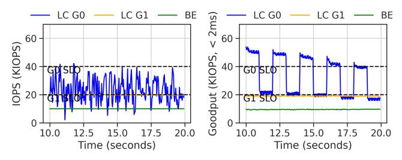

(a) Aggressive Control (3‰) (b) Conservative Control (3%) Figure 11: En4S with burst control Enabled, goodput performance with 25-ms windows over time, running with one malicious LC tenant LC G0 (75%rd), one benign LC tenant LC G1 (90%rd), and one BE tenant group (100%rd). (a) and (b) showcases IOPS and goodput performance with different burst control sensitivity

These observations indicate that our scheduler not only handles a higher volume of requests more efficiently but also adapts better to varying conditions such as different batch sizes and LC ratios. The results demonstrate the robustness and flexibility of our scheduling mechanism in diverse operational scenarios.

6.2.2 Framework Advantages. Figure [9](#page-11-0) compares the goodput performance of ReFlex, En4S, their underlying raw server, and Jiffy. We tested these systems using a 200K 4KiB GET workload, varying the number of tenants from 20 to 1000. This approach was necessary due to AWS Lambda's rate limiting, which significantly impacts performance when IOPS are evenly distributed among tenants. We observed that the performance limit without significant degradation was 10K IOPS per tenant with our implementation.

Despite this limitation, Jiffy outperforms our flash-based raw server (i3.xlarge) in goodput, achieving 5.7 Gbps with the strictest SLO (<0.5ms). However, as the number of clients (and consequently, SLOs) increases, our server demonstrates superior scalability. It reaches saturated SSD performance with a 1ms SLO, while Jiffy's performance declines, nearly halving its throughput due to its lack of optimization for numerous connections.

ReFlex also experiences performance degradation due to the scheduling overheads discussed in Section 3. In contrast, En4S maintains goodput levels comparable to the raw server while supporting differentiated SLO enforcement across a thousand tenants. This demonstrates En4S's ability to efficiently manage resources and maintain performance at scale.

## 6.3 SLO Enforcement at Scale

6.3.1 SLO Enforcement with a Thousand Tenants. To evaluate our scheduler's performance in real production cloud environments, we created 1000 tenants with unique SLOs, divided into four groups: LC G0, LC G1, BE G0, and BE G1. The LC groups have IOPS SLO demands of 60K and 30K,

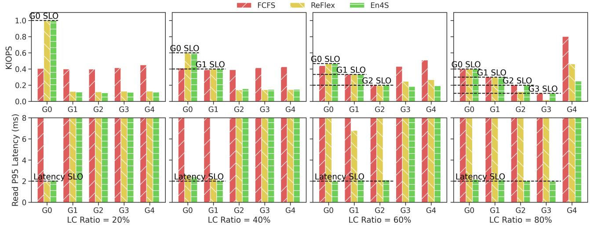

Figure 12: IOPS and Tail Latency Enforcement Results with different LC Ratios, LC tenants and BE tenants are requesting 50K and 150K 75% Random 4KiB IOPS combined respectively. Each group is consist of 50 unique tenants

while the BE groups generate 30K and 15K IOPS respectively. Read ratios vary across groups: 100% for LC G0, 80% for LC G1, 95% for BE G0, and 25% for BE G1.

An i3.xlarge EC2 instance can support approximately 200K 4KiB GET IOPS when enforcing a 2000 s tail latency SLO, equivalent to 200K tokens/second in our cost model. LC G0 requires 60K tokens/s, and LC G1 needs 72K tokens/s (calculated as 0.8 × 30 + 0.2 × 30 × 8 tokens per I/O), leaving 68K tokens/second for the 500 BE tenants. Given the read ratios of BE G0 and BE G1, the fairly distributed 34K tokens translate to around 25K and 5.5K IOPS respectively.

Figure [10](#page-12-0) shows that BE G1 achieves lower IOPS due to the higher token requirement per tenant with lower read ratios. For the LC groups, our system achieves 2ms overall goodput very close to the actual throughput, at 88.0% and 84.2% of their IOPS SLO respectively. While their 95th percentile overall (including WR) tail latency SLO exceeds 2ms, both read tail latency SLO and IOPS SLO were simultaneously satisfied.

The right subplot of Figure [11](#page-12-1) illustrates the aggregated throughput and goodput performance with En4S. FCFS fails to enforce group SLOs or achieve high aggregated goodput, as it allows too many best-effort requests to complete without considering request cost, leading to system overload. ReFlex demonstrates better rate control than FCFS but fails to enforce latency SLOs due to the scaling issues discussed in the analysis section.

6.3.2 SLO Enforcement with Bursty and Malicious Tenants. To evaluate the effectiveness of adaptive burst scheduling, we conducted a test similar to that in Section [3.](#page-4-1) We simulated malicious or greedy clients registered in LC tenant group 0, which periodically burst beyond their registered latency SLO before falling back below it to avoid performance penalties. We varied the detection settings between 3‰ and 3%, depending on the administrator's tolerance for such behavior. These percentages vary with different servers, and offline profiling is necessary to determine the optimal threshold.

Figure [11](#page-12-1) illustrates that with aggressive burst control, LC G0 almost never achieves throughput higher than its registered SLO. Overloaded requests are queued in the scheduler, resulting in near-zero goodput after 10s. With conservative burst control, the scheduler monitors and gradually decreases the burst allowance for the misbehaved tenant, eventually preventing it from exceeding its registered IOPS SLO. In both scenarios, LC G1's performance remains protected and does not degrade due to other tenants' queuing. Notably, even concurrently running BE tenants receive a fair share of the server's bandwidth after accounting for all registered IOPS SLOs.

6.3.3 SLO Enforcement with Increasing LC Ratios. We benchmarked the performance of FCFS, ReFlex, and En4S with increasing percentages of LC tenants. As shown in Figure [12,](#page-13-0) FCFS achieved good overall throughput but failed to enforce any tenant's SLOs. ReFlex maintained IOPS and tail latency SLO enforcement when LC ratios were between 20% and 40%. However, its latency SLO began to violate at higher ratios, with both SLOs being violated at LC ratios of 60% and 80%.

In contrast, En4S ensured consistent performance predictability across all four scenarios, with approximately saturated performance at our profiled maximum IOPS of 72K for 75% read operations. This is attributed to En4S's reclaim control, which successfully protects temporarily unused LC tokens from leaking to BE requests. At an LC ratio of 80%, LC tenants G2 and G3, which have smaller flow sizes, are sacrificed due to token leaks as they are less frequently activated because of their lower IOPS.

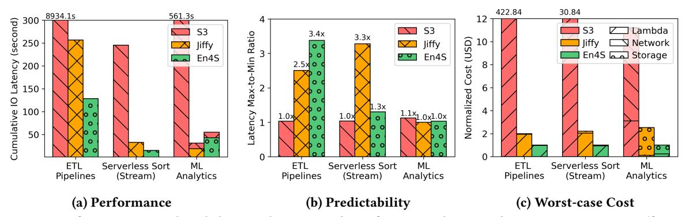

## 6.4 Application Analysis

We evaluated the performance, predictability, and cost of three real-world applications, as described in Sec. [6.1,](#page-10-0) running on S3, Jiffy, and our proposed system, En4S. This comparison provides a comprehensive understanding of how En4S performs relative to existing storage solutions across various application scenarios.

Figure [13a](#page-14-1) presents the latency measured across different stages of these applications. En4S consistently demonstrated lower cumulative latency than Jiffy and S3, highlighting its improved efficiency. However, when examining the end-toend (E2E) latency, En4S still lags behind Jiffy, with delays ranging from 1.02x to 1.8x. This gap can be largely attributed to inefficiencies in metadata management and the overhead caused by frequent synchronization during IO region transitions, which are significant factors impacting performance.

In terms of predictability, Figure [13b](#page-14-1) illustrates the Maxto-Min ratio of E2E completion times, calculated based on the minimum observed completion time. The removal of data processing from the ETL pipelines—where execution times vary depending on operations and input data—exacerbates the latency impact, especially under workloads with high write ratios (over 50%) and frequent IO operations. As a result, the advantages of lower read latency are less pronounced. Nevertheless, in stream serverless sorting, En4S achieves better predictability compared to Jiffy and approaches S3's performance due to more stable IO patterns. Although the E2E latency for stream batches remains higher than Jiffy due to metadata constraints, further optimization in metadata handling and more efficient data flow orchestration between mappers and reducers could improve performance. For compute-intensive ML analytics workloads, performance remains mostly unaffected by IO differences.

Beyond performance, we also assessed the cost efficiency of these systems. We measured the average cost of the applications, focusing on three major components: Lambda costs for IO wait times (in GB\*second [\[48\]](#page-17-16)), Storage costs including storage and controller servers that support the systems, and Network cost which is unique to AWS S3. All the cost from different applications are normalized to the cost running on our En4S. The cost per request and per GB stored are critical to understanding the economic impact of each solution. In our worst-case scenario analysis—where throughput or capacity limits are reached—we calculated proportional infrastructure costs, including those for storage and controller nodes (amortized). While Jiffy [\[21\]](#page-16-3) is assumed to be five times more efficient than En4S in capacity management, as shown in Fig. [13c,](#page-14-1) En4S remains the most cost-effective (at least 2X) across all scenarios, even with this assumption. Notably, for ETL pipelines and serverless sorting, lambda charges for lingering objects dominate the costs, whereas infrastructure costs are higher for ML analytics due to longer object retention. S3 incurs minimal object retention costs but is penalized by high per-request charges and longer lambda runtimes, especially for the workloads with many small IOs (e.g. ETF pipelines, Serverless Compilers). These costs are largely amortized in the other baselines due to AWS billing strategies to the VPC.

In summary, while En4S offers clear improvements in IO predictability, significant challenges remain in reducing E2E latency due to the distributed nature of these applications and variability of the serverless infrastructures. Nonetheless, En4S shows considerable potential for enhancing predictability, particularly in IO-intensive and real-time workloads. Moreover, En4S consistently delivers the best cost efficiency among the three evaluated solutions, making it a compelling choice for a wide range of application scenarios.

## 7 RELATED WORK

Stateful serverless computing: Several systems have been proposed to address the challenges of state management in serverless computing. Pocket [\[25\]](#page-16-2) and Locus [\[41\]](#page-16-4) offer specialized storage systems that optimize between different storage media. Infinistore [\[63\]](#page-17-17) integrates serverless function memory with persistent cloud storage, while Cloudburst [\[55\]](#page-17-18) extends Anna KVS [\[58\]](#page-17-19) to support low-latency, autoscaling stateful functions. DRAM-based solutions like Jiffy [\[21\]](#page-16-3) use elastic far-memory to handle variable intermediate data sizes, and Crucial [\[3\]](#page-15-6) advances the state-of-the-art by providing a distributed shared memory layer with fine-grained mutable state and synchronization primitives.

Other works aim to eliminate remote intermediate storage by either sharing local storage between serverless functions or enabling direct data transfers. SONIC [\[35\]](#page-16-6) dynamically selects the best data-passing method, while Shredder [\[64\]](#page-17-5) embeds computation into storage. Pheromone [\[60\]](#page-17-20) explores data-centric application orchestration for better performance, and XDT [\[56\]](#page-17-21) focuses on efficient data transfers between inter-trusted function memory. Additionally, specialized solutions like Locus [\[41\]](#page-16-4) and MinFlow [\[29\]](#page-16-8) modify serverless clusters using Directed Acyclic Graphs (DAGs) hints for optimized MapReduce workflows.

En4S distinguishes itself by ensuring predictable performance through a novel scheduling framework and an optimized storage stack, offering high performance without added costs.

Fair scheduling: Many works focus on ensuring fairness among tenants in multi-tenant environments. Ether [\[37\]](#page-16-26) enhances fairness by prioritizing critical flows during congestion, while Retro [\[33\]](#page-16-27) separates resource management policies from mechanisms, enabling performance guarantees. 2DFQ [\[34\]](#page-16-28) improves latency by spreading requests across threads, reducing the impact of unpredictable workloads. Pisces [\[53\]](#page-17-22) achieves fairness and performance isolation through weighted fair queuing and partition placement.

While fairness is important, it often comes at the cost of performance, particularly with bursty serverless workloads. For short-lived IO flows, the approximate fairness provided by our scheduler is sufficient to balance fairness and performance.

Predictability in serverless computing: Predictable performance is critical for serverless applications, especially those structured as DAGs, where stragglers can cause delays. Golgi [\[28\]](#page-16-29) minimizes resource costs while meeting latency requirements through performance-aware scheduling, and ORION [\[36\]](#page-16-30) optimizes E2E latency in serverless DAGs via bundling, right-sizing, and pre-warming. Several works [\[5,](#page-15-7) [6,](#page-15-8) [17,](#page-16-31) [19,](#page-16-32) [30,](#page-16-33) [42\]](#page-16-34) have focused on improving performance predictability for flash devices. These works can be combined with En4S and are orthogonal to our work.

## 8 CONCLUSION

Serverless applications introduce a plethora of new workloads and challenges to existing infrastructure, particularly in enforcing E2E SLOs for remote storage I/O. The inherent statelessness and ephemeral nature of serverless functions complicate the management of storage resources, making it

difficult to maintain consistent performance and meet stringent SLOs. Traditional solutions often fall short in addressing these unique demands, as they are not designed to handle the dynamic and bursty nature of serverless workloads. In this paper, we delve into the specific issues that arise with large number of SLOs, highlighting the gaps in current solutions. Our proposed system, En4S, addresses these challenges by providing a predictable, scalable ephemeral storage solution tailored for SLO-sensitive applications. By leveraging costeffective storage disaggregation, advanced QoS scheduling and adaptive burst and token control, En4S ensures SLOenforced IOPS and tail latency, effectively bridging the gap left by existing approaches.

## 9 ACKNOWLEDGMENT

We are grateful to the anonymous reviewers for their valuable feedback and constructive suggestions. This research was supported by the IAB members of the Center for Research in Systems and Storage (CRSS), and the National Science Foundation (NSF) under grants CNS-1841545, CCF-1942754, CNS-2322919, CNS-2420632, CNS-2426031, and CNS-2426940. The views expressed are those of the authors and do not necessarily reflect those of the funding agencies.

## REFERENCES

- [1] Istemi Ekin Akkus, Ruichuan Chen, Ivica Rimac, Manuel Stein, Klaus Satzke, Andre Beck, Paarijaat Aditya, and Volker Hilt. 2018. {SAND}: Towards High-Performance Serverless Computing. In 2018 {Usenix} Annual Technical Conference ({USENIX} {ATC} 18). 923–935.
- [2] Lixiang Ao, Liz Izhikevich, Geoffrey M Voelker, and George Porter. 2018. Sprocket: A serverless video processing framework. In Proceedings of the ACM Symposium on Cloud Computing. 263–274.
- [3] Daniel Barcelona-Pons, Pierre Sutra, Marc Sánchez-Artigas, Gerard París, and Pedro García-López. 2022. Stateful serverless computing with crucial. ACM Transactions on Software Engineering and Methodology (TOSEM) 31, 3 (2022), 1–38.
- [4] Adam Belay, George Prekas, Ana Klimovic, Samuel Grossman, Christos Kozyrakis, and Edouard Bugnion. 2014. {IX}: a protected dataplane operating system for high throughput and low latency. In 11th USENIX Symposium on Operating Systems Design and Implementation (OSDI 14). 49–65.
- [5] Chandranil Chakraborttii and Heiner Litz. 2020. Learning i/o access patterns to improve prefetching in ssds. In Joint European Conference on Machine Learning and Knowledge Discovery in Databases. Springer, 427–443.
- [6] Chandranil Chakraborttii and Heiner Litz. 2021. Reducing write amplification in flash by death-time prediction of logical block addresses. In Proceedings of the 14th ACM International Conference on Systems and Storage. 1–12.
- [7] Inho Cho, Ahmed Saeed, Joshua Fried, Seo Jin Park, Mohammad Alizadeh, and Adam Belay. 2020. Overload Control for s-scale RPCs with Breakwater. In 14th {USENIX} Symposium on Operating Systems Design and Implementation ({OSDI} 20). 299–314.
- [8] Jeffrey Dean and Luiz André Barroso. 2013. The tail at scale. Commun. ACM 56, 2 (2013), 74–80.
- [9] Jeffrey Dean and Sanjay Ghemawat. 2008. MapReduce: simplified data processing on large clusters. Commun. ACM 51, 1 (2008), 107–113.

- [10] Christina Delimitrou and Christos Kozyrakis. 2018. Amdahl's law for tail latency. Commun. ACM 61, 8 (2018), 65–72.
- [11] Adam Dunkels. 2001. Design and Implementation of the lwIP TCP/IP Stack. Swedish Institute of Computer Science 2, 77 (2001).
- [12] Aaron J Elmore, Sudipto Das, Alexander Pucher, Divyakant Agrawal, Amr El Abbadi, and Xifeng Yan. 2013. Characterizing tenant behavior for placement and crisis mitigation in multitenant DBMSs. In Proceedings of the 2013 ACM SIGMOD International Conference on Management of Data. 517–528.
- [13] Sadjad Fouladi, Francisco Romero, Dan Iter, Qian Li, Shuvo Chatterjee, Christos Kozyrakis, Matei Zaharia, and Keith Winstein. 2019. From laptop to lambda: Outsourcing everyday jobs to thousands of transient functional containers. In 2019 {USENIX} Annual Technical Conference ({USENIX} {ATC} 19). 475–488.
- [14] Jit Gupta, Krishna Kant, Amitangshu Pal, and Joyanta Biswas. 2024. Configuring and Coordinating End-to-end QoS for Emerging Storage Infrastructure. ACM Transactions on Modeling and Performance Evaluation of Computing Systems 9, 1 (2024), 1–32.
- [15] HashiCorp. 2022. Terraform. [https://github.com/hashicorp/terraform.](https://github.com/hashicorp/terraform)
- [16] Intel. 2022. Storage Performance Development Kit. [https://spdk.io/.](https://spdk.io/)
- [17] Lokesh N Jaliminche, Chandranil Nil Chakraborttii, Changho Choi, and Heiner Litz. 2023. Enabling Multi-tenancy on SSDs with Accurate IO Interference Modeling. In Proceedings of the 2023 ACM Symposium on Cloud Computing. 216–232.
- [18] Keon Jang, Justine Sherry, Hitesh Ballani, and Toby Moncaster. 2015. Silo: Predictable message latency in the cloud. In Proceedings of the 2015 ACM Conference on Special Interest Group on Data Communication. 435–448.
- [19] Saeed Kargar, Heiner Litz, and Faisal Nawab. 2021. Predict and write: Using k-means clustering to extend the lifetime of nvm storage. In 2021 IEEE 37th International Conference on Data Engineering (ICDE). IEEE, 768–779.
- [20] Salman Khan. 2024. Road Waymo Dataset. [https://github.com/](https://github.com/salmank255/Road-waymo-dataset) [salmank255/Road-waymo-dataset.](https://github.com/salmank255/Road-waymo-dataset) Accessed: 2024-10-15.
- [21] Anurag Khandelwal, Yupeng Tang, Rachit Agarwal, Aditya Akella, and Ion Stoica. 2022. Jiffy: elastic far-memory for stateful serverless analytics. In Proceedings of the Seventeenth European Conference on Computer Systems. 697–713.
- [22] Ana Klimovic, Heiner Litz, and Christos Kozyrakis. 2017. ReFlex: Remote flash ≈ local flash. ACM SIGARCH Computer Architecture News 45, 1 (2017), 345–359.
- [23] Ana Klimovic, Heiner Litz, and Christos Kozyrakis. 2018. Selecta: Heterogeneous cloud storage configuration for data analytics. In 2018 USENIX Annual Technical Conference (USENIX ATC 18). 759–773.
- [24] Ana Klimovic, Yawen Wang, Christos Kozyrakis, Patrick Stuedi, Jonas Pfefferle, and Animesh Trivedi. 2018. Understanding ephemeral storage for serverless analytics. In 2018 {USENIX} Annual Technical Conference ({USENIX} {ATC} 18). 789–794.
- [25] Ana Klimovic, Yawen Wang, Patrick Stue di, Animesh Trivedi, Jonas Pfefferle, and Christos Kozyrakis. 2018. Pocket: Elastic ephemeral storage for serverless analytics. In 13th {USENIX} Symposium on Operating Systems Design and Implementation ({OSDI} 18). 427–444.
- [26] Luciano Lenzini, Enzo Mingozzi, and Giovanni Stea. 2002. Aliquem: a novel DRR implementation to achieve better latency and fairness at O (1) complexity. In IEEE 2002 Tenth IEEE International Workshop on Quality of Service (Cat. No. 02EX564). IEEE, 77–86.
- [27] Jialin Li, Naveen Kr Sharma, Dan RK Ports, and Steven D Gribble. 2014. Tales of the tail: Hardware, os, and application-level sources of tail latency. In Proceedings of the ACM Symposium on Cloud Computing. 1–14.
- [28] Suyi Li, Wei Wang, Jun Yang, Guangzhen Chen, and Daohe Lu. 2023. Golgi: Performance-aware, resource-efficient function scheduling for

serverless computing. In Proceedings of the 2023 ACM Symposium on Cloud Computing. 32–47.

- [29] Tao Li, Yongkun Li, Wenzhe Zhu, Yinlong Xu, and John CS Lui. 2024. {MinFlow}: High-performance and Cost-efficient Data Passing for {I/O-intensive} Stateful Serverless Analytics. In 22nd USENIX Conference on File and Storage Technologies (FAST 24). 311–327.
- [30] Heiner Litz, Javier Gonzalez, Ana Klimovic, and Christos Kozyrakis. 2022. Rail: Predictable, low tail latency for nvme flash. ACM Transactions on Storage (TOS) 18, 1 (2022), 1–21.
- [31] Yi Liu, Shouqian Shi, Minghao Xie, Heiner Litz, and Chen Qian. 2023. Smash: Flexible, fast, and resource-efficient placement and lookup of distributed storage. Proceedings of the ACM on Measurement and Analysis of Computing Systems 7, 2 (2023), 1–22.
- [32] Wes Lloyd, Shruti Ramesh, Swetha Chinthalapati, Lan Ly, and Shrideep Pallickara. 2018. Serverless computing: An investigation of factors influencing microservice performance. In 2018 IEEE International Conference on Cloud Engineering (IC2E). IEEE, 159–169.
- [33] Jonathan Mace, Peter Bodik, Rodrigo Fonseca, and Madanlal Musuvathi. 2015. Retro: Targeted resource management in multi-tenant distributed systems. In 12th USENIX Symposium on Networked Systems Design and Implementation (NSDI 15). 589–603.
- [34] Jonathan Mace, Peter Bodik, Madanlal Musuvathi, Rodrigo Fonseca, and Krishnan Varadarajan. 2016. 2dfq: Two-dimensional fair queuing for multi-tenant cloud services. In Proceedings of the 2016 ACM SIGCOMM Conference. 144–159.
- [35] Ashraf Mahgoub, Li Wang, Karthick Shankar, Yiming Zhang, Huangshi Tian, Subrata Mitra, Yuxing Peng, Hongqi Wang, Ana Klimovic, Haoran Yang, et al. 2021. {SONIC}: Application-aware Data Passing for Chained Serverless Applications. In 2021 USENIX Annual Technical Conference (USENIX ATC 21). 285–301.
- [36] Ashraf Mahgoub, Edgardo Barsallo Yi, Karthick Shankar, Sameh Elnikety, Somali Chaterji, and Saurabh Bagchi. 2022. {ORION} and the three rights: Sizing, bundling, and prewarming for serverless {DAGs}. In 16th USENIX Symposium on Operating Systems Design and Implementation (OSDI 22). 303–320.
- [37] Mojtaba Malekpourshahraki, Brent Stephens, and Balajee Vamanan. 2019. Ether: providing both interactive service and fairness in multitenant datacenters. In Proceedings of the 3rd Asia-Pacific workshop on networking. 50–56.
- [38] Jaehong Min, Ming Liu, Tapan Chugh, Chenxingyu Zhao, Andrew Wei, In Hwan Doh, and Arvind Krishnamurthy. 2021. Gimbal: enabling multi-tenant storage disaggregation on SmartNIC JBOFs. In Proceedings of the 2021 ACM SIGCOMM 2021 Conference. 106–122.
- [39] Philipp Moritz, Robert Nishihara, Stephanie Wang, Alexey Tumanov, Richard Liaw, Eric Liang, Melih Elibol, Zongheng Yang, William Paul, Michael I Jordan, et al. 2018. Ray: A distributed framework for emerging {AI} applications. In 13th USENIX Symposium on Operating Systems Design and Implementation (OSDI 18). 561–577.
- [40] The Linux Foundation Projects. 2022. Data Plane Development Kit. [https://www.dpdk.org/.](https://www.dpdk.org/)
- [41] Qifan Pu, Shivaram Venkataraman, and Ion Stoica. 2019. Shuffling, fast and slow: Scalable analytics on serverless infrastructure. In 16th USENIX Symposium on Networked Systems Design and Implementation (NSDI 19). 193–206.
- [42] Devashish Purandare, Pete Wilcox, Heiner Litz, and Shel Finkelstein. 2022. Append is near: Log-based data management on ZNS SSDs. In 12th Annual Conference on Innovative Data Systems Research (CIDR'22).
- [43] Joseph Redmon and Ali Farhadi. 2018. YOLOv3: An Incremental Improvement. arXiv preprint arXiv:1804.02767 (2018). [https://arxiv.org/](https://arxiv.org/abs/1804.02767) [abs/1804.02767](https://arxiv.org/abs/1804.02767)
- [44] Amazon Web Services. 2024. Amazon EC2 get started. [https://aws.](https://aws.amazon.com/ec2/ec2-get-started/) [amazon.com/ec2/ec2-get-started/.](https://aws.amazon.com/ec2/ec2-get-started/)

- [45] Amazon Web Services. 2024. Amazon elasticache. [https://aws.amazon.](https://aws.amazon.com/elasticache/) [com/elasticache/.](https://aws.amazon.com/elasticache/)
- [46] Amazon Web Services. 2024. Amazon simple storage service. [https:](https://aws.amazon.com/s3/) [//aws.amazon.com/s3/.](https://aws.amazon.com/s3/)
- [47] Amazon Web Services. 2024. Amazon Virtual Private Cloud. [https:](https://aws.amazon.com/vpc/) [//aws.amazon.com/vpc/.](https://aws.amazon.com/vpc/)
- [48] Amazon Web Services. 2024. AWS Lambda Pricing. [https://aws.amazon.](https://aws.amazon.com/lambda/pricing/) [com/lambda/pricing/.](https://aws.amazon.com/lambda/pricing/)
- [49] Amazon Web Services. 2024. Best practices design patterns: optimizing Amazon S3 performance. [https://docs.aws.amazon.com/AmazonS3/](https://docs.aws.amazon.com/AmazonS3/latest/userguide/optimizing-performance.html) [latest/userguide/optimizing-performance.html.](https://docs.aws.amazon.com/AmazonS3/latest/userguide/optimizing-performance.html)
- [50] Amazon Web Services. 2024. Lambda quotas. [https://docs.aws.amazon.](https://docs.aws.amazon.com/lambda/latest/dg/gettingstarted-limits.html) [com/lambda/latest/dg/gettingstarted-limits.html.](https://docs.aws.amazon.com/lambda/latest/dg/gettingstarted-limits.html)
- [51] Vaishaal Shankar, Karl Krauth, Qifan Pu, Eric Jonas, Shivaram Venkataraman, Ion Stoica, Benjamin Recht, and Jonathan Ragan-Kelley. 2018. Numpywren: Serverless linear algebra. arXiv preprint arXiv:1810.09679 (2018).
- [52] Madhavapeddi Shreedhar and George Varghese. 1995. Efficient fair queueing using deficit round robin. In Proceedings of the conference on Applications, technologies, architectures, and protocols for computer communication. 231–242.
- [53] David Shue, Michael J Freedman, and Anees Shaikh. 2012. Performance isolation and fairness for {Multi-Tenant} cloud storage. In 10th USENIX Symposium on Operating Systems Design and Implementation (OSDI 12). 349–362.
- [54] Josef Spillner, Cristian Mateos, and David A Monge. 2017. Faaster, better, cheaper: The prospect of serverless scientific computing and hpc. In Latin American High Performance Computing Conference. Springer, 154–168.
- [55] Vikram Sreekanti, Chenggang Wu, Xiayue Charles Lin, Johann Schleier-Smith, Jose M Faleiro, Joseph E Gonzalez, Joseph M Hellerstein, and Alexey Tumanov. 2020. Cloudburst: Stateful functions-as-aservice. arXiv preprint arXiv:2001.04592 (2020).
- [56] Dmitrii Ustiugov, Shyam Jesalpura, Mert Bora Alper, Michal Baczun, Rustem Feyzkhanov, Edouard Bugnion, Boris Grot, and Marios Kogias. 2023. Expedited Data Transfers for Serverless Clouds. arXiv preprint arXiv:2309.14821 (2023).
- [57] Liang Wang, Mengyuan Li, Yinqian Zhang, Thomas Ristenpart, and Michael Swift. 2018. Peeking behind the curtains of serverless platforms. In 2018 {USENIX} Annual Technical Conference ({USENIX} {ATC} 18). 133–146.
- [58] Chenggang Wu, Jose M Faleiro, Yihan Lin, and Joseph M Hellerstein. 2019. Anna: A kvs for any scale. IEEE Transactions on Knowledge and Data Engineering 33, 2 (2019), 344–358.
- [59] Minghao Xie, Chen Qian, and Heiner Litz. 2020. ReFlex4ARM: Supporting 100GbE Flash Storage Disaggregation on ARM SoC. Poster in OCP Future Technologies Symposium 2020.
- [60] Minchen Yu, Tingjia Cao, Wei Wang, and Ruichuan Chen. 2023. Following the data, not the function: Rethinking function orchestration in serverless computing. In 20th USENIX Symposium on Networked Systems Design and Implementation (NSDI 23). 1489–1504.
- [61] Tianyi Yu, Qingyuan Liu, Dong Du, Yubin Xia, Binyu Zang, Ziqian Lu, Pingchao Yang, Chenggang Qin, and Haibo Chen. 2020. Characterizing serverless platforms with serverlessbench. In Proceedings of the 11th ACM Symposium on Cloud Computing. 30–44.
- [62] David Zats, Tathagata Das, Prashanth Mohan, Dhruba Borthakur, and Randy Katz. 2012. DeTail: Reducing the flow completion time tail in datacenter networks. In Proceedings of the ACM SIGCOMM 2012 conference on Applications, technologies, architectures, and protocols for computer communication. 139–150.

- [63] Jingyuan Zhang, Ao Wang, Xiaolong Ma, Benjamin Carver, Nicholas John Newman, Ali Anwar, Lukas Rupprecht, Dimitrios Skourtis, Vasily Tarasov, Feng Yan, et al. 2022. Infinistore: Elastic serverless cloud storage. arXiv preprint arXiv:2209.01496 (2022).
- [64] Tian Zhang, Dong Xie, Feifei Li, and Ryan Stutsman. 2019. Narrowing the gap between serverless and its state with storage functions. In Proceedings of the ACM Symposium on Cloud Computing. 1–12.
- [65] Timothy Zhu, Daniel S Berger, and Mor Harchol-Balter. 2016. SNC-Meister: Admitting more tenants with tail latency SLOs. In Proceedings of the Seventh ACM Symposium on Cloud Computing. 374–387.
- [66] Timothy Zhu, Michael A Kozuch, and Mor Harchol-Balter. 2017. Workloadcompactor: Reducing datacenter cost while providing tail latency slo guarantees. In Proceedings of the 2017 Symposium on Cloud Computing. 598–610.