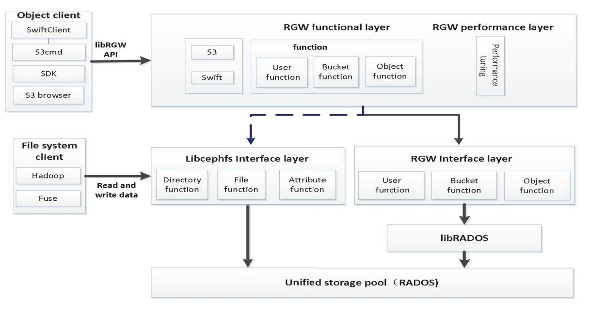
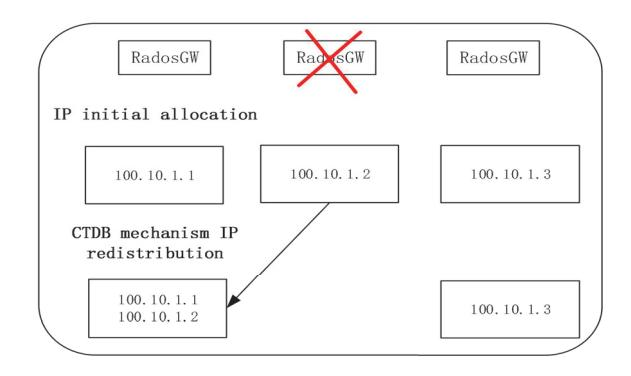
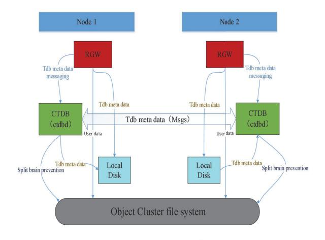
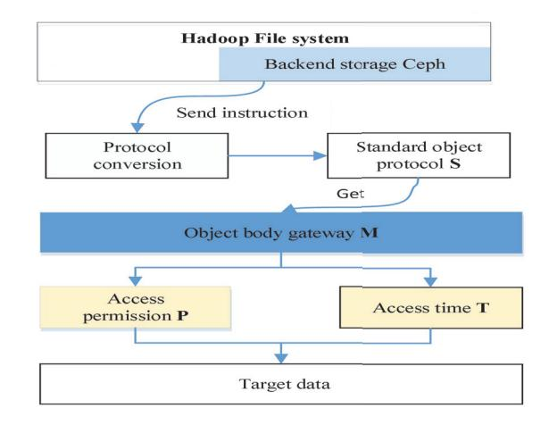
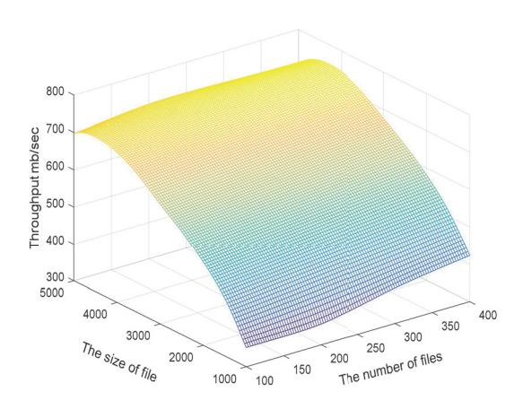
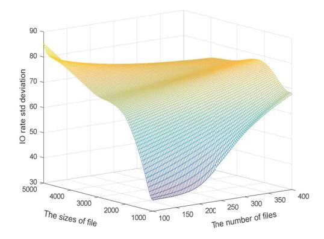
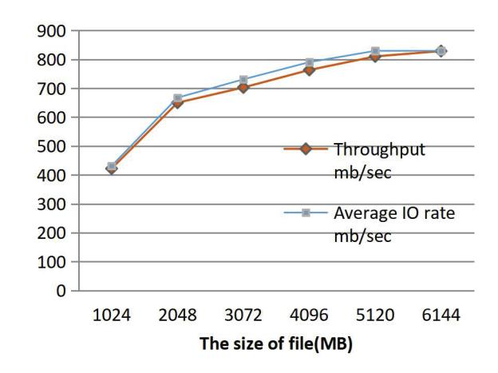
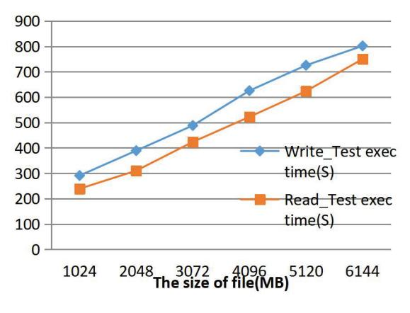

# \$Q(IILFLHQW%LJ'DWD6WRUDJH6HUYLFH\$UFKLWHFWXUH

<DQ :DQJ
;LDQJ /L 3HL[LDQJ %DL +DLER :DQJ -LDQPLQ 'RQJ

 &ROOHJH RI &RPSXWHU 6FLHQFH ,QQHU 0RQJROLD 8QLYHUVLW\+RKKRW &KLQD

 ,QQHU 0RQJROLD 'LVFLSOLQH ,QVSHFWLRQ ,QIRUPDWLRQ &HQWHU +RKKRW &KLQD

 ,QQHU 0RQJROLD %LJ 'DWD /DERUDWRU\ IRU 'LVFLSOLQH ,QVSHFWLRQ DQG 6XSHUYLVLRQ +RKKRW &KLQD

*\$EVWUDFW***²'XH WR WKH OLPLWDWLRQV RI WKH GLVWULEXWHG ILOH VWRUDJH V\VWHP ZKHQ GDWD VWRUDJH LV VXUJLQJ WKH GHSWK DQG ZLGWK RI ILOH GLUHFWRU\ ZLOO FRQWLQXH WR LQFUHDVH ZKLFK UHVXOWV LQ UHGXFHG ,2 HIILFLHQF\ RI PHWDGDWD PDQDJHPHQW 5DSLGO\ JURZLQJ GDWD FDQ DOVR FDXVH V\VWHP FRQJHVWLRQ RU GDWD ORVV ,Q WRGD\ V HQYLURQPHQW ZKHUH LQIRUPDWLRQ DQG GDWD DUH OLQNHG DQG FROODERUDWLYH LQ DOO ZDONV RI OLIH WKLV SKHQRPHQRQ LV DEVROXWHO\ XQDFFHSWDEOH 2EMHFW VWRUDJH LV DQ HIILFLHQW ZD\ WR VWRUH PDVVLYH GDWD WKURXJK VHSDUDWLQJ PHWDGDWD +RZHYHU WKH RULJLQDO GDWD VWRUDJH V\VWHP FOXVWHU KDV EHHQ FRQILJXUHG ZLWK QRQREMHFWRULHQWHG VWRUDJH GDWD W\SHV ,I WKH XQGHUO\LQJ VWRUDJH V\VWHP LV UHSODFHG E\ REMHFW VWRUDJH LW ZLOO QRW EH FRPSDWLEOH ZLWK WKH XSSHU ILOH SDUDOOHO SURFHVVLQJ PRGHO 7R VROYH WKLV SUREOHP WKLV SDSHU SURSRVHV D ELJ GDWD VWRUDJH VHUYLFH DUFKLWHFWXUH EDVHG RQ REMHFW VWRUDJH ,Q WKH DUFKLWHFWXUH D WUDQVSDUHQW DFFHVV PHWKRG IURP ILOH V\VWHP WR REMHFW VWRUDJH FOXVWHU LV GHVLJQHG WR VXSSRUW HIILFLHQW DFFHVV WR REMHFW VWRUDJH V\VWHP LQ WKH IRUP RI ILOH )RU LPSURYLQJ WKH UHOLDELOLW\ RI GDWD VWRUDJH VHUYLFH D KLJK IDXOW WROHUDQFH PHFKDQLVP EDVHG RQ PXOWLJDWHZD\ LV SUHVHQWHG ([SHULPHQWDO UHVXOWV VKRZ WKDW WKH DUFKLWHFWXUH FDQ HIIHFWLYHO\ VROYH WKH SUREOHP RI GDWD DFFHVV FRPSDWLELOLW\ IURP ILOH V\VWHP WR REMHFW VWRUDJH V\VWHP DQG VLJQLILFDQWO\ LPSURYH VWRUDJH HIILFLHQF\**##*.H\ZRUGV²'LVWULEXWHG ILOH V\VWHP 2EMHFW VWRUDJH 0HWDGDWD PDQDJHPHQW 7UDQVSDUHQW DFFHVV 0XOWLJDWHZD\ IDXOW WROHUDQFH*### , ,1752'8&7,21

:LWK WKH DGYHQW RI WKH HUD RI ELJ GDWD WKH WUDGLWLRQDO GDWD ZDUHKRXVH KDV EHHQ XQDEOH WR PHHW WKH JURZLQJ GHPDQG IRU GDWD VWRUDJH 7KH HYHULQFUHDVLQJ VWRUDJH UHTXLUHPHQWV ZLOO LQHYLWDEO\ OHDG WR SHUIRUPDQFH ERWWOHQHFNV DQG VFDODELOLW\ SUREOHPV LQ VWRUDJH V\VWHPV 6WXG\LQJ ELJ GDWD VWRUDJH PHWKRGV DQG EXLOGLQJ DQ HIILFLHQW ELJ GDWD VWRUDJH PRGHO DUH WKH SUHPLVHV IRU DQDO\]LQJ DQG DSSO\LQJ ELJ GDWD &ORXG FRPSXWLQJ EHFRPHV DQ LGHDO FKRLFH IRU ELJ GDWD PDQDJHPHQW EHFDXVH RI LWV VFDODELOLW\ DQG IOH[LELOLW\ 7KH FORXG SURYLGHV QRW RQO\ D VXLWDEOH IUDPHZRUN IRU WKH FOXVWHU RI ELJ GDWD EXW DOVR DQ HIILFLHQW GLVWULEXWHG GDWD VWRUDJH PRGHO IRU WKH SODFHPHQW RI ELJ GDWD ,W SURFHVVHV GDWD DJJUHJDWLRQ DQG PDQDJHPHQW WKURXJK VRPH DSSURSULDWH ZHE VHUYLFHV VXFK DV 5(67IXO \$3, WKDW¶V VWRUDJHDVDVHUYLFH 67DD6 >@

&ORXG VWRUDJH LV D VWRUDJH V\VWHP IRU PDVVLYH GDWD EDVHG RQ FOXVWHUV ZKLFK FDQ HIILFLHQWO\ VWRUH DFFHVV DQG SURFHVV GDWD DQG SURYLGH GDWD PLJUDWLRQ EDFNXS GLVDVWHU UHFRYHU\ DQG RWKHU VHUYLFHV >@ 2YHU WKH SDVW IHZ \HDUV WKH GHPDQGV IRU FORXG VWRUDJH KDYH JURZQ H[SRQHQWLDOO\ 6LQFH WKH GLVWULEXWHG ILOH V\VWHP LV IDPRXV IRU LWV KLJK FDSDFLW\ KLJK VWDELOLW\ DQG KLJK VFDODELOLW\ FOXVWHU VHUYHUV JHQHUDOO\ DGRSW ILOH V\VWHP &XUUHQWO\ VFDODEOH SDUDOOHO ILOH V\VWHPV DUH RIWHQ XVHG ZLWK ODUJH VWRUDJH FOXVWHUV (VSHFLDOO\ +DGRRS FDQ EH GHSOR\HG RQ D FKHDS FOXVWHU DQG KDV EHFRPH WKH PDLQVWUHDP SODWIRUP IRU ELJ GDWD VWRUDJH E\ YLUWXH RI LWV DGYDQWDJHV RI RSHQ VRXUFH VWURQJ VFDODELOLW\ DQG JRRG IDXOW WROHUDQFH +RZHYHU WKH GDWD FROOHFWHG E\ YDULRXV GLJLWDO WHFKQRORJLHV LQFOXGH QRW RQO\ WZR GLPHQVLRQDO GDWD EXW DOVR YLGHR SKRWRV EORJV HPDLOV DQG RWKHU IRUPV RI GDWD )RU H[DPSOH WHQV RI ELOOLRQV RI VPDOO ILOHV DUH FUHDWHG E\ ZHE DSSOLFDWLRQV HYHU\ GD\ LQFOXGLQJ SKRWRV YLGHRV PXVLF ILOHV D ELOOLRQ SLHFHV RI FRQWHQW DUH DGGHG WR WKH VRFLDO QHWZRUN HYHU\ GD\ KXQGUHGV RI ELOOLRQV RI HPDLOV DUH VHQW E\ SHRSOH HYHU\ GD\ 0RVW RI WKH FRQWHQWV DUH XQVWUXFWXUHG GDWD 7KH VWRUDJH RI ELJ GDWD PXVW HIILFLHQWO\ VWRUH XQVWUXFWXUHG GDWD ,Q JHQHUDO D VLQJOH ILOH V\VWHP FDQ VXSSRUW DW PRVW PLOOLRQV RI ILOHV XQGHU RSWLPDO SHUIRUPDQFH 7KHUHIRUH WKH ILOH VWRUDJH LV QRW VXLWDEOH IRU PDQDJLQJ VXFK KXJH XQVWUXFWXUHG ELJ GDWD :KHQ GHDOLQJ ZLWK KLJK FRQFXUUHQW GDWD DFFHVV WKH VKRUWFRPLQJV RI WKH ILOH V\VWHP ZLOO VKRZ XS PDLQO\ LQFOXGLQJ WKH IROORZLQJ WZR DVSHFWV

:LWK WKH LQFUHDVH RI WKH GHSWK DQG EDQGZLGWK RI GLUHFWRU\ WUHH VWUXFWXUH WKH HIILFLHQF\ RI GDWD PDQDJHPHQW DQG WKH VSHHG RI ,2 RSHUDWLRQ ZLOO GURS VLJQLILFDQWO\

:KHQ WLJKWO\ FRXSOHG ZLWK WKH NHUQHO VWRULQJ RU DFFHVVLQJ GDWD LV LQHIILFLHQW GXH WR WKH OLPLWDWLRQV RI GDWD EORFN VL]H GDWD FRQVLVWHQF\ FDFKLQJ VWUDWHJ\ DQG RWKHU DVSHFWV

7KH HPHUJHQFH RI REMHFW VWRUDJH GHFRXSOHV WKH PHWDGDWD WKURXJK DGRSWLQJ FRPSOHWHO\ UDQGRP GLVWULEXWHG PHFKDQLVP WR VHSDUDWHO\ VWRUH PHWDGDWD DQG REMHFW GDWD ,WV IODW GDWD VWUXFWXUH DOORZV LW WR PDQDJH WHQV RI ELOOLRQV RI VWRUDJH REMHFWV VXSSRUWLQJ REMHFWV RI DQ\ VL]H UDQJLQJ IURP E\WHV WR WULOOLRQV RI E\WHV ,Q WKLV ZD\ WKH REMHFW VWRUDJH FDSDFLW\ FDQ EH VFDOHG IURP WHUDE\WHV WR H[DE\WHV HOLPLQDWLQJ WKH VFDODELOLW\ ERWWOHQHFN FDXVHG E\ WKH FRPSOH[ L1RGH PHFKDQLVP RI WKH ILOH V\VWHP 7KHUHIRUH REMHFW VWRUDJH V\VWHP EHFRPHV DQ HIIHFWLYH VWRUDJH VROXWLRQ 'LVWULEXWHG REMHFW VWRUDJH DUFKLWHFWXUH KDV EHFRPH WKH SUDFWLFDO VWDQGDUG RI KLJKSHUIRUPDQFH VWRUDJH LQ ELJ GDWD FORXG FRPSXWLQJ DQG KLJKSHUIRUPDQFH FRPSXWLQJ >@

+RZHYHU GXH WR WKH GHYHORSPHQW OLPLWDWLRQV RI FRUH WHFKQRORJ\ LQWHUPHGLDWH SODWIRUP DQG EXVLQHVV SODQH PDQ\ H[LVWLQJ FORXG VWRUDJH V\VWHPV JHQHUDOO\ DGRSW ILOHRULHQWHG +DGRRS DUFKLWHFWXUHV XVLQJ 1\$6 GHYLFHV WR VWRUH DOO NLQGV RI XQVWUXFWXUHG GDWD LQ WKH IRUP RI ILOHV ,Q WKH IDFH RI WKH JURZLQJ GHPDQGV IRU XQVWUXFWXUHG GDWD VWRUDJH 1\$6 VWRUDJH KDV IDFHG ERWWOHQHFNV LQ DFFHVV SHUIRUPDQFH VWRUDJH FDSDFLW\ DQG GDWD PDQDJHDELOLW\ ,Q RUGHU WR HIIHFWLYHO\ VROYH WKHVH SUREOHP ZKLOH PLQLPL]LQJ WKH FRVW RI UHWURILWWLQJ WKH VWRUDJH DUFKLWHFWXUH RXU SDSHU SURSRVHV D PHFKDQLVP IRU PHUJLQJ ILOHV ZLWK REMHFW GDWD 7KLV PHFKDQLVP WDNHV WKH REMHFW VWRUDJH DV WKH EDFNHQG VWRUDJH RI SDUDOOHO DQDO\VLV IUDPHZRUN GHVLJQV D WUDQVSDUHQW DFFHVV PHWKRG RI REMHFWRULHQWHG VWRUDJH ZKLFK VROYHV WKH FRPSDWLELOLW\ ZLWK WKH RULJLQDO ILOH DFFHVV V\VWHP \$W

&RUUHVSRQGLQJ DXWKRU

the same time, it can realize the high availability of storage service for big data by multi-gateway fault tolerant mechanism.

In the following, Section 2 introduces related work. Section 3 focuses on the architecture and its key technologies. Section 4 describes the test experiments for the architecture, and analyzes the experimental results. In the end, we summarize the main contributions of our paper.

#### RELATED WORKS П.

Cloud storage is a cloud computing system with data storage and management as its core. The system integrates a large number of different types of storage devices in the network to provide the functions of data storage and access. High I/O performance, high reliability and low storage cost are all desirable features of cloud storage systems [5]. To maximize these capabilities, researchers have done a lot of work in recent years. In order to improve the efficiency of cloud storage and reduce the cost of access, a new storage solution ASSER was proposed to provide stable and efficient I/O performance at a lower storage cost in [6], which was an ASS mapping chain composed of coding and application. He et al. constructed a balanced data structure SGMHT (extension of Merkle Hash Tree based on scapegoat Tree) and implemented a new scheme to support simultaneous update of multiple data blocks [7]. In [8],a new cloud storage model based on a distributed deduplication with the fingerprint index management (DDFI) model is proposed. In [9], Mansouri et al. considered the problem of data placement in the new generation tiered cloud storage services offering hot and cool tiers that were characterized by differentiated quality of service (i.e, access latency, availability and throughput) and the corresponding storage and access costs. In order to improve the query performance of cloud storage services, a column-oriented storage system based on distributed file system and computing framework, Haery, was proposed in [10]. The system used a cumulative high-dimensional data model, a complex linearization algorithm and an efficient query algorithm to solve how to apply a predefined, well-partitioned data model to flexible, time-varying key-value data. In [11], the architecture of data storage and analytic based on Spark is proposed in the big data lake to handle the increasingly dynamic data that need flexibility. Munir et al. in [12] considered different data fragmentation strategies (i.e., horizontal, vertical or hybrid) behave better or worse according to the access patterns of the subsequent operations. They presented a cost-based approach which helps deciding the most appropriate storage format in every situation.

In addition, when data owners subscribe to the cloud storage service, they will lose the control of outsourcing data. Therefore, it is also a key concern in the cloud storage field to check privacy and integrity of the data on the cloud. In [13], Reyes-Anastacio et al. designed and implemented an efficient service based on a provable data ownership encryption model that enabled organizations to verify the integrity of data on demand without retrieving files from the cloud. In [14], an information leakage aware storage system in multicloud (StoreSim) was presented to solve an important information leakage problem caused by unplanned data distribution in multicloud storage services. In order to ensure the security of client reduplication, Youn et al. presented an efficient hash

based random security proof scheme to prove the ownership of the file [15]. When the encrypted data stored in the cloud becomes large, the retrieval of encrypted data becomes an urgent problem to be solved. For this, Hoang et al. introduced a novel dynamic searchable symmetric encryption framework, called (IM)-DSSE, which can achieve a high level of privacy, efficient search/update, and low client storage with actual deployments on real cloud settings [16]. In order to verify the integrity of dynamic data in a big data platform, the blockchain technique instead of a Third Party Auditor was utilized to provide a better auditing service in [17].

However, with the large-scale adoption and increasing popularity of digital technology, a large amount of unstructured data is generated, and the scale of data also grows exponentially. The shortcomings of cloud storage system characterized by distributed files are increasingly exposed. Object storage has emerged as an example of the widespread adoption of storing massive data, particularly unstructured data, on the Internet [18]. For example, Amazon proposed Amazon Simple Storage Service [19], which divides traditional files, database tables, images, video and other information into fixed size data blocks, called "objects". These data objects are stored on the object storage device according to the data allocation algorithm. Examples for public cloud offerings, which belong to this kind of services, are the Google Cloud Storage (GCS) and Microsoft Azure Blob Storage [20]. Examples for service solutions are Eucalyptus Walrus, Ceph, Fake S3, Minio and OpenStack Swift, which provide similar functionality through implement API of the object storage service [20]. In order to overcome I/O bottleneck in managing large amounts of metadata and transaction logs, Yoon et al. proposed an objectbased cloud storage coordination storage system (HMS) that combines non-volatile storage with traditional storage [21]. The rapid growth in the number of object storage services also increases the complexity of the infrastructure behind them. In order to properly operate and manage a complex object storage infrastructure, some data management strategies are needed to be provided to solve the challenges for managing the data efficiently in object-based storage systems. In [22], Wadhwa et al. presented a resource contention aware load balancing tool (iez) for large scale distributed object-based storage systems, and then extend iez to support Progressive File Layout for scientific applications and workflows.

It can be seen from the above publications that most of the existing research on big data storage focus on the performance improvement of large-scale cluster system. On the one hand, the traditional file storage system is constantly optimized; on the other hand, a new object storage service architecture is proposed to provide reliable, fast and extensible storage services through the object client at any time. However, the most popular cluster storage services for big data are fileoriented storage systems, which have been configured with non-object-oriented data types. If the file-based storage service is directly switched to object-based storage service, it is not compatible with the organization form of upper data, and has some compatibility problems with parallel analysis framework. To solve this problem, we take the object storage system as the background storage of Hadoop, and proposes a high availability object storage method to support the big data file access service.

#### $III$ BIG DATA STORAGE SERVICE ARCHITECTURE AND ITS KEY TECHNOLOGIES

## A. Overall design of the big data storage service architecture

The architecture designed in our paper is to solve the problem of transparent access from the file system to the object storage cluster, so that the data storage platform based on the file system can support efficient storage and processing services of massive data, which makes up for the disadvantages of the file system in processing a large amount of unstructured data. The basic idea of the architecture design is roughly described as follows. Firstly, a distributed object storage is used as the backend storage of traditional file system. Secondly, a data protocol for transparent access from file system to object storage is designed. Thirdly, a multi-gateway fault tolerant

expansion capacity of Ceph system can be combined with the high-concurrency data processing capacity of Hadoop to improve the efficiency of data access and the overall performance of the system.

The basic architecture of big data storage service based on Ceph is shown in Fig. 1. It is divided into object storage client, file system client, RGW functional layer, Libcephfs interface layer, RGW interface layer and unified storage pool.

When managing user data, Hadoop or Fuse clients reach the gateway through the HTTP protocol, transform S3 protocol into an interface that directly calls the storage system and perform the function of accessing objects. When using S3 clients, the underlying S3 storage can be called using the file system, of which each layer logic is represented by a directory of files. When receiving the corresponding command sent by

Fig.1 Big data storage service architecture based on object storage

management mechanism is presented to ensure high availability of object storage services. Among them, the most critical and basic step is to choose an appropriate distributed system to support object storage.

Currently, some storage systems adopt Ceph as the only back-end storage for Openstack or Hadoop, which is a model for data processing through running Hadoop based on Ceph distributed storage systems. Ceph is an open-source distributed storage system with high scalability, high availability and high performance [25], which is mainly composed of Monitor, OSD, and MDS. It uniquely provides three interfaces in the system: file-based interface, block-based interface and object-based interface, which are compatible with the API of objectinterface service including Swift and S3. RADOS, the lowest core of Ceph, provides basic storage services for user data, which guarantees high reliability, high scalability, high performance and other characteristics of the system. Among them, a dynamic library based on RADOS layer, LIBRADOS, is the original and unified interface for clients to access Ceph cluster, which realizes common functions such as Crush algorithm and network communication. When Ceph distributed storage is used to replace HDFS in Hadoop, the distributed

the file system client, the system checks the permissions of the command. After passing the check, parse the command and judge the configuration file, select the appropriate processing path, and return the result. When the client receives the result, it can directly access the object uploaded by the object storage service through the file system. By the way, the system can support for accessing S3 storage system.

Due to client limitations, only one radosgw gateway can be configured per client. When the radosgw gateway fails, the client will not be able to access the storage system properly. Therefore, in order to make the business run normally, in our system, multi-object storage gateway based on CTDB is used to transfer virtual IP in the gateway to the normal business node and improve the fault tolerance of the system.

CTDB is a lightweight cluster database that can manage node members, performs recovery/failover and IP relocation, and monitors the status of administrative services. Therefore, the high availability of application cluster can be realized based on CTDB. Fig.2 shows the high-availability architecture based on multi-gateway object storage of our system. When each node starts CTDB service, it creates and listens for the IP address of the local node. When the radosgw of a node fails, the nodes

communicate with each other and their corresponding virtual IP is reallocated under the CTDB mechanism. For example, when the*radosgw*corresponding to the virtual IP node  $(100.10.1.2)$  fails, it will be migrated to the first node. Below, we will describe the key technologies of the architecture in detail.

Fig.2 Object storage system based on multi-gateways

### B. Transparent access to the object-oriented storage service

To facilitate the description of the problem, the concepts involved in transparent access are presented below.
**Definition 1 Object Path (S)**The path link information of the object in the standard protocol, that is, the URL of the object.
**Definition 2 Access Permission (P)**The parameters of permission verification for accessing to the server.
**Definition 3 Access Aging (T)**The valid time range of permission verification set by the server.

Definition 4 Object Gateway Service (M) The service used to identify storage gateway information of the object, such as host number and port number.

The basic steps of transparent access to object-oriented storage services proposed in this paper is shown in Fig.3. The description is as follows:

Step 1 Modify the attribute values of cluster configuration file core-site.xml, mapred-site.xml, yarn-site.xml and hbasesite.xml so that Ceph cluster is used as the back-end storage of the file system.

Step 2 Send an instruction from the file system to request data stored in the object storage system.

Step 3 Convert the instruction into the command format of standard object protocol.

Step 4 Take the host number and port number in the protocol as the basis of body identification to obtain the corresponding object gateway service M.

Step 5 Judge whether the target data can be obtained in this request according to the values of P and T in the request protocol.

Step 6 Return the target data in the object storage system to the end user.

## C. High availability mechanism based on object storage

This paper realizes high availability of the architecture through CTDB cluster database. First, start the*radosgw*process of the object storage gateway on all monitoring nodes of the Ceph cluster. Second, install and configure the CTDB cluster on all

Fig. 3. Transparent access flowcharts

MON nodes. Third, utilize the CTDB to manage the object storage gateway for high availability of the object storage gateway. The relationship between the CTDB and the object storage service cluster is shown in Fig.4. In the figure, a CTDB daemon,*ctdbd*, is running on each cluster node. When the object gateway service (M) receives a command of storing data, it does not write data directly to its database, but interacts with its *daemon-ctdbd*. The *daemon* can interact with the metadata in the database over the network. During this process, the ctdb daemon process handles events through epoll and checks the status of each node through running the monitoring script regularly. When the state of RGW gateway is abnormal, the corresponding process is performed. In addition, the ctdb recovered process also periodically queries the ctdb daemon for system status. When the RGW gateway needs to be repaired, the election process is initiated to select the repair node. After the election, start the repair process on the selected repair node, and inform all nodes to enter the repair state, repair Tdb(Trivial Database), redistribute public IP and trigger TCP reconnection.

Fig.4 CTDB-based cluster graph of object storage services

### EXPERIMENT AND RESULT ANALYSIS IV.

In order to verify the effectiveness of the architecture proposed in our paper, we have conducted the following experiments to verify the performance of the system.

In this experiment, we deployed 3 servers, each of which used 2 SAS disks as system disks, 1 SSD disk as MDS storage disk, 35 SATA disks as data storage disks, and configured Ceph system with two monitor nodes and two MDS Physical networks deployed in clusters fall into two categories: storage data network and storage business networks. The former is used for data transmission between storage nodes, and its IP range is  $192.168.2.1~192.168.2.3$ . The latter provides external service interaction of clusters, and its IP range is  $192.168.3.1~192.168.3.3$ . The hardware configuration for each server is shown in table 1.

We applied TestDFSIO to test the I/O performance for the transparent access method, that is, throughput or average I/O rate. TestDFSIO is a cluster performance testing tool for Hadoop platform. In the test, the number of files per read or write was 100-400, and the size of a single file was 1024-5120 Mb. And in the process of testing, we turn off the IP of the running object gateway so as to trigger a multi-gateway failover of the system.

TABLE 1 SERVER ENVIRONMENT CONFIGURATION

| Ceph-Node: Ceph V10.2.0 Jewel                 |
|-----------------------------------------------|
| Hadoop-Node: Hadoop-2.7.2                     |
| CPU: Intel(R) Xeon(R) CPU E5-2680 v3 @2.50GHz |
| RAM: 192GB/node                               |
| SAS Disk: 2/node, Raid1                       |
| SSD Disk: 1/node, 800G.                       |
| SATA Disk: 35/node, 4TB                       |
| Switch: Ruijie RG-6220-48XS                   |

The throughput for writing data of our big data storage architecture under different workloads is shown in Fig. 5. As can be seen from Fig. 5, when the file size is small, the system is far from reaching its throughput bottleneck. With the gradual increase of file capacity, the throughput of the system also increases, which indicates that the transparent access method can process data very quickly and up to 717Mb/s. When the file size is fixed, the throughput of the system grows slowly with the increase of the number of files. Finally, the throughput gradually stabilizes. Compared to writing data directly on the original HDFS system, the performance of our system is better.

Fig.5 Throughput for writing data under different workloads

Fig.6 The deviation of I/O rate for writing data under different workloads

The deviation of I/O rate for writing data of the architecture under different workloads is shown in Fig. 6. As can be seen from Fig. 6, the deviation of I/O rate is very low when a small number of small data blocks are written to the storage. As the size and number of files increase, the deviation of I/O rate gradually increases. However, when the size of file is larger than 3500 M and the number of files is larger than 300, the deviation of I/O rate tends to be stable and stays at an acceptable level. It is not significantly different from the original HDFS. So, it proves that the transparent access method proposed in our paper does not significantly affect the basic performance of the original file system.

In general, it can be seen from the experimental results that the transparent access can write data blocks more stably.

In the following experiment, the number of files $(N)$  is set to 100. The throughput for reading data of our big data storage service architecture under different workloads is shown in Fig. 7. As can be seen from Fig. 7, when the number of files is fixed, the throughput and average read rate of the system increase with the increasing of the size of file, but when the size of file reaches 5120 MB, these two indicators tend to be stable. In general, the transparent access method can read data stably. The reading performance of our system is in line with the original HDFS system.

Fig.7 The reading performance of the system under  $N=100$

)LJ 7KH WLPH FRQVXPSWLRQ RI ,2 XQGHU 1

)LJ VKRZV WKH WLPH FRQVXPSWLRQ IRU ,2 RSHUDWLRQV DW GLIIHUHQW VL]HV RI ILOH ZKHQ 1 \$V WKH VL]H RI ILOH LQFUHDVHV WKH WLPH VSHQW RQ ,2 RSHUDWLRQV LQFUHDVHV OLQHDUO\ 7KH RYHUDOO SHUIRUPDQFH RI WKH V\VWHP LV QR OHVV WKDQ +')6 VWRUDJH V\VWHP ZKLFK FDQ HIIHFWLYHO\ VROYH WKH FRPSDWLELOLW\ SUREOHP RI GDWD DFFHVV IURP ILOH V\VWHP WR REMHFW V\VWHP 0HDQZKLOH WKH PXOWLJDWHZD\ IDXOW WROHUDQFH PHFKDQLVP EDVHG RQ &7'% DOVR HQVXUHV WKH KLJK DYDLODELOLW\ RI WKH V\VWHP

### 9 &21&/86,21

,Q WKH DJH RI ELJ GDWD WKH VWRUDJH VHUYLFH RI XQVWUXFWXUHG GDWD LV XVHG PRUH DQG PRUH IUHTXHQWO\ )RU WKH SUREOHP WKDW WKH ELJ GDWD SDUDOOHO SURFHVVLQJ IUDPHZRUN RI GHSOR\HG GLVWULEXWHG ILOH VWRUDJH V\VWHP LV QRW FRPSDWLEOH ZLWK REMHFW VWRUDJH VHUYLFH D QHZ VWRUDJH V\VWHP DUFKLWHFWXUH LV LPSHUDWLYH +HUH DUH WKH DGYDQWDJHV RI WKH DUFKLWHFWXUH

 ,W¶V DEOH WR VXSSRUW PLQLQJ DQG DQDO\VLV RI PDVVLYH GDWD VWRUHG E\ REMHFW W\SH RQ +DGRRS SODWIRUP ZLWK 0DS5HGXFH

 \$ WUDQVSDUHQW DFFHVV VHUYLFH LQWHUIDFH IURP ILOH V\VWHP WR REMHFW VWRUDJH V\VWHP LV LPSOHPHQWHG ZKLFK VXSSRUWV DFFHVV WR REMHFW VWRUDJH V\VWHPV LQ WKH IRUP RI ILOH

 \$Q REMHFW VWRUDJH PHWKRG EDVHG RQ PXOWLJDWHZD\ PDQDJHPHQW LV LPSOHPHQWHG WR HQVXUH WKH KHDOWK RI WKH V\VWHP ZKHQ WKH REMHFW VWRUDJH JDWHZD\ IDLOV RU WKH QRGH IDLOV

%\ FRPSOHWLQJ WKH DERYH ZRUN ZH FDQ GLUHFWO\ WDNH WKH REMHFW VWRUDJH V\VWHP DV WKH EDFNHQG RI WKH H[LVWLQJ ILOH V\VWHPEDVHG ELJ GDWD SDUDOOHO SURFHVVLQJ DUFKLWHFWXUH DQG IXOO\ FRPELQH WKH DGYDQWDJHV RI REMHFW VWRUDJH VWUXFWXUH DQG ILOH SDUDOOHO SURFHVVLQJ PRGHO WR FRPSOHWH HIILFLHQW ELJ GDWD DQDO\VLV VHUYLFHV

### \$&.12:/('\*0(176

7KLV ZRUN ZDV VXSSRUWHG LQ SDUW E\ 1DWXUDO 6FLHQFH )RXQGDWLRQ RI &KLQD XQGHU \*UDQWV 1DWXUDO 6FLHQFH )RXQGDWLRQ RI ,QQHU 0RQJROLD XQGHU \*UDQWV 06 ,QQHU 0RQJROLD 6FLHQFH DQG 7HFKQRORJ\ 3ODQ 3URMHFW XQGHU \*UDQW \*\* \*\* WKH 2SHQWRSLF RI ,QQHU 0RQJROLD %LJ 'DWD /DERUDWRU\ IRU 'LVFLSOLQH ,QVSHFWLRQ DQG 6XSHUYLVLRQ ,0'%' ,0'%' WKH 6HOI WRSLF RI (QJLQHHULQJ 5HVHDUFK &HQWHU RI (FRORJLFDO %LJ 'DWD 0LQLVWU\ RI (GXFDWLRQ ,QQHU 0RQJROLD (QJLQHHULQJ /DERUDWRU\ IRU &ORXG &RPSXWLQJ DQG 6HUYLFH 6RIWZDUH ,QQHU 0RQJROLD (QJLQHHULQJ /DE RI %LJ 'DWD \$QDO\VLV 7HFKQRORJ\

#### 5()(5(1&(6

- >@ 6UDYDQ .XPDU 5 6D[HQD \$ 'DWD LQWHJULW\ SURRIV LQ FORXG VWRUDJH>&@ 7KLUG ,QWHUQDWLRQDO &RQIHUHQFH RQ &RPPXQLFDWLRQ 6\VWHPV 1HWZRUNV
- >@ \$XMOD \* 6 .XPDU 1 =RPD\D \$ < HW DO 2SWLPDO 'HFLVLRQ 0DNLQJ IRU %LJ 'DWD 3UR FHVVLQJ DW (GJH&ORXG (QYLURQPHQW \$Q 6'1 3HUVSHFWLYH>-@ ,((( 7UDQVDFWLRQV RQ ,QGXVWULDO ,QIRUPDWLF
- >@ \$EDGL ' \$JUDZDO 5 \$LODPDNL \$ %DOD]LQVND 0 %HUQVWHLQ 3\$ &DUH\ 0- &KDXGKXUL 6 &KDXGKXUL 6 'HDQ - 'RDQ \$ 7KH EHFNPDQ UHSRUW RQ GDWDEDVH UHVHDUFK &RPPXQ \$&0 将
- >@ &DUXOOR \* 0DXUR 0 ' \*DOGHULVL 0 HW DO 2EMHFW 6WRUDJH LQ &ORXG &RPSXWLQJ (QYL URQPHQWV \$Q \$YDLODELOLW\ \$QDO\VLV>-@
- >@ +LOO / /HY\ ) .XQGUD 9 HW DO 'DWD'ULYHQ ,QQRYDWLRQ IRU \*URZWK DQG :HOOEHLQJ>-@
- >@ <LQ 7DQJ < 'HQJ 6 HW DO \$66(5 \$Q (IILFLHQW 5HOLDEOH DQG &RVW(IIHFWLYH 6WRUDJH 6FKHPH IRU 2EMHFW%DVHG &ORXG 6WRUDJH 6\VWHPV>-@ ,((( 7UDQVDFWLRQV RQ &RPSXWHUV
- >@ +H =KDQJ = /L 0 HW DO 3URYDEOH 'DWD ,QWHJULW\ RI &ORXG 6WRUDJH 6HUYLFH ZLWK (Q KDQFHG 6HFXULW\ LQ ,QWHUQHW RI 7KLQJV>-@ ,((( \$FFHVV 33
- >@ 6DUDVZDWKL 6 6 0DODUYL]KL 1 'LVWULEXWHG GHGXSOLFDWLRQ ZLWK ILQJHUSULQW LQGH[ PDQDJHPHQW PRGHO IRU ELJ GDWD VWRUDJH LQ WKH FORXG>-@ (YROXWLRQDU\ ,QWHOOLJHQFH
- >@ 0DQVRXUL < (UUDGL \$ &RVW 2SWLPL]DWLRQ \$OJRULWKPV IRU +RW DQG &RRO 7LHUV &ORXG 6WRUDJH 6HUYLFHV>&@ ,((( WK ,QWHUQDWLRQDO &RQIHUHQFH RQ &ORXG &RPSXWLQJ &/28' ,((( &RPSXWHU 6RFLHW\
- >@ 6RQJ +H + 7KRPDV 5 HW DO +DHU\ D +DGRRS EDVHG 4XHU\ 6\VWHP RQ \$FFXPXODWLYH DQG +LJKGLPHQVLRQDO 'DWD 0RGHO IRU %LJ 'DWD>-@ ,((( 7UDQVDFWLRQV RQ .QRZOHGJH DQG 'DWD (QJLQHHULQJ 33
- >@ <DQJ & 7 &KHQ 7 < .ULVWLDQL ( HW DO 7KH LPSOHPHQWDWLRQ RI GDWD VWRUDJH DQG DQDO\WLFV SODWIRUP IRU ELJ GDWD ODNH RI HOHFWULFLW\ XVDJH ZLWK VSDUN>-@ 7KH -RXUQDO RI 6XSHUFRPSXWLQJ
- >@ 0XQLU 5 ) \$EHOOy \$OEHUWR 5RPHUR 2 HW DO \$ &RVWEDVHG 6WRUDJH )RUPDW 6HOHFWRU IRU 0DWHULDOL]DWLRQ LQ %LJ 'DWD )UDPHZRUNV>-@ ',675,%87(' \$1' 3\$5\$//(/ '\$7\$%\$6(6
- >@ 5H\HV\$QDVWDFLR + \* \*RQ]DOH]&RPSHDQ / 0RUDOHV6DQGRYDO 0 HW DO \$ GDWD LQWHJULW\ YHULILFDWLRQ VHUYLFH IRU FORXG VWRUDJH EDVHG RQ EXLOGLQJ EORFNV>&@ WK ,QWHUQDWLRQDO &RQIHUHQFH RQ &RPSXWHU 6FLHQFH DQG ,QIRUPDWLRQ 7HFKQRORJ\ &6,7 ,((( &RPSXWHU 6RFLHW\
- >@ =KXDQJ + 5DKPDQ 5 +XL 3 HW DO 2SWLPL]LQJ ,QIRUPDWLRQ /HDNDJH LQ 0XOWLFORXG 6WRUDJH 6HUYLFHV>-@ ,((( 7UDQVDFWLRQV RQ &ORXG &RPSXWLQJ
- >@ <RXQ 7 < &KDQJ . < %LGLUHFWLRQDO DQG FRQFXUUHQW SURRI RI RZQHUVKLS IRU VWURQJHU VWRUDJH VHUYLFHV ZLWK GHGXSOLFDWLRQ>-@ 6FLHQFH &KLQD ,QIRUPDWLRQ 6FLHQFHV
- >@ +RDQJ 7 <DYX] \$ \$ 0HUFKDQ \* \$ 6HFXUH 6HDUFKDEOH (QFU\SWLRQ )UDPHZRUN IRU 3ULYDF\&ULWLFDO &ORXG 6WRUDJH 6HUYLFHV>-@ ,((( 7UDQVDFWLRQV RQ 6HUYLFHV &RPSXWLQJ 33
- >@ \$ / \$ : % \* HW DO %ORFNFKDLQEDVHG SXEOLF DXGLWLQJ IRU ELJ GDWD LQ FORXG VWRUDJH6FLHQFH'LUHFW>-@ ,QIRUPDWLRQ 3URFHVVLQJ 0DQDJHPHQW
- >@ 7DYDNROL 1 'DL ' &KHQ < &OLHQWVLGH VWUDJJOHUDZDUH ,2 VFKHGXOHU IRU REMHFWEDVHG SDUDOOHO ILOH V\VWHPV>-@ 3DUDOOHO &RPSXWLQJ
- >@ 0HVQLHU 0 \*DQJHU \* 5 5LHGHO (2EMHFWEDVHG6WRUDJH>-@,((( &RPPXQLFDWLRQV 0DJD ]LQH
- >@ %DXQ & &RFRV + 1 6SDQRX 5 0 266SHUI 将 D OLJKWZHLJKW VROXWLRQ IRU WKH SHUIRUPDQFH HYDOXDWLRQ RI REMHFWEDVHG FORXG VWRUDJH VHUYLFHV>-@ -RXUQDO RI &ORXG &RPSXWLQJ
- >@ <RRQ 6 . <RXQ < 6 6RQ 0 + HW DO +DUPRQL]HG PHPRU\ V\VWHP IRU REMHFWEDVHG FORXG VWRUDJH>-@ &OXVWHU &RPSXWLQJ
- >@ % :DGKZD 6FDODEOH 'DWD 0DQDJHPHQW IRU 2EMHFWEDVHG 6WRUDJH 6\VWHPV>'@ 9LUJLQLD 3RO\WHFKQLF ,QVWLWXWH DQG 6WDWH 8QLYHUVLW\
