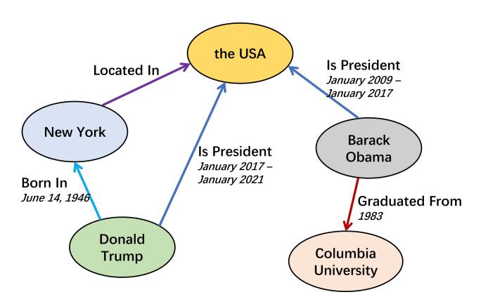

# Temporal Knowledge Graph Completion: A Survey

Borui Cai1 , Yong Xiang1 , Longxiang Gao2 , He Zhang3 , Yunfeng Li3 and Jianxin Li1

> 1School of Information Technology, Deakin University 2Qilu University of Technology 3CNPIEC KEXIN, Ltd

{b.cai,yong.xiang,jianxin.li}@deakin.edu.au, gaolx@sdas.org, {zhanghe,liyunfeng}@kxsz.net

## Abstract

Knowledge graph completion (KGC) predicts missing links and is crucial for real-life knowledge graphs, which widely suffer from incompleteness. KGC methods assume a knowledge graph is static, but that may lead to inaccurate prediction results because many facts in the knowledge graphs change over time. Emerging methods have recently shown improved prediction results by further incorporating the temporal validity of facts; namely, temporal knowledge graph completion (TKGC). With this temporal information, TKGC methods explicitly learn the dynamic evolution of the knowledge graph that KGC methods fail to capture. In this paper, for the first time, we comprehensively summarize the recent advances in TKGC research. First, we detail the background of TKGC, including the preliminary knowledge, benchmark datasets, and evaluation metrics. Then, we summarize existing TKGC methods based on how the temporal validity of facts is used to capture the temporal dynamics. Finally, we conclude the paper and present future research directions of TKGC.

### 1 Introduction

Knowledge graphs are multi-relational graphs that represent a wide range of real-world events as structured facts. A fact is composited of two entities (as nodes) and the relation that connects them (as the edge). The abundant information carried by knowledge graphs has made them favorable for various applications, e.g., content-based recommender system [Chen *et al.*[, 2022\]](#page-7-0), natural language question-answering [\[Mavromatis](#page-7-1) *et al.*, 2022], and text-centric information retrieval [Wu *et al.*[, 2021\]](#page-8-0). Unfortunately, despite their large scales, existing knowledge graphs (of both academic and industry) widely suffer from incompleteness. For example, in Freebase, more than 70% of person entities have unknown place of birth [Rossi *et al.*[, 2021\]](#page-8-1). This data scarcity issue greatly limits the effectiveness of knowledge graphs for downstream applications.

Knowledge graph completion (KGC) [Lin *et al.*[, 2015\]](#page-7-2) aims at automatically inferring missing links for a knowledge graph by learning from existing facts (also known as

Figure 1: A knowledge graph example that contains the temporal validity of facts.

link prediction). Benefiting from the blooming of machine learning and deep neural networks, many KGC methods perform effective link prediction through knowledge graph embedding [Rossi *et al.*[, 2021\]](#page-8-1). That is, learning lowdimensional representations for entities and relations with factual score functions, which measure the correctness of a fact. Despite their successes, one major limitation of KGC methods is that they can hardly learn the temporal dynamics of facts since they assume facts are static; however, many facts change over time. For example, in Fig. [1,](#page-0-0) {DonaldT rump, presidentOf, USA} is only valid from January 2017 to January 2021, while ignoring such temporal validity may lead to inaccurate predictions. Not to mention that the temporal dynamics of facts also carry essential causal patterns that can assist the link prediction.

Recently, temporal knowledge graph completion (TKGC) methods [\[Leblay and Chekol, 2018\]](#page-7-3) emerges, aiming at more accurate link prediction by addressing the above limitation of KGC methods. That is, in addition to the facts, TKGC methods further incorporate the temporal validity of facts into the learning process. TKGC methods widely have shown improved link prediction accuracy than KGC methods on multiple knowledge graph datasets. Specifically, the key challenge of TKGC is how to effectively integrate the temporal validity of facts into the model, so that the temporal dynamics of entities, relations, and the underlying graph can be properly captured and used for the link prediction. Although TKGC is increasingly attractive to the research community, so far we have not found a comprehensive survey that covers and categorizes the recent advances for TKGC. We notice that there exist surveys for the broader dynamic graph link prediction task [\[Qin and Yeung, 2022;](#page-8-2) Barros *et al.*[, 2021\]](#page-6-0), but they rarely discuss techniques specifically designed for the multi-relational knowledge graphs. In this paper, we fill this gap by comprehensively summarizing for the first time the progress of current TKGC research. Due to implementation and platform differences, we do not compare the published performance of existing TKGC methods on benchmark datasets, but focus on summarizing their technical differences for solving the TKGC problem.

The contributions of this paper are summarized as follows: 1) We propose a taxonomy of existing TKGC methods based on how the temporal validity of facts is integrated for link prediction. 2) We provide a detailed analysis of existing TKGC methods, and summarize common benchmark datasets and the general evaluation protocol. 3) We discuss the limitations of existing TKGC methods and provide several future research directions for TKGC.

The rest of this paper is organized as follows. Section 2 provides the background of TKGC, including the problem definition, the available benchmark datasets, and the general evaluation protocol. Section 3 analyzes existing TKGC methods. Finally, Section 4 draws the conclusion and discusses future research directions of TKGC.

### 2 Background

In this section, we first provide the preliminary knowledge of TKGC, and then introduce available benchmark datasets and the general evaluation protocol.

Preliminaries. A knowledge graph is a directed multirelational graph that contains structured facts. A fact is composited of two entities, a relation that connects the entities, and the temporal validity as a timestamp. A timestamp is typically a point (e.g., 2010) or a range (e.g., 2010 − 2013). For convenience, many TKGC methods split the time validity that is denoted as a range into a list of discrete points [\[Zhu](#page-8-3) *et al.*[, 2021\]](#page-8-3) according to the time precision of the task. Unless otherwise specified, we regard the temporal validity as a point or a list of points in the rest content.

We denote a knowledge graph that includes the temporal validity of facts as G = (E, R, T , D), where E, R and T are the sets of entities, relations, and timestamps, respectively. D ∈ E × R × E × T is the collection of facts contained in the knowledge graph. A fact is a quadruple denoted s = {h, r, t, τ}, where h, t, r and τ are the head entity, the tail entity, the relation between the two entities, and the timestamp indicating the temporal validity, respectively. Due to the recent progress of representation learning, many methods map knowledge graphs into low-dimensional representations [\[Leblay and Chekol, 2018\]](#page-7-3), and we use e to denote a learned representation for an entity/relation/timestamp. A factual score function, q(s), is used to measure the correctness of a fact for training. Besides the facts contained in the knowledge graph, negative sampling [\[Zhang](#page-8-4) *et al.*, 2019] creates negative samples s 0 by randomly corrupting s, which are

widely used by TKGC methods to improve the expressiveness of learned representations. We denote the collection of negative samples generated from s as D− s , and a loss function aims at collectively minimizing q(s) and maximizing q(s 0 ) for all facts and their negative samples. We summarize three different losses commonly employed by TKGC methods.

The margin ranking loss [\[Bordes](#page-7-4) *et al.*, 2013] is adopted to ensure large score margins between facts and their corresponding negative samples, which is defined as follows:

$$
\ell = \sum_{s \in \mathcal{D}} \left[ q(s) - \frac{1}{|\mathcal{D}_s^-|} \sum_{s' \in \mathcal{D}_s^-} q(s') + \gamma \right]_+, \tag{1}
$$

where [x]+ = max(x, 0) and γ is a hyper-parameter that regulates how large the score margin is expected. The crossentropy loss [Li *et al.*[, 2021a\]](#page-7-5) also aims at obtaining a large separation gap between facts and negative samples, but it does not enforce a fixed score margin for all facts:

$$
\ell = \sum_{s \in \mathcal{D}} \frac{\exp(q(s))}{\sum_{s' \in \mathcal{D}_s^-} \exp(q(s'))}.
$$
 (2)

The binary cross entropy loss [Liu *et al.*[, 2020a\]](#page-7-6) emphasizes the score of individual facts and negative samples as follows:

$$
\ell = \sum_{x \in \mathcal{D} \cup \mathcal{D}_s^-} yq(x) + (1 - y)q(x),\tag{3}
$$

where y = 1 if x ∈ D and y = 0 otherwise. The convenient calculation makes binary cross-entropy loss favorable for neural network-based TKGC methods.

Benchmark Datasets. We summarize six benchmark datasets widely used for the evaluation of TKGC methods in Table [1.](#page-2-0) The ICEWS and GDELT datasets contain events with time points, which are respectively extracted from the Integrated Crisis Early Warning System repository [\[Lauten](#page-7-7)[schlager](#page-7-7) *et al.*, 2015] and the Global Database of Events, Language, and Tone [Li *et al.*[, 2021b\]](#page-7-8). WIKIDATA [\[Leblay](#page-7-3) [and Chekol, 2018\]](#page-7-3) contains events extracted from the Wikidata knowledge base, with timestamps as time ranges like "occursSince 2013". YAGO15K [\[Garc´ıa-Duran´](#page-7-9) *et al.*, 2018] augments events of FB15K [\[Bordes](#page-7-4) *et al.*, 2013] with time ranges similar to WIKIDATA; but is more challenging since many facts have no timestamp. Time-aware filtering [\[Han](#page-7-10) *et al.*[, 2021\]](#page-7-10) is normally adopted to ensure reasonable evaluation of link prediction by removing candidates that appear in training, validation, or test sets.

Compared with the ICEWS datasets, the performance of existing models on GDELT dataset generally is lower, despite it contains the largest number of facts and the smallest entity and relation sets. The reason partly is that GDELT includes many abstract/concept entities (e.g., GOVERNMENT) [\[Li](#page-7-8) *et al.*[, 2021b\]](#page-7-8); these high-level entities can hardly align with events that have specific meanings during the evaluation. YAGO15k and WIKIDATA have relatively small dataset sizes, but their range timestamps provide richer temporal information than point timestamps.

Evaluation Protocol. The evaluation essentially measures how accurately a TKGC method can predict the missing

| Dataset    | E      | R   | T     | D         | T imestamp |
|------------|--------|-----|-------|-----------|------------|
| ICEWS14    | 7,128  | 230 | 365   | 90,730    | point      |
| ICEWS05-15 | 10,488 | 251 | 4,017 | 479,329   | point      |
| ICEWS18    | 23,033 | 256 | 304   | 468,558   | point      |
| GDELT      | 500    | 20  | 366   | 3,419,607 | point      |
| YAGO15k    | 15,403 | 32  | 169   | 138,048   | range      |
| WIKIDATA   | 11,153 | 96  | 328   | 150,079   | range      |

Table 1: Statistics of TKGC benchmark datasets.

links and is normally defined as the ranking of the factual score of the true prediction among all candidates. The commonly used evaluation metrics for accuracy include Hits@k, Mean Ranking (MR) and Mean Reciprocal Ranking (MRR). Hits@k is the percentage of ranks lower than or equal to k, MR is the average rank for all test quadruples, and MRR is the inverse of MR. Entity prediction is a basic link prediction task for TKGC and is expressed as two types of queries; that is, (?, r, t, τ ) and (h, r, ?, τ ), which correspond to prediction objectives as arg minhˆ∈E q(h, r, t, τ ˆ ) and arg mintˆ∈E q(h, r,t, τ ˆ ), respectively.

For some TKGC methods [\[Trivedi](#page-8-5) *et al.*, 2017] that adopt irreversible reasoning processes (e.g., path-finding from the head entity to the tail entity [Han *et al.*[, 2020b\]](#page-7-11)), the query (?, r, t, τ ) instead is predicted as (t, r−, ?, τ ) by introducing r − (the augmented inverse relation of r). During training, r − is learned by generating an inverse fact {t, r−, h, τ} for each fact {h, r, t, τ} in the training set. In addition to entity prediction, relation prediction ({h, ?, t, τ} [Li *et al.*[, 2021b\]](#page-7-8)) and time prediction ({h, r, t, ?} [\[Leblay and Chekol, 2018\]](#page-7-3)) are also discussed in some existing works, with same metrics for the accurate measurement. The current research community mainly focuses on evaluating TKGC models using queries that have timestamps seen in the dataset; while a rising challenge is to further evaluate the methods with out-ofsample timestamps that are unseen in the knowledge graph. Unseen timestamps can be categorized into two types, i.e., future timestamps [Li *et al.*[, 2021b\]](#page-7-8) and missing timestamps [Goel *et al.*[, 2020\]](#page-7-12). The evaluation with missing timestamps is regarded as interpolation or knowledge imputation; while future timestamps aim at extrapolation that challenges the effectiveness of predicting future events.

# 3 Temporal Knowledge Graph Completion Methods

To predict missing links, many KGC methods adopt factual score functions to measure the correctness of facts and negative samples. For example, the score function of TransE [\[Bor](#page-7-4)des *et al.*[, 2013\]](#page-7-4), q(h, r, t) = keh + er − etk, regards r as the translation between h and t. For TKGC, facts become quadruples due to additional timestamps. Therefore, TKGC expects more flexible models to further learn the temporal dynamics of knowledge graphs with the provided timestamps of facts. We observe that many TKGC methods are built upon existing KGC methods, and the main challenge is to design effective strategies to incorporate the timestamps into the factual score functions. Therefore, we analyze existing TKGC methods based on different strategies for timestamp integration and roughly categorize them into six types as follows:

- Time-included tensor decomposition: expresses a knowledge graph as a 4-way tensor, i.e., G ∈ R |E|×|R|×|E |×|T |, and learns latent representations by tensor decomposition/factorization techniques.
- Time-based transformation: learns time-based transformations e τ = fτ (e) that map static entity/relation representations to time-dependent representations.
- Dynamic embedding: adopts dynamic representations e(τ ) to capture the temporal evolutionary patterns.
- Learning from knowledge graph snapshots: treats a knowledge graph as a series of graph snapshots (G = {G1, G2, ..., G|T |}), and learns the graph dynamics to predict links.
- Reasoning with historical context: infers new links by reasoning with relevant historical facts (context) as p(s|context).
- Temporal logical rules: predict links as candidates that best satisfy temporal logical rules.

## 1 Time-included Tensor Decomposition

Tensor decomposition has been effective for KGC methods because it is light-weighted and easy to train [\[Rossi](#page-8-1) *et al.*, [2021\]](#page-8-1). For these methods, a knowledge graph can be viewed as a 3-dimensional adjacent matrix; namely, a 3-way binary tensor. The three tensor modes represent the indices of the head entity, the relation, and the tail entity, respectively, and an entry is 1 if the corresponding fact exists. The representations of entities and relations are learned by decomposing the tensor into low-dimensional matrices. Considering timestamps as an additional mode of tensor (a knowledge graph becomes a 4-way tensor), these tensor decomposition methods can naturally be extended for TKGC, and low-dimensional representations for timestamps are learned for the score measurement. We summarize relevant TKGC methods based on different tensor decomposition techniques used.

Canonical Polyadic Decomposition. Canonical polyadic (CP) decomposition decomposes the target tensor as the sum of a series of rank-one tensors. For a 3-way tensor X ∈ R n1×n2×n3 , CP decomposes it by X ≈ Pd α=1 A:,α ⊗ B:,α ⊗ C:,α, where ⊗ is the tensor outer product, A ∈ R n1×d , B ∈ R n2×d and C ∈ R n3×d are factor matrices. Each entry of X can be approximated as Xijk ≈ hai , bj , cki = Pd α=1 aiαbjαckα. T-SimplE [\[Lin and She, 2020\]](#page-7-13) adopts CP decomposition for TKGC by regarding a knowledge graph as G ∈ R |E|×|R|×|E |×|T |. Then, the factual score function becomes q(s) = heh, er, et, eτ i. An imaginary timestamp is adopted for static facts so that the model is also capable of learning from facts with missing timestamps. A similar CP decomposition model is adopted by TNTComplEx [\[Lacroix](#page-7-14) *et al.*[, 2020\]](#page-7-14), except that it uses complex-valued representation vectors so that the model can adapt to asymmetric relations. These two models further adopt temporal smoothness penalties to ensure neighboring timestamps learn similar representations. To further improve the expressiveness of representations, TeLM [Xu *et al.*[, 2021a\]](#page-8-6) moves beyond complexvalued representations and learns multivector representations with CP decomposition, considering that the 2-grade geometric product expresses greater interactions among entities, relations, and timestamps. The model flexibly adapts to timestamps of both points and ranges by a dual multivector relation representation, which separately represents the start and end time of a fact. A temporal smoothness penalty extends to a more general autoregressive manner, instead of pair-wise neighboring timestamps.

Tucker Decomposition. Tucker decomposition [\[Tucker,](#page-8-7) [1966\]](#page-8-7) is another tensor decomposition technique that is recently introduced for TKGC. Typically, Tucker decomposition is regarded as a more generalized tensor decomposition technique and CP decomposition is its special case. For Tucker decomposition, a tensor is factorized into a core tensor multiplied by a matrix along each mode, i.e., X ≈ W ×1 A ×2 B ×3 C, where A ∈ R n1×d1 , B ∈ R n2×d2 and C ∈ R n3×d3 . An entry is approximated as Xijk = Pd1 α=1 Pd2 β=1 Pd3 γ=1 Wαβγaiαbjβckγ. W is the core tensor that represents the level of interactions among decomposed matrices. Tucker decomposition is equivalent to CP decomposition when W is super diagonal and d1 = d2 = d3. Similar to CP decomposition TKGC methods, TuckERTNT [\[Shao](#page-8-8) *et al.*[, 2022\]](#page-8-8) adopts the Tucker decomposition by regarding a knowledge graph as a 4-way tensor. Given a fact {h, r, t, τ}, it scores its correctness as q(s) = hW; eh, er, et, eτ i, where W ∈ R de×dr×de×dτ measures the interactions among entities, relations and timestamps. W also is interpreted as a high-dimensional linear classifier that can distinguish facts from negative samples. By adopting Tucker decomposition, the flexibility of representations is improved, because the limitation that the embedding dimensions of entity, relation, and timestamp must be the same is relaxed.

### 2 Time-based Transformation

Typical KGC methods learn static entity and relation representations for link prediction. However, this is no longer appropriate when the temporal validity of facts is available in knowledge graphs, because the contexts of entities and relations in the knowledge graph are changing over time. To address this issue, many TKGC methods regard timestamps as a transformation to learn entity and/or relation representations corresponding to the specific time.

Synthetic Time-dependent Relation. Facts are quadruples in TKGC, with timestamps indicating when the relation between the head entity and tail entity holds, e.g., {Lakers, championOf, NBA, 2010}. That is different from KGC which adopts facts as triples; however, if manage to convert quadruples into triples, existing KGC models can be conveniently applied. A straightforward way is to create synthetic time-dependent relations by concatenating relations with timestamps (e.g., championOf:2010). With the synthetic relations, the above fact now becomes a triple {Lakers, championOf:2010, NBA}.

Synthetic relations are initially adopted by TTransE [\[Leblay and Chekol, 2018\]](#page-7-3) for the factual scoring measurement, i.e., q(s) = keh + u(r, τ ) − etk, where u(r, τ ) is the fusion function. It evaluates the prediction performance

of three basic fusion functions of u(r, τ ), i.e., er:τ , er + eτ and pτ er (pτ ∈ (0, 1] is a learnable coefficient), and the experimental results show that u(r, τ ) = er + eτ is the most effective. Different from time points, time ranges of different facts may overlap, e.g., 2010-2014 and 2012-2016. Therefore, directly concatenating time ranges with relations may lead to more synthetic relations than necessary. SpliME [\[Radstok and Chekol, 2021\]](#page-8-9) discovers optimal timestamps to concatenate relations by Splitting or Merging the existing time ranges. For a relation, Splitting splits time ranges by adopting change-point-detection (CPD) on the time series [\[Aminikhanghahi and Cook, 2017\]](#page-6-1) that represents the evolution of relation; while Merging iteratively merges time ranges (starting from the shortest time ranges) if the temporal validity of related facts is not affected.

Rather than directly concatenating relations and timestamps, other methods create more expressive synthetic relations by further exploiting the explicit date of timestamps. Ta-Transe [\[Garc´ıa-Duran´](#page-7-9) *et al.*, 2018] represents the concatenation of relation and timestamp as a sequence of tokens, e.g., {championOf, 2y, 0y, 1y, 0y} (y means year) for championOf:2010. The representation of synthetic relation is obtained as the final hidden state of an LSTM [\[Hochreiter](#page-7-15) [and Schmidhuber, 1997\]](#page-7-15), with the tokens as the input. Since LSTM can process vary-length sequences, a natural advantage is that the synthetic relation is adaptive to timestamps of different formats, such as points, ranges, or modifiers (e.g., "occursSince"). 3DRTE [Wang *et al.*[, 2020\]](#page-8-10) argues that different relations rely on different time resolutions. e.g., a person's life span is generally in years while the birth date should be in days. To achieve adaptive time resolution, the representation of synthetic relation is obtained by adopting multi-head self-attention on the timestamp-relation sequence.

Linear Transformation. In a knowledge graph, the connections of entities and relations at different times may significantly change. To capture the transition, timestamps are regarded as linear transformations, which can map entities/relations to the corresponding representations. Specifically, HyTE [\[Dasgupta](#page-7-16) *et al.*, 2018] regards timestamps as hyperplanes, which segregate the temporal space into discrete time zones. The entity/relation representation corresponding to a time zone is obtained by the projection with the specific hyperplane. For timestamp τ , the hyperplane is defined as wτ ∈ R d and kwτ k = 1. The projection function of τ is defined as P(e) = e − w T τ ewτ , where e is the static representation of entity or relation. The factual score is calculated with the projected representations as q(s) = kP(eh) + P(er) − P(et)k. To improve the expressiveness for multi-relational facts, Hybrid-TE [\[Wang and Li,](#page-8-11) [2019\]](#page-8-11) includes an additional relational matrix to map entities to be relation-specific, before being projected by the hyperplane. Moreover, TDG2E [Tang *et al.*[, 2020\]](#page-8-12) adopts GRU (as the encoder) on the sequence of hyperplanes of timestamps (chronologically ordered) to further capture the dynamics among hyperplanes.

Other than hyperplanes, TeRo [Xu *et al.*[, 2020a\]](#page-8-13) regards the transformation for entities as a linear rotation in the complex space. That is, ehτ = eh ◦ eτ and etτ = et ◦ eτ ,

where ◦ is the Hermitian product in the complex space. Then, the relation is regarded as the translation of the rotated head entity to the conjugate of the tail entity as q(s) = kehτ +er−e¯tτ k. Similarly, ChronoR [\[Sadeghian](#page-8-14) *et al.*, 2021] uses high-dimensional rotation transformation parameterized by relation and time to obtain the time-dependent representation of head entities, i.e., Qr,τ (e h ) = e t . Tensor nuclear norm is further adopted as the regularization term to ensure the learned representations generalize well to unseen timestamps. ToKEI [\[Leblay](#page-7-17) *et al.*, 2020] uses timestamps as more expressive transformation matrices, and to achieve arbitrary time precision (compatible with timestamps of different resolutions), it unifies possible time resolutions (e.g., quarter, month, week) as a one-hot vector, with different time resolutions separately expressed as vector segments. The onehot vector of the timestamp further corresponds to a series of linear transformation matrices, which are used to map entities/relations to be time-dependent.

#### 3 Dynamic Embedding

In the TKGC task, time-dependent representations are expected to exhibit changes in entity/relation contexts over time. Notably, the variation of an entity/relation representation along the timeline usually follows specific dynamical evolution patterns. For example, a person's life cycle can only be bornIn −→ workAt −→ dieIn, and it is irreversible. Dynamic embedding methods aim at capturing these evolution patterns by encoding the dynamics in learned representations.

Representations as Functions of Time. To represent the dynamical evolution of entities/relations, an intuitive method is to develop representations as functions parameterized by time, which explicitly capture certain types of dynamic patterns. In ATiSE [Xu *et al.*[, 2020b\]](#page-8-15), the representations of entities and relations are regarded as time series, which can be decomposed into three components, i.e., e = estatic + trend(τ ) + seasonal(τ ) + N . estatic is an invariant component that represents the static feature of entities/relations, trend(τ ) and seasonal(τ ) (with τ as the input parameter) respectively represent the trend and seasonal features, and N is an addictive random noise. DyERNIE [Han *et al.*[, 2020a\]](#page-7-18) develops a similar model that adopts a static component and a time-varying component for a representation; but is defined in the hyperbolic space. The hyperbolic space can express more flexible geometric structures for the graph-structured data than the Euclidean space. Accordingly, the interactions among entities and relations are defined as the product of Riemannian manifolds. The time-varying component of a representation, which represents the dynamical evolution of entities, is regarded as the movement on manifolds; namely, the velocity vector in the tangent space. Inspired by diachronic word embedding, DE-SimplE [Goel *et al.*[, 2020\]](#page-7-12) proposes a diachronic embedding for entities and relations. In this setup, the representation is divided into a static segment and a timevarying segment. Likewise, the static segment represents the time-invariant features, and the time-varying segment is a neuron that has a timestamp as the input. The diachronic embedding is model-agnostic, and can conveniently incorporate relational domain knowledge (e.g., inversion and symmetry) to improve the link prediction accuracy. To further improve the expressiveness, BoxTE [\[Messner](#page-8-16) *et al.*, 2022] introduces relation-dependent dynamic entity representations and enables individual relations to learn distinct temporal behaviors, which captures temporal inference patterns effectively.

Representations as Hidden States of RNN. In contrast to specific dynamical patterns, recurrent neural networks (RNN) can adaptively learn the implicit dynamical evolution of entities and relations. Know-Evolve [\[Trivedi](#page-8-5) *et al.*, 2017] models the occurrence of facts as a multidimensional temporal point process, which represents the complex co-evolution of multiple dynamic events. The model uses a conditional intensity function, which is implemented as the factual score measured with entity/relation representations, to infer the time of the next fact occurrence, given previously occurred facts. Meanwhile, the representations of the fact's head entity and tail entity at τ are learned as the output of two separate RNNs, respectively. The input of either RNNs includes the concatenation of head and tail entity presentations prior τ , aiming at capturing their dynamical co-evolve patterns over time. Similarly, TeMP [Wu *et al.*[, 2020\]](#page-8-17) incorporates a structural encoder that implements multi-hop messaging passing and a temporal encoder with sequential encoders such as GRU or self-attention [\[Vaswani](#page-8-18) *et al.*, 2017]. The structural encoder learns the structural dependencies of entities at each timestamp, and the outputs are further fed into the temporal encoder to integrate with the temporal dynamics. The hidden states that capture both information are adopted as dynamic entity representations. The model further tackles the temporal heterogeneity, i.e., sparsity and variability of entity occurrences, by data imputation (for inactive entities) and frequency-based gating.

### 4 Learning from Knowledge Graph Snapshots

With the timestamps, the original knowledge graph can be viewed as a series of knowledge graph snapshots/subgraphs, i.e., G = {G1, G2, ..., G|T |}, and each subgraph only contains facts that are valid at the corresponding time. In this way, the knowledge graph becomes a temporal evolving subgraph that has varying relation connections. The link prediction problem is performed by inferring the multi-relational interactions among entities and relations over time.

Markov Process Models. To learn the temporal dynamics, RTFE [Xu *et al.*[, 2021b\]](#page-8-19) regards the states of knowledge graph evolve over time following the first-order Markov process. That means the state of a knowledge graph snapshot depends on its previous snapshot, through a probability transition matrix, i.e., Sτ+1 = Sτ · Pτ . Sτ indicates the state of Gτ and is defined as the combination of the representations of entities/relations and the learnable state parameters. The model training is implemented in a recursive update manner, with the static embedding used as an effective initialization. In contrast to deterministic approaches, DBKGE [Liao *et al.*[, 2021\]](#page-7-19) adopts probabilistic entity representations, based on variational Bayesian inference [\[Kingma](#page-7-20) [and Welling, 2013\]](#page-7-20), to jointly model the entity features and the uncertainty. The representations are defined as Gaussian distributions, with learnable means and variances. The generation process in the model is defined as conditional probability p(Gτ |Eτ , Rτ ). First-order Markov rule is adopted for entities as p(Eτ |E<τ ) = p(Eτ |Eτ−1). Relations at different timestamps are regarded as independent since they normally denote time-insensitive actions in datasets. Therefore, the joint probability can be simplified as Q p(G≤τ , E≤τ , R≤τ ) = τ i=1 p(Gi |Ei , Ri)p(Ei |Ei−1)p(Ri). The expressive evolution patterns learned by the model are shown to be effective for TKGC in both offline and online scenarios.

Autoregressive Models. RE-NET [Jin *et al.*[, 2019\]](#page-7-21) models the dynamical evolution of facts in an autoregressive manner, i.e., the generation of a fact that belongs to Gτ dependents on Gτ−m:τ−1, where m is the order of the autoregression. Besides Gτ−m:τ−1 that carries the graph structures, the generation process further recurrently incorporates local multi-hop neighboring information of the fact, with a multi-relational graph aggregator. In addition to graph structures, RE-GCN [Li *et al.*[, 2021b\]](#page-7-8) employs multiple graph convolution layers on each graph snapshot to capture the dependencies of concurrent facts. The gate recurrent component is adopted to efficiently learn the long-term temporal patterns from historical facts and alleviate the gradient vanishing. Moreover, the static properties of entities (e.g., type) are used as constraints to further refine the learned representations. In addition to the direct neighbor aggregation process of entities, EvoKG [\[Park](#page-8-20) *et al.*[, 2022\]](#page-8-20) learns facts and corresponding timestamps through conditional density estimation, which depends on previously observed knowledge graph snapshots. The model is formulated as neural network-based estimators, with additional relational graph convolution networks that are extended to take the temporal evolution of entities and their interactions into account. A statistical model is further proposed by NLSM [\[Gracious](#page-7-22) *et al.*, 2021] to capture the dynamic evolution of graph snapshots, and a neural network-based variational inference ensures the model scales up to the complex knowledge graph structures. Different from the discrete evolution process, TANGO [Han *et al.*[, 2021\]](#page-7-10) adopts continuous-time embedding to encode both temporal and structural information of historical knowledge graph snapshots. Structural information is captured with multi-relational graph convolutional layers, and dynamical evolution is learned by neural ordinary differential equations (NODES). Considering that many facts are not informative when they do not change across two adjacent timestamps, a graph transition layer is further included in the model to emphasize facts that dissolute or form across two knowledge graph snapshots.

#### 5 Reasoning with Historical Context

In TKGC, the adoption of timestamps helps reveal the chronological order of facts in the knowledge graph. That enables predicting missing links by reasoning with the historical context of the query. Normally, facts that occurred before and related to the query are regarded as their historical context. We observe existing methods mainly use two different perspectives to interpret the relevance between the query and its historical context for the link prediction.

Attention-based Relevance. Attention mechanisms that selectively concentrate on important aspects can automatically capture the relevance of facts. Following this line, xERTE [Han *et al.*[, 2020b\]](#page-7-11) implements a reasoning process as the continuous expansion of a query-dependent inference subgraph. The inference subgraph iteratively expands through sampling neighboring historical facts (share the same head entity). The expansion is directed to the query's interest according to the edge attention scores, which are calculated by message passing from historical facts with a temporal relational graph attention layer. The final inference subgraph is regarded as the interpretable reasoning path for the predicted results. To better learn the long-term dependency of facts, T-GAP [Jung *et al.*[, 2021\]](#page-7-23) develops a path-based multi-hop reasoning process by propagating attention through the edges of the knowledge graph (with attention flow [Xu *et al.*[, 2018\]](#page-8-21)). Therefore, the inferred attention distribution is used as the natural interpretation of the prediction. Specifically, they argue that temporal displacement between historical facts and the query is more indicative than the exact timestamp; for example, "2 days before" is more explicit than "12/01/2021" to the query tagged with "14/01/2021". Therefore, the model captures displacements at two different granularities, i.e., the sign of temporal displacement (past, present, and future) and the exact magnitude of the displacement. A two-stage GNN is adopted, with the temporal displacement included, so that the structural features of query-related entities and relations are also captured by the reasoning process.

Heuristic-based Relevance. Another perspective is to adopt external/domain knowledge, as heuristics or guidelines, during the relevance measurement of historical facts. Specifically, two types of predefined tendency scores (Goodness and Closeness) are introduced by TPmod [Bai *et al.*[, 2021\]](#page-6-2) to organize historical facts for the link prediction. Goodness measures the hostility level of relation, e.g., sanction is more hostile than collaborate, while Closeness measures how cooperative two entities are. Then, historical facts are aggregated based on the tendency scores, so that more relevant clues are used for the prediction. A GRU is further adopted for the aggregated historical facts at each timestamp to learn the dynamic reasoning process. CyGNet [Zhu *et al.*[, 2021\]](#page-8-3) observes that history often repeats itself in the knowledge graph datasets; for example, they report that more than 80% of events recorded from 1995 to 2019 in the ICEWS repository have occurred previously. Based on this, the model consists of two modes (Copy and Generation) for inference. The Copy mode learns the probability that the query is a repeat of related historical facts. The Generation mode learns the probability of all possible candidates to be the prediction, with a linear classifier. The outputs of the two modes are aggregated for the final prediction.

# 6 Temporal Logical Rules

Different from TKGC methods that lack explainability, rulebased methods adopt understandable temporal logical rules to predict missing links. Temporal logical rules are extended from static rules by AnyBURL [\[Meilicke](#page-7-24) *et al.*, 2019], which is a path from the query entity to the predicted entity, by further including timestamps. For example, (e1, r1, e3, τ3) ←− (e1, r1, e2, τ1) ∧ (e2, r2, e3, τ2), and the left-side is the rule head while the right-side is the rule body. The extracted paths are human-readable and thus provide a fair explanation for the predicted results. For simplicity, StreamLearner [\[Omran](#page-8-22) *et al.*[, 2019\]](#page-8-22) defines the rule-body to have the same timestamp. It adopts a static rule learner to extract a set of static rules (without timestamps), and extend them to temporal logical rules that have both effective rule heads and rule bodies (based on the confidence degree). TLogic [Liu *[et al.](#page-7-25)*, [2022\]](#page-7-25) relaxes the strict constraint and proposes cyclic temporal rules that have chronologically non-decreasing timestamps, i.e., (E1, rh, El+1, Tl+1) ← ∧l i=1(Ei , ri , Ei+1, Ti). To efficiently learn such temporal logical rules, a temporal random walk method is developed to sample a small set of paths. The random walk uses exponential edge weights in the transition matrix to ensure that timely close edges are favored. To further improve the coverage, TLmod [Bai *et al.*[, 2023\]](#page-6-3) designs more rule forms, in addition to the path-based rules. That includes symmetric, equivalence, inverse, transitivity, and composition rules. These rules are obtained by learning their confidence scores in the knowledge graph, which are decided according to similarities between rule heads and rule bodies. In addition, obtained rules can be used for knowledge graph construction and quality assurance [Liu *et al.*[, 2020b\]](#page-7-26).

# 4 Conclusion and Future Directions

This paper reviews recent studies of TKGC and organizes them by how time validity is incorporated for link prediction. Although these methods have achieved significant progress and obtained promising results on benchmark datasets, there are still several open challenges.

Incorporate External Knowledge. Although many methods have shown up, there is still a lot of room for improvement in the prediction accuracy, especially on the GDELT dataset. There are many datasets-related issues that limit the performance of link prediction; for example, the in-balanced distribution of facts, which results in a long tail structure for entities and relations [\[Mirtaheri](#page-8-23) *et al.*, 2020]. A potential solution is to enrich the limited structural/temporal information by incorporating external knowledge during the model learning. For example, relational domain knowledge ensures relations that have low occurrences are capable of learning from other close relations (e.g., parentOf can learn from its inverse relation childOf) [Goel *et al.*[, 2020\]](#page-7-12); while entity types help more realistic representation learning by enriching the background knowledge of entities [Li *et al.*[, 2021b\]](#page-7-8). Moreover, the semantics of entities/relations such as names and types are largely ignored by existing methods. Utilizing them through pre-trained language models can further enrich the limited information of knowledge graphs for link prediction.

Time-aware Negative Sampling. Negative sampling assists effective representation learning of entities and relations by generating negative samples, contrasting to true facts in knowledge graphs. Generating discriminative negative samples is essential since failing to do so may hardly improve the model or even cause gradient vanishing [\[Zhang](#page-8-4) *et al.*, [2019\]](#page-8-4). Although negative sampling is an active research field for KGC (e.g., with GAN [\[Cai and Wang, 2018\]](#page-7-27)), it is rarely explored in the TKGC, except for the basic random sampling of timestamps [\[Montella](#page-8-24) *et al.*, 2021]. Negative sampling for TKGC is presumably more challenging due to the additional time dimension, which requires properly tackling the complex correlations between facts and their temporal validity.

Larger-scale Knowledge Graph. Compared with datasets used for the evaluation of TKGC methods, real-life knowledge graphs are much larger and often contain billions of facts. Unfortunately, training TKGC models with the above-mentioned benchmark datasets is already quite timeconsuming (takes hours to days), and applying them to reallife knowledge graphs is unthinkable. To improve the efficiency, distributed models that perform on multi-node computation resources without significantly undermining the link prediction accuracy need to be investigated, and that brings challenges such as optimal dataset partition and distributed computation (with timestamps considered). Meanwhile, the parameter sizes of existing methods are large since a unique embedding is learned for each entity/relation. Considering that entities/relations share similar features, developing compositional embedding [Yu *et al.*[, 2014\]](#page-8-25) that represents entities/relations as the composition of explicitly/implicitly shared features is also promising to be explored.

Evolutionary Knowledge Graph. While most existing methods perform TKGC on invariant knowledge graphs, reallife knowledge graphs are constantly evolving, through the deletion of wrong facts and the inclusion of new facts. So, knowledge graphs constantly update their entities, relations, and timestamps. To avoid training a new model from scratch for each update, it is essential to consider TKGC in an incremental or continual learning scenario. Frontier work has attempted to address the catastrophic forgetting in this streaming scenario with experience replay and knowledge distillation [Wu *et al.*[, 2021\]](#page-8-0), and achieves results comparative to baselines. In the future, other continual learning techniques such as regularization and progressive neural networks can further be investigated for TKGC.

# Acknowledgments

This work was supported in part by the Australian Research Council under Grant LP190100594.

## References

- [Aminikhanghahi and Cook, 2017] Samaneh Aminikhanghahi and Diane J Cook. A survey of methods for time series change point detection. *Knowledge and Information Systems*, 51(2):339–367, 2017.
- [Bai *et al.*, 2021] Luyi Bai, Xiangnan Ma, Mingcheng Zhang, and Wenting Yu. Tpmod: A tendency-guided prediction model for temporal knowledge graph completion. *ACM Transactions on Knowledge Discovery from Data*, 15(3):1–17, 2021.
- [Bai *et al.*, 2023] Luyi Bai, Wenting Yu, Die Chai, Wenjun Zhao, and Mingzhuo Chen. Temporal knowledge graphs reasoning with iterative guidance by temporal logical rules. *Information Sciences*, 621:22–35, 2023.
- [Barros *et al.*, 2021] Claudio DT Barros, Matheus RF Mendonc¸a, Alex B Vieira, and Artur Ziviani. A survey on embedding dynamic graphs. *ACM Computing Surveys (CSUR)*, 55(1):1–37, 2021.

- [Bordes *et al.*, 2013] Antoine Bordes, Nicolas Usunier, Alberto Garcia-Duran, Jason Weston, and Oksana Yakhnenko. Translating embeddings for modeling multi-relational data. *NIPS*, 26, 2013.
- [Cai and Wang, 2018] Liwei Cai and William Yang Wang. Kbgan: Adversarial learning for knowledge graph embeddings. In *NAACL-HLT*, 2018.
- [Chen *et al.*, 2022] Wei Chen, Huaiyu Wan, Shengnan Guo, Haoyu Huang, Shaojie Zheng, Jiamu Li, Shuohao Lin, and Youfang Lin. Building and exploiting spatial– temporal knowledge graph for next poi recommendation. *Knowledge-Based Systems*, 258:109951, 2022.
- [Dasgupta *et al.*, 2018] Shib Sankar Dasgupta, Swayambhu Nath Ray, and Partha Talukdar. Hyte: Hyperplane-based temporally aware knowledge graph embedding. In *EMNLP*, pages 2001–2011, 2018.
- [Garc´ıa-Duran´ *et al.*, 2018] Alberto Garc´ıa-Duran, Sebasti- ´ jan Dumancic, and Mathias Niepert. Learning sequence encoders for temporal knowledge graph completion. In *EMNLP*, 2018.
- [Goel *et al.*, 2020] Rishab Goel, Seyed Mehran Kazemi, Marcus Brubaker, and Pascal Poupart. Diachronic embedding for temporal knowledge graph completion. In *AAAI*, volume 34, pages 3988–3995, 2020.
- [Gracious *et al.*, 2021] Tony Gracious, Shubham Gupta, Arun Kanthali, Rui M Castro, and Ambedkar Dukkipati. Neural latent space model for dynamic networks and temporal knowledge graphs. In *AAAI*, volume 35, pages 4054– 4062, 2021.
- [Han *et al.*, 2020a] Zhen Han, Peng Chen, Yunpu Ma, and Volker Tresp. Dyernie: Dynamic evolution of riemannian manifold embeddings for temporal knowledge graph completion. *EMNLP*, page 7301–7316, 2020.
- [Han *et al.*, 2020b] Zhen Han, Peng Chen, Yunpu Ma, and Volker Tresp. Explainable subgraph reasoning for forecasting on temporal knowledge graphs. In *ICLR*, 2020.
- [Han *et al.*, 2021] Zhen Han, Zifeng Ding, Yunpu Ma, Yujia Gu, and Volker Tresp. Learning neural ordinary equations for forecasting future links on temporal knowledge graphs. In *EMNLP*, pages 8352–8364, 2021.
- [Hochreiter and Schmidhuber, 1997] Sepp Hochreiter and Jurgen Schmidhuber. Long short-term memory. ¨ *Neural Computation*, 9(8):1735–1780, 1997.
- [Jin *et al.*, 2019] Woojeong Jin, Meng Qu, Xisen Jin, and Xiang Ren. Recurrent event network: Autoregressive structure inference over temporal knowledge graphs. *EMNLP*, page 6669–6683, 2019.
- [Jung *et al.*, 2021] Jaehun Jung, Jinhong Jung, and U Kang. Learning to walk across time for interpretable temporal knowledge graph completion. In *KDD*, pages 786–795, 2021.
- [Kingma and Welling, 2013] Diederik P Kingma and Max Welling. Auto-encoding variational bayes. *arXiv preprint arXiv:1312.6114*, 2013.

- [Lacroix *et al.*, 2020] Timothee Lacroix, Guillaume Obozin- ´ ski, and Nicolas Usunier. Tensor decompositions for temporal knowledge base completion. *arXiv preprint arXiv:2004.04926*, 2020.
- [Lautenschlager *et al.*, 2015] Jennifer Lautenschlager, Steve Shellman, and Michael Ward. ICEWS Event Aggregations, 2015.
- [Leblay and Chekol, 2018] Julien Leblay and Melisachew Wudage Chekol. Deriving validity time in knowledge graph. In *WWW*, pages 1771–1776, 2018.
- [Leblay *et al.*, 2020] Julien Leblay, Melisachew Wudage Chekol, and Xin Liu. Towards temporal knowledge graph embeddings with arbitrary time precision. In *CIKM*, pages 685–694, 2020.
- [Li *et al.*, 2021a] Zixuan Li, Xiaolong Jin, Saiping Guan, Wei Li, Jiafeng Guo, Yuanzhuo Wang, and Xueqi Cheng. Search from history and reason for future: Two-stage reasoning on temporal knowledge graphs. In *ACL/IJCNLP*, 2021.
- [Li *et al.*, 2021b] Zixuan Li, Xiaolong Jin, Wei Li, Saiping Guan, Jiafeng Guo, Huawei Shen, Yuanzhuo Wang, and Xueqi Cheng. Temporal knowledge graph reasoning based on evolutional representation learning. In *SIGIR*, page 408–417. Association for Computing Machinery, 2021.
- [Liao *et al.*, 2021] Siyuan Liao, Shangsong Liang, Zaiqiao Meng, and Qiang Zhang. Learning dynamic embeddings for temporal knowledge graphs. In *WSDM*, pages 535– 543, 2021.
- [Lin and She, 2020] Lifan Lin and Kun She. Tensor decomposition-based temporal knowledge graph embedding. In *ICTAI*, pages 969–975. IEEE, 2020.
- [Lin *et al.*, 2015] Yankai Lin, Zhiyuan Liu, Maosong Sun, Yang Liu, and Xuan Zhu. Learning entity and relation embeddings for knowledge graph completion. In *AAAI*, 2015.
- [Liu *et al.*, 2020a] Yu Liu, Wen Hua, Kexuan Xin, and Xiaofang Zhou. Context-aware temporal knowledge graph embedding. In *WISE*, pages 583–598. Springer, 2020.
- [Liu *et al.*, 2020b] Zhiyu Liu, Meng Jiang, and Hai Lin. A graph-based spatial temporal logic for knowledge representation and automated reasoning in cognitive robots. *arXiv preprint arXiv:2001.07205*, 2020.
- [Liu *et al.*, 2022] Yushan Liu, Yunpu Ma, Marcel Hildebrandt, Mitchell Joblin, and Volker Tresp. Tlogic: Temporal logical rules for explainable link forecasting on temporal knowledge graphs. In *AAAI*, volume 36, pages 4120– 4127, 2022.
- [Mavromatis *et al.*, 2022] Costas Mavromatis, Prasanna Lakkur Subramanyam, Vassilis N Ioannidis, Adesoji Adeshina, Phillip R Howard, Tetiana Grinberg, Nagib Hakim, and George Karypis. Tempoqr: temporal question reasoning over knowledge graphs. In *AAAI*, volume 36, pages 5825–5833, 2022.
- [Meilicke *et al.*, 2019] Christian Meilicke, Melisachew Wudage Chekol, Daniel Ruffinelli, and

Heiner Stuckenschmidt. Anytime bottom-up rule learning for knowledge graph completion. In *IJCAI*, pages 3137–3143, 2019.

- [Messner *et al.*, 2022] Johannes Messner, Ralph Abboud, and Ismail Ilkan Ceylan. Temporal knowledge graph completion using box embeddings. In *AAAI*, volume 36, pages 7779–7787, 2022.
- [Mirtaheri *et al.*, 2020] Mehrnoosh Mirtaheri, Mohammad Rostami, Xiang Ren, Fred Morstatter, and Aram Galstyan. One-shot learning for temporal knowledge graphs. *arXiv preprint arXiv:2010.12144*, 2020.
- [Montella *et al.*, 2021] Sebastien Montella, Lina M. Rojas Barahona, and Johannes Heinecke. Hyperbolic temporal knowledge graph embeddings with relational and time curvatures. In *ACL (Findings)*, pages 3296–3308, 2021.
- [Omran *et al.*, 2019] Pouya Ghiasnezhad Omran, Kewen Wang, and Zhe Wang. Learning temporal rules from knowledge graph streams. In *AAAI Spring Symposium: Combining Machine Learning with Knowledge Engineering*, 2019.
- [Park *et al.*, 2022] Namyong Park, Fuchen Liu, Purvanshi Mehta, Dana Cristofor, Christos Faloutsos, and Yuxiao Dong. Evokg: Jointly modeling event time and network structure for reasoning over temporal knowledge graphs. In *WSDM*, pages 794–803, 2022.
- [Qin and Yeung, 2022] Meng Qin and Dit-Yan Yeung. Temporal link prediction: A unified framework, taxonomy, and review. *arXiv preprint arXiv:2210.08765*, 2022.
- [Radstok and Chekol, 2021] Wessel Radstok and Mel Chekol. Leveraging static models for link prediction in temporal knowledge graphs. *arXiv preprint arXiv:2106.15223*, 2021.
- [Rossi *et al.*, 2021] Andrea Rossi, Denilson Barbosa, Donatella Firmani, Antonio Matinata, and Paolo Merialdo. Knowledge graph embedding for link prediction: A comparative analysis. *ACM Transactions on Knowledge Discovery from Data*, 15(2):1–49, 2021.
- [Sadeghian *et al.*, 2021] Ali Sadeghian, Mohammadreza Armandpour, Anthony Colas, and Daisy Zhe Wang. Chronor: Rotation based temporal knowledge graph embedding. In *AAAI*, volume 35, pages 6471–6479, 2021.
- [Shao *et al.*, 2022] Pengpeng Shao, Dawei Zhang, Guohua Yang, Jianhua Tao, Feihu Che, and Tong Liu. Tucker decomposition-based temporal knowledge graph completion. *Knowledge-Based Systems*, page 107841, 2022.
- [Tang *et al.*, 2020] Xiaoli Tang, Rui Yuan, Qianyu Li, Tengyun Wang, Haizhi Yang, Yundong Cai, and Hengjie Song. Timespan-aware dynamic knowledge graph embedding by incorporating temporal evolution. *IEEE Access*, 8:6849–6860, 2020.
- [Trivedi *et al.*, 2017] Rakshit Trivedi, Hanjun Dai, Yichen Wang, and Le Song. Know-evolve: Deep temporal reasoning for dynamic knowledge graphs. In *ICML*, pages 3462–3471. PMLR, 2017.

- [Tucker, 1966] Ledyard R Tucker. Some mathematical notes on three-mode factor analysis. *Psychometrika*, 31(3):279– 311, 1966.
- [Vaswani *et al.*, 2017] Ashish Vaswani, Noam Shazeer, Niki Parmar, Jakob Uszkoreit, Llion Jones, Aidan N Gomez, Łukasz Kaiser, and Illia Polosukhin. Attention is all you need. In *NIPS*, pages 5998–6008, 2017.
- [Wang and Li, 2019] Zhihao Wang and Xin Li. Hybrid-te: Hybrid translation-based temporal knowledge graph embedding. In *ICTAI*, pages 1446–1451. IEEE, 2019.
- [Wang *et al.*, 2020] Jingbin Wang, Wang Zhang, Xinyuan Chen, Jing Lei, and Xiaolian Lai. 3drte: 3d rotation embedding in temporal knowledge graph. *IEEE Access*, 8:207515–207523, 2020.
- [Wu *et al.*, 2020] Jiapeng Wu, Meng Cao, Jackie Chi Kit Cheung, and William L Hamilton. Temp: temporal message passing for temporal knowledge graph completion. *EMNLP*, page 5730–5746, 2020.
- [Wu *et al.*, 2021] Jiapeng Wu, Yishi Xu, Yingxue Zhang, Chen Ma, Mark Coates, and Jackie Chi Kit Cheung. Tie: A framework for embedding-based incremental temporal knowledge graph completion. In *SIGIR*, page 428–437, 2021.
- [Xu *et al.*, 2018] Xiaoran Xu, Songpeng Zu, Chengliang Gao, Yuan Zhang, and Wei Feng. Modeling attention flow on graphs. *arXiv preprint arXiv:1811.00497*, 2018.
- [Xu *et al.*, 2020a] Chengjin Xu, Mojtaba Nayyeri, Fouad Alkhoury, Hamed Shariat Yazdi, and Jens Lehmann. TeRo: A time-aware knowledge graph embedding via temporal rotation. In *COLING*, pages 1583–1593, 2020.
- [Xu *et al.*, 2020b] Chenjin Xu, Mojtaba Nayyeri, Fouad Alkhoury, Hamed Yazdi, and Jens Lehmann. Temporal knowledge graph completion based on time series gaussian embedding. In *ISWC*, pages 654–671. Springer, 2020.
- [Xu *et al.*, 2021a] Chengjin Xu, Yung-Yu Chen, Mojtaba Nayyeri, and Jens Lehmann. Temporal knowledge graph completion using a linear temporal regularizer and multivector embeddings. In *NAACL*, pages 2569–2578. Association for Computational Linguistics, 2021.
- [Xu *et al.*, 2021b] Youri Xu, E. Haihong, and Meina Song. Rtfe: A recursive temporal fact embedding framework for temporal knowledge graph completion. In *NAACL*, 2021.
- [Yu *et al.*, 2014] Mo Yu, Matthew Gormley, and Mark Dredze. Factor-based compositional embedding models. In *NIPS Workshop on Learning Semantics*, pages 95–101, 2014.
- [Zhang *et al.*, 2019] Yongqi Zhang, Quanming Yao, Yingxia Shao, and Lei Chen. Nscaching: simple and efficient negative sampling for knowledge graph embedding. In *ICDE*, pages 614–625. IEEE, 2019.
- [Zhu *et al.*, 2021] Cunchao Zhu, Muhao Chen, Changjun Fan, Guangquan Cheng, and Yan Zhan. Learning from history: Modeling temporal knowledge graphs with sequential copy-generation networks. *AAAI*, 2021.
