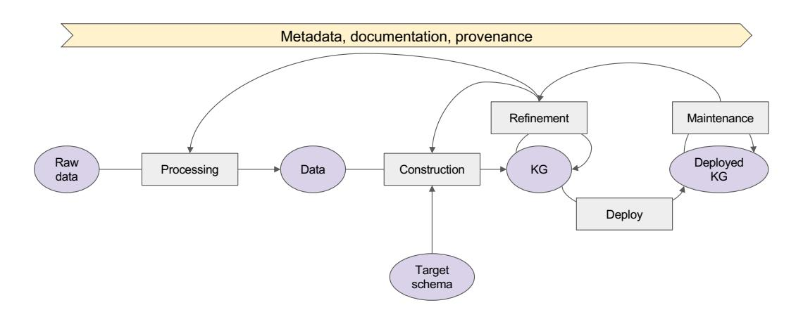
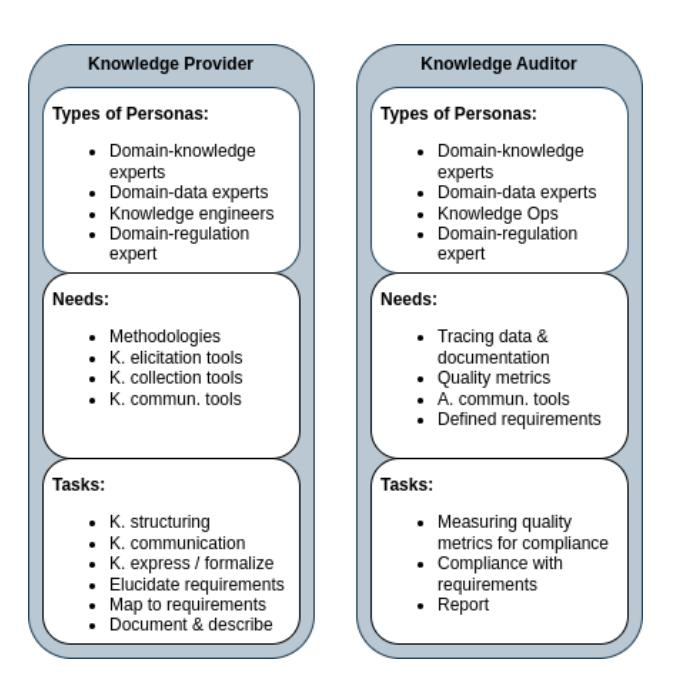
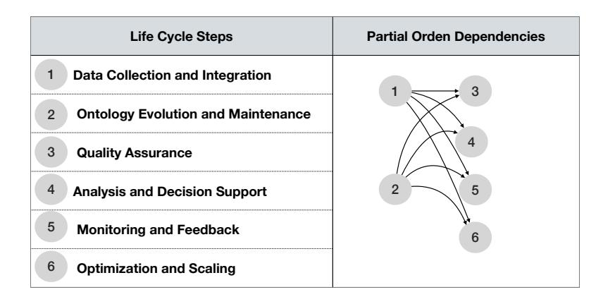
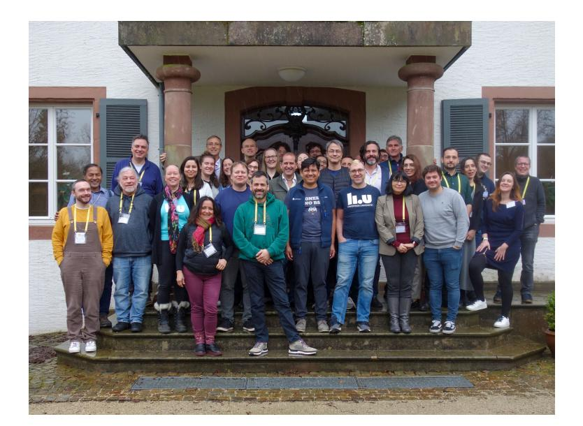

<span id="page-0-0"></span>**David Chaves-Fraga**<sup>∗</sup>**<sup>1</sup> , Oscar Corcho**[∗](#page-0-0)**<sup>2</sup> , Anastasia Dimou**[∗](#page-0-0)**<sup>3</sup> , Maria-Esther Vidal**[∗](#page-0-0)**<sup>4</sup> , Ana Iglesias-Molina**†**<sup>5</sup> , and Dylan Van Assche**[†](#page-0-0)**<sup>6</sup>**-**1 Universidade de Santiago de Compostela, ES. [david.chaves@usc.es](mailto:david.chaves@usc.es)**-**2 Universidad Politécnica de Madrid, ES. [ocorcho@fi.upm.es](mailto:ocorcho@fi.upm.es)**-**3 KU Leuven, BE. [anastasia.dimou@kuleuven.be](mailto:anastasia.dimou@kuleuven.be)**-**4 TIB Hannover, DE. [vidal@l3s.de](mailto:vidal@l3s.de)**-**5 Universidad Politécnica de Madrid, ES. [ana.iglesiasm@upm.es](mailto:ana.iglesiasm@upm.es)**-**6 IDLab Ghent University imec, BE. [Dylan.VanAssche@ugent.be](mailto:Dylan.VanAssche@ugent.be)**-**Abstract**This report documents the program and results of the Dagstuhl Seminar 24061 "Are Knowledge Graphs Ready for the Real World? Challenges and Perspectives". The seminar focused on gaining a better understanding of the open challenges required for the development of Knowledge Graph ecosystems. The seminar focused on four different topics: access control and privacy in decentralized knowledge graphs, knowledge graph construction lifecycle, software methods for improving KG implementation, and a new wave of knowledge engineers and their expected skills. By focusing on these relevant research topics, the seminar aimed to reflect on KGs from a more fundamental computer science perspective. It brought together interdisciplinary researchers from academia and industry to discuss foundations, concepts, and implementations that will pave the way for the next generation of KGs ready for real-world use.
**Seminar**February 4–9, 2024 –<https://www.dagstuhl.de/24061>

-**2012 ACM Subject Classification**Information systems → Resource Description Framework (RDF); Information systems → Data exchange; Information systems → Graph-based database models; Information systems; Information systems → Data model extensions; Information systems → Query languages; Information systems → Data structures; Information systems → Information integration; Information systems → Semantic web description languages; Information systems → Web applications; Social and professional topics → Computing education; Security and privacy → Security services; Theory of computation → Semantics and reasoning; Information systems → Information retrieval
-**Keywords and phrases**access control and privacy, federated query processing, intelligent knowledge graph management, programming paradigms for knowledge graphs, semantic data integration
**Digital Object Identifier**[10.4230/DagRep.14.2.1](https://doi.org/10.4230/DagRep.14.2.1)

Except where otherwise noted, content of this report is licensed

[Schloss Dagstuhl – Leibniz-Zentrum für Informatik, Dagstuhl Publishing, Germany](https://www.dagstuhl.de)

<sup>∗</sup> Editor / Organizer

<sup>†</sup> Editorial Assistant / Collector

under a [Creative Commons BY 4.0 International](https://creativecommons.org/licenses/by/4.0/) license Are Knowledge Graphs Ready for the Real World? Challenges and Perspective,*Dagstuhl Reports*, Vol. 14, Issue 2, pp. 1–70

Editors: David Chaves-Fraga, Oscar Corcho, Anastasia Dimou, and Maria-Esther Vidal [Dagstuhl Reports](https://www.dagstuhl.de/dagstuhl-reports/)

# <span id="page-1-0"></span>1 Executive Summary

*David Chaves-Fraga (Universidade de Santiago de Compostela, ES, david.chaves@usc.es) Oscar Corcho (Universidad Politécnica de Madrid, ES, oscar.corcho@upm.es) Anastasia Dimou (KU Leuven, BE, anastasia.dimou@kuleuven.be) Maria-Esther Vidal (TIB – Hannover, DE, vidal@l3s.de)*

**License**[Creative Commons BY 4.0 International](https://creativecommons.org/licenses/by/4.0/) license © [David Chaves-Fraga, Oscar Corcho, Anastasia Dimou and Maria-Esther Vidal](#page-1-0)

Graphs and knowledge bases have been around for many decades, and research results have had a tremendous impact on areas such as mathematics, artificial intelligence, and databases. However, although the term has been coined by the scientific community, technological developments and astronomical data growth have made knowledge graph (KG) management a fundamental topic in various areas of computer science today. The scientific and industrial communities have responded to the emerging field of knowledge management. As a result, formal frameworks for defining and representing KGs, as well as methods for creating, exploring, and analyzing KGs, have flourished to make KGs a reality. However, despite the tangible results, sustainability is still compromised by the lack of transparent and accountable management of CCs. The real-world application of KGs requires programming paradigms for KG management, transparent data integration and quality assessment techniques, and methods for maintaining access control and privacy. In addition to technological advances, societal adjustments can have a tremendous impact on the management of KGs. The seminar addressed these socio-technical challenges with a mix of invited talks, lightning talks, and small group workshops as follows:
**The Incremental Creation of Knowledge Graphs.**Creating a Knowledge Graph (KG) involves several open research challenges, such as data extraction, data quality, data integration, and data security. It also requires attention to architectural aspects such as scalability and interoperability. A working group was formed to discuss and focus on two main topics: the definition of a general pipeline for KG construction and its relationship to data quality. The main outcome is a standard formalization of the KG construction lifecycle and its associated components. This definition is accompanied by quality measures and provenance tracking of all steps.
**Support of Knowledge Graph Implementation.**Software engineering and programming languages have created approaches and techniques that support complex tasks during software development such as software dependencies, error identification, testing, syntactic validation, software lifecycle, etc. We look into these proposals to determine a set of requirements in software lifecycle management for knowledge graphs. They will improve and facilitate the implementation of knowledge graphs in industrial and complex environments, taking into account the relationships and dependencies between all the artifacts used (ontologies, shapes, mappings, tests, etc.) as well as their evolution and versioning. To achieve this goal, we believe that it is necessary to have a better understanding and general overview of how knowledge graphs are implemented. Therefore, a workshop on this topic has been proposed at ISWC2024[1](#page-1-1) . After its celebration, the next step will be to create a community around this topic with researchers and industry stakeholders to standardize and implement the identified challenges/requirements.

<span id="page-1-1"></span><sup>1</sup> <https://w3id.org/soflim4kg>
**Access Control in Decentralized Knowledge Graphs.**Exploring access control in decentralized Knowledge Graphs has been a relatively underexplored area. Specifically, mechanisms for restricting access to knowledge to safeguard confidential information and personal data, as well as establishing consent models for the processing of personal data, have not received substantial attention within the realm of Knowledge Graph management. Additionally, ensuring compliance with usage policies has been inadequately addressed, particularly in the context of decentralized Knowledge Graphs. During the seminar, a dedicated group convened to deliberate on approaches for managing Knowledge Graphs across a federation of decentralized instances.
**A New Generation of Knowledge Engineers.**Improving the utilization and management of knowledge graphs requires educating a diverse audience about both the social and technical aspects of knowledge work. To address this need, a dedicated working group was established. This group conducted an analysis to identify existing educational resources and gaps in knowledge, exploring how consensus could be fostered among various stakeholders in the field. Moreover, the group investigated the specific educational requirements tailored to different audiences, including professional students, undergraduates, and postgraduates. By thoroughly examining these aspects, the working group aimed to formulate strategies for enhancing education and understanding in the domain of knowledge graph utilization and management.

| 2 |  |  | Table of Contents |
|---|--|--|-------------------|
|---|--|--|-------------------|

| Executive Summary<br>David Chaves-Fraga, Oscar Corcho, Anastasia Dimou and Maria-Esther Vidal                            | 2        |
|--------------------------------------------------------------------------------------------------------------------------|----------|
| Invited Talks                                                                                                            |          |
| Semantic Data Integration<br>Maurizio Lenzerini<br>.                                                                     | 7        |
| Access Control, Policies and Constraints<br>Sabrina Kirrane                                                              | 9        |
| Programming Languages<br>Martin Giese<br>.                                                                               | 10       |
| Industry Perspectives<br>Souripriya Das<br>.                                                                             | 12       |
| Lightning Talks                                                                                                          |          |
| From linked data for regulatory reporting towards an interoperable data layer for<br>the rail sector: The ERA KG         |          |
| Marina Aguado<br>Knowledge Graphs for the Circular Economy<br>Eva Blomqvist                                              | 15<br>16 |
| Personal Data Protection in Knowledge Graphs (and KR in general)<br>Piero Andrea Bonatti                                 | 17       |
| Private Knowledge Graph Construction<br>Carlos Buil-Aranda                                                               | 18       |
| Challenges in Procedural Knowledge governance in Industry 5.0<br>Irene Celino                                            | 18       |
| Are Knowledge Graphs ready for the World Wide Web?<br>Pierre-Antoine Champin                                             | 19       |
| On the Need for Project Management for Knowledge Graph Construction and<br>Usage Projects                                |          |
| Oscar Corcho and David Chaves-Fraga<br>Grounding KGs in Natural Language                                                 | 20       |
| Christophe Debruyne<br>KG4SE & SE4KG: Exploring the Intersection of Knowledge Graph and Software<br>Engineering Research | 20       |
| Coen De Roover<br>Challenges on Knowledge Graph Data Management Quality                                                  | 21       |
| Anastasia Dimou<br>.<br>Semantic Knowledge Graphs as a Foundation for Advanced AI Applications                           | 22       |
| Michel Dumontier<br>.<br>"Real World" Considered Harmful<br>George Fletcher                                              | 24<br>25 |
|                                                                                                                          |          |

## David Chaves-Fraga, Oscar Corcho, Anastasia Dimou, and Maria-Esther Vidal 5

| Reliable Knowledge Graphs Need Reliable Processes<br>Paul Groth<br>.                                    | 25 |
|---------------------------------------------------------------------------------------------------------|----|
| Challenges for Knowledge Graphs (KGs) in an Era of Machines that Learn<br>Claudio Gutierrez             | 26 |
| Knowledge Graphs in the Real World with metaphactory<br>Peter Haase                                     | 27 |
| Improving UX/DX in Querying Federations of KGs<br>Olaf Hartig<br>.                                      | 28 |
| Can Large Language Models improve the Usability of Knowledge Graphs?<br>Aidan Hogan<br>.                | 28 |
| No Intelligence without Knowledge<br>Katja Hose<br>.                                                    | 29 |
| Lowering the Barriers for Declarative Knowledge Graph Construction Adoption<br>Ana Iglesias-Molina<br>. | 29 |
| Knowledge Graph Adoption: Unveiling User Perspective and Challenges<br>Samaneh Jozashoori<br>.          | 30 |
| Semantic Reflection<br>Eduard Kamburjan<br>.                                                            | 30 |
| Exploiting Semantics for Integrating Data on Critical Minerals<br>Craig A. Knoblock<br>.                | 31 |
| Knowledge-enhanced Representation Learning to Accelerate Scientific Discovery<br>Vanessa López          | 31 |
| Using LLMs to Augment KG Construction<br>Paco Nathan<br>.                                               | 32 |
| Queries over Evolving Knowledge Graphs<br>Edelmira Pasarella<br>.                                       | 33 |
| From Traditional Data Quality to Knowledge Graph Quality<br>Anisa Rula<br>.                             | 33 |
| The Future of Knowledge is Social<br>Juan F. Sequeda<br>.                                               | 34 |
| Towards Resource-efficient and Hybrid KG Construction Approaches<br>Dylan Van Assche<br>.               | 35 |
| MisLED: Linked Enterprise Data Left without Research Attention<br>Ivo Velitchkov                        | 35 |
| Data and Knowledge Management in Knowledge Graphs<br>Maria-Esther Vidal                                 | 36 |
| Breakout Groups                                                                                         |    |
| Access and Usage Control for Federations of Knowledge Graphs                                            |    |

| Quality-aware Knowledge Graph Construction                                            |    |
|---------------------------------------------------------------------------------------|----|
| Cinzia Cappiello, Maria-Esther Vidal, Sandra Geisler, Ana Iglesias-Molina, Dylan      |    |
| Van Assche, David Chaves-Fraga, Anastasia Dimou, Irene Celino, Anisa Rula,            |    |
| Maurizio Lenzerini<br>.                                                               | 47 |
| Knowledge Engineering and Education                                                   |    |
| Juan F. Sequeda, Aidan Hogan, Axel Polleres, Christophe Debruyne, Eva Blomqvist,      |    |
| Samaneh Jozashoori, Paul Groth, Claudio Gutiérrez, George Fletcher, Ivo Velitchkov 59 |    |
| Project Management for Knowledge Graph Construction and Usage                         |    |
| Oscar Corcho, Coen De Roover, Paco Nathan, Souripriya Das, Eduard Kamburjan,          |    |
| Martin Giese, Marina Aguado, David Chaves-Fraga, Carlos Buil-Aranda, Wouter           |    |
| Beek<br>.                                                                             | 65 |
| Emerging Discussions                                                                  |    |
| Knowledge Management and Knowledge Graphs                                             |    |
| Axel Polleres, Irene Celino<br>.                                                      | 68 |
| Conclusions                                                                           | 69 |
| Participants                                                                          | 70 |
|                                                                                       |    |

## <span id="page-6-0"></span>3 Invited Talks

## <span id="page-6-1"></span>3.1 Semantic Data Integration
*Maurizio Lenzerini (Sapienza University of Rome, IT)*

**License**[Creative Commons BY 4.0 International](https://creativecommons.org/licenses/by/4.0/) license © [Maurizio Lenzerini](#page-6-1)

Data integration is considered as one of the old problems in data management. The definition assumed in the talk is the one characterizing data integration as the problem of providing a unified and transparent view to a collection of data stored in multiple, autonomous, and heterogeneous data sources. The unified view is achieved through a global schema, and is realized either through a materialized database (warehousing, or exchange), or through a virtualization mechanism based on querying (virtual integration). Formal approaches to data integration started in the 90's (see for example the PODS 1995 by A. Y. Levy and colleagues). Since then, research both in academia and in industry has addressed a huge variety of aspects of the general problem. In this talk the focus was on the idea of using semantics for making data integration more effective. But what does it mean to pose semantics at the center of the scene? The main element is that the unified view is not simply a data schema harmonizing the schemas of the data sources, but it is a structure formally representing the domain of interest for the users of the system. The unified view to information consumers is not merely a data structure accommodating the various data at the sources, but a semantically rich description of the relevant concepts in the domain of interest, as well as the relationships between such concepts. The distinguishing feature of the whole approach is that users of the system will be freed from all the details of how to use the data sources, as they will express their needs (e.g., a query) in the terms of the concepts, the relations, and the processes described in the domain model. Since ontologies are suitable formalisms for domain modeling, Ontology-based Data Integration (OBDI) is a promising direction for realizing the above idea. The founding principle of OBDI is to apply suitable techniques from the area of Knowledge Representation (KR) and Reasoning for a new way to achieve data governance and integration, based on the principle of managing heterogeneous data through the lens of an ontology. OBDI resorts to a three-level architecture, constituted by the ontology, the data sources, and the mapping between the two:

- The data layer is constituted by the existing data sources that are part of the organization.
- The ontology is a declarative and explicit representation of the domain of interest for the organization, specified by means of a formal and high level description of all relevant aspects.
- The mapping is a set of declarative assertions specifying how the available sources in the data layer and the computational resources used in the organization relate to the ontology.

The above components are used to provide novel, sophisticated services in governing and integrating data. In particular, the ontology is the pivotal element for documenting the IT resources of the organization, expressing their semantics at an abstract, conceptual level. By working with a specification mechanism that is close to the conceptual view of the domain, the designer is facilitated in the initial specification, evolution and maintenance of IT resources, and the final user interacts with the data in a more natural way than in the case of a unified view expressed in terms of a data schema. The further step that is becoming more and more popular is the idea of rendering the ontology in terms of a Knowledge Graph, thus exposing the meaning of data and the structure of the domain knowledge to

users/applications in a very flexible and effective way. Now, the idea of using Semantic Networks for information integration is an old one, and since Knowledge Graphs have a lot in common with Semantic Networks, the talk presented a brief history regarding KR formalisms, from Semantic Networks to Knowledge Graphs, not only discussing the similarities, but also pointing out several crucial differences, and delving into the details of three of them.

The first difference is the central role played by formal semantics when Knowledge Graphs are used to express ontologies. Indeed, it is generally accepted to formalize ontologies in logic, and in any logic the expressions built according to the appropriate syntax rules are assigned formal semantics. In turn, this has the important consequences of providing a solid formalization of the notion of inference (in particular, deductive inference) in the context of Knowledge Graphs, something that was missing in the early Semantic Networks. Such formalization opens up the possibility of defining precise methods for reasoning about the Knowledge Graph and the mappings, and for reformulating the needs (e.g., queries) expressed over the Knowledge Graph in terms of appropriate calls to services provided by the data source managers.

The second difference is the attention to the cost of reasoning. In order to translate the services expressed over the ontology into correct and efficient computations over the data sources, techniques typical of the two areas of Knowledge Representation and Automated Reasoning are crucial. Unfortunately, many reasoning problems in the context of expressive formalisms are intractable or even undecidable. It is therefore crucial to find a trade-off between expressive powers of axioms formalizing Knowledge Graphs and the computational complexity of reasoning over them. Moreover, OBDI introduces new challenges to these areas. Indeed, while Knowledge Representation techniques are often confined to scenarios where the complexity resides in the rules governing the domain, in OBDI one often faces the problem of a huge amount of data in the data layer, and this poses completely new requirements for the reasoning tasks that the system should be able to carry out. For example, the notion of data complexity, by which one measures the computational complexity on the basis of the size of the data layer only, is of paramount importance in OBDI.

Finally the third difference is that the architecture of OBDI suggests considering new types of reasoning problems that may be useful in real world scenarios and are addressed in recent papers. In the talk, three of them were discussed in more detail. One is the need for reasoning about metamodeling features, one is the challenge of semantically characterizing in terms of the Knowledge Graphs the services expressed over the data source, and the third is the problem of assessing the quality of data by using the domain model expressed in the Knowledge Graph. The first issue arises from the fact that Knowledge Graphs naturally mix intensional and extensional knowledge while the great majority of research works on ontology (e.g., the ones based on OWL and Description Logics) keep them separated. The second issue calls for new types of reasoning tasks in the context of OBDI. A recent proposal in this direction defines the notion of abstraction: given a process P expressed at the level of the sources, the goal is to compute the query over the Knowledge Graphs, called abstraction, that captures P for every configuration of the data layer. The third issue refers to the possibility of using the domain model represented in the Knowledge Graph as a yardstick for measuring the quality of data at the sources along various dimensions, such as, for example, consistency, accuracy, and completeness.

## <span id="page-8-0"></span>3.2 Access Control, Policies and Constraints
*Sabrina Kirrane (Wirtschaftsuniversität Wien, AT)*

**License**[Creative Commons BY 4.0 International](https://creativecommons.org/licenses/by/4.0/) license © [Sabrina Kirrane](#page-8-0)

Knowledge graphs hold immense potential for the public and the private sector alike, both in terms of internal enterprise data management and data sharing across enterprises. In both cases there is a need for restricting or constraining access to knowledge in order to protect confidential information and personal data. There are already several standards that can be used to specify licenses (the Open Digital Rights Language (ODRL)), legal requirements (LegalRuleML), and constraints (the Shapes Constraint Language (SHACL)) that are particularly suitable for knowledge graphs. ODRL is a W3C recommendation, which is composed of two complementary specifications (i) the ODRL Information Model; and (ii) the ODRL Vocabulary and Expressions. Although the language is most suitable for modeling intellectual property rights, over the years it has also been used to model contracts, regulatory requirements, access policies, and privacy policies. A more suitable choice for modeling legal texts (e.g., legislation, regulations, contracts) is LegalRuleMl, which is an OASIS specification that extends the modular rule markup language (RuleML) with the ability to encode legal norms. From a constraints perspective, the W3C SHACL specification has proven its effectiveness for validating Resource Description (RDF) based graph databases. More recently, researchers have been exploring the use of SHACL for encoding access policies.

Additionally researchers have demonstrated the potential of the W3C Web Ontology Language (OWL) general purpose modeling language in order to model consent for personal data processing and the corresponding legal requirements stipulated in the General Data Protection Regulation (GDPR). Another noteworthy initiative is the work conducted by the W3C Data Privacy Vocabularies and Controls Community Group (DPVCG) in relation to modeling privacy and data protection vocabularies primarily derived from GDPR. Also, extensive access control research has resulted in proposals that can be used to specify access policies at different levels of granularity: named graphs, views, triples, triple patterns, and quad patterns. Many of these works either adopt the OASIS eXtensible Access Control Markup Language (XACML) standard enforcement components or propose derivatives that were inspired by the XACML standard.

In recent years the focus has shifted from access control to usage control, which strives to constrain what happens with data and knowledge after access has been granted. There are a number of different usage control frameworks that could potentially be applied to knowledge graphs, however in a decentralized setting once data or knowledge is shared, different copies and derivations of the same data or knowledge can be easily shared with others. Although it is extremely difficult to constrain ad hoc sharing there are a number of desideratum: data producers (individuals and organizations) need to be able to attach usage policies to data and knowledge; there is a need for techniques that can ensure continuous adherence to these policies; and legal fall back measures need to be supported via appropriate technical governance mechanisms. At present there are different approaches: (i) assume that data consumers want to demonstrate compliance and show how policy languages and system logs can together be used to provide transparency or evidences of compliance; or (ii) use a combination of hardware and software, such as Intel's Software Guard Extensions (SGX) trusted execution environment, to ensure compliance.

Looking more broadly at the topic of access control, policies, and quality, there have been a number of journal special issues soliciting state of the art research in terms of knowledge graph governance, validation, and quality assurance. From a data and algorithmic governance

perspective a recent call for papers[2](#page-9-1) was very broad aiming to attract research ranging from privacy and data protection to trust, authenticity, integrity, and bias detection and mitigation. However, the special issue attracted works that aimed to support companies in complying with the GDPR, with contributions in relation to: consent approaches and best practices; ontologies for representing personal data processing information flows; privacy-preserving data analytics; and differential privacy for knowledge graphs. From a validation and a quality assurance perspective a recent call for papers[3](#page-9-2) solicited theoretical and practical methods and techniques for assessing and validating the quality of knowledge graphs with either quality or validation appearing in the majority of the listed topics. Interesting the special issue attracted a broad range of contributions on: the quality of linked open data sources; techniques for learning SHACL shapes from knowledge graphs; a single unified graph data model that embraces both RDF and property graphs; assertion and alignment correction for large knowledge graphs; exploring how subgraphs change over time; and facilitating composition and reusability.

Since the GDPR, the legal landscape in Europe has evolved considerably with several important new acts appearing under the digital strategy for Europe umbrella, such as, the Copyright in the Digital Single Market Directive[4](#page-9-3) , the EU Data Governance Act[5](#page-9-4) , the EU Data Act[6](#page-9-5) , and the proposed EU Artificial Intelligence Act[7](#page-9-6) . These acts will not only have a major influence on both the public and private sector, but will also be a major driver for research in relation to knowledge graph governance, validation, and quality assurance.

Additionally there are a number of open challenges and opportunities when it comes to privacy, policies, and quality. We need to put more emphasis on tech transfer and develop best practices for software engineers and architects. Performance, scalability, and usability need to be assessed in practical real world settings. There is no standard general purpose policy language capable of representing various policies, norms, and preferences. Machine-readable policies must faithfully represent human policies and norms. Technical usage control is difficult, which means we often need to rely on legal agreements. We need to get into the practice of defining attacker models for privacy and security use case scenarios.

## <span id="page-9-0"></span>3.3 Programming Languages
*Martin Giese (University of Oslo, NO)*

**License**[Creative Commons BY 4.0 International](https://creativecommons.org/licenses/by/4.0/) license © [Martin Giese](#page-9-0)

The talk addressed the relationship between knowledge graphs (KGs) and programming languages. Two central observations are:

1. There is more than one interesting connection: while it is interesting to ask for a programming language or paradigm particularly suitable for generating, transforming, or accessing KGs, programs can also be seen as specifications of processes, i.e. how

<span id="page-9-1"></span><sup>2</sup> [https://www.semantic-web-journal.net/blog/call-papers-special-issue-semantic](https://www.semantic-web-journal.net/blog/call-papers-special-issue-semantic-technologies-data-and-algorithmic-governance)[technologies-data-and-algorithmic-governance](https://www.semantic-web-journal.net/blog/call-papers-special-issue-semantic-technologies-data-and-algorithmic-governance)

<span id="page-9-2"></span><sup>3</sup> [https://www.semantic-web-journal.net/blog/call-papers-special-issue-knowledge-graphs](https://www.semantic-web-journal.net/blog/call-papers-special-issue-knowledge-graphs-validation-and-quality)[validation-and-quality](https://www.semantic-web-journal.net/blog/call-papers-special-issue-knowledge-graphs-validation-and-quality)

<span id="page-9-3"></span><sup>4</sup> <https://eur-lex.europa.eu/legal-content/en/TXT/?uri=CELEX%3A32019L0790>

<span id="page-9-4"></span><sup>5</sup> <https://eur-lex.europa.eu/legal-content/EN/TXT/?uri=CELEX%3A32022R0868>

<span id="page-9-5"></span><sup>6</sup> <https://eur-lex.europa.eu/legal-content/EN/TXT/?uri=COM%3A2022%3A68%3AFIN>

<span id="page-9-6"></span><sup>7</sup> <https://eur-lex.europa.eu/legal-content/EN/TXT/?uri=celex%3A52021PC0206>

situations change over time. Desirable language features for these two purposes will be quite different. E.g., while efficiency and scalable software engineering are important in the first case, the ability to verify properties deductively or by model checking is more important in the second case.

2. One of the main goals of semantic technologies is to treat as much as possible of the "business logic" through knowledge representation, and to implement generic software that is driven by arbitrary ontologies, constraints, etc., rather than implementing software that is strongly tied to an application. Therefore, before asking which programming language is best suited for knowledge graph work, one should always ask first if a generic tool would be more appropriate.

The talk continued by discussing a selection of approaches from the literature, that address the combination.

The most obvious approach is maybe to use a logic programming language like Prolog: it delivers a very tight integration between programming and knowledge representation, since Prolog rules and facts can in fact be seen as executable representations of domain knowledge. Logic programming is extremely well researched, and the relation to databases (in the form of Datalog) is also well known. There are several drawbacks however: If there is no separation between the "external knowledge" to be manipulated and the program itself, then representing change, i.e. the evolution of knowledge is not straightforward – unless one implements knowledge bases as a data structure in Prolog, losing much of the original appeal. Similarly, reasoning is built-in, but only on Prolog's terms. If something else is needed, one needs to work around what Prolog provides, rather than using it.

Another interesting approach is that of programming languages that explicitly have a knowledge base as part of the program state and that let programs query and modify this knowledge base. We reviewed the 2015 work of Zarieß and Claßen that builds on Levesque and Reiter's GOLOG from 1997. The language allows querying the knowledge base using epistemic operators; i.e. queries are explicitly about all known instances of some concepts, it is possible to "sense" parts of the knowledge base, after which corresponding parts of the state become known, and it possible to modify the knowledge base by means of "effects" which change the KB in such a way that a fact becomes true. The authors show how to verify properties expressed in CTL (Computation Tree Logic) for such programs. Although the language presented is a toy language, with comparatively complicated semantics, it has many interesting properties. A related approach was presented by Calvanese, de Giacomo, Lenzerini, and Rosati in 2011. Where Zarieß and Claßen's proposal uses a semantic that modifies epistemic interpretations, i.e. semantic entities, the work of Calvanese et al modifies the ABox, i.e. the syntax of the KB, using the theory of Knowledge Base revision when changes lead to inconsistency. While these languages certainly show a direction for programming with knowledge, it is not clear how appropriate the approach would be for the practical manipulation of knowledge graphs. Similarly to the criticism of logic programming, the built-in reasoning and update of knowledge bases may or may not be what is required, and a more direct access to the representations and not only the knowledge is useful in many cases.

The remainder of the talk addressed attempts at reconciling object oriented (OO) programming and modeling with semantic approaches. While an OO program can deal with knowledge graphs as data structures, as is done in frameworks like Jena or RDF4J, the wish here is to include some more of the semantics into the programs. We reviewed some of the most important issues that make a straightforward mapping between OO classes and OWL classes, UML associations and object properties, etc., problematic:

- 1. OO models and programs describe data, in a closed world way. Comparing an OWL statement that every person has a father to a similar UML model or an OO programming asserting that the hasFather field of every person is non-null, we see that the OO semantics is closer to the closed-world view of databases or SHACL than to OWL.
- 2. The OO view is almost universally that resources have a single type that they receive upon creation, that will not change, and that dictates their behavior. This is quite different from the semantic technology view where resources can be inferred to have arbitrarily many types.
- 3. Associations in UML and fields in programs are placeholders for data values. There is no direct correspondence between UML associations and OWL/RDFS range and domain statements.

We briefly reviewed the work on Type-safe programming for the Web by Martin Leinberger and others. The main idea here is to extend the Java type system with types corresponding to DL concepts. This work circumvents the described projects by essentially keeping the OO and DL class hierarchies separate.

Finally, we gave an overview of our own work on the SMOL language (smolang.org), developed in the frame of the PeTWIN project (petwin.org) to enable the semantic orchestration of digital twins. The core idea of SMOL is the semantic lifting of program states. In its simplest form, this means that a direct mapping of OO program states, including all objects and fields, to RDF is defined. During the program execution, this RDF graph can be queried from the program, giving the programmer a means of semantic reflection. This becomes more interesting if an ontology and more specific mappings are added that describe the application domain and its relationship to the program data structures. In this way a coherent semantic view on program states can be maintained, and used from within the program, while maintaining the necessary and useful "semantic gap" between the object oriented and semantic views. The approach has been used in a case study connecting an elaborate formal ontology of structural geology to SMOL code for the qualitative simulation of geological processes. On the theoretical side, we have been able to establish type safety properties, using theorem proving to reestablish type safety despite the untyped nature of SPARQL.

To summarize, one should avoid putting domain knowledge into programs if possible. If it is necessary, the choice of language will depend on what one wants to achieve – Execution? Modeling? Reasoning? – and how much actual programming will be needed. If "real" programming is required, then a proper, e.g. object oriented language may be required, but the semantic gap between the OO and semantic perspectives must be kept in mind.

## <span id="page-11-0"></span>3.4 Industry Perspectives
*Souripriya Das (Oracle Corp. – Nashua, US)*

**License**[Creative Commons BY 4.0 International](https://creativecommons.org/licenses/by/4.0/) license © [Souripriya Das](#page-11-0)

The content presented in this talk consisted of three parts: 1) the first part focused on identifying some of the major factors that affect adoption of a technology in the industry; 2) the second part briefly outlined how Oracle's graph technology products try to take these factors into account; 3) the third part identified, and suggested possible approaches to addressing, some new requirements that may be critical for wider adoption of graph technologies in the industry.

At the outset of the first part, we explained a sequence of phases that a technology typically goes through: 1) innovators and researchers, from academics and industry, invent novel concepts, techniques and algorithms that try to create new or improved solutions to emerging or pre-existing problems; 2) experts from the relevant domains then work on those novel ideas to create standards that refine and augment those ideas to ensure their implementability in practice; 3) availability of those standards enables vendors to create products that implement them and relevant tools; 4) customers then use those products to create solutions for the end users; 5) the end users make use of those solutions in their business use cases.

Next, we outlined some of the factors that we have seen as playing a major role in the industrial adoption of new technologies. The first and foremost important factor is that the proposed novel concepts and techniques must provide substantial tangible benefits for important existing or anticipated business use cases. Substantial effort has to be expended to ensure this is reliably established so that the proposal receives positive attention from the industry. The second factor is that the technology must be powerful yet intuitive enough that it can be grasped easily by the developers and the developers in turn can explain its potential benefits to the business leaders in their companies. Being on the positive side for this second factor enables experts from the industry to obtain approval to participate in the standards work for the technology. Involvement of industry experts with prior experience in dealing with use of related technologies helps in keeping the standards concise yet sufficient for most of the anticipated major requirements in practice. Several factors come in next as the vendors create products that implement the standards. These factors have to do with going beyond implementing just the functionality. These include scalability and efficiency in handling large amounts of data and large numbers of concurrent users, access control, security, and availability. Additionally, a set of tools relevant for the technology must be made available or be present in the near-term roadmap.

As shortcomings of a new technology for existing or newly-arising use cases get identified, it becomes important to enhance the technology. We explained why critical factors relevant for technology upgrade include not only the simplicity of the revisions to avoid a "major reboot" of the existing mental model but also ensuring full backward compatibility so that every pre-existing thing – already-loaded data, formatted input data, queries, tools – must continue to work without requiring any changes. Invalidation of pre-existing queries, for example, becomes a major expense for an enterprise because large numbers of queries may need to be rewritten.

Next, we shared the good news that over the last 20 years, graph technologies in Oracle went from being relatively unknown inside Oracle to something that shows up as a top technology in presentations by Oracle Executives: graph is now listed as a major data model in the Oracle Converged Database along with relational and JSON. We also indicated that our internal groups have started creating and using ontologies with a goal to provide cloud services for integrating industrial data from a large number of customers in areas such as energy and water utilities.

The second part of the talk briefly outlined how Oracle products for graph technologies – RDF and property graph – took into account some of the major factors for industry adoption outlined in the first part. Graph technologies in Oracle Database provide comprehensive support for standards including W3C's RDF, RDFS, OWL, SPARQL, RDB2RDF, and OGC's GeoSPARQL. Besides scalable and efficient support for concurrent use of RDF, Oracle also provides extensive support for data sharing and access control, including fine-grained (triple-level) access control using its OLS (Oracle Label Security) technology. Furthermore,

given the importance of tools for industry adoption, Oracle's graph technology offering includes native tools like RDF Server and Query UI and Graph Studio, plugin for Oracle REST Data Services (ORDS), and adapters for popular open source tools Eclipse RDF4J, Apache Jena, and Protege. Oracle's support for SPARQL in SQL (using the SEM\_MATCH table function) and the SQL/PGQ standard enables integrated access to graph and relational data.

The third part of the talk included topics on identifying and exploring possible ways of addressing new requirements that may be critical for industrial adoption. First, we identified the following as some of the possible reasons why SQL/PGQ became part of SQL standard but SPARQL in SQL did not: the complexity of IRIs in RDF (vs. scalar values in property graph), extreme flexibility of RDF (vs. strictly-typed properties, no direct support for multi-valued properties, and only natively-typed values in property graphs), no support for edge-properties in RDF, and path-query support in SPARQL being limited only to reachability.

We outlined the latest thoughts in the W3C RDF Working Group on extending RDF to include support for named occurrences of RDF triples that would not only address the absence of edge-property support but go beyond to allow statements about statements. An example would be representing "A knows B, according to C" as 1) an occurrence of the A knows B triple, named as :e, and 2) then adding the triple :e :accordingTo :C.

Finally, we moved to a discussion on a potential new requirement – neighborhood-aware path traversal – that we had given a presentation on at the 2022 Knowledge Graph Conference (KGC). The requirement involves the ability for a query to return information about paths that match a given iterative pattern and satisfies path constraints such as "no two adjacent vertices in a path can have the same color". SPARQL not only cannot return path information, it cannot even compare properties of two adjacent vertices on paths of length > 1. This is due to support being limited to reachability only and no access to properties of interior elements. Although property graph query languages can handle constraints on two adjacent vertices, they fail when constraints involve three or more adjacent vertices (or two or more adjacent edges). We presented a possible extension to SPARQL to accommodate this requirement. Given the iterative pattern ?x :knows+ ?y, let us assume that \$x and \$y represent the subject and object of each individual edge (triple) in the matching paths. A new PATH clause can then be used to express constraints on the path. For example, the constraint that "no two adjacent vertices can have the same color" may be expressed as: PATH ( FILTER(\$x.color != \$y.color) ). To extend the constraint to three adjacent vertices (instead of two), we can extend the PATH clause above to include an additional check of the form FOR EACH <segment-pattern> FILTER(...) to apply to each path segment pattern of length two: PATH ( FILTER(\$x.color != \$y.color) FOR EACH ?s ?p ?o . ?o ?p2 ?o2 FILTER( ?s.color != ?o2.color) ).

Next, we introduced the following additional clauses for use under a PATH clause: AGGREGATE clause for allowing path ("horizontal") aggregation over the properties of the vertices in a path, HAVING clause to filter over some of the path aggregates, and TOP <k> clause to pick the best k paths determined by the path aggregates.

Example: Consider an RDF graph where each vertex has (single) values for properties :name, :color, and :worth. We want to retrieve the highest max(worth) :knows path from the vertex named "A" to the vertex named "D". The path must satisfy the following constraints: 1) no two adjacent vertices can have the same color and 2) max(worth) for the path must be less than 100. Using the proposed extensions, a SPARQL query for such a neighborhood-aware, aggregate-sensitive path traversal can be written as follows:

```text
SELECT ?nameList ?maxWorth
{ ?x :name "A" . ?y :name "D" .
  ( ?x :knows+ ?y PATH (
     FILTER ($x.color != $y.color)
     AGGREGATE ( (GROUP_CONCAT($y.name) as ?nameList) (MAX(?worth) as ?maxWorth) )
     HAVING (?maxWorth < 100)
     TOP 1 (ORDER BY desc(?maxWorth))
  ))
}
}
```text

We argued that support for neighborhood-aware path traversal in SPARQL and in property graph query languages is a critical requirement. The SQL/PGQ folks are already working on addressing this requirement and we hope that the SPARQL community too will address this in the near future.

## <span id="page-14-0"></span>4 Lightning Talks

## <span id="page-14-1"></span>4.1 From linked data for regulatory reporting towards an interoperable data layer for the rail sector: The ERA KG
*Marina Aguado (European Union Agency for Railways, FR)*

**License** [Creative Commons BY 4.0 International](https://creativecommons.org/licenses/by/4.0/) license © [Marina Aguado](#page-14-1)

The European Union Agency for Railways is an institution of the European Union mandated to contribute to the implementation of the one Single European Railway Area and is system authority for a set of registers and datastores referred to in several Directives. The goal of these datastores is to facilitate the railway data interoperability. In 2019, the European Union Agency for Railway initiated its journey towards data centricity supported but the ERA rail ontology and the ERA KG. It was decided at Management Board level that linked data and linked data and semantic web technologies and standardized semantic artifacts will be the basis for any software development in the Agency[8](#page-14-2) . Since then we have managed to make the ERA ontology legally binding and it also appears as an instrument in the European Mobility Data Space and in particular in the Regulatory Reporting Data Space[9](#page-14-3)*,*[10](#page-14-4) .

The two first registers in the ERA KG were the European Register of Infrastructure RINF and the ERATV register of railway vehicle types. This dataset includes various aspects of the railway infrastructure such as track parameters, signalling systems, speeds, load capacities, station facilities and interoperability characteristics. This information is essential for planning European cross-border railway services as well as for ensuring route compatibility of rolling stock across different European countries' railway networks. By harmonizing and sharing infrastructure data, ERA KG helps to reduce barriers to cross border railway operations and contributes to the development of a more integrated and efficient European railway system. Nowadays, the registers describes more than 270K track segments, 50K stations and more

<span id="page-14-2"></span><sup>8</sup> [https://www.era.europa.eu/content/decision-n%C2%B0250-management-board-european-union](https://www.era.europa.eu/content/decision-n%C2%B0250-management-board-european-union-agency-railways-adopting-roadmap-data-and_en)[agency-railways-adopting-roadmap-data-and\\_en](https://www.era.europa.eu/content/decision-n%C2%B0250-management-board-european-union-agency-railways-adopting-roadmap-data-and_en)

<span id="page-14-3"></span><sup>9</sup> [https://transport.ec.europa.eu/system/files/2023-11/COM\\_2023\\_751.pdf](https://transport.ec.europa.eu/system/files/2023-11/COM_2023_751.pdf)

<span id="page-14-4"></span><sup>10</sup> <https://ec.europa.eu/newsroom/dae/redirection/document/101623>

than 50K geo referenced objects from 27 countries[11](#page-15-1)*,*[12](#page-15-2). The ERA KG hosts more than 36 million triples more than 31k lines of mappings and more than 100 SHACL shapes. The Agency acts as a ERA as neutral vocabulary provider and identity provider for the data exchange in the EU Common European Mobility data space facilitating data interoperability in the Transport Sector.

The major challenges experienced in our roadmap can be grouped in social challenges (the normal reluctancy to changes, adoption of new technologies ) and technical challenges. In relation to these last group, it is worthy to mention that we have experienced quite a technical challenging scenario in regards the availability of standard solutions for access control policies between different vendors, and also from the low performance of shacl validation engines. Another challenge is the heavy burden of backwards compatibility requirements and legacy backwards compatibility. Another technical challenge is the need to be able to go back in time and versioning of the ERA KG. In this regard, the Agency is exploring the Linked Data Event Stream technology.

## <span id="page-15-0"></span>4.2 Knowledge Graphs for the Circular Economy

*Eva Blomqvist (Linköping University, SE)*

**License**[Creative Commons BY 4.0 International](https://creativecommons.org/licenses/by/4.0/) license © [Eva Blomqvist](#page-15-0)

The current societal transformation that is needed to reach a sustainable society for future generations will require organizations and citizens to collaborate in completely new ways. It will also require participation from all, not only large corporations or technically skilled people. Further, a key to such transformation is access to data, and data and information that accompanies physical objects, which can be accessed and used many years after the object was first produced or introduced to society. Certainly, trust, security, confidentiality, and ethics play a big role in such collaborations and data sharing scenarios. A specific scenario, and a key enabler for sustainability, is the Circular Economy (CE). The aim of the CE is to minimize waste, by maintaining the value of products, as resources, and applying various strategies for reusing, remanufacturing, refurbishing, or recycling materials and products, instead of letting them become waste. However, due to lack of information about a certain product or material, today much of the resources in our society cannot be retained, but become waste that is either incinerated or left as landfill.

Knowledge Graphs (KG) are already used for many applications, and increasingly so also in distributed scenarios. However, large scale scenarios, such as data sharing and integration for the CE, are still quite unexplored. Nevertheless, such scenarios pose very challenging, yet interesting, research questions for the future of KG research. Some of the challenges in data sharing for the CE include:

- The global scale of actors that need to share data a very high number of actors, across industry domains and across borders.
- The variety of data that needs to be shared data needs to be interoperable across industry domains.

<span id="page-15-1"></span><sup>11</sup> <https://data-interop.era.europa.eu/>

<span id="page-15-2"></span><sup>12</sup> [https://data.europa.eu/en/publications/datastories/linking-data-route-compatibility](https://data.europa.eu/en/publications/datastories/linking-data-route-compatibility-check)[check](https://data.europa.eu/en/publications/datastories/linking-data-route-compatibility-check)

- The means of interaction needed for discovery, retrieval, integration, analysis, and understanding of the data – the data needs to be accessible and actionable.
- The time scale of data sharing, which can vary from days to many decades, e.g. compare the life cycle of a paper cup for coffee, with the lifetime of a glass window put into a building.
- Confidentiality of business data versus the need to share data to facilitate CE strategies, as well as trust in the accuracy and quality of the data, and security of the actual sharing.

Ongoing projects are pushing the limits, and testing current technologies, to explore to what extent they can meet these challenges. For instance, ontologies as a means of facilitating semantic interoperability in the CE are being explored, but there are many challenges in terms of modularity and flexibility of CE ontology networks that need further research. Similarly on the data sharing, and distributed KGs side, attempts are made to explore the use of Solid pods for CE data sharing, but limitations also of these technologies need to be overcome. We have a lot of research ahead of us, to really overcome the barriers for data sharing in the CE!

## <span id="page-16-0"></span>4.3 Personal Data Protection in Knowledge Graphs (and KR in general)
*Piero Andrea Bonatti (University of Naples, IT)*

**License** [Creative Commons BY 4.0 International](https://creativecommons.org/licenses/by/4.0/) license © [Piero Andrea Bonatti](#page-16-0)

Knowledge graphs are increasingly used to encode personal, possibly sensitive information. As a consequence, in order to fulfill application requirements and comply with personal data protection regulations, it is necessary to design and implement access control and anonymization mechanisms for restricting access to knowledge graphs.

Currently, standard KG implementations do not support such mechanisms. Moreover, most of the theoretical work on this topic does not really protect knowledge due to an improper choice of the goal of the protection mechanisms (i.e. the adopted confidentiality or anonymization criterion). This results in a false sense of security [\[1\]](#page-17-2).

The main challenges in this area comprise:

- Raising the awareness about the limitations of the current approaches. Problems to be solved include (i) improving methodology, by requiring papers to specify explicit and nontrivial attacker models, and (ii) removing misunderstandings and misconceptions related to fundamental concepts such as indistinguishability and k-anonymity.
- Knowledge graphs make it easy to link different pieces of information and knowledge related to a same person, that are stored in a variety of distributed knowledge sources – KG have been expressly designed for this purpose. From a privacy perspective, such linkage is one of the most dangerous operations, as it results in the creation of rich personal profiles. This makes the protection of KG a particularly difficult task, that may potentially involve the processing of a wide set of distributed sources.
- Anonymizing KG is more difficult than anonymizing a single relational table. Generalizing the standard definitions of anonymity for relational DB is a nontrivial task. From a computational perspective, even checking that a graph is anonymous is computationally difficult.

We are currently working on a notion of k-anonymity for KG, using different notions of suppressors (the functions that anonymize KG), that range from uniform substitutions that turn some constants into blank nodes, to non-uniform substitutions that may create multiple copies of nodes and triples. We are studying the complexity of anonymity checking, of checking whether anonymizations exist, and the problem of finding optimal anonymizations (that hide a minimal amount of information). We have already identified a few tractable cases; in general, however, the complexity of the above problems ranges from GI (the complexity of the graph isomorphism problem) and NP.

Future work includes the investigation of: more kinds of suppressors (capable of deleting nodes and weakening triples); l-diversity and t-closeness; differential privacy for KG.

### References

<span id="page-17-2"></span>**1**Bonatti, P. A false sense of security.*Artificial Intelligence*. **310**pp. 103741 (2022)

## <span id="page-17-0"></span>4.4 Private Knowledge Graph Construction
*Carlos Buil-Aranda (TU Federico Santa María – Valparaíso, CL)*

**License**[Creative Commons BY 4.0 International](https://creativecommons.org/licenses/by/4.0/) license © [Carlos Buil-Aranda](#page-17-0)

Knowledge Graph construction faces a challenge for providing private access to the data. Data stored in these graphs may come from private sources in which data is sensitive to certain groups of consumers but not to others. How to define what data can be shared with others, and provide means to do so is a challenge. It is a challenge since it is difficult to define what data can be shared when data is incomplete, and guaranteeing privacy constraints over unknown data is hard. I believe that we need means for defining what data can be shared privately, which is part of building knowledge graphs.

## <span id="page-17-1"></span>4.5 Challenges in Procedural Knowledge governance in Industry 5.0
*Irene Celino (CEFRIEL – Milan, IT)*

**License**[Creative Commons BY 4.0 International](https://creativecommons.org/licenses/by/4.0/) license © [Irene Celino](#page-17-1)

Procedural Knowledge (PK) is**knowing-how**to perform some task, to do a specific job; it is usually opposed to descriptive or declarative knowledge, i.e. knowing-what in terms of facts and notions. This type of knowledge is specifically relevant in industrial environments. The governance of PK shows different challenges: PK is**hard to explicitly articulate**, because it derives from experience and often it is not documented; PK is **hard to explain and describe**, because it may include tacit and/or commonsense knowledge; PK is **hard to access and retrieve**, because it is spread in many different sources.

I believe that solutions based on Knowledge Graphs can provide value to reuse and correctly execute procedures: once PK is digitised and opportunely structured in a KG, applications can be built to access the procedural KG and provide support or guidance to the people that need to understand and carry out such procedures. But how do we create and populate Procedural Knowledge Graphs? This a sort of "cold start" problem and can be addressed at two levels: (1) **PK extraction from unstructured data**and (2)**PK**### David Chaves-Fraga, Oscar Corcho, Anastasia Dimou, and Maria-Esther Vidal 19
**capture from humans**. In my lightning talk, I discussed both "cold start" problems, highlighting on the one hand the challenges for a "fit-for-purpose" PK extraction, even with the latest and best performing AI solutions, and on the other hand the need to adopt approaches with the **direct involvement of people**, to take into account human and social phenomena.

I concluded by mentioning my current work on the design and development of proper tools to capture PK in the European project PERKS[13](#page-18-1), which aims at providing support for the holistic management of PK lifecycle in Industry 5.0, with solutions based on Knowledge Graphs but also other AI technologies. PERKS goal is to provide industry workers with tools that prove to be: (1) **fit-for-purpose**, i.e. not "perfect", but acceptable quality for practical use, (2) **easy-to-use**and not time-consuming, and (3) mostly automated but with**human-in-the-loop**, i.e. employing advanced AI technologies, but leaving the final word to people.

## <span id="page-18-0"></span>4.6 Are Knowledge Graphs ready for the World... Wide Web?

*Pierre-Antoine Champin (INRIA – Sophia Antipolis, FR)*

**License**[Creative Commons BY 4.0 International](https://creativecommons.org/licenses/by/4.0/) license © [Pierre-Antoine Champin](#page-18-0)

Judging from the news and the scientific literature in the past decade, and how "Knowledge Graphs" are increasingly mentioned and advertised, it seems that Knowledge Graph are not only ready for the real world, but are well installed in it. The question remains, however, to know if they are ready for the web? This is also a relevant question, given the way the web has radically changed the world we live in, especially since the COVID pandemic.

The web is a decentralized, interconnected and interoperable data space. However many knowledge graphs are centralized, and developed and used behind closed doors. The technologies for building "Web Knowledge Graphs" (RDF, SPARQL, OWL...) are available and have been long studied, but their adoption did not always meet expectations.

What can we do to make these technologies ready for the real world – or to make the real world ready for them? The active RDF-star W3C Working Work is striving to improve interoperability between RDF and the popular Label Property Graph databases; the JSON-LD W3C Working Group is developing "symbiotic syntaxes" to allow RDF interpretations to co-exist with "traditional" interpretations of widespreads data format (JSON, YAML, CBOR). Web Knowledge Graphs technologies should not strive to replace other technologies, but to build bridges between them.

<span id="page-18-1"></span><sup>13</sup> <http://www.perks-project.eu/>

## <span id="page-19-0"></span>4.7 On the Need for Project Management for Knowledge Graph Construction and Usage Projects
*Oscar Corcho (Universidad Politécnica de Madrid, ES) and David Chaves-Fraga (Universidade de Santiago de Compostela, ES)*

**License**[Creative Commons BY 4.0 International](https://creativecommons.org/licenses/by/4.0/) license © [Oscar Corcho and David Chaves-Fraga](#page-19-0)

Knowledge graph construction projects today require creating a diverse set of artefacts (OWL ontologies, SHACL shapes, declarative mappings, SPARQL queries, etc.). Most of these projects may look now like an art. However, they should become a proper engineering activity, where all artefacts are well controlled and maintained, all processes are well understood and systematised, and, in general, we can be sure that they can be easily maintained and replicated. Let's work on this and normalise how these projects are done in the future.

## <span id="page-19-1"></span>4.8 Grounding KGs in Natural Language
*Christophe Debruyne (University of Liège, BE)*

**License** [Creative Commons BY 4.0 International](https://creativecommons.org/licenses/by/4.0/) license © [Christophe Debruyne](#page-19-1)

I commence my talk by arguing that the first question of this Dagstuhl Seminar should be rephrased. First, we should discuss "languages" instead of "programming languages" as the latter is too narrow. Secondly, I believe that "using knowledge graphs" should be replaced with "engaging with knowledge graphs" as the former is unilateral, and the latter implies a bilateral interaction between agents (human and computer-based) and knowledge graphs. The question thus becomes: "What are the key requirements for language paradigms for modeling, representing, storing, engaging with, and managing KGs in the real world?" One of the requirements is to include humans by adopting their language.

Knowledge graphs are designed for machines, not for humans. Humans engage with each other using natural language, evidenced by the popularity of generative AI to engage with information. Humans must be kept in the loop of constructing, maintaining, and using knowledge graphs, but we cannot expect them to become "KG-literate." My call to arms is to critically reflect on the role of humans in a KG "ecosystem," as reducing them to "users" would be a disservice to them. There have been initiatives in the past where people used controlled natural languages such as NIAM [\[1\]](#page-19-2) and RIDL\* [\[2\]](#page-19-3)) for knowledge engineering and querying. These initiatives can be applied to knowledge graphs, so our community should consider learning from the past. De Leenheer et al. [\[3\]](#page-20-1), for instance, adopted these principles for a knowledge engineering method where knowledge is declared and used separately (a principle called double articulation), which allows for knowledge to be used in different interrelated contexts, much like humans perceive things from different angles depending on their activity or task. This talk briefly mentions these principles to open the room for discussion.

### References

- <span id="page-19-2"></span>**1** Nijssen, G. & Halpin, T. Conceptual schema and relational database design – a fact oriented approach. (Prentice Hall,1989)
- <span id="page-19-3"></span>**2** Troyer, O. RIDL\*: A Tool for the Computer-Assisted Engineering of Large Databases in the Presence of Integrity Constraints. *Proceedings Of The 1989 ACM SIGMOD International Conference On Management Of Data, Portland, Oregon, USA, May 31 – June 2, 1989*. pp. 418-429 (1989), <https://doi.org/10.1145/67544.66965>

<span id="page-20-1"></span>**3**Leenheer, P., Moor, A. & Meersman, R. Context Dependency Management in Ontology Engineering: A Formal Approach.*J. Data Semant.*. **8**pp. 26-56 (2007), [https://doi.org/](https://doi.org/10.1007/978-3-540-70664-9%5C_2) [10.1007/978-3-540-70664-9%5C\\_2](https://doi.org/10.1007/978-3-540-70664-9%5C_2)

## <span id="page-20-0"></span>4.9 KG4SE & SE4KG: Exploring the Intersection of Knowledge Graph and Software Engineering Research
*Coen De Roover (VU – Brussels, BE)*

**License**[Creative Commons BY 4.0 International](https://creativecommons.org/licenses/by/4.0/) license © [Coen De Roover](#page-20-0)

Treating source code as data is common in software engineering research. Moreover, many software engineering success stories bear resemblance to knowledge graphs. For instance, logic rules over a database of program facts have proven popular for implementing program analyses [\[3\]](#page-20-2) as well as program queries [\[8,](#page-21-1) [2\]](#page-20-3) that identify code of interest (e.g., design patterns [\[5,](#page-20-4) [6\]](#page-20-5), defective code to be repaired [\[4\]](#page-20-6), meta-level code making assumptions about base-level code [\[7\]](#page-21-2), etc . . . ) in a project. The same goes for graph query languages over various graph-based representations. In my talk, I will showcase the latter through a graphbased representation of the control and data flow within Ansible Infrastructure-as-Code scripts [\[10\]](#page-21-3), which enables detecting design and security smells [\[11\]](#page-21-4) through straightforward graph queries. Another notable success story in software engineering is the creation and sharing of datasets through mining software repositories. Examples include datasets of Helm Kubernetes charts [\[9\]](#page-21-5), of build and test results [\[1\]](#page-20-7), of StackOverflow posts [\[12\]](#page-21-6), . . . The goal of my talk is to raise the question "What if true knowledge graphs were used in all these success stories (KG4SE)?", and also "What software engineering needs exist among knowledge graph engineers (SE4KG)?". This with the aim of stimulating discussion and fostering new insights at the intersection of software engineering and knowledge graph research.

### <span id="page-20-7"></span>References

-**1**Beller, M., Gousios, G. & Zaidman, A. TravisTorrent: Synthesizing Travis CI and GitHub for Full-Stack Research on Continuous Integration.*Proceedings Of The 14th International Conference On Mining Software Repositories (MSR 2017)*. pp. 447-450 (2017,5)
- <span id="page-20-3"></span>**2**De Roover, C., Noguera, C., Kellens, A. & Jonckers, V. The SOUL Tool Suite for Querying Programs in Symbiosis with Eclipse.*Proceedings Of The 9th International Conference On The Principles And Practice Of Programming In Java (PPPJ11)*. (2011)
- <span id="page-20-2"></span>**3**Bravenboer, M. & Smaragdakis, Y. Strictly declarative specification of sophisticated pointsto analyses.*Proceedings Of The 24th ACM SIGPLAN Conference On Object-Oriented Programming, Systems, Languages, And Applications (OOPSLA09*. **44**, 243-262 (2009)
- <span id="page-20-6"></span>**4**De Roover, C. & Inoue, K. The Ekeko/X Program Transformation Tool.*Proceedings Of 14th IEEE International Working Conference On Source Code Analysis And Manipulation, Tool Demo Track (SCAM14)*. (2014)
- <span id="page-20-4"></span>**5**De Roover, C. A Logic Meta-Programming Foundation for Example-Driven Pattern Detection in Object-Oriented Programs.*Proceedings Of The 27th IEEE International Conference On Software Maintenance (ICSM11)*. (2011)
- <span id="page-20-5"></span>**6**Molderez, T. & De Roover, C. Search-Based Generalization and Refinement of Code Templates.*Proceedings Of The 8th International Symposium On Search-Based Software Engineering (SSBSE16)*. (2016)

- <span id="page-21-2"></span>**7**Fabry, J., De Roover, C. & Jonckers, V. Aspectual Source Code Analysis with GASR.*Proceedings Of The 13th International Working Conference On Source Code Analysis And Manipulation (SCAM13)*. (2013)
- <span id="page-21-1"></span>**8**Hajiyev, E., Verbaere, M. & De Moor, O. CodeQuest: Scalable Source Code Queries with Datalog.*Proceedings Of The 20th European Conference On Object-Oriented Programming (ECOOP06)*. **4067** pp. 2-27 (2006)
- <span id="page-21-5"></span>**9**Zerouali, A., Opdebeeck, R. & De Roover, C. Helm Charts for Kubernetes Applications: Evolution, Outdatedness and Security Risks.*Proceedings Of The 20th International Conference On Mining Software Repositories (MSR 2023)*. pp. 523-533 (2023)
- <span id="page-21-3"></span>**10**Opdebeeck, R., Zerouali, A. & De Roover, C. Smelly Variables in Ansible Infrastructure Code: Detection, Prevalence, and Lifetime.*Proceedings Of The 19th International Conference On Mining Software Repositories (MSR 2022)*. pp. 61-72 (2022)
- <span id="page-21-4"></span>**11**Opdebeeck, R., Zerouali, A. & De Roover, C. Control and Data Flow in Security Smell Detection for Infrastructure as Code: Is It Worth the Effort?.*Proceedings Of The 2023 IEEE/ACM 20th International Conference On Mining Software Repositories (MSR 2023)*. pp. 534-545 (2023)
- <span id="page-21-6"></span>**12**Baltes, S., Dumani, L., Treude, C. & Diehl, S. SOTorrent: reconstructing and analyzing the evolution of stack overflow posts.*Proceedings Of The 15th International Conference On Mining Software Repositories (MSR 2018)*. (2018)

## <span id="page-21-0"></span>4.10 Challenges on Knowledge Graph Data Management Quality

*Anastasia Dimou (KU Leuven, BE)*

**License**[Creative Commons BY 4.0 International](https://creativecommons.org/licenses/by/4.0/) license © [Anastasia Dimou](#page-21-0)

Data quality is not a new research topic that only affects the knowledge graph data management, but it is extensibly studied across various domains beyond knowledge graphs [\[1\]](#page-22-0). However, the survey on knowledge graphs quality [\[2\]](#page-22-1) revealed that the dimensions of data quality for knowledge graphs extend far beyond data quality, while well-known aspects of data quality take new dimensions when they are examined within the context of knowledge graphs. Different vocabularies were proposed to describe the quality of knowledge graphs, such as DAQ [\[3\]](#page-22-2), DQV [\[4\]](#page-22-3), DQM [\[5\]](#page-22-4), Similarly, different quality assessment frameworks were proposed to assess the quality of knowledge graphs, such as Sieve [\[6\]](#page-22-5), RDFUnit [\[8\]](#page-22-6) and Luzzu [\[7\]](#page-22-7). These vocabularies and frameworks made the need for a validation framework tailored for knowledge graphs evident.

Following this need, two prominent shapes languages were proposed: the W3C-recommended Shapes Constraint Language (SHACL) [\[9\]](#page-22-8) and the Shapes Expressions Languaege (ShEx) [\[10\]](#page-22-9). Shapes are defined mostly manually by domain experts, however, as it is a timeconsuming task, many approaches were proposed to extract shapes. Shapes are extracted from*RDF graphs*, e.g., QSE [\[11\]](#page-22-10), SHACLGEN [\[12\]](#page-22-11), ABSTAT [\[13\]](#page-22-12), ShapeInduction [\[14\]](#page-22-13), SHACLearner [\[15\]](#page-22-14), or ShapeDesigner [\[16\]](#page-22-15). Shapes are also extracted from other artefacts that contribute to the construction of RDF graphs, such as ontologies [\[18\]](#page-23-1), data schemas [\[19,](#page-23-2) [20\]](#page-23-3) and mapping rules [\[21\]](#page-23-4), or a combination of them [\[17\]](#page-22-16).

Although considerable research has delved into defining shapes, developing efficient validation frameworks, providing explanations for the violations and repairing the knowledge graphs [\[22\]](#page-23-5) or their artefacts, e.g., data, ontologies and mapping rules, after validation [\[25,](#page-23-6) [26,](#page-23-7) [24,](#page-23-8) [23\]](#page-23-9) have received considerable less attention. There remains ample opportunity for further enhancement of systems and research.

### <span id="page-22-0"></span>References

- **1** Carlo Batini, Cinzia Cappiello, Chiara Francalanci, and Andrea Maurino. 2009. Methodologies for data quality assessment and improvement. ACM Comput. Surv. 41, 3, Article 16 (2009). <https://doi.org/10.1145/1541880.1541883>
- <span id="page-22-1"></span>**2** Amrapali Zaveri, Anisa Rula, Andrea Maurino, Ricardo Pietrobon, Jens Lehmann, Sören Auer: Quality assessment for Linked Data: A Survey. Semantic Web 7(1): 63-93 (2016)
- <span id="page-22-2"></span>**3** Jeremy Debattista, Christoph Lange, and Sören Auer. daQ, an Ontology for Dataset Quality Information. LDOW 2014, CEUR, vol. 1184.
- <span id="page-22-3"></span>**4**Riccardo Albertoni, & Antoine Isaac. Introducing the Data Quality Vocabulary (DQV).*Semantic Web*. **12**, 81-97 (2021,1), <https://doi.org/10.3233/SW-200382>
- <span id="page-22-4"></span>**5**Fürber, C. & Hepp, M. Towards a vocabulary for data quality management in semantic web architectures.*Proceedings Of The 1st International Workshop On Linked Web Data Management*. pp. 1-8 (2011), <https://doi.org/10.1145/1966901.1966903>
- <span id="page-22-5"></span>**6**Mendes, P., Mühleisen, H. & Bizer, C. Sieve: linked data quality assessment and fusion.*Proceedings Of The 2012 Joint EDBT/ICDT Workshops*. pp. 116-123 (2012), [https://doi.](https://doi.org/10.1145/2320765.2320803) [org/10.1145/2320765.2320803](https://doi.org/10.1145/2320765.2320803)
- <span id="page-22-7"></span>**7**Debattista, J., Auer, S. & Lange, C. Luzzu—A Methodology and Framework for Linked Data Quality Assessment.*J. Data And Information Quality*. **8** (2016,10), [https://doi.](https://doi.org/10.1145/2992786) [org/10.1145/2992786](https://doi.org/10.1145/2992786)
- <span id="page-22-6"></span>**8**Kontokostas, D., Westphal, P., Auer, S., Hellmann, S., Lehmann, J., Cornelissen, R. & Zaveri, A. Test-driven evaluation of linked data quality.*Proceedings Of The 23rd International Conference On World Wide Web*. pp. 747-758 (2014), [https://doi.org/10.1145/2566486.](https://doi.org/10.1145/2566486.2568002) [2568002](https://doi.org/10.1145/2566486.2568002)
- <span id="page-22-8"></span>**9** Knublauch, H., Allemang, D. & Steyskal, S. SHACL Advanced Features. (World Wide Web Consortium (W3C),2017,6), <https://www.w3.org/TR/shacl-af/>
- <span id="page-22-9"></span>**10** Prud'hommeaux, E. Shape Expressions 1.0 Primer. (World Wide Web Consortium (W3C),2014,6), <https://www.w3.org/Submission/2014/SUBM-shex-primer-20140602/>
- <span id="page-22-10"></span>**11**Rabbani, K., Lissandrini, M. & Hose, K. Extraction of Validating Shapes from Very Large Knowledge Graphs.*Proceedings Of The VLDB Endowment*. **16**, 1023-1032 (2023), <https://doi.org/10.14778/3579075.3579078>
- <span id="page-22-11"></span>**12** Arndt, N. SHACLGEN. (GitHub), <https://github.com/AKSW/shaclgen>, Accessed on 20.09.2023
- <span id="page-22-12"></span>**13**Spahiu, B., Maurino, A. & Palmonari, M. Towards Improving the Quality of Knowledge Graphs with Data-driven Ontology Patterns and SHACL.*Workshop On Ontology Design Patterns (WOP) At ISWC (Best Workshop Papers)*. **2195** pp. 52-66 (2018)
- <span id="page-22-13"></span>**14**Mihindukulasooriya, N., Rashid, M., Rizzo, G., Garcia-Castro, R., Corcho, O. & Torchiano, M. RDF Shape Induction using Knowledge Base Profiling.*Proceedings Of The 33rd ACM/SIGAPP Symposium On Applied Computing*. (2017)
- <span id="page-22-14"></span>**15**Ghiasnezhad Omran, P., Taylor, K., Rodriguez Mendez, S., Haller, A. & Others Towards SHACL learning from knowledge graphs.*Proceedings of The ISWC 2020 Demos And Industry Tracks: From Novel Ideas To Industrial Practice Co-located With 19th International Semantic Web Conference (ISWC 2020)*. 2721 pp. 94-99 (2020)
- <span id="page-22-15"></span>**16**Boneva, I., Dusart, J., Fernández Alvarez, D., & Gayo, J. Shape Designer for ShEx and SHACL Constraints.*Proceedings Of The ISWC 2019 Satellite Tracks (Poster & Demonstrations, Industry, And Outrageous Ideas)*. 2456 pp. 269-272 (2019,10), [https:](https://hal.archives-ouvertes.fr/hal-02268667) [//hal.archives-ouvertes.fr/hal-02268667](https://hal.archives-ouvertes.fr/hal-02268667)
- <span id="page-22-16"></span>**17**Duan, X., Chaves-Fraga, D., Derom, O. & Dimou, A. SCOOP all the Constraints' Flavours for your Knowledge Graph.*Proceedings Of The 21<sup>th</sup> Extended Semantic Web Conference (ESWC)*. (2024)

- <span id="page-23-1"></span>**18**Cimmino, A., Fernandez-Izquierdo, A. & Garcia-Castro, R. Astrea: Automatic Generation of SHACL Shapes from Ontologies.*European Semantic Web Conference*. pp. 497-513 (2020)
- <span id="page-23-2"></span>**19**Duan, X., Chaves-Fraga, D. & Dimou, A. XSD2SHACL: Capturing RDF Constraints from XML Schema.*Proceedings Of The 12th Knowledge Capture Conference 2023*. pp. 214-222 (2023), <https://doi.org/10.1145/3587259.3627565>
- <span id="page-23-3"></span>**20**Garcia-Gonzalez, H. & Labra-Gayo, J. XMLSchema2ShEx: Converting XML validation to RDF validation.*Semantic Web*. **11** (2020)
- <span id="page-23-4"></span>**21**Delva, T., Smedt, B., Oo, S., Assche, D., Lieber, S. & Dimou, A. RML2SHACL: RDF Generation Taking Shape.*Proceedings Of The 11<sup>th</sup> On Knowledge Capture Conference*. pp. 153-160 (2021,12)
- <span id="page-23-5"></span>**22**Ahmetaj, S., David, R., Polleres, A. & Šimkus, M. Repairing SHACL Constraint Violations Using Answer Set Programming.*The Semantic Web – ISWC 2022: 21st International Semantic Web Conference, Virtual Event, October 23 – 27, 2022, Proceedings*. pp. 375-391 (2022), [https://doi.org/10.1007/978-3-031-19433-7\\_22](https://doi.org/10.1007/978-3-031-19433-7_22)
- <span id="page-23-9"></span>**23**Randles, A., Junior, A. & O'Sullivan, D. A Framework for Assessing and Refining the Quality of R2RML mappings.*22nd International Conference On Information Integration And Web-based Applications & Services (iiWAS '20)*. (2021), [https://doi.org/10.1145/](https://doi.org/10.1145/3428757.3429089) [3428757.3429089](https://doi.org/10.1145/3428757.3429089)
- <span id="page-23-8"></span>**24**Paulheim, H. Data-Driven Joint Debugging of the DBpedia Mappings and Ontology.*The Semantic Web*. (2017), [https://doi.org/10.1007/978-3-319-58068-5\\_25](https://doi.org/10.1007/978-3-319-58068-5_25)
- <span id="page-23-6"></span>**25**Dimou, A., Kontokostas, D., Freudenberg, M., Verborgh, R., Lehmann, J., Mannens, E., Hellmann, S. & Walle, R. Assessing and Refining Mappings to RDF to Improve Dataset Quality.*SEMANTIC WEB – ISWC*. (2015), [https://doi.org/10.1007/978-3-319-25010-6\\_8](https://doi.org/10.1007/978-3-319-25010-6_8)
- <span id="page-23-7"></span>**26**Heyvaert, P., Meester, B., Dimou, A. & Verborgh, R. Rule-driven inconsistency resolution for knowledge graph generation rules.*Semantic Web*. **10**, 1071-1086 (2019), [https://doi.](https://doi.org/10.3233/SW-190358) [org/10.3233/SW-190358](https://doi.org/10.3233/SW-190358)

## <span id="page-23-0"></span>4.11 Semantic Knowledge Graphs as a Foundation for Advanced AI Applications

*Michel Dumontier (Maastricht University, NL)*

**License**[Creative Commons BY 4.0 International](https://creativecommons.org/licenses/by/4.0/) license © [Michel Dumontier](#page-23-0)

Following on the FAIR data principles, the past decade has been characterised by improving access to data. The unforeseen success of large-language models (LLMs) have created new opportunities for natural-language based interaction with documents and structured datasets. However, LLMs are only clever token prediction systems and (currently) lack advanced reasoning capabilities that make them prone to making incorrect inferences to even well known answers.

Knowledge Graphs (KGs) offer a foundational knowledge representation for truth maintenance that should be a critical part of future AI solutions. Semantic KGs extend the capabilities of heterogeneous or informal knowledge graphs with automated inference, so as to check the consistency of encoded knowledge and for inferring additional knowledge beyond the facts in the data graph portion of it. However, effective collaboration on shared schemas and vocabularies continue to pose significant hurdles due to a lack of socio-technological infrastructure that links expertise in formal knowledge representation with everyday users and contributors. Future work should explore new paradigms that leverage advancements in generative AI technologies with semantic knowledge graphs while keeping humans in the loop to maximise discovery and minimise false knowledge generation.

### David Chaves-Fraga, Oscar Corcho, Anastasia Dimou, and Maria-Esther Vidal 25

Neurosymbolic methods offer the tantalising possibility to advance the state of the art by seamlessly integrating language understanding with zero-shot prediction and logical reasoning capabilities. Hybrid question-answering systems, leveraging LLMs, FAIR (Findable, Accessible, Interoperable, Reusable) KGs, and web services, represent the frontier in creating more intelligent, reliable, and accessible information systems. The convergence of major systems is part of an evolving landscape of data management that will shape the future of knowledge management and (AI-based) knowledge discovery.

## <span id="page-24-0"></span>4.12 "Real World" Considered Harmful
*George Fletcher (TU Eindhoven, NL)*

**License**[Creative Commons BY 4.0 International](https://creativecommons.org/licenses/by/4.0/) license © [George Fletcher](#page-24-0)

I study data and knowledge systems. Traditionally, this means working out formal foundations and, in tandem, designing and engineering systems, i.e., theory building and empirical investigation. In recent years there has been an increasing interest in the human context of data and knowledge systems, what can be called a humanistic turn in the discipline. This centering of people in our work calls for us to revisit the language we use when we talk about data and knowledge. I highlight two examples. First, we must deprecate the concept of "the user" as the catch-all stand-in for people. Instead we should talk first of "people" or "humans", and only after this talk about particular roles which people can play, e.g., citizens, customers, refugees, business analysts,. . . There is much more to the world (and of equal, if not greater, importance for effective data and knowledge systems) than just users. Second, we must deprecate the concept of "the real world". It is clear that one person's or community's interests are not necessarily always those of another person or community. And, much of the work of data and knowledge is about bridging (and sometimes integrating) these heterogeneous interests. To speak of "the real world" implies the privilege of one perspective over another, and obscures or even effaces these practical difficulties, hindering our work. Furthermore, the language of "real world" is pejorative, i.e., is actually a negative term. After all, the opposite of "real" is "fake", and naming the interests of others as fake only inhibits collaboration, thriving, and success. We should instead be using positive unifying language. We should be speaking instead of perspectives of interest: practices, communities, applications, application domains, and so forth. In other words, moving from talking of "the real world" to talking of "something someone or some community is interested in". We can capture this in a slogan: Real World Considered Harmful. The future of data and knowledge work is people and our always complicated and conflicting and converging and diverging and evolving interests. Our scientific terminology must evolve to keep up with this reality.

## <span id="page-24-1"></span>4.13 Reliable Knowledge Graphs Need Reliable Processes
*Paul Groth (University of Amsterdam, NL)*

**License**[Creative Commons BY 4.0 International](https://creativecommons.org/licenses/by/4.0/) license © [Paul Groth](#page-24-1)

In 1929, Frank Ramsey defined knowledge as a "set of beliefs that are true, certain and obtained by a reliable process." I would argue that this notion of reliable process is central to making sure that the knowledge captured in knowledge graphs is indeed high quality.

This is particularly important as the complexity of the systems that are used to construct and maintain knowledge graphs only increases. Moreover, the integration of large language models into knowledge graph systems means that they can evolve even more rapidly from both a content as well as functional perspective. Given that knowledge graphs are complex socio-technical systems, to obtain reliable knowledge graphs, we need a renewed focus on updating and codifying the principles and practices of their engineering. This includes aligning software engineering and knowledge engineering practice with a focus on developer user experience; improved knowledge engineering with a focus on better support for manual curation by a range of people and support for multiple modalities; and improved engineering with large language models that fully embraces the capabilities of these models. Lastly, we need to improve our engineering approaches to effectively support the social processes that undergird knowledge graphs, for example by supporting "getting people on the same page" and embracing lessons learned from community curated knowledge graphs such as Wikidata and Wikipathways. By focusing on the processes we can make sure that the term knowledge in "knowledge graphs" is not a misnomer.

## <span id="page-25-0"></span>4.14 Challenges for Knowledge Graphs (KGs) in an Era of Machines that Learn
*Claudio Gutierrez (University of Chile – Santiago de Chile, CL)*

**License**[Creative Commons BY 4.0 International](https://creativecommons.org/licenses/by/4.0/) license © [Claudio Gutierrez](#page-25-0)

We are living a revolution in machine development whose essence is the passage from machines that obey instructions to machines that learn. This is specially relevant for computing, and probably more relevant for areas that were in the "higher levels" of the hierarchy from the human to the machine (from human ideas, written requirements, (graphical) models, programming languages, machine languages, to machines). KGs can be viewed as a sort of integration of areas such as databases, knowledge bases, knowledge representation, systems architecture.

With the advent of machine learning, neural networks, and especially with LLMs today, the whole field needs to be rethinking. Large language models (for natural language, visual languages, videos, etc.) are reshaping completely the traditional hierarchy, in terms of tasks, people, disciplines and goals. We are entering a world in which the communication and interaction among humans and machines is becoming more and more integrated.

Today we need to think about the whole cycle of (digital) knowledge in terms of machines that learn (and thus deal with knowledge) as part of the environment. I would like to raise awareness of the relevance of rethinking what we were traditionally doing, and help reflect on how this new scenario is reshaping our field. I advance three points to contribute to this reflection.

- 1.**A change of view of the notion of KGs**. Before the "AI" wave, KGs were considered essentially artifacts (i.e. objects), and treated as such. After (namely, today), KGs are better thought of as a methodology, that is, a system of methods and tools that uses graphs and semantic machinery, but whose main value is a characteristic form of organizing the digital world of knowledge.
- 2. **An interpretation of the sources of KGs**. The Semantic Web's original idea (which in a great degree precludes KGs topics) was to deploy a universal infrastructure where

agents (machines) can act. In the early 2000's this meant building languages (logical languages, taxonomies, ontologies, etc.) so that machines can understand each other (T. Berners-Lee) These ideas plus the "natural" space (the Web) to deploy them, triggered semi-structured languages, tree-like languages, and finally graph-like languages. In parallel, graph databases were being developed to address these (and other) concerns in a world of big data. In 2010, the notion of KGs embraced most of these ideas as a natural way of thinking and modeling a digital world that was increasingly populated by artifacts (machines, humans: the nodes) that exchanged information and knowledge (the arcs) .

3. **Surfing a tsunami**. In parallel (IMHO, slowly considered by our community), the neural network boom was exploding. This tsunami displaced most of the other concerns of the last decades. We still need to understand the internals of this phenomenon. I believe we should be open to reengineering the original objectives of the area: autonomous digital agents supporting as stewards, services, negotiators, and generators of new ideas in a space of digital information and knowledge. I dare to suggest two lines of work in this direction: (1) Develop infrastructure and languages for the standards of explainability that will allow us to realize the idea of agents negotiating and exchanging all over the world. (2) Develop the graph infrastructure for assembling LLMs and AI agents (graphs as ...).

## <span id="page-26-0"></span>4.15 Knowledge Graphs in the Real World with metaphactory

*Peter Haase (Metaphacts GmbH – Walldorf, DE)*

**License**[Creative Commons BY 4.0 International](https://creativecommons.org/licenses/by/4.0/) license © [Peter Haase](#page-26-0)

In this presentation I shared the metaphacts perspective on "knowledge graphs in the real world", based on the past ten years of experience with our enterprise knowledge graph platform metaphactory. I covered the things that are well established and proven to work as well as open challenges and areas of research.

Our approach to developing knowledge graph applications follows an agile and iterative process that allows to create value very rapidly. Business users and domain experts are involved throughout the process, which starts with pinpointing the information needs of the users. Domain experts together with ontology engineers then collaboratively define a knowledge model. This is supported by the semantic modeling environment of metaphactory. The knowledge model is validated with business users in an iterative manner. The model is then used to connect and integrate relevant data sources. Using the application building components of metaphactory, the user experience is built by translating end-user information needs into intuitive, model-driven interfaces.

Based on the experience from dozens of knowledge graph projects I summed up the state-of-the-art in the "real world":

- Semantic knowledge modeling is successfully used in enterprises. While the modeling is still largely done by expert users, new tooling like metaphactory has significantly lowered the entry barrier for non-experts.
- Data integration using ontologies is well established and becomes more and more modeldriven, with declarative pipelines for knowledge graph construction. It still is largely based on materialization (as opposed to virtualization).
- Low-code, model-driven user interfaces provide a sustainable approach to application development.

I concluded with stating open challenges:

- For a large-scale adoption of semantic knowledge modeling in enterprises, we need tooling that considers aspects of governance in large organizations.
- There is large potential in hybrid approaches for data integration, combining materialization and virtualization, but scalable federated query processing is still a challenge.
- Enterprise knowledge graphs are the way to go to move from an application-centric to a data-centric enterprise, but more work needs to be done to support a multitude of diverse applications and to properly consider security and access control.

## <span id="page-27-0"></span>4.16 Improving UX/DX in Querying Federations of KGs
*Olaf Hartig (Linköping University, SE)*

**License**[Creative Commons BY 4.0 International](https://creativecommons.org/licenses/by/4.0/) license © [Olaf Hartig](#page-27-0)

One of my areas of research is on the virtual integration of knowledge graphs (KGs), with a focus on querying federations of KGs. While there has been research on this topic in the past, a question to ask in the spirit of the theme of this Dagstuhl Seminar is whether the approaches and systems developed in this context are ready for the real world? My answer to this question is: no! In the context of a COST Action on Distributed KGs, we recently organized a three-days hackathon on query federation over KGs to which we invited i) people who had published on the topic and had built some query federation engine and ii) use case providers who prepared use cases in which they thought these engines can be applied. This event was great fun, but the outcomes were quite sobering. For most of the use case providers, a major challenge was how to even write the queries that make sense, and this was not because of a lack of understanding of the query language but because of a lack of visibility into how the data in the federation members is shaped and how exactly it is connected across the federation. Once they had some queries, and they had managed to set up an engine that they wanted to play with, the next major issue was to understand what was going on when something went wrong with the queries. So, overall the user experience was quite disappointing for the use case providers in this hackathon. A challenge that I want to work on is to improve the user experience of developers who are considering to employ query federation in practice.

## <span id="page-27-1"></span>4.17 Can Large Language Models improve the Usability of Knowledge Graphs?
*Aidan Hogan (University of Chile – Santiago de Chile, CL)*

**License**[Creative Commons BY 4.0 International](https://creativecommons.org/licenses/by/4.0/) license © [Aidan Hogan](#page-27-1)

Large Language Models have left many wondering what the future is for Knowledge Graphs. Will Knowledge Graphs still be needed in the future? Can they be combined with Large Language Models in some useful way? In this lightning talk, I will put forward the proposal that these are both complementary technologies, whereby Knowledge Graphs can be used to improve the reliability and factuality of Large Language Models, with Large Language

### David Chaves-Fraga, Oscar Corcho, Anastasia Dimou, and Maria-Esther Vidal 29

Models can be used to potentially address one of the fundamental issues of Knowledge Graphs: a lack of usability. To illustrate this idea, I will show examples of questions that ChatGPT currently fails to answer, and show how such questions can be answered on the Wikidata Knowledge Graph. However, answering questions on Wikidata requires expert knowledge of languages such as SPARQL, where, in the creation of such SPARQL queries, Large Language Models can certainly be of use. This provides a concrete but simple idea of how Large Language Models and Knowledge Graphs could complement each other in future.

## <span id="page-28-0"></span>4.18 No Intelligence without Knowledge
*Katja Hose (TU Wien, AT)*

**License**[Creative Commons BY 4.0 International](https://creativecommons.org/licenses/by/4.0/) license © [Katja Hose](#page-28-0)

While large amounts of data are being generated and collected, we are still struggling to efficiently exploit, interpret, and extract meaningful insights from such heterogeneous data. Because of their ability to capture factual knowledge, knowledge graphs are applied in versatile settings to organize, integrate, share, and access information. In this sense, also Machine Learning approaches, such as LLMs, benefit from the access to factual knowledge provided by knowledge graphs. In doing so, they can help mitigate hallucinations by providing access to verifiable knowledge, reliable facts, patterns, and enable a deeper understanding of the underlying domains. However, any approach can only be as good as the data it is built (or trained) upon ("garbage in, garbage out"). Hence, the quality of knowledge graphs needs to be ensured, e.g., by using SHACL constraints, access to a knowledge graphs needs to be efficient, evolving knowledge needs to be captured and made accessible, provenance needs to be available, etc. It will be exciting to witness the advances in this exciting field in the next years.

## <span id="page-28-1"></span>4.19 Lowering the Barriers for Declarative Knowledge Graph Construction Adoption
*Ana Iglesias-Molina (Universidad Politécnica de Madrid, ES)*

**License**[Creative Commons BY 4.0 International](https://creativecommons.org/licenses/by/4.0/) license © [Ana Iglesias-Molina](#page-28-1)

Declarative KG construction has undergone a great process of improvement and optimization in the last decade. Currently, a wide ecosystem of resources, languages and compliant tools, is available with an active community around maintaining and enhancing them. Despite this progress, there is still room for improvement, not only to make them as versatile as ad-hoc approaches, but especially in boosting their usability, since there is still some resistance to their adoption. One of the main reasons behind it is that these technologies pose a learning curve for users to use them, as it is not a familiar environment. Hence, there is room for improving the user involvement, providing understandable outputs and keeping the process seamless without adding any overhead. The rise of LLMs and their success when interacting with users opens the door to multiple possibilities for addressing this issue, since traditional approaches (user friendly interfaces and serializations) have had limited success. Not only can we help facilitate the process for KG construction, but also in several additional tasks and steps involved in the knowledge graph life cycle.

## <span id="page-29-0"></span>4.20 Knowledge Graph Adoption: Unveiling User Perspective and Challenges
*Samaneh Jozashoori (Metaphacts GmbH – Walldorf, DE)*

**License**[Creative Commons BY 4.0 International](https://creativecommons.org/licenses/by/4.0/) license © [Samaneh Jozashoori](#page-29-0)

Knowledge graphs are already part of the "reality" of several enterprises. One of the challenges that I've observed in these enterprises is onboarding "knowledge stewards" to adopt knowledge graphs as the solution. To be precise, we (at metaphacts) define knowledge stewards as those whose role is to curate ontologies, vocabularies, and instance data. Like any change adoption in an enterprise, we can consider the following primary elements as the reasons for resistance and discuss the potential contributions of the enterprise and the scientific community in addressing them:

- 1. Lack of urgency or vision: If the enterprise did not have a data integration solution previously, knowledge stewards may lack the urgency and necessity to adopt knowledge graphs. On the other hand, if there has been a previous failed solution for data integration problems, knowledge stewards will be skeptical that a knowledge graph can be "the" solution.
- 2. Lack of motivation for adoption: Adopting a simple, unfamiliar technology is more difficult than using a complex, familiar system. So the more familiar knowledge stewards become with knowledge graphs and the technology surrounding them, the easier the acceptance process becomes.
- 3. Insufficient confidence: One of the main concerns knowledge stewards express is the quality of their models. For many new knowledge stewards, especially the majority who are just starting out, grasping the fundamentals of modeling doesn't always conduct confidence. The question remains, how can the scientific community contribute to overcoming these obstacles.

## <span id="page-29-1"></span>4.21 Semantic Reflection
*Eduard Kamburjan (University of Oslo, NO)*

**License** [Creative Commons BY 4.0 International](https://creativecommons.org/licenses/by/4.0/) license © [Eduard Kamburjan](#page-29-1)

While knowledge graphs and ontologies are eminently useful to represent formal knowledge about a system's individuals and universals, programming languages are designed to describe a system's evolution. To address the dichotomy, we use a mapping that lifts the program states of an object oriented programming language into a knowledge graph, including the running program's objects, fields, and call stack. The resulting graph is exposed as a semantic reflection [\[1\]](#page-30-2) layer within the programming language that can be accessed from the very same program that is lifted, allowing programmers to leverage knowledge of the application domain in their programs. We formalize semantic lifting and reflection for a core programming language, SMOL, to explain the operational aspects of the language, and consider type correctness and virtualisation for program queries through the semantic reflection layer. We illustrate the approach by a case study of geological modeling [\[2\]](#page-30-3). The language implementation is open source and available online under <http://www.smolang.org>.

### References

- <span id="page-30-2"></span>**1**Kamburjan, E., Klungre, V., Schlatte, R., Johnsen, E. & Giese, M. Programming and Debugging with Semantically Lifted States.*ESWC*. **12731** pp. 126-142 (2021)
- <span id="page-30-3"></span>**2**Qu, Y., Kamburjan, E., Torabi, A. & Giese, M. Semantically triggered qualitative simulation of a geological process.*Applied Computing And Geosciences*. **21**pp. 100152 (2024)

## <span id="page-30-0"></span>4.22 Exploiting Semantics for Integrating Data on Critical Minerals
*Craig A. Knoblock (USC – Marina del Rey, US)*

**License**[Creative Commons BY 4.0 International](https://creativecommons.org/licenses/by/4.0/) license © [Craig A. Knoblock](#page-30-0)

Critical minerals like lithium, cobalt, and nickel are essential for transitioning to a green economy but are in short supply, necessitating a search for more domestic sources. We are working on building a knowledge graph to create grade and tonnage models of various commodities, leveraging artificial intelligence and machine learning to automate the laborious manual process of assembling data from diverse sources. The technical challenges in this endeavor are substantial, including locating source information, accurately extracting information from text documents using Large Language Models (LLMs), automatically modeling tables, precisely linking entities, and performing efficient spatial/temporal queries. These challenges stem from the need to handle diverse data types and formats, ensure data accuracy and consistency, and integrate information from disparate sources to build comprehensive and accurate models. The project aims to rapidly build and maintain high-quality models, enabling timely updates as new information becomes available and supporting the identification of critical mineral resources.

## <span id="page-30-1"></span>4.23 Knowledge-enhanced Representation Learning to Accelerate Scientific Discovery
*Vanessa López (IBM Research – Dublin, IE)*

**License** [Creative Commons BY 4.0 International](https://creativecommons.org/licenses/by/4.0/) license © [Vanessa López](#page-30-1)

Foundation models mark a significant advancement in AI, not just for natural language processing, but they also have a great potential to unlock scientific discoveries. This potential extends particularly to domains such as drug discovery, where these models can assist experts in, for example, identifying suitable drug small molecules from a large pool of candidates that may bind to protein targets causing disease. While scientific data is highly multimodal, many models have largely remained unimodal. Key challenges in representation learning include effectively utilizing multimodal information and achieving multimodal fusion. In this context, Research on Multimodal Knowledge Graphs (MKG) is finding increasing applications beyond language modeling and computer vision into the biomedical domain. KGs are often used to understand the underlying complexity of the underlying data and combine rich factual knowledge from heterogeneous sources. In a MKG, entities and attributes may convey information about their modality, with typical examples including text, protein sequences, SMILES, images, 3D structures, numerical and categorical values. As such, MKG can capture correspondences between multimodal entities and attributes through labeled relations.

Recent approaches such as OtterKnowledge [\[1\]](#page-31-1) use Graph Neural Networks (GNNs) for learning representations from MKGs. Otter Knowledge leverages existent encoders (single modal foundation models) to compute initial embeddings for each modality, and learns how to transform or fuse different modalities based on the rich neighborhood information for each entity. During inference, these knowledge-enhanced pre-trained representations are applied to downstream tasks, such as predicting binding affinity between protein and molecules. Essentially, this system aligns the representation spaces of an arbitrary number of unimodal representation learning models through a multi-task learning regime. The key for the multi-task learning involves building a MKG describing each of the entities (e.g., proteins, drugs, or diseases), how they interact with each other, and what their multimodal properties are (e.g., protein sequence, structure, functional annotations as gene ontology terms, or descriptions).

There are many opportunities and challenges to advance life science discovery by democratizing vast human knowledge accumulated in human-curated multimodal sources, and incorporating that knowledge into AI-enriched multimodal models. Knowledge-graphs can serve as a powerful tool to integrate a broader range of heterogeneous data and modalities. In turn, knowledge-enhanced multimodal representations may improve foundation models for predictive downstream tasks and hypothesis generation in discovery domains, addressing the question of whether approaches like this can lead to success in real-life applications where single-modal methods fail to learn something new about the natural world.

### References

<span id="page-31-1"></span>**1**Hoang, T., Sbodio, M., Galindo, M., Zayats, M., Fernandez-Diaz, R., Valls, V., Picco, G., Berrospi, C. & Lopez, V. Knowledge Enhanced Representation Learning for Drug Discovery.*Proceedings Of The AAAI Conference On Artificial Intelligence*. **38**, 10544-10552 (2024)

## <span id="page-31-0"></span>4.24 Using LLMs to Augment KG Construction

*Paco Nathan (Derwen – Sebastopol, US)*

**License**[Creative Commons BY 4.0 International](https://creativecommons.org/licenses/by/4.0/) license © [Paco Nathan](#page-31-0)

The goal of this project is to improve semi-automated KG construction from large collections of unstructured text sources, while leveraging feedback from domain experts and maintaining quality checks for the aggregated results. We explore hybrid applications which leverage LLMs to improve natural language processing (NLP) pipeline components, which are also complemented by other deep learning models, graph queries, semantic inference, and related APIs. In contrast to "black-box" methods of using chat agents to generate KG data, we focus on how LLMs can be used to augment specific, well-defined tasks, while maintaining quality checks? To this end, we consider where can the data (training datasets, benchmarks, evals) be reworked to improve performance on tasks, among the research projects evaluated here? Also, it would be intractable in terms of time and funding to rewrite code and then re-evaluate models for the many research projects which are within the scope of this work. Therefore reproducibility of published results – based on open source code, models, evals, etc. – becomes crucial for determining whether other projects may be adapted for production use. We propose a rubric used for this evaluation process.

## <span id="page-32-0"></span>4.25 Queries over Evolving Knowledge Graphs
*Edelmira Pasarella (UPC Barcelona Tech, ES)*

**License**[Creative Commons BY 4.0 International](https://creativecommons.org/licenses/by/4.0/) license © [Edelmira Pasarella](#page-32-0)

Nowadays data are in motion, continuously changing, (possibly) unbounded, which means data sources are constantly evolving. This breaks the paradigm –from the data persistence point of view – of always having dynamic but stable data sources. This, together with the increasing number of real-time applications for making critical decisions based on a data stream, raises the need for re-thinking the data and the query models for these new requirements. We tackled the problem of querying evolving knowledge graphs, i.e., graphs having volatile relations. These kinds of relations are created according to a data stream by feeding the knowledge graph at a time interval. Once this time interval is over, these relations cease to be valid and must be removed. The evaluated queries over data streams are known in the literature as continuous queries.

Our approach for querying evolving knowledge graphs is twofold. First, we use a data model based on a knowledge graph data source and decompose its relations into stable and volatile relations. Volatile relations induce subgraphs that exist while these relations are valid and, hence the knowledge graph remains constantly evolving. Secondly, we evaluate continuous queries following a stream processing technique –the dynamic pipeline computational model. The dynamic pipeline approach allows for emitting answers as query patterns are identified in the knowledge graph.

Stream based applications are direct beneficiaries of our proposal because they can query knowledge graphs and get answers from "fresh" data as they are produced and avoid the computational overhead of discarding non-valid data.

## <span id="page-32-1"></span>4.26 From Traditional Data Quality to Knowledge Graph Quality
*Anisa Rula (University of Brescia, IT)*

**License**[Creative Commons BY 4.0 International](https://creativecommons.org/licenses/by/4.0/) license © [Anisa Rula](#page-32-1)

In recent years, there has been a notable increase in the creation of large-scale and interconnected knowledge graphs within both academic and industrial domains. However, the diverse quality of these knowledge graphs presents significant challenges for researchers and practitioners alike. First, this challenge is exacerbated by the transition from conventional data quality assessment paradigms to the unique characteristics of knowledge graph quality evaluation, owing to the structural differences inherent in the new data model. It is essential to critically examine how quality metrics have evolved from traditional relational databases to knowledge graphs. This involves identifying which metrics persist, adapt, or emerge anew in the context of knowledge graphs.

Second challenge regards, the absence of a standardized benchmark for evaluating knowledge graph quality. Therefore, it is necessary to contextualize quality within a scenario which underscores the importance of developing tailored assessment methods that consider the specific objectives and characteristics of individual knowledge graphs. A key consideration in quality assessment is the concept of linkable data, where the quality of individual datasets significantly influences the effectiveness of integration efforts. The richer the semantic content of datasets, the better the quality of the data integration, suggesting that quality assessment could be seen as an optimization problem.

Third, most of these approaches are focused on the quality assessment of datasets and not on the quality assessment of mappings used to transform tabular data to Knowledge Graphs. To deal with low-quality data, one may need to revise the procedures of generating those knowledge graphs. As such, the quality of knowledge graphs is not only contingent on the input and output data but also on the quality of the mappings.

Last but not less important, is the challenge of quality interpretation. In this context, leveraging advanced technologies such as Large Language Models becomes crucial for interpreting quality results and extracting meaningful insights from complex knowledge graph structures.

## <span id="page-33-0"></span>4.27 The Future of Knowledge is Social
*Juan F. Sequeda (data.world – Austin, US)*

**License**[Creative Commons BY 4.0 International](https://creativecommons.org/licenses/by/4.0/) license © [Juan F. Sequeda](#page-33-0)

My position for this seminar is three-fold:

- 1.**Data and Knowledge management is a SOCIO-technical phenomena**. We have been focusing mainly on the technical side for the past 30 years and doing the same for different results; Einstein's definition of insanity. The data and knowledge community has ignored the socio side. That's the paradigm shift we need.
- 2. **Generative AI / Large Language Models are now an important motivation to invest in Knowledge, thus also, a motivation for Knowledge Graphs**. Enterprises (i.e. the "real world") are realizing that without investing adequately in knowledge they can't use AI applications in production because it lacks accuracy and explainability. We must seize this moment. In our research we have found evidence that enterprise question answering on enterprise SQL databases becomes 3X more accurate if it's over a Knowledge Graph!
- 3. **We must update/upgrade Knowledge Engineering Methodologies**. These methodologies have existed for 30+ years, but we must adapt them to the status of today, including also using LLMs as copilots to the knowledge engineers. The methodologies must focus on people and process and of course technology that uses AI/LLM. In our current research, we are taking every step in the methodology and analyzing how we can automate it with LLMs.

Please ask yourself the following questions:

- When was the last time you spoke to a user?
- What does accuracy mean?
- Explainable to whom?
- How do you define "real world" and how do you define success?
- How do we educate the current and next generation of data professionals so they understand the value of investing in Knowledge?

## <span id="page-34-0"></span>4.28 Towards Resource-efficient and Hybrid KG Construction Approaches

*Dylan Van Assche (Ghent University, BE)*

**License**[Creative Commons BY 4.0 International](https://creativecommons.org/licenses/by/4.0/) license © [Dylan Van Assche](#page-34-0)

Knowledge Graph construction approaches integrate heterogeneous data sources from files, databases, Web APIs, and many more. Either by materializing the Knowledge Graph or providing virtualized access to it. Each of these approaches have their set of trade-offs regarding resource consumption and execution time. However, there is no combined hybrid approach which leverages the best of both materialization and virtualization. In this talk, we open the discussion of combining materialization and virtualization approaches for Knowledge Graph construction. How can we combine materialization and virtualization in a hybrid fashion to make Knowledge Graph construction more efficient in terms of resources e.g. CPU time, memory usage, storage usage, and execution time? This way, we open the path towards a more resource-efficient Knowledge Graph construction approach which may also be suitable for smaller embedded devices e.g., smartphones, laptops, and many more.

## <span id="page-34-1"></span>4.29 MisLED: Linked Enterprise Data Left without Research Attention
*Ivo Velitchkov (Brussels, BE)*

**License**[Creative Commons BY 4.0 International](https://creativecommons.org/licenses/by/4.0/) license © [Ivo Velitchkov](#page-34-1)

Semantic technologies fail the 4U test[14](#page-34-2). They work and are useful but are barely used[15](#page-34-3). The focus of the research community on open data has led to little adoption in enterprises. Even the Linked Open Data (LOD) publishers don't use Linked Data themselves. Because of that, they perceive LOD mainly as cost. In addition, not using daily applications with an RDF backend excludes them from influencing the evolution of semantic web technologies, thus producing a vicious cycle. At the same time, the contemporary corporate landscape is shaped by the application-centric mindset, leading to a high cost of data integration, high-cost change and accumulation of technical debt. The standards for creating semantic knowledge graphs are well-suited to solve this problem by supporting its alternative, data-centric architectures[16](#page-34-4) . Yet, the required technologies for a data-centric digital transformation via Linked Enterprise Data (LED), transforming data, applications, and access control, respectively, are developed disproportionately. The knowledge construction has advanced, but RML is not yet on the W3C standards track. There are RDF libraries, but transforming enterprise applications to work with RDF backend remains a challenge. The worst is the situation with access control. While there are some approaches, there is no standard declarative way to transform the access control configuration from the current applications to the enterprise knowledge graph.

The momentum currently created by the data-centric movement presents one more opportunity for the research community to shift its focus and contribute to increasing the adoption of LED-based enterprise knowledge graphs.

<span id="page-34-2"></span><sup>14</sup> <https://www.linkandth.ink/p/4u2p>

<span id="page-34-3"></span><sup>15</sup> <https://www.strategicstructures.com/?p=2193>

<span id="page-34-4"></span><sup>16</sup> <http://datacentricmanifesto.org>

## <span id="page-35-0"></span>4.30 Data and Knowledge Management in Knowledge Graphs
*Maria-Esther Vidal (Leibniz University of Hannover*&*TIB-Leibniz Information Centre for Science and Technology, DE)*

**License** [Creative Commons BY 4.0 International](https://creativecommons.org/licenses/by/4.0/) license © [Maria-Esther Vidal](#page-35-0)

Knowledge graphs (KGs) represent the convergence of data and knowledge using a graph data model. Although coined by the research community for several decades, KGs are currently playing an increasingly relevant role in scientific and industrial domains. In particular, the richness of data in encyclopedic KGs such as DBpedia [\[1\]](#page-35-1), Wikidata [\[2\]](#page-35-2), ORKG [\[3\]](#page-35-3) or domain-specific KGs (e.g. Bio2RDF [\[4\]](#page-35-4)) demonstrates the feasibility of data integration following Linked Data principles.

The scientific and industrial communities have responded to the emerging field of KG management [\[5\]](#page-35-5). As a result, formal frameworks for defining and representing KGs and methods for creating, exploring, and analyzing KGs have flourished to make KGs a reality. However, despite the noticeable results, KG management is cumbersome, thus preventing full adoption and commonality [\[6\]](#page-35-6).

This talk presented the challenges of knowledge management and data integration. First, we reviewed the state of the art, put the challenges faced in these real-world applications into perspective, and discussed the limitations of current approaches. Specifically, we discussed the need for programming paradigms for KM management, transparent data integration and quality assessment techniques, and scalable and interpretable approaches to knowledge exploration. We concluded with a road-map for making KGs usable in the real world and supporting the needs of the different users who play a role in KGs.

### References

- <span id="page-35-1"></span>**1**Lehmann, J., Isele, R., Jakob, M., Jentzsch, A., Kontokostas, D., Mendes, P., Hellmann, S., Morsey, M., Kleef, P., Auer, S. & Bizer, C. DBpedia – A large-scale, multilingual knowledge base extracted from Wikipedia.*Semantic Web*. **6**, 167-195 (2015), [https://doi.org/10.](https://doi.org/10.3233/SW-140134) [3233/SW-140134](https://doi.org/10.3233/SW-140134)
- <span id="page-35-2"></span>**2**Vrandecic, D. & Krötzsch, M. Wikidata: a free collaborative knowledgebase.*Commun. ACM*. **57**, 78-85 (2014), <https://doi.org/10.1145/2629489>
- <span id="page-35-3"></span>**3**Brack, A., Hoppe, A., Stocker, M., Auer, S. & Ewerth, R. Analysing the requirements for an Open Research Knowledge Graph: use cases, quality requirements, and construction strategies.*Int. J. Digit. Libr.*. **23**, 33-55 (2022), [https://doi.org/10.1007/](https://doi.org/10.1007/s00799-021-00306-x) [s00799-021-00306-x](https://doi.org/10.1007/s00799-021-00306-x)
- <span id="page-35-4"></span>**4**Belleau, F., Nolin, M., Tourigny, N., Rigault, P. & Morissette, J. Bio2RDF: Towards a mashup to build bioinformatics knowledge systems.*J. Biomed. Informatics*. **41**, 706-716 (2008), <https://doi.org/10.1016/j.jbi.2008.03.004>
- <span id="page-35-5"></span>**5**Noy, N., Gao, Y., Jain, A., Narayanan, A., Patterson, A. & Taylor, J. Industry-scale knowledge graphs: lessons and challenges.*Commun. ACM*. **62**, 36-43 (2019), [https:](https://doi.org/10.1145/3331166) [//doi.org/10.1145/3331166](https://doi.org/10.1145/3331166)
- <span id="page-35-6"></span>**6**Li, H., Appleby, G., Brumar, C., Chang, R. & Suh, A. Knowledge Graphs in Practice: Characterizing their Users, Challenges, and Visualization Opportunities.*IEEE Transactions On Visualization And Computer Graphics*. **30**, 584-594 (2024)

## <span id="page-36-0"></span>5 Breakout Groups

## <span id="page-36-1"></span>5.1 Access and Usage Control for Federations of Knowledge Graphs

*Piero Andrea Bonatti (University of Naples, IT) Pierre-Antoine Champin (INRIA – Sophia Antipolis, FR) Anastasia Dimou (KU Leuven, BE) Peter Haase (Metaphacts GmbH – Walldorf, DE) Olaf Hartig (Linköping University, SE) Katja Hose (TU Wien, AT) Sabrina Kirrane (Wirtschaftsuniversität Wien, AT) Edelmira Pasarella (UPC Barcelona Tech, ES)*

**License**[Creative Commons BY 4.0 International](https://creativecommons.org/licenses/by/4.0/) license © [Piero A. Bonatti, Pierre-Anoine Champin, Anastasia Dimou, Peter Haase, Olaf Hartig, Katja](#page-36-1) [Hose, Sabrina Kirrane, Edelmira Pasarella](#page-36-1)

### 5.1.1 Introduction

The European Union (EU) has introduced a number of regulations and directives that have a major impact on access to and usage of personal, corporate, and governmental data. The overarching goal of these legal acts is to provide legal certainty with respect to the provision and consumption of data, as well as clarifying usage rights and obligations. Several of these legal acts are particularly relevant when it comes to Knowledge Graphs (KGs):

- The General Data Protection Regulation (GDPR)[17](#page-36-2) provides citizens with control over the processing and sharing of data that concerns them. The regulation stipulates the legal bases under which personal data may be processed and requires data controllers and processors to provide transparency with respect to this processing. Given that KGs are particularly suitable for encoding data in an unambiguous manner, there have been several initiatives (SPECIAL[18](#page-36-3), TRAPEZE[19](#page-36-4), DPVCG[20](#page-36-5)) that have employed KGs to assist with personal data processing, risk assessment, and compliance checking. Additionally, data controllers and processors (located in Europe or processing personal data about European citizens) who encode personal data in KGs are bound by the GDPR.
- The Open Data Directive[21](#page-36-6) strives to make public sector data (e.g. geospatial, environmental, meteorological, statistical, mobility) available with the dual goal of ensuring transparency and facilitating re-use and exploitation of public sector data by governments, businesses, and individuals. KGs are at the core of many open data initiatives. For instance, the open source software of the CKAN open data portal[22](#page-36-7), which is used by several governments, has been extended[23](#page-36-8) such that it is possible to expose and consume metadata from other catalogs using Resource Description Framework (RDF) documents.
- The primary objective of the copyright and related rights in the Digital Single Market directive[24](#page-36-9) is to harmonize copyright legislation across Europe, thus providing clarity for copyright holders (with respect to literary, dramatic, musical, and artistic works) and the

<span id="page-36-7"></span><sup>22</sup> <https://ckan.org/>

<span id="page-36-2"></span><sup>17</sup> <https://eur-lex.europa.eu/eli/reg/2016/679/oj>

<span id="page-36-3"></span><sup>18</sup> <https://specialprivacy.ercim.eu/>

<span id="page-36-4"></span><sup>19</sup> <https://trapeze-project.eu/>

<span id="page-36-5"></span><sup>20</sup> <https://www.w3.org/community/dpvcg/>

<span id="page-36-6"></span><sup>21</sup> <https://eur-lex.europa.eu/eli/dir/2019/1024/oj>

<span id="page-36-8"></span><sup>23</sup> <https://github.com/ckan/ckanext-dcat>

<span id="page-36-9"></span><sup>24</sup> <https://eur-lex.europa.eu/eli/dir/2019/790/oj>

users of copyrighted material across borders and in digital environments. Here, again, the KG community has demonstrated how KGs can be used in order to encode common licenses or facilitate custom license generation (DALICC[25](#page-37-0)). Additionally, given that the default license in many EU member states is all rights reserved, KGs themselves should come with clear licensing terms and conditions.

- The Data Governance Act[26](#page-37-1) stimulates the reuse of public data that is not considered open data, for instance data relating to citizens or businesses that could be used with the consent of the data subject or owner. The regulation also foresees the setup of data intermediaries that will act as trustworthy entities that facilitate data sharing and pooling. KGs are particularly suitable for sharing and reuse as entities and relations are specified in a manner that facilitates integration and extension.
- The Data Act[27](#page-37-2) builds upon the Data Governance Act by providing legal certainty to both data producers and data consumers with respect to who can use what data for which purposes. The regulation also aims to ensure a fair playing field in terms of data access with the help of model data sharing contracts and measures to prevent vendor lock-in by data processing services. Here again there is a need to encode usage rights using clear unambiguous formalisms that facilitates compliance checking.
- The proposed Artificial Intelligence Act[28](#page-37-3) aims to unlock the potential of artificial intelligence by putting in place a risk-based assessment process that will facilitate secure, trustworthy, and ethical artificial intelligence. The term artificial intelligence includes both symbolic and sub-symbolic processing. Given that the act imposes regulatory burdens if AI systems could potentially infringe upon fundamental rights and safety, it spans many domains (e.g., critical infrastructure, education, employment, public and private services, law enforcement). Thus, many vendors of products and services built on top of knowledge graphs will need to adhere to legal requirements and obligations stipulated in the AI Act.

The various acts aim to stimulate the digital economy by making data available for re-use, while at the same time ensuring that data subjects, data owners, and data publishers can control how data is used. Consequently, both access and usage control are at the core of these acts. Access control is concerned with permitting or prohibiting access to the data or systems based on some credentials or attributes. In turn, usage control is concerned with ensuring that data is used in accordance with specified terms and conditions (e.g., privacy preferences, intellectual property rights) after access has been granted.

In this vision of a digital economy, the value of data increases when data from multiple sources can be combined and integrated. During the seminar we discussed virtual integration settings in which such a combination of multiple KGs can be achieved by means of federated query processing. Federated query processing focuses on scenarios in which multiple data sources operate as fully autonomous members in a federation architecture in which a mediator component provides the functionality to answer global queries over the virtual union of the data of all federation members. While the technical aspects of federations of KGs have already been studied, the impact of access and usage control on these federated architectures has been mostly unexplored.

<span id="page-37-0"></span><sup>25</sup> <https://www.dalicc.net/>

<span id="page-37-1"></span><sup>26</sup> <https://eur-lex.europa.eu/eli/reg/2022/868/oj>

<span id="page-37-2"></span><sup>27</sup> <https://eur-lex.europa.eu/eli/reg/2023/2854/oj>

<span id="page-37-3"></span><sup>28</sup> <https://eur-lex.europa.eu/legal-content/EN/TXT/?uri=CELEX:52021PC0206>

#### 5.1.2 State of the Art

Access control for RDF-based KGs has been extensively studied and consequently there have been many different proposals. A comprehensive survey by Kirrane et al. [\[1\]](#page-44-0) categorizes existing proposals for access control specification, enforcement, and administration. The predominant specification approaches define access control policies based on triple patterns or views. Enforcement is facilitated either by rewriting SPARQL queries such that access to certain patterns or views is permitted / prohibited or alternatively by creating a filtered dataset according to the policies that only contains permitted data. Although there has been less emphasis on access control policy administration, researchers have considered the delegation of access rights, the consistency and safety of access policies, as well as usability and understandability. Many of the existing works have been inspired by traditional access control approaches that were originally applied to relational databases. For instance, the authorization framework proposed by Jajodia et al. [\[3\]](#page-44-1) has been adapted to demonstrate how graph patterns, propagation rules, conflict resolution policies, and integrity constraints together can be used as a blueprint for access control specification and enforcement [\[4\]](#page-44-2). Additionally, there has been some work that extends static access control with dynamic context awareness [\[2\]](#page-44-3).

There has also been a body of work focusing on providing access to knowledge, while at the same time protecting personal data by removing both direct and indirect personal identifiers. For instance, Radulovic et al. [\[5\]](#page-45-0) and Heitmann et al. [\[6\]](#page-45-1) demonstrate how k-anonymity can be applied to RDF-based KGs. Whereas Grau and Kostylev [\[8\]](#page-45-2) propose a privacy model that encompasses notions of safe and optimal anonymization. Safety is used to provide protection against linking attacks, while optimality strives to release as much knowledge as possible without negatively affecting safety. When it comes to the execution of statistical queries over KGs, Silva et al. [\[7\]](#page-45-3) demonstrate how differential privacy can be applied to RDF-based KGs and propose a mechanism for computing relevant parameters for the differential privacy mechanism. More recently, Buil-Aranda et al. [\[9\]](#page-45-4) investigate how new differential privacy techniques that are particularly suitable for various SQL joins can be applied to SPARQL counting queries.

Continuing on the topic of personal data protection, although the GDPR outlines several different legal bases that provide legal grounds for the collection and processing of personal data, consent is particularly important as it gives data subjects control over their personal data and provides data controllers and processors with access to data they would otherwise not be permitted to collect and process. In this context, there have been several papers that demonstrate how OWL-based policies can be used to encode consent, legal requirements, and business policies, and demonstrate how KG-based tools can be used for automated compliance checking [\[10,](#page-45-5) [12\]](#page-45-6). The language was subsequently extended to support sticky policies [\[13\]](#page-45-7). An extensive overview of existing KG-based approaches for representing and managing content is provided by Kurteva et al. [\[11\]](#page-45-8).

Existing work focusing on safeguarding intellectual property rights promotes reuse by proposing machine readable licenses and facilitates legal compliance by ensuring compliance. Both Rodríguez Doncel et al. [\[14\]](#page-45-9) and Pellegrini et al. [\[16\]](#page-45-10) demonstrate how the W3C Open Digital Rights Language (ODRL) can be used to encode licenses and provide access to a catalog of machine readable licenses. These licenses can be used to facilitate license identification and derivation, as well as conflict identification and resolution [\[16,](#page-45-10) [15\]](#page-45-11). In the case of the latter, Moreau and Serrano-Alvarado [\[17\]](#page-45-12) demonstrate how federated SPARQL queries executed over several RDF-based KGs, can be relaxed such that the query result complies with licenses associated with the respective KGs.

In terms of research on queries over federations of KGs, the main focus of existing work has been on developing efficient query processing techniques [\[20,](#page-45-13) [21,](#page-45-14) [22,](#page-45-15) [19\]](#page-45-16). The majority of the state-of-the-art approaches in this context assume that the data of the federation members can be accessed and used without any restrictions. Yet, a few approaches to enforce policies during the execution of queries over a federation of KGs exist: The SAFE approach by Khan et al. [\[23\]](#page-46-1) takes into account access control policies during the source selection phase of query planning, where these access control policies focus on authorizing specific users to access and retrieve designated subgraphs of the knowledge graph of a federation member. In contrast, the BOUNCER approach by Endris et al. [\[24\]](#page-46-2) generates query execution plans by taking into account general (not user-specific) policies that permit or prohibit particular types of operations for designated attributes in the data of a federation member, where these operations are the retrieval of the respective attribute value and joins on the attribute values. Hence, the BOUNCER approach is more fine-grained in terms of the operations considered in the policies, but it does not distinguish between different users as done by the SAFE approach. Moreover, none of these approaches considers policies as described by standard policy languages for usage control such as ODRL.

#### 5.1.3 Current Challenges

The challenges and the open research questions in this area can be roughly divided into four groups:

- 1. Lack of standard access control mechanisms in available implementations of KG systems;
- 2. Awareness/methodological issues related to security and privacy in the knowledge representation area at large;
- 3. Challenges in generalizing security and privacy approaches to KGs;
- 4. Challenges specific to federations of KGs.

Point 1 is essential to set up more sophisticated protection mechanisms for inference and usage control. It may be addressed by referring to the rich arsenal of policy models and enforcement mechanisms that can be found in computer security – in this respect we do not see any hard open research questions. However, individual initiatives may jeopardize the interoperability of KGs and cause vendor lock-in effects. Thus, the main challenge related to point 1 consists of avoiding such negative side effects, e.g. by standardizing both the security-aware protocols for accessing KGs and the related policy models. Authentication is not an issue, as several well-engineered solutions exist, covering distributed and – possibly – federated settings (for example Kerberos, Shibboleth, Cassandra, plus several identity management systems).

Point 2 can only be addressed by disseminating security and privacy culture in the KG community. It is essential to require that the papers that introduce inference control and anonymization methods provide explicit attack models, equipped with explicit hypotheses about the attacker. It is also very important to remove the frequent misconception that preventing the logical inference of secrets suffices to protect confidential data. Focusing confidentiality criteria on the indistinguishability of knowledge sources, as opposed to models of one source, is also of paramount importance: indistinguishability should mean that every source (or KG, in our context) that contains a secret should have the same observable behavior (in terms of accessible axioms and query results) as another source that contains no secrets, while some authors interpret this criterion as: every source that has a model (i.e., a logical interpretation) that satisfies a secret, should also have a model that satisfies no secrets. The latter interpretation of indistinguishability does not suffice to protect confidentiality from attackers that know the adopted anonymization/access control algorithms.

Point 3 constitutes the main group of technical challenges related to security and privacy. The notions of k-anonymity, l-diversity, and t-closeness need to be suitably generalized due to the greater complexity of knowledge bases with respect to relational databases (to the best of our knowledge no such generalizations have been introduced so far). For example, ontology axioms capture relationships that are not expressible by standard database integrity constraints. Unpublished results show that even in the simple case of KGs without ontologies, generalizing k-anonymity is a nontrivial task. For example, it does not suffice to require that each individual should be matchable to at least k distinct blanks in the anonymized KG, because this condition still permits re-identification in some cases.

Besides the above difficulties, the algorithms related to anonymization need to solve hard problems, similar (sometimes polynomially equivalent) to graph matching, or harder (NP-complete), depending on the task (e.g. anonymity checking, optimal anonymization, etc). Some preliminary, unpublished results (presented at this seminar) show that complexity depends also on the choice of anonymization technique: the anonymization procedure may consist of uniform substitutions of IRIs and literals with blanks, or it may map different occurrences of a same constant to different blanks (so as to "remove equalities"); furthermore, multiple copies of a same axiom may be created to obstacle re-identification, or – following an opposite approach – some axioms may be removed to make individuals indistinguishable. The complexity of a same anonymization task may range from trivial to NP-complete, depending on the above features of the anonymization procedure. Also, the cost function (which measures the information loss caused by anonymization) may influence the worst case complexity.

The instantiation of differential privacy in the KG area is even less developed. All we have to apply differential privacy in a symbolic setting is the so-called exponential mechanism that assumes a utility function for measuring the effect of the pseudo-random answer distortions required by differential privacy. In practice, using such a mechanism, the queries to a KG contain random errors, and the exponential mechanism guarantees that such errors have a limited effect on utility, as specified by the utility function. In practice, there is no methodology for defining the utility function. The KG "lies" randomly, and there is no theoretical support to estimating the possible negative effects of such lies, which is one of the reasons why differential privacy is not yet exploited in KR. Bringing differential privacy to its full potential in this area is an interesting research direction.

Point 4 focuses on security and privacy challenges specific to the federation setting. From an access control point of view, each federation member can have its own local access control policy and enforcement mechanism. The federation could also have a global access control policy. Since KGs have both a semantic dimension (their ontologies) and a data dimension, it is expected that access control models used for defining local policies in a federation of KGs take into consideration the semantic definitions of KGs in each case. Therefore, if necessary, local access control enforcement mechanisms would infer from the corresponding ontologies the underlying knowledge about subjects, actions, and resources to enforce access control policies (see [\[18\]](#page-45-17)). Notwithstanding, from the point of view of the federation, this semantic dimension of KGs raises several access control challenges mainly related to (but not limited to) the semantic interoperability [\[25\]](#page-46-3) of local ontologies. Some of them are the following:

To define the model for unifying or establishing a common semantic framework for interconnecting the different domains and ontologies of the federation of KGs members, i.e., a model that guarantees the governance from the semantic point of view. This implies to "homogenize" to some extent the semantic dimension of the whole federation. This model should guarantee the interoperability among federation members and the

federation itself. For example, let us assume for query evaluation purposes, there is an authorization request for accessing a resource that requires to infer knowledge about the entities involved. Most likely, these entities will be defined in different ways in local ontologies. Thus, in this situation, it is necessary to deal with some problems raised due to the general context of the federation, starting from just a naming problem to more complex logical issues such as, for instance, inconsistency, soundness, and incompleteness of definitions.

- To prevent possible information leaks. In the context of trust management systems, this problem can take place by means of a probing attack [\[26\]](#page-46-4). A probing attack consists in (systematically) sending authorization requests and registering the system's response, the attacker – who may be someone with low-ranking authorization permission for some type of information – gains knowledge about access control policies. In the scenario of a federation of KGs, there is a risk of vulnerability to some kind of probing attack that jeopardizes the privacy and security of the entities in the protection state of one of the KGs. Information leakage could occur because there could be sensitive information inferred from a local ontology. Then, through the grant/deny decision of the corresponding local access control application mechanism, it could be made accessible to the federation and thus, possibly, also to the querying user. That is, the result of query evaluation could provide users with some insights or full details about the inferred sensitive information. To integrate the global access control policy and the local policies of the members of a federation of KGs in such a way that the accomplishment of both, semantic and data
- conformance of the whole federation are guaranteed. In this regard there are two main challenges:
  -**(a)**To prevent inconsistency. Inconsistency arises in a trust management system when it contains contradictory authorization rules and thus, there are authorization requests that can be both granted and denied by different rules. In the case of a federation of KGs, inconsistency could be caused by the different ways in which the ontologies link to KGs members and the federation itself to formalize concepts and their relationships.
  -**(b)**To deal with the incompleteness of knowledge. This is, to establish a proper semantic approach for the global access control enforcement mechanism, the closed world assumption, the open world assumption, or some specific adaptation as, for instance, Local Closed-World Assumption [\[27\]](#page-46-5). This is necessary because if, to grant/deny an authorization request, the global access control enforcement mechanism depends on inferred knowledge of some of the KG members and one or more of these KG are not able to deduce that knowledge, there must be a logical support to justify the response of the global access control enforcement mechanism.
- To define a mechanism capable of creating a global explanation of the answer to a query by combining local explanations without revealing sensitive information obtained from (locally) inferred knowledge.

#### 5.1.4 Requirements to Move Forward

As a first step to address the aforementioned challenges and to develop access control approaches that work in a federated setting, we need to specify the requirements to be satisfied by such approaches. During our discussions in the seminar, we observed that such requirements cannot be defined in a general manner but, instead, are use case specific. In particular, we identified the following three classes of use cases for creating and querying federations of knowledge graphs, and discussed the requirements for each of these classes.

#### Class 1 – Single Organization:

This class covers use cases in which all federation members are under the control of a single organization with a desire to decentralize management and maintenance of different portions of their organization-wide knowledge graph. Such federated architectures become increasingly important in enterprise architectures where knowledge graphs are used as an instrument for data integration following a virtualization approach. The Enterprise Knowledge Graph (EKG) acts as a central means for unified and integrated access across distributed sources, i.e. the EKG can be queried transparently through the federation layer, while the data resides and is managed autonomously in multiple separate databases. These federation architectures are advantageous where, for reasons of data security, data privacy, enterprise governance or scalability, a centralized approach to data integration is not feasible or desirable. Still, in an enterprise, a federation approach will naturally compete and be compared with centralized approaches, which raises a number of requirements:

- Data virtualization and federation can create significant additional performance overhead compared to centralized integration. Query optimization is thus of significant importance.
- Even though we are considering integration in a single-organization environment, data must remain properly segmented, secured, and isolated between different departments, units, and sub-organizations.
- In centralized alternatives, in particular in traditional application-centric architectures, access control patterns are well established. Enterprise Knowledge Graphs are a new form of data-centric architecture, in which access control needs to be defined on the federated knowledge graph itself, while still respecting the access control defined by the federation members.
- Authentication and identity management across the entire federation landscape, i.e., from the applications via the Enterprise Knowledge Graph down to the individual federation members, need to be managed in a coherent manner.

While the above mentioned requirements pose special challenges, there are also a number of favorable characteristics that can be utilized in reducing complexity compared to other environments:

- While the data sources (federation members) are autonomous and under the control of multiple sub-organisations, ultimately the entire federated system is under the control of a single organization, i.e., the autonomy of the members is counterbalanced with central coordination in the organization.
- We can make certain assumptions about the characteristics of the environment, e.g., performance of the individual subsystems, network latency, reliability of nodes, service levels, etc.
- We have extended options to gather and publish statistics and metadata of the federation members required for query optimization.
- Access control in such federated settings can lead to more performant query processing when properly utilized during query optimization. For example, source selection can immediately prune federation members from the query plan if access to the data of the member is forbidden during query execution.

In summary, there are special requirements in enterprise environments that make the problem of federation data access both more challenging and more manageable.

#### Class 2 – Collaborating Organizations:

The use cases in this class are characterized by the need for different organizations (or perhaps also different units within the same organization) to share and integrate some of their respective data within a collaboration or consortium that has been created to achieve a common goal (e.g., in a Data Space). Typical examples of such federations are federations that consist of several*private*SPARQL endpoints where each of them provides access to an*enterprise*knowledge graph of one of the involved organizations. This would require the query engine for the federation to authenticate itself at such a federation member on behalf of its user or application.

In these cases, the federation engine might not be aware of the complete set of policies of its federation members, e.g., what all the data of a federation member is and who is allowed to access which data and for which purpose. The federation engine may only be aware of the metadata about a federation member. This federation member can then be accessed by the federation engine and may be aware of what the corresponding usage policies are (or not). While pursuing a common goal, the different federation members may not be in a position to use the exact same access control mechanisms, e.g. a federation member may belong to multiple federation systems. This may result in some level of heterogeneity of such mechanisms across the federation. Hence, for such use cases, the query engine of the federation may be needed to interact with a large variety of access control mechanisms.

Once a federation member becomes part of a federation, the federation member may (or not) inform the federation engine about which of its data the federation engine may access and what can be done with this data. The federation engine may request access to more data on demand, i.e., the federation engine may ask a federation member whether it has more data than the available that the federation engine can access. Each federation member may choose whether it makes its usage policies available to the federation engine in advance, or whether it allows the federation engine to request the usage policies on demand; another alternative is that the federation engine gets informed about the usage policies once it retrieves certain data.

Thus, there may be cases in which a federation engine has the option to optimize its query execution plans based on information about data access and usage policies of the federation members, but there may also be cases in which such an option does not exist, or perhaps only for some of the federation members.

#### 5.1.5 Class 3 – Autonomous Existing Sources:

These use cases require the execution of queries over a combination of several existing data sources that independent parties have put up for general use. Hence, any federation that emerges by such a combination of data sources consists of federation members that have not been created explicitly for participating in that particular federation, and that may not even be aware of their participation. Typical examples of such federations are federations that consist of several public SPARQL endpoints that provide access to knowledge graphs on the Web. So far, such public SPARQL endpoints have been made available without explicit access control restrictions. Yet, as is customary for many public REST APIs, we foresee cases in which providers of public data sources for a federation of knowledge graphs enforce access quota (e.g., a specific number of requests per day), potentially combined with subscription plans for increased quota. Or there may be offers for prioritized (faster) processing for paying users. Such a practice would require the query engine for the federation to authenticate itself at such a federation member on behalf of its user or application, and to take potential access limitations into account when creating query execution plans. Given that the data sources in this class of use cases are provided without any coordination, the access control mechanisms employed by any one of the federation members can be assumed to be completely separate from potential access control at other members of the federation, and there may be a high heterogeneity in terms of such mechanisms across the federation. Hence, a query engine for such use cases may be required to be able to interact with a large variety of access control mechanisms. Besides access control, data sources that are publicly accessible may have usage control policies for their data, which must be enforced by the federation engine. As an example, if the data obtained from some of the federation members is associated with a license, then the engine has to be able to determine whether these licenses allow the engine to combine the data and, if so, to determine what the license for the query result produced from the combined data should be.

#### Our Vision

During the seminar we discussed several options on how to enable general access control for federated data management. Our vision to study this question in a systematic manner is to develop an abstract framework that can be instantiated with respect to different use cases as well as the diverse technical setups we are encountering in federated setups. In particular, we discussed potential instantiations for the classes of use cases discussed above.

As main components of such a framework, we identified (i) federation members, which are providing access to data under certain policies that they enforce, (ii) a federation engine, which coordinates access to the federation members by performing global policy enforcement and optimizing the execution of user queries potentially involving multiple federation members, and (iii) clients, which send the user queries to the federation engine along with authentication tokens, which are passed down to the federation members via the federation engine.

During the discussion we identified several challenges for designing such an architecture. One of them is that it has to fulfill multiple potentially conflicting requirements, e.g., while additional metadata at the federation engine can be helpful to optimize queries and increase efficiency, this might be in conflict with privacy control. Hence, particular design choices for such a system are to identify the level of detail at which metadata can be shared and to determine which site – centralized (federation engine) and/or decentralized (participants) – needs to perform authentication and enforce policies.

Another challenge is that users – sending requests via the clients – would require some kind of explanation for their executed queries, i.e., what policies have been enforced and maybe also some quantification about additional query results (if allowed by the respective policies) that might have potentially been missed due to policy restrictions.

#### <span id="page-44-0"></span>References

-**1**Kirrane, S., Mileo, A. & Decker, S. Access control and the resource description framework: A survey.*Semantic Web*. **8**, 311-352 (2017)
- <span id="page-44-3"></span>**2**Costabello, L. & Gandon, F. Context-Aware Presentation of Linked Data on Mobile.*Information Retrieval And Management: Concepts, Methodologies, Tools, And Applications*. pp. 1940-1971 (2018)
- <span id="page-44-1"></span>**3**Jajodia, S., Samarati, P., Sapino, M. & Subrahmanian, V. Flexible support for multiple access control policies.*ACM Transactions On Database Systems (TODS)*. **26**, 214-260 (2001)
- <span id="page-44-2"></span>**4**Kirrane, S., Abdelrahman, A., Mileo, A. & Decker, S. Secure manipulation of Linked Data.*The Semantic Web – ISWC 2013: 12th International Semantic Web Conference, Sydney, NSW, Australia, October 21-25, 2013, Proceedings, Part I 12*. pp. 248-263 (2013)

- <span id="page-45-0"></span>**5**Radulovic, F., García-Castro, R. & Gómez-Pérez, A. Towards the Anonymisation of RDF Data.*The 27th International Conference On Software Engineering And Knowledge Engineering, SEKE 2015, Wyndham Pittsburgh University Center, Pittsburgh, PA, USA, July 6-8, 2015*. (2015)
- <span id="page-45-1"></span>**6**Heitmann, B., Hermsen, F. & Decker, S. k-RDF-Neighbourhood Anonymity: Combining Structural and Attribute-based Anonymisation for Linked Data.*PrivOn@ ISWC*. **1951** (2017)
- <span id="page-45-3"></span>**7**Silva, R., Leal, B., Brito, F., Vidal, V. & Machado, J. A differentially private approach for querying RDF data of social networks.*Proceedings Of The 21st International Database Engineering & Applications Symposium*. pp. 74-81 (2017)
- <span id="page-45-2"></span>**8**Grau, B. & Kostylev, E. Logical Foundations of Privacy-Preserving Publishing of Linked Data.*Proceedings Of The Thirtieth AAAI Conference On Artificial Intelligence, February 12-17, 2016, Phoenix, Arizona, USA*. pp. 943-949 (2016)
- <span id="page-45-4"></span>**9**Buil-Aranda, C., Lobo, J. & Olmedo, F. Differential privacy and SPARQL.*Semantic Web*., 1-29 (2021)
- <span id="page-45-5"></span>**10**Bonatti, P., Kirrane, S., Petrova, I. & Sauro, L. Machine understandable policies and GDPR compliance checking.*KI-Künstliche Intelligenz*. **34** pp. 303-315 (2020)
- <span id="page-45-8"></span>**11**Kurteva, A., Chhetri, T., Pandit, H. & Fensel, A. Consent through the lens of semantics: State of the art survey and best practices.*Semantic Web*., 1-27 (2021)
- <span id="page-45-6"></span>**12**Bonatti, P., Sauro, L. & Langens, J. Representing consent and policies for compliance.*2021 IEEE European Symposium On Security And Privacy Workshops (EuroS&PW)*. pp. 283-291 (2021)
- <span id="page-45-7"></span>**13**Bonatti, P. & Sauro, L. Sticky Policies in OWL2: Extending PL with Fixpoints and Transitive Closure.*Proceedings Of The International Conference On Principles Of Knowledge Representation And Reasoning*. pp. 73-80 (2022)
- <span id="page-45-9"></span>**14**Rodríguez-Doncel, V., Villata, S. & Gómez-Pérez, A. A dataset of RDF licenses.*Legal Knowledge And Information Systems – JURIX 2014: The Twenty-Seventh Annual Conference, Jagiellonian University, Krakow, Poland, 10-12 December 2014*. **271** pp. 187-188 (2014)
- <span id="page-45-11"></span>**15**Governatori, G., Lam, H., Rotolo, A., Villata, S., Atemezing, G. & Gandon, F. Checking Licenses Compatibility between Vocabularies and Data..*COLD*. **1264** (2014)
- <span id="page-45-10"></span>**16**Pellegrini, T., Havur, G., Steyskal, S., Panasiuk, O., Fensel, A., Mireles, V., Thurner, T., Polleres, A., Kirrane, S. & Schönhofer, A. DALICC: a license management framework for digital assets.*Proceedings Of The Internationales Rechtsinformatik Symposion (IRIS)*. **10** (2019)
- <span id="page-45-12"></span>**17**Moreau, B. & Serrano-Alvarado, P. Ensuring license compliance in linked data with query relaxation.*Transactions On Large-Scale Data-and Knowledge-Centered Systems XLIX: Special Issue On Data Management – Principles, Technologies And Applications*. pp. 97-129 (2021)
- <span id="page-45-17"></span>**18**Amini, M. & Jalili, R. Multi-level authorisation model and framework for distributed semantic-aware environments.*IET Information Security*. **4**, 301-321 (2010)
- <span id="page-45-16"></span>**19**Gu, Z., Corcoglioniti, F., Lanti, D., Mosca, A., Xiao, G., Xiong, J. & Calvanese, D. A systematic overview of data federation systems.*Semantic Web*. **15**, 107-165 (2024)
- <span id="page-45-13"></span>**20**Schwarte, A., Haase, P., Hose, K., Schenkel, R. & Schmidt, M. FedX: Optimization Techniques for Federated Query Processing on Linked Data.*ISWC (1)*. **7031** pp. 601-616 (2011)
- <span id="page-45-14"></span>**21**Saleem, M., Khan, Y., Hasnain, A., Ermilov, I. & Ngomo, A. A fine-grained evaluation of SPARQL endpoint federation systems.*Semantic Web*. **7**, 493-518 (2016)
- <span id="page-45-15"></span>**22**Acosta, M., Hartig, O. & Sequeda, J. Federated RDF Query Processing.*Encyclopedia Of Big Data Technologies*. (2019)

- <span id="page-46-1"></span>**23**Khan, Y., Saleem, M., Mehdi, M., Hogan, A., Mehmood, Q., Rebholz-Schuhmann, D. & Sahay, R. SAFE: SPARQL Federation over RDF Data Cubes with Access Control.*J. Biomed. Semant.*. **8** (2017)
- <span id="page-46-2"></span>**24**Endris, K., Almhithawi, Z., Lytra, I., Vidal, M. & Auer, S. BOUNCER: Privacy-Aware Query Processing over Federations of RDF Datasets.*Proceedings Of The 29th International Conference On Database And Expert Systems Applications (DEXA)*. (2018)
- <span id="page-46-3"></span>**25**Slater, L., Gkoutos, G. & Hoehndorf, R. Towards semantic interoperability: finding and repairing hidden contradictions in biomedical ontologies.*BMC Medical Informatics And Decision Making*. **20** pp. 1-13 (2020)
- <span id="page-46-4"></span>**26**Gurevich, Y. & Neeman, I. DKAL: Distributed-knowledge authorization language.*2008 21st IEEE Computer Security Foundations Symposium*. pp. 149-162 (2008)
- <span id="page-46-5"></span>**27**Bertino, E., Provetti, A. & Salvetti, F. Local Closed-World Assumptions for reasoning about Semantic Web data..*APPIA-GULP-PRODE*. pp. 314-323 (2003)

## <span id="page-46-0"></span>5.2 Quality-aware Knowledge Graph Construction

*Cinzia Cappiello (Polytechnic University of Milan, IT) Maria Esther Vidal (TIB – Hannover, DE) Sandra Geisler (RWTH Aachen, DE) Ana Iglesias-Molina (Universidad Politécnica de Madrid, ES) Dylan Van Assche (IDLab - Ghent University - imec, BE) David Chaves-Fraga (Universidade de Santiago de Compostela, ES) Anastasia Dimou (KU Leuven, BE) Irene Celino (CEFRIEL – Milan, IT) Anisa Rula (University of Brescia, IT) Maurizio Lenzerini (Sapienza University of Rome, IT)*

**License**[Creative Commons BY 4.0 International](https://creativecommons.org/licenses/by/4.0/) license © [Cinzia Cappiello, Maria-Esther Vidal, Sandra Geisler, Ana Iglesias-Molina, Dylan Van Assche,](#page-46-0) [David Chaves-Fraga, Anastasia Dimou, Irene Celino, Anisa Rula, Maurizio Lenzerini](#page-46-0)

### 5.2.1 Introduction

A Knowledge Graph (KG) is a structured graph-based representation of knowledge that captures relationships between entities in a domain [\[22\]](#page-57-0). It is constructed by starting from knowledge bases, which gather information from heterogeneous sources such as free text, web pages, databases, and media content.

Knowledge graphs often incorporate concepts from knowledge representation and ontology modeling to formalize domain-specific knowledge [\[22\]](#page-57-0). They are used in various domains, including search engines, recommendation systems, question-answering systems, semantic web applications, knowledge management systems, and more. They serve as powerful tools for organizing, representing, and leveraging knowledge to support advanced analytics, decision-making, and information retrieval tasks.

For example, operators usually manage their knowledge in a distributed manner in industrial settings, especially in manufacturing. The relevant information they need to support their daily work is often spread across many different and heterogeneous sources that are difficult to access and retrieve. For example, shopfloor employees, willing to solve a problem on the production line, face the challenge of looking for answers in different documents (e.g., manuals, procedures, technical diagrams) and in different systems (e.g., machinery inventories, ticketing systems, logs, retrofitting/sensor data), when not even in (un)official communication channels (e.g., chat, emails).

Often, relevant knowledge is not documented or digitized because it comes from experience, remains tacit in people's heads, and is transferred only orally. In this context, organizing industrial knowledge with knowledge graphs would overcome the challenges of access, heterogeneity, and documentation. Industrial knowledge graphs would make it easy to get answers to compelling questions in different areas, relate concepts with each other, and define the context for that knowledge [\[21\]](#page-57-1).

However, constructing a Knowledge Graph (KG) involves various challenges and issues, including data extraction, data quality, data integration, and data security issues as well as architectural aspects such as scalability and interoperability [\[19,](#page-57-2) [22,](#page-57-0) [20\]](#page-57-3). The Dagstuhl Seminar allowed us to discuss and focus on two main topics: the definition of a general pipeline for the KG construction and data quality. The following sections will summarize discussions and findings.

#### 5.2.2 State of the Art

Knowledge is usually distributed among several heterogeneous sources. The paper by Lenzerini [\[5\]](#page-56-0) provides the theoretical background to solve this problem from a data perspective. Ontologies play an important role in this process [\[6\]](#page-56-1), as they provide a unified view of a specific domain that is used to integrate the input data [\[26\]](#page-57-4). Therefore, the construction of a knowledge graph is defined as a data integration system [\[7,](#page-56-2) [18\]](#page-57-5).

The construction can be performed in either a materialized or a virtual way. In the first one, the input data is transformed according to the ontology terms, while in the second, data remain in the original format and queries following the ontology are transformed into queries over the input source using the mapping rules. There exist multiple techniques to create and maintain knowledge graphs, which could either be (semi-)automatic methods, e.g., based on NLP, or manual approaches. However, only some approaches consider or define the life cycle of a knowledge graph, i.e., how a knowledge graph is generated, how it evolves, and how its quality is assessed during the evolution. For example, [\[26\]](#page-57-4) present a KG life cycle with six steps: design and requirements scoping, data ingestion, data enrichment, storage, consumption, and maintenance. Additionally, they present a platform how to implement these steps. Similarly, [\[27\]](#page-57-6) and [\[28\]](#page-57-7) describe four phases of a lifecycle, comprising KG creation, hosting, curation, and deployment. [\[27\]](#page-57-6) also present with a corresponding framework, Helio, which realizes the requirements they elicitated in their work. However, still a general formalization of the KG life cycle is missing, which considers also the various actors and roles, requirements, and constraints in the different steps of a life cycle.

Concerning previous approaches, data quality for a KG life cycle does not necessarily cover the broader spectrum of the quality of the KG ecosystem. The quality of the KG ecosystem includes the quality of the data feeding into the KG, the quality of the data transformation process for constructing the KG, and the quality of the KG data itself. Managing data quality in a knowledge graph involves various processes, including quality assessment in terms of error detection and quality improvement in knowledge graph completion. The following discusses the different aspects.
**Quality of data feeding the KG:** *Quality of data sources*refers to the quality of the raw data obtained from various sources before it is integrated into the KG. It involves aspects such as accuracy, completeness, consistency, timeliness, and relevancy of the raw data.*Data cleaning*involves identifying and correcting errors, inconsistencies, and inaccuracies in the raw data before transforming it into KG format. Data cleaning techniques such as deduplication, outlier detection, and data validation are employed in this phase [\[8,](#page-56-3) [9\]](#page-56-4).

#### Quality of the data transformation for the KG Construction:
*Quality of data transformation*assesses how accurately data from the source is mapped to entities and relationships in the KG with respect to the applied ontologies [\[11,](#page-56-5) [12,](#page-56-6) [13,](#page-56-7) [10\]](#page-56-8) or how complete the mappings are if all the relevant source data is properly mapped into the KG. Only a few approaches are proposed to assess the quality of mappings [\[11,](#page-56-5) [13,](#page-56-7) [10\]](#page-56-8).
**Quality of the Knowledge Graph Data:**Quality assessment of the final Knowledge Graphs may include: (i)*Semantic Consistency*refers to the coherence and logical consistency of the relationships and entities represented within the KG; (ii)*Accuracy and Completeness*, the KG should accurately reflect the real-world domain it represents, and it should contain comprehensive coverage of relevant entities and relationships within that domain; (iii) *Timeliness*, the KG should be regularly updated to reflect changes and updates in the underlying data sources. Timeliness ensures that the KG remains relevant and up-to-date over time [\[17\]](#page-56-9)

RDF validators assess whether RDF data complies with specified restrictions, typically using standards like SHACL [\[14\]](#page-56-10). These tools analyze excerpts of RDF data along with given restrictions to generate validation reports. On the other hand, RDF quality tools focus on evaluating and quantifying the quality of a KG and the factors affecting it [\[15\]](#page-56-11). *KG improvement*is crucial for constructing a Knowledge Graph (KG). It involves identifying and rectifying errors, inconsistencies, and inaccuracies. In particular, the contributions are focused on improving RDF links, which aims to connect local RDF resources with those in different Knowledge Graphs (KGs) [\[16\]](#page-56-12).
**Quality of Ontologies**The quality of ontologies is a prerequisite to organize the knowledge in a knowledge graph in a sensible way. There exist a multitude of quality metrics for ontologies, which refer to the different structural components of the ontology, such as the hierarchy of the concepts, data and object properties, or instances [\[25\]](#page-57-8). The metrics can be (semi-)automatically be checked using acknowledged tools, such as the OOPS! pitfall scanner [\[24\]](#page-57-9). Such tools can be employed as services to be integrated into a life cycle step of validation.

#### 5.2.3 Current Challenges and Open Research Questions

The construction of a knowledge graph requires to:

- Identify the tasks within a generalized workflow for the KG construction process.
- Characterize the inputs, policies (e.g., governance, guidelines, etc.) to be followed, and expected output.
- Guarantee traceability and documentation of decisions made at each step so they can be explained later.
- Test for quality at each step of the process: verify, explain, trace.

Data quality has an important role in the KG construction since KGs are frequently messy and, hence, normally have data quality problems. The main causes for poor quality are various. In fact, KGs' flexibility often implies a change in data quality requirements. KGs could inherit data quality issues from the underlying data sources they are created from. Data quality issues may also occur because of the construction pipeline itself (e.g., errors in mappings and lack of updates when ontologies are updated). Finally, the employed ontologies can be subject to quality issues.

Common data quality issues are related to missing entities and/or properties, inaccuracies, and redundancies. Such issues might affect all parts of the KG, including schema and attributes, which means that validation is a challenge. Data quality assessment and improvement

<span id="page-49-0"></span>


are difficult in this context. Not all aspects are quantifiable, and non-functional quality aspects such as trustworthiness are difficult to assess. On the other hand, the volume and variety of values contained in the KG hampered data cleaning.

In the discussion, a general agreement was found on recognizing a lack of a comprehensive and holistic methodology for creating a KG quality life cycle. Quality management can be seen as an orthogonal process. Quality should be taken into account in the entire KG lifecycle, from the creation phase to the maintenance processes (e.g., KG refinement/link prediction). It is also important to consider users' and curation feedback processes in all the stages to propagate quality repairs back to the source (or the underlying data collection processes themselves); moreover, the perspective of different users can bring different quality requirements (e.g., the KG is "good enough" for a specific user task according to some qualitative aspects, opposed to quantitative metrics like accuracy or precision).

For this reason, it is necessary to represent the quality requirements in each life cycle aspect. The specification of quality requirements is not trivial. In fact, KG quality is a function of potential use. Hence, defining a specification of quality requirements for those uses is challenging. Directions of potential interest for expressing such a specification include design patterns and graph normal forms. LLMs might be explored to see if they can be useful in this task.

For the data quality improvement, the Pay as you go approach by [\[23\]](#page-57-10) can be adopted:

- How can we progressively improve KG quality?
- How do we allocate technical and social efforts for human-driven quality assessment?
- How can we design systems that make iterative improvements?
- How do we account for the quality of the maintenance processes over time?

#### 5.2.4 Vision and Possible Approaches

The discussion leads to possible approaches. Figure [1](#page-49-0) shows the result of the first discussions to represent a general workflow.

Data quality assessment can be performed on consistency, completeness, and accuracy, considering input data, mappings, and ontologies.

Drawing from principles in data integration [\[2\]](#page-56-13), semantic data management [\[3\]](#page-56-14), and data ecosystems [\[1\]](#page-56-15), the concept of*Knowledge Graph Ecosystems*(KGE) is presented as an abstraction that specifies a knowledge graph based on six components. They include:

<span id="page-50-0"></span>

**Figure 2**KG new roles.

-**i)**the data sources;
-**ii)**a unified schema corresponding to an ontology expressed by a formal description of the domain of interest;
-**iii)**the mappings between the unified schema and the data sources;
-**iv)**domain constraints;
-**v)**a knowledge graph (logically or physically materialized) populated with data from the data sources respecting the mappings, the ontology, and the domain constraints; and
-**vi)**a log, that records the evolution of the ecosystem.

We argue that the abstraction of a knowledge graph ecosystem allows for capturing the main characteristics of the various components and operations that enable the execution of data governance tasks towards the creation and maintenance of a knowledge graph, as well as the traceability of its evolution.

During the seminar, such an abstraction was formalized also considering the people involved. The next subsection shows the achieved results.

#### <span id="page-50-1"></span>5.2.4.1 Roles in the KGE lifecycle

Different actors are involved in this process. A previous contribution [\[4\]](#page-56-16), identifies three major stakeholders: KG Builders, KG Analysts, and KG Consumers. We adapt these stakeholders to the KGEs so they are not restricted only to KGs (i.e., Knowledge Builders instead of KG Builders) and identify two additional stakeholders: Knowledge Providers and Knowledge Auditors (see Figure [2\)](#page-50-0). We describe how these stakeholders intervene in KGEs, defining the roles (s) they can play, tasks, and needs. Each stakeholder may play more than one role in the different KG lifecycle steps.
*Knowledge Providers*bring expertise into the KGE. They do not only provide input on the KGE subject matter (i.e. as domain-knowledge experts), but also on the data, required regulations, and knowledge engineering aspects. Together, they define the needs and tasks of

what the KGE must serve, to (i) specify the requirements for the Knowledge Builders; (ii) comply with the Knowledge Auditors requirements; and (iii) ensure that the needs of the Knowledge Consumers and Knowledge Analysts are met. Knowledge Providers then require the means for seamless communication with the rest of the stakeholders, e.g., communication and visualization tools, and for collecting and sharing their knowledge as input for the KGE.
*Knowledge Builders*are responsible for integrating the knowledge from the Knowledge Providers and building the KGE resources. This stakeholder group comprises experts in KGErelated technologies, such as knowledge engineers, application developers, and KnowledgeOps. Their output must be up to the coverage and quality standards of the Knowledge Auditor, and be appropriate for its use by Knowledge Consumers and Knowledge Analysts. Therefore, Knowledge Builders must report, document, and provide provenance traces for all the resources produced and knowledge processing performed.
*Knowledge Auditors*review and evaluate the KGE in terms of quality and compliance with the requirements. This task is mainly performed by domain-knowledge, domain-data, domain-regulation experts, and the KnowledgeOps. They define the metrics for evaluation depending on the use case, regulations, and corresponding requirements. Their efforts serve to check and improve the KGE's quality, comply with regulations, and ensure that it is valid for consumption to perform the tasks that it is built for.
*Knowledge Analysts*directly interact with the KGE to generate insights. These stakeholders are usually data scientists, ML/AI experts, or even app developers. They are not necessarily knowledge engineering experts as the Knowledge Builders, but possess the skills to interact, extract information and support discovery with them in the KGE. Their work output is then shared and reported for Knowledge Consumers to use and Knowledge Auditors to verify that their needs are fulfilled.
*Knowledge Consumers*are the end-users of the KGE. They do not usually interact directly with the KGE, so they do not require technical skills and tend to use user-friendly interfaces. They need the documentation, reports, and interfaces to consume the KGE and communicate whether the KGE meets their requirements.

#### 5.2.4.2 A formal definition of the KGE

Such a section formalizes the KGE and the related lifecycle.

A*life cycle step*serves as the fundamental unit of operations executed within a knowledge graph ecosystem. It encompasses a service responsible for implementing operations over the ecosystem. Additionally, contextual information of the knowledge graph ecosystem defines the actors and their roles, as detailed in Section [5.2.4.1.](#page-50-1) These roles include requirements to be satisfied, constraints to be validated, and the needs of actors expressed as both, requirements and constraints, during their involvement in executing the life cycle over a knowledge graph ecosystem. The life cycle steps are combined to form life cycles; the steps can be executed concurrently or sequentially based on execution dependencies between life cycle steps specified in the life cycle. In the following, we formally define the sketched concepts of Knowledge Graph Ecosystems, life cycles, and the steps.

#### Knowledge Graph Ecosystems

A*knowledge graph ecosystem (KGE)*is defined by a tuple*KGE* = (*D, O, M, DC, KG, L*) where:

- *D*: represents a set of data sources, each defined by its schema (*θ*(*ds*)) and its corresponding instances (*α*(*ds*)). The schema (*θ*(*ds*)) specifies the structure and attributes of the data source, while the instances (*α*(*ds*)) constitute the actual data organized according to the schema.
- *O*: denotes an ontology expressed as a logical theory, capturing the conceptual framework and relationships within the domain of interest. This provides a structured vocabulary for describing entities and their relationships.
- *M*: signifies a set of mapping assertions that establish relationships between elements of the ontology (*O*) and the data sources (*D*). These mappings provide a declarative definition of the attributes (*θ*(*ds*)) of each data source *ds* in terms of the concepts defined in the ontology (*O*).
- *DC*: represents a collection of domain-specific constraints, expressed in a formal language. These constraints ensure the consistency, accuracy, and quality of the data for all the components of the ecosystem.
- *KG*: corresponds to the knowledge graph itself, which can be empty or the rendering of the ontology *O*with individuals generated by data collected from the data sources described by*D*based on mapping assertions in*M*;
- *L*: An ordered list of log entries, each containing a timestamp, a before-image, an afterimage, and a description of the execution of life cycle step over the ecosystem. This logging mechanism facilitates tracking and auditing of changes and activities within the *KGE*.

▶ **Example 1.** In a healthcare setting, a knowledge graph ecosystem (*HKGE*) can be employed to integrate and manage diverse healthcare data sources, such as electronic health records (EHRs), medical literature databases, clinical trial repositories, and medical imaging archives. A *HKGE*aims to facilitate various tasks, including patient diagnosis, treatment planning, research, and healthcare analytics. The components of a HKGE can be summarized as follows:

-**Data Sources (***D***)**: For example, this can be Electronic Health Records (EHRs), Medical Literature Databases, Clinical Trial Repositories, or Medical Imaging Archives.
- **Ontology (***O***)**: Represents a conceptual model of healthcare domain entities, relationships, and attributes.
- **Mapping Assertions (***M***)**: Specify how data from each source (*D*) aligns with the ontology (*O*).
- **Domain-specific Integrity Constraints (***DC***)**: Define rules to ensure data consistency, accuracy, and quality.
- **Knowledge Graph (***KG***)**: Represents the integrated view of healthcare data structured according to the ontology (*O*).
- **Log Entries (***L***)**: Maintain a record of lifecycle events, including data integration, ontology updates, and analysis results.

#### KG Life Cycles

A knowledge graph ecosystem *KGE*is subject of*life cycles*, consisting of a series of ordered *life cycle steps*and potential sub-life cycles. These life cycles orchestrate the manipulation and evolution of*KGE*components, guiding their creation, validation, curation, maintenance,

<span id="page-53-0"></span>


traversal, and analysis. Each life cycle step operates within a defined partial order, ensuring systematic execution and progression throughout the life cycle of*KGE*.

A life cycle *LC* is a partial order (*LCS*,*R*), where *LCS*is a set of life cycle steps and*R*is a precedence relation between the elements of*LCS*. The relation *R*satisfies reflexivity, antisymmetry, and transitivity.*LC*=(*LCS*,*R*) is inductively defined as follows:

**Base Case:** *LC*=({*lcs*},{(*lcs, lcs*)}) for a is life cycle step *lcs*.

- **Inductive Case:**Consider a life cycle*LC*′=(*LCS*′ ,*R*′ ) and *lcs*denotes a life cycle step which does not belong to*LCS*′ . In this case, a new life cycle *LC*=(*LCS*,*R*) can be defined as follows:
  - *LCS*corresponds to the union of*LCS*′ and {*lcs*}.
  - The precedence relation *R*is defined by extending*R*′ with pairs (*lcs, lcs*′ ) or (*lcs*′ *, lcs*) for each *lcs*′ ∈ *R*′ such that *lcs*′ precedes *lcs*or*lcs*precedes*lcs*′ , respectively.

▶ **Example 2.** A life cycle over HKGE involves a series of steps, each contributing to the overall management and evolution of the ecosystem. These steps are interrelated and follow a partial order, ensuring systematic progression throughout the lifecycle of HKGE.

#### Data Collection and Integration:

- Extract data from diverse healthcare sources (*D*), including Electronic Health Records (EHRs), Medical Literature Databases, Clinical Trial Repositories, and medical images.
- Integrate the collected data into the knowledge graph (*KG*) based on mapping assertions (*M*).
- 2. **Ontology Evolution and Maintenance**:
  - Update the healthcare ontology (*O*) to accommodate new concepts, terminology, and domain-specific knowledge.
  - Ensure consistency between the ontology (*O*) and the integrated data in *KG*.

#### Quality Assurance:

- Validate healthcare data against domain-specific constraints (*DC*) to ensure data quality, accuracy, and compliance with standards.
- Perform data cleaning, deduplication, and normalization to improve data quality and consistency.

#### Analysis and Decision Support:

Perform healthcare analytics using the knowledge graph (*KG*) to identify patient cohorts, predict outcomes, and recommend treatments.

- Support clinical decision-making by providing insights derived from integrated healthcare data and knowledge.
- 5. **Monitoring and Feedback**:
  - Monitor performance and usage of the HKGE components.
  - Collect feedback from healthcare professionals and researchers to improve HKGE effectiveness and usability.
- 6. **Optimization and Scaling**:
  - Optimize the performance of the HKGE components to handle large-scale data and complex analytics tasks.
  - Scale the system to integrate growing data volumes and user demands while maintaining efficiency and reliability.

Figure [3](#page-53-0) summarizes the life cycle and the dependencies between the six life cycle steps. As indicated in the figure, 1 and 2 should be executed before steps 3, 4, 5, and 6. Thus, the partial order between the life cycle steps enables the management and evolving of the different components of HKGE.

#### Life Cycle Steps

A *life cycle step*is defined as*lcs* = (*S,*⟨*P, Ro, C, Re, N*⟩), where *< Ro, P, C, Re, N >*comprises the contextual information that guides the execution of*lcs*over a knowledge graph ecosystem*KGE*.

- *S*: represents a service related to knowledge graph operations (e.g., creation, quality assessment, updates, or querying) to be executed within a *KGE*. Services are defined as functions, where inputs include *KGE*, and outputs may result in modifications or analysis of *KGE*.
- *P*: represents a set of actors who fulfill roles in executing the life cycle step. Actors may include individuals contributing to or overseeing the execution of the services. [5.2.4.1](#page-50-1) presents the actors that can participate in a life cycle.
- *Ro*: denotes a set of roles responsible for executing the services within *KGE*. As defined in [5.2.4.1,](#page-50-1) a role could be a knowledge engineer or a data scientist.
- *C*: refers to a set of constraints expressed using a logical formalism. These constraints may encompass data quality standards, compliance requirements, or other conditions that must be satisfied during the execution of the life cycle step.
- *Re*: Signifies a set of requirements expressed in a logical formalism, outlining desired outcomes or conditions that the execution of the life cycle step aims to achieve.
- *N*: represents a set of needs, where each need specifies requirements, constraints, roles, and actors involved in executing the life cycle step. Each need is characterized by a quadruple consisting of a set of requirements and constraints stated by an actor while playing a role.

A life cycle *LC* = (*LCS, R*) is applied to a knowledge graph ecosystem *KGE*to generate a new knowledge graph ecosystem*KGE*′ . This process involves executing each life cycle step in *LCS*while adhering to the dependencies specified in*R*. We denote the result of executing *LC*over*KGE*as*σ*(*LC, KGE*).

Consider knowledge graph ecosystems *KGE* = (*D, O, M, DC, KG, L*) and *KGE*′ = (*D*′ *, O*′ *, M*′ *, DC*′ *, KG*′ *, L*′ ), along with a life cycle step *lcs* = (*S,*⟨*P, Ro, C, Re, N*⟩). The execution of *lcs*over*KGE*, denoted as *λ*(*lcs, KGE*), results in *KGE*′ by applying the service *S*to*KGE*, while ensuring compliance with the specified needs in *N*, especially validating the constraints in *C*.

Given a knowledge graph ecosystem *KGE* = (*D, O, M, DC, KG, L*) and a life cycle *LC* = (*LCS, R*), the execution of *LC*over*KGE*(denoted as*σ*(*LC, KGE*)) is inductively defined based on the life cycle steps of *LC*and the precedence relation specified by*R*.

- **Base Case:**The life cycle comprises a single life cycle step*lcs* = (*S,*⟨*Ro, P, C, Re, N*⟩), i.e., *LC* = ({*lcs*}*,* {(*lcs, lcs*)}). Executing *LC*over*KGE*yields*σ*(*lcs, KGE*) = (*D*′ *, O*′ *, M*′ *, DC*′ *, KG*′ *, L*′ ), where *D*′ , *O*′ , *M*′ , and *KG*′ result from applying the service *S*to*D*, *O*, *M*, and *KG*, according to the needs in *N*and the validation of constraints in*C*. The log *L*′ includes all entries in*L*along with input received by*S*and the produced output, annotated with the timestamp of execution. Additionally,*L*′ records the results of validating constraints in*C*during the execution of*S*on*KGE*, represented using a specified
- **Inductive Case:**Let*KGE*′ = (*D*′ *, O*′ *, M*′ *, DC*′ *, KG*′ *, L*′ ) be a knowledge graph ecosystem resulting from executing a life cycle *LC*′ = (*LCS*′ *, R*′ ) over *KGE* = (*D, O, M, DC, KG, L*), i.e., *KGE*′ = *σ*(*LC*′ *, KGE*). Consider a life cycle *LC* = (*LCS, R*) created by adding a life cycle step *lcs*to*LCS*′ , i.e., *LC*=*LCS*′ ∪ {*lcs*}, and updating *R*to include dependencies in*R*′ and between *lcs*and other life cycle steps in*LCS*′ . Suppose *lcs* = (*S,*⟨*P, Ro, C, Re, N*⟩). Executing *LC*over*KGE*′ results in *KGE*′′ = (*D*′′*, O*′′*, M*′′*, DC*′′*, KG*′′*, L*′′), where *D*′′ , *O*′′ , *M*′′ , *DC*′′, and *KG*′′ are obtained by applying service *S*to*D*′ , *O*′ , *M*′ , *DC*′ , and *KG*′ according to the needs in *N*and the validation of constraints in*C*. The log *L*′′ includes all entries in*L*′ , input received by*S*, and the output annotated with the timestamp of execution.

## ▶ Example 3. Consider the life cycle step Quality Assurance and suppose

language.

HKGE1*,*2=(*D*1*,*2,*O*1*,*2,*M*1*,*2,*KG*1*,*2,*DC*,*L*1*,*2) is the result of applying the steps (1) and (2) from Figure [3](#page-53-0) over the HKGE. **Quality Assurance**comprises a service*S*<sup>3</sup> for ensuring that *KG*1*,*<sup>2</sup> meets the contextual information ⟨*P*3*, Ro*3*, C*3*, Re*3*, N*3⟩ defined as follows:

- *P*3: actors include **Knowledge Builder**, **Knowledge Analyst**, **Knowledge Provider**, and **Knowledge Auditor**.
- *Ro*3: the roles within the **Knowledge Builder**actor include*knowledge engineer*, *knowledge ops*, and *app developer*. The **Knowledge Analyst**actor encompasses the role of*researcher*. The **Knowledge Provider**and**Knowledge Auditor**actors consist of the roles*domain data expert*and*domain knowledge expert*.
- *C*3: constraints representing the correctness of the data collected and integrated by step (1), and their compliance with clinical guidelines and treatment protocols.
- *Re*3: requirements stating rules that indicate how entities, which violate the constraints, must be curated, i.e., how entities that invalidate the constraint will be treated or curated.
- *N*3: needs include requirements for data curation when constraints regarding clinical guidelines and medical protocols are violated, requested by **Knowledge Providers**in their roles as domain data and knowledge experts.**Knowledge Auditors**, also acting as domain experts, require that changes resulting from executing *S*<sup>3</sup> are traced in the log *L*1*,*2. Finally, **Knowledge Builders**in their roles of knowledge engineers, ops, and app developers demand that*S*<sup>3</sup> is efficiently executed and capable of scaling to handle the large volume of data integrated into *KG*1*,*2.

The execution of the **Quality Assurance** life cycle step results in the creation of a new knowledge graph ecosystem (*D*1*,*2, *O*1*,*2, *M*1*,*2, *KG*3, *DC*, *L*3). Here, *KG*<sup>3</sup> represents the outcome of the curation process performed by *S*3, adhering to the contextual information. *L*<sup>3</sup> encompasses all traces detailing the changes made during the curation process.

### <span id="page-56-15"></span>References

- **1**Geisler, S., Vidal, M., Cappiello, C., Lóscio, B., Gal, A., Jarke, M., Lenzerini, M., Missier, P., Otto, B., Paja, E., Pernici, B. & Rehof, J. Knowledge-Driven Data Ecosystems Toward Data Transparency.*ACM J. Data Inf. Qual.*. **14**, 3:1-3:12 (2022)
- <span id="page-56-13"></span>**2**Lenzerini, M. Data Integration: A Theoretical Perspective.*Proceedings Of The Twenty-first ACM SIGACT-SIGMOD-SIGART Symposium On Principles Of Database Systems, June 3-5, Madison, Wisconsin, USA*. pp. 233-246 (2002)
- <span id="page-56-14"></span>**3**Lenzerini, M. Ontology-Based Data Management.*Proceedings Of The 6th Alberto Mendelzon International Workshop On Foundations Of Data Management, Ouro Preto, Brazil, June 27-30, 2012*. **866** pp. 12-15 (2012)
- <span id="page-56-16"></span>**4**Li, H., Appleby, G., Brumar, C., Chang, R. & Suh, A. Knowledge Graphs in Practice: Characterizing their Users, Challenges, and Visualization Opportunities.*IEEE Transactions On Visualization And Computer Graphics*. **30**, 584-594 (2024)
- <span id="page-56-0"></span>**5**Lenzerini, M. Data integration: A theoretical perspective.*Proceedings Of The Twenty-first ACM SIGMOD-SIGACT-SIGART Symposium On Principles Of Database Systems*. pp. 233-246 (2002)
- <span id="page-56-1"></span>**6**Poggi, A., Lembo, D., Calvanese, D., De Giacomo, G., Lenzerini, M. & Rosati, R. Linking data to ontologies.*Journal On Data Semantics X*. pp. 133-173 (2008)
- <span id="page-56-2"></span>**7**Iglesias, E., Jozashoori, S., Chaves-Fraga, D., Collarana, D. & Vidal, M. SDM-RDFizer: An RML interpreter for the efficient creation of RDF knowledge graphs.*Proceedings Of The 29th ACM International Conference On Information & Knowledge Management*. pp. 3039-3046 (2020)
- <span id="page-56-3"></span>**8** Batini, C. & Scannapieco, M. Data and Information Quality – Dimensions, Principles and Techniques. (Springer,2016), <https://doi.org/10.1007/978-3-319-24106-7>
- <span id="page-56-4"></span>**9**Wang, R. & Strong, D. Beyond accuracy: what data quality means to data consumers.*J. Manage. Inf. Syst.*. **12**, 5-33 (1996,3), [https://doi.org/10.1080/07421222.1996.](https://doi.org/10.1080/07421222.1996.11518099) [11518099](https://doi.org/10.1080/07421222.1996.11518099)
- <span id="page-56-8"></span>**10**Heyvaert, P., Meester, B., Dimou, A. & Verborgh, R. Rule-driven inconsistency resolution for knowledge graph generation rules.*Semantic Web*. **10**, 1071-1086 (2019), [https://doi.](https://doi.org/10.3233/SW-190358) [org/10.3233/SW-190358](https://doi.org/10.3233/SW-190358)
- <span id="page-56-5"></span>**11**Dimou, A., Kontokostas, D., Freudenberg, M., Verborgh, R., Lehmann, J., Mannens, E., Hellmann, S. & Walle, R. Assessing and Refining Mappings to RDF to Improve Dataset Quality.*SEMANTIC WEB – ISWC*. (2015), [https://doi.org/10.1007/978-3-319-25010-6\\_8](https://doi.org/10.1007/978-3-319-25010-6_8)
- <span id="page-56-6"></span>**12**Paulheim, H. Data-Driven Joint Debugging of the DBpedia Mappings and Ontology.*The Semantic Web*. (2017), [https://doi.org/10.1007/978-3-319-58068-5\\_25](https://doi.org/10.1007/978-3-319-58068-5_25)
- <span id="page-56-7"></span>**13**Randles, A., Junior, A. & O'Sullivan, D. A Framework for Assessing and Refining the Quality of R2RML mappings.*22nd International Conference On Information Integration And Web-based Applications & Services (iiWAS '20)*. (2021), [https://doi.org/10.1145/](https://doi.org/10.1145/3428757.3429089) [3428757.3429089](https://doi.org/10.1145/3428757.3429089)
- <span id="page-56-10"></span>**14** Knublauch, H. & Kontokostas, D. Shapes constraint language (SHACL). (W3C,2017,7), <https://www.w3.org/TR/shacl/>
- <span id="page-56-11"></span>**15**Issa, S., Adekunle, O., Hamdi, F., Cherfi, S., Dumontier, M. & Zaveri, A. Knowledge graph completeness: A systematic literature review.*IEEE Access*. **9** pp. 31322-31339 (2021), <https://ieeexplore.ieee.org/stamp/stamp.jsp?arnumber=9344615>
- <span id="page-56-12"></span>**16**Nentwig, M., Hartung, M., Ngomo, A. & Rahm, E. A survey of current Link Discovery frameworks.*Semantic Web*. **8**, 419-436 (2017), <https://doi.org/10.3233/SW-150210>
- <span id="page-56-9"></span>**17**Zaveri, A., Rula, A., Maurino, A., Pietrobon, R., Lehmann, J. & Auer, S. Quality assessment for Linked Data: A Survey.*Semantic Web*. **7**, 63-93 (2016), [https://doi.org/10.3233/](https://doi.org/10.3233/SW-150175) [SW-150175](https://doi.org/10.3233/SW-150175)

- <span id="page-57-5"></span>**18**De Giacomo, G., Lembo, D., Lenzerini, M., Poggi, A. & Rosati, R. Using Ontologies for Semantic Data Integration.*A Comprehensive Guide Through The Italian Database Research Over The Last 25 Years*. pp. 187-202 (2018), [https://doi.org/10.1007/](https://doi.org/10.1007/978-3-319-61893-7_11) [978-3-319-61893-7\\_11](https://doi.org/10.1007/978-3-319-61893-7_11)
- <span id="page-57-2"></span>**19**Noy, N., Gao, Y., Jain, A., Narayanan, A., Patterson, A. & Taylor, J. Industry-scale Knowledge Graphs: Lessons and Challenges: Five diverse technology companies show how it's done.*Queue*. **17**, 48-75 (2019,4), <https://doi.org/10.1145/3329781.3332266>
- <span id="page-57-3"></span>**20**Peng, C., Xia, F., Naseriparsa, M. & Osborne, F. Knowledge graphs: Opportunities and challenges.*Artificial Intelligence Review*. **56**, 13071-13102 (2023)
- <span id="page-57-1"></span>**21**Buchgeher, G., Gabauer, D., Martinez-Gil, J. & Ehrlinger, L. Knowledge Graphs in Manufacturing and Production: A Systematic Literature Review.*IEEE Access*. **9** pp. 55537-55554 (2021)
- <span id="page-57-0"></span>**22**Hogan, A., Blomqvist, E., Cochez, M., D'amato, C., Melo, G., Gutierrez, C., Kirrane, S., Gayo, J., Navigli, R., Neumaier, S., Ngomo, A., Polleres, A., Rashid, S., Rula, A., Schmelzeisen, L., Sequeda, J., Staab, S. & Zimmermann, A. Knowledge Graphs.*ACM Comput. Surv.*. **54** (2021,7), <https://doi.org/10.1145/3447772>
- <span id="page-57-10"></span>**23**Sequeda, J., Briggs, W., Miranker, D. & Heideman, W. A pay-as-you-go methodology to design and build enterprise knowledge graphs from relational databases.*The Semantic Web – ISWC 2019: 18th International Semantic Web Conference, Auckland, New Zealand, October 26 – 30, 2019, Proceedings, Part II 18*. pp. 526-545 (2019)
- <span id="page-57-9"></span>**24**Poveda-Villalón, M., Gómez-Pérez, A. & Suárez-Figueroa, M. Oops!(ontology pitfall scanner!): An on-line tool for ontology evaluation.*International Journal On Semantic Web And Information Systems (IJSWIS)*. **10**, 7-34 (2014)
- <span id="page-57-8"></span>**25**Mc Gurk, S., Abela, C. & Debattista, J. Towards ontology quality assessment.*Proc. Of The 4th Workshop On Linked Data Quality (LDQ2017), Co-located With The 14th Extended Semantic Web Conference (ESWC)*. pp. 94-106 (2017)
- <span id="page-57-4"></span>**26**Yip, H. & Sheth, A. The EMPWR Platform: Data and Knowledge-Driven Processes for the Knowledge Graph Lifecycle.*IEEE Internet Computing*. **28**, 61-69 (2024)
- <span id="page-57-6"></span>**27**Cimmino, A. & García-Castro, R. Helio: a framework for implementing the life cycle of knowledge graphs.*Semantic Web*., 1-27 (2022)
- <span id="page-57-7"></span>**28**Simsek, U., Angele, K., Kärle, E., Opdenplatz, J., Sommer, D., Umbrich, J. & Fensel, D. Knowledge graph lifecycle: Building and maintaining knowledge graphs.*Second International Workshop On Knowledge Graph Construction*. (2021)

## <span id="page-58-0"></span>5.3 Knowledge Engineering and Education

*Juan F. Sequeda (data.world – Austin, US) Aidan Hogan (University of Chile – Santiago de Chile, CL) Axel Polleres (Wirtschaftsuniversität Wien, AT) Christophe Debruyne (University of Liège, BE) Eva Blomqvist (Linköping University, SE) Samaneh Jozashoori (Metaphacts GmbH – Walldorf, DE) Paul Groth (University of Amsterdam, NL) Claudio Gutierrez (University of Chile – Santiago de Chile, CL) George Fletcher (TU Eindhoven, NL) Ivo Velitchkov (Brussels, BE)*

**License**[Creative Commons BY 4.0 International](https://creativecommons.org/licenses/by/4.0/) license © [Juan F. Sequeda, Aidan Hogan, Axel Polleres, Christophe Debruyne, Eva Blomqvist, Samaneh](#page-58-0) [Jozashoori, Paul Groth, Claudio Gutiérrez, George Fletcher, Ivo Velitchkov](#page-58-0)

### 5.3.1 Introduction

The success of Knowledge Graphs in the real world is dependent on educating a wide audience on the social and technical knowledge work that needs to be done, and most importantly motivating the need for it. The focus of this group throughout the week was on discussing:

- Knowledge work: what are the known and unexplored themes
- Educational material: who is the audience, what material exists and what is needed?

In order to define what we mean by knowledge work, the group started by sharing the themes of what we consider to be part of knowledge work through our experience. Afterwards, we brainstormed themes that we believe should be part of knowledge work but for which we lack expertise. Furthermore, the knowledge work is independent of any specific technology such as knowledge graphs.

#### 5.3.2 State of the Art

We present the known themes of knowledge work categorized as social and technical.

#### Social

The common social themes for knowledge work are the following:
**Building Consensus.**Strive to build consensus towards shared goals by bridging and integrating how different stakeholders think about a domain by embracing differences.
**Intermediating between Actors.**Serve as a bridge between different stakeholders, in order to acquire knowledge and find a way to build consensus.
**Methodologies.**Leverage methodologies and frameworks in order to acquire knowledge and create ontologies in a systematic manner using competency questions, etc.
**People Skills.**Communicate with stakeholders of different profiles and backgrounds, which may involve interviews, storytelling, etc.

#### Technical

The common technical themes for knowledge work are the following:
**Metadata Management.**Create and manage metadata about data assets to search and find relevant assets; define provenance in order to support upstream and downstream applications.
**Knowledge Maintenance.**Understand how knowledge evolves, in terms of quality, provenance and reuse.
**Tools.**Master schema, ontology and taxonomy editors (e.g. ER, UML, OWL), mapping tools, and visualization tools.
**Computational modalities.**Understand the expressive power of knowledge representation languages.
**Knowledge Construction.**Build knowledge graphs from unstructured (text), semi-structured (csv, json) and structured data (SQL) following different methodologies.

#### 5.3.3 Current Challenges/Open Research Questions

The current challenges are the unknown themes of knowledge work, which we also categorized by social and technical.

#### Social
**Motivation.**Even though knowledge engineering has been a field for many decades, it is still not prominent in enterprises and academic curricula. One can argue that the field has not been able to convince a broad audience of the value. There is a need to understand how to explain the value and what are the consequences of not doing the knowledge work appropriately. Another argument can focus on the maturity and adaptability of the field, prompting the demand for a practical guideline for knowledge engineering. Another aspect to consider is what is the right metaphor for knowledge to help motivate? For example, in data the common metaphors are pipeline and architecture.
**Politics of Knowledge.**Knowledge of an organization exists within tools and the people who use them. Knowledge may be used as a means to retain power and its value as an organizational asset/capital is often underestimated. Governing and managing knowledge dynamics and sharing becomes of utmost importance: including knowledge as a "first class citizen" in organizational processes means taking care of personal and group behavior, people motivation, change management, continuous stakeholder engagement. If we are to make knowledge a first class citizen, this means that a paradigm shift is required, thus change is imminent. Thus the areas of change management and stakeholder management become a core, especially in organizations where roles are cross-functional and dynamic. Within this core, understanding behaviors and incentives (personal, professional, etc.) becomes key.
**Emerging Methodologies.**Traditional knowledge engineering methodologies have been designed for a world where there is small data, less complex organizations and technology. We must learn how to adapt and extend methodologies to the scenarios of today. For example, how do we key an eye on blind spots, how do we incorporate concepts of product management, how to deal with our own view vs authoritative, how do we acquire knowledge in a cross-cultural/multilingual environment.
**Knowledge Variety.**What are the types of knowledge that we are not capturing that we should be capturing? For example, how should we represent knowledge of not only what exists (e.g. descriptive knowledge) but of how things are done (e.g. procedural knowledge)? How do we capture the unknown knowledge (i.e. ignorance)? How do we support people in making explicit the knowledge that comes from experience or intuition?
**Epistemic Challenges.**There are many aspects that are not right or wrong, but rather "it depends". For example, there is the art and science of modeling. What are the guidelines where we can draw this line? Further challenges are to determine when and how conditions are met for a knowledge engineering system to be deemed trustworthy by users, bearing in mind that distrust can also be epistemically productive in knowledge production. What are the conditions for appropriate distribution of responsibility and meaningful human contribution?
**Bridge Across Different Disciplines**Knowledge work has been well-studied outside of Computer Science in disciplines such as Library and Information Science, Management Information Systems (MIS) among others. It is critical to bridge these disciplines and define a common nomenclature.

## Technical
**Advances in Computational Linguistics**Advances such as Large Language Models (LLMs) and Generative, AI have the potential to impact knowledge engineering. This is an open area of research where we need to understand where and how an LLM can be used, and even if it is the right thing to do? Where do they fit? Where do they not fit? Are there special types of LLMs that need to be trained? How should knowledge engineering tools be designed with LLMs?
**Migration from legacy to modern**Legacy tools that contain and manage knowledge, such as wikis, may be prevalent in an organization. How do we bridge and migrate legacy tools to modern tools? When is it necessary, beneficial or redundant to do so?
**Nuances in Technology**Knowledge work involves people, process and technology. Therefore there may be a lot of nuances on what technology should be used for certain people and processes.

### 5.3.4 Requirements to move forward

The key requirement we focused on to move forward is the need for educational material. This is a broad requirement; thus the first step is to identify who would be the audience for the education material. We centered on the following dimensions:

### University

- Lower bachelors (mandatory)
- Upper bachelors (elective)
- Graduate (advanced)

#### Enterprise

- People with IT/CS background
- Decision makers / middle management
- Executives / upper management
- Thought leaders

### Discipline/Background

- Computer Science
- Data Science
- Information and Library Sciences

- Business Information Systems
- Information Technology
- Digital Economy
- General

## Personas/Roles

- Executives
- Information architect
- Enterprise architect
- Data Engineers
- Analytics Engineers
- Data Stewards
- Knowledge Stewards
- Knowledge Engineers
- HR personnel
- Manager
- IT maintenance staff
- Citizens / communities
- Librarians
- Archivist

## Expected Background

- Novice
- Intermediate
- Expert

## 5.3.5 Vision/Possible approaches

We envision having core content defined that can be expressed for the aforementioned audiences in the form of books, manuscripts, etc. We do not envision a single text book given the variety of audience. Additionally, there are plentiful courses on knowledge engineering in universities across the world and this core content can serve as a way of defining a potential standardized course.

This core content is the following, centered around the concept of Knowledge in Action:

- Motivation/Why should we care?
- What is Data?
- What is Knowledge?
- What are the relationships between Data and Knowledge?
- What is the path from Data to Knowledge (and back)?
- How do people (and other agents) collaboratively create, gather, maintain and leverage Knowledge and Data?
- How do we connect Knowledge?
- How do we find/access/share Knowledge?
- Politics of Knowledge
- Verticals / Applications
- Tools

As an exercise, our group came up with several book pitches that resemble the opportunities for context on knowledge work. We believe that this will inspire not only ourselves but a wider community to join forces in order to make knowledge work a first class citizen and work jointly on respective, modern textbooks and educational materials.

### Book Pitch 1
*By Aidan Hogan, Axel Polleres, Christophe Debruyne, and Eva Blomqvist*How do we make data and knowledge easier to use and process, both for humans and technology? Recognizing that most of the required expertise to answer this question is scattered across many disciplines and seminal works, this book aims at providing a holistic perspective for unleashing knowledge through data. While on the one hand, in organizations we collect and maintain digital traces of various aspects of what we "know", on the other hand many aspects of knowledge are inherently hard to capture. Along these lines, the present book covers the whole spectrum from data to knowledge:

- Details a novel conceptual framework for data-centric knowledge management along with the principles and processes for putting it into practice
- Synthesizes key concepts, methods and techniques from several disciplines spanning the spectrum from data to knowledge as relevant for the emerging ubiquity of A.I.
- Specifies methodologies, languages and tools to modernize how enterprises and organizations capitalize on knowledge
- Addresses the contemporary challenges faced by decision makers, engineers, and knowledge workers.
- Illustrates aspects of data-centric knowledge management in practical scenarios.

#### Book Pitch 2

####*By Samaneh Jozashoori and Juan Sequeda*## Embracing the Unknown: Igniting business transformation through Knowledge Engineering

In an age where organizations are drenched in data and seeking to embrace A.I., there may seem to be little to no concern about managing this wealth of information. "Embracing the Unknown" aims to shift your perspective, emphasizing the monumental potential and value that lies not just in data, but more importantly, in knowledge.

This book is invaluable to the following readers:

- If you find yourself skeptical about investing in knowledge work like domain modeling, we delve into its depths and why it's essential to investigate the potentials.
- Those who have recognized the presence of knowledge-related challenges but struggle to present these implications convincingly to the broader parts of the organization
- Those who are looking for principled solutions to knowledge challenges, regardless of technology.

Our book helps debunk some common misconceptions about organizational struggles – highlighting that the root cause often lies not with technology, but rather with people and processes.

Most importantly, "Embracing the Unknown" delineates why investing in knowledge work is the cornerstone to succeeding in a highly competitive environment. We showcase how ignoring this vital component equates to unseen financial losses, not being able to navigate successfully in constantly changing environments, and equip you with the approaches not just to confront but to resolve many of today's data and knowledge challenges.

We invite you to navigate this enlightening journey with us to transform your organization landscapes through the potent power of Knowledge Engineering.

### Book Pitch 3

####*By Eva Blomqvist*In today's fast-changing society managing our knowledge is a challenge. But what is knowledge and how does it relate to data? And what is the connection to technology, tools and systems for managing knowledge? This book is the reference for both decision makers and engineers to understand knowledge and data, in the context of modeling and engineering knowledge. We start from the "why?" and end in concrete techniques and methods for putting knowledge into action. The book contains useful examples and concrete guidelines for knowledge practices. After reading the book you will have a cross-disciplinary understanding of knowledge and data, as well as concrete understanding of modern tools to start your own knowledge engineering processes.

#### Book Pitch 4

####*By Paul Groth, Claudio Gutierrez, George Fletcher*This book provides a new foundational text for knowledge work, designed for all Computer Science and Data Science students. Just as statistics is a cornerstone of the field, the book situates knowledge work as an indispensable component of all forward-looking curricula. The textbook offers a unified view of knowledge work that is currently lacking in the discipline.

What sets the book apart is the integration of both the social and technical aspects of knowledge into a single framework. Topics are cohesively integrated, drawing from the variety of disciplines and traditions which have studied knowledge work in isolation. The book puts forward a fresh perspective on knowledge work, one that sees it as a collaborative effort between humans and machines, focusing on consensus-making. It embraces the full potential of modern and emerging AI systems, and embodies a contemporary, multi-disciplinary approach to knowledge work with a focus on action and practice. Unlike traditional approaches, we prioritize empirical and qualitative methodologies, ensuring that students are equipped with the perspectives, tools, and insights needed to tackle real-world data and knowledge challenges head-on.

#### Book Pitch 5

####*By Ivo Velitchkov*How do we deal with data and knowledge in a data-dominated world populated with knowledge workers? Can we rely on mainstream data management? Or do we expect that AI will take care of it? There is a need for a new kind of knowledge literacy to reduce data waste, bring knowledge center-stage and put it into action. That is what this book does. It goes below and beyond trends and technologies to bring a fundamental understanding of how knowledge needs to be managed within and between organizations. In a world where technologies and applications capture all the attention, this book reverts the focus. Now, knowledge is what matters, and technologies and applications are there to serve it.

## <span id="page-64-0"></span>5.4 Project Management for Knowledge Graph Construction and Usage
*Oscar Corcho (Universidad Politécnica de Madrid – Madrid, ES)) Coen De Roover (VU – Brussels, BE) Paco Nathan (Derwen – Sebastopol, US) Souripriya Das (Oracle Corp. – Nashua, US) Eduard Kamburjan (University of Oslo, NO) Martin Giese (University of Oslo, NO) Marina Aguado (European Union Agency for Railways, FR) David Chaves-Fraga (Universidade de Santiago de Compostela, ES) Carlos Buil-Aranda (TU Federico Santa María – Valparaíso, CL) Wouter Beek (Triply BV, NL)*

**License**[Creative Commons BY 4.0 International](https://creativecommons.org/licenses/by/4.0/) license © [Oscar Corcho, Coen De Roover, Paco Nathan, Souripriya Das, Eduard Kamburjan, Martin Giese,](#page-64-0) [Marina Aguado, David Chaves-Fraga, Carlos Buil-Aranda, Wouter Beek](#page-64-0)

### 5.4.1 Introduction

The Knowledge Graph construction and usage process has so far not relied on a mechanised process and tool support, which would provide support for the creation and maintenance of all the artefacts used during the process (ontologies, thesauri, declarative mappings, RDF dumps, SHACL files, SPARQL queries, etc.). The concept of dependencies among artefacts has not been addressed yet in a systematic manner.

This working group was formed based on this assumption, understanding the need for addressing the evolution and co-evolution of semantic artefacts and/or program code during the knowledge graph lifecycle.

The following requirements/needs and pportunities served as a starting point for the group and were refined during the time slots dedicated during the seminar:

- Need for a holistic view of all the artefacts used during KG construction and use.
- Need for algorithms and tools that generate dependency maps across all the (semantic) artefacts that are generated during the KG construction and use process: ontologies, mappings, SHACL shapes, SPARQL queries, programming code, etc. This analysis should also identify which kind of messages/problems need to be informed to KG engineers and software developers.
- Need for refactoring support for the project (e.g., simple or complex changes in the ontology highlight potential changes in other artefacts). This will require a deeper analysis of diffs in semantic artefacts.
- Opportunity to create a project specification file that aggregates all these dependency maps and configuration items required to support this process.
- Opportunity for the generation of template-based instantiations of KG projects (create a new KG project and setup the folder structure and all the configuration files).
- Opportunity to create Language Server Protocol (LSP) support, so as to have plugins for tools like Visual Studio Code.
- Opportunity to provide continuous integration support, including the generation of tests.
- Opportunity to ensure the separation of concerns across the different actors (subjectmatter experts, ontology engineers, KG engineers, software engineers)

#### 5.4.2 Activities performed during the seminar

During the reserved slots for this working group in the seminar, several activities were done, which led into the discussion items, conclusions and action points that are presented in the following sections. This section provides a summary of those activities:

First, we started by comparing the data processing pipelines and architectures used for the construction of two knowledge graphs in two real applications, one coming from industry (and in this case private and not disclosable outside the context of the working group) and another one coming from a public organisation (namely, the knowledge graph being built for the European Agency for Railways (ERA). From a methodological point of view, we know that using only two use cases is not enough to derive any strong conclusions, but the exercise was useful in order to understand, collectively, the main similarities and differences between the data processing pipelines, and the different types of artefacts used for them.

The analysis allowed generating an initial set of dependencies among artefacts. These were classified between coarse-grained dependencies (e.g., a set of SHACL shapes are derived from the OWL file of an ontology, a file with mappings depends on the ontology and on the source dataset) and fine-grained or vocabulary dependencies (e.g., when a data property is changed into an object property in the ontology, specific mappings, SHACL shapes, SPARQL queries, etc., need to be revised). This led to the proposal of some ideas on how to handle all these dependencies, as it is done in traditional software engineering.

Additional work was done in relation to identifying some key differences between traditional application development and KG-based application development. For instance, one of the conclusions that was clear was that in KG-based applications there is much business logic that is done in the SPARQL queries that are evaluated against the knowledge graph instead of in the code itself, as it happens with traditional software engineering.

#### 5.4.3 Next steps

Several action points were identified as next steps for the members of the group, and are currently ongoing at the time of writing this report.

#### Creation of template project specification files for KG-based application projects

One of the needs that was identified was related to the fact that there are no template project specification files for typical KG-based application projects. These types of files are common in other software engineering projects, and useful to establish a template of all the artefacts used in the project and the structure of the project itsefl.

These files can be made available using Gradle, Conda or giter8, among others.

One of the actions identified for this group was the creation of such template specification files for these types of project, covering at least the coarse-grained dependencies among artefacts used. This project specification file may be used later by those tools that will calculate fine-grained dependencies

#### Identification of fine-grained dependencies

Based on the literature available on ontology changes, it was proposed to have an action point related to the identification of the types of changes in the different artefacts used during knowledge graph creation and knowledge-graph application development which may have a cascading impact into other artefacts.

#### David Chaves-Fraga, Oscar Corcho, Anastasia Dimou, and Maria-Esther Vidal 67

As a result of this activity, a map of dependencies among artefacts used in these projects can be proposed. Normally, this may normally start with the change in an ontology (e.g., add/delete/rename class C, add/delete subclass C1, add/delete subproperty P1, add/delete/remove P, add deprecated class C), although it may be also derived from changes in other artefacts.

Once identified, one potential way to detect these dependencies may be by using SPARQL queries across different artefacts, which are normally implemented in RDF, making this possible. For instance, the following query shows the classes ?x that have some mapping ?y in some mapping file ?g:

```text
SELECT DISTINCT ?x ?g ?y WHERE {
GRAPH <.../ont> {?x a owl:Class}
GRAPH ?g {
?y a rr:TriplesMap .
?y rr:subjectMap ?s .
?s rr:class ?x}}
```text

The OPTIONAL clause may be used for detecting coverage problems (classes defined in the ontology that are not covered in mappings, or viceversa).

#### Organising a workshop

One of the action points derived from the working group was the organisation of a workshop for the following International Semantic Web Conference (ISWC2024), with the objective of bringing together practitioners in knowledge graph creation, and collecting experiences from them. The workshop has been accepted for ISWC2024, with the title Software Lifecycle Management for Knowledge Graphs Workshop (SofLiM4KG). Next we provide the current text for the call for contributions:

Knowledge graphs result from a complex construction process utilizing numerous tools and data sources, generated in elaborate pipelines utilizing a wide variety of semantic technologies, such as RML, OTTR, SHACL... All the involved artifacts, ontologies, mapping scripts, graph shapes, etc., are interdependent and changes in one of them require adjustment in others.

In current practice, managing the dependencies and artifacts is a manual process using ad hoc approaches. Despite the numerous work on KG construction, there is a focus on the technical aspects of the single steps and little attention has been paid to the practical aspects of (a) organizing and managing knowledge graphs projects in terms of change management, dependencies between semantic artifacts, as well as DevOps for knowledge graphs, and (b) automating building and deploying of the resulting knowledge graph and adjacent artifacts.

The Software Lifecycle Management for KG workshop aims to collect experiences in successful and abandoned knowledge graph projects from this perspective to (a) carve out the specifics in knowledge graph engineering that pose challenges beyond software engineering practices, (b) to establish best practices and anti-patterns for the community, and (c) build the foundations for the systematic investigation of the connection to software engineering, as well as qualitative and quantitative studies in project management of knowledge graphs.

The topics of the workshop can be summarised as:

- Best practices and experience reports from managing knowledge graph
- Reports of problems and hindrances in abandoned knowledge graph projects
- Tools for mechanizing building of knowledge graphs
- Tools for mechanizing maintenance of knowledge graphs

- Applications of DevOps or agile patterns in development
- Connections to software engineering practices, such as build tools
- Dependency management among semantic artifacts used in knowledge graph construction and maintenance
- Methods of testing applications based on knowledge graphs

## <span id="page-67-0"></span>6 Emerging Discussions

## <span id="page-67-1"></span>6.1 Knowledge Management and Knowledge Graphs
*Axel Polleres (WU Vienna, Austria, axel.polleres@wu.ac.at) Irene Celino (Cefriel, Italy, irene.celino@cefriel.com)*

**License**[Creative Commons BY 4.0 International](https://creativecommons.org/licenses/by/4.0/) license © [Axel Polleres, Irene Celino](#page-67-1)

In discussing the relationship between Knowledge Graphs and the "real world", according to the seminar title, most of the participants and working groups naturally ended up discussing about Knowledge*Engineering*practices, since Knowledge Graphs – intended as digital artifacts – are usually the product of socio-technical practices aimed at the conceptualisation, representation, and exchange of*explicit*knowledge in a digital form.

On the other hand, activities to create, update and manage Knowledge Graphs could be explored and investigated also through the lense of Knowledge Management, the discipline rooted in organizational sciences, which aims to capture the processes of knowledge creation and transfer, especially in the endeavour to transform*tacit*knowledge into explicit knowledge.

Therefore, we think that some of the challenges that the Knowledge Graphs community is currently facing – including those discussed in the present seminar – could benefit from a Knowledge Management perspective. Some open questions that we should aim to answer are:

- What different kinds of knowledge [\[1\]](#page-67-2) are already included or could be represented in Knowledge Graphs (e.g., declarative, relational, procedural, conditional, etc.)?
- Can Knowledge Graph creation (and Knowledge Engineering processes) be framed in the well-known SECI model of knowledge transformation [\[2\]](#page-67-3)? How to make tacit knowledge explicit in and by means of Knowledge Graphs?
- How can Knowledge Graphs be successfully employed as a means to provide people and organizations with knowledge intended as the "capacity to act" [\[3\]](#page-67-4)? I.e., how can Knowledge Graphs have a concrete and measurable impact in making knowledge*actionable* also from an organizational point of view?

We invite interested colleagues to work and collaborate on these questions, with an aim at (a) providing a survey of existing literature on different perspectives on types of Knowledge and tasks in Knowledge Management from a holistic perspectives, and (b) systematic evaluations of tools and use cases in the field of Knowledge Engineering, mapping out to which of these tasks and perspectives our technologies contribute.

### References

- <span id="page-67-2"></span>**1**Alavi, M. & Leidner, D. Knowledge management and knowledge management systems: Conceptual foundations and research issues.*MIS Quarterly*. pp. 107-136 (2001)
- <span id="page-67-3"></span>**2**Nonaka, I., Toyama, R. & Konno, N. SECI, Ba and leadership: a unified model of dynamic knowledge creation.*Long Range Planning*. **33**, 5-34 (2000)
- <span id="page-67-4"></span>**3**Sveiby, K. A knowledge-based theory of the firm to guide in strategy formulation.*Journal Of Intellectual Capital*. **2**, 344-358 (2001)

## <span id="page-68-0"></span>7 Conclusions

In conclusion, this seminar stands as a pivotal gathering that convened researchers and industry partners from diverse backgrounds. Together, we explored the complexities, challenges, and advancements inherent in managing and leveraging knowledge graphs within real-world contexts. Spanning from technical considerations to social dimensions, we identified essential requirements, imperatives, and actionable strategies necessary to foster the development of a new generation of knowledge graph ecosystems.

Given the advent of generative AI and its demonstrated benefits when integrated with intricate data structures such as knowledge graphs, ensuring readiness across all facets of knowledge graph implementation is paramount. The convergence of knowledge graphs with emerging technologies presents novel avenues for advancing knowledge representation, reasoning, and applications. Our discussions underscored the significance of robust quality assessment mechanisms and stressed the importance of integrating human expertise and feedback loops throughout the knowledge graph lifecycle. From an educational standpoint, it is imperative for experts to disseminate their knowledge through educational programs tailored to different levels of learning and professional training. However, standardizing competencies across all levels is essential to ensure a uniform understanding of fundamental concepts among potential knowledge graph practitioners.

<span id="page-69-0"></span>

Marina Aguado European Union Agency for Railways – Valenciennes, FR Wouter Beek Triply B.V. – Bussum, NL Eva Blomqvist Linköping University, SE Piero Andrea Bonatti University of Naples, IT Carlos Buil-Aranda Thuban Technology Services – Madrid, ES Cinzia Cappiello Polytechnic University of Milan, IT Irene Celino CEFRIEL – Milan, IT Pierre-Antoine Champin INRIA – Sophia Antipolis, FR David Chaves-Fraga Universidade de Santiago de Compostela, ES Oscar Corcho Universidad Politécnica de Madrid, ES Souripriya Das Oracle Corp. – Nashua, US Coen De Roover VU – Brussels, BE Christophe Debruyne University of Liège, BE

Anastasia Dimou KU Leuven, BE Michel Dumontier Maastricht University, NL George Fletcher TU Eindhoven, NL Sandra Geisler RWTH Aachen, DE Martin Giese University of Oslo, NO Paul Groth University of Amsterdam, NL Claudio Gutierrez University of Chile – Santiago de Chile, CL Peter Haase Metaphacts GmbH – Walldorf, DE Olaf Hartig Linköping University, SE Aidan Hogan University of Chile – Santiago de Chile, CL Katja Hose TU Wien, AT Ana Iglesias-Molina Universidad Politécnica de Madrid, ES Samaneh Jozashoori Metaphacts GmbH – Walldorf, DE

Eduard Kamburjan University of Oslo, NO

Sabrina Kirrane Wirtschaftsuniversität Wien, AT

Craig A. Knoblock USC – Marinael Rey, US

Maurizio Lenzerini Sapienza University of Rome, IT

Vanessa López IBM Research – Dublin, IE

Paco Nathan Derwen – Sebastopol, US

Edelmira Pasarella UPC Barcelona Tech, ES

Axel Polleres Wirtschaftsuniversität Wien, AT

Anisa Rula University of Brescia, IT

Juan F. Sequeda data.world – Austin, US

Dylan Van Assche IDLab - Ghent University - imec, BE

Ivo Velitchkov Brussels, BE

Maria-Esther Vidal TIB – Hannover, DE


