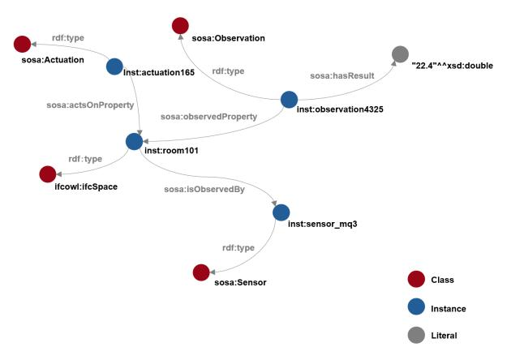
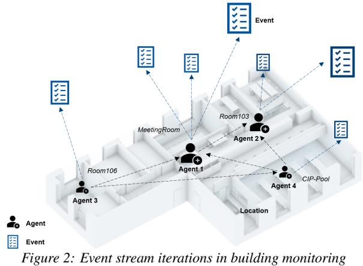
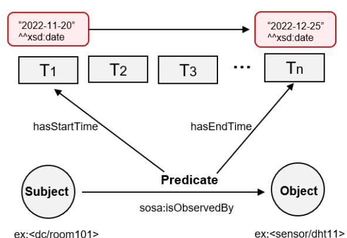
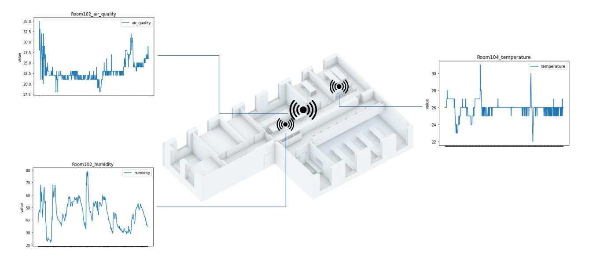

<!-- cite_key: zhangsupsup2017 -->


# Describe and query semantic building digital twin data in temporal Knowledge Graphs

Yingying Zhang<sup>1</sup> , Jakob Beetz<sup>1</sup>

<sup>1</sup>RWTH Aachen University, Germany

# Abstract

With the emerging application and development of digital twin technologies in the Architecture, Engineering, and Construction (AEC) sector, effective monitoring and prediction of the built environment is an important step toward energy transformation. The temporal properties are always implied in the events, either explicitly or implicitly. However, if the temporal evolution data between multiple stakeholders is not properly documented and structured, this valuable data will not be transformed into meaningful actions. As a result, the AEC collaborative work requires a structured model to integrate heterogeneous information and fully document state changes over the process of multiple iterations. In this paper, we introduce a workflow on a Temporal Knowledge Graph (TKG) in order to link observation data and the building environment context in a generic inductive framework. The temporal properties of events are documented in a graph and can be queried through dedicated SPARQL queries. The main contribution of this research is an approach to track the temporal information of linked building data, in order to derive additional information for digital twin scenarios.

# Introduction

Over the past decades, Semantic Web (SW) has facilitated data interoperability and cross-domain linking in the Architecture, Engineering, and Construction (AEC) sector (Pauwels et al., 2017). Semantic Web (SW) languages have shown the ability to link static heterogeneous graphs, while real-world problems in the AEC industry are constantly evolving and undergoing state changes (Deshpande et al., 2014). In many cases, from multi-party collaborative architecture design to IoT-assisted facility management, these processes are time-sensitive and usually composed of sequences of events. Properly considering these dynamic insights and how to utilize big data to enable datadriven building energy retrofits is still a great challenge we currently face (Hu et al., 2021).

With the support of emerging technologies such as the Internet of Things (IoT) (Boje et al., 2020), the AEC industry is able to implement data-driven monitoring, whether in construction, building automation systems, and energy optimization systems (Mishra et al., 2020), where large amounts of dynamic native data can be captured (Tang et al., 2019). Without proper integration of heterogeneous data from different sources, it will be difficult to transform this big data into meaningful actions that can support the AEC industry.

The first challenge encountered is how to integrate heterogeneous data (Costin and Eastman, 2019). There have been many attempts in the AEC domain to integrate static data in the web context by Linked Data method (Zhang and Beetz, 2022). As part of our research (Zhang and Beetz, 2021), the integration of IoT monitoring data with building context data on the web has been implemented, but the dynamic data is still stored in a time-series database and called from the web end so there are still limitations in terms of complex reasoning. If dynamic sensor data and building context data can be integrated into a unified graph, and both the time-stamped data and historical records can be directly accessed through query languages in the web, this will enable us to fully explore the heterogeneous data and infer a considerable amount of new knowledge. The documentation of event streams in the workflow are another focus, and the BIM model and external information can always be kept up to date through a shared platform.

Inspired by the unstructured features of data in the AEC domain, unified data graphs are essential for effective use of big data in the AEC domain which requires tasks such as interoperability, linked data, and dynamic integration. The ideal workflow is where project information from multiple sources are shared and managed in a centralized platform, which includes BIM models, plans, monitoring, tasks, etc. Performing automated analysis and reasoning based on existing data is a promising area for future development, including tasks such as classification and link prediction from large amounts of dynamic data using graph methods. A temporal knowledge graph-based data integration schema is proposed in our study for extracting raw data from BIM models and observations in building monitoring systems and describing them through the RDF format, enabling associations between static building context data and dynamic rich sensor data streams, and performing complex queries through SPARQL.

In the following section, we review the temporal issues faced in the AEC domain and the related specifications and studies on processing linked stream data. We then introduce the concept of Temporal Knowledge Graph and review its capabilities in data integration, querying and reasoning. We formally introduce a Temporal Knowledge Graph for the use in building's digital twin graphs and provide examples of cases being described in a Temporal Knowledge Graph and queried through SPARQL.

## Related Work

This section will cover temporal data management in the linked building data context and the introduction of Temporal knowledge graph (TKG).

## Introducing Temporal Data in Linked Building Data

Temporal data in the AEC industry is not just stream of time-stamped data derived from sensing and monitoring systems. It can be determined as a sequence of timeconstrained events with traceability records, whether it is the iteration of events between multiple stakeholders or the tracing of construction schedules. The management of Temporal properties in AEC domain mainly covers the following subjects:

- Building design modification and evolution
- Construction schedules and milestones
- Sensing and monitoring data from Digital Twin system (e.g. energy consumption, human behavior, devices status)
- Assets maintenance and repair records
- Authentication and inspection records

A number of regulations and studies have focused on temporal state information in the AEC domain: The BIM Collaboration Format (BCF) (buildingSMART, 2017) is an example of an open standard that allows different stakeholders to communicate issues in a shared IFC model. BCF can be used to document the temporal changes of issues across multiple building lifecycles, such as design coordination, construction schedules, and notations during handovers etc. Although BCF can be utilized in a filebased or web-based approach (remote APIs), (Schulz et al., 2021) extends bcf in the context of linked building data to bcfOWL, further exploring the ability of BCF to link heterogeneous building datasets in a semantic web environment.

The ontology for Property Management (OPM) (Group, 2018) (Rasmussen et al., 2019) is an ontology that describes the state changes during the architecture design phase, it documents the iterations and history of the design process at the ontology level.

The ISO 21597 Information container for linked document delivery (ICDD) and ISO 19650 Common Data Environment (CDE) (Preidel et al., 2021) both define a centralized environment for multi-party data exchange, where authorized access is considered and models and data are fully captured and used in audit trails during the project. However, these studies place more emphasis on how heterogeneous datasets in the AEC domain can be exchanged in a vendor-neutral environment, with interoperability issues being given more consideration. There is some inspiration for this study, but the purpose of this research is to investigate how to derive new time-based knowledge from the temporal changes of these events in Digital Twin enabled Linked Building Data systems.

### Temporal Knowledge Graph (TKG)

As a prevalent paradigm, the Knowledge Graph (KG) can greatly support applications such as interoperability, natural language processing, and reasoning (Pauwels et al., 2018). But as big data expands in modern society, there are limitations to the ability of knowledge graphs to represent state changes and entities evolve over time. For example, the following set of facts about architect Ludwig Mies van der Rohe was extracted from DBpedia (see in listing 1), it is known that Mies was once the director of Bauhaus. However, most of the facts evolve over time (see in listing 2), so suppose a natural language question is asked: "who was the director of the Bauhaus?" The answer should be the director in 1919-1928 was Walter Gropius and the director in 1930-1933 was Mies, whereas traditional knowledge mapping does not support the expression of information that contains temporal constraints.

|                 |  |  |  |  | (Ludwig Mies van der Rohe birthPlace , "Aachen") |  |  |  |
|-----------------|--|--|--|--|--------------------------------------------------|--|--|--|
|                 |  |  |  |  | (Ludwig Mies van der Rohe, directorOf , "Bauhaus |  |  |  |
| ")              |  |  |  |  |                                                  |  |  |  |
|                 |  |  |  |  | (Ludwig Mies van der Rohe, citizenship ,         |  |  |  |
| ""Germany ""US) |  |  |  |  |                                                  |  |  |  |

*Listing 1: Facts about Mies van der Rohe*|               |  | (Ludwig Mies van der Rohe birthPlace , "Aachen")  |  |
|---------------|--|---------------------------------------------------|--|
| [1886-3-27]   |  |                                                   |  |
|               |  | (Ludwig Mies van der Rohe, directorOf , "Bauhaus  |  |
| ")[1930-1933] |  |                                                   |  |
|               |  | (Ludwig Mies van der Rohe, citizenship , "Germany |  |
| ")[1886-1944] |  |                                                   |  |
|               |  | (Ludwig Mies van der Rohe, citizenship , "US")    |  |
| [1944-1969]   |  |                                                   |  |
*Listing 2: Facts about Mies van der Rohe with annotations*Temporal Knowledge Graph (TKG) is a type of extended knowledge graph that can be described as an asynchronous stream of temporal events. TKG is typically composed of a set of nodes and edges where nodes represent the entities of resources and edges represent the relationships between entities, as well as time-stamped data associated with each node and edge will be added to the triple.

The concept of TKG first appeared in the computer science domain (Gutierrez et al., 2005) (Gutierrez et al., 2006) and has recently been applied in several fields to solve time-constrained problems in real-life. The current applications of TKG mainly include temporal data integration, that is, the integration of heterogeneous data sets in a common temporal frame including temporal data, which is significant for dynamic application scenarios such as financial transactions, and recommendation systems. Temporal question answering enables complex queries to be performed on TKG to answer complex temporal questions (Saxena et al., 2021). With the growth of Graph neural networks (GNNs) research, the temporal GNN algorithm is applied on TKG to derive insights about the state of things. Introducing TKG into the AEC domain will be an important step towards enhancing the ability to derive new knowledge from dynamic events. Specific TKG application scenarios are listed below:

- Temporal data integration: TKG can be used to address interoperability problems and reconcile data from unstructured datasets, including temporal properties of entities.
- Temporal question answering: TKG can be queried to retrieve knowledge over a range of time.
- Temporal reasoning: TKG can be used to learn from historical data and infer new knowledge, such as predicting the direction of things or identifying patterns over time.

In fact, there have been many attempts to add semantics for temporal information to the knowledge graph in addition to the TKG approach. The most common one is to use ontology to create data types for time-dependent nodes (Neuhaus and Compton, 2009) (Rasmussen et al., 2019). For example, sosa:resultTime can be used to attach temporal attributes to sosa:Actuation, sosa:Observation, and sosa:Sampling. Time ontology in OWL proposes a series of vocabularies to represent temporal concepts and properties Draft (2022). This approach is feasible for adding temporal attributes to individual nodes, but there are some limitations to documenting the complete knowledge evolution process.

Another approach is to extend the syntax of semantic languages (e.g. OWL and RDF) so as to be able to interpret state information and apply temporal reasoning. TKG belongs to the method of extending syntax. (Kim et al., 2008) extended the interpretation and inference capability of OWL language on temporal evolution, proposed a TL-OWL language, and a set of inference rules were defined. When it comes to the RDF annotation syntax, the Standard RDF reification method is gradually not adopted due to its limited expressiveness Nguyen et al. (2014). While RDF-star and SPARQL-star (Report, 2022) are the latest extention language drafts proposed by W3C, which greatly extend the interpretation capability of RDF by allowing statement-level annotations to be added to edges, which increases the tediousness of statements to some extent but it provides a great flexibility for adding temporal attributes, authentication information, and authorship to the graph.

This study is concerned with adding temporal attributes to AEC knowledge, and the next step is able to reason new insights from the dynamic evolution of the knowledge graph, which is currently supported by more research on TKG reasoning and is more feasible.

## Linked Building Data in Temporal Knowledge Graph

In this section, we outline how to use temporal knowledge graph to describe digital twin enabled linked building data, and some listing examples about sensing and observations are shown.

### Describing Static Physical Facts in Knowledge Graphs

To represent and link building-related assets on the web, heterogeneous data need to be described using Semantic Web formats such as Resource Description Framework (RDF). Representing building context data in static graphs have been studied extensively, here we mainly use existing ontologies to describe physical facts in the AEC sector. Industry Foundation Classes (IFC) models are used as the building model source data, besides sensor observations, external weather information, and other information complementing the IFC file to describe the building's digital twin system. Specifically, ifcOWL is used to describe building and geometric data, which is the official serialization of the IFC schema in the Web Ontology Language (OWL) (Pauwels and Terkaj, 2016) (Beetz et al., 2009). To represent sensor and actuator configurations in buildings and their observations, the SSN ontology (Compton et al., 2012) and its extension SOSA ontology are used here, see in figure 1.


*Figure 1: Describe Digital Twin Entities and Properties in Knowledge Graphs*#### Describing Temporal Data in Knowledge Graphs

As the prevalence of IoT and Digital Twins technologies grows, what they offer is a powerful paradigm for the development of the AEC sector. For example, real-time feedback on human behavior, physical observations (locations, equipment, etc.), external weather data, and other rich knowledge play a pivotal role in data linkage. In the previous section, the representation of static physical assets has been achieved, while the description of the temporal knowledge, which is continuously updated in the digital twin process, still has certain limitations. The RDF model is an atemporal snapshot of information. As shown in figure 2, for example, in a building, different agents create different events or relationships at different times. The creation of events points to the creation of nodes in the knowledge graph, when a new relationship is updated then an edge is also updated. Different from the standard RDF triple*< s, p,o >*, the temporal knowledge graph becomes a four-triples by adding the time factor to the triple. The W3C has not yet made a standard specification of the temporal knowledge graph, but there have been numerous attempts to interpret temporal data at different granularities based on RDF model, here we mainly use the RDF model summarized from the following studies (Gutierrez et al., 2006) (Leblay and Chekol, 2018) and the temporal RDF interpretation model can be seen in figure3.

See in equation(1). *t*<sup>1</sup> and *t<sup>n</sup>*are added to the triple*< s, p,o >*as time intervals. The time here is the time when the predicate relation occurs, as an example: <Building/reiffMuseum> sosa:hasSample <Sensor/MQ7>. If time is assigned to the Subject it is similar to describing the date of completion of the <reiffMuseum> building, which is clearly inappropriate, and the same for the sensor <MQ7> is similar to describing


*systems*the lifetime of the device. Therefore by using time to describe the relations, most of the relations in the RDF model can be instantiated.

$$
\langle s, p[t_1, t_n], o \rangle \tag{1}
$$

,where
*−s*is the subject and is used to describe the resource.
*−p*predicate represents the relationship between subject and object.
*−o*denotes the object, it can be an entity or a literal.
*−*[*t*1*,tn*] is the time property to describe the predicate. If it is represented as a time interval then it is the time from *t*<sup>1</sup> to *tn*. otherwise, if the relationship occurs at a point in time, i.e. when *t*<sup>1</sup> = *t<sup>n</sup>*it can be considered to occur at a time point, xsd:date


*Figure 3: Illustration of temporal knowledge graph syntax and cases*In listing 3 we use Digital Twin enabled Linked Building Data as a case study to create a knowledge graph instances with location, observation, sensor and actuator perspectives.

```text
@prefix rdf: <http://www.w3.org/1999/02/22-rdf-
    syntax-ns#> .
@prefix time: <http://www.w3.org/2006/time#>.
@prefix unit: <http://qudt.org/vocab/unit/> .
@prefix xsd: <http://www.w3.org/2001/XMLSchema#>
     .
```text

```text
@prefix sosa: <http://www.w3.org/ns/sosa/> .
@prefix ssn: <http://www.w3.org/ns/ssn/> .
#Location
<reiffMuseum/dc/r101> rdf:type sosa:
    ObservableProperty ;
  sosa:isObservedBy[2022-05-24,2022-12-24] <
    sensor/mq3> .
#Observation
<observation/27> rdf:type sosa:Observation ;
  sosa:hasFeatureOfInterest <reiffMuseum/r102>
    ;
  sosa:observedProperty <reiffMuseum/r102/
    airQuality > ;
  sosa:madeBySensor <sensor/30> ;
  sosa:hasResult[2022-12-01,2022-12-31] [
    qudt -1-1:unit qudt-unit -1-1:Kilowatthour ;
    qudt -1-1:numericValue "22.4"^^xsd:double ]
    .
#Sensor
<sensor/926> rdf:type sosa:Sensor ;
  sosa:madeObservation[2022-11-01,2022-11-30] <
    Observation/235>, <Observation/236> .
# Actuation
<windowCloser/987> rdf:type sosa:Actuator ;
  sosa:madeActuation[2022,12,25] <actuation/188>
     ;
```text

/104#state> .*Listing 3: Representing temporal properties in SOSA ontology*ssn:forProperty[2022-05-01,2023-05-01] <window
*using the TKG method*## Queries Over Temporal Graphs

Knowledge graph question answering (KGQA) is an important research area for using knowledge graphs to answer complex questions to solve real-world challenges where information can be retrieved in a structured way. In the previous section, an effective method for integrating temporal data from the AEC domain in temporal knowledge graphs was introduced. To transform such unstructured data into insightful actions, in this section we will perform question answering against temporal knowledge graphs.

SPARQL (Recommendation, 2008) is a query language for RDF graphs that allows querying heterogeneous data from multiple sources. It is a specification proposed by W3C. SPARQL is used in this paper to query temporal graphs, the standard SPARQL syntax may be restricted in querying temporal events, but some existing studies has now been carried out to query Temporal RDF that we can refer to (Tappolet and Bernstein, 2009).

Here the DC chair in the RWTH Reiff building is used as a case study, which consists of 6 rooms and some open spaces with different sensors and actuators located in different rooms and locations to monitor temperature, humidity, air quality, etc. All events, results, and interactions are time-stamped and stored in time-series database. As shown in Figure4, together with building context data, sensing context data, and timestamps are interlinked in the graph and continuously updated, by querying and reasoning with such a large temporal knowledge graph we can


*Figure 4: Usecase: Sensor data stream in Reiff building*better understand how natural relationships are evolved. The following two listings show examples of temporal SPARQL-based queries. Different from the standard SPARQL query syntax, the time attribute was introduced into the triple, so there will be an additional time factor in the query. The first query listing is a sample that retrieves the result of an observation at a given time point, see in Listing 4.

```text
@prefix sosa: <http://www.w3.org/ns/sosa/> .
SELECT ?Result
WHERE {
  ?Observation sosa:hasResult[?t] ?Result .
  FILTER (?Observation="Observation/2324" and ?t
     ="2022-12-24T00:00:00+00:00"^^xsd:
    dateTimeStamp)
}
```text
*Listing 4: Query example for retrieve the result of an observation at a given time point*Listing 5 depicts a sample query about a time interval, supposing the user wants to retrieve the observation result of the air quality sensor in Room 101 at a certain time period or time point.

```text
@prefix sosa: <http://www.w3.org/ns/sosa/> .
SELECT ?t1 ?tn ?result
WHERE {
  ?Room sosa:isObservedBy[?t1,?tn] ?sensor .
  ?sensor sosa:hasResult[?t1,?tn] ?result .
  FILTER(?Room = "dc/r101" and ?sensor = "sensor
    /mq3" )
}
```text
*Listing 5: Query example for retrieve the sensor observations for a time period*

### Discussion

In this study, a preliminary study was made to introduce time constraints into semantic building digital twin graphs, and some sample queries were performed. However, so far, since the digital twin system involves high volumes of throughput data, there may be issues in terms of efficiency of the temporal knowledge graph in real projects, so the optimal representation of the knowledge graph needs to be investigated.

Another problem is that the query syntax of the Temporal Knowledge Graph is difficult to meet the complexity of real problems at the practical application level (Zou et al., 2014). Most existing query methods can only reply to simple point-to-point problems, i.e. snapshot queries, and currently have difficulties in complex cluster queries. Simple questions such as: When did the CO2 sensor start to observe Room104? Such simple time or entity-specific queries are currently achievable, but for complex questions such as: What sensors were installed in Room104 after the air quality sensor was removed on 2023-1-15? Although queries over static graphs are well investigated, further research is required on methods for complex queries (e.g., cluster queries, event pattern matching over graph streams) in order to efficiently use Temporal Knowledge Graphs to trace real-world problems.

## Conclusion and Future Work

The building industry is involved with multiple iterations of events throughout its lifecycle, and the missing documentation of these processes results in increased complexity and errors (Rasmussen et al., 2019). Most of the previous studies have focused on the problem of interoperability between datasets from multiple sources, while event-based state changes are not fully documented.

Semantic Web technologies have enhanced the development of interoperability in the AEC domain, but are limited in expressing temporal changes. As the prevalence of sensing devices and systems, the issue of Digital twinenabled Linked Building data was addressed here, we introduce a Temporal Knowledge Graph approach to enhance the representation of complex sensing and monitoring system changes in buildings. We developed a reusable structured method to add temporal attributes to RDF triples.

This research is an important step towards dynamic knowledge graph-based learning. For more accurate learning and prediction of temporal events, firstly the heterogeneous data has to be integrated in a common structured way so that algorithms such as Temporal Neural Networks can be applied on the knowledge graph to derive new knowledge. Reasoning and prediction capabilities are an important desirable feature of dynamic knowledge graphs, so the next application of reasoning new insights from big data in building digital twin systems is also an interesting challenge. In addition work, we are improving the representation of dynamic knowledge graphs, including adding statement-level annotations to RDF graphs that will not be limited to temporal attributes but include more complex information such as authentication, authorship, etc.

## References

- Beetz, J., Van Leeuwen, J., and De Vries, B. (2009). Ifcowl: A case of transforming express schemas into ontologies. Ai Edam, 23(1):89–101.
- Boje, C., Guerriero, A., Kubicki, S., and Rezgui, Y. (2020). Towards a semantic construction digital twin: Directions for future research. Automation in Construction, 114:103179.
- buildingSMART (2017). BIM Collaboration Format (BCF) – An Introduction.
- Compton, M., Barnaghi, P., Bermudez, L., Garcia-Castro, R., Corcho, O., Cox, S., Graybeal, J., Hauswirth, M., Henson, C., Herzog, A., et al. (2012). The ssn ontology of the w3c semantic sensor network incubator group. Journal of Web Semantics, 17:25–32.
- Costin, A. and Eastman, C. (2019). Need for interoperability to enable seamless information exchanges in smart and sustainable urban systems. Journal of Computing in Civil Engineering, 33(3):04019008.
- Deshpande, A., Azhar, S., and Amireddy, S. (2014). A framework for a bim-based knowledge management system. Procedia Engineering, 85:113–122.
- Draft, W. C. R. (2022). Time ontology in owl.
- Group, L. B. D. C. (2018). The Ontology for Property Management (OPM).
- Gutierrez, C., Hurtado, C., and Vaisman, A. (2005). Temporal rdf. In European Semantic Web Conference, pages 93–107. Springer.
- Gutierrez, C., Hurtado, C. A., and Vaisman, A. (2006). Introducing time into rdf. IEEE Transactions on Knowledge and Data Engineering, 19(2):207–218.
- Hu, S., Wang, J., Hoare, C., Li, Y., Pauwels, P., and O'Donnell, J. (2021). Building energy performance assessment using linked data and cross-domain semantic reasoning. Automation in Construction, 124:103580.
- Kim, S.-K., Song, M.-Y., Kim, C., Yea, S.-J., Jang, H. C., and Lee, K.-C. (2008). Temporal ontology language for representing and reasoning interval-based temporal knowledge. In The Semantic Web: 3rd Asian Semantic Web Conference, ASWC 2008, Bangkok, Thailand, December 8-11, 2008. Proceedings. 3, pages 31– 45. Springer.
- Leblay, J. and Chekol, M. W. (2018). Deriving validity time in knowledge graph. In Companion proceedings of the the web conference 2018, pages 1771–1776.

- Mishra, S., Glaws, A., Cutler, D., Frank, S., Azam, M., Mohammadi, F., and Venne, J.-S. (2020). Unified architecture for data-driven metadata tagging of building automation systems. Automation in Construction, 120:103411.
- Neuhaus, H. and Compton, M. (2009). The semantic sensor network ontology. In AGILE workshop on challenges in geospatial data harmonisation, Hannover, Germany, pages 1–33.
- Nguyen, V., Bodenreider, O., and Sheth, A. (2014). Don't like rdf reification? making statements about statements using singleton property. In Proceedings of the 23rd international conference on World wide web, pages 759– 770.
- Pauwels, P., McGlinn, K., Törmä, S., and Beetz, J. (2018). Linked data. In Building information modeling, pages 181–197. Springer.
- Pauwels, P. and Terkaj, W. (2016). Express to owl for construction industry: Towards a recommendable and usable ifcowl ontology. Automation in construction, 63:100–133.
- Pauwels, P., Zhang, S., and Lee, Y.-C. (2017). Semantic web technologies in aec industry: A literature overview. Automation in construction, 73:145–165.
- Preidel, C., Borrmann, A., Exner, H., and König, M. (2021). Common data environment. In Building Information Modeling, pages 335–351. Springer.
- Rasmussen, M. H., Lefrançois, M., Pauwels, P., Hviid, C. A., and Karlshøj, J. (2019). Managing interrelated project information in aec knowledge graphs. Automation in Construction, 108:102956.
- Recommendation, W. (2008). SPARQL Query Language for RDF.
- Report, D. C. G. (2022). Rdf-star and sparql-star.
- Saxena, A., Chakrabarti, S., and Talukdar, P. (2021). Question answering over temporal knowledge graphs. arXiv preprint arXiv:2106.01515.
- Schulz, O., Oraskari, J., and Beetz, J. (2021). bcfowl: A bim collaboration ontology.
- Tang, S., Shelden, D. R., Eastman, C. M., Pishdad-Bozorgi, P., and Gao, X. (2019). A review of building information modeling (bim) and the internet of things (iot) devices integration: Present status and future trends. Automation in Construction, 101:127–139.
- Tappolet, J. and Bernstein, A. (2009). Applied temporal rdf: Efficient temporal querying of rdf data with sparql. In The Semantic Web: Research and Applications: 6th European Semantic Web Conference, ESWC 2009 Heraklion, Crete, Greece, May 31–June 4, 2009 Proceedings 6, pages 308–322. Springer.

- Zhang, Y. and Beetz, J. (2021). Building-cps: Cyberphysical system for building environment monitoring. In Proc. of the Conference CIB W78, volume 2021, pages 11–15.
- Zhang, Y. and Beetz, J. (2022). Information exchange and interoperability of heterogeneous building automation systems and bim applications. 2022.
- Zou, L., Özsu, M. T., Chen, L., Shen, X., Huang, R., and Zhao, D. (2014). gstore: a graph-based sparql query engine. The VLDB journal, 23:565–590.
