**ORIGINAL ARTICLE**# Temporal Knowledge Graph Reasoning Based on Dynamic Fusion Representation Learning

Hongwei Chen[1](#page-0-0) | Man Zhang[1](#page-0-0) | Zexi Chen[2](#page-0-1)

1School of Computer Science, Hubei University of Technology, Wuhan, China | 2Department of Technical Committee, Xiaomi Technology (Wuhan) Co., Ltd, Wuhan, China
**Correspondence:**Man Zhang [\(102201067@hbut.edu.cn](mailto:102201067@hbut.edu.cn))
**Received:**22 January 2024 |**Revised:**16 September 2024 |**Accepted:**1 October 2024
**Keywords:**graph convolutional networks | representation learning | temporal knowledge graph

# ABSTRACT

Recently, significant progress has been made in completing static knowledge graphs. However, knowledge tends to evolve with time, and static knowledge graph completion (KGC) methods struggle to capture the changes. Therefore, temporal knowledge graph (TKG) reasoning has become a focus of research. Most existing TKG methods incorporate temporal information into triplets and transform them into KGC tasks, ignoring the important influence of time information and implicit relationships between entities. In this paper, we propose a new method called TD-RKG, which addresses the challenges of temporal variability and implicit entity correlations based on a dynamic fusion representation learning approach. The method consists of four modules: dynamic local recurrent encoding layer, dynamic implicit encoding layer, dynamic global information attention layer and decoding layer. Experimental results on three benchmark datasets demonstrate substantial improvements in TD-RKG across multiple evaluation metrics.

## 1 | Introduction

Knowledge graph (KG) is a framework that represents semantic knowledge in a graphical structure. It uses nodes to represent entities or concepts and edges to denote relationships or properties between entities (Camarillo-Ramirez, Cervantes-Alvarez, and Gutiérrez-Preciado [2024](#page-17-0)). The essential components of KG are entities, relationships, and attributes. However, real-world facts often have time-related information and event sequences. Therefore, the concept of a temporal knowledge graph (TKG) has been proposed. A TKG represents a sequence of KGs with timestamps, consisting of a series of ordered subgraphs. Each subgraph is static at a specific timestamp, representing facts that occur simultaneously at the same timestamp (Dong et al. [2023\)](#page-17-1). These events are composed of four elements: head entity, event type, tail entity, and timestamp, abbreviated as a quadruple (s, p, o, t). For example, Figure [1](#page-1-0) shows a snippet of entity images constructed by ICEWS14 (García-Durán, Dumančić, and Niepert [2018](#page-17-2)) on 10 April 2023. For the event (United States,

© 2024 John Wiley & Sons, Ltd.

express negotiation intention, United Kingdom, 10 April 2023), 'United States' and 'United Kingdom' are the head and tail entities, 'express negotiation intention' is the event type, and '10 April 2023' is the timestamp. Knowledge graph representation is a common method for learning to embed entities and event types into a low-dimensional vector space using temporal information. This type of representation learning is of great significance for downstream tasks such as event prediction and question answering. For example, the TKG complex question-answering model based on subgraphs effectively addresses the shortcomings of existing knowledge graph question-answering systems in time dimension processing (Chen et al. [2022](#page-17-3)). A multi-task recommendation system based on dynamic knowledge graph models TKG as continuous timestamp events updates the attributes and relationships between nodes in real-time, and crossfuses node embeddings with recommendation items, solving the problem of insufficient timeliness of existing recommendation methods relying on static KG and effectively improving recommendation performance (Wen et al. [2024\)](#page-18-0).

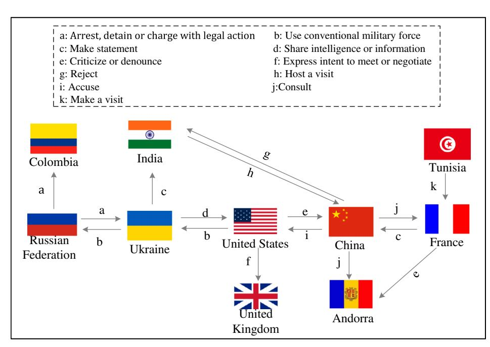
**FIGURE 1** | Entity image segment constructed by ICEWS on 10 April 2023. (Ten countries were selected, and if there were multiple events between two countries, only one was retained for brevity).

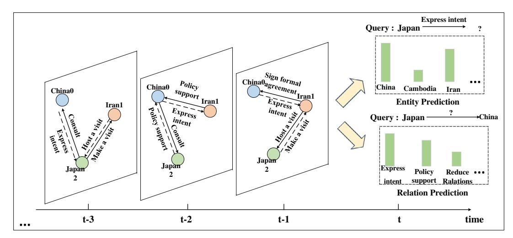

**FIGURE 2** | A knowledge graph (KG) sequence with timestamps, consisting of a series of consecutive subgraphs. The figure shows three static subgraphs at different timestamps.

There are two main settings for TKG reasoning: interpolationbased methods and extrapolation-based methods (Wang et al. [2023\)](#page-18-1). The interpolation-based methods are designed to fill in missing events in history and are a form of representation learning for KGs (Tang and Chen [2023\)](#page-18-2). They extend static representation learning methods to time-aware graphs and model time by considering timestamps as hyperplanes, vector representations or tensor decomposition in temporal order. However, the reliability and accuracy of these methods are limited by data dependence, sensitivity to noise and extrapolation capabilities. On the other hand, extrapolation-based methods aim to predict future events. They can help us fill in data gaps, predict future trends and changes and perform risk assessment and decisionmaking (Liu et al. [2023](#page-17-4)). Therefore, reasoning under extrapolation settings is crucial and can be applied in various domains such as financial analysis, user behaviour prediction, and so on. For example, Yuntao Shi et al. proposed a gas system risk prediction method based on a temporal knowledge graph, which predicts the risk level of the gas system in a certain period in the future (Shi et al. [2023](#page-18-3)). Rui Miao et al. constructed a new dynamic financial knowledge graph that utilises temporal information to capture changes and trends in data over time (Miao et al. [2019](#page-18-4)). In this paper, an extrapolation-based method is adopted for TKG reasoning, which mainly includes two sub-tasks: entity prediction and relation prediction. As shown in Figure [2,](#page-1-1) entity prediction involves predicting which entity will have a given relation with a given entity at a future timestamp based on the facts occurring within historical timestamps. Relation prediction involves predicting the relationship between two given entities at a future timestamp.

The three main challenges faced by traditional KG reasoning are the incompleteness of the knowledge graph itself, the fuzziness of input data and the complexity of algorithm design (Liu and Tong [2023](#page-18-5)). Recent studies predict the evolution of TKG using historical sequence information, which mainly focus on the structural information of subgraphs and the sequential dependencies between subgraphs. Although they alleviate these challenges to some extent, such modelling strategies introduce implicit correlation challenges and time sensitivity challenges. Specifically, Know-evolve and its extended DyRep model (Trivedi et al. [2017\)](#page-18-6) enhance the modelling ability of time series through recurrent neural networks, but this method may not effectively capture the structural information of knowledge graphs and handle concurrent events, resulting in insufficient ability of the model to learn the association features between entities. The CyGNet model (Zhu et al. [2021](#page-18-7)) uses historical facts to predict future events, but this method fails to fully consider the differences in the degree of influence of time on entities, resulting in prediction results often leaning towards the most frequent occurrences and being unable to predict future facts without previous events. The RE-NET model (Jin et al. [2019\)](#page-17-5) uses recurrent neural networks to capture and sequentially encode the historical facts of entities directly involved in entity prediction, but it does not learn the evolution process of entity semantics. The RE-GCN model (Li, Jin, Li, et al. [2021](#page-17-6)) focuses on modelling the temporal and structural dependencies of local historical facts, lacking the capture of implicit relationships with global historical information. Overall, existing methods do not fully consider implicit correlation and time sensitivity between entities. They ignore the degree of influence of time on different entities and rely on fixed entity representations and direct connections to model historical information, making it difficult to capture the implicit association features between entities.

To overcome the limitations of existing methods and address the challenges of implicit correlation and time sensitivity, this paper proposes a TKG reasoning method called TD-RKG. This method models the entire KG sequence holistically, considering the global dynamic information and encoding all historical facts into representations of entities and relationships. Specifically, the model uses graph convolutional networks (GCN) for cyclic modelling of the KG sequence to learn the evolving representations of entities and relationships at each timestamp, and it autonomously models the historical KG sequence with autoregressive modelling to capture sequential patterns. An implicit correlation encoder is introduced to better capture the hidden relationships between entities by further learning and fusing the node features extracted by GCN. A time attention module is introduced to capture deep connections between timestamps and different types of entities at the semantic level, which can help the model better capture relationships and importance in the input data, thereby improving the representation power and performance of the model.

In summary, the TD-RKG method has the following contributions:

1. To fully consider and capture the implicit correlations between entities, and to better understand the semantic relationships and contextual dependencies between entities, an implicit correlation encoder is proposed. It learns and fuses entity features after modelling the structural dependencies and autoregressive modelling of the historical KG sequence. This effectively addresses the challenge of implicit correlation in TKG reasoning.

- 2. The introduction of the time attention module guides different attention to adjacent entities and n-hop relationships, capturing the dynamic features of entities at different time points and the temporal and topological information hidden in relationships. This solves the challenge of time-sensitivity.
- 3. By integrating the relationship decoder and entity decoder, the advantages of both decoders in time and relationship prediction are combined to improve the final prediction accuracy.

Overall, this research models both local and global information. It proposes a more effective TKG reasoning method by considering the challenges of implicit correlation and time-sensitivity.

This paper is structured as follows: Section [1](#page-0-2) introduces the research topic and objectives. Section [2](#page-2-0) discusses the related work, which is divided into two subsections: static reasoning methods and dynamic reasoning methods. In Section [3](#page-5-0), we introduce the TD-RKG model, including its definition and overview, and then discuss in detail the dynamic local recurrent encoding layer, dynamic implicit encoding layer, dynamic global information attention layer and decoder layer. Section [4](#page-11-0) provides our experimental setup and results, with each subsection detailing the experimental setup, results and ablation study. Finally, Section [5](#page-16-0) summarises this article and discusses future work.

# 2 | Related Work

KG reasoning methods can be divided into two categories based on their adaptability to temporal dynamics: static reasoning methods and dynamic reasoning methods. In this section, we will delve into the core technologies of these two methods. Furthermore, Table [1](#page-3-0) provides an overview of these methods, highlighting their key technologies and potential limitations.

## 2.1 | Static Reasoning Methods

Static reasoning methods in knowledge graphs do not consider temporal dynamics. They focus only on the static facts stored in the KG and use embedding representations of entities and relationships, mapping them to low-dimensional spaces for learning. Embedding models can primarily be categorised into four types: translation-based models, tensor factorization models, rotation-based models and neural network models (Le, Le, and Le [2023](#page-17-7)). Translation-based models, such as TransE (Bordes et al. [2013](#page-17-8)) and TransH (Wang et al. [2014](#page-18-8)), treat relationships (r) as translation transformations when projecting entity embeddings (e) into the latent space. They utilise distance functions (e.g., L1 norm and L2 norm) to score the fact triplets. Although TransE has been proven effective, it cannot handle certain specific relationships such as one-tomany, many-to-one, symmetry and transitive relationships.

|                  | Key technology                                           |                                                                                                                                                          |                                                                                                |  |  |  |  |  |
|------------------|----------------------------------------------------------|----------------------------------------------------------------------------------------------------------------------------------------------------------|------------------------------------------------------------------------------------------------|--|--|--|--|--|
| Models           | Encoder                                                  | Decoder                                                                                                                                                  | Limitation                                                                                     |  |  |  |  |  |
| TransE           | —                                                        | fp(s, o) = ‖s+p−o‖2 2                                                                                                                                 | Static KGs cannot                                                                              |  |  |  |  |  |
| TransH           | —                                                        | 𝜀(s, p, o) = ‖s⊥ + p − o⊥ ‖                                                                                                                        | simulate time evolution and therefore do not work in practical application scenarios. |  |  |  |  |  |
| DistMult         | —                                                        | < wp, es, eo >                                                                                                                                        |                                                                                                |  |  |  |  |  |
| ComplEx          | —                                                        | Re( ) < wp, es, eo >                                                                                                                            |                                                                                                |  |  |  |  |  |
| RotatE           | —                                                        | dp(s, o) = ‖s ◦p − o‖                                                                                                                                 |                                                                                                |  |  |  |  |  |
| ConvE            | —                                                        | ( ) ( vec( ([es; ] ))W) es, eo rr eo 𝜓r = f f ∗𝜔                                                                  |                                                                                                |  |  |  |  |  |
| Conv-TransE      | —                                                        | ( ) ( vec( ([es; ] ))W) es, eo rr eo 𝜓r =f f ∗𝜔 ( ) ( ( )) es, ep, eo es, eo p =𝜎 𝜓 |                                                                                                |  |  |  |  |  |
| R-GCN            | —                                                        | f (s, p, o) = eT s Rpeo                                                                                                                               |                                                                                                |  |  |  |  |  |
| TTransE          | —                                                        | ‖s+p+t−o‖1∕2                                                                                                                                             | The interpolation-based                                                                        |  |  |  |  |  |
| TA-DistMult      | LSTM                                                     | f (s, p, o) = ( ◦eo ) eT es p                                                                                                             | TKG reasoning cannot predict the fact of future                                             |  |  |  |  |  |
| HyTE             | = s − ( ) wT st t s wt                    | st +pt −ot ‖ ‖ ‖1∕2                                                                                                                       | timestamps, nor can it be directly compatible with extrapolation settings.               |  |  |  |  |  |
| DE models        | {e[n]𝜎(w[n]t+b[n]), 1≤n≤𝛾d et[n] = e[n], 𝛾d≤n≤d | ‖ 1 � ⟨st, p, ot⟩ + � �� ot, p−1,st 2                                                                                                  |                                                                                                |  |  |  |  |  |
| TuckERT model | —                                                        | ⟨M;s, p, o, t⟩                                                                                                                                           |                                                                                                |  |  |  |  |  |
| TNTComplEx       | —                                                        | re(⟨s, p, o, t⟩)                                                                                                                                         |                                                                                                |  |  |  |  |  |
| T-SimplE         | —                                                        | 1 � ⟨s, p, o, t⟩ + � �� o, p−1,s, t 2                                                                                                  |                                                                                                |  |  |  |  |  |
| EvoExplore       | Local structure+Global structure                         | —                                                                                                                                                        |                                                                                                |  |  |  |  |  |
| xERTE            | TRGA                                                     | —                                                                                                                                                        | Ignoring implicit correlation challenge.                                                    |  |  |  |  |  |
| TLogic           | Temporal random walk+Temporal logical rule            | —                                                                                                                                                        | Ignoring implicit correlation challenge.                                                    |  |  |  |  |  |
| T-GAP            | GNN                                                      | Iterative sampling                                                                                                                                       | Ignoring implicit correlation challenge.                                                    |  |  |  |  |  |
| Titre            | RL                                                       | —                                                                                                                                                        | Ignoring implicit correlation challenge.                                                    |  |  |  |  |  |
| CluSTeR          | RL+R-GCN+GRU                                             | —                                                                                                                                                        | Ignoring implicit correlation challenge.                                                    |  |  |  |  |  |
| RE-NET           | R-GCN+GRU                                                | MLP                                                                                                                                                      | Ignoring implicit correlation challenge.                                                    |  |  |  |  |  |
| CyGNet           | Copy mode+Generation mode                                | —                                                                                                                                                        | Ignoring the time sensitivity challenge.                                                    |  |  |  |  |  |

RGCRN CNN+RNN — Ignoring the time-

CEN Relation-aware GCN+GRU CNN Ignoring the time-

**TABLE 1**| Overview of KG reasoning methods (including static KG reasoning methods, interpolation-based dynamic reasoning methods, and extrapolation-based dynamic reasoning methods).

(Continues)

sensitivity challenge.

sensitivity challenge.

| Models | Encoder                | Decoder    | Limitation                                  |
|--------|------------------------|------------|---------------------------------------------|
| DEGAT  | GAT                    | DE-ConvKB  | Ignoring the time sensitivity challenge. |
| RE-GCN | Relation-aware GCN+GRU | ConvTransE | Ignoring implicit correlation challenge. |

The TransH model overcomes some of the limitations of TransE, but it still assumes that entities and relationships are in the same semantic space, which to some extent limits the representational power of TransH. Tensor factorizationbased methods, including DistMult (Yang et al. [2014\)](#page-18-9) and ComplEx (Trouillon et al. [2016\)](#page-18-10), represent the knowledge graph as a three-dimensional tensor and decompose it into low-dimensional vectors for entities and relationships to learn their embedding representations. DistMult represents relationships using real-valued vector dot products, which can better represent many-to-many relationships. However, due to the simplicity of the model and the small number of parameters, its ability to capture modelling information is weak. ComplEx represents relationships using complex-valued vector multiplications and conjugations, providing more complex modelling capabilities. However, the performance of the model depends on the optimal parameter settings and carries the risk of overfitting. Rotation-based methods, such as RotatE (Sun et al. [2019\)](#page-18-11), map entity and relationship embeddings to a complex vector space and employ rotation operations to model semantic correlations between entities and relationships. However, RotatE is more sensitive to the selection of hyperparameters. Traditional neural network models encode entities and relationships into latent vectors using neural networks for relationship inference in KGs. Convolution-based methods, such as ConvE (Dettmers et al. [2018](#page-17-9)), map entities and relationships to a 2D matrix and use 2D convolutions for feature extraction and relationship inference. Conv-TransE (Shang et al. [2019](#page-18-12)), which combines ConvE and TransE, jointly learns the embedding representations of entities and relationships, considering both semantic correlations and linear relationships between entities and relationships. R-GCN (Schlichtkrull et al. [2018\)](#page-18-13) is a typical graph neural network model that integrates relational information through specialised message passing and aggregation mechanisms, enabling the effective capturing of complex patterns and dependencies within graph-structured data. But it is difficult to capture the complex relationships and temporal dependencies between entities.

### 2.2 | Dynamic Reasoning Methods

Considering the temporal dynamics in KGs, static reasoning methods are ineffective in practical scenarios as they cannot simulate temporal evolution. Dynamic reasoning methods can improve reasoning efficiency and achieve better performance.

In the research of dynamic reasoning methods, there have been extensive discussions and summaries in existing literature. Specifically, the review article by Cai et al. [\(2024](#page-17-10)) comprehensively examines the latest developments and applications of TKG representation learning. The existing interpolation-based TKG reasoning can be mainly divided into two categories: extending existing static KG completion models and attention-based models (Ren et al. [2023](#page-18-14)). The first type of method mainly predicts entities by calculating the hidden representation of each timestamp and extending the scoring function to utilise timestamp representation as well as entity and relationship representation. TTransE (Jiang et al. [2016](#page-17-11)) is an extended model of TransE that captures the latent semantics of the knowledge graph by representing entities and relationships as low-dimensional vectors in a continuous space. Although this model is simple, it is not scalable. Furthermore, link prediction cannot distinguish between two consecutive time points. TA-DistMult (García-Durán, Dumančić, and Niepert [2018\)](#page-17-2) is an extension of DistMult that includes temporal embeddings. HyTE (Dasgupta, Ray, and Talukdar [2018](#page-17-12)) explicitly combines time with entity relation space by associating each timestamp with its corresponding hyperplane. However, these models have limited scalability and poor predictive performance. The DE model (Goel et al. [2020\)](#page-17-13) combines the proposed diagnostic entity embedding function with a static KG embedding model for TKG completion. The TuckERT model (Shao et al. [2022](#page-18-15)), TNTComplEx (Lacroix, Obozinski, and Usunier [2020\)](#page-17-14), and T model (Lin and She [2020\)](#page-17-15) extend static representation learning methods to time-aware graphs and model time by treating timestamps as the order of tensor decomposition. These methods extend static inference models to dynamic inference, effectively considering the importance of timestamps, but ignoring graph structure information. The second type of method, such as EvoExplore (Zhang et al. [2022](#page-18-16)), uses attention mechanisms to calculate the similarity between related entities or relationships and then assigns weights to them to process the graph structure information in TKG. However, these methods ignore the importance of time series information for TKGC tasks, and cannot predict facts in future timestamps, nor are they directly compatible with extrapolation settings.

The extrapolation setting aims to predict new facts in future timestamps based on history. RE-NET (Jin et al. [2019](#page-17-5)) models the TKG as conditional probabilities to capture temporal information. Interpretable methods such as xERTE, Titre and CluSTeR aim to provide explanations for the predictions made by the model. xERTE (Han et al. [2020](#page-17-16)) calculates weighted probabilities using time information and generates reasoning graphs with a certain number of hops. Titre (Sun et al. [2021\)](#page-18-17) is a reinforcement learning model based on temporal paths, using relative time encoding functions to capture temporal information. CluSTeR (Li, Jin, Guan, et al. [2021](#page-17-17)) adopts a

two-stage inference approach, extracting relevant subgraphs using a stochastic beam search strategy, and then inferring answers from clues through GCN. T-GAP (Jung, Jung, and Kang [2021\)](#page-17-18) encodes specific query substructures of TKGs by considering the time intervals between each event and the query timestamp, and performs path-based reasoning by propagating attention on the graph. The model relies on iterative subgraph sampling during the decoding phase, which may increase computational complexity, especially on large graphs. TLogic (Liu et al. [2022](#page-18-18)) constrains query paths based on temporal logic rules extracted from temporal random walks. Due to the model not considering longer rules, its ability to capture complex patterns is limited. Overall, these methods have to some extent alleviated the limitations of temporal knowledge graph inference and achieved good results. However, these methods fail to capture the evolution patterns of sequence subgraphs as they only focus on the current timestamp, resulting in insufficient ability to capture the interaction information between facts in inference tasks. Therefore, the subgraph of historical sequences has been highly generalised. RGCRN (Seo et al. [2018\)](#page-18-19) combines CNN on the graph to identify spatial structures, while RNN searches for dynamic models. DEGAT (Wang, Zhu, and Zhu [2022](#page-18-20)) combines static representations of entities with dynamic representations learned through diachronic embedding functions, and uses ConvKB as a decoder to obtain scores. However, these methods may not be sufficient to capture all types of dynamic changes, especially for complex temporal dependencies. CyGNet (Zhu et al. [2021](#page-18-7)) suppresses the impact of historically non-repeating facts in prediction based on the copying mechanism. CEN (Li et al. [2022\)](#page-17-19) uses length-aware CNNs with an easy-to-hard curriculum learning strategy to handle temporal evolution patterns. RE-GCN (Li, Jin, Li, et al. [2021\)](#page-17-6) unifies the encoding of entities and relations corresponding to different timestamps, enabling the model to be applied to both entity prediction and relation prediction tasks simultaneously. Although the abovementioned methods have incorporated time information in representation learning and TKG completion, achieving certain achievements, they only embed time information into the representations of entities and relations. They do not fully consider the multidimensional impact of time on facts and fail to explore the invisible implicit associations between information. Consequently, they cannot capture the interactive information between facts in reasoning tasks.

## 3 | Methodology

In this section, the TD-RKG method is extensively discussed. First, the symbols and definitions used are described. Then, the framework of the model and its four modules are presented, namely the dynamic local recurrent encoding layer, dynamic implicit encoding layer, dynamic global information attention layer and decoder layer. Finally, the parameter learning strategy of the model is introduced.

# 3.1 | Definition and Overview

This section introduces the symbols and definitions used in this article and summarises the framework of the model.

| Notations | Descriptions                              |
|-----------|-------------------------------------------|
| G         | A TKG                                     |
| Gs        | A static KG                               |
| Gt        | Static Subgraph at timestamp t in the TKG |
| V         | Set of Entities in the KG                 |
| R         | Set of Relations in the KG                |
| T         | Set of Timestamps in the KG               |
| Ft        | Set of Facts at timestamp t               |
| s         | Subject Entity, s ∈ V                     |
| p         | Relation, p ∈ R                           |
| o         | Object Entity, o ∈ V                      |
| t         | Timestamp, t ∈ T                          |
|           |                                           |

# 3.1.1 | Problem Formulation

In this article, the entity set is defined as*V*, the relationship set as *R*, aRnd the timestamp set as *T*. The set of facts at timestamp *t*is denoted as*Ft*. A TKG*G*can be represented as a sequence of static KGs with timestamps, that is,*G*= {*G*0,*G*1,*G*2, … ,*Gt*} . The static subgraph at timestamp*t*is represented as*Gt*, where*Gt*= {*V*, *R*, *Ft*} , and it is a directed multi-relational graph. The facts in*Ft* can be formalised as quadruples (*s*, *p*, *o*, *t*), where {*s*, *o*} ∈ *V*, *p*∈*R*, *t*∈*T*, and the inverse quadruple ( *o*, *p*−1,*s*, *t*) is also included in the dataset. Table [2](#page-5-1) provides a set of symbols used in the TD-RKG model and their corresponding descriptions.

The task of TKG completion aims to predict the missing parts of quadruples at a certain moment based on the existing facts*F*. It can be divided into two types of prediction tasks: entity prediction and relationship prediction. The purpose of the entity prediction task is to predict a missing subject entity ( ?, *p*, *o*, *t* + 1) or predict a missing object entity (*s*, *p*, ?, *t* + 1). The relationship prediction task attempts to predict the missing relationship in the query (*s*, ?, *o*, *t* + 1).

# 3.1.2 | Framework Overview

The basic idea of the proposed model in this study is to integrate the structural dependencies of KG, sequential patterns of information across temporal facts, and static attributes of entities at each timestamp into the evolutionary representations of entities and relations. This enables the model to learn temporal sensitivity in TKGs and the local topological dependencies and implicit correlations in node neighbourhoods. As shown in Figure [3](#page-6-0), the model is based on an encoder-decoder structure, with the relation-aware graph convolutional network (R-GCN) (Schlichtkrull et al. [2018](#page-18-13)), gated recurrent unit (GRU) (Cho et al. [2014\)](#page-17-20) and multi-layer perceptron (MLP) (Tolstikhin et al. [2021](#page-18-21)) serving as the encoder components, and Conv-TransE serving as the decoder components. First, in the dynamic local

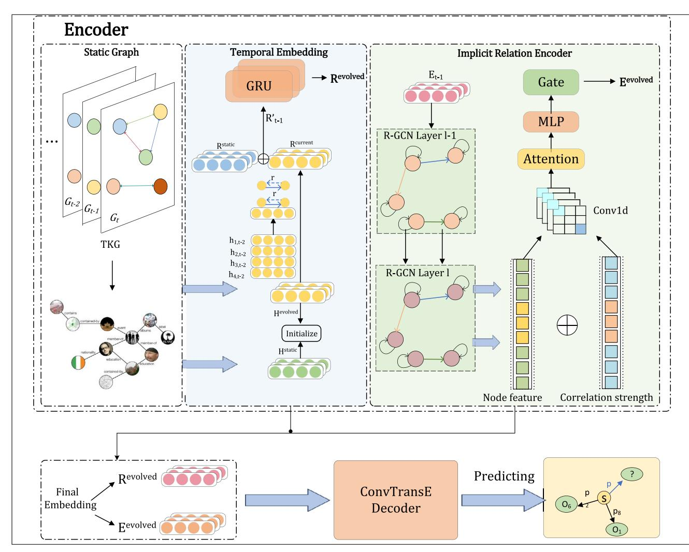

**FIGURE 3** | The framework of TD-RKG.

recurrent encoding layer, the Relation-aware GCN model and GRU model are employed to model each temporal subgraph, resulting in entity embeddings and relation embeddings for the corresponding knowledge subgraph. Unlike conventional GCN networks, the Dynamic Implicit Relational Encoder further learns and integrates the node features extracted by GCN through logical functions and MLP, which better captures these implicit relationships. The learned entity embedding representations not only have rich temporal information but also capture a significant amount of contextual information in the graph. Then, a self-attention mechanism is introduced to calculate the influence of timestamps on the subject entity, relation, and object entity separately, applying the weighted values of attention size and entity time embeddings to the input features, and obtaining the weighted features. Finally, the Conv-TransE is used as the decoder in the architecture, based on the learned entity and relation representations, to perform future time reasoning and obtain potential new triples. Conv-TransE is a scoring function in this model, consisting of a one-dimensional convolutional layer and a fully connected layer, which can be seen as the probability score for candidate triples (*s*, *p*, *o*). Next, the architecture of TD-RKG will be introduced, including the composition of the encoder, the roles of each module in the model, and the selection of the decoder.

# 3.2 | Dynamic Local Recurrent Encoding Layer

The purpose of this module is to encode the KG sequence, learn the different roles of historical subgraphs of length *k* in the reasoning process, and capture the structural dependencies and sequential patterns of information across temporal neighbouring facts in the KG. Following the processing strategy of RE-GCN, a relation-aware GCN is employed to model the structural dependencies, and the gated recurrent component is used to model the historical KG sequence autoregressively. Specifically, the relation-aware GCN incorporates relationship information into the model, effectively capturing and utilising the relationship information between nodes in the graph structure by learning the relationship features between nodes, thereby better inferring and modelling structural dependency relationships. The entity gating unit obtains the evolving representations of entities at each timestamp, while the relation gating unit obtains the evolving representations of relations at each timestamp. To more intuitively demonstrate the encoding process of the dynamic local recurrent encoding layer, the flowchart in Figure [4](#page-7-0) describes the entire process of structural dependency modelling and autoregressive modelling of historical KG sequences. Next, this section will provide a more detailed description of the encoding process.

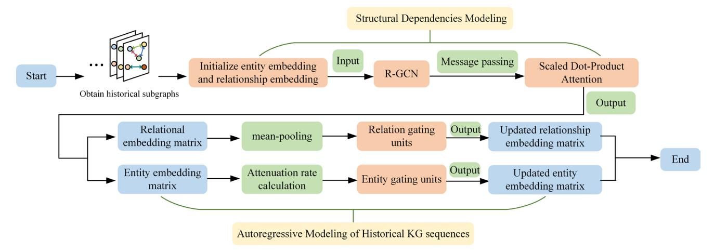

**FIGURE 4**| The encoding flowchart of the dynamic local recurrent encoding layer.

## 3.2.1 | Structural Dependencies Modelling

In each timestamp, we aim to cover as many facts as possible related to the entities in the query. Traditional modelling methods have limitations when dealing with complex graph data and modelling structural dependencies. Specifically, GCN can only handle graphs with a single edge type and performs poorly on multi-relational graph structures. In addition, when stacking multiple convolutional layers, excessive information diffusion may lead to over-smoothing issues. Although GAT (Lee et al. [2019\)](#page-17-21) introduces a self-attention mechanism to adjust the influence of neighbours dynamically, it still lacks explicit modelling of different types of edges. Although GraphSAGE (Liu et al. [2021](#page-18-22)) adopts a random sampling method, it ignores relationship types during feature aggregation and cannot effectively handle sparse graph data. The recent research using R-GCN to model structural information has given us great inspiration. The RPC model (Liang et al. [2023\)](#page-17-22) encodes snapshot internal graph structural information of entities and relationships using R-GCN and RCU, fully mining relationship correlations. R-GCN (Schlichtkrull et al. [2018](#page-18-13)) can integrate relationship information through specialised message passing and aggregation mechanisms, effectively learn features of different types of edges, and capture complex patterns and dependencies in graph-structured data. Therefore, we designed a relation-aware GCN based on scaled dot-product attention to merge multiple relationships and multi-hop neighbour information under a single timestamp. Firstly, we retrieve a historical subgraph from the most recent m timestamps, denoted as {*Gt*−*m*+1, … ,*Gt*} . These subgraphs are then transformed into sequences of entity embedding matrices and relationship embedding matrices. In particular, the entity embedding matrix and the relational embedding matrix at the first timestamp are initialized randomly. We use a message-passing framework to integrate the neighbouring information of each node in the graph. Specifically, each entity in the*l*−*th*layer aggregates adjacent relationship embeddings and entity embeddings based on their different content on the degree edge (i.e., relationship), and then obtains the entity embeddings for the*l*+ 1 layer. Then, the entity embedding and relationship embedding are weighted and summed using scaled dot product attention to obtain a new embedding representation. Compared with RE-GCN, which adds the relationship embedding and entity embedding in GCN for single-step aggregation, this approach can better model the relationship between them, and the twolayer aggregation is enough to capture sufficient structural information. The formula is as follows:

$$
h_{o,t}^{l+1} = \sigma \left( \sum_{(s,p,o) \in F_t} \frac{1}{c_o} W_p^l \left( \text{Attention}\left( h_{s,t}^l, p_t \right) \right) + W_o^l h_{o,t}^l \right) \tag{1}
$$
*hl s*,*t*,*hl o*,*t*represent the entity embedding of subject*s*and object*o*at layer*l*in timestamp*t*. *Wl p*and*Wl o*are learnable weights.*co*is a normalisation constant. Attention(⋅) denotes scaled dotproduct attention.*𝜎*(⋅) represents the RReLU activation function. Note that even if an entity has no direct connections to other entities in the subgraph, a self-loop edge is added to update its embedding.

### 3.2.2 | Autoregressive Modelling of Historical KG Sequences

Traditional recurrent neural network models such as RNN and LSTM have some limitations in processing long sequence data, as their basic structure and training methods result in poor performance in handling long-term dependencies and capturing important patterns in long sequences. Gated recurrent unit (GRU) is a mechanism used in recurrent neural networks to control information flow and memory storage. It uses gate units to determine whether to pass past hidden states to the current time step. Compared to traditional RNNs and LSTMs, GRU is simpler to implement and can accurately capture important patterns and dependencies in time series data. However, when there are duplicate relationships between identical entity pairs at adjacent timestamps, the embedding of entities will converge to the same value, making them indistinguishable in the representation space, resulting in over-smoothing issues. Additionally, when the historical KG sequence becomes long, stacking a large number of graph convolutional network (GCN) layers may lead to the problem of vanishing gradients, making the model difficult to train. Therefore, the model applies the bi-recurrent gated units, namely entity gating units and relation gating units, to alleviate these issues.

If an event happened a long time ago, its impact tends to diminish. To account for the diminishing impact of past events, a decay rate is introduced to capture the variation in their importance over time. The decay rate formula is:

$$
\mu^t = \sigma \left\{ -\max(0, W_\mu \Delta t + b_\mu) \right\} \tag{2}
$$

Here, *W𝜇*and*b𝜇* are learnable parameters, Δ*t*represents the time step of the last event of that entity before time step*t*. The max function selects the larger of the two numbers, but it is at least 0. *𝜎*is the sigmoid function, ensuring the decay rate values monotonically decrease within a reasonable range of 0 to 1.

Considering the decay of the previous hidden state, the new hidden state is expressed as:

$$
\widehat{h}_{t-1} = \mu^t h_{t-1} \tag{3}
$$

The update process of GRU is as follows:

$$
z_t = \sigma\left(W^{(z)}x_t + U^{(z)}\hat{h}_{t-1}\right) \tag{4}
$$

$$
r_t = \sigma\left(W^{(r)}x_t + U^{(r)}\hat{h}_{t-1}\right) \tag{5}
$$

$$
h'_{t} = \tanh\left(Wx_{t} + r_{t} \odot U\widehat{h}_{t-1}\right) \tag{6}
$$

$$
h_t = z_t \odot \widehat{h}_{t-1} + (1 - z_t) \odot h_t^{\prime}
$$
 (7)

Among them,*W*(*z*) , *U*(*z*) , *W*(*r*) , *U*(*r*) are learnable parameters. *xt*represents the input at time step*t*. *ht*is the output at time step*t*. *zt*,*rt*represent the update gate and reset gate at time step*t*, and *h*' *t*represents the current memory content.*𝜎*is the sigmoid function, and*⊙*denotes the Hadamard product. In this way, the output of the GRU integrates the temporal information and neighbour information. Figure [5](#page-8-0) illustrates the structure of the bi-recurrent gated unit after incorporating the decay rate.

Thus, by adopting the entity gate units, the entity embedding matrix*Ht*is determined by the last-layer output*H*GCN *t*at timestamp*t*and the entity embedding matrix*Ht*−1 at the previous timestamp. The formula is as follows:

$$
H_t = \text{GRU}\left(H_{t-1}, H_{t-1}^{\text{GCN}}\right) \tag{8}
$$

where *Ht*∈*R*∣*V*∣×*d*, *Ht*∈*R*∣*V*∣×*d*are the d-dimensional entity embedding matrices at timestamps*t*and*t*− 1, and*H*GCN *t*−1 ∈ *R*∣*V*∣×*d*is the aggregated entity embedding matrix at timestamp*t*− 1.

For relationships, to retain some information and reduce the input dimensionality, reducing computational cost, mean pooling can be used to obtain the average features of these entities, which are then input to the GRU model at timestamp*t*for processing. Then, the relationship embedding matrix*Rt*−1 is updated to *Rt*through the GRU as follows:

$$
R_t = \text{GRU}\big(R_{t-1}, \forall \big[\text{pooling}\big(H_{t-1}, V_{r,t}\big); r\big]\big) \tag{9}
$$

where*Vr*,*t*represents all entities connected to*r*at timestamp*t*, and *Ht*−1 and *Vr*,*t*are subjected to mean pooling operation.*Rt*∈*R*∣*P*∣×*d*, *Rt*−1 ∈ *R*∣*P*∣×*d*are the*d*-dimensional relationship embedding matrices at timestamps *t*and*t*− 1. Finally, the relationaware GRU updates*R*(*t*− 1) and the pooled relation to obtain*Rt* .

#### 3.3 | Dynamic Implicit Encoding Layer

Capturing the implicit correlations between entities is crucial for the task of relation extraction. In this task, the relationships between entities depend not only on their direct connections but also on other factors such as context, co-occurrence relationships, and so on (Wang and El-Gohary [2023](#page-18-23)). Therefore, to better capture these implicit relationships and improve the accuracy and performance of relationship extraction, we introduce an implicit correlation encoder. Figure [6](#page-9-0) provides a more intuitive representation of the learning process of the dynamic implicit encoding layer. It obtains the implicit correlation strength between entities through an S-shaped function and then models the fully connected graph between entities through a multi-layer perceptron (MLP) and fuses it with the output of the relationship-aware GCN to optimise the node features extracted by the dynamic local cyclic encoding layer and avoid any loss of relevant information.

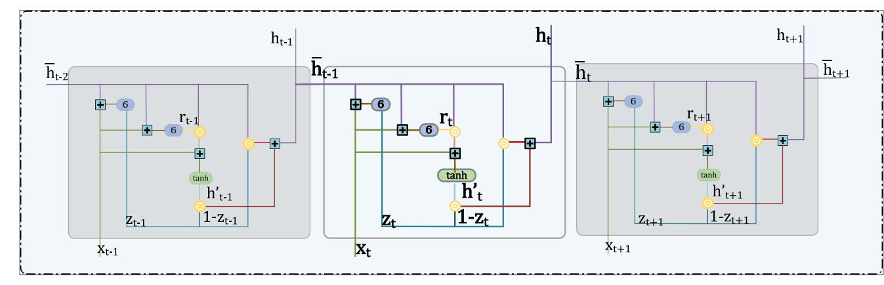

**FIGURE 5** | The GRU structure diagram with decay rate.

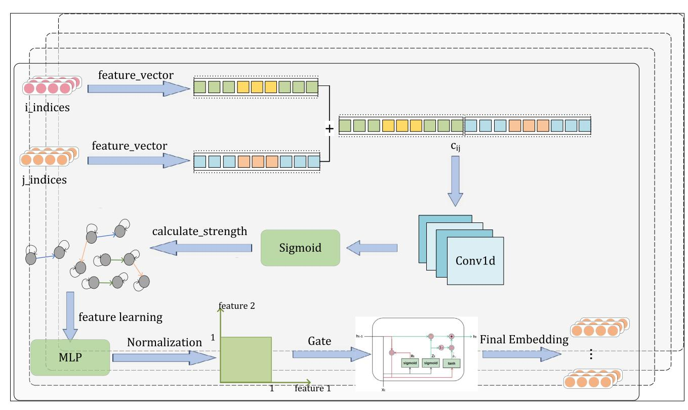

**FIGURE 6**| Architecture of the implicit encoding layer.

To distinguish between different implicit correlations and capture their strengths, this model employs a representation of implicit correlation. First, the indices of entity*i*and entity*j*are extracted from the entity embeddings output by the dynamic local recurrent encoding layer. The corresponding feature vectors are obtained through the indices, and the vectors are concatenated and input into the one-dimensional convolutional layer. Then, the strength of the implicit association is calculated using an S-shaped function, represented as:

$$
s_{\rm imp}(h_i, h_j) = \sigma\big(\text{Conv}(h_i, h_j)\big) \tag{10}
$$

Conv(⋅) represents a one-dimensional convolutional layer,*𝜎*is the sigmoid function,*hi*and*hj*are the feature vectors corresponding to entities*i*and*j*, and the strength of the implicit correlation is limited to a range of values between 0 and 1. In graph convolutional networks, if the implicit correlation between entities is stronger, it will play a more important role in the process of message passing and aggregation. Conversely, if the strength of the implicit correlation is weaker, its influence on the messagepassing and aggregation process will be smaller. Therefore, this model aggregates messages from connecting edges based on the strength of the implicit correlation to better update and transmit relational information between entities.

Specifically, the output of the implicit correlation encoder can be represented as:

Then, the spliced node features and corresponding implicit association strength are input into MLP for feature learning and fusion, and the output of the implicit correlation encoder is expressed as:

$$
h_{\rm imp}^{(i)} = f_{\rm imp} \left( h_{\rm GCN}^{(i)}, s_{\rm imp}^{(i)} \right) \tag{11}
$$

where *h*(*i*) imp is the output of the implicit correlation encoder and represents the features of layer *i*, *h*(*i*) GCN is the node feature extracted and concatenated from the entity embeddings output by the dynamic local recurrent encoding layer, *s* (*i*) imp is the corresponding implicit correlation strength, and *f*imp is the MLP fusion function of the implicit correlation encoding layer.

By introducing an implicit correlation encoder and calculating the strength of the implicit correlation, this model can better capture the implicit relationships between entities, thereby improving the effectiveness of relation extraction.

#### 3.4 | Dynamic Global Information Attention Layer

In time series tasks, the role of the self-attention mechanism in timestamps allows the model to focus its attention on relevant elements at different positions in the sequence when processing inputs at different time steps, rather than being limited to a fixed local window (Ahmed et al. [2023](#page-17-23)). This is particularly important for models dealing with time series data, as the correlations between different time steps can impact the model's performance. The self-attention mechanism can be achieved by calculating attention weights that indicate which time steps information the model should attend to when processing the input at the current time step. In time series, self-attention can help the model capture long-term dependencies and periodic patterns. By considering the similarity between the input at the current time step and other time steps, the model can better understand the temporal relationships between different time steps. For example, in the field of healthcare, analysing a patient's treatment timeline is crucial for evaluating treatment efficacy, drug effects, and determining the optimal treatment strategy. As shown in Figure [7,](#page-10-0) the most important facts for answering the given questions (medication, cure, object entity to be predicted, 10/24) are that A had the flu on 10/18, went to see a doctor on 10/20, and stopped taking medication on 10/23. Here, it should be noted that valuable information is that A went to see a doctor for medication 4 days before the cure date and stopped taking medication 1 day before the cure date. When considering time events, the most important thing is the relative order and time interval between events, rather than the absolute time of events. To effectively capture time displacement and solve the problem of time sensitivity, this model proposes to add a self-attention mechanism in the network.

Time information is crucial for capturing long-term dependencies and addressing the challenges of temporal sensitivity. Each piece of knowledge has a unique timestamp that associates the time information with the subject entity, relation entity, and object entity. Considering time information alone may not be significant, but it is crucial for triplets, especially for entity information. By attaching a timestamp to each element of the knowledge, the variations in time information can be accurately captured, avoiding biases in subsequent tasks. Such an approach enables us to handle timesensitive tasks and establish long-term dependencies.

Based on the above ideas, we can calculate the impact of timestamps on subject entities, relationships, and object entities separately, obtaining the attention size *Ai*for the*i*-th quadruplet. The formula is as follows:

$$
A^{i} = \left[ \text{Attention}_{\text{sp}}^{i}, \text{Attention}_{\text{so}}^{i}, \text{Attention}_{\text{st}}^{i} \right] = \left[ e_{s} e_{p}^{T}, e_{s} e_{o}^{T}, e_{s} e_{t}^{T} \right]
$$
\n(12)

where Attentionsp, Attentionso and Attentionst represent the attention given to the relation, tail entity, and timestamp for the head entity, respectively. *es*, *ep*, *eo*and*et*represent the embedding representations of the head entity, relation, tail entity, and timestamp.*eT*denotes the transpose operation. Next, the node features output by the dynamic implicit encoding layer are taken as input, and the weights of attention size and entity time embedding are applied to the input features to obtain a weighted feature representation*Fi*, as follows:

$$
F^i = \text{MLP}(A^i \cdot H_i) \tag{13}
$$

where*Hi*is the node feature output by the dynamic implicit encoding layer. Further processing and fusion are performed on the weighted features, and the processed features are returned in the end.

#### 3.5 | Decoder Layer

Common decoders such as DistMult, TuckER, ConvKB and so forth perform poorly when dealing with complex relational patterns. Specifically, DistMult (Yang et al. [2014\)](#page-18-9) is limited by its symmetry, making it difficult to effectively handle asymmetric relationships, which may lead to inference errors. Although TuckER (Balažević, Allen, and Hospedales [2019\)](#page-17-24) has a relatively strong reasoning ability, its computational complexity is high, especially in large-scale knowledge graphs. Previous studies have shown that graph convolutional networks (GCNs) using convolutional scoring functions can effectively capture the translational properties of evolving embeddings representing hidden entities and relationships, and achieve good performance in KG reasoning. Although ConvKB (Nguyen et al. [2017\)](#page-18-24) introduces convolutional networks to handle entities and relationships, its design mainly focuses on extracting local features, which makes the model perform poorly in capturing long-distance dependencies and expressing complex relationship patterns. Therefore, in this model, we select Conv-TransE as the decoder. As shown in Figure [8](#page-11-1), we employ a 2×3 kernel for 2D convolution. The input to the decoder consists of entity embedding representations and relationship embedding representations. Since the dimensions of the entity embeddings and the relationship embeddings are the same, the two embeddings can be concatenated. Due to the use of a mini-batch stochastic training algorithm, the first step of the decoder is to perform a lookup operation on the embedding matrix to retrieve the inputs*Es*and*Ep*for the triples in the mini-batch. Then, the convolution operation is applied to the inputs to obtain the sum of*Es*and*Ep*, effectively preserving the translational properties of the

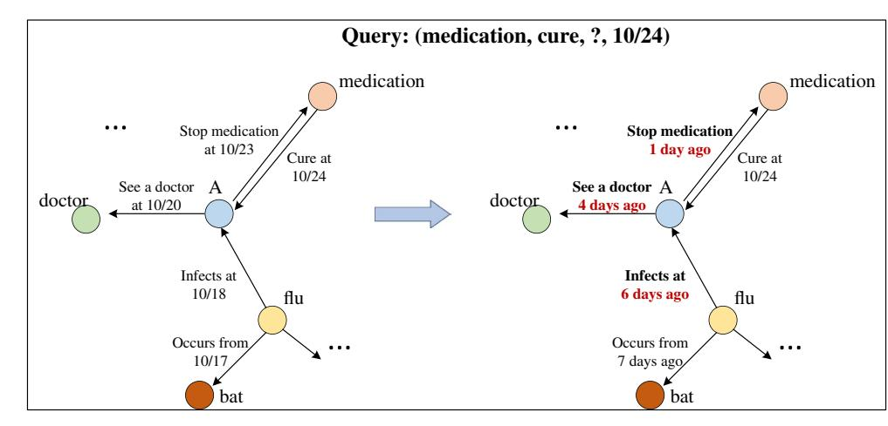

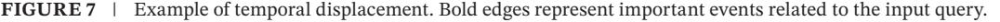

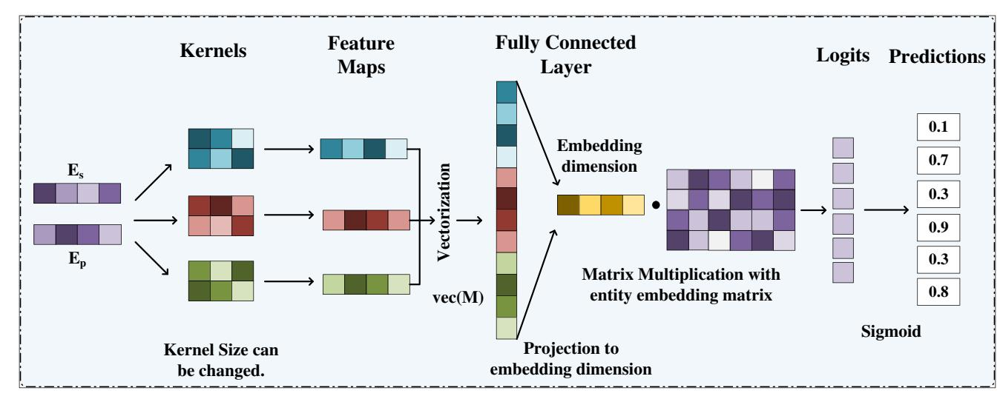

**FIGURE 8**| Architecture of the decoder layer.

|  | TABLE 3   Detailed dataset information. |  |
|--|-----------------------------------------|--|
|  |                                         |  |

| #Datasets  | #Entities | #Relations | #Train  | #Valid | #Test  | #Time interval |
|------------|-----------|------------|---------|--------|--------|----------------|
| ICEWS14    | 6869      | 230        | 74,845  | 8514   | 7371   | 24h            |
| ICEWS05-15 | 10,094    | 251        | 368,868 | 46,302 | 46,159 | 24h            |
| YAGO       | 10,623    | 10         | 161,540 | 19,523 | 20,026 | 1 year         |

embeddings. The output vector of the convolution is aligned with all the kernels to obtain a matrix*M*, which is then linearly transformed by *N*and mapped to the same space as the input dimension through a fully connected layer. Finally, the calculated embeddings are matched with*Eo*through an appropriate distance metric. In this model, the logistic sigmoid function is applied to the scoring. The final output of the Conv-TransE method is defined as follows:

$$
P(E_s, E_p, E_o) = \sigma \left[ f\left(\text{vec}\left(M_{(E_s, E_p)}\right) N\right) E_o \right]
$$
(14)

where*N*represents the matrix of a linear transformation,*f*is a non-linear function,*Es*and*Ep*represent entity embedding representations and relationship embedding representations, respectively.

These scores reflect the importance and relevance of entities and relations in KG reasoning. Such modelling approaches can further improve the performance of KG reasoning, helping us better understand and predict the interactions between entities and relations in KGs. Besides providing scores, this modelling approach can also provide valuable information and insights for subsequent reasoning tasks. Through continuous research and improvement of these models and methods, we can expect better performance and results in the field of knowledge graph reasoning.

Conv-TransE preserves the translational property between entities and relations, learning node embeddings for link prediction. These scores reflect the importance and relevance of entities and relations in KG inference. Such modelling approaches can further improve the performance of KG inference and help us better understand and predict interactions between entities and relations in KGs. In addition to providing scores, this modelling approach can also provide valuable information and insights for subsequent inference tasks. Through ongoing research and improvement of these models and methods, we can expect better performance and results in the field of KG reasoning.

# 3.6 | Parameter Learning

Both entity prediction and relation prediction can be regarded as multi-label learning problems, and they can be trained together. Therefore, the total loss, which includes the entity prediction loss*Le*and the relation prediction loss*Lp*, can be formalised as:

$$
L = L^{e} + L^{p} = \sum_{(s,p,o,t) \in G} y_{t}^{e} \log P(o|s,p,t) + \sum_{(s,p,o,t) \in G} y_{t}^{p} \log P(p|s,o,t)
$$
\n(15)

where *P*(*o*|*s*, *p*, *t*) and *P*(*p*|*s*, *o*, *t*) are the final probability scores for entity and relation prediction, *ye t*∈*R*∣*E*∣ and *y p t*∈*R*∣*R*∣ are the label vectors for these two tasks, with elements being 1 if the fact occurs and 0 otherwise.

# 4 | Experiment

In this section, we evaluated the performance of our proposed TD-RKG model on three popular TKG datasets. We provided a detailed description of the experimental setup and presented the experimental results. In addition, ablation experiments were **TABLE 4**| Experimental results on ICEWS14 and ICEWS05-15 datasets with filtering settings.

|             | ICEWS14 |        |        |         | ICEWS05-15 |        |        |         |
|-------------|---------|--------|--------|---------|------------|--------|--------|---------|
| Models      | MRR     | Hits@1 | Hits@3 | Hits@10 | MRR        | Hits@1 | Hits@3 | Hits@10 |
| ConvE       | 30.30   | 21.30  | 34.42  | 47.89   | 31.40      | 21.56  | 35.70  | 50.96   |
| DistMult    | 20.32   | 6.13   | 27.59  | 46.61   | 19.91      | 5.63   | 27.22  | 47.33   |
| Conv-TransE | 31.50   | 22.46  | 34.98  | 50.03   | 30.28      | 20.79  | 33.80  | 49.95   |
| CompLEx     | 22.61   | 9.88   | 28.93  | 47.57   | 20.26      | 6.66   | 26.43  | 47.31   |
| RotatE      | 25.71   | 16.41  | 29.01  | 45.16   | 19.01      | 10.42  | 21.35  | 36.92   |
| HyTE        | 16.78   | 2.13   | 24.84  | 43.94   | 16.05      | 6.53   | 20.20  | 34.72   |
| TTransE     | 12.86   | 3.14   | 15.72  | 33.65   | 16.53      | 5.51   | 20.77  | 39.26   |
| TA-DistMult | 26.22   | 16.83  | 29.72  | 45.23   | 27.51      | 17.57  | 31.46  | 47.32   |
| CyGNet      | 34.68   | 25.35  | 38.88  | 53.16   | 35.46      | 25.44  | 40.20  | 54.47   |
| RE-NET      | 35.77   | 25.99  | 40.10  | 54.87   | 36.86      | 26.24  | 41.85  | 57.60   |
| RE-GCN      | 35.84   | 26.12  | 40.60  | 54.31   | 37.85      | 27.25  | 42.56  | 58.84   |
| TD-RKG      | 36.70   | 26.46  | 41.20  | 54.79   | 38.63      | 28.14  | 43.47  | 59.11   |
*Note:* The best results are marked in bold.

**TABLE 5**| Experimental results on the YAGO dataset with filtering settings.

|             |       | YAGO   |         |
|-------------|-------|--------|---------|
| Models      | MRR   | Hits@3 | Hits@10 |
| ConvE       | 41.22 | 47.03  | 59.90   |
| DistMult    | 44.05 | 49.70  | 59.94   |
| Conv-TransE | 46.67 | 52.22  | 62.52   |
| CompLEx     | 44.09 | 49.57  | 59.64   |
| RotatE      | 42.08 | 46.77  | 59.39   |
| HyTE        | 14.42 | 39.73  | 46.98   |
| TTransE     | 26.10 | 36.28  | 47.73   |
| TA-DistMult | 44.98 | 50.64  | 61.11   |
| CyGNet      | 46.72 | 52.48  | 61.52   |
| RE-NET      | 46.81 | 52.71  | 61.93   |
| RE-GCN      | 57.44 | 65.49  | 74.49   |
| TD-RKG      | 57.96 | 65.33  | 75.01   |
*Note:*The best results are marked in bold.

conducted to analyse the contributions and impacts of key components in the model.

## 4.1 | Experimental Setup

To ensure the reproducibility of the experiment, we provided a detailed introduction to the experimental setup in this section, including the dataset used, evaluation metrics, baseline model, and specific implementation details.

## 4.1.1 | Dataset

In this experiment, three TKG datasets are used to evaluate the performance of the proposed model, namely ICEWS14 (García-Durán, Dumančić, and Niepert [2018](#page-17-2)), ICEWS05-15 (García-Durán, Dumančić, and Niepert [2018](#page-17-2)) and YAGO (Mahdisoltani, Biega, and Suchanek [2013](#page-18-25)). The first two datasets are obtained from the integrated crisis early warning system (ICEWS), which contains a large number of political facts with timestamps. Datasets are divided into training, validation, and testing sets, with proportions of 80%, 10% and 10%, respectively, based on the timestamps. Detailed information on the datasets can be found in Table [3](#page-11-2). Time interval represents the temporal granularity between adjacent facts.

## 4.1.2 | Evaluation Metrics

In the experiment, both MRR and Hits@{1,3,10} are used as metrics for entity prediction and relation prediction. For the entity prediction task on YAGO, this paper only reports the results of MRR, Hits@3, and Hits@10, as the previous work RE-GCN did not report the results for Hits@1.

Mean reciprocal rank (MRR) is a statistical metric used to evaluate ranking performance, which takes into account the predicted ranks of each event in a sorting task. A higher MRR indicates a higher effectiveness of the model.

Hit@N: Hit@N represents the percentage of correct entities predicted by the model among the top N entities, ranked from highest to lowest. Similar to MRR, a higher value of Hit@N indicates a higher prediction accuracy of the model.

As described in (Han et al. [2021](#page-17-25)), the use of filtering settings to remove corrupt facts from the sorted list does not apply to temporal reasoning tasks. For example, consider a test set query (Malaysia, the relationship to be predicted, Thailand,*t*1) with the

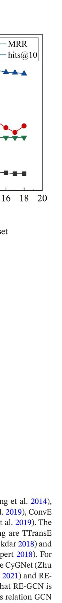

14680394, 2025, 2, Downloaded from https://onlinelibrary.wiley.com/doi/10.1111/exsy.13758 by <Shibboleth>-member@cranfield.ac.uk, Wiley Online Library on [30/06/2025]. See the Terms and Conditions (https://onlinelibrary.wiley.com/terms-and-conditions) on Wiley Online Library for rules of use; OA articles are governed by the applicable Creative Commons License

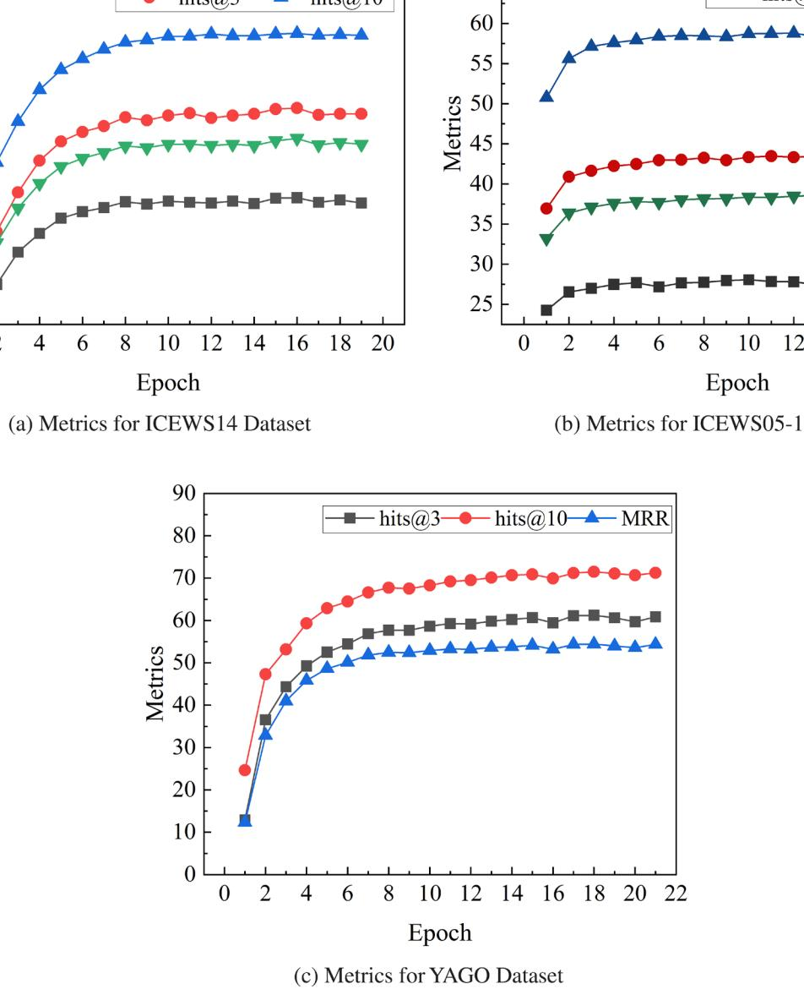

**FIGURE 9**| Comparison of Hits@1/3/10 and MRR results across various datasets.

correct answer being 'Express intent to cooperate', and assume there is another fact (Malaysia, Engage in diplomatic cooperation, Thailand,*t*2). In this filtering setting, Engage in diplomatic cooperation would be mistakenly considered as the correct answer and thus removed from the ranked list of candidate answers. However, for the given query, Engage in diplomatic cooperation is incorrect because (Malaysia, Engage in diplomatic cooperation, Thailand) occurs at timestamp *t*2 instead of *t*1. Therefore, the filtered setting may yield incorrect higher-ranking scores. In general terms, this paper only reports experimental results under the original setting.

### 4.1.3 | Baselines

The TD-RKG model is compared with three categories of models: static KG reasoning models, TKG interpolation reasoning models, and TKG extrapolation reasoning models. The static models chosen for comparison are DistMult (Yang et al. [2014\)](#page-18-9), ComplEx (Trouillon et al. [2016](#page-18-10)), RotatE (Sun et al. [2019\)](#page-18-11), ConvE (Dettmers et al. [2018\)](#page-17-9) and Conv-TransE (Shang et al. [2019\)](#page-18-12). The time models selected for the interpolation setting are TTransE (Jiang et al. [2016\)](#page-17-11), HyTE (Dasgupta, Ray, and Talukdar [2018\)](#page-17-12) and TA-DistMult (García-Durán, Dumančić, and Niepert [2018\)](#page-17-2). For the extrapolation setting, the compared models are CyGNet (Zhu et al. [2021](#page-18-7)), CEN (Li et al. [2022\)](#page-17-19), Titre (Sun et al. [2021](#page-18-17)) and RE-GCN (Li, Jin, Li, et al. [2021\)](#page-17-6). It is worth noting that RE-GCN is the most relevant model, and TD-RKG extends its relation GCN to an implicit relation-aware GCN.

#### 4.1.4 | Implementation Details

In the process of reasoning, static reasoning models and interpolation reasoning models do not encode historical information.

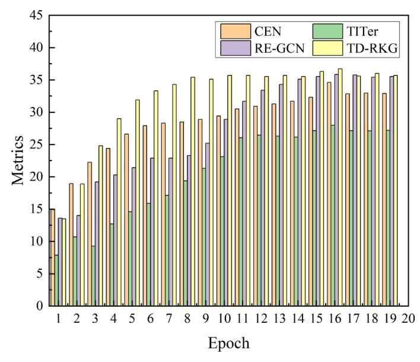

**FIGURE 10**| MRR comparison plot for various extrapolated TKG on the ICEWS dataset.

Therefore, they perform the same task in short-term and longterm evolution tasks, so we directly use the previous works. The extrapolation reasoning models are compared using the publicly available source code from the papers and our reproduced models with consistent parameter settings on three datasets.

We implemented the TD-RKG model in PyTorch. The embedding dimension and hidden state dimension are set to 50. The length of the historical record is limited to 3. The number of layers is set to 1 for the dynamic local recurrent encoding layer and dynamic implicit encoding layer*𝜔*on the YAGO dataset, and 2 for other datasets. Additionally, a dropout rate of 0.2 is applied to each layer. For the dynamic global information attention layer, the number of attention heads is set to 2. Adam optimization is used for parameter learning with a learning rate of 0.001. The batch size is set to 1024.

The configuration for Conv-TransE includes 50 kernels with a kernel size of 2×3 and a dropout rate of 0.2. During the joint learning of entity prediction and relation prediction tasks, the coefficients*𝜆*1 and *𝜆*2 are assigned values of 0.7 and 0.3.

#### 4.2 | Experimental Results

This section reports and analyses the performance of TD-RKG compared to existing baseline methods, with experimental results on the ICEWS14, ICEWS05-15 and YAGO datasets under the filtering setting as shown in Tables [4](#page-12-0) and [5.](#page-12-1) The experiments use an early stopping strategy, and the results indicate that TD-RKG outperforms other baseline methods significantly on almost all datasets, providing strong evidence for the superiority of this model. The line graphs in Figure [9](#page-13-0) further compare the performance of the four metrics across the three datasets. It can be observed that the convergence speed of the four metrics in the TD-RKG model is fast, which we believe is because it searches for answers in local subgraphs and pays more attention to explicit clues. As the evolution time extends, explicit cues gradually decrease, and implicit cues become more important. Therefore, the introduction of the dynamic implicit encoding layer in the encoding structure effectively improves the accuracy and timeliness of predictions. In terms of relationship prediction MRR, TD-RKG consistently outperforms these baselines. For the Hits@3 metric, the model did not achieve state-of-the-art results on the YAGO dataset. We believe this is due to the significantly increased number of new entities and timestamps in the two datasets, resulting in higher time complexity and temporal smoothness. However, for the Hits@1 and Hits@10 metrics, TD-RKG outperforms previous studies.

For one of the most important metrics, MRR, the line graph in Figure [10](#page-14-0) further analyses and compares the MRR performance of TD-RKG against the benchmark dynamic reasoning model, where TD-RKG consistently outperforms these baselines. In the YAGO dataset, the timestamps of the quadruples not only indicate time points but also include temporal modifiers. This makes many baseline KGE methods perform poorly in the experiments, and some methods cannot even handle time-aware link prediction tasks. The results in Tables [4](#page-12-0) and [5](#page-12-1) show that the performance of TD-RKG is far superior to static inference methods because the static model completely ignores the time information of KG inference. Although dynamic methods TTransE and HyTE consider temporal information, their scalability is poor, and more importantly, they ignore the evolutionary patterns of historical subgraphs, resulting in poorer performance than static methods. TA-DistMult performs better than its static model, DistMult, on all three datasets. This indicates the importance of temporal information for TKGC tasks. However, TA-DistMult only focuses on individual triples, neglecting contextual information, which leads to inferior performance. Compared with the historically based RE-NET, CyGNet and RE-GCN methods, the proposed TD-RKG method consistently outperforms them in terms of MRR, Hits@1, Hits@3 and Hits@10, because these methods ignore the implicit relationships between entities in the structural dependency modelling process, as well as the time-sensitivity of inference. The experimental results have verified the advantages of combining implicit relationship encoder and attention to learn and integrate implicit relationships and contextual information in TKGC,

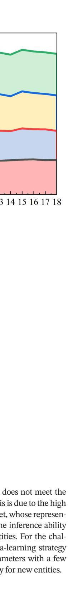

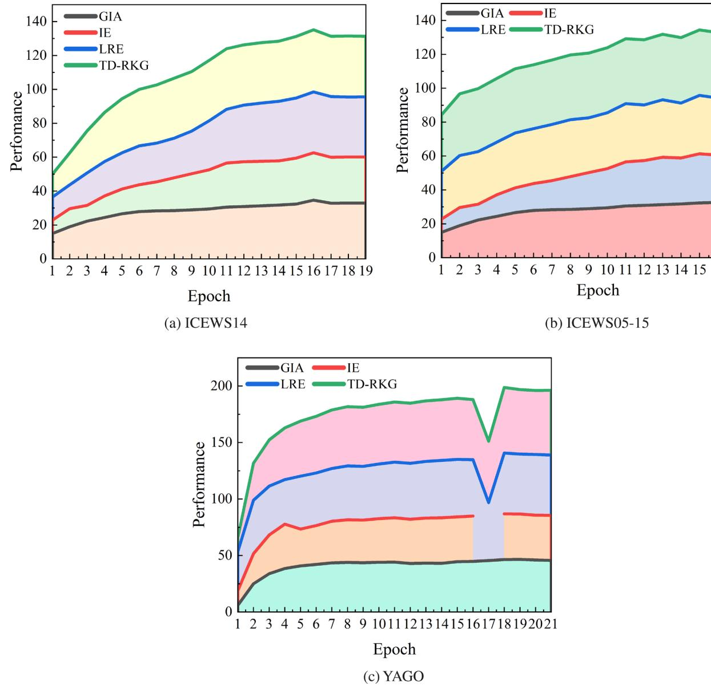

**FIGURE 11** | Comparison of ablation studies in three datasets.

**TABLE 6**| Results of ablation study on time-aware MRR (expressed in percentage). 'LRE' refers to the local recurrent encoding layer, 'IE' refers to the dynamic implicit encoding layer and 'GIA' refers to the dynamic attention layer.

| Models | ICEWS14 | ICEWS05-15 | YAGO  |
|--------|---------|------------|-------|
| LRE    | 35.84   | 34.42      | 53.89 |
| IE     | 34.63   | 32.59      | 46.61 |
| GIA    | 27.98   | 29.03      | 40.36 |
| TD-RKG | 36.70   | 38.63      | 57.96 |
*Note:* The best results are marked in bold.

which strongly proves the effectiveness of TD-RKG in solving implicit correlation and time sensitivity challenges.

Although our model performs well in most cases, there are still some limitations. Specifically, in Table [5](#page-12-1) of the experimental results,

we found that the Hits@3 metric of the model does not meet the SOTA result on the YAGO dataset. We believe this is due to the high frequency of new entities appearing in the dataset, whose representations are randomly initialized, which limits the inference ability of the model when dealing with these new entities. For the challenge of new entities, we plan to adopt a meta-learning strategy to adapt to them quickly, adjusting model parameters with a few samples to improve the model's reasoning ability for new entities.

# 4.3 | Ablation Study

To better understand the effectiveness of different model components in capturing relevant historical features, ablation studies were conducted in this section. As shown in Table [6](#page-15-0), the dynamic local recurrent encoding layer (LRE) had the greatest impact on performance, indicating the importance of neighbouring historical facts for predictions. The dynamic implicit encoding layer (IE) had a consistent impact across all datasets, highlighting the importance of capturing implicit correlations between entities

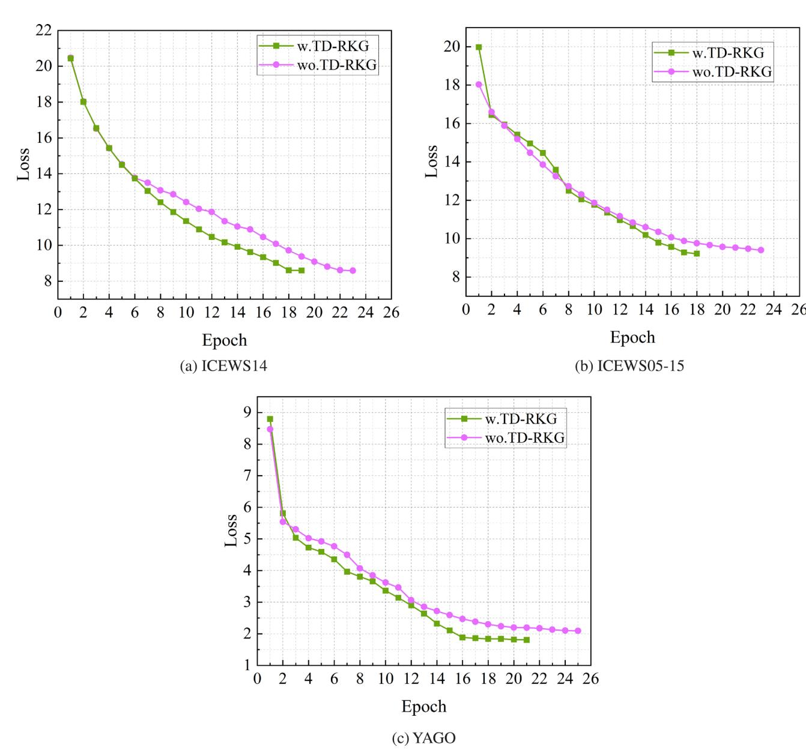

**FIGURE 12**| Study the role of TD-RKG in the general training process using three datasets.

in predictions. Furthermore, the results indicated that the dynamic attention layer (GIA) significantly improved performance on both ICEWS datasets. Due to the specific characteristics of the YAGO dataset, the dynamic attention layer did not show a significant improvement but also did not degrade performance, demonstrating the necessity of capturing long-term temporal dependencies and addressing time-sensitivity challenges. Figure [11](#page-15-1) provides a more intuitive display of the performance impact of each module. Therefore, these results further suggest that different modules contribute to improving the accuracy of predictions.

As shown in Figure [12](#page-16-1), we report the results of the general training process of the model using and not using TD-RKG on the ICEWS14, ICEWS05-15 and YAGO datasets. 'w.TD-RKG' represents a model with TD-RKG, and the losses at different periods are represented by green lines. However, 'wo. TD-RKG' indicates the removal of TD-RKG from the model, and the loss is plotted with a rose red line. In the general training process, the model training process is stopped when the performance of the current epoch is lower than the historical best epoch after five consecutive iterations. During the training process, the modelling loss of the model on the three datasets decreased to a relatively low level in a relatively short period. Due to the relatively complex nature and short-time granularity of the ICEWS14 dataset, the 'w.TD-RKG' loss ultimately decreased to a level similar to that of 'wo. TD-RKG'. For the ICEWS05-15 and YAGO datasets, the 'w.TD-RKG' model minimises the loss with fewer training iterations and ultimately drops below the level of 'w.TD-RKG'. The experimental results show that the model has a strong generalisation ability, which proves that the TD-RKG model can learn effective representations from data faster and better capture the relationship between data and the importance of relationships.

## 5 | Conclusions and Future Work

This paper proposes a novel model called TD-RKG for TKG completion, based on dynamic fusion representation learning. TD-RKG includes a dynamic local encoding layer that models structural dependencies and autoregressive modelling of historical sequences. It also includes a dynamic implicit encoding layer that further learns and integrates node features to capture implicit relationships between entities. Additionally, there is a dynamic global information attention layer that captures deep connections between timestamps and different types of entities at the semantic level. Finally, a Conv-TransE decoder is used. By undergoing the learning process, this model is capable of linking entities with their correlations across different time points and understanding the meanings and roles of entities in different contextual environments. This integrated representation allows the model to better grasp the characteristics and connections of entities and deduce additional information from them. This effectively addresses the challenges of implicit correlation and time-sensitivity. The model is experimentally evaluated on the ICEWS14, ICEWS05-15 and YAGO datasets. The results demonstrate that, for TKGC, TD-RKG outperforms several state-ofthe-art static and TKG embedding methods.

For future work, we plan to expand our approach by adopting meta-learning strategies to enhance new entities' representation learning ability, in order to capture the relationships between graph entities better and improve the model's inductive reasoning ability. In addition, considering the multimodal data (such as text, images, etc.) that may be included in temporal knowledge graphs, we will explore multimodal learning strategies to fully utilise the complementarity of these data.

### Data Availability Statement

The data that support the findings of this study are available from the corresponding author upon reasonable request.

#### References

Ahmed, S., I. E. Nielsen, A. Tripathi, S. Siddiqui, R. P. Ramachandran, and G. Rasool. 2023. "Transformers in Time-Series Analysis: A Tutorial."*Circuits, Systems, and Signal Processing*42, no. 12: 7433–7466.

Balažević, I., C. Allen, and T. M. Hospedales. 2019. "Tucker: Tensor Factorization for Knowledge Graph Completion."*arXiv preprint arXiv:1901.09590*.

Bordes, A., N. Usunier, A. Garcia-Duran, J. Weston, and O. Yakhnenko. 2013. "Translating Embeddings for Modeling Multi-Relational Data." *Advances in Neural Information Processing Systems*26: 2787–2795.

Cai, L., X. Mao, Y. Zhou, Z. Long, C. Wu, and M. Lan. 2024. "A Survey on Temporal Knowledge Graph: Representation Learning and Applications."*arXiv preprint arXiv:2403.04782*.

Camarillo-Ramirez, P., F. Cervantes-Alvarez, and L. F. Gutiérrez-Preciado. 2024. "Semantic Maps for Knowledge Graphs: A Semantic-Based Summarization Approach." *IEEE Access*12: 6729–6744. [https://](https://doi.org/10.1109/ACCESS.2024.3351170) [doi.org/10.1109/ACCESS.2024.3351170](https://doi.org/10.1109/ACCESS.2024.3351170).

Chen, Z., X. Zhao, J. Liao, X. Li, and E. Kanoulas. 2022. "Temporal Knowledge Graph Question Answering via Subgraph Reasoning."*Knowledge-Based Systems*251: 109134. [https://www.sciencedirect.](https://www.sciencedirect.com/science/article/pii/S0950705122005603) [com/science/article/pii/S0950705122005603](https://www.sciencedirect.com/science/article/pii/S0950705122005603). [https://doi.org/10.1016/j.](https://doi.org/10.1016/j.knosys.2022.109134) [knosys.2022.109134](https://doi.org/10.1016/j.knosys.2022.109134).

Cho, K., B. Van Merriënboer, C. Gulcehre, et al. 2014. "Learning Phrase Representations Using Rnn Encoder-Decoder for Statistical Machine Translation."*arXiv preprint arXiv:1406.1078*.

Dasgupta, S. S., S. N. Ray, and P. Talukdar. 2018. "Hyte: Hyperplane-Based Temporally Aware Knowledge Graph Embedding." In *Proceedings of the 2018 Conference on Empirical Methods in Natural Language Processing*, 2001–2011.

Dettmers, T., P. Minervini, P. Stenetorp, and S. Riedel. 2018. "Convolutional 2D Knowledge Graph Embeddings." In *Proceedings of the AAAI Conference on Artificial Intelligence*, vol. 32.

Dong, H., P. Wang, M. Xiao, Z. Ning, P. Wang, and Y. Zhou. 2023. "Temporal Inductive Path Neural Network for Temporal Knowledge Graph Reasoning." *arXiv preprint arXiv:2309.03251*.

García-Durán, A., S. Dumančić, and M. Niepert. 2018. "Learning Sequence Encoders for Temporal Knowledge Graph Completion." *arXiv preprint arXiv:1809.03202*.

Goel, R., S. M. Kazemi, M. Brubaker, and P. Poupart. 2020. "Diachronic Embedding for Temporal Knowledge Graph Completion." In *Proceedings of the AAAI Conference on Artificial Intelligence*, vol. 34, 3988–3995. [https://ojs.aaai.org/index.php/AAAI/article/view/5815.](https://ojs.aaai.org/index.php/AAAI/article/view/5815) [https://doi.org/10.1609/aaai.v34i04.5815.](https://doi.org/10.1609/aaai.v34i04.5815)

Han, Z., P. Chen, Y. Ma, and V. Tresp. 2020. "Explainable Subgraph Reasoning for Forecasting on Temporal Knowledge Graphs." In *International Conference on Learning Representations*.

Han, Z., Z. Ding, Y. Ma, Y. Gu, and V. Tresp. 2021. "Temporal Knowledge Graph Forecasting With Neural ODE." *arXiv preprint arXiv:2101.05151*.

Jiang, T., T. Liu, T. Ge, et al. 2016. "Towards Time-Aware Knowledge Graph Completion." In *Proceedings of Coling 2016, the 26th International Conference on Computational Linguistics: Technical Papers*, 1715–1724.

Jin, W., M. Qu, X. Jin, and X. Ren. 2019. "Recurrent Event Network: Autoregressive Structure Inference Over Temporal Knowledge Graphs." *arXiv preprint arXiv:1904.05530*.

Jung, J., J. Jung, and U. Kang. 2021. "Learning to Walk Across Time for Interpretable Temporal Knowledge Graph Completion." In *Proceedings of the 27th ACM SIGKDD Conference on Knowledge Discovery & Data Mining*, 786–795.

Lacroix, T., G. Obozinski, and N. Usunier. 2020. "Tensor Decompositions for Temporal Knowledge Base Completion." *arXiv preprint arXiv:2004.04926*.

Le, T., N. Le, and B. Le. 2023. "Knowledge Graph Embedding by Relational Rotation and Complex Convolution for Link Prediction." *Expert Systems with Applications*214: 119122.

Lee, J. B., R. A. Rossi, S. Kim, N. K. Ahmed, and E. Koh. 2019. "Attention Models in Graphs: A Survey."*ACM Transactions on Knowledge Discovery From Data (TKDD)*13, no. 6: 1–25.

Li, Z., S. Guan, X. Jin, et al. 2022. "Complex Evolutional Pattern Learning for Temporal Knowledge Graph Reasoning."*arXiv preprint arXiv:2203.07782*.

Li, Z., X. Jin, S. Guan, et al. 2021. "Search From History and Reason for Future: Two-Stage Reasoning on Temporal Knowledge Graphs." *arXiv preprint arXiv:2106.00327*.

Li, Z., X. Jin, W. Li, et al. 2021. "Temporal Knowledge Graph Reasoning Based on Evolutional Representation Learning." In *Proceedings of the 44th International ACM SIGIR Conference on Research and Development in Information Retrieval*, 408–417.

Liang, K., L. Meng, M. Liu, et al. 2023. "Learn From Relational Correlations and Periodic Events for Temporal Knowledge Graph Reasoning." In *Proceedings of the 46th International ACM SIGIR Conference on Research and Development in Information Retrieval*, 1559–1568. New York, NY, USA: Association for Computing Machinery. [https://doi.org/10.1145/3539618.3591711.](https://doi.org/10.1145/3539618.3591711)

Lin, L., and K. She. 2020. "Tensor Decomposition-Based Temporal Knowledge Graph Embedding." In *2020 IEEE 32nd International Conference on Tools With Artificial Intelligence (ICTAI)*, 969–975.

Liu, K., F. Zhao, G. Xu, X. Wang, and H. Jin. 2023. "Retia: Relation-Entity Twin-Interact Aggregation for Temporal Knowledge Graph Extrapolation." In *IEEE International Conference on Data Engineering*.

Liu, L., and H. Tong. 2023. "Knowledge Graph Reasoning and Its Applications." In *Proceedings of the 29th ACM SIGKDD Conference on Knowledge Discovery and Data Mining*, 5813–5814.

Liu, X., M. Yan, L. Deng, G. Li, X. Ye, and D. Fan. 2021. "Sampling Methods for Efficient Training of Graph Convolutional Networks: A Survey." *IEEE/CAA Journal of Automatica Sinica*9, no. 2: 205–234.

Liu, Y., Y. Ma, M. Hildebrandt, M. Joblin, and V. Tresp. 2022. "Tlogic: Temporal Logical Rules for Explainable Link Forecasting on Temporal Knowledge Graphs." In*Proceedings of the AAAI Conference on Artificial Intelligence*, vol. 36, 4120–4127.

Mahdisoltani, F., J. Biega, and F. M. Suchanek. 2013. "YAGO3: A Knowledge Base From Multilingual Wikipedias." In *CIDR*.

Miao, R., X. Zhang, H. Yan, and C. Chen. 2019. "A Dynamic Financial Knowledge Graph Based on Reinforcement Learning and Transfer Learning." In *2019 IEEE International Conference on Big Data (Big Data)*, 5370–5378. <https://doi.org/10.1109/BigData47090.2019.9005691>.

Nguyen, D. Q., T. D. Nguyen, D. Q. Nguyen, and D. Phung. 2017. "A Novel Embedding Model for Knowledge Base Completion Based on Convolutional Neural Network." *arXiv preprint arXiv:1712.02121*.

Ren, X., L. Bai, Q. Xiao, and X. Meng. 2023. "Hierarchical Self-Attention Embedding for Temporal Knowledge Graph Completion." In *Proceedings of the ACM Web Conference 2023*, 2539–2547. New York, NY, USA: Association for Computing Machinery. [https://doi.](https://doi.org/10.1145/3543507.3583397) [org/10.1145/3543507.3583397](https://doi.org/10.1145/3543507.3583397).

Schlichtkrull, M., T. N. Kipf, P. Bloem, R. Van Den Berg, I. Titov, and M. Welling. 2018. "Modeling Relational Data With Graph Convolutional Networks." In *The Semantic Web: 15th International Conference, ESWC 2018, Heraklion, Crete, Greece, June 3–7, 2018, Proceedings 15*, 593–607.

Seo, Y., M. Defferrard, P. Vandergheynst, and X. Bresson. 2018. "Structured Sequence Modeling With Graph Convolutional Recurrent Networks." In *Neural Information Processing: 25th International Conference, ICONIP 2018, Siem Reap, Cambodia, December 13–16, 2018, Proceedings, Part I 25*, 362–373.

Shang, C., Y. Tang, J. Huang, J. Bi, X. He, and B. Zhou. 2019. "Endto-End Structure-Aware Convolutional Networks for Knowledge Base Completion." In *Proceedings of the AAAI Conference on Artificial Intelligence*, vol. 33, 3060–3067.

Shao, P., D. Zhang, G. Yang, J. Tao, F. Che, and T. Liu. 2022. "Tucker Decomposition-Based Temporal Knowledge Graph Completion." *Knowledge-Based Systems*238: 107841.

Shi, Y., L. Zhao, M. Zhou, X. Yin, W. Guo, and C. Li. 2023. "A Dynamic Community Gas Risk-Prediction Method Based on Temporal Knowledge Graphs."*Process Safety and Environmental Protection*177: 436–445.

Sun, H., J. Zhong, Y. Ma, Z. Han, and K. He. 2021. "Timetraveler: Reinforcement Learning for Temporal Knowledge Graph Forecasting."*arXiv preprint arXiv:2109.04101*.

Sun, Z., Z.-H. Deng, J.-Y. Nie, and J. Tang. 2019. "Rotate: Knowledge Graph Embedding by Relational Rotation in Complex Space." *arXiv preprint arXiv:1902.10197*.

Tang, X., and L. Chen. 2023. "GTRL: An Entity Group-Aware Temporal Knowledge Graph Representation Learning Method." *arXiv preprint arXiv:2302.11091*.

Tolstikhin, I. O., N. Houlsby, A. Kolesnikov, et al. 2021. "MLP-Mixer: An All-MLP Architecture for Vision." *Advances in Neural Information Processing Systems*34: 24261–24272.

Trivedi, R., H. Dai, Y. Wang, and L. Song. 2017. "Know-Evolve: Deep Temporal Reasoning for Dynamic Knowledge Graphs." In*International Conference on Machine Learning*, 3462–3471.

Trouillon, T., J. Welbl, S. Riedel, E. Gaussier, and G. Bouchard. 2016. "Complex Embeddings for Simple Link Prediction." In *International Conference on Machine Learning*, 2071–2080.

Wang, J., B. Wang, M. Qiu, et al. 2023. "A Survey on Temporal Knowledge Graph Completion: Taxonomy, Progress, and Prospects." *arXiv preprint arXiv:2308.02457*.

Wang, J., C. Zhu, and W. Zhu. 2022. "Dynamic Embedding Graph Attention Networks for Temporal Knowledge Graph Completion." In *International Conference on Knowledge Science, Engineering and Management*, 722–734.

Wang, X., and N. El-Gohary. 2023. "Deep Learning-Based Relation Extraction and Knowledge Graph-Based Representation of Construction Safety Requirements." *Automation in Construction*147: 104696.

Wang, Z., J. Zhang, J. Feng, and Z. Chen. 2014. "Knowledge Graph Embedding by Translating on Hyperplanes." In*Proceedings of the AAAI Conference on Artificial Intelligence*, vol. 28.

Wen, M., H. Mei, W. Wang, X. Xue, and X. Zhang. 2024. "Multi-Task Recommendation Based on Dynamic Knowledge Graph." *Applied Intelligence*54: 7151–7169. [https://doi.org/10.1007/s10489-024-05548-1.](https://doi.org/10.1007/s10489-024-05548-1)

Yang, B., W.-t. Yih, X. He, J. Gao, and L. Deng. 2014. "Embedding Entities and Relations for Learning and Inference in Knowledge Bases."*arXiv preprint arXiv:1412.6575*.

Zhang, J., S. Liang, Y. Sheng, and J. Shao. 2022. "Temporal Knowledge Graph Representation Learning With Local and Global Evolutions." *Knowledge-Based Systems*251: 109234.

Zhu, C., M. Chen, C. Fan, G. Cheng, and Y. Zhang. 2021. "Learning From History: Modeling Temporal Knowledge Graphs With Sequential Copy-Generation Networks." In*Proceedings of the AAAI Conference on Artificial Intelligence*, vol. 35, 4732–4740.
