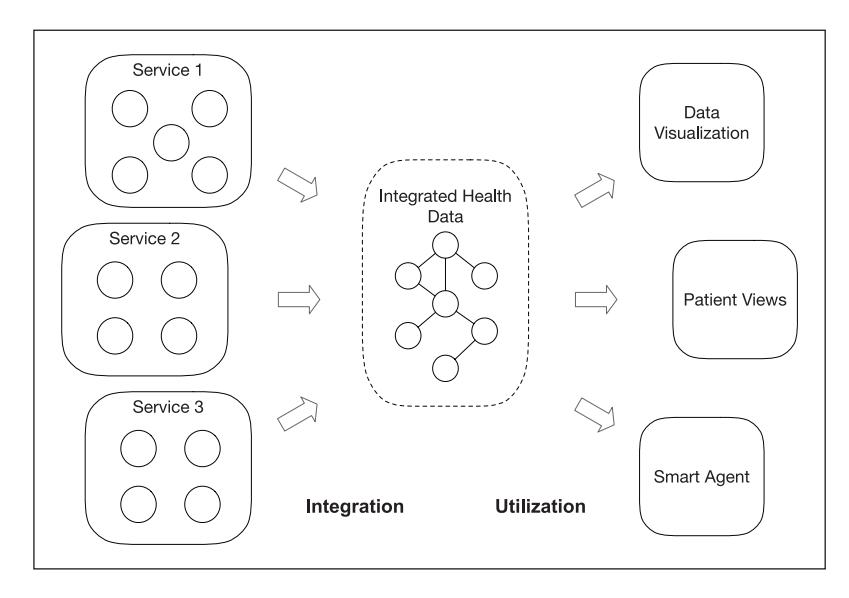
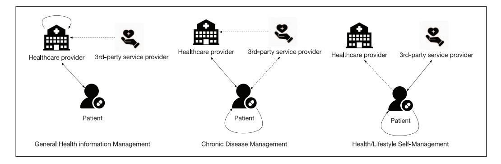
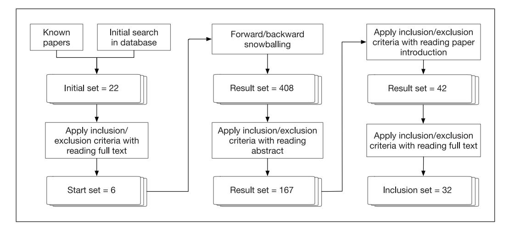
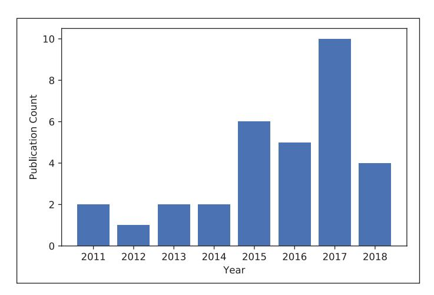
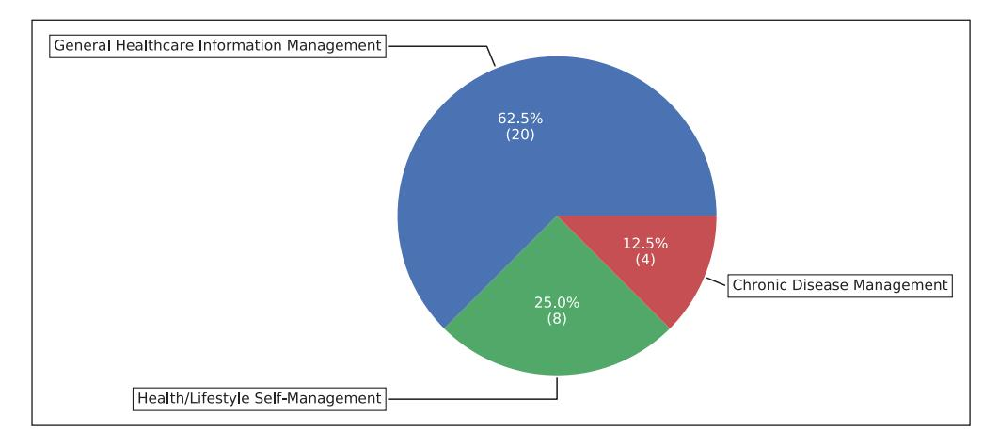
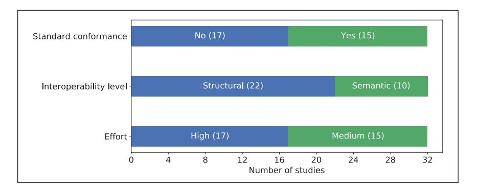
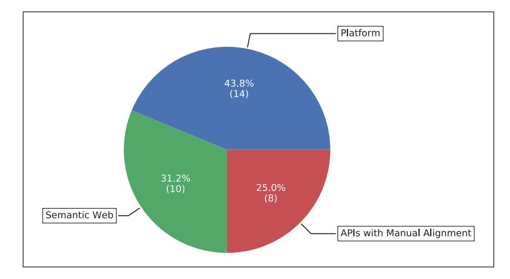
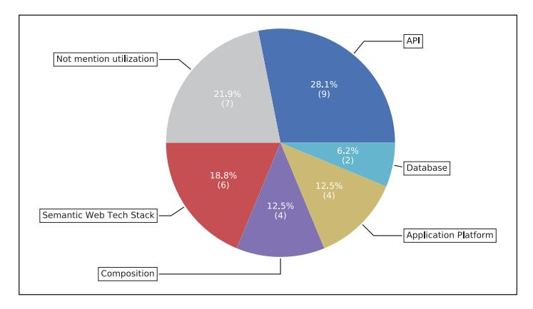

# *Original Article*

**A literature review of current technologies on health data integration for patient-centered health management**# Cong Peng , Prashant Goswami and Guohua Bai

Blekinge Institute of Technology, Sweden

## Abstract

Health data integration enables a collaborative utilization of data across different systems. It not only provides a comprehensive view of a patient's health but can also potentially cope with challenges faced by the current healthcare system. In this literature review, we investigated the existing work on heterogeneous health data integration as well as the methods of utilizing the integrated health data. Our search was narrowed down to 32 articles for analysis. The integration approaches in the reviewed articles were classified into three classifications, and the utilization approaches were classified into five classifications. The topic of health data integration is still under debate and problems are far from being resolved. This review suggests the need for a more efficient way to invoke the various services for aggregating health data, as well as a more effective way to integrate the aggregated health data for supporting collaborative utilization. We have found that the combination of Web Application Programming Interface and Semantic Web technologies has the potential to cope with the challenges based on our analysis of the review result.

### Keywords

health data collaborative utilization, health data integration, health data management, interoperability, patient-centered care, self-management

# Introduction

The traditional healthcare system is facing various challenges. Chronic diseases are one of the big threats to human health, and are becoming a challenge to healthcare systems all over the world.1 The rapidly growing aging population is becoming another challenge. The proportion of the world's population aged 60years or above is expected to reach 21 percent in 2050.2 Therefore, the current healthcare system has to be improved to fulfill the gap of resource shortage, high cost and

## Corresponding author:

Cong Peng, Department of Computer Science, Blekinge Institute of Technology, Valhallavägen 1, 371 79 Karlskrona, Sweden.

Email: [cong.peng@bth.se](mailto:cong.peng@bth.se)

Creative Commons Non Commercial CC BY-NC: This article is distributed under the terms of the Creative Commons Attribution-NonCommercial 4.0 License [\(https://creativecommons.org/licenses/by-nc/4.0/\)](https://creativecommons.org/licenses/by-nc/4.0/) which

permits non-commercial use, reproduction and distribution of the work without further permission provided the original work is attributed as specified on the SAGE and Open Access pages (https://us.sagepub.com/en-us/nam/open-access-at-sage).

https://doi.org/10.1177/1460458219892387 Health Informatics Journal 1–26 © The Author(s) 2019 Article reuse guidelines: [sagepub.com/journals-permissions](https://uk.sagepub.com/en-gb/journals-permissions) DOI: 10.1177/1460458219892387 [journals.sagepub.com/home/jhi](https://journals.sagepub.com/home/jhi)

low efficiency. One of the ongoing reforms is the so-called patient-centered healthcare model. It is to promote the role of the patient to be more involved or even act as the key role in the management and decision making of one's healthcare together with healthcare providers.3

The development and application of information and communication technologies in healthcare make it much more feasible for the self-management of one's health. Electronic Health Record (EHR) systems have been adopted by many healthcare providers. Portable medical devices are used by patients for self-monitoring physiological parameters.4,5 The adoption of self-monitoring and management techniques engages patients more in the care of their health, which also facilitate more health data collection.6 Today, many people are using wearable devices and health applications to record and manage their health and lifestyle.7,8 Moreover, various emerging health-related applications have made this self-management feasible for the patients.9

The many applications and devices record a huge amount of valuable health data about a patient. The collaborative utilization of various health data across data sources has the potential to provide valuable information to healthcare providers during clinical decision making.10 It can also support patients with more effective and convenient self-management with their health,11 and to stimulate promising applications, for example, health data mining and clinical decision support system.10,12–14

However, the systems holding these health data are usually heterogeneously built. The connectivity and accessibility of these systems are diverse. Besides, the problem of the heterogeneity of the exchange data model significantly reduces the efficiency of utilizations on various health data. This situation requires certain methods to integrate the diverse and distributed health data from different systems. Although various integration attempts have been made by applying the different technologies including mobile application,8 integrated framework4 and Semantic Web,5 this topic is still fairly new and remains unexplored. To the best of our knowledge, there is no existing literature review study on this specific topic. This literature review is conducted to investigate the existing work to gain an understanding on integrating heterogeneous health data as well as ways of utilizing the integrated health data. In essence, the review and analysis are for the following purposes:

- To investigate the existing approaches on integrating heterogeneous health data and how they can be classified;
- Explore the existing approaches that facilitate a collaborative utilization of the integrated health data;
- Identify the main challenges that affect the health data integration and utilization.

The remainder of this article is organized as follows. Section "Background" introduces some of the concepts that are closely related to this study. Section "Method" presents the review method. The results are presented in section "Results." Section "Discussion" discusses the review results and some related issues. Known limitations and potential risks are listed in section "Limitations." The article is concluded in section "Conclusion."

# Background

#*What is health data integration*The terminologies for certain concepts on the topic of health data integration are not firmly defined or consistently used since the topic is relatively new. For the term health data integration in this article, we refer to that health data from heterogeneous or distributed sources processed by a certain approach to act as they come from one source in a seamless way. The data sources could be health-related Web services, devices or electronic health record systems, and so on. For utilization,

<!-- Image Description: This diagram illustrates a system for integrating and utilizing health data. Three services (Service 1, 2, and 3, each represented by a box of circles) feed data into a central "Integrated Health Data" node, depicted as a tree-like structure. This integrated data is then utilized for data visualization, patient views, and a smart agent. Arrows indicate data flow, showcasing the integration and utilization stages. The diagram's purpose is to visually represent the architecture of the health data system. -->
**Figure 1.**Simple process of integration and utilization of health data.

we refer to provide a seamless way to utilize the integrated health data for other applications. Figure 1 shows a simple explanation for these two terms. Usually, the approaches of integration and utilization are bound together. There are often different terms expressing similar or highly close purposes to integration, for example, data aggregation and information fusion. However, even the same term may stand for different meanings in different studies.

Interoperability, which is a well-defined concept, is highly related to health data integration but still different in perspective. According to the definition by the Healthcare Information and Management Systems Society (HIMSS), there are three levels of interoperability, which are*Foundational, Structural*and*Semantic*. 15 The *Foundational*level is achieved by allowing the data exchange from one system to be received by another, while the*Structural*level requires defining the structure of the data, and the ability to interpret the syntax of the data.*Semantic*is the highest level of interoperability. It applies codification of the data with vocabulary upon the structured data so that the receiving system can interpret the data. When a certain level of interoperability is achieved, the health data in different information systems, services or devices can be exchanged, interpreted, integrated and then utilized.15 In other words, interoperability is a prerequisite for the integration. Correspondingly, integration and utilization are the products of interoperability. A tremendous amount of work has been done on promoting interoperability in eHealth,16 including various interoperability standards (HL7 standards, Digital Imaging and Communications in Medicine (DICOM), Clinical Information Modeling Initiative (CIMI), etc.) and clinical coding systems (SNOMED-CT, ICD, Logical Observation Identifiers Names and Codes (LOINC), etc.).

#*Different target problems*Health data integration is needed to assist the management of health under different usage purposes. General healthcare information management is one of the main purposes. The integration is required when it is in need of the health data from different systems such as hospital information system, medical imaging system, physiological monitoring device and so on. It is for the general

<!-- Image Description: This figure illustrates three data flow models for healthcare information management. Each model depicts interactions between healthcare providers, third-party service providers, and patients. Solid arrows represent direct data exchange, while dashed lines indicate indirect or less direct communication. The models are categorized as general health information, chronic disease management, and health/lifestyle self-management, highlighting the different data flow patterns depending on the type of care. -->
**Figure 2.**Health data integration of different care models (solid line stands for a main connection and dashed line stands for a minor connection).

usage purpose, that is, it does not specifically target a certain type of disease. Another kind of usage purpose targets a specific kind of disease, which is usually for managing a certain kind of chronic disease. As the care for chronic disease requires long term and periodical management by both the patients and the healthcare staff, self-management by patients becomes a practical and preferred solution to alleviate the high cost and inconvenience involved in the process of chronic disease caring.1 The rapid development of consumer-oriented health products, which include portable medical devices, wearable devices and health applications, makes it much more feasible for chronic disease self-management, and stimulates people's interests in recording and managing their health and lifestyle data.4,5,7

The integration of health data for the different usage purposes not only requires interoperability among different systems, but on many occasions also involves different stakeholders such as the healthcare provider, patient and third-party service provider. The different usage purposes, which can be seen as different target problems, do not exist in isolation from each other. Figure 2 shows three of the care models for the mentioned target problems that require health data integration among different stakeholders. There exist overlaps and connections among them. All the three models involve three stakeholders, and they have different levels of connections between each other. In the figure, the solid line stands for a main connection and the dashed line stands for a minor connection. In the model of the general healthcare information management, data integration mainly proceeds within the healthcare provider with the patient. The third-party service provider may also be involved in some cases. In the other two models, the patient becomes the main player in the health data management.

#*Data integration beyond eHealth*The need for data integration from various sources is not only in the domain of eHealth. For the general purpose, various technologies are being used to integrate data from different homogeneous or heterogeneous sources. Platform-bound Application Programming Interface (API) and programming language specified Software Development Kit (SDK) are two of the commonly used ways to access, manipulate and further integrate data distributed in different systems.

Thanks to the development of Web technologies, which has promoted the interoperability of various software applications running on distributed and diversified systems, the platform-independent Web API has become a preferred way of accessing data across different systems. Within the Web technologies, various approaches have been developed and evolved. Simple Object Access Protocol (SOAP) messaging and REpresentational State Transfer (REST) architectural style are the two representative approaches as an interface for communication on the Web.

Semantic Web, the semantic extension of the Web, has also been explored and applied to the integration of various data sources. Currently, a huge amount of data sets are published on the Web represented by Resource Description Framework (RDF), which can structure semantic enriched information in a flexible and schema-less way. By applying the Linked Data practices,17 the distributed data sets are often enabled to be navigated as a Web of Data by the embedded links and semantics. Even inferences could be performed on the data that are annotated with the ontologies.

In the discipline of bioinformatics, data integration is also a necessity due to the increasingly large numbers of data sources.18 C. Goble and R. Stevens18 discussed various data integration approaches, including Service Oriented Architecture (SOA), data warehouse and a few approaches empowered by Web technologies. Semantic Web technology is highlighted as a promising approach to integrate data sources into a Web of biological data. One of the recent impressive works is the FAIR (Findable, Accessible, Interoperable and Reusable) data principles,19 which intends to improve the discovery and integration of the diverse bioinformatics data sources using various common and standard technologies with the Web and Semantic Web.

# Method

The snowballing sampling method was used to identify the relevant literature. It is a recursive process of identifying relevant articles from the reference list of an article and the citations to an article, which are referred to as backward snowballing and forward snowballing.20 The reason to choose the snowballing method is that the research on health data integration is relatively new, so there is a lack of well-defined and consistently used terminologies for this topic.21 Besides, it also provides extra information about where articles are referenced with context. Previous review study has proven that snowballing is a reliable method to identify relevant articles.21,22

#*Inclusion and exclusion criteria*The included articles have to be published in English from 2008 to June 2018, the time we started article search. This is because we want to make sure that the included studies are up-to-date, since the development of healthcare technologies has seen a strong growth over the past years. We considered only peer-reviewed articles for the purpose of keeping a high-quality standard for this survey. We also excluded articles not written in English and duplicated publications of the same study that have been already included. The following inclusion and exclusion criteria were also used to keep the study focus on the topic.

In*inclusion*, at least one of the following criteria is fulfilled:

- Articles discussing methods to aggregate or integrate health data from different sources;
- Articles proposing solutions that support health data integration;
- Articles discussing methods to utilize health data from multiple sources.

In *exclusion*, any of the following criteria is fulfilled:

• Articles that are not related to health data integration for the purpose of patient healthcare management, such as integrating health data for clinical/biological research, pharmacy or public health statistical analysis;

<!-- Image Description: This flowchart details a literature review methodology. Starting with known papers and an initial database search (yielding 22 papers), it depicts a three-pronged approach: inclusion/exclusion criteria applied to full texts (resulting in 6 papers), snowballing (finding 408 additional papers, then 167 after abstract review), and applying criteria to paper introductions (resulting in 42 papers, then 32 after full-text review). The diagram visually represents the filtering process and the number of papers remaining at each stage. -->

**Figure 3.**Flowchart of the snowballing literature review process; 32 articles were included after multiple phases of selection.

- Articles that mainly focus on a certain part of integration other than the integration itself, for example, access control, security and data type transformation;
- Articles discussing only applying certain health management applications, platforms or services;
- Articles discussing only architectural design without specific data integration method.

#*Review process*The snowballing review approach started by identifying a small start set of relevant articles for snowballing sampling. To identify a start set, an initial article set was established through looking into our previously known relevant articles and an initial database search in Google Scholar and Scopus. Based on an initial check of the accordance with the inclusion and exclusion criteria, 12 articles were selected into the initial set from the database search with keywords*(integrat\* OR aggregat\* OR fus\* OR composit\*) AND (data OR information) AND (ehealth OR e-health OR health\*)*and certain filter parameters. A total of 22 articles were selected into the initial set together with other 10 previously known relevant articles. By applying the inclusion and exclusion criteria to the articles in the initial set, a start set of six articles, where two articles were from the database search and four articles were from previously known articles, were considered to start the snowballing sampling.

Figure 3 shows the article identification process with the number of articles at each stage. The snowballing sampling started with the six articles in the start set and proceeded in an iterative processes with the identified articles until no new articles were found. Through backward snowballing, we reviewed the references of each relevant article by the title, publication year, source type and language according to the criteria. The citations to each relevant article were also reviewed through forward snowballing. A total of 408 articles were identified through the backward and forward snowballing sampling processes.

The abstract of each article in the result set was used to apply the inclusion and exclusion criteria, which reduces the set to 167 articles. In order to further narrow down the article set to a more

## Table 1. Data extracted during review.

| Data                              | Purpose |
|-----------------------------------|---------|
| Metadata                          |         |
| Year                              | Insight |
| Authors                           | Insight |
| Publication type                  | Insight |
| Synthesized data                  |         |
| Target problem                    | Insight |
| Technologies used for integration | RQ1     |
| Integration classification        | RQ1     |
| Technologies used for utilization | RQ2     |
| Utilization classification        | RQ2     |
| Discussed challenges              | RQ3     |
| Future work mentioned             | RQ3     |

RQ: research question.

relevant scope, we started to read the introduction section of each remaining article and apply the inclusion and exclusion criteria. This reduces the article set further to 42 articles. After reading the full text of these articles, 32 articles were included in the final inclusion set in accordance with the inclusion and exclusion criteria.

#*Data extraction*The form in Table 1 was used to extract the data from each included article for the purpose of keeping the review consistent and explicit. Besides the metadata, the synthesized data of each article were also extracted for analysis purpose. The field*target problem*was used to record what kind of problem a study is focusing on and trying to solve, for example, whether it is for a specific type of disease management or only for general purpose. The remaining data were used to answer the research questions we proposed in the "Introduction." The data fields of the technologies used for both the integration and utilization were also extracted.

# Results

#*Identified studies*After several rounds of comparing and screening based on inclusion and exclusion criteria, 32 articles were included as listed in Table 2. Most of the included articles are journal articles, which is 25 specifically, and the remaining 7 are conference articles. All the included articles were published in or after 2011. It needs to be noted that not all the publications in 2018 were available for our search since we started this study in June 2018. As is clear from Figure 4, this period constitutes a time frame for more active research in this topic and hence the increasing tendency of publications. One of the major reasons could be due to the vast amount of wearable devices, mobile applications and health record systems being used by patients and healthcare providers in recent years. This has created a growing requirement for integrating health data distributed in different systems.

| Reference                   | Year | Publication type | Target problem                            |
|-----------------------------|------|------------------|-------------------------------------------|
| Aboelfotoh et al.23         | 2015 | Conference       | General Healthcare Information Management |
| Azarm et al.24              | 2017 | Conference       | General Healthcare Information Management |
| Bentley et al.25            | 2013 | Journal          | Health/Lifestyle Self-Management          |
| Carbonaro et al.26          | 2018 | Journal          | Health/Lifestyle Self-Management          |
| Chung and Park27            | 2016 | Journal          | Chronic Disease Management                |
| Corredor et al.28           | 2014 | Journal          | General Healthcare Information Management |
| Fox et al.29                | 2011 | Journal          | General Healthcare Information Management |
| Garai et al.30              | 2017 | Journal          | General Healthcare Information Management |
| Gay and Leijdekkers8        | 2015 | Journal          | Health/Lifestyle Self-Management          |
| Georgi et al.31             | 2018 | Journal          | Health/Lifestyle Self-Management          |
| Hong et al.32               | 2017 | Conference       | General Healthcare Information Management |
| Jabbar et al.33             | 2017 | Journal          | General Healthcare Information Management |
| Kim et al.34                | 2015 | Journal          | Health/Lifestyle Self-Management          |
| Kim and Chung35             | 2014 | Journal          | General Healthcare Information Management |
| Kumar et al.4               | 2016 | Journal          | Chronic Disease Management                |
| Mandel et al.36             | 2016 | Journal          | General Healthcare Information Management |
| Marceglia et al.37          | 2015 | Journal          | General Healthcare Information Management |
| Mezghani et al.38           | 2015 | Journal          | General Healthcare Information Management |
| Pagkalos and Petrou5        | 2016 | Journal          | Health/Lifestyle Self-Management          |
| Pang et al.39               | 2015 | Journal          | General Healthcare Information Management |
| Potter et al.40             | 2012 | Journal          | General Healthcare Information Management |
| Pustišek41                  | 2017 | Journal          | Chronic Disease Management                |
| Puustjärvi and Puustjärvi42 | 2011 | Journal          | General Healthcare Information Management |
| Rhayem et al.43             | 2018 | Conference       | General Healthcare Information Management |
| Roehrs et al.44             | 2017 | Journal          | General Healthcare Information Management |
| Ruggeri and Briante45       | 2017 | Conference       | General Healthcare Information Management |
| Ryu et al.46                | 2017 | Journal          | General Healthcare Information Management |
| Santos et al.47             | 2016 | Journal          | Health/Lifestyle Self-Management          |
| Schweitzer et al.48         | 2017 | Conference       | General Healthcare Information Management |
| Seo et al.49                | 2018 | Journal          | Health/Lifestyle Self-Management          |
| Triantafyllidis et al.50    | 2013 | Journal          | Chronic Disease Management                |
| Urbauer et al.51            | 2017 | Conference       | General Healthcare Information Management |
**Table 2.**Identified studies with publication information and target problem.

We analyzed the target problems of the included articles and classified them into categories. From Figure 5, we can see that the majority of the studies were targeted at integrating health data for the problem of General Healthcare Information Management. This is natural and accords with our expectation because it can cover different purposes. The problem of Health/Lifestyle Self-Management occupies the second place as it is now becoming a great demand for engaging people to manage their health on a daily base. Chronic Disease Management falls in the third place. Although the solutions for General Healthcare Information Management can cover the requirements, there are still a few studies that target specifically on Chronic Disease Management.

We investigated and extracted the data based on different characteristics of the approaches including interoperability standard conformance, interoperability level and integration effort, which are listed in Table 3. Interoperability standard is vital for enabling the exchange, interpretation and sharing of health data. The integration would be easier to achieve if the health data

<!-- Image Description: The image is a bar chart showing the publication count per year from 2011 to 2018. The x-axis represents the year, and the y-axis represents the number of publications. Publication counts were low from 2011 to 2014, then increased in 2015 and 2016, reaching a peak in 2017 before decreasing slightly in 2018. The chart likely illustrates a trend in research output or publication activity over time within the paper's subject area. -->
**Figure 4.**Included articles by year and publication type.

<!-- Image Description: The image is a pie chart showing the distribution of 32 participants across three categories of health management apps: General Healthcare Information Management (62.5%, n=20), Health/Lifestyle Self-Management (25%, n=8), and Chronic Disease Management (12.5%, n=4). The chart visually represents the proportion of participants using apps within each category. The numbers in parentheses represent the absolute frequencies. -->
**Figure 5.**Targeted problems of the included studies, classified as General Healthcare Information Management, Chronic Disease Management and Health/Lifestyle Self-Management.

conform to these standards. Therefore, we investigated if the approaches in the included articles conform to the standards. We checked if the approach explicitly stated its adoption of any coding or interoperability standard. However, this does not imply that the approach is not able to be standard-conformable if it was not explicitly stated. The reasons could be that the method does not yet apply standards at its current stage or it does not require a standard to be interoperable. As it shows in the first bar of Figure 6, the approaches in 15 of our included articles conform to one or more interoperability standards or coding systems, while 17 articles do not mention any standard.

The interoperability level that each integration approach achieved was also investigated. According to the three levels of interoperability defined by HIMSS,15 we adapt the definitions to the scenario of health data integration. The*Foundational*level is achieved by allowing data to be retrieved from the source system, while the*Structural*level requires defining the structure of the data, and the ability to interpret the syntax of the data. The*Semantic*level requires an approach to annotate the structured data with semantic meanings by using a coding system, vocabulary or

| Reference                       | Standard conformance | Interoperability level | Effort |
|---------------------------------|----------------------|------------------------|--------|
| Aboelfotoh et al.23             | Yes                  | Structural             | High   |
| Azarm et al.24                  | No                   | Structural             | High   |
| Bentley et al.25                | No                   | Structural             | High   |
| Carbonaro et al.26              | Yes                  | Semantic               | Medium |
| Chung and Park27                | No                   | Structural             | High   |
| Corredor et al.28               | Yes                  | Structural             | Medium |
| Fox et al.29                    | Yes                  | Structural             | High   |
| Garai et al.30                  | Yes                  | Structural             | High   |
| Gay and Leijdekkers8            | Yes                  | Structural             | High   |
| Georgi et al.31                 | No                   | Structural             | Medium |
| Hong et al.32                   | Yes                  | Structural             | High   |
| Jabbar et al.33                 | No                   | Semantic               | Medium |
| Kim et al.34                    | Yes                  | Semantic               | Medium |
| Kim and Chung35                 | No                   | Semantic               | Medium |
| Kumar et al.4                   | No                   | Structural             | Medium |
| Mandel et al.36                 | Yes                  | Semantic               | Medium |
| Marceglia et al.37              | Yes                  | Structural             | High   |
| Mezghani et al.38               | No                   | Semantic               | Medium |
| Pagkalos and Petrou5            | No                   | Semantic               | Medium |
| Pang et al.39                   | Yes                  | Structural             | High   |
| Potter et al.40                 | No                   | Semantic               | Medium |
| Pustišek41                      | No                   | Structural             | High   |
| Puustjärvi and Puustjärvi42 Yes |                      | Semantic               | Medium |
| Rhayem et al.43                 | No                   | Semantic               | Medium |
| Roehrs et al.44                 | Yes                  | Structural             | Medium |
| Ruggeri and Briante45           | No                   | Structural             | High   |
| Ryu et al.46                    | No                   | Structural             | High   |
| Santos et al.47                 | No                   | Structural             | High   |
| Schweitzer et al.48             | Yes                  | Structural             | Medium |
| Seo et al.49                    | No                   | Structural             | High   |
| Triantafyllidis et al.50        | No                   | Structural             | High   |
| Urbauer et al.51                | Yes                  | Structural             | High   |
**Table 3.**Characteristics of identified studies (standard conformance, interoperability level and effort of integration).

<!-- Image Description: This horizontal bar chart displays the results of a study categorized by standard conformance, interoperability level, and effort. Each category shows the number of studies falling into two sub-categories (e.g., "Yes" and "No" for standard conformance). The chart uses different colored bars for each sub-category to visually compare the number of studies in each. Numerical values indicate the count of studies in each sub-category. The chart's purpose is to summarize the distribution of studies based on these three key characteristics. -->
**Figure 6.**Characteristics of the included studies.

ontology, so that the integrated data are interpretable. The interoperability level relates to that if the approach involves Semantic Web technologies, or if any interoperability standard or medical coding system is applied. From the second bar of Figure 6, we can see that the approaches in 22 of the articles achieve the*Structural*interoperability level, and the remaining 10 achieve the*Semantic*level. There is no approach that achieves only the*Foundational*level. This is consistent with our expectations, since it is easy to achieve and also a necessity for integration.

We also measured the effort of integration on three levels: low, medium and high. Initially, we planned to measure the approaches based on their automatic level of integration. But later, we found it meaningless to classify them as automatic, semi-automatic or manual. The reason is the lack of any realized automatic approach, and it is also meaningless to study on a manual integration approach. Therefore, we found it more worthwhile to compare its requirement on how much effort an approach required based on our understanding of the presented content. The effort is not measured based on the development of the integration approach, but on the addition of a new health data source. The three levels of effort are defined as follows:

- High: requires much human effort on both retrieving and modeling an additional source of health data, for example, programming ad hoc client to retrieve data, manually aligning a different data model into an existing one;
- Medium: requires less effort on both or one of retrieving and modeling, but still requiring a certain amount of human effort;
- Low: requires very less human effort on both retrieving and modeling an additional source of health data.

As shown in the third bar of Figure 6, of the 32 approaches considered, 15 require medium effort for integrating a data source. The remaining approaches (17 in number) are considered to require high effort. None of these approaches is considered as low effort consuming. Therefore, more studies are needed on the task of integrating health data from different sources.

#*Integration classifications*Based on our observations and the related information, we classified the approaches of health data integration into three classifications:
*APIs with Manual Alignment*: this classification means that the studies aggregate health data from different sources by using APIs, and then perform manual alignment to make the data with different data models integrated. It also implies that the process and the integrated data have no semantics embedded, which distinguishes it from the classification of *Semantic Web*. This kind of integration usually proceeds in a dynamic manner, which means the integration method does not store the data.

*Semantic Web*: this classification means that the studies use Semantic Web technologies to integrate health data from different sources and to make either the integration process or the integrated data semantically enriched. Usually, approaches of this kind require the data sources to have additional semantic annotations or some other processing.

*Platform*: an approach classified as a *Platform*approach is based on if it performs as a platform. That means, for example, if it has various connectivities, stores data, connects with other platforms or has functionalities such as analysis built-in on its own. It is difficult to separate the approaches of*APIs with Manual Alignment*from the approaches of*Platform*clearly and precisely, since many of the platform approaches actually utilize APIs to aggregate data. We can regard the*Platform*classification as an enhanced version of*APIs with Manual Alignment*classification. Some of the platform approaches are actually Personal Health Record (PHR) systems, but we classified them as platform approaches on the perspective of the data integration approach.

We observed that the integration approaches for a few other studies could be classified as a fourth classification,*Data Warehouse*, in the process of literature review. However, none of these qualified in our final inclusion set. This is because some of these studies just store the data in one place without a meaningful integration, and some of the studies suit better to the *Platform*classification. Table 4 lists the integration classifications of all the included studies, and whether they presented or discussed any utilization method.

Figure 7 shows the division of the studies based on the integration classification in a pie chart. We can see that the classification of*Platform*has been applied by most studies, followed by*Semantic Web*and*APIs with Manual Alignment*.

The classifications of these studies are not perfect. Many of the approaches are combinations of the different methods, and some of the classifications have overlaps. We will explain the rationale for each integration classification, and discuss the approaches that are classified in the following subsections.

*APIs with Manual Alignment.*There are 8 articles out of the 32 classified as*APIs with Manual Alignment*. All the studies propose approaches that access data from the Web-based services by Web APIs, and the majority of them state that they use the RESTful Web APIs. Three studies tried to aggregate the health-related data from multiple sensors and Web services in a mashup way.25,29,49 Bentley et al.25 presented a Health Mashups system, which can perform statistical analysis on the data across multiple sources and display observations as a natural language feed in a mobile application. Their mashup server uses open APIs of the commercial sensors and custom REST APIs of their mobile phone context logging service to connect various sensing data including location, weather, step count, sleep and so on, and manual logging data including food, exercise, mood and so on. Seo et al.49 introduced an information fusion method with sensor and activity models that classifies and aggregates data from heterogeneous physical, activity and social sensors. The proposed system is platform-independent compared with previous systems for a similar purpose, as it accesses to data using only REST Web APIs.

The Internet of Things (IoT) paradigm and its evolution Web of Things (WoT) facilitate ubiquitous communication scenarios for different use cases. Two studies applied the paradigms for health management.28,47 Corredor et al.28 described an SOA-based platform called micro Web of Things Open Platform (*µ*WoTOP). It presents an architecture that facilitates the connections to both the external sensors and developing consumer application using REST Web APIs and a publisher– subscriber paradigm. An IoT-based mobile gateway solution was proposed to autonomously collect information about the patient's Body Sensor Network (BSN) data, including location, heart rate and data of possible fall detections. This information is then transferred to the caretaker.47 The mobile gateway also connects to a cloud-based Intelligent personal assistants (IPAs) platform called AMBRO for providing assistance based on the gathered data.

Although three approaches are stated as platforms,30,50,51 they are classified to this classification based on their characteristics. The reason is that they integrate health data using only Webbased APIs without other types of connectivities. Garai et al.30 proposed a hybrid cloud-based Open Telemedicine Interoperability Hub (OTI-Hub) to interconnect traditional healthcare, industrial telemedicine and IoT wearable devices. The *receiver module*of the OTI-Hub uses Web APIs to retrieve the data. The*transformation module*transforms the collected to HL7 interoperability standard format. Its*Hubs integration module*provides REST API to provide data access to

| Reference                   | Integration classification | Utilization mentioned | Main technical features        |
|-----------------------------|----------------------------|--------------------------|--------------------------------|
| Aboelfotoh et al.23         | Platform                   | No                       | Mobile                         |
| Azarm et al.24              | Platform                   | Yes                      | Cloud, Web API                 |
| Bentley et al.25            | APIs with Manual Alignment | Yes                      | Mashup, REST Web API, Android  |
| Carbonaro et al.26          | Semantic Web               | No                       | OWL, RDF, RML, REST Web API    |
| Chung and Park27            | Platform                   | Yes                      | Web API, Android               |
| Corredor et al.28           | APIs with Manual Alignment | Yes                      | WoT, REST Web API              |
| Fox et al.29                | APIs with Manual Alignment | Yes                      | Mashup, Sqwelch                |
| Garai et al.30              | APIs with Manual Alignment | Yes                      | Cloud, Web API                 |
| Gay and Leijdekkers8        | Platform                   | No                       | Web API, Bluetooth, ANT+       |
| Georgi et al.31             | Platform                   | Yes                      | IoT, Android, Bluetooth, WiFi  |
| Hong et al.32               | Platform                   | Yes                      | Cloud, REST Web API, Bluetooth |
| Jabbar et al.33             | Semantic Web               | Yes                      | RDF, Cloud, IoT                |
| Kim et al.34                | Semantic Web               | No                       | Domain Ontology                |
| Kim and Chung35             | Semantic Web               | Yes                      | RDF, Domain Ontology           |
| Kumar et al.4               | Platform                   | Yes                      | Apple HealthKit                |
| Mandel et al.36             | Platform                   | Yes                      | REST Web API                   |
| Marceglia et al.37          | Platform                   | No                       | iOS                            |
| Mezghani et al.38           | Semantic Web               | Yes                      | REST Web API, RDF, SPARQL      |
| Pagkalos and Petrou5        | Semantic Web               | Yes                      | Web API, OWL, RDF              |
| Pang et al.39               | Platform                   | Yes                      | Android                        |
| Potter et al.40             | Semantic Web               | Yes                      | OWL, RDF, Domain Ontology      |
| Pustišek41                  | Platform                   | Yes                      | IoT, Cloud                     |
| Puustjärvi and Puustjärvi42 | Semantic Web               | No                       | OWL, RDF, Domain Ontology      |
| Rhayem et al.43             | Semantic Web               | Yes                      | IoT, Domain Ontology           |
| Roehrs et al.44             | Platform                   | Yes                      | P2P, Blockchain                |
| Ruggeri and Briante45       | Platform                   | No                       | IoT, REST Web API              |
| Ryu et al.46                | Platform                   | Yes                      | Android, Database              |
| Santos et al.47             | APIs with Manual Alignment | Yes                      | IoT, REST Web API, Android     |
| Schweitzer et al.48         | Semantic Web               | Yes                      | WSMO, REST Web API             |
| Seo et al.49                | APIs with Manual Alignment | Yes                      | Mashup, REST Web API           |
| Triantafyllidis et al.50    | APIs with Manual Alignment | Yes                      | WSDL, REST Web API, SOAP       |
| Urbauer et al.51            | APIs with Manual Alignment | Yes                      | REST Web API                   |
**Table 4.**Integration classifications of identified studies.

API: Application Programming Interface; REST: REpresentational State Transfer; OWL: Web Ontology Language; RDF: Resource Description Framework; SOAP: Simple Object Access Protocol; SPARQL: SPARQL Protocol and RDF Query Language; WSMO: Web Service Modeling Ontology; RML: RDF Mapping Language; ANT: Adaptive Network Topology; WSDL: Web Service Definition Language.

external systems. Triantafyllidis et al.50 designed and implemented a system for chronic disease self-management by integrating the health data from on-body sensing devices and manual status logging. The communications among different system units, namely, Mobile Base Unit, sensors, back-end platform and external social network platform, are achieved via WSDL described SOAP APIs and REST APIs.
*Semantic Web.*The massive effort of searching and programming for invoking and composing APIs to achieve health data integration makes it a time-consuming and tedious work. Therefore, in

<!-- Image Description: The image is a pie chart showing the distribution of 34 data points across three categories: "Platform" (43.8%, 14 data points), "Semantic Web" (31.2%, 10 data points), and "APIs with Manual Alignment" (25.0%, 8 data points). The chart likely illustrates the prevalence of different data integration approaches within the paper's scope. -->
**Figure 7.**Integration classifications of approaches.

order to facilitate automatic discovery, composition and invocation of suitable healthcare Web services, M. Schweitzer et al.48 proposed a Semantic Web Service approach. It is based on a Web Service Modeling Ontology (WSMO) adapted service delivery structure and a domain ontology of EHR Web services they developed. However, this approach does not apply semantics to the health data, but only to the process of invoking web services for retrieving health data.

The other studies in the*Semantic Web*classification could be seen as APIs with semantic alignment. I. Pagkalos and L. Petrou proposed the SENHANCE framework to integrate patient selfreported health data on social networks with hardware sensor observation data using Semantic Web technologies.5 The SENHANCE framework uses Web APIs provided by social network platforms such as Facebook, Nike+ Running and MyFitnessPal to retrieve the data from activities, fitness and food journal. By using the ontologies including Web Ontology Language (OWL)-based Semantic Sensor Network (SSN) ontology,52 Friend Of A Friend (FOAF)53 and others, it models and stores these data as human sensor observations together with the hardware sensor observations in RDF format. Both a human sensor observation and a hardware sensor observation include properties of an observer, observation result with value and type and observation time.

Ontology plays a vital role in the semantic integration of health data. Thus, many studies focus on forming ontologies with referring to the existing ones in different domains. An OWL-based personal health ontology was developed by Puustjärvi and Puustjärvi.42 It integrates the ontologies of eHealth tools for PHR, eHealth-oriented blogs and information therapy. This ontology was validated with a cloud-based personal health information system in their later study.54 H. Kim et al.34 developed a Medical Lifelog Ontology (MELLO), which identifies lifelog concepts and relationships between them, through systematic enrichment and iterative manual review process. It links to the various original coding systems including UMLS CUI, NCI thesaurus and SNOMED-CT. At the time they reported,34 the MELLO ontology provided a hierarchical structure of classes to represent a knowledge base of 1998 lifelog concepts, with 4996 synonyms for 1211 concepts and 1395 definitions for 926 concepts. J. Kim and K. Chung proposed an ontologybased healthcare context information model for using healthcare data in a context recognition and personalized u-healthcare service system.35 An overall healthcare service ontology is composed by integrating a device context information model and space context information model for supporting a more ubiquitous healthcare service system. P. Potter et al.40 presented an architecture that aggregates health data from multiple healthcare providers by unifying the health ontologies between providers. It can then provide clinical decision support based on the aggregated health data. They referenced existing ontologies include FOAF,53 SWEET55 and Dublin Core56 to reduce redundancy work in the unifying ontologies.

To cope with the problems of heterogeneity and scalability, E. Mezghani et al.38 proposed a semantic big data architecture. Extending from the basic NIST Cloud and Big Data reference architecture, it integrates data from distributed data sources of multiple wearable devices. The intended integrating data sources can be in the forms of application API, relational database, NoSQL databases, RDF and so on. Their proposed Wearable Healthcare Ontology (WH Ontology) is meant to provide common representation and semantics sharing among different wearable devices.

Similar to the*APIs with Manual Alignment*classification, there are certain studies that integrate health data from IoT health devices with Semantic Web technologies. A. Carbonaro et al.26 also proposed an ontology-based system to facilitate health data integration and sharing. The proposed OWL-based IoT Fitness Ontology (IFO) aims to semantically describe the most common concepts and their relationships within the IoT fitness and wellness devices and corresponding health application services. It refers to a lot of common concepts in the domain from many market available systems including Apple HealthKit, Microsoft HealthVault, Google Fit, Fitbit and so on. The IFO ontology also links to other ontologies such as SNOMED-CT, FOAF and Basic geo vocabulary for wide semantic integration. S. Jabbar et al.33 proposed an IoT-based Semantic Interoperability Model (IoT-SIM) to enable semantic interoperability among the heterogeneous healthcare IoT devices. And a HealthIoT ontology was proposed to represent the semantics of connected objects and data on the Internet of Medical Things.43 It enables semantic rule reasoning to assist the clinical decision making.
*Platform.*Under the*Platform*classification, we specifically classify the approaches into*Integrated Platform*and*Centralized Platform*. An integrated platform is one where it cooperates with the other services or platforms to achieve the service delivery, while a centralized platform is one where it tries to deliver all the functions on its own. Four approaches classified as *Centralized Platform*. 27,39,41,45 The other approaches demonstrate various system models for integrating health data in the way of an integrated platform.

The smart mobile phone has become a part of our daily life as a personal assistant with high computation capabilities and numerous connectivities, which makes it highly suitable for supporting the management of health data. The data collection and aggregation of many studies8,23,31,37,46 are initialized by several mobile applications. V. Gay and P. Leijdekkers demonstrated that an Android mobile application can be used to integrate the health and fitness data from commercially available devices and EHR services such as Microsoft HealthVault.8 The Android mobile application called *myFitnessCompanion*aggregates data via two types of connectivities, APIs and wireless network protocols. It uses Web APIs to retrieve health and fitness data from platforms such as Microsoft HealthVault and Google Fit for those devices with an open standardized protocol. It also retrieves data from vendors such as Fitbit and Jawbone, the devices of which use closed and proprietary protocols, by using APIs to their Web services in an indirect way. The application is also able to pair with the devices supporting Bluetooth or ANT+ for retrieving data directly. An Android mobile application was developed to collect health-related lifestyle data, as well as the data from a wearable activity device.46 The mobile application then stores the data to the PHR system, whose database is linked to an integrated EHR system's database.

Marceglia et al.37 proposed to facilitate the health data integration between mobile health applications and EHR systems in an interoperability standards-based way. Based on the integration architecture they designed, a simulation system is implemented to support home monitoring of heart failure patients using the OpenMRS and iOS platform and HL7 Clinical Document Architecture rel2 (CDA2). The approach proposed by Kumar et al.4 integrates blood glucose data among monitor devices, Apple HealthKit and EHR system. Its integration and communication are achieved by Apple HealthKit on an iOS mobile device. The integrated data can be utilized by analysis and communication applications in the connected EHR system.

Similar to the other classifications, there are approaches that combine the IoT paradigm for integrating health data.31,32,45 A middleware approach was proposed to integrate health data from sensors and in the mean time to reduce the heterogeneity caused by the increasing number of proprietary protocols from health sensors.31 A prototype of the middleware is implemented on the Android platform with the support of six sensors. The middleware solution supports WiFi and Bluetooth communications, and it also categorizes the sensors as wellness and medical. On a successful request, it will return a middleware-defined measure object, which contains data related to a measure including type, value, unit, timestamp and so on. G. Ruggeri and O. Briante attempted on the Social IoT (SIoT) paradigm for health integration using social-aware IoT devices.45 What distinguishes SIoT from IoT is that the SIoT objects with high computation and storage capabilities can interact and cooperate with peer objects to achieve common goals. The connections among SIoT objects and the social gateway, which is the orchestration unit of the objects, are established by RESTful APIs. The virtual doctor as an automatic application can then perform on the health data coming from the devices.

Three articles32,36,44 demonstrated novel and interesting architectural platforms for the health data integration and utilization. A. Roehrs et al.44 proposed OmniPHR that utilizes blockchain and routing overlay P2P network to build a distributed PHR system to integrate the health data from different systems, including EMR and EHR systems from healthcare providers and patient devices. They also proposed to apply openEHR standard, NLP technologies and Ontologies to build a semantic database for storing the health data of each datablock. An interconnected PHR system model was proposed by J. Hong et al.32 It includes the hospital information system, public cloud APIs service, PHR gateway system and mobile application. The PHR gateway system is based on Samsung's ARTIK 10 IoT module, which has various connectivities including Bluetooth, ZigBee, WiFi and so on to gather data from different types of health devices. The connections among the interconnected systems are achieved by email pushing service and RESTful Web APIs.

#*Utilization classifications*An approach to utilizing the integrated health data is mentioned in most of the included studies. We classified five classifications of these utilization approaches as follows:
*Database*: this classification is the simplest one among the five classifications. The utilization approaches with this classification provide access to the integrated health data only in the form of a database.

*API*: the classification of *API*means that an approach integrates data from different sources and then provides access to the integrated data as services in a more uniform way. Usually, these services are invoked via Web APIs or other types of APIs.
*Semantic Web Tech Stack*: this utilization classification only applies to the approaches of *Semantic Web*integration classification, where the integrated data themselves are annotated with semantic meaning. It makes them able to provide access to the integrated data by using Semantic Web technologies stack, which is usually SPARQL.
*Application Platform*: this classification means that an approach provides applications of the integrated data directly, other than access to the integrated data. Applications that we observed include data analytics, data visualization, data sharing and so on. It can be regarded as an approach with one more layer than the Web service classification.

*Composition*: this means that an approach composites several services together as a way of providing access to multiple health data sources. It can be seen as both a way of integration and utilization. It is difficult to separate *Composition*classification clearly from*Web service/API*and*APP Platform*. Most of the approaches in *Composition*are*Mashup*, which is in between these two classifications. A *Mashup*approach provides just a single view of the integrated data with other kinds of web data. It is more than APIs but less than application platforms based on its characteristics.

Table 5 lists the utilization classifications of all the studies that have one. Figure 8 shows the division of each utilization classification in a pie chart, together with no utilization method. We can see that there are nine approaches classified as*Web service*, which makes it the most appeared classification. Six approaches are classified as *Semantic Web*. The *Composition*and*APP Platform*are both applied in four articles. Only two articles apply the*Database*approach.

The utilization classifications of these approaches are not perfect. Overlap exists between*Web service, Composition*and*APP Platform*. This is also because some of the articles only briefly describe how the integrated health data would be utilized without details of the solution. This makes us only speculate the utilization way based on the short descriptions.

*Database.*Only two articles presented their approaches on utilizing the integrated health data directly in the way of database. In the study performed by B. Ryu et al.,46 health-related lifestyle data and activity data from wearable devices are collected by an Android mobile application and stored to a PHR system. A database link is provided by the PHR system to an integrated EHR system, through which the integrated health data can be utilized by both clinicians and EHR system applications. While in the study performed by A. Roehrs et al.,44 besides a relational database, a semantic database is also provided as an approach for utilizing health data on the distributed PHR system. In addition to the use of open interoperability standards, equivalent ontologies and NLP technologies are used to facilitate a semantic database.
*API.*This utilization classification is the most commonly mentioned or demonstrated in the 25 articles. Most of the approaches provide Web APIs to access the integrated health data as Web services, many of which claim as REST APIs.

Of all the aforementioned approaches, five apply*APIs with Manual Alignment*to integrate the health data from various sources and then provide access through Web APIs. The*Hubs integration module*of the OTI-Hub provides REST APIs to the external systems for data access.30 Based on our understanding of the descriptions in the article, the integrated health data would be represented in an HL7 v3 standard XML payload. In the study performed by P. Urbauer et al.,51 the server infrastructure component also provides data access in an HL7 standard, but in the newer version of REST FHIR APIs, to the health data visualization applications. The*µ*WoTOP architecture also provides REST Web APIs for developing consumer applications.28 It enables the interoperability of the integrated health data by wrapping the API messages in different standard formats including HL7, SNOMED and Common Alerting Protocol (CAP). Besides REST Web APIs, it also provides an event-driven communication in a publisher–subscriber paradigm to manage alert events in CAP format. Although the SOAP-based API is not as popular as REST in recent years, it is also provided as a support to the REST APIs for communication with external platforms.50 In the study by M. Azarm et al.,24 the proposed framework is composed of a set of Web service APIs, a data storage

| Reference                   | Utilization classification |
|-----------------------------|----------------------------|
| Aboelfotoh et al.23         | Not mention utilization    |
| Azarm et al.24              | API                        |
| Bentley et al.25            | Composition                |
| Carbonaro et al.26          | Not mention utilization    |
| Chung and Park27            | Application platform       |
| Corredor et al.28           | API                        |
| Fox et al.29                | Composition                |
| Garai et al.30              | API                        |
| Gay and Leijdekkers8        | Not mention utilization    |
| Georgi et al.31             | API                        |
| Hong et al.32               | API                        |
| Jabbar et al.33             | Semantic Web Tech Stack    |
| Kim et al.34                | Not mention utilization    |
| Kim and Chung35             | Semantic Web Tech Stack    |
| Kumar et al.4               | API                        |
| Mandel et al.36             | Application platform       |
| Marceglia et al.37          | Not mention utilization    |
| Mezghani et al.38           | Semantic Web Tech Stack    |
| Pagkalos and Petrou5        | Semantic Web Tech Stack    |
| Pang et al.39               | API                        |
| Potter et al.40             | Semantic Web Tech Stack    |
| Pustišek41                  | Application platform       |
| Puustjärvi and Puustjärvi42 | Not mention utilization    |
| Rhayem et al.43             | Semantic Web Tech Stack    |
| Roehrs et al.44             | Database                   |
| Ruggeri and Briante45       | Not mention utilization    |
| Ryu et al.46                | Database                   |
| Santos et al.47             | Application platform       |
| Schweitzer et al.48         | Composition                |
| Seo et al.49                | Composition                |
| Triantafyllidis et al.50    | API                        |
| Urbauer et al.51            | API                        |

**Table 5.**Integrated data utilization classifications of identified studies.

API: Application Programming Interface.

system and a PHR Web portal. In order to separate the concerns and accessibility to the health data, the APIs are separated into different groups for different stakeholders, which include the Web portal within the framework, healthcare organizations' internal applications and other applications.

Besides the platform-independent Web APIs, there are approaches providing platform-bound APIs due to their solutions being built upon certain platforms. To take the advantages of the compatibility, functionality and well-established platform from Android, the iMedBox prototype was developed as an Android application.39 A middleware solution was also developed on the Android platform to cover the majority of smartphone users.31 Therefore, the utilizations of these two approaches have to be provided in the way of Android system-bound APIs. The approach by Kumar et al.4 is as iOS platform-bound since it was developed with the Apple HealthKit. The HealthKit framework collaborates with the Health application, which acts as a repository for health and

<!-- Image Description: This pie chart displays the distribution of utilized technologies in a study. The largest segment (28.1%) represents APIs, followed by "Not mention utilization" (21.9%). Other segments show usage of Semantic Web Tech Stacks (18.8%), Application Platforms and Composition (both 12.5%), and Databases (6.2%). Numbers in parentheses indicate the count of instances for each technology. The chart likely illustrates the prevalence of different technological approaches within the research's scope. -->
**Figure 8.**Utilization classifications of approaches.

fitness data on the iOS platform, to process data collection, management and utilization.57 So other applications can use the APIs provided by the HealthKit framework to utilize the integrated health and fitness data.
*Composition.*There are three approaches25,29,49 that describe themselves as mashups that provide a single view of the integrated health data with additions of analysis or other services. With the sensor and activity models, the approach by D. Seo et al.49 is able to produce hierarchically fused activity streams with activity schema and fusion rules. The activity streams can then be used by the activity visualizer to present an activity timeline and chart that mash various fitness and health from different sensors and services. As aforementioned, the mashup server uses open APIs of various commercial sensors and custom REST APIs of their mobile phone context logging service to integrate the various sensing data together with manual logging data.25 It mashups the various data and the statistical analysis performed on the data in natural language text feed.

The service mashups are mainly data-oriented, while there is a transition to a more processoriented service composition approach.58 By applying WSMO with EHR Web service domain ontologies, a workflow-based Semantic Web services composition was presented to utilize various EHR Web services based on the user-defined functional and nonfunctional properties.48 By providing a task workflow modeled in Business Process Model and Notation (BPMN) 2.0 to the Service Delivery Platform, the calling of suitable services is executed in the process of pre-filtering, discovery, composition, ranking and invocation on the registered services. The service composition process can be regarded as both the integration and utilization of various health data sources.
*Application platform.*The utilization approaches in four articles27,36,41,47 are classified as*Application Platform*. The *SMART on FHIR*platform36 is an EHR system capable of running third-party applications. By applying Web technologies including JavaScript, oAuth and RDF, and medical terminology coding systems including RxNorm, LOINC and SNOMED-CT, the previous*SMART*platform was to provide a developer-friendly and semantically consistent approach that supports vendor-independent and interoperability-supporting medical applications. The*SMART on FHIR*is a new version that the previous*SMART*platform adopts the FHIR interoperability specification in order to solve the data model and API issues. The reference platform architecture separates three key server components, which include an authorization server, an API server and an application server. The API server is an FHIR API server that provides access to FHIR resources and search APIs. The application server is an environment that provides patient list browsing and applications launching, which are written in HTML5 and JavaScript.
*Semantic Web Tech Stack.*In this classification, all the approaches provide utilizations to the integrated health data using Semantic Web technologies. The utilization approaches by Pagkalos and Petrou5 and Jabbar et al.33 are both provided via SPARQL (SPARQL Protocol and RDF Query Language) query. An integrated data query can be easily achieved using SPARQL query since the data are expressed in RDF with common Semantic vocabularies and ontologies.5 The data from both the social networks and hardware sensors are modeled as sensor observations (human sensor observations and hardware sensor observations, respectively). It enables simple inferences to be performed in a SPARQL query thanks to the OWLIM-Lite. In addition, federated SPARQL queries could be performed to query and merge data from other Semantic databases with a SPARQL endpoint.

To support better interpretation and analysis on the health data with semantics, more complex semantic reasoning were explored in addition to simple SPARQL queries in four articles.35,38,40,43 Semantic Web Rule Language (SWRL) was used by A. Rhayem et al.43 to define several inference rules, which are then executed by an algorithm they proposed for analyzing vital signs and supporting doctors' decision making. Also, in the study by J. Kim and K. Y. Chung,35 inference will be performed by a context reasoner with healthcare and exercise knowledge rules after a SPARQL query.

# Discussion

#*Challenges in health data integration*We found it quite common in both the included and excluded studies, regardless of the integration classifications, that plenty of them (17 out of 32 from the included ones) integrate health data using Web APIs to retrieve data from Web services. Web API is a promising technique for this problem as it provides a unified interface, the HTTP protocol, to connect to the various services running on distributed and diversified systems. One of the good examples is the study done by V. Gay and P. Leijdekkers. It uses Web APIs to retrieve health and fitness data from both platforms and Web services of specific vendors.8 In addition, besides the health and fitness data, also the data related to social activities can be retrieved and integrated from services using Web APIs.5,49 Although besides the Web API, there are other necessary connectivity protocols such as Bluetooth,8,32 platform-bound APIs,4,39,46 and so on,31,44 it is better to simplify the types of connectivities for the matter of integration. Otherwise, it introduces complexity to the integration process, for example, maintaining different communication technologies, dealing with different Bluetooth communication modes and protocols.8,32 It does not mean to get rid of other connectivities, but to add an additional service layer upon the existing system to support Web API as a uniform interface for the integration.

However, there are limitations for the widely applied Web approach paradigms, one of the problems being that using Web APIs to consume health data from different services is becoming a tediously repetitive work that requires a high demand for human labor.59 After identifying the desired Web services, data consumers are then required to read documents and program similar code to retrieve health data. This makes it a more human labor-centered work rather than a more intelligence-centered work. In addition, it makes the contract between data consumer and services fragile.60 Whenever a small change happens on the service, it may break the contract for the successful retrieving of health data for the client.

Another vital problem is the heterogeneity of the exchanged data models among Web services.61 The integration of health data is not just aggregating data from different places together. The aggregated data need to be organized and identifiable, that is, the data consumer needs to understand what kind of data and accompanying metadata a resource contains. This is still an unsolved issue from the observed approaches. Although the majority of current Web APIs adopt JSON format as the content type to represent the exchange data (even some apply common hypermedia types such as*Hypertext Application Language*62 and *Collection*+*JSON*),63 the data models are still different to some extent.

In sum, the very nature of the health data integration problem lies in solving two challenges. One is to figure out an efficient way to call various services for aggregating health data. Another challenge is to find out an effective way to integrate the aggregated health data for supporting collaborative utilization. To deal with the first challenge, we need a well-integrated solution to the current technology stack. Such a solution should be not only lightweight but also flexible and fitted with common standards and evolution trend. The approach of Web API is a suitable starting point, since it is the most applied and also platform-independent approach for accessing diversified systems. Combined with Semantic Web technologies, which refers to Semantic Web Services, it can make the service invocation more efficient when aggregating health data from various Web services.48,59,61 However, issues such as highly complicated and lacking connection to the actual Web development technology stack need to be resolved for the Semantic Web Services solutions.64

For the second challenge, the potential solution has similar requirements. It should be well integrated, lightweight, flexible and also fit with the common standards. The REST resource model is the de facto standard for organizing the information unit on the current Web.65 Standardization can alleviate the problem, but there is a cost to adopt a standard and a single standard may not be able to match the needs of every application use case. Semantic Web technologies also have the potential to alleviate the problem. However, simply annotating semantics to the diversified data models will not only fail to solve the problem, but also bring high complexity and low efficiency.64 Therefore, a tradeoff needs to be made among flexibility, efficiency (either for development or processing), interoperability and standardization. The next-generation health informatics interoperability standard HL7 FHIR's adoption of the REST resource model and Linked Data module makes this approach more applicable to the integration with standards.66,67 A seamless integration cannot be achieved based on only the existing interfaces provided by service providers. It needs both sides, which are the service consumer (the one intends to integrate) and service provider, to make improvements for making a better integration.

# *Utilization of integrated health data*Based on our observation of the included studies, there is no dominated utilization classification. The*Database*approach would require too much unnecessary detail for the utilizers to know in advance.46 It is at a level too low to be exposed for collaboration. The same problems apply to the approach of*Semantic Web Tech Stack*, that is, SPARQL, as well. The raw data-oriented SPARQL query is not an appropriate way to be provided directly as access to data.5,33 However, it is good to provide utilization based on it, which is similar to the Web API to be provided as access to data on the Web instead of SQL query. Within the approach of *API*, there are platform-bound API, for example, APIs bound to iOS or Android platform in the observed studies.4,37,39,46 This approach can take advantage of the platform's functionalities and utilities. However, it restricts the utilization to the specific platform only.

The platform-independent Web API is a better alternative to provide open and free utilization to the integrated health data, though it may bring a little loss on the performance front. By annotating with semantics, the enriched Web API approach could provide a more effective way for collaborative utilization, which is also a necessity for providing a high-quality application platform. Therefore, the approach of semantically enriched Web API, which can be regarded as a combination of the two mostly applied classifications, has the potential to provide a well-integrated, lightweight and flexible solution.

# *Potential of flexible common data model*For the purpose of collaborative utilization of health data with heterogeneous data models, Common Data Model (CDM) transformation is one of the trending approaches. For example, the semantic CDM transformation introduced by Pacaci et al.68 transformed health records data from heterogeneous sources to an CDM-based database in a three-step process, which includes transforming source data sets to RDF documents, applying semantic conversion rules to make the data as instances of the CDM's ontological model and populating the repositories by processing the RDF instances data. It avoids developing many custom analytical methods to the data with the heterogeneous data models and underlying vocabularies when utilizing health data from different sources.69,70 This type of CDM transformation method, which is regarded as an Extract Transform Load (ETL)-like procedure, is currently designed and applied to work with more static data repositories. The core idea and methods of CDM is possible to be applied to a more dynamic environment like data services.

However, a potential issue with CDM is that it might be impossible to have a common model that satisfies all the usage scenarios. The study of SENHANCE5 utilizes ontology to make data of hardware sensors and human sensors into a common observation model, but it did not present how the model can be extended for flexible use cases. The sensor and activity model introduced by D. Seo et al.49 uses Activity Streams71 to represent activity logs that contain data retrieved from the heterogeneous physical and social sensors in a rich and extendable way. In an ongoing study,72 a Linked Health Resource ontology is used to model together data from different types of services. This method tries to keep the flexibility of data models while integrating standard-based common data model, which is the FHIR resource specification. However, one of the limitations is that it requires service providers organizing data in a resource-oriented model with semantic annotations. The requirements are difficult to avoid though it increases the effort of service providers. In order to achieve interoperability in bioinformatics data sources, the FAIR principles require data providers to apply certain design patterns and Web technologies as well.19

Most of the newly proposed methods for integrating data are solutions that keep the data sources as distributed as they are, instead of trying to make a large platform that centralizes all the data in one place. This phenomenon complies with the trending topic on the current Web, the Decentralized Web movement initialized by the inventor of the Web, Sir Tim Berners-Lee, to avoid the problems of single-point solutions.73

# Limitations

Potential risks that may exist in this study include the neglecting of relevant articles due to the exclusion of articles that are irrelevant but might be a bridge to other relevant articles; the connections were cut in an early phase. This review included only peer-reviewed articles, so that it excluded other types of sources (e.g. gray literature) that may bring additional information for a more comprehensive review. This study also excluded non-English-language published articles, which may contain different technical approaches beyond the ones found in this review. As we

Security and privacy issues are vital for either the health data themselves or the integration process. However, most of the included articles have not yet tried to cover or even discuss the security and privacy problems for the integration approaches, since the study topic is still at its early phase. Therefore, this article did not discuss them as well. Nevertheless, we believe they will be put on the agenda within the research community as the progress being made to the study of integration.

# Conclusion

In this article, we presented a review of recent proposals in the relatively new topic of health data integration. The snowballing review process identified 32 highly relevant articles spread from the year 2011 to mid-2018. We analyzed the health data integration approaches presented in the articles, and classified them into three classifications of*APIs with Manual Alignment, Semantic Web*and*Platform*. The approaches for the utilization of integrated health data were also analyzed, where 25 approaches are presented in the article. The utilization approaches were classified into five classifications of *Database, API, Composition, Semantic Web Tech Stack*and*Application platform*.

Based on our observation of the included studies, either the integration of health data across different services or the collaborative utilization on the integrated health data is still far from being resolved. We analyzed that the problem of health data integration can be concluded as figuring out an efficient way to call various services for aggregating health data, and finding out an effective way to integrate the aggregated health data for supporting collaborative utilization. Some of the studies tried to solve the former, while some of them tried to solve the latter. The combination of Web service technologies and Semantic Web technologies has the potential to solve the problems with a balance among flexibility, efficiency, interoperability and standardization.

## Declaration of conflicting interests

The author(s) declared no potential conflicts of interest with respect to the research, authorship, and/or publication of this article.

### Funding

The author(s) received no financial support for the research, authorship and/or publication of this article.

# ORCID iD

Cong Peng <https://orcid.org/0000-0002-3127-7024>

## References

- 1. Daar AS, Singer PA, Persad DL, et al. Grand challenges in chronic non-communicable diseases. *Nature*2007; 450(7169): 494–496.
- 2. United Nations. World population ageing, [https://www.un.org/en/development/desa/population/](http://https://www.un.org/en/development/desa/population/publications/pdf/ageing/WPA2017_Report.pdf) [publications/pdf/ageing/WPA2017\\_Report.pdf](http://https://www.un.org/en/development/desa/population/publications/pdf/ageing/WPA2017_Report.pdf)
- 3. Lober WB and Flowers JL. Consumer empowerment in health care amid the internet and social media.*Semin Oncol Nurs*2011; 27(3): 169–182.
- 4. Kumar RB, Goren ND, Stark DE, et al. Automated integration of continuous glucose monitor data in the electronic health record using consumer technology.*J Am Med Inform Assoc*2016; 23(3): 532–537.
- 5. Pagkalos I and Petrou L. SENHANCE: a semantic Web framework for integrating social and hardware sensors in e-health.*Health Inform J*2016; 22(3): 505–522.

- 6. Chiauzzi E, Rodarte C and DasMahapatra P. Patient-centered activity monitoring in the self-management of chronic health conditions.*BMC Med*2015; 13: 77, [http://bmcmedicine.biomedcentral.com/arti](http://bmcmedicine.biomedcentral.com/articles/10.1186/s12916-015-0319-2)[cles/10.1186/s12916-015-0319-2](http://bmcmedicine.biomedcentral.com/articles/10.1186/s12916-015-0319-2)
- 7. Vuorimaa P, Harmo P, Hämäläinen M, et al. Active life home: a portal-based home care platform. In:*Proceedings of the 5th international conference on pervasive technologies related to assistive environments—PETRA '12*. New York: ACM Press.
- 8. Gay V and Leijdekkers P. Bringing health and fitness data together for connected health care: mobile apps as enablers of interoperability. *J Med Internet Res*2015; 17(11): e260.
- 9. El-Gayar O, Timsina P, Nawar N, et al. Mobile applications for diabetes self-management: status and potential.*J Diabetes Sci Technol*2013; 7(1): 247–262.
- 10. Weller T, Maleshkova M, Marz K, et al. A RESTful approach for developing medical decision support systems. In:*3rd workshop on services and applications over linked APIs and data, SALAD 2015*, *vol. 1359*, Portorož, 1 June 2015, pp. 37–45.
- 11. Zenuni X, Raufi B, Ismaili F, et al. State of the art of semantic Web for healthcare. *Proced Soc Behv*2015; 195: 1990–1998.
- 12. Rea S, Pathak J, Savova G, et al. Building a robust, scalable and standards-driven infrastructure for secondary use of EHR data: the SHARPn project.*J Biomed Inform*2012; 45(4): 763–771.
- 13. Odgers DJ and Dumontier M. Mining electronic health records using linked data.*AMIA Jt Summits Transl Sci Proc*2015; 2015: 217–221.
- 14. Pathak J, Kiefer RC and Chute CG. Using linked data for mining drug-drug interactions in electronic health records.*Stud Health Technol Inform*2013; 192: 682–686.
- 15. What is Interoperability?—HIMSS, <https://www.himss.org/library/interoperability-standards/what-is>
- 16. Eysenbach G. What is e-health ?*J Med Internet Res*2001; 3(2): e20, <http://www.jmir.org/2001/2/e20/>
- 17. Berners-Lee T. Linked data—design issues, <https://www.w3.org/DesignIssues/LinkedData.html> (accessed 23 March 2018).
- 18. Goble C and Stevens R. State of the nation in data integration for bioinformatics.*J Biomed Inform*2008; 41(5): 687–693.
- 19. Wilkinson MD, Verborgh R, Bonino da Silva Santos LO, et al. Interoperability and FAIRness through a novel combination of Web technologies.*PeerJ Comput Sci*2017; 3: e110, [https://peerj.com/articles/](http://https://peerj.com/articles/cs-110) [cs-110](http://https://peerj.com/articles/cs-110)
- 20. Wohlin C. Guidelines for snowballing in systematic literature studies and a replication in software engineering. In:*18th International conference on evaluation and assessment in software engineering (EASE 2014)*, *London*, *13–14 May 2014*, pp. 321–330. New York: ACM Press.
- 21. Jalali S and Wohlin C. Systematic literature studies: database searches vs. backward snowballing. In: *Proceedings of the 2012 6th ACM\_IEEE international symposium on empirical software engineering and measurement (ESEM)*, Lund, 20–21 September 2012, pp. 29–38. New York; IEEE.
- 22. Badampudi D, Wohlin C and Petersen K. Software component decision—making: In—house, OSS, COTS or outsourcing—a systematic literature review. *J Syst Software*2016; 121: 105–124.
- 23. Aboelfotoh MH, Martin P and Hassanein HS. A mobile-based architecture for integrating personal health record data. In:*2014 IEEE 16th International conference on e-health networking, applications and services, HealthCom 2014*, pp. 269–274. New York: IEEE.
- 24. Azarm M, Backman C, Kuziemsky C, et al. Breaking the healthcare interoperability barrier by empowering and engaging actors in the healthcare system. *Procedia Comput Sci*2017; 113: 326–333.
- 25. Bentley F, Tollmar K, Stephenson P, et al. Health mashups: presenting statistical patterns between wellbeing data and context in natural language to promote behavior change.*ACM T Comput-Hum Int*2013; 20(5): 1–27.
- 26. Carbonaro A, Piccinini F and Reda R. Integrating heterogeneous data of healthcare devices to enable domain data management.*J e-Lear Knowl Soc*2018; 14(1), <https://www.learntechlib.org/p/182316>
- 27. Chung K and Park RC. PHR open platform based smart health service using distributed object group framework.*Cluster Comput*2016; 19(1): 505–517.
- 28. Corredor I, Metola E, Bernardos A, et al. A lightweight Web of things open platform to facilitate context data management and personalized healthcare services creation.*Int J Environ Res Public Health*2014; 11(5): 4676–4713.

- 29. Fox R, Cooley J and Hauswirth M. Creating a virtual personal health record using mashups.*IEEE Internet Comput*2011; 15(4): 23–30.
- 30. Garai Á, Péntek I, Adamkó A, et al. A clinical system integration methodology for bio-sensory technology with cloud architecture.*Acta Cybern*2017; 23(2): 513–536.
- 31. Georgi N, Corvol A and Le Bouquin Jeannes R. Middleware architecture for health sensors interoperability.*IEEE Access*2018; 6: 26283–26291.
- 32. Hong J, Morris P and Seo J. Interconnected personal health record ecosystem using IoT cloud platform and HL7 FHIR. In:*Proceedings – 2017 IEEE international conference on healthcare informatics, ICHI 2017*, pp. 362–367. New York: IEEE.
- 33. Jabbar S, Ullah F, Khalid S, et al. Semantic Interoperability in Heterogeneous IoT Infrastructure for Healthcare. *Wirel Commun Mob Com*2017; 2017: 1–10.
- 34. Kim HH, Lee SY, Baik SY, et al. MELLO: medical lifelog ontology for data terms from self-tracking and lifelog devices.*Int J Med Inform*2015; 84(12): 1099–1110.
- 35. Kim J and Chung KY. Ontology-based healthcare context information model to implement ubiquitous environment.*Multimed Tools Appl*2014; 71: 873–888.
- 36. Mandel JC, Kreda DA, Mandl KD, et al. SMART on FHIR: a standards-based, interoperable apps platform for electronic health records.*J Am Med Inform Assoc*2016; 23(5): 899–908.
- 37. Marceglia S, Fontelo P, Rossi E, et al. A standards-based architecture proposal for integrating patient mHealth apps to electronic health record systems.*Appl Clin Inform*2015; 6(3): 488–505.
- 38. Mezghani E, Exposito E, Drira K, et al. A semantic big data platform for integrating heterogeneous wearable data in healthcare.*J Med Syst*2015; 39(12): 185, [http://link.springer.com/10.1007/s10916-](http://link.springer.com/10.1007/s10916-015-0344-x) [015-0344-x](http://link.springer.com/10.1007/s10916-015-0344-x)
- 39. Pang Z, Zheng L, Tian J, et al. Design of a terminal solution for integration of in-home health care devices and services towards the Internet-of-Things.*Enterp Inf Syst*2015; 9(1): 86–116.
- 40. De Potter P, Cools H, Depraetere K, et al. Semantic patient information aggregation and medicinal decision support.*Comput Methods Programs Biomed*2012; 108(2): 724–735.
- 41. Pustisek M. A system for multi-domain contextualization of personal health data.*J Med Syst*2017; 41(1): 16, <http://link.springer.com/10.1007/s10916-016-0663-6>
- 42. Puustjarvi J and Puustjarvi L. Personal health ontology: towards the interoperation of e-health tools.*Int J Electron Healthc*2011; 6(1): 62,<http://www.inderscience.com/link.php?id=39059>
- 43. Rhayem A, Mhiri MBA and Gargouri F. HealthIoT ontology for data semantic representation and interpretation obtained from medical connected objects. In:*Proceedings of IEEE/ACS international conference on computer systems and applications, AICCSA*, pp. 1470–1477. New York: IEEE.
- 44. Roehrs A, da Costa CA and da Rosa Righi R. OmniPHR: a distributed architecture model to integrate personal health records. *J Biomed Inform*2017; 71: 70–81.
- 45. Ruggeri G and Briante O. A framework for IoT and e-health systems integration based on the social Internet of Things paradigm. In:*2017 international symposium on wireless communication systems (ISWCS)*, pp. 426–431. New York: IEEE.
- 46. Ryu B, Kim N, Heo E, et al. Impact of an electronic health record-integrated personal health record on patient participation in health care: development and randomized controlled trial of MyHealthKeeper. *J Med Internet Res*2017; 19(12): e401, <http://www.jmir.org/2017/12/e401/>
- 47. Santos J, Rodrigues JJ, Silva BM, et al. An IoT-based mobile gateway for intelligent personal assistants on mobile health environments.*J Netw Comput Appl*2016; 71: 194–204.
- 48. Schweitzer M, Gorfer T and Hörbst A. Semantic Web service delivery in healthcare based on functional and non-functional properties.*Stud Health Technol Inform*2017; 245: 945–949.
- 49. Seo D, Yoo B and Ko H. Information fusion of heterogeneous sensors for enriched personal healthcare activity logging.*Int J Ad Hoc Ubiq Co*2018; 27(4): 256.
- 50. Triantafyllidis AK, Koutkias VG, Chouvarda I, et al. A pervasive health system integrating patient monitoring, status logging, and social sharing.*IEEE J Biomed Health Inform*2013; 17(1): 30–37.
- 51. Urbauer P, Kmenta M, Frohner M, et al. Propose of standards based IT architecture to enrich the value of allergy data by telemonitoring data.*Stud Health Technol Inform*2017; 236: 136–143.
- 52. Compton M, Barnaghi P, Bermudez L, et al. The SSN ontology of the W3C semantic sensor network incubator group.*J Web Semant*2012; 17: 25–32.

- 53. Brickley D and Miller L. FOAF vocabulary specification, 2010, <http://xmlns.com/foaf/spec/> (accessed 11 October 2017).
- 54. Puustjärvi J and Puustjärvi L. Exploiting cloud-based personal health information systems in practicing patient centered care model. In:*International joint conference on biomedical engineering systems and technologies (BIOSTEC 2012)*, pp. 339–352. Berlin: Springer.
- 55. Raskin RG and Pan MJ. Knowledge representation in the semantic Web for Earth and environmental terminology (SWEET). *Comput Geosci*2005; 31(9): 1119–1125.
- 56. DCMI: Dublin Core Metadata element set, Version 1.1: Reference Description, 2012, [http://dublincore.](http://dublincore.org/documents/dces/) [org/documents/dces/](http://dublincore.org/documents/dces/)
- 57. About the HealthKit framework —Apple developer documentation, [https://developer.apple.com/docu](https://developer.apple.com/documentation/healthkit/about_the_healthkit_framework)[mentation/healthkit/about\\_the\\_healthkit\\_framework](https://developer.apple.com/documentation/healthkit/about_the_healthkit_framework)
- 58. Garriga M, Mateos C, Flores A, et al. RESTful service composition at a glance: a survey, 2016, [http://](http://linkinghub.elsevier.com/retrieve/pii/S1084804515002933) [linkinghub.elsevier.com/retrieve/pii/S1084804515002933](http://linkinghub.elsevier.com/retrieve/pii/S1084804515002933)
- 59. Lucky MN, Cremaschi M, Lodigiani B, et al. Enriching API descriptions by adding API profiles through semantic annotation. In:*International Conference on service-oriented computing*, pp. 780–794. Cham: Springer.
- 60. Verborgh R and Dumontier M. A Web API ecosystem through feature-based reuse. *IEEE Internet Comput*2018; 22: 29–37.
- 61. Lanthaler M and Guetl C. Hydra: A vocabulary for hypermedia-driven Web APls. In:*Proceedings of the 6th workshop on linked data on the Web (LDOW2013) at the 22nd international World Wide Web conference*. Rio de Janeiro: CEUR.
- 62. The Hypertext Application Language, [http://stateless.co/hal\\_specification.html](http://stateless.co/hal_specification.html)
- 63. Collection+JSON—hypermedia type: media types, <http://amundsen.com/media-types/collection/>
- 64. Lanthaler M and Gütl C. A semantic description language for RESTful Data Services to combat Semaphobia. In: *5th IEEE International conference on digital ecosystems and technologies (IEEE DEST 2011)*, Daejeon, South Korea, 31 May–3 June 2011, pp. 47–53. New York: IEEE.
- 65. Fielding RT. *Architectural styles and the design of network-based software architectures*. PhD Thesis, University of California, Irvine, 2000,<http://dl.acm.org/citation.cfm?id=932295>
- 66. HL7. Fast Healthcare Interoperability Resources (FHIR),<https://hl7.org/fhir/> (accessed 7 February 2018).
- 67. Luz MP, Nogueira JRDM, Cavalini LT, et al. Providing full semantic interoperability for the fast healthcare interoperability resources schemas with resource description framework. In: *2015 International conference on healthcare informatics*, pp. 463–466. New York: IEEE.
- 68. Pacaci A, Gonul S, Sinaci AA, et al. A semantic transformation methodology for the secondary use of observational healthcare data in postmarketing safety studies. *Front Pharmacol*2018; 9: 435, [http://](http://www.ncbi.nlm.nih.gov/pubmed/29760661) [www.ncbi.nlm.nih.gov/pubmed/29760661](http://www.ncbi.nlm.nih.gov/pubmed/29760661)
- 69. Bright RA and Nelson RC. Automated support for pharmacovigilance: a proposed system.*Pharmacoepidemiol Drug Saf*2002; 11: 121–125.
- 70. Overhage JM, Ryan PB, Reich CG, et al. Validation of a common data model for active safety surveillance research.*J Am Med Inform Assoc*2012; 19: 54–60.
- 71. Snell JM and Prodromou E. Activity streams 2.0—W3C recommendation, 2017, [https://www.w3.org/](https://www.w3.org/TR/activitystreams-core/) [TR/activitystreams-core/](https://www.w3.org/TR/activitystreams-core/)
- 72. Peng C, Goswami P and Bai G. An ontological approach to integrate health resources from different categories of services. In:*The third international conference on informatics and assistive technologies for health-care, medical support and wellbeing*, pp. 48–54. IARIA.
- 73. Yeung CA, Liccardi I, Lu K, et al. Decentralization: the future of online social networking. In: *W3C Workshop on the future of social networking position papers*, [http://citeseerx.ist.psu.edu/viewdoc/summ](http://citeseerx.ist.psu.edu/viewdoc/summary?doi=10.1.1.190.1487) [ary?doi=10.1.1.190.1487](http://citeseerx.ist.psu.edu/viewdoc/summary?doi=10.1.1.190.1487)
