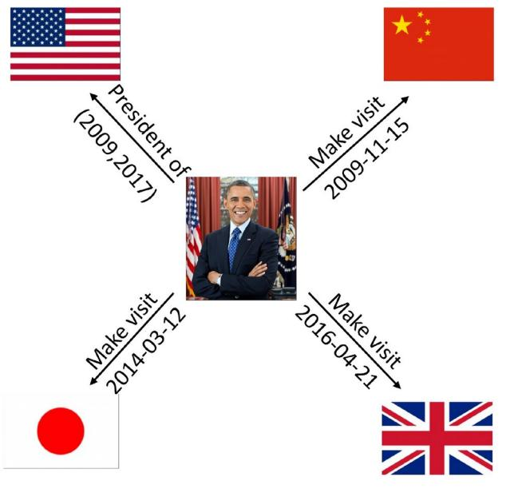
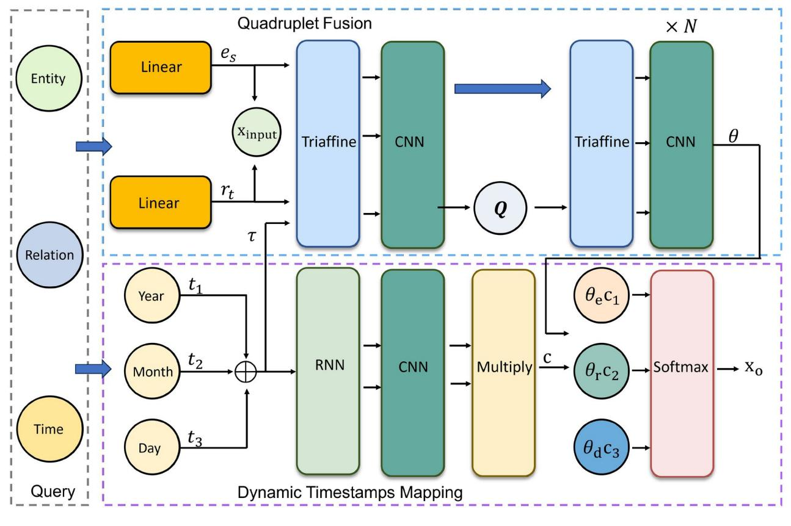
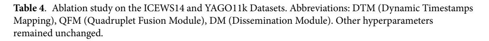
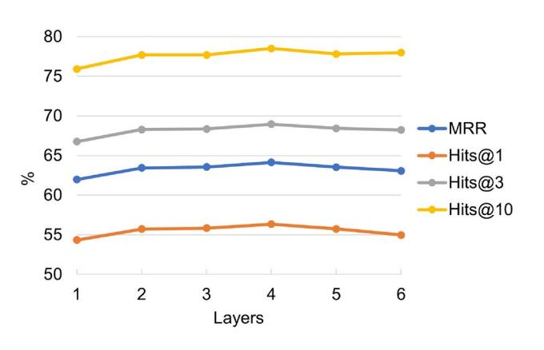
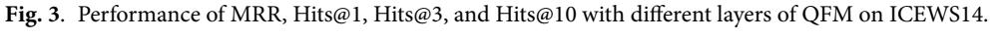
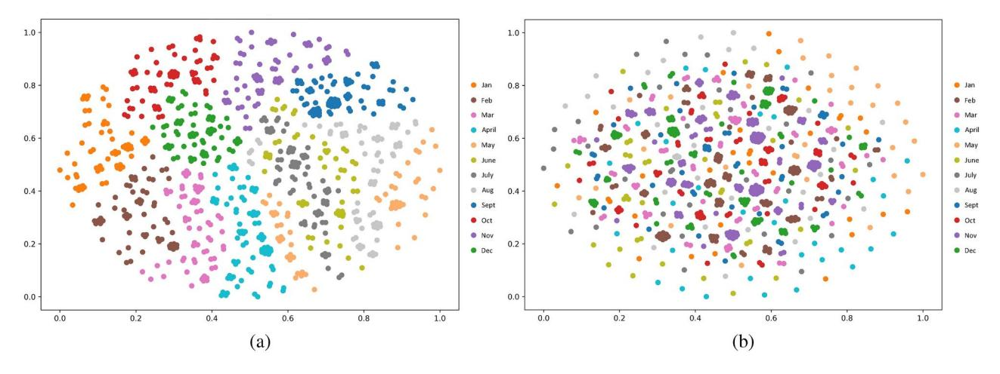

<!-- cite_key: structured2014 -->

# OPEN

# Learning temporal granularity with quadruplet networks for temporal knowledge graph completion

**RushanGeng1 & Cuicui Luo2**

**Temporal Knowledge Graphs (TKGs) capture the dynamic nature of real-world facts by incorporating temporal dimensions that reflect their evolving states. These variations add complexity to the task of knowledge graph completion. Introducing temporal granularity can make the representation of facts more precise. In this paper, we propose Learning Temporal Granularity with Quadruplet Networks (LTGQ), which addresses the inherent heterogeneity of TKGs by embedding entities, relations, and timestamps into distinct specialized spaces. This differentiation enables a finer-grained capture of semantic information across the temporal knowledge graph. Specifically, LTGQ incorporates triaffine transformations to model high-order interactions between the elements of quadruples, such as entities, relations, and timestamps, in TKGs. Simultaneously, it leverages Dynamic Convolutional Neural Networks (DCNNs) to extract representations of latent spaces across different temporal granularities. By achieving more robust alignment between facts and their respective temporal contexts, LTGQ effectively improves the accuracy of temporal knowledge graph completion. The proposed model was validated on five public datasets, demonstrating significant improvements in TKG completion tasks, thereby confirming the effectiveness of our approach.**

**Keywords**Timestamps mapping, Triaffine, Dynamic convolutional neural networks, Temporal knowledge graph, Temporal knowledge graph completion

Knowledge graphs (KGs) are key tools in many areas of natural language processing. They store human knowledge in a structured way. KGs are usually represented as triplets (subject, relationship, object) and are used in applications such as recommendation systems[1](#page-8-0) , financial data analytics[2](#page-8-1) , named entity recognitio[n3](#page-8-2) , and question-answering system[s4](#page-8-3) . However, traditional KGs are static and do not capture the changing nature of real-world events. This static nature results in gaps in the data and has led to the development of knowledge graph completion (KGC) techniques. These techniques aim to fill in missing facts and reveal hidden insights.

Temporal Knowledge Graphs (TKGs) extend the traditional triplet format by adding a temporal dimension, forming quadruples in the form of (subject, relationship, object, timestamp). For example, the fact ("Barack Obama", "Made a visit", "Japan", "2014-03-12") includes a timestamp, offering a more precise and context-rich representation of the event (see Fig. [1](#page-1-0)). By capturing temporal dynamics, TKGs not only differentiate facts more effectively but also account for the simultaneity of events, resulting in more adaptable and comprehensive knowledge graphs.

In recent years, efforts to model interactions among entities, relations, and timestamps have increased. These efforts use the complex structure and subtle time details in temporal knowledge graphs (TKGs) to better predict future events[5,](#page-8-4)[6](#page-8-5) . By mapping facts and time into a unified semantic space, researchers aim to keep entities, relations, and timestamps close together so that similar facts are represented more closely[7](#page-8-6) . However, raw, unprocessed data often contain diverse types of knowledge, leading to semantic fragmentation and making it harder to accurately assign quadruples in TKG completion models. Real-world data show that some facts change frequently while others remain stable. For example, although Barack Obama visited many countries between 2008 and 2017, his role as president stayed the same until Donald Trump took office in 2018. This dynamic behavior poses unique challenges for Temporal Knowledge Graph Completion (TKGC). If a model fails to capture the detailed semantic information from timestamps, its performance will suffer. Separately capturing and emphasizing temporal information (such as year, month, and day) can improve model accuracy.

Temporal information is inherently structured, and it is essential to leverage its granularity to correlate facts effectively. However, previous approaches often overlook the richness of temporal granularity, treating time as a monolithic element rather than exploring its finer details in conjunction with entities and relations.

1School of Computer Science and Technology, University of Chinese Academy of Sciences, Beijing, China. 2International College, University of Chinese Academy of Sciences, Beijing, China. email: luocuicui@ucas.ac.cn

**Fig. 1**. Some simple facts exist in TKGs.

Moreover, existing models often integrate entities, relations and timestamps information in a staged manner, leading to potential biases that accumulate over time, resulting in diminished accuracy when predicting missing entities. To address these limitations, we propose a dynamic timestamps mapping (DTM) module that integrates heterogeneous elements within TKGs by utilizing dynamic Convolutional Neural Networks (CNNs) to process fine-grained temporal details. This modules ensures that timestamps representations are more precise, enabling the model to better capture the temporal context of facts. Additionally, a quadruplet fuse module (QFM) is introduced to map entities, relations, and timestamps into different spaces. These separate spaces are then combined into a unified representation. Finally, the weight information produced by the quadruplet fuse module is used to adjust the temporal granularity and make predictions. The main contributions of this work are as follows:

- We propose a novel model, LTGQ, which refines temporal granularity in knowledge graph completion tasks by integrating entities, relations, and timestamp information from different semantic spaces. This innovation enables the model to capture fine-grained temporal dynamics and enhances its reasoning ability for knowledge graph completion. We also design visualization experiments to validate the effectiveness of the finegrained temporal information.
- We design a unique fusion mechanism that employs triaffine mapping and convolutional neural networks. This module not only effectively integrates and distributes information from different spaces but also achieves deep semantic interactions among entities, relations, and timestamps.
- Extensive experiments on five widely-used public temporal knowledge graph benchmark datasets demonstrate that LTGQ outperforms current state-of-the-art baseline methods across multiple evaluation metrics.

## Related work

Knowledge graph completion methods can be roughly divided into two main categories: Static Knowledge Graph Completion and Temporal Knowledge Graph Completion.

**Static Knowledge Graph Completion (SKGC):** SKGC deals with entities and relations in a domain without temporal constraints. Models such as TransE[8](#page-8-7) , Trans[H9](#page-8-8) , TransR[7](#page-8-6) , and Trans[D10](#page-8-9) embed entities and relations into a continuous vector space while preserving the intrinsic information and semantics of the knowledge graph. Some methods extend these embeddings with tools like diagonal matrices, neural architectures, and tensor decompositions, but they often fail to capture explicit reasoning paths in the graph. In contrast, pathbased reasoning models provide more detailed insights by highlighting multi-hop reasoning paths. For example, models such as DistMult[11,](#page-9-0) ComplEx[12,](#page-9-1) and Simpl[E13](#page-9-2) use tensor factorization techniques where each relation, denoted as r, is associated with a hidden semantic matrix M*r*. Taking a different approach, RotatE[14](#page-9-3) and Quat[E15](#page-9-4) consider relations as rotations in complex and quaternionic spaces, respectively. TuckER[16](#page-9-5) leverages Tucker decomposition to address overparameterization.

ConMask[17](#page-9-6) is an open-world knowledge graph completion method that fully utilizes text descriptions and designs special content masking and fusion modules to effectively solve the problems of new entities and sparse connections. These methods have also been widely applied to downstream tasks such as information extraction[18](#page-9-7) and pre-trained language model[s19](#page-9-8).

**Temporal Knowledge Graph Completion:**Recently, studies have focused on handling timestamps within TKGs. In an attempt to enhance traditional knowledge graph inference models, certain models embed timestamps into a low-dimensional space. For instance, Hyte[20](#page-9-9) uses a timestamp hyperplane to predict the temporal span of unannotated temporal facts, while TTransE[21](#page-9-10) embeds timestamps in a low-dimensional space and introduces a novel scoring function. TA-DistMul[t5](#page-8-4) encode timestamps based on DistMult. They integrate timestamps and employ recurrent neural networks to learn time-aware representations of relations. However, these embeddingbased approaches struggle to capture temporal dependencies. Addressing this,[22](#page-9-11) introduced Know-Evolve, a novel deep evolutionary knowledge network capable of nonlinearly learning entity representations over time. Recently, BoxTE[23](#page-9-12) models the TKGE based on a box embedding model BoxE[24.](#page-9-13) Chrono[R25](#page-9-14) regards relations with timestamps as temporal rotations from head entities to tail entites. And it is based on a k-dimensinal rotation. The another line argues that temporal information should be implicit in entities or relations, thus learning timeaware representations. TuckERTNT expand the third-order tensor to the fourth-order in complex space on the basis of TuckER. TeRo[26](#page-9-15) encoding knowledge graphs in complex space. TComplE[x27](#page-9-16) and TNTComplE[x28](#page-9-17) build on ComplEx and perform a 4th-order tensor decomposition of a TKG. In addition, RotateQV[S29](#page-9-18) builds on QuatE and encodes both entities and relations as quaternion embeddings, in which the temporal entity embeddings are represented as rotations in the quaternion space. ATiSE[30](#page-9-19) proposed a method aimed at effectively capturing both the sequential order of time points and the information regarding interval lengths. It decomposes the time series into three components, e.g., trend component, seasonal component, and irregular component, and then it maps the temporal information into the entity/relation using the additive time series decomposition. TeLM[31](#page-9-20) performs more expressive multivector representations to encode a temporal KG and utilizes the asymmetric geometric product. TeAS[T32](#page-9-21) utilizes Archimedean spiral timelines to encode temporal knowledge graphs, mapping relations onto the corresponding Archimedean spiral timelines, and transforming the quadruple complementation problem into a third-order tensor complementation problem. TeRo[26](#page-9-15) regard timestamps as the translation from the head to the tail entity and incorporates timestamps into complex space. The above methods treat the timestamp as a whole and directly add time into the representation space of entities and relations. Therefore, we attempt to represent timestamps separately by year, month, and day, and enable interactions among the representation spaces of entities, relations, and time.

### Learning temporal granularity with quadruplet networks Problem formulation

A temporal knowledge graph*G* consists of quadruples represented as (*s*, *r*, *o*, *t*), where *s, o ∈ E*denote subject (head) and object (tail) entities, respectively, and*r ∈ R*represents a relation connecting the subject to the object. The timestamp*t ∈ T*specifies the temporal context of the interaction between*s*and*o*under relation*r*. Here, *E*, *R*, and *T*represent the finite sets of entities, relation types, and timestamps, correspondingly. Temporal knowledge graph embedding techniques aim to map each entity, relation, and timestamp into a continuous vector space. These methods define a time-aware scoring function*f*(*s*, *r*, *o*, *t*) to evaluate the likelihood of observing the quadruple (*s*, *r*, *o*, *t*) in the graph. In response to queries like (*s*, *r*, ?, *t*) or (?, *r*, *o*, *t*), the goal of Temporal Knowledge Graph Completion is to infer the missing subject or object entity by leveraging known temporal facts. Ideally, the scoring function assigns higher scores to genuine facts over incorrect ones, reflecting their relative plausibility within the TKG framework.

#### Model overview

In this section, we introduce the Learning Temporal Granularity with Quadruplet Networks. The overall framework of LTGQ is depicted in Fig. [2](#page-3-0) and comprises two primary components: Quadruplet Fusion Module and Dynamic Timestamps Mapping Module.

#### Embedding module

The architecture of the embedding module is designed to encode entities (*es*), relations (*r*), and temporal information (*ti*, where *i ∈ {*1*,* 2*,* 3*}*). Subsequently, convolutional neural networks (CNNs) are utilized to extract features from these embeddings. The overall representation can be formalized as follows:

$$
e = CNN(Embed(e_s)),
$$

\n
$$
r = CNN(Embed(r)),
$$

\n
$$
t_i = CNN(Embed(t_i)),
$$
\n(1)

where CNN represents a convolutional neural network with a convolutional filter dimension of 1 *×*1. Distinct CNNs are employed to process entities, relations, and timestamps independently. Here, e*∈* R*d*represents the entity embedding, r*∈* R*d* represents the relation embedding, and t*i ∈* R*d*( where *i ∈ {*1*,* 2*,* 3*}*) denotes the temporal embedding. All temporal embeddings are then combined with the entity embedding e and the relation embedding r to form the initial input for further convolution:

$$
\tau = \sigma (W_t(t_1 \oplus t_2 \oplus t_3) + b_t),
$$

\n
$$
r_t = \sigma (W_r(r \oplus \tau) + b_r),
$$

\n
$$
x_{input} = e \oplus r_t,
$$
\n(2)

where *σ*(*·*) denotes the LeakyReLU activation function, W*t* and W*r* are linear transformations, and b*t* and b*r*represent bias terms for temporal and relational embeddings, respectively.

#### Quadruplet fusion module

Inspired by the gating mechanism introduced in the QDN model proposed by Wang et al.[33,](#page-9-22) we incorporate a gating mechanism to selectively filter out irrelevant features while preserving significant ones. This module

**Fig. 2**. The framework of Learning Temporal Granularity with Quadruplet Networks.

combines triaffine operations[34](#page-9-23) and CNNs to enable effective information exchange and interaction among entities, relations, and timestamps, even when they reside in different vector spaces. Specifically, the module comprises two key processes: aggregation and dissemination.

**Aggregation module:**The process of predicting the target entity based on entities, relations, and timestamps inherently involves exploring latent semantic connections among these components. To achieve this, we employ a triaffine transformation, which plays a pivotal role in revealing high-order interactions between entities, relations, and timestamps that go beyond the capabilities of fully connected networks and conventional biaffine transformations. The triaffine transformation operates on vectors u, v, and w*∈* R*d*using a tensor W*∈* R(*d*+1)*×d×*(*d*+1). To ensure compatibility with biaffine transformations and to enhance numerical stability, we augment vectors u and v with a unit constant, yielding:

$$
\mathbf{u}' = \left[ \begin{array}{c} \mathbf{u} \\ 1 \end{array} \right], \quad \mathbf{v}' = \left[ \begin{array}{c} \mathbf{v} \\ 1 \end{array} \right]. \tag{3}
$$

The triaffine transformation, TriAff(u*,* v*,* w), is subsequently computed through different modes of tensorvector multiplication (*×n*):

$$
TriAff(u, v, w) = W \times_1 u' \times_2 w \times_3 v',
$$
\n(4)

where W is initialized using a normal distribution *N*(0*, θ*2). This specific initialization strategy is designed to capture complex interactions between different components while maintaining stability.

To further enhance feature extraction, we incorporate a CNN in conjunction with the triaffine mechanism. The entire aggregation process is denoted by H(*·*), expressed as follows:

$$
H(u, v, w) = \sigma(CNN(TriAff(u, v, w))),
$$
\n(5)

where *σ*(*·*) represents the activation function.

Thus, the aggregated information for entities, relations, and timestamps is generated as follows:

$$
e_a = H_e(e_i, r_i, \tau_i),
$$

\n
$$
r_a = H_r(e_i, r_i, \tau_i),
$$

\n
$$
\tau_a = H_\tau(e_i, r_i, \tau_i),
$$

\n(6)

where e*a*, r*a*, and *τ a ∈* R*d*represent the aggregated information for the entity, relation, and timestamp, respectively, and*i ∈ {*1*,* 2*,* 3*}*indicates the current layer number. When*i*= 0, e1 is equal to e, and r1 is equal to r. We then use the aggregated information to create a gating tensor Q:

$$
Q = (e_i - Q) \cdot e_a + (r_i - Q) \cdot r_a + (t_i - Q) \cdot \tau_a.
$$
\n(7)

Initially, Q is set to a zero tensor. The gating mechanism dynamically adjusts the interaction intensity between different features, facilitating more meaningful feature fusion. This enhances the model's adaptability to different contexts and data variations.
**Dissemination module:** After aggregating information, the Quadruplet Distribution Module (QDM) distributes the aggregated features back to each component. This process ensures that every part of the quadruple can access contextually relevant information from the other parts, thereby enriching the representation of each component. Similar to the aggregation module, we use triaffine transformations and CNNs to generate distributed vectors e*d*, r*d*, and *τ d*:

$$
e_d = H_e(e_i, r_i, \tau_i),
$$

\n
$$
r_d = H_r(e_i, r_i, \tau_i),
$$

\n
$$
\tau_d = H_\tau(e_i, r_i, \tau_i),
$$

\n(8)

where e*d*, r*d*, and *τ d* are vectors in R*d*, each corresponding to the entity, relation, and timestamp following the distribution of information. The index *i* indicates the current layer in the sequence. We then utilize e*d*, r*d*, and *τ d*along with Q to update e, r, and*τ*:

$$
e_{i+1} = e_i + (Q - e_i) \cdot e_d,
$$

\n
$$
r_{i+1} = r_i + (Q - r_i) \cdot r_d,
$$

\n
$$
\tau_{i+1} = \tau_i + (Q - \tau_i) \cdot \tau_d.
$$
\n(9)

Through feature distribution, each component not only retains its original information but also gains insights from other parts of the quadruple, making the representation of each part more contextually enriched. Subsequently, the separate representations of the entity, relation, and time for each query are first transformed into a one-dimensional vector to determine the adaptive weights for the respective granularities. The adaptive weights for different granularities,*{θe, θr, θd}*, are computed as follows:

$$
\{\theta_e, \theta_r, \theta_d\} = \sigma \left( \mathbf{W}_e \mathbf{e} \oplus \mathbf{W}_r \mathbf{r} \oplus \mathbf{W}_t \boldsymbol{\tau} \right),\tag{10}
$$

where W*e*, W*r*, and W*t ∈* R1*×d*denote the linear transformations for different granularities, and*σ* denotes the softmax activation function.

#### Dynamic timestamp mapping

To effectively capture the temporal characteristics inherent in timestamps, we decompose the timestamp into three separate dimensions (year, month, day) and apply a recurrent neural network (RNN) to model sequential dependencies:

$$
\{\bar{c}_1, \bar{c}_2, \bar{c}_3\} = \text{RNN}(t_1, t_2, t_3),
$$

\n
$$
c_j = \sigma(W_c s_j + b_c),
$$

\n
$$
s_j = \sigma(U_s t_i + W_s s_{j-1} + b_s),
$$
\n(11)

where s*j*represents the hidden state at step*j*, and *σ* is the activation function used to introduce non-linearity, U*s,*W*s,*W*c* are RNN parameters. Multiple linear layers transform the RNN output into a set of parameters used in subsequent convolutional operations.

The convolutional operations are designed to handle interactions between entities, relations, and timestamps through a dynamic parameter adjustment strategy, which is computed as:

$$
c_i = x_{\text{input}} \circledcirc \bar{c}_i, \quad i \in \{1, 2, 3\},\tag{12}
$$

where ⊚ represents the convolution operator. This allows the model to establish unique representation spaces at different timestamps, enhancing the delineation of semantic boundaries and reducing interference during knowledge sharing.

The final output is then computed as:

$$
x_o = \sigma(\theta_e c_1 + \theta_r c_2 + \theta_d c_3),\tag{13}
$$

where x*o*is the fused representation that integrates adaptive granularity-specific information.

#### Training objective

The main objective during training is to minimize the negative log-likelihood loss function:

$$
L(y, p) = -\frac{1}{N} \sum_{i} \left( y_i \log(p_i) + (1 - y_i) \log(1 - p_i) \right),\tag{14}
$$

where*y*= 1 for positive samples and*y*= 0 for negative samples.*N*represents the number of training samples, and*p*is computed using a logistic sigmoid function, indicating the probability that the target entity is a correct response to the given query.

#### Experiment

In this section, we demonstrate the effectiveness of Learning Temporal Granularity with Quadruplet Networks (LTGQ) on five TKGC benchmark datasets by conducting a series of experiments, including link prediction and ablation studies, among others. The experimental setup is explained first, followed by a comparison of LTGQ with other baselines. Ablation studies are also performed to evaluate the importance of different components in LTGQ.

#### Datasets

To validate the effectiveness of our proposed approach, we employ five publicly available Temporal Knowledge Graph (TKG) datasets: GDELT[35](#page-9-24), YAGO11[k20](#page-9-9), Wikidata12[k20](#page-9-9), and the ICEWS05-15 and ICEWS14[5](#page-8-4) . Notably, the ICEWS datasets stem from the Integrated Crisis Early Warning System[36.](#page-9-25) Meanwhile, both the YAGO11k and Wikidata12k datasets have been enriched with temporal annotations, derived from their static KG counterparts, YAGO and Wikipedia respectively. For a comprehensive overview of the characteristics and specifications of these datasets, readers are directed to Table [1.](#page-5-0)

#### Baselines

We compare our proposed method with a set of TKGC methods.**TKGC models** include TTransE[21,](#page-9-10) HyT[E20](#page-9-9), DE-SimplE[37,](#page-9-26) ATiS[E30](#page-9-19), TeR[o26](#page-9-15), ChronoR[25,](#page-9-14) TComplE[x27](#page-9-16), TeLM[31](#page-9-20) and BoxTE[23,](#page-9-12) TA-DistMul[t5](#page-8-4) , TNTComplE[x28](#page-9-17), RotateQVS[29](#page-9-18), TeAST[32,](#page-9-21) TimePle[x38](#page-9-27), TuckERTN[T39](#page-9-28), BDM[E40](#page-9-29).

#### Evaluation protocols

For each quadruple (*s*, *r*, *o*, *t*) from the test set, we generate two queries: (*s*, *r*, ?, *t*) and (?, *r*, *o*, *t*). Both queries are utilized concurrently for model optimization. It's important to emphasize that, conventionally, every quadruple (*s*, *r*, *o*, *t*) is supplemented with its reciprocal relation, denoted as (*o, r−*1*, s, t*). Consequently, the query (?, *r*, *o*, *t*) gets transformed to (*o, r−*1*, s, t*). This alteration maintains the generality of the evaluation process. For performance evaluation, we resort to the Mean Reciprocal Rank (MRR) - which calculates the average of the inverse ranks across all cases - and Hits@N. The latter metric gauges the frequency with which the true entity candidate is positioned within the top N ranked candidates, specifically for *N* values of 1, 3, and 10. The formula for MRR is given by:

$$
MRR = \frac{1}{|Q|} \sum_{i=1}^{|Q|} \frac{1}{\text{rank}_i}.
$$
 (15)

In the formula above, |*Q*| denotes the total count of predicted results, while rank*i*signifies the rank of the anticipated output in the realized outcomes. A higher value for both MRR and Hits@N suggests superior model efficacy. Importantly, all evaluations are conducted under the time-wise filtering paradigm, a setting that has been prevalently employed in prior research.

#### Experimental setup

We have implemented our proposed model using PyTorch. All experiments are conducted on a single NVIDIA A100 GPU with 40GB of memory, complemented by 128GB of RAM. For optimization, we employ the Adam optimizer and undertake a grid search to determine the optimal hyperparameters, based on performance on the validation set. Across all experiments, we fix the learning rate at 0.1 and the embedding dimension at 400. We omit the variance in our reports since it's generally negligible. To mitigate overfitting, we incorporate techniques such as label smoothing, batch normalizatio[n41](#page-9-30), and dropou[t42](#page-9-31). The batch size is selected from the set*{*256*,* 500*,* 1000*,* 1200*}*, and label smoothing is set to 0.1. We adopt a negative sampling ratio of 1000.

| Datasets    | #Entities | #Relations | #Timestamps | Time Span         | #Granularity | #Training | #Validation | #Test   |
|-------------|-----------|------------|-------------|-------------------|--------------|-----------|-------------|---------|
| ICEWS14     | 6,869     | 230        | 365         | A.D.2014          | 1 day        | 72,826    | 8,941       | 8,963   |
| ICEWS05-15  | 10,094    | 251        | 4,017       | A.D.2005-A.D.2015 | 1 day        | 368,962   | 46,275      | 46,092  |
| GDELT       | 500       | 20         | 366         | A.D.2015-A.D.2016 | 1 day        | 2,735,685 | 341,961     | 341,961 |
| Wikidata12k | 12,554    | 24         | 232         | A.D.1709-A.D.2018 | 1 year       | 539,286   | 67,538      | 63,110  |
| YAGO11k     | 10,623    | 10         | 118         | 453 B.C.-A.D.2844 | 100 years    | 16,406    | 2,050       | 2,051   |

**Table 1**. Statistics of TKGE datasets in the experiment.

|             | ICEWS05-15 |        |        |         | GDELT |        |        |         | ICEWS14 |        |        |         |
|-------------|------------|--------|--------|---------|-------|--------|--------|---------|---------|--------|--------|---------|
| Method      | MRR        | Hits@1 | Hits@3 | Hits@10 | MRR   | Hits@1 | Hits@3 | Hits@10 | MRR     | Hits@1 | Hits@3 | Hits@10 |
| TTansE      | 27.1       | 8.4    | -      | 61.6    | 11.5  | 0.0    | 16.0   | 31.8    | 25.5    | 7.4    | -      | 60.1    |
| TA-DistMult | 47.4       | 34.6   | -      | 72.8    | 20.6  | 12.4   | 21.9   | 36.5    | 47.7    | 36.3   | -      | 68.6    |
| HyTe        | 31.6       | 11.6   | 44.5   | 68.1    | 11.8  | 0.0    | 16.5   | 32.6    | 29.7    | 10.8   | 41.6   | 65.5    |
| DE-SimplE   | 51.3       | 39.2   | 57.8   | 74.8    | 23.0  | 14.1   | 24.8   | 40.3    | 52.6    | 41.8   | 59.2   | 72.5    |
| TComplEx    | 66.0       | 59.0   | 71.0   | 80.0    | 34.0  | 24.9   | 36.1   | 49.8    | 61.0    | 53.0   | 66.0   | 76.0    |
| TNTComplEx  | 67.0       | 59.0   | 71.0   | 81.0    | 34.9  | 25.8   | 37.3   | 50.2    | 62.0    | 52.0   | 66.0   | 76.0    |
| ATiSE       | 51.9       | 37.8   | 60.6   | 79.4    | -     | -      | -      | -       | 55.0    | 43.6   | 62.9   | 75.0    |
| TimePlex    | 64.0       | 54.5   | -      | 81.8    | -     | -      | -      | -       | 60.4    | 51.5   | -      | 77.1    |
| TeRo        | 58.6       | 46.9   | 66.8   | 79.5    | 24.5  | 15.4   | 26.4   | 42.0    | 56.2    | 46.8   | 62.1   | 73.2    |
| ChronoR     | 67.5       | 59.6   | 72.3   | 82.0    | -     | -      | -      | -       | 62.5    | 54.7   | 66.9   | 77.3    |
| TeLM        | 67.8       | 59.9   | 72.8   | 82.3    | 35.0  | 26.1   | 37.5   | 50.4    | 62.5    | 54.5   | 67.3   | 77.4    |
| BoxTE       | 66.7       | 58.2   | 71.9   | 82.0    | 35.3  | 26.9   | 37.7   | 51.1    | 61.3    | 52.8   | 66.4   | 76.3    |
| RotateQVS   | 63.3       | 52.9   | 70.9   | 81.3    | 27.0  | 17.5   | 29.3   | 45.8    | 59.1    | 50.7   | 64.2   | 75.4    |
| TuckERTNT   | 63.8       | 55.9   | 68.6   | 78.3    | 38.1  | 28.3   | 41.8   | 57.6    | 60.4    | 52.1   | 65.5   | 75.3    |
| BDME        | -          | -      | -      | -       | 27.8  | 19.1   | 29.9   | 44.8    | 63.5    | 55.5   | 68.3   | 77.8    |
| TeAST       | 68.3       | 60.4   | 73.2   | 82.9    | 37.1  | 28.3   | 40.1   | 54.4    | 63.7    | 56.0   | 68.2   | 78.2    |
| LTGQ        | 69.4       | 61.4   | 74.6   | 83.7    | 44.9  | 35.2   | 49.1   | 63.7    | 64.1    | 56.4   | 68.9   | 77.9    |

**Table 2**. Performance comparison on temporal link prediction (metrics in %) on three event-based TKG datasets (ICEWS05-15, GDELT, and ICEWS14). The best results are marked in **bold**, and underline represents the second-best score.

|             | Wikidata12k |        |        |         | YAGO11k |        |        |         |  |
|-------------|-------------|--------|--------|---------|---------|--------|--------|---------|--|
| Method      | MRR         | Hits@1 | Hits@3 | Hits@10 | MRR     | Hits@1 | Hits@3 | Hits@10 |  |
| TTansE      | 17.2        | 9.6    | 18.4   | 32.9    | 10.8    | 2.0    | 15.0   | 25.1    |  |
| TA-DistMult | 21.8        | 12.2   | 23.2   | 44.7    | 15.5    | 9.8    | -      | 26.7    |  |
| HyTe        | 18.0        | 9.8    | 19.7   | 33.3    | 13.6    | 3.3    | -      | 29.8    |  |
| DE-SimplE   | -           | -      | -      | -       | 15.1    | 8.8    | -      | 26.7    |  |
| TComplEx    | 33.1        | 23.3   | 35.7   | 53.9    | 18.5    | 12.7   | 18.3   | 30.7    |  |
| TNTComplEx  | -           | -      | -      | -       | -       | -      | -      | -       |  |
| ATiSE       | 25.2        | 14.8   | 28.8   | 46.2    | 18.5    | 12.6   | 18.9   | 30.1    |  |
| TimePlex    | 33.4        | 22.8   | -      | 53.2    | 23.6    | 16.9   | -      | 36.7    |  |
| TeRo        | 29.9        | 19.8   | 32.9   | 50.7    | 18.7    | 12.1   | 19.7   | 31.9    |  |
| ChronoR     | -           | -      | -      | -       | -       | -      | -      | -       |  |
| TeLM        | 33.2        | 23.1   | 36.0   | 54.2    | 19.1    | 12.9   | 19.4   | 32.1    |  |
| LTGQ        | 41.3        | 30.9   | 46.5   | 62.2    | 25.1    | 18.5   | 26.3   | 39.3    |  |

**Table 3**. Performance comparison on temporal link prediction (metrics in %) on two public knowledge graphs (Wikidata12k and YAGO11k). The best results are marked in **bold**, and underline represents the second-best score.

Additionally, the number of convolution filters remains consistent at 64, and the kernel size is chosen from the set *k ∈ {*3*,* 5*,* 7*}*.

#### Result analysis

We conducted experiments on five datasets: ICEWS05-15, GDELT, ICEWS14, Wikidata12k, and YAGO11k. The results, shown in Table [2](#page-6-0) and Table [3](#page-6-1), demonstrate that our proposed model outperforms the baseline models.

The ICEWS datasets (ICEWS14 and ICEWS05-15) contain rich temporal features and a diverse set of global facts, which is reflected in the strong performance metrics achieved on these datasets. The TeAST model performs particularly well due to its innovative Archimedean spiral time axis embedding for Temporal Knowledge Graphs. By mapping time and events onto this spiral axis, TeAST redefines the quadruplet completion problem as a third-order tensor completion task.

On the ICEWS05-15 dataset, compared with TeAST, our model achieves a 1.1% improvement in MRR and a 1.0% increase in Hits@1. The large number of timestamps and rich temporal granularity in ICEWS05-15 contribute to its superior performance. In contrast, on the ICEWS14 dataset, where fewer timestamps are available, the Hits@10 performance is slightly lower than that of TeAST, although both MRR and Hits@1 are higher.

|           | ICEWS14 |        |        |         | YAGO11k |        |        |         |  |
|-----------|---------|--------|--------|---------|---------|--------|--------|---------|--|
| Method    | MRR     | Hits@1 | Hits@3 | Hits@10 | MRR     | Hits@1 | Hits@3 | Hits@10 |  |
| LTGQ      | 64.1    | 56.4   | 68.9   | 77.9    | 25.1    | 18.5   | 26.3   | 39.3    |  |
| -w/o DTM. | 63.4    | 55.5   | 68.3   | 77.5    | 22.5    | 16.2   | 23.3   | 35.6    |  |
| -w/o QFM. | 63.1    | 55.5   | 68.0   | 76.9    | 23.8    | 17.2   | 24.8   | 38.1    |  |
| -w/o DM.  | 63.2    | 55.6   | 68.0   | 77.3    | 24.6    | 18.1   | 25.6   | 38.8    |  |

On the GDELT dataset, TuckERTNT attains very high performance by employing a decoding-inspired approach. In contrast, our approach keeps timestamps distinct from entities and relations by assigning them equal importance, thereby enabling a more effective use of temporal information. Compared with TuckERTNT, our method shows improvements of 6.8% in MRR and 6.9% in Hits@1, demonstrating significant progress.

Furthermore, on the YAGO11k and Wikidata12k datasets, our model exhibits marked performance enhancements. Unlike the ICEWS datasets, Wikidata12k and YAGO11k span a considerably longer temporal range. Specifically, on Wikidata12k, our model outperforms TimePlex with a 7.9% improvement in MRR, and on YAGO11k, it achieves a 1.5% increase in MRR relative to TimePlex. Overall, these results confirm the effectiveness and reliability of our proposed approach.

#### Ablation experiments

We conducted a series of ablation studies to explore the influence of key components within our proposed method, with the results presented in Table [4](#page-7-0). Here, "w/o" denotes the removal of a specific module. Four modules were removed in total, namely the dynamic timestamps mapping module, the QFM module, DM within QFM. On the ICEWS14 dataset, compared to the model "w/o DTM",DTM means dyanmic timestamps mapping, the full model exhibited significant improvements in MRR and Hits@1, with respective increases of 2.39% and 3.38%. This indicates that the timestamps mapping module effectively captures temporal information and applies it to the knowledge graph completion task. Additionally, the performance decline after removing the QFM module was more pronounced than merely removing DM. This underscores that both HAM and DM in the QFM module play vital roles in the performance. The YAGO11k dataset has a broad temporal span, making the model's performance more susceptible to temporal factors; hence, the impact of the dyanmic timestamps mapping component is more pronounced. The ICEWS14 dataset contains a vast number of timestamps and a greater variety of relations, amplifying the effect of QFM's ability to integrate heterogeneous factors on model performance.

#### Effetive of different layers of quadruplet fusion module

To validate the efficacy of the Quadruplet Fusion Module (QFM), we conducted experiments with varying numbers of QFM layers. The performance outcomes are depicted in Fig. [3](#page-7-1). The data suggest that as the number of layers increases, the model's performance generally improves. However, when the layer count exceeds three, there is a noticeable decline in the MRR of the model, which might be attributed to increased model complexity. This complexity potentially hampers the training data's ability to fully adapt to the current configuration of QFM. Despite this decline in MRR, the performance measured by Hits@10 consistently shows an upward trend, indicating that the model becomes capable of identifying a broader array of relevant items among the top ten predictions, even if the top-ranked result may not always be the most pertinent. In general, the inclusion of QFM has been found to significantly enhance the model's performance.

**Fig. 4**. Visualizations of the timestamps embeddings learned from the ICEWS14 dataset. (a) With timestamps mapping, and (b) Without timestamps mapping. The same color represents the same month.

## Visualization of temporal embeddings We visualized the outputs from the time mapping, as presented in Fig. [4.](#page-8-10) Each dot represents an instance, with

colors denoting different categories. In subfigure (a), the timestamps are decomposed into granular details and the months are visualized using t-SNE. It's evident that instances from the same month cluster closely together. Subfigure (b) displays the time data without the time mapping. Although the data points appear more dispersed overall, some instances still cluster within small regions. This underscores the efficacy of time mapping, providing a more accurate representation of timestamps information for the model.

### Conclusion

In this paper, we propose Learning Temporal Granularity with Quadruplet Networks (LTGQ), which consists of two key modules. The first is the Quadruple Fusion Module, which integrates entities, relations, and timestamps across different semantic spaces. The second is the Dynamic Time Mapping Module, which uses RNN and CNN to extract fine-grained temporal information. The Quadruple Fusion Module then adjusts the extracted information to ensure a precise alignment between facts and their temporal contexts for final predictions. Experiments on five public datasets demonstrate the superiority of the LTGQ model.

LTGQ cannot handle or reason about entities and relations that have never appeared. Therefore, our study will focus on inferring unseen entities, while also extending LTGQ to knowledge graph reasoning and integrating it with large language models for open-domain knowledge graph completion.

#### Data availability

Some or all data, models, or code generated or used during the study are available from the corresponding author by request.

Received: 10 October 2024; Accepted: 28 April 2025

#### References

- 1. Wang, X., He, X., Cao, Y., Liu, M. & Chua, T.-S. Kgat: Knowledge graph attention network for recommendation. In *Proceedings of the 25th ACM SIGKDD international conference on knowledge discovery & data mining*, 950–958 (2019).
- 2. Zeb, A., Haq, A. U., Zhang, D., Chen, J. & Gong, Z. Kgel: A novel end-to-end embedding learning framework for knowledge graph completion. *Expert. Syst. with Appl.* **167**, 114164 (2021).
- 3. Liu, J. et al. Tkdp: Threefold knowledge-enriched deep prompt tuning for few-shot named entity recognition. *IEEE Trans. Knowl. Data. Eng.* **36**, 6397-6409 (2024).
- 4. Hao, Y. et al. An end-to-end model for question answering over knowledge base with cross-attention combining global knowledge. In *Proceedings of the 55th Annual Meeting of the Association for Computational Linguistics (Long Papers)* **1**, 221–231 (2017).
- 5. Garcia-Duran, A., Dumančić, S. & Niepert, M. Learning sequence encoders for temporal knowledge graph completion. In *Proceedings of the 2018 Conference on Empirical Methods in Natural Language Processing*, 4816–4821 (2018).
- 6. Jin, W., Qu, M., Jin, X. & Ren, X. Recurrent event network: Autoregressive structure inferenceover temporal knowledge graphs. In *Proceedings of the 2020 Conference on Empirical Methods in Natural Language Processing (EMNLP)*, 6669–6683 (2020).
- 7. Lin, Y., Liu, Z., Sun, M., Liu, Y. & Zhu, X. Learning entity and relation embeddings for knowledge graph completion. In *Proceedings of the AAAI conference on artificial intelligence*. **29**, (2015).
- 8. Bordes, A., Usunier, N., Garcia-Duran, A., Weston, J. & Yakhnenko, O. Translating embeddings for modeling multi-relational data. *Adv. Neural. Inf. Process Syst.* **26**, 2787 - 2795 (2013).
- 9. Wang, Z., Zhang, J., Feng, J. & Chen, Z. Knowledge graph embedding by translating on hyperplanes. In *Proceedings of the AAAI conference on artificial intelligence*, **28**(2014).
- 10. Ji, G., He, S., Xu, L., Liu, K. & Zhao, J. Knowledge graph embedding via dynamic mapping matrix. In*Proceedings of the 53rd annual meeting of the association for computational linguistics and the 7th international joint conference on natural language processing (Long papers)* **1**, 687–696 (2015).

- 11. Yang, B., Yih, S. W.-t., He, X., Gao, J. & Deng, L. Embedding entities and relations for learning and inference in knowledge bases. In *Proceedings of the International Conference on Learning Representations (ICLR)*(2015).
- 12. Trouillon, T., Welbl, J., Riedel, S., Gaussier, É. & Bouchard, G. Complex embeddings for simple link prediction. In*International conference on machine learning*PMLR**48**, 2071–2080 (2016).
- 13. Kazemi, S. M. & Poole, D. Simple embedding for link prediction in knowledge graphs. *Advances in neural information processing systems* **31**(2018).
- 14. Sun, Z., Deng, Z.-H., Nie, J.-Y. & Tang, J. Rotate: Knowledge graph embedding by relational rotation in complex space. In*International Conference on Learning Representations*(2018).
- 15. Zhang, S., Tay, Y., Yao, L. & Liu, Q. Quaternion knowledge graph embeddings.*Advances in neural information processing systems* **32**(2019).
- 16. Balazevic, I., Allen, C. & Hospedales, T. Tucker: Tensor factorization for knowledge graph completion. In*2019 Conference on Empirical Methods in Natural Language Processing and 9th International Joint Conference on Natural Language Processing*, 5184– 5193 (Association for Computational Linguistics 2019).
- 17. Shi, B. & Weninger, T. Open-world knowledge graph completion. In *Proceedings of the AAAI conference on artificial intelligence* **32**, (2018).
- 18. Fei, H., Ren, Y. & Ji, D. Boundaries and edges rethinking: An end-to-end neural model for overlapping entity relation extraction. *Inf. Process. & Manag.* **57**, 102311 (2020).
- 19. Fei, H. et al. Enhancing video-language representations with structural spatio-temporal alignment. *IEEE Transactions on Pattern Analysis and Machine Intelligence*(2024).
- 20. Dasgupta, S. S., Ray, S. N. & Talukdar, P. Hyte: Hyperplane-based temporally aware knowledge graph embedding. In*Proceedings of the 2018 conference on empirical methods in natural language processing*, 2001–2011 (2018).
- 21. Leblay, J. & Chekol, M. W. Deriving validity time in knowledge graph. *In Companion Proceedings of the The Web Conference* **2018**, 1771–1776 (2018).
- 22. Trivedi, R., Dai, H., Wang, Y. & Song, L. Know-evolve: Deep temporal reasoning for dynamic knowledge graphs. In *international conference on machine learning*, 3462–3471 (PMLR, 2017).
- 23. Messner, J., Abboud, R. & Ceylan, I. I. Temporal knowledge graph completion using box embeddings. *In Proceedings of the AAAI Conference on Artificial Intelligence* **36**, 7779–7787 (2022).
- 24. Abboud, R., Ceylan, I., Lukasiewicz, T. & Salvatori, T. Boxe: A box embedding model for knowledge base completion. *Adv. Neural Inf. Process. Syst.* **33**, 9649–9661 (2020).
- 25. Sadeghian, A., Armandpour, M., Colas, A. & Wang, D. Z. Chronor: Rotation based temporal knowledge graph embedding. *In Proceedings of the AAAI Conference on Artificial Intelligence* **35**, 6471–6479 (2021).
- 26. Xu, C., Nayyeri, M., Alkhoury, F., Yazdi, H. S. & Lehmann, J. Tero: A time-aware knowledge graph embedding via temporal rotation. In *Proceedings of the 28th International Conference on Computational Linguistics*, 1583–1593 (2020).
- 27. Lacroix, T., Usunier, N. & Obozinski, G. Canonical tensor decomposition for knowledge base completion. In *International Conference on Machine Learning*, 2863–2872 (PMLR, 2018).
- 28. Lacroix, T., Obozinski, G. & Usunier, N. Tensor decompositions for temporal knowledge base completion. In *International Conference on Learning Representations*(2019).
- 29. Chen, K., Wang, Y., Li, Y. & Li, A. Rotateqvs: Representing temporal information as rotations in quaternion vector space for temporal knowledge graph completion. In*Proceedings of the 60th Annual Meeting of the Association for Computational Linguistics (Volume 1: Long Papers)*, 5843–5857 (2022).
- 30. Xu, C., Nayyeri, M., Alkhoury, F., Yazdi, H. & Lehmann, J. Temporal knowledge graph completion based on time series gaussian embedding. In *The Semantic Web–ISWC 2020: 19th International Semantic Web Conference, Athens, Greece, November 2–6, 2020, Proceedings, Part I 19*, 654–671 (Springer, 2020).
- 31. Xu, C., Chen, Y.-Y., Nayyeri, M. & Lehmann, J. Temporal knowledge graph completion using a linear temporal regularizer and multivector embeddings. In *Proceedings of the 2021 Conference of the North American Chapter of the Association for Computational Linguistics: Human Language Technologies*, 2569–2578 (2021).
- 32. Li, J., Su, X. & Gao, G. Teast: Temporal knowledge graph embedding via archimedean spiral timeline. In *Proceedings of the 61st Annual Meeting of the Association for Computational Linguistics (Volume 1: Long Papers)*, 15460–15474 (2023).
- 33. Wang, J. et al. Qdn: A quadruplet distributor network for temporal knowledge graph completion. *IEEE Transactions on Neural Networks and Learning Systems* **35**, 14018-14030 (2023).
- 34. Yuan, Z., Tan, C., Huang, S. & Huang, F. Fusing heterogeneous factors with triaffine mechanism for nested named entity recognition. *In Findings of the Association for Computational Linguistics: ACL* **2022**, 3174–3186 (2022).
- 35. Leetaru, K. & Schrodt, P. A. Gdelt: Global data on events, location, and tone, 1979–2012. In *ISA annual convention*, vol. 2, 1–49 (Citeseer, 2013).
- 36. Boschee, E. et al. Icews coded event data. *Harv. Dataverse.* **12**, (2015).
- 37. Goel, R., Kazemi, S. M., Brubaker, M. & Poupart, P. Diachronic embedding for temporal knowledge graph completion. *In Proceedings of the AAAI conference on artificial intelligence* **34**, 3988–3995 (2020).
- 38. Jain, P., Rathi, S., Chakrabarti, S. et al. Temporal knowledge base completion: New algorithms and evaluation protocols. In *Proceedings of the 2020 Conference on Empirical Methods in Natural Language Processing (EMNLP)*, 3733–3747 (2020).
- 39. Shao, P. et al. Tucker decomposition-based temporal knowledge graph completion. *Knowledge-Based Syst.* **238**, 107841 (2022).
- 40. Yue, L. et al. Block decomposition with multi-granularity embedding for temporal knowledge graph completion. In *International Conference on Database Systems for Advanced Applications*, 706–715 (Springer, 2023).
- 41. Ioffe, S. & Szegedy, C. Batch normalization: Accelerating deep network training by reducing internal covariate shift. In *International conference on machine learning*, 448–456 (pmlr, 2015).
- 42. Srivastava, N., Hinton, G., Krizhevsky, A., Sutskever, I. & Salakhutdinov, R. Dropout: a simple way to prevent neural networks from overfitting. *The journal of machine learning research* **15**, 1929–1958 (2014).

#### Acknowledgements

This work was supported by the National Natural Science Foundation of China under Grant No. 72210107001, the Beijing Natural Science Foundation under Grant No. IS23128, the Fundamental Research Funds for the Central Universities, and the CAS PIFI International Outstanding Team Project (Grant No. 2024PG0013).

#### Author contributions

 Conceptualization, formal analysis, methodology, investigation, writing-review and editing: R.G. R.G. collected the data, wrote the code, and drafted the manuscript. C.L. supervised and revised the manuscript. All authors reviewed the manuscript.

### Declarations

#### Competing interests

The authors declare no competing interests.

#### Additional information

**Correspondence**and requests for materials should be addressed to C.L.
**Reprints and permissions information**is available at www.nature.com/reprints.
**Publisher's note**Springer Nature remains neutral with regard to jurisdictional claims in published maps and institutional affiliations.
**Open Access** This article is licensed under a Creative Commons Attribution-NonCommercial-NoDerivatives 4.0 International License, which permits any non-commercial use, sharing, distribution and reproduction in any medium or format, as long as you give appropriate credit to the original author(s) and the source, provide a link to the Creative Commons licence, and indicate if you modified the licensed material. You do not have permission under this licence to share adapted material derived from this article or parts of it. The images or other third party material in this article are included in the article's Creative Commons licence, unless indicated otherwise in a credit line to the material. If material is not included in the article's Creative Commons licence and your intended use is not permitted by statutory regulation or exceeds the permitted use, you will need to obtain permission directly from the copyright holder. To view a copy of this licence, visit [http://creativecommo](http://creativecommons.org/licenses/by-nc-nd/4.0/) [ns.org/licenses/by-nc-nd/4.0/.](http://creativecommons.org/licenses/by-nc-nd/4.0/)

© The Author(s) 2025
