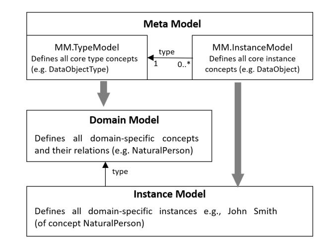
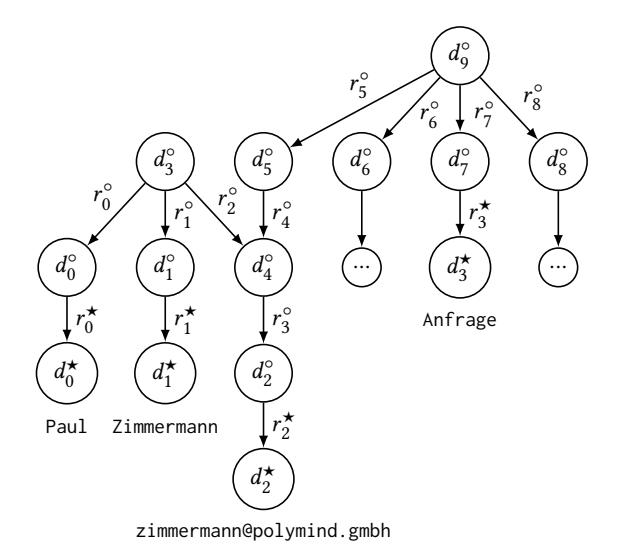
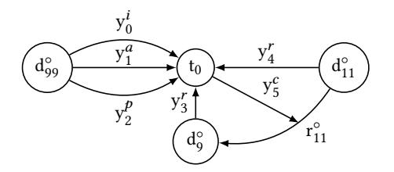
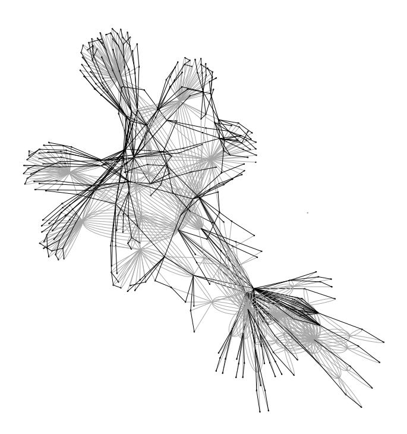
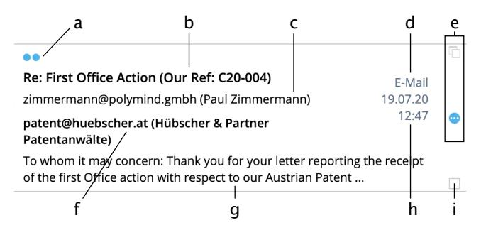
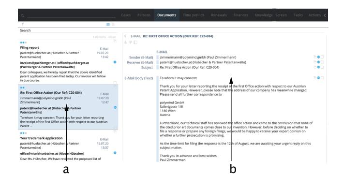
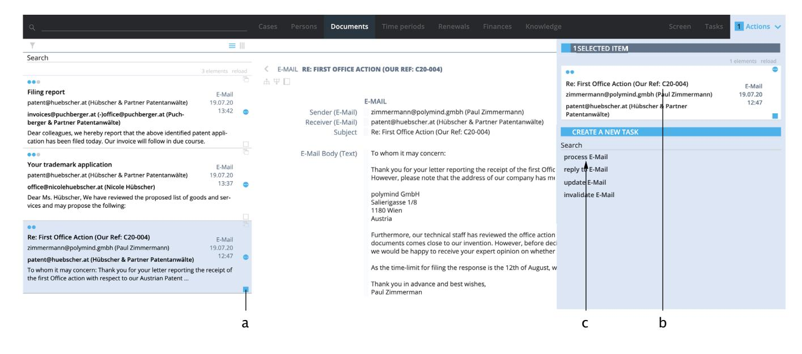
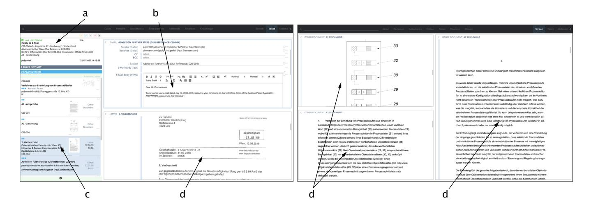

# Integration of Knowledge and Task Management in an Evolving, Communication-intensive Environment

Gerd Hübscher Hübscher & Partner Patentanwälte GmbH Linz, Austria gerd@huebscher.at

Verena Geist Software Competence Center Hagenberg GmbH Hagenberg, Austria verena.geist@scch.at

Dagmar Auer Johannes Kepler University Linz Linz, Austria dagmar.auer@jku.at

Nicole Hübscher University of Art and Design Linz Linz, Austria nicole.huebscher@ufg.at

Josef Küng Johannes Kepler University Linz Linz, Austria josef.kueng@jku.at

ABSTRACT

Digitalisation of knowledge work, especially in communicationintensive domains is one of the greatest challenges, but also one of the greatest opportunities to improve today's working environments. This demands for a flexible system that supports both knowledge intensive creative work and highly individual processes. Smooth integration is hindered by the lack of the task context in knowledge management systems so far. Furthermore, a model to define and handle mental concepts, which are typically evolving during daily work, is missing, to allow for targeted use of appropriate knowledge in process tasks. In this paper, we propose a bottomup approach to model and store the static and dynamic aspects of knowledge in terms of data objects and tasks that are connected with each other. The proposed solution leverages the flexibility of a graph-based model to enable open and continuously evolving user-centred processes for knowledge work, but also predefined administrative processes. Besides our approach, we show results from testing a prototypical implementation in a real-life setting in the domain of intellectual property management applications.

# CCS CONCEPTS

• Information systems → Enterprise information systems; Graph-based database models; Process control systems; • Applied computing → Document management and text processing.

# KEYWORDS

knowledge work, business process management, human communication, graph database

## ACM Reference Format:

Gerd Hübscher, Verena Geist, Dagmar Auer, Nicole Hübscher, and Josef Küng. 2020. Integration of Knowledge and Task Management in an Evolving, Communication-intensive Environment. In The 22nd International Conference on Information Integration and Web-based Applications Services (iiWAS '20), November 30-December 2, 2020, Chiang Mai, Thailand. ACM, New York, NY, USA, [10](#page-9-0) pages.<https://doi.org/10.1145/3428757.3429260>

# 1 INTRODUCTION

Companies and other organisations today are faced with a highly dynamic, competitive environment. The digitalisation of communication-intensive knowledge work is one of the greatest challenges, but also one of the greatest opportunities in today's working environments. Knowledge workers like researchers, developers, consultants or lawyers heavily rely on communication. From a knowledge perspective, observable communication data is mostly unstructured and requires a-priori knowledge to extract semantic concepts.

The lack of a model that allows to define and handle mental concepts [1](#page-0-0) , which typically evolve during daily work, hinders a continuous process of knowledge-applying data transformation tasks of individual users. This might be one reason that business process modelling, as well as individual and organisational learning processes, have not yet been successfully applied to data- and knowledge-driven, process-oriented knowledge work.

The need for a high degree of flexibility for non-routine, problemsolving tasks does not fit with traditional business process management (BPM) systems, which mainly adopt a top-down approach for predefined administrative processes, while knowledge management (KM) systems lack the task context.

Furthermore, in an organisational setting not only knowledge work, but also standardised processes within the same context need to be supported, e.g. legal constraints or compliance rules that clearly define procedures and also their tracing. Thus, both - highly dynamic processes with a strong focus on communication as well as predefined, well-structured ones need to be supported within one overall system.

We consider a flexible, bottom-up approach to integrated knowledge and process management relying on an appropriate model as a promising approach. Therefore, our research focuses on (i) a model of integrated knowledge and process perspectives, (ii) a seamless bottom-up approach for the continuous maturing of these

Permission to make digital or hard copies of all or part of this work for personal or classroom use is granted without fee provided that copies are not made or distributed for profit or commercial advantage and that copies bear this notice and the full citation on the first page. Copyrights for components of this work owned by others than the author(s) must be honored. Abstracting with credit is permitted. To copy otherwise, or republish, to post on servers or to redistribute to lists, requires prior specific permission and/or a fee. Request permissions from permissions@acm.org.

iiWAS '20, November 30-December 2, 2020, Chiang Mai, Thailand

© 2020 Copyright held by the owner/author(s). Publication rights licensed to ACM. ACM ISBN 978-1-4503-8922-8/20/11. . . \$15.00 <https://doi.org/10.1145/3428757.3429260>

1Despite of different definitions of the term mental concepts, we consider a mental concept as an abstract representation of a certain thing or set of things, such as people, objects, places or actions that can be organised in hierarchies.

knowledge and process perspectives, and (iii) the suitability of this approach in real-life settings with special focus on user-experience.

In this paper, we propose an easily adaptable knowledge- and process-centric model for the exchange of data between knowledge workers in dynamic business processes, but also in well-defined administrative processes. Since the building blocks of the model are strongly linked, graph-based representation of knowledge and process artefacts is considered. Non-observable information artefacts are derived from observable, communicated data along two dimensions: (i) knowledge in the form of documents, graphics and information extracted and stored in a graph, and (ii) the dynamic behaviour, i.e. data-centric processes in the form of sequences of tasks and data artefacts that evolve in the graph when knowledge is created.

We follow the design science research methodology [\[16\]](#page-9-1), which relies on iteratively evaluating intermediate solutions. To continuously test our results, scenarios from patent prosecution are applied. Patent prosecution is characterised by a highly standardised, legally prescribed process on the one hand and individual knowledge work when translating new technical knowledge into legally binding language on the other. Furthermore, this work requires intensive communication, within an organisation as well as with clients and external partners.

The following real-life example is used throughout this paper, esp. to support the discussion of our approach and the implemented prototype. Starting point is the receipt of an e-mail from a client with two distinct concerns: (1) It contains the notification that the address of one patent proprietor has changed. (2) The client requests whether, in view of the first office action received, it is appropriate to pursue a certain patent application. The reply is urgently expected because the time limit for filing observations in reply to the office action expires in a few weeks.

Thus, this e-mail initiates two different actions: (1) It cannot be assumed that the e-mail is already an order to enter the address change in the relevant official registers. Certain facts need to be clarified before: property rights where the indicated patent proprietor is the owner, costs of the changes and finally a professional assessment whether such a change should be indicated before the relevant offices at all. Furthermore, this change potentially not only affects a single case but several ones. (2) Requires to study the related case file as well as the office action, to procure the prior art cited therein, to exam the citation, and to elaborate one or more means of defence. Experience and knowledge of the practice of the patent office are needed for this. Furthermore, it is questionable whether the stated urgency applies at all, whether extensions of time limits are possible or whether alternative prosecution routes are available. Finally, an evaluation of the existing possibilities and a concrete recommendation for action are required. Since all actions can have serious legal consequences, in particular tracing of actions and decisions based on the collected information is needed.

Throughout this paper we will focus on different aspects of this scenario such as structuring data, reusing data, relating data to several tasks, tracing exchanges and flexibility in evolving of the overall system.

The contributions of our work to solve the problems identified before are basically: (i) a highly flexible, user-centred system for integrated knowledge and process (task) management and its implementation using a graph database, (ii) a layered modelling approach that allows for flexibility while providing a certain level of guidance to support individual users and traceability of communication, task handling and data manipulation, (iii) a user interface concept which supports working on the complex integrated model graph, and (iv) a demonstration of applying the system in a real-world setting, i.e. in the domain of intellectual property, which already shows promising results.

The further paper is structured as follows. Sect. [2](#page-1-0) provides related work in the area of knowledge work, flexible support for business processes and human communication. Our proposed model and modelling approach is presented in Sect. [3.](#page-2-0) The following Sect. [4](#page-5-0) provides insight into the user interface concept, which supports users to handle the high complexity of the underlying graph-based model. The demonstration example we use throughout this paper is further visualised with screenshots. The presentation of our approach, the implemented user-perspective and the test case are finished by a discussion of the most important results in Sect. [5.](#page-8-0) The paper concludes with a summary and an outlook on future work in Sect. [6.](#page-8-1)

# 2 RELATED WORK

Different areas of research, such as knowledge work, business processes and their automation, document management, and user interaction modelling, have a strong impact on our work.

Knowledge work [\[7\]](#page-9-2) is characterised by its adaptable and creative nature. It is strongly related to knowledge management [\[3\]](#page-9-3), which is a multi-disciplined approach promising a high benefit of knowledge for an organisation [\[22\]](#page-9-4). In practice, knowledge management [\[2,](#page-9-5) [8\]](#page-9-6) is often criticised to provide few benefits but to require high efforts. Even though large knowledge bases are available now, it is not straight forward to find the right information and often results in intensive search processes.

While traditional knowledge work is heavily relying on information, increasing complexity in most work domains requires enhanced support for human communication. As knowledge management is about processes dealing with knowledge (e.g., acquiring, creating and sharing knowledge), the three main interpretations include (i) combining knowledge management activities with an independent process [\[11,](#page-9-7) [25\]](#page-9-8), (ii) the management of knowledgeintensive business processes [\[18,](#page-9-9) [21\]](#page-9-10), and (iii) the integration of knowledge-intensive activities into operational business processes. These approaches all rooted in the workflow tradition, i.e., an activity-centric approach. None of them had much impact, neither in research nor in practice.

Business process management (BPM) [\[9\]](#page-9-11) is typically associated with well-structured, highly predictable and, thus, predefinable business processes. Such processes show a high number of repetitive activities and have been subject to automation for a long time [\[29,](#page-9-12) [33\]](#page-9-13). Common activity-centric BPM is often missing support for user interaction modelling in the context of business processes and does not offer an appropriate data model [\[1\]](#page-9-14). In [\[30\]](#page-9-15) domain and data modelling are identified as one of the weakest points of business process modelling languages, such as BPMN. The increasing need to provide adequate support for knowledge work demands for new

approaches in BPM. The focus is no longer on "what must be done", but rather on "what can be done" [\[32\]](#page-9-16), enabling knowledge workers to prepare working plans at run-time based on their knowledge and needs and to take decisions within the working context.

Different strategies are used to deal with these shortcomings. However, despite the active area of research on flexible and adaptable business processes, business process modelling has not yet been successfully applied to data- and knowledge-driven, processoriented knowledge work.

One direction of research is to extend activity-centric approaches with special features to allow for more flexibility [\[5,](#page-9-17) [13,](#page-9-18) [27\]](#page-9-19), which enable some run-time planning – but only within a predefined frame. Rule-based and constraint-based declarative models offer a higher level of flexibility than traditional activity-centric approaches [\[26,](#page-9-20) [27\]](#page-9-19). However, many of these approaches are generating process models from predefined specifications, e.g., in the SDeclare language [\[17\]](#page-9-21), still focusing on control flow and rarely taking the data perspective into account. Another approach in the field of variability modelling is based on graph transformation techniques [\[10\]](#page-9-22) to deal with the exponentially increasing number of business process variants; however, again the definition of a base process model is required.

Flexibility and adaptability are often associated with data-driven approaches to business process modelling and execution. The key driver for these processes is no longer a predefined control flow, but the availability of data. Representatives of this approach are for example case management [\[20,](#page-9-23) [23,](#page-9-24) [32\]](#page-9-16) or object-aware processes [\[19,](#page-9-25) [28\]](#page-9-26). The most important drawback of case management is the focus on predefined process types, determining the allowed planning frame at run-time, which is often a limiting factor for knowledge workers' variously changing, specific, and creative work. Object-aware processes, on the other hand, are not designed for adaptability and dynamic model evolution at run-time.

In knowledge work, information is often coarse-grained (e.g., documents) and needs to be processed to extract fine-grained information (e.g., structured and semi-structured, related data). Common information and document management systems, by contrast, support some kind of tagging, but they are not able to preserve the context when extracting information, e.g. from an e-mail. This demand for integrating an underlying semantic model, where processable knowledge can be modelled and stored using a network-oriented representation in the form of human tasks consuming and producing data artefacts. Such semantic-based modelling techniques [\[4,](#page-9-27) [6\]](#page-9-28) to business process specification allow to independently reuse the extracted data with respect to their original context, which establishes a task context (similar to the notion of a shopping cart) for executing unpredictable, collaborative processes.

Earlier works in the area of semantic BPM [\[14,](#page-9-29) [15\]](#page-9-30) focus on combining Semantic web services with BPM technology for supporting agile process implementation. However, the perspective is a rather technical one, focusing on the lack of machine-accessible semantics but not taking into account dynamic communication between knowledge workers.

A more recent related approach for designing digital work is suggested in [\[24\]](#page-9-31) by integrating S-BPM and mental model theory. In contrast to our vision of a highly flexible user-centric system, where knowledge workers shall be enabled to prepare working

plans at run-time and to take decisions within the dynamic working context, this approach defines explicit process models (top-down approach). An opportunistic approach to BPM, called oBPM [\[12\]](#page-9-32), supports bottom-up model creation, though, the focus is rather on document-centric and object-oriented artefact specification but not on human communication and process-oriented knowledge work.

# 3 THE TEAM SYSTEM

The overall vision for the TEAM System (TEAM – inTegrated knowlEdge and tAsk Management) is to support people to effectively and efficiently work on their predefined administrative tasks as well as on flexible knowledge-intensive ones. Besides the integration of data and task management also communication needs to be considered, to seamlessly mature integrated knowledge and task management.

# 1 Three Layers Architecture

The model of the TEAM System follows a graph-based, metamodelling approach. The two-dimensions of the approach are represented by data and task components which are related to each other by task relations. Furthermore, a fine-grained representation of data is considered, by relating data components to each other. To allow for seamless knowledge and process maturing, starting with only a small set of basic types and instances, a highly flexible model is needed, which can be easily enriched and adapted by qualified users from the application domain. Therefore, we do not rely on rather stable data types for the TEAM model, but on a schema-free approach using types for classification. When installing the system, the type model will only contain some core types, such as address. All others will be defined by experienced users when using the system for their daily work. As we follow a meta-modelling approach, these types are described by data and can easily be added, changed, etc. during run-time.

The TEAM System has a three-layered model: the meta model, the domain model and the instance model. All of these models reflect the two dimensions, data and tasks, as well as their integration. Fig. [1](#page-2-1) gives an overview of theses models and their dependencies.

<!-- Image Description: The diagram illustrates a three-layered meta-modeling approach. The top layer, "Meta Model," is divided into "MM.TypeModel" (defining core type concepts) and "MM.InstanceModel" (defining core instance concepts). Arrows indicate a "type" relationship. The middle layer, "Domain Model," defines domain-specific concepts and relations. The bottom layer, "Instance Model," shows domain-specific instances. The diagram visually represents the hierarchical relationship between the meta-model, domain model, and instance model in the context of the paper. -->

Figure 1: Overview of the three layers of the TEAM model

Meta model. Describes the core characteristics of instances (data object, data object relation, task, task relation) and their classifying types. Furthermore, constraints like the one specifying that a task relation can either relate to a data object or a data object relation, are defined here.

Domain model. Defines the domain-specific types and their relations. These types do not correspond to those in programming languages but are mental concepts used for classifying instances. These types are constantly evolving while the TEAM System is used for daily work.

Instance model. Holds all instances of the TEAM System. Each instance (i.e. data objects, data object relations, tasks and task relations) is classified by a domain-specific type (see domain model).

In the following, we will discuss the core components data and task with their relations in detail. According to our two-dimensional approach, we will discuss each dimension in detail before dealing with their integration.

The overall vision for the TEAM System is to support knowledge workers to effectively and efficiently work on their knowledgeintensive tasks, supporting seamless maturing of knowledge and processes, being open for individual requirements. Knowledge workers constantly encode and decode a series of symbols to or from mental concepts, when communicating information and knowledge. Mental concepts are created for single instances, e.g. the natural person Paul Zimmermann, but also for sets of instances, in the sense of classification, e.g. natural person. Therefore, we need to consider mental concepts on type (i.e. classification) and instance level in the TEAM model.

In the further presentation of the TEAM model we use Latin letters for instance abbreviations and Greek ones for types.

# 2 Data Components and their Relations

Even though much information is stored in unstructured or semistructured documents, we strive to extract a fine-grained representation of the data. To increase data quality and to build consistent process chains, each entity exists only once in the system, e.g. if several people have the same first name, the name is referenced by all concerned persons.

The type level components for data are data object type () and data object type relation () which describe the concepts used to classify the instance level components. The instance level components are data object (d) and data object relation (r). Both of them are continuously evolving, when working with the system.

Definition 3.1. – A data object (d) represents the mental concept for an instance, e.g., the natural person Paul Zimmermann. Each data object is unique within the TEAM model. Two different kinds of data objects are distinguished - observable and non-observable data objects. An observable data object contains an observable value, e.g. the data object (of data object type String) immediately holds the string value for the data object. In contrast, a non-observable data object is the root for the subgraph describing the overall data object.

Definition 3.2. – A data object type () describes a concept that classifies a set of data objects, e.g. natural person, address.

data objects and data object types are further described by attributes. data object types define characteristics such as the name of the type or rules used to define different kinds of constraints shared by all data objects classified by this type. Data object attributes differ as they deal with run-time aspects such as status history or the value of observable data objects, i.e. the transactional data. Partonomical relationships are not described by attributes, but by relations. Therefore, entropy decreases along the direction of these relations.

Definition 3.3. – A data object relation (r) can be either a partonomical (with the kinds has and hasValue) or an associative (with kind role) relation (thus directed) between two data objects. It is classified by a data object type relation.

Non-observable data objects are always connected to their containing, superordinate data objects via data object relations of kind has, observable ones need the kind hasValue. A data object relation of kind role links a data objects to its role. The direction of the relation is from role to object, i.e. the semantics of isRoleOf.

The corresponding concept on the type level is the data object type relation. The partonomical relations of kind has and hasValue, the associative of kind role as well as the generalisation via the is relations are used to build the concept hierarchy.

Definition 3.4. – A data object type relation () is a bipartite, directed type-level relation, which specifies its kind (taxonomical, partonomical or associative) and its source and target data object type.

An observable data object d ★ has exactly one unique value that can be observed e.g. in messages. Its value can be of any primitive data type. For example, the value of d ★ 0 is "Paul" in Fig. [2.](#page-4-0) d ★ 0 is an observable data object with the data type String. Non-observable data objects d ◦ have no value. They stand for abstract mental concepts which are represented (encoded) by related observable but also non-observable data objects (e.g. ◦ 3 in Fig. [2\)](#page-4-0). Both observable d ★ and non-observable d ◦ data objects are discrete, unorganised and have no specific meaning. The two sets of data objects are defined in equation (1).

$$
D^{\star} = \{d_0^{\star}, \dots, d_n^{\star}\} \quad D^{\circ} = \{d_0^{\circ}, \dots, d_n^{\circ}\} \quad D = D^{\star} \cup D^{\circ} \quad (1)
$$

$$
R^{\star} = \{ \mathbf{r}_0^{\star}, \dots, \mathbf{r}_n^{\star} \} \quad R^{\circ} = \{ \mathbf{r}_0^{\circ}, \dots, \mathbf{r}_n^{\circ} \} \qquad R = R^{\star} \cup R^{\circ} \quad (2)
$$

Meaning is added by the relations. We can partition the edges into two sets ★ and ◦ (see equation (2)). ★ connects observable data objects ★ and non-observable ones ◦ , while ◦ only connects non-observable ones ◦ . Those disjoint independent sets contain the vertices (i.e. data objects) of a directed graph = (, ), interconnected by the edges (i.e. data object relations).

The graph in Fig. [2](#page-4-0) describes the non-observable data object d ◦ 9 (e-mail from Paul Zimmermann with all its datails). Starting with the observable data objects ★, a bottom-up approach is used to build enriched data objects along a path of aggregating hasValue and has relations as well as the associating role relations (e.g. ◦ 2 ).

Thus, each element is finally assigned to an observable data object d ★ 0 - d ★ 3 , which relates to one or more non-observable data objects d ◦ 0 - d ◦ 9 . The values of the observable data objects are also added in Fig. [2.](#page-4-0)

<!-- Image Description: The image is a directed acyclic graph illustrating a hierarchical data structure. Nodes represent data elements (labeled `doi` and `d*i`), and edges represent relationships annotated with `roi` and `r*i`. The graph shows a query ("Anfrage") traversing the structure, highlighting the path followed. Leaf nodes represent individual data points (e.g., "Paul," "Zimmermann"), culminating in an email address. The graph's purpose is to depict a data access or search process within the paper. -->

Figure 2: = ( ∪ ) with observable d ★ and nonobservable d ◦ data objects.

Table 1: Details for the data objects d in Fig. [2.](#page-4-0)

| id          | data object type | value                      |
|-------------|------------------|----------------------------|
| ★ 𝑑 0 | String           | "Paul"                     |
| ★ 𝑑 1 | String           | "Zimmermann"               |
| ★ 𝑑 2 | String           | "zimmermann@polymind.gmbh" |
| ★ 𝑑 3 | String           | "Anfrage"                  |
| ◦ 𝑑 0 | FirstName        | -                          |
| ◦ 𝑑 1 | LastName         | -                          |
| ◦ 𝑑 2 | EMailAddress     | -                          |
| ◦ 𝑑 3 | NaturalPerson    | -                          |
| ◦ 𝑑 4 | EMailContact     | -                          |
| ◦ 𝑑 5 | Sender           | -                          |
| ◦ 𝑑 6 | Receiver         | -                          |
| ◦ 𝑑 7 | Subject          | -                          |
| ◦ 𝑑 8 | DateReceived     | -                          |
| ◦ 𝑑 9 | EMail            | -                          |

Within the TEAM model, we have two connected semantic subgraphs, the instance and the type graph, integrated via type relations. To maintain an overview, Fig. [2](#page-4-0) only shows the data instance graph.

# 3 Task Components and their Relations

Besides the data components and their relations, the tasks and the relations between data objects / data object relations and tasks build the overall integrated, dynamic model. Thus, it is no longer just data enriched with semantics, but especially information and knowledge within a dynamic context.

Definition 3.5. – A task (t) represents an instance of an atomic activity of information processing classified by some task type.

Definition 3.6. – A task type () describes a concept that classifies a set of tasks, e.g. extract address information from letter.

Similar to the data perspective, all entities of the task perspective have attributes at type and instance levels.

Definition 3.7. – A task relation (y) is a bipartite, directed relation classified by some task type relation.

Definition 3.8. – A task type relation () is a bipartite, directed type-level relation between a source and a target type with a specific kind (e.g. specifying data dependency, validity of data objects or relations, user action on the task, etc.). Source and target types are mutually a data object type or data object type relation and a task type.

task type relations specify the data interfaces of the tasks (i.e. data consumed and produced). The context of each task is thus, defined by all of its incoming and outgoing data objects. Like knowledge also this dynamic, process-oriented part of the model is steadily maturing during use.

Equation (3) provides the sets for the task perspective on instance level and for the overall instance graph – data and task perspectives.

$$
T = \{t_0, \ldots, t_n\} \quad Y^k = \{y_0^k, \ldots, y_n^k\} \quad G_I = (T \cup D \cup Y \cup R) \quad (3)
$$

As per definition, every data object is unique within the TEAM model, the relations between data objects and tasks via task relations results in a continuous, integrated instance graph .

The data and task perspectives are integrated via task relations of different kinds k. An example for this integration is given in Fig. [3,](#page-4-1) considering data and tasks on instance level and a selected set of task relation kinds. We show a small part of the scenario described in the introduction, when a user d ◦ 99 instantiates (i) (y 0 ) the task (t0), allocates (a) (y 1 ) it and processes (p) (y 2 ) it to link the incoming e-mail (d ◦ 9 ) to the relevant case file (d ◦ 11). Incoming data objects are related via task relations of kind reference (r), e.g. the task relations y 3 and y 4 . To trace all activities also task relations on data object relations are created (c) such as y 5 , which indicates that the data object relation r ◦ 11 has been created by the task t0.

<!-- Image Description: The image is a directed graph depicting a state transition model. Nodes represent states (d⁰₉₉, t₀, d⁰₉, d⁰₁₁), labeled with identifiers. Directed edges represent transitions, labeled with variables (y⁰ᵢ, y¹ᵃ, y²ᵖ, y³ʳ, y⁴ʳ, y⁵ᶜ, r⁰₁₁). The graph likely illustrates a system's possible states and transitions between them, possibly for analysis or modeling in the context of the paper. -->

Figure 3: Graph , integrating the data and task perspectives.

Table [2](#page-5-1) provides an overview of the types of all instances involved in Fig. [3.](#page-4-1)

task relations also denote the exchange of data objects between tasks, thereby describing the underlying business processes and make communication between users explicit. Thus, the orientation of the corresponding task type relations explicitly documents the process direction.

| Table 2: Details for the instances in Fig. 3. |  |  |  |  |  |  |
|-----------------------------------------------|--|--|--|--|--|--|
|-----------------------------------------------|--|--|--|--|--|--|

| id           | type                          |  |
|--------------|-------------------------------|--|
| t0           | ProcessEMail                  |  |
| ◦ 𝑑 99 | User                          |  |
| ◦ 𝑑 9  | EMail                         |  |
| ◦ 𝑑 11 | CaseFile                      |  |
| ◦ r 11 | ActHasEMail of kind has       |  |
| 𝑖 y 0  | relation of kind instantiates |  |
| 𝑎 y 1  | relation of kind allocates    |  |
| 𝑝 y 2  | relation of kind processes    |  |
| 𝑟 y 3  | relation of kind references   |  |
| 𝑟 y 4  | relation of kind references   |  |
| 𝑐 y 5  | relation of kind creates      |  |

# 4 USER INTERFACE CONCEPT

Although in principle, the proposed TEAM System has a limited set of core components, the complexity of a model graph derived from a real-world scenario, like the one shown in Figure [4](#page-5-2) for the small scenario prescribed, goes beyond a usual presentation frame.

<!-- Image Description: The image is a network graph visualizing a complex system's connectivity. Nodes, represented by small dots, show entities, and lines depict relationships or interactions between them. Different line colors or shades likely represent varying relationship strengths or types. The graph's overall structure reveals clusters and potentially central nodes, illustrating the system's organization and flow. Its purpose is to visually represent network structure and relationships within the studied system, allowing for an analysis of its topology and dynamics. -->

## Figure 4: Resulting instance graph for a small real-world scenario with data objects as well as data object relations in black and tasks as well as task relations in grey colour

Therefore, in a user interface, it is necessary to break down the complexity of the model graph so that users can interact with the model, i.e. reference, create and relate data objects during the execution of tasks. Concerning the above scenario, a first user should, for example, be able to view an incoming e-mail for relating it to an existing case file or for extracting further information from the e-mail content by way of relating or creating data objects. In the following, several key aspects of user interaction design are illustrated.

# 1 Representation of data objects

A first problem that arises in the visual representation of the proposed model is that only observable data objects have a value assigned and can therefore be directly represented. However, the displayable content of the majority of data objects results from their respective subordinate data objects, which together make up the visually presentable content of the superordinate data object. For example, after parsing, an e-mail is represented by a data object that has subordinate data objects like sender, receiver, subject, dateReceived etc.

For a particularly simple representation of data objects, each corresponding data object type can have a string template assigned that once rendered, allows a textual representation of the relevant data objects based on their related data objects. For example, a template for displaying an e-mail data object via the related dateReceived, sender and subject can be formulated as

\${dateReceived?datetime \$subject (from: \$sender)

Simple text representation requires sequential visual processing. However, to get a fast impression on the contents of a data object, a representation that is easily recognisable by pre-attentive visual processing [\[31\]](#page-9-33) is prefered. Especially, as the lack of pre-attentive visual processing is one of the common draw-backs of nowadays document- and data management systems. Therefore and as shown in Figure [5](#page-5-3) in a block view, a data object component is introduced that allows for different visual representations of a data object.

<!-- Image Description: The image is a diagram illustrating an email communication timeline. It shows a simplified representation of an email exchange, with labelled sections (a-i) indicating different aspects like sender(s) (a, f), recipient(s) (h,i), email subject (b), email body (g), date and time (d), and email attachments (e). The diagram likely serves to illustrate the communication process in the context of a patent-related matter. The blue dots denote attachment files or similar information. -->

Figure 5: An e-mail data object shown in block view

As can be seen in Figure [5,](#page-5-3) subordinate data objects can be displayed via nested data object components, like a status indicator (a) for displaying the presence of a related dateProcessed data object, a simple text representation for subject (b), sender (c), receiver (f), textBody (g) as well as dateReceived (h). In Addition, the data object type name (d) can be displayed together with action buttons (e, i) like a button (i) to pick the data object. The nested structure allows for a fine grained loading and updating of the user interface.

For a full visual representation of a data object, the data object component supports a detail view, which is shown as part (b) of Figure [6.](#page-6-0) Preferably, a list of data objects (a) acts as an entry point for a detail view arranged next to the list, whereby multiple data objects can be selected and are displayed next to each other.

<!-- Image Description: The image displays a screenshot of an email client showing two email threads (a and b). Thread (a) shows notifications regarding a patent application filing and trademark application review. Thread (b) shows a response to a first office action on an Austrian patent application, noting a change of address and requesting expert opinion before responding. The image illustrates the workflow and communication related to patent prosecution within a specific case study. -->

Figure 6: The e-mail data object of Figure [5](#page-5-3) (a) shown in detail view (b)

Apart from a general default layout for data objects, the content of the different views can be overridden by assigning a specific renderer to the corresponding data object type. However, the preset default layout supports an evolving model, where the user can also add data object types and data object type relations as described in more detail in subsection [4.5.](#page-6-1)

# 2 Searching for data objects

Just like the representation of data objects, the search for data objects has to be based on observable data objects which can, therefore, be searched for directly. To search for more complex data objects, a graph traversal of predefined length against the direction of neighbouring data object relations is performed for each resulting data object with a matching value. For the resulting paths, matching data object nodes are identified and returned as search result.

Continuing the example above, if a user enters the search term Paul polymind, the search term is first split into the separate tokens Paul and polymind, for both of which a search for data objects with a matching value is performed, resulting in the start nodes Paul Zimmermann and zimmermann@polymind.gmbh. Traversing from these two nodes upwards against the direction of data object relations, the first matching node would be the eMailContact of Paul Zimmermann, and further naturalPerson Paul Zimmermann. Both would be returned as search results.

# 3 Enforcing the explicit selection of pre-requisite data objects

Another specific problem in this context is that in contrast to conventional user interfaces, not only the data objects entered but also the data objects requested by the user should be captured.

To enforce explicit referencing of data objects required to perform a certain task, the user interface is split into areas for (i) read-only presentation, search and navigation of data objects and (ii) random access of data objects in the context of tasks.

As an interface between those two areas, the concept of a shopping cart is introduced: Throughout the whole user interface, data objects can be picked and be collected into a cart. Depending on the data objects within the cart, corresponding task types can be selected via an action-menu as shown in Figure [7.](#page-7-0) The selectable

task types are determined by searching the type model for those task types, that have task type relation to all data object types of the data objects within the cart.

Continuing the above example, for processing the incoming email, a first administrative user can pick the e-mail data object and open the action-menu on the top right. Consequently, a list of possible task types is shown, i.e. such task types, which have at least one task type relation to the data object type of the picked e-mail data object.

# 4 Enforcing unique data objects within the system

One of the key concepts of the TEAM model is the uniqueness of data objects for relating tasks with each other via task relations to common data objects. This is a prerequisite to form interconnected process paths within the graph.

While the reusability of more complex data objects is generally seen as an advantage, it is difficult to explain to users why simple data object types, such as string, date, or other primitive data types, should not be entered traditionally but need to be selected or created explicitly. To overcome this problem, the hierarchy levels of the least expressive data objects were usually hidden and replaced by generally known input boxes.

However, when a data value is entered into these input boxes, the TEAM System first searches for a data object with the respective value before creating a new one.

With more complex data objects, the concept of reusable, that means pick-, drag- and dropable building blocks was pursued to support playful navigation and composition of related data objects.

As shown in Figure [8,](#page-7-1) an administrative user, who changes the correspondence address of the patent proprietor first invalidates the data object relation between the legalPerson and the old address with the option to invalidate the address data object as well in case the old address will or should not be reused. Afterwards, he adds a new address data object by opening up the editor, first selecting for the new address and creating one in case no results are found.

# 4.5 Execution of tasks and model evolution

Modifying data objects by creating, removing, validating or invalidating data object relations is, according to the definition of the TEAM System, exclusively performed within the scope of tasks. As each possible modification action creates a corresponding task relation, data modification can be tracked at a fine grained level. As each task relation is reflected by a task type relation in the type model, the way of performing a task can be modelled beyond instance level and allows the support of users, that require assistance on how to perform certain task types. However, knowledge workers with the appropriate access rights can expand the type model by simply adding task relations of new task type relations, data object relations of new data object type relations or even by adding or modifying data objects and tasks of new data object types and task types.

In the aforementioned example, the administrative user could add a new data object type employee, relate it to legalPerson and add Paul Zimmermann to the legalPerson polymind GmbH.

## iiWAS '20, November 30-December 2, 2020, Chiang Mai, Thailand Hübscher, et al.

<!-- Image Description: The image displays a screenshot of a software interface, likely a case management system. Sections (a) and (c) show email threads, with sender, receiver, subject, and body text visible, illustrating communication between patent applicants and their representatives. Section (b) displays a task creation menu with options to process, reply to, update, or invalidate the displayed emails. The image's purpose is to demonstrate the system's functionality in handling patent-related communication and tasks. -->

Figure 7: Picking one or more data object with button (a) into a basket (b) and selecting a task type for instantiating a task

| Company Name            |                                  |  |
|-------------------------|----------------------------------|--|
| Short Name              |                                  |  |
| E-Mail Contact          |                                  |  |
| Phone number            |                                  |  |
| Fax number              |                                  |  |
| Website URL             |                                  |  |
| Address                 |                                  |  |
|                         |                                  |  |
| Salutation              | (Lüfteneggerstraße 10, Linz, AT) |  |
| Closing                 |                                  |  |
| VAT                     |                                  |  |
| Bank Account            |                                  |  |
| Debitor Account Number  |                                  |  |
| Creditor Account Number |                                  |  |
|                         | create new address               |  |

Figure 8: Searching for new address data objects after invalidating the data object relation to the old address data object

# 6 Context-based knowledge work

The introduction of tasks connected to data objects via task relations makes it difficult to decide which data objects are to be displayed within the tasks as an entry point for further navigation. For example, when assigning an e-mail to a case file, from a hierarchical perspective, showing the case file as entry point would be sufficient, however, that way, the main aspects of the task performed remain hidden from the user. On the other hand, displaying all modifications that occurred within a task by showing all task relations to the user is not suitable either. Therefore, we decided to reuse the information learned from the prescribed method of integrating a random-access task-view with the possibility of picking

data objects throughout the system to allow for a context-based view of data objects required to perform a task: data objects explicitly selected by the user to perform a task are related to this task via a separate task relation of kind displays, thereby modelling what data objects matter to the user within the context of the task. Such an explicit selection occurs during the initial picking of data objects required to execute the task, but can be altered and modified later on, too.

Figure [9](#page-8-2) shows a two-screen view of the random-access task area, allowing the knowledge worker to arrange data objects as he prefers. At the same time, the user can view data objects and create new ones, for example, in the above example, to write a response e-mail taking into account all relevant data objects within the context of the current task.

# 7 Communication by delegation of tasks

One problem of nowadays e-mail communication is that apart from using suitable file formats, information is usually not exchanged in a structured, reusable way. Although within the TEAM System, e-mails can be processed as data objects, information can also be shared by creating a task referencing the required data objects and assigning this task to another user. Thereby, the unique data objects are linking task performed by different users via task relations, thus building process-chains.

For example, an administrative user can pass the task of substantially replying to an email to a knowledge worker by referencing the e-mail data object and any further information like client, case file, etc. and assign the task to a knowledge worker.

In summary, it is possible to make the complex model graph accessible to users for interaction, especially due to the measures described above.

<!-- Image Description: The image displays screenshots of a software interface, likely for process management. Panel (a) shows a file browser; (b) shows an email composer; (c) shows a document viewer with a letter and flowchart; and (d) shows a document with a flowchart (numbered 28-33) illustrating a process workflow, accompanied by German text describing the process steps and data relationships. The diagrams visually represent stages of a process and serve to explain the associated text's technical details. -->

Figure 9: Knowledge work: Within a task (a) a user can display relevant data objects (c) and arrange them in a detail view (d) as required. Furthermore, data objects can also be edited (b).

# 5 RESULTS

Test systems of the prototype were implemented at several patent law firms in Austria and user feedback was collected from administrative staff as well as from dedicated knowledge workers.

# 1 User perception

After the test phase, both user groups reported satisfying experiences concerning the presentation of information within the test system. However, the need to explicitly execute a task for changing data objects took some getting used to. In particular, it was observed that many users had difficulties in selecting the appropriate task type or in specifying a new task type correctly before actually executing the planned activity. To change multiple data objects regardless of their origin or context within one task was a new experience for the users and enabled to focus on the task in its context, while requiring less user interaction. However, due to the possibility to change existing task types and to edit all data objects within a task, the users tended to extend existing general task types instead of creating new specific ones.

On the other hand, changing or specifying new data object types was intuitive for most knowledge workers as well as the administrative staff within their own knowledge domains. Defining types for both groups of users, which is needed when data objects are handed over by tasks, requires more communication between the affected groups. The tests performed showed that users tend to use more general task types and data object types in favour of more specific ones. One reason therefore might be the extended effort to define types and to choose whether to model aspects as task types or as data object types. For example, one can model (i) specific document types like eMail or letter, all referenced by the same more general task type sendDocument or (ii) specific task types like sendEMail or sendLetter, all referencing a more general data object type document.

# 2 Technical aspects

The prototypical implementation showed that the integration of the knowledge and task/process perspectives leads to a very complex graph model, especially with the task perspective, as every change of a data object or a data object relation results in at least one task relation. Thus, it is important to provide a suitable user interface, which hides much of this complexity from the user. This can be achieved by specialised views and editors that (i) integrate the fine grained data and hide many of the more detailed levels of the graph model, (ii) allow to focus on either the knowledge or the task perspective and (iii) split the overall graph to selected subgraphs, e.g., the current data object or task and all directly related data objects or tasks.

However, with respect to data objects, after reaching a certain saturation level the number of newly created data objects quickly decreases, while their reuse increases. Only the number of data object relations, continues to grow, as users are expressing new mental concepts by relating existing data objects.

# 6 CONCLUSION

To overcome the shortcomings of current approaches and IT systems concerning the integration of knowledge and tasks/processes as well as flexibly evolving mental concepts of the application domain, we propose the TEAM model.

The key research result is an approach to flexibly manage documents, knowledge, tasks and processes within a mixed administrative and knowledge work domain with a focus on intensive communication. This approach has been tested with a prototypical implementation in real-life environments. The tests heavily support our hypothesis that the TEAM model is perfectly suitable to support knowledge and administrative work equally within one integrated model. This makes a fundamental difference to traditional BPM approaches with focus on administrative work but also to more flexible approaches for knowledge-intensive business processes or case handling.

The TEAM model provides a meta model along the two dimensions (a) knowledge in the form of domain, organisational, operational knowledge and (b) the dynamic behaviour in the form of sequences of tasks and interconnecting data objects.

The meta model specifies how to describe both the domain model with the domain-specific mental concepts (types) and their relations as well as the instance model.

To allow for the required flexibility, the domain model as well as the instance model are continuously evolving by user interaction. The instance model is specified at run-time based on information and communication flows in a bottom-up perspective, considering execution-specific data, and the dynamic assignment of tasks. Creating the knowledge/process graph (e.g. inserting basic domain data, user, and task types), we succeeded in designing a highly flexible system, which supports evolution of the domain model as well as the instance model without the need to adapt the basic model and/or recompile parts of the software. This allows for a high level of flexibility and adaptability, which is not supported to that extend by the approaches we discussed in the related work section.

Testing the prototype in a real-life setting showed that the developed user interface design is suitable to hide the complexity of the model from the users and still allows for flexibly extending the system not only on instance but also on type level.

Business processes are recorded through bipartite paths of tasks and data objects in the knowledge/process graph. In future work, we will use this fine-grained tracing to (i) identify new data object types and task types based on a set of instances and for (ii) graphbased process mining on the sequences of tasks interconnected by data objects to discover recurrent (hidden) execution patterns.

# ACKNOWLEDGMENTS

The research reported in this paper has been partly supported by the Austrian Ministry for Transport, Innovation and Technology, the Federal Ministry of Science, Research and Economy, and the Province of Upper Austria in the frame of the COMET center SCCH, by the LIT Secure and Correct Systems Lab funded by the State of Upper Austria and by the FFG BRIDGE project KnoP-2D (grant no. 871299). Furthermore, the development, integration and testing of the prototype was supported by polymind GmbH, Vienna, Austria.

# REFERENCES

- [1] Dagmar Auer, Verena Geist, and Dirk Draheim. 2009. Extending BPMN with Submit/Response-Style User Interaction Modeling. In 2009 IEEE Conference on Commerce and Enterprise Computing. IEEE, 368–374. [https://doi.org/10.1109/](https://doi.org/10.1109/CEC.2009.75) [CEC.2009.75](https://doi.org/10.1109/CEC.2009.75)
- [2] Diane E Bailey, Paul M Leonardi, and Jan Chong. 2010. Minding the gaps: Understanding technology interdependence and coordination in knowledge work. Organization Science 21, 3 (2010), 713–730.
- [3] Kimiz Dalkir. 2005. Knowledge Management in Theory and Practice (1 ed.). Elsevier textbooks, Burlington and USA. [http://site.ebrary.com/lib/alltitles/docDetail.](http://site.ebrary.com/lib/alltitles/docDetail.action?docID=10226635) [action?docID=10226635](http://site.ebrary.com/lib/alltitles/docDetail.action?docID=10226635)
- [4] John Davies, Marko Grobelnik, and Dunja Mladenic. 2009. Semantic Knowledge Management: Integrating Ontology Management, Knowledge Discovery, and Human Language Technologies (1st ed.). Springer Publishing Company, Incorporated.
- [5] Markus Döhring, Birgit Zimmermann, and Lars Karg. 2011. Flexible workflows at design-and runtime using BPMN2 adaptation patterns. In International Conference on Business Information Systems. Springer, 25–36.
- [6] John Domingue, Dieter Fensel, and James A. Hendler. 2011. Handbook of Semantic Web Technologies -. Springer Science & Business Media, Berlin Heidelberg.
- [7] Peter F. Drucker. 1959. Landmarks of Tomorrow: A Report on the New 'Post-Modern' World. Harper & Brothers, New York.

- [8] P. F. Drucker. 1999. Knowledge-worker productivity: The biggest challenge. California Management Review 41, 2 (1999), 79–94.
- [9] Marlon Dumas, Marcello La Rosa, Jan Mendling, and Hajo A. Reijers. 2013. Fundamentals of Business Process Management. Springer Berlin Heidelberg, Berlin, Heidelberg.<https://doi.org/10.1007/978-3-642-33143-5>
- [10] Verena Geist, Christa Illibauer, Christine Natschläger, and Robert Hutter. 2016. Supporting customizable business process models using graph transformation rules. International Journal of Information System Modeling and Design (IJISMD) 7, 3 (2016), 51–71.
- [11] Norbert Gronau and Edzard Weber. 2004. Management of Knowledge Intensive Business Processes. In Business Process Management (Lecture Notes in Computer Science, Vol. 3080), Jörg Desel, Barbara Pernici, and Mathias Weske (Eds.). Springer Berlin Heidelberg, 163–178. [https://doi.org/10.1007/978-3-540-25970-1{\\_}11](https://doi.org/10.1007/978-3-540-25970-1{_}11)
- [12] David Grünert, Elke Brucker-Kley, and Thomas Keller. 2014. oBPM–an opportunistic approach to business process modeling and execution. In International Conference on Business Process Management. Springer, 463–474.
- [13] Alena Hallerbach, Thomas Bauer, and Manfred Reichert. 2010. Capturing variability in business process models: the Provop approach. Journal of Software Maintenance and Evolution: Research and Practice 22, 6-7 (2010), 519–546.
- [14] Martin Hepp, Frank Leymann, John Domingue, Alexander Wahler, and Dieter Fensel. 2005. Semantic business process management: A vision towards using semantic web services for business process management. In IEEE International Conference on e-Business Engineering (ICEBE'05). IEEE, 535–540.
- [15] Martin Hepp and Dumitru Roman. 2007. An ontology framework for semantic business process management. Wirtschaftinformatik Proceedings 2007 (2007), 27.
- [16] Alan R Hevner, Salvatore T March, Jinsoo Park, and Sudha Ram. 2004. Design science in information systems research. MIS quarterly (2004), 75–105.
- [17] Andrés Jiménez-Ramírez, Barbara Weber, Irene Barba, and Carmelo Del Valle. 2015. Generating optimized configurable business process models in scenarios subject to uncertainty. Information and Software Technology 57 (2015), 571–594.
- [18] Dimitris Karagiannis and Rainer Telesko. 2000. The EU-Project PROMOTE: A Process-oriented Approach for Knowledge Management. In Proc. of the Third Int. Conf. of Practical Aspects of Knowledge Management. (2000. 9–18.
- [19] Vera Künzle. April 2013. Object-Aware Process Management. Dissertation. Universität Ulm, Ulm.
- [20] Mike Marin, Richard Hull, and Roman Vaculin. 2013. Data Centric BPM and the Emerging Case Management Standard: A Short Survey. In BPM 2012 Workshops, M. La Rosa and Prina Soffer (Eds.). Springer-Verlag, Berlin Heidelberg, 24–30.
- [21] Olivera Marjanovic. 2005. Towards IS supported coordination in emergent business processes. Business Process Management Journal 11, 5 (2005), 476–487. <https://doi.org/10.1108/14637150510619830>
- [22] Mark W. McElroy. 2003. The new knowledge management: Complexity, learning, and sustainable innovation. Butterworth-Heinemann, Amsterdam [u.a.].
- [23] OMG. 2014. Case Management Model and Notation: Version 1.0: formal/2014-05-05. OMG.<http://www.omg.org/spec/CMMN/1.0/>
- [24] Stefan Oppl and Christian Stary. 2019. Designing Digital Work: Concepts and Methods for Human-centered Digitization. Springer Nature.
- [25] Giorgos Papavassiliou, Gregoris Mentzas, and Andreas Abecker. 2002. Integrating Knowledge Modelling in Business Process Management. In ECIS 2002 Proceedings. Paper 39.<http://aisel.aisnet.org/ecis2002/39/>
- [26] M. Pesic and W. M. P. van der Aalst. 2006. A Declarative Approach for Flexible Business Processes Management. In Business Process Management Workshops, David Hutchison, Takeo Kanade, Josef Kittler, Jon M. Kleinberg, Friedemann Mattern, John C. Mitchell, Moni Naor, Oscar Nierstrasz, C. Pandu Rangan, Bernhard Steffen, Madhu Sudan, Demetri Terzopoulos, Dough Tygar, Moshe Y. Vardi, Gerhard Weikum, Johann Eder, and Schahram Dustdar (Eds.). Lecture Notes in Computer Science, Vol. 4103. Springer Berlin Heidelberg, Berlin and Heidelberg, 169–180. [https://doi.org/10.1007/11837862{\\_}18](https://doi.org/10.1007/11837862{_}18)
- [27] Manfred Reichert and Barbara Weber. 2012. Enabling Flexibility in Process-Aware Information Systems: Challenges, Methods, Technologies. Springer, Heidelberg.
- [28] Stefanie Rinderle-Ma, Shazia Sadiq, Frank Leymann, Vera Künzle, and Manfred Reichert. 2011. PHILharmonicFlows: towards a framework for object-aware process management. Journal of Software Maintenance and Evolution: Research and Practice 23, 4 (2011), 205–244.<https://doi.org/10.1002/smr.524>
- [29] A. M. ter Hofstede, W. M. P. van der Aalst, M. Adamns, and N. Russell (Eds.). 2010. Modern Business Process Automation: YAWL and its Support Environment. Springer, Heidelberg.
- [30] Hallvard Trætteberg. 2008. UI design without a task modeling language–using BPMN and Diamodl for task modeling and dialog design. In Engineering Interactive Systems. Springer, 110–117.
- [31] Anne Treisman. 1985. Preattentive processing in vision. Computer Vision, Graphics, and Image Processing 31, 2 (1985), 156–177. [https://doi.org/10.1016/S0734-](https://doi.org/10.1016/S0734-189X(85)80004-9) [189X\(85\)80004-9](https://doi.org/10.1016/S0734-189X(85)80004-9)
- [32] W.M.P. van der Aalst, M. Weske, and D. Grünbauer. 2005. Case Handling: A New Paradigm for Business Process Support. Data and Knowledge Engineering 53, 2 (2005), 129–162.<https://doi.org/10.1002/smr>
- [33] M. Weske. 2012. Business Process Management. Concepts, Languages, Architectures. Springer.
