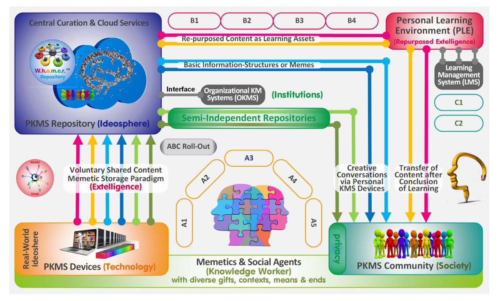
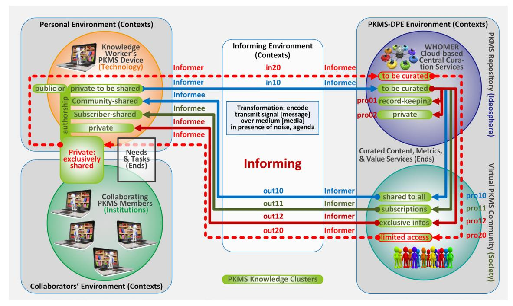
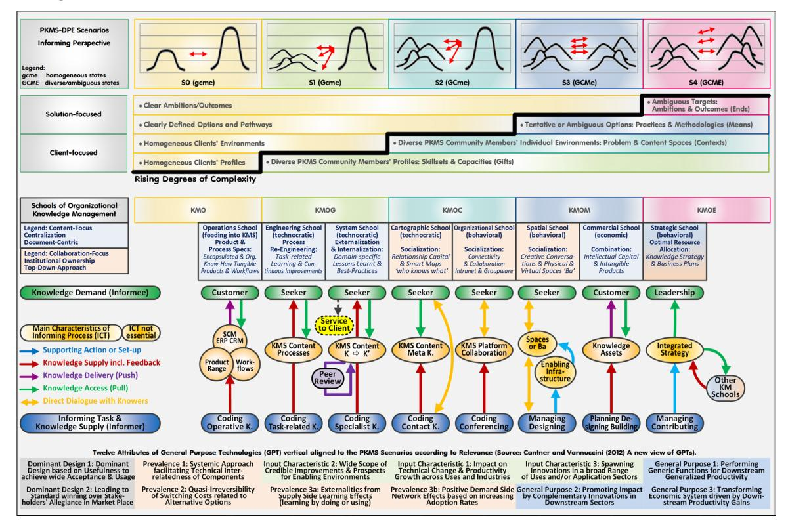

**Volume 23, 2020**

# **GIFTS, CONTEXTS, MEANS, AND ENDS DIFFERING: INFORMING TASK SCENARIOS TO SERVE KNOWLEDGE WORKERS' NEEDS IN DYNAMIC COMPLEX SETTINGS**

| Ulrich Schmitt* | University of Stellenbosch, Business School, Bellville, South Africa | schmitt@knowcations.org |
|-----------------|----------------------------------------------------------------------------|-------------------------|
| T. Grandon Gill | University of South Florida, Tampa, Florida, USA                        | grandon@usf.edu         |

\* Corresponding author

### **ABSTRACT**

| Aim/Purpose     | As traditional Knowledge Management (KM) struggles to support the per sonal needs of knowledge workers in a new era of accelerating information abundance, we examine the shortcomings and put forward alternative scenar ios and architectures for developing a novel Personal KM System (PKMS). |
|-----------------|------------------------------------------------------------------------------------------------------------------------------------------------------------------------------------------------------------------------------------------------------------------------------------------------------------------------------------------|
| Background      | While prior publications focused on the complementing features compared to conventional dynamic KM models, our emphasis shifts to instantiating a flourishing PKMS community supported by a Digital Platform Ecosystem.                                                                                                         |
| Methodology     | Design science research focusing on conceptual analysis and prototyping.                                                                                                                                                                                                                                                                 |
| Contribution    | The PKMS concept advances the understanding of how digital platform communities may serve members with highly diverse skills and ambitions better to gainfully utilize the platform's resources and generative potential in their personal and local settings.                                                               |
| Findings        | We demonstrate how the needs to tackle attention-consuming rising entropy and to benefit from generative innovation potentials can be addressed.                                                                                                                                                                                |
| Future Research | As this article has iteratively co-evolved with the preparing of a PKMS imple mentation, business, and roll-out plan, the prototype's testing, completion, and subsequent migration to a viable system is of primary concern.                                                                                                   |

Accepting Editor Robert W. Hammond │Received: June 3, 2020│Revised: September 6, November 11, 2020│ Accepted: November 14, 2020.

Cite as: Schmitt, U., & Gill, T. G. (2020). Gifts, contexts, means, and ends differing: Informing task scenarios to serve knowledge workers' needs in dynamic complex settings. *Informing Science: The International Journal of an Emerging Transdiscipline, 23,* 119-145.<https://doi.org/10.28945/4667>

(CC BY-NC 4.0) This article is licensed to you under a Creative Commons Attribution-[NonCommercial 4.0 International](https://creativecommons.org/licenses/by-nc/4.0/)  [License.](https://creativecommons.org/licenses/by-nc/4.0/) When you copy and redistribute this paper in full or in part, you need to provide proper attribution to it to ensure that others can later locate this work (and to ensure that others do not accuse you of plagiarism). You may (and we encourage you to) adapt, remix, transform, and build upon the material for any non-commercial purposes. This license does not permit you to use this material for commercial purposes.

Keywords knowledge management, personal knowledge management, design science research, social digital curation, informing system, digital platform ecosystem, generativity, entropy

### **INTRODUCING THE ARTICLE OBJECTIVES AND STRUCTURE**

The book "Gifts Differing" (Myers & Myers, 2010) introduced an extension of Jung's psychological type theory (Myers–Briggs Type Indicator (MBTI)) based on four categories to distinguish unique personal settings and how they may influence navigating one's personal career and success.

This article shares this general objective, although its use of the term "gifts" addresses personal abilities rather than personality styles, and the references to "contexts, means, and ends" also take account of extrinsic factors. Its initial version in the 2020 InSite Proceedings (Schmitt & Gill, 2020) followed up on prior articles focusing on issues of complexity, generativity, and rugged fitness landscapes. The latter concept (Gill et al., 2018) is to be leveraged to illustrate the dynamics of the related gifts-contexts-means-and-ends-states (GCME-states) affecting personal Knowledge Management (KM).

These dynamics are emerging from the recently surging undesired entropy (negative generativity) and the concurrent calls for more generativity (positive entropy); both notions are to be further explored in this revised publication to differentiate the envisaged novel personal knowledge management system (PKMS/KMS) and concept from the current traditional top-down KM approaches.

We argue that today's KM is severely compromised by unsustainable rising entropy and an ineffective utilization of the explicit accumulated world record. While the former is "threatening the finite attention individuals' cognitive capabilities are able to master" (Schmitt, 2019c), both are suffering from a deficient awareness and education and the lack of adequate tools. Using generativity and entropy as guiding principles, the currently prototyped novel PKMS is projected to make profound inroads in this regard (Schmitt, 2019b, 2020a).

At the root of this endeavor is a design science research (DSR) and prototyping project-in-progress aiming to strengthen the faculty and autonomy of individuals and self-organized groups. Its approach synergistically integrates with the concept of Digital Platform Ecosystems (DPE). DPEs are generically defined as meta-artefacts which afford clients with highly diverse skills (gifts) and ambitions (ends) to gainfully utilize its resources and generative potential (means) in their personal and local settings (contexts) (Eck & Uebernickel, 2016).

Figure 1 provides a general bird's-eye view with some details to be later referred to (e.g., memetics). It depicts a social agent (bottom-middle) with his/her decentralized PKMS device (left) as a member of the PKMS user community (right). The clockwise workflow shows that the voluntary shared individual content is centrally synthesized and curated (top-left) by the cloud-based PKMS complement before it is fed back to the community (blue and green lines). While these decentral and central components form the PKMS core, its envisaged synergetic connectivity to external system add to the broader generic DPE context (to be referred to as PKMS-DPE). Curated content, for example, may also be repurposed as learning assets (red and yellow lines) to foster Personal Learning Environments (PLE) in collaboration with Learning Management Systems (LMS) (top-right) or may be interacting with Organizational Knowledge Management Systems (OKMS) (grey rectangle top-middle).

The aim of this article is to demonstrate how the individual diverse GCME-states of an expanding user community may be accommodated by the PKMS-DPE. As a wide range of affordances is currently not catered for by conventional KMS (Schmitt, 2017a), the benefits for knowledge workers are to be further advanced and made transparent (Schmitt & Gill, 2019) and add detail to an envisaged decentralized KM revolution. Levy's (2011) "decentralizing notion" foresees creative conversations

among empowered autonomous individuals and self-organized groups that allow for iterative emerging distributed processes of collective intelligence which, in turn, continuously feedback to their grass-roots community members.

**Figure 1. PKMS as a Digital Platform Ecosystem (DPE),** based on (Schmitt & Gill, 2019)**.**

The PKMS workflows supporting such a decentralized solution have recently been mapped against twelve traditional dynamic organizational KM models within a three-dimensional information space (Schmitt, 2019a). The identified gaps have been elaborated in articles arguing that organizational KM objectives have continuously taken precedence over the personal concerns and motivations of knowledge workers (Schmitt, 2018b), that the prioritized protection of intellectual capital benefitting institutions has also been pursued at the expense of innovativeness and generativity (Schmitt, 2019b), and that – having been introduced in a time of information scarcity – traditional KM models lack the muscle to tackle today's world of ever-growing information abundance and dynamic complexity (Schmitt, 2020a).

Further findings published – as is typical for longitudinal, continuous DSR output streams (Baskerville et al., 2018) – included the projected impact of the PKMS technology on users, organizations, and society. Where necessary, these details are briefly summarized to support the actual reflections. The rationale of the article first introduces two alternative entropy-related KM realities to assist in defining five informing scenarios of progressing complexity. Based on these scenarios, the utility of conventional KM systems and strategies are further detailed, followed by the responsive action the novel development is taking, and how it is affecting knowledge workers, curating, and the envisaged PKMS affordances.

### **ALTERNATIVE ENTROPY-RELATED KM REALITIES**

Challenging system development environments like the KM field are categorized as 'wicked' problems spaces defined as "open-ended in the sense that they are ill-defined and characterized by incomplete, contradictory, and changing requirements and complex interdependencies [and] that the information needed to understand the problem depends upon one's idea for solving it" (Rylander, 2009).

Entropic considerations form one of the fresh approaches adopted in this DSR project for conceptualizing the PKMS solution. Entropy - in terms of information theory – is defined as the opposite of information, organization, order, or improbability (de Rosnay, 1979). Reducing unwanted knowledge entropy (e.g., replications, fragmentations, inconsistencies, untraceabilities, corruptions, decay, obsolescence, and falsifications) offers a promise of more productive knowledge work and the narrowing of opportunity divides (Drori, 2010; Giebel, 2013).

Table 1 summarizes and relates key impediments affecting KM effectiveness under the umbrella of entropy in a public/private-discoverable/undiscoverable matrix (the causes - as cited in the table were identified in isolation of each other). Although current KMSs are able of locating vast amounts of digital information, they are ill-equipped to address the respective interdependent negative impacts. Accordingly, adequate tools for selecting, structuring, personalizing, and making sense of the ever-increasing digital resources available are still sadly missed (Kahle, 2008). As today's underlying monolithic technologies require large investments and costly maintenance, Organizational KMSs are not affordable for individual knowledge workers, entrepreneurs, and SMEs (small and medium-sized enterprises). However, entropic analogies have also been entertained in a different interpretation and warrant further clarification.

|                | Public Knowledge-related Entropies      | Private Knowledge-related Entropies       |
|----------------|-----------------------------------------|-------------------------------------------|
| Discoverable   | Information Redundancy                  | Publishing Realities; Online Realities    |
| Knowledge      | (Bush, 1945; Simon, 1971)               | (Bush, 1945; Nielsen, 2012)               |
|                | Information Overload                    | Inadequate rapid iterative Improvement    |
|                | Attention Poverty, Compromised Mobility | Wanting Innovation and Reputation Systems |
| Undiscoverable | Structural Holes                        | Invisible Work; Unreported 'Scaffolding'  |
| Knowledge      | (Brix, 2017; Burt, 2004, 2015)          | (Bush, 1945; Star, 2010)                  |
|                | Knowledge Islands and Siloes            | Non-Linear Relationships                  |
|                | (Levy, 2011; Szostak et al., 2016)      | (Mintzberg, 2005)                         |
|                | Ineffective Utilization of Extelligence | Unproductive Rework                       |
|                | (Stewart & Cohen, 1999)                 | Undisclosed Holistic Understandings       |
|                | Deficient Awareness/Education           |                                           |
|                | Digital and Innovation Divides          |                                           |

| Table 1: Causes and Effects of Undesired Entropy Clusters, based on (Schmitt, 2020a). |  |  |  |
|------------------------------------------------------------------------------------------|--|--|--|
|------------------------------------------------------------------------------------------|--|--|--|

In keeping close to the thermodynamic origin of the entropic notion and its correlated concept of disorder within a system, Bratianu (2019) equates well-structured organizations with machines operating routinely, efficiently, reliably, and predictably with limited degrees of freedom at a low level of entropy. As, however, social rather than mechanical systems, organizations aiming for low entropy rely on their management to instill order through formal structures, regulations, traditions, organizational culture, and command-and-control based on labor division and decision power distribution for productivity and efficiency.

In this interpretation, higher entropy is seen as positive and equates to more flexibility, creativity, competitiveness, and innovation exemplified by flatter hierarchies and networked organization. It correlates with an empowered workforce and collaborative leadership styles tolerating elevated levels of organizational disorder, particularly, during phases of organizational change and transformations. Here, entropy is applied as a metaphor where employees act similarly to distributed gas molecules in a vessel (macrostate) representing the organization. Although these employees/molecules are exhibiting diverse microstates, they follow a natural tendency to achieve a more probable stable macrostate.

In well-structured organizations, the number of entropic microstates defining a possible macrostate is, thus, significantly smaller compared to the more flexible settings yielding higher level of organizational entropy to promote creativity and innovation. Knowledge entropy, thus, increases by enhancing the innovation capacity via knowledge creation and acquisition and can be flattened through sharing and intergenerational or organizational learning (Bratianu, 2019).

Since any knowledge transformation "implies a change in the entropy of the universe considered (i.e., personal knowledge or organizational knowledge)," managerial interventions may increase "the probability of any employee to access needed knowledge, at a given time and in a given place" to raise the organizational entropy and positively influence innovation and firm performance. In further developing these aspects, these authors (Bratianu & Bejinaru, 2019) address probability distributions of personal knowledge among people in dynamic organizational settings, knowledge entropy computable organizational states, and KM interventions as organizational entropy management (OEM).

Prior to these entropic considerations, the notion of generativity has been explored. It originates as part of a multi-stage psychosocial development model concerned with establishing and guiding upcoming generations (Erikson, 1950) and stimulated recent conceptual research in technology, innovation, and KM by focusing on individual and collective generative capacities or generative fit. A recent publication (Schmitt, 2019b) aligned twenty-six attributes from four resultant generativity-related models to the PKMS's key features, affordances, ecosystems, and workflows. These appealing generative potentials can be equated to the thermodynamic 'desired' entropy discussed; in the same way, the 'unwanted' entropies summarized in Table 1 may be regarded as 'negative' generativity in need of negentropic (negative entropy) interventions.

The PKMS-DPE objective – in the scope of this article - can, thus, be restated as promoting desired 'thermodynamic' entropy (from now on referred to as generativity) and avoiding unwanted 'information-theoretical' entropy (from now on just referred to as entropy).

### **INFORMING SCENARIOS AIMING FOR PERSONAL AFFORDANCES**

Conventional KM values individuals primarily in terms of their roles as actors linking dynamically transforming knowledge stocks and flows as enablers of knowledge creation (Nonaka & Takeuchi, 1995), as organizational learning and change agents to be guided by collective behaviors, actions or routines, and as productive contributors to knowledge assets and intellectual capital (Brix, 2017). The focal point is the institution (defined as "snapshots of a subset of the ideational field that persevere while the network itself continues to fluctuate;" Kanengisser, 2014) which is characterized by a fairly homogeneous set of stakeholders and cultures, surroundings and resources, practices, and objectives.

The role and needs of an individual within a PKMS community and its DPE are, instead, intrinsically linked to personal autonomous affordances to retain and build upon knowledge acquired, to develop one's expertise for sustainable personal growth, and to collaborate with fellow learners and/or personal/professional acquaintances for mutual benefit (Schmitt, 2014). The PKMS-DPE's scope and affordances in terms of the width and depth of its informing intervention portfolio determine the structure of its community. As the aggregated profile of the members it attracts, this community is, hence, shaped by the generativity-and-entropy-related design decisions taken.

From an informing perspective, generativity applies more to an individual's dual role as informee and informer and to the diversity of GCME-states faced in reciprocal collaborative relationships; entropy as referred to in Table 1 concerns more the message and the information/knowledge availabilities and needs. Figure 2 attempts to differentiate this interconnectedness accordingly.

A PKMS community member (Informer) operating in his/her particular personal environment (context) and driven by his/her needs or tasks (Ends) commands private and public knowledge, parts of which he/she may voluntarily share (Informing; Figure 2: in10) with the PKMS community members (Informee). The PKMS cloud-based central curation services (WHOMER) synthesizes this shared content from its members and stores it for record-keeping and internal purposes (Figure 2: pro01/02). The processed content to be disseminated includes material accessible by all member (Figure 2: pro10), via special subscriptions (Figure 2: pro11), and exclusive notifications (e.g., personal confidential messages, subscribable alerts (Figure 2: pro12)). Whatever an individual PKMS community member (Informee) gains access to (Figure 2: out10) or receives (Figure 2: out11/12) to populate his/her PKMS device's knowledge clusters (top left circle) may trigger or inspire authorship

activities, including the annotating, redeploying, reclassifying, revising, or recombining his/her existent/actualized knowledge stocks. Newly created or repurposed content may subsequently be again voluntarily shared (Figure 2: in10), and any related modifications or added associative links by other PKMS community members will feed back after being curated to the original author/modifier (Figure 2: pro10/out10).

This interplay between decentralized networked devices and cloud-based storage and curation services sets the stage for the GCME-states to be detailed in the remainder of this section. The implications of the private (exclusively shared) knowledge cluster (Figure 2: in/pro/out20-cycle) will be addressed later as an extension of PKMS-affordance-based curation towards Collaborative Social Curation.

#### ADVANCING PRIOR WORK TOWARDS INFORMING SCENARIOS

The ancestry of this article includes a four-paper-lineage which commenced with an exploratory case research study to understand the informing-related complexities of events affecting diverse parties by interpreting them as rugged fitness landscapes (Murphy et al., 2015). This approach expanded towards generalizable fitness principles for guiding individual path discovery for differing clients in dynamic informing settings (Gill & Mullarkey, 2017). It was then applied to Personal KM (Schmitt & Gill, 2019) and broadened by adding contextual and methodological aspects (Schmitt & Gill, 2020).

This article further develops the latter by consolidating the complexities of the client and target states previously addressed. Without attending to all possible configurations of these states, the focus is on five key scenarios exemplifying the progressing complexity (as visually illustrated in Figure 3 from left to right) effecting the informing flows of informer-informee-interactions (Figure 2). As the prior perspectives have been converted to the four GCME-aspects of the PKMS-DPE definition, affordances can be positioned and defined in more detail.

Using an homogeneous set of the GCME-states discussed as an initial base of departure (S0), the rationale put forward proceeds along four increasingly complex informing scenarios (S1-S4). While S1 incorporates the diversity of clients' profiles or 'gifts' (skillsets & capacities), S2 adds clients' diverse

environments or 'contexts' (problem & content spaces); and while S3 further allows for considering a variety of clients' process-related options or 'means' (practices & methodologies), S4's addition of ambiguous clients' targets or results-oriented 'ends' (ambitions & outcomes) marks the most complex setting.

#### **Figure 3. Binary gifts-contexts-means-and-ends states defining informing scenarios from a PKMS-related DPE as well as from a 'Schools of KM' and GPT perspective** (based on Cantner & Vannuccini, 2012; Earl, 2001; Schmitt, 2016c, 2018c; Schmitt & Gill, 2020)

These successive binary changes amplify the increasingly challenging PKMS-DPE spaces facing informing system designers to serve informer-informee-relations. The five-scenario-progression provides a preliminary commonsense heuristic (in need of being empirically confirmed with the PKMS's future application testing) in form of an integrative segmentation tool for anatomizing the user community the PKMS intends to attract. It adds transparency to the assessment of interventions and affordances in the individual, organizational, and societal capacity development contexts of opportunity divides and knowledge societies. A similar progression governs Bloom's Taxonomy where remembering and understanding (level 1 & 2: gifts) precedes applying (3: contexts), analyzing and evaluating (4 &5: means), and creating (6: ends) (Forehand, 2001). The individual scenarios are further explored in the subsections below.

### SCENARIO S0 – EXPECTED, CONTROLLABLE, PRODUCTIVE OPERATIONS

In the introduction to this main section, conventional KM Systems have been characterized as serving a fairly homogeneous set of stakeholders and cultures, surroundings and resources, practices and objectives. This scenario S0 configuration fits the low-generativity-metaphor of well-structured organizations as machines (Bratianu, 2019) and the principles of scientific management (Taylor, 1911).

Scenario S0, nevertheless, is also relevant from a PKMS-DPE's learning and informing perspective to be exemplified by a recent headline story. In May 2019, images taken by the Nepalese mountaineer

Nirmal Purja (Cheung, 2019) attracted world-wide attention by picturing a long queue of mountaineers waiting in line for their final short ascent to the Mount Everest. To successfully climb Mount Everest, any participant of an expedition has to be already physically and mentally well prepared (homogeneous client abilities/gifts) in order to be acceptable for further training and guidance with a very narrow focus (clear outcomes/ends): firstly, to make it back alive and healthy, and, secondly, to – hopefully – make it to the top in the process. The strategy is, hence, to minimize any differentials in the initial microstates of the mountaineers (compared to ideal states for survival and success) by trying to leave nothing to chance or improvisation (familiar contexts). An enabled team needs to operate just like a well-structured organizational machine routinely, efficiently, reliably, and predictably with limited degrees of freedom at a low level of organizational entropy (accustomed resources and practices/means), especially in case of potential emergencies.

As this type of routines, standards, preparedness or response plans may also be created in form of learning assets to inform or instruct relevant (homogeneous) segments of the PKMS community, potential scenario S0 interventions necessitate defining a suitable common path aligned to a set level of clients' fitness and time frame utilizing templates, manuals, audio or video recordings, or lecture modules by informers via core PKMS functionalities or collaborative PKMS-DPE-LMS services.

### SCENARIO S1 – MANAGING DIFFERING GIFTS AND/OR DIVERSE TEAMS

A reference to a team management model best typifies the organizational-related scenario. It adapted the psychological types of Jung and Myers–Briggs to identify four measures of work preferences (differing client) affecting information processing, decision making, interpersonal relations, and organizational priorities. The resulting eight team roles (reporting/advising, creating/innovating, exploring/promoting, assessing/developing, thrusting/organizing, concluding/producing, controlling/inspecting, and upholding/maintaining) follow a generic project flow which embody focusing on contexts, means, and ends. Leadership and supportive systems are expected to utilize the person-based task-and-generativity-related affinities by facilitating their appropriate linking and collaborative engagement (McCann, 2009). The reasoning follows Bratianu's (2019) generativity-raising approach. It seeks to transform rigidly structured into more collaborative and innovative teams, organizations, or communities-of-practice.

From an educational angle, a more diverse client base with varying expertise and skills may present a problem. If a rigorous pre-selection of participants (as in 0000) is not an option, generativity-reducing paths to meet non-negotiable entry requirements and outcomes (set contexts, means, and ends) need to accommodate unequal capabilities (differing client abilities). Options may involve prior selfpaced or face-to-face tutorials, bridging coursework, or individual or group coaching approaches.

#### SCENARIO S2 – RESPONDING TO CONTINGENCIES AND DISRUPTIONS

Potential disruptive developments (differing contexts) affecting established routines or plans (clear means and ends) may require pro-actively creating awareness among collectives (diverse clients) in order to consider and/or appropriately react to unfamiliar situations once they occur. Suitable interventions require assisting facilitators, role playing, or collective contingency planning in order to foster outside-the-box-thinking or shift preconceived opinions and paradigms.

These generativity-raising approaches are meant for strengthening empowerment, innovativeness, and ambidextrous performance in pursuit of both exploitation as well as exploration (Brix, 2019) (diverse team roles and responsibility contexts). Interventions may be defined preemptively and linked to an organization's vision, mission, and strategy as well as to performance agreements and training budgets (agreed balanced ends and means).

From time to time, the underlying strategic priorities and resource allocations may need to be renegotiated for preserving organizational consensus. Generativity-reducing measures may be applied in the process. For example, in organizational change projects, the facilitator's task (carried out by the first

author in his prior management consultant career) involved a diversity of organizational stakeholders and required to establish a path of fruitful cooperation. This early stage prioritized informing activities for bringing everybody on-board and for fostering mutual understanding. Controversial topics which may have triggered premature conflicts were discussed in detail only at a subsequent stage.

This generative rationale also drives the educational agenda of, for example, business schools and their desire to select diverse participants with different backgrounds (differing skills and contexts) to foster mutually beneficial learning between them while the curricula, workload, and learning outcomes form part of the academically approved programs (set means and ends).

#### SCENARIO S3 – KNOWLEDGE AND ARTEFACTS FOR RESOURCEFULNESS

"To write a personal career script that can bring fulfilment and meaning," Gratton (2011) recommends building depth and putting in the time and resources to create a body of knowledge and skills in multiple areas (interdisciplinary know-how). It demands abandoning 'set ways', adopting alternative life and work models, and to continually craft, nurture, and grow personal resources (including intellectual, social, and emotional capitals) in conscious ways (Gratton, 2011). As artefacts and tools increasingly matter, "resourcefulness is about more than human skills", capitals, and resilience; it entails the ability to "adopt and adapt technologies, incorporating them into (working) practices", systems, and routines (aligning unaccustomed contexts and means) which allow "for emergent properties to arise" (novel outcomes and ends) (Kuijer et al., 2017). Resourcefulness and generativity are, hence, closely allied.

### SCENARIO S4 – SERVING DIVERSE GIFTS, CONTEXTS, MEANS, AND ENDS

This scenario represents the maximal potential intervention space and the highest complexity due to the inherent combinatorial explosion of potential informing paths. It calls for the widest spectrum of functionalities, affordances, and services a PKMS-DPE-design is able to consider or to accommodate (to be further detailed). Together with the four prior cases, the scenarios offer a progressive fivestep-heuristic where an understanding of the lower levels equips audiences or designers for the complexities of higher ones.

### **UTILITY OF CONVENTIONAL KM SYSTEMS AND STRATEGIES**

#### RELEVANCE AND LIMITATIONS OF KM SCHOOLS AND SYSTEMS

One of the defining features of Taylorism (Taylor, 1911) or Scientific Management is the division of labor with its hierarchical model of leadership. As the scaling of manufacturing operations demanded more sophisticated data processing and accounting, the priorities of emerging information technologies were the predecessors of today's enterprise resource, supply chain, and customer relationship management systems. In this tradition, first-generation KM initiatives (*scenario KM0* in Figure 3) were "about viewing knowledge as the foremost strategic asset, measuring it, capturing it, storing it, and protecting it" (Pasher & Ronen, 2011). With better storage capabilities, the explication of tacit knowledge further aided these organizational aims and, moreover, ensured knowledge accessibility independent of the initial knowers' availability. The mid-section of Figure 3 visually summarizes the respective informing processes of this OKMS-related scenario as well as the following 'Schools of KM' scenarios which all have been previously detailed in the PKMS context (Schmitt, 2016c, 2018c). Although the KMS serving these seven KM schools may prioritize certain gifts-context-means-endsaspects (see their alignment in Figure 3), the GCME-states of their users remain homogenous; their respective scenarios are, thus, labelled KM0G, KM0C, KM0M, and KM0E.

The externally stored information has been termed 'Extelligence'. It forms the external counterpart to the intelligence of the human brain/mind and deals in information whereas intelligence deals in understanding; together they are driving each other in a complicit process of accelerating interactive co-evolution. Extelligence is, however, only accessible and augmentable by individuals who know how (Stewart & Cohen, 1999), an essential prerequisite in need of being addressed in pursuit of the more generative four informing scenarios.

A shift from a homogeneous to a diverse workforce or community transition (*scenarios KM0G* in Figure 3) requires linking people and tasks. Conventional KM efforts can be summarized by two of Earl's seven KM Schools' Taxonomy (Earl, 2001). Earl's '*Engineering School*' supports task-related processes of operative personnel, including the adding of expertise to product, service, and technical databases, so that knowledge can be captured and accessed independent of time and place. The '*Systems School*' captures more complex and unique specialist knowledge in a more controlled and updateable manner to benefit other sufficiently qualified specialists. The employing of specialist coders and validating reviewers may allow to share the content with a wider audience.

The shift from homogeneous to diverse contexts (*scenarios KM0C*) is addressed by another two of Earl's schools. Rather than for explicit know-what-and-how, his '*Cartographic School*' aims to codify the know-who-knows of organizational relationships to enable access to tacit knowledge via 'smart' directories. The '*Organizational School*' focuses on interactive knowledge pooling and sharing via networked communities of practice, often in non-routine, personal, and unstructured ways assisted by, for example, intranet/collaboration platforms, moderators, or back office support.

The quest for enhancing means (*scenarios KM0M*) are primarily dealt with by two more of Earl's schools. The '*Commercial School*' focuses on revenue-generating knowledge exploitation and assets (e.g., patents, trademarks, copyrights, services, or consulting); their reputational potential and financial contribution depends on appropriate informing task execution, including identifying, assessing, valuing, packaging, protecting, marketing, monitoring, and maintaining. The '*Spatial School*' aims for better knowledge exchange by reducing any architectural/organizational barriers of physical/virtual spaces or channels (e.g., knowledge cafes/gardens or co-working spaces).

In handling diverse or dynamic ends (*scenario KM0E*), Earl's '*Strategic School*' provides "an umbrella for pursuit of all the other schools" with KM combining their short-term operational considerations with the longer-term tactical and strategic initiatives (Earl, 2001). Accordingly, KM's objective expands to create, build, renew, utilize, and safeguard Intellectual Capital (IC) assets and knowledge and to maximize the enterprise's IC-related effectiveness and returns in all its forms (Wiig, 2008).

Earl's Schools represent ideal types. The '*Technocratic Schools*' (engineering, system, and cartographic) are ICT-dependent, content-focused, and geared towards organizational core competencies, collaborative learning, and continuous improvement. In contrast, the '*Behavioral Schools*' (organizational, spatial, and strategic) foremost emphasize establishing and strengthening social fabrics and collaborative relationships between people. Although these differentiations also account for the chronological evolution of KMS generations and functionalities, conventional OKMS implementation often lack their full coverage and/or integration (O'Leary, 2016).

Hence, KM initiatives are still not delivering on their promises and too often fail to gain acceptance from their workforce (Schmitt, 2015, 2016c). KM authors and practitioners continue to request the combining of social and technological factors, the effective use of appropriate tools and systems, and the prioritizing of practical relevance, knowledge creation and exploitation (Heisig, 2014; Sarka et al., 2014). Network communities and social media providers are also failing to confer vital affordances at the expense of their captured audiences' attention, time, productivity, funds, and status (Cabitza et al., 2015; Mynatt et al., 1998; Schmitt, 2017a). The PKMS-DPE may help to overcome these gaps and problems (Schmitt, 2016c, 2018c).

### CONVENTIONAL INFORMING PATH STRATEGIES

In real-world settings, the number of informing paths representing appropriate potential interventions (e.g., guiding, tutoring, mentoring, advising of informees) exponentially increases with the combinability of GCME-states; it also raises the quantitative and qualitative demand for suitable informers (e.g., guides, tutors, mentors, advisors). Reviewee-reviewer-type-relationship may include practices as well as artefacts.

The pragmatic solution is to segment the playing field and to apply testing, selection, bridging, and matching criteria (*scenario S1* in Figure 3) for both informees (e.g., probation periods, apprenticeships, primary/secondary/tertiary education, qualification frameworks) and informers (e.g., certifications, professional guilds or memberships, military or academic ranks). For efficiency, this common strategy tightly manages generativity to establish transparent and consistent paths tailored for applicationoriented and/or disciplinary environments characterized by well-established content and workload structures, and regulated levels of achievement (set contexts, means, ends).

If specializations or less familiar topics are pursued (diverse contexts), or if lesser known procedures are involved (unfamiliar or novel means), the solution space (*scenario S2*) for matching informees and informers diminishes, especially in case of multi-inter-trans-disciplinary problems or complex conflicts. Employing well-established meta-approaches (e.g., design science or action research) or boundary objects (e.g., heuristics or frameworks) may be of assistance. By bridging disciplinary divides and/or transitional states between ill-structured and not yet well-structured representations (e.g., standards or infrastructure), boundary objects afford diverse social actors a shared collaborative space of common understanding but interpretative flexibility tailorable to local use and/or disciplinary contexts (Star, 2010). Informers can, hence, assist by decontextualizing relevant content and methods in favor of more viable generic approaches (1) to fit wider classes of tasks and problem spaces, (2) to accommodate diverse peers' interpretative as well as tailorable flexibility (Nick et al., 2007), (3) to afford opportunities for repurposing and re-contextualization according to personal or local circumstances, or (4) to cater for multi-disciplinary audiences' consumption.

Wicked problem spaces represent the most challenging informing tasks, especially in *scenario-S4*-type settings. While web and social media technologies allow for interlinking knowledge across disciplines for facilitating resolutions, they are also a source of accelerating unwanted entropy causing detrimental effects (Table 1) and hampering sustainable generative progress (e.g., traceability, validation, integrity, tailorability, portability, mobility, ease of mastery, openness, or innovativeness) (Schmitt, 2017c, 2019b). Potential solution spaces are further hampered by current bibliographic classification systems and practices; instead of being grounded in the phenomena studied, they are "organized on a disciplinary basis [serving] interdisciplinary research and teaching poorly" (Szostak et al., 2016).

#### THE GROWING IMPORTANCE AND STRUGGLES OF CURATION

Curation traditionally "refers to the methods or systems that add value to and preserve resources" (Glushko, 2013) but has evolved together with the digital social, personal, educational, and commercial spaces "to encompass multitudinous and increasing forms of data-managing behavior" (Khan & Bhatt, 2019). But, as traditional filters and authorities (e.g., peers, editors, publishers, and librarians) have lost their grip, a rising share of content is diffused before verified and free of theory, quoted sources, and cited evidence (Weinberger, 2011). Current technological development priorities (Big Data, Internet of Things) can be expected to cause further snowballing entropic consequences.

Due to today's accelerating information abundance, perceived overloads, and validation needs, authors agree that curation is more vital than ever. However, approaching the current dilemma from the entropic perspective (Table 1) and its potential interventions has not been part and parcel in many of the last decades' influential KM-related books approaching curation issues (Arbesman, 2012; Bhaskar, 2016; Borgman, 2010; Glushko, 2013; Jenkins et al., 2018; Pauleen & Gorman, 2011; Rosenbaum, 2014; Sawyer, 2012; Wenger et al., 2009). The reason may be that the traditional knowledge

creation models were all devised in the bygone aera of information scarcity (Schmitt, 2019a) and that today's digital abundance and entropy were beyond their maker's comprehension. If access to original sources is limited, redundancy increases the chances of ideas to be found, and, so, earlier entropy warnings expressed (Bush, 1945; Nelson, 1991; Simon, 1971) were largely ignored.

Consequently, accessing and making sense of the fragmented content and sources representing the analog and digital world record has become increasingly complex and time-consuming. Moreover, generatively transforming entropy-effected conventionally dispersed heritage knowledge into innovations demands ever more cumbersome repetitive analysis and synthesis since results are not adequately shared (e.g., invisible work, islands/siloes, structural holes (Table 1)).

While computational filters and algorithms fill these curational gaps to some extent, these 'services' may well be based on questionable intentions and flawed criteria resulting in subjective or false instead of objective and truthful content. "Without prudent filtering of information by its credibility, misinformation becomes infiltrated into curation work, thereby changing the meaning and knowledge that is produced. As misinformation becomes more pervasive, discernment and discrimination become increasingly difficult – and more necessary" (Khan & Bhatt, 2019).

Tackling this misinformation effectively is, however, hindered by current copy-and-paste-practices. Frequently, content-snippets are continuously re-purposed but are neither linked nor versioned. They continue their lifecycles independently and, time and again, without verified traceable source, with erroneous modifications, in an obsolete state, or as misleading partial out-of-context fragments. "Instead of digitally embedding and reusing parts of digital documents via structural references," copying and pasting also unnecessarily prolongs the book-age paradigm of over-simplistically "modelling digital documents as monolithic blocks of linear content" (Signer, 2010).

The types of references or links which are currently being utilized do not adequately fill this gap:

- In the case of the world-wide-web's unstructured one-directional forwarding links, the citing sources are hidden and only used as criteria in search engine results.
- The scholarly search engines' high-granularity document-to-document citations are based on the scanning of the reference sections of publications and may occasionally be complemented by page numbers.
- The semantic web's low-granularity fact-and-data connections are providing machine-processable accessibility to non-human agents via markup languages or RDF statements (resource description framework for knowledge modeling).

As an alternative, Bush's (1945) associative indexing (underlying his envisioned but never realized 'Memex') allows for bi-directionally traceable links between sub-document-level information objects as the methodology to create shareable negentropic knowledge networks of low granularity.

### **IMPLICATIONS FOR PKMS-DPE DESIGN AND AFFORDANCES**

The previous section has highlighted a range of shortcomings of current conventional KM systems, in particular, related to curation. Some of them can be addressed by the informing flows described and shown in Figure 2 based on the cloud-based central (non-)curation services of either private of public knowledge; others require additional levels of privacy, confidentiality, and protection which may benefit multiple instances/institutions of more than one member and less the whole community. The latter affordances involve the private (exclusively shared) knowledge cluster (fig.2:in/pro/out20 cycle in Figure 2) and extend the rule-based PKMS curation by enabling peer-to-peer Collaborative Social Curation. The need for these additional layers also applies to organizational KM as the informing flows depicted (Figure 3) are exemplifying.

The remaining sections are advancing these functionalities which allow for more rapid iterative improvement among peers and institutional sub-formations within the PKMS community network and complement the concept termed "creative conversations" (Levy, 2011).

#### THE NEED FOR ADDRESSING CURRENT SHORTCOMINGS SYSTEMICALLY

Bush's 'Memex' is a hypothetical device acting as a supplement to one's memory, enabling an individual to store, recall, study, and share the "inherited knowledge of the ages," to add personal records, communications, annotations, and contributions, and to record non-fading trails of one's individual interests through the maze of materials available - all easily accessible and sharable with the 'Memexes' of acquaintances (Bush, 1945, 1991b, 1991a). As an inspiring idea, the 'Memex' represents the as-close-as-it-gets ancestor of the PKMS-DPE concept and its constructivist agenda.

By applying associative indexing, the PKMS-DPE repositories store captured or authored low-granular content and their connecting bi-directional relations. The digital content and links originate from the users and may be voluntarily shared individually or in their fused representation as knowledge assets. Accordingly, this article constitutes a sequence of linked individual knowledge objects perceived as main text with additional links to further internal (e.g., figures, tables, citations, footnotes) or external (e.g., references, authors, journal, or publisher) objects respectively their semantic aboutness.

Utilizing the forward/backward tracking of the relations and trails captured, PKMS-DPEs operate similar to industrial supply chains. Captured knowledge objects and assets become just like products in modern manufacturing systems whose as-built-genealogies document the technical interrelatedness between their discrete parts, ingredients, labor, and final products and services. But, unlike products, knowledge is not reduced when consumed and not lessened when disbursed.

Centrally consolidating the digital content and links shared by a growing PKMS-DPE community allows for continuous iterative vetting and curation services (Figure 2) to (1) identify and eliminate duplicates (in such case, identical objects from different sources are merged while their linkages with object sets and usage histories are consolidated to retain all information) (pro10/20), (2) to keep a reference record of every object shared, even if it might be blocked from dissemination due to, for example, legal, ethical, or falsification reasons (any identical object uploaded in the future is, hence, identifiable to trigger appropriate actions) (pro01), (3) to incorporate other value-adding content and services to be referred to later (pro11/12), and (4) to feed back a negentropic knowledge base to the user community (out10-20).

#### THE NEED FOR ADHERING TO AN EMERGENT INNOVATION APPROACH

Unfortunately, the 'book-age' document-centric paradigm is deeply entrenched in business and academia. To promote the faster acceptance and adoption of computer technologies, its familiar logic and logistics (e.g., desktop, file, document, and folder metaphors) were not abandoned but repurposed for the 'digital age'. Consequently, "some of the superior features that digital media offers in comparison to traditional paper documents" have, hence, not materialized (Signer, 2010).

This promotion or marketing strategy has been termed 'emergent innovation' and tries to ease the challenging tension between a radically new disruptive perspective and its fit with existing accustomed structures (Peschl & Fundneider, 2014). As knowledge is an abstract concept, KM authors are using metaphors to map familiar 'real-world' things onto their concepts for giving them structure and make them comprehensible (e.g., knowledge as resource, asset, capital, property, process, network, energy). But metaphorical conceptualizations also impose boundaries on understandings and lead to complementary, overlapping, or conflicting perceptions (e.g., physical-tangible-static versus abstractintangible-dynamic). No analogy is able to cover all of knowledge's attributes; some features are always outside a specific metaphor's semantic scope (Andriessen, 2006, 2011).

An 'emergent innovation' strategy for successfully launching a potentially paradigm-shifting disruptive KM concept and system has, hence, to not only adequately respond to existing accustomed structures but also to the dominating metaphors and analogies. Novel affordances may require new metaphors to better describe their attributes. In summary, potential clients need to be assured that the new system is incrementally and iteratively designed to be fit for purpose, that is, in terms of its utility (largely a matter of feature and content) but also in its communication (largely a question of presentation) to diverse audiences. This dual aim is embodied in the DSR notion of 'Theory Effectiveness' (O'Raghallaigh et al., 2011). The repurposed and newly introduced metaphors are used in the remainder of the article.

## **PKMS CENTRAL VERSUS PEER-TO-PEER SOCIAL CURATION**

After introducing PKMS-DPEs, entropic notions, and the scenario approach taken in this article, the last two sections have contemplated the limitations of conventional KM systems and strategies and their general implications for the PKMS design and its anticipated impact. This section focuses on the specific ways the scenarios are to be addressed; initially in terms of the PKMS centralized curation services, and, in the last subsection, related to affording the additional levels of privacy, confidentiality, and protection needed to accommodate peer-to-peer Collaborative Social Curation.

#### INDIVIDUAL SELF-REFLECTION AND SELF-DEVELOPMENT AS MEMBER OF ADIVERSE PKMS COMMUNITY (SCENARIO S1)

One can conclude from the prior argumentation that individuals are needing 'places' or 'spaces' where information resources can be assembled and manipulated with flexible tools for their own purposes to serve their practices, skills, habits, and artistry as well as the portability and mobility they desire (Borgman, 2003; Rosenstein, 2009). Although these needs have been voiced long ago, today's knowledge workers are still denied even the most basic provisions (not to mention the also still absent exciting features to be presented) (Schmitt, 2017a). These vital provisions include:

- That one's personal digitized knowledge always stays in one's possession and at one's disposal independent of changes in one's social, educational, professional, or technological environment.
- That one's personal repository is based on standardized, consistent, transparent, flexible, secure, non-redundant formats to safeguard its integrity, longevity, compatibility, and exchangeability.
- That one's knowledge base is mobile and portable, allowing one to autonomously develop one's expertise sustainably and to sovereignly share it with associates and institutions for mutual benefit.

The PKMS-DPE-concept offers such spaces by integrating the concept of cumulative synthesis (Usher, 1954, 2013). It affords accumulating and relating many individual unique knowledge objects over time for instant project benefit or potential future utility. While the magnitude of any one of the objects captured or accessed (via the centralized repository) is small, securely retaining, tailoring, and combining them (via associative structural links) facilitates classification, novel artefact creation (e.g., design ideas, learning or knowledge assets, or boundary objects), and sharing.

Interludes for reflection and revisions are promoted by monitoring objects (e.g., schedules, to-dolists, or progress made) and are further supported by dedicated frameworks published to support the concept's educational agenda (e.g., PKM for empowerment, for action, or for development (Schmitt, 2016a, 2018a, 2019a). The concept, thus, enables "self-reflecting monologues of its user over lifelong-learning periods of educational, professional, social and private activity and experience. In these conversations with self, the knowledge under review is biographically self-determined and presents itself as a former state of personal extelligence captured;" it affords the individual the means and autonomy to retain and build upon knowledge acquired, to develop his/her expertise for sustainable personal growth, and to collaborate "with fellow learners and/or professional acquaintances for mutual benefit" (Schmitt, 2014).

### COLLABORATIVE INFORMING, AUTHORING, AND CURATING IN DIVERSE CONTEXTS (SCENARIO S2)

The objective of the PKMS-DPE is, hence, to afford knowledge workers the means for life-longlearning, resourcefulness, creative authorship and teamwork, and to support their generative role as contributor to and beneficiary of organizational and societal performances. The support extends to individuals independent of space (e.g., developed/developing countries), time (e.g., study or career phase), discipline (e.g., natural or social science), or role (e.g., student, professional, mentor, or leader). It aims to provide value-adding opportunities in multiple contexts to specific target groups (*shown in italics*) for growing:

- The intellectual, social, and emotional capital of *Individuals* throughout their academic and professional careers,
- The human, relationship, and strategic capital of *Teams and Enterprises* throughout their organizational growth and life cycles, and
- The structural capital available to *Development Agents* for empowerment interventions and for combatting growing opportunity divides,
- As well as enabling fruitful co-evolutions with other *Systems/Actors* (e.g., learning management or conventional institutional KM systems) via ICTs and educational services.

Although its features and affordability will make the PKMS-DPE attractive for entrepreneurs and SMEs (Schmitt, 2018c), the semantic scope of the term 'Knowledge Worker' is not confined to particular types of work or socio-economic sectors but is rooted (in the PKMS's context) in the virtue of responsibility: knowledge workers are individuals who take charge of their lives, continually strive to understand the world around them, and modify their practices and behaviors to better meet their personal, institutional, and/or societal objectives. With these various scopes and further frameworks defined, the envisaged outcome is also to sustainably narrow widening opportunity divides (Drori, 2010; Giebel, 2013).

PKMS's cumulative synthesis closely relates to Wiig's (2011) 'nano' notion that calls for strengthening individuals' potentials. As the quantity and quality of their contributions transform into innumerable "nano-actions", they determine, if productively combined, any organizational (knowledge economy) and societal (knowledge society) performance, advancement, and viability. In terms of managing resources, this observation is by no means trivial as the carrying capacities (of tacit knowhow and explicable knowledge) at individual and aggregated institutional or network level governs organizational structures as well as transactional interventions and expenditures (configuration of personbytes vs. firm-bytes vs. network-bytes) (Hidalgo, 2015; Schmitt, 2020a)

To support personal and organizational learning within these nested structures, the 4I/5I-Framework (Crossan et al., 1999; Jones & Macpherson, 2006) offers a psycho-social perspective consisting of five dynamic feed-forward and feed-back processes which point to some of the potential synergies between PKMSs and OKMSs as implied in Figure 1:

- 1)'*Intuition*' takes place at the individual level by pre-consciously recognizing a pattern or opportunity.
- 2)The resulting intuitive insights may be consciously shared, refined, and further developed within an interactive team setting marking the collaborative stage of '*Interpretation*'.
- 3)Transforming the potentially emerging shared coherent understanding into negotiated or mutually adjusted, wider coordinated actions characterizes the '*Integration*' phase
- 4)Which may lead to embedded learning and organizational mechanisms and routines via formal rules, procedures, structures, systems, strategies, or safeguarded organizational memories and cultures at the stage of '*Institutionalization*'.
- 5)A later added fifth stage of '*Intertwining*' acknowledges and accommodates learning mechanisms outside an institution's internal boundaries with its external inter-organizational knowledge networks.

In contrast to these institutionalized settings where hierarchical structures exist to guide such multilevel back-and-forth communication, a digital platform – apart from its internal organization and resources - has only voluntary members who are engaging individually and freely. Their 'nano-actions' and 'micro-behaviors' may over time, nevertheless, result in emerging 'micro-macro-effects' to affect their community in its entirety. 'Macro-micro-feedback' responses also can affect the actors' 'microstates' to produce self-organization and synchronization leading to the generative consequences.

However, keeping abreast with and inspired by one's dynamically changing community is demanding and perplexing; individual actors may, hence, benefit from 'collective' micro-macro-micro informing or educational interventions (Mella, 2017)). A Generative Collectives' Future Study (van Osch, 2012)) confirms these needs by advocating "ambidextrous" open platforms capable to simultaneously evoke and enable operational efficiency (through structure for coordination and integration) and generative capacity (through tailorability for flexibility and fluidity).

### PREPARING FOR AND PURSUING UNFAMILIAR PRACTICES AND METHODOLOGIES (SCENARIO S3)

Compared to the current document-centric, copy-and-paste, 'book-age' practice, the constructivist manner of utilizing unique basic information structures for interlinked knowledge objects constitutes a significantly different mode of authorship and shift in paradigm.

From a KM perspective, the consolidation and curation of this interrelated, associatively indexed, multi-disciplinary content is expected to steadily grow and mature into a single unified digital knowledge repository representing the concrete tangible interrogatable instantiation of Popper's abstract intangible inaccessible third world (Schmitt, 2020a). Popper's (1978) three-world-notion pictures the triple universe of a concrete *world:1* (physical knowledge objects and their relationships and effects), a tacit thought *world:2* (subjective personal mental knowledge objects of human minds), and an explicit thought *world:3* (abstract objective content able to be shared and critiqued independent of creator). Popper's philosophical *world:3* construct assists in motivating the extension of current KM models, in serving as a meta-model for the PKMS conceptualization, in metaphorically depicting the PKMS repository as an transdisciplinary unified ideosphere (analog to biosphere) populated with knowledge objects which can be regarded as 'living organisms' termed memes.

Memes were originally introduced as a unit of cultural transmission driving human evolution as a second replicator (complementing genes as units of heredity (DNA)) (Dawkins, 1976). As business genes (Koch, 2001) and under the umbrella of 'Memetics', the 'meme' notion has been extensively adopted for KM-related discourses (e.g., Bjarneskans et al., 1999; Blackmore et al., 2000; Brodie, 2009; Distin, 2005; Finkelstein, 2008; Grant, 1990; Hitchcott, 2010; Kanengisser, 2014; Perissi et al., 2019; Shifman, 2013). Segments of this 'memetic' content resonate well with established and novel topics of PKMS-relevant issues and, hence, have been and will be further utilized to ease communication and understanding in support of the PKMS's educational agenda.

Thus, the term 'meme' is synonymous to the 'basic information structure' used earlier. Memes allow for accommodating details of a variety of knowledge objects (Table 2) by capturing and storing their low-granular instantiation in a common standardized memetic format. Associatively interlinking them creates virtual memeplexes and knowledge assets (defined as "nonphysical claims to future value or benefits;" Dalkir, 2011) and ensures the retention of a user's personal meme-pool for further development. The consolidated content of the users' meme-pools is saved in form of self-referential record sets in a scalable repository termed WHOMER (World Heritage of Memes Repository) in accordance with the PKMS vision (Schmitt, 2020d). Its continuously expanding stored heritage knowledge has an infinite transdisciplinary employment potential without the unmaintainable practices of the book-age-copy-and-paste-paradigm and in pursuit of more sustainable practices (Schmitt, 2018b).

| Structural Detail of Memes populating the PKMS Repository                             |                                                                    |                                                     |                                  |  |  |  |
|---------------------------------------------------------------------------------------|--------------------------------------------------------------------|-----------------------------------------------------|----------------------------------|--|--|--|
| Type                                                                                  | Examples                                                           |                                                     |                                  |  |  |  |
| Content                                                                               | Parts of a paragraph, citations, visuals, or this table.           |                                                     |                                  |  |  |  |
| Aboutness                                                                             | Article review, wordcount, or author profiles.                     |                                                     |                                  |  |  |  |
| Structural Connections                                                                | Associative links between authors, papers, publishers, references. |                                                     |                                  |  |  |  |
| Intent                                                                                | Project tasks or gaps to fill.                                     |                                                     |                                  |  |  |  |
| Monitoring                                                                            | Schedules, to-do-lists, or progress made.                          |                                                     |                                  |  |  |  |
| PKMS Meta-Meme-Framework with Categories, Types, and Sub-Types (Schmitt, 2016b)       |                                                                    |                                                     |                                  |  |  |  |
| Hosts                                                                                 | Sources (sub-sources)                                              |                                                     | Uses (sub-uses)                  |  |  |  |
| Actors, Agents, Users                                                                 | Testimonials (Proof Evidence)                                      |                                                     | Memes (Information Units)        |  |  |  |
| Communities, Networks                                                                 | Yardsticks (Rules Standards)                                       |                                                     | Authorship (Drafts Notions)      |  |  |  |
| Teams, Groups                                                                         | Periodicals (Articles Papers)                                      |                                                     | New Memes or Nemes (Takes Ideas) |  |  |  |
| Organizations, Institutions                                                           | Events (Reports Papers)                                            |                                                     | Intentions (Tasks Diaries)       |  |  |  |
| Research Areas (Classifications)                                                      | Books (Chapters Papers)                                            |                                                     | Forethoughts (Plans)             |  |  |  |
| Industry Sectors (Classifications)                                                    | Artefacts (Assets Components)                                      |                                                     | Evaluations (Reflections)        |  |  |  |
| Spaces (Location Classifications)                                                     | Repositories (Sites Files Items)                                   |                                                     | Scripts (Themes Frames)          |  |  |  |
| Meta-Topics (e.g., RFCD, TOA)                                                         | Shoe Boxes (Records Notes)                                         |                                                     | Topics (Context Category)        |  |  |  |
| Examples of Meme-Sub-Sets currently populating the PKMS repository for testing        |                                                                    |                                                     |                                  |  |  |  |
| Datasets used for Classifications                                                     |                                                                    | Compound Meme-Sets or Knowledge Assets              |                                  |  |  |  |
| Directories of journals, universities, and authors                                    |                                                                    | PKMS publications with their references             |                                  |  |  |  |
| Cities, zones, regions, countries, and languages                                      |                                                                    | Personal contact bases and libraries                |                                  |  |  |  |
| SIC - Standard Industrial Classification (ANZ)                                        |                                                                    | Personal chronological biographies and family trees |                                  |  |  |  |
| Standards & criteria for MBA accreditation                                            |                                                                    | Self-assessment for MBA program accreditation       |                                  |  |  |  |
| ERA*: FOR - Field of Research (ANZ)                                                   |                                                                    | Cocktail database                                   |                                  |  |  |  |
| ERA*: SEO - Socio-Economic Objective (ANZ)                                            |                                                                    | Business plan                                       |                                  |  |  |  |
| ERA*: TOA - Type of Activity (ANZ)                                                    |                                                                    |                                                     |                                  |  |  |  |
| ERA*: RFCD - Research Fields, Courses and Disci plines Classification (RFCD) Codes |                                                                    |                                                     |                                  |  |  |  |

**Table 2: PKMS Meme Structure and Meta-Meme-Framework**

*ERA\* = Excellence in Research for Australia*

These evolving grass-roots personal repositories systemically preserve individual's creative energy and resources within agreeable levels of perceived inconvenience (time, effort, and self-discipline invested). If shared, synergies can be realized by enabling "the same content to be used by multiple users for multiple purposes" and by making institutional and personal digital libraries "interoperable, such that individuals can download data for local manipulation, and can upload tagged data to share both content and metadata" (Borgman, 2003).

Any meme-based cumulatively synthesized knowledge asset/artefact shared may be subjected to "cascades of changes in agent-artefact space" by "exaptive bootstrapping" dynamics (Lane, 2016) that are closely linked to innovations, organizational structures, processes, and functionalities. The five bootstrapping stages materialize in the PKMS-context as follows:

• New artifact types [*memes and assets*] are designed [*authored*] to achieve some particular attribution of functionality [*backed by content and/or evidence to investigate, innovate, inform, or entertain*].

- Organizational transformations are constructed [*utilizing existing structures, functions, and processes for diffusion (e.g., conferences, journals, books, web pages, self-publishing)*] to proliferate the use of tokens of the new type [*to ensure artefact's availability, diffusion, and understanding*].
- Novel patterns of human interaction [*comprehension of content by audiences and ensuing discourses*] emerge [*modifying prior perceptions and/or triggering new insights*] around these artifacts in use [*by also promoting other referenced sources and related ideas*].
- New attributions of functionality are generated [*by modifying the artifact's codification, container, and/or context and by reconfiguring it which may include new memes and relationships*] – by participants [*desk research*] or observers [*field research*] – to describe what the participants in these interactions are obtaining or might obtain from them [*newly devised content, blueprints, or physical models*].
- New artifacts are conceived [*new memes or assets*] and designed [*virtual or physical embodiments*] to instantiate newly attributed functionalities [*informing*] which – by feeding back into the first step – close the iterative bootstrapping cycle.

The speed and density of any iterative bootstrapping and curation cascade branching out depends, of course, on the content's popularity and pliability; but, as an essential pre-requisite, the respective knowledge has at least been explicitly captured. Loads of today's generated knowledge, by comparison, is neither recorded nor shared resulting in "magnitudes of invisible work" (defined as the "gap between formal representations, including publications, and unreported 'backstage' work" (Star, 2010). Consequently, others are deprived from judging the merit of content without what has been referred to as its 'scaffolding' (Bush, 1945) and/or may have to re-spend the energy to investigate any absent subject matter on their own accord (Table 1).

As a spin-off effect, the resulting denser associative meme network in the WHOMER knowledge base is also addressing today's proliferating 'structural holes' (Burt, 2004, 2015). Also referred to as knowledge siloes and islands (Table 1), these structural holes refer to unrecorded or not yet identified (but potentially beneficial) ties between knowledge clusters (e.g., memes, approaches, specializations, disciplines); the theories of organizational learning and knowledge creation, for example, "have been pursued as independent themes for almost two decades" (Brix, 2017). This current lack of connectivity also results in undiscoverable public knowledge (Szostak et al., 2016) which inhibits informing and methodological capabilities to better tackle complex transdisciplinary 'wicked' problem spaces. With attention-conserving associations bridging divides and attention-guiding traceability easing exploration, needs of wider sharing and faster diffusion for more rapid iterative improvement (e.g., ideas, sources, data, work-in-progress) could also be addressed (Nielsen, 2012) (Table 1).

These meme-related PKMS design elements have a substantial remedial impact on these problem areas (summarized as undesired entropy clusters in Table 1). The benefits become more significant in the Scenarios 3 and 4 where the dynamic higher complexity of pursuing diverse means and ends profits most from the negentropic and generative affordances offered by the PKMS-DPE approach.

### SERVING DIVERSE ENDS AND INNOVATIVENESS (SCENARIO S4)

Cumulative synthesis, the methodology at the center of the PKMS-DPE, promotes the innovativeness of researchers and entrepreneurs alike. Having accrued a critical set of memes (interlinked content including functionality attributions) may trigger the *perception* of a problem or opportunity as an unsatisfactory or *incomplete pattern* prompting the *setting* of an appropriate *stage* for further research, development, and *acts of insight*, until the *emergence of novelty* followed by *critical revision* and *mastery* (Usher, 1954). Not every meme captured or generated may be of immediate utility, but what might be considered to be irrelevant or misguided at a given time may turn out to be valuable later, and vice versa (Garud et al., 2016).

Firstly, such a systematic and systemic approach allows efficiently creating the body of knowledge and skills in multiple areas (as recommended earlier; Gratton, 2011). As the time needed to achieve *Personal Mastery* in a particular area or profession is estimated to require a capacity to concentrate on developing skill for long periods of time, suggested to be up to 10,000 hours (Gratton, 2011), the better retention of knowledge and the saving of attention and time due to negentropic and generative affordances are likely to have substantial impact.

Secondly, a meta-study identified the strongest association between creativity and innovation to be at the individual – not team – level (Sarooghi et al., 2015). The authors, hence, advised institutions "to identify, nurture, and effectively deploy ambidextrous individuals [and to] consider them for participating in innovation teams." Ambidexterity refers to the vital dual organizational capability to not only capitalize on existing strengths and competencies (exploitation) but also on the need to recognize and seize new opportunities (exploration). A PKMS-DPE would be ideally positioned to strengthen development and impact of an individual's ambidextrous skillsets by focusing his/her finite cognitive resources and by facilitating negentropic knowledge retention.

Thirdly, these impacts also fit well with the collaborative and growth-related challenges of SMEs. A prior article (Schmitt, 2018c) pinpoints the entrepreneurial growth and development barriers, and how PKMSs are able to guide and rectify the associated tasks and problems as any SME moves through its dynamic stages of growth, predicaments, or decline. These challenges necessitate performing effectively under growing pressures and communicating with rising numbers of internal and external stakeholders; and the PKMS is envisaged to improve knowledge resource access, mobilization, deployment, and generation, directly impacting the absorptive capacities of teams and individuals involved.

Fourthly, further impacts of the PKMS-DPE concept have been assessed by comparing it to generalpurpose technologies (GPT). GPTs affect or alter entire economies and societies due to their disruptive impact on pre-existing economic and social structures (e.g., printing, computer, or internet). As GPTs can be described by general attributes (Cantner & Vannuccini, 2012), the PKMS affordances were appropriately aligned. The results show not only that all twelve GPT attributes are relevant, but also that all PKMS phases and affordances contribute to GPT qualities and disruptive potentials (Schmitt, 2019c). The attributes feature in Figure 3 (bottom rows); although they are inherently interdependent and apply more wildly, the vertical alignment to the scenarios shows their best fit.

### PEER-TO-PEER SOCIAL DIGITAL CURATION (SCENARIOS S0-S4, KM0)

This section focusses on the additional levels of privacy, confidentiality, and protection needed to accommodate peer-to-peer collaborative Social Digital Curation (SDC). The respective informer-informee-related workflows have been separately depicted in Figure 2 (fig.2:in20-pro20-out20) and also gain relevance when the KM0 scenarios of organizational KMS (Figure 3) are to be served to assist SMEs (Schmitt, 2018c). These latter scenarios assisted in outlining the core utilities of current KM models and systems preferably to be incorporated into the concept, design, system, affordances, and impacts of the envisaged PKMS services presented so far.

Curation "intrinsically links information to knowledge and meaning-making. [It describes the] practices of harnessing preexisting content, transforming it through the application of criteria which assess and promote belief". The filtered result is then directed "to a new audience [as] an act of knowledge creation [with] curators as potential agents of change" (Khan & Bhatt, 2019).

'Social Digital Curating' – as pertinent to the PKMS-DPE – is defined as a content creation process in collaborative and educational settings with unique cultural and social characteristics (Gadot & Levin, 2014). It supports digital and media literacy as well as organizes knowledge flows from diverse sources to wherever and whenever informing needs arise (M. A. Cohen et al., 2013).

These flows and changes are administered through centralized services. They support value-adding actions of selection (refining and reducing), arrangement (displaying, simplifying, contextualizing, presenting, and explaining), and preservation (Bhaskar, 2016) which cut across professional and disciplinary boundaries. They include the vetting, merging, consolidating, and reference record keeping

already described for assuring the associative integrity of the WHOMER knowledge base (analogous to the relational integrity of relational databases).

Complementing curation services have been detailed (Schmitt, 2020a) and are summarized:

- Further micro-macro-micro 'collectivity' informing is envisaged to include sophisticated research and reputation metrics (based on the DPE's advanced granularity, traceability, and generativity attributes) as well as promising leads and emerging trends (way before link-based search algorithms are able to fuel attention towards exciting new developments).
- By utilizing the as-built-genealogies' traces, linked meme siblings (and, by extension, their authors) may be informed about state changes of their parent memes (e.g., update or expiry notifications, endorsements, retractions, withdrawals, or detected falsifications).
- Centralized PKMS staffers and partners may decontextualize meme-sets to create *Boundary Objects* to make them available to the PKMS community (e.g., templates, heuristics, or frameworks).
- As depicted in Figure 1, the PKMS's educational agenda seeks to re-purpose accumulated memesubsets to create learning assets for LMS execution; a *KM e-learning course* is, as a pilot, currently developed by the author based on the captured meme-sets of the PKMS publications. Unique affordances of this feature would include, for example, transferring essential memes of the learning assets to the learners' PKMSs for retention, repurposing, and tracing complementing memes in the DPE's repository as well as providing settings of non-linear learning paths to afford learners appropriate choices.

The common denominator in these examples is the 'informer-and-mentor role' of the PKMS-DPE's central services. As an alternative, this role (as trainer, informer, mentor, supervisor, or reviewer) may be assumed by a PKMS community member interested in supporting some other member(s) in their corresponding role (as trainee, informee, mentee, supervisee, or reviewee). These kinds of confidential informer-informee-relationships also equate to the restrictive need-to-know practices of the organizational world. They require from the PKMS-DPE the set-up of exclusive digital workspaces and knowledge islands where selected confidential memes (e.g., linked annotations, critique, suggestions, feedbacks, or confidential matters) are made available to certain other members but neither to the curated public WHOMER knowledge base nor to the whole PKMS community.

The necessity to create these multiple and potentially overlapping knowledge islands can be instantiated by iHOMER repositories where the 'i' substitutes the 'W' of the WHOMER repository to indicate self-contained **i**ndependent sub-bases dedicated to **i**ndividuals' groups or **i**nstitutions; the latter also support synergetic PKMS-OKMS co-evolutions and could also be directed at, for example, journals or research departments. The stake of private creative conversations and dialogues can, thus, be kept confidential just like the personal self-reflecting memes concerning personal tasks, diaries, plans, concerns, and evaluations. This aspect presents an attractive expansion of affordances and needs to be integrated in future prototype or system extensions.

It would extend facilitating the mere annotation, recombination, and subsequent traceability of content towards affordances as "enabler of others' curation" (Bhaskar, 2016). Suites of tools that qualify for this category and allow knowledge workers to become curators themselves have recently been reviewed (Bhaskar, 2016). They share – in our view – a common flaw: they claim to solve the excessive-redundancy-problem by offering competing siloed repurposed-content which unleash even more disconnected replication. By using a literary example, Bhaskar concludes that the dystopian future we have come to inhabit is Huxley's world where "the truth is drowned in a sea of irrelevance" (Bhaskar, 2016; Huxley, 1932/1970), and where worthwhile curative 'nano'-contributions are unable to impact the totality of the copies in circulation.

These kinds of non-curated entropic environments have been labelled as "information-obesity" (Whitworth, 2009). Adding to their redundancy issues, they are also boosting biased cognitive selection strategies which favor content "that is more likely to be searched for, attended to, comprehended, encoded, and reproduced" and tend to amplify polarized views (belief-consistency and confirmation bias), downside risks (negativity bias), herding undermining better judgement (social information bias), and spurious correlations impairing objective assessment (predictive information bias) (Hills, 2019).

These symptoms of information obesity are not primarily technology-driven but primarily by the way knowledge production, curation, and consumption is designed and organized by current practice. Currently, individuals "are largely not free to make their own knowledge, to develop for themselves the filters through which they can individually establish information needs, find relevant information, evaluate it and apply it in their value system. Both their working lives and personal lives [are] subject to intense [environmental] pressures, through which minds and habits are shaped, [automated, and immunized against change.] And so, our minds grow fat and indolent" (Whitworth, 2009), and, thus, outdated paradigms prevail.

### **CONCLUSIONS**

This article used the notions of the undesired entropy (negative generativity) and generativity (positive entropy) to explore the differences between current traditional top-down KM approaches and an envisaged novel decentralized bottom-up networked personal KMS-DPE concept and system.

It argued that today's KM practices are severely compromised by unsustainable rising entropy and an ineffective utilization of the explicit accumulated world record. While the former is "threatening the finite attention individuals' cognitive capabilities are able to master" (Schmitt, 2019c), both are suffering from a deficient awareness and education and the lack of adequate tools. However, this and a series of prior articles have demonstrated how the currently prototyped PKMS-DPE is envisaged to make novel inroads in this regard using generativity and entropy as guiding principles (Schmitt, 2019b, 2020a).

Risks being faced by such a potentially disruptive development can be the acceptance of the PKMS-DPE or the missing willingness to share personally created knowledge with the PKMS community. Rates of contributions by individuals to traditional institutional document repositories have been reported as usually "low in most fields" (Borgman, 2010). To motivate engagement, the PKMS-DPE offers continuous iterative curation, low-granular relations, and metrics which ensure that the impact of own contributions can be self-monitored and used to further one's own research interests. The novelty of the concept and affordances may also emerge as a dominant design and evolve into an attractive GPT (Figure 3, bottom rows) (Schmitt, 2019c). In addition to the educational services, an appreciation model for potential users as well as a PKM for Development (PKM4D) Framework for users have been devised to attract and retain users (Schmitt, 2016a, 2020b).

However, the best way to mitigate these non-acceptance risks is to adequately address the vital provisions referred to as well as the expectations concerning privacy, confidentiality, and protection. To be sustainable, the strategic driving force of the novel socio-economical PKMs-DPE approach requires gaining and earning trust by committing to a "structural composition of intent" termed "promise engineering" (Burgess, 2015) – a topic to be further explored in a future publication.

The risk of successfully scaling a social platform and memetic database also concerns the development of the PKMS-DPE; it has just been focused on in two articles by employing system dynamics, discrete-event, and agent-based modeling as well as the methodologies of C-K-Design Theory, Knowledge Dynamics, and Scalable Innovation (Schmitt, 2020b, 2020c). Further analysis is necessary to determine how the PKMS-DPE concept compares to and can make use of and add to the advancing semantic web and AI technologies that overlap with some of the novel system's objectives; this includes verifying its central services' potential to generate RDF-statements (resource description framework for knowledge modeling) and ontologies straight from its content and relations repository. Further testing, empirical studies, and publications are under way or planned to focus on a

PKMS sustainability vision as well as considering how the memetic PKMS storage compares to traditional document-centric approaches (e.g., Google Scholar, ResearchGate).

This article departs from the rationale advanced in prior publications which focused on the complementing PKMS-DPE affordances in contrast to the currently dominating dynamic KM models (e.g., Schmitt, 2017b, 2019a). Its alternative perspective, instead, centers around the individual knowledge worker and his/her gifts/contexts/means/ends-states and membership within the PKMS community. Without having to account for the KM narratives first, it allows one to emphasize the complexities addressed by the PKMS features in their own right and to utilize scenario writing to pursue this purpose. As this approach has iteratively co-evolved with the parallel undertaking of establishing an implementation, business, and roll-out plan for the PKMS-DPE, its utility has been substantiated by defining and sequencing eleven distinct projects (depicted as empty rounded rectangles labelled A1- A5, B1-B4, and C1-C2 in Figure 1).

### **REFERENCES**

- Andriessen, D. (2006). On the metaphorical nature of intellectual capital: A textual analysis. *Journal of Intellectual Capital*, *7*(1), 93–110. <https://doi.org/10.1108/14691930610639796>
- Andriessen, D. (2011). Metaphor use in knowledge management. In D. Schwartz & D. Te'eni (Eds.), *Encyclopedia of Knowledge Management* (2nd ed.), (pp. 1118–1124). IGI Global. [https://doi.org/10.4018/978](https://doi.org/10.4018/978-1-59904-931-1.ch107)-1-59904- 931-[1.ch107](https://doi.org/10.4018/978-1-59904-931-1.ch107)
- Arbesman, S. (2012). *The half-life of facts: Why everything we know has an expiration date*. Penguin.
- Baskerville, R., Baiyere, A., Gregor, S., Hevner, A., & Rossi, M. (2018). Design science research contributions: Finding a balance between artifact and theory. *Journal of the Association for Information Systems*, *19*(5), 358–376. <https://doi.org/10.17705/1jais.00495>
- Bhaskar, M. (2016). *Curation: The power of selection in a world of excess*. Little, Brown Book Group Limited.
- Bjarneskans, H., Grønnevik, B., & Sandberg, A. (1999). *The lifecycle of memes*. [https://www.aleph.se/Trans/Cul](https://www.aleph.se/Trans/Cultural/Memetics/memecycle.html)[tural/Memetics/memecycle.html](https://www.aleph.se/Trans/Cultural/Memetics/memecycle.html)
- Blackmore, S., Dugatkin, L. A., Boyd, R., Richerson, P. J., & Plotkin, H. (2000). The power of memes. *Scientific American*, *283*(4), 64–73.
- Borgman, C. L. (2003). Personal digital libraries: Creating individual spaces for innovation. *NSF Workshop on Post-Digital Libraries Initiative Directions*.
- Borgman, C. L. (2010). *Scholarship in the digital age: Information, infrastructure, and the internet*. MIT Press.
- Bratianu, C. (2019). Exploring knowledge entropy in organizations. *Management Dynamics in the Knowledge Economy*, *7*(3), 353–366. <https://doi.org/10.25019/mdke/7.3.05>
- Bratianu, C., & Bejinaru, R. (2019). The theory of knowledge fields: A thermodynamics approach. *Systems*, *7*(2), 20. <https://doi.org/10.3390/systems7020020>
- Brix, J. (2017). Exploring knowledge creation processes as a source of organizational learning: A longitudinal case study of a public innovation project. *Scandinavian Journal of Management*, *33*(2), 113–127. <https://doi.org/10.1016/j.scaman.2017.05.001>
- Brix, J. (2019). Ambidexterity and organizational learning: Revisiting and reconnecting the literatures. *The Learning Organization, 26*(4). [https://doi.org/10.1108/tlo](https://doi.org/10.1108/tlo-02-2019-0034)-02-2019-0034
- Brodie, R. (2009). *Virus of the Mind*. Hay House.
- Burgess, M. (2015). *In search of certainty: The science of our information infrastructure.* O'Reilly Media, Inc.
- Burt, R. S. (2004). Structural holes and good ideas. *American Journal of Sociology*, *110*(2), 349–399. <https://doi.org/10.1086/421787>
- Burt, R. S. (2015). Reinforced structural holes. *Social Networks*, *43*, 149–161.
- Bush, V. (1945). As we may think. *The Atlantic Monthly*, *176*(1), 101–108.

- Bush, V. (1991a). Memex II. In J. M. Nyce & P, Kahn, *From Memex to hypertext: Vannevar Bush and the mind's machine* (pp. 165–184). Academic Press.
- Bush, V. (1991b). Memex revisited. In J. M. Nyce & P, Kahn, *From Memex to hypertext: Vannevar Bush and the mind's machine* (pp. 197–216.) Academic Press.
- Cabitza, F., Simone, C., & Cornetta, D. (2015). Sensitizing concepts for the next community-oriented technologies: Shifting focus from social networking to convivial artifacts. *The Journal of Community Informatics*, *11*(2).
- Cantner, U., & Vannuccini, S. (2012). *A new view of general purpose technologies*. Jena Economic Research Papers.
- Cheung, H. (2019, May 24). Why Mount Everest's summit gets so crowded. *BBC News*. [https://www.bbc.com/news/world](https://www.bbc.com/news/world-asia-48401491)-asia-48401491
- Cohen, E. B. (2009). A philosophy of informing science. *Informing Science: The International Journal of an Emerging Transdiscipline*, *12*(1), 15.
- Cohen, M. A., James, N., & Mihailidis, P. (2013). *Exploring curation as a core competency in digital and media literacy education*.
- Crossan, M. M., Lane, H. W., & White, R. E. (1999). An organizational learning framework: From intuition to institution. *Academy of Management Review*, *24*(3), 522–537. <https://doi.org/10.5465/amr.1999.2202135>
- Dalkir, K. (2011). *Knowledge management in theory and practice*. MIT Press.
- Dawkins, R. (1976). *The selfish gene*. Oxford University Press.
- de Rosnay, J. (1979). *The macroscope: A new world scientific system*. Harper & Row.
- Distin, K. (2005). *The selfish meme: A critical reassessment*. Cambridge University Press.
- Drori, G. S. (2010). Globalization and technology divides: Bifurcation of policy between the "digital divide" and the "innovation divide." *Sociological Inquiry*, *80*(1), 63–91. [https://doi.org/10.1111/j.1475](https://doi.org/10.1111/j.1475-682x.2009.00316.x)- [682x.2009.00316.x](https://doi.org/10.1111/j.1475-682x.2009.00316.x)
- Earl, M. (2001). Knowledge management strategies: Toward a taxonomy. *Journal of Management Information Systems*, *18*(1), 215–233.
- Eck, A., & Uebernickel, F. (2016). Untangling generativity: Two perspectives on unanticipated change produced by diverse actors. In *ECIS 2016 Proceedings*, Research Paper35. [https://aisel.aisnet.org/ecis2016\\_rp/35/](https://aisel.aisnet.org/ecis2016_rp/35/)
- Erikson, E. (1950). Childhood and society. *Norton*.
- Finkelstein, R. (2008). *A memetics compendium*.
- Forehand, M. (2001). *Bloom's Taxonomy.* Association for Educational Communications and Technology (AECT). [http://epltt.coe.uga.edu/index.php?title=Bloom%27s\\_Taxonomy](http://epltt.coe.uga.edu/index.php?title=Bloom%27s_Taxonomy)
- Gadot, R., & Levin, I. (2014). Networked learning based on digital curation. *ECSM 2014 University of Brighton Brighton, UK 10-11 July 2014*, 635.
- Garud, R., Gehman, J., Kumaraswamy, A., & Tuertscher, P. (2016). Chapter 28: From the process of innovation to innovation as process. In A. Langley & H. Tsoukas (Eds.), *The SAGE handbook of process organization studies* (pp. 451–466) Sage. <https://doi.org/10.4135/9781473957954.n28>
- Giebel, M. (2013). *Digital divide, knowledge and innovations*.
- Gill, T. G., & Mullarkey, M. (2017). Fitness, extrinsic complexity and informing science. *Informing Science: The International Journal of an Emerging Transdiscipline*, *20*, 34-61. <https://doi.org/10.28945/3668>
- Gill, T. G., Mullarkey, M., & Satterfield, R. K. (2018). Informing on a rugged landscape: How complexity drives our preferred information sources. *Informing Science: The International Journal of an Emerging Transdiscipline*, *21*, 1–18. <https://doi.org/10.28945/3977>

Glushko, R. J. (2013). *The Discipline of Organizing*. MIT Press.

Grant, G. (1990). *Memetic lexicon*. <http://www.hjo3.net/ppl/memlex.htm>

- Gratton, L. (2011). *The shift: The future of work is already Here*. Collins. <https://books.google.de/books?id=q9yl9dF2ML8C>
- Heisig, P. (2014). Knowledge Management Advancements and Future Research Needs Results from the Global Knowledge Research Network Study. *Proceedings of the British Academy Management 2014 Conference*. British Academy Management 2014 Conference, Belfast, Ireland, September 9–11. [https://www.re](https://www.researchgate.net/publication/280738307)[searchgate.net/publication/280738307](https://www.researchgate.net/publication/280738307)
- Hidalgo, C. (2015). *Why information grows: The evolution of order, from atoms to economies*. Basic Books. [https://www.worldcat.org/title/why](https://www.worldcat.org/title/why-information-grows-the-evolution-of-order-from-atoms-to-economies/oclc/908671159)-information-grows-the-evolution-of-order-from-atoms-to-econo[mies/oclc/908671159](https://www.worldcat.org/title/why-information-grows-the-evolution-of-order-from-atoms-to-economies/oclc/908671159)
- Hills, T. T. (2019). The dark side of information proliferation. *Perspectives on Psychological Science*, *14*(3), 323–330.
- Hitchcott, C. (2010). *An introduction to memetics and universal Darwinism* [Video]. <https://www.youtube.com/watch?v=vbB7X5s73Pw>
- Huxley, A. (1970). *Brave new world*. HarperPerennial. (Original work published in 1932.)
- Jenkins, H., Ford, S., & Green, J. (2018). *Spreadable media: Creating value and meaning in a networked culture* (Vol. 15). NYU Press.
- Jones, O., & Macpherson, A. (2006). Inter-organizational learning and strategic renewal in SMEs: Extending the 4I framework. *Long Range Planning*, *39*(2), 155–175. <https://doi.org/10.1016/j.lrp.2005.02.012>
- Kahle, D. (2008). Designing open educational technology. In T. Ilyoshi & V. Kumar (Eds.), *Opening up education: The collective advancement of education through open technology, open content, and open knowledge* (pp. 27–45). MIT Press.
- Kanengisser, D. (2014). *How ideas change and how they change institutions: A memetic theoretical framework*. [https://www.academia.edu/7856880/How\\_Ideas\\_Change\\_and\\_How\\_They\\_Change\\_Institutions\\_A\\_Me](https://www.academia.edu/7856880/How_Ideas_Change_and_How_They_Change_Institutions_A_Memetic_Theoretical_Framework)[metic\\_Theoretical\\_Framework](https://www.academia.edu/7856880/How_Ideas_Change_and_How_They_Change_Institutions_A_Memetic_Theoretical_Framework)
- Khan, S., & Bhatt, I. (2019). Curation. In R. Hobbs & P. Mihailidis (Eds.), *The international encyclopedia of media literacy* (pp. 1–9). John Wiley & Sons.<https://doi.org/10.1002/9781118978238.ieml0047>
- Koch, R. (2001). *The power laws of business: The science of success*. Nicholas Brealey.
- Kuijer, L., Nicenboim, I., & Giaccardi, E. (2017). Conceptualising resourcefulness as a dispersed practice. *Proceedings of the 2017 Conference on Designing Interactive Systems*, 15–27. <https://doi.org/10.1145/3064663.3064698>
- Lane, D. A. (2016). Innovation cascades: Artefacts, organization and attributions. *Philosophical Transactions of the Royal Society B: Biological Sciences*, *371*(1690), 20150194. <https://doi.org/10.1098/rstb.2015.0194>
- Levy, P. (2011). *The semantic sphere 1*. Wiley.
- McCann, D. (2009). *The dynamics of high-performing teams*. [http://hosteddocs.ittoolbox.com/dynamics](http://hosteddocs.ittoolbox.com/dynamics-of-highperforming-teams-us.pdf)-of-highper[forming](http://hosteddocs.ittoolbox.com/dynamics-of-highperforming-teams-us.pdf)-teams-us.pdf
- Mella, P. (2017). The unexpected cybernetics life of collectivities: The combinatory systems approach. *Kybernetes*, *46*(7), 1086–1111. [https://doi.org/10.1108/k](https://doi.org/10.1108/k-02-2017-0058)-02-2017-0058
- Mintzberg, H. (2005). Developing theory about the development of theory. In M Hitt & K. G. Smith (Eds), *Great Minds in Management: The Process of Theory Development* (pp. 355–372). Oxford University Press.
- Murphy, W. F., Murphy, S. S., Buettner Jr, R. R., & Gill, T. G. (2015). Case study of a complex informing system: Joint interagency field experimentation (JIFX). *Informing Science: The International Journal of an Emerging Transdiscipline*, *18*, 63-109. <https://doi.org/10.28945/2289>
- Myers, I. B., & Myers, P. B. (2010). *Gifts differing: Understanding personality type*. Nicholas Brealey.
- Mynatt, E. D., O'day, V. L., Adler, A., & Ito, M. (1998). Network communities: Something old, something new, something borrowed... *Computer Supported Cooperative Work (CSCW)*, *7*(1–2), 123–156. <https://doi.org/10.1023/a:1008688205872>

- Nelson, T. H. (1991). As we will think. In J. M. Nyce & P, Kahn, *From Memex to hypertext: Vannevar Bush and the mind's machine* (pp. 245–260.) Academic Press.
- Nick, M., Althoff, K.-D., & Bergmann, R. (2007). Experience Management. *LWA 2007: Lernen, Wissen, Adaption, Halle, September 2007; workshop proceedings*, 339.
- Nielsen, M. (2012). *Reinventing discovery: The new era of networked science*. Princeton University Press.
- Nonaka, I., & Takeuchi, H. (1995). *The knowledge-creating company: How Japanese companies create the dynamics of innovation*. Oxford University Press.
- O'Leary, D. E. (2016). Knowledge management and enterprise social networking: Content versus collaboration. In L. Razmerita, G. Phillips-Wren, & L. C. Jain (Eds.), *Innovations in knowledge management* (pp. 45–74). Springer. [https://doi.org/10.1007/978](https://doi.org/10.1007/978-3-662-47827-1_3)-3-662-47827-1\_3
- O'Raghallaigh, P., Sammon, D., & Murphy, C. (2011). The design of effective theory. *Systems, Signs & Actions*, *5*(1), 117–132.
- Pasher, E., & Ronen, T. (2011). *The complete guide to knowledge management: A strategic plan to leverage your company's intellectual capital*. John Wiley & Sons. <https://doi.org/10.1002/9781118983782>
- Pauleen, D. J., & Gorman, G. E. (2011). *Personal knowledge management: Individual, organizational and social perspectives*. Gower Publishing, Ltd. <https://doi.org/10.4324/9781315600154>
- Perissi, I., Falsini, S., & Bardi, U. (2019). Mechanisms of meme propagation in the mediasphere: A system dynamics model. *Kybernetes*, *48*(1), 79–90. [https://doi.org/10.1108/k](https://doi.org/10.1108/k-05-2017-0192)-05-2017-0192
- Peschl, M. F., & Fundneider, T. (2014). Theory U and emergent innovation: Presencing as a method of bringing forth profoundly new knowledge and realities. In O. Gunnlaugson, C. Baron, & M. Cayer (Eds.), *Perspectives on Theory U: Insights from the field* (pp. 207–233). IGI Global. [https://doi.org/10.4018/978](https://doi.org/10.4018/978-1-4666-4793-0.ch014)-1-4666- 4793-[0.ch014](https://doi.org/10.4018/978-1-4666-4793-0.ch014)
- Popper, K. (1978). *Three worlds*. Delivered at The Tanner Lectures, Humanities Center, University of Michigan*.* [https://tannerlectures.utah.edu/\\_documents/](https://tannerlectures.utah.edu/_documents/a-to-z/p/popper80.pdf)a-to-z/p/popper80.pdf
- Rosenbaum, S. (2014). *Curate this: The hands-on, how-to guide to content curation*. Magnify Media.
- Rosenstein, B. (2009). *Living in more than one world: How Peter Drucker's wisdom can inspire and transform your life*. Berrett-Koehler Publishers.
- Rylander, A. (2009). Design thinking as knowledge work: Epistemological foundations and practical implications. *Design Management Journal*, *4*(1), 7–19. [https://doi.org/10.1111/j.1942](https://doi.org/10.1111/j.1942-5074.2009.00003.x)-5074.2009.00003.x
- Sarka, P., Caldwell, N. H., Ipsen, C., Maier, A. M., & Heisig, P. (2014). Future research in technological enablers for knowledge management: A worldwide expert study. *British Academy of Management Conference Proceedings*, 9–11.
- Sarooghi, H., Libaers, D., & Burkemper, A. (2015). Examining the relationship between creativity and innovation: A meta-analysis of organizational, cultural, and environmental factors. *Journal of Business Venturing*, *30*(5), 714–731. <https://doi.org/10.1016/j.jbusvent.2014.12.003>
- Sawyer, R. K. (2012). *The science of human innovation: Explaining creativity*. Oxford University Press.
- Schmitt, U. (2014). Overcoming the seven barriers to innovating personal knowledge management systems. *International Forum on Knowledge Asset Dynamics (IFKAD)*, 3662–3681. <https://doi.org/10.13140/2.1.3789.2800>
- Schmitt, U. (2015). Quo Vadis, knowledge management: A regeneration or a revolution in the making? *Journal of Information & Knowledge Management*, *14*(04), 1550030.<https://doi.org/10.1142/S0219649215500306>
- Schmitt, U. (2016a). Personal knowledge management for development (PKM4D) framework and its application for people empowerment. *Procedia Computer Science*, *99*, 64–78. <https://doi.org/10.1016/j.procs.2016.09.101>

- Schmitt, U. (2016b). The significance of memes for the successful formation of autonomous personal knowledge management systems. In S. Kunifuji, G. A. Papadopoulos, A. M. J. Skulimowski, & J. Kacprzyk (Eds.), *Knowledge, information and creativity support systems* (Vol. 416, pp. 409–419). Springer. [https://doi.org/10.1007/978](https://doi.org/10.1007/978-3-319-27478-2_29)-3-319-27478-2\_29
- Schmitt, U. (2016c). Tools for exploration and exploitation capability: Towards a co-evolution of organizational and personal knowledge management systems. *International Journal of Knowledge, Culture & Change in Organizations: Annual Review*, *15*, 23–47[. https://doi.org/10.18848/1447](https://doi.org/10.18848/1447-9524/CGP/23-47)-9524/CGP/23-47
- Schmitt, U. (2017a). Devising enabling spaces and affordances for personal knowledge management system design. *Informing Science: The International Journal of an Emerging Transdiscipline*, *20*, 63–82. <https://doi.org/10.28945/3743>
- Schmitt, U. (2017b). Mapping the territory for a knowledge-based system. *Lecture Notes in Computer Science (Including Subseries Lecture Notes in Artificial Intelligence and Lecture Notes in Bioinformatics)*, *10448 LNAI*, 3–13. [https://doi.org/10.1007/978](https://doi.org/10.1007/978-3-319-67074-4_1)-3-319-67074-4\_1
- Schmitt, U. (2017c). Shortcomings of the web of documents and data for managing personal knowledge and collaboration. *Next Generation Computing Applications (NextComp), 2017 1st International Conference On*, 23–29. <https://doi.org/10.1109/NEXTCOMP.2017.8016171>
- Schmitt, U. (2018a). From ignorance map to informing PKM4E framework: Personal knowledge management for empowerment. *Issues in Informing Science and Information Technology*, *15*, 125–144. <https://doi.org/10.28945/4017>
- Schmitt, U. (2018b). Rationalizing a personalized conceptualization for the digital transition and sustainability of knowledge management using the SVIDT method. *Sustainability*, *10*(3), 839. <https://doi.org/10.3390/su10030839>
- Schmitt, U. (2018c). Supporting the sustainable growth of SMEs with content-and collaboration-based personal knowledge management systems. *Journal of Entrepreneurship and Innovation in Emerging Economies*, *4*(1), 1–21. <https://doi.org/10.1177/2393957517739773>
- Schmitt, U. (2019a). Decentralizing knowledge management: Affordances and impacts. *The Electronic Journal of Knowledge Management (EJKM)*, *17*(2), 114–130.<http://www.ejkm.com/issue/download.html?idArticle=876>
- Schmitt, U. (2019b). Designing decentralized knowledge management systems to effectuate individual and collective generative capacities. *Kybernetes*, *49*(1), 22–46. [https://doi.org/10.1108/K](https://doi.org/10.1108/K-03-2019-0215)-03-2019-0215
- Schmitt, U. (2019c). Knowledge management decentralization as a disruptive innovation and general-purposetechnology. *Proceedings of the 20th European Conference on Knowledge Management*, *2*, 923–932[. https://www.re](https://www.researchgate.net/publication/334431858)[searchgate.net/publication/334431858](https://www.researchgate.net/publication/334431858)
- Schmitt, U. (2020a). (Neg)Entropic scenarios affecting the wicked design spaces of knowledge management systems. *Entropy*, *22*(2), 169.<https://doi.org/10.3390/e22020169>
- Schmitt, U. (2020b). Scalability of generative knowledge management systems: Designing for individuals' and institutions' mutual benefit. *Kybernetes*, article-in-press. [https://www.researchgate.net/publica](https://www.researchgate.net/publication/344071521)[tion/344071521](https://www.researchgate.net/publication/344071521)
- Schmitt, U. (2020c). Systems dynamics and activity-based modeling to blueprint generative knowledge management systems. *International Journal of Modeling and Optimization (IJMO)*, *10*(6), 170–177. <https://doi.org/10.7763/IJMO.2020.V10.766>
- Schmitt, U. (2020d). A back-casting knowledge management vision for a digital platform ecosystem in support of thrivable communities of knowledge workers. *Journal of Digital Innovation for Humanity*, *1*, 93-110. <https://www.indire.net/Publications/67>
- Schmitt, U., & Gill, T. G. (2019). Synthesizing design and informing science rationales for driving a decentralizing knowledge management agenda. *Informing Science: The International Journal of an Emerging Transdiscipline*, *22*, 1–18.<https://doi.org/10.28945/4264>
- Schmitt, U., & Gill, T. G. (2020). Entropy, generativity, and rugged fitness landscapes as the means to rationalize a paradigm shift in knowledge management. *InSITE 2020: Informing Science + IT Education Conferences*, *InSITE 2020*, 061–078.<https://doi.org/10.28945/4566>

- Shifman, L. (2013). Memes in a digital world: Reconciling with a conceptual troublemaker. *Journal of Computer-Mediated Communication*, *18*(3), 362–377. <https://doi.org/10.1111/jcc4.12013>
- Signer, B. (2010). What is wrong with digital documents? A conceptual model for structural cross-media content composition and reuse. *International Conference on Conceptual Modeling*, 391–404. [https://doi.org/10.1007/978](https://doi.org/10.1007/978-3-642-16373-9_28)-3-642-16373-9\_28
- Simon, H. A. (1971). *Designing organizations for an information-rich world*.
- Star, S. L. (2010). This is not a boundary object: Reflections on the origin of a concept. *Science, Technology, & Human Values*, *35*(5), 601–617. <https://doi.org/10.1177/0162243910377624>
- Stewart, I., & Cohen, J. (1999). *Figments of reality: The evolution of the curious mind*. Cambridge University Press.
- Szostak, R., Gnoli, C., & López-Huertas, M. (2016). *Interdisciplinary knowledge organization*. Springer. [https://doi.org/10.1007/978](https://doi.org/10.1007/978-3-319-30148-8)-3-319-30148-8
- Taylor, F. W. (1911). *The principles of scientific management*. Harper & Brothers
- Usher, A. P. (1954). *A History of Mechanical Inventions*. Courier Corporation.
- Usher, A. P. (2013). *A History of Mechanical Inventions: Revised Edition*. Courier Corporation.
- van Osch, W. (2012). *Generative collectives* [Doctoral dissertation, Universiteit van Amsterdam]. <https://dare.uva.nl/document/2/102884>
- Weinberger, D. (2011). *Too big to know: Rethinking knowledge now that the facts aren't the facts, experts are everywhere, and the smartest person in the room is the room*. Basic Books.
- Wenger, E., White, N., & Smith, J. D. (2009). *Digital habitats: Stewarding technology for communities*. CPsquare.
- Whitworth, A. (2009). *Information obesity*. Elsevier.
- Wiig, K. M. (2008). *Competent enterprise knowledge management* [White Paper]. Arlington: Knowledge Research Institute. [http://www.krii.com/downloads/enterprise\\_km\\_2007.pdf](http://www.krii.com/downloads/enterprise_km_2007.pdf)
- Wiig, K. M. (2011). The importance of personal knowledge management in the knowledge society. In D. J. Pauleen, & G. E. Gorman (Eds), *Personal knowledge management* (pp. 229-262). Gower.

### **BIOGRAPHIES**

**Ulrich Schmitt**'s professional background includes IT and management consultant positions (London, Basle), professor and vice president at two independent German universities, Vice Rector (Polytechnic of Namibia) and Dean of the Graduate School (University of Botswana). He studied Management and Industrial Engineering (TU Berlin, Cranfield University), holds a PhD from Basle University and pursued a Science & Research Management Program (Speyer University). Focussing on Knowledge Management, he is currently Professor at the University of Stellenbosch Business School. [http://www.researchgate.net/profile/Ulrich\\_Schmitt2](http://www.researchgate.net/profile/Ulrich_Schmitt2)

**Grandon Gill** is a professor in the Information Systems and Decision Sciences department of the University of South Florida. He is also the Academic Director of the Doctor of Business Administration program at the Muma College of Business. He is Editor-in-Chief of the Journal of IT Education: Discussion Cases, also serving as a Governor and Fellow of the Informing Science Institute. In 2014, he was the inaugural recipient of the Zbigniew Gackowski Award for contributions to informing science research.