<!-- cite_key: berlin2014 -->

# Benchmarking Scalability and Elasticity of Distributed Database Systems

Jorn Kuhlenkamp ¨ Technische Universitat Berlin ¨ Information Systems Engineering Group Berlin, Germany

jk@ise.tu-berlin.de

Markus Klems Technische Universitat Berlin ¨ Information Systems Engineering Group Berlin, Germany mk@ise.tu-berlin.de

Oliver Ross ¨ Karlsruhe Institute of Technology (KIT) Karlsruhe, Germany oliver.roess@student.kit.edu

## ABSTRACT

Distributed database system performance benchmarks are an important source of information for decision makers who must select the right technology for their data management problems. Since important decisions rely on trustworthy experimental data, it is necessary to reproduce experiments and verify the results. We reproduce performance and scalability benchmarking experiments of HBase and Cassandra that have been conducted by previous research and compare the results. The scope of our reproduced experiments is extended with a performance evaluation of Cassandra on different Amazon EC2 infrastructure configurations, and an evaluation of Cassandra and HBase elasticity by measuring scaling speed and performance impact while scaling.

## INTRODUCTION

Modern distributed database systems, such as HBase, Cassandra, MongoDB, Redis, Riak, etc. have become popular choices for solving a variety of data management challenges. Since these systems are optimized for different types of workloads, decision makers rely on performance benchmarks to select the right data management solution for their problems. Furthermore, for many applications, it is not sufficient to only evaluate performance of one particular system setup; scalability and elasticity must also be taken into consideration. Scalability measures how much performance increases when resource capacity is added to a system, or how much performance decreases when resource capacity is removed, respectively. Elasticity measures how efficient a system can be scaled at runtime, in terms of scaling speed and performance impact on the concurrent workloads.

Experiment reproduction. In section 4, we reproduce performance and scalability benchmarking experiments that were originally conducted by Rabl, et al. [14] for evaluating distributed database systems in the context of Enterprise Application Performance Management (APM) on virtualized infrastructure. In section 5, we discuss the problem of

Copyright 2014 VLDB Endowment 2150-8097/14/08.

selecting the right infrastructure setup for experiment reproduction on virtualized infrastructure in the cloud, in particular on Amazon EC2. We reproduced the experiments on virtualized infrastructure in Amazon EC2 which is why the absolute values of our performance measurements differ significantly from the values reported in the original experiment publication which were derived from experiments using a physical infrastructure testbed.

Extension of experiment scope. Rabl, et al. perform a thorough analysis of scalability, however, do not evaluate system elasticity. In section 6, the scope of the original experiments is extended with a number or experiments that evaluate Cassandra's performance on different EC2 infrastructure setups. The design of our elasticity benchmarking experiments reflects differences between HBase and Cassandra with regard to the respective system architectures and system management approaches.

Main results. We can verify two results of the original APM scalability experiments. The first result confirms that both Cassandra and HBase scale nearly linearly. The second result confirms that Cassandra is better than HBase in terms of read performance, however worse than HBase in terms of write performance. The most important novel contribution of our work is a set of elasticity benchmarking experiments that quantify the tradeoff between scaling speed and performance stability while scaling.

## BACKGROUND

## 1 Distributed Database Systems Under Test

This work evaluates performance, scalability, and elasticity of two widely used distributed database systems: Apache Cassandra and Apache HBase. Both systems are implemented in Java, use similar storage engines, however, implement different system architectures.

### *2.1.1 Cassandra*Cassandra is a decentralized distributed database system that was initially developed as a write-efficient database for the Facebook message inbox [13]. The software was released as an open source software project which is now managed by the Apache Software Foundation. Cassandra implements the Dynamo replication architecture [7] and a BigTableinspired data model and storage engine [2] which is optimized for high write throughput and storing rows with a large number of columns in a flexible schema.

This work is licensed under the Creative Commons Attribution-NonCommercial-NoDerivs 3.0 Unported License. To view a copy of this license, visit http://creativecommons.org/licenses/by-nc-nd/3.0/. Obtain permission prior to any use beyond those covered by the license. Contact copyright holder by emailing info@vldb.org. Articles from this volume were invited to present their results at the 40th International Conference on Very Large Data Bases, September 1st - 5th 2014, Hangzhou, China.*Proceedings of the VLDB Endowment,*Vol. 7, No. 13

####*2.1.2 HBase*HBase is an open source project that implements the Big-Table system design and storage engine. The HBase architecture consists of a single active master server and multiple slave servers that are refered to as region servers. Tables are partitioned into regions and distributed to the region servers. A region holds a range of rows for a single sharding group, i.e., column family. The HBase master is responsible for mapping regions of a table to region servers. HBase is commonly used in combination with the Hadoop Distributed File System (HDFS) which is used for data storage and replication. The HDFS architecture is similar to the HBase architecture. HDFS has a single master server, the name node, and multiple data nodes. The name node manages the file system meta data whereas the data nodes store the actual data.

## 2 Scaling Distributed Database Systems

Distributed database systems scale an increasing data volume by partitioning data across a set of nodes. Resource capacity can be expanded or reduced by horizontal scaling, i.e., adding nodes to the system, or removing nodes from the system, respectively. Alternatively or additionally, systems can be scaled vertically by upgrading or downgrading server hardware. While scaling horizontally, parts of the complete dataset are re-distributed to the joining nodes, or from the leaving nodes, respectively. Online data migration imposes additional load on the nodes in the system and can render parts of the system unavailable or make it unresponsive.

There are a number of data migration techniques with different impacts on system availability and performance. On virtualized infrastructure it is possible to migrate virtual machines to more powerful hardware via stop-and-copy [5]. Alternatively, migration of database caches while avoiding migration of persistent data can be achieved by re-attachment of network attached storage devices [6]. An online data migration technique proposed by Elmore et al. [9] for sharednothing architectures ensures high availability of the migrated data partition of the complete dataset.

## 3 YCSB Benchmarking Tool

YCSB [4] is an extensible, modular benchmarking tool with adapters for a number of distributed database systems, including HBase, Cassandra, Riak, MongoDB, and many more. YCSB provides a core package with 5 prepared benchmark workloads A-E. A standard YCSB workload record has a row key and 10 columns, each of which is filled with 100 bytes random ASCII text. Thereby, the standard size of one row is 1KB, excluding the size of the row key.

We use YCSB workloads A and B in some of our experiments. Both workloads have a Zipfian workload distribution which is typical for most Website workloads where some records are very popular whereas most of the Website's records are unpopular. Workload A has a write-heavy workload mix of 50% read and 50% update operations whereas workload B specifies a more read-heavy workload with 95% reads and 5% updates. The YCSB client thread count specifies the number of parallel connections between database client and server. The workload intensity can be decreased by throttling the YCSB target throughput, i.e., the desired average number of operations per second for a workload run.

## RELATED WORK

We give an overview of benchmarking approaches to measure scalability and elasticity of distributed database systems and list related experiments. Each approach specifies system capacity and load, e.g., the stored data volume, number of client threads and workload intensity. System capacity can be changed by scaling actions. We distinguish between two types of scaling actions: horizontal or vertical. We refer to adding nodes to or removing nodes from a cluster as horizontal scaling. We refer to increasing or decreasing system resources, e.g., CPU cores, RAM, or IO bandwidth, to individual nodes in the cluster as vertical scaling.

Scalability benchmarking measures performance for a sequence of workload runs. Between workload runs, load and/or system capacity are changed. Changes to load and/or system capacity are completed between workload runs. Thereby, scalability benchmarking measures performance changes before and after a scaling action without measuring the performance side-effects during a scaling action.

Elasticity benchmarking measures performance over time windows during a workload run. Changes to load and/or system capacity are executed during the workload run and the performance impact is evaluated. Thereby, elasticity benchmarking intentionally measures the performance side-effects of scaling actions.

We classify related scalability and elasticity approaches into three scalability benchmarking types SB1, SB2 and SB3, and two elasticity benchmarking types EB1 and EB2. In the following, we give a detailed description of each type of benchmarking approach.

- SB1: Change load between subsequent workload runs without changing system capacity.
- SB2: Change system capacity between subsequent workload runs without changing load.
- SB3: Change system capacity and change load proportionally between subsequent workload runs.
- EB1: Apply constant load and execute a single scaling action during the execution of a workload. Scaling actions are executed at pre-specified points in time.
- EB2: Change load and execute one or more scaling actions during a workload run. Scaling actions are executed automatically, e.g., by a rule-based control framework that uses moving averages of CPU utilization as sensor inputs.

Table 1 classifies related experimental evaluations of HBase or Cassandra according to the type of measurement approach. We identified 7x SB1, 4x SB2, 2x SB3, 3x EB1, and 1x EB2 experiments.

## EXPERIMENT VERIFICATION

## 1 Selected Experiment

We selected a performance and scalability benchmarking experiment, originally conducted by [14] for Enterprise Application Performance Management (APM). We focus on performance measurements of Cassandra and HBase, as both systems deliver better performance for write-intense workloads than other database systems, and are therefore most suitable for APM applications.

| Publication              | SB1 | SB2 | SB3 | EB1 | EB2 |
|--------------------------|-----|-----|-----|-----|-----|
| Awasthi et al. [1]       | x   |     |     |     |     |
| Cooper et al. [4]        | x   |     | x   | x   |     |
| Dory et al. [8]          |     |     |     | x   |     |
| Huang et al. [10]        | x   | x   |     |     |     |
| Klems et al. [11]        | x   | x   |     |     |     |
| Konstantinou et al. [12] | x   | x   |     | x   | x   |
| Rabl et al. [14]         | x   |     | x   |     |     |
| Rahman et al. [15]       | x   | x   |     |     |     |

Table 1: Classification of scalability and elasticity benchmarking approaches.

For better readability, in the following, we refer to the original experiment setup in [14] as E1 and to our reproduced experiment as E2. Table 2 provides a concise overview of the two experiment setups.

## 2 Reproduction of the Experiment

Infrastructure. The E1 setup consists of up to 12 Linux servers, each equipped with 2 Intel Xeon quad core CPUs, 16 GB of RAM, two 74 GB disks in RAID0, and a gigabit ethernet network. We set up a cluster for E2 that comes close to the specifications using up to 16 m1.xlarge EC2 instances with 8 virtual CPUs, 15 GB of RAM, and 4 x 420 GB disks in RAID0. The network performance of this instance type is described by Amazon as "High". Preliminary performance tests with iperf showed that the network between m1.xlarge instances within the same EC2 region delivers roughly 1 GB/s throughput. The bandwidth is large enough to avoid a network bottleneck in our experiment reproduction.

Benchmarking and Systems Under Test. We use the same benchmarking tool as in E1, the Yahoo Cloud Serving Benchmark (YCSB), with the workloads R, RS, and W as described in E1. Workload R is a read-intense workload with 95% read operations and 5% insert operations. Workload RS is a scan-intense workload with 47% read operations, 47% scan operations, and 6% insert operations. Workload W is a write-intense workload with 1% read operations and 99% insert operations. All workloads have a uniform request distribution. Thereby, our experiments reproduce parts of the experiments described in Sections 5.1, 5.3, 5.4, and 5.6 of [14] for both Cassandra and HBase. Furthermore, we conducted several experiments with a disk-bound cluster, similar to the experiments described in Section 5.8 of [14]. Before each experiment, we ran a YCSB load phase that inserted 10 million records × the cluster size into the database cluster. For example, a 12-node cluster was loaded with 120 million records. For the Cassandra experiments, we use the same number of YCSB servers and thread counts as described in E1. For example, we use 2 YCSB servers with 128 threads per YCSB server for benchmarking the 4 node Cassandra cluster. For the HBase experiments, we use a larger number of YCSB servers, since the original HBase experiments could not be reproduced by us with the YCSB setup as described in E1 without severe performance issues.

We deviate from the original experiments E1 with regard to the following points:

• We use Amazon EC2 as infrastructure since we have no cluster at our disposal that is large enough to reproduce the original experiments. Amazon EC2 allows us to conduct the experiments in a cost-efficient manner using on-demand instances. We also believe that this setup is interesting to the public since there are many organizations, such as Netflix, who run Cassandra clusters on EC2 infrastructure.

- We use a more recent version of Cassandra, namely 2.0 instead of Cassandra 1.0. The main reason is that newer versions of Cassandra have fixed various performance issues of the release candidate version used in E1.
- We use a larger number of YCSB servers for the HBase experiments compared to E1 because preliminary performance tests of HBase showed that, in our experiment setup E2, large YCSB thread counts lead to severe performance issues under write-heavy workloads. We were not able to reproduce a single successful execution of Workload W under the original experiment' thread count of 256 threads per YCSB server. Therefore, we increase the YCSB server count and limit the maximum number of threads per YCSB server to 128 threads.

| System Setup    | E1               | E2               |  |  |
|-----------------|------------------|------------------|--|--|
| Workloads       | R, RW, W, RS,    | R, W, RS         |  |  |
|                 | RSW              |                  |  |  |
| HBase v.        | 0.90.4           | 0.90.4           |  |  |
| Cassandra v.    | 1.0.0-rc2        | 2.0.1            |  |  |
| #Servers        | 4 - 12 Cassandra | 4 - 12 Cassandra |  |  |
|                 | 4 - 12 HBase     | 4 - 12 HBase     |  |  |
|                 | 2 - 5 Cassandra  | 2 - 5 Cassandra  |  |  |
| #YCSB clients   | 2 - 5            | 4 - 12           |  |  |
| Infrastructure  | Physical         | Amazon EC2       |  |  |
| CPU / server    | 2x Intel Xeon    | 8x vCPU Intel    |  |  |
|                 | quad core        | Xeon             |  |  |
| Memory / server | 16 GB            | 15 GB            |  |  |
| Disk / server   | 2 x 74 GB disks  | 4 x 420 GB disks |  |  |
|                 | in RAID0         | 4 x in RAID0     |  |  |
|                 | Gigabit ethernet | EC2              |  |  |
| Network         | with a single    | high-performance |  |  |
|                 | switch           | network          |  |  |

Table 2: Original experiment setup E1 and reproduced experiment setup E2.

Both Cassandra and HBase are set up with default configuration parameters of the respective software distributions. If we deviate from the default settings, we explicitly state configuration parameter changes; for example, in the elasticity benchmarking Section 6.

## 3 Performance Metrics

We reproduce the metrics reported by Rabl et al. [14]. Since YCSB does not support coordinated distributed workload creation, key collisions during insert operations can occur. This means that some of the insert operations result in update operations. For experiment setup E2, we investigate the distribution of latency measurements obtained per YCSB server. Therefore, in addition to values for average latency as reported for E1, we report measures of spread, i.e., upper 99-percentile latency and upper 95-percentile latency per YCSB server. We characterize the similarity of performance measurements over all YCSB servers in an experiment with the the coefficient of variance.

Read operations in HBase can experience high latency beyond 1000 ms. For better illustration, we capped upper percentile latencies at 1000 ms. Therefore, an upper percentile latency of 1001 ms illustrates an upper percentile latency above 1000 ms. We characterize the degree of performance variability with average and maximum 99th-percentile latency and 95th-percentile latency over all YCSB servers in an experiment.

## 4 Results and Comparison

The following four subsections describe our reproduced experiments E2. Before each YCSB performance benchmark run, a YCSB load phase is executed to load the database under test with synthetical data records. Each YCSB performance benchmark runs for ten minutes, the same time period as in E1. The benchmarking experiments, load phase and transaction phase, run long enough to trigger memtable flush-to-disk events and compactions. After a benchmark run has completed, the database machines are cleared and set back to their pre-benchmark state by deleting all diskresident files and emptying all in-memory data.

We can verify the general observations of E1, however, most of the absolute performance measurements that we collect with E2 differ significantly from E1. Sections 4.6.2 and 4.6.3 discuss possible reasons why our results deviate from the E1 results.

###*4.4.1 Workload R*We reproduce the experiments for the read-intense workload R as described in Section 5.1 of [14] for both Cassandra and HBase. The results of E1 report average Cassandra read latencies of 5 – 8 ms, and higher average read latencies for HBase of 50 – 90 ms.

Our results confirm the E1 results that Cassandra performs better for reads than HBase. However, our Cassandra performance measurements are considerably worse than the results reported in E1. Our performance benchmarks result in average Cassandra read latency of ca. 35 ms for the 4 node cluster, and lower latencies of 25 – 30 ms for the 8 node, and 12 node clusters, respectively, as shown in figure 1(b). For HBase, we measure average read latency of approximately 90 – 120 ms, as shown in figure 1(c).

The average and upper percentile latency measurements are similar across all YCSB servers of an experiment run, except for the measurements of the HBase 12 node cluster where the performance between YCSB clients shows large differences. Our performance benchmarks measure average 95-percentile read latency of 265 ms and 99-percentile read latency of 322 ms for the HBase 4 node cluster. For the HBase 8 node cluster, average 95-percentile latency almost doubles to 515 ms and increases to 465 ms for the HBase 12 node cluster, respectively. Average 99-percentile read latencies increases to over 1000 ms for both the HBase 8 and 12 node cluster.

####*4.4.2 Workload W*We reproduce the experiments for the insert-intense workload W as described in Section 5.3 of [14]. E1 reports a linear increase of Cassandra's throughput that is approximately 12% higher than for workload R. Cassandra write latency is shown in figure 11 of the original paper with 7 – 8 ms. E1 reports high HBase read latency of up to 1000 ms, as well as high write latency.

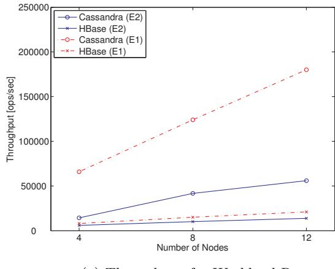

(a) Throughput for Workload R.

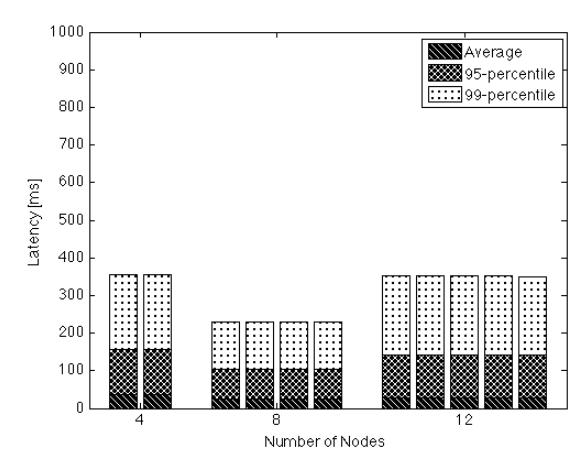

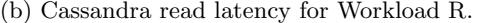

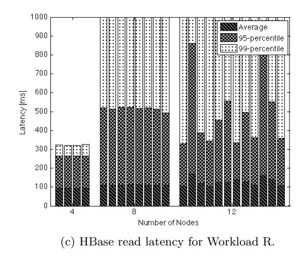

Figure 1: Workload R.

Our experiments show a large throughput increase for Cassandra, roughly 70%, compared to workload R because write operations are much faster than read operations. Cassandra's write latency is highest in the 4 node cluster setup, with ca. 20 ms, and decreases to 10 – 15 ms when scaling to 8 nodes, and 12 nodes, respectively. However, Cassandra's write latency in E2 is nearly twice as large as reported by E1.

For HBase, we measure throughput values that are much larger than reported in E1. We measure 2x the throughput of HBase for the 4 node cluster and approximately 4x the throughput for the 12 node cluster, compared to the values in E1. For all cluster sizes, HBase throughput is approximately the same as Cassandra throughput as reported in the original paper. HBase average write latency is under 1 ms. In contrast to E1, we observe that average write latency is almost constant for all cluster sizes. Average read latency is much lower than reported in E1 and further decreases with increasing cluster size from 702 ms in case of the 4 node cluster, to 633 ms for 8 nodes, and 588 ms for 12 nodes. Interestingly, for all HBase cluster sizes we observe 99-percentile write latency of 0 ms. Across most experiments, all YCSB clients in an experiment setup measure similar throughput values. Therefore, the coefficient of variation is small with values smaller than 0.01. For experiments with the HBase 12 node cluster, we measure a much higher coefficient of variation for throughput with values between 0.10-0.25 with the highest value for workload W.

####*4.4.3 Workload RS*We reproduce the experiments for the scan-intense workload RS as described in Section 5.4 of [14]. E1 reports a linear increase of throughput with the number of nodes and a steeper increase for Cassandra than for HBase. E1 reports Cassandra's scan latency in the range of 20 – 28 ms whereas HBase's scan latency is reported in the range of 108 – 120 ms.

Our measurements cannot reproduce these results as shown in figure 5. Instead, we measure similar throughput for both Cassandra and HBase, and even slightly better throughput for the 4-node and 12-node HBase cluster. We measure scan latencies in a range of ca. 121 – 195 ms for both Cassandra and HBase. We measure lower throughput for HBase and 4 – 6 times lower throughput for the Cassandra cluster.

However, our measurements reproduce the gradient between two throughput measurements with increasing cluster size for the HBase experiments as reported in E1. 95 percentile scan latency increases with cluster size for both Cassandra and HBase with a steeper slope for Cassandra.

## 5 Varying Throughput

We reproduced the experiments described in Section 5.6 of [14] with the 8-node clusters and different throughput targets. For all workloads, except for the HBase write latency, we can observe a clear reduction of latency for lower throughput targets. The results are in the magnitude as reported in the original paper [14]. Cassandra's latency is reduced by 50-70% when target throughput is throttled to 50% of the maximum throughput. The latency reduction of read and scan operation are event greater for HBase. Since write latency of HBase workloads is close to zero under maximum throughput, no further reduction of latency can be observed in this case. The original paper does not report upper percentile latencies. Variations in HBase read latency decrease significantly with decreasing load, i.e., normalized 95-percentile read latency decrease to 35% and 5% and normalized 99-percentile read latency decreases to 62% and 4%. During the throughput variation experiments we

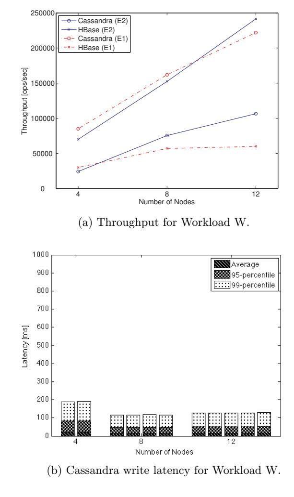

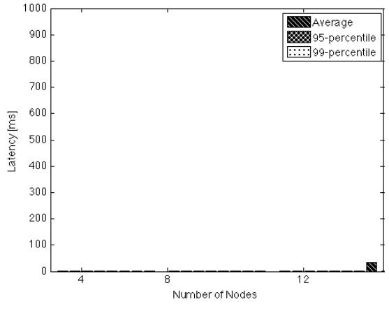

(c) HBase write latency for Workload W.

Figure 2: Workload W.

made the observation that Cassandra 99-percentile read and scan latency is very large during the 50% target throughput experiments. Unfortunately, we cannot explain the reason for these results.

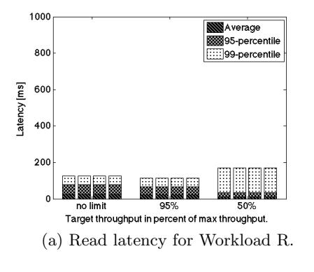

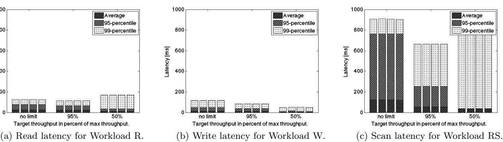

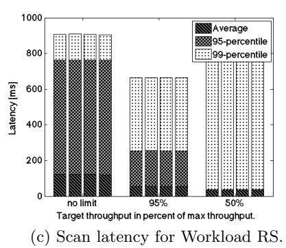

Figure 3: Target workloads Cassandra.

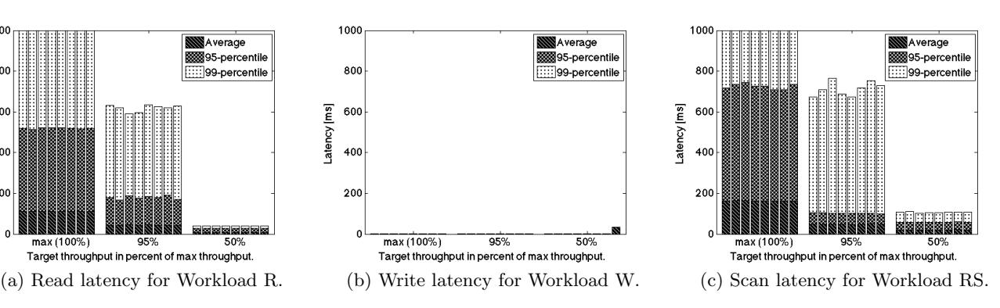

Figure 4: Target workloads HBase.

## 6 Discussion

In this section, we discuss problems we experienced during reproducing the experiment E1 regarding (i) metrics, (ii) results and (iii) the experiment setup.

###*4.6.1 Metrics*During our experiments, we recognized key collisions in insert operations that result from the distributed, uncoordinated generation of workloads by multiple parallel YCSB servers.

In some cases, we obtained non-uniform performance measurements for different YCSB servers within a single experiment, e.g., HBase read latencies for workload R. We could not exactly identify how performance measurements for E1 are averaged, e.g., by YCSB servers or weighted by the number operations per workload client.

Furthermore, we observe that latency distributions for an operation type measured by a single YCSB server can be non uniform. Figure 6 shows the distribution of requestresponse-latencies for read requests measured by a single YCSB server. The distribution is unimodal with a positive skew. Therefore, we suggest to report stable metrics of spread, e.g., latency percentiles, in combination with unstable metrics of center, e.g., average values, based on the type of measured latency distributions.

####*4.6.2 Results*We could reproduce some of the results shown by Rabl, et al. [14] for E1 for Cassandra and HBase. For HBase, we measure similar absolute throughput for workload R and RS. Throughput of HBase could be increased linearly from 4 to 12 nodes, and Cassandra throughput could be increased nearly linearly. We could reproduce most of the stable latency measurements for Cassandra and HBase clusters of 4 to 12 nodes reported for E1. We were able to reproduce decreasing latencies under decreasing bounded request numbers for HBase and Cassandra. Furthermore, we observed that HBase latency variability stabilizes under decreasing bounded request numbers. We obtained near uniform performance measurements from all YCSB-clients with a coefficient of variance below 0.01, for nearly all Cassandra experiments, and some HBase experiments. We could confirm that Cassandra performs with lower read latency than HBase. On the other hand, HBase shows better write latency.

We could not reproduce some results reported for E1. Therefore, we discuss this issue in detail in Section 4.6.3 and Section 5. We could not reproduce most of the absolute throughput measurements of E1. Absolute HBase throughput for workload W is more than doubled compared to E1. Absolute Cassandra throughput is considerable less than reported for E1 under all workload types. Absolute Cassandra latencies are considerable higher than reported for E1 for all experiments. We measure lower absolute read and write latencies for HBase under workload W. Measurements for absolute scan latency for both Cassandra and HBase differ from E1. Our observations show higher absolute scan latency for Cassandra and lower absolute scan latency for HBase compared to E1. Furthermore, we observe similar absolute scan latencies and lower absolute latencies under decreasing bounded requests for both Cassandra and HBase.

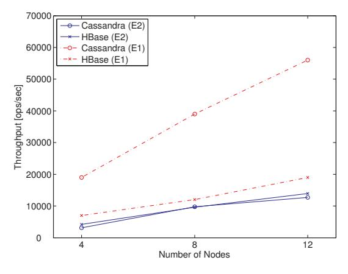

(a) Throughput for Workload RS.

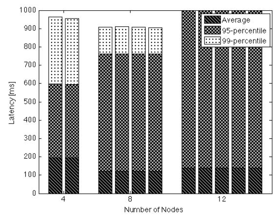

(b) Cassandra scan latency for Workload RS.

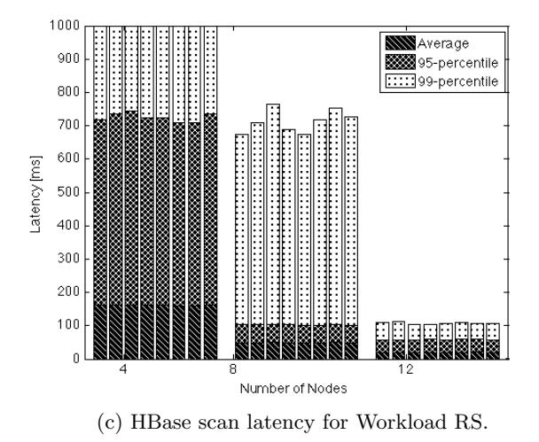

Figure 5: Workload RS.

####*4.6.3 Additional Experiment Setups*We conducted two additional experiments to further investigate results for E1 that we could not reproduce under experiment setup E2. First, we investigate lower overall performance measurements for Cassandra. Second, we in-

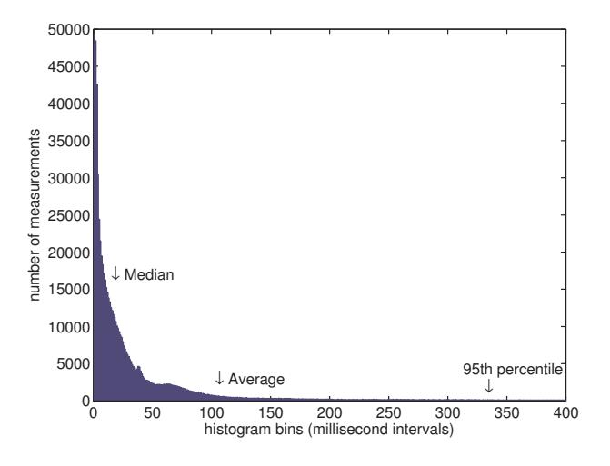

Figure 6: Histogram of read latencies for workload R measured by a single YCSB-client for a HBase 12-node cluster.

vestigate better performance measurements for HBase under workload W for E2.

The reason why Cassandra performed worse than in the previous publication can be attributed to a CPU bottleneck. We observed high CPU utilization of the Cassandra cluster of ca. 80% in all of our experiments. Subsequently, we ran a 4 node cluster experiment with compute-optimized EC2 instances of instance type c1.xlarge that have 8 virtual CPU cores instead of 4 virtual CPU cores and 7 GB RAM instead of 15 GB RAM memory. Figure 7 shows the relative throughput increase for m1.xlarge and c1.xlarge instances over m1.large instances. Cassandra throughput for workload R increases by 107% instead of 32% for the c1.xlarge cluster and by 67% instead of 11% for workload W, respectively. Therefore, the measured throughput of the experiment clearly exceeded previous measurements for the 4 node cluster experiment with m1.xlarge EC2 instances.

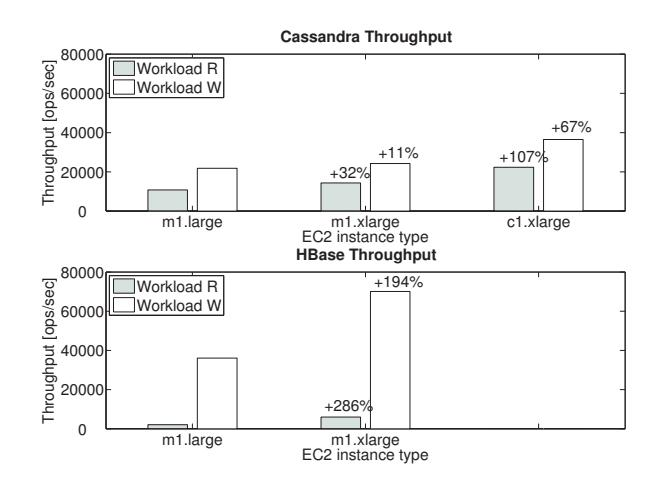

Figure 7: Throughput of a 4-node Cassandra cluster and a 4-node HBase cluster for different EC2 instance types.

We recommend to not only check disk IO and network IO bottlenecks but also perform experiments with different CPU core sizes to match a given experiment setup as closely as possible. Adrian Cockcroft discusses some reasons why CPU utilization is not always the most appropriate indicator for CPU bottlenecks [3].

In a second experiment, we investigated better HBase performance measurements under workload W for experiment setup E2. For experiment setup E2, we were not able to successfully complete the execution of workload W for thread numbers higher than 192 per YCSB-client. Rabl et al. [14] report that the selection of simultaneously open connections for a experiment setup must balance congestion and performance degradation resulting from high number of connections with an underutilized system resulting from low number of connections per YCSB-client. We conducted an additional experiment for a 4-node HBase cluster under workload W to investigate the effect of different thread numbers for experiment setup E2. We used two YCSB servers according to E1. Figure 8 shows increasing read and write latencies with an increasing number of threads for E2. Throughput values peaked at 64 and 128 threads. In combination with throughput measurements presented in figure 2(a), the results indicate that experiment setup E2 avoids a client-side bottleneck by increasing the total number of YCSB servers and reducing the number of threads per YCSB server. Therefore, we argue that the number of open connections and client servers should be optimized for a specific infrastructure and distributed database system.

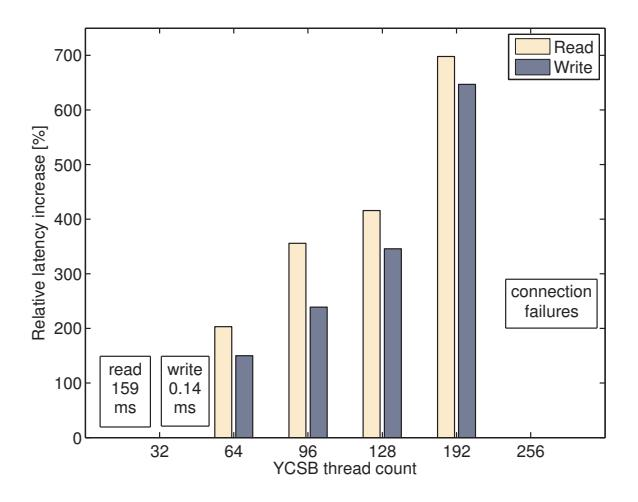

Figure 8: Relative increase of average read and write latency for increasing thread counts over a baseline of 32 threads for a 4-node HBase cluster and workload W.

## 7 Extension of Experiment Scope

EC2 Configuration Experiments. Our experiment E2 revealed a general problem of selecting the right EC2 instance types to reproduce an experiment setup that was based on different infrastructure. Without prior knowledge of the performance bottlenecks of the Systems Under Test for given workloads – network IO, disk IO, CPU, or memory – it is difficult to reproduce a fair infrastructure setup on EC2. Therefore, we extend the scope of our experiments to evaluate Cassandra performance on a variety of EC2 setups with different instance types and storage setups.

Vertical Scaling Experiments. The experiments are further extended to evaluate vertical scaling as an alternative to horizontal scaling. Vertical scaling can be performed on EC2 by stopping an instance, changing the instance type, and restarting the instance again. Thereby, we can upgrade or downgrade instances with minimal downtime which should be acceptable if the System Under Test is replicated. The approach is similar to VM-based migration approaches [5]. Other types of virtualized infrastructure, such as Xen Cloud Platform, allow dynamically changing the allocation of server instance memory and vCPU resources at runtime which would be an alternative vertical scaling technique that can be performed to scale server instances vertically without downtime.

Elasticity Benchmarking. An important quality that is related to scalability is the speed at which instances can be provisioned into a cluster, or removed from a cluster, respectively. Given short instance provisioning times of modern cloud-based infrastructure, the scaling speed is mainly governed by the time that it takes to re-partition and redistribute data in the cluster, a challenge that is related to online data migration problems. The scaling speed depends on the scaling approach, horizontal or vertical. In case of horizontal scaling, the speed also depends on the system resources that are used by data re-distribution tasks. Increasing scaling speed can therefore impact workload performance. These two metrics, the speed of scaling and the temporary performance impact, should be considered to judge the elasticity of a distributed database system. We evaluate Cassandra and HBase elasticity for a variety of different scaling scenarios.

## EC2 CONFIGURATION EXPERIMENTS

Performance management of systems on Amazon EC2 or similar cloud infrastructure should conduct benchmarks for different infrastructure configuration alternatives. We evaluate Cassandra's performance for alternative EC2 instance types with different memory, CPU, and storage configurations via system monitoring and systematic experimentation. System monitoring provides an insight into potential performance bottlenecks of Cassandra for a given cluster setup and workload whereas experiments are necessary to verify the bottleneck and compare alternative instance types and instance configurations.

## 1 Server Instance Memory Experiments

Cassandra uses a BigTable-style writeback cache, named Memtable, whereby write operations can be performed with high throughput and low latency. However, for large data volumes stored in Cassandra, read operations must access disk-resident SSTable files which leads to decreasing read performance because random disk IO is more expensive than memory access. Update-heavy workloads lead to a further decrease of read performance since rows are spread across a larger number of SSTable files, requiring more disk lookups. We conduct size-up experiments with increasing data volumes that are stored in Cassandra to experimentally determine the threshold when read performance begins to deteriorate.

| Data volume | Thru        | Avg. Read latency |
|-------------|-------------|-------------------|
| 5 GB/node   | 11000 ops/s | 8.6 ms            |
| 10 GB/node  | 10000 ops/s | 9.2 ms            |
| 15 GB/node  | 1000 ops/s  | 63.4 ms           |
| 20 GB/node  | 750 ops/s   | 90.3 ms           |
| 30 GB/node  | 550 ops/s   | 114.9 ms          |

Table 3: Cassandra 3-node cluster performance on m1.xlarge EC2 instances for different data volumes.

Experiments with a non-replicated Cassandra cluster. We conduct SB1 scalability experiments with a nonreplicated 3-node Cassandra cluster and increasing YCSB record counts of 15, 20, 45, 60, and 90 million records which correspond to a data volume per Cassandra node of 5GB, 10GB, 15GB, 20GB, and 30GB, respectively. An additional storage overhead results from stored metadata. We apply the standard YCSB workload B with 95% read and 5% update operations. The results in table 3 show that performance drops by a factor of 10 when the data load per Cassandra node is increased from 10GB to 15GB. Initially, we thought that this effect was caused by an increase of the number of SSTables. However, one of our reviewers remarked correctly that the drastic decrease of read performance is more likely being caused by insufficient local file system cache, in our case ca. 10GB per server. System monitoring metrics of the 15GB+ experiments show heavily increased idle time of the CPU waiting for IO (figure 9).

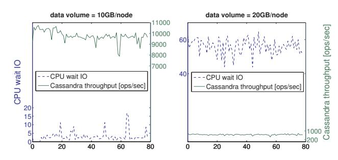

Figure 9: Cassandra throughput and server CPU wait IO time series measurements for a cluster with 10GB/node vs. 20GB/node.

Experiments with a replicated Cassandra cluster. Replication increases the data volume stored per node. We repeated the previous SB1 experiments with a third of the data volume and a replication factor of 3, resulting in an equivalent data volume that is stored per node. The experiments show that, given a low consistency quorum configuration, i.e., Cassandra ConsistencyLevel = ONE for reads and writes, the performance results are nearly identical to the experiment with no replication. Therefore, in the presence of low consistency guarantees, implying asynchronous replication, the performance impact of replication is mainly caused by the increase in stored data volume.

## 2 Server Instance CPU Experiments

If the Cassandra cluster is not disk-bound, i.e., if we provision enough memory to avoid disk access, CPU becomes the bottleneck. This is reflected by monitoring server load, a metric that reports how many jobs are waiting in the CPU queue. Increasing throughput for a cluster with overprovisioned memory leads to increasing load averages and more volatile latency.

## 3 EC2 Storage Setup Experiments

For vertical scaling on Amazon EC2, an experiment described further below, it is important to use EC2 instances that store their data on Elastic Block Storage (EBS) volumes. EBS volumes are network-attached to EC2 instances at EC2 instance startup. The instance's ephemeral disk data is lost during a stop-restart cycle. In the following, we compare the performance of replicated 3-node Cassandra clusters in 4 different EC2 storage setups:

- Storage setup 1. m1.xlarge EC2 instances with 2 standard EBS volumes in RAID0
- Storage setup 2. m1.xlarge EC2 instances with 1 EBSoptimized EBS volume with 3,000 provisioned IOPS
- Storage setup 3. m1.xlarge EC2 instances with 1 EBSoptimized EBS volume with 1,000 provisioned IOPS
- Storage setup 4. m1.xlarge EC2 instances with 2 ephemeral disks in RAID0

RAID0 increases disk throughput by splitting data across striped disks at the cost of storage space, which is limited by the size of the smallest of the striped disks. The EBSoptimized option enables full utilization of IOPS provisioned for an EBS volume by dedicating 1,000 Mbps throughput to an EC2 m1.xlarge instance for traffic between the EC2 instance and the attached EBS volumes. EBS volumes can further be configured with Provisioned IOPS, a guarantee to provide at least 90% of the Provisioned IOPS with single digit millisecond latency in 99.9% of the time.

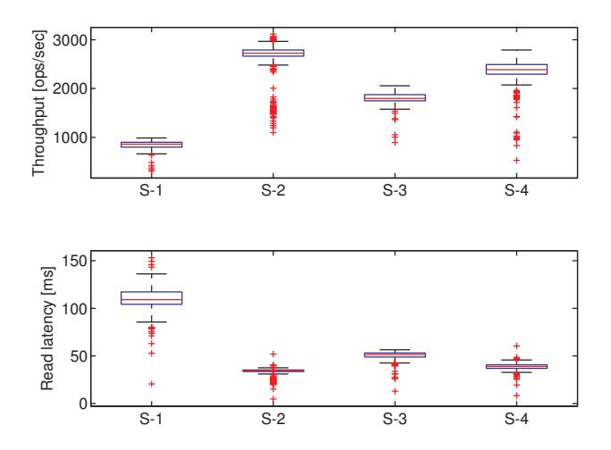

Figure 10: Comparison of Cassandra performance for EC2 Storage Setups S1-S4.

Experiment setup. The storage configuration SB2 experiments are performed with a dedicated YCSB client on a separate m1.medium EC2 instance in the same data center and rack. The Cassandra cluster is set up with replication factor 3 and pre-loaded with 20 million records, i.e., 20GB of unreplicated data. This results in 60 GB of replicated data plus the storage overhead of the database system, therefore, data is materialized as SSTables on disk. Before each experiment run, we warm up the cache before starting the YCSB benchmark run. After each experiment run, the instances are terminated and a new cluster is created to avoid sideeffects between subsequent experiment runs. The workload is the standard YCSB workload B with 95% read and 5% update operations with a Zipfian request distribution. To verify the results, all performance benchmarks are repeated multiple times. We remove the first two data points, i.e., the first 20 seconds, from our measurements. Therefore, we ensure that all client threads are started by YCSB and avoid measurements of extreme outliers in the beginning of a workload run.

Results. For setup 1, we measure maximum throughput of 835 ops/sec with high read latencies of 110 ms. In setup 2, Cassandra achieves much higher throughput of ca. 2,700 ops/sec with an average read latency of ca. 30 ms. In setup 3, Cassandra achieves less throughput than in 2, namely 1,800 ops/sec with average read latency of 50 ms. In setup 4, the Cassandra cluster performs with 2,300 ops/sec and with ca. 40 ms read latency. Increasing provisioned IOPS for the EBS setup allows us to achieve even better performance than setup 4 which stores data on the instance's ephemeral disks.

## ELASTICITY BENCHMARKING

## 1 HBase

Experiment Setup. We conduct HBase EB1 elasticity experiments on Amazon EC2 Linux servers with HBase version 0.94.6, Hadoop version 1.0.4 and Zookeeper version 3.4.5. For the cluster setup, we use EC2 m1.medium instances with 1 vCPU, 3,75 GB of memory and "medium" network throughput to deploy the HBase cluster. We use m1.large instances to deploy YCSB servers as workload generators. All instances are provisioned within the same Amazon datacenter and rack. Between experiment runs, we terminate the cluster and recreate the experiment setup to avoid side-effects between experiments. The cluster is initially loaded with 24 million rows. We use an unpdate-heave YCSB workload A and a read-heavy YCSB workload B, as described in Section 2.3. In the baseline setup, the HBase cluster consists of a single node that runs the HMaster and the Hadoop Namenode process and 6 additional nodes that each run a single HBase Regionserver and Hadoop Datanode process. For our experiments, we run a workload with a bounded number of request for the duration of 660 seconds. The YCSB throughput target is selected during initial experiments for each workload so that the 99th percentile read latency remains below 500 ms. We conduct experiments with lower, i.e., 80%, and higher, i.e., 150%, throughput targets to evaluate scalability for both an under- and an overutilized HBase cluster. Furthermore, we provision different numbers of nodes simultaneously, i.e., 1, 2, or 6 nodes. The provisioning, configuration and integration of new nodes is started at the beginning of a new workload run.

Results. Table 4 shows the resulting 99th percentile read latencies over the measurement interval of 660 seconds. Update latencies are below 1 ms for all measurements.

Furthermore, we evaluate impacts of scaling actions on throughput over the measurement interval of 660 seconds. Figure 11 shows that the simultaneous provisioning of multiple nodes under the update-heavy workload A results in a

| Workload | read / | Load | Add nodes |      |      |  |
|----------|--------|------|-----------|------|------|--|
|          | update |      | 1         | 2    | 6    |  |
|          |        | 0.8  | -16%      | -31% | -49% |  |
| YCSB A   | 50/50  | 1.0  | +24%      | -7%  | -22% |  |
|          |        | 1.5  | +57%      | +50% | +39% |  |
|          |        | 0.8  | -36%      | -24% | -41% |  |
| YCSB B   | 95/5   | 1.0  | +1%       | -4%  | -39% |  |
|          |        | 1.5  | +22%      | +54% | +39% |  |

Table 4: HBase elasticity measurements. Relative change of 99th percentile read latency [%] during horizontal scale-out.

smaller degradation of throughput. Under read-heavy workload B, we observe the opposite effect and an increasing performance degradation. We account this to the effect that regions assigned to new nodes can directly serve updaterequest, but lose caching effects.

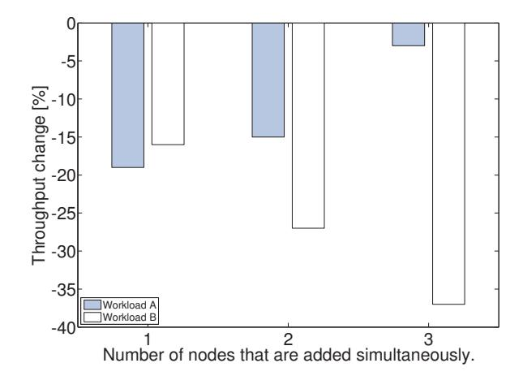

Figure 11: Relative decrease of HBase average throughput [ops/s] for simultaneous addition of varying numbers of nodes.

## 2 Cassandra

Experiment Setup. We set up EB1 elasticity experiments on Amazon EC2 Linux servers with Cassandra version 1.2. We use EBS-backed and EBS-optimized EC2 x1.large instances with 8 vCPUs, 15 GB of memory and "high" network throughput. Two EBS volumes are attached to each EC2 instance with 500 provisioned IOPS per volume and configured in RAID0. All instances run in the same Amazon datacenter and rack. Between experiment runs, we terminate the cluster and recreate the experiment setup to avoid side-effects between experiments.

In the baseline setup, the Cassandra cluster consists of 3 nodes with a replication factor of 3. The cluster is initially loaded by YCSB with 10 million rows, i.e., each node manages 10 GB. The YCSB servers are in the same datacenter and rack as the Cassandra cluster on an m1.xlarge EC2 instance. We perform experiments with YCSB workload B, i.e., 95% read and 5% update operations with a Zipfian request distribution. The YCSB throughput target is set to 8000 ops/s for nearly all of the experiments.

| No.  | Scaling           | Streaming   | Scaling time |           | Avg. thru | Avg. latency |        | 99th-p. latency |       |
|------|-------------------|-------------|--------------|-----------|-----------|--------------|--------|-----------------|-------|
|      | scenario          | config.     | streaming    | stabilize | [ops/sec] | update       | read   | update          | read  |
| CS-1 | Add 1 Node        | 5 MBit/s    | 198 min      | 0 min     | 8000      | 3.3 ms       | 5.7 ms | 22 ms           | 49 ms |
| CS-2 |                   | 40 MBit/s   | 26 min       | 5 min     | 8000      | 3.2 ms       | 6.9 ms | 23 ms           | 56 ms |
| CS-3 |                   | unthrottled | 10 min       | 6 min     | 8000      | 2.9 ms       | 7.5 ms | 22 ms           | 61 ms |
| CS-4 |                   | disabled    | N/A          | 1.3 min   | 8000      | 2.6 ms       | 5.2 ms | 19 ms           | 36 ms |
| CS-5 | Add 3 Nodes       | unthrottled | 10 min       | 3 min     | 8000      | 3.4 ms       | 6.5 ms | 21 ms           | 47 ms |
| CS-6 |                   | disabled    | N/A          | 0.8 min   | 8000      | 2.8 ms       | 5.8 ms | 19 ms           | 36 ms |
| CS-7 | Upgrade 1 Node | N/A         | N/A          | 8 min     | 6000      | 2.3 ms       | 6.1 ms | 9 ms            | 47 ms |

Table 5: Cassandra elasticity measurements.

Measurements. For evaluating the elasticity of Cassandra, we collect the following measurements:

- The duration from start of scaling action to time when data streaming has ended. We furthermore visually inspect how long it takes latency to stabilize on a similar level as before the scaling action.
- Latency time series before, during, and after scaling.
- The 99th percentile latency before, during, and after scaling.

###*6.2.1 Horizontal Scaling*We evaluate 6 different horizontal scaling scenarios for Cassandra. With the experiments CS-1 to CS-4, a single node is added to the cluster during workload execution. In the experiments CS-5 and CS-6, we add three nodes at the same time to the cluster. Cassandra has a configuration option stream throughput outbound megabits per sec which allows throttling the throughput that is used to move SSTable data to new nodes that are added to the cluster. Experiment CS-1 is conducted with throttled streaming throughput of 5 MBit/s; experiment CS-2 extends the limit to 40 MBit/s; and experiment CS-3 is performed without a data streaming throughput limit. Experiment CS-4 implements a scaling technique described by [12]. In CS-4, data streaming is disabled by setting Cassandra's auto bootstrap configuration parameter to false. This enables the new Cassandra node to join the cluster nearly instantly, starting to serve YCSB workloads after ca. 1 min.

####*6.2.2 Vertical Scaling*Although distributed systems are designed for horizontal scalability, it is also possible to increase or decrease cluster capacity by vertical scaling. We understand vertical scaling as a system operations activity where a system operator either upgrades server hardware to increase capacity, or downgrades server hardware to decrease capacity and thus save cost, respectively. Amazon EC2 allows a system operator to stop a server instance, change the instance type, and restart the instance again with the new instance type. Since EC2 IP addresses are assigned dynamically, we set up an Amazon Elastic Load Balancer (ELB) that removes the old instance before it is stopped and adds the new instance after it has been started. In experiment C-7, we evaluate Cassandra's vertical scalability in terms of scaling speed and performance impact. In the experiment, we upgrade one of the m1.xlarge EC2 instances to an m3.2xlarge instance which is equipped with 8 vCPUs of Intel Xeon E5-2670 processor and with 30 GB RAM.

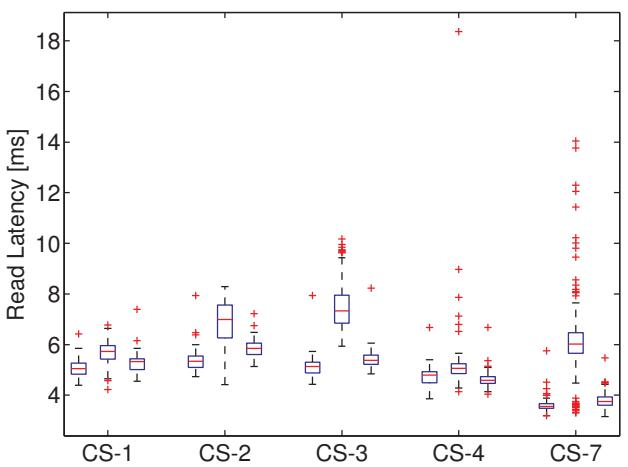

Figure 12: Cassandra read latency for scaling scenarios CS-1, CS-2, CS-3, CS-4, and CS-7.

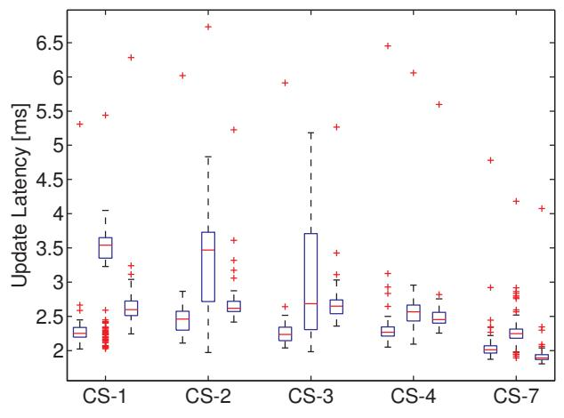

Figure 13: Cassandra update latency for scaling scenarios CS-1, CS-2, CS-3, CS-4, and CS-7.

####*6.2.3 Comparison of Scaling Approaches*

Figure 13 shows Cassandra's read latency before, during, and after scaling the cluster. The results show that performance variability increases with increased streaming throughput. In the scaling experiment CS-4, Cassandra not

Read latency before, during, and after scaling

only joins the cluster much quicker but also with less performance impact. It seems useful as an efficient scaling technique to deal with workload spikes, such as flash crowds. However, system operators should use it with caution because inconsistencies between newly materializing SSTables on the new node and old SSTables on the replica nodes must be repaired in the future. CS-4 is therefore mostly useful as a caching layer for read-heavy workloads or as a temporary scaling solution.

The vertical scaling experiment CS-7 shows a performance impact that is larger than in the horizontal scaling scenarios. Even under a lower workload intensity than in the other experiments, a target throughput of only 6,000 ops/sec, read latency spikes during the instance stop-restart cycle. This is due to the fact that the cluster capacity is shortly reduced to two nodes which must serve the entire workload.

## CONCLUSIONS

With our work, we repeat performance and scalability experiments conducted by previous research. We can verify some of the general results of previous experiments. Our results show that both Cassandra and HBase scale nearly linearly and that Cassandra's read performance is better than HBase's read performance, whereas HBase's write performance is better than Cassandra's write performance. However, we measure also significant performance differences which are partly attributed to the fact that we reproduced experiments which were conducted on physical infrastructure on virtualized infrastructure in Amazon EC2. We therefore conduct a thorough performance analysis of Cassandra, for which we measured the largest performance deviation from the original results, on different Amazon EC2 infrastructure configurations. Our results show that performance largely depends on the EC2 instance type and data volume that is stored in Cassandra. Our work also suggests improvements that foster reproducibility of experiments and extend the original experiment scope. We evaluate the elasticity of HBase and Cassandra and show a tradeoff between two conflicting elasticity objectives, namely the speed of scaling and the performance variability while scaling.

## ACKNOWLEDGMENTS

We thank Amazon Web Services for a generous research grant that enabled us to conduct the research presented in this publication. We thank our student Dominik Ernst for supporting us in conducting some of the HBase experiments.

## REFERENCES

- [1] A. Awasthi, A. Nandini, A. Bhattacharya, and P. Sehgal. Hybrid HBase : Leveraging Flash SSDs to Improve Cost per Throughput of HBase Flash as Storage Media. In Proceedings of the 18th International Conference on Management of Data.
- [2] F. Chang, J. Dean, S. Ghemawat, W. C. Hsieh, D. A. Wallach, M. Burrows, T. Chandra, A. Fikes, and R. E. Gruber. Bigtable: A Distributed Storage System for Structured Data. ACM Transactions on Computer Systems, 26(2):1–26, 2008.

- [3] A. N. Cockcroft. Utilization is Virtually Useless as a Metric! In Proceedings of the 32nd International Computer Measurement Group Conference.
- [4] B. F. Cooper, A. Silberstein, E. Tam, R. Ramakrishnan, and R. Sears. Benchmarking Cloud Serving Systems with YCSB. In Proceedings of the 1st ACM Symposium on Cloud Computing.
- [5] S. Das. Scalable and Elastic Transactional Data Stores for Cloud Computing Platforms. PhD thesis, 2011.
- [6] S. Das and S. Nishimura. Albatross: Lightweight Elasticity in Shared Storage Databases for the Cloud using Live Data Migration. Proceedings of the VLDB Endowment, 4(8):494–505, 2011.
- [7] G. DeCandia, D. Hastorun, M. Jampani, G. Kakulapati, A. Lakshman, A. Pilchin, S. Sivasubramanian, P. Vosshall, and W. Vogels. Dynamo: Amazon's Highly Available Key-Value Store. In Proceedings of 21st ACM SIGOPS Symposium on Operating Systems Principles.
- [8] T. Dory, B. Mej´ıas, P. Van Roy, and N.-L. Tran. Measuring Elasticity for Cloud Databases. In Proceedings of the 2nd International Conference on Cloud Computing, GRIDs, and Virtualization.
- [9] A. J. Elmore, S. Das, D. Agrawal, and A. El Abbadi. Zephyr: Live Migration in Shared Nothing Databases for Elastic Cloud Platforms. In Proceedings of the International Conference on Management of Data.
- [10] J. Huang, X. Ouyang, J. Jose, M. Wasi-ur Rahman, H. Wang, M. Luo, H. Subramoni, C. Murthy, and D. K. Panda. High-Performance Design of HBase with RDMA over InfiniBand. In Proceedings of the 26th Symposium on International Parallel and Distributed Processing.
- [11] M. Klems, D. Bermbach, and R. Weinert. A Runtime Quality Measurement Framework for Cloud Database Service Systems. In Proceedings of the 8th International Conference on Quality of Information and Communications Technology.
- [12] I. Konstantinou, E. Angelou, C. Boumpouka, and N. Koziris. On the Elasticity of NoSQL Databases over Cloud Management Platforms. In Proceedings of the 20th ACM International Conference on Information and Knowledge Management.
- [13] A. Lakshman and P. Malik. Cassandra. ACM SIGOPS Operating Systems Review, 44(2):35–40, 2010.
- [14] T. Rabl, M. Sadoghi, H.-A. Jacobsen, S. G´omez-Villamor, V. Munt´es-Mulero, and S. Mankowskii. Solving Big Data Challenges for Enterprise Application Performance Management. Proceedings of the VLDB Endowment, 5(12):1724–1735, 2012.
- [15] M. Wasi-ur Rahman, J. Huang, J. Jose, X. Ouyang, H. Wang, N. S. Islam, H. Subramoni, C. Murthy, and D. K. Panda. Understanding the Communication Characteristics in HBase: What are the Fundamental Bottlenecks? In Proceedings of the IEEE International Symposium on Performance Analysis of Systems & Software.
