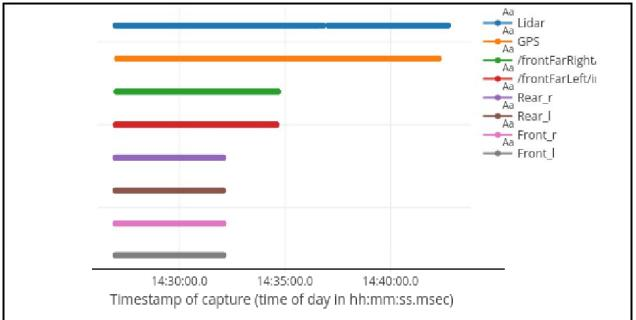

# Large Scale Multimodal Data Capture, Evaluation and Maintenance Framework for Autonomous Driving Datasets

Nitheesh K. Lakshminarayana Intel, Bangalore, India

nitheesh.k.l@intel.com

## Abstract

*Autonomous driving (AD) programs today primarily depend on one or the other form of supervised Deep Learning (DL) models for their behavioral success. However, these DL models are only as good as the data on which they are trained, and their success depends immensely on their training data. Hence it is imperative that we create datasets of good quality. However, the process of collecting this realworld driving data and the infrastructure needed to evaluate and manage this large data is commonly unspoken and is challenging. To address this issue, we have developed an open-source framework and infrastructure to capture, evaluate, and maintain such multi-sensor data. In this paper, we discuss the motive for this framework, a process for evaluation and quality analysis, insights on data storage, distribution and management for large multimodal data and the key lessons learned collecting and maintaining huge volumes of data from long driving distances.*## Introduction

Raw data collection for today's AD standards demands the use of multiple visual, positional, and laser sensors for the perception of the world around the vehicle. These sensors, when coupled together, produce large volumes of high-resolution data possibly in the order of few hundred Gigabytes (GB) per hour. Correspondingly, capturing this data in real-time requires high disk write speeds of several hundred Megabytes per second (MB/s). If data collection spans multiple hours or multiple days, managing the enormous amounts of data generated prove to be a complex challenge, pushing the boundaries of today's storage throughput limits. This captured data may have to be transferred, stored, and made accessible to multiple internal and external participants for various post-processing activities. The real-time nature of this data imposes strict requirements for data coherency at all times. Maintenance of such large-scale data soon becomes a technical and a logistical nightmare.

This collected raw data may incur several problems such as incoherent data, corrupted data frames, invalid metadata, incorrect initializations, among others. For example, data from the camera might not be captured at the required fps, the orientation of the LiDAR sensor might be wrong, or the GPS might have lost its fix on the position during data capture. Such issues must be thoroughly inspected in the raw data before it is sent for post-processing. However, there are no well-defined steps and processes currently available for analyzing such multimodal data. Besides, since most of these data collection setups are custom made for specific requirements, this work addresses the following key challenges in an AD datasets quality analysis process that can be applied to a wide range of data collection requirements:

- i Analysis and validation of multimodal sensor data.
- ii Visualization of sensor-specific data.
- iii Timeseries analysis of sensor data.

### 1. Related and Prior Work

There are several multimodal driving datasets available today. From the popular KITTI[3], and Cityscapes[2] to the latest BDD100K[8], ApolloScape[4] and IDD[7] datasets. Moreover, each year, we see more such datasets being released. [2] and [8] use HD front-facing cameras along with positional sensors, whereas [3] and [4] collect data from at least four cameras along with high-density laser scanners and positional sensors. Nuscenes [1] data collection also constitutes of five surround radars along with six cameras and a LiDAR. The processed and published datasets from these works are in the order of a few tens of GBs. The raw data collected to produce these processed datasets would be several times more. Apart from collecting data directly from sensors, datasets like Mapillary [6] are created by collecting a large number of images scraped from the internet. However, most of these works describe only their sensor configuration and only provide their final dataset but do not describe their raw data evaluation and maintenance pipelines. Geiger*et al*.[3] describe the use of a custom database for their data collection and their process for creating ground truths, but do not provide any details about their process for validating their raw data collection. Huang *et al*. [4] provide an extensive set of tools for data collection, and sensor calibrations but do not specify any details for systematically visualizing and validating the raw data. Jacob and Rabha [5] build on the works of Huang *et al*. [4] and provide tools for large scale data collection, but does not include any utilities for data visualization and evaluation. From all of these prior work, we see that ROS (Robot Operating System) <sup>1</sup> remains to be the underlying framework for all of such robotic multi-sensor data capture. The captured data is then visualized locally from individual rosbags using RVIZ, a visualization tool from ROS. Recently, UBER and CRUISE have released their visualization tools, Autonomous Visualization System (AVS)2 and WebViz3, respectively. However, AVS does not operate on the rosbag data format and defines the XVIZ protocol for its data operations. While WebViz supports rosbag format, it can handle small bag files of several hundred MBs but becomes unusable to render large bag files of several hundred GBs, as seen in typical raw data-capture scenarios.

Although these frameworks support certain multimodal data visualization, we are not aware of any work that visualizes and defines a standardized process to evaluate these multimodal data, especially frame-by-frame for large realworld data, as needed for dataset creation tasks. Addressing these shortcomings is the prime motivation for our work.

The rest of the paper is organized as follows: In section 2, we discuss the challenges faced in data capture, evaluation, and maintenance. Section 3 describes our framework design and infrastructure. Section 4 describes our data evaluation process in detail, and section 5 discusses the shortcomings and scope for improvement.

## Challenges

### 1. Data Capturing and Processing

A typical setup for autonomous driving data collection (*e.g*. nuScenes[1] and Apolloscape[4] platforms, and setup used by Jacob and Rabha[5]) constitutes multiple monocular and stereo cameras, LiDAR, RADARs, GPS, and any vehicle (On-Board Diagnostics) OBD sensors. Each sensor device must be accurately calibrated for its intrinsic and extrinsic params. Intrinsic calibration for each sensor type is generally provided by the manufacturer, but accurate extrinsic calibrations, for example, lidar-to-cams, pose several challenges and is still considered an open research problem in itself. For a typical data collection sensor configuration, as shown in Table 1, the data generated will be in the order

| Sensor     | Resolution | FPS | Count |
|------------|------------|-----|-------|
| Stereo Cam | 3840x1080  | 15  | 4     |
| Mono Cam   | 1280x600   | 30  | 2     |
| LiDAR      | 16 channel | 10  | 1     |
| GPS        | -          | 10  | 1     |
| OBD        | -          | 1   | 1     |

Table 1. Sensor configuration for a typical multimodal AD data collection platform used in [5].

| Camera          | Stereo      | Mono     |  |  |  |
|-----------------|-------------|----------|--|--|--|
| Resolution      | 1920x1080   | 1280x600 |  |  |  |
| Channel         | 3           | 3        |  |  |  |
| FPS             | 15          | 30       |  |  |  |
| Cams per Rig    | 2           | 2        |  |  |  |
| Rigs            | 4           | 1        |  |  |  |
| Data rate MB/s  | 632.81      | 131.83   |  |  |  |
| Total data rate | 764.65 MB/s |          |  |  |  |

Table 2. Data rate for a typical multi-camera AD data capture platform show in Table 1.

of 4TB per hour due to multiple cameras generating continuous high-resolution images and may require data write speeds of around 800MB/s, as shown in Table 2. Given an on-board computer with limited storage for data collection, this high throughput requirement limits the amount of continuous data capture possible on the on-board computer before having to swap storage disks. Moreover, all of these sensors operate at different FPS. Although some of the sensors, like PointGrey cameras, can be synchronized with an external signal, other sensors (*e.g*. GPS, USB Cams, OBD) cannot be synchronized accurately with external control signals. Therefore real-time synchronization of these sensor data, which is ideal for analysis, becomes extremely challenging.

### 2. Data Evaluation

Given the multimodal nature of the captured data, each sensor data must be analyzed individually and also, along with other sensor data for correctness. For example, each camera frame needs to analyzed individually for the quality of the image and must also be analyzed with its corresponding LiDAR, GPS, and other sensor frames to ensure the orientation and time synchronization is correct. Also, the recorded data must be analyzed for other potential issues like frame loss, drop in frame rates, data corruption between frames. However, unlike camera images, not all of the sensor data can be visualized directly for human interpretation. Moreover, all of the sensor data from a given instance of time must be visualized together to make meaningful correlations.

<sup>1</sup>ROS - https://www.ros.org

<sup>2</sup>Uber AVS - https://www.avs.auto

<sup>3</sup>Cruise WebViz - https://www.webviz.io

### 3. Data Archiving and Distribution

This type of extensive data collection from AD platforms requires large storage of data. Generally, such large data is stored on distributed network file systems (NFS) for efficient data maintenance and can be shared among teams for multiple tasks (*e.g*. validation, annotations, analytics). However, since data is predominantly collected as large rosbag files, typically of several GBs for a few minutes drive, accessing these rosbag files over the network has a substantial latency of several minutes. Also, in many cases, this data from rosbags need to be transferred over web interfaces for tasks like visual evaluation, labeling, among others. Given the high network access overhead for large rosbags, it becomes unusable for such tasks. Apart from this, even for tasks like querying and retrieval of specific data, for example, searching a recording from a specific time of a specific day, becomes extremely challenging. Therefore storing such large rosbag recordings on the network is an unacceptable solution and requires the need for more optimal archival mechanisms.

## Infrastructure

### 1. Multimodal Data Summary

Our framework can handle multimodal data from multiple cameras, LiDAR, GPS, and OBD sensors. They are stored as images, pointclouds, latitude & longitude, vehicle properties, respectively. The data are recorded in rosbag formats from the recording platform and then postprocessed for proper data extraction and analysis. Figure 1 provides an example of these data.

Camera Data - Most cameras used in the AD platform provides a stream of RGB images. Additionally, there may be other types of cameras (*e.g*. thermal cameras, event cameras, greyscale cameras) that provide similar forms of data. Figure 1 shows a sample of this raw image data converted into a JPEG format for visualizations.

LiDAR Pointcloud Data - The LiDAR provides a sequence of points in a 3D coordinate system constituting of x,y,z coordinates along with ring and intensity values. Figure 1 depicts a meaningful visualization of a chosen frame by plotting these sequence of points on a 3D graph

GPS Data - The GPS provides a sequence of points containing latitude and longitude coordinates. Figure 1 depicts a meaningful visualization by plotting these points on a map.

OBD Data - The OBD data obtained from the vehicle's CAN bus consists of vehicle properties like gear, rpm, speed, steering angle, throttle position, and clutch lever value.


Figure 1. Visual representtaion of an example multimodal data. Top: RGB image from a stereo camera. Bottom: GPS coordinates plotted on a map and LiDAR pointclouds plotted in a 3D graph.

### 2. Data Collection and Processing

The system defined by Jacob and Rabha [5] is used for data collection. We improve upon their work by adding support to format and extract data corresponding to our infrastructure. For each recording, the raw images, LiDAR pointclouds, GPS coordinates, and OBD param along with timestamps of each frame are extracted. The recording duration, sensor topics, and the sampling frequency is also extracted from the data recordings. As part of post-processing step, the data from all the sensors are aligned to the front camera images. This data alignment is required to analyze and curate datasets from this raw data. The recording timestamp from each data frame is used to align it with the corresponding nearest timestamp of the front camera image as the reference.

### 3. Data Archival

Data from each recording needs to be stored and organized according to their location and time of recording to perform data queries when required. The data is hence stored in a hierarchy, as shown in Figure 2.

This data hierarchy provides a unique path to address each recording. The recordings are spread over multiple NFS servers for efficient maintenance. A database is created by indexing the metadata of each recorded bag along with its NFS storage path. This database is updated with each new data recording and provides a quick and easy mechanism to search for recordings.

### 4. Web Dashboard and Services

The large data spread across a distributed NFS is not easily browsable. Accessing each of the extracted recordings on a local system becomes an exceedingly slow task. Also, this extracted data would now need to be accessed by multi-

```text
datastore
|-raw
| '--location
| '--yyyy-mm-dd
| '--yyyy-mm-dd-hh-mm-ss
| |-- analytics
| |-- calib
| |-- extracted
| |-- meta
| '-- video
'-rosbag
   '--location
     '--yyyy-mm-dd
        '--yyyy-mm-dd-hh-mm-ss
```text

Figure 2. Data storage hierarchy.

ple teams for various evaluation tasks. Therefore, With the data extracted and stored as defined in the previous sections, we build a web dashboard to visualize and evaluate all the recorded data. This web dashboard provides a facility to see all the sensors data of each recording together in one view frame-by-frame and for multiple users simultaneously. The dashboard utilizes the database with each recording's metadata to quickly lookup a requested recording. Instead of reading large rosbag files each time to find required data frames, it accesses the extracted data from each bag to render it on the webpage as requested. This removes the entire read overhead time of using rosbags, and raw data is rendered instantaneously for viewing. Additionally, this facility enables us to perform multiple data analytics required for the dataset. Along with the dashboard, the infrastructure (Figure 3) provides APIs to access and query all of the recorded data. This API framework enables developers to build additional services, like color corrections, object recognitions in a given frame, etc. on the datasets.

The following sections show this web dashboard in detail and use its functionality for evaluating raw data recordings.

## Data Evaluation

Once the recorded data is extracted and updated in the database, it is made available for access on the dashboard. The following steps are performed using the dashboard's features to evaluate and assess each data recording systematically.

- i Metadata analysis Validates the coherency of the recorded bag file.
- ii Route map analysis Validates GPS recordings and ensures data capture happened in the required regions.
- iii Timeseries and jitter graph analysis Inspects recordings for data loss and irregularities in sensor data


Figure 3. Dashboard component to analyze image frames. This example shows an instance of images from all camera mounted on a typical AD data collection platform configured shown in Table 1

by analyzing the graphs of the data timestamps and time between consecutive data frames (Jitter).

- iv Video playback Inspects camera recordings for visual parameters like lighting conditions, route types, diversity of scenes.
- v Images Inspects subsampled/specific camera images for frame corruptions.
- vi LiDAR Inspect LiDAR pointclouds for orientation correctness and data corruption.
- vii OBD Evaluate OBD data frames from the vehicle's CAN bus for the correctness of vehicle parameters.

### 1. Metadata

First, the metadata of the rosbag from a selected recording (Figure 4) is verified for the date of collection, duration, start and end times, and the size of the data. The date and the timestamps should match correctly. Any data collection platform with a fixed sensor configuration captures raw data of a specific size for a specific duration of time. For example, with sensor configuration shown in Table 1, we have observed that a drive of 2 minutes should correspond to around 60GB of rosbag file. Therefore, the size of the chosen rosbag should align with the expected size scale to be termed as good data. Recordings not corresponding to this size is an indication of bad data. Along with this metadata, the list of recorded data types (Figure 4) is analyzed to see if all the sensors data are present and if their corresponding fps matches the sensor configuration. All the predefined data types corresponding to the sensor configuration should

| File                                  |  | : 2017-11-01_17-24-53.bag  |      |             |  |  |  |                               |  |
|---------------------------------------|--|----------------------------|------|-------------|--|--|--|-------------------------------|--|
| Duration                              |  | : 101.532182 sec           |      |             |  |  |  |                               |  |
| Start time : Wed Nov 01 2017 17:24:53 |  |                            |      |             |  |  |  |                               |  |
| End time                              |  | : Wed Nov 01 2017 17:26:35 |      |             |  |  |  |                               |  |
| Size                                  |  |                            |      |             |  |  |  | : 48.6 GB [52169457806 bytes] |  |
| Total msgs : 61512                    |  |                            |      |             |  |  |  |                               |  |
| Sensor                                |  |                            | Freq | Data_Type   |  |  |  |                               |  |
| /frontCam/info                        |  |                            | 15.0 | CameraInfo  |  |  |  |                               |  |
| /frontCam/raw                         |  |                            | 15.0 | Image       |  |  |  |                               |  |
| /gps/fix                              |  |                            | 42.0 | NavSatFix   |  |  |  |                               |  |
| /imu/data                             |  |                            | 42.0 | Imu         |  |  |  |                               |  |
| /lidar/points                         |  |                            | 9.9  | PointCloud2 |  |  |  |                               |  |
| /rearCam/info                         |  |                            | 15.0 | CameraInfo  |  |  |  |                               |  |
| /rearCam/raw                          |  |                            | 15.0 | Image       |  |  |  |                               |  |
| /leftCam/info                         |  |                            | 15.0 | CameraInfo  |  |  |  |                               |  |
| /leftCam/raw                          |  |                            | 15.0 | Image       |  |  |  |                               |  |
| /rightCam/info                        |  |                            | 15.0 | CameraInfo  |  |  |  |                               |  |
| /rightCam/raw                         |  |                            | 15.0 | Image       |  |  |  |                               |  |
|                                       |  |                            |      |             |  |  |  |                               |  |

Figure 4. Example metadata of a rosbag recording from a typical AD sensor configuration shown in Table 1. A short 2 minutes drive with this type of sensor configuration leads to around 60 GB of raw data.

be present with their configured fps. Any missing data types or lower fps is an indication of missing or corrupted data.

### 2. Route Map

The next step is to verify the route to ensure the correctness of GPS data (lat & lng) recording. Data collection drives are mostly pre-planned to capture specific diverse conditions and distances, *e.g*. nuScenes([1]) perform data collection in Boston and Singapore, and emphasizes diversity in terms of vegetation, vehicles, buildings, and traffic conditions. Each data recording happens in predefined routes to capture such variations in data. When GPS coordinates from the data are mapped (Figure 5), the path driven should correspond to the predefined route to be termed as good data. We plot the route on maps and visually verify any discrepancies. Also, the distance is calculated from these coordinate points, and this calculated distance should match the manual observation recorded by the data collection team.


Figure 5. GPS coordinates plotted on a map with distance calculated from the start to the end points.




Figure 6. Sensor timeseries graphs shwoing examples of good data recording (top) and bad data recording (bottom).

### 3. Timeseries Graph

The next step is to analyze the time-series graph of sensory data (Figure 6). By plotting the timestamps of each data frame from all the sensors, the graph helps us to verify if all the sensors start and stop at the same time, and captured data during the entire period of recording. Absence of any data will show up as a gap in the plot, which could indicate if the sensor started late or closed early or if it stopped functioning during the recording period. For good and usable data, the timeline for each sensor in the graph should start and stop around the same time, with a few milliseconds of acceptable error.

Figure 6 shows an example graph of a bad data recording where several sensors have stopped recording before others, and the LiDAR has missed some frames in between.

### 4. Jitter Analysis

The next step is to verify if the sensor's data capture rate is uniform and if all the sensors captured at the expected sampling rate. The jitter graph (Figure 7) plots the time difference between consecutive sensor messages and denotes any jitter as spikes in the graph. These spikes in the graphs are analyzed for all sensors and any spike exceeding the error threshold denotes bad data segments. Figure 7 shows an example of jitter graphs for good and bad data recordings. The good data graph has no spikes exceeding 150 millisec-


Figure 7. Sensors jitter graph showing examples of good data recording (top) and bad data recording (bottom).

onds for sensors operating at f ps ≥ 10, thereby indicating no data loss. The bad data graph example shows multiple high spikes in OBD data, which indicates that data loss occurred in those time intervals.

### 5. Video Playback

The previous steps verify the integrity of the data. The next step is to check if the camera data playback is good, i.e., there is no corruption in the camera frames; the lighting condition is acceptable; frames are not spliced, etc. To inspect this, videos created from camera frames during data extraction is viewed and analyzed. The web dashboard provides facilities for viewing and annotating videos from multiple cameras at multiple speeds. For a quick playback, the videos are played manually at 10x playback rate and inspected for anomalies. If none exists, the data is termed as good. (Figure 8)

### 6. Image Frames

If the video analysis of the front camera shows good data, then the images captured from different cameras are analyzed. Since it is cumbersome to go through all the frames of all the cameras, the images are inspected at 10% intervals of the total number of images to check for any anomalies. The web dashboard provides facilities to view camera frames at multiple ranges (Figure 3). The camera frames


Figure 8. Video playback component of the dashboard.


Figure 9. 3D plot of a LiDAR frame.

are analyzed for anomalies like frame overlaps, color corruption, bad exposures, etc. If no anomalies are detected, we can consider the data as good.

### 7. LiDAR Point-clouds

Next, the LiDAR pointclouds from the recording are verified. The LiDAR visualization component plots the point clouds in a 3D graph, which provides a visual rendering of the data (Figure 9). These 3D plots of the pointclouds enable the validation of parameters like the horizontal & vertical resolution, the angle of orientation, etc. If no such anomalies are detected, then the data is termed as good.

### 8. OBD Data

As the last step, the OBD data containing the vehicle parameters (gear, rpm, steering angle, throttle, etc) is verified. Sample OBD data from one of the recordings is as shown in Listing 10.

Verification is done using the graph plots of the OBD data, as shown in Figures 11-14. Plotting the raw OBD data (Figure11) does not provide a meaningful interpretation of the data as the data range for each for feature ranges from 10s to 1000s. Features are hence normalized and plotted for verification, as shown in Figure 12. This normalized graph enables us to interpret the data better. For example,

| gear   | lat    | $\ln q$ | <b>CDM</b> |    |                                                                                                                      |        |                                                                 |
|--------|--------|---------|------------|----|----------------------------------------------------------------------------------------------------------------------|--------|-----------------------------------------------------------------|
| 3.000  | 17.528 | 78.234  |            | 37 | !!!!!!!!!!!!!!!!!!!!!!!!!!!!!!!!!!!!!!!!                                                                             |        | 1554881886506                                                   |
| 3.000  | nan    | nan     |            | 37 | 599.900                                                                                                              |        | 16.863 1554881727756                                            |
| 3.000  | nan    | nan     |            | 37 | 603.700                                                                                                              |        | 1554881542800                                                   |
| 3.000  | 17.505 | 78.243  |            | 37 | 599.500                                                                                                              | 16.078 | 1554881629406                                                   |
| 3.000  | 17.510 | 78.241  |            | 37 | 599.800                                                                                                              | 14,118 | 1554881687506                                                   |
| 3.000  | 17.502 | 78,243  |            | 37 | 599.900                                                                                                              |        | 1554881601250                                                   |
| 3.000  | 17.534 | 78.235  |            | 31 | 605.900                                                                                                              | 21,961 | 1554881951506                                                   |
| 3.000  | 17,486 | 78,246  |            | 37 | 600,000                                                                                                              | 15,686 | 1554881437200                                                   |
| 3.000  | 17.506 | 78.242  |            | 37 | 599,900                                                                                                              | 15,686 | 1554881644700                                                   |
| 3.000  | 17.500 | 78.244  |            | 38 | 599.200                                                                                                              | 16,863 | 1554881585400                                                   |
| 40.392 |        |         |            |    | 1847.250<br>1841.750<br>1846.250<br>1846.500<br>1852.750<br>1845.500<br>1607.500<br>1848.750<br>1874.250<br>1847,000 |        | speed steering throttle timestamp<br>14,902<br>16.078<br>15.294 |

Figure 10. Example of OBD data containing vehicle parameters.


Figure 11. Raw OBD data plot example.

in Figure 12, we can see the speed, and the rpm drops simultaneously towards the end of the plot. This drop indicates the vehicle coming to a stop/halt. However, if the rpm and speed do not change proportionally, then it is an indication of malformed/bad data. Similarly, the gear value can also be interpreted and verified accordingly. In this example, as the vehicle comes to a halt/stop, the gear should return to neutral. This transition is seen towards the end of the plot, where the high gear value drops to neutral along with rpm and speed.

The jitter plot of the OBD data (Figure 13) helps to perform a sanity check of our interpretation of the data. In this example, the large spikes in the rpm towards the end of the plot aligns with the steep change in rpm and speed as the vehicle comes to a halt/stop. If there were no spikes in this timeslice, or if there were irregular spikes in any other part of the previous time windows, then it is an indication of malformed/bad data.

Apart from the validating the sanity of OBD data, plotting these features also enables us to identify and interpret undefined pattern in the data. For example, Figure 14 shows the plot of rpm and gear data containing discontinuities in gear data when rpm value drops below 1000. Although this


Figure 12. Normalized OBD data plot example.


Figure 13. Jitter plot example of OBD data.

discontinuity initially seems like the loss of gear data during data collection, since it corresponds to the duration in which the rpm also drops below 1000 simultaneously, this discontinuity corresponds to the gear value for *neutral*, as the vehicle comes to a halt.

In configurations where GPS data is also available from OBD frames, they are verified by plotting its route on the same map containing the route from the onboard GPS sensor. Figure 15 shows an example of two routes plotted on the same map. The sanity of GPS data from OBD is verified by its alignment with the onboard GPS sensors route map. Because the OBD sensor runs at a much slower framerate


Figure 14. Example of gear and rpm data plot for a time slice.


Figure 15. Routes of GPS coordinates from OBD(*red*) and onboard sensor(*blue*).

compared to the onboard sensor, a slight deviation of up to 10 meters is permitted. Any deviations beyond this can be considered as invalid data.

### 9. Results

These steps provide a fast and reliable way to ensure the good quality of raw data recordings. When executed on sample data collection activities with sensor configuration, as shown in Table 1, the process takes an average of 15 minutes to process a recording of a few hundred GBs. We were successfully able to filter bad data like irregularities in GPS coordinates, image frame corruption due to overheating of the camera, undesired segments of overexposure of camera frames, irregularities in LiDAR orientation, etc.

## Conclusion and Future Work

Our infrastructure and evaluation process enables the collection of large volumes of multimodal data. We opensource our framework for the global research community to perform similar large-scale data collection, either in AD or other such multi-sensor scenarios. The validation of data using the process defined in this paper is currently performed manually and takes several minutes. In the future, we want to integrate automated ways of performing these kinds of data validation and reduce the time taken for such tasks even further. Also, with such large volumes of data, searching for specific subsets of data, like retrieving all recording with bridges in them, or recording with a specific type of vehicles on the road, etc. becomes a tedious task, and is in itself an open research problem of large-scale image/data retrieval. Using our framework, we envision creating an architecture for deep image/data retrieval to effectively create and maintain large multimodal datasets for research. Our code is available at https://github.com/intel/drivingdata-collection-reference-kit.

## References

- [1] H. Caesar, V. Bankiti, A. H. Lang, S. Vora, V. E. Liong, Q. Xu, A. Krishnan, Y. Pan, G. Baldan, and O. Beijbom. nuscenes: A multimodal dataset for autonomous driving. *arXiv preprint arXiv:1903.11027*, 2019. 1, 2, 5
- [2] M. Cordts, M. Omran, S. Ramos, T. Rehfeld, M. Enzweiler, R. Benenson, U. Franke, S. Roth, and B. Schiele. The cityscapes dataset for semantic urban scene understanding. *CoRR*, abs/1604.01685, 2016. 1
- [3] A. Geiger, P. Lenz, C. Stiller, and R. Urtasun. Vision meets robotics: The kitti dataset. *International Journal of Robotics Research (IJRR)*, 2013. 1
- [4] X. Huang, X. Cheng, Q. Geng, B. Cao, D. Zhou, P. Wang, Y. Lin, and R. Yang. The apolloscape dataset for autonomous driving. *CoRR*, abs/1803.06184, 2018. 1, 2
- [5] J. Jacob and P. Rabha. Driving data collection framework using low cost hardware. In L. Leal-Taixe and S. Roth, editors, ´ *Computer Vision – ECCV 2018 Workshops*, pages 617–625, Cham, 2019. Springer International Publishing. 2, 3
- [6] G. Neuhold, T. Ollmann, S. Rota Bulo, and P. Kontschieder. ` The mapillary vistas dataset for semantic understanding of street scenes. In *International Conference on Computer Vision (ICCV)*, 2017. 1
- [7] G. Varma, A. Subramanian, A. M. Namboodiri, M. Chandraker, and C. V. Jawahar. IDD: A dataset for exploring problems of autonomous navigation in unconstrained environments. *CoRR*, abs/1811.10200, 2018. 1
- [8] F. Yu, W. Xian, Y. Chen, F. Liu, M. Liao, V. Madhavan, and T. Darrell. BDD100K: A diverse driving video database with scalable annotation tooling. *CoRR*, abs/1805.04687, 2018. 1
