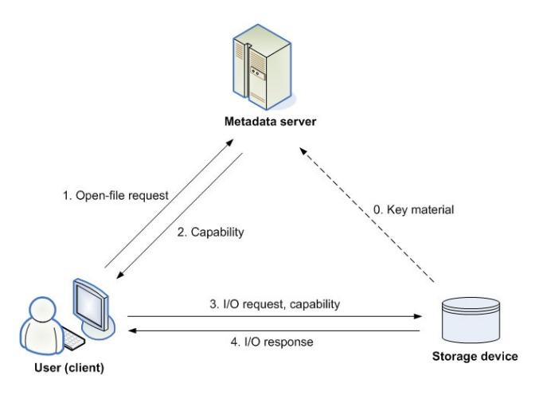

# Key Management for Large-Scale Distributed Storage Systems

Hoon Wei Lim

SAP Research, Sophia Antipolis, France hoon.wei.lim@sap.com

**Abstract.**Petabyte-scale file systems are often extremely large, containing gigabytes or terabytes of data that can be spread across hundreds or thousands of storage devices. Hence, the cost of security operations can be very high. Recent security proposals for large-scale file systems have been focussing on the use of hybrid symmetric and asymmetric key cryptographic techniques, in order to strive for a balance between security and performance. However, key management issues, such as distribution, renewal and revocation of keys, have not been explicitly addressed. In this paper, we first show that key management can be very challenging and costly in large-scale systems, and can have significant impact on the scalability of the systems. We then propose a file system security architecture which makes use of lightweight key management techniques. Our approach not only addresses essential key management concerns, it also improves existing proposals with stronger security and better usability.

# 1 Introduction

Cryptographic key management, such as generation, distribution, storage, renewal and revocation of keys, is the foundation for securing a system. It can be very challenging, particularly for petabyte-scale, open distributed file systems because the cost of managing keys may be far higher than the cost of executing security mechanisms o[r](#page-12-0) [pro](#page-13-0)tocols in which the keys are used. Files in such systems are often extremely large, containing terabytes of data, which can be [s](#page-13-1)pread across thousands of devices and accessed by thousands of clients [14,23]. While it is possible that the authenticated public key of each storage device is made available to all clients within the system, it can be very difficult and costly for the clients to manage such large sets of public keys, particularly in terms of key renewal and revocation.

Most prior work on large-scale file systems, particularly those based on object storage devices or network-attache[d dis](#page-14-0)ks [2,19], presupposes that all keys required to perform security protocols are held by all the relevant parties. For example, Leung*et al.*[16] recently proposed Maat, a set of security protocols designed to provide strong and scalable security for petabyte-scale file systems by making use of various state-of-the-art techniques, such as extended capabilities, automatic revocation and secure delegation. While Maat appears to be currently the most efficient and scalable proposal, Leung*et al.*assumed that each client knows the

F. Martinelli and B. Preneel (Eds.): EuroPKI 2009, LNCS 6391, pp. 99–113, 2010.

c Springer-Verlag Berlin Heidelberg 2010

authenticated public key of all other entities in the system. This is a rather strong assumption which has significant impact on the overall performance and scalability of the system. We further explain why this is the case. In Maat, each storage device within a file system possesses a public/private key pair, of which the public component is assumed to be available to all clients in the system. A client must then, using the relevant storage device public keys, establish shared symmetric keys with storage devices on which the client stores its files. (This is necessary so that the client can subsequently access its files in a secure and efficient manner.) We note that the process of establishing a shared key has to be repeated thousands of times if the client has many large files stored across thousands of storage devices. A more worrying concern is that if a storage device is compromised or corrupted, and thus so as its private key and the symmetric keys that the device shares with its clients, revocation and replacement of these keys can be extremely tedious and costly. Similarly, when new storage devices are added to the system, it may also be costly to distribute new public keys to all the clients. Other recent proposals, such as [15,21], also assumed the existence of all necessary authenticated public keys and did not address issues related to key distribution, key renewal and revocation either. They focussed on other security aspects instead, for example issuance and revocation of coarse-grained capabilities.

In this paper, we propose a file system security architecture (FSSA) which not only addresses the aforementioned key management issues, but also has stronger security and better usability in comparison with the rec[ent](#page-13-2) proposals. In largescale and highly distributed file systems, storage devices can be vulnerable to various attacks and may encounter hardware or software failure, and thus this may lead to exposure of secret cryptographic keys or data stored on the devices. However, this has not been explicitly taken into consideration in the existing security model, although it has significant impact on not only key management, but also the data protected by the relevant keys. Hence, we first propose a stronger security model for large-scale object storage systems by considering*forward secrecy*, an essential security property for shared key establishment between two parties [18]. In our security model, we assume that a long-term secret key stored on a storage device can be corrupted or exposed, and that even when the key is revealed to an adversary, past session keys derived using the long-term key are still protected from the adversary.

Our proposal of FSSA then employs lightweight key management techniques suitable for petabyte-scale object storage file systems. In our approach, clients make use of only short-lived cryptographic keys in order to negotiate shared symmetric keys with storage devices. Thus this obviates many difficulties in public key management, such as key revocation and renewal. We develop an authenticated key agreement protocol using the classic Diffie-Hellman key exchange technique [8]. Our protocol is not only lightweight, but also shown to be secure in the stronger security model.

Managing public keys, such as authenticating public keys and checking for their validity, can be complicated for a non-IT savvy. Even an IT savvy may not have general understanding of the security implication of inappropriate public key management. Therefore, unlike many existing proposals, our approach is very user-friendly, since users do not possess large sets of storage device public keys. All is required for a user is to remember a password which she shares with her metadata server and has access to the server's public key. The server's public key is needed so that essential security features for a large-scale distributed file system, for example extended capabilities and delegation [16], can be provided.

In the nex[t se](#page-14-1)ction, we provide related work in large-scale file system security. In Section 3, we present our proposal for a file system security architecture. We also describe a security model, key management, an authenticated key agreement protocol and its security and performance analyses. We conclude in Section 4.

# 2 Re[la](#page-12-1)ted Work

Most [earl](#page-13-3)ier work in securing large-scale distributed file systems, for example [11,12], employed Kerberos [20] for performing authentication and enforcing access control. Kerberos, being based on symmetric key cryptography, is usually regarded as a very efficient approach. However, it is generally believed to be more suitable for rather closed, well-connected distributed environments.

On the other hand, data grids and file systems such as, OceanStore [14], LegionFS [24] and FARSITE [1], make use of public key cryptographic techniques and public key infrast[ru](#page-12-0)[ctu](#page-13-4)[re](#page-14-2) (PKI) to perform cross-domain user authentication. Independently, SFS [17], also based on public key cryptographic techniques, was designed to enable inter-operability of different key management schemes. Each user of these systems is assu[med](#page-13-2) to possess a certified public/private key pair. However, these systems were not designed specifically with usable and scalable security in mind. Furthermore, they did not address key management issues that we highlighted in the previous section.

With the increasing deployment of highly distributed and network-attached storage systems, subsequent work, such as [2,10,26], focussed on scalable security. Nevertheless, these proposals assumed that a metadata server shares a group secret key with each distributed storage device. The group key is used to produce capabilities in the form of message authentication codes [18]. However, compromise of the metadata server or any storage [de](#page-13-5)[vic](#page-13-1)[e al](#page-14-3)lows the adversary to impersonate [th](#page-13-1)e server to any other entities in the file system. This issue can be alleviated by requiring that each storage device shares a different secret key with the metadata server. Nevertheless, such an approach restricts a capability to authorising I/O on only a single device, rather than larger groups of blocks or objects which may reside on multiple storage devices.

More recent proposals, which adopted a hybrid symmetric key and asymmetric key method, allow a capability to span any number of storage devices, while maintaining a reasonable efficiency-security ratio [15,16,21]. Among these proposals, Maat [16] appears to be currently the most refined set of security protocols which consider various security issues identified and lessons learned from other existing work.

Briefly, Maat encompasses a set of protocols that facilitate (i) authenticated key establishment between clients and storage devices, (ii) capability issuance

and renewal, and (iii) delegation between two clients. The authenticated key establishment protocol allows a client to establish a shared (session) key with a storage device by performing the following steps:

- 1. generates a public/private key pair;
- 2. requests for a ticket, which certifies the newly created public key, from the metadata server;
- 3. creates and transports a session key to the storage device using the device's public key;

Note that the above protocol presupposes that the client has access to all the relevant storage device public keys, which are required for the key establishment. Moreover the client's and the device's public/private key pairs, and their shared session key, are considered reasonably long-term and upda[te](#page-3-0)d infrequently. The main reason for this is that in a large-scale file system, establishing session keys with thousands of storage devices can be extremely computationally expensive. Therefore, the strategy is to use asymmetric cryptographic techniques to setup symmetric session keys, which in turn, are used for a relatively long period.

In order to access files on specific storage devices, the client then obtains a short-term capability from the metadata server. The capability specifies the client's I/O request and access permissions, which allow the storage devices to evaluate whether or not the client is authorised to access the requested data1. The data transmitted between the client and storage devices are protected using the shared keys established earlier. Maat makes use of relatively short-lived capabilities, typically 5 minutes, so that they are not required to be revoked explicitly using a revocation mechanism, but simply allowing the capabilities to expire automatically. Should a client require access to files longer than 5 minutes, Maat allows the client to request for capability renewal from the metadata server. In addition, secure file sharing between clients through delegation is also supported by Maat. Description about how delegation is performed in Maat can be found in [16].

Nevertheless, the assumption of Maat and other proposals which requires user public keys to be made available to all storage devices seems impractical. This is because users may join or leave the systems over time, and thus new public keys would be generated or existing public k[ey](#page-12-0)[s](#page-13-0) [w](#page-13-0)ould be revoked. It is not clear how new or revoked public keys can be communicated to all users in the systems on a timely basis.

# 3 File System Security Architecture

Our proposal of a file system security architecture (FSSA) is based on the current model for object storage devices or network-attached disks [2,19]. Unlike existing

1 We note that a capability is typically associated with one client and a single file, which may be composed of object blocks distributed across multiple storage devices. On the other hand, an extended capability is associated with multiple clients and files. A metadata servers produces and caches extended capabilities in order to reduce its workload.

proposals, however, we emphasise simplified, lightweight k[ey](#page-4-0) management and improved usability in our approach. [In F](#page-7-0)SSA, a client does not make use of longterm cryptographic keys when accessing data on storage devices. All is assumed, from the client's perspective, is that it needs to share a secret, *i.e.* password, with its metadata server. The client then interacts with the storage devices using only short-term cryptographic keys, which in turn, will be destroyed at the end of a session. We also assume that each storage device pre-distributes some keying material to the metadata server when it is first added to the system. Figure 1 gives an overview of our security architecture. We will explain the steps involved in requesting and accessing files using FSSA in Section 3.3.

<!-- Image Description: The diagram illustrates a secure file access system. A user (client) requests a file (1), the metadata server provides a capability (2), and the storage device returns the requested file (4) after receiving an I/O request and the capability (3). The dashed line shows the initial transfer of key material (0) to the storage device. The image details the flow of information and capabilities required for secure file access. -->

**Fig. 1.**Architectural view of FSSA

Notice that for simplicity of exposition, in this section, we only consider the case of a single metadata server handling metadata and facilitating clients' access to storage devices. Our approach can be extended straightforwardly to cope with multiple servers. We also assume that each client can access to a relatively large number of storage devices,*i.e.* on the orders of hundreds or thousands.

In what follows, we first refine existing security assumptions and provide a stronger security model which reflects more realistic security requirements of large-scale distributed file systems. We then highlight existing key management issues and present our approach to alleviating these issues. We also present our authenticated key agreem[ent](#page-13-4) [pro](#page-13-5)[to](#page-13-1)[col](#page-14-3) between a metadata server, a client and a storage device, in order to establish a session key shared between the client and the storage device. The protocol is developed using our simplified key management techniques and after taking into consideration the refined security assumptions.

## 3.1 Security Model

The security model used in existing proposals assumes that both a metadata server and storage devices are trusted entities [10,15,16,21]. The former is trusted

to act as a reference monitor and issue valid capabilities, while the latter are trusted to store data and only perform I/O operations upon authorised requests. On the other hand, no implicit trust is placed on clients.

A large-scale file system may have thousands of storage devices which are geographically distributed. Thus it may not be feasible to provide strong physical security and network protection for all the devices. This implies that storage devices are at a higher risk of being compromised [c](#page-13-6)ompared to a metadata server, which can usually be physically secured and protected. Furthermore, storage devices may encounter hardware or software failure, causing the data stored on them no longer accessible. We believe that these risks are serious and have significant impact on the design of security protocols and their associated key management.

We, therefore, raise the security bar of protocols for large-scale object storage systems by considering forward secrecy, which has already been an important part of the security requirements for most modern security protocols [5]. The idea of forward secrecy is that previous encrypted data is securely locked in the past [18]. For example, if a key establishment protocol performed between a client and a storage device p[rovi](#page-7-0)des forward secrecy, past session keys shared between the client and t[he](#page-13-7) storage device will not be exposed even if one of their long-term private key (or secret component) has been compromised. This is to ensure that all data encrypted under past session keys and exchanged between the two parties will not be revealed. This is clearly a very desirable security property, particularly if we assume that cryptographic keys stored in a storage device can be vulnerable to exposure.

We now sketch the definition of the security of our authenticated key agreement protocol, which will be discussed in Section 3.3. Our protocol is based on the Diffie-Hellman key exchange technique [8]. In our security model, we assume that the entire communication network is managed by an adversary, who may schedule interactions arbitrarily, and who may inject, modify and drop messages arbitrarily.

**Computational Diffie-Hellman (CDH) Problem.**Given*ga, gb*∈ G, where G is a cyclic group of prime order*q*generated by*g*, and *a, b* are randomly chosen from {1*,...,q*− 1}, the CDH problem in G is to compute*gab*.

The CDH assumption then says it is computationally intractable to compute the value *gab*within polynomial time.
**Definition 1 (Informal).** *We say that the authenticated key agreement protocol between a client, a metadata server and a storage device is secure if all the following conditions are satisfied, assuming the CDH problem is hard.*-*1. The client and the storage device are mutually authenticated.*-*2. No useful information about the session key between the client and the storage device is revealed to the adversary during a successful protocol run.*-*3. The exposure of the current session key does not leak any information about past session keys.*

*4. The exposure of either the client's, metadata server's or storage device's long-term credential does not leak any information about past session keys, thus achieving forward secrecy.*We remark that formal specification of the security model and definitions, such as those used in [3], is beyond [th](#page-13-8)[e sc](#page-14-4)ope of this paper since we focus on addressing key management issues.

## 3.2 Key Management

As explained before, Maat and other large-scale file systems, such as [1,14,24], presuppose that each client has knowledge of all the required authenticated public keys that can be used "on-the-fly". However, in reality, managing long-term public keys can be very problematic and costly [9,22]. This is particularly true for large-scale file systems. Furthermore, Maat and recent proposals, for example [15,16,21], adopt the use of long-term (symmetric) session keys in order to reduce cryptographic operation costs. This increases the risk of exposing sensitive data transmitted between the clients and the storage devices.

In FSSA, we employ a lightweight and "just-in-time" key management approac[h, in](#page-4-1) which the client is not required to possess long-term public keys of storage devices, but makes use of only ephemeral key materials in order to establish a session key with each storage device. These short-lived key materials are generated as needed, and destroyed at the end of a security session, and therefore the client can avoid long-term key management and its associated issues. Furthermore, the client does not perform any asymmetric cryptographic operations during key establishment with the storage devices. More importantly, our simplified key management approach suits perfectly the stronger security model defined in Section 3.1 that ensures forward secrecy. Further details of our approach are as follows.
**Pre-distribution of keys.**As men[tio](#page-6-0)ned earlier, we assume that the metadata server is the root of trust, and thus is trusted by the clients and the storage devices to issue authenticated and valid capabilities. In order to verify these capabilities, all the clients and devices must be in possession of the server's public key. We assume this can be achieved by bootstrapping the server public key into the system, or by making the public key available to the clients and devices during a one-off registration process. Note that this is a much weaker assumption than having to assume that each client has knowledge of the authenticated public key of every storage device2.

In addition, our approach requires that each storage device distributes key material in the form of a Diffie-Hellman component,*gd*0 ∈ G, to the server through an authenticated channel. This can also be achieved during the registration process. Here G is a group generated by *g*and*d*0 is a randomly

2 It is also reasonable to assume that the metadata server is less likely to be compromised (and thus so is its private key) and more reliable than distributed storage devices.

chosen number. The Diffie-Hellman component is relatively long-term and will not be renewed frequently, unless the value *d*0, which is supposed to be known only to the storage device, is exposed.

**Ephemeral key generation.**For each file access request, the client generates a new Diffie-Hellman component*gc*, where *c* is randomly chosen. The Diffie-Hellman value is then used by the client to request a capability from the metadata server.

It is worth notin[g](#page-7-1) that a storage device's key material (*gd*0 ) is distributed to a client as part of the capability issued to the client. This way, the task of obtaining and validating the storage device's key material has been transferred from the client to the server. We remark that this eases significantly the problem of revoking the key material if the associated secret component (*d*0) is compromised. This is because it is much easier and sensible for *only the server*to obtain an up-to-date revocation list on a timely basis, instead of relying on*all clients*to update their respective revocation lists regularly and check for revoked key materials3.

-**Session key generation.**In our FSSA approach, a fresh shared key is used between the client and a storage device for each new security session. Both the client and the storage device shares a session key by exchanging their respective fresh Diffie-Hellman components, from which a composite Diffie-Hellman value can be computed and used to derive the session key. More details on the Diffie-Hellman key agreement technique will be provided in Section 3.3.
-**Deletion of keys.**At the end of each file access session between the client and the storage device, all ephemeral Diffie-Hellman values and key materials, for example*c*and*gc*, are deleted from the memory upon completion of a protocol run. The session key is also destroyed. This implies that the client uses only short-term key materials and fresh session keys. Hence, key revocation is not a major concern from the client's perspective. We note that deletion of short-term key materials and session keys is essential in order to achieve forward secrecy.

We are now ready to show how our simplified key management techniques influence the design of our key agreement protocol, particularly in order to achieve forward secrecy.

## 3.3 Authenticated Key Agreement

In our simplified key management approach, users make use of only short-term key materials and it is possible for a client and a storage device to agree on a session key based on the key materials in a lightweight manner. (Recall that Maat requires the storage device's public key to transport a session.) Our authenticated

3 Notice that this approach can be adopted by Maat to alleviate the problem of revoking storage devices' public keys. However Maat still needs to cope with the problem of revoking clients' long-term public keys of which the private keys have been exposed.

key agreement protocol not only retains features provided by Maat, such as the use of extended capabilities, but also meets the stronger security requirements defined in Section 3.1. We now present our 3-party authenticated key agreement protocol i[n F](#page-13-2)SSA between a client, a metadata server and a storage device. This is shown in Figure 2.

**Notation.**We use*C*and*S*to denote a client and a metadata server, respectively, while*D* denotes a storage device or disk. We then use Sig*S*(·) to indicate signing using *S*'s signing key *SKS*, and MAC*S*to denote a message authentication code produced using*S*'s secret key *KS*. Both the signature and MAC schemes are assumed to be secure against existential forgeability under adaptive chosen-message attacks [18]. Other notations will be introduced as they are needed.

$$
\begin{aligned}[t] (1) \ C &\rightarrow S: \ \text{open}(\text{path},\text{mode}), g^c, T_C, \\ \text{MAC}_{CS}(\text{open}(\text{path},\text{mode}), g^c, T_C) \\ (2) \ S &\rightarrow C: \ \text{access_info}, \mathrm{Sig}_S(\text{access_info}, g^c, T_C) \\ (3) \ C &\rightarrow D: \ \text{operate}(\text{object_id}), \text{access_info}, g^c, T_C \\ \text{MAC}_{CD_0}(\text{operate}(\text{object_id})), \\ \text{Sig}_S(\text{access_info}, g^c, T_C) \\ (4) \ D &\rightarrow C: g^d, \text{MAC}_{CD_0}(g^d, T_C) \end{aligned}
$$

**Fig. 2.**Authen[tic](#page-13-9)[ate](#page-14-5)d key agreement protocol in FSSA

We assume that the client (acting on a user's behalf) and the server can authenticate each other and establish a session key*KCS*using the classic hybrid username/password and TLS/SSL handshake method, for example. (Note that the server-authenticated TLS handshake does not require a client public key certificate [7].) Alternatively, Kerberos or any well-studied password-based authenticated key agreement protocol, such as [4,25], can be used.

In order to access the data stored on a storage device, a client, as with other proposals, must first obtain a valid capability from its metadata server. In step (1), the client submits an open() request to the metadata server, where path specifies a file's namespace and mode specifies the access mode: read, write, or both. The client also computes and sends a fresh Diffie-Hellman value*gc*, where *c*is randomly chosen, and a lifetime*TC*to the server. The integrity of the information that the client transmits to the server is protected through a MAC value computed using the session key*KCS*.

In step (2), the metadata server checks if the lifetime *TC*is valid and the client is permitted to access the file. If so, the server retrieves information required to generate a capability, which is in the form of a signature

$$
\mathsf{Sig}_S(\texttt{access_info}, g^c, T_C),
$$

generated using the server's long-term private key. Here, access info specifies the long-term Diffie-Hellman component of the relevant storage device,*gd*0 , and

other access details such as, the client's identity, the file handle (which lists objects or physical blocks that compose the file), file identifier, access mode and capability identifier [2,21]. The capability is then returned to the client, so that it can later be used by the client to prove its access rights for the specified file. Note that the capability can be verified by an[y](#page-13-10) [p](#page-13-10)arty who possesses an authentic copy of the metadata server's public key.

Upon receiving the capability, the client extracts the Diffie-Hellman component *gd*0 and computes a pre-session key

$$
K_{CD_0} = F(C, D, g^{cd_0}, T_C),
$$

where *F*is a key derivation function based on a secure hash function, for example. (Further details and examples on key derivation can be found in [13].) The client then issues an I/O operation request to the relevant storage device. As shown in step (3), the request contains the necessary information which allows the client to communicate to the storage device the target objects to be accessed, as well as to convince the storage device that the client is indeed authorised for the access. (We assume that the object id can be extracted from the access info.) The pre-session key*KCD*0 is used by the client to compute a MAC on the request, in order to authenticate itself to the storage device.

In the last step of the protocol, the storage device verifies the validity of the client's capability and the MAC value. Note that the storage device could compute the key *KCD*0 because it knows the secret value *d*0, which in turn, is applied on the client's chosen Diffie-Hellman value *gc*. The storage device then generates a fresh Diffie-Hellman value *gd*, where *d*is randomly chosen. The session key,*KCD*, between the client and the storage device is then set to be

$$
F(C, D, g^{cd_0}, g^{cd}, T_C).
$$

We have so far considered only the case of a client accessing a single storage device. Nevertheless, note that a capability can be used by a client to establish secure connections with multiple storage devices if a large file is spread across different locations. Moreover, our approach can be extended straightforwardly to cope with the concept of extended capabilities of Maat by explicitly specifying all authorised users and file identifiers in a capability. For example, authorised users and file identifiers are specified using hash (Merkle) trees so that they can be aggregated into fixed size data structures and embedded into a single capability [16]. Similarly, we can also employ the capability renewal techniques used in Maat in our protocol. Briefly speaking, the client renews its expiring capability by sending it to its metadata server, which then issues a new capability with an extended lifetime. Since a capability usually has a short validity period, capability revocation is not a major concern.

To summarise, our authenticated key agreement protocol makes use of Diffie-Hellman key agreement techniques and it does not rely on computationally expensive public key encryption. Moreover, our approach has the luxury of using a fresh session key between a client and a storage device for each new security session (rather than re-using a session key for many different security sessions).

## 3.4 Security Analysis

We now provide heuristic security analysis of our authenticated key agreement protocol based on the security definition given in Section 3.1.

The value MAC*CS*(open(path*,* mode)*, gc, TC*) computed by the client in step (1) of our protocol is used to detect illegitimate modification to the Diffie-Hellman component *gc*chosen by the client. The client also includes a lifetime*TC*in its message in order to prevent a replay attack. Since we assume that the key*KCS*is an authenticated session key shared between the client and the metadata server, any changes made to the message sent by the client can be detected by the metadata server. The MAC value is also used to prevent a man-in-the-middle attack.

In step (2), we trust the metadata server to issue a valid capability, containing the appropriate file access details required by the client. In particular, we trust that the server will include the correct Diffie-Hellman component of the relevant storage device*gd*0. A capability issued by the metadata server can be verified using the server's public key.

The message MAC*CD*0 (operate(object id)) of step (3) is used by the client to prove knowledge of the secret value *c*, which is needed to compute the presession key *KCD*0 . The c[lie](#page-5-0)nt is authenticated to the storage device if the MAC value can be verified successfully. This is because the capability issued by the metadata server can be used to verify the binding between the Diffie-Hellman value *gc* and the client's identity.

In step (4), the message MAC*CD*0 (*gd, TC*) computed by the storage device is used to authenticate itself to the client. Other than the client, the only party who should be able to compute *KCD*0 is the storage device, which knows the secret value *d*0.

It is clear that requirement 1 of Definition 1 is satisfied, assuming that the signature and MAC schemes are secure against existential forgeability under adaptive chosen-message attacks. Moreover, since the session key cannot be computed directly by the adversary (but only by parties who know either the secret value *c*or*d*due to the hardness of the CDH problem), requirement 2 is satisfied too.

Each session key of a protocol run is computed based on the Diffie-Hellman value*gcd*, which in turn, is based o[n n](#page-10-0)ew, ephemeral Diffie-Hellman components *gc*and*gd*randomly chosen by the client and the storage device, respectively. This implies that, in principle, the computed session key should be indistinguishable from a randomly generated bit string of similar size. Therefore, in the event of exposure of a current session key, the adversary has only a negligible probability of discovering any past session keys through a brute-force search, for example. We then conjecture that the protocol satisfies requirement 3.

On certain rare occasion, the adversary may have access to the client's machine or the storage device, thus their long-term credentials4 are exposed. However, this does not reveal any useful information about any past session keys. This is because computing a session key requires knowledge of one of the ephemeral

4 In this case, we refer to the client's password which it shares with the metadata server, and the storage device's long-term secret value*d*0.

secret values, *c*or*d*, which are assumed to be deleted upon completion of each protocol run. Similarly if the metadata server's long-term private key is compromised, it is obvious that past session keys are still protected, even though the adversary can now impersonate the server to the clients and storage devices. Hence, we conclude that requirement 4 on forward secrecy is also satisfied.

## 3.5 Performance Analysis

We have described how key management is simplified in FSSA in comparison with Maat, and how forward secrecy is achieved using the Diffie-Hellman key agreement technique. We now examine how these changes affect the cost of security operations in large-scale file systems which employ FSSA.

We implemented the protocols for both FSSA and Maat in C++, using the Crypto++ library 5.5 [6]. The codes were compiled with Microsoft Visual C++ 2005 SP1 and run on Intel Core 2/2.20 GHz processor, 2014 MB memory and under Windows Vista in 32-bit mode. We use widely deployed and typical choices of cryptographic algorithms/schemes for our comparison: HMAC (SHA-1), AES (CBC-MAC), RSA-1024 encryption and signature schemes, and DH-1024 key agreement. The implementation of the algorithms/schemes makes use of optimisation techniques to improve their performance, for example, pre-computation of key generation when possible, and the use of the Chinese Remainder Theorem (CRT) method for faster RSA decryption (or signature generation).

|        | Maat-I | Maat-II | FSSA-KA |
|--------|--------|---------|---------|
| Server | 1.232  | 1.316   | 1.227   |
| Client | 1.346  | 0.085   | 1.440   |
|        |        |         |         |

**Table 1.**A comparison of computational cost for one protocol run in milliseconds

Table 1 shows the actual computation times (in ms) incurred by different entities participating in the Maat-I & Maat-II protocols and the FSSA-KA protocol. Here, we use Maat-I to denote the long-term session key establishment protocol of Maat, and Maat-II to represent the secure file access protocol of Maat which makes use of short-term capabilities. In FSSA, we combine these two functionalities into a single key agreement protocol, which we represent by FSSA-KA. Each computation time is the average time for a protocol run over 1000 iterations.

From Table 1, the total time required to perform the FSSA-KA protocol is comparable to that of one round of the combined Maat-I & Maat-II protocols. We note that, in fact, it is difficult to compare the performance of Maat and FSSA using their underlying protocols for obvious reasons. While it is a sensible design strategy that Maat relies on long-term session keys shared between clients and storage devices to improve efficiency and scalability, other key management issues (which we described in earlier sections) have not been addressed. The cost for dealing with these issues may be far higher than the cost of the protocols themselves. Furthermore, the Maat-I & Maat-II protocols do not provide forward secrecy. On the other hand, the design principle of the FSSA-KA protocol takes into consideration various key management limitations in Maat, a stronger security model (providing forward secrecy) and the usability concern.

# 4 Conclusions and Future Work

Many recent security proposals for large-scale file systems which employ hybrid symmetric and asymmetric key cryptographic techniques did not make use of realistic key management assumptions. In this paper, we considered and addressed key management issues, which could have caused significant efficiency and scalability issues to many existing proposals. In our approach, we adopted lightweight Diffie-Hellman key agreement techniques for session key establishment between a client and a storage device. We also improved the usability of existing security proposals by making use of short-lived credential or key materials. This way, users are not required to manage potentially a large amount of long-term public keys of storage devices. Moreover, we raised the security bar of large-scale distributed file systems by introducing forward secrecy to protect data exchanged in past security sessions.

At the time of writing, Maat is arguably the most efficient security solution for large-scale file systems. Our implementation results show that our protocol is comparable to the Maat protocols in terms of computational cost. More importantly, we get stronger security, improved usability and simplified key management.

For future work, we intend to implement our proposal using a real distributed file system to analyse how much cost savings we can get in terms of key management, and to identify other potential advantages or limitations of our approach.
**Acknowledgement.** The author would like to thank Philip Robinson for very helpful discussions and the anonymous referees for very useful comments.

# References

- 1. Adya, A., Bolosky, W.J., Castro, M., Cermak, G., Chaiken, R., Douceur, J.R., Howell, J., Lorch, J.R., Theimer, M., Wattenhofer, R.: FARSITE: Federated, available, and reliable storage for an incompletely trusted environment. In: Proceedings of the 5th Symposium on Operating System Design and Implementation (OSDI 2002) (December 2002)
- 2. Aguilera, M.K., Ji, M., Lillibridge, M., MacCormick, J., Oertli, E., Andersen, D.G., Burrows, M., Mann, T., Thekkath, C.A.: Block-level security for network-attached disks. In: Proceedings of the FAST 2003 Conference on File and Storage Technologies, March 2003, USENIX (2003)

- [3. Bellare, M., Rogaway, P.:](http://www.cryptopp.com/benchmarks.html) Entity authentication and key distribution. In: Stinson, D.R. (ed.) CRYPTO 1993. LNCS, vol. 773, pp. 232–249. Springer, Heidelberg (1994)
- 4. Bellare, M., Rogaway, P.: The AuthA Protocol for Password-Based Authenticated Key Exchange. In: Contribution to IEEE P1363 (March 2000)
- 5. Boyd, C., Mathuria, A.: Protocols for Authentication and Key Establishment. Springer, Berlin (2003)
- 6. Dai, W.: Crypto++ 5.5 Benchmarks (May 2007), http://www.cryptopp.com/benchmarks.html (last accessed in May 2009)
- 7. Dierks, T., Allen, C.: The TLS protocol version 1.0. The Internet Engineering Task Force (IETF), RFC 2246 (January 1999)
- 8. Diffie, W., Hellman, M.E.: New directions in cryptography. IEEE Transactions on Information Theory 22(6), 644–654 (1976)
- 9. Ellison, C., Schneier, B.: Ten risks of PKI: What you're not being told about public key infrastructure. Computer Security Journal 16(1), 1–7 (2000)
- 10. Factor, M., Nagle, D., Naor, D., Riedel, E., Satran, J.: The OSD security protocol. In: Proceedings of the 3rd IEEE International Security in Storage Workshop (SISW 2005), pp. 29–39. IEEE Computer Society Press, Los Alamitos (December 2005)
- 11. Gibson, G.A., Nagle, D.F., Amiri, K., Butler, J., Chang, F.W., Gobioff, H., Hardin, C., Riedel, E., Rochberg, D., Zelenka, J.: A cost-effective, high-bandwidth storage architecture. ACM SIGPLAN Notices 33(11), 92–103 (1998)
- 12. Howard, J.H., Kazar, M.L., Menees, S.G., Nichols, D.A., Satyanarayanan, M., Sidebotham, R.N., West, M.J.: Scale and performance in a distributed file system. ACM Transactions on Computer Systems (TOCS) 6(1), 51–81 (1988)
- 13. Krawczyk, H.: SIGMA: The 'SIGn-and-MAc' approach to authenticated Diffie-Hellman and its use in the IKE-protocols. In: Boneh, D. (ed.) CRYPTO 2003. LNCS, vol. 2729, pp. 400–425. Springer, Heidelberg (2003)
- 14. Kubiatowicz, J., Bindel, D., Chen, Y., Czerwinski, S.E., Eaton, P.R., Geels, D., Gummadi, R., Rhea, S.C., Weatherspoon, H., Weimer, W., Wells, C., Zhao, B.Y.: OceanStore: An architecture for global-scale persistent storage. In: Proceedings of the 9th International Conference on Architectural Support for Programming Languages and Operating Systems (ASPLOS 2000), November 2000, pp. 190–201 (2000)
- 15. Leung, A.W., Miller, E.L.: Scalable security for large, high performance storage systems. In: Proceedings of the 2006 ACM Workshop on Storage Security and Survivability (StorageSS 2006), October 2006, pp. 29–40. ACM Press, New York (2006)
- 16. Leung, A.W., Miller, E.L., Jones, S.: Scalable security for petascale parallel file systems. In: Verastegui, B. (ed.) Proceedings of the ACM/IEEE Conference on High Performance Networking and Computing (SC 2007), p. 16. ACM Press, New York (November 2007)
- 17. Mazi`eres, D., Kaminsky, M., Kaashoek, M.F., Witchel, E.: Separating key management from file system security. In: Proceedings of the 17th ACM Symposium on Operating System Principles (SOSP 1999), pp. 124–139. ACM Press, New York (December 1999)
- 18. Menezes, A.J., van Oorschot, P.C., Vanstone, S.A.: Handbook of Applied Cryptography. CRC Press, Florida (1997)
- 19. Miller, E.L., Long, D.D.E., Freeman, W.E., Reed, B.: Strong security for networkattached storage. In: Long, D.D.E. (ed.) Proceedings of the FAST 2002 Conference on File and Storage Technologies, January 2002, pp. 1–13. USENIX (2002)

- 20. Neuman, B.C., Ts'o, T.: Kerberos: An authentication service for computer networks. IEEE Communications 32(9), 33–38 (1994)
- 21. Olson, C., Miller, E.L.: Secure capabilities for a petabyte-scale object-based distributed file system. In: Proceedings of the 2005 ACM Workshop on Storage Security and Survivability (StorageSS 2005), November 2005, pp. 64–73. ACM Press, New York (2005)
- 22. Price, G.: PKI challenges: An industry analysis. In: Zhou, J., Kang, M.-C., Bao, F., Pang, H.-H. (eds.) Proceedings of the 4th International Workshop for Applied PKI (IWAP 2005). FAIA, vol. 128, pp. 3–16. IOS Press, Amsterdam (2005)
- 23. Wang, F., Xin, Q., Hong, B., Brandt, S.A., Miller, E.L., Long, D.D.E., McLarty, T.T.: File system workload analysis for large scale scientific computing applications. In: Proceedings of the 21st IEEE/12th NASA Goddard Conference on Mass Storage Systems and Technologies (MSST 2004), pp. 139–152 (April 2004)
- 24. White, B.S., Walker, M., Humphrey, M., Grimshaw, A.S.: LegionFS: A secure and scalable file system supporting cross-domain high-performance applications. In: Proceedings of the ACM/IEEE Conference on Supercomputing (SC 2001), November 2001, p. 59. ACM Press, New York (2001)
- 25. Wu, T.: The secure remote password protocol. In: Proceedings of Symposium on Network and Distributed System Security (NDSS 1998). The Internet Society (1998)
- 26. Zhu, Y., Hu, Y.: SNARE: A strong security scheme for network-attached storage. In: Proceedings of the 22nd Symposium on Reliable Distributed Systems, pp. 250– 259. IEEE Computer Society Press, Los Alamitos (2003)
