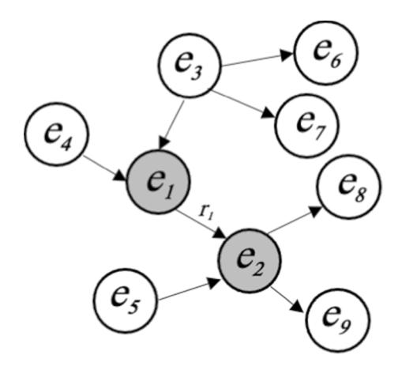
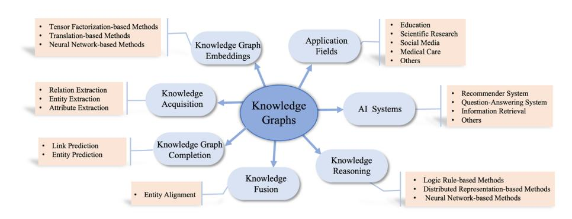
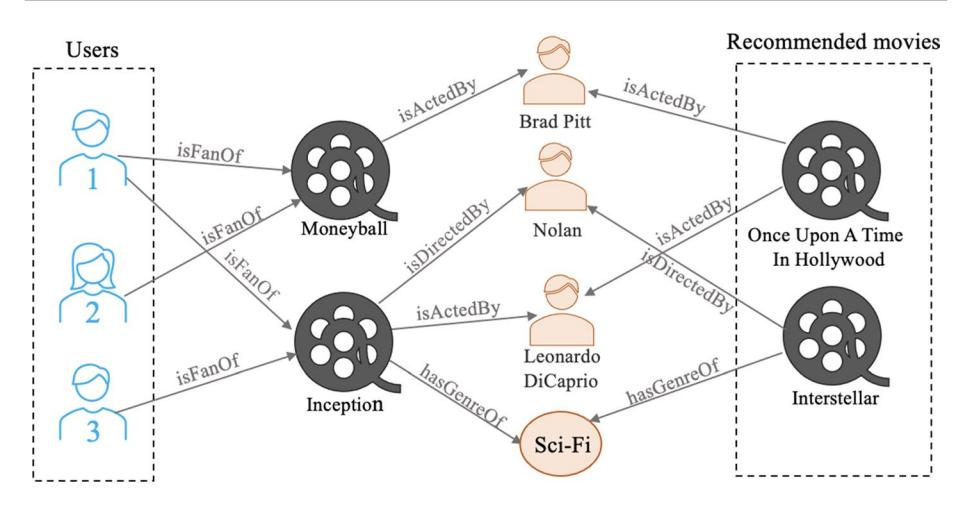
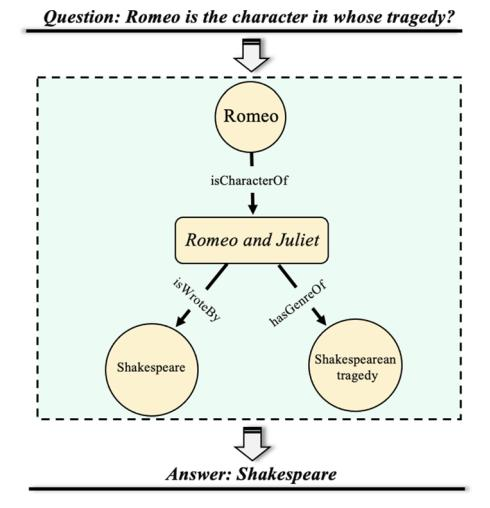
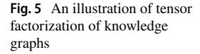
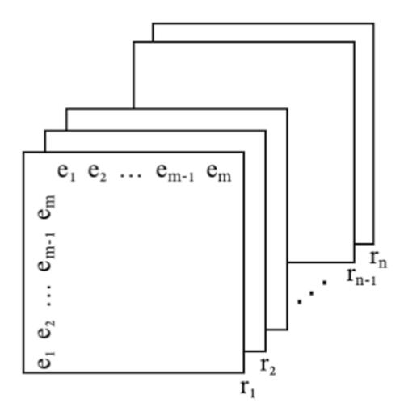

<!-- cite_key: francescoosborneopenacuk2023 -->

# Knowledge Graphs: Opportunities and Challenges

**Ciyuan Peng1 · Feng Xia2 · Mehdi Naseriparsa3 · Francesco Osborne4**Accepted: 9 March 2023 / Published online: 3 April 2023 © The Author(s) 2023

## Abstract

With the explosive growth of artifcial intelligence (AI) and big data, it has become vitally important to organize and represent the enormous volume of knowledge appropriately. As graph data, knowledge graphs accumulate and convey knowledge of the real world. It has been well-recognized that knowledge graphs efectively represent complex information; hence, they rapidly gain the attention of academia and industry in recent years. Thus to develop a deeper understanding of knowledge graphs, this paper presents a systematic overview of this feld. Specifcally, we focus on the opportunities and challenges of knowledge graphs. We frst review the opportunities of knowledge graphs in terms of two aspects: (1) AI systems built upon knowledge graphs; (2) potential application felds of knowledge graphs. Then, we thoroughly discuss severe technical challenges in this feld, such as knowledge graph embeddings, knowledge acquisition, knowledge graph completion, knowledge fusion, and knowledge reasoning. We expect that this survey will shed new light on future research and the development of knowledge graphs.
**Keywords** Knowledge graphs · Artifcial intelligence · Graph embedding · Knowledge engineering · Graph learning

\*Feng Xia f.xia@ieee.org

> Ciyuan Peng ciyuan.p@outlook.com

Mehdi Naseriparsa m.naseriparsa@federation.edu.au

Francesco Osborne francesco.osborne@open.ac.uk

- 1 Institute of Innovation, Science and Sustainability, Federation University Australia, Ballarat 3353, VIC, Australia
- 2 School of Computing Technologies, RMIT University, Melbourne 3000, VIC, Australia
- 3 Global Professional School, Federation University Australia, Ballarat 3353, VIC, Australia
- 4 Knowledge Media Institute, The Open University, Milton Keynes MK7 6AA, UK

### 1 Introduction

Knowledge plays a vital role in human existence and development. Learning and representing human knowledge are crucial tasks in artifcial intelligence (AI) research. While humans are able to understand and analyze their surroundings, AI systems require additional knowledge to obtain the same abilities and solve complex tasks in realistic scenarios (Ji et al. [2021](#page-27-0)). To support these systems, we have seen the emergence of many approaches for representing human knowledge according to diferent conceptual models. In the last decade, knowledge graphs have become a standard solution in this space, as well as a research trend in academia and industry (Kong et al. [2022](#page-27-1)).

Knowledge graphs are defned as graphs of data that accumulate and convey knowledge of the real world. The nodes in knowledge graphs represent the entities of interest, and the edges represent the relations between the entities (Hogan et al. [2021](#page-26-0); Cheng et al. [2022a](#page-25-0)). These representations utilize formal semantics, which allows computers to process them efciently and unambiguously. For example, the entity "Bill Gates" can be linked to the entity "Microsoft" because Bill Gates is the founder of Microsoft; thus, they have relationships in the real world.

Due to the great signifcance of knowledge graphs in processing heterogeneous information within a machine-readable context, a considerable amount of research has been conducted continuously on these solutions in recent years (Dai et al. [2020a](#page-26-1)). The proposed knowledge graphs are widely employed in various AI systems recently (Ko et al. [2021;](#page-27-2) Mohamed et al. [2021](#page-27-3)), such as recommender systems, question answering, and information retrieval. They are also widely applied in many felds (e.g., education and medical care) to beneft human life and society (Sun et al. [2020](#page-29-0); Bounhas et al. [2020\)](#page-25-1).

Therefore, knowledge graphs have seized great opportunities by improving the quality of AI systems and being applied to various areas. However, the research on knowledge graphs still faces signifcant technical challenges. For example, there are major limitations in the current technologies for acquiring knowledge from multiple sources and integrating them into a typical knowledge graph. Thus, knowledge graphs provide great opportunities in modern society. However, there are technical challenges in their development. Consequently, it is necessary to analyze knowledge graphs with respect to their opportunities and challenges to develop a better understanding of knowledge graphs.

To deeply understand the development of knowledge graphs, this survey extensively analyzes knowledge graphs in terms of their opportunities and challenges. Firstly, we discuss the opportunities of knowledge graphs in terms of two aspects: AI systems whose performance is signifcantly improved by knowledge graphs and application felds that beneft from knowledge graphs. Then, we analyze the challenges of knowledge graphs by considering the limitations of knowledge graph technologies. The main contributions of this paper are as follows:

-*Survey on knowledge graphs*: We conduct a comprehensive survey of existing knowledge graph studies. In particular, this work thoroughly analyzes the advancements in knowledge graphs in terms of state-of-the-art technologies and applications.
- *Knowledge graph opportunities*: We investigate potential opportunities for knowledge graphs in terms of knowledge graph-based AI systems and application felds that utilize knowledge graphs. Firstly, we examine the benefts of knowledge graphs for AI systems, including recommender systems, question-answering systems, and information retrieval. Then, we discuss the far-reaching impacts of knowledge graphs on human

society by describing current and potential knowledge graph applications in various felds (e.g., education, scientifc research, social media, and medical care).

• *Knowledge graph challenges*: We provide deep insights into signifcant technical challenges facing knowledge graphs. In particular, we elaborate on limitations concerning fve representative knowledge graph technologies, including knowledge graph embeddings, knowledge acquisition, knowledge graph completion, knowledge fusion, and knowledge reasoning.

The rest of the paper is organized as follows. Section [2](#page-2-0) provides an overview of knowledge graphs, including the defnitions and the categorization of existing research on knowledge graphs. To examine the opportunities of knowledge graphs, Section [3](#page-5-0) and Section [4](#page-12-0) introduce relevant AI systems and application felds, respectively. Section [5](#page-16-0) details the challenges of knowledge graphs based on the technologies. Finally, we conclude this paper in Section [6](#page-24-0).

### 2 Overview

In this section, the defnition of knowledge graphs is provided frst. Then, we categorize signifcant state-of-the-art research in this area.

#### 2.1 What Are Knowledge Graphs?

A knowledge base is a typical data set that represents real-world facts and semantic relations in the form of triplets. When the triplets are represented as a graph with edges as relations and nodes as entities, it is considered a knowledge graph. Generally, the knowledge graph and knowledge base are regarded as the same concept and are used interchangeably. In addition, the schema for a knowledge graph can be defned as an ontology, which shows the properties of a specifc domain and how they are related. Therefore, one essential stage of knowledge graph construction is ontology construction.

In 2012, Google frst put forward Knowledge Graph by introducing their knowledge base called *Google Knowledge Graph*(Ehrlinger and Wöß [2016\)](#page-26-2). Afterward, many knowledge graphs are introduced and adopted such as:

-*DBpedia*, a knowledge graph that intends to discover semantically meaningful information form Wikipedia and convert it into an efective well-structured ontological knowledge base in DBpedia (Auer et al. [2007](#page-25-2)).
- *Freebase*, a knowledge graph which is built upon multiple sources that provides a structured and global resource of information (Bollacker et al. [2008](#page-25-3)).
- *Facebook's entity graph*, a knowledge graph that converts the unstructured content of the user profles into meaningful structured data (Ugander et al. [2011](#page-29-1)).
- *Wikidata*, a cross-lingual document-oriented knowledge graph which supports many sites and services such as Wikipedia (Vrandečić and Krötzsch [2014\)](#page-29-2).
- *Yago*, a quality knowledge base that contains a huge number of entities and their corresponding relationships. These entities are extracted from multiple sources such as Wikipedia and WordNet (Rebele et al. [2016](#page-28-0)).

**Fig. 1** An example of a knowledge graph. In this knowledge graph, (*e*1,*r*1, *e*2) is a triplet that indicates *e*1 and *e*2 are connected by relation *r*1

• *WordNet*, a lexical knowledge base measuring the semantic similarity between words. The knowledge base contains a number of hierarchical concept graphs to analyse the semantic similarity (Pedersen et al. [2004\)](#page-28-1).

A knowledge graph is a directed graph composed of nodes and edges, where one node indicates an entity (a real object or abstract concept), and the edge between the two nodes conveys the semantic relation between the two entities (Bordes et al. [2011\)](#page-25-4). Resource Description Framework (RDF) and Labeled Property Graphs (LPGs) are two typical ways to represent and manage knowledge graphs (Färber et al. [2018;](#page-26-3) Baken [2020](#page-25-5)). The fundamental unit of a knowledge graph is the triple *(subject, predicate, object)*(or*(head, relation, tail)*), i.e., *(Bill Gates, founderOf, Microsoft)*. Since the relation is not necessarily symmetric, the direction of a link matters. Therefore, a knowledge graph can also be seen as a directed graph in which the head entities point to the tail entities via the relation's edge.

Fig. [1](#page-3-0) depicts an example of a simple knowledge graph. As shown in Fig. [1](#page-3-0), nodes *e*1 and *e*2 darkened in color are connected by relation *r*1, which goes from *e*1 to *e*2. Therefore, *e*1, *e*2, and *r*1 can form the triplet (*e*1,*r*1, *e*2), in which *e*1 and *e*2 are the head and tail entities, respectively.

### 2.2 Current Research on Knowledge Graphs

In recent years, knowledge graphs have gained extensive research interest. Plenty of studies have focused on exploring knowledge graphs. This paper conducts a comprehensive survey on knowledge graphs and lists seven important categories of current research on this topic. Fig. [2](#page-4-0) illustrates a schema of the most popular research lines regarding knowledge graphs. Among them, AI systems are services that utilize knowledge graphs for their foundation, and application felds are domains where knowledge graphs reach. These two research lines are listed for discussing the opportunities of knowledge graphs. Another fve research lines are fve main knowledge graph technologies corresponding to fve tasks. In this paper, we introduce these fve technologies and emphasize their limitations to give useful insights into the major challenges of the knowledge graphs.

**Fig. 2**Research on knowledge graphs

# 2.2.1 Knowledge Graph Embedding

Knowledge graph embedding is one of the central research issues. This task aims to map entities and relations of a knowledge graph to a low-dimensional vector space so that it captures the semantics and the structure of the knowledge graph efciently (Dai et al. [2020b](#page-26-1)). Then, the obtained feature vectors can be efectively learned by machine learning models. Three main triplet fact-based embedding methods are as follows: (a) tensor factorizationbased, (b) translation-based, and (c) neural network-based methods (Dai et al. [2020b](#page-26-1)).

# 2.2.2 Knowledge Acquisition

Knowledge acquisition, which focuses on modeling and constructing knowledge graphs, is another crucial research direction of knowledge graph study. Typically, the knowledge is imported from structured sources by employing mapping languages, such as R2RML (Rodriguez-Muro and Rezk [2015](#page-28-2)). Furthermore, the knowledge could be extracted from unstructured documents (e.g., news, research papers, and patents) by adopting relation, entity, or attribute extraction methods (Liu et al. [2020](#page-27-4); Yu et al. [2020;](#page-30-0) Yao et al. [2019\)](#page-30-1).

# 2.2.3 Knowledge Graph Completion

Although there are many methods for constructing knowledge graphs, it is still unfeasible to create comprehensive representations of all the knowledge in a feld. Most knowledge graphs still lack a good number of entities and relationships. Thereby, signifcant eforts have been made for completing knowledge graphs. Knowledge graph completion aims to improve the quality of knowledge graphs by predicting additional relationships and entities. The frst task typically adopts link prediction techniques to generate triplets and then assigns the triplets plausibility scores (Ji et al. [2021](#page-27-0)). The second task employs entity prediction methods for obtaining and integrating further information from external sources.

## 2.2.4 Knowledge Fusion

Knowledge fusion is also an important research direction that focuses on capturing knowledge from diferent sources and integrating it into a knowledge graph (Nguyen et al. [2020\)](#page-28-3). The knowledge fusion approaches are useful for both generating and completing knowledge graphs. Recently, entity alignment has been the primary method for implementing knowledge fusion tasks.

### 2.2.5 Knowledge Reasoning

Tremendous research eforts have focused on reasoning to enrich the knowledge graphs, which aims to infer new facts based on existing data (Minervini et al. [2020\)](#page-27-5). In particular, new relations between two unconnected entities are inferred, forming new triplets. Also, by reasoning out the false facts, knowledge reasoning has the ability to identify erroneous knowledge. The main methods for knowledge reasoning include logic rule-based, distributed representation-based, and neural network-based methods (Chen et al. [2020b](#page-25-6)).

# 2.2.6 AI Systems

Nowadays, knowledge graphs are widely utilized by AI systems (Liang et al. [2022](#page-27-6)), such as recommenders, question-answering systems, and information retrieval tools. Typically, the richness of information within knowledge graphs enhances the performance of these solutions. Therefore, many studies have focused on taking advantage of knowledge graphs to improve AI systems' performance.

## 2.2.7 Application Fields

Knowledge graphs have numerous applications in various felds, including education, scientifc research, social media, and medical care (Li et al. [2020b\)](#page-27-7). A variety of intelligent applications are required to improve the standard of human life.

Difering from other works, this paper focuses on surveying the opportunities and challenges of knowledge graphs. In particular, knowledge graphs meet great opportunities by improving the quality of AI services and being applied in various felds. On the contrary, this paper regards the limitations of knowledge graph technologies as the challenges. Therefore, we will discuss the technical limitations regarding knowledge graph embeddings, knowledge acquisition, knowledge graph completion, knowledge fusion, and knowledge reasoning.

# 3 Knowledge Graphs for AI Systems

This section explains the opportunities by analyzing the advantages that knowledge graphs bring for improving the functionalities of AI Systems. Specifcally, there are a couple of systems, including recommender systems, question-answering systems, and information retrieval tools (Guo et al. [2020;](#page-26-4) Zou [2020](#page-31-0)), which utilize knowledge graphs for their input data and beneft the most from knowledge graphs. In addition to these systems, other AI systems, such as image recognition systems (Chen et al. [2020a\)](#page-25-7), have started to consider the characteristic of knowledge graphs. However, the application of knowledge graphs in these systems is not widespread. Moreover, these systems do not directly optimize performance by utilizing knowledge graphs as input data. Therefore, the advantages that knowledge graphs bring for recommender systems, question-answering systems, and information retrieval tools are discussed in detail to analyze the opportunities of knowledge graphs. Typically, these solutions greatly beneft from adopting knowledge graphs that ofer

high-quality representations of the domain knowledge. Table [1](#page-7-0) presents a summary of the AI systems that we will discuss below.

## 3.1 Recommender Systems

With the continuous development of big data, we observe the exponential growth of information. In the age of information explosion, it becomes challenging for people to receive valid and reliable information (Shokeen and Rana [2020](#page-29-3); Monti et al. [2021;](#page-27-8) Gómez et al. [2022\)](#page-26-5). Specifcally, online users may feel confused when they want to select some items they are interested in among thousands of choices. To tackle this issue, we saw the emergence of several recommender systems to provide users with more accurate information. Typically, recommender systems learn the preference of target users for a set of items (Wan et al. [2020;](#page-29-4) Zheng and Wang [2022](#page-31-1)) and produce a set of suggested items with similar characteristics. Recommender systems are fruitful solutions to the information explosion problem and are employed in various felds for enhancing user experience (Quijano-Sánchez et al. [2020\)](#page-28-4).

### 3.1.1 Traditional Recommender Systems

There are two traditional methods for developing recommender systems, including content-based and collaborative fltering-based (CF-based) methods. Sun et al. ([2019\)](#page-29-5) and Guo et al. ([2020\)](#page-26-4) have compared and summarised these two approaches.
**3.1.1.1 Content‑Based Recommender Systems**The content-based recommender systems frst analyze the content features of items (e.g., descriptions, documents). These items are previously scored by the target users (Guo et al. [2020;](#page-26-4) Xia et al. [2014b](#page-30-2)). Then, the recommender systems learn the user interests by employing machine learning models. Thus, these systems are able to efectively recommend trending items to the target users according to their preferences. Some recommender systems utilize the content of the original query result to discover highly-related items for the users that may interest them (Naseriparsa et al. [2019a\)](#page-27-9). These systems employ machine learning techniques or statistical measures such as correlation to compute the highly-similar items to those that are visited by the users (Naseriparsa et al. [2019b](#page-28-5)). Another group of content-based recommender systems employs lexical references such as dictionaries to utilize semantic relationships of the user query results to recommend highly semantically-related items to the users that may directly satisfy their information needs (Naseriparsa et al. [2018](#page-27-10); Sun et al. [2017\)](#page-29-6).
**3.1.1.2 CF‑Based Recommender Systems** CF-based recommender systems suggest items to the users based on the information of user-item interaction (Chen et al. [2020c](#page-25-8)). CFbased recommender systems infer the user preference by clustering similar users instead of extracting the features of the items (Wang et al. [2019a](#page-29-7)). However, we face data sparsity and cold start problems in traditional CF-based systems. In general, users can only rate a few items among a large number of items, which leads to preventing many items from receiving appropriate feedback. Therefore, the recommender systems do not efectively learn user preferences accurately because of data sparsity (Bai et al. [2019](#page-25-9); Xia et al. [2014a\)](#page-30-3). On the other hand, the cold start problem makes it even more difcult to make recommendations when the items or users are new because there is no historical data or ground truth. Moreover, because abundant user information is required for achieving efective recommenda-

| AI Systems      | Approaches                                                                        | Techniques on knowledge graphs                                                                                                 |
|-----------------|-----------------------------------------------------------------------------------|--------------------------------------------------------------------------------------------------------------------------------|
| Recom mender | KPRN (Wang et al. 2019b)                                                          | Entity-relation path generation based on user-item interac tion                                                             |
| systems         | RippleNet (Wang et al. 2018b)                                                     | Preference propagation                                                                                                         |
|                 | MKR (Wang et al. 2019c)                                                           | Laten user-item interaction                                                                                                    |
|                 | MKGAT (Sun et al. 2020)                                                           | Neighbor information extraction; relation reasoning                                                                            |
|                 | Ripp-MKR (Wang et al. 2021)                                                       | Preference propagation; laten user-item interaction                                                                            |
|                 | RKG (Shu and Huang 2021)                                                          | User preferenfce lists-based knowledge graph construction                                                                      |
| Question        | MHPGM (Bauer et al. 2018)                                                         | Multiple hop relation reasoning                                                                                                |
| answering       | PCQA (Shin et al. 2019)                                                           | Predicate constraints-based relation extraction                                                                                |
| systems         | KEQA (Huang et al. 2019)                                                          | Simple question-based triplet construction                                                                                     |
|                 | EmbedKGQA (Saxena et al. 2020)                                                 | Knowledge graph embedding-based multi-hop question answering                                                                |
| Information     | EQFE (Dalton et al. 2014)                                                         | Query knowledge graph-based feature expansion                                                                                  |
| retrieval       | Knowledge graph based Infor mation Retrieval Technology (Wang et al. 2018a) | Query-document knowledge graph construction                                                                                    |
|                 | CKG (Wise et al. 2020)                                                            | Document knowledge graph construction                                                                                          |
|                 | EDRM(Liu et al. 2018)                                                             | Integration of semantics from knowledge graphs and entities from queries and documents representations of their entities |

tions, CF-based recommender systems face privacy issues. How to achieve personalized recommendations while protecting the privacy of users is still an unsolved problem.

#### 3.1.2 Knowledge Graph‑Based Recommender Systems

To address inherent problems of traditional approaches, the community has produced several hybrid recommender systems, which consider both item features and the distribution of user scores. Most of these solutions adopt knowledge graphs for representing and interlinking items (Palumbo et al. [2020](#page-28-6)). Specifcally, Knowledge graph-based recommender systems integrate knowledge graphs as auxiliary information and leverage users and items networks to learn the relationships of items-users, items-items, and users-users (Palumbo et al. [2018\)](#page-28-7).

Fig [3](#page-8-0) presents an example of knowledge graph-based movie recommendation. Here we can see that the movies "Once Upon A Time in Hollywood" and "Interstellar" are recommended to three users according to a knowledge graph that contains the nodes of users, flms, directors, actors, and genres. The knowledge graph is thus used to infer latent relations between the user and the recommended movies.

Recently, a great deal of research has been conducted to utilize knowledge graphs for recommendation tasks. For instance, Wang et al. ([2019b\)](#page-30-4) introduced KPRN. KPRN is a recommender system that generates entity-relation paths according to the user-item interaction and constructs a knowledge graph that consists of the users, items, and their interaction. It then infers the user preference based on the entity-relation path. The useritem interaction, which is extracted from knowledge graphs, improves the quality of the

**Fig. 3**An example of knowledge graph-based recommender system

recommendations and allows the presentation of the recommended results in a more explainable manner. Wang et al. ([2019c](#page-30-5)) also applied multi-task knowledge graph representation (MKR) for recommendation tasks. MKR models knowledge graphs based on the user-item interaction. It is worth noting that MKR focuses on the structural information of knowledge graphs for learning the latent user-item interaction. Sun et al. ([2020\)](#page-29-0) proposed a Multi-modal Knowledge Graph Attention Network (MKGAT) for achieving precise recommendations. MKGAT constructs knowledge graphs based on two aspects: (1) it enriches entity information by extracting the information of the neighbor entities; (2) it scores the triplets to construct the reasoning relations. Finally, they applied knowledge graphs that are enriched with structured data to recommender systems.

Wang et al. ([2018b\)](#page-29-8) presented the RippleNet model, which incorporates knowledge graphs into recommendation tasks by preference propagation. RippleNet frstly regards users' historical records as the basis of a knowledge graph. Then, it predicts the user preference list among candidate items based on the knowledge graph links. Based on both RippleNet and MKR models, Wang et al. ([2021\)](#page-30-6) applied the Ripp-MKR model. Ripp-MKR combines the advantages of preference propagation and user-item interaction to dig the potential information of knowledge graphs. Shu and Huang ([2021\)](#page-29-9) proposed RKG, which achieves recommendation by referring to the user preference-based knowledge graph. RKG frst obtains users' preference lists; then, it analyzes the relations between the user's preferred items and the items which are to be recommended. Therefore, the model efectively learns the scores of the candidate items according to the relationships between candidate items and the user's preferred items.

Many studies have utilized ontological knowledge base information to improve retrieving results from various data sources (Farfán et al. [2009](#page-26-8)). Wu et al. ([2013\)](#page-30-8) adopted the ontological knowledge base to extract highly semantically similar sub-graphs in graph databases. Their method efectively recommends semantically relevant sub-graphs according to ontological information. Farfán et al. [\(2009](#page-26-8)) proposed the XOntoRank, which adopts the ontological knowledge base to facilitate the data exploration and recommendation on XML medical records.

Compared with the traditional recommender systems, knowledge graph-based recommender systems have the following advantages:

-*Better Representation of Data:*Generally, the traditional recommender systems suffer from data sparsity issues because users usually have experience with only a small number of items. However, the rich representation of entities and their connections in knowledge graphs alleviate this issue.
-*Alleviating Cold Start Issues:*It becomes challenging for traditional recommender systems to make recommendations when there are new users or items in the data set. In knowledge graph-based recommender systems, information about new items and users can be obtained through the relations between entities within knowledge graphs. For example, when a new Science-Fiction movie such as "Tenet" is added to the data set of a movie recommender system that employs knowledge graphs, the information about "Tenet" can be gained by its relationship with the genre Science-Fiction (gaining triplet*(Tenet, has genre of, Sci-Fi)*).
- *The Explainability of Recommendation:* Users and the recommended items are connected along with the links in knowledge graphs. Thereby, the reasoning process can be easily illustrated by the propagation of knowledge graphs.

#### 3.2 Question–Answering Systems

Question answering is one of the most central AI services, which aims to search for the answers to natural language questions by analyzing the semantic meanings (Dimitrakis et al. [2020;](#page-26-9) Das et al. [2022](#page-26-10)). The traditional question-answering systems match the textual questions with the answers in the unstructured text database. In the search process, the semantic relationship between the question and answer is analyzed; then, the system matches the questions and answers with the maximum semantic similarity. Finally, the system outputs the answer. However, the answers are obtained by fltrating massive unstructured data, which deteriorates the efciency of the traditional question-answering systems due to analyzing an enormous search space. To solve this issue, a lot of research focuses on employing structured data for question answering, particularly knowledge graph-based question-answering systems (Singh et al. [2020](#page-29-12); Qiu et al. [2020](#page-28-9)).

The sophisticated representation of information in knowledge graphs is a natural ft for question-answering systems. Knowledge graph-based question-answering systems typically analyze the user question and retrieve the portion of knowledge graphs for answering. The answering task is facilitated either by using similarity measures or by producing structured queries in standard formats (e.g., SPARQL). Fig [4](#page-10-0) presents an example of the knowledge graph-based question-answering system. The system answer "Shakespeare" is a node that is linked to the node "Romeo". The node "Romeo" is extracted from the question.

There are two main types of questions in this space: simple and multi-hop questions, respectively. Simple questions are answered only by referring to a single triplet, while multi-hop questions require combining multiple entities and relations. Focusing on simple questions, Huang et al. [\(2019](#page-26-6)) proposed a knowledge graph embedding-based questionanswering system (KEQA). They translated the question and its corresponding answer into a single triplet. For instance, the question " Which flm acted by Leonardo" and one of its answers "Inception" can be expressed as the following triplet: (*Leonard*, *act*, *Inception*). Then, the head entity, relation, and tail entity of the triplet are represented by a vector matrix in the embedding space for learning the question-answer information. Considering

**Fig. 4**The illustration of knowledge graph based questionanwsering systems

the semantic meanings of the questions, Shin et al. [\(2019](#page-29-10)) presented a predicate constraint-based question-answering system (PCQA). They took advantage of the predicate constraints of knowledge graphs, which is a triplet contains a subject, predicate, and an object to capture the connection between the questions and answers. Using the triplet for question-answering integration, the processing of the question-answering service can be simplifed; therefore, the result improves.

Bauer et al. ([2018\)](#page-25-10) focused on multi-hop questions and proposed a Multi-Hop Pointer-Generator Model (MHPGM). They selected the relation edges that are related to the questions in a knowledge graph and injected attention to achieve multi-hop question answering. Because of the advantages of knowledge graphs' structure, multi-hop question answering can extract coherent answers efectively. Saxena et al. ([2020\)](#page-28-8) proposed EmbedKGQA to achieve multi-hop question answering over sparse knowledge graphs (such as knowledge graphs with missing edges). The main idea of EmbedKGQ is to utilize knowledge graph embeddings to reduce knowledge graph sparsity. It frst creates embeddings of all entities and then selects the embedding of a given question. Lastly, it predicts the answer by combining these embeddings.

Compared to the traditional question answering, the advantages of knowledge graphbased question-answering systems can be summarized as follows:

-*Increased Efciency:*Instead of searching for answers from massive textual data, which may contain a large volume of useless data items, knowledge graph-based questionanswering systems focus only on entities with relevant properties and semantics. Therefore, they reduce the search space signifcantly and extract the answers efectively and efciently.
-*Multi-hop Question Answering:*The answers can be more complex and sophisticated than the ones produced with traditional methods since facts and concepts from knowledge graphs can be combined via multi-hop question answering.

#### 3.3 Information Retrieval

Information retrieval enables retrieval systems to match end-user queries with relevant documents, such as web pages (Liu et al. [2019](#page-27-12)). Traditional information retrieval systems index the documents according to the user queries and return the matched documents to the users (Hersh [2021](#page-26-11)). Nevertheless, index processing is complex and requires plenty of time because of the massiveness and diversity of documents. As a result, traditional information retrieval faces the challenge of inaccurate search results and potentially low efciency. Also, since search engines have limitations with respect to text interpretation ability, keyword-based text search usually outputs limited results. Thus, to address these problems, many modern search engines take advantage of knowledge graphs (Bounhas et al. [2020](#page-25-1); Zheng et al. [2020\)](#page-31-2). Knowledge graph-based information retrieval introduces a new research direction that takes advantage of knowledge graphs for improving the performance of search engines and the explainability of the results.

Typically, these systems rely on the advanced representation of the documents based on entities and relationships from knowledge graphs. These formal and machine-readable representations are then matched to the user query for retrieving the more pertinent documents. For instance, Wise et al. ([2020\)](#page-30-7) proposed a COVID-19 Knowledge Graph (CKG) to extract the relationships between the scientifc articles about COVID-19. In particular, they combined the topological information of documents with the semantic meaning to construct document knowledge graphs. Wang et al. ([2018a\)](#page-29-11) proposed a knowledge graphbased information retrieval technology that extracts entities by mining entity information on web pages via an open-source relation extraction method. Then, the entities with relationships are linked to construct a knowledge graph.

Knowledge graphs can also support methods for query expansion, which is able to enrich the user query by adding relevant concepts (e.g., synonymous). For example, Dalton et al. [\(2014](#page-26-7)) presented an entity query feature expansion (EQFE) to enrich the queries based on the query knowledge graph, including structured attributes and text. Liu et al. ([2018\)](#page-27-11) proposed the Entity-Duet Neural Ranking Model (EDRM). EDRM integrates the semantics extracted from knowledge graphs with the distributed representations of entities in queries and documents. Then, it ranks the search results using interaction-based neural ranking networks.

Compared to traditional information retrieval, the knowledge graph-based information retrieval has the following advantages:

-*Semantic Representation of Items:*Items are represented according to a formal and interlinked model that supports semantic similarity, reasoning, and query expansion. This typically allows the system to retrieve more relevant items and makes the system more interpretable.
-*High Search Efciency:*Knowledge graph-based information retrieval can use the advanced representation of the items to reduce the search space signifcantly (e.g., discarding documents that use the same terms with diferent meanings), resulting in improved efciency.
-*Accurate Retrieval Results:*In knowledge graph-based information retrieval, the correlation between query and documents is analyzed based on the relations between entities in the knowledge graph. This is more accurate than fnding the similarities between queries and documents.

### 4 Applications and Potentials

In this section, we discuss the applications and potentials of knowledge graphs in four domains: education, scientifc research, social networks, and health/medical care. Although some researchers try to take advantage of knowledge graphs to develop benefcial applications in other domains such as fnance (Cheng et al. [2022a\)](#page-25-0), the knowledge graph-based intelligent service in these areas is relatively obscure and still needs to be explored. Therefore, this section mainly focuses on education, scientifc research, social networks, and medical care to summarize the opportunities of knowledge graphs. Table [2](#page-13-0) presents several recent applications of knowledge graphs that make contributions to these felds.

#### 4.1 Education

Education is of great importance to the development of human society. Many studies have focused on deploying intelligent applications to improve the quality of education (Bai et al. [2021;](#page-25-11) Wang et al. [2020c](#page-29-13)). Specifcally, in the age of big data, data processing becomes a challenging task because of the complex and unstructured educational data. Thereby, intelligent educational systems tend to apply structured data, such as knowledge graphs. Several knowledge graph-based applications support the educational process, focusing in particular on data processing and knowledge dissemination (Yao et al. [2020\)](#page-30-9).

In education, the quality of ofine school teaching is of vital importance. Therefore, several knowledge graph-based applications focus on supporting teaching and learning. For example, considering the importance of course allocation tasks in university, Aliyu et al. [\(2020](#page-25-12)) proposed a knowledge graph-based course management approach to achieve automatic course allocation. They constructed a course knowledge graph in which the entities are courses, lecturers, course books, and authors in order to suggest relevant courses to students. Chen et al. ([2018\)](#page-25-13) presented KnowEdu, a system for educational knowledge graph construction, which automatically builds knowledge graphs for learning and teaching in schools. First, KnowEdu extracts the instructional concepts of the subjects and courses as the entity features. Then, it identifes the educational relations based on the students' assessments and activities to make the teaching efect more remarkable.

The abovementioned knowledge graph-based intelligent applications are dedicated to improving the quality of ofine school teaching. However, online learning has become a hot trend recently. Moreover, online study is an indispensable way of learning for students during the COVID-19 pandemic(Saraji et al. [2022](#page-28-10)). Struggling with confusing online content (e.g., learning content of low quality on social media), students face major challenges in acquiring signifcant knowledge efciently. Therefore, researchers have focused on improving online learning environments by constructing education-efcient knowledge graphs (d'Aquin [2016;](#page-26-12) Pereira et al. [2017](#page-28-11)). For example, to facilitate online learning and establish connections between formal learning and social media, Zablith ([2022\)](#page-30-10) proposed to construct a knowledge graph by integrating social media and formal educational content, respectively. Then, the produced knowledge graph can flter social media content, which is fruitful for formal learning and help students with efcient online learning to some extent.

Ofine school teaching and online learning are two essential parts of education, and it is necessary to improve the quality of both to promote the development of education. Signifcantly, knowledge graph-based intelligent applications can deal with complicated educational data and make both ofine and online education more convenient and efcient.

| Table 2                 | Fields of applications of knowledge graphs                              |                                                                           |                                                                 |
|-------------------------|-------------------------------------------------------------------------|---------------------------------------------------------------------------|-----------------------------------------------------------------|
| Fields                  | Applications                                                            | Methods                                                                   | Functions                                                       |
| Education               | Management Knowledge Graph based Course Model (Aliyu et al. 2020) | Course knowledge graphs                                                   | Courses management; Generation of course allocation schedule |
|                         | KnowEdu (Chen et al. 2018)                                              | Instructional concepts extraction; Educational rela tion identifcation | Educational knowledge graph construction                        |
|                         | Knowledge Graph-based Tool for Online Learning (Zablith 2022)        | Integration of social media contents and formal learning contents      | Efcient online knowledge acquisition                            |
| Scientifc Research      | Model (Chi Management Scientifc Publication et al. 2018)       | Knowledge graph based academic network                                    | Scientifc publication management                                |
|                         | Reviewer Recommendation System Yong et al. (2021)                    | Knowledge graph-based rule engine establishment                           | Precise matching of reviewer and paper                          |
| Social Networks         | Mayank et al. 2021) DEAP-FAKED (                                     | News-Entity knowledge graphs                                              | Fake news detection                                             |
|                         | GraphRec (Fan et al. 2019)                                              | Information aggregation of user-user and user-item graphs              | Social Recommendation                                           |
|                         | Wang et al. 2018d) Model ( Graph Reasoning                        | Knowledge graph propogation                                               | Social relationship extraction                                  |
| Medical Care Health/ | MR (Gong et al. 2021) S                                              | Medical knowledge graph embeddings                                        | Safe medicine recommendation                                    |
|                         | DETERRENT (Cui et al. 2020)                                             | Knowledge guided graph attention network                                  | Health misinformation detection                                 |
|                         | KGNN (Lin et al. 2020)                                                  | Mining the relationships between drugs                                    | Drug discovery                                                  |
|                         | COVID-KG(Yuan et al. 2021)                                              | Multimedia knowledge graph construction                                   | Drug discovery                                                  |
|                         |                                                                         |                                                                           |                                                                 |

### 4.2 Scientifc Research

A variety of knowledge graphs focus on supporting the scientifc process and assisting researchers in exploring research knowledge and identifying relevant materials (Xia et al. [2016\)](#page-30-13). They typically describe documents (e.g., research articles, patents), actors (e.g., authors, organizations), entities (e.g., topics, tasks, technologies), and other contextual information (e.g., projects, funding) in an interlinked manner. For instance, Microsoft Academic Graph (MAG) (Wang et al. [2020a](#page-29-15)) is a heterogeneous knowledge graph. MAG contains the metadata of more than 248M scientifc publications, including citations, authors, institutions, journals, conferences, and felds of study. The AMiner Graph (Zhang et al. [2018\)](#page-31-3) is the corpus of more than 200M publications generated and used by the AMiner system[1](#page-14-0) . The Open Academic Graph (OAG)[2](#page-14-1) is a massive knowledge graph that integrates Microsoft Academic Graph and AMiner Graph. AceKG (Wang et al. [2018c\)](#page-29-16) is a large-scale knowledge graph that provides 3 billion triples of academic facts about papers, authors, felds of study, venues, and institutes, as well as the relations among them. The Artifcial Intelligence Knowledge Graph (AI-KG) (Dessì et al. [2020\)](#page-26-15) [3](#page-14-2) describes 800K entities (e.g., tasks, methods, materials, metrics) extracted from the 330K most cited articles in the feld of AI. The Academia/Industry Dynamics Knowledge Graph (AIDA KG) (Angioni et al. [2021\)](#page-25-16) [4](#page-14-3) describes 21M publications and 8M patents according to the research topics drawn from the Computer Science Ontology (Salatino et al. [2020](#page-28-12)) and 66 industrial sectors (e.g., automotive, fnancial, energy, electronics).

In addition to constructing academic knowledge graphs, many researchers also take advantage of knowledge graphs to develop various applications benefcial to scientifc research. Chi et al. ([2018\)](#page-25-14) proposed a scientifc publication management model to help nonresearchers learn methods for sustainability from research thinking. They built a knowledge graph-based academic network to manage scientifc entities. The scientifc entities, including researchers, papers, journals, and organizations, are connected regarding their properties. For the convenience of researchers, many scientifc knowledge graph-based recommender systems, including citation recommendation, collaboration recommendation, and reviewer recommendation, are put forward (Shao et al. [2021\)](#page-28-13). For instance, Yong et al. ([2021\)](#page-30-11) designed a knowledge graph-based reviewer assignment system to achieve precise matching of reviewers and papers. Particularly, they matched knowledge graphs and recommendation rules to establish a rule engine for the recommendation process.

#### 4.3 Social Networks

With the rapid growth of social media such as Facebook and Twitter, online social networks have penetrated human life and bring plenty of benefts such as social relationship establishment and convenient information acquisition (Li et al. [2020a;](#page-27-15) Hashemi and Hall [2020\)](#page-26-16). Various social knowledge graphs are modeled and applied to analyze the critical information from the social network. These knowledge graphs are usually constituted based

1 AMiner - <https://www.aminer.cn/>

2 Open Academic Graph - <https://www.openacademic.ai/oag/>

3 AI-KG - <https://w3id.org/aikg/>

4 AIDA - <http://w3id.org/aida>

on the people's activities and their posts on social media, which are applied to numerous applications for diferent functions (Xu et al. [2020](#page-30-14)).

Remarkably, social media provides high chances for people to make friends and gain personalized information. Furthermore, social media raises fundamental problems, such as how to recommend accurate content that interests us and how to connect with persons interested in a common topic. To address these issues, various studies have been proposed to match users with their favorite content (or friends) for recommendation (Ying et al. [2018\)](#page-30-15). With the increase in users' demand, a number of researchers utilize knowledge graph-based approaches for more precise recommendations (Gao et al. [2020](#page-26-17)). A representative example is GraphRec (a graph neural network framework for social recommendations) proposed by Fan et al. ([2019\)](#page-26-13). They considered two kinds of social knowledge graphs: user-user and user-item graphs. Then, they extracted information from the two knowledge graphs for the learning task. As a result, their model can provide accurate social recommendations because it aggregates the social relationships of users and the interactions between users and items.

In addition, people's activities on social media reveal social relationships. For example, we can learn about the relationships around a person through his photos or comments on Twitter. Signifcantly, social relationship extraction assists companies in tracking users and enhancing the user experience. Therefore, many works are devoted to social relationship extraction. Wang et al. [\(2018d](#page-29-14)) propose a graph reasoning model to recognize the social relationships of people in a picture that is posted on social media. Their model enforces a particular function based on the social knowledge graph and deep neural networks. In their method, they initialized the relation edges and entity nodes with the features that are extracted from the semantic objects in an image. Then, they employed GGNN to propagate the knowledge graph. Therefore, they explored the relations of the people in the picture.

One of the biggest problems in this space is fake news (Zhang et al. [2019a\)](#page-30-16). Online social media has become the principal platform for people to consume news. Therefore, a considerable amount of research has been done for fake news detection (Choi et al. [2020;](#page-25-17) Meel and Vishwakarma [2020](#page-27-16)). Most recently, Mayank et al. [\(2021](#page-27-13)) exploited a knowledge graph-based model called DEAP-FAKED to detect fake news on social media. Specifcally, DEAP-FAKED learns news content and identifes existing entities in the news as the nodes of the knowledge graph. Afterward, a GNN-based technique is applied to encode the entities and detect anomalies that may be linked with fake news.

#### 4.4 Health/Medical Care

With medical information explosively growing, medical knowledge analysis plays an instrumental role in diferent healthcare systems. Therefore, research focuses on integrating medical information into knowledge graphs to empower intelligent systems to understand and process medical knowledge quickly and correctly (Li et al. [2020b](#page-27-7)). Recently, a variety of biomedical knowledge graphs have become available. Therefore, many medical care applications exploit knowledge graphs. For instance, Zhang et al. [\(2020a](#page-31-4)) presented a Health Knowledge Graph Builder (HKGB) to build medical knowledge graphs with clinicians' expertise.

Specifcally, we discuss the three most common intelligent medical care applications, including medical recommendation, health misinformation detection, and drug discovery. Firstly, with the rapid development of the medical industry, medical choices have become more abundant. Nevertheless, in the variety of medical choices, people often feel confused

and unable to make the right decision to get the most suitable and personalized medical treatment. Therefore, medical recommender systems, especially biomedical knowledge graph-based recommender systems (such as doctor recommender systems and medicine recommender systems), have been put forward to deal with this issue (Katzman et al. [2018\)](#page-27-17). Taking medicine recommendation as an example, Gong et al. [\(2021](#page-26-14)) provided a medical knowledge graph embedding method by constructing a heterogeneous graph whose nodes are medicines, diseases, and patients to recommend accurate and safe medicine prescriptions for complicated patients.

Secondly, although many healthcare platforms aim to provide accurate medical information, health misinformation is an inevitable problem. Health misinformation is defned as incorrect information that contradicts authentic medical knowledge or biased information that covers only a part of the facts (Wang et al. [2020d\)](#page-29-17). Unfortunately, a great deal of health-related information on various healthcare platforms (e.g., medical information on social media) is health misinformation. What's worse, the wrong information leads to consequential medical malpractice; therefore, it is urgent to detect health misinformation. Utilizing authoritative medical knowledge graphs to detect and flter misinformation can help people make correct treatment decisions and suppress the spread of misinformation (Cui et al. [2020\)](#page-25-15). Representatively, Cui et al. ([2020\)](#page-25-15) presented a model called DETERREN to detect health misinformation. DETERREN leverages a knowledge-guided attention network that incorporates an article-entity graph with a medical knowledge graph.

Lastly, drug discovery, such as drug repurposing and drug-drug interaction prediction, has been a research trend for intelligent healthcare in recent years. Benefting from the rich entity information (e.g., the ingredients of a drug) and relationship information (e.g., the interaction of drugs) in medical knowledge graphs, drug discovery based on knowledge graphs is one of the most reliable approaches (MacLean [2021\)](#page-27-18). Lin et al. [\(2020](#page-27-14)) presented an end-to-end framework called KGNN (Knowledge Graph Neural Network) for drug-drug interaction prediction. The main idea of KGNN is to mine the relations between drugs and their potential neighborhoods in medical knowledge graphs. It frst exploits the topological information of each entity; then, it aggregates all the neighborhood information from the local receptive entities to extract both semantic relations and high-order structures. Wang et al. [\(2020e\)](#page-29-18) developed a knowledge discovery framework called COVID-KG to generate COVID-19-related drug repurposing reports. They frst constructed multimedia knowledge graphs by extracting medicine-related entities and their relations from images and texts. Afterward, they utilized the constructed knowledge graphs to generate drug repurposing reports.

### 5 Technical Challenges

Although knowledge graphs ofer fantastic opportunities for various services and applications, many challenges are yet to be addressed (Noy et al. [2019\)](#page-28-14). Specifcally, the limitations of existing knowledge graph technologies are the key challenges for promoting the development of knowledge graphs (Hogan et al. [2021\)](#page-26-0). Therefore, this section discusses the challenges of knowledge graphs in terms of the limitations of fve topical knowledge graph technologies, including knowledge graph embeddings, knowledge acquisition, knowledge graph completion, knowledge fusion, and knowledge reasoning.

# 5.1 Knowledge Graph Embeddings

The aim of knowledge graph embeddings is to efectively represent knowledge graphs in a low-dimensional vector space while still preserving the semantics (Xia et al. [2021;](#page-30-17) Vashishth et al. [2020](#page-29-19)). Firstly, the entities and relations are embedded into a dense dimensional space in a given knowledge graph, and a scoring function is defned to measure the plausibility of each fact (triplet). Then, the plausibility of the facts is maximized to obtain the entity and relation embeddings (Chaudhri et al. [2022;](#page-25-18) Sun et al. [2022\)](#page-29-20). The representation of knowledge graphs brings various benefts to downstream tasks. The three main types of triplet fact-based knowledge graph embedding approaches are tensor factorization-based, translation-based, and neural network-based methods (Rossi et al. [2021\)](#page-28-15).

## 5.1.1 Tensor Factorization‑Based Methods

The core idea of tensor factorization-based methods is transforming the triplets in the knowledge graph into a 3D tensor (Balažević et al. [2019\)](#page-25-19). As Fig [5](#page-21-0) presents, the tensor X ∈*Rm*×*m*×*n*, where*m*and*n*indicate the number of entity and relation, respectively, contains*n* slices, and each slice corresponds to one relation type. If the condition X*ijk* = 1 is met, the triplet (*ei* ,*rk*, *ej*), where*e*and*r* denote entity and relation, respectively, exists in the knowledge graph. Otherwise, if X*ijk* = 0, there is no such a triplet in the knowledge graph. Then, the tensor is represented by the embedding matrices that consist of the vectors of entities and relations.

### 5.1.2 Translation‑Based Methods

Translation-based methods exploit the scoring function, which is based on translation invariance. Translation invariance interprets the distance between the vectors of the two words, which is represented by the vector of their semantic relationships (Mikolov et al. [2013](#page-27-19)). Bordes et al. [\(2013\)](#page-25-20) frstly utilized the translation invariance-based scoring functions to measure the embedding results. They creatively proposed the TransE model, which translates all the entities and relations of a knowledge graph into a continuous and low vector space. Specifcally, the vectors of the head and tail entities in a triplet are connected by the vector of their relation. Consequently, in the vector space, the semantic meaning of every triplet is preserved. Formally, given a triplet (*head*, *relation*, *tail*), the embedding vectors of the head entity, relation, and tail entity are **h**, **r**, and **t**, respectively. In the vector space, the plausibility of the triplet (**h**, **r**, **t**) is computed by the translation invariance-based scoring function to ensure it follows the geometric principle: **h**+**r**≈**t**.

After TransE, a lot of related extensions, such as TransH (Wang et al. [2014](#page-30-18)) and TransR (Lin et al. [2015](#page-27-20)), are continually proposed to improve the performance of the Translationbased knowledge graph embeddings.

### 5.1.3 Neural Network‑Based Methods

Nowadays, deep learning has become a popular tool that is utilized for knowledge graph embeddings, and a considerable amount of research proposes to employ neural networks to represent the triplets of knowledge graphs (Dai et al. [2020a\)](#page-25-21). In this section, we discuss three representative works, including SME, ConvKB, and R-GCN, to briefy introduce neural network-based knowledge graph embeddings.

SME (Bordes et al. [2014](#page-25-22)) designs an energy function to conduct semantic matching, which utilizes neural networks to measure the confdence of each triplet (*h*, *r*, *t*) in knowledge graphs. The scoring function of SME is defned as follows:

$$
f_r(h,t) = (\mathbf{W}_{h1}\mathbf{h} + \mathbf{W}_{h2}\mathbf{r} + \mathbf{b}_h)\mathsf{T}(\mathbf{W}_{t1}\mathbf{t} + \mathbf{W}_{t2}\mathbf{r} + \mathbf{b}_t).
$$
 (1)

The scoring function of SME (bilinear) is:

$$
f_r(h,t) = ((\mathbf{W}_{h1}\mathbf{h}) \circ (\mathbf{W}_{h2}\mathbf{r}) + \mathbf{b}_h) \mathsf{T}((\mathbf{W}_{t1}\mathbf{t}) \circ (\mathbf{W}_{t2}\mathbf{r}) + \mathbf{b}_t).
$$
 (2)

Here **W** ∈ ℝ*d*×*d*denotes the weight matrix,**b**indicates the bias vector.**h**, **r**, and **t** are the embedding vectors of head entity, relation, and tail entity, respectively.

ConvKB (Nguyen et al. [2017](#page-28-16)) utilizes a convolutional neural network (CNN) to conduct knowledge graph embeddings. ConvKB represents each triplet (*h*, *r*, *t*) as a three-row matrix **A**, which is input to a convolution layer to obtain feature maps. Afterward, the feature maps are concatenated as a vector, and then a score is calculated to estimate the confdence of the triplet. The scoring function is as follows:

$$
f_r(h,t) = O(g(\mathbf{A} *\Omega))\mathbf{w},\tag{3}
$$

where*O*signifes the concatenation operator,*g*(⋅) is the ReLU activation function, **A**∗ Ω indicates the convolution operation of matrix**A**by using the flters in the set Ω,**w** ∈ ℝ3*d*is a weight vector.

R-GCN (Schlichtkrull et al. [2018](#page-28-17)) is an improvement of graph neural networks (GNNs). R-GCN represents knowledge graphs by providing relation-specifc transformation. Its forward propagation is calculated as follows:

$$
h_k^{(l+1)} = \sigma \bigg( \sum_{r \in R} \sum_{i \in N_k^r} \frac{1}{n_{k,r}} W_i^{(l)} h_i^{(l)} + W_k^{(l)} h_k^{(l)} \bigg), \tag{4}
$$

where*h*(*l*+1) *k*is the hidden state of the entity*k*in*l*-th layer, *Nr k*denotes a neighbor collection of entity*k*and relation*r*∈*R*, *nk*,*r*is the normalization process,*W*(*l*) *i*and*W*(*l*) *k*are the weight matrices.

#### 5.1.4 Limitations of Existing Methods

The existing methods for generating knowledge graph embeddings still sufer several severe limitations. Many established methods only consider surface facts (triplets) of knowledge graphs. However, additional information, such as entity types and relation paths, are ignored, which can further improve the embedding accuracy. The performance of most traditional methods that do not consider the additional information is unsatisfactory. Table [3](#page-20-0) lists the embedding methods, which do not consider the additional information. In Table [3](#page-20-0), the performance evaluation is based on the link prediction and triplet classifcation tasks. The metrics that are for evaluation results are hit rate at 10 (Hits@10) and accuracy. As Table [3](#page-20-0) presents, only a few models have impressive results, including the results of QuatE (90%), RMNN (89.9%), and KBGAN (89.2%). Recently, some researchers have started to combine additional information with a knowledge graph to improve the efciency of embedding models. For example, Guo et al. [\(2015](#page-26-18)) take advantage of additional entity type information, which is the semantic category of each entity, to obtain the correlation between the entities and to tackle the data sparsity issue. Therefore, knowledge graphs

are represented more accurately. Not only entity types, some other information, including relation paths (Li et al. [2021](#page-27-21)), time information of dynamic graphs (Messner et al. [2022](#page-27-22)), and textual descriptions of entities (An et al. [2018\)](#page-25-23), are getting the researchers' attention in recent years. However, it is still a daunting challenge to efectively utilize rich additional information to improve the accuracy of knowledge graph embeddings.

General additional information can not adequately represent the semantic meaning of the triplets. For instance, the entity types are not related to the semantic information of triplets. Furthermore, the types of additional information that can be incorporated into the features of the triplets are now severely limited. Therefore, to improve the performance of existing knowledge graph embedding methods, multivariate information (such as the hierarchical descriptions of relations and the combination of entity types and textual descriptions) needs to be incorporated into the features of the triplets.

To the best of our knowledge, complex relation path remains an open research problem (Peng et al. [2021\)](#page-28-18). For example, the inherent relations, referring to the indirect relationships between two unconnected entities, are not represented efectively. Although the inherent relations between the entities can be explored based on the chain of relationships in knowledge graphs, the inherent relations are complex and multiple. Therefore, it is not straightforward to represent these relations efectively.

#### 5.2 Knowledge Acquisition

Knowledge acquisition is a critical step for combining data from diferent sources and generating new knowledge graphs. The knowledge is extracted from both structured and unstructured data. Three main methods of knowledge acquisition are relation extraction, entity extraction, and attribute extraction (Fu et al. [2019\)](#page-26-19). Here, attribute extraction can be regarded as a special case of entity extraction. Zhang et al. [\(2019b](#page-30-19)) took advantage of knowledge graph embeddings and graph convolution networks to extract long-tail relations. Shi et al. ([2021\)](#page-29-21) proposed entity set expansion to construct large-scale knowledge graphs.

Nevertheless, existing methods for knowledge acquisition still face the challenge of low accuracy, which could result in incomplete or noisy knowledge graphs and hinder the downstream tasks. Therefore, the frst critical issue regards the reliability of knowledge acquisition tools and their evaluation. In addition, a domain-specifc knowledge graph schema is knowledge-oriented, while a constructed knowledge graph schema is data-oriented for covering all data features (Zhou et al. [2022\)](#page-31-5). Therefore, it is inefcient to produce domain-specifc knowledge graphs by extracting entities and properties from raw data. Hence, it is an essential issue to efciently achieve knowledge acquisition tasks by generating domain-specifc knowledge graphs.

Besides, most existing knowledge acquisition methods focus on constructing knowledge graphs with one specifc language. However, in order to make the information in knowledge graphs richer and more comprehensive, we need cross-lingual entity extraction. It is thus vitally important to give more attention to cross-lingual entity extraction and the generation of multilingual knowledge graphs. For example, Bekoulis et al. [\(2018](#page-25-24)) proposed a joint neural model for cross-lingual (English and Dutch) entity and relation extraction. Nevertheless, multilingual knowledge graph construction is still a daunting task since non-English training data sets are limited, language translation systems are not always accurate, and the cross-lingual entity extraction models have to be retrained for each new language.

Multi-modal knowledge graph construction is regarded as another challenging issue of knowledge acquisition. The existing knowledge graphs are mostly represented by pure

| WN11 WN11 WN11 WN18RR @10]_FB15K @10]_FB15K @10]_FB15K @10]_FB15K @10]_FB15K @10]_FB15K @10]_FB15K @10]_FB15K @10]_FB15K @10]_FB15K @10]_FB15K @10]_FB15K @10]_FB15K @10]_FB15K @10]_FB15K @10]_FB15K @10]_FB15K WN18 Triplet classifcation[Accuracy]_ Triplet classifcation[Accuracy]_ Triplet classifcation[Accuracy]_ Evaluation approaches_data set @10]_ @10]_ Link prediction[Hits Link prediction[Hits Link prediction[Hits Link prediction[Hits Link prediction[Hits Link prediction[Hits Link prediction[Hits Link prediction[Hits Link prediction[Hits Link prediction[Hits Link prediction[Hits Link prediction[Hits Link prediction[Hits Link prediction[Hits Link prediction[Hits Link prediction[Hits Link prediction[Hits Link prediction[Hits Link prediction[Hits R-GCN (Schlichtkrull et al. 2018) SimplE (Kazemi and Poole 2018) ComplEx (Trouillon et al. 2016) Wang 2017) ConvKB (Nguyen et al. 2017) STransE (Nguyen et al. 2016) RESCAL (Nickel et al. 2011) TransE (Bordes et al. 2013) QuatE (Zhang et al. 2019c) Wang et al. 2014) TranSparse (Ji et al. 2016) TransG (Xiao et al. 2015) ME (Bordes et al. 2014) NTN (Socher et al. 2013) M (Socher et al. 2013) HolE (Nickel et al. 2016) RotatE (Sun et al. 2019a) MNN (Liu et al. 2016) TransR (Lin et al. 2015) TransA (Jia et al. 2016) KG2E (He et al. 2015) TransD (Ji et al. 2015) KBGAN (Cai and Techniques TransH ( SL R S Tensor factorization-based methods Neural network-based methods Translation-based methods Categories | Knowledge graph embedding methods Table 3 |  |             |
|---------------------------------------------------------------------------------------------------------------------------------------------------------------------------------------------------------------------------------------------------------------------------------------------------------------------------------------------------------------------------------------------------------------------------------------------------------------------------------------------------------------------------------------------------------------------------------------------------------------------------------------------------------------------------------------------------------------------------------------------------------------------------------------------------------------------------------------------------------------------------------------------------------------------------------------------------------------------------------------------------------------------------------------------------------------------------------------------------------------------------------------------------------------------------------------------------------------------------------------------------------------------------------------------------------------------------------------------------------------------------------------------------------------------------------------------------------------------------------------------------------------------------------------------------------------------------------------------------------------------------------------------------------------------------------------------------------------------------------------------------------------|----------------------------------------------|--|-------------|
|                                                                                                                                                                                                                                                                                                                                                                                                                                                                                                                                                                                                                                                                                                                                                                                                                                                                                                                                                                                                                                                                                                                                                                                                                                                                                                                                                                                                                                                                                                                                                                                                                                                                                                                                                               |                                              |  | Results (%) |
|                                                                                                                                                                                                                                                                                                                                                                                                                                                                                                                                                                                                                                                                                                                                                                                                                                                                                                                                                                                                                                                                                                                                                                                                                                                                                                                                                                                                                                                                                                                                                                                                                                                                                                                                                               |                                              |  | 44.1        |
|                                                                                                                                                                                                                                                                                                                                                                                                                                                                                                                                                                                                                                                                                                                                                                                                                                                                                                                                                                                                                                                                                                                                                                                                                                                                                                                                                                                                                                                                                                                                                                                                                                                                                                                                                               |                                              |  | 73.9        |
|                                                                                                                                                                                                                                                                                                                                                                                                                                                                                                                                                                                                                                                                                                                                                                                                                                                                                                                                                                                                                                                                                                                                                                                                                                                                                                                                                                                                                                                                                                                                                                                                                                                                                                                                                               |                                              |  | 84          |
|                                                                                                                                                                                                                                                                                                                                                                                                                                                                                                                                                                                                                                                                                                                                                                                                                                                                                                                                                                                                                                                                                                                                                                                                                                                                                                                                                                                                                                                                                                                                                                                                                                                                                                                                                               |                                              |  | 83.8        |
|                                                                                                                                                                                                                                                                                                                                                                                                                                                                                                                                                                                                                                                                                                                                                                                                                                                                                                                                                                                                                                                                                                                                                                                                                                                                                                                                                                                                                                                                                                                                                                                                                                                                                                                                                               |                                              |  | 88.4        |
|                                                                                                                                                                                                                                                                                                                                                                                                                                                                                                                                                                                                                                                                                                                                                                                                                                                                                                                                                                                                                                                                                                                                                                                                                                                                                                                                                                                                                                                                                                                                                                                                                                                                                                                                                               |                                              |  | 90          |
|                                                                                                                                                                                                                                                                                                                                                                                                                                                                                                                                                                                                                                                                                                                                                                                                                                                                                                                                                                                                                                                                                                                                                                                                                                                                                                                                                                                                                                                                                                                                                                                                                                                                                                                                                               |                                              |  | 47.1        |
|                                                                                                                                                                                                                                                                                                                                                                                                                                                                                                                                                                                                                                                                                                                                                                                                                                                                                                                                                                                                                                                                                                                                                                                                                                                                                                                                                                                                                                                                                                                                                                                                                                                                                                                                                               |                                              |  | 64.4        |
|                                                                                                                                                                                                                                                                                                                                                                                                                                                                                                                                                                                                                                                                                                                                                                                                                                                                                                                                                                                                                                                                                                                                                                                                                                                                                                                                                                                                                                                                                                                                                                                                                                                                                                                                                               |                                              |  | 68.7        |
|                                                                                                                                                                                                                                                                                                                                                                                                                                                                                                                                                                                                                                                                                                                                                                                                                                                                                                                                                                                                                                                                                                                                                                                                                                                                                                                                                                                                                                                                                                                                                                                                                                                                                                                                                               |                                              |  | 77.3        |
|                                                                                                                                                                                                                                                                                                                                                                                                                                                                                                                                                                                                                                                                                                                                                                                                                                                                                                                                                                                                                                                                                                                                                                                                                                                                                                                                                                                                                                                                                                                                                                                                                                                                                                                                                               |                                              |  | 79.9        |
|                                                                                                                                                                                                                                                                                                                                                                                                                                                                                                                                                                                                                                                                                                                                                                                                                                                                                                                                                                                                                                                                                                                                                                                                                                                                                                                                                                                                                                                                                                                                                                                                                                                                                                                                                               |                                              |  | 79.7        |
|                                                                                                                                                                                                                                                                                                                                                                                                                                                                                                                                                                                                                                                                                                                                                                                                                                                                                                                                                                                                                                                                                                                                                                                                                                                                                                                                                                                                                                                                                                                                                                                                                                                                                                                                                               |                                              |  | 80.4        |
|                                                                                                                                                                                                                                                                                                                                                                                                                                                                                                                                                                                                                                                                                                                                                                                                                                                                                                                                                                                                                                                                                                                                                                                                                                                                                                                                                                                                                                                                                                                                                                                                                                                                                                                                                               |                                              |  | 71.5        |
|                                                                                                                                                                                                                                                                                                                                                                                                                                                                                                                                                                                                                                                                                                                                                                                                                                                                                                                                                                                                                                                                                                                                                                                                                                                                                                                                                                                                                                                                                                                                                                                                                                                                                                                                                               |                                              |  | 88.2        |
|                                                                                                                                                                                                                                                                                                                                                                                                                                                                                                                                                                                                                                                                                                                                                                                                                                                                                                                                                                                                                                                                                                                                                                                                                                                                                                                                                                                                                                                                                                                                                                                                                                                                                                                                                               |                                              |  | 41.3        |
|                                                                                                                                                                                                                                                                                                                                                                                                                                                                                                                                                                                                                                                                                                                                                                                                                                                                                                                                                                                                                                                                                                                                                                                                                                                                                                                                                                                                                                                                                                                                                                                                                                                                                                                                                               |                                              |  | 86.2        |
|                                                                                                                                                                                                                                                                                                                                                                                                                                                                                                                                                                                                                                                                                                                                                                                                                                                                                                                                                                                                                                                                                                                                                                                                                                                                                                                                                                                                                                                                                                                                                                                                                                                                                                                                                               |                                              |  | 76          |
|                                                                                                                                                                                                                                                                                                                                                                                                                                                                                                                                                                                                                                                                                                                                                                                                                                                                                                                                                                                                                                                                                                                                                                                                                                                                                                                                                                                                                                                                                                                                                                                                                                                                                                                                                               |                                              |  | 89.9        |
|                                                                                                                                                                                                                                                                                                                                                                                                                                                                                                                                                                                                                                                                                                                                                                                                                                                                                                                                                                                                                                                                                                                                                                                                                                                                                                                                                                                                                                                                                                                                                                                                                                                                                                                                                               |                                              |  | 84.2        |
|                                                                                                                                                                                                                                                                                                                                                                                                                                                                                                                                                                                                                                                                                                                                                                                                                                                                                                                                                                                                                                                                                                                                                                                                                                                                                                                                                                                                                                                                                                                                                                                                                                                                                                                                                               |                                              |  | 52.5        |
|                                                                                                                                                                                                                                                                                                                                                                                                                                                                                                                                                                                                                                                                                                                                                                                                                                                                                                                                                                                                                                                                                                                                                                                                                                                                                                                                                                                                                                                                                                                                                                                                                                                                                                                                                               |                                              |  | 89.2        |

In this table, all the results of link prediction are flter results

symbols, which could result in the poor capability of machines to understand our real world (Zhu et al. [2022b\)](#page-31-6). Therefore, many researchers focus on multi-modal knowledge graphs with various entities, such as texts and images. The construction of multi-modal knowledge graphs requires the exploration of entities with diferent modalities, which makes the knowledge acquisition tasks complicated and inefcient.

#### 5.3 Knowledge Graph Completion

Knowledge graphs are often incomplete, i.e., missing several relevant triplets and entities (Zhang et al. [2020a\)](#page-31-7). For instance, in Freebase, one of the most well-known knowledge graphs, more than half of person entities do not have information about their birthplaces and parents. Generally, semi-automated and human leveraging mechanisms, which can be applied to ensure the quality of knowledge graphs, are essential tools for the evaluation of knowledge graph completion. Specifcally, human supervision is currently considered the gold standard evaluation in knowledge graph completion (Ballandies and Pournaras [2021\)](#page-25-26).

Knowledge graph completion aims to expand existing knowledge graphs by adding new triplets using techniques for link prediction (Wang et al. [2020b](#page-29-25); Akrami et al. [2020](#page-24-1)) and entity prediction (Ji et al. [2021](#page-27-0)). These approaches typically train a machine learning model on a knowledge graph to assess the plausibility of new candidate triplets. Then, they add the candidate triplets with high plausibility to the knowledge graph. For example, for an incomplete triplet*(Tom, friendOf, ?)*, it is possible to assess the range of tails and return the more plausible ones to enrich the knowledge graph. These models successfully utilized knowledge graphs in many diferent domains, including digital libraries (Yao et al. [2017\)](#page-30-22), biomedical (Harnoune et al. [2021](#page-26-23)), social media (Abu-Salih [2021](#page-24-2)), and scientifc research (Nayyeri et al. [2021\)](#page-28-22). Some new methods are able to process fuzzy knowledge graphs in which each triple is associated with a confdence value (Chen et al. [2019\)](#page-25-27).

However, most current knowledge graph completion methods only focus on extracting triplets from a closed-world data source. That means the generated triplets are new, but the entities or relations in the triplets need to already exist in the knowledge graph. For example, for the incomplete triplet *(Tom, friendOf, ?)*, predicting the triplet *(Tom, friendOf,*  *Jerry)*is only possible if the entity*Jerry*is already in the knowledge graph. Because of this limitation, these methods cannot add new entities and relations to the knowledge graph. To tackle this issue, we are starting to see the emergence of open-world techniques for knowledge graph completion that extracts potential objects from outside of the existing knowledge bases. For instance, the ConMask model (Shi and Weninger [2018\)](#page-28-23) has been proposed to predict the unseen entities in knowledge graphs. However, methods for open-world knowledge graph completion still sufer from low accuracy. The main reason is that the data source is usually more complex and noisy. In addition, the similarity of the predicted new entities to the existing entities can mislead the results. In other words, two similar entities are regarded as connected entities, while they may not have a direct relationship.

Knowledge graph completion methods assume knowledge graphs are static and fail to capture the dynamic evolution of knowledge graphs. To obtain accurate facts over time, temporal knowledge graph completion, which considers the temporal information refecting the validity of knowledge, has emerged. Compared to static knowledge graph completion, temporal knowledge graph completion methods integrate timestamps into the learning process. Hence, they explore the time-sensitive facts and improve the link prediction accuracy signifcantly. Although temporal knowledge graph completion methods have shown brilliant performance, they still face serious challenges. Because these models consider time information would be less efcient (Shao et al. [2022](#page-28-24)), the key challenge of temporal knowledge graph completion is how to efectively incorporate timestamps of facts into the learning models and properly capture the temporal dynamics of facts.

#### 5.4 Knowledge Fusion

Knowledge fusion aims to combine and integrate knowledge from diferent data sources. It is often a necessary step for the generation of knowledge graphs (Nguyen et al. [2020](#page-28-3); Smirnov and Levashova [2019](#page-29-26)). The primary method of knowledge fusion is entity alignment or ontology alignment (Ren et al. [2021](#page-28-25)), which aims to match the same entity from multiple knowledge graphs (Zhao et al. [2020](#page-31-8)). Achieving efcient and accurate knowledge graph fusion is a challenging task because of the complexity, variety, and large volume of data available today.

While a lot of work has been done in this direction, there are still several intriguing research directions that deserve to be investigated in the future. One of them regards crosslanguage knowledge fusion (Mao et al. [2020\)](#page-27-26), which allows the integration of information from diferent languages. This is often used to support cross-lingual recommender systems (Javed et al. [2021](#page-26-24)). For example, Xu et al. [\(2019](#page-30-23)) adopted a graph-matching neural network to achieve cross-language entity alignment. However, the result of the cross-language knowledge fusion is still unsatisfactory because the accuracy of the matching entities from diferent languages is relatively low. Therefore, it remains a daunting challenge to explore cross-language knowledge fusion.

Another primary challenge regards entity disambiguation (Nguyen et al. [2020\)](#page-28-3). As the polysemy problem of natural language, the same entity may have various expressions in diferent knowledge graphs. Hence, entity disambiguation is required before conducting entity alignment. Existing entity disambiguation methods mainly focus on discriminating and matching ambiguous entities based on extracting knowledge from texts containing rich contextual information (Zhu and Iglesias [2018](#page-31-9)). However, these methods can not precisely measure the semantic similarity of entities when the texts are short and have limited

contextual information. Only a few works have focused on solving this issue. For example, Zhu and Iglesias (Zhu and Iglesias [2018](#page-31-9)) have proposed SCSNED for entity disambiguation. SCSNED measures semantic similarity based on both informative words of entities in knowledge graphs and contextual information in short texts. Although SCSNED alleviates the issue of limited contextual information to some extent, more efort is needed to improve the performance of entity disambiguation.

In addition, many knowledge fusion methods only focus on matching entities with the same modality and ignore multi-modal scenes in which knowledge is presented in diferent forms. Specifcally, entity alignment considering only single-modality knowledge graph scenario has insignifcant performance because it can not fully refect the relationships of entities in the real world (Cheng et al. [2022b\)](#page-25-28). Recently, to solve this issue, some studies have proposed multi-modal knowledge fusion, which matches the same entities having diferent modalities and generates a multi-modal knowledge graph. For example, HMEA (Guo et al. [2021\)](#page-26-25) aligns entities with multiple forms by mapping multi-modal representations into hyperbolic space. Although many researchers have worked on multi-modal knowledge fusion, it is still a critical task. Multi-modal knowledge fusion mainly aims to fnd equivalent entities by integrating their multi-modal features (Cheng et al. [2022b](#page-25-28)). Nevertheless, how to efciently incorporate the features having multiple modalities is still a tricky issue facing current methods.

#### 5.5 Knowledge Reasoning

The goal of knowledge reasoning is to infer new knowledge, such as the implicit relations between two entities (Liu et al. [2021;](#page-27-27) Wang et al. [2019b\)](#page-30-4), based on existing data. For a given knowledge graph, wherein there are two unconnected entities*h*and*t*, denoted as *h*, *t*∈*G*, here *G*means the knowledge graph, knowledge reasoning can fnd out the potential relation*r* between these entities and form a new triplet (*h*, *r*, *t*). The knowledge reasoning methods are mainly categorized into logic rule-based (De Meester et al. [2021\)](#page-26-26), distributed representation-based (Chen et al. [2020b](#page-25-6)), and neural network-based methods (Xiong et al. [2017](#page-30-24)). Logic rule-based knowledge reasoning aims to discover knowledge according to the random walk and logic rules, while distributed representation-based knowledge reasoning embeds entities and relations into a vector space to obtain distributed representation (Chen et al. [2020b](#page-25-6)). Neural network-based knowledge reasoning method utilizes neural networks to infer new triplets given the body of knowledge in the graph (Xian et al. [2019](#page-30-25)).

There are two tasks in knowledge reasoning: single-hop prediction and multi-hop reasoning (Ren et al. [2022\)](#page-28-26). Single-hop prediction predicts one element of a triplet for the given two elements, while multi-hop reasoning predicts one or more elements in a multihop logical query. In other words, in the multi-hop reasoning scenario, fnding the answer to a typical question and forming new triplets requires the prediction and imputation of multiple edges and nodes. Multi-hop reasoning achieves a more precise formation of triplets when compared with the single-hop prediction. Therefore, multi-hop reasoning has attracted more attention and become a critical need for the development of knowledge graphs in recent years. Although many works have been done, multi-hop reasoning over knowledge graphs remains largely unexplored. Notably, multi-hop reasoning on massive knowledge graphs is one of the challenging tasks (Zhu et al. [2022\)](#page-31-10). For instance, most recent studies focus on multi-hop reasoning over knowledge graphs, which have only 63K entities and 592K relations. The existing models can't learn the training set efectively for a massive knowledge graph that has more than millions of entities. Moreover, multi-hop reasoning needs to traverse multiple relations and intermediate entities in the knowledge graph, which could lead to exponential computation cost (Zhang et al. [2021\)](#page-31-11). Therefore, it is still a daunting task to explore multi-hop knowledge reasoning.

Besides, the verifcation of inferred new knowledge is also a critical issue. Knowledge reasoning enriches existing knowledge graphs and brings benefts to the downstream tasks (Wan et al. [2021\)](#page-30-26). However, the inferred new knowledge is sometimes uncertain, and the veracity of new triplets needs to be verifed. Furthermore, the conficts between new and existing knowledge should be detected. To address these problems, some research has proposed multi-source knowledge reasoning (Zhao et al. [2020](#page-31-8)) that detects erroneous knowledge and conficting knowledge. Overall, more attention should be paid to multi-source knowledge reasoning and erroneous knowledge reduction.

### 6 Conclusions

Knowledge graphs have played an instrumental role in creating many intelligent services and applications for various felds. In this survey, we provided an overview of knowledge graphs in terms of opportunities and challenges. We frst introduced the defnitions and existing research directions regarding knowledge graphs to provide an introductory analysis of knowledge graphs. Afterward, we discussed AI systems that take advantage of knowledge graphs. Then, we presented some representative knowledge graph applications in several felds. Furthermore, we analyzed the limitations of current knowledge graph technologies, which lead to severe technical challenges. We expect this survey to spark new ideas and insightful perspectives for future research and development activities involving knowledge graphs.

**Funding**Open Access funding enabled and organized by CAUL and its Member Institutions.

### Declarations
**Confict of interest**The authors declare that they have no competing fnancial interests or personal relationships that could have appeared to infuence the work reported in this paper.
**Open Access**This article is licensed under a Creative Commons Attribution 4.0 International License, which permits use, sharing, adaptation, distribution and reproduction in any medium or format, as long as you give appropriate credit to the original author(s) and the source, provide a link to the Creative Commons licence, and indicate if changes were made. The images or other third party material in this article are included in the article's Creative Commons licence, unless indicated otherwise in a credit line to the material. If material is not included in the article's Creative Commons licence and your intended use is not permitted by statutory regulation or exceeds the permitted use, you will need to obtain permission directly from the copyright holder. To view a copy of this licence, visit [http://creativecommons.org/licenses/by/4.0/.](http://creativecommons.org/licenses/by/4.0/)

## References

Abu-Salih B (2021) Domain-specifc knowledge graphs: a survey. J Netw Comput Appl 185(103):076 Akrami F, Saeef MS, Zhang Q et al (2020) Realistic re-evaluation of knowledge graph completion methods: an experimental study. In: Proceedings of the 2020 ACM SIGMOD International Conference on Management of Data, pp 1995–2010

- Aliyu I, Kana A, Aliyu S (2020) Development of knowledge graph for university courses management. Int J Educ Manag Eng 10(2):1
- An B, Chen B, Han X et al (2018) Accurate text-enhanced knowledge graph representation learning. In: Proceedings of the 2018 Conference of the North American Chapter of the Association for Computational Linguistics: Human Language Technologies, vol. 1 (Long Papers), pp 745–755
- Angioni S, Salatino A, Osborne F et al (2021) Aida: a knowledge graph about research dynamics in academia and industry. Quant Sci Stud p 1–43
- Auer S, Bizer C, Kobilarov G et al (2007) Dbpedia: a nucleus for a web of open data. In: The semantic web. Springer, p 722–735
- Bai X, Wang M, Lee I et al (2019) Scientifc paper recommendation: a survey. IEEE Access 7:9324–9339
- Bai X, Zhang F, Li J et al (2021) Educational big data: prediction, applications and challenges. Big Data Res 26(100270)
- Baken N (2020) Linked data for smart homes: comparing rdf and labeled property graphs. In: LDAC2020– 8th linked data in architecture and construction workshop, p 23–36
- Balažević I, Allen C, Hospedales TM (2019) Tucker: tensor factorization for knowledge graph completion. arXiv preprint [arXiv:1901.09590](http://arxiv.org/abs/1901.09590)
- Ballandies MC, Pournaras E (2021) Mobile link prediction: automated creation and crowdsourced validation of knowledge graphs. Microprocess Microsyst 87(104):335
- Bauer L, Wang Y, Bansal M (2018) Commonsense for generative multi-hop question answering tasks. arXiv preprint [arXiv:1809.06309](http://arxiv.org/abs/1809.06309)
- Bekoulis G, Deleu J, Demeester T et al (2018) Joint entity recognition and relation extraction as a multihead selection problem. Expert Syst Appl 114:34–45
- Bollacker K, Evans C, Paritosh P et al (2008) Freebase: a collaboratively created graph database for structuring human knowledge. In: Proceedings of the 2008 ACM SIGMOD international conference on management of data, p 1247–1250
- Bordes A, Glorot X, Weston J et al (2014) A semantic matching energy function for learning with multirelational data. Mach Learn 94(2):233–259
- Bordes A, Usunier N, Garcia-Duran A et al (2013) Translating embeddings for modeling multi-relational data. Adv Neural Inf Process Syst 26
- Bordes A, Weston J, Collobert R et al (2011) Learning structured embeddings of knowledge bases. In: Twenty-ffth AAAI conference on artifcial intelligence
- Bounhas I, Soudani N, Slimani Y (2020) Building a morpho-semantic knowledge graph for Arabic information retrieval. Info Process Manag 57(6):102
- Cai L, Wang WY (2017) Kbgan: adversarial learning for knowledge graph embeddings. arXiv preprint [arXiv:1711.04071](http://arxiv.org/abs/1711.04071)
- Chaudhri V, Baru C, Chittar N et al (2022) Knowledge graphs: introduction, history and perspectives. AI Mag 43(1):17–29
- Chen P, Lu Y, Zheng VW et al (2018) Knowedu: a system to construct knowledge graph for education. IEEE Access 6:31553–31563
- Chen R, Chen T, Hui X et al (2020a) Knowledge graph transfer network for few-shot recognition. In: Proceedings of the AAAI conference on artifcial intelligence, p 10,575–10,582
- Chen X, Jia S, Xiang Y (2020b) A review: knowledge reasoning over knowledge graph. Expert Syst Appl 141(112):948
- Chen YC, Hui L, Thaipisutikul T et al (2020c) A collaborative fltering recommendation system with dynamic time decay. J Supercomput p 1–19
- Chen X, Chen M, Shi W et al (2019) Embedding uncertain knowledge graphs. In: Proceedings of the AAAI Conference on Artifcial Intelligence, p 3363–3370
- Cheng D, Yang F, Xiang S et al (2022a) Financial time series forecasting with multi-modality graph neural network. Pattern Recogn 121(108):218
- Cheng B, Zhu J, Guo M (2022b) Multijaf: multi-modal joint entity alignment framework for multi-modal knowledge graph. Neurocomputing
- Chi Y, Qin Y, Song R et al (2018) Knowledge graph in smart education: a case study of entrepreneurship scientifc publication management. Sustainability 10(4):995
- Choi D, Chun S, Oh H et al (2020) Rumor propagation is amplifed by echo chambers in social media. Sci Rep 10(1):1–10
- Cui L, Seo H, Tabar M et al (2020) Deterrent: knowledge guided graph attention network for detecting healthcare misinformation. In: Proceedings of the 26th ACM SIGKDD international conference on knowledge discovery & data mining, p 492–502
- Dai Y, Wang S, Chen X et al (2020a) Generative adversarial networks based on Wasserstein distance for knowledge graph embeddings. Knowl-Based Syst 190(105):165

- Dai Y, Wang S, Xiong NN et al (2020b) A survey on knowledge graph embedding: approaches, applications and benchmarks. Electronics 9(5):750
- Dalton J, Dietz L, Allan J (2014) Entity query feature expansion using knowledge base links. In: Proceedings of the 37th international ACM SIGIR conference on research & development in information retrieval, p 365–374
- d'Aquin M (2016) On the use of linked open data in education: current and future practices. In: Open data for education. Springer, p 3–15
- Das A, Mandal J, Danial Z et al (2022) An improvement of Bengali factoid question answering system using unsupervised statistical methods. Sādhanā 47(1):1–14
- De Meester B, Heyvaert P, Arndt D et al (2021) Rdf graph validation using rule-based reasoning. Semantic Web (Preprint):1–26
- Dessì D, Osborne F, Recupero DR et al (2020) AI-KG: an automatically generated knowledge graph of artifcial intelligence. In: ISWC 2020, vol 12507. Springer, p 127–143
- Dimitrakis E, Sgontzos K, Tzitzikas Y (2020) A survey on question answering systems over linked data and documents. J Intell Inf Syst 55(2):233–259
- Ehrlinger L, Wöß W (2016) Towards a defnition of knowledge graphs. SEMANTiCS (Posters, Demos, SuCCESS) 48(1–4):2
- Fan W, Ma Y, Li Q et al (2019) Graph neural networks for social recommendation. In: The world wide web conference, p 417–426
- Färber M, Bartscherer F, Menne C et al (2018) Linked data quality of dbpedia, freebase, opencyc, wikidata, and yago. Semantic Web 9(1):77–129
- Farfán F, Hristidis V, Ranganathan A et al (2009) Xontorank: Ontology-aware search of electronic medical records. In: Proceedings of the 25th International Conference on Data Engineering, ICDE 2009, March 29 2009–April 2 2009, Shanghai, China. IEEE Computer Society, p 820–831
- Fu TJ, Li PH, Ma WY (2019) Graphrel: modeling text as relational graphs for joint entity and relation extraction. In: Proceedings of the 57th Annual Meeting of the Association for Computational Linguistics, p 1409–1418
- Gao Y, Li YF, Lin Y et al (2020) Deep learning on knowledge graph for recommender system: a survey. arXiv preprint [arXiv:2004.00387](http://arxiv.org/abs/2004.00387)
- Gómez E, Zhang CS, Boratto L et al (2022) Enabling cross-continent provider fairness in educational recommender systems. Futur Gener Comput Syst 127:435–447
- Gong F, Wang M, Wang H et al (2021) Smr: medical knowledge graph embedding for safe medicine recommendation. Big Data Res 23(100):174
- Guo H, Tang J, Zeng W et al (2021) Multi-modal entity alignment in hyperbolic space. Neurocomputing 461:598–607
- Guo S, Wang Q, Wang B et al (2015) Semantically smooth knowledge graph embedding. In: Proceedings of the 53rd Annual Meeting of the Association for Computational Linguistics and the 7th International Joint Conference on Natural Language Processing (vol 1: Long Papers), p 84–94
- Guo Q, Zhuang F, Qin C et al (2020) A survey on knowledge graph-based recommender systems. IEEE Trans Knowl Data Eng
- Harnoune A, Rhanoui M, Mikram M et al (2021) Bert based clinical knowledge extraction for biomedical knowledge graph construction and analysis. Comput Methods Programs Biomed Update 1(100):042
- Hashemi M, Hall M (2020) Multi-label classifcation and knowledge extraction from oncology-related content on online social networks. Artif Intell Rev 53(8):5957–5994
- He S, Liu K, Ji G et al (2015) Learning to represent knowledge graphs with gaussian embedding. In: Proceedings of the 24th ACM international on conference on information and knowledge management, p 623–632
- Hersh W (2021) Information retrieval. In: Biomedical informatics. Springer, p 755–794
- Hogan A, Blomqvist E, Cochez M et al (2021) Knowledge graphs. ACM Comput Surveys (CSUR) 54(4):1–37
- Huang X, Zhang J, Li D et al (2019) Knowledge graph embedding based question answering. In: Proceedings of the Twelfth ACM International Conference on Web Search and Data Mining, p 105–113
- Javed U, Shaukat K, Hameed IA et al (2021) A review of content-based and context-based recommendation systems. Int J Emerg Technol Learning 16(3):274–306
- Ji G, He S, Xu L et al (2015) Knowledge graph embedding via dynamic mapping matrix. In: Proceedings of the 53rd Annual Meeting of the Association for Computational Linguistics and the 7th International Joint Conference on Natural Language Processing (vol 1: Long Papers), p 687–696
- Ji G, Liu K, He S et al (2016) Knowledge graph completion with adaptive sparse transfer matrix. In: Thirtieth AAAI conference on artifcial intelligence

- Ji S, Pan S, Cambria E et al (2021) A survey on knowledge graphs: representation, acquisition, and applications. IEEE Trans Neural Netw Learn Syst
- Jia Y, Wang Y, Lin H et al (2016) Locally adaptive translation for knowledge graph embedding. In: Thirtieth AAAI conference on artifcial intelligence
- Katzman JL, Shaham U, Cloninger A et al (2018) Deepsurv: personalized treatment recommender system using a cox proportional hazards deep neural network. BMC Med Res Methodol 18(1):1–12
- Kazemi SM, Poole D (2018) Simple embedding for link prediction in knowledge graphs. Adv Neural Inf Process Syst 31
- Ko H, Witherell P, Lu Y et al (2021) Machine learning and knowledge graph based design rule construction for additive manufacturing. Addit Manuf 37(101):620
- Kong Y, Liu X, Zhao Z et al (2022) Bolt defect classifcation algorithm based on knowledge graph and feature fusion. Energy Rep 8:856–863
- Li J, Cai T, Deng K et al (2020a) Community-diversifed infuence maximization in social networks. Inf Syst 92(101):522
- Li L, Wang P, Yan J et al (2020b) Real-world data medical knowledge graph: construction and applications. Artif Intell Med 103(101):817
- Li Z, Liu H, Zhang Z et al (2021) Learning knowledge graph embedding with heterogeneous relation attention networks. IEEE Trans Neural Netw Learn Syst
- Liang B, Su H, Gui L et al (2022) Aspect-based sentiment analysis via afective knowledge enhanced graph convolutional networks. Knowl-Based Syst 235(107):643
- Lin Y, Liu Z, Sun M et al (2015) Learning entity and relation embeddings for knowledge graph completion. In: Twenty-ninth AAAI conference on artifcial intelligence
- Lin X, Quan Z, Wang ZJ et al (2020) Kgnn: Knowledge graph neural network for drug-drug interaction prediction. In: IJCAI, p 2739–2745
- Liu J, Kong X, Zhou X et al (2019) Data mining and information retrieval in the 21st century: a bibliographic review. Comput Sci Rev 34(100):193
- Liu J, Xia F, Wang L et al (2021) Shifu2: a network representation learning based model for advisor-advisee relationship mining. IEEE Trans Knowl Data Eng 33(4):1763–1777
- Liu J, Ren J, Zheng W et al (2020) Web of scholars: A scholar knowledge graph. In: Proceedings of the 43rd International ACM SIGIR Conference on Research and Development in Information Retrieval, pp 2153–2156
- Liu Q, Jiang H, Evdokimov A et al (2016) Probabilistic reasoning via deep learning: Neural association models. arXiv preprint [arXiv:1603.07704](http://arxiv.org/abs/1603.07704)
- Liu Z, Xiong C, Sun M et al (2018) Entity-duet neural ranking: Understanding the role of knowledge graph semantics in neural information retrieval. arXiv preprint [arXiv:1805.07591](http://arxiv.org/abs/1805.07591)
- MacLean F (2021) Knowledge graphs and their applications in drug discovery. Expert Opin Drug Discov 16(9):1057–1069
- Mao X, Wang W, Xu H et al (2020) Mraea: an efcient and robust entity alignment approach for crosslingual knowledge graph. In: Proceedings of the 13th International Conference on Web Search and Data Mining, p 420–428
- Mayank M, Sharma S, Sharma R (2021) Deap-faked: knowledge graph based approach for fake news detection. arXiv preprint [arXiv:2107.10648](http://arxiv.org/abs/2107.10648)
- Meel P, Vishwakarma DK (2020) Fake news, rumor, information pollution in social media and web: a contemporary survey of state-of-the-arts, challenges and opportunities. Expert Syst Appl 153(112):986
- Messner J, Abboud R, Ceylan II (2022) Temporal knowledge graph completion using box embeddings. In: Proceedings of the AAAI Conference on Artifcial Intelligence, pp 7779–7787
- Mikolov T, Chen K, Corrado G et al (2013) Efcient estimation of word representations in vector space. arXiv preprint [arXiv:1301.3781](http://arxiv.org/abs/1301.3781)
- Minervini P, Bošnjak M, Rocktäschel T et al (2020) Diferentiable reasoning on large knowledge bases and natural language. In: Proceedings of the AAAI conference on artifcial intelligence, p 5182–5190
- Mohamed SK, Nounu A, Nováček V (2021) Biological applications of knowledge graph embedding models. Brief Bioinform 22(2):1679–1693
- Monti D, Rizzo G, Morisio M (2021) A systematic literature review of multicriteria recommender systems. Artif Intell Rev 54:427–468
- Naseriparsa M, Islam MS, Liu C et al (2018) No-but-semantic-match: computing semantically matched xml keyword search results. World Wide Web 21(5):1223–1257
- Naseriparsa M, Liu C, Islam MS et al (2019a) Xplorerank: exploring XML data via you may also like queries. World Wide Web 22(4):1727–1750

- Naseriparsa M, Islam MS, Liu C et al (2019b) Xsnippets: exploring semi-structured data via snippets. Data Knowl Eng 124
- Nayyeri M, Cil GM, Vahdati S et al (2021) Trans4e: link prediction on scholarly knowledge graphs. Neurocomputing 461:530–542
- Nguyen DQ, Nguyen TD, Nguyen DQ et al (2017) A novel embedding model for knowledge base completion based on convolutional neural network. In: Proceedings of the 2018 Conference of the North American Chapter of the Association for Computational Linguistics: Human Language Technologies, p 327–333
- Nguyen DQ, Sirts K, Qu L et al (2016) Stranse: a novel embedding model of entities and relationships in knowledge bases. arXiv preprint [arXiv:1606.08140](http://arxiv.org/abs/1606.08140)
- Nguyen HL, Vu DT, Jung JJ (2020) Knowledge graph fusion for smart systems: a survey. Info Fusion 61:56–70
- Nickel M, Rosasco L, Poggio T (2016) Holographic embeddings of knowledge graphs. In: Proceedings of the AAAI Conference on Artifcial Intelligence
- Nickel M, Tresp V, Kriegel HP (2011) A three-way model for collective learning on multi-relational data. In: ICML
- Noy N, Gao Y, Jain A et al (2019) Industry-scale knowledge graphs: lessons and challenges: fve diverse technology companies show how it's done. Queue 17(2):48–75
- Palumbo E, Monti D, Rizzo G et al (2020) entity2rec: property-specifc knowledge graph embeddings for item recommendation. Expert Syst Appl 151(113):235
- Palumbo E, Rizzo G, Troncy R et al (2018) Knowledge graph embeddings with node2vec for item recommendation. In: European Semantic Web Conference, Springer, p 117–120
- Pedersen T, Patwardhan S, Michelizzi J et al (2004) Wordnet: similarity-measuring the relatedness of concepts. In: AAAI, p 25–29
- Peng C, Vu DT, Jung JJ (2021) Knowledge graph-based metaphor representation for literature understanding. Digital Scholarship Humanities
- Pereira CK, Siqueira SWM, Nunes BP et al (2017) Linked data in education: a survey and a synthesis of actual research and future challenges. IEEE Trans Learn Technol 11(3):400–412
- Qiu Y, Wang Y, Jin X et al (2020) Stepwise reasoning for multi-relation question answering over knowledge graph with weak supervision. In: Proceedings of the 13th International Conference on Web Search and Data Mining, p 474–482
- Quijano-Sánchez L, Cantador I, Cortés-Cediel ME et al (2020) Recommender systems for smart cities. Inf Syst 92(101):545
- Rebele T, Suchanek F, Hofart J et al (2016) Yago: a multilingual knowledge base from wikipedia, wordnet, and geonames. In: International semantic web conference, Springer, p 177–185
- Ren J, Xia F, Chen X et al (2021) Matching algorithms: fundamentals, applications and challenges. IEEE Trans Emerg Top Comput Intell 5(3):332–350
- Ren H, Dai H, Dai B et al (2022) Smore: Knowledge graph completion and multi-hop reasoning in massive knowledge graphs. In: Proceedings of the 28th ACM SIGKDD Conference on Knowledge Discovery and Data Mining, p 1472–1482
- Rodriguez-Muro M, Rezk M (2015) Efcient sparql-to-sql with r2rml mappings. J Web Semantics 33:141–169
- Rossi A, Barbosa D, Firmani D et al (2021) Knowledge graph embedding for link prediction: a comparative analysis. ACM Trans Knowl Discov Data (TKDD) 15(2):1–49
- Salatino AA, Thanapalasingam T, Mannocci A et al (2020) The computer science ontology: a comprehensive automatically-generated taxonomy of research areas. Data Intell 2(3)
- Saraji MK, Mardani A, Köppen M et al (2022) An extended hesitant fuzzy set using swara-multimoora approach to adapt online education for the control of the pandemic spread of covid-19 in higher education institutions. Artif Intell Rev 55(1):181–206
- Saxena A, Tripathi A, Talukdar P (2020) Improving multi-hop question answering over knowledge graphs using knowledge base embeddings. In: Proceedings of the 58th annual meeting of the association for computational linguistics, p 4498–4507
- Schlichtkrull M, Kipf TN, Bloem P et al (2018) Modeling relational data with graph convolutional networks. In: European semantic web conference, Springer, p 593–607
- Shao B, Li X, Bian G (2021) A survey of research hotspots and frontier trends of recommendation systems from the perspective of knowledge graph. Expert Syst Appl 165(113):764
- Shao P, Zhang D, Yang G et al (2022) Tucker decomposition-based temporal knowledge graph completion. Knowl-Based Syst 238(107):841
- Shi B, Weninger T (2018) Open-world knowledge graph completion. In: Thirty-Second AAAI Conference on Artifcial Intelligence

- Shi C, Ding J, Cao X et al (2021) Entity set expansion in knowledge graph: a heterogeneous information network perspective. Front Comp Sci 15(1):1–12
- Shin S, Jin X, Jung J et al (2019) Predicate constraints based question answering over knowledge graph. Info Process Manag 56(3):445–462
- Shokeen J, Rana C (2020) A study on features of social recommender systems. Artif Intell Rev 53(2):965–988
- Shu H, Huang J (2021) User-preference based knowledge graph feature and structure learning for recommendation. In: 2021 IEEE International Conference on Multimedia and Expo (ICME), IEEE, p 1–6
- Singh K, Lytra I, Radhakrishna AS et al (2020) No one is perfect: analysing the performance of question answering components over the dbpedia knowledge graph. J Web Semantics 65(100):594
- Smirnov A, Levashova T (2019) Knowledge fusion patterns: a survey. Inf Fusion 52:31–40
- Socher R, Chen D, Manning CD et al (2013) Reasoning with neural tensor networks for knowledge base completion. In: Advances in neural information processing systems, p 926–934
- Sun J, Xu J, Zheng K et al (2017) Interactive spatial keyword querying with semantics. In: Proceedings of the 2017 ACM on Conference on Information and Knowledge Management, CIKM 2017, Singapore, November 06–10, 2017. ACM, p 1727–1736
- Sun K, Yu S, Peng C et al (2022) Relational structure-aware knowledge graph representation in complex space. Mathematics 10(11):1930
- Sun R, Cao X, Zhao Y et al (2020) Multi-modal knowledge graphs for recommender systems. In: Proceedings of the 29th ACM International Conference on Information & Knowledge Management, p 1405–1414
- Sun Z, Deng ZH, Nie JY et al (2019a) Rotate: knowledge graph embedding by relational rotation in complex space. arXiv preprint [arXiv:1902.10197](http://arxiv.org/abs/1902.10197)
- Sun Z, Guo Q, Yang J et al (2019) Research commentary on recommendations with side information: a survey and research directions. Electron Commer Res Appl 37(100):879
- Trouillon T, Welbl J, Riedel S et al (2016) Complex embeddings for simple link prediction. In: International conference on machine learning, PMLR, p 2071–2080
- Ugander J, Karrer B, Backstrom L et al (2011) The anatomy of the facebook social graph. arXiv preprint [arXiv:1111.4503](http://arxiv.org/abs/1111.4503)
- Vashishth S, Sanyal S, Nitin V et al (2020) Interacte: improving convolution-based knowledge graph embeddings by increasing feature interactions. In: Proceedings of the AAAI Conference on Artifcial Intelligence, p 3009–3016
- Vrandečić D, Krötzsch M (2014) Wikidata: a free collaborative knowledgebase. Commun ACM 57(10):78–85
- Wan L, Xia F, Kong X et al (2020) Deep matrix factorization for trust-aware recommendation in social networks. IEEE Trans Netw Sci Eng 8(1):511–528
- Wang C, Yu H, Wan F (2018a) Information retrieval technology based on knowledge graph. In: 2018 3rd International Conference on Advances in Materials, Mechatronics and Civil Engineering (ICAM-MCE 2018), Atlantis Press, p 291–296
- Wang H, Zhang F, Wang J et al (2018b) Ripplenet: Propagating user preferences on the knowledge graph for recommender systems. In: Proceedings of the 27th ACM International Conference on Information and Knowledge Management, p 417–426
- Wang R, Yan Y, Wang J et al (2018c) Acekg: a large-scale knowledge graph for academic data mining. In: Proceedings of the 27th ACM International Conference on Information and Knowledge Management. Association for Computing Machinery, New York, NY, CIKM '18, p 1487–1490
- Wang Z, Chen T, Ren J et al (2018d) Deep reasoning with knowledge graph for social relationship understanding. arXiv preprint [arXiv:1807.00504](http://arxiv.org/abs/1807.00504)
- Wang K, Shen Z, Huang C et al (2020a) Microsoft academic graph: when experts are not enough. Quant Sci Stud 1(1):396–413
- Wang L, Ren J, Xu B et al (2020b) Model: motif-based deep feature learning for link prediction. IEEE Trans Comput Soc Syst 7(2):503–516
- Wang W, Liu J, Tang T et al (2020c) Attributed collaboration network embedding for academic relationship mining. ACM Trans Web (TWEB) 15(1):1–20
- Wang Z, Yin Z, Argyris YA (2020d) Detecting medical misinformation on social media using multimodal deep learning. IEEE J Biomed Health Info 25(6):2193–2203
- Wang Q, Li M, Wang X et al (2020e) Covid-19 literature knowledge graph construction and drug repurposing report generation. arXiv preprint [arXiv:2007.00576](http://arxiv.org/abs/2007.00576)
- Wang W, Liu J, Yang Z et al (2019a) Sustainable collaborator recommendation based on conference closure. IEEE Trans Comput Soc Syst 6(2):311–322

- Wang X, Wang D, Xu C et al (2019b) Explainable reasoning over knowledge graphs for recommendation. In: Proceedings of the AAAI Conference on Artifcial Intelligence, p 5329–5336
- Wang H, Zhang F, Zhao M et al (2019c) Multi-task feature learning for knowledge graph enhanced recommendation. In: The World Wide Web Conference, p 2000–2010
- Wang Y, Dong L, Li Y et al (2021) Multitask feature learning approach for knowledge graph enhanced recommendations with Ripplenet. Plos One 16(5):e0251
- Wang Z, Zhang J, Feng J et al (2014) Knowledge graph embedding by translating on hyperplanes. In: Proceedings of the AAAI Conference on Artifcial Intelligence
- Wan G, Pan S, Gong C et al (2021) Reasoning like human: hierarchical reinforcement learning for knowledge graph reasoning. In: Proceedings of the Twenty-Ninth International Conference on International Joint Conferences on Artifcial Intelligence, p 1926–1932
- Wise C, Ioannidis VN, Calvo MR et al (2020) Covid-19 knowledge graph: accelerating information retrieval and discovery for scientifc literature. arXiv preprint [arXiv:2007.12731](http://arxiv.org/abs/2007.12731)
- Wu Y, Yang S, Yan X (2013) Ontology-based subgraph querying. In: 29th IEEE International Conference on Data Engineering, ICDE 2013, Brisbane, Australia, April 8-12, 2013. IEEE Computer Society, p 697–708
- Xia F, Asabere NY, Liu H et al (2014a) Socially aware conference participant recommendation with personality traits. IEEE Syst J 11(4):2255–2266
- Xia F, Liu H, Asabere NY et al (2014b) Multi-category item recommendation using neighborhood associations in trust networks. In: Proceedings of the 23rd International Conference on World Wide Web, p 403–404
- Xia F, Liu H, Lee I et al (2016) Scientifc article recommendation: exploiting common author relations and historical preferences. IEEE Trans Big Data 2(2):101–112
- Xia F, Sun K, Yu S et al (2021) Graph learning: a survey. IEEE Trans Artif Intell 2(2):109–127
- Xian Y, Fu Z, Muthukrishnan S et al (2019) Reinforcement knowledge graph reasoning for explainable recommendation. In: Proceedings of the 42nd international ACM SIGIR conference on research and development in information retrieval, p 285–294
- Xiao H, Huang M, Hao Y et al (2015) Transg: a generative mixture model for knowledge graph embedding. arXiv preprint [arXiv:1509.05488](http://arxiv.org/abs/1509.05488)
- Xiong W, Hoang T, Wang WY (2017) Deep path: a reinforcement learning method for knowledge graph reasoning. arXiv preprint [arXiv:1707.06690](http://arxiv.org/abs/1707.06690)
- Xu J, Yu S, Sun K et al (2020) Multivariate relations aggregation learning in social networks. Proc ACM/ IEEE Joint Conf Digital Libraries in 2020:77–86
- Xu K, Wang L, Yu M et al (2019) Cross-lingual knowledge graph alignment via graph matching neural network. arXiv preprint [arXiv:1905.11605](http://arxiv.org/abs/1905.11605)
- Yao L, Mao C, Luo Y (2019) Kg-bert: Bert for knowledge graph completion. arXiv preprint [arXiv:1909.](http://arxiv.org/abs/1909.03193) [03193](http://arxiv.org/abs/1909.03193)
- Yao L, Zhang Y, Wei B et al (2017) Incorporating knowledge graph embeddings into topic modeling. In: Thirty-First AAAI Conference on Artifcial Intelligence
- Yao S, Wang R, Sun S et al (2020) Joint embedding learning of educational knowledge graphs. In: Artifcial Intelligence Supported Educational Technologies p 209–224
- Ying R, He R, Chen K et al (2018) Graph convolutional neural networks for web-scale recommender systems. In: Proceedings of the 24th ACM SIGKDD international conference on knowledge discovery & data mining, p 974–983
- Yong Y, Yao Z, Zhao Y (2021) A framework for reviewer recommendation based on knowledge graph and rules matching. In: 2021 IEEE International Conference on Information Communication and Software Engineering (ICICSE), p 199–203
- Yu H, Li H, Mao D et al (2020) A relationship extraction method for domain knowledge graph construction. World Wide Web 23(2):735–753
- Yuan H, Deng W (2021) Doctor recommendation on healthcare consultation platforms: an integrated framework of knowledge graph and deep learning. Internet Research
- Zablith F (2022) Constructing social media links to formal learning: a knowledge graph approach. Educational technology research and development p 1–26
- Zhang H, Fang Q, Qian S et al (2019a) Multi-modal knowledge-aware event memory network for social media rumor detection. In: Proceedings of the 27th ACM International Conference on Multimedia, p 1942–1951
- Zhang N, Deng S, Sun Z et al (2019b) Long-tail relation extraction via knowledge graph embeddings and graph convolution networks. arXiv preprint [arXiv:1903.01306](http://arxiv.org/abs/1903.01306)
- Zhang S, Tay Y, Yao L et al (2019c) Quaternion knowledge graph embeddings. Adv Neural Info Process Syst 32

- Zhang Y, Sheng M, Zhou R et al (2020a) Hkgb: an inclusive, extensible, intelligent, semi-auto-constructed knowledge graph framework for healthcare with clinicians' expertise incorporated. Info Process Manag 57(6):102
- Zhang Z, Cai J, Zhang Y et al (2020b) Learning hierarchy-aware knowledge graph embeddings for link prediction. In: Proceedings of the AAAI Conference on Artifcial Intelligence, p 3065–3072
- Zhang Y, Zhang F, Yao P et al (2018) Name disambiguation in aminer: clustering, maintenance, and human in the loop. In: Proceedings of the 24th ACM SIGKDD International Conference on Knowledge Discovery & Data Mining, p 1002–1011
- Zhang Z, Wang J, Chen J et al (2021) Cone: cone embeddings for multi-hop reasoning over knowledge graphs. Adv Neural Info Process Syst 34:19,172-19,183
- Zhao X, Jia Y, Li A et al (2020) Multi-source knowledge fusion: a survey. World Wide Web 23(4):2567–2592
- Zheng D, Song X, Ma C et al (2020) Dgl-ke: training knowledge graph embeddings at scale. In: Proceedings of the 43rd International ACM SIGIR Conference on Research and Development in Information Retrieval, p 739–748
- Zheng Y, Wang DX (2022) A survey of recommender systems with multi-objective optimization. Neurocomputing 474:141–153
- Zhou D, Zhou B, Zheng Z et al (2022) Schere: Schema reshaping for enhancing knowledge graph construction. In: Proceedings of the 31st ACM International Conference on Information & Knowledge Management, p 5074–5078
- Zhu A, Ouyang D, Liang S et al (2022) Step by step: a hierarchical framework for multi-hop knowledge graph reasoning with reinforcement learning. Knowl-Based Syst 248(108):843
- Zhu G, Iglesias CA (2018) Exploiting semantic similarity for named entity disambiguation in knowledge graphs. Expert Syst Appl 101:8–24
- Zhu X, Li Z, Wang X et al (2022b) Multi-modal knowledge graph construction and application: a survey. arXiv preprint [arXiv:2202.05786](http://arxiv.org/abs/2202.05786)
- Zou X (2020) A survey on application of knowledge graph. J Phys Conf Ser 1487(012):016
**Publisher's Note** Springer Nature remains neutral with regard to jurisdictional claims in published maps and institutional afliations.
