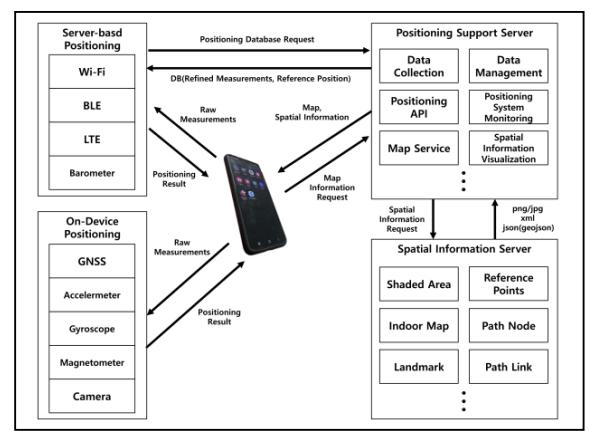
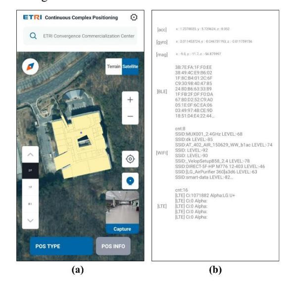

# Platform Development for Proof-of-Concept of Smartphone-based Continuous Complex Positioning

Seonghun Seo *Mobility UX Research Section ETRI*Daejeon, Korea ssh@etri.re.kr

Kyunghyun Park*Mobility UX Research Section ETRI*Daejeon, Korea hareton@etri.re.kr

Daesub Yoon*Mobility UX Research Section ETRI*Daejeon, Korea eyetracker@etri.re.kr

JaeJun Yoo*Mobility UX Research Section ETRI*Daejeon, Korea jjryu@etri.re.kr

Yonghyun Kim*Mobility UX Research Section ETRI*Daejeon, Korea yhkeen@etri.re.kr

Yangkoo Lee*Mobility UX Research Section ETRI*Daejeon, Korea yk\_lee@etri.re.kr

Jiwoo Han*Mobility UX Research Section ETRI*Daejeon, Korea chau@etri.re.kr
*Abstract***—The rapid evolution and widespread adoption of Location-Based Services (LBS) have fueled an unprecedented demand for personal location data. This need spans both indoor and outdoor environments, with smartphones emerging as the primary tool for processing such information. However, significant disparities exist in the types and characteristics of sensors available for indoor versus outdoor use, as well as in the methodologies employed for sensor data processing. Furthermore, the inherent asynchronous architecture of smartphones poses substantial challenges in effectively processing and integrating diverse positioning data sources. This study proposes the development of a cutting-edge Proof of Concept (PoC) platform designed to enable seamless positioning technology on smartphones across both indoor and outdoor settings.**

*Keywords—seamless positioning, smartphones, GNSS, Wi-Fi, BLE, IMU*## I. INTRODUCTION

The growing demand for precise positioning has catalyzed significant advancements in both indoor and outdoor localization technologies [1][2][3]. However, a substantial body of research is now focused on the seamless integration of these technologies to achieve uninterrupted positioning across diverse environments [4][5][6]. Continuous complex positioning systems increasingly leverage smartphones, capitalizing on their ability to harness data from a multitude of sensors and wireless signals. This paper presents the conceptualization and implementation of an innovative smartphone-based Proof of Concept (PoC) platform. This platform is designed to utilize an array of sensors and wireless signals, facilitating comprehensive research into continuous and complex positioning scenarios.

### II. RELATED WORK

Indoor positioning technologies often necessitate additional infrastructure to provide specific signals. Reference [1] delves into various RF-based techniques for indoor positioning systems (IPS), encompassing Wi-Fi, Bluetooth Low Energy (BLE), Ultra-Wideband (UWB), and Radio-Frequency Identification (RFID). This research examines complex indoor systems that integrate these techniques to enhance accuracy and reliability. A separate study introduces a hybrid positioning approach combining Long-Term Evolution (LTE) and Wi-Fi signals for precise emergency rescue localization. This system meets E911 standards, delivering high accuracy across diverse devices and environments. Concurrently, complex outdoor positioning techniques are being explored, utilizing Global Navigation Satellite System (GNSS) and cellular networks to provide seamless positioning [3]. These methods aim to reduce positioning delay and increase scalability in dense, heterogeneous environments. Recent research has shifted focus towards seamless positioning methods that transcend the indoor-outdoor divide. One such approach integrates GNSS pseudoranges with Wireless Local Area Network (WLAN) Received Signal Strength Indicators (RSSIs) using particle filters to enhance localization in urban and indoor areas [4]. By modeling WLAN signal distributions with Gaussian processes, this method achieves high accuracy in challenging environments. However, its application in smartphones may be hindered by limited computing resources and asynchronous data acquisition. Several studies present smartphone-based positioning results. One explores the integration of multiple technologies, including Global Positioning System (GPS), Assisted GPS (AGPS), Bluetooth GPS, and WLAN, on smartphones for seamless positioning [5]. This study analyzes the performance of various positioning techniques by leveraging smartphone-available sensors and signals. Another approach, BlueDetect, offers efficient indoor-outdoor detection [6] by proposing the installation of BLE beacons at transition areas. While energyefficient, its application may be limited if line-of-sight (LOS) beacon installation is unfeasible. It's worth noting that previous smartphone-based studies primarily focused on analyzing individual sensor-specific positioning methods without considering their integration for optimal results. Reference [7] proposes a tightly coupled integration of smartphone-based vision, Micro-Electro-Mechanical Systems Inertial Measurement Unit (MEMS-IMU), and GNSS for seamless indoor-outdoor positioning using factor graph optimization. This method improves smartphone positioning accuracy by addressing timing instability and adapting to GNSS signal availability, demonstrating robustness in complex environments. However, while this technology can leverage GNSS to compensate for sensor error accumulation in vision and MEMS-IMU sensors outdoors, a comparable solution for indoor environments is currently lacking. Consequently, there is a critical need to develop correction data mechanisms to mitigate errors in relative positioning technologies within indoor settings.

# III. CONTINUOUS COMPLEX POSITIONING SYSTEM ARCHITECTURE

Building upon the findings from the aforementioned studies, we present the architecture of a smartphone-based continuous complex positioning platform designed to deliver optimal positioning results. This platform can be broadly divided into three key components: on-device positioning, server-based positioning, and communication with a positioning support server. We have engineered this platform to effectively acquire and process a variety of sensor and signal measurements. By leveraging this platform, we can implement diverse positioning techniques and achieve seamless positioning through their integration. Fig. 1 illustrates the structure of the proposed system.

<!-- Image Description: The diagram illustrates a mobile positioning system architecture. A smartphone utilizes various on-device sensors (GNSS, accelerometer, etc.) and server-based technologies (Wi-Fi, BLE, LTE) to obtain positioning data. Raw measurements are sent to a positioning support server, which uses a positioning API and a map service, interacting with a spatial information server providing maps, reference points, and other spatial data. The system outputs positioning results to the smartphone. Data flow between components and data types are shown. -->

Fig. 1. Continuous complex positioning system architecture.

##*A. On-device positioning*Satellite navigation leveraging GNSS does not require prebuilt databases (DB). Moreover, methods with short measurement acquisition cycles, such as Pedestrian Dead-Reckoning (PDR) and Inertial Navigation Systems (INS) utilizing IMU, are sensitive to time delays, rendering ondevice processing essential. These positioning techniques have relatively low computing resource requirements, enabling their implementation without significantly impacting the asynchronous operation.

###*B. Server-based positioning*Wireless signal positioning techniques, such as Wi-Fi and BLE, typically rely on pre-built DB. In the proposed architecture, the device requests refined data from the DB and performs positioning operations using real-time measurements. Depending on the specific techniques employed, the positioning process can be carried out either on the device or on the server.

####*C. Communication with positionig support server*

The positioning support server is responsible for data collection and management to enable server-based positioning. If processing the data on the device would require substantial

resources, the server can directly handle the computations and deliver the results back to the device. Additionally, through server-to-server communication with spatial information servers, the positioning support server provides the capability to efficiently visualize the positioning process based on prebuilt maps of the area where the positioning is taking place.

#### IV. POC PLATFORM IMPLEMENTATION

The platform for continuous complex positioning research is implemented as a smartphone application, as depicted in Fig. 2. Fig. 2(a) illustrates the main activity of the application, configured to display map loading, video capture, positioning results for each technique, and the final continuous complex positioning results. Fig. 2(b) shows an example of the realtime sensor and signal measurement acquisition status. These measurements are utilized for either on-device or server-based positioning, and are subsequently used to derive the final positioning results.

<!-- Image Description: The image shows two panels. (a) displays a smartphone application interface showing a building's floor plan overlaid on a satellite image. The app includes zoom controls, a compass, and buttons for 'POS Type' and 'POS Info'. A small image preview labelled 'Capture' is also present. (b) shows a text-based log of sensor data, including accelerometer ([acc]), gyroscope ([gyro]), magnetometer ([mag]), Bluetooth Low Energy ([BLE]), Wi-Fi ([WIFI]), and LTE ([LTE]) readings. The image likely demonstrates a continuous complex positioning system using data fusion from various sensors. -->

Fig. 2. Continuous complex positioning application.

#### V. CONCLUSION

This paper outlines the architectural design and implementation examples of a smartphone-based continuous complex positioning platform. This platform is being actively expanded and refined to accommodate the flexible addition and modification of diverse positioning techniques. Our future research objective is to efficiently combine and integrate various positioning methods through this platform, with the aim of developing more accurate and precise real-time positioning solutions.

#### ACKNOWLEDGMENT

This work is supported by the Korea Agency for Infrastructure Technology Advancement (KAIA) grant funded by the Ministry of Land, Infrastructure and Transport (Grant RS-2022-00141819).

#### REFERENCES

- [1] Y. Gu, A. Lo, and I. Niemegeers, "A Survey of Smartphone-Based Indoor Positioning System Using RF-Based Wireless Technologies," International Journal of Communication Systems, vol. 28, no. 11, pp. 2359-2378, Jul. 2015.
- [2] M. Ji, J. Jeon, K.-S. Han, and Y. Cho, "Accurate Long-Term Evolution/Wi-Fi hybrid positioning technology for emergency rescue," ETRI Journal, vol. 45, no. 6, pp. 939-951, Dec. 2023.

- [3] H. Choi, "Reducing Outdoor Seamless Positioning Time," Journal of the Korean Institute of Communications and Information Sciences, vol. 36, no. 2, pp. 189-198, Feb. 2011.
- [4] L. Zhang, Y. Zhou, Q. Wu, and M. Zhao, "Ubiquitous and Seamless Localization: Fusing GNSS Pseudoranges and WLAN Signal Strengths," IEEE Transactions on Vehicular Technology, vol. 66, no. 8, pp. 7465-7478, Aug. 2017.
- [5] H. Zou, H. Jiang, Y. Luo, J. Zhu, X. Lu, and L. Xie, "BlueDetect: An iBeacon-Enabled Scheme for Accurate and Energy-Efficient Indoor-Outdoor Detection and Seamless Location-Based Service," Sensors, vol. 16, no. 2, p. 268, Feb. 2016.
- [6] L. Pei, R. Chen, Y. Chen, H. Leppäkoski, and A. Perttula, "Indoor/Outdoor Seamless Positioning Technologies Integrated on Smart Phone," in 2009 First International Conference on Advances in Satellite and Space Communications, Colmar, France, 2009, pp. 131- 135.
- [7] C. Pan, Z. Li, Q. Zhang, B. Soja, and J. Gao, "Smartphone-based Vision/MEMS-IMU/GNSS tightly coupled seamless positioning using factor graph optimization," Measurement, vol. 229, pp. 114420, Mar. 2024.
