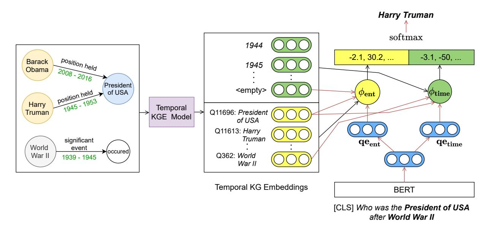
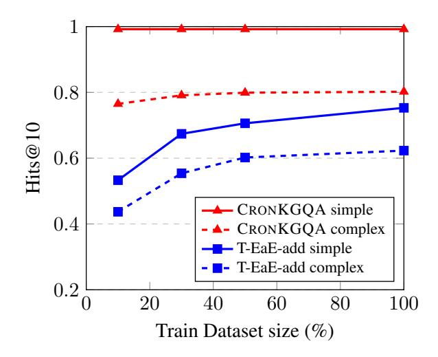

# Question Answering Over Temporal Knowledge Graphs

Apoorv Saxena Indian Institute of Science Bangalore apoorvsaxena@iisc.ac.in

Soumen Chakrabarti Indian Institute of Technology Bombay soumen@cse.iitb.ac.in

Partha Talukdar Google Research India partha@google.com

## Abstract

Temporal Knowledge Graphs (Temporal KGs) extend regular Knowledge Graphs by providing temporal scopes (e.g., start and end times) on each edge in the KG. While Question Answering over KG (KGQA) has received some attention from the research community, QA over Temporal KGs (Temporal KGQA) is a relatively unexplored area. Lack of broadcoverage datasets has been another factor limiting progress in this area. We address this challenge by presenting CRONQUESTIONS, the largest known Temporal KGQA dataset, clearly stratified into buckets of structural complexity. CRONQUESTIONS expands the only known previous dataset by a factor of 340×. We find that various state-of-the-art KGQA methods fall far short of the desired performance on this new dataset. In response, we also propose CRONKGQA, a transformerbased solution that exploits recent advances in Temporal KG embeddings, and achieves performance superior to all baselines, with an increase of 120% in accuracy over the next best performing method. Through extensive experiments, we give detailed insights into the workings of CRONKGQA, as well as situations where significant further improvements appear possible. In addition to the dataset, we have released our code as well.

### 1 Introduction

Temporal Knowledge Graphs (Temporal KGs) are multi-relational graph where each edge is associated with a time duration. This is in contrast to a regular KG where no time annotation is present. For example, a regular KG may contain a fact such as (*Barack Obama*, *held position*, *President of USA*), while a temporal KG would contain the start and end time as well — (*Barack Obama*, *held position*, *President of USA*, *2008*, *2016*). Edges may be associated with a set of non-contiguous

time intervals as well. These temporal scopes on facts can be either automatically estimated [\(Taluk](#page-10-0)[dar et al.,](#page-10-0) [2012\)](#page-10-0) or user contributed. Several such Temporal KGs have been proposed in the literature, where the focus is on KG completion [\(Dasgupta](#page-8-0) [et al.](#page-8-0) [2018;](#page-8-0) [Garc´ıa-Duran et al.](#page-9-0) ´ [2018;](#page-9-0) [Leetaru and](#page-9-1) [Schrodt](#page-9-1) [2013;](#page-9-1) [Lacroix et al.](#page-9-2) [2020;](#page-9-2) [Jain et al.](#page-9-3) [2020\)](#page-9-3).

The task of Knowledge Graph Question Answering (KGQA) is to answer natural language questions using a KG as the knowledge base. This is in contrast to reading comprehension-based question answering, where typically the question is accompanied by a context (e.g., text passage) and the answer is either one of multiple choices [\(Ra](#page-9-4)[jpurkar et al.,](#page-9-4) [2016\)](#page-9-4) or a piece of text from the context [\(Yang et al.,](#page-10-1) [2018\)](#page-10-1). In KGQA, the answer is usually an entity (node) in the KG, and the reasoning required to answer questions is either single-fact based [\(Bordes et al.,](#page-8-1) [2015\)](#page-8-1), multi-hop [\(Yih et al.](#page-10-2) [2015,](#page-10-2) [Zhang et al.](#page-10-3) [2017\)](#page-10-3) or conjunction/comparison based reasoning [\(Talmor and Be](#page-10-4)[rant,](#page-10-4) [2018\)](#page-10-4). Temporal KGQA takes this a step further where:

- 1. The underlying KG is a Temporal KG.
- 2. The answer is either an entity or time duration.
- 3. Complex temporal reasoning might be needed.

KG Embeddings are low-dimensional dense vector representations of entities and relations in a KG. Several methods have been proposed in the literature to embed KGs [\(Bordes et al.](#page-8-2) [2013,](#page-8-2) [Trouillon](#page-10-5) [et al.](#page-10-5) [2016,](#page-10-5) [Vashishth et al.](#page-10-6) [2020\)](#page-10-6). These embeddings were originally proposed for the task of KG completion i.e., predicting missing edges in the KG, since most real world KGs are incomplete. Recently, however, they have also been applied to the task of KGQA where they have been shown to increase performance the settings of both of complete and incomplete KGs [\(Saxena et al.](#page-9-5) [2020;](#page-9-5) [Sun](#page-9-6) [et al.](#page-9-6) [2020\)](#page-9-6).

|                      | KG        | Temporal | Question Types | # questions    |          |       |
|----------------------|-----------|----------|----------------|----------------|----------|-------|
| Dataset              |           | facts    | Multi-Entity   | Multi-Relation | Temporal |       |
| SimpleQuestions      | FreeBase  | ✗        | ✗              | ✗              | 0%       | 108k  |
| MetaQA               | MetaQA KG | ✗        | ✗              | ✓              | 0%       | 400k  |
| WebQuestions         | FreeBase  | ✗        | ✗              | ✓              | <16%     | 5,810 |
| ComplexWebQuestions  | FreeBase  | ✗        | ✓              | ✓              | -        | 35k   |
| TempQuestions        | FreeBase  | ✗        | ✓              | ✓              | 100%     | 1,271 |
| CRONQUESTIONS (ours) | WikiData  | ✓        | ✓              | ✓              | 100%     | 410k  |

Table 1: KGQA dataset comparison. Statistics about percentage of temporal questions for WebQuestions are taken from [Jia et al.](#page-9-7) [\(2018a\)](#page-9-7). We do not have an explicit number of temporal questions for ComplexWebQuestions, but since it is constructed automatically using questions from WebQuestions, we expect the percentage to be similar to WebQuestions (16%). Please refer to Section [2.1](#page-1-0) for details.

Temporal KG embeddings are another upcoming area where entities, relations and timestamps in a temporal KG are embedded in a low-dimensional vector space [\(Dasgupta et al.](#page-8-0) [2018,](#page-8-0) [Lacroix et al.](#page-9-2) [2020,](#page-9-2) [Jain et al.](#page-9-3) [2020,](#page-9-3) [Goel et al.](#page-9-8) [2019\)](#page-9-8). Here too, the main application so far has been temporal KG completion. In our work, we investigate whether temporal KG Embeddings can be applied to the task of Temporal KGQA, and how they fare compared to non-temporal embeddings or off-the-shelf methods without any KG Embeddings.

In this paper we propose CRONQUESTIONS, a new dataset for Temporal KGQA. CRONQUES-TIONS consists of both a temporal KG and accompanying natural language questions. There were three main guiding principles while creating this dataset:

- 1. The associated KG must provide temporal annotations.
- 2. Questions must involve an element of temporal reasoning.
- 3. The number of labeled instances must be large enough that it can be used for training models, rather than for evaluation alone.

Guided by the above principles, we present a dataset consisting of a Temporal KG with 125k entities and 328k facts, along with a set of 410k natural language questions that require temporal reasoning.

On this new dataset, we apply approaches based on deep language models (LM) alone, such as T5 [\(Raffel et al.,](#page-9-9) [2020\)](#page-9-9), BERT [\(Devlin et al.,](#page-8-3) [2019\)](#page-8-3), and KnowBERT [\(Peters et al.,](#page-9-10) [2019\)](#page-9-10), and also hybrid LM+KG embedding approaches, such as Entities-as-Experts [\(Fevry et al.](#page-9-11) ´ , [2020\)](#page-9-11) and EmbedKGQA [\(Saxena et al.,](#page-9-5) [2020\)](#page-9-5). We find that these baselines are not suited to temporal reasoning. In response, we propose CRONKGQA, an enhancement of EmbedKGQA, which outperforms

baselines across all question types. CRONKGQA achieves very high accuracy on simple temporal reasoning questions, but falls short when it comes to questions requiring more complex reasoning. Thus, although we get promising early results, CRONQUESTIONS leaves ample scope to improve complex Temporal KGQA. Our source code along with the CRONQUESTIONS dataset can be found at <https://github.com/apoorvumang/CronKGQA>.

### 2 Related work

#### 2.1 Temporal QA data sets

There have been several KGQA datasets proposed in the literature (Table [1\)](#page-1-1). In SimpleQuestions [\(Bor](#page-8-1)[des et al.,](#page-8-1) [2015\)](#page-8-1) one needs to extract just a single fact from the KG to answer a question. MetaQA [\(Zhang et al.,](#page-10-3) [2017\)](#page-10-3) and WebQuestionsSP [\(Yih](#page-10-2) [et al.,](#page-10-2) [2015\)](#page-10-2) require multi-hop reasoning, where one must traverse over multiple edges in the KG to reach the answer. ComplexWebQuestions [\(Tal](#page-10-4)[mor and Berant,](#page-10-4) [2018\)](#page-10-4) contains both multi-hop and conjunction/comparison type questions. However, none of these are aimed at temporal reasoning, and the KG they are based on is non-temporal.

Temporal QA datasets have mostly been studied in the area of reading comprehension. One such dataset is TORQUE [\(Ning et al.,](#page-9-12) [2020\)](#page-9-12), where the system is given a question along with some context (a text passage) and is asked to answer a multiple choice question with five choices. This is in contrast to KGQA, where there is no context, and the answer is one of potentially hundreds of thousands of entities.

TempQuestions [\(Jia et al.,](#page-9-7) [2018a\)](#page-9-7) is a KGQA dataset specifically aimed at temporal QA. It consists of a subset of questions from WebQuestions, Free917 [\(Cai and Yates,](#page-8-4) [2013\)](#page-8-4) and Complex-Questions [\(Bao et al.,](#page-8-5) [2016\)](#page-8-5) that are temporal in

| Reasoning     | Example Template                               | Example Question                                      |
|---------------|------------------------------------------------|-------------------------------------------------------|
| Simple time   | When did {head} hold the position of {tail}    | When did Obama hold the position of President of USA  |
| Simple entity | Which award did {head} receive in {time}       | Which award did Brad Pitt receive in 2001             |
| Before/After  | Who was the {tail} {type} {head}               | Who was the President of USA before Obama             |
| First/Last    | When did {head} play their {adj} game          | When did Messi play their first game                  |
| Time join     | Who held the position of {tail} during {event} | Who held the position of President of USA during WWII |

Table 2: Example questions for different types of temporal reasoning. {head}, {tail} and {time} correspond to entities/timestamps in facts of the form (head, relation, tail, timestamp). {event} corresponds to entities in event facts eg. *WWII*. {type} can be one of before/after and {adj} can be one of first/last. Please refer to Section [3.2](#page-2-0) for details.

nature. They gave a definition for "temporal question" and used certain trigger words (for example 'before', 'after') along with other constraints to filter out questions from these datasets that fell under this definition. However, this dataset contains only 1271 questions — useful only for evaluation — and the KG on which it is based (a subset of FreeBase [\(Bollacker et al.,](#page-8-6) [2008\)](#page-8-6)) is not a temporal KG. Another drawback is that FreeBase has not been under active development since 2015, therefore some information stored in it is outdated and this is a potential source of inaccuracy.

### 2 Temporal QA algorithms

To the best of our knowledge, recent KGQA algorithms [\(Miller et al.](#page-9-13) [2016;](#page-9-13) [Sun et al.](#page-9-14) [2019;](#page-9-14) [Co](#page-8-7)[hen et al.](#page-8-7) [2020;](#page-8-7) [Sun et al.](#page-9-6) [2020\)](#page-9-6) work with *nontemporal KGs*, i.e., KGs containing facts of the form (subject, relation, object). Extending these to *temporal KGs* containing facts of the form (subject, relation, object, start time, end time) is a non-trivial task. TEQUILA [\(Jia et al.,](#page-9-15) [2018b\)](#page-9-15) is one method aimed specifically at temporal KGQA. TEQUILA decomposes and rewrites the question into nontemporal sub-questions and temporal constraints. Answers to sub-questions are then retrieved using any KGQA engine. Finally, TEQUILA uses constraint reasoning on temporal intervals to compute final answers to the full question. A major drawback of this approach is the use of pre-specified templates for decomposition, as well as the assumption of having temporal constraints on entities. Also, since it is made for non-temporal KGs, there is no direct way of applying it to temporal KGs where facts are temporally scoped.

## 3 CRONQUESTIONS: The new Temporal KGQA dataset

CRONQUESTIONS, our Temporal KGQA dataset consists of two parts: a KG with temporal annotations, and a set of natural language questions

requiring temporal reasoning.

### 1 Temporal KG

To prepare our temporal KG, we started by taking all facts with temporal annotations from the Wiki-Data subset proposed by [Lacroix et al.](#page-9-2) [\(2020\)](#page-9-2). We removed some instances of the predicate "*member of sports team*" in order to balance out the KG since this predicate constituted over 50 percent of the facts. Timestamps were discretized to years. This resulted in a KG with 323k facts, 125k entities and 203 relations.

However, this filtering of facts misses out on important world events. For example, the KG subset created using the aforementioned technique contains the entity *World War II*but no associated fact that tells us when*World War II* started or ended. This knowledge is needed to answer questions such as "*Who was the President of the USA during World War II?*." To overcome this shortcoming, we first extracted entities from WikiData that have a "start time" and "end time" annotation. From this set, we then removed entities which were game shows, movies or television series (since these are not important world events, but do have a start and end time annotation), and then removed entities with less than 50 associated facts. This final set of entitities was then added as facts in the format (*WWII, significant event, occurred, 1939, 1945)*. The final Temporal KG consisted of 328k facts out of which 5k are event-facts.

#### 3.2 Temporal Questions

To generate the QA dataset, we started with a set of templates for temporal reasoning. These were made using the five most frequent relations from our WikiData subset, namely

- *member of sports team*-*position held*-*award received*-*spouse*| Template               | When did {head} play in {tail}                                                                                                                  |
|------------------------|-------------------------------------------------------------------------------------------------------------------------------------------------------|
| Seed Qn                | When did Messi play in FC Barcelona                                                                                                             |
| Human Paraphrases   | When was Messi playing in FC Barcelona Which years did Messi play in FC Barcelona When did FC Barcelona have Messi in their team |
|                        | What time did Messi play in FC Barcelona                                                                                                        |
| Machine Paraphrases | When did Messi play for FC Barcelona When did Messi play at FC Barcelona When has Messi played at FC Barcelona                |

Table 3: Slot-filled paraphrases generated by humans and machine. Please refer to Section [3.2](#page-2-0) for details.

|               | Train   | Dev    | Test   |
|---------------|---------|--------|--------|
| Simple Entity | 90,651  | 7,745  | 7,812  |
| Simple Time   | 61,471  | 5,197  | 5,046  |
| Before/After  | 23,869  | 1,982  | 2,151  |
| First/Last    | 118,556 | 11,198 | 11,159 |
| Time Join     | 55,453  | 3,878  | 3,832  |
| Entity Answer | 225,672 | 19,362 | 19,524 |
| Time Answer   | 124,328 | 10,638 | 10,476 |
| Total         | 350,000 | 30,000 | 30,000 |

Table 4: Number of questions in our dataset across different types of reasoning required and different answer types. Please refer to Section [3.2.1](#page-4-0) for details.

#### •*employer*

This resulted in 30 unique seed templates over five relations and five different reasoning structures (please see Table [2](#page-2-1) for some examples). Each of these templates has a corresponding procedure that could be executed over the temporal KG to extract all possible answers for that template. However, similar to [Zhang et al.](#page-10-3) [\(2017\)](#page-10-3), we chose not to make this procedure a part of the dataset, to remove unwelcome dependence of QA systems on such formal candidate collection methods. This also allows easy augmentation of the dataset, since only question-answer pairs are needed.

In the same spirit as ComplexWebQuestions, we then asked human annotators to paraphrase these templates in order to generate more linguistic diversity. Annotators were given slot-filled templates with dummy entities and times, and asked to rephrase the question such that the dummy entities/times were present in the paraphrase and the question meaning did not change. This resulted in 246 unique templates.

We then used the monolingual paraphraser developed by [Hu et al.](#page-9-16) [\(2019\)](#page-9-16) to automatically generate paraphrases using these 246 templates. After verifying their correctness through annotators, we ended up with 654 templates. These templates were

then filled using entity aliases from WikiData to generate 410k unique question-answer pairs.

Finally, while splitting the data into train/test folds, we ensured that

- 1. Paraphrases of train questions are not present in test questions.
- 2. There is no entity overlap between test questions and train questions. Event overlap is allowed.

The second requirement implies that, if the question "*Who was president before Obama*" is present in the train set, the test set cannot contain any question that mentions the entity '*Obama*'. While this policy may appear like an overabundance of caution, it ensures that models are doing temporal reasoning rather than guessing from entities seen during training. [Lewis et al.](#page-9-17) [\(2020\)](#page-9-17) noticed an issue in WebQuestions where they found that almost 30% of test questions overlapped with training questions. The issue has been seen in the MetaQA dataset as well, where there is significant overlap between test/train entities and test/train question paraphrases, leading to suspiciously high performance on baseline methods even with partial KG data [\(Saxena et al.,](#page-9-5) [2020\)](#page-9-5), which suggests that models that apparently perform well are not necessarily performing the desired reasoning over the KG.

A drawback of our data creation protocol is that question/answer pairs are generated automatically. Therefore, the question distribution is artificial from a semantic perspective. (Complex-WebQuestions has a similar limitation.) However, since developing models that are capable of temporal reasoning is an important direction for natural language understanding, we feel that our dataset provides an opportunity to both train and evaluate KGQA models because of its large size, notwithstanding its lower-than-natural linguistic variety. In Section [6.4,](#page-7-0) we show the effect that training data size has on model performance.

Summarizing, each of our examples contains

- 1. A paraphrased natural language question.
- 2. A set of entities/times in the question.
- 3. A set of 'gold' answers (entity or time).

The entities are specified as WikiData IDs (e.g., *Q219237*), and times are years (e.g., *1991*). We include the set of entities/times in the test questions as well since similar to other KGQA datasets (MetaQA, WebQuestions, ComplexWebQuestions) and methods that use these datasets (PullNet, EmQL), entity linking is considered as a separate problem and complete entity linking is assumed. We also include the seed template and head/tail/time annotation in the train fold, but omit these from the test fold.

#### 3.2.1 Question Categorization

In order to aid analysis, we categorize questions into "simple reasoning" and "complex reasoning" questions (please refer to Table [4](#page-3-0) for the distribution statistics).

- Simple reasoning: These questions require a single fact to answer, where the answer can be either an entity or a time instance. For example the question *"Who was the President of the United States in 2008?"* requires a single fact to answer the question, namely (*Barack Obama*, *held position*, *President of USA*, *2008*, *2016*)
- Complex reasoning: These questions require multiple facts to answer and can be more varied. For example *"Who was the first President of the United States?"*This requires reasoning over multiple facts pertaining to the entity*"President of the United States"*. In our dataset, all questions that are not "simple reasoning" questions are considered complex questions. These are further categorized into the types "before/after'', "first/last" and "time join" please refer Table [2](#page-2-1) for examples of these questions.

### 4 Temporal KG Embeddings

We investigate how we can use KG embeddings, both temporal and non-temporal, along with pretrained language models to perform temporal KGQA. We will first briefly describe the specific KG embedding models we use, and then go on to show how we use them in our QA models. In all cases, the scores are turned into suitable losses with regard to positive and negative tuples in an incomplete KG, and these losses minimized to train the entity, time and relation representations.

#### 4.1 ComplEx

ComplEx [\(Trouillon et al.,](#page-10-5) [2016\)](#page-10-5) represents each entity e as a complex vector ue ∈ C D. Each relation r is represented as a complex vector vr ∈ C D as well. The score φ of a claimed fact (s, r, o) is

$$
\phi(s,r,o) = \Re(\langle \mathbf{u}_s, \mathbf{v}_r, \mathbf{u}_o^* \rangle)
$$

=
$$
\Re\left(\sum_{d=1}^D \mathbf{u}_s[d] \mathbf{v}_r[d] \mathbf{u}_o[d]^* \right)
$$
 (1)

where <(·) denotes the real part and c ? is the complex conjugate. Despite further developments, ComplEx, along with refined training protocols

[\(Lacroix et al.,](#page-9-18) [2018\)](#page-9-18) remains among the strongest KB embedding approaches [\(Ruffinelli et al.,](#page-9-19) [2020\)](#page-9-19).

#### 4.2 TComplEx, TNTComplEx

[Lacroix et al.](#page-9-2) [\(2020\)](#page-9-2) took an early step to extend ComplEx with time. Each timestamp t is also represented as a complex vector wt ∈ C D. For a claimed fact (s, r, o, t), their TComplEx scoring function is

$$
\phi(s,r,o,t) = \Re(\langle \boldsymbol{u}_s, \boldsymbol{v}_r, \boldsymbol{u}_o^{\star}, \boldsymbol{w}_t \rangle)
$$
 (2)

Their TNTComplEx scoring function uses two representations of relations r: v T r , which is sensitive to time, and vr, which is not. The scoring function is the sum of a time-sensitive and a time-insensitive part: <(hus, v T r ,u ? o , wti + hus, vr,u ? o , 1i).

#### 3 TimePlex

TimePlex [\(Jain et al.,](#page-9-3) [2020\)](#page-9-3) augmented ComplEx with embeddings ut ∈ C D for discretized time instants t. To incorporate time, TimePlex uses three representations for each relation r, viz., (v SO r , v ST r , v OT r ) and writes the base score of a tuple (s, r, o, t) as

$$
\phi(s,r, o, t) = \langle \mathbf{u}_s, \mathbf{v}_r^{\text{SO}}, \mathbf{u}_o^{\star} \rangle + \alpha \langle \mathbf{u}_s, \mathbf{v}_r^{\text{ST}}, \mathbf{u}_t^{\star} \rangle + \beta \langle \mathbf{u}_o, \mathbf{v}_r^{\text{OT}}, \mathbf{u}_t^{\star} \rangle + \gamma \langle \mathbf{u}_s, \mathbf{u}_o, \mathbf{u}_t^{\star} \rangle, \quad (3)
$$

where α, β, γ are hyperparameters.

### 5 CRONKGQA: Our proposed method

We start with a temporal KG, apply a time-agnostic or time-sensitive KG embedding algorithm (ComplEx, TComplEx, or TimePlex) to it, and obtain entity, relation, and timestamp embeddings for the temporal KG. We will use the following notation.

- E is the matrix of entity embeddings
- T is the matrix of timestamp embeddings
- E.T is the concatenation of E and T matrices. This is used for scoring answers, since the answer can be either an entity or timestamp.

In case entity/timestamp embeddings are complex valued vectors in C D, we expand them to real valued vectors of size 2D, where the first half is the real part and the second half is the complex part of the original vector.

We first apply EmbedKGQA [\(Saxena et al.,](#page-9-5) [2020\)](#page-9-5) directly to the task of Temporal KGQA. In its original implementation, EmbedKGQA uses ComplEx (Section [4.1\)](#page-4-1) embeddings and can only deal with non-temporal KGs and single entity questions. In order to apply it to CRONQUESTIONS, we set the first entity encountered in the question as the

Figure 1: The CRONKGQA method. (i) A temporal KG embedding model (Section [4\)](#page-4-2) is used to generate embeddings for each timestamp and entity in the temporal knowledge graph (ii) BERT is used to get two question embeddings: qeent and qetime. (iii) Embeddings of entity/time mentions in the question are combined with question embeddings using equations [4](#page-5-0) and [5](#page-5-1) to get score vectors for entity and time prediction. (iv) Score vectors are concatenated and softmax is used get answer probabilities. Please refer to Section [5](#page-4-3) for details.

"*head entity*" needed by EmbedKGQA. Along with this, we set the entity embedding matrix E to be the ComplEx embedding of our KG entities, and initialize T to a random learnable matrix. EmbedKGQA then performs prediction over E.T .

Next, we modify EmbedKGQA so that it can use temporal KG embeddings. We use TComplEx (Section [4.2\)](#page-4-4) for getting entity and timestamp embeddings. CRONKGQA (Figure [1\)](#page-5-2) utilizes two scoring functions, one for predicting entity and one for predicting time. Using a pre-trained LM (BERT in our case) CRONKGQA finds a question embedding qe. This is then projected to get two embeddings, qeent and qetime, which are question embeddings for entity and time prediction respectively.

Entity scoring function: We extract a subject entity s and a timestamp t from the question. If either is missing, we use a dummy entity/time. Then, using the scoring function φ(s, r, o, t)from equation [2,](#page-4-5) we calculate a score for each entity e ∈ E as

$$
\phi_{ent}(e) = \Re(\langle \mathbf{u}_s, \mathbf{q}e_{ent}, \mathbf{u}_e^{\star}, \mathbf{w}_t \rangle) \qquad (4)
$$

where E is the set of entities in the KG. This gives us a score for each entity being an answer.

Time scoring function: Similarly, we extract a subject entity s and object entity o from the question, using dummy entities if none are present. Then, using [2,](#page-4-5) we calculate a score for each times-

$$
\text{tamp } t \in \mathbf{T} \text{ as }
$$

$$
\phi_{time}(t) = \Re(\langle \boldsymbol{u}_s, \boldsymbol{q}e_{time}, \boldsymbol{u}_o^\star, \boldsymbol{w}_t \rangle) \qquad (5)
$$

The scores for all entities and times are concatenated, and softmax is used to calculate answer probabilities over this combined score vector. The model is trained using cross entropy loss.

### 6 Experiments and diagnostics

In this section, we aim to answer the following questions:

- 1. How do baselines and CRONKGQA perform on the CRONQUESTIONS task? (Section [6.2.](#page-6-0))
- 2. Do some methods perform better than others on specific reasoning tasks? (Section [6.3.](#page-7-1))
- 3. How much does the training dataset size (number of questions) affect the performance of a model? (Section [6.4.](#page-7-0))
- 4. Do temporal KG embeddings confer any advantage over non-temporal KG embeddings? (Section [6.5.](#page-7-2))

#### 1 Other methods compared

It has been shown by [Petroni et al.](#page-9-20) [\(2019\)](#page-9-20) and [Raf](#page-9-9)[fel et al.](#page-9-9) [\(2020\)](#page-9-9) that large LMs, such as BERT and its variants, capture real world knowledge (collected from their massive, encyclopedic training corpus) and can directly be applied to tasks such as QA. In these baselines, we do not specifically feed our version of the temporal KG to the model —

|               | Hits@1  |               |        |             |       | Hits@10 |               |        |             |       |
|---------------|---------|---------------|--------|-------------|-------|---------|---------------|--------|-------------|-------|
| Model         | Overall | Question Type |        | Answer Type |       |         | Question Type |        | Answer Type |       |
|               |         | Complex       | Simple | Entity      | Time  | Overall | Complex       | Simple | Entity      | Time  |
| BERT          | 0.071   | 0.086         | 0.052  | 0.077       | 0.06  | 0.213   | 0.205         | 0.225  | 0.192       | 0.253 |
| RoBERTa       | 0.07    | 0.086         | 0.05   | 0.082       | 0.048 | 0.202   | 0.192         | 0.215  | 0.186       | 0.231 |
| KnowBERT      | 0.07    | 0.083         | 0.051  | 0.081       | 0.048 | 0.201   | 0.189         | 0.217  | 0.185       | 0.23  |
| T5-3B         | 0.081   | 0.073         | 0.091  | 0.088       | 0.067 | -       | -             | -      | -           | -     |
| EmbedKGQA     | 0.288   | 0.286         | 0.29   | 0.411       | 0.057 | 0.672   | 0.632         | 0.725  | 0.85        | 0.341 |
| T-EaE-add     | 0.278   | 0.257         | 0.306  | 0.313       | 0.213 | 0.663   | 0.614         | 0.729  | 0.662       | 0.665 |
| T-EaE-replace | 0.288   | 0.257         | 0.329  | 0.318       | 0.231 | 0.678   | 0.623         | 0.753  | 0.668       | 0.698 |
| CRONKGQA      | 0.647   | 0.392         | 0.987  | 0.699       | 0.549 | 0.884   | 0.802         | 0.992  | 0.898       | 0.857 |

Table 5: Performance of baselines and our methods on the CRONQUESTIONS dataset. Methods above the midrule do not use any KG embeddings, while the ones below use either temporal or non-temporal KG embeddings. Hits@10 are not available for T5-3B since it is a text-to-text model and makes a single prediction. Please refer to Section [6.2](#page-6-0) for details.

we instead expect the model to have the real world knowledge to compute the answer.

- BERT: We experiment with BERT, RoBERTa [\(Liu et al.,](#page-9-21) [2019\)](#page-9-21) and KnowBERT [\(Peters et al.,](#page-9-10) [2019\)](#page-9-10) which is a variant of BERT where information from knowledge bases such as WikiData and WordNet has been injected into BERT. We add a prediction head on top of the [CLS] token of the final layer and do a softmax over it to predict the answer probabilities.
- T5: In order to apply T5 [\(Raffel et al.,](#page-9-9) [2020\)](#page-9-9) to temporal QA, we transform each question in our dataset to the form '*temporal question:* hquestioni*?*'. For evaluation there are two cases:
  - 1. Time answer: We do exact string matching between T5 output and correct answer.
  - 2. Entity answer: We compare the system output to the aliases of all entities in the KG. The entity having an alias with the smallest edit distance [\(Levenshtein,](#page-9-22) [1966\)](#page-9-22) to the predicted text output is taken as the predicted entity.
- Entities as experts: [Fevry et al.](#page-9-11) ´ [\(2020\)](#page-9-11) proposed EaE, a model which aims to integrate entity knowledge into a transformer-based language model. For temporal KGQA on CRONQUES-TIONS, we assume that all grounded entity and time mention spans are marked in the question[1](#page-6-1) . We will refer to this model as T-EaE-add. We try another variant of EaE, T-EaE-replace, where instead of adding the entity/time and BERT token embeddings, we replace the BERT embeddings with the entity/time embeddings for entity/time mentions.[2](#page-6-2)

### 6.2 Main results

Table [5](#page-6-3) shows the results of various methods on our dataset. We see that methods based on large pre-trained LMs alone (BERT, RoBERTa, T5), as well as KnowBERT, perform significantly worse than methods that are augmented with KG embeddings (temporal or non-temporal). This is probably because having KG embeddings specific to our temporal KG helps the model to focus on those entities/timestamps. In our experiments, BERT performs slightly better than KnowBERT, even though KnowBERT has entity knowledge in its parameters. T5-3B performs the best among the LMs we tested, possibly because of the large number of parameters and pre-training.

Even among methods that use KG embeddings, CRONKGQA performs the best on all metrics, followed by T-EaE-replace. Since EmbedKGQA has non-temporal embeddings, its performance on questions where the answer is a time is very low comparable to BERT — which is the LM used in our EmbedKGQA implementation.

Another interesting thing to note is the performance on simple reasoning questions. CRONKGQA far outperforms baselines for simple questions, achieving close to 0.99 hits@1, which is much lower for T-EaE (0.329). We believe there might be a few reasons that contribute to this:

1. There is the *inductive bias* of combining embeddings using TComplEx scoring function in CRONKGQA, which is the same one used in creating the entity and time embeddings, thus making the simple questions straightforward to answer. However, not relying on a scoring function means that T-EaE can be extended to any KG embedding, whereas CRONKGQA cannot.

1This assumption can be removed by using EaE's early transformer stages as NE spotters and disambiguators.

2Appendix [A.1](#page-10-7) gives details of our EaE implementation.

Figure 2: Model performance (hits@10) vs. training dataset size (percentage) for CRONKGQA and T-EaEadd. Solid line is for simple reasoning and dashed line is for complex reasoning type questions. For each dataset size, models were trained until validation hits@10 did not increase for 10 epochs. Please refer to Section [6.4](#page-7-0) for details.

2. Another contributing reason could be that there are fewer parameters to be trained in CRONKGQA while a 6-layer Transformer encoder needs to be trained from scratch in T-EaE. Transformers typically require large amounts of varied data to train successfully.

#### 6.3 Performance across question types

Table [6](#page-8-8) shows the performance of KG embedding based models across different types of reasoning. As stated above in Section [6.2,](#page-6-0) CRONKGQA performs very well on simple reasoning questions (simple entity, simple time). Among complex question types, all models (except EmbedKGQA) perform the best on time join questions (e.g., '*Who played with Roberto Dinamite on the Brazil national football team*'). This is because such questions typically have multiple answers (such as all the players when *Roberto Dinamite*was playing for Brazil), which makes it easier for the model to make a correct prediction. In the other two question types, the answer is always a single entity/time. Before/after questions seem most challenging for all methods, with the best method achieving only 0.288 hits@1.

#### 6.4 Effect of training dataset size

Figure [2](#page-7-3) shows the effect of training dataset size on model performance. As we can see, for T-EaE-add,

increasing the training dataset size from 10% to 100% steadily increases its performance for both simple and complex reasoning type questions. This effect is somewhat present in CRONKGQA for complex reasoning, but not so for simple reasoning type questions. We hypothesize that this is because T-EaE has more trainable parameters — it has a 6-layer transformer that needs to be trained from scratch — in contrast to CRONKGQA that needs to merely fine tune BERT and train some shallow projection layers. These results affirm our hypothesis that having a large, even if synthetic, dataset is useful for training temporal reasoning models.

### 6.5 Temporal vs. non-temporal KG embeddings

We conducted further experiments to study the effect of temporal vs. non-temporal KG embeddings. We replaced the temporal entity embeddings in T-EaE-replace with ComplEx embeddings, and treated timestamps as regular tokens (not associated with any entity/time mentions). CRONKGQA-CX is the same as EmbedKGQA. The results can be seen in Table [7.](#page-8-9) As we can see, for both CRONKGQA and T-EaE-replace, using temporal KGE (TComplex) gives a significant boost in performance compared to non-temporal KGE (ComplEx). CRONKGQA receives a much larger boost in performance compared to T-EaE-replace, probably because the scoring function has been modeled after TComplEx and not ComplEx, while there is no such embedding-specific engineering in T-EaE-replace. Another observation is that questions having temporal answers achieve very low accuracy (0.057 and 0.062 respectively) in both CRONKGQA-CX and T-EaE-replace-CX, which is much lower than what these models achieve with TComplEx. This shows that having temporal KG embeddings is essential for achieving good performance for KG embedding-based methods.

### 7 Conclusion

In this paper we introduce CRONQUESTIONS, a new dataset for Temporal Knowledge Graph Question Answering. While there exist some Temporal KGQA datasets, they are all based on non-temporal KGs (e.g., Freebase) and have relatively few questions. Our dataset consists of both a temporal KG as well as a large set of temporal questions requiring various structures of reasoning. In order to develop such a large dataset, we used a synthetic

|               | Before/ | First/ Time |       | Simple | Simple | All   |
|---------------|---------|----------------|-------|--------|--------|-------|
|               | After   | Last           | Join  | Entity | Time   |       |
| EmbedKGQA     | 0.199   | 0.324          | 0.223 | 0.421  | 0.087  | 0.288 |
| T-EaE-add     | 0.256   | 0.285          | 0.175 | 0.296  | 0.321  | 0.278 |
| T-EaE-replace | 0.256   | 0.288          | 0.168 | 0.318  | 0.346  | 0.288 |
| CRONKGQA      | 0.288   | 0.371          | 0.511 | 0.988  | 0.985  | 0.647 |

Table 6: Hits@1 for different reasoning type questions. 'Simple Entity' and 'Simple Time' correspond to simple question type in Table [5](#page-6-3) while the others correspond to complex question type. Please refer to section [6.3](#page-7-1) for more details.

| Question      | CRONKGQA |       | T-EaE-replace |       |
|---------------|----------|-------|---------------|-------|
| Type          | CX       | TCX   | CX            | TCX   |
| Simple        | 0.29     | 0.987 | 0.248         | 0.329 |
| Complex       | 0.286    | 0.392 | 0.247         | 0.257 |
| Entity Answer | 0.411    | 0.699 | 0.347         | 0.318 |
| Time Answer   | 0.057    | 0.549 | 0.062         | 0.231 |
| Overall       | 0.288    | 0.647 | 0.247         | 0.288 |

Table 7: Hits@1 for CRONKGQA and T-EaE-replace using ComplEx(CX) and TComplEx(TCX) KG embeddings. Please refer to Section [6.5](#page-7-2) for more details.

generation procedure, leading to a question distribution that is artificial from a semantic perspective. However, having a large dataset provides an opportunity to train models, rather than just evaluate them. We experimentally show that increasing the training dataset size steadily improves the performance of certain methods on the TKGQA task.

We first apply large pre-trained LM based QA methods on our new dataset. Then we inject KG embeddings, both temporal and non-temporal, into these LMs and observe significant improvement in performance. We also propose a new method, CRONKGQA, that is able to leverage Temporal KG Embeddings to perform TKGQA. In our experiments, CRONKGQA outperforms all baselines. These results suggest that KG embeddings can be effectively used to perform temporal KGQA, although there remains significant scope for improvement when it comes to complex reasoning questions.

### Acknowledgements

We would like to thank the anonymous reviewers for their constructive feedback, and Pat Verga and William Cohen from Google Research for their insightful comments. We would also like to thank Chitrank Gupta (IIT Bombay) for his help in debugging the source code and dataset. This work is supported in part by a gift from Google Research, India and a Jagadish Bose Fellowship.

### References

- Junwei Bao, Nan Duan, Zhao Yan, Ming Zhou, and Tiejun Zhao. 2016. [Constraint-based question an](https://www.aclweb.org/anthology/C16-1236)[swering with knowledge graph.](https://www.aclweb.org/anthology/C16-1236) In*Proceedings of COLING 2016, the 26th International Conference on Computational Linguistics: Technical Papers*, pages 2503–2514, Osaka, Japan. The COLING 2016 Organizing Committee.
- Kurt Bollacker, Colin Evans, Praveen Paritosh, Tim Sturge, and Jamie Taylor. 2008. [Freebase: A collab](https://doi.org/10.1145/1376616.1376746)[oratively created graph database for structuring hu](https://doi.org/10.1145/1376616.1376746)[man knowledge.](https://doi.org/10.1145/1376616.1376746) In *Proceedings of the 2008 ACM SIGMOD International Conference on Management of Data*, SIGMOD '08, page 1247–1250, New York, NY, USA. Association for Computing Machinery.
- Antoine Bordes, Nicolas Usunier, Sumit Chopra, and Jason Weston. 2015. [Large-scale simple question](https://arxiv.org/abs/1506.02075) [answering with memory networks.](https://arxiv.org/abs/1506.02075) *arXiv preprint arXiv:1506.02075*.
- Antoine Bordes, Nicolas Usunier, Alberto Garcia-Duran, Jason Weston, and Oksana Yakhnenko. 2013. [Translating embeddings for modeling multi](https://hal.archives-ouvertes.fr/hal-00920777/)[relational data.](https://hal.archives-ouvertes.fr/hal-00920777/) In *Neural Information Processing Systems (NIPS)*, pages 1–9.
- Qingqing Cai and Alexander Yates. 2013. [Large-scale](https://www.aclweb.org/anthology/P13-1042) [semantic parsing via schema matching and lexicon](https://www.aclweb.org/anthology/P13-1042) [extension.](https://www.aclweb.org/anthology/P13-1042) In *Proceedings of the 51st Annual Meeting of the Association for Computational Linguistics (Volume 1: Long Papers)*, pages 423–433, Sofia, Bulgaria. Association for Computational Linguistics.
- William W. Cohen, Haitian Sun, R. Alex Hofer, and Matthew Siegler. 2020. [Scalable neural methods for](http://arxiv.org/abs/2002.06115) [reasoning with a symbolic knowledge base.](http://arxiv.org/abs/2002.06115)
- Shib Sankar Dasgupta, Swayambhu Nath Ray, and Partha Talukdar. 2018. [HyTE: Hyperplane-based](https://doi.org/10.18653/v1/D18-1225) [temporally aware knowledge graph embedding.](https://doi.org/10.18653/v1/D18-1225) In *Proceedings of the 2018 Conference on Empirical Methods in Natural Language Processing*, pages 2001–2011, Brussels, Belgium. Association for Computational Linguistics.
- Jacob Devlin, Ming-Wei Chang, Kenton Lee, and Kristina Toutanova. 2019. [Bert: Pre-training of deep](http://arxiv.org/abs/1810.04805) [bidirectional transformers for language understand](http://arxiv.org/abs/1810.04805)[ing.](http://arxiv.org/abs/1810.04805)

- Thibault Fevry, Livio Baldini Soares, Nicholas FitzGer- ´ ald, Eunsol Choi, and Tom Kwiatkowski. 2020. [En](https://arxiv.org/abs/2004.07202)[tities as experts: Sparse memory access with entity](https://arxiv.org/abs/2004.07202) [supervision.](https://arxiv.org/abs/2004.07202) *arXiv preprint arXiv:2004.07202*.
- Alberto Garc´ıa-Duran, Sebastijan Duman ´ ciˇ c, and ´ Mathias Niepert. 2018. [Learning sequence encoders](https://doi.org/10.18653/v1/D18-1516) [for temporal knowledge graph completion.](https://doi.org/10.18653/v1/D18-1516) In *Proceedings of the 2018 Conference on Empirical Methods in Natural Language Processing*, pages 4816– 4821, Brussels, Belgium. Association for Computational Linguistics.
- Rishab Goel, Seyed Mehran Kazemi, Marcus Brubaker, and Pascal Poupart. 2019. [Diachronic embedding](http://arxiv.org/abs/1907.03143) [for temporal knowledge graph completion.](http://arxiv.org/abs/1907.03143)
- J. Edward Hu, Huda Khayrallah, Ryan Culkin, Patrick Xia, Tongfei Chen, Matt Post, and Benjamin Van Durme. 2019. Improved lexically constrained decoding for translation and monolingual rewriting. In *Proceedings of the 2019 Conference of the North American Chapter of the Association for Computational Linguistics: Human Language Technologies, Volume 1 (Long Papers)*, Minneapolis, Minnesota. Association for Computational Linguistics.
- Prachi Jain, Sushant Rathi, Mausam, and Soumen Chakrabarti. 2020. [Temporal Knowledge Base Com](https://doi.org/10.18653/v1/2020.emnlp-main.305)[pletion: New Algorithms and Evaluation Protocols.](https://doi.org/10.18653/v1/2020.emnlp-main.305) In *Proceedings of the 2020 Conference on Empirical Methods in Natural Language Processing (EMNLP)*, pages 3733–3747, Online. Association for Computational Linguistics.
- Zhen Jia, Abdalghani Abujabal, Rishiraj Saha Roy, Jannik Strotgen, and Gerhard Weikum. 2018a. ¨ [Tem](https://doi.org/10.1145/3184558.3191536)[pquestions: A benchmark for temporal question an](https://doi.org/10.1145/3184558.3191536)[swering.](https://doi.org/10.1145/3184558.3191536) In *Companion Proceedings of the The Web Conference 2018*, WWW '18, page 1057–1062, Republic and Canton of Geneva, CHE. International World Wide Web Conferences Steering Committee.
- Zhen Jia, Abdalghani Abujabal, Rishiraj Saha Roy, Jannik Strotgen, and Gerhard Weikum. 2018b. ¨ [Tequila.](https://doi.org/10.1145/3269206.3269247) *Proceedings of the 27th ACM International Conference on Information and Knowledge Management*.
- Timothee Lacroix, Guillaume Obozinski, and Nico- ´ las Usunier. 2020. [Tensor decompositions for tem](https://arxiv.org/abs/2004.04926)[poral knowledge base completion.](https://arxiv.org/abs/2004.04926) *arXiv preprint arXiv:2004.04926*.
- Timothee Lacroix, Nicolas Usunier, and Guillaume ´ Obozinski. 2018. [Canonical tensor decomposition](https://arxiv.org/abs/1806.07297) [for knowledge base completion.](https://arxiv.org/abs/1806.07297) *arXiv preprint arXiv:1806.07297*.
- Kalev Leetaru and Philip A Schrodt. 2013. [Gdelt:](http://data.gdeltproject.org/documentation/ISA.2013.GDELT.pdf) [Global data on events, location, and tone, 1979–](http://data.gdeltproject.org/documentation/ISA.2013.GDELT.pdf) [2012.](http://data.gdeltproject.org/documentation/ISA.2013.GDELT.pdf) In *ISA annual convention*, volume 2, pages 1–49. Citeseer.
- Vladimir I Levenshtein. 1966. Binary codes capable of correcting deletions, insertions, and reversals. In *Soviet physics doklady*, volume 10 (8), pages 707– 710. Soviet Union.

- Patrick Lewis, Pontus Stenetorp, and Sebastian Riedel. 2020. [Question and answer test-train overlap in](http://arxiv.org/abs/2008.02637) [open-domain question answering datasets.](http://arxiv.org/abs/2008.02637)
- Yinhan Liu, Myle Ott, Naman Goyal, Jingfei Du, Mandar Joshi, Danqi Chen, Omer Levy, Mike Lewis, Luke Zettlemoyer, and Veselin Stoyanov. 2019. [Roberta: A robustly optimized bert pretraining ap](http://arxiv.org/abs/1907.11692)[proach.](http://arxiv.org/abs/1907.11692)
- Alexander Miller, Adam Fisch, Jesse Dodge, Amir-Hossein Karimi, Antoine Bordes, and Jason Weston. 2016. [Key-value memory networks for directly read](https://arxiv.org/abs/1606.03126)[ing documents.](https://arxiv.org/abs/1606.03126) *arXiv preprint arXiv:1606.03126*.
- Qiang Ning, Hao Wu, Rujun Han, Nanyun Peng, Matt Gardner, and Dan Roth. 2020. [Torque: A reading](http://arxiv.org/abs/2005.00242) [comprehension dataset of temporal ordering ques](http://arxiv.org/abs/2005.00242)[tions.](http://arxiv.org/abs/2005.00242)
- Matthew E. Peters, Mark Neumann, Robert L. Logan IV au2, Roy Schwartz, Vidur Joshi, Sameer Singh, and Noah A. Smith. 2019. [Knowledge en](http://arxiv.org/abs/1909.04164)[hanced contextual word representations.](http://arxiv.org/abs/1909.04164)
- Fabio Petroni, Tim Rocktaschel, Patrick Lewis, Anton ¨ Bakhtin, Yuxiang Wu, Alexander H. Miller, and Sebastian Riedel. 2019. [Language models as knowl](http://arxiv.org/abs/1909.01066)[edge bases?](http://arxiv.org/abs/1909.01066)
- Colin Raffel, Noam Shazeer, Adam Roberts, Katherine Lee, Sharan Narang, Michael Matena, Yanqi Zhou, Wei Li, and Peter J. Liu. 2020. [Exploring the limits](http://arxiv.org/abs/1910.10683) [of transfer learning with a unified text-to-text trans](http://arxiv.org/abs/1910.10683)[former.](http://arxiv.org/abs/1910.10683)
- Pranav Rajpurkar, Jian Zhang, Konstantin Lopyrev, and Percy Liang. 2016. [Squad: 100,000+ questions](https://arxiv.org/abs/1606.05250) [for machine comprehension of text.](https://arxiv.org/abs/1606.05250) *arXiv preprint arXiv:1606.05250*.
- Daniel Ruffinelli, Samuel Broscheit, and Rainer Gemulla. 2020. [You can teach an old dog new](https://openreview.net/forum?id=BkxSmlBFvr) [tricks! on training knowledge graph embeddings.](https://openreview.net/forum?id=BkxSmlBFvr) In *International Conference on Learning Representations*.
- Apoorv Saxena, Aditay Tripathi, and Partha Talukdar. 2020. [Improving multi-hop question answering](https://doi.org/10.18653/v1/2020.acl-main.412) [over knowledge graphs using knowledge base em](https://doi.org/10.18653/v1/2020.acl-main.412)[beddings.](https://doi.org/10.18653/v1/2020.acl-main.412) In *Proceedings of the 58th Annual Meeting of the Association for Computational Linguistics*, pages 4498–4507, Online. Association for Computational Linguistics.
- Haitian Sun, Andrew O. Arnold, Tania Bedrax-Weiss, Fernando Pereira, and William W. Cohen. 2020. [Faithful embeddings for knowledge base queries.](http://arxiv.org/abs/2004.03658)
- Haitian Sun, Tania Bedrax-Weiss, and William W. Cohen. 2019. [Pullnet: Open domain question answer](http://arxiv.org/abs/1904.09537)[ing with iterative retrieval on knowledge bases and](http://arxiv.org/abs/1904.09537) [text.](http://arxiv.org/abs/1904.09537)

- Alon Talmor and Jonathan Berant. 2018. [The web](https://doi.org/10.18653/v1/N18-1059) [as a knowledge-base for answering complex ques](https://doi.org/10.18653/v1/N18-1059)[tions.](https://doi.org/10.18653/v1/N18-1059) In *Proceedings of the 2018 Conference of the North American Chapter of the Association for Computational Linguistics: Human Language Technologies, Volume 1 (Long Papers)*, pages 641–651, New Orleans, Louisiana. Association for Computational Linguistics.
- Partha Pratim Talukdar, Derry Wijaya, and Tom Mitchell. 2012. Coupled temporal scoping of relational facts. In *Proceedings of WSDM 2012*.
- Theo Trouillon, Johannes Welbl, Sebastian Riedel, ´ Eric ´ Gaussier, and Guillaume Bouchard. 2016. [Complex](http://www.jmlr.org/proceedings/papers/v48/trouillon16.pdf) [embeddings for simple link prediction.](http://www.jmlr.org/proceedings/papers/v48/trouillon16.pdf) In *International Conference on Machine Learning (ICML)*.
- Shikhar Vashishth, Soumya Sanyal, Vikram Nitin, Nilesh Agrawal, and Partha Talukdar. 2020. [In](https://ojs.aaai.org/index.php/AAAI/article/view/5694)[teracte: Improving convolution-based knowledge](https://ojs.aaai.org/index.php/AAAI/article/view/5694) [graph embeddings by increasing feature interactions.](https://ojs.aaai.org/index.php/AAAI/article/view/5694) In *Proceedings of the AAAI Conference on Artificial Intelligence*, volume 34 (03), pages 3009–3016.
- Ashish Vaswani, Noam Shazeer, Niki Parmar, Jakob Uszkoreit, Llion Jones, Aidan N. Gomez, Lukasz Kaiser, and Illia Polosukhin. 2017. [Attention is all](http://arxiv.org/abs/1706.03762) [you need.](http://arxiv.org/abs/1706.03762)
- Zhilin Yang, Peng Qi, Saizheng Zhang, Yoshua Bengio, William W Cohen, Ruslan Salakhutdinov, and Christopher D Manning. 2018. [Hotpotqa: A dataset](https://arxiv.org/abs/1809.09600) [for diverse, explainable multi-hop question answer](https://arxiv.org/abs/1809.09600)[ing.](https://arxiv.org/abs/1809.09600) *arXiv preprint arXiv:1809.09600*.
- Wen-tau Yih, Ming-Wei Chang, Xiaodong He, and Jianfeng Gao. 2015. [Semantic parsing via staged](https://doi.org/10.3115/v1/P15-1128) [query graph generation: Question answering with](https://doi.org/10.3115/v1/P15-1128) [knowledge base.](https://doi.org/10.3115/v1/P15-1128) In *Proceedings of the 53rd Annual Meeting of the Association for Computational Linguistics and the 7th International Joint Conference on Natural Language Processing (Volume 1: Long Papers)*, pages 1321–1331, Beijing, China. Association for Computational Linguistics.
- Yuyu Zhang, Hanjun Dai, Zornitsa Kozareva, Alexander J. Smola, and Le Song. 2017. [Variational reason](http://arxiv.org/abs/1709.04071)[ing for question answering with knowledge graph.](http://arxiv.org/abs/1709.04071)

### A Appendix

#### A.1 Entities as Experts (EaE)

The model architecture follows Transformer [\(Vaswani et al.,](#page-10-8) [2017\)](#page-10-8) interleaved with an entity memory layer. It has two embedding matrices, for tokens and entities. It works on the input sequence x as follows.

$$
X^{0} = \text{TokenEmbed}(x)
$$

\n
$$
X^{1} = \text{Transformer}_{0}(X^{0}, \text{num\_layers} = l_{0})
$$

\n
$$
X^{2} = \text{EntityMemory}(X^{1})
$$

\n
$$
X^{3} = \text{LayerNorm}(X^{2} + X^{1})
$$

\n
$$
X^{4} = \text{Transformer}_{1}(X^{3}, \text{num\_layers} = l_{1})
$$

\n
$$
X^{5} = \text{TaskSpecificHeads}(X^{4})
$$

The whole model (transformers, token and entity embeddings, and task-specific heads) is trained end to end using losses for entity linking, mention detection and masked language modeling.

### A.2 EaE for Temporal KGQA

CRONQUESTIONS does not provide a text corpus for training language models. Therefore, we use BERT [\(Devlin et al.,](#page-8-3) [2019\)](#page-8-3) for Transformer0 as well as TokenEmbed (eqn. [6\)](#page-10-9). For EntityMemory, we use TComplEx/TimePlex embeddings of entities and timestamps that have been pre-trained using the CRONQUESTIONS KG (please refer to Section [4](#page-4-2) for details on KG embeddings). The modified model is as follows:

$$
X^{1} = BERT(x)
$$

\n
$$
X^{2} = \text{EntityTimeEmbedding}(X^{1})
$$

\n
$$
X^{3} = \text{LayerNorm}(X^{2} + X^{1})
$$
 (7)
\n
$$
X^{4} = \text{Transformer}_{1}(X^{3}, \text{num\_layers} = 6)
$$

\n
$$
X^{5} = \text{PredictionHead}(X^{4})
$$

For simplicity, we assume that all grounded entity and time mention spans are marked in the question, i.e., for each token, we know. which entity or timestamp it belongs to (or if it doesn't belong to any). Thus, for each token xi in the input x,

- X1 [i] contains the contextual BERT embedding of xi
- For X2 [i] there are 3 cases.
  - xi is a mention of entity e. Then X2 [i] = E[e].
  - xi is a mention of timestamp t. Then X2 [i] = T [t].
  - xi is not a mention. Then X2 [i] is the zero vector.

PredictionHead takes the final output from Transformer1 of the token corresponding to the [CLS] token of BERT as the predicted answer embedding. This answer embedding is scored against E.T using dot product to get a score for each possible answer, and softmax is taken to get answer probabilities. The model is trained on the QA dataset using cross-entropy loss. We will refer

to this model as T-EaE-add since we are taking element-wise sum of BERT and entity/time embeddings.

T-EaE-replace Instead of adding entity/time and BERT embeddings, we replace the BERT embeddings with the entity/time embeddings for entity/time mentions. Specifically, before feeding to Transformer1 in step 4 of eqn. [7,](#page-10-10)

- 1. if xi is not an entity or time mention, X3 [i] = BERT(X1 [i])
- 2. if xi is an entity or time mention, X3 [i] = EntityTimeEmbedding(X1 [i])

The rest of the model remains the same.

## A.3 Examples

Tables [8](#page-12-0) to [12](#page-13-0) contain some example questions from the validation set of CRONQUESTIONS, along with the top 5 predictions of the models we experimented with. T5-3B has a single prediction since it is a text-to-text model.

| Question                        | Who held the position of Prime Minister of Sweden before 2nd World War                                                    |
|---------------------------------|---------------------------------------------------------------------------------------------------------------------------|
| Question Type Gold answer(s) | Before/After Per Albin Hansson                                                                                         |
| BERT                            | Emil Stang, Sr., Sigurd Ibsen, Johan Nygaardsvold, Laila Freivalds, J. S. Woodsworth                                      |
| KnowBERT                        | ¨ Benito Mussolini, Osten Und en, Hans-Dietrich Genscher, Winston Churchill, ´ Lutz Graf Schwerin von Krosigk |
| T5-3B                           | bo osten unden                                                                                                            |
| EmbedKGQA                       | Per Albin Hansson, Tage Erlander, Carl Gustaf Ekman, Arvid Lindman, Hjalmar Branting                                      |
| T-EaE-add                       | Per Albin Hansson, Manuel Roxas, Arthur Sauve, Konstantinos Demertzis, Karl Renner ´                                   |
| T-EaE-replace                   | Per Albin Hansson, Tage Erlander, Arvid Lindman, Valere Bernard, Vladko Ma ` cek ˇ                                  |
| CRONKGQA                        | Per Albin Hansson, Tage Erlander, Arvid Lindman, Carl Gustaf Ekman, Hjalmar Branting                                      |

Table 8: Before/After reasoning type question.

| Question                        | When did Man on Wire receive Oscar for Best Documentary Feature |
|---------------------------------|-----------------------------------------------------------------|
| Question Type Gold answer(s) | Simple time 2008                                             |
| BERT                            | 1995, 1993, 1999, 1991, 1987                                    |
| KnowBERT                        | 1993, 1996, 1994, 2006, 1995                                    |
| T5-3B                           | 1997                                                            |
| EmbedKGQA                       | 2017, 2008, 2016, 2013, 2004                                    |
| T-EaE-add                       | 2008, 2009, 2005, 1999, 2007                                    |
| T-EaE-replace                   | 2009, 2008, 2005, 2006, 2007                                    |
| CRONKGQA                        | 2008, 2007, 2009, 2002, 1945                                    |

Table 9: Simple reasoning question with time answer.

| Question       | Who did John Alan Lasseter work with while employed at Pixar                 |  |  |
|----------------|------------------------------------------------------------------------------|--|--|
| Question Type  | Time join                                                                    |  |  |
| Gold answer(s) | Floyd Norman                                                                 |  |  |
| BERT           | Tim Cook, Eleanor Winsor Leach, David R. Williams, Robert M. Boynton,        |  |  |
|                | Jules Steeg                                                                  |  |  |
| KnowBERT       | 1994, 1997, Walt Disney Animation Studios, Christiane Kubrick, 1989          |  |  |
| T5-3B          | john alan lasseter                                                           |  |  |
| EmbedKGQA      | John Lasseter, Floyd Norman, Duncan Marjoribanks, Glen Keane, Theodore Ty |  |  |
| T-EaE-add      | John Lasseter, Anne Marie Bardwell, Will Finn, Floyd Norman,              |  |  |
|                | Rejean Bourdages                                                             |  |  |
| T-EaE-replace  | John Lasseter, Will Finn, Floyd Norman, Nik Ranieri, Ken Duncan           |  |  |
| CRONKGQA       | John Lasseter, Floyd Norman, Duncan Marjoribanks, David Pruiksma,         |  |  |
|                | Theodore Ty                                                                  |  |  |

Table 10: Time join type question.

| Question       | Where did John Hubley work before working for Industrial Films                                                                             |
|----------------|--------------------------------------------------------------------------------------------------------------------------------------------|
| Question Type  | Before/After                                                                                                                               |
| Gold answer(s) | The Walt Disney Studios                                                                                                                    |
| BERT           | The Walt Disney Studios, Warner Bros. Cartoons, Pixar, Microsoft, United States Navy                                                       |
| KnowBERT       | ´ Ecole Polytechnique, Piti e-Salp ´ etri ˆ ere Hospital, The Walt Disney Studios, ` Elisabeth Buddenbrook, Yale University |
| T5-3B          | london film school                                                                                                                         |
| EmbedKGQA      | The Walt Disney Studios, College de France, Warner Bros. Cartoons, ` University of Naples Federico II, ETH Zurich                    |
| T-EaE-add      | The Walt Disney Studios, Fleischer Studios, UPA, Walter Lantz Productions, Wellesley College                                            |
| T-EaE-replace  | The Walt Disney Studios, City College of New York, UPA, Yale University, Indiana University                                             |
| CRONKGQA       | The Walt Disney Studios, UPA, Saint Petersburg State University, Warner Bros. Cartoons, College de France `                          |

Table 11: Before/After reasoning type question.

| Question                        | The last person that Naomi Foner Gyllenhaal was married to was                                                                                   |
|---------------------------------|--------------------------------------------------------------------------------------------------------------------------------------------------|
| Question Type Gold answer(s) | First/Last Stephen Gyllenhaal                                                                                                                 |
| BERT                            | 1928, Jennifer Lash, Stephen Mallory, Martin Landau, Bayerische Verfassungsmedaille in Gold                                                      |
| KnowBERT                        | Nadia Benois, Eugenia Zukerman, Germany national football team, Talulah Riley, Lola Landau                                                       |
| T5-3B                           | gyllenhaal                                                                                                                                       |
| EmbedKGQA                       | Stephen Gyllenhaal, Naomi Foner Gyllenhaal, Wolfhard von Boeselager, Heinrich Schweiger, Bruce Paltrow                                        |
| T-EaE-add                       | Stephen Gyllenhaal, Marianne Zoff, Cotter Smith, Douglas Wilder, Gerd Vespermann                                                                 |
| T-EaE-replace                   | Stephen Gyllenhaal, Hetty Broedelet-Henkes, Naomi Foner Gyllenhaal, Miles Copeland, Jr., member of the Chamber of Representatives of Colombia |
| CRONKGQA                        | Stephen Gyllenhaal, Antonia Fraser, Bruce Paltrow, Naomi Foner Gyllenhaal, Wolfhard von Boeselager                                            |

Table 12: First/Last reasoning type question.
