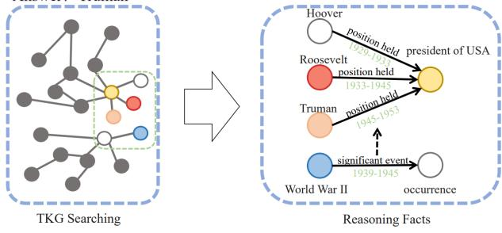
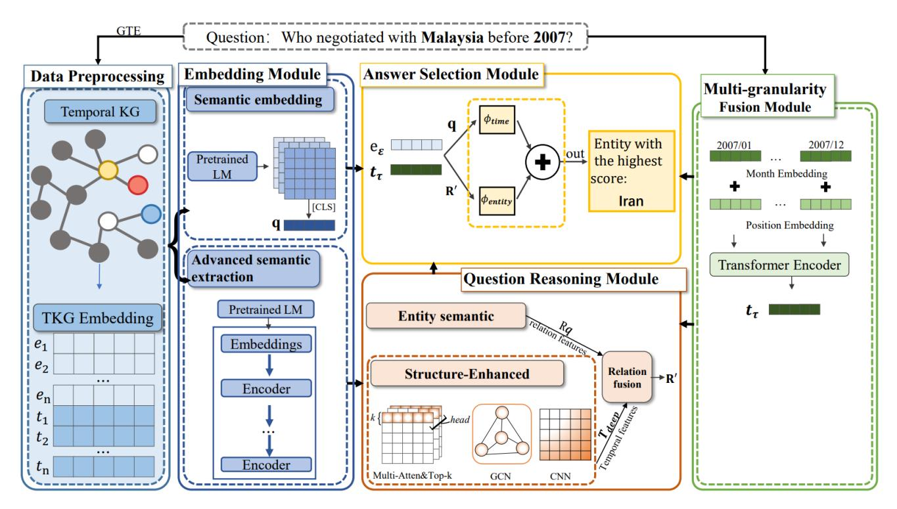
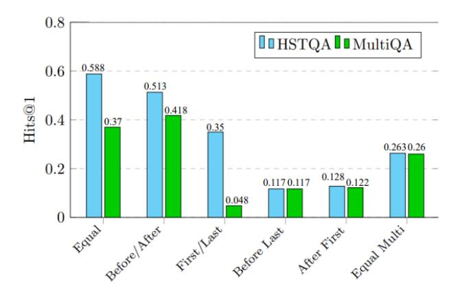

# Question answering over temporal knowledge graphs based on hierarchical semantic extraction

1 st Jian Wang *School of Information Shanghai Ocean University*Shanghai, China wangjian@shou.edu.cn

2 nd Wenjuan Zhang*School of Information Shanghai Ocean University*Shanghai, China M230951694@st.shou.edu.cn

3 rd Qi He*School of Information Shanghai Ocean University*Shanghai, China qihe@shou.edu.cn

4 th Danfeng ZhaoB*School of Information Shanghai Ocean University*Shanghai, China dfzhao@shou.edu.cn
*Abstract*—Temporal Knowledge Graph Question Answering (TKGQA) aims to address problems with temporal constraints using a Temporal Knowledge Graph (TKG). Existing models often overlook the structural information within problems, making it challenging to effectively manage complex temporal issues. To overcome these challenges, we propose the HSTQA model, which employs a hierarchical semantic extraction strategy to precisely capture semantic and implicit temporal information in queries. A multi-granularity fusion technique enhances the model's capability to tackle problems with varying temporal granularities. Additionally, HSTQA incorporates graph convolutional networks to efficiently identify and integrate implicit temporal features and relational patterns. Extensive testing on the MultiTQ dataset shows that HSTQA improves Hits@1 by 10.8% compared to traditional methods, demonstrating its effectiveness in addressing multi-granularity temporal problems and enhancing complex temporal reasoning.

*Index Terms*—Temporal knowledge graph, Question answering, Temporal reasoning, Multi-granularity time question

## I. INTRODUCTION

Temporal Knowledge Graphs (TKG) are multi-relational graphs that include timestamps on each edge. Unlike standard Knowledge Graphs (KGs), TKGs integrate timestamps that can be automatic or user-provided [1], e.g., (China, Make an appeal or request, Kazakhstan, 2015-12-30.)

Question Answering Over Temporal Knowledge Graphs (TKGQA) addresses questions about time by identifying relevant entities or timestamps within TKGs. These questions range from simple to complex temporal reasoning. Simple questions involve explicit constraints and typically require a single fact. For example, the question "Who visited Malaysia on 14 January 2007?" includes the explicit constraint "14 January 2007," and the answer depends on a single fact (China, visit, Malaysia, 2007-01-14). (2) Complex questions involve implicit constraints that necessitate multiple facts. For example, "Who visited Malaysia in the same month as Ognyan Gerdzhikov?" involves the implicit constraint "in the same month as Ognyan Gerdzhikov," relying on multiple facts related to "Malaysia." This complexity demands deeper semantic understanding.

Several researchers [2], [3] have explored methods to handle explicit or implicit temporal constraints. TEQUILA [2] uses predefined templates to break down complex temporal questions into subproblems without temporal constraints and those with temporal constraints. TwiRGCN [3] calculates the edge weights of the question based on the temporal correlation between edges and the question to adjust the information transmitted. However, these methods often depend on predefined rules or extensive subgraph processing, limiting their adaptability to complex situations. CronKGQA [4] addresses temporal constraints implicitly by learning time-aware embeddings of questions and candidate answers, predicting answers based on the similarity of these embeddings. Despite advancements, modeling and applying temporal constraints accurately, especially in complex scenarios, remains a challenge.

Furthermore, existing TKGQA models [2]–[6] typically operate with temporal knowledge graphs limited to a single granularity, assuming queries are parsed and answered using yearly granularity, overlooking the need for diverse temporal granularities common in real-world queries (e.g., daily or monthly granularity). Chen et al. [7] addressed this by proposing MultiQA, which incorporates multi-granularity temporal knowledge graphs and employs temporal aggregation to handle cross-temporal granularity issues. However, this approach neglects the structural nuances of complex questions, where temporal details can influence an entity to different extents. As shown in Fig. 1, for example, consider the question "Who was the first President of the USA after World War II?" The "World War II" in the question relies on the fact (World War II, significant event, occurrence, 1939-1945) for temporal reasoning and contains the constraint "after." By capturing the temporal features implicit in "after World War II" (e.g., "after 1945"), it is possible to combine the entity "President of USA" and the relation "position held." We can deduce three eligible entities. The edges connected by these three entities have different degrees of influence on "President of USA." Roughly setting all three edges to have the same degree of influence will result in errors in reasoning.

To address the challenges of complex temporal problems and the absence of structural information, we propose a new model called HSTQA. This model efficiently extracts semantic and implicit temporal information using hierarchical semantic extraction. The embedding module employs hierarchical semantic extraction to parse and understand both the semantic and implicit temporal information in queries more effectively. To handle mixed temporal granularity questions,

<!-- Image Description: The image illustrates a knowledge graph transformation. The left panel shows a general knowledge graph ("TKG Searching"), a network of nodes and edges. The right panel ("Reasoning Facts") displays a refined subgraph, extracted from the initial graph, focusing on US presidents (Hoover, Roosevelt, Truman) and World War II. Nodes represent entities, edges show relationships, with labels specifying the type and time period. The arrow indicates the transformation from raw data to structured facts. -->

Fig. 1. Example of a complex time question

the multi-granularity fusion module harmonizes question and TKG temporal granularities. Enhancing the ability to answer complex temporal questions, the question inference module integrates several units: the entity semantics unit captures relationship representations, the structure-enhanced unit focuses on extracting implicit temporal features from semantic query representations, and the relation fusion unit deeply integrates these relationship representations with implicit temporal features to generate implicit temporal relationship representations of queries. Finally, the answer selection module utilizes the TComplEx scoring function to score and select the most suitable answers. The main contributions of this study are as follows:

- Hierarchical Semantic Extraction Method: We propose an innovative hierarchical semantic extraction technique that analyzes input questions by extracting two distinct features (global semantic information and local semantic information). This approach allows for a more nuanced understanding of semantics and accurately captures implicit temporal details.
- Structure-Enhanced and Relation Fusion Units: We present an innovative structure-enhanced unit designed to extract implicit temporal features from complex semantic queries. Additionally, the relation fusion unit integrates these features into coherent relational patterns, facilitating a deeper comprehension of temporal semantics.
- HSTQA Effectiveness: The effectiveness of HSTQA is confirmed through extensive experiments and ablation studies conducted on the MultiTQ dataset.

## II. RELATE WORK

## *A. Temporal Knowledge Graph Embedding*Timestamps can be efficiently integrated into the model through Temporal Knowledge Graph Embedding (TKGE) to accurately capture entity, relationship, and temporal dynamics information. Jiang et al. [8] proposed the first time-aware embedding model. HyTE [9] assigns each timestamp a corresponding hyperplane to utilize temporal information in the entity-relationship space. The DE-SimplE [10] model treats timestamps as part of a relationship. The TComplEx [11] model, on the other hand, extends ComplEx [12] based on the regular decomposition of the 4th order tensor and is the most widely used of the TKGQA models [2]–[7] . In this paper, we use these TKG embeddings in our approach to work with the temporal relationship representation.

##*B. Question Answering Over Temporal Knowledge Graphs*There are two approaches to TKGQA. The first approach decomposes the original question into non-temporal questions and temporal constraints, then applies a question-and-answer model designed for Knowledge Graphs (KGs) to answer these questions, such as [2]. However, this approach requires handcrafted decomposition rules and cannot handle complex questions. The second approach aims to obtain TKG embeddings to compute the semantic similarity of the answers. CronKGQA [4] does not rely on hand-crafted rules and performs well in answering simple questions but struggles with complex questions requiring time-constrained reasoning. TempoQR [13] addresses complex temporal questions by learning context, entity, and time-aware enhancements of the question representation. However, it does not adequately consider time constraints, leading to unreliable answers. A similar issue is observed in MultiQA [7], which focuses on solving multi-granularity temporal questions.

## III. METHOD

The overall architecture of HSTQA is shown in Fig. 2. The model consists of five components: data preprocessing, embedding module, question inference module, multi-granularity fusion module and answer selection module. Each module is further divided into multiple units.

##*A. Data preprocessing*The first step in TKGQA involves identifying the entities and temporal constraints within a query and finding the relevant information in the TKG for further reasoning. Using fuzzy matching directly to identify entities can overlook semantic nuances, resulting in errors and complicating the reasoning process. To overcome this limitation, this paper uses a semantic similarity-based framework GTE [14], to obtain more accurate TKG embeddings of entities by matching them with the entity dictionary in the TKG.

##*B. Embedding Module*This module is designed to understand the semantic information of the question and the implied temporal relationships. A hierarchical semantic extraction approach is employed to extract diverse features of the problem, providing a more detailed understanding of both global and local semantic information. This approach includes a semantic embedding phase followed by an advanced semantic extraction phase.
*1) Semantic embedding:*For a given natural language question qtext, the semantic information is extracted using a pre-trained language model. Specifically, the natural language question qtext is transformed into a semantic matrix Qe by the pre-trained RoBERTa [15] model:

$$
\mathbf{Q}_e = \mathbf{W}_E \text{RoBERTa}(q_{\text{text}})
$$
 (1)

<!-- Image Description: This image depicts the architecture of a question-answering system for temporal knowledge graphs. It uses a pipeline, starting with data preprocessing of a temporal knowledge graph (KG). The system then generates embeddings for the question and KG entities, using pretrained language models. A question reasoning module fuses entity and relational information, and an answer selection module ranks potential answers based on a combined score incorporating temporal and entity features. Finally, a multi-granularity fusion module incorporates temporal information before the final answer selection. The diagram shows the flow of information through various modules, including embeddings, encoders, and fusion operations, visualized with boxes and arrows. -->

Fig. 2. Overall architecture of HSTQA

where Qe = [qCLS, qe1 , . . . , qeN ] is a d×l embedding matrix, l is the number of tokens, d is the dimension of the TKG embedding, WE is a d × dRoBERTa projection matrix, and dRoBERTa is the dimension of the RoBERTa embedding. The final question semantic representation is denoted as q = qCLS.

The semantic representations obtained in this phase will be used for relationship prediction in the answer scoring phase of the answer selection module.
*2) Advanced semantic extraction phase:*For a given natural language question qtext, the final hidden state QR is extracted by the RoBERTa model in this phase:

$$
\mathbf{Q}_R = \text{RoBERTa}(q_{\text{text}}) \tag{2}
$$

where QR ∈ R n×dRoBERTa and n denotes the length of the question. Next, a linear transformation is applied to obtain the instruction vector DR ∈ C n×d . The instruction vectors obtained at this phase will be used in the question reasoning module.

##*C. Multi-granularity fusion module*Due to differences in temporal granularity between the question and the temporal knowledge graph, temporal semantic information cannot be obtained directly from pre-trained TKG embeddings. Inspired by MultiQA [6], we propose a multigranularity fusion module to derive the temporal representation of a question through temporal embedding and positional embedding. Taking monthly granularity as an example, assume the time information in the question is represented as monthly time m, and the time granularity of TKG is daily.

By extracting all the day-level time information in TKG d1, d2, . . . , dn and their corresponding time-embedded representations Dd1 , Dd2 , . . . , Ddn , we aggregate them to obtain the time embedding of monthly granularity Td:

$$
T_d = [D_{d_1}, D_{d_2}, \dots, D_{d_n}]
$$
 (3)

where Td ∈ R N×D is the matrix containing the embeddings of all days of the m-th month.

Since the location information of the time embedding is as important as that of the text, we enrich its location information by adopting a sinusoidal location coding approach:

PE
$$
(x, j)
$$
 =
$$
\begin{cases} \sin\left(\frac{x}{10000^{2i/D}}\right), & \text{if } j = 2i\\ \cos\left(\frac{x}{1000^{2i/D}}\right), & \text{if } j = 2i + 1 \end{cases}
$$
 (4)

where x is the position of the temporal embedding Td in the D-dimensional vector, and j denotes the position in the D-dimensional vector. The position information is then added to Td, resulting in the fusion time embedding T ′ d = [T ′ d1 , T′ d2 , . . . , T′ dn ].

Next, we use a Transformer encoder to encode the fused time embedding T ′ d , obtaining the fused time embedding representation of the month particle Tm = [tCLS, tm1 , . . . , tmN ]. The final temporal representation of the question is tm = tCLS.

By repeating the above process, the yearly temporal representation ty can be obtained. Therefore, the final temporal representation of the question at τ is tτ .

##*D. Question reasoning module*The Question Reasoning module is designed to capture implicit temporal features of questions.
*1) Entity semantic unit:*Inspired by EaE [16], the token embeddings of entities and timestamps in qtext are replaced with pre-trained TKG embeddings. We sum the entity and timestamp embeddings with their TKG embeddings to obtain the high-level semantic matrix QE. For the command vector DR, each token i in the vector has:

$$
Q_{E_i} = \begin{cases} D_{R_i} + W_q e, & \text{the i-th token is an entity mention} \\ D_{R_i} + W_q t, & \text{the i-th token is a timestamp mention} \\ D_{R_i}, & \text{others} \end{cases}
$$

(5) where QE = [q ′ CLS, q′ E1 , . . . , q′ EN ] is a d×l embedding matrix of the TKG, where l is the number of tokens and d is the dimension of the TKG embeddings. Wq is a d × dRoBERT a projection matrix, where dRoBERT a is the dimension of RoBERTa embeddings and the extracted relationship representation Rq = q ′ CLS.
*2) Structure-enhanced units:*In TKGQA, most approaches focus mainly on relational representations and ignore the importance of structural information in time-constrained questions. This unit aims to integrate multi-head self-attention, Graph Convolutional Network (GCN) and Convolutional Neural Network (CNN) to capture relevant temporal relational features from the question representation and enhance the structural information of the question.

First, we use the multi-head self-attention mechanism to extract important contextual information from the question representation QR of the embedding module. Specifically, multi-head self-attention constructs k attention score matrices, sums these score matrices, and retains the most important context words using a top-k selection strategy(k = 1). This process retains the most useful information while reducing computational complexity. The formula is as follows:

$$
A_{qe}^{(1)} = \text{top-k} \left( \sum_{h=1}^{K} A_{qe,i}^{h} \right)
$$
 (6)

$$
A_{qe,i}^{(1)} = \frac{(Q_R W_{qe,k}^{(1)})(Q_R W_{qe,q}^{(1)})^T}{\sqrt{d_{\text{head}}}}\tag{7}
$$

where A (1) qe ∈ R n×n denotes the initialization of the first layer of the adjacency matrix, A (1) qe,i denotes the i-th element of the first layer of the adjacency matrix, K is the number of attention heads, dhead denotes the dimension of the single-head attention, T is the transpose symbol, and W (1) qe,k and W (1) qe,q ∈ R dRoBERTa×dhead are the trainable weight matrices for the first layer.

Next, this contextual structural information is aggregated using a GCN. To further extract temporal features, shallow features Tshallow are extracted using a CNN. These shallow features are then combined with the question representation as inputs to the multi-head self-attention, updating the secondlayer adjacency matrix A (2) qe ∈ R n×n, and aggregating surrounding structural information via the second-layer GCN:

$$
H_{qe}^{(2)} = \text{GCN}(A_{qe}^{(2)}, [T_{\text{shallow}}; Q_R])
$$
 (8)

$$
A_{qe,i}^{(2)} = \frac{(T_{\text{shallow}} W_{qe,k}^{(2)})(T_{\text{shallow}} W_{qe,q}^{(2)})^T}{\sqrt{d_{\text{head}}}} \tag{9}
$$

where A (2) qe,i is the i-th neighbor matrix of the second layer, and W (2) qe,k and W (2) qe,q ∈ R dRoBERTa×dhead are the trainable weight matrices of the second layer.

Finally, a feedforward layer is applied to integrate the temporal information in the shallow temporal features. This feedforward layer contains two linear layers with ReLU activation. The output of the feedforward layer is then used as the input to the second GCN layer to obtain the implicit temporal feature Tdeep, and the dimension of the implicit temporal feature Tdeep is projected to the complex space C n×d :

$$
T_{\text{deep}} = \text{ReLU}(\text{Conv}(H_{qe}^{(2)}))
$$
\n(10)
*3) Relation fusion unit:*Inspired by Jiao et al. [7], relying solely on relational representations can lead to the loss of important time constraint information. Thus, we employ a trainable gating function g to determine how much of the relational representation information and implicit temporal features should be retained. The gating function is formulated as follows:

$$
g = \text{Sigmoid}(W_e[T_{deep}, R_q]) \tag{11}
$$

where g ∈ [0, 1]n×d is a real number between 0 and 1, and We is the trainable weight matrix. The trainable gating function g learns the ratio of relational representation information and implicit temporal features.

Based on the value of g, we fuse the relational representation with the implicit temporal features to generate the implicit temporal relation matrix R′ n , represented as follows:

$$
R'_n = g \times T_{deep} + (1 - g) \times R_q \tag{12}
$$

The first layer of the implicit temporal relationship matrix is used as the implicit temporal relationship representation R′ ∈ C d .

##*E. Answer selection module*In this module, the implicit temporal relationship representation of the graph embedding module is used as the generating entity embedding vector R′ ent ∈ C d . The temporal prediction of the relationship is denoted by Wtq ∈ C d . If object entity or timestamp is missing, we need to use a dummy object entity (subject entity) or dummy timestamp (0 token). Using the TComplEx [11] method, the entity embeddings se ∈ E, oe ∈ E, and the timestamp embeddings obtained by multigranularity fusion tτ ∈ T are combined to calculate each entity's e ′ ∈ E score:

$$
\phi(entity) = \max \left( Re(\langle h_e, R'_{\text{ent}}, e', t_\tau \rangle), \right. \\ \left. Re(\langle o_e, R'_{\text{ent}}, e', t_\tau \rangle), \right. \tag{13}
$$

⟨se, R′

$$
Re(\langle s_e, R'_{ent}, e', t_\tau \rangle) \bigg)
$$

$$
h_e = W_s[s_e; o_e]
$$
 (14)

, tτ ⟩ !

where Ws is a trainable matrix specific to entity prediction, and he is obtained by concatenating the embeddings of the head and tail entities and applying a linear transformation. Additionally, for each timestamp t ′ ∈ T , the score is computed as follows:

Re

$$
\phi(time) = \text{Re}(\langle s_e, W_t \mathbf{q}, o_e, t' \rangle) \tag{15}
$$

where Wt is the time-specific prediction matrix and T is the set of timestamps.Finally, all entit and timestamp scores are concatenated, and the entity or timestamp with the highest score is selected as the answer.

During training, the parameters are updated using crossentropy loss to increase the probability of selecting the correct answer.

## IV. EXPERIMENTS

##*A. Experimental setup*##*1) Experimental data set:*The MultiTQ [6] dataset is a multi-temporal granularity TKGQA dataset comprising 500,000 unique Q&A pairs. The distribution statistics of the questions in this dataset are shown in Table 1. These questions can be categorized into single temporal constraints (including Equal, Before/After, First/Last) and multi-temporal constraints (including Equal Multi, After First, and Before Last).

TABLE I NUMBER OF QUESTIONS IN THE DATASET WITH DIFFERENT TYPES OF REASONING

|              | Train   | Dev    | Test   |  |
|--------------|---------|--------|--------|--|
| Single       |         |        |        |  |
| Equal        | 135,890 | 18,983 | 17,311 |  |
| Before/After | 75,340  | 11,655 | 11,073 |  |
| First/Last   | 72,252  | 11,097 | 10,480 |  |
| Multiple     |         |        |        |  |
| Equal-Multi  | 16,893  | 3,213  | 3,207  |  |
| After-First  | 43,305  | 6,499  | 6,266  |  |
| Before-Last  | 43,107  | 6,532  | 6,247  |  |
| Total        | 386,787 | 58,979 | 54,584 |  |

##*2) Parameterization:*The models were trained using Python 3.8 and the PyTorch 1.8.1 framework on a GeForce RTX 3090 GPU running Ubuntu 16.04. TComplEx [11] embeddings were employed as TKG embeddings, featuring dimensions D = 512 and complex space dimension C d= 768. Neither the parameters of the language model (LM) nor the TKG embeddings were updated during training. Training proceeded for a maximum of 15 epochs, utilizing the Adam optimizer [17] with the initial learning rate set to 2e-4.

To assess the model's effectiveness, Hits@1 and Hits@10 are utilized as performance evaluation metrics in this study. Hits@1 denotes the probability that the top-ranked answer is correct, while Hits@10 indicates the probability that the correct answer is among the top 10 ranked answers. The calculation process is as follows:

$$
\text{Hits}@n = \frac{1}{|Q|} \sum_{i=1}^{|Q|} f(\text{rank}_i \le n) \tag{16}
$$

where |Q| represents the total number of questions,ranki denotes the position of the correct answer among the output answers, and f is an indicator function that takes a value of 1 if the condition is met and 0 otherwise.

##*B. Baselines*- Pre-training models: The effectiveness of language models (LMs) in handling temporal questions is analyzed by obtaining embeddings of entities, times, and questions using BERT [18], DistilBERT [19], and ALBERT [20], and connecting them to compute answers.
- EmbedKGQA: EmbedKGQA [21] is designed for static knowledge graphs (KGs). To address multiple temporal granularities, timestamps are ignored and random temporal embeddings are used during pre-training.
- CronKGQA: CronKGQA [4] is designed for single temporal granularity. To handle multiple granularities, time embeddings with yearly/monthly granularity are randomly selected from the corresponding daily embeddings.
- MultiQA: MultiQA [6] extracts temporal text from the question and enhances the time-aware embedding of the question with a multi-granularity representation module.

##*C. Experimental results*Table 2 summarizes the experimental outcomes on the MultiTQ dataset. Models based on knowledge graphs, such as EmbedKGQA and CronKGQA, significantly outperform pretrained models like BERT, DistilBERT, and ALBERT. Specifically, CronKGQA achieves 7.3% and 14.9% improvements in Hits@1 and Hits@10, respectively, compared to Embed-KGQA, highlighting the benefits of temporal embedding in enhancing the accuracy of temporal Q&A reasoning. Among the multi-granularity temporal inference models, HSTQA surpasses MultiQA with improvements of 10.8% in Hits@1 and 10.9% in Hits@10. For single-constraint questions, HSTQA achieves a Hits@1 score of 0.502, outperforming all other models, While it is somewhat less effective than MultiQA for multi-constraint questions, it significantly outperforms other methods. This difference arises because HSTQA successfully utilizes structural information from related temporal contexts to compensate for the lack of implicit temporal features in single-constraint questions but may introduce unnecessary

| Model                            | Hits@1                  |                              |                         |                         | Hits@10                 |                         |                         |                         |                         |                         |
|----------------------------------|-------------------------|------------------------------|-------------------------|-------------------------|-------------------------|-------------------------|-------------------------|-------------------------|-------------------------|-------------------------|
|                                  | Overall                 | Question Type Answer Type |                         |                         | Overall                 | Question Type           |                         | Answer Type             |                         |                         |
|                                  |                         | Multiple                     | Single                  | Entity                  | Time                    |                         | Multiple                | Single                  | Entity                  | Time                    |
| BERT DistillBERT ALBERT    | 0.083 0.083 0.108 | 0.061 0.074 0.086      | 0.092 0.087 0.116 | 0.101 0.102 0.139 | 0.040 0.037 0.032 | 0.441 0.482 0.484 | 0.392 0.426 0.415 | 0.461 0.505 0.512 | 0.531 0.591 0.589 | 0.222 0.216 0.228 |
| EmbedKGQA CronKGQA MultiQA | 0.206 0.279 0.293 | 0.134 0.134 0.159      | 0.235 0.337 0.347 | 0.290 0.328 0.349 | 0.001 0.156 0.157 | 0.459 0.608 0.635 | 0.439 0.453 0.519 | 0.467 0.671 0.682 | 0.648 0.696 0.733 | 0.001 0.392 0.396 |
| HSTQA                            | 0.401                   | 0.148                        | 0.502                   | 0.408                   | 0.383                   | 0.744                   | 0.536                   | 0.829                   | 0.758                   | 0.71                    |

TABLE II COMPARISON OF VARIOUS BASELINE AND HSTQAS ON THE MULTITQ

TABLE III COMPARISON OF VARIOUS BASELINES AND HSTQA FOR MULTI-GRANULARITY QUESTIONS ON HITS@1

| Model       | Equal |       |       | Before/after |       |       |  |
|-------------|-------|-------|-------|--------------|-------|-------|--|
|             | Day   | Month | Year  | Day          | Month | Year  |  |
| BERT        | 0.049 | 0.103 | 0.136 | 0.150        | 0.164 | 0.175 |  |
| DistillBERT | 0.069 | 0.082 | 0.132 | 0.221        | 0.227 | 0.308 |  |
| ALBERT      | 0.041 | 0.087 | 0.113 | 0.160        | 0.150 | 0.186 |  |
| EmbedKGQA   | 0.200 | 0.336 | 0.218 | 0.392        | 0.518 | 0.511 |  |
| CronKGQA    | 0.425 | 0.389 | 0.331 | 0.375        | 0.474 | 0.450 |  |
| MultiQA     | 0.445 | 0.393 | 0.350 | 0.379        | 0.548 | 0.525 |  |
| HSTQA       | 0.723 | 0.463 | 0.429 | 0.599        | 0.579 | 0.621 |  |

temporal features in multi-constraint questions, which can mislead the reasoning process.

Table 3 highlights the strengths of our approach in addressing multi-granularity temporal issues. HSTQA demonstrates superior performance in both "equal" and "before/after" question types. This success is attributed to the model's use of a multi-granularity fusion module, which aligns differences in temporal granularity, and a hierarchical semantic extraction strategy that captures semantic information. By integrating these elements with structural information, the model significantly enhances the accuracy of question reasoning.

Additionally, various question types were thoroughly analyzed and compared with the MultiQA model, as illustrated in Fig. 3. The HSTQA model demonstrated superior performance across all question types, exhibiting a notable advantage. This is particularly evident in the "First/Last" question, where HSTQA's ability to integrate implicit temporal features, captured by the structural augmentation unit and incorporated into the relational representation, is highlighted. Furthermore, HSTQA excels at solving single-constraint questions, with particular success in the "equal" question.

##*D. Ablation experiments*To verify the impact of different modules and strategies of HSTQA on performance, we conducted ablation experiments, with the results shown in Table 4. Removing the hierarchical semantic extraction strategy, i.e., not using the semantic embedding phase, results in an overall performance decline of 2.4% in Hits@1 and 5.0% in Hits@10. This demonstrates that the proposed method enhances both the overall semantic information and the local implicit temporal information of the comprehension question. Comparing the results with the deletion of the multi-granularity module, we observe a significant overall decline, particularly in answering temporal questions. This proves that the multi-granularity module effectively aggregates the temporal representations of the questions and improves HSTQA's ability to answer multigranularity questions. Comparing the results of removing the relational fusion unit with HSTQA, there is a significant decrease in single constraint questions with Hits@1 and questions where the answer is an entity. This demonstrates the unit's capability to fuse implicit temporal features and relational representations. For the structure-enhanced unit, the model's Hits@1 performance drops from 0.401 to 0.348. This is because the structure-enhanced unit can sensitively capture implicit temporal features (e.g., "before/after", "first/last" related features).

TABLE IV RESULTS OF ABLATION STUDIES

| Model                                                                                                                          | Hits@1                           |                                  |                                  |                                  |                                  |  |
|--------------------------------------------------------------------------------------------------------------------------------|----------------------------------|----------------------------------|----------------------------------|----------------------------------|----------------------------------|--|
|                                                                                                                                | Overall                          | Question Type Answer Type     |                                  |                                  |                                  |  |
|                                                                                                                                |                                  | Multiple                         | Single                           | Entity                           | Time                             |  |
| HSTQA                                                                                                                          | 0.401                            | 0.148                            | 0.502                            | 0.408                            | 0.383                            |  |
| - Hierarchical semantic extraction - Multi-granularity fusion Module - Relation fusion unit - Structure-enhanced unit | 0.377 0.384 0.381 0.348 | 0.150 0.141 0.141 0.131 | 0.468 0.482 0.479 0.436 | 0.397 0.391 0.382 0.380 | 0.277 0.366 0.380 0.271 |  |

## V. CONCLUSION

In this paper, we propose HSTQA, a question-answering model based on hierarchical semantic extraction, which significantly enhances complex temporal reasoning for the TKGQA task. Unlike existing models, HSTQA excels by hierarchically

<!-- Image Description: The bar chart compares the performance of two question answering methods, HSTQA and MultiQA, across various scenarios. The y-axis represents Hits@1 (accuracy), and the x-axis shows different query-answering contexts (e.g., "Equal," "Before/After"). Numerical values above each bar indicate precise Hits@1 scores for each method in each scenario. The chart visually demonstrates the relative effectiveness of HSTQA and MultiQA under varying conditions. -->

Fig. 3. Experimental results of MultiQA and HSTQA for different question types (Hits@1)

extracting both semantic representations and implicit temporal features through advanced embedding modules. It uniquely employs multi-granularity fusion to improve performance across various temporal granularities and integrates a GCN to capture nuanced implicit temporal features. This combination enables HSTQA to effectively fuse implicit temporal features with relational representations. Experimental results demonstrate that HSTQA outperforms baseline models in addressing complex temporal questions with multiple granularities. Moving forward, we aim to further integrate HSTQA with additional reasoning strategies to enhance its reasoning capabilities and robustness in multi-constraint temporal questions.

### ACKNOWLEDGMENT

National Key Research and Development Program of China (Grant No. 2021YFC3101601); National Natural Science Foundation of China Youth Program 42106190

#### REFERENCES

- [1] Partha Pratim Talukdar, Derry Wijaya, and Tom Mitchell. Coupled temporal scoping of relational facts. In*Proceedings of the fifth ACM international conference on Web search and data mining*, pages 73–82, 2012.
- [2] Zhen Jia, Abdalghani Abujabal, Rishiraj Saha Roy, Jannik Strotgen, and ¨ Gerhard Weikum. Tequila: Temporal question answering over knowledge bases. In *Proceedings of the 27th ACM International Conference on Information and Knowledge Management*, CIKM '18, page 1807–1810, New York, NY, USA, 2018. Association for Computing Machinery.
- [3] Aditya Sharma, Apoorv Saxena, Chitrank Gupta, Seyed Mehran Kazemi, Partha Talukdar, and Soumen Chakrabarti. Twirgcn: Temporally weighted graph convolution for question answering over temporal knowledge graphs. *arXiv preprint arXiv:2210.06281*, 2022.
- [4] Apoorv Saxena, Soumen Chakrabarti, and Partha Talukdar. Question answering over temporal knowledge graphs. *arXiv preprint arXiv:2106.01515*, 2021.
- [5] Wenjuan Jiang, Yi Guo, and Jiaojiao Fu. Temporal knowledge graph question answering models enhanced with gat. In *2023 IEEE International Conference on Big Data (BigData)*, pages 1162–1167. IEEE, 2023.
- [6] Songlin Jiao, Zhenfang Zhu, Wenqing Wu, Zicheng Zuo, Jiangtao Qi, Wenling Wang, Guangyuan Zhang, and Peiyu Liu. An improving reasoning network for complex question answering over temporal knowledge graphs. *Applied Intelligence*, 53(7):8195–8208, 2023.

- [7] Ziyang Chen, Jinzhi Liao, and Xiang Zhao. Multi-granularity temporal question answering over knowledge graphs. In *Proceedings of the 61st Annual Meeting of the Association for Computational Linguistics (Volume 1: Long Papers)*, pages 11378–11392, 2023.
- [8] Tingsong Jiang, Tianyu Liu, Tao Ge, Lei Sha, Baobao Chang, Sujian Li, and Zhifang Sui. Towards time-aware knowledge graph completion. In *Proceedings of COLING 2016, the 26th International Conference on Computational Linguistics: Technical Papers*, pages 1715–1724, 2016.
- [9] Shib Sankar Dasgupta, Swayambhu Nath Ray, and Partha Talukdar. Hyte: Hyperplane-based temporally aware knowledge graph embedding. In *Proceedings of the 2018 conference on empirical methods in natural language processing*, pages 2001–2011, 2018.
- [10] Rishab Goel, Seyed Mehran Kazemi, Marcus Brubaker, and Pascal Poupart. Diachronic embedding for temporal knowledge graph completion. In *Proceedings of the AAAI conference on artificial intelligence*, volume 34, pages 3988–3995, 2020.
- [11] Timothee Lacroix, Guillaume Obozinski, and Nicolas Usunier. Tensor ´ decompositions for temporal knowledge base completion. *arXiv preprint arXiv:2004.04926*, 2020.
- [12] Theo Trouillon, Johannes Welbl, Sebastian Riedel, ´ Eric Gaussier, and ´ Guillaume Bouchard. Complex embeddings for simple link prediction. In *International conference on machine learning*, pages 2071–2080. PMLR, 2016.
- [13] Costas Mavromatis, Prasanna Lakkur Subramanyam, Vassilis N Ioannidis, Adesoji Adeshina, Phillip R Howard, Tetiana Grinberg, Nagib Hakim, and George Karypis. Tempoqr: temporal question reasoning over knowledge graphs. In *Proceedings of the AAAI conference on artificial intelligence*, volume 36, pages 5825–5833, 2022.
- [14] Zehan Li, Xin Zhang, Yanzhao Zhang, Dingkun Long, Pengjun Xie, and Meishan Zhang. Towards general text embeddings with multi-stage contrastive learning. *arXiv preprint arXiv:2308.03281*, 2023.
- [15] Yinhan Liu, Myle Ott, Naman Goyal, Jingfei Du, Mandar Joshi, Danqi Chen, Omer Levy, Mike Lewis, Luke Zettlemoyer, and Veselin Stoyanov. Roberta: A robustly optimized bert pretraining approach. *arXiv preprint arXiv:1907.11692*, 2019.
- [16] Thibault Fevry, Livio Baldini Soares, Nicholas FitzGerald, Eunsol Choi, ´ and Tom Kwiatkowski. Entities as experts: Sparse memory access with entity supervision. *arXiv preprint arXiv:2004.07202*, 2020.
- [17] Diederik P Kingma and Jimmy Ba. Adam: A method for stochastic optimization. *arXiv preprint arXiv:1412.6980*, 2014.
- [18] Jacob Devlin, Ming-Wei Chang, Kenton Lee, and Kristina Toutanova. Bert: Pre-training of deep bidirectional transformers for language understanding. *arXiv preprint arXiv:1810.04805*, 2018.
- [19] Victor Sanh, Lysandre Debut, Julien Chaumond, and Thomas Wolf. Distilbert, a distilled version of bert: smaller, faster, cheaper and lighter. *arXiv preprint arXiv:1910.01108*, 2019.
- [20] Zhenzhong Lan, Mingda Chen, Sebastian Goodman, Kevin Gimpel, Piyush Sharma, and Radu Soricut. Albert: A lite bert for self-supervised learning of language representations. *arXiv preprint arXiv:1909.11942*, 2019.
- [21] Apoorv Saxena, Aditay Tripathi, and Partha Talukdar. Improving multi-hop question answering over knowledge graphs using knowledge base embeddings. In *Proceedings of the 58th annual meeting of the association for computational linguistics*, pages 4498–4507, 2020.
