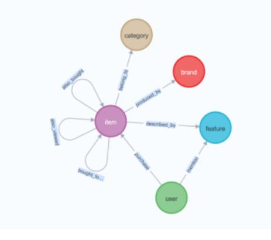
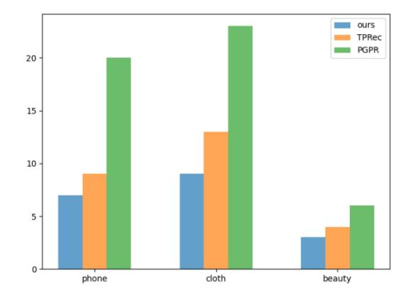

# Recommendation System Based on Temporal Knowledge Graph Path Reasoning

Haoyuan Ren\* College of Electronic Engineering, Naval University of Engineering, Wuhan, China rrren\_hy@163.com.

Liangzhong Cui

College of Electronic Engineering, Naval University of Engineering, Wuhan, China szzll@163.com.

## ABSTRACT

Reasoning based on Knowledge graph has been studied and used for explanation recommendations because it can provide a clear explanation. However, the current recommendation methods based on Knowledge graphs use static Knowledge graphs, without considering the time information that has a significant impact on recommendation. In this paper, we propose a method of path recommendation reasoning on the temporal Knowledge graph. This method uses the time information of user and item interaction to provide better recommendations with more reasonable explanations. First, we use a representation learning method that has a good performance effect on the temporal Knowledge graph to code entities and relations, and then use the path reasoning method based on Reinforcement learning to recommend according to the embedded representation of entities and relationships. We conducted extensive experiments on three real-world datasets. The results indicate that the proposed method is effective in NDCG@K Recall@K Precision@K and HR@K Four evaluation indicators are superior to existing models.

### CCS CONCEPTS

• Computing methodologies → Artificial intelligence; Knowledge representation and reasoning; Temporal reasoning; • Information systems → Information systems applications; Data mining.

# KEYWORDS

Recommendation system, temporal knowledge graph, Graph representation learning, Markov decision process

#### ACM Reference Format:

Haoyuan Ren\* and Liangzhong Cui. 2023. Recommendation System Based on Temporal Knowledge Graph Path Reasoning. In 2023 International Conference on Power, Communication, Computing and Networking Technologies (PCCNT 2023), September 24, 25, 2023, Wuhan, China. ACM, New York, NY, USA, [5](#page-4-0) pages.<https://doi.org/10.1145/3630138.3630436>

# 1 INTRODUCTION

Due to the network's development and the information's increasing, the collection of useful information required by users from

PCCNT 2023, September 24, 25, 2023, Wuhan, China

© 2023 Copyright held by the owner/author(s). Publication rights licensed to ACM. ACM ISBN 978-1-4503-9995-1/23/09. . . \$15.00 <https://doi.org/10.1145/3630138.3630436>

massive information has become the focus of current recommendation system research. With the rapid development of the Internet and the increasing amount of data, the main goal of current recommendation system research is to obtain effective information needed by users from massive data. As a method of information filtering, recommendation systems can recommend interesting data content for users according to their needs, behaviors, and preferences. The recommendation system based on knowledge graph (KG) can quickly discover the entities and relationships related to users and items according to the historical behavior data of users. Also, it can obtain richer user and item background information, and achieve more accurate and effective recommendations.

At present, most recommendation systems based on Knowledge graph reasoning (KGR) regard the interaction between users and items as a static relationship, which ignored interactive time information (such as purchase time) [\[1\]](#page-4-1). They cannot model the time pattern of users' behavior, and the reasoning path and results obtained are not reliable. The reason is that users' purchasing behavior has a certain periodicity, and people often have similar behaviors on specific festivals. Although some methods have modeled time information, they are mainly used to enhance data representation, rather than reasoning on the Knowledge graph, making it impossible for them to infer more information from time stamps (such as seasons, festivals, etc.).

Recommendation systems based on the Knowledge graph can be divided into two categories. The embedding-based method is to represent entities and relations between entities in the Knowledge graph by embedding, which can supplement the semantic information between the original data, enrich the semantic description, and help to explore user preferences. However, such methods will ignore the path design in the Knowledge graph and the association information between multi-hop entities, which makes the resulting in the poor interpretability. The path-based method uses the path link information in the Knowledge Graph to generate the recommendation candidate list and the path list for users. Users can find potential items associated with entities through paths, to obtain more accurate user preferences. This type of method utilizes path connections to standardize or enrich the representation of users and items. However, such methods typically require field export to define meta paths. But through its generated path, interpretability can be brought to the result [\[2\]](#page-4-2) [\[3\]](#page-4-3).

Both methods utilize only one aspect of the information in the graph. To fully utilize the information in KG for better recommendations, a unified method is proposed to integrate the semantic representation of entities and relationships with connectivity information.

Permission to make digital or hard copies of all or part of this work for personal or classroom use is granted without fee provided that copies are not made or distributed for profit or commercial advantage and that copies bear this notice and the full citation on the first page. Copyrights for components of this work owned by others than the author(s) must be honored. Abstracting with credit is permitted. To copy otherwise, or republish, to post on servers or to redistribute to lists, requires prior specific permission and/or a fee. Request permissions from permissions@acm.org.

PCCNT 2023, September 24, 25, 2023, Wuhan, China Haoyuan Ren and Liangzhong Cui

Table 1: Notation and Definition.

| Notations     | Definition                                 |  |  |  |  |
|---------------|--------------------------------------------|--|--|--|--|
| , Gs G, Gt | TKG, KG at time t, static KG               |  |  |  |  |
| Ht , Rt    | The representation of entities and         |  |  |  |  |
|               | relations at time t                        |  |  |  |  |
| sk,S          | state at step k and state space            |  |  |  |  |
| ak, A         | Action at step k and action space          |  |  |  |  |
| pk            | historical search path at step k           |  |  |  |  |
| U, P          | The user set and product set               |  |  |  |  |
| U-P, U-Pt     | The interaction set and interaction set at |  |  |  |  |
|               | time t                                     |  |  |  |  |
| KGitem        | Static KG of item attributes               |  |  |  |  |

In this paper, we first encode the entities and relationships in the temporal Knowledge graph, and the graph neural network with relationship awareness ability is combined with LSTM to obtain the semantic representation of time information, and a simple one-step recommendation prediction is made to obtain the first k pieces of recommendation information. Next, the multi-hop path reasoning algorithm based on Reinforcement learning is used to construct rewards containing time information through the interaction history between users and items, and k pieces of recommendation information are injected into the state to avoid the agent's aimless search path.

In this article, Section 2 first defines the symbols that will appear in the article. Then Part 3 is the model building part. Finally, Part 4 is the experimental part.

### 2 SYMBOL DEFINE

Let U, P, U-P represent user set, product set, and interaction set between them respectively. After considering temporal interaction, expand the interaction set to {U-P1, ..., U-PT}, and use KG item to represent the static Knowledge graph of storage item attributes. According to previous research, GT={(s, r, o) | s, o ∈ H', r ∈ R'}, where E '=H ∪ U, R'=R ∪ U-P, which serve as the environment for reasoning. Given the Knowledge graph GT, user u and timestamp t in the actual task, the recommendation model will get an item set I 'and its corresponding reasoning path {(u, r1, h1), ..., (hk-1, rk, i) | (hi-1, ri , hi) ∈ GT}. Table [1](#page-1-0) provides a detailed explanation of the characters that may appear in the article.

### 3 METHODOLOGY

### 3.1 Learning Temporal semantic representation

In the task related to knowledge graph, the first task is to learn the graph representation. In the actual processing, the entire temporal Knowledge graph is divided into a group of Knowledge graph snapshot sequences according to the time point, and a change model similar to GATNE [\[4\]](#page-4-4) is used on each snapshot graph to learn the representation of entities and relationships.

Firstly, an aggregation calculation is performed on the central node s and the relationship r, which implies the translation attribute between the central node s and the neighbor node o through the relationship r:

$$
\overrightarrow{h}_{s,t}^{l} = \text{aggregation}(\overrightarrow{h}_{s,t}^{l}, \overrightarrow{r}_{s,t}^{l})
$$
\n(1)

The aggregation function here can be mean aggregation, maximum pooling aggregation, or cumulative aggregation.

Considering that different types of relationship edges have different impacts on nodes, we use the attention mechanism to calculate the weight value of each edge:

$$
e_{s,o} = LeakyReLU(W_1^l[\overrightarrow{h}_{s,t}^l || \overrightarrow{h}_{o,t}^l])
$$
\n(2)

$$
a_{s,o} = soft \max(e_{s,o}) = \frac{\exp(e_{s,o})}{\sum_{(s,r,k,t) \in E_t} \exp(e_{s,k})}
$$
(3)

Among them, 1 is a learnable fully connected layer parameter, aimed at processing the merged vectors. ®ℎ ,, ®ℎ ,, ® s,t represents the embedding representation matrix of head entity s, tail entity o, and relationship r at time t. The final , represents the contribution value of different neighboring nodes to the central node, which is the weight matrix acting on the relationship embedding representation.

Then, by weighted aggregation of the neighbor nodes, we can get the final representation of central nodes:

$$
\overrightarrow{h}_{s,t}^{l+1} = f\left(\frac{1}{n}\sum_{(s,r),\exists(s,r,o,t)\in E_t} a_{ij} W_2^l \overrightarrow{h}_{o,t}^l + W_3^l \overrightarrow{h}_{s,t}^l\right) \tag{4}
$$

 2 , 3 is the learnable parameter used in the −th layer to aggregate neighbor features and self-circulation. (•) is the activation function rReLU. n is the normalization parameter, which is equal to the number of adjacent nodes of entity s.

Many events have occurred repeatedly in history. For any entity, its information in historical events includes its behavioral trends and preferences. To incorporate as much information as possible into historical events, the model needs to consider all facts that are adjacent to them in time.

Here the LSTM network is used to obtain information on past times for node representation updates:

$$
H_t = LSTM(H_{t-1}, H_t^w)
$$
\n(5)

$$
R_t = LSTM(R_{t-1}, R_t^w)
$$
\n(6)

 , is the result obtained from the training of the layer neural network at the current time; −1, −1 is the result of the neural network at the previous moment.

Previous studies [\[5\]](#page-4-5) have shown that ConvTransE [\[6\]](#page-4-6) performs well in predicting the probability of entities or relationships, and the calculation method is as follows:

$$
\vec{p}(o|s, r, H_t, R_t) = sigmoid(H_t \text{Convtrans}E(\vec{s}_t, \vec{r}_t))
$$
\n(7)

$$
\vec{p}(r|s, o, H_t, R_t) = sigmoid(R_t \text{Convtrans} E(\vec{s}_t, \vec{o}_t))
$$
\n(8)

According to the two formulas for calculating probabilities (7) and (8), the model's loss in entity prediction, loss in relationship prediction, and total loss can be calculated:

$$
L^{e} = \sum_{t=0}^{T-1} \sum_{(s,r,o,t+1) \in E_{t+1}} \sum_{i=0}^{|V|-1} y_{i,t+1}^{e} \log p_{i}(o|s,r,H_{t},R_{t}) \qquad (9)
$$

$$
L^{r} = \sum_{t=0}^{T-1} \sum_{(s,r,o,t+1) \in E_{t+1}} \sum_{i=0}^{|R|-1} y_{i,t+1}^{r} \log p_i(r|s,o,H_t,R_t)
$$
(10)

Recommendation System Based on Temporal Knowledge Graph Path Reasoning PCCNT 2023, September 24, 25, 2023, Wuhan, China

$$
L = \omega L^e + (1 - \omega)L^r \tag{11}
$$

 ,+1 , ,+1 represent the i-th label of two tasks, p represents the probability score of entity i or relationship i, and represents a hyperparameter used to control the importance of both entity prediction and relationship prediction losses.

### 3.2 Multi-hop Path Reasoning

We regard the multi-hop path reasoning on KG as a MDP [\[7\]](#page-4-7) on KG: Starting from the user entity u, the agent continuously selects the edge (relation) with the highest probability corresponding to the current entity as the direction, and jumps to the edge's tail entity until got the answer or reached the maximum steps K. MDP has the following components as follow:

State: State space S, the k-th state sk ∈ S is represented by sk= (u, hk, pk), where u is the query user entity, hk is the entity selected by the agent in step k, and pk is the set of paths {hi-1, ri , ..., hk-1, rk} previously selected by the agent.

Action: For state sk= (u, hk, pk), if the probability of a quadruple (hk, rn, hn,t) appearing in the graph exceeds the threshold , then ak= (rn, hn)∈ A. In addition, manually adding an additional action (rloop, hk) that allows the agent don't move to next node.

Transition: When the current state is sk= (u, hk, pk) and the agent selects ak= (rk+1, hk+1) as the next action, the state will transition to sk+1= (u, hk+1, pk+1).

$$
s_{k+1} = \delta(s_k, a_k) = \{u, r_1, h_1, ..., r_k, h_k, r_{k+1}, h_{k+1}\}
$$
 (12)

Reward: In the recommendation system, there is no specific recommendation target for the user, so in this article, we calculate the correct probability of the quadruple based on the embedding representation of the quadruple (u, rK, hK, t) by (7) as a reward, which results is a score between 0 and 1.

$$
R_K = \vec{p}(h|u, r, H_t, R_t) = sigmoid(H_t \text{Convtrans} E(\vec{u}_t, \vec{r}_t))
$$
 (13)

When training the MDP, we need a policy network is needed to guide the agent to find the action that can get maximum expectation in different states. Use the following method to represent the state sk and optional action ak of step k:

$$
s_k = [u; e_k; h_k]
$$
\n(14)

$$
a_k = [r_{k+1}; h_{k+1}] \tag{15}
$$

By observing the state of the environment, the policy network can directly predict the strategy that should be executed at present, and the implementation of this strategy can obtain the maximum expected benefits. In the method proposed in this paper, the policy network is defined as follows:

$$
\pi_{\theta}(a_k|s_k) = \sigma(A_k(W_4 \text{ReLU}(W_5 S_k)))\tag{16}
$$

where is a softmax function; W4 and W5 are linear neural networks; and ( | ) is the probability distribution over all actions in Ak.

Using the reinforcement algorithm [\[8\]](#page-4-8) to train our agents and optimize the parameters of the policy network. Specifically, the training process is achieved by maximizing the expected rewards in the training set, with policy network parameters Optimize as

Table 2: statistics of datasets.

|              | Cloth      | Phones    | Beauty    |  |
|--------------|------------|-----------|-----------|--|
| Users        | 39,387     | 27,879    | 22,363    |  |
| Items        | 23,033     | 10,429    | 12,101    |  |
| Interactions | 278,677    | 194,439   | 198,502   |  |
| Entities     | 425,528    | 163,249   | 224,074   |  |
| Quadruples   | 10,671,090 | 6,299,494 | 7,832,720 |  |

Table 3: Relations Details.

|                 | status            |        |  |  |  |
|-----------------|-------------------|--------|--|--|--|
|                 | Time informations | static |  |  |  |
| Purchase        | ✓                 | ×      |  |  |  |
| Mention         | ✓                 | ×      |  |  |  |
| Described_by    | ✓                 | ×      |  |  |  |
| Bought_together | ×                 | ✓      |  |  |  |
| Also_view       | ×                 | ✓      |  |  |  |
| Also_bought     | ×                 | ✓      |  |  |  |
| Belong_to       | ×                 | ✓      |  |  |  |
| Produced_by     | ×                 | ✓      |  |  |  |

follows:

$$
J(\theta) = \mathbb{E}_{(u,r_K,s_K,t) \in G_t} \mathbb{E}_{a_1,a_2,...,a_{K-1},a_K \in \pi_\theta} \left[ \sum_{t=0}^K \gamma^t R(s_K | r_{K+1}, e_{K+1}) \right]
$$
\n(17)

Where () represents a reward for a set of quads, where the ultimate goal is to maximize the expected value, i.e. the idea on a random gradient. The optimization of specific policy network parameters is calculated by the following strategy gradient update method:

$$
\nabla_{\theta} J(\theta) \approx \nabla_{\theta} \sum_{k} R(s_K | \mathbf{r}, \mathbf{e}) \log \pi_{\theta}(a_k | s_k)
$$
 (18)

$$
\theta = \theta + \beta \bullet \nabla_{\theta} J(\theta) \tag{19}
$$

### 4 EXPERIMENTS

### 4.1 Datasets

The experiment was conducted on Amazon's real e-commerce dataset [\[9\]](#page-4-9) [\[10\]](#page-4-10). 70% of the data is randomly selected as the training set, and the rest as testing set. In the training set, 10% is randomly selected as the validation set to tune the hyperparameters. The statistical data for each dataset is shown in Table [2.](#page-2-0) Whether the relationship type has time information is shown in Table [3.](#page-2-1) The relationships between entities in the dataset are shown in Figure [1.](#page-3-0)

### 4.2 Evaluation Metrics

We use NDCG@K, Recall@K and Precision@K to evaluate recommendation performance. The process of obtaining scores for these indicators is shown below. These indicators reflect whether the results of the model are relevant products that users do like. The higher the score, the better the performance achieved by the model. In our experiment, we refer to and assume K=10.

Table 4: Experimental results on three datasets. The results are reported in percentage (%). The row 'Impv.' indicates the relative performance gain of our model relative to TPRec. (K = 10)

|           |       | cloth  |       | phone |        |       | beauty |        |       |
|-----------|-------|--------|-------|-------|--------|-------|--------|--------|-------|
|           | NDCG  | Recall | Prec. | NDCG  | Recall | Prec. | NDCG   | Recall | Prec. |
| PGPR      | 2.540 | 4.171  | 0.630 | 4.585 | 7.812  | 1.171 | 5.397  | 8.167  | 1.675 |
| ADAC      | 2.714 | 4.373  | 0.671 | 4.784 | 8.419  | 1.269 | 5.815  | 9.038  | 1.869 |
| TPRec     | 2.770 | 4.623  | 0.703 | 5.206 | 9.057  | 1.376 | 5.804  | 8.912  | 1.862 |
| ours      | 2.935 | 4.949  | 0.798 | 5.467 | 9.311  | 1.419 | 5.883  | 9.025  | 1.881 |
| Impv. (%) | 5.928 | 7.051  | 6.542 | 5.015 | 2.803  | 3.101 | 1.360  | 1.262  | 1.020 |

Figure 1: Relationships between entities in the dataset.

Figure 2: The number of invalid users of the three methods on three datasets.

$$
NDCG@K = \frac{DCG@K}{IDCG@K} \tag{20}
$$

$$
Recall@K = \frac{|TP|}{|TP| + |FN|}
$$
\n(21)

$$
Precision@K = \frac{|TP|}{|TP| + |FP|}
$$
 (22)

### 4.3 Compared Methods

The performance of the proposed method is compared with the following baselines, including static knowledge graph-based recommendation methods (PGPR, ADAC) and temporal knowledge graph-based recommendation methods (TPRec):

PGPR [\[11\]](#page-4-11): An interpretable recommendation method based on KG, which performs path inference on a static KG to recommendations and provide explanations.

ADAC [\[12\]](#page-4-12): It is an extension of PGPR by utilizing demonstrations to guide pathfinding,

TPRec [\[1\]](#page-4-1): A time aware path recommendation inference model that optimizes recommendation results by utilizing time information.

### 4.4 Experiment Result

Table [4](#page-3-1) shows the performance results of the proposed method and other methods in four evaluation indicators through experiments. To make the conclusion more clearly, the "Impv." line shows the

relative improvement of our proposed model over TPRec, a timeseries knowledge graph-based recommendation system. Bold type indicates the winner in the column.

The data in the table are obtained when the candidate item list K=10. From the table, we can see:

Compared with existing conventional recommendation methods, our model get the best performance in all comparison aspects. Compared with the latest recommended technology model based on temporal knowledge graph TPRec, out model is improved about 1%-7% at the three metrics. In addition, our method is slightly inferior to ADAC in beauty dataset, and other methods are basically superior to PGPR and ADAC, two open source methods based on static knowledge graph. This result verifies that the model can find a higher-quality inference path by using time information. If the path starts with the user but does not end with the product entity within max hops(here we set to 3), we call the path an invalid path. If the predicted target user has fewer than 10 valid paths (i.e., candidate list length K), we also call it an invalid user. As can be seen from Figure [2,](#page-3-2) our model's invalid users is always less than PGPR without considering time information and TPRec with considering time information. This result shows that the time-perceived rewards used in our model are indeed better at guiding the exploration of reinforcement learning agents.

Recommendation System Based on Temporal Knowledge Graph Path Reasoning PCCNT 2023, September 24, 25, 2023, Wuhan, China

### 5 CONCLUSION

In this paper, we propose a novel path reasoning recommendation model based on temporal Knowledge graph. Our model first encodes entities and relationships with temporal information to obtain appropriate representations, and selects n highly correlated paths for user entities; Further use time information to assist in path reasoning, and spread outward from the previously proposed n paths to find the best recommended entity. We conducted experiments on three real-world datasets, and the results shows the proposed model can get a better performance than existing models.

### REFERENCES

- [1] Zhao, Y., Wang, X., Chen, J., Tang, W., Wang, Y., He, X., & Xie, H. (2021). Timeaware Path Reasoning on Knowledge Graph for Recommendation. ACM Transactions on Information Systems, 41, 1 - 26.
- [2] Zhao Yehui; Liulin; Wang Hailong; Han Haiyan; Pei Dongmei. Review of Knowledge graph recommendation system research [J]. Computer Science and Exploration, 2023,04:771-791.
- [3] Q. Guo et al., "A Survey on Knowledge Graph-Based Recommender Systems," in IEEE Transactions on Knowledge and Data Engineering, vol. 34, no. 8, pp. 3549-3568, 1 Aug. 2022, doi: 10.1109/TKDE.2020.3028705.
- [4] Cen, Y., Zou, X., Zhang, J., Yang, H., Zhou, J., & Tang, J. (2019, July). Representation learning for attributed multiplex heterogeneous network. In Proceedings of the 25th ACM SIGKDD international conference on knowledge discovery & data mining (pp. 1358-1368).

- [5] Vashishth S, Sanyal S, Nitin V, et al. Composition-based Multi-Relational Graph Convolutional Networks[C]// International Conference on Learning Representations. 2020.
- [6] Chao S, Yun T, Jing H, et al. END-TO-END STRUCTURE-AWARE CONVOLU-TIONAL NETWORKS FOR KNOWLEDGE BASE COMPLETION[J]. Proceedings of the. AAAI Conference on Artificial Intelligence. AAAI Conference on Artificial Intelligence, 2019, 33:3060-3067.
- [7] Richard S Sutton and Andrew G Barto. 2018. Reinforcement learning: An introduction. MIT press.
- [8] Ronald J Williams. 1992. Simple statistical gradientfollowing algorithms for connectionist reinforcement learning. Machine learning, 8(3-4):229–256.
- [9] Ruining He and Julian McAuley. 2016. Ups and Downs: Modeling the Visual Evolution of Fashion Trends with One-Class Collaborative Filtering. In Proceedings of the 25th International Conference on World Wide Web (Montréal, Québec, Canada) (WWW '16). International World Wide Web Conferences Steering Committee, 507–517.
- [10] Jianmo Ni, Jiacheng Li, and Julian McAuley. 2019. Justifying recommendations using distantly-labeled reviews and fine-grained aspects. In Proceedings of the 2019 Conference on Empirical Methods in Natural Language Processing and the 9th International Joint Conference on Natural Language Processing (EMNLP-IJCNLP). 188–197.
- [11] Yikun Xian, Zuohui Fu, S Muthukrishnan, Gerard De Melo, and Yongfeng Zhang. 2019. Reinforcement knowledge graph reasoning for explainable recommendation. In Proceedings of the 42nd international ACM SIGIR conference on research and development in information retrieval. 285–294.
- [12] Kangzhi Zhao, Xiting Wang, Yuren Zhang, Li Zhao, Zheng Liu, Chunxiao Xing, and Xing Xie. 2020. Leveraging Demonstrations for Reinforcement Recommendation Reasoning over Knowledge Graphs. In Proceedings of the 43rd International ACM SIGIR Conference on Research and Development in Information Retrieval. 239–248.