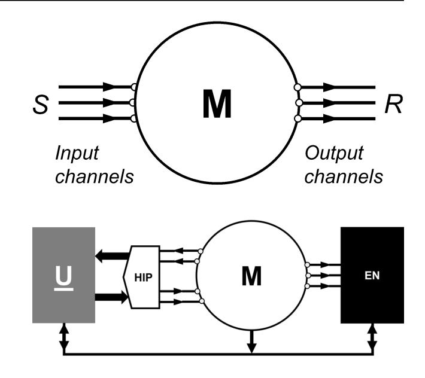

# Research

# A human digital twin for the M‑Machine

**Pertti Saariluoma1  [·](http://orcid.org/0000-0001-7331-8448) Mari Myllylä[1](http://orcid.org/0000-0002-9753-373X) · Antero Karvonen2 · Mika Luimula3  [·](http://orcid.org/0000-0001-6368-1366) Jami Aho3**Received: 22 December 2023 / Accepted: 26 August 2024 © The Author(s) 2024 OPEN

## Abstract

Human digital twins are computational models of the human actions involved in interacting and operating technical artifacts. Such models provide a conceptual and practical tool for artifcial intelligence designers when they seek to replace human work with intelligent machines. Indeed, digital twins have long served as models of technical and cyber-physical processes. Human digital twins have such models as their foundations but also include models of human actions. As a result, human digital twin models enable technology designers to model how people interact with intelligent technical artifacts. Yet, development of human digital twins is associated with certain conceptual problems. To clarify the basic idea, we constructed a human digital twin for Minsky's M-Machine. The abstract conceptual structure of this machine and its generality allowed us to analyze the general properties of human digital twins, their design, and their use as tools in designing intelligent technologies.
**Keywords** User modeling · Interaction design · HTI design theory · Human digital twins · M-machine · Design science · Cognitive mimetics

# 1 Introduction

Society 5.0 and its industrial component, Industry 5.0 programs, are changing thinking regarding technology design [[1–](#page-10-0)[3](#page-10-1)]. In the future, the focus of design will likely be as much on what people do with technologies as on the actual physical or cyber-physical artifacts [\[4\]](#page-10-2). The ultimate motivation for this changing perspective is the emergence of intelligent technologies and artifcial intelligence (AI). Future technologies will be able to perform tasks that previously only people could perform [\[5](#page-10-3), [6\]](#page-10-4). The efciency of new technologies makes it necessary to shift the focus of design to more holistic concepts, including what people will do with future technical artifacts. Indeed, it is no longer wise to separate technical artifacts from their social efects during design processes.

Instead of designing mere technical artifacts, the goal of emerging technology design is to shape how people live and work when they use the designed technical solutions [[2,](#page-10-5) [4\]](#page-10-2). For example, choosing the best form and best materials for turbine blades remains a vital problem in aircraft design, although understanding how people use air travel in their daily life is equally important. In fact, everyday life is becoming an increasingly important design problem.

Designers should consider how people interact with new, intelligent technical artifacts and not only seek to create cyber-physical objects. The focus of technology design in Society 5.0 is as much on creating new social actions as on constructing new technical artifacts. Thus, the design of the properties of artifacts, such as algorithms, remains an important

\* Pertti Saariluoma, ps@jyu.f; Mari Myllylä, mari.t.myllyla@jyu.f; Antero Karvonen, antero.karvonen@vtt.f; Mika Luimula, mika.luimula@ turkuamk.f; Jami Aho, jami.aho@turkuamk.f | 1 University of Jyväskylä, PL 35, 40014 Jyväskylä, Finland. 2 VTT Technical Research Centre of Finland Ltd, P.O. Box 1000, 02044 VTT Espoo, Finland. 3 Turku AMK Turku University of Applied Sciences, Joukahaisenkatu 3, 20520 Turku, Finland.

Discover Artifcial Intelligence (2024) 4:61 | https://doi.org/10.1007/s44163-024-00164-x

issue in designing intelligent technologies, although it represents only part of the challenge. It is also important to model how people process information in using and interacting with these technological artefacts. Such models we have called Human Digital Twins (HDTs) [[7\]](#page-10-6).

The technology-driven orientation in design has led to confusion in the information and communication technology (ICT) feld because the importance of fully understanding humans has been underestimated [[6,](#page-10-4) [8](#page-10-7)]. A good example of this can be seen in the short message service (SMS), which was designed in 1984 but only adopted for public use years later, in early 1990, by mobile phone companies. Designers had not identifed the ultimate use for the idea, as the design culture then did not support holistic thinking [\[9](#page-10-8), [10](#page-10-9)]. Later, the SMS model led technology providers to focus their design eforts on the expensive and futile wireless application protocol (WAP) paradigm, which could not work due to the inherently poor usability [[11](#page-10-10)] and the poorly designed message length.

Technical artifact-oriented design thinking may lead to many cul-de-sacs that could have been avoided by paying more attention to the changes in the ways people live after they have adopted new kinds of technical solutions. Understanding the problems of users and their memory limitations might have drawn designers' attention to the importance of graphic interface technology in mobile phones, which had been standard in the world of personal computers for years. The SMS example illustrates how cyber-physical society- and Industry 4.0-level artifact design is a necessary part of future technology design thinking, even though it is barely sufcient in the era of the emerging intelligent Society 5.0 world.

The problems associated with a technology-oriented way of thinking invite consideration of what future technology design should be like. Relatedly, one can ponder what the conceptual structure of future intelligent interaction design could be.

Here, we call attention to conceptual and cognitive engineering [[12](#page-10-11)[–14\]](#page-10-12). Conceptual engineering involves applying the principles of conceptual analysis to solve engineering design problems, while cognitive engineering entails applying cognitive research to improve design work. Both forms of engineering are intimately linked to the concept of foundational analysis, which investigates the intuitive foundations of scientifc knowledge [[14](#page-10-12)]. We focus on a way to combine the above modes of thinking by applying cognitive modeling of the mind [\[15\]](#page-10-13). The scientifc grounds for modern design thinking lie in the cognitive scientifc research of Newell and Simon [\[16,](#page-10-14) [17](#page-10-15)]. The presented approach has two aspects: modeling human information processing by means of cognitive mimetics and systematizing the developed knowledge into HDTs [\[4](#page-10-2), [7,](#page-10-6) [18–](#page-10-16)[20](#page-10-17)]. In this paper a set of new conceptual tools will be developed to improve holistic AI design thinking [[21](#page-10-18)]. This paper presents theoretically new concepts, such as HDTs as information processing systems, cognitive mimetics, human information points, and IEC-modelling. We apply the new design concepts by designing interaction design process model using Minsky's M-Machine as an example. M-Machine is a general model for all intelligent artifacts and thus can be used to model general human AI design processes. The main problem in this paper is to extend digital twinning from technology to human intelligent technology interaction processes. Thus, we work to develop a new holistic conceptual tool for designing.

In sum, our research question is how to use human research in digital twinning, i.e. how to construct human digital twins. The question makes sense, because digital twinning is generally used in technology design paradigm, but it largely ignores modeling human users. Modern technology design should be holistic and consider how technologies function in human life [[1–](#page-10-0)[4](#page-10-2)].

## 2 Thought, mind, machine

Cognitive mimetics is a method of design by which designers imitate human information processing. In traditional biomimetic thinking, designers imitate biological structures to support their ideation. Thus, the structure of a bird's wing has been used to search for solutions concerning the forms of airplane wings. In the future, intelligence will be central to the innovation of technological solutions, which indicates that an additional model imitating nature will be required.

Actions related to intelligence have their origins in human intellectual information processing. People can perform intelligent tasks because they are able to process information in an intelligent manner. A good example of this is the Turing machine, a model of mathematical thinking and, consequently, a computational machine that follows the formal aspects of human thinking [\[22\]](#page-10-19). In light of this, it is necessary to know what human thinking is like in order to understand intelligent artifacts.

A good example of human intelligent information processing is problem-solving. Newell and Simon explain the mind as an information-processing system and thinking as problem-solving [[16\]](#page-10-14). Problem-solving is an information process whereby diferent situations are understood as objective task environments containing diferent tasks that need to be

resolved to achieve goals. For an individual, task environments are represented as subjective problem spaces that contain representations of the initial and desired goal situations, the intermediate steps required to achieve the goals, and the concepts used to describe those situations [\[16,](#page-10-14) [17](#page-10-15)]. Constructing new mental representations and action plans can help individuals to explain and solve novel problems [[23\]](#page-11-0). Individuals use diferent mental and behavioral strategies to resolve their problems. The issue of which problem spaces are used in certain situations depends on the individual's intelligence and knowledge in that domain [\[24,](#page-11-1) [25](#page-11-2)], how the problem is represented, how the nature of the problem is understood, what steps the individual takes to reach their goals [[23](#page-11-0)], how well the individual's thoughts are organized, and how focused the individual's thinking is [\[26](#page-11-3)].

The structure of the task environment determines how the internal problem space is structured and, consequently, what selective search programs can be used in problem-solving [[16\]](#page-10-14). The issues of how problem spaces are determined and what programs are used are both afected by the available information (e.g., the task instructions), previous experiences with similar or analogous tasks, and general programs in the memory that can be applied directly or integrated with new information. The way in which the problem-solving itself proceeds over time can also modify programs and problem spaces [\[16,](#page-10-14) [27](#page-11-4)].

The information process consists of various components. Interrelated elements, which are known as symbols and are able to form symbol structures, can be stored and retrieved from the memory [[16\]](#page-10-14). Information processing, the short-term memory, and an interpreter make up the processor. Symbolic structures can act as the inputs, outputs, or programs of an information process. Particular symbols and symbol structures denote or refer to certain objects. These objects can be diferent processes, stimuli, or stimulus patterns from the environment [[16](#page-10-14)].

After an internal representation of the situation has been created, the information-processing system forms a plan and chooses the method and information processes most suitable for the problem space in question in order to achieve the desired goal [\[16\]](#page-10-14). The individual executes a mental search for learned hypothetical solution options or thought models by going through information about similar possible situations, patterns, and cues stored in their memory [[16,](#page-10-14) [27](#page-11-4)]. The individual progresses deeper into the problem space in phases from one node or state of knowledge to the next until a solution to the problem is found and the task is completed [\[16,](#page-10-14) [24](#page-11-1)].

Each state is evaluated, and a choice is made regarding whether to proceed to the subsequent state, go back a few steps, or select some alternative state. One method can be stopped to try another method, the problem space can be reformulated or abandoned, new subspaces can emerge, or the problem-solving process can be ended [\[16,](#page-10-14) [27\]](#page-11-4). Combining and restructuring problem spaces into new representations and possible solutions can lead to the construction of new concepts, ideas, and insights [[26](#page-11-3)[–28\]](#page-11-5).

The conception of the mind as an information-processing system allows us to analyze how people process information when performing tasks that demand intelligence. Such knowledge enables us to consider how computational machines could carry out the same tasks. For example, it is possible to assess how machines could load ships or trucks, how machines could drive cars or ships, how the whole transportation chain could be automatized so that human work was minimized, and what the social consequence of replacing millions of truck drivers with intelligent transportation systems would be. As these tasks can currently be performed by people, there must be information processes taking care of such tasks. As a consequence, when designing computational processes, it is important to explicate how people perform the mental aspects of their work. To concretize our concepts over the paper we use car user interface as a toy example, as it is familiar to practically all readers.

### 3 Cognitive mimetics

Intelligence can be understood as adaptive, sense-making information processing [\[22\]](#page-10-19). Thus, intelligence depends on the system's capacity to organize information efectively. For example, when solving problems, people are able to transform an initial information state into a solution state by means of logical operations [[16\]](#page-10-14). Solutions are reached using organized sets of operations or deeds leading from an initial state to a defnite goal state. AI systems can also intelligently solve problems [\[6](#page-10-4), [16](#page-10-14)]. A practical example of this can be seen in Alan Turing's work on deciphering German naval codes during World War Two [\[29](#page-11-6)].

As the human mind is recognized as the best example of intelligent information processing, it is natural to question how one could beneft from knowledge of the human mind when designing intelligent technological systems. Arguably, the frst model of this kind was the Turing machine [\[22\]](#page-10-19). While this machine was essentially a device used by Turing to

demonstrate that the meta-mathematical decision problem was unsolvable, it was also a model of human–computer information processing. Later, the Turing model was generalized in the works of Herbert Simon, his collaborators, and many other researchers [[6,](#page-10-4) [16](#page-10-14)]. Instead of introspectively analyzing assumed human information processes, they began to empirically study how people process information in their thinking. As a consequence of this paradigmatic research, a large number of psychologically inspired theoretical models of the human mind were developed [\[15,](#page-10-13) [30](#page-11-7)].

It takes just a brief step to move from modeling human thinking to designing intelligent processes. For instance, if there is a technical artifact, such as a ship that can move from one harbor (A) to another (B), there must be an information process that makes it possible to sail from location A to location B. Hence, following Turing's [[22](#page-10-19)] original design logic, it is possible to design an information-processing system that can sail a ship from harbor A to B. The system could imitate human information processes if it could be opened, explicated, and transformed into a form suitable for artifcial systems. It must be implemented—that is, designed. The two sides of the equation, research and design, must be able to enter into a constructive co-design process to realize the basic ideas of cognitive mimetics. The core idea is simple: just as in biomimetics [[31\]](#page-11-8), where designers have imitated biological structures and mechanisms to create novel technological solutions, in designing intelligent technology, we can turn toward human cognition as a source of solutions [[18](#page-10-16), [19](#page-10-20)]. The key diference is simply the perspective adopted with respect to the source: cognitive mimetics analyses information processes (and contents) rather than biological structures or mechanisms. As a result, cognitive mimetics is a good tool for hybrid AI thinking that unifes human and machine processes into a sense-making whole.

In case of car driving researcher explicates drivers' thought processes using e.g. protocol analysis [[32](#page-11-9)]. Drivers relate what come in their minds and on the grounds of this information researchers can design mimetic model of what happens in the minds of the drivers. Such model entails e.g., route plans, how drivers observe trafc situations, meters and how they use controls.

### 4 Human digital twins

Cognitive mimetics is a model for designing intelligent industrial and everyday technology-supported processes. However, a mere process is not sufcient. It is also essential to construct models of intelligent actions in which people and machines process information as systems [[33](#page-11-10)]. HDTs provide a conceptual framework for operationalizing the research and design of cognitive mimetics. The main goal of cognitive mimetics is to investigate what happens in the human mind during thinking and then to use that fnding as a central element in the design of intelligent technology.

Digital twins (DTs) are computational models of machine and other mechanical or cyber-physical processes that are typically connected to their reference systems via datafows [\[34\]](#page-11-11). They can be used to develop new technological solutions. Rather than building physical-scale or miniature models, designers can study the properties and behaviors of their potential solution alternative using computational models. Furthermore, DTs can be used as a basis for automation and other intelligent control methods. They can also be used in studying and comparing alternative solution models. These applications means that digital twins are practical tools for designers to use in cyber-physical systems.

However, the cyber-physical world operates in causally organized, physically or mathematically determined data realms. The human mind follows diferent kinds of principles. Causes precede efects in cyber-physical systems, whereas the human mind operates intentionally, meaning that it pursues goals to be achieved later [[35,](#page-11-12) [36\]](#page-11-13). Human systems are intentional. Human minds, as mental systems, contain information content about something—for example, a representation or state of an ideal situation. Therefore, digital models of human action (or HDTs) should be based on diferent modeling types to cyber-physical systems but also harmonize with them. AI tools such as ChatGPT ofer the possibility for researchers to quickly work through information to create literature reviews for example, although evaluation of the provided data still requires more scientifc validation.

If similar benefts are to be gained from DTs, the models need to mimic human thought and action to a degree that is ft for purpose. Cognitive mimetics and HDTs form a natural pair from this perspective. In practice, human actions should be harmonized with the actions of technical artifacts in models; however, thanks to diferences in the principles that human minds follow, it is essential to use paradigms that best ft mental operations, such as perception, attention, language, and thinking [[15\]](#page-10-13). Such models have been developed, for example, within cognitive psychology, over the years, beginning with the Turing machine [[22\]](#page-10-19), test–operate–test–exit (TOTE) model [\[37\]](#page-11-14), and physical symbol systems [\[17\]](#page-10-15) as well as the goals–operators–methods–selection (GOMS)—[\[30](#page-11-7)] and adaptive character of thought–rational (ACT–R)-like [[15](#page-10-13)] architectures. Moreover, additional kinds of models have been built based on neural networks [\[38](#page-11-15)[–40\]](#page-11-16). In this paper,

#### Fig. 1 The M-Machine (adapted from [\[5](#page-10-3)])

**Fig. 2**A human digital twin for the M-Machine. U=user or operator, HIP=human interaction point, M=machine, and EN=(action) environment

we suggest an additional model of human action in process control that we refer to as the ideal–exception–correction (IEC) model [\[20\]](#page-10-17). The proposed model is characteristic of industrial control processes.

In constructing HDTs our model specifcally focusses on human information processing. Human mind represents situations, actions and information contents in mind and uses the properties of information contents in the minds of users to solve interaction design problems. Thus, diferently from many approaches thoroughly revied in a recent study [[41,](#page-11-17) Table 5], we look humans in HDTs as human information processing systems and focus especially on relevant information contents ofpercepts, thoughts and mental representations, i.e. on mental contents [[42\]](#page-11-18).

# 5 The M‑Machine

One way to develop an HDT is to design it based on an abstract conceptual machine, which could be, for example, a Turing machine, fnite automaton machine, post-Turing machine, or Kleene machine [[43\]](#page-11-19). The basic idea behind such a theoretical approach is to conceptualize key problems with a general conceptual model. If some aspect of designing an HDT would become obvious when designing an HDT for a general machine, the same problem would emerge with any concrete solution.

In this paper, as our conceptual machine, we chose the M-Machine (or the Minsky Machine) proposed by Marvin Minsky [, p. 13–14] (Fig. [5](#page-10-3)[1\)](#page-4-0). The reason for constructing interaction model of the M-Machine is that as a general description of any imaginable machine it enables us to discuss constructing HDTs on the most general level.

The M-Machine is a general model of any machine that people use. It can also well represent paper machines as a can opener. The M-Machine is, therefore, an abstract conceptual model of any possible machine that people use in their daily lives. Consequently, developing an HDT for the M-Machine allows us to consider the general properties of an HDT for any machine, meaning that we can defne the basic questions to be answered when working with any specifc and concrete machine.

Minsky [[5\]](#page-10-3) rightly claimed that the M-Machine is a general model of any machine. Thus, we designed an HDT for interacting with the M-Machine in order to construct a conceptual HDT for general human–machine control-type interactions.

In our conceptual model, as presented in Fig. [2](#page-4-1), the technical artifact is the M-Machine. The user interacts with the M-Machine by means of the tool provided at the human interaction point (HIP), while the machine works in some semantic or physical environment. We claim that any technical artifact designed for process control has the same abstract structure as our conceptual model. Hence, it is a general model for constructing HDTs for control tasks. To further clarify our way of thinking, the three elements of the model—the M-Machine, HIP, and user—will now be discussed in more detail.

Minsky [\[5](#page-10-3)] constructed the M-Machine as an abstract model of any machine (Fig. [2\)](#page-4-1). It has a set of input information types controlling the analysis of both task and situation information. It also has a set of output channels that manipulate

the objects of actions following the instructions provided in the input information. The M-Machine ofers a set of processes to transform target environments or objects of industrial actions into a desired end state. Human intentions defne the ideals for process states. In addition to the input processes, the M-Machine has a set of output processes.

While Minsky's [\[5\]](#page-10-3) M-Machine is a black box, it makes sense to defne a set of internal processes that make it possible to efectively manipulate the object of action. Input actions manipulate these internal processes, which explains why defnite input operations make sense. Internal states also make it possible to automatically or autonomously modify the processes of the M-Machine.

In terms of cognitive and conceptual engineering, the M-Machine provides a conceptual structure for designing specifc machines. Therefore, it is possible to use the M-Machine to analyze the interaction processes of human technology on a general conceptual level. Through analyzing how people interact with the M-Machine, it is also possible to construct HDT models and so to consider the structure of the designed human technology interaction (HTI) processes.

The M-Machine is a general and abstract model of a machine for which an HDT can be built. As such, it cannot be a model for any concrete industrial process because such processes all have a type of M-Machine as one level of abstraction. Rather, it must be interpreted or concretized by defning all the process-relevant inputs, all the relevant outputs, as well as the structures and operations of the internal processes. In this way, the M-Machine can serve as a model for a defnable machine process.

A paper machine, for example, has controls that enable users to steer the behavior of this often almost 100-m-long machine and its internal processes. More specifcally, a paper machine involves complicated processes. For instance, wet pulp that is over 90% water is transformed at a speed of over 90 km/hour into 11-m-wide sheets with a 2/100-mm tolerance [[44](#page-11-20)]. The purpose of a paper machine is to produce paper sheets for diferent uses. The related control systems enable users to ensure the smooth operation of this action. Similarly, in our car driving example there are several controls, such as steering wheel, car's brake pedal and gears, which allow the user to steer the vehicle.

The M-Machine can, by means of interpretation—defning the input variables, output variables, and internal processes—be modifed to model any machine. As a result, it can become a model of any control-dominated HDT. The core process is the interpretation of the key elements, which concretizes the machine component of the HDT. In our mind, the proposed IEC model is an example of this concretization [\[20](#page-10-17)].

## 6 HIP

People operate machines, and they are also involved in the processes therein. However, the degree of human involvement may vary. The control of a room's temperature regulation can be fully automatized so that people can set it and then not touch it for a decade. Nevertheless, the thermostat is still operated by people. Of course, sometimes, as in driving a car, people are very much in the loop and constantly steer the process. The points and actions through which people are involved in the processes of any machine, including the M-Machine, can be termed HIPs.

An HIP is not a model of a user interface; rather, it describes how an operator can and should be involved in a machine's processes. Thus, it is a description of human actions. Moreover, an HIP should not be confused with the concept of a "touchpoint" for user interface usability. In marketing-oriented customer experience research and management, a touchpoint refers to any type of stimulus—such as an interaction with a product, service, atmosphere, or communicative tool or instrument—that creates a subjective experience for its user [\[45\]](#page-11-21).

In the feld of paper production, operators must walk several hundred meters to take a liquid sample and analyze it. HIPs describe such operations. HIPs also entail controls and meters. Importantly, an HIP is a framework for defning possible operations with respect to the M-Machine as well as a schema upon which actual operations can be populated. Therefore, all actions are selections from this space of possibilities.

HIPs defne the actions people perform when they operate a defnite technology, and for this reason, they must be concretized with regard to their application. The core issue is how people are involved in the actual machine process. Relatedly, what people do and why they do it are essential problems to solve. Defning HIPs renders HDTs concrete. All machines have HIPs, although the nature of the concrete operative actions within an HIP depends on the particular technology. Moreover, these actions are made possible by controls and meters in the user interface.

When we start to apply large language models, neural networks, and other AI technologies as part of machines and HDTs, the HIPs will include the possible ways a human can operate the relevant process. Interactions and communications with such systems could happen in many ways, such as traditional digital buttons, speech recognition, sensor data, brain–computer interfaces, and so on.

Technically, an HIP in the widest sense entails all the possible states of all the possible controls, but that is all. The combination of all the possible states of all the available control instruments forms the human interaction space. In addition, control states defne what any machine can be controlled to do. Thus, an HIP is defned by the machine, intelligent or otherwise, and it determines what people can do. In case of a car, for example, steering wheel, gas pedal, and brakes are analogical and have infnite set of values. For purpose of modelling, analogical controls can be digitalized, by giving them big but limited number of possible states. Gears have limited value sets, normally from four to six states. Car HIP contains all the logically possible combinations of states of these control instruments.

An HIP space can often be analogical, such as when playing a violin or driving a car. However, if required, analogical action spaces can be digitalized, as is possible when recording music. The key issue is that the controls and their possible states create limits for people when it comes to operating machines. An HIP refers to control instruments and feedback meters as well as to the direct observational states of the machine. Direct and instrumented observations play the same role in terms of the HIP. They provide knowledge concerning the current state of the process and the way the process has deviated from the assumed ideal state, thereby providing information about the expected correction operations. HIP is state space combining all possible human input states, (e.g., meter values) with all the possible instrument values.

### 7 Describing the users of HDTs

A necessary component of an HDT is the description of the user or operator. Minsky [[5\]](#page-10-3) did not include a model of the user in his M-Machine, although it still makes sense to consider what kinds of properties are needed when describing human users. The issue may be complicated, but it still makes sense to model users and their actions [[46](#page-11-22)]. In fact, user modeling is key to constructing HDTs.

A model of a user, for example a driver of a car, should ofer solutions to four core questions associated with HTI design [[7](#page-10-6)]. These questions concern what technologies are used for, whether people can use technologies, whether they like to use technologies, and how they interact with artifacts [\[7\]](#page-10-6). These four questions underlie any interaction design process and inform the highest level of interaction design thinking, which means that the known design paradigms, such as usability, HCI, user experience, and Kansei engineering, can be subsumed under them [\[7](#page-10-6)].

The starting point for understanding and modeling the users of HDTs is action. Here, the background questions concern why people use this technology, what they intend to do with an artifact, and what they intend to achieve by using an artifact. Usability is central, as technical design tools vary.

Action can be considered from diferent perspectives. In this paper, we focus on two major perspectives on user modeling in HDTs. The frst can be characterized as intentional, and it defnes what people are doing—that is, what is the end state they intend to reach? The second perspective involves answering the question of whether people can do what they intend. The latter is basically a causal view, and its analysis is based on human beings' limited information-processing capacity. It can be used to analyze, explain, and design human errors.

The frst perspective defned by the goals of the action is intentional. It explicates why it is good to do what people are doing and what people hope to achieve by performing the relevant actions. The investors and industrialists interested in paper machines, for example, hope to make good and competitive paper for their clients. A secondary motivation may be the return on investment (ROI) and proft. However, good paper is the precondition for the success in achieving the latter goal. Thus, technologies have impacts on multiple human interests.

An alternative perspective on machine use is opened up by the following question: can people use technology? Human information processing is limited. People can attend to one issue at a time or remember 4–8 new chunks in their working memories [[47\]](#page-11-23). Secondary tasks also illustrate the limits of the human working memory [\[47](#page-11-23)]. Two visual memory tasks, for example, will interfere with each other. Hence, the way people have to use their capacities may afect the correctness of their performance.

When modeling human users, designers should explicate the information contents required in both planning and performing the relevant task [[42\]](#page-11-18). They should also investigate the limits of information-processing systems and support both attention and memory in processing task-relevant information. The model of the user in an HDT describes human intentions (e.g., operative intentions, reasons for carrying out some defnite action, or life-level intentions, such as reasons for being involved in the paper business). In the case of any machine, including the M-Machine, people play diferent roles. They can be operators, management personnel, or owners. The notion of the user is designed to cover all these roles.

The third issue to be considered in relation to human modeling is the user experience or emotional usability [[4\]](#page-10-2). This aspect entails how people feel and how motivated they are to use a certain technical artifact. A reason for this dynamic

dimension of usability can be suggested. In principle, several models for the psychology of emotional processes have been developed over the years, and for this reason, it is not impossible to develop HDTs for the emotional aspects of human–technology interaction. However, we will not discuss this aspect any further, because the M-Machine is abstract model.

As all the defning parameters of the M-Machine HDTs are abstract, the HDT model presented in this paper can be applied to very diferent types of machines whose operations people intend to control. Our approach to the design of HDTs is based on the idea that HDTs are abstractly analogous. Thus, by creating abstract HDTs, it is possible to study HDT design problems on a higher level and by bonding abstract variables to concrete processes.

### 8 Ideal, exception, and correction

HDTs serve as tools for designers. The spectrum of technology-supported human actions that can be modelled by HDTs is wide; therefore, the palette of possible HDTs and their diferent types also vary extensively. Our IEC model was designed based on modeling the empirical results of the work of operators within the paper industry [\[20\]](#page-10-17).

The original IEC model was specifc. Hence, it made sense to consider how to generalize the original model, and one way to do so was to construct an IEC model for people interacting with some general technical artifact. This kind of HDT is abstract, although it is applicable to a large number of concrete processes associated with the same control-based action logic [[20](#page-10-17)].

The IEC model emerged as a consequence of an empirical investigation into the thoughts and actions of operators in an experimental paper mill in Finland [\[20\]](#page-10-17). Through analyzing the collected think-aloud protocols and interviews, a pattern emerged (see [\[5](#page-10-3)] for details). More specifcally, the operators' thinking on a higher level appeared to take the form of IEC. They notice how things are straying from the path toward the goal they desire to reach, and subsequently, they comprehend that they must do something to inhibit things from realizing the wrong state. To accomplish this, they compare information on the current state of the process with the aim of determining a way to reach the ideal state [\[20](#page-10-17)].

Based on the collected protocols, it was possible to fnd the central logic behind the operators' thoughts and actions [[20](#page-10-17)]. They have some ideal state in their minds; however, what that ideal state is rests on various factors, such as the quality of the produced paper, the available raw materials, and the production process stage. The operators determine the present state of the technical process and record exceptions that deviate from the ideal state by comparing the current state with the predicted ideal one. Furthermore, they can anticipate deviations based on their extensive knowledge. Finally, the operators have an inventory of potential corrective actions in their minds, which they then implement to turn the process to the ideal state [[20](#page-10-17)].

Based on these fndings, we developed a small-scale operator information processing model, which we named the IEC\_0.81 model [[20](#page-10-17)]. This model supposes that the operators' thinking undergoes an IEC loop. The operators monitor the behavior of the machine process via measurement instruments and visual observation in the control room. Moreover, real-life information is also conveyed by fellow operators who work in close proximity to the paper machine. When they notice an unanticipated state of the process (i.e., a deviation from the ideal), they take appropriate actions by obeying the models of their anticipated efects [[20](#page-10-17)].

The IEC\_081 model is grounded on the idea that all HIPs can be outlined. This notion involves a set of observation values (OVs) and a set of possible actions (PAs) [[20](#page-10-17)]. As the machines represent defned and closed systems, for each HIP they have a confned collection of OVs and PAs. Therefore, "all the possible human actions of involvement in the ongoing machine process can thus be defned in terms of the HIPs, OVs, and PAs." [20, p. 172].

The IEC\_081 model itself is very simple, nonetheless it can give us a vision of the role of HDT models in collection of information. It provides a suggestion of one potential resolution to the question of how human information processes and their contents operate concerning paper machine controlling [\[20\]](#page-10-17). Thus, the model allows for the representation and interpretation of the empirical results of operators' actions.

Yet, the IEC\_081 model does not yet supply comprehensive descriptions of ideal processes and states or of remedial acts. In addition, it does not offer precise information about the operators' actions. Nonetheless, the model can be advanced further by examining how the operators perform their actions in differing circumstances. Hence, the model can efficiently help the direction of information gathering regarding mental contents of operators. The IEC\_081 model also facilitates researchers to assess the logic of their interpretations of data. If the simulations function, it implies that the interpretations are valid in terms of their formal constitutes. By contrast, if the simulations do not work, it implies that the interpretations should be reanalyzed. Internally conflicting models are impossible, so the simulation process enables self-corrective analysis and inferences of data concerning mental contents [\[20](#page-10-17)].

Thus, the IEC model fulfills the function of guiding research. If it reaches a final state, it becomes an HDT in the sense that it is both a model of operators' actions and a reflection of their mental contents. Essentially, it would be a potential automatic controller (or, at least, form a basis for one) that is cognitively mimetic of operators' actions and thoughts. This simple basis can, however, be taken in many directions.

### 9 IEC 2.0

Methodologically, one of the most conceptually insightful methods is to model human thinking by means of simulation [[15,](#page-10-13) [17\]](#page-10-15). Simulation models of human thinking make it necessary to consider the conceptual structure of the thought processes in detail and, therefore, to eliminate illogical intuitive assumptions. For this reason, we modelled mental processes by developing a computational model of human information processing known as the IEC model [[20](#page-10-17)].

As mentioned above, IEC is an abbreviation for the terms "ideal," "exception," and "correction." What is ideal is defined by the users' intentions. The model was constructed based on empirical results concerning paper workers' control of a paper manufacturing process. The core idea here is that the paper workers have in mind an ideal (I) state of affairs, they compare the present state with the ideal, and if there is a difference or exception (E) between the images of the ideal and present states, they seek to eliminate the exception and correct (C) the states of affairs.

The IEC model first defines the HIP space by registering all the state descriptions of the M-Machine and all the possible states of control tools. The HIP space can be seen as a Cartesian product of the binary pairs of the observable M-Machine states (oms) and all states of controls (cs) and their possible states:

$$
(C1 (oms1, cs1)) x ... . . x (Cmn (omsn ... . . csn))
$$
\n(1)

Equation ([1](#page-8-0)) refers to a state space of machine states (observations, meter values) and respectively the states of control instruments. Thus, Eq. ([1](#page-8-0)) defines the space of all the possible combinations of pairs of machine states and the values of controls. Consequently, the formula defines the HIP interaction state space. HIP state space is actually a variant of the general human problem space [\[16](#page-10-14), [17](#page-10-15)]. HIP space defines thus all the possible interaction operations. The operations people in practice use form a subspace of theoretical HIP-space.

The HIP interaction states form the input to the M-Machine, which can be seen as a function from the HIP states to the relevant output effects. The function in the M-Machine has no definable contents, although it can have any form depending on the specification of the M-Machine. The effectors modify the environment, which can be seen as a matrix of possible states. Some of those states are goal states.

The IEC model compares the present state with the goal state, and based on analyzing the difference, it adjusts its input states. The functions regulate the actions of human–computer systems. Defining what kinds of adjustment processes would be relevant to reach the goal state represents an empirical task. Human adjustment processes need not be simple because they are commonly complicated. However, they cannot be specified with such an abstract conceptual tool as the M-Machine. The IEC model opens up practical possibilities to analyze human processes in interacting with technologies, as it is possible to give the model different interpretations depending on the empirical case, and this tests the properties of various models.

The IEC model is unique, although this does not mean that the same process could not be realized by standard models of the mind, such as the GOMS [[30\]](#page-11-7) or ACT-R [[15](#page-10-13)] models. However, among the various models of the computational mind, the old TOTE model developed by Miller, Galantr, and Pribram [[37\]](#page-11-14) arguably comes the closet to IEC thinking. Nevertheless, it is not computational in the sense that it has been implemented as a simulation model. Rather, the model is grounded in the idea that people test the state of affairs and execute the processes following the tests. The IEC model is an independent way of modeling the mind, and it is a plausible methodological tool for analyzing people who work to steer different types of technologies.

### 10 Discussion: using HDTs in designing human‑operated technical artifacts

In developing new super intelligent Society 5.0 it is essential to combine designing what people do with technical artifacts with designing what kinds of artifacts they use [[4](#page-10-2)]. This presupposes holistic design practices, in which the two aspects are combined. As Digital twinning is a very commonly used approach in technology design [[34\]](#page-11-11) it makes sense to add human digital twins (HTDs). We have used M-Machine as a demonstration platform for such a design practice.

HDTs are conceptual and computational models of people using technologies to achieve their action goals in life. HDTs are constructed to analyze and explicate the features of human interactions involving technical artifacts in order to reach their operation-specific and broader life goals [[4](#page-10-2)]. They are models that designers can use when developing new technological solutions. HDT models can also be used to assess alternative solutions. Modeling interaction problems at the generalized level of designing interaction models for M-Machine-like abstract-but-general conceptual models is a tool in the HDT designer's toolbox.

Abstract HDT models, such as the M-Machine, have their uses in developing practical design models for developing intelligent technological solutions. Moreover, HDT designs can be organized to proceed from abstract and general models to concrete cases. General user parameters, such as user intentions, can be defned in a process-specifc manner. At the same time, it is possible to specify both internal machine functions and human operative functions. Therefore, moving from abstraction to concrete cases makes working with HDTs easier to organize. This allows for the generalization of HDTs to a large class of design problems. As the IEC model can be interpreted at various levels of sophistication based on the generality and simplicity of the control structure (ranging from simple lookup tables to richer structures of intentional and representation modeling), it provides a holistic basis for the design of intelligent technology.

In this compact context, we have omitted discussion of mental architectures and general action models. As mentioned above, numerous such architectures can be found in the cognitive–psychological and cognitive–scientific literature. They make it easier to study the human preconditions for HDT modeling and design. For example, they can provide advanced information on processing limitations, such as working memory models or the expertise and skill-specific properties of users' minds.

It is possible to study semantic networks as systems by controlling attentional spotlights or limitations in expertise. It is also possible to use different kinds of mental model theories to describe what users should do, what they can do, and what they should learn in order to be able to use complicated technological systems effectively. HDT modeling represents a practical tool for working with such design problems.

The cognitive psychology of human information processing provides many tools for HDT design thinking. Architectural models such as the ACT-R or GOMS, which entail descriptions of important human processing capacities and limitations, can prove helpful in clarifying mental architectures to design intelligent technologies [[15](#page-10-13), [16,](#page-10-14) [30\]](#page-11-7). By modeling the mind, one can gain a better understanding of how people work now, how they should work, and how technology designers could improve tools so as to make work processes faster, easier, and more reliable.

The IEC model is an example of an HDT model. It is intended to assist work by modeling people in process control tasks [[20](#page-10-17)]. In this paper, we have illustrated how to construct a very abstract IEC model and then concretize it to model individual interaction processes. The method of using abstract engines as platforms for modeling concrete processes is one possible model for how to operate using HDTs.

HDTs can serve as a framework that captures actions and, over time, learns to act increasingly autonomously. Human operators can simply choose to capture an activity as a macro, while the episodic structure apparent in many contexts can be automated from a human perspective. The adaptive intentionality inherent in human action can thus be abstracted bit by bit to higher orders of actions so that machine operations are no longer strange, alien processes but rather recognizably human ones. This will situate human actions in the future intelligent society in the place they belong—as conductors of intricate machine intelligence with human roots.

HDTs provide a good tool for conceptual engineering when working toward holistic design processes in which designers focus as much on human actions and the ways people live as they do on artifacts [[13,](#page-10-21) [48](#page-11-24)]. This is necessary in relation to transforming technology design from mere artifact design into the construction of new kinds of societies.
**Acknowledgments**This work for PS, AK and MM was supported by both the Etairos STN project of the Academy of Finland (decision number 327355) and Business Finland through the COACH project (project number 3289/31/2022), operating under the umbrella of the SEEDForest ecosystem. This work for ML and JA was supported by Business Finland through the COACH project (project number 3289/31/2022).
**Author contributions**The authors Pertti Saariluoma, Mari Myllylä, Antero Karvonen, Mika Luimula and Jami Aho contributed equally to the work.

**Funding**Saariluoma, Karvonen and Myllylä's work was supported by both the Etairos STN project of the Academy of Finland (decision number 327355) and Business Finland through the COACH project (project number 3289/31/2022), operating under the umbrella of the SEEDForest ecosystem. Luimula and Aho's work was supported by Business Finland through the COACH project (project number 3289/31/2022).
**Data availability**No datasets were generated or analysed during the current study.
**Code availability**Not applicable.

#### Declarations
**Competing interests**The authors declare no competing interests.
**Open Access**This article is licensed under a Creative Commons Attribution-NonCommercial-NoDerivatives 4.0 International License, which permits any non-commercial use, sharing, distribution and reproduction in any medium or format, as long as you give appropriate credit to the original author(s) and the source, provide a link to the Creative Commons licence, and indicate if you modifed the licensed material. You do not have permission under this licence to share adapted material derived from this article or parts of it. The images or other third party material in this article are included in the article's Creative Commons licence, unless indicated otherwise in a credit line to the material. If material is not included in the article's Creative Commons licence and your intended use is not permitted by statutory regulation or exceeds the permitted use, you will need to obtain permission directly from the copyright holder. To view a copy of this licence, visit [http://creativeco](http://creativecommons.org/licenses/by-nc-nd/4.0/) [mmons.org/licenses/by-nc-nd/4.0/.](http://creativecommons.org/licenses/by-nc-nd/4.0/)

### References

- 1. Deguchi A, Hirai C, Matsuoka H, Nakano T, Oshima K, Tai M, Tani S. What is society 5.0? In: Society 5.0. Singapore: Springer; 2020. [https://](https://doi.org/10.1007/978-981-15-2989-4_1) [doi.org/10.1007/978-981-15-2989-4\\_1](https://doi.org/10.1007/978-981-15-2989-4_1).
- 2. Fukuyama M. Society 5.0: aiming for a new human-centered society. Jpn Spotlight. 2018;27:47–50.
- 3. Østergaard EH. Welcome to Industry 5.0. The "human touch" revolution is now under way. 2018. [https://info.universal-robots.com/hubfs/](https://info.universal-robots.com/hubfs/Enablers/White%20papers/Welcome%20to%20Industry%205.0_Esben%20%C3%98stergaard.pdf?submissionGuid=00c4d11f-%2080f2%E2%80%934683-a12a-e821221793e3%27) [Enablers/White%20papers/Welcome%20to%20Industry%205.0\\_Esben%20%C3%98stergaard.pdf?submissionGuid=00c4d11f-%2080f2%](https://info.universal-robots.com/hubfs/Enablers/White%20papers/Welcome%20to%20Industry%205.0_Esben%20%C3%98stergaard.pdf?submissionGuid=00c4d11f-%2080f2%E2%80%934683-a12a-e821221793e3%27) [E2%80%934683-a12a-e821221793e3%27.](https://info.universal-robots.com/hubfs/Enablers/White%20papers/Welcome%20to%20Industry%205.0_Esben%20%C3%98stergaard.pdf?submissionGuid=00c4d11f-%2080f2%E2%80%934683-a12a-e821221793e3%27) Accessed 5 Feb 2020.
- 4. Saariluoma P, Cañas J, Leikas J. Designing for life. London: Palgrave Macmillan; 2016.
- 5. Minsky ML. Computation. Englewood Clifs: Prentice-Hall Inc.; 1967.
- 6. Nilsson NJ. The quest for artifcial intelligence. Cambridge: Cambridge University Press; 2009.<https://doi.org/10.1017/CBO9780511819346>.
- 7. Saariluoma P, Cañas J, Karvonen, A. Human digital twins and cognitive mimetic. In Ahram T, Taiar R, Langlois K, Choplin A, editors. Human Interaction, Emerging Technologies and Future Applications III. IHIET 2020. Advances in Intelligent Systems and Computing, vol 1253. Springer, Cham; 2021. [https://doi.org/10.1007/978-3-030-55307-4\\_15](https://doi.org/10.1007/978-3-030-55307-4_15).
- 8. Russell SJ, Norvig P. Artifcial Intelligence: a modern approach. Prentice Hall Series in Artifcial Intelligence. Englewood Clifs: Prentice Hall; 1995.
- 9. Goggin G. Mobile phone culture and the love of text messaging. ANZCA 05, Communication at Work. 2005(4–7 July 2005). p. 1–17.
- 10. Taylor AS, Vincent J. An SMS history. In: Hamill L, Lasen A, Diaper D, editors. Mobile world. Computer supported cooperative work. London: Springer; 2005. p. 75–91. [https://doi.org/10.1007/1-84628-204-7\\_5.](https://doi.org/10.1007/1-84628-204-7_5)
- 11. Ramsay M, Nielsen J. WAP usability deja vu: 1994 all over again. Report from a feld study in London, fall 2000. Nielsen Norman Group; 2000. [https://media.nngroup.com/media/reports/free/WAP\\_Usability.pdf](https://media.nngroup.com/media/reports/free/WAP_Usability.pdf). Accessed 20 Dec 2023.
- 12. Chalmers DJ. What is conceptual engineering and what should it be? Inquiry. 2020. [https://doi.org/10.1080/0020174X.2020.1817141.](https://doi.org/10.1080/0020174X.2020.1817141)
- 13. Floridi L. A defence of constructionism: philosophy as conceptual engineering. Metaphilosophy. 2011;42(3):282–304. [https://doi.org/10.](https://doi.org/10.1111/j.1467-9973.2011.01693.x) [1111/j.1467-9973.2011.01693.x](https://doi.org/10.1111/j.1467-9973.2011.01693.x).
- 14. Saariluoma P. Foundational analysis: presuppositions in experimental psychology. London: Routledge; 1997.
- 15. Anderson JR. Rules of the mind. New York: Psychology Press; 2014.
- 16. Newell A, Simon HA. Human problem solving. Englewood Clifs: Prentice-Hall; 1972.
- 17. Newell A, Simon HA. Computer science as empirical inquiry: symbols and search. Commun ACM. 1976;19(3):113–26. [https://doi.org/10.](https://doi.org/10.1145/360018.360022) [1145/360018.360022](https://doi.org/10.1145/360018.360022).
- 18. Kujala T, Saariluoma P. Cognitive mimetics for designing intelligent technologies. Adv Hum Computer Interact. 2018;2018:9215863. <https://doi.org/10.1155/2018/9215863>.
- 19. Saariluoma P, Kujala T, Karvonen A, Ahonen M. Cognitive mimetics: main ideas. In: Arabnia HR, Fuente DDL, Kozerenko EB, Olivas JA, Tinetti FG, editors. ICAI'18: Proceedings of the 2018 International Conference on Artifcial Intelligence. CSREA Press; 2018. p. 202–6. [https://csce.](https://csce.ucmss.com/cr/books/2018/LFS/CSREA2018/ICA4083.pdf) [ucmss.com/cr/books/2018/LFS/CSREA2018/ICA4083.pdf](https://csce.ucmss.com/cr/books/2018/LFS/CSREA2018/ICA4083.pdf). Accessed 5 Feb 2020.
- 20. Saariluoma P, Karvonen A, Sorsamäki L. Human digital twins in acquiring information about human mental processes for cognitive mimetics. In: Tropmann-Frick M, Jaakkola H, Thalheim H, Kiyoki Y, Yoshida N, editors. Information Modelling and Knowledge Bases XXXIII (EJC 2021). Frontiers in Artifcial Intelligence and Applications, 343. IOS Press; 2021. p. 163–76.<https://doi.org/10.3233/faia210484>
- 21. Byrne MD. Computational cognitive modeling of interactive performance. In: Lee JD, Kirlik A, editors. The Oxford handbook of cognitive engineering. New York: Oxford University Press; 2013. p. 415–23.
- 22. Turing AM. On computable numbers, with an application to the entscheidungsproblem. Proce Lond Math Soc. 1937;s2–42(1):230–65. [https://doi.org/10.1112/plms/s2-42.1.230.](https://doi.org/10.1112/plms/s2-42.1.230)

- 23. Novick LR, Bassok M. Problem solving. In: Holyoak KJ, Morrison RG, editors. The Cambridge handbook of thinking and reasoning. Cambridge: Cambridge University Press; 2005. p. 321–49.
- 24. de Groot AD. Thought and choice in chess. Hague: Mouton; 1965.
- 25. Saariluoma P. Errors in chess: apperception-restructuring view. Psychol Res. 1992;54:17–26.<https://doi.org/10.1007/BF01359219>.
- 26. Köhler W. The mentality of apes. London: Penguin Books; 1957.
- 27. Saariluoma P. Chess players' thinking: a cognitive psychological approach. London: Routledge; 1995.
- 28. Halpern DF. Thought and knowledge: an introduction to critical thinking. New York: Psychology Press; 2013.
- 29. Hodges A. Alan turing: the enigma. Princeton: Princeton University Press; 2014.
- 30. Newell A. Unifed theories of cognition. Cambridge: Harvard University Press; 1994.
- 31. Vincent JFV. Biomimetics: a review. Proc Inst Mech Eng. 2009;223(8):919–39. [https://doi.org/10.1243/09544119JEIM561.](https://doi.org/10.1243/09544119JEIM561)
- 32. Ericsson KA, Simon HA. Protocol analysis: verbal reports as data. Cambridge: MIT Press; 1993.
- 33. Hollnagel E, Woods DD, Leveson N, editors. Resilience engineering: concepts and precepts. Burlington: Ashgate Publishing, Ltd; 2006.
- 34. Juárez-Juárez MG, Botti VJ, Giret Boggino AS. Digital twins: review and challenges. J Comput Inform Sci Eng. 2021;21(3): 030802. [https://](https://doi.org/10.1115/1.4050244) [doi.org/10.1115/1.4050244.](https://doi.org/10.1115/1.4050244)
- 35. Brentano F. Psychologie vom empirischen standpunkt. Hamburg: Felix Meiner; 1955.
- 36. Von Wright GH. Norm and action: a logical enquiry. New York: Routledge and Kegan Paul; 1963.
- 37. Miller GA, Galanter E, Pribram KH. The integration of plans. In: Miller GA, Galanter E, Pribram KH, editors. Plans and the structure of behavior. London: Holt Rinehart and Winston; 1960. p. 95–102. [https://doi.org/10.1037/10039-007.](https://doi.org/10.1037/10039-007)
- 38. Kohonen T. Self-organization and associative memory. Springer Series in Information Science, 8. Berlin: Springer; 2012. [https://doi.org/](https://doi.org/10.1007/978-3-642-88163-3) [10.1007/978-3-642-88163-3.](https://doi.org/10.1007/978-3-642-88163-3)
- 39. McClelland JL, Rumelhart DE, PDP Research Group. Parallel distributed processing. Cambridge: MIT Press; 1986.
- 40. Schmidhuber J. Deep learning in neural networks: an overview. Neural Netw. 2015;2015(61):85–117. [https://doi.org/10.1016/j.neunet.](https://doi.org/10.1016/j.neunet.2014.09.003) [2014.09.003](https://doi.org/10.1016/j.neunet.2014.09.003).
- 41. Lin Y. et al. Human digital twin: a survey. [arXiv:2212.05937.](http://arxiv.org/abs/2212.05937) 2022. [https://doi.org/10.48550/arXiv.2212.05937.](https://doi.org/10.48550/arXiv.2212.05937)
- 42. Myllylä MT, Saariluoma P. Expertise and becoming conscious of something. New Ideas Psychol. 2022;64:100916. [https://doi.org/10.1016/j.](https://doi.org/10.1016/j.newideapsych.2021.100916) [newideapsych.2021.100916](https://doi.org/10.1016/j.newideapsych.2021.100916).
- 43. Salomaa A. Computation and automata. Cambridge: Cambridge University Press; 1985.
- 44. Saariluoma P, Nevala K, Karvinen M. Content-based analysis of modes in design engineering. In: Gero JS, editor. Design computing and cognition '06. Dordrecht: Springer; 2006. [https://doi.org/10.1007/978-1-4020-5131-9\\_17](https://doi.org/10.1007/978-1-4020-5131-9_17).
- 45. Österle B, Kuhn MM, Henseler J. The dynamic nature of brand experience. In: Rossi P, Krey N, editors. Finding new ways to engage and satisfy global customers. AMSWMC 2018. Developments in Marketing Science: Proceedings of the Academy of Marketing Science. Springer, Cham; 2019. [https://doi.org/10.1007/978-3-030-02568-7\\_211.](https://doi.org/10.1007/978-3-030-02568-7_211)
- 46. Carroll JM. Human-computer interaction: psychology as a science of design. Annu Rev Psychol. 1997;48:61–83. [https://doi.org/10.1146/](https://doi.org/10.1146/annurev.psych.48.1.61) [annurev.psych.48.1.61](https://doi.org/10.1146/annurev.psych.48.1.61).
- 47. Baddeley A. Working memory: theories, models, and controversies. Annu Rev Psychol. 2012;63:1–29. [https://doi.org/10.1146/annur](https://doi.org/10.1146/annurev-psych-120710-100422) [ev-psych-120710-100422.](https://doi.org/10.1146/annurev-psych-120710-100422)
- 48. Eklund M. Conceptual engineering in philosophy. In: Khoo J, Sterken RK, editors. The Routledge handbook of social and political philosophy of language. New York: Routledge; 2021. p. 15–30.
**Publisher's Note** Springer Nature remains neutral with regard to jurisdictional claims in published maps and institutional afliations.

