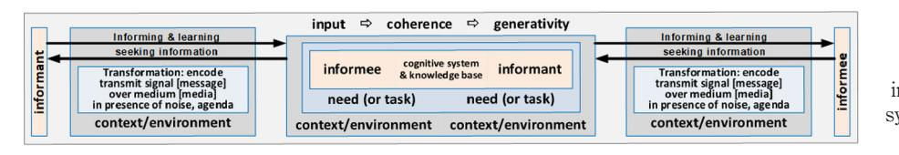
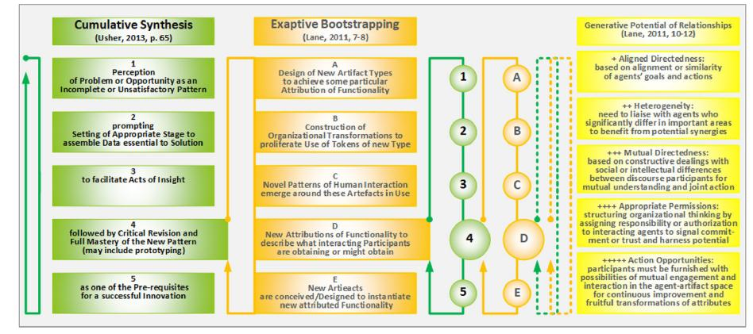
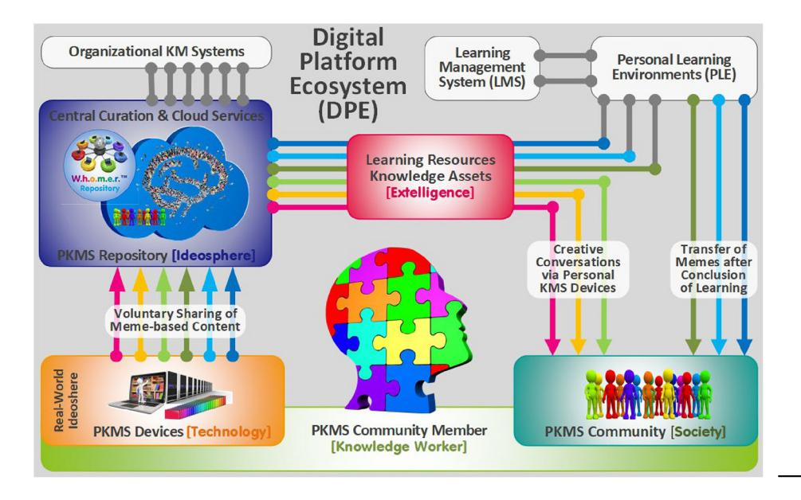
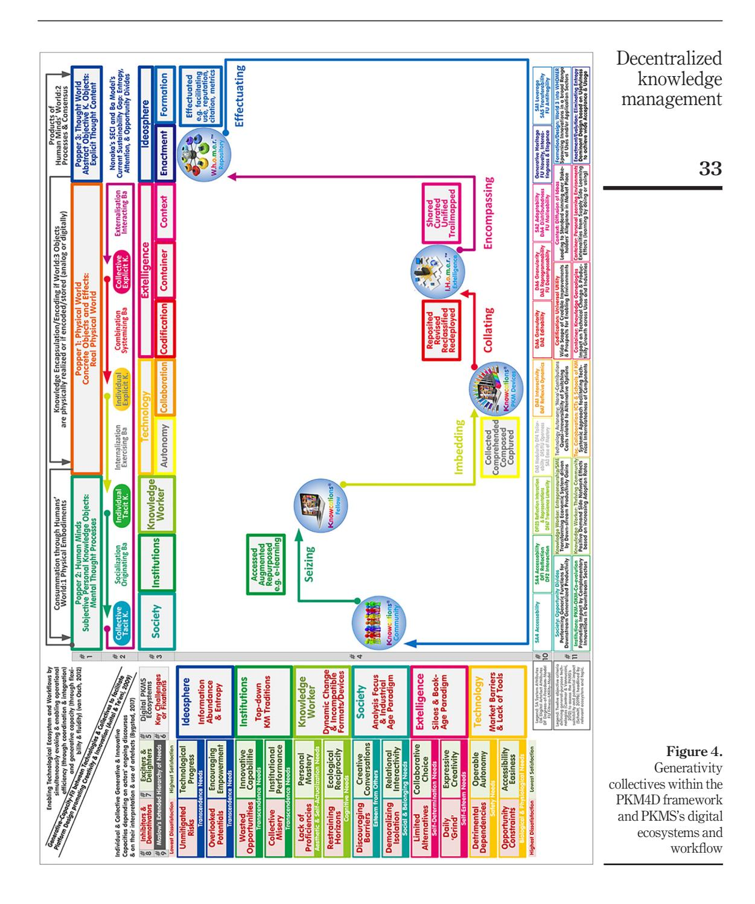

<!-- cite_key: idpage--spanearl2019 -->

# The current issue and full text archive of this journal is available on Emerald Insight at: https://www.emerald.com/insight/0368-492X.htm

K 49,1

Received 31 March 2019 Revised 11 July 2019 Accepted 15 July 2019

# Designing decentralized knowledge management systems to effectuate individual and collective generative capacities

Ulrich Schmitt Business School, Stellenbosch University, Saldanha, South Africa

## Abstract

Purpose – In addressing the future trajectory of knowledge management systems, this paper uses the psycho-social notion of generativity which recently stimulated contributions in technology and innovation for a holistic systemic knowledge management (KM) review. The purpose of this study is to identify current shortcomings and fixations together with their ramifying affordances, all enveloped within a novel KM concept and prototype-system-under-development.

Design/methodology/approach – It follows up on prior publications using design science research (DSR) methodologies in compliance with theory effectiveness, a principle expecting system designs to be purposeful in terms of utility and communication. The KM perspective taken prioritizes a decentralizing agenda benefiting knowledge workers while also aiming to foster a fruitful co-evolution with traditional organizational KM approaches.

Findings – The notions of generative fit and capacities in their technical, informational and social interpretations prove able to accommodate diverse KM models and to cumulatively synthesize a wide range of related concepts and perspectives. In the process, Nonaka's renowned socialize, externalize, combine, internalize and Ba model is repurposed and extended to suggest a corresponding complementing seize, imbed, collate, encompass, effectuate workflow embedded in distinct digital ecosystems fully aligned to the diversity of the generative attributes introduced.

Research limitations/implications – Although the prototype development is still in progress, the study conforms to the DSR practice to report on early visions of technology impact on users, organizations and society and also refers to and reflects on aspects of feasibility, suitability, acceptability and the system's prospect as a general-purpose technology or disruptive innovation.

Conflicts of interest: The author declares no conflict of interest other than to deliver a viable PKMS termed 'Knowcations®'.

Kybernetes Vol. 49 No. 1, 2020 pp. 22-46 Emerald Publishing Limited 0368-492X DOI [10.1108/K-03-2019-0215](http://dx.doi.org/10.1108/K-03-2019-0215)

© Ulrich Schmitt. Published by Emerald Publishing Limited. This article is published under the Creative Commons Attribution (CC BY 4.0) licence. Anyone may reproduce, distribute, translate and create derivative works of this article (for both commercial and non-commercial purposes), subject to full attribution to the original publication and authors. The full terms of this licence may be seen at http://creativecommons.org/licences/by/4.0/legalcode

This article originated from the author's presentation at the BSLab 2019 (Business Systems Laboratory 6th International Symposium "Borders without Borders: Systematic frameworks and their applications for sustainable well-being in the global era", held in Pavia, 21-23, 2019, [http://bslab](http://bslab-symposium.net/)[symposium.net/](http://bslab-symposium.net/)) and the subsequent invitation by Kybernetes to contribute to a special issue focusing on organizational dynamics and knowledge management systems aiming to enrich current approaches by including novel factors and relationships conducive to effectiveness, performance and innovation. The author would like to thank the issue's guest editor Dr Elena-Madalina Vatamanescu and the unknown reviewers for their invaluable assistance.

Originality/value – The paper transdisciplinarily integrates the well-established psychological notions of generativity into its newer digital and systemic KM dimensions. The resulting new insights transparently inform the concept and prototype design, present a holistic framework for individuals and organizations and suggest avenues for new KM applications and KM research directions inspired by the adopted and adapted novel generativity contexts.

Keywords Innovation, Personal knowledge management, Knowledge management, Generativity, Digital ecosystems, Knowledge worker

Paper type Research paper

## The interdependence of personal and collective generativity

"Organizing for constant change in distributed digital ecosystems is a rich field for research" [\(Eck, 2018,](#page-21-0) p. 19) where novel insightful perspectives may gain considerable attention quickly. A case in point is the notion of Generativity which has been originally defined by [Erikson \(1950\)](#page-21-1) as the seventh stage of his eight-stage model of psychosocial development concerned with establishing and guiding the next generation. Recently, it has stimulated discourses in technology, innovation and knowledge management research embarking on individual and collective generative capacities (including outside-the-box thinking), as well as generative fits (based on creating enabling technological environments) [\(Avital and Te](#page-21-2)'Eni, 2009, pp. 2-5).

As knowledge workers and their leaders display a more intensive propensity toward harvesting, storing, generating and leveraging both existing and novel knowledge (re) sources ([Heisig, 2014](#page-22-0)), generativity concerns are likely to be of vital interest. At the same time, the familiar information scarcity has been replaced by an accelerating abundance, digital opportunity and innovation divides are widening and a lack of creative responses is impairing the wider personal and collective development in society.

### 1 The rationale for generativity from the knowledge management perspective

Erikson's (1950) psycho-social progressive multi-stage model entails a step-by-step-heuristic where resolving the challenges of prior levels equips individuals with essential resources to successfully acquire new skills and capabilities for navigating their further development. The same logics and logistics are appropriate for generative organizational interventions where instilling virtues of trust, autonomy, initiative, productivity, self-actualization, (self-) transcendence and legacy building become crucial for collective performances, institutionally and societally. Generativity, hence, can be a vital concern to allow for enabling layers of a solid foundation to guide and fine-tune the aspirations of knowledge creation and management.

Although having evolved from initial technology domination to more practice-oriented approaches [\(Earl, 2001;](#page-21-3) [Schmitt, 2018a,](#page-23-0) [Figure 1\)](#page-1-0), traditional knowledge management systems (KMSs) have remained costly, heavyweight, prohibitive, institutional developments often failing to enthuse a skeptical workforce. To further the acceptance of KMSs as well as the sense-making

<!-- Image Description: This diagram models information exchange between an informant and an informee. It depicts a three-part process: the informant's encoding and transmission of information (considering noise and context), the informee's reception and interpretation of information considering their needs and cognitive system, and feedback loops for informing and learning. The central section highlights the roles of coherence and generativity in the process. The diagram visually represents the complexities of information transfer within a given context. -->

Figure 1. Generativity as a feature within cognitive informant–informee system (based on the informing science framework)

<!-- Image Description: The image is simply the number "23," likely a figure number or a reference to another part of the paper. There are no diagrams, charts, graphs, equations, or illustrations present. The image's sole purpose is to act as a label or identifier within the academic paper's textual flow, not to convey any technical information. -->

and effectiveness of knowledge workers, [Pollard \(2008](#page-23-1), p. 98) urges going "back to the original premise and promise of KM and start again - but this time from the bottom up" by emphasizing peer-to-peer content-sharing, expertise-finding and connectivity instead of top-down communityof-practice management and top-down centralized content acquisition and collection.

While such a shift has been argued for from many diverse but fragmented perspectives (to be exemplified further), it has still not been holistically responded to as is vital for a transdisciplinary, complex and "wicked" task of this nature. Fittingly, [Levy \(2011,](#page-22-1) p. 105, pp. 115-116, p. 127) reframes its objective as the need for a decentralizing KM revolution aiming to give more power and autonomy to individuals and self-organized groups and envisions its configuration as bottom-up interactions of autonomous personal knowledge management (PKM) capacities and devices meant to facilitate distributed processes of creative conversations and collective intelligence in support of emerging consolidated social knowledge management (KM) structures which in turn feed back to the individual community members. Realizing such a vision ensures that KMS affordances would no longer remain off-limits for supporting individuals and entrepreneurs, as well as fosters the portability and mobility of their personal knowledge and skills.

#### 2 The objectives of this article and the methodologies applied

With the experience of creating prior KM applications for personal use, recent technological advances of development platforms and cloud-based services motivated the author to initiate a design science research (DSR) and prototyping project to follow-up on the conceptual and technological needs for such a personal knowledge management system (PKMS).

Typically, multiple diverse milestones along a DRS project's longitudinal streams of research determine the type and frequency of its publications to account for the "continually evolving artefacts and design theories." DSR contributions, hence, must report on "early visions of technology impact [and] studies of [applied] technology impact on users, organizations and society" [\(Baskerville](#page-21-4) et al., 2018, p. 369). Some aspects of this article have, thus, been detailed in earlier publications and are to be briefly summarized and referenced. The research paradigms applied have been likewise presented comprehensively in a separate article (instead of justifying the methodologies in an ad hoc and fragmented manner with each new paper). The design rationale has been detailed from the artifact, as well as from the search process perspective ([Hevner](#page-22-2) et al., 2004) to evidence the DSR project's problem relevance and utility, research rigor and contribution, design evaluation and publishability in information systems research outlets [\(Schmitt, 2016b\)](#page-23-2).

Good DSR practice also implies that relevant existing, as well as emerging, research findings, methodologies and practices should be scrutinized to potentially integrate them for continuous thorough design evaluation and knowledge dissemination. Accordingly, this article aims to further quality-assess/assure the PKMS concept and design by applying the recently emerging notion of generativity. As this notion is to be explored in more detail (Section 3), the ground is prepared for evaluating the generative fit of the PKM concept, system and supporting educational agenda (Section 4). The article's contributions are, thus, to further test the PKMS's theory effectiveness in both of its personal and institutional settings, to synthesize the psychological roots of generativity with their technological interpretations, to respond to calls of the generativity-related sources cited for reflecting on their proposed notions and methodologies and for furnishing more complex but illustrational generative and KM-related examples for the benefit of designers and knowledge workers.

## The role of digital artifacts and technological progress related to generativity concepts

An individual interacts (as cognitive system) with the outside world in a dual role as informee and informer, as depicted in [Figure 1.](#page-1-0) "Far from being an empty vat, an informee already holds various types of knowledge structures" which may ease or obstruct the integration of an informant's new knowledge into the informee's knowledge base (input). Its resultant navigability, entropy and productivity (coherence) might be considerably affected and so may also be the informee's "ability to generate new cognitive artefacts" (generativity) (Oltet[eanu, 2015](#page-23-3), p. 2).

In these endeavors, individuals use digital artifacts to jointly construct knowledge. While any artifact contains explicated and/or encapsulated knowledge (content), it is further defined by its timeline of engaging with people and their respective interactions (usage) [\(Andreas](#page-20-0) et al., 2010, pp. 42-43).

Further meta-artifacts facilitate the setup of and the interactions with these artifacts (e.g. application packages, ERP systems, development environments or prototypes) as well as support the information systems development process (e.g. systems development approaches, methods, techniques and tools) ([Iivari, 2003](#page-22-3), p. 575). Meta-artifacts also include digital platform ecosystems (DPEs) meant to accommodate social actors with highly diverse ambitions and skills as well as expectations to gainfully use the DPEs' resources and generative potential in their personal and local contexts [\(Eck and Uebernickel, 2016](#page-21-5), p. 13).

[Hughes \(2011\)](#page-22-4) points out that human civilization has thrived on not only the recent advances and widespread affordability of information and communication technologies and artifacts but also an insatiable urge to use them for the generative purposes intended. The resulting never-before experienced ever-increasing attention-consuming information abundance mentioned, unfortunately, also comprises "negative" generativity in the form of rising stakes of undesirable entropy (including redundancy, fragmentation, inconsistency, untraceability, corruption, decay, obsolescence and fake facts) [\(Schmitt, 2016b\)](#page-23-2).

This unsustainable, steadily aggravating situation is threatening the finite attention individuals' cognitive capabilities are able to master. As Simon pointed out already decades ago: an information-and-knowledge-rich world must also be aware of its scarce attention to receive it and, hence, seek to eliminate its inherent entropy "so that far less information needs to be read, written, or stored" ([Simon, 1971](#page-24-0), p. 41, pp. 46-47). But, while many powerful applications exist for locating vast amounts of digital information, we still "lack effective tools for selecting, structuring, personalizing, and making sense of the digital resources available to us" [\(Kahle, 2009](#page-22-5), p. 32).

Although thoroughly forewarned, the respective deficiencies did not sufficiently impact our recent information-scarce past; and information, knowledge and document management practices are continuing their:

Over-simplistic modelling of digital documents as monolithic blocks of linear content, with a lack of structural semantics [and by] unnecessarily replicating content via copy and paste operations, instead of digitally embedding and reusing parts of digital documents via structural references [\(Signer, 2010,](#page-24-1) p. 391).

The currently dominating technological development priorities (industrial internet and big data) can be expected to further worsen this state of affairs.

This persisting fixation on the outdated book-age paradigm also still compels us to provide linear accounts of a nonlinear world [\(Mintzberg, 2005](#page-22-6)). It further cultivates practices of undiscoverable private knowledge because "magnitudes of invisible work" are neither published nor shared. Invisible work represents the "gap between formal representations,

K 49,1

including publications and unreported 'back stage' work" [\(Star, 2010,](#page-24-2) pp. 606-607) and may have potentially offered a wealth of information but has been discarded because of perceived insignificance or page restrictions, forcing others to re-spend the energy and to start over. Digital structural reuse and referencing would allow the sharing of related content beyond what is usually disseminated by digitally emulating printed media; [Bush \(1945\)](#page-21-6) refers to this gap as the scaffolding (Section 3.3).

Regrettably, entropy and "negative" generativity are also accelerating among the nonredundant entities of our growing knowledge base. Meant to address today's "wicked" problem spaces, transdisciplinary approaches reject the "separation and distribution of topics and scholarly approaches into disciplinary 'silos' [in order to] creatively re-imagine the disciplines and the possibilities for combining them" [\(Bernstein, 2015,](#page-21-7) pp. 6-7). The academic landscape, nevertheless, has evolved into a matrix of disciplines with tendencies and incentives to subdivide into ever smaller specialties, thus, "carving up intellectual spaces into curricular and bureaucratic domains, with specific methodologies, paradigms and other conceptual toolboxes, and inherited problem areas" where "each discipline will only see a small part of a larger picture" [\(Bernstein, 2014](#page-21-8), p. 248). A transdisciplinary transformation is, hence, required "that disrupts silo formation even before it becomes entrenched" ([Cohen and Lloyd, 2014](#page-21-9), pp. 203-209) and that also minimizes the risk of creating disconnected islands of undiscoverable public knowledge [\(Szostak](#page-24-3) et al., 2016).

This section has exemplified that generative phenomena may result in unsustainable outcomes by fostering undesirable entropic proliferation in KM systems. Creating awareness of these negative effects is a first step to better design, effectively monitor and purposefully manage KMS environments to proactively prevent harming wastefulness. The PKMS design, as pointed out in Section 4, incorporates the negentropic means to tackle both, the information redundancy as well as the transdisciplinary disconnects alluded to. In the next section the focus shifts to the more resourceful aspects of generative notions.

## Generativity concepts able to facilitate the decentralization of knowledge management systems

As argued, technological change and progress are triggered by inquisitive and appreciative humans in pursuit of superior affordances rooted in systemic and relational innovations (focus on social relevance), cultural shifts (focus on adapting and innovating), process (focus on effectiveness) and/or product innovations (focus on utility gaps and chances) [\(Garon, 2012\)](#page-21-10).

However, in increasingly volatile, uncertain, complex and ambiguous environments, the diverse types of artifacts distinguished in the previous section have to be also groomed for sustainable generative effectiveness in dynamic contexts. Evolutionary fitness characteristics to adhere to have been put forward [\(Table I](#page-5-0)), which address process fitness attributes (e.g. decomposability, malleability, openness and anti-fragility) for social generativity, as well as resonance fitness attributes (e.g. novelty, interestingness and elegance), for informational generativity ([Table 1A](#page-5-0)) [\(Gill and Hevner, 2013;](#page-22-7) [Schmitt and Gill, 2019\)](#page-24-4). The nature of these generativity classifications is to be further explored in the following subsections.

### 1 Technical generativity

Technical generativity is defined as the "capacity of a technology or a system to be malleable by diverse groups of actors in unanticipated ways" (Eck et al.[, 2015](#page-21-11), p. 2 based on [Zittrain,](#page-24-5) 2006, 2008). To portray the breadth of the emerging field of generative artifacts, Eck et al. used the diverse interpretations of this generic definition to position 14 illustrative examples from information system literature according to their primary ([Table 1B\)](#page-5-0) and

|                                                   | A. Evolutionary characteristics of the fitness-utility model Source: Gill and Hevner (2013), Schmitt and Gill (2019)                                                                                                                                                                                | Decentralized knowledge                       |
|---------------------------------------------------|--------------------------------------------------------------------------------------------------------------------------------------------------------------------------------------------------------------------------------------------------------------------------------------------------------|--------------------------------------------------|
| Social generativity                               | Process fitness attributes (e.g. decomposability, malleability, openness and antifragility)                                                                                                                                                                                                      | management                                       |
| Informational generativity                     | Resonance fitness attributes (e.g. novelty, interestingness and elegance)                                                                                                                                                                                                                           |                                                  |
|                                                   | B. Four immediate characteristics and three corollary attributes of DA Source: Eck et al. (2015), p. 3, based on Kallinikos et al. (2013)                                                                                                                                                           | 27                                               |
| Interactivity                                     | Denotes the possibility to explore a DA, its individual components and dependencies                                                                                                                                                                                                                 |                                                  |
| Editability                                       | Relates to the possibility of modifying the DA while leaving its logical structure unchanged                                                                                                                                                                                                        |                                                  |
| Reprogrammability                                 | Reflects the possibility of releasing a DA from its immediate use context, modify its structure and repurpose it                                                                                                                                                                                 |                                                  |
| Distributedness Modularity                     | Signifies that DAs are not confined to any physical or institutional borders Refers to the distinct quality of modularized DAs not to be bound to a fixed product architecture, meaning that individual modules of a complex DA can be transferred to completely unrelated use contexts |                                                  |
| Granularity                                       | Stands for the inherent decomposabilityA of DAs, down to their basic binary representation and for the associated possibility to modify both an insignificant and a substantial part of the DA on different levels of abstraction                                                             |                                                  |
| Reflexive dynamics                                | Carries the notion that any access, assembly or otherwise manipulation can only be performed through making use of other DA. Accordingly, any domain in which DAs enter will invariantly see an increase of DAs over time                                                                        |                                                  |
| C. Four generativity attributes of systems        | Source: Eck et al. (2015, p. 3), based on Zittrain (2008, chapter 4)                                                                                                                                                                                                                                   |                                                  |
| Leverage                                          | Refers to the extent by which a system actor's productivity is increased compared to an actor performing outside the system                                                                                                                                                                         |                                                  |
| Adaptability                                      | Indicates how malleableA a system is for application in many and varied contexts                                                                                                                                                                                                                 |                                                  |
| Ease of Mastery                                   | Denotes how understandable a system is and also how much effort an actor to adaptC it must put into becoming proficient                                                                                                                                                                          |                                                  |
| Accessibility Transferability                  | Reflects how low the barriers of entry are Signifies how readily changes in one part of the system can be conveyed to other parts of the system or distributed to anther system instantiation                                                                                              |                                                  |
| D. Three DOF model                                |                                                                                                                                                                                                                                                                                                        |                                                  |
| Source: Van Osch (2012, p. 67) Cognitive DOFs: | High, where the distributed levels of reflection, interaction, and representation                                                                                                                                                                                                                      | Table I.                                         |
| Technological DOFs:                               | are high High in collectives using systems or technologies of high tailorability and openness                                                                                                                                                                                                    | Generativity attributes of                    |
| Structural DOFs:                                  | High in case of high transience and high laterality (rather than stable and hierarchical collectives)                                                                                                                                                                                               | fitness-utility-model, digital artifacts (DA) |
|                                                   | All generative attributes and categories suggested are shown in italics and may be followed by an identifier (ABCD in superscript) if they appear in the left column of a table section (same principle applies later in Section 4.8)                                                               | and systems and three DOF model               |

generative attributes [\(Table 1C\)](#page-5-0) with each of the total 12 attributes ascribed to two or three of the selected 14 artifacts (Eck et al.[, 2015,](#page-21-11) pp. 3-4).

While prior research applied the generative concept and its resulting generative capacities mainly to digital platforms and infrastructures, Eck et al. expect that the conceptual clarity gained through this approach can also be valuably applied to other types of digital artifacts in the context of organizational agility purposes and socio-technical systems (Eck et al.[, 2015,](#page-21-11) p. 13).

> As "processes of top-down innovation become increasingly complemented and sometimes replaced by collective grassroots contributions", designing conducive information systems as drivers of the underlying "passionate, IT-induced bottom-up processes" becomes critical [\(Van Osch and Avital, 2009,](#page-24-7) p. 4). [Van Osch \(2012](#page-24-6), p. 67) suggests a three degrees of freedom (DOF) model [\(Table 1D](#page-5-0)) to characterize and identify collective generative capacity (CGC). Defined as the:

Ability of a distributed community to engage collectively in producing novel configurations and possibilities, in changing conceptual frames, and in challenging the normative status quo within a particular goal-driven context, CGC assists in transforming collective ideas into collective action and mass innovation ([Van Osch and Avital, 2009](#page-24-7), p. 4).

Acting individually and freely, the engaging agents' micro-behaviors and effects may over time result in emerging behaviors, effects and patterns at the macro level. Attributable to the collectivity as a whole, they may result in micro-macro-micro feedback to produce selforganization and synchronization by affecting the subsequent agents' micro-states. As, however, observing their collectivity is not always possible, agents might need to be guided by "some necessitating, global and self-produced information" deriving from the collectivity [\(Mella, 2017](#page-22-9)) which is, for example, one of the roles of the personal knowledge management for development (PKM4D) framework to be presented in Section 4.5 and depicted in [Figure 4](#page-11-0) as well as the PKMS's educational agenda (Section 4.9).

## 2 Generative relationships and social generativity facilitating the practices of change and innovation

In complementing the generative technical perspective of artifacts and systems, social generativity focuses on generative relationships between human agents and their potential for initiating change and innovation. As drivers of the underlying practices, [Figure 2](#page-6-0) depicts the mutually complementing, generic iterative sequences of Usher's notion of cumulative synthesis (CS) (2013, p. 65) and Lane's theory of exaptive bootstrapping (EB) (2011, pp. 7-8).

<!-- Image Description: The image displays a flowchart comparing three innovation models: Cumulative Synthesis, Exaptive Bootstrapping, and the Generative Potential of Relationships. Each model is represented by a numbered, sequential process shown in rectangular boxes. A connecting flowchart shows the relationship between the three models using numbered circles and lines, indicating how the stages of each model interact and relate to each other. The purpose is to illustrate the interrelation and differences between these innovation frameworks. -->

Figure 2. Cumulative synthesis, exaptation and generative social potential

While [Usher \(1954](#page-24-8), [2013\)](#page-24-9) sees the emergence of novelty "as an accumulation of many individual items over a relatively long period of time [where] the magnitude of the individual item is small but [becomes important for a solution] through cumulative synthesis" ([Usher,](#page-24-9) [2013,](#page-24-9) p. 61), his fourth step (critical revision and full mastery) can be further expanded via Lane's five steps.

And while Lane's bootstrapping dynamic is geared toward "cascades of changes in agent-artefact space" which "inextricably link innovations in artefacts, in organizational structure, and in attributions about artefact and organizational functionality" [\(Lane, 2011](#page-22-10), pp. 7-8), his fourth step of "observing patterns of interaction among agents and already existing artefacts [to aim for] new attributions of functionality" can be further supported via Usher's five steps.

As one would expect, not every knowledge item assembled (CS) or novel functionality attribution generated (EB) may be of immediate utility, but, what might be considered to be irrelevant or misguided at a given time may turn out to be valuable later, and vice versa [\(Garud](#page-22-11) et al., 2016). Benefitting from these dynamic interdependencies requires capturing, classifying, curating and communicating the relevant information preferably via dedicated digital artifacts and grounded in an "exaptation":

From the interactions between existing structures ([knowledge,] agents and artefacts), new [associations and] functionality emerge [which] may then become recognized by appropriately situated and motivated agents, and (re)cognized as a [new insight] or new attribution of artefact functionality ([Lane, 2011](#page-22-10), p. 8).

As instances from the generative potential of relationships, any new relational identities in agent-artifact space need to be attributed to the new entities generated as well as to the previously existing entities integrated in patterns of mutual activity. Lane identifies five agent characteristics [\(Figure 2,](#page-6-0) right column, namely, aligned directedness, heterogeneity, mutual directedness, appropriate permissions and action opportunities) to help determine and amplify the relationships' generative potential which emanate from an agent's informational and interpretative social networks [\(Lane, 2011](#page-22-10), pp. 10-12).

As shown in Section 4, the PKMS adheres to Usher's notion of CS as well as Lane's theory of EB.

### 3 (Informational) Generativity heritage and creation heritages

Focusing on engineering and industrial innovation, [Carvajal Pérez](#page-21-12) et al. (2018) promote the idea of "Creation Heritages" or "Generative Heritages" to use known objects in the "elaboration of still unknown objects." Their aim is not only to transfer knowledge resources but also the capacities to use them – their "creative spirit" – for eliciting generative gains in the form of identifying gaps (turning unknown unknowns into known unknowns, filling gaps [turning known unknowns into known knowns], sharing object structures, progress principles, creative reasoning, usage metrics, value criteria and desires as well as creating new objects and designs).

The generative heritage, hence, embodies elements available for object structures, value criteria, knowledge voids, progress principles and the potential types of generativity to be passed on from informant to informee, covering generative means of selecting, combining, expanding and originating. The process is exemplified by "using cuisine books, written by important chefs that were eager to share their knowledge heritage and generativity with their colleagues" [\(Carvajal Pérez](#page-21-12) et al., 2018, pp. 1523-1525).

Credit for such a generative heritage approach has also to be bestowed on [Bush \(1945\)](#page-21-6). With his idea of the Memex, he envisioned an intimate supplement to an individual's Decentralized knowledge management

memory. Based on associative indexing, it was meant to facilitate the storing, recalling, studying and sharing of the "inherited knowledge of the ages," as well as the logging of one's own ideas and trails of interests, which can all be effortlessly shared with the Memexes of others. Fostering transparency by affording the forward/backward tracking of the collective relations and trails captured, the accumulating generative heritage of a Memex would have enabled knowledge-and-experience-enriched scholarship as – as Bush put it – any "inheritance from the master becomes, not only his additions to the world's record, but for his disciples [or informees] the entire scaffolding by which they were erected" [\(Bush,](#page-21-6) [1945](#page-21-6), pp. 1-10). As a still unfulfilled vision, Bush's Memex embodies – as to be further argued in Section 4 – the closest ancestor of the proposed PKMS concept and design.

## 4 Generative design, collectives and learning

"In the final 'generative' instance, a community's generative and innovative capacity depends on its actors' ongoing discourses and on their interpretation and use of [the respective] artefacts" ([Bygstad, 2017,](#page-21-13) p. 183). Avital and Te'eni, hence, stress that sound generative designs depend on appropriately combining generative technologies with generative collectives in support of users and developer communities (including multidisciplinary approaches as well as shared standards and work practices). Their generative-capacity-fit approach (Section 1) is meant to assist systems designers in the respective tasks to create platforms that "enhance creativity, unleash unconventional design, promote innovation, and are instrumental in revitalizing our epistemic stance" [\(Avital and Te](#page-21-2)'Eni, 2009, pp. 2, 7, 10).

This approach is further supported by a Generative Collectives' Future study, where structural ambidexterity has been identified as the key attribute for forming generative "breeding grounds for creative ideas and innovations." It calls for simultaneously evoking and enabling operational efficiency (through coordination and integration) and generative capacity (through flexibility and fluidity) "to enable rejuvenating, reconfiguring, reframing and revolutionizing acts." The findings further reaffirm the mediating role of distributed cognition in the relationships between structure and highly tailorable technologies and open platforms. Any coordinating potentials of more stable hierarchical structures (exemplified by exclusive membership, fixed routines, and/or top-down prescription of rules, processes and responsibilities) are substituted by wide grass-roots interactions which use the "artefacts and representations as mechanisms for coordinating distributed and diverse knowledge resources" [\(Van Osch, 2012,](#page-24-6) pp. 70, 257, 260-265).

Interpreted as "outcome of the interaction between knowledgeable people and flexible information technologies", the generativity notion qualifies rather as an emergent phenomenon (of relationships) than an attribute of entities [\(Bygstad, 2017](#page-21-13), p. 183). As a result, the dynamic (real and perceived) complexity of the system's infrastructure with its embedded people is increasing and so is the need to create the necessary awareness and know-how to deal with the complexities, challenges, solvability and self-developmental issues involved.

Accordingly, traditional adaptive learning (coping with environmental changes or adjusting existing practices, policies, products or services) need to be complemented by generative learning (creating disruptive innovative change involving new meanings, insights and perspectives) including non-linear feedback, self-direction-and-organization and action logic [\(Yorks and Nicolaides, 2013,](#page-24-10) pp. 4-5). Appropriately, Levy not only envisages the decentralizing KM revolution but also stresses the need for the "sustainable growth of autonomous capacities in PKM" as "one of the most important functions of teaching" as well as the "need for a personal discipline for collection, filtering and creative

connection (among data, among people, and between people and data flows)" ([Levy, 2011](#page-22-1), pp. 115-116).

## Personal knowledge management in pursuit of generative outcomes

This section demonstrates how the generative notions presented relate and are applied to the PKMS design objectives, concepts and affordances. In the first instance, the PKMS's DPE depicts the technological system elements to refer to the meta-artifacts discussed (Section 4.1 referring to Section 2.0). The DPE-visualization is also cross-referencing the conceptual design aligned to the Three-Worlds and SECI models to reflect on the key challenges (Section 4.2 referring to Section 2.0) to determine appropriate approaches (Section 4.3 referring to Section 2.0) and workflows (Section4.4 referring to Section 2.0). The resolution incorporates a PKM4D framework which resembles the logic of Erikson's multistage-model (Section 4.5 referring to Section 1.1), the use of generative social relationships (Section4.6 referring to Section 3.2), generative heritages as well as associative indexing and integrity (Section 4.7 referring to Section 3.3). The affordances offered are then aligned to the technical generativity attributes (Section 4.8 referring to Section 3.1), followed by referring to the PKMS's educational agenda (Section 4.9 referring to Section 3.4).

## 1 Personal knowledge management system's digital platform ecosystem

[Figure 3](#page-9-0) depicts the PKMS as a DPE, one of the meta-artifacts referred to in Section 2. It affords a central service structure arranged as an iterative workflow cycle following [Levy](#page-22-1)'s [\(2011\)](#page-22-1) envisaged decentralizing configuration (as described in Section 1.1): PKMS community members [knowledge worker] through their PKMS devices [technology] are capturing, exploring or creating specifically formatted content (memes) at various levels of granularity (memeplexes) to be voluntarily shared and centrally curated in a repository [ideosphere] from where it feeds back in the form of accessible conversations, resources or assets [extelligence] to the PKMS community [society] to be (potentially generatively) used in

<!-- Image Description: This diagram illustrates a Digital Platform Ecosystem (DPE) for knowledge management. It shows how organizational KM systems, learning management systems (LMS), and personal learning environments (PLE) interact. Central to the model is a PKMS repository (ideosphere) facilitating voluntary sharing of meme-based content. The flow depicts knowledge asset exchange among a PKMS community, represented as a knowledge worker interacting with the system and then sharing knowledge with a wider society. The diagram uses boxes, lines, and icons to visually represent the different components and their relationships. -->

Figure 3. PKMS as a DPE (based on [Schmitt](#page-24-4) [and Gill, 2019](#page-24-4))

personal and local contexts. Synergetic interactions with external organizational knowledge management systems (OKMS) and learning management systems (LMS) complete the broader technological ecosystems. The workflow passes through five PKMS-specific ecosystems (shown in square brackets) to be further alluded to. 49,1

4.2 Conceptual design aligning to the Three-Worlds and SECI models

K

The top-right area of [Figure 4](#page-11-0) depicts the meta-concept of the PKMS closely aligned to Popper'[s \(1978\)](#page-23-4) notion which differentiates reality into Three Worlds (marked #1 in [Figure 4](#page-11-0)): The physical world:

- entails the real concrete objects with their relationships and effects, the human minds world;
- represents the subjective personal knowledge objects of mental thought processes and the thoughts world; and
- with its abstract objective knowledge, objects in the form of explicated content.

So far, the latter mainly serves Popper's philosophical argument that only formulated thoughts can be shared and criticized and that the respective content once explicated is standing objectively on its own (independent of its creators and able to be judged on its own merit). World:3, thus, bridges the minds and physical worlds only metaphorically as – to become accessible and elicit impact – it still needs to be resourcefully combined and physically encoded (or encapsulated) in concrete physical objects.

In the former era of information scarcity, knowledge creation models were primarily focusing on the minds world:2's tacit and physical world:1's explicit knowledge ([Schmitt,](#page-23-5) [2019a](#page-23-5)); [Figure 4](#page-11-0) aligns the renowned SECI spiral ([Nonaka](#page-22-12) et al., 2000) accordingly (#2). Its four knowledge stocks (combining tacit/explicit and individual/collective knowledge types) connect via flows (socializing, externalizing, combining and internalizing) recommended to be supported by enabling environments (originating, exercising, systemizing and interacting). The iterative cycle formed neglects the area occupied by Popper's World:3 where the currently emerging sustainability gaps (discussed in Section 2) have been positioned.

One of the key changes is the reuse of the "extelligence" captured in the PKMS repository by embedding it via structural references in new digital documents. The term extelligence has been coined by [Stewart and Cohen \(1999\)](#page-24-11) for externally stored information which forms the external counterpart to the intelligence of the human brain/mind and deals in information whereas intelligence deals in understanding; together they are driving each other in a complicit process of accelerating interactive co-evolution.

Accordingly, PKMSs substitute current document-centric storage paradigms with the finer granularity of "atomic" cognitive information units (memes) and their structural combinations. Memes (e.g. idea, tune, catch phrase, skill and technology) were introduced by [Dawkins \(1976\)](#page-21-14) as basic units of cultural transmission or imitation that evolve over time through a Darwinian process of variation, selection and transmission (in analogy to genes) with their longevity being determined by their environment. For better attention and survival, "atomic" memes may form symbiotic relationships (memeplexes) to mutually support each other's fitness and to replicate together (Grant et al.[, 1999\)](#page-22-13). Also referred to as Business Genes ([Koch, 2013](#page-22-14)), these memes represent, in the broadest sense, the "building blocks of know-how, skills" and technology in need of commercial vehicles (or containers) before their economic information may facilitate the delivery of a valuable product, service or Knowledge Asset (defined as "nonphysical claims to future value or benefits" [\(Dalkir,](#page-21-15) [2005](#page-21-15)).

<!-- Image Description: Figure 4 is a diagram illustrating a "Generativity framework" for decentralized knowledge management. It's a flowchart depicting the process of knowledge creation and dissemination, from individual "Seizing" of knowledge to collective "Encompassing" and "Collating." The framework incorporates various stages like "Imbedding," "Codification," and "Effectuating," with each stage detailed by sub-components and influencing factors (e.g., technology, society, individual knowledge workers). The overall purpose is to model how generative collectives function within digital ecosystems. -->

By affording the metaphor of a living organism, the "selfish" meme perspective[\[1\]](#page-20-1) offers [although controversially discussed in social sciences and humanities [\(Schmitt, 2017a](#page-23-6); [Shifman, 2013](#page-24-12))] a powerful conceptual scheme valued for its usefulness to a client or for educational purposes rather than its representation of the truth like a theory ([Gill, 2011\)](#page-22-15) as exemplified in the respective description of the SECI model below. For survival, memes:

Either need to be encoded in inanimate durable world:1 vectors (such as buildings, machines, products, software, storage devices, books, great art, or major myths) spreading at times unchanged for millennia, or to succeed in competing for a living host's world:2 limited attention span (such as people, teams, corporations, or economies) to be [subjectively and tacitly] memorized (internalization) until forgotten, codified (externalization) in further [concrete] world:1 objects [(via objective abstract world:3 objects)] or spread by the spoken word to other hosts' world:2 brains (socialization) with the potential to mutate into new variants or form symbiotic relationships (combination) with other memes (memeplexes) to mutually support each other's fitness and to replicate together [\(Schmitt, 2018b\)](#page-23-7).

## 3 Conceptual design and personal knowledge management system ecosystems to complement current knowledge creation models and affordances

As the SECI model maps the real world of knowledge creation and "virtual" memes seem, as alluded to, well equipped to generatively flourish in SECI's ba-spaces of engagement, the PKMS concept aims to create a digital counterpart of this habitat within its memetic repository termed "Ideosphere" as a tangible analogy of Popper's abstract World:3 and a complement to the SECI model.

[Figure 4](#page-11-0) (#3) demonstrates how the Three Worlds and the SECI's stock and flows have been instrumental to synthesize distinct interacting PKMS ecosystems: [knowledge worker], [technology], [ideosphere], [extelligence] and [society] as referred to in Section 4.1 and [Figure 3](#page-9-0) to reflect on knowledge stocks as well as [institutions] and four further sub-categories to reflect on knowledge flows. Each ecosystem can be uniquely defined based on its key properties, structures and processes and, hence, facilitate investigating its specific barriers and fixations as well as the designation of distinct objectives and affordances in support of the generative agenda.

## 4 Personal knowledge management system ecosystems and affordances to determine the personal knowledge management system workflow

In contrast to the SECI workflow (#2), the PKMS workflow depicted in [Figure 4](#page-11-0) (#4) embodies a further flow (presented as rectangle in the column [ideoshere ecosystem: formation]) and stock (circle in the column [ideoshere ecosystem: enactment]), and it also follows an alternative path:

- Seizing space: Tacit or explicit memes representing ideas or content from external sources, desk or field research, and creative conversations via PKMSs succeed in competing for an individual user's limited attention span to be located, accessed and contemplated.
- Imbedding space: Memes found useful, might be subjected to collection, comprehension, (re-)composition, capturing and secure storing in an individual's PKMS device as original or mutated versions to facilitate personal sense-making.
- Collating space: Captured memes may be related to other stored memes to form symbiotic relationships to mutually support each other's fitness and to replicate together as memeplexes and knowledge assets for creative work, authorship, classification and voluntary sharing.

- Encompassing space: Memes or knowledge assets voluntarily shared are aggregated and curated in a "World Heritage of Memes Repository" (WHOMER) to eliminate redundancies and consolidate traceabilities for managing entropy and associative integrity.
- Effectuating space: WHOMER curating options provide support for creating e-learning assets and citation/reputation metrics to ease collective content access, understanding, retention and re-use.

## 5 Personal knowledge management system for development personal knowledge management for development framework and its resemblance with Erikson's psycho-social multi-stage-model

The vertical positions of the PKMS stocks and flows (#4) are aligned to the rows of the columns (#5-8) displayed on the right-hand side of [Figure 4.](#page-11-0) The six main ecosystems are restated (#5) and are further qualified by their key challenges and fixations (#6 in the same column) which are currently inhibiting the emergence of PKMS-like affordances. The ecosystems' prior workflow-induced left-to-right sequence (#3) has been substituted by a deviating bottom-up order to reflect the PKM4D priorities.

The PKM4D framework allows for representing progressively higher development states to which individual knowledge workers should be able to aspire and promises higher levels of satisfaction if these states are reached. Accordingly, it resembles Erikson's psycho-social model's logic (Section 1.1) where becoming proficient with prior levels equips individuals with the essentials to master the steps ahead.

The PKM4D, thus, offers a motivational integrative 12-step-heuristic matching the levels of normative user ambitions with the respective PKMS affordances ([Schmitt](#page-23-8), [2016a, 2017a](#page-23-6), 2017b). [Figure 4](#page-11-0) depicts the successive 12 PKM4D steps (#7 in the upward order displayed). As criteria symbolizing Exciters and Delighters, they follow Erikson's logic that higher levels correspond to higher states of – in the PKMS case – aspiration, development and potential personal satisfaction (aided by successfully utilizing the specific PKMS affordances conferred at this level).

The inhibitors and demotivators column (#8) indicate the negative consequences if such progress is denied (by enduring barriers and fixations and continuing lack of support and appropriate tools), resulting in increasing levels of frustration with detrimental effects on individuals and their surroundings. A rectangle underneath the 12 pairs of criteria (#9: white script on colored background) indicate their close alignment with the needs expressed in Maslow's extended hierarchy of needs [\(Koltko-Rivera, 2006](#page-22-16)).

The same applies on the aggregate societal level of the various opportunity divides currently discussed (e.g. access, digital, learning, knowledge and innovation). The PKM4D framework, thus, facilitates self-reflection and the prioritization of personal targets as well as intervention levels [scaping, sight setting, socializing, striving, systemizing and scaling, as exemplified by the PKMS assessment ([Schmitt, 2016a\)](#page-23-8)] in the individual, organizational and societal generative capacity development contexts of opportunity divides and knowledge societies.

### 6 Social generativity, generative relationships and structural holes

PKMSs' internal workings are following the CS and EB principles presented in Section 3.2 by affording the memetic representing, categorizing and combining of any explicable physical, virtual and intangible entity. The metaphor of "building blocks of know-how, skills and technology" alluded to in Section 4.2 [\(Koch, 2013](#page-22-14)) implies generativity by

K 49,1

combining known captured old and/or newly explicated memes to create novel knowledge, but it is not confined to the physical properties of Lego bricks [as the archetype of the combination logic ([Hatchuel](#page-22-17) et al., 2018, p. 7)] as any meme's content can also be modified and/or further qualified.

Lane's five agent characteristics [\(Figure 1](#page-1-0), right column) exemplify such a qualification focusing on relational generative potentials [\(Lane, 2011](#page-22-10), pp. 10-12). Other relevant kind of ties identified by network research include "communication ties (such as who talks to whom, or who gives information or advice to whom), formal ties (such as who reports to whom), affective ties (such as who likes whom, or who trusts whom), material or work flow ties (such as who gives money or other resources to whom), proximity ties (who is spatially or electronically close to whom) and cognitive ties (such as who knows who knows whom). Networks are typically multiplex, that is, actors share more than one type of tie" ([Katz](#page-22-18) et al., [2004](#page-22-18), p. 308). Using the PKMS's functionalities to craft and nurture one's social capital and regenerative relationships in such conscious ways is promising returns in terms of access or mobilization.

There is, of course, also the possibility that potentially beneficial ties do not exist [referred to as structural holes [\(Burt, 2004\)](#page-21-16)]; the theories of organizational learning and knowledge creation, for example, "have been pursued as independent themes for almost two decades" [\(Brix, 2017](#page-21-17), p. 113). In these contexts, a PKMS user may adopt the virtual equivalent of Burt'[s \(2015,](#page-21-18) p. 149) cocktail party hostess who introduces guests with assumed common interests to each other. While the guests in the real world may choose to ignore this kind of knowledge brokering (reinforcing any existing structural hole in the process), a shared link set by a PKMS user to indicate the proximity of any complementing or contentious memes authored by others remains noticeable.

## 7 Informational generativity and creation heritage and the role of associative indexing and integrity

One key motivation for Bush to envisage the Memex over seven decades ago (discussed in Section 3.3) was the "growing mountain of research" and the increasing evidence of "being bogged down" as "specialization extends" paired with the observation that "professionally our methods of transmitting and reviewing the results of research are generations old and by now are totally inadequate for their purpose" [\(Bush, 1945,](#page-21-6) pp. 1-2). [Nielsen \(2011\)](#page-22-19), Sixtysix years later, confirmed this sorry state and urged using today's online realities for removing barriers that prevent potential contributors from engaging in a wider sharing, faster diffusion and more rapid iterative improvement of their ideas, sources, data, work-inprogress, preprints and/or code. Although digitization had brought some relief, scholarly research management platforms were still operating on high-granular document-centricity and pre-informed search-indexed retrieval. All these observations are still pertinent as referred to in Section 2.0.

By applying Bush's notions of associative indexing [\(Bush, 1945](#page-21-6)), PKMS repositories are capturing and sharing bi-directional relationships between representations of basic memes. Based on the forward/backward tracking of the relations and trails captured, PKMSs operate like industrial supply chains which – as the back-bone of modern manufacturing – rely on as-built-genealogies which document the technical interrelatedness of discrete parts, ingredients and labor to their final products and services.

In contrast to the physical and labor entities referenced in production systems, memes are neither reduced when consumed nor lessened when shared. If a meme is modified, a new version is created which remains linked to its ancestor meme but to be detached from its initial usage contexts. Accordingly, memes' histories are to be preserved and their relations

accumulate (via usage and classifications) while their content may evolve (via new memes). The ensuing permanent trails may be used to notify dependent memes about changes in their ancestors' states (e.g. update, invalidation, expiry or detected falsification). PKMS's curation services further reduce entropy caused by repeated sharing of identical content by merging the respective memes ensuring that all their diverse usage-related meta-data and their varied relationships are retained and consolidated.

As anything explicable is also expressible, combinable and curatable in a standardized memetic format, linked distinctive memes of diverse disciplines are able to materialize as a single unified negentropic transdisciplinary knowledge repository (WHOMER).

### 8 The relevance of the fitness characteristics and technical generativity attributes (3.1)

[Table I](#page-5-0) in Section 3.1 itemizes a total of 26 generativity-related attributes across four models labeled A, B, C and D. This section describes some of the PKMS's key features and affordances fitting these attributes (to be inserted in the text in italics followed by ABCD in superscript to reference its model in [Table I\)](#page-5-0). Although each attribute applies more wildly, for this accounting purpose they have been aligned to the most appropriate ecosystem and are likewise incorporated in [Figure 4](#page-11-0) (#10, bottom line). The results show not only that all attributes are relevant, but also that all PKMS workflow phases exhibit generative outcomes.

4.8.1 Society ecosystem and personal knowledge management system community. Transforming into knowledge economies is severely hampered by persisting barriers and fixations and widening opportunity divides preventing individuals' access to digital content, e-learning, e-skills development, knowledge and innovation [\(Giebel, 2013](#page-22-20)). Accessibility C forms, hence, the first level of the PKM4D framework and its developmental interventions (Section 4.5). The PKMS responds by affording decentralized low-cost devices (artifact) with low barriers of entry to the PKMS services and repositories (knowledge). As members, individuals are enabled to participate in a PKMS community expected to grow substantially over time (collaboration and contribution).

4.8.2 Institutions ecosystem and seizing space/socialization. InteractionD through study and creative conversations affords access to data and information (AccessibilityC ) in support of desk and field research or adaptive and generative learning (Section 3.4). PKMSs facilitate these endeavors by providing a personal repository where the original or augmented knowledge (re)sources can be captured for retention, integrated with knowledge stored for ReflectionD , repurposed for authorship, tuition or innovation and voluntarily shared with acquaintances. PKMSs, thus, facilitate self-reflecting conversations with former states of personal extelligence with a knowledge creation process which is biographically selfdetermined. Even critics who regard traditional KM as a utopian idea and argue that knowledge can only be managed – if at all – by individual knowers ([Wilson, 2002](#page-24-13)) may find that the PKMS concept affords a viable KM scenario.

4.8.3 Knowledge worker ecosystem and personal knowledge management system fellows. By departing from the traditional centralized top-down organizational KMS developments in favor of decentralized, bottom-up, affordable and grass roots devices, PKMSs aim to overcome current paradigms and fixations in favor of overdue affordances and the strengthening of personal attention management and absorptive capacities. "By enabling individuals to make rich RepresentationsD of their [abstract] understandings" [\(Boland](#page-21-19) et al., [1994,](#page-21-19) p. 457), PKMSs enable the authoring of explicit digital artifacts to be shared as common referents to support InteractionD and ReflectionD processes in generative collectives (Section 3.4). As knowledge workers move between projects and responsibilities, they are – at last – also able to systematically and sustainably develop their knowledge and skills with

portable, mobile and collaborative flexibility and self-determination (TransienceD and Laterality D ).

4.8.4 Technology ecosystem (autonomy) and imbedding space/internalization. Affording a DPE (Sections 2 and 4.1) with the opportunity to collaborate with OKMS and LMS to raise the mutual generative potential by using synergies has been a topic conceptualized recently [\(Schmitt and Gill, 2019](#page-24-4)). The article exemplifies that the PKMS as a meta-artifact is not bound to a fixed system architecture, but that specific functionalities can support other external application contexts and vice versa (Modularity B ). A case in point is the PKMS concept's educational agenda which is about to integrate some of the PKMS affordances and content with an established LMS to set up KM-related personal e-learning environments (PLE), to be exemplified in Section 4.9. Hence, heterogeneous sets of PKMS users in their personal contexts are able to flexibly modify and redesign the digital knowledge artifacts according to their personal interpretations and needs within the PKMS's intended scope; access to the PKMS repository's content can be self-customized, and own compositions and ideas can be voluntarily shared for the interest of others with no regard to institutional, cultural, geographic or disciplinary boundaries (Tailorability D and Openness AD). Achieving understanding and proficiency of the PKMS affordances is supported by accessible and transparent educational content and interventions (Ease of Mastery C ) [\(van Osch, 2012,](#page-24-6) pp. 79-80).

4.8.5 Technology ecosystem (collaboration) and personal knowledge management system devices. The PKMS's community-based collaborative connectedness embodies Levy's envisioned decentralized KM revolution (Sections 1.1 and 4). Its diffused processes of creative conversations and collective intelligence feedbacks allow for exploring the content and usage of the digital artifacts captured in the PKMS repository together with its components and dependencies (Interactivity B ). PKMSs, hence, carry the notion of Reflexive Dynamics B ensuring that "any access, assembly, manipulation can only be performed through making use of other (PKMS-like) digital artefacts" (Eck, et al.[, 2015,](#page-21-11) p. 3) which is expected to assist in growing a PKMS community over time with the associated network effects where new members do not only add value as actors but also add some value to every other actor in the network, "so each new member in a large network is worth more than a new member in a small network" [\(Garon, 2012](#page-21-10), p. 457).

4.8.6 Extelligence ecosystem (codification) and collating space/combination. The information abundance with its attentiveness-consuming entropy has been alluded to (Section 2.0) and is likely to further accelerate because of copy-and-paste-practices by, for example, social media, blogs, websites, platform algorithms, self-publishing or academic publish-or-perish policies. Accordingly, PKMSs mark a shift from the traditional book-ageparadigm and its repositories are, instead, based on the finer memetic Granularity B of "atomic" cognitive information units (memes) and their structural combinations (memeplexes and knowledge assets). While the initial codification and structures of these digital artifacts stay unchanged, users are creating new versions (Section 4.7) by repositing, revising, reclassifying and/or redeploying them (Editability B ).

4.8.7 Extelligence ecosystem (container) and individual heritage of memes repositories (iHOMER). The Granularity B of any memecomplex and knowledge assets refers to their inherent Decomposability A down to their sequence of basic meme representations (including annotations, footnotes, indexes, citations, etc.) and to the prospect to modify or recombine "both an insignificant and a substantial part of the artefact on different levels of abstraction" (Eck, et al.[, 2015](#page-21-11), p. 3). However, any mutation generates a new version linked to all its ancestor memes, but ready to be reconnected, reclassified and/or repurposed (Reprogrammability B ) (Section 4.6).

4.8.8 Extelligence ecosystem (context) and encompassing space/externalization. Assured by associative indexing and centralized curation, the traceability of memes across disciplinary boundaries places long overdue affordances straight at the fingertips of PKMS community members (Section 4.7). The leap in resourcefulness is bound to energize digital scholarship and generative authorship. The collectivity of voluntarily shared, curated, unique, unified, combined and trail-mapped memes, hence, transgress any physical, institutional or disciplinary borders (Distributedness B ) and may be customized for many varied applications even in originally not anticipated contexts (Adaptability C and Malleability A). Collectivity, ("generally defined as the quality or state of constituting an aggregated whole") applies in the PKMS context not only to the user community but as well to the captured "assemblage of independent but interrelated" memes ([van Osch, 2012,](#page-24-6) p. 51).

4.8.9 Ideosphere ecosystem (enactment) and World Heritage of Memes Repository knowledge base. After curation, the extelligence captured in the WHOMER repository is not only a transdisciplinary unified knowledge base in a negentropic state of associative integrity but – in contrast to its abstract Popperian World:3 counterpart – tangible, accessible and interrogatable. Propelled by the network effects of increasing adoption rates, WHOMER is expected to rapidly grow its novel as well as its historic content. Concurrently, an increasing density of shared relationships is also likely to stimulate the creation of boundary objects (e.g. heuristics, templates or examples) to add further informational generativity [\(Table I:](#page-5-0) Novelty A, Interestingness A and Elegance A)[\[2\]](#page-20-2). The PKMS's WHOMER repository, thus, establishes a "concrete" equivalent of Popper's abstract World:3 knowledge objects as an alternative to today's fragmented World:1 extelligence [as elaborated and based on the scheme of small-and-big-T-theories (O'[Raghallaigh](#page-22-21) et al., 2011; [Schmitt, 2018b](#page-23-7)) with the potential to host the accumulated heritage of the world's extelligence] (Section 3.4 – generative heritage).

4.8.10 Ideosphere ecosystem (formation) and effectuation. Neglected by current KM theories and practices, the PKMS process of effectuation (defined as to put into force or operation) is tasked with increasing PKMS users' productivity and Leverage C by exploiting WHOMER's negentropic, generative and anti-fragile potentials. In addition to feeding the collective-intelligence-turned-extelligence back as networked meme (plexe)s to the decentralized devices, the PKMS's services portfolio affords superior academic reputation-based systems in relation to content tracing as well as citation and impact metrics. Its generative TransferabilityC is impacted by conveying changes not only to the PKMS devices but by also serving synergetic LMS and/or OKMS collaborative instantiations (Section 4.1).

The effects of the "negative" generativity alluded to (Section 2) give rise to some large extent to Taleb's "extended disorder family" which accounts for uncertainty, variability, imperfect, incomplete knowledge, chance, chaos, volatility, disorder, entropy, time, the unknown, randomness, turmoil, stressor, error, dispersion of outcomes, and unknowledge. In his pursuit for negentropy, the term "AntifragilityA" defines the property or capacity of systems (beyond robustness and resilience) to potentially benefit or even thrive when exposed to these change or disorder effects ([Taleb, 2012,](#page-24-14) pp. 17, 26). Designing for anti-fragile systems "requires us to model the potentials that may emerge from individual agents and groups, clusters or networks of agents (i.e. agency) by understanding their creative capacity for innovation, and what constrains agents and agency in society and the environment" [\(Peter and Swilling,](#page-23-9) [2014\)](#page-23-9).

Decentralized knowledge management

4.9 The personal knowledge management system concept's educational agenda (3.4) Learning assets are special instances of knowledge asset and instrumental in the LMS/PLE context mentioned in Sections 4.1 and 4.8. Currently, the KM-related content covered in the PKMS publications has already been captured in their meme-based representations (over 40 articles in excess of several hundred cited external sources) are repurposed to create LMS learning assets/units, further to be supported by leveraging analogies, metaphors, visuals, maps, frameworks, concepts and schemes ([Schmitt, 2019c](#page-23-10)).

Once the respective e-learning content has been covered by a learner, the repurposed meme subsets can be transferred to his/her PKMS for reinforcing retention and re-use. Learners would also be able to follow-up on any of the LMS-repurposed memes by visiting the PKMS repository's linked supplementary content for further interrogation and learning.

The current KM e-learning design-in-work also envisages non-linear course delivery based on 3D-topologies as navigation/interaction spaces to allow learners suitable choices of how to kick off and commence their study paths [\(Schmitt and Gill, 2019,](#page-24-4) p. 10). And, in case any of these learning assets is shared across different LMS e-learning courses (owing to its multi-disciplinary relevance), non-linear transdisciplinary learning experiences can be further enhanced by offering options to leap into entirely different course worlds ([Schmitt,](#page-23-7) [2018b](#page-23-7)).

#### Discussion and conclusions

#### 1 Summary and discussion of findings

The article set out to review the current generativity discourse deemed relevant to knowledge management. The respective generative models and attributes have then been cross-referenced to the workflows and digital ecosystems of a novel PKM concept and system currently under development. It illustrated that the current shortcomings (especially in the context of knowledge entropy and fragmentation) need to be addressed in a holistic and systemic manner to impact the wicked problem space of current opportunity divides and unsustainable wanting KM practices. The PKMS DSR and prototype development presented are attempting such an endeavor.

While the generative fit aspired to ensures that the system is inherently dynamic and primarily aims for enhancing "human strengths and capabilities rather than compensating for their limitations" [\(Avital and Te](#page-21-2)'eni, 2009, p. 5), the article also aims for theory effectiveness to demonstrate that the system "is incrementally and iteratively designed in order to be purposeful – both in terms of its utility (which is largely a matter of content) but also in its communication (which is largely a question of presentation) to an audience" (O'[Raghallaigh](#page-22-21) et al., 2011, p. 117; [Schmitt, 2016b](#page-23-2)).

Generativity, in these contexts, facilitates creating new knowledge (that needs to be retained and discoverable) and combining it with old knowledge structures (that need to be stable and traceable), all at a memetic granular level in the case of PKMSs. Current digital artifact's usage is mainly captured and processed at the file (e.g. Google Scholar or ResearchGate) and link level (e.g. reputation metrics or search engines), as its content structures still emulate the traditional book-age paradigm and ignore the "superior features that digital media offers in comparison to traditional paper documents" ([Signer, 2010,](#page-24-1) p. 391). Current tools also fail to provide knowledge workers with these most vital provisions: Personal digitized knowledge stays always in the possession and at the personal disposal of its owner or eligible co-worker, based on standardized, consistent, transparent, flexible, secure and non-redundant formats as well as independent of changes in one's social, educational, professional or technological environment; a generative heritage repository unlocks collaboration capabilities between decentralized autonomous personal KM

capacities which may be extended to consolidate mutually beneficial collective actions with OKMSs for organizational performance as well as with LMS for educational interventions [\(Schmitt, 2015](#page-23-11)).

## 2 Research originality and implications

As acknowledged by the reviewers, the article provides new insights and generates new knowledge by presenting a holistic framework and systemic KM perspective relevant for both individuals and organizations. In this context, it is among the first to attend to the transdisciplinary integration of the well-established psychological notions of generativity into its newer digital and systemic dimensions concerning knowledge management. As complex concepts and dynamics from diverse research domains are synthesized and considered from several perspectives, the shortcomings and fixations of current KM structures and the advantageous affordances of the novel personal KM approach informing the DSR and prototyping undertaking are made transparent. The aim, however, is not to replace but complement traditional organizational KM approaches to foster a fruitful coevolution as reinforced by the synergies between the SECI and SICEE cycles. The adopted and adapted generativity concepts and their semantic capacity to furnish new meanings demonstrate that this approach opens new directions for KM research as well as for applications in practice.

Given knowledge workers' motivation to write personal career script for bringing fulfillment and meaning [\(Gratton, 2011](#page-22-22)), the PKMS services portfolio helps to craft, nurture and differentiate their individual intellectual, social and emotional capital resources and capability endowments in conscious ways, aiming for novel sustainable interventions to confront opportunity divides by affording individuals the means for life-long-learning, resourcefulness, creative authorship and teamwork and by supporting their generative role as contributor to and beneficiary of organizational and societal performances.

The emerging denser networks explicated (meme-to-meme, meme-to-peer and peer-topeer) reduce structural holes and establish the PKMS as a knowledge broker among diverse disciplines as well as among developed and emerging economies or educational and research centers with currently unevenly distributed resources. Opportunity divides can, hence, be addressed "allowing and potentiating access to an agora of human collective intelligence (WHOMER as tangible instantiation of Popper's World:3), to cutting-edge studies, projects, events and so forth" (Vatam[anescu](#page-24-15) et al., 2018).

## 3 Research limits and future avenues

After completing the test phase of the prototype, its transformation into a viable PKMS device application and a cloud-based WHOMER server is estimated to take 12 months. However, to ultimately succeed, the design of a meta-artifact needs to meet aspects of feasibility, suitability and acceptability:

- In the author's view, the feasibility of a memex-like PKMS application as proposed has only been made possible by the recent advances in development, hosting, cloud and noSQL database platforms which allow for scaling the PKM prototype by facilitating the creative conversations of wider communities across technological environments.
- The examples of Wikipedia, Google Scholar and ResearchGate have also demonstrated (against the logic of the rational "homo economicus") that network effects are able to create the critical momentum for open science endeavors and social media platforms to prosper.

- Even a paradigm shift equivalent to the required document-centric-to-meme-basedtransformation has already occurred when earlier flat file databases because of unmaintainable redundancy and compromised referential integrity were substituted by relational databases with their normalized table structures as proposed by Codd in 1970 [\(Date, 2006](#page-21-20)).
  - A publication-in-press ([Schmitt, 2019b\)](#page-23-12) has followed up on the PKMS's suitability and potential impact by positively benchmarking it against 12 objective criteria (listed as #11 in [Figure 4\)](#page-11-0) defining disruptive innovations and general-purpose technologies [\(Cantner and Vannuccini, 2012\)](#page-21-21). It argues that a dominant KMS design does not yet exist (allowing a PKMS-like innovation to meet unsatisfied demand) and stresses the PKMS's potential for innovation spawning (easing the inventing of new artifacts and processes). As a key feature of technical generativity, the latter refers to a system's capacity to be malleable in unanticipated ways (Section 3.1). While some of the related technical intricacies have already been addressed ([Schmitt, 2017b\)](#page-23-13), a further paper is planned to assess how the PKMS concept compares to, can make use of and add to semantic Web technologies.
    - To foster acceptability in addition to its appealing affordances, the disruptive PKMS approach adopts a counterbalancing "emergent innovation" strategy by easing the complex tensions between the radically new and established already familiar perspectives and structures ([Peschl and Fundneider, 2013](#page-23-14)) as exemplified by the SECI-SICEE synergies described. A further publication has followed up on these commonalities by amalgamating the PKMS not only with the SECI workflows but also 11 further complementing renowned knowledge creation models in a threedimensional dynamic "public-transport-like" map [\(Schmitt, 2019a](#page-23-5)). While PKMS particularities in the context of entrepreneurial growth stages have been addressed [\(Schmitt, 2018a](#page-23-0)), papers planned will focus on the particular benefits for transdisciplinarians, on crafting a desirable sustainability vision and on comparing the meme-based test-database of all PKMS publications (with their references and citations) against their representation in Google Scholar and ResearchGate.

### Notes

- 1. In its more recent interpretation as an internet meme, its dynamic propagation in Web and mass media environments may result in "viral" or "fallout" attention patterns and copies of content and links followed by declining interest and searches [\(Perissi](#page-23-15) et al., 2018). Memes in the PKMS repository stay, instead, unique but their content may evolve (into new memes).
- 2. As a bridge between disciplinary divides and/or a transitional state between ill-structured and not yet well-structured representations (e.g. standards or infrastructure), boundary objects afford diverse social actors a shared collaborative space of common understanding but interpretative flexibility tailorable to local use and/or disciplinary contexts ([Star, 2010](#page-24-2)).

#### References

Andreas, S.N.L.U.C., Nicolas, S.R.J.M. and Devaurs, W.J.K.D. (2010), "Annex 4: Identifying knowledge development – a context-aware approach for analyzing knowledge processes", in Herder, E. and Marenzi, I. (Eds), Trends in Connecting learners - First Research and Technology Scouting Report (Annex), pp. 40-58.

- Avital, M. and Te'Eni, D. (2009), "From generative fit to generative capacity: exploring an emerging dimension of information systems design and task performance", Information Systems Journal, Vol. 19 No. 4, pp. 345-367.
- Baskerville, R., Baiyere, A., Gregor, S., Hevner, A. and Rossi, M. (2018), "Design science research contributions: Finding a balance between artefact and theory", Journal of the Association for Information Systems, Vol. 19 No. 5, pp. 358-376.
- Bernstein, J.H. (2015), "Transdisciplinarity: a review of its origins, development, and current issues", Journal of Research Practice, Vol. 11 No. 1, Article R1, available at: [http://jrp.icaap.org/index.](http://jrp.icaap.org/index.php/jrp/article/view/510/412) [php/jrp/article/view/510/412](http://jrp.icaap.org/index.php/jrp/article/view/510/412)
- Bernstein, J.H. (2014), "Disciplinarity and transdisciplinarity in the study of knowledge", Informing Science: The International Journal of an Emerging Transdiscipline), Vol. 17, pp. 241-273. available at: [www.inform.nu/Articles/Vol17/ISJv17p241-273Bernstein0681.pdf](http://www.inform.nu/Articles/Vol17/ISJv17p241-273Bernstein0681.pdf)
- Boland, R.J., Jr, Tenkasi, R.V. and Te'Eni, D. (1994), "Designing information technology to support distributed cognition", Organization Science, Vol. 5 No. 3, pp. 456-475.
- Brix, J. (2017), "Exploring knowledge creation processes as a source of organizational learning: a longitudinal case study of a public innovation project", Scandinavian Journal of Management, Vol. 33 No. 2, pp. 113-127.
- Burt, R.S. (2004), "Structural holes and good ideas", American Journal of Sociology, Vol. 110 No. 2, pp. 349-399.
- Burt, R.S. (2015),"Reinforced structural holes", Social Networks, Vol. 43, pp. 149-161.
- Bush, V. (1945),"As we may think", The Atlantic Monthly, Vol. 176, pp. 101-108.
- Bygstad, B. (2017), "Generative innovation: a comparison of lightweight and heavyweight IT", Journal of Information Technology, Vol. 32 No. 2, pp. 180-193.
- Cantner, U. and Vannuccini, S. (2012), "A new view of general-purpose technologies", Jena Economic Research Papers, no. 2012, 054, Leibniz Information Centre for Economics, Jena.
- Carvajal Pérez, D., Araud, A., Chaperon, V., Le Masson, P. and Weil, B. (2018), "Generative heritage: Driving generativity through knowledge structures in creative industries: lessons from cuisine", DS92: Proceedings of the DESIGN 2018 15th International Design Conference, pp. 1523-1534.
- Cohen, E.B. (2009),"A philosophy of informing science", Informing Science, Vol. 12 No. 1, p. 15.
- Cohen, E.B. and Lloyd, S. (2014), "Disciplinary evolution and the rise of the transdiscipline", Informing Science: The International Journal of an Emerging Transdiscipline), Vol. 17, pp. 189-215, available at: [www.inform.nu/Articles/Vol17/ISJv17p189-215Cohen0702.pdf](http://www.inform.nu/Articles/Vol17/ISJv17p189-215Cohen0702.pdf)
- Dalkir, K. (2005), Knowledge Management in Theory and Practice, Butterworth-Heinemann.
- Date, C.J. (2006), An Introduction to Database Systems, Pearson Education India, Delhi.
- Dawkins, R. (1976),"The selfish gene", Paw Prints.
- Earl, M. (2001), "Knowledge management strategies: toward a taxonomy", Journal of Management Information Systems, Vol. 18 No. 1, pp. 215-233.
- Eck, A. (2018), "Generativity in digital ecosystems: how distributed networks organize for continuous change", Dissertation no. 4763, University of St. Gallen.
- Eck, A. and Uebernickel, F. (2016), "Untangling generativity: two perspectives on unanticipated change produced by diverse actors", ECIS, p. ResearchPaper35.
- Eck, A., Uebernickel, F. and Brenner, W. (2015), The Generative Capacity of Digital Artefacts: A Mapping of the Field, Association for Information Systems.
- Erikson, E. (1950), Childhood and Society, W. W. Norton and Co, New York, NY.
- Garon, J.M. (2012), "Mortgaging the meme: financing and managing disruptive innovation", North-Western Journal of Technology and Intellectual Property, Vol. 10 No. 7, pp. 441-483.

Decentralized knowledge management

| innovation as process", in Langley, A. and Tsoukas, H. (Eds), The SAGE Handbook of Process Organization Studies, Sage Publications, London, ch. 28.                                                                                       |
|----------------------------------------------------------------------------------------------------------------------------------------------------------------------------------------------------------------------------------------------|
| Giebel, M. (2013), "Digital divide, knowledge and innovations", Journal of Information, Information Technology, and Organizations, Vol. 8, pp. 1-24.                                                                                      |
| Gill, T.G. (2011), "When what is useful is not necessarily true: the underappreciated conceptual scheme", Informing Science: The International Journal of an Emerging Transdiscipline, Vol. 14, pp. 1-32.                              |
| Gill, T.G. and Hevner, A.R. (2013), "A fitness-utility model for design science research", ACM Transactions on Management Information Systems (Systems), Vol. 4 No. 2, p. 5.                                                           |
| Grant, G. Sandberg, A. and McFadzean, D. (1999), "Memetic online", available at: www.lucifer.com/ virus/memlex.html                                                                                                                       |
| Gratton, L. (2011), The Shift – the Future of Work Is Already Here, HarperCollins.                                                                                                                                                           |
| Hatchuel, A., Le Masson, P., Reich, Y. and Subrahmanian, E. (2018), "Design theory: a foundation of a new paradigm for design science and engineering", Research in Engineering Design, Vol. 29 No. 1, pp. 5-21.                       |
| Heisig, P. (2014), "Knowledge management advancements and future research needs – results from the global knowledge research network study", Proceedings of the British Academy Management Conference, Belfast, September 9-11.        |
| Hevner, A., March, S., Park, J. and Ram, S. (2004), "Design science research in information systems", MIS Quarterly, Vol. 28 No. 1, pp. 75-105.                                                                                           |
| Hughes, J. (2011), On the Origin of Tepees, Free Press.                                                                                                                                                                                      |
| Iivari, J. (2003), "The IS core – VII: towards information systems as a science of Meta-artefacts", Communications of the Association for Information Systems, Vol. 12 No. 1, Article 37.                                                 |
| Kahle, D. (2009), "Designing open educational technology", in Iiyoshi, T., Kumar, M.S.V (Eds.), Opening up Education, MIT Press, Cambridge, MA, pp. 27-46.                                                                                |
| Kallinikos, J., Aaltonen, A. and Marton, A. (2013), "The ambivalent ontology of digital artefacts", MIS Quarterly, Vol. 37 No. 2, pp. 357-370.                                                                                            |
| Katz, N., Lazer, D., Arrow, H. and Contractor, N. (2004), "Network theory and small groups", Small Group Research, Vol. 35 No. 3, pp. 307-332.                                                                                            |
| Koch, R. (2013), The 80/20 Principle and 92 Other Powerful Laws of Nature, Nicholas Brealey Publishing.                                                                                                                                      |
| Koltko-Rivera, M.E. (2006), "Rediscovering the later version of Maslow's hierarchy of needs: Self transcendence and opportunities for theory, research, and unification", Review of General Psychology, Vol. 10 No. 4, pp. 302-317. |
| Lane, D.A. (2011), "Complexity and innovation dynamics", in Antonelli, C. (Ed.), Handbook on the Economic Complexity of Technological Change, Edward Elgar Publishing, Cheltenham, pp. 63-80.                                             |
| Lane, D.A. (2016), "Innovation Cascades: Artefacts, organization and attributions", Philosophical Transactions of the Royal Society B: Biological Sciences, Vol. 371 No. 1690.                                                            |
| Levy, P. (2011), The Semantic Sphere 1, Wiley.                                                                                                                                                                                               |
| Mella, P. (2017), "The unexpected cybernetics life of collectivities: the combinatory systems approach", Kybernetes, Vol. 46 No. 7, pp. 1086-1111.                                                                                        |
| Mintzberg, H. (2005), "Developing theory about the development of theory", in Smith, K.G. and Hitt, M. A. (Eds), Great Minds in Management, Oxford University Press, New York, NY, pp. 355-372.                                           |
| Nielsen, M. (2011), Reinventing Discovery - the New Era of Networked Science, Princeton University Press.                                                                                                                                    |
| Nonaka, I., Toyama, R. and Konno, N. (2000), "SECI, ba and leadership: a unified model of dynamic knowledge creation", Long Range Planning, Vol. 33 No. 1, pp. 5-34.                                                                   |
| O'Raghallaigh, P., Sammon, D. and Murphy, C. (2011), "The design of effective theory", Systems, Signs and Actions, Vol. 5, pp. 117-132.                                                                                                   |

Garud, R., Gehman, J., Kumaraswamy, A. and Tuertscher, P. (2016), "From the process of innovation to

44

Olteteanu, A.M. (2015), "The input, coherence, generativity (ICG) factors. Towards a model of cognitive informativity measures for productive cognitive systems", Workshop Competition Creativity, Concept Invention, and General Intelligence, Institute of Cognitive Science, Osnabrück, Paper 5.

- Peschl, M.F. and Fundneider, T. (2013), "Theory-U and emergent innovation. Presencing as a method of bringing forth profoundly new knowledge and realities", in Gunnlaugson, O., Baron, C. and Cayer, M. (Eds), Perspectives on Theory U: Insights from the Field, Business Science Reference/ IGI Global, Hershey, PA, pp. 207-233.
- Perissi, I., Falsini, S. and Bardi, U. (2018), "Mechanisms of meme propagation in the mediasphere: a system dynamics model", Kybernetes, Vol. 48 No. 1, pp. 79-90.
- Peter, C. and Swilling, M. (2014), "Linking complexity and sustainability theories: implications for modeling sustainability transitions", Sustainability, Vol. 1 No. 3, pp. 1594-1622.
- Pollard, D. (2008), "PKM: a bottom-up approach to knowledge management", in Srikantaiah, T. and Koenig, M. (Eds), Knowledge Management in Practice: connections and Context, Information Today, pp. 95-109.
- Popper, K. (1978), Three Worlds, the Tanner Lecture on Human Values, University of MI, Ann Arbor, MI, pp. 143-167.
- Schmitt, U. (2015), "Towards a 'world heritage of memes repository' for tracing ideas, tailoring knowledge assets and tackling opportunity divides: supporting a novel personal knowledge management concept", The International Journal of Technology, Knowledge and Society: Annual Review, Vol. 10 No. 1, pp. 25-44, available at: <https://doi.org/10.18848/1832-3669/CGP/v10/56516>
- Schmitt, U. (2016a), "Personal knowledge management for development (PKM4D) framework and its application for people empowerment", Vol. 99, pp. 64-78. Elsevier Procedia Computer Science (International Conference on Knowledge Management, ICKM 2016, 10-11 October 2016, Vienna, available at: <https://doi.org/10.1016/j.procs.2016.09.101>
- Schmitt, U. (2016b), "Design science research for personal knowledge management system development – revisited", Informing Science: The International Journal of an Emerging Transdiscipline), Vol. 19, pp. 345-379, available at: <https://doi.org/10.28945/3566>
- Schmitt, U. (2017a), "Devising enabling spaces and affordances for personal knowledge management system design", Informing Science: The International Journal of an Emerging Transdiscipline), Vol. 20, pp. 63-82, available at: <https://doi.org/10.28945/3743>
- Schmitt, U. (2017b), "Shortcomings of the web of documents and data for managing personal knowledge and collaboration", Next Generation Computing Applications (NextComp), 2017 1st International Conference on 2017 July 19-21, Mauritius, pp. 23-29, available at: [https://doi.org/](https://doi.org/10.1109/NEXTCOMP.2017.8016171) [10.1109/NEXTCOMP.2017.8016171](https://doi.org/10.1109/NEXTCOMP.2017.8016171)
- Schmitt, U. (2018a), "Supporting the sustainable growth of SMEs with content- and collaboration-based personal knowledge management systems", Journal of Entrepreneurship and Innovation in Emerging Economies), Vol. 4 No. 1, pp. 1-21, available at: [https://doi.org/10.1177/](https://doi.org/10.1177/2393957517739773) [2393957517739773](https://doi.org/10.1177/2393957517739773)
- Schmitt, U. (2018b), "Rationalizing a personalized conceptualization for the digital transition and sustainability of knowledge management using the SVIDT method", Sustainability, Vol. 10 No. 3, p. 839, available at: <https://doi.org/10.3390/su10030839>
- Schmitt, U. (2019a),"Decentralizing knowledge management: Affordances and impacts", The Electronic Journal of Knowledge Management (EJKM), Vol. 17 No. 2, available at: [www.ejkm.com/issue/](www.ejkm.com/issue/current.html) [current.html](www.ejkm.com/issue/current.html)
- Schmitt, U. (2019b), "Personal knowledge management technologies as decentralized, radical, disruptive innovation", 20th European Conference on Knowledge Management. 5-6 September, Lisbon.
- Schmitt, U. (2019c), "Interoperability of managing knowledge and learning processes for sustainable Eeducation", Next Generation Computing Applications (NextComp), 2019 2nd International Conference on 2019 September 19-21, Mauritius.

| Schmitt, U. and Gill, T.G. (2019), "Synthesizing design and informing science rationales for driving a decentralized generative knowledge management agenda", Informing Science: International Journal of an Emerging Transdiscipline (InformingSciJ), Vol. 22, pp. 1-18, available at: https:// doi.org/10.28945/4264     |
|-------------------------------------------------------------------------------------------------------------------------------------------------------------------------------------------------------------------------------------------------------------------------------------------------------------------------------------|
| Shifman, L. (2013), "Memes in a digital world: Reconciling with a conceptual troublemaker", Journal of Computer-Mediated Communication, Vol. 18 No. 3, pp. 362-377.                                                                                                                                                              |
| Signer, B. (2010), "What is wrong with digital documents? A conceptual model for structural cross media content composition and reuse", in Parsons, J., Saeki, M., Shoval, P., Woo, C. and Wand, Y. (Eds), Conceptual Modeling – ER 2010, Lecture Notes in Computer Science, vol. 6412, Springer, Heidelberg, pp. 391-404. |
| Simon, H.A. (1971), "Designing organizations for an information-rich world", in Greenberger, M. (Ed.), Computers, Communication, and the Public Interest, Johns Hopkins Press, Baltimore, pp. 37-72.                                                                                                                             |
| Star, S.L. (2010), "This is not a boundary object: reflections on the origin of a concept", Science, Technology, and Human Values, Vol. 35 No. 5, pp. 601-617.                                                                                                                                                                |
| Stewart, I. and Cohen, J. (1999), Figments of reality - The Evolution of the Curious Mind, Cambridge University Press.                                                                                                                                                                                                           |
| Szostak, R., Gnoli, C. and Lopez-Huertas, M. (2016), Interdisciplinary Knowledge Organization, Springer, available at: https://doi.org/10.1007/978-3-319-30148-8                                                                                                                                                              |
| Taleb, N.N. (2012), Antifragile: Things That Gain from Disorder, Random House Incorporated.                                                                                                                                                                                                                                         |
| Usher, A.P. (1954), A History of Mechanical Inventions, Courier Corporation.                                                                                                                                                                                                                                                        |
| Usher, A.P. (2013), A History of Mechanical Inventions, revised ed., Courier Corporation.                                                                                                                                                                                                                                           |
| Van Osch, W. (2012), Generative Collectives, Universiteit van Amsterdam, DARE (Digital Academic Repository).                                                                                                                                                                                                                     |
| Van Osch, W. and Avital, M. (2009), "Collective generativity: the emergence of IT-induced mass innovation", Workshop. Sprouts: Working Papers on Information Systems, Vol. 9, p.54.                                                                                                                                              |
| Vatamanescu, E.M., Andrei, A., Gazzola, P. and Dominici, G. (2018), "Online academic networks as knowledge brokers: the mediating role of organizational support", Systems, Vol. 6 No. 2, p. 11.                                                                                                                              |
| Wilson, T.D. (2002), "The nonsense of 'knowledge management'", Information Research, Vol. 8 No. 1.                                                                                                                                                                                                                                  |
| Yorks, L. and Nicolaides, A. (2013), "Toward an integral approach for evolving mindsets for generative learning and timely action in the midst of ambiguity", Teachers College Record, Vol. 115 No. 8, pp. 1-26.                                                                                                              |
| Zittrain, J.L. (2006),"The generative internet", Harvard Law Review, Vol. 119 No. 7, pp. 1974-2040.                                                                                                                                                                                                                                 |
| Zittrain, J.L. (2008), The Future of the Internet and How to Stop It, Yale University Press, New Haven.                                                                                                                                                                                                                             |
| About the author                                                                                                                                                                                                                                                                                                                    |
|                                                                                                                                                                                                                                                                                                                                     |

Ulrich Schmitt is Extraordinary Professor for knowledge management at the University of Stellenbosch Business School. His career covers IT and management consulting, professorships and academic management positions in Europe and Southern Africa, based on interdisciplinary studies in business, engineering, IT and science and research management. Ulrich Schmitt can be contacted at: [schmitt@knowcations.org](mailto:schmitt@knowcations.org)

46

For instructions on how to order reprints of this article, please visit our website: www.emeraldgrouppublishing.com/licensing/reprints.htm Or contact us for further details: permissions@emeraldinsight.com
