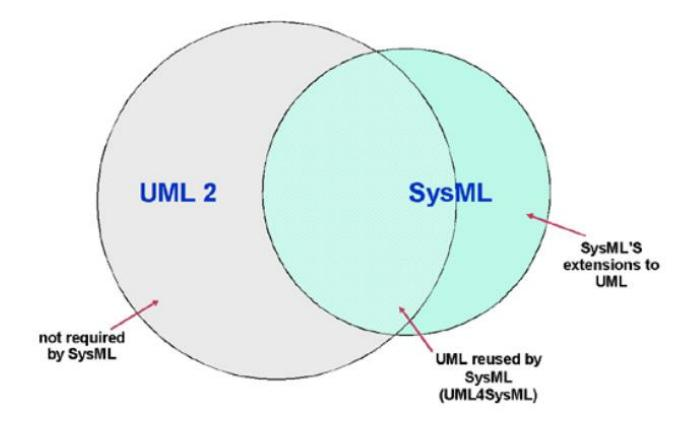
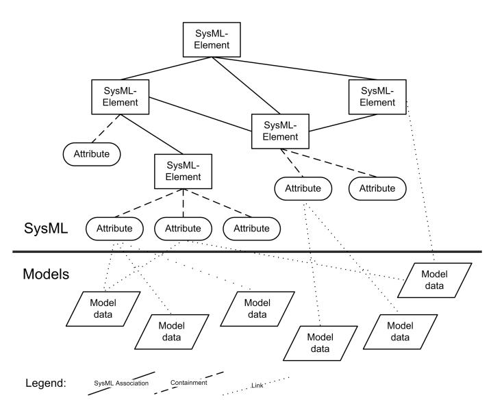
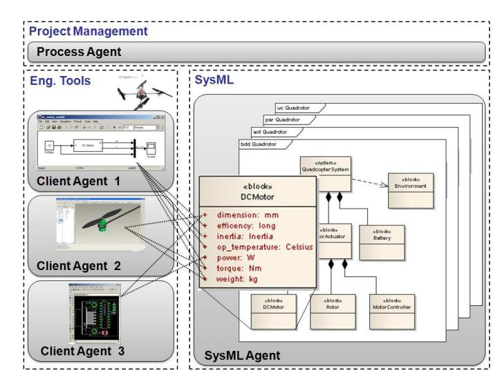

# A SysML-based Integration Framework for the Engineering of Mechatronic Systems

Mohammad Chami, Holger Seemuller and Holger Voos ¨ University of Applied Sciences Ravensburg-Weingarten, Mobile Robotics and Mechatronics Lab, D-88241 Weingarten, Germany eMail: {chami, seemueller, voos}@hs-weingarten.de

*Abstract*—The engineering discipline mechatronics is one of the main innovation leader in industry nowadays. With the need for an optimal synergetic integration of the involved disciplines, the engineering process of mechatronic systems is faced with an increasing complexity and the interdisciplinary nature of these systems. New methods and techniques have to be developed to deal with these challenges. This document presents an approach of a SysML-based integration framework that shall deal with the complexity and bring the different disciplines together for a better cooperation and collaboration. Therefore, SysML shall be used for the overall interdisciplinary system design and simultaniously act as a link between the heterogenous model data of the discipline specific tools.

## I. INTRODUCTION

With the synergetic integration of mechanics, electronics and IT, mechatronics satisfies the needs of industry in these days very well. It offers new possibilities to achieve a high level of innovation, to develop high performance products and to get the cost under control [1]. Unfortunately, at the same time, the complexity of the systems reach a level that can only be managed very hardly. Additionally, the collaboration of the three disciplines results in new challenges for the engineering process: to benefit from the synergetic integration, the possible interactions between the domains must be found and considered. This requires an adequate coordination and cooperation of all involved domains which again increases the complexity.

## *A. The V-model*One common approach to tackle this fact is the usage of a process model like the V-model, as described in the VDI 2206 guideline [2]. Basicly, the V-model is devided into four phases: initially, a*requirements list*is created, which holds all needs of the product. During the*system design phase*, this requirements list is concretised into an overall cross-domain solution principle containing an interdisciplinary description of the system. Then, this description shall be partitioned into the involved domains and the discipline specific concretisation in the *domain-specifc design phase*is established. Next, the results of the domains are integrated into the entire system which leads to the final product. During the integration phase, the conformance of the system is validated. Additionally, the V-model proposes the intensive use of models and simulation during the engineering process.

Mainly, the crux of the process lies in the transition from the interdisciplinary system design phase to the domain-specific design phase. During the system design, representatives of all involved disciplines work collaboratively to plan and design the system without going too much into domain specific details. So, interdependencies between the domains can be considered. For the next step, the overall system design will be partitioned into the respective domains, which then concretise their parts in the domain specific design phase. Here the collaboration must not end! As the important interactions between the domains still exist, they have to be considered also during this phase. This means, that some important parameters may also be of interest for several other disciplines. So it might be possible that a CAD engineer models a part with a specific weight. On the other side, this weight affects directly another engineer who is, for example, analyzing the dynamic behaviour of that part. So, it is very important for both to cooperate and exchange the relevant data. However, over the years, each discipline has developed their own tool set which is very specialized and powerful within its domain. Unfortunately, interoperability between these tools is in the majority of cases not intended, which leads to very tool- or discipline-specific exchange approaches. This fact complicates the collaboration of the three disciplines very much. As a project on developing a brand new, all-in-one development suite for mechatronic systems would not be affordable and even not accepted by industry, new approaches have to be found to increase interoperability between existing tools.

Apart from this fact, the V-model itself is not the final solution for an mechatronics engineering process. The whole process is currently a theoretical construct without tool support. Additionally, the V-model is basically a sequential process with all its disadvantages. There is e.g. a long duration between two iterations which leads to an unflexible process and higher costs due to the lost time. Furthermore, the process bases very much on an top-down approach, where first the overall structure and behavior of the system is modeled during the design phase and then concretized within the according domains. In daily life, this approach will not be sufficient as a lot of facts will appear not before the domain specific design phase. This new knowledge has to be included and considered immediately - and not lately in the next iteration - in the overall system model. So, new flexible methods are needed to adapt the V-model to an agile and flexible process.

This document describes an approach of an integrated framework which improves collaboration and communication aspects in the engineering process by tieing multiple tool specific model data together to an overall system model. At the same time, the complexity of the system can be handled due to the usage of proposals of the V-model process. Section II presents actual research projects and approaches that also face this topic. In section III a brief description of SysML - a new modeling language for multidisciplinary systems - is given. After the new approach is described in detail in section IV, a possible multiagent-based architecture for the realisation is presented. An example for the application is shown in section VI. The paper finishes with a conclusion and an outlook to future work within the project in section VII.

## II. RELATED WORK

The situation presented above is the topic of several current research projects. In the literature, the idea of a need for integration on different levels is propagated in [3] and [4]. Herein, two main levels can be identified, which abstract the problems identified in section I:

The first level deals with the aspects of*Process Integration*: For an appropriate interdisciplinary development of a system, the disciplines have to collaborate during the whole development process. So, the interactions and interdependencies between them can be explored and used for an optimal synergetic integration. This fact has to be supported by suitable methods and processes. One common approach is the V-model as proposed in the VDI guideline 2206 [2].

The second level faces the problem of *Data Integration*: As disciplines still work with their own specialised tool set, an exchange and shared usage of data and information, as it is necessary for collaboration, is hardly possible. There is a need for supported data exchange and sharing.

Especially the second point is investigated in several projects that are published in the literature:

The PACT project [5] tries to integrate domain specific tools by the usage of agents, each representing a specific tool. These agents then communicate and exchange needed data.

Cabrera et al. [6] describe a framework that facilitates the integration among different modeling tools. Therefore, a central high-level model for a discipline neutral description of the system is proposed. This model shall link the domain specific models into a coherent overall model of the system.

Bellalouna [3] describes a platform for an interdisciplinary engineering of mechatronic systems. This platform offers the functionality of a domain independent PLM system and uses a neutral meta-model to describe the mechatronic components and relations between them. The realisation is achieved by a SOA based approach with the usage of services as an interface to exisiting models and PLM tools. Additionally, the SOA services shall support the interdisciplinary devolopment process according to the V-model.

While the PACT project is mainly focusing on the pure exchange of data, the other approaches also focus on the challenge of complexity with the usage of model based engineering. It is mainly accepted that the usage of interdisciplinary models and abstraction decreases the complexity of a system and makes it more understandable for engineers.

## III. SYSML

The OMG Systems Modeling Language (OMG SysMLTM) is a general-purpose, graphical modeling language for specifying, analyzing, designing and verifying complex systems that may include hardware, software, information, personnel, procedures and facilities [7]. SysML represents a subset of UML2 with an extension needed to satisfy the requirements of the UML for Systems Engineering Request for Proposal (UML for SE RFP) that was initiated in 2003 by OMG.

According to Figure 1, the language architecture of SysML is divided into two parts: the first part depicts the UML modeling constructs that SysML reuses. The second part specifies the extensions to UML. These extensions are created to support the specific needs for the application of UML for Systems Engineering (SE). Some UML packages are not being reused due to the inessentiality for Systems Engineering (SE) applications.

<!-- Image Description: The image is a Venn diagram illustrating the relationship between UML 2 and SysML. The overlapping area represents the portion of UML 2 reused by SysML (UML4SysML). The area unique to SysML shows its extensions to UML. The area unique to UML 2 depicts parts not used by SysML. The diagram clarifies the extent to which SysML incorporates and extends UML 2. -->

Fig. 1. Relationship between SysML and UML [7].

SysML is a graphical modeling language recently used in different applications such as automotive, aerospace, communications and information systems. These applications are considered to be very complex and affected by a wide range of SE disciplines. SysML is designed to provide a common modeling language used to describe a multi-disciplinary system. Engineers from any domain can use it collaborativly to model the overall design of a product. SysML supports the modelbased SE approach by offering the following nine diagrams: the *activity, sequence, state machine*and*use case*diagrams are used to describe the behavior of the system. The*block definition, internal block, parametric*and*package*diagrams represent the structure of the system. The*requirement*diagram represents text-based requirements and their relationships with other design elements.

During the last years an increase attention is focusing on the integration of SysML with other system dynamics modeling languages. The goal is to enhance SysML ability as a common language between designer's modeling tools during the development of a complex system. Reference [8] introduce a formal approach for modeling continuous system dynamics in SysML based on a bidirectional language mapping between Modelica [9] and SysML. In [10] a summary how UML and Matlab/Simulink can be associated and what is the impact of SysML is described. Two coupling methods are mentioned, either co-simulation or integration based on a common underlying executable language.

This paper emphasizes the usage of SysML for engineering of mechatronics systems. SysML models are not only used for an overall documentation during the design stages, but also a significant usability of the modeled data - and linking - is attended during the domain specific stages followed by the integration stages in a product development cycle. The following section describes the new approach in more details.

## IV. NEW APPROACH

As shown, the modeling language SysML is applicable for the overall and interdisciplinary description of a mechatronic system. Meanwhile it is getting more and more common and accepted by industry and has been used for many projects. Furthermore, extensive tool support is given by tool vendors. This fact makes SysML an ideal foundation for an improved integration on the levels proposed in section II: For*process integration*, SysML is the language of choise for an interdisciplinary system design. Additionally, it has been shown, that the usage of a domain indepenent model for *data integration*aspects seems to be convenient, as it can act as a glue for the domain specific model data [6].

Here, this approach unifies both levels of integration: as an overall SysML model may be the result from the collaborative design phase of the V-model, this resource can directly be used in the domain specific part of the engineering process. There it can serve as a top-level format which holds references to domain specific realisations. These realisations can be models of different domains like CAD or Matlab models, source code, models of electronic parts or even additional text written in Word. It is the duty of SysML to link these different worlds together to an integrated distributed overall model under the roof of a SysML model. So, the SysML model can act as the central point of the engineering process, as it holds all important information about the system. Important elements of a process like requirements engineering and change management can directly be handled on SysML level.

#*A. Linking*The linking of the SysML model with the domain specific model data must be realised in a very flexible way. So, on SysML level, this can take place on the following levels:

##*Requirement Level:*During the initital iteration, the first models may base only on the given requirements. Here, on the*Requirement Level*, the models directly can be linked with the according requirements. The linking on this level is especially suitable for the idea of functional modeling, where the goal functions of the system are the main aspects for the initial model [11]. In SysML, these functions can be modeled perfectly with the usage of the new requirements diagram.

# *Element Level:*On the*Element Level*, an element in SysML, e.g. a block or a single action can be linked directly with a domain specific model. So, it might be usefull to link a block "'motor"' with a CAD model, that represents its dimensions, and, at the same time, with a MATLAB file, containing the dynamic behavior of the motor. So, all the important models are grouped together.

# *Attribute Level:*On the lowest level, the*Attribute Level*, parameters which are used by multiple domain specific models can be modeled within SysML as an attribute of a block. So, e.g. the weight of a motor block might be important for a CAD and also for a MATLAB model and therefore be modeled in SysML.

In that way the engineers are completely free to decide which parts belong together. This high degree of freedom is very important since the level of abstraction differs a lot and depends very much on the considerations of the system modeler. So, no generally accepted assumptions can be made. With the ability to group different models on an abstract requirement level, on the element level or - very detailed - on parameter level, the linking is getting more concrete with each iteration. An element within SysML which is linked with one or many domain specific models is called a *shared element*, as this element is the common denominator for the model data.

Besides the top-down approach of the V-model, a linking in bottom-up manner is also supported. This is very important, as in early iterations of the process many important facts and shared parameter might not be known. Furthermore, existing components from libraries are used, each with their own, specific properties and characteristics. Often, the interdepencies between models are recognized during the domain specific modeling phase and not considered in the overall system model. Here, this new knowledge has to be added in the model and the links have to be established. So, this interdependency is documented and can be used for better integration of the involved parts. Additionally, possible impacts of this new discovered dependency can be analysed within the overall model and - if necessary - appropriate changes can be made.

After having established some links, the following use cases are possible for a worthwhile work with this new approach.

## *UC-1: Domain specific model modification:*A change within a domain specific model can be propagated to other affected models. The information, which models are affected, is stored within the links.

##*UC-2: SysML model refactoring:*A design change within the SysML model can be propagated to the affected domain specific models, as all models are linked to the according shared element in SysML.
*UC-3: Domain specific models management:*During the development process of a mechatronic system, the amount of domain specific models is enormous and hard to manage. As all models are linked with the SysML model, this aspect is highly improved by using the model for navigation. Acutally, this is also interesting for engineers to see, who else is involved in the same part.
*UC-3: Project navigation:*For project leader, the aspect of traceability also plays an important role. With the tight linking of SysML with domain specific models, he can easily analyse the current state of the project.

These use cases, together with the ability of top-down and bottom-up modeling, improves the V-model in several aspects. Changes, either in the overall system design or within the domains are recognised very early and can be handled. The possibility for navigation and tracing the current state lets the project leader decide more quickly. These points make the Vmodel much much flexible and leads it to an agile process.

In a very abstract view, the original SysML model can be seen as a graph consisting of requirements, elements and attributes as nodes and the associations between the elemens as edges. While linking the tool specific model data with the*shared elements*of the SysML model, this graph is extended with model nodes. So a coherent entire graph-based data model arises which is distributed over all involved engineers workstations (see figure 2).

<!-- Image Description: The image is a hierarchical diagram illustrating SysML model structure. It depicts "SysML-Element" nodes arranged in a tree-like structure, with attributes associated to them. Solid lines represent containment, dashed lines represent links, and dotted lines show associations between SysML elements and "Model data" elements at the bottom, representing the underlying data models. The diagram clarifies the relationships between SysML elements and their data representation within the models. -->

Fig. 2. Distributed graph-based data model

##*B. Benefits*With this approach the domain independent model of the system can be tied together with its realisation in a close way. There are multiple advantages: The first benefit is clearly the ability to assign a parameter which affects several disciplines to the respective discipline models. So knowledge sharing is improved as each engineer can see and use the data produced by another engineer in a very fast and easy way. Nevertheless, for the realisation of the tool support, the effort of establishing the link has to be small enough to be accepted by the engineer! Additionally the consequences of a redesign for the involved disciplines can be considered in a better way. As all domain specfic models are assigned to the appropriate part of the overall SysML model, changes and redesign within SysML can be easily allocated to the respective engineer.

The second benefit is the fact that the transition from the domain neutral design phase to the domain specific phase of the V-model takes place more seamlessly. This fact can be compared to the situation in model based software engineering. Here the usage of UML is a standard since several years. Modern tools offer software engineers the possibility to switch between source code and model without a break. So model and code are tied together and the ability to navigate is enhanced. An additional benefit is the improvement of traceability within the model. This works in both directions: first, domain specific models can now be found in an easy way. An engineer just has to browse the SysML model to open the needed part, e.g. a motor. Now he has access to all models assigned to that motor, e.g. the CAD model, representing its dimensions and a MATLAB model, holding the dynamic behaviour. Second, in the other direction, an engineer who is currently working on a model can easily see, in which part of the overall system he is acutally involved and - more important - which other persons or disciplines are also working on the same part. So, interdisciplinary communication is supported. Additionally, the question 'What am I doing?' might also be of great interest and can then be self-answered. Implicitly, these benefit also stress the importance of an overall design model and explain the extra work and time which is needed to create this model. Even nowadays a lot of engineers within all domains do not see the need and importance of an overall design model. In contrast, many believe that this is unnecessary work and lost time within the complete process. With this approach, the sense of an overall system model is becoming clearer and additional benefits can be derived. So, this appraoch is implicity another step towards model-based engineering.

## V. ARCHITECTURE

It is indespensable that the new approach has to be supported by appropriate tools. On the one hand, this tools has to be as discrete as possible so that engineers are not disturbed. On the other side, the tool has to collect necessary information and offer the engineer its new knowledge.

To maintain existing equipment and applications, the new framework has to be well integrated into the available IT landscape. In industry, this landscape is characterized by heterogenity, dynamics, flexibilty, uncertainty and distribution. This fact makes the usage of agents suitable for the purposes of the framework. Agents are a subfield of the research field of Distributed Artifical Intelligence. An agent is an automonous component which acts in an environment to meet its design goals. Additionally, in a multiagent system, it has the ability to communicate and negotiate with other agents or humans to reach its goals.

Due to its autonomous behavior and communication skills, multiagent systems are convenient for the described environment.

For the initial architecture of the presented SysML-based integration framework, three types of agents can be identified:

The first type of agent, the*Process Agent*represents and manages the whole engineering process. Therefore, it follows a specific process and methodology to handle the different tasks which are necessary for a successfull product development.

The*SysML Agent*is responsible for the management of the SysML model. It offers the possibility to publish the model, manage the links and analyses change impacts. It directly cooperates with the Process Agent, as the overall SysML model is an essential part of the engineering process.

Finally, the*Client Agents*represents the engineers working with the different tools. These agents are running on the workstations of the engineer and communicate with the Process and SysML agents to synchronize their work considering the current state of the project and the interdependencies with other engineers.

## VI. EXAMPLE

The new approach introduced in section 4 will be exemplified by taking the UAV Quadrotor project currently running at the University of Applied Sciences Ravensburg-Weingarten as a mechatronic application. A quadrotor UAV represent a rotorcraft equipped with four powered rotors laid up symmetrically around its center. Their ability to fly in- and outdoor, gathered a wide popularity among several applications in particular for near-area surveillance and exploration. As the quadcopter constists of mechanical, electric and ITbased parts, it is a typical example of a mechatronic product. Different powerful engineering tools are used in this project for modeling, simulation and real-time verification

Figure 3 shows a part of a sophisticated extract of a SysML model, describing the design of a quadrotor. A SysML block can be seen, which describes an DC motor which itself is a part of the quadrotor. The block is already described in a very detailed way as attributes like dimension or power are within the model. This model might come from the intersdisciplinary design phase of the V-model. The process from requirements engineering until this high level of detail has to be described in an appropriate methodology which is not part of this paper.

The motor is concretised by three domain specific models. Each of these models is developed by an engineer on his computer. At the same time, a*Client Agent*is running on the same machine, managing and monitoring the engineers work. The SysML model with the description of the DC motor is under the head of the*SysML Agent*. Additionally, a *Process Agent*is running elsewhere, coordinating the process. Actually,

<!-- Image Description: This image displays a system architecture diagram. It shows three "Client Agents" (one with a circuit simulator, one with a 3D model, and one with a PCB layout) feeding data to a "SysML Agent." The SysML agent contains a block diagram representing a quadcopter system, including components like motors, battery, and environment. The purpose is to illustrate a model-based systems engineering (MBSE) workflow where multiple engineering tools contribute to a central system model. Data attributes (e.g., dimensions, power) are explicitly shown within the SysML block definition for the DC motor. -->

Fig. 3. Architecture of linking between SysML model and Eng. tools.

a detailed description of this agent is not topic of the current example.

After recognizing that several attributes of the block are shared by different models, the links between the according domain specific model and the SysML model are established by negotiation of the involved agents. So, each agent gains additional knowledge about his environment.

Now, use case (1) of section IV occurs: For any reason, the CAD engineer has to make a change which affects the torque of the motor. Directly, this change has an effect on the model of the controller of the motor. The agent running on the client of the CAD engineer recognises the change. As he has the knowledge that this change may affect other models, he tries to propagate the change. Therefore, it informs the SysML agent about the change who himself distributes this information to all involved Client Agents. These agents check the new value for conformance to their model. If the conformance check is fulfilled, the engineer can work with the new value. In the other case, the Client Agents can negotiate for a proper value. If no agreement can be achieved, the problem has to be announced to the*Process Agent*who has the knowledge and ability to check the higher-ranking design model for a possible solution. One solution can lie in a bigger design change of the system. This change affects a lot of domain specific models. Again, the SysML Agent who is informed about the change by the Process Agent distributes the changes to the involved Client Agents who themself check the change request for conformance to ther model.

Similarly, use case (2) announces the otherwise changes from the SysML model to the affected domain specific models. It is necessary to ensure the propagation of the design refactoring within the SysML model. SysML Model refactoring could be any transformation inside the model, including requirements, structural or behavior changes for improving the qualitative features. The main concern is for the changes of the*shared elements*within the SysML model. These changes are then detected by the*SysML agent*and propagated respectively to the affected*Client Agents*.

Regarding the use cases (3 and 4), the main interest goes to the navigation facilities and information providing for the engineers or the project leaders with the help of their *Client Agents*. Additional graphs and charts would play the role in showing the involved clients for a specific domain and in analysing the current state of a part or the overall project.

It has to be mentioned, that all agents are working side by side with the engineers. It is not the duty of the agents to manage the whole process by their own without human interaction. The agents shall support the specialist by handling daily buisness and enhancing the automatic communication between all involved people.

## VII. CONCLUSION AND FUTURE WORK

As shown, the new approach helps to tie the different, all over the disciplines distributed models together by linking them to an distributed overall data model which is based on SysML. This idea improves directly the issues of knowledgesharing, traceability, navigation and the transition between the domain independent design phase and the domain specific phase of the V-model. So, the communication and collaboration possibilities which are important for a successfull development of a mechatronic system are enhanced.

For the future, the architecture for the realisation has to be improved and concretized. Therefore, the existing use cases must be reconsidered and partitioned on the several types of agents. Based on these use cases, the goals of the agents must be identified and a first communication protocol between them has to be developed. With this first prototype, the practical application of the approach can be examined. Additionally, methodologies have to be establised which integrate the approach into an overall process model. Therefore, the V-model can be extended by adequate methodologies like SYSMOD [12] or the Pahl&Beitz methodology [13] as shown in [14], [15].

## REFERENCES

- [1] M. Tomizuka, "Mechatronics: from the 20th to 21st century," *Control Engineering Practise*, vol. 10, no. 8, pp. 877 – 886, 2002.
- [2] V. D. I. VDI, *Entwicklungsmethodik fur mechatronische Systeme. VDI ¨ Richtlinie 2206*. Beuth Verlag, 2004.
- [3] F. Bellalouna, "Integrationsplattform fur eine interdisziplin ¨ are entwick- ¨ lung mechatronischer produkte," Ph.D. dissertation, Universitat Bochum, ¨ 2009.
- [4] K. Thramboulidis, "Challanges in the development of mechatronic systems: The mechatronic component," Hamburg, Sep. 2008.
- [5] M. Cutkosty, R. Engelmore, R. Fikes, M. Genesereth, and T. Gruber, "PACT: an experiment in integrating concurrent engineering systems," *Computer*, vol. 26, no. 1, pp. 28–37, 1993.
- [6] A. A. A. Cabrera, M. S. Erden, M. J. Foeken, and T. Tomiyama, "High level model integration for design of mechatronic systems," in *2008 IEEE/ASME International Conference on Mechtronic and Embedded Systems and Applications*, Beijing, China, 2008, pp. 387–392.
- [7] O. M. Group, "OMG Systems Modeling Language (OMG SysMLTM)," available at http://www.omgsysml.org, November 2008.
- [8] T. Johnson, C. Paredis, J. Jobe, and R. Burkhart, "Modeling continous system dynamics in SysMl." In Proc. 2007 International Mech. Eng. Congress and Exposition, Seattle, Washington, USA, November 2007.
- [9] "Modelica Association," http://www.modelica.org.

- [10] Y. Vanderperren and W. Dehaene, "From UML/SysML to Matlab/Simulink: current state and future perspectives." In Proc. Design, Automation and Test in Europ (DATE), Munich, Germany, March 2006.
- [11] M. s. Erden, H. Komoto, T. j. Van beek, V. D'amelio, E. Echavarria, and T. Tomiyama, "A review of function modeling: Approaches and applications," *Artif. Intell. Eng. Des. Anal. Manuf.*, vol. 22, no. 2, pp. 147–169, 2008.
- [12] T. Weilkiens, *Systems Engineering mit SysML/UML. Modellierung, Analyse, Design*, 1st ed. Dpunkt Verlag, Jul. 2006.
- [13] G. Pahl, W. Beitz, J. Feldhusen, and K. H. Grote, *Konstruktionslehre: Grundlagen erfolgreicher Produktentwicklung*, 7th ed. Springer, Berlin, Oct. 2006.
- [14] A. Johar and R. Stetter, "A proposal for the use of diagrams of UML for mechatronics engineering," Dubrovnik, Croatia, 2008.
- [15] R. B. A. Rahman, U. Pulm, and R. Stetter, "Systematic mechatronic design of a Piezo-Electric brake," Paris, 2007.
