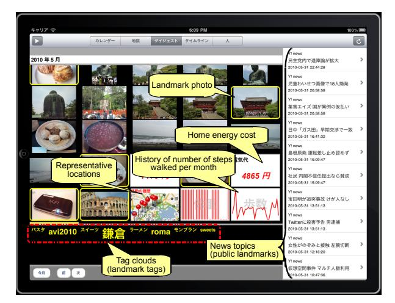

# **Aggregation and Exploration of Heterogeneous Data Collected from Diverse Information Sources**

**Teruhiko Teraoka** 

Yahoo! JAPAN Research, Yahoo Japan Corporation Tokyo, Japan

tteraoka@yahoo-corp.jp

#### **ABSTRACT**

This paper describes aggregation and exploration of heterogeneous data collected from various information sources. We studied the organization of such data from a user's point of view. Interactive visual interfaces are essential for exploring heterogeneous data. Our current research on the exploration of data is discussed and a study of social use of heterogeneous data is explained. An early prototype system is also introduced for data collected from several Web services and mobile devices.

## **Author Keywords**

Personal data, heterogeneous data, exploration, aggregation, community memory

#### **ACM Classification Keywords**

H5.m. Information interfaces and presentation (e.g., HCI): Miscellaneous.

## **General Terms**

Design, Human Factors

## **INTRODUCTION**

In a ubiquitous environment, users interact with computers and have a variety of experiences throughout their daily life. Various sensors monitor their experiences directly or indirectly. Since digital data and logs left by those experiences are stored in distributed sources, it is important to aggregate those digital traces to help users remember their experiences and create innovative services for a more social life.

Recently, research topics on the fusion of the cyber/virtual and physical/real worlds, such as cyber-physical systems, internet of things, sensor networks, lifelogs, and reality mining, have been becoming popular. Research on lifelogs has been becoming popular [1, 5] with regards to personal data. Such research is focused on the capture of personal logs and personal data archives. The goal of life logging is to record everything about a person. Since such data are heterogeneous, they are difficult to aggregate and organize.

Permission to make digital or hard copies of all or part of this work for personal or classroom use is granted without fee provided that copies are not made or distributed for profit or commercial advantage and that copies bear this notice and the full citation on the first page. To copy otherwise, or republish, to post on servers or to redistribute to lists, requires prior specific permission and/or a fee.

*SCI'11,* September 18, 2011, Beijing, China.

Copyright 2011 ACM 978-1-4503-0925-7/11/09...\$10.00.

In other words, they contain a variety of media, formats, and granularities.

We have studied the organization and exploration of personal data from diverse information sources from a user's point of view [9], and visual interfaces have been developed to interact with the data. Interactive visual interface techniques, including information visualization, visual data mining, and visual analytics, have huge potential for exploring and analyzing the vast volumes of heterogeneous data [2, 7, 12]. Moreover, we have studied the social uses of heterogeneous data through the sharing of such personal data and aggregating with other public data from the Web.

We present the current status of our research on the organization of heterogeneous data and an ongoing study of the social uses of such data. First, we explain our approach and design for organizing heterogeneous data. Second, a prototype system is introduced. Finally, we describe the ongoing study on the social uses, followed by our conclusions.

#### **APPROACH**

**Figure 1. Personal and social uses** 

Figure 1 shows our approach. Personal data include user profiles, user-generated content, health data, and account statements. Some data are available to the public, such as news reports, weather information, traffic information, and official statistics.

We studied aggregation from the following two angles.

1. Personal use

Heterogeneous personal data from diverse sources are aggregated.

2. Social use

Aggregated data and public data are shared and fused, and new services and experiences are created by analyzing people's behavior and activity.

It is impossible to effectively use fused data unless various personal data can be collected daily and shared safely. In other words, it is insufficient for a third party to aggregate diverse data without an environment in which users can safely collect their data.

We first focused on reusing personal data for recall and helping users find related information. We then moved on to social use with our approach.

# **AGGREGATION AND EXPLORATION OF DATA FOR PERSONAL USE**

The author previously proposed an organizational structure, especially for visual exploration of data [9]. In this research, the collected data include the following.

- z Photographs, e-mails, tweets on Twitter, schedules from Web services
- z SMS text messages, telephone call history, GPS history on smart phones
- z Number of steps walked using a pedometer
- z Body weight measured using a scale and home energy cost and use. These data will be collected from sensor networks for the general public in the near future, though they were collected manually in the current research.

We also studied public information such as news headlines. This information is not personal but it helps users recall their experiences.

The following problems make it difficult to organize such heterogeneous data.

- 1. Common metadata and schema matching method for aggregation of different schemas from various information sources [11]
- 2. Management of access permissions and user authorization
- 3. Unified information architecture including interaction design, proper user interfaces, and visualization according to a user's purpose and his/her context.

Information visualization and interactive user interfaces can help reveal buried facts and relationships among data [2]. An effective navigation system is essential to enable interaction with a large amount of data from a user's point of view. Therefore, a navigational structure and a temporal zooming user interfaces were proposed for heterogeneous data [9].

Three viewpoints were studied for organizing data: time (when), location (where), and people (who). The time axis was treated as a major attribute for the organization of data. We have also studied summaries and landmarks to visualize a large amount of data [9]. Summaries are like digests of daily life, and landmarks provide cues for remembering experiences. Usually landmarks are selected from personal data. Of course, summaries and landmarks change depending on the viewpoints and their scale. The change in scale for each viewpoint corresponds to changes in time (time), geographical region (location), and groups of people (people). We studied six types of landmarks, user-generated data, locations, people, tags, characteristic values (e.g., outliers), and public data (e.g., news headlines) [9]. The summary contains these landmarks.

**Figure 2. Navigation structure** 

**Figure 3. UI for exploring data** 

Figure 2 shows the proposed structure. The digest view provides interactive temporal zooming. The monthly digest view, which contains a monthly summary, appears by zooming in on the yearly digest view. The digest view initially displays a summary of personal data on a given date and time scale. Other data are displayed while interacting with the digest view. This view is also temporally zoomable, which means that a user can continuously change the time interval, such as the year, month, or day. Figure 3 outlines the digest view using the zooming user interface we proposed. Users control the scale of the view to change the time intervals, which are shortened by zooming in and lengthened by zooming out. Summaries, landmarks, and visual forms, such as text labels and charts, change appropriately with changes in temporal scales or intervals.

Figure 4 shows an overview of the prototype system. The 'Data collection' module is used to collect data from various web services. The role of the 'data mining' module is to cluster data and calculate landmarks such as centers of clusters and outliers. Client applications, such as the 'data explorer' and 'GPS data collection' modules, are native applications implemented on iOS devices. Unfortunately, only few types of personal data could be automatically obtained from location information. Therefore, the location information (i.e., longitude and latitude) of personal data was approximately calculated by matching timestamps to GPS histories. In this system, a sensor network is not included and home energy use is input manually. The number of steps walked using a pedometer and body weight measured using a scale are also input manually. However, collection of these data will be possible through sensor networks and wireless communications in the near future. This prototype provided several views for exploring personal data, such as digest views, map views, and calendar views.

**Figure 4. Prototype system** 

**Figure 5. Example of digest view (monthly)** 

Figure 5 is an example of the digest view. Photographs, representative locations, history of the number of steps walked, and home energy costs are displayed on the main view. The photographs with a highlighted border are landmarks. Some of the text tags that distinguish personal data are displayed at the bottom of the view. The tags are visualized as a tag cloud interface and are also landmarks.

A landmark can be an outlier value for time-series data, such as the number of steps walked, home energy use, and body weight. Figure 6 is a screen shot of outliers of the number of steps walked in a month. An outlier appears as a highlighted bar on a chart. When a user clicks the bar, the daily view for the corresponding date appears. Since the user in this example went on a picnic, the number of steps was more than those walked on other days. Therefore, such visualization helps a user remember a special event or activity.

**Figure 6. Example of outliers** 

Through developing the prototype and trials, the more the types of aggregated data increased the more anxiety about information leak and invasion of privacy increased. An important area for future work is the study of the management of permission and authorization with respect to privacy issues.

MyLifeBits is a popular research project for storing data of daily activities in a database [5]. It stores data from PCs and photos taken with a SenseCam, which is a mobile device that has a camera module, digital light sensor, and a temperature sensor [6]. On the other hand, we focused on integrating personal data that have been stored on various sources without using special devices.

Ringel et al. worked with personal and public landmarks [8]. In their research, personal landmarks were important calendar events and the first photos taken on given days. Public landmarks were national holidays and important news events. Only files on PCs were used, and the time scale for the landmarks was fixed. In our approach, several

landmarks are suggested, and appropriate landmarks are presented with changing time scales.

### **TOWARD SOCIAL USE**

We studied expansions into social use of heterogeneous data from the following perspectives.

- z Augmentation of personal memory
- z Creating community memory and a public summary of daily life
- z Activity analysis and recommendation

#### **Augmentation of personal memory**

Imagine arranging photographs and other materials about a trip. Usually, there are many people who have taken photographs on the same day and at the same place and written blog entries about their trip. Users seem to find new facts or reminisce about past experiences from other people's personal data.

For this purpose, we began to expand the exploration of heterogeneous data through related attributes, i.e., date, location, related people, and tags. An example of the location attribute is when photographs taken by others on the same day and at the same place as those of the user are displayed, they bring back pleasant memories. This is likely to help the user plan a trip in the future by discovering people with similar preferences. An example of the related people attribute is when an email message is displayed, we sometimes want to see other e-mail from him/her, telephone call history with him/her, and photographs taken together with him/her. Moreover, we seem to want to know his/her different and unexpected side and determine his/her personality and preferences through his/her own photographs, tweets on Twitter, and blog entries. Therefore, we are currently expanding the navigational structure by adding several linkages. More specifically, a user can explore a datum to a variety of data for the same date and/or place and/or sender/receiver and/or tags. This means that a large amount of data can be explored using both social and attribute relationships.

**Figure 7. Other people's photos** 

When a user selects a photograph on a view, photographs that other people took on the same day and at the same place are displayed (Fig. 7). A user seems to find new facts or reminisce about the trip from other people's shared personal data. In this example, photographs are collected by searching by date and place through photo sharing services such as Flickr and Picasa.

**Figure 8. Data network mediated using personal data** 

Figure 8 shows a personal data network. A user and his/her personal data are highlighted in red. A common social network is constructed from relationships with friends and acquaintances. This network shows data linkages connected by the sharing of attributes, such as date, location, people, and tags.

**Figure 9. Example of data-mediated exploration (1)** 

Figure 9 shows an example of exploration based on attributes of data. When a user selects a photograph on a digest view, the photograph moves to the center of the screen and a map and several labels are displayed. These labels represent related people (e.g., a sender or a receiver of a message) and tags attached to the selected data. When one of the labels is selected, data related to the selected attribute are displayed on the right side of the main view. In this example, when the user selected a tag labeled 'Christmas lights', the user's data related to the tag (`Christmas lights') are displayed on the right side of the view.

**Figure 10. Example of data-mediated exploration (2)** 

Figure 10 shows another example. When a user selects an SMS message, a label representing the woman who was the receiver of the user's SMS is displayed. After the user clicks the label, her public personal data are displayed on the right side of the view. Of course, the view can display shared data that include exchanged e-mail, telephone call history, and photographs taken of the two.

This network focuses on not only usual social relationships but also relations mediated by attributes of data among people and data. Research on making management of this network structure efficient is ongoing.

## **Community memory and summary of public life**

Imagine you recently watched a parade at Disneyland. You want to think back to how the parade looked from the other side of the route and that you wanted to have a closer look at Mickey Mouse. You will be able to relive such experiences if special content can be created by fusing a variety of widely shared heterogeneous data created by other people. Moreover, it might be possible to generate a summary of public lives by analyzing those data.

Agarwal et al. presented a system that could reconstruct 3D scene from extremely large collections of photographs on Internet photo sharing sites [13]. They also showed examples of reconstructions of several city data sets from Flickr.

If a huge number of data from diverse information sources can be shared, a wide variety of human activities such as a historical change of a city, traffic streams and changes in nature, might be able to be reconstructed. As a first step, public summaries for group, community, area, and event are planned for future work.

## **Activity analysis and recommendation**

After solving problems of safely storing a variety of data, various analyses may be feasible. It may be likely to recommend activities (e.g., places to go, best food to eat, diet programs, travel plans, and measures for preventing the flu).

Typical activity recommendations are based on location using GPS history [3, 10]. For personal use, location and activity (e.g., shopping and watching movies) recommendations are effective. However, these researches were not used various heterogeneous data.

Several practical applications can be envisaged, such as predicting traffic jams, detecting popular trends, and monitoring public health [4], in terms of public use of heterogeneous data. Of course, such recommendations are important topics for future work.

Eagle et al. proposed 'reality mining' system that measured information access and use within different contexts, recognized social patterns in daily user activities, and inferred relationships [14]. On the other hand, we have studied relations among heterogeneous data with respect to attributes from the user's viewpoint.

# **CONCLUSIONS**

We described the current status of our research on the organization of heterogeneous data and ongoing studies of the social use of such data. Since user interactions are important for manipulating large amounts of heterogeneous data from diverse information sources, we have studied them in terms of personal and public uses from the user's point of view. Our point was that easy and safe use of data by individuals leads to their effective social use.

# **REFERENCES**

- 1. G. Bell and J. Gemmell. Total Recall. DUTTON, 2009.
- 2. D. A. Keim. Information visualization and visual data mining. IEEE Trans Visualization and Computer Graphics, 8(1):1–8, 2002.
- 3. D. Dearman and K. N. Truong. Identifying the Activities Supported by Locations with Community-Authored Content. In Proc. UbiComp'10, 23–32. ACM Press, 2010.
- 4. D. Zhang, B. Guo and Z. Yu. Social and community intelligence. IEEE Computer (to appear), 2011.
- 5. J. Gemmell, G. Bell, and R. Lueder. Mylifebits: A personal database for everything. Communications of the ACM, 49(1):88–95, 2006.
- 6. J. Gemmell, L. Williams, K. Wood, R. Lueder, and G. Bell. Passive capture and ensuing issues for a personal lifetime store. In Proc. CARPE '04. ACM, 2004.
- 7. M. Cammarano, X. Dong, B. Chan, J. Kinger, J. Talbot, A. Halevy and P. Hanrahan. Visualization of heterogeneous data. IEEE Trans Visualization and Computer Graphics, 13(6):1200**–**1207, 2007.
- 8. M. Ringel, E. Cutrell, S. Dumais, and E. Horvitz. Milestones in time. In Proc. INTERACT 03. IFIP, 2003.
- 9. T. Teraoka. A Study of Exploration of Heterogeneous Personal Data Collected from Mobile Devices and Web

Services. In Proc. MUE2011, 239-245. IEEE CPS, 2011.

- 10. V. W. Zheng, Y. Zheng, X. Xie and Q. Yang. Collaborative location and activity recommendations with gps history data. In Proc. WWW2010, 1029-1038. ACM, 2010.
- 11. W. Xue, H. Pung, P. P. Palmes and T. Gu. Schema Matching for Context-Aware Computing. In Proc. UbiComp'08, 292–301. ACM Press, 2008.
- 12. Y-ah Kang, C. Gorg and J. Stasko. How can visual analytics assist investigative analysis? Design

implications from an evaluation. IEEE Trans Visualization and Computer Graphics, 17(5):570–583, 2011.

- 13. S. Agarwal, N. Snavely, I. Simon, S. M. Seitz and R. Szeliski. Building Rome in a day. In Proc. ICCV, 72- 79, IEEE, 2009.
- 14. N. Eagle and A. Pentland. Reality mining: sensing complex social systems. Personal and Ubiquitous Computing, 10(4): 255-268, 2006